
# arxiv digest (quant-ph + cond-mat) — 2026-08-01

*151 papers · 53 relevant · 1 highlighted*

## 🔥 Most relevant (53)

*Every paper with at least one nonzero topic score, sorted by best-matching score. 🔥 marks scores ≥4/5. Click the title to jump to the full entry below; click [arXiv] to open the paper page. `(secondary)` marks papers from de-prioritized cond-mat archives.*

Show 53 relevant papers

- [Observation of Moiré Time Crystal in Floquet-driven Rydberg Atomic Gases](#paper-2607.27999) [[arXiv]](http://arxiv.org/abs/2607.27999v1) — 🔥 `Rydberg arrays` **5/5** · 🔥 `driven-dissipative phase transition` **5/5** · 🔥 `analog quantum simulation` **4/5** · 🔥 `non-equilibrium dynamics` **4/5** · `interference shaping light` **3/5** · `non-equilibrium universality` **3/5** · `methods for driven-dissipative` **2/5** · `quantum optics experiment` **2/5** · `Keldysh / 2PI / non-Gaussian methods` **1/5** · `correlated / nonlocal dissipation` **1/5** · `entanglement & information structure` **1/5**
- [Non-relativistic Floquet Conformal Field Theory](#paper-2607.27668) [[arXiv]](http://arxiv.org/abs/2607.27668v1) — 🔥 `non-equilibrium dynamics` **5/5** · 🔥 `analog quantum simulation` **4/5** · 🔥 `non-equilibrium universality` **4/5** · `driven-dissipative phase transition` **3/5** · `methods for driven-dissipative` **3/5** · `Keldysh / 2PI / non-Gaussian methods` **2/5** · `correlated / nonlocal dissipation` **2/5** · `entanglement & information structure` **2/5** · `Kondo & dissipative impurity` **1/5** · `Rydberg arrays` **1/5** · `exotic spin models in light-matter` **1/5** · `scars & prethermalization` **1/5**
- [Scaling theory of decoherence in Dicke superradiance](#paper-2607.28034) [[arXiv]](http://arxiv.org/abs/2607.28034v1) — 🔥 `Dicke superradiance` **5/5** · 🔥 `correlated / nonlocal dissipation` **4/5** · `driven-dissipative phase transition` **3/5** · `methods for driven-dissipative` **3/5** · `superradiant laser` **3/5** · `Tavis-Cummings & cavity-many-emitter` **2/5** · `non-equilibrium universality` **2/5** · `Keldysh / 2PI / non-Gaussian methods` **1/5** · `analog quantum simulation` **1/5** · `correlated cavity matter` **1/5** · `free-space correlated emission` **1/5** · `non-equilibrium dynamics` **1/5**
- [Noise-aware emulation and cross-device validation of neutral atom analog quantum processing units](#paper-2607.28364) [[arXiv]](http://arxiv.org/abs/2607.28364v1) — 🔥 `Rydberg arrays` **5/5** · 🔥 `QC/QI experiment` **4/5** · 🔥 `analog quantum simulation` **4/5** · `methods for driven-dissipative` **3/5** · `non-equilibrium dynamics` **3/5** · `correlated / nonlocal dissipation` **2/5** · `driven-dissipative phase transition` **2/5** · `Keldysh / 2PI / non-Gaussian methods` **1/5** · `entanglement & information structure` **1/5** · `non-equilibrium universality` **1/5**
- [Three-Dimensional Kardar--Parisi--Zhang Scaling in Polariton Condensates](#paper-2607.28106) [[arXiv]](http://arxiv.org/abs/2607.28106v1) — 🔥 `non-equilibrium universality` **5/5** · 🔥 `analog quantum simulation` **4/5** · 🔥 `driven-dissipative phase transition` **4/5** · `methods for driven-dissipative` **3/5** · `non-equilibrium dynamics` **3/5** · `Frenkel-Kontorova` **1/5** · `Keldysh / 2PI / non-Gaussian methods` **1/5** · `correlated / nonlocal dissipation` **1/5** · `correlated cavity matter` **1/5**
- [Geometry-Induced Domain-Wall Pinning and $\mathbb{Z}_2$ Asymmetry in Nominally One-Dimensional Rydberg Arrays](#paper-2607.27358) [[arXiv]](http://arxiv.org/abs/2607.27358v1) — 🔥 `Rydberg arrays` **5/5** · 🔥 `analog quantum simulation` **4/5** · `exotic spin models in light-matter` **3/5** · `QC/QI experiment` **2/5** · `non-equilibrium dynamics` **2/5** · `Frenkel-Kontorova` **1/5** · `methods for driven-dissipative` **1/5**
- [Non-reciprocity drives a Brownian dimer out of equilibrium](#paper-2607.27740) [[arXiv]](http://arxiv.org/abs/2607.27740v1) — 🔥 `non-equilibrium dynamics` **5/5** · 🔥 `non-equilibrium universality` **4/5** · `driven-dissipative phase transition` **3/5** · `methods for driven-dissipative` **3/5** · `Frenkel-Kontorova` **1/5** · `Keldysh / 2PI / non-Gaussian methods` **1/5** · `correlated / nonlocal dissipation` **1/5**
- [Beating the Bad-Cavity Limit via Auxiliary-Emitter Linewidth Squeezing](#paper-2607.27878) [[arXiv]](http://arxiv.org/abs/2607.27878v1) — 🔥 `Tavis-Cummings & cavity-many-emitter` **4/5** · 🔥 `methods for driven-dissipative` **4/5** · `analog quantum simulation` **3/5** · `correlated / nonlocal dissipation` **3/5** · `correlated cavity matter` **3/5** · `driven-dissipative phase transition` **3/5** · `interference shaping light` **3/5** · `non-equilibrium dynamics` **2/5** · `superradiant laser` **2/5** · `Dicke superradiance` **1/5** · `Keldysh / 2PI / non-Gaussian methods` **1/5** · `entanglement & information structure` **1/5** · `non-equilibrium universality` **1/5**
- [Giant nonlinear Hall effect in a Pt/ferrimagnetic insulator bilayer under Zeeman-exchange frustration](#paper-2607.27848) [[arXiv]](http://arxiv.org/abs/2607.27848v1) `(secondary)` — 🔥 `analog quantum simulation` **4/5** · 🔥 `driven-dissipative phase transition` **4/5** · 🔥 `non-equilibrium universality` **4/5** · `exotic spin models in light-matter` **3/5** · `non-equilibrium dynamics` **3/5** · `spintronics-quantum-optics interface` **3/5** · `Frenkel-Kontorova` **2/5** · `methods for driven-dissipative` **2/5** · `Keldysh / 2PI / non-Gaussian methods` **1/5** · `correlated / nonlocal dissipation` **1/5**
- [Learning Arbitrary Lindbladians from Time Evolution](#paper-2607.28610) [[arXiv]](http://arxiv.org/abs/2607.28610v1) — 🔥 `methods for driven-dissipative` **4/5** · `Keldysh / 2PI / non-Gaussian methods` **3/5** · `correlated / nonlocal dissipation` **3/5** · `driven-dissipative phase transition` **3/5** · `measurement-induced transitions` **2/5** · `non-equilibrium dynamics` **2/5** · `non-equilibrium universality` **2/5** · `quantum measurements` **2/5** · `Kondo & dissipative impurity` **1/5** · `analog quantum simulation` **1/5** · `entanglement & information structure` **1/5** · `scars & prethermalization` **1/5**
- [Observation of long-lived spin order in nanoconfined water](#paper-2607.28480) [[arXiv]](http://arxiv.org/abs/2607.28480v1) `(secondary)` — 🔥 `exotic spin models in light-matter` **4/5** · `methods for driven-dissipative` **3/5** · `quantum measurements` **3/5** · `spintronics-quantum-optics interface` **3/5** · `Keldysh / 2PI / non-Gaussian methods` **2/5** · `QC/QI experiment` **2/5** · `driven-dissipative phase transition` **2/5** · `non-equilibrium dynamics` **2/5** · `Kondo & dissipative impurity` **1/5** · `analog quantum simulation` **1/5** · `correlated / nonlocal dissipation` **1/5** · `non-equilibrium universality` **1/5**
- [Bridging continuous control and Floquet driving for charging many-body spin chains](#paper-2607.27985) [[arXiv]](http://arxiv.org/abs/2607.27985v1) — 🔥 `non-equilibrium dynamics` **4/5** · `analog quantum simulation` **3/5** · `driven-dissipative phase transition` **3/5** · `exotic spin models in light-matter` **3/5** · `entanglement & information structure` **2/5** · `methods for driven-dissipative` **2/5** · `non-equilibrium universality` **2/5** · `Frenkel-Kontorova` **1/5** · `Keldysh / 2PI / non-Gaussian methods` **1/5** · `correlated / nonlocal dissipation` **1/5** · `scars & prethermalization` **1/5**
- [Quantum Magnonics: Quantum States Generation and Applications](#paper-2607.27771) [[arXiv]](http://arxiv.org/abs/2607.27771v1) — 🔥 `spintronics-quantum-optics interface` **4/5** · `analog quantum simulation` **3/5** · `entanglement & information structure` **3/5** · `exotic spin models in light-matter` **3/5** · `Tavis-Cummings & cavity-many-emitter` **2/5** · `quantum optics experiment` **2/5** · `QC/QI experiment` **1/5** · `correlated / nonlocal dissipation` **1/5** · `correlated cavity matter` **1/5** · `driven-dissipative phase transition` **1/5** · `methods for driven-dissipative` **1/5** · `non-equilibrium dynamics` **1/5**
- [Flat-band formation and chiral superconductivity in driven topological insulators](#paper-2607.27355) [[arXiv]](http://arxiv.org/abs/2607.27355v1) — 🔥 `analog quantum simulation` **4/5** · 🔥 `non-equilibrium dynamics` **4/5** · `Keldysh / 2PI / non-Gaussian methods` **3/5** · `driven-dissipative phase transition` **3/5** · `methods for driven-dissipative` **3/5** · `non-equilibrium universality` **2/5** · `interference shaping light` **1/5**
- [Information-driven stepping in dimeric transport motors](#paper-2607.27495) [[arXiv]](http://arxiv.org/abs/2607.27495v1) — 🔥 `non-equilibrium dynamics` **4/5** · `Keldysh / 2PI / non-Gaussian methods` **3/5** · `driven-dissipative phase transition` **3/5** · `methods for driven-dissipative` **3/5** · `entanglement & information structure` **2/5** · `non-equilibrium universality` **2/5** · `Frenkel-Kontorova` **1/5** · `correlated / nonlocal dissipation` **1/5** · `quantum measurements` **1/5**
- [From Exponential to Gaussian Tails: Fractal Wavefront Scaling and the $κ$-Weibull Distribution at Phase Transitions](#paper-2607.28172) [[arXiv]](http://arxiv.org/abs/2607.28172v1) — 🔥 `non-equilibrium universality` **4/5** · `driven-dissipative phase transition` **3/5** · `non-equilibrium dynamics` **3/5** · `analog quantum simulation` **2/5** · `correlated / nonlocal dissipation` **2/5** · `methods for driven-dissipative` **2/5** · `Frenkel-Kontorova` **1/5** · `Keldysh / 2PI / non-Gaussian methods` **1/5** · `entanglement & information structure` **1/5**
- [Hayden--Preskill recovery at finite temperature on a quantum processor: dynamics and initial state from the SYK model](#paper-2607.28486) [[arXiv]](http://arxiv.org/abs/2607.28486v1) — 🔥 `entanglement & information structure` **4/5** · `non-equilibrium dynamics` **3/5** · `Keldysh / 2PI / non-Gaussian methods` **2/5** · `QC/QI experiment` **2/5** · `driven-dissipative phase transition` **2/5** · `analog quantum simulation` **1/5** · `correlated / nonlocal dissipation` **1/5** · `measurement-induced transitions` **1/5** · `methods for driven-dissipative` **1/5** · `non-equilibrium universality` **1/5** · `scars & prethermalization` **1/5**
- [Parity-selective spin splitting in coplanar antiferromagnets via bichromatic driving](#paper-2607.27335) [[arXiv]](http://arxiv.org/abs/2607.27335v1) `(secondary)` — 🔥 `non-equilibrium dynamics` **4/5** · `analog quantum simulation` **3/5** · `exotic spin models in light-matter` **3/5** · `spintronics-quantum-optics interface` **3/5** · `driven-dissipative phase transition` **2/5** · `methods for driven-dissipative` **2/5** · `Keldysh / 2PI / non-Gaussian methods` **1/5** · `non-equilibrium universality` **1/5**
- [Quadruply Bonded Mo2 Molecules: An Innate Emitter-Resonator Quantum System in Free Space](#paper-2607.27683) [[arXiv]](http://arxiv.org/abs/2607.27683v1) — 🔥 `free-space correlated emission` **4/5** · 🔥 `quantum optics experiment` **4/5** · `Tavis-Cummings & cavity-many-emitter` **3/5** · `correlated cavity matter` **3/5** · `analog quantum simulation` **2/5** · `Dicke superradiance` **1/5** · `driven-dissipative phase transition` **1/5** · `interference shaping light` **1/5**
- [Continuous Game of Life: cell emergence and self-organization at the edge of growth](#paper-2607.27402) [[arXiv]](http://arxiv.org/abs/2607.27402v1) `(secondary)` — 🔥 `non-equilibrium universality` **4/5** · `driven-dissipative phase transition` **3/5** · `non-equilibrium dynamics` **3/5** · `analog quantum simulation` **2/5** · `methods for driven-dissipative` **2/5** · `Frenkel-Kontorova` **1/5** · `Keldysh / 2PI / non-Gaussian methods` **1/5** · `correlated / nonlocal dissipation` **1/5** · `entanglement & information structure` **1/5**
- [Optical linewidth narrowing for device-coupled single T centers](#paper-2607.28485) [[arXiv]](http://arxiv.org/abs/2607.28485v1) — 🔥 `QC/QI experiment` **4/5** · `methods for driven-dissipative` **3/5** · `quantum optics experiment` **3/5** · `quantum measurements` **2/5** · `Keldysh / 2PI / non-Gaussian methods` **1/5** · `Tavis-Cummings & cavity-many-emitter` **1/5** · `correlated / nonlocal dissipation` **1/5** · `correlated cavity matter` **1/5** · `driven-dissipative phase transition` **1/5** · `interference shaping light` **1/5**
- [Confinement and String Breaking in the Compact Abelian Higgs Model](#paper-2607.27550) [[arXiv]](http://arxiv.org/abs/2607.27550v1) — 🔥 `analog quantum simulation` **4/5** · `methods for driven-dissipative` **3/5** · `driven-dissipative phase transition` **2/5** · `entanglement & information structure` **2/5** · `non-equilibrium dynamics` **2/5** · `Frenkel-Kontorova` **1/5** · `correlated / nonlocal dissipation` **1/5** · `exotic spin models in light-matter` **1/5** · `non-equilibrium universality` **1/5**
- [Emergence of a Macroscopic Cat State and Multi-Channel Entanglement in a Frustrated Cluster Spin Chain](#paper-2607.28373) [[arXiv]](http://arxiv.org/abs/2607.28373v1) — 🔥 `analog quantum simulation` **4/5** · 🔥 `entanglement & information structure` **4/5** · `exotic spin models in light-matter` **3/5** · `Frenkel-Kontorova` **2/5** · `correlated / nonlocal dissipation` **1/5** · `driven-dissipative phase transition` **1/5** · `methods for driven-dissipative` **1/5** · `non-equilibrium dynamics` **1/5**
- [Even-harmonic generation through nonequilibrium steady-state symmetry breaking](#paper-2607.27847) [[arXiv]](http://arxiv.org/abs/2607.27847v1) — 🔥 `non-equilibrium dynamics` **4/5** · `driven-dissipative phase transition` **3/5** · `methods for driven-dissipative` **3/5** · `non-equilibrium universality` **2/5** · `Frenkel-Kontorova` **1/5** · `Keldysh / 2PI / non-Gaussian methods` **1/5** · `analog quantum simulation` **1/5** · `correlated / nonlocal dissipation` **1/5**
- [Gaussian non relativistic spontaneously stochastic hydrodynamics](#paper-2607.27540) [[arXiv]](http://arxiv.org/abs/2607.27540v1) — 🔥 `Keldysh / 2PI / non-Gaussian methods` **4/5** · `methods for driven-dissipative` **3/5** · `non-equilibrium dynamics` **3/5** · `correlated / nonlocal dissipation` **2/5** · `driven-dissipative phase transition` **2/5** · `analog quantum simulation` **1/5** · `non-equilibrium universality` **1/5**
- [Universality of Energy-Space Entanglement in Quantum Impurity Models](#paper-2607.27394) [[arXiv]](http://arxiv.org/abs/2607.27394v1) — 🔥 `Kondo & dissipative impurity` **4/5** · 🔥 `entanglement & information structure` **4/5** · `methods for driven-dissipative` **3/5** · `non-equilibrium universality` **2/5** · `correlated / nonlocal dissipation` **1/5** · `driven-dissipative phase transition` **1/5** · `non-equilibrium dynamics` **1/5**
- [When quantum thermal states look classical](#paper-2607.28536) [[arXiv]](http://arxiv.org/abs/2607.28536v1) — 🔥 `entanglement & information structure` **4/5** · `non-equilibrium dynamics` **3/5** · `non-equilibrium universality` **2/5** · `Keldysh / 2PI / non-Gaussian methods` **1/5** · `analog quantum simulation` **1/5** · `correlated / nonlocal dissipation` **1/5** · `driven-dissipative phase transition` **1/5** · `methods for driven-dissipative` **1/5** · `scars & prethermalization` **1/5**
- [An iterative method bridging DFT, disorder averaging, and experiment in intercalated materials: application to Au-intercalated graphene](#paper-2607.28296) [[arXiv]](http://arxiv.org/abs/2607.28296v1) `(secondary)` — 🔥 `methods for driven-dissipative` **4/5** · `Keldysh / 2PI / non-Gaussian methods` **3/5** · `Kondo & dissipative impurity` **3/5** · `non-equilibrium dynamics` **2/5** · `correlated / nonlocal dissipation` **1/5** · `driven-dissipative phase transition` **1/5**
- [Area-Information Trade-Offs in Acceleration Radiation from Atoms Falling into Black Holes](#paper-2607.27388) [[arXiv]](http://arxiv.org/abs/2607.27388v1) — 🔥 `entanglement & information structure` **4/5** · `Keldysh / 2PI / non-Gaussian methods` **3/5** · `non-equilibrium dynamics` **2/5** · `non-equilibrium universality` **2/5** · `correlated / nonlocal dissipation` **1/5** · `driven-dissipative phase transition` **1/5** · `methods for driven-dissipative` **1/5**
- [Wave patterns in two-dimensional networks of non-locally coupled oscillators with phase delay](#paper-2607.27791) [[arXiv]](http://arxiv.org/abs/2607.27791v1) `(secondary)` — 🔥 `non-equilibrium universality` **4/5** · `driven-dissipative phase transition` **3/5** · `non-equilibrium dynamics` **3/5** · `Frenkel-Kontorova` **1/5** · `Keldysh / 2PI / non-Gaussian methods` **1/5** · `correlated / nonlocal dissipation` **1/5** · `methods for driven-dissipative` **1/5**
- [Ensemble theory of thermodiffusion](#paper-2607.27839) [[arXiv]](http://arxiv.org/abs/2607.27839v1) — 🔥 `non-equilibrium dynamics` **4/5** · `methods for driven-dissipative` **3/5** · `non-equilibrium universality` **3/5** · `Keldysh / 2PI / non-Gaussian methods` **1/5** · `correlated / nonlocal dissipation` **1/5** · `driven-dissipative phase transition` **1/5**
- [Entanglement Swapping with Integrated Narrowband Photon Sources for Quantum Repeaters](#paper-2607.28184) [[arXiv]](http://arxiv.org/abs/2607.28184v1) — 🔥 `QC/QI experiment` **4/5** · `interference shaping light` **3/5** · `quantum optics experiment` **3/5** · `entanglement & information structure` **2/5** · `quantum measurements` **1/5**
- [Mpemba effect in a chemomechanical model of the Kinesin molecular motor](#paper-2607.27998) [[arXiv]](http://arxiv.org/abs/2607.27998v1) — 🔥 `non-equilibrium dynamics` **4/5** · `methods for driven-dissipative` **3/5** · `non-equilibrium universality` **3/5** · `Keldysh / 2PI / non-Gaussian methods` **1/5** · `correlated / nonlocal dissipation` **1/5** · `driven-dissipative phase transition` **1/5**
- [Quantum Steering and Nonlocal Correlations Between Non-Interacting Delocalized Electrons Under Rashba Spin-Orbit Interaction](#paper-2607.28450) [[arXiv]](http://arxiv.org/abs/2607.28450v1) — 🔥 `entanglement & information structure` **4/5** · `analog quantum simulation` **2/5** · `spintronics-quantum-optics interface` **2/5** · `Keldysh / 2PI / non-Gaussian methods` **1/5** · `correlated / nonlocal dissipation` **1/5** · `driven-dissipative phase transition` **1/5** · `methods for driven-dissipative` **1/5** · `non-equilibrium dynamics` **1/5**
- [Exact Incompatibility-Breaking Criterion for Unital Qubit Channels](#paper-2607.27757) [[arXiv]](http://arxiv.org/abs/2607.27757v1) — 🔥 `quantum measurements` **4/5** · `measurement-induced transitions` **3/5** · `Keldysh / 2PI / non-Gaussian methods` **1/5** · `correlated / nonlocal dissipation` **1/5** · `driven-dissipative phase transition` **1/5** · `entanglement & information structure` **1/5** · `methods for driven-dissipative` **1/5**
- [FFLO transition and quantum criticality in polarized Fermi gases](#paper-2607.28335) [[arXiv]](http://arxiv.org/abs/2607.28335v1) — 🔥 `analog quantum simulation` **4/5** · `Keldysh / 2PI / non-Gaussian methods` **3/5** · `non-equilibrium dynamics` **2/5** · `driven-dissipative phase transition` **1/5** · `methods for driven-dissipative` **1/5** · `non-equilibrium universality` **1/5**
- [Mitigating quantum decoherence via global optimal control](#paper-2607.28479) [[arXiv]](http://arxiv.org/abs/2607.28479v1) — 🔥 `methods for driven-dissipative` **4/5** · `QC/QI experiment` **2/5** · `non-equilibrium dynamics` **2/5** · `Keldysh / 2PI / non-Gaussian methods` **1/5** · `correlated / nonlocal dissipation` **1/5** · `driven-dissipative phase transition` **1/5** · `entanglement & information structure` **1/5**
- [Structure-Preserving Quantum Simulation of Wave Equations on a Trapped-Ion Processor](#paper-2607.28499) [[arXiv]](http://arxiv.org/abs/2607.28499v1) — 🔥 `QC/QI experiment` **4/5** · 🔥 `analog quantum simulation` **4/5** · `non-equilibrium dynamics` **2/5** · `methods for driven-dissipative` **1/5**
- [Entropic signatures of the single-impurity Kondo state](#paper-2607.27502) [[arXiv]](http://arxiv.org/abs/2607.27502v1) `(secondary)` — 🔥 `Kondo & dissipative impurity` **4/5** · `analog quantum simulation` **1/5** · `correlated / nonlocal dissipation` **1/5** · `driven-dissipative phase transition` **1/5** · `entanglement & information structure` **1/5** · `methods for driven-dissipative` **1/5** · `non-equilibrium dynamics` **1/5**
- [High-Field EPR/ENDOR of N/Be Centers for Defect Engineering in 6H-SiC](#paper-2607.27862) [[arXiv]](http://arxiv.org/abs/2607.27862v1) — 🔥 `QC/QI experiment` **4/5** · `spintronics-quantum-optics interface` **3/5** · `Kondo & dissipative impurity` **1/5** · `analog quantum simulation` **1/5** · `quantum measurements` **1/5**
- [Quantum Fidelity-per-Cost: A Metric for Evaluation of Quantum Computing Systems](#paper-2607.28572) [[arXiv]](http://arxiv.org/abs/2607.28572v1) — 🔥 `QC/QI experiment` **4/5** · `entanglement & information structure` **2/5** · `quantum measurements` **2/5** · `methods for driven-dissipative` **1/5** · `non-equilibrium dynamics` **1/5**
- [SymFT: Universal Fault-Tolerant Quantum Circuit Simulation via Symbolic Clifford--Pauli Frames and Stabilizer Coordinates](#paper-2607.28600) [[arXiv]](http://arxiv.org/abs/2607.28600v1) — 🔥 `quantum measurements` **4/5** · `measurement-induced transitions` **3/5** · `methods for driven-dissipative` **3/5**
- [Interconnection of Quantum Networks at Urban scale: Analysis of Temporal Stability of Entangled Photon Sources](#paper-2607.27906) [[arXiv]](http://arxiv.org/abs/2607.27906v1) — 🔥 `quantum optics experiment` **4/5** · `QC/QI experiment` **2/5** · `entanglement & information structure` **1/5** · `interference shaping light` **1/5** · `non-equilibrium dynamics` **1/5**
- [Scalar-spin-chirality-driven fractional Chern insulator on a kagome lattice](#paper-2607.27833) [[arXiv]](http://arxiv.org/abs/2607.27833v1) `(secondary)` — 🔥 `analog quantum simulation` **4/5** · `exotic spin models in light-matter` **3/5** · `entanglement & information structure` **1/5** · `spintronics-quantum-optics interface` **1/5**
- [Noise-resilient and Scalable Quantum Error Correction for Nuclear Spin Qubits in Silicon with Electron Shuttling](#paper-2607.27527) [[arXiv]](http://arxiv.org/abs/2607.27527v1) — 🔥 `QC/QI experiment` **4/5** · `quantum measurements` **2/5** · `measurement-induced transitions` **1/5** · `spintronics-quantum-optics interface` **1/5**
- [Finite-size effects and interaction-driven crossovers in quarter-filled attractive Hubbard model: Exact diagonalization, DMRG and machine-learning analysis](#paper-2607.27916) [[arXiv]](http://arxiv.org/abs/2607.27916v1) — 🔥 `analog quantum simulation` **4/5** · `entanglement & information structure` **1/5** · `methods for driven-dissipative` **1/5** · `non-equilibrium dynamics` **1/5**
- [From Exact Diagonalization to DMRG: A Complete Numerical Study of the Transverse-Field Ising Model](#paper-2607.28471) [[arXiv]](http://arxiv.org/abs/2607.28471v1) — 🔥 `entanglement & information structure` **4/5** · `analog quantum simulation` **1/5** · `methods for driven-dissipative` **1/5** · `non-equilibrium dynamics` **1/5**
- [Witness robustness: An operational quantifier of measurement resources via free state discrimination](#paper-2607.27892) [[arXiv]](http://arxiv.org/abs/2607.27892v1) — 🔥 `quantum measurements` **4/5** · `correlated / nonlocal dissipation` **1/5** · `entanglement & information structure` **1/5** · `measurement-induced transitions` **1/5**
- [Current-based RF charge sensing in a carbon nanotube](#paper-2607.28313) [[arXiv]](http://arxiv.org/abs/2607.28313v1) `(secondary)` — 🔥 `QC/QI experiment` **4/5** · `quantum measurements` **2/5**
- [Exponential Advantage of Multipartite Entanglement over Quantum Communication with Applications to Bounded-Storage Cryptography](#paper-2607.27957) [[arXiv]](http://arxiv.org/abs/2607.27957v1) — 🔥 `entanglement & information structure` **4/5** · `analog quantum simulation` **1/5** · `non-equilibrium dynamics` **1/5**
- [Hubbard physics with ultracold polar molecules: on-site interaction energies for shielded molecules](#paper-2607.28533) [[arXiv]](http://arxiv.org/abs/2607.28533v1) — 🔥 `analog quantum simulation` **4/5** · `exotic spin models in light-matter` **1/5** · `non-equilibrium dynamics` **1/5**
- [Efficient atom rearrangements for quantum error correction primitives with a single AOD](#paper-2607.28149) [[arXiv]](http://arxiv.org/abs/2607.28149v1) — 🔥 `QC/QI experiment` **4/5** · `Rydberg arrays` **1/5**
- [Quantum LDPC codes with design rate 1/5 and good performance below 1000 physical qubits](#paper-2607.27644) [[arXiv]](http://arxiv.org/abs/2607.27644v1) — 🔥 `QC/QI experiment` **4/5**

## ⭐ Highlighted (1)

*Papers by authors on your watch list. Click the title to jump to the full entry below; click [arXiv] to open the paper page.*

Show 1 highlighted papers

- ⭐ [Altermagnetism from a Cu-Fe Lieb Lattice in FeSe/Cuprate Heterostructures](#paper-2607.27331) [[arXiv]](http://arxiv.org/abs/2607.27331v1) — Johannes Knolle

## All papers (116, sorted by relevance)

*Papers from quant-ph and your primary cond-mat archives (quant-gas, stat-mech, str-el, dis-nn). Highlighted papers (⭐) come first, then everything else sorted by topic-relevance score, highest first.*

### ⭐ [Altermagnetism from a Cu-Fe Lieb Lattice in FeSe/Cuprate Heterostructures](http://arxiv.org/abs/2607.27331v1)

**Highlighted author(s):** Johannes Knolle  
**Authors:** Ying Li, Augustin Davignon, Peng Rao, Runhan Li, Maia G. Vergniory, Roser Valentí, Johannes Knolle  
**Type:** theory · **Category:** strongly correlated electrons · **PDF:** <https://arxiv.org/pdf/2607.27331v1>  
**Analysis basis:** full PDF text, analyzed in chunks
**Topic relevance:** `exotic spin models in light-matter` **3/5** · `spintronics-quantum-optics interface` **3/5** · `analog quantum simulation` **2/5** · `Keldysh / 2PI / non-Gaussian methods` **1/5** · `Kondo & dissipative impurity` **1/5** · `methods for driven-dissipative` **1/5** · `non-equilibrium dynamics` **1/5**

📷 Fig 1

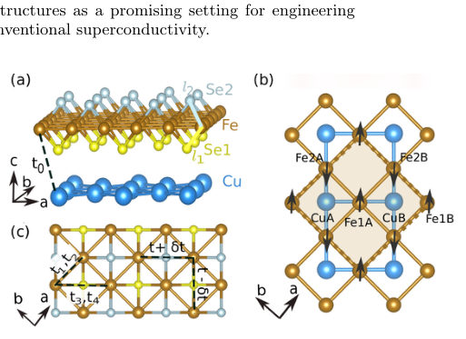 
FIG. 1. (a) Side view of FeSe/Cu in the FeSe/cuprate het- erostructure, where the yellow (light blue) atoms represent Se1 (Se2) located below (above) the Fe layers. The presence of the substrate induces a shorter Fe-Se1 distance compared to the Fe-Se2 distance. (b) Top view of the effective Lieb lattice CuFe2 when omitting the ligands. (c) Top view of the FeSe lattice. t1 and t2 denote the nearest-neighbor hoppings, while t3 and t4 denote the next-nearest-neighbor hoppings. The dis- tinct bond distances of Fe-Se1 and Fe-Se2 give rise to different next-nearest-neighbor Fe-Fe hoppings in a checkerboard pat- tern, denoted as t + δt and t −δt. Orbital correspondences of these hoppings are...

📷 Fig 2

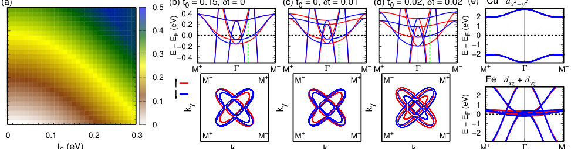 
FIG. 2. Mean-field results of Eq. (1), showing band splittings (eV) induced by t0 (Cu-Fe interlayer hopping) and δt (Fe-Fe hopping asymmetry) at the K point (dotted green lines, top panels of b–d). Fermi surfaces are shown in bottom panels. Parameters: (b) the first mechanism only, with t0 = 0.15 eV, δt = 0; (c) the second mechanism only, with δt = 0.01 eV, t0 = 0; (d) parameters estimated for the realistic heterostructure, with t0 = 0.02 eV and δt = 0.02 eV, where both mechanisms are present. (e) Orbital-resolved spectral weights of the split bands, showing the Cu dx2−y2 orbital (top) and the Fe dxz + dyz orbitals (bottom).

📷 Fig 3

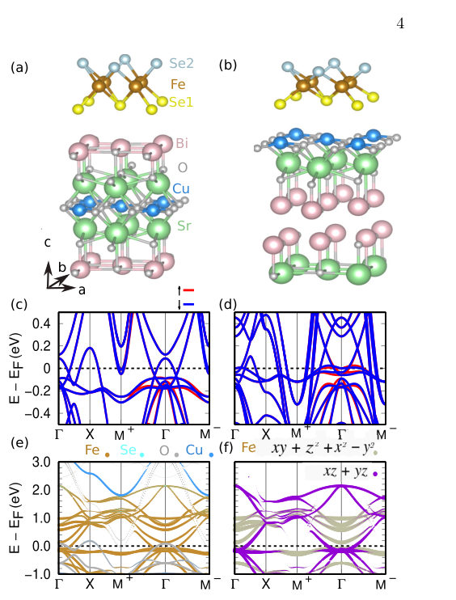 
FIG. 3. Crystal structures of FeSe/Bi2Sr2CuO6 (FeSe/Bi- 2201) heterostructures, where Bi-2201 is constructed from fabricating (a) a BiO2 (structure A) and (b) CuO2 planes (structure B). (c),(d) Corresponding band structures for structures A and B, respectively. (e),(f) Atom- and d-orbital- projected spectral weights of Fe for structure A, respectively.

📷 Fig 4

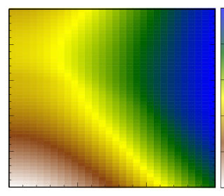 
FIG. 4. Color plots of the transversal component of the spin conductivity σz xy = σz yx, normalized to its maximum value.

**Summary.** This work proposes that FeSe/cuprate heterostructures are excellent platforms for studying altermagnetism—a state with spin splitting but no net magnetization. By modeling two distinct physical mechanisms (Lieb lattice coupling and substrate-induced symmetry breaking), the authors demonstrate how these systems can be engineered to host AM, which is crucial for understanding its interplay with unconventional superconductivity.

**Why it may be interesting.** While focused on strongly correlated magnetism, the use of proximity effects and engineered lattice structures mirrors concepts in quantum interface engineering relevant to AMO physics, particularly concerning tunable electronic couplings at boundaries.

Detailed structure

**Main problem.** The research aims to realize and study altermagnetism (AM) in high-temperature superconducting cuprate heterostructures to investigate spin-split electronic bands without net magnetization.

**Main result.** Both a Lieb lattice mechanism involving Cu-Fe hybridization and a proximity effect due to substrate-induced symmetry breaking are shown to be viable routes for engineering AM in FeSe/cuprate systems.

**Method.** The study employs effective tight-binding models, parameterized using first-principles Density Functional Theory (DFT) calculations, to predict electronic band structures and spin conductivity.

**Model / system.** The physical platform is the FeSe/cuprate heterostructure, modeled as an effective CuFe2 Lieb lattice. The Hamiltonian incorporates hopping terms ($t_0$ for Cu-Fe coupling and $\delta t$ for substrate-induced inequivalence in FeSe).

**Key observables.** Band splittings (d-wave splitting), spin conductivity ($\sigma_{xy}^z$), and orbital character of the electronic states.

**Important parameters / regimes.** $t_0$ (Cu-Fe hopping), $\delta t$ (substrate-induced hopping difference), and $U$ terms for correlation effects.

**Assumptions / limitations.** The authors assume a checkerboard AFM ordering state for FeSe magnetism in some analyses, and they use DFT approximations (GGA+U) to derive model parameters.

**Figures summary.** Figures illustrate the heterostructure geometry, band splittings as functions of $t_0$ and $\delta t$, Fermi surfaces, and color plots showing enhanced spin conductivity ($\sigma_{xy}^z$).

**Paper structure.** The paper first establishes the physical motivation (AM in cuprates), then develops an effective tight-binding model incorporating two distinct AM mechanisms. DFT calculations are used to parameterize this model, leading to quantitative predictions of band splittings and spin transport properties.

Abstract

Realizing altermagnetism in high-$T_c$ cuprate-based systems would provide a direct route for studying spin-split electronic bands in the absence of net magnetization and investigate their interplay with unconventional superconductivity. Here, we propose that FeSe/cuprate heterostructures offer such a platform, where a 45$^\circ$ twist of Cu and Fe layers creates an effective CuFe$_2$ Lieb lattice in which Fe magnetic order and Cu-Fe hybridization through the ligands induces altermagnetic $d$-wave spin splitting. A minimal tight-binding model shows that this mechanism is generic. Furthermore, a substrate-induced inequivalence of the two Se sites in FeSe provides a second route in which altermagnetism originates in the Fe layer and is transferred to the cuprate layer by proximity. Density functional theory calculations for FeSe/Bi$_2$Sr$_2$CuO$_6$ heterostructures confirm the viability of both mechanisms and reveal ways to enhance the spin splitting. These results establish superconducting cuprate/transition metal chalcogenide heterostructures as a promising setting for engineering altermagnetism and studying its coupling to unconventional superconductivity.

[↑ back to top](#top)

### [Observation of Moiré Time Crystal in Floquet-driven Rydberg Atomic Gases](http://arxiv.org/abs/2607.27999v1)

**Authors:** Shuai Shi, Dong-Yang Zhu, Yu Yang, Chu-Rong Pan, Jing-Wen Tang, Ya-Peng Zhang, Yan-Li Zhou, Wei-Tao Liu, Li-Hua Zhang, Bang Liu, Dong-Sheng Ding  
**Type:** experiment · **Category:** other · **PDF:** <https://arxiv.org/pdf/2607.27999v1>  
**Analysis basis:** full PDF text, analyzed in chunks
**Topic relevance:** 🔥 `Rydberg arrays` **5/5** · 🔥 `driven-dissipative phase transition` **5/5** · 🔥 `analog quantum simulation` **4/5** · 🔥 `non-equilibrium dynamics` **4/5** · `interference shaping light` **3/5** · `non-equilibrium universality` **3/5** · `methods for driven-dissipative` **2/5** · `quantum optics experiment` **2/5** · `Keldysh / 2PI / non-Gaussian methods` **1/5** · `correlated / nonlocal dissipation` **1/5** · `entanglement & information structure` **1/5**

📷 Fig 1

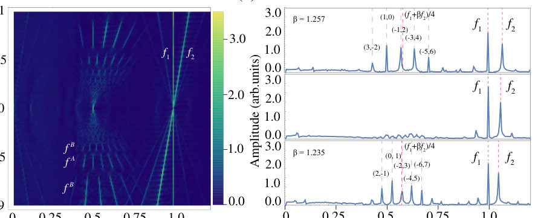 
Figure 1. Experimental diagram and theoretical calculations (a) Schematic energy level diagram for a two-photon excitation scheme. The probe laser drives the transition from the ground state |g⟩to the intermediate state |e⟩, while the coupling laser excites the transition from |e⟩to the Rydberg state |R⟩with a detuning ∆c. The radio-frequency (RF) field driving induces the Rydberg state |R⟩into Floquet sidebands |R1⟩and |R2⟩, with an energy spacing of ω. (b) Simplified experimental setup. The probe and coupling lasers propagate counter-propagating and pass through the vapor cell. The bichromatic RF field is applied to the atoms via two parallel electrode plates built inside the cell,...

📷 Fig 2

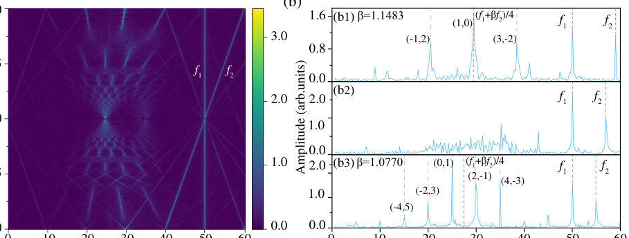 
Figure 2. Measured Moir´e time crystal (a) Color map showing the probe light transmission while scanning the f2-field. In the experiment, the RF f1-field is set to a frequency of 13 MHz, an amplitude U1 = 250 mVpp, and a modulation frequency f1 = 50 kHz. The RF f2-field has a frequency of 13 MHz and an amplitude U2 = 260 mVpp. The color map is obtained by scanning the modulation frequency f2 of the f2-field from 40 kHz to 60 kHz. The color bar represents the transmission intensity. (b) Examples of the Fourier spectra of the system response at different modulation frequencies. (b1) When f2 = 59 kHz, the Fourier spectrum shows a Moir´e pattern of a frequency comb centered at mf1/2+nf2/2....

📷 Fig 3

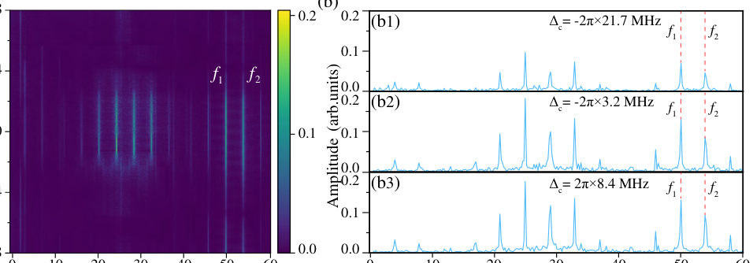 
Figure 3. Robustness of the Moir´e time crystal pattern versus ∆c. The frequencies of the f1-field and the f2-field are set to 13 MHz. The amplitude of the f1-field is U1 = 280 mV, and that of the f2-field is U2 = 282 mV. The modulation frequency of the f1-field is f1 = 50 kHz, and that of the f2-field is set to f2 = 54 kHz. The system response exhibits a Moir´e pattern of a subharmonic frequency comb dominated by f2/2. (a) The phase diagram of the system response is obtained by scanning the coupling laser detuning ∆c from ∆c = −2π × 68 MHz to ∆c = 2π × 68 MHz. The color bar represents the transmission intensity. (b) Fourier spectra of the probe transmission at different coupling detunings...

📷 Fig 4

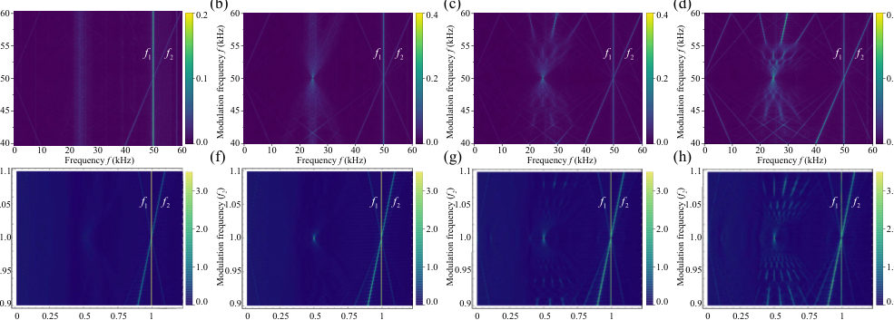 
Figure 4. Measured and theoretical phase diagrams versus f2-field intensity. The frequency of the f1-field is set to 13 MHz, with a modulation frequency f1 = 50 kHz and amplitude U1 = 280 mV kept constant. The frequency of the f2-field is set to 13 MHz, with the amplitude U2 gradually increased, scanning the modulation frequency f2 from 40 kHz to 60 kHz to get phase diagrams of the system response under different RF field strengths. (a) f2 field strength U2 = 50 mV; (b) f2 field strength U2 = 140 mV; (c) f2 field strength U2 = 260 mV; (d) f2 field strength U2 = 280 mV. Panels (e)–(h) show the theoretical phase diagrams for driving strengths of f2 equal to 0.2, 0.3, 0.43, and 0.49,...

📷 Fig 5

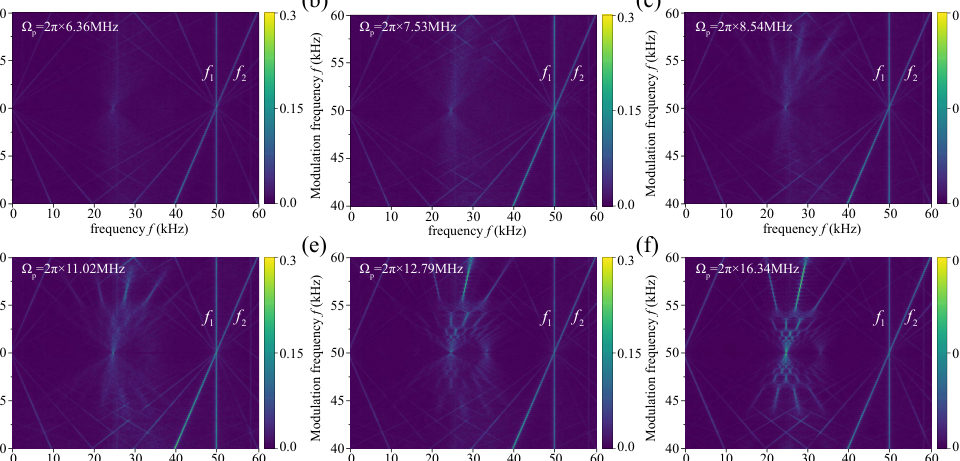 
Figure 5. Phase diagrams obtained by varying the probe Rabi frequency Ωp. The frequencies of the f1-field and the f2-field are set to 13 MHz, with modulation frequency f1 = 50 kHz, amplitudes U1 = 370 mV and U2 = 380 mV. Phase diagrams of the system response are obtained by scanning f2 from 40 kHz to 60 kHz at different probe Rabi frequencies. Panels (a)–(f) correspond to progressively increasing probe Rabi frequencies, as indicated in the upper-left corners: (a) Ωp = 2π ×6.36 MHz, (b) Ωp = 2π × 7.53 MHz, (c) Ωp = 2π × 8.54 MHz, (d) Ωp = 2π × 11.02 MHz, (e) Ωp = 2π × 12.79 MHz, and (f) Ωp = 2π × 16.34 MHz.

**Summary.** The researchers report the first experimental observation of a Moiré Time Crystal (MTC) using Rydberg atomic gases driven by two distinct radiofrequency fields. They demonstrate that the interplay between long-range interactions and dissipation creates a unique comb-like spectral pattern. This work establishes the platform as a powerful tool for engineering complex temporal order in driven quantum many-body systems.

**Why it may be interesting.** This work is highly relevant as it uses Rydberg atoms—a premier platform for studying strong interactions in AMO physics—to realize and map out complex non-equilibrium quantum phases like MTCs, providing a controllable system for exploring synthetic space-time symmetries.

Detailed structure

**Main problem.** The primary goal was the experimental observation and characterization of a Moiré Time Crystal (MTC), a non-equilibrium quantum phase arising from the coherent interference of two distinct driving frequencies.

**Main result.** The authors successfully demonstrated the MTC in Rydberg atomic gases, evidenced by a unique comb-like pattern in the Fourier spectrum that staggers as the relative frequency difference between the two drives is tuned.

**Method.** The experiment uses a bichromatic driving field applied to strongly interacting Rydberg atoms and analyzes the time-domain response via Fourier transformation to map out the system's spectral phase diagram.

**Model / system.** The platform is Floquet-driven Rydberg atomic gases, where dynamics are governed by a Hamiltonian incorporating long-range van der Waals interactions ($C_6/|r_i - r_j|^6$) and dissipation via Lindblad channels. The system is driven using two distinct radiofrequency (RF) fields.

**Key observables.** The spectral response, specifically the appearance of a 'beat-note comb' in the Fourier spectra, characterized by subharmonic periodicity ($f_1/2 + n f_2/2$) and fundamental frequencies.

**Important parameters / regimes.** Two distinct driving frequencies ($f_1$ and $f_2$), laser detunings ($\Delta$), and the ratio between these frequencies are crucial parameters for tuning the Moiré pattern.

**Assumptions / limitations.** The analysis assumes that spectral features correspond to nonlinear mixing and competition between subharmonic components, which define the MTC state. The persistence of the order against perturbations in laser detuning is also a key finding.

**Figures summary.** Figures illustrate phase diagrams showing the switching of comb structures based on frequency ratios (e.g., $f_2/f_1$), and Fourier spectra confirming the staggered subharmonic comb structure under dual-RF driving.

**Paper structure.** The paper progresses from establishing the theoretical basis for MTCs in this system, detailing the experimental setup using bichromatic driving fields, presenting measurements of the spectral response across varying frequency ratios, and finally analyzing specific peak structures (like a 10 kHz difference frequency) to confirm the nonlinear mixing mechanism.

Abstract

A Moiré time crystal is a non-equilibrium quantum phase emerging from the coherent interference of two distinct frequencies, at least one being the intrinsic oscillation of a symmetry-broken time crystal. Its hallmark is an ultra-long beat period, reflecting a time-domain mapping of the Moiré fringes that arise from mismatched spatial lattices. However, to date, no experimental realization of such a Moiré time crystal has been reported. In this work, by applying a bichromatic driving field with two distinct frequencies, we demonstrate that the interplay between long-range Rydberg interactions and dissipation gives rise to a unique comb-like Moiré pattern characterized by a beat-note comb, which superimposes subharmonic periodicity and fundamental frequencies. This Moiré pattern formed by two mismatched drives is staggered in the spectrum as the frequency of one driver changes. We experimentally map the phase diagram of the system and identify a robust region where the Moiré temporal order persists against perturbations in laser detuning. The reported Moiré time crystal not only provides a controllable platform for exploring emergent slow-fast dynamics and synthetic space-time symmetries but also opens avenues for engineering complex temporal order in driven quantum many-body systems.

[↑ back to top](#top)

### [Non-relativistic Floquet Conformal Field Theory](http://arxiv.org/abs/2607.27668v1)

**Authors:** Diptarka Das, Sumit R. Das, Arnab Kundu, Krishnendu Sengupta  
**Type:** theory · **Category:** quantum gases · **PDF:** <https://arxiv.org/pdf/2607.27668v1>  
**Analysis basis:** full PDF text, analyzed in chunks
**Topic relevance:** 🔥 `non-equilibrium dynamics` **5/5** · 🔥 `analog quantum simulation` **4/5** · 🔥 `non-equilibrium universality` **4/5** · `driven-dissipative phase transition` **3/5** · `methods for driven-dissipative` **3/5** · `Keldysh / 2PI / non-Gaussian methods` **2/5** · `correlated / nonlocal dissipation` **2/5** · `entanglement & information structure` **2/5** · `Kondo & dissipative impurity` **1/5** · `Rydberg arrays` **1/5** · `exotic spin models in light-matter` **1/5** · `scars & prethermalization` **1/5**

📷 Fig 1

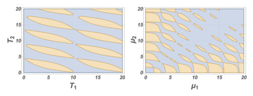 
FIG. 1. Plot of T as a function of T1 and T2 = T −T1. The blue(yellow) regions indicate phases of oscillatory (ex- ponential) dependence on T . The left panel corresponds to µ1 = 0.3, µ2 = 0.7 with T1, T2 are varied while the right panel corresponds to T1 = T2 = 1, and µ1, µ2 are varied.

📷 Fig 2

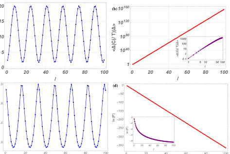 
FIG. 2. (a) Plot of Cℓ(blue curve)as a function of ℓin the elliptic phase. The parameters for the plot are T = 0.3, T1 = 0.2, µ1 = 0.6 and µ2 = 0.7. (b) Exponential growth of Cℓ as a function of ℓin the hyperbolic phase corresponding to T = 9, T1 = 5, µ1 = 0.1 and µ2 = 1.3. The inset (log-log plot) shows the near-linear growth of Cℓas a function of ℓ near the transition surface. The parameters for the inset are T = 2, T1 = 1, µ1 = 4.833 and µ2 = 15.011. (c) Plot of ln |F| as a function of ℓin the elliptic phase. (d) Same as in (c) but in the hyperbolic phase. The inset of (d) shows a slower, almost logarithmic, decay of ln |F| near the transition surface. All parameters in (c) and (d) are...

📷 Fig 3

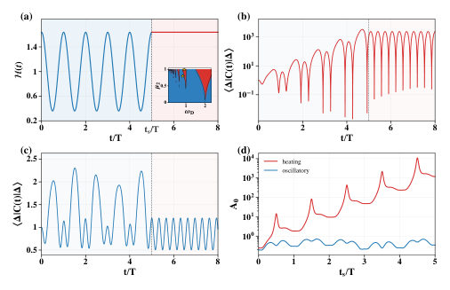 
FIG. 4. (a) Schematic representation of an experimentally relevant protocol where energy is pumped using a continuous cosine drive (µ2(t) = µ2 1 + µ2 2 cos ωDt) till ts = 5T (vertical dashed line) followed by a Hamiltonian evolution with H = H + (µ2 1 + µ2 2)C for 8T ≥t &gt; ts. The inset indicates the phase diagram in the µ2 −ωD plane showing hyperbolic (red) and elliptic (blue) phases. (b) Plot of C(t) for µ2 = 0.99, ωD = 0.915 showing large amplitude oscillations which grows with the driving time. This is a signature of the hyperbolic phase and (c) Same as (b) but for µ2 = 0.8 and ωD = 0.835 showing smaller amplitude oscillations signifying the elliptic phase. (d) Plot of oscillation...

📷 Fig 4

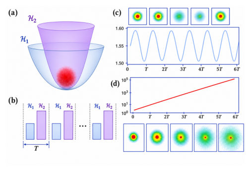 
FIG. 3. (a) Schematic representations of (a) ultracold fermions in a trap and (b) the square-pulse drive protocol with period T. Here H1 and H2 corresponds to Hamiltoni- ans of trapped fermions with trap frequencies µ1 and µ2 re- spectively. (c) and (d) Fermion clouds in different dynamical phases. (c) In the elliptic phase, the cloud oscillates around a mean position while (d) in the hyperbolic phase, its radius expands. See text for details.

📷 Fig 5

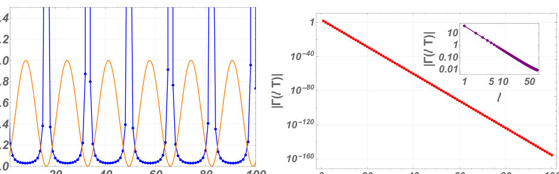 
FIG. 1. Plots of absolute value of Γ(t) in different steady states. We choose nO = 1 and ∆= 2. The left panel corresponds to µ1 = 0.6, µ2 = 0.7, T1 = 0.2 and T = 0.3, blue curve indicating the elliptic stroboscopic response, while the orange curve plots scaled sin2(ℓρ). The red points in the log plot of the right panel corresponds to exponential decay with µ1 = 0.1, µ2 = 1.3, T1 = 5 and T = 9. The inset (log-log plot) is chosen with µ1 = 4.833, µ2 = 15.011, T1 = 1, T = 2, shows the parabolic phase. See text for details.

**Summary.** This paper develops a universal formalism to study Floquet dynamics in quantum systems with non-relativistic conformal invariance. It identifies three distinct dynamical regimes—hyperbolic, elliptic, and parabolic—diagnosed via stroboscopic measurements of observables like state fidelity. The results are significant because they connect these quantum phases to deep concepts in general relativity, such as ergospheres and extremal Killing horizons.

**Why it may be interesting.** This work provides powerful theoretical tools for analyzing non-equilibrium dynamics in quantum systems relevant to ultracold atoms. The classification of dynamical phases based on conformal symmetry is highly general and offers testable predictions for experiments involving trapped fermions near unitarity.

Detailed structure

**Main problem.** Developing a formalism to study Floquet dynamics for quantum systems exhibiting non-relativistic conformal invariance.

**Main result.** The analysis predicts three universal dynamical phases—hyperbolic, elliptic, and parabolic—characterized by the stroboscopic evolution of observables. Furthermore, it establishes a holographic link where the hyperbolic phase corresponds to an ergosphere in the bulk geometry.

**Method.** The study uses Floquet theory applied to Hamiltonians derived from an SO(2, 1) algebra, mapping the dynamics onto the Ermakov-Pinney equation for analysis.

**Model / system.** The model concerns periodically driven strongly correlated quantum systems, with trapped fermions near unitarity and resonant anyons serving as key physical examples. The dynamics are governed by a time-dependent Hamiltonian constructed from generators of an SO(2, 1) subalgebra.

**Key observables.** One-point functions (e.g., expectation value of the conformal generator), state fidelity ($F$), and the trace diagnostic $T = rac{1}{2}	ext{Tr} U(T)$.

**Important parameters / regimes.** Drive frequencies ($\omega_D$), modulation amplitudes ($\mu_2^0, eta$), and the number of periods ($\ell$).

**Assumptions / limitations.** The analysis assumes the existence of non-relativistic conformal invariance and utilizes the $	ext{SO}(2, 1)$ algebraic structure to simplify the time evolution.

**Figures summary.** Figures illustrate phase diagrams mapping out oscillatory (elliptic) vs. exponential (hyperbolic) behavior of observables like $T$ and $\ln |F|$ as a function of drive parameters.

**Paper structure.** The paper progresses by establishing the general formalism using SO(2, 1) symmetry, deriving diagnostics based on stroboscopic evolution, mapping out the three distinct dynamical phases (hyperbolic, elliptic, parabolic), and concluding with a holographic interpretation linking these phases to specific geometric structures like ergosurfaces.

Abstract

We develop a formalism for studying Floquet dynamics for systems with {\it non-relativistic} conformal invariance in $d$ spatial dimensions. Our analysis indicates the existence of two dynamical phases, hyperbolic and elliptic, separated by a parabolic transition surface. We demonstrate this by studying the expectation value of a conformal generator in the many body ground state during the drive, as well as the fidelity of this state. Stroboscopically, they behave exponentially in the hyperbolic phase, show oscillatory behavior in the elliptic phase, and exhibit power-law on the transition surface. Our analysis is completely universal and can be directly applied to several systems including trapped fermions near unitarity and resonant anyons. The former can provide experimental signatures of these dynamical phases. We also comment on a holographic perspective of such driven non-relativistic CFTs and demonstrate that the hyperbolic phase is associated with a timelike stationary-limit surface, such as an ergosphere, in the bulk, while the parabolic phase corresponds to an extremal Killing horizon.

[↑ back to top](#top)

### [Scaling theory of decoherence in Dicke superradiance](http://arxiv.org/abs/2607.28034v1)

**Authors:** Nico S. Bassler, Julian Lyne, Javier Cuerda  
**Type:** theory · **Category:** statistical mechanics · **PDF:** <https://arxiv.org/pdf/2607.28034v1>  
**Analysis basis:** full PDF text, analyzed in chunks
**Topic relevance:** 🔥 `Dicke superradiance` **5/5** · 🔥 `correlated / nonlocal dissipation` **4/5** · `driven-dissipative phase transition` **3/5** · `methods for driven-dissipative` **3/5** · `superradiant laser` **3/5** · `Tavis-Cummings & cavity-many-emitter` **2/5** · `non-equilibrium universality` **2/5** · `Keldysh / 2PI / non-Gaussian methods` **1/5** · `analog quantum simulation` **1/5** · `correlated cavity matter` **1/5** · `free-space correlated emission` **1/5** · `non-equilibrium dynamics` **1/5**

📷 Fig 1

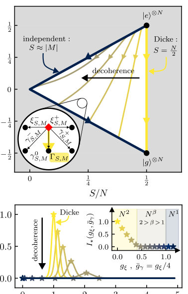 
Figure 1. Dicke triangle, burst scalings and transitions. (a) Dynamics on the Dicke triangle, where for increasing de- coherence strength trajectories are pushed towards smaller S–values. The inset shows the matrix elements of the local and collective processes for a given state |S, M⟩( ). (b) Intensity dynamics for the trajectories in (a), normalized by the peak intensity I(Dicke) ⋆ of ideal Dicke superradiance at the same N. Decoherence reduces the ideal superradiant burst. The inset shows the peak intensity as a function of the decoherence strength undergoing a phase transition.

📷 Fig 2

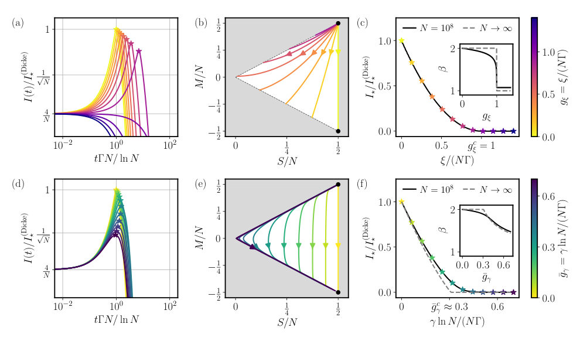 
Figure 2. Large–N dynamics. Results are shown for dephasing (top row) and spontaneous emission (bottom row) at N = 108. (a,d) Normalized intensity as a function of rescaled time for varying scaling variables on a log-log scale. Stars (⋆) indicate the peak intensity I⋆. (b,e) Corresponding trajectories on the Dicke triangle. While dephasing changes the angle at which the trajectories enter the triangle, local spontaneous emission shifts the point at which the trajectories enter the triangle to smaller S–values. (c,f) Normalized peak intensity undergoing a phase transition as a function of the scaling variables gξ, ¯gγ and insets showing the scaling exponent β. For dephasing (c), I⋆closes...

📷 Fig 3

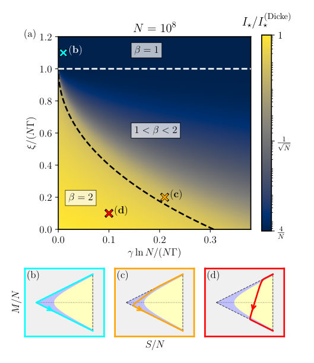 
Figure 3. Phase diagram and Dicke-triangle trajecto- ries. (a) Mean-field phase diagram showing the normalized intensity in the (¯gγ, gξ) plane for N = 108. The dashed lines indicate the asymptotic phase boundaries at β = 2 (black) and β = 1 (white). In (b-d) we show corresponding represen- tative trajectories in the three regions. Blue shading in panels (b-d) marks the region I = s2 −m2 &lt; N −0.2, corresponding to β &lt; 1.8 and with the complement in yellow. The specific threshold is chosen only for visualization.

**Summary.** This paper develops a scaling theory to analyze Dicke superradiance when local dephasing and spontaneous emission are present. It shows that the peak intensity scales according to three distinct regimes ($eta=2$, $1 < eta < 2$, $eta=1$), determined by dimensionless parameters governing decoherence strength. This work is crucial for understanding how environmental coupling limits or modifies collective quantum enhancements in many-body systems.

**Why it may be interesting.** This work provides a quantitative framework for understanding how environmental coupling (decoherence) fundamentally alters collective quantum phenomena like superradiance, extending beyond simple mean-field predictions into scaling theory.

Detailed structure

**Main problem.** The study investigates the competition between correlation buildup (collective emission) and decoherence mechanisms in many-body quantum systems, specifically focusing on how this affects coherence survival.

**Main result.** The paper derives a scaling theory showing that the peak intensity of superradiance exhibits three distinct regimes ($eta=2$, $1 < eta < 2$, $eta=1$) depending on the balance between collective and decohering processes.

**Method.** An analytical scaling theory is developed using the large-$N$ limit approximation applied to the dynamics governed by a Lindblad master equation, focusing only on dissipation.

**Model / system.** The system modeled is Dicke superradiance involving N two-level emitters. The dynamics are described by a Lindblad master equation incorporating terms for collective emission, local dephasing ($\xi$), and spontaneous emission ($\gamma$).

**Key observables.** Peak radiated intensity $I(t)$ (scaling as $N^eta$), the scaling exponent $eta$, and normalized peak intensity ratios.

**Important parameters / regimes.** The dimensionless scaling variables $g_\xi = \xi / (N\Gamma)$ and $ar{g}_\gamma = \gamma \ln N / (N\Gamma)$, which govern the transition between regimes.

**Assumptions / limitations.** The analysis relies on the large-$N$ limit approximation to derive mean-field equations for intensive variables, and it focuses purely on dissipative dynamics without unitary evolution.

**Figures summary.** Figures illustrate the Dicke triangle dynamics showing decoherence effects, and phase diagrams map out the boundaries between $eta=2$, $1 < eta < 2$, and $eta=1$ regimes in the $(ar{g}_\gamma, g_\xi)$ plane.

**Paper structure.** The paper builds from defining the physical problem (coherence vs. decoherence) to developing the scaling theory using mean-field approximations, deriving the generalized scaling law $I^* \propto N^{eta(g_\xi, ar{g}_\gamma)}$, and mapping out the phase diagram showing the transition between the three distinct superradiance regimes.

Abstract

The survival of many-body coherence depends on the competition between correlation buildup and decoherence. In Dicke superradiance, collective emission builds up correlations, producing a peak intensity scaling as $N^2$ for $N$ emitters. We develop a scaling theory including local dephasing and spontaneous emission and obtain fully collective, partially collective, and independent-emitter scaling regimes. The boundary of the fully collective regime defines a continuous phase transition in a transient observable. Local decoherence can prevent $N^2$ scaling despite increasing $N$.

[↑ back to top](#top)

### [Noise-aware emulation and cross-device validation of neutral atom analog quantum processing units](http://arxiv.org/abs/2607.28364v1)

**Authors:** Constantin Dalyac, Sergi Julià-Farré, Lucas Leclerc, Vittorio Vitale, Boris Albrecht, Lucas Béguin, Kemal Bidzhiev, Petru Borta, Clémence Briosne-Frejaville, Daniel J. Campbell, Dorian Claveau, Makrem Chatti, Antoine Cornillot, Julius de Hond, Anita Devi, Thomas Eritzpokhoff, Gaétan Hercé, Fergus Hayes, Soufiane Kaghad, Arun Kumar Abhimanyu, Lucas Lassablière, Mauro Mendizabal, Anton Quelle, Julien Ripoll, Henrique Silvério, Joseph Vovrosh, Guillaume Villaret, Adrien Signoles, Alexandre Dauphin  
**Type:** both · **Category:** other · **PDF:** <https://arxiv.org/pdf/2607.28364v1>  
**Analysis basis:** full PDF text, analyzed in chunks
**Topic relevance:** 🔥 `Rydberg arrays` **5/5** · 🔥 `QC/QI experiment` **4/5** · 🔥 `analog quantum simulation` **4/5** · `methods for driven-dissipative` **3/5** · `non-equilibrium dynamics` **3/5** · `correlated / nonlocal dissipation` **2/5** · `driven-dissipative phase transition` **2/5** · `Keldysh / 2PI / non-Gaussian methods` **1/5** · `entanglement & information structure` **1/5** · `non-equilibrium universality` **1/5**

📷 Fig 1

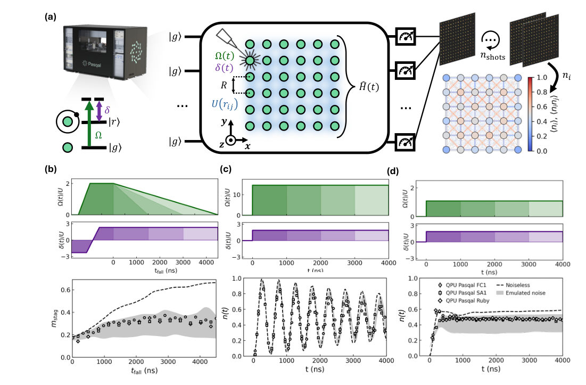 
Figure 1. Analog Rydberg QPU cycle and benchmark protocols. (a), Schematic of the QPU cycle for a register of two-level atoms with ground state |g⟩and Rydberg state |r⟩driven by a global Rabi frequency Ω(t) and detuning δ(t), with interactions Uij set by the geometry and atomic spacing R. After the programmed evolution, projective readout in the z basis is obtained from fluorescence imaging. Bitstrings over nshots repetitions can be used to estimate site-resolved observables such as local occupations ⟨ni⟩and correlators. (b), Annealing protocol. Top: time-dependent control schedule with Ω(t) and δ(t). Bottom: staggered magnetization mstag measured at the end of the evolution as a function...

📷 Fig 2

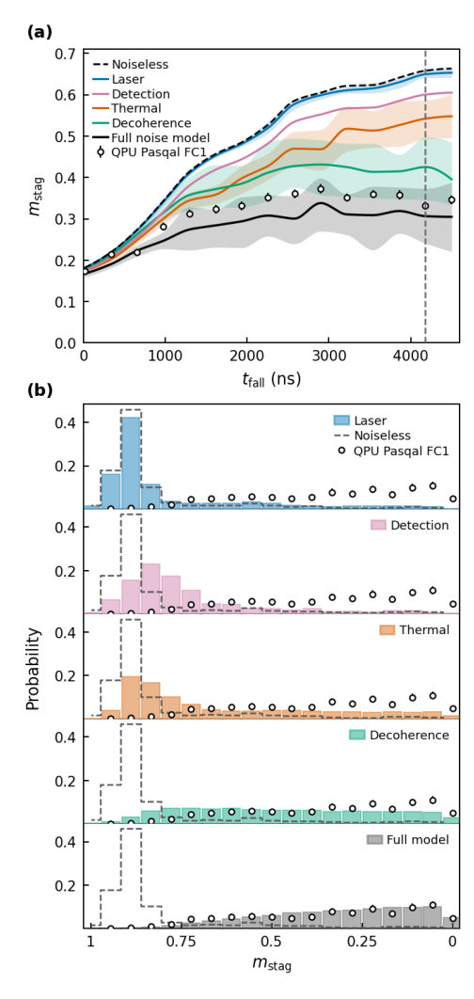 
Figure 2. Annealing noise-budget decomposition. (a), Staggered magnetization mstag versus final ramp-down duration tfall. Noiseless emulation (black dashed), single- noise contributions—laser (blue), detection (pink), thermal (orange), decoherence (green), —and full noise model (black, with shaded Monte Carlo envelope), compared to FC1 exper- imental data (markers with shot-noise error bars). (b), Out- come distribution of bitstring probability at tfall = 4180 ns ordered by decreasing mstag for the noiseless (dashed), single- noise (colored), full noise model simulations (gray) and FC1 experimental data (markers) with error bars obtained from binning.

📷 Fig 3

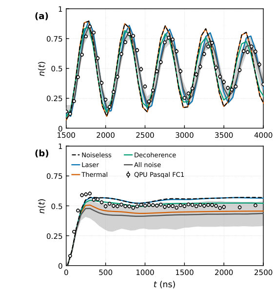 
Figure 3. Noise-emulation methodology for the post- quench dynamics protocol. Dynamics of the mean Ry- dberg population, n(t), in a 6 × 6 square lattice. We compare the Pasqal FC1 data (white marker with shot-noise error bars) against emu-mps emulators of the ideal Hamiltonian (dashed black line), the full noise model (solid green line, with con- fidence area), and marginal noise models with effects from: lasers (solid blue line), temperature (solid red line), and ef- fective channels (solid gray line). For a better visualization, we did not include the confidence area of the marginal noise models. (a), Small interaction regime, Ω/U = 14.5. (b), Strongly interacting regime, Ω/U = 1.1.

📷 Fig 4

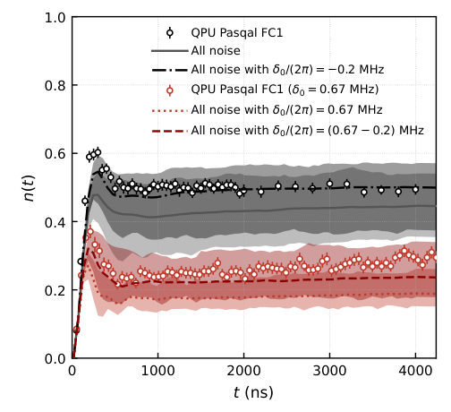 
Figure 4. Impact of systematic experimental para- meter biases in post quench-dynamics. Dynamics of the mean Rydberg population, n(t), in a 6 × 6 square lattice (strong interaction regime Ω/U = 1.1). Emulations of the full noise model with emu-mps, including different systematic global detuning biases, δ0 = −0.2, 0.67, 0.47 MHz, are shown with confidence intervals. Two Pasqal FC1 data are shown for comparison: one at the target setpoint and one where an offset δ0 = 0.67 MHz was intentionally programmed (orange dots).

📷 Fig 5

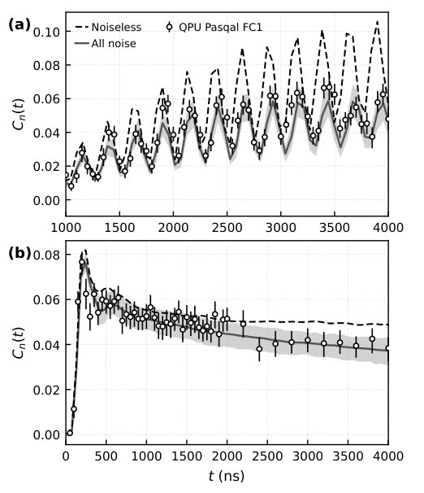 
Figure 5. Impact of noise in post-quench dynamics cor- relations. Dynamics of the mean nearest-neighbor correla- tion Cn(t). We compare the Pasqal FC1 data with emu-mps emulation of the ideal Hamiltonian (dashed line) and the full noise model (solid line). (a), Weak interaction regime. (b), Strong interaction regime.

**Summary.** The paper introduces a comprehensive, noise-aware emulation framework to predict the behavior of neutral atom quantum processors operating with Rydberg atoms. By modeling various sources of hardware imperfections—such as thermal motion and laser fluctuations—the authors validate their emulator against real data from multiple devices using annealing and quench protocols. This establishes a crucial tool for guiding future algorithm design and improving physical hardware reliability.

**Why it may be interesting.** This work is highly relevant as it bridges theoretical modeling of open quantum systems with practical hardware validation for Rydberg arrays. The methodology provides a necessary toolset for scaling up simulations beyond current classical computational limits in AMO physics.

Detailed structure

**Main problem.** The core challenge is establishing confidence in quantum processor outputs by quantitatively linking microscopic hardware noise imperfections to measurable empirical results, especially beyond classically solvable regimes.

**Main result.** A novel noise-aware emulation framework was developed and successfully validated across multiple physical devices, allowing researchers to isolate dominant error sources for targeted algorithm and hardware improvements.

**Method.** The authors combine developing a full computational cycle emulator that propagates various noise mechanisms (thermal motion, laser fluctuations) with benchmarking against established quantum protocols like quantum annealing and post-quench dynamics.

**Model / system.** The system utilizes neutral atoms trapped in Rydberg arrays, governed by an interaction Hamiltonian involving tunable Rabi frequencies ($\Omega(t)$) and detunings ($\delta(t)$). The platform is tested on multiple commercial Pasqal quantum processors.

**Key observables.** Local populations ($\langle n_i 
angle$), $k$-body correlation functions (e.g., staggered magnetization $m_{	ext{stag}}$), and the decay of Rabi oscillation amplitudes.

**Important parameters / regimes.** Noise sources include thermal motion, laser intensity/phase noise, and state preparation errors; key regimes involve comparing $\Omega/U$ ratios in dynamics simulations.

**Assumptions / limitations.** The framework assumes that by modeling dominant noise channels, predictive power can be established even when full classical simulation is impossible. Convergence checks for MPS simulations are also crucial.

**Figures summary.** Figures illustrate the QPU cycle (preparation $
ightarrow$ evolution $
ightarrow$ measurement), comparing experimental data from three devices against emulator predictions for annealing and post-quench dynamics, alongside convergence plots using Matrix Product States (MPS).

**Paper structure.** The paper introduces the physical platform and Hamiltonian, details the noise sources affecting control parameters ($\Omega, \delta$), presents the noise-aware emulation framework, validates it by benchmarking two key protocols (annealing and post-quench), and discusses systematic error mitigation.

Abstract

Analog quantum processors based on Rydberg atom arrays are a powerful platform for many-body quantum simulation, combinatorial optimization, and graph machine learning. As these devices become increasingly accessible, establishing confidence in their outputs requires predictive models that quantitatively connect microscopic hardware imperfections to empirical results. Here, we present a noise-aware emulation framework that propagates the dominant noise mechanisms throughout the full computation cycle to predict device behavior. We validate the framework by benchmarking two representative protocols, quantum annealing and post-quench dynamics, on three Pasqal quantum processors where classical simulations still provide ground truth. Across all three devices, the measured observables fall within the uncertainty envelopes predicted by the emulator. Beyond reproducing the data, the framework isolates which physical mechanism dominates in each operating regime, provides quantitative guidance for algorithm design and hardware improvements, and establishes a foundation for verifying analog processors in regimes beyond classical reach.

[↑ back to top](#top)

### [Three-Dimensional Kardar--Parisi--Zhang Scaling in Polariton Condensates](http://arxiv.org/abs/2607.28106v1)

**Authors:** Junhui Cao, Denis Novokreschenov, Artem Alexandrov, Timothy Halpin-Healy, Alexey Kavokin  
**Type:** both · **Category:** statistical mechanics · **PDF:** <https://arxiv.org/pdf/2607.28106v1>  
**Analysis basis:** full PDF text, analyzed in chunks
**Topic relevance:** 🔥 `non-equilibrium universality` **5/5** · 🔥 `analog quantum simulation` **4/5** · 🔥 `driven-dissipative phase transition` **4/5** · `methods for driven-dissipative` **3/5** · `non-equilibrium dynamics` **3/5** · `Frenkel-Kontorova` **1/5** · `Keldysh / 2PI / non-Gaussian methods` **1/5** · `correlated / nonlocal dissipation` **1/5** · `correlated cavity matter` **1/5**

📷 Fig 1

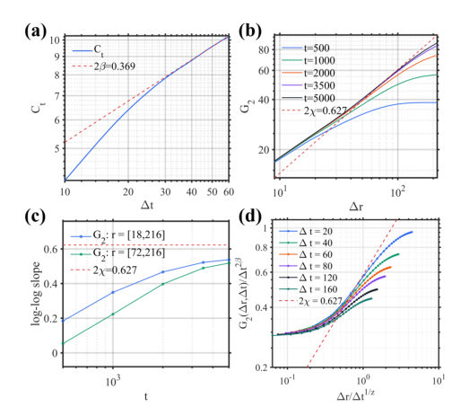 
FIG. 1. 3 + 1 KPZ benchmark in the strong-coupling regime. The main run uses N = 128, dx = 9, ν = 0.9, dt = 0.5, geff = 500, and 104 noise realizations. (a) Temporal compact coher- ence Ct = −log |g(1)(0, ∆t)| with the 2β = 0.369 guide, while the short-lag fit 30 ≤∆t ≤60 gives slope 0.375. (b) Equal- time height correlator G2(∆r, t) = ⟨[θ(r + ∆r, t) −θ(r, t)]2⟩. (c) Spatial slopes versus observation time. (d) Dynamical scaling of the spatiotemporal correlator. The curves for ∆t = 20, 40, 60, 80, 120 and 160 are plotted as G2(∆r, ∆t)/∆t2β ver- sus ∆r/∆t1/z.

📷 Fig 2

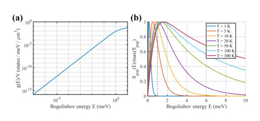 
FIG. 3. (a) Density of states g3D(E) of 3D Bogoli- ubov dispersion. (b) Normalized energy-resolved popula- tion spectrum of three-dimensional Bogoliubov excitations, Spop(E) = g3D(E)fB(E, Teff), for several effective tempera- tures T = 1, 5, 10, 20, 50, 100, 300 K. Chemical potential µ is set as 1 meV.

📷 Fig 3

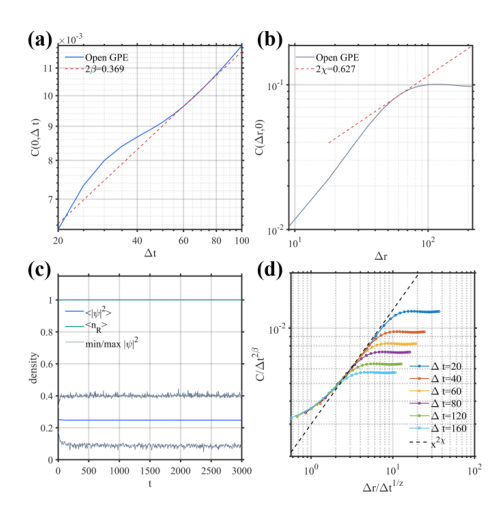 
FIG. 2. Disordered-pump stochastic open-GPE calculation. The run uses L = 128, dx = 9, dt = 0.25, tmax = 3000, P0 = 1.05Pth, weak annealed gain disorder σP = 0.0018, ξP = 18, and ∆tP = 1. The calibrated target phase coeffi- cients are ν = 0.005, |λ| = 1.25, and Deff = 0.1. (a) The com- pact temporal coherence gives slope 0.367 over 50 ≤∆t ≤80, close to the 2β = 0.369 benchmark. (b) Compact spatial co- herence. (c) The density and reservoir remain stable during the run. We choose t0 = 1 ps, ℓ0 = 0.962 µm, n0 = 100 µm−3

**Summary.** The paper successfully proposes and simulates the use of three-dimensional exciton-polariton crystals as a novel, tunable quantum fluid system to observe Kardar-Parisi-Zhang (KPZ) scaling in three spatial dimensions. By analyzing the phase dynamics derived from the polariton condensate's Gross-Pitaevskii equation, the authors confirm that the system exhibits exponents matching established $3+1$ KPZ benchmarks.

**Why it may be interesting.** This work bridges fundamental non-equilibrium statistical mechanics (KPZ universality) with controllable quantum optical systems (polaritons), providing a solid platform for testing high-dimensional critical phenomena in AMO physics.

Detailed structure

**Main problem.** The primary goal is demonstrating Kardar-Parisi-Zhang (KPZ) universality scaling, which typically requires 2D systems, in a controllable three-dimensional ($3+1$ D) quantum platform.

**Main result.** Numerical simulations confirm that the phase dynamics of exciton-polariton condensates exhibit exponents ($eta \approx 0.1845$, $\chi \approx 0.3135$) consistent with established $3+1$ KPZ benchmarks.

**Method.** The study uses numerical simulations applied to both the full stochastic driven-dissipative Gross-Pitaevskii equation and its derived effective anisotropic KPZ equation.

**Model / system.** The physical system is a three-dimensional exciton-polariton crystal formed in a photonic-crystal lower-polariton band. The dynamics are modeled by an effective $3+1$ D KPZ equation for the condensate phase, derived from the full open-dissipative GPE.

**Key observables.** The first-order coherence function ($g^{(1)}$) decay rates ($\propto |\Delta t|^{2eta}$) and the surface width scaling ($W(L, t)$ following Family-Vicsek form $L^{\chi} f(t/L^z)$).

**Important parameters / regimes.** The exponents $eta \approx 0.1845$ and $\chi \approx 0.3135$, which define the expected higher-dimensional nonequilibrium universality class.

**Assumptions / limitations.** The derivation relies on an adiabatic approximation to eliminate massive density and reservoir modes, simplifying the full stochastic equation into a phase dynamics model.

**Figures summary.** Figure 1 summarizes benchmark calculations for KPZ scaling using temporal coherence and height correlators; Figure 2 shows correlation function collapse in open-GPE models; Figure 3 illustrates the Bogoliubov density of states.

**Paper structure.** The paper establishes the theoretical challenge (3D KPZ), derives an effective continuum equation from a microscopic model, performs numerical simulations comparing both the full and reduced equations, and validates the results by matching known scaling exponents.

Abstract

Kardar--Parisi--Zhang (KPZ) universality provides an example of macroscopic scaling generated by microscopic violation of detailed balance. While one- and two-dimensional realizations have been explored in driven condensates and growing interfaces, demonstrating KPZ scaling in three spatial dimensions remains a major challenge. Here we propose a three-dimensional exciton-polariton crystal as a platform for observation of 3D KPZ universality. Starting from a stochastic driven-dissipative Gross-Pitaevskii equation for a condensate formed in a three-dimensional photonic-crystal lower-polariton band, we eliminate the massive density and reservoir modes and obtain an effective $3+1$-dimensional KPZ equation for the condensate phase. Numerical simulations of both the KPZ equation and the full driven-dissipative polariton model show an intermediate-asymptotic regime in which the first-order coherence obeys $-\ln |\gone(0,Δt)|\propto |Δt|^{2β}$ and $-\ln |\gone(Δr,0)|\propto |Δr|^{2χ}$, with exponents consistent with the $3+1$ KPZ benchmarks $β= 0.1845$, $χ= 0.3135$. Our results identify three-dimensional polariton crystals as a controllable quantum fluid route to higher-dimensional nonequilibrium universality.

[↑ back to top](#top)

### [Geometry-Induced Domain-Wall Pinning and $\mathbb{Z}_2$ Asymmetry in Nominally One-Dimensional Rydberg Arrays](http://arxiv.org/abs/2607.27358v1)

**Authors:** Elijah Pelofske, Frank Barrows, Cristiano Nisoli  
**Type:** experiment · **Category:** other · **PDF:** <https://arxiv.org/pdf/2607.27358v1>  
**Analysis basis:** full PDF text, analyzed in chunks
**Topic relevance:** 🔥 `Rydberg arrays` **5/5** · 🔥 `analog quantum simulation` **4/5** · `exotic spin models in light-matter` **3/5** · `QC/QI experiment` **2/5** · `non-equilibrium dynamics` **2/5** · `Frenkel-Kontorova` **1/5** · `methods for driven-dissipative` **1/5**

📷 Fig 1

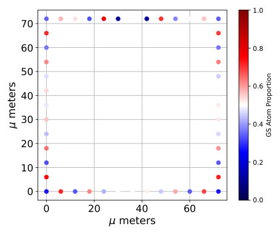 
FIG. 2: Fraction of Atoms in the Ground state. Z2 symmetry would imply that the fraction is uniformly 0.5. While this is somehow approximated by the triangular case, the square case shows persistence of Rydberg states in the two atoms flanking the vacancy and at the vertices.

📷 Fig 2

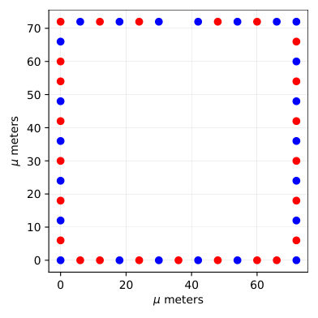 
FIG. 1: The two systems under study. The position of atoms (dots) as programmed on Aquila for the contigu- ous triangle outline (top), with 33 atoms, and for the square outline (bottom), with 47 atoms, and an intentional atom vacancy at the top. The axes correspond to real physi- cal space positions, in micrometers. The distance between atoms is 6 micrometers. Besides the vacancy, the two sys- tems differ at the corners: in the square configuration there are atoms at the corners, but they are absent in the triangu- lar configuration. Both of these atom layouts use the max- imum amount of space that the Aquila processor supports, and the atom layouts are restricted to a planar region of...

📷 Fig 3

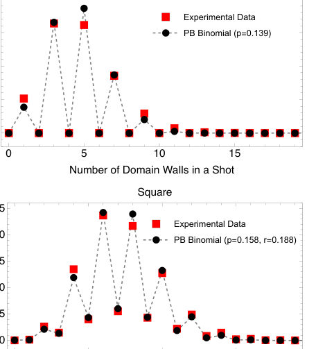 
FIG. 3: Domain-wall statistics. Frequencies of shots vs. number of domain walls in a shot for the triangular (top) and square (bottom) arrangements. In red squares we re- port the data, and in black dots the corresponding Gibbs distribution.

📷 Fig 4

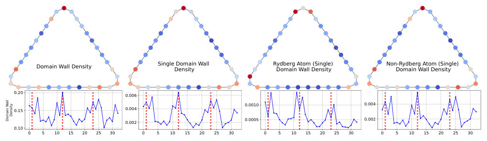 
FIG. 4: Antiferromagnetic domain wall density on the Aquila device on a PBC ring with 33 atoms. The top row shows graph representations of the domain wall densities where red denotes higher density, blue denotes lower den- sity, and each node position encodes the median position of the bond between two atoms. Top-left: density of all domain walls where each node represents a bond in the 1D model, middle-left: post-selected samples with only a single domain wall, middle-right: count of Rydberg atom (single) domain wall densities, right: count of ground state atom (single) domain wall densities. Due to geometric frustration and the PBCs there is always at least one pinned domain wall...

📷 Fig 5

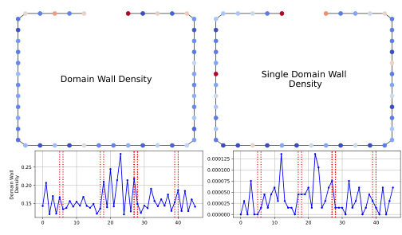 
FIG. 5: Domain wall densities on the 47-atom 1D square outline simulations with an intentional atom vacancy. The vertical dashed lines denote the (two) bonds that form the angles in the square. The two center bonds in this plot correspond to the two bonds on either side of the engineered atom vacancy; the site of the missing atom is not counted as a bond in the data.

**Summary.** The authors experimentally explore domain wall physics in Rydberg arrays using a neutral-atom quantum computer. By comparing closed triangular versus open square geometries, they demonstrate that geometric features like corners and vacancies induce strong local interactions. These effects lead to measurable symmetry breaking and pinning of topological defects, proving that the physical realization significantly modifies the underlying theoretical model.

**Why it may be interesting.** This work provides direct experimental evidence of how engineered disorder or boundary conditions in quantum simulators can fundamentally alter the ground state properties and symmetries predicted by idealized 1D models, which is crucial for understanding real-world quantum hardware limitations.

Detailed structure

**Main problem.** The study investigates how geometric constraints on a Rydberg array induce domain-wall pinning and break $\mathbb{Z}_2$ symmetry in nominally one-dimensional quantum spin models.

**Main result.** The geometry dictates the physics, leading to non-uniform domain wall pinning at corners (triangle) or around engineered vacancies (square), and causing an observable imbalance favoring certain types of domain walls ($	ext{|gg}
angle	ext{DWs}$ over $	ext{|rr}
angle	ext{DWs}$).

**Method.** The researchers used quasi-adiabatic evolution protocols on a neutral-Rydberg-atom quantum computer to sample the ground state configurations of an effective Ising-like Hamiltonian.

**Model / system.** The system is realized using QuEra's neutral-Rydberg-atom Aquila platform, simulating 1D chains (triangular and square outlines) governed by Rydberg blockade interactions ($V_{jk} \propto 1/r^6$).

**Key observables.** Domain wall number statistics (analyzed via Parity Biased Binomial distributions), site-resolved magnetization profiles, and the relative counts of different domain wall types ($	ext{|gg}
angle$ vs $	ext{|rr}
angle$).

**Important parameters / regimes.** The geometry (closed triangle vs. open square with vacancy) is critical; NNN interactions are significantly stronger at corners compared to edges.

**Assumptions / limitations.** The analysis assumes the system can be effectively modeled by an Ising-like Hamiltonian in a restricted subspace, and that finite-time ramping introduces non-adiabatic errors.

**Figures summary.** Figures illustrate atomic arrangements on the processor for both geometries; Figure 3 compares measured domain-wall statistics against theoretical distributions; Figures 4 and 5 map out site-resolved domain wall densities showing corner/vacancy effects.

**Paper structure.** The paper details experimental setups on two specific 1D geometries, analyzes domain-wall statistics using specialized distributions, and contrasts the observed pinning and symmetry breaking mechanisms between the closed (triangular) and open (square) boundaries.

Abstract

We perform experiments on QuEra's neutral-Rydberg-atom Aquila quantum computer, using quasi-adiabatic evolution on 1-dimensional models. We use hardware fine-tuning to balance the measurement statistics close to zero net magnetization, in two different geometric outlines: one closed triangular model with 33 atoms, and one 47-atom square with an engineered atom vacancy. The nature of this processor restricts the geometry of the atoms that can be programmed to a 2D plane. We report effects not predicted by the pure 1D Ising model, such as pinning of domain walls and $\mathbb{Z}_2$ symmetry breaking due to the interplay between van der Waals interactions and the Rydberg blockade. In particular, atoms around the atom vacancy and at the vertices of the 1-dimensional square-outline model strongly prefer the Rydberg state, leading to the effective model having a ferromagnetic bond across the vacancy.

[↑ back to top](#top)

### [Non-reciprocity drives a Brownian dimer out of equilibrium](http://arxiv.org/abs/2607.27740v1)

**Authors:** Suman Pramanik, Soham Dutta, Arnab Saha  
**Type:** theory · **Category:** statistical mechanics · **PDF:** <https://arxiv.org/pdf/2607.27740v1>  
**Analysis basis:** full PDF text, analyzed in chunks
**Topic relevance:** 🔥 `non-equilibrium dynamics` **5/5** · 🔥 `non-equilibrium universality` **4/5** · `driven-dissipative phase transition` **3/5** · `methods for driven-dissipative` **3/5** · `Frenkel-Kontorova` **1/5** · `Keldysh / 2PI / non-Gaussian methods` **1/5** · `correlated / nonlocal dissipation` **1/5**

📷 Fig 1

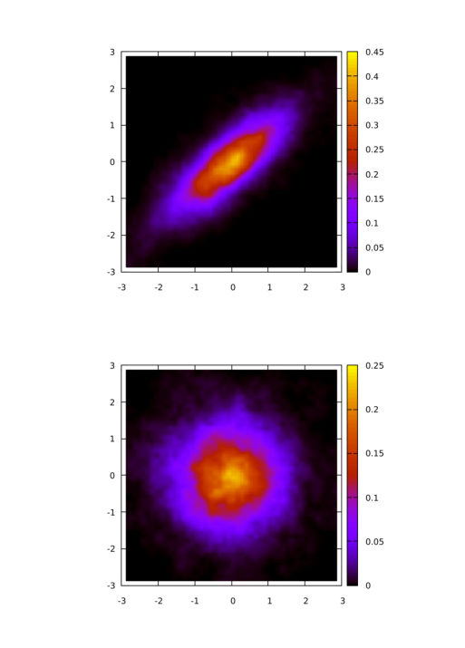 
FIG. 1. Heatmap of the joint probability distribution of two variates, obtained by numerically integrating the Langevin equations (for l = 0): Top — P(x1, x2) [identical for {y1, y2}], Bottom — P(x1, y1) [identical for {x1, y2}, etc.]. Note the distinctly different spread and alignment of the two distribution profiles. This is simply because:P(x1, y1) = R dx2dy2P(x1, x2, y1, y2) = R dx2dy2P(x1, x2)P(y1, y2) = R dx2P(x1, x2) R dy2P(y1, y2) = P(x1)P(y1), and so on. However, this is not true for P(x1, x2) or P(y1, y2). The color scale indicates the value of probability. The values of the pa- rameters used in simulation are: k0 = 1, T = 1, γ = 1, k1 = 1, k2 = 5.

📷 Fig 2

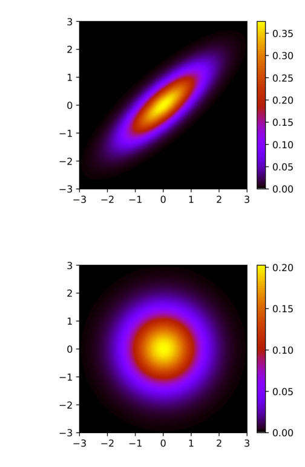 
FIG. 2. Analytical counterpart of Fig. 1, obtained from the closed-form Gaussian distribution P(x1, x2) from Eq. (8), and its marginal distribution P(x1, y1) = P(x1)P(y1) (for l = 0): Top — P(x1, x2) [identical for {y1, y2}], Bottom — P(x1, y1) [identical for {x1, y2}, etc.]. Same color scale, axis range, and layout are kept as Fig. 1, to allow a direct visual comparison with the simulation. Parameter values are: k0 = 1, T = 1, γ = 1, k1 = 1, k2 = 5.

📷 Fig 3

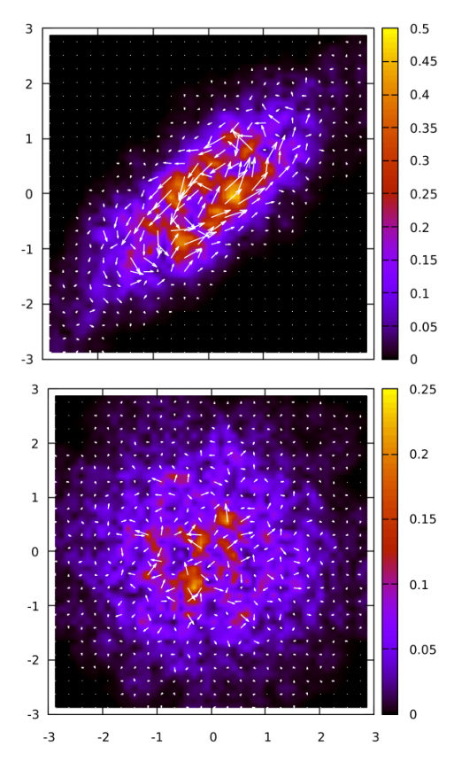 
FIG. 3. Heatmap of the magnitude of current of two variates with an overlay of the stream plot of the current vector, ob- tained by numerically integrating the Langevin equations (for l = 0): Top — in the {x1, x2} plane [identical for {y1, y2}], Bottom — in the {x1, y1} plane [identical for {x1, y2}, etc.]. Note the absence of vorticity in the latter case. This implies the average current is non-zero in x1 −x2 (or, y1 −y2) plane but zero in x1 −y1 (or, x2, y2) plane. The color scale indicates the magnitude of current, while the white arrows point in its direction. The parameter values used in simulation are kept the same as before.

📷 Fig 4

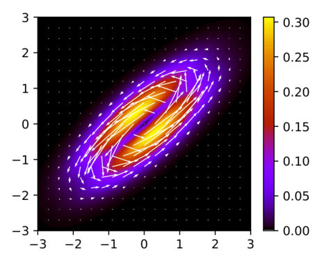 
FIG. 4. Analytical counterpart of the top panel of Fig. 3, obtained from the closed-form current in Eqs. (10)-(11) (for l = 0) — Plot of J(x1, x2) [identical for {y1, y2}], with white arrows showing the exact current direction. Same color scale, axis range, and layout are kept as Fig. 3. Parameter values are: k0 = 1, T = 1, γ = 1, k1 = 1, k2 = 5.

📷 Fig 5

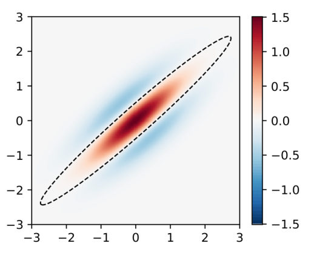 
FIG. 5. Analytical local vorticity S(x1, x2) = (∇× J)z (for l = 0), obtained from Eq. (14), showing the central vortex core surrounded by a ring of opposite-sign vorticity (dashed line is the zero-vorticity contour, Q(x1, x2) = ∆(p + r)). Parameter values are: k0 = 1, T = 1, γ = 1, k1 = 1, k2 = 5.

**Summary.** The authors investigate the steady-state dynamics of a Brownian dimer coupled by a non-reciprocal spring. They prove that breaking Newton's action-reaction principle alone is sufficient to generate a persistent current, driving the system far from equilibrium without external temperature gradients. The methodology involves advanced statistical mechanics techniques applied to Langevin dynamics.

**Why it may be interesting.** This work provides a clean theoretical demonstration of how microscopic violations of fundamental symmetries (like action-reaction) can lead to macroscopic, persistent non-equilibrium phenomena in condensed matter systems, which is highly relevant for understanding energy dissipation and transport in complex materials.

Detailed structure

**Main problem.** To determine if a system can reach a non-equilibrium steady state, characterized by a persistent current or directed motion, solely due to internal non-reciprocal interactions without external driving forces like temperature gradients.

**Main result.** Non-reciprocity in the coupling spring is sufficient to generate a non-zero stationary current ($\mathbf{J} \propto (k_2 - k_1)$), demonstrating that breaking Newton's action-reaction principle can drive a system out of equilibrium even at constant temperature.

**Method.** The analysis uses overdamped Langevin equations and the Fokker-Planck formalism to calculate the steady-state probability distribution, current ($\mathbf{J}$), and vorticity (curl of $\mathbf{J}$).

**Model / system.** A two-dimensional Brownian dimer consisting of two overdamped monomers trapped in an isotropic harmonic potential and coupled by a non-reciprocal harmonic spring. The analysis covers the analytically solvable zero-rest-length limit ($l=0$) and extends to finite rest lengths.

**Key observables.** Steady-state current ($\mathbf{J}$), local vorticity (curl of $\mathbf{J}$), and the stationary joint probability distribution $P(x_1, x_2)$.

**Important parameters / regimes.** Non-reciprocity strength ($k_1 
eq k_2$), temperature difference/bath coupling ($T_1$ vs $T_2$), and spring rest length ($l$).

**Assumptions / limitations.** The analysis relies on the linear dynamics derived from the Langevin equations for the $l=0$ case, and uses matrix methods (Lyapunov equation) to find stationary solutions.

**Figures summary.** Figures illustrate joint probability distributions showing non-factorizable correlations due to non-reciprocity, and visualize the vorticity structure, which exhibits a central vortex core surrounded by an anti-vortex ring when currents are present.

**Paper structure.** The paper systematically analyzes the current generation mechanism by first establishing the general framework using the Fokker-Planck equation for linear systems ($l=0$). It then shows that non-reciprocity alone generates current, and finally generalizes this to include temperature gradients, demonstrating the interchangeability of these two symmetry-breaking mechanisms.

Abstract

We consider the minimal model of a two dimensional Brownian dimer consisting of two overdamped monomers, trapped in an isotropic harmonic potential and mutually coupled by a non-reciprocal harmonic spring that violates Newton's action-reaction principle. We have shown that the non-reciprocal interaction alone can drive the system far from equilibrium, in the absence of any external time dependent drive and being in contact with a single thermal bath. The exact steady state probability distribution and current are explicitly calculated for the zero-rest-length limit of the spring, which eventually maps our model to another non-equilibrium phenomenon, called Brownian gyration. For a spring with finite rest length, these quantities are calculated numerically.

[↑ back to top](#top)

### [Beating the Bad-Cavity Limit via Auxiliary-Emitter Linewidth Squeezing](http://arxiv.org/abs/2607.27878v1)

**Authors:** Youke Xu, Zeyang Liao, Xue-hua Wang  
**Type:** theory · **Category:** other · **PDF:** <https://arxiv.org/pdf/2607.27878v1>  
**Analysis basis:** full PDF text, analyzed in chunks
**Topic relevance:** 🔥 `Tavis-Cummings & cavity-many-emitter` **4/5** · 🔥 `methods for driven-dissipative` **4/5** · `analog quantum simulation` **3/5** · `correlated / nonlocal dissipation` **3/5** · `correlated cavity matter` **3/5** · `driven-dissipative phase transition` **3/5** · `interference shaping light` **3/5** · `non-equilibrium dynamics` **2/5** · `superradiant laser` **2/5** · `Dicke superradiance` **1/5** · `Keldysh / 2PI / non-Gaussian methods` **1/5** · `entanglement & information structure` **1/5** · `non-equilibrium universality` **1/5**

📷 Fig 1

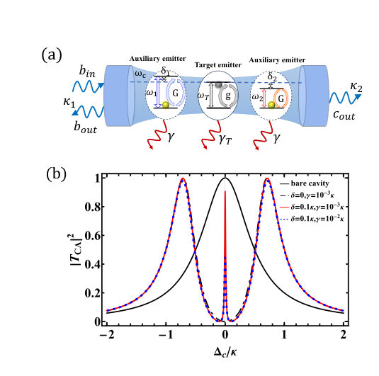 
FIG. 1. (a) Schematic of linewidth reduction and strong cou- pling in a bad cavity assisted by two non-identical auxiliary emitters. (b) Transmission spectra for a bad cavity with two non-identical auxiliary emitters (detuning δ = 0.1κ). The red solid and blue dotted lines correspond to γ = 0.001κ and γ = 0.01κ, respectively. For comparison, the bare cavity and the case of two identical emitters are shown as the black solid and black dashed-dotted lines, respectively. Other parameters: G = 0.5κ.

📷 Fig 2

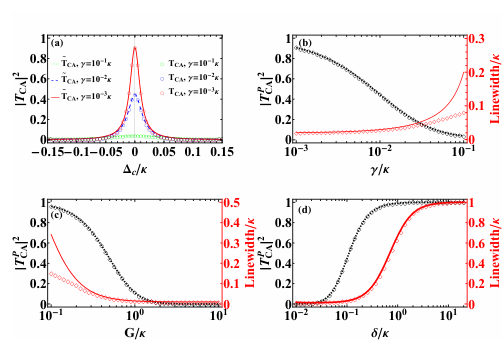 
FIG. 2. (a) Central transmission peaks for a cavity with two non-identical emitters (δ1 = −δ2 = δ = 0.1κ) at three differ- ent values of γ. Empty-circles: exact results (Eq. 6); colored lines: approximate results (Eq. 7). (b-d) Transmission peak probability (black dashed line) and linewidth (red solid line) as functions of (b) γ, (c) G, and (d) δ, with fixed parameters spec- ified in each panel: (b) G = 0.5κ and δ = 0.1κ; (c) δ = 0.1κ and γ = 0.01κ; (d) G = 0.5κ and γ = 0.01κ. The black and red diamond-shaped marks denote the maximum values of the transmission probability and linewidth, respectively, obtained from Eq. (6).

📷 Fig 3

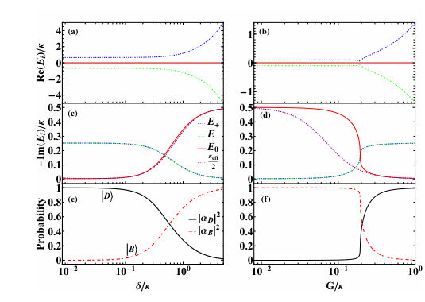 
FIG. 3. The real (a,b) and imaginary (c,d) parts of the eigen- values of the hybrid system for different values of δ and G. E0 corresponds to the central peak, and the other two edge peaks correspond to E+ and E−, respectively. (e-f) The probabili- ties of the dark state component and the bright state compo- nent of the eigenstate of the central peak. Parameters: (a,c,e) γ = 0.01κ and G = 0.5κ; (b,d,f) γ = 0.01κ and δ = 0.1κ.

📷 Fig 4

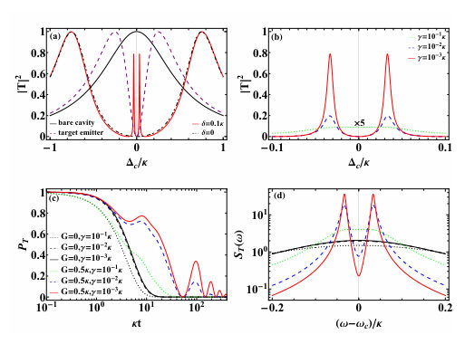 
FIG. 4. (a) Transmission spectrum |T|2 of the coupled sys- tem with a target emitter with G = 0.5κ, γ = 10−3κ and g = 0.25κ. The red solid line corresponds to δ = 0.1κ, and the black dashed line to δ = 0. The black solid and purple dashed lines are the transmission spectra of the bare cavity and the cavity with a target emitter (G = 0), respectively. (b) Cen- tral transmission spectrum splitting under different values of γ where G = 0.5κ and δ = 0.1κ. The population dynamics (c) and the spontaneous emission spectrum (d) of the target emit- ter under different values of γ with g = 0.25κ and δ = 0.1κ. Other parameters: γT = γ, δ1 = −δ2 = δ and δT = 0.

**Summary.** The authors propose a method to enable strong coupling physics in optical cavities that are otherwise too lossy or weakly coupled (bad cavities). They achieve this by incorporating two specially detuned auxiliary emitters, which engineer an effective subradiant mode that narrows the cavity linewidth. This allows for clear spectroscopic signatures of strong coupling, opening up practical avenues for quantum computation and sensing.

**Why it may be interesting.** This work provides an elegant engineering solution to a major practical bottleneck in cavity QED—the bad-cavity limit—by manipulating the system's spectral response using auxiliary components. This has direct implications for building quantum devices.

Detailed structure

**Main problem.** The primary challenge addressed is overcoming the fundamental trade-off in cavity QED where achieving strong coupling requires either high quality factors or ultrasmall mode volumes.

**Main result.** By introducing two nonidentical auxiliary emitters with opposite detunings into a bad cavity, the system can engineer an ultra-narrow transmission window and achieve signatures of strong coupling (like Rabi oscillations) even when the bare cavity is in the weak-coupling regime.

**Method.** The analysis uses quantum Langevin equations and eigenvalue analysis on the effective Hamiltonian to derive the transmission spectrum and characterize the resulting subradiant modes.

**Model / system.** The system models a hybrid setup: a bad optical cavity coupled to two nonidentical auxiliary emitters and one target emitter. The dynamics are governed by the total Hamiltonian, analyzed via master equations or Langevin equations.

**Key observables.** Effective cavity linewidth ($\kappa_{eff}$), transmission spectrum ($|T_{CA}|^2$), prolonged vacuum Rabi oscillations in the target emitter's population, and spontaneous emission spectral splitting.

**Important parameters / regimes.** Auxiliary detunings ($\delta_1 = -\delta_2 = \delta$), coupling strengths ($G$, $g$), cavity decay rate ($\kappa$), and emitter decay rates ($\gamma$).

**Assumptions / limitations.** Key approximations include assuming $\gamma \ll \kappa$ and analyzing the central peak using specific functional forms derived from the full system Hamiltonian.

**Figures summary.** Figures illustrate schematic linewidth reduction, transmission spectra comparing different emitter configurations (bare vs. non-identical), and time evolution plots showing Rabi oscillations in target excitation probability ($P_T(t)$).

**Paper structure.** The paper progresses from identifying the physical limitation to developing a theoretical model using Langevin equations, deriving analytical approximations for linewidth reduction via destructive interference, and finally demonstrating strong coupling signatures through numerical simulation of population dynamics.

Abstract

Strong coupling in cavity QED is conventionally achieved at the expense of either high cavity quality factors or ultrasmall mode volumes, a trade-off that fundamentally constrains practical implementations. Here, we circumvent this limitation by introducing two nonidentical auxiliary emitters with opposite detunings into a bad cavity. This hybrid system supports a subradiant mode that significantly squeeze the effective cavity linewidth, creating an ultra-narrow transmission window at the cavity frequency. As a result, a target emitter placed in this engineered environment exhibits prolonged vacuum Rabi oscillations and resolved spontaneous emission splitting, which are clear signatures of strong coupling, even though the bare cavity remains in the weak-coupling regime. Our scheme thus transforms a bad cavity into an effective platform for strong-coupling physics, with potential applications in quantum computation and quantum sensing.

[↑ back to top](#top)

### [Learning Arbitrary Lindbladians from Time Evolution](http://arxiv.org/abs/2607.28610v1)

**Authors:** Zhili Chen, Zhan Yu  
**Type:** theory · **Category:** quantum information and computing · **PDF:** <https://arxiv.org/pdf/2607.28610v1>  
**Analysis basis:** full PDF text, analyzed in chunks
**Topic relevance:** 🔥 `methods for driven-dissipative` **4/5** · `Keldysh / 2PI / non-Gaussian methods` **3/5** · `correlated / nonlocal dissipation` **3/5** · `driven-dissipative phase transition` **3/5** · `measurement-induced transitions` **2/5** · `non-equilibrium dynamics` **2/5** · `non-equilibrium universality` **2/5** · `quantum measurements` **2/5** · `Kondo & dissipative impurity` **1/5** · `analog quantum simulation` **1/5** · `entanglement & information structure` **1/5** · `scars & prethermalization` **1/5**

📷 Fig 1

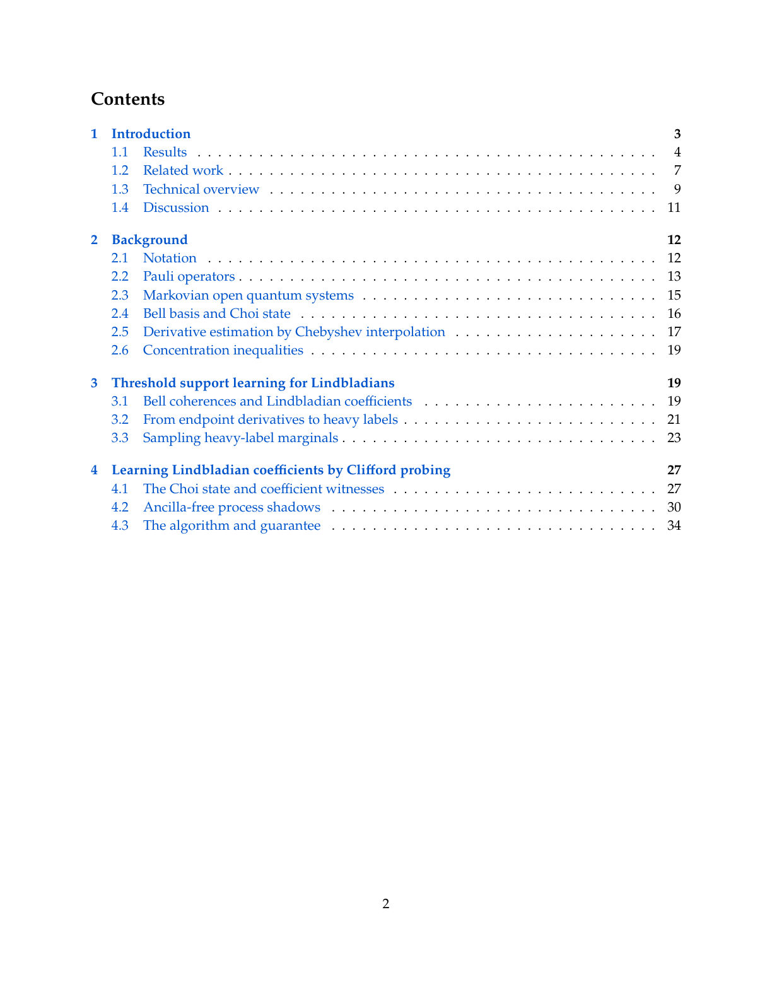 
Low-resolution page preview, page 2

📷 Fig 2

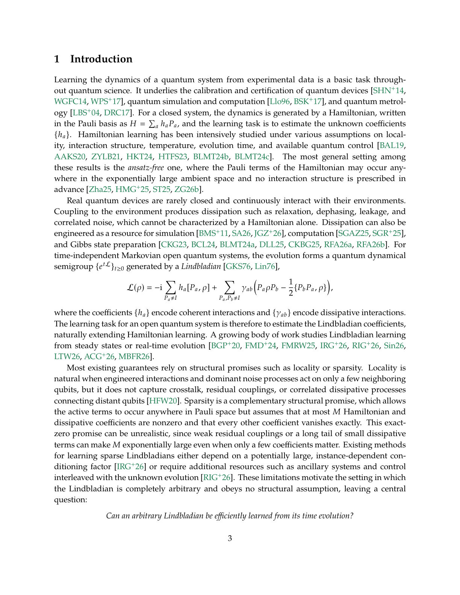 
Low-resolution page preview, page 3

📷 Fig 3

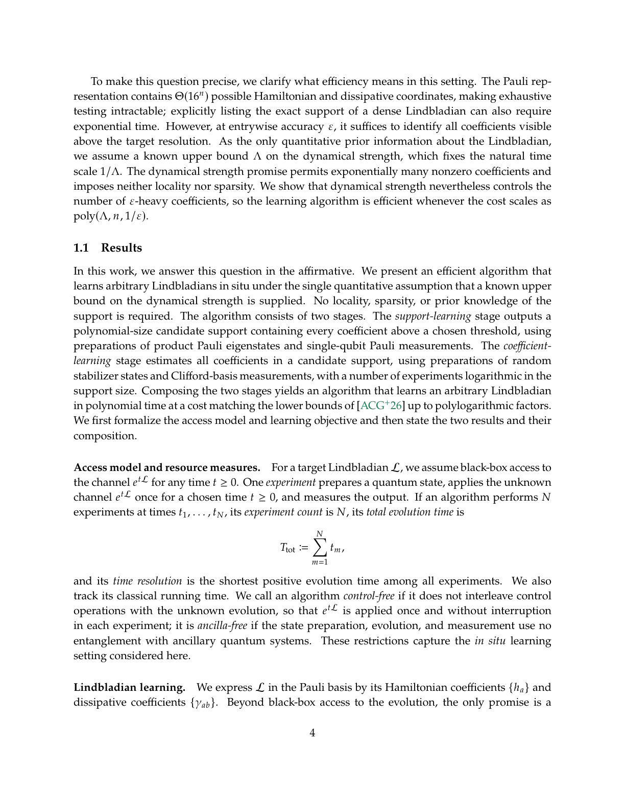 
Low-resolution page preview, page 4

📷 Fig 4

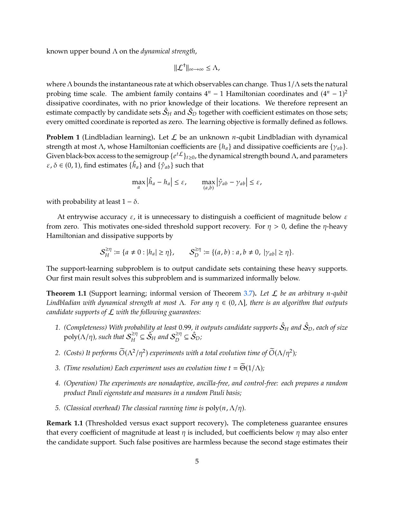 
Low-resolution page preview, page 5

📷 Fig 5

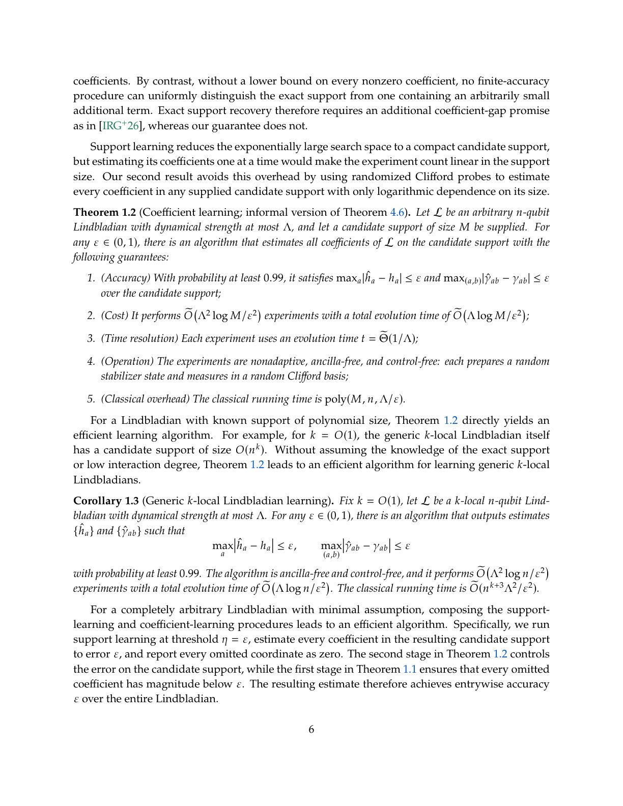 
Low-resolution page preview, page 6

**Summary.** This paper presents an efficient algorithm to reconstruct the full Lindbladian generator of an open quantum system solely by measuring its time evolution. By breaking the problem into identifying relevant coefficients (support learning) and then estimating their values, the authors achieve resource scalings that match theoretical lower bounds for arbitrary dynamics.

**Why it may be interesting.** This work provides a powerful theoretical tool to characterize complex quantum dynamics (open systems) when direct Hamiltonian measurement is impossible, which is crucial for interpreting experimental results from trapped ions or superconducting qubits.

Detailed structure

**Main problem.** The core problem is learning an unknown Markovian open-system generator (Lindbladian) entirely from access to its physical time evolution measurements.

**Main result.** The authors propose an efficient, nearly optimal algorithm that can estimate every coefficient of an arbitrary Lindbladian in polynomial time relative to the dynamical strength bound ($\Lambda$) and required accuracy ($\epsilon$).

**Method.** The algorithm is structured in two stages: first, a support-learning stage identifies candidate coefficients above a threshold $\eta$, followed by a coefficient-learning stage estimates these candidates using random stabilizer states.

**Model / system.** The system involves open quantum systems whose dynamics are governed by a Lindbladian master equation. The coefficients include Hamiltonian terms $\{h_a\}$ and dissipative terms $\{\gamma_{ab}\}$, indexed by Pauli operators.

**Key observables.** Lindbladian coefficients ($\{h_a\}, \{\gamma_{ab}\}$), time evolution $e^{t\mathcal{L}}$, and measurement outcomes from product Pauli eigenstates or random stabilizer states.

**Important parameters / regimes.** Dynamical strength bound $\Lambda$, desired accuracy $\epsilon$, and the support recovery threshold $\eta$.

**Assumptions / limitations.** The only prior information is an upper bound $\Lambda$ on the dynamical strength of the Lindbladian. The method assumes access to nonadaptive, ancilla-free, control-free time evolution measurements.

**Figures summary.** Not specified in the provided notes; the results are summarized by resource scaling comparisons (Table 1) showing polynomial dependence on $\Lambda/\epsilon$.

**Paper structure.** The paper establishes the problem of Lindbladian learning and presents a two-stage algorithm: Theorem 1.1 details the support-learning stage, followed by Theorem 1.2 for coefficient estimation, culminating in a corollary that combines both stages for arbitrary Lindbladians.

Abstract

We study the problem of learning an unknown Markovian open-system generator from access to its physical time evolution. This generator, called a Lindbladian, contains Hamiltonian and dissipative coefficients indexed by an exponentially large family of possible Pauli terms. We propose an efficient algorithm that learns arbitrary Lindbladians from time evolution under minimal assumptions. For a Lindbladian of dynamical strength at most $Λ$, the algorithm estimates every coefficient to error $ε$ using $\widetilde O(Λ^2/ε^2)$ experiments and $\widetilde O(Λ/ε^2)$ total evolution time, together with polynomial classical running time. The algorithm consists of two nonadaptive, ancilla-free, and control-free stages: 1. The support-learning stage outputs a candidate support of size $\mathrm{poly}(Λ/η)$ that contains every Hamiltonian and dissipative coordinate of magnitude at least $η$, using $\widetilde O(Λ^2/η^2)$ experiments with preparations of product Pauli eigenstates and single-qubit Pauli measurements. 2.The coefficient-learning stage estimates all coefficients in any candidate support of size $M$ to error $ε$, using $\widetilde O(Λ^2\log M/ε^{2})$ experiments with preparations of random stabilizer states and measurements in random Clifford bases. Composing the two stages identifies and estimates every coefficient of an arbitrary Lindbladian in polynomial time. The experiment-count and total-evolution-time scalings match the lower bounds up to logarithmic factors, so the algorithm is nearly optimal for learning arbitrary Lindbladians.

[↑ back to top](#top)

### [Bridging continuous control and Floquet driving for charging many-body spin chains](http://arxiv.org/abs/2607.27985v1)

**Authors:** Sebastián V. Romero, Xi Chen, Yue Ban  
**Type:** theory · **Category:** statistical mechanics · **PDF:** <https://arxiv.org/pdf/2607.27985v1>  
**Analysis basis:** full PDF text, analyzed in chunks
**Topic relevance:** 🔥 `non-equilibrium dynamics` **4/5** · `analog quantum simulation` **3/5** · `driven-dissipative phase transition` **3/5** · `exotic spin models in light-matter` **3/5** · `entanglement & information structure` **2/5** · `methods for driven-dissipative` **2/5** · `non-equilibrium universality` **2/5** · `Frenkel-Kontorova` **1/5** · `Keldysh / 2PI / non-Gaussian methods` **1/5** · `correlated / nonlocal dissipation` **1/5** · `scars & prethermalization` **1/5**

📷 Fig 1

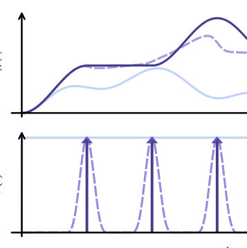 
Fig. 1 Schematic of an Ising-chain QB bridging continuously driven and periodically kicked transverse- field charging protocols. From lighter to darker blue, the injected energy in a QB (top) under charging protocols with decreasing pulse width (bottom). While a continuous drive (represented by a constant line) yields a poor performance, a periodically-kicked pulse (depicted with arrows) reaches maximal charging without fluctuations. Between these two limiting cases, a finite-width periodic pulse coined as quasikick [42] (dashed line), displays a performance lying between both limit regimes.

📷 Fig 2

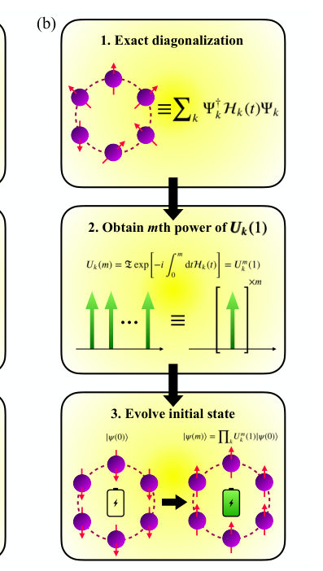 
Fig. 2 Analytical methods derived for the KIC QB. (a) For the Clifford quantum cellular automata: 1) at the self-dual point, the system exhibits a Clifford structure, where Clifford conjugation maps Pauli strings to Pauli strings (see (8)); 2) apply repeatedly the Clifford conjugation 𝑈(1) in (7) to each cell, whose Heisenberg picture feature a ballistic operator growth, and 3) since the initial state is a product state, the energy injected is a sum of measured time-evolved cells per site. (b) To solve the kicked-Ising model in momentum space: 1) diagonalize the system by applying consecutively the Jordan-Wigner transformation and Fourier transform, 2) integrate the resulting Bogoliubov-de...

📷 Fig 3

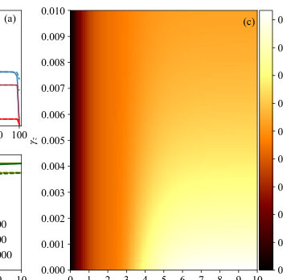 
Fig. 3 Injected energies computed with initial TFIM at (𝐽th, ℎth) = (1/2, 1) and evolved at the self- dual point. (a) Evolution up to 𝑚= 100 kicks for 𝑁= 100 spins with 𝛾𝑧= 0.005. Results are displayed for different 𝛽values, ranging from high (red) to low (blue) temperature regimes. (b) Injected energies at 𝑚= 𝑁/2 using 𝛾𝑧= 1/10𝑁for various temperatures and system sizes, ranging from smaller (olive) to larger (green) setups. (c) For 𝑁= 100, injected energies at 𝑚= 𝑁/2 kicks for different (𝛽, 𝛾𝑧) pairs. Dashed (solid) curves include (discard) dephasing.

📷 Fig 4

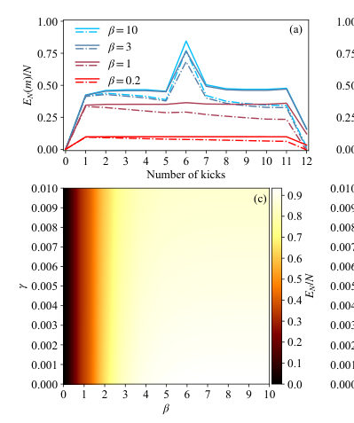 
Fig. 4 (a) Injected energies (solid curves) and ergotropies (dash-dotted) in the presence of dephasing with 𝛾𝑧= 0.01 up to 𝑚= 12 kicks for a KIC of 𝑁= 12 spins. The initial TFIM is set with (𝐽th, ℎth) = (1/2, 1) and the system evolves under the self-dual point. (b) Same as (a) but for different system sizes 𝑁and 𝛽values, evaluated at 𝑚= 𝑁/2. (c) Injected energies at 𝑚= 𝑁/2 for various (𝛽, 𝛾𝑧) pairs, with 𝑁= 12. (d) Same as (c) but for the ergotropy.

📷 Fig 5

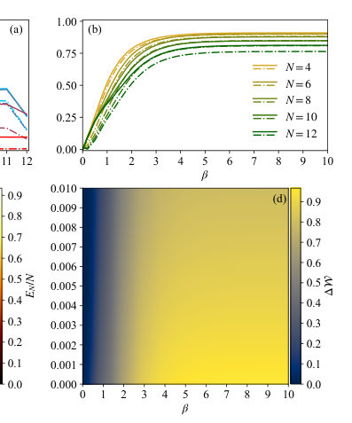 
Fig. 5 (a) Injected energies (solid curves) and ergotropies (dash-dotted) in the presence of thermal dissipation with 𝛾= 0.01 up to 𝑚= 12 kicks for a KIC of 𝑁= 12 spins. The initial TFIM is set with (𝐽th, ℎth) = (1/2, 1) and the system evolves under the self-dual point. (b) Same as (a) but for different system sizes 𝑁and 𝛽values, evaluated at 𝑚= 𝑁/2. (c) Injected energies at 𝑚= 𝑁/2 for various (𝛽, 𝛾) pairs, with 𝑁= 12. (d) Same as (c) but for the ergotropy.

**Summary.** This work reviews the concept of quantum batteries, focusing on how many-body spin chains can store energy beyond classical limits. It develops a theoretical framework connecting continuous external driving to discrete Floquet driving protocols using models like the kicked-Ising chain. The paper is significant for understanding achievable quantum enhancements in energy storage devices.

**Why it may be interesting.** It directly addresses non-equilibrium thermodynamics and energy storage in quantum systems, bridging concepts from quantum information (coherence) with condensed matter dynamics (spin chains).

Detailed structure

**Main problem.** The paper reviews quantum batteries (QBs) and establishes a theoretical connection between continuous control and periodically driven Floquet systems for enhancing energy storage.

**Main result.** Quantum effects, particularly those leveraging coherence in spin chains, can lead to superextensive scaling of charging power beyond classical limits. The framework connects these two driving regimes via the kicked-Ising model.

**Method.** The authors use theoretical analysis involving time evolution operators (Floquet formalism) and diagnostic tools like ergotropy to quantify energy storage capabilities.

**Model / system.** The primary system is many-body spin chains modeled as quantum batteries, utilizing Hamiltonians for both the battery ($H_b$) and the charging mechanism ($H_c$). Specific models include the Ising chain and SYK models.

**Key observables.** Quantum Charging Advantage (Superextensive Scaling $P(	au^*) \sim N^{1+\ell}$), Ergotropy, Maximum Mean Charging Power $P(	au)$.

**Important parameters / regimes.** Interaction range ($g_{ij}$ decay), anisotropy ($\alpha$), and the nature of driving (continuous vs. periodic/kicked).

**Assumptions / limitations.** The analysis often assumes an infinite energy reservoir for charging protocols, and the comparison between continuous and Floquet limits is central.

**Figures summary.** Figure 1 schematically compares the performance of a spin-chain QB under continuous driving versus optimal periodic kicking (quasikick).

**Paper structure.** The paper reviews existing QB protocols, develops the connection between continuous control and Floquet engineering using spin chains, analyzes scaling laws based on interaction range, and concludes by surveying experimental realizations.

Abstract

Recent advances in quantum information and quantum thermodynamics have reshaped the understanding of energy storage at the microscopic scale, paving the way toward protocols for storing and transferring energy in quantum devices. These systems, known as quantum batteries, offer a conceptual alternative to conventional macroscopic chemical batteries by exploiting quantum coherence, correlations, and many-body dynamics. By navigating the landscape of established spin-based quantum batteries, we review existing charging and work-extraction protocols, as well as the impact of external factors on their performance. Motivated by Floquet-engineered proposals, we further establish a connection between continuously and periodically driven spin chains as platforms for quantum energy storage. Finally, we survey experimental realizations and proposals, highlighting their implementability and scalability in current and near-term quantum technologies.

[↑ back to top](#top)

### [Quantum Magnonics: Quantum States Generation and Applications](http://arxiv.org/abs/2607.27771v1)

**Authors:** Zi-Xu Lu, Xuan Zuo, Xin-Lei Hei, Gang Liu, Zeng-Xing Liu, Qi Guo, Peng-Bo Li, Jie Li  
**Type:** both · **Category:** quantum information and computing · **PDF:** <https://arxiv.org/pdf/2607.27771v1>  
**Analysis basis:** full PDF text, analyzed in chunks
**Topic relevance:** 🔥 `spintronics-quantum-optics interface` **4/5** · `analog quantum simulation` **3/5** · `entanglement & information structure` **3/5** · `exotic spin models in light-matter` **3/5** · `Tavis-Cummings & cavity-many-emitter` **2/5** · `quantum optics experiment` **2/5** · `QC/QI experiment` **1/5** · `correlated / nonlocal dissipation` **1/5** · `correlated cavity matter` **1/5** · `driven-dissipative phase transition` **1/5** · `methods for driven-dissipative` **1/5** · `non-equilibrium dynamics` **1/5**

📷 Fig 1

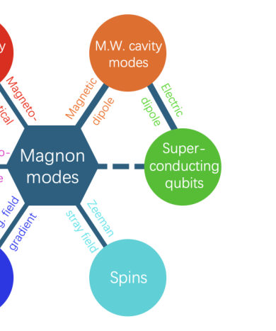 
Figure 1. Hybrid systems based on magnons, including the coupling of magnon modes to microwave (M.W.) cavity modes, optical (Opt.) cavity modes, acoustic modes, the COM motion of a YIG sphere, spins, superconducting qubits, etc. Thicker lines represent stronger coupling strength achieved in current experiments. Solid lines stand for direct coupling between two subsystems, while the dashed line denotes an effective (cavity-mediated) coupling. See section 2.2 for the coupling mechanisms.

📷 Fig 2

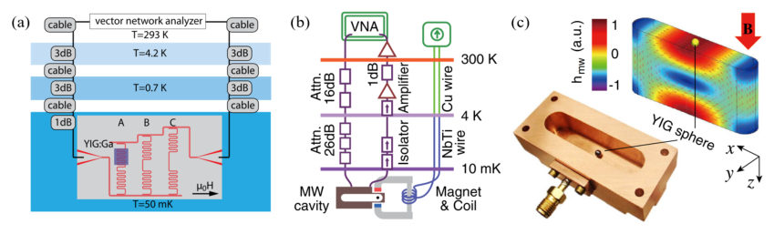 
Figure 2. (a) The (purple) gallium-doped YIG sample is cemented on top of one of the niobium microwave resonators. The experiment was performed at millikelvin temperatures. Reprinted figure (a) from [8] with permission. (b) A YIG sphere is mounted in a rectangular cavity made of oxygen-free copper. The cavity is placed inside a dilution refrigerator at 10 mK. Reprinted figure (b) from [9] with permission. (c) Top: Simulated microwave cavity TE101 mode distribution. Red arrows and colors denote the magnetic field directions and amplitudes, respectively. Bottom: Half of the microwave cavity with a YIG sphere inside. Reprinted figure (c) from [10] with permission.

📷 Fig 3

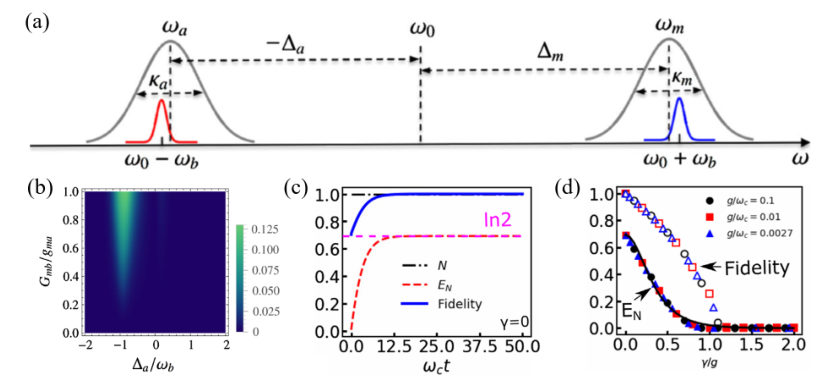 
Figure 3. (a) Frequencies and linewidths of the system adopted to generate magnon–photon entanglement. (b) Cavity–magnon entanglement versus cavity-drive detuning ∆a and effective magnomechanical coupling rate Gmb (gma is fixed). Reprinted figures (a)-(b) from [21] with permission. (c) Time evolution of the excitation number N of the system, magnon–photon entanglement EN, and the fidelity of the state with the Bell state in the PT symmetry-broken phase. (d) The entanglement and fidelity versus the magnon/photon damping rate. Reprinted figures (c)-(d) from [35] with permission.

📷 Fig 4

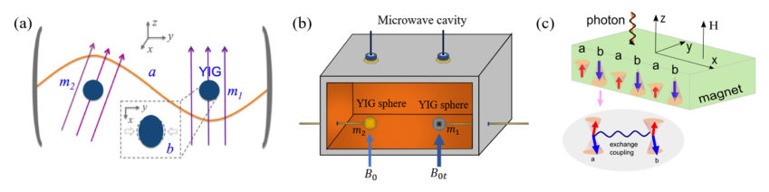 
Figure 4. (a) Two YIG spheres are placed inside a microwave cavity, each located near an antinode of the cavity field to achieve strong magnon–photon coupling. The bias magnetic fields are oriented such that the magnetostrictive interaction is activated only in one sphere, e.g., the right one. Reprinted figure (a) from [36] with permission. (b) Two YIG spheres in a microwave cavity are biased by a static magnetic field and a two-tone modulated field, respectively. Reprinted figure (b) from [44] with permission. (c) An antiferromagnet consists of two ferromagnetic sublattices with opposite magnetization directions. The two spins on the sublattices are coupled through the antiferromagnetic...

📷 Fig 5

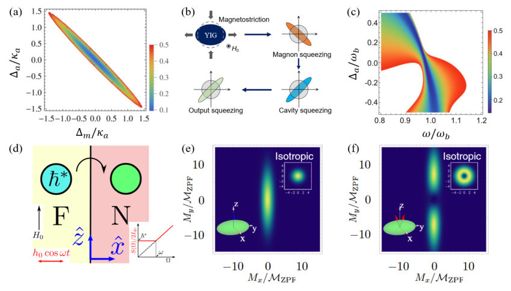 
Figure 5. (a) Variance of the magnon amplitude quadrature ⟨δx(t)2⟩versus two detunings ∆m and ∆a. Reprinted figure (a) from [47] with permission. (b) Schematic diagram of the ponderomotive-like magnon squeezing, leading to a squeezed output field of the microwave cavity. (c) Noise spectral density of the output field S out W (ω) versus frequency ω and detuning ∆a. The blank areas in (a) and (c) denote the noise above the vacuum fluctuations. Reprinted figures (b)-(c) from [48] with permission. (d) Schematic of the ferromagnet and nonmagnetic conductor bilayer. A static magnetic field H0 saturates magnetization while a coherent microwave field h0 cos ωt creates magnonic excitations. The...

**Summary.** This review comprehensively surveys the field of quantum magnonics, detailing how hybrid systems couple magnons in ferromagnets to other quantum elements like photons and qubits. It outlines protocols for generating advanced quantum states—such as entangled or cat states—and discusses their potential utility in quantum sensing and information processing.

**Why it may be interesting.** This work bridges condensed matter magnetism with quantum optics and information science, providing concrete pathways to engineer quantum states using solid-state magnetic excitations.

Detailed structure

**Main problem.** The review surveys the experimental and theoretical progress of quantum magnonics, focusing on generating complex quantum states and exploring diverse applications.

**Main result.** Strong coupling in hybrid systems allows for the preparation of various non-classical states (Fock, cat, squeezed, entangled) using magnons coupled to photons, qubits, and phonons.

**Method.** The review synthesizes theoretical protocols alongside experimental demonstrations across multiple physical platforms.

**Model / system.** The core system involves magnons in ferromagnetic materials (like YIG), modeled via bosonic operators derived from the Heisenberg model. These are coupled to external systems such as microwave/optical cavities, superconducting qubits, and mechanical oscillators.

**Key observables.** Magnon-photon entanglement, Bell states fidelity, quantum state purity (e.g., cat states), and nonreciprocal transmission.

**Important parameters / regimes.** Strong coupling regime ($g \gg \kappa, \gamma$), magnon dispersion relation ($\hbar\omega_k$), and coupling strengths ($g_{ma}, g_{mb}$).

**Assumptions / limitations.** The analysis often relies on the strong coupling prerequisite for coherent control, sometimes utilizing approximations like the Rotating Wave Approximation (RWA).

**Figures summary.** Figures illustrate hybrid systems coupled to various excitations (M.W., Opt., acoustic, spins, qubits) and show experimental setups for cavity magnonics.

**Paper structure.** The review is structured by coupling type: microwave cavities, superconducting qubits, optical cavities, NV-center spins, and center-of-mass motion, detailing state generation protocols within each section.

Abstract

Hybrid systems based on magnons in ferromagnetic materials, such as yttrium iron garnet, have achieved remarkable development in the last decade. These include the coupling of magnons to microwave and optical photons, superconducting qubits, phonons, spins, the center-of-mass motion of a ferromagnet, etc. Here, we review both the experimental and theoretical progress in this field, focusing on the generation of magnonic quantum states and their applications in a broad range of fields. Since the strong coupling is a prerequisite for achieving coherent quantum control of magnons and preparing magnonic quantum states, we start by introducing representative strong-coupling experiments in cavity magnonics, then review a series of protocols for creating various magnonic quantum states, such as Fock, cat, squeezed, and entangled states, and discuss their potential applications in macroscopic quantum studies, quantum information science, quantum sensing, magnonic quantum devices, dark matter detection, and so on. Finally, we summarize the review and give an outlook for the future study of quantum magnonics.

[↑ back to top](#top)

### [Flat-band formation and chiral superconductivity in driven topological insulators](http://arxiv.org/abs/2607.27355v1)

**Authors:** Suman Jyoti De, Leo Goutte, Kartiek Agarwal, T. Pereg-Barnea  
**Type:** theory · **Category:** strongly correlated electrons · **PDF:** <https://arxiv.org/pdf/2607.27355v1>  
**Analysis basis:** full PDF text, analyzed in chunks
**Topic relevance:** 🔥 `analog quantum simulation` **4/5** · 🔥 `non-equilibrium dynamics` **4/5** · `Keldysh / 2PI / non-Gaussian methods` **3/5** · `driven-dissipative phase transition` **3/5** · `methods for driven-dissipative` **3/5** · `non-equilibrium universality` **2/5** · `interference shaping light` **1/5**

📷 Fig 1

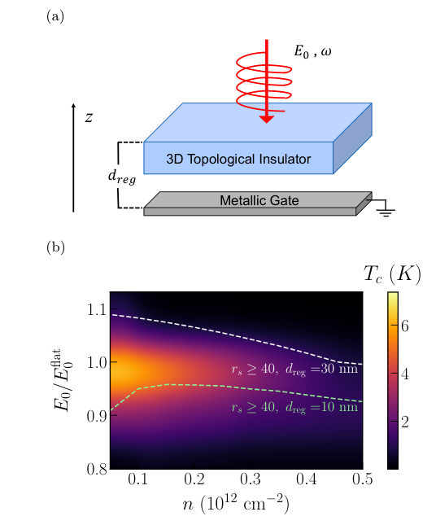 
FIG. 1: (a) Experimental set-up. (b) Phase diagram re- flecting the superconducting critical temperature Tc and gas parameter rs at different drive amplitudes E0 and electron densities n obtained by solving the gap equa- tion for l = 1, with Eflat 0 = ℏω

📷 Fig 2

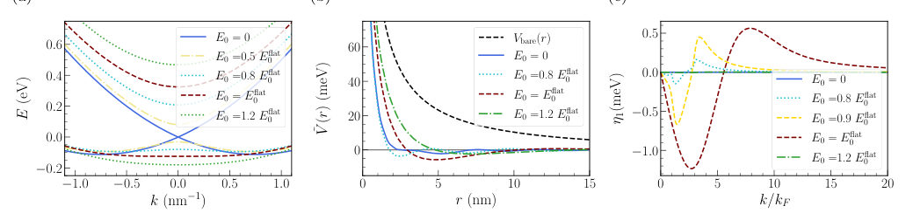 
FIG. 2: (a) Dispersion of the Floquet bands with increasing electric field strength (E0). For E0 = Eflat 0 , the lowest Floquet band becomes nearly dispersionless near the Dirac point. (b) Real-space profile of screened Coulomb interac- tion and (c) radial momentum dependence of the self-consistent superconducting order parameter with orbital angular momentum ℓ= 1 at electron density n = 0.1 × 1012 cm−2 and dreg = 30 nm. Vbare(r) is the unscreened Coulomb interaction.

📷 Fig 3

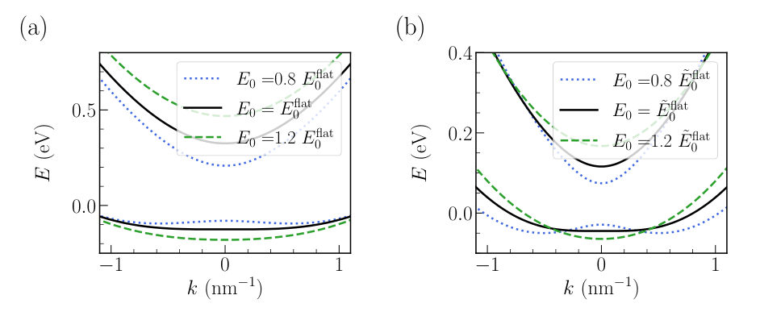 
FIG. 3: Comparison between bands close to flat-band limits Eflat 0 , ˜Eflat 0 ; with retaining terms up to (a) first order and (b) second order in the Floquet Hamiltonian with expansion 15. See text for the definition of Eflat 0 and ˜Eflat 0 .

📷 Fig 4

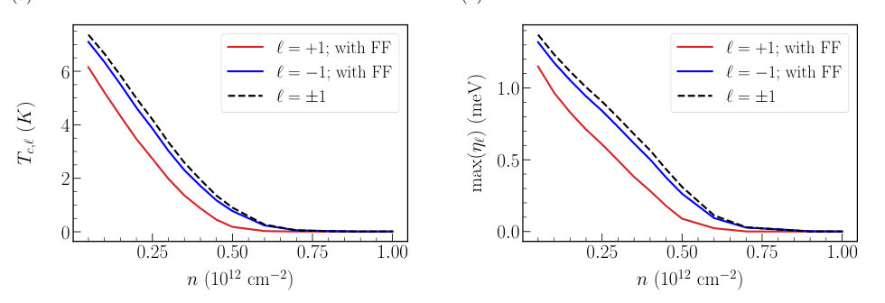 
FIG. 4: (a) Superconducting critical temperature Tc,ℓ, (b) maximum of the self-consistent superconducting order ηℓ(k) at T = 0 for the angular momentum channel ℓ, with increasing electron density n for metallic gate separation dreg = 30 nm and at the flat-band limit with E0 = Eflat 0 . Blue and red lines correspond to solutions having interaction with appropriate form factors (FFs).

📷 Fig 5

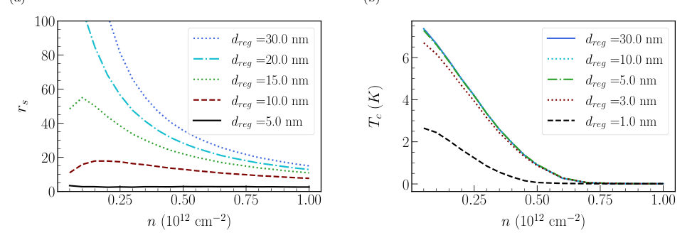 
FIG. 5: (a) Evolution of gas parameter rs and (b) superconducting critical temperature Tc for l = 1 with metallic gate separation dreg, from the top surface of 3D TI at the flat-band limit with E0 = Eflat 0 .

**Summary.** The paper shows that using circularly polarized light can engineer flat electronic bands on topological insulators. This engineered flatness allows for the emergence of chiral topological superconductivity driven by repulsive Coulomb interactions. The theoretical framework predicts measurable superconducting critical temperatures under realistic conditions.

**Why it may be interesting.** This work directly connects concepts from quantum optics (Floquet driving) and condensed matter theory (topological materials, superconductivity) to realize exotic correlated states in a controllable platform.

Detailed structure

**Main problem.** The study demonstrates how circularly polarized light can engineer flat electronic bands on topological insulators to induce chiral superconductivity using purely repulsive Coulomb interactions.

**Main result.** Topological superconductivity with a critical temperature of $T_c \sim 7$ K is predicted in the relevant density regime ($10^{11}-10^{12}/	ext{cm}^2$) while avoiding Wigner crystallization.

**Method.** The analysis employs Floquet theory to derive an effective time-independent Hamiltonian, followed by solving a mean-field self-consistency equation for the superconducting order parameter using RPA approximations.

**Model / system.** The system is the surface states of 3D Topological Insulators (TIs) driven by high-frequency, circularly polarized light. The physics is modeled via an effective Floquet Hamiltonian and treated with screened Coulomb interactions.

**Key observables.** Superconducting critical temperature ($T_c$), superconducting order parameter ($\Delta(\vec{k})$ or $\eta_\ell(k)$), and the gas parameter ($r_s$).

**Important parameters / regimes.** Driving field amplitude ($E_0$), electron density ($n$), gate separation ($d_{	ext{reg}}$), and the flat-band condition ($E_0 \approx E_{	ext{flat}}^0$).

**Assumptions / limitations.** The analysis relies on projecting interactions into a single lower Floquet band, and approximations are made regarding projection factors in the interaction Hamiltonian.

**Figures summary.** Figures illustrate the engineered flat-band dispersion (Mexican-hat shape), phase diagrams showing $T_c$ dependence on density/drive amplitude, and the superconducting order parameter profile for different driving strengths.

**Paper structure.** The paper progresses by first establishing the Floquet engineering of flat bands, then calculating the effective screened interaction via RPA, and finally solving the self-consistent mean-field equations to determine the chiral superconducting pairing ($\ell=\pm 1$) and $T_c$.

Abstract

We demonstrate that circularly polarized light can be used to Floquet-engineer nearly flat or Mexican-hat like electronic bands on the surface of three-dimensional topological insulators (3D TIs), which under suitable conditions, can support topological superconductivity via purely repulsive Coulomb interactions. The driving acts not merely by gapping out the Dirac cone on the surface of the 3D TI, but can be used to diminish, and even flip in sign, the intrinsic curvature of the surface state dispersion away from the Dirac point. Using parameters for canonical 3D TIs, we find that the flat band limit is attained for reasonable electric fields and the bands realized by changing the strength of the driving field have a similar energetic and spatial profile to those obtained in rhombohedral graphene under varying displacement field, where the case for superconductivity with purely repulsive interactions has recently been made. We find that, with the aid of appropriately placed screening metallic gate, one can obtain $T_c \sim 7 $K in this setup while avoiding Wigner crystallization for low electron densities in the range of $10^{11}-10^{12}/\text{cm}^2$.

[↑ back to top](#top)

### [Information-driven stepping in dimeric transport motors](http://arxiv.org/abs/2607.27495v1)

**Authors:** Antonio Patrón Castro, David A. Sivak  
**Type:** theory · **Category:** statistical mechanics · **PDF:** <https://arxiv.org/pdf/2607.27495v1>  
**Analysis basis:** full PDF text, analyzed in chunks
**Topic relevance:** 🔥 `non-equilibrium dynamics` **4/5** · `Keldysh / 2PI / non-Gaussian methods` **3/5** · `driven-dissipative phase transition` **3/5** · `methods for driven-dissipative` **3/5** · `entanglement & information structure` **2/5** · `non-equilibrium universality` **2/5** · `Frenkel-Kontorova` **1/5** · `correlated / nonlocal dissipation` **1/5** · `quantum measurements` **1/5**

📷 Fig 1

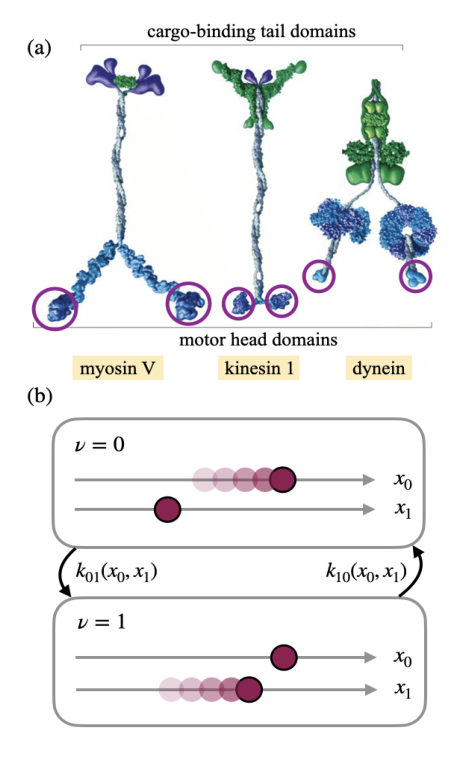 
FIG. 1. (a) Key classes of transport motors, adapted from [61].Purple circles indicate the motor domains (heads), whose motion is mod- eled via the coupled Langevin equations (1). (b) Switching-mobility model for the heads of a dimeric transport motor. The motor is rep- resented by two overdamped Brownian particles in one dimension, with positions x0 and x1, whose mobilities switch according to a dis- crete internal chemical state ν. For ν = 0, x0 evolves while x1 is fixed; for ν = 1, x1 evolves while x0 is fixed.

📷 Fig 2

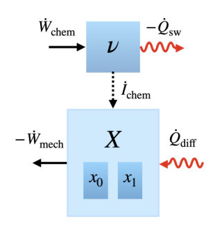 
FIG. 2. Operation of the switching-mobility motor as an informa- tion engine, illustrating the thermodynamic flows into and out of the mechanical degrees of freedom X = (x0,x1) and chemical degree of freedom ν.

📷 Fig 3

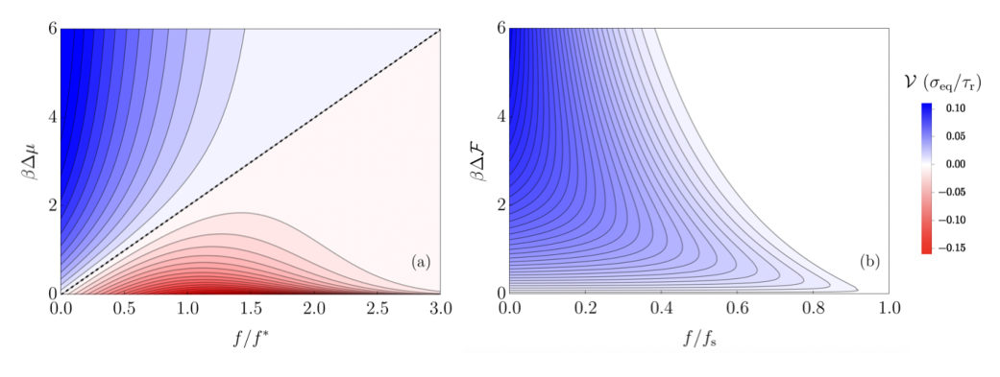 
FIG. 3. Heatmaps of the mean motor velocity V. (a) V as a function of the chemical free energy β∆µ and the ratio f/ f ∗, with f ∗the characteristic force scale. The black dashed line indicates the stall regime (∆µ = 2 fa), where the velocity vanishes (V = 0). (b) V as a function of the total free energy ∆F and the force ratio f/fs (for stall force fs (48)), which also equals the thermodynamic efficiency ηTD. Throughout, we consider bare switching rate k0 = τ−1 r , step length a = σeq, and harmonic linker potential V(r) = 1

📷 Fig 4

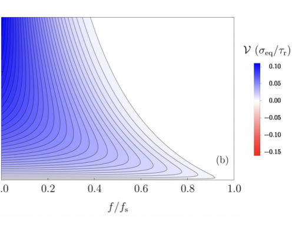 
Figure 5a shows the work and information flows associ- ated with the motor’s operation as a function of the force ratio f/fs. As expected, all thermodynamic flows vanish in the stall regime f = fs. The mechanical work rate −β ˙Wmech is non- monotonic, as it vanishes in the absence of the cargo force. The thermodynamic inequalities in Eq. (34) are clearly satis- fied, since the information flow always lies between the work flows. This is further corroborated in Figure 5b, showing that the thermodynamic efficiency ηTD and subsystem efficiencies ηchem and ηmech remain below unity, and approach unity only at the stall force.

📷 Fig 5

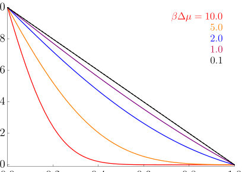 
FIG. 4. Ratio V/V0 of velocity V to velocity V0 at zero cargo force, as a function of the force ratio f/fs, for different chemical free en- ergies β∆µ, with bare switching rate k0 = τ−1 r , step length a = σeq, and harmonic confinement V(r) = 1

**Summary.** This paper develops a theoretical model for dimeric molecular motors that move by coupling Brownian motion with chemically controlled mobility switching. It argues that the motor functions as an information engine, generating directed motion solely through information processing rather than net energy flow. The key output is the prediction of measurable dwell-time distributions derived from this non-Markovian dynamics.

**Why it may be interesting.** While focused on classical stochastic processes, the concept of information transduction driving directed motion (Maxwell's demon analogy) connects directly to non-equilibrium statistical mechanics and fluctuation theorems relevant in quantum open systems.

Detailed structure

**Main problem.** The study aims to theoretically model how dimeric transport motors achieve directed motion by operating as a 'pure information engine,' suggesting that information transduction, rather than net energy exchange, drives their function.

**Main result.** The motor's steady-state dynamics can be characterized by an effective non-Markovian process, yielding four distinct dwell-time distributions observable in single-molecule experiments. The model successfully reproduces known stall forces and mean velocities.

**Method.** The authors employ a theoretical framework using coupled overdamped Brownian motion described by Fokker-Planck equations, simplifying the system via change of variables to analyze relative displacement fluxes.

**Model / system.** The physical system is a dimeric motor moving along filaments. The model incorporates two heads undergoing Brownian motion with periodically switching mobilities governed by a chemical state variable ($
u$), leading to coupled Langevin/Fokker-Planck dynamics.

**Key observables.** Mean velocity ($V$), energy and information flows, stall force ($f_s$), and the four distinct dwell-time distributions.

**Important parameters / regimes.** Temperature ($k_B T$), mobility switching rates, linker stiffness ($\kappa$), and applied load force ($f$).

**Assumptions / limitations.** The analysis assumes overdamped Brownian motion and focuses on localized switching for analytical tractability; the motor is treated as a pure information engine.

**Figures summary.** Figure 1 illustrates key transport motors (kinesin, myosin) and schematically depicts the mobility-switching model for dimeric heads. Other figures likely detail dynamic distributions or flow calculations.

**Paper structure.** The paper introduces the physical system and theoretical model using coupled dynamics; it then analyzes steady-state observables like mean velocity and energy/information flows; finally, it coarse-grains the model to predict measurable quantities like dwell-time distributions.

Abstract

Dimeric transport motors are nanoscale protein complexes that move along cytoskeletal filaments. Here we introduce a theoretical model for their stepping dynamics, in which the two motor heads undergo Brownian motion with mobilities periodically switching in a position-dependent manner so that only one head moves at a time. Through consumption of chemical free energy, this mechanism produces directed motion. We characterize at steady state the motor's mean velocity and its energy and information flows. The motor operates as a pure information engine, where only information is transduced between its components, without energy exchange. For localized switching, the model yields a thermodynamically consistent expression for the mean motor velocity that reproduces experimentally observed behavior, and captures the stall force characteristic of tightly coupled motors. Finally, coarse-graining the model to a single mechanical degree of freedom produces a second-order non-Markovian dynamics, from which we compute the four distinct dwell-time distributions that can be directly observed in single-molecule experiments. Our findings highlight how information transduction, via implicit operation as a Maxwell demon, may underlie the remarkable performance of these molecular motors.

[↑ back to top](#top)

### [From Exponential to Gaussian Tails: Fractal Wavefront Scaling and the $κ$-Weibull Distribution at Phase Transitions](http://arxiv.org/abs/2607.28172v1)

**Authors:** O. V. Pavlovsky, M. Yu. Satleikin  
**Type:** theory · **Category:** statistical mechanics · **PDF:** <https://arxiv.org/pdf/2607.28172v1>  
**Analysis basis:** full PDF text, analyzed in chunks
**Topic relevance:** 🔥 `non-equilibrium universality` **4/5** · `driven-dissipative phase transition` **3/5** · `non-equilibrium dynamics` **3/5** · `analog quantum simulation` **2/5** · `correlated / nonlocal dissipation` **2/5** · `methods for driven-dissipative` **2/5** · `Frenkel-Kontorova` **1/5** · `Keldysh / 2PI / non-Gaussian methods` **1/5** · `entanglement & information structure` **1/5**

📷 Fig 1

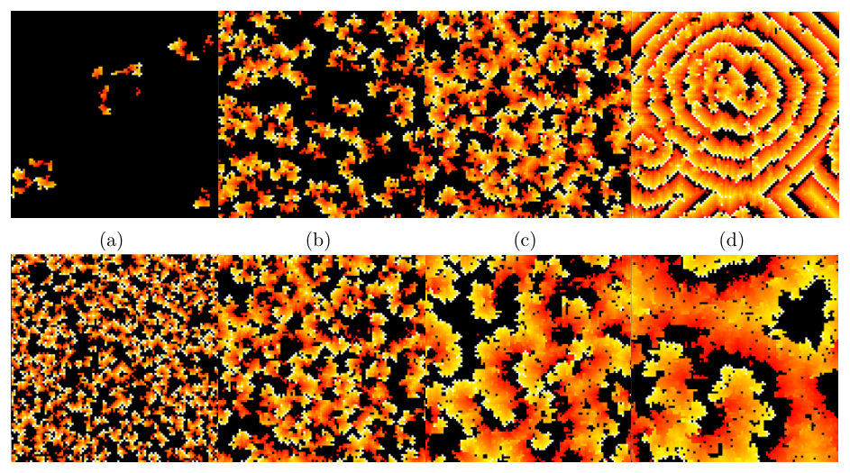 
Figure 1: The dynamic equilibrium, 1a – G = 0.45, 1b – G = 0.5, 1c – G = 0.6, 1d - G = 0.8, 1e – M = 5, 1f – M = 10, 1g – M = 20, 1h - M = 35

📷 Fig 2

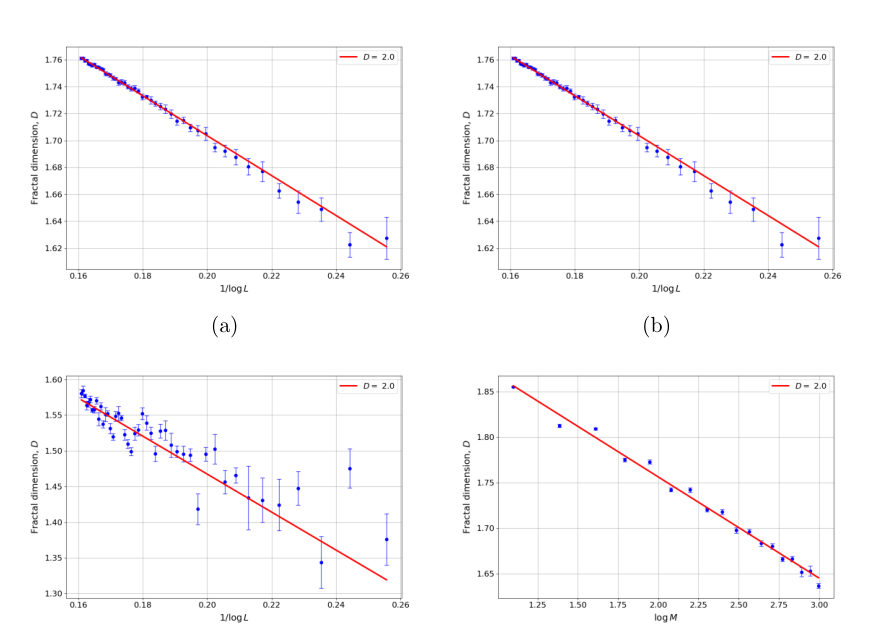 
Figure 2: The fractal dimension limit, 2a — the dimension dependence on automaton size G = 0.7, M = 10, 2b -– dependence on 1/ log L G = 0.7, M = 10, 2c – G = 0.44, M = 5, 2d – the dimension dependence on log M with fixed L = 200, G = 0.7.

📷 Fig 3

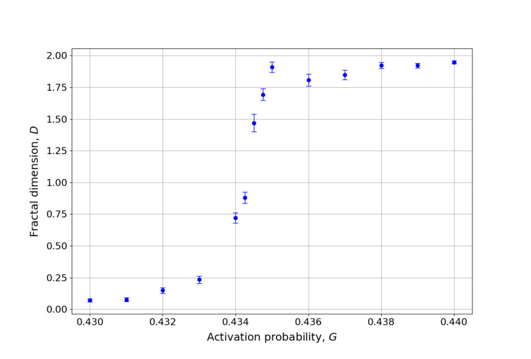 
Figure 3: The dependence of the fractal dimension on the activation probability near critical point.

📷 Fig 4

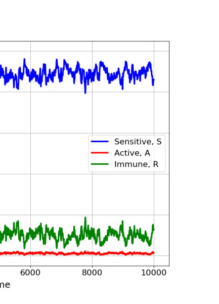 
Figure 4: The cells concentration evolution G = 0.47, M = 10.

📷 Fig 5

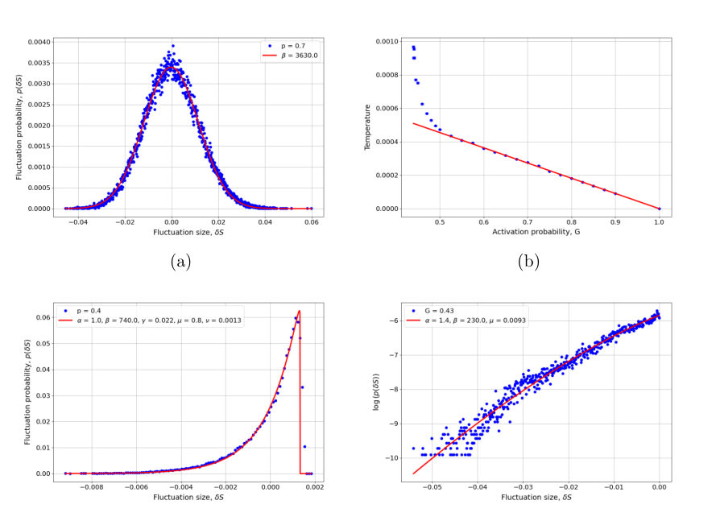 
Figure 5: The fluctuation distribution M = 5: 5a – the Gauss approximation of the distribution in the wave mode G = 0.7, 5b – the dependence system temperature on G, 5c – distribution in the fading mode G = 0.4, 5d – the Weibull approximation of distribution near critical point G = 0.43

**Summary.** This work analyzes a stochastic cellular automaton modeling an active medium undergoing phase transitions. It demonstrates that the system's fluctuation statistics transition from exponential decay (fading activity) to Gaussian behavior (wave filling), passing through a critical regime described by the $\kappa$-Weibull distribution. This connects macroscopic geometric properties, like wavefront fractal dimension, directly to microscopic statistical fluctuations.

**Why it may be interesting.** While focused on classical statistical mechanics, the concept of phase transitions governing complex pattern formation and scaling laws is highly relevant to understanding non-equilibrium dynamics in quantum many-body systems.

Detailed structure

**Main problem.** The paper investigates critical evolution, fractal scaling of wavefronts, and fluctuation statistics across phase transitions in an active medium.

**Main result.** The system exhibits a transition where the fluctuation distribution bridges exponential (fading) and Gaussian (wave) regimes, characterized by a $\kappa$-Weibull distribution at criticality.

**Method.** Analysis involves studying fractal dimensions via scaling limits and fitting fluctuation probability density functions to identify underlying statistical laws.

**Model / system.** The model is an active medium simulated using a stochastic cellular automaton on a planar square lattice, whose evolution depends on activation probability (G) and immune decay time (M).

**Key observables.** Fractal dimension ($D$) of the wavefront, fluctuation distribution $	ext{p}(\delta S)$ for sensitive cell concentration ($\delta S$), and system temperature ($T$).

**Important parameters / regimes.** Activation probability ($G$), Immune tail length ($M$), Critical point ($G_{cr}$), and lattice size ($L$).

**Assumptions / limitations.** The analysis relies on approximating the PDF with specific functional forms (e.g., Weibull or stretched-exponential) to characterize the transition.

**Figures summary.** Figures illustrate dynamic equilibrium states, the sharp transition of fractal dimension near $G_{cr}$, and comparisons between Gaussian, Weibull, and general fluctuation distributions across different regimes.

**Paper structure.** The paper analyzes three distinct dynamical regimes (fading, critical, wave) by examining how the system's fractal dimension and fluctuation statistics change as a function of the control parameter G relative to $G_{cr}$.

Abstract

The paper examines the features of critical evolution in an active medium modeled by a cellular automaton. The system evolves according to stochastic rules, exhibiting two qualitatively distinct dynamical regimes: one of fading activity and another of all-filling activity waves. Each regime is characterized by its own fractal dimension and fluctuation statistics, both of which are analyzed in detail. Within the critical interval, the system displays a nontrivial fractal dimension and a fluctuation distribution that bridges the two regimes. This bridging behavior arises because, in the critical interval, the dynamics are governed by avalanches.

[↑ back to top](#top)

### [Hayden--Preskill recovery at finite temperature on a quantum processor: dynamics and initial state from the SYK model](http://arxiv.org/abs/2607.28486v1)

**Authors:** Jeongho Bang, Moongul Byun, Kyoungho Cho, Keun-Young Kim, Hyeonsoo Lee  
**Type:** both · **Category:** quantum information and computing · **PDF:** <https://arxiv.org/pdf/2607.28486v1>  
**Analysis basis:** full PDF text, analyzed in chunks
**Topic relevance:** 🔥 `entanglement & information structure` **4/5** · `non-equilibrium dynamics` **3/5** · `Keldysh / 2PI / non-Gaussian methods` **2/5** · `QC/QI experiment` **2/5** · `driven-dissipative phase transition` **2/5** · `analog quantum simulation` **1/5** · `correlated / nonlocal dissipation` **1/5** · `measurement-induced transitions` **1/5** · `methods for driven-dissipative` **1/5** · `non-equilibrium universality` **1/5** · `scars & prethermalization` **1/5**

📷 Fig 1

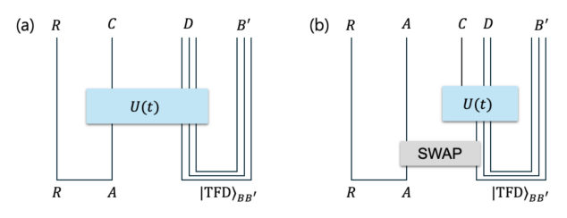 
FIG. 1. Quantum circuits for the finite-temperature Hayden–Preskill thought experiment. (a) Conventional representation, where the diary A is appended to the old black hole B and the enlarged system AB is scrambled by U(t). (b) SWAP-injected protocol, where the diary is injected into a chosen qubit b ∈B via a SWAP gate, so that the TFD state and the subsequent scrambling dynamics are defined by the same Hamiltonian on the fixed Hilbert space HB.

📷 Fig 2

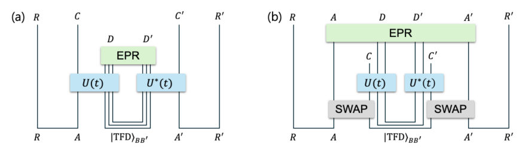 
FIG. 2. Quantum circuits for the finite-temperature Yoshida–Kitaev (YK) decoding protocol. (a) Conventional YK decoder, where A′ is appended to B′ and evolved by the conjugated unitary U ∗ A′B′(t) associated with the original scrambling unitary UAB(t). The EPR projection on DD′ implements the probabilistic decoder. (b) SWAP-injected protocol. The diary A and the auxiliary diary A′ are injected into B and B′ by the SWAP gates SAb and SA′b′, respectively. The two copies evolve under UB(t) and U ∗ B′(t), and the EPR projections on AA′ and DD′ define the postselection probability. Successful recovery is diagnosed by the conditional EPR fidelity between R and R′.

📷 Fig 3

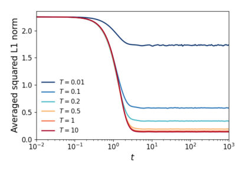 
FIG. 3. Decoupling diagnostic for the finite-temperature Hayden–Preskill (HP) protocol with NA = 1, NB = 7, NC = 5, and ND = 2. The time evolution is generated by the N = 16 SYK Hamiltonians. The disorder-averaged squared L1 norm is shown for T = 0.01, 0.1, 0.2, 0.5, 1, and 10 over 20 disorder realizations. The decrease of this quantity at higher temperature indicates stronger decoupling between the refer- ence R and the remaining black hole C, which is consistent with the original HP thought experiment.

📷 Fig 4

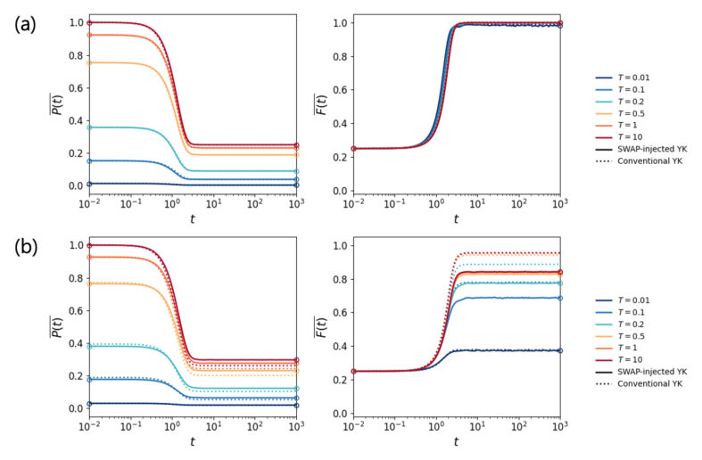 
FIG. 4. Finite-temperature Yoshida–Kitaev (YK) decoding dynamics with an N = 16 SYK Hamiltonian for (a) NA = 1, NB = 7, NC = 1, and ND = 6, and (b) NA = 1, NB = 7, NC = 5, and ND = 2. The postselection probability Pβ(t) and the conditional fidelity Fβ(t) are shown for T = 0.01, 0.1, 0.2, 0.5, 1, and 10, averaged over 20 disorder realizations. We show the SWAP-injected protocol by solid curves and the conventional YK protocol by dashed curves at matched output dimensions. For the latter, we take (a) ND = 7 and (b) ND = 3, while keeping the other system sizes fixed. The markers at the left and right edges denote the analytical early-time values and late-time saturation estimates for the...

📷 Fig 5

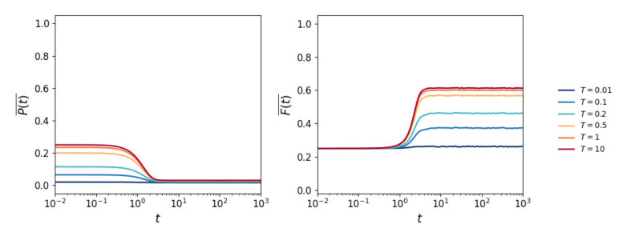 
FIG. 5. Effect of mismatched injection positions in the SWAP-injected Yoshida–Kitaev (YK) decoder. We set NA = 1, NB = 7, NC = 5, and ND = 2. The original diary A and the auxiliary diary A′ are injected into different qubit positions in B and B′, respectively. We choose b = 0 and b′ = 1. This mismatch suppresses both postselection probability and conditional fidelity.

**Summary.** This work adapts the Hayden-Preskill protocol for recovering scrambled quantum information at finite temperatures using the SYK model. By modifying the setup with a SWAP gate, the authors demonstrate that recovery is successful and show that key metrics scale linearly with temperature. The results are validated both analytically and through simulation on superconducting hardware.

**Why it may be interesting.** It directly addresses quantum information processing concepts (scrambling, error mitigation) within the context of fundamental physics problems like black hole evaporation, making it highly relevant to open quantum systems dynamics.

Detailed structure

**Main problem.** The paper investigates the successful recovery of quantum information scrambled into Hawking radiation, extending the Hayden-Preskill protocol to finite temperatures.

**Main result.** Information recovery is shown to be successful for a modified SWAP-injected protocol, with both postselection probability and conditional fidelity found to be proportional to temperature.

**Method.** The authors use theoretical derivations involving thermal states (TFD) and compare different decoding protocols (conventional vs. SWAP-injected) using quantum circuit diagrams and analytical estimates.

**Model / system.** The primary model is the Sachdev-Ye-Kitaev (SYK) model, used as a toy system for black hole evaporation dynamics. The protocol is implemented/tested on an IBM superconducting processor using Majorana fermions.

**Key observables.** Postselection probability ($P_{eta}$) and conditional fidelity ($F_{eta}(t)$).

**Important parameters / regimes.** Finite temperature ($eta$), time evolution ($t$), system size ($N=8$ Majoranas), and the SWAP gate implementation detail.

**Assumptions / limitations.** The analysis assumes uniform operator spreading for late-time estimates, and the finite-temperature setup uses a Thermofield Double (TFD) state to define the initial conditions.

**Figures summary.** Figures illustrate quantum circuits comparing conventional versus SWAP-injected decoding protocols. Figure 12 numerically diagnoses the assumption of uniform operator spreading at late times for the SYK model.

**Paper structure.** The paper builds from the theoretical framework of Hayden-Preskill recovery, modifies it for finite temperature using a SWAP gate to maintain fixed Hamiltonian dynamics, derives analytical estimates for $P$ and $F$, and concludes with an implementation demonstration on superconducting hardware.

Abstract

In the original Hayden--Preskill recovery, the post-injection scrambler and initial state are {\it not related}. We extend this setup in two ways: by using a SWAP gate so that the scrambler and initial state are {\it related}, and by considering recovery at {\it finite} temperature. For this modified protocol, we show that the information is successfully recovered in the sense that the postselection probability is non-negligible and the conditional fidelity is large. We find that both the postselection probability and the conditional fidelity are proportional to temperature, reflecting the reduced entanglement of the initial state at lower temperatures. We also derive their late-time analytic estimates under the assumption of uniform operator spreading and show that they agree well with the numerical results. This demonstrates that strong scrambling is important for successful information recovery. Implementing the protocol on an IBM superconducting processor using a binary sparse SYK Hamiltonian with $N = 8$ Majoranas, we observe that the data retain the qualitative recovery dynamics and that a SWAP-based error-mitigation scheme improves both the postselection probability and the conditional fidelity.

[↑ back to top](#top)

### [Quadruply Bonded Mo2 Molecules: An Innate Emitter-Resonator Quantum System in Free Space](http://arxiv.org/abs/2607.27683v1)

**Authors:** Miao Meng, Ying Ning Tan, Zi Cong He, Zi Hao Zhong, Jia Zhou, Yu Li Zhou, Guang Yuan Zhu, Chun Y. Liu  
**Type:** experiment · **Category:** other · **PDF:** <https://arxiv.org/pdf/2607.27683v1>  
**Analysis basis:** full PDF text, analyzed in chunks
**Topic relevance:** 🔥 `free-space correlated emission` **4/5** · 🔥 `quantum optics experiment` **4/5** · `Tavis-Cummings & cavity-many-emitter` **3/5** · `correlated cavity matter` **3/5** · `analog quantum simulation` **2/5** · `Dicke superradiance` **1/5** · `driven-dissipative phase transition` **1/5** · `interference shaping light` **1/5**

📷 Fig 1

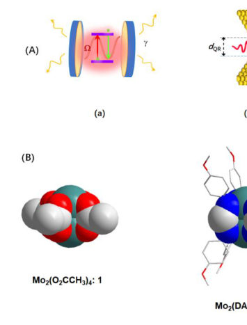 
Figure 1. Illustration of optical cavity minimization across different length scales and

📷 Fig 2

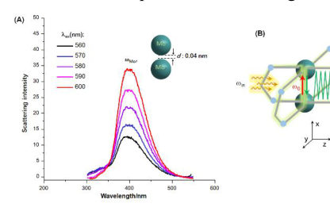 
Figure 2. Optical responses of the Mo₂ complex molecules. (A) Fluorescence spectra of

📷 Fig 3

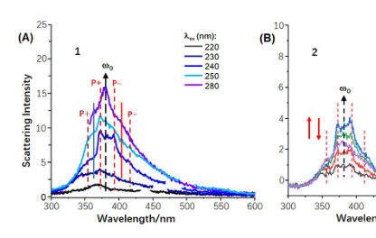 
Figure 3. Resonance fluorescence spectra of the strongly coupled Mo₂

📷 Fig 4

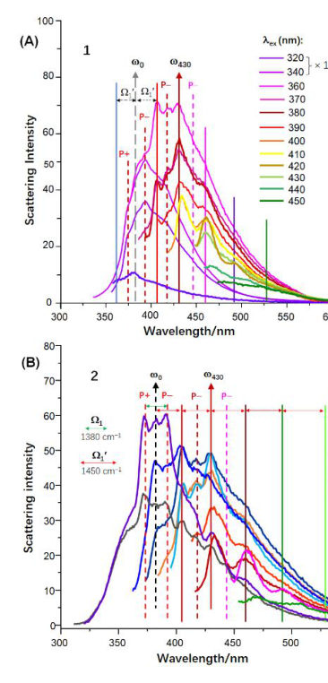 
Figure 4. Quantization and phase transition of the scattering field of the Mo2 complexes

**Summary.** The authors demonstrate that the quadruply bonded $	ext{Mo}_2$ molecule acts as an innate emitter-resonator quantum system capable of trapping and strongly coupling with visible light photons in free space. By measuring resonance fluorescence, they observe characteristic signatures like vacuum Rabi splitting and Mollow triplets, confirming its utility for molecular quantum optical experiments.

**Why it may be interesting.** This work directly extends cavity QED concepts into molecular science by identifying a robust, ambient-condition quantum optical element ($	ext{Mo}_2$) that can mediate strong light-matter interaction without requiring external high-finesse cavities.

Detailed structure

**Main problem.** To demonstrate that quadruply bonded $	ext{Mo}_2$ units function as intrinsic emitter-resonator quantum systems capable of trapping and interacting with visible light photons in free space.

**Main result.** The $	ext{Mo}_2$ unit exhibits strong coupling signatures, such as vacuum Rabi splitting and Mollow triplets, confirming its role as an independent molecular quantum system analogous to established $	ext{Ni}_2$ systems.

**Method.** Resonance fluorescence spectroscopy was performed on various $	ext{Mo}_2$ complexes using monochromatic UV light excitation across a range of wavelengths.

**Model / system.** The physical system is the quadruply bonded $	ext{Mo}_2$ diatomic metal unit, which acts as an atomistic optical resonator. The behavior is analyzed using concepts from cavity Quantum Electrodynamics (QED), specifically resembling Jaynes-Cummings molecular systems.

**Key observables.** Vacuum Rabi splitting ($\Omega$), Mollow triplets/sidebands, and the observation of non-classical features like photon antibunching.

**Important parameters / regimes.** The system operates in the ultrastrong-coupling regime; key distances include the $	ext{Mo}-	ext{Mo}$ bond distance ($\approx 2.1 	ext{ Å}$).

**Assumptions / limitations.** The observed quantum optical phenomena are attributed to the intrinsic resonator character of the diatomic metal core, allowing for testing against specific electronic configurations.

**Figures summary.** Figures illustrate fluorescence spectra showing distinct emission features compared to conventional Stokes scattering, including Rabi doublets and Mollow triplets under varying excitation conditions.

**Paper structure.** The paper establishes the theoretical framework by comparing $	ext{Mo}_2$ to known quantum systems (like trapped ions or plasmonic cavities). It then presents experimental evidence via spectroscopy on multiple complexes, confirming strong light-matter coupling signatures characteristic of emitter-resonator interactions in free space.

Abstract

In recent decades, significant progress has been made in constructing and studying individual quantum systems based on two level atoms (molecules) and photons. Here we demonstrate that the quadruply bonded Mo2 unit, with a MoMo bond distance as short as 2.1A, functions as an innate emitter resonator molecular quantum system capable of trapping visible light photons between the two molybdenum atoms under ambient conditions, thereby generating an intense quantized local electromagnetic field with an extremely small mode volume. The resonance fluorescence spectra of three Mo2 complexes indicate that the intermetallic Mo-Mo charge transfer transition is coherently coupled to the local scattering field, exhibiting vacuum Rabi splitting and Mollow triplets. Resonant coupling of single molecules and N-molecule ensembles to the scattered light through sideband excitation produces a sequence of discrete optical modes spanning a broad wavelength range, with polaritonic transitions identical to those observed in Ni2 based systems. These results establish the Mo2 molecule as an independent emitter resonator integrated quantum system that enables quantum optical experiments in free space using conventional spectroscopic instrumentation. This work extends quantum electrodynamics into molecular science, providing new insights into metal metal bonding, molecular physics, and light matter interactions.

[↑ back to top](#top)

### [Optical linewidth narrowing for device-coupled single T centers](http://arxiv.org/abs/2607.28485v1)

**Authors:** Adam Johnston, Yu-En Wong, Shengbin Yan, Ulises Felix-Rendon, Songtao Chen  
**Type:** both · **Category:** quantum information and computing · **PDF:** <https://arxiv.org/pdf/2607.28485v1>  
**Analysis basis:** full PDF text, analyzed in chunks
**Topic relevance:** 🔥 `QC/QI experiment` **4/5** · `methods for driven-dissipative` **3/5** · `quantum optics experiment` **3/5** · `quantum measurements` **2/5** · `Keldysh / 2PI / non-Gaussian methods` **1/5** · `Tavis-Cummings & cavity-many-emitter` **1/5** · `correlated / nonlocal dissipation` **1/5** · `correlated cavity matter` **1/5** · `driven-dissipative phase transition` **1/5** · `interference shaping light` **1/5**

📷 Fig 1

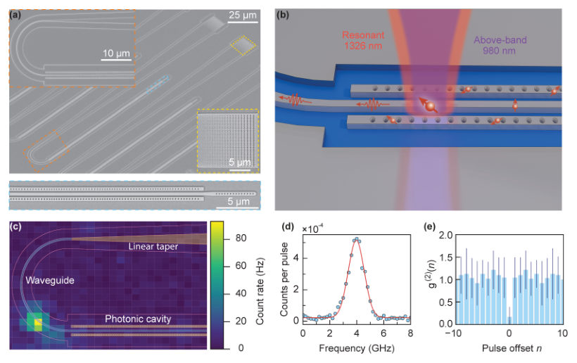 
FIG. 1. Spatially-resolved PLE spectroscopy for device-coupled single T centers. (a) Scanning electron microscope image of a block of five devices. Each device consists of two linear arrays of PC cavities (24 in total) evanescently coupled to a bus waveguide terminated with a broadband mirror (blue dashed rectangle), and a linear taper waveguide which connects the GC (yellow dashed square) and the bus waveguide. (b) Schematics of the experiment. We use the resonant laser for PLE spectroscopy, and the above-band laser for controlling local charge environment. The two lasers are combined using a LSM setup. The T center fluorescence is collected via the waveguide and the GC to the SNSPD. (c)...

📷 Fig 2

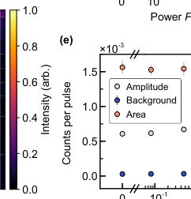 
FIG. 2. T center linewidth narrowing via above-band excitation. (a) Experimental pulse sequence. tAB and tPLE are the pulse widths of the above-band laser (at λAB) and the resonant laser (at λPLE), respectively; td is the pulse separation and N is the sequence repetition. For panels (b-e), tAB = tPLE = 500 ns and td = 0 ns. (b) Spectral linewidth narrowing for Itokawa under different above-band excitation power (PAB). Panels (c), (d), and (e) describe the characteristics of Itokawa spectrum with varying PAB. (c) Gaussian-fitted FWHM linewidth. (d) Center frequency shift against the no above-band excitation case. The solid gray line is a fitted saturation curve with Psat = 0.87 µW and an...

📷 Fig 3

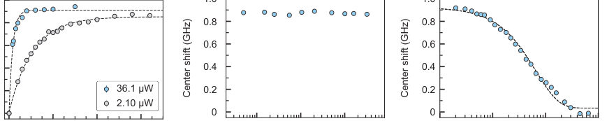 
FIG. 3. Characteristic time scale for charge fluctuation dynamics. (a) Linewidth change and (b) center frequency shift of Itokawa spectrum under varying tAB and PAB. The pulse delay and PLE pulse width remain same: td = 0 ns and tPLE = 500 ns. The black dashed lines show the single exponential fitting, revealing time constants of 70 ± 6.3 and 41 ± 2.6 ns at PAB = 36.1 µW, 409 ± 47 and 266 ± 8.5 ns at PAB = 2.1 µW, for linewidth change and center shift, respectively. (c) and (d) show the linewidth change and center frequency shift effect sustain more than td = 300 µs delay. The pulse widths tAB = tPLE = 500 ns. (e) and (f) shows the linewidth change and center frequency shift effect...

📷 Fig 4

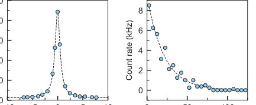 
FIG. 5. Purcell effect for T center “Earth”. (a) Decay rate enhancement at different cavity detunings. The black dashed line shows the Lorentzian fitting with a linewidth of 1.19 ± 0.01 κ. The slightly larger fitted linewidth than the cavity linewidth (κ) is due to the dephasing and spectral dif- fusion of the T center [10]. (b) The shortest enhanced fluores- cence lifetime observed for the T center. A single exponential fitting reveals a lifetime of 21.2 ± 0.21 ns.

📷 Fig 5

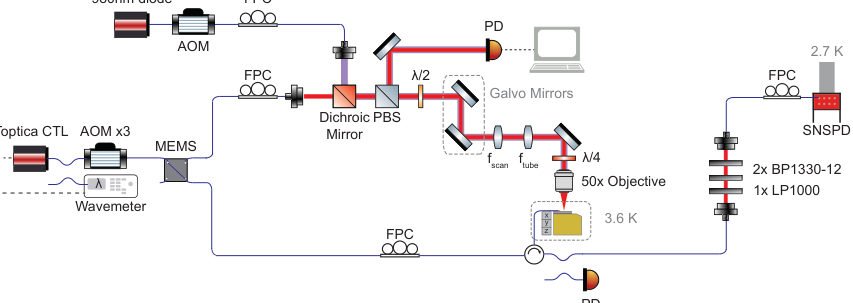 
FIG. 6. Experimental setup details. AOM: acousto-optic modulator. BP: bandpass filter. LP: longpass filter. FPC: fiber polarization controller. MEMS: micro-electro-mechanical system. PBS: polarizing beam splitter. PD: photodiode. SNSPD: superconducting nanowire single photon detector.

**Summary.** The paper addresses the critical issue of broad optical linewidth in silicon T centers by employing above-band laser excitation. By analyzing the resulting charge stabilization dynamics using rate equations and spectroscopy, the authors successfully demonstrated a significant reduction (up to 70%) in this noise-induced linewidth. This work establishes an active control pathway necessary for advancing T centers toward practical quantum information applications.

**Why it may be interesting.** This work provides a concrete, experimentally verifiable mechanism—charge trap filling via above-band pumping—to actively suppress spectral diffusion noise in solid-state qubits, which is crucial knowledge for designing robust quantum memory nodes.

Detailed structure

**Main problem.** The primary obstacle for using single T centers as quantum emitters is their broad optical linewidth, which severely limits their utility in quantum networking.

**Main result.** The authors demonstrated an effective method to achieve up to 70% reduction in the optical linewidth by utilizing above-band optical excitation.

**Method.** They combined time-resolved Photoluminescence Excitation (PLE) spectroscopy with controlled above-band laser pumping and developed a rate equation model to describe charge stabilization dynamics.

**Model / system.** The system involves single T centers in silicon coupled to nanophotonic waveguides. The physics is modeled by considering the filling of nearby charge traps by photo-generated free carriers, which stabilizes the local electric field environment.

**Key observables.** Optical linewidth ($\Gamma$), center frequency shift ($\Delta
u$), trap filling probability ($p$), and time constants for charge dynamics.

**Important parameters / regimes.** Above-band excitation power ($P_{AB}$), laser wavelength ($\lambda_{AB} < 	ext{bandgap}$), and characteristic decay time constants (e.g., $41 \pm 2.6$ ns).

**Assumptions / limitations.** The linewidth narrowing is directly attributed to the neutralization effect caused by photo-generated free carriers filling nearby charge traps, which reduces spectral diffusion noise.

**Figures summary.** Figures show PLE spectra confirming single emitters and demonstrate that increasing above-band power ($P_{AB}$) systematically narrows the linewidth and causes a measurable frequency shift. Time evolution plots track these changes over time delays.

**Paper structure.** The paper progresses from initial characterization (broad linewidth) to demonstrating the effect of controlled excitation, quantifying the reduction via spectroscopy, developing rate equations for charge dynamics, and finally modeling the resulting spectral narrowing and shifts.

Abstract

Single T centers in silicon have emerged as promising optically active spins for quantum networking applications. One of the major obstacles to advancing the system is their broad optical linewidth due to spectral diffusion, which is two orders of magnitude larger than their cavity-enhanced radiative linewidth. We tackle this issue by utilizing above-band optical excitation delivered via a laser scanning microscope to device-coupled single T centers, achieving up to 70% optical linewidth reduction. We attribute the linewidth narrowing effect to the filling of nearby charge traps by photo-generated free carriers. We analyze charge stabilization dynamics by exploiting pulsed above-band excitation and develop a rate equation model to describe the dynamics and to explain the observed linewidth narrowing and center shift. This work provides an effective pathway to control and reduce the optical linewidth for single T centers, clearing one of the major roadblocks to advance the single T center spin platform for quantum information and networking applications.

[↑ back to top](#top)

### [Confinement and String Breaking in the Compact Abelian Higgs Model](http://arxiv.org/abs/2607.27550v1)

**Authors:** Blake Senseman, Zane Ozzello, Yannick Meurice, Stephen Mrenna  
**Type:** theory · **Category:** numerical methods · **PDF:** <https://arxiv.org/pdf/2607.27550v1>  
**Analysis basis:** full PDF text, analyzed in chunks
**Topic relevance:** 🔥 `analog quantum simulation` **4/5** · `methods for driven-dissipative` **3/5** · `driven-dissipative phase transition` **2/5** · `entanglement & information structure` **2/5** · `non-equilibrium dynamics` **2/5** · `Frenkel-Kontorova` **1/5** · `correlated / nonlocal dissipation` **1/5** · `exotic spin models in light-matter` **1/5** · `non-equilibrium universality` **1/5**

📷 Fig 1

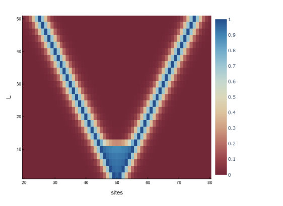 
FIG. 1: Expected field value ⟨Lz⟩for the ground state with U = 0.2, Y = 2.0 and a local chemical potential (µ = 100) applied at sites separated at different lengths L. The ground state displays a string configuration up to L = 10, after which point a broken string state containing two, independent localized mesons is preferred.

📷 Fig 2

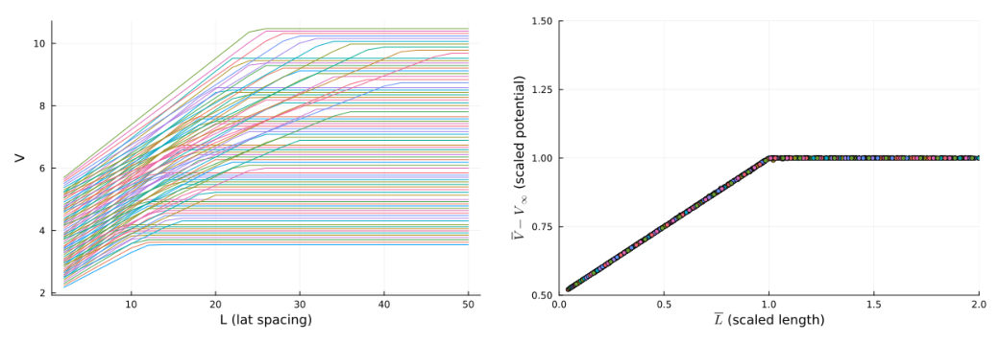 
FIG. 2: Measured string potentials V (L; U, Y ) (left) for Y ∈(2.0, 2.5, ..., 6.0), U ∈(0.1, 0.125, ..., 0.35) obtained with µ = 100. The ground state energy E0(U, Y ), calculated with µ = 0, has been subtracted from each sample. Rescaling potentials (right) demonstrates the universal nature of the string behavior once σ and L∗are observed. A suitable vertical shift has also been performed to account for the discrepancy between Meff and σL∗.

📷 Fig 3

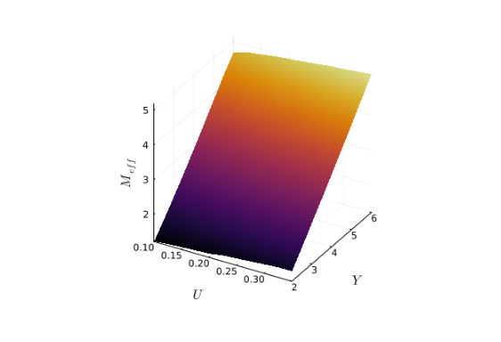 
FIG. 3: Effective meson mass scale for Y ∈(2.0, 2.5, ..., 6.0), U ∈(0.1, 0.125, ..., 0.35) calculated with DMRG

📷 Fig 4

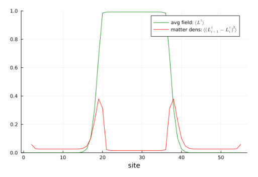 
FIG. 5: The spatial profile of the average field and matter density for an adiabatically prepared string state (U = 0.25, Y = 6.0, L = 16, µ = 2.25). Both the string interior and the vacuum exterior can be seen to be dressed with virtual domain wall pairs.

📷 Fig 5

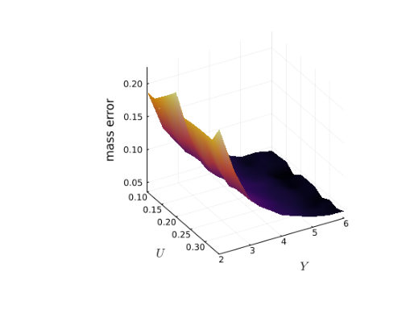 
FIG. 4: Error associated with deviation from simple string breaking model for Y ∈(2.0, 2.5, ..., 6.0), U ∈(0.1, 0.125, ..., 0.35) calculated as Merror = Meff −σL∗. The percent difference goes from 12% at Y = 2.0 to &lt; 1% at Y = 6, and is independent of U.

**Summary.** This work uses DMRG to study confinement and string breaking in a simplified model derived from the Compact Abelian Higgs Model. By introducing a local chemical potential, the authors measure key quantities like string tension and effective meson mass. The results confirm physical predictions regarding string stability and show remarkable consistency across different theoretical measurements of the excitation energy scale.

**Why it may be interesting.** While focused on lattice gauge theory, the use of DMRG on an engineered spin chain model is highly relevant for simulating strongly correlated quantum systems where entanglement structure dictates low-energy physics, mirroring techniques used in AMO/condensed matter simulations.

Detailed structure

**Main problem.** The study aims to model confinement and string breaking phenomena, bridging first-principles gauge theory dynamics (like QCD) with observable hadron production features.

**Main result.** The model successfully demonstrates measurable string tension ($\sigma$) and characterizes the effective meson mass ($M_{	ext{eff}}$), showing that different theoretical measures of this mass scale consistently across parameter variations.

**Method.** Density Matrix Renormalization Group (DMRG) methods are employed to calculate the spectrum of string-like excitations in the low-energy effective Hamiltonian.

**Model / system.** The system is a spin-1 truncation of the Compact Abelian Higgs Model (CAHM), treated as an effective 1+1 dimensional scalar electrodynamics model simulated on qutrit sites.

**Key observables.** String tension ($\sigma$), effective meson mass ($M_{	ext{eff}}$), string potential $V(L)$, and breaking length ($L^*$).

**Important parameters / regimes.** Local chemical potential ($\mu$), and model parameters $Y$ and $U$.

**Assumptions / limitations.** The initial use of a strong, local chemical potential ($\mu$) to induce excitations is noted as artificial; the analysis relies on DMRG techniques applied to an effective Hamiltonian.

**Figures summary.** Figures illustrate string potentials showing universal linear behavior, and plots compare calculated meson mass scales ($M_{	ext{eff}}$ vs. $\Delta m$ vs. $M_\sigma$) across varying model parameters.

**Paper structure.** The paper develops the low-energy effective Hamiltonian, applies DMRG to study excitations using a local chemical potential ($\mu$), calculates multiple measures of effective mass and string tension, and compares these results to establish consistency between different physical observables.

Abstract

While real-time simulation of Quantum Chromodynamics remains technologically out of reach, simplified models for studying elements of QCD phenomenology abound. This work presents a simple model, a spin-1 truncation of the Compact Abelian Higgs Model simulated on qutrit sites, in which confinement and string breaking is accessible to current simulation methods. In the low-energy regime of 1+1D scalar electrodynamics, the heavy modes are integrated out, producing a spin chain effective Hamiltonian in which Gauss' law is implicitly satisfied. We study the spectrum of string-like excitations using DMRG methods on the order of 100 sites. We demonstrate that an added, local chemical potential, playing a role analogous to external charges, permits parameter-dependent measurements of physical features of interest like the string tension and effective meson mass. Varying the chemical potential also permits a characterization of string stability not assessed in prior studies of confining lattice models.

[↑ back to top](#top)

### [Emergence of a Macroscopic Cat State and Multi-Channel Entanglement in a Frustrated Cluster Spin Chain](http://arxiv.org/abs/2607.28373v1)

**Authors:** Mohit Lal Bera, Andreu Anglés-Castillo, Alberto Acevedo Meléndez, Rafael Gómez-Lurbe, Luca Ion, Rodrigo M. Sanz, Somayeh Mehrabankar, Tanmoy Pandit, Carmen G. Almudéver, Armando Pérez, Miguel Angel Garcia-March  
**Type:** theory · **Category:** statistical mechanics · **PDF:** <https://arxiv.org/pdf/2607.28373v1>  
**Analysis basis:** full PDF text, analyzed in chunks
**Topic relevance:** 🔥 `analog quantum simulation` **4/5** · 🔥 `entanglement & information structure` **4/5** · `exotic spin models in light-matter` **3/5** · `Frenkel-Kontorova` **2/5** · `correlated / nonlocal dissipation` **1/5** · `driven-dissipative phase transition` **1/5** · `methods for driven-dissipative` **1/5** · `non-equilibrium dynamics` **1/5**

📷 Fig 1

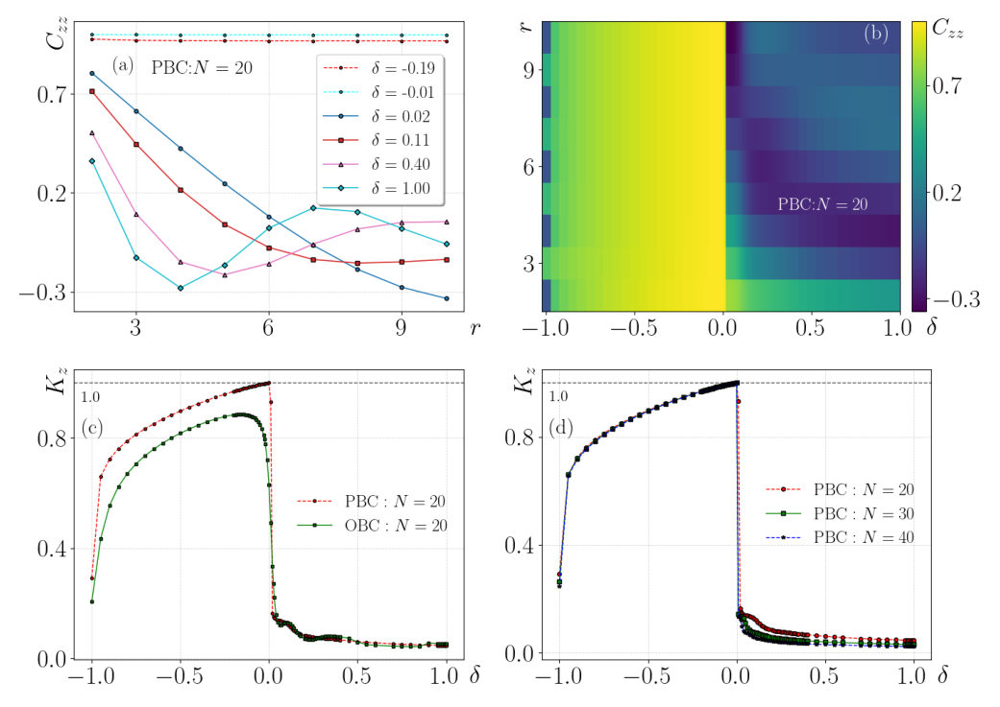 
Figure 1. (a) Spin-spin correlation function Czz(r) versus distance r for selected δ in a N = 20 chain (PBC). For δ &lt; 0, Czz(r) saturates to a distance-independent constant at large r, confirming long-range ferromagnetic order despite ⟨σz k⟩= 0 in finite systems. The saturation value increases monotonically from ≈0.85 at δ = −0.6 to ≈0.97 at δ = −0.2, approaching unity as δ →0−(see main text for clarification on nomenclature). For δ &gt; 0, Czz(r) decays rapidly, exhibiting oscillatory components and variable decay rates reflecting incommensurate correlations distinct from simple paramagnetic decay. (b) Heatmap of Czz(r) versus δ (horizontal) and r (vertical). The change across δ = 0 is...

📷 Fig 2

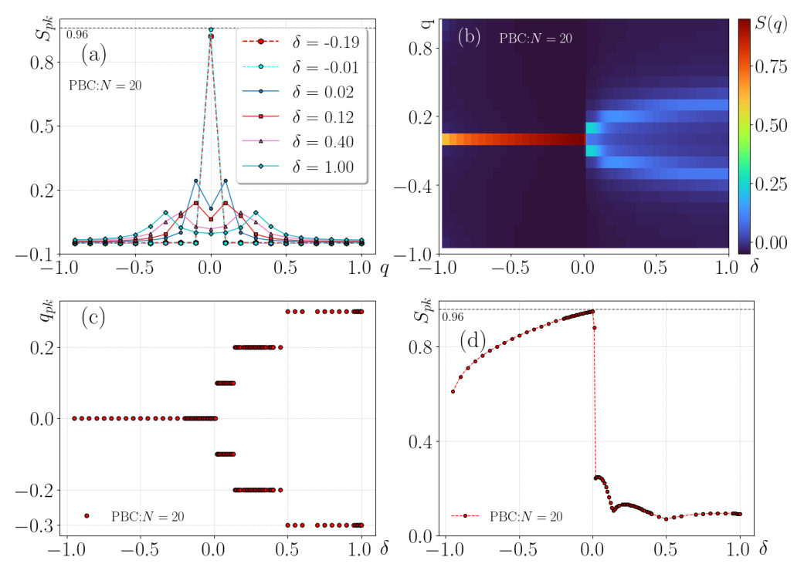 
Figure 2. (a) Static spin structure factor S(q) peaks Spk versus wave vector q for selected δ in a N = 20 chain (PBC). For δ &lt; 0, a single sharp peak appears at q = 0, the definitive Fourier signature of ferromagnetic order. As δ increases beyond zero, the single peak splits into two symmetric peaks at q = ±q∗, with q∗increasing continuously with δ. This peak splitting is the unambiguous signature of an incommensurate phase — a modulated magnetic structure with period incommensurate with the lattice — and is emphatically not paramagnetic behavior. (b) Heatmap of S(q) as a function of δ (horizontal) and q (vertical), showing continuous evolution of the peak structure. The bright red region...

📷 Fig 3

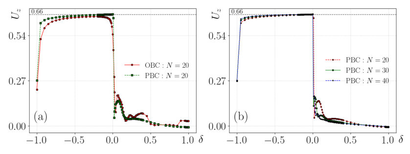 
Figure 3. Fourth-order Binder cumulant Uz, characterizing four-point correlation structure relative to two-point correlations. (a) Uz for N = 20 under PBC and OBC. For δ &lt; 0, Uz rises from ≈0.27 at δ = −1 and saturates to 2/3 (PBC) for |δ| ≲0.05, remaining pinned up to δ = 0−, confirming perfectly factorizable four-point correlations consistent with long- range ferromagnetic order. PBC and OBC yield identical results, indicating robustness. For δ &gt; 0, Uz collapses abruptly: at δ = +0.01, it drops to ≈0.645, falls below 0.05 for δ ≳0.1, and becomes negative for δ ≳0.6, signaling destruction of simple factorizable correlations and emergence of a frustration-driven incommensurate phase. (b)...

📷 Fig 4

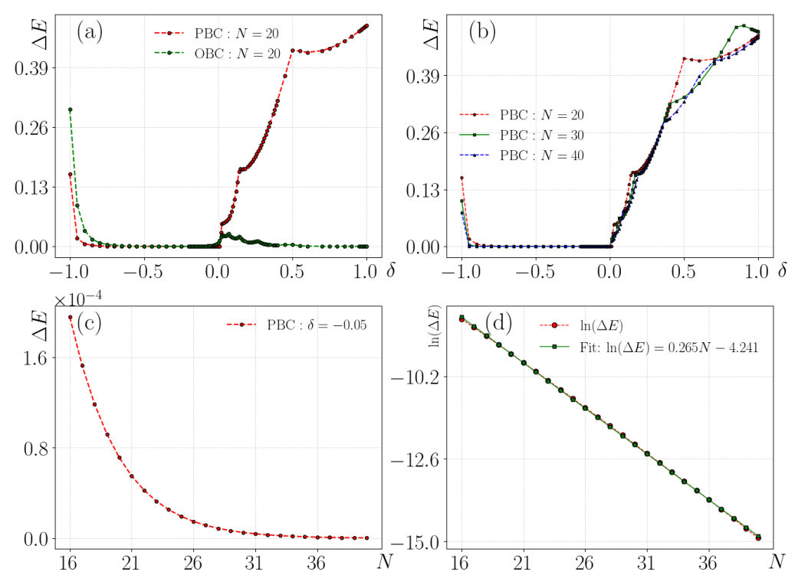 
Figure 4. Spectral gap ∆E = E1 −E0 versus δ for N = 20 chains under PBC and OBC. (a) ∆E across full parameter range. At δ = −1, ∆EPBC = 0.157, ∆EOBC = 0.299, reflecting boundary-induced suppression of tunneling. As δ →0−, ∆EPBC collapses to ≈5 × 10−5 within |δ| ≤0.02, while ∆EOBC ≈0.008. For δ &gt; 0, gaps reopen: ∆EPBC = 0.482, ∆EOBC = 0.025 at δ = 1.0. (b) Heatmap of ∆E versus δ and system size, showing dramatic collapse near δ = 0. (c) Semilogarithmic plot of ∆EPBC versus N at δ = −0.05, demonstrating exponential scaling ∆EPBC ∼e−αN over &gt;2 orders of magnitude. (d) Linear fit of ln(∆EPBC) versus N, yielding decay constant α ≈0.26 ± 0.01 and correlation length ξ = 1/α ≈3.8 sites—definitive...

📷 Fig 5

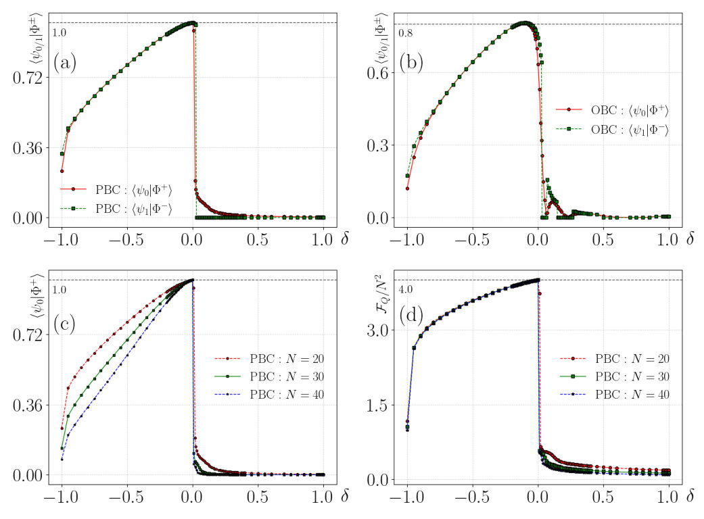 
Figure 5. Characterization of Schrödinger cat states. (a) Overlap |⟨ψ0|Φ+⟩| (solid) and |⟨ψ1|Φ−⟩| (dashed) versus δ for PBC with N = 20. For δ &lt; 0, both overlaps rise monotonically from ≈0.238 at δ = −1 to &gt; 0.999 at δ = 0−. (b) Same overlaps under OBC and N = 20. Maximum reaches only ≈0.802 around δ ≈−0.12, reflecting boundary-induced suppression of cat-state coherence. (c) Ground-state overlap |⟨ψ0|Φ+⟩| for different values of N as a function of δ. For δ =→0−, and very close to phase transition, overlap is N-independent. (d) Fisher information for different N and PBC, showing an increase close to the critical point and exponential decay after critical point. It also shows convergence with...

**Summary.** This paper analyzes a frustrated spin chain model to characterize its distinct quantum phases and entanglement properties. It proves the existence of two phases separated by a first-order transition, highlighting the emergence of macroscopic cat states in one phase and characterizing multi-channel entanglement in another. The findings suggest potential applications for quantum metrology.

**Why it may be interesting.** This work bridges concepts from frustrated magnetism (statistical mechanics) with macroscopic quantum coherence (quantum information), making it highly relevant for understanding complex many-body dynamics in controllable quantum simulators.

Detailed structure

**Main problem.** The study investigates the quantum phases, entanglement structure, and emergence of macroscopic cat states within a specific one-dimensional frustrated spin chain model.

**Main result.** The system exhibits two distinct quantum phases separated by a first-order quantum phase transition: a ferromagnetic phase with cat states and an incommensurate phase characterized by four bipartite entanglement channels.

**Method.** Theoretical analysis involving the study of ground state properties, calculating entanglement structure via Schmidt coefficients, and analyzing correlation functions across different parameter regimes.

**Model / system.** The system is a one-dimensional frustrated spin chain modeled by a Hamiltonian combining cluster-Ising and anisotropic next-nearest neighbor Ising terms. The model's dynamics are related to the Glauber-Ising Hamiltonian derived from open quantum evolution.

**Key observables.** Macroscopic cat states, bipartite entanglement channels (quantified by Schmidt coefficients), spin-spin correlations ($C_{zz}(r)$), and spectral gap structure.

**Important parameters / regimes.** The transition is governed by parameters like $\delta$ and the temperature/bath coupling parameter $\gamma$. The analysis compares regimes around $\delta \simeq 0$.

**Assumptions / limitations.** The study relies on analyzing the ground state properties of the Hamiltonian, though it notes that initial descriptions of open dynamics were 'over-simplistic'.

**Figures summary.** Figure 9 (referenced) displays the density matrix for $N=6$ spins at different $\delta$ values, showing strong correlations between cat states when $\delta=-0.05$, which are then modified by new correlations as $\delta$ becomes more negative.

**Paper structure.** The paper begins with a historical justification of the model, details the Hamiltonian and its relation to open dynamics, analyzes two distinct quantum phases separated by a first-order QPT, characterizes entanglement differences between these phases, and concludes with applications in quantum metrology.

Abstract

We study a one-dimensional frustrated spin chain, which combines cluster-Ising and anisotropic next-nearest neighbor Ising models. We first offer a historical perspective that justifies the studied model. Then we study in detail the two quantum phases and prove that they are separated by a first order quantum phase transition. On one side, the ground state corresponds to a ferromagnetic phase, shows the presence of macroscopic cat states, and a small gap that closes in the thermodynamic limit. On the other phase, competing interactions avoid the establishment of a topological phase, though it conserves large incommensurate quantum correlations. We prove it is fundamentally distinct from a simple paramagnet, and we name it an incommensurate phase. This is a gapped phase, which gap does not close in the thermodynamic limit. While in the ferromagnetic phase there are two dominant Schmidt coefficients, in the incommensurate phase there are four. This corresponds to four distinct bipartite entanglement channels contributing substantially to the ground state. Finally, we discuss the utility of the macroscopic cat states for quantum metrology applications and the experimental feasibility of the system.

[↑ back to top](#top)

### [Even-harmonic generation through nonequilibrium steady-state symmetry breaking](http://arxiv.org/abs/2607.27847v1)

**Authors:** Milad Jangjan, Arman Kashef, Siamak Pooyan, Stefan Scheel, Dieter Bauer  
**Type:** theory · **Category:** other · **PDF:** <https://arxiv.org/pdf/2607.27847v1>  
**Analysis basis:** full PDF text, analyzed in chunks
**Topic relevance:** 🔥 `non-equilibrium dynamics` **4/5** · `driven-dissipative phase transition` **3/5** · `methods for driven-dissipative` **3/5** · `non-equilibrium universality` **2/5** · `Frenkel-Kontorova` **1/5** · `Keldysh / 2PI / non-Gaussian methods` **1/5** · `analog quantum simulation` **1/5** · `correlated / nonlocal dissipation` **1/5**

📷 Fig 1

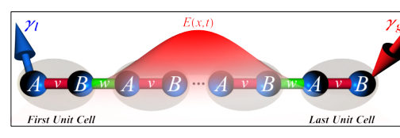 
FIG. 1. A 1D SSH chain coupled to a source reservoir (gain rate γg) at the last site and a sink reservoir (loss rate γl) at the first site, driven by a spatiotemporal laser electric field E(x, t).

📷 Fig 2

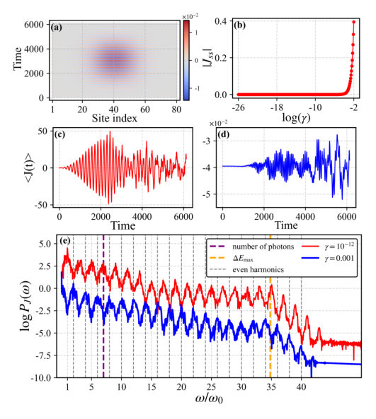 
FIG. 2. (a) Applied electric field in time and space. (b) Steady-state current as a function of source and sink strength. Total current expectation values as a function of time for (c) γ = 10−12 and (d) γ = 0.001. (e) Corresponding HH spectra; calculations consider 7 photons in the spectral gap. Here, δ = 0.1, ω0 = ∆E/7, a0 = 0.5, and ncyc = 42, N = 40.

📷 Fig 3

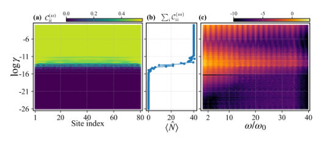 
FIG. 3. (a) Particle number vs. site index and γ. (b) Total number of particles as a function of γ. (c) Contour plot of harmonic yields as a function of harmonic order and γ.

📷 Fig 4

 
Figure 2 shows the high-harmonic response of the current-carrying SSH chain. The driving frequency is chosen as ω0 = ∆E/7 = 0.043, and the peak electric- field amplitude is E0 = A0ω = 0.0172 with the number of cycles ncyc = 42. ∆E = 0.297 is the energy gap of the undriven SSH chain. In addition, the number of unit cells and the dimerization parameter are N = 40 and δ = 0.1, respectively. Finite-size scaling analysis confirms that the emergence of even harmonics in the HHG spec- trum is independent of system size in the large-N regime. Panel (a) shows the spatiotemporal profile of the applied laser field E(x, t). The field is localized around the center of the chain. Consequently, the laser...

📷 Fig 5

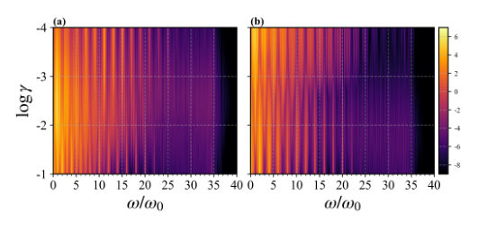 
FIG. 4. Harmonic spectra as a function of log γ for (a) τ = 106

**Summary.** The paper demonstrates that even harmonics can be generated in inversion-symmetric systems by driving them into a current-carrying, non-equilibrium steady state. This effect arises not from structural symmetry breaking but purely from the dissipative coupling to reservoirs. The intensity of these even harmonics is quantitatively linked to the magnitude of the DC charge transport current.

**Why it may be interesting.** This work bridges nonlinear quantum optics (HHG) with non-equilibrium condensed matter physics (current transport in open chains), providing a novel spectroscopic probe for charge dynamics in centrosymmetric materials.

Detailed structure

**Main problem.** The study investigates how even-harmonic generation (HHG) can occur in systems that possess inversion symmetry at the Hamiltonian level, but are driven into a non-equilibrium steady state by external currents.

**Main result.** The emergence of even harmonics is shown to be directly controlled by the magnitude of the DC transport current, establishing a clear link between nonequilibrium charge transport and the breaking of HHG selection rules.

**Method.** The analysis employs open quantum system theory using the Lindblad master equation formalism, solved via the single-particle correlation matrix approach for steady-state calculations.

**Model / system.** The model is a one-dimensional Su-Schrieffer-Heeger (SSH) chain coupled to source and sink reservoirs, simulating boundary-driven current flow in an open quantum system.

**Key observables.** High-harmonic generation (HHG) spectrum, steady-state transport current ($J_{dc}$), and the Uhlmann fidelity between time-dependent and steady states.

**Important parameters / regimes.** The strength of the boundary coupling ($\gamma$), which dictates the non-equilibrium nature of the state.

**Assumptions / limitations.** The analysis is restricted to pairing-free Gaussian states, allowing for the use of correlation matrices derived from the Lindblad master equation.

**Figures summary.** Figures illustrate the 1D SSH chain setup with reservoirs and applied fields; they also show time evolution of current under different coupling strengths ($\gamma$) and the resulting HHG response spectrum.

**Paper structure.** The paper first establishes the physical model (SSH chain in open system), derives the steady-state solution using correlation matrices, analyzes the symmetry breaking mechanism due to dissipation, and finally calculates the observable HHG spectrum linked to the DC current.

Abstract

High-harmonic generation (HHG) in inversion-symmetric systems is typically restricted to odd harmonics by symmetry. Here, we show that this selection rule can be broken without modifying the underlying Hamiltonian. We investigate a boundary-driven Su-Schrieffer-Heeger (SSH) chain coupled to source and sink reservoirs and demonstrate that dissipative dynamics generates a nonequilibrium steady state carrying a finite DC current. While the SSH Hamiltonian retains inversion symmetry, the current-carrying steady-state density matrix does not, leading to the emergence of even harmonics in the emitted spectrum. Using a correlation-matrix approach based on the Lindblad master equation, we obtain the steady state and calculate the resulting HHG response. We find that the intensity of the even harmonics is directly controlled by the transport current, establishing a link between nonequilibrium charge transport and HHG selection rules. Our results uncover a mechanism for even-harmonic generation that relies solely on nonequilibrium steady-state symmetry breaking and provide a route to probing transport currents through ultrafast nonlinear spectroscopy in centrosymmetric quantum systems.

[↑ back to top](#top)

### [Gaussian non relativistic spontaneously stochastic hydrodynamics](http://arxiv.org/abs/2607.27540v1)

**Authors:** David Montenegro, Giorgio Torrieri  
**Type:** theory · **Category:** statistical mechanics · **PDF:** <https://arxiv.org/pdf/2607.27540v1>  
**Analysis basis:** full PDF text, analyzed in chunks
**Topic relevance:** 🔥 `Keldysh / 2PI / non-Gaussian methods` **4/5** · `methods for driven-dissipative` **3/5** · `non-equilibrium dynamics` **3/5** · `correlated / nonlocal dissipation` **2/5** · `driven-dissipative phase transition` **2/5** · `analog quantum simulation` **1/5** · `non-equilibrium universality` **1/5**

📷 Fig 1

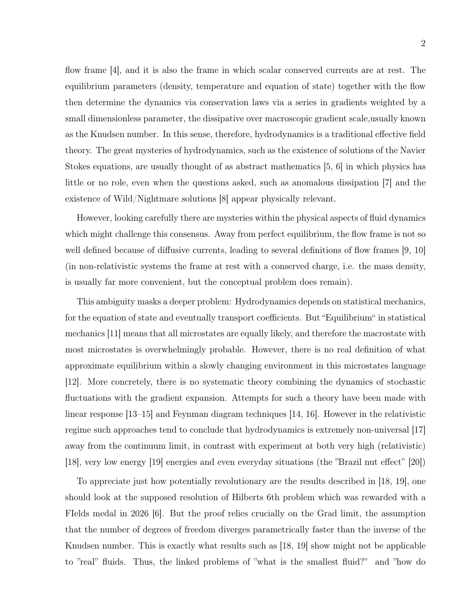 
Low-resolution page preview, page 2

📷 Fig 2

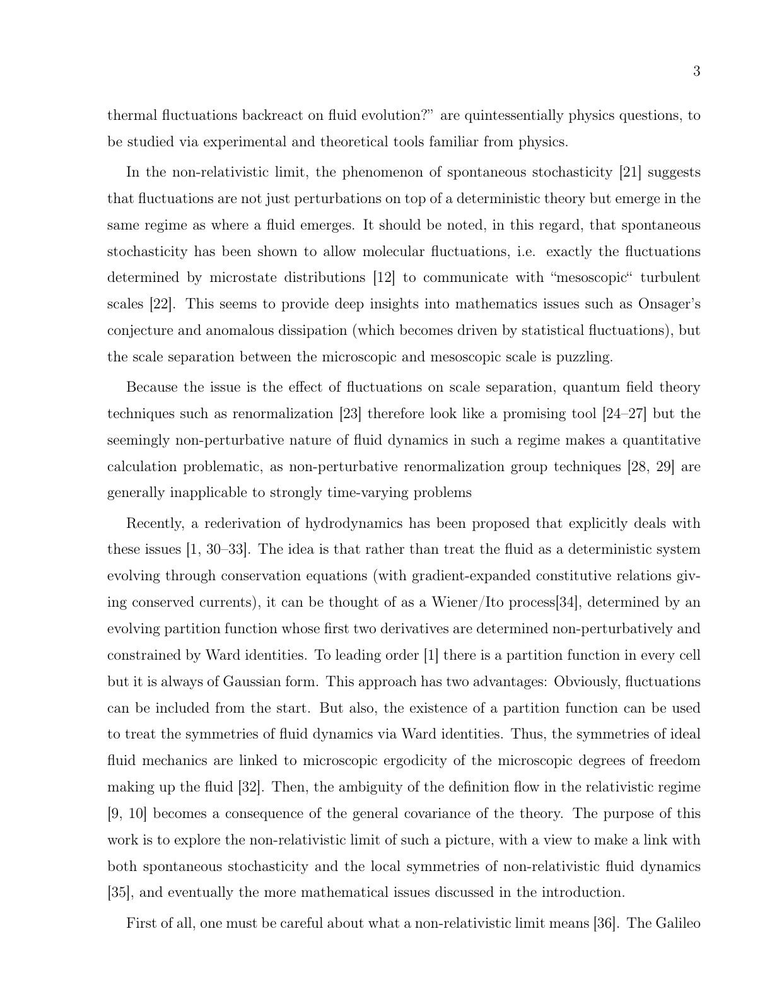 
Low-resolution page preview, page 3

📷 Fig 3

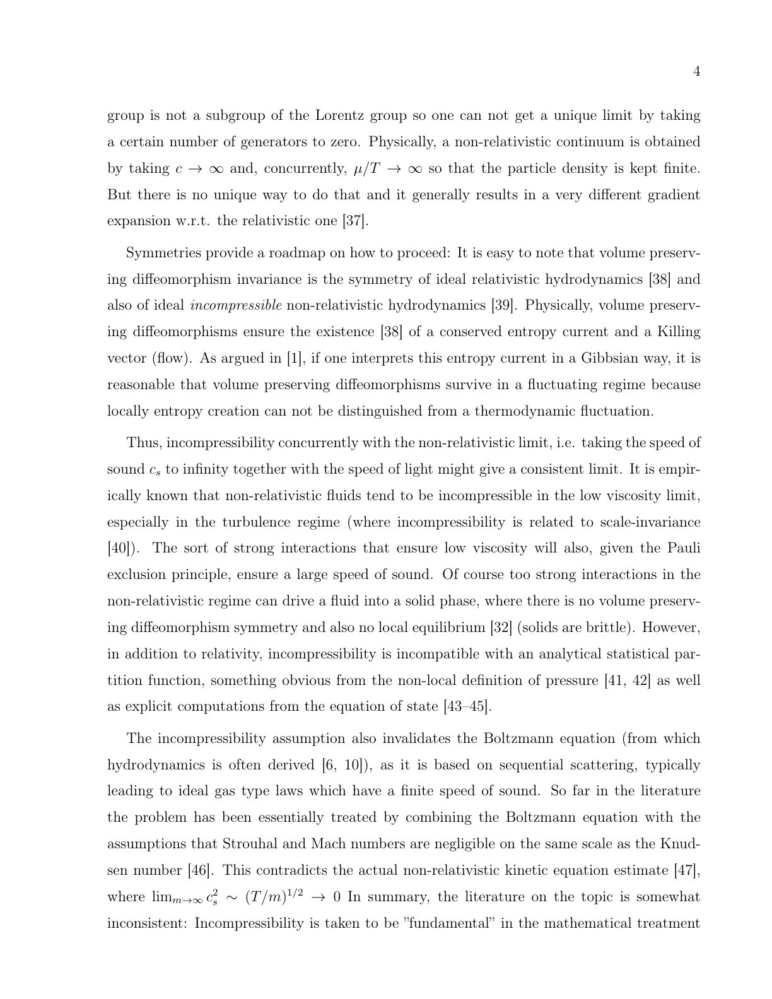 
Low-resolution page preview, page 4

📷 Fig 4

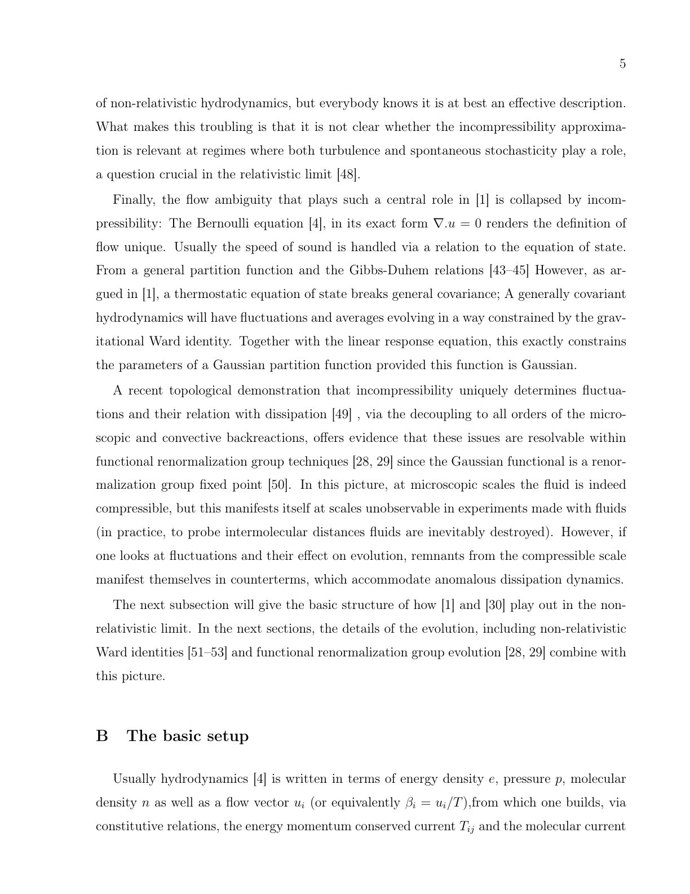 
Low-resolution page preview, page 5

📷 Fig 5

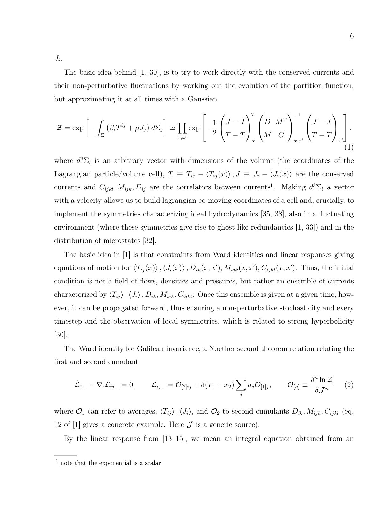 
Low-resolution page preview, page 6

**Summary.** This theoretical work develops a generalized hydrodynamic framework by applying functional renormalization group techniques. It tackles the complex transition between continuum hydrodynamics and microscopic statistical mechanics, showing how spontaneous stochasticity emerges naturally in this non-relativistic limit. The paper is significant for its rigorous mathematical treatment of scale dependence and symmetry breaking in fluid systems.

**Why it may be interesting.** While focused on classical fluid dynamics, the use of advanced non-equilibrium statistical mechanics tools like FRG to handle crossovers and stochastic fluctuations is highly relevant for open quantum systems where dissipation and thermalization are key.

Detailed structure

**Main problem.** The paper aims to understand the non-relativistic limit of Gaussian covariant hydrodynamics, specifically addressing the breakdown of the incompressibility assumption at microscopic scales.

**Main result.** The resulting dynamics naturally incorporates spontaneous stochasticity as a macroscopic back reaction from statistical mechanics fluctuations, suggesting anomalous dissipation effects via RG counterterms.

**Method.** The authors employ functional renormalization group (FRG) techniques to derive flow equations for effective actions, matching descriptions across different physical regimes (incompressible vs. compressible).

**Model / system.** The study models fluid dynamics, treating the system's partition function as a Gaussian functional and analyzing conserved currents ($T_{ij}, J_i$) in both relativistic and non-relativistic limits.

**Key observables.** Conserved currents ($\langle T_{ij} 
angle$, $\langle J_i 
angle$), correlators of these currents, and the scale-dependent effective action coefficients ($\Gamma_\kappa$).

**Important parameters / regimes.** The Knudsen number (Kn) characterizes scale separation; key regimes include incompressible ($k \le k_0$) and compressible/relativistic ($|k| \ge k_0$) limits.

**Assumptions / limitations.** The primary assumptions involve using a Gaussian ansatz for the partition function and treating hydrodynamics as an effective field theory based on gradient expansions, despite acknowledging limitations in this approach.

**Figures summary.** Not specified (the notes detail mathematical equations and flow structures rather than describing figure content).

**Paper structure.** The paper progresses by first establishing the framework using Ward identities and linear response theory for covariant hydrodynamics. It then develops the FRG flow equations, focusing on matching the effective action coefficients between the incompressible and compressible sectors at a crossover scale.

Abstract

We study the non-relativistic limit of Gaussian covariant hydrodynamics [1]. We argue that the condition of incompressibility provides additional symmetries matching relativistic hydrodynamics but incompressibility must break down at a ``microscopic`` scale. We then develop the renormalization group equations for average and fluctuations w.r.t. that scale, to understand its effect on flows at intermolecular distances where hydrodynamics gives way to statistical mechanics. The resulting dynamics naturally incorporates spontaneous stochasticity as a macroscopic back reaction of statistical mechanics fluctuations, as well as features reminiscent of anomalous dissipation and ``wild solutions`` as renormalization group counterterms. We frame these considerations into both a phenomenological discussion of the limits of applicability of fluid dynamics, and a discussion of where physics might shed some light on the mathematical issues associated with turbulence.

[↑ back to top](#top)

### [Universality of Energy-Space Entanglement in Quantum Impurity Models](http://arxiv.org/abs/2607.27394v1)

**Authors:** Geng-Dong Zhou, Zhi-Da Song  
**Type:** theory · **Category:** strongly correlated electrons · **PDF:** <https://arxiv.org/pdf/2607.27394v1>  
**Analysis basis:** full PDF text, analyzed in chunks
**Topic relevance:** 🔥 `Kondo & dissipative impurity` **4/5** · 🔥 `entanglement & information structure` **4/5** · `methods for driven-dissipative` **3/5** · `non-equilibrium universality` **2/5** · `correlated / nonlocal dissipation` **1/5** · `driven-dissipative phase transition` **1/5** · `non-equilibrium dynamics` **1/5**

📷 Fig 1

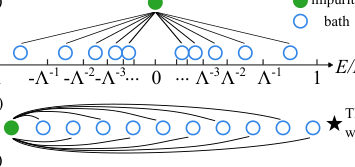 
FIG. 1. (a) Impurity-bath coupling and logarithmic bath discretiza- tion. (b,c) The star and chain representation, respectively. We use the star representation in this work.

📷 Fig 2

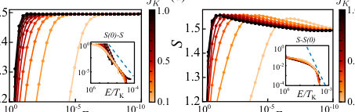 
FIG. 2. (a) SΛ(E) for the Anderson model with U = 0, 0.5, . . . , 5 (bright to dark), ∆0 = 0.05, D = 1, and Λ = 2. Inset: the same data versus E/TK. (b) SΛ(E) for the Anderson and Kondo models at different Λ, with U = 0, ∆0 = 0.05, and JK = 0.5. (c,d) SΛ(E) for the fully screened and underscreened Kondo models with JK = 0.1, 0.2, . . . , 1.0 (bright to dark). Insets: |SΛ(0) −SΛ(E)| versus E/TK; the dashed blue lines indicate linear scaling with E. All DMRG calculations use maximum bond dimension χ = 1600.

📷 Fig 3

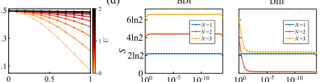 
FIG. 3. (a) Comparison of SΛ(0) at different Λ for the Anderson impurity model, the Kondo model obtained from DMRG, and the exact value from directly diagonalizing the free-fermion Hamiltonian. The dashed lines show the asymptotic behaviors at Λ →1 and Λ → ∞limits. (b) (eρΛ,z(q), eρΛ,y(q)) when Λ →∞(left panel) and Λ → 1 (right panel). The color represents q and the points are sampled on uniform q meshes. We use maximum bond dimension χ = 1600 for DMRG calculations in (a). (c) The fixed-point entropy S under bath particle-hole asymmetry for the one-orbital Anderson model with ∆(ω) = ∆(0)[1 + xω/D], plotted versus the dimensionless slope x. ∆(0) = 0.05, D = 1, and Λ = 2. The color denotes U...

📷 Fig 4

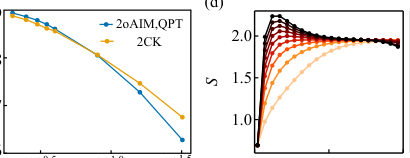 
FIG. 4. (a) SΛ(E) for the 2oAIM with JS close to J(c) S . (b) Bath-topology schematic for the local-singlet–Kondo-singlet tran- sition. The top and bottom panels denote the local-singlet and Kondo phases, while dashed and solid black bonds denote weak and strong couplings. The two boxes denote orbitals, and each unit cell contains the two energy-branch bath modes at a given scale, up to a local rotation between positive and negative energies. The vertical dashed line marks the entanglement cut. (c) SΛ(0) versus Λ at the QPT of 2oAIM and 2CK. (d) SΛ(E) for 3CK. Parameters are Λ=2, U =0.5, ∆0 = 0.05, D = 1, and J(c) S = 0.2349895 in (a), and Λ = 2.5 and JK =0.2, 0.3, . . . , 1.0 (bright to...

📷 Fig 5

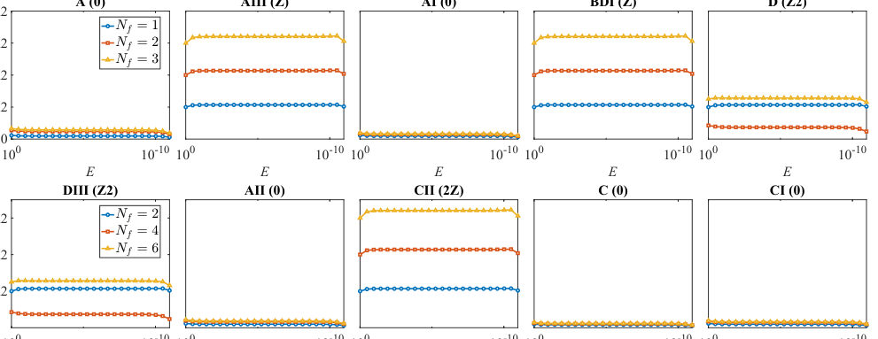 
FIG. 5. Entanglement entropy for the ten AZ classes with constant identity hybridization ∆(ω) = 1Nf and symmetry-allowed local impurity Hamiltonian Hf. The local terms are defined in Table I and Eqs. (B65) and (B66). The calculation uses bandwidth D = 1, Λ = 3, and Nshell = 24 logarithmic bath shells. The labels Nf count all single-particle flavors of the impurity/hybridization matrix, including spin and orbital labels; an N-orbital spin-1/2 system therefore has Nf = 2N. Topologically trivial classes are pushed close to zero residual entropy by the local mass, while the chiral classes AIII, BDI, and CII are unaffected because Hf = 0 is symmetry enforced. The D and DIII classes show the...

**Summary.** This work develops a novel method using energy-space bipartitioning to calculate entanglement entropy in quantum impurity models. It demonstrates that this EE exhibits universal, parameter-independent plateaus at Fermi-liquid fixed points, linking these values to topological invariants derived from the bath structure. The findings provide powerful diagnostic tools for distinguishing between different correlated ground states and characterizing quantum phase transitions.

**Why it may be interesting.** The use of entanglement entropy as a diagnostic tool for classifying quantum critical points and determining universal properties in strongly interacting impurity systems is highly relevant to understanding open quantum systems dynamics.

Detailed structure

**Main problem.** The study investigates universal behaviors of entanglement entropy (EE) by employing an energy-space bipartition in quantum impurity models, moving beyond standard real or momentum space cuts.

**Main result.** For Fermi-liquid fixed points, the low-energy EE flows to parameter-independent constants related to topological edge modes; furthermore, the EE distinguishes between different correlated phases like local-singlet and Kondo-singlet states.

**Method.** The analysis uses logarithmic discretization of the bath energy (poor man's scaling) and calculates entanglement entropy using DMRG on an effective Hamiltonian representation (star/MPO).

**Model / system.** The focus is on quantum impurity models, including the Anderson model and various Kondo models, coupled to a fermionic bath. The formalism utilizes MPO representations for numerical stability.

**Key observables.** Energy-space Entanglement Entropy ($S_{\Lambda}(E)$) and its low-energy plateau value $S_{\Lambda}(0)$.

**Important parameters / regimes.** Kondo temperature ($T_K$), logarithmic discretization parameter ($\Lambda$), interaction couplings ($U, J_K$).

**Assumptions / limitations.** The analysis assumes that the low-energy physics is governed by universal fixed points and relies on mapping the system to an effective 1D chain structure.

**Figures summary.** Figures illustrate $S_{\Lambda}(E)$ for various models (Anderson, Kondo) showing saturation plateaus; one figure compares EE across ten Altland-Zirnbauer symmetry classes based on spectral hybridization.

**Paper structure.** The paper progresses by establishing the energy-space bipartition method, applying it to Fermi-liquid fixed points to show universality and topological classification (Chiral Symmetry), examining quantum phase transitions between different correlated states, and finally generalizing the findings across various Altland-Zirnbauer symmetry classes.

Abstract

Entanglement entropy (EE) is commonly studied using real-space bipartitions. We show that, in quantum impurity models, an energy-space bipartition, equivalent to the momentum-space bipartition of the bath, can display universal behavior. Motivated by poor man's scaling, we logarithmically discretize the bath and partition it into high- and low-energy sectors. For models with Fermi-liquid fixed points, including the Anderson model and fully screened or underscreened Kondo models, the low-energy EE flows to constants independent of model parameters. These constants are integer multiples of $\ln 2$ plus corrections that depend only on the logarithmic discretization parameter $Λ$. We show that scale invariance of the fixed-point wavefunction in energy space maps to effective translation invariance along a one-dimensional chain, allowing the fixed points to be classified by one-dimensional topological band theory. With low-energy chiral symmetry, each $\ln 2$ contribution originates from a topological edge mode. We also study transitions between distinct Fermi-liquid fixed points using the local-singlet--Kondo-singlet transition in a two-orbital Anderson model driven by an inter-orbital antiferromagnetic coupling. The local-singlet phase has an effectively decoupled impurity and nearly vanishing EE, whereas the Kondo-singlet phase has finite EE larger than $\ln 2$ per spin and orbital. When chiral symmetry holds at low energies, this distinction corresponds to a topological transition of the effective bath chain. At the non-Fermi-liquid critical point, the EE develops an unstable plateau. Its $Λ$ dependence resembles that of the overscreened two-channel Kondo model, supporting universality within the same non-Fermi-liquid universality class.

[↑ back to top](#top)

### [When quantum thermal states look classical](http://arxiv.org/abs/2607.28536v1)

**Authors:** Harald Putterman, Alexander Zlokapa, Jordan Cotler  
**Type:** theory · **Category:** statistical mechanics · **PDF:** <https://arxiv.org/pdf/2607.28536v1>  
**Analysis basis:** full PDF text, analyzed in chunks
**Topic relevance:** 🔥 `entanglement & information structure` **4/5** · `non-equilibrium dynamics` **3/5** · `non-equilibrium universality` **2/5** · `Keldysh / 2PI / non-Gaussian methods` **1/5** · `analog quantum simulation` **1/5** · `correlated / nonlocal dissipation` **1/5** · `driven-dissipative phase transition` **1/5** · `methods for driven-dissipative` **1/5** · `scars & prethermalization` **1/5**

📷 Fig 1

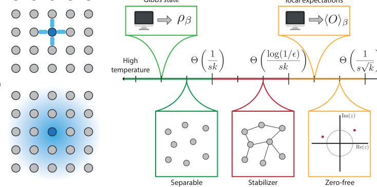 
Figure 1: Properties of long-range interacting systems. (a) Depiction of a local Hamiltonian with bounded degree, where each site only interacts with a finite number of sites. (b) Schematic of a long-range interacting system where each site can interact with all of the sites in the lattice. (c) Inverse temperatures β at which all long-range Hamiltonians are guaranteed to be physically or computationally classical.

📷 Fig 2

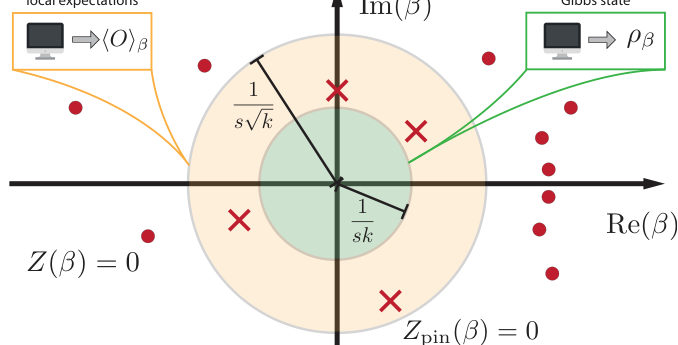 
Figure 2: Implications of zero-freeness for phase transitions and classical algorithms. Red dots indicate where the partition function evaluates to zero, Z(β) = Tr  e−βH = 0. A phase transition is defined by Lee-Yang theory to be an extensive density of complex zeros of Z(β) approaching the real axis at some β∗, causing limn→∞1

📷 Fig 3

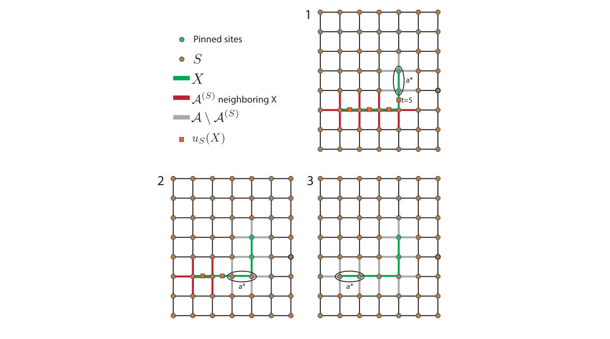 
Figure 3: An example of how the pinning algorithm works. Vertices correspond to qubits and the edges to the terms of the Hamiltonian which are all weight 2. S corresponds to the unpinned sites, X to the current monomial, A(S) to the terms of the Hamiltonian which are fully supported on the unpinned sites, and uS(X) are the terms which make up X that touch an unpinned site. The situation depicted is the particularly adversarial setting where the algorithm repeatedly samples the branch corresponding to p1, where the monomial stays the same but the coefficient c in I + cP grows. The initial sampling depicted in (1) selects a monomial of length t = 5 indicated with the green edges. Subsequent...

**Summary.** This paper rigorously maps out a hierarchy of transitions where quantum Gibbs states lose their non-classical features (like entanglement) as temperature decreases. By analyzing long-range Pauli Hamiltonians, the authors establish distinct critical temperatures for separability and other classical limits. This work provides polynomial-time classical algorithms to estimate thermal expectations even when these quantum correlations are present.

**Why it may be interesting.** This work provides rigorous mathematical tools to characterize when complex quantum many-body states simplify into classically describable forms at finite temperatures, which is crucial for understanding thermalization dynamics.

Detailed structure

**Main problem.** The paper establishes a hierarchy of 'classical-to-quantum transitions' for quantum Gibbs states as the system is cooled from high temperature.

**Main result.** It proves that features like entanglement death and separability persist down to finite temperatures, forming distinct transition scales independent of system size.

**Method.** The authors use new cluster expansion techniques and randomized sampling approaches to analyze the partition function and state properties.

**Model / system.** The study focuses on quantum systems governed by long-range Pauli Hamiltonians ($H$) with bounded local interaction strength, allowing for analysis beyond previously restricted models.

**Key observables.** Separability (unentangled states), Stabilizerness (stabilizer representation), Correlation Decay, and the zero-free radius of the partition function $Z(z)$.

**Important parameters / regimes.** The transition scales are characterized by parameters like $eta_{	ext{sep}} = \Theta(1/(sk))$, $eta_{	ext{stab}}$, and the infinite-temperature phase scale $\Theta(1/(s\sqrt{k}))$.

**Assumptions / limitations.** The results apply to long-range Pauli Hamiltonians with locality $k$ and strength $s$, utilizing advanced cluster expansion methods.

**Figures summary.** Figure 1 schematically compares various physical properties (separability, phase transitions) across different temperature thresholds based on the system parameters $s, k,$ and $\epsilon$.

**Paper structure.** The paper progresses by first establishing bounds related to the infinite-temperature phase using Lee-Yang theory, then deriving specific transition scales for separability and stabilizer structure, culminating in polynomial-time classical algorithms for thermal expectation estimation.

Abstract

At high temperature, quantum Gibbs states retain several classical features of the maximally mixed state: the absence of entanglement, the absence of magic, analyticity of the partition function, correlation decay, and algorithmic tractability. We prove new and sharp bounds showing that these features persist down to finite temperatures independent of system size, but fail at distinct inverse-temperature scales, forming a hierarchy of classical-to-quantum transitions. Our results hold for long-range Pauli interactions with bounded strength at every site. Despite such all-to-all interactions, we show that the death of entanglement occurs at constant temperature, resolving an open question of Rouze, Franca and Alhambra (STOC'25). We give a polynomial-time classical algorithm that prepares Gibbs states up to the death of entanglement transition. Notably, this is asymptotically colder than temperatures at which quantum Gibbs samplers are known to mix quickly, as well as the original separability temperature of Bakshi et al. (FOCS'24), which we improve to be tight up to constants. At asymptotically even colder temperatures, we show that the Gibbs state remains in the thermodynamic infinite-temperature phase. This leads to polynomial-time classical algorithms for estimating thermal expectations despite both entanglement and magic, and the resolution of a correlation decay conjecture of Harrow, Mehraban and Soleimanifar (STOC'20).

[↑ back to top](#top)

### [Area-Information Trade-Offs in Acceleration Radiation from Atoms Falling into Black Holes](http://arxiv.org/abs/2607.27388v1)

**Authors:** Yusef Maleki, Gustavo Valdivia-Mera, Carlos R. Ordonez, Horacio E. Camblong, Marlan O. Scully  
**Type:** theory · **Category:** other · **PDF:** <https://arxiv.org/pdf/2607.27388v1>  
**Analysis basis:** full PDF text, analyzed in chunks
**Topic relevance:** 🔥 `entanglement & information structure` **4/5** · `Keldysh / 2PI / non-Gaussian methods` **3/5** · `non-equilibrium dynamics` **2/5** · `non-equilibrium universality` **2/5** · `correlated / nonlocal dissipation` **1/5** · `driven-dissipative phase transition` **1/5** · `methods for driven-dissipative` **1/5**

📷 Fig 1

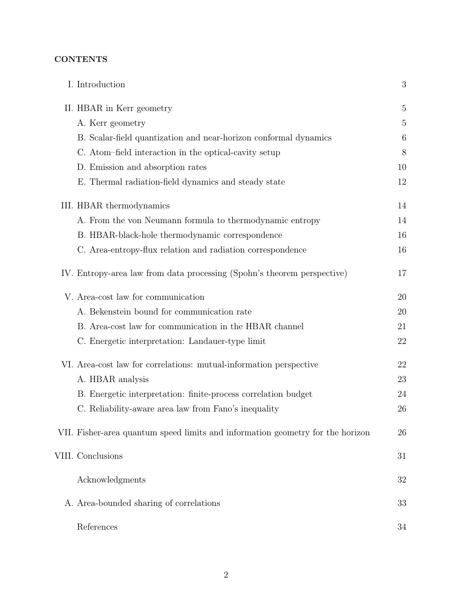 
Low-resolution page preview, page 2

📷 Fig 2

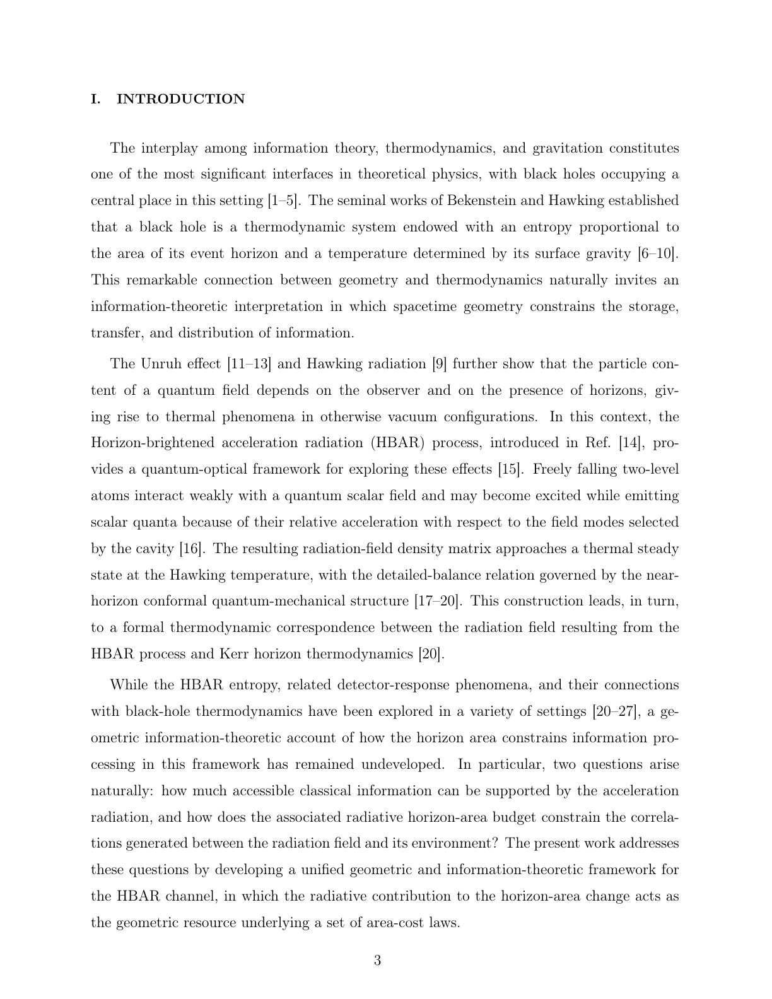 
Low-resolution page preview, page 3

📷 Fig 3

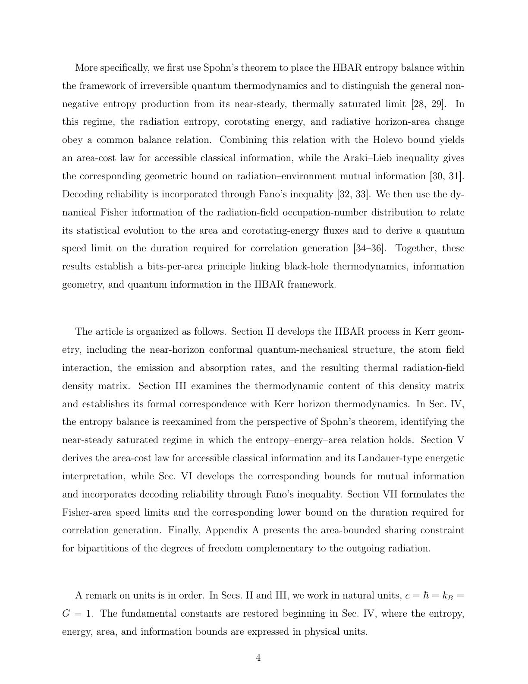 
Low-resolution page preview, page 4

📷 Fig 4

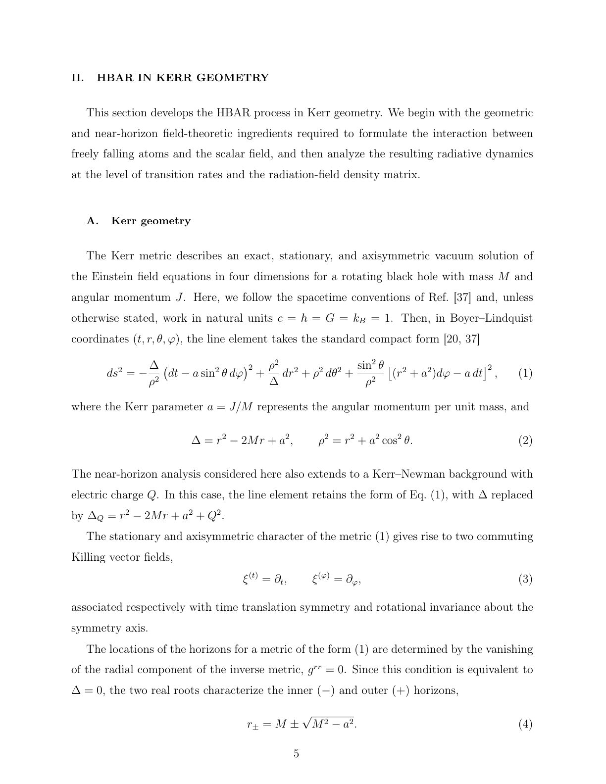 
Low-resolution page preview, page 5

📷 Fig 5

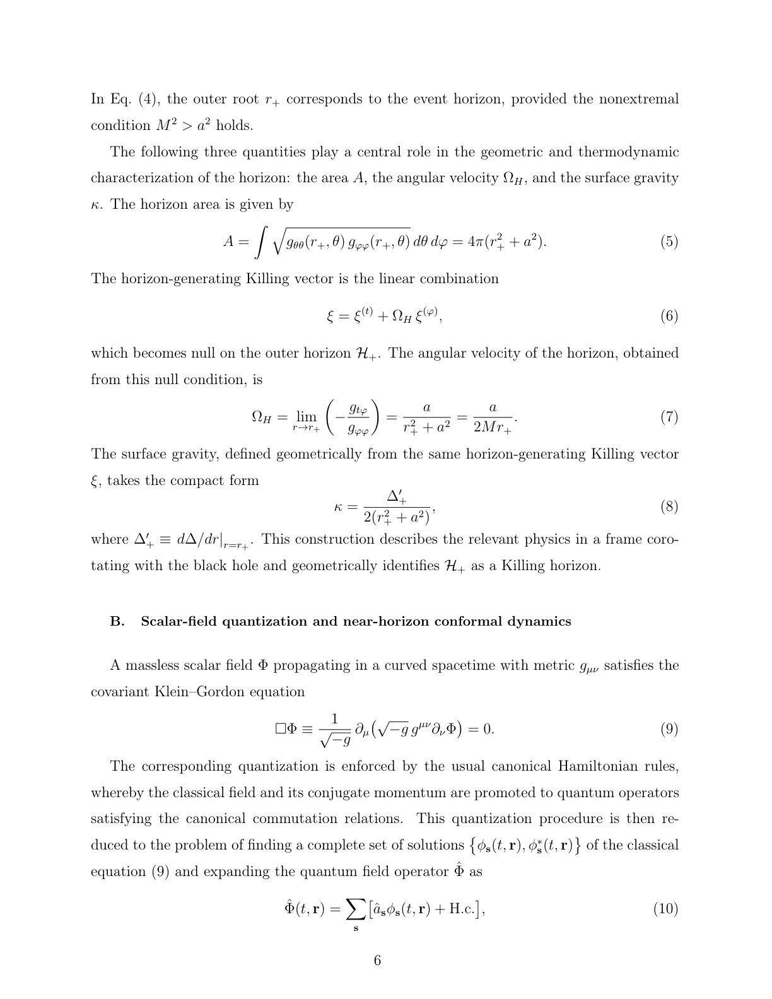 
Low-resolution page preview, page 6

**Summary.** This work develops an information-theoretic framework for understanding radiation emitted by atoms falling into black holes. It shows that the change in the black hole's horizon area acts as a quantifiable resource budget for the information carried away by the radiation field. Ultimately, it establishes fundamental 'bits-per-area' limits connecting gravity, thermodynamics, and quantum information.

**Why it may be interesting.** It provides a deep connection between general relativity (black hole thermodynamics), quantum field theory in curved spacetime, and fundamental principles of quantum information theory, which is highly relevant for theoretical physicists studying open quantum systems near extreme gravitational environments.

Detailed structure

**Main problem.** The paper develops a geometric theory linking black hole horizon area changes to information processing limits within the Horizon-brightened acceleration radiation (HBAR) channel.

**Main result.** It establishes a 'bits-per-area principle' that constrains accessible classical information and mutual information based on the radiative horizon-area budget.

**Method.** The analysis combines quantum field theory in curved spacetime with advanced concepts from information geometry, utilizing bounds like Holevo's and Fano's inequalities.

**Model / system.** The system involves atoms falling into a black hole described by Kerr geometry, leading to the emission of HBAR. The physics is modeled using quantization of a scalar field ($\Phi$) interacting with the atomic dipole moment.

**Key observables.** Accessible classical information ($I_{	ext{class}}$), mutual information ($\Delta I_{	ext{M}}$), Fisher Information ($I_F$), and the radiative horizon-area change ($\dot{A}_{	ext{rad}}$).

**Important parameters / regimes.** The analysis focuses on the near-steady, thermally saturated regime; key parameters include the surface gravity ($\kappa$) and angular velocity ($\Omega_H$).

**Assumptions / limitations.** The primary assumption is that the radiative contribution to the horizon area change acts as the geometric resource governing information flow.

**Paper structure.** The paper builds from a quantum-optical description of atom-field interaction (HBAR) to derive thermodynamic correspondences, then applies information geometry tools (Fisher/Bures lengths) to establish area-cost laws and speed limits on correlation generation.

Abstract

We develop a geometric theory of information processing in the Horizon-brightened acceleration radiation (HBAR) channel, in which the radiative horizon-area change provides an entropy budget for the information carried by the radiation field. Building on the quantum-optical description of atom--field interactions near the horizon and the resulting HBAR thermodynamic correspondence, we derive area-cost laws in the near-steady, thermally saturated regime. The accessible classical information and the mutual information generated between the radiation field and its environment are bounded by the associated radiative horizon-area budget. Reliability is incorporated through Fano's inequality, which translates a prescribed decoding error probability into an area requirement. We further derive Fisher-information speed limits that constrain the statistical evolution of the radiation field and place a lower bound on the duration required for correlation generation. Together, these results establish a bits-per-area principle linking black-hole thermodynamics, information geometry, and quantum information in the HBAR framework.

[↑ back to top](#top)

### [Ensemble theory of thermodiffusion](http://arxiv.org/abs/2607.27839v1)

**Authors:** R. Belousov, J. Elliott, A. Erzberger  
**Type:** theory · **Category:** statistical mechanics · **PDF:** <https://arxiv.org/pdf/2607.27839v1>  
**Analysis basis:** full PDF text, analyzed in chunks
**Topic relevance:** 🔥 `non-equilibrium dynamics` **4/5** · `methods for driven-dissipative` **3/5** · `non-equilibrium universality` **3/5** · `Keldysh / 2PI / non-Gaussian methods` **1/5** · `correlated / nonlocal dissipation` **1/5** · `driven-dissipative phase transition` **1/5**

📷 Fig 1

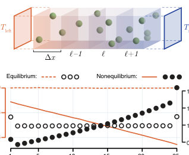 
FIG. 1. Molecular-dynamics simulations of a hard-core gas in a nonequilibrium steady state sustained by thermalizing walls at Tleft/Tref = 0.9 and Tright/Tref = 0.5 (Tref: reference temperature at equilibrium; kB = 1 in arbitrary units, [42, Sec. S1]). Histograms of particle density ρℓand kinetic tem- perature Tℓexhibit opposing gradients when Tleft ̸= Tright .

📷 Fig 2

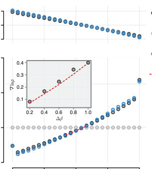 
FIG. 3. Profiles of temperature (a) and density (b) for a hard-core gas in a nonequilibrium steady state sustained by thermalizing walls at kBTleft = 0.9, kBTright = 0.5 (arb. u.). Our coarse-grained model with kinetic connectivity, cali- brated from equilibrium data at kBTref = 1.0, accurately pre- dicts histograms of temperature and density in MD simula- tions. The nearest-neighbor scheme fails to reproduce the density distribution in the hard-core gas subject to the tem- perature drop. Linear-response formulas [42, Eqs. (S17)– (S19)] for the Soret coefficient ST and Eq. (13) accurately describe the gradient ∇ln ρ|ℓ=13 ≈−ST ∇T over a wide range of differences ∆β = (kBTright)−1...

**Summary.** This paper develops an ensemble theory approach to model thermodiffusion in a hard-core gas under a temperature gradient. By using path-ensemble theory calibrated against equilibrium simulations, the authors successfully predict non-equilibrium mass and temperature profiles. The key finding is that incorporating detailed kinetic connectivity information (KC) into the graph structure is essential for accurately capturing coupled thermal and diffusive transport phenomena.

**Why it may be interesting.** While focused on classical gas dynamics, the rigorous application of ensemble theory to non-equilibrium steady states—especially deriving macroscopic coefficients from microscopic path statistics—provides a powerful theoretical template applicable to open quantum systems far from equilibrium.

Detailed structure

**Main problem.** The study of thermodiffusion, which describes the coupling between heat flow and matter transport (diffusion) in a system subjected to a temperature gradient.

**Main result.** The path-ensemble theory accurately predicts non-equilibrium mass distribution profiles for a hard-core gas under $\Delta T 
eq 0$, yielding a simple formula for the Soret coefficient ($S_T$).

**Method.** The authors employ path-ensemble theory, calibrating dynamics using microcanonical principles derived from equilibrium simulations to model non-equilibrium transport.

**Model / system.** The system is a hard-core gas confined between two thermalizing walls. The dynamics are modeled on a lattice structure, governed by transition probabilities derived from maximizing the $\mu$-caliber subject to energy and matter conservation constraints.

**Key observables.** Mass distribution ($
ho$), kinetic temperature ($T$), and the Soret coefficient ($S_T = D_T / D$).

**Important parameters / regimes.** Temperature gradient ($\Delta T$), lattice site energies ($\epsilon_i$), and time/space discretization parameters.

**Assumptions / limitations.** The theory assumes all microscopic realizations of a path are equally probable, and it compares two graph connectivity schemes (Kinetic Connectivity vs. Nearest-Neighbor) to capture the necessary microscopic details.

**Figures summary.** Figure 1 shows molecular dynamics results ($
ho$ and $T$) exhibiting opposing gradients when $\Delta T 
eq 0$. Figure 3 compares MD simulations with predictions from the KC model (accurate) versus the NN scheme (fails) for non-equilibrium profiles.

**Paper structure.** The paper establishes the physical problem, develops the path-ensemble theory based on microcanonical principles, compares two graph connectivity schemes (KC vs. NN), and demonstrates that only the detailed Kinetic Connectivity approach correctly predicts the steady-state transport properties.

Abstract

Heat flow sustained by a temperature difference generates a gradient of matter as observed, for example, in atomistic simulations of hard-core gases. We use path-ensemble theory to represent the coupled thermal and diffusive transport by dynamics on a graph. Calibrated from a single equilibrium simulation, this model accurately predicts nonequilibrium mass distribution in a hard-core gas across a wide range of applied temperature gradients. It also enables estimation of transport properties, such as the Soret coefficient, using analytical expressions.

[↑ back to top](#top)

### [Entanglement Swapping with Integrated Narrowband Photon Sources for Quantum Repeaters](http://arxiv.org/abs/2607.28184v1)

**Authors:** Mingsong Wu, Leili Esmaeilifar, Rui Ning Wang, Tobias Kippenberg, Rob Thew, Tiff Brydges  
**Type:** experiment · **Category:** quantum information and computing · **PDF:** <https://arxiv.org/pdf/2607.28184v1>  
**Analysis basis:** full PDF text, analyzed in chunks
**Topic relevance:** 🔥 `QC/QI experiment` **4/5** · `interference shaping light` **3/5** · `quantum optics experiment` **3/5** · `entanglement & information structure` **2/5** · `quantum measurements` **1/5**

📷 Fig 1

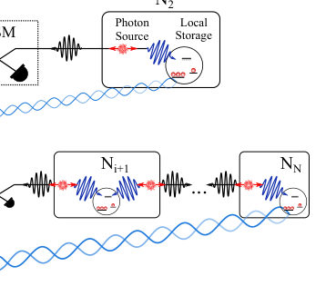 
Fig. 1. Simplified schematic of one implementation of a quantum repeater network. a) An elementary quantum repeater link in the network. Nodes 𝑁1 and 𝑁2 prepare an entangled resource state. A part of this state is sent through a quantum channel to an intermediate Bell State Measurement (BSM) station, with the remaining part stored locally [10,13,14]. Entanglement is distributed between 𝑁1 and 𝑁2 through a BSM, which projects the remaining states at 𝑁1 and 𝑁2 into an entangled state. b) Schematic of full repeater link, allowing nodes 𝑁1 and 𝑁𝑁to share an entangled state through the use of additional nodes.

📷 Fig 2

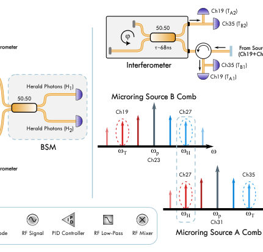 
Fig. 2. Simplified schematic of the experimental setup. The general cavity-lock feedback loops are shown for each source. The photon pairs from each source are demultiplexed according to the ITU C-band frequency grid: Ch27 photons are interfered at the central BSM station, with the remaining Ch19 and Ch35 photons passed through a folded Franson interferometer for the time-bin entanglement measurement. A detailed schematic of the experimental setup is given in the supplementary material.

📷 Fig 3

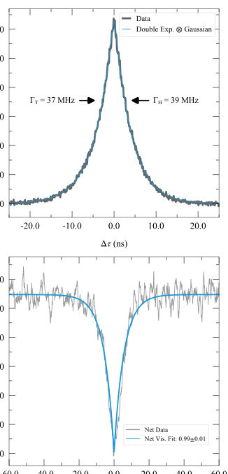 
Fig. 3. a) and b) Cross-correlation measurements for Source A and Source B, respectively. Data is shown in black, with the blue lines fits to the data from a convolution of a double exponential with a Gaussian. The extracted photon linewidths are: Γ𝑇= 56 MHz and Γ𝐻= 51 MHz (Source A), Γ𝑇= 37 MHz and Γ𝐻= 39 MHz (Source B). c) and d) Background-subtracted (net) HOM interference measurements with coincidence window of ±15 ns and ±0.7 ns respectively. Both measurements give a fitted net visibility of 0.99 ± 0.01. For all four plots, the data is given as thick gray lines and the fits are thin blue lines (see Supplementary Material for the fit models).

📷 Fig 4

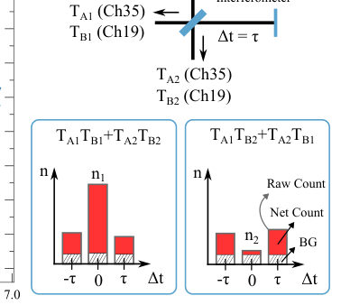 
Fig. 4. a) Interferometric contrast of the entanglement swapping measurement as a function of the phase setting of the swapped state, with the BSM and target photon coincidence windows being ±0.7 ns and ±1.5 ns respectively. The raw visibility is 0.54 ± 0.04, with a background subtracted visibility of 0.88 ± 0.06, with the reduced chi-squared for the net fit being 𝜒2 𝜈= 1.58. b) Conceptual diagrams of how coincidences are measured between the two sources’ target photon streams and used to calculate the interferometric contrast for each phase setting. For the C-band Ch35 (Source A) and Ch19 (Source B) photon modes, they each have two interferometer output signal streams, giving four...

**Summary.** The research demonstrates entanglement swapping using integrated photonic chips that generate narrowband, high-purity entangled photons. By successfully stabilizing the system across large frequency differences and measuring a high swapped state visibility, the authors overcome key technical hurdles for building practical, field-deployable quantum repeaters.

**Why it may be interesting.** This work directly tackles hardware implementation barriers for quantum networks by integrating photon sources and achieving necessary spectral purity and stability required to interface with solid-state quantum memories.

Detailed structure

**Main problem.** The primary challenge is implementing field-deployed quantum repeaters, which requires integrated photonics sources generating narrowband photons compatible with atomic quantum memories while maintaining system-level stabilization.

**Main result.** The authors successfully demonstrated entanglement swapping using two independent integrated sources with narrow bandwidths, achieving a net swapped state visibility of 0.88 $\pm$ 0.06, sufficient to violate a Bell inequality.

**Method.** Entanglement swapping was performed by interfering herald photons at a central Beam State Measurement (BSM) station, projecting the remaining target photons onto an entangled time-bin state.

**Model / system.** The experiment utilizes integrated photonics platforms (SiN waveguides with MRRs) pumped by CW lasers to generate energy-time entangled photon pairs. The setup mimics entanglement swapping between two independent repeater nodes operating at different frequencies.

**Key observables.** Background-subtracted (net) HOM visibility of $0.99 \pm 0.01$ and net swapped state visibility $\mathcal{V}=0.88 \pm 0.06$.

**Important parameters / regimes.** Narrow bandwidths ($<60 	ext{ MHz}$), phase/frequency stabilization across $1.6 	ext{ THz}$, and the ability to operate with independent, non-degenerate sources.

**Assumptions / limitations.** The analysis relies on post-selection on successful herald clicks, and background subtraction is necessary due to noise from Raman scattering in the cladding.

**Figures summary.** Figures schematically illustrate the quantum repeater network and the experimental setup, detailing cavity-lock feedback loops and BSM components. Figure 4 specifically shows interferometric contrast measurements versus phase setting.

**Paper structure.** The paper addresses fundamental challenges by demonstrating entanglement swapping using integrated sources. It details the use of two independent sources, measures high HOM visibility, achieves large frequency stabilization, and quantifies the final swapped state visibility against Bell inequality violation criteria.

Abstract

Promising implementations of first generation quantum repeaters are predicted to require atomic-based quantum memory systems interfaced with photonic sources. Integrated photonics provides a promising solution for fibre-based, field-deployed operation of quantum repeaters, however many leading quantum memory platforms require narrow-bandwidth photons that are challenging to generate with integrated photonics. Narrowband photons also present significant technical challenges when implementing entanglement-swapping, particularly with regards to systems-level stabilisation. This work addresses some of these fundamental and technical challenges, by demonstrating entanglement-swapping using state-of-the-art integrated photon sources with bandwidths compatible with multiple atomic-based quantum memory platforms. We obtained a background-subtracted (net) HOM visibility of 0.99$\,\pm\,$0.01, showing high photon indistinguishability and purity, with a net swapped state visibility of $\mathcal{V}$=0.88$\,\pm\,$0.06 demonstrating that the final entanglement would be sufficient to violate a Bell inequality. The experiment used independent pump lasers for each photon pair source, with highly different frequencies to mimic entanglement swapping between different repeater nodes or platforms. Phase and frequency stabilisation spanning 1.6 THz was achieved using all-fibre, commercially-available components. These results address important challenges in implementing field-deployed quantum repeaters, from the integrated photonic solutions for narrowband photon pairs, to systems-level stabilisation between independent quantum repeater nodes.

[↑ back to top](#top)

### [Mpemba effect in a chemomechanical model of the Kinesin molecular motor](http://arxiv.org/abs/2607.27998v1)

**Authors:** Karthik Cheruvary, Arnab Pal  
**Type:** theory · **Category:** statistical mechanics · **PDF:** <https://arxiv.org/pdf/2607.27998v1>  
**Analysis basis:** full PDF text, analyzed in chunks
**Topic relevance:** 🔥 `non-equilibrium dynamics` **4/5** · `methods for driven-dissipative` **3/5** · `non-equilibrium universality` **3/5** · `Keldysh / 2PI / non-Gaussian methods` **1/5** · `correlated / nonlocal dissipation` **1/5** · `driven-dissipative phase transition` **1/5**

📷 Fig 1

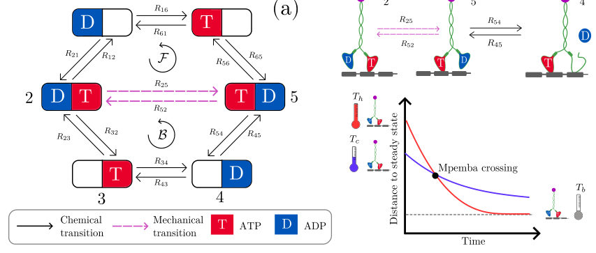 
Figure 1: Panel (a): The chemo mechanical network representing Kinesin motion. This numbering of states will be used throughout. F is the forward cycle and B is the backward cycle, directed along the arrows. Panel (b): Schematic of Kinesin walker on a microtubule undergoing mechanical and chemical transitions. Panel (c) shows that the Kinesin system initially equilibrated at a higher temperature relaxes faster than the same initially equilibrated at a lower temperature, yielding Mpemba crossing.

📷 Fig 2

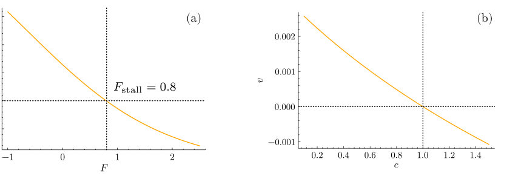 
Figure 2: Non-equilibrium nature of the Kinesin depicted by the velocity defined via the current. Panel (a): Steady state velocity v vs load force F, showcasing v decreasing with increasing load and stalling at Fstall = 0.8. Other parameters are Tb = 1, s = 0.5, r = 0.1, c = 0.1, θ = 0.6. Since c ̸= 1, the network is out of equilibrium. Panel (b): Velocity v vs chemical driving c for Tb = 1, s = 0.5, r = 0.1, F = 0. c = 1 corresponds to chemical equilibrium, resulting in v = 0.

📷 Fig 3

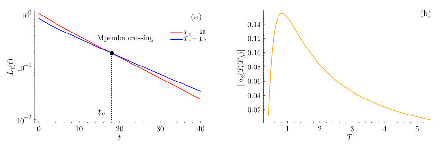 
Figure 3: Examples illustrating equivalence of the spectral a2 condition with the Mpemba effect. Panel (a): Distance to steady state as a function of time for steady states prepared at Tc = 1.5 &amp; Th = 20, showing a Mpemba crossing at a time tc. Parameters are Tb = 0.4, r = 0.1, s = 2.5. Panel (b): |a2(T, Tb)| vs T with , where the a2 curve displays non-monotonicity as a function of T allowing for initial states that satisfy Eq. (18). Other parameters same as Fig. 3(a).

📷 Fig 4

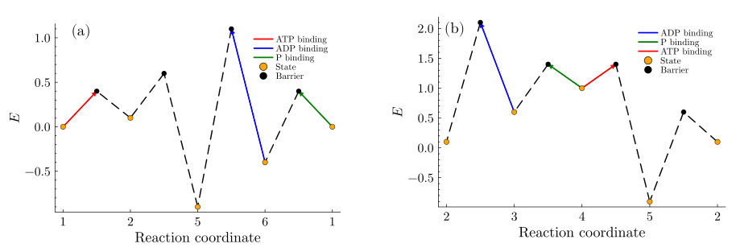 
Figure 4: Energy landscape of the Kinesin walker that determines κij through Eq. 3. Solid lines denote transitions involving binding of chemical species, with color denoting type and arrow denoting direction of binding. Panel (a): Energy landscape for the forward cycle. Panel (b): Energy landscape for the backward cycle.

📷 Fig 5

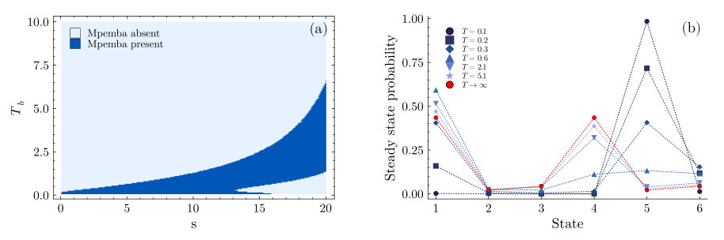 
Figure 5: Panel (a): Mpemba phases in the plane of Tb and s for fixed r = 0.1 constructed from the spectral a2-condition. Panel (b): Steady state occupation probabilities for different T’s with s = 0.5, r = 0.1

**Summary.** The paper investigates the Mpemba effect in the Kinesin molecular motor using a detailed chemomechanical network model. By analyzing how relaxation occurs under non-equilibrium driving (load or chemical imbalance), the authors demonstrate that this anomalous relaxation signature is directly measurable through the motor's velocity. This establishes molecular motors as a powerful platform for studying non-equilibrium physics in living systems.

**Why it may be interesting.** This work applies concepts from non-equilibrium statistical mechanics (like transient dynamics and relaxation rates) to a complex biological machine, providing a concrete, experimentally accessible physical manifestation of an abstract thermodynamic phenomenon.

Detailed structure

**Main problem.** The study investigates the Mpemba effect—anomalous relaxation where a system farther from equilibrium relaxes faster than one initially closer—within biologically relevant, non-equilibrium processes.

**Main result.** The authors establish that the Kinesin motor model exhibits the Mpemba effect in chemical equilibrium, and crucially, they show that this anomalous relaxation signature can be directly observed via the motor's velocity, even when mechanical or chemical driving breaks detailed balance.

**Method.** The analysis employs a six-state chemomechanical network model governed by a master equation formalism. Relaxation dynamics are quantified using spectral decomposition criteria (like $a_2$) and distance metrics ($	ext{L}_1$).

**Model / system.** The system is the Kinesin molecular motor, modeled as a six-state kinetic network. The dynamics are controlled by external load force ($F$) and chemical driving parameters ($c$), which break detailed balance from equilibrium.

**Key observables.** Motor velocity ($v(t)$), $	ext{L}_1$ distance to steady state, and spectral coefficients ($	ext{a}_2$).

**Important parameters / regimes.** External load force ($F$), chemical driving parameter ($c$), and temperature/energy barriers.

**Assumptions / limitations.** The model assumes separation of time scales for internal conformational fluctuations (Kramers' analogy) and that the motor velocity accurately reflects the underlying stochastic dynamics.

**Figures summary.** Figures illustrate the network states, the Mpemba crossing phenomenon in this context, steady-state velocity dependence on load/driving, and how force quenches affect spectral criteria.

**Paper structure.** The paper first establishes the model's equilibrium behavior. It then analyzes non-equilibrium driving (load/chemical) to show that while these break detailed balance, they preserve the qualitative Mpemba phenomenology. Finally, it demonstrates that the measurable motor velocity mirrors this anomalous relaxation signature.

Abstract

The Mpemba effect, wherein a system prepared farther from equilibrium relaxes faster than one initially closer to equilibrium, has been extensively investigated in a wide range of physical systems. In contrast, its role in biologically relevant non-equilibrium processes remains largely unexplored. Here, we investigate anomalous relaxation in the six-state chemomechanical network model of the Kinesin molecular motor under both equilibrium and non-equilibrium conditions. We first establish the existence of the Mpemba effect in chemical equilibrium and show that many of its qualitative features can be understood from the underlying free-energy landscape. We then examine the effects of mechanical and chemical driving, showing that breaking detailed balance primarily reshapes the Mpemba phase diagram without qualitatively altering the relaxation phenomenology over the physically relevant parameter regime. Finally, we demonstrate that the relaxation of the motor velocity also mirrors the anomalous relaxation of the underlying stochastic dynamics, thereby identifying an experimentally accessible signature of the Mpemba effect. Our results establish molecular motors as a promising baseline for studying anomalous relaxation in living systems and suggest a broader framework for exploring the Mpemba effect in non-equilibrium biochemical networks.

[↑ back to top](#top)

### [Quantum Steering and Nonlocal Correlations Between Non-Interacting Delocalized Electrons Under Rashba Spin-Orbit Interaction](http://arxiv.org/abs/2607.28450v1)

**Authors:** Zakaria Bouafia, Mostafa Mansour  
**Type:** theory · **Category:** strongly correlated electrons · **PDF:** <https://arxiv.org/pdf/2607.28450v1>  
**Analysis basis:** full PDF text, analyzed in chunks
**Topic relevance:** 🔥 `entanglement & information structure` **4/5** · `analog quantum simulation` **2/5** · `spintronics-quantum-optics interface` **2/5** · `Keldysh / 2PI / non-Gaussian methods` **1/5** · `correlated / nonlocal dissipation` **1/5** · `driven-dissipative phase transition` **1/5** · `methods for driven-dissipative` **1/5** · `non-equilibrium dynamics` **1/5**

📷 Fig 1

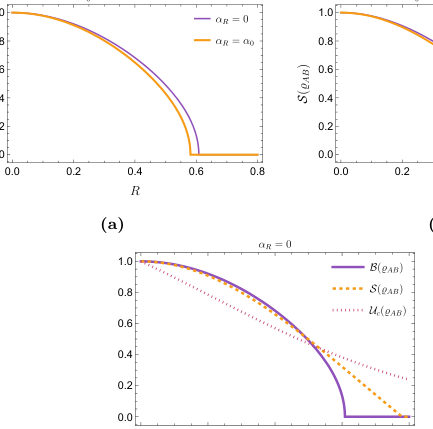 
Fig. 1 Dynamics of B(ϱAB) 1a, S(ϱAB) 1b, and Uc(ϱAB) 1c as a function of R = |r−r′|

📷 Fig 2

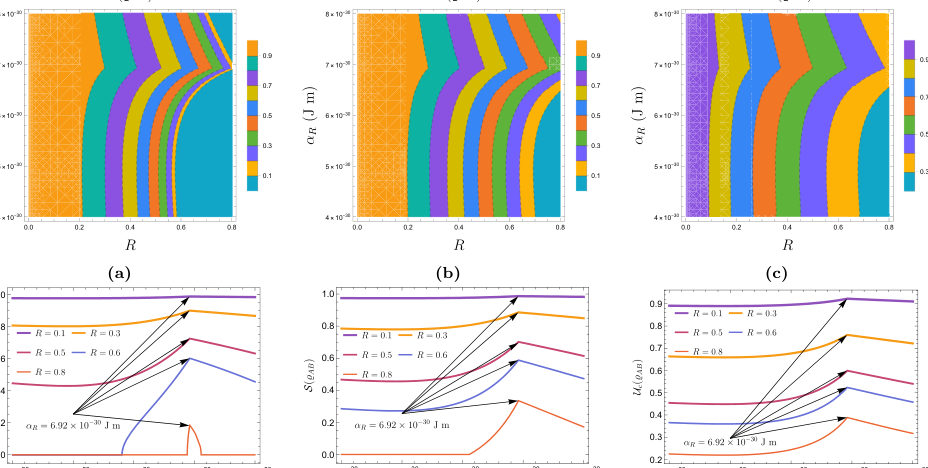 
Fig. 2 Dynamics of B(ϱAB), S(ϱAB), and Uc(ϱAB) as functions of R and αR 2a-2b-2c and as functions of αR, where α0 ≤αR ≤2α0 with α0 = 3.05 × 10−11 eV m, for various fixed values of R 2d-2e-2f.

📷 Fig 3

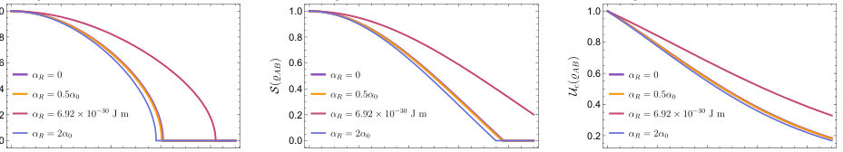 
Fig. 3 Dynamics of B(ϱAB) 3a, S(ϱAB) 3b, and Uc(ϱAB) 3c in terms of R for different multiple values of α0 (αR) where α0 = 3.05 × 10−11 eV m.

**Summary.** This theoretical work examines how Rashba Spin-Orbit Interaction controls nonlocal quantum correlations between two electrons in a 2DEG. By analyzing Bell nonlocality, uncertainty-induced nonlocality, and quantum steering, the authors show that tuning the RSOI strength can restore these fragile quantum resources, making it a powerful control knob for solid-state quantum physics.

**Why it may be interesting.** The ability to use an external parameter like RSOI strength ($\alpha_R$) to actively tune and restore quantum correlations (nonlocality/steering) in solid-state systems is highly relevant for designing quantum information processing elements based on condensed matter platforms.

Detailed structure

**Main problem.** Investigating quantum steering and nonlocal correlations between two non-interacting delocalized electrons under the influence of Rashba Spin-Orbit Interaction (RSOI).

**Main result.** The study finds that all three measured quantum resources exhibit a non-monotonic recovery as RSOI strength is tuned, peaking at an optimal coupling strength. This establishes RSOI as a critical control parameter for stabilizing quantum properties against separation decay.

**Method.** Theoretical analysis using the two-fermion density matrix and calculating specific inequalities (CHSH, CJWR) to quantify different nonlocality measures.

**Model / system.** The system is modeled as two non-interacting delocalized electrons in a Two-Dimensional Electron Gas (2DEG), specifically focusing on the Bi/Ag(111) heterostructure. The Hamiltonian includes the Rashba SOI term, leading to spin-momentum locking.

**Key observables.** Bell Nonlocality ($B(\varrho_{AB})$), Uncertainty-Induced Nonlocality ($U_c(\varrho_{AB})$), and Quantum Steering ($S(\varrho_{AB})$).

**Important parameters / regimes.** RSOI strength ($\alpha_R$), Inter-electron separation ($R$), and the baseline RSOI value ($\alpha_0 = 3.05 	imes 10^{-11} 	ext{ eV m}$).

**Assumptions / limitations.** The electrons are treated as non-interacting, and Coulomb interactions are excluded from the primary analysis.

**Figures summary.** Figures illustrate the dynamics of $B$, $S$, and $U_c$ as functions of electron separation ($R$) and RSOI strength ($\alpha_R$), showing non-monotonic behavior for all metrics.

**Paper structure.** The paper analyzes the impact of tuning $\alpha_R$ on three distinct quantum correlation measures ($B, S, U_c$) in a 2DEG system, comparing results with and without RSOI to pinpoint how spin-orbit coupling acts as a tunable control mechanism for these resources.

Abstract

We investigate quantum steering and nonlocal correlations between two electrons in a two-dimensional electron gas (2DEG) as functions of Rashba spin-orbit interaction (RSOI) strength and inter-electron separation. We focus particularly on the Bi/Ag(111) system characterized by its strong RSOI ($α_0 = 3.05\times10^{-11}$ eV~m), and we explore the influence of tuning intensity of RSOI and inter-electron distance on the dynamics of Bell nonlocality, uncertainty-induced nonlocality and steering. We find that, although increasing $α_R$ initially suppresses quantum correlations, all three metrics exhibit a non-monotonic recovery as functions of $α_R$, peaking near an optimal coupling strength $α_R = 4.32\times10^{-11}$~eV~m across the range of inter-electron separations considered. This finding establishes RSOI as a critical control parameter for stabilizing quantum properties in two-dimensional electron gases against the decay of quantum correlations with inter-electron separation, and shows that the suppression and recovery of quantum resources within the Bi/Ag(111) system can be controlled by adjusting the inter-electron distance and carefully tuning the RSOI strength.

[↑ back to top](#top)

### [Exact Incompatibility-Breaking Criterion for Unital Qubit Channels](http://arxiv.org/abs/2607.27757v1)

**Authors:** Yujie Zhang  
**Type:** theory · **Category:** quantum information and computing · **PDF:** <https://arxiv.org/pdf/2607.27757v1>  
**Analysis basis:** full PDF text, analyzed in chunks
**Topic relevance:** 🔥 `quantum measurements` **4/5** · `measurement-induced transitions` **3/5** · `Keldysh / 2PI / non-Gaussian methods` **1/5** · `correlated / nonlocal dissipation` **1/5** · `driven-dissipative phase transition` **1/5** · `entanglement & information structure` **1/5** · `methods for driven-dissipative` **1/5**

📷 Fig 1

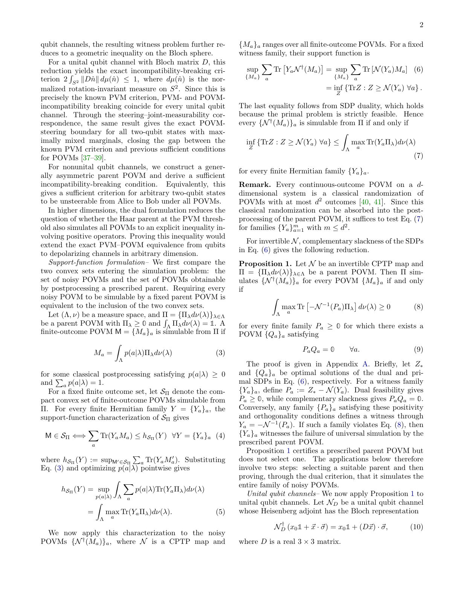 
Low-resolution page preview, page 2

📷 Fig 2

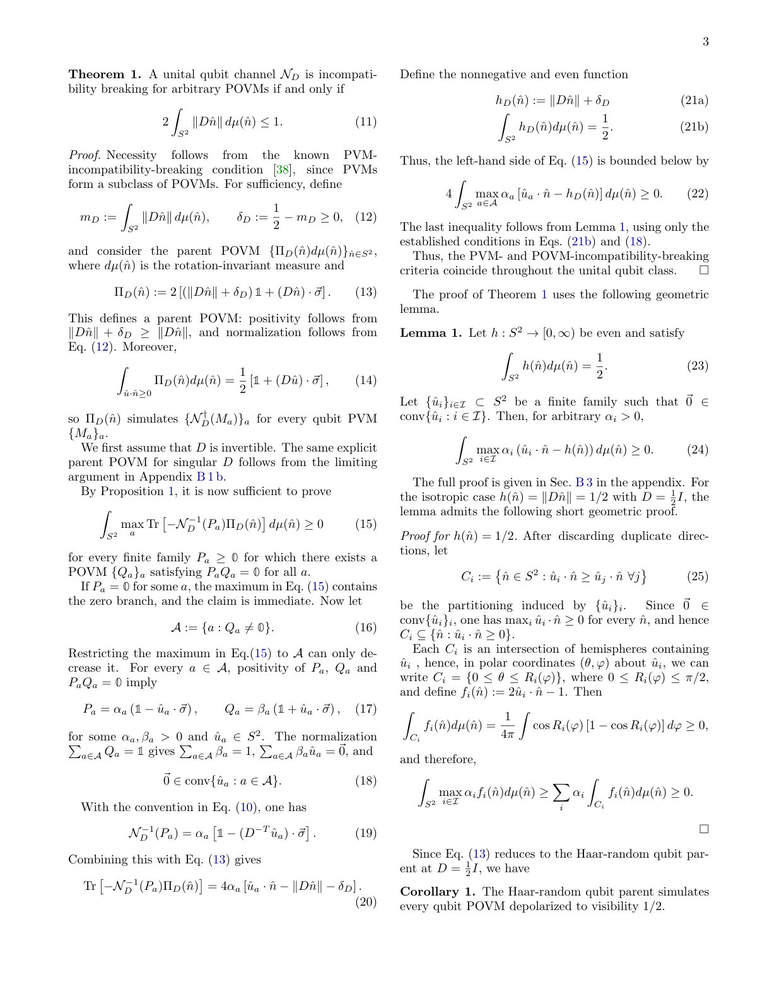 
Low-resolution page preview, page 3

📷 Fig 3

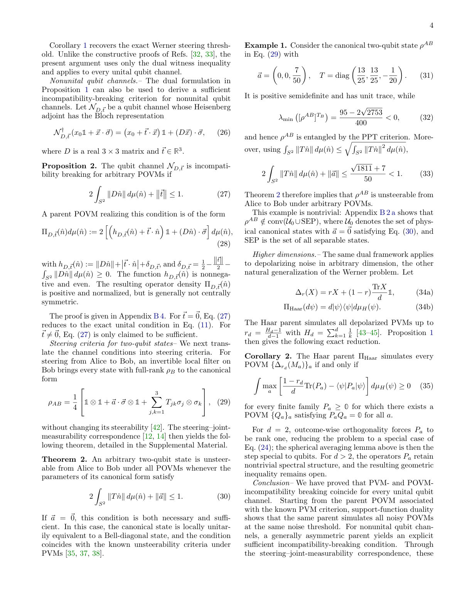 
Low-resolution page preview, page 4

📷 Fig 4

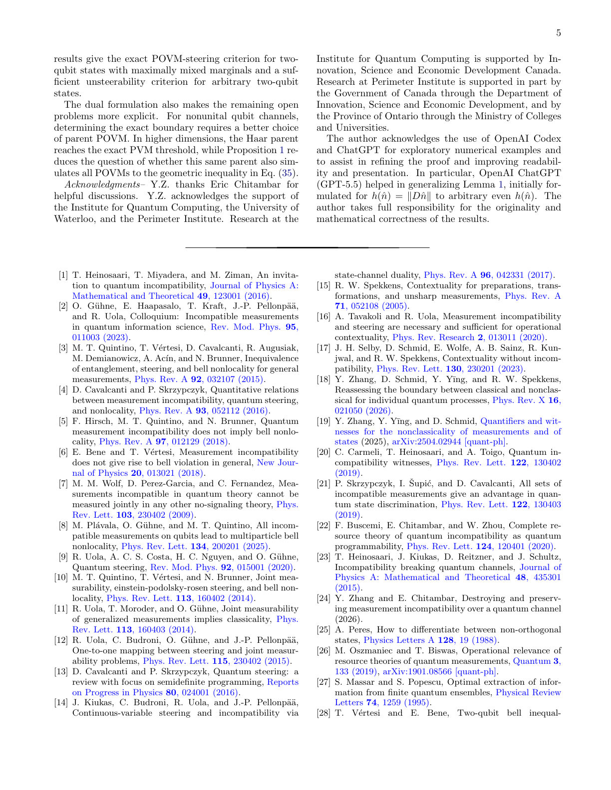 
Low-resolution page preview, page 5

📷 Fig 5

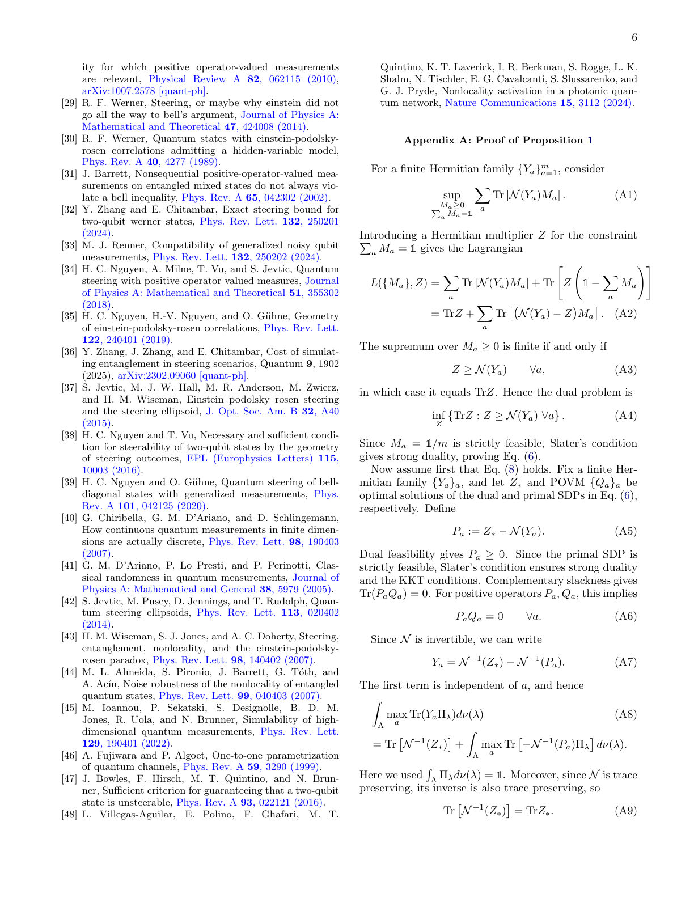 
Low-resolution page preview, page 6

**Summary.** This paper establishes exact criteria for when noisy qubit channels preserve the ability to perform all possible measurements (POVMs). By linking this concept to state steering and joint measurability, the authors provide rigorous bounds on channel noise and characterize unsteerable two-qubit states. It is a highly theoretical contribution advancing the understanding of quantum resource limitations.

**Why it may be interesting.** This work provides fundamental, rigorous mathematical tools to quantify how much noise a quantum channel can tolerate before it fundamentally alters the set of measurable physical operations, which is crucial for understanding decoherence in quantum computation.

Detailed structure

**Main problem.** The central problem is deriving the exact criterion determining when a noisy quantum channel renders all Positive-Operator-Valued Measures (POVMs) jointly measurable, which relates to incompatibility breaking.

**Main result.** For unital qubit channels, the paper proves that POVM-incompatibility breaking coincides exactly with PVM-incompatibility breaking. It also provides sufficient criteria for nonunital channels and unsteerability of two-qubit states.

**Method.** The authors employ a dual framework using support functions, relating joint measurability to steering problems via the steering–joint-measurability correspondence. They use SDP techniques and geometric arguments (like Lemma 1) to establish necessary and sufficient conditions.

**Model / system.** The study focuses on qubit channels ($N$), modeled by CPTP maps, and their effect on joint measurability of POVMs ($\{M_a\}$). The results are extended to characterize unsteerability for two-qubit states ($
ho_{AB}$).

**Key observables.** The diagnostic parameters include the integral $\int_{S^2} \|D\hat{n}\| d\mu(\hat{n})$ for unital channels, and the expectation value of a Hermitian witness $	ext{Tr}(H
ho)$ for state separability/unsteerability.

**Important parameters / regimes.** The analysis depends on whether the channel is unital or nonunital, characterized by parameters like $D$ (noise matrix) and $\vec{t}$ (nonunitality vector).

**Assumptions / limitations.** Key assumptions include relying on strong duality in SDP (Slater's condition) and establishing correspondences between different types of quantum resource limitations (e.g., steering $\leftrightarrow$ joint measurability).

**Figures summary.** Not specified, but the notes detail mathematical derivations involving geometric inequalities and explicit construction of parent POVMs ($\Pi_{D,\vec{t}}$).

**Paper structure.** The paper progresses from defining general compatibility criteria using SDP (Appendix A), establishing a correspondence between joint measurability and steering (Section B.2), deriving the exact criterion for unital channels (Theorem 1), and finally providing sufficient conditions for nonunital channels and unsteerability of two-qubit states (Theorem 2).

Abstract

We study when a noisy qubit channel renders all positive-operator-valued measures (POVMs) jointly measurable. For every unital qubit channel, we derive the exact incompatibility-breaking criterion and prove that projective measurements already determine the boundary for arbitrary POVMs. Through the steering--joint-measurability correspondence, this result gives the exact POVM-steering boundary for all two-qubit states with maximally mixed marginals, with the Werner states recovered as a special case. For nonunital qubit channels, we construct a generally asymmetric parent POVM and obtain an explicit sufficient incompatibility-breaking condition, which in turn yields a sufficient unsteerability criterion for arbitrary two-qubit states.

[↑ back to top](#top)

### [FFLO transition and quantum criticality in polarized Fermi gases](http://arxiv.org/abs/2607.28335v1)

**Authors:** Francesco Pirolo, Leonardo Pisani, Pierbiagio Pieri  
**Type:** theory · **Category:** quantum gases · **PDF:** <https://arxiv.org/pdf/2607.28335v1>  
**Analysis basis:** full PDF text, analyzed in chunks
**Topic relevance:** 🔥 `analog quantum simulation` **4/5** · `Keldysh / 2PI / non-Gaussian methods` **3/5** · `non-equilibrium dynamics` **2/5** · `driven-dissipative phase transition` **1/5** · `methods for driven-dissipative` **1/5** · `non-equilibrium universality` **1/5**

📷 Fig 1

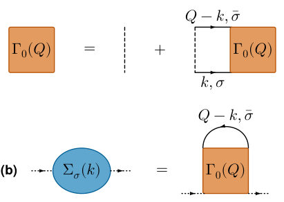 
FIG. 1. Feynman diagrams for (a) the particle-particle prop- agator Γ0(Q) and (b) self-energy Σσ(k), with the notation k = (k, iω), Q = (Q, iΩ), σ =↓, ↑, ¯σ =↑, ↓. Dashed lines: bare contact interaction v0. Full lines with arrow: bare Green’s functions G0σ(k).

📷 Fig 2

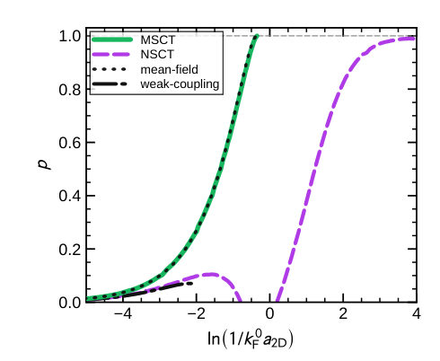 
FIG. 2. 2D phase diagram showing the critical polarization p = pc versus coupling ln  1/k0 Fa2D  within the NSCT (dashed line) and MSCT (solid line) approaches. Dotted line: mean- field critical polarization. Dash-dotted line: weak-coupling expression (30).

📷 Fig 3

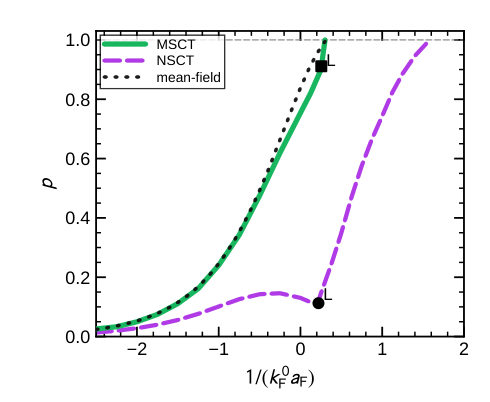 
FIG. 3. 3D phase diagram showing the critical polarization p = pc versus coupling (kFaF)−1 within the NSCT (dashed line) and MSCT (solid line) approaches. Dotted line: mean- field critical polarization. The position of the Lifhsitz points L within the two approaches is also indicated.

📷 Fig 4

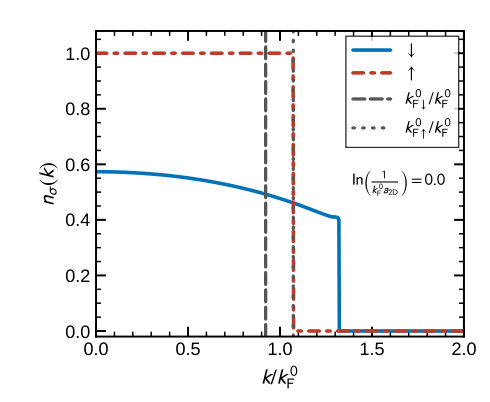 
FIG. 4. Momentum distribution function nσ(k) within the NSCT approximation for ln  1/k0 Fa2D  = 0 and polarization p = 0.15. The vertical lines represent the non-interacting Fermi momenta k0 F↓(dashed line) and k0 F↑(dotted line). The interacting Fermi momenta kF↓and kF↑can be read by the positions of the discontinuity in the respective distributions.

📷 Fig 5

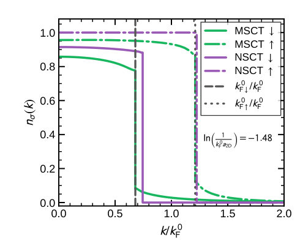 
FIG. 5. Momentum distribution function nσ(k) within the MSCT (green) and NSCT (magenta) approaches for the ma- jority (dot-dashed lines) and minority (solid lines) species at ln  1/k0 Fa2D  = −1.48 (corresponding to ε0/E0 F = 0.105) and p = 0.5.

**Summary.** The authors theoretically study the FFLO transition in polarized Fermi gases using an improved t-matrix formalism. They correct unphysical results from simpler theories by enforcing self-consistency, leading to a physically sound phase diagram. The work characterizes the critical behavior across dimensions, establishing mean-field universality for the 3D case.

**Why it may be interesting.** This work directly addresses quantum criticality and pairing instabilities in ultracold atomic gases (polarized Fermi gases), which is a major research area within AMO physics and quantum gases theory.

Detailed structure

**Main problem.** The paper investigates the zero-temperature transition from a polarized normal phase to the Fulde-Ferrell-Larkin-Ovchinnikov (FFLO) state in a two-dimensional Fermi gas.

**Main result.** A minimally self-consistent theoretical extension restores physical consistency by satisfying the Luttinger theorem, and it places the 3D FFLO transition into the mean-field universality class.

**Method.** The study employs a diagrammatic t-matrix approach, comparing non-self-consistent results with a minimal self-consistent correction (MSCT).

**Model / system.** The system is a polarized Fermi gas, modeled as spin-1/2 fermions in two or three dimensions interacting via an attractive contact interaction. The analysis focuses on the FFLO pairing instability.

**Key observables.** Quasiparticle decay rates, quasiparticle weights, momentum distributions, and critical dynamics of fermionic and bosonic degrees of freedom.

**Important parameters / regimes.** Polarization parameter ($p$), coupling strength (ranging from weak to strong), and dimensionality (2D vs 3D).

**Assumptions / limitations.** The MSCT approach is used as a necessary refinement over the standard non-self-consistent theory due to Luttinger theorem violations.

**Figures summary.** Not specified, but the paper analyzes phase diagrams (critical polarization vs. coupling) and spectral function behavior.

**Paper structure.** The structure details the formalism using the t-matrix approach, presents 2D phase diagrams versus 3D counterparts, studies non-Fermi liquid signatures, and finally analyzes critical exponents including vertex corrections in 3D.

Abstract

We investigate the zero-temperature transition from the polarized normal phase to the FFLO state in a two-dimensional Fermi gas by means of a diagrammatic t-matrix approach. We first show that the standard non-self-consistent theory produces an unphysical phase diagram because of a severe violation of the Luttinger theorem. Motivated by this observation, we introduce a minimal self- consistent extension that largely restores compliance with the Luttinger theorem while preserving the analytical simplicity of the original formalism. This leads to a physically consistent phase diagram over the whole interaction range. Building on this improved description, we characterize the quantum critical behavior of the FFLO transition through the quasiparticle decay rates, quasiparticle weights, momentum distributions, and the critical dynamics of both fermionic and bosonic degrees of freedom. We further compare the two- and three-dimensional systems, showing that their critical properties can be understood within a unified geometrical picture based on the nesting of the majority and minority Fermi surfaces. Finally, for the three-dimensional case, we demonstrate within the Hertz-Millis framework that vertex corrections are irrelevant, thereby placing the FFLO quantum phase transition in the mean-field universality class, in close analogy with itinerant antiferromagnets.

[↑ back to top](#top)

### [Mitigating quantum decoherence via global optimal control](http://arxiv.org/abs/2607.28479v1)

**Authors:** Ashkan Abedi, Roberto Menta, Julien Despres, Marco Polini, Francesco Caravelli, Vittorio Giovannetti  
**Type:** theory · **Category:** quantum information and computing · **PDF:** <https://arxiv.org/pdf/2607.28479v1>  
**Analysis basis:** full PDF text, analyzed in chunks
**Topic relevance:** 🔥 `methods for driven-dissipative` **4/5** · `QC/QI experiment` **2/5** · `non-equilibrium dynamics` **2/5** · `Keldysh / 2PI / non-Gaussian methods` **1/5** · `correlated / nonlocal dissipation` **1/5** · `driven-dissipative phase transition` **1/5** · `entanglement & information structure` **1/5**

📷 Fig 1

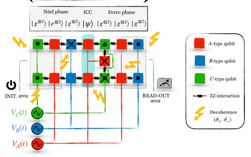 
FIG. 1. Sketch of the globally-driven quantum computing ladder architecture encoding N = 2 computational qubits. The three types of qubits A, B, and C, represented as red, blue, and green squares respectively, are driven by their corresponding global control classi- cal source VA,B,C(t). Qubits are coupled via nearest-neighbor ZZ interactions (black springs). Crossed squares indicate qubits with doubled Rabi frequency. Black triangles and circles denote qubits with a non-standard local energy. The light-blue-highlighted column is the information carrier column (ICC), located at the interface be- tween the N´eel and polarized (ferromagnetic) phases. The first two columns constitute the...

📷 Fig 2

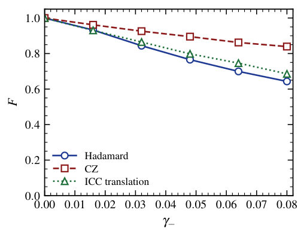 
FIG. 2. Fidelity F of Eq. (9) for the three quantum operations consid- ered in this work as a function of the relaxation rate γ−with γz = 0, for N = 2 logical qubits. Open circles (solid line) correspond to the Hadamard gate, open squares (dashed line) to the CZ gate, and open triangles (dotted line) to the ICC single-shift operation. The rate γ− is expressed in µs−1, with Ωχ = 10 µs−1.

📷 Fig 3

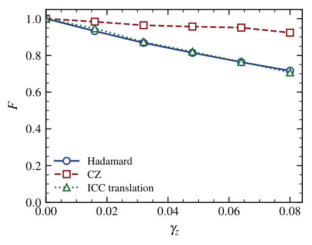 
FIG. 3. Fidelity F of the same three quantum operations as in Fig. 2, now as a function of the dephasing rate γz with γ−= 0, for N = 2 logical qubits.

📷 Fig 4

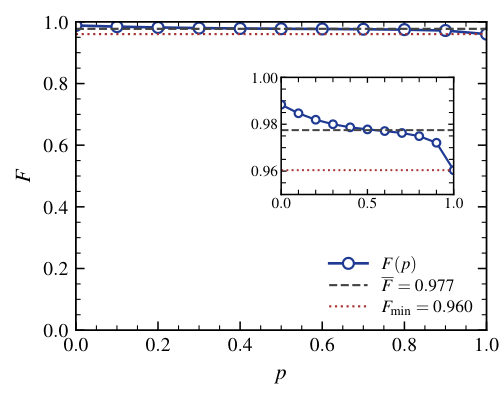 
FIG. 4. Fidelity F of the GRAPE-optimized Hadamard gate in the dissipation-free limit γ−= γz = 0, as a function of the initial state parameter p of the target computational qubit with ϕ = 0 for N = 2 logical qubits. The optimized pulse has duration Topt ≈320 ns and the ladder is simulated with 2% relative disorder on the local qubit frequencies. The solid curve shows F(p), while the dashed and dotted lines mark the average F ≈0.977 and the minimum Fmin ≈ 0.960 over the full range of p (the overbar here denotes the average over p, not the trajectory average of Eq. (11)). The inset zooms into the narrow fidelity window, where the slow decline toward p = 1 becomes visible. The fidelity remains...

📷 Fig 5

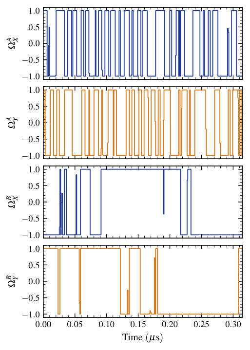 
FIG. 5. GRAPE-optimized control pulses implementing the Hadamard gate on the target computational qubit for N = 2 logi- cal qubits. The top panels display the in-phase (ΩX A ) and quadrature (ΩY A) components of the drive applied to the A-type qubits, while the bottom panels show the corresponding components (ΩX B , ΩY B) for the B-type qubits. The control amplitudes are normalized to the Rabi frequency Ωχ and bounded within [−1, 1], with a time discretization on the order of nanoseconds, compatible with state-of-the-art exper- imental hardware. The total gate duration is Topt ≈320 ns. Drives on the C-type qubits are not shown as they remain inactive for this single-qubit gate operation.

**Summary.** The paper investigates how to protect quantum information in large-scale superconducting quantum processors suffering from environmental noise. By applying global optimal control techniques, the authors show that precisely shaping the external driving fields can suppress decoherence effects significantly. This method is crucial because it overcomes dissipation acting across the entire coupled system, not just isolated logical components.

**Why it may be interesting.** This work directly addresses hardware limitations in superconducting quantum computing by providing a concrete, physically implementable method (global pulse shaping) to combat decoherence across an entire coupled chip architecture.

Detailed structure

**Main problem.** The primary goal is mitigating quantum decoherence effects within globally driven superconducting quantum computing architectures.

**Main result.** Global optimal control can drastically suppress decoherence by temporally shaping the global drive, restoring high gate fidelities even when dissipation acts on all physical qubits.

**Method.** The analysis employs tensor-network-based techniques combined with solving the Lindblad Master Equation (LME) in the rotating frame to simulate dissipative dynamics.

**Model / system.** The system is a superconducting qubit array modeled as a quasi-two-dimensional ladder geometry, featuring nearest-neighbor ZZ couplings and global driving fields. The dynamics are governed by an effective Hamiltonian derived from the full time-dependent Hamiltonian.

**Key observables.** Gate fidelities (1QG, 2QG), quantum information flow degradation, relaxation rate ($\gamma^-$), and dephasing rate ($\gamma_z$).

**Important parameters / regimes.** The dimensionless interaction parameter $\eta = \zeta/\Omega_\chi$, and the decoherence rates $\gamma^-$ and $\gamma_z$.

**Assumptions / limitations.** Approximations include applying the Rotating-Wave Approximation (RWA) and using a phenomenological Lindblad form for dissipation, assuming zero temperature.

**Figures summary.** Figures illustrate how gate fidelity decays as a function of relaxation ($\gamma^-$) or dephasing ($\gamma_z$) rates for various operations on the ladder architecture.

**Paper structure.** The paper first establishes the physical model and Hamiltonian, then analyzes decoherence effects using tensor networks to quantify information loss. Finally, it demonstrates that global optimal control over the drive sequence can counteract these losses by compressing gate times.

Abstract

We show that global optimal control can drastically suppress the impact of decoherence in globally driven superconducting quantum computing architectures, taking as a prototype a recently proposed quasi-two-dimensional ladder geometry. Using a tensor-network-based approach, we quantify how amplitude-damping and dephasing channels degrade the flow of quantum information along the ladder and the fidelity of one- and two-qubit gate operations. We then demonstrate that shaping the global drive compresses the gate sequences by an order of magnitude in time, restoring high gate fidelities. We stress that this mitigation is far from trivial: in a globally driven processor, dissipation acts on every physical qubit---including those outside the logical register that sustain the surrounding ordered phases---so its impact cannot be suppressed by protecting an isolated subsystem, and is instead overcome purely through the temporal shaping of the global drive.

[↑ back to top](#top)

### [Structure-Preserving Quantum Simulation of Wave Equations on a Trapped-Ion Processor](http://arxiv.org/abs/2607.28499v1)

**Authors:** Abhishek Shringi, Hsuan-Cheng Wu, Ahmed Shokry, Xiantao Li, Mahmut Taylan Kandemir  
**Type:** experiment · **Category:** other · **PDF:** <https://arxiv.org/pdf/2607.28499v1>  
**Analysis basis:** full PDF text, analyzed in chunks
**Topic relevance:** 🔥 `QC/QI experiment` **4/5** · 🔥 `analog quantum simulation` **4/5** · `non-equilibrium dynamics` **2/5** · `methods for driven-dissipative` **1/5**

📷 Fig 1

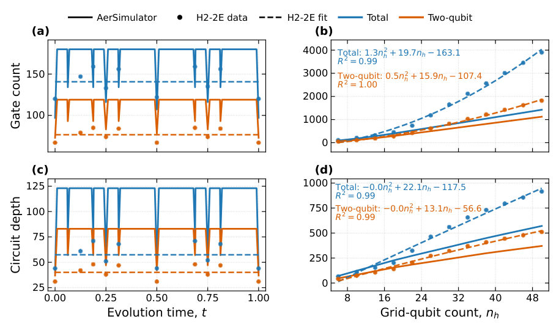 
FIG. 1. Circuit resources for the one-dimensional cosine pressure initial state with k0 = 1. Solid curves show the logical circuit before hardware-native compilation; markers show the circuit compiled for the Quantinuum H2-2 native gate set using H2-2E, with dashed curves denoting least-squares fits. Blue denotes total gate count or depth, and orange denotes the corresponding two-qubit contribution. (a),(c) Gate count and circuit depth, respectively, as functions of t ∈[0, 1] at fixed nh = 10. (b),(d) Gate count and circuit depth as functions of the number nh of grid qubits at fixed t = 0.1.

📷 Fig 2

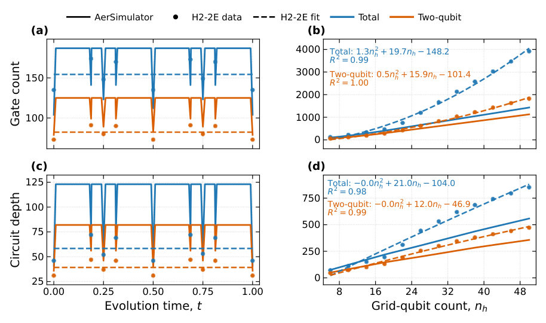 
FIG. 2. Circuit resources for the one-dimensional Gaussian pressure initial state with σ = 0.2 and five retained Fourier modes. Solid curves show the logical circuit before hardware-native compilation; markers show the circuit compiled for the Quantinuum H2-2 native gate set using H2-2E, with dashed curves denoting least-squares fits. Blue denotes total gate count or depth, and orange denotes the corresponding two-qubit contribution. (a),(c) Gate count and circuit depth, respectively, as functions of t ∈[0, 1] at fixed nh = 10. (b),(d) Gate count and circuit depth as functions of nh at fixed t = 0.1.

📷 Fig 3

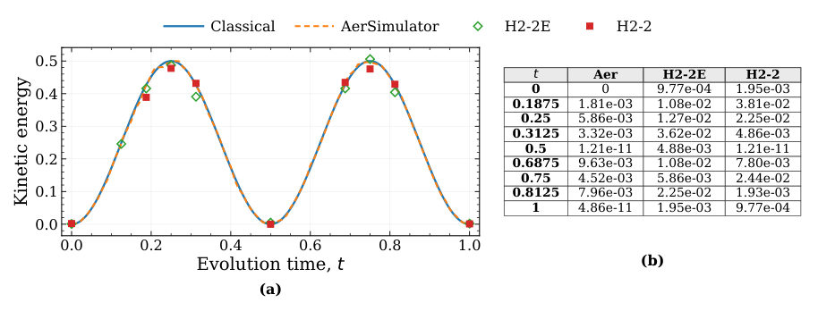 
FIG. 3. Half-domain kinetic energy for the one-dimensional cosine pressure initial state with k0 = 1 on a grid of Nh = 1024 points (nh = 10 grid qubits and 11 qubits in total). (a) The classical reference trajectory is compared with noiseless finite-shot AerSimulator results, the H2-2E noise-modeled emulator, and measurements from the Quantin- uum H2-2 processor. (b) Absolute error |⟨KE⟩method −⟨KE⟩classical| at each sampled time. A dash denotes a time not sampled on the corresponding backend. The mean absolute errors are 3.7 × 10−3, 1.2 × 10−2, and 1.1 × 10−2 for AerSimulator, H2-2E, and H2-2, respectively.

📷 Fig 4

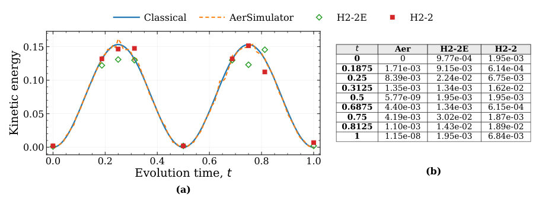 
FIG. 4. Half-domain kinetic energy for the one-dimensional Gaussian pressure initial state with σ = 0.2 on a grid of Nh = 1024 points (nh = 10 grid qubits and 11 qubits in total). (a) Classical reference, noiseless finite-shot AerSimulator, H2-2E noise-modeled emulator, and Quantinuum H2-2 results. (b) Absolute error relative to the classical reference at each sampled time. The mean absolute errors are 2.3 × 10−3, 9.3 × 10−3, and 5.9 × 10−3 for AerSimulator, H2-2E, and H2-2, respectively.

📷 Fig 5

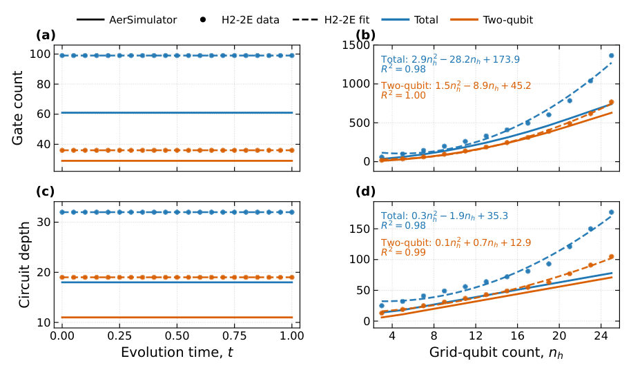 
FIG. 5. Circuit resources for the two-dimensional separable cosine pressure initial state with kx = ky = 1. Solid curves show the logical circuit before hardware-native compilation; markers show the circuit compiled for the Quantinuum H2-2 native gate set using H2-2E, with dashed curves denoting least-squares fits. Blue denotes total gate count or depth, and orange denotes the corresponding two-qubit contribution. (a),(c) Gate count and circuit depth, respec- tively, as functions of t ∈[0, 1] at fixed nh = 5 grid qubits per spatial direction. (b),(d) Gate count and circuit depth as functions of the per-direction register size nh at fixed t = 0.1.

**Summary.** The paper presents the development and benchmarking of structure-preserving quantum circuits designed to simulate wave equations like the acoustic and Dirac equations. Using the Quantinuum H2-2 trapped-ion processor, they successfully measured observable dynamics on grids up to $32 	imes 32$, showing that accurate simulation is feasible for complex physical systems with thousands of degrees of freedom.

**Why it may be interesting.** This work directly applies advanced quantum simulation techniques to fundamental PDEs (wave dynamics) using a state-of-the-art trapped-ion platform, providing concrete hardware evidence for simulating continuous physical systems beyond simple qubit registers.

Detailed structure

**Main problem.** The primary goal is developing a quantum simulation method for structure-preserving wave equations (PDEs) on near-term quantum hardware.

**Main result.** The simulations successfully tracked classical kinetic-energy dynamics for acoustic and Dirac problems on the H2-2 processor with low mean absolute errors, demonstrating feasibility for structured wave problems.

**Method.** The authors developed Fourier-based quantum circuits utilizing techniques like exact bright–dark decomposition (for 2D acoustics) and Strang splitting (for variable mass Dirac dynamics).

**Model / system.** The work simulates the one-dimensional acoustic wave equation, two-dimensional acoustic equations, and the variable mass Dirac equation. The experiments were performed on the Quantinuum H2-2 trapped-ion processor.

**Key observables.** Subdomain kinetic energies (for acoustics) and spinor-component populations (for Dirac dynamics).

**Important parameters / regimes.** Tested up to 1D grids of 1024 points and $32 	imes 32$ 2D grids, corresponding to state-space dimensions up to 4096.

**Assumptions / limitations.** The results are benchmarked on structured inputs and observable dynamics, not establishing a quantum advantage over classical solvers; the scope is limited to periodic boundary conditions.

**Figures summary.** Figures detail the overall circuits for 1D and 2D acoustic evolution (using QFTs), gate-level decompositions of propagators, and specific state preparation circuits for initial conditions like cosine or Gaussian profiles.

**Paper structure.** The paper details the formulation of wave equations into quantum Hamiltonians, presents the structure-preserving circuit design using Fourier methods, benchmarks these circuits on the H2-2 processor across different dimensions/equations, and analyzes resource scaling.

Abstract

Wave equations provide a natural testbed for near-term quantum simulation of partial differential equations, but hardware demonstrations have remained limited in spatial dimension, equation class, system size, and physically meaningful output. We develop and benchmark structure-preserving, Fourier-based quantum circuits for the one- and two dimensional acoustic wave equations and Dirac dynamics with variable mass on the Quantinuum H2-2 trapped-ion processor. The experiments include one-dimensional grids with up to \(1024\) points and \(32\times32\) two-dimensional grids, corresponding to an encoded state-space dimension of up to \(4096\). Rather than reconstructing the full fields, we estimate subdomain kinetic energies directly from measurement samples. Across all tested acoustic and Dirac dynamics problems, the H2-2 results track the classical kinetic-energy dynamics with mean absolute errors between \(5.9\times10^{-3}\) and \(2.4\times10^{-2}\). At fixed retained bandwidth, the compiled gate counts grow approximately quadratically with the number of grid qubits; the acoustic circuit sizes are essentially independent of evolution time, whereas the cost also grows with the number of product-formula steps. These results provide hardware-level evidence that accurate observable dynamics can remain resolvable for structured wave problems with thousands of encoded degrees of freedom on a present-day trapped-ion processor.

[↑ back to top](#top)

### [High-Field EPR/ENDOR of N/Be Centers for Defect Engineering in 6H-SiC](http://arxiv.org/abs/2607.27862v1)

**Authors:** Yuliya Ermakova, Ekaterina Dmitrieva, Margarita Sadovnikova, Fadis Murzakhanov, George Mamin, Sergey Nagalyuk, Evgeny Mokhov, Marat Gafurov  
**Type:** experiment · **Category:** quantum information and computing · **PDF:** <https://arxiv.org/pdf/2607.27862v1>  
**Analysis basis:** full PDF text, analyzed in chunks
**Topic relevance:** 🔥 `QC/QI experiment` **4/5** · `spintronics-quantum-optics interface` **3/5** · `Kondo & dissipative impurity` **1/5** · `analog quantum simulation` **1/5** · `quantum measurements` **1/5**

📷 Fig 1

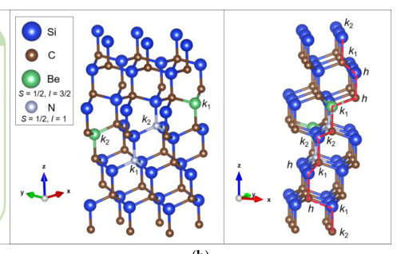 
Figure 1. (a) Applications of 6H-SiC doped with beryllium and nitrogen. (b) Crystal structure of Be-

📷 Fig 2

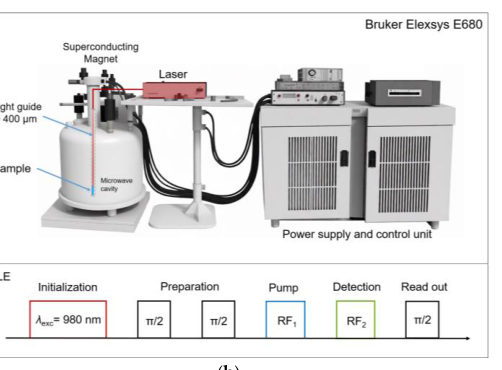 
Figure 2. (a) Photographs of the 6H-SiC sample. (b) Upper panel—W-band EPR setup used in the

📷 Fig 3

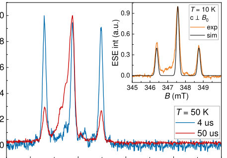 
Figure 3. (a) Continuous-wave X-band EPR spectrum of beryllium centers at room temperature of

📷 Fig 4

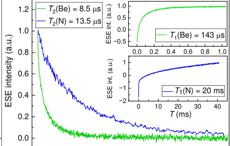 
Figure 4. (a) Pulsed W-band EPR spectra for beryllium and nitrogen spin centers in 6H-SiC as a

📷 Fig 5

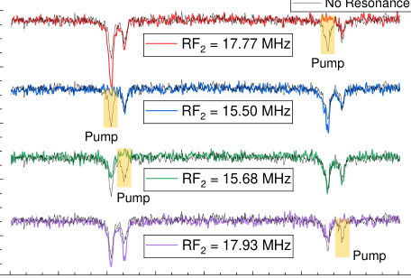 
Figure 5. (a) X-band ENDOR spectrum at 50 K for the 14N isotope. The dashed line shows the simu-

**Summary.** The research uses high-field EPR/ENDOR spectroscopy to investigate nitrogen (N) donor and beryllium (Be) acceptor impurities co-doped into 6H-SiC. By measuring detailed spin interactions, the authors differentiate the electronic properties of these two types of defects. This work is vital for defect engineering, showing how N centers are suitable for quantum memory while Be centers provide sensitive local strain measurements.

**Why it may be interesting.** This work directly addresses solid-state quantum hardware by characterizing spin defects in a wide-bandgap semiconductor. The detailed measurement of hyperfine and quadrupole interactions provides crucial input parameters for modeling defect qubits and understanding environmental decoherence mechanisms.

Detailed structure

**Main problem.** To characterize co-doped impurities (Nitrogen donor and Beryllium acceptor) in 6H-SiC to understand defect engineering for quantum technologies.

**Main result.** The study successfully differentiated the electronic and nuclear properties of N and Be centers, showing that N donors are stable for quantum memory while Be acceptors act as sensitive probes of local lattice strain via large quadrupole splittings.

**Method.** High-field Electron Paramagnetic Resonance (EPR) and Electron–Nuclear Double Resonance (ENDOR) spectroscopy were employed to probe spin interactions at high spectral resolution.

**Model / system.** The physical system is a 6H-SiC single crystal co-doped with N donors and Be acceptors. The analysis utilizes models incorporating hyperfine and quadrupole interactions, often described by an axial spin Hamiltonian for the electronic spin centers.

**Key observables.** Hyperfine coupling constants (A), nuclear quadrupole splitting (Q), electron spin relaxation times ($T_1$, $T_2$), and spectral line patterns (quartets).

**Important parameters / regimes.** Doping concentrations ($\sim 10^{18} 	ext{ cm}^{-3}$); W-band frequency ($94 	ext{ GHz}$); Temperature regimes (low temperature for high resolution).

**Assumptions / limitations.** The analysis assumes that the observed spectral features can be mapped to specific defect sites and local environments, allowing for quantitative extraction of interaction parameters.

**Figures summary.** Figures illustrate the crystal structure showing N and Be impurities in different lattice configurations, and show W-band ENDOR spectra demonstrating TRIPLE resonance effects.

**Paper structure.** The paper progresses by first establishing the need to characterize co-doped defects; it then details the use of high-field EPR/ENDOR techniques to measure spectroscopic signatures (hyperfine structure, relaxation times) for both N and Be centers; finally, it compares these findings to elucidate distinct functional roles for each impurity type.

Abstract

Silicon carbide (SiC) in its various structural modifications is widely used in power semiconductor electronics, operating under extreme conditions of high temperature, high voltage, and intense radiation. The discovery of spin defects (S>0) with unique optical and coherent properties has further positioned SiC as a promising platform for quantum technologies. Here, we investigate a 6H-SiC single crystal co-doped with nitrogen and beryllium at concentrations of 1018 cm-3, using continuous-wave and pulsed electron paramagnetic resonance (EPR) and electron-nuclear double resonance (ENDOR). To enhance spectral resolution, experiments were conducted in the W-band (94 GHz; B = 3.4 T). Pulsed EPR identified nitrogen donors and beryllium acceptors in various lattice positions, allowing for the determination of their phase coherence and spin-lattice relaxation times. ENDOR measurements elucidated the electron-nuclear interactions with the local silicon and carbon environment, including distant coordination spheres. The observed hyperfine structures indicated highly delocalized spin density within the supercell. The TRIPLE resonance spectra verify coupled nuclear spin subspaces from different coordination spheres due to defect spin density. These results demonstrate the feasibility of incorporating dual impurities with distinct functional roles while preserving the crystal lattice`s structural features.

[↑ back to top](#top)

### [Quantum Fidelity-per-Cost: A Metric for Evaluation of Quantum Computing Systems](http://arxiv.org/abs/2607.28572v1)

**Authors:** Siddarth Shinde, Jakub Szefer  
**Type:** experiment · **Category:** quantum information and computing · **PDF:** <https://arxiv.org/pdf/2607.28572v1>  
**Analysis basis:** full PDF text, analyzed in chunks
**Topic relevance:** 🔥 `QC/QI experiment` **4/5** · `entanglement & information structure` **2/5** · `quantum measurements` **2/5** · `methods for driven-dissipative` **1/5** · `non-equilibrium dynamics` **1/5**

📷 Fig 1

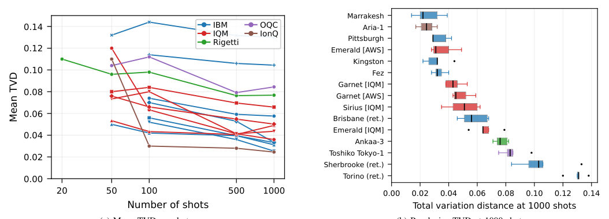 
Fig. 1. Bell-state fidelity error. Mean TVD falls with shot count on every provider, but the ordering of devices is largely fixed by 100 shots; at 1000 shots the spread across access paths is a factor of five, from 0.025 (IBM Marrakesh) to 0.130 (IBM Torino, retired). Color encodes provider; IQM entries are annotated with the cloud they were reached through.

📷 Fig 2

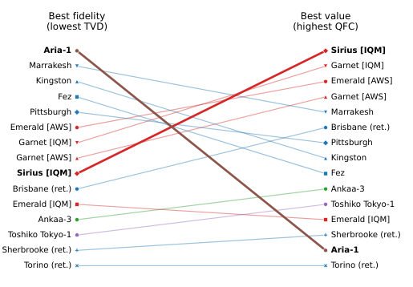 
Fig. 2. The 1000-shot ordering by fidelity (left) against the ordering by QFC (right). Every crossing line is an access path whose standing changes once price is accounted for. The two emphasized lines are the largest movers: trapped-ion IonQ Aria-1 has the best fidelity in the study but falls to 14th by value, while IQM Sirius rises from 9th to 1st.

📷 Fig 3

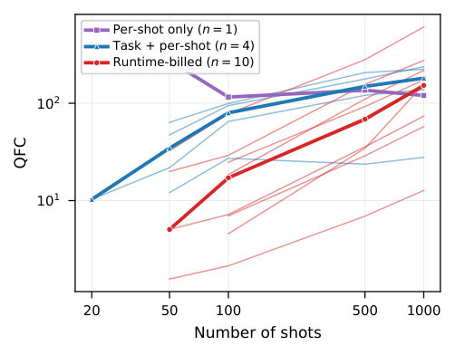 
Fig. 3. QFC vs. shot count on log–log axes (α = β = γ = 1). Thin lines are individual access paths, colored by billing model; bold lines are the median of each group. The three models produce three distinct shapes: per-shot-only billing is flat in N, task-plus-shot billing rises and saturates, and runtime billing rises with unit slope because the billed duration barely depends on N.

**Summary.** This paper introduces Quantum Fidelity-per-Cost (QFC), a novel metric designed to compare cloud quantum computers by integrating execution fidelity with the actual monetary cost. Through extensive cross-provider measurements, the authors demonstrate that considering price leads to different hardware rankings than focusing solely on physical performance metrics like fidelity. This provides a necessary framework for practical, real-world adoption of quantum computing resources.

**Why it may be interesting.** While focused on cloud infrastructure, the development of rigorous, quantifiable metrics for performance evaluation (like QFC) is crucial for any field relying on complex quantum hardware access, including those simulating open quantum systems or requiring resource estimation.

Detailed structure

**Main problem.** The authors address the difficulty of comparing quantum computing hardware accessed via cloud services due to heterogeneous and complex billing models.

**Main result.** A cost-aware metric, Quantum Fidelity-per-Cost (QFC), was proposed, showing that ranking based on price can significantly differ from rankings based purely on fidelity.

**Method.** The study involves a cross-provider measurement of quantum circuit execution fidelity across multiple cloud QPUs and combines this with monetary cost into the QFC score.

**Model / system.** The platform consists of superconducting qubits accessed through four major cloud providers (AWS, IBM Quantum, IQM Resonance, OQC), tested using a narrow two-qubit Bell-state workload.

**Key observables.** Quantum Fidelity (measured via KL divergence and TVD), monetary cost ($C$), and the derived QFC score.

**Important parameters / regimes.** Shot count ($N$), billing model parameters ($c_{	ext{task}}, c_{	ext{shot}}, c_{	ext{sec}}$), and sensitivity weighting factors ($\alpha, eta, \gamma$).

**Assumptions / limitations.** The metric is workload-specific (Bell state) and dependent on a snapshot of provider pricing; the comparison assumes defined billing models apply consistently.

**Figures summary.** Figures compare mean TVD vs. shots, show QFC vs. shot count for different billing models, and illustrate that fidelity-based ordering differs from QFC ordering.

**Paper structure.** The paper introduces the problem of cost-aware benchmarking, details the cross-provider measurement study using a specific workload, proposes and analyzes the QFC metric, presents empirical results comparing fidelity vs. cost rankings, and discusses stability analysis.

Abstract

Cloud-accessible quantum computing has made hardware comparison not only a physics benchmark but also a practical purchasing decision. Cost-aware comparison of quantum computers remains underexplored and is difficult to do under the heterogeneous billing models offered by various cloud-based quantum computing providers. This paper makes two main contributions to enable price-aware comparison of quantum computers. First, this work presents a cross-provider measurement study of quantum circuit execution fidelity spanning 14 cloud QPU access-path entries (12 distinct physical QPUs) across four cloud access paths: Amazon Web Services (AWS) cloud, IBM Quantum Runtime (IBM) cloud, IQM Resonance (IQM) cloud, and Oxford Quantum Circuits (OQC) cloud. Second, this work proposes and analyzes a cost-aware score, Quantum Fidelity-per-Cost (QFC), which combines Kullback--Leibler (KL) divergence from an ideal output distribution, shot count, and monetary cost into one possible metric under a documented billing model. The main empirical observation from this work is that cost-aware ranking can differ from purely fidelity-based evaluation of quantum computers, and that users may select different quantum computing backends when they consider price in their selection, as opposed to selection based on fidelity alone. This work shows that the ranking is stable under reweighting of the metric, and that a device's billing model, not its hardware, governs how its score scales with shot count. Reported QFC values change as new machines come online or as providers revise their prices.

[↑ back to top](#top)

### [SymFT: Universal Fault-Tolerant Quantum Circuit Simulation via Symbolic Clifford--Pauli Frames and Stabilizer Coordinates](http://arxiv.org/abs/2607.28600v1)

**Authors:** Wang Fang, Huazhe Lou, Riling Li  
**Type:** theory · **Category:** quantum information and computing · **PDF:** <https://arxiv.org/pdf/2607.28600v1>  
**Analysis basis:** full PDF text, analyzed in chunks
**Topic relevance:** 🔥 `quantum measurements` **4/5** · `measurement-induced transitions` **3/5** · `methods for driven-dissipative` **3/5**

📷 Fig 1

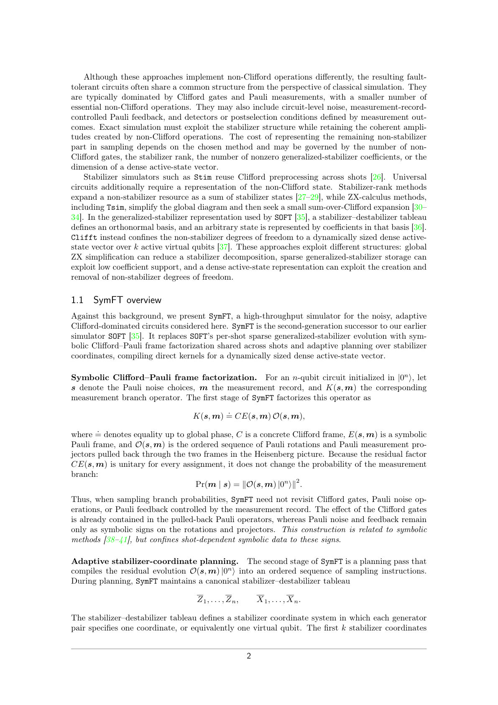 
Low-resolution page preview, page 2

📷 Fig 2

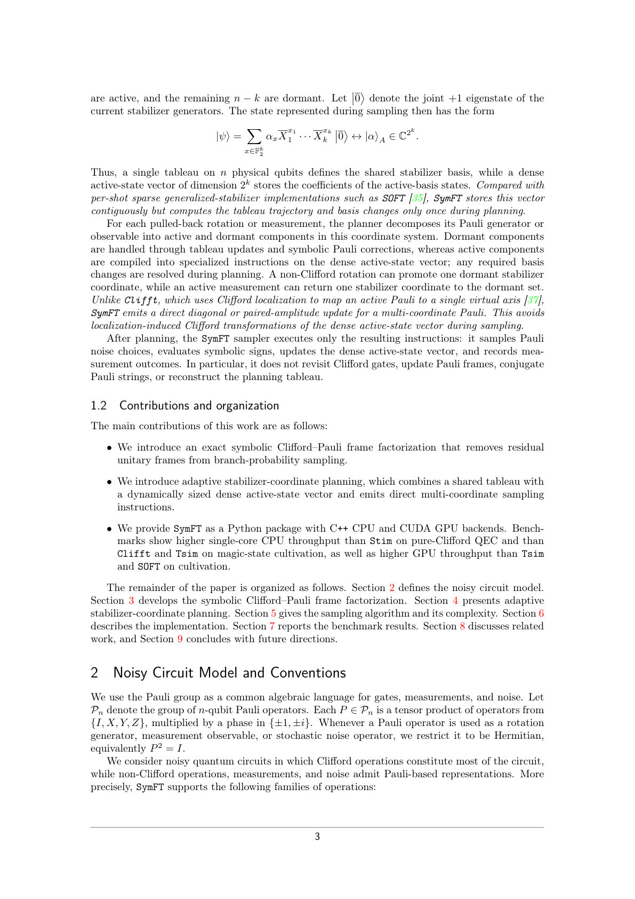 
Low-resolution page preview, page 3

📷 Fig 3

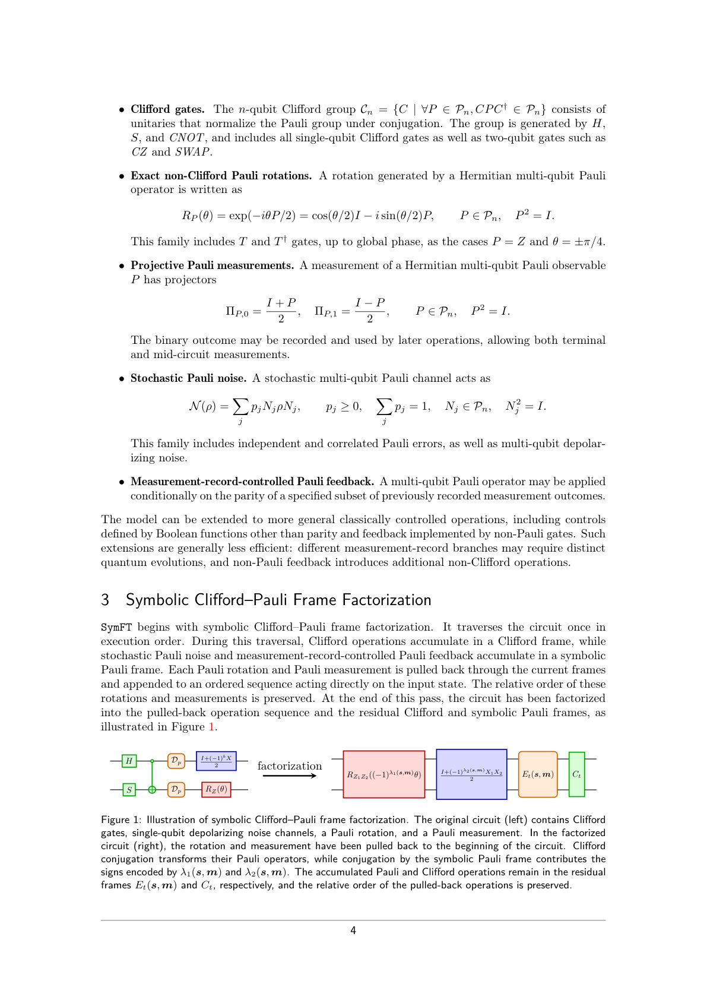 
Low-resolution page preview, page 4

📷 Fig 4

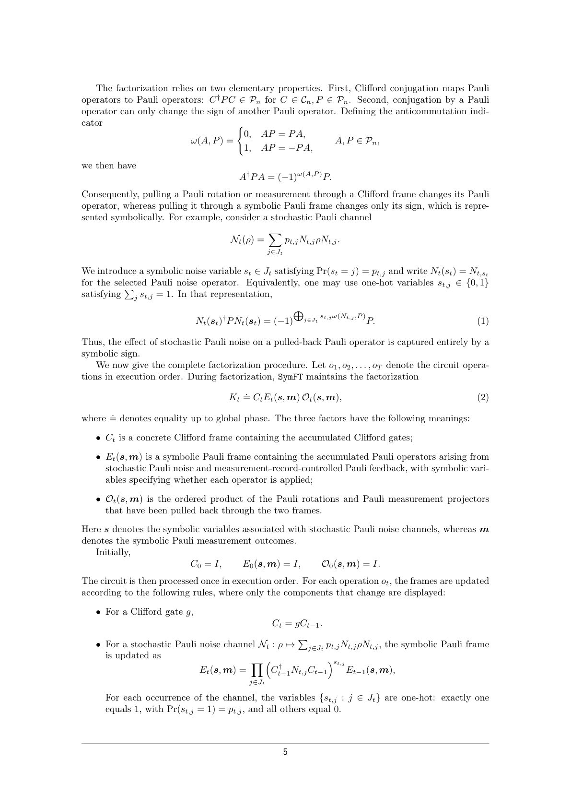 
Low-resolution page preview, page 5

📷 Fig 5

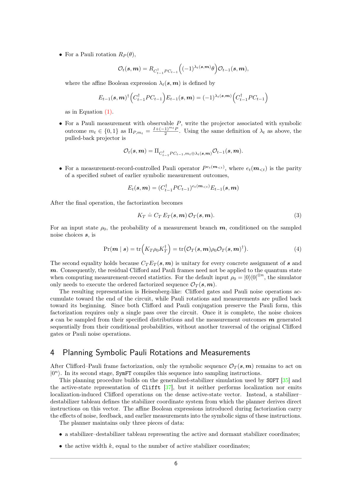 
Low-resolution page preview, page 6

**Summary.** This paper introduces SymFT, a novel high-throughput simulator designed for fault-tolerant quantum circuits involving noise and feedback. It achieves this by factorizing the circuit evolution symbolically and using adaptive planning to track state changes efficiently. The resulting simulator significantly outperforms existing tools on key benchmarks like surface code simulation.

**Why it may be interesting.** The efficiency gains in simulating complex, noisy quantum error correction protocols are crucial for benchmarking hardware capabilities and understanding resource overheads in large-scale quantum computation.

Detailed structure

**Main problem.** Developing a high-throughput simulator for fault-tolerant quantum circuits that are dominated by Clifford gates but require non-Clifford operations, noise modeling, and feedback.

**Main result.** The proposed SymFT simulator achieves state-of-the-art sampling performance, demonstrating significant speedups (2.5x to 3.5x) over existing simulators for surface code and magic-state distillation circuits.

**Method.** It employs symbolic Clifford–Pauli frame factorization to separate shot-independent evolution from measurement outcomes, combined with adaptive stabilizer-coordinate planning to efficiently track the active state vector.

**Model / system.** The model is fault-tolerant quantum computation simulated using Pauli operators ($	ext{Pn}$ group), supporting Clifford gates, non-Clifford rotations, stochastic noise, and mid-circuit measurements/feedback.

**Key observables.** Sampling throughput (speedup factor) compared against benchmarks like Stim, Clifft, and SOFT.

**Important parameters / regimes.** Circuit depth, number of qubits ($n$), Pauli rotation angles ($	heta$).

**Assumptions / limitations.** The circuit structure is assumed to be Clifford-dominated; the method avoids localization-induced Clifford transformations during sampling.

**Figures summary.** Figure 1 illustrates the symbolic Clifford–Pauli frame factorization process, showing how operations are pulled back into residual frames and an ordered sequence for simulation.

**Paper structure.** The paper introduces SymFT by first detailing its two core components: symbolic factorization (decomposing evolution $K_T$) and adaptive planning (using stabilizer-destabilizer tableaux). It then presents the results showing state-of-the-art performance across various fault-tolerance tasks.

Abstract

Fault-tolerant protocols often consist largely of stabilizer subcircuits, yet the non-Clifford operations required for universality make exact sampling costly. We present SymFT, a high-throughput simulator for Clifford-dominated circuits with Pauli rotations, stochastic Pauli noise, mid-circuit Pauli measurements, and measurement-record-controlled Pauli feedback. It combines two ideas. First, symbolic Clifford--Pauli frame factorization reduces branch-probability sampling to Pauli rotations and measurement projectors, with noise and feedback represented by symbolic signs. Since the residual Clifford and Pauli frames are unitary, they do not affect branch probabilities and need not be applied in every shot. Second, adaptive stabilizer-coordinate planning uses a shared stabilizer--destabilizer tableau to define the basis and stores only the active non-stabilizer degrees of freedom in a dynamically sized dense active-state vector. It resolves basis changes once and emits direct multi-coordinate sampling instructions, thereby avoiding per-shot tableau updates and localization-induced Clifford transformations of the dense vector. Across the tested pure-Clifford and near-Clifford circuits, SymFT achieves state-of-the-art sampling performance. On a single CPU core, it is $2.51\text{--}2.56\times$ faster than Stim for surface-code circuits and $1.86\text{--}3.51\times$ faster than Clifft for magic-state cultivation and distillation circuits. For the tested cultivation circuits, its sampling throughput also exceeds that of our previous simulator, SOFT, by more than two orders of magnitude.

[↑ back to top](#top)

### [Interconnection of Quantum Networks at Urban scale: Analysis of Temporal Stability of Entangled Photon Sources](http://arxiv.org/abs/2607.27906v1)

**Authors:** Laura d'Avossa, Angela Sara Cacciapuoti, Marcello Caleffi  
**Type:** experiment · **Category:** quantum information and computing · **PDF:** <https://arxiv.org/pdf/2607.27906v1>  
**Analysis basis:** full PDF text, analyzed in chunks
**Topic relevance:** 🔥 `quantum optics experiment` **4/5** · `QC/QI experiment` **2/5** · `entanglement & information structure` **1/5** · `interference shaping light` **1/5** · `non-equilibrium dynamics` **1/5**

📷 Fig 1

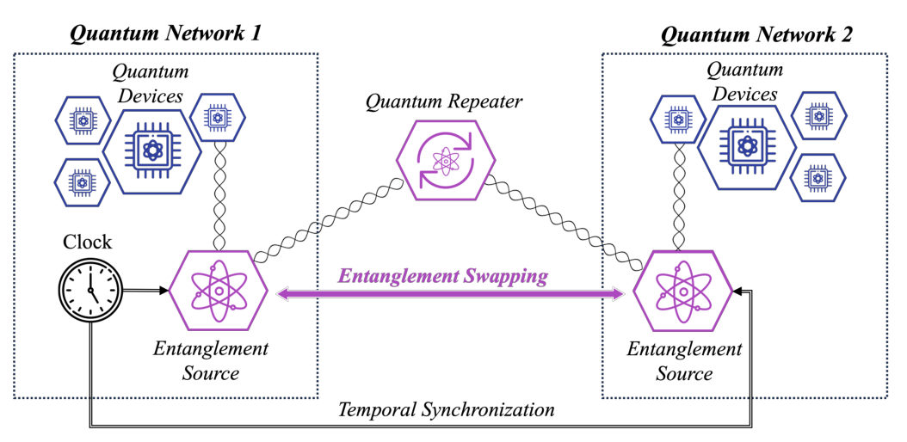 
Fig. 1: Schematic representation of interconnected quantum networks. Multiple independent quantum networks are synchronized via a common reference clock. A quantum repeater node performs entanglement swapping between networks, enabling the realization of a large-scale quantum communication architecture.

📷 Fig 2

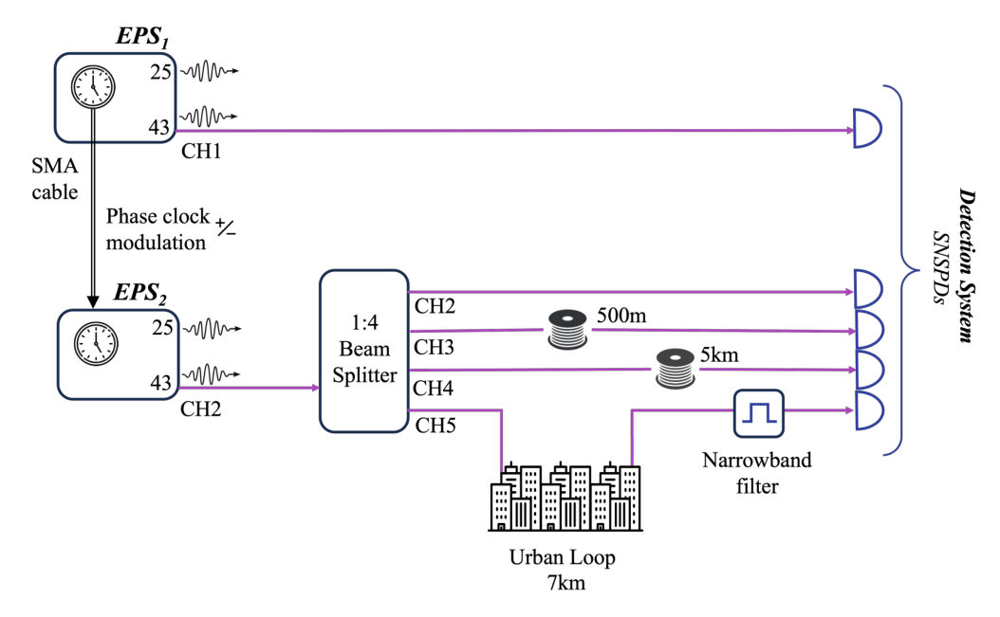 
Fig. 2: Experimental setup built in the National Quantum Internet.it testbed at the University of Naples Federico II. The setup consists of two polarization-entangled photon sources (EPS1 and EPS2), generating entangled pairs on DWDM channels 25-43. A shared electrical clock from EPS1 is used to synchronize EPS2. Photons from EPS1 are directly sent to the detection stage, while photons from EPS2 are distributed over multiple fiber links, including a short reference path (∼10 m), a 500 m spool, a 5 km spool, and a 7 km metropolitan loop, in order to investigate timing stability under different propagation conditions. Detection is performed using SNSPDs, and arrival times are recorded via a...

📷 Fig 3

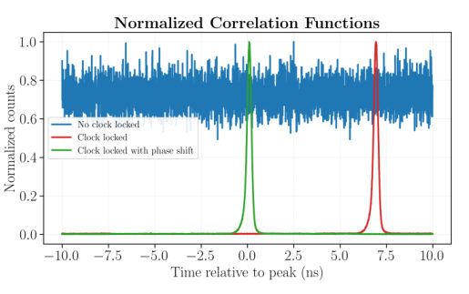 
Fig. 3: Correlation histograms between detection channels CH1 and CH2 for different clock synchronization conditions of the two entangled photon sources. When the sources operate with identical clock periods but no clock sharing, no temporal correlations are observed. When the clock signal is electrically shared between the sources (clock lock condition), a clear coincidence peak emerges, demonstrating successful synchronization. Finally, by applying a controlled phase shift to one of the clocks, the correlation peak is displaced by the desired temporal offset (6.9 ns), enabling fine adjustment of the relative timing between the two sources.

📷 Fig 4

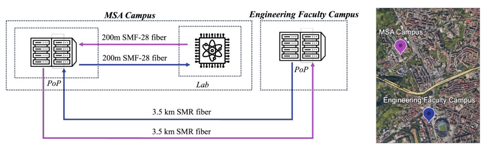 
Fig. 4: Schematic of the 7 km fiber loop connecting the Monte Sant’Angelo campus (MSA) and the Engineering faculty campus. The entangled photon pairs are generated and detected in the laboratory at MSA and injected into the network at the local Point of Presence (PoP). The remote site is located approximately 3.5 km away, and the loop-back configuration results in a total propagation length of about 7 km.

📷 Fig 5

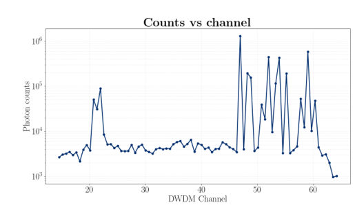 
Fig. 5: Measured noise count rate across DWDM channels of the deployed metropolitan loop. A background level of the order of 103 cps is observed, with pronounced peaks around channel 21 (associated with the University network traffic) and in the range 46–61, where excess counts up to three orders of magnitude above the background are detected.

**Summary.** This paper experimentally analyzes the temporal synchronization stability required for connecting entangled photon sources across metropolitan fiber networks. By using time-tagged coincidence measurements over an 8-hour period, the authors confirm that reliable entanglement distribution is possible even with significant background noise and channel imperfections inherent to existing infrastructure. This validates a key step toward deploying scalable quantum internet services.

**Why it may be interesting.** This work provides crucial empirical data on the practical feasibility of scaling quantum communication infrastructure by quantifying temporal stability limits in real-world, lossy urban environments.

Detailed structure

**Main problem.** The study investigates the temporal stability required for interconnecting quantum networks at an urban scale, where precise time synchronization is critical for entanglement-based protocols.

**Main result.** The experiment successfully demonstrated reliable synchronization between two entangled photon sources over a metropolitan fiber link, maintaining detectable correlations despite significant background noise and channel impairments.

**Method.** Temporal correlation functions were analyzed using time-tagged coincidence measurements to track the long-term stability of clock synchronization across varying fiber lengths.

**Model / system.** The platform involves two entangled photon sources operating in the telecommunication C-band, connected via existing metropolitan optical fiber infrastructure (e.g., 7 km loops).

**Key observables.** Temporal correlation peaks, long-term clock drift ($\approx 120$ ps), and statistical dispersion quantified by the Interquartile Range (IQR).

**Important parameters / regimes.** 8-hour acquisition period; C-band operation; metropolitan fiber losses and background noise ($\sim 10^3 	ext{ cps}$).

**Assumptions / limitations.** Synchronization relies on sharing an explicit electrical clock signal, and the measurement is assumed to be detector-limited rather than dominated by physical broadening processes.

**Figures summary.** Figures illustrate schematic setups (e.g., Figure 1, Figure 2), correlation histograms showing coincidence peaks upon clock synchronization (Figure 3), and temporal evolution plots tracking drift and dispersion over time (Figure 7).

**Paper structure.** The paper progresses from establishing the necessity of time synchronization for quantum networks to detailing the experimental setup using metropolitan fiber links. It then presents measurements of background noise, followed by long-term stability analysis showing limited drift and robust correlation detection.

Abstract

Time synchronization is a fundamental requirement in entanglement-based quantum networks, where the indistinguishability of photons in the time domain is essential for enabling Hong-Ou-Mandel interference and entanglement swapping. In addition to precise temporal alignment, it is equally crucial to ensure the stability of the reference clock over time, as even small fluctuations can degrade the overall performance of the network. In this work, we investigate the stability of clock synchronization for entanglement distribution based on entangled-photon sources operating in the telecommunication C-band. Temporal correlations between photon detection events are analyzed using time-tagged coincidence measurements, enabling the extraction of synchronization peaks and their long-term stability. Experimental results demonstrate that, once locked, the sources exhibit stable temporal correlations over an 8-hour acquisition period, with a maximum observed drift of approximately 120 ps, primarily associated with long fiber links. The width of the correlation peak remains consistent with detector jitter, indicating negligible additional system-induced temporal broadening. A central result of this work is the experimental synchronization between two entanglement-photon sources in a realistic metropolitan deployment, where entanglement distribution is performed over existing telecommunication infrastructure characterized by non-negligible losses and background noise. In this scenario, despite the presence of significant imperfections introduced by the metropolitan-scale fiber network, the observed correlations remain clearly detectable and are consistently well-approximated by Gaussian statistics. This confirms that the two sources can be reliably synchronized not only in controlled laboratory conditions but also under real-world operating constraints.

[↑ back to top](#top)

### [Noise-resilient and Scalable Quantum Error Correction for Nuclear Spin Qubits in Silicon with Electron Shuttling](http://arxiv.org/abs/2607.27527v1)

**Authors:** Wayne M. Witzel, Matthew D. Grace, Dwight R. Luhman  
**Type:** both · **Category:** quantum information and computing · **PDF:** <https://arxiv.org/pdf/2607.27527v1>  
**Analysis basis:** full PDF text, analyzed in chunks
**Topic relevance:** 🔥 `QC/QI experiment` **4/5** · `quantum measurements` **2/5** · `measurement-induced transitions` **1/5** · `spintronics-quantum-optics interface` **1/5**

📷 Fig 1

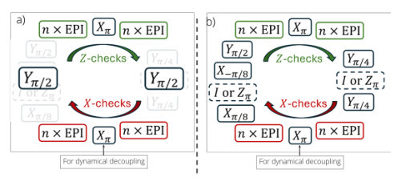 
FIG. 1. Global NMR cycle for universal quantum compu- tation composed of NMR pulses (black boxes), EPI parity measurements (colored boxes), and selective Zπ operations (dashed boxes). a) highlights the basic, default cycle for syn- drome extraction; b) details the full cycle that enables uni- versality with an effective T (Hadamard) gate by applying Zπ on the left (right) portion of the cycle.

📷 Fig 2

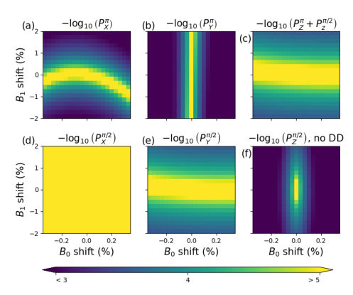 
FIG. 2. DEM for B0 = 1 mT, B1 ≈100 µT both with DD (a)-(e) and without it (f). With DD, frequencies, durations, and B1 were 15.93 (15.95) kHz, 313.6 (658.1) µs, and 99.9 (95.2) µT for Yπ/2 (Xπ). Without DD, B0 (B1) were 996 µT (99.5 µT) with 15.89 kHz frequency and 314.6 µs duration.

📷 Fig 3

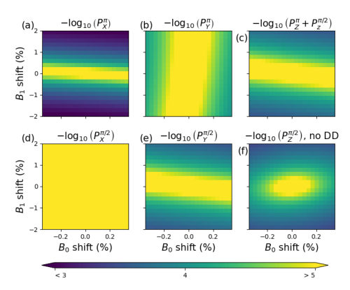 
FIG. 3. DEM for B0 = 1 mT, B1 ≈1 mT both with DD (a)-(e) and without it (f). With DD, frequencies, durations, and B1 were 16.02 (15.00) kHz, 31.20 (66.68) µs, and 99.9 (95.2) µT for Yπ/2 (Xπ). Without DD, B0 (B1) were 1.064 mT (984 µT) with 15.96 kHz frequency and 31.32 µs duration.

**Summary.** This work presents a method to enable quantum computation using nuclear spin qubits in silicon by employing Electron Pair Interferometry (EPI) mediated by electron shuttling. This technique allows for robust measurement of nuclear spin parity, which is then integrated into a full error correction cycle using global NMR gates. The result is a scalable and noise-resilient protocol for universal quantum computation.

**Why it may be interesting.** It provides a concrete, solid-state realization pathway for fault-tolerant quantum computing by engineering complex interactions (electron shuttling) to overcome intrinsic qubit limitations (long coherence times).

Detailed structure

**Main problem.** The challenge of controlling and measuring nuclear spin qubits in silicon due to their long coherence times, which results in low sensitivity to external control signals.

**Main result.** A complete gate set for universal quantum computation is achieved by combining Electron Pair Interferometry (EPI) with global NMR techniques, providing a noise-resilient framework tailored for CSS quantum error correction.

**Method.** The core method involves using electron pair interferometry (EPI) to coherently transfer the parity of nuclear spins onto measurable electron states, which is then integrated into a full syndrome extraction cycle using global NMR gates.

**Model / system.** The physical platform is an array of nuclear spin qubits embedded in silicon quantum dots. Control relies on shuttling pairs of electrons initialized in a singlet state to mediate parity measurements via hyperfine interactions.

**Key observables.** Parity of the nuclear spins (measured via Singlet/Triplet electron states), fidelity of CPhase gates, and syndrome detection outcomes for CSS codes.

**Important parameters / regimes.** Hyperfine interaction strengths ($\sim 100$ kHz to $400$ kHz), coherence times ($T_2$), and relative strengths of DC vs. AC magnetic field inhomogeneities.

**Assumptions / limitations.** The process requires adiabatic shuttling during EPI, and the analysis assumes static (perfectly correlated) magnetic field inhomogeneity for error modeling.

**Figures summary.** Figure 1 illustrates the global NMR cycle for syndrome extraction and achieving universality; Figure 2 details the Detector Error Model (DEM) under various magnetic field inhomogeneity scenarios with/without Dynamical Decoupling.

**Paper structure.** The paper introduces EPI to measure nuclear parity, details how this measurement is integrated into a full quantum error correction cycle using global NMR gates, and concludes by demonstrating that the combined set achieves universal computation robustly against noise sources like charge noise.

Abstract

Nuclear spin qubits in silicon are well-isolated from their environment. Consequently, they have very long lifetimes and low sensitivity to noise, but this also suggests that control and measurement is challenging. We introduce electron pair interferometry (EPI), a protocol to overcome this challenge and maintain robustness to noise. EPI is implemented using an array of quantum dots with isoelectronic nuclear spin qubits located in the dots. A pair of electrons are initialized into a singlet ground state, split apart, and shuttled to the dots containing nuclear spin qubits. We show it is possible to coherently transfer the parity of the nuclei onto the measurable state of singlet/triplet-encoded electrons. Global nuclear magnetic resonance (NMR) can be used to change bases and implement dynamical decoupling (DD). Combined with selective hyperfine-induced $Z_π$ rotations, our gate set is complete for universal quantum computation, tailored to Calderbank-Shor-Steane (CSS) quantum error correction, and robust to noise. We discuss very low sensitivity to charge noise and study the sensitivity to both DC and AC magnetic field inhomogeneity which depends strongly on their relative strengths.

[↑ back to top](#top)

### [Finite-size effects and interaction-driven crossovers in quarter-filled attractive Hubbard model: Exact diagonalization, DMRG and machine-learning analysis](http://arxiv.org/abs/2607.27916v1)

**Authors:** Md Fahad Equbal, Satoru Hayami  
**Type:** theory · **Category:** strongly correlated electrons · **PDF:** <https://arxiv.org/pdf/2607.27916v1>  
**Analysis basis:** full PDF text, analyzed in chunks
**Topic relevance:** 🔥 `analog quantum simulation` **4/5** · `entanglement & information structure` **1/5** · `methods for driven-dissipative` **1/5** · `non-equilibrium dynamics` **1/5**

📷 Fig 1

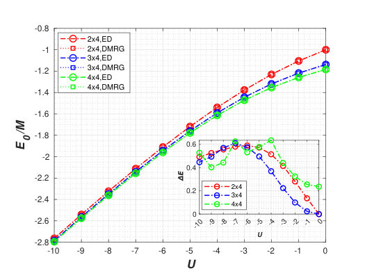 
FIG. 1. Ground-state energy per site E0/M as a function of U for Ly × 4 cylinders (Ly = 2, 3, 4) at quarter filling, computed using ED (circle) and DMRG (square). Excellent agreement between ED and DMRG is observed. Inset: Excitation gap ∆E = E1 −E0 obtained from ED. The broad maximum of ∆E at intermediate attraction signals a crossover from weakly bound fermions to strongly paired regime.

📷 Fig 2

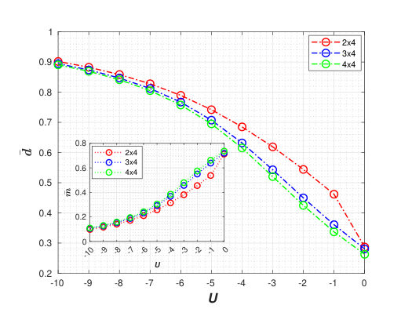 
FIG. 2. Average double occupancy ¯d as a function of U for quarter-filled Ly ×4 cylinders (Ly = 2, 3, 4). Inset: average local moment ¯m. Increasing attraction enhances onsite pair forma- tion, resulting in a monotonic increase of ¯d and a corresponding suppression of ¯m.

📷 Fig 3

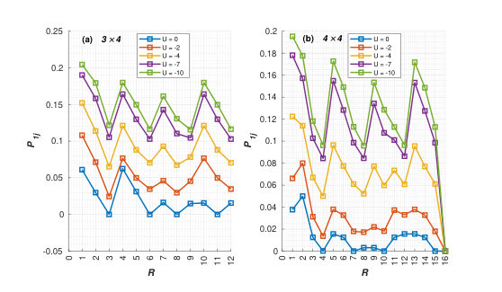 
FIG. 4. Pair-pair correlation function P1j as a function of dis- tance R for (a) 3 × 4 and (b) 4 × 4 cylinders at quarter filling. Here site 1 is chosen as the reference site. Increasing attrac- tive interaction enhances both the magnitude and spatial extent of pairing correlations, indicating the progressive formation of bound singlet pairs.

📷 Fig 4

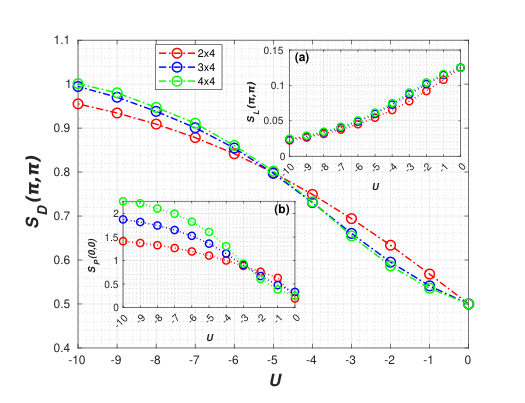 
FIG. 3. Charge structure factor SD(π, π) as a function of U for quarter-filled Ly × 4 cylinders (Ly = 2, 3, 4). Inset (a): spin structure factor SL(π, π). Inset (b): singlet pairing structure factor SP (0, 0). Increasing attractive interaction suppresses spin correlations while enhancing charge and pairing fluctuations.

📷 Fig 5

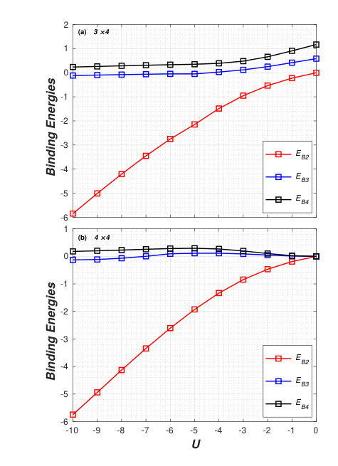 
FIG. 5. Two-, three- and four-hole binding energies as func- tions of U for (a) 3 × 4 and (b) 4 × 4 cylinders at quarter filling. The negative values of EB2 demonstrate robust two-hole pair- ing throughout the attractive regime. The sign change of EB3 at strong attractive interaction indicates finite-size-dependent three-hole clustering, while the positive values of EB4 show that stable four-hole bound states do not form within the parameter range studied.

**Summary.** The authors study the crossover in the attractive Hubbard model, transitioning from itinerant fermions to tightly bound pairs. They combine DMRG and ED calculations with advanced machine learning tools like PCA and UMAP to map this complex correlation landscape. The findings robustly confirm the BCS-BEC crossover analogy while offering a generalizable methodology for characterizing quantum phases.

**Why it may be interesting.** This work provides a powerful, order-parameter-independent diagnostic tool (PCA/UMAP) to characterize complex many-body crossovers in lattice models, which is highly relevant for interpreting experimental data from ultracold atoms simulating Hubbard physics.

Detailed structure

**Main problem.** The study investigates finite-size effects and interaction-driven crossovers within the quarter-filled attractive Hubbard model.

**Main result.** The analysis confirms a continuous crossover from weakly correlated fermions to tightly bound singlet pairs, consistent with the BCS–BEC crossover analogy. Machine learning techniques independently validate this crossover region by characterizing correlation reorganization.

**Method.** A combination of advanced numerical simulations (ED, DMRG) and unsupervised machine learning dimensionality reduction (PCA, UMAP) is employed on real-space correlation matrices.

**Model / system.** The system is the quarter-filled attractive Hubbard model defined on finite-width cylindrical lattices. The Hamiltonian involves hopping ($t$) and an attractive onsite interaction ($U$).

**Key observables.** Ground-state energetics, local observables (e.g., double occupancy), pairing structure factor, and leading PCA variance ratio.

**Important parameters / regimes.** Attractive interaction strength ($U$), finite system size ($L_y 	imes L_x$), and the quarter-filling condition ($n=0.5$).

**Assumptions / limitations.** The analysis relies on extrapolating results from finite clusters to the thermodynamic limit using finite-size scaling techniques.

**Figures summary.** Tables summarize fitting parameters for the pairing structure factor and the leading PCA variance ratio derived from finite-size scaling analyses, showing systematic changes across the crossover region.

**Paper structure.** The paper systematically applies ED/DMRG to calculate observables across varying interaction strengths. It then uses PCA and UMAP on correlation matrices to map the underlying quantum phase space, confirming results via finite-size scaling analysis of key diagnostics.

Abstract

We investigate the quarter-filled attractive Hubbard model on finite-width cylindrical lattices using exact diagonalization (ED), density-matrix renormalization group (DMRG) and unsupervised machine-learning-based techniques. Analysis of the ground-state energetics, local observables and correlation functions reveals a continuous interaction-driven crossover from weakly correlated fermions to a regime dominated by tightly bound singlet pairs. This crossover originates from the competition between kinetic-energy-driven fermionic itinerancy and interaction-driven onsite pair formation and exhibits behavior consistent with the BCS--BEC crossover in the thermodynamic limit. Hole-binding-energy calculations provide direct energetic evidence for pair formation: the two-hole binding energy remains negative throughout the attractive regime whereas three-hole binding emerges only at sufficiently strong attraction and exhibits pronounced finite-size dependence. To obtain an unbiased characterization of the correlation landscape, we apply principal component analysis (PCA) and uniform manifold approximation and projection (UMAP) to the real-space correlation matrices. PCA reveals a systematic redistribution of correlation variance whereas UMAP identifies a clear separation between weak- and strong-pairing regimes. Both machine-learning-based approaches independently identify the same crossover region inferred from conventional observables while providing an order-parameter-independent characterization of the underlying reorganization of many-body correlations. Finite-size scaling analyses of the pairing structure factor and the leading PCA variance ratio demonstrate that these signatures remain robust with increasing system size.

[↑ back to top](#top)

### [From Exact Diagonalization to DMRG: A Complete Numerical Study of the Transverse-Field Ising Model](http://arxiv.org/abs/2607.28471v1)

**Authors:** Chandra Sekhar Prayaga  
**Type:** theory · **Category:** strongly correlated electrons · **PDF:** <https://arxiv.org/pdf/2607.28471v1>  
**Analysis basis:** full PDF text, analyzed in chunks
**Topic relevance:** 🔥 `entanglement & information structure` **4/5** · `analog quantum simulation` **1/5** · `methods for driven-dissipative` **1/5** · `non-equilibrium dynamics` **1/5**

📷 Fig 1

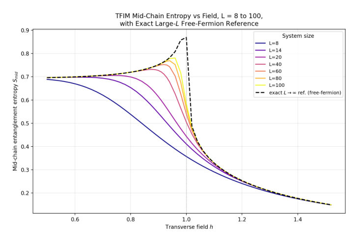 
Figure 1: Mid-chain entanglement entropy vs. transverse field h, L = 8 through 100, χmax = 200 throughout. Dashed black curve: exact large-L reference from the free-fermion solution of the TFIM (see text).

📷 Fig 2

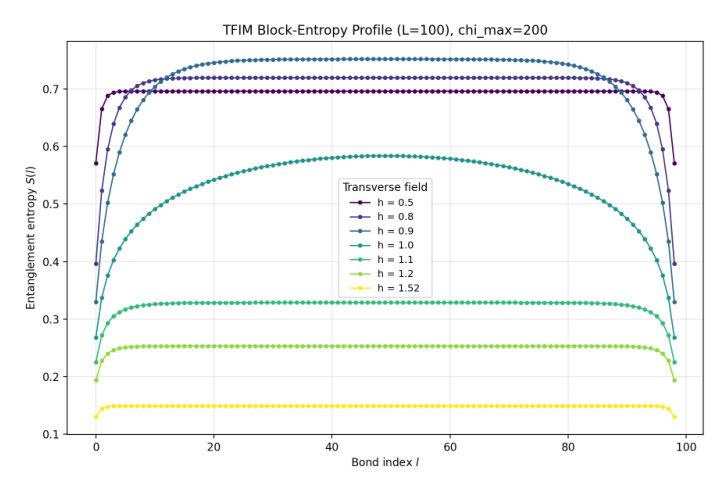 
Figure 2: Entanglement entropy S(l) vs. bond index l, L = 100, for seven representative fields spanning both phases and the transition.

📷 Fig 3

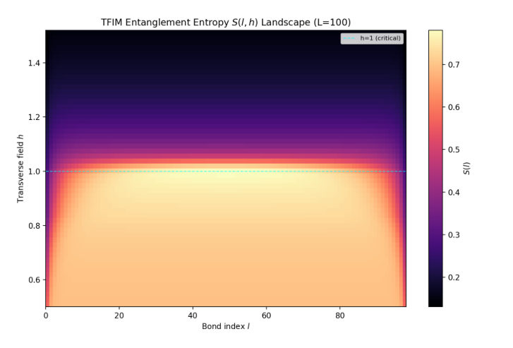 
Figure 3: Entanglement entropy landscape S(l, h), L = 100, over the full sampled field range.

📷 Fig 4

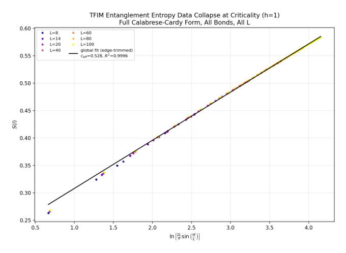 
Figure 4: Entanglement entropy vs. the full Calabrese-Cardy variable, all bonds, all seven system sizes, at h = 1.

📷 Fig 5

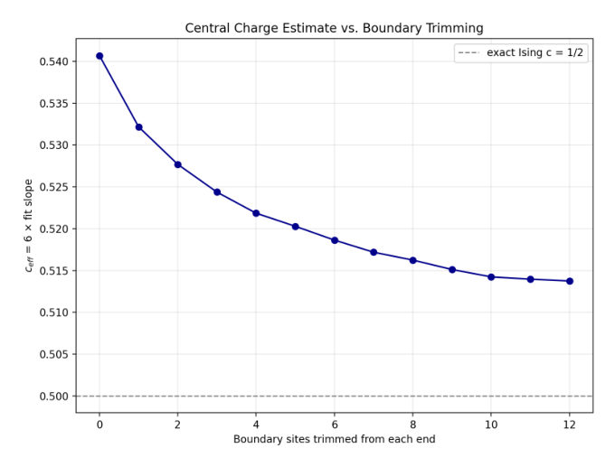 
Figure 5: Effective central charge vs. number of boundary sites excluded from the fit, at h = 1. Dashed line: exact 2D Ising value c = 1/2.

**Summary.** This paper presents a comprehensive numerical investigation into the 1D Transverse-Field Ising Model, comparing results from Exact Diagonalization and DMRG across multiple system sizes. By employing rigorous consistency checks, the authors successfully extract the central charge of the critical point, confirming its theoretical value of $c=1/2$. The work serves as an important methodological guide for practitioners in quantum many-body physics.

**Why it may be interesting.** It provides a rigorous benchmark for applying advanced tensor network methods (DMRG) by demonstrating how systematic convergence checks can resolve spurious numerical artifacts and confirm fundamental theoretical predictions regarding quantum criticality.

Detailed structure

**Main problem.** To conduct a complete numerical study of the ground-state entanglement structure of the 1D Transverse-Field Ising Model (TFIM) and extract its central charge.

**Main result.** The effective central charge ($c_{	ext{eff}}$) was found to converge robustly to $0.51-0.52$, consistent with the exact theoretical value of $c=1/2$ expected for 2D Ising universality class.

**Method.** The study systematically compares results from Exact Diagonalization (ED) on small systems and Density-Matrix Renormalization Group (DMRG) up to large sizes, using identical convergence diagnostics across all calculations.

**Model / system.** The system is the one-dimensional transverse-field Ising model (TFIM), described by the Hamiltonian $H = -\sum_i J \sigma^z_i \sigma^z_{i+1} - h \sum_i \sigma^x_i$. The phase transition occurs at a critical field $h_c=1$.

**Key observables.** Bipartite entanglement entropy ($S(l)$), mid-chain entanglement entropy ($S_{mid}$), and the effective central charge ($	ext{c}_{	ext{eff}}$).

**Important parameters / regimes.** System size $L$ (up to 100), transverse field $h$, and DMRG bond dimension $\chi$.

**Assumptions / limitations.** The analysis relies on systematic convergence checks across multiple numerical methods, explicitly resolving artifacts caused by finite-size effects or insufficient bond dimensions.

**Figures summary.** Figures illustrate the mid-chain entanglement entropy vs. field for various $L$, show full bond-by-bond profiles collapsing onto a single curve using the Calabrese-Cardy variable, and plot $	ext{c}_{	ext{eff}}$ showing convergence to $1/2$.

**Paper structure.** The paper is structured as both a physical result and a methodological guide, detailing the numerical progression from small ED calculations to large DMRG simulations, culminating in the extraction of critical exponents via entropy scaling.

Abstract

We present a self-contained numerical study of the one-dimensional transverse-field Ising model (TFIM), tracing its ground-state entanglement structure from exact diagonalization at small system size (L=8,14,20) through density-matrix renormalization group (DMRG) calculations up to L=100. A single, consistent methodology - identical field grid, identical convergence diagnostic (independent runs at bond dimensions chi=100 and chi=200 at every point) - is used across all seven system sizes, and we show explicitly where exact diagonalization and DMRG must agree exactly rather than merely approximately. Along the way we document and resolve a bond-dimension convergence artifact that produced a spurious discontinuity in an earlier, less systematic dataset, as a worked cautionary example for practitioners. Using the resolved dataset we extract the central charge of the transition via two complementary routes - the leading logarithmic finite-size scaling of the mid-chain entropy, and the full Calabrese-Cardy formula applied to every bond of every system size simultaneously - obtaining c_eff to 0.51-0.52 as short-distance lattice corrections are systematically excluded, consistent with the exact two-dimensional Ising value c=1/2. We review the quantum-classical (Suzuki-Trotter) correspondence that underlies this agreement and discuss how the Widom-Kadanoff scaling hypothesis transplants from the classical to the quantum problem. The manuscript is intended as both a physics result and a worked methodological example of careful finite-size numerics.

[↑ back to top](#top)

### [Witness robustness: An operational quantifier of measurement resources via free state discrimination](http://arxiv.org/abs/2607.27892v1)

**Authors:** Jingsong Ao, Aby Philip, Alexander Streltsov  
**Type:** theory · **Category:** quantum information and computing · **PDF:** <https://arxiv.org/pdf/2607.27892v1>  
**Analysis basis:** full PDF text, analyzed in chunks
**Topic relevance:** 🔥 `quantum measurements` **4/5** · `correlated / nonlocal dissipation` **1/5** · `entanglement & information structure` **1/5** · `measurement-induced transitions` **1/5**

📷 Fig 1

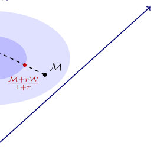 
Figure 1: Witness robustness as a relaxation of the admixed noise. All sets live in the space of N-tuples of observables: the free measurements MF sit inside all measurements M, both bounded convex sets, which in turn sit inside the unbounded product cone [cone∗(F)]×N of witness tuples—tuples W = {Wi} whose every component is a free-state witness—with apex at the zero tuple 0. The witness robustness mixes the resourceful target M with such a tuple W—not with another measurement—until the convex combination (M + rW)/(1 + r) first meets MF; the least weight r is RF MF(M). Restricting the noise instead to M or to MF recovers the generalized and standard robustness, so that RF MF ≤RMF ≤Rstd MF .

📷 Fig 2

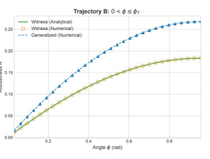 
Figure 2: Witness robustness and generalized robustness along two single-qubit Bloch-vector trajectories. For the projective measurement M = (Π, I −Π), with Π = 1

📷 Fig 3

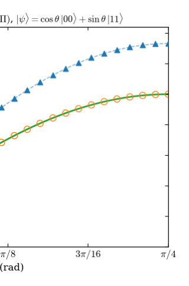 
Figure 3: Witness robustness and generalized robustness of a two-qubit projective measure- ment. The measurement is M = (Π, I−Π), where Π = |ψ(θ)⟩⟨ψ(θ)| and |ψ(θ)⟩= cos θ|00⟩+sin θ|11⟩, with θ ∈[0, π/4]. The witness robustness RPPT PPT = C/4, where C = sin(2θ) is the concurrence of |ψ(θ)⟩, is evaluated analytically (green line) and numerically (orange circles). The generalized robust- ness is evaluated numerically (blue dashed line and triangles).

**Summary.** This paper develops the concept of 'witness robustness' to quantify how much a quantum measurement exceeds what is achievable using only 'free states.' It establishes this measure through an operational interpretation based on discrimination success probabilities. This provides a powerful, generalized tool for resource quantification in quantum information theory.

**Why it may be interesting.** It provides a sophisticated, generalized tool to quantify resource advantages in quantum tasks where standard measures fail due to limitations on state preparation or noise modeling.

Detailed structure

**Main problem.** The paper introduces and characterizes 'witness robustness' as a novel resource quantifier for quantum measurements, designed to measure the advantage of a measurement over free measurements.

**Main result.** Witness robustness quantifies the maximal advantage in discriminating an ensemble of only free states. It is shown that this measure is not always faithful but provides a direct operational characterization via success probabilities in discrimination games.

**Method.** The authors define witness robustness by considering noise drawn from the dual cone of free states (free-state witnesses), leading to an infimum minimization problem solved using minimax theorems.

**Model / system.** The framework is general quantum information theory, analyzing measurements ($M$) within a resource theory context defined by a set of 'free states' ($F$). Specific applications include single-qubit magic and two-qubit PPT entanglement.

**Key observables.** Witness robustness ($	ext{RF}_{	ext{MF}}(M)$), success probabilities in state discrimination games, and various forms of generalized/standard robustness measures.

**Important parameters / regimes.** The geometry of the free state set ($F$) dictates the behavior of the resource measure; the analysis compares different norms (e.g., $\ell_\infty$ vs. Euclidean).

**Assumptions / limitations.** The core assumption is that noise can be modeled by tuples of free-state witnesses, which relaxes constraints compared to standard robustness measures.

**Figures summary.** Figure 1 illustrates how witness robustness mixes the measurement $M$ with a tuple of witnesses $W$, showing the relationship between different sets defining the resource measure.

**Paper structure.** The paper progresses by first introducing the concept, establishing its operational interpretation via discrimination games (Theorem 1), deriving fundamental properties like convexity and monotonicity, and concluding with analytical results for specific physical examples.

Abstract

We introduce the witness robustness of quantum measurements, a resource quantifier whose admissible noise consists of tuples of free-state witnesses rather than physical measurements. We establish its operational interpretation: it quantifies the maximal advantage that a measurement can provide over free measurements in discriminating an ensemble composed entirely of free states. Unlike the standard and generalized robustnesses, the witness robustness is not faithful in general, reflecting the fact that a resourceful measurement need not be useful when only free states can be prepared. We identify conditions under which faithfulness is recovered and show that, in resource theories admitting a resource-destroying map, the witness robustness vanishes for every measurement. We also establish fundamental properties, including convexity and monotonicity. Finally, we derive analytical results for projective measurements in single-qubit magic and for binary pure-state projective measurements in the two-qubit PPT entanglement theory.

[↑ back to top](#top)

### [Exponential Advantage of Multipartite Entanglement over Quantum Communication with Applications to Bounded-Storage Cryptography](http://arxiv.org/abs/2607.27957v1)

**Authors:** Ananya Chakraborty, Manik Banik, Ronald de Wolf  
**Type:** theory · **Category:** quantum information and computing · **PDF:** <https://arxiv.org/pdf/2607.27957v1>  
**Analysis basis:** full PDF text, analyzed in chunks
**Topic relevance:** 🔥 `entanglement & information structure` **4/5** · `analog quantum simulation` **1/5** · `non-equilibrium dynamics` **1/5**

📷 Fig 1

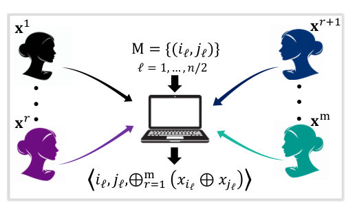 
Figure 1. Multipartite Hidden Matching task (mHMn). It involves m spatially separated senders (Alices), where the rth Alice receives a string xr ∈{0, 1}n. Bob receives a perfect matching M ∈Mn/2 on [n]. His goal is to output a triple iℓ, jℓ, Lm r=1(xr iℓ⊕xr jℓ) for some edge (iℓ, jℓ) ∈M. The Boolean variant mBHMn is a related decision problem defined in the text.

📷 Fig 2

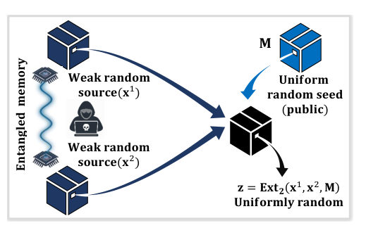 
Figure 2. Multipartite Hidden Matching extractor. Two in- dependent weak random sources x1 and x2, together with a uniformly random public seed M, are processed by the mul- tipartite Hidden Matching extractor to produce an extracted key z = Ext2(x1, x2, M), that is statistically close to uniform. Adversaries with unentangled memory require polynomial-size quantum side-information to attack the protocol. In contrast, pre-shared entanglement enables an adversary to compromise the extractor using only O(log n) qubits of storage per source, establishing an exponential separation between entangled and unentangled quantum memory.

**Summary.** This work proves that shared multipartite quantum entanglement provides an exponential advantage over classical or unentangled quantum resources when solving complex distributed tasks like the Hidden Matching problem. This fundamental separation is then applied to construct a secure, exponentially stronger seeded randomness extractor, highlighting the computational power of genuine multipartite correlations.

**Why it may be interesting.** While focused on quantum information theory rather than AMO physics directly, the techniques used—analyzing multipartite correlations and entanglement advantages in communication tasks—are foundational for understanding resource theories relevant to quantum simulation or networking protocols involving multiple interacting subsystems.

Detailed structure

**Main problem.** To establish an exponential communication advantage provided by shared multipartite quantum entanglement over protocols relying only on classical or unentangled quantum communication.

**Main result.** The paper demonstrates that for tasks like the Multipartite Hidden Matching, shared GHZ entanglement allows for exponentially smaller classical communication complexity compared to scenarios without such pre-shared entanglement. This separation is also shown in cryptographic applications involving randomness extractors.

**Method.** The authors employ quantum information theory tools, including analyzing communication complexity bounds using Fourier analysis and bounding trace distances between quantum states derived from the task structure.

**Model / system.** The core model involves multipartite quantum entanglement, specifically utilizing Greenberger-Horne-Zeilinger (GHZ) states among multiple spatially separated senders. The tasks analyzed are the Multipartite Hidden Matching problem and seeded two-source randomness extraction.

**Key observables.** Communication complexity ($	ext{C}_{\parallel}$), trace distance ($\|\cdot\|_{tvd}$ or $\|\cdot\|_{	ext{tr}}$), and quantum memory size required for an adversary to break security.

**Important parameters / regimes.** The separation is exponential, contrasting polynomial/logarithmic bounds (e.g., $\log n$ vs. $\sqrt{n}$) depending on the availability of entanglement.

**Assumptions / limitations.** The analysis relies heavily on bounding expectations over random choices and utilizing specific quantum inequalities (like hypercontractive inequalities) to establish the separation.

**Figures summary.** Figure 1 illustrates the Multipartite Hidden Matching task setup. Figure 2 depicts the process for a multipartite extractor combining two weak sources and a public seed.

**Paper structure.** The paper progresses by first defining the communication complexity problem (mHMn), establishing the exponential separation using GHZ states, and then applying this framework to construct and analyze an exponentially separated seeded randomness extractor.

Abstract

We establish an exponential communication advantage enabled by multipartite quantum entanglement. Building on the bipartite Hidden Matching problem, we introduce a communication task involving multiple spatially separated senders and a single receiver. We show that a shared Greenberger-Horne-Zeilinger state enables completion of this task using only logarithmically many bits of classical communication from each sender. In contrast, without preshared entanglement, any protocol achieving high success probability requires polynomial communication from at least one sender, even when \emph{quantum} communication is allowed. Thus, classical communication assisted by multipartite entanglement can be exponentially more powerful than quantum communication without preshared entanglement. As a cryptographic application, we construct a seeded two-source randomness extractor and establish an exponential separation between entangled and unentangled quantum side-information. Specifically, compromising the extractor with two unentangled quantum states storing information about the two sources, respectively, requires polynomial-size memory, whereas exponentially smaller quantum memory suffices in the presence of a small amount of shared entanglement.

[↑ back to top](#top)

### [Hubbard physics with ultracold polar molecules: on-site interaction energies for shielded molecules](http://arxiv.org/abs/2607.28533v1)

**Authors:** Carlin Stewart-Wiese, Joy Dutta, Jeremy M. Hutson  
**Type:** theory · **Category:** other · **PDF:** <https://arxiv.org/pdf/2607.28533v1>  
**Analysis basis:** full PDF text, analyzed in chunks
**Topic relevance:** 🔥 `analog quantum simulation` **4/5** · `exotic spin models in light-matter` **1/5** · `non-equilibrium dynamics` **1/5**

📷 Fig 1

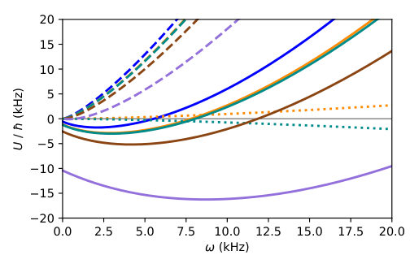 
FIG. 1. On-site interaction energy U as a function of har- monic frequency ω, for NaCs molecules shielded with circu- larly polarized microwaves with ∆/Ω= 1. States that are bound (unbound) at ω = 0 are shown as solid (dashed) lines. Rabi frequencies Ω= 2.5 (blue), 3.4 (orange), 3.5 (green), 5 (brown) and 11 MHz (purple) give scattering lengths a = 5200, 260, −200, −6400 and −100, 000 bohr, respectively. Dotted lines show the results of Eq. 1 for the lowest two val- ues of |a|.

📷 Fig 2

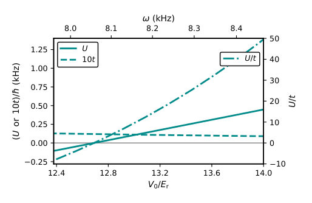 
FIG. 2. On-site interaction energy U (solid, left axis), tun- neling energy t (dashed, left axis) and their ratio U/t (dot- dashed, right axis), as a function of lattice strength and har- monic frequency, near the zero-crossing of U. The calculations are for NaCs with Ω= 3.5 MHz, ∆/Ω= 1 and λ = 1064 nm.

**Summary.** This paper calculates the on-site interaction energy for ultracold polar molecules trapped in optical lattices using specialized quantum scattering methods. The key finding is that shielding techniques allow for a tunable interaction regime (U/t) unlike standard atomic systems. This opens the door to studying complex, strongly dipolar Hubbard physics with controlled double occupancy.

**Why it may be interesting.** This work directly addresses how strong, controllable dipole interactions in molecular systems can modify fundamental many-body models like the Hubbard model, opening avenues beyond simple atomic approximations.

Detailed structure

**Main problem.** The study investigates on-site interaction energies (U) for pairs of shielded ultracold polar molecules confined to the same lattice site.

**Main result.** The interaction energy U exhibits behavior distinct from ultracold atoms, potentially becoming negative at weak lattices and crossing zero as lattice strength increases. This enables exploring dipolar Hubbard physics with multiple site occupancy.

**Method.** The authors use coupled-channel calculations to solve the correlated 2-particle relative motion Schrödinger equation for both bound and unbound states.

**Model / system.** The system involves ultracold polar molecules trapped in optical lattices, where interactions are governed by long-range dipole-dipole potentials modified by microwave shielding. The physics is framed within the context of Hubbard models.

**Key observables.** On-site interaction energy (U), tunneling energy (t), and their ratio U/t.

**Important parameters / regimes.** Shielding fields, lattice strength ($\omega$), Rabi frequency ($\Omega$), dipole moment ($\mu$).

**Assumptions / limitations.** The approach neglects anharmonicity of the confining potential and any extension of Wannier functions into neighboring wells.

**Figures summary.** Figure 1 illustrates U vs. harmonic frequency $\omega$ for NaCs, showing solid (bound) and dashed (unbound) lines; Figure 2 plots U, t, and U/t versus lattice strength ($\lambda$).

**Paper structure.** The paper analyzes the correlated two-particle problem by separating relative and center-of-mass motions. It compares results for unbound pairs and 2-body bound states to demonstrate tunable dipolar Hubbard physics.

Abstract

We explore on-site interaction energies $U$ for pairs of shielded ultracold molecules on the same lattice site. We use 2-dimensional effective potentials appropriate for microwave shielding, which have dipole-dipole character at long range but feature a very large repulsive core when the two molecules come close together. This causes very strong correlation between the motions of two molecules on the same site. We find behavior very different from that for ultracold atoms: in particular, there are states for which $U$ is negative for weak lattices but crosses zero to positive values as the lattice strength increases. This behavior is found for both unbound pairs and 2-body bound states. The latter will give access to previously unexplored types of strongly dipolar Hubbard physics with multiple site occupancy.

[↑ back to top](#top)

### [Efficient atom rearrangements for quantum error correction primitives with a single AOD](http://arxiv.org/abs/2607.28149v1)

**Authors:** Tom Hartweg, Asier Piñeiro Orioli, Hugo Perrin, Samuel Crew  
**Type:** theory · **Category:** quantum information and computing · **PDF:** <https://arxiv.org/pdf/2607.28149v1>  
**Analysis basis:** full PDF text, analyzed in chunks
**Topic relevance:** 🔥 `QC/QI experiment` **4/5** · `Rydberg arrays` **1/5**

📷 Fig 1

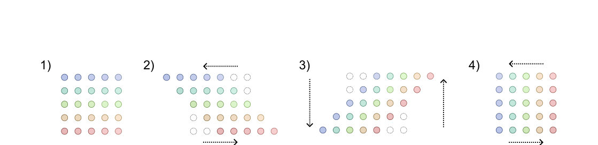 
Figure 2: Paeth decomposition of the 90◦rotation of a 5 × 5 array into three shears. Panels 1–4 show the array after each of the three shears. Here, for each shear, the reference line is chosen to be the middle row/column.

📷 Fig 2

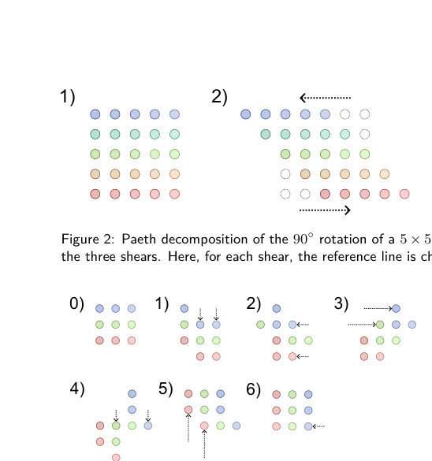 
Figure 3: Optimal 6-move 90◦rotation for d = 3.

📷 Fig 3

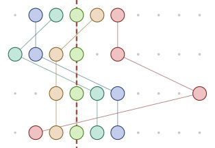 
Figure 5: Reflection of a line of 5 atoms across a mirror axis, implemented via negabinary decomposition. The labels on the right indicate the distance of the stroke at each step.

📷 Fig 4

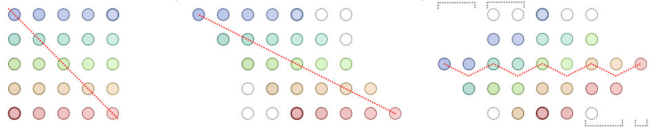 
Figure 6: Approximate rotation by 45◦decomposed as two shears. The dashed red line represents the diagonal of the original configuration (0). The final configuration (2) shows how the diagonal gets stretched and staggered to snap back to the static lattice.

📷 Fig 5

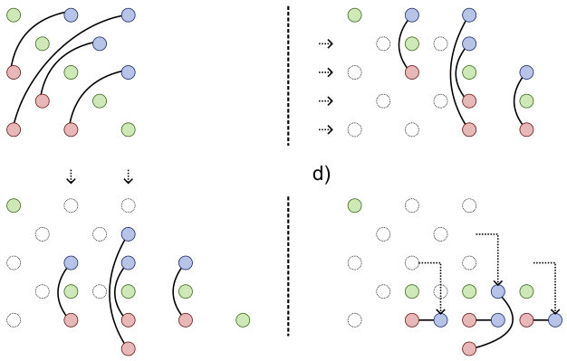 
Figure 7: The compact fold-transversal S-gate protocol for a distance-3 rotated surface code. (a) After half a QEC cycle, the register is in the regular surface code orientation with 2d −1 = 5 non-empty rows and columns; blue/red atoms undergo CZ gates (black arcs) across a 45◦diagonal, green atoms undergo single-qubit S gates. (b) Horizontal shear of all 5 rows with rate 1. (c) Vertical shear of the inner 3 atom-holding columns with rate 1 (the leftmost and rightmost atoms are unaffected). Stages (b) and (c) together align the diagonal with the vertical axis, and the CZ-paired atoms now sit on common vertical lines. (d) The upper partner of each CZ pair translates downward in parallel,...

**Summary.** This paper presents novel, highly efficient methods to schedule atomic rearrangements—such as shearing and rotating 2D arrays—necessary for quantum error correction in neutral-atom quantum computers. By using binary and geometric decompositions applied via a single AOD pair, the authors achieve logarithmic scaling in resource costs compared to quadratic scaling from naive approaches. This work significantly advances the feasibility of large-scale, fault-tolerant quantum computation by optimizing physical gate operations.

**Why it may be interesting.** This work directly addresses the physical overhead of fault-tolerant quantum computation in neutral atoms. The focus on minimizing movement time through algorithmic decomposition is crucial for realizing high logical throughput, bridging theoretical QEC requirements with practical AMO hardware constraints.

Detailed structure

**Main problem.** The core problem is developing highly efficient scheduling algorithms for physically moving atoms to perform necessary geometric rearrangements required by quantum error correction (QEC) primitives.

**Main result.** The authors introduce new decomposition methods that achieve logarithmic scaling in the number of moves and significantly reduce time complexity compared to naive atom-by-atom rearrangement schemes.

**Method.** They employ (nega-)binary and geometric decompositions, combined with established techniques like Paeth decomposition, to map complex lattice transformations (shear, rotate, reflect) onto minimal AOD sweeps.

**Model / system.** The system is a neutral-atom quantum computer utilizing atoms trapped in a static 2D square lattice. Reconfiguration is achieved dynamically using the controlled sweeping of a single crossed acousto-optic deflector (AOD) pair.

**Key observables.** Number of AOD strokes ($N_{moves}$), total tweezer distance ($D_{tweezer}$), and constant-jerk movement time ($T_{jerk}$).

**Important parameters / regimes.** The linear size of the array, $d$, which dictates the scaling of resources.

**Assumptions / limitations.** It is assumed that collision avoidance during movement is always possible, and that the movement time dominates over pickup/release times.

**Figures summary.** Figures illustrate various shear schemes (Figure 1) and the decomposition stages for a $90^\circ$ rotation using Paeth decomposition (Figure 2), alongside general protocol visualizations for different distances $d$.

**Paper structure.** The paper establishes lower bounds on movement resources, then details specific primitives like shearing, followed by implementing rotations via shearing decompositions (Paeth/binary), and concluding with applications to error correction codes like the surface code.

Abstract

Neutral-atom quantum computers offer arbitrary connectivity enabled by atom transport. Some logical operations can then be simplified or reduced entirely to geometric rearrangements of the atoms. Minimizing the duration of these movements is therefore essential for high logical throughput. We introduce new primitives to shear, rotate and reflect 2D arrays of atoms in a static lattice using sweeps of a single dynamic crossed acousto-optic deflector (AOD) pair. Using (nega-)binary and geometric decompositions, we achieve an AOD stroke count scaling logarithmically in the linear size of the array. In one example, we use the Paeth decomposition to implement a $90^{\circ}$ rotation for a transversal Hadamard gate in a rotated surface code of distance $d$ in $3\lfloor\log_2(d-1)\rfloor + 4$ AOD strokes and $O(d^{1/3})$ constant-jerk time, against $O(d^2)$ strokes and $O(d^{7/3})$ time for atom-by-atom rearrangement.

[↑ back to top](#top)

### [Quantum LDPC codes with design rate 1/5 and good performance below 1000 physical qubits](http://arxiv.org/abs/2607.27644v1)

**Authors:** Yifan Hong  
**Type:** both · **Category:** quantum information and computing · **PDF:** <https://arxiv.org/pdf/2607.27644v1>  
**Analysis basis:** full PDF text, analyzed in chunks
**Topic relevance:** 🔥 `QC/QI experiment` **4/5**

📷 Fig 1

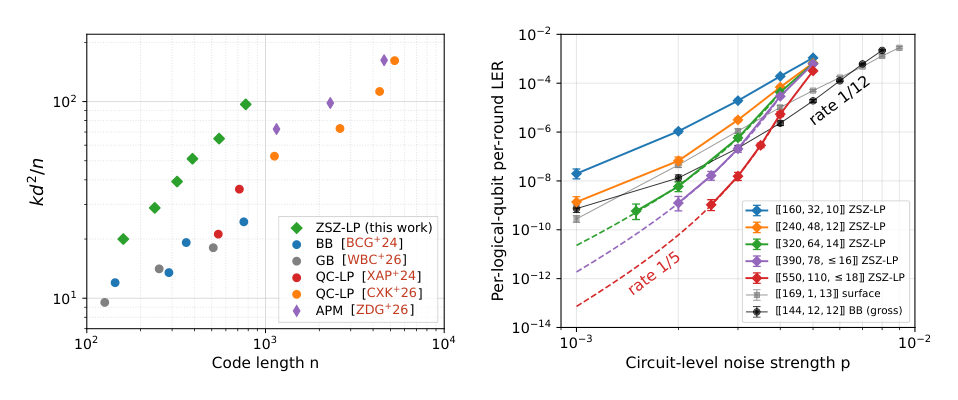 
Figure 1: Left: The memory efficiency improvement kd2/n over the surface code is plotted as a function of the code length n for several high-rate qLDPC codes proposed for near-term implementation, including bivariate bicycle (BB) [BCG+24], generalized bicycle (GB) [WBC+26], quasi-cyclic lifted product (QC-LP) [XAP+24, CXK+26] and Kasai’s construction [Kas26] with affine permutation matrices (APM) [ZDG+26]. Note that kd2/n = 1 for the (rotated) surface code. Right: The XZ-averaged logical error rate (LER) per qubit-round (over d rounds) is plotted as a function of the idling-free circuit-level noise strength p for several candidate ZSZ-LP codes as well as the gross code and d = 13 surface...

📷 Fig 2

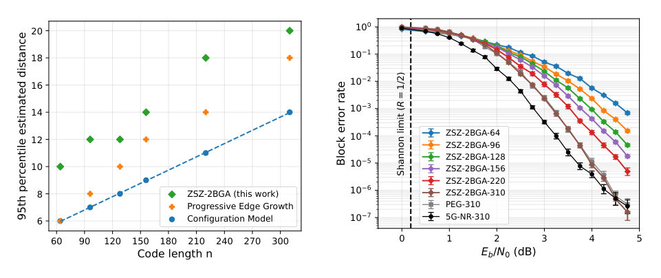 
Figure 2: Left: The 95th percentile distance as a function of the code length n is plotted for three random (3, 6)-regular LDPC ensembles: classical two-block ZSZ (ZSZ-2BGA) codes, the bipartite configuration model [RU08], and the progressive-edge-growth (PEG) algorithm [HEA01]. 1000 codes are sampled from each ensemble, and minimum distances are estimated with 10,000 iterations of QDistEvol. A linear fit is applied to the configuration model since its (3, 6)-regular ensemble is statistically known to be an asymptotically good family [RU08]. Right: The block error rate under the additive white Gaussian noise (AWGN) channel with binary phase shift keying (BPSK) modulation is plotted for the...

📷 Fig 3

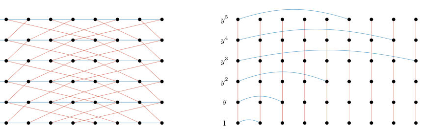 
Figure 3: The left and right Cayley graphs of the ZSZ group ZSZ9,6,2 drawn on the ℓ1 × ℓ2 grid of group elements xiyj (black dots), with the x-exponent i as the horizontal coordinate and the y-exponent j as the vertical coordinate. Edges denote multiplication by the generators x (blue) and y (red). Left: The left Cayley graph. Left multiplication by x is an untwisted horizontal shift xiyj 7→xi+1yj, while left multiplication by y is twisted xiyj 7→xqiyj+1 via (6a), scaling the x-coordinate by q on each upward step. Right: The right Cayley graph. Here right multiplication by y is the untwisted vertical shift xiyj 7→xiyj+1, whereas right multiplication by x carries a twisted, row-dependent...

📷 Fig 4

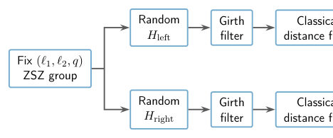 
Figure 4: Filter pipeline for candidate ZSZ-LP code discovery.

📷 Fig 5

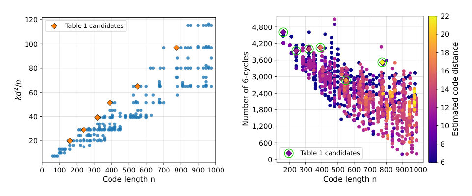 
Figure 5: Pareto frontiers are plotted for two ZSZ-LP code ensembles, sampled using parts of the code discovery pipeline in Figure 4. Left: The efficiency–length Pareto frontier. For this ensemble, we forgo the quantum girth filter and try to maximize the memory efficiency kd2/n. To reduce clutter, we only plot the codes within 50% of the observed Pareto front. All displayed code distances are estimated with at least 20,000 iterations of QDistEvol, with the ones near the frontier having at least 100,000 iterations. Right: The cycle–length Pareto frontier. For this ensemble, we forgo all distance filters and try to minimize the number of short cycles in the Tanner graphs; all displayed codes...

**Summary.** This paper presents a novel family of quantum LDPC codes designed to improve fault tolerance in near-term quantum computers. By leveraging group symmetries, they achieve high code rates (1/5) while keeping the physical qubit count manageable ($\lesssim 1000$). The work validates these codes through detailed circuit simulations and benchmarking against state-of-the-art decoding hardware.

**Why it may be interesting.** It directly addresses hardware constraints by providing concrete, implementable code structures (ZSZ-LP) optimized for specific physical platforms (trapped ions/neutral atoms), bridging the gap between theoretical bounds and near-term device capabilities.

Detailed structure

**Main problem.** The challenge is discovering finite-length quantum Low-Density Parity-Check (qLDPC) code instances that exhibit good practical performance for fault-tolerant quantum computation.

**Main result.** The authors introduce a new family of qLDPC codes with design rate 1/5, demonstrating high encoding efficiency and achieving low logical error rates in the near-term regime using physical qubits below 1000.

**Method.** The construction involves building these codes via the balanced product of classical LDPC codes sharing non-abelian group symmetries, followed by detailed circuit simulation and GPU benchmarking for decoding.

**Model / system.** The work is tailored for near-term quantum processors like trapped ions and neutral atoms, focusing on physical implementations involving syndrome extraction circuits scheduled for reconfigurable atom arrays.

**Key observables.** Logical error rate (LER) per qubit-round, circuit distance ($d_{circ}$), decoding latencies (1-2 ms), and memory efficiency ratios ($	ext{k}d^2/n$).

**Important parameters / regimes.** Design rate of 1/5; physical size below 1000 qubits; idling-free noise strength of $0.1\%$.

**Assumptions / limitations.** The practical performance relies on assumptions regarding hardware compatibility, the specific noise model used, and the potential suboptimality of the Relay-BP decoder at low noise.

**Figures summary.** Figures illustrate memory efficiency vs. size and LER vs. noise strength; tables detail code parameters (Table 1) and gate schedules/latencies across different GPUs (Tables 14, 16).

**Paper structure.** The paper progresses from establishing the need for high-rate qLDPC codes to detailing the ZSZ group construction methods, proving structural limitations like unavoidable 4-cycles in symmetric products, and finally validating performance through circuit simulations and decoding benchmarks.

Abstract

Constant-rate quantum low-density parity-check (LDPC) codes promise fault-tolerant quantum computation with constant spatial overhead in the asymptotic limit. Nonetheless, discovering finite-length code instances with good practical performance remains challenging. We introduce a new family of quantum LDPC codes with design rate $1/5$ and check weight $9$ that approaches the teraquop memory regime per qubit-round with several hundred physical qubits, under idling-free circuit-level noise of strength $0.1\%$ and GPU-accelerated Relay-belief-propagation (Relay-BP) decoding with average latencies around 1-2 ms, a regime relevant to trapped-ion and neutral-atom processors. The construction involves the balanced product of classical LDPC codes with design rate $1/2$ that share non-abelian $\mathbb{Z}_\ell \rtimes \mathbb{Z}_m$ group symmetries, which may be of independent interest for classical error correction. We build syndrome extraction circuits tailored to reconfigurable atom arrays using a simple greedy scheduler, with single-round rearrangement times around 30-60 ms using present hardware specifications, and substantial room for future improvements. We also construct logical Pauli bases that are equivariant with respect to the group symmetry, which can significantly compress the design space for code surgery. Together, these results further advance the practicality of constant-rate quantum LDPC codes for near-term, fault-tolerant quantum computers.

[↑ back to top](#top)

### [Closed Timelike Curve Decoding on Quantum Hardware](http://arxiv.org/abs/2607.27473v1)

**Authors:** Sai Nandan Morapakula, Kazuki Ikeda  
**Type:** both · **Category:** quantum information and computing · **PDF:** <https://arxiv.org/pdf/2607.27473v1>  
**Analysis basis:** full PDF text, analyzed in chunks
**Topic relevance:** `measurement-induced transitions` **3/5** · `methods for driven-dissipative` **3/5** · `quantum measurements` **3/5** · `correlated / nonlocal dissipation` **2/5** · `driven-dissipative phase transition` **2/5** · `entanglement & information structure` **2/5** · `Keldysh / 2PI / non-Gaussian methods` **1/5** · `QC/QI experiment` **1/5** · `non-equilibrium dynamics` **1/5** · `non-equilibrium universality` **1/5**

📷 Fig 1

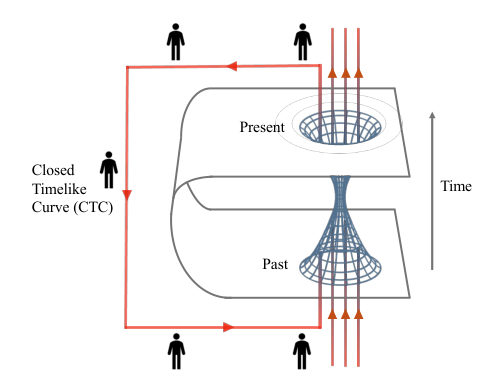 
FIG. 1. Schematic illustration of a closed timelike curve (CTC). A worldline traversing a wormhole-like geometry con- nects the present to its own past, forming a closed loop in spacetime. The figure motivates the finite-dimensional quantum-information models studied below.

📷 Fig 2

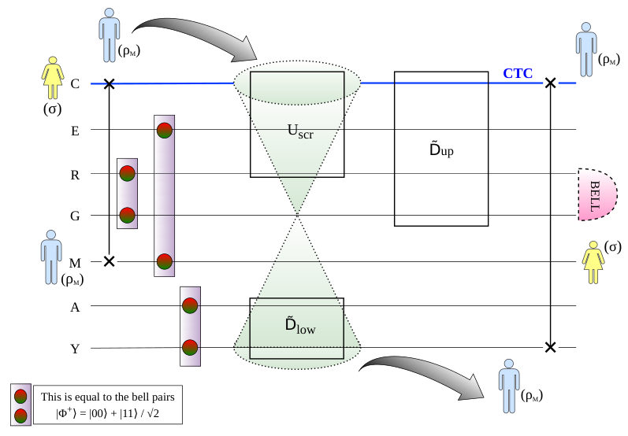 
FIG. 2. Register-separated ideal Deutsch-loop construction in the register order C, E, R, G, M, A, Y . The first SWAP transfers the prepared message ρM from M to C and routes the incoming CTC state σ to the dump wire Mdump, which remains a spectator thereafter. The scrambler Uscr acts on C, E, R, spreading the message information across these registers. The aligned blocks eDup and eDlow are the upper and lower graphical components of the same decoder dilation and together recover the message on Y . Algebraically, the active operation has the factorized form IMdump ⊗WC,E,R,G,A,Y . Every time we observe a bell pair on (R, G) or (E, M) or (A, Y), the decoder recovers ρM on Y , the final SWAP...

📷 Fig 3

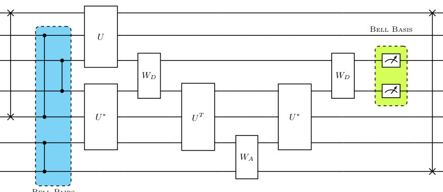 
FIG. 3. Single-qubit, seven-qubit amplitude-amplified decoder circuit used in the hardware study. The first SWAP moves the prepared message ρM from M into C. In this hardware convention the would-be CTC input is initialized, so the post-SWAP wire labelled M is clean and can be reused inside the Bell-pair/conjugate-decoder block. The register-separated arbitrary-σ version is shown in Fig. 2.

📷 Fig 4

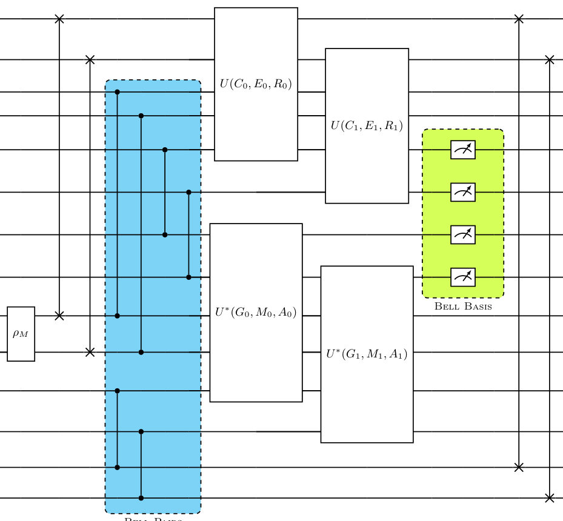 
FIG. 4. Probabilistic Yoshida–Kitaev decoder used as a Lloyd-type post-selected emulation for a multi-qubit message. The would-be CTC input is initialized in this compressed circuit, so the post-SWAP wires labelled M0, M1 can be used as auxiliary decoder wires. Runs are retained when the Bell measurements on (R0, G0) and (R1, G1) give the selected |Φ+⟩outcomes. The register-separated Deutsch replacement-channel circuit is the ideal construction in Fig. 2.

📷 Fig 5

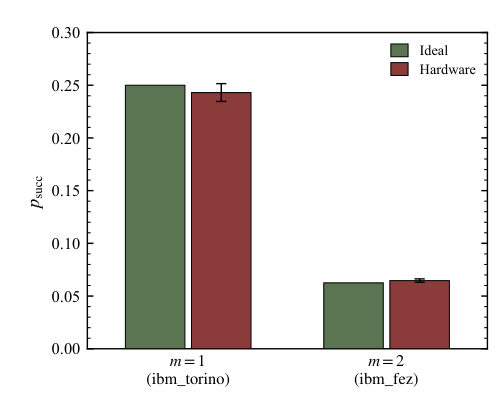 
FIG. 5. Post-selection probability for the one- and two-qubit decoder-emulation circuits. The ideal values are psucc = 1/4 for m = 1 and psucc = 1/16 for m = 2. The hardware esti- mates are consistent with these Bell-projection probabilities within the displayed confidence intervals, confirming the ex- pected sampling overhead for the selected branch.

**Summary.** This paper analyzes decoding information encoded within a theoretical Closed Timelike Curve framework on quantum hardware. It establishes the ideal fixed point for this process and then rigorously tests practical implementations by simulating and measuring fidelity using advanced error mitigation techniques. The work provides quantitative diagnostics on how noise affects the recovery of quantum information across complex, time-looping circuits.

**Why it may be interesting.** While focused on CTCs, the rigorous error characterization using Loschmidt echoes and the comparison of different resource scaling techniques (post-selection vs. dynamic feedforward) are highly relevant to understanding noise resilience in any complex quantum computation protocol.

Detailed structure

**Main problem.** The study investigates how quantum information encoded via Closed Timelike Curves (CTCs) can be decoded on quantum hardware, particularly when considering noise effects.

**Main result.** The ideal circuit model predicts a unique fixed point for the CTC-input map ($\sigma^* = 
ho_M$), and hardware simulations confirm expected scaling overheads while quantifying noise impact via fidelity measurements.

**Method.** The authors combine theoretical derivations of induced maps with practical quantum circuit implementations, utilizing post-selection, classical feedback iterations, and advanced error mitigation techniques like ZNE.

**Model / system.** The model is a finite-dimensional quantum circuit implementing a Deutsch consistency loop containing a Hayden–Preskill/Yoshida–Kitaev recovery map. It involves multiple registers (CTC, Message, etc.) interacting via SWAPs and decoding operations.

**Key observables.** Message fidelity ($F_{	ext{msg}}$), post-selection probability ($p_{	ext{succ}}$), quantum geometric susceptibility ($\Omega$), and Pauli expectation values ($\langle X 
angle, \langle Y 
angle, \langle Z 
angle$).

**Important parameters / regimes.** Noise parameter $\delta$, message dimension $m$, and circuit parameters like rotation angles $(	heta, \phi)$.

**Assumptions / limitations.** The analysis relies on an ideal circuit model for theoretical proofs, while hardware sections approximate this using post-selection or classical feedback loops.

**Figures summary.** Figures illustrate the CTC schematic, the register-separated Deutsch loop construction, and detailed diagnostics like Loschmidt echo probabilities ($P_{00}(\delta)$) comparing simulation to hardware fits.

**Paper structure.** The paper progresses from establishing the theoretical ideal fixed point ($\sigma^* = 
ho_M$) using circuit theory, through implementing approximate decoding methods (Lloyd-type/classical feedback), and finally characterizing performance on quantum hardware using echo measurements and fidelity analysis.

Abstract

Deutsch closed timelike curves (D-CTCs) are described by a fixed-point condition for a chronology-violating register. We study a finite-dimensional circuit model that places a Hayden--Preskill/Yoshida--Kitaev recovery map inside such a consistency loop. A register-routing construction makes the Deutsch map explicit: an initial SWAP moves the incoming CTC state to an idle dump register, the scrambler and decoder act on the remaining active registers, and a final SWAP writes the recovered message back to the CTC register. When the active branch recovers the message, the induced map on the CTC register is the replacement channel \(σ\mapsto ρ_M\), with the unique fixed point \(ρ_M\). We implement the associated Lloyd-type post-selected decoder circuits on quantum hardware and formulate a classical-feedback iteration for the experimentally estimated map. Qiskit simulations and IBM-hardware data for single-qubit instances quantify decoder fidelity, post-selection overhead, routing-dependent noise, and quantum-geometric susceptibility.

[↑ back to top](#top)

### [Field-Selected Topological Buffering in a Disordered Skyrmion Crystal](http://arxiv.org/abs/2607.28458v1)

**Authors:** Wenyu Su, Nvsen Ma, Chen Cheng, Hong-Gang Luo  
**Type:** theory · **Category:** disordered systems and neural networks · **PDF:** <https://arxiv.org/pdf/2607.28458v1>  
**Analysis basis:** full PDF text, analyzed in chunks
**Topic relevance:** `analog quantum simulation` **3/5** · `exotic spin models in light-matter` **3/5** · `spintronics-quantum-optics interface` **3/5** · `driven-dissipative phase transition` **2/5** · `non-equilibrium dynamics` **2/5** · `non-equilibrium universality` **2/5** · `Frenkel-Kontorova` **1/5** · `Keldysh / 2PI / non-Gaussian methods` **1/5** · `methods for driven-dissipative` **1/5**

📷 Fig 1

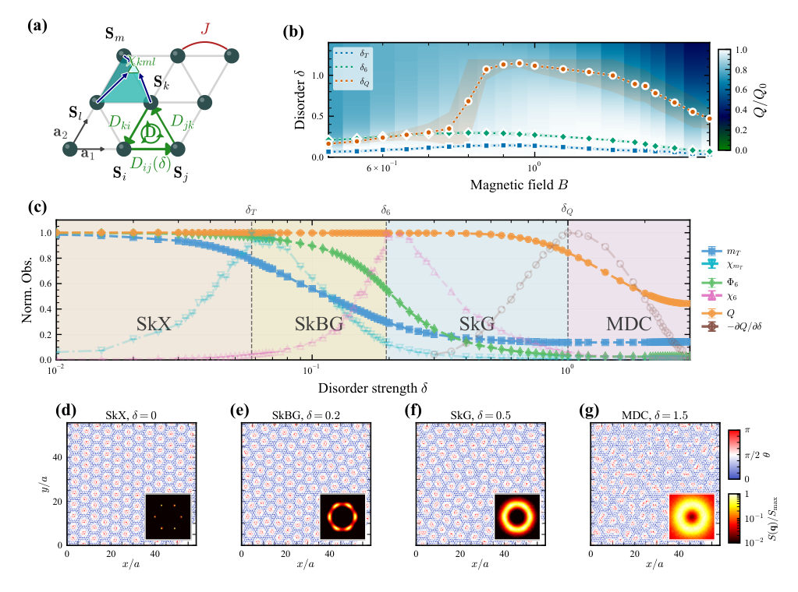 
FIG. 1. Triangular-lattice geometry, field-dependent disorder scales, and texture evolution. (a) Triangular lattice with primitive vectors a1 and a2, nearest-neighbor exchange J, bond-directed DM interactions Dij, and the scalar spin chirality associated with an oriented elementary triangle. (b) Magnetic-field–disorder map obtained on a 90 × 90 lattice. The background color represents the normalized total topological charge Q/Q0. Blue squares, green diamonds, and orange circles denote the characteristic disorder strengths δT , δ6, and δQ, respectively. (c) Normalized translational order parameter mT , sixfold bond-orientational amplitude Φ6, and total topological charge Q/Q0 at B = 1.2 on a...

📷 Fig 2

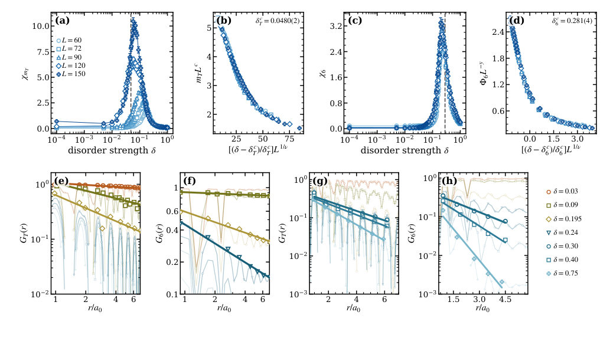 
FIG. 2. Finite-size scaling and crystalline correlations at B = 1.2(a),(c) Translational and sixfold susceptibilities, χmT and χ6, respectively, as functions of disorder strength δ for lattice sizes L = 60, 72, 90, 120, and 150. (b),(d) Finite-size collapses of the translational order parameter mT and sixfold bond-orientational amplitude Φ6, respectively, using the scaled variables indicated on the axes. The optimized collapses give δc T = 0.0480(2) and δc 6 = 0.281(4). (e),(f) Translational and bond-orientational correlation functions, GT (r) and G6(r), displayed on log–log scales for the disorder strengths listed at right.(g),(h) Semilogarithmic representations of GT (r) and G6(r),...

📷 Fig 3

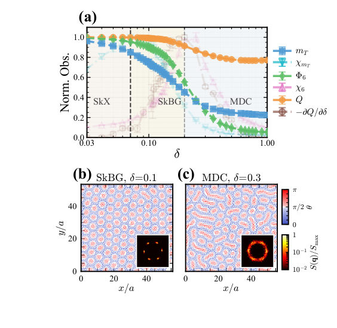 
FIG. 3. The texture evolution at lower field. (a) Nor- malized observables along the B = 0.54 cut on a 150 × 150 lattice. Translational order is already fragile near weak disor- der, while the sixfold susceptibility and topological derivative respond within the same narrow disorder interval, δ6 ≃δQ, in contrast to the separated high-field route. (b)–(d) Representa- tive real-space snapshots and corresponding full-configuration structure factors on a 60×60 lattice. Weak disorder mainly dis- orders positions while preserving recognizable skyrmion cores; stronger disorder elongates and connects the cores, producing a bimeron-rich disordered texture rather than an extended topological buffer.

**Summary.** This work investigates how disorder affects skyrmion crystals by simulating a chiral magnet with random interactions. The key finding is that the magnetic field can decouple structural degradation from the loss of total topological charge. This separation defines a 'topological buffer,' proving it as a tunable mechanism for stabilizing topological textures in noisy environments.

**Why it may be interesting.** The concept of 'topological buffering' suggests a tunable mechanism for protecting topological information against structural noise, which has parallels in understanding robustness in complex quantum systems or fault tolerance.

Detailed structure

**Main problem.** The study aims to determine if quenched disorder destroys crystalline order and topological character of skyrmion textures simultaneously, or if there is a separation between these two processes.

**Main result.** The magnetic field acts as a control knob to separate crystalline disordering from topological charge loss, establishing 'topological buffering' as a mechanism for maintaining robust topological textures in structurally disordered media.

**Method.** Large-scale simulations and finite-size scaling analysis were used to monitor various structural and topological order parameters across different disorder strengths.

**Model / system.** The model is a two-dimensional triangular-lattice chiral magnet subjected to quenched disorder in the Dzyaloshinskii–Moriya (DM) interactions. The Hamiltonian includes exchange, DM, and external magnetic field terms.

**Key observables.** Translational order parameter ($m_T$), sixfold bond-orientational amplitude ($\Phi_6$), total topological charge ($Q$), and corresponding susceptibilities ($\chi_{mT}, \chi_6$).

**Important parameters / regimes.** The magnetic field strength ($B$) is the key control knob, which dictates whether disordering occurs via distinct structural or topological pathways.

**Assumptions / limitations.** The analysis relies on identifying critical disorder strengths ($\delta_T, \delta_6, \delta_Q$) where different types of order break down.

**Figures summary.** Figures illustrate the evolution from a Skyrmion Crystal (SkX) through distinct glassy regimes ($	ext{SkBG} 
ightarrow 	ext{SkG}$) within the topological buffer at high fields, contrasting this with a direct transition observed at lower fields.

**Paper structure.** The paper first establishes the physical model and diagnostics. It then analyzes the behavior at high magnetic fields to define the separated disordering routes (the buffer). Finally, it contrasts this with low-field results to show how the field controls the separation of these processes.

Abstract

Quenched disorder can disrupt crystalline order without immediately destroying the topology of its constituent textures, but the relation between these processes in skyrmion crystals remains unclear. Using large-scale simulations of a triangular-lattice chiral magnet with random DM interactions, we show that the magnetic field selects between two disordering routes. At high fields, global translational coherence is lost at a weak-disorder scale, while sixfold bond-orientational order survives to a larger disorder strength and the total topological charge remains nearly locked up to a substantially larger scale. The resulting interval defines a topological buffer containing a Bragg-glass- like skyrmion regime followed by a skyrmion-glass regime. Finite-size scaling, spatial correlations, defect statistics, and spin autocorrelations support their distinct structural and glassy character. At lower fields, bond-orientational disordering nearly coincides with topological reconstruction, eliminating the skyrmion-glass window and contracting the buffer. These results identify the magnetic field as a control knob for separating crystalline disordering from topological-charge loss and establish topological buffering as a mechanism by which topological textures can remain robust in structurally disordered media.

[↑ back to top](#top)

### [Convergence to the exact kinetics of the one-dimensional Riviera model](http://arxiv.org/abs/2607.28419v1)

**Authors:** Pascal Viot  
**Type:** theory · **Category:** statistical mechanics · **PDF:** <https://arxiv.org/pdf/2607.28419v1>  
**Analysis basis:** full PDF text, analyzed in chunks
**Topic relevance:** `Keldysh / 2PI / non-Gaussian methods` **3/5** · `methods for driven-dissipative` **3/5** · `non-equilibrium dynamics` **3/5** · `driven-dissipative phase transition` **2/5** · `non-equilibrium universality` **2/5** · `Frenkel-Kontorova` **1/5** · `analog quantum simulation` **1/5** · `correlated / nonlocal dissipation` **1/5** · `scars & prethermalization` **1/5**

📷 Fig 1

 
Figure 1. Example of a saturated configuration of the one-dimensional Riviera model.

📷 Fig 2

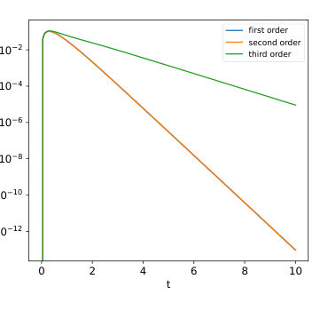 
Figure 2. Semilogarithmic plot of the time evolution of p000(t) (left) and p0010(t) (right) for the first three approximation orders.

📷 Fig 3

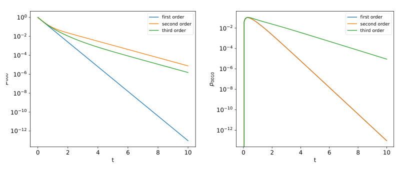 
Figure 2 compares the first three approximation orders for the key quantities p000(t) and p0010(t). Relative to the first-order results, the third-order probabilities display significant long-time corrections, and both decay as e−t. (Note that the two first orders of p0010(t) are identical). Their convergence is expected to improve rapidly as probabilities associated with longer intervals are incorporated.

📷 Fig 4

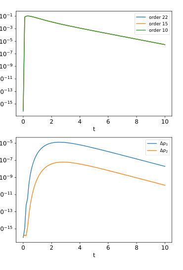 
Figure 3. Semilogarithmic plot of the time evolution of p000(t) (top left) and p0010(t) (top right) for the 10, 15 and 22nd-order approximations. The absolute difference ∆p1 = |p(10) −p(15)| and ∆p2 = |p(15) −p(22)| shows the convergence of the method for p000 (bottom left) and p0010 (bottom right).

📷 Fig 5

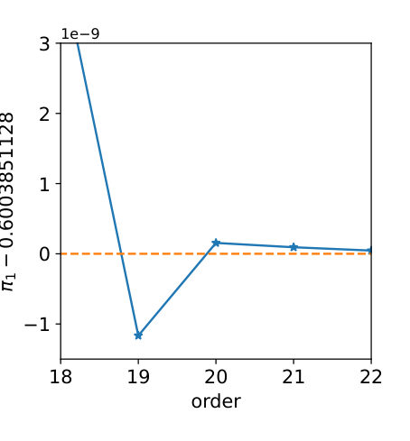 
Figure 4. Convergence of the occupied-site density as a function of the approximation order.

**Summary.** This paper tackles the complex kinetics of the 1D Riviera model by developing a powerful mathematical technique: solving an infinite hierarchy of kinetic equations through systematic, order-by-order truncation. The method successfully provides highly accurate analytical estimates for both the final jamming density and the full time evolution of site occupation probabilities.

**Why it may be interesting.** While focused on classical statistical mechanics, the method of deriving an infinite hierarchy and using systematic closure schemes is mathematically analogous to techniques used in quantum field theory or open quantum system dynamics where exact solutions are intractable.

Detailed structure

**Main problem.** The primary challenge is determining the exact kinetics of the one-dimensional Riviera model, which involves long-range dynamical correlations preventing a finite analytical solution.

**Main result.** The authors developed a systematic closure scheme for an infinite hierarchy of kinetic equations, demonstrating that increasing the truncation order leads to rapid and highly accurate convergence toward the true physical behavior.

**Method.** They derived an infinite hierarchy of coupled differential equations governing joint occupation probabilities and systematically truncated this hierarchy at arbitrary finite orders using mean-field approximations for long-range correlations.

**Model / system.** The system is the one-dimensional Riviera model, a random sequential deposition process on a lattice where site occupancy depends on nearest-neighbor availability (i.e., isolated vacancies cannot be filled).

**Key observables.** Occupation probabilities ($\pi_0, \pi_m, \pi_d, \pi_1$), the jamming density ($\pi_1(\infty)$), and the full time-dependent evolution of these densities.

**Important parameters / regimes.** The truncation order ($l$) of the kinetic hierarchy; the final jamming density $\pi_1(\infty)$.

**Assumptions / limitations.** The core approximation involves replacing higher-order joint probabilities with a specific mean-field exponential form, which allows for the solvability of the truncated linear system.

**Figures summary.** Figures illustrate the convergence of key probabilities ($p_{000}(t)$, $p_{0010}(t)$) across different approximation orders (e.g., 10th vs. 22nd). Figure 5 shows the nonmonotonic time evolution of monomer and dimer densities.

**Paper structure.** The paper builds by first establishing the infinite hierarchy, then systematically applying closures at increasing orders (first, second, up to twenty-second), presenting results for observables like jamming density convergence and full time-dependent analytical expressions derived from these truncated systems.

Abstract

The Riviera model is a random sequential deposition model for house building on a lattice, in which a house cannot be built when both nearest-neighbor sites are already occupied. In one dimension, an attempted deposition is therefore rejected whenever the target site is an isolated vacancy. Despite the apparent simplicity of this rule, no exact analytical solution of the original model is currently known. We derive an infinite hierarchy of kinetic equations governing its dynamics and introduce a systematic closure scheme that can be implemented at arbitrary finite order. Solving the resulting systems order by order, we show that the corresponding kinetics converges rapidly toward the exact behavior. At high order, the method yields an exceptionally accurate estimate of the jamming density while retaining explicit analytical expressions for the full time-dependent evolution.

[↑ back to top](#top)

### [Phase transitions and microphases in elastomers. I. Emergence of stable domains](http://arxiv.org/abs/2607.27516v1)

**Authors:** Manu Mannattil, Haim Diamant, David Andelman  
**Type:** theory · **Category:** statistical mechanics · **PDF:** <https://arxiv.org/pdf/2607.27516v1>  
**Analysis basis:** full PDF text, analyzed in chunks
**Topic relevance:** `Keldysh / 2PI / non-Gaussian methods` **3/5** · `analog quantum simulation` **2/5** · `driven-dissipative phase transition` **2/5** · `methods for driven-dissipative` **2/5** · `non-equilibrium dynamics` **2/5** · `non-equilibrium universality` **2/5** · `Frenkel-Kontorova` **1/5** · `correlated / nonlocal dissipation` **1/5** · `correlated cavity matter` **1/5** · `entanglement & information structure` **1/5**

📷 Fig 1

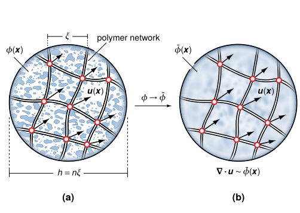 
FIG. 1. (a) The volume fraction of a discrete polymer network, represented as a continuum field ϕ(x), exhibits a pro- nounced coarseness at intermolecular length scales. However, only those variations in ϕ that persist beyond a characteris- tic length scale h produce appreciable network deformations. We describe the deformations using a mesoscopic displace- ment field u(x). (b) To capture this separation of scales, ϕ is replaced with a further coarse-grained version ¯ϕ in the material-conservation relation, Eq. (8), that links u and ϕ. This associates u only with variations in ϕ on length scales larger than h. For isotropically swollen elastomers, we take h = nξ, where ξ is the end-to-end...

📷 Fig 2

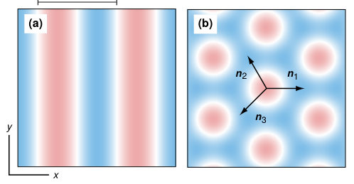 
FIG. 2. Schematics of modulated phases showing (a) lamel- lae and (b) hexagonal phase, which also shows the unit-vector triad {nj}. At temperatures close to the critical temperature, the modulations are well approximated by sinusodial functions. In both panels, solvent rich (deficient) regions are shown in red (blue).

📷 Fig 3

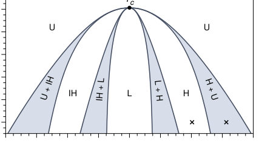 
FIG. 3. Phase diagram in the polymer volume fraction– temperature plane (ϕ0, T), for an isotropically swollen elas- tomer with elastocapillary number [see Eq. (16)], γ0 = 4. For illustrative purposes, we set the critical parameters to (ϕc, Tc) = (0.2, 0). All other free-energy parameters are set to unity. Elastic effects shift the critical temperature to T ′ c = Tm(0) = −(1 + ln 4) ≈−2.386 [Eq. (18)] below which three phases appear: lamellar (L), hexagonal (H), and inverted hexagonal (IH). Only the uniform (U) phase appears above T ′ c. The phase coexistence regions separated by binodals (solid curves) are shaded in grey. The two crosses in the lower right corner indicate the (ϕ0, T) values...

📷 Fig 4

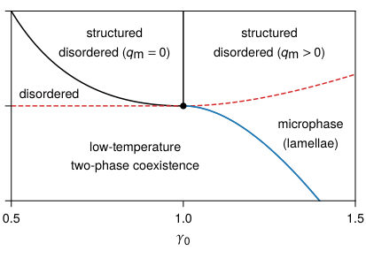 
FIG. 4. Phase diagram in the (γ0, τ) plane for h = 1, where τ is the effective temperature defined in Eq. (33), and γ0 is the elastocapillary number, Eq. (16). Second-order phase transition boundaries are shown as dashed red curves and correspond to τ = (1−γ0)2/γ0 for γ0 &gt; 1, and to τ = 0 for γ0 &lt; 1. The solid blue curve, given by τ = −(2 + √

📷 Fig 5

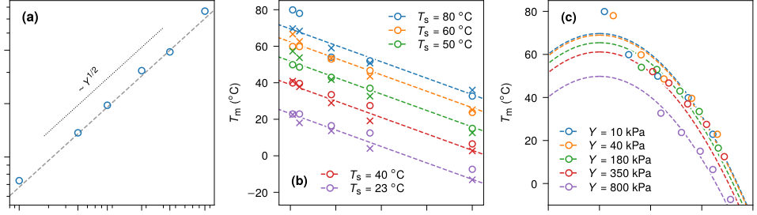 
FIG. 5. (a) Scattering intensity peak qm as a function of the Young’s modulus Y (log-log plot). Experimental results from Ref. [14] are shown with circles. The dashed line is the theoretical prediction from Eq. (45), qm ∼Y 1/2. (b) Microphase separation temperature Tm as function of Y for elastomers with different initial swelling temperatures Ts, which determine the value of the polymer volume fraction ϕ0 at equilibrium. Experimental values are shown as circles, and theoretical estimates from Eq. (46) are shown as crosses. The dashed guidelines illustrate the linearity of Tm with Y . (c) Tm as a function of ϕ0 for different Y using Eq. (46) (dashed curves) and experimental results...

**Summary.** This theoretical work models microphase separation in swollen elastomers by coupling thermodynamic fluctuations (Ginzburg-Landau) to elastic deformations. By deriving a nonlocal coupling from volume conservation, the authors show that elasticity dictates the morphology and transition temperature of these soft materials. This provides a generalized framework for understanding how mechanical constraints govern phase behavior.

**Why it may be interesting.** While focused on condensed matter elasticity, the mathematical framework involving coupled order parameters ($\psi$) and strain fields ($u$), analyzed via fluctuation theory in Fourier space, shares structural similarities with many-body field theories used in AMO physics for studying phase transitions in interacting quantum systems.

Detailed structure

**Main problem.** The paper investigates how elastic forces regulate phase separation, specifically microphase separation (EMPS), within swollen elastomer networks.

**Main result.** The theory successfully reproduces the experimentally observed scaling of domain size and transition temperature with elastomer stiffness by incorporating a nonlocal coupling arising from volume conservation.

**Method.** The analysis uses continuum elasticity theory combined with Ginzburg-Landau free energy functionals, analyzed via Fourier space methods to study fluctuations around equilibrium states.

**Model / system.** The system is an isotropically swollen crosslinked polymer network (elastomer). The model Hamiltonian combines a Ginzburg-Landau term for phase separation and a linear elastic energy term based on strain fields.

**Key observables.** Domain size, phase transition temperature ($T_m$), structure factor peak ($q_m$), and the dimensionless parameter $\gamma_0$.

**Important parameters / regimes.** Elastomer stiffness (Young's modulus $Y$), characteristic length scales ($\xi$, domain size), and material constants ($a, b, \kappa$).

**Assumptions / limitations.** The analysis assumes small fluctuations near the critical point and initially restricts itself to isotropic swelling; anisotropic effects are reserved for a companion paper.

**Figures summary.** Figure 1 illustrates scale separation in volume fraction ($\phi(x)$), showing that only variations beyond a characteristic length $h$ cause significant network deformations captured by coarse-graining.

**Paper structure.** The work is presented in two parts: Part I establishes the theory for isotropic swelling using nonlocal coupling derived from volume conservation. The companion paper (Part II) extends this analysis to include anisotropic swelling and inhomogeneous elastic moduli.

Abstract

Elasticity often plays a key role in regulating phase separation in physical systems. Recent experiments have shown that elastic effects can be used to control microphase separation in swollen elastomers. Here, microphase separation arises from a mismatch between the characteristic length scales of elastic and thermodynamic interactions. In this first part of a two-part paper, we show that microphase formation in elastomers can be explained using conventional theories of elasticity through a nonlocal thermodynamic-elastic coupling arising from volume conservation. Our theory reproduces the observed dependence of phase transition temperature and domain size on elastomer stiffness in isotropically swollen elastomers. In the companion paper, we investigate the effects of anisotropic swelling and inhomogeneous elastic moduli.

[↑ back to top](#top)

### [Quantum coherence and entanglement in wireless quantum batteries](http://arxiv.org/abs/2607.27718v1)

**Authors:** Jun-Jie Jiang, Jin-Di Cao, Yu-Fei Zhang, Meng-Long Song, Dong Wang  
**Type:** theory · **Category:** statistical mechanics · **PDF:** <https://arxiv.org/pdf/2607.27718v1>  
**Analysis basis:** full PDF text, analyzed in chunks
**Topic relevance:** `correlated / nonlocal dissipation` **3/5** · `entanglement & information structure` **3/5** · `methods for driven-dissipative` **3/5** · `driven-dissipative phase transition` **2/5** · `non-equilibrium dynamics` **2/5** · `Keldysh / 2PI / non-Gaussian methods` **1/5** · `Tavis-Cummings & cavity-many-emitter` **1/5** · `correlated cavity matter` **1/5** · `non-equilibrium universality` **1/5**

📷 Fig 1

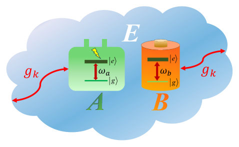 
FIG. 1. Schematic illustration of the wireless quantum charging model. The system consists of two two-level systems: a quantum charger A (green sphere) and a quantum battery B (orange sphere), characterized by their transition frequencies ωa and ωb, respectively. We consider the resonant condition where ωa = ωb = ω0. They are spatially separated and embedded within a common dissipative envi- ronment E (blue region). The red arrows indicate the interaction with the environmental field modes, characterized by the mode-dependent coupling strength gk, which is further scaled by the dimensionless weights µ1 (charger) and µ2 (battery). Crucially, there is no direct coupling between A and B; the...

📷 Fig 2

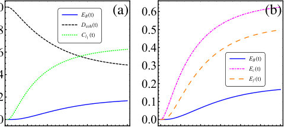 
FIG. 2. (Color online) Dynamics of quantum resources and energy storage in the Markovian weak-coupling regime (R = 0.3λ). (a) Evolution of coherence: First-order coherence Dcoh (black dashed curve) decays monotonically, while l1-norm coherence Cl1 (green dotted curve) is reconstructed. (b) Evolution of entanglement and energy: Concurrence EC (pink dot-dashed curve) and Entanglement of Formation Ef (orange long-dashed curve) precede the accumu- lation of battery energy EB (blue solid curve). The parameters are set to ξ1 = 0.5 (charger coupling), ξ2 = √

📷 Fig 3

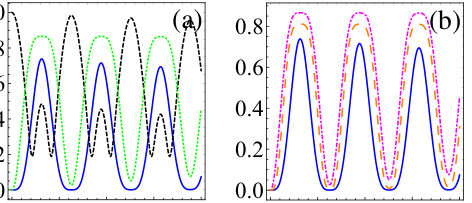 
FIG. 3. (Color online) Dynamics in the Non-Markovian strong- coupling regime (R = 100λ). (a) Coherence protection: Both first-order coherence Dcoh (black dashed curve) and l1-norm co- herence Cl1 (green dotted curve) exhibit persistent periodic oscil- lations, avoiding monotonic decay. (b) Resource-energy synchro- nization: Concurrence EC (pink dot-dashed curve), Entanglement of Formation Ef (orange long-dashed curve), and battery energy EB (blue solid curve) oscillate in perfect phase. The parameters are ξ1 = 0.5, ξ2 = √

📷 Fig 4

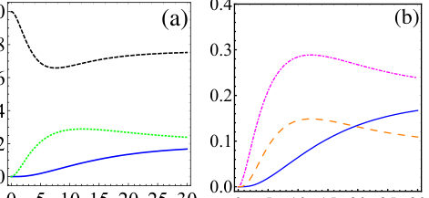 
FIG. 4. (Color online) Dynamics in the Markovian regime with charger-preferred coupling (R = 0.3λ). (a) Accelerated deco- herence: First-order coherence Dcoh (black dashed curve) decays rapidly, and the reconstruction of Cl1 (green dotted curve) is sup- pressed compared to Fig. 2. (b) Energy suppression: Entanglement (pink dot-dashed curve/orange long-dashed curve) is transient, and the battery energy EB (blue solid curve) is almost negligible. The pa- rameters are ξ1 = √

📷 Fig 5

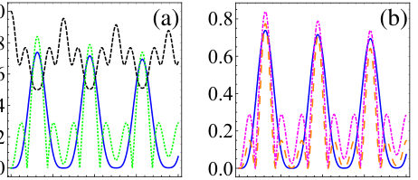 
FIG. 5. (Color online) Dynamics in the Non-Markovian regime with charger-preferred coupling (R = 100λ). (a) Revival of co- herence: Unlike the rapid decay in Fig. 4, memory effects induce sustained oscillations in Dcoh (black dashed curve) and Cl1 (green dotted curve). (b) Suboptimal energy recovery: Battery energy EB (blue solid curve) and entanglement (pink dot-dashed curve/orange long-dashed curve) are partially restored by backflow but remain lower than in the battery-preferred case (Fig. 3). The parameters are ξ1 = √

**Summary.** This paper develops a theoretical framework for understanding wireless quantum batteries using resource theory. It shows that the environment's memory effects (non-Markovianity) and the symmetry of coupling are crucial control parameters governing energy transfer. The key finding is the distinction between coherence types: one acts as an activation threshold, while another serves as the continuous fuel source for extracting usable work.

**Why it may be interesting.** This work bridges quantum thermodynamics and open quantum systems by providing quantitative resource metrics (coherence) that dictate operational limits for energy storage devices, which is highly relevant to quantum information engineering applications.

Detailed structure

**Main problem.** The study investigates how quantum coherence and entanglement govern the charging dynamics and thermodynamic performance of a wireless quantum battery system.

**Main result.** The paper establishes that first-order coherence sets an activation threshold for incoherent work, while $l_1$-norm coherence acts as the explicit fuel for coherent work extraction. Furthermore, environmental coupling symmetry dictates whether energy is trapped in a decoherence-free subspace or optimized for transfer.

**Method.** A unified resource-theoretic analysis is employed to track quantum resources (coherence, entanglement) across different environmental regimes and coupling symmetries.

**Model / system.** The model consists of two coupled two-level systems (a charger A and a battery B) interacting with a common structured bosonic environment E. The system dynamics are analyzed using the total Hamiltonian and restricted to the single-excitation subspace.

**Key observables.** Quantum coherence ($l_1$-norm, first-order), entanglement (Concurrence, Entanglement of Formation), stored energy, and ergotropy (extractable work).

**Important parameters / regimes.** Coupling strengths ($\mu_1, \mu_2$), environmental spectral density parameters ($\lambda$), and the regime classification (Markovian weak-coupling vs. Non-Markovian strong-coupling).

**Assumptions / limitations.** The analysis is restricted to the single-excitation subspace, and the environment is modeled by a structured bosonic bath with a Lorentzian spectral density.

**Figures summary.** Figures illustrate the time evolution of coherence and energy in both Markovian (weak coupling) and Non-Markovian (strong coupling) regimes, showing resource reconstruction and sustained oscillations. Later figures map out the relationship between coherence resources and extractable work.

**Paper structure.** The paper progresses from defining the physical model and Hamiltonian to analyzing dynamics in specific environmental limits (Markovian vs. Non-Markovian). It then develops a thermodynamic framework linking coherence measures ($D_{coh}$ vs $C_{l1}$) to different types of extractable work, concluding with an analysis of how coupling symmetry controls the final energy storage state.

Abstract

We investigate the charging dynamics and thermodynamic performance of a wireless quantum battery system mediated by a common structured bosonic environment. By employing a unified resource-theoretic analysis, we elucidate the distinct roles of non-Markovian memory effects and coupling symmetry in regulating energy transfer. In the Markovian weak-coupling regime, we identify a transformative mechanism where the dynamic reconstruction of $l_1$-norm coherence compensates for the monotonic decay of first-order coherence to sustain energy transport. Conversely, the non-Markovian strong-coupling regime facilitates a cooperative resonance, characterized by the synchronized oscillation of entanglement and stored energy induced by environmental backflow. Furthermore, we reveal that coupling symmetry acts as a critical control parameter: while asymmetric coupling favoring the battery optimizes energy gain in memoryless environments, symmetric coupling under strong interactions unlocks a dark-state protection mechanism, effectively trapping energy within a decoherence-free subspace. Finally, a thermodynamic analysis based on ergotropy demonstrates that first-order coherence establishes the activation threshold for incoherent work, whereas $l_1$-norm coherence serves as the explicit fuel for coherent work extraction. These findings provide a refined theoretical framework for engineering environment-assisted quantum energy storage devices.

[↑ back to top](#top)

### [Complementary Matrix-Gated QKAN Fast-Weight Programmers for Quantum Dynamics Forecasting](http://arxiv.org/abs/2607.27945v1)

**Authors:** Kuo-Chung Peng, Samuel Yen-Chi Chen, Jiun-Cheng Jiang, Chen-Yu Liu, En-Jui Kuo, Yun-Yuan Wang, Tzung-Chi Huang, Prayag Tiwari, Chi-Sheng Chen, Chun-Hua Lin, Yu-Chao Hsu, Tai-Yue Li, Saif Al-Kuwari, Simon See, Kuan-Cheng Chen, Nan-Yow Chen, Hsi-Sheng Goan  
**Type:** theory · **Category:** disordered systems and neural networks · **PDF:** <https://arxiv.org/pdf/2607.27945v1>  
**Analysis basis:** full PDF text, analyzed in chunks
**Topic relevance:** `analog quantum simulation` **3/5** · `methods for driven-dissipative` **3/5** · `Tavis-Cummings & cavity-many-emitter` **2/5** · `correlated cavity matter` **2/5** · `non-equilibrium dynamics` **2/5** · `Keldysh / 2PI / non-Gaussian methods` **1/5** · `correlated / nonlocal dissipation` **1/5** · `driven-dissipative phase transition` **1/5** · `entanglement & information structure` **1/5**

📷 Fig 1

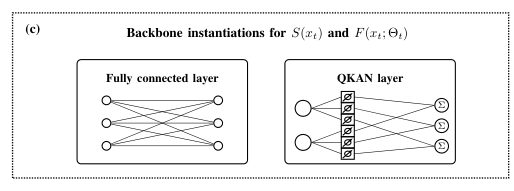 
Fig. 1. Self-modulating update rules and programmer backbones. (a) Full self-modulation uses separate old- and new-modulation heads. (b) CMG uses a single low-rank-generated matrix gate with complementary weights for the retained and proposed states. (c) The slow and fast programmers may use classical fully connected modules or QKAN-based HQKAN modules. Solid arrows show data/output flow. Dashed arrows show generated fast-parameter flow. slow programmer of the gated baseline [14] also produces gt = σ(Sg ψ(xt)), gt ∈[0, 1], and updates

📷 Fig 2

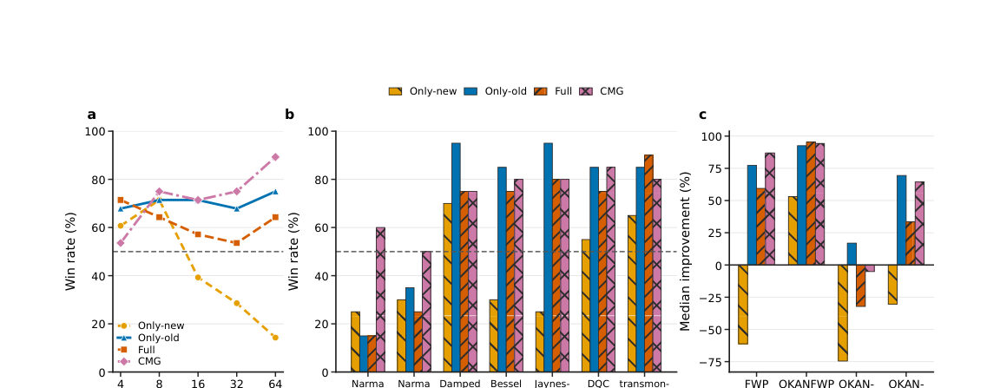 
Fig. 2. Performance of the self-modulating update rules relative to their paired gated baselines. (a) Win rate by sequence length, aggregated across datasets and model families. (b) Win rate by dataset, aggregated across sequence lengths and model families. (c) Median relative MSE improvement [ Eq. (3)] by model family, aggregated across datasets and sequence lengths. Dashed lines in (a) and (b) mark a 50% win rate; the horizontal line in (c) marks zero improvement.

📷 Fig 3

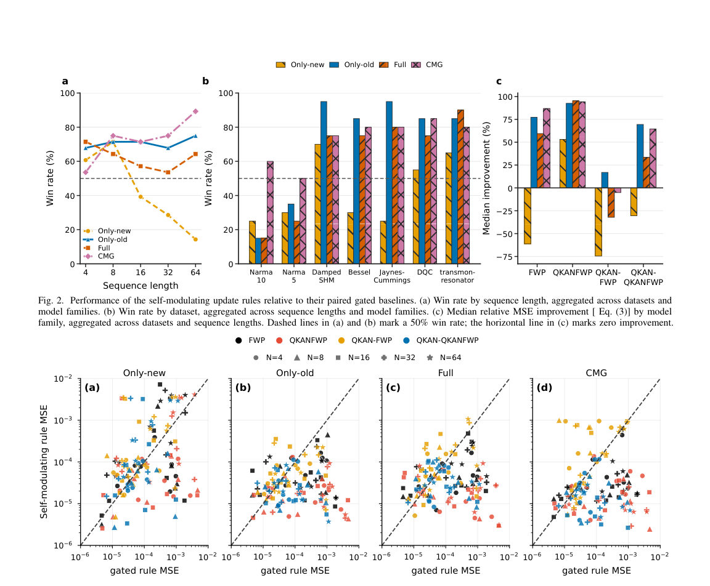 
Fig. 3. Final test MSE of each self-modulating rule versus its paired gated baseline across all datasets, sequence lengths, and model families: (a) Only-new, (b) Only-old, (c) Full, and (d) CMG. The diagonal indicates equal MSE; points below it favor self-modulation. Colors denote model families, and markers denote sequence lengths.

📷 Fig 4

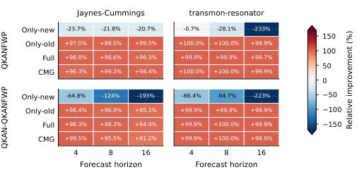 
Fig. 6. Relative MSE improvement over the paired gated baseline [ Eq. (3)] for direct multi-step forecasting at N = 64. Rows group update rules within QKANFWP and QKAN-QKANFWP; columns group forecast horizons within the Jaynes–Cummings and transmon–resonator datasets. Values are computed from mean MSE over five seeds. Red denotes improvement, whereas blue denotes degradation.

📷 Fig 5

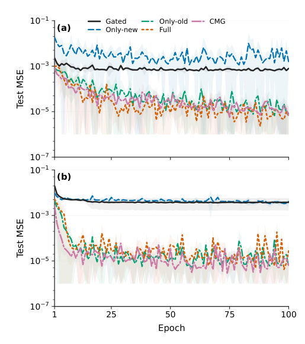 
Fig. 4. Test MSE versus training epoch for QKANFWP at N = 64: (a) Jaynes–Cummings and (b) transmon–resonator. Curves show the mean over five seeds, and shaded bands show ±1 standard deviation.

**Summary.** This paper introduces Complementary Matrix Gating (CMG) to enhance Fast-Weight Programmers (FWPs) used for forecasting quantum dynamics. CMG allows for superior, coordinate-wise control over memory retention versus new information writing. The method achieves state-of-the-art accuracy in simulating complex quantum systems like cavity QED models over long time horizons.

**Why it may be interesting.** This work directly addresses the intersection of advanced deep learning architectures (QKANs, FWPs) with complex physical simulations (quantum dynamics), providing a state-of-the-art ML tool for modeling open quantum systems time evolution.

Detailed structure

**Main problem.** The primary challenge is mitigating the computational cost of long context sequence learning in quantum dynamics forecasting models, which typically requires expensive sequential backpropagation through time.

**Main result.** Complementary Matrix Gating (CMG) significantly outperforms scalar gating rules, achieving substantial improvements (e.g., >91% improvement) in multi-step forecasting accuracy for quantum systems like Jaynes-Cummings and transmon resonators.

**Method.** The authors introduce Self-Modulating QKAN-based Fast-Weight Programmers (FWPs), utilizing CMG to implement coordinate-wise memory control by combining the old state with a new proposal using complementary sigmoid gates.

**Model / system.** The models are applied to forecast quantum dynamics, specifically simulating Jaynes-Cummings and transmon-resonator systems. The underlying mathematical framework involves time evolution governed by Hamiltonians or master equations.

**Key observables.** Mean Squared Error (MSE) for single-step and multi-step forecasting; Relative MSE improvement (%) compared to baseline gating methods.

**Important parameters / regimes.** Forecasting horizons ($H=4, 8, 16$ steps); Sequence lengths ($N=4, 8, 32, 64$).

**Assumptions / limitations.** The core assumption is that coordinate-wise complementary modulation provides a stable and effective update mechanism for QKAN-based FWPs while preserving desirable mathematical structures (bounded convex updates).

**Figures summary.** Figures illustrate the comparison of various self-modulating rules against gated baselines, showing CMG's superior performance in both single-step and multi-step forecasting across different quantum datasets.

**Paper structure.** The paper first identifies the memory bottleneck in QKAN-FWPs. It then proposes Self-Modulating QKAN-based FWPs incorporating Complementary Matrix Gating (CMG). The methodology is validated by comparing CMG against other update rules across seven single-step benchmarks and through direct multi-step forecasting of quantum systems.

Abstract

Sequence models must decide what to write into memory and what to retain. In quantum and quantum-inspired sequence learning, nonlinear recurrent updates often require repeated circuit evaluations and sequential backpropagation through time, making long contexts costly. Gated fast-weight programmers (FWPs) based on quantum-inspired Kolmogorov-Arnold networks (QKANs) alleviate this bottleneck by storing context in time-varying fast parameters. However, their scalar gate applies one retention-write balance to every fast-state coordinate, forcing all parameters to share a memory timescale. We introduce Self-Modulating QKAN-based FWPs, which replace this broadcast gate with low-rank-generated element-wise modulation of the new-proposal branch, a bounded old-state branch, or both. We further propose Complementary Matrix Gating (CMG), which uses one sigmoid matrix gate to retain the old state and its complement to write the new proposal. CMG provides coordinate-wise memory control while preserving the bounded convex update and affine prefix-scan structure of scalar gating, at the modulation-head cost of a single-branch rule. We compare four self-modulating rules with scalar gating across four FWP architectures combining classical and QKAN-based slow and fast programmers. Across seven single-step forecasting benchmarks and five sequence lengths, CMG gives the most consistent improvements for architectures whose fast programmer incorporates a QKAN-based module. In direct multi-step forecasting of Jaynes-Cummings and transmon-resonator dynamics simulated with CUDA-Q Dynamics, CMG models maintain mean-squared errors on the order of 0.001 or lower across forecasting horizons of 4, 8, and 16 steps, while improving on their scalar-gated counterparts by at least 91.2%. These results establish coordinate-wise complementary modulation as a stable and effective update for QKAN-based FWPs.

[↑ back to top](#top)

### [Quantum vs Classical Erasure: Equal Bounds but Unequal Costs](http://arxiv.org/abs/2607.27341v1)

**Authors:** Jan Neuser, Jake Xuereb, Pharnam Bakhshinezhad, Marcus Huber  
**Type:** theory · **Category:** statistical mechanics · **PDF:** <https://arxiv.org/pdf/2607.27341v1>  
**Analysis basis:** full PDF text, analyzed in chunks
**Topic relevance:** `correlated / nonlocal dissipation` **3/5** · `methods for driven-dissipative` **3/5** · `driven-dissipative phase transition` **2/5** · `entanglement & information structure` **2/5** · `non-equilibrium universality` **2/5** · `Keldysh / 2PI / non-Gaussian methods` **1/5** · `Kondo & dissipative impurity` **1/5** · `analog quantum simulation` **1/5** · `non-equilibrium dynamics` **1/5**

📷 Fig 1

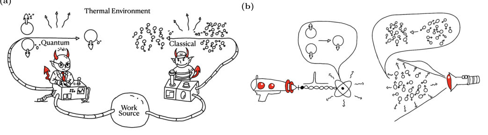 
FIG. 1. (a) General setup we consider: the systems are embedded in a thermal environment, both the classical and quantum control use a work source to perform the respective erasure protocol. (b) Even though they use the same resources the control requirements differ: the quantum bit requires a sharp control frequency, while the classical bit allows for a wider spectrum.

📷 Fig 2

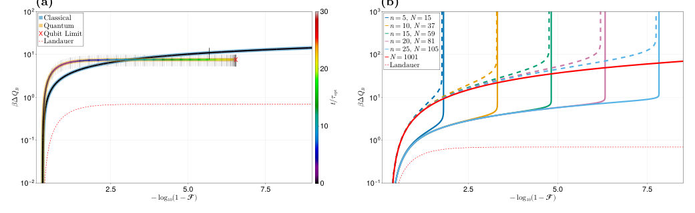 
FIG. 2. (a) Dissipation as a function of the erasure fidelity, plotted against the logarithmic distance from perfect erasure, −log10(1 −F). We show both quantum (orange) and classical (blue) protocols, where the classical bit consists of N = 1011 + 1 qubits. The red cross indicates the infinite-time limit of the quantum case. The color gradient indicates the elapsed protocol time in units of τopt = π/(2g), further the time between vertical black lines is fixed to τopt/8. The temporal spacing between the bins, crossing the dissipation fidelity curves, is fixed. (b) Dissipation as a function of the fidelity on a scale of −log10(1 −F). We display a quantum erasure with different amount of...

**Summary.** This work rigorously compares the minimum energy dissipation required to erase bits of information from quantum versus classical physical systems. It proves that while the ultimate theoretical bound is the same, practical constraints reveal significant thermodynamic advantages for classical encoding schemes. The findings help explain why real-world erasure protocols fall short of ideal bounds.

**Why it may be interesting.** It provides quantitative thermodynamic comparisons between quantum and classical information processing limits, which is highly relevant to understanding the fundamental resource costs in open quantum systems.

Detailed structure

**Main problem.** The paper compares the thermodynamic cost (dissipation) required for erasing information encoded in quantum versus classical systems when operating with finite resources.

**Main result.** While ideal erasure costs are equal, practical implementation shows that classical protocols can achieve comparable erasure quality under significantly weaker operational constraints than quantum ones.

**Method.** The analysis uses first principles thermodynamics, comparing dissipation ($\Delta Q$) derived from the Clausius inequality across various idealized and finite-resource limits for both system types.

**Model / system.** Quantum bits are modeled as two-level systems coupled to a thermal bath and work source. Classical bits are encoded in many-body systems or ladder structures, allowing for comparison of their respective erasure protocols.

**Key observables.** Dissipated heat ($\Delta Q$), Fidelity ($F$), Entropy changes ($\Delta S$), and the Landauer bound.

**Important parameters / regimes.** Finite resources, energy gaps, operation times, and the degree of information erasure ($\epsilon$).

**Assumptions / limitations.** The analysis relies on idealized asymptotic limits (infinite steps) and specific Hamiltonian interaction forms for both quantum and classical couplings.

**Figures summary.** Figures compare dissipation vs. fidelity/error probability curves for quantum and classical protocols, illustrating the trade-offs in resource requirements.

**Paper structure.** The paper establishes the Landauer bound, develops a unified framework for finite-resource erasure cost comparison using energy conservation constraints, derives specific bounds for both systems, and analyzes performance under realistic limitations like imperfect timing.

Abstract

Irreversibility has a fundamental thermodynamic cost, erasing information inevitably generates heat. This connection is quantified by the Landauer bound, which gives the minimum dissipation needed to erase a single bit of information. While this bound applies in both classical and quantum settings, it is saturated only in idealised limits of infinite resources. Here, we provide a unified first principles description of finite-resource erasure in both classical and quantum systems. We begin by proving the communal folklore that in the idealised regime the erasure cost of a bit encoded in a quantum or classical system is the same. Despite this, we show that their practical implementation differs substantially: achieving comparable erasure quality in quantum systems requires more control, larger accessible energy gaps and longer operation times. Classical protocols can achieve the erasure of a comparable quantum protocol under far weaker constraints which we expose in trade-off relations. Our results explain why practical erasure schemes fall short of Landauer's bound and show that classical systems enjoy several fundamental thermodynamic advantages.

[↑ back to top](#top)

### [Spin-incoherent Mott-Thouless pumps](http://arxiv.org/abs/2607.27321v1)

**Authors:** Ajesh Kumar, Urban F. P. Seifert, Erez Berg, Achim Rosch  
**Type:** theory · **Category:** strongly correlated electrons · **PDF:** <https://arxiv.org/pdf/2607.27321v1>  
**Analysis basis:** full PDF text, analyzed in chunks
**Topic relevance:** `analog quantum simulation` **3/5** · `Keldysh / 2PI / non-Gaussian methods` **2/5** · `methods for driven-dissipative` **2/5** · `non-equilibrium dynamics` **2/5** · `correlated / nonlocal dissipation` **1/5** · `correlated cavity matter` **1/5** · `driven-dissipative phase transition` **1/5** · `entanglement & information structure` **1/5** · `exotic spin models in light-matter` **1/5** · `non-equilibrium universality` **1/5**

📷 Fig 1

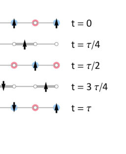 
Figure 1: Schematic illustration of a quarter-filled Mott-Thouless pump described by HRM, Eq. (1), with one fermion per two-site unit cell. Pumping is driven by a staggered potential (red and blue circles) and a staggered hopping amplitude (thick and thin gray bonds). During one pumping cycle, a unit charge is trans- ported by one unit cell, ∆x = 2a0. In the limit of strong repulsive interactions, the charge dynamics effectively decouples from the spin dynamics, so that quan- tized charge transport remains robust even in highly spin-incoherent states with large spin entropies.

📷 Fig 2

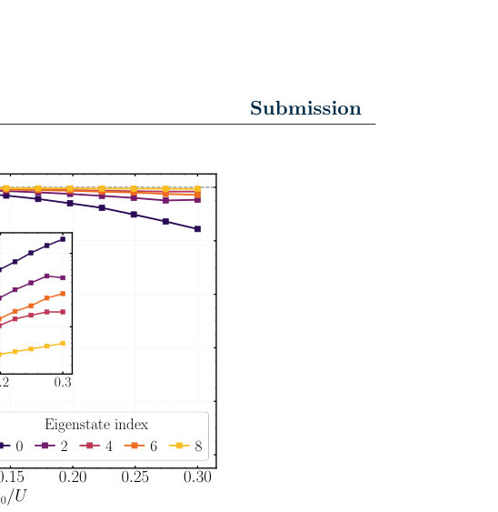 
Figure 2: Pumped charge per cycle as a function of t0/U for the quarter-filled Mott-Thouless pump described by Eq. (1). We show the time evolution for four low-energy initial states in the zero-momentum sector describing spin excitations. The curves are labeled by the energy-ordering index of the initial state, in as- cending order. Parameters: system size L = 16, particle numbers N↑= N↓= 4, δt = 0.5, δv = 1, and driving frequency ω = 0.1. Each initial state is evolved for five driving periods, and the transported charge is averaged over these cycles. The inset shows the deviation from perfect quantization on a logarithmic scale. In the U →∞limit, the curves are expected to approach the...

📷 Fig 3

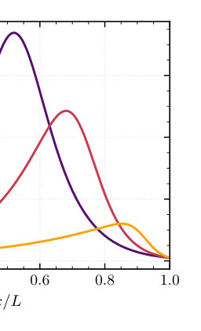 
Figure 4: Steady-state temperature profile obtained from the solution of the drift- diffusion equation (Eq. 24) for different values of the dimensionless parameter v/(γhL0). The asymmetric profile arises as our system effectively pumps charge, spin and heat from left to right with the velocity v. Here, we use L = 10L0.

📷 Fig 4

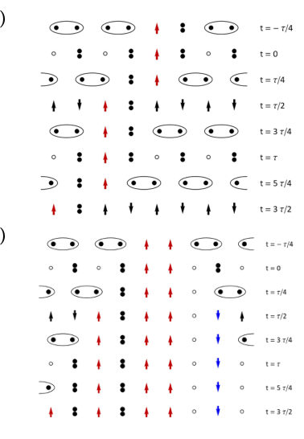 
Figure 6: Operation and defect propagation in the Mott-Thouless pump at half filling. (a) Result of a calculation within the simplified model Hs, where hopping acts only on even (odd) sites for 0 &lt; t &lt; τ/2 (τ/2 &lt; t &lt; τ) for a semi-infinite chain with open boundary conditions on the right. Filled dots, circles and arrows denote charges, singlet states and localized spins, respectively. The red and blue horizontal arrow denotes the transport of charge and spin, respectively. For the chosen staggered magnetic field the transported fermion carries spin-up only. Charge and spin accumulate at the right boundary. (b) Propagation of low-energy defects within model Hs: An added spin-↑fermion moves...

📷 Fig 5

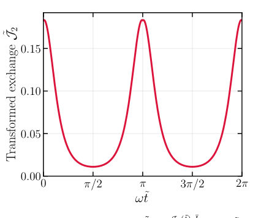 
Figure 7: Spin exchange coefficients as a function of time t and rescaled time ˜t. Parameters used: t0 = 1, δt = 0.3, v0 = 4, and system size L = 6 with N = 3 particles.

**Summary.** This paper analyzes Mott-Thouless pumps, extending the concept of quantized charge transport to highly entropic, spin-incoherent Mott states. The authors demonstrate that robust quantization is possible if the pumped charge sector remains decoupled from hot spin excitations. This work provides crucial theoretical understanding regarding the limits of topological protection in strongly correlated materials under time-periodic driving.

**Why it may be interesting.** This work bridges topological physics (quantized pumping) with strongly correlated electron physics (Mott insulators), providing insights into how quantum coherence can be maintained in highly dissipative or thermally excited many-body systems.

Detailed structure

**Main problem.** The study investigates the dynamical robustness of quantized charge transport (Thouless pumping) when the system is initialized in highly entropic, spin-incoherent Mott states.

**Main result.** Quantized Thouless pumping can remain exponentially protected even in high-entropy Mott states due to dynamic decoupling from hot spin degrees of freedom. Conversely, other pump classes fail because spin excitations generate charge excitations.

**Method.** The authors use analytical derivations, including mapping to spinless fermions and applying perturbation theory (Schrieffer-Wolff expansion) to derive effective low-energy Hamiltonians.

**Model / system.** The system is based on the interacting Rice-Mele model Hamiltonian, analyzed in regimes ranging from non-interacting ($U=0$) to strongly correlated Mott insulators ($U=\infty$).

**Key observables.** Quantized charge transport per cycle (Delta Q), entropy, and heating rate of spin excitations.

**Important parameters / regimes.** Interaction strength U, driving frequency $\omega$, filling fraction (quarter-filling vs. half-filling).

**Assumptions / limitations.** The analysis assumes adiabatic driving with respect to the charge gap but explores regimes where spin dynamics are highly excited and incoherent.

**Figures summary.** Figures illustrate robust quantized transport at quarter-filling for large U, contrasting this with failure at half-filling due to spin gap closing. They also show time evolution of pumped charge under various protocols.

**Paper structure.** The paper progresses by first establishing the standard Thouless pump, then introducing Mott-Thouless pumps in high-entropy regimes. It analytically proves protection mechanisms and contrasts these with failure modes caused by spin-charge coupling, supported by numerical simulations.

Abstract

A Thouless pump describes a system in which a quantized amount of charge is transported by one lattice spacing per cycle when the parameters of a Hamiltonian are varied slowly and periodically. In the standard case, this quantization requires the system to remain in its ground state with vanishing thermodynamic entropy throughout the pumping process. Here, we introduce a class of Mott-Thouless pumps, which operate in highly entropic, spin-incoherent Mott states. We show analytically that these states exhibit exponentially protected quantized transport despite their extensive entropy, because the pumped charge resides in a gapped sector that remains dynamically decoupled from the hot spin degrees of freedom. By contrast, motivated by a recent experimental realization, we identify other classes of Mott-Thouless pumps that lack this protection. In these systems, spin excitations can efficiently generate charge excitations, leading to a rapid breakdown of quantized transport. Our analytical results are supported by numerically exact real-time simulations of finite systems.

[↑ back to top](#top)

### [Synchronization, Kinematic Waves and Spike-Phase-Separation in Feedback Ising Neural Networks on Heterogeneous Graphs](http://arxiv.org/abs/2607.28275v1)

**Authors:** Anna Poggialini, Irem Topal, Fabrizio Lombardi, Daniele De Martino  
**Type:** theory · **Category:** statistical mechanics · **PDF:** <https://arxiv.org/pdf/2607.28275v1>  
**Analysis basis:** full PDF text, analyzed in chunks
**Topic relevance:** `driven-dissipative phase transition` **3/5** · `methods for driven-dissipative` **3/5** · `non-equilibrium universality` **3/5** · `non-equilibrium dynamics` **2/5** · `Frenkel-Kontorova` **1/5** · `Keldysh / 2PI / non-Gaussian methods` **1/5** · `analog quantum simulation` **1/5** · `correlated / nonlocal dissipation` **1/5**

📷 Fig 1

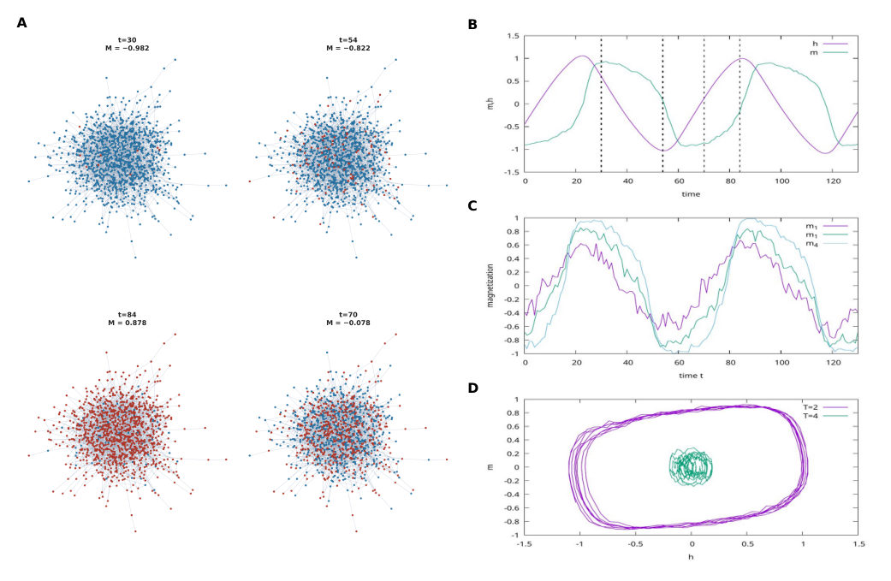 
Figure 1: Feedback Ising model on a heterogeneous network. A. Microscopic spin configurations (si = +1 in blue, si = −1 in red) at four representative times along the limit cycle. B. Time series of the global magnetization m(t) and the feedback field h(t), showing nonlinear self-sustained oscillations. Dashed lines mark the snapshots of panel A. C. Degree-resolved magnetizations mk(t) for different degree classes, illustrating heterogeneous yet globally synchronized oscillatory dynamics. D. Phase-plane trajectory in the (m, h) plane below (T = 2) and above the critical temperature (T = 4). At T = 4 oscillations are suppressed and the system relaxes to the paramagnetic fixed point....

📷 Fig 2

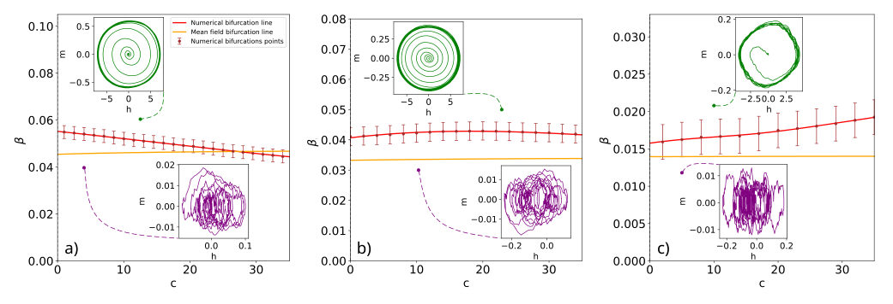 
Figure 2: Analytical phase diagrams in the (c, β) plane from the Curie–Weiss linear stability analysis. Left: Erd˝os–R´enyi graph with z = 20. Center: Scale-free network with exponent γ = 2.1 and kmin = 20. Right: Log-normal degree distribution with ⟨k⟩= 25 and σ = 1 (µ = ln⟨k⟩−σ2/2). Insets: Phase-plane trajectories (m, h) from Monte Carlo simulations confirm the analytical predictions.

📷 Fig 3

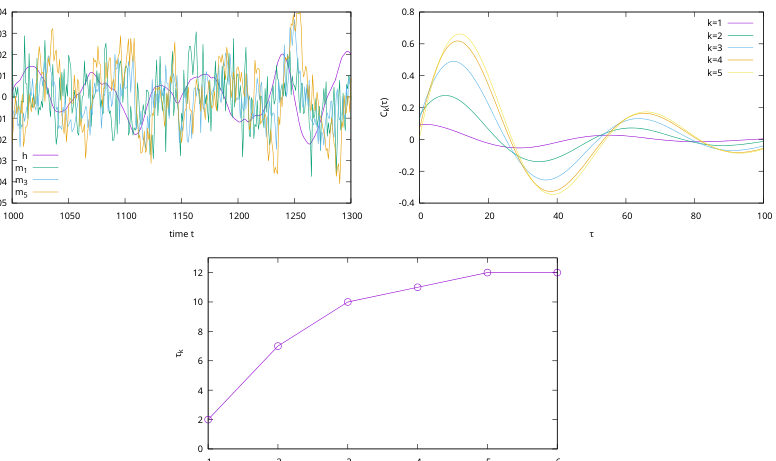 
Figure 3: Kinematic wave in the subcritical resonant phase. Microscopic numerical simulations on a Poissonian network with z = 4, c = 0.1, β = 0.24, N = 104. Top left: Time series of the external field h and degree-resolved magnetizations m1, m3, m5, showing noisy oscillations with degree-dependent amplitude. Top right:

📷 Fig 4

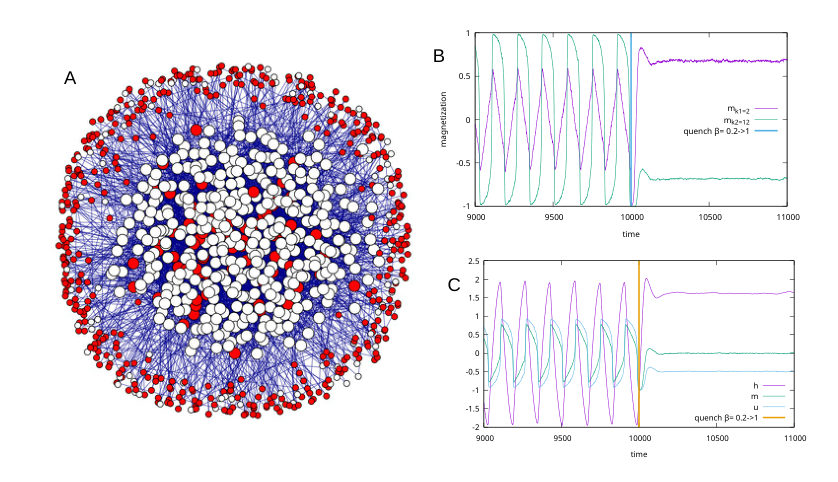 
Figure 4: Phase separation after a quench. Microscopic numerical simulations on a Bimodal network with k1 = 4, k2 = 12 c = 0.1, N = 104. Left: Snapshot of the system after the quench. Right: Magnetization after and before the quench.

📷 Fig 5

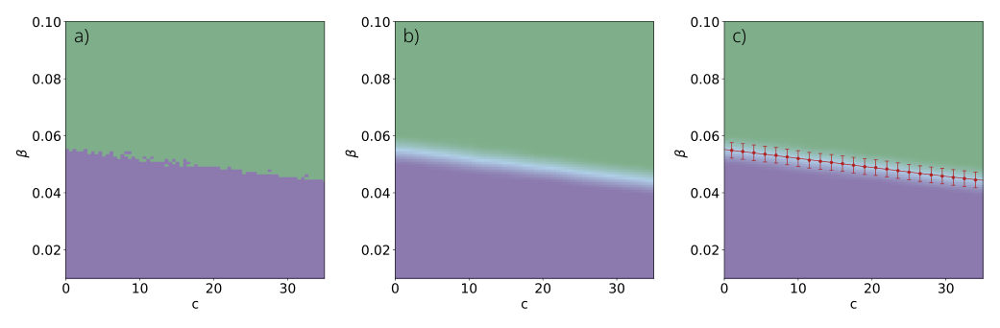 
Figure 5: Computational derivation of the phase diagrams in the (c, β) plane for the Erd˝os–R´enyi graph. Left: The purple and the green areas respectively correspond to the (m = 0, h = 0) fixed point and the limit cycle detection according to the pseudo-code above. Center: To panel a) is applied a squared gaussian filter convolution, with edge length = 11 and σ = 2. Right: To the final diagram is applied a polynomial fit over the points with values 1/2 to extract the boundaries. The fit is reported with the red solid line. Finally, the cumulative error bars are reported.

**Summary.** This paper analyzes the collective dynamics of Ising neural networks on heterogeneous graphs, focusing on how structural disorder modifies out-of-equilibrium behavior. Using mean-field theory, the authors predict that heterogeneity causes distinct physical phenomena, including propagating kinematic waves and phase separation. These findings provide a mathematical toolset for understanding how network topology regulates macroscopic oscillations in complex systems.

**Why it may be interesting.** The mathematical framework developed for analyzing non-equilibrium transitions using mean-field theory and bifurcation analysis is highly relevant to understanding critical phenomena in open quantum systems or complex many-body dynamics where external feedback plays a role.

Detailed structure

**Main problem.** The study investigates how structural heterogeneity constrains collective dynamics and state transitions in complex, out-of-equilibrium systems like neural networks.

**Main result.** Degree heterogeneity decouples neuron firing rate from synapse firing rate, leading to novel phenomena such as kinematic waves and a phase-separated low-temperature state that can destroy synchronized oscillations.

**Method.** The authors use the Curie-Weiss heterogeneous mean-field approximation combined with linear stability analysis and bifurcation theory to characterize these transitions analytically.

**Model / system.** The system is a kinetic Ising neural network driven out of equilibrium by a homeostatic feedback loop. The dynamics are governed by spin flip rates derived from an effective Hamiltonian, analyzed via degree-resolved magnetizations.

**Key observables.** Global magnetization ($m$), per-edge average neighbor magnetization ($u$), and the bifurcation threshold ($eta_c(c)$) determining the onset of oscillations.

**Important parameters / regimes.** Degree heterogeneity quantified by the degree moment ratio $\alpha = \langle k^2 
angle / \langle k 
angle$, and feedback strength $c$.

**Assumptions / limitations.** The analysis relies on the Curie-Weiss heterogeneous mean-field approximation, which simplifies the complex dynamics into tractable equations.

**Figures summary.** Figures illustrate phase diagrams in the $(c, eta)$ plane showing regions corresponding to different dynamical phases (limit cycle vs. fixed point) and show time series confirming oscillatory behavior and wave propagation signatures.

**Paper structure.** The paper progresses from defining the system dynamics via a master equation to deriving mean-field equations for degree-specific magnetizations. It then uses linear stability analysis to find bifurcation points, characterizes novel collective behaviors (waves/phase separation), and concludes by mapping out the full phase diagram in parameter space.

Abstract

Structural heterogeneity constrains collective dynamics in complex systems. However, its analytical tractability out of equilibrium remains limited. In this work, we study a class of kinetic Ising neural networks driven out of equilibrium by a homeostatic feedback loop between the neuronal excitability and the population firing rate. Using a Curie-Weiss heterogeneous mean-field approximation validated by Monte Carlo simulations, we provide an analytical characterization of how a macroscopic synchronized limit cycle emerges via an Andronov-Hopf bifurcation on heterogeneous networks. We derive closed-form phase boundaries and show that the onset of oscillations is explicitly controlled by network heterogeneity through the degree moment ratio. Degree heterogeneity decouples the spiking rate per neuron m from the spiking rate per synapse u, generating physical phenomena absent in homogeneous systems. These include (i) kinematic waves of sequential, degree-ordered activations propagating from the network periphery to the hubs, and (ii) a low-temperature phase-separated state emerging via a pitchfork bifurcation. We prove that for highly heterogeneous topologies, this phase-separated fixed point stabilizes and dynamically destroys the synchronized limit cycle. These results provide a mathematical framework for understanding how heterogeneity regulates macroscopic oscillations and out-of-equilibrium transitions in neural networks

[↑ back to top](#top)

### [Quantum Chaos and Diffusive Transport from Geometric Randomness](http://arxiv.org/abs/2607.28579v1)

**Authors:** Bibek Saha, Abhishek Dhar, Sthitadhi Roy  
**Type:** theory · **Category:** disordered systems and neural networks · **PDF:** <https://arxiv.org/pdf/2607.28579v1>  
**Analysis basis:** full PDF text, analyzed in chunks
**Topic relevance:** `non-equilibrium dynamics` **3/5** · `analog quantum simulation` **2/5** · `entanglement & information structure` **2/5** · `methods for driven-dissipative` **2/5** · `non-equilibrium universality` **2/5** · `Keldysh / 2PI / non-Gaussian methods` **1/5** · `correlated / nonlocal dissipation` **1/5** · `driven-dissipative phase transition` **1/5**

📷 Fig 1

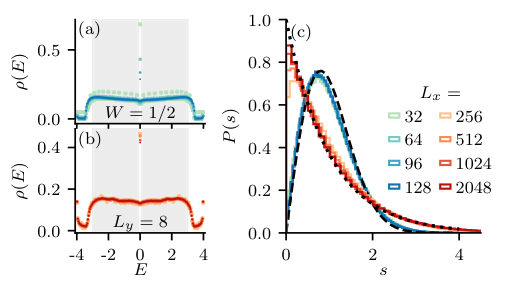 
FIG. 2. Spectrum and level statistics: (a) and (b) show the normalised DoS for W = 1/2 and Ly = 8 respectively. In both cases, the DoS is approximately flat and the peak at E = 0 decays with increasing system size. (c) The distri- bution of the normalised level spacings (defined in Eq. (2)). Blue and red tones correspond to W = 1/2 and Ly = 8 re- spectively with darker colours denoting larger Lx. The black dashed and dotted lines denote the Wigner surmise and Pois- son distribution respectively.

📷 Fig 2

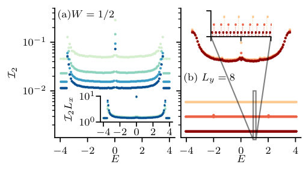 
FIG. 3. IPRs as a function of E: (a) For W = 1/2, the IPR scales as L−1 x at all E as evinced by the collapse of the data for I2Lx (inset) for different Lx = 32, 64, 96, 128 (lighter to darker colours). (b) For Ly = 8, the unscaled IPR collapses for different Lx = 256, 512, 1024 (lighter to darker) indicating I2 ∼L0 x and hence localisation, except for the Bloch-wave like states. The inset shows an enlargement of the small energy window where the vertical dashed lines denote the Bloch-state energies.

📷 Fig 3

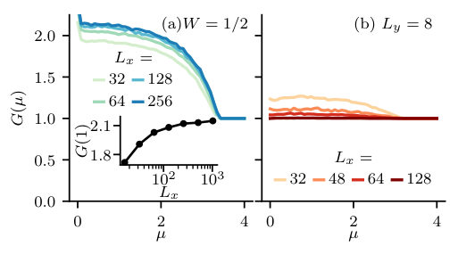 
FIG. 5. Conductance: (a) For W = 1/2 we see a satura- tion of the conductance (hence conductivity= G/W) with in- creasing Lx, implying diffusive transport. The inset shows the saturation with Lx at µ = 1. (b) For Ly = 8, we observe bal- listic transport, corresponding to perfect transmission via the Bloch states. For smaller Lx, additional contribution to G(µ) comes from the localised states as their localisation lengths are comparable to Lx; this effect vanishes with increasing Lx.

📷 Fig 4

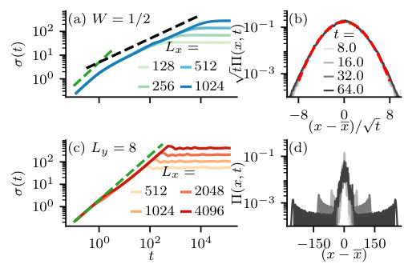 
FIG. 4. Wavepacket spreading: (a) For W = 1/2, the spreading is diffusive as the width σ(t) ∼t1/2 (black dashed line) after an initial ballistic transient (green dashed line). (b) The rescaled Gaussian profile of Π(x, t) with a width σ(t) at different t. The red dashed curve shows the correspond- ing Gaussian profile. (c) For Ly = 8, the spreading is ballistic (green dashed line) at all timescales. (d) The profile of Π(x, t) at different t with a localised core accompanied by the ballis- tically spreading tails.

📷 Fig 5

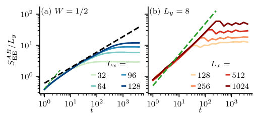 
FIG. 6. Entanglement dynamics: The bipartite EE be- tween two halves of the RLTL graphs each containing half of the layers, for (a) W = 1/2 and (b) Ly = 8. In the former, the EE shows a diffusive growth in time, indicated by the black dashed line, whereas in the latter it shows a ballistic growth indicated by the green dashed line.

**Summary.** The paper demonstrates that the interplay between dimensionality and structural randomness in quantum graphs (RLTL) can independently generate quantum chaotic dynamics or suppress it. By analyzing spectral statistics, wavepacket spreading, and conductance, the authors show a clear transition: finite effective dimensions yield diffusive chaos, while quasi-1D structures lead to ballistic transport governed by localized modes.

**Why it may be interesting.** This work provides a clean, purely geometric mechanism for tuning quantum chaos and transport regimes, which is highly relevant for understanding disordered quantum materials or engineered lattice systems where disorder arises from geometry rather than random potentials.

Detailed structure

**Main problem.** The study investigates whether quantum chaos and diffusive transport can emerge purely from geometric randomness, independent of traditional microscopic disorder or many-body interactions.

**Main result.** Geometric randomness alone dictates the dynamics: finite effective dimensionality leads to robust quantum chaos and diffusion, whereas quasi-one-dimensional limits result in localization and ballistic transport.

**Method.** The analysis employs theoretical tools including level-spacing statistics, Inverse Participation Ratios (IPR), wavepacket spreading calculations, and Non-Equilibrium Green's Function (NEGF) formalism to probe quantum dynamics.

**Model / system.** The model uses non-interacting quantum particles on random locally tree-like layered (RLTL) graphs. These graphs are structurally disordered generalizations of regular lattices, analyzed in both finite effective dimensionality and quasi-1D limits.

**Key observables.** Level spacing distribution P(s), Inverse Participation Ratio (IPR), wavepacket spread $\sigma(t)$, linear-response conductance $G(\mu)$, and bipartite entanglement entropy $S_{AB}^{EE}$.

**Important parameters / regimes.** The ratio of layer sizes ($W=L_y/L_x$) is critical, contrasting the finite $W$ regime with the fixed $L_y$ (quasi-1D) limit.

**Assumptions / limitations.** The analysis relies on specific dimensional limits (finite $W$ vs. fixed $L_y$) and approximations in calculating number fluctuations using large system limits ($L_x \gg 1$).

**Figures summary.** Figures illustrate the comparison between Wigner (chaotic) and Poisson (integrable/localized) level spacing distributions, and show IPR scaling with system size for different dimensional regimes.

**Paper structure.** The paper progresses by first establishing the model on RLTL graphs, then analyzing diagnostics like level statistics and wavepacket spreading in two distinct dimensional limits. It concludes by using NEGF to calculate conductance and number fluctuations, confirming the link between dimensionality, transport type (diffusive vs. ballistic), and spectral properties.

Abstract

The physics of quantum chaos and diffusive transport is typically studied in settings with microscopic disorder or many-body interactions. In this Letter, we demonstrate that these phenomena can arise purely from geometric randomness. By studying non-interacting quantum particles on random locally tree-like layered graphs with uniform couplings, we show that the geometric randomness and effective graph dimensionality dictates the presence of chaotic dynamics or lack thereof. These graphs can be considered as structurally disordered generalisations of regular square lattices or ladders, or equivalently as multi-component one-dimensional chains with random links between the components. We find that an extensive layer size yields robust quantum chaos, level repulsion, and diffusive transport. Conversely, in the quasi-one-dimensional limit, we find the coexistence of extensive number of localised and delocalised states -- this leads to suppressed level repulsion accompanied by the latter driving ballistic transport. These results establish geometric randomness as a fundamental and independent mechanism for generating and tuning quantum chaos.

[↑ back to top](#top)

### [Efficient learning of bosonic unitaries beyond the Gaussian class](http://arxiv.org/abs/2607.27534v1)

**Authors:** Xiaobin Zhao, Quntao Zhuang  
**Type:** theory · **Category:** quantum information and computing · **PDF:** <https://arxiv.org/pdf/2607.27534v1>  
**Analysis basis:** full PDF text, analyzed in chunks
**Topic relevance:** `quantum measurements` **3/5** · `quantum optics experiment` **3/5** · `measurement-induced transitions` **2/5** · `correlated / nonlocal dissipation` **1/5** · `correlated cavity matter` **1/5** · `driven-dissipative phase transition` **1/5** · `entanglement & information structure` **1/5** · `non-equilibrium dynamics` **1/5**

📷 Fig 1

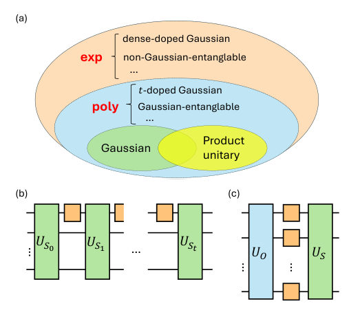 
FIG. 1. Learning-complexity landscape of bosonic unitaries. (a) Generic bosonic unitaries require a num- ber of queries that grows exponentially with the number of modes, whereas structural promises can reduce the scaling to polynomial. Representative polynomially learnable fam- ilies include Gaussian unitaries and the two non-Gaussian families established here: t-doped Gaussian unitaries and Gaussian-entanglable unitaries. (b) A t-doped Gaussian cir- cuit, in which local non-Gaussian unitaries, represented by brown boxes, are interleaved with multimode Gaussian layers {US0, · · · USt}. (c) A Gaussian-entanglable circuit, in which a product of arbitrary local unitaries is placed between a...

📷 Fig 2

 
FIG. 2. Residual passive gauge of a learned passive-separable state. After input and output relabellings, modes carrying non-Gaussian states are routed individually and remain ambiguous only up to local phase rotations. Residual passive mixing Γr is confined to covariance-degenerate Gaussian blocks, with the allowed block transformations characterized in Theorem S10.

📷 Fig 3

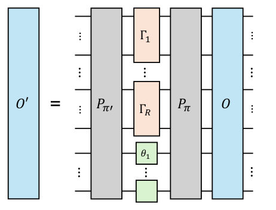 
Fig. 2 illustrates the decomposition of the reconstructed passive-Gaussian unitary. Finally, once UO2 in Eq. (S37) has been learned from shadow tomography, we can partially counter-rotate Upge through postprocessing. Specifically, for each heterodyne outcome γ, we apply the classical transformation γ 7→ W e O2γ, where W e O2 is the complex

📷 Fig 4

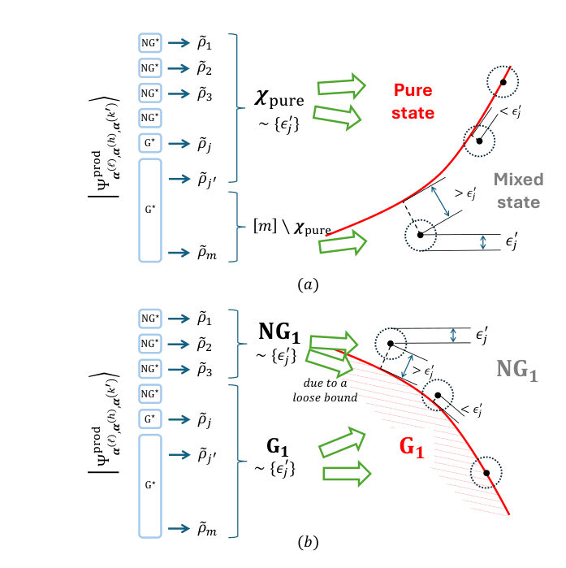 
FIG. 3. Identification of non-Gaussian output modes from local tomography. Under the perturbation assumption, the state |Ψprod α(ℓ),α(h),α(k′)⟩is exactly a product of |N ⋆ re| single-mode non-Gaussian states and one |G⋆ re|-mode Gaussian state.

**Summary.** This paper tackles the challenge of efficiently learning complex unitary transformations acting on multi-mode bosonic systems. It proves that while general unitaries are prohibitively hard to learn, specific structured non-Gaussian families can be characterized using only polynomially many measurements. The methodology combines advanced quantum process tomography techniques with rigorous complexity analysis.

**Why it may be interesting.** This work provides fundamental resource scaling laws for quantum process tomography in bosonic systems, which is crucial for designing scalable quantum measurement and characterization protocols relevant to quantum optics and continuous variable quantum information processing.

Detailed structure

**Main problem.** The core problem is determining the minimum number of quantum channel uses required to learn unknown, complex multimode bosonic unitary operations that extend beyond simple Gaussian models.

**Main result.** While general unitaries require exponentially many resources ($\Omega(E^{2m})$), two structured non-Gaussian families ($t$-doped and Gaussian-entanglable) can be learned with polynomial resources in the number of modes, $m$.

**Method.** The authors develop forward-only quantum process tomography protocols using coherent-state probes, local heterodyne detection, and classical post-processing to decompose the learning task.

**Model / system.** The system involves bosonic modes undergoing unitary evolution ($U$) on an $m$-mode Hilbert space. The complexity is analyzed by comparing general unitaries against structured families like $t$-doped Gaussian or Gaussian-entanglable unitaries.

**Key observables.** Fidelity estimate $\lVert U - \hat{U} 
Vert_{mE}^{\diamond}$, query complexity (number of channel uses $n$), and the structure of correlations (Gaussian vs. non-Gaussian).

**Important parameters / regimes.** Input energy constraint ($E$), number of modes ($m$), desired accuracy ($\epsilon$), and the structural parameters defining the unitaries ($\kappa_t$).

**Assumptions / limitations.** The protocols rely on forward-only measurements, using coherent probes, and decomposing the unitary into manageable Gaussian/structured non-Gaussian blocks.

**Figures summary.** Figure 1 illustrates the learning complexity landscape, showing exponential scaling for generic unitaries versus polynomial scaling for structured families like $t$-doped or Gaussian-entanglable circuits.

**Paper structure.** The paper establishes a lower bound on query complexity based on accessible subspaces (related to effective dimension $d_E$), and then derives upper bounds by combining dimension reduction techniques with reconstruction stability analysis, culminating in specific protocols for structured unitaries.

Abstract

Multimode quantum processes are generally difficult to learn, due to the large dimensionality and complex entanglement structure beyond the Gaussian class. Here, we show that the fundamental obstruction is not non-Gaussianity itself, but the buildup of irreducible multimode non-Gaussian correlations. We establish a tractability frontier for bosonic unitary learning: a general $m$-mode unitary with input energy at most $E$ per mode requires at least $Ω(E^{2m})$ channel uses, whereas two broad non-Gaussian families---$t$-doped Gaussian unitaries and Gaussian-entanglable unitaries---can be learned with resources polynomial in $m$. The latter can exhibit both extensive non-Gaussianity and strong multimode entanglement. Our forward-only protocols use coherent-state probes, Gaussian operations, local heterodyne detection, and classical post-processing to identify the global Gaussian mixing and reduce the remaining task to single- or few-mode learning. The analysis also yields a multimode quantum Darmois--Skitovich theorem showing that mode-spreading passive networks preserve product structure only for Gaussian input states, an almost-sure activation theorem for non-Gaussian processes showing that non-Gaussian unitaries yield non-Gaussian outputs for almost all coherent input states, and a method for learning unitaries from uncalibrated coherent probes. Our results identify that complexity of learning arises from irreducible mixing of non-Gaussianity and entanglement, rather than either resource alone.

[↑ back to top](#top)

### [Graph Neural Network Force Fields for Spin Dynamics in Metallic Magnets](http://arxiv.org/abs/2607.28537v1)

**Authors:** Ali Rayat, Yunhao Fan, Gia-Wei Chern  
**Type:** theory · **Category:** strongly correlated electrons · **PDF:** <https://arxiv.org/pdf/2607.28537v1>  
**Analysis basis:** full PDF text, analyzed in chunks
**Topic relevance:** `exotic spin models in light-matter` **3/5** · `spintronics-quantum-optics interface` **3/5** · `methods for driven-dissipative` **2/5** · `non-equilibrium dynamics` **2/5** · `Keldysh / 2PI / non-Gaussian methods` **1/5** · `Kondo & dissipative impurity` **1/5** · `analog quantum simulation` **1/5**

📷 Fig 1

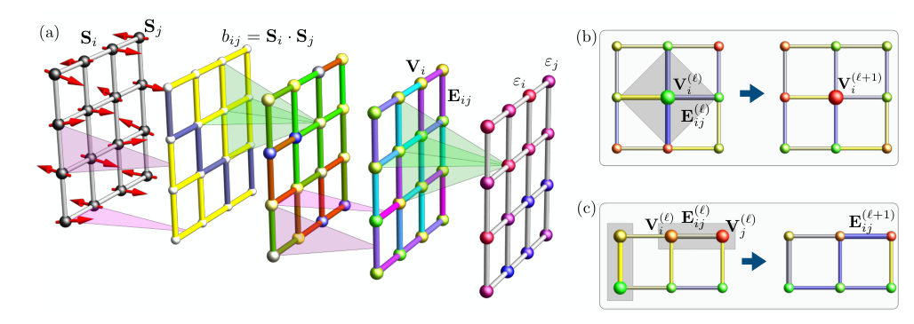 
FIG. 1. Schematic illustration of the graph-neural-network architecture. (a) The magnetic lattice is represented as a graph whose node and edge embeddings are initialized from symmetry-preserving spin features and subsequently refined through successive graph-neural-network layers. (b) Node-update operation, in which information from neighboring sites and connecting bonds is aggregated to generate an updated node embedding. (c) Edge-update operation, in which the bond embedding is updated using the existing edge feature together with information from the two endpoint sites.

📷 Fig 2

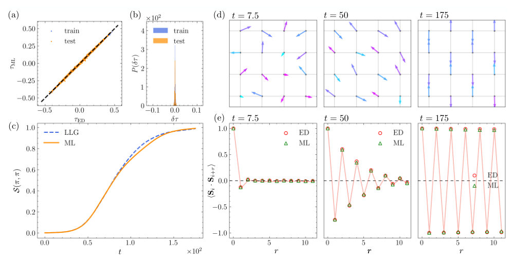 
FIG. 2. Benchmark of the GNN force field for the square-lattice N´eel antiferromagnet. (a) Comparison of torques τi predicted by the GNN and exact electronic calculations. (b) Corresponding distribution of torque errors. (c) Time evolution of the spin structure factor evaluated at the N´eel ordering wave vector (π, π) following a thermal quench. (d) Representative snapshots of the spin orientations at different stages of the relaxation dynamics. (e) Spin-spin correlation functions at selected times, comparing direct ED-LLG simulations with GNN-LLG results. The excellent agreement demonstrates that the learned force field accurately reproduces both the local torques and the emergent...

📷 Fig 3

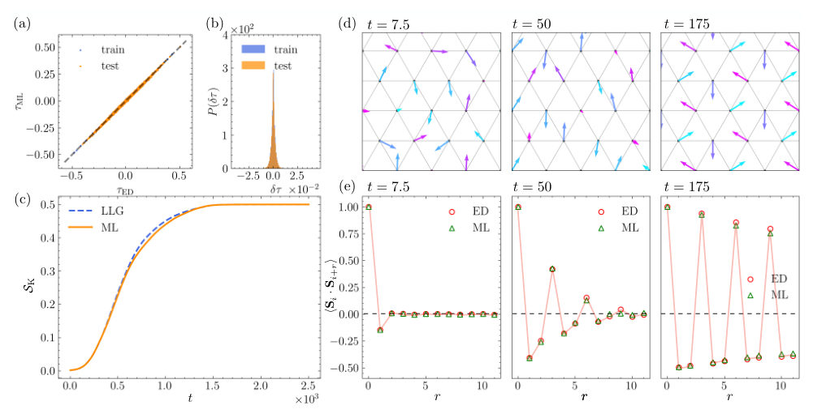 
FIG. 3. Benchmark of the graph-neural-network force field for the triangular-lattice 120◦antiferromagnetic state. (a) Com- parison of torques predicted by the GNN and exact electronic calculations. (b) Corresponding distribution of torque errors. (c) Time evolution of the spin structure factor SK at the K point of the hexagonal Brillouin zone, which serves as the instan- taneous order parameter for the 120◦state, following a thermal quench. (d) Representative snapshots of the spin orientations during the relaxation process. (e) Equal-time spin-spin correlation functions at selected times, comparing direct ED–LLG simulations with GNN–LLG results. The excellent agreement demonstrates that the...

📷 Fig 4

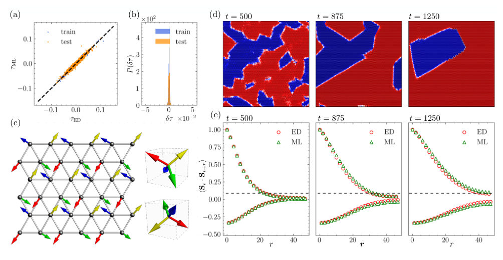 
FIG. 4. Benchmark of the graph-neural-network force field for the noncoplanar tetrahedral state on the triangular lattice. (a) Comparison of torques predicted by the GNN and exact electronic calculations. (b) Corresponding distribution of torque errors. (c) Schematic illustration of the tetrahedral spin order and the two degenerate states with opposite chirality. (d) Representative snapshots of the local scalar chirality χijk = Si·(Sj ×Sk), revealing the growth and coarsening of chiral domains associated with the discrete Z2 order parameter. (e) Equal-time spin-spin correlation functions at selected times, comparing direct KPM–LLG simulations with GNN–LLG results. The excellent agreement...

📷 Fig 5

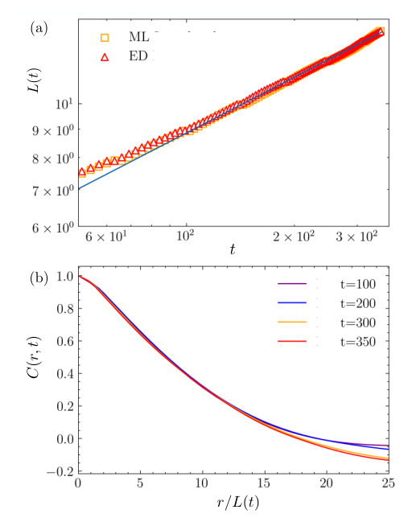 
FIG. 5. Further benchmark of the GNN force field for the non- coplanar tetrahedral phase. (a) Characteristic chiral-domain size L(t) as a function of time obtained from direct electronic simulations and GNN-based spin dynamics. The learned force field accurately reproduces the previously reported approxi- mately linear coarsening law L(t) ∼t. (b) Chirality cor- relation function C(r, t) plotted against the scaled distance r/L(t). The collapse of data at different times demonstrates dynamical scaling during chiral-domain coarsening. Together, these results show that the GNN force field faithfully captures the large-scale nonequilibrium dynamics of the chiral phase.

**Summary.** This paper presents a Graph Neural Network (GNN) framework designed to overcome computational bottlenecks in simulating spin dynamics in metallic magnets. The GNN learns the effective magnetic energy functional directly from electronic structure calculations, allowing for efficient prediction of complex spin torques and non-equilibrium behavior. This establishes GNNs as a powerful tool for large-scale simulations of itinerant magnetism.

**Why it may be interesting.** While focused on magnetism, the core methodology—using ML potentials derived from first principles to simulate complex many-body dynamics efficiently—is highly relevant for simulating open quantum systems or strongly interacting particle ensembles where direct time evolution is intractable.

Detailed structure

**Main problem.** Developing computationally efficient methods to simulate complex spin dynamics in metallic magnets, which are bottlenecked by repeatedly solving underlying electronic structure problems during time evolution.

**Main result.** The proposed GNN framework accurately reproduces electronically generated spin torques and yields non-equilibrium spin dynamics that agree excellently with direct electronic simulations.

**Method.** A Graph Neural Network (GNN) is introduced to learn the effective magnetic energy functional directly from electronic calculations, analogous to machine-learned interatomic potentials.

**Model / system.** The system involves metallic magnets exhibiting itinerant electron-mediated interactions. The model focuses on learning the effective magnetic energy functional governing spin dynamics across various magnetic orders (collinear, noncollinear).

**Key observables.** Effective magnetic fields and spin torques; non-equilibrium spin dynamics.

**Important parameters / regimes.** The framework is applicable to systems exhibiting long-ranged, highly nonlinear interactions dependent on the instantaneous spin configuration.

**Assumptions / limitations.** The method assumes that encoding local descriptors via message passing can capture complex many-body interactions and approximates the preservation of global SO(3) spin-rotation symmetry.

**Figures summary.** Figure 1 schematically illustrates the GNN architecture, showing initialization from symmetry-preserving features, node updates aggregating neighbor information, and edge updates using endpoint site data.

**Paper structure.** The paper introduces the GNN framework by detailing its graph construction (nodes/edges), the message-passing mechanism for updating local descriptors while preserving symmetries, benchmarking it against known electronic calculations to validate spin torque reproduction, and finally applying it to large-scale non-equilibrium simulations.

Abstract

Metallic magnets exhibit complex spin dynamics governed by electronically generated interactions. Predictive simulations of such dynamics typically require repeated solutions of an underlying electronic problem throughout the time evolution, creating a major computational bottleneck. Here we introduce a graph neural network (GNN) magnetic force-field framework that learns the effective magnetic energy functional governing itinerant spin dynamics directly from electronic calculations. Conceptually analogous to machine-learned interatomic potentials, the proposed framework enables efficient evaluation of spin torques while capturing the nonlinear and spatially extended interactions generated by itinerant electrons. We benchmark the method on representative metallic magnetic systems exhibiting collinear, noncollinear, and noncoplanar magnetic order. The learned force fields accurately reproduce electronically generated spin torques and yield nonequilibrium spin dynamics in excellent agreement with direct electronic simulations. Our results establish graph neural networks as a powerful framework for machine-learned magnetic force fields, providing a pathway toward predictive large-scale simulations of nonequilibrium magnetism across multiple length and time scales.

[↑ back to top](#top)

### [Interacting Quantum Symmetric Exclusion Process](http://arxiv.org/abs/2607.28255v1)

**Authors:** Denis Bernard, Friedrich Hübner, Stefano Scopa  
**Type:** theory · **Category:** statistical mechanics · **PDF:** <https://arxiv.org/pdf/2607.28255v1>  
**Analysis basis:** full PDF text, analyzed in chunks
**Topic relevance:** `non-equilibrium dynamics` **3/5** · `non-equilibrium universality` **3/5** · `methods for driven-dissipative` **2/5** · `Keldysh / 2PI / non-Gaussian methods` **1/5** · `analog quantum simulation` **1/5** · `correlated / nonlocal dissipation` **1/5** · `driven-dissipative phase transition` **1/5** · `entanglement & information structure` **1/5**

📷 Fig 1

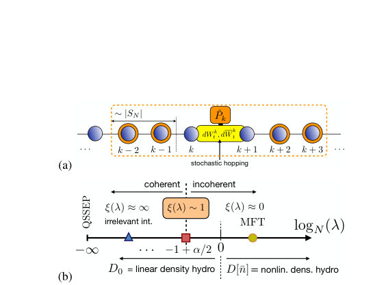 
FIG. 1. (a) Illustration of the IQSEP model: stochastic nearest-neighbor hopping is dressed by interactions with the occupations of sites within a surrounding subextensive region. (b) Phase diagram of the IQSEP model discussed in the main text. The symbols indicate the regimes tested numer- ically in Fig. 2.

📷 Fig 2

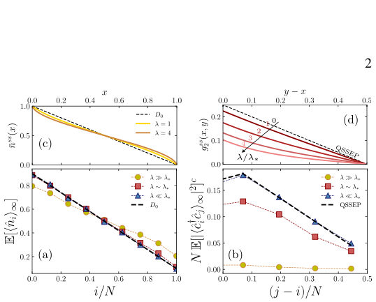 
FIG. 2. Numerical checks of the IQSEP scaling picture. Panels (a)-(b) show exact-diagonalization data for the microscopic model (2) with N = 8 links, short-range dressing (4), and D0 = 1. We plot the steady-state density (a) and coherence loop (b), as functions of i/N with j = 4 fixed in (b). The couplings are λ = 2 (circ.), λ = 2/N (squares), and λ = 2/N 2 (triang.), with λ∗= 1/N. Boundary densities are na = 1, nb = 0. Dashed lines show the finite-N QSSEP result of Ref. [24]. Data are averaged over 500 trajectories, and evolved up to t = 2N 2 with dt ∼10−2. Panels (c)-(d) show the corresponding steady-state solutions of the large-scale IQSEP equations for the density (c) (eq. (11)) and...

**Summary.** The paper analyzes the Interacting Quantum Symmetric Exclusion Process (IQSEP) to understand its large-scale dynamics. It develops a scaling theory that predicts a transition between coherent, wave-like behavior at small scales and incoherent, diffusive behavior at large scales. This framework extends standard fluctuating hydrodynamics by incorporating quantum coherence fluctuations via multi-replica correlation functions.

**Why it may be interesting.** This work provides advanced theoretical tools—the coherent/incoherent crossover and the associated massive hydrodynamics—that are crucial for understanding non-equilibrium quantum transport where simple classical descriptions fail.

Detailed structure

**Main problem.** The central problem is developing a universal theory for the large-scale dynamics of noisy many-body quantum systems, specifically accounting for fluctuations in quantum coherences beyond standard fluctuating hydrodynamics.

**Main result.** The authors derive a mesoscopic scaling theory showing a crossover between coherent (small scale) and incoherent (large scale) behavior, yielding a massive hydrodynamic equation for the coherence loop $g_n$.

**Method.** The analysis employs a multi-replica approach combined with hydrodynamic scaling limits, deriving equations of motion for correlation functions (coherence loops) by treating interactions as perturbations to the standard Quantum Simple Symmetric Exclusion Process.

**Model / system.** The model is the Interacting Quantum Symmetric Exclusion Process (IQSEP), describing stochastic quantum hopping of charged particles on a lattice. It generalizes the QSSEP by including density-dependent interaction terms that modify the hopping amplitudes.

**Key observables.** Averaged density $ar{n}(x; 	au)$, coherence loops $g_n(x_1, \dots, x_n; 	au)$, and the mass term $m^2(x; 	au)$.

**Important parameters / regimes.** Interaction strength ($\lambda$), mesoscopic scaling regime ($\lambda \sim \lambda^*$), and the lattice size ($N$).

**Assumptions / limitations.** The derivation heavily relies on Mean Field Theory (MFT) factorization for simplifying cumulants, and subleading terms in the coherence loop expansion are neglected.

**Figures summary.** Figures illustrate the IQSEP hopping mechanism, a phase diagram mapping scaling regimes based on interaction strength, and numerical checks comparing steady-state density evolution with coherence loop dynamics.

**Paper structure.** The paper progresses from defining the microscopic stochastic Hamiltonian to deriving the single-replica (density) hydrodynamics. It then tackles the multi-replica sector by deriving the equation of motion for the coherence loop $g_n$, culminating in a generalized massive hydrodynamic equation incorporating the mass term $m^2$.

Abstract

We introduce and solve the Interacting Quantum Symmetric Exclusion Process (IQSEP), a family of models describing the stochastic quantum hopping of charged particles along the edges of a lattice, with hopping amplitudes that depend on the occupations of neighbouring sites. In the absence of interactions, they reduce to the standard quantum simple symmetric exclusion process, exhibiting coherent diffusive transport. For interactions of order one, they capture incoherent diffusive transport and its fluctuations, characterized by density-dependent diffusivity and mobility, making contact with the macroscopic fluctuation theory. By rescaling the interaction strength appropriately with the lattice mesh, we define a mesoscopic scaling regime that retains a finite coherence length in the continuous thermodynamic limit. This regime interpolates between coherent behavior at small length scales and incoherent behavior at large scales. The resulting scaling theory accounts for fluctuations of quantum coherences in interacting diffusive systems, going beyond the scope of standard fluctuating hydrodynamics.

[↑ back to top](#top)

### [A Provable Oracle-Free Quantum Algorithm for Nonlinear Dynamics on Hybrid Oscillator-Qubit Processors](http://arxiv.org/abs/2607.28541v1)

**Authors:** Kausthubh Chandramouli, Yan Li, Yuan Liu  
**Type:** theory · **Category:** quantum information and computing · **PDF:** <https://arxiv.org/pdf/2607.28541v1>  
**Analysis basis:** full PDF text, analyzed in chunks
**Topic relevance:** `methods for driven-dissipative` **3/5** · `non-equilibrium dynamics` **3/5** · `analog quantum simulation` **2/5** · `Keldysh / 2PI / non-Gaussian methods` **1/5** · `correlated / nonlocal dissipation` **1/5** · `driven-dissipative phase transition` **1/5** · `non-equilibrium universality` **1/5**

📷 Fig 1

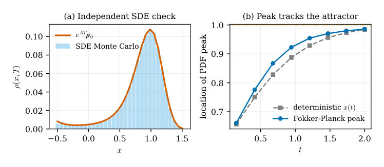 
Fig. 1. Fokker–Planck linearisation ( ˙x = x−x3). (a) An independent Monte-Carlo integration of the stochastic differential equation matches eAT ρ0. (b) The density peak, located by parabolic sub-cell interpolation, follows the deterministic trajectory onto the attractor to within 0.039 in x.

📷 Fig 2

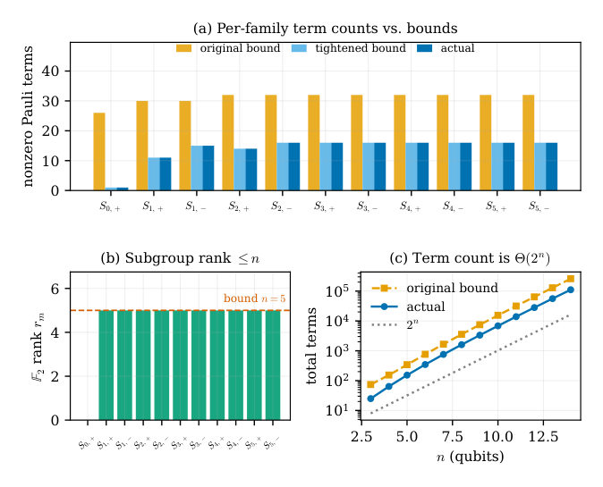 
Fig. 2. Pauli structure of H1, H2 (L = 3). (a) Per-family term counts against the original and tightened bounds. (b) The F2 subgroup rank of every family is at most n. (c) The total term count scales as Θ(2n), driven by the suffix multiplicities rather than the degree.

📷 Fig 3

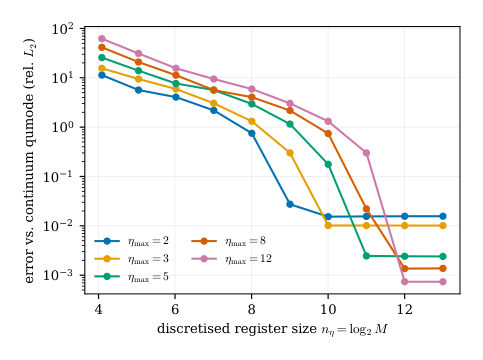 
Fig. 3. A discretised (qubit-register) LCU approaching the continuous-variable qumode limit. Each curve fixes the register range ηmax and refines its resolution; the error plateaus at a truncation floor set by ηmax. The qumode realises the joint limit ηmax →∞, ∆η →0 with no register.

📷 Fig 4

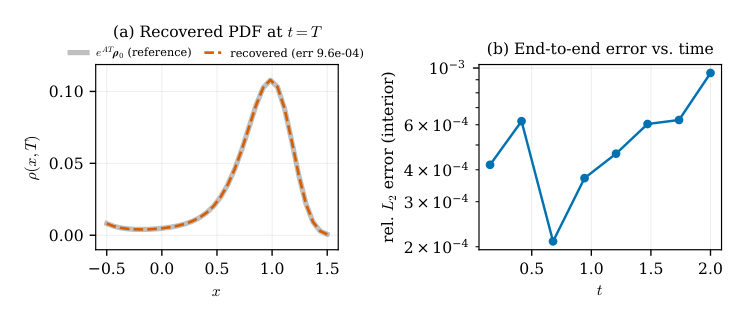 
Fig. 4. End-to-end validation ( ˙x = x −x3). (a) The recovered density matches the reference eAT ρ0. (b) The relative interior error stays below 10−3 as a function of the simulation time t.

📷 Fig 5

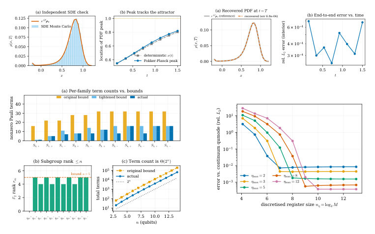 
Fig. 5. Logistic benchmark ˙x = r x(1 −x) (L = 2): Fokker–Planck linearisation (top left), end-to-end accuracy (top right), Pauli structure (bottom left), and the continuous-variable versus discretised comparison (bottom right). Compare Figures 1 to 4.

**Summary.** The paper presents a novel, provably oracle-free quantum algorithm to simulate nonlinear dynamics by linearizing the evolution in the state density using the Fokker–Planck equation. It achieves this by mapping the resulting non-unitary evolution onto a unitary Schrödinger form realized on a hybrid qubit-qumode processor. The core contribution is deriving structural theorems that guarantee an efficient, product-form decomposition of the required quantum gates.

**Why it may be interesting.** This work provides a highly structured and resource-analyzed quantum algorithm for simulating complex non-equilibrium classical physics problems (nonlinear ODEs) by transforming them into an efficient, hardware-implementable Hamiltonian simulation problem on hybrid processors.

Detailed structure

**Main problem.** Developing a provable, oracle-free quantum algorithm to simulate nonlinear ordinary differential equations (ODEs) of the form $\dot{\mathbf{x}}=\mathbf{f}(\mathbf{x})$ by propagating the state density.

**Main result.** The authors establish structural theorems showing that the discretized generator admits a bipartite Pauli decomposition into $O(\log N)$ commuting families, allowing for an exact product representation of the evolution operator with no intra-family Trotter error.

**Method.** The approach uses the Fokker–Planck route to linearize the dynamics in the state density $\rho$, followed by mapping the non-unitary evolution to a parameterized family of unitary Schrödinger equations via the warped-phase transformation. The continuous variable aspect is realized using a qumode coupled to the qubit register.

**Model / system.** The system models nonlinear ODEs ($\dot{x} = f(x)$) whose evolution is tracked by propagating the state density $\rho$ governed by a linear transport-diffusion PDE. This PDE is discretized and then mapped onto a quantum Hamiltonian structure involving qubit registers and continuous-variable qumodes.

**Key observables.** The recovered Probability Density Function ($\rho(x, T)$), the numerical abscissa $\lambda_{\max}(H_1)$, and the gate cost complexity $O(d^{L+1}n^{L+2})$ per Trotter step.

**Important parameters / regimes.** Polynomial drift degree $L$, grid size parameters ($N=2^n$ points on a $d$-dimensional grid), and the time evolution parameter $T$.

**Assumptions / limitations.** The algorithm is claimed to be oracle-free, meaning gate costs depend only on polynomial coefficients. The analysis relies on structural theorems regarding Pauli decompositions and assumes the validity of the warped-phase transformation.

**Figures summary.** Figure 5 compares different simulation checks: independent SDE verification, peak tracking, recovered PDF vs. reference, end-to-end error evolution, and a comparison of actual versus theoretically bounded Pauli structures for the logistic law benchmark.

**Paper structure.** The paper develops structural theorems regarding the Pauli decomposition of the discretized generator ($H_1$ and $H_2$), proves that these terms factorize into monomial displacements, and then applies this framework to simulate nonlinear dynamics using a hybrid qubit-qumode architecture. Comparisons are made against other simulation techniques.

Abstract

We develop a hybrid qubit--qumode algorithm for nonlinear ordinary differential equations of the form $\dot{\mathbf{x}}=\mathbf{f}(\mathbf{x})$ with drift of polynomial degree~$L$. Following the Fokker--Planck route of Tennie and Magri, the algorithm propagates the state density and returns the deterministic trajectory as the peak of that density in the small-noise limit. The discretised generator is carried into a parametrised family of Schrödinger equations by the warped-phase transformation of Jin, Liu, and Yu, and the Fourier-mode parameter of that family is placed on a single continuous-variable qumode. Our central structural result is that the Hermitian parts $H_{1}$ and $H_{2}$ of the discretised generator admit a bipartite Pauli decomposition that sorts the non-zero Pauli strings into $\mathcal{O}(\log N)$ mutually commuting families and factorises each family into a diagonal of degree at most $L$ tensored with a fixed rank-two bond operator. The factorisation renders each family exponential an exact product of $\mathcal{O}(n^{L})$ monomial-controlled momentum displacements, with no intra-family Trotter error. On a $d$-dimensional grid of $N=2^{n}$ points per axis the circuit costs $\mathcal{O}(d^{L+1}n^{L+2})$ gates per Trotter step. No sparse-access oracle and no block encoding is invoked: every gate is fixed in closed form by the polynomial coefficients of the drift. We also prove a bound on the numerical abscissa $λ_{\max}(H_{1})$ that fixes the recovery domain of the warped-phase transform and the post-selection cost. A classical simulation on two nonlinear benchmarks confirms the structural theorems, the shifted recovery, and the accuracy-per-resource advantage of the continuous-variable coupling over a discretised mode register.

[↑ back to top](#top)

### [Floquet Abelian Multicycle Codes](http://arxiv.org/abs/2607.27521v1)

**Authors:** Alexey A. Kovalev  
**Type:** theory · **Category:** quantum information and computing · **PDF:** <https://arxiv.org/pdf/2607.27521v1>  
**Analysis basis:** full PDF text, analyzed in chunks
**Topic relevance:** `measurement-induced transitions` **3/5** · `quantum measurements` **3/5** · `non-equilibrium dynamics` **2/5** · `correlated / nonlocal dissipation` **1/5** · `driven-dissipative phase transition` **1/5** · `entanglement & information structure` **1/5** · `methods for driven-dissipative` **1/5**

📷 Fig 1

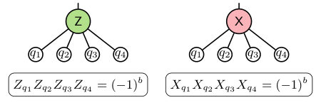 
FIG. 1. Spiders as check measurements for the case with no output states. Here b is an integer that describes the measurement parity. The number of qubits is arbitrary and depends on the particular stabilizer code. The color indicates whether the measured parity is Z-type or X- type.

📷 Fig 2

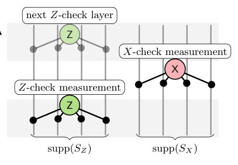 
FIG. 2. Unrotated check-measurement network. Data- qubit worldlines run vertically through alternating check- measurement layers. The unrotated network can be viewed as a syndrome-extraction circuit drawn in ZX notation.

📷 Fig 3

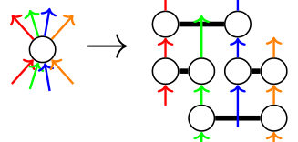 
FIG. 3. Stairway-style decomposition of many-leg spiders into pairwise measurements. The measured Pauli type is inherited from the spider color, pink (X) or green (Z).

📷 Fig 4

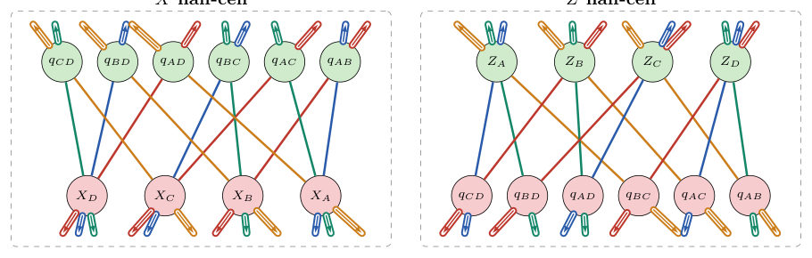 
FIG. 4. Intracell edges and external connection bundles for the AMC4 half-cells over an arbitrary finite Abelian group algebra. The thin colored lines inside each dashed box are the identity-term intracell incidences. Each thick J-colored stub represents the nonidentity support terms of aJ: a bundle containing j ∈JJ, with |JJ| = wt(aJ) −1. For each j ∈JGX(J,p), one strand connects XJ(u) to qp(u −j), whereas on the data side it connects qp(u) to XJ(u + j). For the strand bundle JGZ(J,p) the signs are reversed. Arrowheads indicate the relative displacement toward the neighboring cell, not an orientation of the Tanner edge.

📷 Fig 5

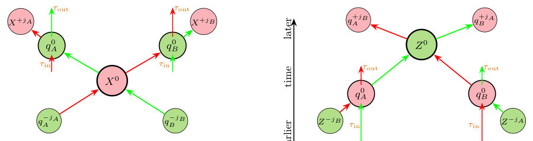 
FIG. 5. Local incidence diagram for a GB code with weight-four checks. A unit cell containing two qubits and two checks is split into two half-unit cells of X- and Z-type. Each half-unit cell has nin = 4 inputs. Within each half-unit cell, each data node is turned into a spider by adding extra τin and τout ports. Local objects are labeled with superscript (0), while external ports are labeled by relative lattice directions such as q−jA and X+jB. The colors mark the chosen port matching for the corresponding check–data ZX network. In addition, X spiders are marked by pink and Z spiders are marked by green.

**Summary.** The paper introduces Floquet Abelian Multicycle (AMC) codes, extending compact qLDPC codes to incorporate higher-dimensional homological redundancy. By mapping these structures onto a periodic measurement schedule using ZX networks, they achieve error correction through native two-qubit Pauli measurements. This results in concrete quantum memories with improved performance metrics compared to standard constructions.

**Why it may be interesting.** This work provides a highly structured, measurement-based approach to quantum error correction that moves beyond simple planar geometries (like surface codes) by encoding redundancy in the spacetime structure of the stabilizer measurements.

Detailed structure

**Main problem.** The goal is to develop compact quantum low-density parity-check (qLDPC) codes that can realize higher-dimensional homological redundancy while supporting single-shot error correction via measurement-only protocols.

**Main result.** The authors constructed Floquet Abelian Multicycle (AMC) codes, yielding specific examples like [[144, 6, 8]] with an estimated pseudothreshold of approximately 1.2% under EM3 noise.

**Method.** They derive these codes by lifting the quotient-lattice representation of a general AMC complex to spacetime and rotating the circuit time direction in an associated ZX network.

**Model / system.** The system is based on Abelian multicycle (AMC) codes, which are defined using chain complexes over finite Abelian group algebras. The resulting structure is realized as a periodic measurement schedule involving native two-qubit XX and ZZ measurements.

**Key observables.** Embedded distances ($	ext{d}_{	ext{emb}}$), logical error rates vs. physical noise rate ($p$), and the Bravyi–Poulin–Terhal (BPT) metric.

**Important parameters / regimes.** Code parameters such as $[[108, 6, 5]]$, $[[144, 6, 8]]$, and $[[324, 6, 10]]$ for AMC4 instances; the noise model is EM3.

**Assumptions / limitations.** The method assumes that when check and data spiders have even valence, the network decomposes into native two-qubit Pauli measurements. Distance calculations rely on Mixed-Integer Linear Programming (MILP).

**Figures summary.** Figures illustrate the decomposition of complex measurement structures ('spiders') into pairwise measurements using a 'Stairway' construction, and plot logical failure probability versus physical noise rate for specific codes.

**Paper structure.** The paper first establishes the theoretical framework by defining AMC codes via group algebras. It then introduces Floquetization by lifting this structure to spacetime and decomposing it into periodic two-qubit measurements. Finally, concrete examples are constructed, their distances calculated, and performance is evaluated under noise models.

Abstract

Abelian multicycle (AMC) codes are compact quantum low-density parity-check codes whose multiblock chain-complex structure provides redundant low-weight stabilizers and supports single-shot error correction. We introduce Floquet AMC codes by deriving a quotient-lattice representation of a general level-$j$, $D$-dimensional AMC complex over a finite Abelian group algebra, lifting this lattice to spacetime, and rotating the circuit-time direction in the associated ZX network. When the check and data spiders have even valence and admit a time-oriented local port matching, the network decomposes into a periodic schedule of native two-qubit $XX$ and $ZZ$ measurements. We construct generalized-bicycle and level-$2$ AMC4 examples, determine their instantaneous stabilizer groups, and compute their embedded distances by minimizing over all inequivalent circuit cuts. For AMC4 instances locally equivalent to four-dimensional toric codes, we obtain Floquet memories with parameters $[[108,6,5]]$, $[[144,6,8]]$, and $[[324,6,10]]$. Local Pauli-web detector templates and beam-search decoding under the measurement-native EM3 noise model yield an estimated pseudothreshold of approximately $1.2\%$. These results provide compact measurement-only realizations of higher-dimensional homological redundancy without directly measuring the original weight-six stabilizers.

[↑ back to top](#top)

### [Slow-light-enhanced Atomic Frequency Comb Quantum Memory in Stoichiometric EuCl$_3 \cdot$ 6D$_2$O](http://arxiv.org/abs/2607.28060v1)

**Authors:** Zongfeng Li, Wanting Xiao, Mucheng Guo, Shuping Liu, Fudong Wang, Manjin Zhong  
**Type:** both · **Category:** quantum information and computing · **PDF:** <https://arxiv.org/pdf/2607.28060v1>  
**Analysis basis:** full PDF text, analyzed in chunks
**Topic relevance:** `interference shaping light` **3/5** · `quantum optics experiment` **3/5** · `non-equilibrium dynamics` **2/5** · `Keldysh / 2PI / non-Gaussian methods` **1/5** · `QC/QI experiment` **1/5** · `driven-dissipative phase transition` **1/5** · `methods for driven-dissipative` **1/5**

📷 Fig 1

 
FIG. 1. Schematic diagram of the optical experimental setup and crystal orientation. (a) AOM: acousto-optic modulator, HWP: half wave plate, QWP: quarter wave plate, PD: photodiode. (b) The EuCl3 · 6 D2O single crystal grown in a heavy water solution. (c) The crystal is mounted in a helium filled bottle and on a copper base. (d) Crystal cleaved along the (100) plane.

📷 Fig 2

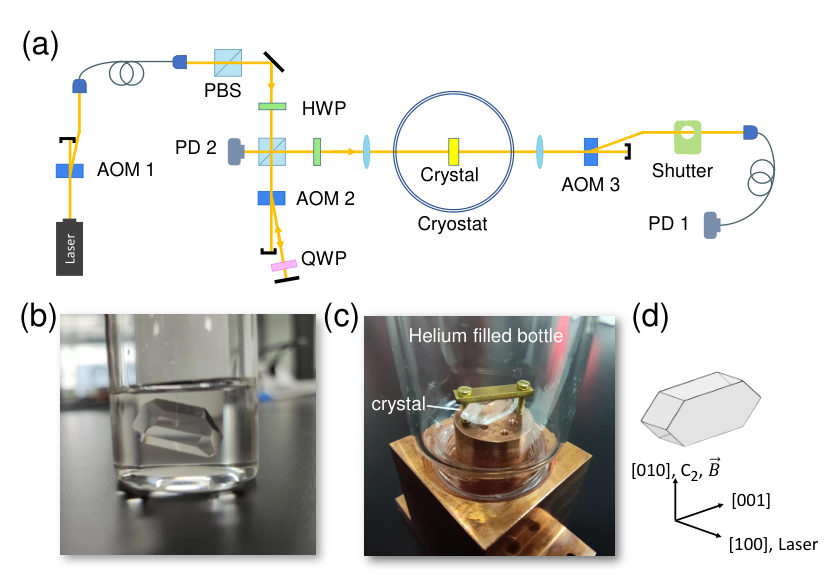 
Figure 2(a) displays a typical prepared comb-like absorption structure. Such a periodic profile allows an incoming light pulse to be stored and later retrieved as a photon echo [7]. The directly measured optical depth, defined as −ln (Iout/Iin), is limited to approximately 4.5 by the detector’s dynamic range; however, the actual OD is estimated at ∼25 (see Fig. 6). We achieved optimal storage efficiency for classical light by tuning the AFC finesse and pump pulse repetitions. These optimized parameters were subsequently applied to weak coherent pulse storage. As shown in Fig. 2(b), the time-dependent storage efficiency yields a 1/e storage lifetime of 5.3 µs. We achieved peak storage...

📷 Fig 3

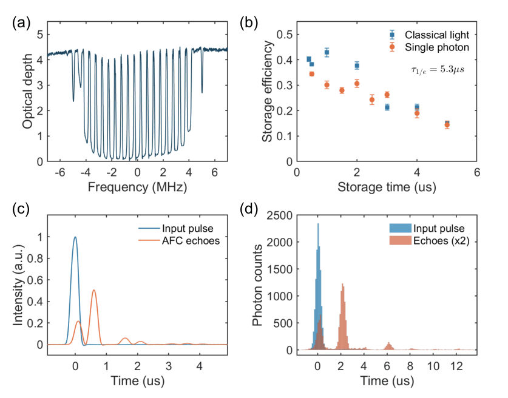 
FIG. 2. Efficient AFC storage in EuCl3 · 6 D2O. (a) An 8-MHz-wide AFC spectrum with a storage time of 2 µs is burned by two parallel 4-MHz-wide comb burning pulses centered at -2 MHz and 2 MHz, to avoid over-pumping at the center and under- pumping at edges. (b) The storage efficiency of classical light and single photons at various storage times. An exponential fit to both datasets gives a 1/e storage time of 5.3 µs. (c) Average trace (1000 runs) of a classical light storage of 0.5 µs and (d) 6000 times integration of weak coherent light storage of 2 µs.

📷 Fig 4

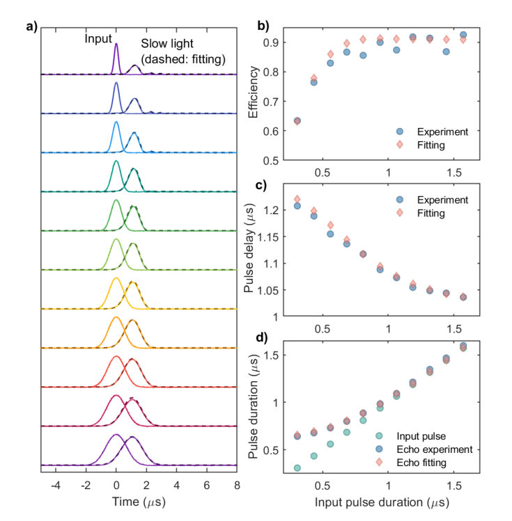 
FIG. 3. Spectral hole memory (slow-light). (a) A pulse with varying duration(bandwidth) sent into a 1-MHz-wide spectral hole. (b), (c) and (d) The comparison of experiment and fitting results of efficiency (pulse area), delay time and pulse duration, respectively.

📷 Fig 5

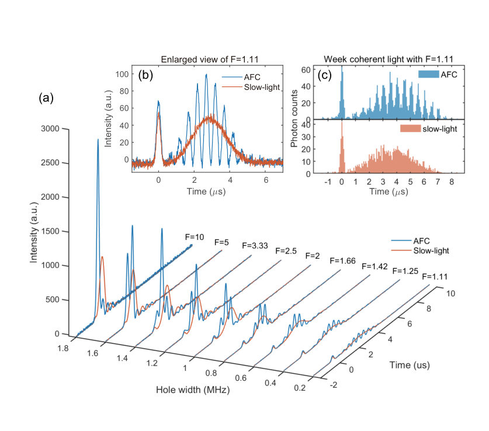 
FIG. 4. (a) AFC memory (blue, composed of 6 spectral holes and ∆= 2 MHz) versus one-hole slow-light memory (orange, identical hole width to the AFC) of an identical input field, under a varying hole width (AFC finesse F). (b) Enlarged view of the F = 1.11 curve in (a). (c) AFC and slow-light memory traces for weak coherent light, with a hole width of 0.2 MHz.

**Summary.** The authors report achieving high-efficiency quantum storage in a solid-state crystal, EuCl3·6D2O, by utilizing the Atomic Frequency Comb (AFC) mechanism. They demonstrate that this material overcomes low optical depth limitations and develop a theoretical model showing how dispersion and absorption cooperate to mediate robust slow-light echo generation. This establishes a promising pathway for practical quantum memory devices.

**Why it may be interesting.** This work is highly relevant as it tackles solid-state quantum memory using AFCs, which is a critical component for building scalable quantum repeaters and networks. The detailed modeling of dispersion/absorption interplay provides deep insight into open quantum systems dynamics.

Detailed structure

**Main problem.** The research addresses the challenge of achieving high-efficiency quantum storage for quantum networks by overcoming the limitations imposed by low optical depth in traditional free-space atomic frequency comb (AFC) schemes.

**Main result.** They demonstrated robust, high-efficiency quantum memory using a stoichiometric EuCl3·6D2O crystal, achieving slow-light storage efficiencies exceeding 90% and validating the material as a scalable solid-state platform.

**Method.** The study combines experimental measurements of AFC storage efficiency with theoretical modeling that develops a unified framework accounting for both absorption and dispersion effects in the medium.

**Model / system.** The physical system is the stoichiometric EuCl3·6D2O crystal, which acts as the quantum memory. The model involves analyzing light propagation governed by complex absorption coefficients derived from spectral hole burning (AFC) phenomena.

**Key observables.** Storage efficiencies (e.g., 42.9% for classical light, 90% for slow-light), echo delays, and finesse-dependent echo intensity modulation.

**Important parameters / regimes.** Comb period ($\Delta= 2	ext{ MHz}$), finesse ($F = 4.4$), optical depth (OD), and storage delay times up to $0.25 \mu	ext{s}$.

**Assumptions / limitations.** The analysis assumes the AFC behaves as a coherent superposition of multiple slow-light modes, and that overall dispersion span dictates the echo delay.

**Figures summary.** Figures illustrate efficient AFC storage measurements (Fig. 2), spectral hole memory results vs. pulse bandwidth (Fig. 3), finesse dependence of echoes (Fig. 4), and how echo delay scales with optical depth (Fig. 6).

**Paper structure.** The paper moves from establishing the physical platform and experimental setup to developing a unified theoretical framework that models light propagation in the frequency domain, culminating in quantitative comparisons between theory and experiment.

Abstract

Rare-earth-doped crystals are promising candidates for quantum storage, yet their performance in free-space configurations is fundamentally restricted by low optical depth. Here, we demonstrate high-efficiency quantum storage in a stoichiometric EuCl$_3 \cdot$ 6D$_2$O crystal, which intrinsically provides high optical density without the complexity of cavity implementation. We show that in this high-density regime, the system exhibits significant slow-light-like effects, including dispersion-induced echo delays and finesse-dependent echo intensity modulation. We develop a unified theoretical framework showing how absorption and dispersion work in concert to mediate echo generation. We achieve storage efficiencies of 42.9% for classical light and 34.4% for weak coherent pulses, alongside 90% efficiency for slow-light storage. These findings validate EuCl$_3 \cdot$ 6D$_2$O as a robust platform, establishing a viable pathway for scalable solid-state quantum memory.

[↑ back to top](#top)

### [Unconventional and Fragile Magnetic Exciton in a van der Waals Quantum Magnet](http://arxiv.org/abs/2607.27695v1)

**Authors:** Kai-Xuan Zhang, Min Zhang, Minjae Kim, Yong-Hyun Kim, Junghyun Kim, Heejun Yang, Pyeongjae Park, Chaebin Kim, Mangesh Diware, Junik Hwang, Youjin Lee, Byeong-Gwan Cho, Hyeong-Do Kim, Tae-Yeong Koo, Chunhua Chen, Mingtao Li, Xujie Lü, Wenge Yang, Kee-Hoon Kim, Seung-Ho Baek, Hyeonsik Cheong, Sung-Keun Lee, Beom Hyun Kim, Christopher Lane, Jian-Xin Zhu, Zhaorong Yang, Young-Woo Son, Je-Geun Park  
**Type:** both · **Category:** strongly correlated electrons · **PDF:** <https://arxiv.org/pdf/2607.27695v1>  
**Analysis basis:** full PDF text, analyzed in chunks
**Topic relevance:** `exotic spin models in light-matter` **3/5** · `spintronics-quantum-optics interface` **3/5** · `driven-dissipative phase transition` **2/5** · `Kondo & dissipative impurity` **1/5** · `analog quantum simulation` **1/5** · `correlated cavity matter` **1/5** · `non-equilibrium dynamics` **1/5**

📷 Fig 1

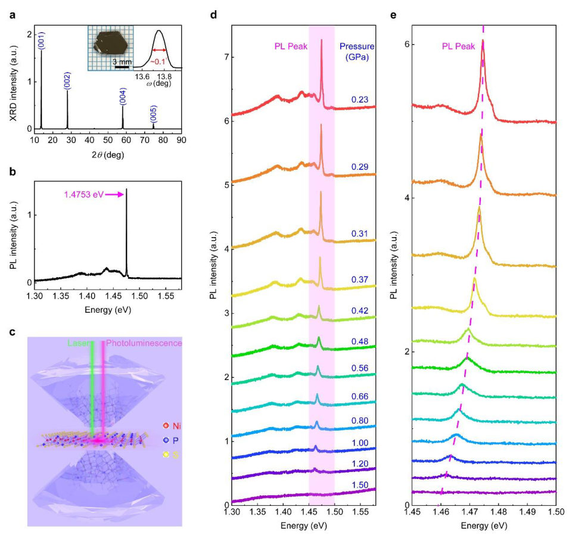 
Fig. 1 | Photoluminescence under varying pressures. a, Optical images and XRD pattern of the

📷 Fig 2

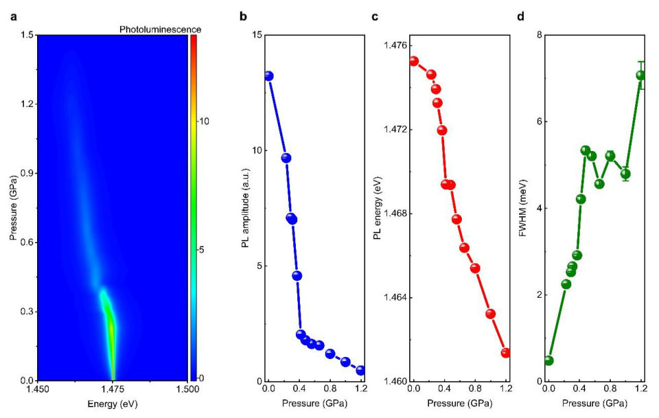 
Fig. 2 | Evolution of pure excitonic peak and its physical parameters under pressure. a,

📷 Fig 3

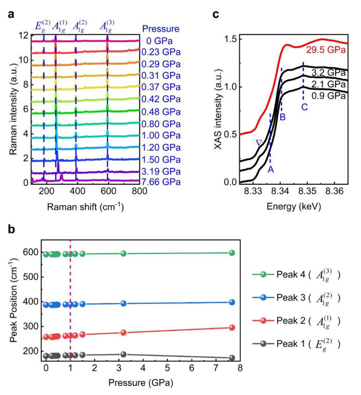 
Fig. 3 | Raman and XAS spectra under changing pressures. a, Raman spectra of NiPS3 at 7 K

📷 Fig 4

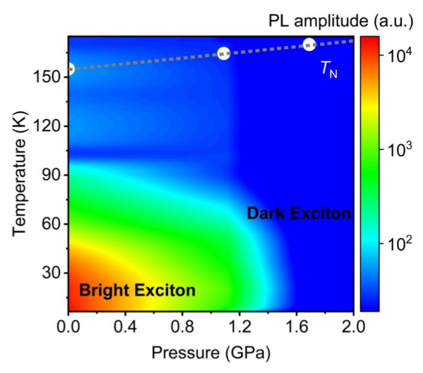 
Fig. 4 | Temperature-pressure quantum phase diagram. An experimental T-P phase diagram

📷 Fig 5

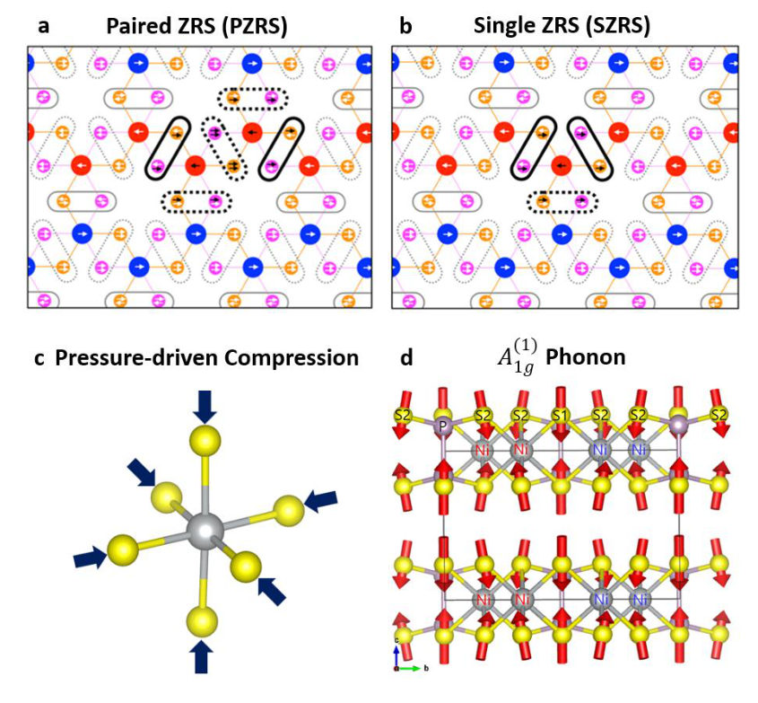 
Fig. 5 | Possible scenarios for the fragile nature of the magnetic exciton. a-b, Concept of the

**Summary.** This paper investigates the fragile nature of a magnetic exciton in NiPS3 using hydrostatic pressure as a tuning tool. By showing that the exciton's sharp photoluminescence is quenched at low pressures without structural changes, the authors argue against simple disorder or lattice effects. They propose that a higher-order correlated mechanism, involving crystal field splitting and symmetry breaking, governs this fascinating quantum optical phenomenon.

**Why it may be interesting.** The work provides a detailed case study of how external pressure can tune the coherence and visibility of an excitonic state in a strongly correlated magnetic material, linking optical properties to underlying quantum mechanical symmetries and correlations.

Detailed structure

**Main problem.** The study aims to resolve the origin of the sharp, optically bright magnetic exciton in NiPS3, particularly understanding why this transition remains bright despite being nominally spin-forbidden.

**Main result.** The optical brightness is shown to be independent of chemical disorder or lattice expansion, suggesting a higher-order correlated mechanism governs the exciton's stability. The exciton undergoes complete quenching at low pressures (1.5 GPa) without structural reconstruction.

**Method.** The research combines high-pressure experimental measurements (PL, Raman, XAS, NMR) with first-principles many-body calculations to probe the system's response to external tuning parameters.

**Model / system.** The physical system is the van der Waals antiferromagnet NiPS3. The model involves excitons arising from transitions between Zhang-Rice triplet (ZRT) and singlet (ZRS) states, analyzed using concepts like paired ZRS (PZRS) states.

**Key observables.** Photoluminescence peak intensity/energy, Neel temperature ($T_N$), Raman phonon modes, XAS pre-edge features, and the pressure dependence of these quantities.

**Important parameters / regimes.** Hydrostatic pressure (up to 1.5 GPa), Temperature, Exciton energy ($\sim 1.47 	ext{ eV}$), Crystal field splitting ($\Delta_{10Dq}$).

**Assumptions / limitations.** The initial assumption is that the exciton's behavior can be mapped onto structural or magnetic changes; this is challenged by showing PL suppression occurs without such reconstruction.

**Figures summary.** Figures illustrate PL peak suppression and redshift under pressure, comparison of Raman/XAS spectra across pressures, and conceptual diagrams detailing mechanisms like PZRS states, crystal field splitting enhancement, and symmetry breaking via $A_{1g}^{(1)}$ phonons.

**Paper structure.** The paper establishes the mystery (bright exciton in NiPS3), uses hydrostatic pressure as a clean tuning parameter to test hypotheses (disorder vs. intrinsic instability), presents evidence ruling out structural/electronic changes (Raman, XAS, NMR), and concludes by proposing higher-order correlated mechanisms involving symmetry breaking.

Abstract

The recently discovered magnetic exciton in the van der Waals (vdW) antiferromagnet NiPS3 exemplifies these phenomena, exhibiting several distinctive characteristics. Despite extensive investigation, much of its physics remains unresolved, with key questions about why the NiPS3 magnetic exciton is so sharp and optically bright despite the nominally spin-forbidden transition, posing significant challenges to a proper understanding and practical manipulation of the exciton. An urgent question is to what extent it is due to chemical disorder, magnetic weakening, lattice modification, or intrinsic instability of the bright exciton itself: answers to which will put stringent constraints on possible theoretical models. Here we address these questions using hydrostatic pressure as a clean, continuous, reversible, and in-situ tuning parameter. We find that the sharp photoluminescence peak is drastically suppressed by as little as 0.4 GPa and completely quenched by 1.5 GPa, with demonstrating its reversibility. Crucially, this bright-to-dark conversion occurs without magnetic, crystallographic, or electronic reconstruction despite an increase in the Neel temperature, as established by Raman, X-ray absorption, nuclear magnetic resonance spectroscopy, and first-principles many-body calculations. Our results demonstrate that the optical brightness of the magnetic exciton is independent of chemical disorder, lattice expansion, and weakening of magnetic order, indicating that a higher-order correlated mechanism governs the bright exciton. We further propose experimentally constrained microscopic scenarios involving exciton pairing, crystal-field-controlled spin-orbit mixing, and symmetry breaking, providing a framework for future tests of entangled magnetic exciton in correlated quantum magnets.

[↑ back to top](#top)

### [Lattice composite Fermi liquid with broken inversion symmetry](http://arxiv.org/abs/2607.28613v1)

**Authors:** Pavel A. Nosov, Zhengyan Darius Shi  
**Type:** theory · **Category:** strongly correlated electrons · **PDF:** <https://arxiv.org/pdf/2607.28613v1>  
**Analysis basis:** full PDF text, analyzed in chunks
**Topic relevance:** `Keldysh / 2PI / non-Gaussian methods` **3/5** · `analog quantum simulation` **2/5** · `non-equilibrium dynamics` **2/5** · `correlated / nonlocal dissipation` **1/5** · `driven-dissipative phase transition` **1/5** · `methods for driven-dissipative` **1/5** · `non-equilibrium universality` **1/5**

📷 Fig 1

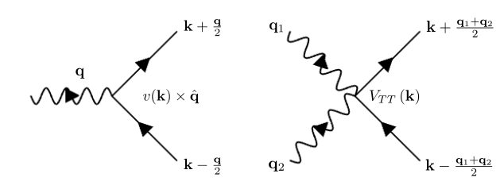 
FIG. 1. Paramagnetic (left) and diamagnetic (right) vertices for the lattice CFL with arbitrary CF dispersion ξ(k). ˆqT defines the direction transverse to q, vF (k) ≡∇kξ(k) is the Fermi velocity, and VT T is the projection of the diamagnetic form factor Vij ≡∂ki∂kjξ(k) onto the transverse subspace.

📷 Fig 2

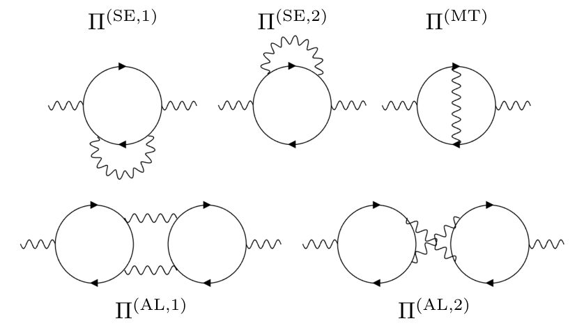 
FIG. 2. The set of paramagnetic diagrams contributing to σij CF at O(N −1). All vertex factors are taken to be f(k, ˆq) = vF (k)× ˆq in accordance with Fig. 1. Diagrams that involve diamagnetic vertices are subleading in the low energy limit, as we show in Appendix B.

📷 Fig 3

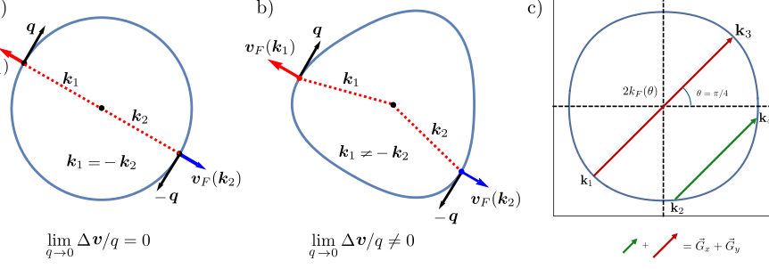 
FIG. 3. On-shell scattering kinematics controlling optical and DC transport. (a) For a convex inversion-symmetric Fermi surface, the on-shell scattering with small momentum transfer q selects two antipodal tangential patches, k1 = −k2, and the leading total velocity change vanishes, limq→0 ∆v/q = 0. (b) For a generic convex C3-symmetric Fermi surface without inversion symmetry, the tangential on-shell patches are no longer antipodal and the cancellation fails, limq→0 ∆v/q ̸= 0, allowing the collisions to relax the current. c) A typical four-fermion Umklapp process in the lattice CFL that contributes to the DC resistivity. Singular temperature dependence can arise when the 2kF vertex...

📷 Fig 4

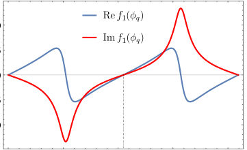 
FIG. 4. Angular dependence of f1(ϕq) (left panel) and ˜f2(ϕq) = p

📷 Fig 5

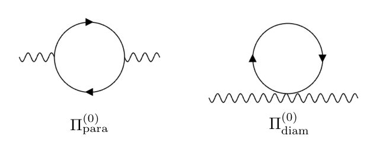 
FIG. 5. At leading order in the 1/N expansion, there are two diagrams that contribute to the gauge field self energy. The first Π(0) para involves two insertions of the paramagnetic current vertex, while the second Π(0) diam involves a single insertion of the diamagnetic current vertex.

**Summary.** This theoretical work investigates transport phenomena in lattice composite Fermi liquids where inversion symmetry is broken. The authors derive unique, non-analytic scaling laws for optical resistivity and Hall conductivity that are forbidden in simpler continuum models. These predictions offer testable signatures for experimental measurements on advanced 2D materials.

**Why it may be interesting.** It provides concrete, measurable signatures (non-analytic power laws in $\omega$ or $q$) that distinguish lattice models from continuum theories, offering direct guidance for interpreting THz/acoustic measurements in novel 2D materials like twisted MoTe2.

Detailed structure

**Main problem.** To determine the distinct transport signatures of lattice composite Fermi liquids (CFLs) when inversion symmetry is broken, comparing them to continuum quantum Hall systems.

**Main result.** Inversion breaking leads to non-analytic longitudinal optical resistivity ($\sim |\omega|^{4/3}$ at $q=0$) and nonreciprocal transport ($\sim |q|$ dependence in $\sigma_{LT}$) that are absent in symmetric CFLs.

**Method.** Analytical calculations using effective field theory, parton decomposition, and scaling analysis of quantum corrections to conductivity tensors.

**Model / system.** Lattice composite Fermi liquids realized in half-filled Chern bands with broken inversion symmetry. The system is modeled via an effective action involving composite fermions (CFs) interacting with gauge fields.

**Key observables.** Longitudinal optical resistivity ($	ext{Re } 
ho_{xx}(\omega)$), Hall conductivity ($\sigma_{LT}$), and DC resistivity temperature dependence ($	ext{Re } 
ho_{xx}(T)$).

**Important parameters / regimes.** Zero wave vector ($q=0$), finite wave vector ($q$), frequency ($\omega$), and temperature ($T$). The symmetry breaking parameter $\lambda$ is crucial.

**Assumptions / limitations.** The analysis relies on the kinematic regime for surface acoustic wave probes and uses approximations like Random Phase Approximation (RPA) in some derivations.

**Figures summary.** Not specified, but notes reference specific equations (e.g., B25-B28) detailing scaling of correlation functions involving diamagnetic and paramagnetic vertices.

**Paper structure.** The paper systematically analyzes transport properties by first establishing the effective theory for CFLs, then calculating response functions ($\Pi$) using diagrammatic techniques, focusing on how symmetry breaking modifies the low-energy scaling exponents for resistivity and conductivity components.

Abstract

We study transport in lattice composite Fermi liquids realized in half-filled Chern bands with broken inversion symmetry. We show that reduced crystalline symmetry exposes intrinsic singular dynamical responses of composite fermions that are otherwise hidden in the conventional Landau-level setting. At zero wave vector, inversion breaking allows gauge-field fluctuations to generate a non-analytic longitudinal optical resistivity, with $\operatorname{Re}ρ^{xx}(ω)\sim |ω|^{4/3}$ for gate-screened Coulomb interactions. At finite wave vector $\mathbf{q}$, inversion breaking leads to nonreciprocal transport and a non-analytic $\sim |\mathbf{q}|$ dependence of the Hall conductivity, both of which can be probed through surface acoustic wave propagation. We also discuss a distinct mechanism for singular DC transport in lattice composite Fermi liquids: renormalization of $2k_F$ scattering at the composite Fermi surface enhances Umklapp relaxation and can lead to a non-analytic temperature dependence of the resistivity. Taken together, our results identify transport signatures of lattice composite Fermi liquids that are absent in their continuum quantum Hall counterparts and can be directly tested in ongoing experiments on twisted MoTe$_2$ and rhombohedral graphene, where evidence for zero-field composite Fermi liquids has recently been reported.

[↑ back to top](#top)

### [Generating broadband optical squeezing via Cascaded Micro-Ring Resonators](http://arxiv.org/abs/2607.28493v1)

**Authors:** Chung-Hsien Wang, Tian Zhong  
**Type:** theory · **Category:** other · **PDF:** <https://arxiv.org/pdf/2607.28493v1>  
**Analysis basis:** full PDF text, analyzed in chunks
**Topic relevance:** `interference shaping light` **3/5** · `Keldysh / 2PI / non-Gaussian methods` **1/5** · `analog quantum simulation` **1/5** · `correlated / nonlocal dissipation` **1/5** · `correlated cavity matter` **1/5** · `driven-dissipative phase transition` **1/5** · `methods for driven-dissipative` **1/5** · `quantum optics experiment` **1/5**

📷 Fig 1

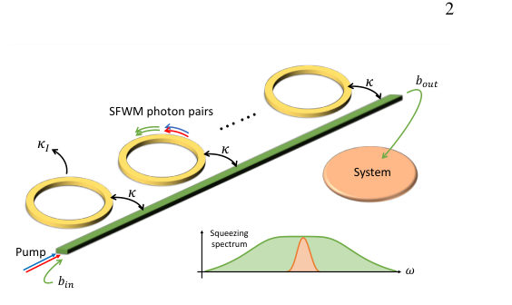 
FIG. 1. Schematic plot of the cascaded ring-resonator architecture. N microrings is coupled to a common waveguide at a uniform rate κ, and to the environment at a rate κI. Spontaneous four-wave mixing creates degenerate photon pairs within each ring, denoted as para- metric interaction iξk

📷 Fig 2

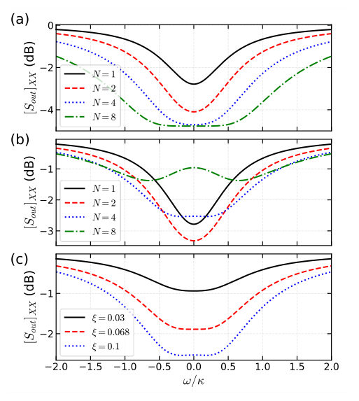 
FIG. 2. Output X-quadrature squeezing spectra for a cascade of res- onant microrings (δk = 0) with uniform intrinsic loss κI = 0.1κ. (a) Uniform pump strength (ξk = ξ = 0.1κ) evaluated across vari- ous cascade lengths N. As N increases, the cumulative parametric interaction forms a flat, asymptotic squeezing plateau. (b) Spectra under realistic geometric pump attenuation (ξk = rk−1ξ) for various N, utilizing the same initial pump strength ξ = 0.1κ. The spatially varying pump profile degrades the plateau into a sharp central dip at ω = 0. (c) Optimization of the depleted-pump cascade for a fixed length of N = 4 under various initial pump strengths ξ. By tuning the pump near the...

📷 Fig 3

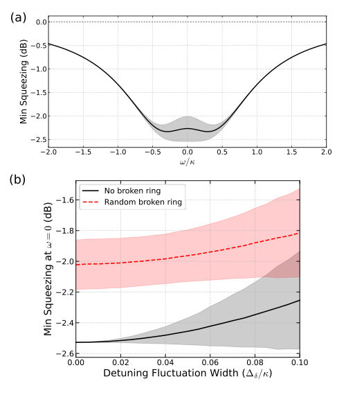 
FIG. 3. Cascaded source against fabrication disorder and broken ring. (a) Average and standard deviation of the principal squeezed spectrum for N = 4, ξ = κI = 0.1κ, evaluated over an ensem- ble of Gaussian random frequency shifts with a standard deviation of ∆δ = 0.1κ. Although the disorder impacts the squeezing depth near resonance, the overall flatness of the broadband plateau is preserved. (b) Resonant squeezing magnitude (average and standard deviation) as a function of the frequency fluctuation width ∆δ. All other param- eters are the same. We also compare the performance under severe defect scenario in which a randomly selected ring is broken. Even under the combined degradation of a...

📷 Fig 4

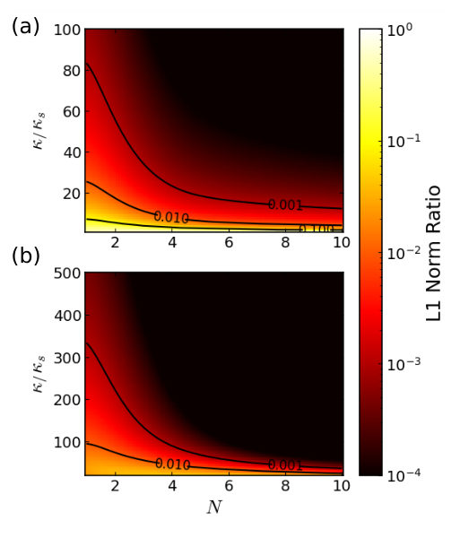 
FIG. 4. Color map of the ratio RN as a function of the cascade length N and the source-to-target linewidth ratio κ/κs. The reservoir per- formance is evaluated for a target (a) near resonance δ = κs and at (b) far detuning δ = 20κs. The ratio of intrinsic loss and pump strength are fixed at κI/κ = 0.2 and ξ/κ = 0.1, respectively. The spectrum is analytically continued to continuous N to smoothly visu- alize the parameter scaling. The significant reduction in the required linewidth ratio κ/κs at larger N illustrates how the flat-topped cas- caded cavities relaxes the extreme bandwidth constraints needed to reach an ideal Markovian response.

**Summary.** The paper proposes using an array of coupled micro-ring resonators to generate broadband squeezed vacuum states. By analyzing the system's spectral response, the authors demonstrate that this cascaded architecture overcomes the bandwidth/depth trade-off inherent in single cavities. This provides a practical and robust method for engineering high-quality quantum light sources on integrated photonic platforms.

**Why it may be interesting.** This work provides a concrete, scalable engineering blueprint for quantum light sources. The ability to relax stringent low-$Q$ constraints by distributing the squeezing process across multiple, moderately pumped elements is highly relevant for integrated quantum photonics and cavity QED applications.

Detailed structure

**Main problem.** The primary challenge is generating broadband optical squeezing that functions as a Markovian reservoir, overcoming the inherent trade-off between squeezing depth and spectral bandwidth in single-cavity sources.

**Main result.** A cascaded micro-ring resonator architecture can generate a flat-topped, broadband squeezed spectrum that rapidly approaches the ideal Markovian limit, significantly outperforming single-cavity designs.

**Method.** The analysis uses coupled Langevin equations and transfer matrices in the frequency domain to calculate the output squeezing spectrum ($	ext{Sout}(\omega)$) by modeling the system as a chain of $N$ parametrically pumped resonators.

**Model / system.** The physical platform is a cascade of $N$ micro-ring resonators coupled to a bus waveguide. The dynamics are governed by analyzing the output field's two-time correlation function, which determines the squeezing spectrum.

**Key observables.** Squeezing spectrum ($	ext{Sout}(\omega)$), Markovianity ratio ($R_N$), and the required source bandwidth for achieving a target level of squeezing.

**Important parameters / regimes.** Number of rings ($N$), intrinsic loss ratio ($\kappa_I/\kappa$), pump strength ($\xi_k$), and detuning ($\delta_k$).

**Assumptions / limitations.** The analysis often focuses on the XX component of the output spectral matrix, which is sufficient for characterizing linear dipole interactions with downstream systems. The final comparison uses a Markovianity ratio ($R_N$) to quantify deviation from ideal behavior.

**Figures summary.** Figures illustrate the schematic architecture (Fig 1), show X-quadrature squeezing spectra comparing uniform vs. optimized pumping (Fig 2), and quantitatively compare the non-Markovianity ratio ($R_N$) versus cascade length $N$ for different target detunings (Fig 4).

**Paper structure.** The paper progresses from defining the problem (squeezing limitations) to developing a theoretical model using coupled resonators, deriving spectral expressions, demonstrating robustness against imperfections, and finally quantifying the advantage of the cascade structure by comparing Markovianity convergence rates.

Abstract

Broadband squeezed light functioning as a Markovian reservoir can exponentially enhance light-matter interactions, benefiting quantum technologies. However, conventional single-cavity sources face a trade-off between squeezing depth and spectral bandwidth. We propose a scalable scheme for generating broadband squeezed vacuum using a cascade of parametric microring resonators coupled to a common bus waveguide. By analyzing the output, we identify the specific conditions that yield a broad, flat-topped squeezing spectrum, even under realistic intracavity pump attenuation. We demonstrate that this architecture is robust against fabrication imperfections, including inhomogeneous resonator frequencies and component failures. We show that the flat-topped spectrum converges to the Markovian limit significantly faster than a single-cavity Lorentzian profile. An array of as few as $N=5$ coupled resonators with an intrinsic loss ratio of $κ_I/κ= 0.1$ reduces the required bandwidth to a quarter of that needed by a single cavity to achieve same squeezing. This rapid convergence relaxes the low-$Q$ and high-gain constraints of single broadband cavities, distributing the squeezing process across moderately pumped resonators to provide a practical route for engineering squeezed reservoirs on mature integrated photonic platforms.

[↑ back to top](#top)

### [Anomalous Microwave Response in YBCO Resonators beyond the Two-Level-System Model](http://arxiv.org/abs/2607.27392v1)

**Authors:** Kaiwen Zheng, Nathan J. Johnson, Nathan T. Thobaben, Sidharth Duthaluru, Haochen Shen, Denae T. Cherry, David S. Wisbey, Kater W. Murch  
**Type:** experiment · **Category:** strongly correlated electrons · **PDF:** <https://arxiv.org/pdf/2607.27392v1>  
**Analysis basis:** full PDF text, analyzed in chunks
**Topic relevance:** `correlated / nonlocal dissipation` **3/5** · `Kondo & dissipative impurity` **2/5** · `Keldysh / 2PI / non-Gaussian methods` **1/5** · `driven-dissipative phase transition` **1/5** · `methods for driven-dissipative` **1/5** · `spintronics-quantum-optics interface` **1/5**

📷 Fig 1

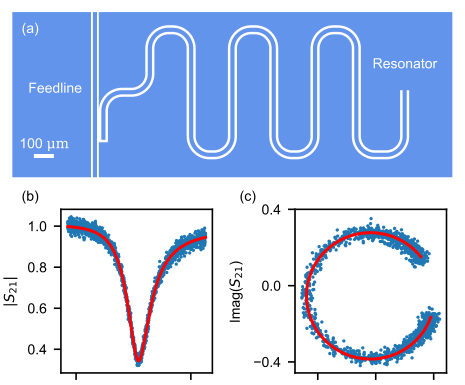 
FIG. 1. Microwave response of a single resonator. (a) Layout of a single CPW resonator. The microwave signal travels through the feedline capacitively coupled to individ- ual CPW resonators. (b) Typical |S21| vs. frequency of a resonator, measured at −130 dBm drive power. The red line shows the best fit to the data. (c) The real vs. the imaginary part of the same S21 data. The red line shows the best circle fit to the raw data.

📷 Fig 2

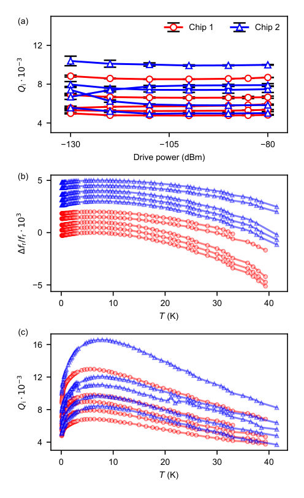 
FIG. 2. Characterization of all the resonators. (a) Power dependence of Qi of all resonators of chip 1 (S-type film) and chip 2 (M-type film). Data points of the same res- onator are connected with solid lines. (b) Temperature de- pendence of ∆fr/fr of all resonators measured at -80 dBm. The error bars are smaller than the size of the markers. A temperature-independent offset is added to each resonator for clarity. (c) Temperature dependence of Qi of all resonators measured at -80 dBm.

📷 Fig 3

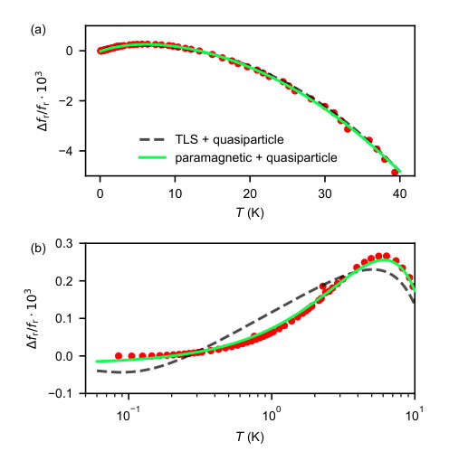 
FIG. 3. Analysis of the temperature dependence of resonator frequency shift. (a) Temperature dependence of ∆fr/fr of a representative resonator fitted to the TLS + quasiparticle model (Eqs. 2, 3, 4, 5) and paramagnetic re- sponse + quasiparticle model (Eqs. 3, 5, 6). (b) Zoom in plot in the low temperature region revealing the different behavior of the two models.

📷 Fig 4

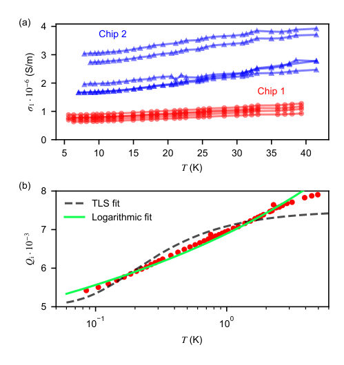 
FIG. 4. Analysis of the temperature dependence of the intrinsic quality factor. (a) Effective σ1 of all resonators in the high temperature regime. (b) Temperature dependence of Qi of a representative resonator at low temperature fitted to Eq. 10 and 11.

**Summary.** The authors measured the microwave response of YBCO resonators at very low temperatures to study superconducting dissipation. They found that while some behavior resembles Two-Level Systems, the data requires an additional paramagnetic contribution for frequency shifts and exhibits a residual loss following a logarithmic temperature dependence. This suggests that the underlying physics is more complex than standard TLS models predict.

**Why it may be interesting.** This work directly probes superconducting gap physics and dissipation mechanisms in high-temperature superconductors, which are central topics in strongly correlated electron systems. The failure of standard models highlights the complexity of low-energy excitations near quantum critical points or disorder-induced states.

Detailed structure

**Main problem.** The study aims to characterize the anomalous microwave response of YBCO resonators at low temperatures, specifically demonstrating that conventional Two-Level-System (TLS) models fail to explain the observed frequency shift and loss.

**Main result.** The low-temperature frequency upturn is better described by an additional paramagnetic contribution from local moments or Andreev bound states, while the residual loss follows a logarithmic temperature dependence with an unknown microscopic origin.

**Method.** Microwave characterization of coplanar-waveguide (CPW) resonators fabricated from YBCO thin films, measuring intrinsic quality factor ($Q_i$) and resonance frequency shift ($\Delta f_r/f_r$) across temperatures from 70 mK to 40 K.

**Model / system.** The physical system is a superconducting film (YBCO) patterned into CPW resonators. The analysis compares experimental data against theoretical models, including the Two-Level-System (TLS) model and paramagnetic response models derived from local moments or Andreev bound states.

**Key observables.** Intrinsic quality factor ($Q_i$), fractional resonance frequency shift ($\Delta f_r/f_r$), microwave power dependence of $Q_i$, and temperature dependence of loss.

**Important parameters / regimes.** Temperature range (70 mK to 40 K), characteristic energy scales related to the resonator frequency, and fit parameters describing paramagnetic or TLS contributions.

**Assumptions / limitations.** The analysis assumes that the observed low-temperature behavior can be modeled by combining quasiparticle loss with either a TLS contribution or a paramagnetic contribution; however, it notes limitations in these assumptions.

**Figures summary.** Figures illustrate resonator layouts and $|S_{21}|$ measurements. Key plots show temperature dependence of $Q_i$ and $\Delta f_r/f_r$, comparing fits from the standard TLS model against those incorporating paramagnetic or logarithmic dependencies.

**Paper structure.** The paper proceeds by presenting microwave measurements across a wide temperature range, analyzing the data to rule out simple models (like pure TLS), proposing alternative physical mechanisms (paramagnetic response) for frequency shifts, and finally identifying an unresolved logarithmic loss channel.

Abstract

We report the microwave response of coplanar-waveguide (CPW) resonators fabricated from $\mathrm{YBa_2Cu_3O_{7-δ}}$ (YBCO) thin films over temperatures from approximately $70~\mathrm{mK}$ to $40~\mathrm{K}$. The resonators exhibit internal quality factors $Q_\mathrm{i}$ in the range of $4\times10^3$ to $10^4$ at 70 mK, which increase to a maximum of approximately $8\times10^3$ to $1.2\times10^4$ near $6~\mathrm{K}$. At low temperatures, both $Q_\mathrm{i}$ and the fractional shift of the resonance frequency $Δf_\mathrm{r}/f_\mathrm{r}$ increases with temperature, qualitatively resembling behavior commonly associated with two-level-system (TLS) defects. However, neither response saturates on the temperature scale set by the resonator frequency, and the loss exhibits no observable microwave-power dependence. We show that low-temperature frequency upturn may be better described by an additional paramagnetic response associated with defect-induced local moments or Andreev bound states, while the low-temperature loss follows an approximately logarithmic temperature dependence whose microscopic origin remains unresolved. These measurements establish the millikelvin performance of patterned YBCO resonators and show that their low-temperature response cannot be understood within the conventional TLS framework alone.

[↑ back to top](#top)

### [Counterdiabatic Driving under Variational Frame Dressing](http://arxiv.org/abs/2607.28383v1)

**Authors:** Boxi Li, Franco Nori, Felix Motzoi  
**Type:** theory · **Category:** quantum information and computing · **PDF:** <https://arxiv.org/pdf/2607.28383v1>  
**Analysis basis:** full PDF text, analyzed in chunks
**Topic relevance:** `methods for driven-dissipative` **3/5** · `non-equilibrium dynamics` **2/5** · `Keldysh / 2PI / non-Gaussian methods` **1/5** · `analog quantum simulation` **1/5** · `correlated / nonlocal dissipation` **1/5** · `driven-dissipative phase transition` **1/5**

📷 Fig 1

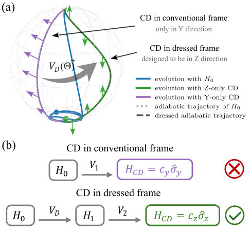 
FIG. 1. Overview of the dressed CD protocol. (a) For a Landau-Zener problem, conventional CD requires an addi- tional Y -only correction, whereas dressed CD realizes it with an accessible Z-only control. The curves show the evolution trajectories, and the arrows indicate the control direction. The variational dressed-frame transformation VD(⃗Θ) reshapes the effective Hamiltonian and the adiabatic eigenstate trajec- tory. (b) Conventional CD works directly with H0. Dressed CD instead introduces a dressed Hamiltonian H1, from which an implementable correction is constructed.

📷 Fig 2

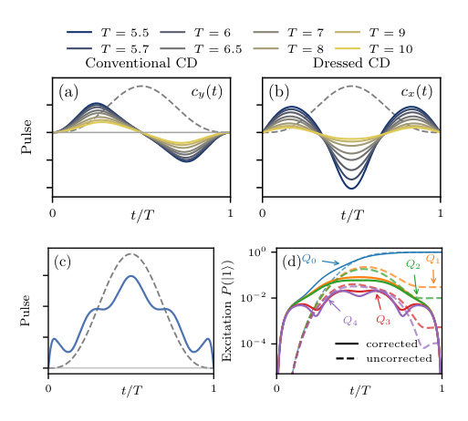 
FIG. 2. (a,b) Single-qubit dressed CD for a single spec- tator: (a) conventional Y -only CD coefficient cy(t) and (b) dressed X-only correction cx(t) at different pulse durations T (given in the unit of 1/∆1), with the gray dashed curve showing the bare drive Ω(t) at T = 7. (c,d) Multi-spectator generalization at T = 10: (c) numerically constructed ex- act solution and (d) population dynamics for four spectators (∆j = {1.0, −1.1, 1.9, −2.05}) and one target qubit (∆0 = 0), where dashed lines show the bare dynamics and solid lines the dressed-CD corrected evolution. The target qubit undergoes a π pulse while all spectators remain in |0⟩after correction.

📷 Fig 3

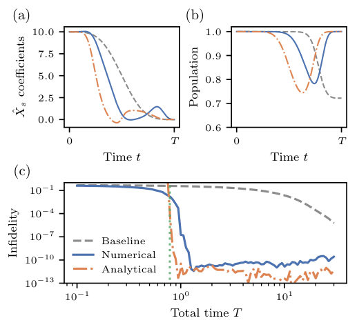 
FIG. 3. Accelerated Bell-state preparation using an X- only dressed CD. In all panels, the gray dashed, blue solid, and orange dash-dotted curves denote the baseline drive and the variational dressed-CD protocols solved numerically and analytically, respectively. (a) Implemented X pulse at T = 2. (b) Instantaneous ground-state population. (c) Final error versus total time T. The dotted vertical line marks the ideal entangling limit π/(4|J|).

📷 Fig 4

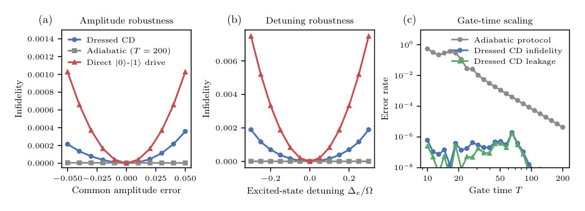 
FIG. 4. Tripod holonomic gate under the native-control constraint. (a) Common rescaling of all tripod legs at fixed T = 25. (b) Excited-state detuning at the same T. In both cases the dressed-frame protocol follows the robustness trend of the adiabatic holonomic loop and remains well below the external direct |0⟩-|1⟩benchmark. (c) Gate-time scaling of the bare and dressed protocols. The bare loop reaches high fidelity only in the deeply adiabatic regime, whereas the dressed-frame correction keeps both the total error and the leakage close to the numerical accuracy.

**Summary.** The paper introduces a Variational Frame Dressing approach to Counterdiabatic Driving, overcoming limitations where required controls are physically unavailable. By reformulating the problem in an augmented 'dressed frame,' it derives implementable control fields for accelerating quantum gates and protocols. This offers a systematic, nonperturbative framework superior to conventional adiabatic methods.

**Why it may be interesting.** This work provides a powerful generalization of quantum control theory for open systems, offering concrete techniques to design fast gates that respect hardware constraints by leveraging auxiliary degrees of freedom in the dressed frame.

Detailed structure

**Main problem.** The challenge is accelerating adiabatic quantum protocols while ensuring that the required control fields are physically implementable using only native laboratory controls.

**Main result.** A variational dressed-frame formalism provides a systematic, nonperturbative method to construct implementable counterdiabatic driving protocols inaccessible via conventional methods.

**Method.** The authors derive and solve a dressed-frame commutator equation by introducing an unconstrained auxiliary generator ($A_D$) and minimizing the residual of this equation variationally over finite operator bases.

**Model / system.** The method is tested on three systems: multi-qubit chains for spectator error suppression, two-qubit Bell state preparation using an Ising dimer Hamiltonian, and a four-level tripod manifold for holonomic gates.

**Key observables.** Fidelity (Total, Subspace), Commutator Residual ($\lVert [	ext{G2}, H_1] 
Vert^2$), Population Dynamics.

**Important parameters / regimes.** Gate time ($T$), detuning parameters ($\Delta e$, $\epsilon$), and the structure of native couplings.

**Assumptions / limitations.** The method assumes that necessary control fields and virtual generators can be accurately represented by finite operator bases (e.g., Fourier or sine series).

**Figures summary.** Figures compare conventional CD vs. dressed CD protocols, showing enhanced fidelity in Bell-state preparation and robust gate operation in the tripod manifold compared to bare drives.

**Paper structure.** The paper establishes the general variational formalism via the dressed frame commutator equation, then applies this framework sequentially to three distinct physical models (multi-qubit chain, Bell state, tripod) to demonstrate its utility.

Abstract

Counterdiabatic (CD) driving accelerates adiabatic protocols by prescribing auxiliary control fields, but often fails to map them to physically available operations. We derive a general formalism for such a mapping. We formulate CD driving in a variational dressed frame, where an unconstrained auxiliary generator reshapes the effective adiabatic problem while simultaneously forcing the applied correction to stay restricted to the native laboratory controls. This yields a laboratory-frame commutator equation that can be solved without constructing instantaneous eigenstates or the adiabatic and dressed-frame unitaries. The additional dressed-frame freedom reveals solutions that are inaccessible in the conventional adiabatic frame. We illustrate this mechanism in three settings: suppression of spectator errors in a multi-qubit chain driven by a single quadrature, an analytical acceleration of adiabatic Bell-state preparation with a fixed entangling interaction, and implementation of a fast adiabatic holonomic gate in a degenerate tripod manifold with correction pulses confined to the native couplings. Our results provide a systematic nonperturbative framework for constructing implementable counterdiabatic protocols beyond the conventional adiabatic frame.

[↑ back to top](#top)

### [Quantum Arago-Fresnel interference of displaced spin states of photons](http://arxiv.org/abs/2607.28231v1)

**Authors:** Yan Zhang, Xiang Liu, Hou Ian  
**Type:** theory · **Category:** other · **PDF:** <https://arxiv.org/pdf/2607.28231v1>  
**Analysis basis:** full PDF text, analyzed in chunks
**Topic relevance:** `exotic spin models in light-matter` **3/5** · `interference shaping light` **3/5** · `analog quantum simulation` **1/5** · `quantum measurements` **1/5** · `spintronics-quantum-optics interface` **1/5**

📷 Fig 1

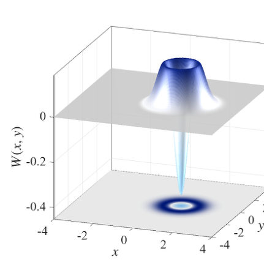 
Fig. 1: Surface plot of the Wigner distribution W(x, y) against the quadratures x and y for a displaced spin state of displacement α = 1.0 and Bloch angles θ = π/2, ϕ = 0. The contour projected on xy-plane is also plotted. The distribution remains identical for displacing either from the left |⟲⟩or the right |⟳⟩photon spin.

📷 Fig 2

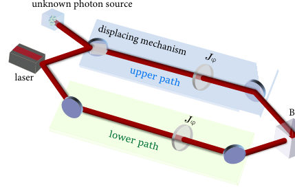 
Fig. 2: Model setup of a quantum Arago-Fresnel interferometer. An incident photon with un- known

📷 Fig 3

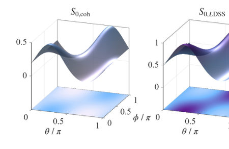 
Fig. 3: (a) Surface plot overlaid with underneath contour of the Stokes parameter S0 for Arago- Fresnel (AF) self-interference of a coherent-state beam (acting as both the signal and the reference beams) of polarizing angles θ and ϕ . The plot aligns with our expectations with polarized beam behaviors in classical AF laws and serves as a reference baseline. (b) The same plot where the signal beam is in a left displaced spin state (DSS). (c) The same plot where the signal beam is in a right DSS. In all plots, the polarizer orientation is set to φ = 0 and the displacement of the coherent state is set to α = 1/2.

📷 Fig 4

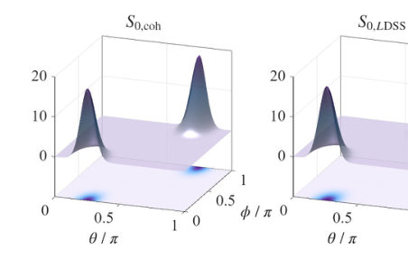 
Fig. 4: Surface plots overlaid with underneath contours of the Stokes parameters (a) S0,coh, (b) S0,LDSS, and (c) S0,RDSS, i.e. the same plots as in Fig. 3, but with displacement α = 3 to indicate a stronger powered reference beam.

**Summary.** The paper analyzes Arago-Fresnel interference using displaced single-photon spin states (DSS) and coherent light. By calculating the Stokes parameter, the authors show that the resulting interference fringes carry unique angular dependencies related to the photon's spin polarization. This establishes a purely optical quantum method for determining an unknown incident photon's spin.

**Why it may be interesting.** This work bridges classical polarization optics with quantum photon statistics, providing a theoretical blueprint for measuring fundamental properties like photonic spin using linear optical elements.

Detailed structure

**Main problem.** The paper re-investigates Arago-Fresnel interference using modern quantum descriptions to establish a purely optical method for determining the spin of an unknown incident photon.

**Main result.** The Stokes parameter exhibits unique $(	heta, \phi)$-dependent fringe patterns when one beam is a displaced single-photon spin state (DSS), allowing discrimination between left and right spins via interferometry.

**Method.** Calculations involve computing the expectation value of the Stokes parameter ($\langle\Sigma_0
angle$) for combined beams using quantum operator expansions and simplifying resulting infinite sums into closed-form exponential expressions.

**Model / system.** The system models photon interference between a coherent state (displaced from vacuum) and a displaced single-photon spin state (DSS). Spin is treated using circular basis vectors ($|\circlearrowleft
angle, |\circlearrowright
angle$) in an Arago-Fresnel interferometer setup.

**Key observables.** The zeroth Stokes parameter ($S_0 = \langle\Sigma_0
angle$), which measures the output photon count proportional to $\langle\Sigma_0
angle$.

**Important parameters / regimes.** Photon spin angles $(	heta, \phi)$, polarizer orientation angle ($\varphi$), and coherent state displacement amplitude $|\alpha|$.

**Assumptions / limitations.** The analysis relies on specific commutation relations and the use of approximations (like BCH expansion) to simplify complex sums involving creation/annihilation operators.

**Figures summary.** Figures illustrate Wigner distributions for DSS, the quantum Arago-Fresnel interferometer setup, and surface plots showing $S_0$ variations for self-interference and DSS interference, highlighting spin dependence.

**Paper structure.** The paper progresses by defining the physical model (DSS and coherent states), deriving the mathematical framework using operator expansions to calculate $\langle\Sigma_0
angle$, presenting closed-form results for different interference combinations, and finally demonstrating the spin-resolving capability of the setup.

Abstract

The four laws by Arago and Fresnel distinguish the coplanarity of two light beams to determine their capacity of interference, laying the historic milestone for conceptualizing the polarization of light. Equipped with modern descriptions of non-classical states, we re-investigate the macroscopic Arago-Fresnel interference producible by photon helicities. To this end, we compute the Stokes parameter of a polarized beam combined from a regular coherent state (displaced from the vacuum) and a displaced single-photon spin state (displaced from either a left- or right-spin state of photon). The spin orientation, together with its relative asymmetry with respect to the polarizing orientation of the displacing coherent state, produces distinguishing parameter dependences and thus distict interference fringes. Conversely, this quantum interferometry establishes a purely optical method to determine the spin of an unknown incident photon.

[↑ back to top](#top)

### [Coherent excitation of a two-state system by a Lorentzian field](http://arxiv.org/abs/2607.27466v1)

**Authors:** Aida Shiroyan, Genko S. Vasilev, Nikolay V. Vitanov  
**Type:** theory · **Category:** other · **PDF:** <https://arxiv.org/pdf/2607.27466v1>  
**Analysis basis:** full PDF text, analyzed in chunks
**Topic relevance:** `Keldysh / 2PI / non-Gaussian methods` **3/5** · `non-equilibrium dynamics` **2/5** · `driven-dissipative phase transition` **1/5** · `methods for driven-dissipative` **1/5** · `non-equilibrium universality` **1/5**

📷 Fig 1

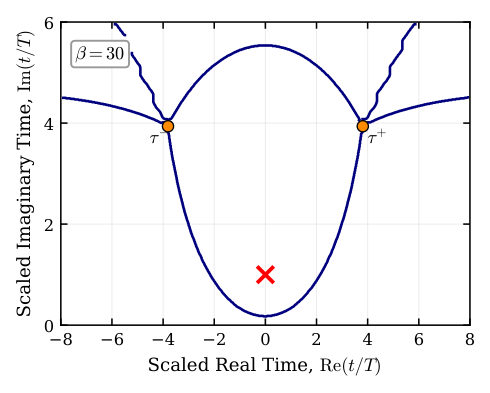 
FIG. 1. Representative Stokes-line structure for the Lorentzian model at β = 30 in the upper half of the scaled complex-time plane t/T. The plotted curves are the numer- ical Stokes trajectories issuing from τ ±, obtained from the level-set condition Im R τ τ± E(τ ′) dτ ′ = const on the physical sheets. The two transition points lie on the dominant Stokes manifold relevant to the generalized DDP interference. The Lorentzian pole at t/T = i is marked separately and must not be crossed by the analytic-continuation contours.

📷 Fig 2

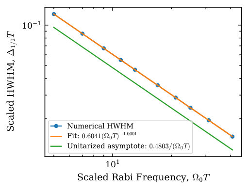 
FIG. 3. Scaled positive half-width at half maximum ∆1/2T extracted from direct numerical Schr¨odinger integration for odd-π pulse areas and plotted against the scaled Rabi fre- quency Ω0T. The numerical fit, Eq. (51), has exponent −1.0001, confirming the inverse-α power-narrowing law. The unitarized asymptotic prediction 0.4803/α has the same ex- ponent but underestimates the numerical prefactor.

📷 Fig 3

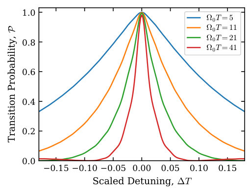 
FIG. 2. Numerically integrated transition probability versus the scaled detuning ∆T for resonant odd-π Lorentzian pulses with scaled Rabi frequencies Ω0T = 5, 11, 21, and 41. The ex- act resonant probability is unity in every case, while the cen- tral excitation line narrows systematically as Ω0T increases.

📷 Fig 4

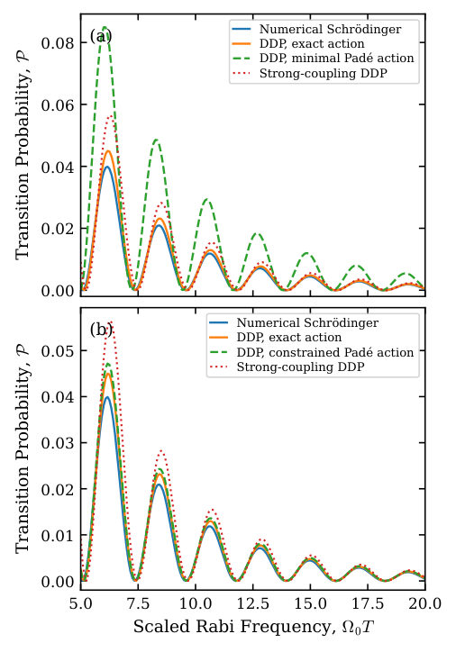 
FIG. 4. Transition probability versus the scaled Rabi fre- quency Ω0T for the fixed scaled detuning ∆T = 1. Direct nu- merical integration of the Schr¨odinger equation is compared with the standard DDP probability evaluated using the ex- act contour action and Pad´e-approximated actions. Panel (a) shows the minimal [3/1] approximation, which reproduces the qualitative crossover but displays noticeable deviations in the envelope and phase. Panel (b) shows the constrained [4/2] approximation, whose curve nearly coincides with the exact- action DDP result throughout the displayed crossover and strong-coupling range. The two panels use the same vertical scale, and the leading strong-coupling...

📷 Fig 5

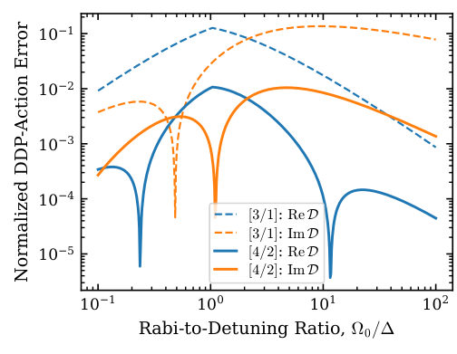 
FIG. 5. Normalized errors ϵ[m/n] X of the real and imaginary parts of the Pad´e action ratio R+ = D(τ +)/(∆T), as defined in Eq. (69), versus the Rabi-to-detuning ratio Ω0/∆= β. Dashed curves show the minimal [3/1] approximation and solid curves show the constrained [4/2] approximation. The additional zero-coefficient constraints reduce the maximum error over 0.1 ≤β ≤100 from about 13% to about 1.1%.

**Summary.** This paper analyzes how a two-state quantum system responds to an intense, Lorentzian-shaped laser pulse. It employs the sophisticated Dykhne-Davis-Pechukas (DDP) method to calculate the transition probability by analyzing complex time contours. The key finding is the derivation of power-narrowing behavior in the strong-coupling regime, providing deep insights into coherent quantum control.

**Why it may be interesting.** This work provides advanced analytical techniques (DDP) for calculating quantum response functions under non-adiabatic driving fields, which is crucial for understanding ultrafast light-matter interactions in AMO physics.

Detailed structure

**Main problem.** The study focuses on calculating the coherent excitation probability of a two-state quantum system driven by an external field with a Lorentzian temporal envelope.

**Main result.** The analysis successfully derives asymptotic expressions for the transition probability, demonstrating power-narrowing behavior in the strong-coupling limit. The DDP method provides a robust framework to bypass difficulties associated with connecting special function solutions.

**Method.** The primary theoretical tool is the Dykhne-Davis-Pechukas (DDP) description, which uses complex contour integration over adiabatic energy splittings to determine the transition amplitude.

**Model / system.** The system is a simple two-state quantum oscillator governed by a time-dependent Hamiltonian. The driving field is modeled as having a Lorentzian temporal envelope ($\Omega(t) \propto 1/(1+t^2/T^2)$) and constant detuning ($\Delta$).

**Key observables.** Transition probability ($P = |c_2(+\infty)|^2$), oscillation phase, and oscillation envelope.

**Important parameters / regimes.** The pulse area ($\alpha = \Omega_0 T$) and the ratio of Rabi frequency to detuning ($eta = \Omega_0/\Delta$).

**Assumptions / limitations.** The analysis relies on the DDP approximation and assumes an ideal Lorentzian pulse shape; it also compares results derived from Padé approximants against the exact action integral.

**Figures summary.** Figures illustrate the Stokes-line structure in the complex-time plane, showing transition points and poles related to the Lorentzian profile. Comparison plots show the convergence of different approximation methods (e.g., constrained [4/2] vs minimal [3/1]) against the exact DDP result.

**Paper structure.** The paper develops the problem by first mapping the dynamics to a confluent Heun equation, then pivots to using the DDP method for the transition probability. It systematically analyzes the DDP action in weak and strong coupling limits, comparing results with Padé approximants.

Abstract

We study the coherent excitation of a two-state quantum system by a field with a Lorentzian temporal envelope and constant carrier frequency. The associated differential equation admits an exact local representation in terms of confluent Heun functions. For the transition probability we develop a Dykhne-Davis-Pechukas (DDP) description based on the two relevant complex transition points and their interference. The DDP action is analyzed directly in the weak- and strong-coupling limits, yielding explicit asymptotic expressions for the oscillation phase, oscillation envelope, far-detuned line shape, and near-resonant behavior. In particular, the strong-coupling asymptotics imply a linewidth proportional to the inverse peak Rabi frequency for resonant odd-$π$ pulses, thereby exhibiting the power-narrowing characteristic of the Lorentzian pulse.

[↑ back to top](#top)

### [Performance Benchmarking: Software for the Density Matrix Renormalization Group](http://arxiv.org/abs/2607.28369v1)

**Authors:** Per Sehlstedt, Paolo Bientinesi, Lars Karlsson  
**Type:** theory · **Category:** numerical methods · **PDF:** <https://arxiv.org/pdf/2607.28369v1>  
**Analysis basis:** full PDF text, analyzed in chunks
**Topic relevance:** `analog quantum simulation` **3/5** · `methods for driven-dissipative` **3/5** · `entanglement & information structure` **1/5** · `non-equilibrium dynamics` **1/5**

📷 Fig 1

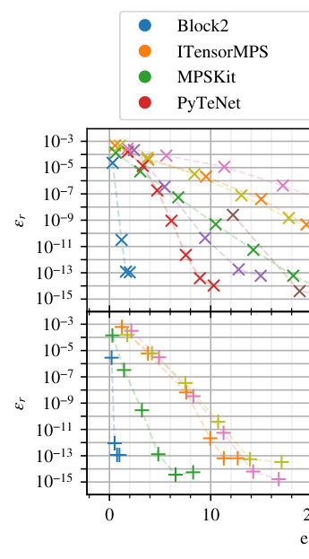 
Figure 1: Performance of DMRG implementations on the transverse-field Ising model using a maximum bond dimension of 100. The top and bottom panels show trivial and Z2 symmetry enforcement, respectively. Markers mark the end of a full sweep, i.e., a forward and backward pass.

📷 Fig 2

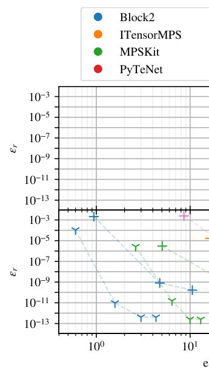 
Figure 2: Performance of DMRG implementations on the isotropic spin-1 Heisenberg model using a maximum bond dimension of 400. The top and bot- tom panels show trivial and non-trivial symmetry enforcement, respectively. Markers mark the end of a full sweep, i.e., a forward and backward pass.

📷 Fig 3

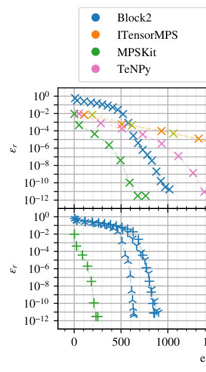 
Figure 3: Performance of DMRG implementations on the Fermi–Hubbard model using a maximum bond dimension of 800. The top and bottom panels show the enforcement of abelian and non-abelian symmetries, respectively. Markers mark the end of a full sweep, i.e., a forward and backward pass.

📷 Fig 4

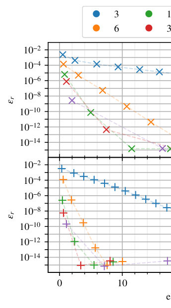 
Figure 4: Performance of MPSKit on the transverse-field Ising model using different Krylov subspace dimensions.

📷 Fig 5

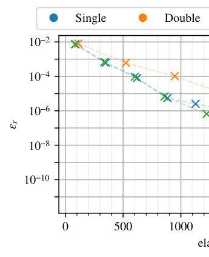 
Figure 5: Performance of ITensorMPS on the Fermi–Hubbard model using three different floating-point precision strategies: single-precision only, double- precision only, and starting with single- and switching to double-precision after four sweeps. Because the single-precision Hamiltonian yields lower energy due to numerical imprecision, the single-precision result error is calculated as an absolute difference in eq. (11) rather than a linear one.

**Summary.** This paper addresses the lack of standardized performance comparison in DMRG software by introducing a rigorous benchmarking framework. By applying this framework to multiple implementations, the authors quantify significant speed differences based on both the package used and how its parameters are configured. The work provides essential guidance for users and developers aiming to build more efficient quantum simulation tools.

**Why it may be interesting.** This is highly relevant as AMO physics often relies on simulating complex quantum dynamics (e.g., molecular or spin systems) where computational bottlenecks limit accessible model sizes.

Detailed structure

**Main problem.** The performance of scientific software, particularly for algorithms like DMRG, is critical as it dictates the scale of solvable quantum many-body problems.

**Main result.** Rigorous benchmarking reveals significant and non-obvious performance differences (up to two orders of magnitude) among various DMRG implementations and parameter settings.

**Method.** The authors present a dedicated, performance-oriented benchmarking framework applied to compare eight existing DMRG software implementations systematically.

**Model / system.** The study focuses on the Density Matrix Renormalization Group (DMRG) algorithm used to simulate quantum systems. The underlying theory involves variational optimization using tensor network states like MPS/MPO representations for Hamiltonians.

**Key observables.** Computational cost, end-to-end performance metrics, and solution quality (convergence/accuracy).

**Important parameters / regimes.** Bond dimension ($\chi$), parameter configuration settings, update modes, eigensolver tolerances, and hardware environment.

**Assumptions / limitations.** The primary assumption is that systematic, standardized benchmarking is necessary because existing evaluations are often incomplete or lack direct performance comparison metrics.

**Paper structure.** The paper introduces the necessity for systematic benchmarking in DMRG software, details the proposed framework, applies it to compare multiple implementations across various parameter settings, and concludes by emphasizing the value of rigorous evaluation for future development.

Abstract

The performance of scientific software often determines the scale of problems that can be solved in practice. As multiple implementations of the same algorithm emerge, systematic evaluation is needed to compare their strengths and limitations. The density matrix renormalization group (DMRG) algorithm, widely used to study quantum systems, has over 50 software implementations. These implementations vary in multiple aspects that can strongly affect performance. However, despite the need, performance evaluations of these implementations are scarce and lack a consistent standard; many existing evaluations are either too incomplete to enable meaningful comparisons or focus on objectives other than direct performance comparisons, thereby limiting understanding of how the implementations compare. Here, we present a performance-oriented benchmarking framework to facilitate meaningful comparisons of DMRG implementations, and we apply it to quantify the performance of eight implementations, highlighting similarities and differences among them. Furthermore, we examine multiple parameter settings, optimization strategies, and implementation-specific features to demonstrate how parameter configuration can affect performance and how systematic evaluation can reveal non-obvious trade-offs. The results show significant performance differences, up to two orders of magnitude in some cases, not only between different implementations when aligning parameters, but also within the same implementation when comparing different parameter configurations. Hence, our results demonstrate the significant value and insight that can be gained from conducting rigorous performance evaluations. Using our results and framework as a starting point, more rigorous benchmarking will ultimately help users and developers make informed decisions and support future development efforts to build better, more efficient software.

[↑ back to top](#top)

### [Extended s-wave superconductivity in M-point twisted bilayer SnSe2](http://arxiv.org/abs/2607.27492v1)

**Authors:** Lennart Klebl, Ammon Fischer, Salahudin V. Smailagić, Ming-Rui Li, Henning Schlömer, Haoyu Hu, B. Andrei Bernevig, Dante M. Kennes, Ronny Thomale  
**Type:** theory · **Category:** strongly correlated electrons · **PDF:** <https://arxiv.org/pdf/2607.27492v1>  
**Analysis basis:** full PDF text, analyzed in chunks
**Topic relevance:** `Keldysh / 2PI / non-Gaussian methods` **3/5** · `analog quantum simulation` **3/5** · `methods for driven-dissipative` **1/5**

📷 Fig 1

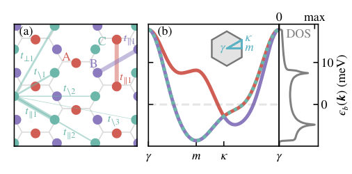 
FIG. 1. Wannier centers, hopping parameters (a), and band struc- ture (b) of 𝜃= 6.01◦twisted bilayer SnSe2 in AB stacking configura- tion. We visualize the hopping parameters for the C valley as green lines with thickness encoding strength, see Table S1.1 for numerical values. The hoppings for 𝜂= A, B follow from 𝐶3𝑧rotation, as in- dicated by the dominant hopping 𝑡∥1. The Wannier centers (dots) are located approximately on the three Kagome sites in the Wigner-Seitz cell (light gray hexagons) The bands in panel (b) are colored accord- ing to their valley content (𝜂= C dotted for visibility) and shown along the irreducible path indicated in the inset. The dashed gray line indicates the...

📷 Fig 2

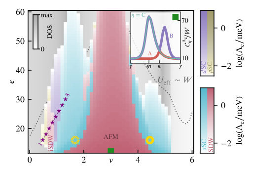 
FIG. 2. Phase diagram of 𝜃= 6.01◦AB-stacked tSnSe2 obtained by functional renormalization group simulations. We plot the criti- cal scale Λc, which qualitatively resembles a critical temperature, as a function of electron filling 𝜈and dielectric constant 𝜖. We find various regions of distinct phases: An intravalley antiferromagnet (AFM, ma- genta), an adjacent extended 𝑠-wave superconductor (𝑠SC, blue, yel- low circle), 𝑝- and 𝑑-wave superconductivity (𝑝SC, olive and 𝑑SC, purple, respectively; purple stars), and incommensurate intravalley magnetism (iSDW, magenta). The regions without coloring corre- spond to Fermi liquid behavior (i.e., no divergence within the FRG) and show the...

📷 Fig 3

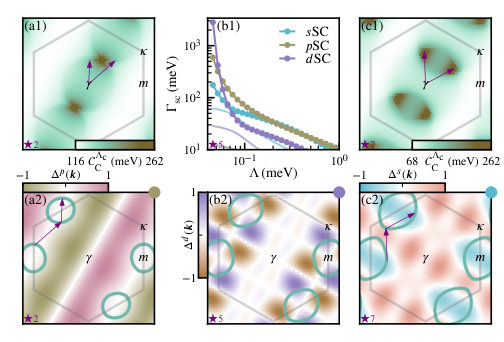 
FIG. 3. Weak-coupling superconductivity in 𝜃= 6.01◦AB-stacked tSnSe2 (cf. purple stars in Fig. 2, counted left-to-right). Panel (a1) dis- plays the spin fluctuation vertex (at the second purple star in Fig. 2) from FRG as a function of transfer momentum 𝒒for valley 𝜂= C, with relevant transfer momenta given by the purple arrows. The re- sulting superconducting gap amplitude is given in panel (a2). The leading spin fluctuation vectors (purple) connect parts of the Fermi surface (green circles) where the sign of the superconducting gap Δ𝑝(𝒌) changes. Panels (c1,c2) show the same analysis but for the weak-coupling extended 𝑠-wave case (seventh purple star in Fig. 2). For fillings in between...

📷 Fig 4

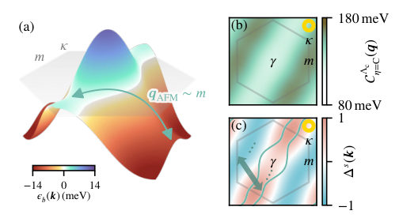 
FIG. 4. Microscopic pairing mechanism for extended 𝑠-wave super- conductivity in 𝜃= 6.01◦AB-stacked tSnSe2. Panel (a) illustrates the dominant AFM spin fluctuations’ origin starting from the non- interacting band structure (shown as colored three-dimensional sur- face for valley 𝜂= C, with the Fermi level being white). The green arrow sketches the leading off-shell magnetic scattering, which ex- presses transfer momenta located in a strip parallel to the Fermi sur- face (containing 𝒒AFM ∼𝑚); panel (b) shows the -channel vertex’ structure (for 𝜈= 4.44 and 𝜖= 16; golden circle in Fig. 2) in the Bril- louin zone, where the brown regions contain 𝒒AFM ∼𝑚. In panel (c) we plot the C-valley...

**Summary.** This theoretical work analyzes correlated electronic states and unconventional superconductivity in twisted bilayer SnSe2 using the Functional Renormalization Group method. By modeling interactions within an interacting Wannier framework, the authors map out a phase diagram showing how doping tunes the superconducting pairing symmetry. The findings establish this moiré material as a promising platform for studying physics analogous to iron pnictides.

**Why it may be interesting.** While focused on solid-state physics, the use of advanced many-body techniques like FRG to map out competing ordered phases (superconductivity vs. magnetism) in a tunable moiré lattice is highly relevant for understanding emergent quantum phenomena in engineered systems.

Detailed structure

**Main problem.** The study investigates the emergence of electronic order and unconventional superconductivity in M-valley moiré materials.

**Main result.** The system exhibits a complex phase diagram where doping controls the superconducting pairing symmetry, stabilizing an extended s-wave state analogous to iron pnictide superconductors near optimal doping levels.

**Method.** Functional Renormalization Group (FRG) simulations are employed to analyze correlation effects arising from long-ranged Coulomb interactions in the interacting Wannier model.

**Model / system.** The system is based on an AB-stacked twisted SnSe2, modeled via a first-principles Wannier Hamiltonian incorporating a dual-gated screened Coulomb repulsion. The analysis focuses on electronic instabilities driven by doping ($
u$) and interaction strength.

**Key observables.** Superconducting order parameter symmetry (s-, p-, d-wave), antiferromagnetic ordering, critical correlation scales ($\Lambda_c$), and pairing susceptibilities.

**Important parameters / regimes.** Doping concentration ($
u \approx 1, 2, 3, 4$); twist angle ($	heta=6.01^\circ$); interaction strength ($\epsilon$).

**Assumptions / limitations.** The analysis restricts the interaction Hamiltonian to density-density terms because non-trivial elements are energetically suppressed; FRG calculations use specific truncations (e.g., TUFRG, IOBI).

**Figures summary.** Figures illustrate band structures and Fermi surfaces at different fillings, while phase diagrams map out competing correlated phases like AFM and various superconducting states across the doping range.

**Paper structure.** The paper establishes the Wannier model Hamiltonian, applies FRG to resolve instabilities from Coulomb interactions, maps the resulting phase diagram based on doping, and details the microscopic pairing mechanisms derived from spin fluctuations.

Abstract

We investigate the emergence of electronic order and unconventional superconductivity in M-valley moiré materials. Starting from a first-principles Wannier model of AB-stacked twisted SnSe2, we tackle the (gate-screened) long-ranged Coulomb interaction with functional renormalization group simulations resolving the momentum structure and energy scales of the leading Fermi surface instabilities. Upon doping an antiferromagnetic stripe state at half-filling ($ν=3$ electrons per moiré unit cell) of the moiré flat bands, magnetic order gives way to unconventional superconductivity mediated by valley-selective spin fluctuations: Large hole doping ($ν\approx1$) leads to weak-coupling superconductors with various pairing symmetries, while slight electron- and hole-doping ($ν\approx2,4$) stabilizes a spin-singlet, extended s-wave state that benefits from scattering between virtual particle and hole states that are detuned from the Fermi level. These findings establish M-point moiré materials as a quantum simulation platform with phenomenological parallels to the class of iron pnictide superconductors.

[↑ back to top](#top)

### [Intertwined magnetoresistance and Hall multifunctionality in a non-coplanar magnetic Weyl semimetal DyB4](http://arxiv.org/abs/2607.28283v1)

**Authors:** Long Chen, Yulin Shen, Songxue Chi, Seunghoon Song, Yang Zhang, Jian Liu, Haidong Zhou  
**Type:** both · **Category:** strongly correlated electrons · **PDF:** <https://arxiv.org/pdf/2607.28283v1>  
**Analysis basis:** full PDF text, analyzed in chunks
**Topic relevance:** `spintronics-quantum-optics interface` **3/5** · `Kondo & dissipative impurity` **1/5** · `analog quantum simulation` **1/5** · `exotic spin models in light-matter` **1/5** · `non-equilibrium dynamics` **1/5**

📷 Fig 1

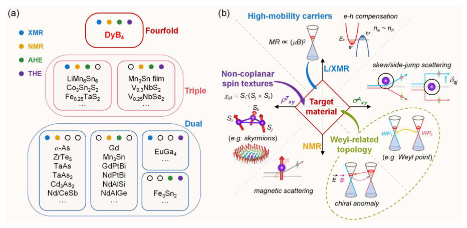 
Figure 1. Classification and design strategy of materials with coexisting anomalous

📷 Fig 2

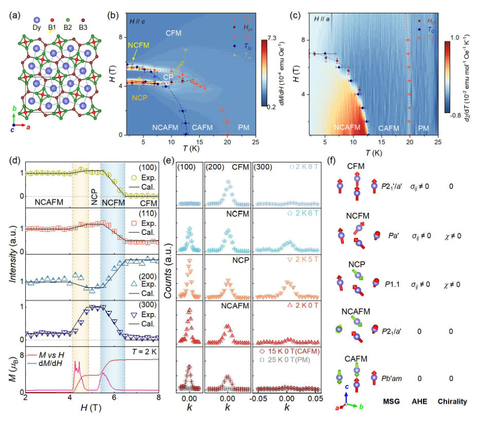 
Figure 2. Crystal structure and magnetic phase diagram with multiple magnetic states.

📷 Fig 3

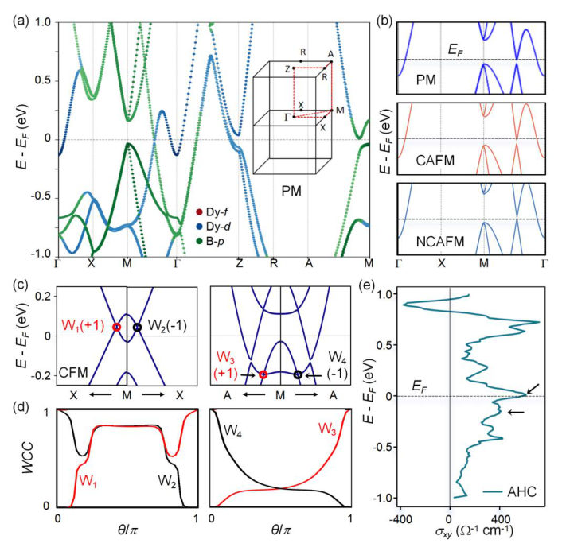 
Figure 3. Electronic structure of DyB4 in different magnetic states and Weyl-related

📷 Fig 4

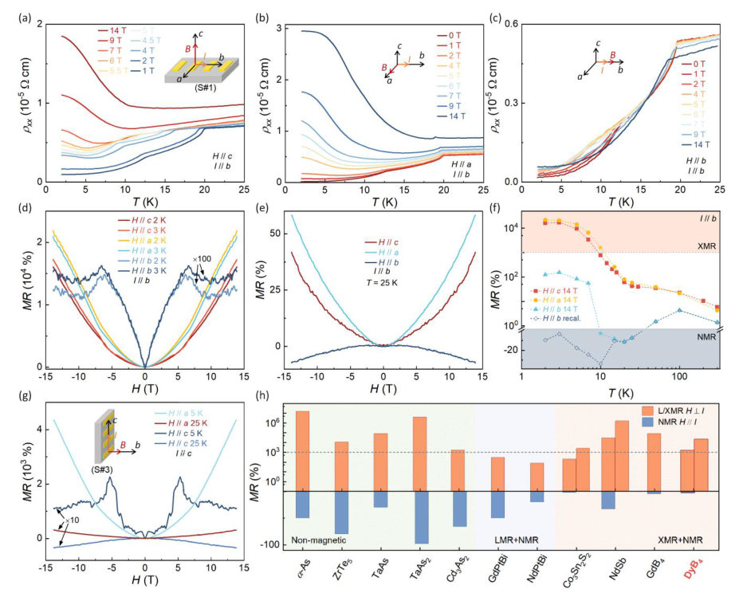 
Figure 4. Metal-insulator-like crossover, extremely large transverse MR, and chiral-

📷 Fig 5

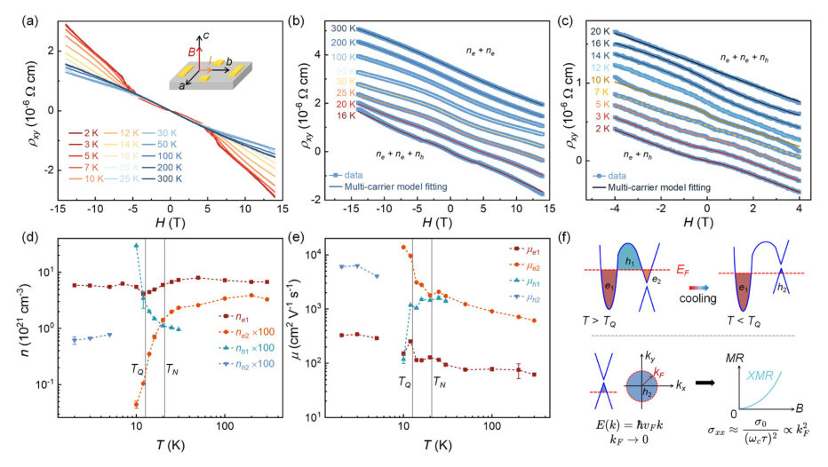 
Figure 5. Hall resistivity analysis based on a multi-carrier model. (a) The field-dependent

**Summary.** This work investigates DyB4 as a multifunctional magnetic Weyl semimetal capable of hosting multiple anomalous transport responses simultaneously. By combining neutron diffraction with advanced magnetotransport measurements and theoretical calculations, the authors demonstrate that tunable non-coplanar magnetism facilitates the coexistence of large magnetoresistance, AHE, and topological Hall effects. This suggests a promising route for designing next-generation magnetic topological materials.

**Why it may be interesting.** The explicit connection drawn between localized $4f$ magnetism (rare-earth elements) and topological band features (Weyl semimetals) provides a concrete platform for studying emergent quantum phenomena driven by spin-orbit coupling and magnetic order, which is highly relevant to modern condensed matter theory.

Detailed structure

**Main problem.** The research aims to identify a single material platform that can simultaneously exhibit and correlate multiple anomalous magneto-transport responses (magnetoresistance, AHE, topological Hall effect) by integrating orbital motion, momentum-space topology, and real-space spin chirality.

**Main result.** DyB4 is identified as a rare magnetic Weyl semimetal exhibiting a fourfold combination of large magnetoresistance, chiral-anomaly-like negative magnetoresistance, anomalous Hall conductivity, and topological Hall responses.

**Method.** The study combines neutron diffraction to map field-tunable magnetic states with first-principles calculations (for electronic structure) and detailed magneto-transport measurements (MR, AHE, THE).

**Model / system.** The physical system is DyB4, a frustrated rare-earth tetraboride proposed as a magnetic Weyl semimetal. Its functionality relies on the weak coupling between itinerant conduction electrons ($	ext{Dy-}4d/	ext{B-}2p$) and localized $4f$ moments ($	ext{Dy-}4f$).

**Key observables.** Extremely large magnetoresistance (XMR), anomalous Hall conductivity ($\sigma_{Axy}$), topological Hall resistivity ($
ho_{Txy}$), and evidence of non-coplanar spin chirality ($\chi_{ijk}$).

**Important parameters / regimes.** Field-tunable magnetic states, including Non-Coplanar Antiferromagnetic (NCAFM) and Ferromagnetic (NCFM) phases; the Fermi level proximity to Weyl points.

**Assumptions / limitations.** The analysis relies on multi-carrier modeling for Hall resistivity and assumes that the observed phenomena are governed by the interplay between orbital motion, Berry curvature, and spin chirality.

**Figures summary.** Figures illustrate the classification of materials with coexisting anomalous responses (Fig 1), $	ext{H-T}$ phase diagrams showing magnetic transitions (Fig 2), electronic band structures revealing Weyl points (Fig 3), and transport measurements demonstrating XMR/NMR coexistence across different magnetic phases (Figs 4, 5, 6).

**Paper structure.** The paper first establishes the theoretical motivation by classifying materials exhibiting coexisting anomalous responses. It then presents experimental evidence using neutron diffraction to map field-tunable non-coplanar magnetic states in DyB4. Finally, it correlates these magnetic structures with transport measurements and electronic structure calculations to demonstrate the fourfold multifunctionality.

Abstract

Anomalous magneto-transport responses provide complementary probes of orbital motion, momentum-space topology, and real-space spin chirality, yet their integration into a single material remains rare because their underlying requirements often compete. A promising materials-design strategy is to realize a magnetic Weyl semimetal that combines linearly dispersive high-mobility bands with tunable non-coplanar magnetism while limiting spin-dependent scattering. Here we identify DyB4, a frustrated rare-earth tetraboride, as a magnetic Weyl semimetal candidate that embodies this strategy and hosts intertwined magnetoresistance and Hall multifunctionality. Neutron diffraction reveals a sequence of field-tunable magnetic states, including non-coplanar spin configurations and PT-symmetry-broken phases. First-principles calculations identify steep linear dispersions and field-induced Weyl points near the Fermi level. Magneto-transport measurements establish a rare fourfold combination of extremely large magnetoresistance, chiral-anomaly-like negative magnetoresistance, large anomalous Hall conductivity arising from cooperative intrinsic Berry curvature and skew scattering, and scalar-spin-chirality-driven topological Hall responses. This multifunctionality arises from the distinct yet weakly coupled roles of itinerant carriers and localized 4f moments, which enable high-mobility transport, field-induced Weyl topology, and non-coplanar magnetism. DyB4 therefore provides a 4f-electron platform for correlating orbital transport, momentum-space Berry curvature, and real-space spin chirality, suggesting a route toward multifunctional magnetic topological materials.

[↑ back to top](#top)

### [On Optimal Measurement-State Preparation via Geometric Transport of the Squeezing Ellipse](http://arxiv.org/abs/2607.28620v1)

**Authors:** Vsevolod Salakhutdinov, Nikolay Kalinin  
**Type:** theory · **Category:** other · **PDF:** <https://arxiv.org/pdf/2607.28620v1>  
**Analysis basis:** full PDF text, analyzed in chunks
**Topic relevance:** `quantum measurements` **3/5** · `measurement-induced transitions` **2/5** · `interference shaping light` **1/5** · `quantum optics experiment` **1/5**

📷 Fig 1

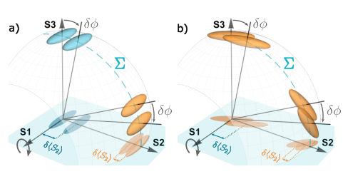 
FIG. 1. Illustration to the optimal measurement state definition. Initial states under different starting conditions evolve into final states displaced by a small phase variation δϕ along the geodesic trajectory Σ, followed by projection onto the plane {S1, S2}. a) Properly oriented squeezed ellipsoids allow resolution of the uncertainty regions of the initial and final states. Localization near the pole (S3 = +1) maximizes the displacement δ⟨S2⟩. b) Non-oriented squeezed ellipsoids lead to overlap between the uncertainty regions of the initial and final states. In this case, localization near the S3 = +1 pole alone does not resolve the uncertainty regions.

📷 Fig 2

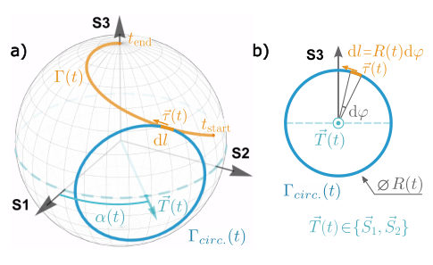 
FIG. 2. Illustrative representation of a smooth curve Γ(t) through successive infinitesimal elements of ro- tation circles. (a) Coincidence between Γ(t) and Γcirc.(t) over a local infinitesimal arc element dl. (b) The arc dl repre- sented via a circle constructed about the axis ⃗T(t), reducing the problem to 2D. ⃗τ(t) - tangent vector to Γ(t) shared by both the tangent plane to the sphere and the plane of the auxiliary circle Γcirc.(t). The vector ⃗T(t) defines the orien- tation of the waveplate, and lies in the plane {S1, S2}. The radius R(t) of the circle Γcirc.(t) is determined by geometry of the described system.

📷 Fig 3

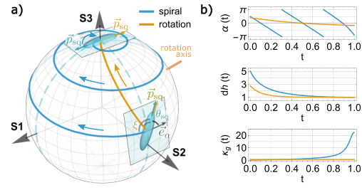 
FIG. 3. Representative transformation trajectories Γ(t) and corresponding control parameters. a) The spiral-like (blue) and axial-rotation (orange) transformation trajectories. The angle θsq specifies the orientation of the squeezing ellipse major axis, represented by the vector ⃗psq in the tangent plane, relative to the azimuthal direction ⃗eα. b) Corresponding control parameters of the multilayer wave- plate device. The local layer thickness dh(t) obtained from the eq. (4) and is expressed in units of  λ 2π(ne−no)  . The angle

📷 Fig 4

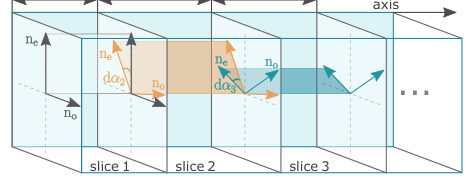 
FIG. 4. Multilayer waveplate stack approximating the continuous transformation. The thickness of the layer dhi(ti) is determined by eq. (4). The orientation of the wave- plate axis to the vertical-horizontal basis is obtained by angle between axis S1 and vector ⃗T(t) shown in Fig. 2.

**Summary.** This paper introduces a geometric framework to optimize measurement-state preparation for squeezed quantum systems. It treats the orientation of the squeezing ellipse as an additional controllable degree of freedom evolving along the mean state's trajectory on the unit sphere. The key finding is that this controlled rotation depends fundamentally on the solid angle enclosed by the path, offering a unified theoretical tool applicable across various physical platforms like optical polarization.

**Why it may be interesting.** This work provides a deep connection between the nonclassical structure (squeezing) of quantum states and the topology/geometry of their evolution path in parameter space, which is highly relevant for understanding controlled quantum dynamics beyond standard geometric phase considerations.

Detailed structure

**Main problem.** The core problem is developing a geometric framework to prepare an initial squeezed quantum state into one that is optimal for measurement in quantum metrology.

**Main result.** The orientation of the squeezing ellipse can be controlled as a geometric degree of freedom, and its evolution is determined by the solid angle enclosed by the mean-state trajectory on the unit sphere.

**Method.** The authors use a geometric framework based on SU(2) dynamics, relating state preparation to path integrals and geometric phase concepts derived from spherical geometry.

**Model / system.** The analysis focuses on SU(2)-symmetric systems, exemplified by polarization-squeezed light (mapped onto the Poincaré sphere). The evolution is described as a trajectory $\Gamma(t)$ on the unit sphere.

**Key observables.** Measurement sensitivity ($\Delta\phi$), squeezing ellipse orientation, and the solid angle enclosed by the state trajectory.

**Important parameters / regimes.** Squeezing angle ($	heta_{sq}$), path geometry (solid angle $\Omega_{\Sigma}$), and control parameters for birefringent elements ($h(t)$, $\alpha(t)$).

**Assumptions / limitations.** The continuous transformation is often approximated by piecewise constructions of circular arcs, leading to systematic deviations from the ideal smooth evolution.

**Figures summary.** Figures illustrate optimal vs. non-optimal squeezing alignments (Fig. 1), the state evolution curve $\Gamma(t)$ on the sphere decomposed into infinitesimal rotations (Fig. 2), and control parameter variations for physical realization (Fig. 3).

**Paper structure.** The paper establishes the geometric necessity of aligning both the mean state and the squeezing ellipse for optimal measurement, derives the relationship between rotation angle and solid angle, and details physical implementations using continuously varying birefringent elements.

Abstract

Preparation of optimal measurement states is a key requirement in quantum metrology utilizing squeezed states. We discuss a geometric framework that transforms an initially misaligned squeezed input into a measurement-optimal state in SU(2)-symmetric systems. Within this framework, the orientation of the squeezing ellipse constitutes an additional geometric degree of freedom and evolves as the mean state follows a controlled trajectory on the unit sphere. The resulting rotation of the ellipse is determined by the geometry of the path and, for the relevant class of transformations, depends on the solid angle enclosed by the trajectory, establishing a connection with the geometric phase. The discussed framework is applicable to different physical platforms. As a particular example, we consider polarization-squeezed light and outline a possible implementation using a continuously varying birefringent element.

[↑ back to top](#top)

### [Deterministic QKD source robust against side-channel attacks](http://arxiv.org/abs/2607.28063v1)

**Authors:** Kiyoshi Tamaki, Marcos Curty, Akihiro Mizutani, Álvaro Navarrete  
**Type:** theory · **Category:** quantum information and computing · **PDF:** <https://arxiv.org/pdf/2607.28063v1>  
**Analysis basis:** full PDF text, analyzed in chunks
**Topic relevance:** `interference shaping light` **3/5** · `driven-dissipative phase transition` **1/5** · `methods for driven-dissipative` **1/5** · `quantum optics experiment` **1/5**

📷 Fig 1

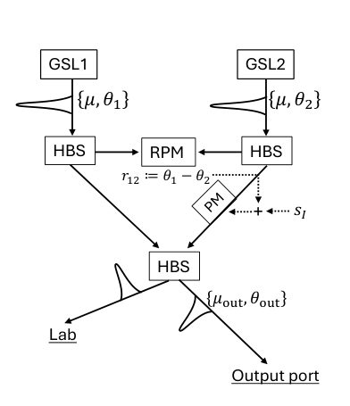 
FIG. 1. Schematic of the first stage, the Intensity Package (IntP). The quantities µ and θ1 (θ2) denote the mean photon number and global phase, respectively, of the pulse generated by GSL1 (GSL2). HBS, RPM, PM, and sI denote a half-beam splitter, a relative-phase measurement unit, a phase modula- tor, and the intensity setting selected by Alice, respectively. Specifically, the PM applies the sum of the relative phase r12 between the two GSLs, as measured by the RPM, and an addi- tional phase shift sI, chosen according to the desired output intensity, thereby generating an output pulse with the tar- get mean photon number. Importantly, from Eve’s perspec- tive, the applied phase r12 + sI is...

📷 Fig 2

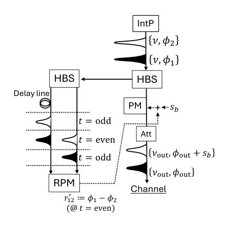 
FIG. 2. Schematic of the second stage. The inputs to this setup are two pulses generated by the IntP and separated in time. The early and late pulses, marked in black and white, respectively, each have mean photon number ν, and global phase ϕ1 and ϕ2, respectively. These pulses are split by a HBS. One of the resulting pulse pairs is sent to another HBS equipped with a delay line at one of its output ports. This delay line is adjusted so that the pulse originating from the early input pulse overlaps well in time with the late pulse in a time slot referred to as “even”. The relative-phase measure- ment (RPM) is then performed only in the “even” time slot to measure the relative phase r′ 12 ∶=...

📷 Fig 3

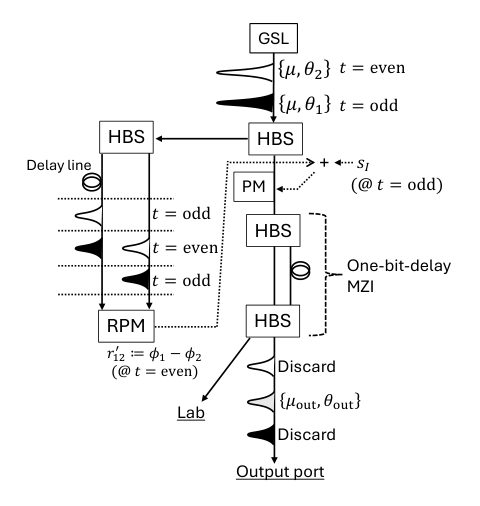 
FIG. 3. Schematic of the alternative setup for the IntP. The middle pulse (marked in gray) at the output port is used as the input to the second stage in Fig. 2. The scheme for relative- phase measurement (RPM) and phase shift is the same as that in Fig. 2, except that the phase-shift value is chosen according to the intended intensity. After applying the phase shift, a one-bit-delay MZI causes the two pulses to interfere, produc- ing three output pulses; the middle pulse is the intended one. The first and last pulses, marked in black and white, respec- tively, are not used by Alice but carry information about the random phases and must therefore be blocked.

**Summary.** This paper introduces a novel Quantum Key Distribution (QKD) source designed to be inherently secure against side-channel attacks like Trojan-horse attacks. By engineering the phase randomization across two stages, it achieves high key rates while eliminating reliance on imperfect components or post-selection procedures. This offers a practical path toward deploying truly implementation-secure quantum communication systems.

**Why it may be interesting.** This work directly addresses practical implementation loopholes in quantum communication protocols, which is a major focus area at the intersection of quantum optics and information theory.

Detailed structure

**Main problem.** Practical Quantum Key Distribution (QKD) security is threatened by source side channels, such as Trojan-horse attacks, which are not accounted for in idealized security proofs.

**Main result.** The authors propose a QKD source design that is intrinsically robust against these side-channel attacks without sacrificing key rate or requiring perfect components.

**Method.** The scheme utilizes a two-stage process involving phase randomization and controlled phase shifts to ensure the output state's security relies on random phases unknown to an eavesdropper (Eve).

**Model / system.** The system involves an Intensity Package (IntP) stage using gain-switched lasers, relative-phase measurement (RPM), and a phase modulator, followed by a second interference stage before single-photon attenuation.

**Key observables.** Output mean photon number ($\mu_{	ext{out}}$) and the resulting output phase ($	heta_{	ext{out}}$).

**Important parameters / regimes.** Phase shifts ($s_I, s_b$), path transmittances ($\eta_{path}, \eta$), and input mean photon numbers ($\mu$).

**Assumptions / limitations.** The security relies on five core assumptions (A1-A5), including stable intensities and the randomness of relative phases inaccessible to Eve.

**Figures summary.** Figure 1 shows the IntP stage components (HBS, RPM, PM); Figure 2 details the second stage involving interference and phase shifting before the quantum channel output.

**Paper structure.** The paper first identifies the security gap due to side channels. It then proposes the two-stage source architecture, detailing the physics of phase randomization in the IntP, followed by the basis-dependent encoding in the second stage to achieve optical privacy and high key rates.

Abstract

Quantum key distribution (QKD) is secure in principle, but practical security can be undermined by discrepancies between real devices and the idealized models assumed in security proofs. Source side channels, including those exploited by Trojan-horse attacks, are particularly detrimental: neglecting them compromises implementation security, whereas accounting for them reduces performance. Here we propose a QKD source that is intrinsically robust against side-channel attacks. Unlike existing passive and modulator-free schemes, it requires neither post-selection of the emitted pulses nor devices with a perfect extinction ratio to suppress side channels, and it does not introduce correlations between the intensity and the encoded bit or basis. Consequently, simpler security proofs apply directly, yielding substantially higher key rates. Our proposal appears to be within reach of current technology and therefore provides a clear and practical path toward implementation-secure QKD.

[↑ back to top](#top)

### [Towards Quantum Networks: Characterizing Raman Noise over Metropolitan-scale Fiber Network](http://arxiv.org/abs/2607.27970v1)

**Authors:** Marcello Caleffi, Laura d'Avossa, Italo Ignacio Machuca Flores, Marco Grillo, Elena Montella, Angela Sara Cacciapuoti  
**Type:** experiment · **Category:** quantum information and computing · **PDF:** <https://arxiv.org/pdf/2607.27970v1>  
**Analysis basis:** full PDF text, analyzed in chunks
**Topic relevance:** `quantum optics experiment` **3/5** · `QC/QI experiment` **1/5** · `interference shaping light` **1/5** · `quantum measurements` **1/5**

📷 Fig 1

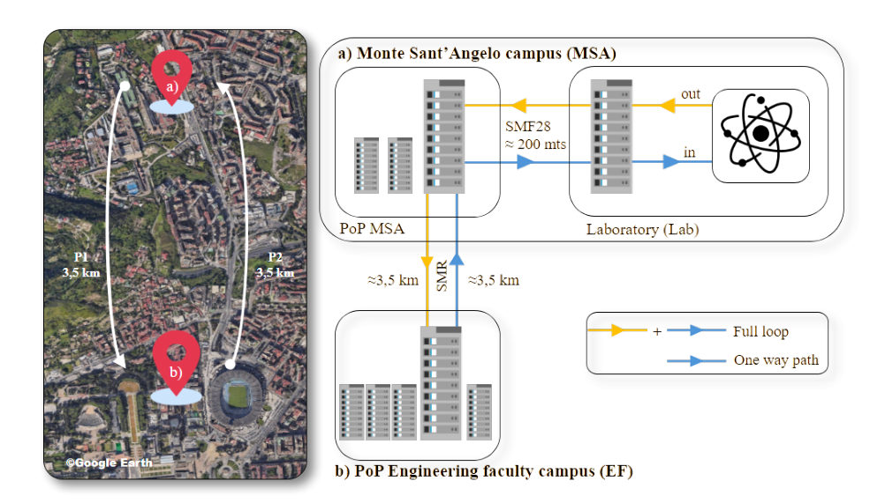 
Fig. 1: Scheme of the 7Km urban fiber loop of University of Naples Federico II. The first path, P1, connects Monte Sant’Angelo (MSA) campus to the Engineering Faculty (EF) campus. The loop is closed through the second path, P2, which enables the return transmission of photons back to MSA campus. a) MSA campus hosts the laboratory (Lab), where photons are generated and detected after completing the loop. The campus also contains the Point of Presence (PoP), which provides access to the metropolitan fiber network. b) At the Engineering Faculty (EF) campus, the branches P1 and P2 are interconnected through a patch fiber, thereby establishing the return path toward MSA campus.

📷 Fig 2

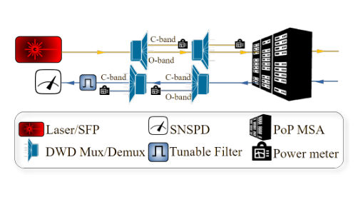 
Fig. 2: Experimental setup within the National Quantu- mInternet.it testbed. A classical signal in the O-band, gener- ated either by a commercial SFP transmitter or by a narrow- linewidth laser source, is filtered through cascaded WDM modules and launched into the 7Km urban fiber loop. Raman- scattered photons generated in the C-band are spectrally se- lected using a tunable narrowband filter and detected by a superconducting nanowire single-photon detector (SNSPD).

📷 Fig 3

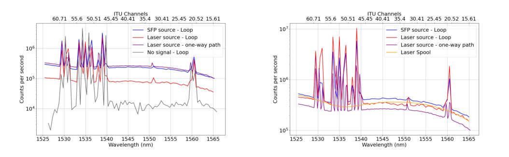 
Fig. 3: Experimental results of Raman scattering spectra. C-band SpRS photons generated from O-band classical sources are measured in terms of photon counts per second as a function of wavelength, corresponding to the ITU DWDM channels. The data include measurements obtained using both a narrowband laser source and a commercial SFP transmitter over the full fiber loop (7 km) and a one-way path (3.5 km). In (a) - Raw data, an additional reference measurement with no launched signal is included to identify background contributions. In (b) - Normalized data, an additional 5 km laboratory fiber spool measurement is reported, showing consistency between the urban-scale measurements and in-ab...

**Summary.** This paper experimentally characterizes Raman noise generated when classical signals co-propagate with quantum signals in metropolitan optical fiber links. By measuring this noise over a 7 km urban loop, the authors demonstrate that Raman scattering significantly degrades the quantum SNR. The findings offer vital, practical guidelines for allocating optimal frequency channels to enable scalable quantum communication over existing telecom infrastructure.

**Why it may be interesting.** This work directly addresses the engineering feasibility of scaling quantum communication by quantifying a dominant real-world noise source (Raman scattering) in existing infrastructure, which is crucial knowledge for developing robust quantum networks.

Detailed structure

**Main problem.** The primary challenge addressed is how noise, specifically Raman scattering generated by classical O-band signals, degrades quantum entanglement distribution in large-scale metropolitan optical fiber networks.

**Main result.** Raman-induced noise was found to be a dominant source limiting the quantum signal-to-noise ratio (SNR) in realistic deployments. The study provides practical guidelines for selecting optimal C-band spectral regions less susceptible to this noise.

**Method.** The authors conducted measurements over a 7 km metropolitan fiber loop, comparing results from controlled laboratory settings against real-world deployed telecommunication environments using SNSPD detectors.

**Model / system.** The system is a standard single-core optical fiber operating in the C-band for quantum signals and co-propagating with classical O-band traffic. The analysis focuses on the physical interaction causing Raman scattering noise within this existing infrastructure.

**Key observables.** Raman noise contribution to the quantum signal-to-noise ratio (SNR), spectral variations of Raman noise across DWDM channels, and localized spectral anomalies.

**Important parameters / regimes.** Metropolitan fiber link length (7 km), operating bands (O-band classical source vs. C-band quantum detection), and specific frequency windows for channel allocation.

**Assumptions / limitations.** The study assumes that the co-propagation of signals in the same single-core fiber is the relevant physical scenario, moving beyond idealized laboratory setups to account for environmental inhomogeneities.

**Figures summary.** Figures illustrate the 7 km urban fiber loop setup and the experimental apparatus. Spectra (Fig. 3) compare raw and normalized Raman scattering measurements taken over different path lengths, comparing lab vs. urban data.

**Paper structure.** The paper establishes the problem of noise in hybrid quantum/classical networks, details the metropolitan-scale experimental setup and methodology for measuring Raman noise, presents comparative spectral results showing consistency but also localized anomalies, and concludes with practical guidelines for channel allocation.

Abstract

The coexistence of quantum and classical signals in optical fiber infrastructures represents a major challenge for large-scale quantum networks, as noise sources such as Raman scattering can significantly impact entanglement distribution, and the quantum protocols based on it. In this work, we analyze Raman scattering in the C-band, used for entanglement distribution, generated by a classical the O-band signal. The main contribution of this study lays in investigating these effects in a real metropolitan-fiber network, moving beyond controlled laboratory experiments to deployed telecommunication environments. Measurements are performed over a 7 km metropolitan fiber link using commercial sources and narrowband lasers. The experimental results shows good agreement between the measurements taken under laboratory conditions, although, within the metropolitan-scale loop, localized spectral anomalies are observed in the deployed fibers. Therefore, our results show that, whenever a quantum signal propagates in the C-band alongside an O-band classical channel within the same fiber, careful selection of the operating frequency is required, as Raman scattering and other real-world noise sources can significantly affect the quality and stability of the quantum transmission. In particular, we identify spectral regions that are less affected by Raman noise, thereby providing practical guidelines for optimal quantum channel allocation. We demonstrate that Raman-induced noise constitutes a dominant contribution to the quantum signal-to-noise ratio (SNR) in realistic deployments, beyond background and detector noise. Overall, our findings offer practical insights for deploying quantum communication systems over existing fiber networks, supporting the development of robust and scalable quantum infrastructures.

[↑ back to top](#top)

### [Coupled Spin-Density-Wave and Bond-Order Driven Metal-Insulator Transition in Altermagnetic CsCr$_2$S$_2$O](http://arxiv.org/abs/2607.28329v1)

**Authors:** Chenchao Xu, Wansheng Bai, Guo-Xiang Zhi, Yi Liu, Xiaoqun Wang, Jianhui Dai, Chao Cao  
**Type:** theory · **Category:** strongly correlated electrons · **PDF:** <https://arxiv.org/pdf/2607.28329v1>  
**Analysis basis:** full PDF text, analyzed in chunks
**Topic relevance:** `spintronics-quantum-optics interface` **3/5** · `Keldysh / 2PI / non-Gaussian methods` **1/5** · `driven-dissipative phase transition` **1/5**

📷 Fig 1

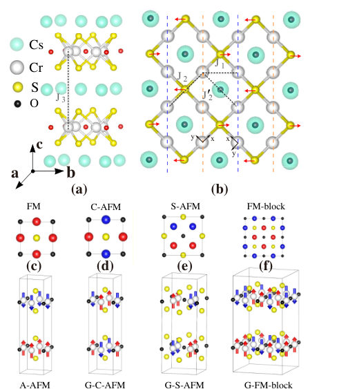 
FIG. 1. Crystal and magnetic structures of CsCr2S2O. (a) Side view of the layered crystal structure. (b) Top view of a [Cr2S2O] slab, showing the in-plane exchange pathways J1, J2, and J′ 2; J3 denotes the interlayer exchange. The black ar- rows indicate the local axes, with x pointing from Cr toward S and y from Cr toward O. The dxz and dyz orbitals are defined with respect to local coordinate of each Cr atom. Red ar- rows denote the collective in-plane displacement of the two S atoms. The blue dashed lines label the Cr2 columns that the S atoms approach, whereas the orange dashed lines label the Cr1 columns from which they recede. (c-j) Typical collinear magnetic configurations considered...

📷 Fig 2

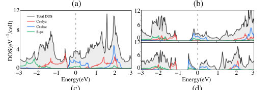 
FIG. 3. Electronic structures of CsCr2S2O unfolded to the P4/mmm primitive cell and the corresponding orbital- resolved DOS. Gray dashed curves denote the bands of undis- torted P4/mmm state. (a) At δxS = 2%, C4-symmetry breaking opens direct gaps at the band crossings marked by green circles at U = 2 eV. (b) At the double-well minimum (δxS = 5%), a full gap opens at U = 2 eV. (c) DOS of the undistorted P4/mmm state at U = 0 eV, showing that the Cr-dyz states are split to either side of EF, while the finite DOS at EF arises primarily from hybridized Cr-dxz and S-pz states. The Cr orbitals are labeled in the local axes defined in Fig. 1(b). (d) DOS corresponding to (a) and (b) in the upper and...

📷 Fig 3

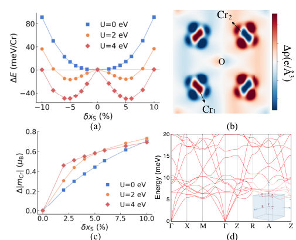 
FIG. 2. Correlation-induced structural, charge, and magnetic instabilities in C-AFM CsCr2S2O. (a) Total-energy variation with the displacement δxS of the two S atoms along the di- rection indicated by the red arrows in Fig. 1(b), calculated at U = 0, 2, and 4 eV. δxS = ∆xS/dCr−Cr × 100%, where ∆xS is the displacement of each S atom and dCr−Cr is the in-plane nearest-neighbor Cr-Cr distance in the undistorted structure. Double-well energy profiles develop for U = 2 and 4 eV, with minima near |δxS| = 5%. (b) Charge-density dif- ference between δxS = 0% and 5% at U = 2 eV; red and blue denote charge accumulation and depletion, respectively. Cr1 and Cr2 are marked by the orange and blue dashed...

📷 Fig 4

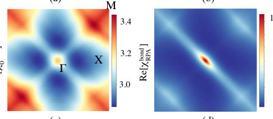 
FIG. 4. Static susceptibilities of C-AFM CsCr2S2O in the kz = 0 plane. (a,b) Cr-dxz/yz sSDW susceptibility χamp(q) calculated in the magnetic primitive cell: (a) bare and (b) RPA susceptibilities for U = U ′ = 3 eV. (c,d) local Cr-dxz–S- pz bonding susceptibility calculated in the √

**Summary.** This study theoretically elucidates the mechanism behind a Metal-Insulator Transition in $	ext{CsCr}_2	ext{S}_2	ext{O}$ by proposing that it results from the coupling between an itinerant Spin-Density Wave (sSDW) and Bond Order (BO) fluctuations. Using advanced electronic structure calculations, the authors show how pre-existing antiferromagnetism enables this coupled instability, leading to structural distortion and band gap opening.

**Why it may be interesting.** This work provides a detailed theoretical framework for understanding how multiple competing orders (magnetic, charge, lattice) can cooperate in correlated materials to drive a phase transition, which is highly relevant to modern strongly correlated electron physics.

Detailed structure

**Main problem.** The study identifies a Metal-Insulator Transition (MIT) driven by the cooperative coupling between Bond Order (BO) fluctuations and a secondary Spin-Density Wave (sSDW) instability in $	ext{CsCr}_2	ext{S}_2	ext{O}$.

**Main result.** The coupled sSDW-BO mechanism successfully explains the structural MIT, charge disproportionation, and gap opening observed in the material, linking pre-existing antiferromagnetism to electronic correlation effects.

**Method.** The research employs first-principles calculations (DFT) combined with tight-binding models and free energy minimization techniques to analyze competing order parameters.

**Model / system.** The system is $	ext{CsCr}_2	ext{S}_2	ext{O}$, an altermagnetic material. The low-energy physics is modeled by the interaction between itinerant $	ext{Cr-}d_{xz}$ and $	ext{S-}p_z$ orbitals, which are subject to both magnetic (sSDW) and structural/bonding (BO) instabilities.

**Key observables.** Band structure evolution showing gap opening; charge disproportionation ($\Delta
ho$); local moment modulation; and the minimization of a coupled free energy functional involving sSDW and BO order parameters.

**Important parameters / regimes.** The transition is critically dependent on pre-existing C-AFM order, electronic correlations (e.g., $U$), and structural displacements ($\delta x_S$).

**Assumptions / limitations.** The analysis assumes that the low-energy physics can be effectively described by coupling terms between the sSDW and BO fluctuations within a mean-field or RPA framework.

**Figures summary.** Figures illustrate the energy landscape dependence on S displacement, showing structural distortion; band structures demonstrating gap opening upon distortion; and comparisons of bare vs. RPA static susceptibilities confirming order parameter enhancement.

**Paper structure.** The paper first establishes the physical system and the need for a coupled mechanism. It then uses DFT/TB calculations to map out the energy landscape as a function of structural displacement, revealing the MIT. Finally, it employs free energy minimization using susceptibility analysis (RPA) to quantify the coupling between sSDW and BO order parameters.

Abstract

A metal-insulator transition (MIT) driven by bond order (BO) coupled with a secondary spin-density wave (SDW) is identified in CsCr$_2$S$_2$O. Such coupling is enabled as a result of the broken time-reversal symmetry due to the pre-existing C-type antiferromagnetic (C-AFM) order. First-principles calculations reveal an orbital-selective physics that Cr-$d_{yz}$ orbitals form local moments and establish the altermagnetic order, while the Cr-$d_{xz}$ orbitals remain metallic and hybridize with S-$p_z$. Thus the low-energy physics is governed by the Cr-$d_{xz}$ and S-$p_z$ orbitals. On-site interactions then enhance a secondary SDW ($s$SDW) instability of the itinerant $d_{xz}$ electrons, which couples to the Cr-$d_{xz}$-S-$p_z$ bonding order. The resulting coupled $s$SDW-BO simultaneously produces experimentally observed structural distortion, charge disproportionation, local Cr-moment modulation, and gap opening. Our results establish an orbital-selective mechanism upon which pre-existing altermagnetism and electronic correlations cooperate to drive a structural MIT.

[↑ back to top](#top)

### [Quantum State Discrimination With Stabilizer Circuits](http://arxiv.org/abs/2607.27339v1)

**Authors:** Benjamin Stratton, Santiago Zamora, Rafael Chaves  
**Type:** theory · **Category:** quantum information and computing · **PDF:** <https://arxiv.org/pdf/2607.27339v1>  
**Analysis basis:** full PDF text, analyzed in chunks
**Topic relevance:** `quantum measurements` **3/5** · `entanglement & information structure` **1/5** · `measurement-induced transitions` **1/5**

📷 Fig 1

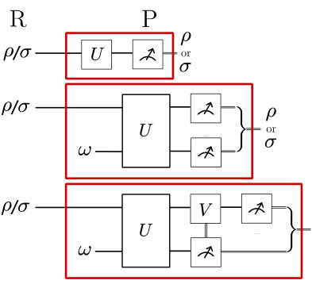 
FIG. 1. A graphical depiction of the task of QSD, where the referee (R) gives the player (P) either the state ρ or the state σ, under (A) fixed stabilizer circuits with no ancilla (Pstab suc (∆)), (B) fixed stabilizer circuits with an ancilla (Pstab,f suc (∆, ω)), and (C) adaptive stabilizer circuits (Pstab,a suc (∆, ω)),

📷 Fig 2

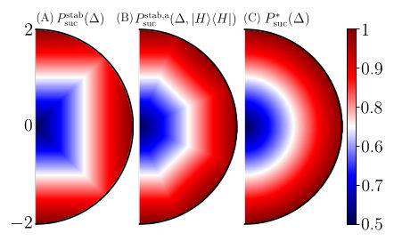 
FIG. 2. The minimum error success probability for all ⃗∆in the xz-plane for (A) stabilizer circuits, (B) stabilizer circuits with a single H-type magic state and adaptive measurements, and (C) unrestricted measurements (Helstrom’s).

📷 Fig 3

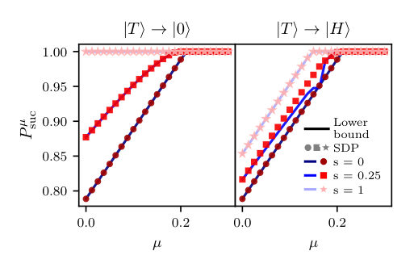 
FIG. 3. Optimal success probability Pµ suc versus measurement non-stabilizerness µ. Discrimination of antipodal states along trajectories |T⟩→|0⟩(left, symmetric) and |T⟩→|H⟩(right, asymmetric) for s ∈{0, 0.25, 1} on the Bloch sphere (see Ap- pendix D). The analytical bound (lines) saturates the exact SDP maximum (markers) along the stabilizer octahedron’s symme- try axes (left). Conversely, for asymmetric trajectories (right), the SDP exploits measurement leakage to strictly exceed the analytical bound at intermediate µ.

📷 Fig 4

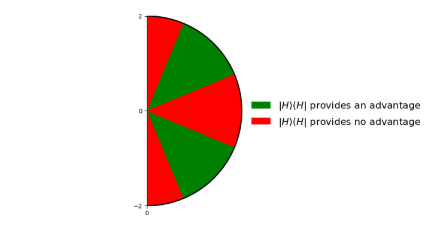 
FIG. 4. The regions for which access to an H-type magic state does and does not allow an advantage to be gained in QSD under adaptive stabilizer circuits for all ⃗∆in the xz-plane.

📷 Fig 5

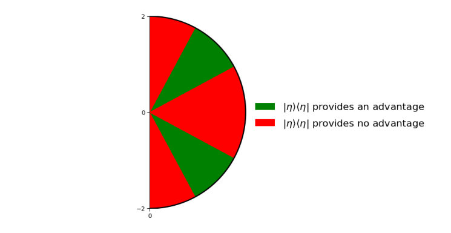 
FIG. 5. The regions for which access to a state |η⟩which has |⃗n|↓= (0.9, 0.4, 0.173) does and does not allow an advantage to be gained in QSD under adaptive stabilizer circuits for all ⃗∆in the xz-plane.

**Summary.** This paper analyzes the limits of quantum state discrimination when measurements are restricted to physically realizable stabilizer circuits. It demonstrates that adaptive measurement strategies offer a genuine advantage over fixed ones in achieving higher success probabilities. By formulating the problem using non-stabilizerness, the authors derive tight analytical bounds connecting hardware constraints to fundamental quantum information theory limits.

**Why it may be interesting.** It provides rigorous theoretical tools for understanding how hardware limitations (like those imposed by stabilizer circuits) restrict fundamental quantum information tasks, which is crucial for designing fault-tolerant quantum computation protocols.

Detailed structure

**Main problem.** The paper investigates minimum-error quantum state discrimination (QSD) success probability when measurement capabilities are restricted by physical constraints, specifically stabilizer circuits.

**Main result.** Adaptive stabilizer measurements can provide a measurable advantage in QSD over fixed stabilizer measurements, and the optimal performance is bounded by incorporating non-stabilizerness into the optimization framework.

**Method.** The analysis uses semidefinite programming (SDP) to optimize success probabilities under measurement constraints, deriving analytical bounds that interpolate between the ideal Helstrom limit and the restricted stabilizer limits.

**Model / system.** The model involves distinguishing between two quantum states ($
ho$ and $\sigma$) in $n$-qubit systems. The core comparison is between measurements implementable by fixed vs. adaptive stabilizer circuits, and general POVMs.

**Key observables.** Minimum-error success probabilities ($P_{	ext{suc}}$), the state difference operator ($\Delta = 
ho - \sigma$), and the non-stabilizerness monotone ($\mu$).

**Important parameters / regimes.** The degree of adaptivity (fixed vs. adaptive circuits) and the allowed non-stabilizerness $\mu$.

**Assumptions / limitations.** The analysis assumes equal prior probabilities for the states being discriminated, and later employs a 'no-leakage Ansatz' to derive lower bounds.

**Figures summary.** Figures illustrate the QSD setup comparing fixed/adaptive stabilizer circuits; one figure shows the minimum error success probability across different state differences ($\vec{\Delta}$); another compares performance metrics for various $\vec{\Delta}$.

**Paper structure.** The paper progresses by first establishing the general framework of QSD under measurement constraints, then systematically comparing fixed vs. adaptive stabilizer measurements (showing adaptivity is key), followed by formulating the problem as an SDP incorporating non-stabilizerness ($\mu$), and concluding with applications to quantum random access codes and fidelity bounds.

Abstract

The task of quantum state discrimination provides an operational characterization of distinguishability and plays a central role in quantum information science. Since the achievable success probability in quantum state discrimination depends both on the states being discriminated and on the allowed measurements, it is natural to study discrimination under physically motivated measurement constraints. Here, we investigate minimum-error quantum state discrimination under measurements implementable by both fixed and adaptive stabilizer circuits. Given arbitrary stabilizer-state ancillas, we show that fixed stabilizer circuits provide no additional discrimination power, whereas adaptive circuits do. Then, focusing on single-qubit systems, we derive analytical expressions for the success probability across both circuit classes when supplied with arbitrary (non-stabilizer) ancillas, showing that the performance gap between fixed and adaptive circuits persists. We further consider discrimination with non-stabilizerness incorporated directly into the measurement operators. Here, the optimization is formulated as a semidefinite program, and analytical bounds interpolating between the stabilizer and Helstrom limits for qubits are derived. Finally, we illustrate applications in quantum random access codes and bounds on unitary synthesis fidelity with a finite number of magic states.

[↑ back to top](#top)

### [Thermal spin transport in easy-planar $d$-wave altermagnets controlled by magnetic field](http://arxiv.org/abs/2607.28085v1)

**Authors:** Yuliia I. Gusieva, Kostiantyn V. Yershov, Jeroen van den Brink, Volodymyr P. Kravchuk  
**Type:** theory · **Category:** strongly correlated electrons · **PDF:** <https://arxiv.org/pdf/2607.28085v1>  
**Analysis basis:** full PDF text, analyzed in chunks
**Topic relevance:** `spintronics-quantum-optics interface` **3/5** · `Keldysh / 2PI / non-Gaussian methods` **1/5** · `non-equilibrium dynamics` **1/5**

📷 Fig 1

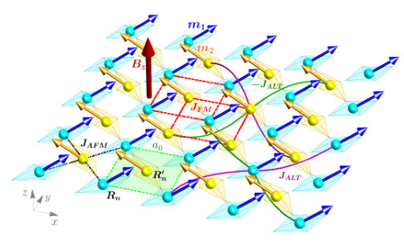 
FIG. 1. Schematic crystal structure and exchange interac- tions in a 2D d-wave altermagnet of rutile type. The model consists of two magnetic sublattices, A (cyan spheres, Rn) and B (yellow spheres, R′ n), with antiparallel (for Bz = 0) moments m1 and m2. Several Heisenberg exchange inter- actions are considered: the antiferromagnetic exchange Jafm (black dotted lines) couples nearest-neighbors of different sub- lattices; the ferromagnetic exchange Jfm (red dashed lines) couples nearest-neighbors within the same sublattice. The altermagnetic properties are modeled by additional superex- change bonds Jalt and −Jalt shown by the curved magenta and green lines, respectively. Note that the...

📷 Fig 2

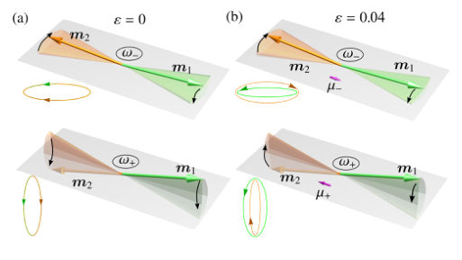 
FIG. 3. Precession of the neighboring magnetic moments belonging to different sublattices in the spin wave with the wave vector (kxa0, kya0) = (0.5, 0.5). The top and bottom rows correspond to the gapless ω−and gapped ω+ modes, respectively. Panels (a) and (b) show the antiferromagnetic (ε = 0) and altermagnetic (ε = 0.04) cases, respectively. In the latter case, the magnon magnetic moments µ± are gener- ated. In both cases, the magnetic field is absent (θ0 = π/2), κ = 0.1, and η = 0.5. The single-spin dynamics was recon- structed using Eq. (A13). The precession ellipses and the precession directions are shown from the perspective of an observer located at the tip of the vector m0 1. The...

📷 Fig 3

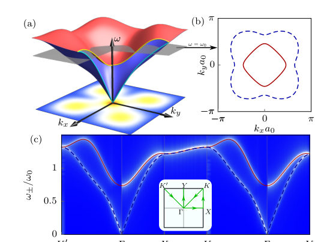 
FIG. 2. Magnon spectra (4) for the easy planar NiF2. (a) Shows the evolution of two branches ω+ (red) and ω− (blue) within the 1st Brillouin zone. The value of splitting ∆ωk = ω+ −ω−is shown by the color coding at the bottom. Surface of the constant energy ω =const is shown on panel (b). (c) Shows the comparison of analytical prediction (4) and re- sults of numerical simulations along the path K′–Γ–X–K–Γ– Y . Here we use the following parameters: ε = 0.25, η = 0.1, κ = 0.5, and Bz = Jafm/µs.

📷 Fig 4

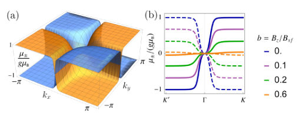 
FIG. 4. Distribution of the magnon magnetic moment de- termined by Eq. (6) within the 1st Brillouin zone. Panel (a) shows the case Bz = 0. Magnetic moments, which corre- spond to the upper (µgs + ) and lower (µgs −) magnon branches, are shown by blue and yellow surfaces, respectively. Panel (b) shows the effect of suppression of µgs ± by the applied magnetic field. The k-dependencies are shown along the path K′−Γ−K by solid and dashed lines, which correspond to the lower and upper branches, respectively. The parameters used in the cal- culations are κ = 0.08, ε = 0.1, and η = 0.5.

📷 Fig 5

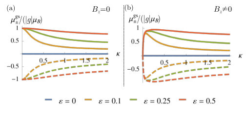 
FIG. 5. Magnon magnetic moment (6) along the ground state N´eel vector n0 as a function of the anisotropy parameter κ for various values of the altermagnetic strength ε. Solid and dashed lines represent the lower (µgs −) and upper (µgs + ) magnon branches, respectively. Cases with Bz = 0 and Bz = 0.4Jafm/µs are compared in panels (a) and (b). In all cases, η = 0.5, and (kxa0, kya0) = (π/4, π/4).

**Summary.** This paper theoretically analyzes thermal spin transport in easy-planar $d$-wave altermagnets, showing that the material's unique symmetry generates a momentum-dependent magnon magnetic moment. This moment drives a measurable spin current (spin-splitter effect) when subjected to a temperature gradient, and this conductivity can be tuned by an external magnetic field.

**Why it may be interesting.** This work provides a detailed theoretical mechanism linking crystal symmetry (d-wave altermagnetism) directly to measurable non-equilibrium transport phenomena (thermal spin current), which is highly relevant for understanding emergent quantum magnetics and spintronics.

Detailed structure

**Main problem.** The study investigates thermal spin transport mechanisms, specifically the spin-splitter effect, within easy-planar $d$-wave altermagnets under an external magnetic field.

**Main result.** The research demonstrates that altermagnetism generates a momentum-dependent magnon magnetic moment, leading to a measurable spin current driven by a temperature gradient. This thermal spin conductivity can be actively tuned by applying a perpendicular magnetic field.

**Method.** The authors employ theoretical methods involving linearizing the classical Landau-Lifshitz equation using the Holstein-Primakoff representation to derive magnon dispersion relations and calculate transport coefficients like spin conductivity.

**Model / system.** The model is an easy-planar $d$-wave altermagnet, exemplified by a rutile-type material like NiF2. The Hamiltonian incorporates antiferromagnetic, ferromagnetic, and additional altermagnetic exchange interactions, alongside a Zeeman term from the external field B.

**Key observables.** Magnon dispersion relation ($\omega_{\pm}(\mathbf{k})$), magnon magnetic moment ($\mu_
u(\mathbf{k})$), and thermal spin conductivity ($\sigma_{xy}$).

**Important parameters / regimes.** The system behavior is controlled by the external magnetic field $B_z$, which tunes the magnitude of the altermagnetically generated magnetic moment.

**Assumptions / limitations.** Key approximations include linearizing dynamics around the ground state and using the Holstein-Primakoff representation for spin wave analysis. The calculation also relies on specific limits, such as small fields or high temperatures for conductivity derivations.

**Figures summary.** Figures illustrate the crystal structure with various exchange interactions, show magnon spectra confirming splitting ($\omega^+$ and $\omega^-$), and depict the precession of neighboring magnetic moments in different altermagnetic regimes.

**Paper structure.** The paper builds from defining the physical system and Hamiltonian (including multiple exchange terms) to deriving the spin wave dynamics via linearization. It then calculates key observables like the magnon moment and finally extends this framework to derive the temperature-dependent spin conductivity tensor components.

Abstract

Altermagnets constitute a novel class of collinear spin-compensated materials in which magnon branches are spin-split even in the non-relativistic limit. The latter is the result of a more complex symmetry operation (compared to conventional antiferromagnets) that connects the two sublattices. Altermagnetic splitting strongly affects the magnon transport properties, leading, in particular, to the thermal magnon splitter effect in easy-axial $d$-wave altermagnets. Whether this effect also appears in easy-planar systems is not obvious, since the magnon branches do not carry a constant magnetic moment in this case. Here, we consider the easy-planar $d$-wave altermagnet of a rutile-type, e.g., NiF$_2$, and demonstrate the emergence of the altermagnetically generated magnon magnetic moment, which is momentum-dependent and possesses $d$-wave symmetry. This then leads to the spin-splitter effect, i.e., the emergence of a magnon-driven spin current (the flow of magnetic moment) in response to the applied temperature gradient. We also demonstrate that the corresponding thermal spin conductivity can be effectively tuned by an external magnetic field perpendicular to the easy plane.

[↑ back to top](#top)

### [Classical Tensor Network and Quantum Fourier Transform Approaches for Large-Scale Carr-Madan Option Pricing](http://arxiv.org/abs/2607.28435v1)

**Authors:** Sascha Hauck, Ivica Turkalj  
**Type:** both · **Category:** numerical methods · **PDF:** <https://arxiv.org/pdf/2607.28435v1>  
**Analysis basis:** full PDF text, analyzed in chunks
**Topic relevance:** `methods for driven-dissipative` **3/5** · `analog quantum simulation` **1/5**

📷 Fig 1

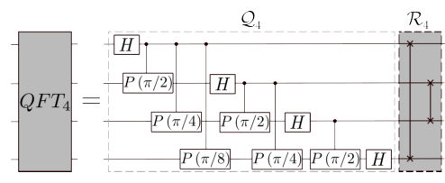 
Figure 1. Quantum circuit of the QFT for the case of four qubits. The circuit separates into the actual transform Q4 and reordering circuit R4. Under the sign convention adopted in (9), the option-pricing calculation uses the inverse QFT, obtained by taking the adjoint of the displayed circuit. Adapted from Nielsen and Chuang (2000).

📷 Fig 2

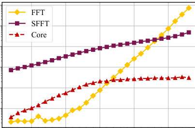 
Figure 3. Runtime over the discretization parameter n. Shown are the total runtime in seconds for the FFT- and SFFT-based option pricing algorithm as well as the SFFT-algorithm without the time used to construct the used operators denoted as Core.

📷 Fig 3

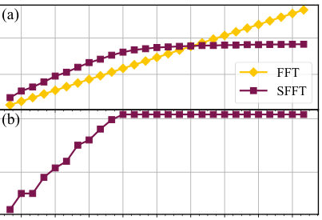 
Figure 2. Memory comparison between the SFFT and FFT-based option-pricing method: (a) memory consumption in MB of both approaches and (b) rank scaling for the SFFT-based algorithm.

📷 Fig 4

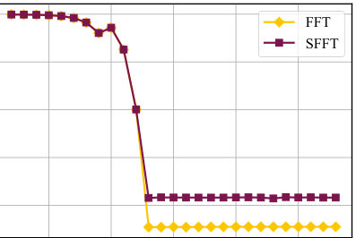 
Figure 4. NRMSE over discretization parameter n for the classical SFFT- and FFT-based option pricing algorithms.

📷 Fig 5

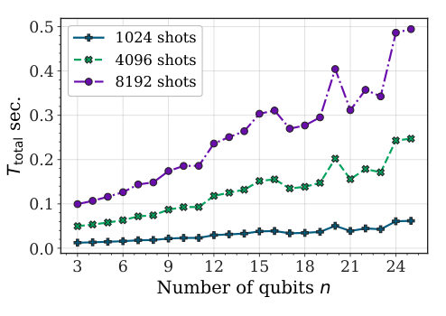 
Figure 5. Runtime of quantum hardware over the discretization parameter n. Shown are Ttotal = Texec · S for different values of the shot parameter S. The default value for S on IBM hardware is S = 4096.

**Summary.** This work tackles the computational bottleneck of large-scale option pricing by reformulating the problem using tensor networks. The Superfast Fourier Transform (SFFT) allows for accurate and memory-efficient calculation, achieving subexponential scaling compared to standard FFTs. It establishes a unified framework connecting classical tensor methods with quantum computing approaches for high-dimensional numerical tasks.

**Why it may be interesting.** While focused on finance, the core mathematical tool—representing high-dimensional transforms via low-rank tensor networks (Tensor Trains)—is directly applicable to simulating complex many-body Hamiltonians or calculating correlation functions in quantum materials where exact diagonalization fails due to exponential scaling.

Detailed structure

**Main problem.** The primary challenge is developing scalable computational methods for pricing European options using Fourier-based techniques, which suffer from exponentially growing memory requirements with increasing discretization size.

**Main result.** The proposed Superfast Fourier Transform (SFFT) method, based on tensor networks, achieves subexponential scaling and significantly reduces memory overhead compared to conventional FFT implementations.

**Method.** The authors reformulate the Carr-Madan pricing framework by mapping the required Fourier transform into a compressed Tensor Train representation (SFFT), allowing computation without explicitly constructing exponentially large vectors or operators.

**Model / system.** The model is financial option pricing, specifically European options whose valuation relies on knowing the characteristic function of the underlying asset's log-price process. The computational comparison involves classical FFT, SFFT (tensor networks), and QFT implemented on quantum hardware/simulators.

**Key observables.** Option price value, computational memory requirements, computational scaling ($\chi$, NRMSE).

**Important parameters / regimes.** Discretization parameter $n$ (or number of grid points $M$), damping parameter $\alpha$.

**Assumptions / limitations.** The QFT approach requires assuming the phase relationship between complex amplitudes based on non-negative probabilities; SFFT assumes that the Fourier transform can be efficiently represented by a low-rank tensor structure.

**Figures summary.** Figures compare runtime scaling (QPU vs. FFT vs. SFFT), circuit depth/gate count growth with qubits, and convergence of pricing error (NRMSE) as discretization size increases.

**Paper structure.** The paper progresses from establishing the limitations of classical Fourier methods to introducing the tensor network reformulation (SFFT). It then compares this classical approach against direct QFT implementations on quantum hardware/simulators, culminating in a comparative analysis of efficiency and accuracy across all three paradigms.

Abstract

Fourier-based methods are among the most widely used techniques for pricing European options when the characteristic function of the underlying asset process is available. Their applicability to increasingly fine discretizations, however, is limited by the rapidly growing memory requirements of classical Fourier transforms, which become a computational bottleneck for large-scale pricing problems.   In this work, we overcome this limitation by reformulating the Carr-Madan pricing framework using tensor networks. Specifically, we employ the Superfast Fourier Transform (SFFT), a compressed Tensor Train representation of the Quantum Fourier Transform (QFT), and apply it directly to tensorized option pricing without ever explicitly constructing exponentially large vectors or Fourier operators. This formulation also enables a direct comparison between the classical tensor network algorithm and its quantum counterpart through QFT-based option pricing on quantum simulators and quantum hardware. Numerical experiments for European call options demonstrate that the proposed SFFT method maintains pricing accuracy while substantially reducing memory requirements and achieving subexponential computational scaling compared with conventional FFT-based pricing. The accompanying quantum simulations and hardware executions enable a direct comparison between the classical tensor network formulation and its QFT-based quantum counterpart, showing that both approaches avoid the exponential scaling of conventional Fourier implementations and provide complementary perspectives on large-scale option pricing.   Together, these results establish a unified framework connecting classical Fourier pricing, tensor network algorithms, and quantum computing approaches, demonstrating how tensorized Fourier methods can provide scalable alternatives for high-dimensional financial computations.

[↑ back to top](#top)

### [Trainability and Mode Separation of Mixed IQP-QCBMs](http://arxiv.org/abs/2607.27883v1)

**Authors:** Youngseok Lee, Hyunwoo Kim  
**Type:** theory · **Category:** disordered systems and neural networks · **PDF:** <https://arxiv.org/pdf/2607.27883v1>  
**Analysis basis:** full PDF text, analyzed in chunks
**Topic relevance:** `exotic spin models in light-matter` **3/5** · `methods for driven-dissipative` **1/5**

📷 Fig 1

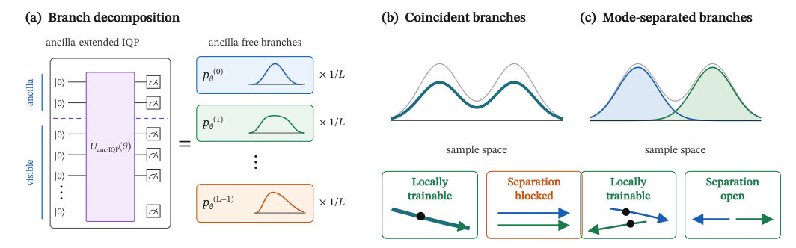 
FIG. 1. Central mechanism of the mixed IQP-QCBM. Gray denotes the target, blue and green denote two branches, and arrows show their responses to training. Under the corresponding conditions of Sec. III, each initialization shown is locally trainable. (a) At uniform weights, tracing out the ancillas of Uanc-IQP(θ) yields L ancilla-free branches, each weighted by 1/L. (b) Data-agnostic and global initialization are branch-coincident, so their separating gradient vanishes. (c) Cluster initialization assigns different data clusters to the branches, giving distinct starting distributions and noncanceling separating gradients.

📷 Fig 2

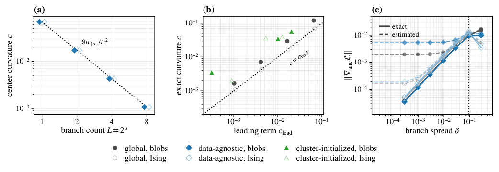 
FIG. 2. Exact tests of the three local predictions on the two n = 16 datasets. (a) Theorem 1, at the data-agnostic center: the one-body curvature follows the 8w{j}/L2 prediction of Theorem 1. (b) Theorem 2, at the global and cluster-initialized centers: the exact witness curvature c against the leading positive term clead defined in the text. Equation (24) requires only c ≥clead −Rn; the dotted diagonal c = clead is therefore a stronger finite-size reference. (c) Theorem 3, at branch-coincident starts (a = 1): the exact branch-separating gradient vanishes at coincidence and grows linearly with the existing spread (Pearson r &gt; 0.99) through the spread of the run initialization, marked by the...

📷 Fig 3

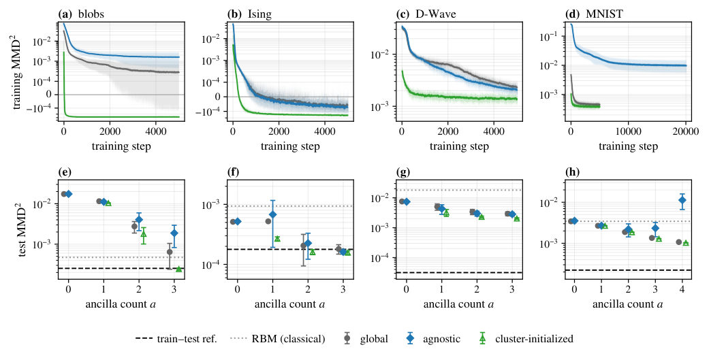 
FIG. 3. Training dynamics and test MMD2 on the four benchmarks; columns are datasets, at the headline mixture size a = 3 (a = 4 for MNIST). (a)–(d) Training MMD2 against the training step: bold curves are 25-step moving averages of the seed mean, faint curves the raw mean, and bands one standard deviation. The unbiased finite-sample loss samples Pauli-Z operators and estimates model correlators and data moments; after removing self-correlations, values near zero may be slightly negative. (e)–(h) Test MMD2 against the ancilla count a (L = 2a), averaged over the sweep ¯m = 1, . . . , 6, with the train–test sampling reference (dashed) and the best classical RBM (dotted). Means and bands use...

📷 Fig 4

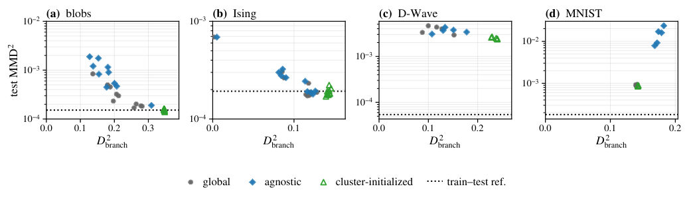 
FIG. 4. Squared branch diversity [Eq. (15)] against test MMD2, both at the same kernel bandwidth, for individual trained models at a = 3 (blobs and D-Wave), a = 2 (Ising), and a = 4 (MNIST). One point per initialization scheme and training seed; dotted lines mark the train–test sampling references. Both coordinates are exact for n = 16 and estimated from corre- lators otherwise. The Spearman correlations between the two coordinates are −0.94 (blobs), −0.58 (Ising), −0.77 (D-Wave), and +0.61 (MNIST), with percentile-bootstrap 95 % confidence intervals (−0.97, −0.87), (−0.83, −0.20), (−0.97, −0.30), and (+0.01, +0.92) from 104 resamples.

📷 Fig 5

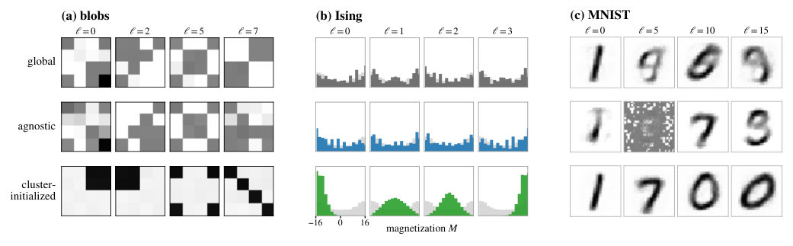 
FIG. 5. Distributions of selected branches after training: four branches spanning the branch index of each mixture. Rows denote initialization schemes and columns denote branches ℓ. (a) Binary blobs (a = 3) and (c) binarized MNIST (a = 4): each cell is the mean image of one branch, in which each pixel shows the probability that the branch outputs a one at that pixel, with darker pixels denoting higher probability. (b) 2D Ising (a = 2, all four branches): exact branch magnetization densities (colored) over the training density (gray). Every configuration is trained at multiple seeds (ten at n = 16, five on MNIST); to display the differences between the schemes conservatively, each row shows...

**Summary.** The paper proposes the mixed IQP-QCBM, an advanced quantum generative model designed for classical trainability. It demonstrates that achieving high fidelity requires 'mode separation,' which is best achieved using a cluster initialization scheme. This approach successfully trains the model to accurately reproduce complex data distributions found in areas like spin glasses and image recognition.

**Why it may be interesting.** This work directly bridges quantum machine learning with statistical physics by applying highly structured quantum circuits (IQP) to model complex classical distributions found in disordered systems like spin glasses. The focus on 'mode separation' is a key concept for understanding how deep generative models capture distinct physical features.

Detailed structure

**Main problem.** The research addresses developing quantum generative models (QCBMs) that are classically trainable while maintaining high expressive power, specifically focusing on the trainability and mode separation capabilities of mixed IQP-QCBMs.

**Main result.** Cluster initialization significantly outperforms other methods by providing initial mode separation, allowing the model to converge fastest and achieve the lowest test MMD^2 across various complex datasets like spin glasses and MNIST.

**Method.** The authors analyze training using the Maximum Mean Discrepancy (MMD) loss function, which is formulated as a weighted sum of squared Pauli-Z correlator mismatches between the model and data moments.

**Model / system.** The core model is the mixed IQP-QCBM, an extension of Quantum Circuit Born Machines built from Instantaneous Quantum Polynomial-Time (IQP) circuits. It models the probability distribution as a weighted mixture over multiple 'branches,' each derived from an ancilla-free IQP circuit.

**Key observables.** Test MMD^2 (Mean/Peak), Pauli-Z Correlators ($z_A(	heta)$), and Branch Diversity ($D_{	ext{branch}}$).

**Important parameters / regimes.** The number of branches ($L$), the structure of the weights ($\pi_\ell$), and initialization schemes (data-agnostic, global, cluster).

**Assumptions / limitations.** The analysis assumes the IQP circuit is 2-body, and that local barren plateau avoidance can be proven under specific initializations.

**Figures summary.** Figures illustrate the mechanism of mode separation in QCBMs, contrasting coincident branches (suppressed gradients) with mode-separated branches (allowing open gradient flow).

**Paper structure.** The paper introduces the mixed IQP-QCBM structure, proves local barren plateau avoidance for this model, and then empirically compares initialization strategies—particularly highlighting cluster initialization's success in achieving mode separation on benchmark datasets.

Abstract

Quantum circuit Born machines (QCBMs) based on instantaneous quantum polynomial-time (IQP) circuits are promising quantum generative models for their classical trainability. It is known that their ancilla-free form avoids barren plateaus under certain initializations, but remains non-universal. Although adding ancilla qubits raises the expressivity, whether the ancilla-extended model retains local trainability remains unknown. We propose the mixed IQP-QCBM, which generalizes the ancilla-extended circuit as a weighted mixture of ancilla-free IQP circuits, called branches. For a polynomial number of branches, we prove local barren-plateau avoidance from data-agnostic and, under certain assumptions, data-dependent initializations. We further show that the mixed IQP-QCBM can surpass the best ancilla-free IQP circuit only if its branches generate a number of distinct distributions. In particular, we focus on a behavior we call \emph{mode separation}, in which each branch captures a particular feature of the target. Mode separation is hard to attain from an initialization whose branches generate the same distribution: the gradients that would separate them are suppressed while the distributions they generate remain close. This motivates \emph{cluster initialization}, which assigns a different unsupervised data cluster to each branch and provides an initial degree of mode separation. Exact calculations on two 16-bit datasets support the barren-plateau and gradient-suppression claims. On four benchmarks, binary clusters, a two-dimensional Ising model, binarized MNIST, and a 484-spin glass, cluster initialization converges fastest and reaches the lowest mean test $\mathrm{MMD}^2$. We observe that, when achieving the lowest test $\mathrm{MMD}^2$, the mixed IQP-QCBM contains branches specialized to distinguishable data features such as blob patterns, magnetization sectors, or digit shapes.

[↑ back to top](#top)

### [Optimization of magneto-electric properties in Lead-free (x)Co1.2Ti0.2Fe1.6O4 - (100-x)BaTiO3 based composites](http://arxiv.org/abs/2607.27717v1)

**Authors:** Rajeev Dwivedi, Samanway Mohanta, Ashutosh Anand, Abhinash Tripathy, Najnin Bano, Dharmendra Kumar, Hemant Singh, R. Venkatesh, Sachin Gupta, Dinesh Kumar Shukla  
**Type:** experiment · **Category:** other · **PDF:** <https://arxiv.org/pdf/2607.27717v1>  
**Analysis basis:** full PDF text, analyzed in chunks
**Topic relevance:** `spintronics-quantum-optics interface` **3/5**

📷 Fig 1

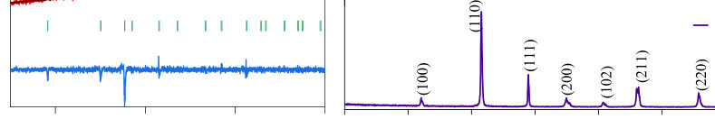 
Fig. 1. Rietveld-refined X-ray diffraction patterns for (a) pure BTO, and (b) pure CTFO. (c) XRD

📷 Fig 2

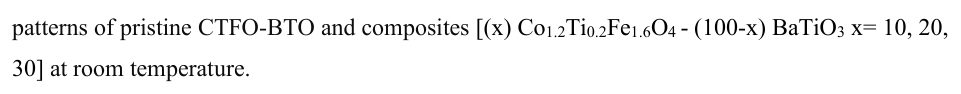 
Fig. 1 shows the room-temperature X-ray diffraction (XRD) patterns of all [(x)

📷 Fig 3

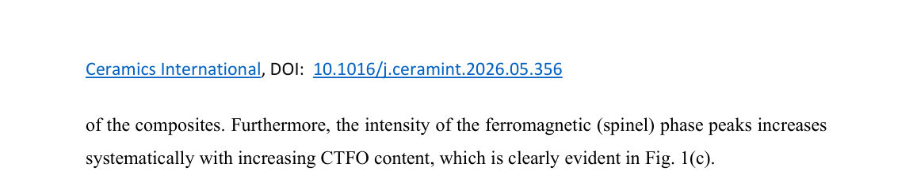 
Fig. 2. XRD patterns along with Rietveld refinement for CTFO-BTO composites with

📷 Fig 4

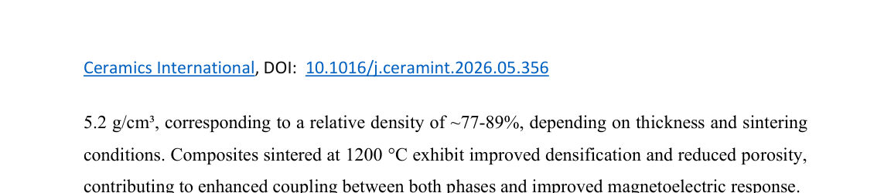 
Fig. 3. FE-SEM micrographs of CTFO–BTO composites: C10:B90, C20:B80, and C30:B70

📷 Fig 5

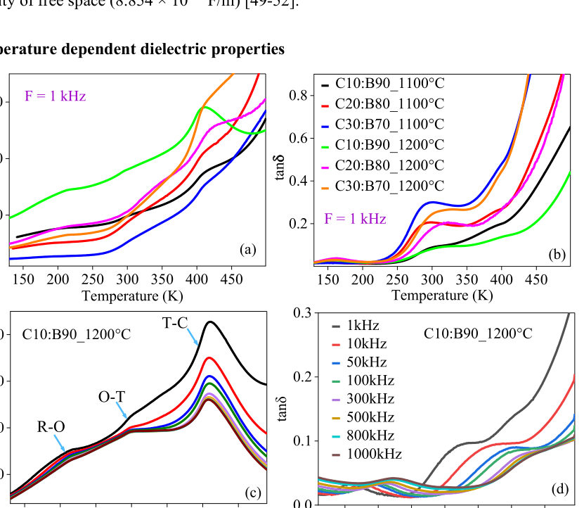 
Fig. 4. Temperature dependence of (a) dielectric constant (ε') and (b) dielectric loss (tanδ) for

**Summary.** This work systematically optimizes lead-free multiferroic composites by combining $	ext{Co}$-based ferrite ($	ext{CTFO}$) with $	ext{BaTiO}_3$ ($	ext{BTO}$). By controlling both the material composition and the high-temperature sintering process, the researchers achieved a record high magnetoelectric coefficient. This demonstrates that microstructural engineering is crucial for developing next-generation multifunctional devices.

**Why it may be interesting.** While focused on classical condensed matter physics (ferroelectrics/ferromagnetics), the concept of engineered interfacial strain transfer and coupled order parameters is relevant to understanding emergent quantum phenomena in heterostructures.

Detailed structure

**Main problem.** The primary goal is the systematic optimization of magnetoelectric (ME) properties in lead-free multiferroic composites.

**Main result.** The highest ME coefficient ($\sim 1.28 	ext{ mV/cm}\cdot	ext{Oe}$) was achieved using a $30	ext{CTFO} - 70	ext{BTO}$ composite sintered at $1200^\circ	ext{C}$.

**Method.** The study employed solid-state synthesis followed by comprehensive characterization, including XRD, FESEM, and measurements of electrical (P-E) and magnetic ($	ext{M-H}$) properties.

**Model / system.** The system is a two-phase composite: $	ext{Co}_{1.2}	ext{Ti}_{0.2}	ext{Fe}_{1.6}	ext{O}_4$ (ferromagnetic ferrite) and $	ext{BaTiO}_3$ (ferroelectric). The ME effect relies on strain transfer between these phases.

**Key observables.** Magnetoelectric coefficient ($\alpha_{	ext{ME}}$), dielectric constant ($\varepsilon'$), ferroelectric polarization ($P$), magnetization ($M$).

**Important parameters / regimes.** Composition ratio ($	ext{x}=10, 20, 30$) and sintering temperature ($1100^\circ	ext{C}$ vs $1200^\circ	ext{C}$).

**Assumptions / limitations.** The ME coupling is governed by the optimal balance between magnetostrictive strain (from ferrite) and piezoelectric response (from $	ext{BaTiO}_3$).

**Figures summary.** XRD patterns confirm phase coexistence; FESEM shows grain growth dependence on sintering temperature; specific figures highlight the maximum $\alpha_{	ext{ME}}$ for $30	ext{CTFO} - 70	ext{BTO}$ at $1200^\circ	ext{C}$.

**Paper structure.** The paper systematically investigates how varying the dopant-modified composition and sintering temperature affects structural integrity, phase coupling, and ultimately maximizes the magnetoelectric response.

Abstract

This work presents a systematic study of lead-free multiferroic composites of (x)Co1.2Ti0.2Fe1.6O4 - (100-x)BaTiO3 (x = 10, 20, 30), which were synthesized by a solid-state reaction method to investigate the effects of composition and sintering temperature on their structural , electrical, magnetic, and magnetoelectric (ME) properties. X-ray diffraction along with Rietveld refinement confirms the coexistence of tetragonal BaTiO3 (BTO) and cubic spinel Co1.2Ti0.2Fe1.6O4 (CTFO) phases. Microstructural analysis shows that densification and grain growth are better at higher sintering temperatures, leading to better coupling between the two phases. Dielectric and ferroelectric studies indicate lossy polarization-electric field (P-E) behaviour due to leakage from the conductive phase, while magnetic properties show increased magnetization with increasing ferrite content. All composites exhibit ME coefficients, which depend on the composition and sintering conditions; the highest ME coefficient (~1.28 mV/cm.Oe) was observed for the 30CTFO - 70BTO composite sintered at 1200 °C. This improvement is due to the optimal balance between magnetostrictive and piezoelectric responses and improved interfacial strain transfer. These results demonstrate that simultaneous optimization of dopant-modified composition and sintering conditions is essential for achieving improved magnetoelectric coupling in bulk multiferroic composites. Moreover, the results demonstrate the potential of lead-free composites for multifunctional device applications in next-generation, low-power technologies, including high-density non-volatile memory (e.g. FeRAM/MRAM), magnetic field sensors, spintronic devices, and actuators.

[↑ back to top](#top)

### [Pauli Encodings & Unclonable Encryption](http://arxiv.org/abs/2607.28602v1)

**Authors:** Pierre Botteron, Sébastien Designolle, Omar Fawzi  
**Type:** theory · **Category:** quantum information and computing · **PDF:** <https://arxiv.org/pdf/2607.28602v1>  
**Analysis basis:** full PDF text, analyzed in chunks
**Topic relevance:** `entanglement & information structure` **3/5**

📷 Fig 1

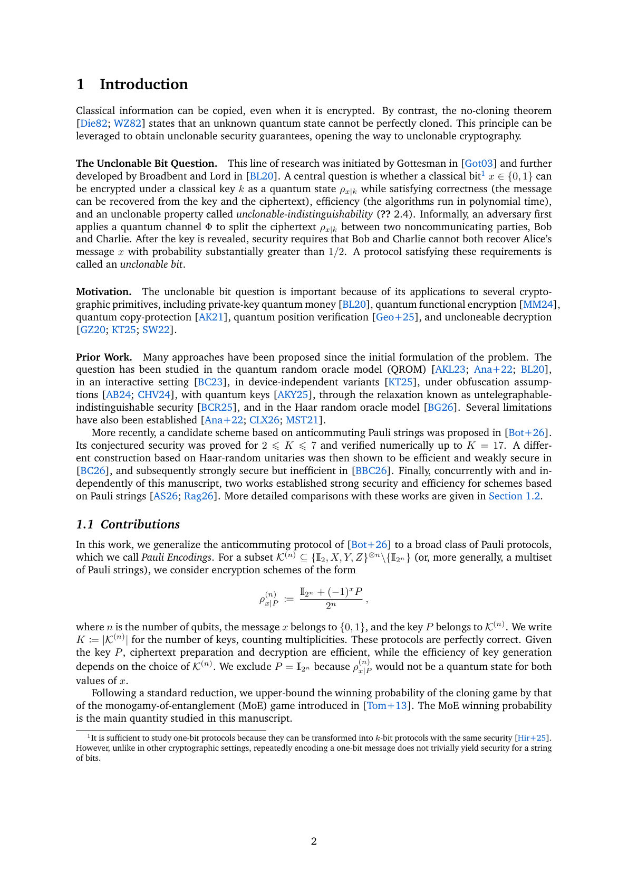 
Low-resolution page preview, page 2

📷 Fig 2

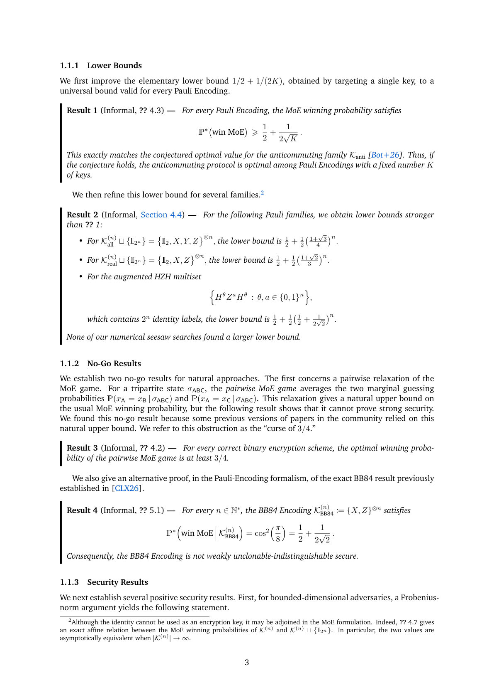 
Low-resolution page preview, page 3

📷 Fig 3

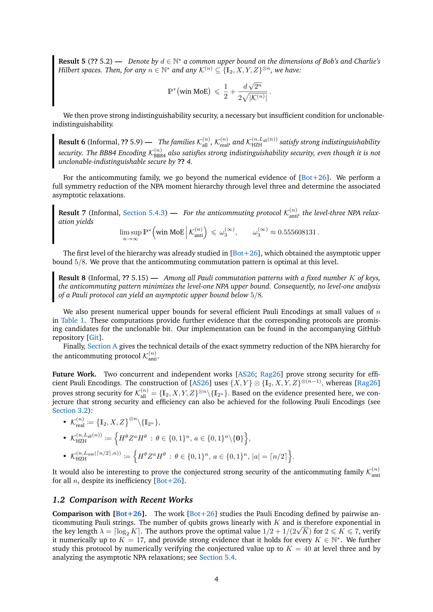 
Low-resolution page preview, page 4

📷 Fig 4

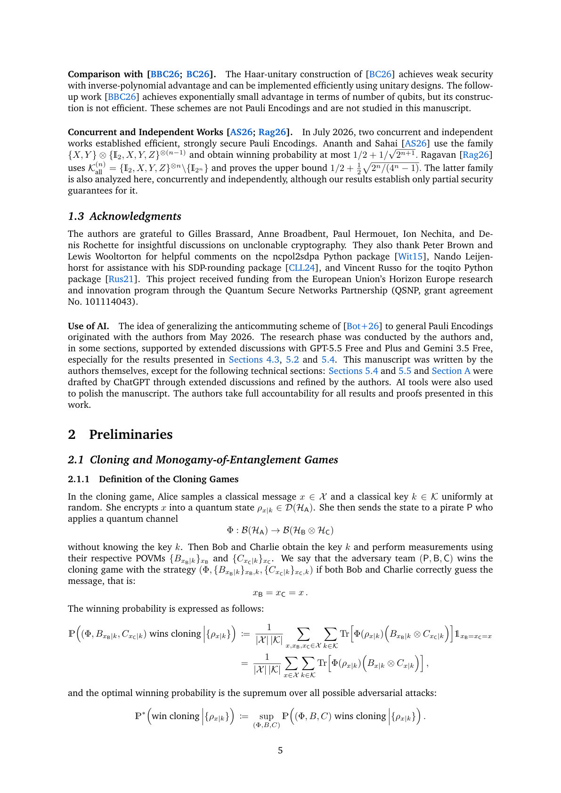 
Low-resolution page preview, page 5

📷 Fig 5

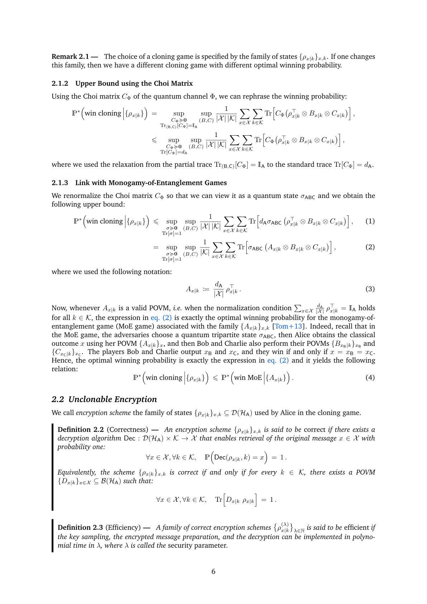 
Low-resolution page preview, page 6

**Summary.** This paper analyzes the security of Pauli Encoding schemes designed for unclonable encryption by studying the associated cloning game. Using advanced mathematical tools like moment matrix hierarchies and representation theory, the authors derive tight lower and upper bounds on the adversary's winning probability. The work provides strong theoretical constraints on what quantum cryptography can achieve in preventing state cloning.

**Why it may be interesting.** The rigorous application of representation theory (symmetric group characters, Specht modules) to bound quantum information security parameters is highly relevant for theoretical physicists working on fundamental limits in quantum communication.

Detailed structure

**Main problem.** The paper investigates the security of quantum encryption schemes against an adversary attempting to clone or distinguish encrypted states, addressing the Unclonable Bit Question.

**Main result.** It establishes universal lower bounds on the winning probability for Pauli Encodings and derives strong upper bounds (e.g., $\le 0.5556$) using advanced SDP relaxations for specific families of encodings.

**Method.** The authors employ techniques from quantum information theory, including analyzing the monogamy-of-entanglement game and utilizing moment matrix hierarchies (NPA) combined with representation theory to derive rigorous bounds.

**Model / system.** The core model is Pauli Encodings, where ciphertexts are normalized eigenspace projectors of Pauli strings acting on a quantum system. The analysis involves studying the security against adversaries in cloning games.

**Key observables.** Monogamy-of-Entanglement (MoE) winning probability ($P_{	ext{win MoE}}$), optimal cloning probability ($P^*_{	ext{win cloning}}$), and derived block matrices $B(K)_{\lambda,\epsilon}(g)$.

**Important parameters / regimes.** The number of Pauli strings ($K$), the system dimension ($2^n$), and the level of the moment relaxation (e.g., Level One, Two, Three).

**Assumptions / limitations.** The analysis relies on establishing equivalences between positive semidefiniteness of moment matrices and derived block matrices, and assumes certain structures for Pauli string families.

**Figures summary.** Not specified in the notes; the structure suggests mathematical derivations leading to explicit SDPs at various levels.

**Paper structure.** The paper progresses from defining the security problem (Unclonable Bit Question) using Pauli Encodings, deriving general lower bounds, establishing no-go results via pairwise marginals, and finally applying advanced moment/representation theory techniques (NPA hierarchy) to derive tight upper bounds.

Abstract

The unclonable bit question asks whether quantum encryption can prevent an adversary from producing two systems that both reveal the plaintext once the key is disclosed. We introduce and study Pauli Encodings, a simple class of one-bit encryption schemes whose ciphertexts are normalized eigenspace projectors of Pauli strings. For every Pauli Encoding with K Pauli strings, we prove a universal lower bound $1/2+1/(2\sqrt{K})$ on the optimal monogamy-of-entanglement winning probability, together with sharper bounds for several structured families. We then establish two limitations of natural approaches to unclonable security. First, if the Pauli strings are restricted to strings of X and Z of length n, the encoding is not secure. Second, we identify a universal 3/4 obstruction showing that arguments based only on pairwise guessing marginals cannot establish unclonable-indistinguishable security. When the Pauli strings all pairwise anticommute, the protocol becomes the one studied in [Quantum 10, 2157 (2026)]. We exploit the symmetry of this protocol to solve the third level of the natural semidefinite programming relaxation obtaining an asymptotic upper bound of approximately 0.5556 on the winning probability. Finally, we prove strong unclonable-indistinguishable security against bounded-local-dimension adversaries and strong indistinguishability security for several efficient Pauli families. First-level NPA computations provide additional numerical evidence towards the strong unclonable-indistinguishable security.

[↑ back to top](#top)

### [Design principles for energy dissipation in viscoelastic network metamaterials](http://arxiv.org/abs/2607.27525v1)

**Authors:** Niranjan Sarpangala, Sean Fancher, Prashant K. Purohit, Eleni Katifori  
**Type:** theory · **Category:** disordered systems and neural networks · **PDF:** <https://arxiv.org/pdf/2607.27525v1>  
**Analysis basis:** full PDF text, analyzed in chunks
**Topic relevance:** `correlated / nonlocal dissipation` **2/5** · `driven-dissipative phase transition` **2/5** · `methods for driven-dissipative` **2/5** · `Frenkel-Kontorova` **1/5** · `Keldysh / 2PI / non-Gaussian methods` **1/5** · `Kondo & dissipative impurity` **1/5** · `analog quantum simulation` **1/5** · `entanglement & information structure` **1/5** · `non-equilibrium dynamics` **1/5** · `non-equilibrium universality` **1/5**

📷 Fig 1

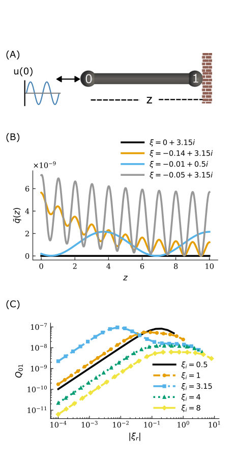 
FIG. 2. Dissipation in 1D bulk material (A) A viscoelas- tic rod of length L, clamped at one end and driven harmon- ically at the other. The coordinate z denotes distance from the driven end. (B) Spatial profile of the energy dissipated per unit length per unit time, ¯q(z), for several values of the complex wavenumber ξ = ξr + iξi. (C) Total rate of energy dissipated by the rod as a function of the real part of complex wave number. L = 10, A = 0.1, ρ = 1, u(0) = 0.001 sin t.

📷 Fig 2

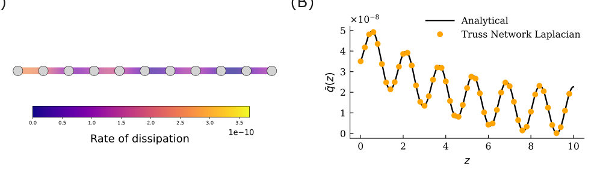 
FIG. 3. Benchmarking: energy dissipation in a uniform 1D network. (A) Rate of energy dissipation per segment in a one-dimensional network of 10 rods each of equal length (L = 1) and cross sectional area (A = 1), driven harmonically at the leftmost joint and fixed at the rightmost joint. Each rod was discretized into Nseg = 500. (B) Comparison of rate of energy dissipation per unit length, ¯q(z) computed by the graph Laplacian based spectral framework against the analytical solution for a single rod, confirming exact agreement. ξ = −0.1 + 2i, ρ = 1, ω = 1, u(0, t) = 0.001 sin t, u(10, t) = 0.

📷 Fig 3

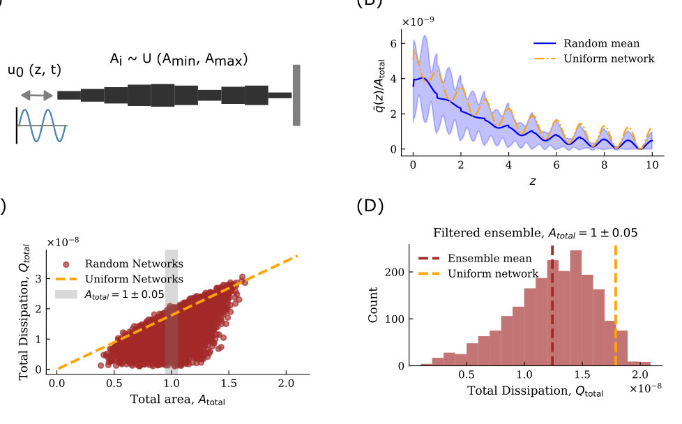 
FIG. 4. Total energy dissipation in one-dimensional networks with random cross-sectional areas. (A) A one- dimensional network of 10 rods of equal length (L), with cross-sectional areas drawn independently from a uniform distribution U(Amin, Amax). The leftmost joint is driven harmonically with amplitude ˜u(0) and frequency ω as u(0, t) = ˜u(0) sin ωt and the rightmost joint is fixed. (B) Rate of energy dissipation per unit length per unit time , ¯q(z), normalized by total network area, Atotal = P

📷 Fig 4

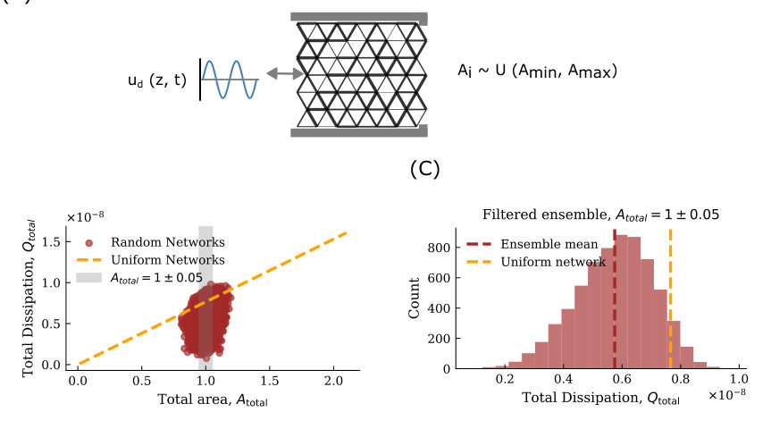 
FIG. 5. Total energy dissipation in two-dimensional networks with random cross-sectional areas. (A) A two- dimensional triangular truss network with cross-sectional areas drawn independently from a uniform distribution U(Amin, Amax). All rods have equal length L = 1 and the same material properties. The arrow indicates the driven joint, excited harmonically along the x-axis with amplitude, ˜ud and frequency, ω. Roller boundary conditions applied for top and bottom surface as indicated. Rightmost top and bottom nodes are clamped. (B) Total energy dissipated (Qtotal) for random networks plotted against total network area ((Atotal). The orange line shows results for uniform networks of varying...

📷 Fig 5

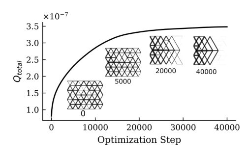 
FIG. 6. Illustrative optimization trajectory for a two- dimensional viscoelastic network. Evolution of a single gradient-based optimization run maximizing the total energy dissipated under a fixed material cost constraint. The solid black line is rate of total energy dissipated by the network as a function of optimization step. Insets depict the net- work architecture at selected steps (labeled), with rod thick- ness proportional to square root of cross-sectional area (di- vided by square root of cross-sectional area of thickest rod in the network). Starting from a random initial configura- tion, the optimization monotonically increases dissipation and converges to a source-weighted, loopy...

**Summary.** This work introduces a novel, computationally efficient spectral framework to model mechanical energy dissipation in large viscoelastic metamaterials. By optimizing the cross-sectional areas of the network rods, the authors demonstrate that maximum energy absorption is achieved not randomly, but through an engineered gradient structure dictated by the material's inherent attenuation length scale.

**Why it may be interesting.** While focused on classical mechanics, the use of spectral methods (Laplacian) and optimization principles in complex, disordered structures shares conceptual overlap with analyzing energy flow or correlation decay in quantum many-body systems or disordered quantum media.

Detailed structure

**Main problem.** The primary goal is identifying optimal architectural designs within large, disordered viscoelastic truss networks to maximize mechanical energy dissipation for applications like vibration isolation.

**Main result.** Optimal architectures are not random but exhibit a gradient structure where material properties decay from the source according to the intrinsic attenuation length scale of the base material.

**Method.** The authors developed an efficient graph Laplacian-based spectral framework that retains full continuum dynamics, allowing optimization via gradient descent on cross-sectional areas.

**Model / system.** The system is a viscoelastic truss network modeled by interconnected rods, where each rod's dynamics are treated as a one-dimensional continuum element governed by linear viscoelasticity principles.

**Key observables.** Energy dissipation rate (Q), optimal cross-sectional area distribution ($
ho_{net}(z)$), and the intrinsic attenuation length scale ($\xi$).

**Important parameters / regimes.** The frequency of excitation ($\omega$), the material's intrinsic attenuation length ($\xi$), and the total available material cost/area ($	ext{A}_{total}$).

**Assumptions / limitations.** The analysis assumes linear viscoelasticity governed by the Boltzmann superposition principle, and that the problem can be efficiently mapped onto a spectral framework based on the network Laplacian.

**Figures summary.** Figures illustrate the comparison between energy dissipation profiles for random versus optimized cross-sections, showing the characteristic gradient decay in optimal designs. Later figures confirm the robustness of these scaling laws under geometric perturbations.

**Paper structure.** The paper first establishes the spectral framework for viscoelastic networks using the graph Laplacian. It then uses optimization techniques to show that maximizing energy dissipation requires a specific, non-random distribution of cross-sectional areas governed by material attenuation lengths. Finally, it tests the robustness of these findings against geometric disorder.

Abstract

Mechanical energy dissipation in networked materials is relevant for applications from vibration isolation to impact protection, yet identifying optimal dissipative architectures in large disordered truss networks is computationally prohibitive with conventional finite element methods. We develop an efficient graph Laplacian-based spectral framework for viscoelastic truss networks, in which the full continuum dynamics of each rod are retained exactly and the problem size scales with the number of joints rather than element-level discretization points. Using this framework, we investigate how redistributing cross-sectional areas within a network (without changing material composition) controls energy dissipation. We find that random redistribution typically reduces dissipation relative to a uniform baseline, while gradient-based optimization yields nontrivial architectures whose form is governed by the intrinsic attenuation length of the base material. Focusing on driving frequencies near a global resonant mode of the network, we show that the optimal mass distribution decays from the source (driven joint) with the attenuation length scale, and at small attenuation lengths the optimal architecture is independent of the boundary conditions. These results motivate future studies of dissipation length scale based design principles on more complex disordered architectures and provide an efficient computational framework for exploring such structures at scale.

[↑ back to top](#top)

### [Suppressed Quantum Effects of Weakly Coupled Waves](http://arxiv.org/abs/2607.27313v1)

**Authors:** Yunjia Bao, Dhong Yeon Cheong, Nicholas L. Rodd, Joey Takach, Lian-Tao Wang, Kevin Zhou  
**Type:** theory · **Category:** other · **PDF:** <https://arxiv.org/pdf/2607.27313v1>  
**Analysis basis:** full PDF text, analyzed in chunks
**Topic relevance:** `Tavis-Cummings & cavity-many-emitter` **2/5** · `measurement-induced transitions` **2/5** · `quantum measurements` **2/5** · `Keldysh / 2PI / non-Gaussian methods` **1/5** · `correlated / nonlocal dissipation` **1/5** · `correlated cavity matter` **1/5** · `driven-dissipative phase transition` **1/5** · `entanglement & information structure` **1/5** · `methods for driven-dissipative` **1/5**

📷 Fig 1

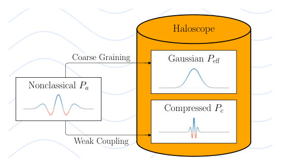 
Figure 1. Two obstructions to observing intrinsically nonclassical effects from weakly coupled waves, such as axion dark matter. Even if the axion state Pa is nonclassical, the haloscope only couples to a coarse-grained effective mode Peff, which is often in a thermal Gaussian state, erasing nonclassical effects. Weak coupling maps the axion state onto the cavity Pc in a compressed form with finely spaced sign oscillations, suppressing the magnitude of observable nonclassical effects. These issues are neither caused nor avoided by high mode occupancy.

📷 Fig 2

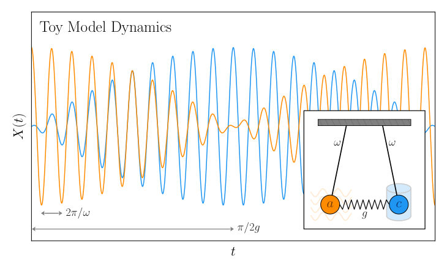 
Figure 2. The dynamics of the toy model in Eq. (1.1), which describes the evolution of two weakly coupled oscillators of angular frequency ω ≃ma. We show throughout this work that this model can be an accurate effective description of certain axion DM detection strategies. The plot takes g/ω = 1/40, whereas for DM the coupling is much weaker; ADMX targets axions with g/ω ∼gaγγB0/ω ∼10−16.

📷 Fig 3

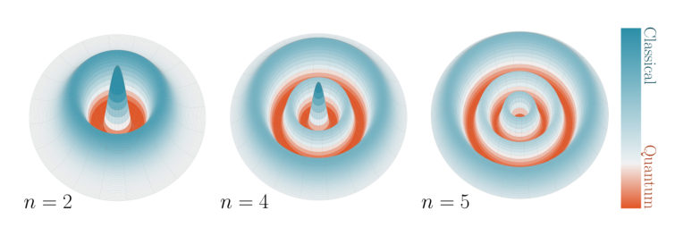 
Figure 3. P-functions for nonclassical DM states, constructed by adding n axions to the Gaussian state of Eq. (2.18) with mean occupancy |α0|2 = 1.2. Note the rapid sign oscillations for higher n. Negative regions shown in red yield effects that cannot be reproduced with a classical axion model.

📷 Fig 4

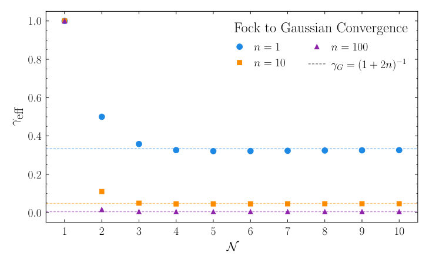 
Figure 4. The purity γeff of a mode that coarse grains N identical and independent Fock states, with occupancy n = 1, 10, and 100. Convergence to the purity γG = (1 + 2n)−1 of the Gaussian state predicted by the CLT is rapid, whether n is large or order-one.

📷 Fig 5

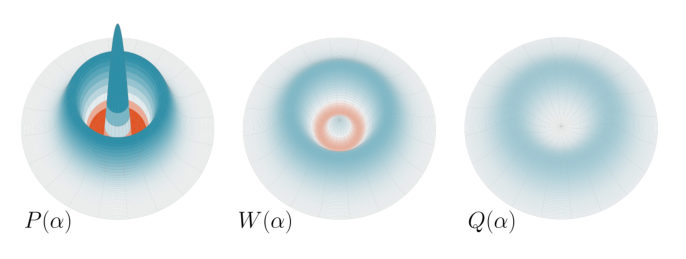 
Figure 5. Quasiprobability distributions for the state obtained by adding two photons to a thermal Gaussian state with mean occupancy N = 1 [53]. Negative regions are shown in red. Nonclassicality always corresponds to negative P, though squeezed states achieve negative P but have nonnegative W.

**Summary.** This paper proves two major obstacles to detecting nonclassical quantum effects from weakly coupled waves like axions or gravitational waves. First, realistic detectors average over fundamental modes, washing out the signal via coarse-graining. Second, the weak coupling itself suppresses these signatures by high powers of the coupling constant. The findings suggest that current experimental proposals are fundamentally limited in their ability to observe true quantum nonclassicality.

**Why it may be interesting.** This work provides rigorous theoretical bounds on experimental detectability, showing that even if quantum effects exist, practical limitations (detector bandwidth/coarse-graining) and fundamental physics constraints (weak coupling) severely suppress observable signatures for ultra-light dark matter searches.

Detailed structure

**Main problem.** The paper addresses the fundamental difficulty of detecting intrinsically nonclassical quantum effects from weakly coupled external waves, such as axion dark matter or gravitational radiation, using current experimental technology.

**Main result.** Two independent obstructions are proven: first, detector coarse-graining erases nonclassical signatures via the Central Limit Theorem; second, weak coupling suppresses these effects by extra powers of the coupling constant. Detecting them requires quantum resources beyond current capabilities.

**Method.** The authors analyze the evolution of the system's P-function using a coupled harmonic oscillator toy model and compare fully quantum treatments against classical approximations in the weak coupling limit.

**Model / system.** The system involves weakly coupled waves (e.g., axions, gravitational radiation) interacting with detectors modeled as resonant microwave cavities. The dynamics are governed by an interaction Hamiltonian involving lowering operators for both fields.

**Key observables.** Nonclassicality diagnostics include quadrature statistics, number statistics, entanglement measures, and Wigner function negativity.

**Important parameters / regimes.** The weak coupling constant ($g$) and the small conversion efficiency ($\eta = \sin^2(gt)$) are crucial parameters determining the suppression scale.

**Assumptions / limitations.** Key assumptions include the applicability of the Quantum Central Limit Theorem (CLT) for detector response and treating dissipation as negligible on relevant timescales.

**Figures summary.** Figure 1 illustrates both obstructions: coarse-graining leading to an effective Gaussian state, and weak coupling suppressing nonclassical features. Figure 3 shows P-functions illustrating how negative regions are smoothed out by noise.

**Paper structure.** The paper first establishes the general problem of detecting quantum effects in weakly coupled systems. It then develops a toy model Hamiltonian and analyzes the time evolution of the state's P-function, deriving explicit mathematical proofs for both the coarse-graining and weak-coupling suppression mechanisms.

Abstract

Precision experiments increasingly target weakly coupled waves, including axion dark matter and gravitational radiation. Such waves are commonly described as classical fields, yet they could exist in quantum states with no classical counterpart. We exhibit two severe obstructions to detecting nonclassical effects, both independent of the mode occupancy. First, realistic detectors cannot resolve the fundamental modes of a field; instead they couple to coarse-grained "effective" modes, which often washes out nonclassical effects. Second, all nonclassical effects are suppressed by extra powers of the weak coupling, making them much harder to detect than the waves themselves. We prove this in general, and explicitly show how the suppression arises for quadrature and number statistics, entanglement, and decoherence. The suppression can in principle be overcome given suitable quantum resources, such as highly squeezed detector states, but the required parameters are far beyond current experimental capabilities. We use the axion cavity haloscope as an explicit example, although our conclusions apply to many ultralight dark matter searches, and rule out proposals to establish the quantization of gravity from observations of gravitational waves.

[↑ back to top](#top)

### [Anomalous metal and superconducting phases in rhombohedral graphene](http://arxiv.org/abs/2607.28425v1)

**Authors:** Anna Okounkova, Abigail Sohm, Tobias Faehndrich, Manish Kumar, Derek Waleffe, Jiaqiang Yan, Kenji Watanabe, Takashi Taniguchi, Joshua Folk, Matthew Yankowitz  
**Type:** experiment · **Category:** strongly correlated electrons · **PDF:** <https://arxiv.org/pdf/2607.28425v1>  
**Analysis basis:** full PDF text, analyzed in chunks
**Topic relevance:** `analog quantum simulation` **2/5** · `driven-dissipative phase transition` **2/5** · `Kondo & dissipative impurity` **1/5** · `non-equilibrium dynamics` **1/5**

📷 Fig 1

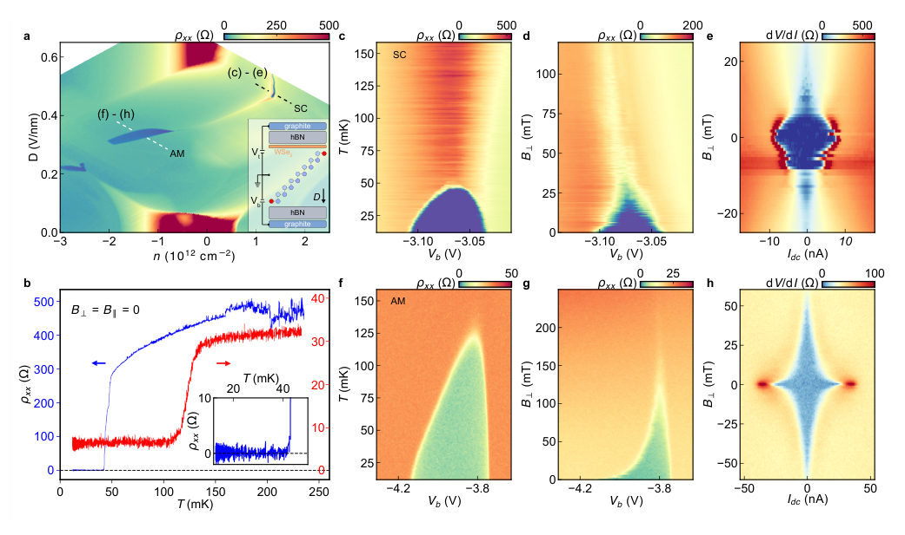 
FIG. 1. Superconducting and anomalous-metal pockets in the absence of magnetic field. a, Map of the longitudinal resistivity ρxx as a function of n and D taken at base temperature and zero magnetic field. (inset) Schematic of the dual-gated eight-layer rhombohedral graphene device with a monolayer WSe2 substrate. b, Measurements of ρxx versus T. The blue curve is taken within a superconductivity pocket (n = 1.34 × 1012 cm−2 and D = 0.47 V/nm). The red curve is taken within an anomalous metal pocket (n = −1.25 × 1012 cm−2 and D = 0.33 V/nm). The inset shows a zoom-in on the low-T portion of the blue curve. c, Measurement of ρxx versus Vb and T with fixed Vt = 3.08 V, corresponding to the...

📷 Fig 2

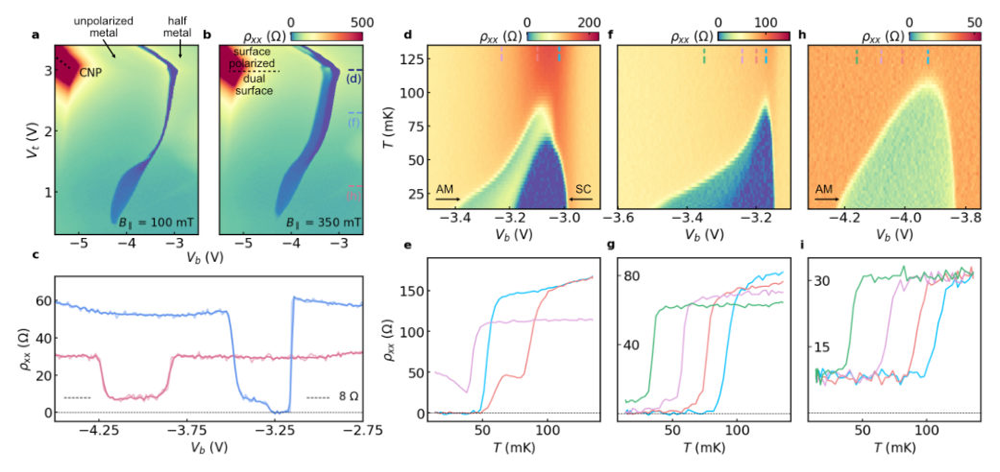 
FIG. 2. Evolution with in-plane magnetic field and temperature. a, Map of ρxx at B⊥= 0, B∥= 100 mT, and base temperature. b, Same map at B∥= 350 mT. c, Line traces from (b) taken at Vt = 1.10 V (red) and 2.30 V (blue). The light traces are single measurement curves, the dark traces are averages over nine adjacent Vt centered on the nominal value. d, Measurement of ρxx versus Vb and T taken with B⊥= 0, B∥= 350 mT, and Vt = 3.00 V. e, Selected line traces of ρxx versus T from (d). f–g, Same as (d–e) with Vt = 2.30 V. h–i, Same as (d–e) with Vt = 1.10 V.

📷 Fig 3

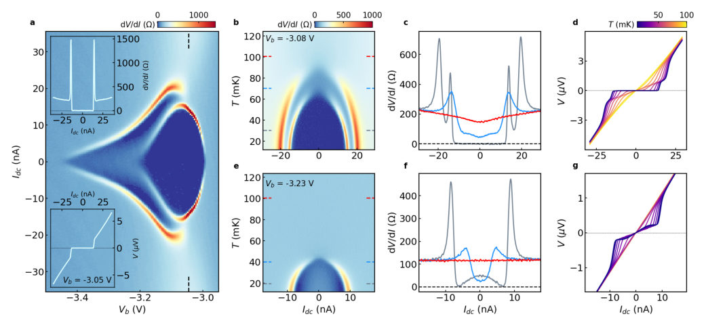 
FIG. 3. Non-monotonic current dependence of the anomalous metal. a, Measurement of dV /dI versus Vb and Idc taken at Vt = 3.00 V, B⊥= 0, B∥= 350 mT, and base temperature. (top inset) Selected dV /dI trace taken at Vb = −3.05 V. (bottom inset) Integrated I −V curve from the top inset. b, Measurement of dV /dI versus Idc and T taken under the same conditions as (a) with Vb = −3.08 V. c, Traces of dV /dI versus Idc at selected T corresponding to the color-coded lines in (b). d, Integrated I −V curves from (b). e, Same as (b) with Vb = −3.23 V. f, Selected traces from (e). g, Integrated I −V curves from (e).

📷 Fig 4

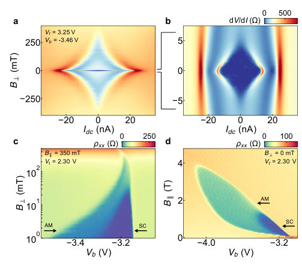 
FIG. 4. Distinct magnetic field scales of the SC and AM. a, Measurement of dV /dI versus Idc and B⊥taken at B∥= 350 mT, Vb = −3.46 V, Vt = 3.25 V, and base temperature. b, Zoomed-in map from (a) over a smaller range of B⊥. c, Measurement of ρxx versus Vb and B⊥taken at B∥= 350 mT and Vt = 2.30 V. d, Measurement of ρxx versus Vb and B∥taken at B⊥= 0 and Vt = 2.30 V.

**Summary.** The authors report a detailed study of superconducting and anomalous metal phases in rhombohedral graphene. They map out distinct regions exhibiting zero-resistance superconductivity alongside finite-saturation resistance AM states using transport measurements under varying magnetic fields. This work provides strong experimental constraints on the nature of these correlated electronic phases.

**Why it may be interesting.** This work provides an experimental platform for studying unconventional superconductivity adjacent to exotic metallic states (AM), which often require strong electron correlations or novel pairing mechanisms beyond standard BCS theory.

Detailed structure

**Main problem.** The study investigates the coexistence of zero-resistance superconducting (SC) phases alongside anomalous metal (AM) phases in rhombohedral graphene under gate tuning.

**Main result.** Distinct, adjacent SC and AM pockets are observed in the phase diagram, suggesting two fundamentally different electronic states rather than a simple crossover. The large difference in critical magnetic field responses between the two regimes suggests they are not trivially related.

**Method.** The research employs systematic transport measurements, including mapping resistivity ($
ho_{xx}$) vs. gate voltages and applying perpendicular ($\mathbf{B}_\perp$) and parallel ($\mathbf{B}_{\|}$) magnetic fields to characterize phase boundaries.

**Model / system.** The physical system is rhombohedral graphene grown on a WSe2 substrate, which serves as a highly tunable platform for studying correlated electronic states in 2D materials.

**Key observables.** Longitudinal resistivity ($
ho_{xx}$), transverse resistance ($
ho_{xy}$), and differential conductance ($dV/dI$) are used to diagnose the SC (zero resistance) versus AM (finite saturation resistance) phases.

**Important parameters / regimes.** Gate voltages ($V_b, V_t$), temperature ($T \approx 11 	ext{ mK}$), perpendicular magnetic field ($\mathbf{B}_\perp$, critical $\approx 4 	ext{ mT}$), and in-plane magnetic field ($\mathbf{B}_{\|}$, up to $3.5 	ext{ T}$).

**Assumptions / limitations.** The primary assumption is that the observed phenomena are intrinsic to the material, though extrinsic origins for the AM state remain a point of debate.

**Figures summary.** Figures map $
ho_{xx}$ across gate space showing isolated SC and AM pockets; they also track phase evolution with varying magnetic fields ($\mathbf{B}_{\|}$) and detail non-monotonic current dependence in the AM regime.

**Paper structure.** The paper systematically maps out the phase diagram by measuring transport properties ($
ho_{xx}, 
ho_{xy}$) as a function of gate voltage and applied magnetic field, comparing the distinct phenomenology of the zero-resistance SC state against the finite-resistance AM state.

Abstract

Two-dimensional superconductivity is now well established in graphene-based systems, with many such realizations showing evidence for unconventional pairing. Yet in several of the gate-tuned phases that otherwise exhibit clear signatures of superconductivity, the resistance does not vanish as temperature is lowered, instead saturating at a finite value. Here we report a systematic study of this behavior in rhombohedral graphene on a WSe$_2$ substrate, finding regions of gate space with zero-resistance superconductivity alongside others with finite saturation resistance. At zero magnetic field, these regions appear as isolated pockets in gate space that otherwise exhibit strikingly similar phenomenology, including abrupt transitions to the normal state as temperature, perpendicular magnetic field, and current are raised above critical values. A small in-plane field expands and merges these pockets without qualitatively altering their behavior, producing a sharp boundary at millikelvin base temperature between states of zero or finite resistance. The finite-resistance state reproduces key phenomenology associated with the anomalous metal, a state that has been observed in thin-film superconductors for decades but lacks an accepted theoretical explanation. The tunability and reproducibility of ultra-clean rhombohedral graphene place strong constraints on extrinsic explanations and provide a new platform for understanding this behavior.

[↑ back to top](#top)

### [Bayesian Networks of Density Operators](http://arxiv.org/abs/2607.27876v1)

**Authors:** Steffen Lauritzen, Piotr Zwiernik  
**Type:** theory · **Category:** quantum information and computing · **PDF:** <https://arxiv.org/pdf/2607.27876v1>  
**Analysis basis:** full PDF text, analyzed in chunks
**Topic relevance:** `entanglement & information structure` **2/5** · `Keldysh / 2PI / non-Gaussian methods` **1/5** · `correlated / nonlocal dissipation` **1/5** · `driven-dissipative phase transition` **1/5** · `methods for driven-dissipative` **1/5**

📷 Fig 1

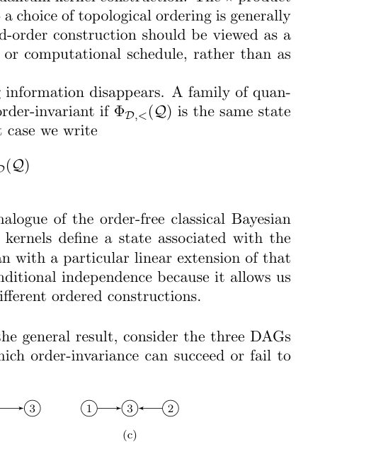 
Figure 1: The fork, chain and collider. The vertex labels represent a topological ordering in each graph.

**Summary.** This paper develops a theory for quantum Bayesian networks by analyzing how conditional independence structures (defined via density operators) relate to graph structure on a DAG. It distinguishes between two ways of constructing these states—intrinsic and extrinsic—and provides necessary and sufficient conditions using logarithmic identities to characterize true directed Markov states in the quantum domain.

**Why it may be interesting.** This work provides a rigorous mathematical framework for applying graphical model concepts, traditionally from classical statistics, to the non-commutative setting of quantum mechanics, which is crucial for understanding quantum causality.

Detailed structure

**Main problem.** The paper studies quantum analogues of Bayesian networks on a Directed Acyclic Graph (DAG), aiming to distinguish between intrinsic and extrinsic constructions for positive definite density operators.

**Main result.** It proves that the intrinsic construction yields equivalent Markov properties, while the extrinsic one is highly dependent on the chosen topological ordering; furthermore, it characterizes directed quantum Markov states using logarithmic candidates.

**Method.** The authors employ concepts from quantum information theory, including partial traces, Von Neumann entropy, and defining specialized logarithmic conditionals to linearize complex non-linear Markov identities.

**Model / system.** The system involves quantum states represented by positive definite density operators ($
ho$) acting on finite-dimensional tensor-product Hilbert spaces, structured according to a DAG representing conditional independence relationships.

**Key observables.** Density operators ($
ho$), quantum kernels ($Q_{v|	ext{pa}(v)}$), excess global information ($g_I(D)\sigma$), and the logarithmic candidate $TD(\sigma)$.

**Important parameters / regimes.** The structure of the DAG (transitivity, chordality) dictates the equivalence between different Markov characterizations.

**Assumptions / limitations.** The analysis relies on defining quantum conditional independence ($\perp\!\!\!Q$) via information measures and assuming the existence of positive definite density operators for factorization theorems to hold.

**Paper structure.** The paper progresses from establishing definitions (e.g., quantum conditional independence using mutual information) to comparing two construction methods (intrinsic vs. extrinsic), culminating in necessary and sufficient conditions for Markov states via logarithmic identities and global information measures.

Abstract

We study quantum analogues of Bayesian networks on a directed acyclic graph (DAG), distinguishing two constructions for positive definite density operators on finite-dimensional tensor-product Hilbert spaces. The intrinsic construction starts from a joint state and its conditional-independence properties. The extrinsic construction assembles a state sequentially from prescribed local quantum kernels, following an ordering compatible with the arrows of the DAG. For the intrinsic construction, we prove the equivalence of the ordered, local, and global directed Markov properties, together with entropy, recursive-factorization, and logarithmic characterizations. The extrinsic construction always gives a normalized state and recovers each kernel as a conditional on all preceding systems. The same kernel, however, need not be recovered from the marginal on the vertex and its parents; a three-qubit example exhibits this obstruction. We prove that independence of the chosen topological ordering is sufficient exactly for transitive DAGs: every order-invariant kernel family then yields an intrinsically directed Markov state. Finally, we associate a logarithmic candidate with every positive definite state and DAG, prove that it is subnormalized, and show that the trace-one candidate is a directed Markov state. Both the candidate and the excess global information are invariant under DAG Markov equivalence.

[↑ back to top](#top)

### [Benchmarking Quantum Simulations of the Lipkin-Meshkov-Glick Model Using Large Tensor Networks](http://arxiv.org/abs/2607.28570v1)

**Authors:** Maggie Bao, Rushil Dandamudi, Jerimiah Wright, Joan Étude Arrow, Henry Zou, Vardaan Sahgal, Brian J. McDermott  
**Type:** both · **Category:** numerical methods · **PDF:** <https://arxiv.org/pdf/2607.28570v1>  
**Analysis basis:** full PDF text, analyzed in chunks
**Topic relevance:** `QC/QI experiment` **2/5** · `analog quantum simulation` **1/5** · `entanglement & information structure` **1/5** · `methods for driven-dissipative` **1/5** · `non-equilibrium dynamics` **1/5**

📷 Fig 1

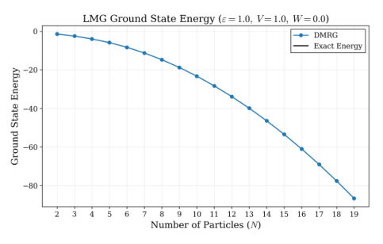 
Figure 1: Comparison between DMRG-computed ground-state energies and exact numerical solutions

📷 Fig 2

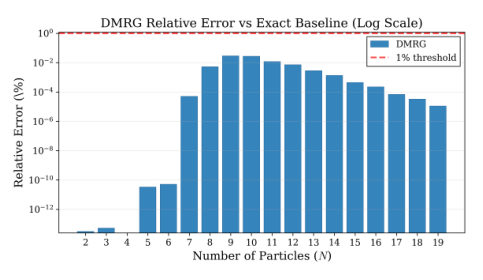 
Figure 2: Relative error of DMRG against exact numer- ical solutions on a logarithmic scale.

📷 Fig 3

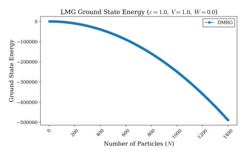 
Figure 3: Ground-state energy of the LMG model com- puted using DMRG as a function of particle number N.

📷 Fig 4

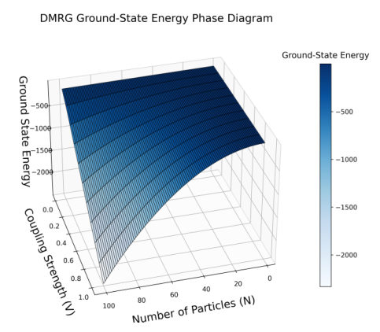 
Figure 4: DMRG-computed ground-state energy phase diagram as a function of particle number N and inter- action strength V .

📷 Fig 5

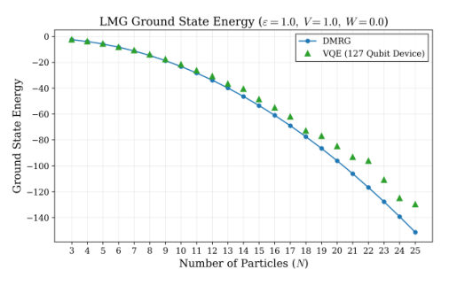 
Figure 5: Iterations to convergence across four problem sizes: N = 4, 15, 18, 21.

**Summary.** The paper benchmarks quantum simulation techniques (VQE, SQD) by calculating ground state energies for the LMG model, using DMRG as a high-fidelity classical reference. It demonstrates that while DMRG scales effectively to large systems, current NISQ methods face limitations in accuracy and resource scaling when compared directly.

**Why it may be interesting.** This work is highly relevant because it provides quantitative metrics for comparing the scalability and noise resilience of emerging quantum algorithms against mature classical tensor network methods when simulating complex many-body Hamiltonians.

Detailed structure

**Main problem.** The core problem is benchmarking the real-world performance of quantum simulation algorithms (VQE, SQD) against established classical benchmarks as quantum computing matures.

**Main result.** The study demonstrates that while DMRG provides a highly accurate classical reference for large systems ($N \le 1550$), current NISQ approaches like VQE and SQD show varying levels of accuracy limited by circuit depth, noise, or computational resources.

**Method.** The authors employ three distinct methods: the high-accuracy Density Matrix Renormalization Group (DMRG) for classical benchmarking; Variational Quantum Eigensolver (VQE) using parameterized quantum circuits; and Sample-Based Quantum Diagonalization (SQD).

**Model / system.** The benchmark system is the Lipkin-Meshkov-Glick (LMG) model, characterized by a specific Hamiltonian involving Pauli operators. This model allows for testing across varying system sizes ($N$) and interaction strengths.

**Key observables.** Ground state energies of the LMG model, relative error compared to exact solutions, convergence rates, and computational runtime scaling with bond dimension ($\chi$).

**Important parameters / regimes.** System size up to $N=1550$ (DMRG); VQE is limited to the $W=0$ regime; SQD performance is constrained by available quantum shots and circuit depth.

**Assumptions / limitations.** The comparison is framed within the context of Noisy Intermediate-Scale Quantum (NISQ) devices, necessitating application-centered benchmarks over pure hardware characterization. DMRG relies on MPS/MPO representations.

**Figures summary.** Figures summarize DMRG's stability and scaling with bond dimension; VQE convergence shows erratic behavior at larger N; SQD analysis details gate counts and circuit depth limitations for specific state preparations.

**Paper structure.** The paper establishes the LMG model as a benchmark, details the classical (DMRG) and quantum (VQE/SQD) methodologies, presents large-scale energy datasets, and concludes with a comparative analysis of resource scaling versus achievable accuracy in the NISQ era.

Abstract

As quantum computing matures, it is critical to benchmark its real-world problem solving performance against competitive classical methods, such as tensor networks. In this work, we leverage the Density Matrix Renormalization Group (DMRG) algorithm to compute ground state energies of the Lipkin Meshkov Glick (LMG) model as a comparative benchmark against popular noisy intermediate-scale (NISQ) algorithms like the Variational Quantum Eigensolver (VQE) and Sample-Based Quantum Diagonalization (SQD) method. By running DMRG on the NERSC Perlmutter supercomputer, we provide one of the largest LMG ground state energy datasets in literature, containing accurate ground state energies for systems up to 1400 particles. We compare these results with VQE and SQD implementations on an IBM Eagle quantum computer for comparison. VQE achieved results within 1 percent error for 6 particles, while exceeding that threshold for all other values while SQD extended that range to 17 particles, suggesting that in a noisy intermediate scale quantum era, subspace-based approaches may strike the best balance between accuracy, circuit depth, and noise resilience.

[↑ back to top](#top)

### [Bose-Einstein condensation and superfluidity on a fuzzy sphere](http://arxiv.org/abs/2607.27470v1)

**Authors:** Vira Shyta, Flavio S. Nogueira, Ashley M. Cook  
**Type:** theory · **Category:** quantum gases · **PDF:** <https://arxiv.org/pdf/2607.27470v1>  
**Analysis basis:** full PDF text, analyzed in chunks
**Topic relevance:** `analog quantum simulation` **2/5** · `Keldysh / 2PI / non-Gaussian methods` **1/5** · `correlated / nonlocal dissipation` **1/5** · `driven-dissipative phase transition` **1/5** · `methods for driven-dissipative` **1/5**

📷 Fig 1

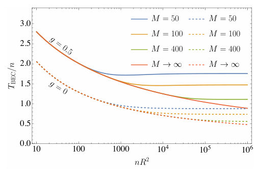 
FIG. 1. Behavior of TBEC/n as a function of nR2 for different values of M. The solid lines correspond to the weakly inter- acting Bose gas (specifically, here we take g = 0.5), while the dashed lines correspond to the ideal case [see Eq. (11)]. In both cases, for a fuzzy sphere of a given radius the critical temperature TBEC grows as the non-commutativity parame- ter is increased. The influence of non-commutativity is most noticeable in the large R limit, where the calculations are most applicable.

📷 Fig 2

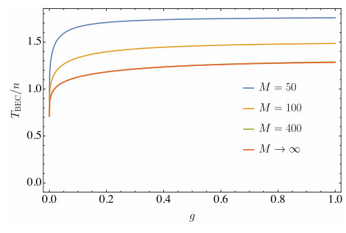 
FIG. 2. Dependence of TBEC/n on the interaction coupling g for different values of M, where nR2 is set to be equal to 104. Similarly to the behavior captured in Fig. 1, the increase in the non-commutativity parameter (decrease in M) leads to higher values of TBEC. Already at M = 400, the fuzzy result has basically the same dependence on g as the commutative limit M →∞.

📷 Fig 3

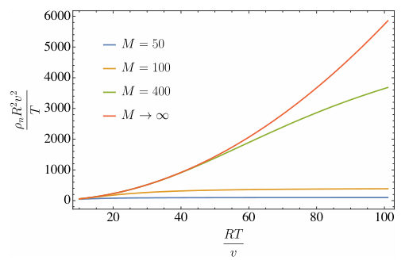 
FIG. 3. The normal fluid density ρn as a function of the radius R for various values of M [see Eq. (37)]. The normal fraction decreases for higher values of the non-commutativity parameter.

**Summary.** This theoretical paper examines BEC and superfluidity for Bose gases confined to a fuzzy sphere, which models non-commutative geometry. The authors show that this inherent non-commutativity stabilizes ordered phases, increasing the critical temperature compared to standard spheres. A key finding is the linear temperature dependence of the normal fluid fraction, suggesting new physical insights relevant to high-temperature superconductivity.

**Why it may be interesting.** This work directly addresses fundamental quantum phenomena (BEC/superfluidity) in a geometrically modified setting (fuzzy space), providing novel predictions like the linear-T dependence of $
ho_n$ that mimic high-$T_c$ superconductor behavior.

Detailed structure

**Main problem.** The study investigates Bose-Einstein condensation (BEC) and superfluidity in two dimensions confined to a non-commutative, or 'fuzzy,' sphere geometry.

**Main result.** Non-commutativity enhances ordered phases, leading to a critical BEC temperature higher than on a commutative sphere. Crucially, the normal fluid fraction exhibits a linear dependence on temperature, contrasting with the usual T^3 behavior.

**Method.** The analysis involves adapting quantum field theory techniques for bosons on curved spaces, promoting fields to matrices, and calculating thermodynamic quantities like superfluid density using Bogoliubov quasi-particle approaches.

**Model / system.** The system is a non-relativistic Bose gas confined to a fuzzy sphere. The bosonic fields are treated as $N 	imes N$ matrices, where the matrix dimension $N$ quantifies the degree of non-commutativity ($	heta$).

**Key observables.** Critical temperature for BEC ($T_c$), superfluid density ($
ho_s$), and the normal fluid fraction dependence on temperature ($
ho_n(T)$).

**Important parameters / regimes.** Non-commutativity parameter (related to $N$), sphere radius ($R$), and temperature ($T$).

**Assumptions / limitations.** The analysis relies on treating the fuzzy geometry as a suitable replacement for integration over the commutative sphere, and approximations are used when relating sums over angular momentum modes to integrals.

**Paper structure.** The paper first establishes the physical context by contrasting 2D BEC impossibility with superfluidity. It then develops the formalism on the fuzzy sphere, analyzes BEC for ideal and weakly interacting gases, and finally investigates the superfluid response, particularly concerning vortex defects.

Abstract

According to Hohenberg's theorem, Bose-Einstein condensation (BEC) in two dimensions is impossible for any temperature $T>0$. By contrast, superfluidity does occur in two dimensions at finite temperatures; it emerges due to the breaking of Galilei invariance. Here we consider BEC and superfluidity on a compact two-dimensional space taking the form of a non-commutative ("fuzzy") sphere, where the scalar bosonic fields are promoted to $N\times N$ matrices. The dimension $N$ is related to the non-commutativity parameter of space and introduces an additional scale into the system. We find that non-commutativity favors ordered phases and so enhances BEC and superfluidity. We analyze BEC in ideal and weakly interacting Bose gases on a fuzzy sphere, finding in each case that the critical temperature of BEC is greater compared to that found in the case of a commutative sphere $S^2$. Then we investigate the superfluid response of weakly interacting Bose systems. To account for vortices in a superfluid, we show that, even on an ordinary sphere, the collective coordinates of vortices induce non-commutativity. With this in mind, we extend the definition of vortex defects to an inherently non-commutative sphere studied here, where the notion of a point is untenable. The non-commutativity is expected to be experimentally relevant to BEC and superfluidity since the fuzzy sphere has a thermodynamic limit distinct from the one defined over a plane, unlike the $S^2$ case. The significance of this difference is illustrated by the superfluid density calculation indicating that, in the large sphere limit, the normal fluid fraction on the fuzzy sphere yields a linear in $T$ dependence, while on a commutative $S^2$ it exhibits the usual two-dimensional $\sim T^3$ behavior. This linear dependence, arising directly from non-commutativity, is reminiscent of Uemura's law in cuprate high-$T_c$ superconductors.

[↑ back to top](#top)

### [Exploring the use of quantum computing for facilitating spatially and temporally resolved models of a biological cell](http://arxiv.org/abs/2607.27571v1)

**Authors:** Muralikrishnan Gopalakrishnan Meena, Dileep Kishore, Jerry M. Parks, Luke Bertels, Dilipkumar N. Asthagiri, Travis Humble, Thomas L. Beck, Mitchel J. Doktycz  
**Type:** theory · **Category:** other · **PDF:** <https://arxiv.org/pdf/2607.27571v1>  
**Analysis basis:** full PDF text, analyzed in chunks
**Topic relevance:** `non-equilibrium dynamics` **2/5** · `Keldysh / 2PI / non-Gaussian methods` **1/5** · `analog quantum simulation` **1/5** · `driven-dissipative phase transition` **1/5** · `methods for driven-dissipative` **1/5**

📷 Fig 1

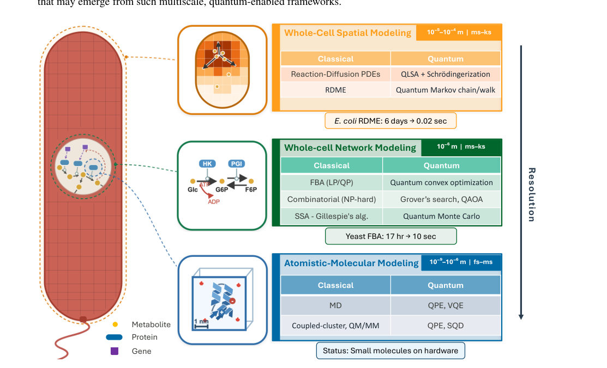 
Figure 1: Classical and quantum computational methods across scales of whole-cell modeling. A bacterial cell, shown as an intracellular network of metabolites, proteins, and genes, is resolved at three successively finer scales (arrow, increasing spatial resolution), with color-matched lenses linking each regime to the cellular feature it captures: the whole cell (spatial; orange), a subnetwork (network; green), and a single macromolecule (atomistic–molecular; blue). For each regime, the table compares classical methods with their emerging quantum counterparts, listing the relevant length and time scales and an illustrative reported speed-up. Icons depict a representative system at each...

📷 Fig 2

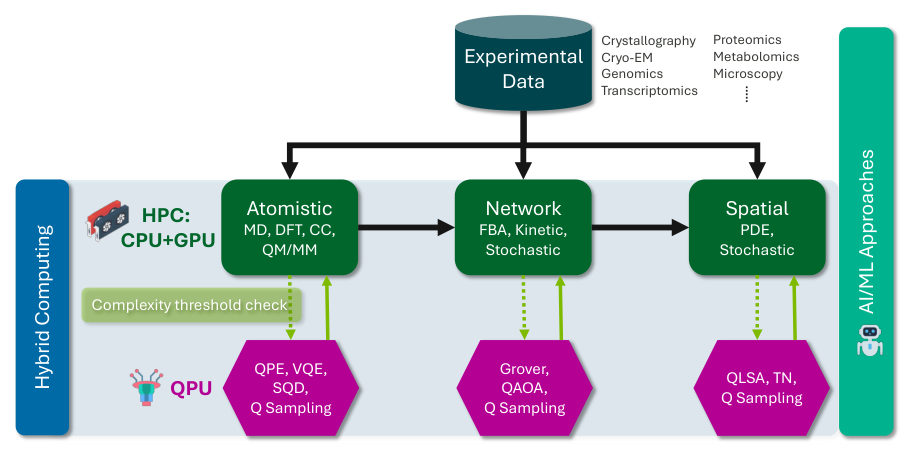 
Figure 2: Depiction of a hybrid HPC-Quantum-AI integration framework to enhance various hierarchical components of whole-cell modeling. AI/ML approaches can span across the whole modeling paradigm, from experimental data to surrogate modeling and AI for quantum algorithms and computing. The · · · arrows to the QPUs denote the check for complexity threshold to offload certain kernels from the HPC solvers to the QPU.

**Summary.** This paper explores using quantum computing to overcome the intractable computational barriers of whole-cell simulations. It analyzes how quantum algorithms can accelerate modeling across molecular dynamics, metabolic networks, and spatial reaction-diffusion processes. The work provides a roadmap detailing where quantum advantage is theoretically achievable for simulating life at its most complex scales.

**Why it may be interesting.** It bridges fundamental quantum computation concepts (e.g., solving linear systems via QLSA) directly to complex, non-equilibrium biological processes, suggesting novel computational pathways for simulating open quantum/many-body systems in biology.

Detailed structure

**Main problem.** The central challenge is developing computationally tractable whole-cell simulations that integrate molecular, metabolic, and spatial dynamics across vast scales (nm to $\mu$m, fs to hours).

**Main result.** Quantum computing offers a potential path to accelerate these multi-scale biological simulations by providing theoretical speedups over classical methods for solving underlying linear systems and sampling rare events.

**Method.** The paper systematically compares quantum algorithms (like VQE, QAOA, QLSA) against established classical techniques (MD, FBA, PDE solvers) across three hierarchical scales of biological modeling.

**Model / system.** The system is a living cell containing trillions of interacting components. Modeling spans from atomistic electronic structure calculations to whole-cell reaction-diffusion master equations.

**Key observables.** Computational time required for simulating entire cell cycles (e.g., E. coli, Yeast), molecular energies, and free energy changes ($\Delta F$).

**Important parameters / regimes.** Spatial scales ($	ext{nm}$ to $\mu	ext{m}$), temporal scales ($	ext{fs}$ to hours), system size ($N$), and required accuracy ($\epsilon$, $\delta$).

**Assumptions / limitations.** The feasibility relies on achieving fault-tolerant quantum architectures, and practical bottlenecks include data encoding overhead and hybrid integration strategies.

**Figures summary.** Figures compare computational time for whole-cell simulations (E. coli/Yeast) using classical vs. quantum solvers; tables detail algorithm comparisons across atomistic, network, and cell scales.

**Paper structure.** The paper is structured as a perspective examining the potential of quantum computing across three hierarchical modeling scales: atomistic-molecular, metabolic networks, and whole-cell spatial dynamics, providing complexity analyses for each.

Abstract

Whole-cell simulation, modeling all of a cell's functional systems over its life cycle, is an outstanding challenge in computational biology. Even the simplest living cell contains thousands of interacting proteins and metabolites (on the order of trillions of atoms) whose full functional dynamics spans roughly five orders of magnitude in space (nm to $μ$m) and nearly nineteen in time (fs to hours). Further, many of the governing physical and chemical properties remain incompletely characterized. Simulating such complex systems at fully atomistic resolution over a full cell cycle is computationally intractable on classical architectures, raising a central question: Can quantum computing offer a viable path to whole-cell simulations that integrate molecular- and systems-level complexity? This Perspective examines the potential of quantum computing across three hierarchical scales: atomistic-molecular modeling, metabolic and regulatory networks, and whole-cell spatial modeling. We present a complexity analysis comparing classical and quantum algorithms for representative biological problems, identifying regimes of substantial theoretical speedup under specified algorithmic assumptions. We highlight algorithmic developments designed to leverage both near-term exploratory and fault-tolerant quantum architectures, and discuss practical bottlenecks: data encoding overhead, system conditioning, measurement constraints, and hybrid quantum-HPC integration. Together, these results outline a roadmap for quantum-accelerated whole-cell modeling and the biological insights such multiscale frameworks may eventually enable.

[↑ back to top](#top)

### [From pink to brown: Interaction-driven noise color shift in the Aubry-Andr{é} Model](http://arxiv.org/abs/2607.27340v1)

**Authors:** M. Jiménez-Valdez, S. A. Montes-Camacho, E. J. Torres-Herrera  
**Type:** theory · **Category:** statistical mechanics · **PDF:** <https://arxiv.org/pdf/2607.27340v1>  
**Analysis basis:** full PDF text, analyzed in chunks
**Topic relevance:** `analog quantum simulation` **2/5** · `driven-dissipative phase transition` **2/5** · `Frenkel-Kontorova` **1/5** · `methods for driven-dissipative` **1/5**

📷 Fig 1

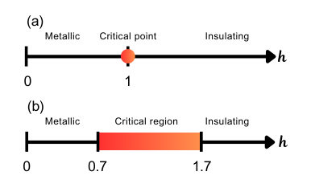 
FIG. 1. Illustrative scheme of the metal-insulator transition in both models, non-interacting (a) with a single critical point and interacting (b) with a critical region.

📷 Fig 2

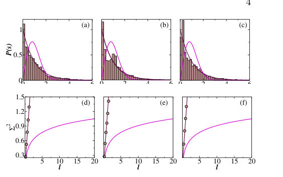 
FIG. 3. Distribution of consecutive level spacings (top) and level number variance (bottom) for the non-interacting AA model. Pink solid curves show the Wigner surmise (top) and Σ2 (bottom) for GOE; brown curves indicate Poisson statis- tics. Histograms (top) and points (bottom) correspond to numerical results for h = 0.2 (a,d), h = 1.0 (b,e) and h = 3.0 (c,f).

📷 Fig 3

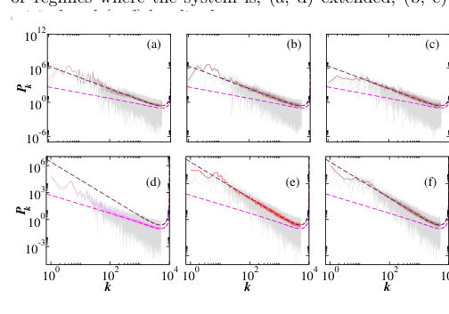 
FIG. 2. Power-spectrum for the non-interacting (top) and interacting (bottom) AA model. (a) h = 0.2, (b) h = 1.0, (c) h = 3.0, (d) h = 0.2, (e) h = 1.2, (f) h = 3.0. Pink dashed curves are given by Eq. (7), while brown dashed curves by Eq. (6). Gray curves show individual samples and solid curves are averages over 103 samples.

📷 Fig 4

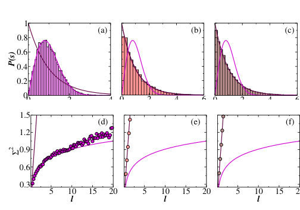 
FIG. 4. Distribution of consecutive level spacings (top) and level number variance (bottom) for the interacting AA model. Pink solid curves show Wigner’s surmise (top) and Σ2 (bot- tom) for GOE; brown curves indicate Poisson statistics. His- tograms (top) and points (bottom) correspond to numerical results for h = 0.2 (a,d), h = 1.2 (b,e) and h = 3.0 (c,f).

📷 Fig 5

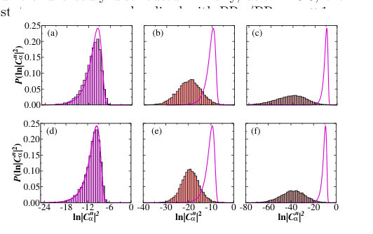 
FIG. 6. Distribution of ln |Cn α|2 for an energy eigenstate with Eα ≈0 of the non-interacting (top) and interacting (bottom) AA models. Solid curves correspond to the Porter-Thomas distribution [Eq. (15)]. Histograms are for (a) h = 0.2, (b) h = 1.0, (c) h = 3.0, (d) h = 0.2, (e) h = 1.2 and (f) h = 3.0.

**Summary.** This work investigates the metal-insulator transition in an interacting spin model on a quasiperiodically modulated lattice. By analyzing the power spectrum of energy level fluctuations, the authors demonstrate that interactions induce a distinct spectral signature: pink noise characterizes the metallic phase, while brown noise marks the insulating phase. This confirms the utility of advanced spectral diagnostics beyond standard measures.

**Why it may be interesting.** The use of noise color analysis (pink vs. brown noise) provides a powerful, quantitative signature for distinguishing between metallic/extended and insulating/localized phases in 1D quantum systems, which is relevant to understanding transport in disordered or quasiperiodic media.

Detailed structure

**Main problem.** The study revisits the metal-insulator transition in a one-dimensional lattice subjected to an on-site quasiperiodic potential.

**Main result.** Introducing nearest-neighbor interactions causes the power spectrum of energy level fluctuations to shift from brown noise (insulating) to pink noise (metallic), providing a clear diagnostic tool for the transition.

**Method.** The analysis utilizes spectral diagnostics, specifically examining the power-spectrum ($P_k$) of consecutive energy level spacings ($\delta_n$), alongside level spacing distributions and level number variance.

**Model / system.** The system is modeled using spin-1/2 particles on a 1D lattice with an on-site quasiperiodic potential, described by a Hamiltonian involving nearest-neighbor interactions. The Aubry-André model serves as the primary framework.

**Key observables.** Power-spectrum ($P_k$), level spacing distribution ($P(s)$), and level number variance ($\Sigma^2(\ell)$).

**Important parameters / regimes.** Potential strength parameter $h$, interaction strength (tunable nearest-neighbor interactions), and the quasiperiodic potential parameter $eta$ (inverse golden mean).

**Assumptions / limitations.** The analysis focuses on the symmetry sector with $S_z = 0$. The power-spectrum approach is emphasized for its ability to distinguish phases where standard indicators might fail.

**Figures summary.** Figures illustrate the metal-insulator transition scheme, comparing non-interacting vs. interacting cases; they also show level spacing distributions and participation ratios across different potential strengths ($h$).

**Paper structure.** The paper systematically analyzes spectral fluctuations using multiple diagnostics (power spectrum, level statistics) to characterize the phase transition in both non-interacting and interacting regimes of the AA model.

Abstract

We revisit the metal-insulator transition in a one-dimensional lattice subjected to an on-site quasiperiodic potential, modeled using spin-1/2 particles with tunable nearest-neighbor interactions. To characterize the transition, we examine the power-spectrum, defined as the squared modulus of the Fourier transform of consecutive level spacings. In the absence of interactions, the power-spectrum fails to capture clear signatures of the transition, consistently exhibiting brown-noise-like behavior across regimes. In contrast, the interacting case reveals a marked change: the metallic phase displays spectral fluctuations consistent with pink noise, while the insulating phase is characterized by brown noise. These results are supported by analyses of the level spacing distribution and the level number variance. Additionally, we demonstrate that both statistics and the structure of energy eigenstates provide reliable indicators of the transition, in both interacting and non-interacting scenarios.

[↑ back to top](#top)

### [The cycle C9 does not admit uniform mixing](http://arxiv.org/abs/2607.28345v1)

**Authors:** Alison Gray, Pransu Patel, Isaiah Young  
**Type:** theory · **Category:** other · **PDF:** <https://arxiv.org/pdf/2607.28345v1>  
**Analysis basis:** full PDF text, analyzed in chunks
**Topic relevance:** `non-equilibrium dynamics` **2/5** · `Keldysh / 2PI / non-Gaussian methods` **1/5** · `analog quantum simulation` **1/5** · `driven-dissipative phase transition` **1/5** · `methods for driven-dissipative` **1/5**

📷 Fig 1

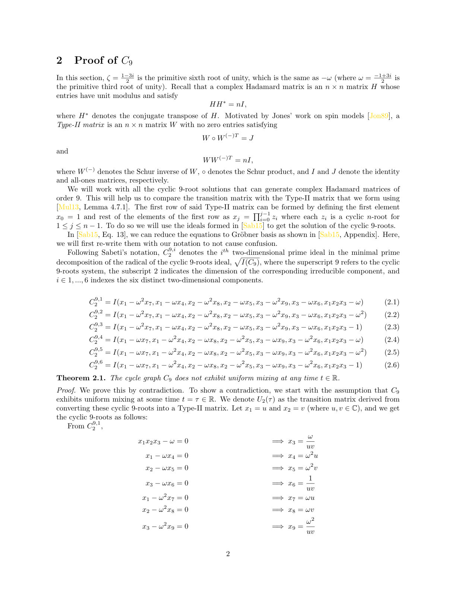 
Low-resolution page preview, page 2

📷 Fig 2

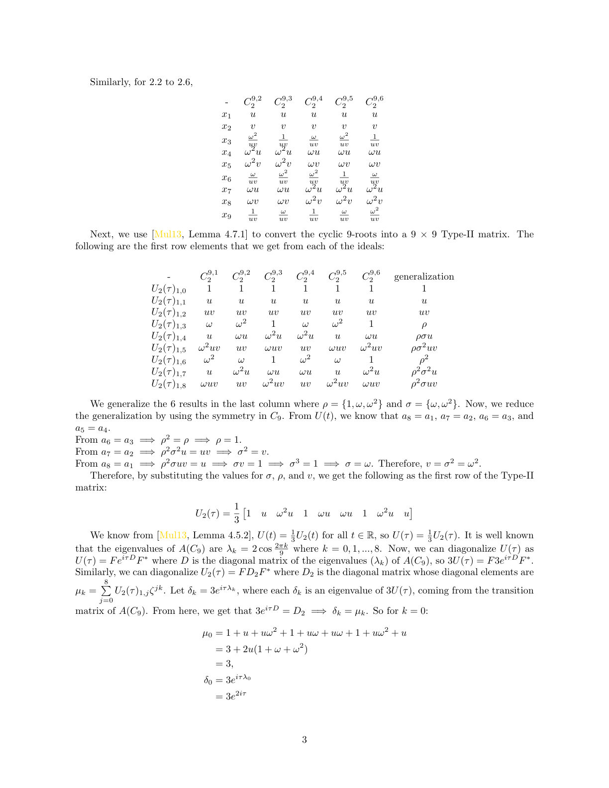 
Low-resolution page preview, page 3

📷 Fig 3

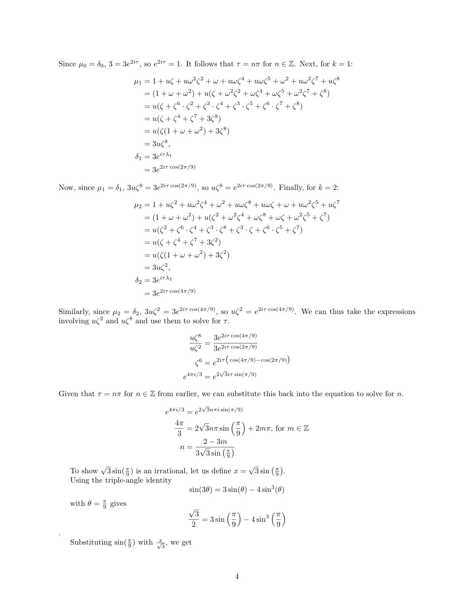 
Low-resolution page preview, page 4

📷 Fig 4

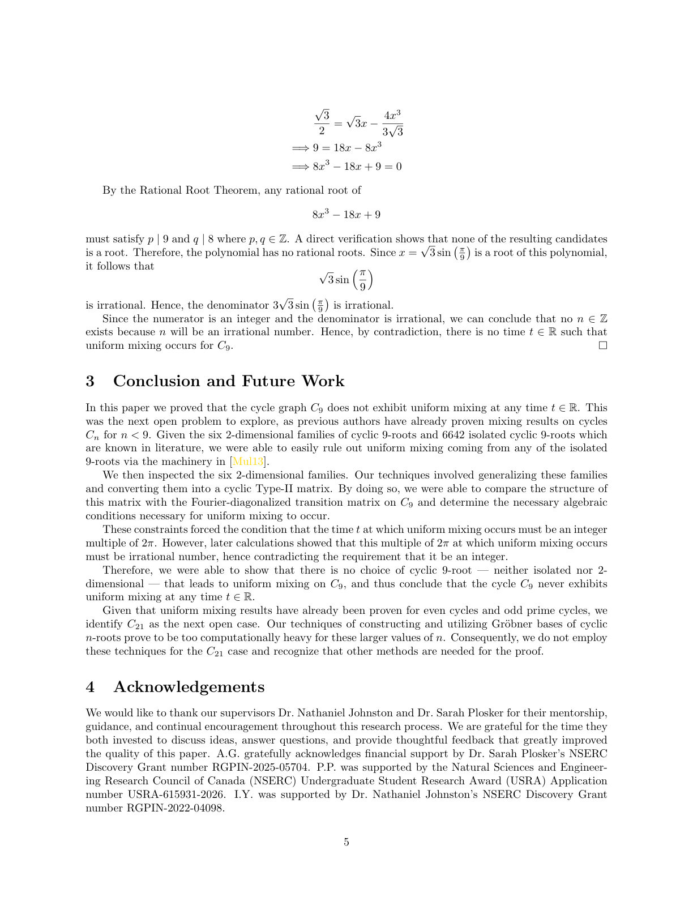 
Low-resolution page preview, page 5

📷 Fig 5

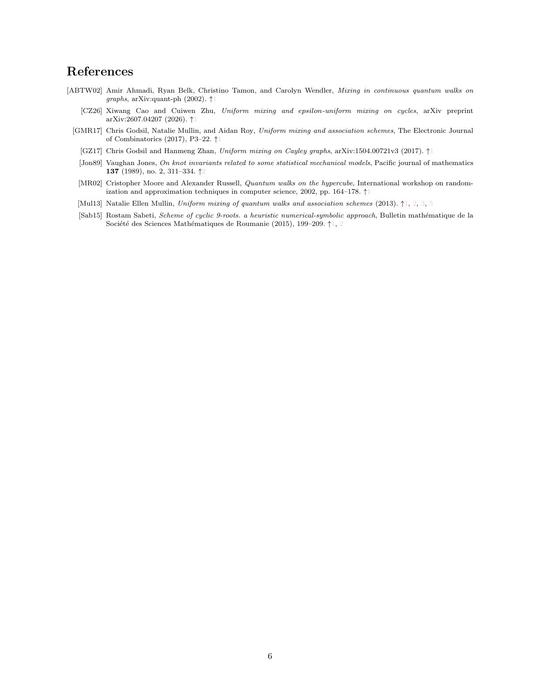 
Low-resolution page preview, page 6

**Summary.** This paper rigorously proves that continuous-time quantum walks on the cycle graph $C_9$ never reach a state of uniform mixing at any time. The proof relies on sophisticated algebraic geometry techniques applied to the system's evolution operator, demonstrating an inherent mathematical impossibility for such mixing to occur.

**Why it may be interesting.** This work provides a rigorous mathematical framework for analyzing quantum transport phenomena on lattices, which is highly relevant to understanding decoherence and mixing in open quantum systems.

Detailed structure

**Main problem.** The study aims to prove mathematically whether the cycle graph $C_9$ admits uniform mixing for continuous-time quantum walks (CTQWs) at any time $t$.

**Main result.** The authors prove, using algebraic techniques, that the cycle $C_9$ never exhibits uniform mixing for CTQWs because the necessary conditions lead to contradictions regarding the nature of the required time parameter.

**Method.** The analysis employs advanced mathematical tools including algebraic geometry and Gröbner basis techniques applied to cyclic roots, comparing derived matrix structures with the system's transition matrix.

**Model / system.** The physical model is a continuous-time quantum walk (CTQW) evolving on the cycle graph $C_9$. Uniform mixing requires that all entries of the time evolution operator $U(t)$ have a squared magnitude of $1/n$ at time $t$.

**Key observables.** The primary observable is the transition matrix $U(t) = e^{itA(G)}$, and the diagnostic is whether its elements achieve uniform magnitude ($1/n$).

**Important parameters / regimes.** The cycle size $n=9$, and the time parameter $t$ (or related parameters $	au$).

**Assumptions / limitations.** The analysis assumes that if uniform mixing occurs, specific algebraic relationships must hold between eigenvalues derived from the system's structure.

**Paper structure.** The paper proceeds by setting up the necessary conditions for uniform mixing, converting these into algebraic constraints involving cyclic $n$-roots, and then using contradiction via Gröbner bases to rule out solutions for $C_9$.

Abstract

We study continuous-time quantum walks (CTQWs) on cycles. In particular, we prove that the cycle $C_9$ does not admit uniform mixing at any time via algebraic geometry and Gröbner basis techniques to rule out all cyclic 9-roots.

[↑ back to top](#top)

### [On two differing geometric descriptions of the passage from microscopy to macroscopy in Markov diffusion theory](http://arxiv.org/abs/2607.28578v1)

**Authors:** Dalton A R Sakthivadivel  
**Type:** theory · **Category:** statistical mechanics · **PDF:** <https://arxiv.org/pdf/2607.28578v1>  
**Analysis basis:** full PDF text, analyzed in chunks
**Topic relevance:** `non-equilibrium dynamics` **2/5** · `driven-dissipative phase transition` **1/5** · `methods for driven-dissipative` **1/5** · `non-equilibrium universality` **1/5**

📷 Fig 1

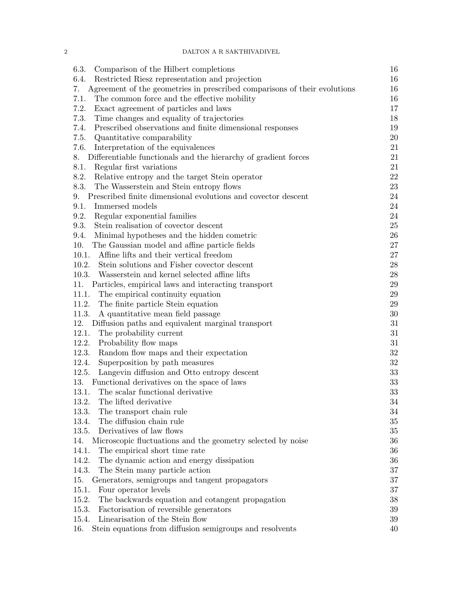 
Low-resolution page preview, page 2

📷 Fig 2

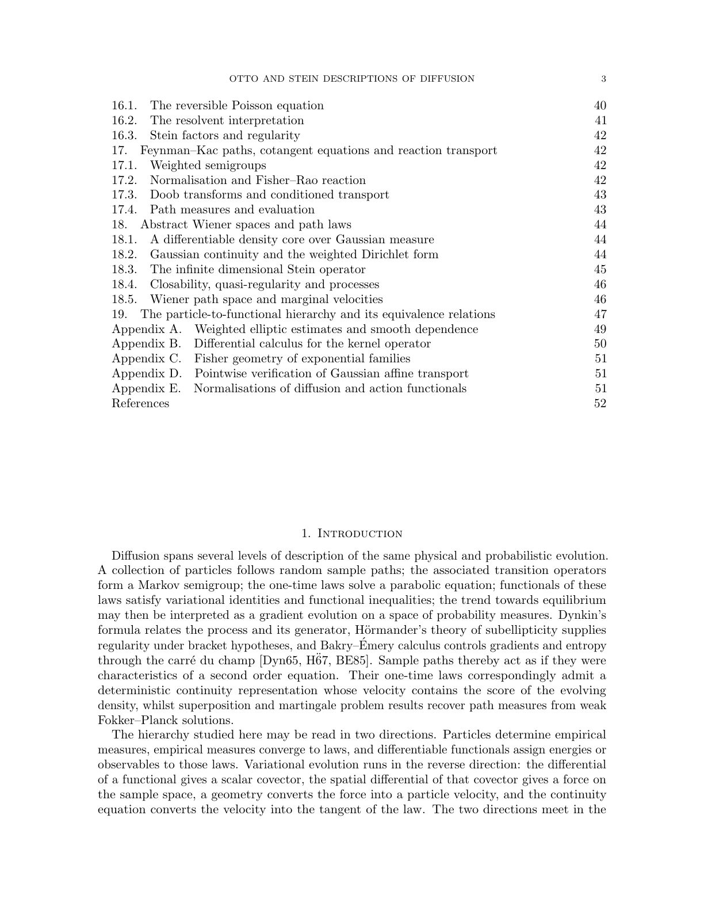 
Low-resolution page preview, page 3

📷 Fig 3

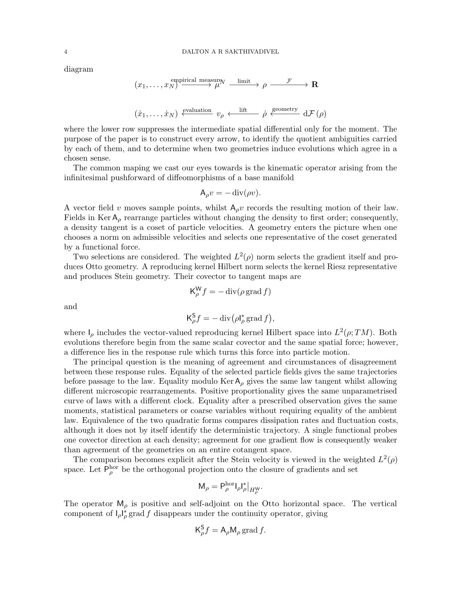 
Low-resolution page preview, page 4

📷 Fig 4

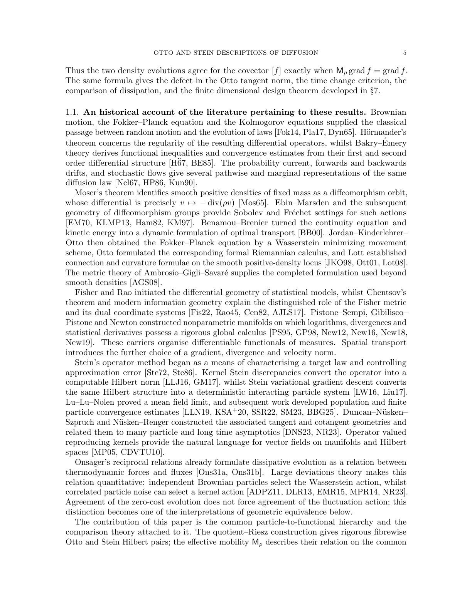 
Low-resolution page preview, page 5

📷 Fig 5

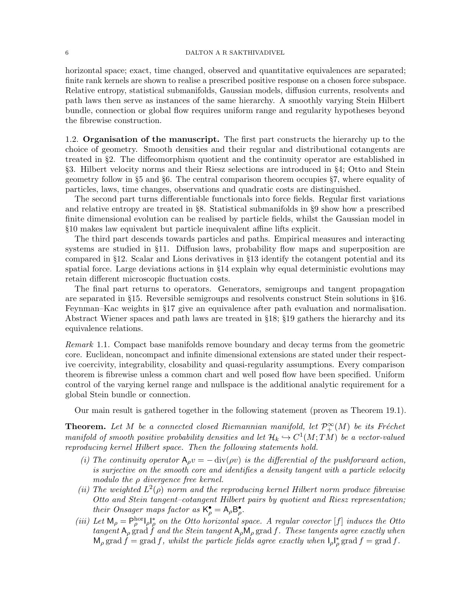 
Low-resolution page preview, page 6

**Summary.** This paper develops a rigorous mathematical framework comparing two distinct geometric descriptions—Otto and Stein—for how particle random walks transition into macroscopic diffusion equations on a manifold. It achieves this by treating the space of probability densities as an infinite-dimensional manifold, showing that agreement between these physical descriptions requires satisfying specific differential geometric identities.

**Why it may be interesting.** While highly abstract, understanding how geometric structures derived from physical processes (like diffusion) relate to underlying microscopic dynamics is fundamental. The comparison between established variational/geometric frameworks (Otto vs. Stein) provides a powerful mathematical tool for analyzing non-equilibrium statistical mechanics models.

Detailed structure

**Main problem.** The central problem is rigorously characterizing the mathematical passage from microscopic descriptions of particle random processes to macroscopic continuum descriptions, such as parabolic partial differential equations, within Markov diffusion theory.

**Main result.** The paper establishes that two distinct geometric frameworks—the Otto geometry and the Stein geometry—arise depending on the choice of norm for admissible velocities. Agreement between these two descriptions is governed by a specific condition involving the operator M_rho grad f = grad f.

**Method.** The authors utilize advanced differential geometry, treating the space of smooth probability densities as a Fréchet manifold. They compare geometric structures (tangent/cotangent spaces) derived from different Hilbert completions and employ tools from optimal transport theory.

**Model / system.** The model concerns diffusion processes on a closed Riemannian manifold, where particles move under gradient forces and their empirical measures approximate smooth probability densities ($
ho$). The analysis focuses on the continuity operator linking particle velocity to measure evolution.

**Key observables.** Probability density $
ho$, particle velocity fields $v$, relative entropy, dissipation costs, and geometric structures like the Otto and Stein tangent spaces.

**Important parameters / regimes.** The geometry of the underlying Riemannian manifold, the regularity/smoothness of the density ($\inf 
ho > 0$), and the choice of norm used for completion (e.g., weighted $L^2(
ho)$ vs. kernel norm).

**Assumptions / limitations.** The analysis often requires assuming sufficient smoothness or boundedness away from zero for the probability density to ensure uniform ellipticity and well-defined geometric structures.

**Paper structure.** The paper builds a hierarchy connecting particle dynamics (microscopic) through measure evolution (mesoscopic) to functional inequalities (macroscopic). It systematically compares the mathematical implications of different choices in this continuity operator, culminating in explicit equivalence conditions.

Abstract

In various disparate settings one studies how random processes give way to parabolic partial differential equations and in turn to functional inequalities involving gradients and variational calculus. Particles subject to gradient forces, the fields which move them, the empirical measures which they form, the smooth laws which those measures approximate, and differentiable functionals of these laws constitute a hierarchy of descriptions of diffusion. Intervening on this hierarchy is a choice of how a conintuity operator converts particle velocity to the evolution of measures. Here a central object is constructed mediating two different such descriptions. The space of smooth positive probability densities on a closed Riemannian manifold is treated as a Fréchet manifold whose full continuous cotangent space consists of nonconstant distributions and whose regular cotangent space consists of sufficiently regular nonconstant functions. Beginning from the operator on this space arising as the infinitesimal lift of diffeomorphisms of the base manifold, two different Hilbert completions of this space of densities account for a wide class of objects relevant, leading to a partial universalisation of the microscopic--mesoscopic--macroscopic hierarchy in Markov analysis.

[↑ back to top](#top)

### [Iterative quantum algorithms for the minimum vertex cover problem based on continuous-time quantum walks](http://arxiv.org/abs/2607.27915v1)

**Authors:** Ruben Pariente Bassa, Finley A. Quinton, Franz G. Fuchs, Pascal Halffmann  
**Type:** theory · **Category:** quantum information and computing · **PDF:** <https://arxiv.org/pdf/2607.27915v1>  
**Analysis basis:** full PDF text, analyzed in chunks
**Topic relevance:** `quantum measurements` **2/5** · `methods for driven-dissipative` **1/5** · `non-equilibrium dynamics` **1/5**

📷 Fig 1

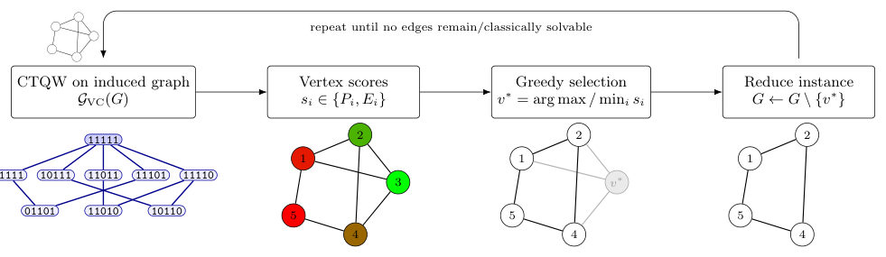 
Figure 1: Schematic of the iterative quantum algorithm. The input graph G defines the induced feasible-state graph GVC(G), on which a constraint-preserving quantum walk prepares a state supported entirely on valid vertex covers. Observables and conditioned cost evaluations of the CTQW state produce per-vertex scores si ∈{Pi, Ei} on the original graph, where Pi is the marginal probability that vertex i belongs to the cover and Ei is the expected cover size obtained from a walk in which vertex i is fixed in the cover. This converts global information in the feasible configuration space into locally accessible greedy decision signals. A vertex is then fixed according to the chosen rule, the...

📷 Fig 2

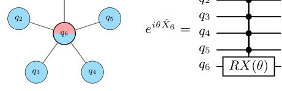 
Figure 2: (a) Graph illustrating a vertex q6 (red) and its neighbourhood N(6) (blue). The neighbours may have additional edges among themselves or to other vertices not shown. (b) Circuit representation of the constraint preserving unitary U6(α) = eiα ˆ X6. A single-qubit rotation is applied to vertex 6, conditioned on all neighbouring qubits being in the state |1⟩, thereby restricting the dynamics to the vertex-cover subspace.

📷 Fig 3

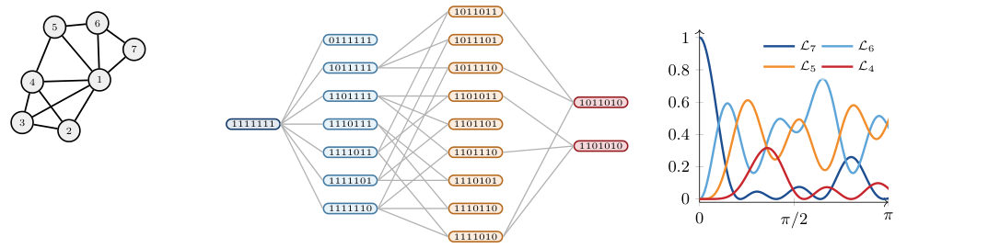 
Figure 3: Example of the implicitly induced feasible-state graph underlying the constrained continuous-time quantum walk (CTQW). The input graph G = (V, E) in the left panel defines the feasible-state graph GVC(G) in the middle panel, whose vertices are the feasible vertex covers of G ordered by Hamming weight and whose edges connect pairs of covers that differ by a single feasibility-preserving bit flip. The walk is initialised in the all-ones state |Ω⟩= |1⟩⊗|V | and propagates coherently down through layers of decreasing weight. The right panel shows the layer-resolved probabilities Pk(t) = P

📷 Fig 4

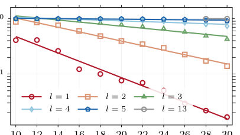 
Figure 5: Cumulative bottom-ℓpeak probability P ⋆ ≤ℓ(n) ≡maxt P j≤ℓPD(G)−j(t) as a function of n at fixed offset ℓfrom the minimum-cover layer. Markers show numerical data; lines show exponential fits Aℓe−αℓn. For ℓ≥5, the fitted decay rate αℓis statistically indistinguishable from zero over the simulated range. Error bars show the corresponding standard deviation.

📷 Fig 5

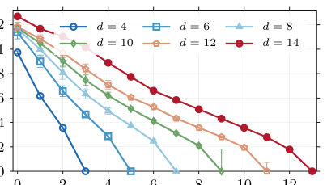 
Figure 4: First-peak time t∗ ℓas a function of layer index ℓ, measured from the minimum-cover layer, for several depths D(G) of GVC(G). Markers show the mean over instances; error bars indicate the corresponding standard deviation.

**Summary.** This paper introduces a novel hybrid quantum-classical framework to solve the Minimum Vertex Cover problem using continuous-time quantum walks. The CTQW evolves within the subspace of feasible vertex covers, generating quantum metrics that guide a greedy reduction process. The results show these quantum-informed methods outperform classical heuristics on random graph ensembles.

**Why it may be interesting.** It provides a concrete, resource-aware application of constrained quantum dynamics (CTQW) for combinatorial optimization, which is highly relevant to developing practical quantum algorithms beyond simple Hamiltonian simulation.

Detailed structure

**Main problem.** The paper addresses the NP-complete Minimum Vertex Cover (MVC) problem by developing a quantum algorithm framework.

**Main result.** Quantum-informed greedy algorithms utilizing continuous-time quantum walks achieve lower mean approximation ratios and solve more instances optimally than classical greedy baselines on random graphs.

**Method.** A hybrid quantum-classical approach uses CTQWs evolving within the feasible subspace of MVC, guiding a recursive greedy reduction based on quantum state observables.

**Model / system.** The system is modeled by a continuous-time quantum walk (CTQW) operating on a graph derived from the feasible state space of vertex covers. The dynamics are constrained using projected Pauli operators to maintain feasibility within the Hilbert space.

**Key observables.** Marginal cover probabilities ($P_i$) and expected cover sizes ($E_i$), used as quantum-derived scores for greedy selection.

**Important parameters / regimes.** Walk time ($t$), Trotterization step size ($p$), graph structure (e.g., bounded degree, random families).

**Assumptions / limitations.** The framework assumes the induced feasible-state graph is connected and that local observables derived from the CTQW can effectively guide a greedy search.

**Figures summary.** Figures illustrate the iterative process linking the input graph to the state space graph via CTQW, and show entropy scaling related to quantum walk dynamics.

**Paper structure.** The paper first establishes the theoretical framework for constraining CTQWs to the feasible subspace. It then details the hybrid greedy algorithm using quantum observables (QPG/QEG) and analyzes its performance against classical methods on various graph families.

Abstract

We introduce a constraint-preserving hybrid quantum-classical greedy framework for the minimum vertex cover problem, which extends directly to maximum independent set by bitwise complementation. The framework uses projected Pauli-X terms whose sum preserves the feasible subspace and acts within it exactly as the adjacency matrix of a layered graph of feasible covers. This graph is connected, so every feasible cover is linked to the configuration containing all vertices by a sequence of allowed single-vertex flips. Starting from this configuration, the corresponding continuous-time quantum walk propagates amplitude into layers containing progressively smaller covers. We rank vertices using either their marginal cover probabilities or the expected cover size obtained after fixing each candidate vertex in the cover, and use these rankings to guide recursive greedy reductions. Across several random-graph families, with walk times fixed using independent calibration ensembles, the quantum-informed algorithms achieve lower mean approximation ratios and solve a larger fraction of instances optimally than their corresponding classical greedy baselines. The conditioned-energy strategy performs best on the tested instances and retains algorithmic performance close to the exact continuous-time limit under low-depth Trotterisation. For bounded-degree graphs, each Trotter layer has circuit depth independent of system size, and the framework requires neither penalty terms nor variational training.

[↑ back to top](#top)

### [Design of a Quantum Error Correction Decoder Exploiting Temporal Parallelism](http://arxiv.org/abs/2607.27930v1)

**Authors:** Leo Itoh, Takuya Kasamura, Hidetsugu Irie, Junichiro Kadomoto  
**Type:** both · **Category:** quantum information and computing · **PDF:** <https://arxiv.org/pdf/2607.27930v1>  
**Analysis basis:** full PDF text, analyzed in chunks
**Topic relevance:** `QC/QI experiment` **2/5** · `quantum measurements` **1/5**

📷 Fig 1

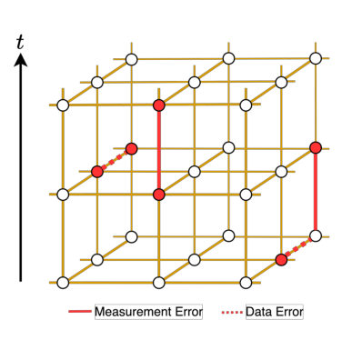 
Fig. 2. Three-dimensional spatiotemporal decoding graph. Edges along the time axis (solid lines) correspond to measurement errors, while edges along spatial directions (dashed lines) correspond to data qubit errors.

📷 Fig 2

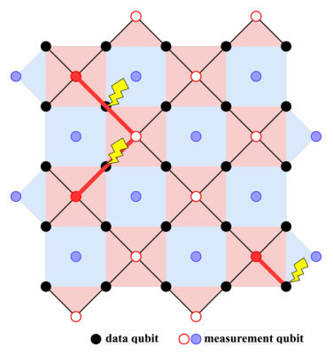 
Fig. 1. Rotated surface code (distance d = 5). Data qubits (black) store logical information. Syndrome qubits (red=Z-checks, blue=X-checks) detect adjacent data qubit errors. When an error occurs (lightning), it flips the syndrome of neighboring measurement qubits, enabling error location inference through decoding.

📷 Fig 3

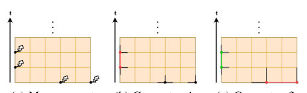 
Fig. 3. Example of cluster growth. The observed syndromes grow by one half-edge at a time, and clusters that come into contact are merged.

📷 Fig 4

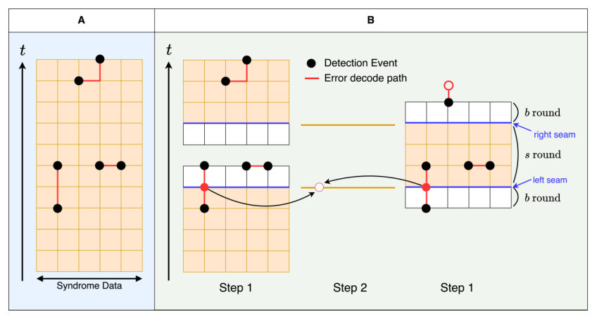 
Fig. 4. Comparison of (A) batch decoding and (B) sandwich decoding on the same syndrome data. Black dots denote detection events, red lines denote estimated error chains, and open circles denote virtual boundary nodes. In batch decoding, d rounds of syndrome measurements are decoded all at once. In sandwich decoding, windows of s + 2b rounds are decoded in parallel (Step 1). An error chain may terminate on a window’s time boundary, and such chains are reconciled across the seams (blue lines) between the core regions (shaded) of adjacent windows by the Type-2 decoder (Step 2).

📷 Fig 5

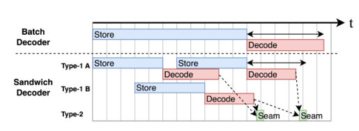 
Fig. 5. Difference in decode timing between sandwich decoding and batch decoding. In sandwich decoding, decoding can proceed while syndrome measurements are still being collected (Store).

**Summary.** This paper designs a novel microarchitecture to accelerate Quantum Error Correction (QEC) decoding using temporal parallelism via 'sandwich decoding.' By implementing this method with Union-Find on an ASIC, the authors demonstrate a substantial reduction in decoding latency compared to traditional batch methods. This work is crucial for advancing practical fault-tolerant quantum computing hardware.

**Why it may be interesting.** This research directly addresses the engineering bottleneck in realizing fault-tolerant quantum computers by providing a concrete, high-speed hardware architecture for error correction decoding.

Detailed structure

**Main problem.** The primary challenge is achieving low-latency Quantum Error Correction (QEC) decoding necessary for fault-tolerant quantum computation to prevent rapid error accumulation during syndrome measurement.

**Main result.** The proposed microarchitecture using sandwich decoding achieves a significant average latency reduction of 35% compared to conventional batch decoders at $d=21$, while maintaining comparable logical error thresholds.

**Method.** The authors propose exploiting temporal parallelism by implementing 'sandwich decoding' combined with the Union-Find algorithm, realized in an ASIC microarchitecture for high speed.

**Model / system.** The work models QEC using surface codes where errors are detected via syndrome measurements on qubits. Decoding involves finding error chains on a three-dimensional spatiotemporal graph, which is approximated by the Union-Find method.

**Key observables.** Average and worst-case decoding latency, logical error threshold ($\approx 1.5\%$), and circuit area scaling.

**Important parameters / regimes.** Code distance ($d=21$ used for key results), physical error rate ($p$), window size ($w$), and buffer sizes ($s, b$).

**Assumptions / limitations.** The core assumption is that decomposing the decoding problem into non-overlapping temporal windows (sandwiching) allows parallel processing while maintaining correctness via boundary reconciliation.

**Figures summary.** Figures illustrate the structure of surface codes, the 3D spatiotemporal graph for decoding, and critically compare the timing/architecture flow between batch decoding and the proposed sandwich decoding scheme.

**Paper structure.** The paper introduces the need for low-latency QEC, details the limitations of batch processing, proposes the sandwich decoding method with specialized hardware units (Dispatcher, Pairer), presents the ASIC implementation results comparing latency and area scaling against prior art, and concludes with future work directions.

Abstract

In the pursuit of fault-tolerant quantum computing, low-latency quantum error correction (QEC) is essential to prevent rapid error accumulation within the syndrome measurement cycle. In this work, we propose a microarchitecture that implements the sandwich decoding method using the Union-Find algorithm by exploiting temporal parallelism, and we present an ASIC implementation. Through logic synthesis and simulation, we show that the proposed decoder achieves an average latency reduction of 35% at code distance d = 21 compared with a conventional batch Union-Find decoder, while maintaining a comparable logical error threshold of approximately 1.5% under phenomenological noise.

[↑ back to top](#top)

### [Statistically secure uncloneable encryption of arbitrary messages](http://arxiv.org/abs/2607.28561v1)

**Authors:** Archishna Bhattacharyya, Anne Broadbent, Eric Culf  
**Type:** theory · **Category:** quantum information and computing · **PDF:** <https://arxiv.org/pdf/2607.28561v1>  
**Analysis basis:** full PDF text, analyzed in chunks
**Topic relevance:** `entanglement & information structure` **2/5** · `quantum measurements` **1/5**

📷 Fig 1

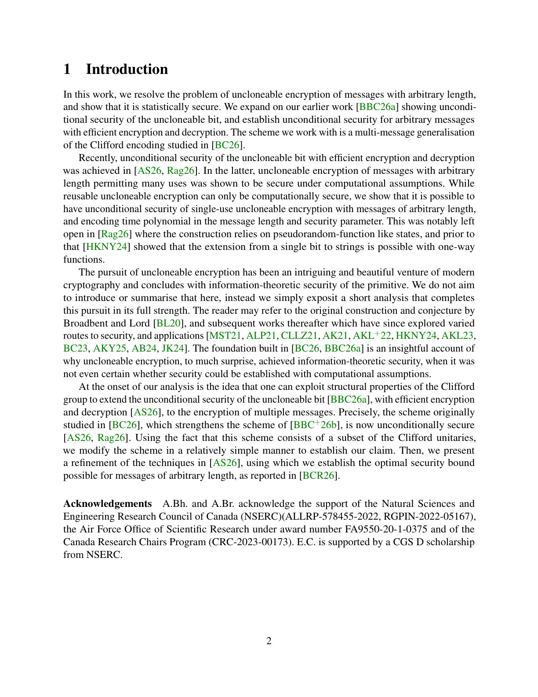 
Low-resolution page preview, page 2

📷 Fig 2

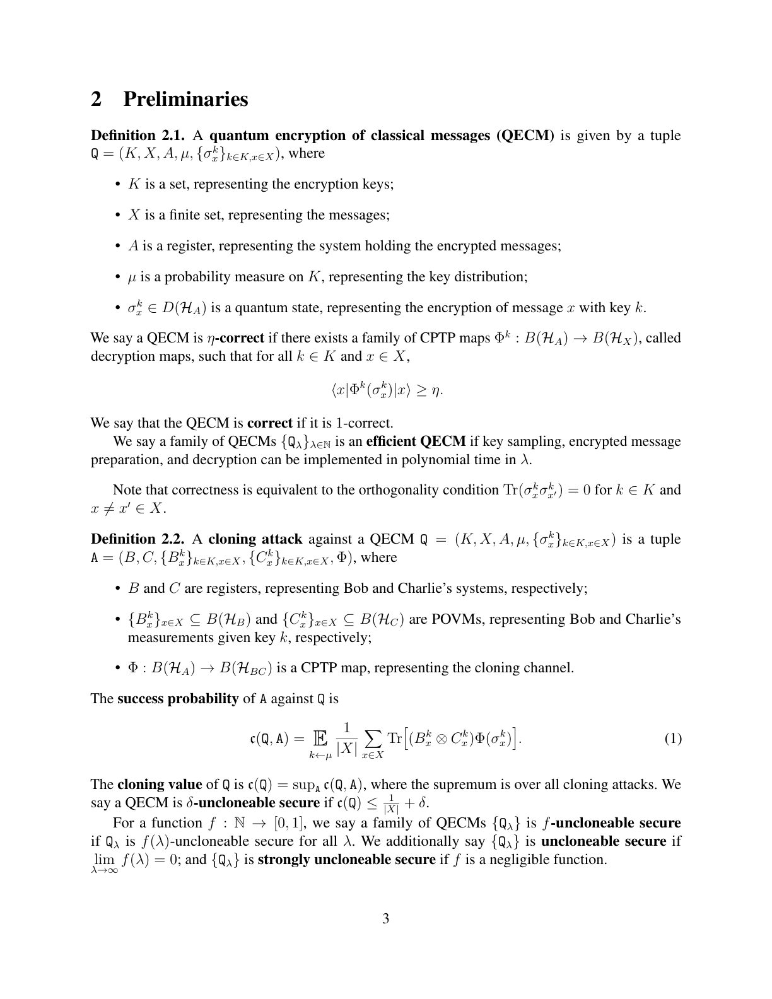 
Low-resolution page preview, page 3

📷 Fig 3

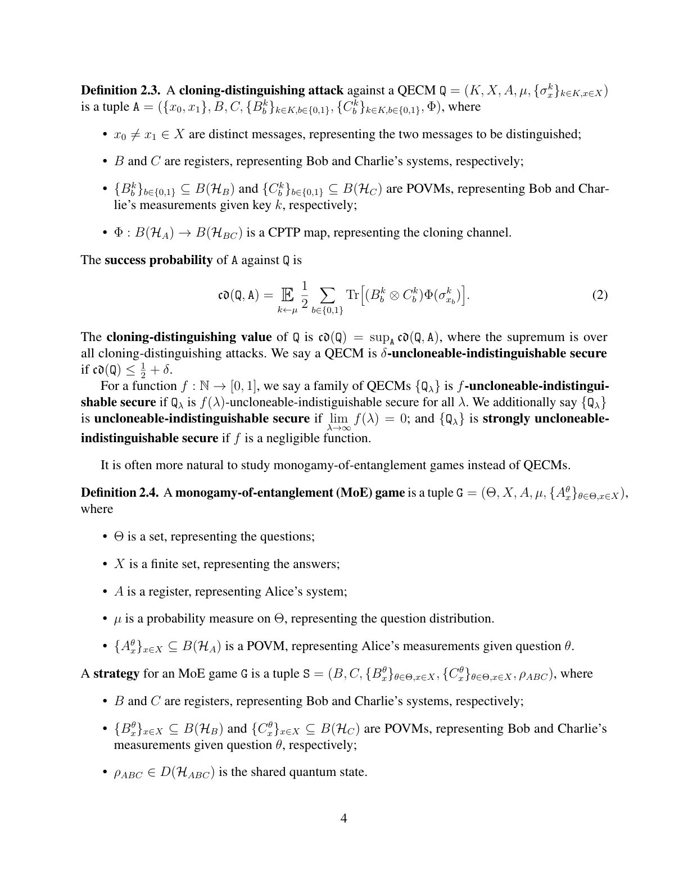 
Low-resolution page preview, page 4

📷 Fig 4

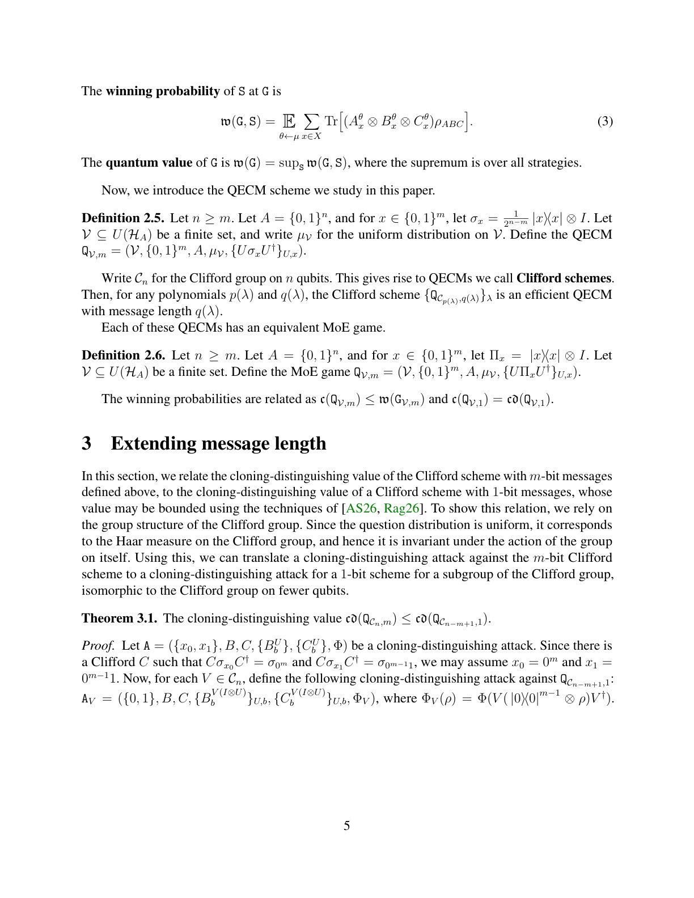 
Low-resolution page preview, page 5

📷 Fig 5

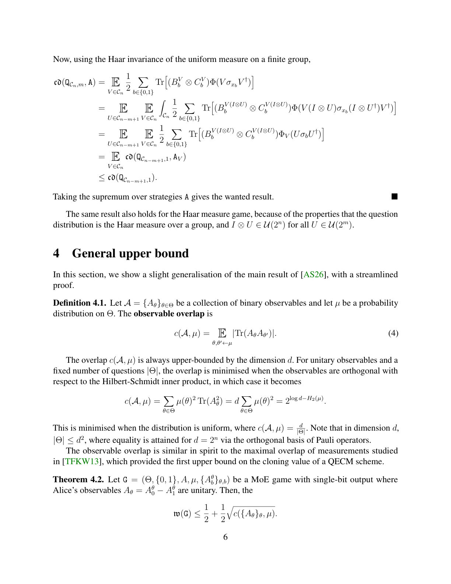 
Low-resolution page preview, page 6

**Summary.** This paper proves that uncloneable encryption schemes can be extended from single bits to messages of arbitrary length while maintaining statistical security. By leveraging the structure of Clifford unitaries, the authors establish unconditional security for these multi-message protocols. This advances the theoretical understanding of information security in quantum communication.

**Why it may be interesting.** While focused on quantum cryptography, the rigorous mathematical techniques involving group theory and bounding expectation values are highly relevant to understanding information processing limits in open quantum systems.

Detailed structure

**Main problem.** To establish that one-time uncloneable encryption of messages of arbitrary length maintains statistical security (unconditional security).

**Main result.** The authors successfully upgrade the single-bit scheme to achieve unconditional uncloneable encryption for arbitrarily long messages, with polynomial encoding time.

**Method.** They extend known secure single-bit schemes by exploiting structural properties of Clifford unitaries and relating cloning bounds across different message lengths using group theory arguments.

**Model / system.** The work analyzes Quantum Encryption Schemes (QECM) based on the Clifford group unitaries ($C_n$), focusing on security against cloning and distinguishing attacks.

**Key observables.** Cloning Value ($c(Q)$) and Cloning-Distinguishing Value ($	ext{cd}(Q)$).

**Important parameters / regimes.** Message length ($m$) and security parameter ($\lambda$).

**Assumptions / limitations.** The extension relies on the structural properties of the Clifford group and prior results concerning unconditional security for single bits.

**Paper structure.** The paper builds upon established single-bit uncloneable encryption, then develops methods using observable overlap in Measurement-of-Evidence (MoE) games to prove bounds on $	ext{cd}(Q)$ for arbitrary message lengths.

Abstract

Unconditional uncloneable encryption of a single bit with efficient encryption and decryption is now possible. However, whether the extension to messages of arbitrary length achieves statistical security remains to be known. Using the fact that the encoding bases for the single-bit scheme known to be secure consist of a subset of the Clifford unitaries, we show that this scheme can be upgraded to achieve unconditional uncloneable encryption for messages of arbitrary length, with encoding time polynomial in the message length and security parameter. This establishes that one-time uncloneable encryption of arbitrary messages enjoys statistical security.

[↑ back to top](#top)

### [No-Go Theorems for Quantum Transport Metrics from Fixed Cost Operators](http://arxiv.org/abs/2607.28358v1)

**Authors:** Minbo Gao, Zhengfeng Ji, Tianshi Yu  
**Type:** theory · **Category:** other · **PDF:** <https://arxiv.org/pdf/2607.28358v1>  
**Analysis basis:** full PDF text, analyzed in chunks
**Topic relevance:** `entanglement & information structure` **2/5**

📷 Fig 1

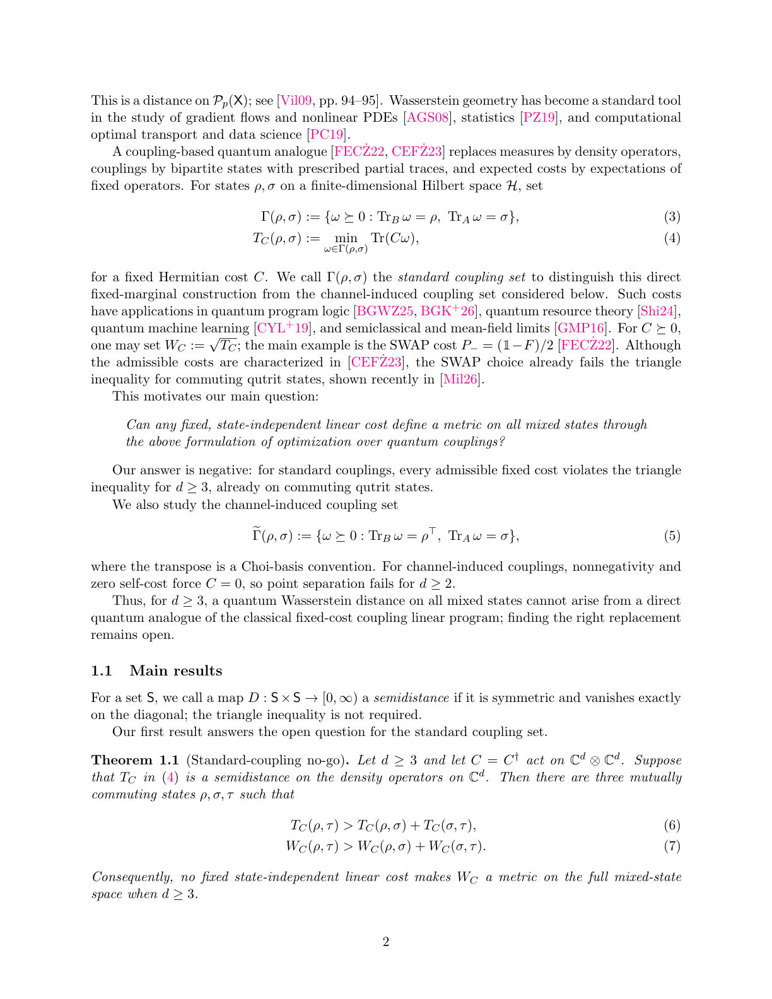 
Low-resolution page preview, page 2

📷 Fig 2

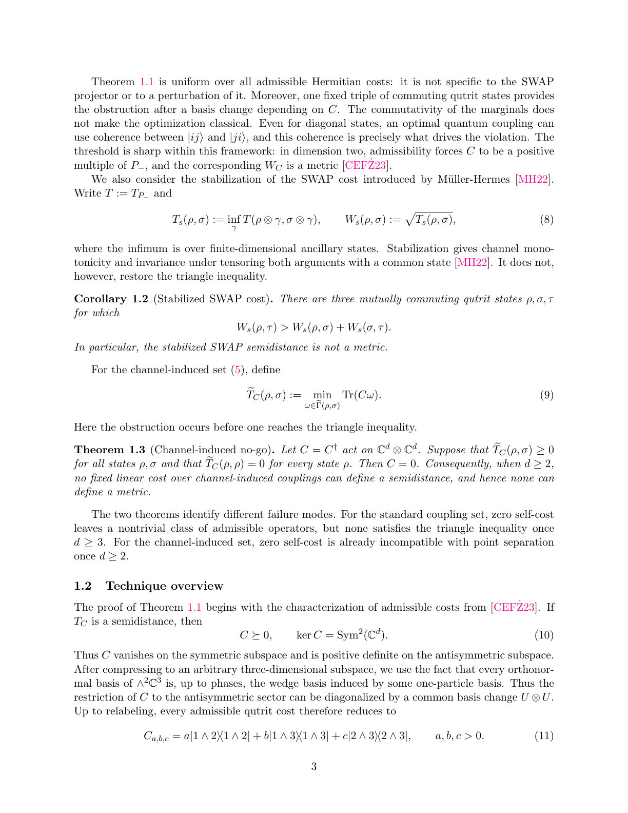 
Low-resolution page preview, page 3

📷 Fig 3

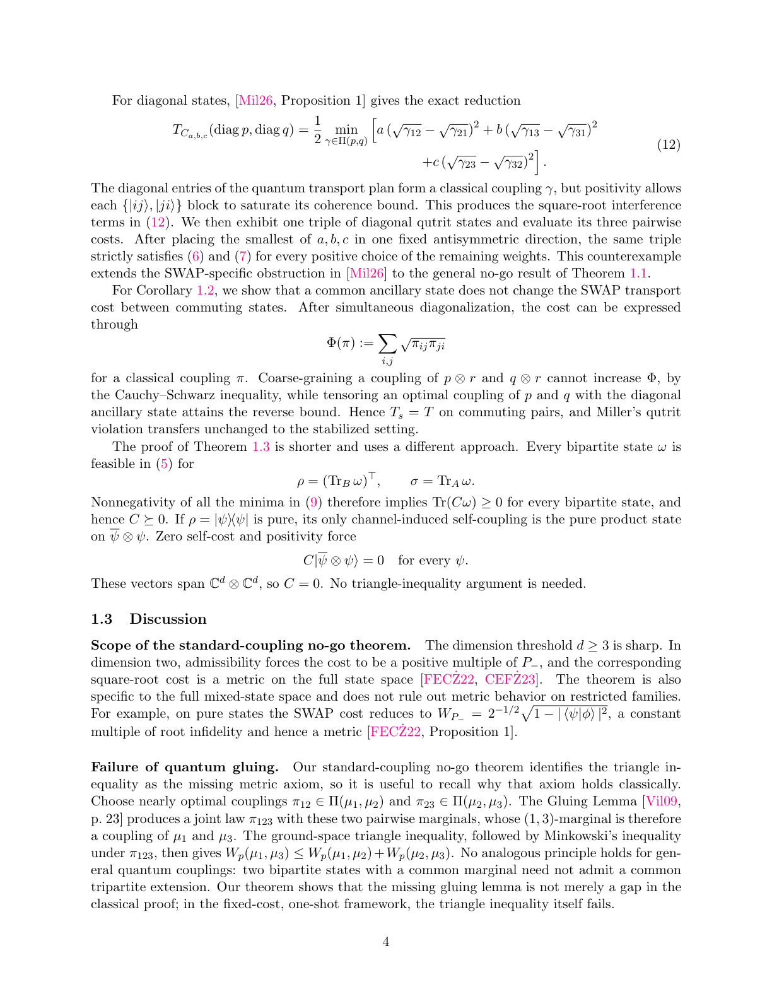 
Low-resolution page preview, page 4

📷 Fig 4

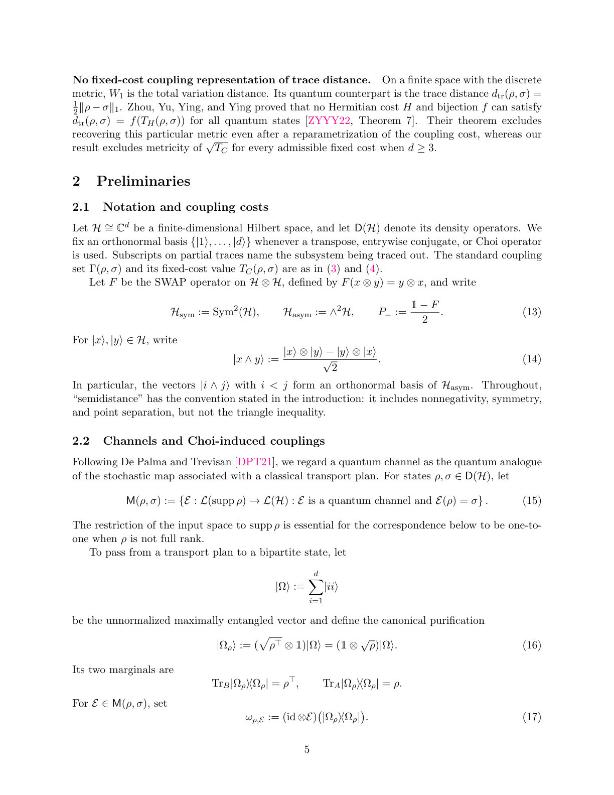 
Low-resolution page preview, page 5

📷 Fig 5

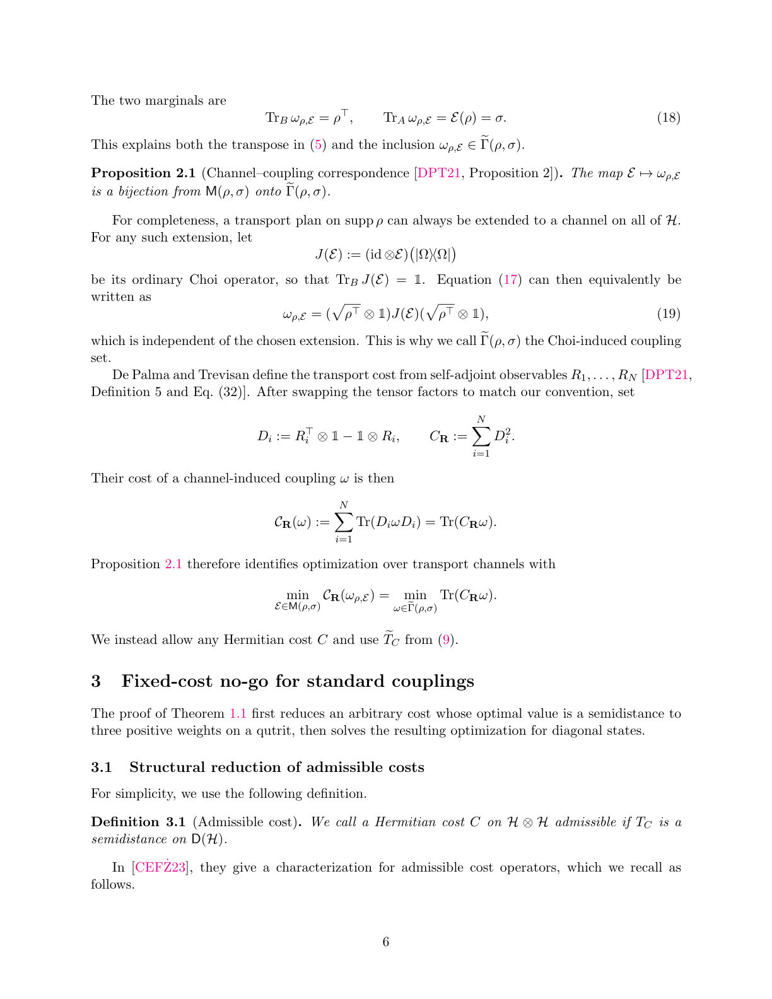 
Low-resolution page preview, page 6

**Summary.** This paper investigates the mathematical feasibility of representing quantum transport distances using fixed cost operators. It proves that such formulations fail to yield true metrics—specifically violating the triangle inequality or forcing the cost operator to zero—for dimensions $d \geq 3$. These no-go theorems highlight fundamental constraints on defining metric structures in the full space of quantum states.

**Why it may be interesting.** This work establishes fundamental theoretical limitations on how quantum information measures (like distance) can be formulated using simple fixed-cost operators, which is crucial for developing robust metrics in quantum computation and physics.

Detailed structure

**Main problem.** The central problem is determining if quantum optimal transport metrics, derived from fixed cost operators on the full quantum state space, can satisfy fundamental metric properties like the triangle inequality.

**Main result.** The authors prove no-go theorems showing that for dimensions $d \geq 3$, neither the standard nor the channel-induced fixed-cost coupling formulation yields a true metric because the triangle inequality is violated or the cost operator must vanish entirely.

**Method.** The proof involves constructing explicit counterexamples, particularly using qutrit states, to violate the triangle inequality for the optimal transport cost. For channel couplings, they analyze necessary conditions (nonnegativity and zero self-cost) that force the cost operator to be zero.

**Model / system.** The analysis is performed on quantum states $
ho, \sigma$ residing in a finite-dimensional Hilbert space $H$, utilizing coupling-based quantum optimal transport formulations. Specific models include standard couplings ($\Gamma$) and channel-induced couplings ($\mathfrak{e}\Gamma$).

**Key observables.** Optimal cost ($T_C$), the square root of the optimal cost ($W_C$), and the violation of the triangle inequality.

**Important parameters / regimes.** The dimension $d$ (thresholds at $d \geq 2$ or $d \geq 3$) is a critical parameter determining the failure of metricity.

**Assumptions / limitations.** The analysis assumes the cost structure is defined by a fixed Hermitian operator $C$, and it tests these structures against the full mixed-state space.

**Paper structure.** The paper first addresses standard couplings, proving failure of metricity for $d \geq 3$ via counterexamples. It then analyzes stabilized costs. Finally, it tackles channel-induced couplings, deriving necessary conditions that force the cost operator to zero for $d \geq 2$.

Abstract

Coupling-based quantum optimal transport generalizes classical optimal transport by representing transport plans as bipartite states with prescribed marginals and evaluating their cost as the expectation of a fixed Hermitian operator. Friedland et al. [Phys. Rev. Lett. 129, 110402 (2022)] conjectured that the square root of the optimal cost associated with the SWAP projector is a metric in every dimension and that this property persists for nearby quantum cost matrices. Miller [arXiv:2607.07764] disproved both conjectures by constructing explicit diagonal qutrit counterexamples. Building on his analysis, we prove a uniform no-go theorem for standard couplings. In every dimension $d\geq3$, no fixed cost operator makes either the optimal cost or its square root a metric, with violations occurring already among commuting states. The obstruction persists under stabilization of the SWAP cost. For channel-induced couplings, global nonnegativity and vanishing self-cost force the cost operator to be zero, precluding point separation when $d\geq2$. Taken together, these no-go results show that fixed-cost coupling formulations do not lead to metrics on the full quantum state space.

[↑ back to top](#top)

### [Purifications for Convex Cones](http://arxiv.org/abs/2607.28202v1)

**Authors:** Felix Campidell, Tim Netzer  
**Type:** theory · **Category:** quantum information and computing · **PDF:** <https://arxiv.org/pdf/2607.28202v1>  
**Analysis basis:** full PDF text, analyzed in chunks
**Topic relevance:** `entanglement & information structure` **2/5**

📷 Fig 1

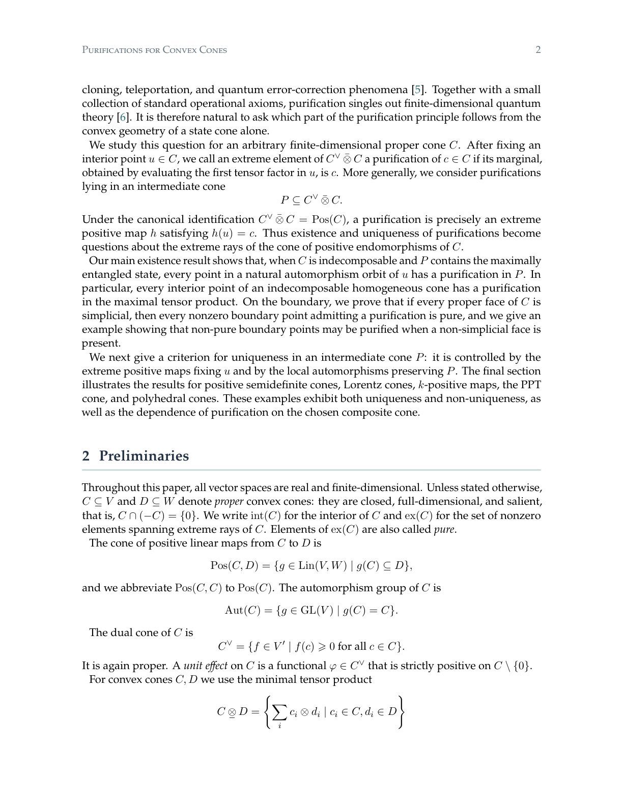 
Low-resolution page preview, page 2

📷 Fig 2

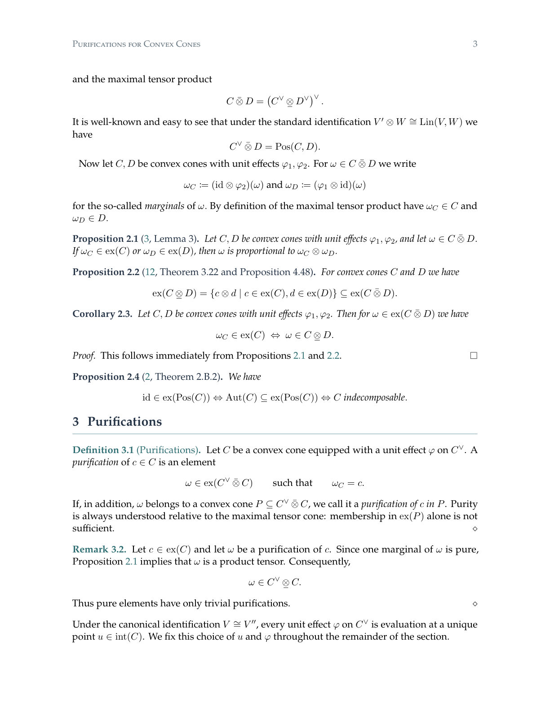 
Low-resolution page preview, page 3

📷 Fig 3

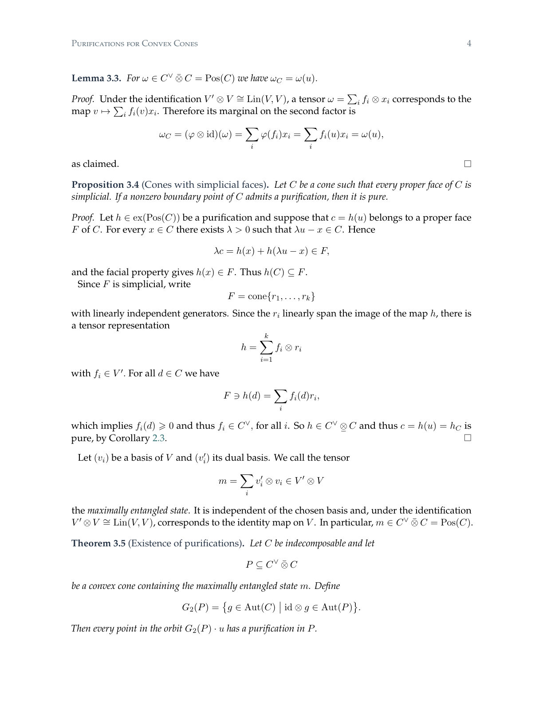 
Low-resolution page preview, page 4

📷 Fig 4

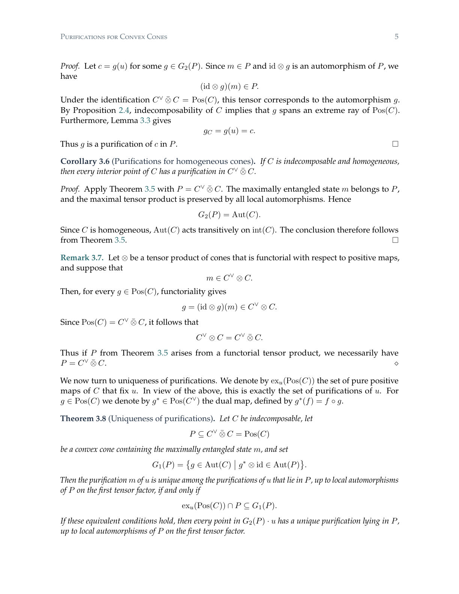 
Low-resolution page preview, page 5

📷 Fig 5

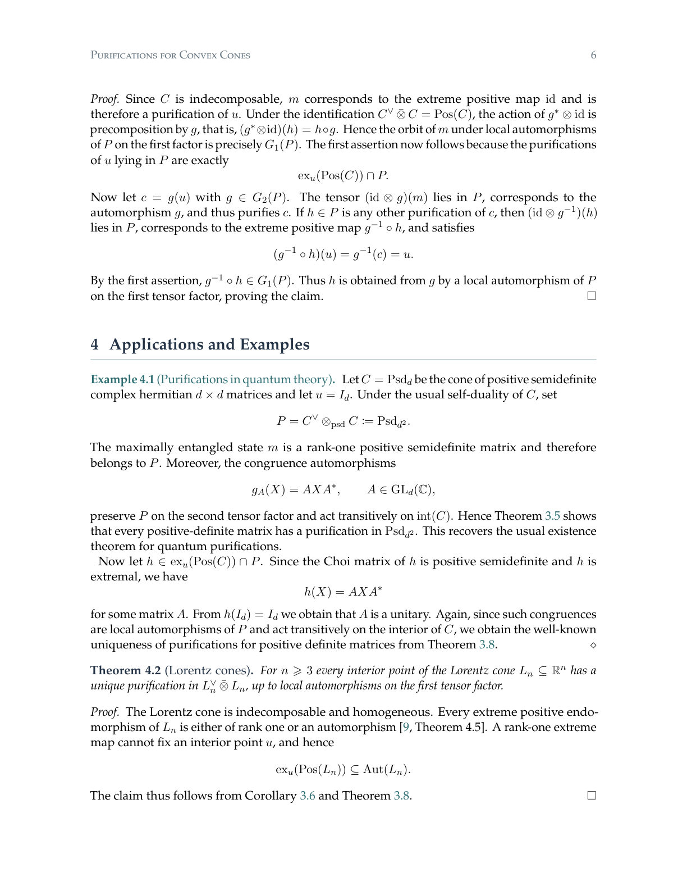 
Low-resolution page preview, page 6

**Summary.** This paper develops a geometric framework using convex cones to study the purification principle, which is fundamental to quantum theory. It proves existence theorems for purifications under conditions like cone indecomposability and provides criteria for when these purifications are unique. The results have direct implications for understanding state representations in quantum information theory.

**Why it may be interesting.** This work provides deep mathematical tools (convex geometry applied to tensor products) that underpin the rigorous understanding of quantum correlations and state representations in generalized probabilistic theories.

Detailed structure

**Main problem.** The paper studies the mathematical concept of 'purification' for elements within finite-dimensional proper convex cones, motivated by its importance in quantum theory.

**Main result.** It establishes existence theorems for purifications when the underlying cone is indecomposable and contains the maximally entangled state, while also providing criteria for uniqueness based on local automorphisms.

**Method.** The analysis heavily relies on convex geometry, specifically analyzing the structure of extreme points (extreme rays) within tensor products of cones representing quantum states or positive maps.

**Model / system.** The models involve general proper convex cones $C$ describing physical states, such as positive semidefinite matrices ($	ext{psd}$), Lorentz cones ($	ext{L}_n$), and the PPT cone. The core mathematical structure is the tensor product of these state spaces.

**Key observables.** Purification elements $\omega$, which are extreme points in intermediate tensor cones $P \subseteq C^\vee \overline{\otimes} C$.

**Important parameters / regimes.** The indecomposability and homogeneity of the cone $C$ are crucial structural assumptions for the main existence theorems.

**Assumptions / limitations.** The theory assumes working within finite-dimensional real vector spaces, and key results often require the state cone $C$ to be indecomposable.

**Figures summary.** Not specified in the notes; the discussion references specific examples (e.g., Example 4.1 for $	ext{psd}$, Example 4.2 for Lorentz cones) illustrating existence and non-uniqueness.

**Paper structure.** The paper builds from defining purification geometrically using convex cones, proving general existence theorems based on indecomposability, analyzing boundary behavior related to simplicial faces, and concluding with uniqueness criteria derived from local automorphisms.

Abstract

Motivated by the importance of the purification principle in quantum theory and generalized probabilistic theories, we study purifications using only the geometry of a finite-dimensional proper convex cone. We prove an existence theorem for indecomposable cones and intermediate tensor cones containing the maximally entangled state; in particular, every interior point of an indecomposable homogeneous cone admits a purification. This applies to Lorentz cones, for example. We also give a criterion for uniqueness up to local automorphisms. On the boundary, we show that if every proper face of $C$ is simplicial, then only pure points can admit purifications, and we demonstrate that this conclusion fails in the presence of non-simplicial faces. Examples involving positive semidefinite cones, Lorentz cones, $k$-positive maps, PPT tensors, and polyhedral cones illustrate both existence and non-uniqueness phenomena.

[↑ back to top](#top)

### [Improved Convergence of Carleman-Embedded Quantum Algorithm for the Vlasov-Poisson System](http://arxiv.org/abs/2607.28426v1)

**Authors:** Matthew Christensen, Tom Goffrey, Animesh Datta  
**Type:** theory · **Category:** quantum information and computing · **PDF:** <https://arxiv.org/pdf/2607.28426v1>  
**Analysis basis:** full PDF text, analyzed in chunks
**Topic relevance:** `Keldysh / 2PI / non-Gaussian methods` **1/5** · `analog quantum simulation` **1/5** · `correlated / nonlocal dissipation` **1/5** · `driven-dissipative phase transition` **1/5** · `methods for driven-dissipative` **1/5** · `non-equilibrium dynamics` **1/5**

📷 Fig 1

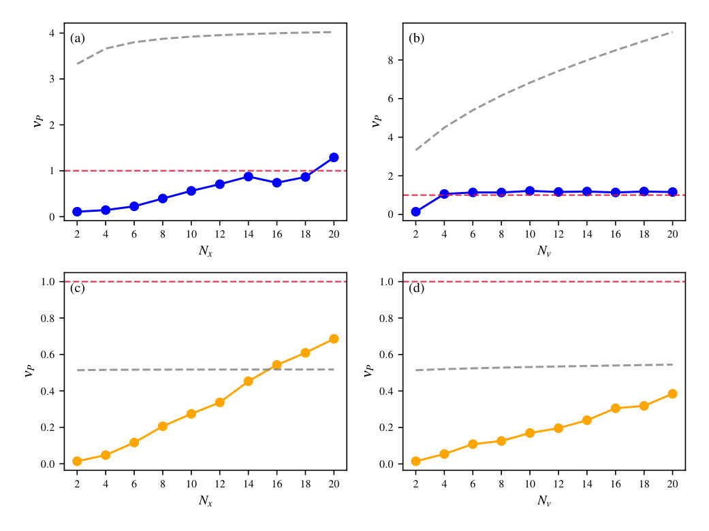 
FIG. 1. Numerically obtained lower bounds of collision frequency (blue &amp; yellow), the fixed P = I bounds (grey, dashed) and physical upper limit ν = 1 (red, dashed) for a perturbation strength α = 0.01. (a) Two stream instability initial condition fts with fixed Nv = 2. (b) Two stream instability initial condition with fixed Nx = 2. (c) Perturbed Maxwellian initial condition fpert with fixed Nv = 2. (d) Perturbed Maxwellian initial condition with fixed Nx = 2. Analytical expressions for the grey dashed lines are given at the end of Appendix F. Appendix E shows the results of the same minimization for the unshifted Vlasov-Poisson system of Eqs. (1) &amp; (2).

📷 Fig 2

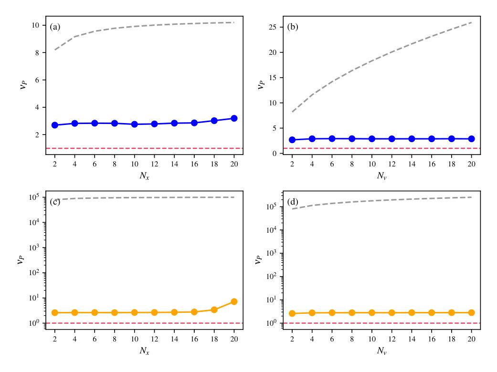 
FIG. 2. Numerically obtained lower bounds of collision frequency in the unshifted regime (blue &amp; yellow), the fixed P = I bounds (grey) and physical upper limit ν &lt; 1 (red). (a) Two stream instability initial condition with fixed Nv = 2. (b) Two stream instability initial condition with fixed Nx = 2. (c) Perturbed Maxwellian initial condition with fixed Nv = 2. (d) Perturbed Maxwellian initial condition with fixed Nx = 2.

**Summary.** The paper analyzes the convergence limits of quantum algorithms applied to solve the Vlasov-Poisson equation from kinetic theory. By employing Carleman embedding and Fourier-Hermite expansions, the authors derive new lower bounds on the necessary collision frequency for stable simulation. This advances both the theoretical understanding of plasma dynamics and the practical feasibility of simulating such systems using quantum computation.

**Why it may be interesting.** This work bridges advanced quantum simulation techniques (Carleman embedding) with fundamental plasma physics problems. For AMO/open systems, it provides a rigorous framework for analyzing the stability and computational feasibility of simulating complex, dissipative, nonlinear dynamics using quantum resources.

Detailed structure

**Main problem.** The primary goal is extending the convergence regime of quantum algorithms designed to solve the Vlasov-Poisson equations from kinetic plasma physics.

**Main result.** Convergence is established for physically reasonable collision frequencies, improving upon previous requirements for unphysically large dissipation. The quantum algorithm shows a potential speedup over classical methods for time-averaged outputs.

**Method.** The authors employ Carleman embedding to transform the infinite-dimensional Vlasov-Poisson system into a finite-dimensional linear system suitable for quantum simulation analysis, using Fourier-Hermite expansions.

**Model / system.** The model is the Vlasov-Poisson system, specifically analyzed in its collisional form incorporating a BGK collision operator. The dynamics are discretized via a Fourier-Hermite expansion of the shifted phase-space distribution function.

**Key observables.** Convergence criteria derived from Lyapunov stability analysis ($	ext{Re} \left( rac{\|\mathbf{F}_2\|^P}{\mu_P(\mathbf{F}_1)} - 1 
ight) < 0$), and the required lower bound on collision frequency ($
u_P$).

**Important parameters / regimes.** Collision frequency ($
u$), velocity resolution ($N_v$), time-averaged vs. time-resolved output requirement, and the matrix structure defined by $F_1$ (linear/dissipation) and $F_2$ (nonlinear).

**Assumptions / limitations.** The analysis relies on using a Fourier-Hermite expansion for the distribution function and making assumptions about the form of the Lyapunov functions ($P$). A key limitation is that convergence might require increasing collision frequency strength with velocity resolution.

**Figures summary.** Figure 1 compares numerically obtained lower bounds ($
u_P$) for required collision frequencies for two canonical problems (two-stream instability, Landau damping) against fixed $P=I$ bounds and the physical limit $
u=1$. Figure 2 shows similar bounds in an unshifted regime.

**Paper structure.** The paper first establishes the mathematical framework by expanding the Vlasov-Poisson system into ODEs for coefficients. It then applies Carleman embedding to form linear/nonlinear matrices ($F_1, F_2$). The core analysis involves minimizing Lyapunov function bounds over various parameters to determine the minimum required collision frequency ($
u_P$) for convergence.

Abstract

We extend the regime of convergence of Carleman-embedded quantum algorithms that solve the Vlasov-Poisson equations from kinetic plasma physics. We establish convergence, using both analytical and numerical lower bounds, for physically reasonable collision frequencies using a Fourier-Hermite expansion of the shifted phase-space distribution function. We also show that for a large class of basis functions, the convergence of the Carleman-embedded Vlasov-Poisson system requires increasing collision frequency strength with velocity resolution. The complexity of the quantum algorithm depends strongly on whether we seek time-averaged or -resolved outputs.

[↑ back to top](#top)

### [Bosonic quantum communication beyond the thermal threshold](http://arxiv.org/abs/2607.27449v1)

**Authors:** Francesco Anna Mele, Giuseppe Catalano, Marco Fanizza, Vittorio Giovannetti, Ludovico Lami  
**Type:** theory · **Category:** quantum information and computing · **PDF:** <https://arxiv.org/pdf/2607.27449v1>  
**Analysis basis:** full PDF text, analyzed in chunks
**Topic relevance:** `Keldysh / 2PI / non-Gaussian methods` **1/5** · `correlated / nonlocal dissipation` **1/5** · `driven-dissipative phase transition` **1/5** · `entanglement & information structure` **1/5** · `methods for driven-dissipative` **1/5**

📷 Fig 1

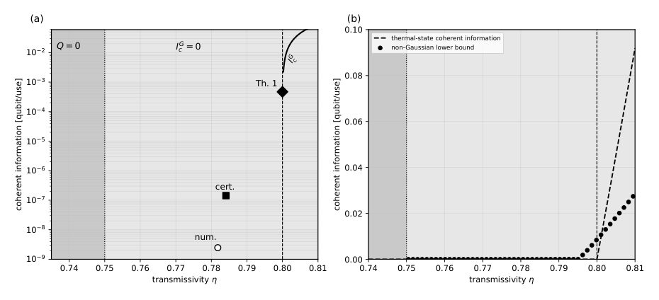 
FIG. 1. Lower bounds on the quantum capacity of the thermal attenuator Φ𝜂,𝜈for 𝜈= 1 and the non-Gaussian advantage of single-mode ansätze. In both panels, the darker shaded region is the antidegradable region 𝜂≤𝜂AD(1) = 0.75, where the quantum capacity vanishes. (a) Overview on a logarithmic scale. The dotted vertical line is the exact antidegradability threshold, and the dashed vertical line marks the thermal threshold 𝜂G(1) = 0.8. The black curve is the thermal-state lower bound in Eq. (7). The diamond is the certified witness from Theorem 1; the square is the independently certified point in Eq. (22); the open circle is the stable, but uncertified, numerical point at 𝜂= 0.7818. (b) Lower...

📷 Fig 2

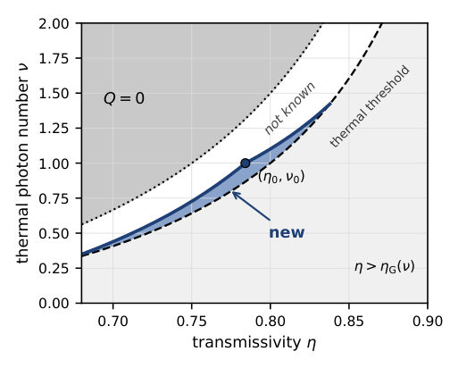 
FIG. 2. Parameter region (𝜂, 𝜈) where the quantum capacity is known to be positive. The blue region is the new region where 𝑄&gt; 0, beyond what was previously known. Specifically, the blue dot marks the certified point (𝜂0, 𝜈0) = (0.7841, 1), where, using a non-Gaussian input state, we prove that𝑄(Φ𝜂0,𝜈0) &gt; 0; see Eq. (22). The blue shaded region contains the channels Φ𝜂,𝜈from which the certified channel can be obtained by pre- and post-processing, Φ𝜂0,𝜈0 = G2 ◦Φ𝜂,𝜈◦G1 [22]. Data processing therefore gives 𝑄(Φ𝜂,𝜈) ≥𝑄(Φ𝜂0,𝜈0) &gt; 0. Only the portion of this region not already covered by the thermal-state lower bound is shaded. The dashed curve is the thermal threshold 𝜂= 𝜂G(𝜈): for 𝜂&gt; 𝜂G(𝜈), the...

**Summary.** The paper investigates the ultimate rate limit (quantum capacity) for transmitting quantum information through a lossy, noisy bosonic channel called the thermal attenuator. It rigorously proves that non-Gaussian input states can achieve higher transmission rates than those predicted by standard Gaussian state assumptions. This finding expands our understanding of achievable communication in high-noise quantum optical systems.

**Why it may be interesting.** This work directly impacts quantum communication theory by showing that assuming Gaussian inputs (a common simplification) leads to an incorrect assessment of channel capacity in noisy bosonic environments.

Detailed structure

**Main problem.** The primary goal is determining the exact quantum capacity of bosonic channels, specifically the thermal attenuator, by investigating whether non-Gaussian input states can surpass the established lower bound derived from Gaussian (thermal) inputs.

**Main result.** The authors prove that non-Gaussian states can achieve a positive coherent information in parameter regimes where the standard thermal-state lower bound vanishes, thus identifying new high-noise communication regimes.

**Method.** The work combines rigorous mathematical proofs using entropy calculations and interval arithmetic with constructing explicit non-Gaussian input states to certify lower bounds on the coherent information.

**Model / system.** The system modeled is the bosonic thermal attenuator ($\Phi_{\eta,
u}$), which describes photon loss in a noisy environment characterized by transmissivity $\eta$ and environmental mean photon number $
u$.

**Key observables.** Quantum Capacity ($Q$), Coherent Information ($I_c$), Thermal Threshold ($\eta_G(
u)$), and Antidegradability Threshold ($\eta_{AD}(
u)$).

**Important parameters / regimes.** Transmissivity ($\eta$) and environmental photon number ($
u$). Specific certified points include $(\eta, 
u) = (0.7841, 1)$.

**Assumptions / limitations.** The analysis relies on the ability to rigorously certify lower bounds using techniques like interval arithmetic, moving beyond purely numerical optimization.

**Figures summary.** Figure 1 compares quantum capacity lower bounds across different noise regimes ($\eta$ vs $
u$), showing the non-Gaussian witness exceeding the thermal bound. Figure 2 maps out a 'high-ground region' in the $(\eta, 
u)$ plane where $Q>0$ is certified.

**Paper structure.** The paper first establishes that Gaussian optimization reduces to thermal state optimization for $I_c$. It then constructs and analyzes specific non-Gaussian states ($
ho_\star$) to demonstrate a separation from this bound. Finally, it maps out the parameter space where positive capacity can be rigorously certified.

Abstract

The quantum capacity of the bosonic thermal attenuator, which is given by the regularization of its coherent information, is unknown. The seminal work of Holevo and Werner established in 1999 the standard one-use lower bound obtained from input thermal states. We first prove that this long-standing lower bound is the exact supremum over all single-mode Gaussian states and then show that, crucially, a non-Gaussian state can do better. As a consequence, we prove positivity of the quantum capacity in a parameter region where the channel is not antidegradable, yet its coherent information optimized over single-mode Gaussian states vanishes. For example, with one thermal photon in the environment and at transmissivity $η=0.8$, the coherent information is non-positive for every single-mode Gaussian input. We give an explicit rank-two non-Gaussian state, supported on only six Fock levels, whose coherent information is certified to be at least $4.7\times10^{-4}$ qubits per channel use. This short witness is far from numerically optimal: a numerical optimization over fixed non-Gaussian families reaches at least $8.4\times 10^{-3}$ qubits per channel use at the same point. More generally, at $ν=1$, using non-Gaussian inputs we certify positivity of the coherent information, and therefore of the quantum capacity, down to $η=0.7841$; by contrast, the channel is antidegradable, and hence has zero quantum capacity, for $η\leq0.75$. Overall, our work identifies new high-noise regimes in which bosonic quantum communication is possible.

[↑ back to top](#top)

### [Restrictions on non-Clifford fault tolerance and ruling out beyond-SQL quantum metrology](http://arxiv.org/abs/2607.27342v1)

**Authors:** Constantin Cedillo Vayson de Pradenne, Ishaan Kannan, Harald Putterman, Jordan Cotler  
**Type:** theory · **Category:** quantum information and computing · **PDF:** <https://arxiv.org/pdf/2607.27342v1>  
**Analysis basis:** full PDF text, analyzed in chunks
**Topic relevance:** `Keldysh / 2PI / non-Gaussian methods` **1/5** · `correlated / nonlocal dissipation` **1/5** · `driven-dissipative phase transition` **1/5** · `entanglement & information structure` **1/5** · `methods for driven-dissipative` **1/5**

📷 Fig 1

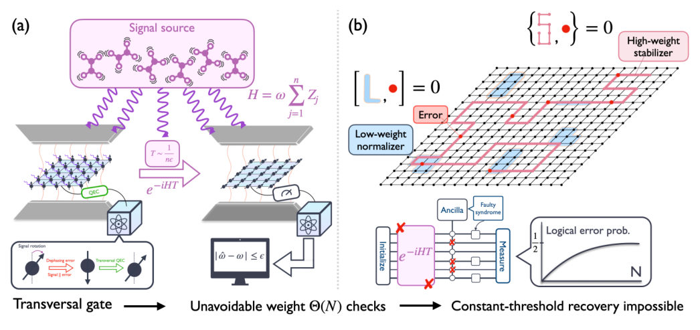 
FIG. 1. Obstructions to transversal quantum sensing. (a) Heisenberg-limited transversal sensing. A spatially homogeneous signal acts on an array of n aligned quantum sensors initialized in a code state, which evolves for a time of order 1/(nϵ). Near selected interrogation times, QEC removes local errors aligned with the signal generator while preserving the coherent global rotation as a discrete transversal logical gate; measuring the encoded state would then determine ω to precision ϵ. (b) Fault-tolerance obstructions. Any code family supporting transversal sensing in time O(1/(nαϵ)) for any α &gt; 1/2 must contain stabilizer checks of poly(n)-growing weight, and many single-qubit errors can...

**Summary.** This paper rigorously proves severe limitations on achieving super-classical sensitivity in quantum metrology. It shows that for signal noise correlated with the measurement signal, any attempt to surpass the Standard Quantum Limit requires an exponentially growing resource (check weight) incompatible with fault-tolerant encoding. The work establishes a general no-go theorem ruling out such advantages under realistic noise conditions.

**Why it may be interesting.** This work provides fundamental theoretical constraints on quantum sensing, showing that realistic noise models severely limit the achievable precision scaling, even when using sophisticated error correction techniques.

Detailed structure

**Main problem.** The paper investigates fundamental restrictions on implementing non-Clifford gates fault-tolerantly and proves a general no-go theorem ruling out asymptotic quantum metrological advantages beyond the Standard Quantum Limit (SQL) when signal noise is aligned.

**Main result.** It establishes that achieving beyond-SQL sensing requires stabilizer checks whose weight diverges with system size, and more broadly, constant-strength signal-aligned noise prevents any asymptotic speedup over the SQL in AC or DC sensing.

**Method.** The authors use rigorous mathematical proofs based on properties of stabilizer codes, analyzing code susceptibility ($\Xi_G$), Bures distance bounds derived from quantum channels, and comparing required error correction weights against achievable scaling laws.

**Model / system.** The model involves encoding quantum sensors in Quantum Error-Correcting Codes (QECCs) to measure a physical signal Hamiltonian ($H$). The analysis considers protocols under realistic noise models, including dephasing ($\gamma$) and erasure channels ($p_e$), particularly when the signal coupling is aligned with the noise generators.

**Key observables.** Bures distance between output states ($d_B(
ho_{	ext{out}}^{\omega_0}, 
ho_{	ext{out}}^{\omega_1})$), required stabilizer check weights ($\lambda_S$), and codespace signal susceptibility ($\Xi_G$).

**Important parameters / regimes.** Code distance ($d\ge 3$), logical gate level ($D$), noise strengths ($\gamma, p_e$), and the scaling exponent $\alpha$ governing the desired metrological advantage.

**Assumptions / limitations.** The strongest results rely on the assumption that signal-aligned noise (noise sharing Pauli generators with the signal) is present. The analysis also considers various advanced techniques like biased estimators or nonstabilizer encodings in the final theorem.

**Figures summary.** Figures illustrate Heisenberg-limited sensing and fault-tolerance obstructions, showing that high speedup requires checks of polynomially growing weight, which conflicts with local noise assumptions.

**Paper structure.** The paper progresses by first deriving quantitative restrictions on transversal non-Clifford gates (Theorem 1), then analyzing the limitations imposed on concatenated codes (Theorem 2), applying these to single-qubit rotations (Theorem 3), and culminating in a general no-go theorem for metrology under signal-aligned noise (Theorem 5).

Abstract

Quantum metrology promises a quadratic speedup over the standard quantum limit (SQL), but signal-aligned noise is expected to preclude this advantage in realistic settings. A potential route around known no-go results is to encode the sensors in a quantum code where the physical signal acts transversally as a logical gate. Understanding restrictions on transversal non-Clifford gates is therefore central to both quantum metrology and fault-tolerant quantum computation. Here, we prove such restrictions and apply them to transversal sensing. For any stabilizer code of distance $d\ge 3$ supporting a transversal logical action in level $D$ of the Clifford hierarchy, every stabilizer generating set must contain a check of weight at least $2^D$. Moreover, any $r$-level concatenated realization satisfies $r\leq \lfloor \log_2 n/D\rfloor$, forcing $r=1$ and ruling out concatenation when applied to beyond-SQL metrology. We then show that transversal single-qubit rotations by a small angle $θ$ can only induce a nontrivial logical action on an $n$-qubit code if its checks include irreducible stabilizers of weight $Ω(1/(n|θ|^2))$. Here, many single-qubit errors commute with every stabilizer or logical Pauli below this weight and are only detected by a high-weight check, so their syndromes cannot be fault-tolerantly reconstructed from low-weight normalizer measurements. Since beyond-SQL transversal sensing requires $|θ| = o(n^{-1/2})$, the weight of checks required for syndrome extraction diverges with $n$. Finally, we prove a broader metrological no-go theorem that avoids the assumptions of the quantum Cramér-Rao bound: constant-strength signal-aligned noise rules out any asymptotic advantage over the SQL in AC or DC sensing, even with biased estimators, nonstabilizer or approximate encodings, quantum memory, intermediate measurements, or adaptive control.

[↑ back to top](#top)

### [Third-order nonlinear transport in a percolative two-dimensional superconductor](http://arxiv.org/abs/2607.27641v1)

**Authors:** Wenjun Liu, Chenghe Wang, Xiubin Li, Kenji Watanabe, Takashi Taniguchi, Tao Zhang, Xiao-Xiao Zhang, Jing Li  
**Type:** both · **Category:** strongly correlated electrons · **PDF:** <https://arxiv.org/pdf/2607.27641v1>  
**Analysis basis:** full PDF text, analyzed in chunks
**Topic relevance:** `Keldysh / 2PI / non-Gaussian methods` **1/5** · `correlated / nonlocal dissipation` **1/5** · `driven-dissipative phase transition` **1/5** · `methods for driven-dissipative` **1/5** · `non-equilibrium dynamics` **1/5**

📷 Fig 1

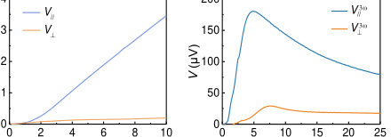 
FIG. 1. Setup of experiments. (a) Device schematic. (b) Superconducting transition in MoTe2 showing the resistance normalized to its value at 4 K. Inset: Optical image of device A, with the dashed red line outlining the MoTe2 sheet. The scale bar represents 10 µm. (c-d) First- and third-harmonic longitudinal voltage (V∥) and transverse voltage (V⊥) as a function of the longitudinal excitation current (I).

📷 Fig 2

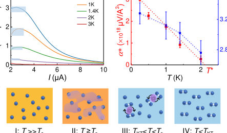 
FIG. 2. Temperature dependence of third-order nonlinear transport properties. (a) V 3ω ∥ versus I at different temper- atures. (b) V 3ω ∥ as a function of I3 at different temperatures, showing a linear dependence. (c) V 3ω ∥ /I3 as a function of I at different temperature. The blue shaded boxes mark the regimes where α remains relatively large. The width of each box extends from the lowest presented current up to I = I∗, and the height spans the full range of fluctuating α values within that regime. (d) Third-order nonlinear transport co- efficients α∗and subcritical current scale I∗as functions of temperature. (e) Cartoon illustrating the evolution of super- conducting fluctuations varies...

📷 Fig 3

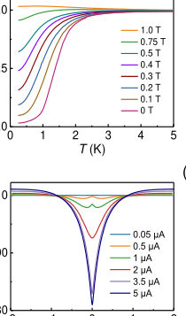 
FIG. 3. Magnetic field effects on superconductivity and third-order nonlinear transport properties. (a) Temperature- dependent resistance under varied applied perpendicular mag- netic fields. (b) Subcritical transition temperature (black symbols), normalized to its zero-field value, as a function of perpendicular magnetic field. The red dashed line represents a fit to the 2D Ginzburg-Landau model, while the blue dashed line indicates the Pauli limit. (c) Magnetic field dependence of the third-order longitudinal voltage V 3ω ∥ for varied I at 250 mK. (d) V 3ω ∥ versus I for different magnetic fields. (e) Estimated third-order transport coefficient α∗as a function of magnetic field in the...

**Summary.** This work reports observing third-order nonlinear electrical transport in a percolative superconductor ($	ext{MoTe}_2$), demonstrating that this nonlinearity is highly sensitive to the superconducting state. By correlating the measured cubic voltage response with theoretical predictions from Ginzburg-Landau theory, the authors establish higher-order transport as a powerful diagnostic tool for studying superconducting fluctuations in low-dimensional materials.

**Why it may be interesting.** The strong correlation between higher-order non-linear response and superconducting fluctuations provides an experimental handle to study pairing mechanisms and coherence in strongly correlated 2D materials without relying solely on transport measurements near zero resistance.

Detailed structure

**Main problem.** The study investigates third-order nonlinear transport as a sensitive probe for superconducting transitions occurring in percolative two-dimensional superconductors.

**Main result.** A clear cubic dependence of the third-harmonic voltage on current was observed, and this nonlinearity was found to be strongly correlated with the superconducting state, vanishing near the transition temperature.

**Method.** The research combines low-frequency lock-in measurements of nonlinear voltages ($V_{3\omega}$) with theoretical modeling based on time-dependent Ginzburg-Landau theory.

**Model / system.** The physical system is a trilayer $1T'$-MoTe$_2$ superconductor operating in its percolative transition regime. The analysis utilizes superconducting fluctuation models derived from the Ginzburg-Landau framework to explain the observed nonlinear response.

**Key observables.** Third-harmonic longitudinal voltage ($V_{3\omega\parallel}$), third-order transport coefficient ($\alpha^*$), and subcritical current scale ($I^*$).

**Important parameters / regimes.** Superconducting transition temperature ($T_c \approx 1.4$ K), excitation current ($I$), perpendicular magnetic field ($B_{\perp}$), and back gate voltage ($V_{BG}$).

**Assumptions / limitations.** The nonlinear response is assumed to originate from fluctuating Cooper pairs, which is semi-quantitatively captured by the time-dependent Ginzburg-Landau theory.

**Figures summary.** Figures demonstrate the cubic dependence of $V_{3\omega\parallel}$ on current at various temperatures and gate voltages. They also map out how $\alpha^*$ and $I^*$ change systematically with temperature, magnetic field, and doping (gate voltage).

**Paper structure.** The paper establishes the experimental setup and measures nonlinear transport across different regimes (T, B, V_BG). It then correlates the measured third-order coefficients ($\alpha^*$) with superconducting fluctuations predicted by GL theory, confirming its utility as a sensitive probe.

Abstract

Percolative superconductivity frequently arises in two-dimensional van der Waals materials due to reduced dimensionality, enhanced quantum fluctuations, and complex electron-phonon interactions, providing a unique platform where normal electrons coexist with Cooper pairs. We report the observation of substantial third-order nonlinear transport in a trilayer $1T^\prime$-MoTe$_2$ superconductor within its percolative transition regime. The third-harmonic longitudinal voltage ($V_{\|}^{3ω}$) exhibits a clear cubic dependence on excitation current below a threshold, with both its magnitude and nonlinear coefficient strongly correlated with the superconducting state. This nonlinear response is semiquantitatively captured by the superconducting fluctuation within the time-dependent Ginzburg-Landau theory, where nonlinear transport arises due to fluctuating Cooper pairs. Our results demonstrate that third-order nonlinear transport serves as a sensitive probe of superconducting transitions in percolative systems and establish a foundation for exploring higher-order transport phenomena in strongly correlated systems.

[↑ back to top](#top)

### [Excited state optimization for strongly correlated quantum defects using ensemble variational Monte Carlo](http://arxiv.org/abs/2607.27377v1)

**Authors:** Kevin G. Kleiner, Lucas K. Wagner  
**Type:** theory · **Category:** strongly correlated electrons · **PDF:** <https://arxiv.org/pdf/2607.27377v1>  
**Analysis basis:** full PDF text, analyzed in chunks
**Topic relevance:** `Keldysh / 2PI / non-Gaussian methods` **1/5** · `Kondo & dissipative impurity` **1/5** · `analog quantum simulation` **1/5** · `methods for driven-dissipative` **1/5**

📷 Fig 1

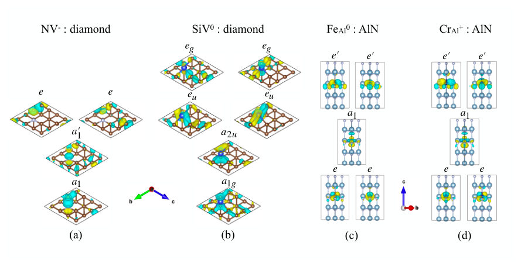 
FIG. 1. Defect active space orbitals used for the analysis of many-body states for the (a) NV−:diamond 31-atom cell, (b) SiV0:diamond 31-atom cell, (c) Fe0 Al:AlN 32-atom cell, and (d) Cr+ Al:AlN 32-atom cell. Each orbital is labeled by its irreducible representation of the C3v group for the NV−:diamond, Fe0 Al:AlN, and Cr+ Al:AlN systems or D3d group for the SiV0:diamond system. For the diamond defects, brown atoms are C, grey atoms are N, and blue atoms are Si. For the AlN defects, light blue atoms are Al, grey atoms are N, orange atoms are Fe, and blue atoms are Cr. The orbitals were computed in Kohn-Sham DFT with the PBE0 functional.

📷 Fig 2

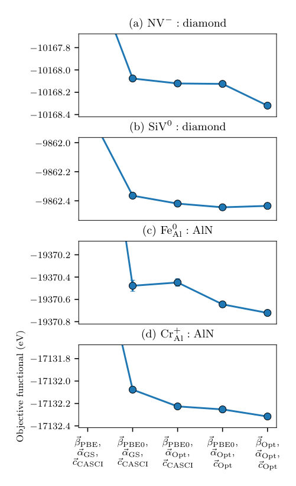 
FIG. 2. Optimization of the ensemble objective functional with respect to Jastrow parameters ⃗α, determinant expan- sion coefficients ⃗c, and orbital parameters ⃗β in MSJ trial wave functions for (a) NV−:diamond, (b) SiV0:diamond, (c) Fe0 Al:AlN, and (d) Cr+ Al:AlN. The objective functional means and statistical error bars are shown in eV units. The pan- els denote the parameters ⃗β, ⃗α, and ⃗c in each stage of opti- mization. The y-axis scale only includes objective functional values for the ⃗βPBE0, ⃗αGS, and ⃗cCASCI case and further opti- mization.

📷 Fig 3

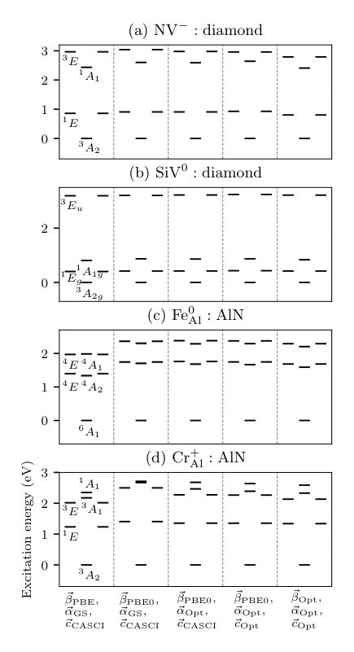 
FIG. 3. VMC-computed excitation energies relative to the ground state energy at each respective optimization stage. The energy levels are labeled according to the state’s spin de- generacy and many-body symmetry irrep. Single-σ statistical errors on the excitation energies are shown as light-shaded grey boxes, mostly thinner than the level thickness. Doubly- degenerate E states are horizontally displaced relative to the non-degenerate states.

📷 Fig 4

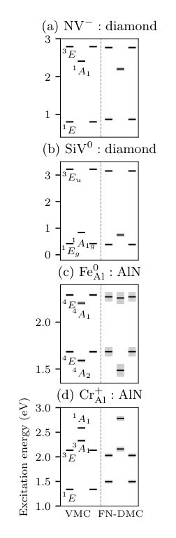 
FIG. 5. Comparison of defect excitation energies computed with VMC and FN-DMC using the fully optimized trial states. The ground states at zero excitation energy are omit- ted for clarity.

📷 Fig 5

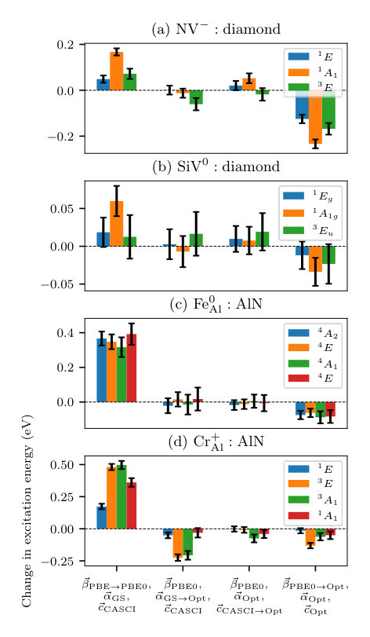 
FIG. 4. Changes in VMC-computed excitation energies dur- ing optimization. The bars denote the excited state labeled by symmetry irrep. One state per doubly-degenerate E irrep is shown. Single-σ statistical errors are shown at the peak of each bar. Zero change in excitation energy is denoted with a horizontal dashed line.

**Summary.** This work uses Ensemble Variational Monte Carlo (VMC) to calculate and optimize the excited state energies for several strongly correlated point defects in materials like diamond and $	ext{AlN}$. The authors demonstrate that achieving high accuracy requires optimizing multiple parameters, showing significant energy shifts when moving from simpler approximations (like PBE orbitals) to more sophisticated ones (like PBE0 or fully optimized factors). This highlights the critical role of comprehensive parameter optimization in correlated solid-state physics.

**Why it may be interesting.** While focused on solids, the rigorous application of advanced variational Monte Carlo techniques to highly correlated defects provides a powerful methodology applicable to complex open quantum systems where correlation effects are dominant.

Detailed structure

**Main problem.** The study aims to accurately determine the excited state energies of strongly correlated point defects embedded in solid-state materials.

**Main result.** Optimizing various parameters, including orbitals (PBE0 vs PBE) and Jastrow factors, is crucial for obtaining accurate excitation energy estimates, with improvements up to 0.5 eV observed by using better orbital sets.

**Method.** The research employs Ensemble Variational Monte Carlo (VMC) methods applied to optimize the wave functions for multiple low-lying excited states simultaneously.

**Model / system.** The study focuses on four specific correlated defect systems: $	ext{NV}^-$ and $	ext{SiV}^0$ in diamond, and substitutional $	ext{Fe}$ and $	ext{Cr}$ impurities in aluminum nitride ($	ext{AlN}$).

**Key observables.** Excitation energies (in eV), objective functional value, and overlaps between the optimized wave functions.

**Important parameters / regimes.** The choice of orbital functional (PBE0 vs PBE) and the degree of parameter optimization (orbital coefficients, Jastrow factors).

**Assumptions / limitations.** The use of small supercells to define a well-posed problem, and that the VMC approach provides an upper bound on the true energy.

**Figures summary.** Figure 1 illustrates the defect active space orbitals for the four studied systems. Figure 4 tracks the systematic decrease in the ensemble objective functional value as optimization parameters are progressively improved across different defects.

**Paper structure.** The paper systematically applies the Ensemble VMC framework to optimize wave functions, comparing results obtained using different levels of parameter optimization (e.g., fixed vs. fully optimized orbitals) for multiple correlated defect centers.

Abstract

Using the recently introduced ensemble variational Monte Carlo (VMC), we study optimized wave functions for strongly correlated point defects, including nitrogen-vacancy and silicon-vacancy centers in diamond and substitutional iron and chromium impurities in aluminum nitride. We study the effects of fully optimized determinant expansion parameters, orbitals, and Jastrow correlation factors on these systems. We find that orbitals from the hybrid functional PBE0 are much better (have lower objective functional) than semilocal PBE, which results in changes in the excitation energies up to 0.5 eV. Further improvements can be made by directly optimizing the objective functional, resulting in changes in excitation energies up to 0.2 eV. The most important parameter varies from defect to defect, reinforcing the necessity of optimizing all parameters to obtain accurate excited states in strongly correlated defects.

[↑ back to top](#top)

### [Spacetime Layout and Logical Compilation of Color Code](http://arxiv.org/abs/2607.28504v1)

**Authors:** Qinjing Yu, Ke Liu  
**Type:** theory · **Category:** quantum information and computing · **PDF:** <https://arxiv.org/pdf/2607.28504v1>  
**Analysis basis:** full PDF text, analyzed in chunks
**Topic relevance:** `analog quantum simulation` **1/5** · `entanglement & information structure` **1/5** · `methods for driven-dissipative` **1/5** · `non-equilibrium dynamics` **1/5**

📷 Fig 1

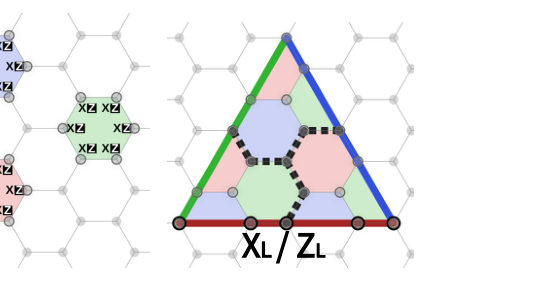 
Figure 1: Left: The anyons in the color code. A string of physical X operators supported on a path connecting two red faces creates a pair of rx anyons at those faces. A single physical Z operator creates a triple of anyons rz, gz, and bz at the three faces adjacent to the qubit. Middle: The stabilizers of the color code. Each face hosts two stabilizers, one in the X basis and one in the Z basis. Right: A triangular patch of the 2D color code, with its three colour boundaries and logical operators. The logical Pauli operators can either be represented as star-shaped string operators in the bulk or as line operators along the boundaries.

📷 Fig 2

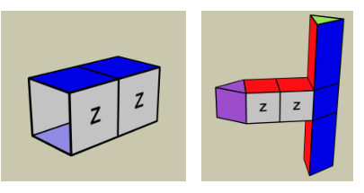 
Figure 2: The building blocks of the spacetime layout of the 2D color code. Left: a prism, with its top and bottom faces as Pauli X boundaries and its lateral faces as colour boundaries. Middle left: a time pipe, with a transparent domain wall carrying a sequence of single-qubit Clifford gates. Middle right: a space pipe, with its top and bottom faces as blue colour boundaries and its lateral faces as Pauli Z boundaries. Right: a magic state injection port (purple), which is attached to a junction. A magic state is injected asynchronously at the port.

📷 Fig 3

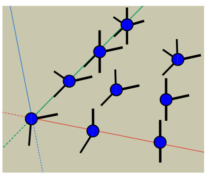 
Figure 3: Left: All possible z-basis junctions of degree 2, 3, 4, and 5 in the spacetime layout of the 2D color code. Right: The corresponding ZX diagram of each junction.

📷 Fig 4

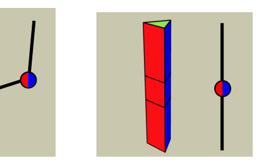 
Figure 4: Left: Two prisms with deferred basis in the spatial direction, and the corresponding rep- resentation in ZX diagram. Right: One prism with deferred basis in the temporal direction, and the corresponding representation in ZX diagram.

📷 Fig 5

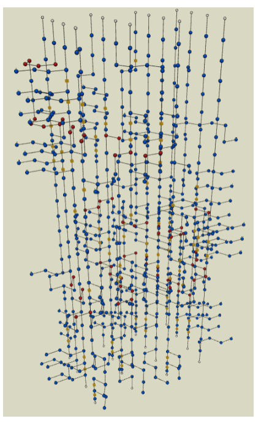 
Figure 5: The result of our compilation pipeline for the 16-qubit VQE circuit. Left: the compiled spacetime layout. Right: the corresponding ZX diagram.

**Summary.** This paper presents a comprehensive framework to automate the process of compiling complex quantum algorithms onto the color code. By introducing a spacetime block-diagram representation and linking it to ZX diagrams, the authors provide a systematic method for mapping abstract logical circuits into physical, fault-tolerant lattice layouts. This advances the color code from merely supporting basic gates to enabling full-stack synthesis of arbitrary computations.

**Why it may be interesting.** While focused on abstract computation, the rigorous geometric mapping of logical operations onto a physical lattice structure provides deep insights into how topological constraints govern quantum information processing architectures.

Detailed structure

**Main problem.** The goal is to establish a complete, automated logical compilation framework for the color code that supports universal quantum operations.

**Main result.** The authors developed a systematic method converting abstract ZX diagram representations into valid spacetime layouts on the color code lattice, achieving automated synthesis of complex computations.

**Method.** They introduce a novel 'spacetime block-diagram representation' and derive assembly rules connecting it to existing semantic tools like edge-decorated ZX diagrams for compilation.

**Model / system.** The system is the 2D color code implemented on a hexagonal (6.6.6) lattice, which encodes logical qubits using topological structures defined by anyons and domain walls.

**Key observables.** Logical Pauli operators ($	ext{X}, 	ext{Z}$), spacetime volume, degree of junctions (up to five).

**Important parameters / regimes.** Code distance ($d$), lattice geometry (hexagonal/triangular patches).

**Assumptions / limitations.** The framework assumes the ability to map logical operations onto the color code's topological structure and relies on established correspondences with ZX diagrams.

**Figures summary.** Figures illustrate anyon types, stabilizer structures per face, spacetime building blocks (Prism, Time Pipe, Space Pipe), and how logical operators deform across high-degree junctions.

**Paper structure.** The paper progresses from defining the color code's topological features to introducing the spacetime block diagram representation, establishing its correspondence with ZX diagrams, and finally developing the automated compilation strategy for universal gates.

Abstract

Fault-tolerant quantum computing requires system-level coordination of logical primitives. Here, we establish a logical compilation framework for the color code, grounded in its topological structure and supporting universal logical operations. Based on its anyon-condensation and domain-wall structure, we introduce a spacetime block-diagram representation capturing logical patches and operations and derive the rules governing block assembly. A correspondence with ZX diagrams further identifies the logical semantics of this representation and enables transformations that preserve the represented computation. Moreover, we develop a code-derived compilation strategy that converts ZX representations of logical computations into valid color-code spacetime layouts. In this strategy, edge-decorated ZX diagrams tailor the logical representation to the color code under the block-assembly constraints, and fusion-region-aware routing exploits semantic equivalence during geometric embedding. We automate the complete logical compilation process and demonstrate successful compilation across a broad range of algorithms. Our work advances color-code architecture from individual primitives to the automated synthesis of logical computations, marking a significant step toward its full-stack quantum computing.

[↑ back to top](#top)

### [Exact chiral symmetry with quantum signal processing](http://arxiv.org/abs/2607.28524v1)

**Authors:** Henry Lamm, Alessandro Roggero, Hersh Singh, Luca Spagnoli  
**Type:** theory · **Category:** quantum information and computing · **PDF:** <https://arxiv.org/pdf/2607.28524v1>  
**Analysis basis:** full PDF text, analyzed in chunks
**Topic relevance:** `Keldysh / 2PI / non-Gaussian methods` **1/5** · `analog quantum simulation` **1/5** · `methods for driven-dissipative` **1/5**

📷 Fig 1

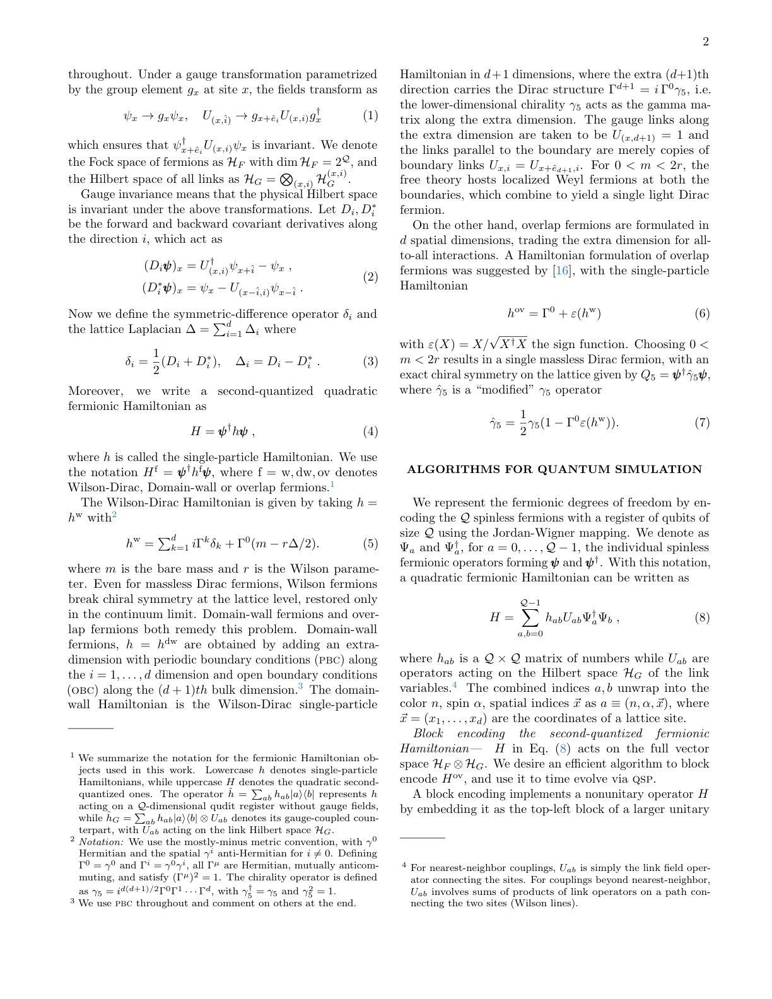 
Low-resolution page preview, page 2

📷 Fig 2

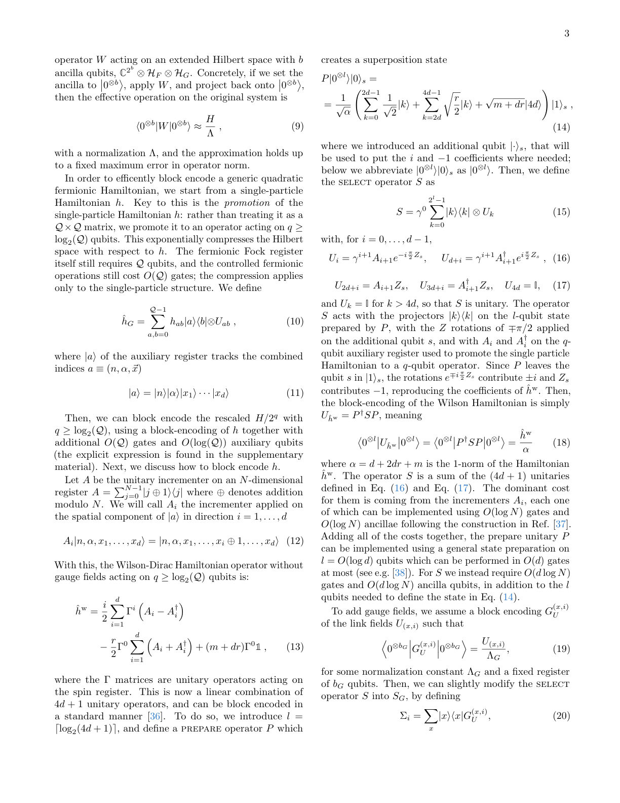 
Low-resolution page preview, page 3

📷 Fig 3

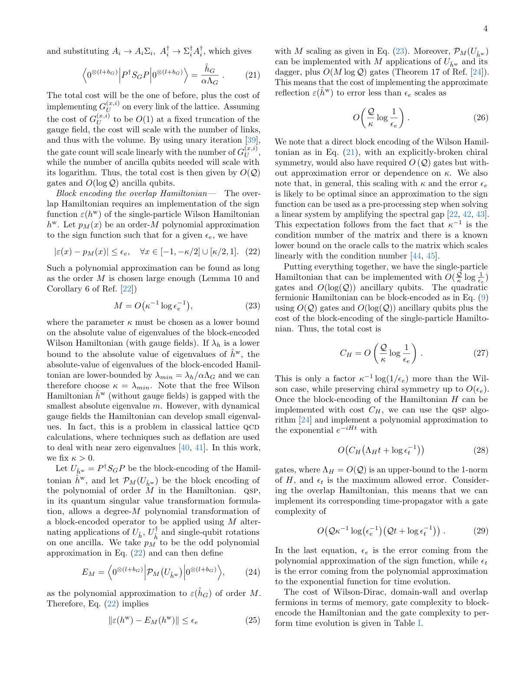 
Low-resolution page preview, page 4

📷 Fig 4

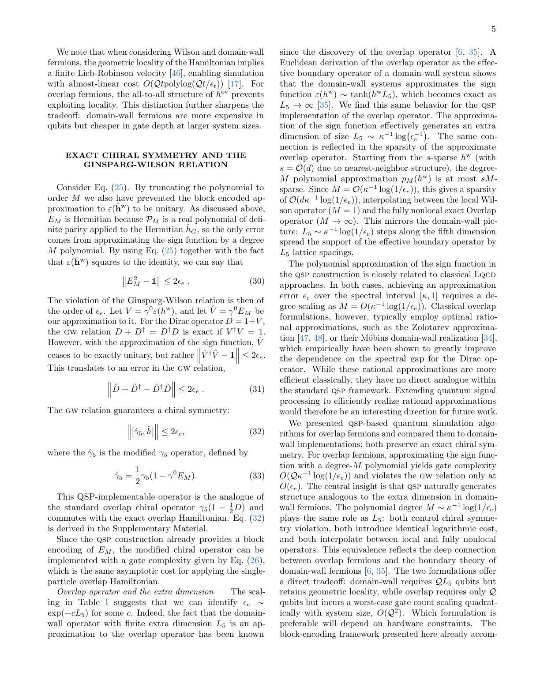 
Low-resolution page preview, page 5

📷 Fig 5

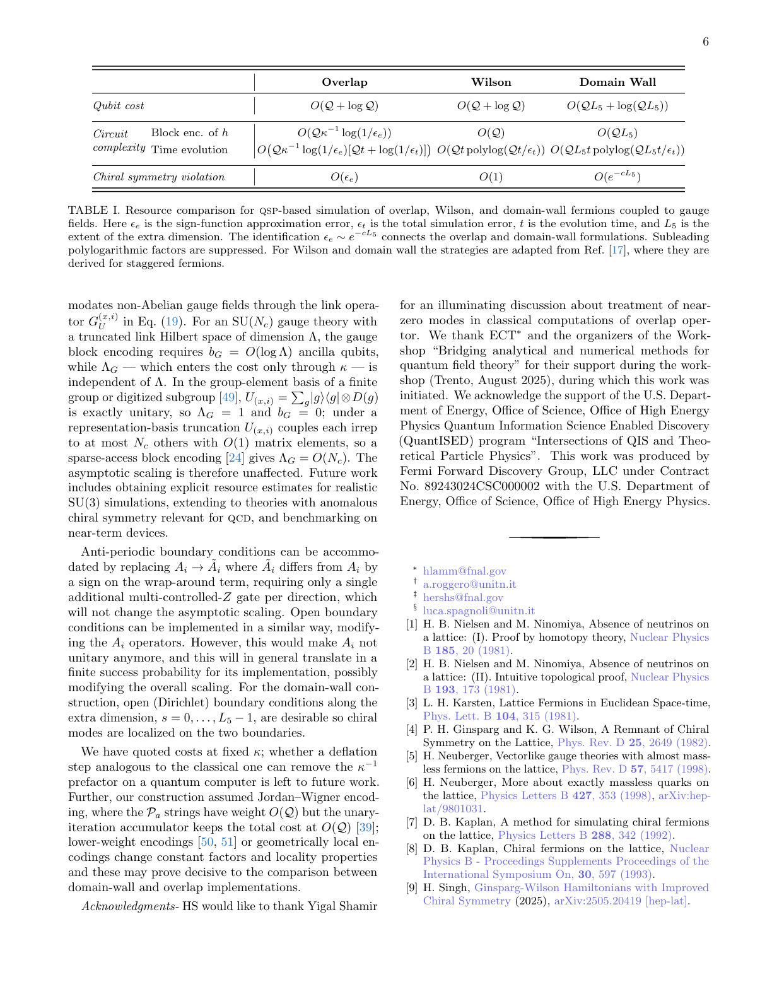 
Low-resolution page preview, page 6

**Summary.** This paper presents a Quantum Signal Processing algorithm to simulate lattice fermions with exact chiral symmetry, specifically targeting the Overlap fermion Hamiltonian. By using QSP, they achieve an efficient simulation that only incurs a logarithmic overhead compared to simpler methods while rigorously controlling the resulting violation of chiral symmetry ($\propto \epsilon_e$). This work advances quantum simulation techniques for fundamental problems in particle physics.

**Why it may be interesting.** While focused on high-energy physics, the core methodology—using QSP to implement complex non-local operators (like the sign function) while controlling systematic errors ($\epsilon_e$) in a quantum simulation framework—is highly relevant for developing fault-tolerant algorithms for general many-body Hamiltonians.

Detailed structure

**Main problem.** Developing efficient quantum algorithms for simulating lattice fermions while rigorously preserving exact chiral symmetry.

**Main result.** A Quantum Signal Processing (QSP) algorithm can simulate the overlap fermion Hamiltonian with only a logarithmic overhead compared to the Wilson-Dirac case, maintaining chiral symmetry up to a controllable error $\epsilon_e$.

**Method.** The authors employ QSP techniques combined with block encoding to approximate the sign function required for the Overlap operator, allowing time evolution simulation on quantum hardware.

**Model / system.** The study focuses on simulating lattice Quantum Chromodynamics (QCD) using Dirac fermions. It compares three formulations: Wilson-Dirac, Domain-Wall, and Overlap fermions, all defined by specific Hamiltonians ($\hat{h}_w$, $\hat{h}_{ov}$).

**Key observables.** Chiral symmetry violation quantified by the commutator $[\hat{\gamma}_5, \hat{h}]$, and the computational cost scaling (memory/gate count).

**Important parameters / regimes.** The approximation error ($\epsilon_e$), the lattice size ($N$), and the parameter $\kappa$ related to eigenvalue bounds.

**Assumptions / limitations.** The primary assumption is that the sign function can be accurately approximated by a polynomial of degree $M$, leading to an error bound proportional to $\epsilon_e$.

**Paper structure.** The paper progresses from defining the physical problem (lattice fermions) and comparing Hamiltonians, to detailing the QSP implementation for the Overlap operator, and finally deriving rigorous bounds on chiral symmetry violation based on the approximation error.

Abstract

We give a quantum signal processing (QSP) algorithm for the overlap fermion Hamiltonian which preserves the Ginsparg-Wilson relation up to a controllable error $ε_e$. Quantum simulations of Dirac fermions with exact chiral symmetry are thus nearly free: applying the overlap Hamiltonian costs only a factor logarithmic in $ε_e$ more than the Wilson-Dirac Hamiltonian. Comparing to domain-wall fermions, a mild overhead is found in circuit complexity while reducing qubit costs. We show how QSP effectively constructs an extra dimension when simulating the overlap operator, illustrating that the scaling of quantum algorithms reflects the deeper physics of overlap fermions arising at the boundary of domain-wall fermions.

[↑ back to top](#top)

### [A CPU+DCU Heterogeneous Parallel Framework for Post-Processing Reconstruction in Quantum Circuit Cutting](http://arxiv.org/abs/2607.27947v1)

**Authors:** Qingqing Jiang, Weidong Liu, Yufu Liu, Ruiqing He, Jiandong Shang, Hengliang Guo, Qiang Chen  
**Type:** experiment · **Category:** quantum information and computing · **PDF:** <https://arxiv.org/pdf/2607.27947v1>  
**Analysis basis:** full PDF text, analyzed in chunks
**Topic relevance:** `QC/QI experiment` **1/5** · `methods for driven-dissipative` **1/5**

📷 Fig 1

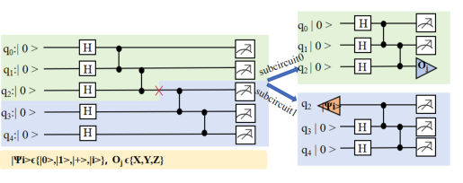 
Fig. 1. Illustration of quantum circuit cutting. Left: A five-qubit circuit is cut on wire q2 into two independently executable three-qubit subcircuits. Right: At the cut boundary, subcircuit 1 measures the outgoing qubit in the X, Y , and Z bases, while subcircuit 2 prepares the corresponding input state from {|0⟩, |1⟩, |+⟩, |+i⟩}. The output probability distribution of the original circuit is recovered by classically combining the subcircuit results obtained under the different measurement and state-preparation configurations.

📷 Fig 2

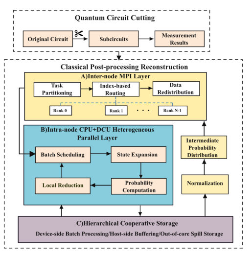 
Fig. 2. Overall workflow of the proposed CPU+DCU heterogeneous parallel framework for circuit-cutting post-processing reconstruction. The original quantum circuit is first cut at selected locations into independently executable subcircuits, which are executed on quantum devices to produce measurement results for classical reconstruction. The inter-node MPI layer performs sparse- state partitioning, assigns state indices to owner processes, and redistributes newly generated states and their probability contributions across processes. Within each node, CPUs and DCUs cooperate to perform classical post- processing reconstruction, while device memory, host memory, and out-of- core storage...

📷 Fig 3

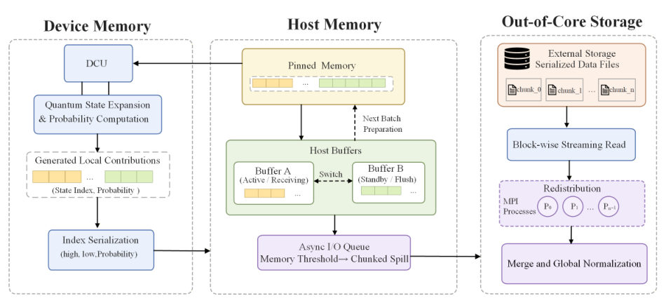 
Fig. 3. Schematic of the hierarchical cooperative storage mechanism. Device memory performs DCU-side state expansion and probability computation and generates local state contributions for redistribution. Host memory uses pinned memory, buffering, and asynchronous I/O queues for data staging, batch preparation, and spill management. When host-memory usage exceeds a predefined threshold, intermediate data are asynchronously written to disk and later reintroduced into the processing pipeline through block-wise reading, redistribution, and merging. The three storage levels cooperate through buffered and asynchronous I/O pipelines, mitigating the impact of single-level capacity limitations on...

📷 Fig 4

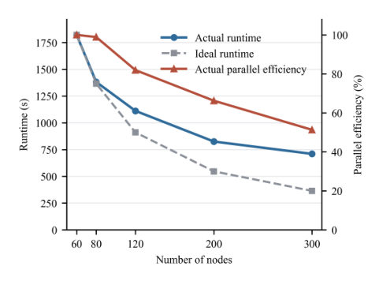 
Fig. 5. Strong-scaling results for the post-processing reconstruction of a fixed 53-qubit random circuit. Actual runtime denotes the measured runtime, while Ideal runtime denotes the theoretical strong-scaling runtime calculated using the 60-node configuration as the baseline. Taking the overall experimental feasibility into account, the 60-node configuration is selected as the starting point and baseline for the strong-scaling study.

📷 Fig 5

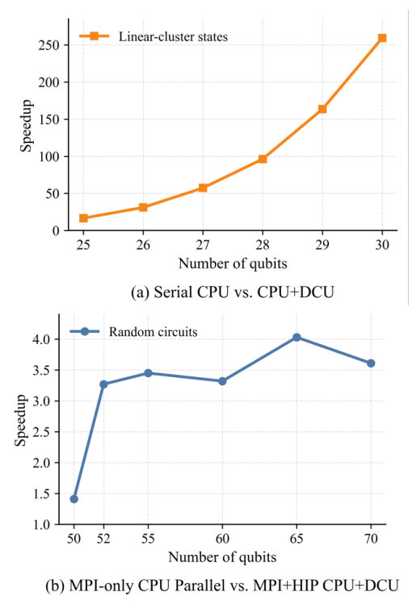 
Fig. 4. Speedup evaluation of the CPU+DCU heterogeneous framework. (a) Speedup over the optimized serial CPU implementation for linear-cluster states. (b) Speedup over the homogeneous CPU-parallel implementation for random circuits.

**Summary.** This paper introduces a novel CPU+DCU heterogeneous parallel framework designed to overcome the classical bottleneck in reconstructing full quantum output distributions after circuit cutting. By efficiently handling sparse, high-dimensional state data using advanced indexing and multi-level storage, it achieves substantial speedups on supercomputers. This demonstrates a scalable solution for post-processing large-scale quantum computations.

**Why it may be interesting.** This work directly addresses the classical resource management gap inherent in scaling quantum algorithms by providing an optimized computational backend for post-processing results derived from NISQ devices.

Detailed structure

**Main problem.** The classical post-processing reconstruction of quantum output distributions from subcircuit measurements is a major computational bottleneck when using quantum circuit cutting techniques.

**Main result.** The proposed framework achieves significant speedups (up to 259x on linear states and 4x on random circuits) while maintaining high fidelity, enabling reconstruction at the hundred-qubit scale.

**Method.** It employs a CPU+DCU heterogeneous parallel framework that reconstructs sparse, non-zero probability states using specialized indexing (high/low-word integers) and a three-level cooperative storage hierarchy.

**Model / system.** The system involves quantum circuits decomposed via 'circuit cutting' into smaller subcircuits measured on available hardware. The reconstruction process combines these subcircuit results to recover the original, full output distribution.

**Key observables.** Reconstruction fidelity and computational speedup compared to serial or homogeneous CPU-parallel baselines.

**Important parameters / regimes.** Circuit size (up to hundred qubits), number of cuts ($K$), and the dimensionality of the state space ($2^n$).

**Assumptions / limitations.** The primary limitation addressed is the classical computational overhead associated with reconstructing sparse, high-dimensional quantum states from partial measurements.

**Figures summary.** Figure 1 illustrates circuit cutting on a 5-qubit example combining X, Y, and Z basis measurements. Figure 2 details the workflow: MPI partitioning $
ightarrow$ CPU+DCU reconstruction $
ightarrow$ hierarchical storage management.

**Paper structure.** The paper identifies the bottleneck in post-processing reconstruction from quantum circuit cutting; it then proposes the heterogeneous CPU+DCU framework incorporating advanced indexing and three-level storage; finally, it validates this approach with supercomputer experiments showing massive speedups.

Abstract

In the NISQ era, limited qubit resources make it difficult to execute large quantum circuits directly on real hardware. Quantum circuit cutting mitigates this limitation by decomposing a large circuit into smaller subcircuits, but it shifts substantial overhead to classical post-processing. As circuit size, complexity, and cut count increase, reconstruction becomes a major computational and storage bottleneck. This paper presents a CPU+DCU heterogeneous parallel framework for circuit-cutting post-processing reconstruction. Instead of constructing a dense $2^n$-dimensional probability vector or returning only high-probability states, the framework reconstructs the nonzero-probability states in the original output distribution from subcircuit measurement results. It combines heterogeneous CPU+DCU execution with a high/low-word integer representation for global basis-state indices beyond 64 bits and a three-level cooperative storage mechanism spanning device memory, host memory, and out-of-core storage. Experiments on the Songshan supercomputer show that the framework maintains high reconstruction fidelity while achieving up to $259\times$ speedup over an optimized serial baseline on linear-cluster states and up to $4\times$ speedup over a homogeneous CPU-parallel method on random circuits. The framework can also complete reconstruction tasks at the hundred-qubit scale. These results demonstrate that HPC-oriented heterogeneous reconstruction can effectively alleviate the classical post-processing bottleneck and improve reconstruction scalability.

[↑ back to top](#top)

### [Iterative minimization in reduced density matrix functional theory for periodic systems](http://arxiv.org/abs/2607.27679v1)

**Authors:** Kai Luo, Jingang Han, Peize Lin, Daye Zheng, Mohan Chen, Xinguo Ren  
**Type:** theory · **Category:** strongly correlated electrons · **PDF:** <https://arxiv.org/pdf/2607.27679v1>  
**Analysis basis:** full PDF text, analyzed in chunks
**Topic relevance:** `Keldysh / 2PI / non-Gaussian methods` **1/5** · `analog quantum simulation` **1/5**

📷 Fig 1

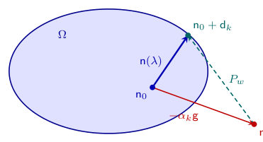 
FIG. 1. Schematic of one SPG occupation step. From n0 ∈Ωnear the feasible boundary, a spectral gradient step −αkg (red) may leave Ω; the projector Pw (teal) returns the trial to n0 +dk ∈Ω. The search then follows the feasible chord n(λ) = n0 +λdk (blue), λ ∈[0, 1].

📷 Fig 2

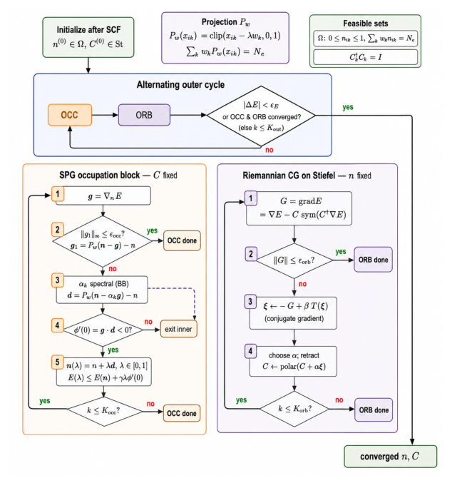 
FIG. 2. Schematic illustration of the RDMFT algorithm with the SPG occupation optimizer and the Riemannian conjugate gradient orbital optimizer.

📷 Fig 3

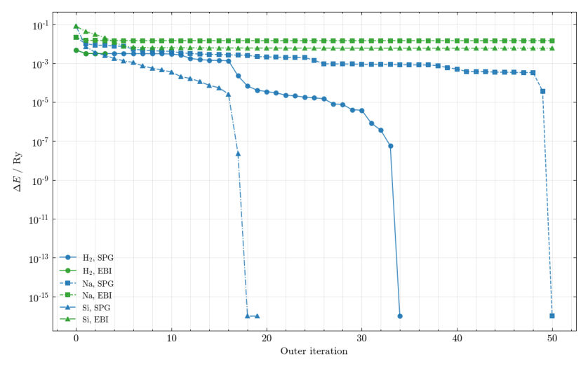 
FIG. 3. Energy convergence for the power functional with SPG and EBI occupation optimizers. The reference energy is the lower value between the two optimizers at each system.

📷 Fig 4

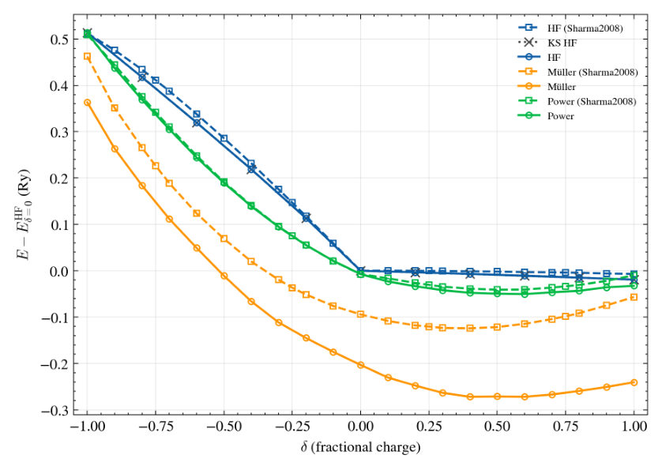 
FIG. 4. Fractionally charged LiH: RDMFT total energies relative to EHF δ=0. Black: HF reference using KS hybrid loop; blue: present HF (SPG); green: power functional (SPG); orange: M¨uller functional (SPG). Dashed curves: digitized data from Sharma et al. [14].

📷 Fig 5

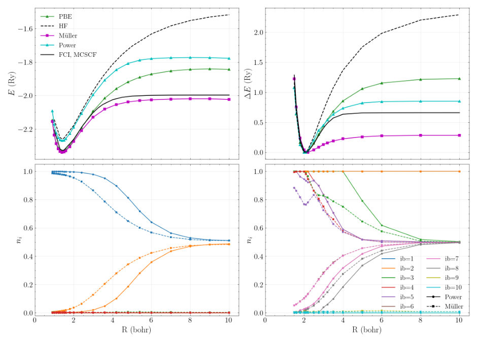 
FIG. 5. Dissociation energy curves for H2 and N2 molecules. Full-CI for H2 and MCSCF for N2 are used as references. Dashed black curves are the RHF results [41]. Power functional and M¨uller functional in RDMFT are presented with the KS PBE results. For N2, the global minimum of each curve is subtracted so that these curves are on the same scale. The natural occupation numbers are shown in the bottom panels for different bond lengths in our RDMFT calculations.

**Summary.** This paper presents a robust and basis-independent implementation of Reduced Density Matrix Functional Theory (RDMFT) tailored for periodic solids. It tackles the computational challenge by using iterative minimization techniques, such as Spectral Projected Gradient (SPG), to optimize natural occupations within k-space. The method is validated on several materials, demonstrating its reliability for calculating ground state properties like energy and equation of state.

**Why it may be interesting.** While focused on solid-state physics, the rigorous development of constrained optimization techniques (like SPG) for high-dimensional quantum many-body Hamiltonians is highly relevant to developing scalable methods for strongly correlated systems in AMO physics.

Detailed structure

**Main problem.** Developing a robust and efficient Reduced Density Matrix Functional Theory (RDMFT) formulation for calculating ground-state properties of periodic, strongly correlated solids.

**Main result.** The proposed implementation using the Spectral Projected Gradient (SPG) method is shown to be numerically stable and reliable across various benchmarks, yielding better convergence than alternative methods like EBI.

**Method.** The authors formulate RDMFT for extended systems in a basis-independent way, employing iterative minimization techniques (SPG/EBI) to optimize natural occupations under N-representability constraints within a k-resolved framework.

**Model / system.** The theory is applied to periodic solids like H2, silicon, and sodium, extending the formalism from molecular systems. The energy functional is minimized with respect to the one-body reduced density matrix (1-RDM), which is decomposed into k-resolved parts.

**Key observables.** Ground state energy, electron momentum density, equation of state (EOS) for silicon, and spectral functions.

**Important parameters / regimes.** Electron number ($N$), occupation numbers ($n_i$) constrained between 0 and 1, and the Brillouin-zone weights ($w_{\mathbf{k}}$).

**Assumptions / limitations.** The calculation relies on approximating the unknown exchange-correlation energy functional ($E_{xc}[\gamma]$) using separable kernels (e.g., Power or Müller functionals).

**Figures summary.** Figure 6 compares Silicon EOS results obtained using various approximations, including PBE, HF, PBE0, and specialized power/Müller functionals.

**Paper structure.** The paper builds from the general RDMFT formulation for periodic systems to detailing the k-resolved 1-RDM structure. It then focuses on the iterative minimization procedure, comparing optimization algorithms (SPG vs EBI) before presenting benchmark results on various materials and properties like EOS.

Abstract

Reduced density matrix functional theory (RDMFT) offers a route beyond Kohn-Sham density functional theory for strongly correlated systems, yet practical calculations for periodic solids are still out of reach. We formulate RDMFT for extended systems in a basis-independent way and present a planewave implementation using iterative minimization for periodic solids, evaluating nonlocal exchange-correlation functionals through the existing adaptive compressed exchange machinery. Natural occupations are optimized under N-representability constraints with a spectral projected gradient (SPG) method or an first-order explicit-by-implicit (EBI) map, while natural orbitals are updated by Riemannian optimization on the complex Stiefel manifolds. Benchmarks on typical systems of \ce{H2}, silicon, and sodium with the Hartree-Fock functional show that SPG reproduces converged hybrid references, whereas EBI can stall when occupations approach $0$ or $1$. With the power and Müller functionals, SPG yields lower energies and more stable convergence than EBI. Applications to fractionally charged \ce{LiH}, dissociating \ce{H2} and \ce{N2} molecules, and equation of state of silicon show that the algorithm presented in this implementation is reliable and robust.

[↑ back to top](#top)

### [Orbital-Selective Mott Transition and Correlation-Amplified Charge Ordering in the Altermagnet CsCr$_2$S$_2$O](http://arxiv.org/abs/2607.28029v1)

**Authors:** Xiuhua Chen, Yilin Wang  
**Type:** theory · **Category:** strongly correlated electrons · **PDF:** <https://arxiv.org/pdf/2607.28029v1>  
**Analysis basis:** full PDF text, analyzed in chunks
**Topic relevance:** `Keldysh / 2PI / non-Gaussian methods` **1/5** · `driven-dissipative phase transition` **1/5**

📷 Fig 1

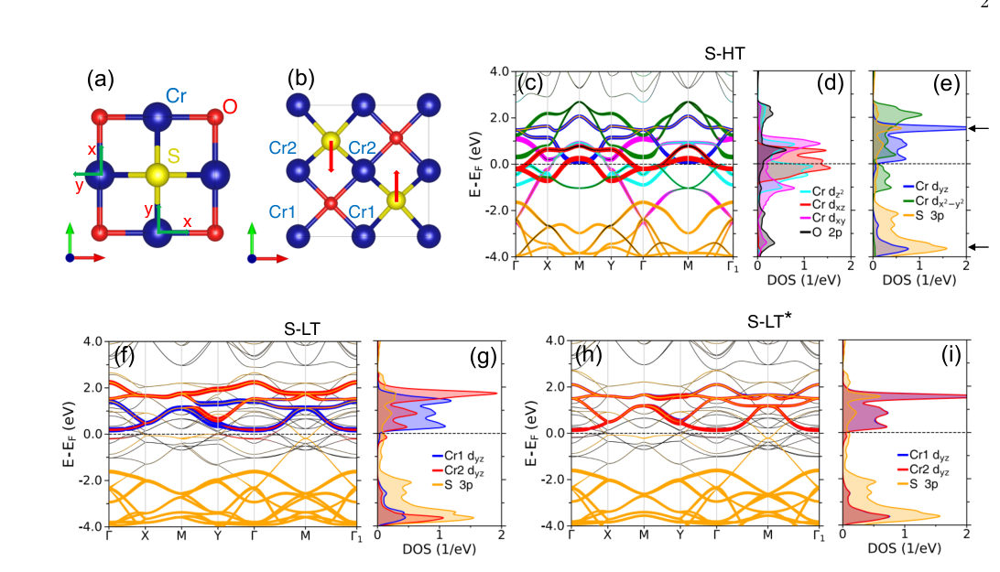 
FIG. 1. (a),(b) Top view of the tetragonal and orthorhombic crystal structure of CsCr2S2O, respectively. The local cartesian axis is shown by the green arrows in (a). The red arrows in (b) illustrate the distortion of S-sites within ab-plane. (c)-(i) DFT calculated band structure and density of states in the nonmagnetic state of CsCr2S2O for (c)-(e) the high-temperature tetragonal structure, (f)-(g) the low-temperature orthorhombic structure, (h)-(i) the low-temperature orthorhombic structure but without distortion of S-sites. The characters of Cr-3d orbitals and S-p orbitals are shown as fat bands.

📷 Fig 2

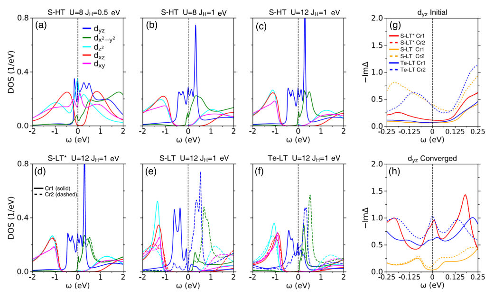 
FIG. 2. (a)-(f) The DFT+DMFT calculated spectral functions in the PM phase. (a)-(c) high-temperature tetragonal structure of CsCr2S2O, (d),(e) low-temperature orthorhombic structure of CsCr2S2O without and with distortion of S-sites, respectively. (f) low-temperature orthorhombic structure of CsCr2Te2O. (g),(h) The initial and DMFT converged hybridization functions of Cr-dyz orbital for low-temperature orthorhombic structure.

📷 Fig 3

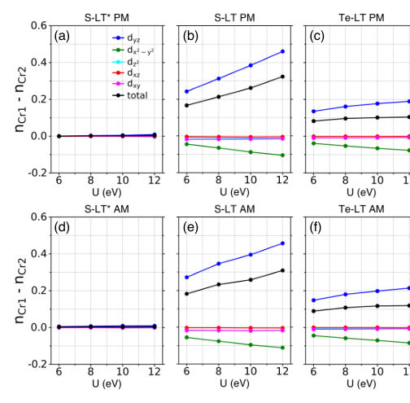 
FIG. 3. The difference of orbital occupancy between Cr1 and Cr2 sites in the S-LT structure vs. Hubbard U. (a)-(c) PM phase. (d)-(f) AM phase.

📷 Fig 4

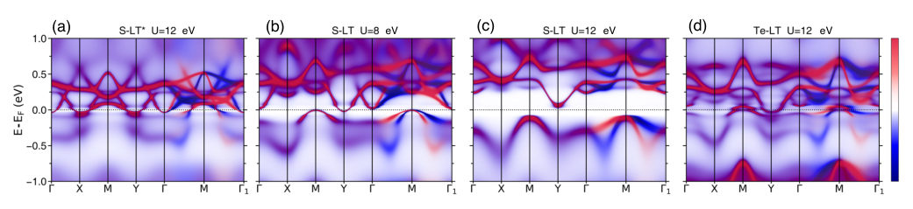 
FIG. 4. The DFT+DMFT calculated band structure in the AM phase. The red/blue indicate spin up/down, respectively.

**Summary.** The authors use advanced DFT+DMFT calculations on the altermagnet CsCr2S2O to explain its Verwey-type MIT. They show that structural distortions at the ligand sites create only a tiny initial charge imbalance, but strong electronic correlations amplify this asymmetry into a large discrepancy between crystal sites. This correlation-driven mechanism is responsible for opening the insulating gap and highlights the critical role of ligand engineering in controlling correlated magnetism.

**Why it may be interesting.** This work provides a detailed theoretical framework showing how weak lattice instabilities can be dramatically amplified into macroscopic electronic phase transitions (MIT) purely through strong many-body electron correlations, which is central to understanding novel magnetic materials.

Detailed structure

**Main problem.** The study aims to elucidate the microscopic mechanism driving a Verwey-type Metal-to-Insulator Transition (MIT) in the altermagnet CsCr2S2O, specifically addressing how lattice distortions trigger electronic reconstruction.

**Main result.** The MIT is driven by an Orbital-Selective Mott Transition (OSMT), where a tiny initial charge asymmetry induced by ligand site distortions is significantly amplified by strong dynamical electronic correlations. This correlation-driven feedback loop leads to the opening of a global charge gap.

**Method.** Density Functional Theory plus Dynamical Mean-Field Theory (DFT+DMFT) calculations are employed to model the correlated electron behavior under structural variations.

**Model / system.** The system is the altermagnet CsCr2S2O, studied in its Altermagnetic (AM) state. The research compares the effects of S vs Te ligands and analyzes charge/spin imbalances between distinct Cr sites ($	ext{Cr1}$ and $	ext{Cr2}$) within the correlated $d_{yz}$ orbital.

**Key observables.** Orbital occupancy differences ($	ext{n}_{	ext{Cr1}} - 	ext{n}_{	ext{Cr2}}$), local spin polarizations, charge imbalance in the $	ext{Cr}-d_{yz}$ orbital, and the opening of a global charge gap (MIT).

**Important parameters / regimes.** The strength of electronic correlations ($U$) is crucial; replacing S with Te weakens this correlation-amplification effect.

**Assumptions / limitations.** The analysis assumes that structural distortions occur exclusively at ligand sites, but strong many-body effects are necessary to amplify these small initial asymmetries into a full MIT.

**Figures summary.** Figures illustrate crystal structures and band/spectral functions showing the gap opening for $	ext{S-LT}$ at high correlation strength ($U$), contrasting with the metallic state predicted for $	ext{Te-LT}$. Tables quantify spin-resolved orbital occupancies demonstrating large site discrepancies in the AM phase.

**Paper structure.** The paper establishes the context of the MIT, applies DFT+DMFT to model the electronic structure under structural distortions, identifies the OSMT mechanism driven by correlation amplification, and contrasts this with a less correlated analogue ($	ext{Te}$).

Abstract

Altermagnet CsCr$_2$S$_2$O undergoes a Verwey-type metal-to-insulator transition (MIT) driven by lattice distortion and a stripe charge order on the Cr sublattice, reminiscent of the physics in Fe$_3$O$_4$. However, atomic distortions occur exclusively at the ligand sites rather than the Cr sites. What drives such a pronounced charge imbalance between Cr sites thus remains a mystery. Utilizing DFT+DMFT calculations, we identify an orbital-selective Mott transition, which leaves the correlated metallic $d_{yz}$ orbital governing the low-energy physics. We demonstrate that S-site distortions trigger an initial, tiny charge asymmetry between Cr sites via Cr-$d_{yz}$ and S-$p$ orbital hybridization. Crucially, this asymmetry is significantly amplified by dynamical electronic correlations, resulting in a large discrepancy in both the charge and electron correlations of the Cr-$d_{yz}$ orbital between distinct Cr sites. This further induces a substantial differentiation in local spin polarizations in the altermagnetic state, ultimately driving the MIT. In contrast, we predict that replacing S with Te weakens this correlation-amplification effect and fails to induce an MIT due to weaker electron correlations. Our findings demonstrate that many-body effects can drastically amplify ligand instabilities to reshape the electronic structure of altermagnets, highlighting that ligand engineering is of paramount importance for realizing robust metallic altermagnetism.

[↑ back to top](#top)

### [Trion Excitations in Twisted Bilayer Graphene: A Quantum Monte Carlo Study](http://arxiv.org/abs/2607.27745v1)

**Authors:** Shibo Shan, Cheng Huang, Patrick Ledwith, Zi Yang Meng  
**Type:** theory · **Category:** strongly correlated electrons · **PDF:** <https://arxiv.org/pdf/2607.27745v1>  
**Analysis basis:** full PDF text, analyzed in chunks
**Topic relevance:** `Keldysh / 2PI / non-Gaussian methods` **1/5** · `analog quantum simulation` **1/5**

📷 Fig 1

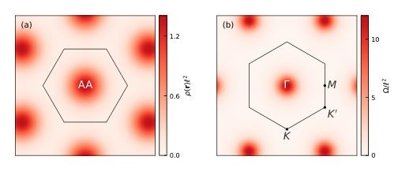 
FIG. 1. Charge density and Berry curvature of the moiré flat bands. (a) Real-space charge density ρ(r)ℓ2 of the two flat bands, with ℓ= p

📷 Fig 2

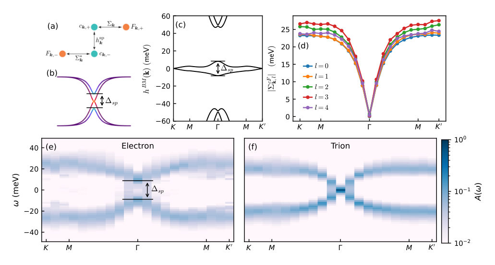 
FIG. 2. Electron-trion hybridization and spectral function. All data are obtained at u0 = 80 meV, T = 3.5 meV, and θ = 1.16◦. (a) Schematic analogy between the electron-trion problem and Bernal bilayer graphene, where one views the two electrons and two trions as the four sites in one unit cell of Bernal bilayer graphene. (b) Corresponding schematic band structure, with blue and orange denoting electron-like and trion-like bands, respectively. (c) BM model single-particle dispersion hBM(k) along the high symmetry path K −M −Γ−M −K′. For θ = 1.16◦, the BM bands have a finite single-particle splitting near the Γ point. (d) Magnitude of the off-diagonal inverse-Green’s-function component, |ΣcF...

📷 Fig 3

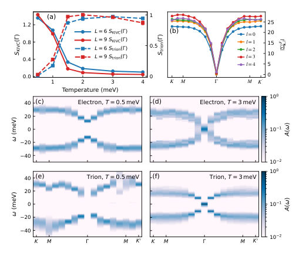 
FIG. 3. Temperature dependence of KIVC correla- tions, trion correlations, and spectral functions near the magic angle. All data are obatained at u0 = 80 meV, and θ = 1.08◦. (a) Temperature dependence of the KIVC structure factor SKIVC(Γ) and equal-time trion correlation function Strion(Γ) for system sizes L = 6 and L = 9. (b) Magnitude of the off-diagonal inverse Green’s function com- ponent |ΣcF k,l| along K −M −Γ −M −K′ at T = 3 meV. The data show that |ΣcF k,l| ≈|k| for small |k| around Γ. (c,d) Electron spectral functions with L = 12 at T = 0.5 meV and T = 3 meV, respectively. (e,f) Corresponding trion spectral functions at the same temperatures. The melting of KIVC or- der with...

📷 Fig 4

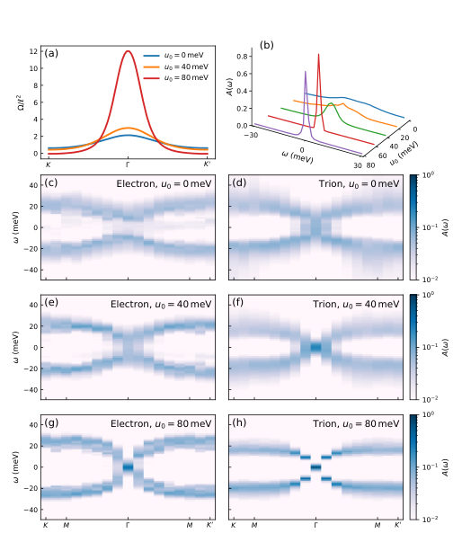 
FIG. 4. Evolution of electron and trion spectra as a function of Berry curvature concentration. (a) Berry- curvature line cuts along K−Γ−K′ for u0 = 0, 40, and 80 meV from BM flat bands. (b) Trion spectral function At(Γ, ω) for u0 = 0, 20, 40, 60, and 80 meV. Increasing u0 produces a pronounced and sharply defined low-energy trion peak, ac- companying the concentration of Berry curvature around Γ. (c,d), (e,f), and (g,h) Electron and trion spectral functions for u0 = 0, 40, and 80 meV, respectively. The spectra are computed at L = 12, θ = 1.08◦, T = 3 meV along the high- symmetry path K −M −Γ −M −K′. Increasing u0 concen- trates the Berry curvature and enhances the low-energy trion feature...

**Summary.** This work uses advanced Quantum Monte Carlo simulations to investigate charge carriers in twisted bilayer graphene. The authors reveal the existence of exotic, gapless 'Dirac trion' excitations when the system enters a fluctuating normal state at low temperatures. This suggests that strong electron-electron interactions combined with topological band structure can stabilize novel, light quasi-particles.

**Why it may be interesting.** The concept of 'Dirac trions' represents a novel form of emergent quasi-particle excitation arising from strong correlations interacting with topological band structures, providing insight into correlated topological matter beyond simple Landau levels.

Detailed structure

**Main problem.** The study aims to determine the nature of charge carriers, specifically exotic 'Dirac trion' excitations, in strongly correlated electron systems.

**Main result.** The system hosts gapless Dirac trions—three-particle bound states (two electrons and one hole)—in a fluctuating normal state that are arbitrarily light despite their heavy constituents.

**Method.** Continuous-field momentum-space Quantum Monte Carlo (QMC) simulations were used to compute the three-particle bound state Green's function, with computational complexity reduced via real-space representation.

**Model / system.** The physical system is Twisted Bilayer Graphene (TBG), modeled using the Bistritzer-MacDonald Hamiltonian near charge neutrality. The analysis focuses on the strongly correlated Mott semimetal normal state.

**Key observables.** Electron spectral function ($A_e(\omega)$), trion spectral function ($A_t(\omega)$), and the electron-trion hybridization component ($\Sigma_{cF}$).

**Important parameters / regimes.** Small temperature ($T \sim 3$ meV) relative to interaction scale, twist angle ($	heta$), and interlayer hopping strength ($u_0$).

**Assumptions / limitations.** The analysis assumes the validity of a small parameter expansion in the Mott regime and utilizes real-space transformations to manage computational complexity.

**Figures summary.** Figures illustrate the underlying topology (Berry curvature), the evolution of spectral functions showing gapless trion cones, and the temperature dependence of order parameters confirming the transition into the correlated normal state.

**Paper structure.** The paper progresses from establishing the physical model and computational framework (QMC measurement of the trion Green's function) to analyzing the system's phase transitions as temperature changes. Key results demonstrate the emergence of gapless excitations in the fluctuating Mott regime, which are characterized by their spectral weight and orthogonality.

Abstract

Determining the nature of charge carriers is a fundamental goal in the study of strongly correlated electron systems. Here, we employ the continuous-field momentum-space quantum Monte Carlo method to reveal exotic "Dirac trion" excitations in the finite-temperature normal state of twisted bilayer graphene. While the ground state is a symmetry-breaking insulator with gapped ($\sim$ 20 meV) electron-like excitations, we show that a small temperature ($\sim$ 3 meV), well below the interaction scale, drives the system into a strongly fluctuating symmetric normal state. We demonstrate that this normal state hosts gapless excitations consisting of three-particle bound states, two electrons and one hole, that are exactly orthogonal to the higher-energy electrons at the zero-momentum gapless point. These Dirac trions have the remarkable property of being arbitrarily light despite being composed of heavy constituents, and their spectra can be easily tuned by varying the twist angle and interlayer hopping strength. Our unbiased quantum many-body computation sheds light on the Dirac trions in a projected correlated flat-band setting and opens the door for further investigation of many-body excitations in strongly correlated topological bands beyond Landau levels.

[↑ back to top](#top)

### [Chaos in reason: How chain-of-thought LLMs can look for an answer](http://arxiv.org/abs/2607.27805v1)

**Authors:** Gregorio Jaca, Kristóf Benedek, János Török  
**Type:** theory · **Category:** disordered systems and neural networks · **PDF:** <https://arxiv.org/pdf/2607.27805v1>  
**Analysis basis:** full PDF text, analyzed in chunks
**Topic relevance:** `non-equilibrium dynamics` **1/5**

📷 Fig 1

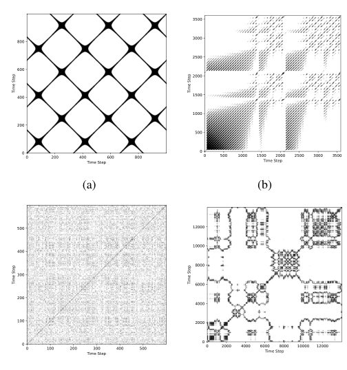 
FIG. 1: Exemplary recurrence plots of (a) a periodic motion with one frequency, (b) the chaotic Lorenz system, (c) of nor- mally distributed white noise, (d) brownian motion.

📷 Fig 2

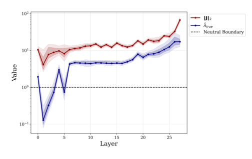 
FIG. 2: Jacobian spectral norm ∥J(x)∥2 and isotropic expan- sion ¯λ of the feed-forward block, per layer. Shaded bands show the 10th–90th (light) and 25th–75th (dark) percentile ranges.

📷 Fig 3

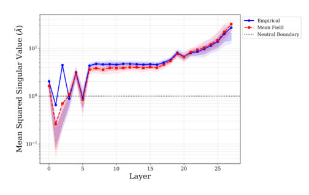 
FIG. 3: Measured ¯λ compared with the value predicted by the mean-field formula above. Shaded bands as in Fig. 2.

📷 Fig 4

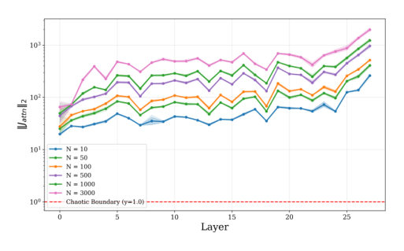 
FIG. 4: Global sequence attention Jacobian spectral norm ∥JAttn∥2 (Sec. IV E 2), per layer.

📷 Fig 5

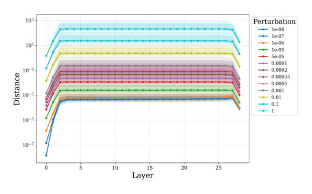 
FIG. 5: Propagation of a finite perturbation across the layers of the model. Shaded bands as in Fig. 2.

**Summary.** This work applies chaos theory tools to analyze the internal dynamics of Large Language Models (LLMs), treating them as nonlinear dynamical systems. The authors demonstrate that LLMs exhibit clear signatures of deterministic chaos, linking this behavior to the non-linear coupling within attention mechanisms. This provides a novel theoretical framework for understanding model interpretability and information processing in deep learning.

**Why it may be interesting.** By framing the complex computation of an LLM as a high-dimensional nonlinear dynamical system, it provides a theoretical lens to analyze emergent computational properties, drawing parallels with established concepts in chaotic physical systems.

Detailed structure

**Main problem.** The study aims to understand the internal dynamics of Large Language Models (LLMs) by determining if their reasoning process exhibits signatures characteristic of deterministic chaos.

**Main result.** LLMs exhibit hallmark signatures of chaos, driven primarily by the nonlinear coupling induced within the self-attention mechanisms. The analysis suggests that the effective dynamical state requires considering temporal dependencies across the context window rather than just the last hidden state.

**Method.** The authors apply tools from nonlinear dynamics and chaos theory, analyzing latent-state trajectories using diagnostics like Lyapunov exponents and recurrence plots, complemented by an exact Jacobian analysis of Transformer sub-blocks.

**Model / system.** The system is a Large Language Model based on the Transformer architecture, viewed as a discrete-time dynamical system during autoregressive token generation. Analysis compares dynamics in hidden-state space versus sentence embedding space.

**Key observables.** Sensitivity to initial conditions (divergence), recurrence plot structures (e.g., Lorenz attractor similarity), fractal dimensions ($D_2$), and the anisotropic expansion factor ($ar{\lambda}$).

**Important parameters / regimes.** The perturbation magnitude ($\Delta(k)$) used for trajectory divergence, and the size of the sliding window used to smooth temporal measurements.

**Assumptions / limitations.** Mean-field derivations rely on approximations like neglecting off-diagonal cross-terms in the Jacobian norm squared. The analysis also assumes that local encoding is captured by increasing the sliding window size.

**Figures summary.** Figures illustrate recurrence plots comparing periodic, chaotic (Lorenz), and random motion; divergence curves using Hausdorff distance comparing noisy window-free vs. smoothed windowed measurements; and correlation dimensions of embedding matrices.

**Paper structure.** The paper systematically applies chaos diagnostics to LLM dynamics, first analyzing trajectory divergences across different metrics, then performing operator-level Jacobian analysis on components (attention/FFN), and finally distinguishing between local hidden-state dynamics and context-aware sentence embeddings using windowing techniques.

Abstract

Large Language Models (LLMs) have achieved remarkable performance across a wide range of tasks, yet their internal dynamics remain poorly understood. In this work, we apply the tools of nonlinear dynamics and chaos theory to LLMs. By analyzing both text and hidden state trajectories, we demonstrate that LLMs exhibit hallmark signatures of chaos, including strong sensitivity to initial conditions, manifested as intermittent, jump-like divergence of nearby trajectories combined with bounded evolution, with consistent results across different distance metrics. An exact Jacobian analysis of the Transformer's sub-blocks shows that self-attention and the feed-forward network expand and propagate perturbations, while normalization and residual connections counteract this expansion and promote stability. Recurrence plots show structural similarities between LLMs and canonical chaotic systems such as the Lorenz attractor, while dimension analysis reveals fractal structures in the hidden state space, particularly pronounced in the last layers. We propose that the nonlinear coupling induced by attention mechanisms plays a key role in driving this chaotic behavior.

[↑ back to top](#top)

### [Lifting Lifted Product Codes](http://arxiv.org/abs/2607.28621v1)

**Authors:** Yuta Hirasaki, Jong Yeon Lee  
**Type:** theory · **Category:** quantum information and computing · **PDF:** <https://arxiv.org/pdf/2607.28621v1>  
**Analysis basis:** full PDF text, analyzed in chunks
**Topic relevance:** `entanglement & information structure` **1/5**

📷 Fig 1

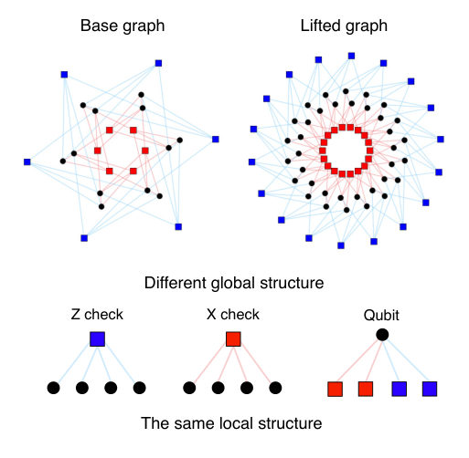 
FIG. 1. Schematic picture of a lift of a Tanner graph. The graphs show the Tanner graphs of a base and a lifted LP code. Black circles denote qubits, while blue and red squares denote Z and X checks, respectively. Although the two Tan- ner graphs have different global structures, they share the same local structure. The base (lifted) LP code is a cyclic code defined by the cyclic group Z6 (Z18), respectively. The bound- ary maps are given by HA =  x + x2 and HB =  x + x−1 in both cases. The code parameters are J12, 2, 3K and J36, 2, 3K, respectively.

📷 Fig 2

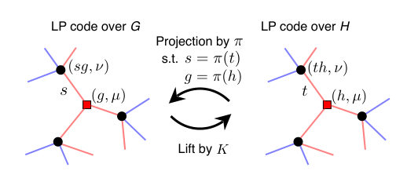 
FIG. 2. Local structures of lift and projection. The left (right) figure shows the local structure of the Tanner graph of an LP code over a group G (H). The red squares denote X-checks, and the black dots denote the qubits. Each vertex is labeled by a pair of a group element and an index label- ing a basis element of the corresponding module: for example (g, µ) in the figure, where g ∈G and µ indexes a basis ele- ment in A1 ⊗B1. Edges are generated by the group elements with nonzero coefficients, i.e., supported group elements in the boundary maps. Specifically, take the (µ, ν)-entry, and let Sµν ⊆G be the set of the supported group elements. An ele- ment s ∈Sµν connects (g, µ) to (sg, ν)...

📷 Fig 3

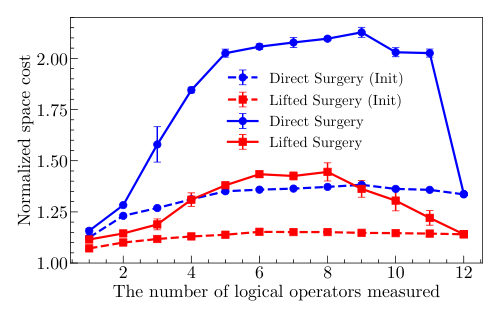 
FIG. 3. Normalized space cost of direct code surgery and the lifted code surgery. The horizontal axis shows the number of logical operators measured, and the vertical axis shows the normalized space cost, which is the total num- ber of qubits and checks in the merged code divided by that of the data code. We randomly select five sets of m logi- cal operators for each m = 1, . . . , 12, whose normalized space cost fluctuates across the sets as shown using the error bars. The dashed lines show the space overhead after initialization, whereas solid lines indicate the overhead after the estimated distance has been restored.

📷 Fig 4

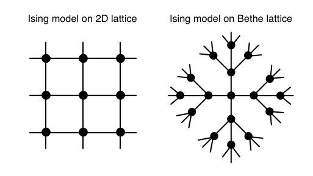 
FIG. 4. Square lattice and a degree-4 Bethe lattice. In both models, the interactions are pairwise and each spin participates in four interactions. The two models have the same radius-one local structure but different larger finite- radius neighborhood structures. The critical temperature is 1/β2D c = 2.27 while 1/βBethe c = 2.89 with unit coupling strength.

📷 Fig 5

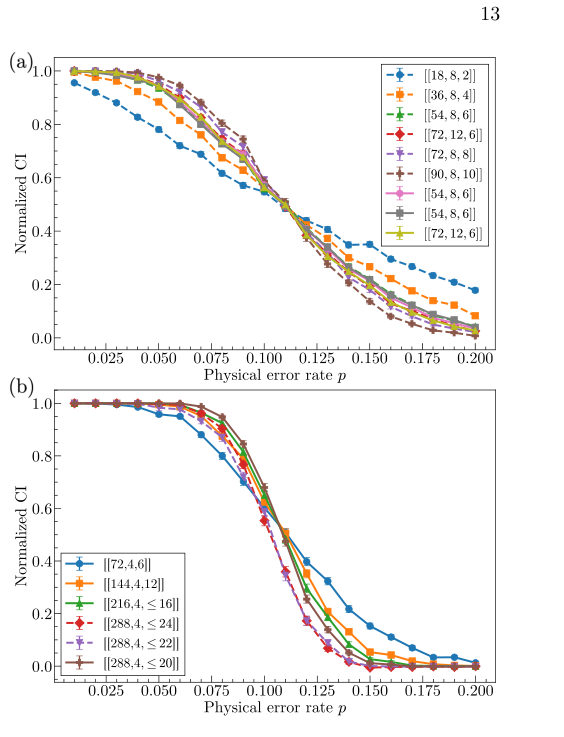 
FIG. 5. Coherent information of a base code and its lifts. The coherent information is normalized by the number of logical qubits k so that we can compare codes with differ- ent k. (a) We lift a BB base code with the code parameter J18, 8, 2K to obtain the codes in Table VI (the upper block). Dotted curves correspond to the codes that remain within the BB family, whereas solid curves correspond to non-BB lifted codes. (b) We lift the non-abelian base code in Example 3 to obtain the family in Table VI (the lower block). Solid curves correspond to the codes that show a crossing, whereas dotted curves correspond to those that do not.

**Summary.** This paper presents a systematic algebraic construction method to generate families of Lifted Product quantum error correcting codes by utilizing group extensions and graph lifts. This framework allows researchers to systematically search for better code parameters and define thermodynamic limits for qLDPC codes without relying on Euclidean lattices. It advances the theoretical understanding of scalable, fault-tolerant quantum memory.

**Why it may be interesting.** Although focused on abstract coding theory, the rigorous mathematical structure developed (group extensions, homological algebra) is highly relevant for understanding the stability and generalization of quantum codes used in fault-tolerant quantum computation.

Detailed structure

**Main problem.** To develop a systematic method for constructing families of Lifted Product (LP) quantum error correcting codes (qLDPC codes) by generalizing existing constructions.

**Main result.** The authors introduce a construction based on group extensions that yields LP codes with improved parameters and provides a framework to define thermodynamic families for algebraically defined qLDPC codes.

**Method.** The core method involves using algebraic tools like group extensions and graph lifts applied to the underlying Tanner graphs, relating code properties via chain and cochain maps.

**Model / system.** The system is quantum error correcting codes, specifically Lifted Product (LP) codes, which are analyzed using their associated Tanner graphs and defined over free modules of group algebras ($	ext{F}_2[G]$).

**Key observables.** Code parameters ($J_{12}, 2, 3K$), local incidence structure of the Tanner graph, and coherent information ($\mathcal{I}$).

**Important parameters / regimes.** The structure depends on group extensions $	ext{1} 	o K \xrightarrow{\chi} H \xrightarrow{\pi} G 	o 	ext{1}$ and the choice of section $\sigma$.

**Assumptions / limitations.** While lifting preserves local structure, additional conditions are necessary to guarantee a unique thermodynamic family; the general construction does not always yield an LP code.

**Figures summary.** Figure 1 schematically illustrates the lift of a Tanner graph while preserving local incidence structure. Figure 2 details the local structures for both the base and lifted codes over different group algebras.

**Paper structure.** The paper systematically develops the algebraic framework for lifting and projecting LP codes between different group algebras, proving structural relationships via chain/cochain maps before applying this to derive new code families and analyze physical observables like coherent information.

Abstract

Lifted product (LP) codes form an important class of quantum error correcting codes with favorable code parameters. We introduce a systematic construction of LP code families based on group extensions and graph lifts. The construction increases the code size while preserving the local structure of the Tanner graph, and relates code parameters, logical operators, and fault-tolerant logical-operation gadgets within the families through chain and cochain maps.   As a first application, we obtain LP codes with better code parameters than previously reported ones. We then demonstrate that code-surgery gadgets can be transferred across the selected finite lifts through chain maps and, in several cases, implemented with lower space overhead. We also develop parallel product surgery for lifted clustered cyclic codes. Finally, we propose lifting as a systematic first step toward defining thermodynamic families for algebraically defined qLDPC codes without an underlying Euclidean lattice. For several base codes and selected lifts, coherent information exhibits finite-size crossings, while our results also indicate that additional conditions are needed to determine a unique family.

[↑ back to top](#top)

### [Poset-refined majorization relations](http://arxiv.org/abs/2607.28061v1)

**Authors:** Alexander E. Guterman, Michael M. Wolf  
**Type:** theory · **Category:** other · **PDF:** <https://arxiv.org/pdf/2607.28061v1>  
**Analysis basis:** full PDF text, analyzed in chunks
**Topic relevance:** `analog quantum simulation` **1/5**

📷 Fig 1

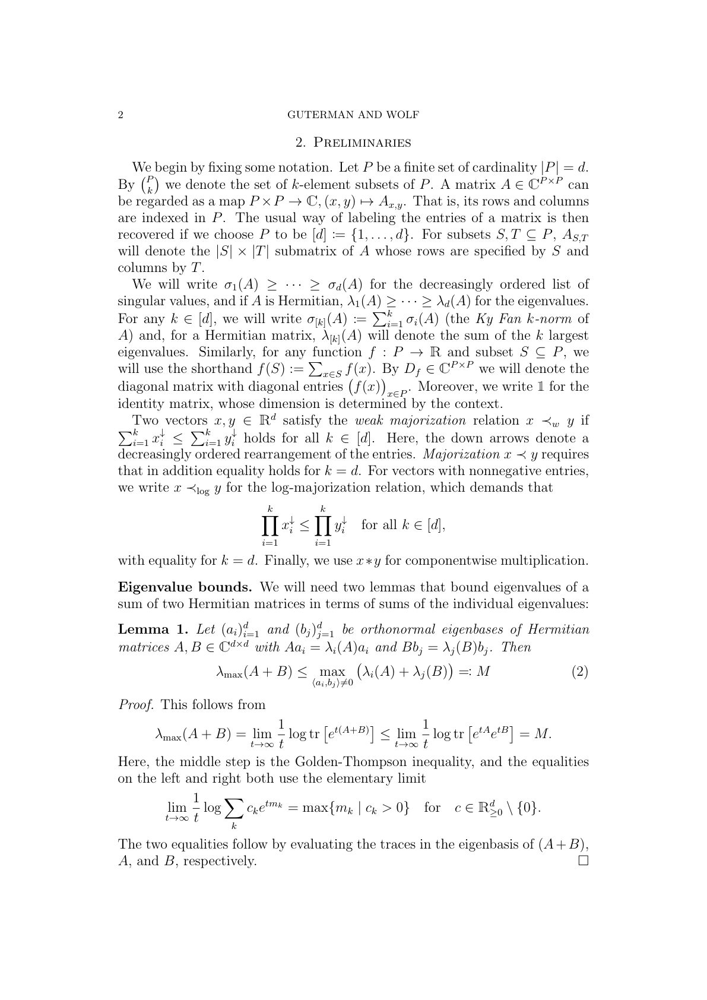 
Low-resolution page preview, page 2

📷 Fig 2

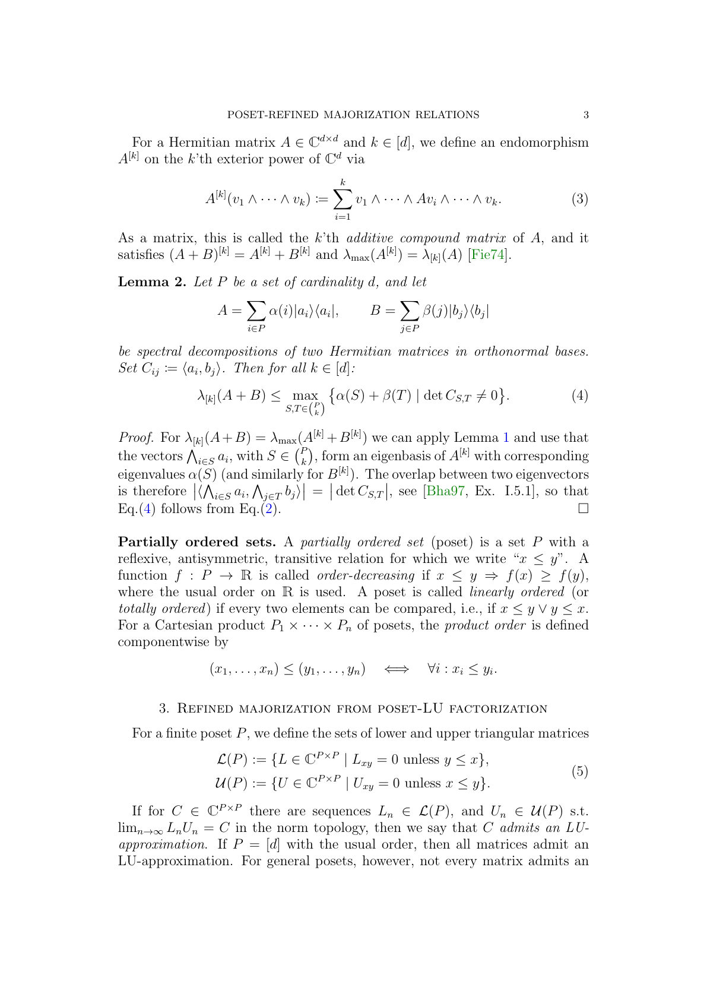 
Low-resolution page preview, page 3

📷 Fig 3

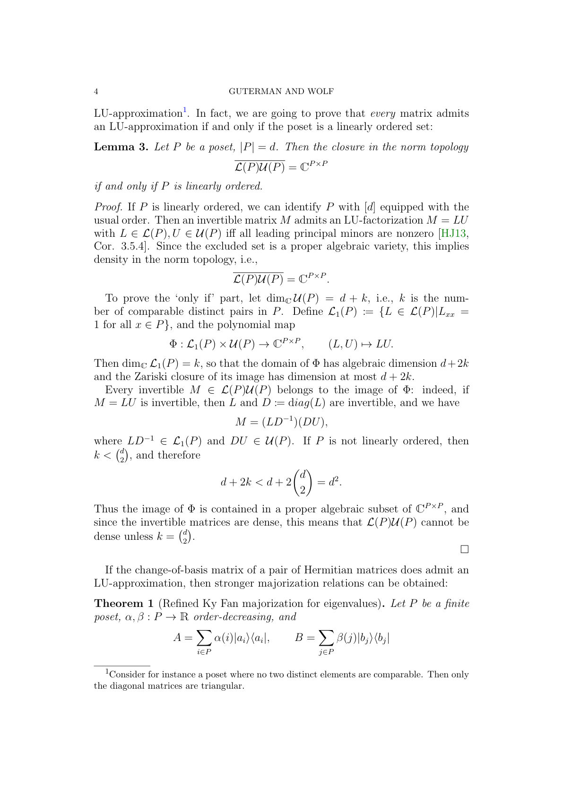 
Low-resolution page preview, page 4

📷 Fig 4

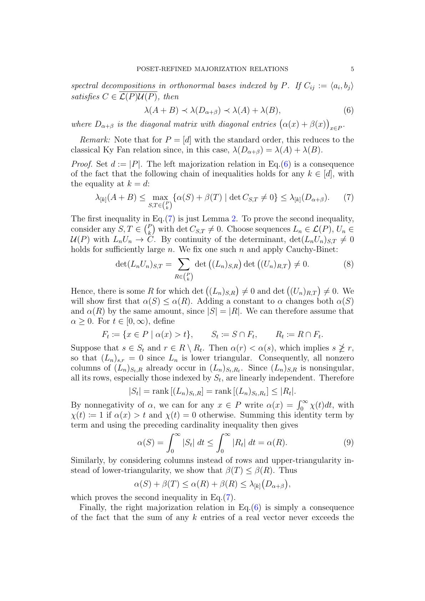 
Low-resolution page preview, page 5

📷 Fig 5

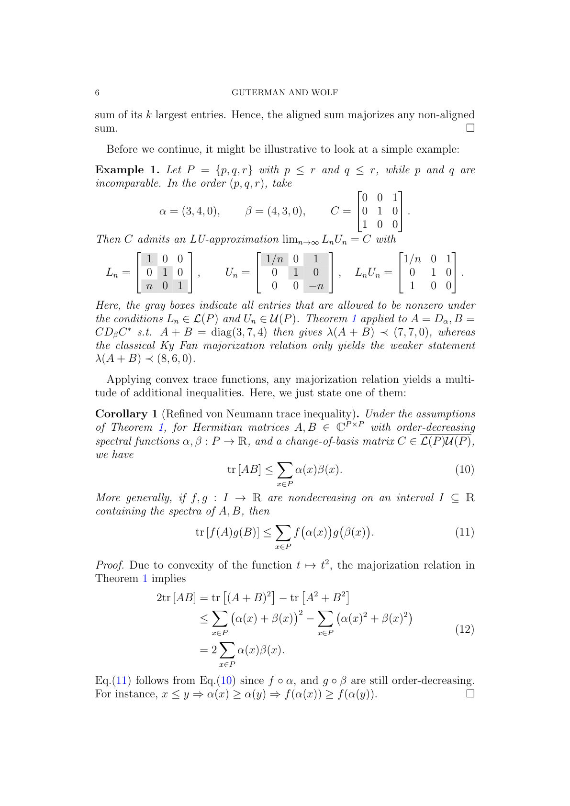 
Low-resolution page preview, page 6

**Summary.** This theoretical paper refines classical majorization relations by incorporating partial order structures from posets into matrix analysis. It proves new, tighter bounds for the eigenvalues and singular values of sums and products of matrices. The work is significant for developing more precise mathematical tools applicable to spectral problems in quantum physics.

**Why it may be interesting.** While highly mathematical, the generalization of spectral inequalities using poset structures provides powerful tools for bounding quantities in quantum systems where interactions or couplings are naturally partially ordered (e.g., certain tensor product decompositions).

Detailed structure

**Main problem.** The paper aims to refine classical majorization relations, such as those for eigenvalues or singular values of sums and products of matrices, by replacing the strict linear order with a partial order (poset). This refinement strengthens existing mathematical bounds.

**Main result.** New refined majorization inequalities are established for spectral properties ($\lambda$ or $\sigma$) when the underlying structure is governed by a poset admitting an LU-approximation. These refinements improve upon classical results like Ky Fan's and Horn's relations.

**Method.** The methodology involves leveraging concepts from partially ordered sets (posets) to define matrix structures ($L(P), U(P)$) and proving inequalities using determinant properties, Cauchy-Binet formulas, and analyzing the structure of compound matrices.

**Model / system.** The analysis is highly abstract, focusing on general mathematical structures involving Hermitian or positive semidefinite matrices whose entries are indexed by a poset $P$. Applications include sums and products related to tensor factors and Kronecker sums.

**Key observables.** Eigenvalues ($\lambda$) and singular values ($\sigma$), spectral functions $\alpha$ and $eta$, and matrix norms/traces ($	ext{tr}[\cdot]$).

**Important parameters / regimes.** The structure of the poset $P$ (especially whether it is linearly ordered) and the existence of an LU-approximation for change-of-basis matrices.

**Assumptions / limitations.** The majorization refinement holds only if the relevant change-of-basis matrix admits an LU-approximation with respect to the considered partial order.

**Figures summary.** No figures were described in the notes, but the text references theorems and corollaries establishing specific inequalities (e.g., $\sigma(A+B) \prec_w \lambda(D_{\alpha+eta})$).

**Paper structure.** The paper builds from general poset theory to establish a core theorem relating LU-approximability to refined majorization for sums of matrices. It then applies this framework sequentially to specific physical/mathematical contexts: Ky Fan relations (sums), Horn log-majorization (products), and finally, symmetric tensors and Kronecker sums.

Abstract

Several classical majorization relations for sums or products of matrices involve a majorizing vector of perfectly aligned eigenvalues or singular values. By relaxing the order of alignment to a partial order, we show that the majorization can be strengthened, provided the change-of-basis matrices admit an LU-approximation with respect to this partial order. In this way, we obtain refined versions of Ky Fan's majorization relations, Horn's log-majorization relation, and von Neumann's trace inequality. As an application, we give a short proof of the separable Ky Fan majorization relation for an arbitrary number of tensor factors and extend it to a sum of tensor products of arbitrary matrices. Further applications concern majorization relations for sums of (anti-)symmetric powers and for products of Kronecker sums.

[↑ back to top](#top)

### [Quantum Interference as a Proposal Mechanism for Combinatorial Optimization](http://arxiv.org/abs/2607.27509v1)

**Authors:** Donald J. Jacobs  
**Type:** theory · **Category:** quantum information and computing · **PDF:** <https://arxiv.org/pdf/2607.27509v1>  
**Analysis basis:** full PDF text, analyzed in chunks
**Topic relevance:** `interference shaping light` **1/5**

📷 Fig 1

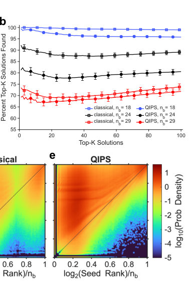 
Fig. 1 QIPS workflow and proposal statistics. a, Schematic of Quantum Interference Proposal Search (QIPS). An initial set of trial solutions is used to construct a top-N elite set. Seed-conditioned classical, quantum, or hybrid proposal generators then produce candidate bitstrings, which are evalu- ated under the QUBO objective and used to update the elite set until either the elite-set update rate becomes sufficiently small or the allotted proposal budget is exhausted. The fixed-budget criterion is used for the results reported here. b, Percentage of the top-K lowest-energy solutions recovered by QIPS and by the matched classical proposal search for nb = 18, 24, and 29. Classical and...

📷 Fig 2

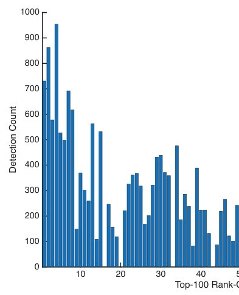 
Fig. 2 Finite-shot detection of top-100 low-energy states. Detection counts for the top-100 rank-ordered solutions in a representative QIPS run on the SK model for nb = 29. Rank 1 denotes the lowest-energy state. Counts are accumulated over the fixed proposal budget used in the search. The lowest-rank states are detected most frequently, but detections extend across the top-100 set. This pattern shows that localized finite-shot proposals can repeatedly access near-optimal states while maintaining diversity within the elite frontier.

📷 Fig 3

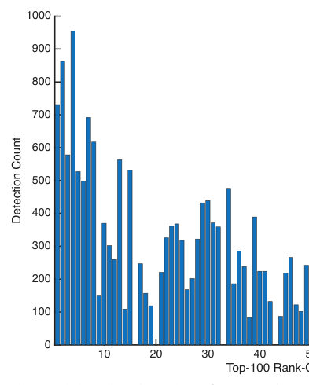 
Figure 3a shows the state probabilities generated by a representative circuit that produces a localized quantum interference pattern. A total of 213 states lie above the localization threshold, which estimates the statistically significant detection level for 100 shots, and together account for 0.98695 of the probability mass. Excluding the seed state, six states have probability greater than 0.01 and together carry 0.18342 of

📷 Fig 4

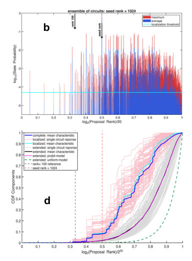 
Fig. 3 Emergent structure of QIPS proposal distributions for the SK model. a, State probabilities from a single localized circuit for nb = 20 and seed rank rs = 1024, plotted against the normalized logarithmic rank coordinate log2(r)/nb. This coordinate resolves probability concen- tration near the low-energy tail more clearly than the linear coordinate r/2nb. The horizontal line is the localization threshold ploc = 0.005/Nshots = 5 × 10−5 for Nshots = 100, which estimates the probability needed for statistical detectability in a 100-shot sample. b, Maximum and mean state probabilities obtained from the 96 localized circuits retained from an ensemble of 120 circuits gen- erated from the...

📷 Fig 5

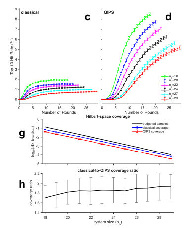 
Fig. 4 Matched classical and QIPS proposal-search benchmarks aggregated over six systems. a,b, Top-10 coverage for the classical and QIPS searches, defined as the fraction of distinct ground-truth top-10 states found. c,d, Top-10 hit rate, defined as the fraction of all proposals that correspond to a ground-truth top-10 state. e,f, Mean top-10 multiplicity, defined as the number of top-10 hits divided by the number of distinct top-10 states found. g, Hilbert-space coverage, defined as the number of distinct sampled states divided by 2nb, compared with the total sampling budget. h, Ratio of classical to QIPS Hilbert-space coverage. Results are shown as functions of search round or system...

**Summary.** This work introduces Quantum Interference Proposal Search (QIPS), a method that uses localized quantum interference patterns generated by fixed circuits to propose candidate solutions for combinatorial optimization problems. By comparing QIPS against classical counterparts, the authors demonstrate that structured quantum proposals offer a resource-efficient alternative for exploring high-dimensional energy landscapes.

**Why it may be interesting.** While focused on optimization algorithms, the underlying mechanism—using controlled quantum interference to sample structured proposals—is relevant for understanding how quantum resources can guide state preparation or search in complex many-body systems beyond simple ground state finding.

Detailed structure

**Main problem.** The paper addresses combinatorial optimization problems, typically formulated as QUBO/Ising models, by proposing a quantum-enhanced search mechanism.

**Main result.** Localized quantum interference patterns generated via fixed two-layer circuits provide a resource-efficient proposal distribution for computational quantum optimization, remaining competitive with classical methods under matched budgets.

**Method.** The Quantum Interference Proposal Search (QIPS) uses seed-conditioned quantum circuits to generate finite-shot proposals, which are then scored classically and used to iteratively update an elite frontier of low-energy solutions.

**Model / system.** The system models the search space as $n_b$-bit strings corresponding to QUBO/Ising Hamiltonians in a Hilbert space of dimension $2^{n_b}$. The core mechanism relies on fixed, two-layer gate-based quantum circuits.

**Key observables.** Top-K coverage, hit rate, multiplicity, Hilbert-space coverage, and dyadic-rank metrics are used to assess performance relative to classical controls.

**Important parameters / regimes.** The search is benchmarked across system sizes $18 \le n_b \le 29$, using a fixed proposal budget proportional to $n_b$.

**Assumptions / limitations.** The comparison assumes ideal gate-based quantum simulation and that the classical control preserves the exact search loop, frontier update rule, and proposal budget.

**Figures summary.** Figures compare top-K recovery rates between QIPS and classical searches (Figure 1b), and illustrate conditional seed-to-proposal rank distributions showing structural differences between methods (Figures 1c–e).

**Paper structure.** The paper introduces the problem, details the QIPS workflow involving circuit construction, proposal generation via interference patterns, iterative elite frontier updating, and finally compares performance metrics against matched classical baselines.

Abstract

Quantum Interference Proposal Search (QIPS) uses seed-conditioned quantum circuits to generate localized interference patterns as finite-shot proposal distributions for QUBO/Ising optimization. Candidate $n_b$-bit strings are sampled from these distributions, scored classically and used to update an elite frontier of low-energy solutions. QIPS uses a fixed two-layer gate-based circuit architecture with 100 shots per circuit while the Hilbert-space dimension grows as $2^{n_b}$. Across six benchmark families with $18 \le n_b \le 29$, QIPS maintains competitive progress relative to a matched classical control that preserves the same search loop, frontier update rule and proposal budget, with total proposals proportional to $n_b$. Performance is assessed using top-$K$ coverage, hit rate, multiplicity, Hilbert-space coverage and dyadic-rank metrics. The results identify localized quantum interference as a resource-efficient proposal mechanism for computational quantum optimization.

[↑ back to top](#top)

### [Quantum machine learning interatomic potential: Application of variational quantum algorithm](http://arxiv.org/abs/2607.27841v1)

**Authors:** Kohei Numata, Wataru Mizukami, Kosuke Mitarai, Keisuke Fujii, Yutaka Imamura  
**Type:** theory · **Category:** disordered systems and neural networks · **PDF:** <https://arxiv.org/pdf/2607.27841v1>  
**Analysis basis:** full PDF text, analyzed in chunks
**Topic relevance:** `methods for driven-dissipative` **1/5**

📷 Fig 1

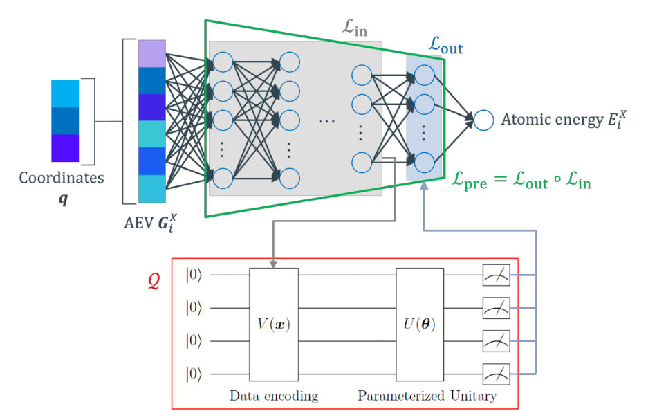 
Figure 1: MLIP with a quantum circuit. This hybrid architecture is based on the study by Mari et al. [31]. The QCL model Q is inserted between Lout and Lin, which are pretrained within the ANI framework.

📷 Fig 2

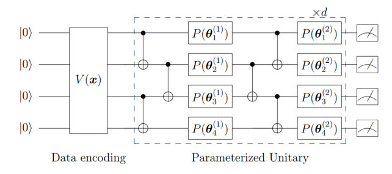 
Figure 2: Quantum circuit for the model Q at nq = 4. V (x) is defined in Table 1. The circuit enclosed by dotted lines represents the parameterized quantum circuit U(θ).

📷 Fig 3

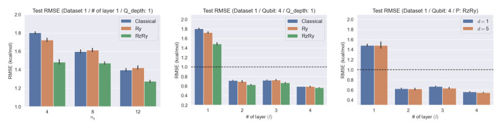 
Figure 3: RMSEs (kcal/mol) of transferred models for dataset D1 under different conditions. (a) Dependence on the number of qubits, nq, with l = 1 and d = 1. (b) Dependence on the number of layers, l, with nq = 4 and d = 1. (c) Dependence on the quantum-circuit depth, d, with nq = 4 and P = RzRy. Error bars represent 95% confidence intervals calculated from five trials.

📷 Fig 4

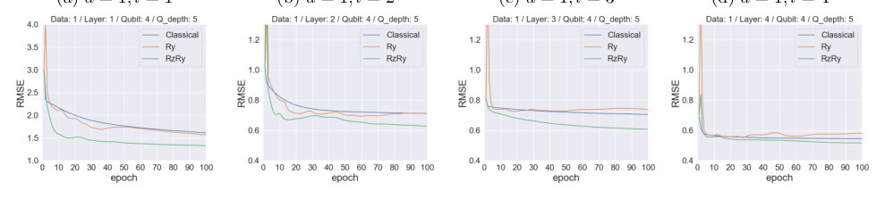 
Figure 4: Prediction-accuracy transitions for validation data. The upper-row panels ((a)–(d)) show the results for d = 1 with varying l values, and the lower-row panels ((e)–(h)) show those for d = 5.

📷 Fig 5

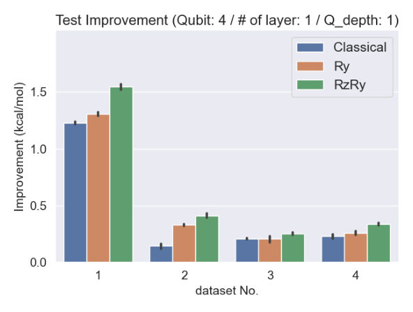 
Figure 5: Improvements (kcal/mol) of transferred models on the test data for datasets D1 to D4 under nq = 4, l = 1 and d = 1. The vertical axis represents improvements (kcal/mol) from the pretrained models, and the horizontal axis represents the dataset number. Error bars indicate 95% confidence intervals calculated from five trials.

**Summary.** This work explores enhancing Machine Learning Interatomic Potentials (MLIPs) by embedding a Quantum Circuit Layer into the classical neural network structure. By training this hybrid model on molecular datasets, the authors demonstrated that QML can provide measurable accuracy improvements over purely classical counterparts under certain conditions. This advances the feasibility of using quantum algorithms for high-fidelity simulations in computational chemistry.

**Why it may be interesting.** While focused on condensed matter potentials, the core concept of using variational quantum circuits to enhance complex physical model predictions bridges ML-physics with quantum computation theory.

Detailed structure

**Main problem.** The study aims to improve the accuracy of Machine Learning Interatomic Potentials (MLIPs) used for predicting molecular energies by integrating Quantum Machine Learning (QML) techniques.

**Main result.** Inserting a quantum circuit layer into a pre-trained classical MLIP yielded slightly higher accuracy than the fully classical network under specific conditions, particularly when the initial model had room for improvement.

**Method.** A hybrid approach was used, involving Quantum Circuit Learning (QCL) via variational quantum algorithms to augment the final layers of a classical neural network (ANI).

**Model / system.** The system is molecular energy prediction using MLIPs. The model involves transferring knowledge from a pre-trained classical ANI network by inserting a parameterized quantum circuit layer.

**Key observables.** Prediction of total energy for molecular systems; Mean Root-Mean-Squared Error (RMSE) compared to DFT calculations ($	ext{kcal/mol}$).

**Important parameters / regimes.** Number of qubits ($n_q$), circuit depth ($d$), and the number of classical layers used in pretraining ($l$).

**Assumptions / limitations.** The quantum model's performance is assumed comparable to pretraining, allowing targeted fine-tuning; the study uses simulators ignoring hardware noise.

**Figures summary.** Figures illustrate the proposed MLIP architecture showing QCL insertion, and comparative plots show accuracy dependence on parameters like circuit depth and number of classical layers.

**Paper structure.** The paper details the methodology of integrating QCL into existing MLIPs (ANI), presents numerical evaluations comparing quantum vs. classical performance across varying hyperparameters ($n_q, d, l$), and validates results on specific molecular systems like cholesterol isomers against DFT ground truth.

Abstract

This study applied quantum circuit learning, a commonly used hybrid quantum-classical machine learning algorithm, to a machine learning interatomic potential (MLIP) for predicting the energies of molecules in molecular datasets. We retrained the ANI model using the quantum transfer learning architecture [Mari et al., Quantum, 4:340, 2020] and evaluated numerical accuracy with a quantum circuit simulator. The evaluation confirmed that inserting a quantum circuit into the classical neural network of the MLIP yielded slightly higher accuracy than the fully classical neural network under certain conditions. In particular, the model incorporating a quantum circuit was more effective when the pretraining model had room for improvement in accuracy. These findings may contribute to advancing the application of quantum machine learning for MLIPs.

[↑ back to top](#top)

### [Semi-supervised Hopfield model: Theoretical and Numerical results](http://arxiv.org/abs/2607.28173v1)

**Authors:** Linda Albanese, Andrea Ladiana, Andrea Lepre  
**Type:** theory · **Category:** disordered systems and neural networks · **PDF:** <https://arxiv.org/pdf/2607.28173v1>  
**Analysis basis:** full PDF text, analyzed in chunks
**Topic relevance:** `Keldysh / 2PI / non-Gaussian methods` **1/5**

📷 Fig 1

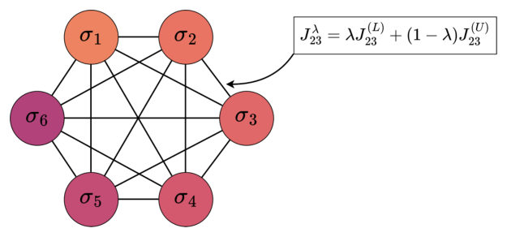 
Figure 1. Toy representation of the network whose Hamiltonian is defined in (2.7) with N = 6. Each neuron interacts with all the others through the effective synaptic coupling Jλ ij in (2.6), given by the convex combination of the supervised and unsupervised Hebbian contributions.

📷 Fig 2

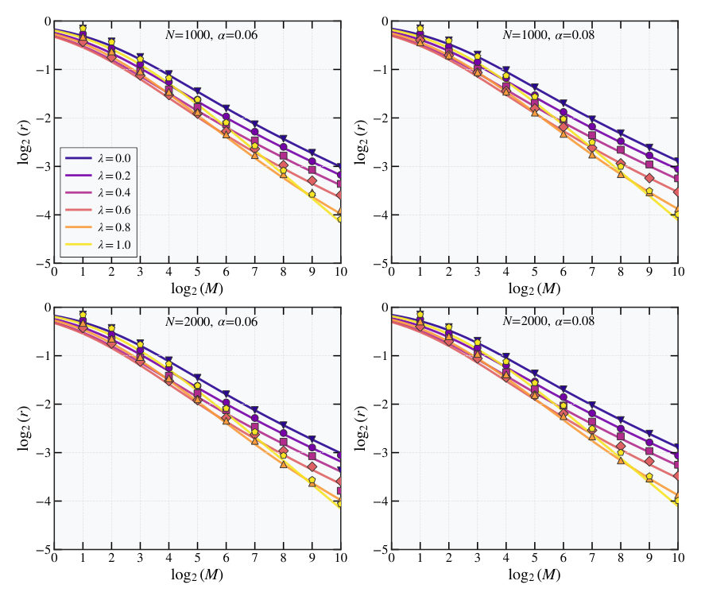 
Figure 2. Comparison between SNR theoretical predictions (solid lines) and noiseless (T = 0) MC simulations (symbols) for the semi-supervised Hopfield network, showing the phase boundaries in the (log2 M, log2 r) plane for different values of the mixing parameter λ ∈{0.0, 0.2, 0.4, 0.6, 0.8, 1.0}. The four panels display different system sizes N and network loads αN = K/N: (a) N = 1000, α = 0.06, (b) N = 1000, α = 0.08, (c) N = 2000, α = 0.06, and (d) N = 2000, α = 0.08. The theoretical curves represent the learning threshold boundary derived from the stability condition m(1)(ξ1) &gt; 0.9, using the analytical one-step Mattis magnetization (3.15). The numerical MC data points are obtained by...

📷 Fig 3

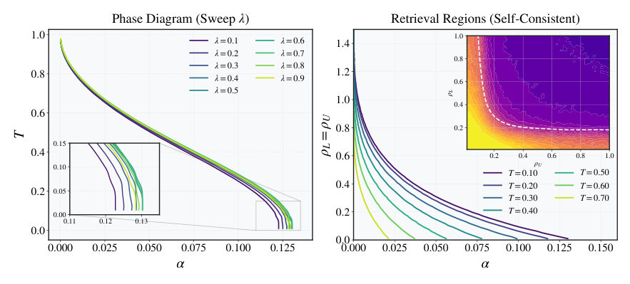 
Figure 3. Sensitivity of the retrieval phase to the mixing parameter λ and to the dataset noise level ρ = ρL = ρU. Left panel: RS retrieval boundary αc(T) in the (α, T) plane for r = 0.8, ML = MU = 30, and nine values of the mixing parameter λ ∈{0.1, 0.2, . . . , 0.9} (colour-coded from dark blue to yellow). The maximum critical load αc(T →0) is not attained at the extremal values λ = 0 or λ = 1, but at an intermediate value λ ≈0.5–0.6, indicating that a mixed semi-supervised coupling genuinely outperforms any pure learning strategy. The inset magnifies the low-temperature region (T ≲0.15, α ∈[0.11, 0.135]), resolving the non-monotone ordering of the curves with respect to λ. Right panel:...

📷 Fig 4

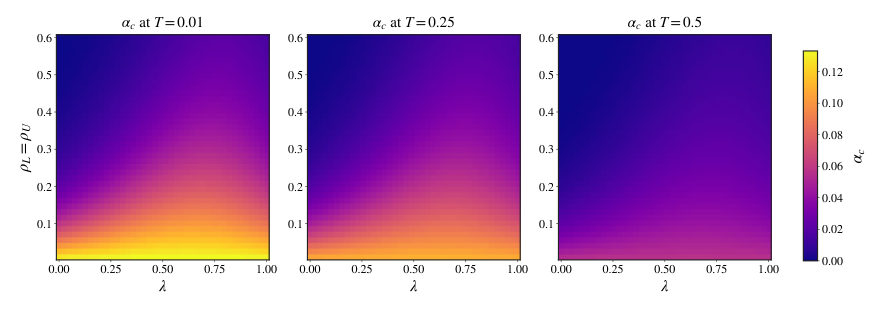 
Figure 4. Heat map of the critical retrieval load αc as a function of the mixing parameter λ ∈[0, 1] and the rescaled noise level ρ = ρL = ρU ∈[0.01, 0.60], computed from the RS self-consistency equations for ML = MU = 30 at three temperatures T ∈{0.01, 0.25, 0.50}. In all panels the colour encodes the maximal load αc: high-capacity configurations appear bright (yellow), low-capacity ones dark (blue). As expected, increasing ρ (deteriorating dataset quality) reduces αc uniformly, while increasing temperature contracts the retrieval region. The key observation, visible across all temperatures, is that for any fixed ρ &gt; 0 the maximum of αc over λ is attained at an interior value λ ∈(0, 1),...

📷 Fig 5

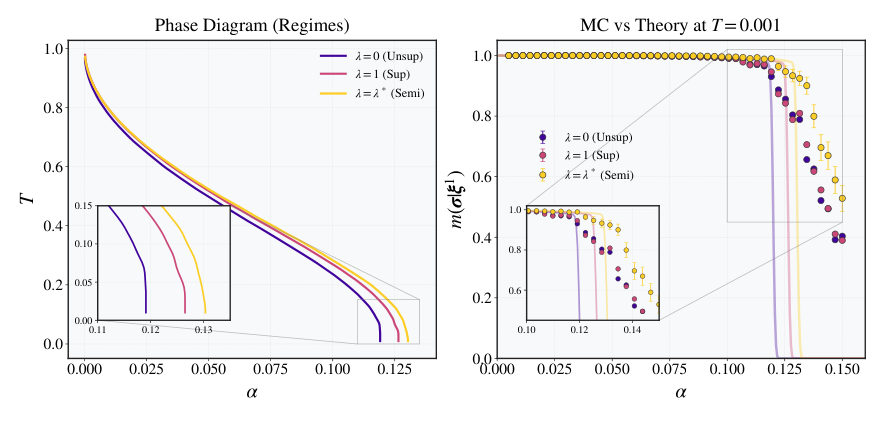 
Figure 5. Phase diagrams and retrieval performance of the semi-supervised Hopfield model for r = 0.8, ML = MU = 30. Left panel: retrieval boundary αc(T) in the (α, T) plane for the three representative learning regimes: fully unsupervised (λ = 0), fully supervised (λ = 1), and semi-supervised with the pointwise-optimal mixing λ = λ∗from (5.17). The optimal semi-supervised boundary lies strictly to the right of both limiting cases, demonstrating that the enlarged retrieval region is a genuine effect of the mixed Hebbian learning rule. The inset magnifies the low-temperature region (T ≲0.15, α ∈[0.11, 0.135]), resolving the separation between the three curves. Right panel: Mattis...

**Summary.** This work develops a comprehensive statistical mechanical framework for semi-supervised Hopfield networks. By analyzing the quenched free energy landscape, it proves that combining supervised and unsupervised data sources via a mixing parameter $\lambda$ is optimal, but this parameter must be tuned externally rather than being determined by equilibrium thermodynamics. This advances the theoretical understanding of how machine learning models utilize heterogeneous data.

**Why it may be interesting.** The rigorous application of advanced statistical mechanics tools (replica theory, convexity proofs) to analyze machine learning models provides deep insights into the fundamental physical constraints governing information processing capacity.

Detailed structure

**Main problem.** The paper addresses the lack of a statistical mechanical theory for semi-supervised Hebbian learning in associative memory models like the Hopfield network.

**Main result.** It shows that a mixed strategy combining supervised and unsupervised learning outperforms pure protocols, and crucially, the optimal mixing parameter must be treated as an externally tuned hyperparameter rather than being determined by free energy minimization due to convexity.

**Method.** The analysis employs replica symmetric techniques (Guerra's interpolation) to derive quenched statistical pressures and uses signal-to-noise analysis for retrieval thresholds.

**Model / system.** The model is a Hopfield network whose synaptic coupling matrix is a convex combination of kernels derived from both labeled (supervised) and unlabeled (unsupervised) data sources. The system's dynamics are governed by an energy function dependent on the mixing parameter $\lambda$.

**Key observables.** One-step Mattis magnetization, learning threshold, quenched statistical pressure, and the optimal mixing parameter $\lambda^\star$.

**Important parameters / regimes.** Mixing parameter $\lambda \in [0, 1]$, network load $\alpha$, dataset quality $r$, and temperature $eta$.

**Assumptions / limitations.** The analysis relies on approximations such as Gaussianization for the supervised channel and assuming large datasets ($M_L, M_U 	o \infty$) to simplify saddle-point equations.

**Paper structure.** The paper progresses by first establishing the model structure using a convex combination of kernels. It then uses signal-to-noise analysis and replica methods to derive the quenched statistical pressure, culminating in a proof that this pressure is convex in $\lambda$, forcing $\lambda$ to be an external hyperparameter.

Abstract

In the daily practice of Machine Learning, fully labeled datasets are a luxury: labels demand expensive and time-consuming human annotation, whereas raw, unlabeled data can be harvested automatically and in bulk. Semi-supervised learning, where the network jointly exploits the few labeled and the many unlabeled examples at its disposal, is the standard answer to this asymmetry, yet a statistical mechanical theory of semi-supervised Hebbian learning is still lacking. In this paper we fill this gap for the Hopfield network: we prescribe a synaptic coupling given by the convex combination, weighted by a mixing parameter λin [0,1], of the supervised and unsupervised Hebbian kernels built from the same archetypes, and we solve for the emergent computational capabilities of the resulting network. A signal-to-noise analysis yields the one-step Mattis magnetization and the learning threshold, i.e. the minimum dataset size for stable retrieval. Using Guerra's interpolation, we then derive the Replica Symmetric quenched pressure in the high-storage regime, treating the correlated disorder generated by the supervised and unsupervised channels through a particular eigen-channel decomposition. The resulting phase diagram shows that a mixed strategy outperforms both pure protocols. Finally, we prove that the quenched pressure is convex in λ, so thermodynamics cannot select an interior mixture: λis therefore a learning hyperparameter. All the analytical findings are successfully checked against extensive Monte Carlo simulations.

[↑ back to top](#top)

### [Spectral gaps of ironed two-qubit gadgets matching the iSWAP gap](http://arxiv.org/abs/2607.28521v1)

**Authors:** Yanying Liang, Haoran Zhu  
**Type:** theory · **Category:** quantum information and computing · **PDF:** <https://arxiv.org/pdf/2607.28521v1>  
**Analysis basis:** full PDF text, analyzed in chunks
**Topic relevance:** `entanglement & information structure` **1/5**

📷 Fig 1

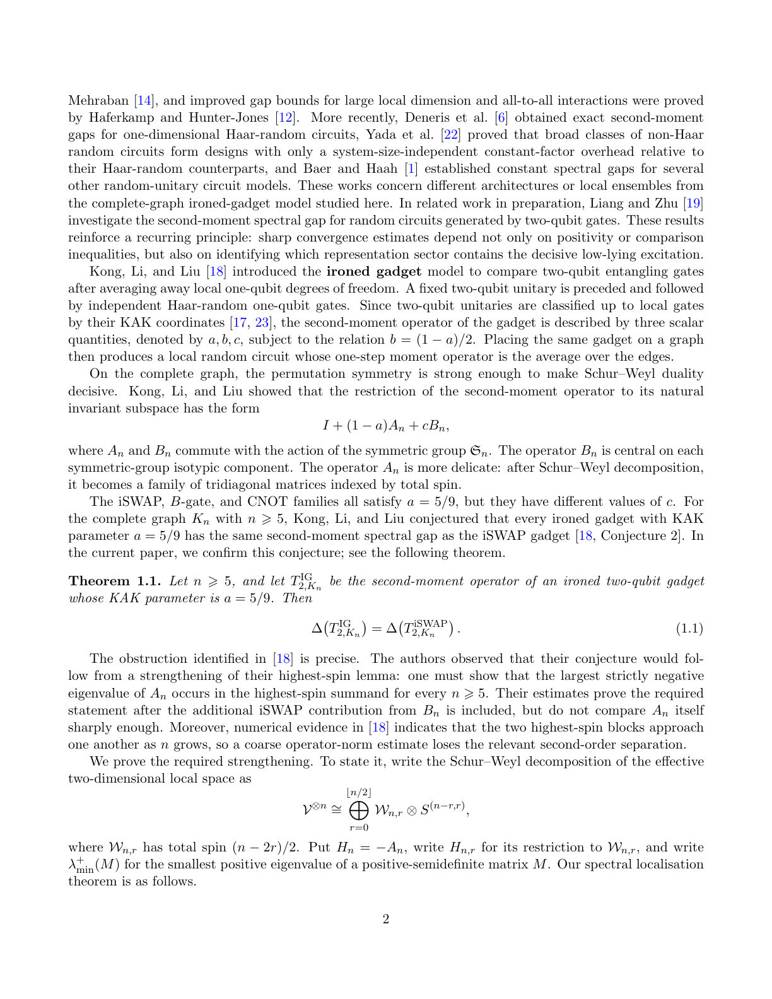 
Low-resolution page preview, page 2

📷 Fig 2

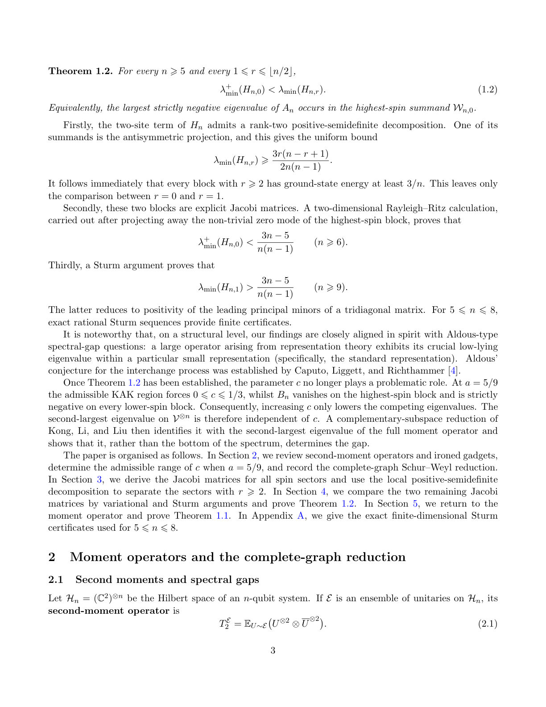 
Low-resolution page preview, page 3

📷 Fig 3

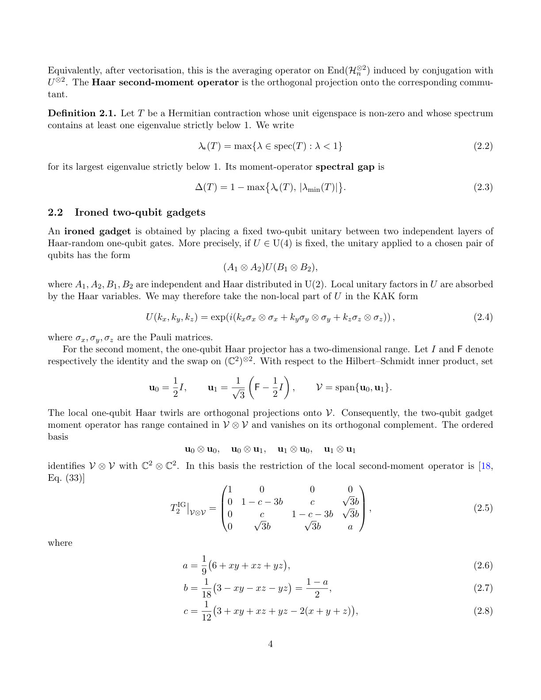 
Low-resolution page preview, page 4

📷 Fig 4

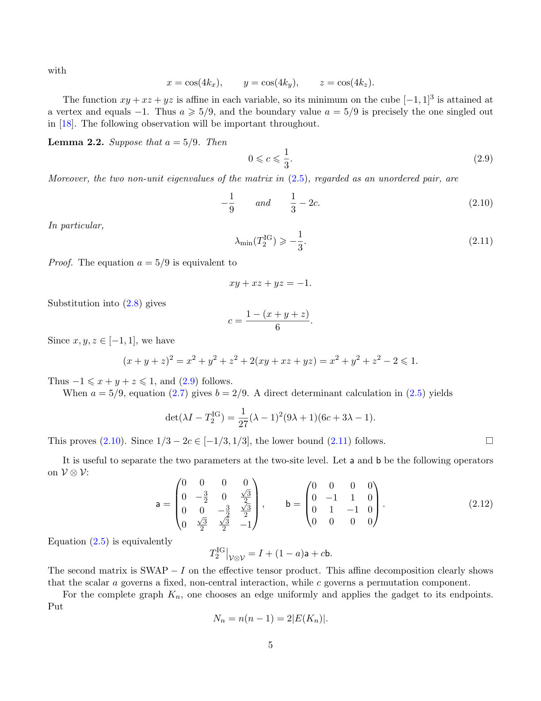 
Low-resolution page preview, page 5

📷 Fig 5

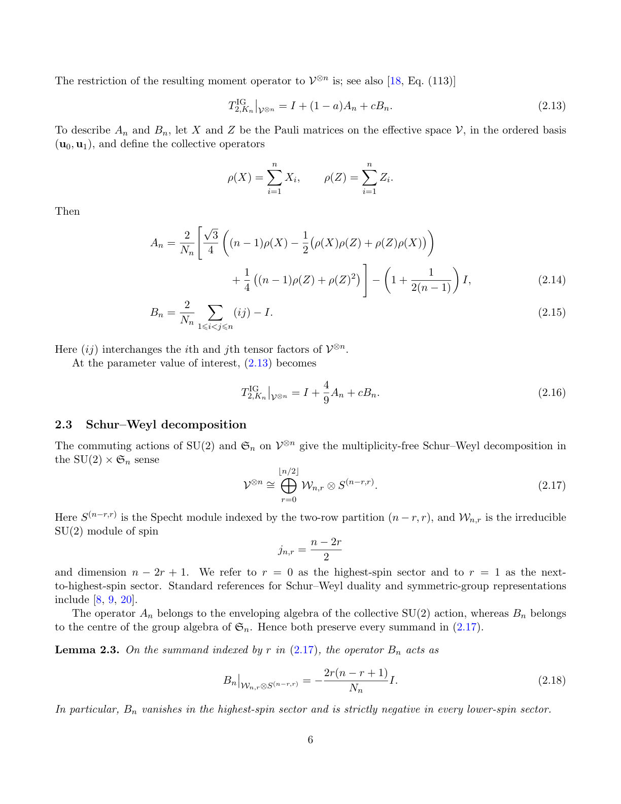 
Low-resolution page preview, page 6

**Summary.** The authors prove that a specific family of two-qubit quantum gadgets achieves the same spectral gap as the iSWAP gadget when implemented on large complete graphs. They achieve this by employing advanced techniques from representation theory and analyzing the eigenvalues of associated moment operators across different spin sectors.

**Why it may be interesting.** This work provides rigorous mathematical proof regarding the performance scaling of quantum circuits used for quantum information tasks, connecting abstract algebraic structures (representation theory) to concrete physical measures like spectral gaps.

Detailed structure

**Main problem.** The paper proves that a specific class of two-qubit quantum circuits (ironed gadgets) exhibits the same spectral gap as the well-known iSWAP gadget when operating on large complete graphs.

**Main result.** For the condition $a=5/9$ and $n \ge 5$, the second-moment spectral gap of the ironed two-qubit gadget matches that of the iSWAP gadget, settling a prior conjecture.

**Method.** The analysis heavily relies on representation theory (Schur–Weyl duality) to decompose large moment operators into independent spin sectors and then uses properties of tridiagonal Jacobi matrices to bound eigenvalues.

**Model / system.** The system involves 'ironed two-qubit gadgets' modeled by second-moment operators ($T_{IG}^{2,K_n}$) acting on $V^{\otimes n}$ over the complete graph $K_n$. The comparison benchmark is the iSWAP gadget.

**Key observables.** The primary observable is the second-moment spectral gap, $\Delta(T) = 1 - \max(\lambda^*(T), |\lambda_{\min}(T)|)$.

**Important parameters / regimes.** The critical parameter condition is $a=5/9$, and the graph size must satisfy $n \ge 5$.

**Assumptions / limitations.** The proof relies on a representation-theoretic localization theorem showing that the most negative eigenvalue resides in the highest-spin $	ext{SU}(2)$ summand, allowing for sector-by-sector analysis.

**Figures summary.** Not specified by notes, but the structure implies comparisons between eigenvalues of different spin sectors ($H^{\circ}_{n,0}$ vs $H_{n,1}$) relative to specific thresholds ($	heta_n$).

**Paper structure.** The paper proceeds by defining the moment operators on $K_n$, decomposing them using Schur–Weyl duality into spin sectors. It then proves a localization theorem (Theorem 1.2) that restricts the gap determination to the highest-spin sector, culminating in proving the equality of spectral gaps (Theorem 5.4).

Abstract

We prove that every ironed two-qubit gadget whose KAK-derived parameter satisfies $a=5/9$ has, on the complete graph $K_n$ with $n\geqslant 5$, the same second-moment spectral gap as the iSWAP gadget. The central step is a representation-theoretic localisation theorem: the largest strictly negative eigenvalue of the associated $\mathfrak S_n$-invariant operator always occurs in the highest-spin $\mathrm{SU}(2)$ summand. A local positive-semidefinite decomposition separates every spin sector except the two highest. This settles a conjecture of Kong, Li, and Liu.

[↑ back to top](#top)

### [The Capacity Region of the Broadcast Channel with Non-Signaling Assistance](http://arxiv.org/abs/2607.27434v1)

**Authors:** Yuhang Yao, Syed A. Jafar  
**Type:** theory · **Category:** other · **PDF:** <https://arxiv.org/pdf/2607.27434v1>  
**Analysis basis:** full PDF text, analyzed in chunks
**Topic relevance:** `entanglement & information structure` **1/5**

📷 Fig 1

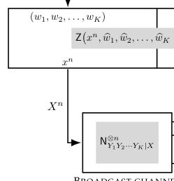 
Figure 1: NS-assisted coding scheme Z for the K-user broadcast channel.

📷 Fig 2

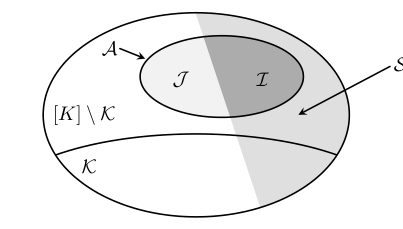 
Figure 2: A Venn diagram illustrating the sets K, [K] \ K, S, A, I, and J . The ambient set is [K].

**Summary.** This paper solves a major open problem by fully characterizing the capacity region of a multi-user broadcast channel when non-signaling resources are available. It proves that this capacity region is mathematically equivalent to Sato's region, defined by specific sum-rate constraints. The work uses advanced information theory techniques and coding constructions to establish both achievable rates and necessary bounds.

**Why it may be interesting.** While focused on classical communication theory, the rigorous characterization of capacity under generalized correlations (NS assistance) provides deep theoretical tools applicable to quantum channel capacity analysis where resource constraints are complex.

Detailed structure

**Main problem.** The paper aims to fully characterize the capacity region of a K-user discrete memoryless broadcast channel when non-signaling (NS) assistance is available.

**Main result.** The NS-assisted capacity region for this channel is proven to coincide exactly with Sato's region, defined by specific sum-rate bounds over all subsets of messages.

**Method.** The characterization relies on constructing achievable coding schemes using an 'authentication solution' concept and deriving necessary conditions via data-processing inequalities involving mutual information.

**Model / system.** The model is a K-user Discrete Memoryless Broadcast Channel (DM-BC) defined by a conditional probability mass function. The assistance mechanism involves non-signaling correlations shared among the transmitter and all receivers.

**Key observables.** The achievable rate tuple $(R_1, \dots, R_K)$ defining the capacity region.

**Important parameters / regimes.** The number of users $K$, the channel PMF $P_{Y_1\dots Y_K|X}$, and the non-signaling assistance structure.

**Assumptions / limitations.** The analysis assumes the existence of coding schemes that achieve rates up to the derived bounds, relying on asymptotic limits ($n 	o \infty$) and specific properties of NS correlations.

**Figures summary.** Figure 1 illustrates the general Non-Signaling (NS)-assisted coding scheme used for the K-user BC, showing inputs, messages, channel output, and user processing.

**Paper structure.** The paper establishes achievability by constructing explicit coding schemes (using concepts like NS-boxes) and then proves necessity using information-theoretic bounds derived from data-processing inequalities to match Sato's region.

Abstract

The capacity region of the $K$-user discrete memoryless broadcast channel is fully characterized when non-signaling (NS) assistance is available to the transmitter and all $K$ receivers. The NS-assisted capacity region is shown to coincide with Sato's region, i.e., the region defined by sum-rate bounds over all subsets of messages, where each bound corresponds to full cooperation among that subset of receivers under a worst-case joint channel law consistent with the marginal channels.

[↑ back to top](#top)

### [Vacuum fluctuations in Rainbow space-time: Study of Casimir effect](http://arxiv.org/abs/2607.27722v1)

**Authors:** Bhagya. R, Suman Kumar Panja  
**Type:** theory · **Category:** other · **PDF:** <https://arxiv.org/pdf/2607.27722v1>  
**Analysis basis:** full PDF text, analyzed in chunks
**Topic relevance:** `Keldysh / 2PI / non-Gaussian methods` **1/5**

📷 Fig 1

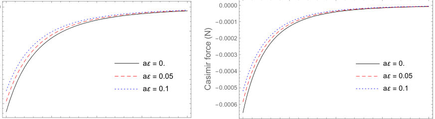 
Figure 1: Variation of Casimir energy and Casimir force with separation between the plates for first choice of rainbow functions.

📷 Fig 2

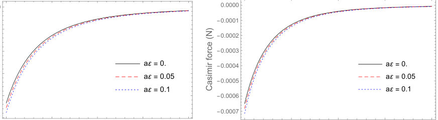 
Figure 2: Variation of Casimir energy and Casimir force with separation between the plates for third choice of rainbow functions.

**Summary.** This paper examines the Casimir effect in Rainbow Space-Time, a theoretical model where spacetime geometry depends on particle energy. By calculating vacuum expectation values using Green's functions, the authors derive modified expressions for the Casimir energy and force. The results show that these modifications are highly dependent on the chosen rainbow function parametrization, offering potential constraints on quantum gravity parameters.

**Why it may be interesting.** This work explores how fundamental spacetime modifications (like those predicted by quantum gravity models) manifest in measurable macroscopic effects like the Casimir force, providing a testable prediction framework for exotic physics.

Detailed structure

**Main problem.** The study investigates how vacuum fluctuations, specifically the Casimir effect, are modified when spacetime geometry is energy-dependent, modeled by Rainbow Space-Time (RST).

**Main result.** The modification of the Casimir energy and force depends critically on the specific choice of rainbow function; for some choices, the results revert to standard Minkowski space predictions.

**Method.** The authors calculate the vacuum expectation value of the energy-momentum tensor by solving the scalar field's Green's function in the deformed spacetime background.

**Model / system.** The model uses a scalar field theory confined between two parallel plates, with the geometry described by a metric incorporating rainbow functions $f(E_o/E_P)$ and $g(E_o/E_P)$.

**Key observables.** Modified Casimir energy ($\hat{E}_{	ext{Cas}}^A$) and Casimir force ($\hat{F}_{	ext{Cas}}^A$) per unit area.

**Important parameters / regimes.** The rainbow parameters, such as $\lambda_{Eo}/E_P$ and $\eta_{Eo}/E_P$, which are constrained by experimental bounds to be of the order $10^{-24}$.

**Assumptions / limitations.** The analysis is limited to leading-order corrections in the rainbow parameters and assumes a scalar field theory model with delta-function potentials.

**Figures summary.** Figures illustrate how the Casimir energy and force vary as the rainbow parameter increases for different function choices, showing either monotonic decrease or increase in absolute value.

**Paper structure.** The paper proceeds by setting up the Lagrangian and equation of motion in RST, deriving the vacuum expectation value of $T_{\mu
u}$ via the Green's function, calculating the modified energy/force for three distinct rainbow function parametrizations, and finally comparing these theoretical results to experimental bounds.

Abstract

We investigate the Casimir effect in rainbow space-time, focusing on leading-order corrections to the Casimir energy and force. Starting with the scalar field Lagrangian in rainbow space-time, with parallel plates introduced through delta-function potentials, we find the corresponding energy-momentum tensor. We obtain the vacuum expectation value of this energy-momentum tensor by expressing it as a quadratic operator acting on the Green's function. By solving the Euler-Lagrange equation of a scalar field in rainbow space-time, we obtain the Green's function solutions. Employing these Green's function solutions in the vacuum expectation value of the energy-momentum tensor, we obtain the modified Casimir energy and Casimir force expressions in rainbow space-time. We study the variation of the deformed Casimir force and energy with the distance between the plates for different choices of rainbow functions. Our results show that for two choices of rainbow functions, the absolute value of the Casimir energy and force is decreasing or increasing, whereas for one specific choice of rainbow functions, it remains the same as the standard result in Minkowski space-time. Comparing our result with experimentally measured value of Casimir force, we obtain the bound on the rainbow parameter dependent terms to be of the order of 10^-24.

[↑ back to top](#top)

## Other papers (9)

*Papers from primary archives without highlighted authors or any topic match. Click to expand.*

Show other papers

### [A Quantum Mechanical Approach to the Computation of Rovibrational Spectra of Diatomic Molecules in Strong Magnetic Fields](http://arxiv.org/abs/2607.27907v1)

**Authors:** Nikhil Yenugu, Ashwani K Tiwari, Sangita Sen  
**Type:** theory · **Category:** other · **PDF:** <https://arxiv.org/pdf/2607.27907v1>  
**Analysis basis:** full PDF text, analyzed in chunks

📷 Fig 1

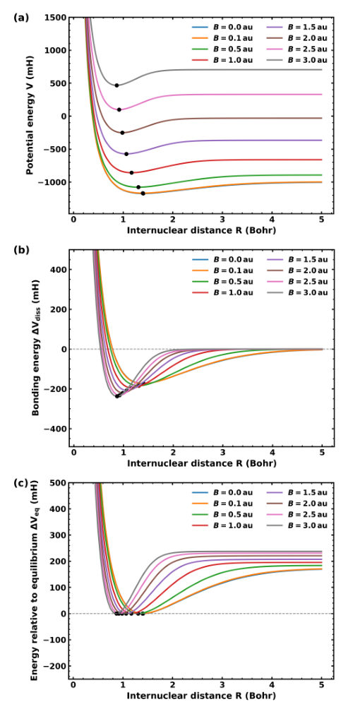 
Figure 1: (a) Potential energy curves (PECs) of 1H2 for magnetic field strengths B = 0 −3 au, computed at the CCSD/Lu-aug-cc-pVTZ level with the molecular axis perpendicular to the field (θ = 90◦). (b) Bonding energy relative to dissociation, V −Vdiss, for the same field strengths. (c) Energy relative to the equilibrium minimum, V −Veq, highlighting the field-dependent modification of the molecular bond.

📷 Fig 2

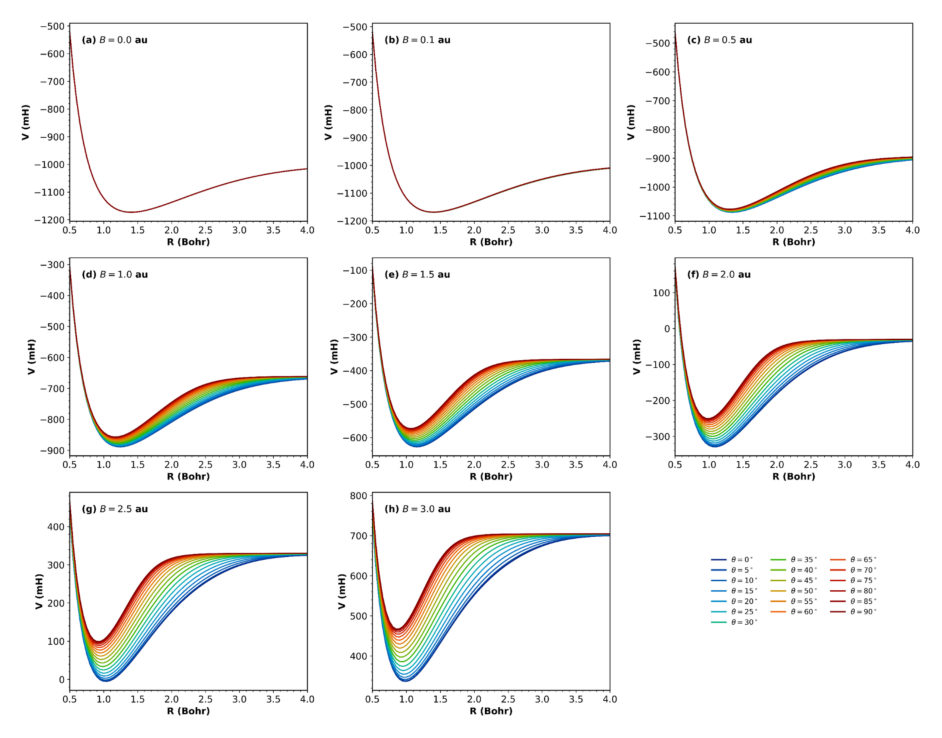 
Figure 2: PES of 1H2 computed at the CCSD/Lu-aug-cc-pVTZ level under various magnetic field strengths at various orientations: (a) 0 au (b) 0.1 au (c) 0.5 au (d) 1 au (e) 1.5 au (f) 2 au (g) 2.5 au (h) 3 au

📷 Fig 3

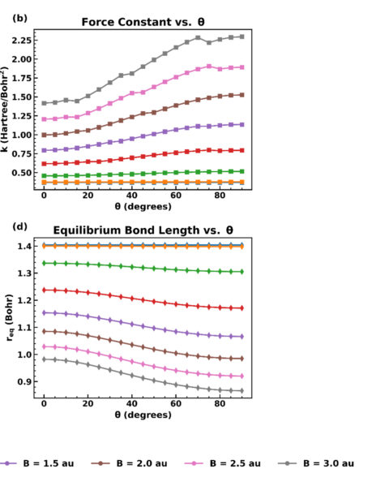 
Figure 3: PES fitting parameters as a function of θ and B

📷 Fig 4

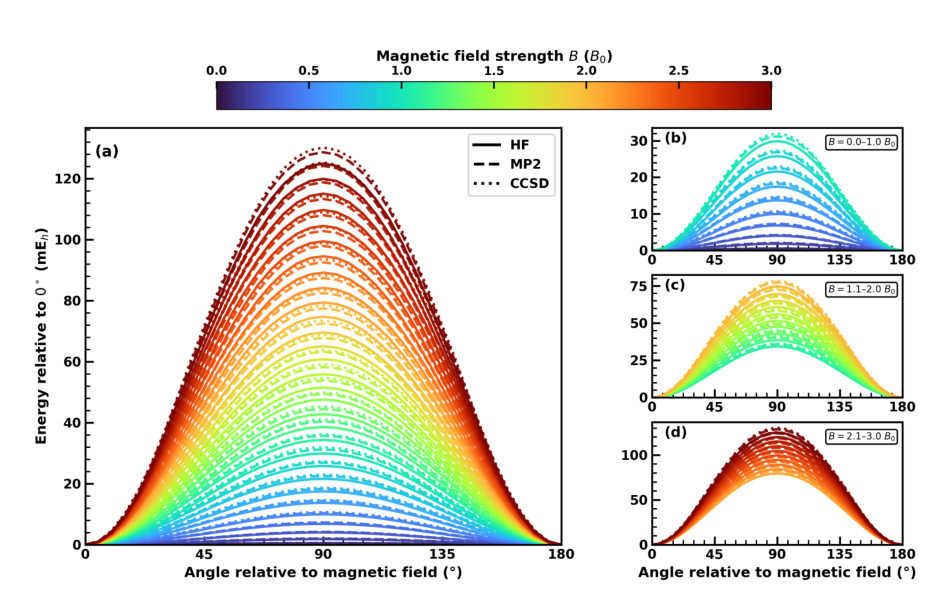 
Figure 4: Angular dependence of the equilibrium energy shift ∆Veq of H2 in an external magnetic field. Panel (a) shows the global anisotropy across all magnetic field strengths, while panels (b), (c) and (d) resolve the behavior in the low-, intermediate-, and high-field regimes, respectively.

📷 Fig 5

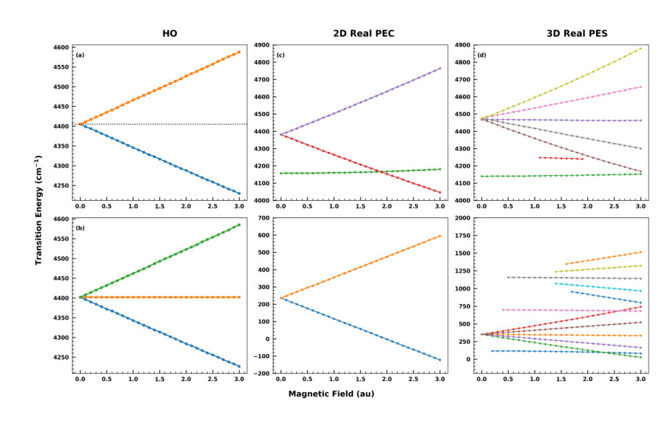 
Figure 5: Transition energies vs magnetic field for the Only Nucleus case: (a) 2D HO, (b) 3D HO, (c) 2D Electronic PEC, and (d) 3D Electronic PES. (c) and (d) are split into high (top- panel) - and low (bottom panel) - energy regions. Dotted lines denote zero-field references.

**Summary.** This paper develops a fully quantum mechanical method to compute the rovibrational spectra of diatomic molecules in intense magnetic fields. By extending the Wilson-Hamiltonian formalism, the authors accurately model the non-perturbative coupling between molecular motion and the external field. The results provide crucial computational benchmarks for interpreting spectroscopic data from highly magnetized astrophysical environments.

**Why it may be interesting.** This work is highly relevant as it tackles molecular structure and dynamics under extreme external fields, a core area of AMO physics that bridges quantum chemistry with astrophysics/high-field spectroscopy.

Detailed structure

**Main problem.** The primary challenge is obtaining high-resolution, reliable computational spectra for molecular rovibrational transitions in strong magnetic fields where experimental data are scarce.

**Main result.** The authors provide the first fully quantum mechanical computation of the $	ext{H}_2$ rovibrational signature in extreme magnetic fields, revealing complex spectral changes like shifting and splitting.

**Method.** They extend the Wilson-Hamiltonian framework to a general three-dimensional grid representation, allowing for a fully quantum mechanical treatment of nuclear motion coupled non-perturbatively to external static magnetic fields.

**Model / system.** The system is diatomic molecules (specifically $	ext{H}_2$) subjected to strong uniform magnetic fields. The method utilizes the full non-relativistic Hamiltonian and extends the Wilson formalism to treat both electronic and nuclear degrees of freedom quantum mechanically.

**Key observables.** Rovibrational spectra, electric quadrupole transition moment integrals, spectral changes (shifting, splitting, merging), bond stiffening, and rotational barriers.

**Important parameters / regimes.** Strong magnetic fields ($B$), ranging from weak intergalactic fields ($\approx 10^{-18} - 10^{-15}$ T) up to ultra-intense fields ($> 10^{11}$ T).

**Assumptions / limitations.** The framework is based on the non-relativistic Born-Oppenheimer approximation, and while fully quantum mechanical for nuclei, some advanced effects like Berry curvature terms are noted as areas for future inclusion.

**Figures summary.** Figure 17 presents computed spectra for the surface of a magnetic white dwarf ($T=12000	ext{K}$), illustrating spectral reorganization under extreme field conditions.

**Paper structure.** The paper builds from establishing the need for quantum methods in strong fields, detailing the extension of the Wilson-Hamiltonian framework to 3D, calculating transition moments, and finally presenting detailed analyses of spectral changes by isolating electronic and nuclear contributions.

Abstract

In the absence of experimental data for molecular spectra in strong magnetic fields, high resolution and reliable computational spectra are required for the interpretation of spectra collected from highly magnetic astrophysical objects. In this paper, we extend the Wilson-Hamiltonian framework, recently implemented and benchmarked by us (\textit{J. Chem. Theory Comput.}, \textbf{21}, 9753 (2025) ), to a general three-dimensional framework suitable for computing the rovibrational spectra of diatomic molecules in strong uniform magnetic fields. The field-dependent electronic and nuclear Hamiltonians capture full non-perturbative coupling between particle motion and the field making the method applicable to all field strengths. The electric quadrupole transition moment integrals for rovibrational transitions in external static magnetic fields are formulated, implemented, and computed to yield spectra which respect the selection rules of the molecule-field system. The spectral changes with increasing field strength such as shifting, splitting, merging, appearance and disappearance of peaks are noted. Contributions from electrons and nuclei are studied individually, as well as in unison to reveal the underlying physics such as stiffening of the bond, emergence of a rotational barrier, field-induced coupling/decoupling of states, and symmetry-breaking in rotational and vibrational states. These results provide the first fully quantum mechanical computational results for the rovibrational signature of $^1\mathrm{H}_{2}$ in extreme magnetic field environments with accuracy suitable for experimental interpretation. The methodology developed herein has direct relevance for high-field spectroscopy and astrochemical modeling, both for providing computational data as well as for understanding the spectral impact of strong magnetic fields on electronic structure and nuclear motion in molecules.

[↑ back to top](#top)

### [Explicit Matrices over $\mathbb Z_2$ with CNOT and Row Complexity $4n-\mathrm{o}(n)$ and Local Logic Gates](http://arxiv.org/abs/2607.28598v1)

**Authors:** Sherry Gong, Andrew Yu  
**Type:** theory · **Category:** quantum information and computing · **PDF:** <https://arxiv.org/pdf/2607.28598v1>  
**Analysis basis:** full PDF text, analyzed in chunks

📷 Fig 1

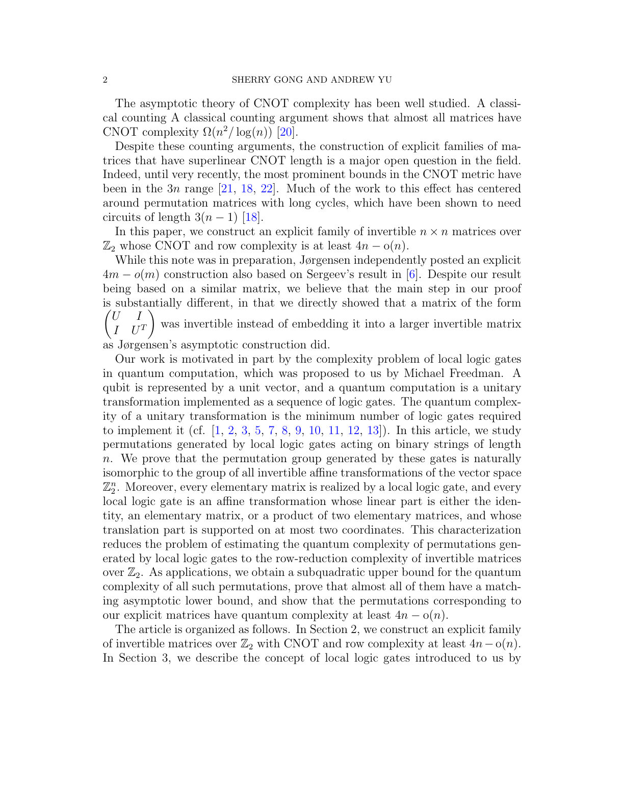 
Low-resolution page preview, page 2

📷 Fig 2

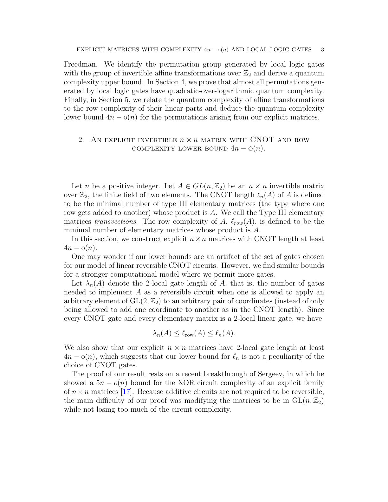 
Low-resolution page preview, page 3

📷 Fig 3

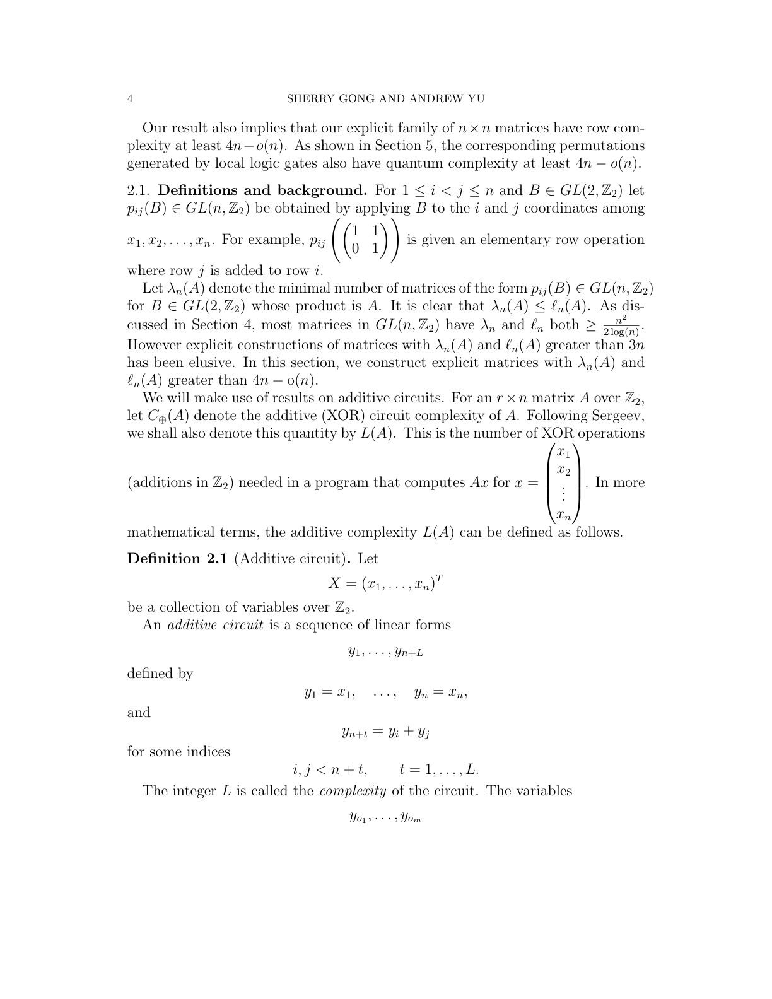 
Low-resolution page preview, page 4

📷 Fig 4

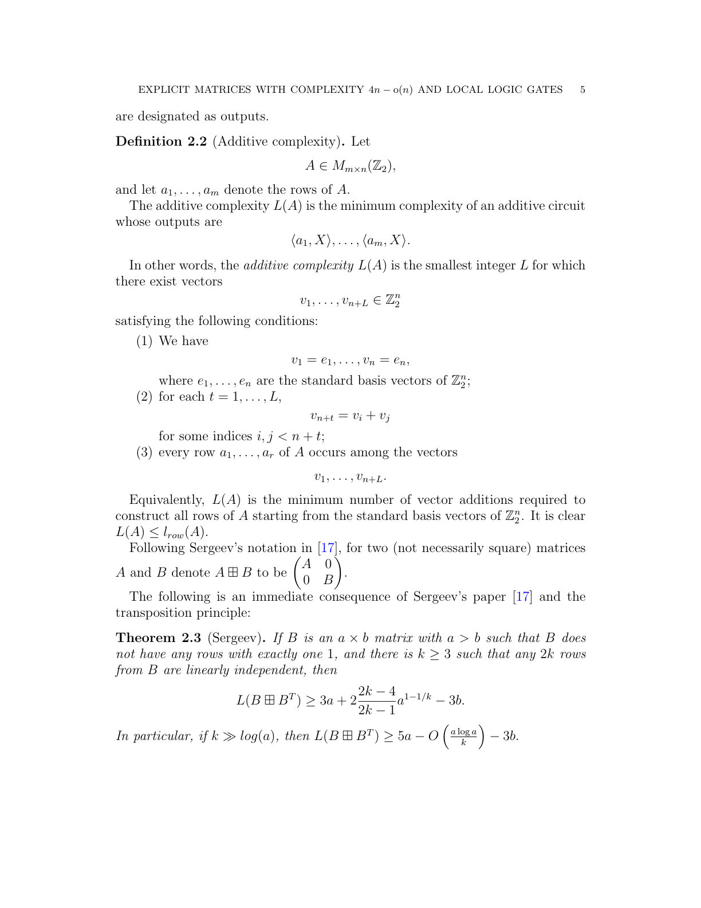 
Low-resolution page preview, page 5

📷 Fig 5

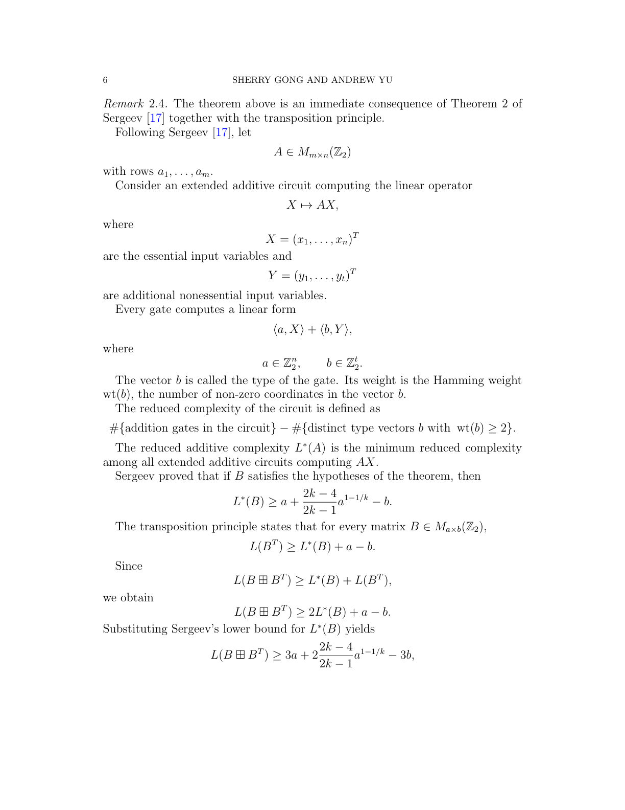 
Low-resolution page preview, page 6

**Summary.** This paper develops a method to find explicit examples of matrices over $\mathbb{Z}_2$ that require a high number of elementary row operations ($4n - o(n)$) to reduce to identity. By showing that the complexity of local logic gates is equivalent to this matrix complexity, they establish a significant quantum complexity lower bound for these specific types of quantum circuits.

**Why it may be interesting.** This work provides concrete, high lower bounds on quantum computational resources needed for specific classes of gates (local logic gates), which is crucial for understanding the inherent difficulty of simulating certain physical processes or implementing universal quantum computation models.

Detailed structure

**Main problem.** The authors aim to establish a high lower bound on the quantum complexity required to implement permutations generated by local logic gates acting on $n$ qubits.

**Main result.** They construct an explicit family of matrices over $\mathbb{Z}_2$ whose CNOT and row-reduction complexity is at least $4n - o(n)$, establishing a corresponding lower bound for the quantum complexity of these permutations.

**Method.** The problem is reduced to analyzing the row-reduction complexity of invertible matrices over $\mathbb{Z}_2$, utilizing techniques involving additive circuit complexity bounds derived from finite field theory and group isomorphism arguments.

**Model / system.** The model involves qubits represented by binary strings of length $n$ ($\mathbb{Z}_2^n$). The operations are restricted to 'local logic gates,' which generate the group $	ext{AGL}(n, 2)$ (the group of invertible affine transformations on $\mathbb{Z}_2^n$).

**Key observables.** CNOT complexity ($\ell_n(A)$), row complexity ($\ell_{	ext{row}}(A)$), and quantum circuit complexity ($	ext{QC}(T)$).

**Important parameters / regimes.** $n$ (the number of qubits/length of the string); the lower bound $4n - o(n)$.

**Assumptions / limitations.** The analysis assumes that the permutation group generated by local logic gates is isomorphic to $	ext{AGL}(n, 2)$, allowing complexity estimation via matrix row reduction.

**Paper structure.** The paper first establishes the equivalence between the quantum complexity of permutations in $G_n$ and the row-reduction complexity of their associated matrices. It then uses advanced algebraic techniques (related to additive circuit complexity) to construct explicit examples achieving the desired superlinear lower bound, culminating in a formal proof relating $	ext{QC}(T)$ to matrix complexity.

Abstract

In this article, we present an explicit family of invertible $n\times n$ matrices over $\mathbb Z_2$ whose CNOT and row complexity is at least $4n-\text{o}(n)$; equivalently, reducing these matrices to the identity requires at least $4n-\text{o}(n)$ elementary row operations. Moreover, the same complexity lower bound holds in the stronger computational model where the CNOT gates are replaced by arbitrary local linear logic gates, namely arbitrary invertible linear transformations acting on pairs of coordinates.   Let $G_n$ denote the permutation group generated by local logic gates acting on the set of binary strings of length $n$. We prove that $G_n$ is naturally isomorphic to the group of all invertible affine transformations of the vector space $\mathbb Z_2^n$, thus reducing the problem of estimating the quantum complexity of permutations in $G_n$ to the row reduction complexity of invertible matrices over $\mathbb Z_2$. As an application, we show that the permutations associated with our explicit matrices have quantum complexity at least $4n-\text{o}(n)$.

[↑ back to top](#top)

### [Logical computation with canonical lifted product codes](http://arxiv.org/abs/2607.28605v1)

**Authors:** Han Zheng, Guo Zheng, Liang Jiang, Qian Xu  
**Type:** theory · **Category:** quantum information and computing · **PDF:** <https://arxiv.org/pdf/2607.28605v1>  
**Analysis basis:** full PDF text, analyzed in chunks

📷 Fig 1

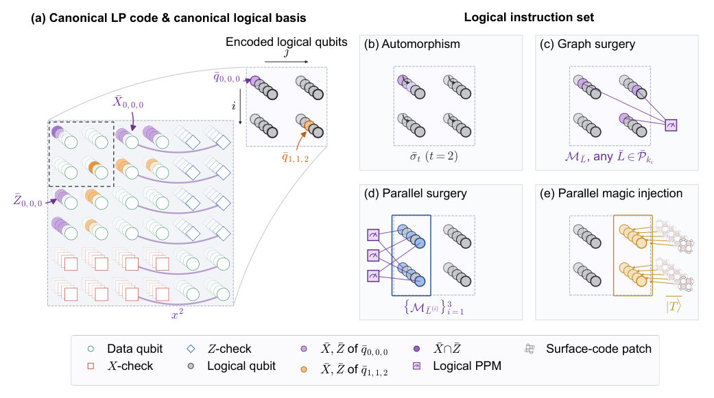 
FIG. 1. Canonical LP codes, their logical basis, and logical instruction set. (a) Illustration of a canonical LP code LPl(A, A∗), drawn for the toy code LP2×4 5 = [[100, 26, 4]] with rA = 2: data qubits (green circles) and X-/Z-checks (red squares/blue diamonds) each form a stack of l copies of the lift, which we refer to as a physical fibre. Each purple arc is an R-linear edge representing one element of the check matrices; only a subset of the horizontal edges is drawn, all carrying the same element A2,3 = x2 of Eq. (32), which illustrates the product structure of the code. Gray circles with thick outlines (inset) are the encoded logical qubits, forming an rA × rA grid of logical fibres...

📷 Fig 2

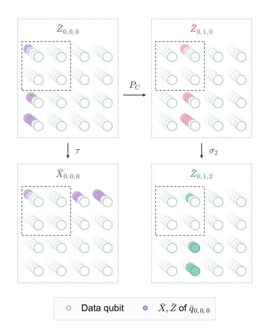 
FIG. 2. Symmetries of the canonical logical basis: (Proposition III.3), on the toy code of Fig. 1. Each panel shows the left-block support of one canonical logical basis operator (one color per logical qubit; dark dashed boxes: the information sub-grid where the logicals intersect). The arrows generate all other logicals that are permutation-equivalent to ¯Z0,0,0: the column permutation PC translates it to another column ( ¯Z0,j,0, drawn j = 1); the cyclic shift σt shifts by t within each logical fibre (drawn t = 2); and, for B = A∗, the folding involution τ transposes it into ¯ X0,0,0 of the same logical qubit.

📷 Fig 3

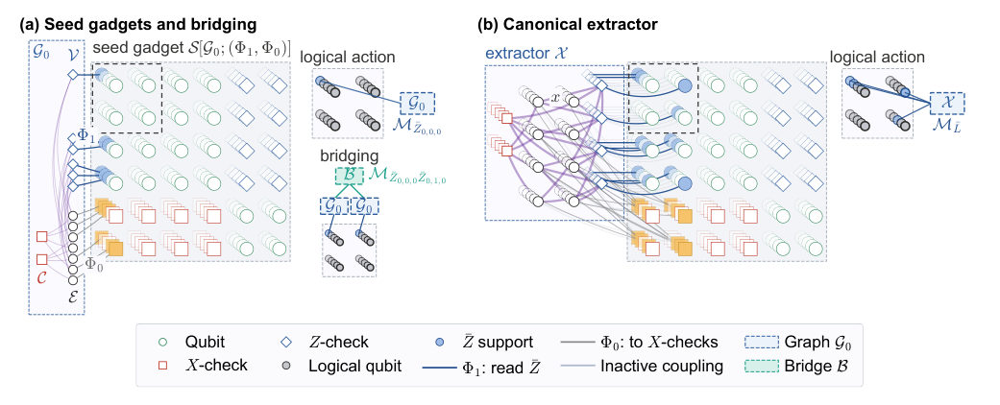 
FIG. 3. Seed surgery gadgets and the canonical extractor, drawn on the toy code LP2×4 5 (same visual conventions). (a) Seed surgery gadgets and bridging. The seed surgery gadget S[G0; (Φ1, Φ0)] (Theorem 4) measures the seed logical ¯Z0,0,0 (Definition IV.4). Its ancilla system is the graph G0 (blue dashed box), with vertex Z-checks V (diamonds), edge ancilla qubits E (circles), and cycle X-checks C (squares): the vertex checks read the operator’s support (blue data qubits) transversally (Φ1, blue lines), while the ancilla qubits attach to the data X-checks (Φ0, gray lines; coupled checks in gold). Re-wired by the basis symmetries of Fig. 2, the same gadget measures many other canonical...

📷 Fig 4

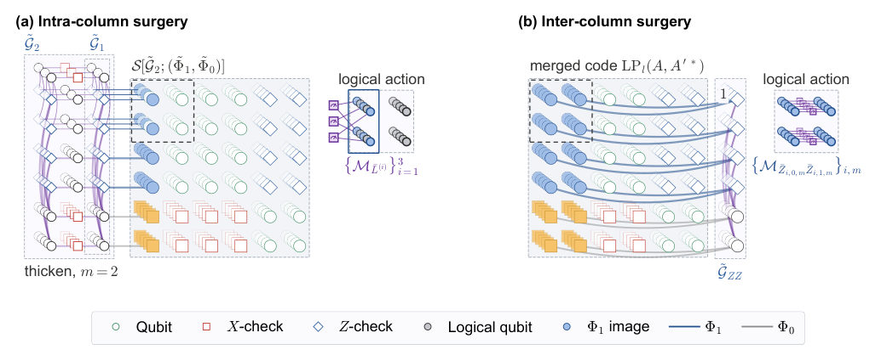 
FIG. 4. Parallel hypergraph surgery on canonical LP codes, drawn on the toy code LP2×4 5 . Visual conventions: data qubits highlighted blue form the image of Φ1, i.e. the qubits read by the ancilla vertex checks; each solid purple box in the insets is one logical PPM, supported on the logical qubits it is wired to; thick coupling edges denote R-linear (whole-fibre) couplings, thin ones individual binary couplings. (a) Intra-column surgery (Definition V.4), measuring three disjoint two-body PPMs {M¯L(i)}3 i=1 with ¯L(i) = ¯Z0,0,m ¯Z1,0,m, m ∈{0, 2, 4}, on column j = 0 (inset: one PPM box per pair). The initial skeleton ˜G1 (inner dashed box, adjacent to the code) reads the physical column j...

📷 Fig 5

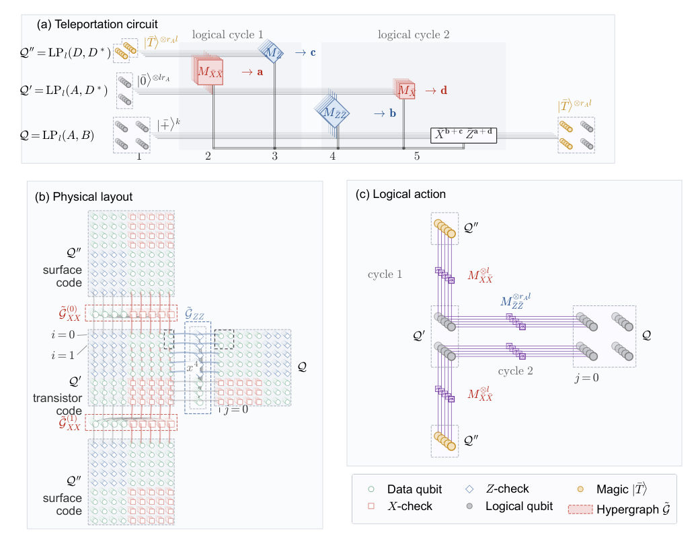 
FIG. 5. Column-parallel magic-state injection, teleporting rAl magic states in parallel into one information column of the data code Q = LPl(A, B) (gold), via rA stacked distance-ds surface codes Q′′ = LPl(D, D∗) and the transistor code Q′ = LPl(A, D∗) (code parameters in the main text). (a) Teleportation circuit. The two-step protocol in Definition V.6, with measurement outcomes a–d and the Pauli feedback correction ¯ Xb+c ¯Za+d; the two joint measurements preserve the code distance (Theorem 7), and each takes one logical cycle of Θ(ds) syndrome-measurement rounds (shaded bands). (b) Physical layout. The two parallel joint measurements are implemented with the LP inter-column hypergraph...

**Summary.** This paper presents a theoretical framework to enable fault-tolerant quantum computation on advanced high-rate qLDPC codes by co-designing the code with its logic. By establishing a 'canonical logical basis' exploiting inherent symmetries, they derive a complete set of modular and low-overhead gates. This advances the feasibility of building large-scale quantum processors using these highly efficient error-correcting codes.

**Why it may be interesting.** While focused on abstract coding theory, the development of highly structured, low-overhead logical operations is crucial for any physical platform attempting large-scale quantum computation, including those based on trapped ions or superconducting circuits.

Detailed structure

**Main problem.** The primary challenge is developing efficient, fault-tolerant quantum computation protocols for high-rate quantum low-density parity-check (qLDPC) codes beyond simple state storage.

**Main result.** The authors show that canonical lifted-product (LP) codes admit a structured 'canonical logical basis' which unlocks a complete, modular logical instruction set for universal fault-tolerant computation.

**Method.** They co-design the code structure with its logical operations by exploiting inherent symmetries to derive this canonical basis and associated low-overhead gadgets.

**Model / system.** The work focuses on high-rate qLDPC codes, specifically a family of canonical lifted-product (LP) codes defined over cyclic group rings. These codes are designed for fault-tolerant quantum computation.

**Key observables.** Logical qubits ($\overline{q}_{i,j,m}$), code distances ($d$), and the efficiency/overhead of logical operations (e.g., seed gadget size).

**Important parameters / regimes.** High encoding rates, low physical-qubit overhead, and the ability to perform parallel measurements and state injections.

**Assumptions / limitations.** The framework relies on 'mild algebraic conditions' for the LP codes to be canonical; residual operators are assumed to be gauge logical operators.

**Figures summary.** Figure 1 illustrates the code structure, basis, and resulting instruction set. Table I summarizes the full logical instruction set (action, space/time cost).

**Paper structure.** The paper establishes the LP code framework, derives the canonical logical basis exploiting symmetries, details the complete logical instruction set (automorphisms, Clifford gates, measurements), and finally provides resource analysis for key components like seed surgery gadgets.

Abstract

High-rate quantum low-density parity-check (qLDPC) codes encode many logical qubits with low physical-qubit overhead, but realizing efficient fault-tolerant computation on such dense encodings remains a major challenge. Generic, code-agnostic techniques such as code surgery and gate teleportation apply broadly, but are difficult to make modular, low-overhead, and fully certifiable on complex high-rate codes whose structure is left unexploited. Here we overcome these obstacles by co-designing the code together with its logical instruction set for a broad family of \emph{canonical} lifted-product (LP) codes with cyclic symmetry. We show that these codes admit a \emph{canonical logical basis}, in which conjugate logical operators are organized into rows and columns of cyclic orbits inherited directly from the underlying classical codes, analogous to the structure that makes hypergraph-product codes so tractable. This canonical basis unlocks a complete logical instruction set, including constant-depth automorphism and fold-transversal Clifford gates, modular graph code surgeries built from a constant number of reusable seed surgery gadgets or a compact canonical extractor, highly parallel logical Pauli-product measurements, and parallel magic-state injection. For example, a $[[1122,148,\leq\!20]]$ (resp. $[[4350,1224,\leq\!20]]$) LP code requires only two (resp. four) seed surgery gadgets, while arbitrary high-weight logical measurements can be implemented using a full extractor smaller than half of the data code block. These results advance the frontier of fault-tolerant quantum computation on ultra-high-rate quantum architectures.

[↑ back to top](#top)

### [Nearly optimal quantum circuits for Boolean oracles](http://arxiv.org/abs/2607.28402v1)

**Authors:** Junhong Nie, Wei Zi  
**Type:** theory · **Category:** quantum information and computing · **PDF:** <https://arxiv.org/pdf/2607.28402v1>  
**Analysis basis:** full PDF text, analyzed in chunks

📷 Fig 1

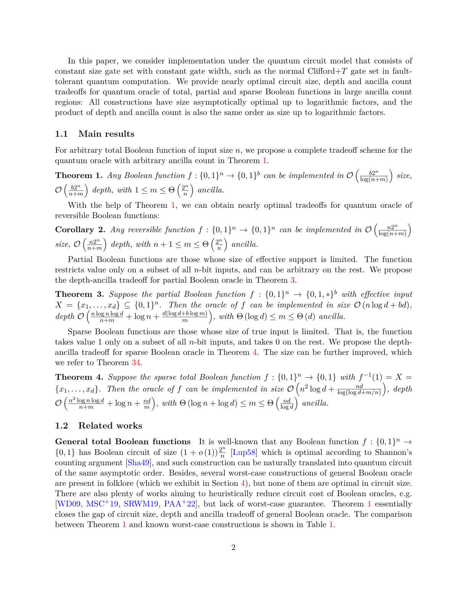 
Low-resolution page preview, page 2

📷 Fig 2

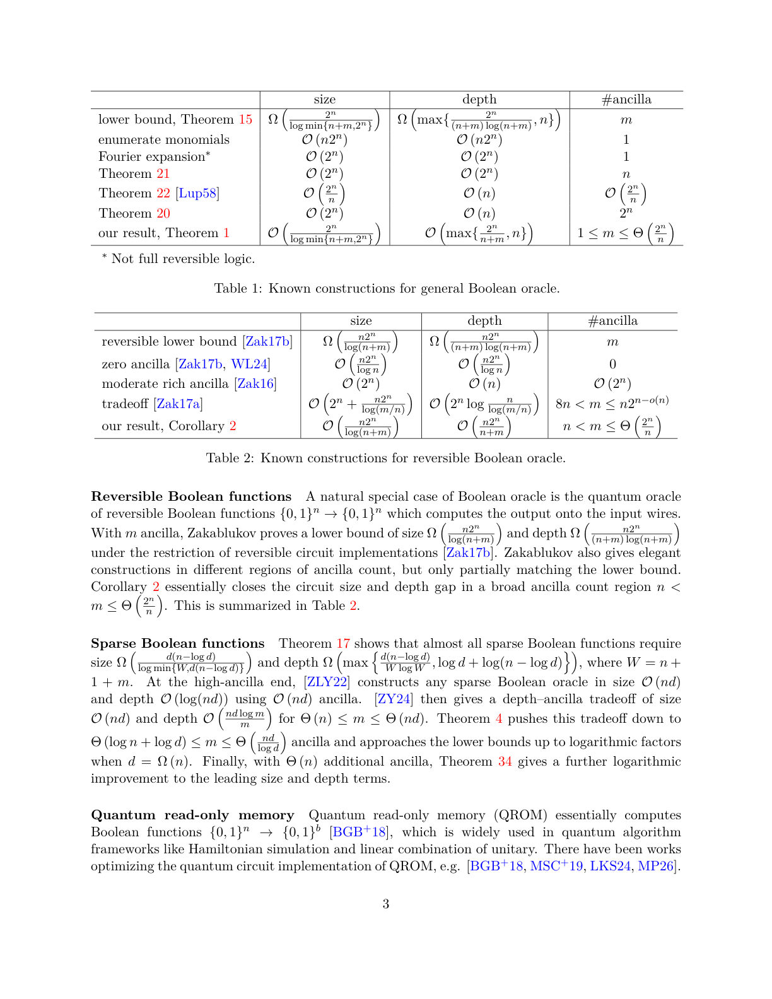 
Low-resolution page preview, page 3

📷 Fig 3

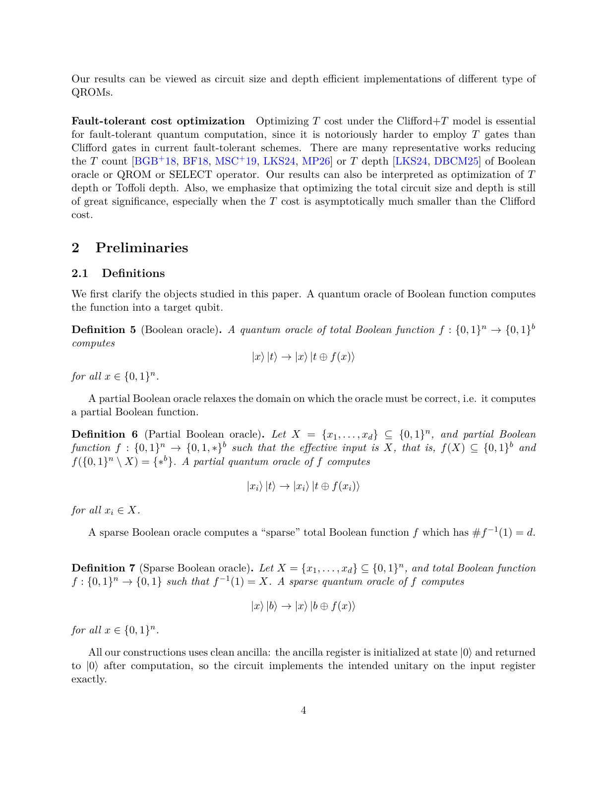 
Low-resolution page preview, page 4

📷 Fig 4

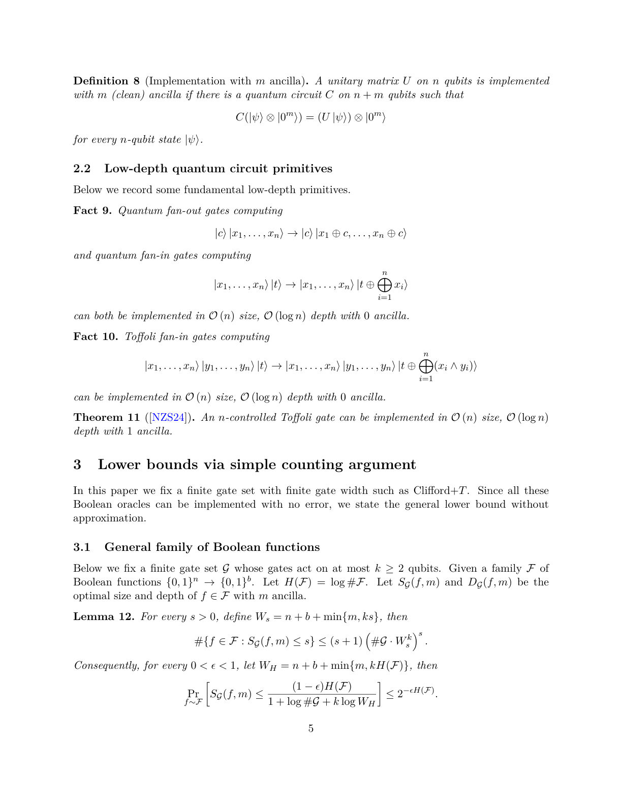 
Low-resolution page preview, page 5

📷 Fig 5

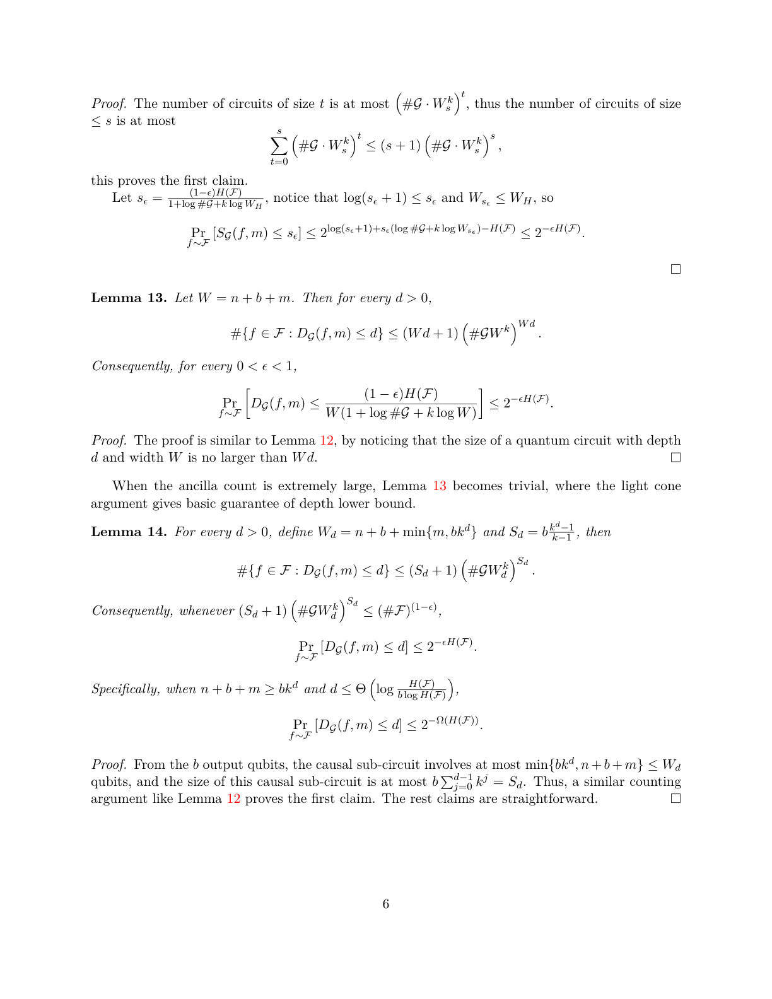 
Low-resolution page preview, page 6

**Summary.** This paper provides theoretical results detailing near-optimal quantum circuit implementations for oracles representing Boolean functions. It analyzes three function types—general, partial, and sparse—deriving precise resource bounds on circuit size, depth, and required ancilla qubits. These findings are crucial for designing efficient quantum algorithms that rely on embedding classical logic into quantum hardware.

**Why it may be interesting.** While focused on quantum complexity theory rather than AMO physics, the rigorous resource estimation (size/depth trade-offs) is foundational knowledge applicable to designing complex quantum protocols that might interface with physical systems.

Detailed structure

**Main problem.** The core problem is determining nearly optimal trade-offs among circuit size, circuit depth, and ancilla count required to implement quantum oracles for various types of Boolean functions.

**Main result.** The paper establishes asymptotically optimal bounds for general total, partial, and sparse Boolean function oracles, providing concrete resource estimates based on the function's structure.

**Method.** The authors use advanced complexity analysis involving lower bound techniques (counting arguments) and developing optimized quantum circuit constructions using linear maps and recursive decomposition.

**Model / system.** The work operates within the quantum circuit model, assuming implementation with a fixed, finite gate set suitable for fault-tolerant computation. The system is defined by Boolean functions $f: \{0, 1\}^n 	o \{0, 1\}^b$.

**Key observables.** Circuit Size ($	ext{SG}$), Circuit Depth ($	ext{DG}$), and Ancilla Count ($m$).

**Important parameters / regimes.** Input size ($n$), Output size ($b$), Effective Support Size ($d$), and the number of ancillas ($m$).

**Assumptions / limitations.** The analysis assumes implementation in a fault-tolerant quantum circuit model with a constant gate set, and the bounds are stated for specific large parameter regimes.

**Figures summary.** Tables compare the derived resource bounds (size/depth) against known worst-case constructions for general and reversible oracles.

**Paper structure.** The paper progresses by first establishing foundational lower bounds for oracle implementation, then deriving optimized constructions for general total functions, followed by specialized theorems addressing partial and sparse Boolean function oracles using techniques like linear hashing and conjunction computation.

Abstract

Quantum oracle of Boolean functions is one of the central bridges between classical and quantum algorithms, but the study focusing at quantum circuit optimization of such oracle is yet closed. In this paper, we propose nearly optimal tradeoffs among circuit size, circuit depth and ancilla count, for quantum oracles of three kinds of Boolean functions:   general total Boolean functions with output size $b$: with $1\le m\leΘ\left(\frac{2^n}{n}\right)$ ancilla, size $\mathcal{O}\left(\frac{b2^n}{\log(n+m)}\right)$, depth $\mathcal{O}\left(\frac{b2^n}{n+m}\right)$;   partial Boolean functions of effective support size $d$ and output size $b$: with $Θ\left(\log d\right)\le m\le Θ\left(d\right)$ ancilla, size $\mathcal{O}\left(n\log d+bd\right)$, depth $\mathcal{O}\left(\frac{n\log n\log d}{n+m}+\log n+\frac{d(\log d+b\log m)}{m}\right)$;   sparse Boolean functions of true input size $d$: with $Θ\left(\log n+\log d\right)\le m\leΘ\left(\frac{nd}{\log d}\right)$ ancilla, size $\mathcal{O}\left(n^2\log d+\frac{nd}{\log(\log d+m/n)}\right)$, depth $\mathcal{O}\left(\frac{n^2\log n\log d}{n+m}+\log n+\frac{nd}{m}\right)$.   All the size and depth bounds are asymptotically optimal up to logarithmic factors in the corresponding ancilla count regions. We hope these results find applications in scenarios where classical procedures are needed to be embedded into quantum circuits, such as QROM implementation and quantum algorithm design.

[↑ back to top](#top)

### [Optimal T Counts under Sparsity: from QROM to State Preparation and Block Encoding](http://arxiv.org/abs/2607.28260v1)

**Authors:** Tongyang Li, Fengning Ou, Xinzhao Wang, Penghui Yao, Pei Yuan, Shengyu Zhang  
**Type:** theory · **Category:** quantum information and computing · **PDF:** <https://arxiv.org/pdf/2607.28260v1>  
**Analysis basis:** full PDF text, analyzed in chunks

📷 Fig 1

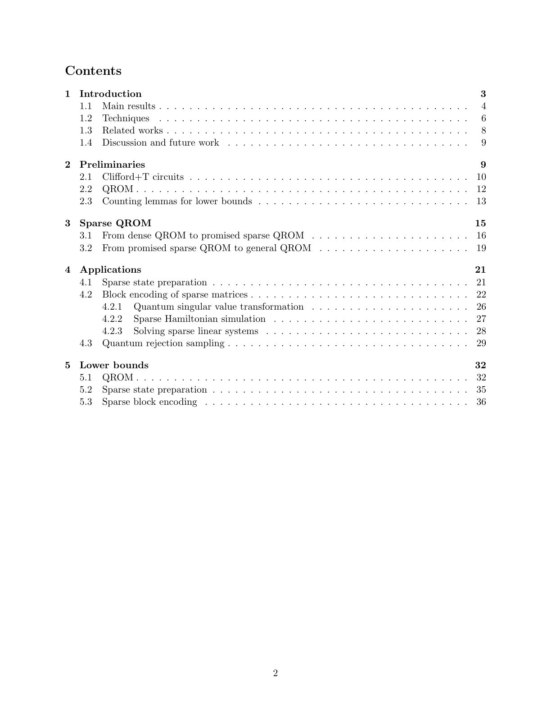 
Low-resolution page preview, page 2

📷 Fig 2

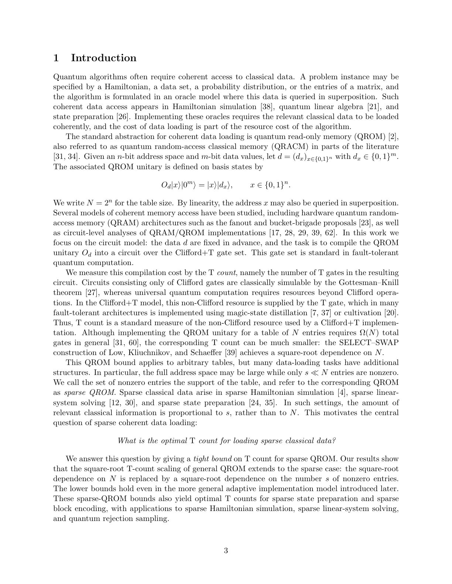 
Low-resolution page preview, page 3

📷 Fig 3

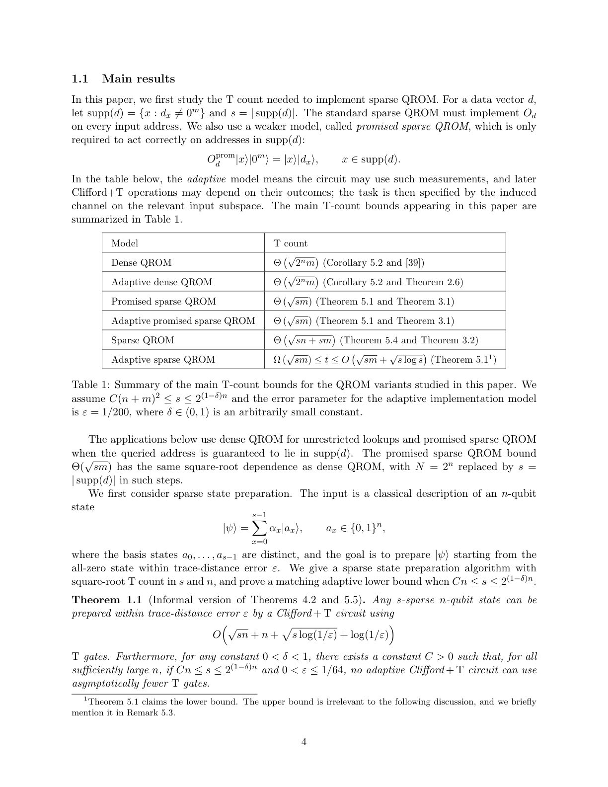 
Low-resolution page preview, page 4

📷 Fig 4

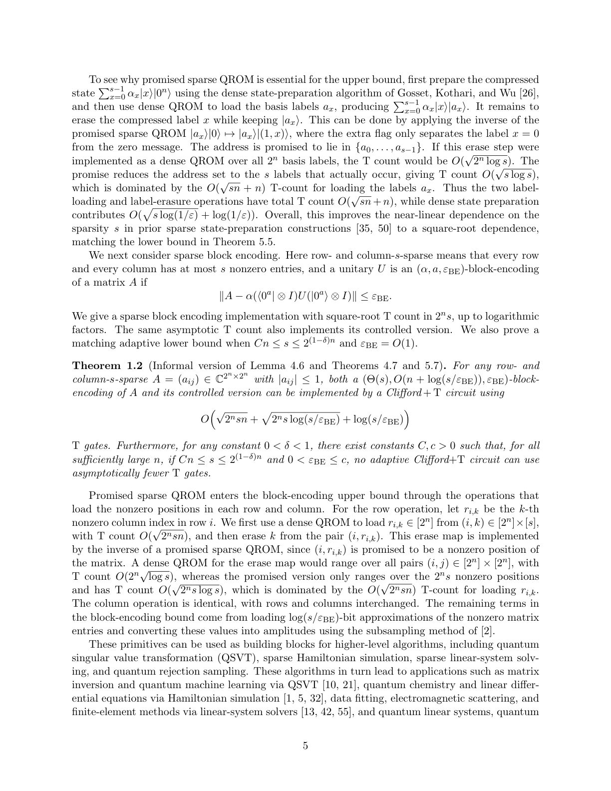 
Low-resolution page preview, page 5

📷 Fig 5

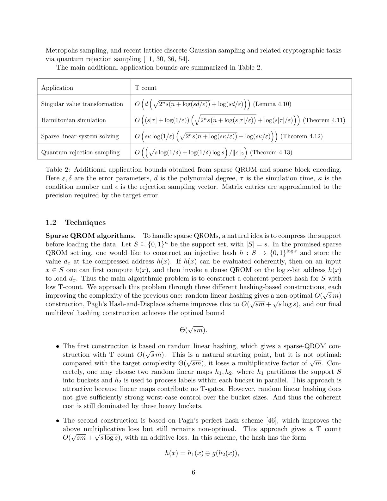 
Low-resolution page preview, page 6

**Summary.** This paper rigorously determines the minimum number of T gates required for performing data-intensive tasks like QROM access and state preparation when the input data is sparse. By achieving optimal bounds scaling with $\sqrt{s}$ instead of $2^n$, it significantly improves theoretical estimates for quantum computation efficiency in memory-constrained regimes.

**Why it may be interesting.** While focused on abstract quantum complexity, the results provide fundamental resource estimates that underpin the feasibility of implementing complex algorithms (like those simulating physical systems) with limited gate sets.

Detailed structure

**Main problem.** The paper determines the optimal resource cost, measured by T count, required for implementing coherent data access tasks like Quantum Read-Only Memory (QROM), sparse state preparation, and block encoding when the underlying classical data is sparse.

**Main result.** It establishes asymptotically optimal T-count bounds for these sparse tasks, showing a square-root dependence on the sparsity size $s$ rather than the full address space size $2^n$.

**Method.** The authors use circuit compilation analysis over the Clifford+T gate set, deriving upper bounds via multilevel hashing and lower bounds using counting arguments applied to adaptive Clifford+T circuits.

**Model / system.** The work analyzes quantum computation models utilizing the Clifford+T gate set. Key structures include QROMs, which are adapted for sparse data access ($s \ll 2^n$), alongside general state preparation and block encoding tasks for structured matrices.

**Key observables.** T count (the primary resource cost metric), circuit depth, and achievable complexity bounds.

**Important parameters / regimes.** Sparsity size $s$, address space parameter $n$ ($\log N$), data value bit length $m$, and precision parameters $\epsilon, \epsilon_{BE}$.

**Assumptions / limitations.** The analysis relies on specific regimes for sparsity ($Cn \le s \le 2(1-\delta)n$) and assumes the use of Clifford+T gates.

**Figures summary.** Not specified in detail, but Table 1 summarizes T-count bounds for various QROM variants, and Table 2 summarizes additional application bounds like QSVT.

**Paper structure.** The paper progresses by first establishing general sparse QROM bounds ($\Theta(\sqrt{sm} + \sqrt{sn})$), then deriving specific optimal constructions for sparse state preparation and block encoding, and finally proving matching lower bounds using adaptive circuit techniques.

Abstract

Many quantum algorithms require coherent access to classical data, often modeled by quantum read-only memory (QROM). We initiate the study of the $T$ count of sparse QROM, in which only $s$ of the $2^n$ addresses store nonzero data. We prove asymptotically optimal $T$-count bounds $Θ(\sqrt{sm} + \sqrt{sn})$ with square-root dependence on the support size $s$ and message length $m$. Our upper bounds use a multilevel hashing scheme, while our lower bounds reduce sparse QROM to state preparation and use counting arguments for adaptive Clifford+$T$ circuits. The lower bounds thus hold even when mid-circuit measurements and classically controlled operations are allowed. As applications, we obtain matching $T$-count bounds $Θ(\sqrt{sn} + \sqrt{s\log(1/\varepsilon)} +   \log(1/\varepsilon))$ for $s$-sparse state preparation and $Θ( \sqrt{2^n sn}   +   \sqrt{2^n s\log(s/\varepsilon_{\mathrm{BE}})}   +   \log(s/\varepsilon_{\mathrm{BE}}))$ for block encoding of $s$-sparse matrices, where $\varepsilon$ and $\varepsilon_{\mathrm{BE}}$ are the precision of state preparation and block encoding, respectively.

[↑ back to top](#top)

### [Quantum Computing Enabled ab initio Molecular Dynamics Simulations](http://arxiv.org/abs/2607.28548v1)

**Authors:** Susanta Das, Subhamoy Bhowmik, Zhen Li, Milana Bazayeva, Danil Kaliakin, Akhil Shajan, Kenneth M. Merz  
**Type:** theory · **Category:** other · **PDF:** <https://arxiv.org/pdf/2607.28548v1>  
**Analysis basis:** full PDF text, analyzed in chunks

📷 Fig 1

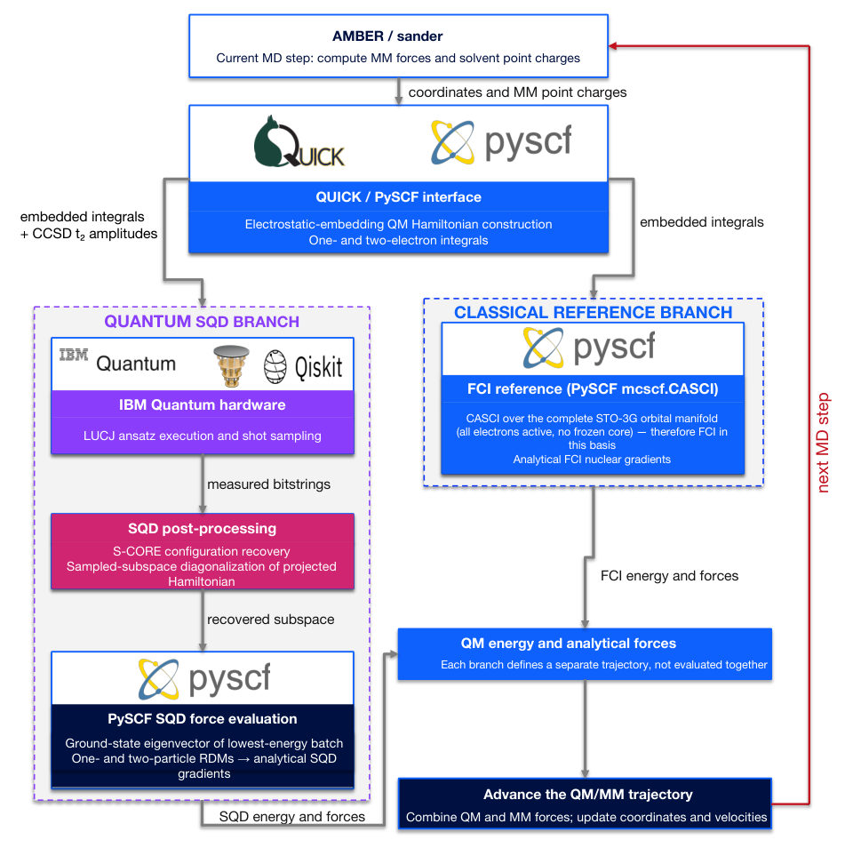 
Figure 1: Schematic of the SQD-enabled QM/MM ab initio molecular dynamics workflow integrating Amber, Quick, PySCF, and IBM quantum hardware. At each MD step, Amber/sander supplies the solute coordinates and MM point charges, from which the Quick/PySCF interface builds the electrostatically embedded QM Hamiltonian. The clas- sical reference branch uses the PySCF mcscf.CASCI kernel over the complete STO-3G orbital manifold, with all electrons active and no frozen core, and is therefore FCI in this basis. The quantum branch executes a LUCJ ansatz on ibm cleveland and post-processes the measured bitstrings by SQD. Both branches yield analytical nuclear gradients and de- fine separate...

📷 Fig 2

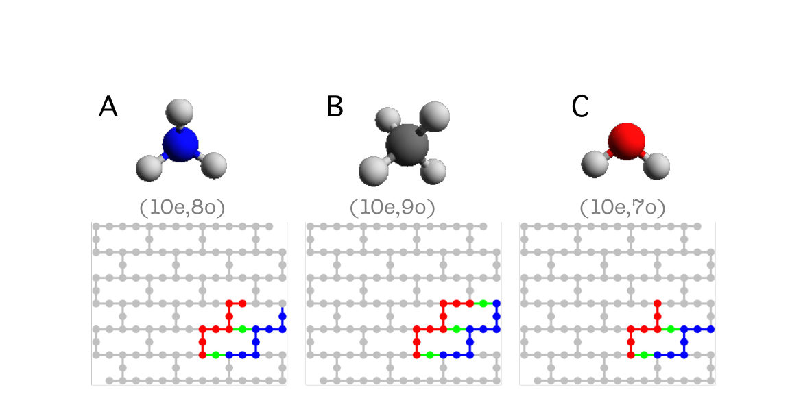 
Figure 2: Qubit layouts of the LUCJ circuits executed on ibm cleveland for (A) NH3 (10e,8o; 18 qubits), (B) CH4 (10e,9o; 21 qubits), and (C) H2O (10e,7o; 16 qubits). The device connectivity is shown in gray. Qubits used to encode spin-up and spin-down occupations are indicated in red and blue, respectively, and ancilla qubits are shown in green. The molecular structures above each layout correspond to the simulated solute; carbon, oxygen, nitrogen, and hydrogen atoms are colored gray, red, blue, and white, respectively.

📷 Fig 3

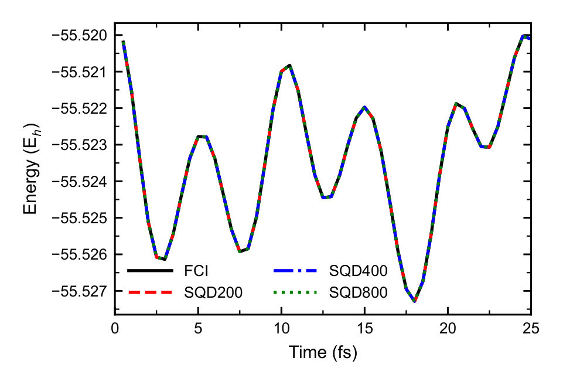 
Figure 3: Total electronic energy along the gas-phase NH3 trajectory in vacuum ob- tained with FCI/STO-3G reference and SQD at three SQD batch sizes (SQD200, SQD400, SQD800). The SQD curves closely overlay the FCI reference, indicating that SQD repro- duces the same potential-energy surface along the sampled path.

📷 Fig 4

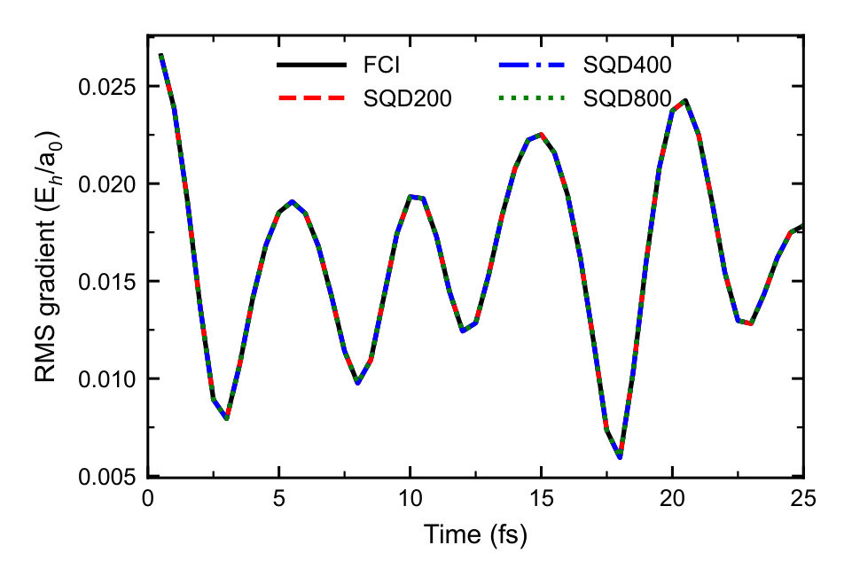 
Figure 4: Root-mean-square (RMS) nuclear gradient magnitude along the gas-phase NH3 trajectory in vacuum obtained with FCI/STO-3G reference and SQD at three SQD batch sizes (SQD200, SQD400, SQD800). The SQD curves overlay the FCI reference across the full trajectory, indicating that SQD reproduces the force scale and its temporal modulation along the NVE path.

📷 Fig 5

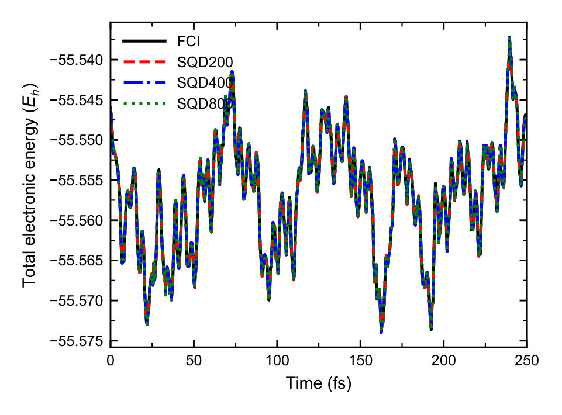 
Figure 5: Total electronic energy (Eh) along the aqueous-phase molecular dynamics trajec- tory of NH3 in explicit water, comparing classical FCI with SQD using batch sizes N = 200, 400, and 800 samples per batch. Energies are shown as a function of simulation time (fs) with ∆t = 0.5 fs. The SQD and FCI energy traces are in excellent agreement throughout the trajectory.

**Summary.** The paper presents a novel quantum-classical workflow using Sample-based Quantum Diagonalization (SQD) to enable ab initio molecular dynamics on current quantum hardware. By benchmarking against Full CI calculations in explicit solvents, the authors demonstrate that this method accurately predicts energies and forces for QM/MM systems. This establishes a practical pathway for integrating near-term quantum processors into computational chemistry simulations.

**Why it may be interesting.** This work is highly relevant as it tackles the direct application of near-term quantum computing (NISQ) devices to complex, time-dependent many-body problems in chemistry, bridging abstract quantum algorithms with tangible molecular dynamics simulations.

Detailed structure

**Main problem.** The primary goal is establishing a practical workflow to integrate current quantum hardware into Quantum Mechanics/Molecular Mechanics (QM/MM) molecular dynamics simulations for condensed-phase systems.

**Main result.** The proposed LUCJ+SQD method successfully reproduces high-accuracy Full CI energies and gradients in both gas-phase benchmarks and explicit-solvent QM/MM simulations, validating its use on quantum hardware.

**Method.** It employs a quantum-classical workflow: quantum measurements from a LUCJ ansatz are post-processed using Sample-based Quantum Diagonalization (SQD) to estimate electronic structure properties, which are then combined with classical MM forces for dynamics.

**Model / system.** The simulations model neutral solutes ($	ext{NH}_3$, $	ext{CH}_4$, $	ext{H}_2	ext{O}$) embedded in explicit liquid water. The methodology combines quantum electronic structure calculations (via SQD) with classical force fields (QM/MM framework).

**Key observables.** Energies, analytical nuclear gradients, and solute–solvent radial distribution functions ($	ext{RDFs}$).

**Important parameters / regimes.** The benchmark accuracy is set by the Full CI calculation in the STO-3G basis; performance metrics include energy deviation ($\le 1 	ext{ kcal mol}^{-1}$) and $	ext{RMS}$ gradient profile matching.

**Assumptions / limitations.** The method assumes that post-processing quantum measurements via SQD can accurately recover determinant subspaces, effectively bridging current noisy hardware capabilities to high-accuracy chemical simulations.

**Figures summary.** Figure 1 schematically illustrates the entire QM/MM AIMD workflow, showing parallel execution paths for both the 'QUANTUM SQD BRANCH' and the 'CLASSICAL REFERENCE BRANCH' at each MD step.

**Paper structure.** The paper details the quantum-classical integration pipeline: first, setting up the Hamiltonian construction (Quick/PySCF); second, executing the quantum measurement via LUCJ on hardware; third, post-processing these measurements using SQD to get energies/forces; and finally, integrating these forces into an established MD engine like Amber/sander.

Abstract

We demonstrate a quantum-classical workflow for ab initio molecular dynamics (AIMD) in which quantum measurements from a chemistry-inspired LUCJ ansatz are post-processed using Sample-based Quantum Diagonalization (SQD) to recover determinant subspaces and deliver energies and analytical nuclear gradients for dynamics. As an exact benchmark, we use full configuration interaction (FCI) in the STO-3G basis, enabling a direct assessment of the accuracy of SQD. In gas-phase benchmarks, SQD reproduces FCI energies and gradients to within 1 kcal mol$^{-1}$ of the FCI reference and yields stable AIMD trajectories. In explicit-solvent QM/MM simulations, SQD retains this agreement, matching FCI energy fluctuations and RMS gradient profiles and reproducing solute-solvent structure as quantified by radial distribution functions. Overall, these benchmarks establish LUCJ+SQD as a practical route for integrating current quantum hardware into QM/MM molecular dynamics and provide an early demonstration of condensed-phase QM/MM dynamics driven by a quantum electronic-structure engine.

[↑ back to top](#top)

### [Resource-efficient quantum-selected configuration interaction for molecular properties](http://arxiv.org/abs/2607.27777v1)

**Authors:** Suprava Sahoo, Abdul Kalam, Kenji Sugisaki, V. S. Prasannaa, B. P. Das  
**Type:** theory · **Category:** other · **PDF:** <https://arxiv.org/pdf/2607.27777v1>  
**Analysis basis:** full PDF text, analyzed in chunks

📷 Fig 1

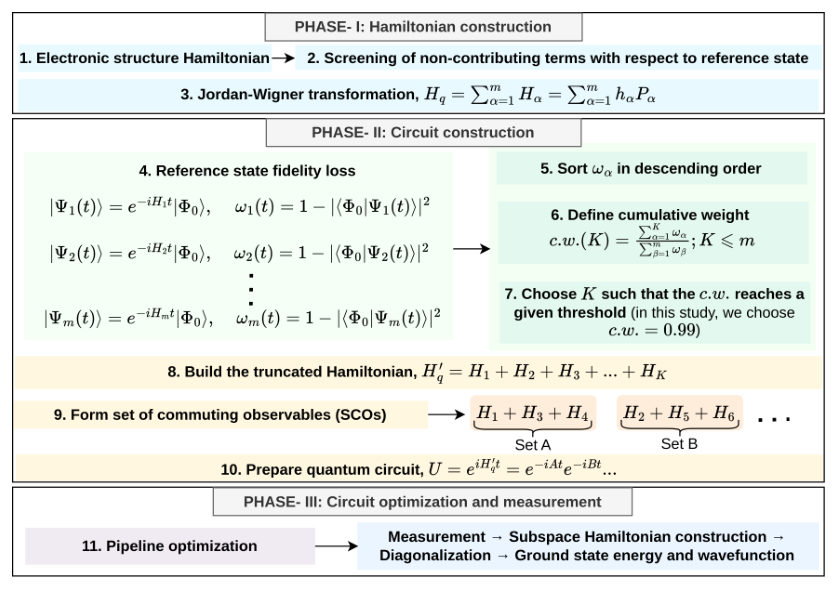 
Figure 1. Schematic workflow of the proposed eos-QSCI method. PHASE I: Construction of the truncated Hamiltonian through reference-state-based screening of non-contributing terms followed by the Jordan–Wigner transformation. PHASE II: Time-evolution circuit construction via fidelity loss and cumulative-weight-based Hamiltonian-term selection and grouping into sets of commuting observables (SCOs). PHASE III: Pipeline optimization, quantum hardware execution, and classical post-processing to obtain the ground-state energy and wavefunction.

📷 Fig 2

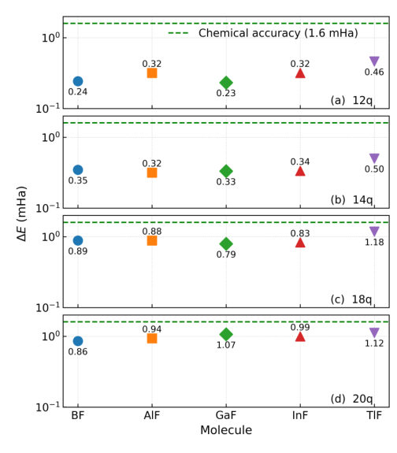 
Figure 2. Absolute energy deviations, ∆E = |Eeos-QSCI − ECASCI|, for Group IIIA monofluorides obtained with eos- QSCI for active spaces corresponding to (a) 12, (b) 14, (c) 18, and (d) 20 qubits. The vertical axis is shown on a logarithmic scale. The dashed horizontal line indicates the chemical ac- curacy threshold (1.6 mHa), and the numerical values of ∆E (mHa) are labeled at each data point.

📷 Fig 3

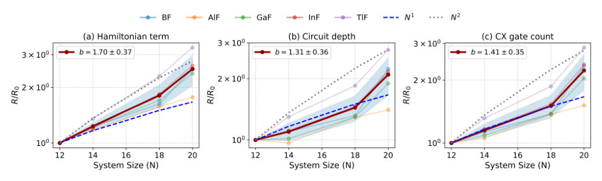 
Figure 3. Scaling of the normalized resource reduction ratio, R/R0, with system size N for (a) Hamiltonian terms, (b) circuit depth, and (c) CX gate count. Here, R(N) = CFull(N)

**Summary.** The paper introduces an $	ext{eos-QSCI}$ method to calculate molecular properties by drastically reducing the complexity of the electronic Hamiltonian. This is achieved by screening out negligible Pauli operator terms based on reference-state fidelity loss, leading to massive resource savings in circuit depth and gate counts compared to full methods. The results confirm that this approach enables accurate simulations for molecules like $	ext{TlF}$ on near-term quantum hardware.

**Why it may be interesting.** This work directly addresses the scalability bottleneck in quantum chemistry simulations. By providing a systematic way to compress the Hamiltonian before circuit construction, it makes calculations of molecular properties feasible on current noisy intermediate-scale quantum (NISQ) devices.

Detailed structure

**Main problem.** The primary challenge is simulating quantum many-body systems, like molecules, for properties beyond ground-state energies while overcoming the exponential scaling limitations of exact electronic structure methods.

**Main result.** The proposed resource-efficient framework achieves near-quadratic improvements in Hamiltonian term scaling and demonstrates that calculations on NISQ devices maintain high accuracy (e.g., PDM matching within 99.99% of full CI).

**Method.** The authors developed an effective Pauli Operator Sorting-based Quantum-Selected Configuration Interaction ($	ext{eos-QSCI}$) method that prunes the Hamiltonian by retaining only dominant terms based on reference-state fidelity loss.

**Model / system.** The study applies this framework to Group IIIA monofluorides (BF, AlF, GaF, InF, TlF), using the Dirac–Coulomb Hamiltonian within the Born-Oppenheimer approximation for electronic structure calculations.

**Key observables.** Ground-state energies and Permanent Electric Dipole Moments (PDMs); quantum resource metrics include circuit depth and two-qubit gate counts.

**Important parameters / regimes.** The fidelity loss threshold ($c.w.(K) \gtrsim 0.99$) is used to construct the compact Hamiltonian; system sizes up to 20 qubits are tested.

**Assumptions / limitations.** The method relies on approximating the full electronic Hamiltonian by retaining only terms whose contribution, measured via reference-state fidelity loss, exceeds a certain threshold.

**Figures summary.** Figures illustrate the three phases of the $	ext{eos-QSCI}$ workflow: Hamiltonian construction (screening/Jordan-Wigner), time-evolution circuit building using Sets of Commuting Observables (SCOs), and hardware execution results. Tables quantify resource reductions ($	ext{HT}$, $	ext{CD}$, $	ext{CX}$) compared to full methods.

**Paper structure.** The paper details the problem (FCI intractability), introduces the $	ext{eos-QSCI}$ methodology through Hamiltonian screening and importance selection based on fidelity loss, presents resource scaling analyses showing super-linear advantages over full Hamiltonians, and validates the approach by calculating energies and PDMs for several Group IIIA monofluorides on simulated quantum hardware.

Abstract

The quantum-selected configuration interaction identifies important determinantal basis functions through real-time evolution of a reference wavefunction and diagonalizing the Hamiltonian matrix in the resulting selected subspace. However, implementing the full electronic Hamiltonian on noisy quantum devices leads to rapidly increasing circuit complexity, limiting its scalability. To address this issue, we identify the dominant fermionic excitation operators and perform reference-state fidelity loss analysis to construct a compact Hamiltonian, reducing computational overhead while retaining high precision. Applied to Group IIIA monofluorides (BF, AlF, GaF, InF, and TlF), the proposed framework achieves a near-quadratic improvement in Hamiltonian-term scaling, enabling resource-efficient simulations. We employ this framework to compute the relativistic ground-state energies and permanent electric dipole moments (PDMs) of the systems under consideration. After validating the framework via simulations, we demonstrate hardware execution for AlF and TlF on the IBM Marrakesh processor using active spaces of up to 20 qubits. For a 20-qubit TlF system, the reduced Hamiltonian yields a reduction of higher than $ 98\%$ in both circuit depth and two-qubit gate counts, with the resulting PDMs from quantum hardware matching complete active space configuration interaction values within $99.99\%$. These results demonstrate the scalability of this approach on noisy intermediate-scale quantum devices.

[↑ back to top](#top)

### [Single-crystal structural phase diagram of stoichiometric bilayer nickelate La3Ni2O7 under hydrostatic pressure](http://arxiv.org/abs/2607.27607v1)

**Authors:** Misaki Sasaki, Zhehong Liu, Takeshi Hara, Shunsuke Kitou, Markus Kriener, Haruto Yoshimochi, Shion Yamada, Chieko Terakura, Naohisa Hirao, Hirokazu Kadobayashi, Yusuke Wakabayashi, Yoshinori Tokura, Yasujiro Taguchi, Taka-hisa Arima, Yukako Fujishiro  
**Type:** experiment · **Category:** strongly correlated electrons · **PDF:** <https://arxiv.org/pdf/2607.27607v1>  
**Analysis basis:** full PDF text, analyzed in chunks

📷 Fig 1

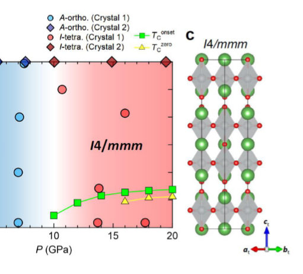 
Fig. 1. Crystal structures and pressure–temperature phase diagram of bilayer

📷 Fig 2

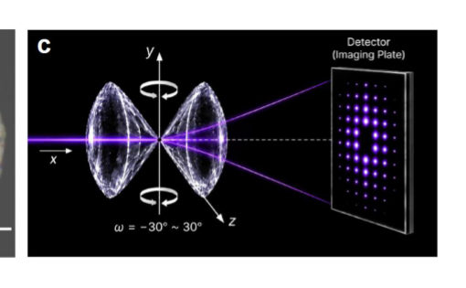 
Fig. 2. DAC and X-ray diffraction conditions under pressure. a,b, Photographs of

📷 Fig 3

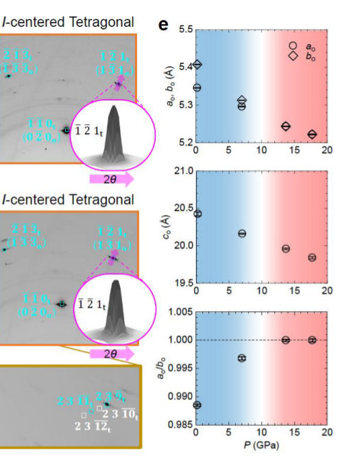 
Fig. 3. High-pressure X-ray diffraction results for Crystal 1 at 9 K. a-d, X-ray

📷 Fig 4

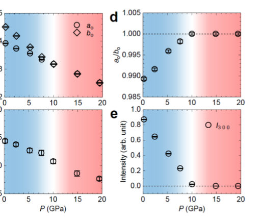 
Fig. 4. High-pressure X-ray diffraction results for Crystal 2 at 300 K. a, X-ray

**Summary.** This experimental study maps the structural phase diagram of bilayer nickelate La3Ni2O7 under high pressure using single-crystal X-ray diffraction. It definitively shows that superconductivity emerges precisely when the crystal structure undergoes a transition from an ambient orthorhombic phase to a tetragonal I4/mmm phase near 10 GPa. These findings provide crucial structural constraints for developing microscopic theories of nickelate superconductivity.

**Why it may be interesting.** The work directly probes the interplay between crystal symmetry breaking (structural phase transitions) and unconventional superconductivity in a strongly correlated nickelate material, which is highly relevant to understanding pairing mechanisms in cuprates and related systems.

Detailed structure

**Main problem.** The study aims to establish the definitive pressure-temperature phase diagram of stoichiometric bilayer nickelate La3Ni2O7 to resolve structural controversies complicating efforts to understand its microscopic origin of superconductivity.

**Main result.** A direct structural transition is observed from a polar orthorhombic Am2m phase at ambient pressure to a tetragonal I4/mmm phase near 10 GPa, which coincides with the onset of bulk superconductivity.

**Method.** High-pressure single-crystal X-ray diffraction measurements were performed using a Diamond Anvil Cell (DAC) under hydrostatic conditions with helium as the pressure medium.

**Model / system.** The physical system is stoichiometric bilayer nickelate La3Ni2O7. The investigation tracks structural changes, including octahedral tilting patterns and charge order, across varying pressures and temperatures.

**Key observables.** Crystal structure symmetry (Am2m vs I4/mmm), lattice parameters, and the appearance/disappearance of specific X-ray reflections ($h=2n+1$).

**Important parameters / regimes.** Pressure (up to 17.7 GPa) and Temperature (low T measurements at 9 K). The superconducting transition occurs near 10 GPa.

**Assumptions / limitations.** The use of single, stoichiometric crystals under strictly hydrostatic conditions is assumed to provide a definitive structural picture, ruling out previous conflicting models.

**Figures summary.** Figures detail the pressure-temperature phase diagram showing superconductivity onset and diffraction patterns illustrating the orthorhombic to tetragonal symmetry change across the critical pressure region.

**Paper structure.** The paper establishes the experimental methodology using DAC/XRD on single crystals, presents evidence for the ambient $	ext{Am}2	ext{m}$ structure, maps out the structural transition ($	ext{Am}2	ext{m} 	o 	ext{I}4/	ext{mmm}$) coinciding with superconductivity onset, and concludes by providing a structural framework for theory.

Abstract

The bilayer nickelate La3Ni2O7 has attracted intense interest following the discovery of high-temperature superconductivity under pressure, representing the first nickelate superconductor realized in bulk form. However, the crystal structure of the superconducting phase remains under active discussion, complicating efforts to establish its microscopic origin. Here we resolve these structural controversies by establishing a definitive pressure-temperature phase diagram, including the superconducting region of stoichiometric La3Ni2O7 single crystals under hydrostatic conditions using helium as the pressure-transmitting medium. At ambient pressure, La3Ni2O7 adopts a polar orthorhombic Am2m structure characterized by charge order between inequivalent Ni sites and NiO6 octahedral tilting. Upon compression, the system undergoes a direct transition from the charge-ordered Am2m phase to the tetragonal I4/mmm phase near 10 GPa, coinciding with the onset of bulk superconductivity. These results establish the intrinsic structural evolution of La3Ni2O7 and provide a structural framework for microscopic theories of nickelate superconductivity.

[↑ back to top](#top)

### [Unification of Quantum Graph Properties](http://arxiv.org/abs/2607.28024v1)

**Authors:** Gian Luca Spitzer  
**Type:** theory · **Category:** other · **PDF:** <https://arxiv.org/pdf/2607.28024v1>  
**Analysis basis:** full PDF text, analyzed in chunks

📷 Fig 1

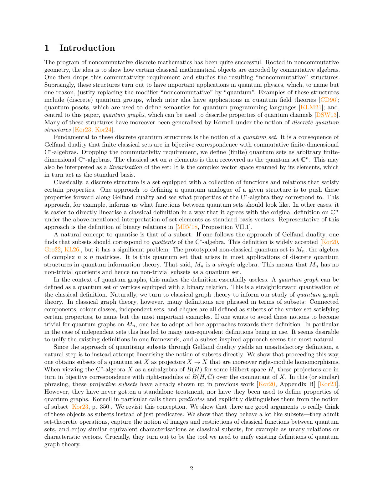 
Low-resolution page preview, page 2

📷 Fig 2

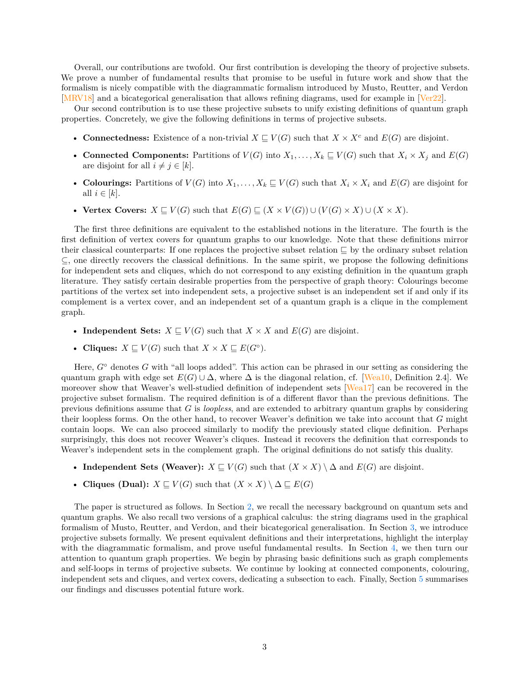 
Low-resolution page preview, page 3

📷 Fig 3

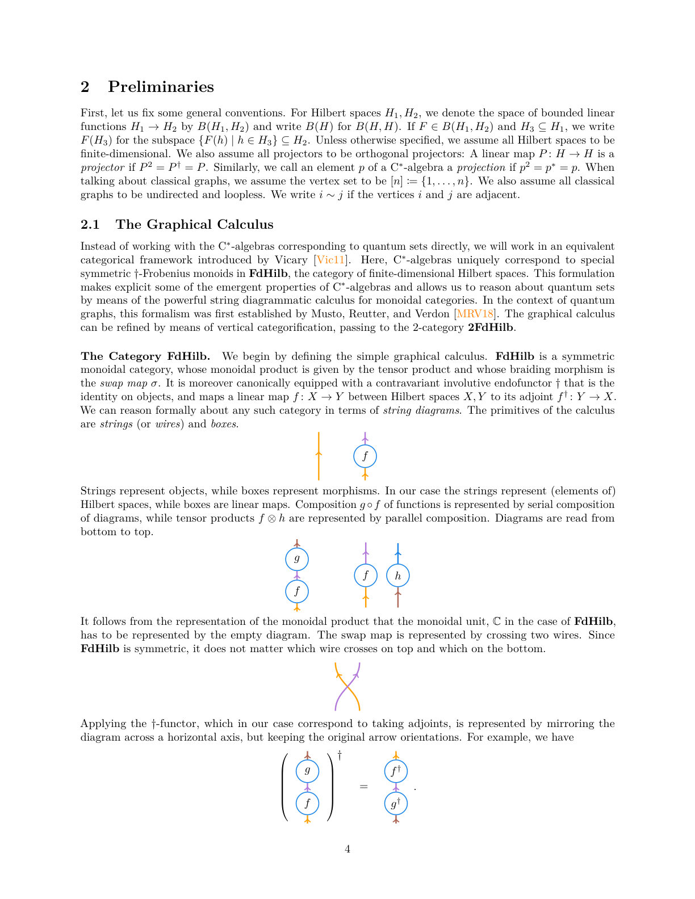 
Low-resolution page preview, page 4

📷 Fig 4

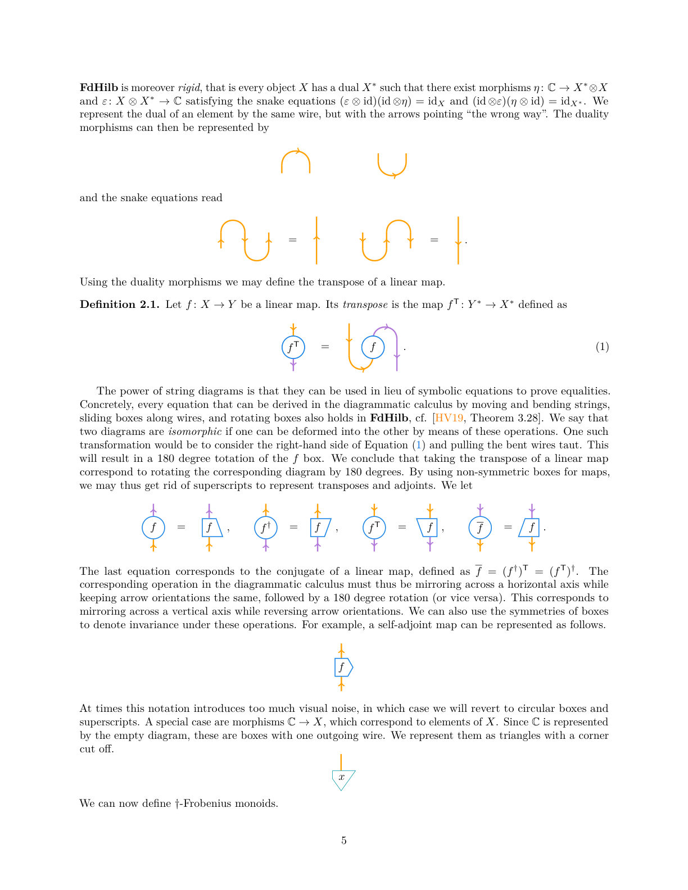 
Low-resolution page preview, page 5

📷 Fig 5

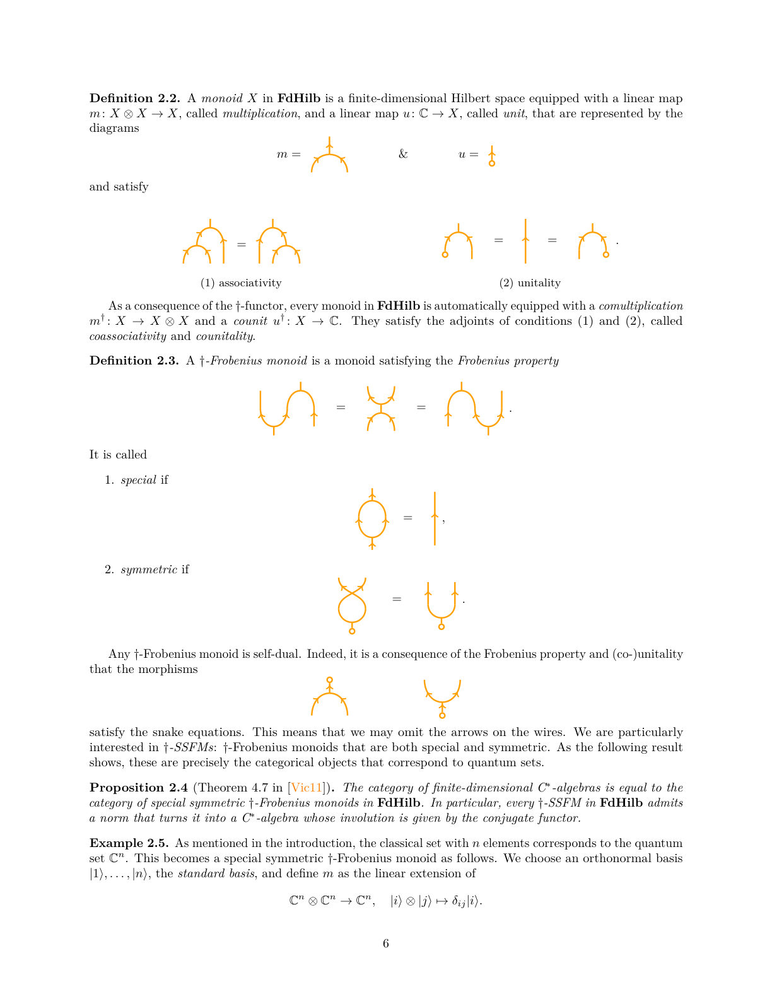 
Low-resolution page preview, page 6

**Summary.** This paper tackles the challenge of defining graph properties on quantum graphs by proposing a novel mathematical structure called 'Projective Subsets.' This formalism overcomes the limitations of standard set theory in the quantum setting, allowing the authors to unify definitions for concepts like independent sets and connected components. It provides a deep theoretical tool for extending classical combinatorics into non-commutative quantum structures.

**Why it may be interesting.** While highly abstract, developing robust mathematical frameworks for generalizing classical combinatorial structures (like connectivity or independence) into quantum settings is foundational for understanding quantum information geometry and topological quantum field theories.

Detailed structure

**Main problem.** The core problem is developing a mathematically rigorous way to generalize classical graph properties (like independent sets or connected components) from standard graphs to quantum graphs.

**Main result.** The authors introduce 'Projective Subsets' as a necessary alternative definition for subsets of a quantum set, allowing for unified definitions of quantum graph properties that recover known results while suggesting novel variations for others.

**Method.** The approach relies on advanced mathematical tools, including the theory of $\text{C}^*$-algebras, projective modules, and categorical methods (specifically using 2-categories) to formalize set operations in a non-commutative setting.

**Model / system.** The model is the 'Quantum Graph,' whose structure is mathematically encoded using finite-dimensional $\text{C}^*$-algebras or their equivalent representation via $\dagger$-Frobenius monoids ($\dagger$-SFMs).

**Key observables.** Connected components, colorings, independent sets, cliques, and vertex covers.

**Important parameters / regimes.** The analysis is initially restricted to the finite-dimensional case ($\text{FdHilb}$), with potential generalization to infinite dimensions using von Neumann algebras.

**Assumptions / limitations.** The standard definition of subsets based on Gelfand duality fails for simple quantum sets like $M_n$, necessitating the projective subset formalism.

**Paper structure.** The paper first identifies the failure of direct generalization, proposes the Projective Subset formalism ($\text{X} \sqsubseteq \text{V}(\text{G})$), and then uses this framework to propose unified definitions for various graph properties, comparing them against existing literature.

Abstract

Many properties of classical graphs are defined in terms of subsets of the vertex set. Examples include connected components, which are subsets $X \subseteq V(G)$ such that $X \times X^c$ and $E(G)$ are disjoint, or independent sets, for which $X \times X$ and $E(G)$ are disjoint. Direct generalisations of these definitions to quantum graphs are difficult to achieve, since the natural notion of subsets of a quantum set is much too rigid. As a consequence, approaches to generalising these classical properties to the quantum setting have been eclectic. In some cases, multiple inequivalent definitions of the same notion are in use. We introduce a natural and well-motivated alternative definition of subsets of a quantum set. Building on this, we propose unified definitions of quantum graph properties as straightforward generalisations of the classical definitions. We recover this way the established notions of colourings and connected components. For independent sets and cliques, our approach suggests variations that diverge from existing definitions, but address some of their counterintuitive properties. We nevertheless show how to recover an important existing definition of independent sets in our framework.

[↑ back to top](#top)

## Secondary cond-mat archives

*Papers from  mes-hall, other, soft, supr-con. These archives are de-prioritized — they appear at the end regardless of relevance score.*

### Relevant in secondary archives (25)

### [Giant nonlinear Hall effect in a Pt/ferrimagnetic insulator bilayer under Zeeman-exchange frustration](http://arxiv.org/abs/2607.27848v1)

**Authors:** Takayuki Shiino, Matteo Fettizio, Weronika Janus, Can Onur Avci  
**Type:** both · **Category:** other · **PDF:** <https://arxiv.org/pdf/2607.27848v1>  
**Analysis basis:** full PDF text, analyzed in chunks
**Topic relevance:** 🔥 `analog quantum simulation` **4/5** · 🔥 `driven-dissipative phase transition` **4/5** · 🔥 `non-equilibrium universality` **4/5** · `exotic spin models in light-matter` **3/5** · `non-equilibrium dynamics` **3/5** · `spintronics-quantum-optics interface` **3/5** · `Frenkel-Kontorova` **2/5** · `methods for driven-dissipative` **2/5** · `Keldysh / 2PI / non-Gaussian methods` **1/5** · `correlated / nonlocal dissipation` **1/5**

📷 Fig 1

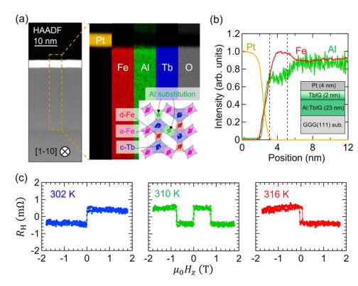 
FIG. 1. Structural characterization of the Al:TbIG/Pt het- erostructure. (a) Cross-sectional HAADF-STEM image and EELS elemental maps of Pt, Fe, Al, Tb, and O. Inset: crys- tal structure of Al-substituted TbIG, where Al3+ partially replaces Fe3+ at the a and d sites, drawn using VESTA [26]. (b) EELS depth profiles across the Pt/garnet interface. Ver- tical dashed lines mark the nominal 2-nm TbIG termination layer; Al remains finite in this region but is reduced relative to the underlying Al:TbIG layer. Inset: sputtering stack of the sample. The HAADF-STEM and EELS data are replotted from Ref. [22]. (c) Hall resistance curves measured with low current at 302, 310 and 316 K. The ordinary Hall...

📷 Fig 2

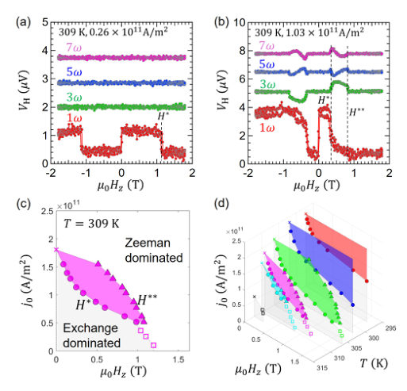 
FIG. 2. (a), (b) Real-part odd harmonic Hall voltages, V nω H (n = 1, 3, 5, 7), measured as a function of out-of-plane field at T = 309 K and the indicated current densities. Dashed lines indicate H∗and, where observed, H∗∗. Curves are vertically offset for clarity; the ordinary Hall contribution is subtracted from the 1ω data. (c) j0–Hz phase diagram at T = 309 K. Filled circles and triangles denote H∗and H∗∗, respectively; the shaded area indicates the nonlinear region. Open squares mark spin-flip-like transitions without nonlinear signals, and the cross indicates the absence of a resolved H∗transition. (d) j0–Hz–T phase diagram, with symbols as in (c).

📷 Fig 3

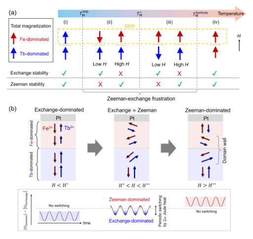 
FIG. 3. (a) Schematic magnetic configurations of the present vertically inhomogeneous ferrimagnet with T top M &lt; T bottom M . Red and blue arrows denote the net magnetization of Fe- dominated and Tb-dominated regions, respectively. The dashed yellow box indicates the interfacial region probed by SMR. Check marks and crosses indicate whether the exchange and Zeeman energies are stabilized for each configuration. This study focuses on region (ii), where exchange and Zeeman preferences compete and produce Zeeman–exchange frustra- tion. (b) Schematic spin configurations in region (ii), show- ing the exchange-dominated (H &lt; H∗), boundary (H∗&lt; H &lt; H∗∗), and Zeeman-dominated (H &gt; H∗∗) regimes. The...

📷 Fig 4

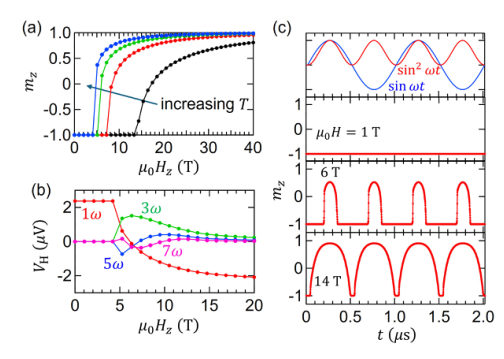 
FIG. 4. Numerical simulation of parametric switching. (a) Static mz of the interfacial macrospin as a function of µ0Hz for increasing temperatures below T ∗ M, showing the reduction of the spin-flip field with temperature. (b) Simulated real-part odd harmonic Hall voltages V nω H (n = 1, 3, 5, 7) under Joule- heating-induced parametric modulation. (c) Time evolution of mz at representative fields; the top panel shows sin ωt and sin2 ωt. Periodic threshold crossing in the Zeeman–exchange- frustrated regime produces anharmonic switching and large odd harmonic voltages.

**Summary.** This work demonstrates that in ferrimagnetic insulators exhibiting Zeeman-exchange frustration, Joule heating can parametrically drive the magnetization through unstable spin-flip regimes. This process converts a weak thermal fluctuation into a giant nonlinear electrical signal characterized by large odd harmonic voltages, opening new avenues for controlling magnetotransport via thermal effects.

**Why it may be interesting.** The mechanism relies on non-equilibrium thermodynamics (Joule heating) driving a system through a critical point (frustration/compensation), leading to macroscopic nonlinear response, which is relevant for understanding driven quantum or classical many-body systems near phase transitions.

Detailed structure

**Main problem.** The study investigates how Zeeman-exchange frustration can convert a weak thermal perturbation into a large nonlinear electrical response in magnetic heterostructures.

**Main result.** Large, higher-order odd harmonic voltages are generated when the system is driven through a spin-flip transition regime by Joule heating, demonstrating a novel route for nonlinear magnetotransport.

**Method.** The research combines experimental measurements of harmonic Hall voltage with advanced macrospin-chain simulations incorporating thermal modulation effects.

**Model / system.** The physical platform is an Al:TbIG/Pt bilayer exhibiting compositional gradients. The model uses a 1D chain of coupled spins governed by effective fields including exchange, anisotropy, and Zeeman terms.

**Key observables.** Odd-order harmonic Hall voltages ($V_{3\omega}^H, V_{5\omega}^H, V_{7\omega}^H$), spin-flip transitions, and the field/temperature dependence of these harmonics.

**Important parameters / regimes.** Zeeman-exchange frustration regime, magnetic compensation point, current density (driving Joule heating), and temperature ($T$).

**Assumptions / limitations.** The nonlinear response is primarily driven by parametric modulation induced by Joule heating causing periodic switching between competing magnetic states, rather than just spin-orbit torque effects.

**Figures summary.** Figures show structural gradients via STEM/EELS; transport measurements reveal large odd harmonics confined to a specific field window when current density increases; simulations confirm these harmonics arise from thermal modulation driving magnetization switching across stability boundaries.

**Paper structure.** The paper establishes the physical system and the problem of nonlinearity. It presents experimental evidence showing large odd harmonics, which are then theoretically explained by macrospin-chain simulations that explicitly model Joule heating as the parametric drive causing periodic magnetic state switching.

Abstract

Competing magnetic interactions can create metastable or unstable states and render magnetic systems highly susceptible to external perturbations. Here we show that Zeeman-exchange frustration in an Al-substituted terbium iron garnet with a compositional gradient across its thickness gives rise to a giant nonlinear Hall response in an adjacent Pt layer. Near magnetic compensation, a field-induced spin-flip transition is accompanied by unusually large higher-order odd harmonic voltages, with the third, fifth, and seventh harmonics reaching amplitudes comparable to that of the first harmonic. The field, temperature, and current dependences collectively identify Joule heating as the parametric drive of the harmonic response. Macrospin-chain simulations further show that current-induced thermal modulation periodically switches the interfacial Fe magnetization between exchange- and Zeeman-dominated states and reproduces the observed harmonic signals. These results demonstrate how frustration can convert a weak thermal perturbation into a large nonlinear electrical response, providing a route to nonlinear magnetotransport in compensated ferrimagnets.

[↑ back to top](#top)

### [Observation of long-lived spin order in nanoconfined water](http://arxiv.org/abs/2607.28480v1)

**Authors:** Rohma Khan, Kang Xu, Nathaniel Jeffries, Ankit Bhardwaj, Boya Radha, Daniela Pagliero, Carlos A. Meriles  
**Type:** both · **Category:** statistical mechanics · **PDF:** <https://arxiv.org/pdf/2607.28480v1>  
**Analysis basis:** full PDF text, analyzed in chunks
**Topic relevance:** 🔥 `exotic spin models in light-matter` **4/5** · `methods for driven-dissipative` **3/5** · `quantum measurements` **3/5** · `spintronics-quantum-optics interface` **3/5** · `Keldysh / 2PI / non-Gaussian methods` **2/5** · `QC/QI experiment` **2/5** · `driven-dissipative phase transition` **2/5** · `non-equilibrium dynamics` **2/5** · `Kondo & dissipative impurity` **1/5** · `analog quantum simulation` **1/5** · `correlated / nonlocal dissipation` **1/5** · `non-equilibrium universality` **1/5**

📷 Fig 1

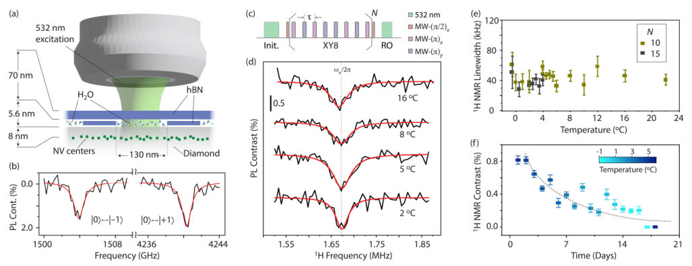 
Fig. 1: Temperature-controlled platform for nanoscale NV–NMR of confined water. (a) Cross-sectional schematic of the device: near-surface NV centers in diamond probe 1H spins in water confined within 5.6-nm-thick hBN nanochannels beneath a 532-nm optical excitation spot. We control the position of a permanent magnet to create a magnetic field of variable amplitude and orientation and use a Peltier cooler to vary the sample temperature (not shown). (b) Representative NV optically detected magnetic resonance (ODMR) spectrum showing the ∣0⟩↔∣±1⟩ resonances at 4 oC in the presence of a ~49 mT magnetic field aligned with one of the four possible NV axes. (c) Schematic of the dynamical decoupling...

📷 Fig 2

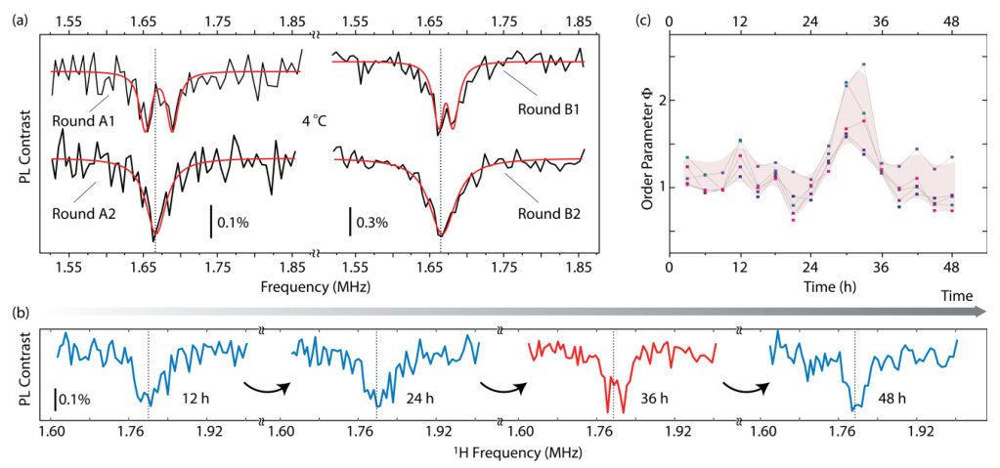 
Fig. 2: Intermittent doublet structure in the 1H NMR line near 4 °C. (a) Representative NV-detected 1H NMR spectra at 4 °C as derived from the XY8-N protocol, showing examples of split (doublet-like) resonances. The left and right columns present results from two independent experimental runs (respectively, Rounds A and B), each obtained after resetting the microfluidic device by reintroducing water into the channels. In Round A, a pronounced doublet is observed in the first measurement (A1) but is not consistently recovered after subsequent temperature cycling (A2). In Round B, improved signal-to-noise ratio was achieved through enhanced measurement sensitivity shortly after a refill;...

📷 Fig 3

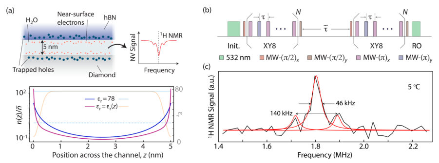 
Fig. 3: Modeling hyperfine signatures. (a) Calculated equilibrium density profile of solvated excess electrons across a 5 nm water channel, showing charge accumulation near the channel walls for a uniform or variable relative dielectric constant )! (faint traces). Protons located in different regions of the channel experience different hyperfine fields, leading to a structured proton NMR spectrum (upper schematic). (b) NV correlation spectroscopy protocol. The sequence effectively compares the proton- induced NV phase shifts upon a variable evolution time *̃. RO: Readout; Init.: Initialization. (c) Fourier transform of the signal acquired in (b) for # = 5 together with a schematic...

**Summary.** This paper uses NV-NMR spectroscopy on nanoconfined water to observe a transient, resolved proton doublet, indicating unusual spin order. The authors develop a theoretical model based on minimizing free energy to explain this state as arising from extended, correlated charge-hydration complexes. It provides insights into the complex interplay between confinement, electrostatics, and liquid structure at the nanoscale.

**Why it may be interesting.** The work bridges quantum sensing (NV-NMR) with complex many-body physics in confined liquids, providing insights into non-equilibrium structural phases stabilized by electrostatics and hydrogen bonding.

Detailed structure

**Main problem.** The study investigates the unusual spin order observed in water confined to nanometer channels, aiming to understand the interplay between local electric fields, charge accumulation, and molecular mobility.

**Main result.** The intermittent appearance of a resolved proton doublet suggests a metastable state involving a spatially extended, correlated population of charge-hydration complexes within the liquid.

**Method.** The research combines NV-NMR spectroscopy measurements with theoretical modeling that minimizes a Helmholtz free energy functional to predict equilibrium charge profiles.

**Model / system.** The system is water confined in $\sim 5.6$ nm channels, probed using NV-NMR. The model treats the liquid as a slab where mobile paramagnetic charges interact electrostatically and are constrained by hydration penalties.

**Key observables.** Proton NMR linewidth (diffusivity), appearance/evolution of a resolved doublet splitting ($\sim 30 	ext{ kHz}$), and the order parameter tracking spectral changes over hours.

**Important parameters / regimes.** Temperature dependence, confinement width ($5.6 	ext{ nm}$), hyperfine coupling strength, and timescales ranging from microseconds to hours.

**Assumptions / limitations.** The model assumes translational invariance laterally and that the system can be described by minimizing a Helmholtz free energy functional incorporating electrostatic and hydration terms.

**Figures summary.** Figures show temperature-controlled setups, ODMR spectra, ${}^1	ext{H}$ NMR spectra demonstrating linewidth suppression and doublet formation, and time evolution plots tracking the order parameter $\Phi$.

**Paper structure.** The paper progresses from initial experimental observations of suppressed dynamics to identifying the transient doublet feature. It then develops a theoretical framework using free energy minimization to model the charge distribution responsible for this spin ordering.

Abstract

Liquids confined to nanometer-scale geometries exhibit behavior that departs markedly from their bulk counterparts, yet studying their dynamics under controlled conditions remains experimentally challenging. Here, we use nitrogen-vacancy (NV) center nuclear magnetic resonance (NMR) spectroscopy to probe water confined in 5.6 nm channels as a function of temperature. The system remains liquid throughout the investigated temperature range and exhibits strongly suppressed diffusivity, enabling direct detection of its 1H NMR spectrum. Occasionally, the proton resonance transforms into a doublet with a splitting of several tens of kilohertz, which we tentatively attribute to hyperfine interactions mediated by long-lived paramagnetic charge complexes, in turn seeded by solvated electrons optically injected during laser illumination. The intermittent appearance of this feature suggests a metastable state comprising a correlated population of charge-hydration complexes extending throughout the confined liquid.

[↑ back to top](#top)

### [Parity-selective spin splitting in coplanar antiferromagnets via bichromatic driving](http://arxiv.org/abs/2607.27335v1)

**Authors:** Di Zhu, Zhongbo Yan, Mohsen Yarmohammadi  
**Type:** theory · **Category:** other · **PDF:** <https://arxiv.org/pdf/2607.27335v1>  
**Analysis basis:** full PDF text, analyzed in chunks
**Topic relevance:** 🔥 `non-equilibrium dynamics` **4/5** · `analog quantum simulation` **3/5** · `exotic spin models in light-matter` **3/5** · `spintronics-quantum-optics interface` **3/5** · `driven-dissipative phase transition` **2/5** · `methods for driven-dissipative` **2/5** · `Keldysh / 2PI / non-Gaussian methods` **1/5** · `non-equilibrium universality` **1/5**

📷 Fig 1

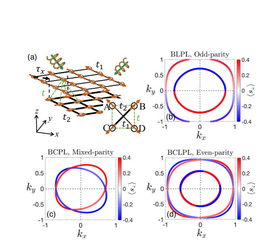 
FIG. 1. Dynamically generated spin-splitting parities. (a) Schematic of the all-out BCAFM under incident bichro- matic light. The system consists of two collinear square- lattice monolayers offset by τx, featuring mutually orthogonal Néel vectors, intralayer hoppings t1 and t2, and interlayer hop- ping t. (b)-(d) Momentum-resolved spin polarization ⟨sz⟩in the kx-ky plane for n = 2 (ω–2ω) bichromatic driving. The driving fields correspond to (b) BLPL (n = 2, β = π/4 and ϕ = π/3), (c) BCPL (n = 2, ϕ = 0 and η1 = η2 = +1), and (d) BCLPL (n = 3, β = π/4, ϕ = π/3, and η1 = +1). BLPL induces a strict odd-parity spin texture, whereas BCPL and BCLPL generate mixed-parity and even-parity spin...

📷 Fig 2

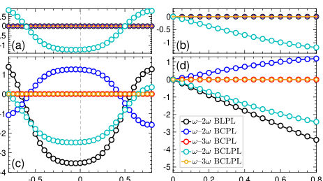 
FIG. 2. Macroscopic spin current response following a sudden optical quench. Spin currents Js x and Js y as a function of (a,c) the chemical potential µ (A0 = 0.6 and S = 0.8) and (b,d) the secondary field strength S (A0 = 0.6 and µ = 0.1). Common parameters are t = 0.4, ts = 0.7, ta = 0.3, ω = 10, Mx = My = 0.5, and T = 0.1. Specific configurations: BLPL (n = 2, ϕ = π 2 , and β = π 2 ); BCPL (n ∈{2, 3}, η1 = 1, η2 = 1, and ϕ = 0); BCLPL (n ∈{2, 3}, η1 = 1, ϕ = π

📷 Fig 3

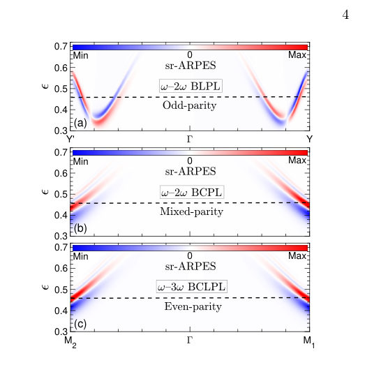 
FIG. 3. Simulated spin-resolved ARPES (sr-ARPES) spectra. (a) The n = 2 BLPL case evaluated along Y ′[(0, π

**Summary.** The paper demonstrates that applying bichromatic light fields ($\omega - n\omega$) to a coplanar antiferromagnet allows researchers to overcome inherent crystal symmetry restrictions on spin-splitting parity. By tuning the driving frequency ratio ($n$), one can deterministically generate odd, mixed, or even spin textures, which are confirmed by measurable transport signatures like quench-induced spin currents.

**Why it may be interesting.** This work directly addresses how external time-periodic driving fields can be used as a quantum control knob to engineer fundamental symmetries and electronic properties in condensed matter systems, which is highly relevant for topological materials and spintronics.

Detailed structure

**Main problem.** The primary challenge is overcoming the intrinsic crystal symmetry limitations that restrict spin-splitting parity in antiferromagnets (AFMs) to only even or odd values.

**Main result.** Bichromatic Floquet driving ($\omega - n\omega$) provides a mechanism to deterministically control the spin-splitting parity, generating tunable odd-, mixed-, and even-parity states impossible with static or monochromatic fields.

**Method.** The analysis uses Floquet theory applied to a tight-binding Hamiltonian under bichromatic time-dependent potentials, deriving an effective time-independent Hamiltonian in the high-frequency limit.

**Model / system.** The system is a coplanar Antiferromagnet (BCAFM) realized in engineered 2D heterostructures. The physics is modeled using a tight-binding Hamiltonian subjected to bichromatic driving fields ($\omega - n\omega$).

**Key observables.** Spin-splitting parity (Odd, Even, Mixed), macroscopic spin currents ($J_{s x}, J_{s y}$), and momentum-resolved spin polarization measured via ARPES.

**Important parameters / regimes.** The harmonic number $n$ of the driving field, and the relative amplitudes/polarizations of the two driving frequencies ($\omega$ and $2\omega$).

**Assumptions / limitations.** The analysis relies on the high-frequency off-resonant Floquet approximation, truncating the Hamiltonian expansion at specific orders in $\omega^{-1}$ or $\omega^{-2}$.

**Figures summary.** Figures schematically illustrate momentum-resolved spin polarization ($\langle s_z 
angle$) for different driving protocols (BLPL, BCPL, BCLPL) and harmonics ($n=2$), showing distinct parity outcomes.

**Paper structure.** The paper systematically derives the effective Floquet Hamiltonian by expanding the time-dependent lattice Hamiltonian using Peierls substitution. It then analyzes this effective Hamiltonian for various bichromatic polarization states (BLPL, BCPL, BCLPL) to map out the resulting spin-splitting parity based on the harmonic number $n$.

Abstract

Parity is a central characteristic of momentum-dependent spin splitting in antiferromagnets (AFMs). Yet, intrinsic crystal symmetries typically restrict the splitting to either even or odd parity, preventing flexible spin control. Using a coplanar AFM, we demonstrate that bichromatic ($ω$--$nω$) Floquet driving offers a natural way to bypass this constraint. This mechanism generates asymmetric spin textures unattainable in static AFMs or under monochromatic driving. For the specific AFM considered here, we reveal an elegant relation between spin-splitting parity and harmonic hierarchy: $ω$--$2ω$ fields generate highly tunable odd- and mixed-parity spin splittings, whereas higher-order harmonics ($n \ge 3$) exclusively produce even-parity states. The macroscopic magnetization can also be toggled via the specific driving protocol and harmonic $n$. These distinct spin splitting states manifest in qualitatively different macroscopic spin currents generated after an optical quench---a definitive transport signature complementing direct visualization via spin- and angle-resolved photoemission spectroscopy.

[↑ back to top](#top)

### [Continuous Game of Life: cell emergence and self-organization at the edge of growth](http://arxiv.org/abs/2607.27402v1)

**Authors:** Alexandre Guillet, Frank Jülicher  
**Type:** theory · **Category:** statistical mechanics · **PDF:** <https://arxiv.org/pdf/2607.27402v1>  
**Analysis basis:** full PDF text, analyzed in chunks
**Topic relevance:** 🔥 `non-equilibrium universality` **4/5** · `driven-dissipative phase transition` **3/5** · `non-equilibrium dynamics` **3/5** · `analog quantum simulation` **2/5** · `methods for driven-dissipative` **2/5** · `Frenkel-Kontorova` **1/5** · `Keldysh / 2PI / non-Gaussian methods` **1/5** · `correlated / nonlocal dissipation` **1/5** · `entanglement & information structure` **1/5**

📷 Fig 1

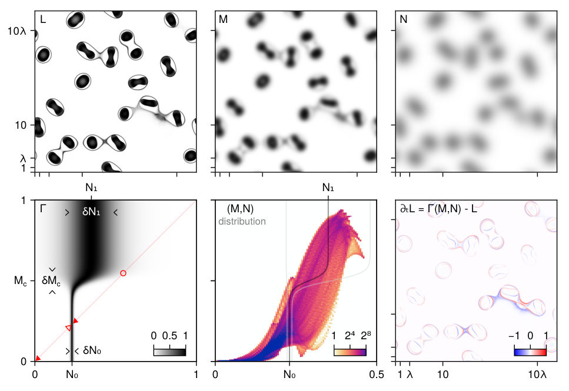 
Figure 1: Primary and auxiliary fields: L, M = Φ1∗L and N = Φ2∗L (top, from left to right). Target function Γ (bottom left, same grey scale as for L, M, N). Special homogeneous states are marked in red: post-bifurcation unstable and stable (empty and full triangles) steady states, and pre-bifurcation non-steady optimum (empty circle). Spatial distribution of pairs (M, N), where Γ gets evaluated (bottom centre, pixel count). Growth or decay rate of the field L, Eq. (1) (bottom right).

📷 Fig 2

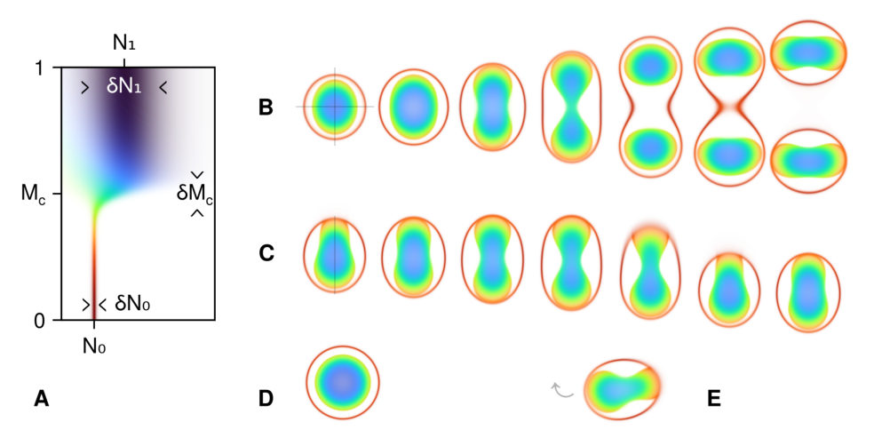 
Figure 2: Cell dynamics at and near reference parameters Eq. (7), with colour coding of corresponding regions of the target function Γ (A) and the field L (B–E). Reference behaviours: dividing cell (B) or oscillating glider (C), depending on its symmetry axes (left). Time advances from left to right in steps of 10 (B) and 6 (C) time units. (D–E) Variants: (steady) isotropic egg (D) and (clockwise) turning glider (E) for N1 respectively increased and decreased by 0.03.

📷 Fig 3

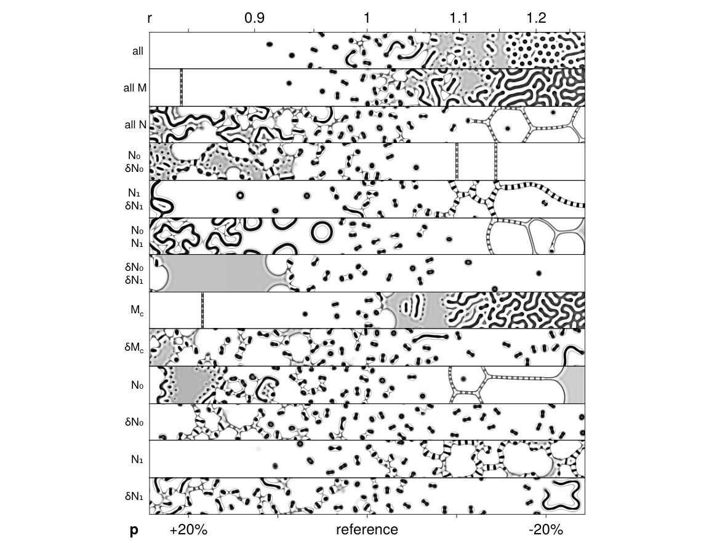 
Figure 3: Dynamic states of the cGoL model in the presence of a spatial variation of the target parameters p = p(x). For each panel, a subset of the parameters (specified on the left) is increased linearly from left to right around its reference value Eq. (7) (centre). The top panel corresponds to Eq. (8) with a position-dependent scaling r = r(x) (top axis).

📷 Fig 4

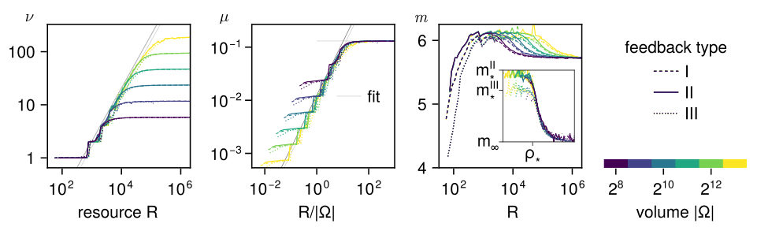 
Figure 4: Equilibrium states as a function of resource R and volume |Ω|, in terms of the number of cells ν, the average density µ, and the mass per cell m. Lines encode different volumes (colours) and resource feedback types: target scaling (I), morphogen scaling (II), and kernel shift (III). Grey lines show the asymptotes of the fitted Eq. (18).

📷 Fig 5

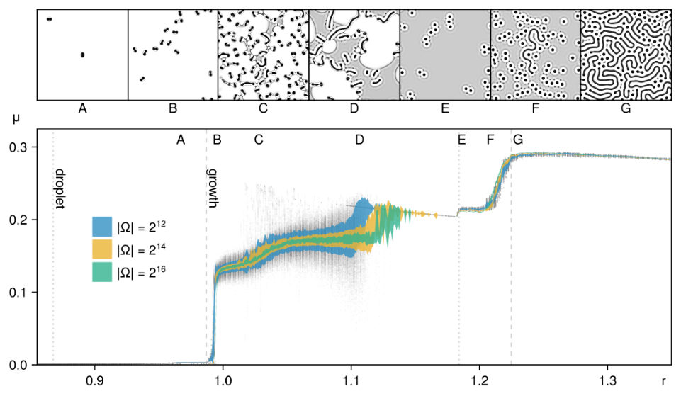 
Figure 5: Scan of the density µ (order parameter), with constant resource abundance r as control parameter. Standard deviation around the mean (coloured area) over indepen- dent simulations for a given volume |Ω|. Edges of growth and droplet stability (dotted and dashed lines). Scale ratio λ = 3, initial state with 2 seeds, cutoff time tmax = 5000.

**Summary.** This paper develops a continuous mathematical model for Conway's Game of Life to study how simple rules can generate life-like patterns. By introducing resource limitations, the system is forced into an 'edge of growth' regime where self-organization occurs. It provides a powerful, mathematically concise framework for modeling pattern emergence in non-equilibrium physical systems.

**Why it may be interesting.** While focused on classical pattern formation, the use of non-equilibrium dynamics, phase transitions (dilute-to-dense), and self-organization principles resonates with understanding critical phenomena in complex quantum many-body systems or open quantum systems far from equilibrium.

Detailed structure

**Main problem.** The study investigates cell emergence and self-organization by translating Conway's Game of Life into a continuous, reaction-diffusion framework.

**Main result.** The model successfully generates complex, life-like morphologies (self-replicating, gliding cells) whose organization is driven toward an 'edge of growth' boundary via global resource limitation.

**Method.** The dynamics are modeled using partial integro-differential equations and interpreted as a coarse-grained reaction-diffusion system governed by morphogen concentrations.

**Model / system.** The Continuous Game of Life (cGoL) model uses Gaussian kernels to approximate neighborhood interactions, mapping the discrete rules onto continuous fields ($L$, $M$, $N$). The dynamics are driven by nonlinear survival rules and constrained by a global resource conservation law.

**Key observables.** Self-replicating/gliding cell patterns, homogeneous-state bifurcations, symmetry breaking, shape instabilities, and the dilute-to-dense transition (edge of growth).

**Important parameters / regimes.** The system is controlled by multiple parameters defining the Gaussian kernels and the target function $\Gamma$, with resource availability acting as a critical global constraint.

**Assumptions / limitations.** The primary assumption is that the complex discrete rules can be accurately approximated by continuous, smooth reaction-diffusion dynamics; the analysis also assumes the existence of a governing global conservation law for resources.

**Figures summary.** Figures illustrate the primary and auxiliary fields ($L, M, N$), the target function $\Gamma$, spatial distributions of $(M, N)$ pairs, and visual examples of cell dynamics like division and gliding at reference parameters.

**Paper structure.** The paper progresses from defining the continuous model via precursor studies (SmoothLife) to analyzing its steady states and bifurcations. It then introduces resource feedback to define the 'edge of growth' regime, culminating in a discussion of advanced stability analysis techniques.

Abstract

Conway's Game of Life shows that simple rules can generate a rich diversity of emerging structures. This cellular automaton has been translated to continuous space by Rafler (2011) in a simulation called SmoothLife. The isotropic rule of this continuous Game of Life generates patterns whose beauty has attracted the attention of a growing community at the intersection of science and computer art. We study a minimal variant of this model, continuous in space and time, that generates cell-like patterns capable of self-replicating, gliding and disappearing. The phenomenology of these unit patterns is reported and related to homogeneous-state bifurcations, symmetry breaking, observed shape instabilities, finite-amplitude morphological changes, and a dilute-to-dense transition associated with cell proliferation. Its mapping onto a large reaction--diffusion system is interpreted in terms of homeostatic concentrations of morphogens, regulated by the nonlinear survival rule and generated through a cell-sourced cascade of auxiliary reactions. Introducing a global conservation law that limits resource availability causes the system to self-organize at this dilute-to-dense transition, which we call the edge of growth. A further exploration of parameter space reveals a variety of phases and the richness of life-like morphologies organized around this edge. Resemblance to biological processes such as division, motility, and death, together with a concise formulation and numerical implementation, makes the continuous Game of Life an appealing model system for investigating the emergence and self-organization of life-like patterns.

[↑ back to top](#top)

### [An iterative method bridging DFT, disorder averaging, and experiment in intercalated materials: application to Au-intercalated graphene](http://arxiv.org/abs/2607.28296v1)

**Authors:** Poonam Kumari, Alberto Zobelli, Igor de Melo Froldi, Adeline Crepieux, Laurent Simon, Cristina Bena  
**Type:** theory · **Category:** disordered systems and neural networks · **PDF:** <https://arxiv.org/pdf/2607.28296v1>  
**Analysis basis:** full PDF text, analyzed in chunks
**Topic relevance:** 🔥 `methods for driven-dissipative` **4/5** · `Keldysh / 2PI / non-Gaussian methods` **3/5** · `Kondo & dissipative impurity` **3/5** · `non-equilibrium dynamics` **2/5** · `correlated / nonlocal dissipation` **1/5** · `driven-dissipative phase transition` **1/5**

📷 Fig 1

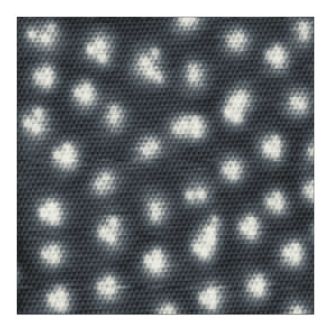 
FIG. 1. Experimental image of the cluster phase

📷 Fig 2

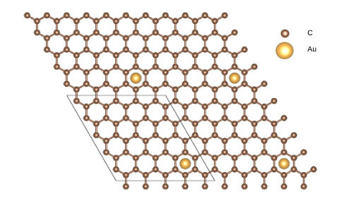 
FIG. 3. Representative periodic structural model used for DFT parameter extraction: uniform hollow-site Au in a 5 × 5 cell

📷 Fig 3

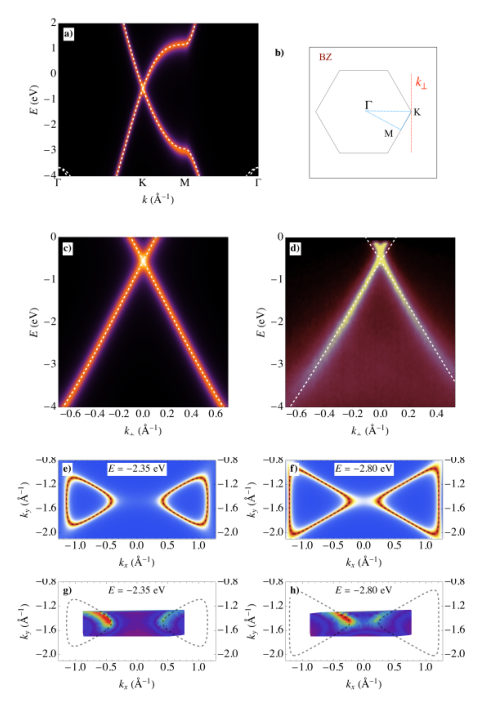 
FIG. 2. Band structure of pristine graphene: a) the TB-derived spectral function as a function of energy and momentum along the ΓKMΓ path in the Brillouin zone, as indicated in b). The DFT dispersion is shown as a dashed line. c) The theoretical dispersion as a function of k⊥, as indicated in b). The bands have been shifted by −0.55 eV as discussed in the text. d) The corresponding ARPES measurement from Ref. 1, with the dashed line denoting the theoretical dispersion. e)-h) Calculated and respectively measured constant-energy spectral functions at ω = −2.35 eV and ω = −2.8 eV.

📷 Fig 4

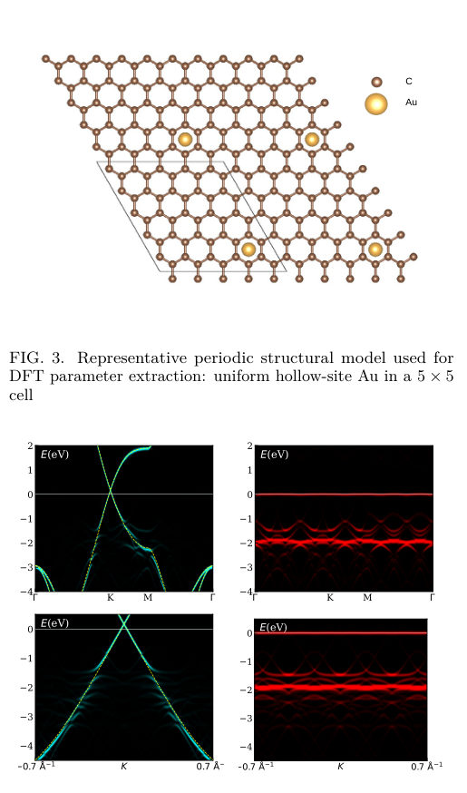 
FIG. 4. Band structure of graphene in the presence of a 5x5 intercalated Au from DFT calculations. On the first line the band structure plotted as a function of momentum and energy along the ΓKMΓ path in the BZ, and on the second line the band structure as a function of k⊥along a direction passing through K and perpendicular to ΓK (carbon orbitals - left - in blue and Au orbitals - right - in red).

📷 Fig 5

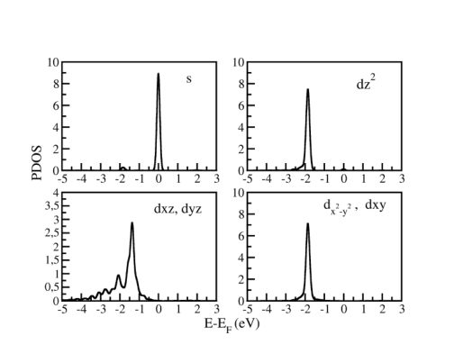 
FIG. 5. Orbital-resolved DOS projected onto 6s and 5d or- bitals.

**Summary.** This work introduces an iterative method that combines DFT, Tight-Binding models, and the Self-Consistent T-matrix Approximation (SCTMA) to model intercalated graphene. By applying this to Au-intercalated graphene, the authors successfully reproduce key ARPES features like VHS broadening and kinks. This demonstrates a robust computational pathway for understanding how impurities modify electronic band structures in disordered 2D materials.

**Why it may be interesting.** The methodology represents a powerful example of combining multiple advanced computational techniques (DFT, Wannierization, T-matrix theory) into a single predictive framework for complex condensed matter systems, which is highly relevant for modeling engineered quantum materials.

Detailed structure

**Main problem.** The primary goal is developing a general, iterative computational framework to accurately model the electronic structure of intercalated materials by bridging theoretical calculations (DFT/TB) with disorder averaging techniques and experimental ARPES data.

**Main result.** The method successfully reproduces key ARPES signatures for Au-intercalated graphene, identifying that hybridization between specific Au orbitals and graphene states, alongside a local scattering potential, are the essential microscopic ingredients governing band structure modification.

**Method.** A multi-step iterative approach is used: DFT determines initial parameters; Wannierization generates an effective Tight-Binding (TB) model; disorder averaging is performed using the Self-Consistent T-matrix Approximation (SCTMA); and finally, results are refined by comparison with ARPES measurements.

**Model / system.** The system studied is graphene intercalated with Au clusters. The theoretical framework involves an effective TB Hamiltonian incorporating hybridization terms ($\hat{H}_{	ext{hyb}}$) between the host $\pi$ bands and localized orbitals from the intercalant, alongside a local potential term ($U$).

**Key observables.** Angle-Resolved Photoemission Spectroscopy (ARPES) spectral function $A(\mathbf{k}, \omega)$, specifically observing the broadening of the van Hove singularity (VHS) and the emergence of kink-like features in the dispersion.

**Important parameters / regimes.** The analysis requires tuning parameters such as hybridization amplitudes ($|t_\alpha|$), the local potential strength ($U$), and the impurity density ($n_{	ext{imp}}$) to match experimental linewidths and energy shifts.

**Assumptions / limitations.** Key assumptions include neglecting substrate effects (SiC), assuming random/dilute distribution of intercalants (justifying SCTMA), and treating certain environmental interactions (like local potential $U$) phenomenologically rather than deriving them purely from DFT.

**Figures summary.** Figures illustrate the workflow, showing initial DFT dispersion plots, and final results comparing the calculated disorder-averaged spectral function via SCTMA against experimental ARPES data along high-symmetry paths ($\Gamma	ext{K}\Gamma$).

**Paper structure.** The paper follows a logical progression: first establishing the need for an integrated method; second, detailing the DFT/Wannierization steps to build the initial TB model; third, implementing SCTMA to handle disorder averaging; and finally, applying this full pipeline to Au-graphene to extract physical parameters that match experimental observations.

Abstract

Intercalation can strongly modify the electronic dispersion of a host material, as directly revealed by angle-resolved photoemission spectroscopy (ARPES). We develop a general iterative method combining density functional theory (DFT), tight-binding (TB), disorder averaging within the self-consistent T-matrix approximation (SCTMA), and experiment, to construct an effective model of the intercalated system. DFT identifies the relevant microscopic degrees of freedom and constrains selected model parameters, while comparison of SCTMA calculations with experiment guides their further refinement. We apply this method to graphene intercalated with Au clusters and show that it reproduces the main ARPES signatures of the Au-cluster phase, including the broadening of the V12an Hove singularity and the emergence of kink-like features in the dispersion. The essential microscopic ingredients identified by the analysis are the hybridization between selected intercalant orbitals and the graphene states, together with an intercalation-induced local scattering potential.

[↑ back to top](#top)

### [Wave patterns in two-dimensional networks of non-locally coupled oscillators with phase delay](http://arxiv.org/abs/2607.27791v1)

**Authors:** Phillip Nimphius, Nariya Uchida  
**Type:** theory · **Category:** statistical mechanics · **PDF:** <https://arxiv.org/pdf/2607.27791v1>  
**Analysis basis:** full PDF text, analyzed in chunks
**Topic relevance:** 🔥 `non-equilibrium universality` **4/5** · `driven-dissipative phase transition` **3/5** · `non-equilibrium dynamics` **3/5** · `Frenkel-Kontorova` **1/5** · `Keldysh / 2PI / non-Gaussian methods` **1/5** · `correlated / nonlocal dissipation` **1/5** · `methods for driven-dissipative` **1/5**

📷 Fig 1

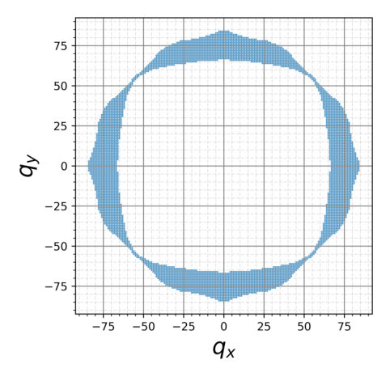 
FIG. 1. Linear stability diagram for q-twisted states for this system with α &gt; 0.5. The blue dots mark vectors (qx, qy) ∈[−256, 255] for which every nonzero perturbation κ has a negative growth rate. The anisotropic shape reflects the discreteness and fourfold symmetry of the square lattice.

📷 Fig 2

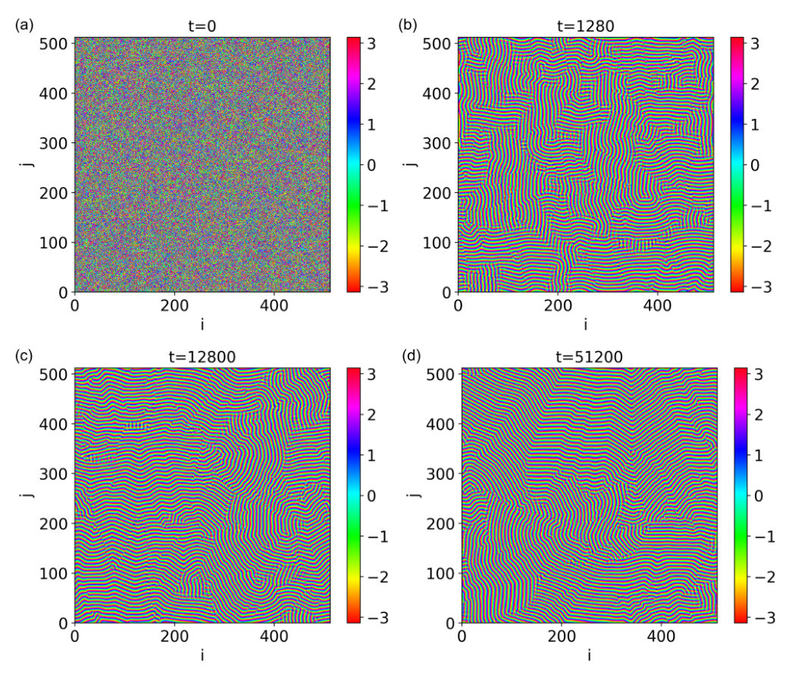 
FIG. 2. Snapshots of the oscillator phases ϕij for a system with α = 0.8. Each pixel represents one oscillator on the two- dimensional lattice with the color representing the phase ϕij. The panels show (a) the random initial condition at t = 0, (b) t = 1280, (c) t = 12800, and (d) t = 51200. Locally coherent traveling-wave domains emerge and coarsen over time.

📷 Fig 3

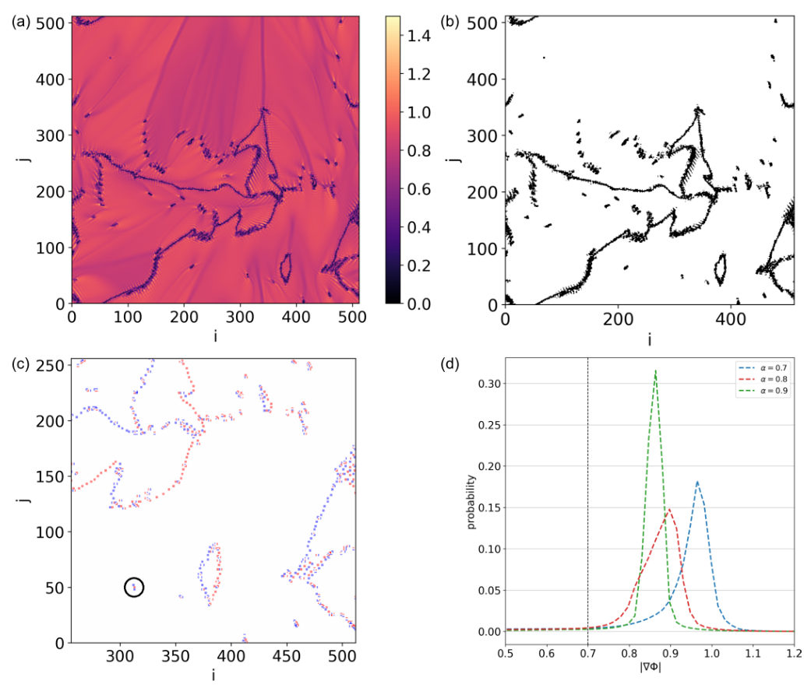 
FIG. 3. (a-c) show various snapshots of the same sample (with α = 0.8) at the same time t = 51200 as Fig. 2(d). (a) shows the magnitude of the local average phase-gradient vector |⟨(∇ϕ)ij⟩|. (b) shows the calculated boundary region of that snapshot in black. (c) shows the winding number wij (blue positive, red negative). An isolated defect with total winding number w = 1 is marked with a black circle. (c) only displays values in the bottom right quadrant for better visibility. (d) shows the relative frequency of |⟨(∇ϕ)ij⟩| for 25600 ≤t ≤51200 for all α. The threshold λ = 0.7 used to distinguish between boundary and non-boundary regions is marked by a dashed black line.

📷 Fig 4

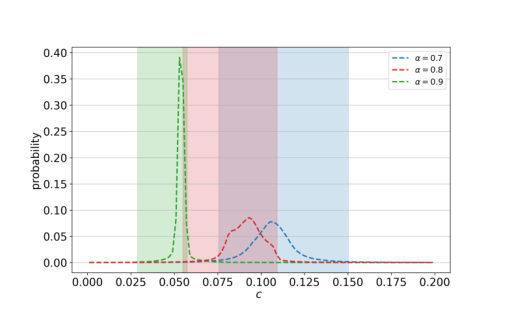 
FIG. 5. Histogram for the absolute wave speed c for the range 25600 ≤t ≤51200. Both mean and variance increase with decreasing α. The wave speed is calculated from the gra- dient and the phase velocity cij = |Ωij| |∇ϕij| with Ωij = d dtϕij(t). The shaded regions indicate theoretical wave-speed ranges for idealized planar waves obtained from the linear stability anal- ysis, used here as reference ranges. The observed peaks fall within their respective ranges. Fig. S1 in the Supplementary Material validates the numerical wave-speed calculation by comparing idealized planar-wave simulations with the theo- retical planar-wave speed.

📷 Fig 5

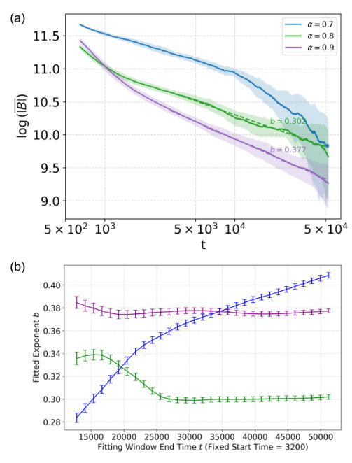 
FIG. 4. (a) shows the time evolution of the average total boundary size for each α. The average is taken from all 20 samples for each α. The shaded area indicates the sample- to-sample standard deviation. The range 3200 ≤t &lt; 51200 has been fitted with At−b. The exponent is shown on the graph. The power-law decay is clearly visible for α = 0.8 and α = 0.9. The fitted exponents are b0.8 = 0.30 ± 0.04 and b0.9 = 0.377 ± 0.008. (b) displays the dependence of the fit on the end point of the fitting window (the start point is always t = 3200). The fitted exponent for α ≥0.8 becomes relatively insensitive to the fitting-window end time for tend ≳ 27500, while it strongly depends on the fitting...

**Summary.** This paper analyzes wave patterns in 2D lattices of oscillators coupled non-locally with a tunable phase delay $\alpha$. It finds that the system undergoes distinct dynamic regimes: stable coarsening occurs for higher $\alpha$, while lower values induce domain splitting mediated by topological defects. The work uses LSA and numerical simulations to map out this transition based on the coupling parameter.

**Why it may be interesting.** The study models complex non-equilibrium pattern formation (coarsening/domain splitting) in a system exhibiting collective dynamics, which shares mathematical parallels with critical phenomena and phase transitions studied in statistical mechanics.

Detailed structure

**Main problem.** The study investigates wave patterns, domain coarsening dynamics, and defect formation in a 2D lattice of non-locally coupled oscillators influenced by a phase delay parameter.

**Main result.** Coarsening (power-law decay of boundary size) is observed for specific phase delays ($\alpha \in [0.8, 1]$), while lower values ($\alpha=0.7$) exhibit qualitative changes marked by domain splitting and defect mediation.

**Method.** The research combines linear stability analysis (LSA) to study planar wave solutions with extensive numerical simulations of the coupled oscillator dynamics.

**Model / system.** The system is a square lattice of identical phase oscillators whose evolution is governed by a non-local coupling term dependent on the phase delay $\alpha$. The dynamics are analyzed in a rotating frame, simplifying the governing equation.

**Key observables.** Average total boundary size ($\overline{|B|}$), domain coarsening exponent ($b$), wave speed ($c$), and winding number (defect quantification).

**Important parameters / regimes.** The phase delay parameter $\alpha$, which controls the repulsive nature of the coupling, is critical; regimes are compared for $\alpha=0.7, 0.8,$ and $0.9$.

**Assumptions / limitations.** The analysis relies on approximating domain growth via power-law scaling ($|B|\propto t^{-b}$) and assumes the validity of planar traveling-wave solutions for LSA.

**Figures summary.** Figures illustrate snapshots showing wave domain emergence/coarsening (Fig. 2), time evolution of boundary size confirming power-law decay for high $\alpha$ (Fig. 4), and visualizations of defect structures using winding numbers (Fig. 3c).

**Paper structure.** The paper progresses from defining the physical model and governing equations, through applying LSA to characterize stable wave solutions, to presenting numerical simulations that track domain evolution and boundary size decay across different values of the phase delay $\alpha$.

Abstract

We studied the wave patterns in non-locally, repulsively coupled oscillators on a 2D lattice. The repulsive coupling is tuned by the phase delay $απ$ and the wave patterns are found in the regime $α\in \left[0.5, 1\right]$. We focused on the growth of orientationally correlated domains and found that the average total boundary size $\overline{|B|}$ obeys an approximate power law $\overline{|B|}\propto t^{-b}$ for $α= 0.8$ and $α=0.9$. In contrast, at $α= 0.7$, the dynamics is disrupted by defect-mediated domain formation and domain splitting. The fitting-window dependence of the apparent exponent $b$, as well as the mean and standard deviation of the wave speed $c$, decreases with increasing $α$, which is consistent with the linear stability analysis of the wave solution.

[↑ back to top](#top)

### [Entropic signatures of the single-impurity Kondo state](http://arxiv.org/abs/2607.27502v1)

**Authors:** Johann Drayne, Silvia Lüscher, Will Grant, Vahid Movahed, Tim Child, Saeed Fallahi, Geoffrey C. Gardner, Michael J. Manfra, Yaakov Kleeorin, Yigal Meir, Joshua Folk  
**Type:** experiment · **Category:** strongly correlated electrons · **PDF:** <https://arxiv.org/pdf/2607.27502v1>  
**Analysis basis:** full PDF text, analyzed in chunks
**Topic relevance:** 🔥 `Kondo & dissipative impurity` **4/5** · `analog quantum simulation` **1/5** · `correlated / nonlocal dissipation` **1/5** · `driven-dissipative phase transition` **1/5** · `entanglement & information structure` **1/5** · `methods for driven-dissipative` **1/5** · `non-equilibrium dynamics` **1/5**

📷 Fig 1

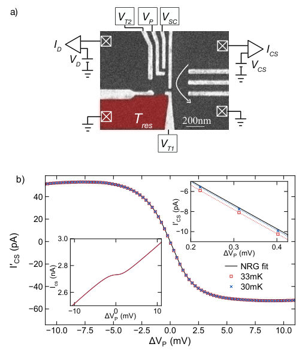 
FIG. 1. (a) Scanning electron micrograph of the device. The quantum dot (center) is coupled to a reservoir (red) whose temperature Tres is controlled by Joule heating; a second reservoir (upper left) can be opened for conductance measure- ments. A charge sensor (right) detects dot occupation. Cross- capacitance between VP and the charge sensor was reduced using the screening gate VSC, [17]. All gates were depleted in the experiment, but on the labelled gates are referred to in the text. (b) Charge-sensor current after background subtraction, I′ CS, across the N = 0 →1 transition, at T = 30 and 33 mK. Left inset: raw ICS before subtraction. Right inset: zoom-in near ∆VP = 0.3 mV showing the...

📷 Fig 2

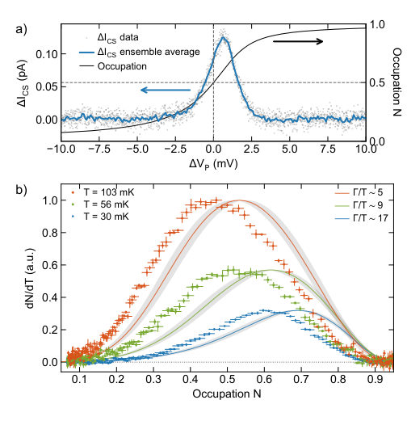 
FIG. 2. (a) Difference of the 30 and 33 mK traces in Fig. 1b, ∆ICS ∝dN/dT(∆VP ) (blue, ensemble average over 8 runs; gray markers: individual runs), together with the occupation N(∆VP ) extracted from an NRG fit to the charge-sensor sig- nal (black). The dashed lines marks N = 1/2; the shift of the dN/dT peak to N &gt; 1/2 is the central result of this paper. (b) dN/dT (arb. units) plotted against N for Tres =30, 56, and 103 mK (markers), with NRG calculations (solid lines, labeled by Γ/T) for the same Γ and T; all curves normalized to the peak of the 103 mK NRG curve. Shading around NRG curves represents experimental uncertainty in determining Γ. Error bars represent standard error of binned...

📷 Fig 3

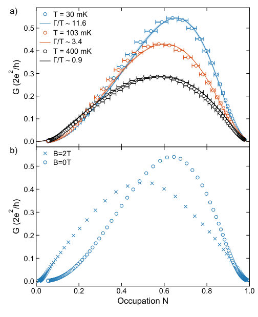 
FIG. 3. (a) Conductance G = dID/dVD plotted against the simultaneously measured occupation N across the 0 →1 tran- sition of the same dot used in Figs. 1 and 2, for three differ- ent temperatures. Markers: data; solid lines: NRG. Shaded bands around the NRG describe experimental uncertainty in determining Γ; error bars reflect uncertainty in determining N from VP [17]. (b) G(N) at B∥= 0 (the 30mK data from panel a) and B∥= 2 T. At high field the asymmetry of G(N) collapses and the peak recovers a nearly symmetric shape, confirming that the shift in (a) originates in Kondo correla- tions rather than a device artifact. Data collected with 50 µV applied to the charge sensor.

**Summary.** The authors report on the measurement of entropic signatures and conductance characteristics associated with the formation of the Kondo singlet state in a quantum dot. By analyzing temperature-dependent charge sensing and direct conductance measurements, they confirm the predicted asymmetric spectral features characteristic of Kondo screening. The quantitative agreement between these experimental results and NRG theory strongly validates the theoretical understanding of correlated electron physics in nanoscale devices.

**Why it may be interesting.** This work provides highly quantitative experimental verification of fundamental many-body physics (the Kondo effect) by measuring thermodynamic quantities like entropy, which is crucial for understanding quantum impurity models in mesoscopic systems.

Detailed structure

**Main problem.** To measure the entropy suppression associated with the formation of the Kondo singlet state in a quantum dot.

**Main result.** The measured entropy signature ($dN/dT$) and conductance peak shift both exhibit an asymmetric lineshape peaking at $N>1/2$, which is confirmed by independent measurements and matches theoretical predictions from NRG calculations.

**Method.** Entropy change is extracted using a Maxwell relation applied to temperature-dependent charge sensing ($\Delta I_{CS} \propto dN/dT$), complemented by direct conductance ($G$) measurements.

**Model / system.** The system is a single impurity coupled to leads, realized in a GaAs quantum dot exhibiting Kondo screening below the characteristic temperature $T_K$. Theoretical modeling relies heavily on Numerical Renormalization Group (NRG) calculations.

**Key observables.** $dN/dT$ vs. occupation $N$; Conductance $G$ vs. occupation $N$; Zero-Bias Anomaly (ZBA) splitting in differential conductance ($dI/dV$).

**Important parameters / regimes.** Kondo temperature ($T_K$), Hybridization ($\Gamma$), Temperature ($T$), Occupation number ($N$).

**Assumptions / limitations.** The entropy measurement relies on the Maxwell relation, and parameter fitting requires assuming consistency between measurements derived from charge sensing and conductance.

**Figures summary.** Figures compare measured $dN/dT$ vs. $N$ (showing peak shift) and $G$ vs. $N$ against NRG theory across various temperatures; later figures show ZBA splitting in differential conductance as a function of magnetic field.

**Paper structure.** The paper systematically presents multiple measurements on the same system, first establishing the entropy signature ($dN/dT$), then providing independent confirmation using conductance ($G(N)$), and finally verifying results on a second device using both techniques alongside magnetic field dependence studies.

Abstract

The Kondo singlet---a many-body state formed by entanglement between a localized spin and the Fermi sea---has been studied extensively through its transport signatures in quantum dots. Here we report a thermodynamic measurement of the entropy suppression associated with the formation of the Kondo singlet, using temperature-dependent charge sensing and a Maxwell relation to track the suppression of spin entropy as the first electron is added to a strongly-coupled GaAs quantum dot. Plotting $dN/dT$ against the simultaneously measured occupation $N$ reveals an asymmetric lineshape with its peak shifted to $N>1/2$---a hallmark of Kondo screening---that weakens with increasing temperature and is qualitatively reproduced by numerical renormalization group (NRG) calculations, with a small but persistent offset to lower occupation relative to the theory. An independent measurement of conductance versus occupation on the same device provides a test of these quantities through the mixed-valence crossover and matches NRG within experimental uncertainty.

[↑ back to top](#top)

### [Scalar-spin-chirality-driven fractional Chern insulator on a kagome lattice](http://arxiv.org/abs/2607.27833v1)

**Authors:** Shinnosuke Tsutsumi, Koji Kudo, Kentaro Nomura  
**Type:** theory · **Category:** strongly correlated electrons · **PDF:** <https://arxiv.org/pdf/2607.27833v1>  
**Analysis basis:** full PDF text, analyzed in chunks
**Topic relevance:** 🔥 `analog quantum simulation` **4/5** · `exotic spin models in light-matter` **3/5** · `entanglement & information structure` **1/5** · `spintronics-quantum-optics interface` **1/5**

📷 Fig 1

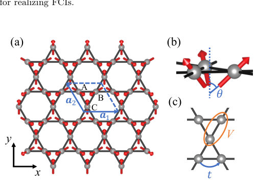 
FIG. 1. (a) Schematic illustration of a kagome lattice considered here. The red arrows represent localized spins. The blue rhombus represents a unit cell with sublattices A, B, and C, and a1 and a2 are the lattice translation vectors. (b) Spin orientations specified by the common polar angle θ. (c) System parameters appearing in Heff.

📷 Fig 2

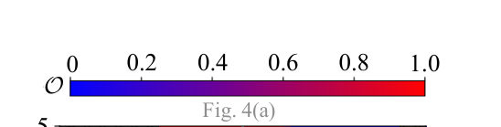 
Fig. 4(b)

📷 Fig 3

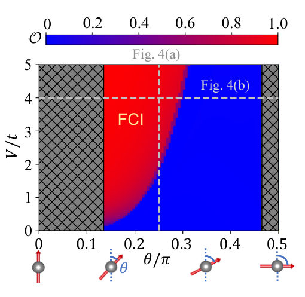 
FIG. 3. Average of the singular values of the overlap matrix O as a function of the polar angle θ and interaction strength V . The red region, where O is close to unity, indicates the emergence of the FCI state. The hatched gray region indicates that the three lowest energy states in the flat-band limit do not match the counting rule of the total momentum in Eq. (10). The system size is N1 × N2 = 6 × 4 and the band filling factor is ν = 1/3.

📷 Fig 4

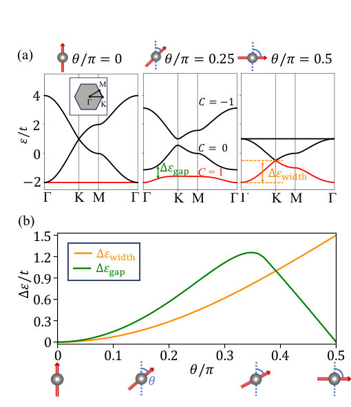 
FIG. 2. (a) Band structures of the non-interacting Hamiltonian h0 for different polar angles θ. For 0 &lt; θ/π &lt; 0.5, all bands are isolated, and the band Chern numbers from bottom are 1, 0, and −1, respectively. (b) Bandwidth of the lowest band εwidth and its direct energy gap εgap as functions of θ. Both εwidth and εgap become finite and are of comparable magnitude as θ increases.

📷 Fig 5

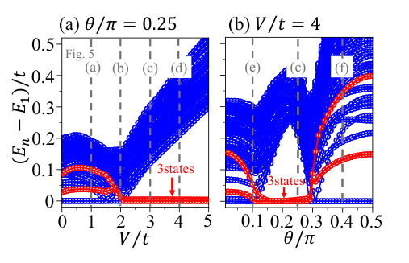 
FIG. 4. Low-lying many-body energy spectra En −E1, where En is the n-th lowest energy, along the two cuts indicated in Fig. 3. The lowest energy states in each momentum sector (j1, j2) = (0, 0), (2, 0), (4, 0) [Eq. (10)] are highlighted in red. The three-fold quasidegenerate states appear in the regions with O ≈1 in Fig. 3. We plot six lowest energies in each momentum sector.

**Summary.** This theoretical work demonstrates that Fractional Chern Insulator states can spontaneously emerge in kagome magnets due to noncoplanar magnetic ordering that generates scalar spin chirality. By analyzing the system's energy spectrum and topological invariants, the authors establish a clear pathway for realizing these exotic correlated electronic phases without external fields.

**Why it may be interesting.** While focused on condensed matter topology, the concept of emergent topological order driven purely by internal magnetic structure (chirality) is highly relevant to understanding correlated electron systems in engineered quantum materials.

Detailed structure

**Main problem.** The work aims to demonstrate the emergence of Fractional Chern Insulator (FCI) states, which are lattice analogs of fractional quantum Hall states, without requiring an external magnetic field.

**Main result.** FCIs are shown to emerge in kagome magnets possessing noncoplanar magnetic order that induces a finite scalar spin chirality, stabilizing the state over a wide parameter range.

**Method.** The study uses theoretical modeling involving exact diagonalization of an effective Hamiltonian projected onto the lowest band, supplemented by overlap matrix calculations and spectral flow analysis.

**Model / system.** The system is a kagome lattice modeled with electron-electron interactions ($U, V$) and magnetic exchange coupling ($	ext{J}_{	ext{H}}$). The physics is driven by the induced scalar spin chirality ($	heta$).

**Key observables.** Overlap matrix $\mathcal{O}$ (close to unity), ground-state degeneracy (three-fold), finite energy gap, and spectral flow periodicity under flux insertion.

**Important parameters / regimes.** Scalar spin chirality ($	heta$), interaction strength ($V/t$), and the ratio of interactions to band dispersion.

**Assumptions / limitations.** The analysis utilizes approximations such as the strong exchange coupling limit ($	ext{J}_{	ext{H}}	ext{S}/t 
ightarrow \infty$) and relies on flat-band limit states for defining the overlap matrix.

**Figures summary.** Figures illustrate band structures showing Chern numbers, map out the parameter region where FCI emerges via overlap analysis (red region), confirm three-fold degeneracy in energy spectra, and show period-tripling behavior in spectral flow calculations.

**Paper structure.** The paper progresses by defining the Hamiltonian, analyzing the emergence of topological features using overlap matrices ($\mathcal{O}$), confirming the state's robustness via finite size scaling, and finally characterizing the fractional nature through spectral flow analysis.

Abstract

Fractional Chern insulators (FCIs) are the lattice analogs of the fractional quantum Hall states, emerging even without an external magnetic field. In this work, we demonstrate the emergence of the FCI states in a kagome magnet with a noncoplanar magnetic order that induces a finite scalar spin chirality. By incorporating in our model both electron-electron interactions and the effect of band dispersion, we find that stronger interactions relative to the band dispersion stabilize the FCI state over a broader range of scalar spin chirality. We characterize the emergent FCI state by calculating overlap with representative states, identifying the ground-state degeneracy and the finite energy gap in the thermodynamic limit, and tracking the spectral flow under multiple flux-quantum insertions. Our results suggest that kagome magnets with scalar spin chirality can be promising platforms for realizing FCIs.

[↑ back to top](#top)

### [Current-based RF charge sensing in a carbon nanotube](http://arxiv.org/abs/2607.28313v1)

**Authors:** Marta Cagetti, Stefan Forstner, Victor Champain, Roger Tormo-Queralt, Christoffer B. Møller, Sergio L. De Bonis, Chandan Samanta, Elsa Vázquez-Rodriguez, Eneko Mateos-Madinabeitia, David A. Czaplewski, Adrian Bachtold  
**Type:** experiment · **Category:** quantum information and computing · **PDF:** <https://arxiv.org/pdf/2607.28313v1>  
**Analysis basis:** full PDF text, analyzed in chunks
**Topic relevance:** 🔥 `QC/QI experiment` **4/5** · `quantum measurements` **2/5**

📷 Fig 1

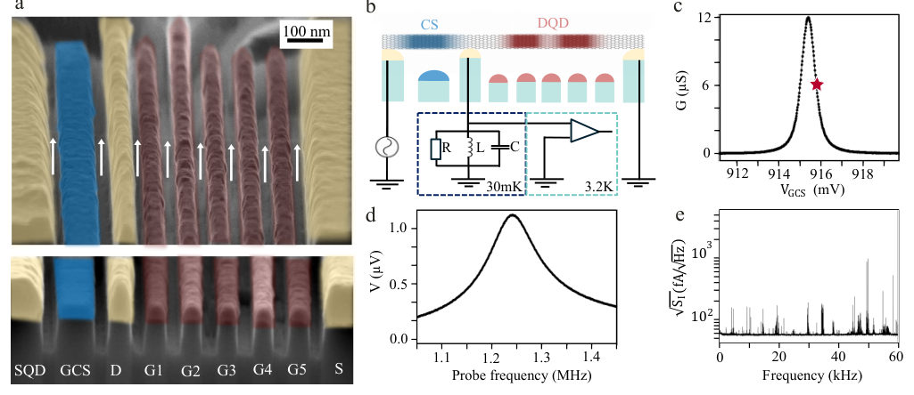 
Figure 1: (a) False-colored scanning electron micrograph of the device. The CNT, which is suspended over the gate electrodes GCS and G1-G5, is electrically in contact with sensor’s source (SQD), the DQD source (S), and a common drain (D). The white arrows indicate the position of the CNT. (b) Schematic of the setup. The common drain is connected to ground through an RLC resonator with resonance frequency fRLC = 1.25 MHz. The signal is amplified by a cryogenic HEMT amplifier at 3.2 K. (c) Conductance of the sensor dot as a function of VGCS, exhibiting a Coulomb blockade peak. The red star indicates the working point for optimal sensing. (d) Frequency response of the RLC resonator as a...

📷 Fig 2

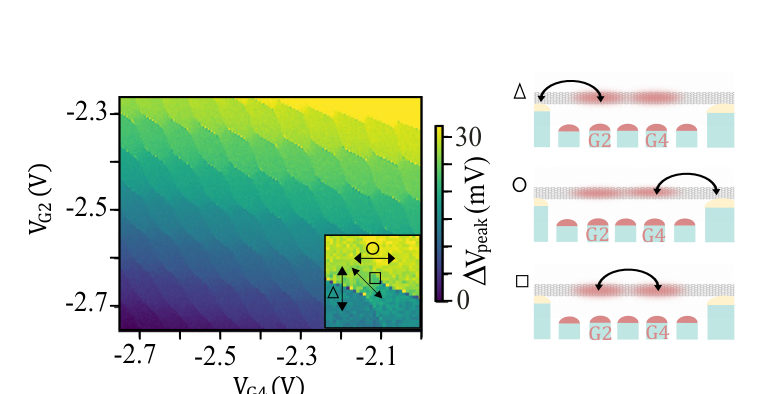 
Figure 2: Charge stability diagram showing the effective position of the Coulomb peak, ∆Vpeak, relative to its initial position (bottom left of the stability diagram) as a function of VG2 and VG4. Inset: zoom of the interdot charge transition, highlighting the three transitions, which are illustrated schematically on the right.

📷 Fig 3

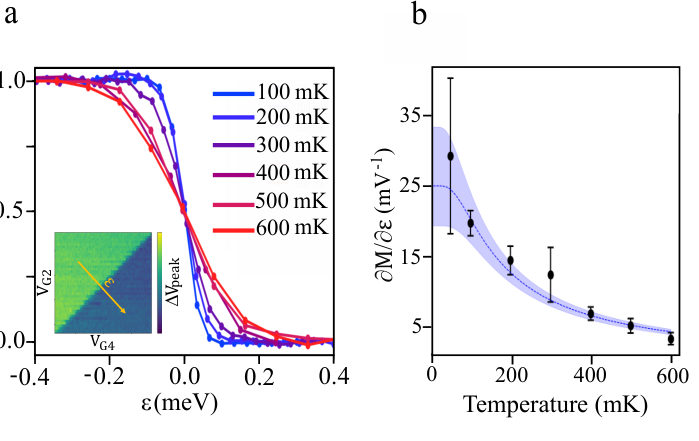 
Figure 3: (a) Normalized average charge occupation (M) of the left quantum dot as a function of detuning for cryostat temperatures between 100 and 600 mK. The inset shows the ICT and the yellow arrow indicating the detuning axis used to extract the traces. (b) Temperature dependence of the fitted slope parameter ∂M

📷 Fig 4

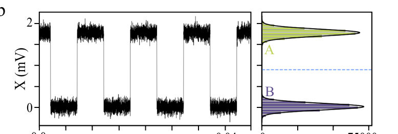 
Figure 4: (a) Response of the charge sensor as a function of VG2 and VG4, showing the (2, 1) ↔(3, 0) ICT. (b) Single-shot time trace of the in-phase quadrature of the demodulated lock-in output signal X, together with the corresponding histogram for an integration time of τ = 3.56 µs. The dashed line indicates the discrimination threshold. (c) Readout SNR from this work compared with state- of-the-art charge sensors. Red star and circle markers represent measurements performed at 1.25 MHz and 39.6 MHz, respectively. Results from previous works are shown as blue triangles (Ref.44), an orange square (Ref.22), grey hexagons (Ref.32), brown cross (Ref.31), violet pentagon (Ref.33), and green...

**Summary.** The paper introduces a novel current-mode charge sensor based on an RLC resonant circuit implemented in a suspended carbon nanotube. This method overcomes limitations of previous techniques by avoiding impedance matching and suppressing low-frequency noise. It successfully measures the charge state of an embedded double quantum dot with high fidelity, advancing solid-state qubit readout technology.

**Why it may be interesting.** This work presents a highly engineered electrical measurement technique (RF resonance) applied directly to solid-state qubits (DQD in CNTs), which is central to realizing scalable quantum computing hardware.

Detailed structure

**Main problem.** Developing ultra-sensitive charge detection methods for quantum electronics applications, which are crucial for quantum information processing.

**Main result.** The authors achieved a high charge sensitivity of $0.15 \mu	ext{e}/\sqrt{	ext{Hz}}$ and demonstrated single-shot readout of a double quantum dot (DQD) with an SNR of 17, surpassing current state-of-the-art techniques.

**Method.** They introduced a novel current-mode charge sensor operating at the resonance of an RLC tank circuit to measure charge changes in a suspended carbon nanotube.

**Model / system.** The experiment utilizes a double quantum dot (DQD) electrostatically defined within a suspended carbon nanotube, which acts as the highly sensitive charge sensor coupled to an RF-resonant circuit.

**Key observables.** Charge stability diagram mapping ($\Delta V_{peak}$ vs. gate voltages), single-shot readout fidelity, and current noise spectral density.

**Important parameters / regimes.** Achieved charge sensitivity $\delta q \approx 0.15 \, \mu	ext{e}/\sqrt{	ext{Hz}}$; Resonance frequency $f_{RLC} = 1.25 	ext{ MHz}$; Integration time $	au = 3.56 \, \mu	ext{s}$.

**Assumptions / limitations.** The sensor remains functional up to tens of Kelvin, although sensitivity decreases; the method relies on converting current measurement into voltage readout at resonance.

**Figures summary.** Figures illustrate SEM images of the CNT setup, schematics of the RLC circuit, Coulomb blockade peaks in conductance measurements, and frequency response curves demonstrating the resonant operation.

**Paper structure.** The paper first establishes the need for sensitive charge detection. It then details the current-mode RF sensing methodology using an RLC resonator to overcome limitations of previous techniques. Finally, it applies this sensor to map the DQD stability diagram and perform high-fidelity single-shot readout.

Abstract

Ultra-sensitive charge detection is a widely used tool for quantum electronics with applications in quantum information processing and in probing the physics of condensed matter systems. Existing approaches require either an impedance-matched resonant circuit, or millimeter-scale proximity between amplifier and sample, both adding complexity and constraining device design. In this work, we introduce a current-mode charge sensor in a suspended carbon nanotube, operating at the $1.25$ MHz resonance of an RLC tank circuit and achieving a charge sensitivity of $0.15~μe/\sqrt{\mathrm{Hz}}$. We utilize it to measure a double quantum dot (DQD) electrostatically defined in the same nanotube, revealing a highly regular charge stability diagram. We perform single-shot readout of the DQD charge state at an integration time of $3.56~μ\mathrm{s}$, without any false assignments over $10^{7}$ measurements and a signal-to-noise ratio of 17 exceeding the state of the art.

[↑ back to top](#top)

### [Hyperchaos in a Magnetic Nanodisk Driven by Ferromagnetic Resonance](http://arxiv.org/abs/2607.27884v1)

**Authors:** A Kolli, Hugo Merbouche, Salvatore Perna, Claudio Serpico, Damien Rontani, Grégoire de Loubens  
**Type:** theory · **Category:** other · **PDF:** <https://arxiv.org/pdf/2607.27884v1>  
**Analysis basis:** full PDF text, analyzed in chunks
**Topic relevance:** `methods for driven-dissipative` **3/5** · `spintronics-quantum-optics interface` **3/5** · `non-equilibrium dynamics` **2/5** · `non-equilibrium universality` **2/5** · `correlated / nonlocal dissipation` **1/5** · `driven-dissipative phase transition` **1/5** · `entanglement & information structure` **1/5** · `exotic spin models in light-matter` **1/5**

📷 Fig 1

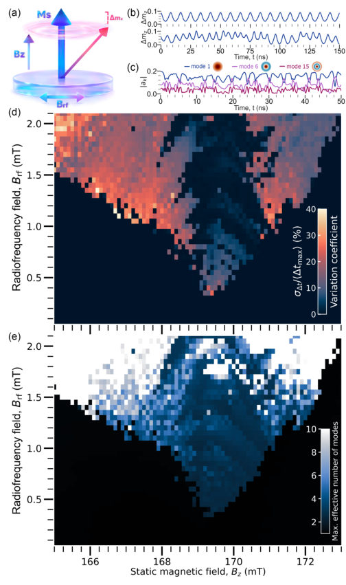 
FIG. 1. (a) Magnetic nanodisk driven by an in-plane rf field Brf (frf = 5 GHz) under an out-of-plane static field Bz. (b) Examples of temporal traces of ∆mz at Bz = 170.7 mT with Brf = 1.0 mT (top) and Brf = 2.0 mT (bottom). (c) Cor- responding temporal evolution of the amplitudes of the three main modes involved in the dynamics. (d) Variation co- efficient of the peak-to-peak time intervals of ∆mz in the (Bz, Brf) plane. (e) Maximum mode participation number across the same parameter space.

📷 Fig 2

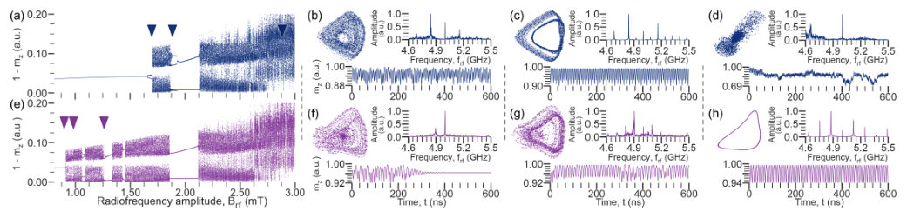 
FIG. 2. (a) Forward (blue) and (e) backward (red) bifurcation diagrams constructed from the local extrema of ∆mz at Bz = 168.5 mT. (b–d) Three operating points during the forward sweep (Brf = 1.745, 1.875 and 2.825 mT): reconstructed phase-space attractor (top left), FFT spectrum (top right) and temporal trace (bottom). (f–h) Three operating points during the backward sweep (Brf = 0.915, 0.940 and 1.285 mT), same layout.

📷 Fig 3

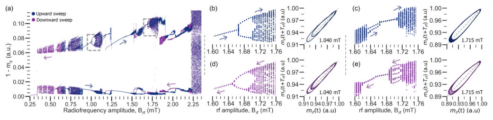 
FIG. 3. (a) Bifurcation diagrams for the forward (blue) and backward (red) quasi-static sweeps of Brf at Bz = 170.0 mT. (b, c) Magnified bifurcation regions and corresponding delayed return maps from the continuous time trace mz(t + Trf) vs mz(t) during the forward sweep, at Brf = 1.040 and 1.715 mT. (d, e) Same for the backward sweep at the same operating points.

📷 Fig 4

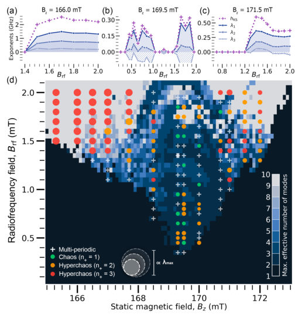 
FIG. 4. (a–c) Lyapunov spectrum (λ1, λ2, λ3) and Kolmogorov-Sinai entropy hKS (dashed red) as a function of Brf at fixed Bz = 166.0, 169.5 and 171.5 mT respectively. (d) Classification map of the chaotic dynamics in the (Bz, Brf) plane: multi-periodic (n+ = 0, crosses), chaos with n+ = 1 (green), hyperchaos with n+ = 2 (orange) and n+ = 3 (red). The marker size is proportional to λmax. The background color recalls the maximum mode participation number (cf. Fig. 1e).

**Summary.** This paper analyzes the nonlinear dynamics of a magnetic nanodisk driven by FMR, demonstrating that the system can enter a hyperchaotic regime. The complexity is quantified and shown to scale with the number of active spin-wave modes. This establishes such nanoscale spintronic devices as potential sources for tunable entropy in information processing.

**Why it may be interesting.** While focused on classical micromagnetics, the rigorous application of chaos theory diagnostics (Lyapunov exponents, entropy) to a solid-state system provides a model for understanding non-equilibrium dynamics in condensed matter devices that can be relevant to quantum noise sources or energy dissipation studies.

Detailed structure

**Main problem.** The study investigates the emergence of hyperchaotic dynamics within a magnetic nanodisk driven by ferromagnetic resonance (FMR) in its nonlinear regime.

**Main result.** The system was shown to exhibit hyperchaos, characterized by up to three positive Lyapunov exponents, with this complexity being directly linked to the number of participating quantized spin-wave modes.

**Method.** The research combines micromagnetic simulations solving the Landau-Lifshitz-Gilbert equation with advanced nonlinear time-series analysis techniques like Takens' delay embedding and calculation of the full Lyapunov spectrum.

**Model / system.** The physical system is an out-of-plane magnetized magnetic nanodisk (30 nm thick, 700 nm diameter) whose dynamics are governed by micromagnetics under external microwave driving fields.

**Key observables.** Lyapunov exponents ($\lambda_i$), Shannon participation number ($P_s$), variation coefficient ($c_v$), and the Kolmogorov-Sinai entropy rate ($h_{KS}$).

**Important parameters / regimes.** The control parameters are the static bias field ($B_z$) and the RF driving amplitude ($B_{	ext{rf}}$), which define distinct dynamical regimes.

**Assumptions / limitations.** The analysis assumes that the complex dynamics can be effectively mapped onto a low-dimensional strange attractor using mode projection techniques, despite underlying continuous wave scattering.

**Figures summary.** Figures illustrate temporal traces of magnetization components ($\Delta m_z$), maps showing chaos indicators ($c_v$, $P_s$) across the control plane, and reconstructed phase-space attractors for different operating points.

**Paper structure.** The paper progresses by establishing the physical model (LLG equation), mapping out the parameter space to identify transitions from periodic orbits to chaotic/hyperchaotic states, quantifying this complexity using multiple diagnostic tools, and finally discussing the implications for nanoscale information processing.

Abstract

We investigate the chaotic dynamics driven in the nonlinear regime of ferromagnetic resonance of an out-of-plane magnetized nanodisk in detail. By combining extensive micromagnetic simulations with time-series analysis across the control parameter space, we map the topological transitions from stable periodic orbits to strange attractors and quantify the dynamical complexity. Despite the simplicity of our nanoscale system, we evidence that it can exhibit hyperchaotic dynamics with up to three positive Lyapunov exponents in vast regions of the control plane accessible to experimental studies. Using a mode projection technique, we unveil that the generated complexity is related to the number of quantized spin-wave modes participating in the dynamics. Our findings establish magnon-spintronic nanodevices as versatile entropy sources for unconventional processing of information.

[↑ back to top](#top)

### [Phase noise analysis and control of VO$_2$-based relaxation type oscillators](http://arxiv.org/abs/2607.27447v1)

**Authors:** Artem Litvinenko, Erbin Qiu, Sambit Ghosh, Juan Andres Hofer, Akash Kumar, Jong-Guk Choi, Ivan K. Schuller, Johan Åkerman  
**Type:** experiment · **Category:** statistical mechanics · **PDF:** <https://arxiv.org/pdf/2607.27447v1>  
**Analysis basis:** full PDF text, analyzed in chunks
**Topic relevance:** `driven-dissipative phase transition` **3/5** · `non-equilibrium dynamics` **2/5** · `non-equilibrium universality` **2/5** · `Frenkel-Kontorova` **1/5** · `Keldysh / 2PI / non-Gaussian methods` **1/5** · `analog quantum simulation` **1/5** · `correlated / nonlocal dissipation` **1/5** · `methods for driven-dissipative` **1/5** · `quantum measurements` **1/5** · `spintronics-quantum-optics interface` **1/5**

📷 Fig 1

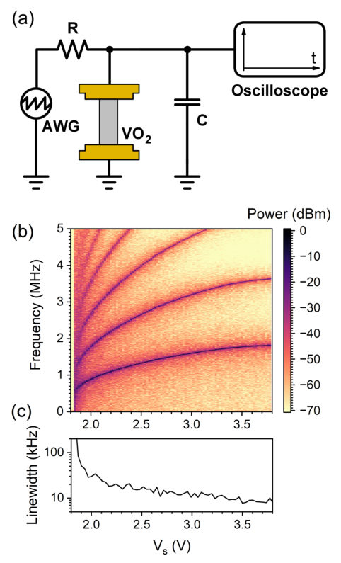 
FIG. 1. Basic characterization of the VO2 relaxation oscilla- tor. (a) Schematic of the oscillator circuit. (b) Spectrogram of the output signal as a function of the applied voltage, Vs. The lowest branch corresponds to the fundamental frequency described by Eq. 1. Higher-order harmonics appear at inte- ger multiples of the fundamental frequency, exhibiting large amplitudes due to the strongly nonlinear shape of the time- domain signal. (c) Linewidth of the fundamental mode as a function of Vs.

📷 Fig 2

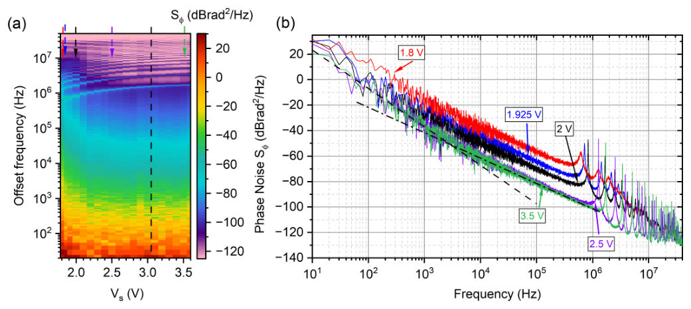 
FIG. 2. Phase noise characterization. (a) Phase noise spectrogram as a function of applied voltage Vs. (b) Phase noise power spectral density at different applied voltages. Note the increase in white noise components at lower voltages due to increased susceptibility to thermal fluctuations. At Vs = 3.5 V and 2.5 V, the phase noise plot consists of two well pronounced regions, characterized by the slope f −3 (highlighted with a dash line) corresponding to flicker frequency noise and by the slope f −2

📷 Fig 3

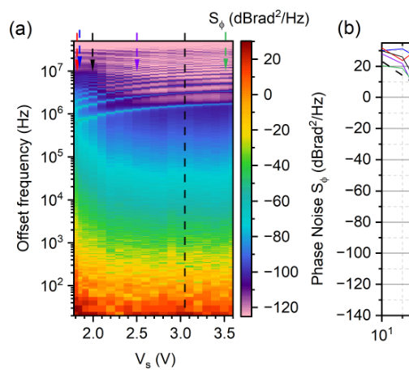 
Figure 2 presents the phase noise characteristics of a free-running VO2-based relaxation oscillator at various supply voltages. The left panel (Fig. 2 (a)) shows the phase noise Sϕ in the form of a spectrogram as a func- tion of offset frequency away from the carrier frequency and supply voltage Vs, while the right panel (Figure 2b) displays phase noise spectra at distinct supply voltages

📷 Fig 4

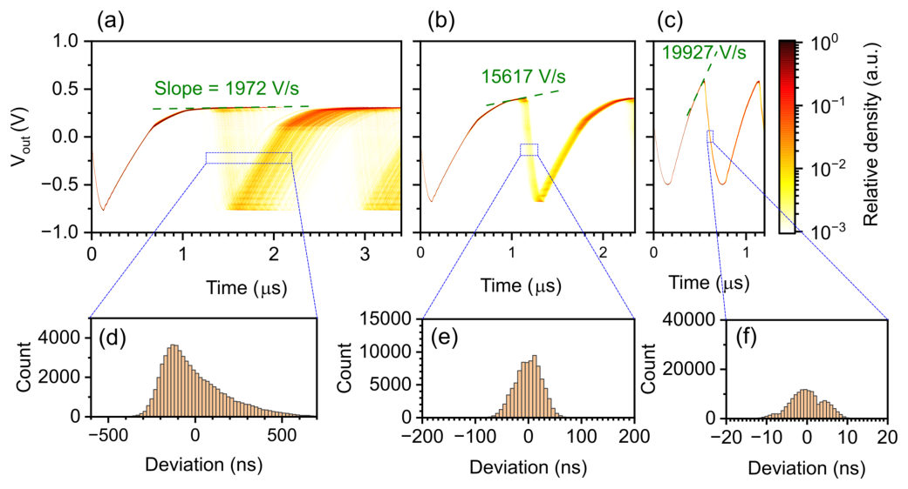 
FIG. 3. Time-domain traces and statistical jitter analysis of the V O2 relaxation oscillator output at varying supply voltages: (a) Vs = 1.81 V, (b) Vs = 2.0 V, and (c) Vs = 3.4 V. The top panels (a-c) show intensity-graded persistence maps where the color gradient represents the waveform probability density, visually highlighting cycle-to-cycle timing jitter. The DC component of the Vout signal was removed (AC-coupled) to maximize the vertical resolution of the digitized signal. The bottom panels (d-f) show corresponding period length histograms. The results demonstrate that reducing the supply voltage decreases the slope of the voltage approach to the threshold, which significantly...

📷 Fig 5

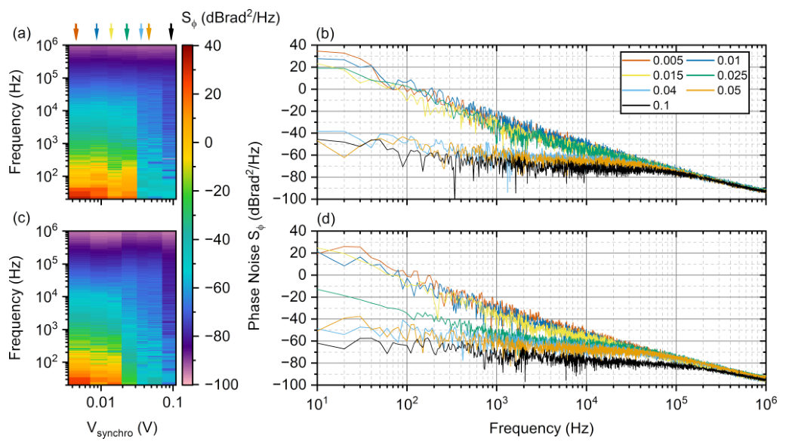 
FIG. 4. Phase noise suppression and synchronization of the V O2 relaxation oscillator using external signals at 2f. (a, b) Phase noise spectrogram and phase noise spectral density plots for sinusoidal synchronization at various amplitudes. The colored arrows at the top of the spectrogram in panel (a) indicate the specific synchronization voltage levels (Vsync) that correspond to the identically colored phase noise spectral density curves plotted in panels (b) and (d). (c, d) Phase noise characteristics using a square-wave synchronization signal. The square-wave drive achieves partial injection locking and phase noise reduction at lower injected amplitudes than the sinusoidal drive. This...

**Summary.** This work thoroughly analyzes the phase noise limiting VO2-based relaxation oscillators, attributing much of the broadening to thermal fluctuations during the material's transition phase. The authors demonstrate that applying a sharp square-wave signal is superior to sinusoidal driving for stabilizing the oscillator. Furthermore, they establish a critical voltage threshold below which timing jitter increases dramatically due to changes in the underlying physical switching mechanism.

**Why it may be interesting.** The analysis of phase noise in a system driven by a first-order phase transition (metal-insulator) provides an excellent experimental platform for studying non-equilibrium dynamics and stochastic processes, which are relevant to open quantum systems modeling.

Detailed structure

**Main problem.** The primary goal is analyzing and controlling the phase noise in VO2-based relaxation oscillators to improve their spectral linewidth, which is inherently broad due to thermal effects.

**Main result.** External synchronization using a square-wave signal significantly improves phase noise compared to sinusoidal injection locking. Furthermore, oscillator jitter dramatically increases as the supply voltage approaches a critical threshold voltage ($V_{IMT} \approx 1.79	ext{ V}$) because the incubation slope flattens.

**Method.** The study combines time-domain analysis (jitter histograms), phase noise spectral density measurements ($S_\phi$), and controlled synchronization experiments using both square and sine waves.

**Model / system.** The system is a VO2-based relaxation oscillator that operates via rapid, nonlinear phase transitions between insulating and metallic states. The dynamics are governed by charging an RC circuit across the VO2 film, which exhibits threshold voltage fluctuations.

**Key observables.** Phase Noise ($S_\phi$), Timing Jitter ($\sigma$), Linewidth, Incubation Voltage Slope, Synchronization Improvement Factor.

**Important parameters / regimes.** Low oscillation frequencies (where $1/f^3$ noise dominates), critical threshold voltage ($V_{IMT} \approx 1.79	ext{ V}$), and the difference between square-wave vs. sinusoidal driving signals.

**Assumptions / limitations.** The primary source of low-frequency noise is attributed to thermal fluctuations during the stochastic incubation phase preceding the Insulator-to-Metal Transition (IMT).

**Figures summary.** Figures show phase noise spectra exhibiting $1/f^3$ and $1/f^2$ slopes, jitter histograms showing broadening near low supply voltages, and comparisons demonstrating square-wave synchronization's superior noise suppression.

**Paper structure.** The paper systematically analyzes the spectral characteristics of the oscillator noise (identifying $1/f^3$, $1/f^2$, and white noise regimes). It then investigates how external driving signals can mitigate this noise, concluding with a detailed study linking jitter amplification to the flattening of the incubation voltage slope near the critical threshold.

Abstract

VO$_2$-based relaxation oscillators form a rapidly developing field that finds applications in neuromorphic computing, Ising machines, and numerous signal processing concepts. These oscillators operate in a deeply nonlinear relaxation regime based on rapid phase transitions between insulating and metallic states in the VO$_2$ material. This process is governed by thermal effects, which lead to additional voltage fluctuations and contribute to a considerably wide spectral linewidth in the VO$_2$-based oscillator signal. In this work, we thoroughly study the phase noise in VO$_2$-based relaxation oscillators and demonstrate that the broadening of the generation spectrum linewidth at low oscillation frequencies is caused by an increased susceptibility to thermal fluctuations during the incubation phase. We explore the types of noise affecting oscillator stability and show that synchronization with an external square-wave signal improves the phase noise more effectively than a sinusoidal-shape injection locking signal.

[↑ back to top](#top)

### [Cavity Tuning of the CDW--Superconductivity Interplay in a Kagome Metal](http://arxiv.org/abs/2607.27769v1)

**Authors:** Lan-Ting Shi, I-Te Lu, Xin Wang, Dongbin Shin, Lede Xian, Angel Rubio  
**Type:** theory · **Category:** other · **PDF:** <https://arxiv.org/pdf/2607.27769v1>  
**Analysis basis:** full PDF text, analyzed in chunks
**Topic relevance:** `correlated cavity matter` **3/5** · `analog quantum simulation` **2/5** · `Keldysh / 2PI / non-Gaussian methods` **1/5** · `Tavis-Cummings & cavity-many-emitter` **1/5** · `driven-dissipative phase transition` **1/5** · `methods for driven-dissipative` **1/5**

📷 Fig 1

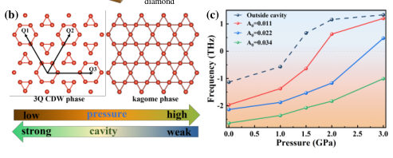 
FIG. 1. Pressure–cavity control of CDW instability in CsV3Sb5 (a)Schematic illustration of the pressure–cavity model for CsV3Sb5. The crystal is placed in a diamond-anvil- cell-like hydrostatic-pressure geometry and coupled to a single confined photon mode polarized along the crystallographic c axis, perpendicular to the kagome layers. The right panels show the crystal structure and the CDW-related V-sublattice breathing vibration. (b) Conceptual comparison between the 3Q CDW phase and the normal kagome phase, highlighting the opposite effects induced by pressure and cavity coupling. (c) Pressure dependence of the lowest phonon frequency at the L point for different cavity-field amplitudes...

📷 Fig 2

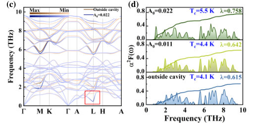 
FIG. 3. Cavity-enhanced electron–phonon coupling and superconductivity in CsV3Sb5. (a) and (b) Phonon dispersions at 3 GPa for free space and cavity couplings, with mode characters projected onto in-plane (xy) and out- of-plane (z) vibrations of Cs, V, and Sb. (c) Phonon disper- sions with linewidths mapped onto the branches, highlighting momentum-selective enhancement of electron–phonon scat- tering. (d) Eliashberg spectral function α2F(ω) and the cu- mulative EPC λ(ω).

📷 Fig 3

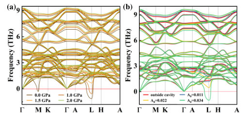 
FIG. 2. Competing effects of pressure and cavity cou- pling on phonons in CsV3Sb5. (a) Phonon dispersions at different hydrostatic pressures, showing progressive hard- ening of low-frequency modes and suppression of the CDW instability. (b) Phonon dispersions at 3 GPa under different cavity-field couplings A0, compared with the outside cavity case. The cavity selectively softens low-energy phonons, coun- teracting the pressure-induced stabilization of the lattice.

📷 Fig 4

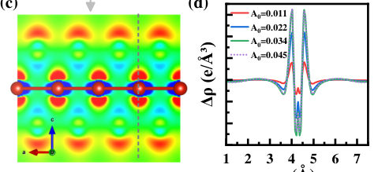 
FIG. 4. Cavity-induced charge redistribution in CsV3Sb5. (a) Crystal-structure schematic of CsV3Sb5, high- lighting the V kagome layer and the out-of-plane plane used for the charge-density analysis. (b) Two-dimensional map of ∆ρ(r) in the ab plane across the V kagome layer. (c) Two-dimensional map of ∆ρ(r) in the bc plane, highlighting the out-of-plane component of the cavity-induced charge re- sponse. The gray dashed line indicates the line-cut path used for the profiles in (d). (d) Line profiles of ∆ρ(r) extracted along the dashed line in (c), i.e., along the out-of-plane (z) direction through the V atom, for different cavity couplings A0.

**Summary.** The authors used QEDFT calculations on CsV3Sb5 to show that coupling the material to an optical cavity acts as a powerful tuning mechanism for competing electronic orders. By selectively softening CDW-related phonons, the cavity enhances electron-phonon coupling and boosts the superconducting critical temperature, establishing cavity quantum electrodynamics as a viable control route in strongly correlated materials.

**Why it may be interesting.** This work directly applies advanced quantum electrodynamics (QED) techniques to condensed matter physics, treating the cavity field as a controllable external perturbation that modifies fundamental material properties like lattice dynamics and superconductivity. This bridges AMO concepts into solid-state materials science.

Detailed structure

**Main problem.** The study investigates how an external cavity field can tune the competition between Charge-Density-Wave (CDW) order and superconductivity in a Kagome metal.

**Main result.** Cavity coupling selectively softens CDW-related phonons, extending the instability to higher pressures and enhancing electron-phonon coupling ($\lambda$), thereby increasing the superconducting critical temperature ($T_c$).

**Method.** The research employs quantum electrodynamical density functional theory (QEDFT) to model cavity light-matter coupling effects on lattice dynamics.

**Model / system.** The physical system is the Kagome metal CsV3Sb5. The theoretical framework involves modeling the interaction between electronic structure, lattice vibrations (phonons), and an out-of-plane polarized single-mode optical cavity field.

**Key observables.** CDW soft phonon frequencies, total electron–phonon coupling ($	ext{EPC}$) strength ($\lambda$), Allen–Dynes estimate of $T_c$, and charge density redistribution ($\Delta
ho$).

**Important parameters / regimes.** Hydrostatic pressure (tuning CDW instability) and dimensionless cavity coupling amplitude ($A_0$) are the primary tuning parameters.

**Assumptions / limitations.** The analysis tracks harmonic lattice instabilities, not the full finite-temperature anharmonic CDW transition line. The method relies on first-principles QEDFT calculations.

**Figures summary.** Figures illustrate how cavity coupling selectively softens specific phonon modes (counteracting pressure hardening) and maps the resulting charge redistribution ($\Delta
ho$) which drives the enhancement of low-frequency EPC.

**Paper structure.** The paper establishes a theoretical framework using QEDFT to model cavity interaction, demonstrating that this interaction acts as an equilibrium tuning knob. It shows selective phonon softening first, followed by calculating the resultant enhancement in $	ext{EPC}$ and $T_c$ due to charge redistribution.

Abstract

Kagome metals host competing electronic orders, including charge-density-wave (CDW) order and superconductivity, shaped by intertwined lattice, electronic-correlation, and kagome-geometric effects. Here, using quantum electrodynamical density functional theory, we identify an equilibrium cavity route for reshaping this balance in the kagome metal CsV$_3$Sb$_5$. An out-of-plane polarized single-mode cavity selectively softens CDW-related phonons, counteracting pressure-induced hardening and extending the CDW instability toward higher pressures. In the high-pressure regime where the CDW instability is otherwise suppressed, cavity coupling redistributes Eliashberg spectral weight toward lower frequencies, enhances the total electron--phonon coupling (EPC), and increases the EPC-based Allen--Dynes estimate of $T_c$. This response originates from a charge-density redistribution induced by the out-of-plane photon mode, which modifies lattice restoring forces and drives the phonon and EPC renormalization. These results establish cavity quantum electrodynamics as a viable equilibrium route for tuning intertwined charge order, lattice dynamics, and superconductivity in kagome materials.

[↑ back to top](#top)

### [Nanoparticle Networks for Neuromorphic Computing](http://arxiv.org/abs/2607.27844v1)

**Authors:** Jonas Mensing, Wilfred G. van der Wiel, Andreas Heuer  
**Type:** theory · **Category:** disordered systems and neural networks · **PDF:** <https://arxiv.org/pdf/2607.27844v1>  
**Analysis basis:** full PDF text, analyzed in chunks
**Topic relevance:** `non-equilibrium dynamics` **3/5** · `driven-dissipative phase transition` **2/5** · `Kondo & dissipative impurity` **1/5** · `correlated / nonlocal dissipation` **1/5** · `methods for driven-dissipative` **1/5** · `non-equilibrium universality` **1/5**

📷 Fig 1

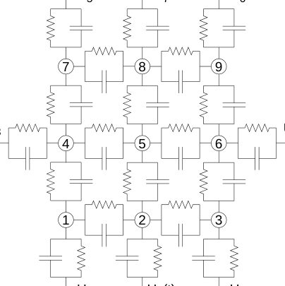 
FIG. 1: Circuit Schematic of a 3 × 3 Nanoparticle Network interfaced with 8 Electrodes. Charge transport between adjacent islands i and j is governed by a parallel combination of a nonlinear tunnel resistance Rij and a junction capacitance Cij. Furthermore, the oxide layer establishes a local substrate coupling capacitance Ci at each individual nanoparticle, acting as a distributed ground. Electrode voltages are denoted Ui.

📷 Fig 2

 
FIG. 1 shows a circuit schematic of a L = 3 nanopar- ticle network excluding the electrostatic coupling to the substrate. Each nanoparticle is electrostatically coupled (capacitor) and tunnel-coupled (resistor) to a neighbor- ing nanoparticle or electrode.

📷 Fig 3

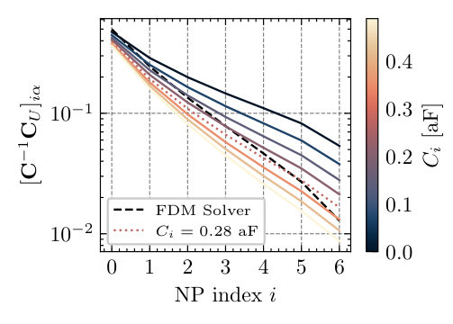 
FIG. 2: Spatial Screening. Spatial decay of the electrostatic coupling strength [C−1CU]iα from the input electrode at position i = 0 into the network bulk. The exact 3D FDM solution (dashed black line) demonstrates exponential screening. The approximation at variable values of Ci replicates this exponential decay at different slopes.

📷 Fig 4

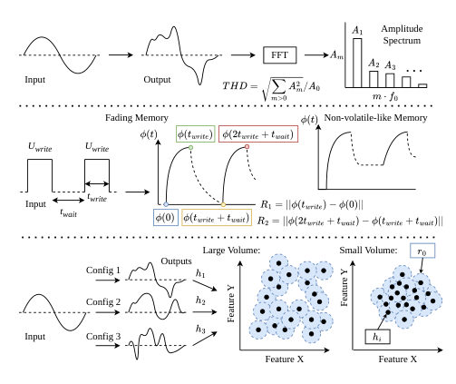 
FIG. 3: Top (Characterizing Nonlinearity): Baseline nonlinearity is isolated using a sinusoidal input with grounded controls. The Total Harmonic Distortion (THD) is calculated from the FFT amplitude spectrum as the ratio of higher-order harmonics to the fundamental amplitude. Middle (Characterizing Memory): Temporal memory is probed via two identical input pulses separated by a wait time twait. The qualitative response curves for the potential vector ϕ(t) contrast a fading memory that relaxes toward its initial state with a non-volatile-like memory that retains its polarization. Memory capacity is quantified by the state displacements during the first (R1) and second (R2) pulse. Bottom...

📷 Fig 5

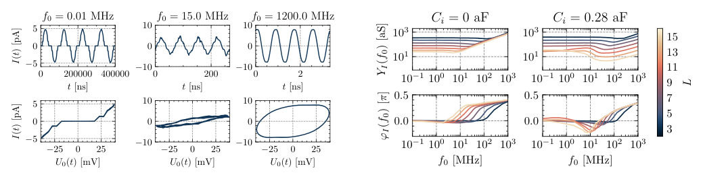 
FIG. 4: Signal Processing Characteristics (a) Time-domain and phase space plots of the total output current I(t) given a sinusoidal input voltage U0(t) = ˜U0 sin(2πf0t) for a network of size L = 9 and substrate coupling Ci = 0.28 aF. These plots demonstrate the transition from an in-phase current I(t) ≈Itun dictated by nonlinear tunneling at small frequencies (0.01 MHz), to a linear π/2 phase-leading current I(t) ≈Idisp defined by capacitive charge displacement (1200 MHz). At intermediate frequencies (15.0 MHz) both current types contribute to the total current I(t) = Itun + Idisp (b) Admittance YI and phase shift φI of the total output current I(t). The total response transitions from a...

**Summary.** This paper proposes a novel neuromorphic computing architecture using nanoparticle networks whose behavior is controlled by external electrodes. The authors derive three critical design rules—related to operating frequency, substrate thickness, and structural disorder—to maximize computational performance. This work bridges condensed matter physics concepts like electrostatic screening and charge trapping with the requirements of artificial intelligence hardware.

**Why it may be interesting.** It models complex non-equilibrium dynamics in a solid-state system where charge trapping and local disorder dictate macroscopic computational function, linking concepts from disordered systems (localization/glasses) to artificial intelligence hardware.

Detailed structure

**Main problem.** The work addresses the energy efficiency bottleneck of von Neumann computing by proposing a physical, tunable neuromorphic architecture.

**Main result.** Three core design rules are established for maximizing computational performance: operating near cutoff frequency, controlling memory via oxide thickness/screening length, and using disorder to bypass expressivity saturation limits.

**Method.** Theoretical and numerical analysis combining electrostatic modeling (Poisson equation solutions) with stochastic charge transport simulations (Kinetic Monte Carlo).

**Model / system.** The system is a network of metallic nanoparticles interconnected by molecular junctions on a SiO2/Si substrate, whose dynamics are governed by capacitive coupling and single-electron tunneling.

**Key observables.** Total time-dependent output current I(t), Paired Pulse Ratio (PPR) for memory characterization, and the 'phase-aware effective volume' metric for expressivity.

**Important parameters / regimes.** SiO2 thickness (setting screening length $\Lambda$), structural disorder level, and operating frequency relative to cutoff frequency.

**Assumptions / limitations.** The total current is treated as a superposition of resistive tunneling and capacitive displacement currents; approximations are made regarding nearest-neighbor coupling dominance.

**Figures summary.** Figures illustrate circuit schematics, spatial screening decay (exponential), memory contrast between fading/non-volatile regimes, and the time evolution of potentials showing trapped charge islands.

**Paper structure.** The paper progresses from establishing the physical platform and energy cost problem to deriving three key design rules based on analyzing electrostatic coupling, memory retention via PPR, and overcoming expressivity limits using disorder.

Abstract

Physical computing leverages complex dynamical systems for energy-efficient data processing. In this work, we present a neuromorphic architecture based on metallic nanoparticles interconnected by molecular junctions on a $\text{SiO}_2$/Si substrate. We demonstrate that surrounding static control electrodes transform this nanoparticle network from a passive reservoir into a tunable nonlinear dynamical system. By analyzing how these electrodes route simple one-dimensional voltage inputs into multidimensional signal responses, we establish three core design rules to maximize computational performance. First, operating near the system's cutoff frequency achieves an optimal balance between nonlinear charge tunneling and linear capacitive memory. Second, tuning the underlying $\text{SiO}_2$ thickness sets the electrostatic screening length and dictates the memory type. Thick oxide layers reduce the screening length, causing networks larger than this length to transition into a persistent, non-volatile-like regime. Conversely, networks smaller than the screening length exhibit only fading memory. Third, introducing structural disorder via heterogeneous molecular junctions overcomes inherent limits on expressivity. While a network's computational expressivity scales with its physical size, it is ultimately capped by the screening length. Breaking internal spatial symmetries with localized disorder bypasses this saturation, allowing control voltages to independently manipulate specific signal amplitudes and phases, universally maximizing performance for dynamic neuromorphic applications.

[↑ back to top](#top)

### [Consistent symmetry breaking and topological phases](http://arxiv.org/abs/2607.28181v1)

**Authors:** Yuezhao Li, Guo Chuan Thiang  
**Type:** theory · **Category:** other · **PDF:** <https://arxiv.org/pdf/2607.28181v1>  
**Analysis basis:** full PDF text, analyzed in chunks
**Topic relevance:** `analog quantum simulation` **3/5** · `Keldysh / 2PI / non-Gaussian methods` **1/5** · `correlated / nonlocal dissipation` **1/5** · `driven-dissipative phase transition` **1/5** · `entanglement & information structure` **1/5**

📷 Fig 1

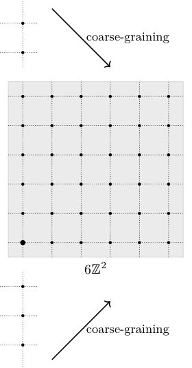 
Figure 1.1. In the left diagram, the large black circles indicate an orbit for the standard Z2-action on R2, while the shaded 1 × 1 square indicates a fundamental domain. Symmetry breaking to 2Z2 is depicted by the top diagram — the shaded 2 × 2 square in- dicates a “coarse-grained” fundamental domain containing a single point of the 2Z2-orbit (large black circle). Points of the Z2-orbit (small black circles) are no longer individually distinguished, but are lumped together in fours. We may also break Z2 to 2Z × 3Z (bottom) or 6Z2 (right); the latter breaking can be done in two stages in several different ways (upper arrows or lower arrows).

**Summary.** This work develops a rigorous mathematical theory to classify topological phases by analyzing how symmetry breaking affects the index of Dirac-type operators. It introduces a weak/strong dichotomy for these indices, generalizing concepts from solid-state physics into abstract settings involving group $C^*$-algebras and coarse geometry.

**Why it may be interesting.** While highly abstract, the connection between topological invariants derived from spectral theory (like those in condensed matter) and deep algebraic structures like K-theory and group $C^*$-algebras provides powerful mathematical tools for classifying quantum phases of matter.

Detailed structure

**Main problem.** The paper establishes a general mathematical framework for defining topological invariants (indices) that remain consistent under symmetry breaking, particularly in settings involving proper metric spaces and discrete group actions.

**Main result.** It develops a canonical weak/strong dichotomy for equivariant indices and relates these abstract algebraic structures to macroscopic or coarse-geometric indices derived from the system's underlying geometry.

**Method.** The methodology combines advanced concepts from K-theory, index theory (specifically involving Dirac-type operators), and coarse geometry applied to $C^*$-algebras associated with group actions.

**Model / system.** The theoretical framework is motivated by solid-state physics models like topological insulators, where Hamiltonians are $\Gamma$-invariant Schrödinger or Dirac operators on a space $X$ acted upon by a discrete group $\Gamma$.

**Key observables.** Equivariant indices ($	ext{ind}_\Gamma(/D)$) and the resulting weak/strong K-theory classes that characterize topological phases.

**Important parameters / regimes.** The structure of the symmetry group $\Gamma$ (e.g., abelian lattices $\mathbb{Z}^d$) and the nature of the space $X$.

**Assumptions / limitations.** Requires $X$ to be a proper metric space with a proper, cocompact action of $\Gamma$, and relies on constructing specific Roe algebras associated with this geometry.

**Figures summary.** Figure 1.1 illustrates 'coarse-graining' by showing how an orbit under $\mathbb{Z}_2$ is lumped together in a coarse-grained fundamental domain when symmetry is broken to $2\mathbb{Z}_2$.

**Paper structure.** The paper builds from defining the index for operators invariant under symmetries, formalizing symmetry breaking via finite-index subgroups and associated colimits, establishing the weak/strong dichotomy, and relating this structure to coarse-geometric indices.

Abstract

Operators invariant under a symmetry group are also invariant under any finite-index subgroup. The equivariant indices of such operators must be consistent under symmetry breaking. We use this principle to establish a canonical weak/strong dichotomy for equivariant indices, building on an idea originating in the theory of topological insulators in solid-state physics. We also study the relationship to coarse-geometric, or macroscopic, indices.

[↑ back to top](#top)

### [PEDOT:PSS-Coated Magnetoelastic Sensors for Highly Sensitive Wireless Humidity Sensing](http://arxiv.org/abs/2607.27399v1)

**Authors:** Wenderson R. F. Silva, Robson C. O. Guedes, Gilberto Rodrigues-Junior, Eduarda P. M. Campos, Angelo Malachias, Joaquim B. S. Mendes  
**Type:** experiment · **Category:** other · **PDF:** <https://arxiv.org/pdf/2607.27399v1>  
**Analysis basis:** full PDF text, analyzed in chunks
**Topic relevance:** `spintronics-quantum-optics interface` **3/5** · `correlated / nonlocal dissipation` **1/5** · `driven-dissipative phase transition` **1/5** · `exotic spin models in light-matter` **1/5** · `methods for driven-dissipative` **1/5**

📷 Fig 1

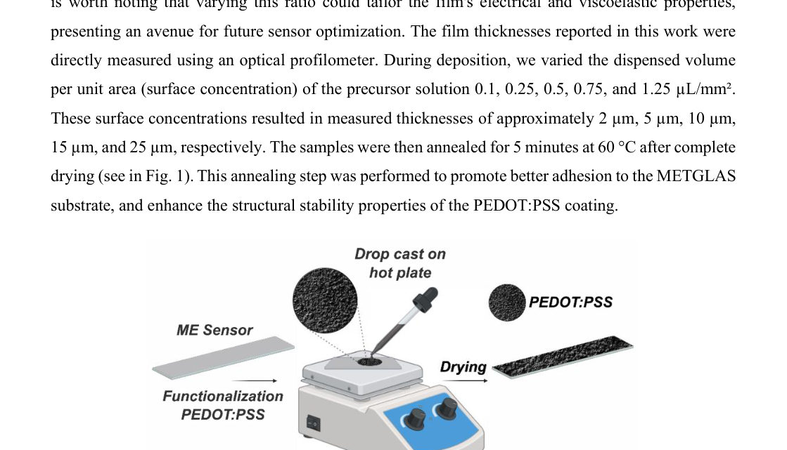 
Figure 1 - Schematic representation of the functionalization process of ME sensors using PEDOT:PSS

📷 Fig 2

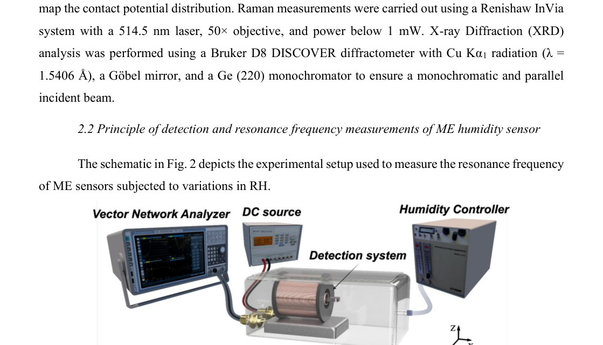 
Figure 2 - Schematic of the experimental setup for measuring the resonance frequency of ME sensors

📷 Fig 3

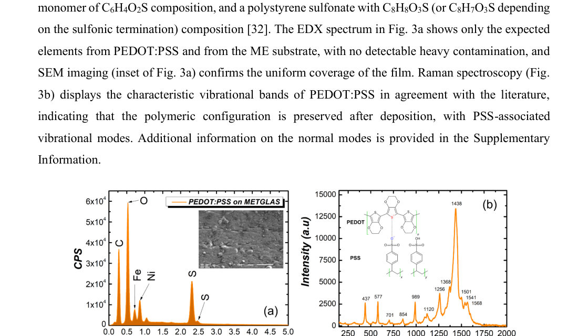 
Figure 3 - (a) EDX spectrum and SEM inset image showing the elemental composition and surface

📷 Fig 4

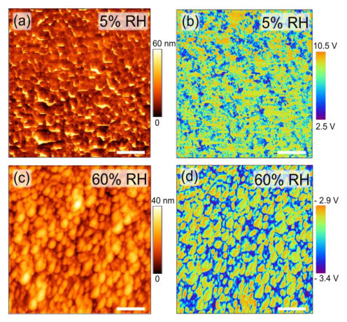 
Figure 4 - AFM images (a, c) and corresponding KPFM maps (b, d) of PEDOT:PSS films at 5% RH

📷 Fig 5

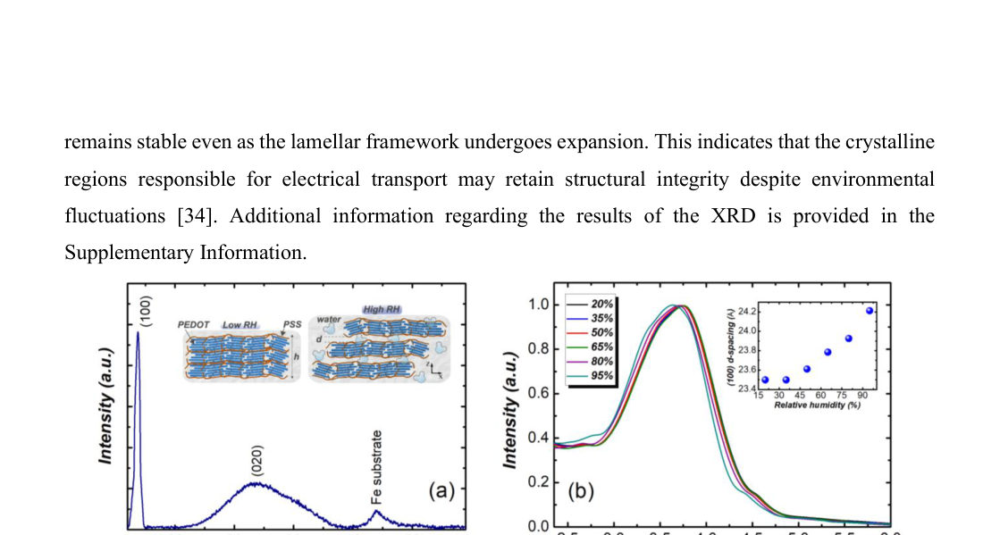 
Figure 5 - (a) XRD pattern of PEDOT:PSS films on METGLAS substrates, highlighting reflections

**Summary.** This work develops a novel, highly sensitive wireless humidity sensor by coating magnetoelastic resonators with PEDOT:PSS. The sensing mechanism exploits the dual effect of water adsorption causing both mass loading and viscoelastic damping within the polymer film. Characterization confirms that structural changes in the polymer directly translate into measurable resonance frequency shifts, achieving state-of-the-art sensitivity.

**Why it may be interesting.** While not directly related to fundamental quantum dynamics, the study involves characterizing material changes (swelling, polymer mobility) at interfaces under environmental stimuli, which touches upon concepts relevant to open quantum systems or complex condensed matter interactions.

Detailed structure

**Main problem.** Developing highly sensitive, wireless sensors for monitoring relative humidity (RH) in challenging environments.

**Main result.** The optimized PEDOT:PSS coated magnetoelastic sensor achieved a high sensitivity of 155 Hz/% RH in the 20-70% RH range, demonstrating a low-cost platform for environmental monitoring.

**Method.** The study involved fabricating sensors by depositing PEDOT:PSS films onto Metglas resonators and measuring their resonance frequency shift while controlling ambient relative humidity.

**Model / system.** The physical system is a magnetoelastic (ME) resonator functionalized with a conductive polymer coating (PEDOT:PSS). The sensing mechanism relies on the combined effects of mass loading (Sauerbrey effect) and viscoelastic damping caused by water adsorption into the polymer matrix.

**Key observables.** Resonance frequency shift ($\Delta f$), sensitivity ($155 	ext{ Hz/\%\ RH}$), resolution ($<0.1\% 	ext{RH}$), surface potential (KPFM), and XRD lamellar spacing change (23.5 Å to 24.2 Å).

**Important parameters / regimes.** Relative Humidity (RH) range (20-70% RH optimal), coating thickness ($0.5 \mu	ext{L}/	ext{mm}^2$), and temperature/annealing conditions.

**Assumptions / limitations.** The resonance shift is modeled by combining the Sauerbrey equation for mass loading with viscoelastic damping effects, though the latter requires complex shear modulus considerations beyond simple approximations.

**Figures summary.** Figures illustrate the drop-casting process (Fig. 1), the measurement setup using a VNA in a controlled chamber (Fig. 2), and comparative data showing surface morphology (AFM/KPFM) and structural changes (XRD) across varying RH levels.

**Paper structure.** The paper follows a structure of problem definition $
ightarrow$ material functionalization (PEDOT:PSS deposition) $
ightarrow$ comprehensive characterization (structural, morphological, electronic) $
ightarrow$ measurement of the frequency response to controlled humidity cycles $
ightarrow$ quantitative analysis of sensitivity and performance metrics.

Abstract

Magnetoelastic (ME) resonators provide an attractive platform for passive and wireless sensing, particularly for monitoring relative humidity (RH) in sealed or hard-to-access environments. In this work, we introduce ME humidity sensors functionalized with poly(3,4-ethylenedioxythiophene) sulfonate (PEDOT), marking the first application of this conductive polymer in ME-based humidity sensing. PEDOT films were deposited onto Metglas resonators via a simple drop-casting process, producing uniform and mechanically stable coatings. Comprehensive structural and morphological characterization by SEM, EDX, Raman spectroscopy, AFM/KPFM, and XRD confirmed the structural integrity of the polymer and revealed humidity-induced swelling of the PSS-rich domains, accompanied by enhanced polymer-chain mobility and an increase in the lamellar spacing from 23.5 Å to 24.2 Å at 95% RH. These structural changes directly affected the dynamic response of the resonators, leading to a systematic resonance-frequency downshift driven by the combined effects of water adsorption, mass loading, and viscoelastic damping. The optimized device achieved a sensitivity of 155 Hz/% RH in the 20 - 70% RH range, outperforming previously reported ME humidity sensors, while exhibiting a resolution better than 0.1% RH together with excellent response and recovery times. These results establish PEDOT as a highly effective functional coating for magnetoelastic humidity sensors and demonstrate a simple, low-cost, wireless sensing platform with high sensitivity and strong potential for practical environmental and industrial monitoring applications.

[↑ back to top](#top)

### [Effects of gold cluster intercalation in graphene: stationary waves and modified QPI features](http://arxiv.org/abs/2607.28297v1)

**Authors:** Cristina Bena, Marion Cranney, Poonam Kumari, Alberto Zobelli, Laurent Simon  
**Type:** both · **Category:** other · **PDF:** <https://arxiv.org/pdf/2607.28297v1>  
**Analysis basis:** full PDF text, analyzed in chunks
**Topic relevance:** `Kondo & dissipative impurity` **3/5** · `Keldysh / 2PI / non-Gaussian methods` **1/5** · `methods for driven-dissipative` **1/5**

📷 Fig 1

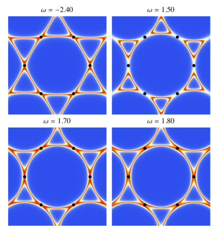 
FIG. 1. Pristine 6NN graphene spectral function at different energies. The black dots denote the M points of the BZ.

📷 Fig 2

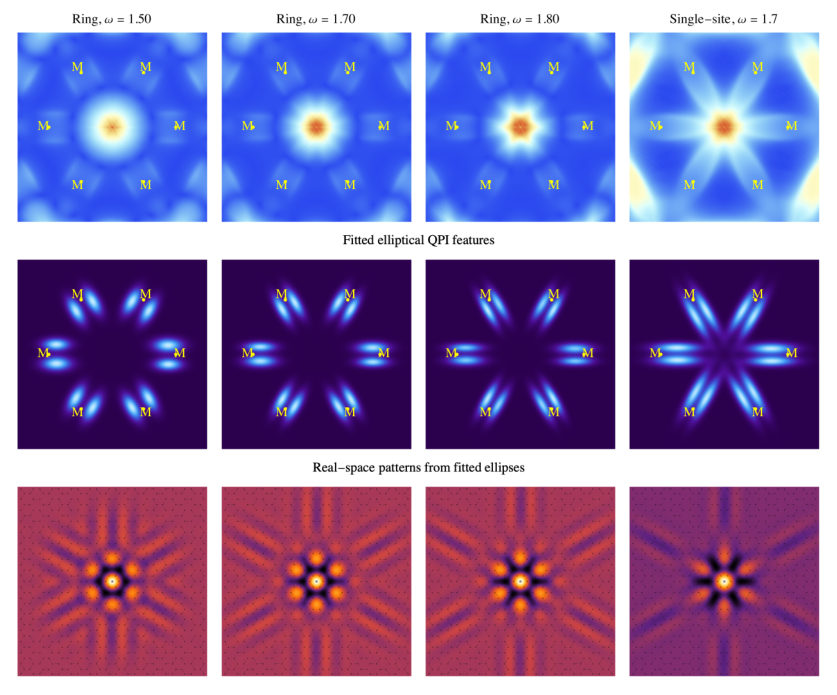 
FIG. 2. QPI patterns (first row), the corresponding double-lobe model (second row), and the resulting real-space standing waves (third row). We take U = 3eV. Compact M-centered lobes give coherent nearly stationary patterns, whereas the standing waves that correspond to extended features dephase much more rapidly in real space.

📷 Fig 3

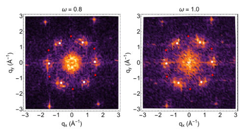 
FIG. 3. Experimental QPI maps of the Au-cluster phase at two energies close to the upper VHS, ω = 0.8 eV and ω = 1 eV. The red dots denote the K points of the BZ, and the white dots denote the M points.

📷 Fig 4

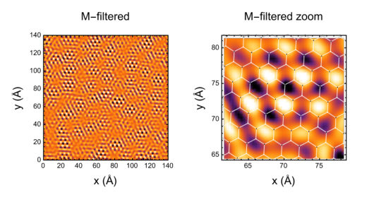 
FIG. 4. Experimental standing-wave pattern obtained by Fourier filtering the dI/dV map measured at E = 0.8 V. The filter retains only the six elliptical Fourier-space regions cen- tered near the symmetry-equivalent M points, with their long axes approximately parallel to the M–K–Γ directions; all re- maining Fourier components are suppressed before performing the inverse Fourier transform.

📷 Fig 5

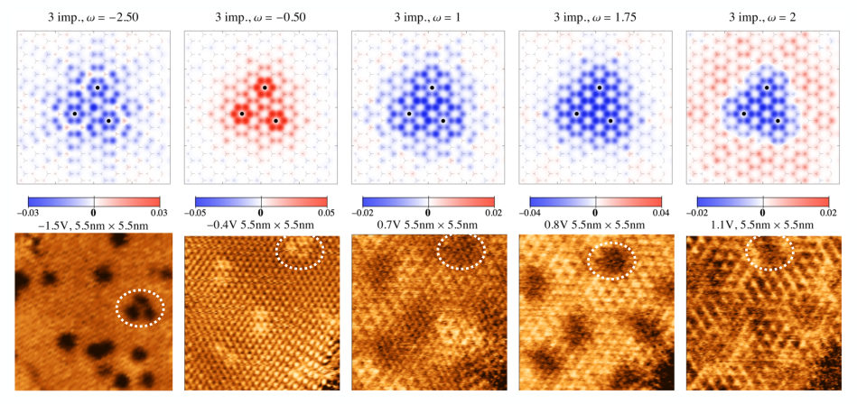 
FIG. 5. Top row: calculated LDOS correction for a representative three-atom cluster at selected energies (in arbitrary units), using U = 3 eV. Blue and red indicate negative and positive corrections, corresponding respectively to darker and brighter regions relative to the experimental background. Lower row: experimental plots showing the dependence of the LDOS with position at various energies. Except for E = -1.5eV, the panels describe approximatively the same spatial region on which we can identify roughly 5 clusters. High-intensity regions appear light, whereas low-intensity regions appear dark. A representative three-atom cluster is outlined by the dashed contour. The strongly...

**Summary.** This paper theoretically investigates the effect of gold cluster intercalation on graphene's electronic properties by modeling the Au cluster as a local ring-shaped scatterer. Using T-matrix calculations, the authors successfully reproduce the characteristic elliptic QPI patterns observed experimentally near the M points. The findings confirm that the scattering mechanism dictates both the momentum-space signatures and the resulting energy-dependent standing wave patterns in real space.

**Why it may be interesting.** The work provides a detailed quantum mechanical description of how localized impurities modify electronic band structure features (QPI/standing waves) in 2D materials, which is relevant for understanding nanoscale device physics and scattering mechanisms beyond simple continuum models.

Detailed structure

**Main problem.** The study investigates the electronic consequences, specifically stationary waves and modified Quasiparticle Interference (QPI) features, resulting from gold cluster intercalation beneath epitaxial graphene.

**Main result.** The Au intercalation acts as a ring-like scatterer, which theoretically reproduces the observed elliptic M-centered QPI structures seen in experimental FT-STS measurements. Furthermore, these QPI features naturally generate the nearly stationary standing-wave patterns observed in real space.

**Method.** The analysis employs the T-matrix formalism to calculate scattering amplitudes and local density of states corrections ($\delta
ho$) in both momentum (QPI) and real space.

**Model / system.** The system is epitaxial graphene on SiC, modified by Au clusters intercalated beneath hollow sites. The electronic structure is modeled using a $p_z$ Hamiltonian for pristine graphene, coupled to an impurity Hamiltonian describing the local scattering potential from the Au cluster.

**Key observables.** QPI maps (momentum space), real-space standing wave patterns ($\delta
ho(\mathbf{r}, \omega)$), and energy-dependent LDOS contrast sign changes.

**Important parameters / regimes.** The analysis is sensitive to energy ($\omega$), particularly near the upper Van Hove Singularity (VHS) region, and depends on the geometry of the scatterer (ring/hollow site).

**Assumptions / limitations.** Key approximations include using a minimal T-matrix approximation ($V_{	ext{eff}}(\omega) \simeq U\mathbb{I}_6$) because QPI features are far from Au hybridization levels. A limitation noted is that small-$q$ scattering can mask the M-point contributions in real-space calculations.

**Figures summary.** Figures illustrate pristine graphene spectral functions, calculated QPI maps showing double-lobe elliptical structures near M points, and corresponding real-space standing wave patterns, alongside energy dependence of the LDOS contrast.

**Paper structure.** The paper establishes the physical system (Au intercalation in graphene), develops a theoretical framework using the T-matrix formalism for scattering analysis, calculates key observables like QPI and real-space LDOS corrections, and finally compares these results against experimental FT-STS measurements to confirm the model's validity.

Abstract

Gold intercalation beneath epitaxial graphene on SiC produces a cluster phase with unusual standing waves and quasiparticle-interference (QPI) features concentrated near the graphene M points. We show that this can be explained by Au intercalation below graphene hollow sites, which induces a local scattering potential on the six surrounding carbon atoms. Within a T-matrix treatment, this ring-like scatterer produces elliptical QPI structures centered near M, in agreement with the experimental FT-STS measurements. We further show that these QPI features naturally generate the nearly stationary standing-wave patterns observed in real space. Finally, we compute the local-density-of-states contrast on and off a small cluster and show that its sign and magnitude are strongly energy dependent, consistent with the experimental observations.

[↑ back to top](#top)

### [Fluctuation electrodynamics of quantum capacitance in electron bilayers](http://arxiv.org/abs/2607.27406v1)

**Authors:** Dmitry Zverevich, Alberto F. Morpurgo, Alex Levchenko  
**Type:** theory · **Category:** strongly correlated electrons · **PDF:** <https://arxiv.org/pdf/2607.27406v1>  
**Analysis basis:** full PDF text, analyzed in chunks
**Topic relevance:** `Keldysh / 2PI / non-Gaussian methods` **3/5** · `correlated cavity matter` **1/5** · `methods for driven-dissipative` **1/5**

📷 Fig 1

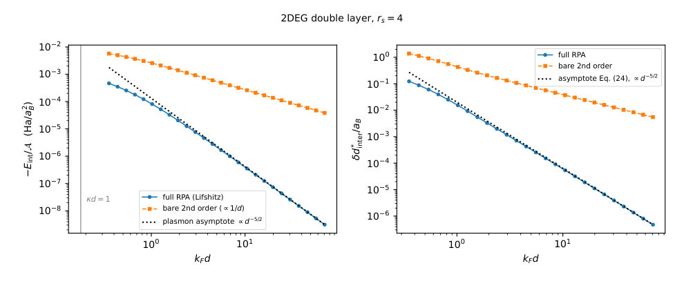 
FIG. 1. 2DEG double layer at rs = 4, equal densities. Left: interlayer correlation energy from the full ring expression (14) with the exact Lindhard function, compared with bare second-order perturbation theory (∝1/d) and the plasmon zero-point asymptote (21) (∝d−5/2). Screening beyond κd ∼1 suppresses the interaction by orders of magnitude. Right: the corresponding positive shift of the effective capacitor thickness, Eq. (6), converging onto the closed-form asymptote (22).

📷 Fig 2

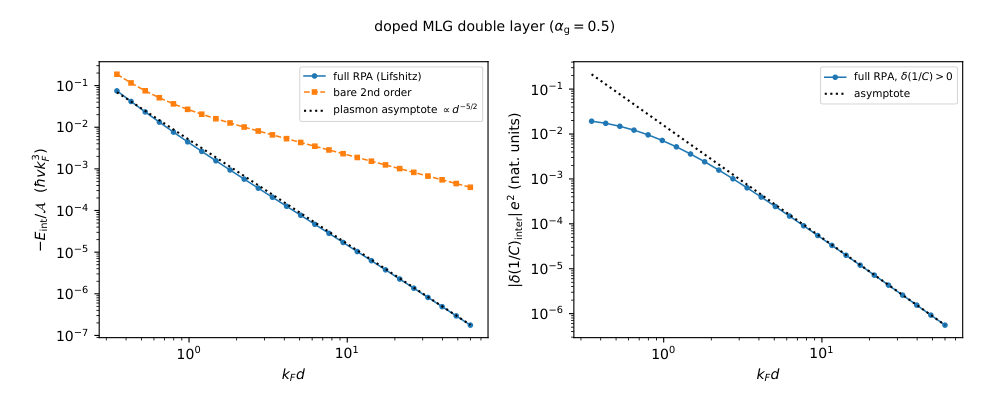 
FIG. 2. Doped monolayer-graphene double layer, αg = 0.5, equal densities, natural units ℏ= v = 1. Left: interlayer correlation energy (full ring expression, bare second order, plasmon zero-point asymptote). Right: interlayer capacitance correction, positive throughout, converging onto the closed asymptote (26). The reference density n = 1012 cm−2 corresponds to k−1 F = 5.7 nm.

📷 Fig 3

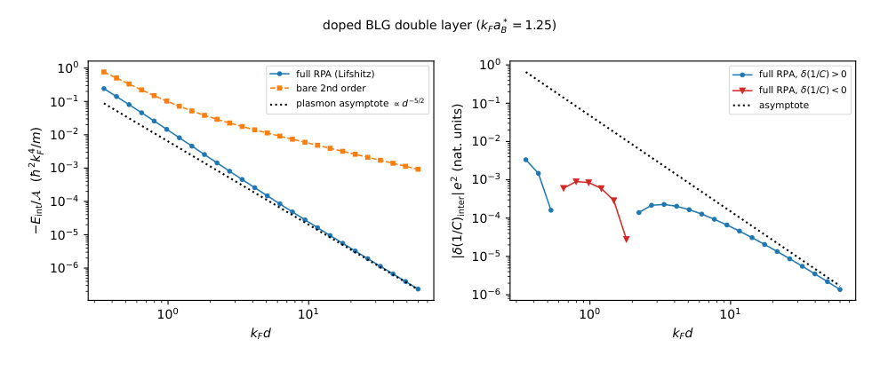 
FIG. 3. Doped bilayer-graphene double layer (two-band model), kF a∗ B = 1.25, equal densities, natural units ℏ= m = 1. Left: interlayer correlation energy. Right: magnitude of the interlayer capacitance correction; downward triangles mark the window 0.55 &lt; kF d &lt; 1.87 where the correction is negative (capacitance enhanced). The dotted line is the parabolic-band asymptote, approached slowly because of interband screening.

**Summary.** This paper develops a comprehensive theory for the quantum capacitance in electron bilayers by treating interlayer Coulomb correlations. It shows that these correlations manifest as a Casimir compressibility derived from coupled plasmon zero-point fluctuations. The work provides specific, material-dependent predictions, notably demonstrating anomalous screening effects in bilayer graphene.

**Why it may be interesting.** It provides a rigorous quantum electrodynamic description of correlation effects in low-dimensional conductors, linking macroscopic transport properties (capacitance) directly to fundamental vacuum fluctuation forces (Casimir effect).

Detailed structure

**Main problem.** To develop a systematic theory for the quantum capacitance of electron double layers, specifically isolating and characterizing the contribution arising from interlayer Coulomb correlations.

**Main result.** The interlayer correlation to the inverse capacitance is shown to be equivalent to a Casimir compressibility derived from coupled plasmon zero-point fluctuations. For bilayer graphene, this correction is anomalous, exhibiting suppression and sign reversal in the experimentally relevant separation range.

**Method.** The theory employs functional-integral formulations and ring diagram expansions (RPA generalization) to calculate the ground-state energy corrections due to interlayer interactions.

**Model / system.** The primary model is two parallel 2D electron sheets (electron bilayers), applied to systems like doped monolayer and bilayer graphene. Interactions are mediated by the Coulomb potential, leading to coupled plasmon excitations.

**Key observables.** Quantum capacitance ($C$), inverse quantum capacitance ($\delta C^{-1}_{	ext{inter}}$), interlayer correlation energy, and Casimir compressibility.

**Important parameters / regimes.** Interlayer separation distance ($d$), electron density ($n$), and the ratio $k_F d$ (Fermi wavevector times separation).

**Assumptions / limitations.** The calculation often assumes the nonretarded limit of the Lifshitz theory and neglects higher-order vertex corrections, though limits are defined for Wigner crystal or exciton condensation regimes.

**Figures summary.** Not specified in the notes; the focus is on deriving closed functional forms and asymptotic behaviors for the capacitance correction.

**Paper structure.** The paper systematically develops the theory by first establishing the connection between interlayer energy and van der Waals/Casimir physics. It then applies this framework to specific materials (2DEG, graphene) to derive quantitative results, concluding with a discussion of theoretical limits and regimes where pairing effects dominate.

Abstract

Capacitance is a thermodynamic probe of interacting electrons: it measures the energy cost of moving charge between conductors, and in low-dimensional systems this cost is shaped by exchange and correlation as much as by electrostatics. We develop a theory of the quantum capacitance of electron double layers, semiconductor quantum wells as well as monolayer and bilayer graphene devices, focusing on the contribution generated by interlayer correlations. Within a functional-integral formulation we show that the separation-dependent part of the ground-state energy is, at the level of ring diagrams, exactly the nonretarded Lifshitz expression for the van der Waals energy of two conducting sheets, with reflection amplitudes built from the layer polarizabilities. The interlayer correction to the inverse capacitance is the second density derivative of this energy: a Casimir compressibility. The zero-point fluctuations that generate Casimir forces between mirrors are here the coupled plasmons of the bilayer, and their contribution to the capacitance is obtained in closed form, with a universal coefficient; its sign shows that interlayer correlations oppose charging at high density. A Gell-Mann-Brueckner analysis gives the exact high-density limit in terms of universal functions. For graphene we find that monolayers follow the electron-gas template, while bilayer graphene is anomalous: interband screening suppresses the correction by orders of magnitude and reverses its sign in the experimentally relevant range of separations. We delineate the limits of the theory, identifying the dilute Wigner-crystal regime and electron-hole double layers near exciton condensation as regimes where the capacitance becomes a probe of interlayer pairing.

[↑ back to top](#top)

### [Nonlinear Fourier spectral signatures of rogue waves observed in Bose-Einstein condensates](http://arxiv.org/abs/2607.27734v1)

**Authors:** Zhihao Zhang, Yankai Huang, Tiantian Li, Denglong Wang, Jie Peng  
**Type:** theory · **Category:** quantum gases · **PDF:** <https://arxiv.org/pdf/2607.27734v1>  
**Analysis basis:** full PDF text, analyzed in chunks
**Topic relevance:** `analog quantum simulation` **2/5** · `non-equilibrium dynamics` **2/5** · `driven-dissipative phase transition` **1/5** · `interference shaping light` **1/5** · `non-equilibrium universality` **1/5**

📷 Fig 1

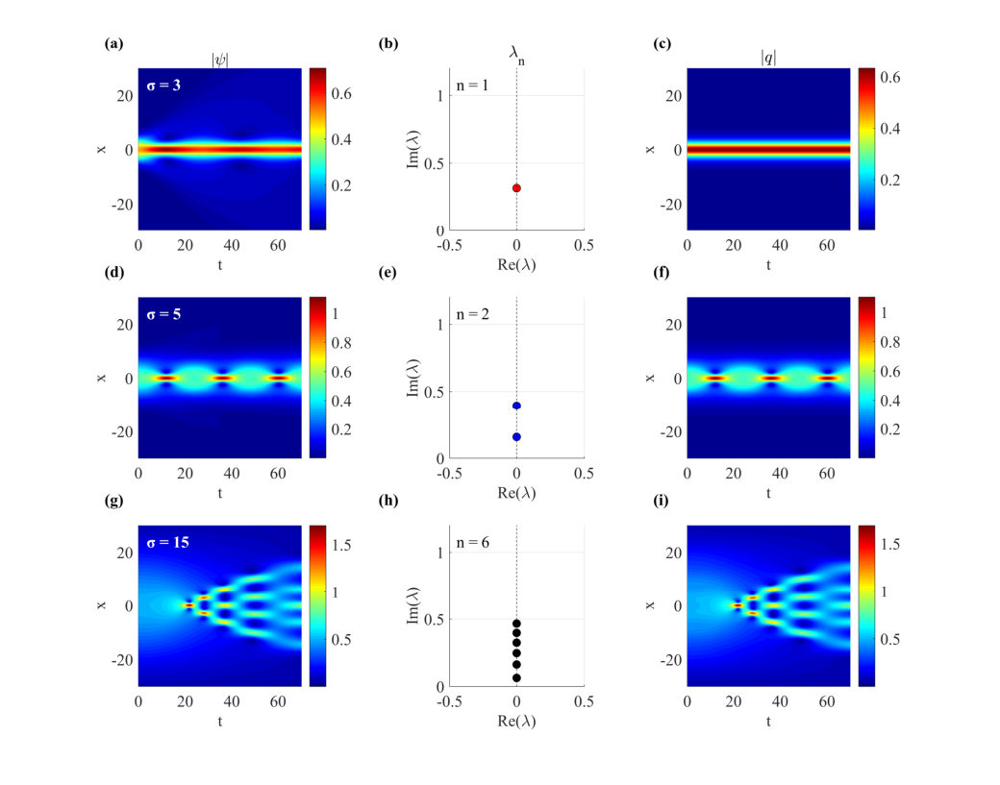 
FIG. 1: First column: spatiotemporal evolutions of Gaussian wave packets for different initial widths σ = 3, 5, 15 with fixed A0 = 0.5. Second column: corresponding discrete nonlinear spectral distributions obtained via the NFT. Third column: pure- soliton evolution results reconstructed via the DT using only the extracted discrete-spectral parameters.

📷 Fig 2

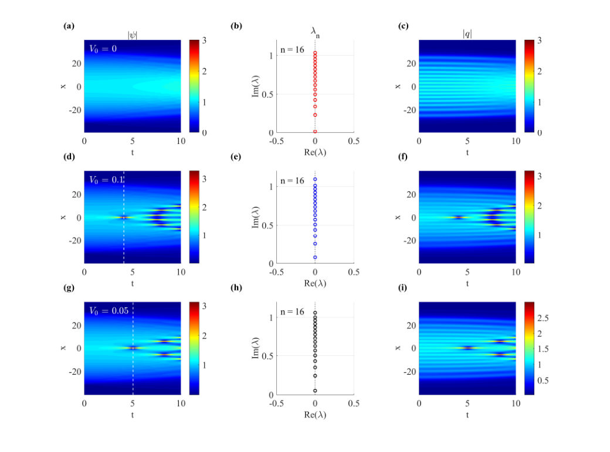 
FIG. 2: First column: spatiotemporal evolutions of the experimentally prepared initial states for different perturbation ampli- tudes V0 = 0, 0.1, 0.05; the white dashed lines in (d) and (g) indicate the time of peak emergence. Second column: corresponding discrete nonlinear spectral distributions obtained via the ZS scattering problem. Third column: pure-soliton evolution results reconstructed via the DT using only the extracted discrete-spectral parameters.

📷 Fig 3

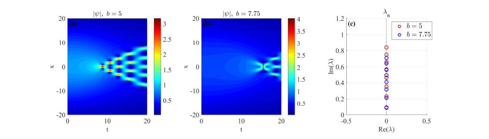 
FIG. 3: (a) and (b) Spatiotemporal evolutions of the wave function for different offsets b = 5 and b = 7.75 of the two Gaussian wave packets. (c) Corresponding discrete nonlinear spectral distributions obtained via the ZS scattering problem.

📷 Fig 4

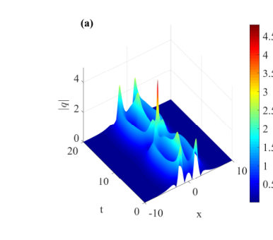 
FIG. 4: (a) DT-reconstructed evolution result of three soliton modes with η1 = p

📷 Fig 5

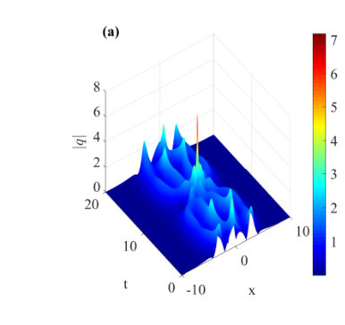 
FIG. 5: (a) DT-reconstructed evolution result of four soliton modes with η1 = p

**Summary.** The paper analyzes rogue wave formation in Bose-Einstein condensates using nonlinear spectral analysis. It demonstrates that these extreme localized events arise not from new physics, but from the coherent phase synchronization and constructive interference of pre-existing bound soliton modes within the system's spectrum. The methodology provides a powerful, constructive tool for designing and understanding higher-order RW structures.

**Why it may be interesting.** This work provides a deep mathematical link between nonlinear wave phenomena (RWs) and integrable systems theory (soliton dynamics). For AMO physicists studying BECs, it offers a powerful spectral diagnostic tool to predict extreme events based on internal conserved modes rather than just external driving forces.

Detailed structure

**Main problem.** The study investigates the formation mechanism and nonlinear spectral structures of rogue waves (RWs) in Bose-Einstein condensate (BEC) matter-wave systems with vanishing boundary conditions.

**Main result.** RW formation is shown to be governed by the coherent, phase-synchronized dynamics of discrete soliton modes encoded within the system's nonlinear spectrum. This provides a spectral engineering approach to understand and control these extreme localized events.

**Method.** The authors employ Nonlinear Fourier Transform (NFT) analysis based on the integrable focusing nonlinear Schrödinger equation and utilize Darboux reconstruction techniques derived from the Zakharov-Shabat scattering problem.

**Model / system.** The physical system is a quasi-one-dimensional Bose-Einstein condensate (BEC), modeled by the dimensionless focusing nonlinear Schrödinger equation. The analysis specifically addresses the case of vanishing boundary conditions, which distinguishes it from standard continuous-wave background analyses.

**Key observables.** Nonlinear spectrum (discrete eigenvalues $\lambda_n$ corresponding to bound solitons and continuous spectrum $Q_c(\lambda)$), peak amplitude $|	ext{q}|_{	ext{max}}$, and the evolution of norming constants $c_n(t)$.

**Important parameters / regimes.** Initial wave packet width ($\sigma$), number of constituent soliton modes (e.g., three or four for higher-order RWs), and the synchronization time $T_0$.

**Assumptions / limitations.** The analysis assumes vanishing boundary conditions at infinity, allowing the use of spectral methods based on discrete eigenvalues; it also relies on mapping complex dynamics to linear phase shifts via NFT.

**Figures summary.** Figures compare spatiotemporal evolutions for Gaussian wave packets and show reconstructions using Darboux transformations (DT) for both three and four synchronized soliton modes, demonstrating coherent focusing peaks.

**Paper structure.** The paper builds from establishing the physical problem in BECs to applying advanced spectral techniques (NFT/ZS scattering). It analyzes two classes of RWs (Gaussian-induced and Peregrine solitons), develops a constructive 'spectral engineering' method based on phase matching, and concludes by unifying the mechanism under coherent soliton mode interaction.

Abstract

Modulation instability provides an important framework for understanding rogue wave (RW) formation on continuous backgrounds. However, the formation mechanism and nonlinear spectral structures of RWs in Bose-Einstein condensate (BEC) matter-wave systems with vanishing boundary conditions remain largely unexplored. Here, we employ the nonlinear Fourier transform (NFT), based on the integrable structure of the focusing nonlinear Schrödinger equation and the Zakharov-Shabat scattering problem, to investigate two representative classes of first-order RWs in BEC systems. Through nonlinear spectral analysis and Darboux reconstruction, we demonstrate that both Gaussian-wave-packet-induced extreme localization events and experimentally observed Peregrine solitons are governed by the coherent dynamics of discrete soliton modes encoded in the nonlinear spectrum. For Gaussian initial states, increasing the initial width leads to an increasing number of discrete eigenvalues, resulting in a transition from fundamental solitons and bound states to Christmas-tree-like RW structures. For experimentally observed Peregrine solitons, localized perturbations reshape the discrete spectral configuration and phase evolution, enabling coherent focusing of multiple bound soliton modes. Furthermore, we reveal the spectral mechanism of higher-order RWs and propose an inverse spectral-engineering approach based on discrete-spectrum phase matching. Our results provide a nonlinear spectral perspective for understanding and controlling RW formation in matter-wave systems with vanishing boundary conditions.

[↑ back to top](#top)

### [Transport Evidence of Magnetic Polarization in the Altermagnetic Candidate MnTe](http://arxiv.org/abs/2607.28441v1)

**Authors:** Younes Ghorbani, Nayana Devaraj, Joshua Maile, Samuel Poage, Qihua Zhang, Maria Hilse, Stephanie Law, Salva Salmani-Rezaie, Awadhesh Narayan, Kaveh Ahadi  
**Type:** both · **Category:** other · **PDF:** <https://arxiv.org/pdf/2607.28441v1>  
**Analysis basis:** full PDF text, analyzed in chunks
**Topic relevance:** `spintronics-quantum-optics interface` **2/5** · `Kondo & dissipative impurity` **1/5** · `analog quantum simulation` **1/5** · `exotic spin models in light-matter` **1/5** · `non-equilibrium dynamics` **1/5**

📷 Fig 1

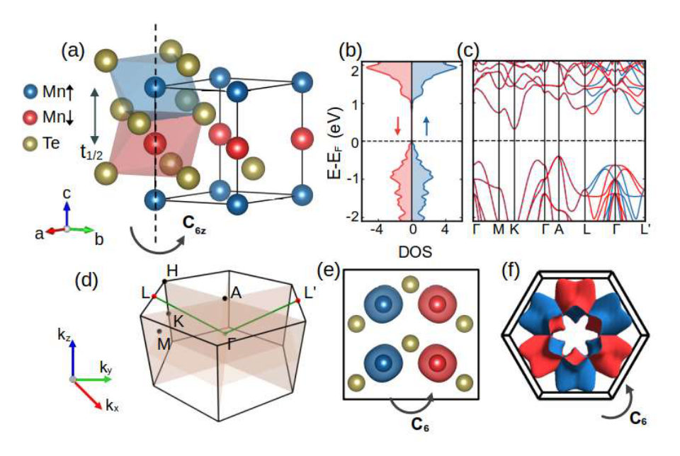 
Figure 1. Magnetic structure of α-MnTe. (a) Crystal structure of α-MnTe, showing the two opposite-spin sublattices in blue and red. Opposite spin sublattices are connected by a sixfold screw-axis rotation. (b) Spin-polarized density of states with total density of states for up and down spin channels. (c) Spin-polarized electronic band structure along the high-symmetry path Γ-M-K- Γ-A-L- Γ-L’. Here, blue and red lines indicate the spin-up and spin-down bands, respectively. Spin- splitting is clear along the L-Γ-L′, while the bands for the two spin channels are degenerate along the Γ-M-K-Γ-A-L. (d) Bulk hexagonal Brillouin zone of α-MnTe, where the high-symmetry points denoted. The...

📷 Fig 2

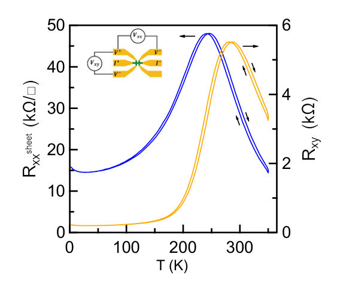 
Figure 2. Temperature dependence of longitudinal sheet resistance and Hall resistance of MnTe thin film grown on InP (111). Below 250 K, Rxx exhibits a metallic-like behavior (dRxx/dT &gt; 0) despite MnTe being a semiconductor. Both channels exhibit peaks at similar but non-overlapping temperatures.

📷 Fig 3

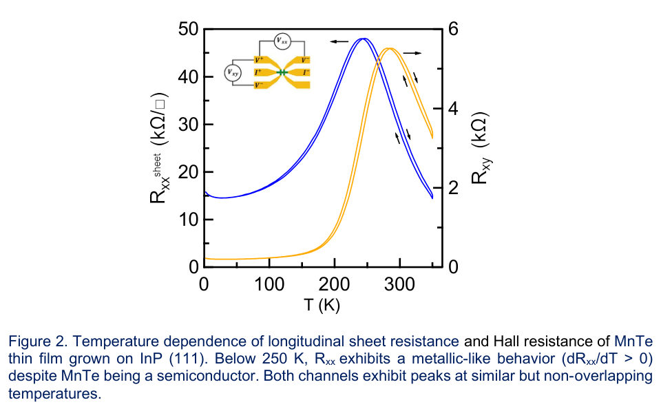 
Figure 3 exhibits the anisotropic magnetoresistance (AMR) of MnTe thin films, measured as a function of temperature and magnetic field. AMR could be used as a probe into magnetic structure and its evolution with applied magnetic field in itinerant anti- ferromagnets35–38. Figure 3 shows the 𝐴𝑀𝑅(%) = (𝑅௫௫−𝑅௠௜௡) 𝑅௠௜௡ ⁄ × 100, where the current is kept along a crystallographic direction as the angle between the current and the in-plane magnetic field changes. AMR response in an itinerant (anti)ferromagnet contains both crystalline and non-crystalline contributions39,40.

📷 Fig 4

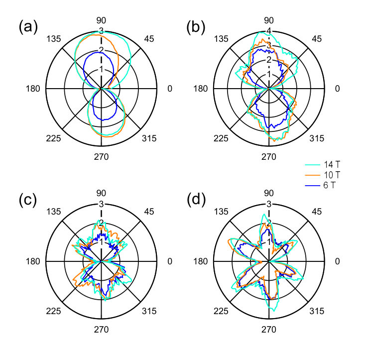 
Figure 3. Polar plots showing the angular dependence of anisotropic magnetoresistance (AMR(%) = (Rxx-Rmin)/Rmin ×100) in MnTe thin films at different temperatures and magnetic fields: (a) 300 K, (b) 150 K, (c) 50 K, and (d) 2 K, under magnetic fields of 6 T, 10 T, and 14 T. At room temperature, the AMR exhibits predominantly two-fold symmetry, whereas upon cooling a six-fold symmetry emerges, reflecting the underlying hexagonal crystal symmetry of the NiAs-type MnTe structure.

📷 Fig 5

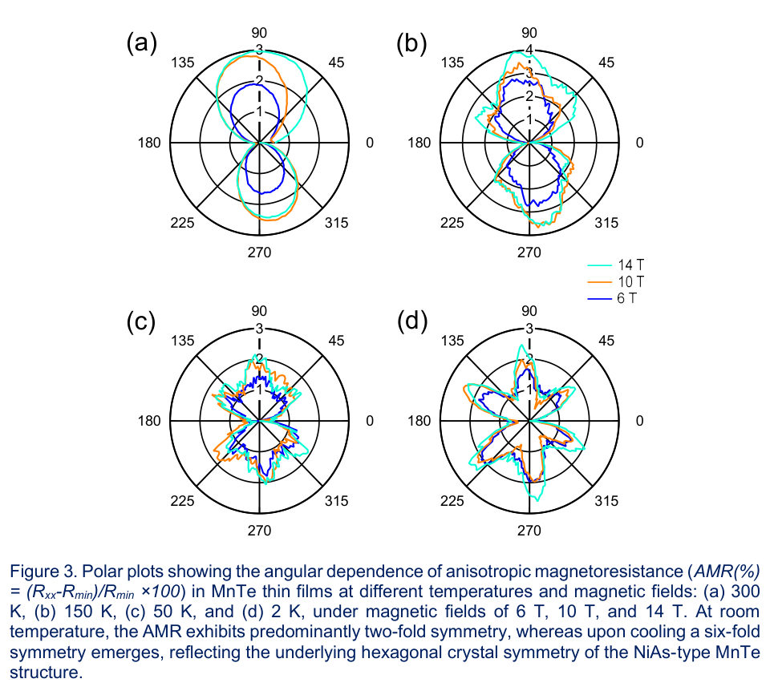 
Figure 4 (a) and (b) exhibit longitudinal and transverse resistance of MnTe film, respectively, as a function of sweeping magnetic field at 300 K, 200 K, 100 K, 50 K, and 1.8 K. At room temperature, the longitudinal magneto-resistance of MnTe films exhibits a

**Summary.** This work reports growing epitaxial $\alpha$-MnTe thin films and measuring their transport properties, which exhibit signatures of net magnetic polarization. By combining these experiments with DFT calculations, the authors propose that interface effects or point defects are responsible for inducing magnetism in a material expected to be an antiferromagnet. This demonstrates an engineering route toward functional spintronic materials.

**Why it may be interesting.** While focused on condensed matter magnetism rather than quantum information protocols, the study of emergent magnetic order (altermagnetism) driven by interfaces and defects provides models for engineered quantum materials relevant to spintronics devices.

Detailed structure

**Main problem.** The central goal is to understand how to precisely control magnetic properties for next-generation spin-based electronics by investigating the emergence of finite net magnetic polarization in $\alpha$-MnTe thin films, which bulk theory predicts should be an antiferromagnet.

**Main result.** Magnetotransport measurements reveal hysteretic magnetoresistance signatures suggesting a net magnetic polarization, which DFT calculations attribute to interface effects or point defects breaking the material's intrinsic symmetry.

**Method.** The study combines experimental synthesis (MBE) and transport measurements (magneto-transport, AMR) with theoretical modeling using Density Functional Theory (DFT+U).

**Model / system.** The physical system is epitaxial $\alpha$-MnTe thin films grown on InP(111) substrates. The theory models the electronic structure and magnetic ordering by considering interface termination and specific point defects like Mn interstitials.

**Key observables.** Hysteretic butterfly longitudinal magnetoresistance, nonlinear transverse magneto-resistance, Anisotropic Magnetoresistance (AMR), and spin-polarized Density of States (DOS).

**Important parameters / regimes.** Low temperatures ($T$), applied magnetic fields ($H$), and the specific defect concentrations/interface terminations.

**Assumptions / limitations.** The observed metallic behavior might be due to defects rather than a fundamental change in electronic character; the emergence of magnetization is linked to symmetry breaking at interfaces or via point defects.

**Figures summary.** Figures show temperature dependence of resistance (metallic-like below 250 K), AMR vs. T and B, and DFT calculations illustrating spin asymmetry induced by specific defect configurations.

**Paper structure.** The paper first establishes the need for magnetic control in spintronics; it presents MBE growth and transport measurements showing anomalous hysteretic behavior; subsequently, DFT is used to calculate how interface effects or defects can stabilize a net magnetization against bulk antiferromagnetic predictions.

Abstract

The ability to precisely control magnetic properties is central to the development of future spin-based electronics. In this work, we report the successful growth of epitaxial α-MnTe thin films on InP(111) substrates using molecular beam epitaxy. Magneto-transport measurements at low temperatures reveal a distinct, hysteretic butterfly longitudinal magnetoresistance alongside a nonlinear transverse magneto-resistance response, suggesting the presence of a finite net magnetic polarization in the films. To understand the origin of this behavior, density functional theory (DFT) calculations were performed. While pristine bulk MnTe is a compensated antiferromagnet, our computational results suggest multiple pathways through which a finite magnetization can emerge in thin-film geometries, including interface-induced symmetry breaking and point defects. These findings demonstrate an epitaxial route for engineering magnetic responses in thin films.

[↑ back to top](#top)

### [Significant ordinary Nernst effect contribution to spin-orbit torque harmonic Hall measurements in metallic structures](http://arxiv.org/abs/2607.27813v1)

**Authors:** Igor Lyalin, C. C. Chiang, C. L. Chien  
**Type:** experiment · **Category:** other · **PDF:** <https://arxiv.org/pdf/2607.27813v1>  
**Analysis basis:** full PDF text, analyzed in chunks
**Topic relevance:** `methods for driven-dissipative` **1/5** · `non-equilibrium dynamics` **1/5** · `spintronics-quantum-optics interface` **1/5**

📷 Fig 1

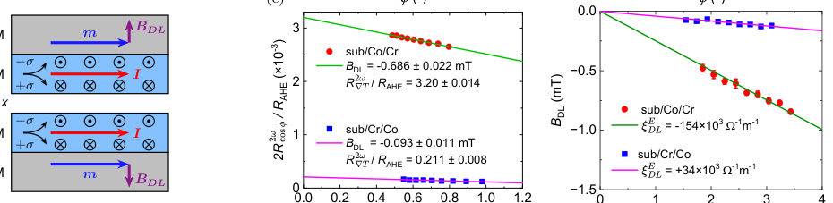 
FIG. 1. (a) Schematic of the harmonic Hall measurement. The angular dependence of the second harmonic Hall resistance for (b) sub/Co(2)/Cr(10) and (c) sub/Cr(10)/Co(2) samples. The solid black lines are fits with eq.(1). (d) Schematic of the effective damping-like field BDL in a FM/NM bilayer and a NM/FM bilayer with the reversed stacking order. (e) 2R2ω cos ϕ/RAHE as a function of 1/Beff and (f) BDL as a function of the applied electric field for sub/Co(2)/Cr(10) and sub/Cr(10)/Co(2).

📷 Fig 2

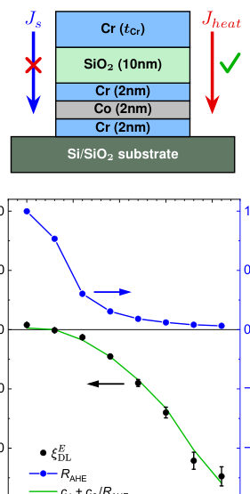 
FIG. 3. (a) Schematics of a control sample sub/Cr(2)/Co(2)/Cr(2)/SiO2(10)/Cr(tCr) designed to have zero SOT. (b) DL-SOT efficiency ξE DL and anomalous Hall resistance RAHE as a function of the top Cr layer thickness, tCr.

📷 Fig 3

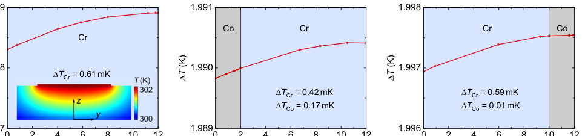 
FIG. 4. COMSOL simulations of the out-of-plane temperature profile in (a) sub/Cr(12), (b) sub/Co(2)/Cr(10), (c) sub/Cr(10)/Co(2) for an applied electric field E = 24 kV/m. Temperature is given relative to 300 K at the backside of the substrate ∆T(z) = T(z) −300 K. The interface with the substrate is z = 0 nm, the interface with the air is z = 12 nm. The inset in (a) shows 2D temperature distribution in yz-plane of the device.

**Summary.** This work investigates how the ordinary Nernst effect contaminates measurements designed to quantify spin-orbit torque using Harmonic Hall techniques on metallic bilayers. The authors demonstrate that neglecting this thermal contribution leads to significantly exaggerated SOT values, necessitating careful re-analysis of existing literature.

**Why it may be interesting.** While focused on condensed matter transport, the rigorous separation of multiple competing physical mechanisms (SOT vs. Nernst/Thermal) mirrors challenges in isolating fundamental quantum responses in complex mesoscopic systems.

Detailed structure

**Main problem.** The ordinary Nernst effect (ONE) contribution to second harmonic voltages in Harmonic Hall measurements is significant and often neglected, leading to overestimation of spin-orbit torque (SOT) efficiency.

**Main result.** The ONE cannot be ignored when quantifying SOT in metallic bilayers; correcting for it significantly reduces the calculated SOT efficiency values, suggesting previous results may need re-examination.

**Method.** Harmonic Hall measurements are performed on FM/NM bilayers using sinusoidal currents, and the measured signal is analyzed by fitting models that explicitly include the ONE contribution alongside standard SOT terms.

**Model / system.** The study focuses on metallic structures like Cr/Co bilayers ($	ext{sub}/	ext{Co}/	ext{Cr}$ and $	ext{sub}/	ext{Cr}/	ext{Co}$). The analysis involves separating contributions from Damping-like SOT, Field-like SOT, thermal effects (related to temperature gradients $
abla T$), and the ONE.

**Key observables.** Second harmonic Hall resistance ($R_{2\omega}^{xy}$), Damping-like SOT efficiency ($\xi^E_{	ext{DL}}$), and the Ordinary Nernst coefficient ($N$).

**Important parameters / regimes.** Stacking order of FM/NM layers, magnetic field dependence, and temperature gradient magnitude.

**Assumptions / limitations.** The analysis relies on modeling thermal artifacts using simulations (e.g., COMSOL) and assuming that the ONE contribution can be isolated or estimated from reference samples.

**Figures summary.** Figures illustrate the schematic of HH measurement geometry and show the angular dependence of $R_{2\omega}^{xy}$ for different bilayer stacks, highlighting large thermal backgrounds.

**Paper structure.** The paper systematically analyzes the measured second harmonic voltage by comparing results from standard SOT models against advanced models that incorporate the ONE and thermal effects, leading to corrected quantitative estimates for $\xi^E_{	ext{DL}}$.

Abstract

The harmonic Hall measurements are commonly used to quantify the spin-orbit torque in ferromagnet/normal metal bilayers. The contribution from ordinary Nernst effect to the second harmonic voltages is usually assumed to be negligible and omitted in the data analysis. We show that in Cr/Co bilayers the ordinary Nernst effect cannot be neglected and can lead to largely exaggerated values of spin-orbit torque efficiency. Conducting additional experiments, we estimate the Nernst coefficient of Cr and find it comparable to the values reported for other metals. Consequently, the ordinary Nernst effect should be carefully considered when employing the harmonic Hall technique to quantify spin-orbit torque in metals, while the results of some previous works might need to be re-examined.

[↑ back to top](#top)

### [Probing the Potential Profile of Twisted Bilayer Graphene via Fabry-Pérot Interference](http://arxiv.org/abs/2607.27948v1)

**Authors:** Curtis McDowell, Alina Mreńca-Kolasińska, Kenji Watanabe, Takashi Taniguchi, Ming-Hao Liu, Thiti Taychatanapat  
**Type:** experiment · **Category:** other · **PDF:** <https://arxiv.org/pdf/2607.27948v1>  
**Analysis basis:** full PDF text, analyzed in chunks
**Topic relevance:** `interference shaping light` **1/5** · `non-equilibrium dynamics` **1/5**

📷 Fig 1

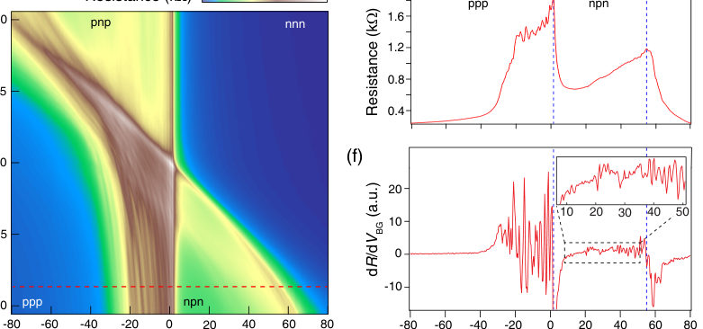 
FIG. 1. (a) Crystal structure of tBLG with a twist angle θ. (b) Schematic low-energy band structure of the decoupled tBLG showing the separation of the Dirac cones by the same twist angle θ (c) Schematic diagram of our device. The global back gate and local top gate define the single gated regions, B and B′, and the dual gated region T. Regions underneath the contacts are labeled C. The thick red line indicates the location of the unintentional local doping. (d) Resistance map as a function of VBG and VTG at 0 T and 2.4 K (e) Line cut of (d) along VTG = −8V (f) Numerical derivative dR/dVBG of (e); inset: zoom highlighting faint oscillations observed in the npn region

📷 Fig 2

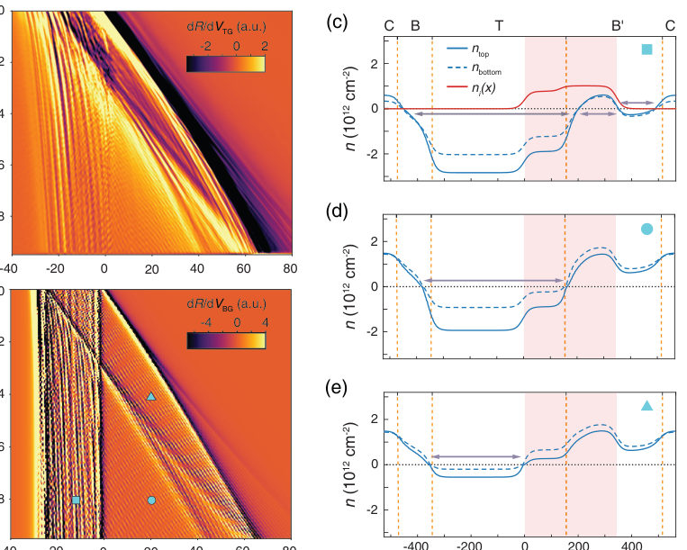 
FIG. 2. (a, b) Experimental map of the numerical derivative dR/dVTG and simulated map of dR/dVBG as a function of VBG and VTG at B = 0 T and T = 2.4 K. The simulation (b) reproduces the experimental patterns using the extracted local doping profile. Markers indicate gate configurations for panels (c-e).(c-e) Carrier density profiles corresponding to the square, circle, and triangle markers in (b). Solid and dashed blue lines denote top and bottom layer density profiles, respectively. The red line in (c) represents the unintentional local doping profile. Double-headed arrows mark the resonant cavities, highlighting (c) a series of cavities in the unipolar regime, (d) a long central cavity,...

📷 Fig 3

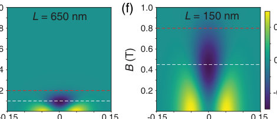 
FIG. 3. (a, b) Experimental and simulated maps of the numerical derivative dR/dVTG versus B in the bipolar regime (VBG = 20 V). The interference fringes disperse and vanish for |B| &gt; 0.2 T due to the cyclotron cutoff. (c, d) Experimental and simulated maps of dR/dVBG versus B at VTG = −8 V. The quasi-periodic fluctuations persist with weak dispersion to high fields, supporting confinement in a small, electronic cavity. (e, f) Calculated oscillation amplitude for (e) long (L = 650 nm) and (f) short (L = 150 nm) cavities. The model shows that the long-cavity mode is suppressed at low fields (B ≈0.2 T), while the short-cavity mode survives well beyond the measurement range.

📷 Fig 4

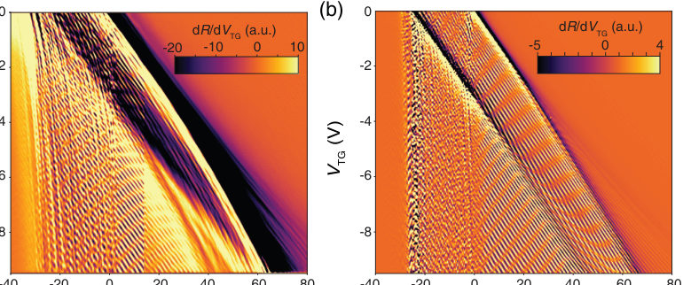 
FIG. 4. (a) Experimental map of the numerical derivative dR/dVTG at B = 0.1 T. Diagonal oscillations from the long central cavity extend into the unipolar regime (VBG &lt; 0 V), where they coexist with sharp vertical fringes. A switching event is observed at VBG ≈12 V. (b) Simulated map of dR/dVTG at B = 0.1 T. The model qualitatively reproduces the key signature of the three-cavity series: the superposition of dispersive diagonal modes and vertical fringes in the unipolar region.

**Summary.** This work uses Fabry-Pérot interference measurements on twisted bilayer graphene to map out hidden potential barriers caused by unintentional local doping. By analyzing the characteristic resistance oscillations and their magnetic field dependence, the authors successfully model the precise spatial distribution of these charge inhomogeneities. This establishes interference spectroscopy as a powerful, non-destructive tool for characterizing internal defects in nanoscale quantum devices.

**Why it may be interesting.** The technique of using quantum interference spectroscopy to map static, unintentional charge inhomogeneities in 2D materials is highly valuable for understanding device physics beyond simple band structure calculations.

Detailed structure

**Main problem.** The study aims to probe the internal potential profile of large-angle twisted bilayer graphene (tBLG) by identifying unintentional local doping that forms multiple electronic cavities.

**Main result.** The anomalous resistance oscillations are successfully attributed to localized, unintended doping creating distinct Fabry-Pérot cavities within the device structure. This method proves interference spectroscopy is a simple, non-invasive probe for mapping internal potential barriers.

**Method.** Fabry-Pérot (FP) interference measurements using 2-probe resistance mapping ($R$ vs $V_{BG}, V_{TG}$) at zero magnetic field, supplemented by magnetotransport analysis and quantum transport simulations.

**Model / system.** The physical system is large-angle tBLG encapsulated in hBN. The model incorporates a local doping profile $n_i(x)$ derived from electrostatic analysis to simulate the resulting potential barriers and cavity structures.

**Key observables.** Anomalous resistance oscillations, secondary vertical/diagonal resistance peaks, and the magnetic field dependence of interference fringe spacing.

**Important parameters / regimes.** Low temperature ($T=2.4 	ext{ K}$), ballistic transport regime ($	ext{MFP} \sim 2 \mu	ext{m}$), and doping-induced cavity lengths (e.g., $L \approx 150$ nm, $L \approx 650$ nm).

**Assumptions / limitations.** The observed oscillations are due to localized, unintentional doping forming potential barriers; the extracted profile is treated as a highly constrained model.

**Figures summary.** Figures show resistance maps ($R$ vs gates) revealing interference fringes (vertical/diagonal), and simulations map the derived potential profile $n_i(x)$ corresponding to these observed cavity structures.

**Paper structure.** The paper systematically uses transport measurements across different gate configurations (unipolar, bipolar) to observe characteristic Fabry-Pérot interference patterns. These patterns are then modeled by extracting a spatially varying doping profile $n_i(x)$, which is validated against both zero-field and magnetic field magnetotransport data.

Abstract

We use Fabry-Pérot interference to probe the internal potential profile of large-angle twisted bilayer graphene. We trace anomalous resistance oscillations in the nominally unipolar regime to a hidden cavity formed by unintentional local doping in our device. By analyzing zero-field interference patterns, we determine the location and size of this inhomogeneity. Magnetotransport measurements support the model, distinguishing local cavity modes from global resonances through their different magnetic dependence. Simulations using our extracted profile reproduce the experimental features. Our results highlight interference spectroscopy as a simple, non-invasive probe for identifying local defects and internal potential barriers in ballistic devices.

[↑ back to top](#top)

### [STM study of single phosphorus incorporation into silicon by heating PBr3 on Si(100)](http://arxiv.org/abs/2607.27939v1)

**Authors:** Tatiana V. Pavlova, Vladimir M. Shevlyuga  
**Type:** both · **Category:** other · **PDF:** <https://arxiv.org/pdf/2607.27939v1>  
**Analysis basis:** full PDF text, analyzed in chunks
**Topic relevance:** `methods for driven-dissipative` **1/5** · `non-equilibrium dynamics` **1/5**

📷 Fig 1

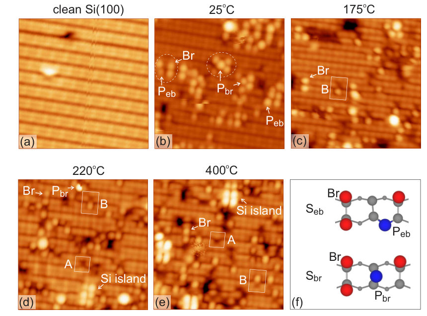 
FIG. 1. Adsorption of PBr3 on Si(100)(a) at room temperature (b) followed by consecutive 5-minute anneals to 175◦C (c), 220◦C (d), and 400◦C (e). Empty-state STM images (7.5×7.5 nm2) were acquired at Us = +2 V, It = 2 nA, and a sample temperature of 77 K. Following dissociative adsorption of PBr3, P atoms are observed in the end-bridge (Peb) and bridge (Pbr) positions. Br atoms occupy on-top sites above Si atoms, predominantly in pairs on a single Si dimer. Annealing leads to the formation of silicon islands. Depressions, which are suggested to be embedded P atoms, are marked with squares (object A). Depressions adjacent to a protrusion, are marked by rectangles (object B). (f) Top-view...

📷 Fig 2

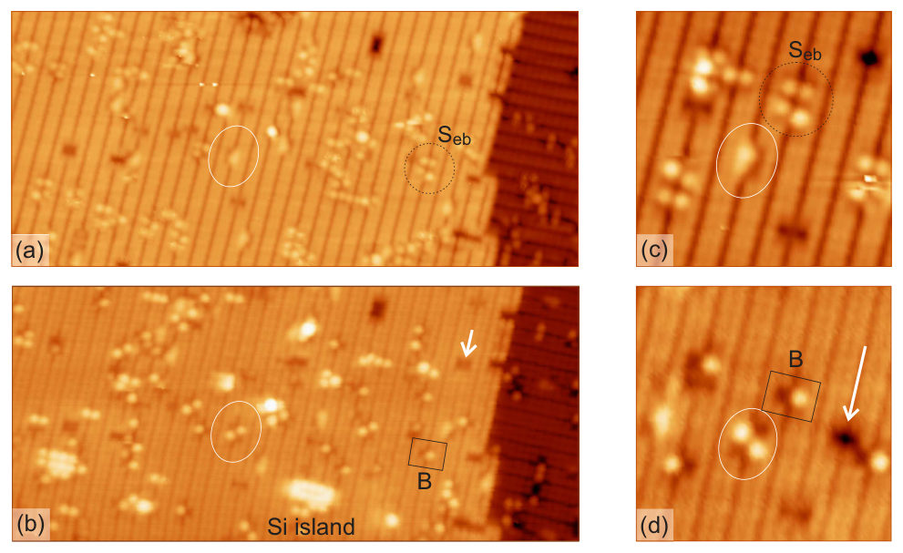 
FIG. 2. (a) The Si(100) surface after PBr3 adsorption. (b) The same area following annealing at 300◦C for 1 minute, revealing phosphorus incorporation. Frames (c, d) show atomic-resolution STM images before and after heating. In (a), structure Seb is indicated by a dotted line. In (b) and (d), a depressions adjacent to a protrusion is marked by a rectangle (object B), and a white arrows show the displacement of a Si bivacancy after heating. The white contour indicates water fragments OH and H before and after annealing. Empty-state STM images, 27×12 nm2 (a, b) and 6.2×6.2 nm2 (c, d), were acquired at Us = +2 V, It = 2 nA, and a temperature of 300 K.

📷 Fig 3

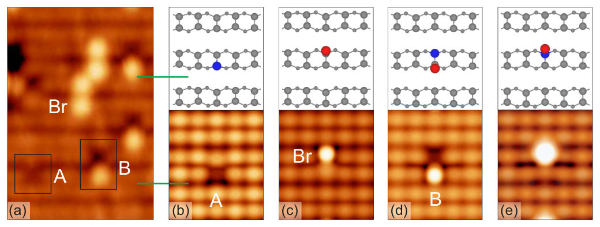 
FIG. 3. Identification of the phosphorus incorporation sites. (a) Empty-state STM image (Us = +2.5 V, It = 3.0 nA, 300 K) of the Si(100) surface with adsorbed PBr3 after annealing to 300◦C for 1 minute. (b–e) Top-view models and simulated empty-state STM images with an embedded P atom and/or an adsorbed Br atom. Si atoms are marked in gray for the top layer (large circles) and the next layer (small circles), Br in red, and P in blue. The green lines in (a) and (b) separate the dimer rows.

📷 Fig 4

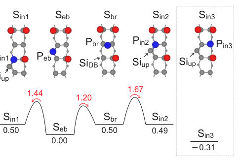 
FIG. 4. Energy barrier diagram for the P incorporation upon ad- sorption of the PBr3 molecule on Si(100) from end-bridge Peb and bridge Pbr positions. The most favorable positions for phosphorus adsorption (Seb and Sbr) and incorporation (Sin1, Sin2, and Sin3) are shown on top. Although Sin3 is the most energetically favorable con- figuration, the reaction pathway leading to it was not calculated, as it was not observed experimentally. Energies are given in electron- volts. The red number denotes the activation barrier, values are given relative to Seb . Si atoms are marked in gray for the top layer (large circles) and the next layer (small circles), Br in red, and the P in blue.

📷 Fig 5

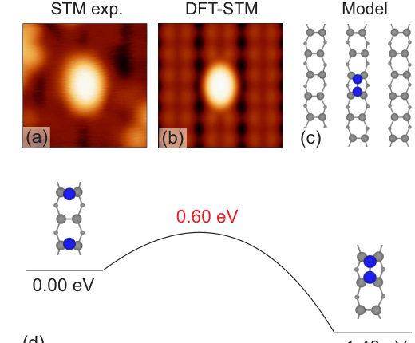 
FIG. 5. Phosphorus dimer on the Si(100) surface. (a) Empty-state STM image (Us = +3.2 V, It = 3.0 nA, 77 K) of one of the bright objects formed after PBr3 adsorption on Si(100) at room tempera- ture. (b) Simulated empty-state STM image and (c) top-view model of the most stable configuration of P2 on Si(100). (d) Energy barrier diagram for the P association from two P atoms in bridge positions within the dimer row. The red number denotes the activation barrier. Si atoms are marked in gray, Br atoms in red, and the P atom in blue.

**Summary.** This work provides an atomic-scale investigation into how phosphorus dopants incorporate into silicon surfaces using PBr3 precursors. By combining STM imaging with DFT calculations, the researchers mapped the incorporation pathway, demonstrating that the process forms a stable P-Si-Br heterodimer structure at low temperatures. This offers crucial foundational knowledge for achieving highly precise doping necessary for advanced semiconductor devices.

**Why it may be interesting.** While focused on materials science, the precise control over atomic incorporation pathways and the use of *in situ* characterization techniques are highly relevant to understanding quantum interfaces or defect engineering in solid-state quantum devices.

Detailed structure

**Main problem.** The study aims to understand the fundamental, atomic-scale mechanism by which single phosphorus dopant atoms are incorporated into the Si(100) surface.

**Main result.** Phosphorus incorporation occurs via an exchange reaction forming a stable P-Si-Br heterodimer structure, with DFT calculations confirming a low activation barrier of 1.44 eV consistent with experimental observations starting at 175°C.

**Method.** The research combines in situ Scanning Tunneling Microscopy (STM) experiments to track atoms and Density Functional Theory (DFT) calculations using the Nudged Elastic Band method to map energy barriers.

**Model / system.** The physical system is the Si(100) surface, studied using PBr3 as a precursor. The investigation tracks single P atoms undergoing exchange reactions with Si atoms upon controlled heating within the STM chamber.

**Key observables.** STM images showing surface features like depressions (embedded P) and protrusions (adsorbed Br), and calculated energy barrier profiles for atomic movement.

**Important parameters / regimes.** Low temperature doping initiation at 175°C; activation barriers calculated via DFT (e.g., 1.44 eV for P incorporation).

**Assumptions / limitations.** The analysis relies on the assumption that tracking individual atoms in situ provides a direct pathway, and that specific surface features observed correlate uniquely with predicted chemical structures.

**Figures summary.** Figures show STM images comparing surfaces before and after annealing at various temperatures (175°C to 400°C), illustrating island formation and structural changes. DFT energy barrier diagrams map the minimum energy pathway for P-Si exchange, confirming stability of the P-Si-Br heterodimer.

**Paper structure.** The paper establishes the need for atomic precision doping; it details the combined STM/DFT approach; results show initial observations at low temperatures (175°C); DFT calculations confirm the stable product and calculate the minimum energy pathway, correlating theory with direct experimental observation of single-atom exchange.

Abstract

The objective of miniaturizing doped areas in silicon, with the ultimate goal of achieving atomic-precision doping, requires a fundamental understanding of the dopant incorporation process at the atomic level. We present a combined scanning tunneling microscopy (STM) and density functional theory (DFT) investigation of single phosphorus atom incorporation into the Si(100) surface. Phosphorus was supplied via PBr3 molecules, which completely dissociate on Si(100) at room temperature. By performing in situ annealing within the STM, we directly tracked the same phosphorus atom before and after heating. Upon annealing, the P atom undergoes an exchange with a nearby Si atom, forming a stable P-Si-Br complex with a Br atom located atop the Si atom of the heterodimer. The activation barrier calculated using DFT is consistent with our observation of doping starting at temperatures as low as 175 C. These results provide detailed atomic-scale insight into the phosphorus incorporation pathway and offer a foundation for improving methods of precise, single-atom doping in silicon.

[↑ back to top](#top)

### [Beyond Hexagonal Boron Nitride: First-Principles Study of Pentaoctite-BN and Pop-BN Monolayers](http://arxiv.org/abs/2607.27554v1)

**Authors:** Victor M. S. da Conceição, Erika N. Lima, Roberto H. Miwa, Igor S. S. de Oliveira  
**Type:** theory · **Category:** other · **PDF:** <https://arxiv.org/pdf/2607.27554v1>  
**Analysis basis:** full PDF text, analyzed in chunks
**Topic relevance:** `interference shaping light` **1/5**

📷 Fig 1

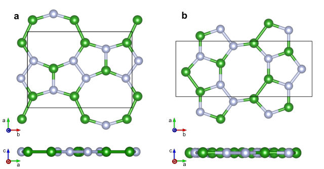 
Figure 1: Optimized atomic structures of (a) PO-BN and (b) PP-BN monolayers, shown in top view (upper panels, unit cell outlined) and side view (lower panels). Green and silver spheres denote B and N atoms, respectively. Homonuclear B–B and N–N bonds, required to close the pentagonal rings, are visible as same-colored bonded pairs.

📷 Fig 2

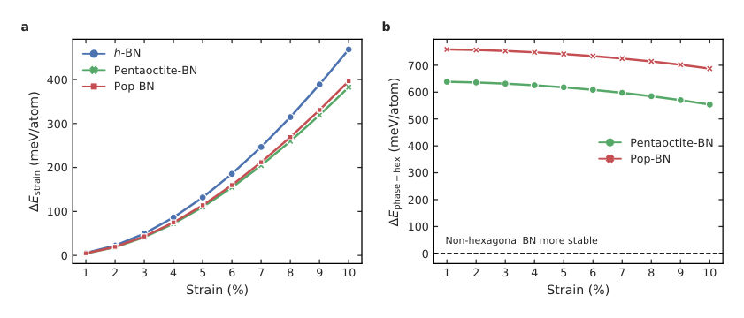 
Figure 2: Strain-dependent energetics under biaxial tensile strain (1–10%) for h-BN, PO-BN, and PP-BN. (a) Strain energy per atom, ∆Estrain. (b) Relative stability of PO-BN and PP-BN with respect to h-BN, ∆Ephase−hex; positive values indicate h-BN remains more stable.

📷 Fig 3

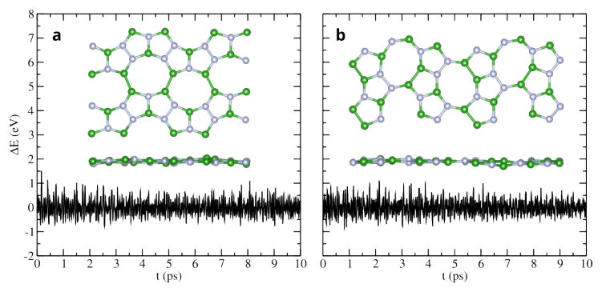 
Figure 3: Time evolution of the energy fluctuations, ∆E(t), during 10 ps AIMD simulations at 300 K for (a) PO-BN and (b) PP-BN monolayers. The final atomic configurations after the simulations are shown in top and side views.

📷 Fig 4

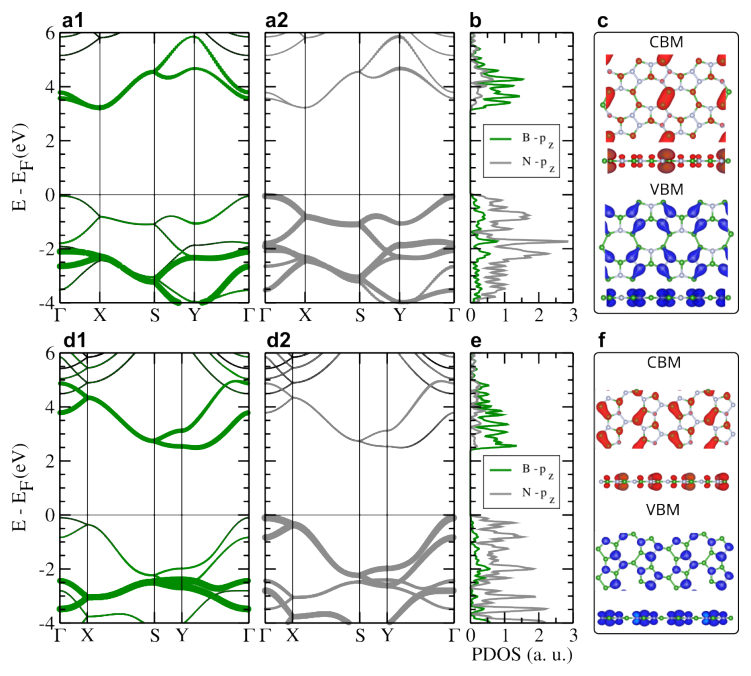 
Figure 4: Electronic properties of PO-BN (upper panels) and PP-BN (lower panels). (a1, d1) B-pz projected and (a2, d2) N-ppz projected electronic band structures; the size of the symbols represents the orbital contribution to each electronic state. (b, e) Projected density of states (PDOS) for the B-ppz and N-ppz orbitals. (c, f) Real-space charge-density distributions associated with the conduction-band minimum (CBM) and valence-band maximum (VBM), shown in top and side views.

📷 Fig 5

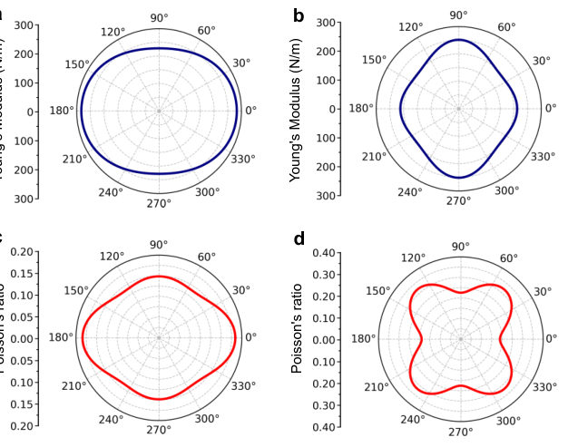 
Figure 5: Angular dependence of the Young’s modulus, E(θ), and Poisson’s ratio, ν(θ), for Pentaoctite-BN [(a), (c)] and Pop-BN [(b), (d)]. The Young’s modulus is expressed in N/m, whereas the Poisson’s ratio is dimensionless.

**Summary.** This theoretical study investigates two non-hexagonal boron nitride polymorphs, PO-BN and PP-BN, characterizing their stability and diverse physical properties. Using advanced first-principles methods, the authors demonstrate that these lattice modifications enable significant engineering of electronic and optical responses. This work highlights a promising pathway for developing next-generation optoelectronic materials by controlling BN's bandgap and absorption spectrum.

**Why it may be interesting.** The detailed analysis of polarization-dependent excitonic effects and the ability to tune absorption into the near-IR region using purely structural modifications is highly relevant for designing novel quantum emitters or photonic components in 2D materials.

Detailed structure

**Main problem.** To systematically analyze the structural, electronic, mechanical, vibrational, thermal, and optical properties of two novel non-hexagonal boron nitride monolayers (PO-BN and PP-BN) compared to hexagonal BN.

**Main result.** Both PO-BN and PP-BN are predicted to be viable 2D materials with distinct lattice architectures that allow for the tuning of electronic and optical responses across visible, near-infrared, and potentially other spectral regions via lattice engineering.

**Method.** The study employs first-principles calculations using DFT (PBE/HSE06) for structural and electronic properties, alongside advanced methods like solving the Bethe–Salpeter equation (BSE) for optical response and AIMD for thermal stability.

**Model / system.** The physical systems are PO-BN and PP-BN monolayers, which possess pentagon-octagon ring networks, contrasting with the hexagonal structure of h-BN. The calculations analyze properties derived from these distinct non-hexagonal lattice arrangements.

**Key observables.** Electronic band gap (indirect), in-plane elastic anisotropy ($E(	heta)$), phonon dispersion relations, excitonic absorption onset energy ($	ext{Im}(\epsilon_{xx}), 	ext{Im}(\epsilon_{yy})$).

**Important parameters / regimes.** Metastable relative to h-BN; lattice engineering effects; spectral tuning from UV toward visible/IR regions.

**Assumptions / limitations.** The polymorphs are assumed to be stable enough for practical application despite being metastable with respect to h-BN. The analysis often assumes planar structures when calculating elastic constants.

**Figures summary.** Figures illustrate optimized atomic structures, strain-dependent energetics comparing the phases, band structures showing orbital character at band edges, and optical spectra demonstrating polarization-dependent excitonic absorption shifts across different wavelengths.

**Paper structure.** The paper follows a systematic investigation: first establishing structural/electronic stability (DFT); then analyzing mechanical/vibrational robustness (elastic constants, phonons); finally characterizing advanced properties like optical response using BSE to demonstrate spectral tunability.

Abstract

We investigate two novel non-hexagonal boron nitride monolayers, pentaoctite-BN (PO-BN) and pop-BN (PP-BN), using first-principles calculations. Their structural, electronic, mechanical, vibrational, thermal, and optical properties are systematically analyzed to assess their stability and potential applications. Despite being metastable with respect to hexagonal BN, both polymorphs satisfy the criteria for dynamical, mechanical, and thermal stability, indicating that they are viable two-dimensional materials. Both systems are indirect-gap semiconductors whose electronic states near the band edges are dominated by out-of-plane pz orbitals. Their distinct pentagon-octagon ring networks also give rise to different in-plane elastic anisotropies. Many-body optical calculations reveal strong excitonic effects and pronounced polarization-dependent optical absorption, with lattice engineering shifting the optical response from the ultraviolet toward the visible and infrared regions. These findings demonstrate that engineering non-hexagonal lattice architectures provides an effective strategy for tuning the electronic and optical properties of two-dimensional BN, highlighting PO-BN and PP-BN as promising candidates for future optoelectronic and photonic applications.

[↑ back to top](#top)

### [Charge-to-spin conversion in epitaxial and polycrystalline Bi and Bi/Ag layers](http://arxiv.org/abs/2607.28310v1)

**Authors:** Federica Nasr, Emir Karadža, Santos F. Alvarado, Federico Binda, Tobias Goldenberger, Carlo Zucchetti, Myriam H. Aguirre, Paolo Moras, Andrey V. Matetskiy, Polina M. Sheverdyaeva, Paul Noël, Pietro Gambardella  
**Type:** experiment · **Category:** other · **PDF:** <https://arxiv.org/pdf/2607.28310v1>  
**Analysis basis:** full PDF text, analyzed in chunks
**Topic relevance:** `spintronics-quantum-optics interface` **1/5**

📷 Fig 1

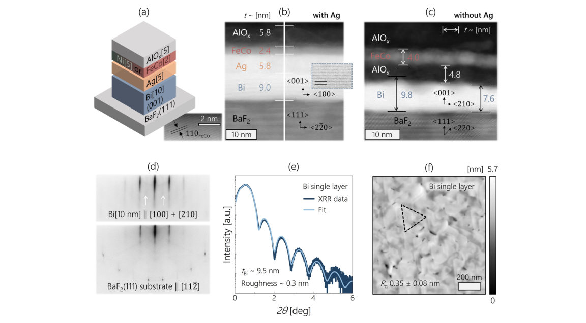 
FIG. 1. Structural characterization of Bi(001)-based heterostructures grown on BaF2(111). (a) Schematic of the Bi(001)/Ag/FM stack. (b, c) HAADF-STEM images of (b) Bi[10]/Ag[5]/FeCo[2] and (c) Bi[10]/FeCo[2]. The lamellae were cut from the Hall bar devices used to perform SOT measurements. (d) RHEED pattern of a 10-nm-thick Bi film after annealing (top) and of the BaF2(111) substrate prior to Bi deposition (bottom). The data were acquired with an electron beam energy of 30 keV. The white arrows are guides to the eye for identifying the residual Bi(012) reflexes. (e) XRR of a 10-nm-thick uncapped Bi film. (f) AFM Z-sensor image of a 10-nm-thick uncapped Bi film. All thicknesses are expressed...

📷 Fig 2

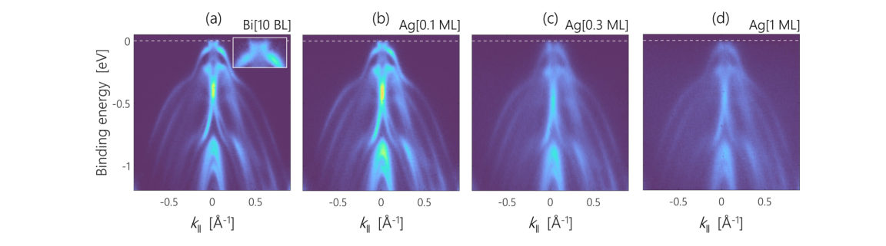 
FIG. 2. ARPES spectra. (a-d) Electronic dispersion of (a) 10-BL-thick Bi(001) grown on 7 × 7−Si(111) before Ag deposition and after deposition of (b) 0.1 ML, (c) 0.3 ML, and (d) 1 ML of Ag (1 BL of Bi = 3.93 ˚A, 1 ML of Ag = 2.36 ˚A). The inset in (a) shows a zoom on the Rashba-split surface state of Bi(001) at the Fermi level. The spectra were acquired at a temperature of 17 K and a photon energy of 50 eV along the ¯Γ −¯K direction of the first Brillouin zone of Bi(001). The data were treated with a Fourier filter to remove the grid structure from the experimental setup.

📷 Fig 3

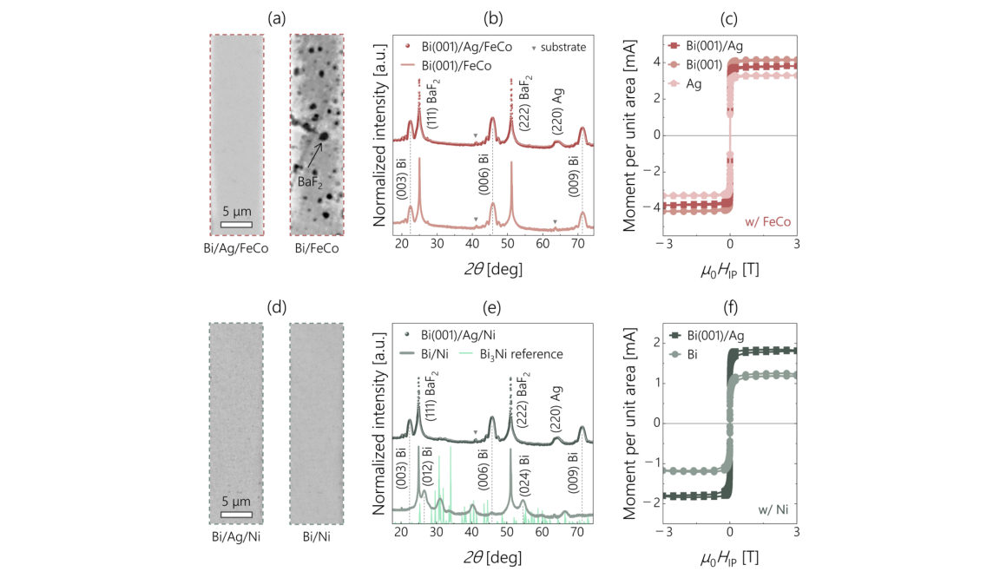 
FIG. 3. Structural and magnetic characterization of Bi(001)-based heterostructures grown on BaF2(111). (a) Optical microscope images of a section of the Hall bar device along the current line of Bi[10]/Ag[5]/FeCo[2] (left) and Bi[10]/FeCo[2] (right). (b) XRD θ/2θ scans of Bi[10]/Ag[5]/FeCo[2] and Bi[10]/FeCo[2]. (c) Room-temperature magnetization curves measured by SQUID magnetometry for Bi[10]/Ag[5]/FeCo[2], Bi[10]/FeCo[2], and Ag[5]/FeCo[2]. (d) Optical microscope images of a section of the Hall bar device along the current line of Bi[10]/Ag[5]/Ni[5] (left) and Bi[10]/Ni[5] (right). (e) XRD θ/2θ scans of Bi[10]/Ag[5]/Ni[5] and Bi[10]/Ni[5]. In the latter, the Bi–Ni interdiffusion causes...

📷 Fig 4

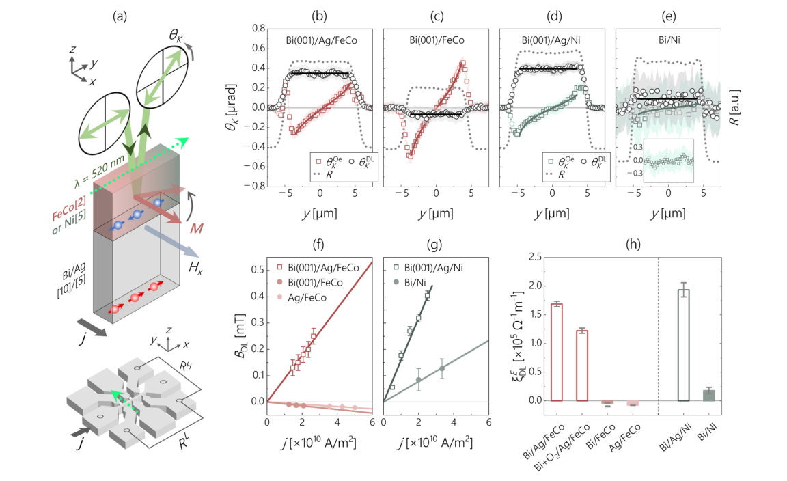 
FIG. 4. SOT measurements of Bi(001)-based heterostructures grown on BaF2(111). (a) Illustration of a Hall bar device with superimposed electrical connections and reference system (bottom) and schematic of the scanning MOKE magnetometry in polar geometry used to perform optical measurements of SOTs (top). A laser beam (green line) is focused onto the Hall bar device and scanned along a transverse cross section of the current line (indicated by the green dotted arrow). The Kerr rotation (θK) caused by the out-of-plane magnetization oscillation induced by the Oersted field and the damping-like effective field is recorded. (b-e) MOKE detection of damping-like SOT in (b) Bi[10]/Ag[5]/FeCo[2] at...

📷 Fig 5

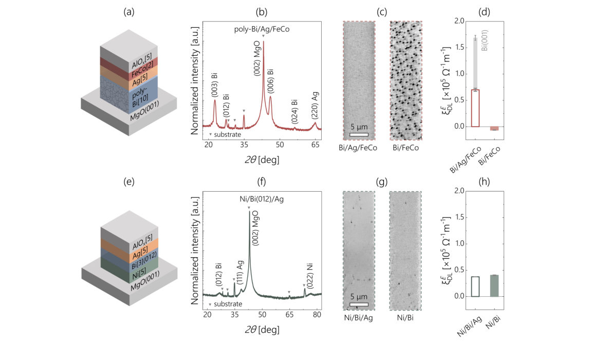 
FIG. 5. Structural characterization and SOT measurements of polycrystalline and (012)-textured Bi-based heterostructures grown on MgO(001). (a, e) Schematic of the sample stacks, namely (a) poly-Bi[10]/Ag[5]/FeCo[2] and (e) Ni[5]/Bi[3](012)/Ag[5]. (b, f) XRD θ/2θ scans of (b) poly-Bi[10]/Ag[5]/FeCo[2] and (f) Ni[5]/Bi[3](012)/Ag[5]. (c, g) Optical microscope images of a section of the Hall bar devices along the current line of (b) poly-Bi[10]/Ag[5]/FeCo[2] (left) and poly-Bi[10]/FeCo[2] (right); (f) Ni[5]/Bi[3](012)/Ag[5] (left) and Ni[5]/Bi[3](012) (right). (d, h) Damping-like SOT efficiencies (ξE DL) with respect to the electric field (E) estimated using Eq. (3) for (d)...

**Summary.** This work experimentally investigates charge-to-spin conversion efficiency in Bi/Ag magnetic heterostructures using SOT measurements. The authors demonstrate that the large spin signals are primarily due to maintaining the structural integrity of the bulk Bi layer, which is best achieved with an Ag spacer. This establishes design principles for reliable spintronic devices based on bismuth.

**Why it may be interesting.** While focused on condensed matter magnetism/spintronics, the rigorous correlation between atomic-scale structure (integrity) and macroscopic quantum transport coefficients ($	ext{SHC}$) provides a model for understanding how disorder or interface engineering affects fundamental quantum responses in solid-state systems.

Detailed structure

**Main problem.** The study investigates charge-to-spin conversion efficiency, specifically Spin-Orbit Torques (SOTs), in bismuth (Bi)-based magnetic heterostructures and seeks to determine if the large observed signals originate from bulk properties or interfacial effects.

**Main result.** Inserting an Ag spacer significantly enhances SOT efficiency by over one order of magnitude, suggesting that structural integrity preservation is key. The enhancement is attributed to a dominant bulk contribution rather than interface-specific Rashba coupling.

**Method.** Measurements involve using magneto-optic Kerr effect magnetometry (MOKE) to measure damping-like SOTs, supplemented by structural analysis (XRD/STEM), ARPES, and harmonic Hall resistance measurements.

**Model / system.** The physical system consists of epitaxial and polycrystalline Bi layers interfaced with metallic ferromagnets (FeCo or Ni), often separated by an Ag spacer ($	ext{Bi}/	ext{Ag}/	ext{FM}$).

**Key observables.** Effective Spin Hall Conductivity ($	ext{SHC}$), Spin Hall Angle ($	ext{SHA}$), and the damping-like SOT magnitude measured via MOKE.

**Important parameters / regimes.** Structural disorder, presence/absence of Ag spacer, and the degree of structural/chemical integrity of the Bi layer are critical parameters.

**Assumptions / limitations.** The analysis assumes that the preservation of the bulk structural and chemical integrity of Bi is the primary determinant for high SOT efficiency, overriding potential interface-specific effects like Rashba coupling.

**Figures summary.** Figures summarize consolidated results showing structural, magnetic, electrical, and charge-to-spin conversion properties across various sample stacks (e.g., $	ext{Bi}(001)/	ext{Ag}/	ext{FeCo}$).

**Paper structure.** The paper systematically compares SOT measurements across different crystal orientations ($	ext{epitaxial}$ vs. $	ext{polycrystalline}$) and stack configurations, using structural characterization to correlate material quality with measured spin-charge conversion efficiency.

Abstract

Bi is predicted to be an efficient generator of spin-orbit torques (SOTs), with charge-to-spin conversion efficiency comparable to those of prototypical heavy metals, such as Ta, W, and Pt. However, experimental reports provide widely scattered interconversion efficiencies, while the origin of the large conversion signal in Bi/Ag bilayers remains controversial. Here, we investigate charge-to-spin conversion in epitaxial and polycrystalline Bi-based magnetic heterostructures by measuring the damping-like SOT using magneto-optic Kerr effect magnetometry, complemented by structural and spectroscopic analyses and harmonic Hall resistance measurements. We show that inserting an Ag spacer between Bi(001) and metallic ferromagnets (FeCo or Ni) enhances the SOT efficiency by more than one order of magnitude, reaching an effective spin Hall conductivity of approximately $2 \times 10^5 (\hbar/2e)$ S/m, in excellent agreement with theoretical expectations for bulk Bi. This enhancement can be consistently explained by the preservation of the structural and chemical integrity of Bi, otherwise compromised by the direct deposition of a ferromagnetic overlayer, rather than by Rashba spin-orbit coupling at the Bi/Ag interface. Comparative studies across epitaxial, polycrystalline, and intentionally surface-oxidized Bi films, beyond oxygen doses known to destroy Bi(001) surface states, reveal that structural disorder has a negative impact on the SOT efficiency and indicate a dominant bulk contribution to spin-current generation in Bi/Ag heterostructures, yielding an effective Bi spin Hall angle of approximately 1. By establishing a direct correlation between atomic-scale integrity and charge-to-spin conversion, this study provides design principles to improve the reliability of Bi-based SOT devices and offers a robust framework for interpreting spin-charge interconversion in Bi and Bi/Ag systems.

[↑ back to top](#top)

### [Nondegenerate bright solitons and their interactions in the generalized coupled nonlinear Schroedinger system](http://arxiv.org/abs/2607.28197v1)

**Authors:** R. Ramakrishnan, Samudra Roy, S. Stalin, M. Lakshmanan  
**Type:** theory · **Category:** other · **PDF:** <https://arxiv.org/pdf/2607.28197v1>  
**Analysis basis:** full PDF text, analyzed in chunks
**Topic relevance:** `non-equilibrium dynamics` **1/5**

📷 Fig 1

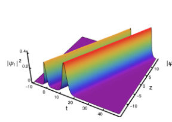 
Fig. 1 Double-hump nondegenerate vector solitons. Parameter values: k1 = 1 + 0.5i, l1 = 0.5 + 0.5i, α(1) 1 = 0.65, α(2) 1 = 1 + i, a = c = 1, b = 0.5 + 0.5i and α1 = α2 = 0.000001.

📷 Fig 2

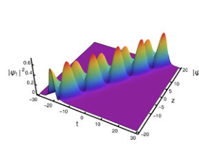 
Fig. 2 Double-hump breathing nondegenerate vector solitons. Parameter values: k1 = 1 + 0.5i, l1 = 0.5 + 0.5i, α(1) 1 = 0.65, α(2) 1 = 1 + i, a = c = 1, b = 0.5 + 0.5i and α1 = α2 = 1.

📷 Fig 3

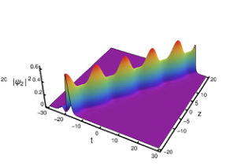 
Fig. 3 Double-hump breathing nondegenerate vector solitons even at b = 0, while the values of the rest of the parameters are same as Fig. 1.

📷 Fig 4

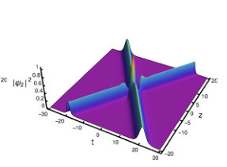 
Fig. 4 Nondegenerate vector soliton solution and their collision-like structures. Parameter values: k1 = 1 + 0.5i, l1 = 0.5 −0.5i, α(1) 1 = 0.65, α(2) 1 = 1 + i, a = c = 1, b = 0.5 + 0.5i and α1 = α2 = 0.5.

📷 Fig 5

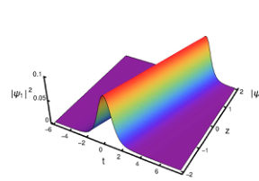 
Fig. 5 Purely degenerate single-hump vector solitons. Parameter values: k1 = l1 = 1 + 0.5i, α(1) 1 =

**Summary.** This paper analyzes nondegenerate bright solitons within the GCNLS system, demonstrating that these solutions exhibit characteristic breathing behavior. The authors characterize their collision dynamics—showing both elastic and energy-sharing interactions—and confirm their stability against random noise perturbations using advanced analytical and numerical methods.

**Why it may be interesting.** This work provides detailed insights into complex nonlinear wave phenomena in coupled systems, which is highly relevant for understanding light propagation in optical fibers or Bose-Einstein condensates (BECs) modeled by NLS equations.

Detailed structure

**Main problem.** The study investigates the nature, dynamics, and interactions of nondegenerate bright solitons within the Generalized Coupled Nonlinear Schrödinger (GCNLS) system.

**Main result.** The derived non-degenerate vector solitons exhibit breathing behavior, undergo elastic collisions with standard phase shifts, and are shown to be stable against random perturbations.

**Method.** The research employs analytical techniques including linear transformations from known integrable models, asymptotic analysis for collision dynamics, and numerical stability testing using Gaussian white noise.

**Model / system.** The system is governed by the GCNLS equations, which incorporate self-phase modulation, cross-phase modulation, and four-wave mixing effects. It is treated as a completely integrable dynamical system.

**Key observables.** Breathing frequency, collision dynamics (elastic vs. energy-sharing), stability against noise, and soliton profile shape preservation/change.

**Important parameters / regimes.** Linear coupling parameters ($\alpha_j$), four-wave mixing parameter ($b$), relative velocity ($\Delta v$), and the level of added Gaussian white noise (3% and 5%).

**Assumptions / limitations.** The analysis relies on specific symmetry reductions and linear transformations connecting GCNLS to Manakov-type models; stability is tested against specified levels of random perturbations.

**Figures summary.** Figures illustrate double-hump nondegenerate vector solitons (Fig. 1), breathing behavior (Fig. 2), collision structures for different velocity regimes (Figs. 4, 7), and numerical confirmation of stability under noise addition (Fig. 10).

**Paper structure.** The paper first establishes the GCNLS model and derives non-degenerate solutions via reduction to a Manakov-type system. It then analyzes the breathing nature and collision dynamics using asymptotic methods, concluding with rigorous stability analysis against random perturbations.

Abstract

It is known that the generalized coupled nonlinear Schroedinger (GCNLS) equations can be reduced to the basic vector nonlinear Schroedinger models through various symmetry reductions. By using such reductions, soliton solutions of several interesting types can be obtained for the GCNLS system. In this paper, we show how the non-degenerate soliton solutions can be derived using one such reduction and analyze the various special features associated with the resulting soliton solutions. We find that the obtained non-degenerate soliton solutions exhibit breathing behavior, characterized by a breathing frequency. We also show that the vector solitons emerging from the reduction undergo elastic collisions with the standard phase shift, similar to the non-degenerate solitons of other coupled nonlinear Schroedinger models. Further, they undergo interesting energysharing collisions when they interact with the already known bright solitons. These collision scenarios are further confirmed by an appropriate asymptotic analysis. We have also analyzed the stability of the obtained vector solitons and found that they are stable against random perturbations. The results presented here enhance the understanding of the nature and dynamics of non-degenerate vector solitons.

[↑ back to top](#top)

### Other secondary papers (1)

Show other secondary papers

### [Symmetry, Sound, and the Quest for Chiral Superconductors](http://arxiv.org/abs/2607.28365v1)

**Authors:** B. J. Ramshaw  
**Type:** both · **Category:** other · **PDF:** <https://arxiv.org/pdf/2607.28365v1>  
**Analysis basis:** full PDF text, analyzed in chunks

📷 Fig 1

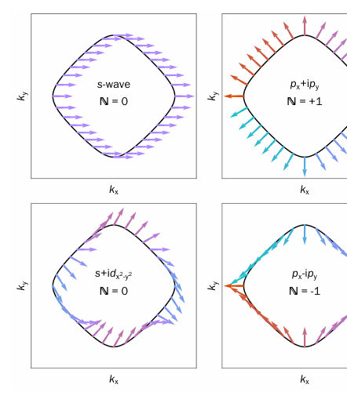 
Figure 1

📷 Fig 2

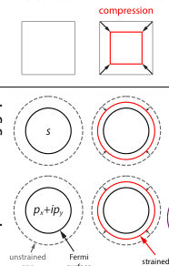 
Figure 2

📷 Fig 3

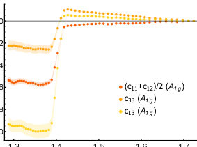 
Figure 3

📷 Fig 4

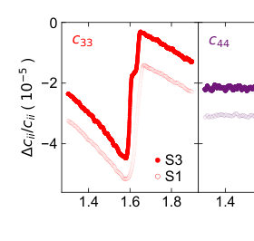 
Figure 4

📷 Fig 5

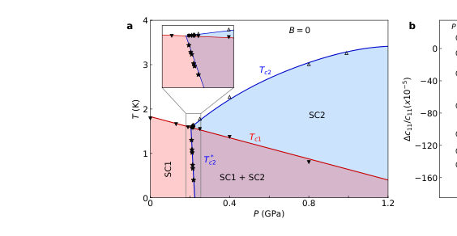 
Figure 5

**Summary.** This review discusses methods to experimentally confirm chiral topological superconductivity by measuring how the superconducting state couples to mechanical strain. The authors emphasize that observing specific anomalies in shear elastic moduli would provide direct evidence for multi-component order parameters. Despite theoretical promise, current experimental results are largely negative, highlighting the need for refined, symmetry-based measurements.

**Why it may be interesting.** The rigorous connection drawn between lattice elasticity (a macroscopic measurement) and the microscopic symmetry/topology of superconducting order parameters provides a powerful, model-independent diagnostic tool for exotic quantum states.

Detailed structure

**Main problem.** The central goal is confirming the existence of a bulk, topological superconductor, which remains unconfirmed despite decades of searching.

**Main result.** While theoretical frameworks exist for detecting chiral superconductivity via strain coupling, current experimental results from elastic modulus measurements remain negative or inconclusive across several candidate materials.

**Method.** The paper reviews using symmetry-resolved thermodynamic probes, specifically measuring jumps in shear elastic moduli (strain susceptibility), to provide unambiguous evidence for multi-component superconducting order parameters.

**Model / system.** The focus is on superconductors exhibiting multi-component or chiral order parameters ($\Psi$), which are theoretically linked to non-trivial topology quantified by the Skyrmion number. The analysis involves coupling these complex order parameters to lattice strain.

**Key observables.** Discontinuities (jumps) in shear elastic moduli at the superconducting transition temperature ($T_c$); spontaneous strains ($\epsilon_{xx} - \epsilon_{yy}$).

**Important parameters / regimes.** The multi-component nature of the order parameter, its chirality, and the coupling strength to strain fields.

**Assumptions / limitations.** It assumes that a measurable anomaly in shear elastic moduli directly signals the presence of a multi-component superconducting state required for chirality. It also notes that disorder complicates interpretation.

**Figures summary.** Figures illustrate Skyrmion numbers ($N$) calculated for various gap symmetries (e.g., $p_x \pm ip_y$), distinguishing topologically non-trivial states from trivial ones on the Fermi surface.

**Paper structure.** The paper provides a pedagogical introduction to multi-component order parameters and chiral superconductivity, details how these couple to strain via elastic moduli measurements, reviews case studies in heavy fermion and pnictide superconductors ($	ext{Sr}_2	ext{RuO}_4$, $	ext{UPt}_3$), and concludes by suggesting future experimental directions.

Abstract

The confirmation of a bulk, topological superconductor is a central goal of modern quantum materials research. Despite decades of searching, no confirmed examples yet exist. A primary difficulty is that most experimental signatures of topological superconductivity are ambiguous and indirect. I review efforts to narrow the search for a chiral topological superconductor using measurements of elastic moduli. In principle, these experiments can provide unambiguous thermodynamic evidence for multi-component superconductivity---a pre-requisite for chiral superconductivity in 2D and quasi-2D materials. Despite the potential strength of this program, the results are still negative. I provide a pedagogical introduction to multi-component order parameters, chiral topological superconductivity, and how superconducting order parameters couple to strain. I discuss ongoing efforts in heavy fermion, iron pnictide, and Kagome superconductors, and suggest routes for speeding up the search process, as well as other experimental tools that should be developed for the pursuit of this goal.

[↑ back to top](#top)

