
# arxiv digest (quant-ph + cond-mat) — 2026-08-04

*114 papers · 32 relevant · 2 highlighted*

## 🔥 Most relevant (32)

*Every paper with at least one nonzero topic score, sorted by best-matching score. 🔥 marks scores ≥4/5. Click the title to jump to the full entry below; click [arXiv] to open the paper page. `(secondary)` marks papers from de-prioritized cond-mat archives.*

Show 32 relevant papers

- [Parent Hamiltonian and intrinsic phase transition in non-Hermitian photonic systems](#paper-2607.28964) [[arXiv]](http://arxiv.org/abs/2607.28964v1) — 🔥 `quantum optics experiment` **5/5** · 🔥 `analog quantum simulation` **4/5** · 🔥 `driven-dissipative phase transition` **4/5** · 🔥 `methods for driven-dissipative` **4/5** · `correlated / nonlocal dissipation` **3/5** · `exotic spin models in light-matter` **3/5** · `non-equilibrium universality` **3/5** · `Kondo & dissipative impurity` **2/5** · `QC/QI experiment` **2/5** · `non-equilibrium dynamics` **2/5** · `Keldysh / 2PI / non-Gaussian methods` **1/5** · `correlated cavity matter` **1/5** · `entanglement & information structure` **1/5** · `spintronics-quantum-optics interface` **1/5**
- [Quantum Resources in Disorder-Free Localization Dynamics of Gauge Theories](#paper-2607.28730) [[arXiv]](http://arxiv.org/abs/2607.28730v1) — 🔥 `entanglement & information structure` **5/5** · 🔥 `analog quantum simulation` **4/5** · `non-equilibrium dynamics` **3/5** · `scars & prethermalization` **3/5** · `non-equilibrium universality` **2/5** · `Keldysh / 2PI / non-Gaussian methods` **1/5** · `correlated / nonlocal dissipation` **1/5** · `driven-dissipative phase transition` **1/5** · `methods for driven-dissipative` **1/5**
- [Emergence of Propagating Exciton-Polaritons in Hybrid Waveguide-van der Waals Heterostructures](#paper-2607.29289) [[arXiv]](http://arxiv.org/abs/2607.29289v1) `(secondary)` — 🔥 `analog quantum simulation` **4/5** · 🔥 `correlated cavity matter` **4/5** · `driven-dissipative phase transition` **3/5** · `interference shaping light` **3/5** · `quantum optics experiment` **3/5** · `QC/QI experiment` **2/5** · `Tavis-Cummings & cavity-many-emitter` **2/5** · `methods for driven-dissipative` **2/5** · `non-equilibrium dynamics` **2/5** · `spintronics-quantum-optics interface` **2/5** · `Keldysh / 2PI / non-Gaussian methods` **1/5** · `correlated / nonlocal dissipation` **1/5** · `entanglement & information structure` **1/5** · `exotic spin models in light-matter` **1/5** · `non-equilibrium universality` **1/5**
- [Delayed Formation of Landau Polaritons in Phase-Resolved THz Spectroscopy](#paper-2607.29501) [[arXiv]](http://arxiv.org/abs/2607.29501v1) — 🔥 `quantum optics experiment` **4/5** · `analog quantum simulation` **3/5** · `correlated cavity matter` **3/5** · `spintronics-quantum-optics interface` **3/5** · `Tavis-Cummings & cavity-many-emitter` **2/5** · `driven-dissipative phase transition` **2/5** · `methods for driven-dissipative` **2/5** · `non-equilibrium dynamics` **2/5** · `correlated / nonlocal dissipation` **1/5** · `entanglement & information structure` **1/5** · `exotic spin models in light-matter` **1/5** · `interference shaping light` **1/5** · `non-equilibrium universality` **1/5**
- [Quantum Optimal Control at Intermediate Times: Controlling Revivals in Spin Chains](#paper-2607.28783) [[arXiv]](http://arxiv.org/abs/2607.28783v1) — 🔥 `methods for driven-dissipative` **4/5** · 🔥 `quantum measurements` **4/5** · `analog quantum simulation` **3/5** · `exotic spin models in light-matter` **3/5** · `non-equilibrium dynamics` **3/5** · `Keldysh / 2PI / non-Gaussian methods` **2/5** · `driven-dissipative phase transition` **2/5** · `correlated / nonlocal dissipation` **1/5** · `entanglement & information structure` **1/5** · `measurement-induced transitions` **1/5** · `non-equilibrium universality` **1/5**
- [Polariton-Assisted Inelastic Tunneling through a Quantum Well](#paper-2607.29171) [[arXiv]](http://arxiv.org/abs/2607.29171v1) `(secondary)` — 🔥 `Keldysh / 2PI / non-Gaussian methods` **4/5** · `analog quantum simulation` **3/5** · `correlated cavity matter` **3/5** · `methods for driven-dissipative` **3/5** · `non-equilibrium dynamics` **3/5** · `Tavis-Cummings & cavity-many-emitter` **2/5** · `driven-dissipative phase transition` **2/5** · `Kondo & dissipative impurity` **1/5** · `correlated / nonlocal dissipation` **1/5** · `interference shaping light` **1/5** · `non-equilibrium universality` **1/5**
- [Continuous Tuning of the Charge-Phase Uncertainty in a Josephson Junction](#paper-2607.29636) [[arXiv]](http://arxiv.org/abs/2607.29636v1) `(secondary)` — 🔥 `QC/QI experiment` **4/5** · 🔥 `quantum measurements` **4/5** · `driven-dissipative phase transition` **3/5** · `Keldysh / 2PI / non-Gaussian methods` **2/5** · `Kondo & dissipative impurity` **2/5** · `non-equilibrium dynamics` **2/5** · `analog quantum simulation` **1/5** · `correlated / nonlocal dissipation` **1/5** · `measurement-induced transitions` **1/5** · `methods for driven-dissipative` **1/5** · `non-equilibrium universality` **1/5**
- [Chiral magnons for spin-qubit state transfer](#paper-2607.29206) [[arXiv]](http://arxiv.org/abs/2607.29206v1) — 🔥 `spintronics-quantum-optics interface` **4/5** · `correlated / nonlocal dissipation` **3/5** · `exotic spin models in light-matter` **3/5** · `QC/QI experiment` **2/5** · `methods for driven-dissipative` **2/5** · `non-equilibrium dynamics` **2/5** · `Keldysh / 2PI / non-Gaussian methods` **1/5** · `analog quantum simulation` **1/5** · `driven-dissipative phase transition` **1/5** · `entanglement & information structure` **1/5**
- [Dissipation-enhanced vortex clustering in a compressible quantum fluid](#paper-2607.29475) [[arXiv]](http://arxiv.org/abs/2607.29475v1) — 🔥 `non-equilibrium dynamics` **4/5** · `correlated / nonlocal dissipation` **3/5** · `driven-dissipative phase transition` **3/5** · `methods for driven-dissipative` **3/5** · `analog quantum simulation` **2/5** · `non-equilibrium universality` **2/5** · `Frenkel-Kontorova` **1/5** · `Keldysh / 2PI / non-Gaussian methods` **1/5** · `entanglement & information structure` **1/5**
- [Potential-defect-driven collective modes of one-dimensional two-component quantum droplets](#paper-2607.29292) [[arXiv]](http://arxiv.org/abs/2607.29292v1) — 🔥 `analog quantum simulation` **4/5** · 🔥 `non-equilibrium dynamics` **4/5** · `non-equilibrium universality` **3/5** · `Keldysh / 2PI / non-Gaussian methods` **2/5** · `driven-dissipative phase transition` **2/5** · `Frenkel-Kontorova` **1/5** · `correlated / nonlocal dissipation` **1/5** · `entanglement & information structure` **1/5** · `methods for driven-dissipative` **1/5** · `scars & prethermalization` **1/5**
- [Revealing the Spin Hydrodynamics of a Spin-Imbalanced Unitary Fermi Gas](#paper-2607.29647) [[arXiv]](http://arxiv.org/abs/2607.29647v1) — 🔥 `analog quantum simulation` **4/5** · `exotic spin models in light-matter` **3/5** · `non-equilibrium dynamics` **3/5** · `spintronics-quantum-optics interface` **3/5** · `driven-dissipative phase transition` **2/5** · `non-equilibrium universality` **2/5** · `Keldysh / 2PI / non-Gaussian methods` **1/5** · `correlated / nonlocal dissipation` **1/5** · `methods for driven-dissipative` **1/5**
- [Fermionic entropy: an efficiently measurable strong monotone for non-Gaussianity](#paper-2607.29670) [[arXiv]](http://arxiv.org/abs/2607.29670v1) — 🔥 `entanglement & information structure` **4/5** · `Keldysh / 2PI / non-Gaussian methods` **3/5** · `analog quantum simulation` **3/5** · `non-equilibrium dynamics` **2/5** · `quantum measurements` **2/5** · `correlated / nonlocal dissipation` **1/5** · `driven-dissipative phase transition` **1/5** · `measurement-induced transitions` **1/5** · `methods for driven-dissipative` **1/5** · `non-equilibrium universality` **1/5**
- [Meissner Effect and Josephson Radiation in Driven Dissipative Superconductors](#paper-2607.28734) [[arXiv]](http://arxiv.org/abs/2607.28734v1) — 🔥 `driven-dissipative phase transition` **4/5** · `methods for driven-dissipative` **3/5** · `non-equilibrium dynamics` **3/5** · `non-equilibrium universality` **3/5** · `correlated / nonlocal dissipation` **2/5** · `Keldysh / 2PI / non-Gaussian methods` **1/5** · `analog quantum simulation` **1/5** · `correlated cavity matter` **1/5** · `superradiant laser` **1/5**
- [Statistical Gauge Theory of Structural Glasses: Equilibrium Scenarios and Glass-Forming Ability](#paper-2607.28786) [[arXiv]](http://arxiv.org/abs/2607.28786v1) — 🔥 `Keldysh / 2PI / non-Gaussian methods` **4/5** · `methods for driven-dissipative` **3/5** · `non-equilibrium dynamics` **3/5** · `driven-dissipative phase transition` **2/5** · `non-equilibrium universality` **2/5** · `Frenkel-Kontorova` **1/5** · `analog quantum simulation` **1/5** · `correlated / nonlocal dissipation` **1/5** · `exotic spin models in light-matter` **1/5** · `scars & prethermalization` **1/5**
- [Disorder induced time crystal in athermal random field Ising model with non-reciprocal interactions](#paper-2607.28781) [[arXiv]](http://arxiv.org/abs/2607.28781v1) — 🔥 `driven-dissipative phase transition` **4/5** · `methods for driven-dissipative` **3/5** · `non-equilibrium dynamics` **3/5** · `non-equilibrium universality` **3/5** · `analog quantum simulation` **1/5** · `correlated / nonlocal dissipation` **1/5** · `exotic spin models in light-matter` **1/5** · `scars & prethermalization` **1/5**
- [Entanglement in bipartite systems with symmetry: coupled chaotic kicked Bose-Hubbard systems](#paper-2607.29165) [[arXiv]](http://arxiv.org/abs/2607.29165v1) — 🔥 `entanglement & information structure` **4/5** · `analog quantum simulation` **3/5** · `non-equilibrium dynamics` **3/5** · `non-equilibrium universality` **2/5** · `Keldysh / 2PI / non-Gaussian methods` **1/5** · `correlated / nonlocal dissipation` **1/5** · `driven-dissipative phase transition` **1/5** · `methods for driven-dissipative` **1/5** · `scars & prethermalization` **1/5**
- [Gapped Parent Hamiltonians for the Strongly Deformed Toric Code](#paper-2607.28740) [[arXiv]](http://arxiv.org/abs/2607.28740v1) — 🔥 `analog quantum simulation` **4/5** · `entanglement & information structure` **3/5** · `methods for driven-dissipative` **3/5** · `correlated / nonlocal dissipation` **2/5** · `driven-dissipative phase transition` **2/5** · `Keldysh / 2PI / non-Gaussian methods` **1/5** · `non-equilibrium dynamics` **1/5** · `non-equilibrium universality` **1/5**
- ⭐ [Anomalous Boundary Modes in a Floquet Hyperbolic System](#paper-2607.28719) [[arXiv]](http://arxiv.org/abs/2607.28719v1) — 🔥 `analog quantum simulation` **4/5** · 🔥 `non-equilibrium dynamics` **4/5** · `methods for driven-dissipative` **3/5** · `driven-dissipative phase transition` **2/5** · `correlated / nonlocal dissipation` **1/5** · `entanglement & information structure` **1/5** · `non-equilibrium universality` **1/5**
- [Gaussian-augmented bosonic matrix-product states: theory and applications](#paper-2607.28753) [[arXiv]](http://arxiv.org/abs/2607.28753v1) — 🔥 `methods for driven-dissipative` **4/5** · `Keldysh / 2PI / non-Gaussian methods` **3/5** · `analog quantum simulation` **2/5** · `driven-dissipative phase transition` **2/5** · `correlated / nonlocal dissipation` **1/5** · `correlated cavity matter` **1/5** · `entanglement & information structure` **1/5** · `non-equilibrium dynamics` **1/5** · `non-equilibrium universality` **1/5**
- [Comparison of Spatial Entanglement between dissociated atom and ion : molecular ion photo-dissociated by sequential two-photon absorption and correlated two-photon absorption](#paper-2607.29556) [[arXiv]](http://arxiv.org/abs/2607.29556v1) — 🔥 `entanglement & information structure` **4/5** · `analog quantum simulation` **3/5** · `non-equilibrium dynamics` **2/5** · `Keldysh / 2PI / non-Gaussian methods` **1/5** · `correlated / nonlocal dissipation` **1/5** · `driven-dissipative phase transition` **1/5** · `interference shaping light` **1/5** · `methods for driven-dissipative` **1/5**
- [First Law of Proto-Area Entropy from Modular Spectral Geometry](#paper-2607.29432) [[arXiv]](http://arxiv.org/abs/2607.29432v1) — 🔥 `entanglement & information structure` **4/5** · `Keldysh / 2PI / non-Gaussian methods` **2/5** · `methods for driven-dissipative` **2/5** · `non-equilibrium universality` **2/5** · `correlated / nonlocal dissipation` **1/5** · `correlated cavity matter` **1/5** · `driven-dissipative phase transition` **1/5** · `non-equilibrium dynamics` **1/5**
- [Optically Resolved Excited State Hyperfine Structure of a Silicon Colour Centre in the Telecom Bands](#paper-2607.28943) [[arXiv]](http://arxiv.org/abs/2607.28943v1) — 🔥 `QC/QI experiment` **4/5** · `exotic spin models in light-matter` **3/5** · `spintronics-quantum-optics interface` **3/5** · `quantum optics experiment` **2/5** · `analog quantum simulation` **1/5** · `quantum measurements` **1/5**
- [Quasiparticle modes across soliton transition with density-dependent gauge field in optical lattices](#paper-2607.29309) [[arXiv]](http://arxiv.org/abs/2607.29309v1) — 🔥 `analog quantum simulation` **4/5** · `non-equilibrium dynamics` **3/5** · `driven-dissipative phase transition` **2/5** · `non-equilibrium universality` **2/5** · `Frenkel-Kontorova` **1/5** · `Keldysh / 2PI / non-Gaussian methods` **1/5** · `methods for driven-dissipative` **1/5**
- [Pairing near the boundary of a box-shaped trap in the BEC-BCS crossover](#paper-2607.29620) [[arXiv]](http://arxiv.org/abs/2607.29620v1) — 🔥 `analog quantum simulation` **4/5** · `Keldysh / 2PI / non-Gaussian methods` **3/5** · `driven-dissipative phase transition` **2/5** · `Kondo & dissipative impurity` **1/5** · `methods for driven-dissipative` **1/5** · `non-equilibrium dynamics` **1/5**
- [Telecom-compatible polarization-to-time-bin conversion of atom-photon entanglement for heterogeneous quantum networks](#paper-2607.29609) [[arXiv]](http://arxiv.org/abs/2607.29609v1) — 🔥 `quantum optics experiment` **4/5** · `QC/QI experiment` **3/5** · `interference shaping light` **3/5** · `entanglement & information structure` **1/5** · `quantum measurements` **1/5**
- [Hadron Structure from the Hierarchy of Quantum Correlations in Deep-Inelastic Scattering](#paper-2607.28724) [[arXiv]](http://arxiv.org/abs/2607.28724v1) — 🔥 `entanglement & information structure` **4/5** · `non-equilibrium dynamics` **2/5** · `correlated / nonlocal dissipation` **1/5** · `driven-dissipative phase transition` **1/5** · `methods for driven-dissipative` **1/5** · `non-equilibrium universality` **1/5** · `quantum measurements` **1/5**
- [Tunable two-component ultracold molecular gases with vibrational shielding](#paper-2607.29611) [[arXiv]](http://arxiv.org/abs/2607.29611v1) — 🔥 `analog quantum simulation` **4/5** · `Keldysh / 2PI / non-Gaussian methods` **1/5** · `correlated / nonlocal dissipation` **1/5** · `driven-dissipative phase transition` **1/5** · `methods for driven-dissipative` **1/5**
- [Release-free phononic crystal with strong microwave coupling](#paper-2607.29666) [[arXiv]](http://arxiv.org/abs/2607.29666v1) — 🔥 `QC/QI experiment` **4/5** · `correlated cavity matter` **1/5** · `driven-dissipative phase transition` **1/5** · `quantum optics experiment` **1/5**
- [Magnetic properties of a quasi-two-dimensional spin-1/2 antiferromagnet Y2CuGe4O12](#paper-2607.29676) [[arXiv]](http://arxiv.org/abs/2607.29676v1) — 🔥 `analog quantum simulation` **4/5** · `exotic spin models in light-matter` **1/5** · `spintronics-quantum-optics interface` **1/5**
- [One-Step Epitaxial Access to Rhombohedral Graphene Flat-Band States on Step-Bunched SiC](#paper-2607.29022) [[arXiv]](http://arxiv.org/abs/2607.29022v1) — 🔥 `analog quantum simulation` **4/5** · `correlated cavity matter` **1/5** · `non-equilibrium dynamics` **1/5**
- [Resolution of Infrared Entanglement Divergences via the Extended Uncertainty Principle](#paper-2607.29427) [[arXiv]](http://arxiv.org/abs/2607.29427v1) — 🔥 `entanglement & information structure` **4/5** · `Keldysh / 2PI / non-Gaussian methods` **1/5** · `correlated / nonlocal dissipation` **1/5**
- [Origins of microwave losses in superconducting circuits made with silicon-on-insulator substrates](#paper-2607.29154) [[arXiv]](http://arxiv.org/abs/2607.29154v1) — 🔥 `QC/QI experiment` **4/5** · `quantum optics experiment` **1/5**

## ⭐ Highlighted (2)

*Papers by authors on your watch list. Click the title to jump to the full entry below; click [arXiv] to open the paper page.*

Show 2 highlighted papers

- ⭐ [High-rate qLDPC processors](#paper-2607.28795) [[arXiv]](http://arxiv.org/abs/2607.28795v1) — John Preskill
- ⭐ [Anomalous Boundary Modes in a Floquet Hyperbolic System](#paper-2607.28719) [[arXiv]](http://arxiv.org/abs/2607.28719v1) — Alexey V. Gorshkov

## All papers (86, sorted by relevance)

*Papers from quant-ph and your primary cond-mat archives (quant-gas, stat-mech, str-el, dis-nn). Highlighted papers (⭐) come first, then everything else sorted by topic-relevance score, highest first.*

### ⭐ [Anomalous Boundary Modes in a Floquet Hyperbolic System](http://arxiv.org/abs/2607.28719v1)

**Highlighted author(s):** Alexey V. Gorshkov  
**Authors:** Ali Fahimniya, Hossein Dehghani, Alicia J. Kollár, Alexey V. Gorshkov  
**Type:** theory · **Category:** other · **PDF:** <https://arxiv.org/pdf/2607.28719v1>  
**Analysis basis:** full PDF text, analyzed in chunks
**Topic relevance:** 🔥 `analog quantum simulation` **4/5** · 🔥 `non-equilibrium dynamics` **4/5** · `methods for driven-dissipative` **3/5** · `driven-dissipative phase transition` **2/5** · `correlated / nonlocal dissipation` **1/5** · `entanglement & information structure` **1/5** · `non-equilibrium universality` **1/5**

📷 Fig 1

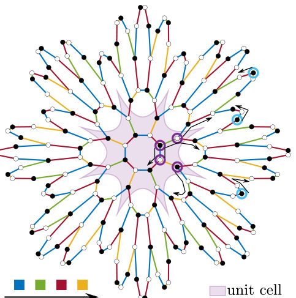 
FIG. 1. Hyperbolic {8, 3} lattice and four-color hopping pro- tocol. The lattice consists of regular octagons with three oc- tagons meeting at each bulk vertex. Black and white vertices denote the two sublattices. The shaded region marks a 16- site fundamental domain of the colored lattice. The lattice edges are divided into four color classes, blue, green, red, and orange. The four-step color cycle blue–green–red–orange is repeated four times and is followed by a sublattice-staggered onsite potential step. Purple-circled vertices mark the four in- equivalent bulk vertex types of the colored lattice, while cyan- circled vertices show representative boundary-propagating sites. Arrows show...

📷 Fig 2

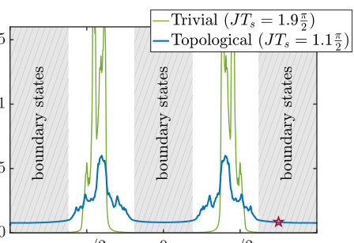 
FIG. 2. Quasienergy density of states of a six-shell open patch with N = 10800 sites. The quasienergy phase εT is defined by UF |ψα⟩= e−iεαT |ψα⟩. The green curve, JTs = 1.9π/2, shows the trivial regime with gaps at εT = 0 and π. The blue curve, JTs = 1.1π/2, shows the topological regime, where both quasienergy gaps, shaded in gray, are populated by boundary states. Both curves use δTs = 0.8π/2. The red star indicates the quasienergy of the in-gap state used for boundary dynamics in Fig. 4.

📷 Fig 3

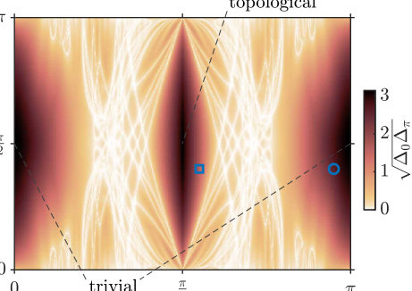 
FIG. 3. Bulk quasienergy gap phase diagram on a 2048-site periodic {8, 3} lattice. The color scale shows the geometric mean ¯∆= √∆0∆π, where ∆0 and ∆π are the quasienergy- phase gaps across εT = 0 and εT = π, respectively. Dark regions indicate that both bulk gaps are resolved in the finite periodic spectrum, while light regions indicate that at least one of the two gaps is numerically small. The blue square and circle correspond to the two open-boundary spectra shown in Fig. 2: the blue square at JTs = 1.1π/2 lies in the anomalous Floquet region, while the blue circle at JTs = 1.9π/2 lies in the trivial region. Both marked points use δTs = 0.8π/2.

📷 Fig 4

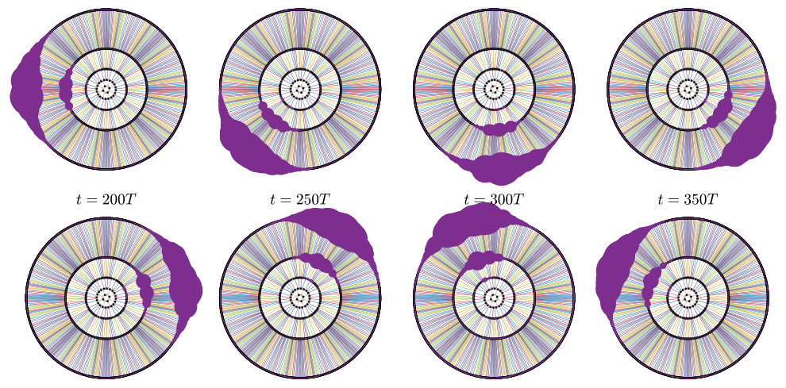 
FIG. 4. Stroboscopic evolution of a boundary wave packet in the anomalous Floquet regime, JTs = 1.1π/2. The system is a five-shell open {8, 3} patch with N = 2888 sites. This is a schematic radial plot where the sites on each shell are plotted on a circle. The initial state is obtained from the in-gap boundary state at the quasienergy marked by the red star in Fig. 2 by applying the angular envelope in Eq. (13). The area of purple disks are proportional to |ψi(t)|2 and are rescaled independently at each time so that the largest marker has a fixed display area; disk sizes should therefore not be compared quantitatively across panels. The panels show t = 0, 50T, 100T, 150T, 200T, 250T, 300T,...

📷 Fig 5

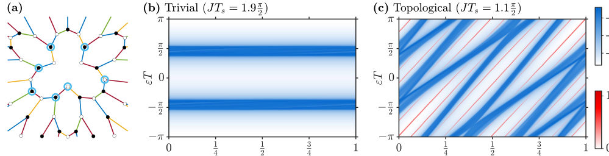 
FIG. 5. Flux dispersion and puncture-boundary spectral flow in compact periodic {8, 3} lattices. (a) Local geometry of the puncture in a 2048-site periodic lattice. A single vertex and its three incident edges are removed, creating a small boundary associated with the three octagons meeting at the deleted vertex. Cyan circles mark the seven puncture-boundary sites that cycle clockwise under one quarter of the hopping schedule at the perfect-hopping point. (b) Hofstadter density of states map in the trivial regime, JTs = 1.9π/2, with δTs = 0.8π/2. The blue background is the logarithmic density of states of the full periodic lattice, while the red overlay shows the puncture-induced excess...

**Summary.** The paper develops a theoretical framework to identify an anomalous Floquet topological phase on a hyperbolic lattice using periodic driving. By analyzing quasienergy gaps and tracking wave-packet dynamics, the authors distinguish this anomalous state from trivial ones via the presence of robust chiral boundary modes. This work introduces advanced diagnostic tools suitable for studying topology in curved geometries.

**Why it may be interesting.** This work extends topological concepts from standard lattices to negatively curved hyperbolic geometries, providing new tools (like the puncture-based spectral flow) for studying boundary physics in complex systems relevant to photonics or quantum simulation.

Detailed structure

**Main problem.** The study constructs and characterizes an anomalous Floquet topological phase on a negatively curved hyperbolic lattice.

**Main result.** In the anomalous regime, finite open patches exhibit bulk quasienergy gaps populated by in-gap states, which are diagnosed as chiral boundary modes, distinguishing it from the trivial regime where these gaps remain empty.

**Method.** The analysis employs Floquet engineering on a tight-binding Hamiltonian defined on a hyperbolic lattice, utilizing wave-packet dynamics and specialized spectral-flow diagnostics based on punctured periodic lattices.

**Model / system.** The system is modeled by a tight-binding Hamiltonian on the $\{8, 3\}$ hyperbolic tessellation, driven periodically (Floquet). The hopping involves a four-color edge-hopping sequence and a sublattice-staggered onsite potential step.

**Key observables.** Bulk quasienergy gaps at 0 and $\pi$, in-gap states populated by boundary modes, chiral boundary mode dynamics, and spectral flow diagnostics.

**Important parameters / regimes.** The topological regime is defined near the limit where a single hop transfers amplitude completely across an active edge; the trivial regime is near two full hops returning amplitude to the start site.

**Assumptions / limitations.** A puncture-based diagnostic is introduced to avoid ambiguities associated with the extensive outer boundary of finite hyperbolic patches, and the analysis uses specific color classes forming perfect matchings.

**Figures summary.** Figures illustrate the $\{8, 3\}$ lattice structure and four-color hopping protocol; DOS plots compare open vs. periodic spectra across topological regimes; wave packet dynamics show chiral propagation for boundary states.

**Paper structure.** The paper progresses by defining the model on the hyperbolic lattice, characterizing the transition between trivial and anomalous topological phases using quasienergy gaps in finite patches, and finally introducing a robust puncture-based diagnostic tool applicable to other hyperbolic systems.

Abstract

We construct an anomalous Floquet topological phase on a negatively curved hyperbolic lattice. The model is a tight-binding Hamiltonian with a periodically repeated four-color edge-hopping sequence and a sublattice-staggered onsite potential step. The topological regime is reached near the limit in which a single hopping step transfers amplitude completely across an active edge, while the trivial regime is reached near the point where two full hops occur along an active edge during a single hopping step, returning the amplitude to its starting site. In finite open patches, the topological regime is characterized by bulk quasienergy gaps at $0$ and $π$ that are populated by in-gap states, in contrast to a trivial regime where these gaps remain empty. Using compact periodic lattices, we map the bulk $0$ and $π$ quasienergy gaps and identify the gapped regions connected to the trivial and anomalous open-boundary spectra. We diagnose the in-gap states as chiral boundary modes by their real-space dynamics. Finally, we introduce a small-boundary spectral-flow diagnostic based on punctured periodic hyperbolic lattices, which avoids the ambiguity associated with the extensive outer boundary of finite hyperbolic patches. This puncture-based diagnostic should be useful for studying other topological hyperbolic systems.

[↑ back to top](#top)

### ⭐ [High-rate qLDPC processors](http://arxiv.org/abs/2607.28795v1)

**Highlighted author(s):** John Preskill  
**Authors:** Aditya Bhardwaj, Muzhou Ma, Nadine Meister, Robbie King, Dolev Bluvstein, John Preskill, Madelyn Cain, Qian Xu, Hsin-Yuan Huang  
**Type:** theory · **Category:** quantum information and computing · **PDF:** <https://arxiv.org/pdf/2607.28795v1>  
**Analysis basis:** full PDF text, analyzed in chunks
**Topic relevance:** `QC/QI experiment` **2/5**

📷 Fig 1

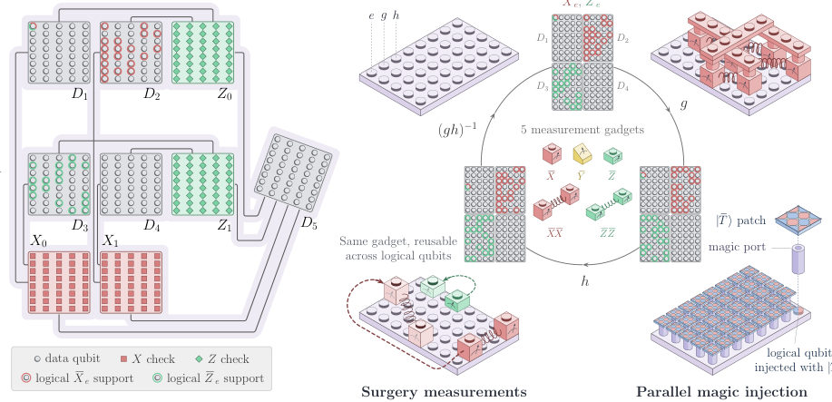 
Figure 1: Mitten codes as fault-tolerant qLDPC processors (a) The J200, 40, 12K mitten code built from the lifted product of base matrices 𝐴and 𝐵defined over the group algebra 𝐹2[𝐺] of the non-abelian group 𝐺= 𝐶4 × 𝐷10. The code consists of five blocks 𝐷1, . . . , 𝐷5 of |𝐺| = 40 physical data qubits and two blocks each of 𝑋-check and 𝑍-check ancilla qubits. Grey lines show the block-wise connectivity, while the connectivity between individual qubits is determined by the group structure through the ring entries of the base matrices 𝐴and 𝐵. Data qubits highlighted in red (green) mark the support of the canonical logical ¯𝑋𝑒( ¯𝑍𝑒) operator of weight 20 (18), where 𝑒is the identity element of...

📷 Fig 2

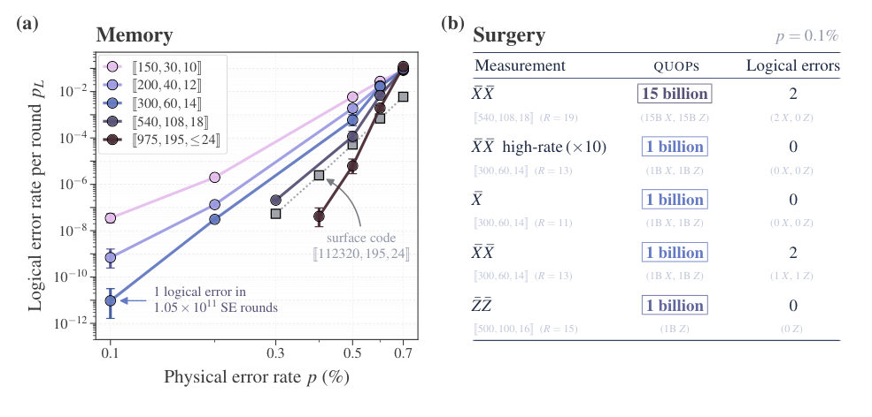 
Figure 2: Performance of mitten codes as qLDPC processors using our telescoping decoder. All simulations are performed under circuit-level noise with uniform depolarizing noise of strength 𝑝applied to state preparation, two-qubit gates, and measurements, with no idling noise. (a) Memory performance of mitten codes. We plot the logical error rate per syndrome extraction round averaged over an equal number of 𝑋and 𝑍basis experiments where error bars represent 68.27% Clopper-Pearson confidence intervals; the mitten codes form a family consistent with a threshold of 𝑝𝑐≈0.7%. Remarkably, at 𝑝= 0.4%, the J975, 195, ≤24K mitten code outperforms the J112320, 195, 24K stack of rotated surface codes...

📷 Fig 3

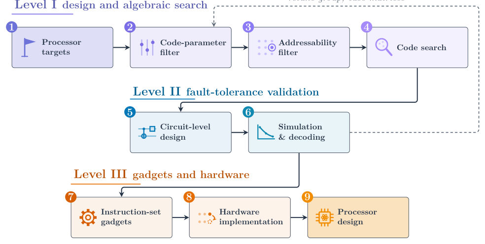 
Figure 3: High-rate qLDPC processor discovery pipeline. Starting from the processor targets of Definition 3, the pipeline narrows the design space in three levels. The first level explores the space of groups and base matrices: theoretical distance bounds (Appendix G) first constrain the search space, and the fast code- distance estimator sQetch (Appendix H) then brute-force searches the remaining space to find codes with good parameters and addressable logical operations. The second level searches for fault-tolerant syndrome extraction schedules and verifies logical performance through circuit-level simulations decoded with our telescoping decoder (Appendix I). The third level constructs...

📷 Fig 4

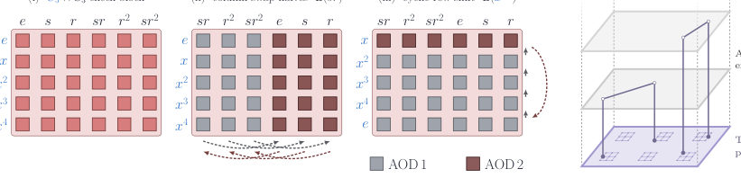 
Figure 4: Hardware implementation. (a) In neutral atom hardware, each gate layer of syndrome extraction is implemented by entangling blocks of checks with corresponding blocks of data qubits, and permuting check qubits between layers. Here we show an example 𝑋-check qubit permutation for the J150, 30, 10K code (𝐺= 𝐶5 × 𝑆3), for which the check qubit permutations between layers 𝐿(𝑟2) and 𝐿(𝑥· 𝑠𝑟2) correspond to the group action 𝐿(𝑥−1 · 𝑠𝑟). (b) Mitten codes can also be implemented in multilayer superconducting hardware by placing a large planar subgraph on the first tier, then routing all remaining edges that cannot be placed on the first tier through higher tiers.

📷 Fig 5

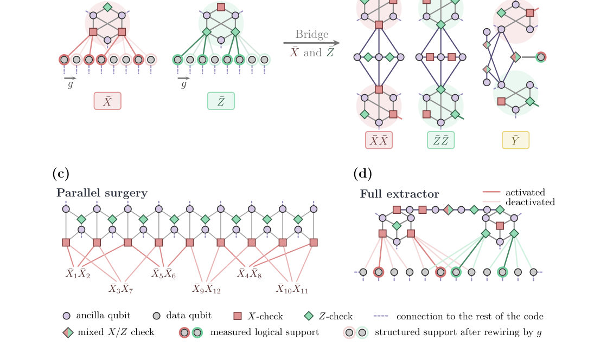 
Figure 5: Surgery gadgets. (a) The seed graph surgery gadgets for measuring logical ¯𝑋/ ¯𝑍operators constructed based on the group-structured canonical logical basis (Appendix B) where different logical operators are related by group action 𝑔and the seed gadgets can be used to measure all |𝐺| of them within an orbit by rewiring. (b) ¯𝑋¯𝑋, ¯𝑍¯𝑍and ¯𝑌graph surgery gadgets constructed by bridging the seed gadgets from (a). Together, the graph surgery gadgets in (a) and (b) can generate the entire Clifford group. (c) Parallel surgery gadget for measuring Pauli products in parallel. (d) Full extractor for measuring arbitrary weight Pauli product operators using a fixed gadget.

**Summary.** The paper introduces 'mitten codes,' a novel class of qLDPC codes derived from non-abelian groups, to address the major hurdles in building scalable quantum processors. By demonstrating high performance metrics—such as achieving $10^{-11}$ logical error rates with manageable physical qubits—and by developing automated design pipelines for hardware mapping, they propose a practical path toward fault-tolerant quantum computation on near-term platforms.

**Why it may be interesting.** This work provides concrete, quantifiable metrics for assessing fault tolerance beyond simple error correction thresholds by integrating code theory with practical constraints like circuit depth and physical routing overhead.

Detailed structure

**Main problem.** The primary challenge is designing quantum low-density parity-check (qLDPC) processors that are simultaneously high-rate, high-throughput, hardware-friendly, and fast to decode for fault-tolerant computation.

**Main result.** The authors introduce 'mitten codes,' a family of qLDPC codes based on non-abelian groups, which overcome distance limitations of abelian codes and demonstrate achieving logical error rates as low as $10^{-11}$ at achievable physical error rates.

**Method.** They developed an end-to-end design pipeline using sQetch to discover these codes, proving their feasibility through rigorous simulation of syndrome extraction and hardware placement optimization (Spectral Placement).

**Model / system.** The work focuses on abstract qLDPC processor models implemented via 'mitten codes,' which are lifted product codes over non-abelian groups. The physical realization is mapped onto near-term neutral atom arrays and superconducting qubit architectures.

**Key observables.** Block logical error rate ($\sim 10^{-11}$), processing capacity, throughput (logical operations per cycle), and hardware complexity metrics like Tiers, Length, and TSVs.

**Important parameters / regimes.** Encoding rate of $20\%$, check weight of 9, physical error rate (PER) up to $0.4\%$, and sub-millisecond decoding latency.

**Assumptions / limitations.** The analysis assumes that the non-abelian structure is key to bypassing distance bounds; hardware feasibility relies on mapping complex graph structures onto discrete superconducting or neutral atom lattices.

**Figures summary.** Figures illustrate the code structure, the three-level discovery pipeline (sQetch), and detailed comparisons of hardware complexities (Tiers, Length) for various codes using placement algorithms.

**Paper structure.** The paper progresses from identifying the general challenge to introducing mitten codes as a solution. It details the theoretical advantages of non-abelian groups, presents performance benchmarks (error rates/throughput), and concludes with detailed analyses on hardware mapping complexity (thickness and physical layout optimization).

Abstract

Despite significant progress on quantum low-density parity-check (qLDPC) codes, building qLDPC processors that are high-rate, high-throughput, hardware-friendly, and fast-to-decode remains a challenge. We introduce mitten codes, a family of qLDPC processor codes of encoding rate $20\%$ and check weight $9$, based on non-abelian groups. Their non-abelian structure evades distance bounds constraining abelian counterparts, allowing mitten codes to reach distance $18$ and beyond with just a few hundred data qubits. The logical operators of a mitten code are related by the group action, yielding a modular, low-overhead logical toolkit: full Clifford operations follow from bridging two reusable seed surgery gadgets or from a single fixed extractor. Furthermore, qLDPC processors based on mitten codes support high-rate surgery that executes many logical measurements in parallel, and parallel magic-state injection into all logical qubits at once. Under circuit-level noise, with our fast decoder, the $[\![300,60,14]\!]$ mitten code achieves, without extrapolation, a block logical error rate of ${\sim}10^{-11}$ per round at $0.1\%$ physical error rate (PER), while the $[\![ 975,195,\leq 24 ]\!]$ code reaches ${\sim}10^{-8}$ at $0.4\%$ PER. Decoding $15$ billion surgery experiments on the $[\![540,108,18]\!]$ code at $0.1\%$ PER, we observe only two logical failures, demonstrating a qLDPC processor capable of running ${\sim}10^{10}$ logical operations. Our decoder is compatible with sub-millisecond average latency per logical cycle, sufficient for real-time decoding on neutral atom hardware. Discovered by an end-to-end design pipeline built on sQetch, a distance estimator orders of magnitude faster than existing tools, and mapping efficiently onto near-term neutral atom and superconducting hardware, mitten codes open a practical path toward fault-tolerant quantum computation.

[↑ back to top](#top)

### [Parent Hamiltonian and intrinsic phase transition in non-Hermitian photonic systems](http://arxiv.org/abs/2607.28964v1)

**Authors:** Yuntao Xiao, Yuchen Guo, Xiaojian Huang, Huixia Gao, Dengke Qu, Lei Xiao, Kunkun Wang, Shuo Yang, Peng Xue  
**Type:** experiment · **Category:** statistical mechanics · **PDF:** <https://arxiv.org/pdf/2607.28964v1>  
**Analysis basis:** full PDF text, analyzed in chunks
**Topic relevance:** 🔥 `quantum optics experiment` **5/5** · 🔥 `analog quantum simulation` **4/5** · 🔥 `driven-dissipative phase transition` **4/5** · 🔥 `methods for driven-dissipative` **4/5** · `correlated / nonlocal dissipation` **3/5** · `exotic spin models in light-matter` **3/5** · `non-equilibrium universality` **3/5** · `Kondo & dissipative impurity` **2/5** · `QC/QI experiment` **2/5** · `non-equilibrium dynamics` **2/5** · `Keldysh / 2PI / non-Gaussian methods` **1/5** · `correlated cavity matter` **1/5** · `entanglement & information structure` **1/5** · `spintronics-quantum-optics interface` **1/5**

📷 Fig 1

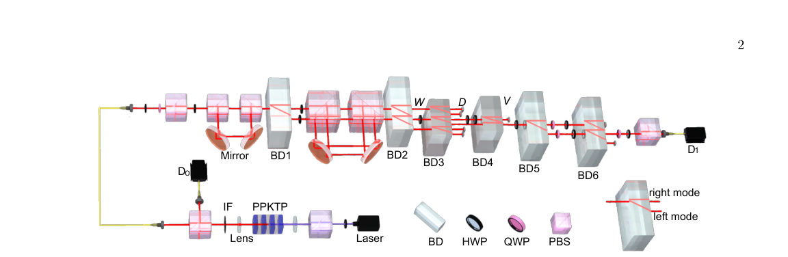 
FIG. 1. Experimental setup. A heralded single photon is created via type-II spontaneous parametric down-conversion via a periodically poled potassium titanyl phosphate crystal (PPKTP). In the state space spanned by the polarization modes |h⟩, |v⟩ and the spatial modes |r⟩, |l⟩, the signal photon is prepared in a maximally mixed state using two unbalanced interferometer setups composed of four polarizing beam splitters (PBSs), three half-wave plates (HWPs), and a beam displacer (BD1). We purify this mixed state into the ground states of the NH-PH via four BDs (BD2–BD5) and HWPs. The resulting ground states are reconstructed via quantum state tomography performed with BD6, a PBS, three...

📷 Fig 2

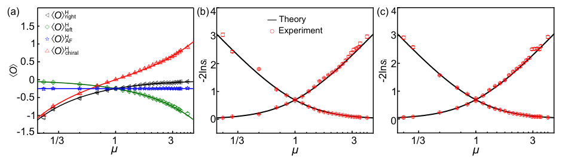 
FIG. 2. (a) The expectation values of order parameters ⟨O⟩= ⟨L|O|R⟩/⟨L|R⟩for NH-PH H with N = 2. Here, ⟨OH⟩refers to the results extracted from the reconstructed |Ψs R⟩and |Ψs L⟩after the imaginary-time evolution. The entanglement spectrum of (b) |Ψs R⟩and (c) |Ψs L⟩obtained from state tomography. Experimental data are represented by dots, and theoretical results are denoted by continuous lines. Error bars indicate the statistical uncertainty, which is obtained based on assuming Poissonian statistics.

📷 Fig 3

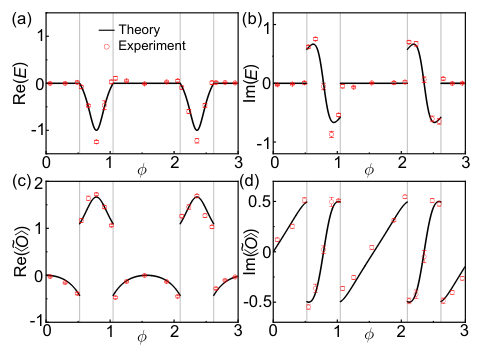 
FIG. 3. Real (a) and imaginary (b) parts of the ground-state energy of NH-PH ˜H (N = 3). The real parts of eigenval- ues are negative in π/6 &lt; ϕ &lt; π/3 and 2π/3 &lt; ϕ &lt; 5π/6. Real (c) and imaginary (d) parts of the expectation value of order parameter ⟨˜O⟩= ⟨Ψs ˜L| ˜O|Ψs ˜ R⟩/⟨Ψs ˜L|Ψs ˜ R⟩. Experimental data (dots) are obtained from states obtained via imaginary- time evolution, while theoretical results (solid black lines) are obtained from ground states calculated via exact diagonal- ization of the constructed NH-PH. Error bars indicate the statistical uncertainty, which are obtained by assuming Pois- sonian statistics.

📷 Fig 4

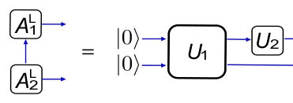 
FIG. 4. (a) The mapping from MPSs tensors to unitary op- erations. Here, U1 and U2 are unitary operations defined in Eq. (9). (b-c) The quantum circuits mapped from the MPSs to generate |R⟩and |L⟩.

📷 Fig 5

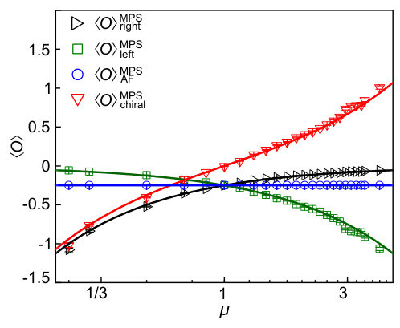 
FIG. 5. The expectation values of order parameters ⟨O⟩= ⟨L|O|R⟩/⟨L|R⟩for NH-PH H with N = 2. ⟨OMPS⟩denotes the results from direct measurements in the quantum circuits.

**Summary.** The study reports the first experimental generation and characterization of non-Hermitian Parent Hamiltonians using single photons. By mapping MPS states onto photonic circuits, the researchers successfully measured signatures of intrinsic non-Hermitian physics, including a distinct phase transition observed when zero-energy modes cease to be globally stable.

**Why it may be interesting.** This work provides a concrete, physical realization of complex theoretical concepts (NH Hamiltonians) using quantum optics, which is highly relevant for experimental AMO physicists working on open or engineered quantum systems.

Detailed structure

**Main problem.** The goal is to experimentally realize and characterize non-Hermitian Hamiltonians (NH-PHs) with controllable properties, moving beyond simple perturbations of Hermitian models.

**Main result.** The authors successfully demonstrated the first experimental generation of NH-PHs using single photons and observed an intrinsic non-Hermitian phase transition in a larger system model.

**Method.** They construct the Hamiltonian from pairs of Matrix Product States (MPSs) via imaginary-time evolution on photonic systems, validating results by measuring multiple order parameters.

**Model / system.** The work uses single photons as an experimental platform to simulate non-Hermitian spin chains. The framework is built upon constructing a Non-Hermitian Parent Hamiltonian (NH-PH) from asymmetric MPSs, such as those derived from AKLT states.

**Key observables.** Four order parameters probing non-reciprocal correlations, chiral imbalance, and conventional antiferromagnetic correlations; ground state energy and expectation values of these order parameters.

**Important parameters / regimes.** The asymmetry parameter ($\mu$), which controls the deviation from the Hermitian limit ($\mu=1$); system size ($N$).

**Assumptions / limitations.** The method relies on imaginary-time evolution to project the state onto the desired ground states, and that this process can be mapped to passive photon loss operations.

**Figures summary.** Figure 2 compares measured order parameters against theory for $N=2$; Figure 5 shows direct MPS measurements agreeing with theoretical predictions; the text describes observing abrupt jumps in order parameters signaling phase transitions.

**Paper structure.** The paper first introduces the NH-PH concept and its construction from MPSs. It details the experimental setup using single photons to generate and purify ground states via imaginary-time evolution. Finally, it characterizes the system by measuring various order parameters and observing an intrinsic non-Hermitian phase transition in larger systems.

Abstract

Non-Hermitian systems host phenomena absent in Hermitian physics, but realizing Hamiltonians with intrinsic non-Hermitian properties remains challenging. The theoretical method of non-Hermitian parent Hamiltonian (NH-PH) enables the construction of a non-Hermitian system from a pair of matrix product states (MPSs) with tailored properties. Here, we report the first experimental generation of NH-PHs. This generation starts from MPSs that represent asymmetric Affleck--Kennedy--Lieb--Tasaki (AKLT) states. The construction is validated with single photons via imaginary-time evolution of the generated NH-PH to obtain its left and right ground states. We then characterize the properties of the system by measuring four different order parameters that probe non-reciprocal correlations, chiral imbalance, and conventional antiferromagnetic correlations. Furthermore, extending the framework to a larger system with a different model, we observe an intrinsic non-Hermitian phase transition, manifested by abrupt jumps of an order parameter when the designated zero-energy modes cease to be the globally lowest-energy states. Our work provides the first experimental realization and characterization of non-Hermitian Hamiltonians with controllable and customizable properties, opening new avenues for exploring intrinsic non-Hermitian phenomena across diverse physical platforms.

[↑ back to top](#top)

### [Quantum Resources in Disorder-Free Localization Dynamics of Gauge Theories](http://arxiv.org/abs/2607.28730v1)

**Authors:** Devendra Singh Bhakuni, Giovanni Cataldi, Jad C. Halimeh, Emanuele Tirrito  
**Type:** theory · **Category:** disordered systems and neural networks · **PDF:** <https://arxiv.org/pdf/2607.28730v1>  
**Analysis basis:** full PDF text, analyzed in chunks
**Topic relevance:** 🔥 `entanglement & information structure` **5/5** · 🔥 `analog quantum simulation` **4/5** · `non-equilibrium dynamics` **3/5** · `scars & prethermalization` **3/5** · `non-equilibrium universality` **2/5** · `Keldysh / 2PI / non-Gaussian methods` **1/5** · `correlated / nonlocal dissipation` **1/5** · `driven-dissipative phase transition` **1/5** · `methods for driven-dissipative` **1/5**

📷 Fig 1

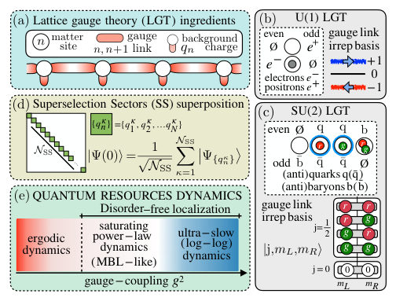 
FIG. 1. Disorder-free localization dynamics of quan- tum resources in 1+1D LGTs. (a) LGT ingredients: dy- namical matter on sites n, gauge fields on links (n, n+1), and static background charges qn. (b,c) Local bases of the U(1) and SU(2) LGTs, with staggered fermionic matter and gauge links. (d) The initial states in Eq. (9) are equal-weight su- perpositions of NSS superselection sectors, so the dynamics in Eq. (10) averages over sectors and experiences effective disorder. (e) Resulting resource dynamics vs. gauge cou- pling g2: ergodic growth at weak coupling, MBL-like satu- rating power-law relaxation at intermediate g2, and ultraslow double-logarithmic dynamics at the largest g2.

📷 Fig 2

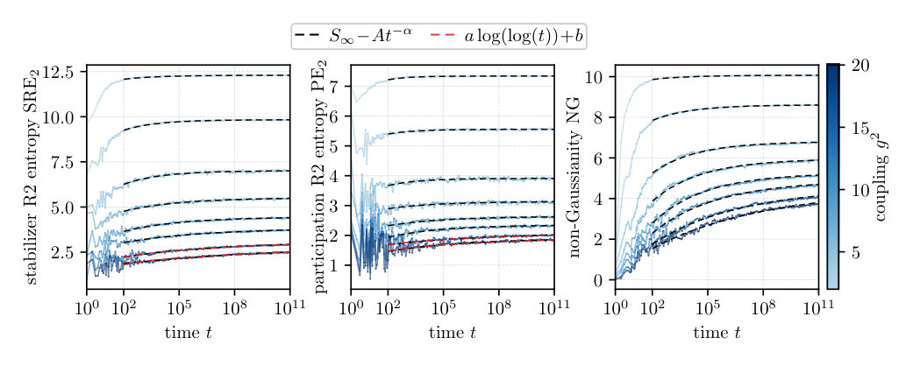 
FIG. 2. Time evolution of quantum resources in the U(1) LGT. From left to right, the stabilizer Rényi-2 entropy (SRE2), the participation Rényi-2 entropy (PE2), and the fermionic non-Gaussianity (NG) as functions of time for vanishing mass m = 0 (as in [92]) and increasing electric coupling g2 ∈[2, 20] (light to dark blue) at L = 16. Data and fit curves are displayed up to t = 1011, whereas the fit parameters are determined on the full window 102 ≤t ≤1015 (see SM [110]). Dashed black lines denote the saturating power law X∞−At−α, selected by the statistical analysis at intermediate couplings for SRE2 and PE2 and at every coupling for NG. Dashed red lines denote the double-logarithmic law a...

📷 Fig 3

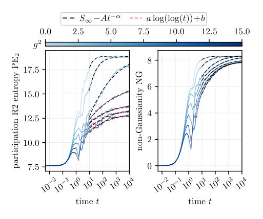 
FIG. 3. Time evolution of quantum resources in the SU(2) LGT. The participation Rényi-2 entropy (PE2, left) and the fermionic non-Gaussianity (NG, right) as functions of time for increasing coupling g2 ∈[0.5, 15] (shades of blue) at L = 12. After the initial transient, each trace is com- pared with the growth law selected by the statistical analy- sis (see SM): the saturating power law X∞−At−α (dashed black) or, for PE2 at strong coupling, the double-logarithmic law a log log t+b (dashed red). For numerical convenience, simulations are performed after rescaling the Hamiltonian in Eq. (7) as ( ˆH, m, g2)→4 √

📷 Fig 4

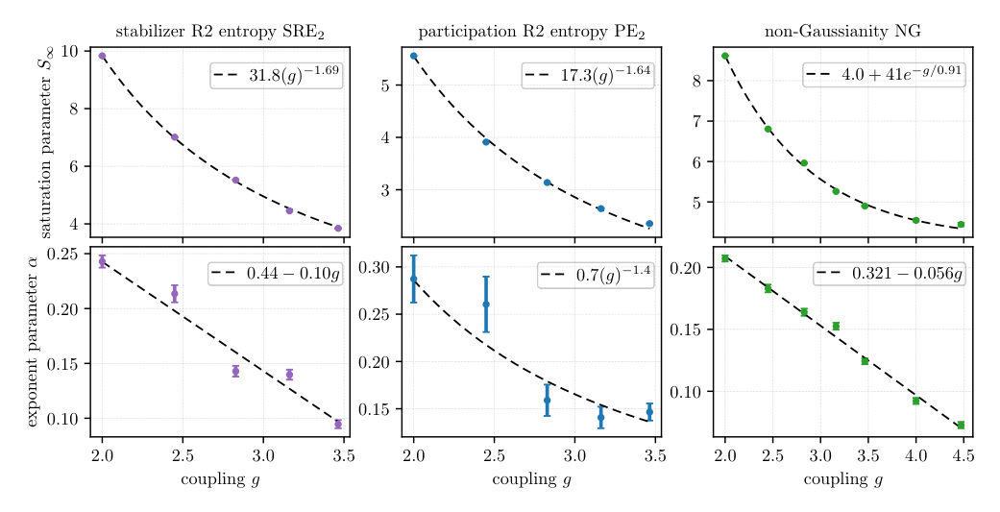 
FIG. 4. Scaling of the saturating-power-law parameters in the U(1) LGT. Saturation values X∞(top row) and relaxation exponents α (bottom row) of the saturating power law X∞−At−α [Eq. (S11a)] for SRE2, PE2, and NG (left to right), plotted as functions of the gauge coupling g = p

📷 Fig 5

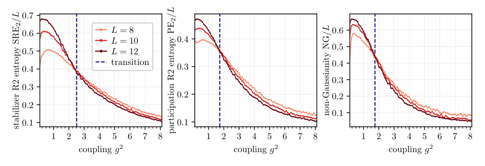 
FIG. 5. Finite-size scaling of static quantum resources in the U(1) LGT. From left to right, the densities of stabilizer Rényi-2 entropy (SRE2/L), participation Rényi-2 entropy (PE2/L), and fermionic non-Gaussianity (NG/L) as functions of the gauge coupling g2 for different lattice sizes L = 8, 10, 12 (increasing color intensity). The vertical dashed line marks the finite- size crossing point, separating the weak-coupling regime, where the densities grow with L, from the strong-coupling regime, where they decrease with L. In all cases, we averaged over 350 background super-selection sectors.

**Summary.** This paper analyzes the real-time evolution of quantum complexity resources in 1+1D Lattice Gauge Theories under disorder-free localization. By tracking metrics like Rényi entropies, the authors characterize two distinct dynamic regimes based on the gauge coupling strength: MBL-like power-law saturation and ultraslow double-logarithmic growth. The findings highlight how fundamental symmetries constrain quantum information spreading in these strongly correlated systems.

**Why it may be interesting.** This work directly addresses localization phenomena (MBL) within a complex physical framework (gauge theories), providing quantitative measures of how fundamental symmetries constrain quantum information flow, which is highly relevant for understanding dynamics in strongly interacting many-body systems.

Detailed structure

**Main problem.** The study investigates how quantum resources spread in lattice gauge theories (LGTs) operating in a disorder-free localization (DFL) regime, focusing on the real-time dynamics of quantum complexity.

**Main result.** The research finds two distinct behaviors depending on the gauge coupling: power-law relaxation consistent with Many-Body Localization at intermediate couplings, and ultraslow double-logarithmic growth at large couplings.

**Method.** The authors employ multiple quantum resource monotones—Stabilizer Rényi Entropy, Participation Rényi Entropy, and Fermionic Non-Gaussianity—to diagnose complexity dynamics over long time scales.

**Model / system.** The models are 1+1 dimensional Abelian U(1) and non-Abelian SU(2) Lattice Gauge Theories (LGTs), formulated using Kogut-Susskind staggered fermions on a lattice chain. The analysis tracks the evolution governed by gauge constraints.

**Key observables.** Stabilizer Rényi Entropy ($	ext{SRE}_2$), Participation Rényi Entropy ($	ext{PE}_2$), and Fermionic Non-Gaussianity ($	ext{NG}$)

**Important parameters / regimes.** Gauge coupling strength ($g^2$), Time ($t$, up to $10^{15}$), Lattice size ($L$)

**Assumptions / limitations.** The analysis relies on the assumption that gauge invariance constrains quantum resource growth, and later sections use exact counting methods to distinguish polynomial vs. exponential scaling of resonant volumes.

**Figures summary.** Figures illustrate LGT ingredients and show schematic summaries of resource dynamics versus $g^2$, displaying power-law saturation at intermediate couplings and double-logarithmic behavior at large couplings for U(1) LGTs.

**Paper structure.** The paper introduces the problem by defining quantum complexity diagnostics in LGTs. It then analyzes the time evolution using specific resource monotones across different coupling regimes, culminating in rigorous mathematical bounds derived from exact counting of resonant configurations to confirm the double-logarithmic growth rate.

Abstract

Quantum-state complexity diagnostics provide valuable insight into many-body dynamics, information scrambling, and quantum computation. Here, we investigate the real-time dynamics of quantum complexity in $1+1$-dimensional Abelian U(1) and non-Abelian SU(2) lattice gauge theories (LGTs), focusing on the disorder-free localization (DFL) regime. Using stabilizer Rényi entropy, participation Rényi entropy, and fermionic non-Gaussianity as measures of complexity, we observe, for both theories, two main behaviors as a function of the gauge coupling: at intermediate values, a power-law relaxation towards saturation, consistent with observations in many-body localization, and, at sufficiently large values, an ultraslow double-logarithmic growth, which we substantiate with a configuration-space bound verified by exact counting. Our results not only provide deeper insight into the dynamics of DFL but also highlight the role of gauge invariance in constraining quantum resources and are relevant to recent quantum simulations of LGTs.

[↑ back to top](#top)

### [Delayed Formation of Landau Polaritons in Phase-Resolved THz Spectroscopy](http://arxiv.org/abs/2607.29501v1)

**Authors:** Noureddine Charrouj, Yurii Ivonyak, Dmitriy Yavorskiy, Vladimir Y. Umansky, Jerzy Lusakowski, Wojciech Knap, Marcin Bialek  
**Type:** experiment · **Category:** other · **PDF:** <https://arxiv.org/pdf/2607.29501v1>  
**Analysis basis:** full PDF text, analyzed in chunks
**Topic relevance:** 🔥 `quantum optics experiment` **4/5** · `analog quantum simulation` **3/5** · `correlated cavity matter` **3/5** · `spintronics-quantum-optics interface` **3/5** · `Tavis-Cummings & cavity-many-emitter` **2/5** · `driven-dissipative phase transition` **2/5** · `methods for driven-dissipative` **2/5** · `non-equilibrium dynamics` **2/5** · `correlated / nonlocal dissipation` **1/5** · `entanglement & information structure` **1/5** · `exotic spin models in light-matter` **1/5** · `interference shaping light` **1/5** · `non-equilibrium universality` **1/5**

📷 Fig 1

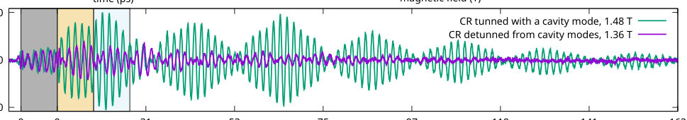 
FIG. 1. Sample with thick substrate. In the segments (a), (b), and (d), the time scale is the same; the gray, yellow, and blue areas represent time spans following three subsequent THz pulse echoes. (a) Time-domain trace of co-polarized reflection Rx at B = 1.48 T. In the schematic below, the red arrows symbolize the propagation of THz pulses in the slab (the green rectangle). Multiple internal reflections produce a train of pulses, as visible in the time-domain trace. (b) Time-domain traces of cross-polarized reflection Ry at B = 0 T, and at B = ±1.48 T. (c) Experimental Faraday rotation angle θF as a function of magnetic field. Arrows and dashed lines mark the magnetic fields of the...

📷 Fig 2

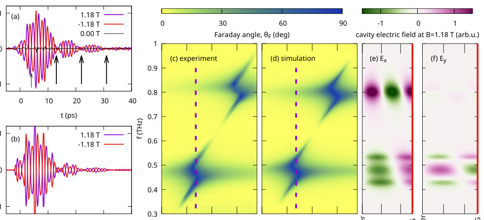 
FIG. 2. Thin-substrate sample in cross-polarized measurements. (a) Time-domain traces of reflection spectra at B = 0 T and at B = ±1.18 T. Larger black arrows in the yellow segment mark observed nodes of Rabi oscillations beating, while the small black arrow in the green segment marks an expected first node. (b) Simulated time-domain traces at B = 1.18 T. (c) Faraday angle spectra θF as a function of magnetic field. Dashed line marks the spectrum at B = 1.18 T. (d) Simulation of the Faraday angle using the transfer-matrix method. (e) Simulation of cavity mode electric field perpendicular to the incident field at B = 1.18 T.

**Summary.** The researchers used phase-resolved THz spectroscopy to study Landau polaritons formed by coupling cyclotron resonance in a 2DEG to a cavity. They found that the characteristic Rabi oscillations do not appear instantly upon excitation but are delayed until one full cavity round-trip time has elapsed. This result offers crucial dynamic insight, demonstrating that strong coupling is a process built up over time rather than an instantaneous effect.

**Why it may be interesting.** This work provides direct experimental evidence of the *dynamics* of strong light-matter coupling, moving beyond static spectral measurements. The observation of a build-up time scale is crucial for understanding open quantum systems where field buildup dictates coherence.

Detailed structure

**Main problem.** The study investigates the dynamic formation and coherent energy exchange within Landau polaritons formed by strong light-matter coupling.

**Main result.** The Rabi oscillations of these polaritons are observed to be delayed, commencing only after a time delay corresponding to one cavity round-trip time. This proves that the strong-coupling regime is dynamically established through the evolution of the cavity field.

**Method.** Phase-resolved terahertz time-domain spectroscopy (THz-TDS) was employed, utilizing cross-polarized and magnetic-field differential measurements to resolve temporal beating.

**Model / system.** The system involves coupling between the cyclotron resonance in a GaAs/Al0.36Ga0.64As two-dimensional electron gas (2DEG) and confined Fabry-Perot cavity modes, forming Landau polaritons.

**Key observables.** Rabi oscillations (time beating), Faraday rotation angle spectra ($	heta_F$), and time-domain reflection signals ($R_x$, $R_y$).

**Important parameters / regimes.** Cavity period ($\sim 9$ ps for thick substrate); Rabi oscillation periods (e.g., $22$ ps observed).

**Assumptions / limitations.** The analysis relies on phase-sensitive THz measurements to resolve dynamics beyond simple envelope measurements.

**Figures summary.** Figures show time-domain traces of cross-polarized signals ($R_y$) exhibiting beating, and Faraday angle spectra ($	heta_F$ vs $B$) displaying zigzag patterns characteristic of strong coupling.

**Paper structure.** The paper progresses by first establishing the physical system (2DEG coupled to a cavity), then using time-domain spectroscopy to observe Rabi oscillations, culminating in the key finding that these oscillations exhibit a measurable onset delay linked to the cavity round-trip time.

Abstract

Strong light-matter coupling gives rise to polaritons through coherent and periodic energy exchange between electromagnetic cavity fields and material excitations. While this interaction is typically inferred from spectral mode splitting, its dynamics remain largely unexplored. Here, using phase-resolved terahertz time-domain spectroscopy, we observe Rabi oscillations of Landau polaritons formed by coupling the cyclotron resonance in a GaAs/Al$_{0.36}$Ga$_{0.64}$As two-dimensional electron gas with Fabry-Perot cavity modes. By employing cross-polarized spectroscopy and magnetic-field differential, we resolve the temporal beating of the cyclotron resonance oscillations. Remarkably, we find that the Rabi oscillations do not start immediately after excitation of the cyclotron resonance, but after a delay corresponding to one cavity round-trip time. This demonstrates that the strong-coupling regime sets up only after the formation of the cavity mode field. Our results provide direct insight into the dynamics of hybrid light-matter states in the THz regime.

[↑ back to top](#top)

### [Quantum Optimal Control at Intermediate Times: Controlling Revivals in Spin Chains](http://arxiv.org/abs/2607.28783v1)

**Authors:** Juan J. Omiste, Ignacio R. Solá  
**Type:** theory · **Category:** other · **PDF:** <https://arxiv.org/pdf/2607.28783v1>  
**Analysis basis:** full PDF text, analyzed in chunks
**Topic relevance:** 🔥 `methods for driven-dissipative` **4/5** · 🔥 `quantum measurements` **4/5** · `analog quantum simulation` **3/5** · `exotic spin models in light-matter` **3/5** · `non-equilibrium dynamics` **3/5** · `Keldysh / 2PI / non-Gaussian methods` **2/5** · `driven-dissipative phase transition` **2/5** · `correlated / nonlocal dissipation` **1/5** · `entanglement & information structure` **1/5** · `measurement-induced transitions` **1/5** · `non-equilibrium universality` **1/5**

📷 Fig 1

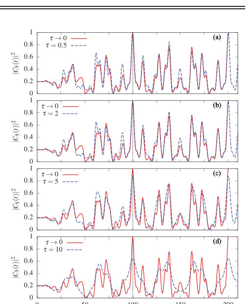 
FIG. 1. Population of |5⟩of a 5-spin chain as a function of time for an intermediate measurement at Tint = 100 and final propagation time Tend = 200. Results are shown for measurement windows with (a) τ = 0.5, (b) 2, (c) 5 and (d) 10 compared with the limiting case τ →0. The penalty factor and field envelope are given by Eq. (14).

📷 Fig 2

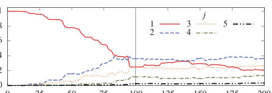 
FIG. 3. Population of the eigenstates ψk(k = 1, . . . 5) as a function of time, for an intermediate measurement at Tint = 100 and final propagation time Tend = 200.

📷 Fig 3

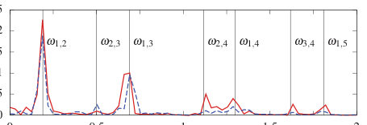 
FIG. 4. Power spectrum of the optimal driving field, ε(t), for an intermediate measurement at Tint = 100 and final propa- gation time Tend = 200 (solid red) and single measurement at Tend = 200 (dashed blue). The transition energies, ωj,k cor- responding to the gap between the eigenenergies (see Table I) are shown as vertical lines.

📷 Fig 4

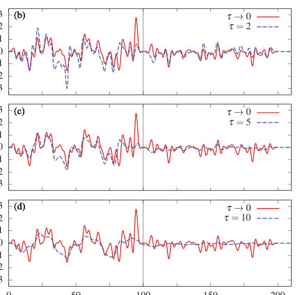 
FIG. 2. Optimal control field as a function of time for an intermediate measurement at Tint = 100 and final propaga- tion time Tend = 200. Results are shown for measurement windows with (a) τ = 0.5, (b) 2, (c) 5 and (d) 10 compared with the limiting case τ →0. The penalty factor and field envelope are given by Eq. (14).

📷 Fig 5

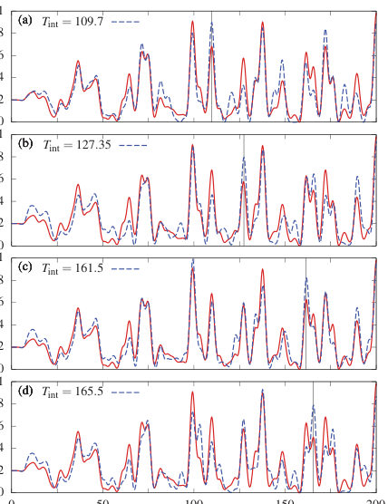 
FIG. 5. Population of |5⟩as a function of time for (a) Tint = 109.7, (b) 127.35, (c) 161.5 and (d) 165.5 and T = 200 along with non-intermediate time measurement (solid red). The penalty factor and envelope of the control field is given by Eq. (14) and Tε = 100.

**Summary.** The paper advances Quantum Optimal Control theory by developing methods to optimize quantum observables measured at multiple intermediate times. Using a 5-spin Heisenberg chain model, the authors demonstrate that incorporating these intermediate measurements allows for active manipulation of post-pulse dynamics, successfully controlling quantum state revivals while managing the associated mathematical complexities of costate discontinuities.

**Why it may be interesting.** This work is highly relevant as it tackles open quantum system dynamics by providing a rigorous mathematical tool (multi-time QOC) to actively steer complex time evolution processes like revival control, which is crucial for quantum memory and simulation.

Detailed structure

**Main problem.** The work extends Quantum Optimal Control (QOC) protocols to optimize physical observables measured at arbitrary intermediate times, moving beyond standard final-time optimization.

**Main result.** Simultaneous optimization of multiple intermediate observables reshapes the driving field to balance transient targets with the final population, enabling active manipulation and dynamic tracking of quantum state revivals.

**Method.** A variational approach is used within a Krotov algorithm framework, specifically adapting it to handle discontinuities in the costate trajectory induced by instantaneous (Dirac-delta) intermediate measurements.

**Model / system.** The study uses a 5-spin-$1/2$ chain modeled by the Heisenberg XXX Hamiltonian, restricted to the single-excitation manifold. The control is applied via an external time-dependent field $\varepsilon(t)$.

**Key observables.** Population of the Dicke state $|5
angle$, denoted $C_5(t) = |\langle \psi(t)| |5
angle|^2$, and the optimal driving field $\varepsilon(t)$.

**Important parameters / regimes.** The measurement window width ($	au$), which is taken to zero for ideal instantaneous measurements, and the penalty factor $\alpha$.

**Assumptions / limitations.** Standard QOC assumes optimization at a single final time; this work treats intermediate observations as Dirac-delta functions, requiring specialized handling of costate jumps.

**Figures summary.** Figures compare population dynamics ($|C_5(t)|^2$) for different intermediate measurement times ($T_{int}$) versus standard protocols. The power spectrum (Fig. 4) shows enhanced spectral peaks when intermediate measurements are included.

**Paper structure.** The paper first introduces the limitation of single-time QOC, then develops the theoretical framework to handle multi-time optimization via costate jump conditions and Krotov adaptation. Finally, it applies this method to the spin chain model to demonstrate control over revivals.

Abstract

Standard Quantum Optimal Control (QOC) protocols typically maximize a physical objective just at a final target time. However, tracking or measuring the quantum state during the time evolution requires the control at intermediate stages of their evolution. In this work, we extend QOC to accommodate the simultaneous optimization of observables at arbitrary intermediate times. Using a variational approach, we show that intermediate observations induce discontinuities in the costate trajectory, which can be handled with a Krotov algorithm leading to monotonic optimization and convergent results in the limit of zero temporal measurement windows. We apply this multi-time formulation to a Heisenberg XXX spin chain to control the propagation, including field-free revivals, of a Dicke state excitation. Our results demonstrate that simultaneous optimization of the same observable reshapes the driving field to balance intermediate targets with final populations. Finally, we show how this framework enables dynamic tracking of spin excitations and the active manipulation of post-pulse quantum state revivals.

[↑ back to top](#top)

### [Chiral magnons for spin-qubit state transfer](http://arxiv.org/abs/2607.29206v1)

**Authors:** Martijn Dols, Carlos Gonzalez-Ballestero, Mikhail Cherkasskii, Christian L. Degen, Victor A. S. V. Bittencourt, Silvia Viola Kusminskiy  
**Type:** theory · **Category:** quantum information and computing · **PDF:** <https://arxiv.org/pdf/2607.29206v1>  
**Analysis basis:** full PDF text, analyzed in chunks
**Topic relevance:** 🔥 `spintronics-quantum-optics interface` **4/5** · `correlated / nonlocal dissipation` **3/5** · `exotic spin models in light-matter` **3/5** · `QC/QI experiment` **2/5** · `methods for driven-dissipative` **2/5** · `non-equilibrium dynamics` **2/5** · `Keldysh / 2PI / non-Gaussian methods` **1/5** · `analog quantum simulation` **1/5** · `driven-dissipative phase transition` **1/5** · `entanglement & information structure` **1/5**

📷 Fig 1

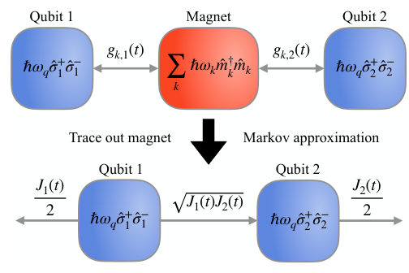 
FIG. 1: Two qubits i = 1, 2 are coupled to a magnon bath with the time-dependent coupling gk,i(t) limited to one propagation direction of the magnons. The effec- tive qubit-qubit coupling is unidirectional, such that the dynamics of qubit 2 are influenced by qubit 1, but not vice versa. The qubits dissipate into the bath at a rate Ji(t)/2.

📷 Fig 2

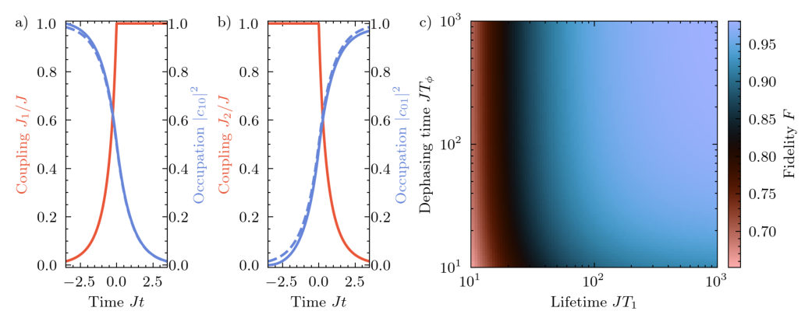 
FIG. 2: In red: effective coupling a) J1 and b) J2 normalized by its maximal value J as a function of time t normalized by J. In blue: simulated occupation (solid line) a) |c10(t)|2 and b) |c01(t)|2 and the ideal occupation as per Eq. (14) (dashed line) a) 1−f(t) and b) f(t). c) Fidelity of the final state using the effective couplings of Eq. (15) as a function of the lifetime T1 and dephasing time Tϕ of the qubit normalized by the maximal coupling J. In all figures we used Jtf = 3.5, α = 0 and β = 1.

📷 Fig 3

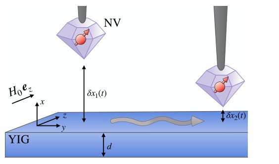 
FIG. 4: The proposed setup. Two NV centers integrated with a tip are coupled unidirectionally through the chiral and nonreciprocal magnon surface modes of a YIG stripe with thickness d. The coupling of the NV center i to the magnons can be varied through the external field H0(t) as well as the position δxi(t). The magnons propagate perpendicular to the external field H0ez.

📷 Fig 4

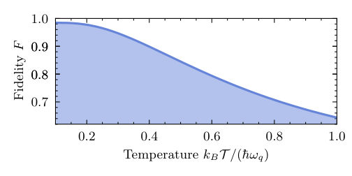 
FIG. 3: Fidelity F of the protocol as a function of the temperature T normalized by ℏωq/kB. The same param- eters as in Fig. 2 are used.

📷 Fig 5

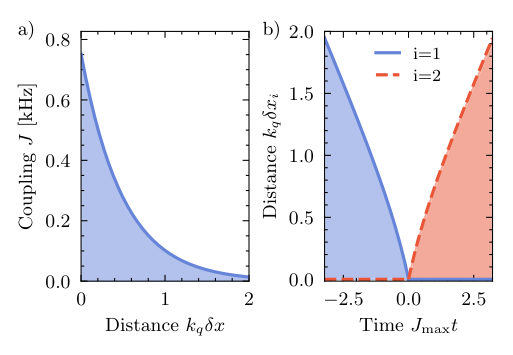 
FIG. 5: a) Coupling strength J as a function of the distance δx normalized by the resonant wave number kq. b) Distance δxi of qubit i normalized by the resonant wave number kq as a function of the time t normalized by the coupling Jmax.

**Summary.** The authors present a protocol for transferring quantum states between two distant spin qubits mediated by chiral magnons in a YIG/NV center hybrid system. They achieve this by dynamically controlling the coupling such that decoherence losses are avoided via dark-state engineering. This work expands the utility of magnonics as a robust tool for quantum information processing at solid-state distances.

**Why it may be interesting.** This work directly addresses quantum networking by proposing a solid-state mechanism to mediate long-range entanglement and state transfer between qubits using magnonic excitations, which is highly relevant to open quantum systems research.

Detailed structure

**Main problem.** The paper proposes a protocol to transfer an arbitrary quantum state between two distant spin qubits using chiral magnons as mediators.

**Main result.** High-fidelity state transfer ($\gtrsim 0.95$) can be achieved over several micron distances using realistic experimental parameters.

**Method.** State transfer is realized by time-modulating the coupling strength such that the two-spin-qubit system remains in a dark state of the magnon bath, thereby bypassing decoherence losses.

**Model / system.** The physical platform is a hybrid system combining two Nitrogen-Vacancy (NV) centers coupled to nonreciprocal and chiral magnon modes within an yttrium iron garnet (YIG) stripe. The dynamics are modeled using a master equation incorporating time-dependent coupling terms.

**Key observables.** State transfer fidelity ($F$), which is shown to exceed 0.95 under optimal conditions.

**Important parameters / regimes.** The distance between NV centers (several microns), temperature, dephasing time ($T_\phi$), and spin qubit lifetime ($T_1$).

**Assumptions / limitations.** The Markov approximation is used for the master equation, and it assumes that the two-spin-qubit state can be kept in a dark state relative to the magnon bath.

**Figures summary.** Figure 1 illustrates the Hamiltonian structure showing unidirectional effective coupling. Figure 3 demonstrates fidelity degradation as temperature increases due to thermal excitation effects.

**Paper structure.** The paper introduces the protocol, models the system dynamics using a master equation incorporating time-dependent couplings, details two methods for achieving this time modulation (varying distance or magnetic field), and concludes with numerical evaluations of feasibility.

Abstract

We propose a protocol where chiral magnons mediate a state transfer between two distant spin qubits. The protocol is implemented by varying the coupling between the spin qubits and the magnons in time, such that an arbitrary state is transferred from one qubit to the other. The modulation of the coupling is performed such that the two-spin-qubit state is kept as a dark state of the magnon bath, bypassing the associated losses. We show that the protocol can be realized on a hybrid system composed of two nitrogen-vacancy (NV) centers coupled to the nonreciprocal and chiral magnon modes of an yttrium iron garnet (YIG) stripe. We propose two methods to achieve the time modulation of the NV-magnon coupling: i) the NV-magnet distance of both NV centers is varied; ii) the external magnetic field and the NV-magnet distance of one NV center are varied. We evaluate the implementability of both methods numerically, including the constraints on the temperature, and the dephasing time and minimal lifetime of the spin qubits required for high-fidelity state transfer. We find that using realistic experimental parameters, a state transfer between NV centers at a distance of several microns can be achieved with a fidelity $\gtrsim 0.95$. Our findings expand the toolbox of magnonics for quantum information purposes.

[↑ back to top](#top)

### [Dissipation-enhanced vortex clustering in a compressible quantum fluid](http://arxiv.org/abs/2607.29475v1)

**Authors:** P. Comaron, M. Matuszewski, D. Sanvitto, D. Ballarini, A. S. Lanotte  
**Type:** theory · **Category:** quantum gases · **PDF:** <https://arxiv.org/pdf/2607.29475v1>  
**Analysis basis:** full PDF text, analyzed in chunks
**Topic relevance:** 🔥 `non-equilibrium dynamics` **4/5** · `correlated / nonlocal dissipation` **3/5** · `driven-dissipative phase transition` **3/5** · `methods for driven-dissipative` **3/5** · `analog quantum simulation` **2/5** · `non-equilibrium universality` **2/5** · `Frenkel-Kontorova` **1/5** · `Keldysh / 2PI / non-Gaussian methods` **1/5** · `entanglement & information structure` **1/5**

📷 Fig 1

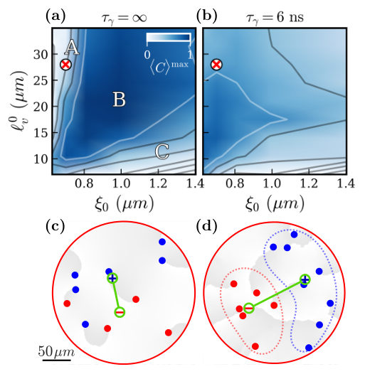 
FIG. 1. Phase portrait of vortex clustering showing the maximum of the correlation Cmax ≡max(⟨C⟩) as a function of the initial values of the intervortex distance ℓ0 v and heal- ing length ξ0. The average ⟨•⟩is taken over the statistical sample. Panel (a) refers to the conservative case (τγ →∞), while panel (b) refers to a dissipative case with τγ = 6ns. The continuous lines fix the level sets: the white line delimiting re- gion “B” is the locus of Cmax = 0.85, while the others are level sets separated by 0.15 difference. The red-crossed filled circles correspond to the case with (ξ0, ℓ0 v) = (0.7, 28)µm, and an ini- tial sound velocity of cs = p

📷 Fig 2

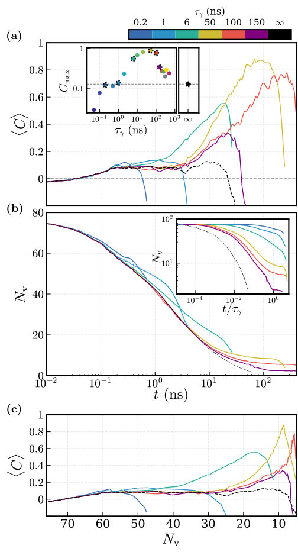 
FIG. 2. (a) The temporal evolution of the correlation ⟨C⟩, for condensates with particle lifetime in the range τγ ∈ [0.2−150]ns. In the inset, the maximal clustering value Cmax is reported as a function of the particle lifetime. Statistical error bars are smaller than the symbol size. (b) The temporal evolution of the vortex number Nv(t) is plotted as a function of time (main panel) and as a function of the rescaled time (inset). (c) Parametric representation of ⟨C(t)⟩as a function of the remaining vortex population Nv(t), with time progress- ing from left to right. The distinct trajectories show that the relation between clustering and vortex depletion depends on the particle lifetime. The...

📷 Fig 3

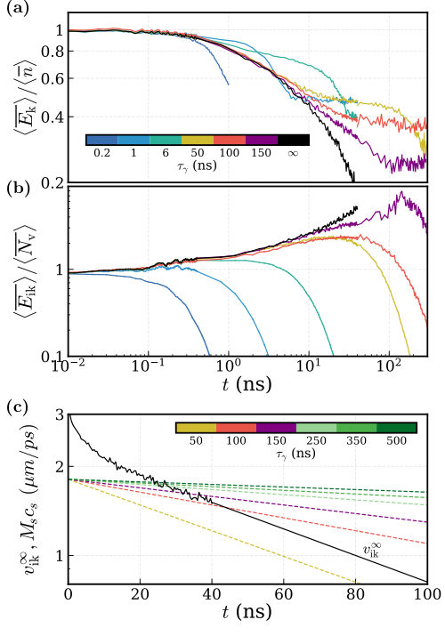 
FIG. 3. (a) Time evolution of the normalised total kinetic en- ergy per particle ⟨Ek⟩/⟨n⟩, where ⟨Ek⟩≡⟨Ek(t)⟩/⟨Ek(t = 0)⟩ and ⟨n⟩≡⟨n(t)⟩/n0 (in the conservative case, ⟨n⟩= 1 by def- inition). (b) Time evolution of the normalised incompressible kinetic energy per vortex, ⟨Eik⟩/⟨Nv⟩. (c) The comparison between the characteristic velocity scale of the vortex sec- tor and the sound-velocity scale associated with particle-loss- induced rarefaction, from which the crossover time ts reported in Fig. 4 is extracted. The value of Ms = 0.6 is defined to match the crossing time ts with the depletion time in the con- servative case

📷 Fig 4

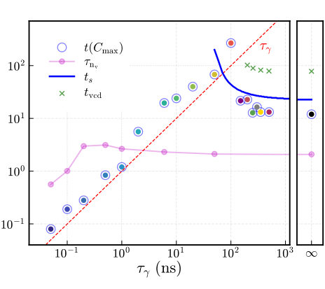 
FIG. 4. The time of maximum clustering t(Cmax) (filled cir- cles) is compared to the particle lifetime τγ (red dashed line), to the characteristic vortex-depletion timescale τnv (magenta line with dots), and to the crossover times ts (blue line) ex- tracted from Fig. 3(c), where the characteristic velocity scale of the vortex sector becomes comparable to the sound-velocity scale associated with particle-loss-induced rarefaction. Oper- ationally, τnv marks the onset of the regime in which vortex correlations begin to compete with pure particle-loss trunca- tion, while ts marks the opposite boundary beyond which the residual vortex population no longer sustains efficient growth of clustering....

**Summary.** This paper demonstrates that particle loss (dissipation) does not merely limit vortex clustering in a quantum fluid; instead, it actively enhances it beyond what is possible in conservative systems. The enhancement peaks at intermediate decay rates because this regime allows background rarefaction and kinetic energy relaxation to compete constructively with vortex correlation development.

**Why it may be interesting.** This work is highly relevant as it explores non-equilibrium dynamics in quantum fluids, showing that dissipation can drive complex ordering phenomena by selecting optimal timescales rather than simply truncating the process. This has implications for understanding decoherence effects on superfluid order.

Detailed structure

**Main problem.** The study investigates how particle loss (dissipation) affects vortex clustering dynamics in a compressible quantum fluid, specifically determining if dissipation can enhance ordering beyond the purely conservative limit.

**Main result.** Dissipation enhances transient vortex clustering significantly at intermediate particle-loss rates, establishing a finite dynamical window where correlations are stronger than in the conservative case.

**Method.** The research employs numerical simulations solving the dissipative Gross-Pitaevskii equation (dGPE) for freely decaying, confined condensates initialized with random vortices and antivortices.

**Model / system.** The system is a two-dimensional compressible quantum fluid modeled by the dGPE incorporating linear particle loss ($\gamma$). The dynamics are studied using parameters relevant to exciton-polariton condensates.

**Key observables.** Maximum mean vortex correlation ($C_{\max}$), temporal evolution of $\langle C(t) 
angle$ and $N_v(t)$, and the decay rates/components of total, kinetic, and interaction energy.

**Important parameters / regimes.** Particle lifetime ($	au_\gamma$), which dictates a nonmonotonic dependence on clustering efficiency; intermediate loss rates are optimal for enhancement.

**Assumptions / limitations.** The analysis assumes linear particle losses ($\gamma$) and models the system using the dGPE framework, comparing results against the conservative limit ($\gamma=0$).

**Figures summary.** Figures illustrate the non-monotonic dependence of clustering on $	au_\gamma$, energy decay pathways showing competition between kinetic and interaction components, and phase portraits comparing dissipative vs. conservative ordering.

**Paper structure.** The paper systematically analyzes the effect of dissipation on vortex correlations, first establishing the enhancement mechanism via $C_{\max}$ vs. $	au_\gamma$. It then delves into the underlying energy dynamics, decomposing total energy decay to show how kinetic and interaction energies evolve differently under loss compared to conservative evolution.

Abstract

Vortex clustering is commonly associated with conservative two-dimensional quantum-fluid dynamics. Therefore, particle loss is mainly expected to limit clustering by shortening the time available for vortex correlations to develop. Here we show instead that particle loss can enhance transient vortex clustering beyond the conservative evolution. We numerically study freely decaying, confined two-dimensional condensates initialized with random distributions of vortices and antivortices, and find a pronounced nonmonotonic dependence of the maximum clustering on particle lifetime. The enhancement is strongest at intermediate particle-loss rates, where loss-induced background rarefaction and incompressible kinetic energy relaxation occur on comparable timescales. Our results identify a finite dynamical window, selected by linear particle loss, in which a confined compressible quantum fluid develops stronger same-sign vortex correlations than in the conservative limit.

[↑ back to top](#top)

### [Potential-defect-driven collective modes of one-dimensional two-component quantum droplets](http://arxiv.org/abs/2607.29292v1)

**Authors:** Harsimranjit Kaur, Kuldeep Suthar  
**Type:** theory · **Category:** quantum gases · **PDF:** <https://arxiv.org/pdf/2607.29292v1>  
**Analysis basis:** full PDF text, analyzed in chunks
**Topic relevance:** 🔥 `analog quantum simulation` **4/5** · 🔥 `non-equilibrium dynamics` **4/5** · `non-equilibrium universality` **3/5** · `Keldysh / 2PI / non-Gaussian methods` **2/5** · `driven-dissipative phase transition` **2/5** · `Frenkel-Kontorova` **1/5** · `correlated / nonlocal dissipation` **1/5** · `entanglement & information structure` **1/5** · `methods for driven-dissipative` **1/5** · `scars & prethermalization` **1/5**

📷 Fig 1

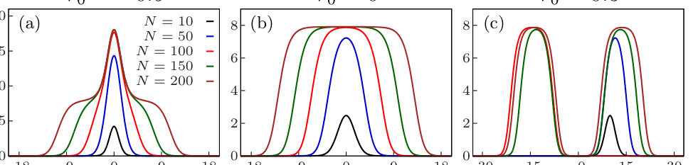 
FIG. 1. The ground state density profiles of bosonic quantum droplet mixtures for different numbers of atoms at three barrier strengths: (a) V0 = −0.5 (attractive defect), (b) V0 = 0 (no defect), and (c) V0 = 0.3 (repulsive defect). The intercomponent interaction strength is fixed at g12 = −0.9, and the harmonic trap strength is set to λ = 0. The quantum states are stabilized due to LHY correction. Different lines present the density profiles for different N labeled in (a).

📷 Fig 2

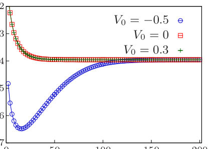 
FIG. 3. The chemical potential µ(N) for different barrier strengths V0, with both µ and V0 measured in units of ℏωo. The saturation of µ beyond the critical atom number Ncr marks the flat-top droplet regime. Here, the g12 = −0.9.

📷 Fig 3

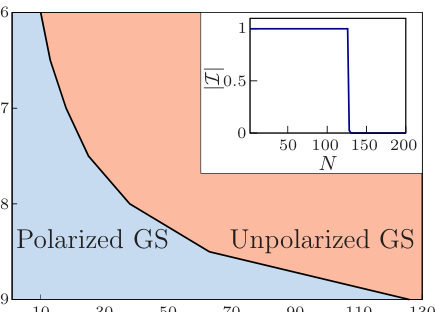 
FIG. 2. The critical atom number Ncr for different attractive inter- component interaction strength g12. At N &lt; Ncr, the ground state becomes highly polarized, indicating localization of the condensate in one side of the double well. The inset shows the population im- balance as a function of the number of atoms for V0 = 0.3 and g12 = −0.9. Here, the barrier width is σ = 1.

📷 Fig 4

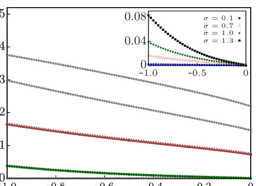 
FIG. 4. The frequency of low-lying collective modes as the poten- tial defect is tuned from attractive to zero. The lowest zero-energy modes are the Goldstone modes corresponding to each component. The inset shows the enlarged view of the softening of (first excited) dipole mode with V0 for different values of the spatial width σ of potential. Here, the number of atoms is N = 150 and main fig- ure corresponds to σ = 1. The quasiparticle frequency is scaled with trapping frequency ωo and potential strength with correspond- ing quantum energy scale ℏωo.

📷 Fig 5

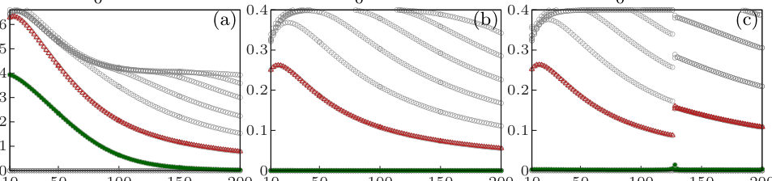 
FIG. 5. Low-lying collective excitation frequencies as a function of the number of atoms for three different barrier strengths: (a) V0 = −0.5, (b) V0 = 0, and (c) V0 = 0.3. The intercomponent interaction strength is fixed at g12 = −0.9, and the harmonic trap strength is set to λ = 0. The green filled stars and red triangles denote the frequency of dipole and breathing modes, respectively, while the light-gray dots represent the higher mode frequencies.

**Summary.** The paper theoretically examines two-component quantum droplets confined by a potential defect, incorporating beyond-mean-field LHY corrections. It finds that the defect strength dictates polarization transitions observable in the excitation spectrum and governs complex dynamic behaviors like fragmentation during interaction quenches. This offers predictive tools for controlling exotic many-body states in ultracold atomic gases.

**Why it may be interesting.** This work provides detailed predictions about how external potentials and interspecies interactions drive phase transitions and dynamic instabilities in quantum droplet systems, which is highly relevant for experimental control in cold atom setups.

Detailed structure

**Main problem.** The study investigates the ground-state properties and low-lying collective excitation spectra of a one-dimensional two-component quantum droplet confined by an external potential defect.

**Main result.** The presence of a potential barrier induces polarization transitions visible as discontinuities in the excitation spectrum, while quench dynamics reveal complex fragmentation patterns depending on the interaction strength.

**Method.** Theoretical analysis uses the extended Gross-Pitaevskii equation (eGPE) solved via imaginary-time propagation for ground states, and Bogoliubov theory/linearization for collective excitations.

**Model / system.** The system is a binary mixture of ultradilute quantum droplets in quasi-1D geometry. The model incorporates mean-field interactions, attractive Lee-Huang-Yang (LHY) quantum fluctuations, and an external potential defect ($V(x)$).

**Key observables.** Low-lying collective excitation frequencies ($\omega_j$), density profiles ($
ho_i(x)$), chemical potential ($\mu(N)$), and time evolution of population imbalance.

**Important parameters / regimes.** Potential defect strength ($V_0$: attractive, zero, repulsive) and the intercomponent interaction strength ($g_{12}$).

**Assumptions / limitations.** The analysis assumes quasi-1D geometry due to tight transverse confinement, and the LHY energy density is treated as a real correction.

**Figures summary.** Figures illustrate ground state density profiles for different defect strengths (attractive/repulsive), plot the critical atom number ($N_{cr}$) vs. interaction strength, show chemical potential evolution ($\mu(N)$), and map out collective mode frequencies versus defect tuning ($V_0$).

**Paper structure.** The paper systematically analyzes stationary states by solving eGPEs for various defects, followed by the calculation of excitation spectra using BdG equations. The latter part focuses on non-equilibrium dynamics via quench simulations (interaction and potential quenches).

Abstract

We examine a one-dimensional binary mixture of ultradilute quantum droplets in the presence of a central potential defect. The properties of the potential strength and the number of atoms exhibit distinct polarization transitions and low-lying ollective excitation spectra. The balance of (attractive) Lee-Huang-Yang quantum fluctuations and repulsive mean-field interactions results in a self-bound quantum droplet in a potential well. However, the potential barrier causes the polarization transition with the number of atoms, which is reflected in the excitation spectrum as a discontinuity and softening of the quasiparticle modes. We reveal that the critical number of atoms for the transition decreases as the attractive intercomponent interaction increases. Finally, the quench time dynamics of the interaction in potential barrier and well show the localization and diffusive fragmented droplets of two-component systems.

[↑ back to top](#top)

### [Revealing the Spin Hydrodynamics of a Spin-Imbalanced Unitary Fermi Gas](http://arxiv.org/abs/2607.29647v1)

**Authors:** DeChao Zhang, Johannes Lang, J. E. Thomas  
**Type:** experiment · **Category:** quantum gases · **PDF:** <https://arxiv.org/pdf/2607.29647v1>  
**Analysis basis:** full PDF text, analyzed in chunks
**Topic relevance:** 🔥 `analog quantum simulation` **4/5** · `exotic spin models in light-matter` **3/5** · `non-equilibrium dynamics` **3/5** · `spintronics-quantum-optics interface` **3/5** · `driven-dissipative phase transition` **2/5** · `non-equilibrium universality` **2/5** · `Keldysh / 2PI / non-Gaussian methods` **1/5** · `correlated / nonlocal dissipation` **1/5** · `methods for driven-dissipative` **1/5**

📷 Fig 1

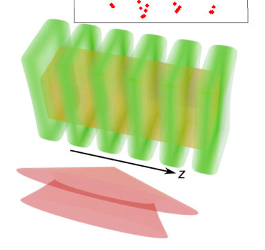 
FIG. 1. Optical box with spatially periodic pertur- bation. Atoms (yellow) are perturbed by a repulsive green light potential and imaged with resonant light (red arrow). Inset (top) shows the differing equilibrium responses of the majority (blue) and minority (red) components, which sets the initial condition for measurement of the many-body spin- hydrodynamics.

📷 Fig 2

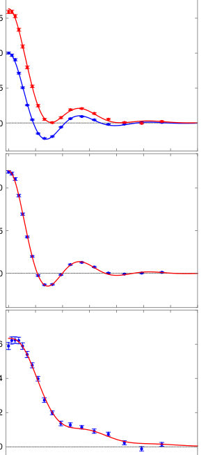 
FIG. 2. Evolution of the spin polarization and spin density perturbations. (A) Upper red curve: Minority spin Fourier component δn↓(q, t)/n0↓. Lower blue curve: Ma- jority spin Fourier component δn↑(q, t)/n0↑. (B) Total den- sity Fourier component δn(q, t)/n0. (C) Spin polarization perturbation δ ¯P(q, t) ≡δn↓/n0↓−δn↑/n0↑. Solid curves show the spin-hydrodynamics model.

📷 Fig 3

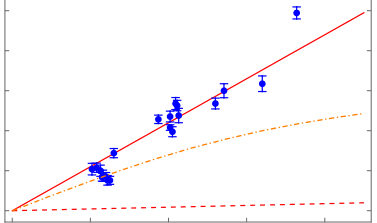 
FIG. 3. Energy-spin Seebeck coefficient Sǫ = ˜Sǫ n

📷 Fig 4

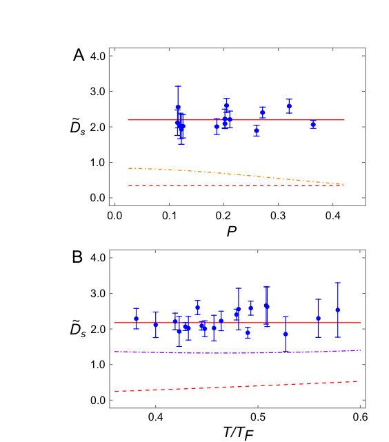 
FIG. 4. Spin diffusivity Ds = ˜Ds ¯h

**Summary.** The authors investigate spin hydrodynamics in a spin-imbalanced unitary Fermi gas using an ultracold atom setup. By analyzing the relaxation dynamics following periodic perturbations, they extract fundamental transport coefficients like spin diffusivity and the energy-spin Seebeck coefficient. This work establishes a quantitative experimental platform for studying spin caloritronics in strongly correlated quantum matter.

**Why it may be interesting.** This work provides direct, quantitative measurements of spin-dependent transport phenomena (spin Seebeck effect) in a highly controllable ultracold atomic platform, offering crucial benchmarks for theoretical models of strongly correlated quantum matter.

Detailed structure

**Main problem.** The study investigates spin transport, specifically spin hydrodynamics and spin caloritronics, which remains poorly understood in strongly interacting quantum fluids.

**Main result.** The experiment successfully measures fundamental energy and spin current coefficients ($	ilde{D}_s$ and $	ilde{S}_{\sigma}$), establishing a quantitative framework for universal spin hydrodynamics in the unitary Fermi gas.

**Method.** Measurements involve quenching spatially periodic optical potentials to induce density and spin polarization modulations, followed by fitting the time evolution of these components using linear-response hydrodynamic models.

**Model / system.** The system is a spin-imbalanced unitary Fermi gas (UFG) confined in an optical box. The dynamics are modeled using coupled differential equations describing perturbations in density, spin polarization, and temperature.

**Key observables.** Spin diffusivity ($	ilde{D}_s$), energy-spin Seebeck coefficient ($	ilde{S}_{\sigma}$), first sound diffusivity ($	ilde{D}_1$), and the evolution of polarization modulation $\delta P(q, t)$.

**Important parameters / regimes.** Polarization ($P$), reduced temperature ($T/T_F$), wavevector ($q$), and characteristic transport coefficients.

**Assumptions / limitations.** The analysis relies on linear-response theory, fitting data to hydrodynamic equations derived from irreversible thermodynamics, and utilizing the long wavelength limit for certain derivations.

**Figures summary.** Figures illustrate the optical setup with periodic perturbations; subsequent figures show time evolution of Fourier components ($\delta P(q, t)$) and plots comparing extracted transport coefficients ($	ilde{S}_{\sigma}, 	ilde{D}_s, 	ilde{D}_1$) against theoretical predictions as a function of temperature or polarization.

**Paper structure.** The paper introduces the problem by detailing the experimental setup and measurement techniques. It then develops the hydrodynamic model governing spin and energy transport. Key results are presented through fitting data to extract universal dimensionless coefficients, culminating in consistency checks across different measurable quantities like $	ilde{D}_1$.

Abstract

Hydrodynamics governs diverse collective phenomena in nature, from the expansion of a quarkgluon plasma to viscous electron flow in quantum materials. In strongly interacting hydrodynamic fluids, the transport of spin remains poorly understood. Here, we investigate spin transport in the hydrodynamic regime of a spin-imbalanced unitary Fermi gas confined in a uniform optical box. By quenching a spatially periodic optical potential that modulates both the density and spin polarization, we observe the relaxation of the many-body system, which determines both the spin diffusivity and the spin Seebeck/Peltier coefficients in a homogeneous quantum gas. Our measurements provide parameter-free benchmarks for microscopic theories and establish an ultracold atom platform for studying spin caloritronics in strongly correlated matter.

[↑ back to top](#top)

### [Fermionic entropy: an efficiently measurable strong monotone for non-Gaussianity](http://arxiv.org/abs/2607.29670v1)

**Authors:** Lorenzo Leone, Lennart Bittel  
**Type:** theory · **Category:** quantum information and computing · **PDF:** <https://arxiv.org/pdf/2607.29670v1>  
**Analysis basis:** full PDF text, analyzed in chunks
**Topic relevance:** 🔥 `entanglement & information structure` **4/5** · `Keldysh / 2PI / non-Gaussian methods` **3/5** · `analog quantum simulation` **3/5** · `non-equilibrium dynamics` **2/5** · `quantum measurements` **2/5** · `correlated / nonlocal dissipation` **1/5** · `driven-dissipative phase transition` **1/5** · `measurement-induced transitions` **1/5** · `methods for driven-dissipative` **1/5** · `non-equilibrium universality` **1/5**

📷 Fig 1

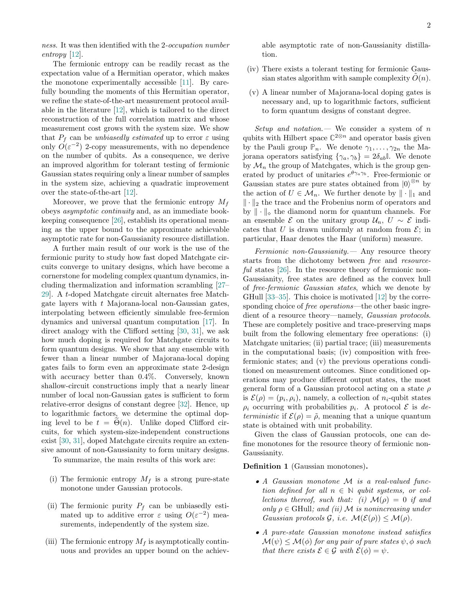 
Low-resolution page preview, page 2

📷 Fig 2

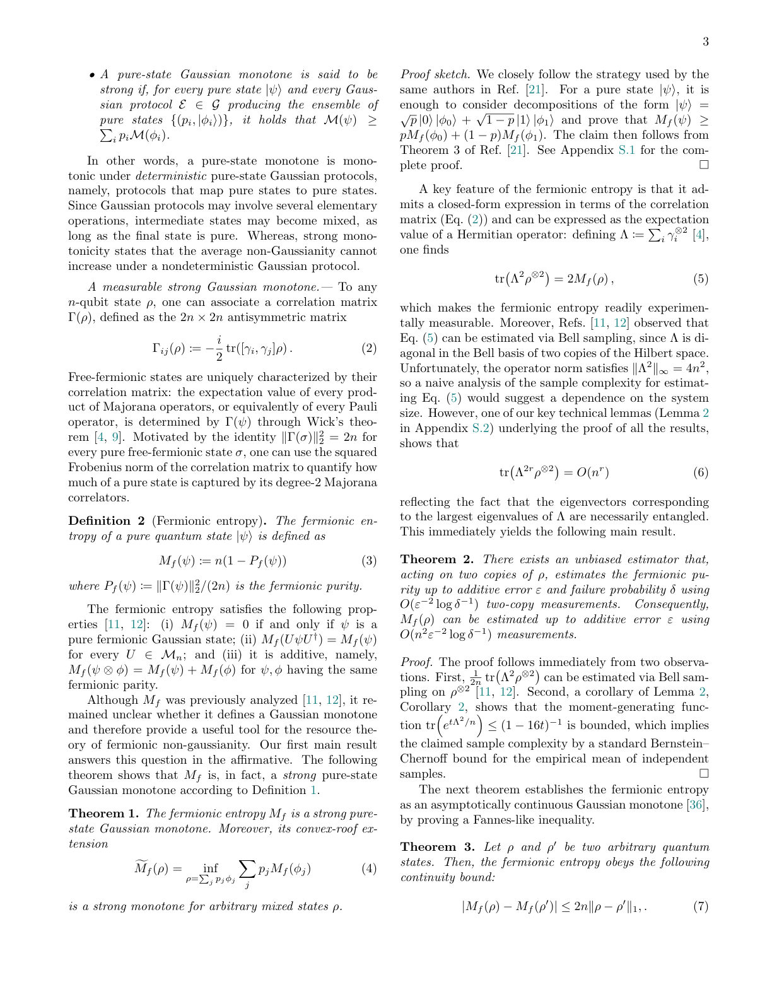 
Low-resolution page preview, page 3

📷 Fig 3

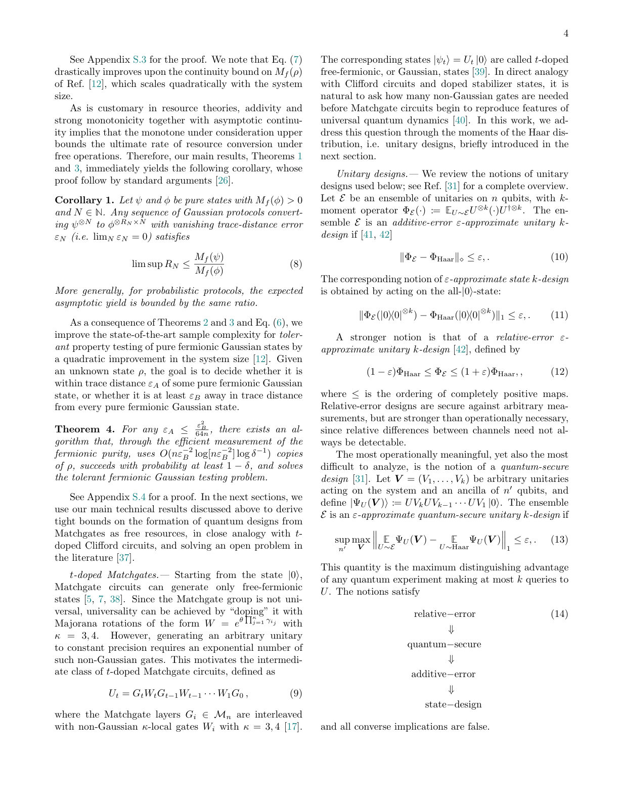 
Low-resolution page preview, page 4

📷 Fig 4

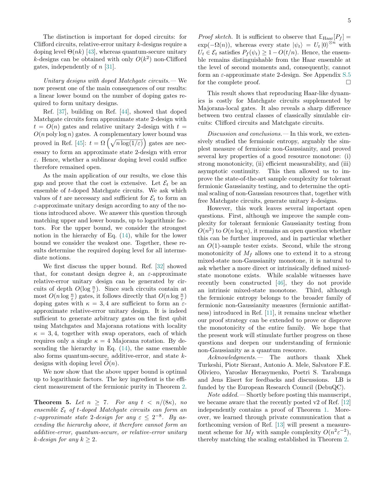 
Low-resolution page preview, page 5

📷 Fig 5

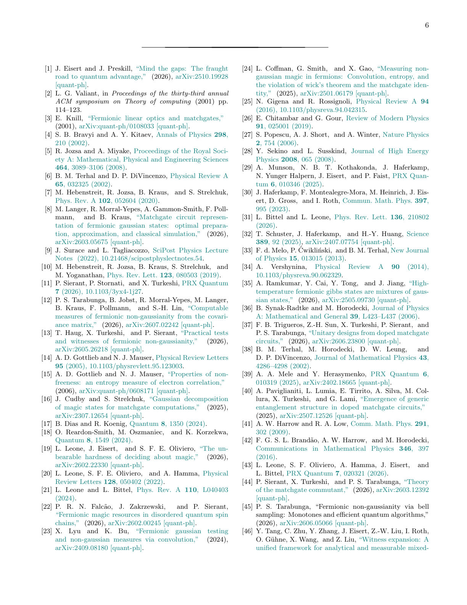 
Low-resolution page preview, page 6

**Summary.** The paper introduces the fermionic entropy as a robust and efficiently measurable monotone quantifying non-Gaussianity in fermionic quantum states. It provides rigorous measurement protocols for this entropy and applies these findings to determine the minimum necessary complexity (number of gates) required to achieve universal quantum operations, particularly in doped circuit architectures.

**Why it may be interesting.** This work directly addresses resource quantification—a central theme in modern quantum information theory—by providing concrete, measurable diagnostics ($M_f$) applicable to physical platforms like superconducting qubits or trapped ions that implement fermionic Hamiltonians.

Detailed structure

**Main problem.** The core challenge is developing mathematically rigorous and experimentally accessible monotones to quantify fermionic non-Gaussianity, which represents a key resource for quantum computation beyond free-fermion dynamics.

**Main result.** The paper establishes the fermionic entropy as a strong pure-state Gaussian monotone and determines that generating approximate unitary designs requires an extensive number of non-Gaussian gates in doped Matchgate circuits.

**Method.** The authors use advanced resource theory techniques, deriving measurement protocols (e.g., two-copy measurements) to estimate the purity/entropy and applying complexity analysis to design requirements.

**Model / system.** The study focuses on fermionic systems described by $n$-qubit states ($\mathbb{C}^{2^n}$), where free dynamics are governed by Gaussian states (Matchgate circuits). Non-Gaussianity is introduced via local, non-Gaussian gates (Majorana-local doping).

**Key observables.** Fermionic entropy ($M_f$), fermionic purity ($P_f$), and the correlation matrix ($\Gamma(
ho)$).

**Important parameters / regimes.** System size $n$, measurement error $\epsilon$, and the required number of gates/samples (scaling with $\epsilon^{-2}$ or linearly in $n$).

**Assumptions / limitations.** The resource theory framework assumes free states are the convex hull of Gaussian states, and protocols must maintain strong monotonicity.

**Figures summary.** Not specified by notes; the analysis relies on algebraic derivations involving norms and traces over correlation matrices.

**Paper structure.** The paper progresses from defining $M_f$ as a monotone (Theorem 1), detailing efficient measurement protocols for estimating purity (Theorem 2), establishing continuity bounds, and finally applying these tools to determine the necessary doping level for achieving unitary designs in specific quantum architectures.

Abstract

Fermionic Gaussian states form a central class of classically tractable quantum states, while fermionic non-Gaussianity provides the resource required to go beyond free-fermion dynamics. A key challenge is to quantify this resource through monotones that are both mathematically rigorous and experimentally accessible. Here, we show that the fermionic entropy, defined through the squared Frobenius norm of the correlation matrix, is a strong pure-state Gaussian monotone. Its simple closed-form expression also makes it directly measurable: we show that the associated fermionic purity can be unbiasedly estimated up to additive error $\varepsilon$ using $O(\varepsilon^{-2})$ two-copy measurements, independently of the system size. Moreover, we prove that the fermionic entropy obeys asymptotic continuity and, as a direct consequence, establish its operational meaning as the upper bound to the asymptotic rate of non-Gaussianity distillation. We further derive a linear sample complexity bound for tolerant testing of fermionic Gaussian states, providing a quadratic improvement over the state of the art. As a further application of our results, we study unitary designs generated by Matchgate circuits supplemented with Majorana-local non-Gaussian gates. We prove that a linear number of such gates is necessary even to achieve an approximate state $2$-design with error below $0.4\%$. Combined with known nearly linear upper bounds for relative-error designs, this determines the optimal doping level, up to logarithmic factors, across all relevant design notions and reveals the extensive non-Gaussianity cost required to generate Haar-like quantum dynamics in this architecture.

[↑ back to top](#top)

### [Meissner Effect and Josephson Radiation in Driven Dissipative Superconductors](http://arxiv.org/abs/2607.28734v1)

**Authors:** Carl Philipp Zelle, Subir Sachdev  
**Type:** theory · **Category:** statistical mechanics · **PDF:** <https://arxiv.org/pdf/2607.28734v1>  
**Analysis basis:** full PDF text, analyzed in chunks
**Topic relevance:** 🔥 `driven-dissipative phase transition` **4/5** · `methods for driven-dissipative` **3/5** · `non-equilibrium dynamics` **3/5** · `non-equilibrium universality` **3/5** · `correlated / nonlocal dissipation` **2/5** · `Keldysh / 2PI / non-Gaussian methods` **1/5** · `analog quantum simulation` **1/5** · `correlated cavity matter` **1/5** · `superradiant laser` **1/5**

📷 Fig 1

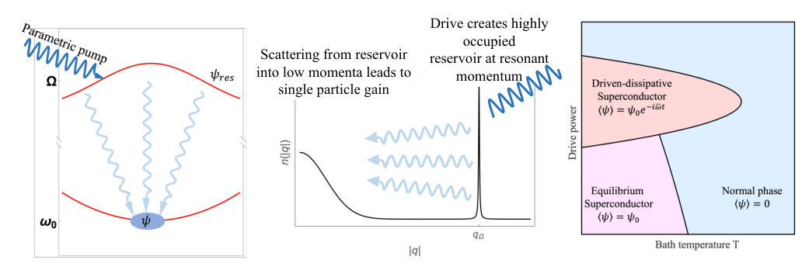 
FIG. 1: Left: schematic incoherent pumping scheme. Laser drive at a high frequency Ωcreates occupations at a reservoir degree of freedom ψres, possibly via parametric resonance. These excitations quickly relax through collisions into the low frequency regime. This leads to an effective negative contribution to the dissipation of the slow degrees of freedom. For sufficiently strong pumping, a condensate rotating at a low frequency ω0 forms. Middle: For parametrically driven field theories high momentum modes can serve as the pumped reservoir. These occupations relax through collisions into the long wavelength regime where they can induce a dissipative instability. Right: Phase diagram of a...

📷 Fig 2

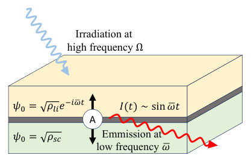 
FIG. 2: Schematic visualization of photo-induced AC Josephson effect. Upper layer becomes superconducting once driven by a suitable high frequency laser at the bath temperature Tb. Lower layer is a high-Tc compound that is naturally superconducting at Tb. The resulting phase rotation of the driven-dissipative superconductor results in an AC Josephson current across the junction without any bias applied. This leads to detectable radiation at a frequency ¯ω lower than and incommensurate with the laser frequency Ω.

**Summary.** This paper proposes that photo-induced superconductivity above the critical temperature arises from a driven-dissipative condensation of the superconducting order parameter. Using continuum theory, it predicts characteristic electromagnetic signatures, including both conventional Meissner effects and unique zero-bias AC Josephson radiation at an incommensurate frequency. This offers a clear experimental diagnostic to distinguish non-equilibrium pairing states.

**Why it may be interesting.** The work bridges non-equilibrium statistical mechanics with condensed matter phenomena, providing a concrete theoretical framework for understanding superconductivity driven by external fields, which is highly relevant to open quantum systems dynamics.

Detailed structure

**Main problem.** The paper addresses photo-induced superconducting signatures observed at temperatures above equilibrium critical temperatures, proposing a non-equilibrium mechanism to explain this phenomenon.

**Main result.** It predicts that the system exhibits both conventional long-wavelength superconductivity (Meissner effect, gapped plasmons in 3D) and unique zero-bias AC Josephson radiation at an intrinsic frequency ($ar{\omega}$) distinct from the drive frequency.

**Method.** The authors develop a phenomenological continuum theory by coupling the slowly rotating superconducting order parameter to conserved charge density and the electromagnetic gauge field.

**Model / system.** The model describes driven-dissipative condensation, where optical pumping generates gain overcoming intrinsic damping. The dynamics are governed by coupled equations for the order parameter ($\psi$) and charge density ($
u$).

**Key observables.** Static Meissner effect (3D), gapped plasmon dispersion (3D), Pearl screening/gapless plasmon dispersion (2D), and AC Josephson current emitting radiation at $ar{\omega}$.

**Important parameters / regimes.** Intrinsic rotation frequency ($ar{\omega}$), drive frequency ($\Omega$), dimensionality (2D vs 3D), and coupling constants derived from the continuum theory.

**Assumptions / limitations.** The theory is phenomenological, assuming a slow phase rotation and relying on approximations like eliminating the amplitude mode via adiabatic approximation.

**Figures summary.** Figure 1 illustrates the incoherent pumping scheme leading to condensation. Figure 2 schematically visualizes the photo-induced AC Josephson effect, showing radiation at $ar{\omega}$ vs $\Omega$.

**Paper structure.** The paper first establishes the non-equilibrium mechanism (driven-dissipative condensation) and then develops a continuum theory. It analyzes the resulting electromagnetic response in both 3D (Anderson-Higgs gap) and 2D (Pearl screening), culminating in the prediction of measurable Josephson radiation.

Abstract

Photo-induced superconducting signatures have been observed in several materials at temperatures far above their equilibrium critical temperatures, including magnetic field expulsion as in the Meissner effect. We propose driven-dissipative condensation of the superconducting order parameter as a mechanism for this phenomenon. In such a theory, optical pumping generates an effective gain (possibly via a parametric resonance) that overcomes the intrinsic damping of the pairing field, and stabilizes a non-equilibrium condensate whose phase rotates at an intrinsic frequency that is generally lower than, and incommensurate with, the drive frequency. We develop a phenomenological continuum theory that couples this slowly rotating order parameter to the conserved charge density and the electromagnetic gauge field. Despite its finite-frequency dynamics, the resulting state exhibits the conventional long-wavelength electromagnetic signatures of superconductivity. In three dimensions, it displays a static Meissner effect and a gapped plasmon generated by the Anderson--Higgs mechanism. In a two-dimensional sheet, it exhibits Pearl screening and the characteristic square-root plasmon dispersion. We further propose a direct experimental test based on a Josephson junction between the driven-dissipative state and an equilibrium superconductor. The junction supports an AC Josephson current at zero applied voltage and emits radiation at the intrinsic rotation frequency of the condensate. Its low, pump-dependent, and generally incommensurate frequency provides a clear signature distinguishing driven-dissipative superconductivity from equilibrium and drive-locked pairing states.

[↑ back to top](#top)

### [Statistical Gauge Theory of Structural Glasses: Equilibrium Scenarios and Glass-Forming Ability](http://arxiv.org/abs/2607.28786v1)

**Authors:** L. D. Son, M. G. Vasin  
**Type:** theory · **Category:** disordered systems and neural networks · **PDF:** <https://arxiv.org/pdf/2607.28786v1>  
**Analysis basis:** full PDF text, analyzed in chunks
**Topic relevance:** 🔥 `Keldysh / 2PI / non-Gaussian methods` **4/5** · `methods for driven-dissipative` **3/5** · `non-equilibrium dynamics` **3/5** · `driven-dissipative phase transition` **2/5** · `non-equilibrium universality` **2/5** · `Frenkel-Kontorova` **1/5** · `analog quantum simulation` **1/5** · `correlated / nonlocal dissipation` **1/5** · `exotic spin models in light-matter` **1/5** · `scars & prethermalization` **1/5**

📷 Fig 1

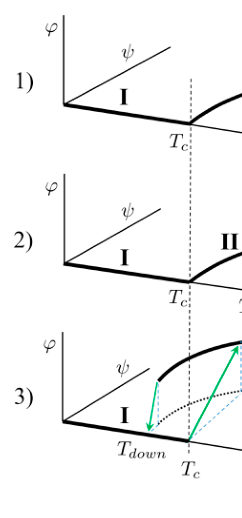 
Figure 2: Possible system behavior scenarios (see table in text).

**Summary.** This paper applies a statistical gauge theory framework to model structural glasses using topological defects. By analyzing the system in the mean-field approximation, the authors identify criteria that allow for the prediction of good glass formers based on microscopic defect parameters. The work successfully connects equilibrium phase behavior with dynamic signatures like the Vogel–Fulcher–Tammann relaxation law.

**Why it may be interesting.** While focused on structural glasses, the use of field theories (gauge analogy) and complex order parameters ($\psi, \varphi$) to describe non-equilibrium dynamics is relevant for understanding many-body systems far from equilibrium, which shares conceptual links with open quantum system dynamics.

Detailed structure

**Main problem.** The paper aims to develop a microscopic theory for the glass transition, which involves dramatic slowing down of dynamics without a clear thermodynamic phase transition.

**Main result.** The statistical gauge theory predicts three equilibrium scenarios, with only one exhibiting strong glass-forming ability based on defect parameters. The approach successfully links model parameters to observable glass-forming characteristics.

**Method.** The analysis employs functional integration over complex scalar fields (representing topological defects) and utilizes the mean-field approximation in a low-energy limit.

**Model / system.** The system modeled is structural glasses, treated using an analogy to gauge theory constructions. The Hamiltonian involves defect density tensors ($\alpha^k_{\Lambda}(r)$), and interactions are mediated by auxiliary fields ($\varphi$).

**Key observables.** Defect line density ($\langle\psi
angle$), orientational ordering ($\langle\vec{\varphi}
angle$), configurational entropy, and the relaxation time $	au$ (showing VFT behavior).

**Important parameters / regimes.** The defect core energy ($\varepsilon$), interaction strength ($M$), and an upper temperature limit ($T_{up}$) for glass formation.

**Assumptions / limitations.** The use of a gauge theory analogy, which is noted as formal rather than fundamental; the reliance on low-energy approximations and mean-field treatments.

**Figures summary.** Figure 1 illustrates contours formed by defect fields ($\psi(r)\psi(r+d)$), noting that only single-pass closed contours contribute to non-zero weights.

**Paper structure.** The paper builds from defining the Hamiltonian via topological defects, moving through functional integration and low-energy approximations, applying the mean-field theory to determine equilibrium scenarios, and finally deriving kinetic predictions like the VFT law.

Abstract

The model primarily concerns structural glasses described by systems of topological defects. We explore the scope of this approach and investigate equilibrium behavior within the mean-field approximation. Our analysis reveals three possible equilibrium scenarios, only one of which exhibits a strong glass-forming ability. These scenarios allow for the phenomenological selection of model parameters based on equilibrium behavior, which can then be used to study dynamics during quenching. We identify an upper temperature limit beyond which quenching into the glassy state becomes impossible.

[↑ back to top](#top)

### [Disorder induced time crystal in athermal random field Ising model with non-reciprocal interactions](http://arxiv.org/abs/2607.28781v1)

**Authors:** Aldrin B E, Sumedha  
**Type:** theory · **Category:** statistical mechanics · **PDF:** <https://arxiv.org/pdf/2607.28781v1>  
**Analysis basis:** full PDF text, analyzed in chunks
**Topic relevance:** 🔥 `driven-dissipative phase transition` **4/5** · `methods for driven-dissipative` **3/5** · `non-equilibrium dynamics` **3/5** · `non-equilibrium universality` **3/5** · `analog quantum simulation` **1/5** · `correlated / nonlocal dissipation` **1/5** · `exotic spin models in light-matter` **1/5** · `scars & prethermalization` **1/5**

📷 Fig 1

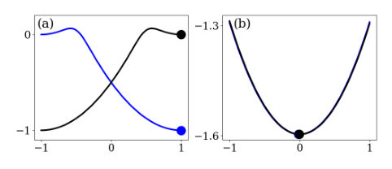 
FIG. 1: The free energy functionals fA (blue) and fB(black) are plotted as a function of mA, mB respectively in the steady state of a single run. The mA(blue dot) and mB(black dot) steady state values are also plotted: a) K = 0.5, σ = 0.1 where an ordered steady state with mA, mB = +1 is reached; b) K = 0.5, σ = 2 with disordered state with mA = mB = 0.

📷 Fig 2

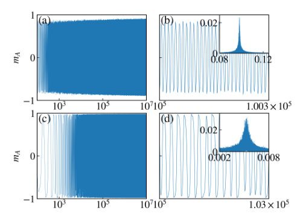 
FIG. 2: Evolution of mA with time is plotted for a randomly picked realization for: a,b) Complete graph with K = 0.5, σ = 0.4 for N = 1000. c,d) Cubic lattice with K = 0.3, σ = 0.3 for L = 30. In the insets the Fourier transform (F(mA)) of mA(t) are plotted as a function of frequency.

📷 Fig 3

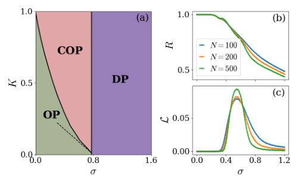 
FIG. 4: The phase diagram in K −σ plane on a complete graph is plotted in (a) with the ordered phase (OP), chaotic ordered phase (COP) and disordered phase (DP). The solid lines mark the lines of transition between the two phases from the full numerical solution of Eq. 9. The dashed line is from the solution of the cubic expansion of the dynamical equations (K = (1 − p

📷 Fig 4

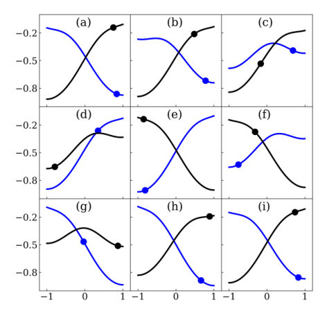 
FIG. 3: Time evolution of mA and mB plotted on the dynamic energy landscape from Eq. 8 for J = 1; K = 0.5; σ = 0.4 on a complete graph of size N = 1000. The subfigures (a) to (i) correspond to the states reached after 501, 502, 503, 504, 506, 508, 510, 511, and 512 Monte Carlo runs respectively. These states keep on repeating themselves.

📷 Fig 5

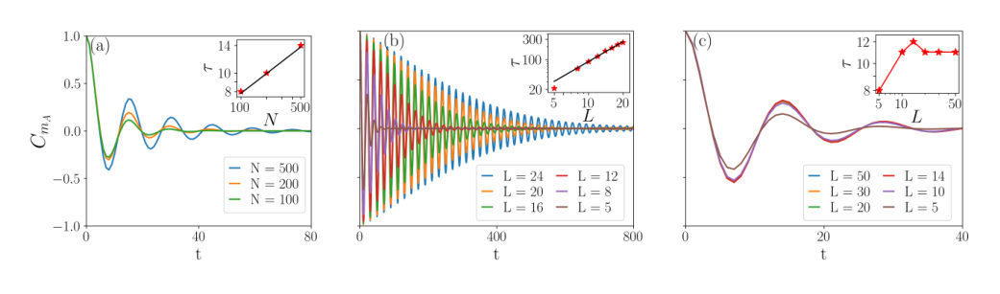 
FIG. 5: The time-autocorrelation function (CmA(t)) for mA for (a) complete graph, (b) cubic lattice and (c) square lattice. The autocorrelation time (τ) shown in inset is calculated by finding the intersection of the upper envelope of CmA(t) with e−1. τ is plotted as a function of system size in log-log scale in the insets. For the complete graph and the cubic lattice, the values of τ obtained for each system size was fitted with the function aLb and we obtain a = 1.56 ± 0.11; b = 0.35 ± 0.01 and a = 2.55 ± 0.39; b = 1.55 ± 0.06 respectively. For the case of square lattice, τ does not have system size dependence.

**Summary.** This work analyzes a two-species random field Ising model with non-reciprocal couplings to search for intrinsic time crystal behavior. By studying the dynamics on different lattices, the authors demonstrate that disorder combined with non-reciprocity can spontaneously induce sustained, chaotic time oscillations in 3D systems without external driving. The findings map out a rich phase diagram defining this novel non-equilibrium ordered state.

**Why it may be interesting.** The spontaneous emergence of non-equilibrium order (time crystals) in a purely classical, disordered system driven only by internal interactions is highly relevant for understanding complex dynamics outside of standard quantum driving protocols.

Detailed structure

**Main problem.** The study investigates whether a time crystal phase can spontaneously emerge in classical, out-of-equilibrium disordered systems without requiring external driving.

**Main result.** The model exhibits a chaotic time-oscillatory phase (a time crystal) for intermediate values of non-reciprocal interaction ($K$) and disorder variance ($\sigma$), which is absent in 2D but present in 3D on a complete graph.

**Method.** The analysis involves solving the dynamics exactly on a complete graph, analyzing order parameter evolution via differential equations, and studying system size scaling of autocorrelation times.

**Model / system.** The physical system is a two-species random field Ising model with non-reciprocal interactions ($K$) subjected to quenched Gaussian random fields ($\sigma$). The dynamics are governed by the single spin-flip greedy Glauber dynamics (GGD).

**Key observables.** Order parameters ($m_A, m_B$), time autocorrelation functions ($	ext{C}_{mA}(t)$), and correlation times ($	au$) showing system size dependence.

**Important parameters / regimes.** Non-reciprocal interaction strength ($K$), random field variance ($\sigma$), and lattice dimensionality (2D vs. 3D).

**Assumptions / limitations.** The analysis relies on solving dynamics exactly on a complete graph or employing mean-field approximations for the inter-species coupling.

**Figures summary.** Figures illustrate free energy functionals, time evolution of magnetization showing sustained oscillations in the chaotic phase, and phase diagrams mapping the Ordered (OP), Chaotic Ordered (COP), and Disordered (DP) phases in the $K-\sigma$ plane.

**Paper structure.** The paper systematically analyzes the model by first establishing the dynamics on a complete graph, then constructing the phase diagram based on $(K, \sigma)$, and finally comparing results across different lattices (cubic vs. square) to confirm the robustness of the time crystal signature via $	au$ scaling.

Abstract

A two species random field Ising model with non-reciprocal interactions between the species is studied using the greedy Glauber dynamics. By solving the dynamics exactly on a complete graph, we obtain the phase diagram of the model as a function of the non-reciprocal interaction ($K$) and the variance ($σ$) of the quenched random field distribution. The model exhibits a rich phase diagram with the presence of a chaotic time-oscillatory phase for intermediate values of $K$ and $σ$. The chaotic phase has stable time oscillations along with the autocorrelation time that diverges with system size on a complete graph and also in three dimensions. We find that the random field disorder along with non-reciprocal interaction alone can produce a time crystal without an external driving. In two dimensions the autocorrelation time does not increase with the system size and the time crystal phase is absent.

[↑ back to top](#top)

### [Entanglement in bipartite systems with symmetry: coupled chaotic kicked Bose-Hubbard systems](http://arxiv.org/abs/2607.29165v1)

**Authors:** J. Himmelsbach, M. F. I. Kieler, A. Bäcker  
**Type:** theory · **Category:** other · **PDF:** <https://arxiv.org/pdf/2607.29165v1>  
**Analysis basis:** full PDF text, analyzed in chunks
**Topic relevance:** 🔥 `entanglement & information structure` **4/5** · `analog quantum simulation` **3/5** · `non-equilibrium dynamics` **3/5** · `non-equilibrium universality` **2/5** · `Keldysh / 2PI / non-Gaussian methods` **1/5** · `correlated / nonlocal dissipation` **1/5** · `driven-dissipative phase transition` **1/5** · `methods for driven-dissipative` **1/5** · `scars & prethermalization` **1/5**

📷 Fig 1

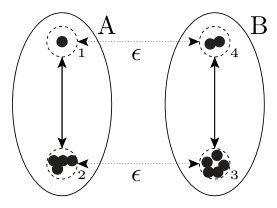 
FIG. 1. Schematic illustration of a bipartite system with a conserved quantity. The Bose-Hubbard system consists of four sites indicated by the four dash-lined circles. Particles are depicted by full black circles. The system is divided into two subsystems A and B with two sites each. The parameter ϵ controls the interaction between the subsystems. Another interaction allows for particle exchange within the subsystem.

📷 Fig 2

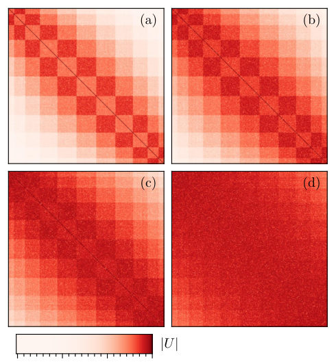 
FIG. 2. Realizations of the time evolution operator of the CQTE (16) for the four site Bose-Hubbard system for N = 10 particles and COE statistics. Logarithmic color scale and sub- system diagonalized basis for (a-d) p

📷 Fig 3

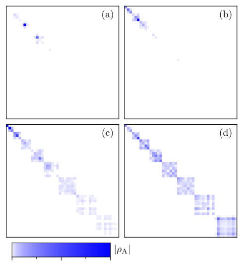 
FIG. 3. Density operators ρA of randomly chosen eigenvectors of a realization of the CQTE with COE statistics. The density matrix is given in the eigenbasis of the uncoupled system U(0). The dimensions are selected according to a four site Bose- Hubbard system with N = 8 particles. (a-d) correspond to coupling strengths p

📷 Fig 4

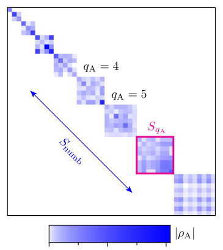 
FIG. 4. Density operator ρA of a randomly chosen eigenvector of a realization of the CQTE with COE statistics. The density matrix is given in the eigenbasis of the uncoupled system U(0). The dimensions are selected according to a four site Bose- Hubbard system with N = 8 particles. The coupling strength is p

📷 Fig 5

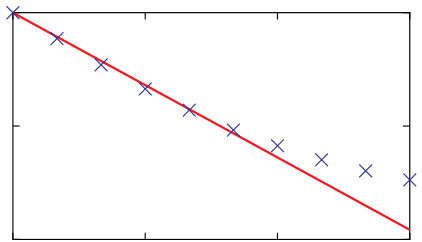 
FIG. 8. Average of the largest Schmidt eigenvalue as a func- tion of p

**Summary.** This paper develops a theoretical framework to measure entanglement in quantum systems where multiple local conservation laws collapse into one global symmetry. By constructing a specialized random matrix model, the authors predict a universal entanglement transition governed by a single parameter. This method successfully separates genuine quantum correlations from those artifacts arising purely from conserved quantities, using Bose-Hubbard models as a key physical example.

**Why it may be interesting.** This work provides powerful theoretical tools—symmetry-resolved measures and RMT techniques—to quantify entanglement in complex, interacting quantum many-body systems exhibiting underlying symmetries or conservation laws, which is crucial for understanding thermalization and quantum chaos in condensed matter models.

Detailed structure

**Main problem.** The study investigates average eigenstate entanglement in bipartite many-body systems where local conservation laws are reduced to a single global conserved quantity.

**Main result.** A universal entanglement transition is predicted, depending on a single fundamental parameter, which can be separated into genuine quantum correlations and contributions from the conserved quantity via number entropy.

**Method.** The authors employ random matrix theory (RMT) applied to a derived Random Matrix Model (CQTE) that captures the universal features of symmetry breaking in chaotic systems.

**Model / system.** The analysis uses coupled kicked Bose-Hubbard systems as an explicit physical realization, modeling the dynamics via time-evolution operators $U$ that exhibit specific symmetries and conservation laws.

**Key observables.** Entanglement entropy (standard and symmetry resolved), Number entropy, Block entropies ($S_{q_A}$).

**Important parameters / regimes.** The single fundamental parameter governing the entanglement transition ($\Lambda$), coupling strength ($\epsilon$), and system size/dimensionality.

**Assumptions / limitations.** The dynamics are approximated by quantum chaotic behavior suitable for RMT; specific approximations are made regarding basis state overlaps and sector couplings in the perturbative analysis.

**Figures summary.** Figure 1 schematically illustrates the bipartite system with a conserved quantity. Figure 2 shows realizations of the CQTE across varying coupling strengths ($\epsilon$). Figure 3 compares density operators $
ho_A$ at different coupling strengths. Figure 11 plots average linear entanglement entropy $S_2$ vs $\sqrt{\Lambda N}$ for the kicked Bose-Hubbard model.

**Paper structure.** The paper establishes the general framework using symmetry-resolved entanglement, develops a corresponding random matrix ensemble (CQTE), and then applies this formalism to analyze the transition from uncoupled to strongly interacting regimes in the specific example of coupled kicked Bose-Hubbard systems.

Abstract

We investigate the average eigenstate entanglement in a bipartite many-body system which exhibits a breaking of two local conservation laws into a global conserved quantity. Such a setting is realized by the particle number conservation in Bose-Hubbard systems. We devise a corresponding random matrix model which captures the universal features of this symmetry breaking and allows for applying powerful random matrix methods. By combining the concept of symmetry resolved entanglement with perturbation theory for quantum chaotic systems we obtain a universal entanglement transition depending on a single fundamental parameter. Furthermore, the symmetry resolved entanglement allows for separating the genuine entanglement from the part which originates from the conserved quantity. This latter contribution is quantified by the number entropy. For this it is shown that the symmetry breaking generates a localization of the eigenstates due to a banded structure of the time-evolution operator. By extrapolating the results beyond the perturbative regime we obtain an analytic description of the full transition.

[↑ back to top](#top)

### [Gapped Parent Hamiltonians for the Strongly Deformed Toric Code](http://arxiv.org/abs/2607.28740v1)

**Authors:** Nandagopal Manoj, Zack Weinstein, Jason Alicea  
**Type:** theory · **Category:** statistical mechanics · **PDF:** <https://arxiv.org/pdf/2607.28740v1>  
**Analysis basis:** full PDF text, analyzed in chunks
**Topic relevance:** 🔥 `analog quantum simulation` **4/5** · `entanglement & information structure` **3/5** · `methods for driven-dissipative` **3/5** · `correlated / nonlocal dissipation` **2/5** · `driven-dissipative phase transition` **2/5** · `Keldysh / 2PI / non-Gaussian methods` **1/5** · `non-equilibrium dynamics` **1/5** · `non-equilibrium universality` **1/5**

📷 Fig 1

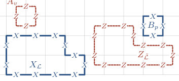 
FIG. 1. (a) Properties of the deformed toric code state |ψ(β)⟩. For β beyond a critical deformation strength βc, m anyons condense and destroy the topological order, yet Wil- son loops continue to exhibit perimeter-law scaling. The ver- tical axis on the phase diagram sketches the spectral gap of two parent Hamiltonians for |ψ(β)⟩: the Castelnovo-Chamon Hamiltonian HCC [Eq. (6)] and our parent Hamiltonian H(β) [Eq. (9)], proved to be gapped and non-degenerate for suf- ficiently large β. (b) Toric-code stabilizers Av and Bp, the associated 1-form symmetry Z ˜ L, and Wilson loop operator XL.

**Summary.** The paper investigates the nature of gapped ground states in strongly deformed Toric Codes by constructing explicit parent Hamiltonians. It challenges conventional wisdom by showing that perimeter-law decay does not automatically imply spontaneous symmetry breaking within standard locality assumptions. The results suggest that stronger notions of locality are required to enforce these strict physical constraints.

**Why it may be interesting.** This work directly challenges foundational assumptions linking local Hamiltonians, spectral gaps, and symmetry breaking in topological phases, which is crucial for understanding exotic quantum matter realized in AMO platforms like superconducting circuits or cold atoms.

Detailed structure

**Main problem.** The research aims to construct local gapped parent Hamiltonians for strongly deformed toric code states, challenging existing understanding of how perimeter-law scaling and 1-form symmetries coexist in gapped quantum matter.

**Main result.** The authors show that within standard locality bounds, the presence of perimeter-law decaying Wilson loops does not necessitate spontaneous symmetry breaking of a 1-form symmetry. They also demonstrate that long-range ferromagnetic order and disorder correlations can coexist in a 2D gapped state.

**Method.** The analysis involves constructing parent Hamiltonians using techniques related to Mayer cluster expansions, analyzing locality bounds (e.g., exponential decay), and applying entanglement bootstrap axioms for decohered states.

**Model / system.** The primary system is the strongly deformed Toric Code state $|\psi(eta)
angle$, which is analyzed under local non-unitary deformations. The study also examines the 2D Toric Code subjected to Pauli-Z decoherence, leading to a mixed state $
ho_p$.

**Key observables.** Perimeter-law scaling of Wilson loops ($\langle X_L 
angle$), spectral gap ($	ext{Gap}$), topological entanglement entropy, and violation/satisfaction of entanglement bootstrap axioms ($A_0, A_1$).

**Important parameters / regimes.** Deformation parameter $eta$, decoherence strength $p$, and the system size/geometry (2D lattice).

**Assumptions / limitations.** The constructed Hamiltonians are not strictly finite-range but contain exponentially decaying terms; the analysis relies on standard locality bounds that permit such decay.

**Figures summary.** Figure 1(a) sketches the spectral gap of parent Hamiltonians, showing them to be gapped for large $eta$. Other figures relate to entanglement entropy calculations and correlation functions.

**Paper structure.** The paper proceeds by first constructing the parent Hamiltonian $H(eta)$ for the deformed state. It then rigorously proves its locality and finite gap in the thermodynamic limit. Subsequently, it analyzes the decohered state $
ho_p$, proving its separability as a convex sum of SRE states, and finally tests entanglement properties using bootstrap axioms.

Abstract

Local non-unitary deformations of topologically ordered wavefunctions can drive transitions into peculiar states that challenge modern perspectives on gapped quantum matter. The strongly deformed toric code offers a curious case, hosting $m$ anyon condensation alongside perimeter-law scaling of Wilson loops charged under an exact 1-form symmetry---properties that typically do not coexist in gapped ground states. Nevertheless, we rigorously construct local gapped parent Hamiltonians for these strongly deformed toric code states. The Hamiltonians we construct are not strictly finite-range, but contain sums of Wilson loop operators whose coefficients decay exponentially in their diameter. If one adopts standard locality bounds used to define gapped phases---which allow for such exponentially decaying terms---our construction shows that these states realize a trivial gapped phase. Within this locality class, we demonstrate that perimeter-law scaling of Wilson loops does not imply a spontaneously broken 1-form symmetry, and from a dual perspective, that long-range ferromagnetic order and perimeter-law disorder parameter correlations can coexist in a 2D gapped ground state. We evade a recent no-go theorem [Sahay et al., arXiv:2503.01977] by relaxing its assumptions in a manner that we quantify as benign in the thermodynamic limit. More broadly, our results highlight that stronger notions of locality are necessary for prohibiting these counterintuitive properties within a gapped phase.

[↑ back to top](#top)

### [Gaussian-augmented bosonic matrix-product states: theory and applications](http://arxiv.org/abs/2607.28753v1)

**Authors:** Erickson Tjoa, J. Ignacio Cirac  
**Type:** theory · **Category:** other · **PDF:** <https://arxiv.org/pdf/2607.28753v1>  
**Analysis basis:** full PDF text, analyzed in chunks
**Topic relevance:** 🔥 `methods for driven-dissipative` **4/5** · `Keldysh / 2PI / non-Gaussian methods` **3/5** · `analog quantum simulation` **2/5** · `driven-dissipative phase transition` **2/5** · `correlated / nonlocal dissipation` **1/5** · `correlated cavity matter` **1/5** · `entanglement & information structure` **1/5** · `non-equilibrium dynamics` **1/5** · `non-equilibrium universality` **1/5**

📷 Fig 1

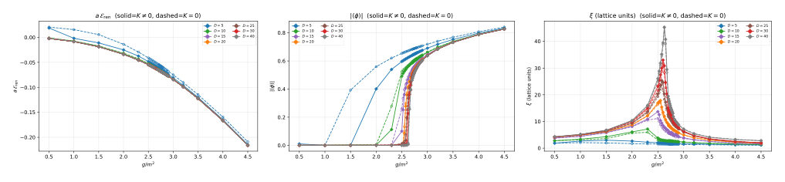 
FIG. 1. Thermodynamic-limit BMPS results for the lattice ϕ4 2 model at a = 0.2 and m = 1. Solid diamonds show the on- site-squeezed ansatz with K ̸= 0, while dashed open circles show the K = 0 ansatz. Left: renormalized energy aEren; Middle: the magnitude of the order parameter; Right: the correlation length in lattice units. For the parameters and bond dimensions shown, including on-site squeezing lowers the variational energy. The order parameter and correlation length display a finite-D crossover consistent with the Ising transition.

**Summary.** The paper introduces Gaussian-augmented bosonic Matrix Product States (GA-BMPS) as a comprehensive variational ansatz for strongly interacting bosonic many-body systems. This framework efficiently computes expectation values and unifies several known state representations, providing a powerful tool for theoretical studies in condensed matter and quantum optics.

**Why it may be interesting.** This work provides powerful mathematical tools to simulate complex bosonic quantum systems that are difficult to handle with standard tensor network methods due to the nature of bosonic operators.

Detailed structure

**Main problem.** Developing a unified, efficient variational framework for describing strongly-interacting quantum many-body bosonic systems beyond perturbative regimes.

**Main result.** The Gaussian-augmented bosonic matrix-product states (GA-BMPS) provide a rich ansatz that unifies pure Gaussian states and finite-dimensional MPS while allowing for efficient computation of expectation values and admitting simple parent Hamiltonians.

**Method.** The authors propose the GA-BMPS ansatz, combining passive linear unitaries with infinite-dimensional bosonic MPS components to represent the quantum state vector.

**Model / system.** The focus is on bosonic quantum many-body systems, modeled on a 1D lattice of N sites, which can apply to condensed matter or quantum optics problems. The framework aims to overcome limitations of standard MPS methods in bosonic contexts.

**Key observables.** Expectation values of local operators $\langle O 
angle$, characterized by one- and two-point correlation functions ($\Gamma_{ij}, r_i$).

**Important parameters / regimes.** The convergence condition for the transfer matrix is $
ho(K) < 1/2$. The ansatz involves bond dimensions $D$ and auxiliary dimensions $d$.

**Assumptions / limitations.** For simplicity, the analysis often assumes uniform tensors; the framework relies on combining Gaussian unitary transformations with MPS structures.

**Paper structure.** The paper introduces GA-BMPS as a unifying ansatz, details its construction via combination of unitaries and MPS components, proves computational tractability for expectation values using transfer matrices, establishes equivalences between different state representations (e.g., exponential vs. photon-added), and finally constructs the parent Hamiltonian.

Abstract

We propose and analyze the structure of a family of bosonic quantum many-body states that have the following features: (i) they include all pure Gaussian states and finite-dimensional matrix-product states as subclasses; (ii) their expectation values can be efficiently computed, allowing them to be used, among other things, for variational calculations; (iii) they admit exact parent Hamiltonians expressed as simple functions of the bosonic creation and annihilation operators.

[↑ back to top](#top)

### [Comparison of Spatial Entanglement between dissociated atom and ion : molecular ion photo-dissociated by sequential two-photon absorption and correlated two-photon absorption](http://arxiv.org/abs/2607.29556v1)

**Authors:** Krishna Rai Dastidar  
**Type:** theory · **Category:** other · **PDF:** <https://arxiv.org/pdf/2607.29556v1>  
**Analysis basis:** full PDF text, analyzed in chunks
**Topic relevance:** 🔥 `entanglement & information structure` **4/5** · `analog quantum simulation` **3/5** · `non-equilibrium dynamics` **2/5** · `Keldysh / 2PI / non-Gaussian methods` **1/5** · `correlated / nonlocal dissipation` **1/5** · `driven-dissipative phase transition` **1/5** · `interference shaping light` **1/5** · `methods for driven-dissipative` **1/5**

📷 Fig 1

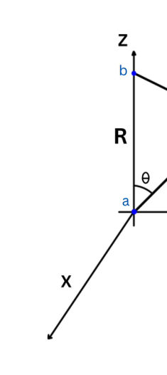 
Fig1: Configuration for H2 + ion. R is the internuclear separation between the protons ’a’ and ’b’. ra and rb are the vectors connecting electron with neuclei ’a’ and ’b’ respectively. θ is the angle between R and ra.

**Summary.** This theoretical study compares the generation of spatial entanglement between an atom and ion resulting from $	ext{H}_2^+$ dissociation via two-photon absorption. By modeling both sequential (STP) and correlated (CTP) excitation pathways, the authors demonstrate that CTP mechanisms, enabled by high photon flux, yield significantly higher and more controllable spatial entanglement fidelity. This suggests using controlled light-matter interactions to enhance quantum correlations in molecular physics.

**Why it may be interesting.** This work directly addresses how quantum light-matter interaction regimes (sequential vs. correlated photon absorption) can be engineered to enhance fundamental quantum correlations like spatial entanglement in molecular systems, which is highly relevant for quantum simulation and measurement protocols.

Detailed structure

**Main problem.** The study compares the fidelity of spatial entanglement between a dissociated atom and ion resulting from two different photo-dissociation mechanisms: Sequential Two-Photon (STP) absorption versus Correlated Two-Photon (CTP) absorption.

**Main result.** CTP dissociation yields significantly higher and more robust spatial entanglement fidelity compared to STP dissociation, suggesting that correlated photon interactions are superior for generating entangled products.

**Method.** The authors employed the wavepacket formalism to calculate the time evolution of the dissociating molecular ion state and subsequently determined the fidelity using second-order correlation functions derived from the relative coordinates.

**Model / system.** The system under study is the hydrogen molecular ion ($	ext{H}_2^+$) undergoing photo-dissociation into a free atom and an ion. The comparison hinges on two distinct excitation mechanisms: STP (local field interaction) and CTP (nonlocal, phase-correlated interaction).

**Key observables.** Fidelity of Spatial Entanglement (FSE), second-order correlation functions ($G^{(2)}_{a1a1}$ and $G^{(2)}_{a1a2}$), and the ratio $\kappa = G^{(2)}_{a1a1} / G^{(2)}_{a1a2}$.

**Important parameters / regimes.** Photon frequency, time elapsed during dissociation, initial width of the Gaussian wavepacket ($	ext{WGW}$), and laser intensity (required to achieve CTP regime).

**Assumptions / limitations.** The Born-Oppenheimer approximation is used for separating electronic and nuclear wavefunctions. The CTP process assumes high photon flux leading to simultaneous, phase-correlated absorption within a very short time ($\delta t \ll 1/\omega$).

**Figures summary.** Figures show the Fidelity for spatial entanglement as a function of $	ext{WGW}$ for both STP and CTP dissociation at various times and photon frequencies.

**Paper structure.** The paper first establishes the theoretical framework by comparing the two absorption mechanisms (STP vs. CTP). It then details the calculation of entanglement fidelity using wavepacket propagation, culminating in a comparison showing that CTP provides superior entanglement control via frequency tuning.

Abstract

We have studied the fidelity of spatial entanglement between dissociated atom and ion from two photon dissociation of hydrogen molecular ion H 2 + . Two processes for two photon dissociation of molecular ion have been considered (i) sequential two photon (STP) absorption and (ii) correlated two photon (CTP) absorption by the molecular ion. We compared the results for fidelity of spatial entanglement (FSE) between dissociated atom and ion for these two types of dissociation. In a previous study in our group [1] we have shown that when an atom interact with nonlocal mode of electromagnetic field (which has been derived field theoretically), simultaneous phase-correlated two pho1 ton absorption by the atom occurs within a very short time δt << ω , where ω is the laser frequency, and the rate of this correlated two photon absorption is linear in intensity. This will happen when the photon flux in the interaction region is high i.e. laser intensity is higher than 10 10 W/cm 2 . In this work we have extended this formalism to study the correlated two photon dissociation of molecular ion and to explore the effect of correlation between two simultaneous photo-absorption processes on the fidelity for spatial entanglement of dissociated atom and ion. Dependence of fidelity for spatial entanglement on the photon frequency has been studied for both the STP and CTP dissociation, to show that photon frequency can be used as control parameter to achieve maximum fidelity. Saturation of fidelity with the increase in time at which fidelity was calculated shows the robustness of the processes considered here. A scheme for detection of spatial entanglement between ion and atom has been suggested.

[↑ back to top](#top)

### [First Law of Proto-Area Entropy from Modular Spectral Geometry](http://arxiv.org/abs/2607.29432v1)

**Authors:** Ling-Zheng Xia, Lixin Xu  
**Type:** theory · **Category:** other · **PDF:** <https://arxiv.org/pdf/2607.29432v1>  
**Analysis basis:** full PDF text, analyzed in chunks
**Topic relevance:** 🔥 `entanglement & information structure` **4/5** · `Keldysh / 2PI / non-Gaussian methods` **2/5** · `methods for driven-dissipative` **2/5** · `non-equilibrium universality` **2/5** · `correlated / nonlocal dissipation` **1/5** · `correlated cavity matter` **1/5** · `driven-dissipative phase transition` **1/5** · `non-equilibrium dynamics` **1/5**

📷 Fig 1

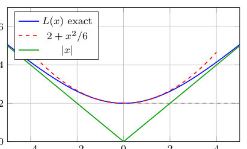 
Fig. 1 The universal kernel L(x) = x coth(x/2) (solid blue), its small-x approximation 2 + x2/6 (dashed red), and asymp- totic form |x| (green). The global minimum L(0) = 2 (gray line) and strict convexity are essential for all subsequent re- sults.

📷 Fig 2

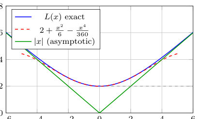 
Fig. 2 The function L(x) = x coth(x/2) (solid blue), Taylor approximation to O(x4) (dashed red), and asymptotic form |x| (green). The global minimum L(0) = 2 is shown by the horizontal gray line.

📷 Fig 3

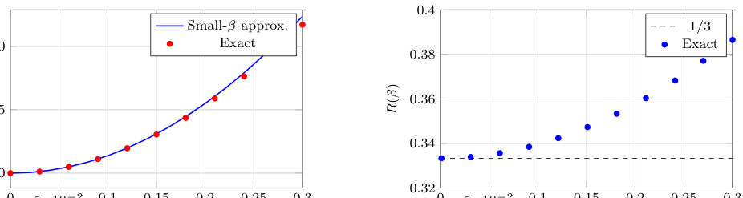 
Fig. 3 Verification of the small-deviation expansion for a thermal eigenvalue parametrization with d1 = 10 and Ei = i. Left: exact modular spectral function Ξ(β) = 1

**Summary.** This work derives a first law for 'proto-area entropy' within holographic models to bridge quantum information theory and black hole thermodynamics. It shows this law yields a universal coefficient of $1/3$ when averaged over Gaussian Unitary Ensembles. The result provides an independent, quantum mechanical consistency check matching semi-classical gravitational predictions.

**Why it may be interesting.** While highly theoretical, the concept of universal coefficients derived from spectral geometry (like $1/3$) has parallels in critical phenomena or entanglement measures that might inform understanding of quantum correlations in complex many-body systems.

Detailed structure

**Main problem.** The paper aims to derive a quantum information-theoretic first law for 'proto-area entropy' (SPA) in holographic settings, connecting it to black hole thermodynamics.

**Main result.** It establishes that the ensemble-averaged proto-area entropy varies linearly with bulk entropy to leading order, yielding a universal coefficient of $1/3$.

**Method.** The derivation uses spectral geometry and modular Hamiltonian representations within the CCKLP--Witten framework, employing Gaussian Unitary Ensemble (GUE) models for approximations.

**Model / system.** The analysis is set in a holographic context using the CCKLP–Witten framework to study approximate entanglement wedge reconstruction. The system involves factorized boundary Hilbert spaces and spectral functions derived from modular Hamiltonians.

**Key observables.** Proto-area entropy ($	ext{SPA}$), Spectral function ($\Xi$), First Law Coefficient ($\partial E[	ext{SPA}] / \partial S_a$).

**Important parameters / regimes.** The coefficient $1/3$ is universal; the analysis depends on parameters like $\lambda$, which must be $O(1)$ for consistency.

**Assumptions / limitations.** The use of the unstructured GUE model as a proxy for reconstruction error, and approximations are made in small perturbation regimes ($\mathcal{O}(\epsilon^2)$).

**Figures summary.** Figure 1 illustrates the universal kernel $L(x) = x \coth(x/2)$; Figure 3 compares exact vs. small-$eta$ approximations for $\Xi(eta)$, showing a ratio approaching $1/3$.

**Paper structure.** The paper builds from defining SPA and its relation to spectral functions ($\Xi$), deriving the first law coefficient using GUE models, and finally confirming the universality of the $1/3$ factor by checking various spectra and limits.

Abstract

We derive a first law of proto-area entropy in the CCKLP--Witten framework for approximate holographic entanglement wedge reconstruction. The central spectral function admits a modular Hamiltonian representation with kernel $L(x)=x\coth(x/2)$. For near-maximally-mixed bulk states, and within the unstructured Gaussian-unitary-ensemble (GUE) model of the encoding perturbation, the ensemble-averaged proto-area entropy varies linearly with bulk entropy to leading order, with a response coefficient containing a universal factor~$1/3$, traced to $L''(0)/2=1/6$ and independent of the bulk spectrum's detailed shape within this model. Imposing the gravitational-scaling condition required for nonzero backreaction, the first-law coefficient is $O(1)$, parametrically matching the semi-classical relation $δ({\rm Area}/4G_N)=δS_{\rm bulk}$.

[↑ back to top](#top)

### [Optically Resolved Excited State Hyperfine Structure of a Silicon Colour Centre in the Telecom Bands](http://arxiv.org/abs/2607.28943v1)

**Authors:** Austin Woolverton, Nicholas Brunelle, Mehdi Keshavarz, Laurent Bergeron, Evan R. MacQuarrie, Yehudah Ackermann, Melanie Gascoine, Nikolay V. Abrosimov, Stephanie Simmons, Daniel Higginbottom, Michael Thewalt  
**Type:** experiment · **Category:** quantum information and computing · **PDF:** <https://arxiv.org/pdf/2607.28943v1>  
**Analysis basis:** full PDF text, analyzed in chunks
**Topic relevance:** 🔥 `QC/QI experiment` **4/5** · `exotic spin models in light-matter` **3/5** · `spintronics-quantum-optics interface` **3/5** · `quantum optics experiment` **2/5** · `analog quantum simulation` **1/5** · `quantum measurements` **1/5**

📷 Fig 1

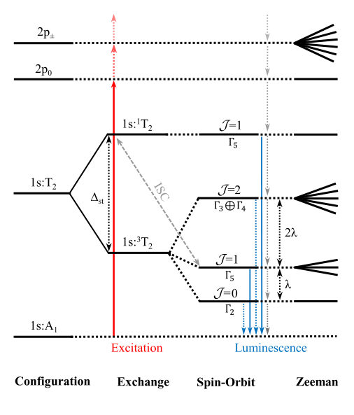 
FIG. 1: Proposed level structure of Al+ i and PL excitation scheme. Each excited state includes an electron in the 1s:A1 ground level, and the 1s:T2 state splits under the exchange interaction. An emergent SOC separates the triplet state into effective J levels with degeneracy further lifted by the Zeeman interaction. The energy seperations are not to scale. The ISC allows for preferential population into the J = 1 triplet level. Optical excitation to 2p0, 2p±, and above-band (red) excitation, used for our PL measurements, are followed by rapid decay to the 1s:T2 manifold. Luminescence is observed from 1s:1T2 and 1s:3T2 (blue).

📷 Fig 2

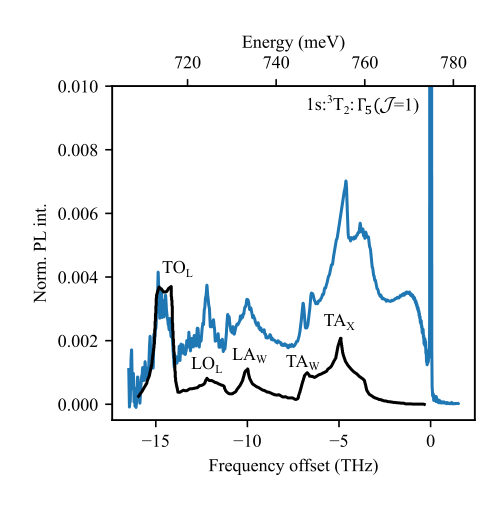 
FIG. 2: (Blue) Photoluminescence spectrum of Al+ i at 4.2 K under resonant excitation of 2p±. The amplitude of the ZPL has been normalized to unity and truncated. The phonon side-band is compared to the silicon density of states (black) [47]. We indicate the transverse optical (TO), transverse acoustic (TA), longitudinal optical (LO), and longitudinal acoustic (LA) phonon modes at high symmetry points within the first Brillouin zone [22].

📷 Fig 3

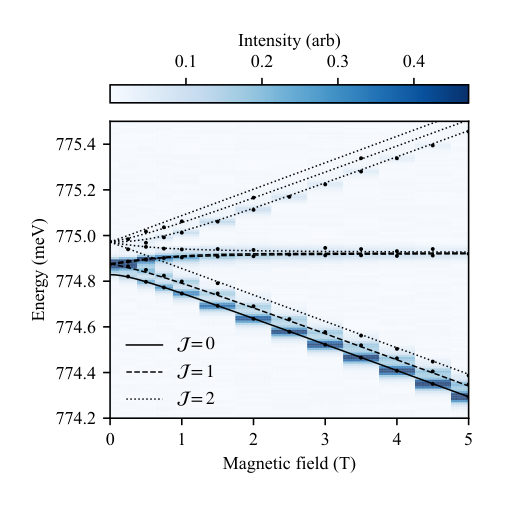 
FIG. 3: PL spectra of 1s:3T2 at 4.2 K under above-band excitation and applied magnetic field, with ˆB ≈[110]. Each dot represents an extracted peak position. The eigenenergies of each sublevel within J = 0, 1, and 2 are determined from the exact solutions of the Hamiltonian (SM Section S2 [46]) and shown as solid, dashed, and dotted lines.

📷 Fig 4

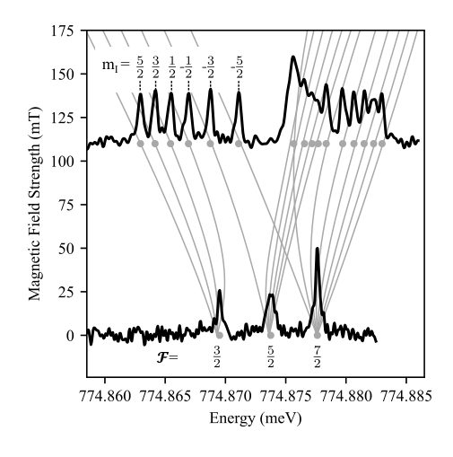 
FIG. 4: The optically resolved hyperfine structure within the 1s:3T2(J = 1) ⇒1s:1A1 transition is shown for 0 mT (bottom) and 110 mT (top) with a fit to the electronic spin Hamiltonian and isotropic hyperfine (grey). Each PL spectrum was measured at 4.2 K using a resonant laser tuned to the 1s:1A1 ⇒2p± transition. The peak positions, shown as grey dots, are determined from a least-squares fit to multiple Gaussian-Lorentzian products with a shared background. The uncertainties of the transition energies are within the marker size.

**Summary.** The research characterizes the $	ext{Al}_i^+$ defect in silicon, aiming to use its excited state as an interface for nuclear spin qubits. By performing high-resolution magnetospectroscopy, the authors report resolving both fine and hyperfine structure in the excited state. This breakthrough confirms that this silicon center can function as a viable spin-photon interface for quantum information processing.

**Why it may be interesting.** This work directly addresses the development of solid-state quantum memories by demonstrating optical control over spin states in a highly coherent platform suitable for quantum networking applications.

Detailed structure

**Main problem.** The primary goal was to optically observe and characterize the hyperfine structure of an excited state within a silicon color center ($	ext{Al}_i^+$) operating in the telecom band.

**Main result.** The authors successfully measured the first optically-resolved hyperfine structure in the excited state of this silicon defect, confirming its potential as a spin-photon interface for quantum memory applications.

**Method.** The study employed low-temperature optical spectroscopy (PL and absorption) combined with magnetospectroscopy to resolve fine and hyperfine splittings.

**Model / system.** The system is the singly-ionized interstitial aluminum donor ($	ext{Al}_i^+$) in $^{28}	ext{Si}$. The electronic states are modeled using an exchange interaction, leading to singlet and triplet excited levels coupled by Spin-Orbit Coupling (SOC).

**Key observables.** Zero-phonon emission spectrum, excited-state lifetimes ($	au_s \approx 1.8\ \mu	ext{s}$, $	au_t \approx 25.5\ 	ext{ms}$), and resolved hyperfine transition frequencies.

**Important parameters / regimes.** The energy splitting between singlet and triplet states ($\Delta E_{st} \approx 21.3\ 	ext{meV}$) and the isotropic contact hyperfine coupling parameter ($a_{	ext{iso}}$).

**Assumptions / limitations.** The analysis relies on modeling the electronic structure using effective Hamiltonians incorporating SOC, Zeeman effects, and nuclear spin coupling terms.

**Figures summary.** Figures illustrate the proposed level structures (showing $J$ splitting) and the measured PL spectra at various temperatures and magnetic fields, revealing distinct zero-phonon emission features.

**Paper structure.** The paper progresses from establishing the physical platform ($	ext{Al}_i^+$ in $^{28}	ext{Si}$) to detailing spectroscopic measurements (PL/absorption), modeling the electronic structure using SOC and exchange interactions, and finally resolving both fine and hyperfine structures through detailed spectral analysis.

Abstract

Nuclear spin qubits in silicon offer exceptionally coherent quantum memory, and optically-interfaced spins are a promising platform for both quantum networking and distributed quantum computing. It has been proposed that emitters with diamagnetic ground states may permit an optical interface to nuclear spin memories via metastable, hyperfine-coupled excited states while suppressing key sources of decoherence. Until now, direct optical observation of suitable transitions in silicon colour centres has remained elusive. Here we characterize the singly-ionized interstitial aluminum donor (Al$_\mathrm{i}^+$) in isotopically purified $^{28}$Si and find several novel features of this little-studied defect. We measure bright emission and strong optical transitions and, in contrast to previous studies of this centre, attribute its emission to an exchange-split spin triplet and singlet level of the lowest-energy 1s:T$_2$ excited state. We measure the excited-state lifetimes and, as a consequence of its narrow emission linewidth, observe the fine and hyperfine structure of the long-lived triplet state. This constitutes the first measurement of an optically-resolved hyperfine structure in the excited state of a telecommunications-band silicon colour centre.

[↑ back to top](#top)

### [Quasiparticle modes across soliton transition with density-dependent gauge field in optical lattices](http://arxiv.org/abs/2607.29309v1)

**Authors:** Poorava Kumar Meena, Kuldeep Suthar  
**Type:** theory · **Category:** quantum gases · **PDF:** <https://arxiv.org/pdf/2607.29309v1>  
**Analysis basis:** full PDF text, analyzed in chunks
**Topic relevance:** 🔥 `analog quantum simulation` **4/5** · `non-equilibrium dynamics` **3/5** · `driven-dissipative phase transition` **2/5** · `non-equilibrium universality` **2/5** · `Frenkel-Kontorova` **1/5** · `Keldysh / 2PI / non-Gaussian methods` **1/5** · `methods for driven-dissipative` **1/5**

📷 Fig 1

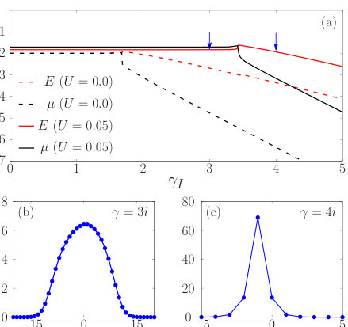 
FIG. 1. (a) The ground state energy E and chemical potential µ obtained from the imaginary time propagation as a function of imag- inary part of gauge coupling γI. Here the real part is γR = 0. The energy and µ for the non-interacting uniform case U = 0 are shown with dashed lines while those of interacting case with U = 0.05 are shown with solid lines. The E and µ remains steady in PW (Bose-Einstein) condensate phase but begins to decrease at a critical γI as the system enters into localized soliton state. The critical γI shifts to higher values (compared to U = 0) for interacting systems. The ground state density profiles at two representative γI values are shown in (b) corresponding to...

📷 Fig 2

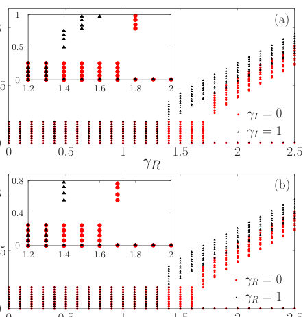 
FIG. 2. The evolution of quasiparticle mode energies for the non- interacting case. The upper panel (a) shows the mode energy evolu- tion with γR for fixed imaginary parts γI = 0 and γI = 1. The lower panel shows the mode energies with γI for fixed real parts γR = 0 and γR = 1. The insets show the magnifying evolution of mode en- ergies near the phase transition. At the localized phase transition, the low-lying modes get hardened and gap increases with γ. The shift in the critical value with finite γR (γI) indicates the γ-dependent phase transition. The mode energies and gauge coupling are in units of the recoil energy ER. Here, J = 1 and periodic boundary condition is assumed.

📷 Fig 3

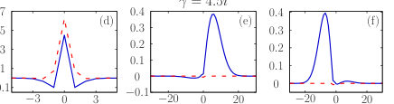 
FIG. 3. The lattice distribution of quasiparticle mode amplitudes of first three modes of D4NLSE model with onsite repulsion. The modes with mode index l = 1, l = 2, l = 3 are characterized as zero-energy Goldstone mode, dipole mode, and breathing mode. The upper panel shows the modes for BEC phase with γ = 2i while the lower panel shows the modes for soliton phase with γ = 4.5i. The mode amplitudes are normalized as per Eq. (6).

📷 Fig 4

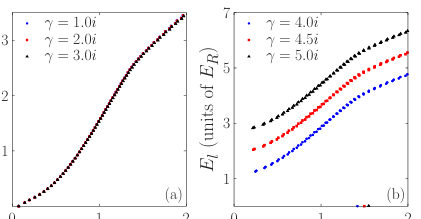 
FIG. 5. The discrete BdG quasiparticle dispersion curves corre- sponding to (a) BEC phase at γ = 1.0i, 2.0i, and 3.0i. The smooth, monotonic dispersion curves closely resemble the standard gapless Bogoliubov spectrum of a stable lattice condensate. (b) Quasiparti- cle dispersion curves in the highly localized bright soliton phase for larger imaginary gauge couplings γ = 4.0i, 4.5i and 5.0i. The curve shows a significant energy gap of excited modes due to the reduction of effective inter-site tunneling and pinning effects.

📷 Fig 5

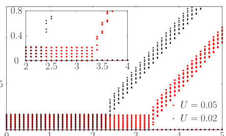 
FIG. 4. The evolution of quasiparticle mode energies for the inter- acting case. The figure shows the mode energy evolution with γR for fixed imaginary part γI = 0. The transition point increases with the inclusion of onsite interaction to γR = 2.34(3.39) for U = 0.02(0.05). The inset shows the magnifying evolution of mode energies near the phase transition. Here, the number of atoms N = 100.

**Summary.** This paper theoretically examines the transition from a BEC to a soliton state in bosons trapped in an optical lattice subjected to density-dependent tunneling. Using Bogoliubov theory, the authors show that this transition alters the excitation spectrum, causing energy hardening and suppressing characteristic collective oscillations like breathing modes. This provides deep insight into how engineered gauge fields stabilize novel quantum phases.

**Why it may be interesting.** This work directly addresses non-trivial many-body physics in synthetic dimensions using ultracold atoms, providing quantitative predictions about quasiparticle behavior near quantum phase transitions driven by engineered gauge fields.

Detailed structure

**Main problem.** The study investigates how low-lying quasiparticle modes evolve across a quantum phase transition from a Bose-Einstein condensate (BEC) to a localized soliton state induced by a density-dependent gauge field in optical lattices.

**Main result.** The transition causes an increase in dipole excitation energies and preserves the zero-energy mode in the soliton phase, while also suppressing characteristic dynamics like Bloch and breathing oscillations.

**Method.** The analysis employs discrete Bogoliubov theory applied to the nonlinear Schrödinger equation derived from a Bose-Hubbard model Hamiltonian.

**Model / system.** The system models ultracold bosons in a 1D optical lattice, governed by a Hamiltonian incorporating density-difference-dependent tunneling (DDT) and onsite interactions. The dynamics are analyzed using Bogoliubov theory on the resulting quadratic Hamiltonian.

**Key observables.** Quasiparticle mode energies/dispersion curves, mode energy gap ($\Delta E$), Bloch oscillations, breathing oscillations, and phase diagrams in the complex gauge field plane.

**Important parameters / regimes.** Density-dependent hopping parameter ($\gamma = \gamma_R + i\gamma_I$), onsite interaction strength ($U$), and lattice depth (related to $J$).

**Assumptions / limitations.** The analysis is restricted to the weakly-interacting limit, and higher-order terms in fluctuations are neglected.

**Figures summary.** Figures illustrate the evolution of quasiparticle mode energies across the transition, phase diagrams mapping stability regimes in the complex gauge field plane, and time evolution showing the suppression of Bloch and breathing oscillations in the soliton state.

**Paper structure.** The paper methodically develops the theoretical framework using Bogoliubov theory to analyze excitations. It then maps out quantum phases by varying the gauge field parameters ($\gamma$), detailing how the transition manifests in excitation spectra, dynamical properties (oscillations), and stability criteria.

Abstract

Tunneling of ultracold bosons confined in a one-dimensional optical lattice results in a nontrivial gauge field depending on density-difference between the sites involved. The density dependent tunneling (DDT) causes a first-order quantum phase transition from the Bose-Einstein condensate to the localized soliton. Here, we examine the low-lying quasiparticle mode evolution across the transition in the weakly-interacting limit. To this end, we employ the discrete Bogoliubov theory and dispersion curves to reveal an increase in the quasiparticle energies of dipole (and higher) excitations with DDT in the soliton phase while preserving the zero-energy mode. This is due to the decrease in effective tunneling, resulting in a larger energy cost to move the soliton, and causes faster dipole oscillations. The repulsive on-site atomic interaction further shifts the critical gauge field of DDT to a larger value by stabilizing the lattice soliton. The latter is corroborated by a phase diagram in the complex gauge field plane and mode energy gap of quasiparticles. We further show that the soliton does not exhibit Bloch oscillations as the effective momentum becomes density-dependent and deforms its internal structure. The dynamical response of the trap quench does not excite the width of localized wave-packet, and the breathing oscillations are suppressed. The latter two dynamical properties of the condensate uniquely contrast the soliton state due to the density-dependent gauge field.

[↑ back to top](#top)

### [Pairing near the boundary of a box-shaped trap in the BEC-BCS crossover](http://arxiv.org/abs/2607.29620v1)

**Authors:** Kelly R. Patton, Daniel E. Sheehy  
**Type:** theory · **Category:** quantum gases · **PDF:** <https://arxiv.org/pdf/2607.29620v1>  
**Analysis basis:** full PDF text, analyzed in chunks
**Topic relevance:** 🔥 `analog quantum simulation` **4/5** · `Keldysh / 2PI / non-Gaussian methods` **3/5** · `driven-dissipative phase transition` **2/5** · `Kondo & dissipative impurity` **1/5** · `methods for driven-dissipative` **1/5** · `non-equilibrium dynamics` **1/5**

📷 Fig 1

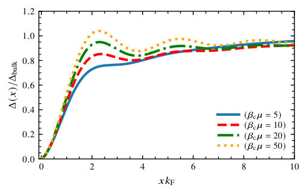 
FIG. 1. (Color online) Plot of the local pairing amplitude Δ(𝑥) vs. position 𝑥in the regime 𝑇&lt; 𝑇c for a semi-infinite "half slab" Fermi superfluid, normalized to the bulk value Δbulk. The distinct curves show systems at different values of the coupling-dependent transition temperature 𝑇c (with the figure legend showing 𝛽c𝜇≡𝜇/(𝑘B𝑇c), where 𝜇is the chemical potential). The system temperature 𝑇for each curve is slightly below 𝑇c, with 𝛽𝜇= 1.1𝛽c𝜇or (𝑇c −𝑇)/𝑇c ≈0.09. As one can see, the pairing rises rapidly from zero at the boundary to approach the bulk value on a scale of roughly (2𝑘F)−1. The local pairing also exhibits Friedel-like oscillations near the boundary, which also have a wavelength...

📷 Fig 2

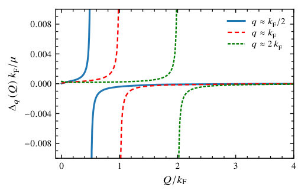 
FIG. 2. (Color online) Shown here are representative eigenstates of the pairing kernel KΛ with the eigenvalue equation given in Eq. (17). The plot shows three such eigenstates (with distinct wavevector quantum numbers) in the low-𝑇c BCS regime of 𝛽c𝜇= 100 as a function of wavevector 𝑄(normalized to the Fermi wavevector)

📷 Fig 3

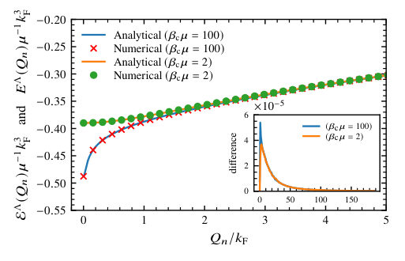 
FIG. 3. (Color online) The markers indicate the numerically calculated cut-off dependent eigenvalues, 𝐸Λ(𝑄) at discrete 𝑄𝑛, of the half-slab pairing kernel KΛ, Eq. (17), for representative high and low 𝑇c values (note 𝛽c = (𝑘B𝑇c)−1). The solid lines show the cut-off dependent bulk eigenvalues EΛ(𝑄), Eq. (12), at the same temperatures. The inset shows the difference |EΛ(𝑄) −𝐸Λ(𝑄)| between the half-slab eigenvalues and the bulk values. To numerical precision they agree. The critical coupling at 𝑇c is 𝑔c = 1/EΛ(0).

📷 Fig 4

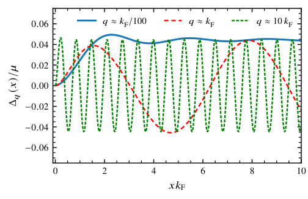 
FIG. 4. (Color online) Shown here are representative eigenstates of the 𝑇c-equation, Eq. (17), in real space for three values of the wavevector quantum number 𝑞and at low 𝑇c (𝛽𝜇= 𝛽c𝜇= 100). While the higher-𝑞states look basically like sin(𝑞𝑥) (as seen in the green short-dashed and red dashed curves), the low-𝑞state (solid blue) exhibits additional Friedel oscillations for 𝑥→0.

📷 Fig 5

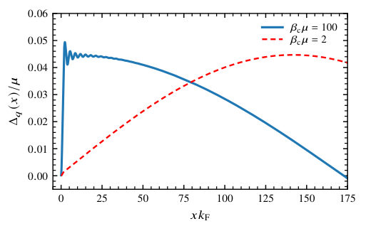 
FIG. 6. (Color online) Shown here is a comparison of the kernel eigenstates at low 𝑞(i.e., 𝑞≈𝑘F/100) in the weak-coupling BCS regime (blue solid curve) and strong coupling near-unitarity regime (red dashed curve). The BCS curve exhibits strong edge effects at the scale 𝑘−1 F (which we’ll find persist below 𝑇c), while the BEC curve shows almost no edge effects. Instead, it simply looks like sin(𝑞𝑥).

**Summary.** This paper theoretically examines Cooper pairing in fermionic superfluids confined within a box-shaped trap, focusing on the impact of boundaries during the BEC-BCS crossover. It finds that while weak coupling BCS theory predicts pronounced Friedel oscillations near the edge, these spatial modulations are suppressed as the system approaches the strongly interacting BEC limit.

**Why it may be interesting.** This work is highly relevant as it tackles non-trivial boundary physics in quantum many-body systems, providing quantitative predictions for how confinement modifies fundamental superfluid properties like pairing symmetry across a major crossover regime (BCS-BEC).

Detailed structure

**Main problem.** The study investigates how system boundaries affect Cooper pairing and superfluid properties, specifically analyzing the local pairing amplitude near the edge of a box-shaped trap.

**Main result.** The local pairing exhibits Friedel-like oscillations in the weak coupling BCS regime, but these oscillations are suppressed as the interaction strength increases towards the BEC regime.

**Method.** The analysis uses integral equations derived from the pairing instability condition, solving for eigenfunctions using techniques involving Fourier transforms and renormalization to handle boundary effects.

**Model / system.** The system models attractively interacting fermions confined to a box-shaped trap, relevant to both cold fermionic atomic superfluids (SF) and electronic superconductors (SC). The theory addresses the BEC-BCS crossover in this spatially constrained geometry.

**Key observables.** Local pairing amplitude $\Delta(\mathbf{r})$, Friedel oscillations wavelength ($\sim 1/2k_F$), and the characteristic length scale $\xi$.

**Important parameters / regimes.** Coupling strength (varying from BCS to BEC), temperature relative to $T_c$, and the hard-wall boundary condition at the trap edge.

**Assumptions / limitations.** The analysis assumes a semi-infinite geometry with hard-wall boundary conditions at one edge, and it moves beyond simple approximations like LDA due to rapid potential variation near the boundary.

**Figures summary.** Figures illustrate the suppression of Friedel oscillations in $\Delta(x)$ as coupling increases (BCS to BEC), compare calculated eigenvalues to bulk values, and show representative eigenfunctions for different coupling regimes.

**Paper structure.** The paper progresses from defining the physical problem and Hamiltonian, deriving the linearized integral equation governing pairing instability at $T_c$, analyzing the resulting eigenfunctions in different coupling limits (BCS vs. BEC), and finally extending the theory to temperatures below $T_c$ using nonlinear Ginzburg-Landau terms.

Abstract

We study pairing of attractively interacting fermions confined to a box-shaped trap. In contrast to the infinite translationally-invariant case, where the local pairing order is spatially uniform and undergoes the Bose-Einstein Condensate to Bardeen-Cooper-Schrieffer (BEC-BCS) crossover as interactions are varied, in this case the local pairing is expected to vary rapidly near the edge of the box. We address this problem in the limit of a semi-infinite superfluid, finding that the nature of the edge pairing depends sensitively on the coupling. The local pairing exhibits Friedel-like oscillations in the weak coupling BCS regime that are suppressed with increasing coupling strength towards the BEC regime.

[↑ back to top](#top)

### [Telecom-compatible polarization-to-time-bin conversion of atom-photon entanglement for heterogeneous quantum networks](http://arxiv.org/abs/2607.29609v1)

**Authors:** Christian Haen, Julian Groß-Funk, Max Bergerhoff, Pascal Baumgart, Jonas Meiers, Tobias Bauer, Christoph Becher, Jürgen Eschner  
**Type:** experiment · **Category:** quantum information and computing · **PDF:** <https://arxiv.org/pdf/2607.29609v1>  
**Analysis basis:** full PDF text, analyzed in chunks
**Topic relevance:** 🔥 `quantum optics experiment` **4/5** · `QC/QI experiment` **3/5** · `interference shaping light` **3/5** · `entanglement & information structure` **1/5** · `quantum measurements` **1/5**

📷 Fig 1

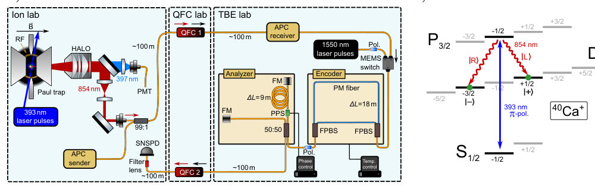 
FIG. 1. (a) Schematic of the interface converting 854-nm polarization-encoded photons to 1550-nm time-bin-encoded pho- tons including the setup for generation and analysis of atom-photon entanglement. (b) Relevant level scheme of 40Ca+ and atom-photon entanglement generation. Detailed descriptions are given in the text. RF: radio frequency; HALO: high-numerical- aperture laser objective; PMT: photomultiplier tube; APC: automated polarization drift compensation; SNSPD: superconduct- ing nanowire single-photon detector; QFC: quantum frequency conversion; TBE: time-bin encoder; MEMS: microelectrome- chanical system; PM: polarization maintaining; FPBS: fiber polarizing beam splitter; FM:...

📷 Fig 2

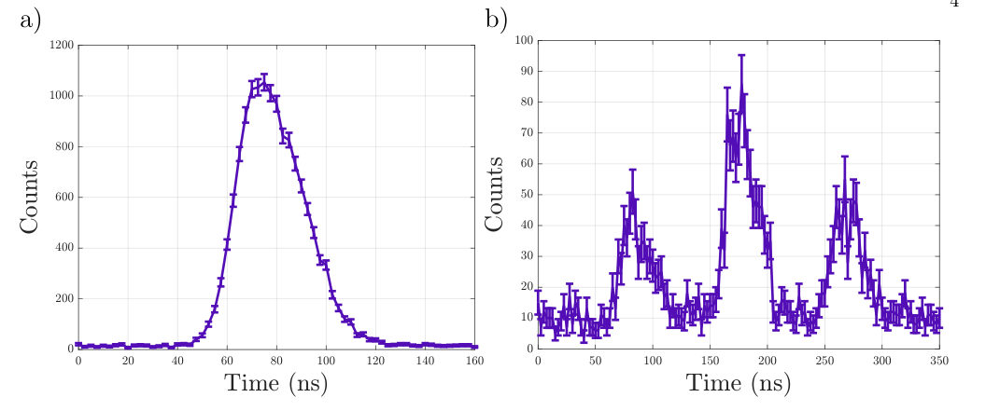 
FIG. 2. Measured photon wave-packets with a bin size of 2.5 ns, a) without time-bin encoding (integration time 4.5 h) b) with time-bin encoding and subsequent analysis (integration time 10 h).

📷 Fig 3

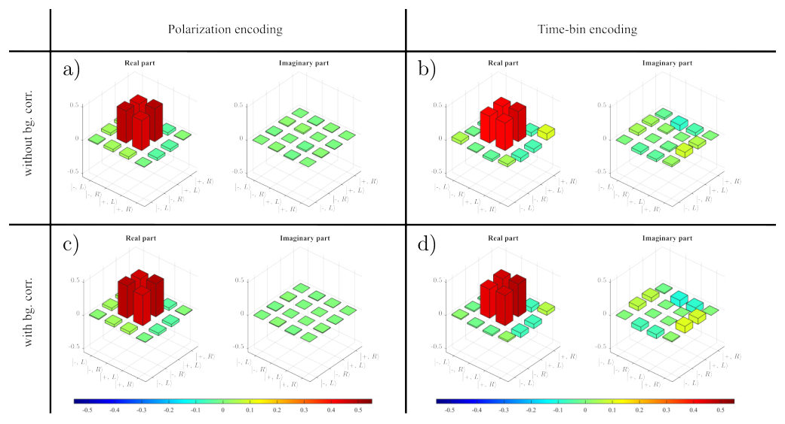 
FIG. 3. Quantum-state tomography: real and imaginary part of the density matrices of the ion–photon entangled state with double quantum frequency conversion, a) and c) with polarization encoding, without and with background correction, b) and d) with time-bin encoding and subsequent analyzer, without and with background correction. The fidelities of the states in panels a) - d) to the maximally entangled state are 94.1(0.8)%, 83.3(4.8)%, 94.8(0.8)%, and 91.3(4.1)%, respectively.

📷 Fig 4

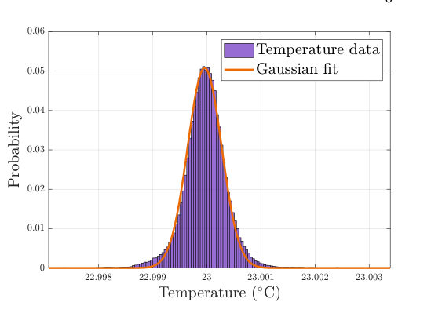 
FIG. 4. Histogram of the actively stabilized TBE temperature recorded over 55 h with a sampling interval of 0.5 s together with a Gaussian fit to the measured distribution (orange).

📷 Fig 5

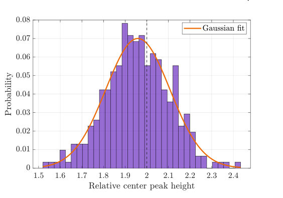 
FIG. 5. Histogram of the relative height of the central peak compared to the side peaks of three time-bin including a Gaussian fit to the measured distribution (orange) during ac- tive phase stabilization to the setpoint h = 2 (dashed line).

**Summary.** The paper presents an experimental demonstration of converting atom-photon entanglement from polarization encoding at 854 nm to time-bin encoding at the telecom C-band (1550 nm). This conversion is achieved via Quantum Frequency Conversion and a specialized fiber encoder. The success provides a vital, high-fidelity building block necessary for realizing complex, heterogeneous quantum network architectures.

**Why it may be interesting.** This work directly addresses a major engineering hurdle in quantum networking—interoperability between different physical platforms (e.g., atomic memories vs. fiber links) by providing a high-fidelity quantum interface.

Detailed structure

**Main problem.** The core challenge is creating an interoperable interface for quantum networks by converting atom-photon entanglement from polarization encoding at atomic wavelengths to time-bin encoding in the telecom C-band.

**Main result.** The authors successfully demonstrated this conversion, preserving entanglement with high fidelity (96.3% reported), establishing a crucial building block for heterogeneous quantum networking architectures.

**Method.** The process involves generating polarization-entangled photons from a trapped ion, performing Quantum Frequency Conversion (QFC) to the telecom band, and finally using a fiber-based Mach–Zehnder-like encoder to map the qubit basis from polarization to time-bin.

**Model / system.** The system utilizes a single $^{40}	ext{Ca}^+$ ion trapped in a Paul trap for entanglement generation. The photonic qubits are manipulated through QFC and then encoded into time-bins using an unbalanced Mach-Zehnder interferometer over optical fibers.

**Key observables.** Process fidelity (e.g., 96.3% reported), quantum state tomography results, and the measured photon wave-packets.

**Important parameters / regimes.** Atomic wavelength (854 nm) vs. Telecom C-band (1550 nm); time delay ($\sim 90$ ns) associated with the time-bin encoding path difference ($\Delta L \approx 18$ m).

**Assumptions / limitations.** The process assumes that time-bin qubits are more robust than polarization qubits over long fiber links, and fidelity losses are attributed to component inefficiencies.

**Figures summary.** Figures schematically illustrate the entire interface connecting components like Paul traps, QFCs, TBEs, and APC systems. Tomography figures show density matrices ($
ho$) for both encoding types alongside measured fidelities.

**Paper structure.** The paper details the experimental setup, starting with entanglement generation at an atomic wavelength, followed by quantum frequency conversion to the telecom band, and concluding with the polarization-to-time-bin conversion using a time-bin encoder. Stability analysis and fidelity verification are key components.

Abstract

A key enabling feature of future quantum networks is interoperability between platforms that operate at different wavelengths and with different qubit encodings. We demonstrate an interface that converts atom-photon entanglement from polarization encoding at an atomic wavelength to time-bin encoding in the telecom C-band. Atom-entangled photons at 854 nm are generated from a single $^{40}$Ca$^+$ ion. After quantum frequency conversion to 1550 nm, the photonic polarization qubit is converted into a time-bin qubit using a fiber-based Mach--Zehnder-like encoder. Full quantum tomography of the final state verifies that the process preserves entanglement with 96.3(4.2)% fidelity. Together with the independent work of Ferrari et al. [arXiv:2607.07805 (2026)], this is the first demonstration of polarization-to-time-bin conversion of photons entangled with a single atomic quantum memory. The telecom-compatible interface enables robust qubit transmission over optical fibers and provides a key building block for heterogeneous quantum networking architectures.

[↑ back to top](#top)

### [Hadron Structure from the Hierarchy of Quantum Correlations in Deep-Inelastic Scattering](http://arxiv.org/abs/2607.28724v1)

**Authors:** Henry Bloss, TJ Hobbs, Navin McGinnis  
**Type:** theory · **Category:** other · **PDF:** <https://arxiv.org/pdf/2607.28724v1>  
**Analysis basis:** full PDF text, analyzed in chunks
**Topic relevance:** 🔥 `entanglement & information structure` **4/5** · `non-equilibrium dynamics` **2/5** · `correlated / nonlocal dissipation` **1/5** · `driven-dissipative phase transition` **1/5** · `methods for driven-dissipative` **1/5** · `non-equilibrium universality` **1/5** · `quantum measurements` **1/5**

📷 Fig 1

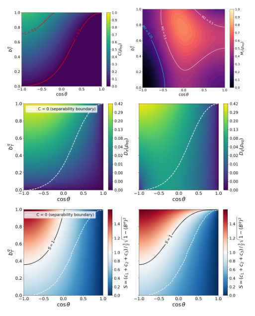 
FIG. 1. The quantum concurrence (top left); magic (top right); electron and quark discord (middle left and right); and electron and quark steering (bottom left and right). In all panels, we fix be ⊥= 0.7.

📷 Fig 2

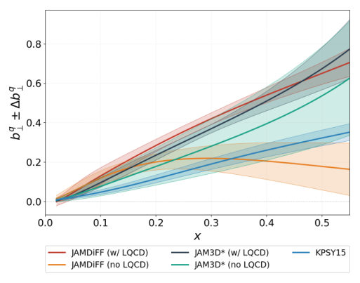 
FIG. 2. We plot b⟨q⟩ ⊥ vs. x as given by Eqs. (14)–(15) for 5 different transversity PDF analyses or models within their 1σ ranges; we fix Q = 12 GeV and bp ⊥= 0.7.

📷 Fig 3

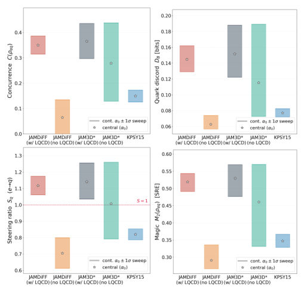 
FIG. 3. The quantum concurrence, discord, steering, and magic at fixed x = 0.5, Q = 12 GeV, and √s = 20 GeV, shown for 5 different transversity analyses; be ⊥= bp ⊥= 0.7 are fixed.

📷 Fig 4

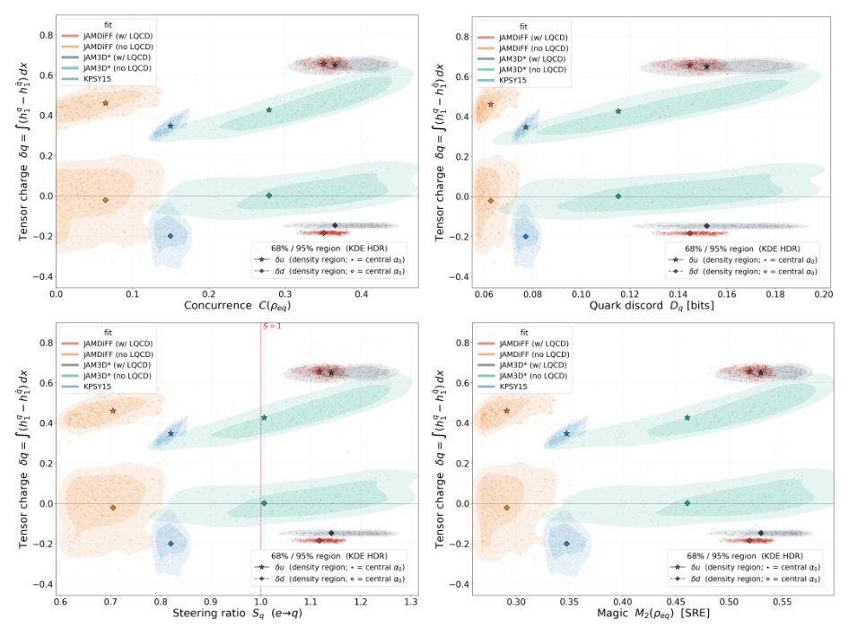 
FIG. 4. The up- and down-quark tensor charges (δu, δd) for 5 different transversity analyses at x = 0.5, Q = 12 GeV, plotted against the corresponding values of the quantum concurrence, quark discord, magic, and steering of the quark.

**Summary.** This theoretical work proposes that measuring various quantum correlations—such as entanglement and discord—in the final state of Deep-Inelastic Scattering can serve as a novel tool to map out the proton's internal structure. By analyzing these quantum measures, the authors constrain fundamental parameters like the quark tensor charges ($\delta u, \delta d$), providing testable predictions for future colliders like the EIC.

**Why it may be interesting.** While the core physics is high-energy particle physics, the methodology relies heavily on quantifying correlations in a bipartite quantum system using advanced quantum information measures (Discord, Steerability), which are central topics in open quantum systems theory.

Detailed structure

**Main problem.** To use the hierarchy of quantum correlations generated during Deep-Inelastic Scattering (DIS) to probe the nonperturbative structure of the proton, specifically constraining its tensor charges.

**Main result.** Quantum information measures like discord and steerability provide a calculable mapping that constrains the allowed region in the $(\delta u, \delta d)$ plane for the proton's tensor charges.

**Method.** The analysis involves calculating the joint density matrix ($
ho_{eq}$) for the scattered electron and quark, then applying various quantum information measures (Concurrence, Discord, Magic, Steering) to this state.

**Model / system.** The physical system is modeled as an electron-proton scattering process ($e^- + p 	o e^- + q$), treating the final state as a bipartite qubit system. The formalism uses the density matrix derived from DIS amplitudes.

**Key observables.** Entanglement (Concurrence), Quantum Discord, Steering Measure, Magic measure, and the tensor charges ($\delta u, \delta d$).

**Important parameters / regimes.** Scattering angle ($\cos	heta$), momentum transfer ($Q^2$), and the initial/final quark transverse polarization.

**Assumptions / limitations.** The analysis assumes that the measurement process allows for a mapping from quantum correlations to parton-level tensor charges, and in some derivations, it assumes leading-twist, massless limits or flavor averaging.

**Figures summary.** Figures illustrate how different quantum measures (Concurrence, Magic, Discord, Steering) vary with kinematics and how they constrain the allowed locus of $(\delta u, \delta d)$ values derived from various PDF models.

**Paper structure.** The paper first establishes the formalism for calculating the joint density matrix ($
ho_{eq}$) based on DIS amplitudes. It then introduces and analyzes four complementary quantum information measures (Entanglement, Discord, etc.) to show their sensitivity to quark polarization. Finally, it maps these measurements onto constraints on fundamental proton structure parameters like tensor charges.

Abstract

We show that the hierarchy of quantum correlations produced in deep-inelastic scattering (DIS) can serve as a novel probe of the proton's nonperturbative structure. Specifically, we show that quantum entanglement, discord, steering, and magic provide nontrivial and complementary sensitivities to the nucleon's parton distribution functions (PDFs), particularly those encoding the transverse-spin polarization of the interacting quark. This connection leads to a unique probe of the proton's parton-level tensor charges with implications for beyond Standard Model (BSM) physics searches. We propose how quantum information measures can be utilized for precision studies of hadron structure at DIS experiments like the upcoming Electron-Ion Collider (EIC).

[↑ back to top](#top)

### [Tunable two-component ultracold molecular gases with vibrational shielding](http://arxiv.org/abs/2607.29611v1)

**Authors:** Bijit Mukherjee, Michał Tomza  
**Type:** theory · **Category:** quantum gases · **PDF:** <https://arxiv.org/pdf/2607.29611v1>  
**Analysis basis:** full PDF text, analyzed in chunks
**Topic relevance:** 🔥 `analog quantum simulation` **4/5** · `Keldysh / 2PI / non-Gaussian methods` **1/5** · `correlated / nonlocal dissipation` **1/5** · `driven-dissipative phase transition` **1/5** · `methods for driven-dissipative` **1/5**

📷 Fig 1

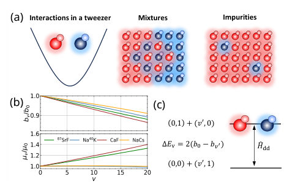 
FIG. 1. (a) Cartoon showing three possible fields of study using two- component molecular mixtures. (b) Relative variation in b and µ with vibrational level v of a molecule. (c) Schematic showing the pair levels of interest (v1, n1) + (v2, n2), their energy difference, and the coupling between them.

📷 Fig 2

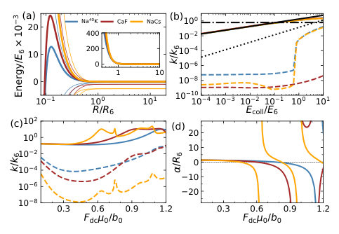 
FIG. 2. (a) Adiabats for various molecules. The thick curves indi- cate the s-wave adiabat correlating to the upper pair level (v, n) = (0, 1)+(1, 0). The thin curves indicate the remaining channels. The inset shows an expanded view of the long-range nature of the incom- ing adiabat. (b) Energy dependence of rates for intercomponent elas- tic scattering (colored solid lines) and loss processes (colored dashed lines). The black lines represent the universal rates for elastic scat- tering (solid) and intracomponent loss process (dash-dot for bosons and dotted for fermions) for a C6R−6 interaction. The colored solid lines are not visible as they lie below the black one. Panels (c) and (d) show...

📷 Fig 3

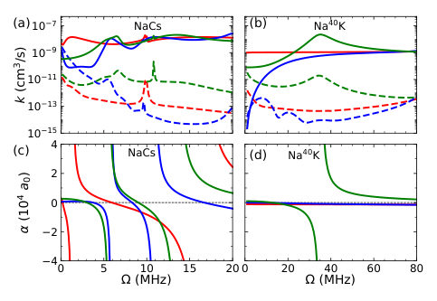 
FIG. 3. Effect of a single σ+-polarized microwave field in two- component mixtures of NaCs and Na40K. The red (blue) curves correspond to the intracomponent aa (bb) interactions, whereas the green curves denote the intercomponent ab interactions. Panels (a) and (b) show rate coefficients for elastic scattering (solid lines) and loss processes (dashed lines), whereas panels (c) and (d) show scat- tering lengths for the corresponding components. For intracompo- nent scattering in Na40K, we plot ˜α11. The other quantities ˜α10 and ˜α1,−1 are similar in magnitude and therefore not shown.

📷 Fig 4

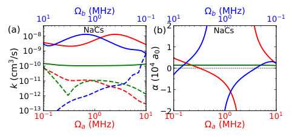 
FIG. 4. Application of two σ+-polarized microwave fields in an NaCs mixture. The red (blue) curves correspond to the intrastate aa (bb) interactions, whereas the green curves denote the interstate ab interactions. Panel (a) shows rate coefficients for elastic scat- tering (solid lines) and loss processes (dashed lines), whereas panel (b) shows scattering lengths for the corresponding components, for Ecoll/kB = 10 nK.

📷 Fig 5

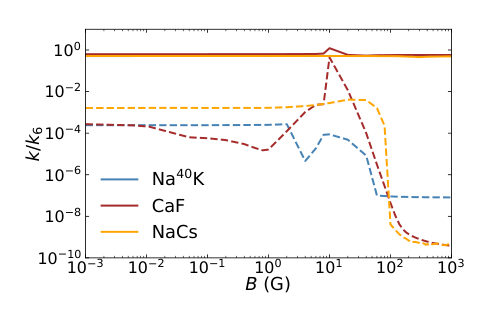 
FIG. 5. Magnetic field dependence of the rate coefficients. Solid (dashed) lines indicate the elastic (total loss) rates. The collision energy is set to 0.1E6.

**Summary.** The authors propose using polar molecules to create stable, tunable two-component quantum gas mixtures via a phenomenon called 'vibrational shielding.' They demonstrate that external electric or microwave fields can independently tune the interactions between components. This opens a powerful pathway for creating and controlling complex quantum many-body systems in molecular platforms.

**Why it may be interesting.** This work directly addresses advanced topics in ultracold quantum gases by providing a mechanism (vibrational shielding) to stabilize mixtures that are otherwise difficult to control, analogous to Feshbach resonances for atoms.

Detailed structure

**Main problem.** The primary goal is realizing stable, tunable two-component quantum mixtures of ultracold polar molecules.

**Main result.** Vibrational shielding stabilizes 3D bulk fermionic mixtures, and external fields (static or microwave) allow independent tuning of inter- and intra-component interactions.

**Method.** The study employs coupled-channel scattering calculations to model elastic and loss processes in the molecular gas mixture.

**Model / system.** The system involves ultracold polar diatomic molecules (e.g., NaCs) whose interactions are governed by the dipole-dipole Hamiltonian, $\hat{H}_{dd}$. The physics is modeled using coupled-channel scattering methods incorporating vibrational and rotational degrees of freedom.

**Key observables.** Elastic scattering rates ($k_{el}$), loss rate coefficients ($k_{loss}$), and tunable s-wave scattering lengths ($\alpha$).

**Important parameters / regimes.** The interaction is characterized by an effective $C_6R^{-6}$ repulsion, which is tuned by static electric fields ($\vec{F}_{dc}$) or microwave detunings/Rabi frequencies.

**Assumptions / limitations.** Approximations include neglecting transition dipoles between inter-vibrational levels and assuming high magnetic fields treat hyperfine states as spectators.

**Figures summary.** Figures illustrate the repulsive nature of incoming s-wave channels (adiabats), show rate coefficients vs. reduced electric fields, and map scattering properties ($\alpha$, $k_{loss}$) dependence on microwave field parameters.

**Paper structure.** The paper progresses from establishing the concept of vibrational shielding via dipole interactions to detailing how external static and microwave fields can independently tune all pairwise interactions in a bulk mixture, culminating in analysis of miscibility criteria based on scattering length ratios ($\gamma$).

Abstract

We propose a method to realize stable, tunable two-component quantum mixtures of ultracold polar molecules. First, we show that a pair of polar molecules in two distinct rovibrational states exhibits a repulsive interaction, thereby leading to collisional shielding without requiring any external field. We refer to this as "vibrational shielding". This intercomponent interaction is tunable by an external static electric or a microwave field, with the latter stabilizing both inter- and intracomponent interactions in a two-component bulk mixture. Additionally, we show that two microwave fields can independently tune the interactions of the individual components. Our findings thus open the door to the experimental realization of tunable quantum mixtures using polar molecules, analogous to tunable magnetic Feshbach resonances in two-component atomic quantum gases.

[↑ back to top](#top)

### [Release-free phononic crystal with strong microwave coupling](http://arxiv.org/abs/2607.29666v1)

**Authors:** Joey Frey, Paul Burger, Trond Hjerpekjøn Haug, Johan Kolvik, Raphaël Van Laer  
**Type:** experiment · **Category:** quantum information and computing · **PDF:** <https://arxiv.org/pdf/2607.29666v1>  
**Analysis basis:** full PDF text, analyzed in chunks
**Topic relevance:** 🔥 `QC/QI experiment` **4/5** · `correlated cavity matter` **1/5** · `driven-dissipative phase transition` **1/5** · `quantum optics experiment` **1/5**

📷 Fig 1

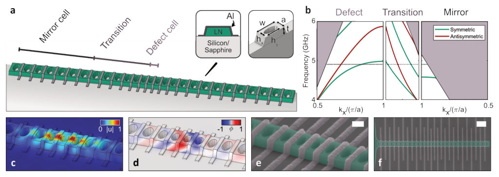 
Figure 1. Release-free phononic crystal cavity with microwave readout. a, Schematic of the device design, showing the lithium niobate electromechanical crystal (green) and aluminum IDT (gray) going across with a defect cell in the center transitioning into mirror cells on the edges. Left inset: cross-sectional view of the device with materials indicated. Right inset: Unit cell geometry with the main design parameters labeled. b, Mechanical band diagram of the defect cell (left) and mirror cell (right), with the frequency of our main mechanical mode indicated by the gray dotted line for silicon substrate. The transition region (middle) shows the evolution of the X-point modes for a linear...

📷 Fig 2

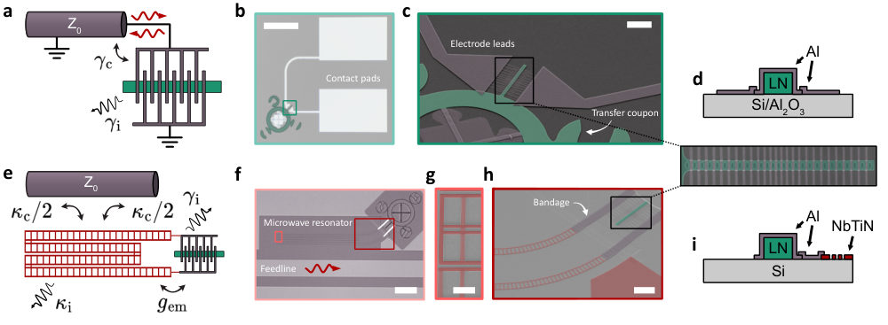 
Figure 2. Fabricated release-free EMCs connected to microwave feedline (top) and high-kinetic-inductance microwave resonator (bottom). Material color coding in schematics and false-color images denotes lithium niobate (green), NbTiN (red), and aluminum (dark gray). a, Independent EMC device configured for microwave reflection measurements. b, Micrograph of the EMC device with IDT connected to two probe pads (scale bar 50 µm). c, False-color SEM of the electrode connections to to the EMC IDTs (scale bar 5 µm). d, Cross section of bare EMC chip with materials indicated. e, Coupled system of an EMC and a microwave resonator, configured for microwave transmission measurement. f, Micrograph of...

📷 Fig 3

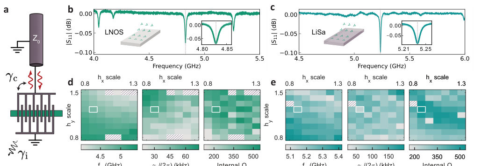 
Figure 3. Room-temperature microwave measurement of release-free phononic crystal cavities on silicon and sapphire substrates. a, Reflection measurement schematic showing the EMC coupled to a microwave feedline with impedance Z0 through external coupling rate γc and with internal loss rate γi. b,(c,) Microwave reflection spectrum S11 of LNOS and LiSa EMCs measured at room temperature. Inset shows fit for indicated resonance. d,(e,) Measured sweep of ellipse sizes in the defect cell for LNOS (LiSa) EMCs. The resonance frequency fm (left), coupling rate γc (middle) and internal quality factor Qi (right) is shown for each device. White outline indicates device shown in b(c). Striped squares...

📷 Fig 4

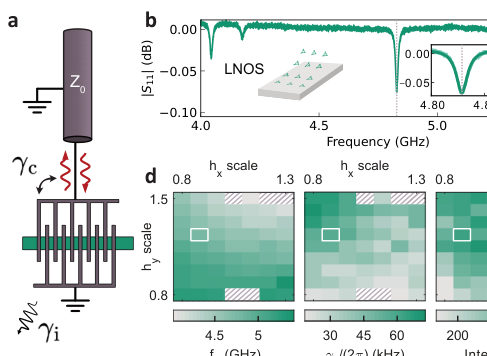 
Fig. 3b-c), and fit the quality factor, coupling rate and frequency for different geometries (Fig. 3d-e). Changes to the defect hole size also affect the transi- tion cells, leading to geometry changes to the full cavity length. By changing the defect cell holes with a scaling factor between 0.8 −1.5, we measure a mechanical fre- quency covering a range of 1 GHz for fundamental modes of the LNOS EMC, demonstrating a persevering mechan- ical resonance. Since the base design is chosen to be the same for both LNOS and LiSa, differences in behavior is largely due to substrate properties effect on the mechan- ical mode. In sapphire we observe modes at a higher fre- quency, owing to the increased...

📷 Fig 5

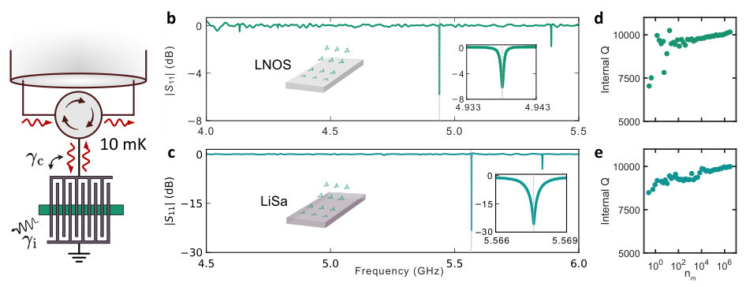 
Figure 4. Millikelvin microwave measurement of release-free phononic crystal cavities on silicon and sapphire substrates. a, Cryogenic reflection measurement schematic showing the EMC connected to a circulator at the mixing chamber plate, with the external (internal) loss rate γc (γi) indicated. b,(c,) Microwave reflection (S11) measured for an LNOS (LiSa) EMC at cryogenic temperatures. Inset shows fit for center peak in b(c). For LiSa, the resonance shown corresponds to a different mechanical mode than the one tracked in Fig. 3e. d, Internal quality factor as a function of intracavity phonon number nph, shown for the LNOS and LiSa resonance shown in b and c, respectively.

**Summary.** The paper reports on the realization of a release-free phononic crystal cavity that strongly couples microwave photons to gigahertz acoustic phonons. By overcoming the noise limitations of suspended structures, they demonstrate high cooperativity and excellent quality factors, establishing this platform as a scalable interface for quantum information processing.

**Why it may be interesting.** This work directly addresses quantum transduction—the critical link needed to connect superconducting qubits (microwave domain) to mechanical oscillators (phonon domain)—which is central to quantum networking architectures.

Detailed structure

**Main problem.** The challenge is creating compact, scalable interfaces between microwaves and gigahertz sound (phonons) for quantum applications while avoiding the noise issues associated with suspended phononic structures.

**Main result.** The authors demonstrated a release-free phononic crystal cavity strongly coupled to a microwave resonator, achieving strong coupling parameters ($\mathcal{C} \approx 180$) and high quality factors ($Q > 10^4$).

**Method.** Experimental characterization using microwave reflection/transmission spectroscopy at cryogenic temperatures (down to 10 mK) combined with finite-element method simulations.

**Model / system.** The system utilizes release-free phononic crystal cavities patterned in lithium niobate ($	ext{LiNbO}_3$) on silicon or sapphire, coupled electromechanically via an Interdigital Transducer (IDT) to a high-impedance microwave resonator.

**Key observables.** Electromechanical coupling rate ($g_{em}/(2\pi)$), Cooperativity ($\mathcal{C}$), internal mechanical quality factor ($Q_i$), and microwave reflection/transmission spectra ($S_{11}, S_{21}$).

**Important parameters / regimes.** $g_{em}/(2\pi) \approx 30\,	ext{MHz}$, $\mathcal{C} \approx 180$, $Q_i > 10^4$ at millikelvin temperatures.

**Assumptions / limitations.** The primary assumption is that the release-free structure can maintain strong coupling comparable to suspended devices while offering better thermal anchoring and scalability.

**Figures summary.** Figures show device schematics, mechanical band diagrams, mode simulations, SEM images of fabricated devices, and cryogenic measurement setups used for characterizing coupling strength and quality factors.

**Paper structure.** The paper progresses from identifying the need for robust phononic interfaces to demonstrating strong coupling in a release-free geometry, quantifying performance metrics like cooperativity and $Q$ factor across different temperature regimes.

Abstract

Phonons hold promise for storing and transferring quantum information, including in mechanically-mediated quantum interconnects between superconducting qubits and light. Phononic crystal cavities confine gigahertz sound to micron-scale volumes well matched to near-infrared light. So far, these devices have typically been suspended to suppress phononic radiation loss into the substrate, but suspension limits thermal anchoring leading to excess noise. Release-free phononic crystals have emerged as a way to address this challenge -- but had yet to be shown compatible with strong electromechanical interactions. Here, we demonstrate a release-free phononic crystal cavity strongly coupled to a high-impedance microwave resonator, with an electromechanical coupling rate $g_\mathrm{em}/(2π) \approx 30\,\text{MHz}$ that exceeds both the mechanical and microwave loss rates, leading to a cooperativity up to $\mathcal{C} \approx 180$ on resonance. In addition, our lithium niobate phononic crystals reach quality factors above $10^4$ at millikelvin temperature on both silicon and sapphire substrates. Our results establish release-free phononic crystals as compact, scalable interfaces between microwaves and gigahertz sound for emerging sensing, communication, and computing systems.

[↑ back to top](#top)

### [Magnetic properties of a quasi-two-dimensional spin-1/2 antiferromagnet Y2CuGe4O12](http://arxiv.org/abs/2607.29676v1)

**Authors:** J. Khatua, Changhyun Koo, Suyoung Kim, Eundeok Mun, Yugo Oshima, V. K. Sahu, Heung-Sik Kim, B. Koteswararao, Kwang-Yong Choi, P. Khuntia  
**Type:** both · **Category:** strongly correlated electrons · **PDF:** <https://arxiv.org/pdf/2607.29676v1>  
**Analysis basis:** full PDF text, analyzed in chunks
**Topic relevance:** 🔥 `analog quantum simulation` **4/5** · `exotic spin models in light-matter` **1/5** · `spintronics-quantum-optics interface` **1/5**

📷 Fig 1

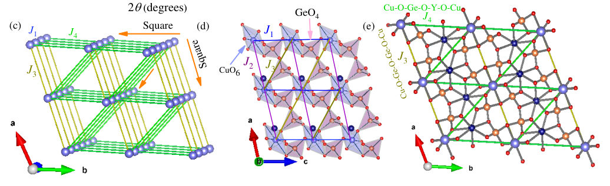 
FIG. 1. (a) Rietveld refinement pattern of the room-temperature powder x-ray diffraction data of Y2CuGe4O12 at room- temperature. The orange circle, black line, olive vertical bars, and blue line denote the experimentally observed points, the result of Rietveld fitting, expected Bragg reflection positions, and the difference between observed and calculated intensities, respectively. (b) Schematic view of the crystal structure of Y2CuGe4O12. The Cu2+ ions form a distorted triangular lattice, which are stacked along the b-axis. The distorted triangular network is composed of three inequivalent Cu–Cu exchange pathways: the nearest-neighbor interaction J1 corresponding to a Cu–Cu distance of...

📷 Fig 2

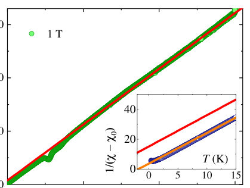 
FIG. 2. (a) Temperature dependence of magnetic susceptibility, χ(T), of Y2CuGe4O12 in a magnetic field of µ0H = 1 T. A weak hump around 50 K is attributed to trapped oxygen in the Teflon-wrapped pellet. The inset depicts χ(T) in several magnetic fields below 2 K. (b) Temperature dependence of the inverse magnetic susceptibility after subtraction of the temperature-independent χ0 contribution (see text). The red line represents the Curie–Weiss fit to the high-temperature inverse susceptibility data. The bottom inset shows the Curie–Weiss fit in the low-temperature region. (c) Isothermal magnetization as a function of external magnetic field at several temperatures. The horizontal dashed line...

📷 Fig 3

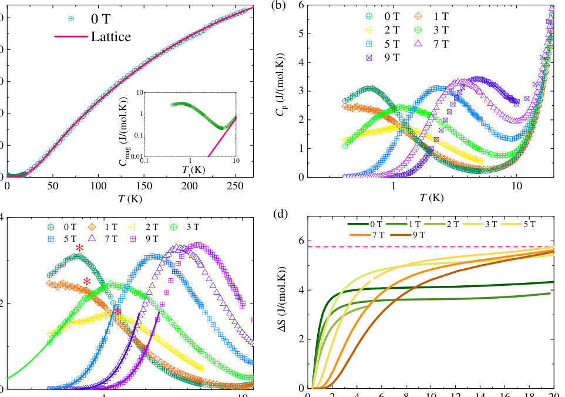 
FIG. 3. (a) Temperature dependence of the specific heat, Cp(T), of Y2CuGe4O12 down to 0.4 K in zero magnetic field. The solid line represents the fit using the Debye–Einstein model for the lattice contribution to the specific heat. The bottom inset shows a zoomed view of the low-temperature C p(T) data. (b) Temperature dependence of Cp(T) under various magnetic fields, plotted on a semi-logarithmic scale. (c) Temperature dependence of the magnetic specific heat, Cmag(T), in different magnetic fields. The solid lines represent fits using an exponential function accounting for gapped magnon excitations for magnetic fields above the saturation field, µ0Hs = 2.6 T. (d) Temperature dependence of...

📷 Fig 4

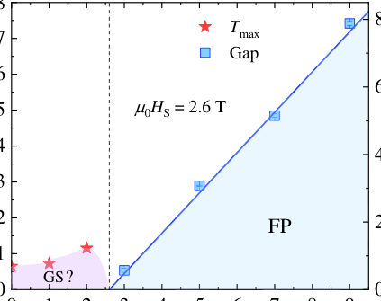 
FIG. 4. Evolution of Tmax and the magnon gap ∆/kB as a function of magnetic field. Red stars indicate the position of the broad maxima (Tmax) in Cmag, below which the magnetic ground state (GS) remains unclear. Blue squares represent the field-induced magnon gap ∆/kB in the polarized regime (H &gt; Hs), showing a linear behavior that vanishes at the saturation field µ0Hs = 2.6 T. .

**Summary.** This work characterizes the magnetic properties of Y2CuGe4O12, a quasi-two-dimensional antiferromagnet featuring a distorted triangular lattice. By combining DFT calculations with measurements like specific heat and ESR, the authors confirm strong geometric frustration due to competing exchange interactions. The findings establish the material as a platform for studying quantum phenomena driven by frustrated magnetism.

**Why it may be interesting.** The study provides a detailed experimental realization of geometric frustration in a low-dimensional magnet, offering insights into how competing interactions stabilize quantum paramagnetic states rather than conventional long-range order.

Detailed structure

**Main problem.** The study investigates exotic magnetic phenomena arising from competing magnetic interactions and frustration-induced quantum fluctuations in a quasi-two-dimensional antiferromagnet.

**Main result.** The material exhibits no long-range magnetic ordering down to 0.4 K, instead showing short-range spin correlations confirmed by susceptibility maxima and field-induced gapped magnon excitations above 2.6 T.

**Method.** A combination of experimental measurements (susceptibility, specific heat, ESR) and theoretical calculations (DFT) was employed to characterize the magnetic interactions.

**Model / system.** The physical system is polycrystalline Y2CuGe4O12, a spin-1/2 antiferromagnet where Cu2+ ions form a distorted triangular lattice with competing intraplanar and interplanar exchange couplings.

**Key observables.** Magnetic susceptibility ($\chi$), specific heat ($C/T$), ESR linewidth ($\Delta H(T)$), and the saturation field ($\mu_0H_s$).

**Important parameters / regimes.** Exchange interactions: $J_1 \approx 0.138$ K, $J_2 \approx 0.01$ K, $J_3 \approx -3.22$ K; Saturation field $\mu_0H_s = 2.6$ T.

**Assumptions / limitations.** The analysis assumes that the observed magnetic behavior is governed by competing exchange interactions within a frustrated lattice structure.

**Figures summary.** Figures show XRD patterns confirming crystal structure and schematic views illustrating the distorted triangular lattice formed by Cu2+ ions, detailing various exchange pathways ($J_1, J_2, J_3, J_4$).

**Paper structure.** The paper proceeds by characterizing the crystal structure via XRD, determining the magnetic interactions using DFT/exchange coupling calculations, and then analyzing temperature-dependent measurements ($\chi$, $C/T$, ESR) to map out the magnetic ground state and field responses.

Abstract

Competing magnetic interactions and frustration-induced quantum fluctuations in spatially anisotropic low-dimensional magnets often give rise to exotic magnetic phenomena, including field-induced phases. Here, we present crystal structure, magnetic susceptibility, specific heat, and electron spin resonance (ESR) measurements on polycrystalline Y$2$CuGe$4$O${12}$, supported by density functional theory (DFT) calculations. In this compound, the Cu$^{2+}$ ions form a distorted triangular lattice with competing intraplanar ferromagnetic ($J_1 \approx 0.138$ K and $J_2 \approx 0.01$ K) and antiferromagnetic ($J_3 \approx -3.22$ K) exchange interactions, together with a weaker interplanar antiferromagnetic coupling ($J_4 \approx -1.56$ K). These interactions account for the small Curie--Weiss temperature, $θ{\rm CW}=-1.8$ K. Despite the dominant antiferromagnetic interactions, no signature of long-range magnetic ordering is observed down to 0.4 K. Instead, broad maxima in both the magnetic susceptibility and magnetic specific heat reveal the development of short-range spin correlations, further supported by the critical ESR linewidth broadening characteristic of low-dimensional frustrated magnets. Application of an external magnetic field progressively suppresses the broad maximum in the magnetic specific heat, reflecting competition between the Zeeman and exchange energy scales, and drives the system into a field-polarized state above the saturation field, $μ_0H_{\rm s}=2.6$ T. In this regime, the magnetic specific heat exhibits an exponential temperature dependence, consistent with gapped magnon excitations. These results establish Y$_2$CuGe$4$O${12}$ as a rare distorted triangular-lattice magnet in which further-neighbor exchange interactions dominate the magnetic behavior, providing a promising platform for exploring frustration-driven quantum phenomena.

[↑ back to top](#top)

### [One-Step Epitaxial Access to Rhombohedral Graphene Flat-Band States on Step-Bunched SiC](http://arxiv.org/abs/2607.29022v1)

**Authors:** Hao Zhong, Xingzhe Wang, Hanbin Deng, Tianyu Yang, Haixuan Cao, Renzhe Li, Qiang Wan, Shangkun Mo, Keming Zhao, Shuming Yu, Dingkun Qin, Guang Zhu, Yifan Zhou, Jianping Shi, Shuangfeng Jia, He Zheng, Jia-Xin Yin, Nan Xu  
**Type:** experiment · **Category:** strongly correlated electrons · **PDF:** <https://arxiv.org/pdf/2607.29022v1>  
**Analysis basis:** full PDF text, analyzed in chunks
**Topic relevance:** 🔥 `analog quantum simulation` **4/5** · `correlated cavity matter` **1/5** · `non-equilibrium dynamics` **1/5**

📷 Fig 1

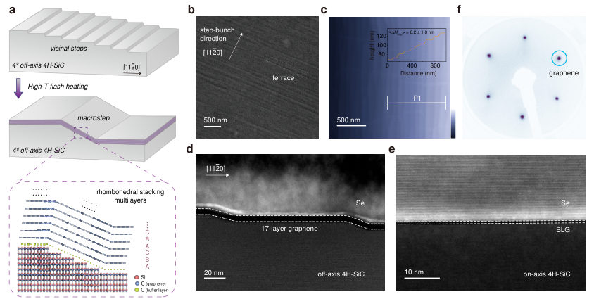 
FIG. 1. Growth concept and morphology of step-bunched multilayer graphene on off-axis 4H-SiC. (a) Schematic of flash annealing of 4◦off-axis 4H-SiC, producing step bunching, macrosteps and multilayer graphene. (b) SEM image of directional step-bunched terraces after annealing. (c) AFM height map and line profile; the mean macrostep height is 6.19 ± 1.76 nm (n = 36, mean ± s.d.). (d) Cross-sectional STEM image showing a conformal 17-layer graphene film on step-bunched off-axis SiC. (e) Control STEM image of bilayer graphene grown on on-axis 4H-SiC under comparable conditions. (f) LEED pattern acquired at 180 eV, showing ordered graphene diffraction features.

📷 Fig 2

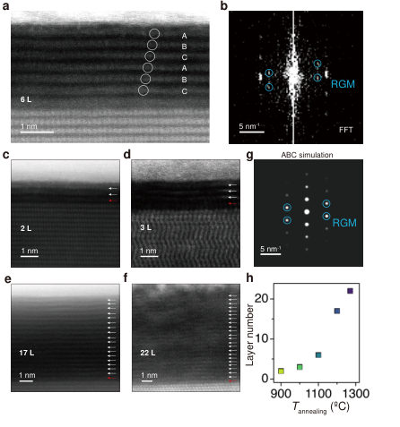 
FIG. 2. Rhombohedral stacking identification and anneal- ing temperature dependent multilayer growth. (a) Atomic- resolution cross-sectional STEM image of a representative six- layer region, showing ABCABC-like layer offsets. (b) Cor- responding FFT with rhombohedral-graphene features high- lighted. (c-f) Representative STEM images of samples grown at 900–1270 ◦C, with local layer numbers increasing from 2 to 22. (g) Simulated diffraction patterns for the ABC model; cyan circles mark rhombohedral-characteristic reflections. (h) Mean layer number versus annealing temperature.

📷 Fig 3

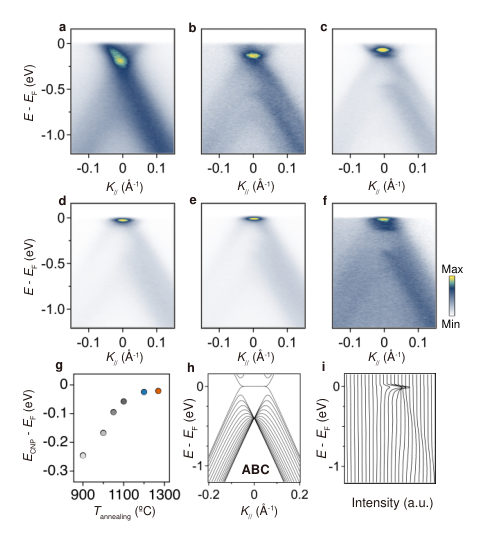 
FIG. 3. Layer-dependent low-energy electronic structure of epitaxial rhombohedral graphene multilayers. (a-f) ARPES intensity maps near the graphene K point for samples grown at 900–1270 ◦C, corresponding to representative local layer numbers of 2, 3, 5, 6, 17 and 22. (g) Extracted ECNP −EF as a function of annealing temperature, showing a shift of the charge-neutrality-point spectral weight towards the Fermi level. (h) Calculated low-energy band structure of rhombo- hedral 17-layer graphene. (i) Momentum-resolved EDCs ex- tracted from e near the graphene K point.

📷 Fig 4

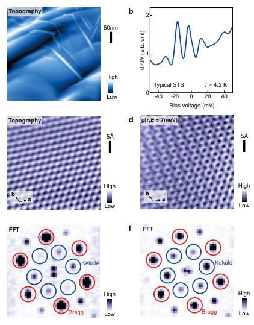 
FIG. 4. STM/STS measurements of a 17-layer epitaxial graphene film. (a) Large-area STM topography showing ter- race structures over a 400 × 400 nm2 field of view. (b) Rep- resentative dI/dV spectrum acquired at 4.2 K, showing two low-energy density-of-states maxima separated by 13.4 meV. (c,e) Atomic-resolution STM image and corresponding FFT. Red and blue circles mark graphene Bragg peaks and inner √

**Summary.** This work reports a novel, one-step method to grow thickness-tunable rhombohedral graphene multilayers directly on step-bunched SiC. By varying the annealing temperature, the researchers controlled the layer number while observing the electronic structure evolve from interface states toward pronounced flat bands. This establishes a powerful epitaxial platform for studying correlated electron physics in moiré-free systems.

**Why it may be interesting.** The direct creation of tunable flat bands via substrate engineering is highly relevant for realizing correlated electron physics in solid-state systems without complex transfer steps, which is a major goal in quantum materials research.

Detailed structure

**Main problem.** The primary challenge was establishing a direct, transfer-free epitaxial method to create thickness-tunable rhombohedral graphene multilayers for studying flat-band physics.

**Main result.** They successfully demonstrated this by using high-temperature flash annealing on step-bunched SiC, creating an accessible platform that links structural engineering with correlated electronic states.

**Method.** The study employed a one-step graphitization route followed by advanced characterization techniques including ARPES and low-temperature STM/STS.

**Model / system.** The system is rhombohedral graphene multilayers (RGMs) grown epitaxially on step-bunched 4$^\circ$ off-axis 4H-SiC. The electronic physics is governed by the moiré-free stacking sequence, which allows for correlated flat-band behavior.

**Key observables.** Thickness-dependent spectral weight evolution near the Fermi level (ARPES); a $13.4	ext{ meV}$ low-energy spectral reconstruction and $\sqrt{3} 	imes \sqrt{3}$ Kekulé modulation (STM/STS).

**Important parameters / regimes.** Annealing temperature (used to tune thickness from bilayer to $>20$ layers); the stacking registry (ABC sequence).

**Assumptions / limitations.** The assignment of rhombohedral stacking is considered local; STM/STS results are interpreted cautiously regarding spontaneous intervalley coherence versus structural reconstruction.

**Figures summary.** Figures illustrate step bunching and cross-sectional STEM confirming ABCABC stacking. ARPES data show spectral weight shifting toward the Fermi level as thickness increases, while STM/STS maps reveal characteristic low-energy modulations on thick films.

**Paper structure.** The paper first introduces the need for a transfer-free growth method. It details the one-step annealing process and structural characterization (STEM). Subsequently, ARPES tracks electronic evolution with thickness, culminating in detailed STM/STS measurements confirming specific low-energy spectral features on thick films.

Abstract

Rhombohedral graphene multilayers provide a moiré-free platform for correlated and topological flat-band physics, but direct, transfer-free epitaxial access to thickness-tunable multilayers remains limited. Here we report a one-step graphitization route on 4$^\circ$ off-axis 4H-SiC, in which high-temperature flash annealing simultaneously drives self-organized step bunching and multilayer graphene formation. Atomic-resolution cross-sectional scanning transmission electron microscopy identify local ABC registry and distinguish rhombohedral from Bernal stacking. The thickness is tuned from bilayer to more than twenty layers by varying single parameter, the annealing temperature. Angle-resolved photoemission spectroscopy directly tracks the thickness-dependent evolution from interface-dominated low-energy states toward pronounced near-Fermi-level flat-band spectral weight in thick multilayers. Low-temperature scanning tunneling microscopy and spectroscopy on a 17-layer film further reveal a 13.4 meV low-energy spectral reconstruction and a $\sqrt{3} \times \sqrt{3}$ Kekulé-like modulation, providing microscopic signatures consistent with an intervalley-mixed electronic texture. This one-step, transfer-free approach establishes step-bunched SiC as an epitaxial platform that links stacking engineering with moiré-free correlated flat-band electronic states.

[↑ back to top](#top)

### [Resolution of Infrared Entanglement Divergences via the Extended Uncertainty Principle](http://arxiv.org/abs/2607.29427v1)

**Authors:** Subhra Mondal, S. Shankaranarayanan  
**Type:** theory · **Category:** other · **PDF:** <https://arxiv.org/pdf/2607.29427v1>  
**Analysis basis:** full PDF text, analyzed in chunks
**Topic relevance:** 🔥 `entanglement & information structure` **4/5** · `Keldysh / 2PI / non-Gaussian methods` **1/5** · `correlated / nonlocal dissipation` **1/5**

📷 Fig 1

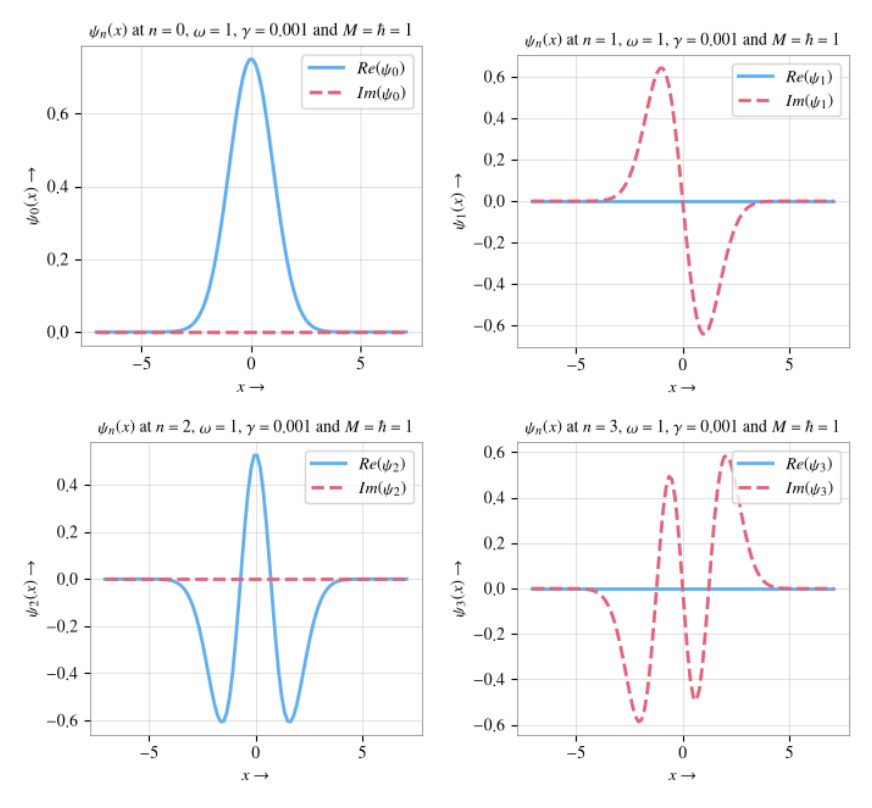 
FIG. 1. The spatial profiles of the first four discrete eigenstates of the EUP-modified oscillator.

📷 Fig 2

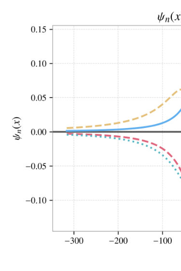 
FIG. 2. Spatial wave functions of the EUP-deformed free particle.

📷 Fig 3

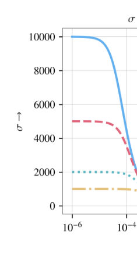 
FIG. 3. The spatial variance of the ground state as a function of the oscillator frequency ω.

📷 Fig 4

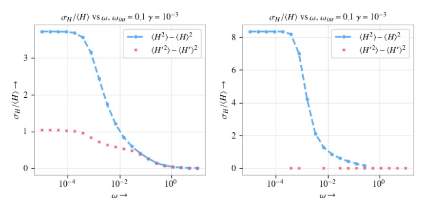 
FIG. 4. The energy variance of the Gaussian reference state (left) compared to the exact normal-

📷 Fig 5

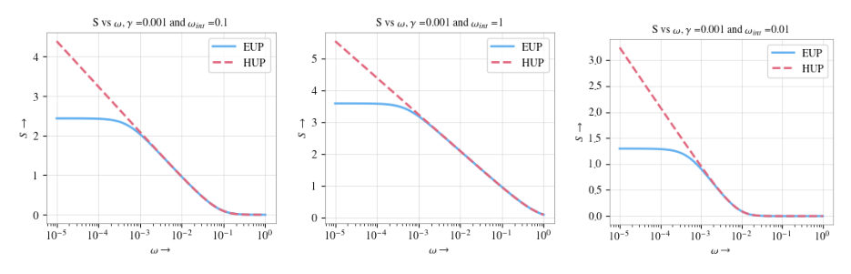 
FIG. 5. The entanglement entropy S as a function of the external frequency ω for varying interac-

**Summary.** The paper tackles the problem of infrared divergence in entanglement entropy by incorporating the Extended Uncertainty Principle (EUP). By modifying canonical commutation relations, EUP imposes a natural geometric confinement on quantum fields. This confinement successfully regularizes the zero-mode divergences, leading to finite and physically meaningful values for the entanglement entropy.

**Why it may be interesting.** This work provides a concrete, geometric modification (EUP) to address fundamental divergences in quantum field theory observables like entanglement entropy, which is crucial for understanding vacuum structure and correlations in many-body systems.

Detailed structure

**Main problem.** The primary goal is resolving infrared (IR) divergences encountered when calculating entanglement entropy in quantum field theories, which arise from the unbounded delocalization of zero-modes.

**Main result.** Invoking the Extended Uncertainty Principle (EUP) introduces an intrinsic geometric confinement that bounds spatial variance and causes the entanglement entropy to saturate to a finite value, thus resolving the IR divergence.

**Method.** The authors solve the simple harmonic oscillator under EUP corrections and extend this analysis to many-body systems by calculating entanglement entropy using techniques like moment matching and asymptotic expansion of von Neumann entropy.

**Model / system.** The study analyzes quantum systems including simple harmonic oscillators, one-dimensional harmonic chains, and massless scalar fields. The core modification is the EUP applied to canonical commutation relations: [x, p] = i\hbar(1 + \gamma x^2).

**Key observables.** Entanglement entropy ($S$), entanglement spectrum, spatial variance ($\langle x^2 
angle$), and modular gap.

**Important parameters / regimes.** The EUP parameter $\gamma$ (related to the background Ricci scalar), the frequency $\omega$, and the large-eigenvalue limit $
u \gg 1$.

**Assumptions / limitations.** Assumes $\gamma$ is small and finite ($\gamma 
eq 0$) for regularization; relies on asymptotic expansions in various limits.

**Figures summary.** Figures compare spatial profiles of eigenstates under EUP vs. HUP, and show comparisons of entanglement entropy calculated via RDM versus RCM approaches.

**Paper structure.** The paper progresses from solving the SHO under EUP to establishing intrinsic confinement, then extends this regularization mechanism to calculate entanglement entropy for harmonic chains and scalar fields in the continuum limit.

Abstract

The entanglement entropy of quantum systems typically exhibits both ultraviolet and infrared (IR) divergences. In the low-frequency limit, the IR divergence is intimately tied to the unbounded spatial delocalization of zero-modes, a pathological feature common to both coupled harmonic oscillators and massless scalar fields. In this work, we demonstrate that this infinite growth is naturally resolved by invoking the Extended Uncertainty Principle (EUP), which introduces large-length-scale geometric corrections to the canonical commutation relations. By exactly solving the simple harmonic oscillator under the EUP framework, we establish the existence of an intrinsic geometric confinement that enforces a strict upper bound on the position variance, limits spatial delocalization, and introduces an intrinsic localization length scale related to the background Ricci scalar. We extend this regularizing mechanism to many-body systems by evaluating the entanglement entropy and entanglement spectrum of a one-dimensional harmonic chain and a massless scalar field. We show that the EUP-induced spatial bounds prevent the accumulation of low-lying long-wavelength modes, keeping the entanglement spectrum discrete and evenly gapped even in the strictly massless limit. This non-vanishing modular gap effectively caps the local entanglement temperature of the vacuum. Consequently, the entanglement entropy saturates to a finite value, providing a robust, geometric resolution to the zero-mode IR divergence problem in quantum field theory.

[↑ back to top](#top)

### [Origins of microwave losses in superconducting circuits made with silicon-on-insulator substrates](http://arxiv.org/abs/2607.29154v1)

**Authors:** Simon Messelot, Nicolas Aparicio, Kazi Rafsanjani Amin, Eric Eyraud, Bruno Fain, Mikaël Cassé, Guillaume Jourdan, Fabrice Nemouchi, Sébastien Hentz, Frédéric Gustavo, François Lefloch, Nicolas Roch, Jérémie J. Viennot, Julien Renard  
**Type:** experiment · **Category:** other · **PDF:** <https://arxiv.org/pdf/2607.29154v1>  
**Analysis basis:** full PDF text, analyzed in chunks
**Topic relevance:** 🔥 `QC/QI experiment` **4/5** · `quantum optics experiment` **1/5**

📷 Fig 1

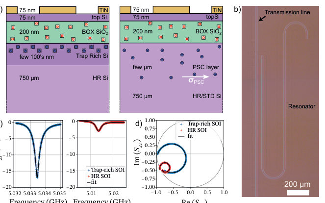 
Figure 1. Properties of the studied devices a) Schematic stacks of the studied devices for

📷 Fig 2

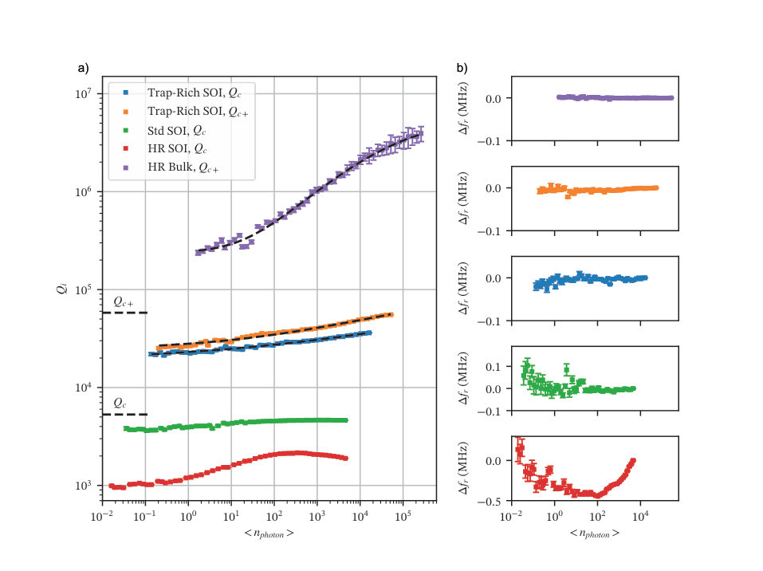 
Figure 2. Power dependence of internal quality factors Qi and resonance frequency

📷 Fig 3

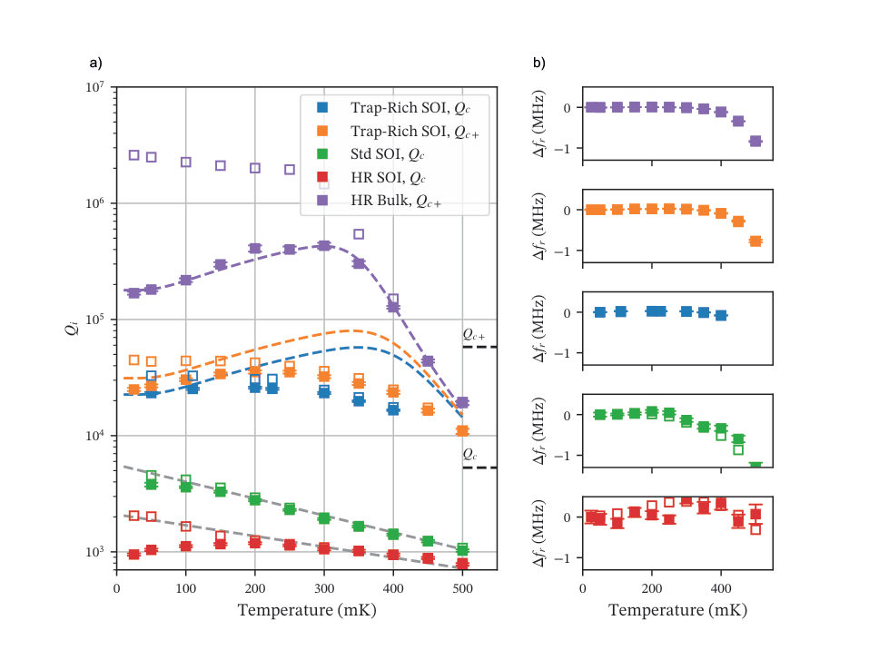 
Figure 3. Temperature dependence of internal quality factor and resonance frequency.

📷 Fig 4

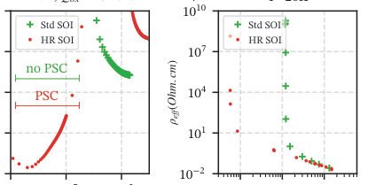 
Figure 4. Simulation of parasitic surface conduction layer (PSC) in p-doped SOI

**Summary.** This research analyzes microwave losses in superconducting circuits built on various SOI substrates. It reveals that high-resistivity silicon suffers from parasitic surface conduction loss at the $	ext{Si}/	ext{SiO}_2$ interface, while standard silicon is limited by doping. The authors show that engineering traps into the substrate can suppress these losses, leading to superior device performance.

**Why it may be interesting.** This work is highly relevant as it directly addresses material science limitations for superconducting quantum devices, which are central to building scalable quantum hardware architectures.

Detailed structure

**Main problem.** The study investigates the origins of microwave losses in superconducting circuits fabricated on Silicon-on-Insulator (SOI) substrates at cryogenic temperatures.

**Main result.** Standard resistivity SOI performs counterintuitively better than high-resistivity SOI because the latter suffers from parasitic sheet conduction loss; trap-rich SOI offers the best performance by suppressing these interface losses.

**Method.** Losses are characterized by measuring the internal quality factor ($Q_i$) of superconducting microwave resonators using $S_{21}$ measurements at base temperatures near 25 mK.

**Model / system.** The physical platform is a superconducting resonator (TiN film) integrated onto various SOI substrates (Standard, High-Resistivity, Trap-rich). The analysis models loss mechanisms like parasitic sheet conduction and dielectric losses in the $	ext{SiO}_2$ layer.

**Key observables.** Internal quality factor ($Q_i$), $S_{21}$ scattering parameter, power dependence of $Q_i$, and temperature dependence of losses.

**Important parameters / regimes.** Cryogenic temperatures ($\approx 25 	ext{ mK}$), substrate resistivity ($
ho$), defect charge densities, and the presence/absence of parasitic sheet conduction (PSC).

**Assumptions / limitations.** The analysis assumes that PSC is the dominant loss mechanism in high-resistivity substrates, and that losses in trap-rich SOI are ultimately limited by $	ext{SiO}_2$ dielectric losses.

**Figures summary.** Figures show typical resonance shapes ($S_{21}$ vs. Frequency) for different substrate types, illustrating the measured quality factors under various conditions.

**Paper structure.** The paper systematically compares four types of SOI substrates using microwave resonators to pinpoint the dominant loss mechanism—identifying PSC in HR-SOI and demonstrating superior performance with trap-induced traps.

Abstract

Silicon-on-insulator technology is widely used to fabricate silicon based devices, from advanced transistors to photonic circuits or nanomechanical systems. Integrating low loss superconducting quantum circuits with silicon-on-insulator substrates enables to couple the advantages offered by the mature silicon technology to the exquisite sensitivity of superconducting circuits. The natural approach, inherited from research in superconducting microwave devices, is to use a substrate made with highly resistive silicon, known for its low level of microwave losses. In this work, using superconducting microwave resonators, we show that counterintuitively, standard resistivity silicon-on-insulator substrates perform better than high resistivity silicon-on-insulator substrates at cryogenic temperatures. In the latter case, the presence of a parasitic sheet conduction at the interface between bulk silicon and silicon oxide acts as the dominant loss mechanism. This parasitic sheet can be suppressed using substrates with intentionally induced traps. In such substrates, losses are ultimately limited by the dielectric losses of the silicon oxide layer. These substrates offer interesting perspectives for the development of superconducting nanoelectromechanical systems. First, the release, i.e. the removal of the silicon oxide, could be limited to the moving parts, thereby maintaining the mechanical integrity of the rest of the device. Additionally, such structure would enhance heat evacuation into the bulk of the substrate which is an issue in current devices such as microwave-to-optics converters.

[↑ back to top](#top)

### [Non-Hermitian Quantum Nonlinear Optics with Single Photons](http://arxiv.org/abs/2607.29313v1)

**Authors:** Samuel Napoli, Andrea Zappalá, Franco Nori, Salvatore Savasta, Daniele Lamberto  
**Type:** theory · **Category:** other · **PDF:** <https://arxiv.org/pdf/2607.29313v1>  
**Analysis basis:** full PDF text, analyzed in chunks
**Topic relevance:** `Tavis-Cummings & cavity-many-emitter` **3/5** · `correlated cavity matter` **3/5** · `driven-dissipative phase transition` **3/5** · `methods for driven-dissipative` **3/5** · `analog quantum simulation` **2/5** · `correlated / nonlocal dissipation` **2/5** · `non-equilibrium dynamics` **2/5** · `Dicke superradiance` **1/5** · `Keldysh / 2PI / non-Gaussian methods` **1/5** · `entanglement & information structure` **1/5** · `interference shaping light` **1/5** · `non-equilibrium universality` **1/5**

📷 Fig 1

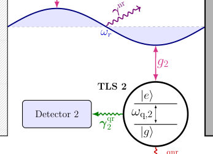 
FIG. 1. Sketch of the circuit-QED setup hosting the quantum nonlinear process in which two qubits can be simultaneously excited by a single photon, as described by the Hamiltonian in Eq. (1). For illustrative purposes, the resonator is repre- sented as a waveguide cavity coupled to two individual qubits, depicted as circles enclosing two energy levels, and placed at opposite antinodes of the cavity mode. Radiative decay ar- rows for the resonator and qubits (γr and γqr 1,2) point towards the input mirror and respective qubit detectors, while intrin- sic non-radiative loss arrows (γnr and γqnr 1,2 ) point outwards to the environment. The radiative decay channel of the res- onator serves...

📷 Fig 2

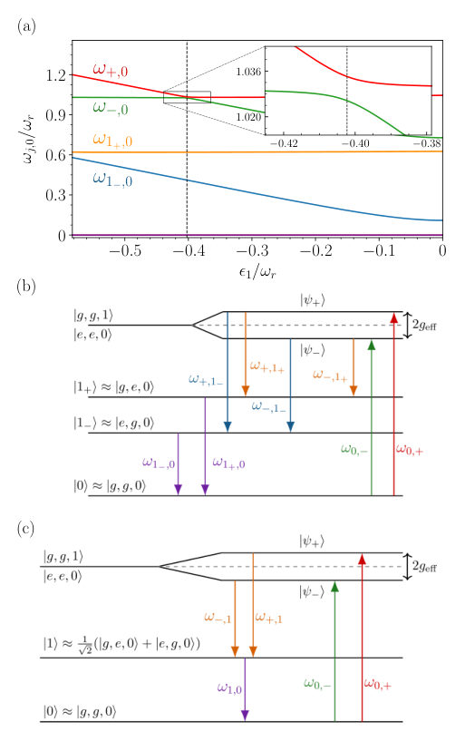 
FIG. 2. Energy spectrum and schematic transitions diagrams of the single-photon two-qubit excitation process. (a) Eigen- frequencies of HS as a function of flux offset ϵ1, both nor- malized by the resonator frequency ωr. Here, ωj,0 denotes the transition frequency with respect to the ground state. The inset provides a magnified view of the anticrossing re- gion near ωr ≈ωq,1 +ωq,2, which originates from the effective coupling between the |g, g, 1⟩and |e, e, 0⟩states. The param- eters used for this panel are the same as those in Ref. [58]. (b) Energy levels for non-identical qubits at zero detuning, ∆ω = ˜ωr −(˜ωq,1 + ˜ωq,2) = 0, marked by the vertical dashed line in panel (a). (c) Energy...

📷 Fig 3

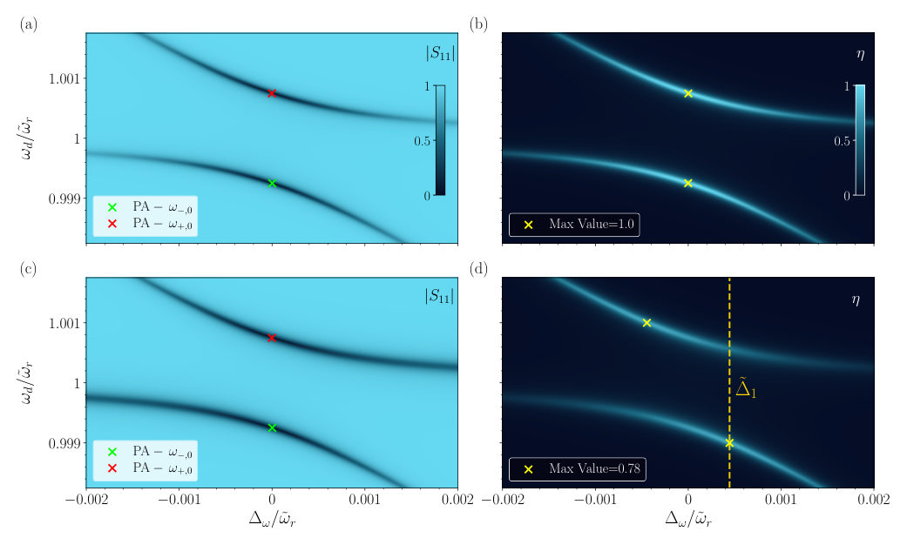 
FIG. 3. Reflection and conversion efficiency with and without resonator intrinsic losses, for identical qubits and in the case of PT symmetry for HPA, i.e., under the loss-balancing condition. (a, c) Reflection |S11| and (b, d) conversion efficiency ηj maps as a function of detuning ∆ω and driving frequency ωd, shown without (a, b) and with (c, d) non-radiative resonator losses. The crosses in the reflection maps mark the points of perfect absorption (|S11| = 0), with red and green denoting the upper and lower hybrid modes, respectively. The yellow crosses in the efficiency maps denote the respective maxima. In (d), the vertical dashed line identifies the optimal detuning ˜∆1 maximizing ηj,...

📷 Fig 4

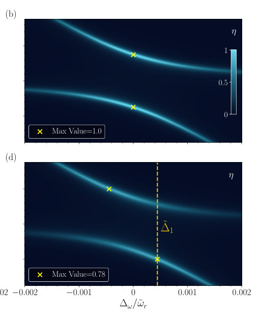 
Figure 3(a) shows the reflection map |S11| as a func- tion of the detuning ∆ω and drive frequency ωd, in ab- sence of non-radiative losses (γnr = γqnr 1 = γqnr 2 = 0). Throughout this work, ∆ω is varied by tuning the qubit frequencies ˜ωq. This procedure can be readily imple- mented in circuit QED setups, for instance, by adjust- ing the flux offset ϵ of the flux qubits. For the sake of simplicity, in this effective model, we neglect any depen- dence of geff on ∆ω, which however can be easily included if required. By numerically computing the steady-state density matrix ρss in the frame of the drive, we evaluate the reflection coefficient as |S11| = |1 −√γr ⟨a⟩ss /Ad|, where ⟨a⟩ss =...

📷 Fig 5

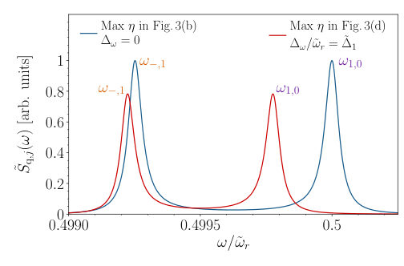 
FIG. 4. Emission spectra ˜Sq,j for the qubit output channels, for two identical qubits (i.e., ˜Sq,1 = ˜Sq,2), normalized to their global maximum. The spectral peaks reflect the cascaded spontaneous down-conversion process and correspond to the energy-level transitions sketched in Fig. 2(c). Each curve is evaluated at the drive frequency ωd and detuning ∆ω that maximize the conversion efficiency ηj for the lower hybrid mode in Fig. 3: the blue curve corresponds to the case with- out non-radiative losses (parameters of Fig. 3(b), ∆ω = 0), while the red curve includes non-radiative resonator loss (pa- rameters of Fig. 3(d), ∆ω/˜ωr = ˜∆1).

**Summary.** This paper pioneers the use of non-Hermitian physics, specifically perfect absorption, to overcome dissipation barriers in quantum nonlinear optics. By analyzing circuit QED systems operating in the ultrastrong coupling regime, the authors show how to engineer near-deterministic single-photon down-conversion into correlated multi-photon pairs. This establishes a powerful new route for optimizing quantum devices using non-Hermitian engineering principles.

**Why it may be interesting.** This work is highly relevant as it directly applies non-Hermitian physics concepts (like PA and Hermitian subspaces) to optimize quantum light sources at the fundamental single-photon level within a cavity QED platform.

Detailed structure

**Main problem.** To develop scalable quantum technologies by harnessing strong photon-photon interactions while overcoming dissipative losses inherent in quantum nonlinear optics.

**Main result.** The authors demonstrate that exploiting perfect absorption conditions allows for near-deterministic single-photon down-conversion into correlated multi-photon pairs, even when realistic dissipation is present.

**Method.** They bridge non-Hermitian physics with QNLO by analyzing the system's response using input-output theory and identifying optimal operating points via spectral analysis.

**Model / system.** The study investigates two circuit QED systems involving qubits coupled to a resonator, modeled using generalized Dicke Hamiltonians in the light-matter ultrastrong coupling regime. The analysis focuses on effective non-Hermitian Hamiltonians derived from input-output theory.

**Key observables.** Near-deterministic single-photon down-conversion efficiency ($\eta$), reflection coefficient $|S_{11}|$, and emission spectra $	ilde{S}_{q,1}(\omega)$.

**Important parameters / regimes.** Ultrastrong coupling regime (USC), perfect absorption condition in $|S_{11}|$, detuning ($\Delta\omega$), and experimentally accessible parameters governing loss rates.

**Assumptions / limitations.** The analysis relies on the weak-excitation approximation for some parts, but crucially shows optimization is possible even with realistic dissipation present.

**Figures summary.** Figures illustrate the circuit QED setup (Fig. 1), show spectral features like avoided level crossings related to PA/zeros ($	ilde{\Omega}_{\pm}$), and plot conversion efficiencies ($\eta$) versus drive frequency or detuning.

**Paper structure.** The paper progresses by first establishing the theoretical framework connecting PA to QNLO, then analyzing specific circuit QED setups (two-atom excitation, single-photon to two-photon conversion) using input-output theory and spectral mapping.

Abstract

Quantum nonlinear optics seeks to harness strong photon-photon interactions for scalable quantum technologies, although dissipative losses still pose a major barrier to near-unity conversion efficiency. Here, we bridge non-Hermitian physics with the quantum nonlinear domain by exploiting perfect absorption to identify and optimize few-photon nonlinear processes. We theoretically investigate two circuit QED systems, operating in the light-matter ultrastrong coupling regime. The first (i) enables simultaneous two-atom excitations by single photons, while the second (ii) realizes the strong coupling between a single-photon and a two-photon Fock states. We demonstrate that, since the strong optical nonlinearities cause quantum spectral features to emerge already at the level of linear response theory, the perfect absorption condition in $|S_{11}|$ enables near-deterministic single-photon down-conversion into (i) a qubit-qubit-correlated pair and (ii) a two-photon pair. We show that the conversion efficiency can be systematically optimized through experimentally accessible parameters, both linked to the emergence of Hermitian subspaces within the effective non-Hermitian Hamiltonians. These findings position non-Hermitian engineering as a broadly applicable route to optimizing quantum devices at the single-photon level, even beyond circuit-QED platforms.

[↑ back to top](#top)

### [Charging and Discharging a Hubbard-Holstein Quantum Battery: Specific Mechanisms and General Insights](http://arxiv.org/abs/2607.29339v1)

**Authors:** Emil Östberg, Arvid Steen, Najmeh Abiri, Irene D'Amico, Claudio Verdozzi  
**Type:** theory · **Category:** strongly correlated electrons · **PDF:** <https://arxiv.org/pdf/2607.29339v1>  
**Analysis basis:** full PDF text, analyzed in chunks
**Topic relevance:** `analog quantum simulation` **3/5** · `driven-dissipative phase transition` **3/5** · `methods for driven-dissipative` **3/5** · `non-equilibrium dynamics` **3/5** · `Keldysh / 2PI / non-Gaussian methods` **2/5** · `correlated / nonlocal dissipation` **2/5** · `non-equilibrium universality` **2/5** · `Kondo & dissipative impurity` **1/5** · `entanglement & information structure` **1/5** · `exotic spin models in light-matter` **1/5** · `scars & prethermalization` **1/5**

📷 Fig 1

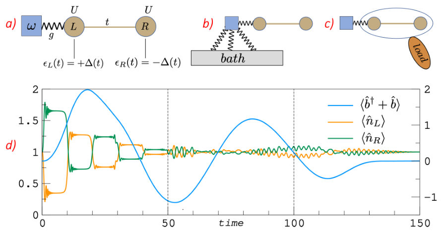 
Figure 1. Battery schematic and time evolution. (a) Isolated battery (Hubbard-Holstein dimer) and external-field parameters. (b) Battery coupled to a dissipative oscillator bath. (c) Battery–load setup. (d) Time evolution from an initial thermal state (β = 2, U = 2, ω = 0.1, g = 0.2). Shown are the phonon displacement ⟨ˆb† + ˆb⟩and site occupations ⟨ˆnL⟩and ⟨ˆnR⟩. Vertical dashed lines separate the charging, dissipation, and discharging regimes.Electronic and phononic quantities use the left and right axes, respectively.

📷 Fig 2

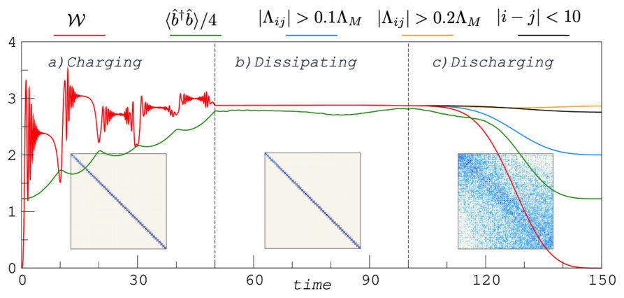 
Figure 2. Battery performance. (a)–(c) Ergotropy W (red curve) and average phonon occupation ⟨ˆb†ˆb⟩/4 (green curve) during charging, dissipation, and discharging. Parameters are as in Fig. 1. The shaded maps in panels (a) and (b) show the corresponding battery Hamiltonian. In panel (c), the shaded map shows the Hermitian generator Λij = (ˆΛ)ij associated with the exact discharge protocol of Ref. [19]. The evolution of W is also shown for modified generators obtained by retaining only matrix elements with |Λij|/ΛM &gt; 0.1 (blue curve), |Λij|/ΛM &gt; 0.2 (orange curve), or |i −j| &lt; 10 (black curve), where ΛM = maxij |Λij|.

📷 Fig 3

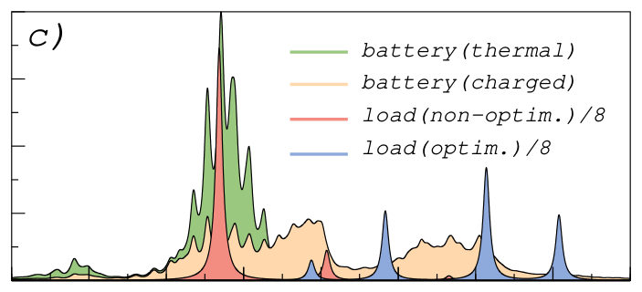 
Figure 3. (a) Ergotropy W during load optimization for four battery–load couplings: optimized load coupled to both battery sites, to the left site, or to the right site, and a non-optimized shifted load coupled to both sites. (b) Optimized case: battery-site densities (thick black curves), load-site densities (thin curves), and phonon displacement/occupation (blue curves). Electronic and phononic quantities use the left and right axes, respectively. (c) Thermal/charged battery spectra (green/orange shaded distributions) and optimized/non-optimized load spectra (blue/red shaded distributions, scaled by 1/8). For the removal spectra, the site averaged value [A(−) batt(E; t; L) + A(−) batt(E;...

📷 Fig 4

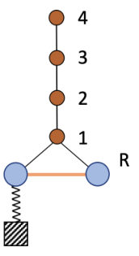 
Figure 4. Site labels for the battery+chain system

📷 Fig 5

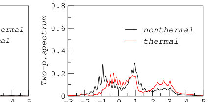 
Figure 5. Comparison between the spectral functions for the thermal state considered in the main text and the spectral functions obtained from (8)

**Summary.** This paper analyzes a Hubbard-Holstein dimer as a quantum battery, demonstrating that while ideal work extraction is theoretically difficult, a practical protocol involving spectral matching can efficiently extract stored energy. The mechanism relies on the interplay between electronic correlations and phonon modes, offering insights into realistic quantum energy storage limitations.

**Why it may be interesting.** It bridges concepts from strongly correlated electron models (Hubbard) with open quantum systems dynamics (phonon coupling/dissipation), providing concrete mechanisms for non-equilibrium energy management relevant to quantum thermodynamics.

Detailed structure

**Main problem.** The research investigates efficient quantum energy storage and work extraction from a quantum battery, specifically addressing the gap between ideal theoretical protocols and physically realizable methods.

**Main result.** While optimal work extraction requires unphysical fine-tuning, a practical protocol based on spectral matching using phonon coupling allows for substantial, realistic energy extraction.

**Method.** The study uses time evolution simulations governed by an extended Hubbard-Holstein Hamiltonian coupled to a dissipative bath, employing the mixed quantum–classical Ehrenfest approximation.

**Model / system.** The system is a two-electron Hubbard–Holstein (HH) dimer acting as a quantum battery. It models electronic correlations (Hubbard term), electron-phonon coupling (Holstein term), and environmental dissipation via a Caldeira-Leggett bath.

**Key observables.** Ergotropy ($W$), site occupations ($\langle\hat{n}_L
angle, \langle\hat{n}_R
angle$), and average phonon displacement ($\langle\hat{b}^\dagger + \hat{b}
angle$).

**Important parameters / regimes.** The interplay between electronic coupling ($J$), on-site repulsion ($U$), and the spectral bandwidth of the bath.

**Assumptions / limitations.** Ideal work extraction protocols often rely on unphysical, highly structured couplings; the use of the Ehrenfest approximation is noted as a limitation.

**Figures summary.** Figures illustrate the setup (isolated vs. dissipative), time evolution showing phonon displacement and site occupations across charging, dissipation, and discharging regimes.

**Paper structure.** The paper progresses by establishing the HH dimer as a quantum battery, contrasting ideal unitary discharge protocols with practical load-coupled methods, and analyzing how spectral matching dictates efficient energy retrieval while discussing the role of phonons in suppressing dissipation.

Abstract

A Hubbard-Holstein dimer functions as a correlation-driven quantum battery, with ergotropy robustly stored, under some conditions, even in the presence of dissipation. We find that, although optimal work extraction can in principle recover all the stored energy, it requires unrealistically fine-tuned couplings. By contrast, a physically realizable protocol based on spectral matching between the battery and the load achieves substantial, albeit suboptimal, energy extraction. Our results identify a mechanism for quantum energy storage, provide a realistic route to work extraction that is amenable to machine-learning-based theoretical exploration, and suggest that quantum batteries may not be universally deployable: the microscopic mechanism responsible for storing energy can constrain the classes of systems able to efficiently extract it.

[↑ back to top](#top)

### [On the Emergence of Exponential Decay from Discrete Spectra for Friedrichs Hamiltonians](http://arxiv.org/abs/2607.29485v1)

**Authors:** Tamim Al-Qaiwani, Sören Petrat  
**Type:** theory · **Category:** other · **PDF:** <https://arxiv.org/pdf/2607.29485v1>  
**Analysis basis:** full PDF text, analyzed in chunks
**Topic relevance:** `Keldysh / 2PI / non-Gaussian methods` **3/5** · `correlated / nonlocal dissipation` **3/5** · `methods for driven-dissipative` **3/5** · `Tavis-Cummings & cavity-many-emitter` **2/5** · `driven-dissipative phase transition` **2/5** · `Kondo & dissipative impurity` **1/5** · `analog quantum simulation` **1/5** · `correlated cavity matter` **1/5** · `non-equilibrium dynamics` **1/5** · `non-equilibrium universality` **1/5**

📷 Fig 1

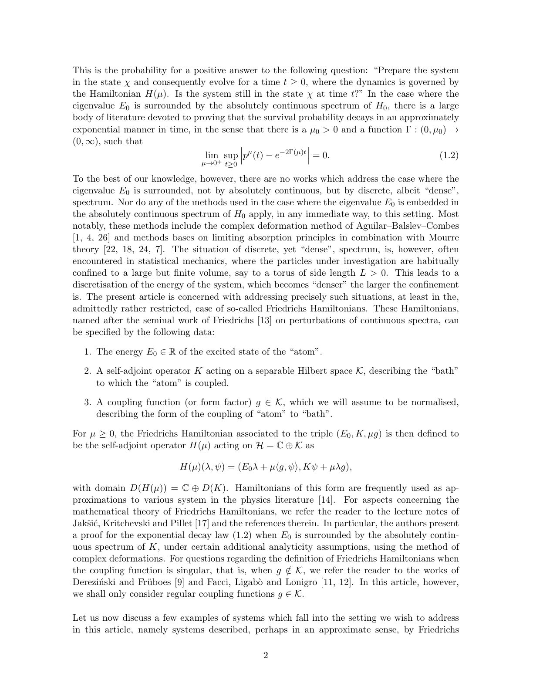 
Low-resolution page preview, page 2

📷 Fig 2

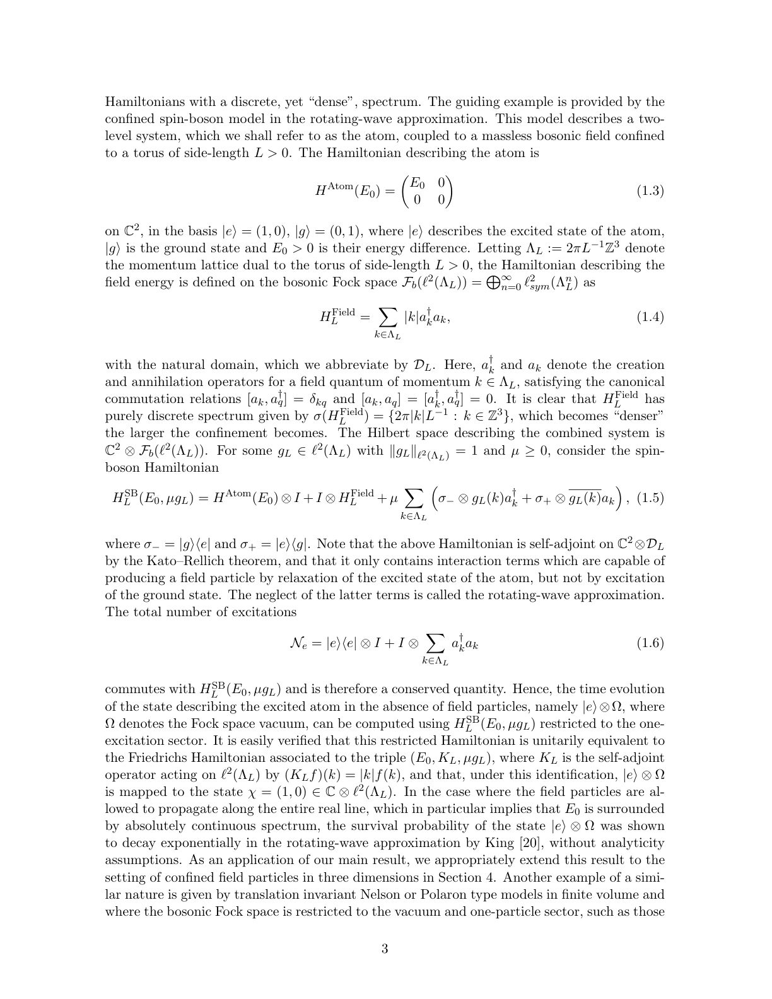 
Low-resolution page preview, page 3

📷 Fig 3

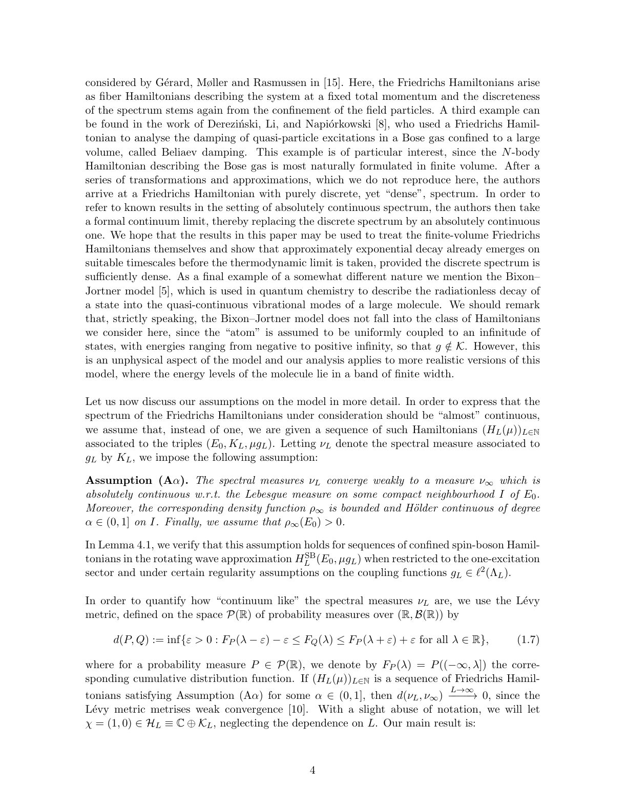 
Low-resolution page preview, page 4

📷 Fig 4

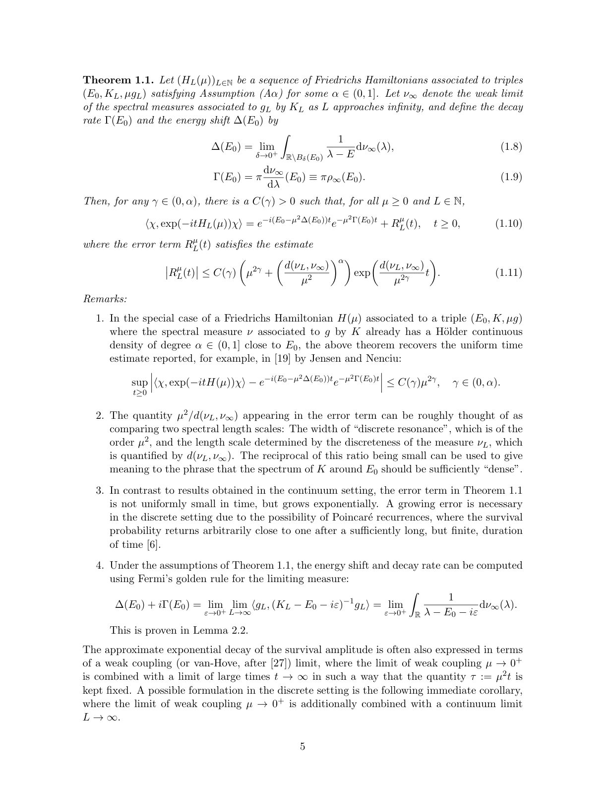 
Low-resolution page preview, page 5

📷 Fig 5

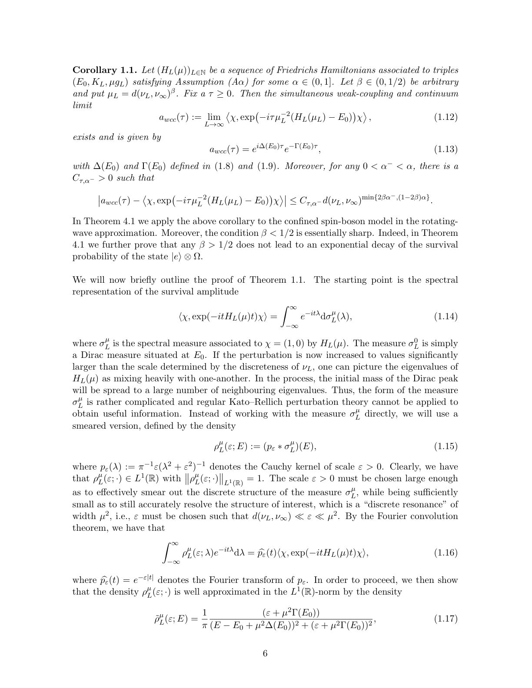 
Low-resolution page preview, page 6

**Summary.** This paper rigorously analyzes the decay of an excited state coupled to a bath whose spectrum is initially discrete but converges weakly to a continuum. By establishing precise asymptotic formulas, it shows that the survival probability decays exponentially at a rate predicted by Fermi's golden rule for the limiting continuous spectral density.

**Why it may be interesting.** This work provides a rigorous mathematical framework for understanding resonance phenomena (decay) when the underlying bath spectrum is purely discrete but approaches a continuous one. This bridges gap between idealized models and realistic physical systems where spectral structure matters greatly.

Detailed structure

**Main problem.** The paper investigates how an initially stable excited state, described by a Friedrichs Hamiltonian coupled to a bath with purely discrete spectrum, can exhibit exponential decay.

**Main result.** Under specific convergence assumptions on the spectral measures, the survival probability decays approximately exponentially at a rate determined by Fermi's golden rule applied to the limiting continuous measure.

**Method.** The analysis uses weak convergence of spectral measures (Lévy distance) and approximates the time evolution operator using techniques involving convolution with Cauchy kernels to handle the discrete spectrum limit.

**Model / system.** The core model is the Friedrichs Hamiltonian, representing an excited state coupled to a bath. A specific application studied is the two-level atom coupled to a massless bosonic field confined in a large cavity (a spin-boson type system).

**Key observables.** Survival probability $p_\mu(t) = |\langle\chi, \exp(-itH(\mu))\chi
angle|^2$, decay rate $\Gamma(E_0)$, and energy shift $\Delta(E_0)$.

**Important parameters / regimes.** The coupling strength ($\mu$), the size of the confinement ($L$), and the convergence parameters related to the spectral measure distance (e.g., Lévy distance).

**Assumptions / limitations.** Crucially, it assumes that the discrete spectral measures converge weakly to a limiting measure that is absolutely continuous with a Hölder continuous density near the excited energy.

**Paper structure.** The paper builds from defining the problem using Friedrichs Hamiltonians and analyzing the survival amplitude. It establishes theorems relating the discrete spectral measures to their continuum limit, culminating in the asymptotic weak-coupling and continuum limit result for the evolution operator.

Abstract

We study a class of Friedrichs Hamiltonians, that is, operators describing an excited state coupled to a bath through a rank-one perturbation, in the case where the bath Hamiltonian has purely discrete spectrum. We consider sequences of such Hamiltonians for which the spectral measures associated to the coupling functions by the bath Hamiltonians converge weakly to a limiting measure that is absolutely continuous with a Hölder continuous density near the excited energy. Under this assumption, we show that the survival probability of the excited state decays in an approximately exponential manner on suitable time scales and under favourable conditions, with a decay rate given by Fermi's golden rule for the limiting measure. The error is estimated in terms of the coupling strength and the Lévy distance between the discrete spectral measures and the limiting measure. As an application, we treat a two-level atom coupled to a massless bosonic field confined to a large cavity in the rotating-wave approximation.

[↑ back to top](#top)

### [A Variational Framework for Time-Dependent Quantum Systems with Applications to Floquet Hamiltonians](http://arxiv.org/abs/2607.29418v1)

**Authors:** Ibsal Assi, Meenu Kumari, J. P. F. LeBlanc  
**Type:** theory · **Category:** other · **PDF:** <https://arxiv.org/pdf/2607.29418v1>  
**Analysis basis:** full PDF text, analyzed in chunks
**Topic relevance:** `analog quantum simulation` **3/5** · `methods for driven-dissipative` **3/5** · `non-equilibrium dynamics` **3/5** · `non-equilibrium universality` **2/5** · `Keldysh / 2PI / non-Gaussian methods` **1/5** · `correlated / nonlocal dissipation` **1/5** · `driven-dissipative phase transition` **1/5** · `entanglement & information structure` **1/5**

📷 Fig 1

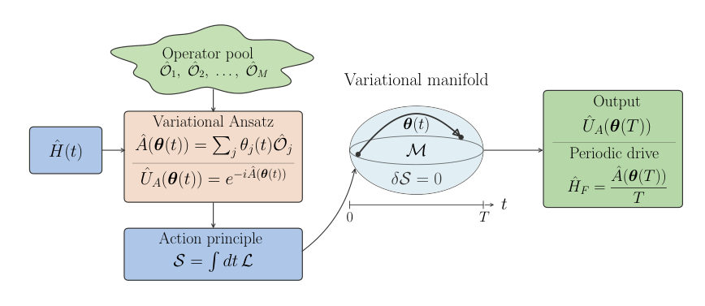 
Figure 1: Schematic illustration of the variational framework. Given a time-periodic Hamiltonian ˆH(t) and a physically motivated pool of operators { ˆOj}, we construct a variational ansatz ˆUA(θ(t)) = e−i ˆ A(θ(t)). The action S is optimized to obtain the equations of motion for the variational parameters θ(t). After numerical integration yields the approximate propagator ˆUA(θ(T)) = e−i ˆ A(θ(T )). If the Hamiltonian is periodic, ˆH(t + T) = ˆH(t), the Floquet Hamiltonian is extracted as ˆHF = ˆA(θ(T))/T

📷 Fig 2

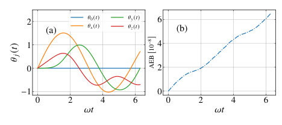 
Figure 2: (a) Variational parameters for the Rabi model using the ansatz in Eq. (61). Only θx(t) and θz(t) survive at the end of the period T = 2π/ω. (b) The accumulated error bound (AEB), defined as R T 0 dt ϵ(t), where ϵ(t) is the local error rate (39). Parameters: κ/ω = 1.5, and ω0/ω = 1.

📷 Fig 3

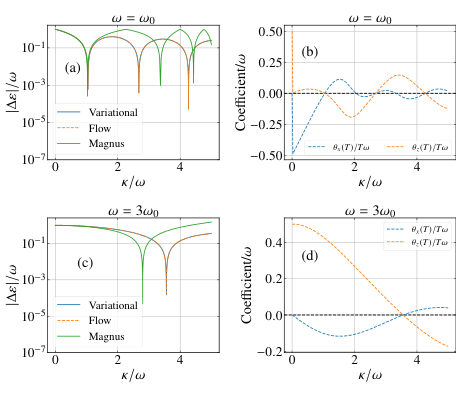 
Figure 3: (a) A comparison of the quasi-energy gap (in units of ω) for the Rabi model obtained via the variational method, the flow equation approach and the third order Magnus expansion as a function of κ/ω for the resonant case ω = ω0 showing multiple peaks at specific values of the drive κ/ω where the gap vanishes. (b) The coefficients of the Floquet Hamiltonians obtained via the variational approach as functions of κ/ω for the resonant case. (c,d) same as (a,b) but with ω = 3ω0 (non-resonant regime).

📷 Fig 4

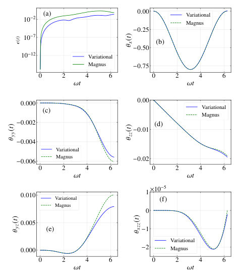 
Figure 4: (a) The local error rate ϵ(s) (39), for the LMG model Eq. (67) as a function of ωt for third-order Magnus expansion and the variational approach using the basis operators appearing in the truncated Magnus series. (b-f) Variational parameters as functions of ωt compared with the corresponding Magnus coefficients. Parameters: J/ω = h/ω = 0.2, N = 100.

📷 Fig 5

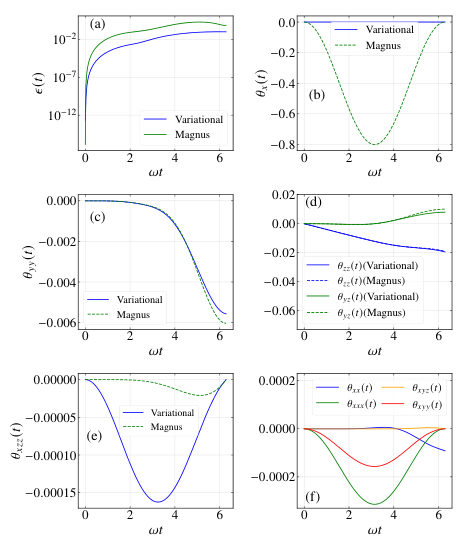 
Figure 5: (a) A plot of the local error rate ϵ(s) (39), for the LMG model (Eq.(67)) as a function of ωt for both third order Magnus expansion and the variational approach using the full pool basis operators up to cubic order in spin operators. (b,c,d,e,f) Plots of the variational parameters as functions of ωt and comparing them with the corresponding coefficients from Magnus series. Parameters: J/ω = h/ω = 0.2, N = 100.

**Summary.** The paper introduces a variational framework to accurately approximate the time evolution of quantum systems, particularly those subjected to periodic driving (Floquet systems). By minimizing an action principle on a constrained operator manifold, it derives effective Floquet Hamiltonians that surpass the accuracy limits of standard Magnus expansions. This method offers a versatile and scalable tool for non-equilibrium quantum dynamics across various physical models.

**Why it may be interesting.** This work provides a powerful, non-perturbative tool for analyzing open quantum systems and periodically driven matter. Its ability to systematically improve accuracy over standard expansions makes it highly valuable for simulating complex dynamics in condensed matter or AMO settings where high precision is required.

Detailed structure

**Main problem.** The primary goal is to develop a systematic variational framework for approximating the time-evolution operator of general time-dependent quantum systems, with a specific focus on deriving effective Floquet Hamiltonians for periodically driven systems.

**Main result.** The proposed variational method yields an effective Floquet Hamiltonian that is systematically more accurate than low-order Magnus expansions, especially in regimes where conventional methods fail to converge.

**Method.** It reformulates quantum dynamics using a variational principle applied to the action integral over a parameterized operator manifold. This leads to solving coupled ordinary differential equations (ODEs) for the variational parameters.

**Model / system.** The framework is general, applying to any time-dependent Hamiltonian H(t). Benchmarking was performed on specific models like the driven Rabi model and the driven Ising chain, which are representative of periodically driven quantum systems.

**Key observables.** The effective Floquet Hamiltonian (H_F) and the variational parameters {theta_j(t)} that define the approximate time-evolution operator U(t).

**Important parameters / regimes.** Period T (for periodic driving), the size of the chosen operator manifold M, and the convergence behavior relative to the Magnus expansion order.

**Assumptions / limitations.** The method assumes the existence of a physically motivated, finite-dimensional operator manifold spanned by $\{\hat{O}_j\}$ that can parameterize the time evolution. The accuracy depends on the completeness of this chosen basis set.

**Figures summary.** Figure 1 schematically illustrates the entire variational framework, mapping from input Hamiltonian H(t) and basis operators to the output effective Floquet Hamiltonian H_F.

**Paper structure.** The paper introduces the variational action principle for U(t), derives the coupled ODEs governing the parameters on the operator manifold, details how this approach scales by projecting dynamics onto the low-dimensional operator space, and benchmarks the method against established techniques like the Magnus expansion and flow equations using specific physical models.

Abstract

We introduce a variational framework for approximating the time-evolution operator $\hat{U}(t)$ within a physically motivated operator manifold, reformulating quantum dynamics as a tractable problem in operator space using stationary action principle. For periodically driven systems, the resulting approximate evolution operator directly yields an effective Floquet Hamiltonian, offering a non-perturbative alternative to conventional expansion-based methods. The framework is systematically improvable by enlarging the operator pool and naturally incorporates symmetries and physical constraints. When the operator manifold is chosen from the terms of a truncated Magnus expansion, the variational procedure effectively resums the Magnus series within the restricted space, significantly enhancing accuracy. We benchmark the approach on the driven Rabi model, the driven Lipkin-Meshkov-Glick model, and the one-dimensional driven Ising chain, yielding effective Floquet Hamiltonians that are systematically more accurate than low-order Magnus expansions, particularly in regimes where the latter converge poorly, and illustrating applicability to systems with exponentially large Hilbert spaces. Although we focus here on Floquet systems, the formalism applies equally to generic time-dependent Hamiltonians, providing a versatile tool for non-equilibrium quantum dynamics.

[↑ back to top](#top)

### [Bell violation with path-entangled number states under realistic detection](http://arxiv.org/abs/2607.29012v1)

**Authors:** Christoph F. Wildfeuer  
**Type:** theory · **Category:** quantum information and computing · **PDF:** <https://arxiv.org/pdf/2607.29012v1>  
**Analysis basis:** full PDF text, analyzed in chunks
**Topic relevance:** `quantum measurements` **3/5** · `quantum optics experiment` **3/5** · `correlated / nonlocal dissipation` **2/5** · `entanglement & information structure` **2/5** · `measurement-induced transitions` **2/5** · `QC/QI experiment` **1/5** · `driven-dissipative phase transition` **1/5** · `interference shaping light` **1/5**

📷 Fig 1

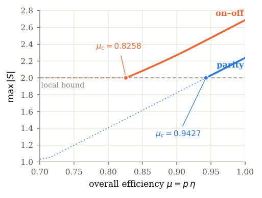 
FIG. 1. Maximum CHSH value for the state of Eq. (1) against overall efficiency µ = pη, with no dark counts, perfect mode overlap and no phase noise. Dotted below threshold. The on–off curve saturates at the local bound rather than falling through it because a large local oscillator makes that detector click deterministically, reproducing |S| = 2. Parity has no such trivial setting for 0 &lt; µ &lt; 1, and its curve therefore falls below the local bound.

📷 Fig 2

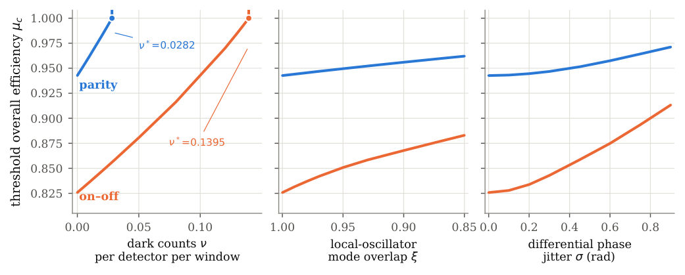 
FIG. 2. Threshold overall efficiency for a CHSH violation with N = 1 as each remaining imperfection is switched on, from the full complex search. The dark-count curves rise vertically at ν∗= 0.0282 for parity, the closed form of Eq. (20), and at 0.1395 for on–off, found numerically; beyond these no efficiency suffices. Note the different horizontal scales: mode overlap runs right to left, so that all three panels degrade to the right.

📷 Fig 3

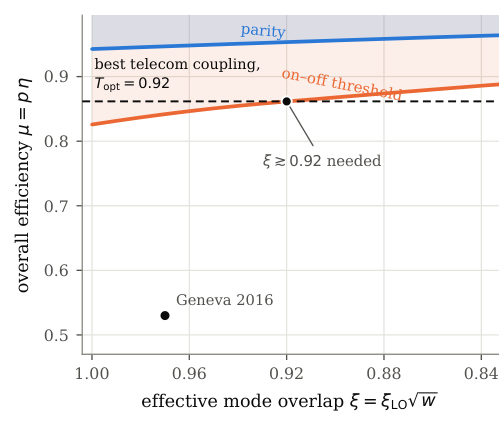 
FIG. 3. The frontier the experiment has to cross. Shaded regions violate, on–off below and parity above. The hori- zontal axis is the effective overlap of Eq. (11), which carries the heralded photon’s single-mode weight as well as the local oscillator’s mode match; it runs right to left, so both axes degrade downward and to the right. The dashed line is the overall efficiency reachable with the best demonstrated tele- com coupling [75] and a buildable station, µ = 0.862, and it crosses the on–off contour at ξ = 0.92. The Geneva apparatus [77] is plotted at its own reported efficiency and overlap.

**Summary.** This paper rigorously analyzes the feasibility of violating Bell inequalities using path-entangled single photons under realistic experimental constraints. By modeling losses, dark counts, and component mismatches, the authors show that simple on-off detection is more robust than parity measurements for this task. Ultimately, they conclude that the primary bottleneck for demonstrating nonlocality is achieving high mode overlap between optical components rather than overcoming fundamental efficiency limits.

**Why it may be interesting.** This work is highly relevant as it bridges fundamental quantum foundations (Bell tests) with practical quantum optics engineering challenges (loss, mode matching), providing concrete metrics for future experiments in quantum communication and metrology.

Detailed structure

**Main problem.** The paper addresses whether a single photon delocalized over two modes (path-entangled number states) can violate a Bell inequality under realistic, lossy experimental conditions.

**Main result.** The authors find that the CHSH threshold is more easily met using simple on-off detection compared to parity measurements, and the primary obstacle shifts from conceptual efficiency limits to achieving high mode overlap between components.

**Method.** They provide closed correlators for N00N states accounting for realistic imperfections like loss, dark counts, and mode mismatch, analyzing the CHSH value as a function of these parameters.

**Model / system.** The system involves path-entangled number states (N00N states) tested via measurements that require an active displacement operation ($\hat{D}(\alpha)$) to escape limitations imposed by particle-number superselection rules.

**Key observables.** CHSH value ($|S|$), detection efficiency ($\eta$), and the required mode overlap between components.

**Important parameters / regimes.** The threshold efficiencies for violation are calculated (e.g., 0.83 for on-off vs. 0.95 for parity); the critical parameter becomes the achievable mode overlap, which must be $\approx 0.92$.

**Assumptions / limitations.** The analysis assumes that a shared phase reference provided by a local oscillator is necessary to close conceptual loopholes regarding Bell violations.

**Paper structure.** The paper first establishes the theoretical necessity of a shared phase reference. It then derives closed correlators for N00N states under various realistic loss channels, comparing the robustness of on-off versus parity measurements to determine the most viable experimental scheme.

Abstract

A single photon delocalised over two modes is entangled, and whether that entanglement can violate a Bell inequality has been disputed for three decades. In principle it is settled: the surviving objection was the absence of a shared phase reference, and a local oscillator supplies one, acting as a shared frame rather than as a measurement setting. In practice it is open, and what remains is a question about the apparatus. Loss does not spoil a parity measurement so much as rescale it, carrying it into the same one-parameter family of detector operators that already contains on--off detection. Within that family we give closed correlators for path-entangled number states, or N00N states, at arbitrary efficiency, with dark counts, mode mismatch, phase noise and upstream loss. Because loss and displacement commute up to a rescaling of the displacement amplitude, loss before and after the displacement is interchangeable, and a symmetric experiment is governed by one overall efficiency: the probability that a heralded photon is detected. For a single photon the Clauser--Horne--Shimony--Holt threshold on that efficiency is 0.83 with on--off detection and 0.95 with parity, so the scheme that needs no photon-number resolution is the more robust, by twelve percentage points of loss and a factor of five in tolerable dark counts. Efficiency is no longer the obstacle; the mode overlap is. The best demonstrated telecom coupling, a buildable interferometer and today's detectors give an overall efficiency of 0.86, at which the required overlap is 0.92. We show that this overlap carries the heralded photon's single-mode weight as well as the local oscillator's mode match, so buying more of it costs heralding efficiency --- and no source has reported the two together.

[↑ back to top](#top)

### [Boundary Kerr Signatures of the Interband-Coherence Hall Effect](http://arxiv.org/abs/2607.29424v1)

**Authors:** Ivan Iorsh, Mikhail Titov  
**Type:** theory · **Category:** other · **PDF:** <https://arxiv.org/pdf/2607.29424v1>  
**Analysis basis:** full PDF text, analyzed in chunks
**Topic relevance:** `Keldysh / 2PI / non-Gaussian methods` **3/5** · `non-equilibrium dynamics` **3/5** · `methods for driven-dissipative` **2/5** · `spintronics-quantum-optics interface` **2/5** · `analog quantum simulation` **1/5** · `correlated / nonlocal dissipation` **1/5** · `driven-dissipative phase transition` **1/5** · `interference shaping light` **1/5** · `non-equilibrium universality` **1/5**

📷 Fig 1

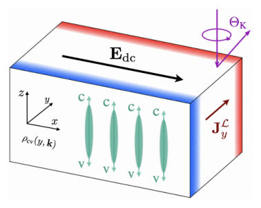 
FIG. 1. Boundary conversion of interband-coherence flow into a Kerr signal. Near-gap light propagating along z creates the conduction–valence coherence ρcv. The dc field Edcˆx drives its transverse flux JL y toward the side walls. The boundary normal ±ˆy converts this flux into opposite helicity- odd edge polarizations, which rotate the reflected polarization by ΘK. The response is bilinear in the optical and dc fields and is not a spin or orbital population accumulation.

📷 Fig 2

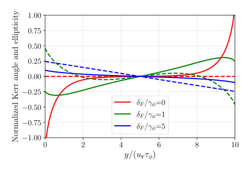 
FIG. 2. Coherent edge propagation revealed by optical detuning. Normalized Kerr angle (solid lines) and elliptic- ity (dashed lines) profiles are shown versus distance. The resonant signal decays monotonically, whereas detuning gives the propagation length in Eq. (15) an imaginary part and pro- duces damped sign changes. Such oscillations are absent from a purely relaxational spin-diffusion profile. The slab thickness W = 10 uFτϕ.

📷 Fig 3

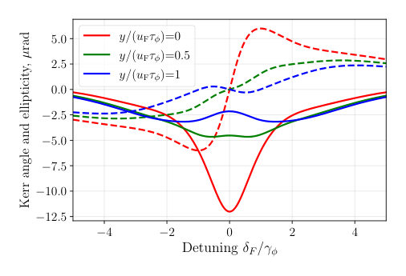 
FIG. 3. Resonantly enhanced Kerr (solid lines) and el- lipticity (dashed lines) response in narrow-gap InSb. Kerr rotation and ellipticity in the vicinity of the side wall are plotted versus detuning for kF = 108 m−1, Edc = 10 mV µm−1, T &lt; 10 K, and the illustrative for the dephasing time τϕ = γ−1 ϕ = 1 ps, which is a very conservative estimate. The line shapes follow from the complex susceptibility: rota- tion is predominantly absorptive near resonance, while ellip- ticity changes sign across it.

📷 Fig 4

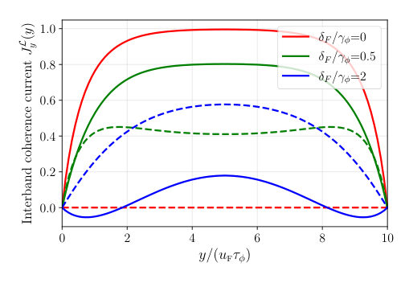 
FIG. 4. Boundary suppression and phase rotation of the interband-coherence flux. Real and imaginary parts of JL y are shown by solid and dashed lines, respectively, for three values of δF/γϕ. The coordinate is measured in units of the relative conduction–valence dephasing length uFτϕ tak- ing the slab width as W = 10 uFτϕ. The coherence flux is normalized to its resonant bulk value. Diffuse boundary con- ditions enforce JL y = 0 at both walls. At resonance the current recovers monotonically toward its bulk value, whereas finite detuning produces a spatial phase rotation and sign changes. The flux is always even with respect to the slab center; its gradient generates the antisymmetric...

**Summary.** This theoretical work establishes a direct method—dc-driven Kerr microscopy—to probe an interband-coherence Hall effect in semiconductors. It shows that applying a DC field generates a transverse coherence flux, which manifests as a measurable, edge-localized polarization signal at physical boundaries. This mechanism is fundamentally distinct from traditional spin or orbital effects.

**Why it may be interesting.** While focused on solid-state transport, the rigorous derivation of coherence dynamics and its coupling to boundary effects mirrors complex open quantum system problems where boundary conditions dictate observable macroscopic responses.

Detailed structure

**Main problem.** The study identifies a novel Hall response mechanism driven by optically induced interband coherence, distinct from conventional non-equilibrium band population effects.

**Main result.** A dc electric field drives a transverse flux of conduction-valence coherence, which is converted into an antisymmetric, edge-localized Kerr signal at boundaries. This effect requires no spin-orbit coupling or intra-band accumulation.

**Method.** The analysis involves deriving and solving boundary kinetic equations for the interband coherence density and flux using the eight-band Kane model framework.

**Model / system.** The system is a weakly doped zinc-blende semiconductor, modeled using the eight-band Kane Hamiltonian. The dynamics are governed by coupled drift-diffusion equations describing the evolution of optical coherence.

**Key observables.** Kerr signal ($\Theta_K$, $\eta_K$), interband coherence flux ($J_L^y$), and coherence density ($L$).

**Important parameters / regimes.** Optical detuning ($\delta_F$), interband dephasing length ($\ell_\phi$), electron–hole asymmetry, and semiconductor band gap structure.

**Assumptions / limitations.** The analysis relies on a two-moment closure approximation for the coherence dynamics; specific boundary conditions (diffusive/specular) are applied to model reflection at interfaces.

**Figures summary.** Figures illustrate the conversion of interband coherence flow into an edge Kerr signal, showing monotonic resonance profiles and damped spatial oscillations away from resonance due to detuning.

**Paper structure.** The paper progresses by establishing the physical mechanism (coherence flux driven by DC field), deriving the necessary kinetic equations using the Kane model, solving these equations under boundary conditions, and finally analyzing the resulting spectral and spatial dependence of the Kerr signal.

Abstract

We identify a Hall response carried by optically induced interband coherence rather than by a non-equilibrium band population. In a weakly doped zinc-blende semiconductor, a longitudinal dc field drives a transverse flux of the conduction--valence coherence created by near-gap light. Angular averaging eliminates the homogeneous coherence density, while a lateral boundary converts the transverse flux into an antisymmetric, edge-localized, helicity-odd polarization. The resulting Kerr signal requires neither spin-orbit coupling nor a spin, valley, or orbital accumulation within an individual band. Within the eight-band Kane model, we derive the boundary kinetic equation and obtain a complex propagation length controlled by optical detuning and interband dephasing. The edge profile is monotonic at optical resonance and develops damped spatial oscillations away from it. The response is enhanced by electron--hole asymmetry and by strong interband mixing, making narrow-gap semiconductors especially favorable to observe the effect. These results establish dc-driven Kerr microscopy as a direct probe of an interband-coherence Hall effect and of multiband quantum kinetics in real space.

[↑ back to top](#top)

### [Cascading amplifiers can create exponentially large coherence](http://arxiv.org/abs/2607.28716v1)

**Authors:** Lucas A. Ostrowski, Giacomo Pantaleoni, Howard M. Wiseman, Dominic W. Berry  
**Type:** theory · **Category:** other · **PDF:** <https://arxiv.org/pdf/2607.28716v1>  
**Analysis basis:** full PDF text, analyzed in chunks
**Topic relevance:** `Keldysh / 2PI / non-Gaussian methods` **3/5** · `methods for driven-dissipative` **3/5** · `correlated / nonlocal dissipation` **2/5** · `driven-dissipative phase transition` **2/5** · `non-equilibrium dynamics` **2/5** · `interference shaping light` **1/5** · `non-equilibrium universality` **1/5** · `superradiant laser` **1/5**

📷 Fig 1

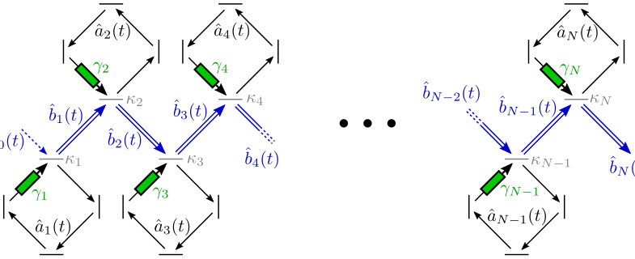 
FIG. 1. A system of 𝑁cascaded linear amplifiers. The 𝑗-th amplifier supports an internal mode with corresponding annihilation operator ̂𝑎𝑗(𝑡), with a linear gain component of rate 𝛾𝑗and a loss of rate 𝜅𝑗. The loss is responsible for the coupling between this internal field and the external input and output fields depicted with blue arrows. Respectively, these input and output fields have annihilation operators ̂𝑏𝑗−1(𝑡) and ̂𝑏𝑗(𝑡).

📷 Fig 2

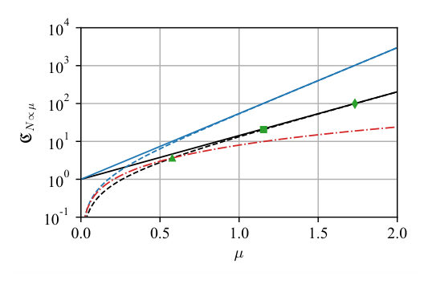 
FIG. 2. Coherence, given by Eq. (33), plotted as a function of 𝜇for a 𝑁= 1 (triangle), 𝑁= 2 (square), and 𝑁= 3 (diamond) amplifier chain, with 𝜇/𝑁= 1/ √

📷 Fig 3

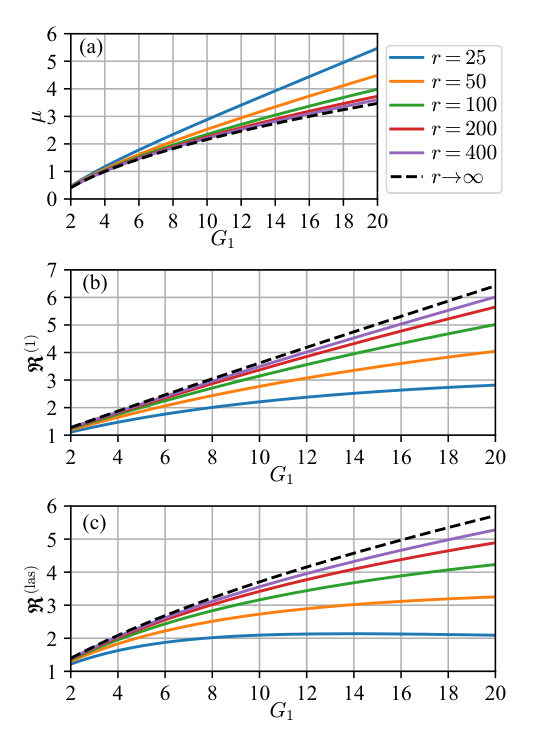 
FIG. 3. (a) Photon number vs gain 𝐺1 for a two-amplifier cascade [Eq. (53)]. (b) Performance ratio of the two-amplifier cascade and a single linear amplifier [Eq. (61a)]. (c) Performance ratio of the two-amplifier cascade and an ideal laser model [Eq. (61a)]. Here, we have set 𝐺2 = 𝐺1, and different curves correspond to different choices for the value of 𝑟.

📷 Fig 4

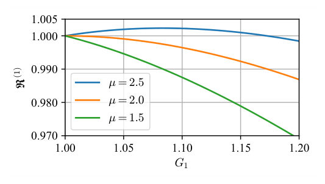 
FIG. 4. Performance ratio [Eq. (63)] against gain 𝐺1 with 𝑟= 2. Three values for 𝜇are chosen; 𝜇= 2 is the threshold value given in Eq. (65) for this value of 𝑟.

📷 Fig 5

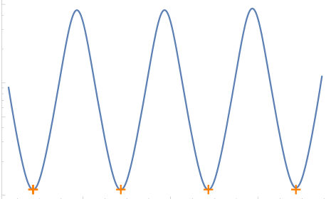 
FIG. 5. The value of ((𝑀/𝑆)2 −1)/2 as a function of 𝜅𝜏, for 𝑟= 104, 𝛾𝑗/𝜅𝑗= 0.9, and 𝑁= 4. The plusses show the predicted minima from theory, with the values of 𝑚being 4 to 1 from left to right.

**Summary.** The paper proposes that the coherence of light beams can be dramatically increased beyond standard theoretical limits ($\mu^2$ or $\mu^4$) by arranging multiple linear amplifiers in a cascade. By circumventing strict idealization assumptions, this cascaded structure allows for an exponential scaling of coherence with respect to the total excitation number. The methodology relies on advanced quantum noise analysis using Langevin equations and power spectra.

**Why it may be interesting.** This work is highly relevant for theoretical physicists working on open quantum systems and quantum optics, as it provides a concrete mechanism (cascading amplifiers) to violate established coherence bounds by relaxing idealized physical constraints. The use of advanced spectral analysis techniques is also valuable.

Detailed structure

**Main problem.** The primary goal is to surpass the known upper bounds on optical coherence ($\mathcal{C}$) achievable by standard laser beams.

**Main result.** By utilizing a cascade of linear amplifiers, the coherence $\mathcal{C}$ can theoretically scale exponentially with the total source excitation number $\mu$, specifically $\mathcal{C} \propto \exp(4\mu)$.

**Method.** The analysis employs quantum Langevin equations and power spectrum techniques in the frequency domain to track the evolution of field operators through cascaded cavities.

**Model / system.** The system modeled is a cascade of $N$ phase-insensitive single-mode linear amplifiers, where each amplifier's output feeds unidirectionally into the next. The analysis focuses on the subthreshold regime ($\gamma_j < \kappa_j$).

**Key observables.** Coherence ($\mathcal{C}$), defined via Glauber coherence functions; Mean Photon Number ($\mu$); and the expectation value $\langle \hat{S} / \sqrt{\hat{S}^\dagger \hat{S}} 
angle$.

**Important parameters / regimes.** The number of amplifiers ($N$), the total source excitation number ($\mu$), and the individual amplifier gain/coupling rates ($\kappa_j, \gamma_j$).

**Assumptions / limitations.** Crucially, the approach requires dropping the 'Glauber Ideality' condition that limits standard laser coherence scaling. The analysis also relies on linearizing the dynamics using Gaussian noise assumptions.

**Figures summary.** The notes do not provide a summary of figures, but they detail mathematical derivations involving power spectra and special functions (hypergeometric/Bessel).

**Paper structure.** The paper progresses from establishing standard laser coherence limits ($\mu^2$ or $\mu^4$) to proposing the cascaded amplifier model. It then uses quantum Langevin equations and spectral analysis to derive the scaling law, culminating in complex mathematical evaluations of expectation values.

Abstract

A standard laser beam has photon degeneracy, or coherence, $\mathfrak{C}$, of at most $8μ^2$, where $μ$ is the number of photons in the laser itself. Even quantum-engineered lasers, if required to produce a beam with the standard statistical properties, have limited coherence, scaling as $μ^4$. Moreover, such lasers (still unrealised) require very unconventional gain and output-coupling mechanisms. Here, we propose a different path to increasing $\mathfrak{C}$: cascaded linear amplifiers, with conventional couplings. By dropping the requirement on the beam's properties, this approach can, in theory, achieve $\mathfrak{C}$ scaling exponentially in $μ$. Here $μ$ is the total source excitation number, across all the amplifiers. Two amplifiers suffice to surpass the standard $μ^2$ scaling.

[↑ back to top](#top)

### [Covariance-Driven Momentum Rectification at Liquid-Vapor Interfaces Near Wetting Transitions](http://arxiv.org/abs/2607.28938v1)

**Authors:** Nelson Bolívar, Gabriel Abellán, Ivaylo Vasilev  
**Type:** theory · **Category:** statistical mechanics · **PDF:** <https://arxiv.org/pdf/2607.28938v1>  
**Analysis basis:** full PDF text, analyzed in chunks
**Topic relevance:** `driven-dissipative phase transition` **3/5** · `methods for driven-dissipative` **3/5** · `non-equilibrium dynamics` **3/5** · `non-equilibrium universality` **2/5** · `Frenkel-Kontorova` **1/5** · `Keldysh / 2PI / non-Gaussian methods` **1/5** · `analog quantum simulation` **1/5** · `correlated / nonlocal dissipation` **1/5**

📷 Fig 1

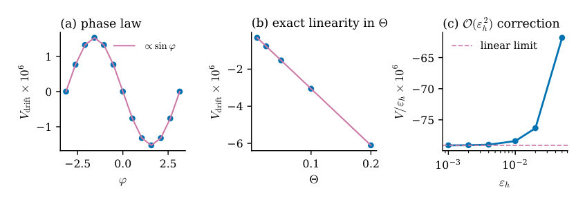 
FIG. 1. Numerical drift law. The phase dependence is a pure sine, the response is linear in the

📷 Fig 2

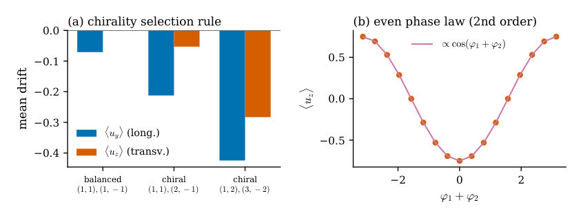 
FIG. 2. Transverse rectification in chiral patterns. A balanced pattern nulls the transverse channel,

📷 Fig 3

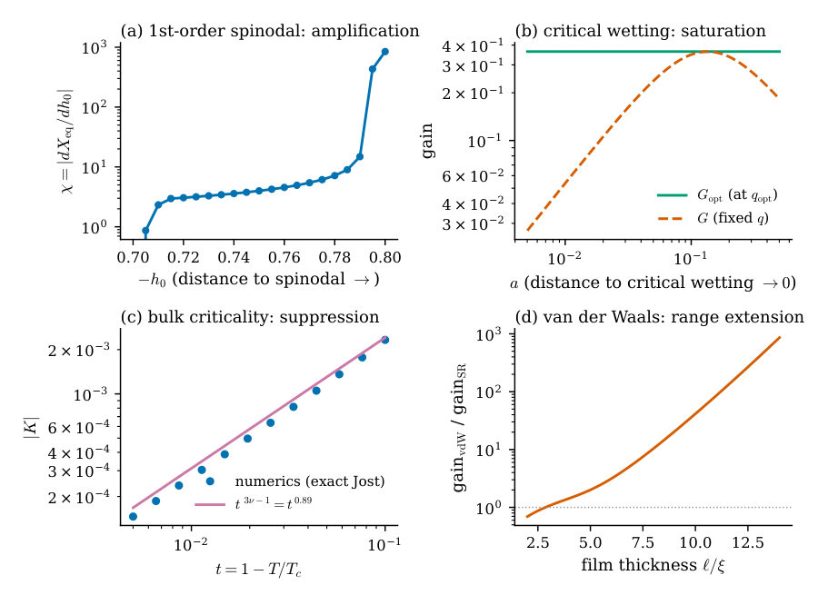 
FIG. 3. Gain ranking from the numerical calculations. Exploitable amplification is organized by a

📷 Fig 4

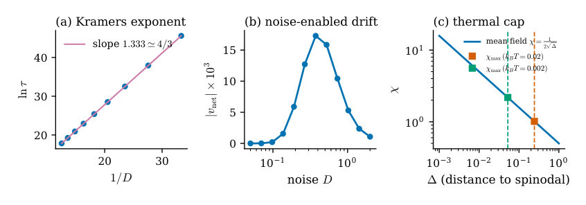 
FIG. 4. Noise as both cap and fuel. Kramers escape caps spinodal amplification, while sub-threshold

**Summary.** This work develops a comprehensive, symmetry-constrained continuum model to explain how zero-mean external forcing can generate net directional motion at liquid-vapor interfaces. It achieves this by rigorously accounting for momentum transfer across multiple interacting physical channels, demonstrating that the rectification strength is dictated by the correlation between local response and the applied drive.

**Why it may be interesting.** While focused on classical fluid dynamics, the rigorous application of momentum balance and the identification of non-equilibrium driving forces via correlation terms ($\langle Mf
angle-\langle M
angle\langle f
angle$) provides a powerful theoretical framework applicable to open quantum systems where symmetry breaking drives directed current.

Detailed structure

**Main problem.** The paper investigates how directed transport (momentum rectification) can arise from zero-mean, unbiased external forcing when the physical medium exhibits spatially structured responses and broken symmetries.

**Main result.** Rectified momentum transfer is governed by a symmetry-constrained accounting scheme based on covariance terms ($\langle Mf
angle-\langle M
angle\langle f
angle$), showing specific phase selection rules and bounded gain near wetting transitions.

**Method.** The authors develop and apply a conservative continuum model rooted in local momentum conservation, treating the system as a ledger of interacting reservoirs (e.g., thermal, electro-ionic, interface).

**Model / system.** The primary physical system is a liquid-vapor interface near wetting transitions, modeled using diffuse-interface methods and coupled to various continuum fields like temperature gradients and wall interactions.

**Key observables.** Directed drift velocity ($U$), the covariance term ($\langle Mf
angle-\langle M
angle\langle f
angle$), and the wetting susceptibility ($\chi$).

**Important parameters / regimes.** Wetting susceptibility, thermal amplitude ($\Theta$), heterogeneity amplitude ($\epsilon_h$), and system criticality (first-order spinodal vs. critical point).

**Assumptions / limitations.** The result is presented as a diagnostic accounting scheme; the model requires explicitly identifying all compensating momentum channels for validity.

**Figures summary.** Figures illustrate the phase dependence of the drift law, show that chiral patterns are necessary for transverse rectification, and compare gain factors across different wetting critical regimes (spinodal peak vs. saturation).

**Paper structure.** The paper establishes the general principle using momentum conservation accounting, derives the specific drift law via covariance analysis in a diffuse-interface model, analyzes how wetting susceptibility modulates this transport near various critical points, and concludes by summarizing the necessary symmetry constraints for any rectified force.

Abstract

Zero-mean forcing can generate directed transport when a medium responds in a spatially structured way and the relevant symmetries are broken. Liquid-vapor interfaces are a useful setting for this problem because surface-tension gradients, wetting dynamics, vapor exchange, capillary and acoustic waves, electro-ionic screening, thermal noise, and boundary compliance can all carry momentum. We develop a conservative continuum model in which the central object is the covariance between a local response field and a zero-mean tangential drive, $\langle Mf\rangle-\langle M\rangle\langle f\rangle$, embedded in an explicit momentum ledger. In a minimal diffuse-interface realization, this covariance gives the phase-selective drift law $U\proptoε_hΘ\sin\varphi$ for a Marangoni-driven liquid-vapor interface above a structured wall, with exact nulls when the symmetry is restored. Wetting susceptibility then acts as a bounded gain factor: first-order spinodal conditions provide the useful amplification regime, critical wetting saturates because interfacial unbinding removes the short-range drive, and bulk criticality suppresses the channel as the interface disappears. Additional reservoirs - phase change, waves, thermal transport, electro-ionic coupling, compliance, and fluctuations - are treated as compensating channels to be isolated by sign reversals, scaling laws, and budget closure. The result is neither a new microscopic force nor an apparatus-level claim, but a symmetry-constrained accounting scheme for rectified momentum transfer in water-based interfacial systems. Reduced numerical calculations illustrate the phase-selection rules, bounded spinodal gain, momentum-budget closure, transverse chirality, and grid convergence.

[↑ back to top](#top)

### [Entropy production of active matter systems as indicator for computing performance](http://arxiv.org/abs/2607.29434v1)

**Authors:** Patrick Egenlauf, Hannes A. Kröninger, Arnulf Kung, Mario U. Gaimann, Miriam Klopotek  
**Type:** theory · **Category:** statistical mechanics · **PDF:** <https://arxiv.org/pdf/2607.29434v1>  
**Analysis basis:** full PDF text, analyzed in chunks
**Topic relevance:** `driven-dissipative phase transition` **3/5** · `methods for driven-dissipative` **3/5** · `non-equilibrium dynamics` **3/5** · `non-equilibrium universality` **2/5** · `Frenkel-Kontorova` **1/5** · `Keldysh / 2PI / non-Gaussian methods` **1/5** · `correlated / nonlocal dissipation` **1/5** · `entanglement & information structure` **1/5**

📷 Fig 1

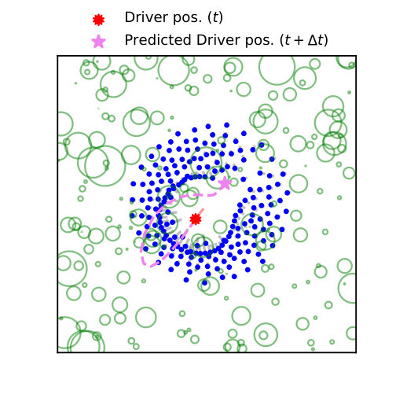 
FIG. 1: Representative snapshot of the swarm reservoir setup. Blue dots are agents (n = 200), the red dot is the predator (input) and green circles show Gaussian readout kernels (centers cm and widths σm). The linear readout is trained to predict the predator position at t + ∆t (pink star).

📷 Fig 2

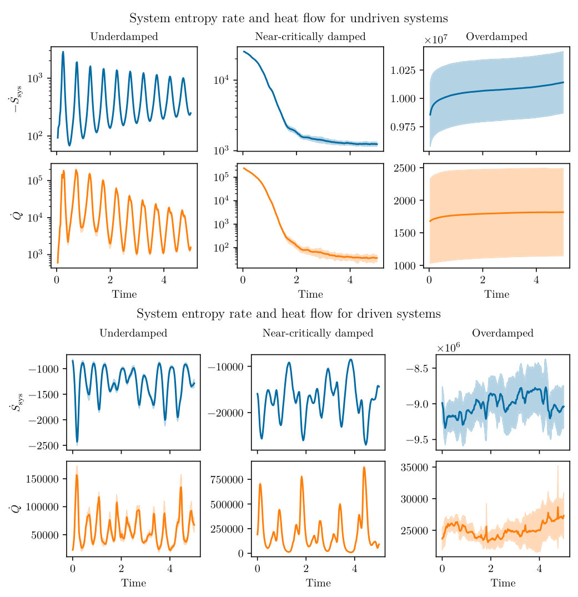 
FIG. 2: Time series of the system entropy rate and heat flow for the undriven and driven system for different regimes (see Tab. II). For the undriven system, the first 104 steps are not discarded as burn-in to show the relaxation dynamics. Only the first two steps are removed to avoid the initial condition biasing the plot. The solid lines represent the mean EP rate over the different seeds, hence different initial conditions, and the shaded regions represent the standard deviation. The system entropy is negative for all three regimes. The difference in the dynamics of the three regimes is clearly visible in the system entropy rate and the heat flow.

📷 Fig 3

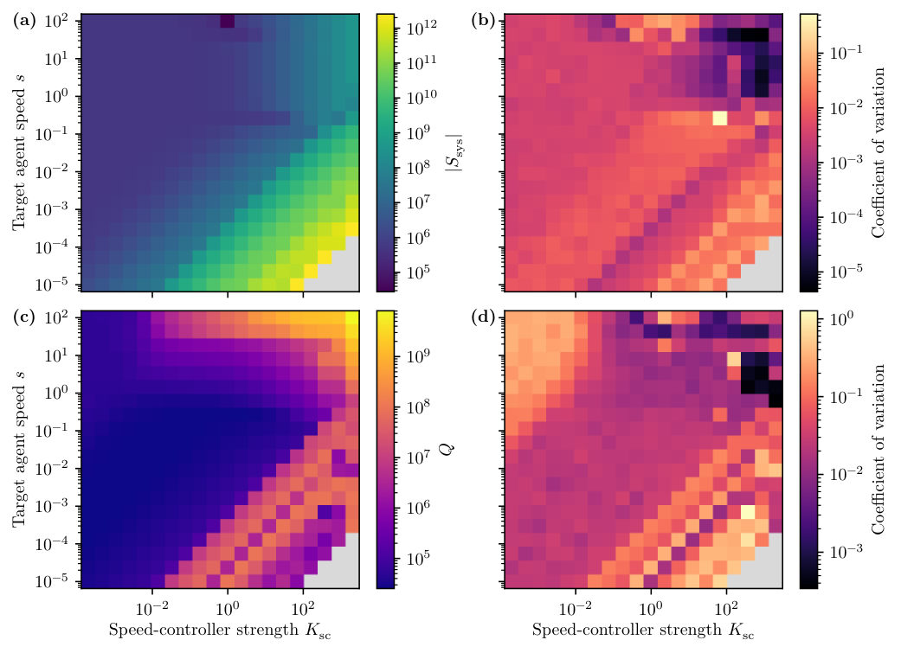 
FIG. 3: System entropy and transferred heat for the undriven system across the parameter scan of the speed controller force (Eq. (10d)) and the corresponding coefficient of variation. Gray areas indicate crashed simulations due to extreme parameter configurations. The system entropy is negative for all parameter configurations except one, hence the color bar indicates the absolute value of the system entropy.

📷 Fig 4

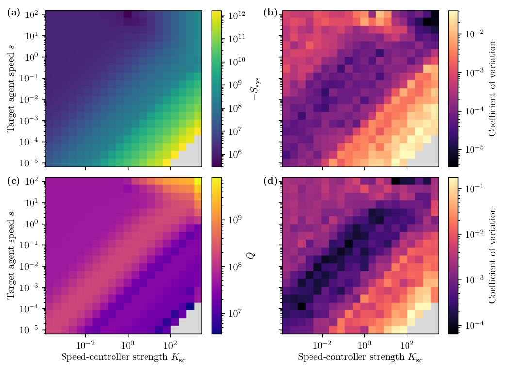 
FIG. 4: System entropy and transferred heat for the driven system across the parameter scan of the speed controller force (Eq. (10d)) and the corresponding coefficient of variation. Gray areas indicate crashed simulations due to extreme parameter configurations. The system entropy is negative for all parameter configurations, hence the color bar indicates the negative of the system entropy.

📷 Fig 5

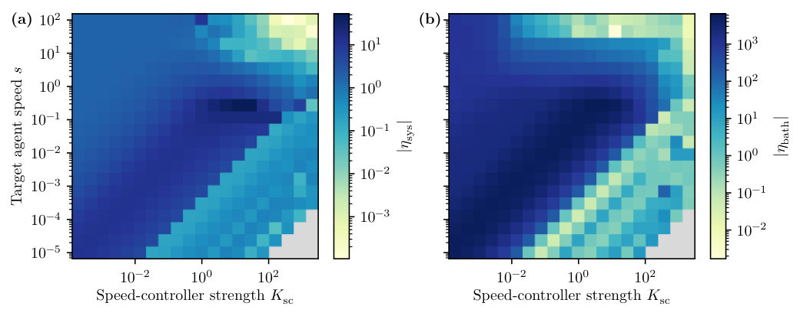 
FIG. 5: Relative difference between the driven and undriven case for the (a) system entropy and (b) transferred heat across the parameter scan of the speed controller force (Eq. (10d)). Gray areas indicate crashed simulations due to extreme parameter configurations.

**Summary.** This paper investigates if entropy production can predict the computational power of active matter systems. By analyzing a driven swarm model, the authors find that peak performance coincides with specific regimes characterized by strong dissipation and predictable thermodynamic responses. The work establishes EP as a potentially robust, task-agnostic metric for assessing physical computing substrates.

**Why it may be interesting.** It provides a concrete framework for using non-equilibrium thermodynamics (like EP) as a diagnostic tool to characterize information processing capacity in complex physical systems, which has implications for understanding energy efficiency in computation beyond standard quantum models.

Detailed structure

**Main problem.** The study addresses whether entropy production (EP), a measure of thermodynamic irreversibility, can serve as a predictive indicator for the computational performance of physical systems.

**Main result.** Dynamical regimes exhibiting peak computational performance correlate strongly with those showing strong dissipation and robust thermodynamic responses. Driver work and relative differences in EP closely mirror the system's performance landscape.

**Method.** The authors calculate system entropy production (from phase-space contraction) and bath entropy production (from heat flow) for a driven active matter model, correlating these metrics against prediction accuracy on tasks like Lorenz-63.

**Model / system.** The research uses a driven swarm reservoir model of active matter, governed by non-Hamiltonian Newtonian equations of motion. The system is analyzed across various driving forces and parameter scans to test the thermodynamic link to computation.

**Key observables.** Entropy Production (System EP, Bath EP), Prediction Performance (on Lorenz-63 task), Driver Work, Dissipation levels.

**Important parameters / regimes.** Force parameters, dissipation strength, coupling between innate dynamics and driven heat transfer.

**Assumptions / limitations.** The analysis relies on calculating $\dot{S}_{sys}$ via Gibbs entropy and $\dot{S}_{bath}$ from heat flow ($\dot{Q}/T$), despite acknowledging potential inconsistencies with full thermodynamic closure for the non-Hamiltonian system.

**Figures summary.** Not specified, but the notes mention correlation tables (Table V & VI) summarizing Pearson and Spearman correlations between performance metrics and various thermodynamic quantities across different attractors.

**Paper structure.** The paper establishes the conceptual gap between EP and computation, details the calculation of $\dot{S}_{sys}$ and $\dot{S}_{bath}$ for the active matter model, and then systematically compares these derived thermodynamic diagnostics against measured computational performance metrics via parameter scans and correlation analysis.

Abstract

Physical systems can process information through their natural dynamics, offering alternatives to conventional digital computing. Reservoir computing offers a basic framework by using a nonlinear substrate to map inputs into rich dynamical states read out by a simple linear layer. Active matter substrates are striking examples; they continuously consume energy and produce entropy. Theoretically, entropy production (EP) can describe the irreversibility and distance from equilibrium. But it remains unclear whether it can track computational capabilities. We address this conceptual gap by analyzing a driven swarm reservoir model. The system EP is computed from phase-space contraction and the bath EP from heat flow, separately, and put in direct association to prediction performance on a Lorenz-63 task. Via force parameter scans, we show that dynamical regimes with the strongest response to a driver as well as dissipation coincide with peak performance. Therein, the dynamical discrepancy between innate (minimal dissipation) and driven transferred heat (maximal dissipation) is sharpest. Generally, driver work and relative differences of driven and undriven EP closely mirror the performance landscape. The system EP, derived from a generalized Liouville-equation estimator, and heat flow provide complementary diagnostics and metrics, which are most robust in the best-performing regime. These results extend prior expectations that dissipation matters for computation by identifying when and how it becomes predictive. They also relate inference power to innate dynamics, pointing to generic principles for physical computing and where EP offers a screening metric for reservoirs and other base substrates.

[↑ back to top](#top)

### [Unwithered Majorana fermions in the bulk of a quantum chain](http://arxiv.org/abs/2607.29615v1)

**Authors:** Gennady Y. Chitov  
**Type:** theory · **Category:** strongly correlated electrons · **PDF:** <https://arxiv.org/pdf/2607.29615v1>  
**Analysis basis:** full PDF text, analyzed in chunks
**Topic relevance:** `analog quantum simulation` **3/5** · `exotic spin models in light-matter` **3/5** · `driven-dissipative phase transition` **2/5** · `non-equilibrium universality` **2/5** · `Keldysh / 2PI / non-Gaussian methods` **1/5** · `Kondo & dissipative impurity` **1/5** · `entanglement & information structure` **1/5** · `methods for driven-dissipative` **1/5** · `non-equilibrium dynamics` **1/5**

📷 Fig 1

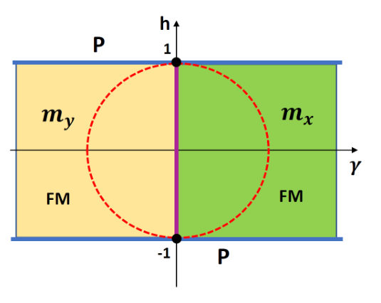 
FIG. 1. The phase diagram of the model on the (γ, h) plane at T = 0. It has three gapped phases: polarized (P) |h| &gt; 1; ferromagnetic (FM) |h| &lt; 1; mx ̸= 0 (γ &gt; 0) and my ̸= 0 (γ &lt; 0). The model is critical (gapless) on the phase boundaries: (i) two infinite lines h = ±1 (dark blue); (ii) segment |h| ≤1 at γ = 0 (magenta). The disorder line is the circle h2 + γ2 = 1 (dashed red).

**Summary.** This theoretical paper analyzes Majorana fermions in a spin chain model, specifically focusing on the behavior when the system parameters place it on a 'disorder line' (DL). The key finding is that while single Majorana modes remain localized at the edges, multi-particle ($n \ge 2$) modes can penetrate deep into the bulk without decaying. This suggests a mechanism for realizing robust topological properties in engineered quantum materials.

**Why it may be interesting.** The study of topological phases like those exhibiting Majorana modes is central to condensed matter theory and quantum computation; understanding how correlations behave at critical points (like the DL) provides insight into robust physical properties.

Detailed structure

**Main problem.** The research aims to investigate Majorana modes within a quantum chain when its parameters are tuned to a specific 'disentangled ground state' occurring on disorder lines (DL).

**Main result.** On the DL, $n$-particle Majorana modes ($n \ge 2$) penetrate into the bulk without attenuation, unlike single modes which remain localized at the ends.

**Method.** The analysis employs the Jordan-Wigner transformation to map the spin Hamiltonian onto a system of Majorana fermions, followed by calculations of various correlation functions in the Majorana representation.

**Model / system.** The physical model is the XY spin chain in transverse field, equivalent to the Kitaev chain when analyzed using Majorana representations. The analysis focuses on its behavior near the disorder line defined by $\gamma^2 + h^2 = 1$.

**Key observables.** Bulk penetration of $n$-particle modes, non-zero and constant correlation functions on the DL, and the superconductivity order parameter ($\mathcal{O}_{	ext{sc}}^2$).

**Important parameters / regimes.** The disorder line (DL) defined by $\gamma^2 + h^2 = 1$, and the number of penetrating Majorana particles ($n \ge 2$).

**Assumptions / limitations.** The analysis is restricted to zero temperature ($T=0$) and focuses on specific factorized ground states $|\Psi_\pm
angle$ constructed on the DL.

**Figures summary.** Figure 1 illustrates the phase diagram, explicitly marking the disorder line (DL) as the circle $h^2 + \gamma^2 = 1$.

**Paper structure.** The paper proceeds by defining the Hamiltonian and transforming it to Majorana fermions. It then analyzes correlation functions ($\langle i b_{m} a_{n} 
angle$) in different regimes, culminating in specific results for the DL where bulk penetration is observed.

Abstract

The proposal is to probe Majorana modes in the system when its parameters are tuned to bring it into a disentangled ground state, which occur on the parametric curves known as disorder lines (DL). In such state certain correlation functions do not depend on separation. The exact results are presented for the XY spin chain in transverse field, also called the Kitaev chain in the Majorana representation. The single Majorana modes are shown to be localized near the ends of the chain, as in the states off the DL, while the disentangled $n$-particle Majorana modes ($n \geq 2$) penetrate into the bulk without attenuation. The predicted bulk-edge effects can be detected in the specially engineered optical chains and lattices.

[↑ back to top](#top)

### [Algebraic Speedups for Exact Inversion of Hamiltonian Evolutions](http://arxiv.org/abs/2607.29382v1)

**Authors:** Jizhe Lai, Mingrui Jing, Erdong Huang, Xin Wang  
**Type:** theory · **Category:** quantum information and computing · **PDF:** <https://arxiv.org/pdf/2607.29382v1>  
**Analysis basis:** full PDF text, analyzed in chunks
**Topic relevance:** `entanglement & information structure` **3/5** · `Tavis-Cummings & cavity-many-emitter` **2/5** · `measurement-induced transitions` **2/5** · `quantum measurements` **2/5** · `analog quantum simulation` **1/5** · `correlated / nonlocal dissipation` **1/5** · `correlated cavity matter` **1/5** · `driven-dissipative phase transition` **1/5** · `non-equilibrium dynamics` **1/5**

📷 Fig 1

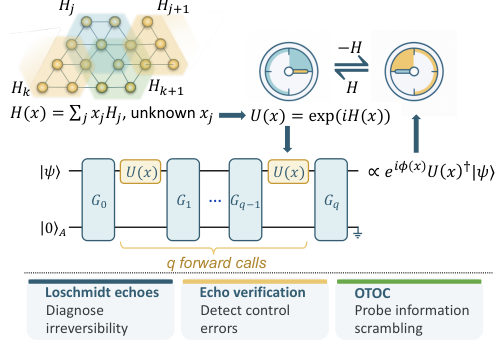 
FIG. 1. Structured Hamiltonian inversion. The Hamil- tonian generators Hj and their algebraic relations are known, while their coefficients xj are hidden. A fixed quantum circuit interleaves q forward calls to U(x) = eiH(x) with parameter- independent gates and implements U(x)† up to a global phase, while restoring all auxiliary registers. The resulting inverse can be used in Loschmidt echoes, echo verification, and out- of-time-order correlator protocols.

📷 Fig 2

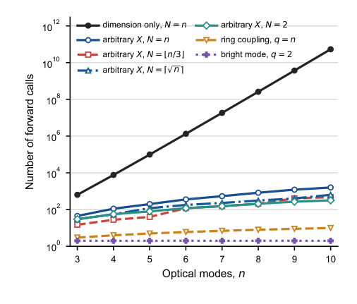 
FIG. 2. Query hierarchy for a passive multimode link. The horizontal axis gives the number n of optical modes, the vertical axis is logarithmic, and N denotes the photon- number cutoff. The dimension-only curve treats the full at- most-n-photon Hilbert space as an arbitrary unitary. The four arbitrary-X curves show constructive upper bounds for the indicated values of N. For N = 2, translation-invariant couplings around a ring and the rank-one bright-mode family give the exact values q = n and q = 2, respectively. The widening separation shows how additional structure changes the scaling from exponential to polynomial, and then to linear or constant.

**Summary.** This paper develops structural theorems to determine the minimum number of forward quantum calls needed to exactly invert a unitary evolution generated by a known Hamiltonian. By exploiting algebraic properties like commutativity and sector decomposition, the authors show that the required query complexity can be drastically reduced compared to treating the system as an arbitrary black box. This has direct implications for optimizing quantum sensing protocols in areas like cavity QED and quantum optics.

**Why it may be interesting.** This work provides rigorous theoretical bounds on quantum control tasks (like echo verification or OTOC measurement reversal) that are crucial for understanding the resource cost of retrieving unknown system parameters from limited forward measurements.

Detailed structure

**Main problem.** The core problem is determining the minimum number of forward quantum calls required to deterministically invert an unknown unitary evolution $U(x) = \exp(i\sum x_j H_j)$ when only the generators ($H_j$) are known, but the parameters ($\mathbf{x}$) are hidden.

**Main result.** For commuting Hamiltonians, the inversion cost depends on additive relations among distinct eigenvalues. For general noncommuting families, the complexity is bounded by a product structure derived from inverting inequivalent active sectors.

**Method.** The authors analyze the algebraic structure of the Hamiltonian generators, utilizing techniques like Wedderburn decomposition to simplify the problem into independent, invertible blocks. They derive explicit bounds based on spectral properties and sector combination rules.

**Model / system.** The analysis focuses on general time-evolution $U(x) = \exp(i\sum x_j H_j)$, applied specifically to protocols involving Tavis-Cummings dynamics, collective spins (Ising/LMG), and passive multimode links in quantum optics.

**Key observables.** The primary observable is the minimum query number ($q$) required for exact inversion; other key observables include residual phases ($
ho_\alpha(x)$) and the structure of joint-eigenvalue vectors ($\Lambda$).

**Important parameters / regimes.** The complexity scales with system dimension ($d$), mode numbers ($M, N$), and the number of emitters/spins ($n$). Structure-dependent bounds are shown to be polynomial in these parameters.

**Assumptions / limitations.** The analysis assumes knowledge of the Hamiltonian generators $\{H_j\}$ and relies on algebraic structures like commutativity or decomposability into inequivalent sectors.

**Figures summary.** Figure 1 illustrates the general concept of structured Hamiltonian inversion using interleaved forward calls to implement $U(x)^\dagger$.

**Paper structure.** The paper first establishes the worst-case exponential cost for arbitrary unitaries. It then develops specialized results for commuting families based on eigenvalue sums, followed by a treatment for noncommuting generators using sector decomposition and phase alignment conditions.

Abstract

Deterministic exact inversion of an arbitrary $d$-dimensional unitary requires {$Θ(d^2)$} coherent forward calls in the worst case. We ask how this cost changes for Hamiltonian evolution $U(x)=\exp(i\sum_j x_jH_j)$ when the generators are known but the parameters are hidden. For one-parameter families with a fixed eigenbasis, we show that additive relations among the distinct eigenvalues determine the optimal query number exactly, and we construct the corresponding inversion protocol. For general families, we prove that repeated symmetry sectors do not affect the exact query complexity and give an automatic construction for combining inverses from inequivalent active sectors. We also give a sufficient phase-alignment condition under which family-specific structure can reduce the query number. These results establish structure-dependent bounds for reversing the unknown dynamics arising in Tavis-Cummings out-of-time-order correlator protocols, collective-spin echo verification, and passive multimode links, without requiring prior knowledge or explicit estimation of the underlying coupling strengths.

[↑ back to top](#top)

### [Non-reciprocal torques guide self-assembly of active particles into clusters with controllable function](http://arxiv.org/abs/2607.29651v1)

**Authors:** Till Welker, Yukino Fujiya, Holger Stark  
**Type:** theory · **Category:** statistical mechanics · **PDF:** <https://arxiv.org/pdf/2607.29651v1>  
**Analysis basis:** full PDF text, analyzed in chunks
**Topic relevance:** `non-equilibrium dynamics` **3/5** · `driven-dissipative phase transition` **2/5** · `non-equilibrium universality` **2/5** · `Frenkel-Kontorova` **1/5** · `correlated / nonlocal dissipation` **1/5** · `methods for driven-dissipative` **1/5**

📷 Fig 1

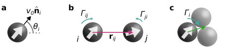 
FIG. 1. Model. a) Single particle propelling with velocity v0ˆni. b) The turn-towards torque Γij turns the orientation of particle i towards its neighbour with distance vector rij. c) Particle i experiences the total torque Γi, orienting it towards the mean distance vector of its neighbours ⟨ˆrij⟩j∈Si marked by the green arrow.

📷 Fig 2

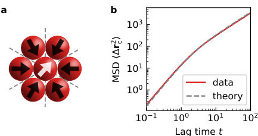 
FIG. 3. Free inner particle. a) Cluster of seven particles. The turn-towards torque orients the outer particles inward. In contrast, the torque on the inner particle vanishes because of the symmetry of the environment, and it can diffuse freely. b) Centre-of-mass mean squared displacement over time obtained from simulation (red solid curve) and predicted assuming a freely diffusing inner particle and perfectly symmetric outer particles (grey dashed curve).

📷 Fig 3

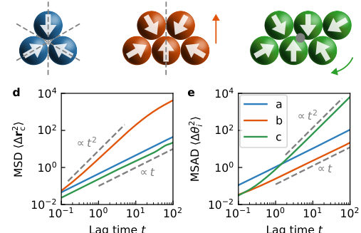 
FIG. 2. Symmetry and functionality. a) Clusters with two or more symmetry axes do not perform directed translation or rotation. b) Clusters with only one symmetry axis, can translate parallel to that axis. c) Clusters with point symmetry cannot translate but rotate. d) Mean squared displacement of the centre of mass rc and, e) mean squared angular displacement of particle orientations θi for the clus- ters shown in a-c).

📷 Fig 4

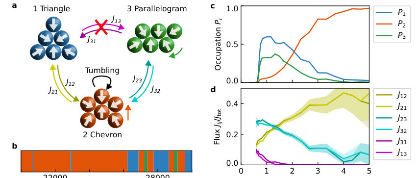 
FIG. 4. Multi-stability. a) Metastable six-particle clusters: static triangle (1, blue), translating chevron (2, orange), and rotating parallelogram (3, green). The arrows show transitions between the states with fluxes Jij. The chevron can transition between different arrangements, which results in a tumbling event. b) Time series of a six-particle system switching between the three metastable states (for Γ0 = 100). c) Occupation probability Pi to observe the system in state i over torque-velocity ratio Γ0/v0, with i = 1, 2, 3 corresponding to triangle, chevron, and parallelogram, respectively. d) Fluxes between the states, Jij, also plotted vs. Γ0/v0. The fluxes are normalised with the...

📷 Fig 5

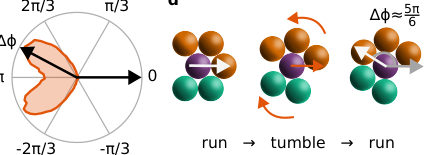 
FIG. 5. Tumbling. a) The chevron cluster exhibits tumbling events in which the leader particle changes. This reorients the propulsion direction by ∆ϕ. b) Distribution pr(∆t) of run times ∆t. It can be well fitted by the exponential pr,fit(∆t) = ce−ct with tumbling rate c = 0.235. c) Probability distribution pϕ(∆ϕ) of tumbling angle ∆ϕ and d) typical tumbling event with the central particle pushing forward and two and three outer particles rotating around it.

**Summary.** The research demonstrates that by introducing non-reciprocal torques to active particles, one can guide their self-assembly into structured clusters whose macroscopic function is controllable. The resulting dynamics are governed by the cluster's geometric symmetry, allowing for programmable behavior like controlled translation or rotation. Furthermore, incorporating stochastic resetting significantly enhances the speed of this functional assembly process.

**Why it may be interesting.** This work provides a clear example of how engineered non-equilibrium interactions (torques) can impose complex functional constraints on self-assembled matter, drawing parallels between symmetry principles in condensed matter physics and active matter design.

Detailed structure

**Main problem.** To achieve self-assembly of active particles into functional clusters with controllable function, overcoming limitations related to passive assembly and simple attractive forces.

**Main result.** Non-reciprocal torques can rapidly assemble active particles into colloidal micromachines whose resulting function (static, rotating, or translating) is dictated by the cluster's symmetry and particle number.

**Method.** The study uses Langevin equations of motion to simulate active particles interacting via steric repulsion and non-reciprocal turn-towards torques. Cluster dynamics are analyzed using Mean Squared Displacement (MSD) and occupation probabilities of metastable states.

**Model / system.** The system consists of active colloidal particles in two dimensions, propelled by a constant velocity $v_0$ and subject to an interaction torque $\Gamma_{ij} = \Gamma_0 \hat{n}_i 	imes \hat{r}_{ij}$ when neighbors are close. The dynamics are modeled using coupled equations for position and orientation.

**Key observables.** Center-of-Mass MSD/MSAD, occupation probabilities ($P_i$) of metastable cluster shapes (e.g., triangle, chevron), transition fluxes ($J_{ij}$), and run times during 'run-and-tumble' motion.

**Important parameters / regimes.** Torque strength ($\Gamma_0$), propulsion velocity ($v_0$), particle number, and the ratio $\Gamma_0/v_0$.

**Assumptions / limitations.** The analysis relies on overdamped motion; for small systems, cluster symmetry alone determines function; stochastic resetting is used to accelerate assembly by bypassing kinetic traps.

**Figures summary.** Figures illustrate how different symmetries (e.g., point vs. single axis) constrain the resulting directed motion via MSD/MSAD plots. Other figures detail multi-stability in larger clusters and the mechanism of 'run-and-tumble' transitions.

**Paper structure.** The paper establishes the physical model using non-reciprocal torques, analyzes how cluster symmetry dictates macroscopic function (static vs. dynamic), demonstrates control over multiple stable states by tuning torque strength, and finally introduces stochastic resetting to achieve fast, controlled assembly.

Abstract

Self-assembly of constituents determines structure formation in the microscopic world. Attractive forces can assemble active particles into colloidal machines, but they do not fix the particles' orientations, which limits control over the machine's function. We demonstrate that non-reciprocal turn-towards torques not only assemble active particles into clusters, without requiring attractive forces, but also link particle orientations to the cluster configuration. Symmetry then dictates whether the cluster is static, rotates, or translates. In small systems, the particle number uniquely determines the stable configuration and function. In larger systems, there are multiple stable configurations with distinct functions, and tuning the torque strength allows us to bias towards the desired function, such as a run-and-tumble motion. Because the interactions driving assembly can be switched on and off, the clusters self-assemble when needed. For such a "just-in-time" self-assembly to be practical, fast assembly is necessary. We show that stochastic resetting, implemented by briefly turning off propulsion and torque, significantly speeds up self-assembly by avoiding slow pathways. Together, our findings demonstrate that non-reciprocal torques can rapidly assemble active particles into colloidal micromachines with controllable function.

[↑ back to top](#top)

### [Fisher-Orthogonal Memory in Quantum Reservoir Computing](http://arxiv.org/abs/2607.29219v1)

**Authors:** Ce Wang, Xingze Qiu  
**Type:** theory · **Category:** quantum information and computing · **PDF:** <https://arxiv.org/pdf/2607.29219v1>  
**Analysis basis:** full PDF text, analyzed in chunks
**Topic relevance:** `quantum measurements` **3/5** · `measurement-induced transitions` **2/5** · `Keldysh / 2PI / non-Gaussian methods` **1/5** · `driven-dissipative phase transition` **1/5** · `entanglement & information structure` **1/5** · `methods for driven-dissipative` **1/5**

📷 Fig 1

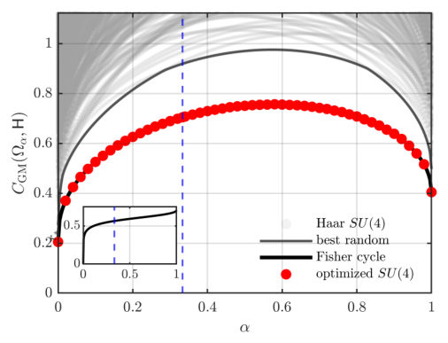 
FIG. 1. Single-qubit GM cost for the weighted three-delay task. Lower values indicate superior estimation precision. The black solid curve represents the optimized Fisher-cycle family Ur; gray points denote random Haar SU(4) gates, with the gray line tracking the empirical random frontier at each α; red circles denote unrestricted local optimizations over the full SU(4) manifold. The horizontal dashed line indicates the equal-weight loss baseline (α = 1/3), and the inset displays the optimal parameter r∗within the Fisher-cycle family.

📷 Fig 2

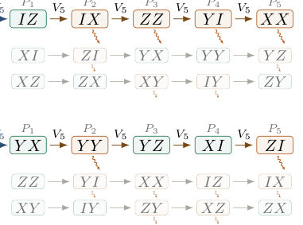 
FIG. 2. Two K = 5 CROs generated by the same V5. The blue arrow indicates the entry point P1 = V5QV † 5 of the fresh perturbation tangent operator. The damping string G assigns the contractive hit pattern η. Pale rows explicitly illustrate the underlying parallel Singer partition structure, showing off- route Pauli strings transported simultaneously by the same generator, while orange boxes mark where they are damped.

📷 Fig 3

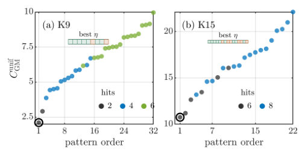 
FIG. 3. Fisher-cost landscape of Clifford damping patterns. (a),(b) Optimized uniform-window cost Cunif GM for the distinct admissible hit words generated by the K = 9 Singer route C9 and the K = 15 product route C15. Points are ordered by cost and colored by the number of damping hits in one period. Open circles mark the best admissible words. The inset in each panel shows the corresponding best hit word η, with orange cells denoting ηj = 1 and green cells denoting ηj = 0.

📷 Fig 4

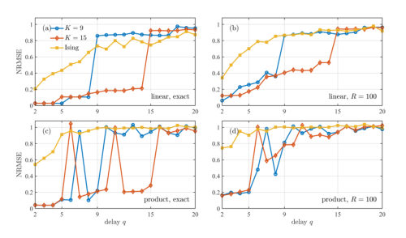 
FIG. 4. Task-specific prediction performance under a sin- gle local Pauli measurement setting. (a),(b) Test NRMSE for the delayed-linear task yt = ut−q using exact expecta- tion values and finite-shot readout at R = 100, respectively. (c),(d) Corresponding results for the delayed-product task yt = ut−qut−1. For each task, delay, and readout condition, the Clifford results are optimized over the admissible (Q, G) pairs, the fading parameter r, and the local Pauli setting. The Ising results are optimized over the sampled random reservoirs and local Pauli settings.

**Summary.** This work develops a rigorous framework to analyze the memory capacity of Quantum Reservoir Computing by quantifying measurement limitations using the quantum Fisher information matrix. By enforcing 'Fisher-orthogonality' through structured Clifford routing, the authors demonstrate an analytically controlled method to build reservoirs that maintain sharp memory fidelity for complex temporal tasks.

**Why it may be interesting.** The explicit connection between algebraic structures (Clifford group, Pauli algebra) and fundamental quantum information metrics (Fisher information) provides a powerful design principle for building robust quantum machine learning hardware.

Detailed structure

**Main problem.** The performance limit of Quantum Reservoir Computing (QRC) when extracting temporal memory from finite quantum measurements must be quantified.

**Main result.** Fisher-orthogonal memory, achieved by designing reservoir dynamics using Clifford routing orbits, allows for analytically controlled and measurement-efficient reconstruction of past inputs in both linear and nonlinear tasks.

**Method.** The authors formulate the problem as a local multiparameter estimation task, utilizing the delay-space quantum Fisher information matrix (QFIM) to enforce orthogonality conditions on memory traces.

**Model / system.** The system is an N-qubit reservoir processing temporal data via driven many-body dynamics. The evolution is engineered using Clifford routing orbits and Pauli string algebra to ensure specific structural properties in the QFIM.

**Key observables.** Delay-space quantum Fisher information matrix (QFIM), Normalized Root-Mean-Square Error (NRMSE) for linear/product delay reconstruction, and mixed tangent $\Gamma_{kj}$ for second-order response.

**Important parameters / regimes.** The degree of memory identifiability is controlled by parameters like $r$ in the single-qubit case; performance depends on the number of shots ($N_{	ext{shot}}$) and the structure of the routing generators.

**Assumptions / limitations.** The analysis relies on linear response approximations ($\delta
ho_f$) for memory characterization, though extensions cover second-order (nonlinear) responses.

**Figures summary.** Figure 1 compares the optimized 'Fisher-cycle' curve against random Haar gates in the single-qubit GM cost landscape, demonstrating optimality.

**Paper structure.** The paper progresses from establishing the QFIM as the diagnostic tool, deriving optimal designs for the single-qubit case using the Gill--Massar bound, scaling this to multi-qubit systems via Clifford routing orbits, and finally extending the analysis to second-order (nonlinear) response channels.

Abstract

Quantum reservoir computing processes temporal information through driven many-body dynamics, but its performance is ultimately limited by how accurately past inputs can be extracted from finite measurements. Here we formulate this limitation as a local multiparameter estimation problem and introduce a delay-space quantum Fisher information matrix to quantify the distinguishability of memory traces. This perspective identifies Fisher-orthogonal memory as a measurement-efficient design principle: different delays should perturb the reservoir state along statistically independent directions. We first analyze the single-qubit limit using the Gill--Massar bound, revealing an optimal write-store-routing trade-off. Guided by this structure, we construct solvable multi-qubit reservoirs based on Clifford routing orbits and Singer-cycle Pauli algebra. The resulting dynamics yield diagonal, analytically programmable Fisher memory matrices with controlled dissipation profiles. Under finite-shot local Pauli readout, these reservoirs retain sharp memory windows and substantially improve over optimized random Ising reservoirs for both linear delay reconstruction and nonlinear product-delay tasks. The nonlinear advantage is traced to second-order response channels that inherit the same Pauli-routing structure. Our results provide an analytically controlled route toward measurement-efficient quantum reservoir computing.

[↑ back to top](#top)

### [Information limits of photonic lantern wavefront sensing: a Fisher- and quantum-Fisher-information framework and its relation to Fourier-filtering sensitivity limits](http://arxiv.org/abs/2607.29342v1)

**Authors:** Kalaga Madhav  
**Type:** theory · **Category:** other · **PDF:** <https://arxiv.org/pdf/2607.29342v1>  
**Analysis basis:** full PDF text, analyzed in chunks
**Topic relevance:** `quantum measurements` **3/5** · `entanglement & information structure` **2/5** · `measurement-induced transitions` **2/5** · `Keldysh / 2PI / non-Gaussian methods` **1/5** · `interference shaping light` **1/5**

📷 Fig 1

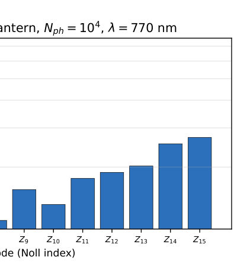 
Figure 1. Per-mode (averaged) CRLB for a representative 19-port focal-plane lantern (Nph = 104). Rotationally-odd modes are sensed near the information limit; for a symmetric projector the even modes are intrinsically weaker (Sect. 6).

📷 Fig 2

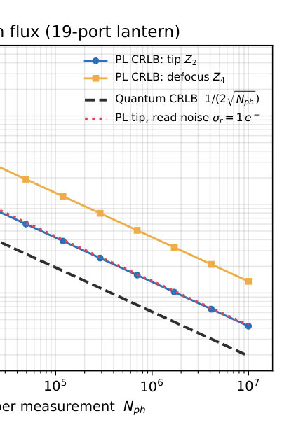 
Figure 2. CRLB versus detected photons. The photon-limited bound follows N −1/2 ph (Eq. 9) and sits a fixed factor above the quantum bound Eq. (12); read noise dominates at low flux, steepening the slope toward −1.

📷 Fig 3

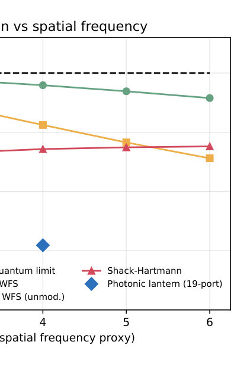 
Figure 3. Dimensionless sensitivity βi (Eq. 10) per mode, referenced to the quantum ceiling β = 2 (Eq. 12). This is the common scale on which the lantern, pyramid, ZWFS and PIAA-ZWFS [21, 22] can be compared.

📷 Fig 4

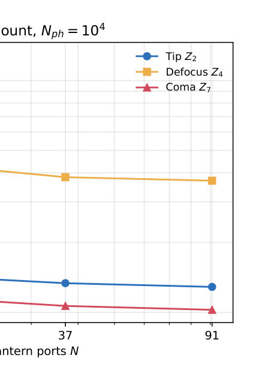 
Figure 4. Low-order CRLB versus port count at Nph = 104. Sensitivity improves sharply from 7 to 19 ports and saturates thereafter for low-order modes – the per-frame capacity ceiling Meff ≤N −1 of Sect. 3.5.

**Summary.** This paper establishes a comprehensive, theory-driven framework to determine the ultimate precision limits of wavefront sensing using a photonic lantern. By calculating both classical (FIM) and quantum (QFI) bounds, it shows that the sensor's performance scales predictably with photon number and is fundamentally limited by a universal quantum ceiling ($eta=2$). This provides a powerful, device-agnostic tool for comparing various optical measurement techniques.

**Why it may be interesting.** It provides rigorous information-theoretic tools ($	ext{FIM}, 	ext{QFI}$) to benchmark the performance of complex optical sensors like the photonic lantern against fundamental quantum limits, which is highly relevant for advanced quantum optics and sensing.

Detailed structure

**Main problem.** To determine the fundamental, estimator-independent information limits for wavefront sensing using a photonic lantern, moving beyond reliance on specific reconstruction algorithms.

**Main result.** The derived Cramér–Rao Lower Bound (CRLB) scales as $N_{ph}^{-1/2}$ and is bounded by an absolute quantum limit ($eta=2$), which is jointly saturable for all low-order modes simultaneously.

**Method.** The authors developed a framework using the Fisher Information Matrix (FIM) and Quantum Fisher Information (QFI) to quantify measurement precision, comparing classical bounds against fundamental quantum limits.

**Model / system.** The system analyzed is the Photonic Lantern (PL), an all-photonic wavefront sensor that maps wavefront aberrations ($\mathbf{a}$) onto $N$ measurable output intensities ($I_k$).

**Key observables.** Per-mode CRLB ($\sigma_{a_i}^2$), dimensionless sensitivity metric $eta$, and the Quantum Fisher Information matrix elements.

**Important parameters / regimes.** Photon number ($N_{ph}$), number of ports ($N$), quantum ceiling ($eta=2$), and aberration coefficients ($\mathbf{a}$).

**Assumptions / limitations.** The measurement process is modeled as a deterministic, nonlinear map from aberration coefficients to output intensities; the analysis distinguishes between single-frame CRLB and ensemble averages.

**Figures summary.** Figures compare the per-mode averaged CRLB across different sensor types (lantern vs. pyramid/ZWFS) against the quantum limit ($eta=2$), showing scaling laws with photon number and port count.

**Paper structure.** The paper develops the FIM/CRLB theory, benchmarks it against QFI to establish the quantum ceiling, compares results to existing literature (Chambouleyron et al., Haffert et al.), and concludes by providing a unified, device-agnostic sensitivity metric $eta$.

Abstract

The photonic lantern is an all-photonic wavefront sensor native to single-mode-fibre-fed instruments, but its performance is almost always quoted through a specific reconstruction algorithm, obscuring how much wavefront information the device itself encodes. We develop, from first principles, the Fisher-information and Cramer-Rao theory of the photonic-lantern wavefront sensor, benchmark it against the quantum Cramer-Rao bound via an explicit multi-parameter quantum-Fisher-information calculation, and relate it to two established frameworks: the Fourier-filtering noise-propagation model of Chambouleyron et al (2023) and the classical/quantum sensitivity limit of Haffert et al (2023). Treating the lantern as a deterministic map from aberration coefficients to N output intensities, we derive the Poisson and read-noise Fisher information matrices (FIM), the per-mode CRLB, the per- photon Fisher-Rao geometry on the intensity simplex, and a flux- and estimator-independent sensitivity metric beta with quantum ceiling beta = 2. The lantern CRLB scales as N_ph^(-1/2) and is bounded, mode by mode, by the quantum limit of 1/2 rad rms per photon. That multi-parameter bound is jointly saturable: the phase generators are real and commuting, so the mean Uhlmann curvature vanishes and wavefront sensing carries no quantum incompatibility between simultaneously estimated modes, extending Haffert et al's single-mode ceiling to all low-order modes at once. We further show that the photon-noise sensitivity s_gamma of Chambouleyron et al is exactly the diagonal of our per- photon FIM, whereas the CRLB uses the diagonal of its inverse; the two coincide only for a diagonal FIM, so s_gamma is optimistic for a mode-mixing lantern. The framework is device-agnostic: it returns estimator-independent sensitivities comparable on a common beta <= 2 scale with pyramid, Zernike and PIAA-ZWFS sensors.

[↑ back to top](#top)

### [Deriving the second law of thermodynamics and exploring its boundaries](http://arxiv.org/abs/2607.28765v1)

**Authors:** Yu Qiao  
**Type:** theory · **Category:** statistical mechanics · **PDF:** <https://arxiv.org/pdf/2607.28765v1>  
**Analysis basis:** full PDF text, analyzed in chunks
**Topic relevance:** `non-equilibrium dynamics` **3/5** · `non-equilibrium universality` **2/5** · `Keldysh / 2PI / non-Gaussian methods` **1/5** · `driven-dissipative phase transition` **1/5** · `methods for driven-dissipative` **1/5**

📷 Fig 1

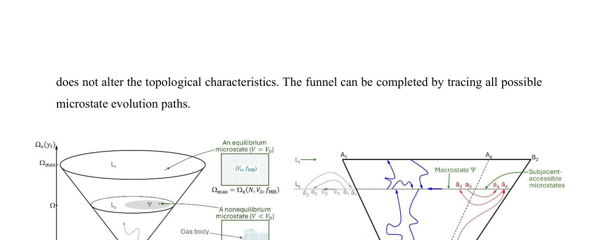 
Figure 1. (a) Schematic of the funnel-shaped phase space of an isolated system. Each horizontal “layer” (hyperplane) represents the region corresponding to a certain value of , i.e., the subset of the microstates that satisfy x(𝑦𝑙) = . The layer size represents the number of microstates in the subset. From bottom to top,  increases. The grey circle in hyperplane Ly indicates a macrostate (). The grey dotted curve depicts a possible microstate evolution path, starting from the bottom of the phase space (L1). The insets illustrate two representative microstates of a classical ideal gas: the upper inset shows an equilibrium state, in which the gas fills the container; the lower inset...

📷 Fig 2

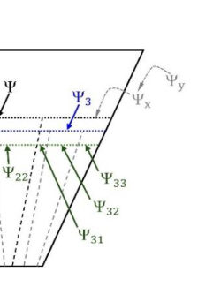 
Figure 2. Macrostate evolution in the simplified phase-space subspace of .

📷 Fig 3

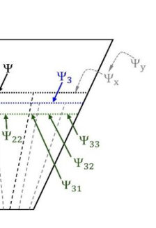 
Figure 2 shows the funnel-shaped phase-space subspace of a macrostate (). Its structure

📷 Fig 4

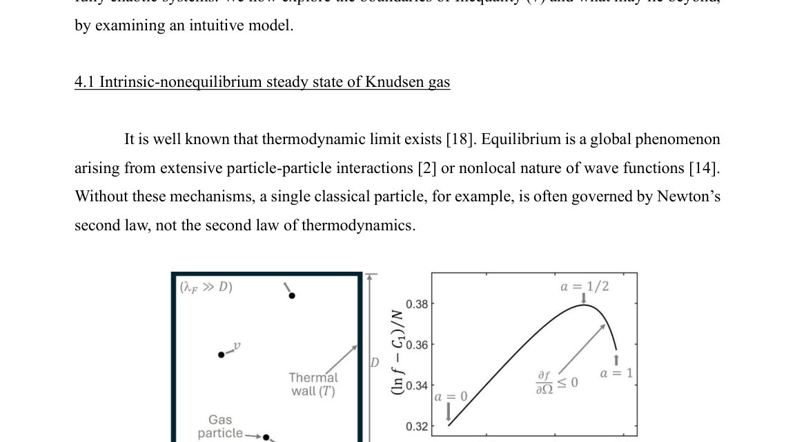 
Figure 3. (a) Schematic of a Knudsen gas [12] (see Appendix 1 for more details). The particle mean free path 𝜆F is much larger than the characteristic size of the gas container 𝐷. The system is immersed in a thermal reservoir, using thermal-wall boundary condition. Because particle-particle interactions are sparse, fast particles tend to collide rapidly with the container walls and release heat to the environment, and slow particles tend to stay long in the interior. As a result, the effective gas-phase kinetic temperature (𝑇k) is lower than the thermal-wall temperature (𝑇 ), i.e., the system cannot relax to thermal equilibrium. The probability of finding a particle of kinetic energy 𝐾 is...

📷 Fig 5

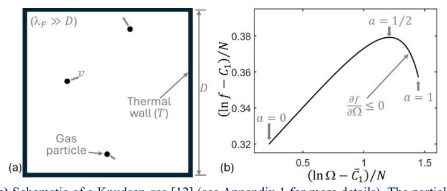 
Figure 3(a) depicts a Knudsen gas of 𝑁 particles (hard spheres). It is immersed in a thermal

**Summary.** The paper proposes a generalized criterion ($\partial f / \partial \Omega > 0$) derived from phase-space continuity equations to prove the second law of thermodynamics. It demonstrates that this condition is necessary and sufficient for chaotic systems but fails in locally nonchaotic or sparse collision regimes, where entropy can decrease spontaneously without violating energy conservation.

**Why it may be interesting.** This work provides a highly general statistical mechanical framework for entropy increase that moves beyond specific dynamical assumptions (like molecular chaos), offering insights into the fundamental prerequisites for the second law in complex, non-equilibrium quantum systems.

Detailed structure

**Main problem.** The paper addresses the fundamental challenge of deriving a general proof for the second law of thermodynamics ($\dot{S} \ge 0$) applicable across diverse physical regimes, including quantum and highly non-equilibrium systems.

**Main result.** The second law emerges naturally if the macrostate probability $f$ increases monotonically with the number of microstates $\Omega$ ($\partial f / \partial \Omega > 0$), suggesting this condition is more general than relying on assumptions like molecular chaos or equal a priori probabilities.

**Method.** The derivation utilizes the continuity equation for the macrostate-level probability $f$ in phase space, contrasting it with traditional approaches like the H-theorem.

**Model / system.** The analysis is conducted using idealized isolated Hamiltonian systems modeled in a funnel-shaped phase space. Specific examples include Knudsen gases in confined geometries to test breakdown regimes.

**Key observables.** Entropy ($S = k_B \ln \Omega$), macrostate probability $f$, and the rate of change $\dot{\Omega}$ derived from the continuity equation.

**Important parameters / regimes.** The condition $\partial f / \partial \Omega > 0$ is crucial; deviations occur in locally nonchaotic systems or sparse collision regimes.

**Assumptions / limitations.** The core derivation assumes $\partial f / \partial \Omega > 0$. The paper also contrasts this with the assumption of equal a priori equilibrium probabilities ($\mathcal{B}$), showing it is sufficient but not necessary.

**Figures summary.** Figures illustrate the funnel-shaped phase space evolution, the dependence of entropy on $\Omega$, and specific examples (like cell wall insertion or low-collision regimes) where entropy decrease can occur without external driving forces.

**Paper structure.** The paper progresses by first establishing the general condition ($\partial f / \partial \Omega > 0$) from the continuity equation, contrasting it with classical limitations. It then explores violations in nonchaotic/low-collision systems and finally compares this generalized requirement against established assumptions like $\mathcal{B}$.

Abstract

The second law of thermodynamics still lacks a general proof applicable to both classical and quantum systems across broad ranges of time scales, interactions, and degrees of nonequilibrium. In this paper, we show that when the macrostate-level probability $f$ of an isolated system increases monotonically with the number of possible microstates $Ω$ (i.e., $\partial f/\partial Ω> 0$), the second law emerges naturally from the continuity equation of $f$ in phase space; a special case of $\partial f/\partial Ω> 0$ is Boltzmann's assumption of equal a priori equilibrium probabilities. Based on this finding, the second law can be readily derived for fully chaotic systems. The derivation does not rely on dynamical details, highlighting the statistical nature of entropy increase. In contrast, for a locally nonchaotic system, the positive correlation between $f$ and $Ω$ may break down (i.e., $\partial f/\partial Ω\leq 0$). Consequently, the conventional framework of thermodynamics does not apply, and entropy can decrease spontaneously without any energetic penalty.

[↑ back to top](#top)

### [Phase Sensitivity of Spectrally Multimode SU(1,1) Interferometers with Waveguide based Optical Parametric Amplifier](http://arxiv.org/abs/2607.29469v1)

**Authors:** Sonu Jana, Swagatam Bag, Fabien Bretenaker, Nadia Belabas, Syamsundar De  
**Type:** theory · **Category:** other · **PDF:** <https://arxiv.org/pdf/2607.29469v1>  
**Analysis basis:** full PDF text, analyzed in chunks
**Topic relevance:** `interference shaping light` **3/5** · `quantum measurements` **2/5** · `Keldysh / 2PI / non-Gaussian methods` **1/5** · `driven-dissipative phase transition` **1/5** · `methods for driven-dissipative` **1/5**

📷 Fig 1

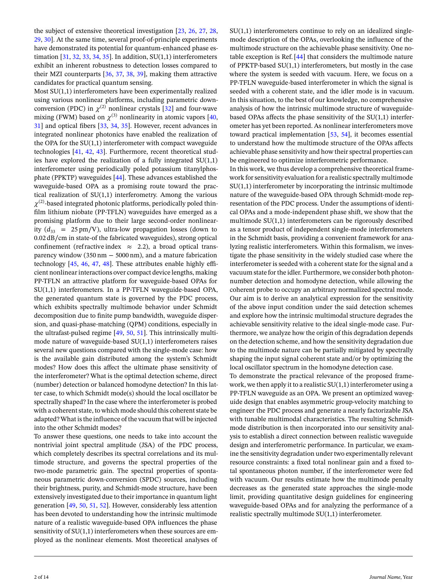 
Low-resolution page preview, page 2

📷 Fig 2

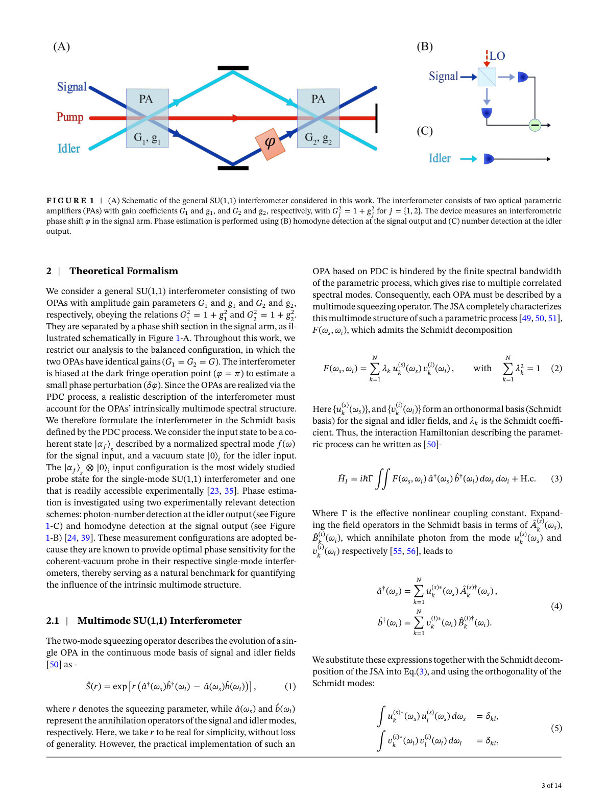 
Low-resolution page preview, page 3

📷 Fig 3

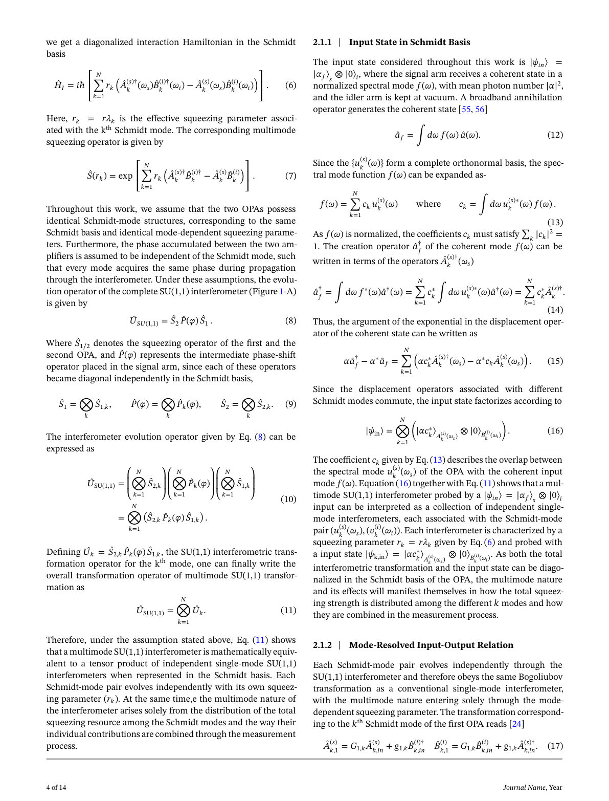 
Low-resolution page preview, page 4

📷 Fig 4

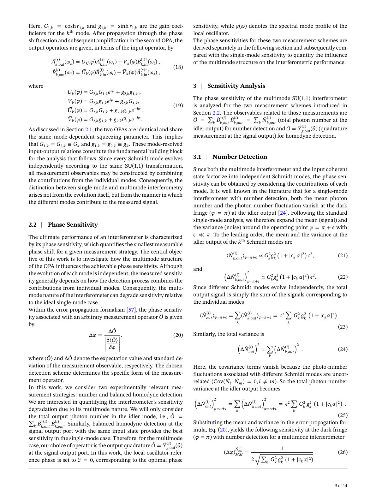 
Low-resolution page preview, page 5

📷 Fig 5

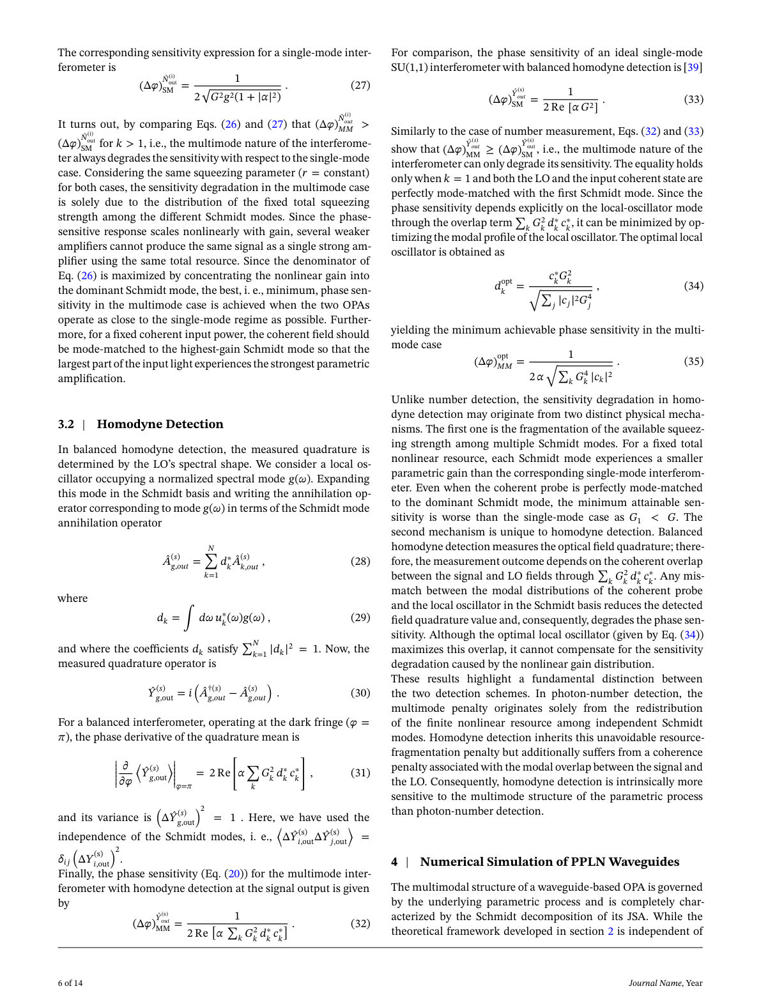 
Low-resolution page preview, page 6

**Summary.** This paper develops a comprehensive framework to assess the phase sensitivity of multimode $	ext{SU}(1,1)$ interferometers built using waveguide-based OPAs. By analyzing the system in the Schmidt basis, the authors show that while multi-mode operation introduces spectral penalties, these can be substantially reduced by optimizing both the input signal and the local oscillator spectrum, particularly when using homodyne detection.

**Why it may be interesting.** This work provides a rigorous theoretical tool to analyze quantum sensing limits in realistic, spectrally complex photonic platforms like integrated waveguides, bridging fundamental quantum optics theory with practical device engineering.

Detailed structure

**Main problem.** The study evaluates how the intrinsic spectral multimode nature of waveguide-based Optical Parametric Amplifiers (OPAs) affects the phase sensitivity achievable in an $	ext{SU}(1,1)$ interferometer.

**Main result.** Phase sensitivity depends strongly on the measurement scheme; while number detection suffers from resource redistribution penalties, homodyne detection allows for significant mitigation of degradation by optimizing the local oscillator spectrum and input signal state.

**Method.** The analysis employs a theoretical framework utilizing the Schmidt basis decomposition of the Joint Spectral Amplitude (JSA) to model the multimode evolution as a parallel collection of independent single-mode interferometers.

**Model / system.** The system is an $	ext{SU}(1,1)$ interferometer realized using periodically polled thin-film lithium niobate ($	ext{PP-TFLN}$) waveguides acting as OPAs. The model incorporates the full multimode spectral structure derived from the PDC process.

**Key observables.** Phase sensitivity ($\Delta\varphi$); Sensitivity degradation penalty ratio ($\eta(r)$); Joint Spectral Amplitude (JSA) and its Schmidt coefficients.

**Important parameters / regimes.** Detection scheme (number vs. homodyne); Input signal coherent state spectrum; Local oscillator spectrum; Total squeezing strength ($r$).

**Assumptions / limitations.** The analysis assumes identical OPAs and mode-independent phase shifts for simplification in the Schmidt basis representation.

**Figures summary.** Figures illustrate the schematic of the interferometer, show how matching the probe spectrum to the dominant Schmidt mode mitigates degradation, and compare sensitivity ratios ($\eta(r)$) under different resource constraints.

**Paper structure.** The paper develops a theoretical framework by mapping the multimode $	ext{SU}(1,1)$ evolution onto independent single-mode transformations in the Schmidt basis. It then calculates phase sensitivity using error propagation for both number and homodyne detection, culminating in optimization strategies for input/LO spectra.

Abstract

We present a comprehensive framework for evaluating the phase sensitivity of spectrally multimode SU(1,1) interferometers probed with a coherent-vacuum input, under both number and homodyne detections. The optical parametric amplifiers (OPAs) are simulated using a periodically polled thin-film lithium niobate waveguide. The theoretical model incorporates the intrinsic multimode spectral nature of waveguide-based OPAs. Under the assumptions of identical OPAs and Schmidt-mode-independent phase shifts, we have shown that the multimode SU(1,1) interferometer is equivalent to a collection of independent single-mode interferometers in the Schmidt basis that operate in parallel, each associated with a Schmidt mode of the parametric process. We further present an optimized waveguide design based on asymmetric group-velocity matching to realize a practical OPA with nearly factorizable joint spectral amplitude (JSA). The Schmidt coefficients extracted from the numerically simulated JSA are incorporated into the theoretical model to evaluate the phase sensitivity. The results show that the sensitivity under a multimode condition depends strongly on the measurement scheme. For number detection, the degradation in sensitivity arises from the redistribution of the available nonlinear resource among the Schmidt modes, whereas homodyne detection exhibits an additional coherence penalty that can be substantially reduced by optimally shaping the local oscillator. Moreover, we show that the performance degradation can be to a large extent mitigated by optimizing the spectrum of the injected signal coherent state and, in the case of homodyne detection, the spectrum of the local oscillator. Altogether, this work provides a unified theoretical and numerical framework for analyzing and optimizing realistic multimode SU(1,1) interferometers with waveguide-based OPAs for quantum-enhanced sensing applications.

[↑ back to top](#top)

### [Revisiting the Equation-of-Motion Method: A Universal Framework for Correlated Quantum Systems](http://arxiv.org/abs/2607.29396v1)

**Authors:** Andrea Porro  
**Type:** theory · **Category:** other · **PDF:** <https://arxiv.org/pdf/2607.29396v1>  
**Analysis basis:** full PDF text, analyzed in chunks
**Topic relevance:** `Keldysh / 2PI / non-Gaussian methods` **3/5** · `analog quantum simulation` **1/5** · `correlated / nonlocal dissipation` **1/5** · `driven-dissipative phase transition` **1/5** · `methods for driven-dissipative` **1/5** · `non-equilibrium dynamics` **1/5**

📷 Fig 1

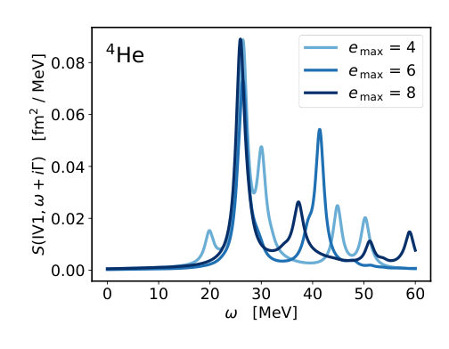 
FIG. 1. Isovector dipole response in 4He obtained employing the EOM technique based on an IMSRG(2) reference state and a full one-body operator basis for the excited states. Cal- culations were performed employing the NNLOopt [76] inter- action with a harmonic oscillator frequency of ℏω = 16 MeV. Different model space sizes are compared.

📷 Fig 2

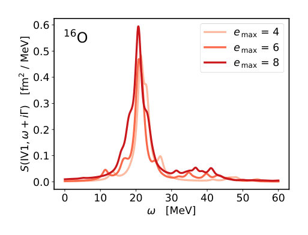 
FIG. 2. Isovector dipole response in 16O obtained employing the EOM technique based on an IMSRG(2) reference state and a full one-body operator basis for the excited states. Cal- culations were performed employing the N3LO Texas [78] inter- action with a harmonic oscillator frequency of ℏω = 16 MeV. Different model space sizes are compared.

📷 Fig 3

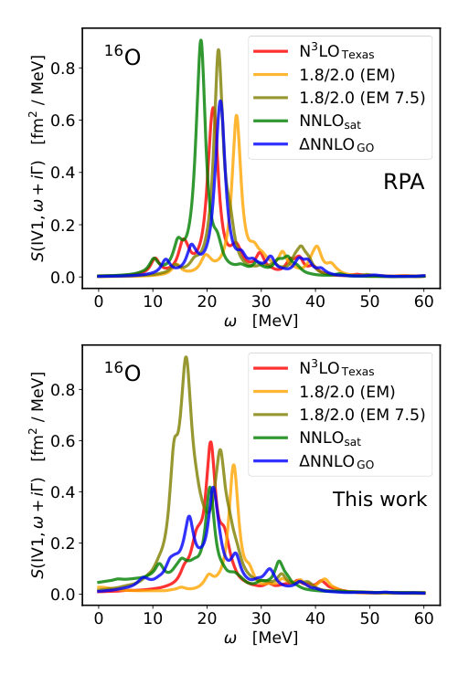 
FIG. 3. Isovector dipole response in 16O from RPA calcu- lations (upper panel) and the EOM technique based on an IMSRG(2) reference state and a full one-body operator basis for the excited states (bottom panel). Calculations are per- formed at emax= 8 and ℏω = 16 MeV.

📷 Fig 4

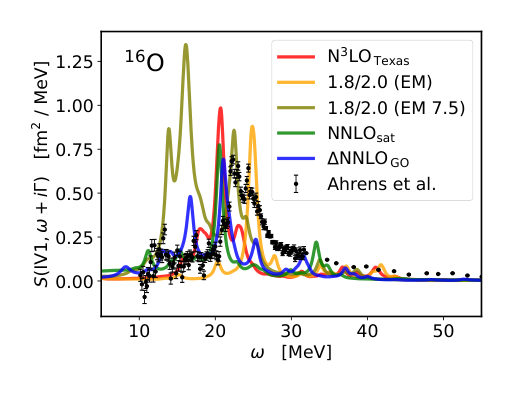 
FIG. 4. Same as the bottom panel of Fig. 3 but for Γ = 0.5 MeV. Experimental data are taken from Ref. [82].

📷 Fig 5

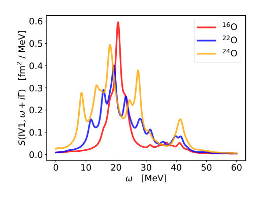 
FIG. 5. Isovector dipole response in closed-shell oxygen iso- topes obtained employing the EOM technique based on an IMSRG(2) reference state and a full one-body operator basis for the excited states. Calculations were performed employ- ing the N3LO Texas [78] interaction with a harmonic oscillator frequency of ℏω = 16 MeV at emax= 8.

**Summary.** This paper introduces an advanced Equation-of-Motion (EOM) formalism designed to treat collective excitations in strongly correlated quantum systems, specifically atomic nuclei. By extending the method to use correlated ground states rather than simple mean-field approximations, it provides a unified and powerful tool for calculating excitation spectra beyond traditional limits. This advancement is significant for any field requiring accurate dynamics of complex many-body wavefunctions.

**Why it may be interesting.** While focused on nuclear physics, the core mathematical machinery—the generalized EOM framework for excited states built upon correlated reference states—is highly relevant to open quantum systems dynamics and time-dependent variational approaches in AMO physics.

Detailed structure

**Main problem.** The central problem is developing a universal, consistent framework for describing excited states and collective excitations in complex, correlated quantum many-body systems.

**Main result.** The authors present an extended Equation-of-Motion (EOM) formalism that successfully incorporates ground-state correlations by operating on correlated reference states, moving beyond traditional mean-field approximations.

**Method.** The method involves deriving the EOM equations from the Time-Dependent Variational Principle and solving the resulting generalized eigenvalue problem, which yields normal modes of the energy function.

**Model / system.** The theory is applied to atomic nuclei using chiral nuclear Hamiltonians in an ab initio context. The formalism itself is general for any correlated quantum system described by a Hamiltonian H.

**Key observables.** Excitation spectra, collective nuclear excitations (e.g., dipole polarizability), and spectroscopic properties beyond the mean-field limit.

**Important parameters / regimes.** The structure depends on the choice of reference state $|\Psi
angle$ and the truncation level of the excitation operators used in the formalism.

**Assumptions / limitations.** The primary extension is assuming that the EOM can be consistently formulated using correlated reference states, overcoming the limitation to independent-particle assumptions inherent in older methods.

**Figures summary.** Not specified by notes; the mathematical structure involves matrix equations (like Eq. 15) representing the generalized eigenvalue problem for excitation modes.

**Paper structure.** The paper develops the general EOM formalism from first principles using the TD variational principle, establishes its universal operator structure, and then applies it to specific physical systems like atomic nuclei, comparing results against established methods (RPA, CC).

Abstract

A general implementation of the equation-of-motion (EOM) formalism for correlated many-body states is presented and applied to the description of collective excitations in atomic nuclei. While EOM approaches are traditionally formulated on top of independent-particle reference states, the present work extends the method to correlated reference states generated by modern many-body solvers. This formulation enables a consistent treatment of ground-state correlations and excited-state dynamics within a unified framework. Particular emphasis is placed on collective nuclear excitations employing chiral nuclear Hamiltonians in an ab initio context. The approach is motivated by the renewed interest in EOM techniques across several fields, including quantum chemistry and quantum computing, where they provide efficient and systematically improvable descriptions of excitation spectra. The present results demonstrate that the EOM framework offers a flexible and powerful tool for the microscopic description of nuclear spectroscopy beyond the traditional mean-field paradigm.

[↑ back to top](#top)

### [Exact Results for the Symmetric Dyson Exclusion Process](http://arxiv.org/abs/2607.28807v1)

**Authors:** Ali Zahra, Jerome Dubail, Gunter M. Schutz  
**Type:** theory · **Category:** statistical mechanics · **PDF:** <https://arxiv.org/pdf/2607.28807v1>  
**Analysis basis:** full PDF text, analyzed in chunks
**Topic relevance:** `non-equilibrium dynamics` **3/5** · `non-equilibrium universality` **2/5** · `Frenkel-Kontorova` **1/5** · `Keldysh / 2PI / non-Gaussian methods` **1/5**

📷 Fig 1

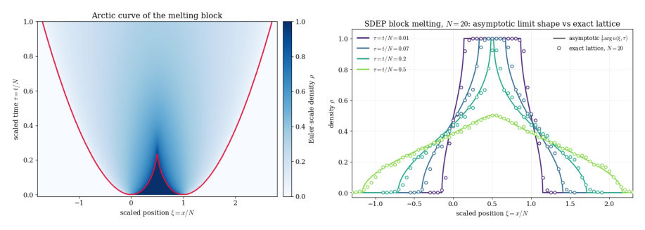 
Figure 1: Euler-scale melting of the block SN = {1, . . . , N}, with ξ = x/N, τ = t/N and w = 1

📷 Fig 2

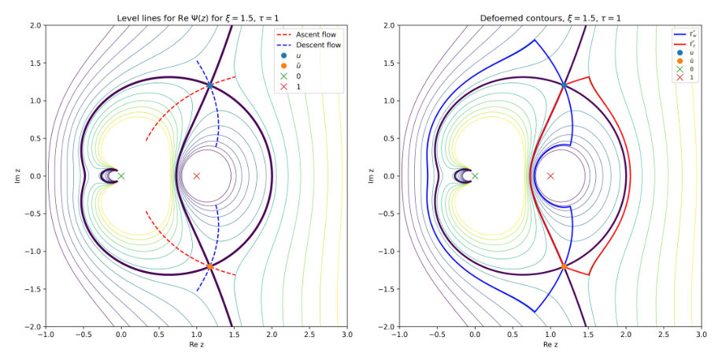 
Figure 2: Steepest-descent geometry for the phase Ψξ,τ, shown for a representative point (ξ, τ) in the liquid region. Left: level curves of ℜΨξ,τ. The thick purple curve is the equal-height locus through the relevant critical point, while dashed curves indicate ascent and descent directions. Right: deformation of the original contours to the steepest-descent contours eΓω and eΓz. The Euler-scale density is produced by the crossing of these deformed contours.

**Summary.** This paper derives exact analytical formulas for the time evolution of the Symmetric Dyson Exclusion Process (SDEP) by mapping it to an exactly solvable free-fermion model. Using advanced techniques like determinantal kernels and steepest descent, the authors determine the density profile and confirm that its macroscopic limit matches established hydrodynamic predictions.

**Why it may be interesting.** The connection between integrable quantum spin chains, exclusion processes, and continuum hydrodynamics is a cornerstone of modern non-equilibrium statistical mechanics. The exact derivation provides rigorous mathematical confirmation for conjectured scaling laws.

Detailed structure

**Main problem.** The primary goal is to derive exact evolution formulas for the Symmetric Dyson Exclusion Process (SDEP) starting from deterministic initial configurations, and subsequently analyzing its macroscopic limits.

**Main result.** Exact determinantal kernel expressions are found for density evolution in both finite and infinite lattices, confirming that the Euler-scale limit yields the conjectured hydrodynamic profile and arctic curve.

**Method.** The authors exploit the mapping of SDEP to a free-fermion model (XX chain ground state transform), allowing the use of Wick's theorem and solving the resulting kernel evaluation via trigonometric Lagrange interpolation.

**Model / system.** The system is the Symmetric Dyson Exclusion Process (SDEP) on a lattice, characterized by long-range logarithmic Coulomb interactions. It is mathematically equivalent to conditioned random walkers or the ground-state transform of the spin-1/2 XX quantum chain.

**Key observables.** Density profile evolution $
ho(x, t)$, density moments (governed by a finite polynomial algebra), and the arctic curve separating frozen/liquid regions.

**Important parameters / regimes.** Lattice size $L$, time $t$, and the specific initial configuration determining the kernel evaluation.

**Assumptions / limitations.** The solvability provided by the free-fermion mapping is crucial for deriving exact results, particularly when evaluating the mixed correlation kernel via Lagrange interpolation.

**Figures summary.** Figure 2 illustrates the steepest-descent geometry used in the asymptotic analysis, showing level curves and the deformation of contours to extract the final density result.

**Paper structure.** The paper progresses by establishing the free-fermion mapping (Section 2), deriving correlation functions using determinantal kernels (Section 3), obtaining general density evolution formulas (Section 4), analyzing moment algebras and block melting (Section 5), and finally tackling the macroscopic Euler-scale limit (Section 6).

Abstract

The symmetric Dyson exclusion process (SDEP) is an exclusion process on the lattice with a long-range logarithmic Coulomb-type interaction. It appears in several equivalent forms: as symmetric random walkers conditioned, in the Doob-transform sense, not to collide; as the maximal-activity limit of a conditioned SSEP; and as a ground-state transform of the spin- 1/2 XX chain. In this work, we exploit this latter representation to obtain exact evolution formulas from deterministic initial configurations. The resulting determinantal kernel is expressed through a finite interpolation expression in terms of Lagrange polynomials, leading to explicit density evolution in finite and infinite lattices. For the melting of a densely packed block, we show that the full hierarchy of density moments is governed by a finite-dimensional polynomial algebra, and we identify Catalan numbers in the leading time coefficients. We also derive the Euler-scale density profile and the arctic curve separating frozen and liquid regions, and show that they coincide with conjectured hydrodynamic results obtained in a previous work.

[↑ back to top](#top)

### [Spindrift: Learning quantum degeneracy from thermal purity in restricted path integral Monte Carlo](http://arxiv.org/abs/2607.29590v1)

**Authors:** Jarvist Moore Frost  
**Type:** theory · **Category:** disordered systems and neural networks · **PDF:** <https://arxiv.org/pdf/2607.29590v1>  
**Analysis basis:** full PDF text, analyzed in chunks
**Topic relevance:** `methods for driven-dissipative` **3/5** · `analog quantum simulation` **2/5** · `Keldysh / 2PI / non-Gaussian methods` **1/5** · `non-equilibrium dynamics` **1/5**

📷 Fig 1

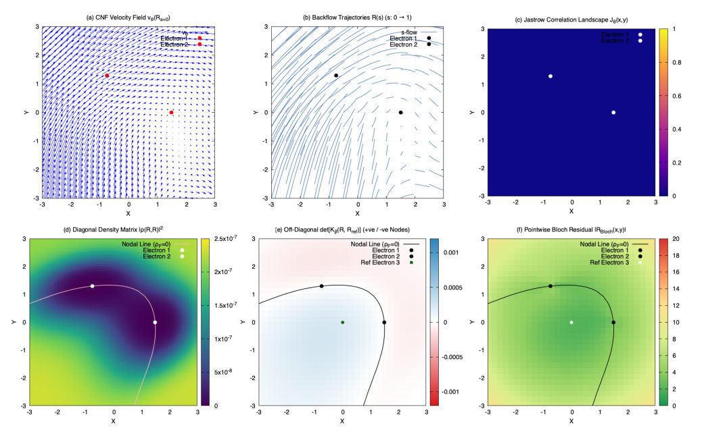 
FIG. 1: Initial state of the neural density matrix model prior to training, internal structure (top) and physical observables (bottom), for N = 3 spin-polarised Fermions in a 2D harmonic trap. Most figures are generated by constraining two electrons to sit on the Wigner radius (1.5, where the Coulomb and Harmonic force balance), and then using the third electron as the test particle. (a) The randomly initialised continuous normalising flow (CNF) velocity field vθ(R, s = 0) shows vortices. This is due to the permutation-equivariance enforced on the network; the random vector fields are thereby symmetric around the particle positions. (b) The random field generates rather large backflow...

📷 Fig 2

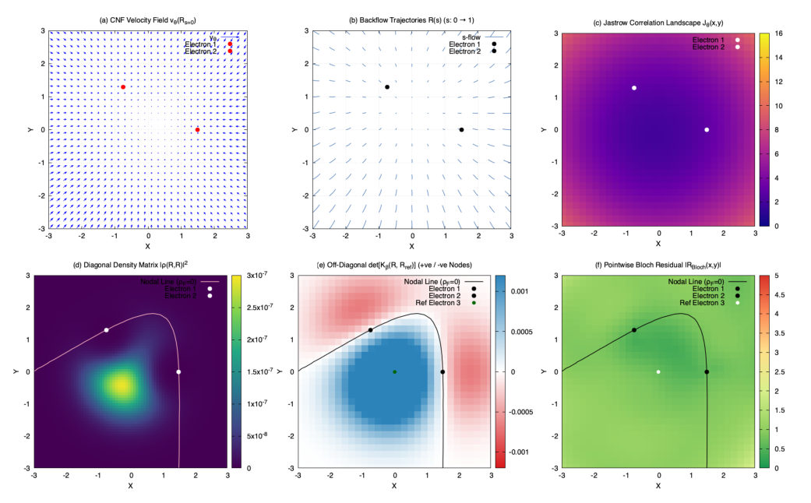 
FIG. 2: Neural density matrix model internal structure (top) and physical observables (bottom), for N = 3 spin-polarised Fermions in a 2D harmonic trap at β = 0.8. (a) Continuous normalising flow (CNF) velocity field vθ(R, s = 0) driving the quasi-particle transform. (b) Integrated backflow trajectories R(s) over fictitious time s ∈[0, 1]. (c) Symmetric Jastrow correlation landscape Jθ(x, y). Clearly this has learnt the harmonic confinement of the trap, compared to the free-particle starting point. (d) Diagonal probability density |ρ(R, R)|2, showing spatial localisation of the 3rd electron. Pink contour is the nodal structure from the following panel. Clearly the model has learned to fill...

📷 Fig 3

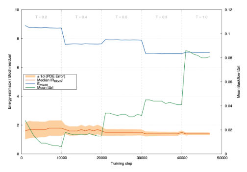 
FIG. 3: Training along the temperature curriculum (βstage = 0.2, 0.4, . . . , 1.0, dashed boundaries). Shown are the mixed energy estimator (blue, in units of ¯hω), the median Bloch residual energy with its spatial standard-deviation (orange), and the mean backflow displacement magnitude (green, axis on right). As we approach β = 1, we are entering quantum degeneracy, leading to the large up-tick in backflow strength to enforce the Pauli exclusion. We can see that SPINDRIFT successfully reduces the spatial standard deviation of the Bloch residual, while the median Bloch residual plateaus near 1 ¯hω. This may indicate that while the algorithm and the learning are functioning, our current...

**Summary.** Spindrift introduces a novel Variational Density Matrix approach that uses continuous normalising flows to learn the complex nodal structure of the thermal density matrix in restricted Path Integral Monte Carlo simulations. By training this model across an imaginary time curriculum, it bypasses the need for pre-supplied node information, establishing a self-consistent framework for studying interacting fermions at finite temperatures.

**Why it may be interesting.** This work represents a significant advancement in applying deep generative models (CNFs) to solve fundamental many-body quantum simulation problems, providing a self-consistent way to handle nodal structure which is central to fermionic physics.

Detailed structure

**Main problem.** The primary challenge is overcoming the Fermion sign problem in quantum Monte Carlo simulations, which limits the accurate calculation of ground state and finite-temperature properties.

**Main result.** The proposed method, Spindrift, successfully trains a variational density matrix that self-consistently learns the nodal structure across an imaginary time curriculum, yielding lower energy estimates than free-particle references.

**Method.** It employs a Variational Density Matrix approach parameterized by a permutation-equivariant continuous normalising flow (CNF) to generate quasi-particle backflow trajectories. Training is performed via curriculum learning using the Bloch residual as the loss function.

**Model / system.** The study focuses on $N=3$ interacting spin-polarized Fermions confined in a two-dimensional harmonic trap. The simulation evolves the thermal density matrix ($
ho$) from high temperature towards quantum degeneracy.

**Key observables.** Mixed energy estimator, Bloch residual ($E_{	ext{res}}$), and mean backflow displacement magnitude are tracked as diagnostics for nodal accuracy and convergence.

**Important parameters / regimes.** The imaginary time/temperature curriculum ($eta$ progression) is crucial, moving from high temperature ($eta 	o 0$) to quantum degeneracy ($eta=1$).

**Assumptions / limitations.** The method assumes that the density matrix can be accurately parameterized by a CNF augmented with a Jastrow factor. A key limitation is the lack of an explicit nodal action in the estimator.

**Figures summary.** Figures track energy estimators, Bloch residuals, and backflow displacement across temperature stages ($eta=0.2$ to $1.0$), demonstrating the smooth deformation of the nodal structure as quantum correlations build up.

**Paper structure.** The paper introduces Spindrift as a solution to the sign problem in PIMC by learning $
ho$. It details the CNF architecture and training strategy using curriculum learning on the Bloch residual, culminating in energy comparisons against known limits.

Abstract

Restricted path integral Monte Carlo (RPIMC) sidesteps the fluctuating Fermion sign problem by confining paths within nodal pockets of a trial density matrix, thereby recovering polynomial scaling. However, this nodal surface must be provided from elsewhere; unless it is exact, it introduces a fixed-node energy error.   Here we introduce \textsc{Spindrift}, a Variational Density Matrix approach that learns the many-body Fermionic density matrix from a regularised Bloch residual, evaluated on samples drawn by a restricted Worm algorithm. Motivated by the observation of the `purity' of quantum mechanics at high temperature (where kinetic energy dominates), we train the density matrix along a temperature (imaginary time) curriculum, learning increasingly large \emph{corrections} to the initial free-particle reference. We parametrise our model with a permutation-equivariant continuous normalising flow to generate quasi-particle backflow trajectories, modulated by a symmetric Jastrow factor. This architecture guarantees exact Fermionic antisymmetry and spatial symmetry throughout training.   Simulating $N=3$ interacting Fermions in a two-dimensional harmonic trap, we demonstrate stable curriculum training. The learnt velocity field smoothly deforms the nodal structure away from the free-particle reference. Open-Worm G-sector trapping provides a natural diagnostic for nodal accuracy.   Although the current lack of a nodal action in our estimator precludes absolute benchmarking, \textsc{Spindrift} lowers the restricted thermodynamic energy relative to the free-particle reference at each temperature, establishing a stable, physics-informed framework for finite-temperature quantum Monte Carlo where the nodal structure is learnt self-consistently.

[↑ back to top](#top)

### [Numerical Optimization of Two-Qubit Gates in Silicon Flip-Flop Qubit Arrays under Electrical Control](http://arxiv.org/abs/2607.29123v1)

**Authors:** Lorenzo D'Onofrio, Elena Ferraro, Marco De Michielis  
**Type:** theory · **Category:** quantum information and computing · **PDF:** <https://arxiv.org/pdf/2607.29123v1>  
**Analysis basis:** full PDF text, analyzed in chunks
**Topic relevance:** `spintronics-quantum-optics interface` **3/5** · `QC/QI experiment` **2/5** · `exotic spin models in light-matter` **1/5**

📷 Fig 1

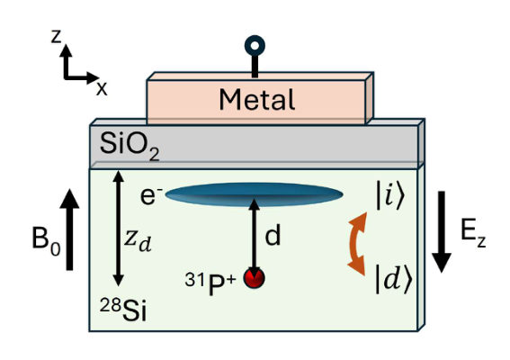 
Figure 1: Schematic of a flip-flop qubit. A 31P donor atom is embedded in bulk 28Si at a distance zd from the Si/SiO2 interface. An electric field Ez, applied through a metal gate, enables control of the electron position between the donor-bound state (|d⟩) and the interface-bound state (|i⟩). The parameter d denotes the separation between the mean positions of the donor- and interface-bound electron wavefunctions. A static magnetic field B0 is applied along the ˆz axis.

📷 Fig 2

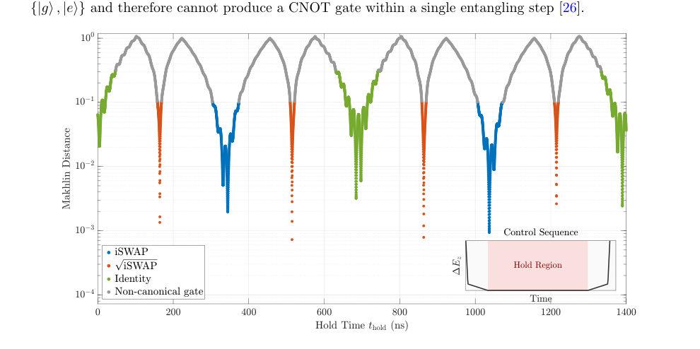 
Figure 2: Classification of two-qubit operations via Makhlin invariants as a function of the hold time thold at the ionization point (∆Ez = 0 V/m). The inset shows the symmetric control sequence applied to both qubits, displaying the vertical electric field deviation ∆Ez from the ionization reference E0 z. For each hold time, the plotted quantity is the minimum Euclidean distance between the computed Makhlin vector and the nearest ideal gate class (iSWAP, √

📷 Fig 3

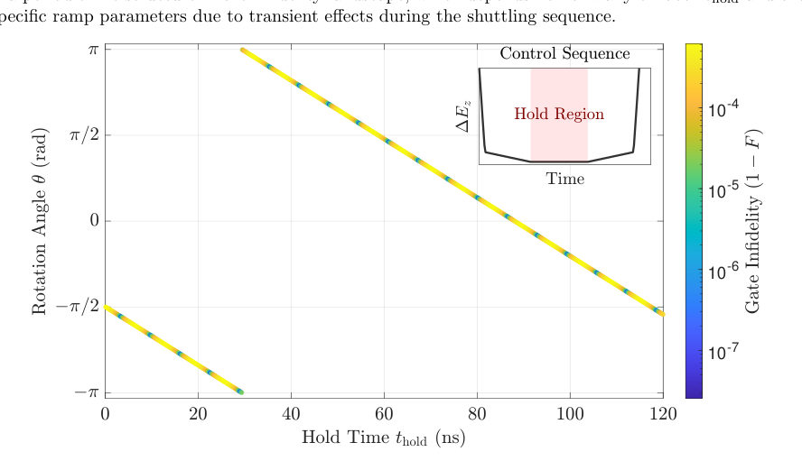 
Figure 3: Phase calibration landscape for an Rz(θ) gate in a single-qubit system. The rotation angle θ (y-axis) is extracted via bounded optimization of the effective propagator as a function of the hold time thold at the clock-transition point (x-axis). Color mapping indicates gate infidelity (1−F), accounting for both coherent errors and leakage to higher energy levels. The inset shows the control sequence, displaying the vertical electric field deviation ∆Ez from the ionization reference E0 z. Ramps are executed to and from the clock-transition bias point ∆Ect = 290 V/m.

📷 Fig 4

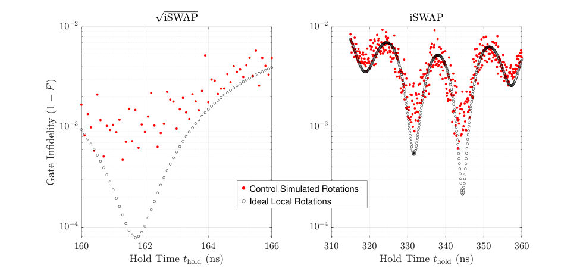 
Figure 4: Optimization landscape for composite two-qubit entangling gates. Gate infidelity is shown as a function of the hold time thold at the ionization point (∆Ez = 0 V/m) for √

📷 Fig 5

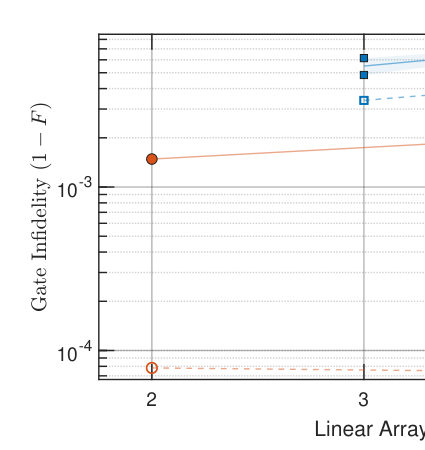 
Figure 5: Lowest gate infidelity for √

**Summary.** The paper presents a numerical framework to optimize two-qubit entangling gates ($\sqrt{iSWAP}$, $iSWAP$) in silicon flip-flop qubits using electrical control. It shows that achieving high fidelity requires more than just optimizing the interaction time; active local phase compensation and careful consideration of qubit geometry are crucial for scalability.

**Why it may be interesting.** This work provides a detailed blueprint for engineering quantum gates in solid-state platforms, demonstrating that theoretical gate design must be coupled with practical pulse shaping and device geometry considerations to achieve fault tolerance.

Detailed structure

**Main problem.** The primary challenge is achieving high-fidelity entangling quantum gates in silicon flip-flop qubits while managing complex interactions arising from orbital dynamics and neighboring qubits.

**Main result.** High fidelity requires a co-design approach that simultaneously optimizes pulse control, local phase compensation via calibrated Rz rotations, and accounts for the physical device geometry.

**Method.** The authors use numerical simulation (FlipFlopQSim) combined with Makhlin invariants to map the entangling gate landscape and optimize control pulses.

**Model / system.** The system is based on silicon donor flip-flop qubits, whose dynamics are governed by a Hamiltonian including Zeeman, hyperfine, and long-range dipole-dipole interactions. The simulation models coupled spin-orbital dynamics.

**Key observables.** Gate infidelity ($1-F$), which must be kept below the fault-tolerance threshold ($\le 10^{-3}$), and the effective logical gate operations (e.g., $\sqrt{iSWAP}$, $iSWAP$).

**Important parameters / regimes.** The analysis depends on specific physical parameters like magnetic fields ($B_0 = 0.4 	ext{ T}$) and coupling strengths, and explores regimes based on pulse hold times ($t_{	ext{hold}}$).

**Assumptions / limitations.** Key assumptions include using a reduced flip-flop subspace approximation to manage Hilbert space scaling and assuming that spectator qubits remain unexcited during the active gate operation.

**Figures summary.** Figures illustrate the mapping of entangling gates using Makhlin distance vs. hold time, showing how optimal $\sqrt{iSWAP}$ and $iSWAP$ are achieved through specific pulse timings and local corrections.

**Paper structure.** The paper introduces the physical model and challenges; it then details the use of Makhlin invariants to characterize two-qubit gates; subsequent sections focus on optimizing gate fidelity by implementing local phase compensation using calibrated Rz rotations, culminating in an analysis of multi-qubit scalability.

Abstract

Silicon-based donor flip-flop qubits offer a promising path toward scalable, fault-tolerant quantum computing by combining the long coherence times of nuclear spins with fast, fully electrical control and long-range dipole-dipole coupling between qubits. However, realizing high-fidelity entangling operations in this platform remains challenging. The entangling interaction is intrinsically coupled to electron orbital dynamics, which can lead to leakage into non-computational states and unwanted phase accumulation. Furthermore, in multi-qubit architectures, residual dipolar couplings from spectator qubits distort the effective interaction landscape. In this work, we employ a numerical simulation framework, FlipFlopQSim, that models the spin-orbital dynamics of interacting flip-flop qubits to extract effective logical operations from realistic electrical control pulses. Using Makhlin invariants, we map the entangling landscape generated by electrically controlled dipole-dipole interactions and identify operating regions locally equivalent to canonical two-qubit gates, such as $\sqrt{iSWAP}$ and $iSWAP$. We then optimize the control parameters of physically realizable, electrically driven $R_z$ rotations to implement the necessary local corrections and maximize composite gate fidelity. Finally, we scale our analysis to multi-qubit registers with various geometries and connectivity patterns to evaluate spectator-induced distortions. Our results demonstrate that high-fidelity entangling operations cannot be optimized in isolation; rather, they require a co-design approach that simultaneously optimizes pulse control, local phase compensation, and physical device geometry. This work provides a robust numerical framework for assessing the scalability of electrically controlled silicon quantum processors and outlines key design principles for robust multi-qubit gate implementation.

[↑ back to top](#top)

### [Scalar curvature density as a new invariant in thermodynamic geometry: metric dependence and critical exponents](http://arxiv.org/abs/2607.29170v1)

**Authors:** José Torres-Arenas, Jaime Jaramillo-Gutiérrez, Juan Becerra-Zamudio  
**Type:** theory · **Category:** statistical mechanics · **PDF:** <https://arxiv.org/pdf/2607.29170v1>  
**Analysis basis:** full PDF text, analyzed in chunks
**Topic relevance:** `non-equilibrium universality` **3/5** · `Keldysh / 2PI / non-Gaussian methods` **1/5** · `driven-dissipative phase transition` **1/5** · `non-equilibrium dynamics` **1/5**

📷 Fig 1

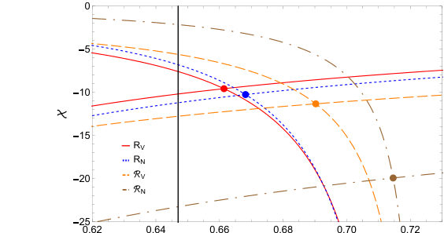 
FIG. 1. Crossing of the vapor and liquid branches for the ge- ometrical quantities of the van der Waals fluid at Tr = 0.90: RV (red line), RN (dotted blue line), RV (dashed orange line), and RN (dash-dotted brown line). The colored points repre- sent the values predicted by the X-crossing method for each quantity, while the vertical black line represents the coexis- tence vapor-liquid value obtained from the thermodynamic method (black line).

📷 Fig 2

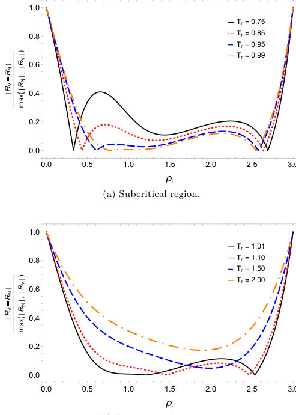 
FIG. 2. Isotherms of the ratio |RV −RN |/ max(|RV |, |RN |) for the van der Waals fluid in the subcritical and supercritical regions.

📷 Fig 3

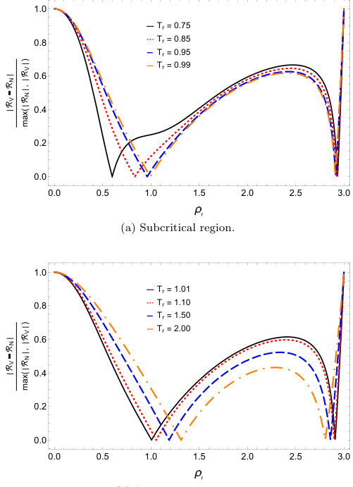 
FIG. 3. Isotherms of the ratio |RV −RN |/ max(|RV |, |RN |) for the van der Waals fluid in the subcritical and supercritical regions.

📷 Fig 4

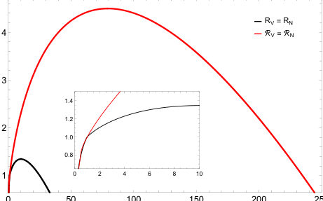 
FIG. 4. Thermodynamic states in the (T, P) plane for which the geometric quantities calculated from the V -metric and N-metric coincide for the van der Waals fluid. The black line corresponds to the condition RV = RN , while the red line corresponds to RV = RN . Along these curves, both thermodynamic representations yield an identical geometric description of the system.

📷 Fig 5

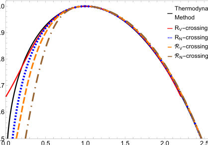 
FIG. 5. Vapor-liquid coexistence curve for the van der Waals fluid. The black line is calculated using the thermodynamic method, the other ones are obtained using the R-crossing method, with the quantities: RV (red line), RN (dotted blue line), RV (dashed orange line), and RN (dash-dotted brown line).

**Summary.** This work develops thermodynamic geometry by introducing the scalar curvature density ($\mathcal{R}$) as a new invariant alongside standard curvature ($R$). By comparing metrics derived from fixed volume versus fixed particle number ensembles across various fluid models, the authors show that $\mathcal{R}$ provides a robust geometric probe for critical exponents. The findings establish $\mathcal{R}$'s significance and reveal distinct structural features in phase diagrams compared to simpler geometric measures.

**Why it may be interesting.** While focused on classical fluids, the rigorous mathematical framework connecting geometric invariants to universal critical exponents ($eta$) provides a powerful, generalizable theoretical tool for analyzing any system exhibiting continuous phase transitions.

Detailed structure

**Main problem.** The study systematically compares different geometric invariants (metrics and curvature measures) derived from thermodynamic geometry to understand how ensemble constraints affect the description of phase transitions.

**Main result.** The scalar curvature density ($\mathcal{R}$) is established as a meaningful complement to standard curvature ($R$), showing distinct critical scaling related solely to the order parameter exponent $eta$.

**Method.** The authors construct and analyze two metrics ($g_V$ and $g_N$) leading to four geometric invariants ($R, \mathcal{R}$ for both ensembles), comparing their behavior near criticality and across phase coexistence regions.

**Model / system.** The analysis is performed on simple fluid models: van der Waals, Lennard-Jones potential systems, and Argon described by a multiparameter equation of state that reproduces non-mean-field critical behavior consistent with the Ising universality class.

**Key observables.** Scalar curvature ($R$), scalar curvature density ($\mathcal{R}$), Widom lines (minima loci for the four invariants), Curvature Equality Curve (CEC), and Curvature-Density Equality Curve (CDEC).

**Important parameters / regimes.** Critical exponents ($eta, 
u$), reduced temperature ($t$), and ensemble choice (Volume vs. Number of particles).

**Assumptions / limitations.** The analysis relies on standard critical scaling laws and hyperscaling relations; the use of specific equations of state for physical realism is key.

**Figures summary.** Figures illustrate the crossing points of the four invariants ($	ext{RV}, 	ext{RN}, \mathcal{R}_V, \mathcal{R}_N$) defining coexistence curves, and show the distinct fourfold structure of Widom lines in the supercritical region for Argon.

**Paper structure.** The paper progresses by introducing ensemble-dependent metrics ($g_V$ vs $g_N$), calculating both curvature ($R$) and density ($\mathcal{R}$), demonstrating their unique critical scaling properties, defining new equality curves (CEC/CDEC), and finally comparing the reconstruction of phase coexistence using these four invariants across multiple fluid models.

Abstract

We compare two Ruppeiner metrics constructed under fixed volume and fixed particle number conditions ($g_{_V}$ and $g_{_V}$) by analyzing the scalar curvature $R$ and introducing the scalar curvature density $\mathcal{R} = \sqrt{|g|}\,R$ as a complementary geometric invariant. Three fluid models of increasing physical realism are considered: van der Waals, Lennard-Jones, and argon described by a multiparameter equation of state that correctly reproduces non-mean-field critical behavior consistent with the Ising universality class. We find that $R$ and $\mathcal{R}$ exhibit distinct critical scaling: $R \sim t^{-dν}$ is governed by the correlation length exponent, whereas $\mathcal{R} \sim t^{-(1+β)}$ scales solely with the order parameter exponent $β$, a result that follows analytically from hyperscaling and the Rushbrooke relation independently of the universality class. The $N$-metric consistently outperforms the $V$-metric in reconstructing the vapor-liquid coexistence curve away from criticality, and the four Widom lines defined by the minima of $R_{_V}$, $R_{_N}$, $\mathcal{R}_{_V}$, and $\mathcal{R}_{_N}$ display a characteristic fourfold structure reproduced across all three models. The loci where both representations yield identical geometric descriptions define two new objects: the Curvature Equality Curve (CEC, $R_{_V} = R_{_N}$) and the Curvature-Density Equality Curve (CDEC, $\mathcal{R}_{_V} = \mathcal{R}_{_N}$), with the CDEC enclosing a substantially larger region of the phase diagram in all cases. These results establish $\mathcal{R}$ as a meaningful complement to $R$ in thermodynamic geometry and highlight the nontrivial role of metric choice in the description of phase transitions and supercritical behavior.

[↑ back to top](#top)

### [Construction of Sets of Orthogonal Quantum States with Minimal Nonlocality in Bipartite and Tripartite Systems of Unequal Local Dimensions](http://arxiv.org/abs/2607.28998v1)

**Authors:** Ben-Hao Zhao, Dong-Huan Jiang, Yu-Guang Yang, Guang-Bao Xu  
**Type:** theory · **Category:** quantum information and computing · **PDF:** <https://arxiv.org/pdf/2607.28998v1>  
**Analysis basis:** full PDF text, analyzed in chunks
**Topic relevance:** `entanglement & information structure` **3/5** · `correlated / nonlocal dissipation` **1/5** · `quantum measurements` **1/5**

📷 Fig 1

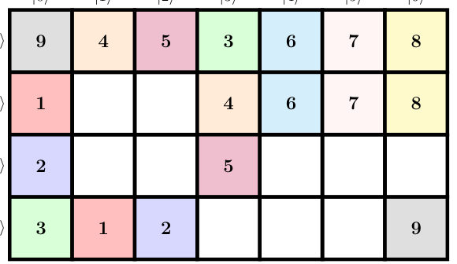 
FIG. 1. The structure of the set S1 in C4 ⊗C7 space, where |φ10⟩, |φ11⟩and |φ12⟩cover multiple grids in the figure and thus are not marked separately. The subsequent figures follow the same convention.

📷 Fig 2

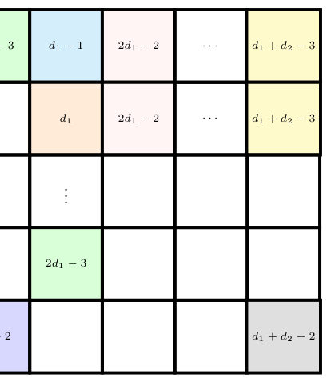 
FIG. 2. The structure of the set S2 in Cd1 ⊗Cd2 space, where 4 ≤d1 &lt; d2.

📷 Fig 3

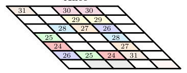 
FIG. 3. The structure of the set S4 in C5 ⊗C7 ⊗C9 space.

**Summary.** This paper develops general methods to construct sets of orthogonal quantum states exhibiting minimal nonlocality in both bipartite and tripartite quantum systems with unequal local dimensions. The authors prove that removing any single state from the set allows for perfect distinguishability via LOCC, while the full set resists such distinction. This settles a long-standing construction problem in quantum information theory.

**Why it may be interesting.** This work provides rigorous mathematical tools for characterizing fundamental resource properties (nonlocality) in multipartite quantum systems, which is crucial for understanding communication complexity and security protocols.

Detailed structure

**Main problem.** The research aims to determine the minimal cardinality of nonlocal sets of orthogonal quantum states, specifically for bipartite and tripartite systems with unequal local dimensions.

**Main result.** The authors successfully provide general construction methods that settle the problem of finding such sets in both bipartite ($	ext{C}_{d_1} \otimes 	ext{C}_{d_2}$) and tripartite ($	ext{C}_{d_1} \otimes 	ext{C}_{d_2} \otimes 	ext{C}_{d_3}$) systems with unequal local dimensions.

**Method.** The methodology involves constructing specific sets of orthogonal states and then proving minimal nonlocality by analyzing the conditions under which subsets of these states remain perfectly distinguishable via Local Operations and Classical Communication (LOCC).

**Model / system.** The study focuses on quantum systems described by tensor products of Hilbert spaces, specifically $	ext{C}_{d_1} \otimes 	ext{C}_{d_2}$ (bipartite) and $	ext{C}_{d_1} \otimes 	ext{C}_{d_2} \otimes 	ext{C}_{d_3}$ (tripartite), where the local dimensions ($d_i$) are unequal.

**Key observables.** Minimal nonlocality, distinguishability via LOCC, and the structure of measurement operators ($\{M^\dagger_{AMA}\}$ or $\{M^\dagger_{BMB}\}$).

**Important parameters / regimes.** The local dimensions $d_1, d_2, d_3$, and the specific indices defining the states within the set.

**Assumptions / limitations.** The proofs rely on analyzing orthogonality conditions derived from assuming the existence of LOCC measurements that preserve state orthogonality.

**Figures summary.** Figure 1 illustrates the structure of a minimal nonlocal set in $	ext{C}_4 \otimes 	ext{C}_7$. Figures 2 and 3 illustrate the structures of sets $S_2$ and $S_3$, respectively, in bipartite and tripartite spaces.

**Paper structure.** The paper progresses by first solving the problem for a specific case ($	ext{C}_4 \otimes 	ext{C}_7$), then generalizing the construction method to arbitrary unequal-dimensional bipartite systems, and finally extending this generalization to tripartite quantum systems.

Abstract

The research on minimal nonlocality aims to determine the minimal cardinality of nonlocal sets of quantum states. However, the construction of a nonlocal set of states in bipartite or tripartite quantum systems with unequal local dimensions remains unsolved. In this paper, we first give a method to construct a set of orthogonal quantum states with minimal nonlocality in $\mathbb{C}^{4} \otimes \mathbb{C}^{7}$ quantum system. Then we give a general method to construct a set of orthogonal quantum states with minimal nonlocality in a bipartite quantum system with unequal local dimensions. Furthermore, we generalize the construction method to tripartite quantum system with unequal local dimensions, and construct a set of orthogonal quantum states with minimal nonlocality in $\mathbb C^{d_1} \otimes \mathbb C^{d_2}\otimes \mathbb C^{d_3}$ quantum system for $5\le d_1 < d_2 < d_3$. Our work settles the construction problem of a set of orthogonal states with minimal nonlocality in both bipartite and tripartite systems with unequal local dimensions.

[↑ back to top](#top)

### [High-NA vectorial hologram optimization](http://arxiv.org/abs/2607.29505v1)

**Authors:** Michael Wischert, Fiona Hellstern, Paul Uerlings, Tilman Pfau, Stephan Welte, Ralf Klemt  
**Type:** theory · **Category:** other · **PDF:** <https://arxiv.org/pdf/2607.29505v1>  
**Analysis basis:** full PDF text, analyzed in chunks
**Topic relevance:** `interference shaping light` **3/5** · `analog quantum simulation` **1/5** · `methods for driven-dissipative` **1/5**

📷 Fig 1

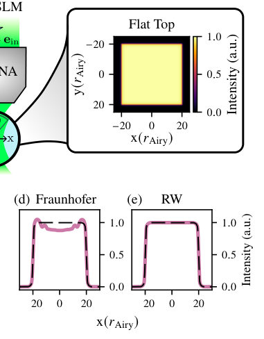 
Fig. 1. High-NA CGH geometry and representative Fraunhofer model errors. (a) Schematic of the SLM-based high-NA focusing geometry used for the numerical benchmarks. The insets show the tweezer-array and extended flat-top intensity targets. Here 𝑟Airy = 0.61𝜆/NA denotes the Airy-radius diffraction scale. (b)-(e) All displayed intensity data are evaluated with the vectorial Richards-Wolf (RW) propagation model at NA = 0.7. (b) Magnified view of a single, near-diffraction-limited tweezer generated from a phase hologram optimized with scalar Fraunhofer propagation, showing an elliptical focal spot under RW evaluation. The dashed contour marks the 1/𝑒2 intensity level. (c) Corresponding tweezer...

📷 Fig 2

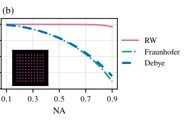 
Fig. 2. Systematic NA dependence of scalar and vectorial CGH fidelity under RW evaluation. For each numerical aperture, the SLM phase was optimized with the indicated forward model and the reported metric was computed after evaluating the final phase with RW propagation. (a) Uniformity 𝑢of the extended flat-top target versus NA. (b) Mean ellipticity 𝜀of the tweezer-array target versus NA, with 𝜀= 1 corresponding to circular traps. The insets show the respective targets, and the dashed gray line in (a) indicates the signal region for the uniformity calculations.

📷 Fig 3

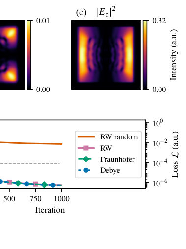 
Fig. 3. Fully vectorial optimization of an extended flat-top profile at NA = 0.7. All intensities are normalized to the mean total intensity in the flat-top signal region, and the component panels use separate color ranges. Panels (a)-(c) show the component intensities |𝐸𝑥|2, |𝐸𝑦|2, and |𝐸𝑧|2. (d) The resulting total intensity landscape (|E|2). Horizontal and vertical cross-sections (bottom and left margins) compare the optimized solution (solid curve) with the ideal target profile (dashed curve), demonstrating excellent agreement. (e) Self-consistent optimization loss over M for each run, evaluated with the same forward model used during that run. This panel compares convergence behavior...

📷 Fig 4

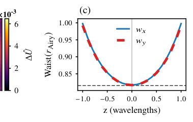 
Fig. 4. Direct optimization of a polarization-dependent optical dipole potential at NA = 0.7. All panels are evaluated with the full Richards-Wolf (RW) field and the optical potential of Eq. (9). Panels (a) and (b) use the separate color scales shown by their color bars. (a) Normalized absolute residual Δ ˆ𝑈= | ˆ𝑈sim −ˆ𝑈tar| for the scalar reference, obtained from a Fraunhofer-optimized hologram and evaluated with the full RW optical potential. The normalized potentials ˆ𝑈are mean-subtracted and Frobenius- normalized inside 𝑀1/𝑒2 (dashed contour) as defined in Eq. (12). The arrow indicates the in-plane quantization-axis direction ˆe𝐵. (b) Corresponding normalized absolute residual for...

**Summary.** This paper develops a full vectorial framework to optimize computer-generated holograms for high numerical aperture optics, overcoming fidelity losses associated with standard scalar approximations. By using the Richards-Wolf model in a gradient-based optimization loop, the authors demonstrate superior control over target intensity and polarization structure compared to simpler models. This has significant implications for advanced quantum trapping and light-matter interaction experiments.

**Why it may be interesting.** This work directly tackles the computational optics challenges inherent in modern quantum trapping and manipulation techniques that rely on precise light field control at high NA. The rigorous comparison between scalar and vectorial models is crucial for designing next-generation optical elements for AMO experiments.

Detailed structure

**Main problem.** The study addresses the fidelity degradation when optimizing computer-generated holograms (CGHs) for high numerical aperture (NA) optical systems using standard scalar approximations instead of full vectorial models.

**Main result.** Using a differentiable Richards-Wolf model, the optimization successfully generates highly uniform intensity profiles and allows for the direct optimization of objectives dependent on local polarization state, significantly outperforming scalar methods at high NA.

**Method.** The authors employ gradient-based nonlinear optimization techniques (e.g., L-BFGS) applied to a differentiable Richards-Wolf forward model to find the optimal phase modulation required to match a target intensity profile.

**Model / system.** The system involves using Spatial Light Modulators (SLMs) as programmable pupil-plane phase elements in high-NA focusing geometries. The propagation is modeled by comparing the full vectorial Richards-Wolf (RW) formalism against scalar approximations like Debye and Fraunhofer models.

**Key observables.** Target uniformity, mean tweezer ellipticity ($\epsilon$), and reduction in normalized residual for polarization-sensitive potentials.

**Important parameters / regimes.** High Numerical Aperture (NA=0.9), target geometries (tweezer arrays, flat-top profiles), and the comparison between vectorial vs. scalar light propagation models.

**Assumptions / limitations.** The surrounding medium is assumed to have a refractive index of n=1; scalar models are fundamentally limited as they ignore polarization mixing effects crucial at high NA.

**Figures summary.** Figures compare intensity profiles for tweezer and flat-top targets, contrasting the superior uniformity achieved via RW optimization against the fidelity loss observed using scalar approximations (Fraunhofer/Debye).

**Paper structure.** The paper establishes the limitations of scalar models at high NA, details the implementation of gradient-based optimization using the full vectorial Richards-Wolf model, demonstrates quantitative improvements in target shaping metrics (uniformity, ellipticity), and extends the framework to polarization-sensitive objectives.

Abstract

We present a vectorial phase-only framework for the gradient-based optimization of computer-generated holograms. Our approach addresses a critical limitation in high numerical aperture (NA) optical systems, where standard scalar approximations often experience significant fidelity degradation. We highlight the limitations of scalar diffraction models (Fraunhofer and Debye) at high NA for representative classes of target intensities, namely tweezer arrays and extended flat-top profiles. Using a differentiable Richards-Wolf forward model, we numerically demonstrate stable algorithmic convergence and the generation of highly uniform intensity profiles in the deep non-paraxial regime. At NA=0.9, Richards-Wolf (RW) optimization reaches flat-top and tweezer uniformities of 99.97 % and 99.98 %, respectively, with a mean tweezer ellipticity of $\varepsilon=$1.007, while scalar forward models show target-dependent degradation in plateau fidelity or focal geometry. Furthermore, because the RW model returns the full vectorial field, the same framework can optimize objectives that depend on local polarization. We demonstrate this for a polarization-sensitive optical-dipole-potential target, where direct RW-potential optimization reduces the mean normalized residual by more than an order of magnitude when including vector and tensor light-shift terms.

[↑ back to top](#top)

### [On the Origin of Beyond-Classical Advantage in the Parity-Permutation Problem](http://arxiv.org/abs/2607.29073v1)

**Authors:** Jayashree Karmakar, Biswadeep Chatterjee, Rafiuddin Gazi, Ananya Chakraborty, Snehasish Roy Chowdhury, Manik Banik, Tamal Guha, Sahil Gopalkrishna Naik, Kunika Agarwal  
**Type:** theory · **Category:** quantum information and computing · **PDF:** <https://arxiv.org/pdf/2607.29073v1>  
**Analysis basis:** full PDF text, analyzed in chunks
**Topic relevance:** `entanglement & information structure` **3/5** · `Keldysh / 2PI / non-Gaussian methods` **1/5** · `quantum measurements` **1/5**

📷 Fig 1

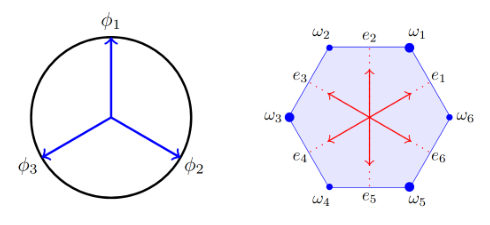 
Figure 1. Left: Three qubits prepared in the product state |ϕ1⟩⊗ |ϕ2⟩⊗|ϕ3⟩, with |ϕ1⟩= |0⟩, |ϕ2⟩= 1 2 |0⟩− √

📷 Fig 2

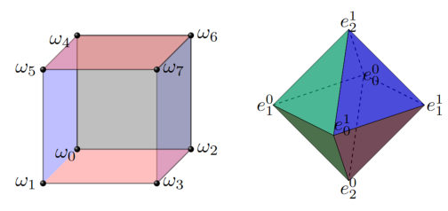 
Figure 2. Cube theory: the normalized state space Ωcu ≡ Conv.Hull{ωk}7 k=0. It has the six ray extreme effects {ej i}2,1 i,j=0.

**Summary.** The paper analyzes the Parity-Permutation Problem to pinpoint the fundamental resource enabling quantum advantage. It proves that this advantage depends not on entanglement itself, but on the linear dimension of the underlying state space ($L_{dS} \geq n$). This result is significant because it provides a necessary and sufficient condition for detecting non-classical correlations using simple product-state preparations.

**Why it may be interesting.** This work provides a deep theoretical characterization of resource theories, showing that operational advantages can be witnessed by simple dimensional constraints rather than requiring complex entanglement structures, which is highly relevant for understanding physical limits in quantum information processing.

Detailed structure

**Main problem.** The paper investigates the fundamental resource governing quantum advantage when solving the Parity-Permutation Problem, $P[n]$. It seeks to determine if entanglement or merely the linear dimension of the state space is responsible for non-classical success probabilities.

**Main result.** The existence of a probabilistic advantage in $P[n]$ is fundamentally characterized by the linear dimension ($L_{dS}$) of the underlying theory, requiring $L_{dS} \geq n$. This advantage can be achieved using product-state preparations, suggesting that entanglement is not strictly necessary for an operational gain.

**Method.** The analysis uses information theoretic tools applied to Generalized Probabilistic Theories (GPTs) to distinguish between two mixed states ($\chi_E$ and $\chi_O$) corresponding to even and odd permutations. Success probabilities are calculated using bounds like the Helstrom bound.

**Model / system.** The problem is modeled as determining the parity of a permutation applied to $n$ particles, analyzed first with qubits ($P[3]$) and then generalized to abstract GPTs characterized by their linear dimension $L_{dS}$.

**Key observables.** Success probability ($P[n]$), Linear Dimension ($L_{dS}$), Operational Dimension (OD).

**Important parameters / regimes.** The number of particles, $n$; the required minimum local dimension for advantage; $\lceil\sqrt{n}
ceil$ levels.

**Assumptions / limitations.** The work explores moving beyond standard quantum mechanics by analyzing locally quantum theories and GPTs to test the necessity of entanglement.

**Figures summary.** Figure 1 illustrates optimal product state preparation achieving $7/8$ success for $P[3]$, and also shows an alternative scenario achieving perfect success without entanglement. Table II details measurement settings used to distinguish states.

**Paper structure.** The paper establishes classical limits, demonstrates quantum advantage using qubits ($P[3]$), then analyzes optimal product vs. bi-separable preparations, culminating in a general theorem characterizing the necessary condition for advantage based on the linear dimension within GPTs.

Abstract

We investigate the task of identifying the parity (odd vs even) of an unknown permutation applied to $n$ particles. Classically, using fewer than $n$ distinct labels per particle limits the success probability to random guessing, whereas quantum mechanics, exploiting entanglement in both preparation and measurement, accomplishes the task perfectly with as few as $\big\lceil \sqrt{n}\big\rceil$ levels per particle [\href{https://doi.org/10.1103/yhyv-xnwq}{PRL {\bf 135}, 260603 (2025)}]. We show that even without entangled preparation, quantum theory still offers a probabilistic advantage over classical strategies. Moreover, such product preparations yield perfect success in locally quantum theories, where elementary systems are quantum but their composition follows the minimal tensor product structure of generalized probabilistic theories (GPTs). We further identify GPT models that accomplish the task with certainty without requiring entanglement either at the preparation stage or at the measurement stage. Our central result establishes that the linear dimension of the elementary systems, rather than entanglement, is the fundamental resource governing the existence of probabilistic advantage in the permutation parity problem. In particular, below the required dimension threshold, no amount of entanglement can improve upon the random-guessing limit.

[↑ back to top](#top)

### [Online Shadow Tomography Matching the Classical Bounds](http://arxiv.org/abs/2607.29686v1)

**Authors:** Sitan Chen, Ryan O'Donnell, Angelos Pelecanos, John Wright  
**Type:** theory · **Category:** quantum information and computing · **PDF:** <https://arxiv.org/pdf/2607.29686v1>  
**Analysis basis:** full PDF text, analyzed in chunks
**Topic relevance:** `quantum measurements` **3/5** · `entanglement & information structure` **1/5** · `measurement-induced transitions` **1/5**

📷 Fig 1

 
Low-resolution page preview, page 2

📷 Fig 2

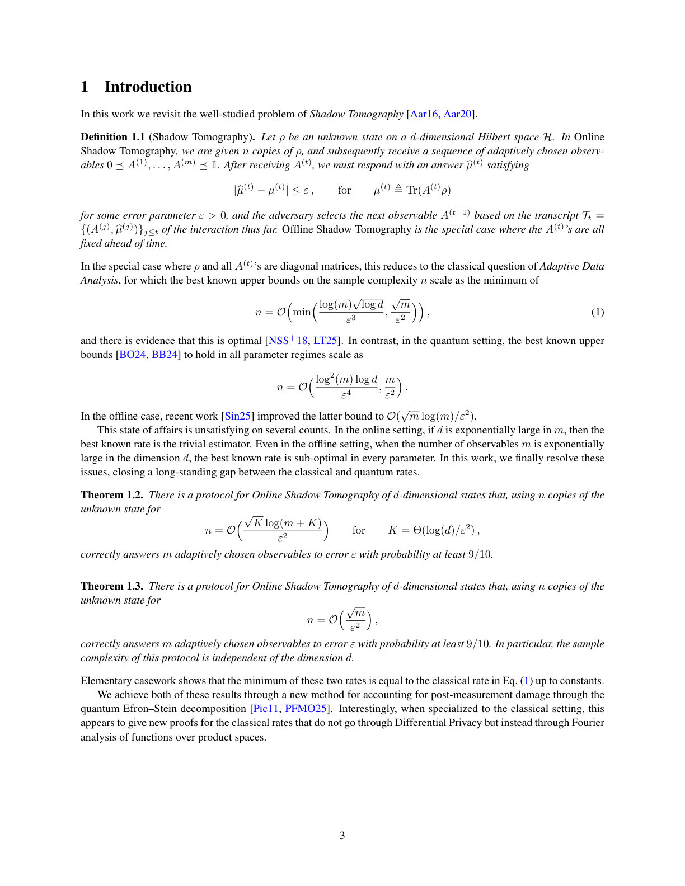 
Low-resolution page preview, page 3

📷 Fig 3

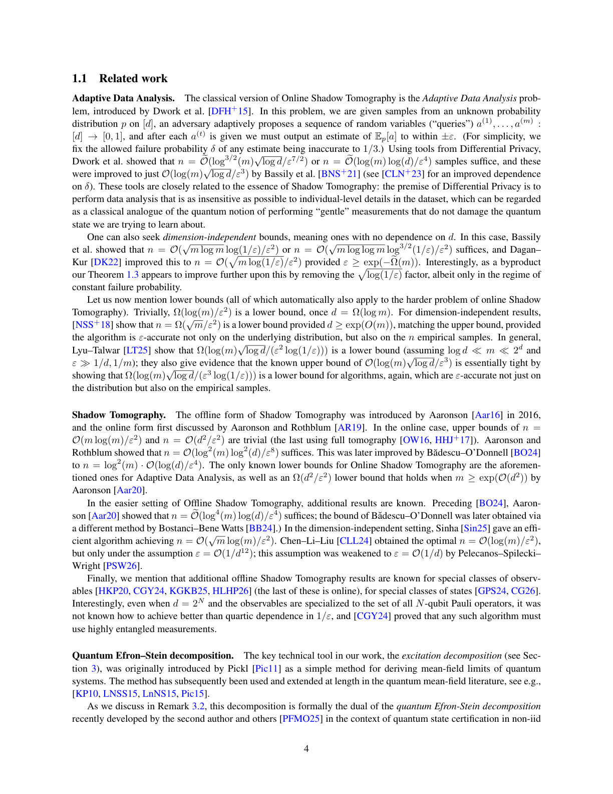 
Low-resolution page preview, page 4

📷 Fig 4

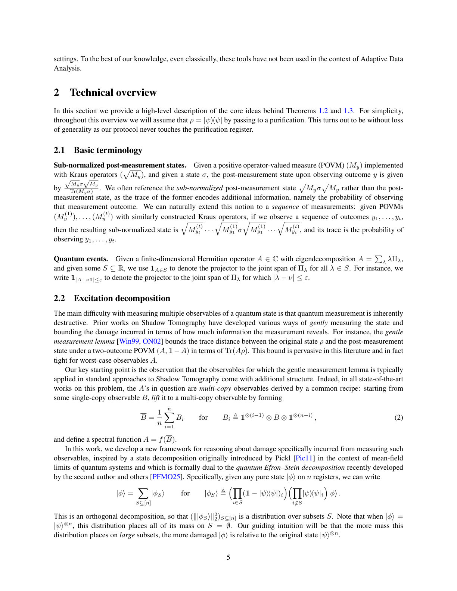 
Low-resolution page preview, page 5

📷 Fig 5

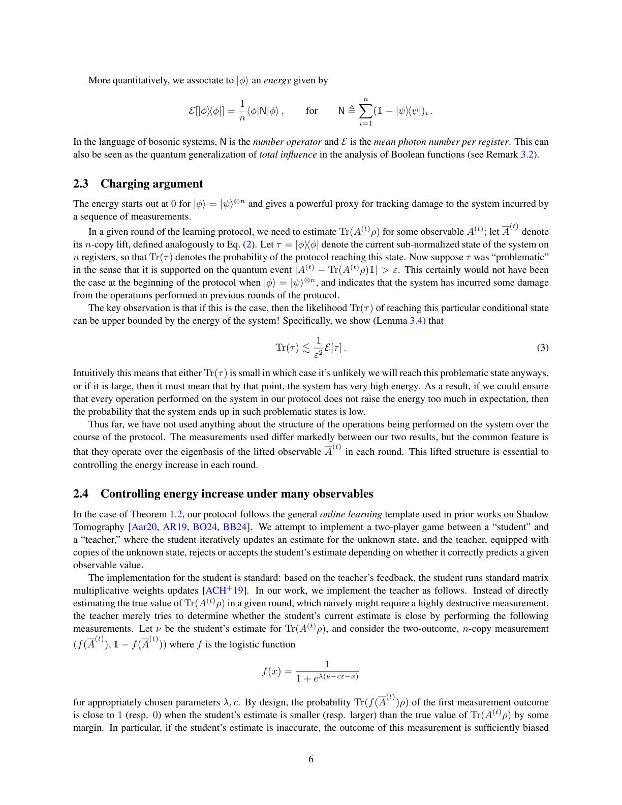 
Low-resolution page preview, page 6

**Summary.** This paper develops advanced theoretical techniques, notably using the quantum Efron–Stein decomposition, to solve Online Shadow Tomography. It achieves sample complexity bounds for estimating unknown quantum states that match the best known classical rates from Adaptive Data Analysis. This advances our understanding of resource requirements for state characterization in quantum physics.

**Why it may be interesting.** It provides rigorous theoretical tools (quantum Efron-Stein decomposition) to analyze resource scaling in quantum state estimation tasks that are central to understanding measurement limitations in open quantum systems.

Detailed structure

**Main problem.** The paper addresses Online Shadow Tomography, which is the quantum generalization of Adaptive Data Analysis: estimating the expectation value $	ext{Tr}(A^{(t)}
ho)$ for a sequence of adaptively chosen observables $A^{(t)}$ given copies of an unknown state $
ho$.

**Main result.** The authors close the gap between classical and quantum sample complexity bounds, providing algorithms that match the best known rates for both online and dimension-independent settings.

**Method.** The key technical tool is a new framework quantifying post-measurement damage based on the quantum Efron–Stein decomposition. The analysis uses information-theoretic tools like KL divergence and Pinsker's inequality in related sections.

**Model / system.** The system involves an unknown quantum state $
ho$ on a $d$-dimensional Hilbert space, subjected to sequential measurements defined by observables $A^{(t)}$.

**Key observables.** $	ext{Tr}(A^{(t)}
ho)$ (the quantity to be estimated), sample complexity ($n$), and the 'energy' quantifying post-measurement damage.

**Important parameters / regimes.** $d$ (dimension), $m$ (number of observables), and $\epsilon$ (required estimation error).

**Assumptions / limitations.** The analysis often assumes passing to a purification ($
ho = |\psi
angle\langle\psi|$) without loss of generality, and relies on bounding energy increase via the Efron-Stein decomposition.

**Paper structure.** The paper develops theory in stages: first establishing the core framework for quantifying measurement damage using quantum Efron–Stein decomposition; second, applying this to derive sample complexity bounds for Online Shadow Tomography matching classical rates; and third, exploring related information-theoretic bounds for best observable selection.

Abstract

In \emph{Online Shadow Tomography}, we are given copies of an unknown $d$-dimensional quantum state $ρ$, an adversary (adaptively) proposes a sequence of bounded observables $A^{(1)},\ldots,A^{(m)}$, and after each $A^{(t)}$ is given we must estimate $\Tr(A^{(t)}ρ)$ to within $\pm ε$.   This is the direct quantum generalization of the classical problem of \emph{Adaptive Data Analysis}. %The ``offline'' case, in which $A^{(1)}, \ldots, A^{(m)}$ are given upfront, is also a well-studied problem. The main goal is to minimize the number of copies, $n$, required.   Prior results for online Shadow Tomography were suboptimal in all three parameters $m, d, ε$, lagging behind the best known and classical rates~\cite{bassily2021algorithmic}, for which there is some evidence of optimality. In this work, we finally close this gap, giving a pair of algorithms   matching the classical rates.   The bound on the left is the first to achieve $o(\log^2 m)$-dependence together with $\poly(\log(d)/\eps)$; moreover, it improves all three exponents even in the \emph{Offline} Shadow Tomography setting. The bound on the right is known to be optimal among bounds independent of~$d$, and improves the best prior result by a $\sqrt{m} \log m$ factor.   The key to our proof is a new framework for quantifying post-measurement damage, based on the quantum Efron--Stein decomposition.

[↑ back to top](#top)

### [Detection-resolution limits of large-momentum-transfer atom gravimetry](http://arxiv.org/abs/2607.28749v1)

**Authors:** Asad Ali, Saif Al-Kuwari  
**Type:** theory · **Category:** other · **PDF:** <https://arxiv.org/pdf/2607.28749v1>  
**Analysis basis:** full PDF text, analyzed in chunks
**Topic relevance:** `quantum measurements` **3/5** · `measurement-induced transitions` **1/5**

📷 Fig 1

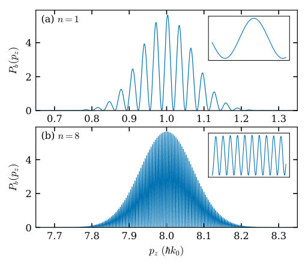 
FIG. 1. Momentum distribution of output port b of the mir- rorless interferometer (s = T/2) at g = 0, for momentum transfer (a) n = 1 and (b) n = 8, with σ = 10 k−1 0 and T = 200 t0, where t0 = m/(ℏk2 0). Insets: magnified views of the fringes over a window of width 0.04 ℏk0. The fringe period 2πm/(nk0T) decreases as 1/n while the Gaussian envelope, of width δp = ℏ/( √

📷 Fig 2

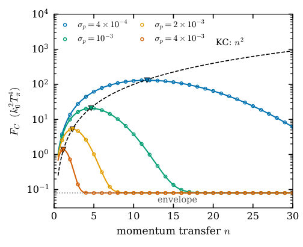 
FIG. 2. CFI of the mirrorless interferometer versus momen- tum transfer n for four detector resolutions σp (in units of ℏk0; legend). Solid lines: closed form, Eq. (14); circles: direct numerics; triangles: the optimum n∗of Eq. (18). Dashed line: conventional KC interferometer with the same momentum transfer, F = n2k2 0T 4 π, which is insensitive to σp (Sec. IV). Dotted line: envelope information floor. Parameters as in Fig. 1.

📷 Fig 3

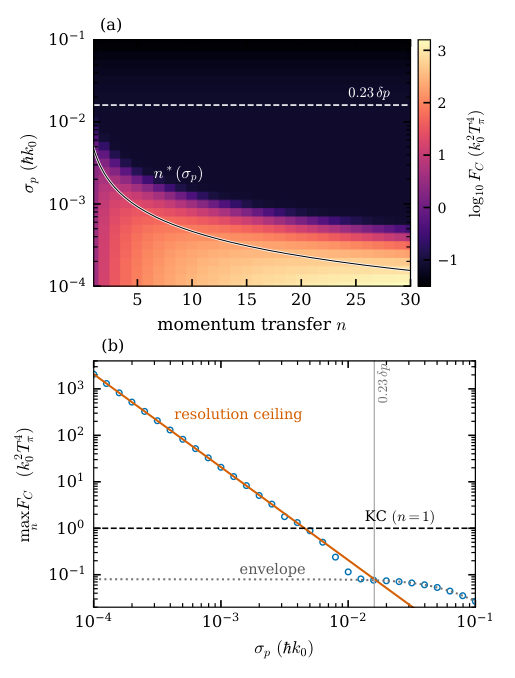 
FIG. 3. (a) CFI of the mirrorless interferometer over momen- tum transfer n and detector resolution σp (direct numerics; color scale: log10 FC in units of k2 0T 4 π). The white curve is the optimal momentum transfer n∗(σp), Eq. (18); the dashed line marks the fringe–envelope crossover, Eq. (21). (b) CFI at the optimal n (circles: numerical maximum over n, evaluated at n = round(n∗) where n∗&gt; 30) compared with the resolution ceiling, Eq. (19), the envelope information (dotted), and the n=1 KC value (dashed). The numerics follow the ceiling until the crossover, Eq. (21) (vertical line), and ride the envelope floor beyond it.

📷 Fig 4

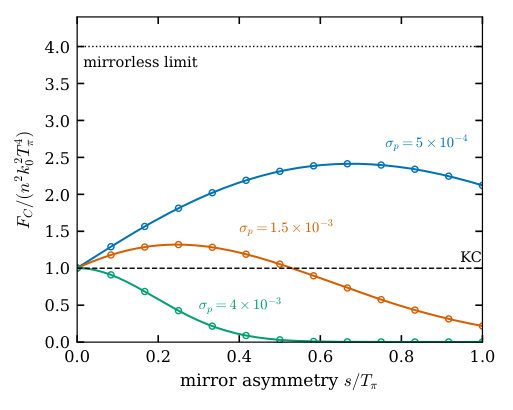 
FIG. 4. CFI, normalized to the KC value n2k2 0T 4 π, across the interpolating family of interferometers, versus mirror asym- metry s, for n = 5 and three detector resolutions (labels ad- jacent to each curve, in units of ℏk0). Solid lines: closed form, Eq. (14); circles: direct numerics. For good resolution the optimum is the fully mirrorless sequence (s = Tπ); for poorer resolution an interior optimum s∗emerges, and a par- tial asymmetry still exceeds the symmetric KC value (dashed line).

**Summary.** This paper theoretically investigates the detection-resolution limits of atom gravimeters utilizing large momentum transfer. It models the trade-off between enhanced phase sensitivity and signal degradation due to finite detector resolution, comparing standard versus 'mirrorless' interferometer designs. The key finding is that superior performance requires the detector resolution to be sufficiently high relative to the applied momentum transfer.

**Why it may be interesting.** This work provides quantitative limits on precision measurements in quantum sensing platforms (atom interferometry), directly addressing how practical limitations like detector noise constrain theoretical enhancements derived from advanced quantum techniques.

Detailed structure

**Main problem.** The study analyzes the fundamental trade-off between enhancing gravitational phase sensitivity using large momentum transfer (LMT) in atom interferometers and maintaining high measurement fidelity against finite detector resolution.

**Main result.** Mirrorless operation only surpasses conventional interferometers if the detector resolution exceeds a specific threshold related to the momentum transfer; otherwise, the best achievable sensitivity is limited by the detector's Gaussian blur.

**Method.** The authors derive closed-form expressions for blurred output distributions and calculate the Classical Fisher Information (CFI) by analyzing how detection blurring convolves with the ideal quantum phase accumulation.

**Model / system.** The system models light-pulse atom interferometers, comparing standard Kasevich–Chu sequences against 'mirrorless' geometries using atoms in internal states. The analysis uses a solvable model incorporating Gaussian source and detection blur.

**Key observables.** Classical Fisher Information (CFI), Quantum Fisher Information (QFI), fringe visibility, and the minimum detectable acceleration ($\Delta g$).

**Important parameters / regimes.** Large momentum transfer factor ($n$), detector resolution ($\sigma_p$), interferometer time ($T$), and mirror asymmetry parameter ($s$).

**Assumptions / limitations.** The model assumes instantaneous, lossless $n$-photon pulses and Gaussian source/detection blurring; the analysis relies on approximations for the fringe-phase averaging.

**Figures summary.** Figures illustrate momentum distributions for different LMT factors (e.g., n=1 vs n=8) in the context of atom interferometry setups.

**Paper structure.** The paper develops the theory by first establishing the QFI, then deriving the blurred output distributions via convolution lemmas, and finally optimizing the CFI to determine the resolution-limited sensitivity floor for various interferometer geometries.

Abstract

Large momentum transfer (LMT) enhances the gravitational phase of a light-pulse atom interferometer by a factor $n$, while mirrorless operation with momentum-resolved detection can quadruple the phase-carrying quantum Fisher information. These gains compete in practice because the momentum-space fringe period scales as $1/n$, making the fringe signal increasingly vulnerable to finite detector resolution. We analyze this trade-off in a solvable model with instantaneous lossless $n$-photon pulses, a Gaussian source, and Gaussian detection blur, allowing continuous interpolation between Kasevich--Chu and mirrorless geometries. Closed-form expressions for the blurred output distributions and classical Fisher information are obtained, with a fringe-phase averaging approximation whose error is exponentially suppressed and agrees with numerical simulations at the $10^{-8}$ level. We find that mirrorless operation surpasses a conventional interferometer with the same momentum transfer only when $σ_p < 0.91\,m/(n k_0 T)$. Fringe-based readout exhibits an optimal momentum transfer $n^* \simeq 0.93\,m/(σ_p k_0 T)$ and a resolution-limited sensitivity floor $Δg \simeq 4.4\,σ_p/(mT\sqrt{N})$, independent of photon momentum. When this criterion is not satisfied, partial mirror asymmetry can recover part of the enhancement, whereas population-based readout remains insensitive to detector blur and ultimately favors the conventional sequence at sufficiently large $n$. Estimates for $^{87}$Rb sensors show that the mirrorless advantage is primarily restricted to short-baseline instruments.

[↑ back to top](#top)

### [iSWAP maximises the second-moment spectral gap in random quantum circuits](http://arxiv.org/abs/2607.29551v1)

**Authors:** Yanying Liang, Haoran Zhu  
**Type:** theory · **Category:** quantum information and computing · **PDF:** <https://arxiv.org/pdf/2607.29551v1>  
**Analysis basis:** full PDF text, analyzed in chunks
**Topic relevance:** `entanglement & information structure` **3/5** · `non-equilibrium dynamics` **1/5**

📷 Fig 1

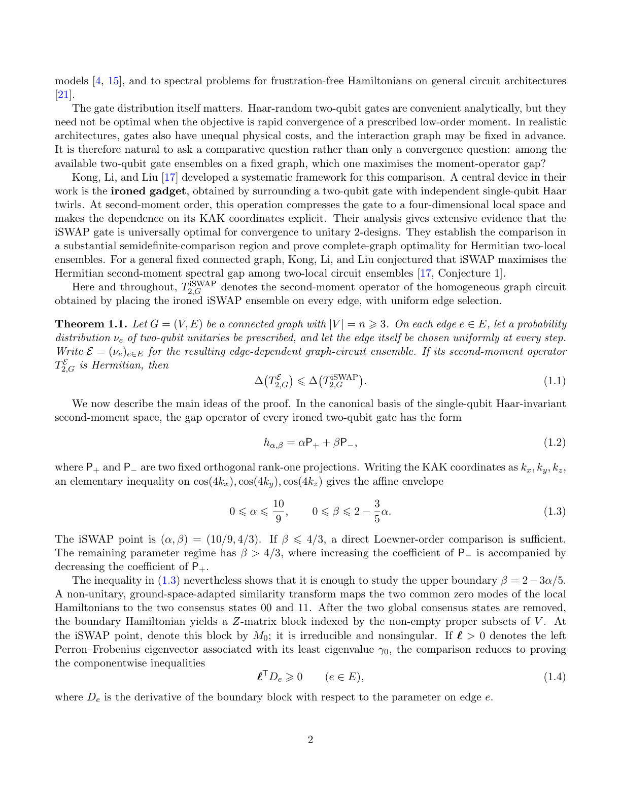 
Low-resolution page preview, page 2

📷 Fig 2

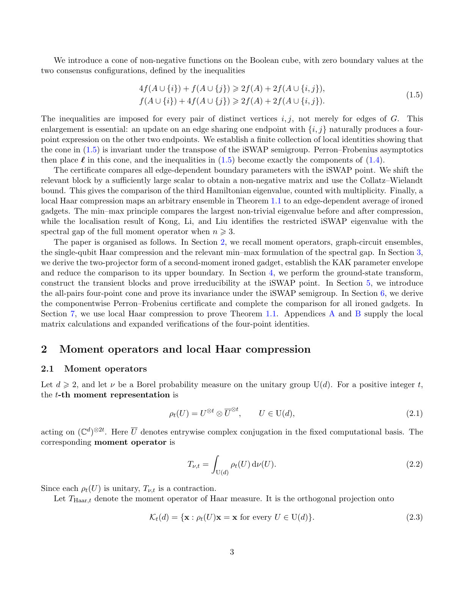 
Low-resolution page preview, page 3

📷 Fig 3

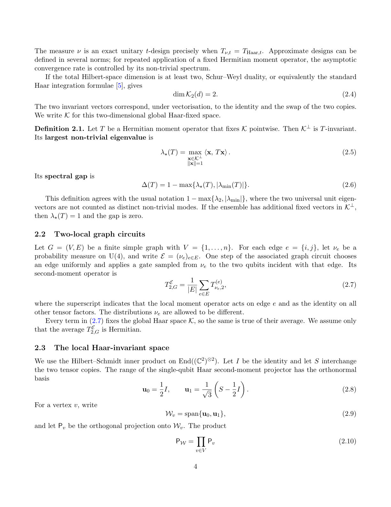 
Low-resolution page preview, page 4

📷 Fig 4

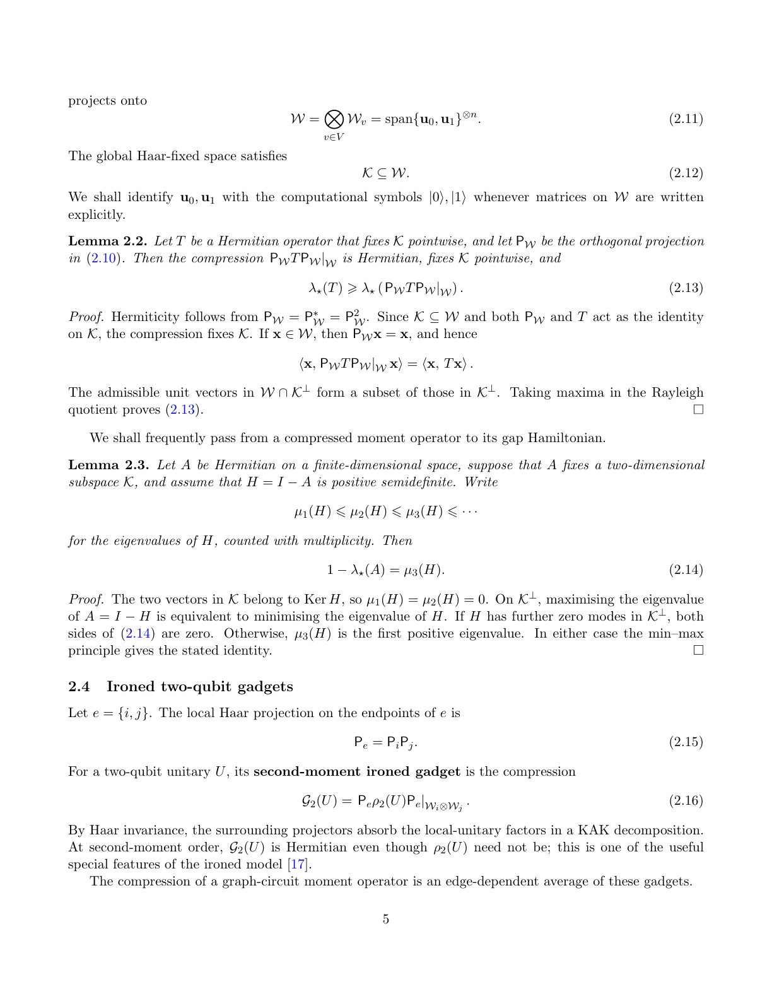 
Low-resolution page preview, page 5

📷 Fig 5

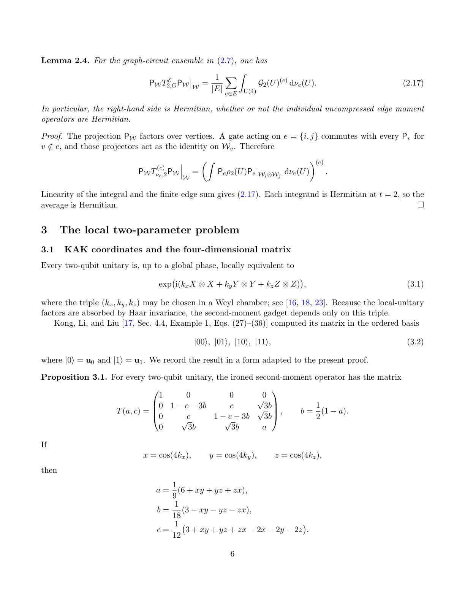 
Low-resolution page preview, page 6

**Summary.** The paper rigorously proves that using the iSWAP gate maximizes the spectral gap of the second-moment operator in random quantum circuits defined on any connected graph. It achieves this by employing sophisticated mathematical tools like Perron–Frobenius theory to compare the dynamics generated by arbitrary local gates against those generated by iSWAP.

**Why it may be interesting.** This work provides rigorous theoretical bounds on how efficiently quantum information can spread or mix across a network structure, which is fundamental for understanding quantum computation and quantum communication protocols.

Detailed structure

**Main problem.** The research aims to determine which two-local unitary gate ensemble maximizes the spectral gap of the Hermitian second-moment operator for random quantum circuits on a given graph.

**Main result.** The iSWAP gate was proven to maximize this spectral gap among all considered two-local circuit ensembles for connected graphs with at least three vertices.

**Method.** The proof involves advanced mathematical techniques, including analyzing the invariance of polyhedral cones under the iSWAP semigroup and utilizing Perron–Frobenius theory on associated block matrices.

**Model / system.** The model consists of random quantum circuits applied to a connected graph G=(V, E), where the dynamics are governed by local two-qubit unitaries acting on edges. The analysis focuses on the second-moment operator derived from these gates.

**Key observables.** Spectral gap ($\Delta(T)$) of the second-moment operator; largest non-trivial eigenvalue ($\lambda^\star$) and minimum eigenvalue ($\mu_3$).

**Important parameters / regimes.** The graph structure (connectedness, $|V| \ge 3$); parameters $(\alpha, eta)$ characterizing local gate strengths.

**Assumptions / limitations.** The analysis assumes the resulting average moment operator is Hermitian; comparisons are often reduced to analyzing specific boundary conditions or parameter regimes.

**Figures summary.** Not specified in the notes, but the text refers to equations and theorems detailing spectral gap bounds and matrix structures.

**Paper structure.** The paper develops by first establishing the general problem of maximizing the spectral gap. It then reduces this comparison to analyzing specific mathematical objects (cones, block matrices) whose properties are proven using Perron–Frobenius theory, culminating in the main theorem comparing iSWAP to arbitrary ensembles.

Abstract

We prove that the $\mathrm{iSWAP}$ gate maximises the spectral gap of the Hermitian second-moment operator on every connected graph with at least three vertices, among all two-local unitary circuit ensembles. We further prove that the polyhedral cone defined by asymmetric four-point inequalities is invariant under the transpose of the $\mathrm{iSWAP}$ semigroup, yielding a componentwise comparison certificate for its positive Perron--Frobenius eigenvector. These results resolve a conjecture of Kong, Li, and Liu.

[↑ back to top](#top)

### [Photoemission insights into lanthanide-based crystals](http://arxiv.org/abs/2607.29166v1)

**Authors:** Dmitry Yu. Usachov, Georg Poelchen, Vasily S. Stolyarov, Kristin Kliemt, Cornelius Krellner, Denis V. Vyalikh  
**Type:** experiment · **Category:** strongly correlated electrons · **PDF:** <https://arxiv.org/pdf/2607.29166v1>  
**Analysis basis:** full PDF text, analyzed in chunks
**Topic relevance:** `Kondo & dissipative impurity` **3/5** · `spintronics-quantum-optics interface` **1/5**

📷 Fig 1

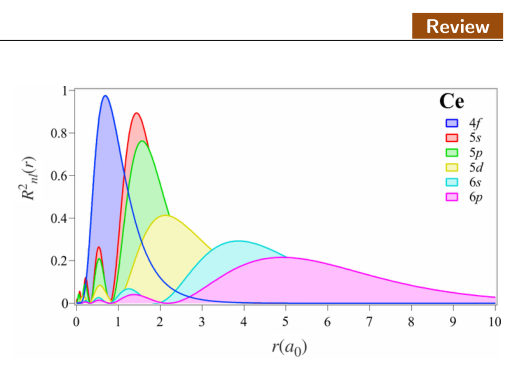 
Figure 1. Representative radial probability distributions R2 nℓ(r) of selected atomic orbitals for a Ce atom are shown as a function of the radial distance r (expressed in units of the Bohr radius a0), with Ce serving as a representative example.23, 24 The strongly localized 4f states (light blue) are confined to small radii, largely inside the closed 5s and 5p shells, reflecting their atomic-like character and weak contribution to chemical bonding. In contrast, the 5d and 6sp orbitals exhibit significantly broader radial distributions extending to larger distances, indicative of their more delocalized nature and enhanced spatial overlap. This clear separation in radial extent highlights...

📷 Fig 2

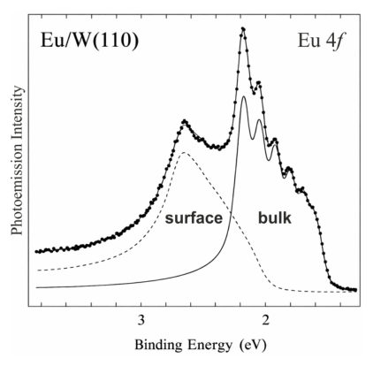 
Figure 2. High-resolution photoemission spectrum of a thin Eu(110) film prepared on W(110), taken with He II radiation at 20 K. Individual 7FJ multiplet components of the bulk Eu spectrum are clearly resolved. The contribution from the topmost surface layer (dashed subspectrum) is less well resolved and shifted toward higher binding energies due to the surface core-level shift. Data taken from Ref. [43].

📷 Fig 3

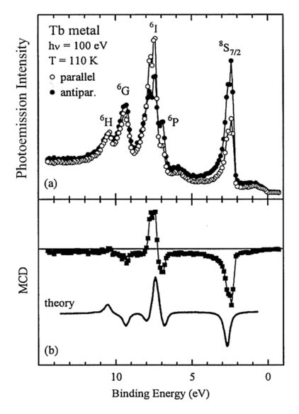 
Figure 3. High-resolution Tb 4f photoemission spectra measured at hν = 100 eV from a remanently magnetized Tb(0001)/W(110) film (150 ˚A, T = 110 K). Open (filled) symbols correspond to nearly parallel (antiparallel) orientations of photon spin and sample mag- netization. (b) MCD signal obtained as the intensity difference; the solid line shows the calculated atomic-multiplet MCD spectrum. Data taken from Ref. [50].

📷 Fig 4

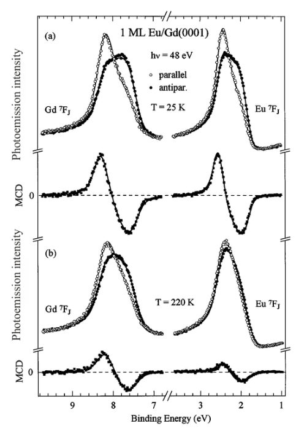 
Figure 4. Magnetic circular dichroism in 4f photoemission from a monolayer Eu/Gd(0001) interface at 25 K and 220 K, showing element-specific Eu and Gd responses for parallel and antiparallel alignment of photon spin and sample magnetization. Data taken from Ref. [54].

📷 Fig 5

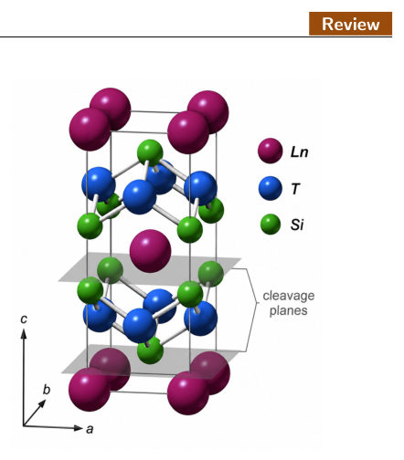 
Figure 5. View of the body-centered tetragonal ThCr2Si2-type structure (space group I4/mmm, No. 139), the so-called 122 phase. The structure is formed by stacks of alternating atomic layers with the sequence -T-Si-Ln-Si-T-,78, 79 where Ln denotes a lanthanide atom and T represents a transition-metal atom. The Ln atomic layers are well separated from each other by the strongly bonded Si-T-Si trilayer blocks. The cleavage planes between the Si and Ln layers, along which such crystals are commonly cleaved, are indicated in gray.

**Summary.** This review summarizes how photoelectron spectroscopies have provided detailed insights into the electronic structure of lanthanide crystals. It emphasizes that surface effects critically modify the bulk properties due to the interplay between localized 4f electrons and itinerant spd states. The work highlights systematic research avenues for engineering novel correlated materials.

**Why it may be interesting.** The strong correlation physics inherent in 4f systems—where localized moments interact with itinerant carriers—is a canonical problem in strongly correlated electron theory, relevant for understanding heavy fermion behavior and quantum criticality.

Detailed structure

**Main problem.** Understanding the complex electronic and magnetic properties of lanthanide materials arising from the interplay between strongly localized 4f electrons and itinerant spd-valence states.

**Main result.** Advanced photoelectron spectroscopies reveal that surface effects significantly modify bulk 4f-driven properties, enabling the engineering of novel low-dimensional architectures.

**Method.** The study relies heavily on advanced photoemission spectroscopies (PES), including momentum-resolved and resonant variants, complemented by XAS and XMCD techniques.

**Model / system.** The physical system is lanthanide-based crystals and intermetallic compounds. The physics centers on the competition between localized 4f moments (governed by Hund's rules) and itinerant spd conduction bands.

**Key observables.** k-resolved f-spd hybridization, temperature evolution of f-derived Fermi surfaces, layer-dependent magnetic anisotropy, and surface core-level energy shifts.

**Important parameters / regimes.** Temperature (T), crystal structure/coordination number (surface vs. bulk), and the ratio of 4f localization to spd itinerancy.

**Assumptions / limitations.** The analysis assumes that distinct physical contributions can be isolated from surface, interface, and bulk measurements using varying experimental probes.

**Figures summary.** Figure 1 illustrates radial probability distributions distinguishing localized 4f states from broader spd orbitals. Figure 2 shows a high-resolution PES spectrum resolving multiplet components in the bulk versus a shifted subspectrum from the topmost surface layer.

**Paper structure.** The review progresses from historical developments (1970s-1990s) to modern, systematic research lines focusing on specific phenomena like hybridization and magnetic anisotropy across different lanthanide compounds.

Abstract

The interplay of strongly localized 4$f$ electrons with itinerant spd-valence states gives rise to a wide range of correlated phenomena and properties that place lanthanide materials at the focus of considerable research efforts. Beyond the bulk, their surfaces are of particular interest, where the reduced coordination, a modified crystal electric field, broken inversion symmetry in combination with strong spin-orbit coupling, and the emergence of surface states and resonances considerably reshape 4$f$-driven electronic and magnetic properties. This, in turn, enables novel functionalities of particular relevance for low-dimensional systems and their applications. This review summarizes how advances in photoelectron spectroscopies, together with improved crystal growth, have enabled detailed insights into bulk and surface phenomena of lanthanide-based crystals. After a brief overview of key developments from the 1970s to the 1990s, we discuss recent progress, focusing on systematic studies by the authors and collaborators that form a coherent line of research. These include the unveiling of $k$-resolved $f-spd$ hybridization, the formation and evolution with temperature of $f$-derived Fermi surface in Kondo lattices, layer-dependent 4$f$ magnetic anisotropy, the emergence of ferromagnetically ordered surfaces in systems with non-magnetic bulk ground state. This coherent line of research addresses core questions in the physics of 4$f$ systems and opens opportunities for engineering novel lanthanide-based architectures, including heterostructures and supramolecular complexes with novel physical properties and functionalities.

[↑ back to top](#top)

### [Spectrum Estimation is Almost as Hard as Tomography](http://arxiv.org/abs/2607.29680v1)

**Authors:** Marco Fanizza, Ryan O'Donnell, Chirag Wadhwa  
**Type:** theory · **Category:** quantum information and computing · **PDF:** <https://arxiv.org/pdf/2607.29680v1>  
**Analysis basis:** full PDF text, analyzed in chunks
**Topic relevance:** `entanglement & information structure` **3/5** · `quantum measurements` **1/5**

📷 Fig 1

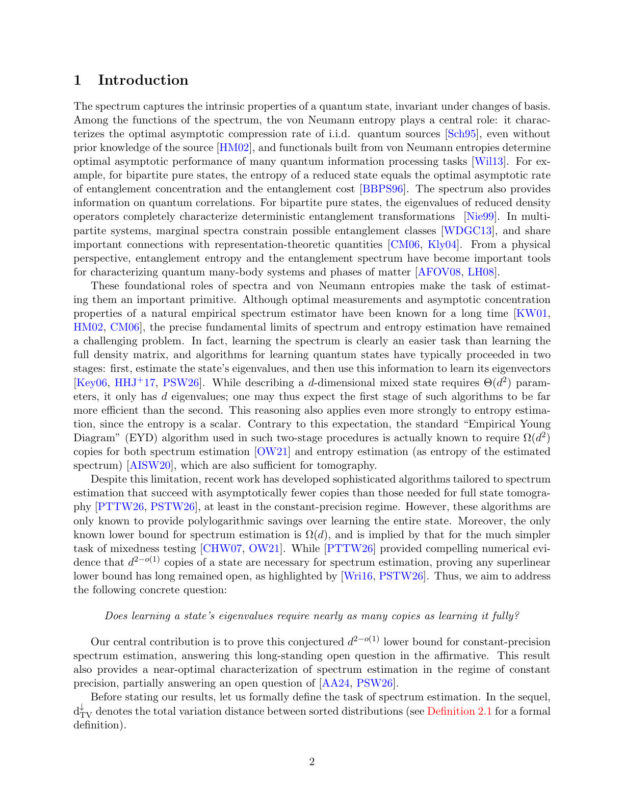 
Low-resolution page preview, page 2

📷 Fig 2

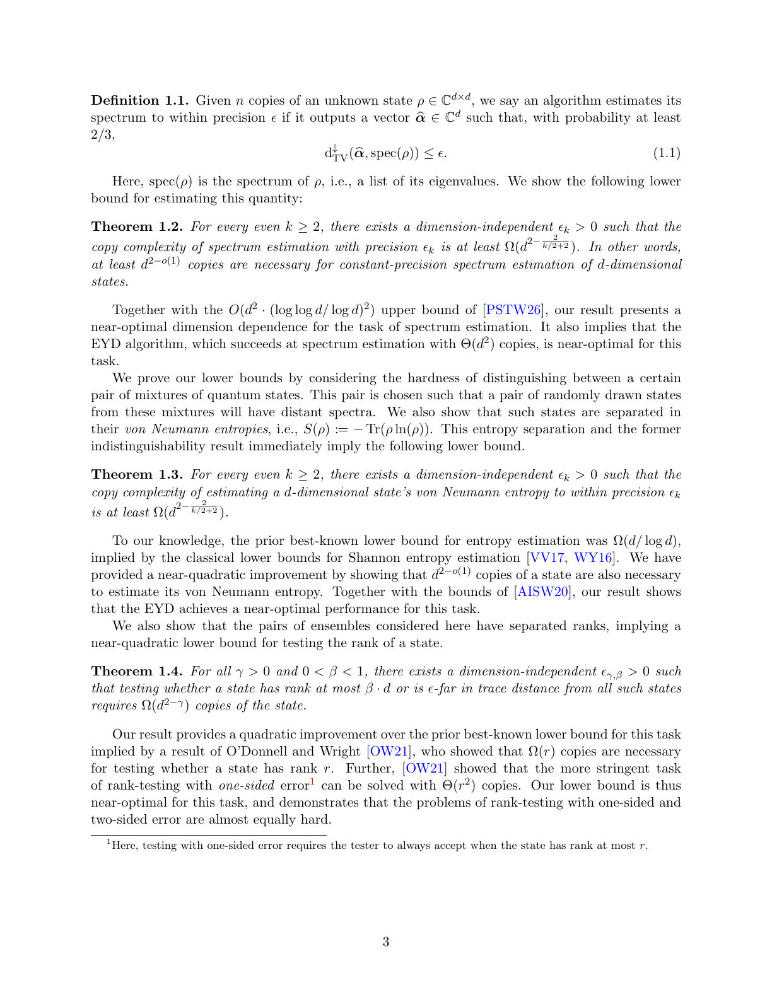 
Low-resolution page preview, page 3

📷 Fig 3

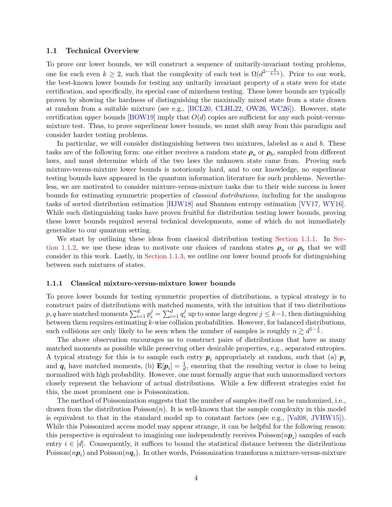 
Low-resolution page preview, page 4

📷 Fig 4

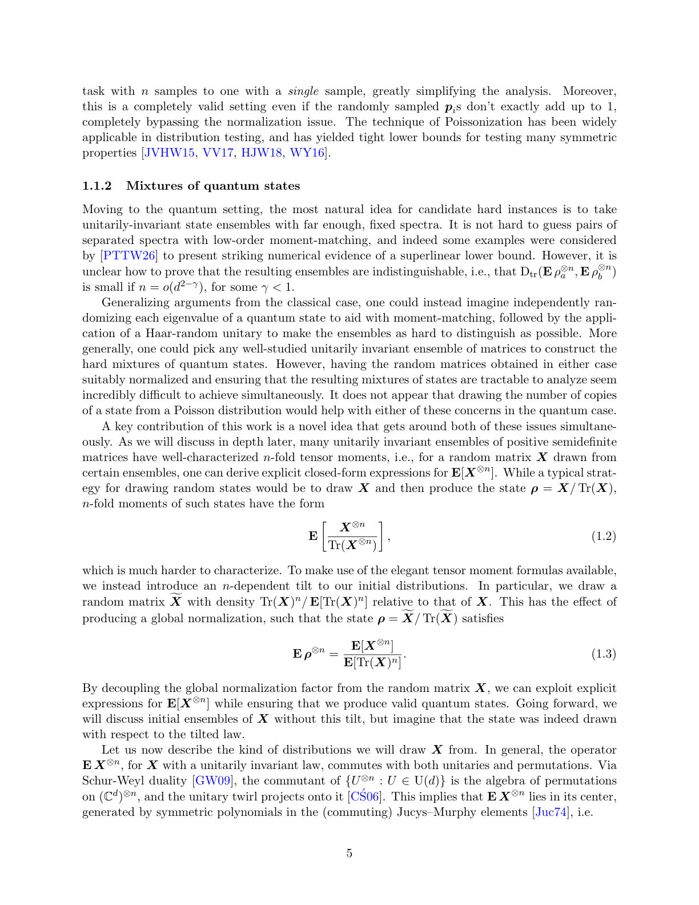 
Low-resolution page preview, page 5

📷 Fig 5

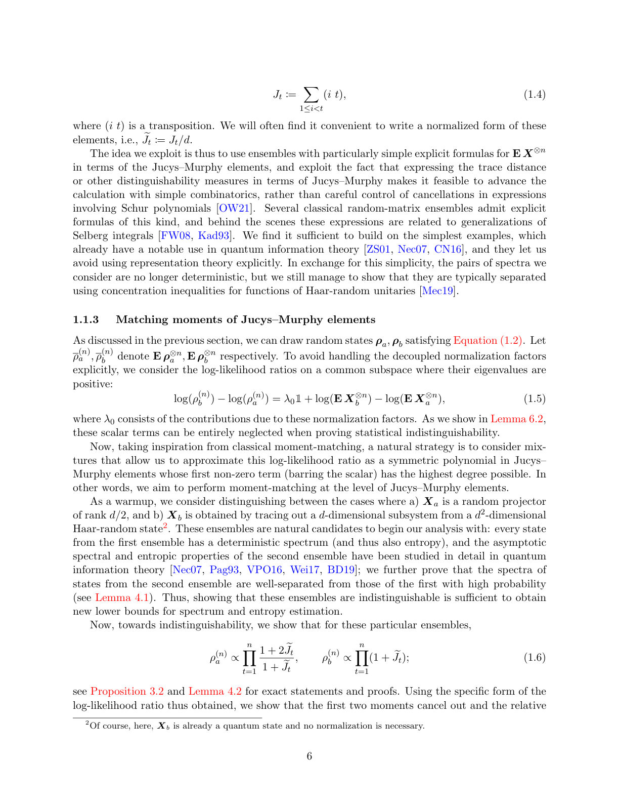 
Low-resolution page preview, page 6

**Summary.** This paper rigorously analyzes the sample complexity required to estimate key properties of unknown quantum states, such as their spectrum or entropy. By establishing lower bounds matching the difficulty of full tomography ($\Omega(d^2)$), it shows that characterizing these fundamental invariants is computationally hard. The methodology employs advanced techniques involving random matrix theory and moment analysis using Jucys–Murphy elements.

**Why it may be interesting.** This work provides fundamental complexity results that quantify how much information is needed to characterize a quantum state's properties versus learning the state itself, which has implications for quantum characterization protocols in any physical system.

Detailed structure

**Main problem.** The study focuses on determining the sample complexity required to estimate or test fundamental, unitarily invariant properties of unknown quantum states.

**Main result.** The authors establish lower bounds showing that estimating the spectrum, von Neumann entropy, and rank of a $d$-dimensional state requires $\Omega(d^{2-\gamma})$ samples, suggesting these tasks are nearly as hard as full quantum state tomography ($\Theta(d^2)$).

**Method.** The proof technique involves constructing hard instances using sandwiched products of Haar-random projectors and analyzing the log-likelihood ratio via moment-matching techniques involving Jucys–Murphy elements.

**Model / system.** The analysis concerns unknown quantum states $
ho \in \mathbb{C}^{d 	imes d}$, often constructed as mixtures derived from random matrix ensembles or products of Haar-random projectors.

**Key observables.** Spectrum (eigenvalues, measured by total variation distance), Von Neumann Entropy $S(
ho)$, and the rank of the state.

**Important parameters / regimes.** The dimension $d$ is the primary parameter; complexity bounds are shown to be $\Omega(d^{2-\gamma})$.

**Assumptions / limitations.** The analysis relies on advanced mathematical tools, including concentration estimates (Lemma 7.3) and properties derived from matching moments related to Jucys–Murphy elements.

**Paper structure.** The paper systematically proves lower bounds for three tasks—spectrum estimation, entropy estimation, and rank-testing—by constructing hard ensembles and analyzing the statistical distinguishability using moment analysis techniques.

Abstract

We study the sample complexity of estimating and testing fundamental unitarily invariant properties of unknown quantum states; namely, the tasks of spectrum estimation, von Neumann entropy estimation, and rank-testing. For $d$-dimensional states, and for every $γ>0$, we prove a sample complexity lower bound of $Ω(d^{2-γ})$ for spectrum estimation to constant sorted total-variation error, entropy estimation to constant additive error, and rank-testing to constant trace distance. Our hard instances are constructed from sandwiched products of Haar-random projectors, suitably normalized using a novel technique that lets us derive explicit expressions for high-order tensor moments of the resultant states. These moments can be expressed as symmetric functions of Jucys--Murphy elements of the symmetric group algebra. To show that two such mixtures are indistinguishable, we analyze the log-likelihood ratio and perform moment-matching, i.e., we set its low-order Jucys--Murphy components to zero. Indistinguishability is then obtained by bounding an $f$-divergence through the high-order components; the non-zero high-order terms and concentration of functions of Haar-random unitaries also imply separations in typical spectra, entropies, and ranks, proving all our lower bounds.

[↑ back to top](#top)

### [Optimal Navigation on Simplicial Complexes](http://arxiv.org/abs/2607.29450v1)

**Authors:** Diego Febbe, Duccio Fanelli, Gianluca Peri, Timoteo Carletti  
**Type:** theory · **Category:** statistical mechanics · **PDF:** <https://arxiv.org/pdf/2607.29450v1>  
**Analysis basis:** full PDF text, analyzed in chunks
**Topic relevance:** `Keldysh / 2PI / non-Gaussian methods` **2/5** · `analog quantum simulation` **2/5** · `methods for driven-dissipative` **2/5** · `non-equilibrium dynamics` **2/5** · `correlated / nonlocal dissipation` **1/5** · `correlated cavity matter` **1/5** · `driven-dissipative phase transition` **1/5** · `entanglement & information structure` **1/5** · `non-equilibrium universality` **1/5**

📷 Fig 1

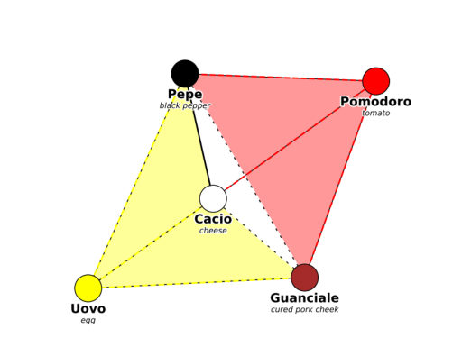 
Fig. 1: Example of intuitive visual representation of a higher- order network of ingredients that compose famous Italian pasta sauce recipes. The solid black link connects pepper (black node) and cheese (white) forming the cacio e pepe (other two-body interactions are represented as dashed lines since they do not corresponding to famous combinations). The two former ingredients, in combination with cured pork cheek (brown), can form the three-body interaction named gricia (white triangle). Then, by adding either egg (yellow) or tomato (red) you can form the celebrated carbonara or amatriciana (yellow and red tetrahedra). Despite the lack of physical formalism, this may be a very easy and...

📷 Fig 2

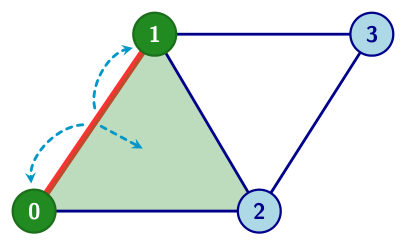 
Fig. 2: Pictorial representation of the random walk process described in [40]. Let us start with a walker initialized on the simplex σ(1) = [0, 1] at discrete time t (bold red line in figure). On the next time step it can jump to one among all the one-dimension upper- and lower-connected simplices, namely the nodes [0] and [1] and the triangle [0,1,2] (green in figure).

📷 Fig 3

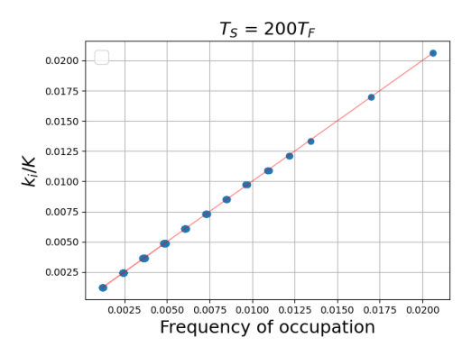 
Fig. 3: Correspondence between the frequency of occupation on the simplices and the corresponding (rescaled) degree by considering the simulation time Ts &gt;&gt; TF . Here, we set the number of simulation runs to collect various random walk paths to 50.

📷 Fig 4

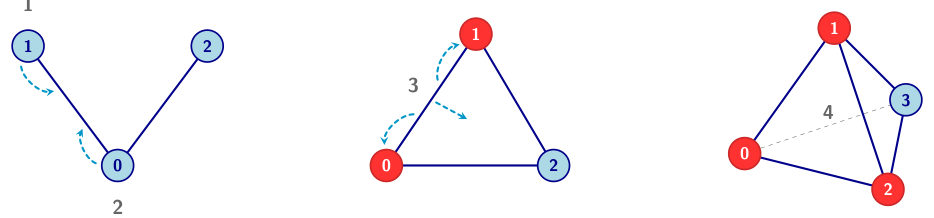 
Fig. 4: Here we show how the number of structures in the simplicial complex can be counted as a function of the degree of lower-dimensional simplices. In panel (a), we see how the number of links is counted once for each connected node. In panel (b), we see that the degree of the link [0, 1] can be counted as the sum of the two lower-dimensional structures (nodes 0 and 1) plus the number of incident upper connected triangles. In panel (c), we see how the degree of the triangle [0, 1, 2] can be expressed as the three boundary links plus the number of incident upper connected tetrahedra. From this we get to Eq. (7).

📷 Fig 5

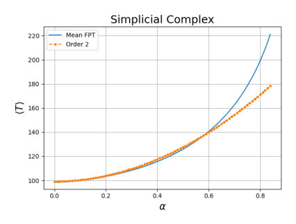 
Fig. 5: Node explorability ⟨T⟩(solid line in the figure), com- puted using Eq. (14), for a simplicial complex with N0 = 50 nodes, D = 2, and a teleportation matrix S with density δ = 1 together with the second-order approximation (ℓ≤2) of the series expansion in powers of α reported in Eq. (15) (dashed orange line with filled circles).

**Summary.** This paper analyzes optimal search strategies by extending random walk concepts from simple graphs to higher-order simplicial complexes. It models the dynamics as a mix between local movement and global jumps, using mean first passage times. The key finding is that optimizing search efficiency requires a specific, non-trivial balance ($\alpha \in (0, 1)$) of these two processes in complex structures.

**Why it may be interesting.** While focused on network science, the mathematical tools developed—analyzing dynamics across structured state spaces (simplicial complexes) using spectral methods and perturbation theory—are highly relevant to modeling complex many-body systems or emergent collective behavior in condensed matter.

Detailed structure

**Main problem.** The work extends topological measures, such as navigation time and optimal search strategies, from simple binary graphs to simplicial complexes to account for higher-order interactions.

**Main result.** For simplicial complexes, the minimum mean exploration time occurs at an intermediate modulation parameter $\alpha \in (0, 1)$, suggesting that optimal searching requires a balance between local random walks and global teleportation, unlike simple networks.

**Method.** The analysis uses mean first passage times calculated via matrix inversion ($Z_j = I - R_j$) and employs a perturbative approximation scheme in the modulation parameter $\alpha$ to study the asymptotic behavior of the search process.

**Model / system.** The system is modeled on simplicial complexes, which are geometric/algebraic structures capturing multi-body interactions. The dynamics are governed by a modified random walk operator $R = \alpha M + (1 - \alpha) D_s S$, where $M$ represents local hopping and $S$ represents global teleportation.

**Key observables.** Mean first passage times ($\langle T \rangle$), normalized occupation frequency, and the optimal modulation parameter $\alpha$.

**Important parameters / regimes.** The modulation parameter $\alpha$, which controls the balance between local random walk dynamics ($M$) and global stochastic teleportation ($S$).

**Assumptions / limitations.** The analysis relies on a perturbative expansion in $\alpha$ (truncated initially) and assumes that simulation time is much larger than the Fiedler time for asymptotic results.

**Figures summary.** Figures illustrate examples of higher-order networks, the random walk process across dimensions, and plots showing how the mean exploration time ($\langle T \rangle$) varies as a function of the modulation parameter $\alpha$, contrasting network vs. simplicial complex behavior.

**Paper structure.** The paper first establishes the mathematical framework by generalizing random walks to higher-order structures (simplicial complexes). It then develops methods using connection matrices and mean first passage times, culminating in an analysis of how the optimal search strategy ($\min \langle T \rangle$) depends on the mixing parameter $\alpha$.

Abstract

The navigation time and optimal search strategies deriving from random dynamical processes on binary graphs have been extensively explored and analyzed, being of prominent interest in the network science field. In this work, we study an extension of these topological measures for simplicial complexes: a specific type of geometric and algebraic structures that encapsulates higher-order interactions. Here, the explorability analysis of simplicial complexes has been conducted in terms of the mean first passage times between nodes, i.e. the 0th-order simplices, with the inclusion of a long-range stochastic teleportation term modulated with respect to the local random walk hopping across the various dimensions. We also provide a perturbative approximation scheme recovering the modulation parameter between pure random walk and teleportation mode (for higher-order setting) acting as the expansion parameter.

[↑ back to top](#top)

### [Exponential Capacity in Multilayer Hetero-Associative Neural Networks](http://arxiv.org/abs/2607.29554v1)

**Authors:** Elena Agliari, Adriano Barra, Andrea Ladiana, Andrea Lepre  
**Type:** theory · **Category:** disordered systems and neural networks · **PDF:** <https://arxiv.org/pdf/2607.29554v1>  
**Analysis basis:** full PDF text, analyzed in chunks
**Topic relevance:** `Keldysh / 2PI / non-Gaussian methods` **2/5** · `methods for driven-dissipative` **2/5** · `analog quantum simulation` **1/5** · `correlated / nonlocal dissipation` **1/5** · `correlated cavity matter` **1/5** · `driven-dissipative phase transition` **1/5** · `entanglement & information structure` **1/5** · `exotic spin models in light-matter` **1/5** · `non-equilibrium dynamics` **1/5** · `non-equilibrium universality` **1/5**

📷 Fig 1

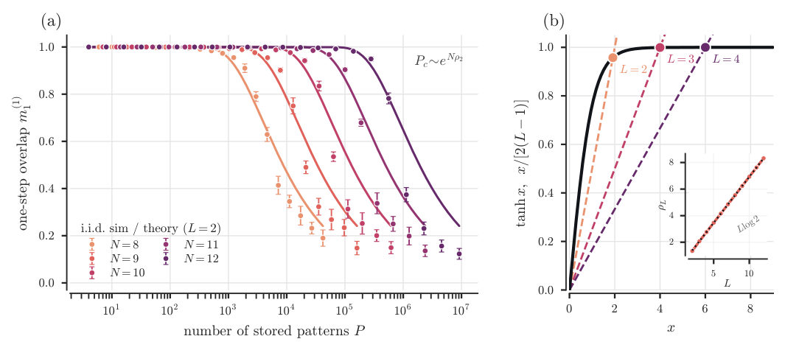 
Figure 1: Exponential storage capacity. (a) One-step overlap m(1) 1 versus the number of stored patterns P for the i.i.d. ensemble at width L = 2 and layer sizes N = 8, 9, 10, 11, 12: solid lines are the closed form (32), markers Monte-Carlo (mean ± std over disorder realisations). The degradation transition tracks Pc ∼eNρ2 and shifts right with N; because the capacity is exponential in N, only small N brings it into an accessible window. (b) Graphical solution of the symmetric saddle tanh x∗= x∗/[2(L −1)]: the non-trivial crossing x∗(markers) drifts towards 2(L −1) as the network widens. Inset: the noise rate ρL = L[(L −1) −ϕL(x∗)] against the width L, compared to L log 2 (dotted).

📷 Fig 2

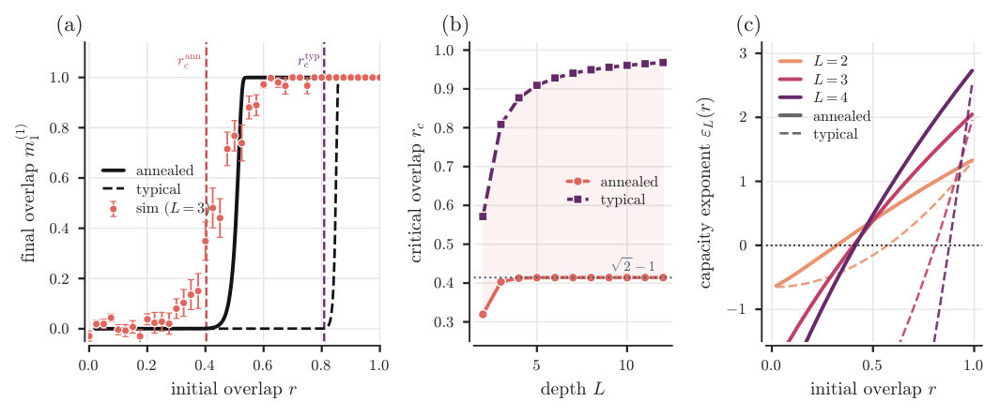 
Figure 2: Basins of attraction: larger basins cost rate. (a) Basin recovery at L = 3 (N = 30, P = 3.5 × 104, i.i.d. ensemble): one-step overlap after the dynamics versus the cue overlap r, against the corrupted-cue prediction (40) built on the annealed signal µ1(r) (solid) and on the typical signal (dashed). The measured transition sits on the annealed curve, at r ≈0.47 next to rann c , and nowhere near the typical threshold rtyp c = 0.81: the annealed branch is the physical one. If anything the data overshoot the annealed curve toward larger basins, the annealed per-pattern noise being a conservative overestimate (Remark 2). The number of stored patterns is set from the annealed rule P =...

📷 Fig 3

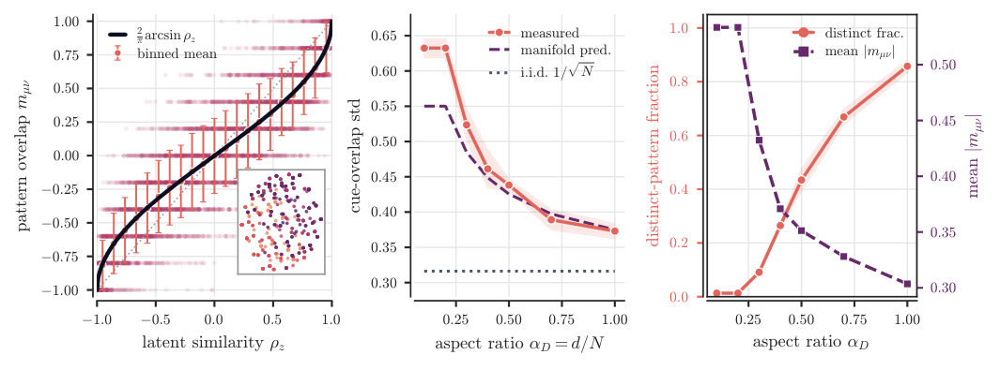 
Figure 3: The data manifold. (a) Pattern overlap mµν against latent similarity ρz (density) with binned means (markers) lying on the arcsine law 2

📷 Fig 4

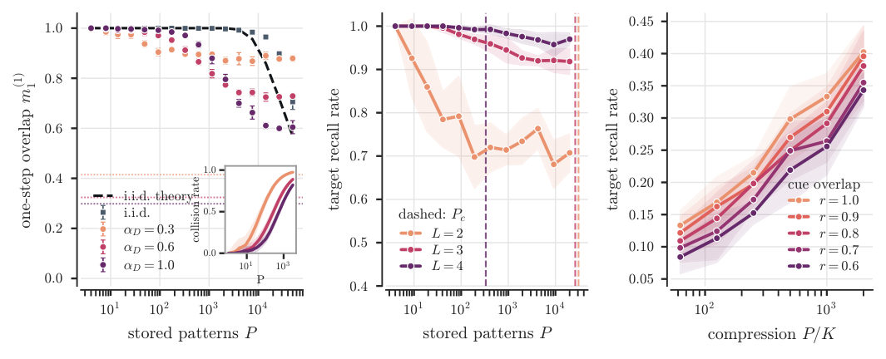 
Figure 4: Capacity, width and surjective compression. (a) One-step overlap versus load P (N = 10) for the i.i.d. ensemble and Hidden-Manifold ensembles at several αD: capacity falls as the manifold shrinks, and past capacity the manifold state relaxes onto its structural floor (dotted) rather than a spurious pattern. Inset, same abscissa and colours: the collision rate (P −Punique)/P, the fraction of drawn latents that land on a pattern already stored. It leaves zero at a load of the order of Cover’s count C(N, D), earliest for the smallest αD, and the onset of each curve’s rise coincides with the onset of the corresponding overlap plateau. (b) Target-recall rate versus P for width L = 2,...

📷 Fig 5

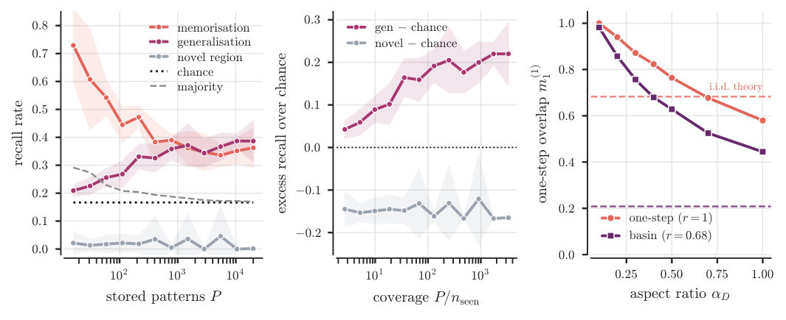 
Figure 5: Memorisation without generalisation. (a) Memorisation, generalisation and novel-region recall versus load (K = 8 regions, two held out), with chance (dotted) and majority (dashed). (b) Excess over chance versus coverage P/nseen: generalisation grows and stays well above the novel-region control, which never leaves chance: the signal is real but far below memorisation. (c) As αD →1 the manifold retrieval descends onto the i.i.d. theory (dashed lines); at small αD collisions inflate the apparent overlap above it.

**Summary.** This paper develops a theory for multilayer hetero-associative neural networks capable of storing exponentially many associations. By analyzing the network's energy landscape using advanced statistical methods, the authors derive an exponential capacity bound. The results are validated across diverse datasets, suggesting that the underlying geometric encoding principle is domain-universal.

**Why it may be interesting.** While focused on classical ML models, the analysis of complex energy landscapes, phase transitions (fixed points), and information storage capacity shares mathematical parallels with understanding order parameters in quantum spin glasses or disordered quantum systems.

Detailed structure

**Main problem.** To model and analyze hetero-associative memory networks that exhibit exponential storage capacity, moving beyond auto-associative models.

**Main result.** The network achieves an exponential storage capacity ($P_c \sim e^{N
ho_L}$) for mapping a cue to a distinct target, demonstrating domain-universal principles applicable from biology to language.

**Method.** Analysis uses cavity/signal-to-noise techniques and large-deviation evaluations of noise, extending methods from classical Hopfield networks.

**Model / system.** The system is an exponential neural network with L layers of N binary neurons, whose energy minimizes when every layer retrieves the same pattern index (hetero-associative state).

**Key observables.** Storage Capacity ($P_c$), Rate ($
ho_L$), Generalization Error.

**Important parameters / regimes.** Number of layers (L), Number of neurons (N), Number of stored patterns (P).

**Assumptions / limitations.** The association must be a surjective function of the cue; generalization remains below memorization capacity, suggesting distinct capabilities.

**Figures summary.** The notes detail comparisons across various data types (Hidden Manifold, T-cell receptors, Language Intent) showing consistent performance metrics for capacity and basins.

**Paper structure.** The paper progresses from defining the hetero-associative model to deriving theoretical bounds on capacity using advanced statistical physics techniques, followed by extensive validation against structured biological and linguistic datasets.

Abstract

Exponential Hopfield networks store a number of patterns that grows exponentially with the number of neurons, and in their classical formulation they are auto-associative: they complete a corrupted copy of a memory into the memory itself. Many of the tasks one wants such a network to perform are instead hetero-associative, mapping a cue to a different target. We introduce and analyse an exponential neural network of $L$ layers of $N$ binary neurons, each layer carrying its own dataset, whose energy is an exponential of the product of the per-layer Mattis overlaps, so that it is minimised precisely when every layer retrieves the pattern of the same index; the stored association must be a surjective function of the cue, and we show why nothing else can be stored at all. A cavity/signal-to-noise analysis, made exact at leading order by a large-deviation evaluation of the noise, shows that the aligned hetero-associative state is a fixed point of the zero-temperature dynamics up to a number of stored patterns $P_c\sim e^{Nρ_L}$, exponential in the layer size, with an explicit rate $ρ_L$ that grows like $L\log 2$; enlarging the basins of attraction lowers the rate but never destroys its exponential character. Comparing the theory with structured data we find that the exponential capacity and the predicted basins survive correlated, many-to-one patterns: the network is a near-perfect content-addressable memory. The same closed forms describe, without refitting, a synthetic manifold, real T-cell-receptor/epitope triples and natural-language intent data, so the mechanism is domain-universal. Generalisation to unseen cues, though significantly above chance, stays below memorisation, and it is the geometry of the encoding, rather than the data domain, that sets how far above chance it reaches. In this family, exponential storage and strong generalisation are distinct capabilities.

[↑ back to top](#top)

### [Charge discreteness and the energy efficiency of information erasure in dynamic random-access memory cells](http://arxiv.org/abs/2607.29015v1)

**Authors:** Takase Shimizu, Kouki Yamamoto, Kensaku Chida, Gento Yamahata, Katsuhiko Nishiguchi  
**Type:** theory · **Category:** statistical mechanics · **PDF:** <https://arxiv.org/pdf/2607.29015v1>  
**Analysis basis:** full PDF text, analyzed in chunks
**Topic relevance:** `Keldysh / 2PI / non-Gaussian methods` **2/5** · `non-equilibrium dynamics` **2/5** · `correlated / nonlocal dissipation` **1/5** · `driven-dissipative phase transition` **1/5** · `entanglement & information structure` **1/5** · `methods for driven-dissipative` **1/5** · `non-equilibrium universality` **1/5**

📷 Fig 1

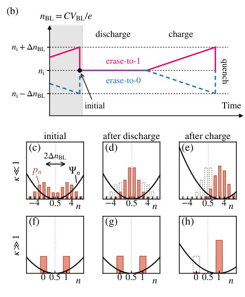 
FIG. 1. Erasure of a DRAM cell and the effect of charge discreteness. (a) Equivalent circuit: a storage capacitor (SC, capacitance C) connected to a bitline (BL, VBL) through a wordline transistor (WT, VWT); the logical state is deter- mined by the excess number of electrons n. (b) Bitline-voltage sequences of the erase-to-1 (red) and erase-to-0 (blue dashed) operations: after discharge at ni = 0.5, nBL is swept qua- sistatically to ni + ∆nBL or ni −∆nBL, respectively, and is then quenched back to ni. The shaded region shows the end of the preceding cycle, whose quench prepares the initial state (marker) from which the discharge step begins. (c)– (h) Distribution pn (bars) and state...

📷 Fig 2

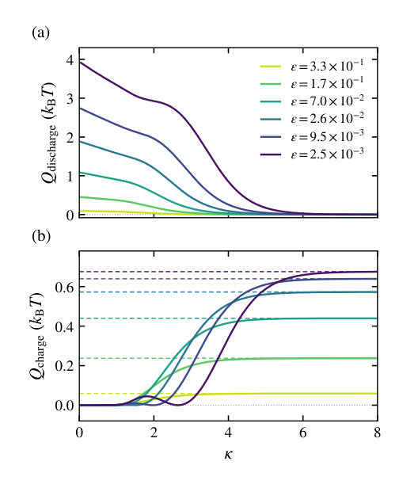 
FIG. 2. Calculated heat dissipation in the two steps of the erasure protocol versus κ, for various values of the erasure error probability ε. (a) Discharge step, Eq. (7). Qdischarge decreases monotonically and vanishes for κ ≫1. (b) Charge step, Eq. (8). Qcharge increases with κ and saturates at the Landauer cost kBT[ln 2 −H(ε)], indicated by the dashed hor- izontal line of the corresponding color for each ε; horizontal dotted lines indicate Q = 0.

📷 Fig 3

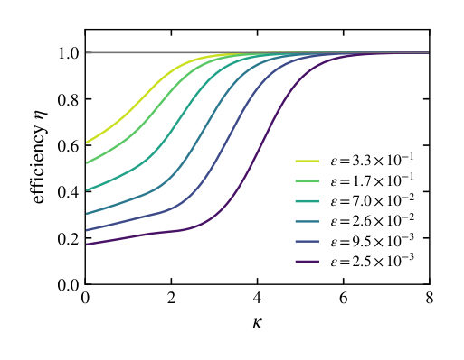 
FIG. 4. Energy efficiency η, Eq. (9), versus κ at fixed error probabilities ε. The efficiency increases monotonically with κ and approaches the Landauer limit η = 1 (gray line) for κ ≫1.

📷 Fig 4

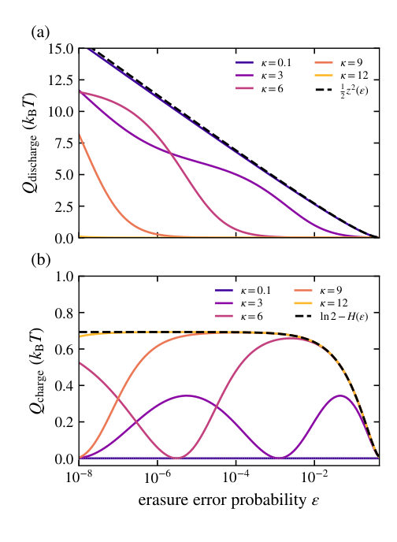 
FIG. 3. Heat dissipation versus erasure error probability ε, from the exact evaluation of Eqs. (7) and (8). (a) Qdischarge for several values of κ; the dashed curve is the continuum-limit expression 1

📷 Fig 5

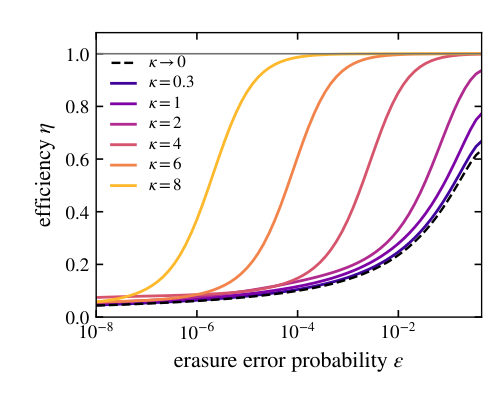 
FIG. 5. Energy efficiency η versus error probability ε for several κ. The black dashed curve shows the continuum-limit expression of Eq. (12). At fixed κ, η increases with ε; as κ grows the curves rise toward the Landauer limit η = 1 (gray line).

**Summary.** This paper analyzes the energy cost of erasing stored information in DRAM cells by considering charge discreteness via the parameter $\kappa$. Using stochastic thermodynamics, the authors show that increasing $\kappa$ suppresses non-equilibrium heat loss during erasure. Consequently, the energy efficiency rises toward the theoretical Landauer limit, establishing $\kappa$ as the key control parameter for memory circuit efficiency.

**Why it may be interesting.** This work provides a concrete thermodynamic link between device physics (charge discreteness) and fundamental information limits (Landauer's principle), which is relevant for understanding energy dissipation in nanoscale quantum devices.

Detailed structure

**Main problem.** The study investigates how charge discreteness affects the energy efficiency of information erasure processes within Dynamic Random-Access Memory (DRAM) cells.

**Main result.** Energy efficiency increases monotonically with the charging energy to thermal energy ratio ($\kappa$), approaching the Landauer limit when $\kappa$ is large, indicating that $\kappa$ controls the fundamental efficiency ceiling.

**Method.** The authors employ a stochastic-thermodynamic model to calculate heat dissipation and energy efficiency across different regimes of the parameter $\kappa$.

**Model / system.** The system modeled is a DRAM cell whose information storage relies on an integer number of electrons ($n$) on a capacitor. The physics is governed by the competition between charging energy ($E_c$) and thermal fluctuations, quantified by $\kappa = E_c / k_B T$.

**Key observables.** Energy efficiency ($\eta$), heat released during discharge ($Q_{	ext{discharge}}$), and heat released during charge ($Q_{	ext{charge}}$).

**Important parameters / regimes.** The dimensionless parameter $\kappa$, the erasure error probability ($\epsilon$), and the Landauer limit.

**Assumptions / limitations.** The analysis uses a stochastic-thermodynamic framework, employing continuum approximations (Gaussian fits) in certain regimes to simplify calculations for $Q_{	ext{discharge}}$.

**Figures summary.** Figures illustrate how discharge heat decreases with increasing $\kappa$, while charge heat increases and saturates at the Landauer cost. Energy efficiency ($\eta$) is shown to increase monotonically towards unity as $\kappa$ grows.

**Paper structure.** The paper develops the theory by analyzing the energy costs of erasure in different regimes defined by $\kappa$. It shows that increasing $\kappa$ suppresses non-quasistatic discharge heat while driving the quasistatic charge heat toward the Landauer limit, thereby boosting overall efficiency.

Abstract

A dynamic random-access memory (DRAM) cell stores information as an integer number of electrons on a capacitor, and whether this discreteness is thermodynamically relevant depends on the competition between the charging energy and thermal fluctuations. This competition is quantified by the ratio $κ$ of the single-electron charging energy to the thermal energy, and here we investigate how $κ$ affects the energy efficiency of information erasure in a DRAM cell. Using a stochastic-thermodynamic model of a DRAM cell, we show that the nonquasistatic heat released during the discharge step is suppressed as $κ$ increases, whereas the quasistatic heat of the charge step approaches the Landauer cost. As a result, the energy efficiency increases monotonically with $κ$ and approaches the Landauer limit where the effect of charge discreteness is maximal and the cell is effectively reduced to two charge states. The parameter $κ$ thus connects two thermodynamic regimes: a multilevel single-well memory, whose nonequilibrium initial state prevents quasistatic erasure, and an effective two-level memory that can attain the Landauer limit. These results identify $κ$ as the parameter that controls the fundamental efficiency ceiling of transistor--capacitor memory circuits.

[↑ back to top](#top)

### [A low-temperature ultra-high-vacuum scanning probe microscope with in situ electronic transport capabilities: from macro to nano in 10 minutes](http://arxiv.org/abs/2607.29099v1)

**Authors:** Diego Exposito, Oscar Custance, Ivan Brihuega  
**Type:** experiment · **Category:** other · **PDF:** <https://arxiv.org/pdf/2607.29099v1>  
**Analysis basis:** full PDF text, analyzed in chunks
**Topic relevance:** `Kondo & dissipative impurity` **2/5** · `QC/QI experiment` **2/5** · `analog quantum simulation` **1/5** · `methods for driven-dissipative` **1/5** · `non-equilibrium dynamics` **1/5** · `spintronics-quantum-optics interface` **1/5**

📷 Fig 1

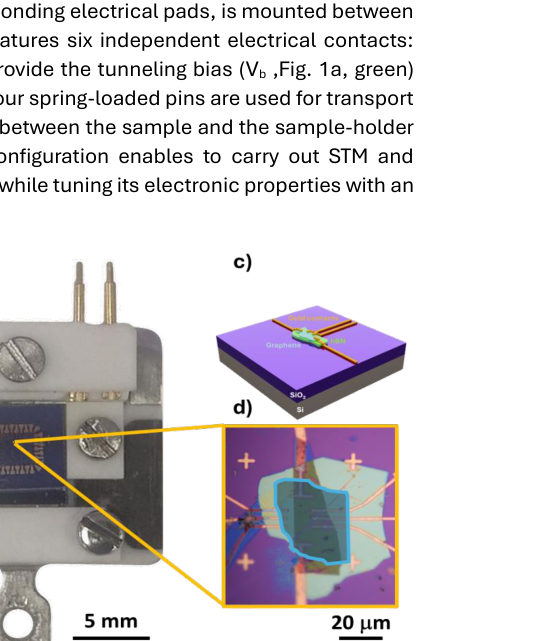 
FIG. 1. a) 3D model of a modded flag-style sampleholder specifically designed to simultaneously perform STM and transport measurements. It has six independent electrical contacts: tunneling bias voltage (green), gate voltage (red) and four probe transport connections (blue). b) Picture of the actual sample holder modelled in a). c) 3D representation of a graphene device consisting of a MLG (blue) con top on an hBN (green) deposited on a doped SiO2/Si chip. Gold contacts are deposited on

📷 Fig 2

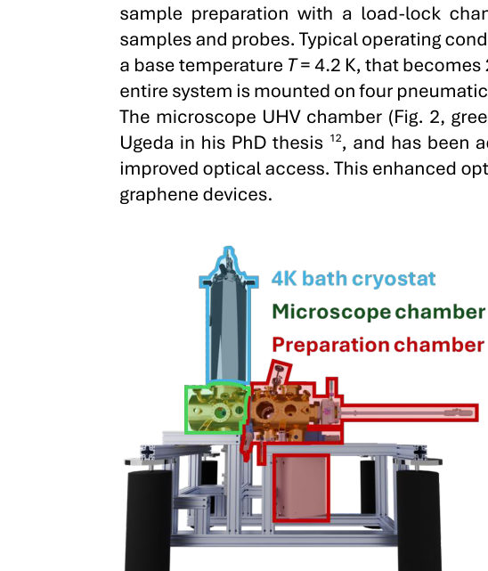 
FIG.2. Full LT-UHV experimental system. a) Original 3D design. b) Actual picture of the setup.

📷 Fig 3

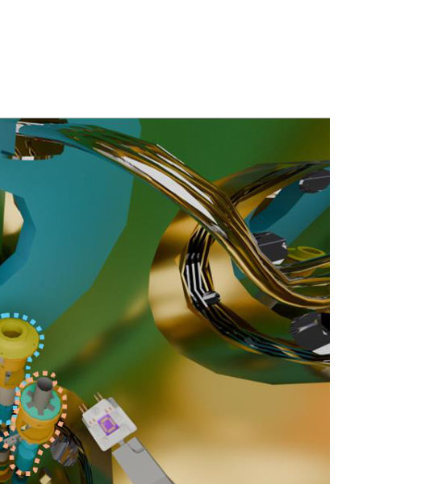 
FIG. 3. 3D design of the preparation chamber interior. Among other components, it includes a heater (orange contour), a metal evaporator (blue contour) and a hydrogen cracker (pink contour).

📷 Fig 4

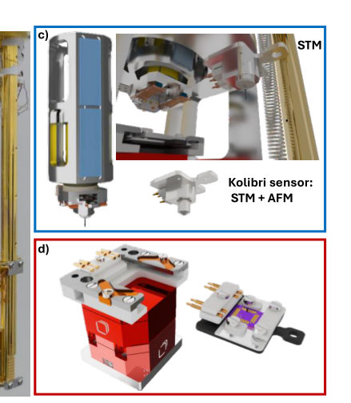 
FIG. 4. Microscope mounted on gold-plated OFHC copper base. a) 3D design. b) Picture of the actual microscope. c) 3D design of the tip stage showing a STM tip exchanging and a mounted KolibriSensor below. d) 3D design of the sample stage showing the sample exchanging.

📷 Fig 5

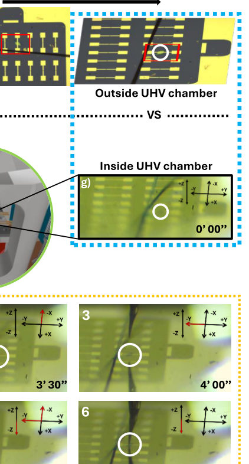 
FIG. 5. Comparison of external (a-d) and in-situ (e-g) optical characterization, device locating and landing procedure (1-6). Top: a) Image of the sample holder with the mounted sample. b) Optical image of the graphene device with labels. c) External optical microscope image of the device and its surroundings. Same as c) but rotated to fit the angled view obtained with the optical telescope. Middle: e) Optical telescope29–31,33 attached to the STM chamber (yellow contour) and camera35 used for sample transfer (red contour). They are mounted on a homemade XY stage to easily target the sample’s position. f) 3D representation of the 25º tilted line of sight obtained with the optical telescope...

**Summary.** This paper details the development of a sophisticated low-temperature, ultra-high-vacuum scanning probe microscope that uniquely combines atomic-scale imaging (STM) with macroscopic electrical transport measurements. This integrated platform allows researchers to correlate local structural changes or controlled material depositions directly with device performance metrics like resistivity and superconducting critical currents in 2D materials.

**Why it may be interesting.** While focused on solid-state devices, the ability to precisely control surface chemistry *in situ* while monitoring quantum transport properties is highly relevant for studying emergent phenomena in engineered quantum materials.

Detailed structure

**Main problem.** The primary goal is to establish a single, integrated platform that allows for direct correlation between local atomic-scale structural/spectroscopic measurements and global electronic transport behavior in two-dimensional (2D) devices.

**Main result.** The authors developed a versatile low-temperature, ultra-high-vacuum system capable of performing simultaneous STM imaging and 4-probe electrical transport characterization on the same sample.

**Method.** The setup integrates multiple techniques—SPM, UHV preparation tools (evaporator, cracker), and cryogenics—to allow *in situ* modification and measurement across wide temperature ranges.

**Model / system.** The platform is a specialized LT-UHV scanning probe microscope featuring two interconnected chambers. It supports measuring superconducting gaps via STS on materials like graphene and tracking the temperature dependence of resistivity/critical current in patterned nanowires (e.g., Pb).

**Key observables.** Local structural signatures (STM topography), spectroscopic features (superconducting gap $\Delta$), global electrical transport properties ($
ho(T)$, $I_c(T)$).

**Important parameters / regimes.** Temperature range: 2.9 K to 400 K; Mechanical stability: $<1$ pm; Spatial resolution: $5\ \mu	ext{m}$ landing accuracy in 10 minutes.

**Assumptions / limitations.** The system's complexity requires overcoming technical challenges related to integrating diverse capabilities (UHV, LT, SPM, transport) into one stable platform.

**Figures summary.** Figures illustrate the complex UHV chamber design, the custom sample holder with six contacts for simultaneous measurement, and results showing superconducting transitions ($
ho(T)$ dropping to zero) in Pb nanowires.

**Paper structure.** The paper describes the necessity of correlating local and global properties, details the engineering solution (the LT-UHV platform), demonstrates its capabilities through material preparation and precise positioning, and validates performance using measurements on graphene and superconducting nanowires.

Abstract

We have developed a low temperature (LT), ultra-high-vacuum (UHV) system that combines two complementary techniques, scanning probe microscopy (SPM) and electrical transport measurements, within a single platform. By providing simultaneous access to the atomic-scale surface landscape and the macroscopic device response of the same sample, the setup enables direct correlations between local structural/spectroscopic signatures and global electronic transport behavior in two-dimensional (2D) devices. The system allows experiments where atomic-scale modifications or controlled manipulations are performed while continuously monitoring their impact on device-scale performance. The setup consists of two interconnected UHV chambers: a dedicated preparation chamber and a separate measurement chamber that houses a liquid-helium cryostat and the SPM/transport stage. Base pressure is 1x10^-11 Torr. A key feature is direct optical access to the sample, enabling rapid and reliable tip positioning with an accuracy of 5 microns x 5 microns within 10 minutes. The SPM, operated using custom-built electronics, can track the exact same sample region across a temperature range from 2.9 K to 400 K, with mechanical stability below 1 pm. System performance is demonstrated on graphene devices, and bulk Pb is used to determine energy resolution. Using superconducting tips, scanning tunneling spectroscopy measures the superconducting gap with an energy resolution of 30 microV. Transport measurements track the temperature dependence of both resistivity and critical current across the superconducting transition of an in-situ prepared Pb nanowire.

[↑ back to top](#top)

### [Finite-size reliability of homothetic quantum Otto engines](http://arxiv.org/abs/2607.29050v1)

**Authors:** Gabriella G. Damas, Clebson Cruz, Norton G. de Almeida, Gao Xianlong, G. D. de Moraes Neto  
**Type:** theory · **Category:** statistical mechanics · **PDF:** <https://arxiv.org/pdf/2607.29050v1>  
**Analysis basis:** full PDF text, analyzed in chunks
**Topic relevance:** `non-equilibrium dynamics` **2/5** · `correlated / nonlocal dissipation` **1/5** · `driven-dissipative phase transition` **1/5** · `methods for driven-dissipative` **1/5** · `non-equilibrium universality` **1/5** · `quantum measurements` **1/5**

📷 Fig 1

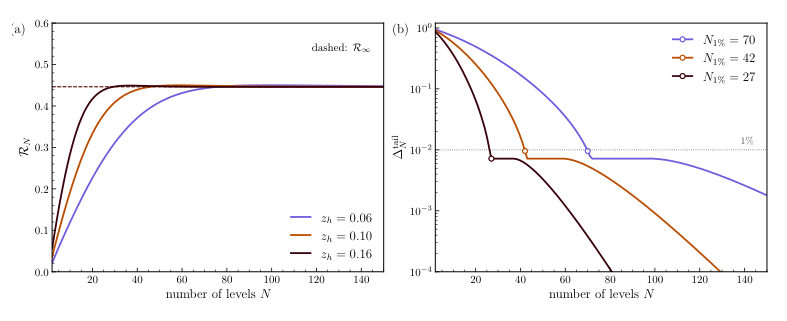 
FIG. 1. Finite-N crossover of the work reliability RN for a uniformly spaced homothetic ladder. (a) Exact finite-N reliability as a function of the ladder dimension N for three values of zh; dashed horizontal lines denote the corresponding oscillator limits R∞. (b) Tail distance ∆tail N = maxM≥N |RM −R∞|/R∞. The dotted line marks the 1% tolerance, and the open markers identify the smallest dimension N1% after which the finite ladder remains within this tolerance. The ratio of scaled gaps is fixed at r = zl/zh = 2.0.

📷 Fig 2

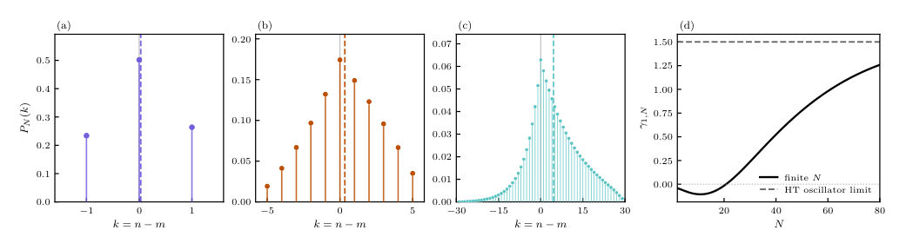 
FIG. 2. Non-Gaussian finite-size structure of the TPM work distribution for a uniform homothetic ladder with zh = 0.08 and zl = 0.20. Panels (a)–(c) show the distribution of the dimensionless work index k = W/[(1 −α)ϵ] = n −m for N = 2, N = 6, and N = 30, respectively. Dashed vertical lines mark ⟨k⟩N. Panel (d) shows the normalized skewness γ1,N from Eq. (27); the dashed horizontal line gives the oscillator high-temperature limit in Eq. (28). Finite spectral support changes both the width and the non-Gaussian tail structure of the work distribution.

📷 Fig 3

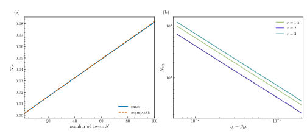 
FIG. 3. Finite-N scaling and saturation toward oscillator reliability. (a) Exact work reliability RN compared with the near-uniform expansion Rasy N = (zl −zh) p

📷 Fig 4

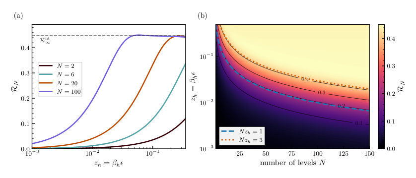 
FIG. 4. Noncommuting high-temperature and infinite-dimensional limits of work reliability. (a) RN versus zh = βhϵ at fixed ratio r = zl/zh = 2. For each finite N, RN →0 as zh →0, whereas the oscillator-first limit gives the plateau Rht ∞= (r −1)/ √

📷 Fig 5

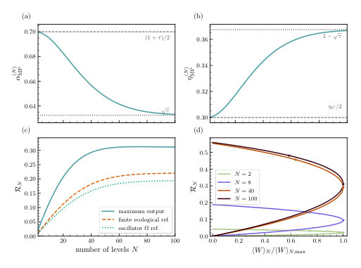 
FIG. 5. Mean-output optimization and work reliabil- ity for a finite uniform ladder at τ = Tl/Th = 0.4 and zh = 0.08. (a) Maximum-output compression ratio α(N) MP ob- tained from Eq. (62). Horizontal reference lines show the finite-N high-temperature value (1 + τ)/2 and the oscillator high-temperature value √τ. (b) Efficiency at the same oper- ating point, η(N) MP = 1−α(N) MP, compared with ηC/2 and 1−√τ. (c) Work reliability RN evaluated at the finite-N maximum- output point and at two external reference prescriptions: the finite high-temperature ecological point and the oscillator Ω point. (d) Output–reliability sweep obtained by varying α at fixed N. The horizontal axis shows the...

**Summary.** This paper develops a detailed theoretical framework to analyze the reliability of work extraction from quantum Otto engines operating with spectrally constrained (homothetic) systems. By deriving exact formulas for work distributions and moments in the finite-size limit, it quantifies how deviations from ideal conditions—such as incomplete thermalization or spectral distortion—affect performance metrics like mean output versus statistical reliability.

**Why it may be interesting.** This work provides a rigorous diagnostic tool to quantify non-ideal effects—like finite size or incomplete thermalization—in quantum energy conversion devices, which is crucial for designing practical quantum heat engines.

Detailed structure

**Main problem.** The paper investigates the finite-size reliability of work extraction from quantum heat engines, focusing on how fluctuations affect performance when energy spectra are discrete and finite.

**Main result.** It derives explicit formulas for the full work distribution and its moments for specific spectral structures, demonstrating that high-temperature/infinite-dimensional limits do not commute with finite-size effects.

**Method.** The analysis utilizes the Two-Point-Measurement (TPM) construction to calculate work statistics, specializing on homothetic spectra and extending the framework to include incomplete thermalization and finite driving times.

**Model / system.** The model is a quantum Otto engine operating with 'homothetic' energy gaps, meaning all populated energy gaps are rescaled by a common factor. The system can be specialized to a uniformly spaced ladder connecting qubit and oscillator limits.

**Key observables.** Work distribution, mean work ($\langle W 
angle$), variance ($\sigma^2_W$), and signal-to-width reliability ($R_N$).

**Important parameters / regimes.** Finite number of energy levels ($N$), the scaling factor $\alpha$, temperature parameters ($eta_h, eta_l$), and spectral distortion measures.

**Assumptions / limitations.** The primary assumption is that work statistics can be accurately derived using the Two-Point-Measurement (TPM) construction for energy-diagonal endpoint states; it also assumes quasistatic operation in the adiabatic limit.

**Figures summary.** Figure 1 illustrates the finite-$N$ crossover of reliability ($R_N$) for a uniform ladder, comparing exact results to infinite limits. Other figures compare mean work and reliability under sudden switches versus adiabatic driving.

**Paper structure.** The paper establishes the theoretical framework using homothetic engines, derives moment equations via TPM, specializes these derivations for the uniformly spaced ladder case, compares different operational regimes (e.g., harmonic oscillator vs. ad-hoc), and finally analyzes deviations from ideal homothety.

Abstract

Homothetic quantum Otto engines---where all populated energy gaps are rescaled by a common factor---provide a reference model in which the quasistatic stochastic efficiency is trajectory-independent while work remains fluctuating. For arbitrary finite homothetic spectra we derive the two-point-measurement work distribution and reduce the first two work moments to endpoint energy moments. Specializing to a uniformly spaced ladder gives closed finite-$N$ expressions for the full work distribution, mean work, variance, and signal-to-width reliability. This ladder connects the qubit and oscillator limits, reveals a finite-$N$ reliability crossover, and demonstrates that the high-temperature and infinite-dimensional limits do not commute. The noncommutation reflects a bounded-versus-unbounded spectral distinction: at fixed finite $N$ the Gibbs state has a normalizable infinite-temperature limit, whereas the oscillator retains an ever-expanding thermal tail. The exact formulas are used to compare standard mean-output prescriptions with work reliability, showing that maximum mean output and maximum dimensionless reliability select different operating points. The benchmark is extended to incomplete diagonal reset and to finite-time unitary strokes described by transition matrices, with a finite-ladder protocol and a harmonic sudden-switch oscillator benchmark as controlled examples. Weak deviations from exact homothety are treated perturbatively, showing how level-dependent gap distortions reintroduce quasistatic efficiency fluctuations and modify work reliability. Together, these results separate finite-size, incomplete thermalization, finite-time, and weak spectral-distortion contributions to work unreliability in quantum Otto engines.

[↑ back to top](#top)

### [Superselectivity as a Receptor-Fluctuation Response](http://arxiv.org/abs/2607.29599v1)

**Authors:** Xiuyang Xia  
**Type:** theory · **Category:** statistical mechanics · **PDF:** <https://arxiv.org/pdf/2607.29599v1>  
**Analysis basis:** full PDF text, analyzed in chunks
**Topic relevance:** `non-equilibrium dynamics` **2/5** · `Keldysh / 2PI / non-Gaussian methods` **1/5** · `correlated / nonlocal dissipation` **1/5** · `driven-dissipative phase transition` **1/5** · `methods for driven-dissipative` **1/5** · `non-equilibrium universality` **1/5**

📷 Fig 1

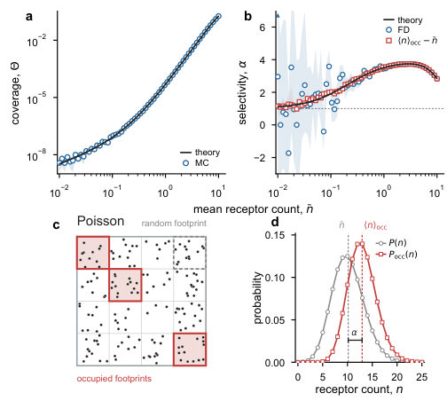 
FIG. 1. Poisson receptor fluctuations and selectivity. Pan- els (a,b) compare coverage and selectivity from lattice-gas Monte Carlo (MC) simulations with exact theory. Panel (b) shows selectivity from finite differences (FD) and from the occupied-footprint receptor excess ⟨n⟩occ −¯n. Panels (c,d) show a Poisson receptor map and the corresponding random- and occupied-footprint count distributions at ¯n = 10.14. The separation between their mean counts equals α. The adsorp- tion parameters are κ = 4, s = e2, and z = 10−8. Shading denotes 95% intervals from complete-replica bootstrap resam- pling; boundary triangles mark zero lower bounds or confi- dence sets extending beyond the plotted range.

📷 Fig 2

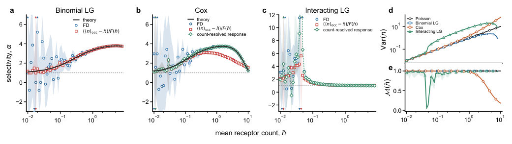 
FIG. 2. Receptor statistics and selectivity. Panels (a–c) compare selectivity from finite differences (FD), the Fano-rescaled receptor excess, and the count-resolved response for finite-capacity binomial, frozen-intensity Cox, and attractive interacting receptor ensembles. Panels (d,e) show the corresponding receptor-count variance and linear count-mode weight M(¯n). The binomial ensemble has a footprint capacity M = 9. In the binary Cox ensemble, the local intensity multiplier X equals 0.4 with probability 0.6 and 1.9 otherwise. The interacting lattice gas uses a dimensionless nearest-neighbor attraction J = 3. The adsorption parameters are κ = 4, s = e2, and z = 10−8. Shaded regions...

📷 Fig 3

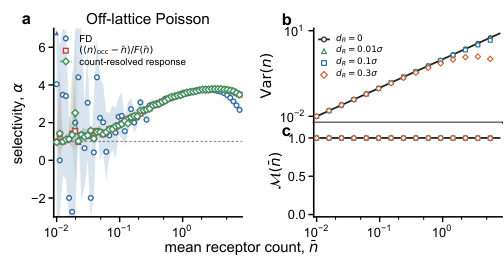 
FIG. 3. Receptor exclusion and particle crowding. Panel (a) compares point-receptor selectivity from finite differences (FD), the Fano-rescaled receptor excess, and the count- resolved response. The receptor-based measurements overlap but separate from FD at high density because of guest-particle crowding. Panels (b,c) show the footprint-count variance and linear count-mode weight M(¯n) for dR/σ = 0, 0.01, 0.1, and 0.3. Here dR is the receptor hard-core diameter and σ is the guest-particle diameter. The adsorption parameters are κ = 4, s = e2, and z = 10−8. Shaded regions denote 95% complete-replica bootstrap intervals, and boundary triangles indicate intervals extending beyond the plotted...

**Summary.** This work develops a theoretical framework to dissect superselectivity in multivalent binding by decomposing the macroscopic response into contributions from receptor state reweighting and local occupation changes. It shows that this selectivity is fundamentally governed by how particle adsorption samples local receptor density fluctuations, providing measurable estimators for various physical regimes.

**Why it may be interesting.** It provides a rigorous fluctuation-response framework applicable to adsorption phenomena, which shares mathematical structures with open quantum systems where environmental fluctuations dictate system behavior.

Detailed structure

**Main problem.** The paper aims to microscopically understand the origin of 'superselectivity'—the sharp density discrimination observed during multivalent binding—by decomposing its macroscopic logarithmic response.

**Main result.** Superselectivity can be exactly decomposed into a receptor-state reweighting term and a direct occupation response, providing quantitative rules that link selectivity to local receptor fluctuations.

**Method.** The authors derive exact theoretical decompositions for the selectivity ($\alpha$) in terms of ensemble averages over occupied vs. random receptor counts, comparing results across various statistical limits.

**Model / system.** The system models multivalent particles adsorbing onto a surface with spatially fluctuating receptors, tested using lattice gas simulations and off-lattice hard-disk models.

**Key observables.** Superselectivity ($\alpha$), local receptor excess ($\langle n 
angle_{	ext{occ}} - ar{n}$), Fano factor ($F(ar{n})$), and the linear count mode weight ($M(ar{n})$).

**Important parameters / regimes.** Receptor statistics (Poisson, Binomial, Cox, Interacting LG), particle/receptor diameters ($d_R/\sigma$), and system density ($ar{n}$).

**Assumptions / limitations.** The analysis relies on deriving exact response decompositions; approximations are made when moving beyond the Poisson limit or dealing with finite-size effects.

**Figures summary.** Figures compare selectivity estimates (Finite Difference vs. Fano-rescaled vs. Count-resolved) across different receptor statistics and show how increasing receptor size ($d_R$) modifies these comparisons, especially at high coverage.

**Paper structure.** The paper develops the general response decomposition theory, applies it to specific statistical ensembles (Poisson, Binomial, Cox), and then tests the robustness of the derived estimators using lattice/off-lattice simulations while analyzing finite size effects.

Abstract

Superselective multivalent binding enables sharp receptor-density discrimination in targeting and sensing, but what its logarithmic response measures microscopically remains unclear. Here, we derive an exact response decomposition of the selectivity into receptor-state reweighting and a direct occupation response. In the dilute quenched Poisson limit, the direct term vanishes and selectivity is exactly the mean receptor excess beneath bound particles, which can be measured at a single density from a sufficiently large co-registered receptor-particle image. Beyond Poisson statistics, the excess is normalized by the Fano factor for a linear count response, while changes in distribution shape require the full count-resolved response. Lattice simulations verify these relations across distinct receptor statistics, while off-lattice simulations show that particle crowding enters through the direct term. These results establish a fluctuation-response framework linking multivalent selectivity to the local receptor fluctuations preferentially sampled by adsorption.

[↑ back to top](#top)

### [Error-Generator-Level Compression for Fast Quantum Gates](http://arxiv.org/abs/2607.28922v1)

**Authors:** Razvan Stanescu, Hugo Ribeiro  
**Type:** theory · **Category:** quantum information and computing · **PDF:** <https://arxiv.org/pdf/2607.28922v1>  
**Analysis basis:** full PDF text, analyzed in chunks
**Topic relevance:** `QC/QI experiment` **2/5** · `correlated / nonlocal dissipation` **1/5** · `driven-dissipative phase transition` **1/5** · `methods for driven-dissipative` **1/5** · `non-equilibrium dynamics` **1/5**

📷 Fig 1

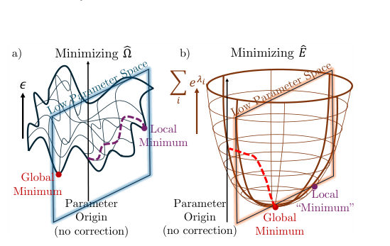 
Figure 1. Schematic comparison between fidelity-based com- pression and generator-level compression. Minimizing a final- time unitary objective can favor nonperturbative solutions because the unitary is periodic in the residual eigenphases. In contrast, compressed Magnus control evaluates a spectral penalty that is convex in the Hermitian diagnostic genera- tor and is minimized when the projected residual eigenphases vanish; the induced landscape in pulse coefficients need not be convex.

📷 Fig 2

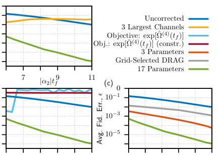 
Figure 2. Average fidelity error ϵ versus dimensionless gate time |α2| tf for a target π/2 rotation about the x axis, com- puted from the projected final-time evolution of the four-level transmon model. (a) Naive three-parameter truncation re- taining only the largest error channels predicted by the fourth- order generator (yellow). (b) Three-parameter minimization of the truncated residual unitary exp[ˆΩ(4)] without (light blue) and with (red) partial Magnus constraints. (c) Three- parameter compressed Magnus correction obtained by mini- mizing Φ(4) (orange) and grid-optimized leading-order DRAG (gray), where the smallest error is selected independently at each gate time from the discrete...

📷 Fig 3

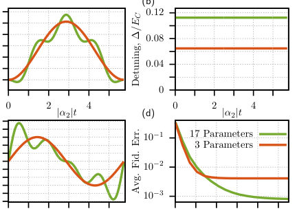 
Figure 3. Modified pulses and finite-bandwidth perfor- mance at |α2| tf = 5.74. The three-parameter compressed pulse is obtained with ax/EC = −0.017, by/EC = 0.301, and ∆/EC = 0.065. Panels (a), (b), and (c) show the total modi- fied in-phase envelope fx,mod(t), constant detuning ∆, and to- tal modified quadrature envelope fy,mod(t), respectively, for the fully parameterized 17-parameter Magnus pulse (green) and the three-parameter compressed Magnus pulse (orange). In panel (d), a Gaussian response with 3 dB bandwidth ωBW is applied to the complete modified baseband envelopes, while the carrier frequency and detuning remain unchanged. The filtered amplitudes and pulse areas are not...

**Summary.** The paper presents Error-Generator-Level Compression, a novel Magnus-based control method designed to suppress complex coherent errors in fast quantum gates using minimal control parameters. By minimizing a penalty functional derived from the projected error generator, it achieves superior gate fidelity compared to existing techniques like DRAG. This approach is particularly valuable for superconducting qubits as it maintains physical insight into error sources while simplifying pulse design.

**Why it may be interesting.** This work provides a powerful, physically motivated control technique that directly targets the structure of coherent errors in superconducting qubits, offering an alternative to standard unitary optimization methods by focusing on the underlying error generators.

Detailed structure

**Main problem.** The core problem is suppressing high-dimensional coherent error channels during fast quantum gate operations while ensuring the required control pulse remains simple to implement.

**Main result.** A novel 'Error-Generator-Level Compression' technique using a Magnus-based principle successfully suppresses errors by orders of magnitude, achieving target fidelity faster than established methods like DRAG.

**Method.** The authors introduce error-generator-level compression, which minimizes the projected error generator at a perturbative order while constraining the control waveform to only a few adjustable coefficients.

**Model / system.** The study focuses on fast quantum gates implemented on transmon qubits, modeled by a driven Hamiltonian that includes terms for target evolution and coherent errors. The analysis uses a four-level truncation of the system dynamics.

**Key observables.** Average fidelity error ($\epsilon$), projected error generator ($\hat{E}_{	ext{rel}}$), and residual eigenphases (diagnostics).

**Important parameters / regimes.** The number of adjustable pulse parameters (e.g., three for the compressed pulse vs. 17 for full correction) and the gate time scale ($|\alpha_2| t_f$).

**Assumptions / limitations.** The method does not make the truncated Magnus expansion exact; it selects a low-dimensional pulse by penalizing nonperturbatively large residual eigenphases.

**Figures summary.** Figures compare error suppression and fidelity performance across different control methods (compressed vs. DRAG) and demonstrate that the compressed pulse is less sensitive to finite-bandwidth filtering than fully parameterized pulses.

**Paper structure.** The paper introduces the problem of high-dimensional error suppression, details the Magnus-based compression principle by minimizing a spectral penalty on the projected error generator, rigorously relates this functional minimization to the average fidelity error, and finally tests the robustness against realistic finite-bandwidth filtering effects.

Abstract

Fast quantum gates in multilevel systems require suppressing many coherent-error channels using pulses that remain simple to implement. We introduce error-generator-level compression, a Magnus-based control principle that minimizes the complete projected error generator at a chosen perturbative order while restricting the implemented waveform to a few independently adjustable coefficients. This construction preserves all modeled computational and leakage errors rather than truncating the pulse by error channel, while its generator-level objective directly penalizes residual eigenphases that can signal departure from the perturbative regime. For fast transmon gates, a three-parameter pulse suppresses errors by orders of magnitude, outperforms grid-optimized leading- order DRAG over the gate-time range studied, and approaches a fully parameterized 17-parameter Magnus correction. The compressed pulse is also substantially less sensitive to the illustrative finite-bandwidth filtering model considered here.

[↑ back to top](#top)

### [Critical Phases of the extended isotropic $XY$ chain with four-spin interaction](http://arxiv.org/abs/2607.29006v1)

**Authors:** Nika Kurdadze, Giorgi Gogabedashvili, G. I. Japaridze  
**Type:** theory · **Category:** statistical mechanics · **PDF:** <https://arxiv.org/pdf/2607.29006v1>  
**Analysis basis:** full PDF text, analyzed in chunks
**Topic relevance:** `analog quantum simulation` **2/5** · `driven-dissipative phase transition` **1/5** · `exotic spin models in light-matter` **1/5** · `non-equilibrium universality` **1/5**

📷 Fig 1

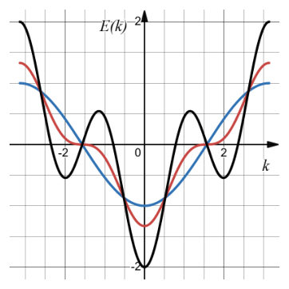 
Figure 1: Dispersion relation for different positive values of the parameter α. The blue lines correspond to values of α below the Lifshitz transition, where the spectrum is characterized by two Fermi points. The red line corresponds to the spectrum at the critical point, α = αc = 4/3. The black line corresponds to the spectrum with six Fermi points.

📷 Fig 2

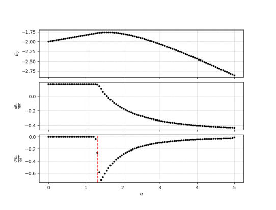 
Figure 2: The ground state energy and its first and second derivatives as functions of the parameter α.

📷 Fig 3

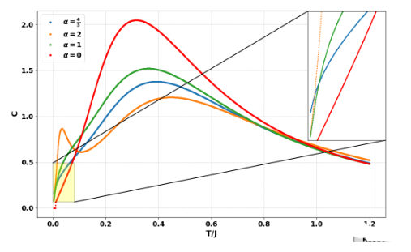 
Figure 3: Heat capacity of the system as a function of temperature for α = 0 (blue line), α = 1 (green line), α = 2 (orange line), and at the QCP α = 4/3 (red line). The inset shows the low-temperature region 0 &lt; T/J &lt; 0.4, where the nonlinear behavior of the heat capacity at α = 4/3 and in the vicinity of the critical point (α = 1) is clearly seen.

📷 Fig 4

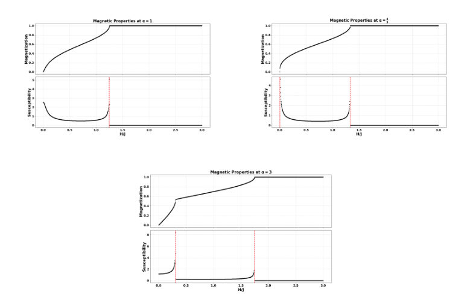 
Figure 4: Magnetization and magnetic susceptibility as functions of the uniform magnetic field at α = 1 (a), α = 4/3 (b), and α = 3 (c).

📷 Fig 5

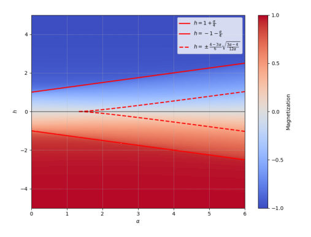 
Figure 5: Magnetic phase diagram of the model as a function of the magnetic field and the parameter α. The solid lines h = ±(1 + α/4) mark transitions into the fully polarized ferromagnetic state, while the dashed lines

**Summary.** This theoretical work analyzes the critical behavior of an extended XY spin chain with four-spin interactions by mapping it to a free fermion gas. It identifies Lifshitz-type topological quantum phase transitions characterized by band flattening at the critical point. This leads to unique, non-trivial power-law scaling for thermodynamic quantities like heat capacity and magnetic susceptibility near criticality.

**Why it may be interesting.** The derivation of singular power-law scaling laws ($T^{-1/3}$, $H^{-5/6}$) from a topological phase transition in a quantum spin model provides deep insights into critical phenomena beyond mean-field theory, relevant for understanding exotic magnetic materials.

Detailed structure

**Main problem.** The study investigates critical phases and quantum phase transitions (QPTs) within an extended isotropic XY chain incorporating a four-spin interaction.

**Main result.** The system exhibits Lifshitz-type topological QPTs at specific coupling ratios, leading to singular power-law behaviors in the density of states, heat capacity, and magnetic susceptibility near criticality.

**Method.** The analysis employs the Jordan-Wigner transformation to map the spin model onto an equivalent free spinless fermion (SF) gas, allowing for exact diagonalization techniques.

**Model / system.** The system is a spin S=1/2 isotropic XX chain with four-spin interactions. The Hamiltonian involves nearest-neighbor and next-next-next-neighbor couplings, which are mapped to hopping terms in the fermion representation.

**Key observables.** Ground state energy density, heat capacity (C), magnetic susceptibility ($\chi$), magnetization ($m$), and spin correlation functions.

**Important parameters / regimes.** The ratio $\alpha = J^*/J$ controls the phase transitions. Critical points are identified at $\alpha_c = 4/3$ for uniform fields and specific field strengths $H_c$ for alternating fields.

**Assumptions / limitations.** The analysis relies on mapping the spin system to a free fermion gas, which allows for exact solvability in terms of fermionic excitations.

**Figures summary.** Figures illustrate the dispersion relation showing changes in Fermi points across critical couplings ($\alpha$), and plot thermodynamic quantities like heat capacity ($C$) exhibiting non-linear behavior near the QCP.

**Paper structure.** The paper systematically analyzes the system's properties by first mapping the spin Hamiltonian to fermions, then calculating ground state energy and correlation functions as a function of coupling ratios ($\alpha$). It details distinct behaviors for uniform fields (Lifshitz transition) and alternating magnetic fields (AFM to SL transition).

Abstract

Using the Jordan-Wigner transformation we calculate exactly the ground state and low-temperature thermodynamic properties of the spin $S=1/2$ isotropic $XX$ chain with four spin interaction. In terms of the equivalent spinless fermion (SF) representation the system is viewed as a lattice fermion gas with nearest-neighbor ($J$) and next-next-next-neighbor ($J^{\ast}/4$) hopping. It is shown that with the increase of four spin coupling, at $J^{\ast}_{c} = 4J/3$ the system experiences the Lifshitz type topological phase transition characterized by the tripling of Fermi points. The quantum phase transition (QPT) point marks transition from a gapless spin-liquid phase of standard $XX$ chain into again a gapless spin-liquid phase with different character of power-low decay of spin correlations. At the transition point the free fermion dispersion relation shows flattering at Fermi points, what determines singular character of density of states $ρ(ω)\sim (ω/J)^{-2/3}$ and as a consequence unconventional temperature dependence of heat capacity of the system $C\sim (T/J^{\ast})^{1/3}$, and singular magnetic susceptibility of the system $χ(H)\sim (H/J^{\ast})^{-2/3}$.   In the case of alternating magnetic field the system is characterized by the rich ground state phase diagram which contains fully polarized (ferromagnetic), gapped antiferromagnetic (AFM) and spin liquid phases. At the transition point from the gapped AFM phase into the gapless polarized spin liquid phase the system shows rapid increase of magnetization $m\sim(H-H_c)^{1/6}$ and magnetic susceptibility a singular behavior as $χ(H)\sim (H-H_c)^{-5/6}$.

[↑ back to top](#top)

### [Erasure surface code circuit without mid-circuit erasure checks](http://arxiv.org/abs/2607.29443v1)

**Authors:** Margaret Pavlovich, Ivan Rojkov, Chen Wang, Shruti Puri  
**Type:** theory · **Category:** quantum information and computing · **PDF:** <https://arxiv.org/pdf/2607.29443v1>  
**Analysis basis:** full PDF text, analyzed in chunks
**Topic relevance:** `quantum measurements` **2/5** · `QC/QI experiment` **1/5** · `measurement-induced transitions` **1/5** · `methods for driven-dissipative` **1/5**

📷 Fig 1

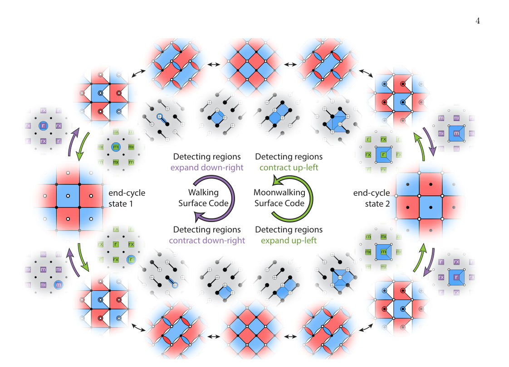 
FIG. 1: The moonwalking surface code is the time-reverse of the original walking surface code. Here, we show the detecting regions and CX gates (illustrations adapted from those generated by Stim [33]) for two syndrome extraction cycles of each circuit. Qubits are depicted as alternating white and black dots to make plaquette shifts more apparent. X-type detecting regions are red and Z-type detecting regions are blue. The walking surface code circuit follows the loop clockwise and uses the outer, purple operations for measurements and resets. The moonwalking surface code circuit follows the loop counterclockwise and uses the inner, green operations for measurements and resets. Both circuits...

📷 Fig 2

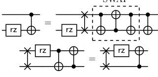 
FIG. 2: The circuit equivalences and transformations to construct the moonwalking surface code circuit. A pair of SWAP operations is inserted between the reset opera- tion and first CX gate. One SWAP is commuted through the reset operation to the beginning of the syndrome ex- traction circuit. In the context of the whole code, this SWAP is meaningless. Its effect can be recovered by si- multaneously shifting all the data qubits along a diagonal by half a plaquette in software so that they appear to be placed on the sublattice formed by ancilla qubits of the previous round. The other SWAP is decomposed into CX operations which are combined with the existing CX gate and the reset operation,...

📷 Fig 3

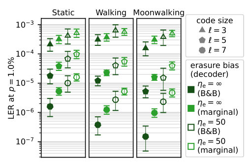 
FIG. 4: Simulated logical error rate (LER) for each sur- face code circuit at a fixed physical error rate, p = 0.01, with the skip-gate leaked-qubit effect and erasure check (EC) schedule 8. The x axes are not meaningful. Marker shape indicates code distance and marker filling indicates erasure bias ηe = pleak/ppauli. Our new moonwalking sur- face code (SC) circuit significantly outperforms the static (i.e., standard rotated) SC and somewhat outperforms the original walking SC. Error bars show a likelihood ra- tio of 1000.

📷 Fig 4

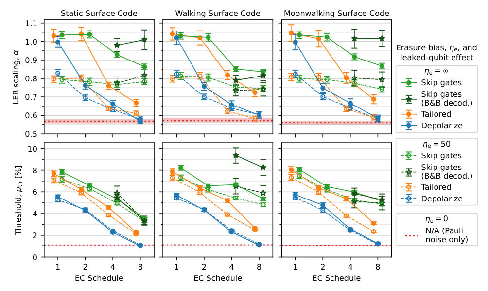 
FIG. 5: Logical error rate (LER) scaling exponent, α (top row), and threshold, pth (bottom row), extracted by fitting simulated data to Eq. (1). The different EC schedules as shown on the x axis are categorical, and small horizontal offsets between points for a given schedule are added for legibility. Marker filling and line dashing indicate erasure bias, ηe = pleak/ppauli. When there is only Pauli noise, EC schedule is irrelevant, so we present that data as a horizontal line. Color indicates leaked-qubit effect. All data is for marginal decoding unless noted otherwise. Notice that branch-and-bound decoding allows one to recover erasure-like scaling, α ≈1, with EC schedules 4 and 8,...

📷 Fig 5

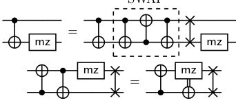 
FIG. 6: The circuit equivalences and transformations to construct the walking surface code circuit [34]. Compare to Fig. 2. A pair of SWAP operations is inserted between the final CX gate and the measurement. One SWAP is commuted through the measurement operation to the end of the syndrome extraction circuit. In the context of the whole code, this SWAP is meaningless. Its effect can be recovered by simultaneously shifting all the data qubits along a diagonal by half a plaquette in software so that they appear to be placed on the sublattice formed by ancilla qubits for the next round. The other SWAP is decomposed into CX operations which are combined with the existing CX gate and the...

**Summary.** This paper advances quantum error correction theory by proposing the 'moonwalking surface code' as an efficient alternative to traditional circuits. It achieves superior erasure error correction capacity using only simpler three-state readout instead of complex mid-circuit checks. The core technical contribution is a specialized branch-and-bound decoder designed to handle the non-trivial constraints arising from leakage errors.

**Why it may be interesting.** This work provides a highly detailed theoretical framework for fault-tolerant quantum computation, specifically addressing practical hardware limitations like mid-circuit measurement overheads in superconducting or trapped-ion architectures.

Detailed structure

**Main problem.** The core problem is developing quantum error correction (QEC) circuits that achieve superior erasure error-correction capacity while minimizing hardware overhead associated with mid-circuit checks.

**Main result.** The authors show that the moonwalking surface code, when combined with three-state readout and assuming skip-gate leakage, can maintain erasure performance with zero overhead.

**Method.** They introduce a specialized branch-and-bound decoder to solve the quasi-Maximum Likelihood Estimation (quasi-MLE) problem for decoding errors under strict disjointness constraints.

**Model / system.** The study focuses on the surface code, comparing static, walking, and moonwalking variants. The system models error channels including leakage, Pauli errors, and erasures, analyzed using three-state readout.

**Key observables.** Logical error rate scaling under erasure conditions; syndrome extraction circuits (Z stabilizer measurements); minimum weight perfect matching solutions ($ar{S}$).

**Important parameters / regimes.** The comparison is made across different leakage models (Depolarizing, Tailored, Skip-gate) and erasure check schedules.

**Assumptions / limitations.** Key assumptions include the faithfulness of three-state readout and modeling leaked qubits causing two-qubit gates to be entirely skipped (skip-gate model).

**Figures summary.** Figures illustrate the gate sequences comparing walking vs. moonwalking circuits, showing how syndrome extraction is performed over multiple cycles. Other figures detail the structure of the branch-and-bound decoder algorithm flow.

**Paper structure.** The paper systematically studies error correction protocols, introducing the moonwalking code as an improvement. It then details the necessary decoding machinery—the branch-and-bound algorithm—to handle the complex constraints imposed by leakage and erasure information.

Abstract

Quantum error correction (QEC) codes can correct twice as many erasure errors as Pauli errors. Because of this scaling advantage, there is significant interest in developing qubits whose dominant error channel can be converted into erasures via mid-circuit erasure checks. However, such erasure checks come with hardware overhead in practice. End-of-the-line three-state readout, in which one simultaneously measures a qubit's erasure status and computational state, is an alternative to mid-circuit erasure checks that is generally simpler to implement. In this work, we systematically study the conditions required to enable erasure performance---the doubled error-correction capacity---in the surface code with and without mid-circuit erasure checks. We introduce the moonwalking surface code, the time-reversal of the walking surface code, as a zero-overhead circuit with superior handling of leakage and erasure. Specifically, we show that it enables erasure-like logical error rate scaling when combined with three-state measurement if leaked qubits cause two-qubit gates to be skipped and an appropriate decoder is used. Our decoder, based on a branch-and-bound algorithm, specifically incorporates the noise structure of the skip-gate leaked-qubit effect.

[↑ back to top](#top)

### [A Simple Necessary and Sufficient Condition for Yang--Baxter Integrability](http://arxiv.org/abs/2607.29660v1)

**Authors:** Mizuki Sanatani, Naoto Shiraishi, Fuga Ishii  
**Type:** theory · **Category:** statistical mechanics · **PDF:** <https://arxiv.org/pdf/2607.29660v1>  
**Analysis basis:** full PDF text, analyzed in chunks
**Topic relevance:** `analog quantum simulation` **2/5** · `exotic spin models in light-matter` **1/5** · `non-equilibrium dynamics` **1/5**

📷 Fig 1

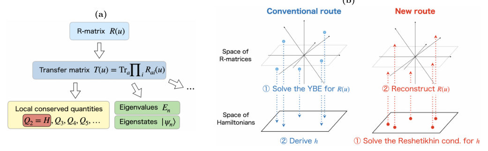 
FIG. 1. Reversing the search for Yang–Baxter integrability. a, In the established algebraic framework, one starts from an R-matrix satisfying the Yang–Baxter equation and constructs the transfer matrix T(u). This construction provides a mutually commuting family of local quantities Q2, Q3, Q4, . . ., together with access to spectra, eigenstates, correlation functions, transport coefficients and thermodynamics. The Hamiltonian appears in this construction as the first nontrivial charge in the hierarchy, H = Q2. b, In the conventional search picture, the integrable locus is identified by solving the Yang–Baxter equation in the space of R-matrices, and Hamiltonian densities are then obtained...

📷 Fig 2

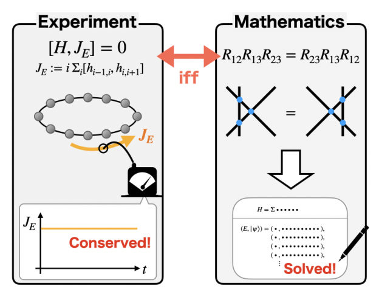 
FIG. 2. Energy-current conservation as an experimental certificate of Yang–Baxter integrability. The total energy current provides an experimentally accessible probe of exact solvability in an interacting quantum spin chain. Our theorem identifies conservation of the total energy current JE = i P

📷 Fig 3

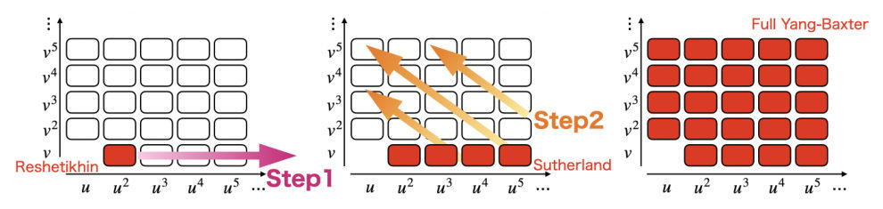 
FIG. 3. From the Reshetikhin condition to the full Yang–Baxter equation. This figure locates the Reshetikhin condition within the spectral-parameter expansion of the Yang–Baxter equation and summarizes the proof strategy. Expanding the Yang–Baxter equation in two spectral parameters produces a two-dimensional array of order-by-order constraints. Some of the lowest-order constraints are automatic, and the first nontrivial Hamiltonian-level constraint is the Reshetikhin condition, marked in the figure. Step 1 shows that this single condition is sufficient to continue the one-parameter recursive construction to all orders, eliminating the constraints along the first nontrivial line. Step 2...

📷 Fig 4

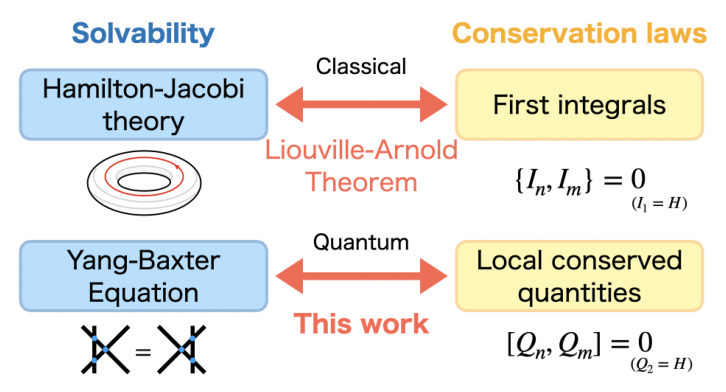 
FIG. 4. A quantum counterpart of the Liouville–Arnold theorem. In classical Hamiltonian mechanics, the Liouville– Arnold theorem establishes an equivalence between conserved quantities and solvability: for a system with n degrees of freedom, the existence of n independent mutually commuting conserved quantities is equivalent to solvability in the Hamilton–Jacobi sense. In quantum systems, an analogous equivalence between local conserved quantities and Yang–Baxter solvability has long been missing. The present work establishes such a correspondence in isotropic nearest-neighbour spin chains. The known conservation-law structure in the isotropic class and the theorem proved here together show...

**Summary.** The paper develops a fundamental criterion showing that Yang–Baxter integrability in quantum spin chains can be determined solely by checking a local conservation law called the Reshetikhin condition. This simplifies the search for integrable systems immensely by replacing the difficult task of finding R-matrices with a direct check on the Hamiltonian itself.

**Why it may be interesting.** This work provides a powerful, experimentally accessible diagnostic tool for determining quantum integrability directly from the Hamiltonian, which is crucial for understanding complex many-body dynamics beyond simple models.

Detailed structure

**Main problem.** The core problem is establishing a direct, Hamiltonian-level criterion for Yang–Baxter integrability, bypassing the traditional indirect method that starts from an R-matrix.

**Main result.** The authors prove that for translation-invariant spin chains, the Reshetikhin condition is necessary and sufficient for Yang–Baxter integrability, equating it to a local conservation law.

**Method.** The proof involves expanding the Yang–Baxter equation in spectral parameters and demonstrating that satisfying the lowest-order constraint (the Reshetikhin condition) forces all higher-order constraints to be satisfied.

**Model / system.** The study focuses on quantum spin chains with nearest-neighbor interactions, governed by a local Hamiltonian $H = \sum h_{i, i+1}$. Integrability is characterized by the existence of an infinite hierarchy of local conserved quantities.

**Key observables.** Yang–Baxter integrability; the Reshetikhin condition (a specific commutator relation); and the conservation of the total energy current ($\mathcal{J}_E$).

**Important parameters / regimes.** The spectral parameter $u$ and its relationship to local conserved charges $Q_n$. The system is assumed to be 1D with nearest-neighbor interactions.

**Assumptions / limitations.** The analysis relies on the assumption that the Reshetikhin condition implies the full Yang–Baxter equation under specific physical constraints (1D, translation-invariant).

**Figures summary.** Figure 1 contrasts the conventional R-matrix $
ightarrow$ Transfer Matrix approach with the proposed direct Hamiltonian search. Figure 2 relates integrability to energy current conservation, and Figure 3 illustrates how the Reshetikhin condition propagates through the YBE expansion.

**Paper structure.** The paper moves from defining the problem (Hamiltonian vs. R-matrix) to introducing the necessary and sufficient criterion (Reshetikhin condition). It then provides detailed mathematical proofs involving spectral parameter expansions, culminating in showing that this low-order test is equivalent to the full algebraic structure.

Abstract

Quantum integrability is a cornerstone of the exact theory of interacting quantum spin chains. In its standard formulation, however, one starts from R-matrices satisfying the Yang--Baxter equation, rather than from the Hamiltonian itself. It has therefore remained unclear how Yang--Baxter solvability can be characterized directly at the Hamiltonian level, and how it is related to the existence of local conservation laws. Here we prove that, in a broad standard setting, the Reshetikhin condition is not only necessary but also sufficient for Yang--Baxter integrability, thereby reducing the hidden algebraic structure of integrability to a Hamiltonian-level conservation law. Since the Reshetikhin condition is equivalent to conservation of the total energy current, this Hamiltonian-level criterion is also experimentally accessible. This result establishes a quantum counterpart of the Liouville--Arnold theorem for isotropic spin chains, stating that Yang--Baxter solvability is equivalent to an infinite hierarchy of local conserved quantities. Our result also simplifies substantially the search for integrable spin chains by replacing the search for R-matrices with a direct criterion on local Hamiltonians.

[↑ back to top](#top)

### [Quantum geometric potential induced conformational transitions in elastic helical nanoribbons](http://arxiv.org/abs/2607.29623v1)

**Authors:** Radha Balakrishnan, Rossen Dandoloff, Avadh Saxena  
**Type:** theory · **Category:** other · **PDF:** <https://arxiv.org/pdf/2607.29623v1>  
**Analysis basis:** full PDF text, analyzed in chunks
**Topic relevance:** `Frenkel-Kontorova` **2/5** · `driven-dissipative phase transition` **1/5** · `non-equilibrium dynamics` **1/5**

📷 Fig 1

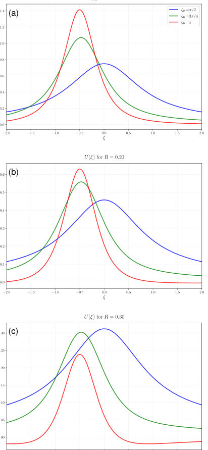 
Figure 1: Plots of the total potential U(ξ) [Eq. (31)] for (a) RH = 0, (b) RH = 0.2 and (c) RH = 0.3.

📷 Fig 2

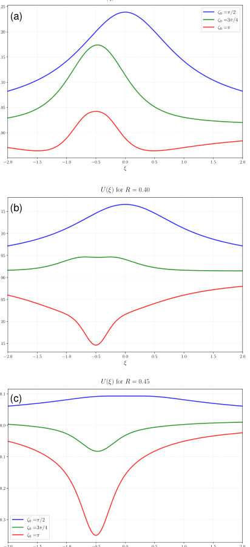 
Figure 2: Plots of the total potential U(ξ) [Eq. (31)] for (a) RH = 0.35, (b) RH = 0.4 and (c) RH = 0.45.

📷 Fig 3

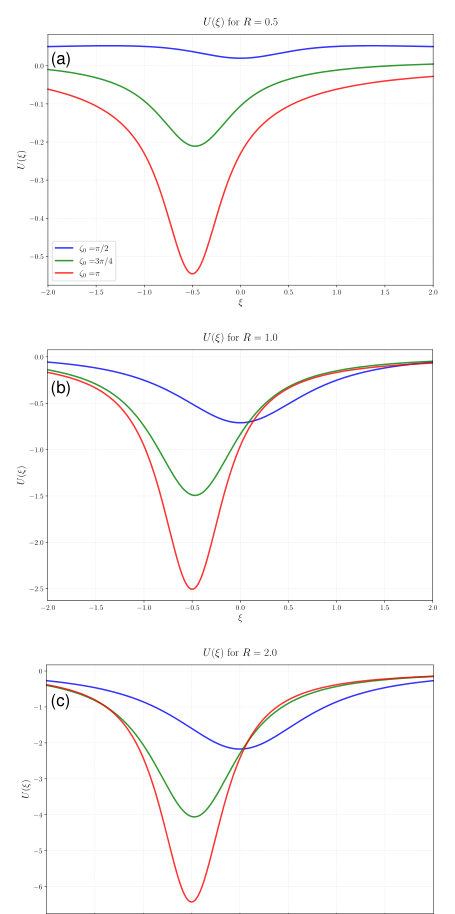 
Figure 3: Plots of the total potential U(ξ) [Eq. (31)] for (a) RH = 0.5, (b) RH = 1.0 and (c) RH = 2.0.

**Summary.** This theoretical study examines how quantum confinement interacts with the elasticity of helical nanoribbons. By calculating a total geometric potential, the authors show that injecting an electron stabilizes the ribbon into a specific 'normal' conformation. This suggests that electronic interactions can drive structural changes in curved nanomaterials.

**Why it may be interesting.** This work connects geometry (curvature) directly to electronic properties (potential minima), offering a mechanism for emergent phenomena like Hall effects in nanoscale structures without external fields.

Detailed structure

**Main problem.** The study investigates how placing a quantum particle on an elastic helical nanoribbon influences its conformational stability, leading to potential transitions.

**Main result.** Electron injection induces a conformational transition towards the normal ribbon conformation because this state yields the lowest total geometric potential. This process suggests a mechanism for generating a Hall-like voltage purely from curvature effects.

**Method.** The authors derived a total potential by summing an elastic potential (from a modified Canham-Helfrich model) and a quantum geometric potential (from da Costa's formulation). They analyzed the resulting 1D Schrödinger equation by varying dimensionless parameters.

**Model / system.** The system is an elastic helical nanoribbon whose conformation is parameterized. The physics is governed by a total potential $U_{total} = U_Q + U_{elastic}$, which dictates the particle's localized states and the ribbon's preferred geometry.

**Key observables.** Total geometric potential, existence/location of localized quantum states, and the conformational parameter $\zeta_0$.

**Important parameters / regimes.** The dimensionless ratio $R_H$ (comparing quantum to elastic energy scales) is crucial; critical values of $R_H$ dictate when localization occurs.

**Assumptions / limitations.** The analysis assumes the ribbon is elastic and uses approximations like $D_1 \approx D_2$ for simplifying the elastic energy model.

**Figures summary.** Figures plot the total potential $U(\xi)$ versus position $\xi$ for various values of $R_H$, demonstrating how the minimum potential shifts from the binormal to the normal conformation as $R_H$ increases.

**Paper structure.** The paper builds by first establishing the elastic and quantum potentials based on curvature ($M, K$), combining them into a total potential, and then analyzing this potential landscape by varying the dimensionless ratio $R_H$.

Abstract

We consider an {\em elastic} helical nanoribbon that can take on various conformations, and study the effect of placing a quantum particle on its curved surface. Using a modified Canham-Helfrich model for the elastic energy, we write down the local elastic potential for the ribbon in terms of its bending rigidity, mean curvature $M$ and Gaussian curvature $K$. The Schrödinger equation of a particle confined to a {\em rigid} curved surface is found using da Costa's formulation. It has a purely quantum geometric potential which depends on $M$ and $K$. The Schrödinger equation of a particle on an {\em elastic } curved surface will therefore have a total potential comprising quantum and elastic potentials. We compute $M$ and $K$ for a helical ribbon and derive the total potential which depends on the conformation and is thus geometric in nature. Defining a dimensionless quantity $R_H$, we study the behavior of the total geometric potential as $R_H$ is varied. In the absence of an electron, the elastic potential is positive and has a single positive maximum for all conformations. Further, a binormal helical ribbon conformation has the lowest potential, while the normal ribbon has the highest, with those of the intermediate ribbons lying in between these. Intriguingly, when a quantum particle is placed on the elastic ribbon, above a certain critical value of $R_H$, the presence of the quantum geometric potential {\em reverses} this order. But localized states for the particle are not supported. Only above a second critical value of $R_H$, localized states appear for all conformations. The injection of an electron on {\it any} given conformation of the elastic ribbon will induce a conformational transition to the normal ribbon conformation.

[↑ back to top](#top)

### [The Shape of Information: Global Information Geometric Limits in Multi-task Quantum Systems](http://arxiv.org/abs/2607.28961v1)

**Authors:** Zishuo Ren, Ziyang Chen, Hong Guo  
**Type:** theory · **Category:** quantum information and computing · **PDF:** <https://arxiv.org/pdf/2607.28961v1>  
**Analysis basis:** full PDF text, analyzed in chunks
**Topic relevance:** `entanglement & information structure` **2/5** · `quantum measurements` **1/5**

📷 Fig 1

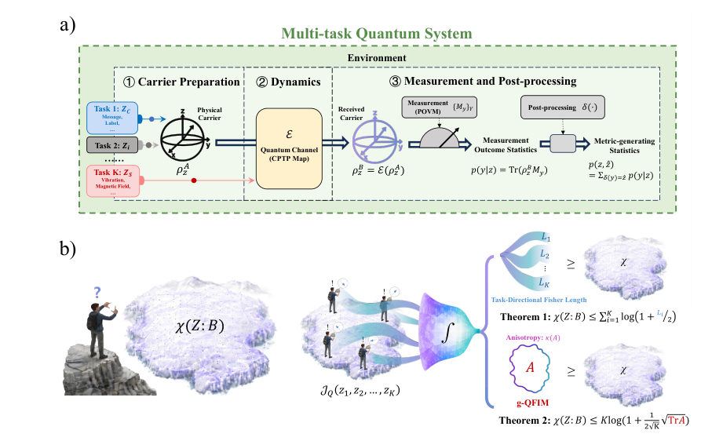 
FIG. 1. Panel a): The 3-step common information-acquisition structure shared by many tasks; Panel b): The visual- ization of our two theorems which first bound the global information capacity with local fisher information and then discover the vital role the shape of information plays in multi-task systems.

📷 Fig 2

 
FIG. 2. Total Holevo information and QFIM-induced ceilings. In the upper panel, the solid curve shows the ex- act Holevo information of the noiseless phase ensemble and the dashed curve shows the trace-based total information bound; In the lower panel, the transition of information structure is shown through det(A) and κ(A).

📷 Fig 3

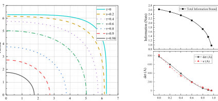 
FIG. 3. Tradeoff curve family under attenuation. The curve corresponds to the attenuation factor τ = 1 −N/N0 gradually increasing from 0 to 0.98 at N0 = 1/2. Left: the tradeoff curve family; Right top: the total bound derived by TrA at η = 1/2; Right bottom: det(A) and κ(A) at η = 1/2.

📷 Fig 4

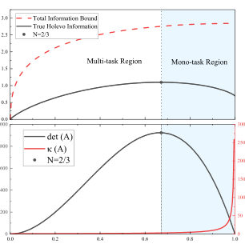 
Figure 2 compares the true Holevo information χtrue of the noiseless phase ensemble with the up- per bound (2) when the physical resource N changes. Within the weak-excitation regime (N ≤1/2), the lo- cal QFIM geometry gives a sensible non-asymptotic ceiling for the global information carried by the phys-

📷 Fig 5

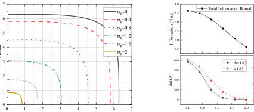 
FIG. 4. Tradeoff curve family under attenuation. The curve corresponds to the attenuation factor σϕ gradually increasing from 0 to 2 rads at N = 1/2. Left: the tradeoff curve family; Right top: the total bound derived by TrA at η = 1/2; Right bottom: det(A) and κ(A) at η = 1/2.

**Summary.** This paper introduces the global quantum Fisher information matrix (g-QFIM) as the fundamental constraint governing the total information capacity of quantum systems performing multiple tasks simultaneously. It derives rigorous upper bounds on the multi-task Holevo information, revealing that performance is governed by an underlying information geometry rather than simple summation. This provides crucial theoretical guidance for designing next-generation quantum networks.

**Why it may be interesting.** This work provides a rigorous, geometric framework for quantifying multi-task capabilities in quantum networks, moving beyond simple additive capacity models and offering design principles for integrated systems like ISAC.

Detailed structure

**Main problem.** The core problem is determining the fundamental, unified limit on the total information capacity of a single quantum carrier when multiple distinct tasks compete for its resources.

**Main result.** The total task capacity is fundamentally constrained by an underlying global information geometry captured by the global quantum Fisher information matrix (g-QFIM).

**Method.** The authors derive non-asymptotic, measurement-independent upper bounds on the Holevo information using information geometric principles and bounding techniques like Jensen's inequality.

**Model / system.** The analysis considers general multi-task quantum systems, exemplified by a minimal model using a two-mode quantum carrier encoded in phases (e.g., photonic phase encoding).

**Key observables.** Holevo information capacity ($\chi$), Global Quantum Fisher Information Matrix (g-QFIM) $A$, and task-directional Fisher lengths ($L_i$).

**Important parameters / regimes.** The number of tasks ($K$), the physical resource level (e.g., mean excitation $N$), and noise parameters (attenuation, phase diffusion).

**Assumptions / limitations.** The derived bounds rely on specific mathematical inequalities (Jensen's, Cauchy–Schwarz) and assume certain factorizations for prior distributions in the general K-task case.

**Figures summary.** Figures illustrate the common information acquisition structure across tasks and compare theoretical capacity bounds ($	ext{Tr} \mathbf{A}$) against actual Holevo information as physical resources or noise levels change, highlighting an optimal operating point.

**Paper structure.** The paper establishes the problem by identifying the need for a unified metric. It then derives two key theorems bounding the joint Holevo information using local distinguishability ($L_i$) and the global g-QFIM ($	ext{Tr} A$). The analysis proceeds to explore structural implications, such as phase transitions in performance based on resource allocation.

Abstract

Future quantum networks are expected to perform multiple tasks simultaneously within a single system, such as integrated sensing and communication (ISAC) architectures. Despite various metrics, we find that the evaluation of multiple tasks can be unified by their information capacity, and the total task capacity is not determined simply by addition, but is fundamentally constrained by an information geometry which we call the global quantum Fisher information matrix (g-QFIM). With this insight, we derive a non-asymptotic, measurement-independent upper bound on the Holevo information for multi-task systems, which takes a Shannon-capacity-like form. It not only quantifies the capacity limit, but also the allocability. Our results reveal a structural phase transition in multi-task performance under resource variation, where additional physical resources no longer increase independent task capacity but instead concentrate more information into a new mono-task mode. Numerical simulations based on photonic phase encoding and realistic noise channels confirm these predictions. This work establishes a unified information-geometric principle for quantum multi-task systems, with implications for the design of future quantum networks and ISAC architectures.

[↑ back to top](#top)

### [How null-model constraints affect statistical validation in projected bipartite networks](http://arxiv.org/abs/2607.29242v1)

**Authors:** Alessandro Catalano, Rosario N. Mantegna  
**Type:** theory · **Category:** statistical mechanics · **PDF:** <https://arxiv.org/pdf/2607.29242v1>  
**Analysis basis:** full PDF text, analyzed in chunks
**Topic relevance:** `Keldysh / 2PI / non-Gaussian methods` **1/5** · `analog quantum simulation` **1/5** · `correlated / nonlocal dissipation` **1/5** · `driven-dissipative phase transition` **1/5** · `entanglement & information structure` **1/5** · `methods for driven-dissipative` **1/5** · `non-equilibrium dynamics` **1/5** · `non-equilibrium universality` **1/5**

📷 Fig 1

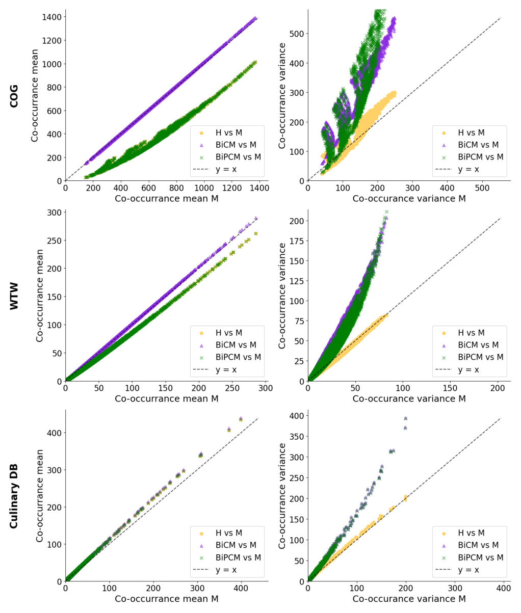 
Figure 1: Scatter plots comparing the expected value ⟨Xjj′⟩(left panels) and the variance Var{Xjj′} (right panels) obtained for the BiCM (purple triangles) , BiPCM (green crosses), and Hypergeometric (orange circles) null models with the values numerically estimated for the microcanonical null model for the COG (top row), WTW (middle row), and culinary (bottom row) datasets. The dashed line is y = x.

📷 Fig 2

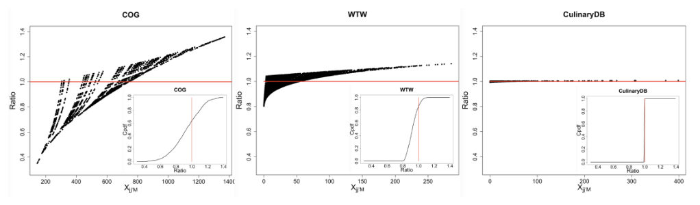 
Figure 2: Ratio between the approximated value of the expected co-occurrence estimated by Eq. 24 divide by the BiCM expectation obtained by using the Poisson-Binomial distribution against the microcanonical expectation of co-occurrence for all pairs of Set A nodes. The three panels refer to COG (left), WTW (middle), and CulinaryDB (right).The insets show the cumulative probability density function of the ratio values. They are located around the value R = 1 highlighted by the red line.

**Summary.** This work investigates how different theoretical null models affect the statistical validation of projected bipartite networks. The authors demonstrate that simply matching structural constraints is insufficient; instead, one must analyze the resulting probability distribution's moments (mean and variance). They conclude that the statistical consequences induced by a model's assumptions are the true measure for comparing these random ensembles.

**Why it may be interesting.** While not directly about quantum systems, the rigorous statistical framework developed for comparing null models based on induced probability distributions is highly relevant to analyzing complex correlation structures found in quantum many-body simulations or network representations derived from quantum information processes.

Detailed structure

**Main problem.** The statistical validation of projected bipartite networks requires comparing observed co-occurrences against random expectations derived from a null model, making the choice of this null model critical.

**Main result.** Null models should be compared based on the statistical consequences their constraints induce on the test statistic's probability distribution, rather than solely on the structural constraints they preserve.

**Method.** The authors compare four null models (Microcanonical, BiCM, BiPCM, Hypergeometric) by analyzing the first two moments (expectation and variance) of the co-occurrence random variable across three empirical datasets.

**Model / system.** The system involves projected bipartite networks derived from real-world data like comparative genomics or international trade. The analysis focuses on the co-occurrence random variable, $X_{jj'}$, which measures shared neighbors between two nodes in one set based on connections through a second set.

**Key observables.** Co-occurrence random variable ($X_{jj'}$), statistical p-value, expected value ($\langle X_{jj'} 
angle$), and variance ($	ext{Var}(X_{jj'})$).

**Important parameters / regimes.** Degree heterogeneity of the non-projected layer; network size (sparse limit analysis); validation metrics like F1 score.

**Assumptions / limitations.** The comparison relies on analyzing the first two moments (expectation and variance) to understand differences, even when full probability distributions are intractable. The Hypergeometric model surprisingly captures the microcanonical variance despite neglecting heterogeneity.

**Figures summary.** Figure 2 shows the ratio of approximated vs BiCM expected co-occurrence for three datasets; Table 4 reports validation statistics (F1 score, Recall) comparing different null models against a microcanonical benchmark.

**Paper structure.** The paper introduces the problem of statistical validation in projected bipartite networks. It details four competing null models and compares them using empirical data from genomics, trade, and food science. The core argument develops that distributional properties (moments) are more important than structural constraints alone, culminating in a comparison of model performance.

Abstract

Statistical validation of projected bipartite networks depends critically on the null model adopted to describe random co-occurrences. Although several null models have been proposed, their comparison has mainly focused on the validated backbones they produce rather than on the statistical assumptions underlying their construction. Here we compare four widely used null models - the microcanonical configuration model generated by the Curveball algorithm, the Bipartite Configuration Model (BiCM), the Bipartite Partial Configuration Model (BiPCM), and the Hypergeometric approximation - using three empirical bipartite systems from comparative genomics, international trade and food science. We use the statistically validated links obtained from the microcanonical bipartite configuration model as the reference benchmark for assessing performances of the other three models. Our central result is that the statistical consequences of relaxing null-model constraints cannot be understood solely from the constraints themselves but must be analyzed through the probability distribution induced for the co-occurrence statistic. In particular, the combined behaviour of the expectation and variance largely explains the observed differences among the statistically validated backbones. We further derive a leading-order sparse approximation for the BiCM expectation, showing that the first correction to the Hypergeometric prediction is controlled by the degree heterogeneity of the non-projected layer. Surprisingly, despite neglecting this heterogeneity, the Hypergeometric model accurately reproduces the co-occurrence variance of the microcanonical ensemble across all datasets. Our results suggest that null models should be compared not only according to the constraints they preserve but also according to the statistical consequences that these constraints induce on the distribution of the test statistic.

[↑ back to top](#top)

### [Nuclear Spin Squeezing Based on Spin-Exchange Collisions](http://arxiv.org/abs/2607.29046v1)

**Authors:** He-bin Zhang, Yuanjiang Tang, Yong-Chun Liu  
**Type:** theory · **Category:** other · **PDF:** <https://arxiv.org/pdf/2607.29046v1>  
**Analysis basis:** full PDF text, analyzed in chunks
**Topic relevance:** `analog quantum simulation` **1/5** · `correlated / nonlocal dissipation` **1/5** · `driven-dissipative phase transition` **1/5** · `entanglement & information structure` **1/5** · `exotic spin models in light-matter` **1/5** · `methods for driven-dissipative` **1/5** · `non-equilibrium dynamics` **1/5** · `spintronics-quantum-optics interface` **1/5**

📷 Fig 1

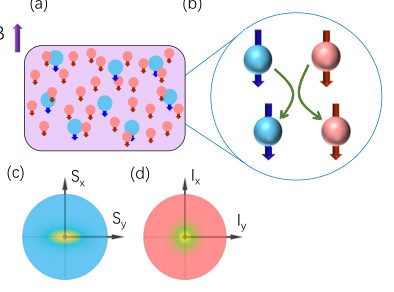 
FIG. 1. (Color online) (a) Schematic diagram of the alkali- metal (blue) and noble-gas (red) mixture with the spin- exchange collisions between the alkali-metal electronic spins and the noble-gas nuclear spins as shown in (b). The col- lective alkali and noble-gas spins are prepared initially to a SSS and CSS as shown in (c) and (d), respectively, with the collective spins along the same direction.

📷 Fig 2

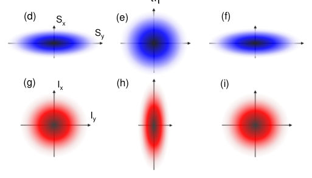 
FIG. 2. (Color online) Evolution of the spin-squeezing param- eter under the Hamiltonian in Eq. (1) for ns = 50, ni = 50 in (a), for ns = 50, ni = 500 in (b), and under the Hamiltonian in Eq. (5) with the magnetic field along z-axis satisfying the resonance condition (γs −γi)B = η 2 (ni −ns) for ns = 50, ni = 500 in (c). Red (blue) curves and solid (open) circles denote the analytical and numerical results of the squeezing parameter of the noble-gas (alkali-metal) spins. The inset in (c) shows the transfer efficiency of spin squeezing defined as ε = log10ξ2 i,op/log10ξ2 s,o without and with a magnetic field Br denoted by the blue dotted curve and green solid curve, respectively, as a function of...

📷 Fig 3

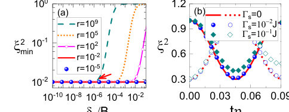 
FIG. 4. (Color online) (a) The optimal squeezing parameter of noble-gas nuclear spins as a function of the deviation δB of the magnetic field from Br for different ratios of atomic numbers r = ni/ns, with the initial squeezing parameter of alkali spins ξ2 s,0 = 10−2. According to the curve for ni/ns = 109 and Eq. (6), if J ≈80Hz, a magnetic field accuracy of about 1nT is enough for efficient transfer of spin squeezing from alkali spins to noble-gas spins, as marked by the red arrow. (b) Evolution of the squeezing parameters of alkali and noble- gas spins for different relaxation rate Γs of alkali spins with ns = 50, ni = 100. The relaxation rate of noble-gas spins is several orders of magnitude...

📷 Fig 4

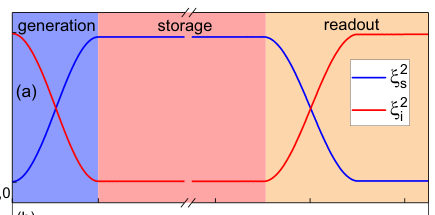 
FIG. 3. (Color online) (a) Evolution of the spin-squeezing pa- rameters manipulated by the magnetic field sequence shown in (b). Generating nuclear spin squeezing (blue region): Set- ting B = Br, the squeezing transfer is turned on. After the duration τop, the noble-gas nuclear spins will evolve to a SSS with the same squeezing parameter as the initial alkali-metal spins. Storing nuclear spin squeezing (red region): Setting B = Boff at t = τop, the squeezing transfer between alkali and noble-gas spins is turned off. Thus, the spin squeezing resides in the long-lifetime noble-gas nuclear spins. Measuring nuclear spin squeezing (orange region): Setting B = Br, the alkali spins in the probe...

📷 Fig 5

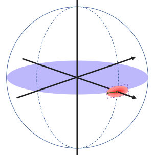 
FIG. 5. (Color online) Schematic diagram of the quasiprob- ability distribution of a SSS on the Bloch sphere. The green double arrows indicate the span of the spin fluctuation in the direction of the anti-squeezing.

**Summary.** The paper details a method to generate and store high levels of nuclear spin squeezing ($	ext{SSS}$) in noble gases by coupling them to alkali-metal spins via controlled spin-exchange collisions. By applying a specific magnetic field, the authors overcome limitations related to atomic number mismatch, enabling the transfer of quantum correlations into macroscopic ensembles for long-term storage and subsequent measurement.

**Why it may be interesting.** This work is highly relevant as it proposes a robust, scalable platform for quantum memory utilizing long-lived nuclear spins. The ability to engineer coherence transfer between different types of spins using external fields is a key technique in open quantum systems and quantum sensing.

Detailed structure

**Main problem.** The challenge is efficiently generating, manipulating, and measuring nuclear spin squeezing (SSS) in noble-gas systems that possess ultra-long coherence times but are difficult to manipulate.

**Main result.** The authors propose using coherent spin-exchange collisions with alkali-metal ensembles, controlled by an external magnetic field, to transfer SSS to macroscopic noble-gas spins ($\ge 10^{20}$ atoms) and store it for long periods.

**Method.** The method involves applying a specific resonant magnetic field ($B_r$) to mediate the spin exchange, enabling controllable transfer of quantum correlations from one spin ensemble to another.

**Model / system.** The system consists of two coupled spin ensembles: alkali-metal electronic spins and noble-gas nuclear spins. The interaction is modeled by a Hamiltonian derived from coherent spin-exchange collisions, which can be tuned using an external magnetic field $B$.

**Key observables.** Spin-squeezing parameter ($\xi^2$), evolution of squeezing parameters $\xi_s^2(t)$ and $\xi_i^2(t)$, and the variance of spin components.

**Important parameters / regimes.** The coupling strength ($J$), atomic number ratio ($r = n_i/n_s$), and the applied magnetic field $B$ (especially the resonant field $B_r$).

**Assumptions / limitations.** The process relies on achieving a strong-coupling regime ($J \gg \Gamma_s$) for efficient transfer, and assumes that the noble-gas spins retain coherence over days.

**Figures summary.** Figures illustrate the schematic setup (alkali/noble gas mixture), the three-step cycle of squeezing manipulation (Generation $
ightarrow$ Storage $
ightarrow$ Measurement) using magnetic field control, and parameter evolution vs. field deviation.

**Paper structure.** The paper develops by first establishing the physical model via the spin-exchange Hamiltonian, then deriving the conditions for resonant transfer using a specific magnetic field $B_r$, and finally detailing the three-step protocol (preparation, storage, readout) necessary to demonstrate measurable SSS in the noble gas.

Abstract

Isolation from environment leads to the days-long lifetime of noble-gas nuclear spins, but also brings great challenges to the preparation, manipulation, and measurement of nuclear-spin quantum states. Here we find that nuclear spin squeezing, with ultra-long lifetime and huge atomic number, can be efficiently obtained and manipulated based on the coherent spin-exchange interaction between alkali-metal and noble-gas ensembles. Thanks to the considerable advantage of our proposal in preparing the spin squeezing of the macroscopic atomic ensemble with a huge atomic number, even the nuclear spin-squeezed state containing 10^20 atoms or more is obtainable with preexisting techniques. Further, the days-long storage and measurement of nuclear spin squeezing can be performed by the coherent manipulation of a magnetic field. This proposal can be implemented in hot atomic ensembles, whose ease of access and high adaptability to various environments will significantly facilitate the research and application of nuclear-spin nonclassical states in precision measurement, quantum information, and fundamental physics.

[↑ back to top](#top)

### [Sound attenuation and velocity shift in antiferromagnetic spin-1/2 chains](http://arxiv.org/abs/2607.29392v1)

**Authors:** Edmond Orignac, Emeric Caprani, Roberta Citro  
**Type:** theory · **Category:** strongly correlated electrons · **PDF:** <https://arxiv.org/pdf/2607.29392v1>  
**Analysis basis:** full PDF text, analyzed in chunks
**Topic relevance:** `Frenkel-Kontorova` **1/5** · `Keldysh / 2PI / non-Gaussian methods` **1/5** · `analog quantum simulation` **1/5** · `exotic spin models in light-matter` **1/5** · `spintronics-quantum-optics interface` **1/5**

📷 Fig 1

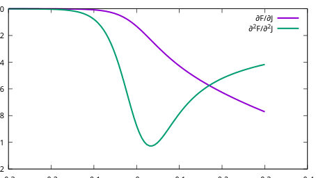 
FIG. 1. First and second derivatives of the free energy of the XY spin chain in the vicinity of h = −J from Eq. (25) for T = 0.03J. The first derivative is going to zero, and would present a cusp at T = 0 while the second derivative presents a strong dip near the critical field, that becomes a divergence for T →0. As a result, the sound velocity shift shows a dip near saturation.

📷 Fig 2

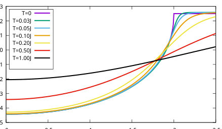 
FIG. 2. First derivative of the free energy of the Heisenberg spin-1/2 chain with respect to the exchange interaction as a function of the magnetic field for varying temperatures. In the ground state, the derivative goes to a constant after the critical field h = 2J. Just below the critial field, it shows a cusp of the form 1/4−C(2J−h)1/2. At finite temperature, the cusp is rounded off, and becomes unobservable for T &gt; J/2.

📷 Fig 3

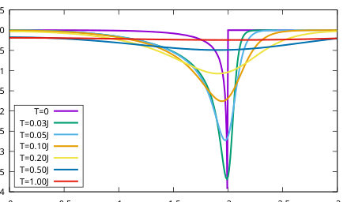 
FIG. 3. Second derivative of the free energy of the Heisenberg spin-1/2 chain with respect to the exchange interaction as a function of the magnetic field for varying temperatures. In the ground state, the second derivative exhibits a divergence ∼(2J −h)−1/2. As temperature is increased, the divergence is replaced by a dip that becomes broader and shallower as temperature is increased. At temperatures larger than J/2, only a minimum can be observed.

📷 Fig 4

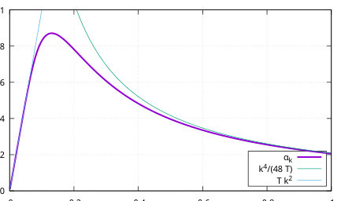 
FIG. 4. Plot of attenuation in the XXZ chain as a func- tion of temperature for a fixed value of the wavevector k. At low temperatures, T ≪uk, the attenuation is linear in tem- perature. At high temperatures, it is inversely proportional to temperature. The attenuation reaches its maximum for T = 0.1308uk.

📷 Fig 5

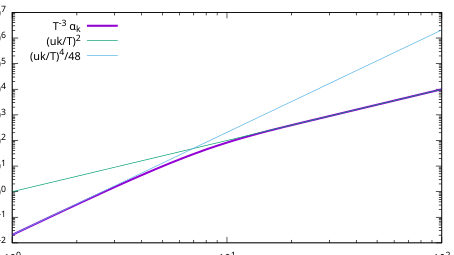 
FIG. 5. Crossover behavior of the scaling function T −3αk = f(uk/T) as a function of uk/T for low magnetic field. When the wavelength 2π/k of the ultrasound exceeds the thermal length u/T, the attenuation αk ∼k4/T, whereas when the wavelength is shorted than u/T the attenuation goes as αk ∼ Tk2.

**Summary.** This paper theoretically analyzes sound attenuation and velocity shifts in spin-1/2 antiferromagnetic chains. It connects these measurable elastic responses to the fundamental thermodynamic derivatives of the system's free energy. By combining bosonization with advanced quantum statistical mechanics, it predicts universal behaviors near critical points and provides quantitative scaling laws for various temperature regimes.

**Why it may be interesting.** This work provides a rigorous theoretical link between macroscopic elastic properties (sound velocity) and microscopic quantum magnetic interactions (spin Hamiltonian parameters), which is highly relevant to understanding emergent phenomena in correlated materials.

Detailed structure

**Main problem.** The study investigates how sound attenuation and velocity shifts (magnetoelastic coupling) manifest in antiferromagnetic spin-1/2 chains subjected to an external magnetic field.

**Main result.** The analysis predicts universal behavior near quantum critical points, such as $z=2$, and establishes relationships between the elastic response and derivatives of the system's free energy with respect to exchange interactions.

**Method.** The work employs a combination of linear response theory, bosonization techniques for low-energy physics in the Tomonaga-Luttinger liquid phase, and advanced thermodynamic calculations using quantum transfer matrix methods.

**Model / system.** The system modeled is an antiferromagnetic spin-1/2 XXZ chain coupled to longitudinal acoustic phonons. The Hamiltonian includes terms describing the spin interactions ($H_0$) and the magnetoelastic coupling ($H_{ap}, H_1, H_2$).

**Key observables.** Sound velocity shift ($\Delta\omega_k$), ultrasound attenuation coefficient ($\alpha_k$), and derivatives of the free energy ($F$) with respect to exchange couplings.

**Important parameters / regimes.** Temperature ($T$), external magnetic field ($h$), and coupling constants like $J$ and $J_z$. Key regimes include the Tomonaga-Luttinger liquid phase and the fully polarized phase.

**Assumptions / limitations.** The analysis relies on perturbative expansions for response functions, using bosonization for low-energy limits, and relating elastic properties to thermodynamic derivatives of the free energy.

**Figures summary.** Figures illustrate how the first and second derivatives of the free energy ($\partial F / \partial J$ and $\partial^2 F / \partial J^2$) exhibit cusp-like singularities or divergences near magnetic saturation ($h = \pm J$), leading to predicted dips in sound velocity.

**Paper structure.** The paper progresses from general linear response theory for the spin-phonon coupling, moves to specialized low-energy treatments using bosonization (TLL phase), and culminates in calculating thermodynamic derivatives of the free energy via quantum transfer matrix methods for finite temperatures.

Abstract

We investigate ultrasound attenuation and sound velocity shift in antiferromagnetic spin-1/2 XXZ chains in magnetic field. We relate the sound velocity shift to derivatives of the free energy with respect to exchange interactions, permitting its calculation with integrability techniques at any temperature. Using bosonization, we predict the sound velocity shift exhibits a quadratic temperature correction at low temperatures in the Tomonaga-Luttinger liquid phase. Close to the fully polarized phase, a universal behavior associated with z=2 quantum criticality is found. In the Tomonaga-Luttinger liquid phase, ultrasound attenuation obeys a scaling law as a function of wavelength and temperature. An enhancement of attenuation is obtained near the fully polarized phase.

[↑ back to top](#top)

### [First-principles carrier mobility and optical absorption of strained ZnO with self-consistent Hubbard interactions](http://arxiv.org/abs/2607.29030v1)

**Authors:** Hong-Guk Min, Wooil Yang, Sabyasachi Tiwari, Feliciano Giustino, Young-Woo Son  
**Type:** theory · **Category:** strongly correlated electrons · **PDF:** <https://arxiv.org/pdf/2607.29030v1>  
**Analysis basis:** full PDF text, analyzed in chunks
**Topic relevance:** `Keldysh / 2PI / non-Gaussian methods` **1/5** · `analog quantum simulation` **1/5** · `driven-dissipative phase transition` **1/5** · `methods for driven-dissipative` **1/5**

📷 Fig 1

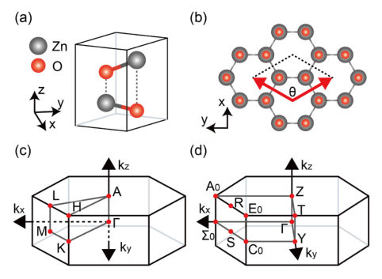 
FIG. 1. Atomic structure of ZnO and the corresponding Brillouin zones (BZs). (a) Primitive unit cell of unstrained wurzite ZnO. (b) Top view of the atomic structure. Red ar- rows indicate the primitive lattice vectors, while dashed line shows the boundary of the unit cell. (c) Hexagonal and (d) or- thorhombic BZs, with high-symmetry points highlighted with red dots.

📷 Fig 2

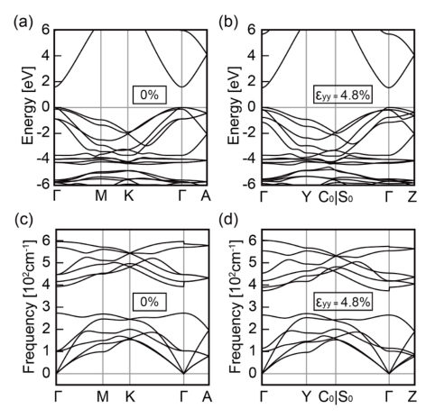 
FIG. 2. Electron and phonon band structures of ZnO under strain. (a), (b) Electronic structure of pristine and 4.8% εyy- strained ZnO, respectively. (c), (d) Corresponding phonon dispersions for pristine and 4.8% εyy-strained ZnO.

📷 Fig 3

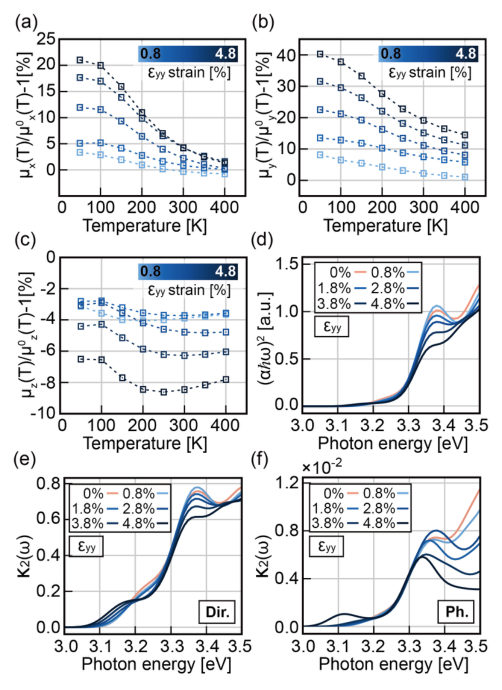 
FIG. 3. Transport and optical properties of ZnO under strain. (a)–(c) Relative change of the phonon-limited electron mobility along the (a) x, (b) y (strain), and (c) z directions. The changes in percent are shown with respect to the µ0 i (T), which denotes the pristine mobility at each temperature. The strained mobilities are colored in shades of blue, with darker colors indicating larger εyy strain ranging from 0.8% to 4.8%. (d) Optical absorption spectra as a function of photon energy. The pristine spectrum is shown in pink, while the εyy-strained spectra are plotted in progressively darker blue, consistent with the color scheme used for the mobility. (e),(f) Imaginary dielectric...

📷 Fig 4

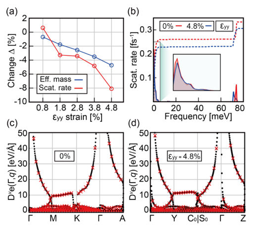 
FIG. 4. Strain dependence of el-ph interactions. (a) Rel- ative change in the effective mass along the strain direction and the el–ph scattering rate as a function of applied εyy strain, normalized to the pristine values. Blue and red cir- cles denote effective mass and scattering rate, respectively. (b) Spectral decomposition of the scattering rate. Solid red (blue) curves show the scattering-rate contributions for the 0% (4.8%) strained case. Dotted curves of the corresponding colors indicate the cumulative scattering rates. Inset: Mag- nified view for phonon energies below 6 meV. (c), (d) Defor- mation potential Eq. 1 of the lowest conduction band for the (c) 0% and (d) 4.8% εyy-strained...

**Summary.** This theoretical study uses an advanced DFPT+U method to examine how strain modifies the electronic and optical properties of ZnO. The research finds that moderate tensile strain can selectively boost electron mobility by 19% without compromising the material's transparency in the visible spectrum. This establishes a powerful computational tool for designing high-performance, strain-engineered oxide semiconductors.

**Why it may be interesting.** While focused on solid-state physics, the use of advanced correlated electron methods like DFT+U to model material responses under external perturbations (strain) is relevant for understanding many-body effects in quantum materials.

Detailed structure

**Main problem.** The study investigates how strain affects key performance parameters like carrier mobility and optical absorption in oxide semiconductors for use in transparent displays.

**Main result.** Uniaxial tensile strain up to 4.8% along [\bar{1}10] increases room-temperature electron mobility by 19% while keeping visible-range optical absorption essentially unchanged.

**Method.** The authors employ a newly developed Density-Functional Perturbation Theory with a self-consistent Hubbard correction (DFPT+U) to model electron-phonon interactions and correlation effects.

**Model / system.** The system studied is strained Zinc Oxide (ZnO), modeled using first-principles calculations that account for on-site Coulomb repulsion via the Hubbard U term, particularly applied to the O 2p manifold.

**Key observables.** Room-temperature electron mobility, optical absorption spectrum, lattice parameters ($a', c'$), and band gap energy.

**Important parameters / regimes.** Uniaxial tensile strain ($\varepsilon_{yy}$) up to 4.8%; Hubbard parameter $U_p$; Temperature (300 K).

**Assumptions / limitations.** The approach assumes that the minimal Hubbard correction applied only to the O 2p orbital is sufficient, and it focuses on in-plane tensile strain relevant for thin films.

**Figures summary.** Figures illustrate atomic structures under strain, electronic/phonon band dispersions, temperature dependence of mobility, and changes in optical absorption spectra as a function of strain.

**Paper structure.** The paper progresses by establishing the theoretical framework (DFPT+U), calculating structural relaxations and electronic properties under varying uniaxial strains, quantifying the resulting changes in carrier transport (mobility) and optical response (absorption).

Abstract

Carrier mobility and optical absorption are key performance parameters of oxide semiconductors in transparent and flexible displays. We use a newly developed density-functional perturbation theory with a self-consistent Hubbard correction (DFPT+U) to study phonon-limited electron transport and phonon-assisted optical absorption in strained zinc oxide (ZnO). This parameter-free approach accounts for electron-phonon interactions and on-site correlation effects simultaneously. Electronic structures and phonon dispersions are computed under three distinct uniaxial strain directions. Uniaxial tensile strain up to 4.8% along [\bar110] is found to increase the room-temperature electron mobility by 19% while leaving visible-range optical absorption essentially unchanged. These results demonstrate that moderate strain can selectively enhance carrier transport without degrading optical transparency, and establish DFPT+U as an effective framework for predicting strain-dependent transport and optical properties in wide-band-gap oxides with implications for strain-engineered display and optoelectronic applications.

[↑ back to top](#top)

### [Generative IQP Circuit Learning with Physics-Informed Latent Initialization](http://arxiv.org/abs/2607.28866v1)

**Authors:** Chen-Yu Liu, Leonardo Placidi, Marco Ballarin, Enrico Rinaldi  
**Type:** both · **Category:** disordered systems and neural networks · **PDF:** <https://arxiv.org/pdf/2607.28866v1>  
**Analysis basis:** full PDF text, analyzed in chunks
**Topic relevance:** `analog quantum simulation` **1/5** · `driven-dissipative phase transition` **1/5** · `methods for driven-dissipative` **1/5** · `non-equilibrium dynamics` **1/5**

📷 Fig 1

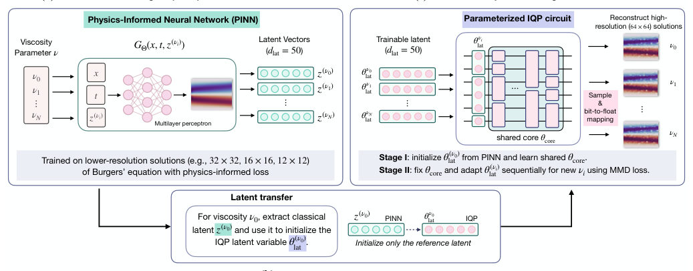 
FIG. 1. Schematic overview of the proposed physics-informed latent initialization scheme for IQP generative learning. (a) A latent-conditioned PINN surrogate is trained on lower-resolution Burgers’ equation solution data, using one latent vector z(νi) for each viscosity instance νi (Sec. III). (b) For the reference viscosity ν0, the corresponding classical latent representation z(ν0) is transferred to initialize the IQP latent variable θ(ν0) lat . (c) The IQP model is then trained on high-resolution data in two stages: first, the transferred reference latent is used to learn the shared circuit core θcore; second, with θcore fixed, the instance- dependent IQP latent variables θ(νi) lat are...

📷 Fig 2

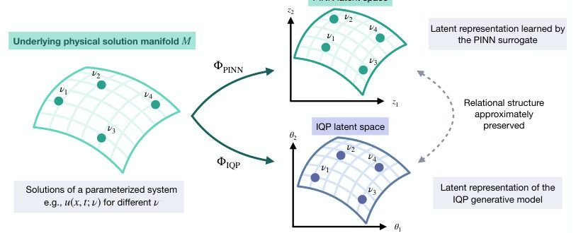 
FIG. 2. PRH-motivated view of latent alignment between the PINN surrogate and the IQP generative model. A parameterized family of physical solutions forms an underlying solution manifold M. The PINN and IQP models induce different latent representations of this same family through ΦPINN and ΦIQP. While the two latent coordinate systems need not match directly, their inter-instance relational structure may be approximately preserved. This motivates transferring the PINN latent representation to initialize the IQP latent variable.

📷 Fig 3

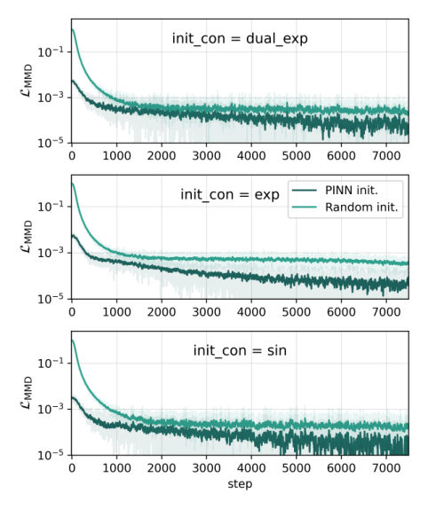 
FIG. 3. Training loss during the reference-core learning step at ν0 = 0.06, comparing physics-informed initialization and random initialization of the IQP latent variable. The three panels correspond to the Burgers’ equation initial conditions dual exp, exp, and sin. In all cases, the PINN-initialized run uses a latent representation transferred from a 32×32 classical surrogate. The plotted quantity is the MMD objective used to train the shared IQP core θcore.

📷 Fig 4

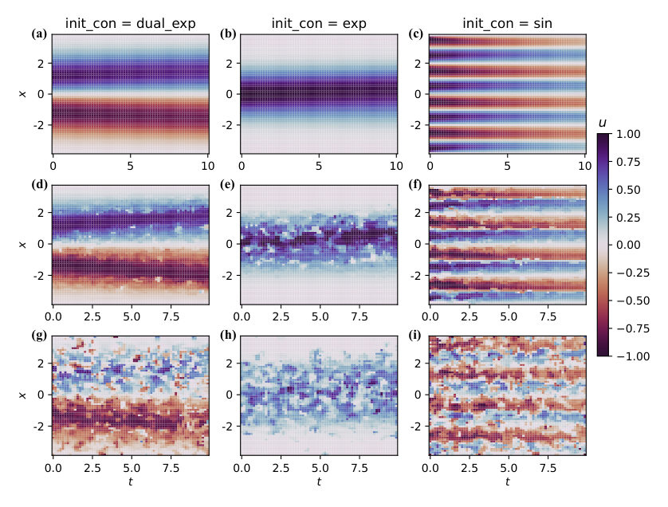 
FIG. 4. Qualitative comparison between physics-informed latent initialization and random latent initialization at the unseen viscosity value ν = 0.28. The IQP prediction is obtained by interpolating between neighboring latent anchors and reconstructing the solution from 106 measurement shots. Columns correspond to the three initial conditions dual exp, exp, and sin. The top row panels (a)–(c) show the numerical ground-truth solutions of Burgers’ equation, the middle row panels (d)–(f) show the predictions obtained with physics-informed initialization of the IQP latent adaptation, and the bottom row panels (g)–(i) shows the corresponding predictions from the baseline latent-adaptation scheme...

📷 Fig 5

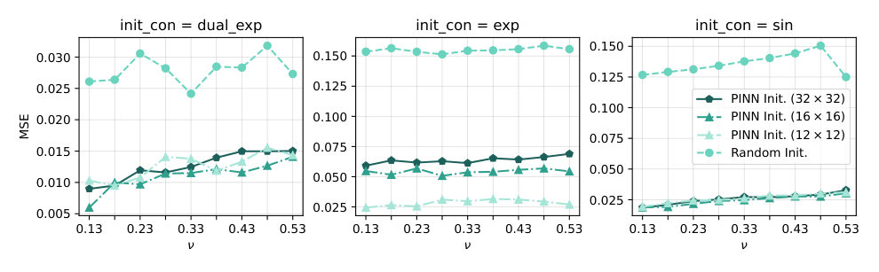 
FIG. 5. Mean-squared error (MSE) between the reconstructed IQP predictions and the numerical solutions across unseen viscosity values ν ∈{0.13, 0.18, 0.23, 0.28, 0.33, 0.38, 0.43, 0.48, 0.53}. The three panels correspond to the initial conditions dual exp, exp, and sin. We compare the baseline latent-adaptation method with random initialization against physics-informed initialization obtained from classical PINN surrogates trained at resolutions 32×32, 16×16, and 12×12. The PINN-initialized variants consistently outperform the random-initialization baseline, while the dependence on surrogate resolution is not entirely uniform across initial conditions; in particular, for the exp case, the...

**Summary.** The paper proposes an advanced method for training quantum generative models based on IQP circuits by incorporating classical physics knowledge. It uses a Physics-Informed Neural Network (PINN) to generate a structured latent code that initializes the quantum model's parameters. This physics-informed initialization significantly improves the model's ability to accurately and efficiently generate solutions to parameterized PDEs compared to purely random initialization.

**Why it may be interesting.** This work bridges quantum machine learning with continuum physics modeling by using deep learning techniques (PINNs) to inject physical constraints into the initial state of a quantum model, which is highly relevant for simulating complex quantum many-body systems where accurate initialization is crucial.

Detailed structure

**Main problem.** The primary goal is to improve quantum generative learning based on IQP circuits by replacing random latent variable initialization with a physics-informed scheme.

**Main result.** Physics-informed initialization derived from a PINN surrogate consistently outperforms random initialization, leading to improved adaptation behavior and stronger generative accuracy for solving PDEs like Burgers' equation.

**Method.** The authors train a Physics-Informed Neural Network (PINN) on low-resolution PDE solutions to extract a latent representation, which is then used to initialize the latent variables of an IQP quantum model for subsequent high-resolution adaptation.

**Model / system.** The system involves solving parameterized Partial Differential Equations (PDEs), specifically Burgers' equation. The modeling framework combines an IQP circuit (quantum) with a PINN surrogate (classical/ML) to learn the solution manifold in a latent space.

**Key observables.** Reconstruction accuracy, Mean Squared Error (MSE) of the generated PDE solutions across varying viscosity settings ($
u$), and pairwise latent correlations between different physical parameters.

**Important parameters / regimes.** Viscosity parameter ($
u$, e.g., $\alpha$ or $
u \in [0.11, 0.51]$), low-dimensional latent vector size ($d_{	ext{lat}}=50$), and the structure of the IQP circuit (e.g., 18 qubits).

**Assumptions / limitations.** The approach relies on a Representation Hypothesis suggesting that classical and quantum models parameterize the same underlying PDE solution manifold, allowing for latent space transfer.

**Figures summary.** Figures schematically illustrate the three-stage process: (a) PINN training on low-res data; (b) transferring the classical latent $z(
u)$ to initialize the IQP latent variable $	heta_{	ext{lat}}$; and (c) two-stage IQP adaptation on high-resolution data.

**Paper structure.** The paper introduces the problem of inefficient random initialization in quantum generative learning. It proposes using a PINN surrogate trained on PDEs to generate a physics-informed latent code, which initializes the IQP model. The methodology details the two-stage training process (shared core $
ightarrow$ latent adaptation) and validates this against random initialization and classical baselines like cDCGANs.

Abstract

Quantum generative learning based on instantaneous quantum polynomial-time (IQP) circuits can benefit from efficient classical training strategies. A recent latent adaptation framework for IQP-based generative modeling transfers shared circuit parameters across instances of the same task with different hyperparameters while adapting only a low-dimensional latent variable for each new instance. However, existing approaches initialize this latent variable randomly, which can limit optimization efficiency and performance. In this work, we introduce a physics-informed latent initialization scheme for IQP generative learning to improve upon existing random initialization schemes. Motivated by the platonic representation hypothesis, we use latent representations extracted from a classical physics-informed neural network (PINN) surrogate to initialize the latent variables of the quantum model for the solution of the Burgers' equation. The initialized IQP model is then adapted on a higher-resolution solution domain. We find that this structured initialization consistently outperforms random latent initialization, yielding improved adaptation behavior and stronger generative accuracy across multiple viscosity settings. These results show that classical surrogate representations can provide useful inductive bias for quantum generative models and offer a practical route to improved initialization in IQP-based learning.

[↑ back to top](#top)

### [Beyond Stoner-Wohlfarth: Machine-Learning Models and Symbolic Regression of Hard-Magnet Properties](http://arxiv.org/abs/2607.29249v1)

**Authors:** Samuel J. R. Holt, Christina Winkler, Timoteo Colnaghi, Martin Lang, Swapneel A. Pathak, Andrea Petrocchi, Michael Adams, Thomas Schrefl, Andreas Marek, Hans Fangohr  
**Type:** theory · **Category:** strongly correlated electrons · **PDF:** <https://arxiv.org/pdf/2607.29249v1>  
**Analysis basis:** full PDF text, analyzed in chunks
**Topic relevance:** `analog quantum simulation` **1/5** · `exotic spin models in light-matter` **1/5** · `spintronics-quantum-optics interface` **1/5**

📷 Fig 1

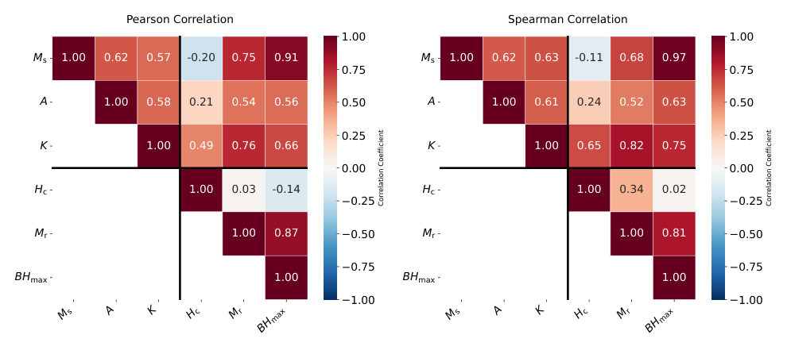 
FIG. 1. Pearson (left) and Spearman (right) correlation coefficients between intrinsic and extrinsic properties.

📷 Fig 2

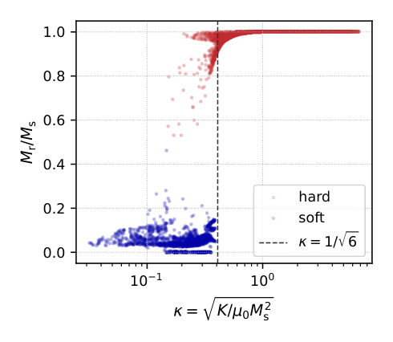 
FIG. 2. Normalised remanence Mr/Ms of every valid sim- ulation against the hardness parameter κ, coloured by the k-means classification. The dashed line is the analytical hard- ness criterion κ = 1/ √

📷 Fig 3

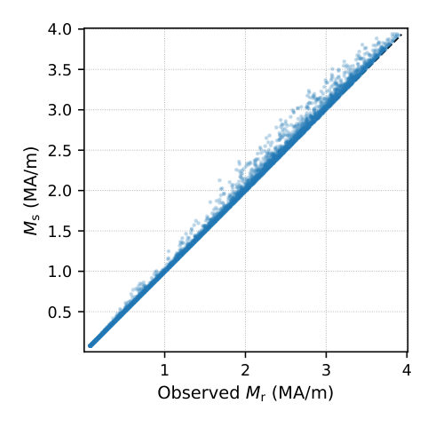 
FIG. 4. Analytical estimate of the remanent magnetisation for the hard-magnet-like subset using Mr ≈Ms. The dashed line indicates perfect agreement between the analytical esti- mate and the simulated value. All hard-magnet samples are shown; the errors quoted in the text refer to the held-out test samples only.

📷 Fig 4

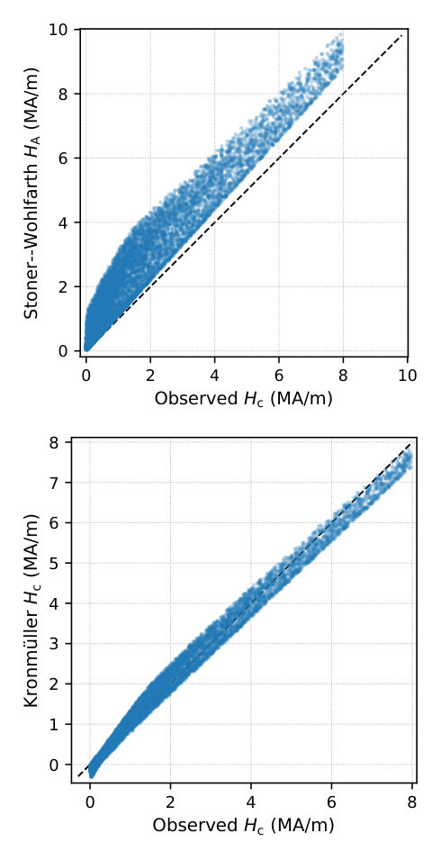 
FIG. 3. Analytical estimates of the coercive field for the hard-magnet-like subset. Top: Stoner-Wohlfarth estimate. Bottom: fitted Kronm¨uller model. The dashed line indicates perfect agreement between the analytical estimate and the simulated value. All hard-magnet samples are shown; the errors quoted in the text refer to the held-out test samples only.

📷 Fig 5

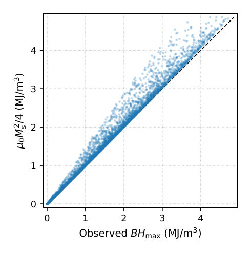 
FIG. 5. Analytical estimate of the maximum energy product for the hard-magnet-like subset. The dashed line indicates perfect agreement between the analytical estimate and the simulated value. All hard-magnet samples are shown; the errors quoted in the text refer to the held-out test samples only.

**Summary.** This work develops and validates machine learning models to predict key magnetic properties of hard magnets by analyzing data from extensive micromagnetic simulations. By combining ML with symbolic regression, the authors achieve high accuracy while drastically accelerating the prediction process compared to traditional physics simulations. This provides a powerful tool for materials discovery in magnetism.

**Why it may be interesting.** While focused on classical magnetism, the methodology—using advanced machine learning surrogates to bypass computationally expensive physics simulations—is highly relevant to modeling complex quantum many-body systems where direct simulation is intractable.

Detailed structure

**Main problem.** The central problem is predicting extrinsic magnetic properties (coercive field, remanence, maximum energy product) of hard magnets from their intrinsic micromagnetic parameters.

**Main result.** Machine learning models and symbolic regression significantly outperform established analytical models in predicting these properties with lower errors. The developed pipeline allows for rapid screening of candidate material parameters.

**Method.** The study employs machine learning (Random Forest, Gaussian Process) trained on extensive micromagnetic simulations, supplemented by symbolic regression to derive closed-form physical laws.

**Model / system.** The system is an idealized isolated cubic grain used to model magnetization reversal in hard magnets. The physics incorporates isotropic exchange, uniaxial anisotropy, and demagnetizing interactions within a micromagnetic framework.

**Key observables.** Coercive field (Hc), remanent magnetisation (Mr), maximum energy product (BHmax).

**Important parameters / regimes.** Saturation magnetisation (Ms), exchange constant (A), uniaxial anisotropy constant (K); the magnetic hardness parameter $\kappa = K / (\mu_0 M_s^2)$.

**Assumptions / limitations.** The analysis relies on micromagnetic simulations of an ideal, defect-free cubic grain and assumes that ML models can accurately map complex physical relationships.

**Figures summary.** Figures illustrate the comparison between ML predictions and true values for intrinsic parameters (Ms, A, K) in the hard-magnet subset. Tables compare model errors (MAPE/RMSE) when performing the inverse problem (predicting intrinsic from extrinsic).

**Paper structure.** The paper establishes the prediction problem, details data generation via 12012 micromagnetic simulations across a broad parameter space, compares ML and symbolic regression against analytical models for all three properties, investigates the inverse problem, and concludes by releasing a fast predictive pipeline.

Abstract

Predicting the extrinsic properties from hysteresis loops of a magnetic grain, namely the coercive field, remanent magnetisation, and maximum energy product, from its intrinsic micromagnetic parameters is a central problem in permanent-magnet modelling. Established analytical models provide useful estimates but often neglect nonuniform magnetisation processes, whereas direct micromagnetic simulations are computationally expensive. In this work, we train machine-learning models on 12012 micromagnetic simulations of an idealised cubic grain, spanning broad ranges of the saturation magnetisation, exchange constant, and uniaxial anisotropy constant. Benchmarked against the analytical models on identical held-out data, the machine-learning models predict all three extrinsic properties with substantially lower errors. Symbolic regression recovers the Kronmüller form of the coercive field, with an effective demagnetising factor that depends on the material, and finds new closed-form expressions for the remanence and maximum energy product. Each law contains at most two fitted constants yet approaches the accuracy of the machine-learning models. We also investigate the inverse problem of recovering the intrinsic parameters from the three extrinsic properties. The saturation magnetisation and anisotropy constant are recovered accurately, whereas the exchange constant is not, because it influences the extrinsic properties only weakly. The trained models are released through the mammos-ai Python package, enabling thousands of candidate parameter sets to be screened in seconds rather than the hours or days required by direct micromagnetic simulation.

[↑ back to top](#top)

### [Curvature-amplified angular localization of radially localized states](http://arxiv.org/abs/2607.29174v1)

**Authors:** Hiroyuki Shima  
**Type:** theory · **Category:** disordered systems and neural networks · **PDF:** <https://arxiv.org/pdf/2607.29174v1>  
**Analysis basis:** full PDF text, analyzed in chunks
**Topic relevance:** `analog quantum simulation` **1/5** · `driven-dissipative phase transition` **1/5** · `methods for driven-dissipative` **1/5**

📷 Fig 1

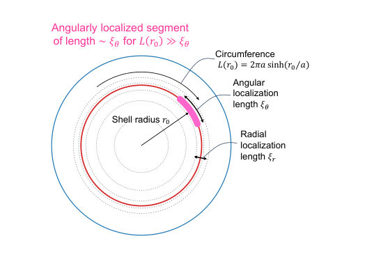 
FIG. 1. Geometry and localization mechanisms. A random ra- dial potential first produces a mode whose envelope is localized around a geodesic radius r0 with radial localization length ξr. Exact rotational symmetry makes this mode extended around the associated circle. A weak angle-dependent perturbation then localizes the projected mode along the physical arc coordi- nate s, with angular localization length ξθ. The Poincar´e-disk edge is the conformal boundary at infinite geodesic distance, not a finite outer wall.

📷 Fig 2

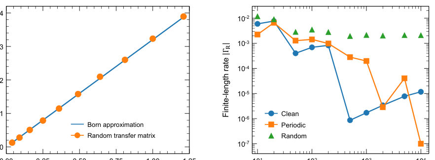 
FIG. 2. Disorder-induced radial localization. (a) Radial Lyapunov exponent γr versus squared disorder width W 2 r . Symbols are infinite-half-line transfer-matrix results; the line is the Born approximation in Eq. (16). (b) Absolute finite-length rate |ΓR| for clean, periodic, and random radial potentials. The first two approach zero, while the random ensemble approaches a positive asymptotic rate. Error bars show standard errors where disorder averaging is used.

📷 Fig 3

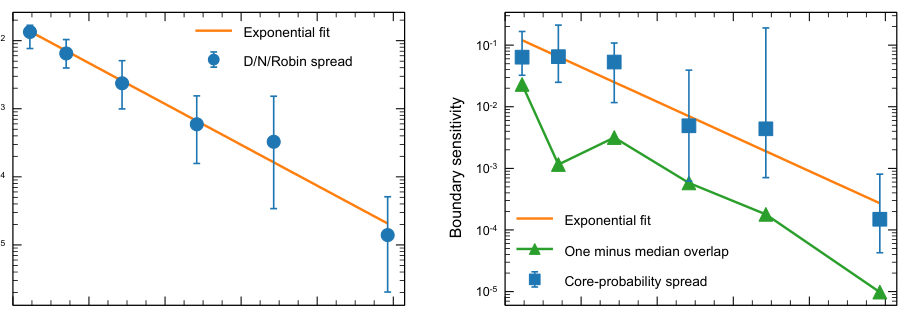 
FIG. 3. Boundary-condition robustness of radially localized bulk states. (a) Median three-boundary energy spread ∆Ebc versus the boundary distance db measured in units of the inverse-participation length ξIPR. (b) Median core-density spread and matched-state overlap. Symbols summarize independent disorder realizations; bands or error bars indicate interquartile ranges. Straight lines in semilogarithmic coordinates are the fits in Eqs. (21) and (22).

📷 Fig 4

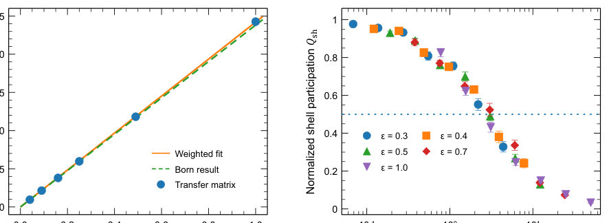 
FIG. 4. Angular localization of the projected shell. (a) Angular Lyapunov exponent γθ versus ε2. The displayed finite-window quadratic coefficient is 1.3% above the discrete Born value; its weak-disorder intercept is resolved independently in Fig. 9. (b) Normalized shell-extension indicator Qsh versus the one-parameter scaling variable L/ξθ. In the unit-spacing discretization L = N, so this is the same variable written as N/ξθ in the text. The common collapse demonstrates a circumference-controlled crossover.

📷 Fig 5

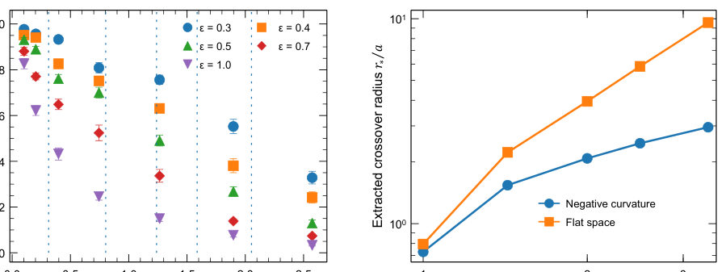 
FIG. 5. Extraction and geometric conversion of the shell crossover. (a) The vertical markers identify the hyperbolic crossover radii r∗obtained by converting the extracted circumferences N∗at which Qsh = 1/2. (b) The same N∗values converted to r∗in flat and hyperbolic geometry. The flat conversion grows algebraically as the perturbation weakens, while the hyperbolic conversion bends to the logarithmic law in Eq. (47).

**Summary.** This paper analyzes the angular localization of quantum states on curved surfaces subjected to random potentials. The core finding is that the characteristic length scale at which the system transitions from being governed by radial confinement to angular confinement depends critically on the manifold's curvature. This leads to a distinct logarithmic scaling law on hyperbolic planes compared to flat space.

**Why it may be interesting.** It provides a rigorous theoretical framework for understanding how geometric constraints (curvature) fundamentally alter localization physics in disordered quantum systems, which has implications for wave propagation in curved media or complex lattice structures.

Detailed structure

**Main problem.** The study investigates how angular localization of radially localized quantum states is amplified by the curvature of the underlying manifold, distinguishing this effect from generic metal-insulator transitions.

**Main result.** The crossover radius at which shell breaking occurs exhibits a distinct functional dependence on curvature: algebraic in flat space but logarithmic ($\propto 2a\ln(1/\varepsilon)$) on hyperbolic surfaces.

**Method.** The authors employ exact angular-momentum decomposition, transfer-matrix calculations, and direct polar-grid simulations to analyze the localization length in both radial and angular directions.

**Model / system.** The system is a continuum Schrödinger particle moving on a 2D Riemannian surface of constant curvature $K$, subjected to a dominant radial random potential ($V_r$) and a weaker, angle-dependent perturbation ($\varepsilon V_\perp$).

**Key observables.** Radial Lyapunov exponent ($\gamma_r$), angular localization length ($\xi_	heta$), shell-breaking radius ($r^*$), and the single-state normalized shell-extension indicator ($Q_{sh}$).

**Important parameters / regimes.** Gaussian curvature $K$, curvature radius $a$, radial disorder width $W_r$, and angular perturbation amplitude $\varepsilon$.

**Assumptions / limitations.** The analysis relies on separating genuine asymptotic localization from finite-size crossovers, and the derived crossover law is specific to this deliberately anisotropic disorder ensemble.

**Figures summary.** Figure 1 illustrates the geometry and localization mechanisms. Figure 2(a) compares Born approximation and transfer-matrix results for $\gamma_r$. Figure 9 plots the weak-disorder coefficient vs. $\ln(1/\epsilon)$ and derives the crossover radius $r^*/a$ based on curvature.

**Paper structure.** The paper progresses from establishing radial localization via Lyapunov exponents in the symmetry limit ($\varepsilon=0$), to analyzing the effective disordered ring Hamiltonian, and finally deriving the curvature-dependent crossover law by comparing flat space, hyperbolic, and general constant-curvature regimes.

Abstract

We study a continuum Schrödinger particle on a surface of constant curvature subject to a radial random potential and a weaker angle-dependent perturbation. Exact angular-momentum decomposition reduces the rotationally symmetric problem to independent one-dimensional random radial channels. A positive radial Lyapunov exponent distinguishes radial Anderson localization from the circular probability profile imposed by symmetry. Projection of a narrow radial mode produces a disordered one-dimensional ring. For angular disorder that is stationary in physical arc length, the ring localization length grows as the inverse square of the perturbation amplitude. Equating this length with the geodesic circumference yields a shell-breaking radius that grows algebraically in flat space but as $2a\ln(1/\varepsilon)+O(1)$ on a hyperbolic surface of curvature radius $a$ and angular-disorder amplitude $\varepsilon$. Transfer-matrix and finite-ring calculations determine the crossover coefficient. Direct polar-grid calculations at the same angular energy as the ring model use unbiased tracking of the degenerate angular-momentum subspace across six independent radial-disorder realizations and quantify the validity of the single-mode projection. The noncommuting weak-disorder and flat-curvature limits establish a curvature-amplified crossover for this deliberately anisotropic disorder ensemble, rather than a generic metal--insulator transition on the hyperbolic plane.

[↑ back to top](#top)

### [Emerging network model in a twisted monolayer-rhombohedral graphene](http://arxiv.org/abs/2607.29049v1)

**Authors:** Juyoung Song, Jeyong Park, Jinhong Park  
**Type:** theory · **Category:** strongly correlated electrons · **PDF:** <https://arxiv.org/pdf/2607.29049v1>  
**Analysis basis:** full PDF text, analyzed in chunks
**Topic relevance:** `Frenkel-Kontorova` **1/5** · `Keldysh / 2PI / non-Gaussian methods` **1/5** · `analog quantum simulation` **1/5**

📷 Fig 1

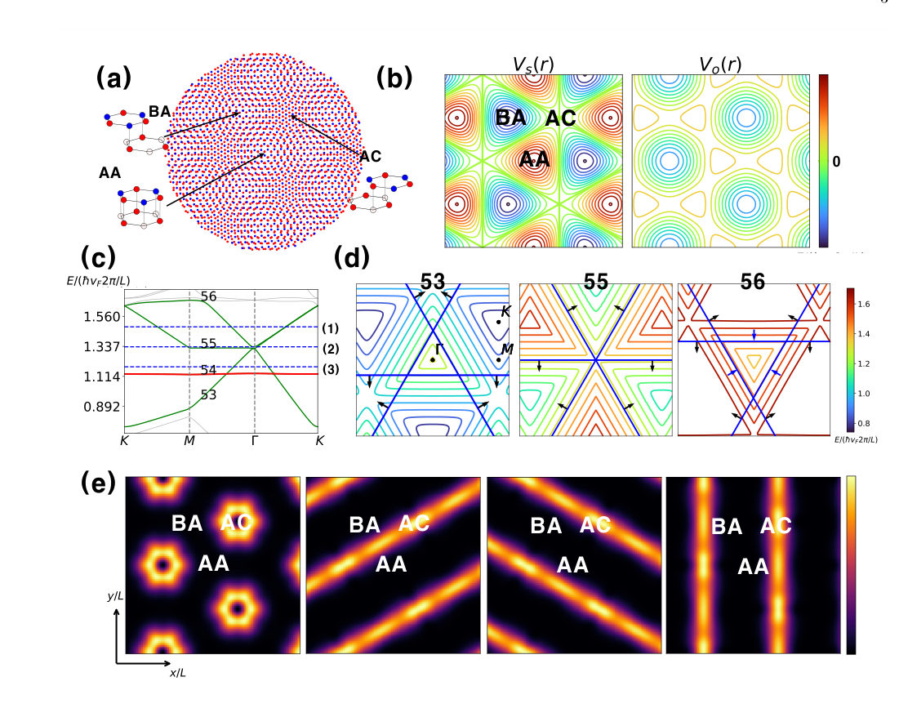 
Figure 1. Potential model. (a) Moir´e pattern from a graphene stacked on a triangular-lattice substrate with the same lattice constant as the graphene. A relative twist between graphene and the substrate produces a spatially varying displacement between the layers, generating local stacking patterns, BA, AC, AA. (b) Spatial profiles of the staggered potential Vs(r) and scalar potential V0(r). The green lines in the left panel indicate the contours Vs(r) = 0, along which the mass changes sign. The scalar potential has local minima at the AC regions, where the domain-wall modes meet. (c) Low-energy band structure along the high-symmetric path, K −M −Γ −K near the K valley. The green and red...

📷 Fig 2

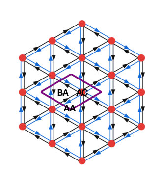 
Figure 2. Network model emerging from the potential model presented in Fig. 1. Localized modes (denoted red nodes) in the AC region are connected by pairs of counter- propagating 1D modes. The blue and black arrows represent the chiral modes originating from the K and K′ valleys, re- spectively, and indicate their propagation directions.

📷 Fig 3

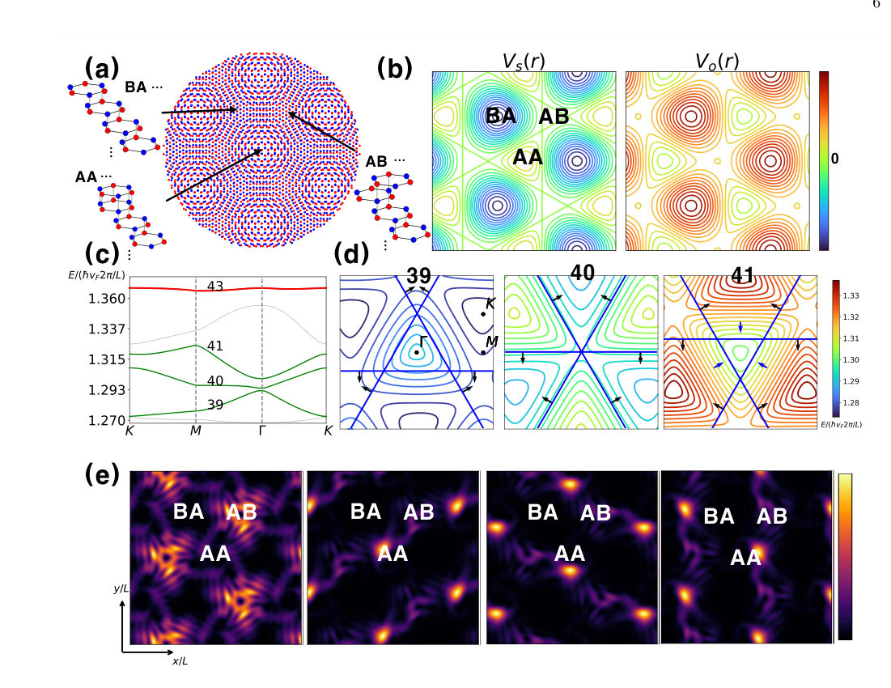 
Figure 3. Twisted rhombohedral–monolayer graphene. (a) Schematic atomic structure of monolayer graphene twisted relative to an N-layer rhombohedral graphene. Red and blue circles denote the two sublattices, respectively. The enlarged side-views show the representative local AA, AB, and BA stacking configurations. (b–e) Results for N = 3. (b) Contour plots of the effective staggered potential Vs(r) and scalar potential V0(r) induced in the monolayer graphene. The light-green contours indicate the domain walls defined by Vs(r) = 0, which separate regions with opposite signs of the staggered potential. (c) Moir´e band structure along the high-symmetry path K–M–Γ–K. The green and red bands...

**Summary.** This work theoretically investigates the formation of hybrid electronic networks in twisted rhombohedral graphene by analyzing the coexistence of localized and propagating 1D electronic states. Using an effective Hamiltonian derived from moiré potentials, the authors demonstrate that this system naturally supports distinct types of electronic behavior across its lattice structure.

**Why it may be interesting.** The emergence of distinct electronic dimensionalities (localized vs. quasi-1D) within a single moiré lattice structure provides a rich playground for studying correlated electron physics, potentially leading to novel topological or superconducting phases.

Detailed structure

**Main problem.** The study investigates the coexistence of localized electronic states and propagating one-dimensional (1D) modes within moiré graphene systems.

**Main result.** The authors establish twisted monolayer–rhombohedral graphene as a promising platform for realizing hybrid electronic networks exhibiting coexisting states of distinct effective dimensionalities.

**Method.** The analysis uses continuum models and perturbation theory to derive an effective low-energy Hamiltonian acting on the monolayer graphene, incorporating spatially varying potentials derived from moiré patterns.

**Model / system.** The physical system is twisted monolayer–rhombohedral N-layer graphene. The model involves deriving an effective Moiré Hamiltonian by integrating out the gapped rhombohedral substrate layer, resulting in terms dependent on a scalar potential ($V_0$) and a staggered potential ($V_s$).

**Key observables.** Band structures (showing 1D bands and flat bands), constant-energy contours, real-space probability distributions of Bloch wave functions.

**Important parameters / regimes.** The relative twist angle ($	heta$), the energy regime within the gap ($U_{N+1} < E < U_2$), and characteristic length scales ($\xi$).

**Assumptions / limitations.** Key approximations include using a minimal parametrization for potentials, neglecting lattice-relaxation-induced corrugation, and employing the local approximation in the effective Hamiltonian derivation.

**Figures summary.** Figures illustrate the moiré pattern, spatial profiles of $V_s(\mathbf{r})$ (showing sign changes) and $V_0(\mathbf{r})$ (showing minima), band structures showing both 1D and flat bands, and constant-energy contours confirming quasi-1D propagation.

**Paper structure.** The paper progresses from a minimal toy model analysis demonstrating the coexistence of localized states (from $V_0$) and 1D modes (from sign changes in $V_s$), to a full microscopic realization using twisted multilayer graphene, where the effective Hamiltonian is derived via perturbation theory.

Abstract

We investigate the coexistence of localized states and propagating one-dimensional (1D) modes in graphene moiré systems. We first show within a minimal model that a spatially varying scalar potential can confine localized states, while sign changes of a staggered potential generate 1D modes along the resulting domain walls. These two types of states can coexist within the same finite energy window and form a hybrid network. We then demonstrate a microscopic realization of this mechanism in twisted monolayer-rhombohedral N-layer graphene. Band structures, energy contours, and Bloch wave functions obtained in a realistic parameter regime reveal the coexistence of localized nearly flat-band states and propagating quasi-1D modes. Our results establish twisted monolayer-rhombohedral graphene as a promising platform for realizing hybrid electronic networks with coexisting states of distinct effective dimensionalities.

[↑ back to top](#top)

### [Generalized Holstein-Primakoff transformation with optimizable bosonic truncation](http://arxiv.org/abs/2607.28983v1)

**Authors:** Yang Liu, Jia-Wei Mei, Rong Yu, Z. Y. Xie, Hong-Gang Luo, Jize Zhao  
**Type:** theory · **Category:** strongly correlated electrons · **PDF:** <https://arxiv.org/pdf/2607.28983v1>  
**Analysis basis:** full PDF text, analyzed in chunks
**Topic relevance:** `Keldysh / 2PI / non-Gaussian methods` **1/5** · `analog quantum simulation` **1/5** · `exotic spin models in light-matter` **1/5**

📷 Fig 1

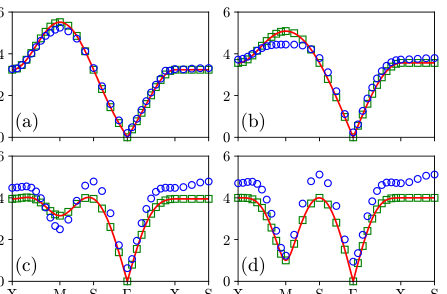 
FIG. 1. The dispersion relation of the quadrupolar mode along the path X −M −S −Γ −X −S. The squares (□) and circles (◦) are obtained by linear aGSWT and TN methods, respectively. The solid lines are plotted according to the ap- pendix of Ref. [16]. The panels from (a) to (d) correspond to θ = 1.3π, 1.35π, 1.45π and 1.495π.

📷 Fig 2

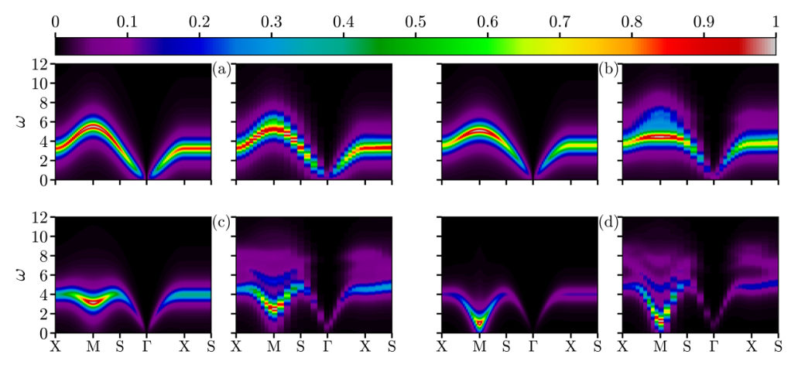 
FIG. 2. Akω(S−, S+) are shown for θ = 1.3π(a), 1.35π(b), 1.45π(c) and 1.495π(d). For each θ, the left and right subfigures are obtained by the linear aGSWT and TN methods, respectively.

📷 Fig 3

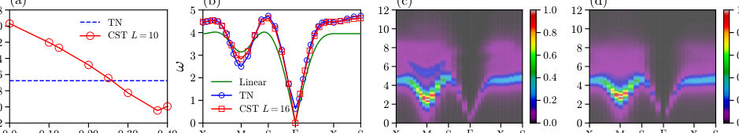 
FIG. 3. (a) The ground-state energy Eg at θ = 1.45π obtained by CST is shown as a function of x. The TN result extrapolated to the thermodynamic limit is plotted as a benchmark. (b) The dispersion curves of quadrupolar mode obtained by linear aGSWT, TN, and CST methods are plotted along the path X-M-S-Γ-X-S. (c),(d) Akω(S−, S+) are shown, which are obtained by the TN and CST (L = 16) methods, respectively.

**Summary.** The paper develops a generalized Holstein-Primakoff transformation that offers a flexible way to optimize bosonic truncations in spin-wave theory. By tuning an interpolation parameter, the authors significantly reduce approximation errors when studying models like the BBH Hamiltonian on a square lattice. The optimized results show excellent quantitative agreement with advanced tensor-network calculations for key magnetic excitations.

**Why it may be interesting.** This work provides a systematic, tunable theoretical tool (the generalized HP transformation) to improve quantitative accuracy in strongly correlated magnetic systems by optimizing the underlying mathematical representation used in mean-field approximations.

Detailed structure

**Main problem.** Spin-wave theory requires bosonizing spin operators, but the resulting Hamiltonian must be truncated, leading to results dependent on the chosen bosonic representation.

**Main result.** A generalized Holstein-Primakoff transformation allows continuous optimization of the bosonic truncation parameter, substantially reducing errors and yielding quantitative agreement with tensor-network calculations for excitation spectra.

**Method.** The authors introduce a generalized HP transformation parameterized by $x$ that interpolates between known transformations. They optimize this representation by minimizing the ground-state energy or matching spectral features against highly accurate tensor-network benchmarks.

**Model / system.** The primary application is to the spin-1 bilinear-biquadratic (BBH) model on a square lattice, particularly in the ferroquadrupolar phase. The theory extends to $	ext{SU}(N)$ algebras and utilizes automatic differentiation for implementation.

**Key observables.** Excitation spectra (quasiparticle dispersions), dynamical spin structure factors ($\mathcal{A}_{k\omega}$), and ground-state energy ($E_g$).

**Important parameters / regimes.** The interpolation parameter $x$ ($0 \le x \le 1$), the coupling constants defining the BBH model, and the lattice momentum $\mathbf{k}$.

**Assumptions / limitations.** The accuracy of spin-wave theory is limited by the finite order of truncation; however, optimizing the representation mitigates this dependence.

**Figures summary.** Figures compare quadrupolar mode dispersion ($\omega$ vs $k$) and spectral functions between optimized Continuous Similarity Transformation (CST) results and Tensor Network (TN) calculations, showing excellent quantitative agreement, especially reproducing interaction-induced roton minima.

**Paper structure.** The paper introduces the generalized HP transformation and its extension to $	ext{SU}(N)$. It then applies this framework to the spin-1 BBH model on a square lattice, comparing results derived from optimized GSWT against established TN benchmarks for excitation spectra and spectral functions.

Abstract

Spin-wave theory provides a quasiparticle description of excitation spectra in quantum spin systems. In this theory, the spin operators are usually bosonized by the Holstein-Primakoff transformation or the Dyson-Maleev transformation. In practical calculations, the bosonized Hamiltonian has to be truncated, and thus the resulting excitation spectra depend on the choice of bosonic representation. Here, we introduce a generalized Holstein-Primakoff transformation that continuously interpolates between the conventional Holstein-Primakoff and Dyson-Maleev transformations through a single parameter. The formulation naturally extends to the SU(N) algebra and provides a flexible framework for optimizing bosonic truncations beyond harmonic order. As an application, we investigate the spin-1 bilinear-biquadratic model on the square lattice. By combining the generalized Holstein-Primakoff transformation with continuous similarity transformations, we obtain excitation spectra in excellent agreement with tensor-network calculations. Our results demonstrate that optimizing the bosonic representation substantially reduces truncation errors and provides quantitatively reliable descriptions of both quasiparticle dispersions and multi-boson continua.

[↑ back to top](#top)

### [Quantum computing-based solver for interacting power grids](http://arxiv.org/abs/2607.29582v1)

**Authors:** Ankit Kumar Das, Durgesh Pandey, P. Arumugam  
**Type:** theory · **Category:** quantum information and computing · **PDF:** <https://arxiv.org/pdf/2607.29582v1>  
**Analysis basis:** full PDF text, analyzed in chunks
**Topic relevance:** `Keldysh / 2PI / non-Gaussian methods` **1/5** · `Kondo & dissipative impurity` **1/5** · `methods for driven-dissipative` **1/5**

📷 Fig 1

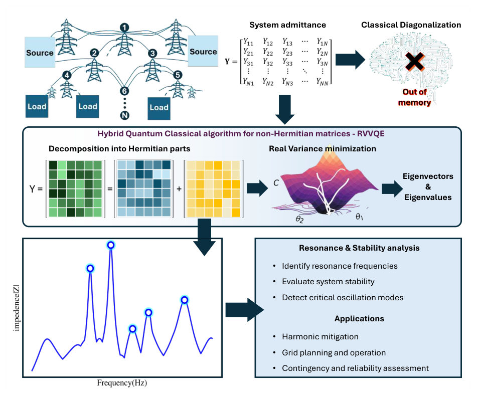 
Fig. 1. Overview of the proposed hybrid quantum-classical framework for resonance mode analysis (RMA) of power transmission grids. The system admittance matrix is decomposed into Hermitian components and solved using the Real Variance-based Variational Quantum Eigensolver (RVVQE) to obtain the eigenvalues and eigenvectors required for resonance and stability analysis.

📷 Fig 2

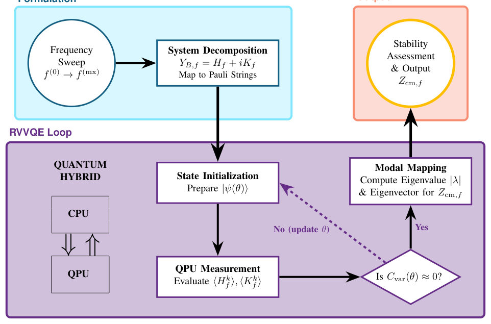 
Fig. 2. Workflow of the proposed hybrid quantum-classical (HQC) framework for resonance mode analysis. The non-Hermitian admittance matrix is decomposed into Hermitian components and mapped to Pauli operators. The RVVQE algorithm iteratively prepares the quantum state, performs QPU measurements, and updates the circuit parameters until convergence, after which the resonance modes are extracted for stability assessment.

📷 Fig 3

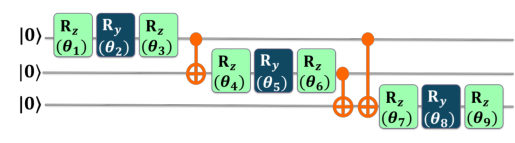 
Fig. 3. Three-qubit unitary rotation entangled ansatz with nearest-neighbor CNOT gates. The complete rotation for each qubit allows exploration of full Hilbert space spanned by 3 qubits.

📷 Fig 4

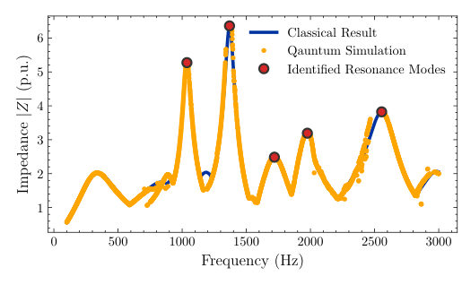 
Fig. 4. Validation of the quantum algorithmic framework on the 5-bus transmission system. The critical resonance modal impedance (|Zcm|) is plotted across a continuous frequency spectrum. The solid blue line represents the exact classical solution derived via standard matrix diagonalization, while the red markers indicate the eigenvalues computed using the Quantum RVVQE algorithm. The near-perfect overlap confirms the accuracy of the quantum approach in capturing the singularities of the non-Hermitian admittance matrix.

**Summary.** The paper introduces a quantum-classical hybrid solver to overcome the computational bottleneck of analyzing resonance instabilities in massive power grids. By adapting the RVVQE algorithm for non-Hermitian matrices, it maps the grid's admittance matrix onto a QPU. This scalable approach promises to diagnose continental-scale electrical network failures currently beyond classical computing limits.

**Why it may be interesting.** This work directly applies advanced quantum algorithms (RVVQE) to a complex engineering problem involving open quantum systems dynamics, bridging theoretical quantum computation with large-scale physical infrastructure analysis.

Detailed structure

**Main problem.** Evaluating critical resonance modes of large-scale interacting power grids is computationally intractable for classical methods due to the need to diagonalize massive, non-Hermitian admittance matrices.

**Main result.** The proposed quantum-classical hybrid methodology successfully extracts critical resonance modal impedances with near-perfect accuracy compared to classical solutions on test systems.

**Method.** A novel Quantum-Classical Hybrid Resonance Mode Analysis (Q-RMA) framework is used, employing the Real Variance-based Variational Quantum Eigensolver (RVVQE) algorithm to handle the non-Hermitian nature of the grid admittance matrix ($\mathbf{Y}_{B,f}$).

**Model / system.** The system modeled is a multi-terminal power transmission grid, represented mathematically by its frequency-dependent, non-Hermitian admittance matrix ($\mathbf{Y}_{B,f}$), which governs dynamic instabilities.

**Key observables.** Critical resonance modal impedances ($Z_{cm,f}$) and eigenvalues of the admittance matrix across a wide frequency spectrum (100 Hz to 3000 Hz).

**Important parameters / regimes.** The size of the grid ($n$-bus system), which dictates the required number of qubits ($\lceil\log_2 n
ceil$).

**Assumptions / limitations.** Standard quantum eigensolvers are insufficient because they only handle Hermitian matrices, necessitating the use of RVVQE for the non-Hermitian $\mathbf{Y}_{B,f}$.

**Figures summary.** Figure 1 illustrates the hybrid framework mapping $\mathbf{Y}_{B,f}$ onto a QPU using RVVQE. Figure 2 shows the iterative workflow (Q-RMA) across frequency sweeps. Figure 4 compares quantum RVVQE results against exact classical solutions for $|Z_{cm}|$.

**Paper structure.** The paper outlines the problem (harmonic distortions in grids), proposes the Q-RMA methodology involving matrix decomposition ($\mathbf{Y}_{B,f} = \mathbf{H}_f + i\mathbf{K}_f$), details the RVVQE implementation for non-Hermitian operators, and validates the approach by comparing quantum results to classical benchmarks.

Abstract

The proliferation of power electronics in multi-terminal transmission grids has increasingly led to harmonic distortions and dynamic instabilities. While Resonance Mode Analysis (RMA) provides deep insights into these system resonances, evaluating the critical modes of large-scale grids presents a severe computational bottleneck. Classical iterative techniques must continuously diagonalize massively high-dimensional, non-Hermitian admittance matrices across a wide frequency spectrum, a process that rapidly exhausts classical memory and processing limits. To overcome this scaling barrier, we propose a novel quantum-classical hybrid methodology that natively maps the transmission grid's admittance matrix onto a Quantum Processing Unit (QPU). Because the grid's matrix is non-Hermitian, standard quantum eigensolvers are insufficient; thus, we employ the Real Variance-based Variational Quantum Eigensolver (RVVQE) algorithm to accurately extract the complex eigenvalues that represent the system's modes. Validated against a standard 5-bus transmission system, the quantum-derived critical-resonance modal impedances demonstrate near-perfect alignment with the exact classical frequency responses. Crucially, by encoding the grid's state logarithmically into quantum memory, this methodology bypasses classical RAM limitations. The successful implementation of the RVVQE framework not only bridges the mathematical topologies of dissipative electrical grids and open quantum systems but also provides a profoundly scalable architecture capable of diagnosing resonance instabilities in massive, continental-scale networks that currently exceed classical computational boundaries.

[↑ back to top](#top)

### [Study of the Anomalous Hall effect by tuning the spin orientation in the Altermagnetic material CrSb](http://arxiv.org/abs/2607.29646v1)

**Authors:** Sreedevi Chintalapudi, Upasana Agrawal, Suvadip Das  
**Type:** theory · **Category:** strongly correlated electrons · **PDF:** <https://arxiv.org/pdf/2607.29646v1>  
**Analysis basis:** full PDF text, analyzed in chunks
**Topic relevance:** `Keldysh / 2PI / non-Gaussian methods` **1/5** · `analog quantum simulation` **1/5** · `spintronics-quantum-optics interface` **1/5**

📷 Fig 1

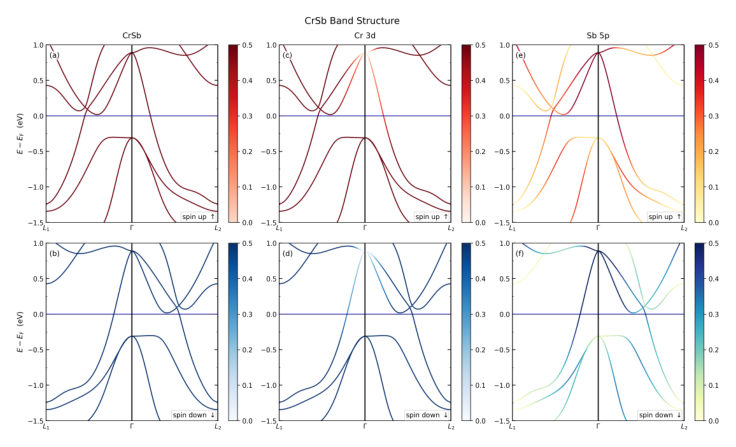 
FIG. 1 : Band structure of CrSb for the different spin orientations of the Cr spin moment. The results elucidate the symmetry leading to altermagnetism with separate spin polarizations of the band along particular brillouin zone directions connected by rotational symmetry.

📷 Fig 2

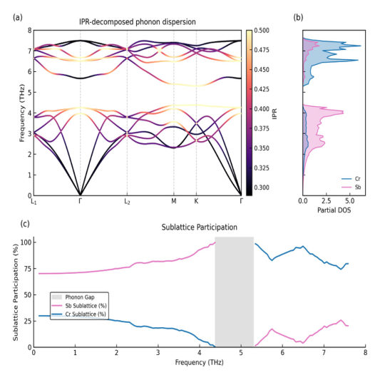 
FIG. 2 : Phonon dispersion relations for the altermagnetic compound CrSb. (a) Phonon dispersion decomposed by Inverse participation ratio (IPR) as a function of the Brillouin zone (b) Atom decomposed phonon density of states (c) Sublattice participation fraction of phonon energy for the Cr and Sb atoms.

📷 Fig 3

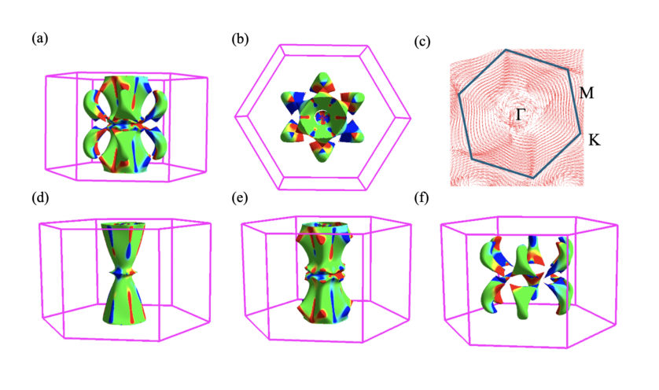 
FIG. 3 : Fermi surface of CrSb color coded by the momentum dependent berry curvature contributions from (a) lateral view (b) top view (c) quiver plot of berry curvature in the hexagonal ab plane within the Brillouin zone (d)-(f) band decomposed berry curvature contributions to the anomalous hall conductivity.

📷 Fig 4

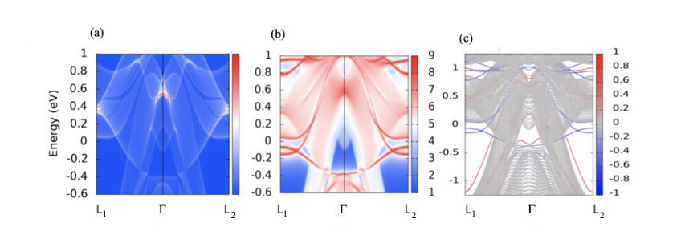 
FIG. 4 : Slab calculations of the projected energy spectrum along the (001) plane obtained from tight binding calculations showing (a) the bulk energy spectrum (c) surface density of states and energy spectrum (c) existence of topological surface states.

📷 Fig 5

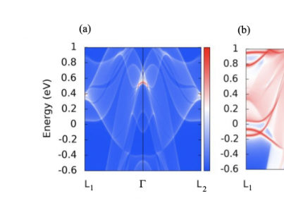 
Fig. 1(a) and (b) displays the spin resolved (up and down respectively) bands along the L1 −Γ −L2 direction, whereas Fig. 1(c)-(f) displays the orbital and spin resolution of the electronic bands. Note that the Cr 3d orbitals contribute significantly towards both the valence and conduction states of the electronic spectrum, whereas the Sb 5p orbitals contribute signifi- cantly to the conduction states respectively. A detailed

**Summary.** This paper theoretically investigates the Anomalous Hall effect in the altermagnetic material CrSb. Using advanced DFT calculations, the authors map out the electronic structure and topological properties of the material under various spin alignments. The key finding is that the AHE conductivity does not follow a simple linear relationship with magnetization for altermagnets, suggesting a necessary revision of current theoretical models.

**Why it may be interesting.** While focused on condensed matter magnetism, the rigorous calculation of topological invariants (Berry curvature) and their relation to transport coefficients provides advanced theoretical tools applicable to understanding quantum response in strongly correlated systems.

Detailed structure

**Main problem.** The study investigates the Anomalous Hall effect (AHE) in the altermagnetic material CrSb, specifically questioning the conventional assumption that AHE conductivity must scale linearly with magnetization.

**Main result.** The authors demonstrate through calculations that the anomalous Hall conductivity in altermagnets like CrSb does not necessarily exhibit a simple linear dependence on magnetization, challenging existing theoretical frameworks for magnetic materials.

**Method.** The research employs first-principles Density Functional Theory (DFT) coupled with maximally localized Wannier functions to calculate electronic spectra, Berry curvature, and topological surface states.

**Model / system.** The physical system is the altermagnetic compound CrSb. The theoretical framework involves calculating the AHE using Kubo formalism and analyzing the dependence of the anomalous Hall conductivity on various spin configurations and external fields.

**Key observables.** Anomalous Hall conductivity (sigma_xy), electronic band structure, phonon dispersion relations, geometrical Berry curvature, and topological surface states.

**Important parameters / regimes.** The analysis considers multiple magnetic configurations (e.g., coplanar vs. staggered spin orientations) and the dependence on the net magnetic moment.

**Assumptions / limitations.** The study assumes that standard AHE models based on simple linear magnetization scaling are insufficient for describing complex magnetic orders like altermagnetism.

**Figures summary.** Figures illustrate band structures for different spin orientations, phonon dispersion relations, and crucially, show the calculated anomalous Hall conductivity dependence on various sublattice spin alignments, confirming non-linear behavior.

**Paper structure.** The paper progresses by establishing the theoretical background of AHE in novel magnetic phases (altermagnetism), detailing advanced computational methods using MLWF/DFT, presenting calculations for CrSb's electronic and topological properties, and concluding with a re-evaluation of the linear magnetization dependence theory.

Abstract

Recent development in the field of altermagnetism, and increased demand for the search of applications of anomalous hall effect have ushered in a new era for novel quantum phases in materials. Quantum materials previously anticipated to be scientifically predictable have unfolded novel properties that brought them into the spotlight. These manifestations have led us to rethink our understanding of existing classification of magnetic materials and preexisting notions about anomalous hall effect in the light of topologically nontrivial phases of matter. One such recent de- velopment lies in the novel class of alter-magnetic materials with prospect for quantum computing. In this article, we delineate the spin and orbital resolved electronic spectrum, mode-decomposed phonon dispersion relations, geometrical berry curvature and topological surface states and their implications on anomalous Hall conductivity in the promising altermagnetic compound CrSb. We further utilize first principles calculations coupled with computationally efficient maximally localized wannier states of numerous magnetic configurations of the altermagnet to simulate the effect of external fields and elucidate the fact that the linear behaviour of anomalous hall conductivity with magnetization does not necessarily hold true for all magnetic classes, such as altermagnets.

[↑ back to top](#top)

### [Optimal complex conjugation of unknown isometry channels](http://arxiv.org/abs/2607.29054v1)

**Authors:** Satoshi Yoshida, Mio Murao  
**Type:** theory · **Category:** quantum information and computing · **PDF:** <https://arxiv.org/pdf/2607.29054v1>  
**Analysis basis:** full PDF text, analyzed in chunks
**Topic relevance:** `entanglement & information structure` **1/5** · `quantum measurements` **1/5**

📷 Fig 1

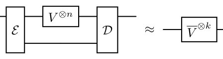 
Fig. 1. Illustration of the task of isometry complex conjugation. By using n parallel queries of an unknown isometry channel V(ρ) = V ρV † with V : Cd →CD, we implement a channel approximating k parallel queries of the complex conjugate channel V(ρ) = V ρV ⊤. We illustrate a parallel protocol with an encoder E and a decoder D. The optimal protocol is shown to be parallel even within the general class of deterministic supermaps for the case of k = 1, which also contains adaptive and indefinite-causal-order strategies [41], [18], [42]. For k ≥1, the asymptotic optimality of the estimation-based parallel protocol is shown for fixed d, D, k and n →∞.

📷 Fig 2

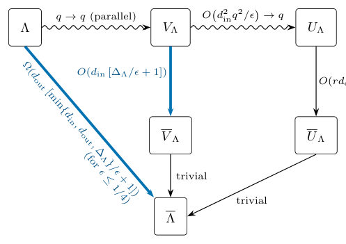 
Fig. 2. Application of this work to complex conjugation of unknown quantum channels. Each arrow indicates a lifting from one access model to another, which can be implemented with a certain overhead in the query complexity, and blue arrows are constructed in this work. The wave arrow indicates a randomized lifting, which implements q queries of the randomly chosen target access (called the acorn trick [4]). The access to rank-r unknown quantum channel Λ : L(Cdin) →L(Cdout) is lifted to the access to its Stinespring dilation isometry VΛ such that TrE[VΛ(·)V † Λ] = Λ(·) using an environmental system E ≃Cr. For q ∈Z+, q parallel queries to a randomly chosen dilation isometry VΛ can be...

📷 Fig 3

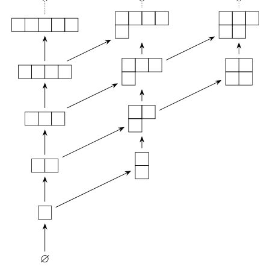 
Fig. 3. An example of the restricted Young lattice Yd for d = 2. It consists of vertices labeled by the Young diagrams λ ⊢d n for n ∈Z≥0, and edges α →λ with λ ∈α +d □.

📷 Fig 4

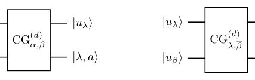 
Fig. 4. (Left panel) The CG transforms in the quantum circuit. Two input registers correspond to the Weyl modules U(d) α and U(d) β . The first output register

📷 Fig 5

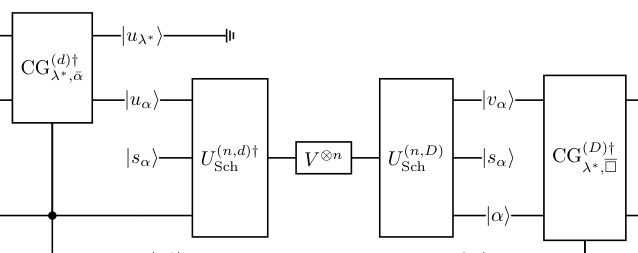 
Fig. 6. The optimal parallel protocol for complex conjugation of an unknown isometry V : Cd →CD from n calls. See the proof sketch of Prop. 9 for the details of the implementation.

**Summary.** This paper determines the optimal way to approximate the complex conjugate of an unknown quantum isometry channel using only multiple calls to the original channel. By employing advanced tools like Schur-Weyl duality and SDP, the authors derive precise formulas for the achievable fidelity and establish a query complexity scaling law. This advances the understanding of resource limitations in black-box quantum process simulation.

**Why it may be interesting.** This work establishes fundamental resource limitations for simulating complex operations (like conjugation) in quantum information theory, providing concrete query complexity bounds that are crucial for designing efficient quantum protocols.

Detailed structure

**Main problem.** The core problem is determining the optimal deterministic protocol to approximate the complex conjugate of an unknown quantum isometry channel, $\overline{V}$, using only limited calls to the original channel $V$. This addresses fundamental questions about simulating inverse or adjoint operations with black-box access.

**Main result.** The authors derive a closed-form expression for the optimal fidelity and establish that a parallel protocol achieves this optimum. The query complexity required is found to be $n = \Theta(d[(D-d)/\epsilon + 1])$.

**Method.** The analysis employs advanced techniques including semidefinite programming (SDP), Schur–Weyl duality, and the construction of optimal quantum circuits utilizing the quantum Schur transform and dual Clebsch–Gordan transforms.

**Model / system.** The model involves unknown isometry channels $V: \mathbb{C}^d	o\mathbb{C}^D$, which are generalized to superchannels. The analysis is framed in terms of channel operations and their representation via Stinespring dilations.

**Key observables.** Optimal fidelity ($F$), query complexity ($n$), and circuit complexity $O(	ext{poly}(D, 1/\epsilon))$ for the approximation.

**Important parameters / regimes.** The dimensions of the input ($d$) and output ($D$) spaces, the desired infidelity ($\epsilon$), and the number of copies ($k$).

**Assumptions / limitations.** The work focuses on *approximate* implementation, as exact complex conjugation is impossible with finite queries. Optimality proofs hold even against adaptive or indefinite-causal strategies.

**Figures summary.** Figures illustrate the task (approximating $\overline{V}$ from $V$ calls) and detail the quantum circuit constructions based on the Schur transform and Clebsch–Gordan transforms.

**Paper structure.** The paper systematically derives optimal fidelity bounds using SDP, proves the optimality of a parallel protocol via algebraic methods involving expectation values, extends results to multi-copy channels, and finally applies the framework to general unknown quantum superchannels.

Abstract

Access to the complex conjugate of an unknown quantum channel is a useful resource in quantum oracle problems, motivating the question of how such access can be simulated using only a limited number of calls to the original channel. We determine the optimal deterministic protocol for approximately implementing the complex conjugate isometry $\overline{V}$ from $n$ uses of an unknown isometry channel $V: \mathbb{C}^d\to\mathbb{C}^D$. We derive a closed-form expression for the optimal fidelity and prove that a parallel protocol is optimal even among general quantum superchannels, including adaptive and indefinite-causal-order strategies. The formula implies a query complexity $n=Θ(d[(D-d)/ε+1])$ for achieving infidelity $ε$. We also present a circuit construction based on the quantum Schur transform and the dual Clebsch--Gordan transform, with circuit complexity $O(\mathrm{poly}(D,1/ε))$. This task is extended to the multi-copy case $V^{\otimes n}\mapsto \overline{V}^{\otimes k}$. For fixed $d<D$ and $k$, we show that the optimal fidelity for the multi-copy case is $1-kd(D-d)/n+o(n^{-1})$, and that this value is asymptotically attained by a parallel estimation-based protocol. Finally, combining the isometry protocol with random Stinespring dilations yields a protocol for complex conjugation of unknown rank-$r$ quantum channels whose query complexity is optimal up to a constant factor if the Kraus rank $r$ is constant.

[↑ back to top](#top)

### [Qubit Loss Inference with Stabilizer Codes without Leakage Detection Units](http://arxiv.org/abs/2607.29603v1)

**Authors:** Shin Nishio, Takeaki Uno, Fumiyoshi Kobayashi, Takahiko Satoh, Dan E. Browne  
**Type:** theory · **Category:** quantum information and computing · **PDF:** <https://arxiv.org/pdf/2607.29603v1>  
**Analysis basis:** full PDF text, analyzed in chunks
**Topic relevance:** `quantum measurements` **1/5**

📷 Fig 1

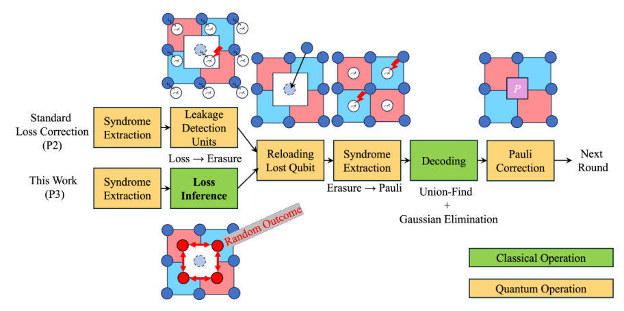 
Figure 1. Loss correction protocol flows. The standard protocol to deal with loss errors is converting the loss error into an erasure at a known location via leakage detection units. Instead of leakage detection units, we propose a protocol with loss inference, which no longer requires running an additional circuit, which reduces overhead and eliminates a source of noise. After applying one of them, one can apply reloading, syndrome extraction, decoding, and Pauli error correction, or Pauli frame update. Note that surface code is used as an example, but both protocols can be easily generalized to arbitrary stabilizer codes by replacing the decoder.

📷 Fig 2

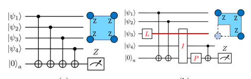 
Figure 2. (a) A quantum circuit for stabilizer measurement on Z1Z2Z3Z4 operator. (b) A quantum circuit intended to execute stabilizer measurement for Z1Z2Z3Z4 operators on a punctured system, which resulted in measuring an effective gauge operator ±Z1Z2Z4 where the sign is determined by the Pauli error operator P.

📷 Fig 3

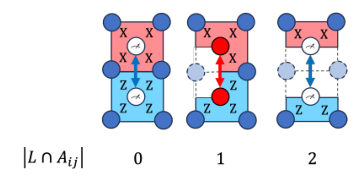 
Figure 3. The commutation (blue double arrow) / anti- commutation (red double arrow) relations of a pair of check operators si and sj. Blue vertices represent surviving data qubits and the dotted light blue vertices represent the lost qubits. Each vertex on the face is the auxiliary qubit for a check operator. (Left) Precondition: Aij = 2 ≡0 (mod 2) so that two checks si and sj commute. (Center) For the case of single loss, |Aij ∩L| ≡1 (mod 2), and so two checks anticommute. This loss is detectable. (Right) For an even number of losses on Aij, two checks commute, therefore not detectable from the statistics of two stabilizer checks.

📷 Fig 4

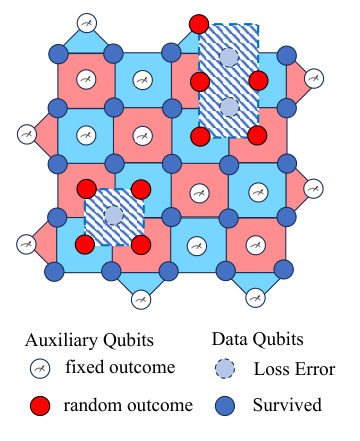 
Figure 4. An instance of the loss inference problem on a rotated surface code. Given checks with random outcome depicted as red vertices, find the loss error pattern shown as the shaded area.

📷 Fig 5

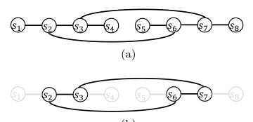 
Figure 6. (a) The check interaction graph of the rotated surface code shown in Fig. 5. (b) E5, the induced subset of edges whose label will be flipped by the loss on q5.

**Summary.** This paper proposes an alternative to using dedicated Leakage Detection Units (LDUs) to handle qubit loss in fault-tolerant quantum computing. By analyzing the syndrome data obtained from standard stabilizer measurements, the authors derive a mathematical condition based on anticommutation relations that proves when and how qubit loss can be inferred. This method promises reduced space-time overhead while maintaining low logical error rates for near-term hardware.

**Why it may be interesting.** It provides a purely theoretical framework for mitigating physical errors in quantum computation by transforming hardware overheads (LDUs) into algorithmic/measurement-based diagnostics derived from fundamental algebraic properties of stabilizer codes.

Detailed structure

**Main problem.** The paper addresses the challenge of qubit loss during quantum computation, aiming to infer the location of lost qubits directly from syndrome measurements without relying on dedicated hardware like Leakage Detection Units (LDUs).

**Main result.** It derives a sufficient condition for loss detectability based on the anticommutation of punctured stabilizer checks and shows that inference-based protocols can reduce logical error rates compared to LDU baselines in near-term regimes with less overhead.

**Method.** The authors develop theoretical criteria by analyzing the commutation relations between syndrome generators after accounting for lost qubits, formulating the problem as a maximum-likelihood/minimum set cover problem, and simulating performance on the surface code.

**Model / system.** The work is situated in the context of fault-tolerant quantum computation using stabilizer codes. The analysis models qubit loss under a non-entangling gate assumption for lost qubits, evaluating protocols on the rotated surface code.

**Key observables.** Logical error rate, anticommutation relations between punctured stabilizer checks ($s'_i s'_j = -s'_j s'_i$), and auxiliary qubit overhead.

**Important parameters / regimes.** Low-to-moderate loss rates relevant to near-term hardware; the structure of the underlying stabilizer code (e.g., surface code).

**Assumptions / limitations.** The gate model assumes non-entangling behavior for gates involving a lost qubit, and the analysis relies on establishing sufficient conditions rather than necessary ones.

**Figures summary.** Figures illustrate flow diagrams comparing LDU vs. inference protocols, and show how commutation/anticommutation relations change based on the number of lost qubits relative to stabilizer generators.

**Paper structure.** The paper progresses from identifying the hardware overhead of LDUs to deriving a mathematical condition for loss detectability via syndrome data (based on anticommutation), formalizing this into an inference problem, and finally validating the protocol through noise simulations on specific platforms.

Abstract

Qubit loss occurs when the physical carrier of a qubit leaves the computational system without directly revealing the event's location. Such errors are a major obstacle to fault-tolerant quantum computation on platforms including photonic, neutral-atom, and trapped-ion systems. Loss locations are commonly identified using additional hardware operations such as leakage-detection units (LDUs), which introduce space-time overhead and may themselves become a source of error. We investigate whether qubit loss on stabilizer codes can instead be inferred from syndrome data obtained through standard repeated stabilizer measurements. Under a non-entangling model for gates involving a lost qubit, we derive a sufficient condition for loss detectability in general stabilizer codes. The condition is based on the emergence of anticommutation between stabilizer checks after their support on the lost qubits is removed. By using that condition, we formulate the exact loss-inference problem using the observed set of non-deterministic checks together with its maximum-likelihood formulation. We then relax the problem to the minimum set cover problem with a greedy heuristic algorithm. We evaluate the resulting inference and loss-correction protocols on the rotated surface code via circuit-level noise simulations for trapped-ion and neutral-atom platforms. On both platforms, inference-based and adaptive protocols reduce the logical error rate relative to a noisy-LDU baseline in the low-to-moderate loss-rate regime relevant to near-term hardware, while requiring fewer space-time overheads.

[↑ back to top](#top)

### [Successive Electronic Topological Transitions in the Antiferromagnet UPd$_2$Al$_3$](http://arxiv.org/abs/2607.29151v1)

**Authors:** Adrien Gourgout, Gaël Bastien, Dai Aoki, Gabriel Seyfarth, Ilya Sheikin, Andrey Varlamov, Gertrud Zwicknagl, Jacques Flouquet, Georg Knebel, Alexandre Pourret  
**Type:** both · **Category:** strongly correlated electrons · **PDF:** <https://arxiv.org/pdf/2607.29151v1>  
**Analysis basis:** full PDF text, analyzed in chunks
**Topic relevance:** `Keldysh / 2PI / non-Gaussian methods` **1/5**

📷 Fig 1

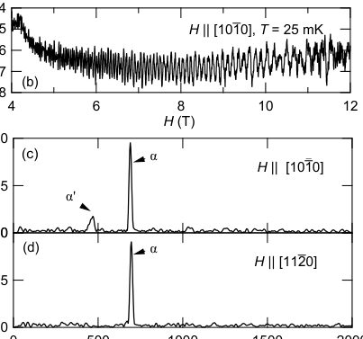 
Figure 3. (Color online). (a) Angular dependence of the dHvA frequencies, in good agreement with the literature [37], except for the α′ branch between the [10¯10] to [11¯20] direction, which has not been observed previously. (b) Field dependence of the dHvA signal from 4 to 12 T (below HM) for H ∥[10¯10] at T = 25 mK. Quantum oscillations are observable within the entire field range. (c) Corresponding FFT spectrum (for H ∥[10¯10]), and also for H ∥[11¯20] (d) .

📷 Fig 2

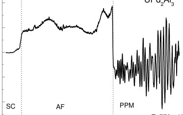 
Figure 4. Field dependence S(H) of the TEP with thermal gradient along [11¯20] at T = 770 mK for H∥[10¯10]. Quan- tum oscillations suddenly appear above a steep jump and sign change at the first order transition at HM. Below HM, there are five successive anomalies, but quantum oscillations are not observed.

📷 Fig 3

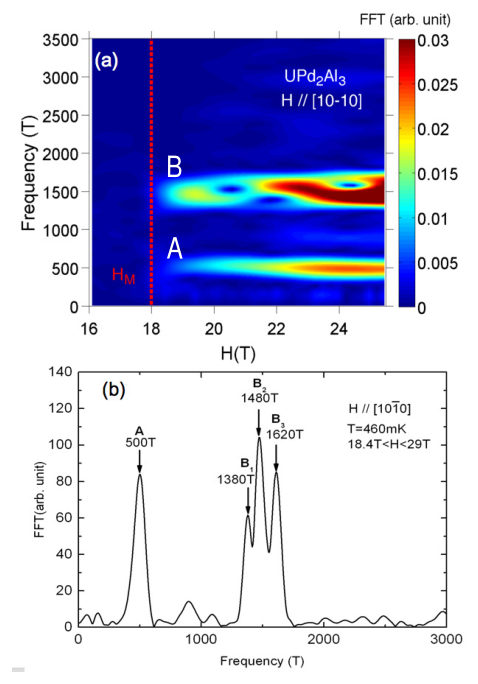 
Figure 5. (Color online) (a) Linear color map of the FFT intensity in the frequency-magnetic field plane from 15 T to 29 T for H ∥[10¯10]. The FFT analysis is done over a sliding window of width 1 Hmin − 1 Hmax = 0.01 T−1. (b) FFT of the TEP signal between 18.4 T and 28.9 T. A frequency of 500 T (A) and three close ones of 1380 (B1) , 1480 (B2) and 1620 T (B3) are resolved.

📷 Fig 4

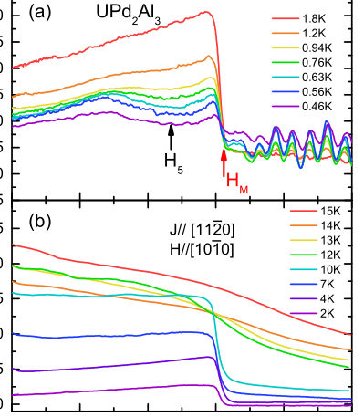 
Figure 6. (Color online). Temperature evolution of the TEP anomaly at HM. (a) At low temperature, quantum os- cillations appear above the first oder transition at HM. The anomaly H5 (black arrow, see text in section IV.) is also repre- sented. (b) Above 10 K, the transitions broaden significantly, indicating a cross-over area between PM and PPM states.

📷 Fig 5

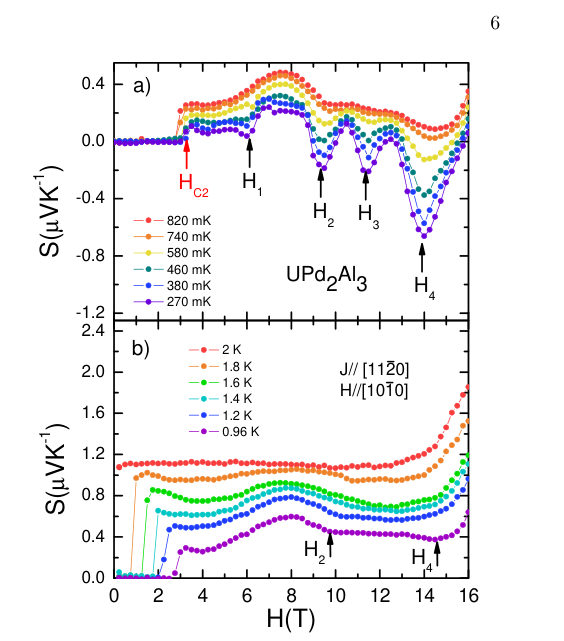 
Figure 7. (Color online). (a) A succession of anomalies (black vertical arrows) is observed at low temperatures in the thermoelectric response on a large magnetic field range be- tween 4 and 16 T, for H ∥[10¯10]. (b) Above 1 K, the different anomalies fade away and finally disappear.

**Summary.** This paper reports on evidence of successive electronic topological transitions in UPd2Al3 as it moves from an antiferromagnetic to a paramagnetic state under high magnetic fields. By analyzing sharp anomalies in thermoelectric power and Hall measurements, the authors argue for a strong Fermi surface reconstruction at the metamagnetic transition. The combination of transport diagnostics and theoretical modeling highlights how field-induced changes govern the electronic properties of heavy fermion systems.

**Why it may be interesting.** This work exemplifies how high-field magnetotransport measurements are crucial for mapping out complex electronic phase diagrams in strongly correlated materials, providing signatures (like sign changes and quantum oscillations) that point toward fundamental topological changes in the band structure.

Detailed structure

**Main problem.** The study investigates successive electronic topological transitions (ETTs) occurring in the antiferromagnetic state of the heavy fermion compound UPd2Al3 when subjected to a high external magnetic field.

**Main result.** The anomalies observed, particularly the sign change in thermoelectric power and Hall coefficient at the metamagnetic transition ($H_M$), strongly indicate a drastic Fermi surface reconstruction driven by band unfolding. This suggests that topological changes are key features of correlated electron behavior in this material.

**Method.** The research combines experimental measurements (thermoelectric power, Hall effect, dHvA oscillations) with theoretical analysis using renormalization perturbation theory to model the electronic structure changes.

**Model / system.** The physical system is the heavy fermion compound UPd2Al3, which exhibits antiferromagnetism and superconductivity. The focus is on understanding how its Fermi surface topology evolves across magnetic phase transitions (AF $\leftrightarrow$ PPM) under external fields.

**Key observables.** Thermoelectric power (Seebeck coefficient $S$), Hall coefficient ($
ho_{xy}$), quantum oscillation frequencies, and effective masses ($m^*$).

**Important parameters / regimes.** Magnetic field strength up to 35 T; critical temperatures like Néel temperature ($T_N = 14.5 	ext{ K}$) and superconducting transition temperature ($T_{SC} = 2 	ext{ K}$).

**Assumptions / limitations.** The anomalies are attributed to complex topological changes in the Fermi surface driven by the Zeeman effect, suggesting a connection between magnetic field tuning and Lifshitz transitions.

**Figures summary.** Figures illustrate temperature dependence of $S(T)$ showing kinks at $T_N$ and steps at $T_{SC}$; magnetoresistance/Hall measurements show anomalies at $H_M$; and FFT analysis reveals quantum oscillation frequencies above $H_M$.

**Paper structure.** The paper systematically presents transport measurements across the AF to PPM transition, using multiple diagnostics (TEP, Hall effect) to pinpoint the metamagnetic field ($H_M$). Theoretical modeling is then used to interpret these sharp changes as evidence of Fermi surface reconstruction.

Abstract

We report successive anomalies at low temperature in the magnetic field dependence of the thermoelectric signal in the heavy fermion compound UPd$_{2}$Al$_{3}$ inside the antiferromagnetic state up to the metamagnetic transition at $H_\text{M} =18$~T. Based on renormalisation perturbation theory and the partitioning of the $f$ orbitals into localized and delocalized parts, our analysis attributes these anomalies to complex topological changes of the Fermi surface driven by Zeeman effect. The observation of a sudden change of sign both in the thermoelectric power and in the Hall coefficient at $H_\text{M}$ in addition to the appearance of large quantum oscillations in the thermoelectric power above $H_\text{M}$ indicate a strong Fermi surface reconstruction at the metamagnetic transition due to the unfolding of the electronic bands.

[↑ back to top](#top)

### [Transcorrelated Random-Phase Approximation](http://arxiv.org/abs/2607.28845v1)

**Authors:** Abdallah Ammar, Enzo Monino, Anthony Scemama, Emmanuel Giner, Pierre-François Loos  
**Type:** theory · **Category:** strongly correlated electrons · **PDF:** <https://arxiv.org/pdf/2607.28845v1>  
**Analysis basis:** full PDF text, analyzed in chunks
**Topic relevance:** `Keldysh / 2PI / non-Gaussian methods` **1/5**

📷 Fig 1

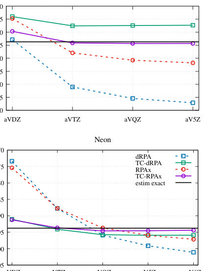 
FIG. 1. Basis set convergence of the total ground-state energies (in a.u.) of the He and Ne atoms. The energies are plotted as a function of the basis set cardinal number X (aug-cc-pVXZ) for dRPA (blue dashed), TC-dRPA (green solid), RPAx (red dashed), and TC- RPAx (purple solid). The horizontal black line denotes the estimated exact non-relativistic ground-state energy, which serves as the CBS reference.196 Raw data can be found in the Supplementary Materials.

📷 Fig 2

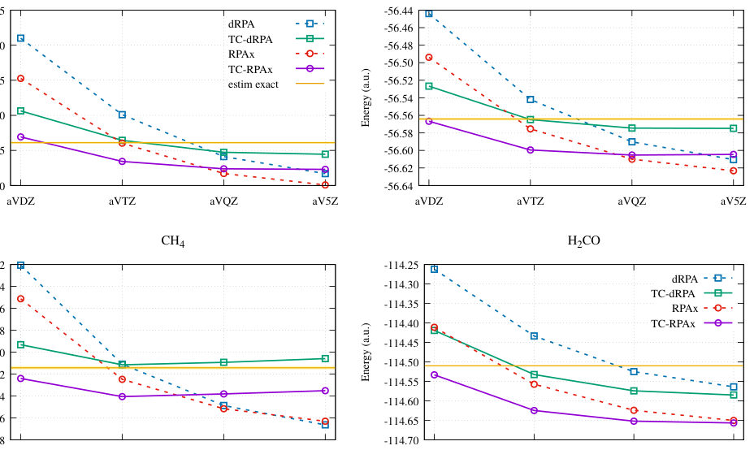 
FIG. 2. Basis-set convergence of the total ground-state energies (in a.u.) of H2O, NH3, CH4, and H2CO as a function of the basis set cardinal number X (aug-cc-pVXZ). Results are shown for dRPA (blue dashed), TC-dRPA (green solid), RPAx (red dashed), and TC-RPAx (purple solid). The horizontal yellow line represents the estimated exact non-relativistic ground-state energy.185,197 Raw data can be found in the Supplementary Materials.

**Summary.** This paper introduces the Transcorrelated Random-Phase Approximation (TC-RPA) to enhance electronic structure calculations by incorporating explicit three-body correlation effects via a Jastrow factor. It demonstrates that TC-RPA provides substantial accuracy improvements for ground-state energies in atoms and molecules, making it an efficient tool for ground-state energetics. However, the authors caution that state-specific optimization is needed to accurately model excited states.

**Why it may be interesting.** This work directly tackles highly correlated electronic structure problems using advanced many-body techniques (RPA extensions), which is central to understanding chemical bonding and material properties relevant to AMO physics.

Detailed structure

**Main problem.** The primary goal is improving electronic structure calculations by addressing the slow basis set convergence of standard Random-Phase Approximation (RPA) due to short-range electron correlation effects.

**Main result.** The Transcorrelated RPA (TC-RPA) significantly improves accuracy and accelerates basis set convergence for ground-state correlation energies, but only shows marginal improvement for vertical excitation energies.

**Method.** The authors extend the RPA formalism to a non-Hermitian Transcorrelated (TC) Hamiltonian by incorporating three-body interactions via a Jastrow correlation factor. They apply this using both direct and exchange variants of the approximation.

**Model / system.** Calculations are performed for atoms (He, Ne) and small molecules (H2O, NH3, CH4, H2CO). The theory utilizes an Equation-of-Motion approach applied to the non-Hermitian TC Hamiltonian, requiring a biorthogonal formalism.

**Key observables.** Ground-state correlation energies and vertical excitation energies.

**Important parameters / regimes.** The Jastrow correlation factor, which is optimized for the ground state.

**Assumptions / limitations.** The primary limitation noted is that optimizing the Jastrow factor only for the ground state limits its effectiveness in describing excited states.

**Figures summary.** Not specified by notes; however, a comparison figure mentioned suggests TC-RPA accelerates basis set convergence compared to standard RPA calculations for ground-state energies.

**Paper structure.** The paper develops the formalism by extending RPA to the non-Hermitian TC Hamiltonian. It then applies this method to calculate correlation and excitation energies for various molecules, culminating in a comparison of results showing differential improvements between ground and excited states.

Abstract

We extend the random-phase approximation (RPA) to the non-Hermitian transcorrelated (TC) Hamiltonian, which explicitly includes three-body interactions generated by a Jastrow correlation factor. We consider both the direct RPA (dRPA) and RPA with exchange (RPAx). We apply the resulting TC-dRPA and TC-RPAx methods to calculate ground-state correlation energies and vertical excitation energies for atoms (\ce{He} and \ce{Ne}) and small molecules (\ce{H2O}, \ce{NH3}, \ce{CH4}, and \ce{H2CO}). For ground-state correlation energies, the TC treatment substantially improves accuracy and accelerates basis set convergence, reducing errors by nearly an order of magnitude relative to conventional RPA calculations. By contrast, it yields only marginal improvements in vertical excitation energies. We attribute this limited effect to the ground-state optimization of the Jastrow factor, which does not adequately capture the distinct electronic character of excited states. These results establish TC-RPA as an accurate and computationally efficient approach to ground-state energetics, while highlighting the need for state-specific Jastrow optimization to achieve reliable descriptions of excited states.

[↑ back to top](#top)

## Other papers (7)

*Papers from primary archives without highlighted authors or any topic match. Click to expand.*

Show other papers

### [FedQML-Edge: Compact Quantum Feature Sketches for Communication-Constrained Roadside Federated Learning](http://arxiv.org/abs/2607.28799v1)

**Authors:** Talha Azfar, Ruimin Ke  
**Type:** both · **Category:** other · **PDF:** <https://arxiv.org/pdf/2607.28799v1>  
**Analysis basis:** full PDF text, analyzed in chunks

📷 Fig 1

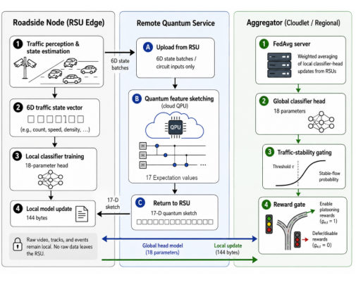 
Fig. 1. FedQML-Edge computation and communication workflow. Each RSU performs traffic-state construction, local classifier training, and model- update generation. Normalized six-dimensional circuit inputs are sent to a remote quantum service, which returns a 17-dimensional Pauli sketch to the originating RSU. The sketch is processed locally and each RSU uploads only its 144-byte classifier update, while the aggregator returns the 18-parameter global classifier head used for traffic-stability gating.

📷 Fig 2

 
Fig. 1 summarizes the computational and communication boundaries of FedQML-Edge. Each RSU performs the clas- sical roadside operations: traffic perception, construction and normalization of the six-dimensional traffic-state vector, local classifier training, and generation of the federated model up- date. Raw frames, vehicle trajectories, per-vehicle identifiers, and local event records remain at the RSU. Quantum feature extraction is performed by remote quan- tum hardware. For each local traffic-state sample, the RSU transmits the six normalized circuit inputs to the quantum service. The service prepares the fixed six-qubit feature-map circuit, measures the required Pauli observables, and...

📷 Fig 3

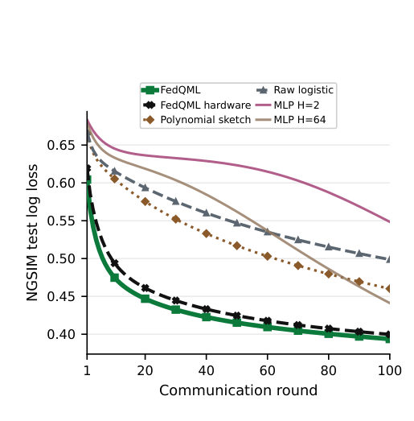 
Fig. 2. NGSIM loss curves over 100 communication rounds. FedQML is shown for both statevector and IBM Fez hardware-derived sketches; the remaining curves show the strongest matched classical sketch, raw logistic regression, payload-matched H = 2 MLP, and the strongest MLP.

📷 Fig 4

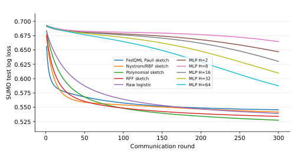 
Fig. 3. SUMO predictive-gating test log-loss histories over 300 communica- tion rounds. The compact fixed-sketch models improve early and then flatten, while larger MLPs continue late-round optimization with larger updates.

📷 Fig 5

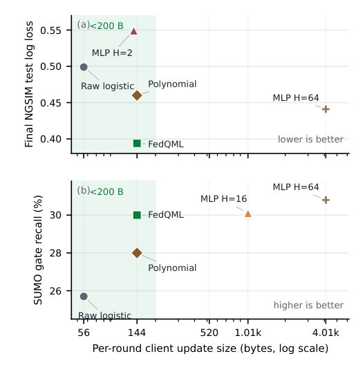 
Fig. 4. Communication–performance tradeoffs. (a) Final NGSIM test log loss versus per-round client update size. (b) SUMO stable-window recall under the validation-selected false-enable constraint versus update size. FedQML gives the lowest NGSIM loss and approaches the SUMO gate recall of substantially larger MLPs with a 144-byte update.

**Summary.** This paper introduces FedQML-Edge, a federated learning framework that uses compact quantum feature sketches to process raw traffic data from roadside units (RSUs). By transmitting only small classifier updates derived from these quantum sketches, the method drastically reduces communication bandwidth requirements while maintaining high accuracy for critical tasks like predicting stable traffic flow.

**Why it may be interesting.** The integration of quantum sketching into a practical, communication-constrained edge AI task like traffic management is novel. It demonstrates how quantum principles can solve real-world data transmission bottlenecks in physical systems.

Detailed structure

**Main problem.** Developing a compact, privacy-preserving learning method for roadside units (RSUs) to determine traffic stability in connected autonomous vehicle corridors under bandwidth constraints.

**Main result.** The proposed method significantly reduces communication overhead while maintaining high predictive accuracy, achieving state-of-the-art performance compared to large classical MLPs on both NGSIM and SUMO benchmarks.

**Method.** It employs a federated quantum feature-sketching pipeline where raw traffic data is mapped into a compact Pauli expectation value sketch using a fixed quantum circuit. This sketch then feeds a locally trained logistic classifier, with only the small classifier update being shared during federated averaging.

**Model / system.** The system involves RSUs observing six key traffic features (e.g., vehicle count, mean speed) and sending inputs to a remote quantum service for sketch generation. The learning process is decentralized (Federated Learning), using the sketch as a low-dimensional feature representation for classification.

**Key observables.** Test log loss, Gate Recall, Update Payload Size (bytes), Pauli expectation values ($\mathbf{x}_{e,t}$)

**Important parameters / regimes.** The size of the classifier update (144 bytes) is constant and independent of traffic volume; the sketch dimension is 17.

**Assumptions / limitations.** The method assumes that a fixed quantum feature map can provide sufficient non-linearity for classification while keeping communication updates minimal. Raw observations remain private at the RSU.

**Figures summary.** Figures illustrate the computation and communication workflow (RSU $
ightarrow$ Quantum Service $
ightarrow$ RSU $
ightarrow$ Aggregator) and show loss curves comparing FedQML to classical baselines over training rounds on NGSIM/SUMO.

**Paper structure.** The paper details the problem setup in CAVs, introduces the FedQML-Edge methodology (sketching via Pauli expectations), presents performance evaluations using both NGSIM and SUMO datasets, compares results against various classical feature sets and MLPs, and discusses hardware feasibility on IBM Fez.

Abstract

Roadside units (RSUs) supporting connected and autonomous vehicle corridors need compact models to decide when cooperative maneuvers should be rewarded, deferred, or disabled. Raw sensor streams and neural network weight checkpoints are poorly suited to bandwidth-limited, privacy-sensitive roadside learning. This paper presents $\texttt{FedQML-Edge}$, a federated quantum feature-sketching pipeline for traffic-stability gating. Each RSU constructs a traffic-state summary and sends circuit inputs to a quantum computer; Pauli expectations form a nonlinear sketch processed by a logistic classifier. Only classifier updates are shared with an aggregator, whose head supports reward gating. Raw observations, vehicle records, event traces, and quantum sketches remain private. We evaluate the method using NGSIM trajectories, SUMO predictive gating with sensing noise, and IBM Quantum hardware. On NGSIM, the Pauli sketch reduces test log loss by $14.4\%$ relative to the strongest matched classical sketch. On SUMO, it approaches larger MLPs in stable-window recall while using $7-28$ times less communication per round.

[↑ back to top](#top)

### [Free to Interacting Map for Crystalline SPT Phases: Equivariance vs Crystalline Equivalence](http://arxiv.org/abs/2607.28811v1)

**Authors:** Daniel Sheinbaum, Omar Antolín-Camarena  
**Type:** theory · **Category:** other · **PDF:** <https://arxiv.org/pdf/2607.28811v1>  
**Analysis basis:** full PDF text, analyzed in chunks

📷 Fig 1

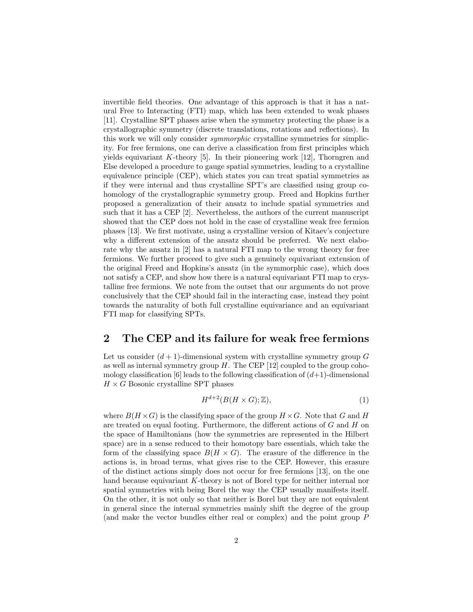 
Low-resolution page preview, page 2

📷 Fig 2

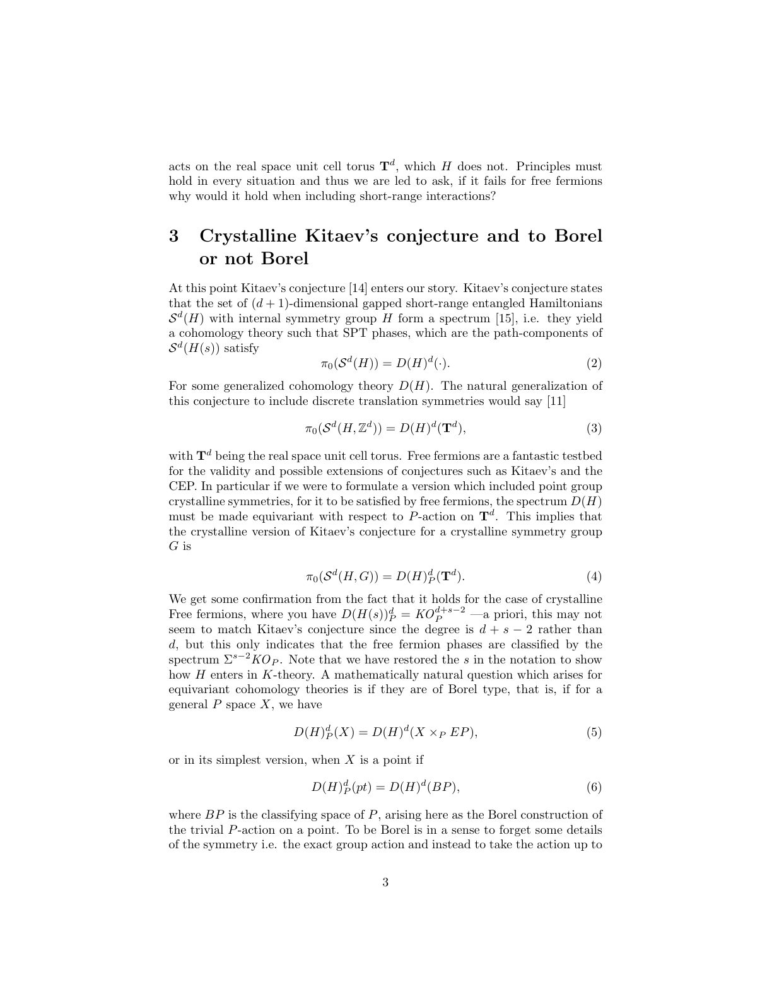 
Low-resolution page preview, page 3

📷 Fig 3

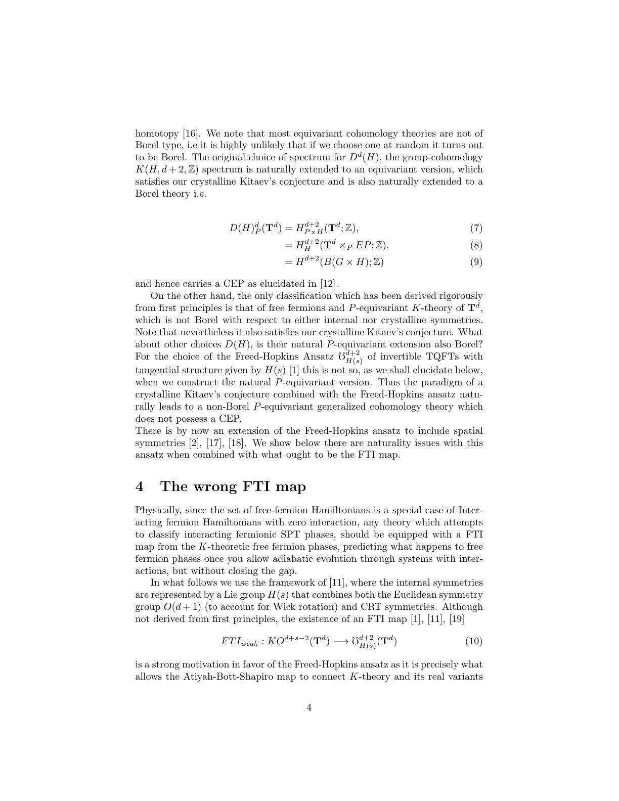 
Low-resolution page preview, page 4

📷 Fig 4

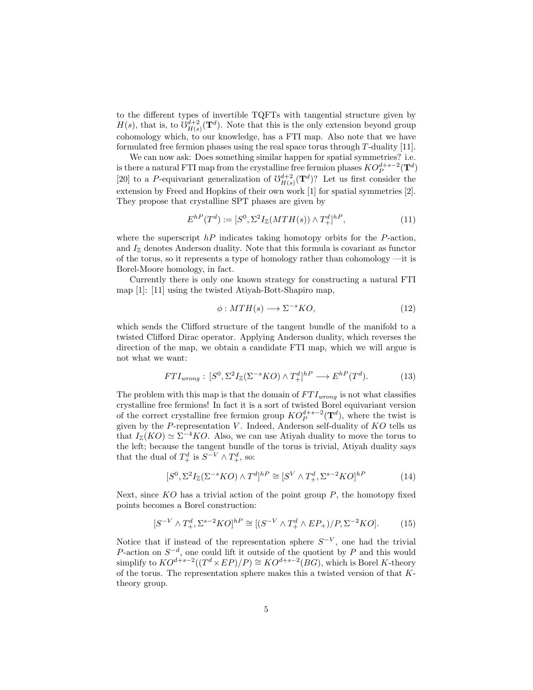 
Low-resolution page preview, page 5

📷 Fig 5

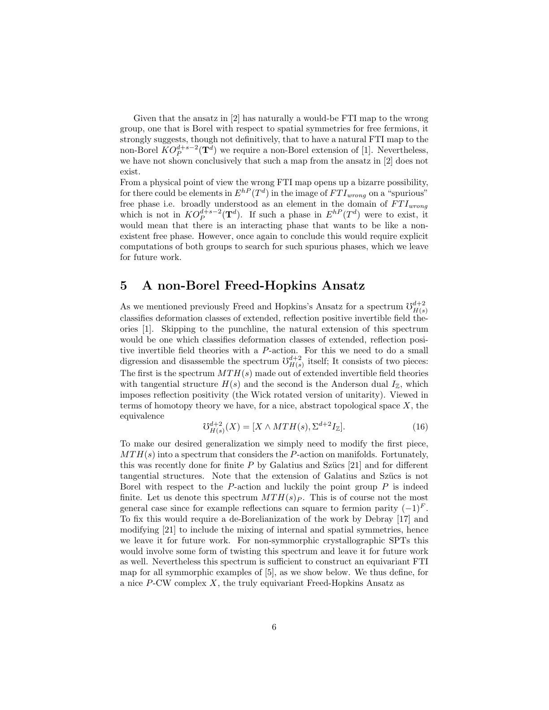 
Low-resolution page preview, page 6

**Summary.** This theoretical paper develops a rigorous framework to classify interacting Symmetry Protected Topological (SPT) phases in crystalline systems. It proposes an equivariant Free to Interacting (FTI) map that corrects previous classification schemes by prioritizing full crystallographic equivariance over the established Crystalline Equivalence Principle. This advances our understanding of topological order in materials with crystal symmetries.

**Why it may be interesting.** This work provides deep mathematical machinery (equivariant K-theory) to classify topological phases in crystalline materials, which is crucial for understanding symmetry protection beyond simple lattice models relevant to AMO physics.

Detailed structure

**Main problem.** The paper addresses developing a natural classification scheme for interacting Symmetry Protected Topological (SPT) phases, specifically resolving the conflict between established crystalline equivalence principles and results derived from free fermions.

**Main result.** The authors propose a fully equivariant Free to Interacting (FTI) map that respects full crystallographic equivariance, arguing this structure is more natural than previous constructions based on the potentially flawed Crystalline Equivalence Principle (CEP).

**Method.** The work employs advanced algebraic topology tools, including equivariant K-theory and Anderson duality, to construct and analyze a candidate FTI map connecting free fermion theories to interacting SPT phases.

**Model / system.** The focus is on crystalline SPT phases characterized by an internal symmetry group H and a crystallographic symmetry group G. The analysis compares classifications derived from invertible field theories against those arising from weak free fermions.

**Key observables.** Classification invariants such as $\pi_0(	ext{Sd}(H))$ for interacting phases, and $KO^{d+s-2}_P(T^d)$ for free fermions; the kernel and cokernel of the proposed FTI map are key diagnostics.

**Important parameters / regimes.** The dimensionality ($d$), internal symmetry structure ($H$), and crystallographic point group action ($P$) are central parameters governing the classification.

**Assumptions / limitations.** The primary assumption is that full equivariance with respect to the spatial symmetry group $P$ should take precedence over maintaining the Crystalline Equivalence Principle (CEP).

**Paper structure.** The paper proceeds by first identifying the failure of the CEP for free fermions, then generalizing the Freed and Hopkins ansatz to a fully equivariant version, and finally constructing and analyzing the resulting natural equivariant FTI map.

Abstract

Freed and Hopkins developed an ansatz for classifying interacting SPT phases using invertible field theories with a natural Free to Interacting (FTI) map from free fermion phases. This ansatz has been generalized to include crystalline phases and a crystalline equivalence principle (CEP). However, motivated by failure of the CEP for weak free fermions and the FTI, here we generalize the original Freed and Hopkins ansatz to a fully equivariant version for symmorphic crystallographic symmetries and show there is a natural equivariant FTI map from symmorphic crystalline weak free fermions. We further discuss why this equivariant ansatz is both mathematically and physically more natural than the spatial symmetry extension by Freed and Hopkins and why full equivariance should hold over the CEP.

[↑ back to top](#top)

### [InferQ: A Database-Oriented Benchmark for Quantum Circuits Simulation](http://arxiv.org/abs/2607.29134v1)

**Authors:** Andrei Ilinescu, Aadi Patwardhan, Rihan Hai  
**Type:** both · **Category:** quantum information and computing · **PDF:** <https://arxiv.org/pdf/2607.29134v1>  
**Analysis basis:** full PDF text, analyzed in chunks

📷 Fig 1

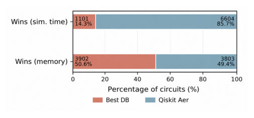 
Figure 1: Across 7,705 circuits, share of cases where RDBMSs (executing the emitted SQL workload) or Qiskit Aer achieves the lowest runtime and the lowest peak memory. Detailed experimental settings are in Section 6.

📷 Fig 2

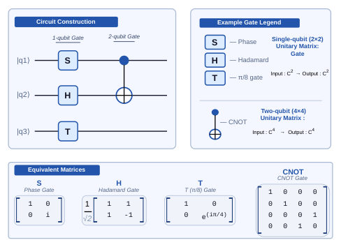 
Figure 2: Quantum gates represented as matrices.

📷 Fig 3

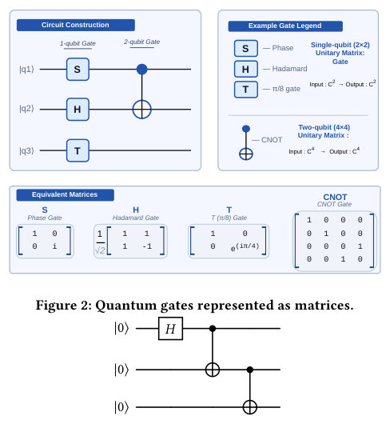 
Figure 3: GHZ state preparation circuit: it takes the all-zero state |000⟩as input and prepares a maximally entangled state.

📷 Fig 4

 
Figure 5: InferQ feature extraction workflow. Static, graph- based, and SQL-derived features are extracted prior to simu- lation, whereas dynamic features can only be obtained after the simulation completes.

📷 Fig 5

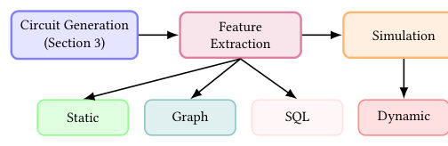 
Figure 4 illustrates one end-to-end circuit instance generated by InferQ. The workflow is intentionally analogous to a database benchmark that (i) samples a scale/configuration, (ii) instantiates a small sequence of templates with parameters, and (iii) materializes both an artifact and its metadata. Step 1 (Hyper-Parameters). Given a user seed, InferQ sam- ples an instance configuration (𝑛𝑞,𝑑,𝑘,𝑟, 𝜉). In this example, 𝑛𝑞=7 qubits, depth 𝑑=80, evaluation 𝑘=4, and repetition count 𝑟=1. Step 2–3 (Template selection &amp; subcircuits generation ). Starting from START, InferQ samples a short template sequence using the history-dependent distribution. Here the sequence is QFT →QPE. Each template is...

**Summary.** This paper introduces InferQ, a comprehensive benchmark designed to test quantum circuit simulation by translating computations into SQL workloads executable on RDBMSs. It systematically generates diverse circuits and extracts rich features, demonstrating that database engines can offer competitive performance metrics like memory usage compared to standard simulators. This work opens the door for data-centric optimization of quantum algorithms by predicting the best execution backend.

**Why it may be interesting.** While focused on database performance, the systematic benchmarking of quantum circuits provides a novel computational resource analysis framework that could inform hardware-aware algorithm design or compiler optimization for future quantum computing architectures.

Detailed structure

**Main problem.** The authors developed a systematic benchmark, InferQ, to evaluate quantum circuit simulation performance when executed using Relational Database Management Systems (RDBMSs) compared to standard simulators.

**Main result.** InferQ demonstrated that RDBMSs can achieve better peak memory usage than Qiskit Aer on over 50% of tested circuits, and machine learning models trained on its features can accurately predict the optimal simulation engine.

**Method.** The method involves generating general, compositional quantum circuits, translating each simulation task into an RDBMS-ready SQL workload (tensor contractions), and extracting comprehensive static, graph, and SQL features for analysis.

**Model / system.** The system under study is the quantum circuit model, where states are represented by complex vectors. The computation is simulated either via standard quantum simulators or by compiling the operations into join-and-aggregate tensor contractions executed within an RDBMS.

**Key observables.** Peak memory usage, execution runtime, classification accuracy (for predicting optimal backend), and various circuit/SQL features (e.g., graph diameter, number of JOINs).

**Important parameters / regimes.** The benchmark covers a large dataset of 202,975 circuits generated by composing subcircuits from templates.

**Assumptions / limitations.** The primary assumption is that quantum circuit simulation can be systematically mapped onto SQL workloads suitable for database analysis. The ML predictions rely on the completeness and diversity of the extracted features.

**Figures summary.** Figures illustrate feature distributions (static, graph, SQL), performance comparisons between RDBMSs and Qiskit Aer, and machine learning model performance metrics showing high prediction accuracy.

**Paper structure.** The paper introduces InferQ to address the lack of systematic benchmarks. It details circuit generation via template composition, workload extraction into SQL, feature engineering (static/graph/SQL), comparative experiments across multiple RDBMSs vs. Qiskit Aer, and finally, using ML models to predict optimal execution backends.

Abstract

Recent work suggests that relational database management systems (RDBMSs) can execute quantum circuit simulation by compiling the simulation into SQL workloads (primarily join-and-aggregate tensor contractions). While early results are promising, they largely focus on a narrow set of highly structured circuits and offer limited support for systematic database research, such as query optimization, physical design, and engine-level evaluation across a broad range of circuits. We present InferQ, a database-oriented benchmark for quantum circuit simulation. InferQ generates general, compositional circuits by assembling subcircuits from a set of circuit templates, emits each simulation task as an RDBMS-ready SQL workload, and extracts circuit and query features (static, graph, SQL, and dynamic) for workload characterization. InferQ also releases a large dataset of 202,975 circuits online, with a web-based viewer to support searching, filtering, and downloading circuits and feature records. In experiments across RDBMS engines (PostgreSQL, SQLite, DuckDB, and Umbra) and the widely used Qiskit Aer simulator, we find that RDBMSs achieve better peak memory usage than Qiskit Aer on more than 50% of the circuits generated by InferQ. Moreover, using InferQ features, lightweight machine learning models (linear and tree-based models) can accurately predict when SQL execution is preferable (with accuracy up to 95.3% for runtime and 97.4% for memory), enabling data-centric simulator selection and opening the door to principled optimization of SQL-based quantum circuit simulation.

[↑ back to top](#top)

### [Quantum Algorithms for Modular Factorials](http://arxiv.org/abs/2607.29453v1)

**Authors:** Yann Tal  
**Type:** theory · **Category:** quantum information and computing · **PDF:** <https://arxiv.org/pdf/2607.29453v1>  
**Analysis basis:** full PDF text, analyzed in chunks

📷 Fig 1

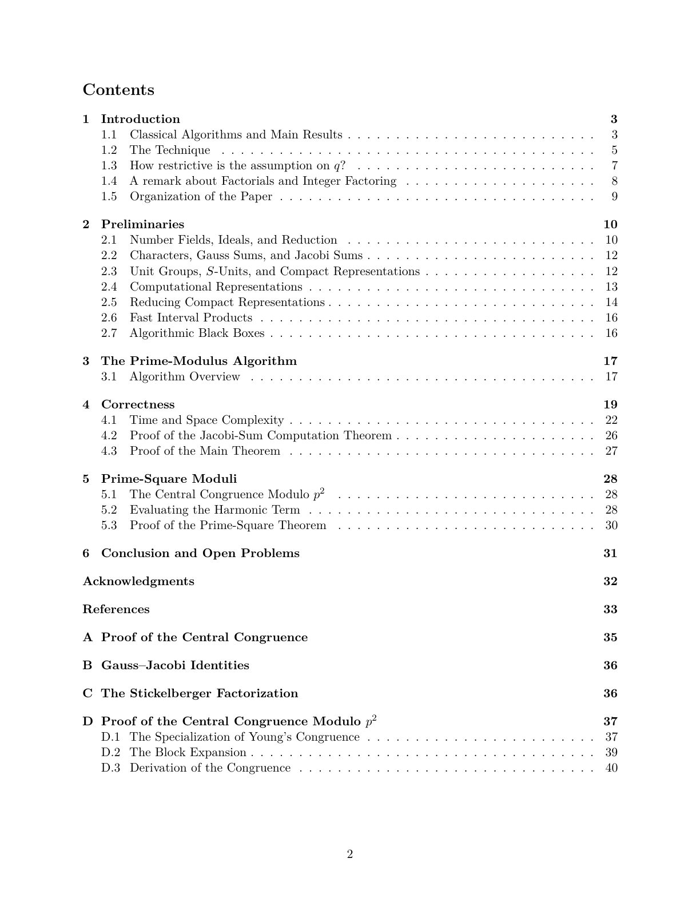 
Low-resolution page preview, page 2

📷 Fig 2

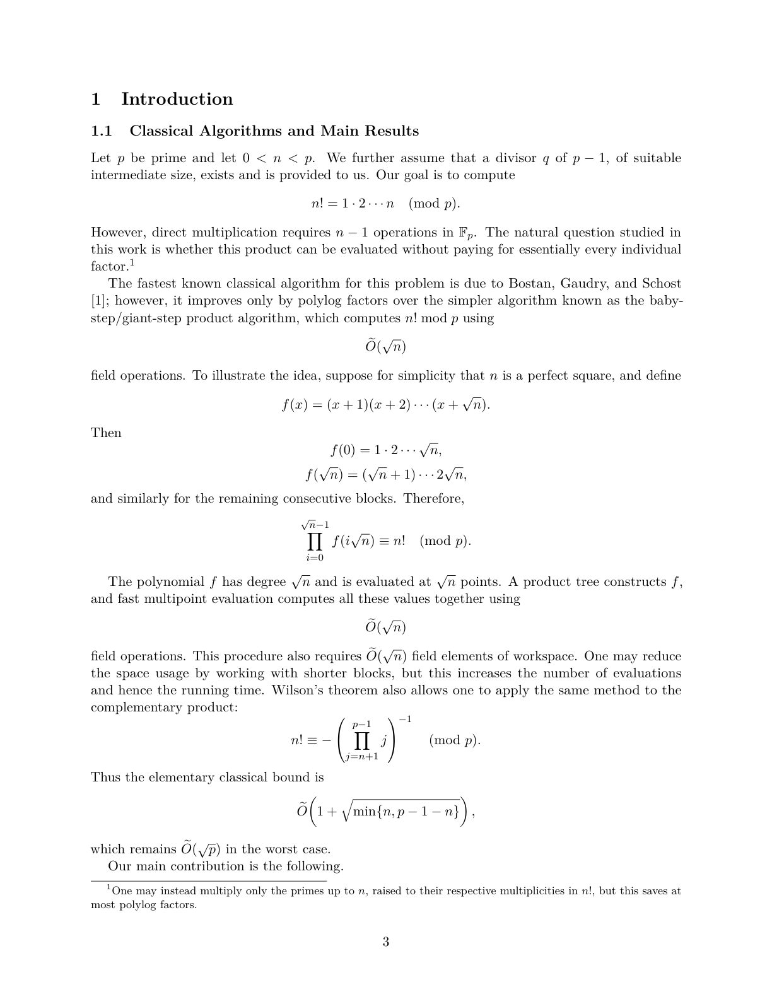 
Low-resolution page preview, page 3

📷 Fig 3

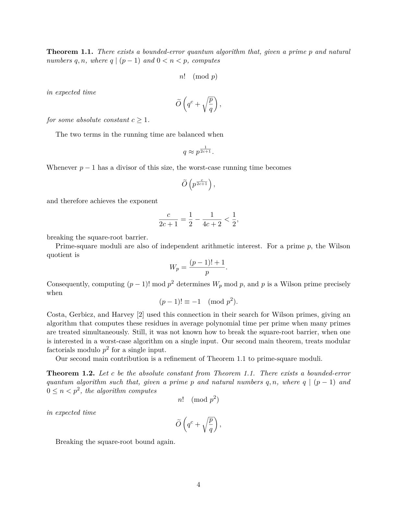 
Low-resolution page preview, page 4

📷 Fig 4

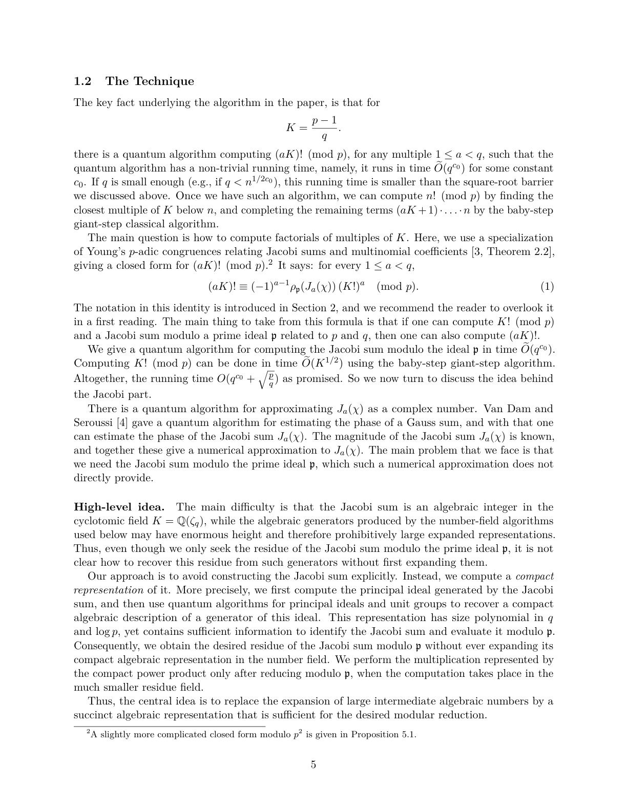 
Low-resolution page preview, page 5

📷 Fig 5

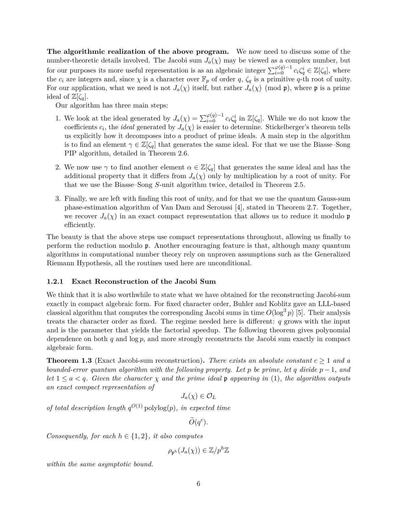 
Low-resolution page preview, page 6

**Summary.** This paper presents a novel bounded-error quantum algorithm to compute modular factorials, $n! \pmod{p}$ and $\pmod{p^2}$, with an expected time complexity that surpasses classical limits under certain conditions. The breakthrough relies on developing a quantum method to exactly reconstruct complex algebraic objects, specifically Jacobi sums, in a compact form suitable for computation modulo prime ideals.

**Why it may be interesting.** While not directly about physical Hamiltonians, the development of quantum algorithms for fundamental number-theoretic problems like modular factorials demonstrates the potential reach of quantum computation beyond chemistry or materials science. The techniques used to handle exponentially large algebraic numbers are highly relevant to theoretical quantum information processing.

Detailed structure

**Main problem.** The primary goal is developing an efficient quantum algorithm to compute modular factorials, specifically $n! \pmod{p}$ and $n! \pmod{p^2}$, for a prime $p$. A secondary technical challenge involves reconstructing Jacobi sums modulo prime ideals.

**Main result.** The authors present a bounded-error quantum algorithm achieving an expected time complexity of $\widetilde{O}(q\sqrt{c} + p/q)$ for computing $n! \pmod{p}$, which breaks the classical square-root barrier under specific divisor conditions. This technique is extended to compute factorials modulo $p^2$.

**Method.** The core method involves using quantum algorithms to reconstruct Jacobi sums in a compact algebraic form, circumventing the need for explicit construction due to their potentially enormous size. The overall computation combines this specialized number-theoretic subroutine with techniques derived from Young's congruences and multinomial coefficient identities.

**Model / system.** The paper is purely theoretical, dealing with computational complexity bounds applied to number theory problems involving modular arithmetic over finite fields $\mathbb{F}_p$ and rings $\mathbb{Z}/p^2\mathbb{Z}$. The 'system' is the mathematical structure of prime moduli and associated character sums.

**Key observables.** The primary observables are the values $n! \pmod{p}$ and $n! \pmod{p^2}$, alongside intermediate quantities like Jacobi sums $J_a(\chi)$ and ratios of multinomial coefficients.

**Important parameters / regimes.** Key parameters include the prime modulus $p$, a divisor $q$ of $p-1$, and the integer $n$. The complexity depends critically on balancing terms involving $q$ and $p/q$.

**Assumptions / limitations.** The algorithm relies on the existence of a suitable divisor $q | (p-1)$ to achieve its stated time bounds. Furthermore, several quantum routines used (e.g., for ideal generation) are assumed to function correctly.

**Paper structure.** The paper builds from the general problem of modular factorials to the technical core: reconstructing Jacobi sums using a three-step quantum process involving PIP and S-unit algorithms. It then applies this machinery, leveraging number theory congruences (like those relating multinomial coefficients to Jacobi sums), to derive the final complexity bounds for $n! \pmod{p}$ and $n! \pmod{p^2}$.

Abstract

We give a bounded-error quantum algorithm that, given a prime $p$, a divisor $q\mid(p-1)$, and an integer $0<n<p$, computes $n!\bmod p$ in expected time $\widetilde{O}(q^c+\sqrt{p/q})$ for some absolute constant $c\ge 1$. When $p-1$ has a divisor of size $q\approx p^{1/(2c+1)}$, this gives the exponent $c/(2c+1)<1/2$. To our knowledge, this is the first algorithm to break the exponent $1/2$ barrier for modular factorials under such a divisor promise. The main technical ingredient is a quantum algorithm that reconstructs the relevant Jacobi sum exactly in compact algebraic form, with polynomial dependence on $q$ and $\log p$. We further extend the same asymptotic bound to the computation of $n!\bmod p^2$, uniformly over $0\le n<p^2$. At $n=p-1$, this determines the Wilson quotient $\frac{(p-1)!+1}{p}\pmod p$. We conjecture that the condition $q\mid(p-1)$ is a technical limitation of the present method rather than an inherent obstruction, and that a uniform quantum algorithm exists for all primes.

[↑ back to top](#top)

### [The Kikuchi Hierarchy is Sharp for $k$XOR](http://arxiv.org/abs/2607.29672v1)

**Authors:** Alexander Schmidhuber, Matthew B. Hastings  
**Type:** theory · **Category:** other · **PDF:** <https://arxiv.org/pdf/2607.29672v1>  
**Analysis basis:** full PDF text, analyzed in chunks

📷 Fig 1

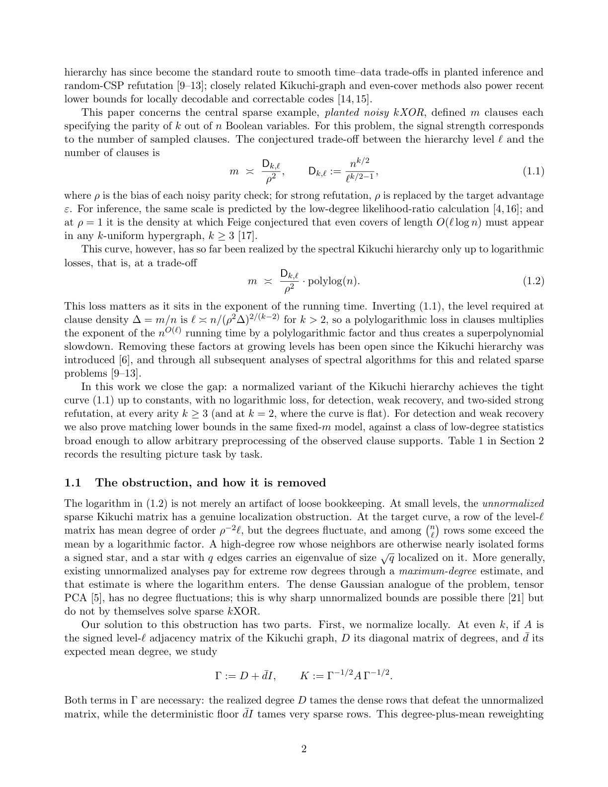 
Low-resolution page preview, page 2

📷 Fig 2

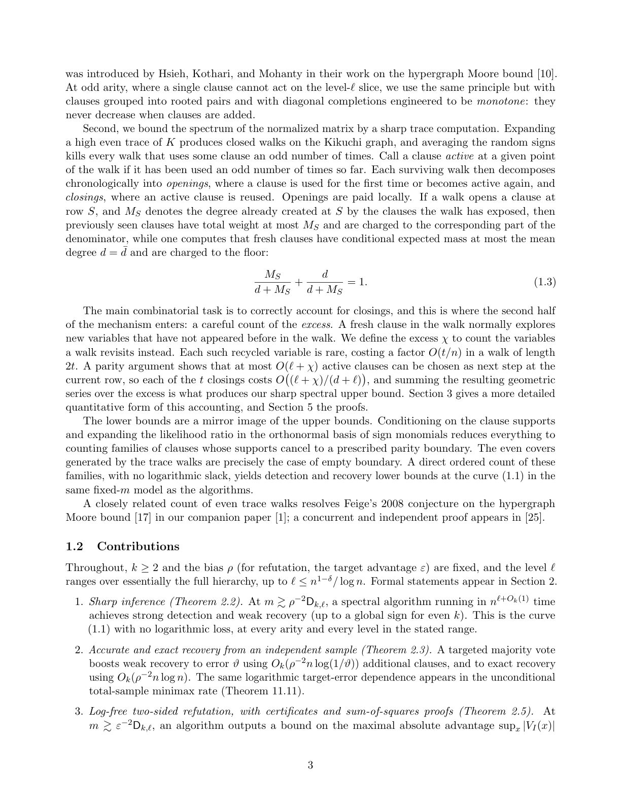 
Low-resolution page preview, page 3

📷 Fig 3

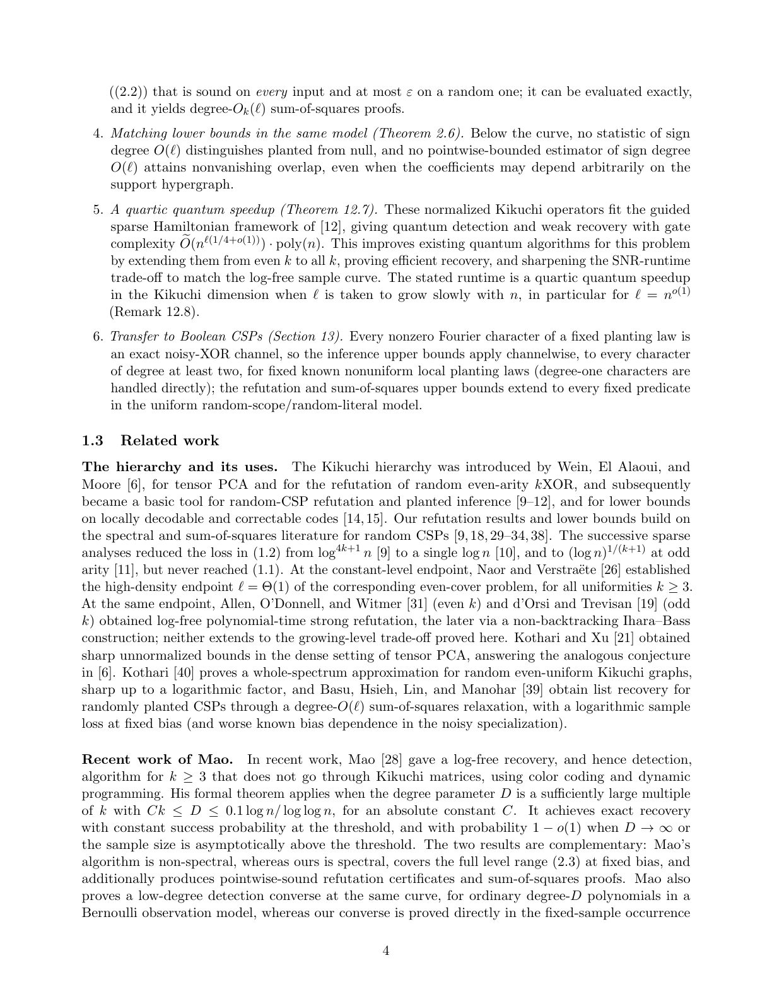 
Low-resolution page preview, page 4

📷 Fig 4

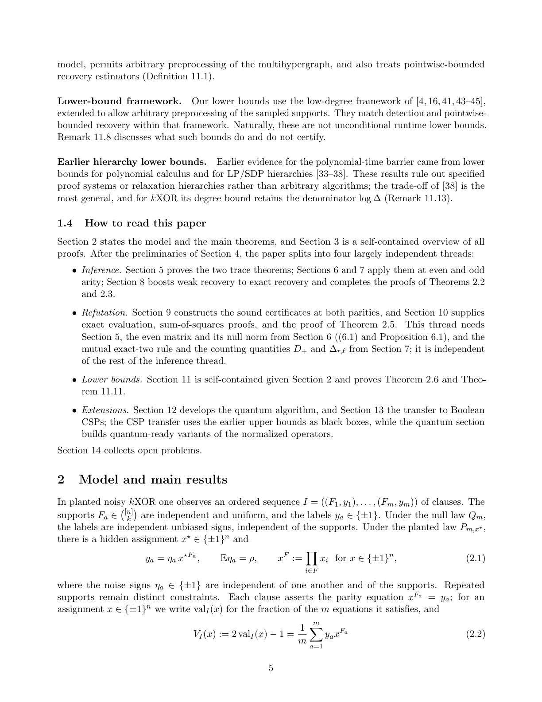 
Low-resolution page preview, page 5

📷 Fig 5

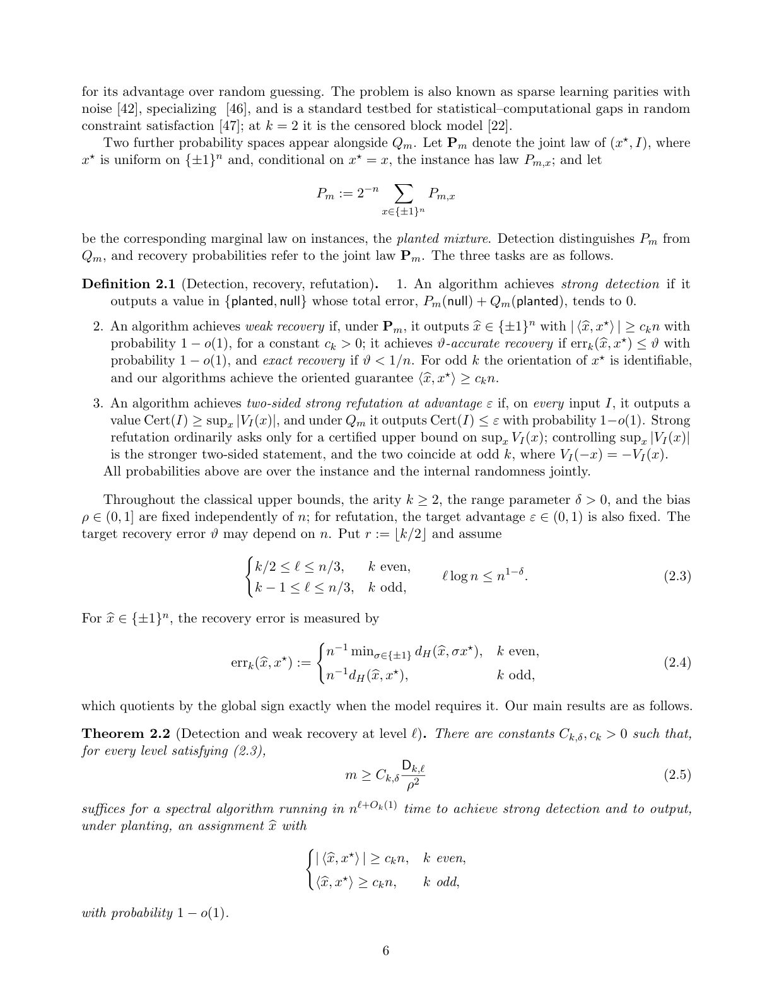 
Low-resolution page preview, page 6

**Summary.** This theoretical paper establishes optimal sample complexity bounds for solving planted inference problems within noisy kXOR models. By introducing a normalized version of the Kikuchi hierarchy, the authors prove that previously conjectured sharp trade-offs are achievable without logarithmic losses. The work also provides a quantum algorithm demonstrating a significant speedup over classical spectral methods.

**Why it may be interesting.** While highly mathematical and rooted in coding theory/ML, the rigorous establishment of sharp information-theoretic bounds (like those governing signal detection) is foundational to understanding complexity limits in physical systems modeled by random constraints.

Detailed structure

**Main problem.** The paper addresses establishing sharp theoretical bounds for planted inference problems, specifically detecting or recovering a hidden low-rank signal within noisy $k$XOR constraints.

**Main result.** They prove that a normalized variant of the Kikuchi hierarchy achieves the conjectured optimal trade-off between signal strength and sample size with no logarithmic loss for detection, weak recovery, and strong refutation.

**Method.** The core methods involve spectral analysis using the normalized sparse Kikuchi matrix, sharp counting of closed walks in its trace expansion, and establishing matching lower bounds via low-degree polynomial techniques.

**Model / system.** The model is planted noisy $k$XOR, where constraints are defined by clauses specifying the parity of $k$ out of $n$ Boolean variables. The analysis extends to general fixed predicates and local planting laws.

**Key observables.** Signal strength ($
ho$), Hierarchy Level ($\ell$), Number of Clauses ($m$), Detection/Recovery accuracy, Refutation certificate degree.

**Important parameters / regimes.** Arity $k \ge 3$, Bias $
ho$, Level $\ell$, Sample size $m$.

**Assumptions / limitations.** The main improvement over prior work is the normalization technique used to overcome polylogarithmic losses in spectral analyses, allowing matching of the conjectured sharp trade-off curve.

**Paper structure.** The paper builds upon establishing the theoretical framework using the Kikuchi hierarchy and then presents results for detection, weak recovery, and strong refutation, culminating in a quantum algorithm achieving a quartic speedup.

Abstract

Planted noisy $k$XOR and the strong refutation of random $k$XOR are governed by a conjectured trade-off between signal strength and time: Level $\ell$ of the Kikuchi hierarchy should achieve the smooth curve \begin{equation*}   m\ \gtrsim\ ρ^{-2}n^{k/2}/\ell^{k/2-1}\ \text{clauses}   \quad\Longleftrightarrow\quad   \text{solvable in time }n^{O(\ell)}, \end{equation*} where $ρ$ is the bias of the planted signal or, for refutation, the target advantage. However, every spectral analysis of sparse $k$XOR to date loses polylogarithmic factors against this curve, a loss that enters the exponent of the running time.   We show that a normalized variant of the Kikuchi hierarchy achieves the sharp conjectured trade-off, with no logarithmic loss, at every arity $k\ge3$. At the scale above, our algorithms achieve strong detection, weak recovery, and strong refutation; an additional cleanup step boosts weak recovery to exact recovery, and the refutation certificates yield sum-of-squares proofs of degree $O_k(\ell)$. We also prove matching lower bounds in the same model. The inference and refutation upper bounds transfer to more general planting laws and predicates. Finally, we give a quantum algorithm that achieves a quartic speedup over the classical spectral algorithms for detection and weak recovery.   The proofs rest on two key ingredients: a normalization of the sparse Kikuchi matrix, and a sharp count of the closed walks in its trace expansion. We use a closely related trace-walk count to prove Feige's 2008 hypergraph Moore bound conjecture in a companion paper.

[↑ back to top](#top)

### [Towards the Characterization of Logical Errors in Distributed Lattice Surgery](http://arxiv.org/abs/2607.29186v1)

**Authors:** Nitish Kumar Chandra, Reza Nejabati, Eneet Kaur  
**Type:** theory · **Category:** quantum information and computing · **PDF:** <https://arxiv.org/pdf/2607.29186v1>  
**Analysis basis:** full PDF text, analyzed in chunks

📷 Fig 1

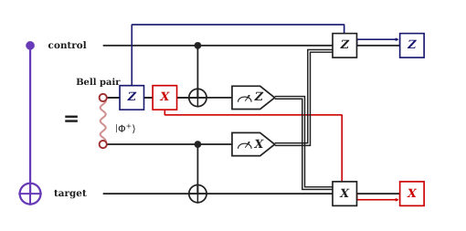 
Fig. 2. Entanglement-assisted nonlocal CNOT gate. A shared Bell pair is used to mediate the interaction between spatially separated control and target qubits, followed by local CNOTs, measurements, and classical feedforward for Pauli corrections.

📷 Fig 2

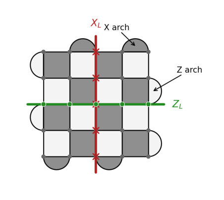 
Fig. 1. Rotated Surface Code for 𝑑= 5. The gray (𝑋-type) and white (𝑍-) squares represent the plaquettes (stabilizer generators) of the code. Data qubits are located at the vertices (grey circles). The vertical line indicates the logical X operator (𝑋𝐿), and the horizontal line indicates the logical Z operator (𝑍𝐿). The X and Z arches, indicated by arrows, represent the stabilizers at the boundary. We use red for 𝑋𝐿and Green 𝑍𝐿to represent the logical operators.

📷 Fig 3

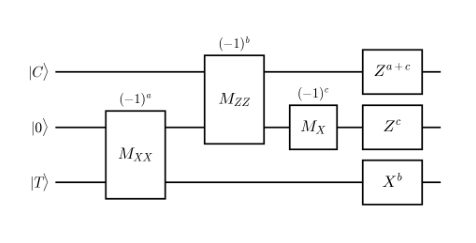 
Fig. 3. Lattice surgery circuit for a logical CNOT gate. The control (|𝐶⟩) and target (|𝑇⟩) patches interact via an ancilla (|0⟩) using sequential joint parity measurements. The final byproduct Pauli corrections are dictated by the measurement outcomes 𝑎,𝑏, and 𝑐.

📷 Fig 4

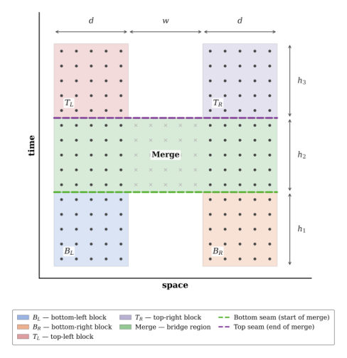 
Fig. 4. Spacetime diagram of the H-shaped geometry for the merge operation in lattice surgery. The horizontal and vertical axes represent the qubits and syndrome extraction rounds, respectively.

📷 Fig 5

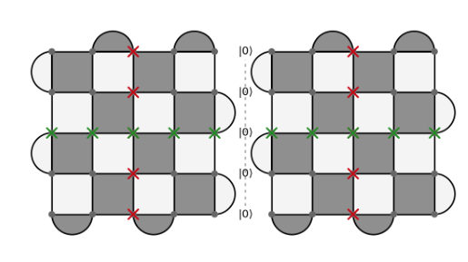 
Fig. 5. Ancilla mediated merge operation between two 𝑑= 5 rotated surface code patches. The central column of qubits, initialized in |0⟩, forms the bridge region used to couple the two patches during the merge. The dashed line marks the interface where joint stabilizers are measured, enabling a logical parity measurement between the two encoded qubits.

**Summary.** This paper analyzes how logical errors accumulate when performing lattice surgery across physically separated quantum modules. It models the merge operation using a detailed noise framework incorporating imperfections in shared entangled links. The results offer crucial, quantitative guidelines for designing fault-tolerant distributed quantum computers.

**Why it may be interesting.** It provides concrete quantitative metrics (thresholds and fidelity requirements) that bridge theoretical quantum error correction concepts with realistic hardware constraints imposed by networking multiple physical processors.

Detailed structure

**Main problem.** The primary challenge is characterizing logical errors that accumulate during distributed quantum computation, specifically focusing on the merge operation in lattice surgery.

**Main result.** The work derives practical insights by providing quantitative estimates for required local-gate fidelities and tolerable entangled-pair fidelities necessary for fault-tolerant operations in a distributed architecture.

**Method.** The analysis employs Minimum-Weight Perfect Matching (MWPM) decoding on an H-shaped spacetime diagram to estimate logical error rates under a phenomenological noise model.

**Model / system.** The system is based on distributed quantum computing using smaller modules networked by shared entangled pairs, implementing the planar surface code via lattice surgery techniques.

**Key observables.** Logical Z errors in the XX merge operation; logical error rates ($\mathfrak{q}_{	ext{seam}}$); and operational thresholds.

**Important parameters / regimes.** Surface-code distance ($d$); Bell-pair noise scaling factor ($k$); local CNOT gate fidelities ($\epsilon_{cx}, \epsilon_m$).

**Assumptions / limitations.** The analysis uses a phenomenological noise model that explicitly accounts for contributions from imperfect Bell pairs, local gates, idling, and readout errors.

**Figures summary.** Figures illustrate the rotated surface code structure, entanglement-assisted nonlocal CNOT gates, the lattice surgery circuit for logical CNOTs, and the H-shaped spacetime diagram detailing the merge operation history.

**Paper structure.** The paper builds from defining the distributed setting to analyzing the core merge operation using syndrome measurements, developing a comprehensive noise model incorporating non-local errors, and finally deriving scaling laws for the resulting logical error rate.

Abstract

Distributed quantum computing offers a scalable alternative to monolithic quantum processors by networking smaller quantum modules through shared entangled pairs. A central challenge in this setting is that inter-module quantum operations are typically noisier than intra-module local gates, which introduces additional noise into the system. In this work, we analyze distributed lattice surgery under heterogeneous noise conditions, focusing in particular on the merge operation as one of its fundamental subroutines. Specifically, we discuss the XX merge operation between two rotated surface-code patches hosted on two different quantum processors. We characterize logical errors in the resulting H-shaped spacetime diagram and estimate thresholds using a minimum-weight perfect matching (MWPM) decoder. We use a phenomenological noise model and derive distinct bulk and seam error rates to approximate a circuit-level noise model that includes contributions from local CNOT gates, noisy entangled pairs, idle errors, and readout errors. Our results provide practical insights into selecting the optimal surface-code distance, establishing target local-gate fidelities, and determining the tolerable entangled-pair fidelity required for logical operations in a distributed architecture.

[↑ back to top](#top)

### [Transpiler Autotuning with Predictive Models for Quantum Circuit Optimization](http://arxiv.org/abs/2607.29145v1)

**Authors:** Piotr Malkowski, Domenik Eichhorn, Joshua Ammermann, Rinor Kelmendi, Nick Poser, Patrick Hopf, Ina Schaefer  
**Type:** theory · **Category:** quantum information and computing · **PDF:** <https://arxiv.org/pdf/2607.29145v1>  
**Analysis basis:** full PDF text, analyzed in chunks

📷 Fig 1

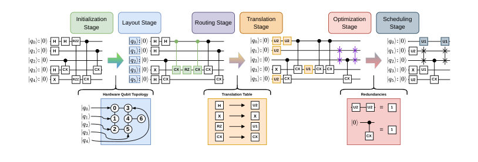 
Fig. 1. Overview of Qiskit’s transpiler pipeline that illustrates how every stage may transform a given circuit.

📷 Fig 2

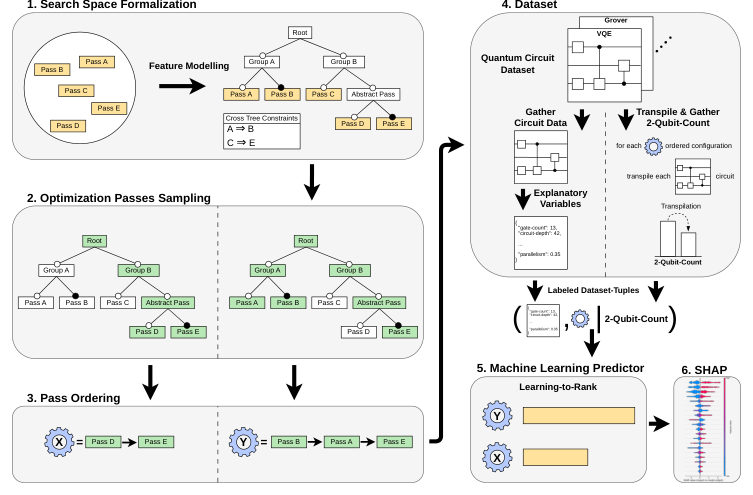 
Fig. 2. Overview of our autotuning pipeline. This figures includes all six steps that we performed to create this contribution, including the creation of a dataset via a formalization and sampling and pass ordering (1-4), the training of a machine learning predictor (5), and an evaluation of our results via a SHAP analysis (6).

📷 Fig 3

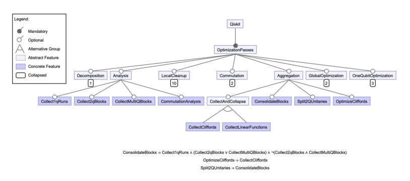 
Fig. 3. A feature model that represents the configurability of the transpiler passes appropriate for Qiskit’s init stage. To improve the readability of the figure we had to collapse some nodes of features, a complete figure as well as a complete expression of the feature model in the Universal Variability Language can be found in our supplementary material [80].

📷 Fig 4

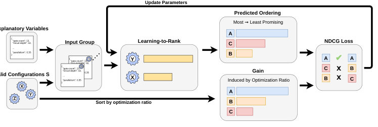 
Fig. 4. Overview of our machine learning predictor formulated as a learning-to-rank task. This figure presents a simplified illustration of the model input, the resulting ranking of configurations, and the way the model adjusts its parameters using a loss function.

📷 Fig 5

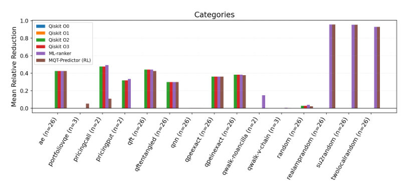 
Fig. 5. Mean Relative Reduction of two-qubit gates across quantum circuit classes. Of the 26 total classes, only the 15 classes for which at least one method achieved a reduction are shown. The number of evaluated circuits for each class is denoted with n.

**Summary.** This paper introduces an advanced autotuning framework that uses supervised machine learning to automatically select and order the best sequence of transpiler optimization passes for quantum circuits. By training a predictive model on extensive benchmark data, it significantly outperforms default compiler settings in reducing costly two-qubit gates. This advances the practical usability of quantum hardware by making compilation more efficient.

**Why it may be interesting.** This work directly addresses the practical compilation bottleneck in quantum computing, which is crucial for any theoretical physicist simulating or designing algorithms for near-term hardware.

Detailed structure

**Main problem.** The core challenge is determining the optimal combination of transpiler passes for quantum circuit optimization, as fixed default settings often fail to achieve maximum performance.

**Main result.** The proposed ML-selected pass combinations consistently match or exceed existing Qiskit optimizations, achieving an average additional reduction of 19.1% - 32.4% in two-qubit gates.

**Method.** The authors developed an autotuning pipeline using supervised machine learning (XGBoost) trained on a dataset generated via feature-model based sampling across thousands of benchmark circuits.

**Model / system.** The system under study is quantum circuits implemented via gate-based programming models, optimized for execution on Noisy Intermediate-Scale Quantum (NISQ) devices using the Qiskit framework.

**Key observables.** Maximum reduction in two-qubit gates; circuit properties like gate count and depth are used as explanatory variables.

**Important parameters / regimes.** The optimization goal is minimizing errors associated with two-qubit gates on NISQ hardware.

**Assumptions / limitations.** It is assumed that a predictive ML model can accurately generalize the performance gains of specific transpiler pass combinations to unseen quantum circuits.

**Figures summary.** Figure 1 illustrates the stages of the Qiskit transpiler pipeline. Figure 2 details the six-step autotuning methodology, from search space formalization to SHAP analysis.

**Paper structure.** The paper outlines a systematic approach: first, defining the problem (combinatorial explosion); second, generating data via feature-model sampling; third, training an ML predictor in a learning-to-rank setting; and finally, validating the model's predictions against empirical benchmarks using SHAP for interpretability.

Abstract

Quantum software engineering is an emerging research field focusing on efficiently embedding the quantum programming paradigm into existing software ecosystems. A key aspect of this field is the realization of quantum algorithms using gate-based programming and the subsequent low-level optimization of the resulting quantum circuits, a process that is commonly performed by so-called transpilation pipelines. One significant challenge in these pipelines is determining which optimizations to apply to a given circuit. This decision is usually based on fixed default configurations that are uniformly applied to all circuits, frequently resulting in missed opportunities for more aggressive circuit optimization. In this work, we tackle this challenge by applying autotuning with supervised machine learning to develop an automated method for selection of transpiler passes. To train our machine-learning models, we employ feature-model based sampling to generate a representative dataset that examines how different combinations of Qiskit transpiler passes perform across thousands of circuits drawn from the state-of-the-art benchmarking suite MQT Bench. Using these data, we build a predictive model extension for the Qiskit transpilation pipeline that uses a machine learning model to automatically select combinations of transpiler passes aiming to achieve a maximum reduction in two-qubit gates. Our empirical evaluation shows that the combinations selected by our model are never outperformed by Qiskit's optimization levels, achieve on average an additional 19.1$\%$ - 32.4$\%$ reduction in two-qubit gates, and for some circuits finds reductions of up to $95.8\%$ in cases where Qiskit achieves no reduction at all.

[↑ back to top](#top)

## Secondary cond-mat archives

*Papers from  mes-hall, other, soft, supr-con. These archives are de-prioritized — they appear at the end regardless of relevance score.*

### Relevant in secondary archives (19)

### [Emergence of Propagating Exciton-Polaritons in Hybrid Waveguide-van der Waals Heterostructures](http://arxiv.org/abs/2607.29289v1)

**Authors:** Alina Schubert, Karoline Becker, Andreas Thies, Rico Schwartz, Takashi Taniguchi, Kenji Watanabe, Henije Stolz, Alexander Szameit, Matthias Heinrich, Tobias Korn  
**Type:** both · **Category:** other · **PDF:** <https://arxiv.org/pdf/2607.29289v1>  
**Analysis basis:** full PDF text, analyzed in chunks
**Topic relevance:** 🔥 `analog quantum simulation` **4/5** · 🔥 `correlated cavity matter` **4/5** · `driven-dissipative phase transition` **3/5** · `interference shaping light` **3/5** · `quantum optics experiment` **3/5** · `QC/QI experiment` **2/5** · `Tavis-Cummings & cavity-many-emitter` **2/5** · `methods for driven-dissipative` **2/5** · `non-equilibrium dynamics` **2/5** · `spintronics-quantum-optics interface` **2/5** · `Keldysh / 2PI / non-Gaussian methods` **1/5** · `correlated / nonlocal dissipation` **1/5** · `entanglement & information structure` **1/5** · `exotic spin models in light-matter` **1/5** · `non-equilibrium universality` **1/5**

📷 Fig 1

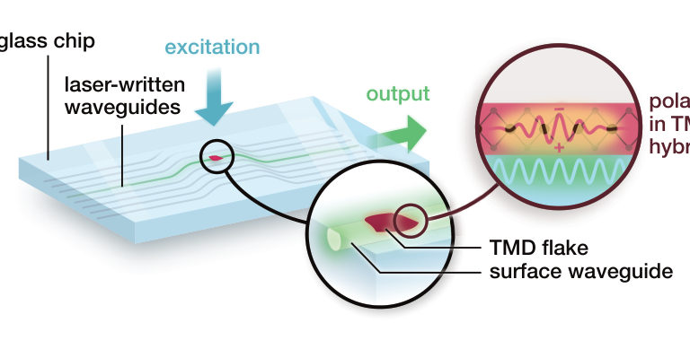 
Figure 1. Schematic of the hybrid waveguide-TMD structure and the formation of propagating exciton-polaritons

📷 Fig 2

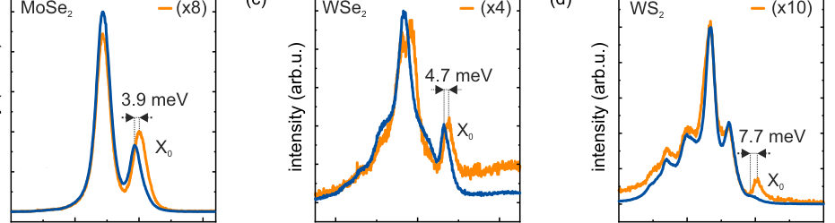 
Figure 2. Low-temperature top excitation and side collection µPL measurements. (a) Schematic of the measurement geometry with adjustable detection polarization. In-plane polarization indicated blue, out-of-plane polarization indicated orange. Further details on our setup, the surface waveguides and flake deposition can be found in Supplementary Figures S1, S2 and S3, respectively. (b)-(d) Low-temperature µPL spectra for MoSe2, WSe2 and WS2. The out-of-plane-polarized signal (orange) was scaled by the given factor for better comparison. The A exciton is marked by X0.

📷 Fig 3

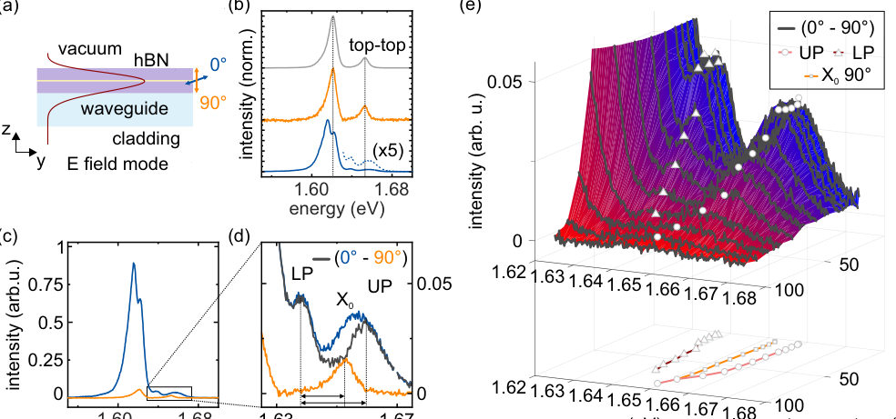 
Figure 3. Low-temperature top excitation and side collection µPL measurements with MoSe2 encapsulated in thicker hBN: (a) Schematic of the layered structure with thicker hBN and the mode of the electric field localized predominantly in the hBN rather than within the waveguide. (b) Spectra obtained with different detection polarization angles. In-plane polarization labeled blue with additional magnified A exciton, out-of-plane polarization labeled orange equivalent to the colors in Figure 2. Comparison of the spectral form and the energy peak positions with top-top measurement geometry (grey).(c,d) Direct comparison of the spectra for in-plane and out-of-plane detection polarization with...

📷 Fig 4

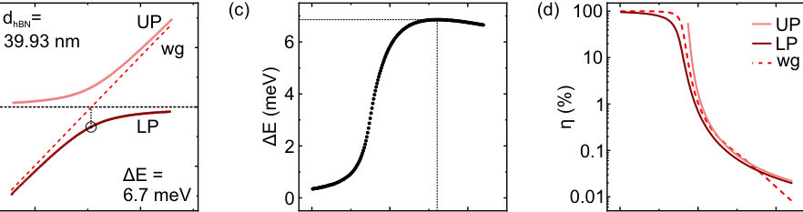 
Figure 4. Slab waveguide model calculations of the integrated waveguide-encapsulated TMD-structure. (a) Left: Sketch of the idealized layered system with different thicknesses, refractive indices n and excitonic properties in the TMD layer. Right: refractive index profile of the structure with electric field profile of the TE-mode of the lower polariton branch at the indicated bottleneck. (b) Dispersion relation of the structure with 39.93 nm hBN thickness of top and bottom hBN. bright red: stacked multilayer without TMD, dark red: lower polariton mode, bottleneck indicated with a circled black diamond, light red: upper polariton mode (c) Energy difference of the lower polariton branch at...

**Summary.** Researchers demonstrate the formation of propagating exciton-polaritons by integrating TMD monolayers into photonic waveguides. They use low-temperature spectroscopy to observe characteristic spectral splittings in the A exciton, confirming strong coupling between excitons and the waveguide mode. The findings are supported by detailed theoretical modeling using transfer matrix methods, advancing on-chip quantum light sources.

**Why it may be interesting.** This work directly addresses open quantum systems dynamics in solid-state photonics, providing experimental evidence and theoretical frameworks for engineered light-matter coupling (exciton-photon interaction) crucial for integrated quantum devices.

Detailed structure

**Main problem.** The research investigates the emergence and properties of propagating exciton-polaritons formed by coupling excitons within Transition Metal Dichalcogenides (TMDs) to optical waveguide modes.

**Main result.** Strong coupling leads to observable spectral shifts, redshifts, or splittings in the A exciton resonance, confirming the formation of hybrid exciton-polaritons whose properties can be modeled theoretically.

**Method.** The study employs a combination of low-temperature optical spectroscopy ($\mu$PL) measurements across various geometries and theoretical modeling using the transfer matrix method for waveguide dispersion relations.

**Model / system.** The physical system is a hybrid structure comprising TMD monolayers (e.g., MoSe2, WSe2) encapsulated by hBN, placed atop femtosecond-laser-written surface waveguides embedded in fused silica chips.

**Key observables.** Spectral shifts/splittings of the A exciton ($\Delta E$), polariton energy levels (upper and lower branches), group velocity ($v_g$), and propagation distance ($l$).

**Important parameters / regimes.** hBN encapsulation thickness, temperature (down to 4 K), waveguide width, and material-specific exciton/trion energies.

**Assumptions / limitations.** The analysis assumes that observed peak splitting is due to strong coupling; theoretical models are highly simplified approximations used to highlight physical trends rather than predict exact values.

**Figures summary.** Figures illustrate the hybrid structure schematic, $\mu$PL spectra showing polarization and temperature dependence of exciton/polariton features, and theoretical dispersion relations derived from transfer matrix calculations.

**Paper structure.** The paper progresses by establishing the experimental platform and observing spectral anomalies (splitting/redshift) in TMDs. This observation is then theoretically modeled using waveguide theory to confirm the polaritonic nature, followed by detailed analysis of temperature and geometry dependence.

Abstract

Integrating few-layer materials into photonic circuits is a promising concept for novel on-chip photonic applications. We incorporate transition metal dichalcogenides (TMDs) with femtosecond-laser-written surface waveguides, which are embedded in fused silica chips. Our novel low-temperature optical spectroscopy setup enables coupling to the waveguide and simultaneous focus from the top to the TMD layer for a distinct excitation and collection of micro-photoluminescence ($μ$PL) signals in several measurement geometries. Along these lines, we observe spectral changes of the A exciton for encapsulated TMD monolayers when capturing the $μ$PL signal propagating through the waveguide. Depending on the thickness of the encapsulation with hexagonal boron nitride (hBN), these changes manifest as energetic redshifts of the A exciton, or even a splitting of the A exciton into two components. We attribute this behavior to strong coupling of the waveguide mode and the exciton in the sample, giving rise to the formation of propagating exciton-polaritons. Our interpretation is supported by calculations for a simplified model of a slab waveguide in the vicinity of an exciton by using the transfer matrix method. Having proven to be a highly adaptable framework for the study of propagating polaritons, our experimental platform likewise holds great promise for harnessing the unique properties of exciton-polaristons in integrated photonic circuits.

[↑ back to top](#top)

### [Polariton-Assisted Inelastic Tunneling through a Quantum Well](http://arxiv.org/abs/2607.29171v1)

**Authors:** Théophile Seck, Yanko Todorov, Guido Pupillo, David Hagenmüller  
**Type:** theory · **Category:** other · **PDF:** <https://arxiv.org/pdf/2607.29171v1>  
**Analysis basis:** full PDF text, analyzed in chunks
**Topic relevance:** 🔥 `Keldysh / 2PI / non-Gaussian methods` **4/5** · `analog quantum simulation` **3/5** · `correlated cavity matter` **3/5** · `methods for driven-dissipative` **3/5** · `non-equilibrium dynamics` **3/5** · `Tavis-Cummings & cavity-many-emitter` **2/5** · `driven-dissipative phase transition` **2/5** · `Kondo & dissipative impurity` **1/5** · `correlated / nonlocal dissipation` **1/5** · `interference shaping light` **1/5** · `non-equilibrium universality` **1/5**

📷 Fig 1

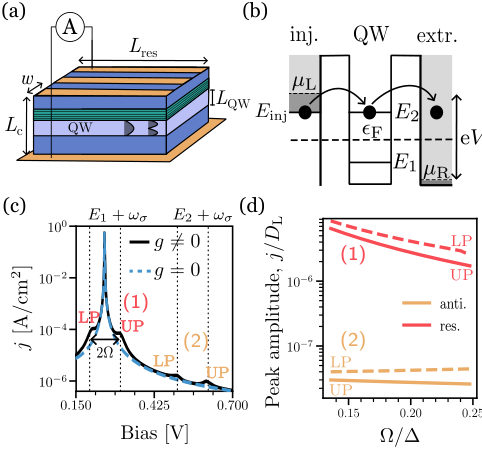 
Figure 1. Polariton-assisted inelastic tunneling in the dark. (a) A doped quantum well (QW) with electron den- sity ρ is embedded in an array of mid-infrared wire cavi- ties. The fundamental mode of each cavity (quality factor Q = ωcav/κ, where κ is the cavity decay rate) couples res- onantly to N = ρ wLres electrons through the intersubband transition ∆= E2 −E1 = 150 meV, with single-electron cou- pling strength g. Electrons tunnel from an injector miniband of energy Einj and bandwidth DL = µL −Einj. (b) Reso- nant tunnelling into the second subband (Einj = E2). (c) Current–voltage characteristics, where j = J/wLres denotes the current density. For g = 0 (blue dashed), only the reso- nant...

📷 Fig 2

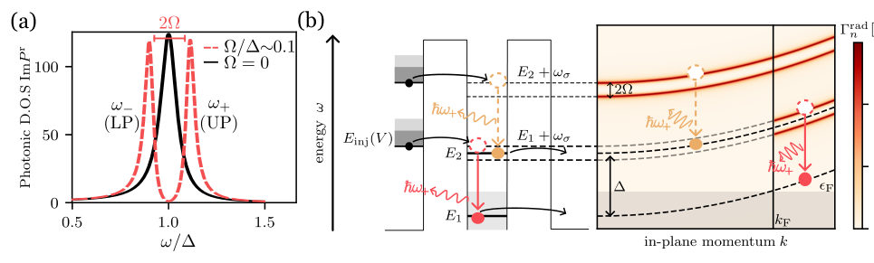 
Figure 2. Cavity-induced radiative processes. (a) Photonic density of states, Im P r, without (black) and with (dashed red) light–matter coupling. (b) Equilibrium radiative broadening function (right) and associated inelastic tunneling channels (left). Red (dashed orange) arrows denote resonant (anti-resonant) light–matter processes. Parameters are as in Fig. 1.

📷 Fig 3

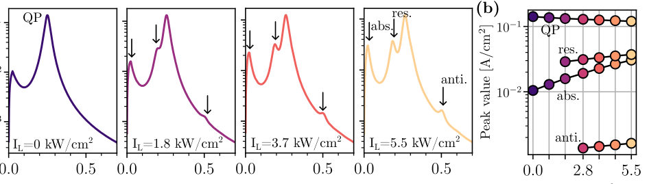 
Figure 3. Transport under illumination. (a) Current–voltage characteristics under resonant lower-polariton excitation. Arrows indicate the inelastic sidebands. Here IL denotes the incident laser intensity. (b) Peak current of the lower-polariton sidebands as a function of laser intensity. Parameters are the same as in (a), with γel = 10 meV [41], corresponding to γel/(2g2/κ) ∼102, and a sample area (beam waist) of 2500 µm2. (abs.): absorption, (res.): resonant, (anti.): antiresonant.

**Summary.** This paper theoretically analyzes electronic tunneling through a quantum well strongly coupled to an optical cavity mode. Using non-equilibrium Green's functions, the authors predict that polariton interactions manifest as distinct inelastic sidebands in the current-voltage characteristics. This offers a powerful spectroscopic tool for characterizing light-matter coupling in semiconductor heterostructures.

**Why it may be interesting.** This work directly bridges concepts from cavity QED (polaritons, strong coupling) with open quantum system transport theory (NEGF), providing a concrete theoretical framework for observing light-matter interaction effects in solid-state electronics.

Detailed structure

**Main problem.** The study investigates electronic transport through a quantum well strongly coupled to a cavity photon mode, aiming to detect observable signatures of polariton effects in charge current.

**Main result.** The current-voltage characteristics exhibit inelastic sidebands associated with resonant and anti-resonant polariton emission, providing a realistic detection route for cavity-induced modifications of charge transport.

**Method.** The analysis employs the non-equilibrium Green's function (NEGF) formalism within the Meir–Wingreen framework to derive compact expressions for the current.

**Model / system.** The system consists of a doped quantum well coupled to the fundamental TM mode of a double-metal cavity. The interaction is described by a Hamiltonian including electronic, cavity, and light-matter coupling terms.

**Key observables.** Current–voltage characteristics ($J$-$V$), inelastic sidebands associated with polariton emission ($\omega_\pm$).

**Important parameters / regimes.** Strong coupling regime (coupling strength > loss rates), slow-injection regime (carrier injection rate < electronic broadening).

**Assumptions / limitations.** The calculations rely on the NEGF formalism, utilizing approximations like the polariton-pole approximation and pseudo-equilibrium assumptions.

**Figures summary.** Figures illustrate $J$-$V$ characteristics showing additional inelastic peaks when coupling is non-zero, comparing coupled vs. uncoupled transport.

**Paper structure.** The paper builds from defining the Hamiltonian and using NEGF to derive current expressions; it then applies approximations like the polariton-pole model to calculate radiative self-energies ($\Sigma_{	ext{rad},n}$) and finally derives separate elastic ($J_{	ext{el}}$) and inelastic ($J_{	ext{in}}$) current components.

Abstract

We investigate electronic transport through a doped quantum well strongly interacting with a photonic mode confined in a double-metal cavity. Using a nonequilibrium Green's function formalism, we derive compact expressions for the current valid for arbitrary collective light--matter coupling strengths exceeding the relevant loss rates. We show that cavity polaritons leave observable transport signatures when the carrier injection rate is smaller than the cavity-induced electronic broadening. In this regime, the current--voltage characteristics exhibit inelastic sidebands associated with resonant and anti-resonant polariton emission, which are strongly enhanced under resonant illumination. Our results provide a realistic route to detecting cavity-induced modifications of charge transport in semiconductor heterostructures.

[↑ back to top](#top)

### [Continuous Tuning of the Charge-Phase Uncertainty in a Josephson Junction](http://arxiv.org/abs/2607.29636v1)

**Authors:** Irena Padniuk, Xianzhe Zeng, Juan Carlos Cuevas, Joachim Ankerhold, Klaus Kern, Christian R. Ast  
**Type:** both · **Category:** other · **PDF:** <https://arxiv.org/pdf/2607.29636v1>  
**Analysis basis:** full PDF text, analyzed in chunks
**Topic relevance:** 🔥 `QC/QI experiment` **4/5** · 🔥 `quantum measurements` **4/5** · `driven-dissipative phase transition` **3/5** · `Keldysh / 2PI / non-Gaussian methods` **2/5** · `Kondo & dissipative impurity` **2/5** · `non-equilibrium dynamics` **2/5** · `analog quantum simulation` **1/5** · `correlated / nonlocal dissipation` **1/5** · `measurement-induced transitions` **1/5** · `methods for driven-dissipative` **1/5** · `non-equilibrium universality` **1/5**

📷 Fig 1

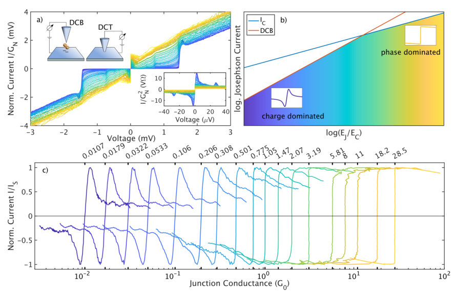 
Figure 1. (a) Tunneling current vs. voltage for different values of the junction conductance 0.007𝐺0 ≤𝐺N ≤28.5𝐺0, normalized to 𝐺N. The coherence peaks are visible at ±1.46 mV. The offset in the normal-state regime is due to the excess current; the steps inside the gap are from multiple Andreev reflections. The Josephson effect at high conductance is visible near zero voltage. The lower inset shows the tunneling current normalized to 𝐺2 N to highlight the low-conductance Josephson effect. The upper inset shows a schematic of the tunnel junction in the DCB and the DCT regime. (b) Schematic evolution of the Josephson effect as function of the ratio 𝐸J/𝐸C. At low conductance in the DCB regime,...

📷 Fig 2

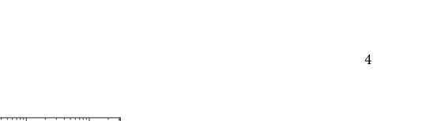 
Figure 3. (a) Fits of the quasiparti- cle 𝐼(𝑉)-curves to a multichannel MAR model for selected values of𝐺N. The MAR onsets are indicated by vertical lines. The fits are used to extract the number of channels and their transmissions. (b) Channel transmissions and their multi- plicity (i.e. how many channels share the same transmission) as function of𝐺N. The number of channels and the transmis- sions both grow with 𝐺N, with several high-transparency channels appearing at high 𝐺N. (c) Current-phase relation re- constructed from the channel configura- tion for the different values of 𝐺N. The color bar encodes 𝐺N on a logarithmic scale. The current-phase relation is sinu- soidal at low 𝐺N and...

📷 Fig 3

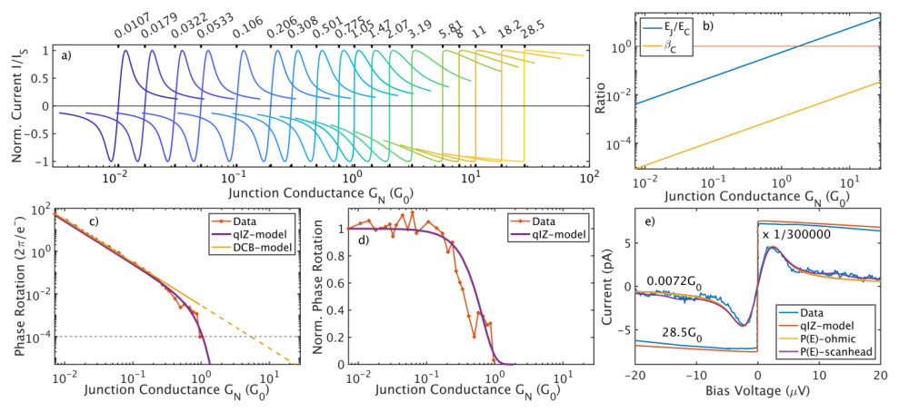 
Figure 4. (a) Evolution of the Josephson current of the qIZ model within a voltage window of ±20 μV as function of 𝐺N for the same setpoints as in Fig. 1(c). The change in the slope at zero voltage and the reduced interaction with the environment follow the same evolution as in the experimental data. (b) Ratio 𝐸J/𝐸C and Stewart-McCumber parameter 𝛽C as function of 𝐺N. The transition region where 𝐸J/𝐸C ≈1 lies around 𝐺0, in agreement with the experimentally observed crossover. The Stewart-McCumber parameter remains below one over the full range, 𝛽C &lt; 1, so that the junction is always in the overdamped regime. (c) Phase rotation per tunneling Cooper pair 𝛥𝜙

**Summary.** The authors demonstrate a controlled measurement of the transition between charge-dominated (Coulomb Blockade) and phase-dominated (Josephson) transport regimes in a Josephson junction using an STM tip. By continuously tuning $E_J/E_C$, they confirm the smooth crossover, validating advanced theoretical models like qIZ against direct experimental observation.

**Why it may be interesting.** This work provides a direct experimental realization of controlling quantum fluctuations in superconducting circuits, which is highly relevant for understanding dissipation mechanisms in superconducting qubits and quantum computing architectures.

Detailed structure

**Main problem.** The study aims to monitor and understand the smooth quantum-to-classical transition of Cooper pair flow in a Josephson junction by continuously tuning the ratio of Josephson energy ($E_J$) to charging energy ($E_C$).

**Main result.** The experiment successfully traced the full crossover from the Dynamical Coulomb Blockade (DCB) regime to the coherent, dissipationless tunneling (DCT) regime in a single device.

**Method.** The research combines STM-based experiments to tune junction parameters with advanced theoretical modeling using Multiple Andreev Reflections (MARs) and the quantum Ivanchenko-Zil’berman (qIZ) model.

**Model / system.** The physical system is a superconducting tunnel junction whose behavior is governed by the competition between $E_J$ and $E_C$. The analysis uses theoretical frameworks like MAR theory and the qIZ model to describe current flow across different regimes.

**Key observables.** Current-voltage ($I(V)$) characteristics, switching current ($I_S$) vs. conductance ($G_N$), and phase rotation per tunneling Cooper pair ($\Delta\phi/\Delta n$).

**Important parameters / regimes.** The ratio $E_J/E_C$, the Stewart-McCumber parameter ($eta_C < 1$ for overdamped regime), and junction conductance ($G_N$) are key parameters.

**Assumptions / limitations.** Theoretical models assume an ohmic environment impedance, a sinusoidal current-phase relation (which breaks down at high $G_N$), and the applicability of specific approximations like Markovianity in certain regimes.

**Figures summary.** Figures show the crossover of switching current from quadratic to linear dependence on conductance ($I_S$ vs. $G_N$) and illustrate MAR fits used to extract channel configurations and track phase rotation evolution.

**Paper structure.** The paper progresses by first establishing the experimental tunability of $E_J/E_C$, then analyzing the resulting current-phase relation using MARs, and finally comparing theoretical predictions (qIZ vs. P(E)-theory) against the observed smooth crossover between DCB and DCT regimes.

Abstract

Quantum mechanics constrains conjugate observables from being simultaneously measurable with arbitrary precision. In a Josephson junction, these are the transferred electric charge and the quantum-mechanical phase difference between the superconducting domains. Which of them fluctuates determines the supercurrent: a dissipative trickle of single Cooper pairs in one limit, a coherent dissipationless flow in the other. Bridging both regimes in one device remained elusive because the Josephson and charging energies are fixed at fabrication. Here, we use the tunable tunnel junction of a scanning tunneling microscope at millikelvin temperature to vary their ratio continuously over many orders of magnitude. In this way, we monitor the smooth transition between incoherent and coherent Cooper pair flow in a single junction, revealing the quantum-to-classical transition in a controlled way.

[↑ back to top](#top)

### [Optomechanical tuning of nonlinearity in graphene resonators](http://arxiv.org/abs/2607.29096v1)

**Authors:** Alberto Martín-Pérez, Peter G. Steeneken, Farbod Alijani  
**Type:** experiment · **Category:** other · **PDF:** <https://arxiv.org/pdf/2607.29096v1>  
**Analysis basis:** full PDF text, analyzed in chunks
**Topic relevance:** `correlated cavity matter` **3/5** · `driven-dissipative phase transition` **3/5** · `quantum optics experiment` **3/5** · `analog quantum simulation` **2/5** · `correlated / nonlocal dissipation` **2/5** · `methods for driven-dissipative` **2/5** · `non-equilibrium dynamics` **2/5** · `non-equilibrium universality` **2/5** · `Frenkel-Kontorova` **1/5** · `Tavis-Cummings & cavity-many-emitter` **1/5** · `interference shaping light` **1/5** · `quantum measurements` **1/5**

📷 Fig 1

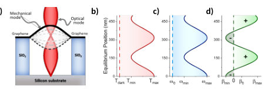 
Figure 1: Optomechanical interaction. a) Schematic of the device made of a suspended graphene membrane over a silicon substrate with its optical and mechanical mode. b) Tem- perature of the membrane calculated as a function of the position. c) Resonance frequency of the membrane calculated as a function of the position. d) Duffing term of the membrane calculated as a function of the equilibrium position

📷 Fig 2

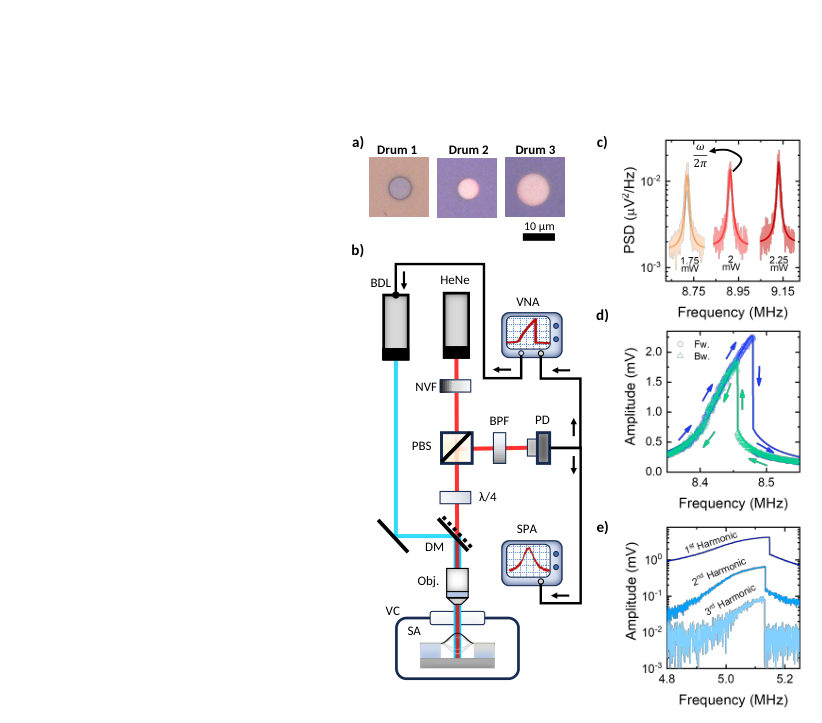 
Figure 2: Experimental setup. a) Microscopy image of the devices used. Drum 1: 8 µm diameter and 420 nm cavity depth depth. Drum 2: 8 µm diameter and 285 nm cavity Drum 3: 12 µm diameter and 285 nm cavity depth. b) Schematic of the setup used in the experiments. Legend: HeNe. Helium-Neon laser. NVF. Neutral variable density filter. PBS. Polarizing beam splitter. BPF. Optical bandpass filter. PD. Photodetector. BDL. Blue diode laser. DM. Dichroic mirror. λ/4). λ/4 waveplate. Obj. Objective. SPA. Spectrum analyzer. VC. Vacuum chamber. SA. Sample c) Brownian motion spectra acquired for Drum 1 at different red laser powers (PSD: power spectral density). d) Driven mechanical response for Drum 1...

📷 Fig 3

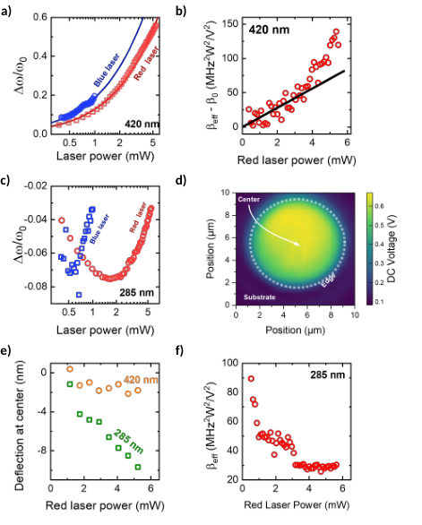 
Figure 3: Stiffness as a function of power. a) Resonance frequency shift measured for the 8 µm diameter membrane suspended over a 420 nm cavity depth (Drum 1) as a function of the power of the red (open circles) and the blue laser (open squares) and their respective fits to the proposed model (solid lines). b) Effective Duffing parameter measured for the previous membrane as a function of the red laser power (open circles) and its fit to a line (solid line) c) Resonance frequency shift measured for the 8 µm diameter membrane suspended over a 285 nm cavity depth (Drum 2) as a function of the power of the red (open circles) and the blue laser (open squares) and their respective fits to the...

📷 Fig 4

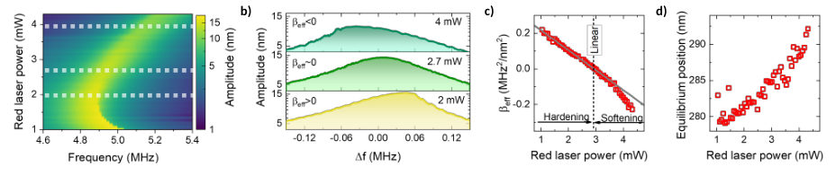 
Figure 4: Cubic stiffness switching. a) Mechanical response measured for a 12 µm diameter resonator suspended over a 285 nm cavity (Drum 3) as a function of the power of the red laser. White dotted lines represent the data shown in the next plot b) Mechanical response of the membranes for 2 mW, 2.7 mW and 4 mW. c) Cubic stiffness as a function of the power of the red laser obtained from the fitting of the previous data. d) Equilibrium position of the membrane measured as a function of the power of the red laser.

**Summary.** The researchers developed an optomechanical technique to actively tune the nonlinearity of graphene resonators by using photothermal heating within an optical cavity. By controlling the incident laser power, they demonstrated continuous control over the Duffing nonlinearity, enabling transitions between hardening and softening mechanical behaviors. This establishes a versatile platform for engineering nonlinear dynamics in 2D nanoelectromechanical systems.

**Why it may be interesting.** This work provides an excellent example of coupling mechanical resonators to optical fields for active control, which is central to optomechanics and open quantum systems research. The ability to engineer nonlinearities on demand opens pathways for novel quantum sensing or non-linear cavity QED setups.

Detailed structure

**Main problem.** The goal is to achieve active, reversible, in situ tuning of the nonlinear nanomechanical response of graphene resonators.

**Main result.** The study successfully demonstrated continuous control over both the strength and sign of the Duffing nonlinearity by manipulating the optical probe power and cavity depth.

**Method.** An optomechanical approach was used, exploiting photothermal heating to induce dynamic changes in the mechanical restoring force of graphene membranes.

**Model / system.** The physical system involves graphene membranes suspended over a reflective substrate forming an optical cavity. The dynamics are modeled using a driven Duffing oscillator ($\ddot{x} + 2\zeta \dot{x} + k_{eff}(P_\lambda, x_{eq}) x + \dots = F \cos(\omega dt)$).

**Key observables.** Resonance frequency ($\omega^2$), effective Duffing coefficient ($eta_{	ext{eff}}$), and the equilibrium position ($x_{eq}$).

**Important parameters / regimes.** Optical probe power ($P_\lambda$), cavity depth, and laser wavelengths (e.g., 632.8 nm, 488 nm).

**Assumptions / limitations.** The photothermal response is treated as quasi-static; the analysis involves expanding tension terms around equilibrium.

**Figures summary.** Figures illustrate the optical cavity setup, frequency tuning vs. power/position, and nonlinear stiffness tuning vs. power/position.

**Paper structure.** The paper progresses from establishing the physical platform (optical cavity) to modeling the resulting dynamics as a Duffing oscillator whose coefficients are controlled by external laser parameters, culminating in measurements demonstrating tunable nonlinearity.

Abstract

Graphene resonators exhibit unique mechanical and electrical properties, making them promising candidates for next-generation sensing applications. Here, we introduce an optomechanical approach that enables active, reversible, in situ tuning of the nonlinear nanomechanical response of graphene resonators. By exploiting photothermal heating and the resulting optomechanical interaction between the mechanical oscillations and the optical cavity formed by a graphene membrane suspended over a reflective substrate, we achieve dynamic control over both the linear restoring force and the nonlinear dynamic response of the resonator. We show that the strength and sign of the Duffing nonlinearity can be continuously tuned through the optical probe power and cavity depth, enabling transitions between hardening and softening behavior as well as near-complete suppression of geometric nonlinearities. Our results establish a versatile platform for on-demand engineering of nonlinear dynamics in graphene resonators and provide a general strategy for active control of the mechanical response of two-dimensional nanoelectromechanical systems.

[↑ back to top](#top)

### [Controlling Electron-Beam-Induced Charging in Colloidal Quantum Dots](http://arxiv.org/abs/2607.29387v1)

**Authors:** Sven Ebel, Alina Myslovska, Stefano Vezzoli, Iwan Moreels, Sergii Morozov  
**Type:** experiment · **Category:** other · **PDF:** <https://arxiv.org/pdf/2607.29387v1>  
**Analysis basis:** full PDF text, analyzed in chunks
**Topic relevance:** `correlated / nonlocal dissipation` **3/5** · `driven-dissipative phase transition` **3/5** · `non-equilibrium dynamics` **3/5** · `QC/QI experiment` **2/5** · `non-equilibrium universality` **2/5** · `Kondo & dissipative impurity` **1/5** · `analog quantum simulation` **1/5** · `entanglement & information structure` **1/5** · `measurement-induced transitions` **1/5** · `methods for driven-dissipative` **1/5** · `quantum measurements` **1/5** · `quantum optics experiment` **1/5**

📷 Fig 1

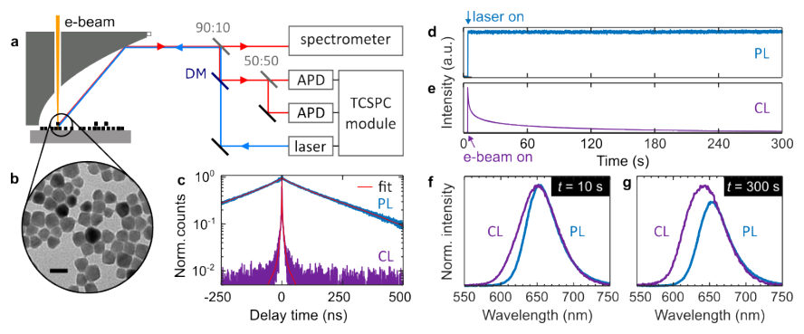 
FIG. 1: Experimental setup for in situ CL and PL of QDs. (a) SEM-based CL setup with a parabolic mirror for light collection. QDs are excited by the electron beam to generate CL, which is analyzed using a spectrometer and a Hanbury Brown– Twiss (HBT) interferometer with two avalanche photodiodes (APDs) connected to a time-correlated single-photon counting (TCSPC) module. A laser is coupled into the same optical path via a dichroic mirror (DM) to excite PL at the focal point of the parabolic mirror. (b) TEM image of giant-shell QDs (scale bar: 25 nm). (c) Lifetime measurements under electron-beam (CL) and laser (PL) excitation. (d-e) Intensity time traces of QDs under laser and electron beam...

📷 Fig 2

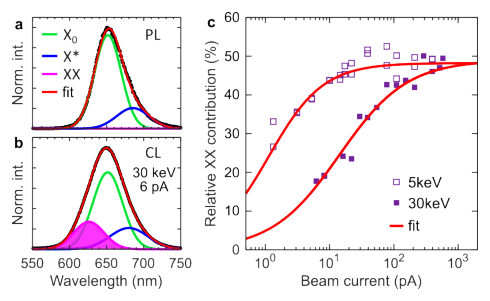 
FIG. 2: Biexciton contribution in CL. (a) PL spec- trum decomposed into neutral exciton (X0), charged exciton (X∗), and biexciton (XX) contributions with corresponding cumulative fit. (b) CL spectrum decomposed into the same components, showing enhanced biexciton emission (magenta). (c) Relative biexciton contribution as a function of beam cur- rent for 5 keV and 30 keV excitation.

📷 Fig 3

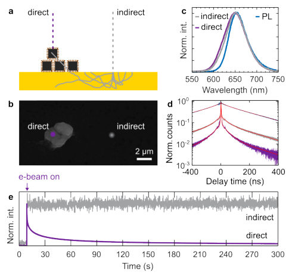 
FIG. 3: CL response at ultra-low currents. (a) Schematic of direct (purple) and indirect (gray) excitation of QDs. (b) SEM image of a QD cluster indicating beam po- sitions for direct (purple) and indirect excitation 5 µm away from the cluster (gray). (c) Emission spectra under direct and indirect (5 µm) excitation compared to PL. (d) Decay histograms in PL (blue), direct (purple) and indirect (grey, at 5 µm) CL. (e) Normalized intensity time trace under direct excitation at 6 pA showing bleaching, and under sub-pA indi- rect excitation at 9 µm showing stable emission.

📷 Fig 4

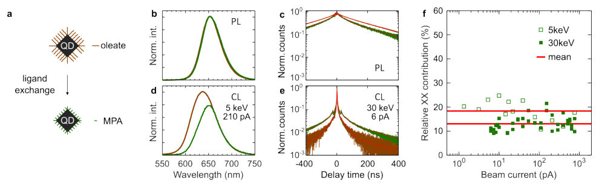 
FIG. 4: Effect of ligand exchange on biexciton generation. (a) Schematic of ligand exchange from long oleate ligands (brown) to short MPA ligands (green). (b,c) PL spectra and decay histograms before and after ligand exchange. (d) High- current CL spectra, demonstrating suppression of the biexciton emission after replacing long oleate ligands with shorter MPA ligands. Both spectra are normalized at 660 nm to highlight the contribution of biexciton emission. (e) Low-current CL decay histograms before and after ligand exchange, together with three-exponential fits (red). (f) Relative biexciton contribution after ligand exchange over a wide range of electron-beam currents for 5 keV and 30 keV.

**Summary.** The research investigates why colloidal quantum dots exhibit unstable cathodoluminescence under electron beams. They demonstrate that this instability stems from detrimental electron-beam-induced charging, which drives multiexciton formation. By replacing long surface ligands with shorter ones, the researchers successfully improve charge drainage and stabilize the emission process for practical device applications.

**Why it may be interesting.** This work provides an experimental demonstration of controlling many-body dynamics (biexciton generation) in nanoscale emitters by manipulating the charge environment, which is highly relevant for understanding open quantum systems and charge transport in solid-state nanodevices.

Detailed structure

**Main problem.** The primary challenge is understanding and stabilizing the unstable Cathodoluminescence (CL) response of Colloidal Quantum Dots (QDs) when excited by an electron beam.

**Main result.** The CL instability, blueshift, and bleaching are shown to be governed by electron-beam-induced charging, which can be mitigated by using shorter surface ligands to improve charge drainage.

**Method.** In situ measurements combining Cathodoluminescence (CL) and Photoluminescence (PL) spectroscopy, alongside ligand exchange experiments, were used to probe excited state dynamics.

**Model / system.** The system involves giant-shell CdSe/CdS colloidal quantum dots. The analysis distinguishes between neutral excitons ($	ext{X}_0$), charged excitons ($	ext{X}^*$), and biexcitons ($	ext{XX}$) using spectral fitting.

**Key observables.** Spectral evolution (blueshift), decay lifetimes, relative contributions of $	ext{X}^0$, $	ext{X}^*$, and $	ext{XX}$ components, and intensity degradation (cathodobleaching).

**Important parameters / regimes.** Electron beam current (from high to sub-pA regimes), ligand length (long oleate vs. short MPA), and excitation voltage.

**Assumptions / limitations.** The study assumes that charge accumulation is the central mechanism driving the observed instability in the CL response, rather than solely local heating or surface modification.

**Figures summary.** Figures illustrate setup schematics, TEM images of QDs, spectral evolution (blueshift) and intensity degradation under electron beam exposure, and comparisons between PL/CL spectra before and after ligand treatment.

**Paper structure.** The paper progresses by establishing the instability problem using CL/PL measurements, identifying charge accumulation as the cause via current dependence studies, and finally proposing a solution through surface chemistry modification (ligand exchange) to control multi-exciton formation.

Abstract

Colloidal quantum dots (QDs) are attractive nanoscale emitters, yet their cathodoluminescence (CL) response remains poorly understood and often unstable under electron-beam excitation, limiting CL spectroscopy and electron-beam-based device processing. Here, we investigate the CL mechanism and strategies to improve its stability using highly photostable, structurally homogeneous giant-shell CdSe/CdS QDs combined with in situ CL and photoluminescence (PL) measurements. By identifying distinct signatures of excited states in both lifetime and spectral measurements, we demonstrate that the CL response is governed by electron-beam-induced charging. Charge accumulation drives multiexciton generation even at relatively low currents, leading to a pronounced blueshift, shorter average lifetimes, and rapid cathodobleaching. To test this further, we employ indirect excitation to reach sub-pA currents beyond the limits of typical electron beams, showing that neutral-exciton emission can be partially recovered and cathodobleaching mitigated, although charging cannot be fully suppressed. Furthermore, by replacing long insulating ligands with shorter ones, we improve charge drainage and strongly suppress biexciton formation. Together, these results show that biexciton formation can be controlled by limiting charge accumulation, providing a practical route toward stable CL for spectroscopy, imaging, and electron-beam-compatible photonic devices.

[↑ back to top](#top)

### [Engineering micro-disorder for macro-performance in magnetic nanoparticles](http://arxiv.org/abs/2607.28812v1)

**Authors:** Jonathan Leliaert, Elizabeth M Jefremovas  
**Type:** both · **Category:** disordered systems and neural networks · **PDF:** <https://arxiv.org/pdf/2607.28812v1>  
**Analysis basis:** full PDF text, analyzed in chunks
**Topic relevance:** `exotic spin models in light-matter` **3/5** · `spintronics-quantum-optics interface` **3/5** · `analog quantum simulation` **2/5** · `methods for driven-dissipative` **2/5** · `non-equilibrium dynamics` **2/5** · `Keldysh / 2PI / non-Gaussian methods` **1/5** · `correlated / nonlocal dissipation` **1/5** · `driven-dissipative phase transition` **1/5** · `entanglement & information structure` **1/5** · `non-equilibrium universality` **1/5**

📷 Fig 1

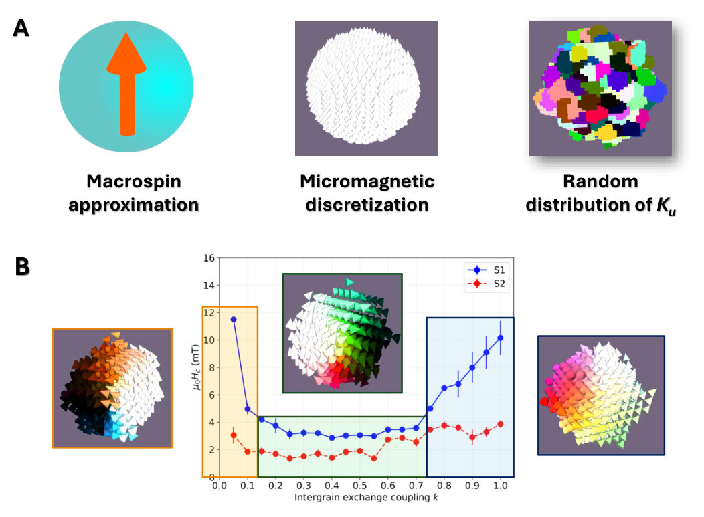 
FIG. 1. (A) While the macrospin model reduces the particle magnetisation to a single effective magnetic moment, micromag- netics discretizes the particle into computational cells and resolves the spatially varying magnetisation. Mumax3 also allows to reproduce irregular morphologies and polycrystalline architectures observed experimentally [49]. We have applied a Voronoi tessellation to define regions wherein the uniaxial anisotropy, ⃗ Ku, is defined along different directions, yielding a random distri- bution of ⃗ Ku directions (represented in colors) within the NF. (B) Coercivity, µ0HC, as a function of the normalized intergrain exchange coupling, k, for a NF with nominal diameter d = 100...

📷 Fig 2

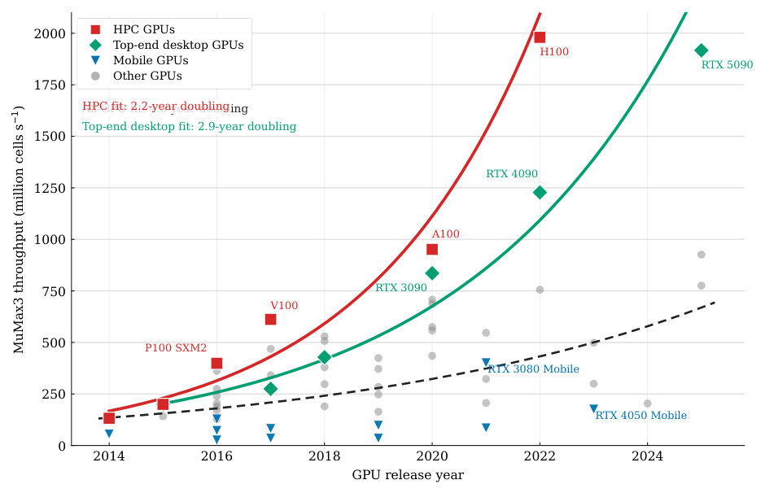 
FIG. 2. Evolution of GPU throughput for a ∼4 million cell mumax3 benchmark. Red squares represent high performance computing (HPC), datacenter GPUs, green diamonds representative top-end desktop GPUs, blue triangles mobile GPUs, and grey circles show other benchmarked GPUs. Lines are least-squares fits in throughput, corresponding to empirical doubling times.

📷 Fig 3

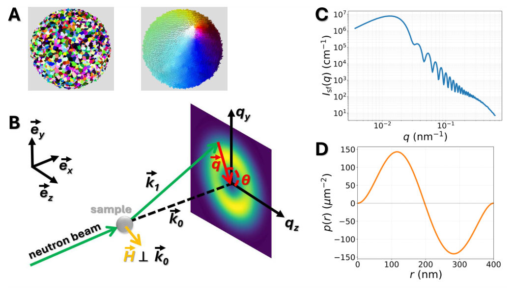 
FIG. 3. (A) Multicore NF configuration used to calculate the scattering observables. It consists of a compact 400 nm multicore aggregate assembled from 10 nm single-domain nanocrystallites (uniaxial anisotropy directions represented by colours in the left-side snapshot), with a randomly distributed non-magnetic void fraction of 10% and an intergrain exchange factor k = 0.25. The remanent magnetisation (right-side) relaxes into a spherical vortex configuration. (B) Schematic representation of the transverse-field polarized-SANS geometry. The detector shows the simulated two-dimensional spin-flip SANS cross- section calculated from the micromagnetic magnetisation field. (C) Azimuthally...

**Summary.** This paper advocates for a paradigm shift in studying magnetic nanoparticles, treating inherent structural disorder not as an imperfection but as an engineerable resource. By advancing micromagnetic simulations and coupling them with experimental data from SANS, the authors aim to establish quantitative rules linking particle structure, internal magnetization textures, and desired macroscopic performance.

**Why it may be interesting.** While focused on classical magnetism, the methodology—using advanced simulations (micromagnetics) constrained by ensemble measurements (SANS) to map structure-to-function relationships in disordered media—is highly relevant for understanding complex many-body dynamics in open quantum systems or spin glasses.

Detailed structure

**Main problem.** The field needs to move beyond treating spin disorder in magnetic nanoparticles as a mere defect, instead engineering this disorder for enhanced macroscopic functionality.

**Main result.** Disorder can generate qualitatively new macroscopic behaviors (e.g., non-monotonic coercivity) that are inaccessible when assuming perfect or simple uniform structures.

**Method.** The work combines theoretical modeling using micromagnetics with experimental constraints derived from techniques like Polarized Small-Angle Neutron Scattering (SANS).

**Model / system.** The system is magnetic nanoparticles, often modeled as iron oxide nanoflowers exhibiting polycrystalline intraparticle disorder. The model progresses from the simplified macrospin approximation to detailed micromagnetic simulations.

**Key observables.** Coercivity ($\mu_0 H_C$), ensemble-averaged magnetic correlations (measured by SANS), and macroscopic functionality.

**Important parameters / regimes.** The degree of intergrain exchange coupling ($k$) is a key parameter controlling the transition between different magnetic reversal regimes.

**Assumptions / limitations.** A major assumption/limitation discussed is that current models struggle to uniquely decouple the roles of structural disorder, anisotropy variation, and exchange coupling using only macroscopic measurements.

**Figures summary.** Figures compare macrospin vs. micromagnetism results and show coercivity ($\mu_0 H_C$) dependence on the coupling parameter $k$, illustrating distinct reversal pathways (vortex-core vs. flux-closure).

**Paper structure.** The paper reviews the concept of disorder engineering, critiques limitations of the macrospin model, proposes micromagnetics as a necessary tool to resolve intra-particle textures, and outlines future directions toward inverse design using SANS constraints.

Abstract

Spin disorder, inherent to magnetic nanoparticles, has traditionally been regarded as a detrimental feature, with materials-engineering efforts largely focused on producing ''perfect particles'' containing as few defects as possible. Alongside this pursuit of perfection, however, an alternative framework has emerged in recent years that reframes intra-particle disorder as an ''ugly duckling'' whose functional potential remains to be unlocked. In this Perspective, we review the emerging concept of disorder engineering in magnetic nanoparticles, identify its current challenges, and outline promising future directions. From a theoretical standpoint, progress requires moving beyond the widely used macrospin approximation, which severely restricts the description of intra-particle degrees of freedom. Micromagnetic modelling, in contrast, treats magnetisation as a continuous vector field and thereby enables (i) the explicit representation of intra-particle degrees of freedom, linking microstructural features to internal magnetisation textures, and (ii) direct correspondence with polarized small-angle neutron scattering, an experimental technique that provides quantitative access to ensemble-averaged magnetic correlations on nanometre length scales. The field must now advance towards falsifiable and uncertainty-aware models with structurally motivated parameters and predictions that can be tested against independent experimental observables. The overarching goal is to establish quantitative relationships between particle structure, intra-particle magnetisation textures, and macroscopic functionality, thereby transforming spin disorder from an elusive hidden variable into an engineerable design parameter.

[↑ back to top](#top)

### [Layer- and Field-Dependent Magnetic Order in 2D CrSBr Revealed by Pulsed Nanocalorimetry](http://arxiv.org/abs/2607.29395v1)

**Authors:** Hugo Gomez-Torres, Roop K. Mech, Alessandra Canetta, Llibertat Abad, Carles Navau, Daniel G. Chica, Xavier Roy, Pascal Gehring, Kenji Watanabe, Takashi Taniguchi, Aitor Lopeandia, Javier Rodriguez-Viejo  
**Type:** experiment · **Category:** statistical mechanics · **PDF:** <https://arxiv.org/pdf/2607.29395v1>  
**Analysis basis:** full PDF text, analyzed in chunks
**Topic relevance:** `analog quantum simulation` **3/5** · `exotic spin models in light-matter` **3/5** · `spintronics-quantum-optics interface` **3/5** · `driven-dissipative phase transition` **1/5** · `entanglement & information structure` **1/5** · `non-equilibrium dynamics` **1/5** · `non-equilibrium universality` **1/5**

📷 Fig 1

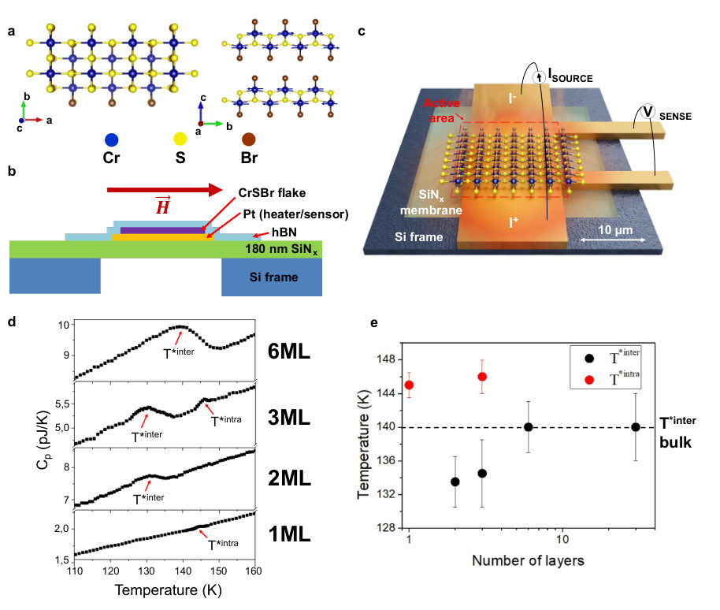 
Figure 1. Structure, device, and layer-dependent heat capacity of CrSBr. (a) Crystal structure of CrSBr along [001] direction (left panel) and [100] (right panel). b) Schematic of the suspended Pt/SiN nanocalorimetric device. (c) Illustration of the experimental configuration for microsecond pulsed-heating nanocalorimetry. (d) Heat capacity Cp (T) of CrSBr flakes with different layer numbers. (e) T*inter and T*intra temperatures extracted from the inflection points of the Cp (T) curves as a function of layer number.

📷 Fig 2

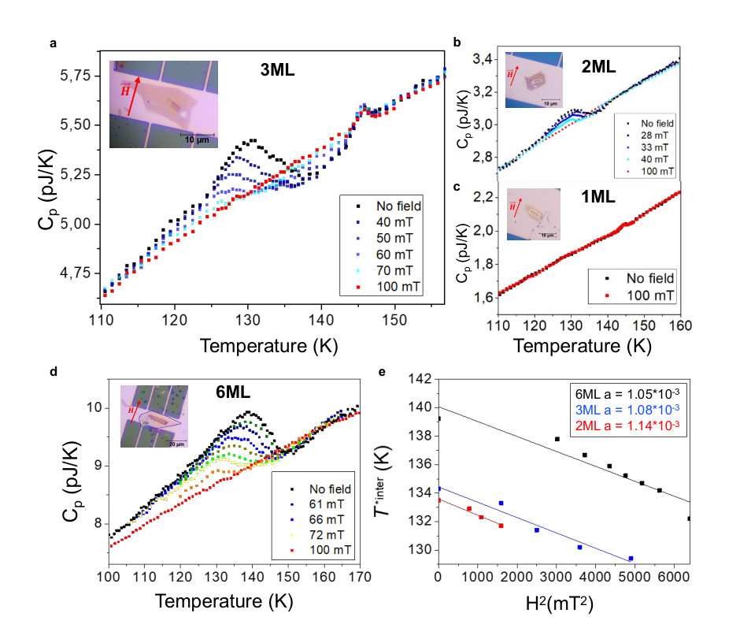 
Figure 2. Magnetic-field dependence of the heat capacity in few-layer CrSBr. (a-d) Temperature-dependent heat capacity 𝐶"(𝑇) of few-layer CrSBr of different thicknesses under in-plane magnetic fields applied along b-axis. (e) Extracted T*inter as a function of 𝐻# displaying a linear dependence consistent with T∗%&amp;'()(𝐻) = T∗%&amp;'()(0) −𝑎𝐻#.

📷 Fig 3

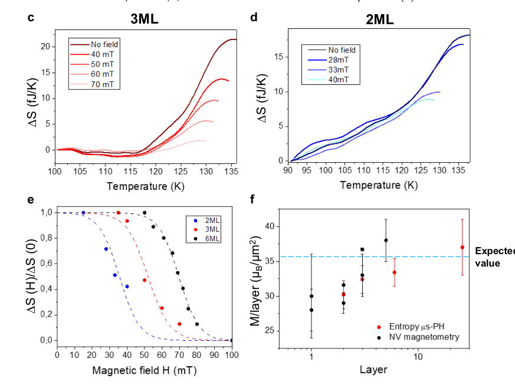 
Figure 3. Magnetic entropy and field-driven suppression of antiferromagnetic order in few-layer CrSBr. (a) Temperature dependence of the magnetic entropy change Δ𝑆(𝑇) = ∫(Δ𝐶"/𝑇) 𝑑𝑇, normalized by flake area and number of layers, for CrSBr flakes of different

**Summary.** This work uses advanced pulsed nanocalorimetry to study magnetic ordering in atomically thin CrSBr flakes. By measuring heat capacity and entropy across varying thicknesses and fields, the researchers map out a dimensional crossover from bulk interlayer antiferromagnetism to intralayer ferromagnetism. The findings establish nanocalorimetry as a powerful tool for probing magnetic entropy in 2D quantum magnets.

**Why it may be interesting.** While focused on magnetism, the use of nanocalorimetry to extract entropy changes ($\Delta S$) provides a direct, quantitative measure of phase transitions and correlation energy scales in low-dimensional systems, which is highly relevant for understanding quantum many-body ground states.

Detailed structure

**Main problem.** The study investigates how magnetic order evolves in two-dimensional (2D) van der Waals magnets as their thickness is reduced toward the monolayer limit.

**Main result.** The research reveals a crossover from bulk interlayer antiferromagnetism to intralayer ferromagnetic correlations, accompanied by a pronounced layer-parity effect and thickness-dependent suppression of magnetic order under an applied field.

**Method.** Microsecond pulse-heating nanocalorimetry is employed to measure the heat capacity and associated magnetic entropy changes in exfoliated flakes.

**Model / system.** The physical system is Chromium sulfide bromide (CrSBr), a van der Waals magnet exhibiting A-type antiferromagnetism. Measurements are performed on flakes ranging from several layers down to the monolayer limit, often under an applied in-plane magnetic field.

**Key observables.** Heat capacity anomaly ($\Delta C_p/T$), magnetic entropy release ($\Delta S(T)$), and thickness-dependent critical fields for antiferromagnetic order suppression.

**Important parameters / regimes.** Layer number (ML to monolayer limit), applied in-plane magnetic field ($H$), and temperature ($T$).

**Assumptions / limitations.** The analysis relies on subtracting background contributions, including phonon contributions modeled by a Debye function, from the total heat capacity measurement.

**Figures summary.** Figures illustrate $C_p(T)$ vs. thickness showing transition anomalies; field dependence plots show suppression of interlayer transitions; and supplementary figures detail background subtraction procedures.

**Paper structure.** The paper systematically presents measurements across varying thicknesses and magnetic fields, analyzing the resulting thermodynamic anomalies to map out the crossover between different types of magnetic correlations (interlayer vs. intralayer).

Abstract

Understanding the evolution of magnetic order in the two-dimensional limit remains a central challenge in van der Waals magnets, where thermodynamic measurements are constrained by the femtogram-scale mass of exfoliated flakes. Here, we use microsecond pulse-heating nanocalorimetry to measure the heat capacity and magnetic entropy of CrSBr flakes down to the monolayer limit. The measurements reveal the entropy landscape associated with magnetic ordering, uncovering a reduction of the interlayer transition temperature and an entropy-derived effective magnetic moment approaching the monolayer limit. Thermodynamic anomalies capture a crossover from bulk-like interlayer antiferromagnetism to a regime dominated by intralayer ferromagnetic correlations. A pronounced layer-parity effect further emerges, with odd-layer samples displaying an additional high-temperature contribution associated with uncompensated magnetic layers. Under in-plane magnetic fields applied along the easy axis, antiferromagnetic order is progressively suppressed, allowing extraction of a thickness-dependent critical field reflecting weakened interlayer exchange coupling. Entropy analysis further reveals an extended regime of magnetic fluctuations persisting well above the interlayer ordering transition. Together, these results establish nanocalorimetry as a powerful thermodynamic probe of low-dimensional magnetism, providing direct access to magnetic entropy, exchange interactions, and dimensional crossover in atomically thin van der Waals magnets.

[↑ back to top](#top)

### [Diode Effect in Nonlinear High-Kinetic-Inductance Transmission Line Resonators](http://arxiv.org/abs/2607.29301v1)

**Authors:** Niklas Gaiser, Ciprian Padurariu, Björn Kubala, Nadav Katz, Joachim Ankerhold  
**Type:** theory · **Category:** other · **PDF:** <https://arxiv.org/pdf/2607.29301v1>  
**Analysis basis:** full PDF text, analyzed in chunks
**Topic relevance:** `methods for driven-dissipative` **3/5** · `Keldysh / 2PI / non-Gaussian methods` **2/5** · `non-equilibrium dynamics` **2/5** · `analog quantum simulation` **1/5** · `correlated / nonlocal dissipation` **1/5** · `driven-dissipative phase transition` **1/5** · `interference shaping light` **1/5** · `non-equilibrium universality` **1/5**

📷 Fig 1

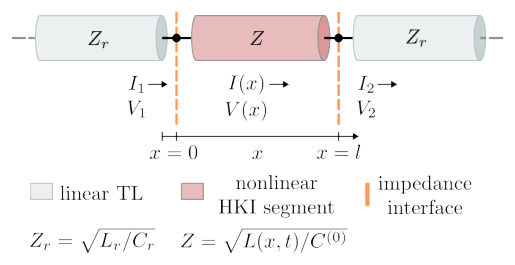 
FIG. 1. Schematic layout of nonlinear transmission line res- onator: Within a transmission line with impedance Zr a section is replaced by a segment of length l with nonlinear impedance Z as in Eq. (3). The voltages V1, V2 and V (x) as well as the currents I1, I2 and I(x) have to fulfill the Kirch- hoff rules at the interfaces (x = 0, l).

📷 Fig 2

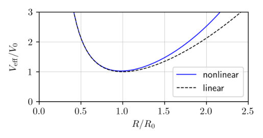 
FIG. 2. Effective one-dimensional potential for the linear case ξ = 0 (dashed black) and the nonlinear case ξ &gt; 0 (solid blue).

📷 Fig 3

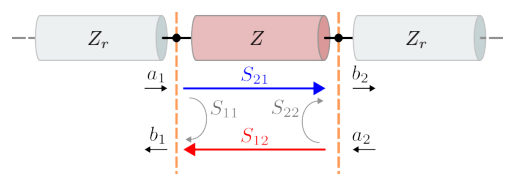 
FIG. 3. Two-port scattering problem for a nonlinear res- onator. Incident signals a1 and a2 enter the device through the left and right ports, respectively. The corresponding scat- tered outputs are denoted by b1 and b2. The scattering pa- rameters S21 and S12 describe the transmission through the device from port 1 to 2 and from port 2 to 1 respectively. The reflection at each port is described by the parameters S11 and S22.

📷 Fig 4

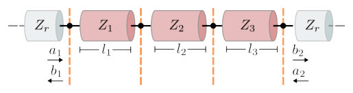 
FIG. 5. Schematic layout of nonreciprocal device with three unmatched impedance sections: Three segments are inserted with unequal impedances Z1, Z2 and Z3 and nonlinear fea- tures.

📷 Fig 5

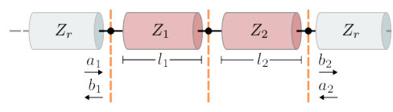 
FIG. 4. Schematic layout nonreciprocal device: In a trans- mission line with Zr a section is replaced by two segments with Z1 and Z2 (Z1 ̸= Z2), which have nonlinear kinetic in- ductances. At their mismatch the in-/output of the segment with Z1 translates to the out-/input of the segment of Z2.

**Summary.** This work develops a rigorous theoretical framework using boundary value problems to analyze nonlinear microwave propagation in superconducting HKI transmission lines. By retaining full spatial field dependence, the authors predict strong directionality (diode effect) and complex spectral features like bistability and anti-resonance shifts purely from structural asymmetry. This provides a versatile tool for designing next-generation nonlinear superconducting microwave components.

**Why it may be interesting.** While focused on superconducting circuits, the methodology—developing a robust BVP approach for strongly nonlinear wave equations with spatial dependence—is highly relevant to modeling non-linear dynamics in open quantum systems or photonic structures where boundary conditions are critical.

Detailed structure

**Main problem.** To develop a theoretical framework for nonlinear wave propagation in High-Kinetic-Inductance (HKI) transmission lines that remains accurate even when spatial field variations are strong, overcoming the limitations of the slowly varying envelope approximation.

**Main result.** The authors demonstrated power-dependent resonance shifts, bistable solutions, and significant direction-dependent transport (diode effect) in superconducting microwave resonators without external magnetic biasing fields.

**Method.** The problem is formulated as a boundary value problem (BVP), allowing for the retention of full spatial field dependence, which is solved using advanced numerical techniques like the shooting method.

**Model / system.** The system involves nonlinear HKI superconducting microwave resonators modeled by incorporating a nonlinear inductance per unit length into the telegrapher's equations. The analysis extends to multi-segment and stub geometries.

**Key observables.** Power-dependent resonance shifts, bistable transmission solutions, direction-dependent transport contrast (up to 93%), and Duffing-like spectral distortions in anti-resonances.

**Important parameters / regimes.** The nonlinearity is governed by the kinetic inductance term; key regimes include moderate power ($P \ll Z I_*^2$) and structural asymmetry between impedance segments ($Z_1 
eq Z_2$).

**Assumptions / limitations.** The initial analysis uses a harmonic balance ansatz, assuming higher harmonics are negligible, although the full BVP approach mitigates this limitation.

**Figures summary.** Figures illustrate schematic layouts of nonlinear resonators and stub geometries; spectral plots compare $S_{21}$ vs $S_{12}$ to show directionality, and power response curves demonstrate bistability.

**Paper structure.** The paper progresses from establishing the necessity of a full spatial boundary value problem over envelope approximations. It then applies this framework to analyze two-port scattering (showing diode effects) and extends it to multi-segment and stub geometries to explore complex nonlinear interference patterns.

Abstract

High-kinetic-inductance (HKI) transmission lines provide a promising platform for compact nonlinear superconducting microwave devices. Existing theoretical descriptions are typically based on the slowly varying envelope approximation, which becomes inadequate for strongly nonlinear resonant structures with pronounced spatial field variations. Here, we develop a theoretical framework for single-frequency nonlinear wave propagation in HKI transmission lines by formulating the problem as a boundary value problem that retains the full spatial dependence of the electromagnetic fields. Applying the method to resonant transmission-line geometries, we demonstrate power-dependent resonance shifts, bistable transmission solutions, and strongly direction-dependent transport arising from asymmetric impedance barriers, yielding transmission contrasts of up to $93\%$ without magnetic bias fields. The framework is further extended to a three-port stub geometry, where nonlinear interference produces shifted anti-resonances and Duffing-like spectral distortions. Our approach provides a versatile tool for the analysis and design of strongly nonlinear superconducting microwave devices.

[↑ back to top](#top)

### [Nonlinear Meissner States, Vortex Sheets, and Laminar Structures in Extreme Type-II Superconductors](http://arxiv.org/abs/2607.29608v1)

**Authors:** Eugene B. Kolomeisky  
**Type:** theory · **Category:** other · **PDF:** <https://arxiv.org/pdf/2607.29608v1>  
**Analysis basis:** full PDF text, analyzed in chunks
**Topic relevance:** `Frenkel-Kontorova` **3/5** · `Keldysh / 2PI / non-Gaussian methods` **2/5** · `analog quantum simulation` **2/5** · `driven-dissipative phase transition` **2/5** · `methods for driven-dissipative` **1/5** · `non-equilibrium dynamics` **1/5** · `non-equilibrium universality` **1/5**

📷 Fig 1

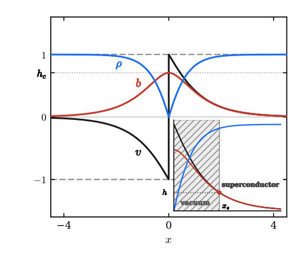 
FIG. 1. The velocity v, magnetic induction b and super- conducting density ρ in the soliton (8). Inset: Construction of Meissner states by truncating the universal soliton at the vacuum-superconductor boundary x = xs.

**Summary.** This theoretical paper analyzes exotic magnetic structures, such as vortex sheets and laminar lattices, within extreme Type-II superconductors using a nonlinear velocity theory. The work derives exact solutions demonstrating how the superconducting state evolves from a Meissner profile through soliton-like defects into periodic mixed states. It provides a detailed mathematical description of these fundamental phase transitions in high-field superconductivity.

**Why it may be interesting.** While focused on superconductivity, the mathematical techniques—solving nonlinear partial differential equations to find stable topological defects (solitons) and phase transitions between ordered states (Meissner $	o$ Vortex Lattice)—are highly relevant to understanding dynamics in other complex physical systems studied in AMO or quantum optics.

Detailed structure

**Main problem.** The paper investigates nonlinear Meissner states, vortex sheets, and laminar structures that emerge in extreme Type-II superconductors.

**Main result.** It derives exact solutions showing that the superconducting state transitions through soliton-like vortex sheets into periodic laminar mixed states as the applied field increases.

**Method.** The analysis uses a nonlinear velocity theory derived from Ginzburg-Landau theory, focusing on solving the resulting one-dimensional transverse free energy functional.

**Model / system.** The system is extreme Type-II superconductors ($\kappa 	o \infty$), modeled using a nonlinear velocity theory where the free energy depends only on the superfluid velocity $v$. The governing equation simplifies to Ampère's law in terms of $v$ and the magnetic induction $b$.

**Key observables.** Nonlinear Meissner states, vortex sheets (solitons), laminar structures (periodic solutions), and the thermodynamic critical field ($h_c$).

**Important parameters / regimes.** The penetration depth parameter $\kappa$, applied external magnetic field $h$, and characteristic fields like $h_{c1}$ and $h_c$.

**Assumptions / limitations.** The theory assumes the extreme Type-II limit ($\kappa 	o \infty$) allows for a simplification of the Ginzburg-Landau functional to depend only on velocity $v$ in the 1D transverse sector.

**Figures summary.** Figure 1 illustrates the profiles ($v, b, 
ho$) associated with the soliton solution and its truncation defining Meissner states.

**Paper structure.** The paper develops the nonlinear theory by analyzing the free energy functional, deriving the governing differential equation, and then solving for specific structures: the Meissner state (half-soliton), the vortex sheet (static soliton), and periodic solutions representing laminar lattices.

Abstract

A recently derived nonlinear velocity theory of extreme type-II superconductors is shown to possess an exactly solvable one-dimensional sector. Its solutions include nonlinear Meissner states exhibiting universal tails, vortex sheets, and periodic laminar structures. The thermodynamic critical field emerges from a marginal Meissner profile equivalent to the normal-superconducting boundary and may be viewed as a half-soliton. The vortex sheet is a soliton characterized by a discontinuity of the velocity field, a continuous and localized magnetic field and vanishing superconducting density at its center, and may be interpreted as the coarse-grained limit of a dense row of Abrikosov vortices. Periodic solutions describe laminar states that may be interpreted as coarse-grained rectangular vortex lattices.

[↑ back to top](#top)

### [Domain-Selective Enhancement of Second Harmonic Generation in Monolayer MoS$_2$ via Ferroelectricity-Controlled Photodoping](http://arxiv.org/abs/2607.29152v1)

**Authors:** David Hernández-Pinilla, Line Jelver, María Jesús Martínez-Morillo, César Hernando-Fuente, Miquel Cherta, Guillermo López-Polin, Joel D. Cox, Luisa E. Bausá, Mariola O Ramírez  
**Type:** both · **Category:** other · **PDF:** <https://arxiv.org/pdf/2607.29152v1>  
**Analysis basis:** full PDF text, analyzed in chunks
**Topic relevance:** `spintronics-quantum-optics interface` **3/5** · `driven-dissipative phase transition` **1/5** · `interference shaping light` **1/5** · `quantum optics experiment` **1/5**

📷 Fig 1

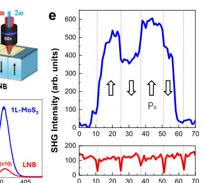 
Figure 1. Spatial modulation of SHG in 1L-MoS2 on PPLN. a) Optical micrograph of a large-area 1L-

📷 Fig 2

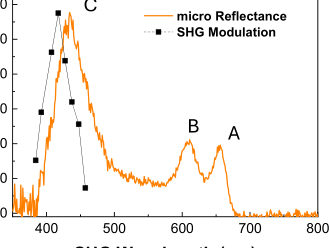 
Figure 2. Spectral tuning of SHG modulation. a) Representative SHG intensity maps recorded at

📷 Fig 3

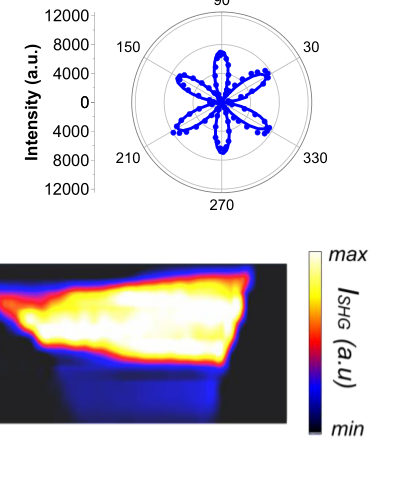 
Figure 3. Polarization dependence of SHG modulation. Spatial distribution of the integrated SHG

**Summary.** This study reports on the domain-selective control of Second Harmonic Generation in MoS2 integrated with a ferroelectric LiNbO3 substrate. By exploiting the polarization dependence of the underlying ferroelectric domains, researchers induce photodoping in the MoS2 monolayer. This doping significantly enhances the material's nonlinear susceptibility ($\chi^{(2)}$), enabling programmable and switchable frequency conversion for advanced photonic applications.

**Why it may be interesting.** This work provides a clear demonstration of using built-in electric fields (ferroelectricity) combined with external optical pumping (photodoping) as an active knob to engineer the nonlinear optical properties of 2D materials, which is highly relevant for advanced quantum light sources and modulators.

Detailed structure

**Main problem.** The study aims to actively control the nonlinear optical response, specifically Second Harmonic Generation (SHG), in monolayer MoS2 by leveraging the ferroelectric domain pattern of an underlying substrate.

**Main result.** Ferroelectric polarization-controlled photodoping at the MoS2/LiNbO3 interface enhances the effective second-order susceptibility ($\chi^{(2)}$), leading to a significant, up to ~70%, enhancement in SHG intensity between domains of opposite polarization.

**Method.** The research combines all-optical, spatially resolved SHG imaging experiments with ab initio Density Functional Theory (DFT) calculations to model the electronic structure and $\chi^{(2)}$ dependence on doping.

**Model / system.** The physical system is a hybrid heterostructure combining monolayer molybdenum disulfide (MoS2) with periodically poled lithium niobate (LiNbO3). The ferroelectric domains in LiNbO3 induce localized photodoping in the MoS2, which modulates its electronic band structure and nonlinear optical response.

**Key observables.** SHG intensity modulation correlated with ferroelectric domain polarization ($	ext{P}_{	ext{up}}$ vs. $	ext{P}_{	ext{down}}$), effective second-order susceptibility ($\chi^{(2)}$), and the dependence of SHG on excitation wavelength and fundamental beam power.

**Important parameters / regimes.** The enhancement magnitude (~70%), the role of carrier density (photodoping level, e.g., $\sim 5	imes 10^{14} 	ext{ cm}^{-2}$), and the resonant excitation conditions near the C interband transition.

**Assumptions / limitations.** The primary assumption is that the ferroelectric polarization dictates the local charge doping in MoS2, which in turn governs the magnitude of $\chi^{(2)}$ via band structure modification.

**Figures summary.** Figures illustrate spatial SHG mapping showing domain-dependent contrast; spectral analysis shows enhancement near two-photon resonance; and theoretical figures map calculated $\chi^{(2)}$ values based on simulated doping levels.

**Paper structure.** The paper establishes the platform (MoS2/LiNbO3), presents experimental measurements demonstrating polarization-dependent SHG modulation, attributes this to light-induced photodoping via domain control, and supports these findings with DFT calculations linking doping to $\chi^{(2)}$.

Abstract

Hybrid heterostructures combining two-dimensional semiconductors with ferroelectric materials offer a versatile route to actively control light-matter interactions at the nanoscale. Here, we report all-optical, light-induced domain-selective control of second-harmonic generation (SHG) in monolayer molybdenum disulfide (MoS$_2$) integrated with periodically poled lithium niobate (LiNbO$_3$). Spatially resolved SHG imaging reveals a pronounced modulation of the nonlinear optical response of monolayer MoS$_2$ governed by the ferroelectric domain pattern of the underlying substrate. A strong SHG contrast is observed between domains of opposite polarization, with a marked dependence on both the excitation wavelength and the incident optical power. The comparison between ferroelectric domains that either enable or do not exhibit light-driven photodoping in the MoS$_2$ monolayer provides a direct assessment of the role of carrier density in the nonlinear optical response. We find that ferroelectric-polarization-controlled photodoping at the MoS$_2$/LiNbO$_3$ interface enhances the effective second-order susceptibility, $χ^2$, producing an increase in SHG intensity of up to ~70% under resonant excitation conditions. Ab initio calculations corroborate that charge doping modifies the electronic band structure of MoS$_2$ and strongly affects $χ^2$ in the resonant regime, providing microscopic support for the experimentally observed modulation. The results highlight the combination of light intensity and ferroelectricity as a powerful knob for band-structure modulation in 2D materials and reconfigurable nonlinear optical responses, opening pathways toward programmable frequency conversion, smart light modulators, and advanced nonlinear photonic functionalities in integrated hybrid platforms.

[↑ back to top](#top)

### [The stability of electronic Poiseuille flow in two-dimensional materials](http://arxiv.org/abs/2607.29118v1)

**Authors:** Marine Bastida, Alvaro Meseguer, Iacopo Torre  
**Type:** theory · **Category:** other · **PDF:** <https://arxiv.org/pdf/2607.29118v1>  
**Analysis basis:** full PDF text, analyzed in chunks
**Topic relevance:** `non-equilibrium dynamics` **2/5** · `Keldysh / 2PI / non-Gaussian methods` **1/5** · `analog quantum simulation` **1/5** · `correlated / nonlocal dissipation` **1/5** · `driven-dissipative phase transition` **1/5** · `methods for driven-dissipative` **1/5** · `non-equilibrium universality` **1/5**

📷 Fig 1

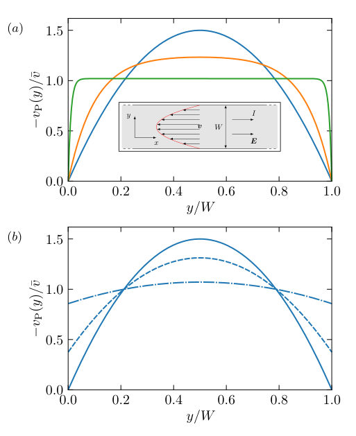 
FIG. 1. (Color online) (a) Flow velocity in the channel as a function of the transverse coordinate y, normalized to the average velocity ¯v, for different values of the ratio W/D. The blue line corresponds to W/D →0 (standard plane-Poiseuille flow), the orange line to W/D = 10, and the green line to W/D = 100. In all cases ℓB = 0. The inset shows the sam- ple geometry with the directions of electric field, electric cur- rent, and velocity of the electronic fluid. (b) Same as in (a) for W/D →0 (standard plane-Poiseuille flow) and different values of the boundary scattering length ℓB. The solid line corresponds to ℓB = 0, the dashed line to ℓB = 0.1W and the dash-dotted line to ℓB = W.

📷 Fig 2

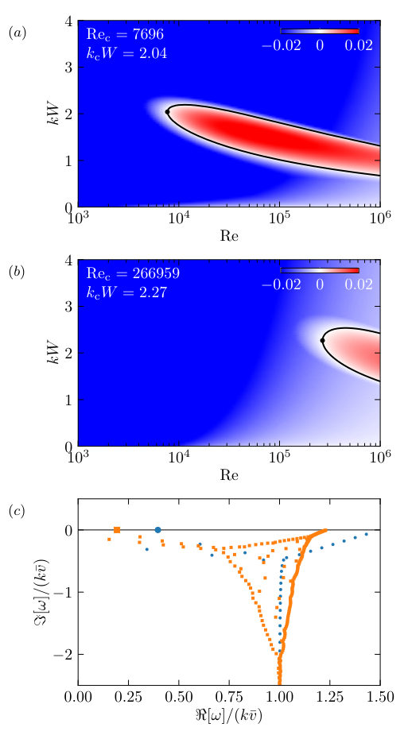 
FIG. 2. (Color online) (a) Stability diagram of electronic Poiseuille flow. The color plot represents the imaginary part of the most unstable frequency as a function of the Reynolds number and of the wavenumber k of the perturbation. The black line separates the region where ℑ[ω] &lt; 0 (stable) from the region where ℑ[ω] &gt; 0 (unstable). The black dot marks the position of the smallest Reynolds number where instabil- ity occurs. (b) Same as (a) for W/D = 10 and ℓB = 0. (c) Complex-plane representation of the eigenvalues of the Orr- Sommerfeld equation at the critical point (Re = Rec, k = kc) for W/D →0 (blue dots) and W/D = 10 (orange squares). The larger symbols highlight the eigenvalues that...

📷 Fig 3

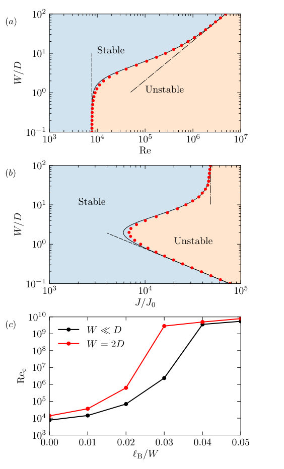 
FIG. 3. (Color online) (a) Stability diagram as a function of Re and W/D. Red dots represent the numerical values of Rec. The black dashed line represents the Poiseuille limit (W ≪D) Rec = Re(0) c . The black dash-dotted line represents the W ≫D limit Rec = Re∞ c W/D. The black thin line represents the approximate expression (18). (b) Same as (a) expressed as a function of the current density in units of J0 on the horizontal axis. (c) Dependence of the critical Reynolds number on ℓB for W/D ≪1 (black symbols) and W/D = 2, corresponding to the minimum of J/J0 in (b), (red symbols). The dots represent the numerical points, the solid line is a guide to the eye.

📷 Fig 4

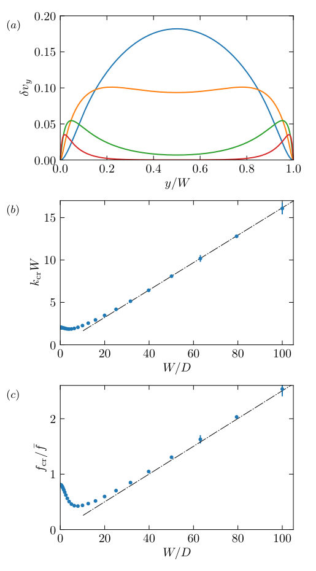 
FIG. 4. (Color online) (a) Real part of the Velocity profile of the most unstable perturbation at the critical point for different values of the ratio W/D: W/D ≪1 (blue line), W/D = 10 (orange line), W/D = 40 (green line), and W/D = 100 (red line). The phase of the eigenfunctions is chosen to have real first component. The imaginary (out of phase) parts are too small to be represented in this figure. (b) Critical wavenumber as a function of W/D for ℓB = 0. The dots with error bars represent numerical value, the dash-dotted line corresponds to the W ≫D limit. (c) Frequency of the critical perturbation in units of ¯f as a function of W/D for ℓB = 0. The dots with error bars represent...

**Summary.** This paper investigates when electronic Poiseuille flow in 2D materials becomes unstable using linear stability theory. By solving a modified Orr-Sommerfeld equation, the authors determine the minimum current density required to induce turbulence. The findings pinpoint optimal geometric conditions for observing this fundamental fluid dynamic instability in nanoscale electronics.

**Why it may be interesting.** While focused on classical fluid dynamics, the mathematical framework of analyzing instabilities via linearized partial differential equations is highly relevant to open quantum systems and non-equilibrium dynamics.

Detailed structure

**Main problem.** The study analyzes the linear stability of electronic Poiseuille flow within two-dimensional materials.

**Main result.** The instability onset is characterized by a minimum critical current density required for turbulence, which occurs at specific geometric ratios ($W \approx 2D$).

**Method.** Linear stability analysis using a modified Orr-Sommerfeld equation derived from the Navier-Stokes equations.

**Model / system.** The system models electron flow in a 2D material (like graphene) under plane Poiseuille flow, governed by continuity and a modified Navier-Stokes equation incorporating electrical driving forces.

**Key observables.** Critical current density ($J_{\min}$), critical Reynolds number ($	ext{Re}_c$), streamwise wavenumber ($k_c$), and frequency ($f_{cr}$).

**Important parameters / regimes.** Channel width to diffusion length ratio ($W/D$) and boundary scattering length ($\ell_B$).

**Assumptions / limitations.** The analysis assumes linear perturbations, neglecting non-linear terms; it also uses simplified models for electron interactions (e.g., assuming $\ell_{ee}$ is small).

**Figures summary.** Figures show velocity profiles for varying geometric ratios and stability diagrams mapping the transition from stable to unstable flow regions as a function of current density.

**Paper structure.** The paper develops the governing equations, performs linear stability analysis by solving an eigenvalue problem (modified Orr-Sommerfeld equation), and analyzes results in various limiting regimes ($W/D$ ratios).

Abstract

Motivated by the experimental observation of electronic Poiseuille flow in graphene [J.A. Sulpizio et al. Nature 576, 75 (2019)] we analyze the linear stability of plane-Poiseuille flow of electrons in a two-dimensional material using a modified Orr-Sommerfeld equation. We calculate the critical current needed to make the flow unstable as a function of the experimental parameters and characterize the most favorable situation, that is the one needing the lowest current density, to observe flow instability. We predict the streamwise wavenumber and frequency at which the instability occurs and discuss the difficulties of an experiment aimed at probing this phenomenon.

[↑ back to top](#top)

### [A Group-Theoretical Framework for Local k-Space Topology and Berry Phase in 2D Photonic Systems](http://arxiv.org/abs/2607.29356v1)

**Authors:** Xinyi Yuan, Grazia Salerno  
**Type:** theory · **Category:** other · **PDF:** <https://arxiv.org/pdf/2607.29356v1>  
**Analysis basis:** full PDF text, analyzed in chunks
**Topic relevance:** `analog quantum simulation` **2/5** · `Keldysh / 2PI / non-Gaussian methods` **1/5** · `correlated / nonlocal dissipation` **1/5** · `correlated cavity matter` **1/5** · `driven-dissipative phase transition` **1/5** · `methods for driven-dissipative` **1/5**

📷 Fig 1

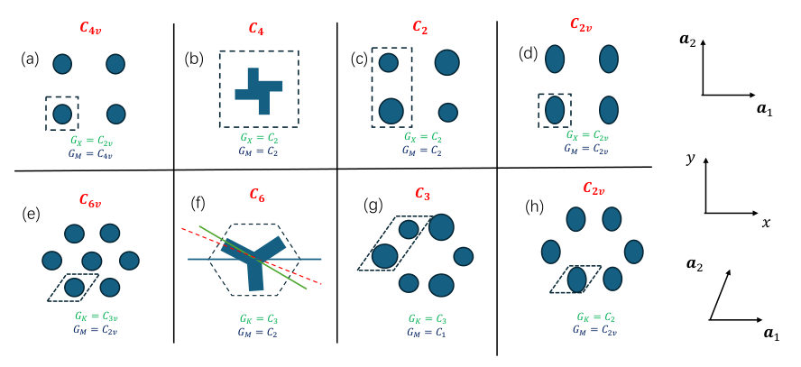 
FIG. 1. Representative site geometries in real space of photonic crystals, annotated with the little groups of the corresponding high-symmetry points in k-space. On the right, we show the unit vectors a1,2 of the corresponding 2D Bravais lattice. (a–d) Square lattice with different corner-site geometries: circular sites, windmill sites, circular sites of different sizes at adjacent corners, and elliptical sites, respectively. (e-h) Triangular lattice with different corner-site geometries: circular sites, Y -shaped sites, circular sites of different sizes at adjacent corners, and elliptical sites, respectively. Full point group class at Γ is annotated with red color on the top, and little...

📷 Fig 2

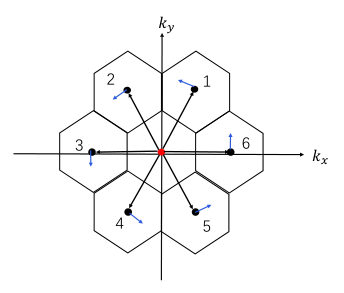 
FIG. 2. Schematic of the minimal constituent of the trian- gular model, showing the Γ-point of a triangular lattice in momentum space, the first shell of reciprocal lattice vectors as black arrows, and the polarization degrees of freedom as blue arrows.

📷 Fig 3

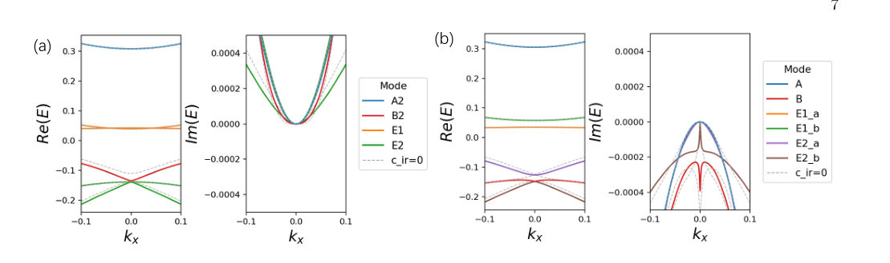 
FIG. 3. (a) Real and imaginary parts for the energy bands of C6v, having used parameters v = 0.1, w = 0.05, u = 0.01, γ = −0.005. (b) Real and imaginary parts for the energy bands of C6, having used parameters v = 0.1, w = 0.05 ei π

📷 Fig 4

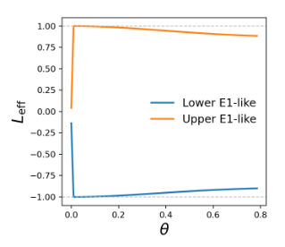 
FIG. 4. The influence of the structure dependent angle θ on the effective angular momentum leff for the upper and lower quasi-E1 modes of C6 group. The figure is plotted with a fixed θ = 0.05. The degree of de-quantization of leff increases as θ gets larger, i.e., when the mirror symmetry is progressively broken.

📷 Fig 5

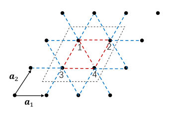 
FIG. 5. The model of a 2 × 2 triangular lattice unit cell, which can be regarded as an extension of the structure shown in Fig.1(e). The red dashed lines represent the nearest neigh- bor hopping within the unit cell, and the blue dashed lines represent the nearest neighbor hopping between the unit cells. The primitive vectors a1,2 are also shown.

**Summary.** The paper establishes a group-theoretical framework to analyze topological properties like Berry phase and BICs in 2D Photonic Crystals. By adapting solid-state IR formalism, it systematically maps how crystal symmetries dictate mode behavior. This provides a powerful tool for designing photonic structures with tailored topological responses.

**Why it may be interesting.** This work provides a powerful mathematical tool (group theory) to analyze wave phenomena in engineered optical structures, bridging solid-state topology concepts directly into the realm of photonics and open quantum systems.

Detailed structure

**Main problem.** To develop a group-theoretical framework for understanding local k-space topology and Berry phase in 2D Photonic Crystals (PhCs).

**Main result.** The irreducible-representation formalism allows for the systematic classification of topological phenomena, showing that non-Abelian groups are key for Berry phase emergence.

**Method.** Applying group theory concepts, specifically decomposing basis functions using symmetry operations and block-diagonalizing the Bloch Hamiltonian to analyze mode coupling.

**Model / system.** The system is 2D Photonic Crystals (PhCs), modeled by a Bloch Hamiltonian adapted from solid-state physics, incorporating radiative coupling and transverse conditions. The analysis extends beyond scalar Schrödinger operators.

**Key observables.** Local k-space topology, Berry phase, symmetry-protected degeneracies, BIC linewidths, and mode hybridization conditions.

**Important parameters / regimes.** High symmetry points ($\Gamma$-point), structural design parameters, and coefficients associated with targeted irreducible representations (IRs).

**Assumptions / limitations.** The analysis assumes the system can be effectively decoupled from the radiation continuum for initial block decomposition, though extensions are discussed.

**Figures summary.** Figure 1 shows representative site geometries in real space for square and triangular lattices, annotated with little groups at high-symmetry points.

**Paper structure.** The paper introduces the IR formalism to classify topology, applies it to study BICs/vortex beams using PWE and non-Hermitian Hamiltonians, and concludes by detailing how structural or gain/loss perturbations can systematically manipulate these topological features.

Abstract

Two-dimensional photonic crystals (2D PhCs) enable fine-grained control over a broad set of Bloch modes without the constraints of band occupancy and natural crystal structures, and, as intrinsically open systems, serve as versatile platforms for exploring diverse topological phenomena. Here, we develop a theoretical framework inspired by the irreducible-representation formalism in solid-state physics, while explicitly incorporating key characteristics of photonic Bloch systems, such as radiative coupling and transverse condition. Within this framework, we study the symmetry origins of local k-space topology, e.g., bound-states in the continuum and optical vortex beams, and Berry phase in two representative systems. We further analyze, from a group-theory perspective, how tailored structural designs and targeted symmetry perturbations can be exploited to manipulate these topological features. In particular, we showcase the application of the formalism to Bloch modes from distinct truncation approaches and specify the preferable regimes for each, both under a generic $n$-band configuration. The analysis can thereby be readily extended to a wide range of artificial wave crystals beyond scalar Schrödinger-like operators and two-level treatment.

[↑ back to top](#top)

### [Temperature-driven transition between momentum-resolved and disordered averaged Coulomb drag in 1D systems](http://arxiv.org/abs/2607.29630v1)

**Authors:** Mingyang Zheng, Rebika Makaju, Rasul Gazizulin, Alex Levchenko, Sadhvikas J. Addamane, Dominique Laroche  
**Type:** experiment · **Category:** other · **PDF:** <https://arxiv.org/pdf/2607.29630v1>  
**Analysis basis:** full PDF text, analyzed in chunks
**Topic relevance:** `non-equilibrium dynamics` **2/5** · `Frenkel-Kontorova` **1/5** · `correlated / nonlocal dissipation` **1/5** · `driven-dissipative phase transition` **1/5** · `methods for driven-dissipative` **1/5** · `non-equilibrium universality` **1/5**

📷 Fig 1

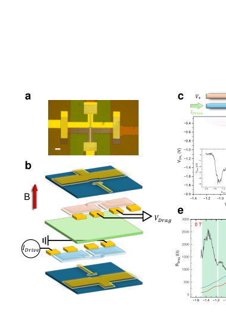 
Fig. 1 Onsager relation and Drag signal subband dependence. a, Microscope image of the device. The scale bar is 10 µm .b, Schematic of device structure with negative voltage applied to four gates (shown in gold color). Each wire is defined by one plunger (PL) and one pinch-off (PO) gate on each 2DEG. The PO gates are primarily used to independently contact the quantum wires and minimize tunneling current between them, while the PL gates are used to adjust the wires’ width and electronic density. The top plunger (TPL) and top pinch-off (TPO) gates form the top wire electrostatically on the top 2DEG, which is shown in pink. The yellow squares are the Ohmic contacts connecting the 2DEG....

📷 Fig 2

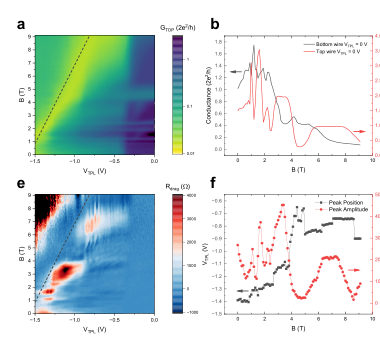 
Fig. 2 Coulomb drag between magnetic depopulated wires. a, 2D map of the top (drag) wire conductance as a function of TPL gate voltage and magnetic field. The conductance signal oscillates as a function of the magnetic field, representing the magnetic depopulation of different wire 1D subbands. The dark gray dashed line in a and e represents the shift of the drag wire’s pinch-off position due to magnetic depopulation. The signal on the left of the pinch-off line is attributed to tunneling and not discussed here. b, Oscillatory magnetoconductance of the top and bottom wires at VTPL = 0 V, VBPL = −0.3 V on line 1. The residual oscillatory minima observed in the top wire at VTPL = 0 V...

📷 Fig 3

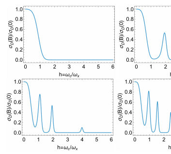 
Fig. 3 Model results for Coulomb drag magneto-oscillations. Normalized drag conductance as a function of magnetic field, σD(B)/σD(0), computed from the transmission eigenvalue model of Ref. [49, 50]. Mode-dependent transmission coefficients were computed based on the globally adiabatic saddle-point model of a wire constriction. Each panel corresponds to the same fixed value of a ratio ωy/ωx = 1 between frequencies corresponding to the confining curvature and saddle curvature of the potential respectively. The dimensionless scale of the field h is described by the cyclotron frequency ωc measured in units of ωx. Gate voltages in each wire eVg1,2 are also measured in units of ωx. In this model...

📷 Fig 4

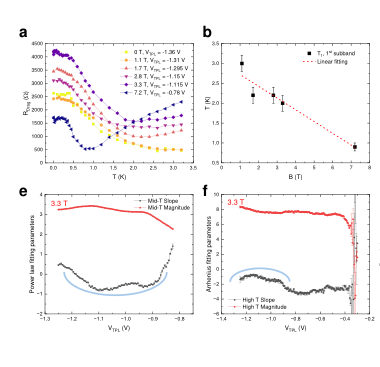 
Fig. 4 Temperature-dependent Coulomb drag at various magnetic fields. a, 1st subband peak drag resistance as a function of temperature at various magnetic fields in a linear scale. b, Upturn transition temperature T1 as a function of magnetic field for the 1st subband peak. With the magnetic field increasing, T1 decreases from 3 K to 1 K, and the dashed line shows the linear fitting of T1 as a function of B. c, d, 1st subband peak drag resistance as a function of temperature at 0 T and 7.2 T in c, log-log scale, and d, Arrhenius scale. The dashed lines in c and d are the linear fitting of the intermediate temperature (Mid-T) regime, while the solid lines are the linear fitting of the high...

📷 Fig 5

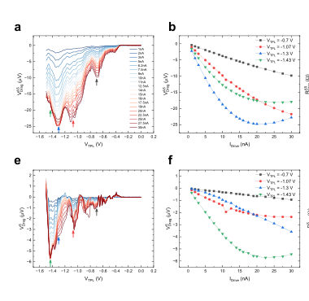 
Fig. 5 Nonlinear I-V and linear I-R at 0 T. a, Antisymmetric drag voltage V AS Drag as a function of VTPL and drive current IDrive for line 1. IDrive ranges from 1 nA to 30 nA. b, Nonlinear and nonmonotonous V AS Drag as a function of IDrive at a few selected peak positions, shown by the arrows in a. c, Linear RAS Drag as a function of IDrive at the selected peak positions. The solid lines represent the linear fittings in the high-bias regime. d, Linearly fitted slope and intercept of RAS Drag as a function of VTPL. e-h, similar to a-d, but for the symmetric component of drag signals. While both VAS Drag and V S Drag have strong nonlinearity and even nonmonotonic dependencies, RAS Drag and...

**Summary.** This paper reports on advanced experiments measuring Coulomb drag in 1D semiconductor quantum wires. By systematically varying temperature and magnetic field, the authors resolved a transition between two distinct physical regimes: one dominated by momentum conservation and another averaged over disorder. This establishes a quantitative method for characterizing electron-electron interactions in these complex low-dimensional systems.

**Why it may be interesting.** This work provides a highly quantitative experimental framework for probing fundamental many-body interactions (like those in TLLs) in low dimensions by using transport measurements sensitive to both quantum confinement effects (B-field oscillations) and thermal scattering mechanisms (T-dependence).

Detailed structure

**Main problem.** The study addresses the challenge of understanding electron-electron interactions in one-dimensional (1D) systems, particularly for Tomonaga-Luttinger liquids, complicated by disorder effects observed in Coulomb drag experiments.

**Main result.** The researchers successfully characterized 1D interaction parameters and identified two distinct temperature regimes—momentum-resolved and disordered-averaged—by analyzing the systematic evolution of the Coulomb drag signal with magnetic field and temperature.

**Method.** Measurements involve performing Coulomb drag measurements (measuring induced voltage/resistance) in vertically coupled quantum wires while varying perpendicular magnetic fields and temperatures, complemented by magnetic depopulation analysis.

**Model / system.** The physical platform is a system of vertically coupled GaAs-AlGaAs quantum wires acting as drive and drag conductors. The physics involves electron transport in quasi-1D Luttinger liquid regimes subjected to external magnetic fields and temperature variations.

**Key observables.** Coulomb drag voltage/resistance ($R_{Drag}$), magnetoconductance oscillations, and the crossover temperature ($T_1$) separating different scaling regimes.

**Important parameters / regimes.** Temperature (T), perpendicular Magnetic Field (B), Luttinger liquid interaction parameters (K), and disorder strength effects.

**Assumptions / limitations.** The analysis assumes that the observed drag signal is dominated by momentum transfer when subbands align, and it models the transition between different scattering/relaxation regimes based on temperature scaling laws (power-law vs. Arrhenius).

**Figures summary.** Figures show 2D maps of $R_{Drag}$ dependence on gate voltage and B, demonstrating oscillatory behavior tracking magnetic depopulation; plots illustrate the systematic shift and suppression of drag peaks with increasing B, and fit results confirm power-law (Mid-T) and Arrhenius (High-T) temperature dependencies.

**Paper structure.** The paper establishes the experimental setup using quantum wires, details measurements across varying T and B fields to observe subband depopulation via magnetoconductance, analyzes $R_{Drag}$ oscillations tracking these depopulations, and finally maps out the temperature dependence to define the crossover between momentum-resolved and disorder-averaged drag regimes.

Abstract

Advancing the understanding of electron-electron interactions in one-dimensional systems remains one of the central challenges in low-dimensional physics, especially for Coulomb-coupled Tomonaga-Luttinger liquids. Notably, the difficulty of reliably extracting one-dimensional system parameters, combined with the presence of disorder, has hindered the interpretation of 1D Coulomb drag experiments. Here, we present a self-consistent experimental determination of the relative Luttinger liquid interaction parameters through 1D Coulomb drag measurements, and achieve quantitative agreement with theoretical predictions. Utilizing vertically coupled GaAs-AlGaAs quantum wires, we fully characterize the one-dimensional parameters through magnetic depopulation. Coulomb drag exhibits a systematic evolution with magnetic field, reflecting the successive depopulation of 1D subbands and the suppression of disorder effects. Two distinct temperature regimes are identified, marking the boundary between momentum-resolved and disordered-averaged Coulomb drag. The observed scaling, peak broadening, and nonlinear current-voltage characteristics establish a unified and quantitative framework for probing electron-electron interactions in 1D systems.

[↑ back to top](#top)

### [Enhancement of exciton radius near a band-gap closing through quantum geometry](http://arxiv.org/abs/2607.28731v1)

**Authors:** Jin-Hyung Choi, Sang-Hoon Han, Young-Kwon Han, Sun-Woo Kim, Jun-Won Rhim, Joshua J. P. Thompson  
**Type:** theory · **Category:** other · **PDF:** <https://arxiv.org/pdf/2607.28731v1>  
**Analysis basis:** full PDF text, analyzed in chunks
**Topic relevance:** `analog quantum simulation` **1/5** · `correlated cavity matter` **1/5** · `driven-dissipative phase transition` **1/5**

📷 Fig 1

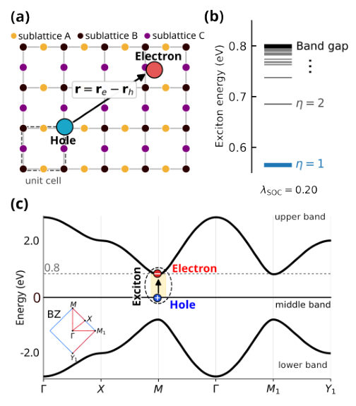 
FIG. 1. Overview of the Lieb-lattice exciton. (a) Lieb lattice with three sublattices per unit cell and an ex- citon represented by the in-plane electron–hole relative co- ordinate r = re −rh. (b) Energies of lowest exciton states at λSOC = 0.20. The black line marks the minimum direct single-particle band gap. (c) Single-particle band structure along the high-symmetry path shown in the inset. The ex- citon is formed between the upper and middle bands. The single-particle direct optical gap is approximately 0.8 eV in this case, and the exciton levels lie below this energy owing to the attractive electron–hole interaction.

📷 Fig 2

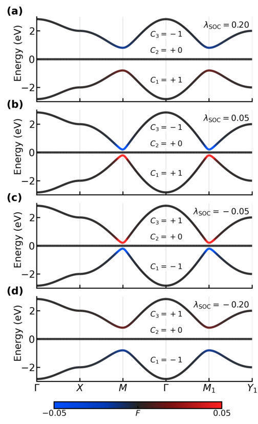 
FIG. 2. SOC-tuned band geometry of the Lieb- lattice model. (a-d) Band structures for λSOC = 0.20, 0.05, −0.05, and −0.20. The colour scale shows the Berry curva- ture along the high-symmetry path, and the labels indicate the Chern numbers of the corresponding bands. As |λSOC| de- creases, the bands become more Dirac-like near the band-gap minimum and the Berry curvature becomes more strongly localized there. Although the Berry-curvature distribution changes substantially, the band Chern numbers remain fixed until the gap closes at λSOC = 0.

📷 Fig 3

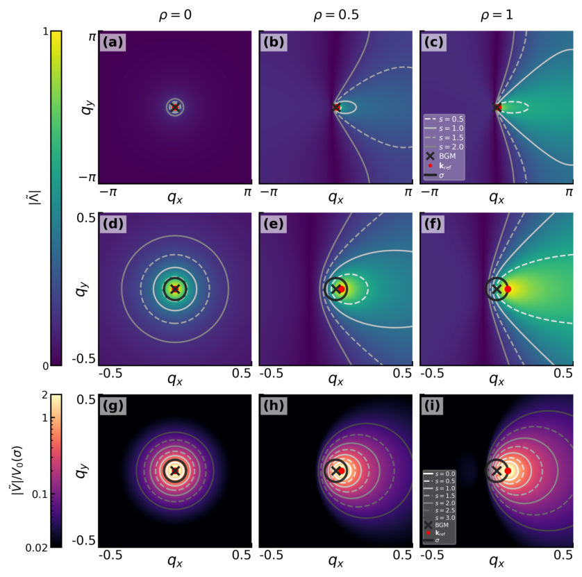 
FIG. 3. Form-factor suppression of the projected Coulomb interaction. Panels (a)–(f) show the electron–hole form-factor magnitude |eΛqref q|, and panels (g)–(i) show the corresponding projected interaction magnitude |eVqref q|/|V0(σ)|. Here, q = k −M, qref = kref −M = ρ σ (cos θ, sin θ), and eVqref q = V0(qref −q)eΛqref q. The results are shown for θ = 0 and ρ = 0, 0.5, and 1.0 from left to right. Panels (a)–(c) show the full momentum window, whereas panels (d)–(f) and (g)–(i) show the corresponding regions around the band-gap minimum M. The contours mark |eΛqref q| = e−s in panels (a)–(f) and |eVqref q|/|V0(σ)| = e−s in panels (g)–(i), for the indicated values of s. The black circle has...

📷 Fig 4

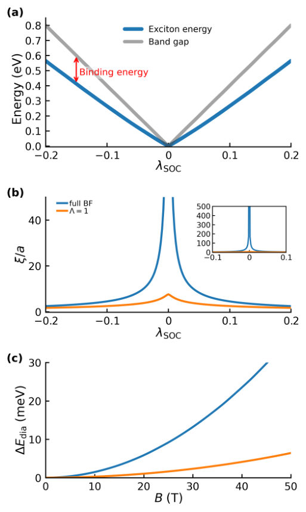 
FIG. 4. Exciton-radius enhancement and diamag- netic response. (a) Energy of the lowest exciton state and the minimum direct band gap as functions of λSOC. The difference between them is the binding energy (red arrow). (b) Corresponding radii ξ/a from the Bloch-frame calcula- tion (blue) and the unity-overlap reference (orange). The inset shows the rapid growth near the gap closing on an ex- tended scale. (c) Quadratic diamagnetic shifts estimated from ∆Edia(B) = e2ξ2B2/(8mr) in the small-gap regime. The unity-overlap reference is obtained by replacing ξ with ξ(0).

**Summary.** This theoretical paper demonstrates that exciton properties are highly sensitive to the quantum geometry of Bloch states, especially near topological phase transitions. By analyzing a Lieb-lattice model, the authors show that the momentum dependence of electron and hole wavefunctions suppresses Coulomb interactions, which in turn enlarges the real-space exciton radius. This effect provides an experimentally accessible signature—an enhanced diamagnetic response—that relies on quantum geometry rather than just semiclassical parameters.

**Why it may be interesting.** This work provides a concrete mechanism linking topological band structure features (like Berry curvature) directly to measurable optical properties (exciton size), offering an advanced route for material design beyond simple effective mass theory.

Detailed structure

**Main problem.** The study investigates how quantum geometry, specifically near a topological band-gap closing, fundamentally alters exciton properties like their size.

**Main result.** Suppression of the electron-hole Coulomb matrix elements due to momentum-dependent Bloch states leads to a narrowing in momentum space and a measurable enlargement of the exciton radius in real space.

**Method.** The authors solve the band-projected Wannier equation using a Lieb-lattice model, comparing results obtained with full quantum geometry effects versus simplified unity-overlap approximations.

**Model / system.** The system is modeled using a spin–orbit-coupled Lieb-lattice Hamiltonian tuned toward a topological phase transition. Excitons are treated as fundamental excitations whose properties depend on the Bloch states of the underlying electron and hole bands.

**Key observables.** Exciton radius ($\xi$), weak-field diamagnetic response, projected Coulomb matrix elements ($|\Lambda_{\mathbf{k}\mathbf{k}'}|$), and the Hilbert–Schmidt quantum distance.

**Important parameters / regimes.** Topological phase transition point (band-gap closing), spin-orbit coupling strength ($\lambda_{SOC}$), and momentum separation ($q$).

**Assumptions / limitations.** The analysis relies on defining the exciton state via a projected Wannier equation and utilizing covariant derivatives to incorporate Berry connections into the position operator.

**Figures summary.** Figures illustrate single-particle band structures, Berry curvature distribution across varying SOC strengths, and plots showing the suppression of the form factor $|e\Lambda_{q_{	ext{ref}}, q}|$ as a function of momentum angle $	heta$.

**Paper structure.** The paper systematically develops the theoretical framework by defining the projected relative-position operator using covariant derivatives. It then applies this to a Lieb lattice, showing how topological transitions modify the quantum metric and subsequently alter exciton size and diamagnetic response compared to semiclassical limits.

Abstract

Exciton engineering traditionally focuses on modifying semiclassical material properties, such as the effective mass and dielectric screening, while largely overlooking the quantum geometry of the underlying electron and hole Bloch states. This approximation is adequate for many materials but breaks down near a topological band-gap closing, where the quantum metric around the band extrema becomes strongly enhanced. In this regime, Bloch states at different momenta become less similar, reducing the projected electron--hole Coulomb matrix elements and consequently weakening exciton binding. We demonstrate this mechanism in a spin--orbit-coupled Lieb-lattice model tuned toward a topological phase transition. The suppressed Coulomb matrix elements narrow the exciton wavefunction in momentum space, leading to an enlarged exciton radius in real space. This increase in exciton size produces an experimentally accessible enhancement of the weak-field diamagnetic response. Our results show that quantum geometry can fundamentally reshape exciton properties near a topological phase transition, revealing a previously underexplored route for engineering excitonic states.

[↑ back to top](#top)

### [Intrinsic Orbital Hall Effect in Degenerate Spin-3/2 Systems driven by the quantum metric](http://arxiv.org/abs/2607.28744v1)

**Authors:** Rhonald Burgos Atencia  
**Type:** theory · **Category:** other · **PDF:** <https://arxiv.org/pdf/2607.28744v1>  
**Analysis basis:** full PDF text, analyzed in chunks
**Topic relevance:** `Keldysh / 2PI / non-Gaussian methods` **1/5** · `analog quantum simulation` **1/5** · `spintronics-quantum-optics interface` **1/5**

📷 Fig 1

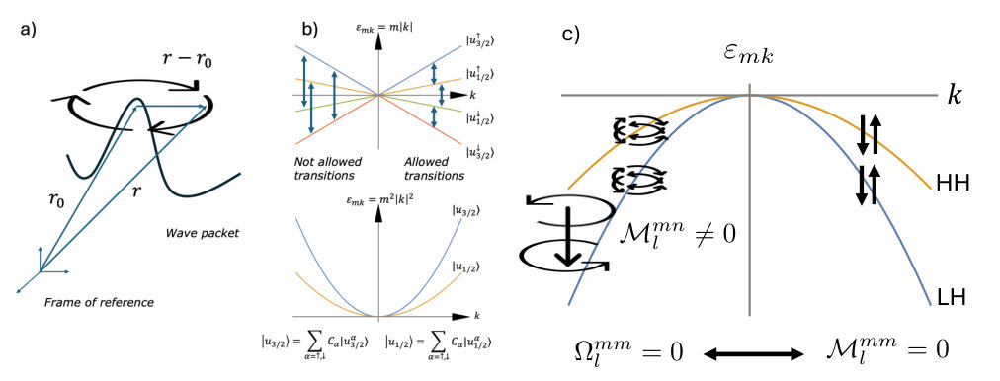 
FIG. 1. (a) The classical orbital angular momentum depends on the choice of reference frame. While L = r × v is origin dependent, the combination L = (r −r0) × v is defined with respect to the center of the wave packet, as employed in the semiclassical description of the orbital magnetic moment. (b) Schematic dispersion relations of the four-dimensional SU(2) model for the linear and quadratic Hamiltonians. The upper panel illustrates the allowed and forbidden interband transitions associated with the Berry connection, highlighting the nonvanishing matrix elements of the vector Berry connection AL = iR†(θ, ϕ)∇kR(θ, ϕ). The lower panel shows the quadratic spectrum, whose eigenstates are...

📷 Fig 2

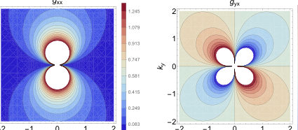 
FIG. 2. The quantum metric is determined by the derivatives of the texture ˆh, namely, gµβ ∝∂µˆh · ∂βˆh. The components relevant for the present calculation are gxx and gyx, whose momentum-space distributions are shown as contour plots. While gyx averages to zero due to its parity, it yields a finite contribution to the orbital Hall response when combined with the factor Cν,α, which compensates its symmetry.

**Summary.** This theoretical paper analyzes the intrinsic Orbital Hall Effect in spin-3/2 degenerate semiconductors. It proves that this effect is not due to the Berry curvature, but rather arises purely from interband contributions mediated by the quantum metric. This establishes a distinct, geometrically controlled mechanism for orbital transport.

**Why it may be interesting.** While focused on condensed matter transport, the reliance on 'quantum geometry' (the quantum metric) as a primary physical observable connects directly to geometric phases and topological invariants studied in AMO physics.

Detailed structure

**Main problem.** The study investigates the intrinsic Orbital Hall Effect (OHE) in degenerate spin-3/2 systems to determine the fundamental geometric quantity governing this transport.

**Main result.** The OHE is found to be governed entirely by the quantum metric acting on interband orbital magnetic moment components, rather than the Berry curvature or conventional intraband contributions.

**Method.** Theoretical calculation using linear response theory applied to a Luttinger Hamiltonian model, focusing on matrix elements of the Orbital Magnetic Moment (OMM).

**Model / system.** The system is modeled as degenerate spin-3/2 semiconductors described by a Luttinger Hamiltonian. The analysis leverages symmetries inherent in this degenerate manifold.

**Key observables.** Orbital Hall conductivity ($\sigma_{z,	ext{Hall}}^{yx}$), Orbital Magnetic Moment (OMM), Quantum Metric components ($g_{xx}, g_{yx}$).

**Important parameters / regimes.** Fermi energy ($\epsilon_F$), material parameters related to heavy-hole and light-hole band gaps ($\gamma_{3/2} - \gamma_{1/2}$), and the Luttinger Hamiltonian coefficients.

**Assumptions / limitations.** The analysis assumes rotational invariance, utilizes the Luttinger model framework, and relies on approximations like the spherical approximation for tractability.

**Figures summary.** Figures illustrate schematic dispersion relations comparing linear and quadratic Hamiltonians, showing where intraband OMM vanishes in the degenerate spectrum. Contour plots visualize momentum-space distributions of the quantum metric components.

**Paper structure.** The paper establishes the physical problem by noting that conventional contributions vanish in degenerate systems. It then develops the theory to show the survival of an interband mechanism governed solely by the quantum metric, culminating in explicit analytical expressions and numerical estimates for various semiconductors.

Abstract

We show that in rotationally invariant spin-$3/2$ systems the orbital Hall effect originates from interband matrix elements of the orbital magnetic moment. The resulting Hall response is governed by the quantum metric, rather than by the Berry curvature, revealing a purely geometric transport mechanism. Conventional intraband contributions associated with the orbital magnetic moment and Berry curvature are shown to vanish identically in degenerate systems. These results identify the quantum metric as the key geometric quantity controlling orbital Hall transport in degenerate multiband systems.

[↑ back to top](#top)

### [Ordered-to-disordered transfer learning with graph neural networks for formation-energy and HOMO-LUMO gap prediction in high-entropy perovskite oxides](http://arxiv.org/abs/2607.29510v1)

**Authors:** Panupol Untarabut, Narjes Jomaa, Sylvian Cadars, Olivier Masson, Samuel Bernard, Assil Bouzid, Santanu Saha  
**Type:** theory · **Category:** disordered systems and neural networks · **PDF:** <https://arxiv.org/pdf/2607.29510v1>  
**Analysis basis:** full PDF text, analyzed in chunks
**Topic relevance:** `analog quantum simulation` **1/5** · `methods for driven-dissipative` **1/5** · `non-equilibrium dynamics` **1/5**

📷 Fig 1

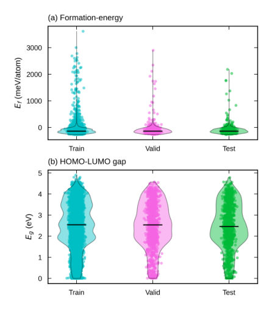 
Figure 1: Target-property distributions for the training, validation, and test subsets of the ordered single and double perovskite oxide dataset: (a) formation energy (meV/atom) and (b) HOMO-LUMO gap (eV). Formation energy is evaluated with respect to stable binary oxides of different cationic species. Ordered perovskite oxide consists of single ABO3 and double A2BB’O6 perovskites.

📷 Fig 2

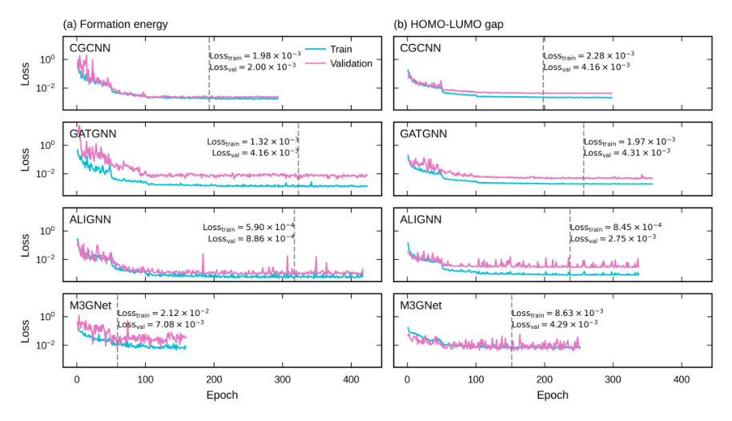 
Figure 2: Training behavior of the graph neural network models on the training and validation set of the ordered single and double perovskite dataset. (a) Formation-energy(Ef) training and validation loss trajectories for CGCNN, GATGNN, ALIGNN, and M3GNet. (b) HOMO-LUMO gap (Eg) training and validation loss trajectories for the same models. The cyan and pink solid lines represent the training and validation losses, respectively. Grey vertical dashed lines mark the best validation checkpoints.

📷 Fig 3

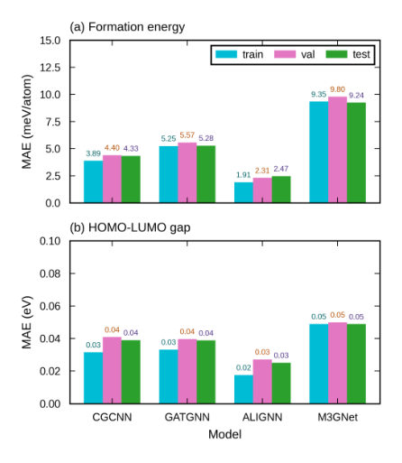 
Figure 3: Train, validation, and test MAE values for the ordered domain (single and double perovskite). (a) Formation-energy error (meV/atom). (b) HOMO-LUMO gap errors (eV).

📷 Fig 4

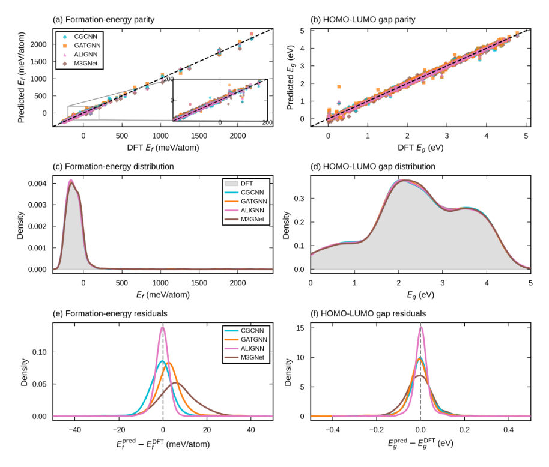 
Figure 4: Prediction quality of the trained GNN models on the ordered single and double perovskite test set. Parity plots for (a) formation-energy and (b) HOMO-LUMO gap predictions. Distribution of the calculated DFT and model predicted values of (c) formation energy and (d) HOMO-LUMO gap. Residual distributions of all GNN models for (e) formation energy and (f) HOMO-LUMO gap.

📷 Fig 5

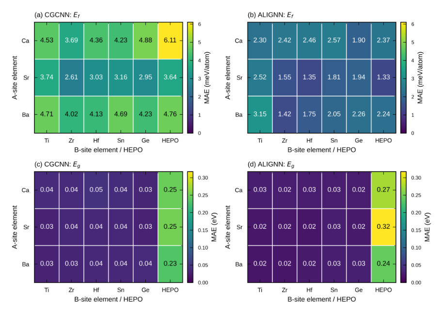 
Figure 5: Chemistry-resolved prediction errors on held out test set of ordered and disordered domain. CGCNN MAE maps for (a) formation energy Ef (meV/atom) and (b) HOMO-LUMO gap Eg (eV). ALIGNN MAE maps for (c) formation energy Ef and (d) HOMO-LUMO gap Eg . Rows denote the A-site element, and columns denote the ordered B-site element or the HEPO transfer group.

**Summary.** This work addresses the challenge of predicting properties in disordered High-Entropy Perovskite Oxides by using graph neural networks trained via transfer learning. The study finds that while structural stability ($	ext{E}_f$) transfers well, electronic gaps ($	ext{E}_g$) require targeted fine-tuning with HEPO data. It highlights that incorporating local geometric information is crucial for accurate modeling of complex disordered materials.

**Why it may be interesting.** While focused on solid-state materials, the core methodology—using advanced ML (GNNs) to extrapolate physical laws from a known, ordered regime to a highly complex, disordered one—is directly relevant to modeling many-body systems where disorder or quenched randomness is present.

Detailed structure

**Main problem.** Accurately predicting material properties, specifically formation energy and HOMO-LUMO gap, in chemically complex and structurally disordered High-Entropy Perovskite Oxides (HEPOs).

**Main result.** Knowledge transfer from ordered perovskites is effective for formation energy but fails for the HOMO-LUMO gap due to local environment sensitivity; incorporating small HEPO data significantly improves electronic property prediction.

**Method.** The study employs graph neural networks (GNNs) trained using an ordered-to-disordered transfer learning paradigm, comparing performance across four different GNN architectures.

**Model / system.** The physical system is the perovskite oxide structure ($	ext{ABO}_3$), modeled computationally using Special Quasirandom Structures (SQSs) to represent chemical and structural disorder in HEPOs. The prediction targets are DFT-calculated formation energy ($E_f$) and HOMO-LUMO gap ($E_g$).

**Key observables.** Formation energy ($	ext{E}_f$), HOMO-LUMO gap ($	ext{E}_g$), Mean Absolute Error (MAE), and residual distributions.

**Important parameters / regimes.** The transferability of knowledge, the fraction of HEPO-specific training data used for fine-tuning, and the inclusion of three-body geometric information (e.g., bond angles).

**Assumptions / limitations.** Knowledge learned from chemically ordered perovskites can serve as a starting point for predicting properties in disordered HEPOs.

**Figures summary.** Figures illustrate training loss trajectories showing ALIGNN's superior convergence, and MAE comparisons demonstrating the performance of different models on both ordered and HEPO test sets.

**Paper structure.** The paper first establishes the challenge posed by HEPOs. It then details the methodology using GNNs for transfer learning from ordered to disordered domains. Results are presented by comparing $	ext{E}_f$ vs. $	ext{E}_g$ transferability, followed by an analysis of model performance and optimal data incorporation strategies.

Abstract

High-entropy perovskite oxides (HEPOs) represent a chemically complex class of materials with promising functional properties, yet their vast compositional space and, chemical/structural disorder pose significant challenge for accurate property prediction. Graph neural networks (GNNs) enable rapid exploration of materials space but are often limited by the availability of representative training data. Here, we investigate ordered-to-disordered transfer learning using GNNs for formation-energy and HOMO-LUMO gap prediction in HEPOs by transferring knowledge learned from chemically ordered perovskites. Four representative GNN models, including CGCNN, GATGNN, ALIGNN and M3GNet are evaluated to understand the role of structural representations, spanning pairwise two-body and angular three-body interactions in transfer performance. We find strong property-dependent transfer behavior: formation-energy prediction transfers effectively to disordered HEPOs, whereas HOMO-LUMO gap prediction shows limited transferability due to its sensitivity to local chemical environments. Incorporating a small HEPO-specific training dataset substantially improves HOMO-LUMO gap prediction. Representation-level analysis using UMAP further highlights the importance of encoding three-body geometric information such as in ALIGNN for capturing complex structure-property relationships and improving transferability.

[↑ back to top](#top)

### [Symmetry selection rule for the band-edge shift current in two dimensions](http://arxiv.org/abs/2607.28927v1)

**Authors:** Felipe Pérez Riffo, Matías Castro, Leonor Chico, L. E. F. Foa Torres. Eric Suárez Morell  
**Type:** theory · **Category:** other · **PDF:** <https://arxiv.org/pdf/2607.28927v1>  
**Analysis basis:** full PDF text, analyzed in chunks
**Topic relevance:** `Keldysh / 2PI / non-Gaussian methods` **1/5** · `driven-dissipative phase transition` **1/5**

📷 Fig 1

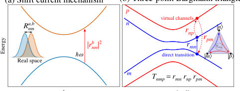 
FIG. 1. (a) SC mechanism: a vertical interband transition promotes an electron at fixed k [rate |rb nm|2], displacing its real-space charge center by the shift vector Ra;b nm; the photocurrent is the coherent sum of these shifts. (b) Gapped AB-bilayer bands near K (low-energy optical pair m, n in blue; dimer bands in red): the resonant pair and a dimer spectator p form the three-point Bargmann triangle m → n →p →m with interband connections rnm (optical) and rnp, rpm (virtual).

📷 Fig 2

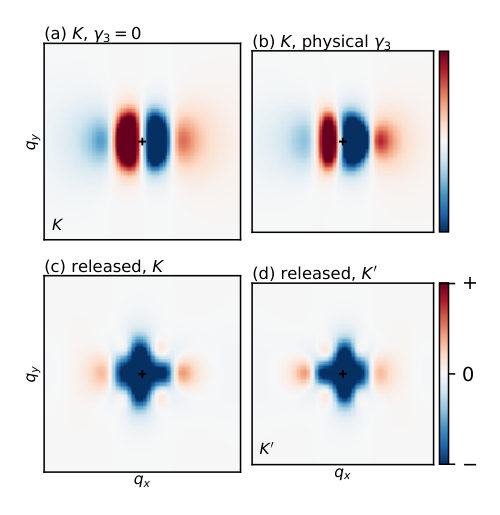 
FIG. 2. Gap-edge SC integrand Iyyy(q) around the valleys for the linearized AB bilayer. (a) At γ3=0, four lobes of alternating sign whose net response vanishes, ⟨I⟩= 0, the emergent-C∞symmetry cancellation. (b) With γ3 the release is a small distortion of a large, near-cancelling background. (c) Their difference, the O(γ3) released component, carries a nonzero net scalar concentrated near K. (d) The same released component at the time-reversed valley K′ [HK′(q) = HK(−q)∗]: the q →−q image of (c); the two valleys add rather than cancel, consistent with the mirror-even σyyy.

📷 Fig 3

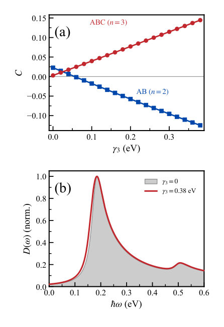 
FIG. 3. (a) Coherence factor C [Eq. (10)] of the band-edge SC versus trigonal warping γ3, from the full TB models at fixed bias (AB, δ = 0.10 eV, blue; ABC, 2U = 0.10 eV, red; nk = 1500). Both grow linearly from a small, symmetry-enforced residual at γ3=0, but with opposite sign [Fig. 5(d)]. (b) Dipole-only weight D(ω) of the bilayer [Eq. (22), the optical rate without the shift vector] at γ3 = 0 (grey) and γ3 = 0.38 eV (red), δ = 0.10 eV, 20 meV broadening.

📷 Fig 4

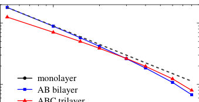 
FIG. 4. Band-edge weight W(δ) = R d2q Iyyy versus gap δ (log– log), from the TB spectra. The monolayer saturates (exponent 0) [Eq. (20)], while the AB bilayer and ABC trilayer both diverge as 1/δ (dashed guide; trilayer fit exponents −0.92 to −1.06), the same order despite the flatter cubic touching.

📷 Fig 5

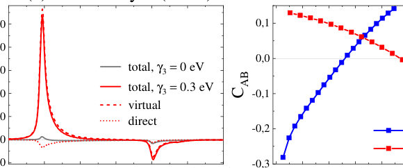 
FIG. 5. SC across the graphene family from the full TB Hamiltonians, and its gate-driven sign reversal. (a) Monolayer (n=1): a single direct-channel peak just above the threshold 2δ (δ = 0.10 eV). (b) AB bilayer (n=2) and (c) ABC trilayer (n=3): σyyy(ω) resolved into total, virtual (dotted) and direct (dashed) channels at the physical γ3 (color), with the total at γ3=0 (grey) for reference; the virtual channel carries essentially the whole band-edge response, near-canceled at γ3=0, and the two touchings release with opposite sign (AB negative, ABC positive at the band edge). (d) Coherence factor C versus interlayer bias for the bilayer (δ/γ1, left axis) and trilayer (2U/γ1, right axis): C...

**Summary.** This theoretical work derives a symmetry selection rule that explains the sign reversal of band-edge shift currents in 2D Dirac systems like graphene. By utilizing a three-point Bargmann invariant and analyzing emergent rotational symmetries, the authors show that warping breaks a protective symmetry, enabling a gate-switchable photovoltaic response.

**Why it may be interesting.** The rigorous derivation of an exact angular selection rule governing a measurable photocurrent response provides deep insight into how crystal symmetries dictate electronic transport properties in low-dimensional materials, relevant for understanding topological or strongly correlated responses.

Detailed structure

**Main problem.** The paper addresses the sign reversal of large band-edge shift currents observed in graphene multilayers, a phenomenon not explained by standard quantum metrics like Berry curvature.

**Main result.** It establishes an exact angular selection rule showing that an emergent rotational symmetry forbids the current in 2D, and this response is switched on linearly by trigonal warping. This makes the current parameter-free and gate-switchable in bilayer/trilayer graphene.

**Method.** The analysis uses advanced concepts from quantum geometry, developing a three-point Bargmann invariant to characterize the bulk photovoltaic response ($\sigma_{a;bc}(\omega)$).

**Model / system.** The study focuses on inversion-broken, two-dimensional gapped Dirac-like systems, specifically modeling graphene multilayers and the kagome lattice.

**Key observables.** Shift current ($	ext{SC}$), three-point Bargmann invariant ($T^{nmp}$), and the bounded coherence factor ($C$).

**Important parameters / regimes.** Gate voltage (for sign reversal), warping strength, and dimensionality (2D vs 3D).

**Assumptions / limitations.** The analysis is restricted to the bulk, second-order-in-field mechanism near band-edge touchings.

**Figures summary.** Figures illustrate the microscopic shift current contribution ($\propto |r_b^{nm}|^2 \mathbf{R}_{a;b}^{nm}$) and depict the closed loop structure of the three-point Bargmann triangle in band space.

**Paper structure.** The paper develops from identifying the unexplained sign reversal to formulating the response using a three-point Bargmann invariant. It then derives the symmetry selection rule, showing the prohibition in 2D due to $	ext{SO}(2)$ symmetry and its restoration by $C_3$ warping.

Abstract

The shift current is the intrinsic bulk photovoltaic response of a crystal without an inversion center. In graphene multilayers, recent calculations report large band-edge shift currents that reverse sign under a gate or displacement field, a behavior that neither the quantum metric nor the Berry curvature captures. We show that this behavior follows from a symmetry principle: at the absorption edge of an inversion-broken, two-dimensional gapped Dirac-like system, an emergent low-energy rotational symmetry forbids the response, and the trigonal warping, which reduces this emergent symmetry to the lattice's three-fold rotation, switches the current on linearly in its strength. We formulate this as an exact angular selection rule that unifies the band-edge responses of multilayer graphene and of the kagome lattice. In the multiband structures, the released current is governed by a signed, detuning-weighted three-point Bargmann invariant of the Bloch states: the optical amplitude remains fixed while the sign alignment of the Bargmann triangles grows with the warping, a phase-coherence effect captured by a bounded coherence factor and invisible to any positive-definite figure of merit, the quantum metric included. In bilayer and trilayer graphene, a gate voltage alone drives the sign reversal, making the band-edge shift current a parameter-free, gate-switchable bulk photovoltaic response.

[↑ back to top](#top)

### [Valley- and Orbital-Controlled 2D Chern Insulators Without Spin-orbit Interaction](http://arxiv.org/abs/2607.29486v1)

**Authors:** J. Benkaida, O. Benhaida, L. B. Drissi, E. H. Saidi  
**Type:** theory · **Category:** other · **PDF:** <https://arxiv.org/pdf/2607.29486v1>  
**Analysis basis:** full PDF text, analyzed in chunks
**Topic relevance:** `analog quantum simulation` **1/5** · `driven-dissipative phase transition` **1/5**

📷 Fig 1

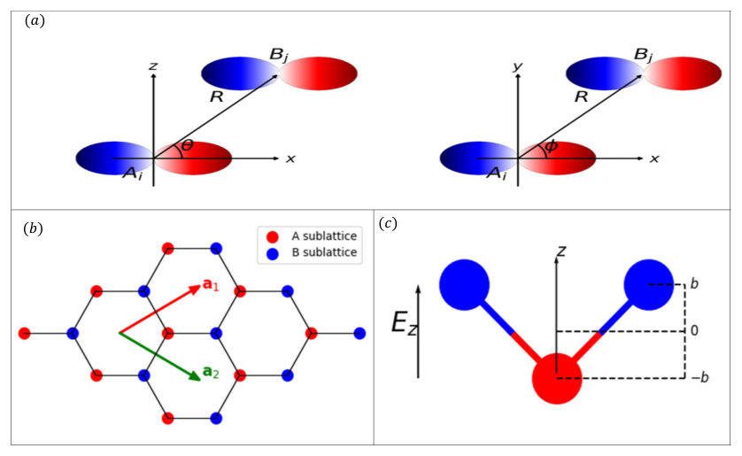 
FIG. 1. Lattice structure and orbital configuration. (a) Spatial configuration of 𝑝𝑥orbitals. The orbital centered at the origin corresponds to sublattice 𝐴, while the second orbital belongs to sublattice 𝐵at coordinates (𝑅, 𝜃, 𝜙). (b) Top view of the honeycomb lattice. The primitive lattice vectors for sublattices 𝐴and 𝐵are given by 𝑎1,2 = ( 3

📷 Fig 2

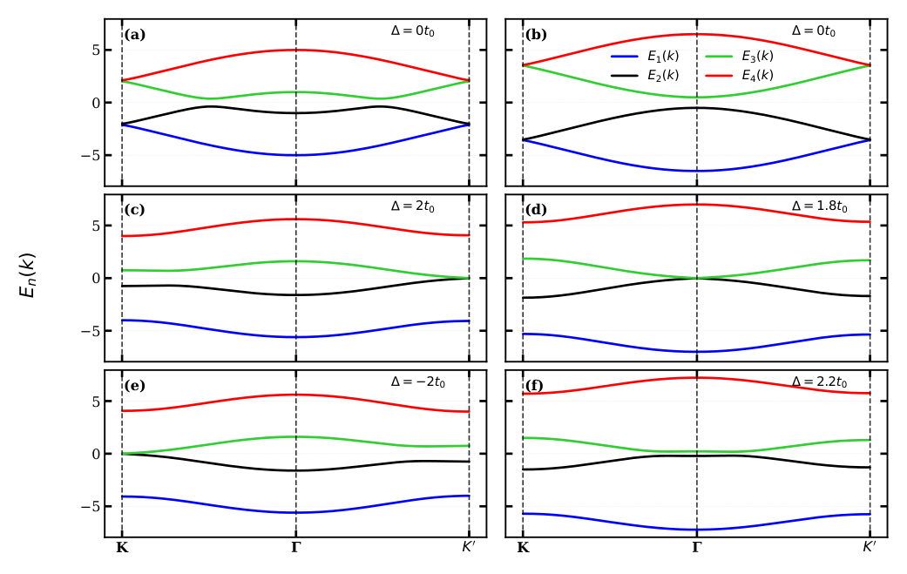 
FIG. 2. Energy band structures along the high-symmetry path (K˘𝚪˘K′) for various values of the orbital coupling 𝜆and the staggered potential Δ. Panels (a), (c), and (e) correspond to 𝜆= 2𝑡0, while panels (b), (d), and (f) correspond to 𝜆= 3.5𝑡0. The value of the staggered potential Δ is indicated within each panel. The hopping parameter is fixed at 𝑡1 = 0.25𝑡0.

📷 Fig 3

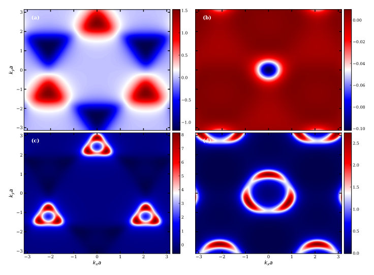 
FIG. 3. Distribution of the total Berry curvature of the occupied bands, Ω(k)/𝑎2, in the momentum space (𝑘𝑥, 𝑘𝑦) for various orbital coupling strengths 𝜆. The panels show results for: (a) 𝜆= 0.5 𝑡0, (b) 𝜆= 4 𝑡0, (c) 𝜆= 1.2 𝑡0, and (d) 𝜆= 2.5 𝑡0. The hopping parameter is fixed at 𝑡1 = 0.25 𝑡0 and the staggered potential at Δ = 𝑡0.

📷 Fig 4

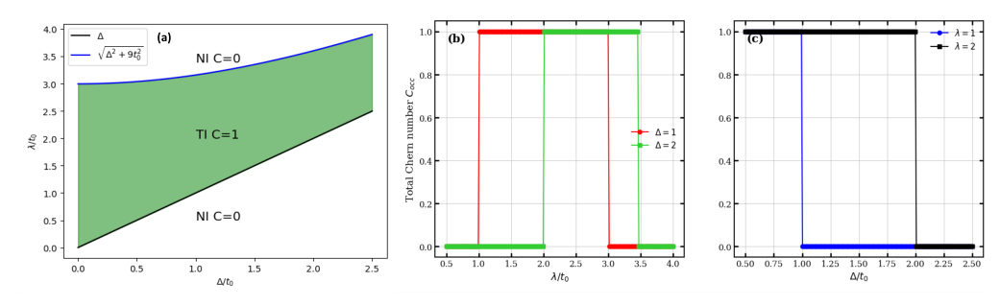 
FIG. 4. Variation in the total occupied bands’ Chern number (𝐶𝑜𝑐𝑐= 𝐶1 + 𝐶2) regarding system parameters: (a) topological phase diagram in the (𝜆, Δ) plane; (b) total Chern number dependence on the orbital coupling 𝜆for fixed Δ values (indicated within the panel); (c) total Chern number versus staggered potential Δ for fixed 𝜆values (indicated within the panel). The hopping parameter is fixed at 𝑡1 = 0.25𝑡0.

📷 Fig 5

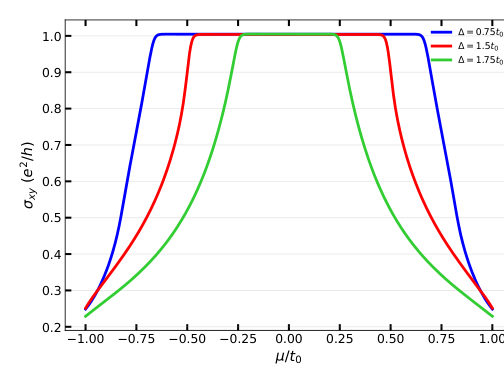 
FIG. 5. Anomalous Hall conductivity 𝜎𝑥𝑦(in units of 𝑒2/ℎ) as a function of the chemical potential 𝜇/𝑡0 for various staggered potentials Δ (as labeled in the figure). The parameters are set to 𝑡1 = 0.5 𝑡0 for the hopping and 𝜆= 2 𝑡0 for the orbital coupling.

**Summary.** The paper theoretically explores achieving Chern insulating behavior in 2D lattices by manipulating orbital couplings and staggered potentials. By tuning these parameters, the system undergoes controlled topological phase transitions, leading to a quantized anomalous Hall effect without needing spin-orbit interaction. This provides a pathway for 'orbitronic' control over fundamental quantum properties.

**Why it may be interesting.** This work demonstrates how orbital engineering can mimic the effects of spin-orbit coupling to realize topological states, which is highly relevant for designing next-generation electronic devices that rely on controlling band topology.

Detailed structure

**Main problem.** The study investigates how orbital degrees of freedom can induce topological phase transitions, leading to Chern insulating behavior without requiring intrinsic spin-orbit coupling.

**Main result.** The system realizes a quantized anomalous Hall conductivity ($\sigma_{xy}=e^2/h$) and Chern number ($C=1$) within a specific parameter window defined by the competition between orbital coupling ($\lambda$) and staggered potential ($\Delta$).

**Method.** The analysis uses a multi-orbital tight-binding model solved in momentum space, calculating topological invariants like the Berry curvature and Chern number via the Kubo formula.

**Model / system.** It models a two-dimensional lattice (like buckled honeycomb structures) using an extended Hamiltonian incorporating orbital coupling ($\lambda$) and a staggered potential ($\Delta$), which breaks both Time-Reversal and Inversion symmetry.

**Key observables.** Quantized anomalous Hall conductivity ($\sigma_{xy}$), Chern number ($C=1$), and the energy band structure $E_n(\mathbf{k})$ along high-symmetry paths.

**Important parameters / regimes.** The relative magnitudes of the orbital coupling ($\lambda$) and the staggered potential ($\Delta$) define the topological phase diagram, with critical points occurring at $|\lambda| = \pm\Delta$ and $\lambda = \pm\sqrt{\Delta^2+9t_0^{2}}$.

**Assumptions / limitations.** The analysis neglects $p_z$ orbitals as they are assumed to be energetically far from the Fermi level, simplifying the model to in-plane $p$-orbitals.

**Figures summary.** Figures illustrate energy band structures showing gap closures at K/K' and $\Gamma$ points for varying parameters, and one figure shows the distribution of Berry curvature concentrating near specific valleys within the topological window.

**Paper structure.** The paper establishes the Hamiltonian using Slater-Koster formalism, derives the Bloch Hamiltonian in momentum space, analyzes the band structure evolution through parameter tuning ($\lambda$ vs $\Delta$), and finally calculates the Chern number to map out the phase diagram.

Abstract

We present a theoretical study of orbital-induced topological phase transitions in a two-dimensional lattice model with staggered potential $(Δ)$ and orbital coupling $(λ)$ competing with the hopping strength. By tuning these parameters, two gap-closing mechanisms emerge: valley closure at $\mathbf{K}$ and $\mathbf{K'}$ for $λ=\pmΔ$, and a $\mathbfΓ$-point closure at $λ=\pm\sqrt{Δ^2+9t_0^{2}}$. Their interplay defines a topological window in which the Berry curvature localizes near a single valley, yielding a quantized anomalous Hall conductivity ($σ_{xy}=e^{2}/h$) and Chern number ($C=1$). These results demonstrate orbital-driven Chern insulating behavior without spin-orbit coupling. The resulting phase diagram captures the transition from trivial to topological phases and suggests practical routes for orbital engineering in tunable lattice systems.

[↑ back to top](#top)

### [Giant Exfoliation Induced Magnetic Coercivity in Fe$_3$GaTe$_2$](http://arxiv.org/abs/2607.28828v1)

**Authors:** Lingrui Mei, PeiYu Cai, Sang-Eon Lee, Yue Li, Shyam Raj Karullithodi, Vadym Kulichenko, Charudatta Pathak, Elton J. G. Santos, Luis Balicas  
**Type:** both · **Category:** other · **PDF:** <https://arxiv.org/pdf/2607.28828v1>  
**Analysis basis:** full PDF text, analyzed in chunks
**Topic relevance:** `spintronics-quantum-optics interface` **1/5**

📷 Fig 1

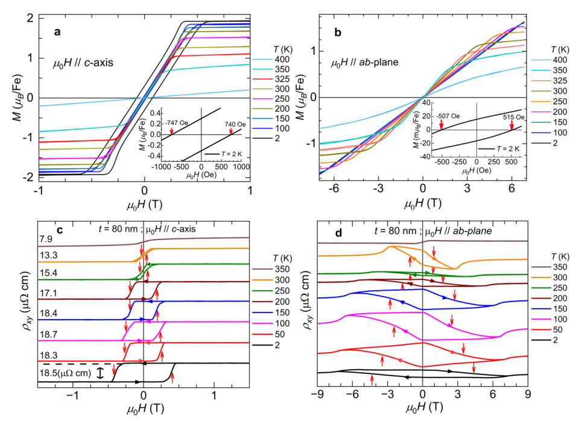 
Figure 1| a) Magnetization M as a function of the magnetic field µ0H applied along the interlayer

📷 Fig 2

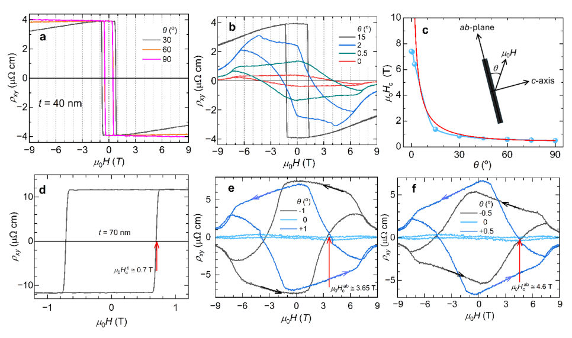 
Figure 2| a) Hall resistivity ρxy as a function of the magnetic field µ0H for a t = 40 nm thick

📷 Fig 3

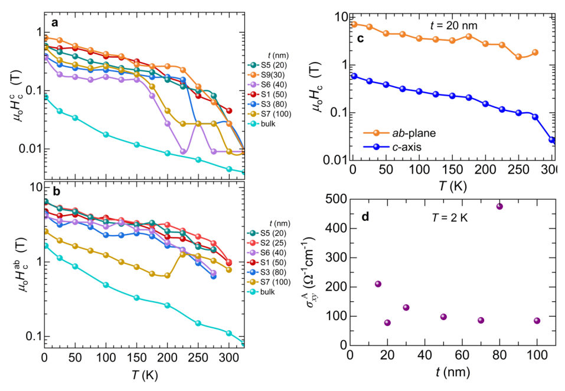 
Figure 3| Comparison between coercive fields measured in exfoliated crystals and a bulk crystal.

📷 Fig 4

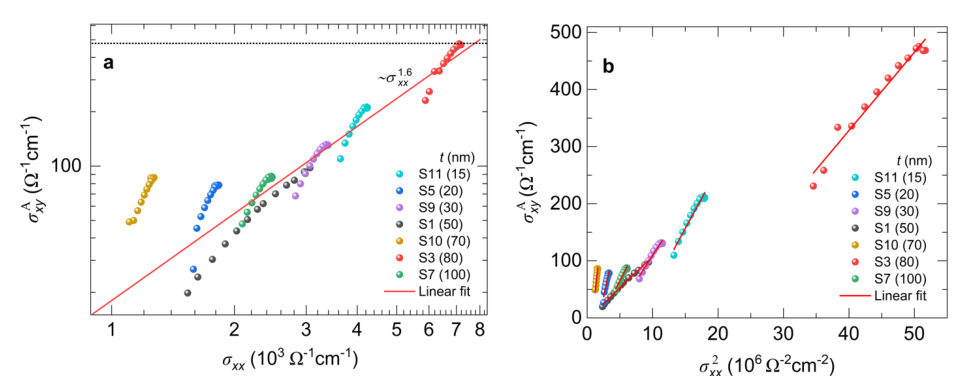 
Figure 4| Evaluating the role of disorder for each exfoliated crystal. a) Anomalous Hall

📷 Fig 5

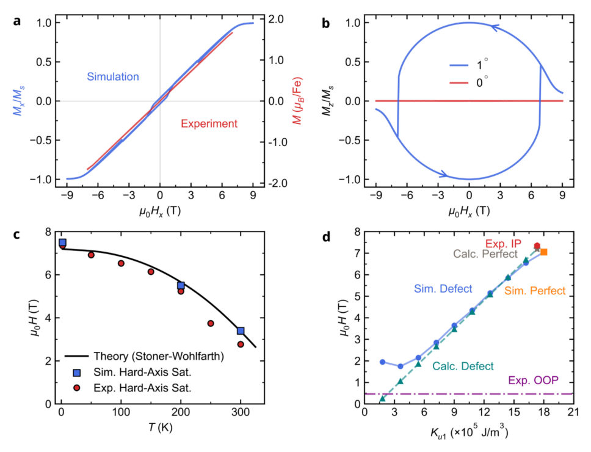 
Figure 5| Micromagnetic simulations elucidating the magnetic hardening and reversal

**Summary.** This work demonstrates that mechanically exfoliating the van der Waals ferromagnet $	ext{Fe}_3	ext{GaTe}_2$ induces a giant enhancement in its room-temperature magnetic coercivity. This effect is attributed to the transition from multi-domain behavior in bulk crystals to quasi-coherent, single-domain rotation in thin flakes. The findings position $	ext{Fe}_3	ext{GaTe}_2$ as a highly promising, rare-earth-free material for next-generation spintronic memory devices.

**Why it may be interesting.** While primarily condensed matter magnetism, the study of thickness-dependent magnetic transitions and the use of van der Waals heterostructures touches upon concepts relevant to engineered quantum interfaces and low-dimensional physics.

Detailed structure

**Main problem.** The primary goal is to develop rare-earth-free permanent magnets with high coercivity for spintronic applications, overcoming the limitations of bulk materials.

**Main result.** Mechanical exfoliation dramatically enhances the room-temperature coercive field in $	ext{Fe}_3	ext{GaTe}_2$ from negligible values to nearly 1 T when the field is applied in the plane.

**Method.** The study combines experimental measurements (magnetization, anomalous Hall effect) on exfoliated flakes with micromagnetic simulations to analyze the magnetic reversal mechanism.

**Model / system.** The system is $	ext{Fe}_3	ext{GaTe}_2$, a van der Waals ferromagnet. The analysis uses the Stoner-Wohlfarth model and micromagnetic theory to describe magnetization reversal, contrasting bulk domain-mediated behavior with thin-flake quasi-coherent rotation.

**Key observables.** Coercive field ($\mu_0H_c$), saturation magnetization ($M_s$), Anomalous Hall resistivity ($
ho_{xy}^A$), and magnetic anisotropy constant ($K$).

**Important parameters / regimes.** Thickness (down to $<100 	ext{ nm}$), temperature ($2 	ext{ K}$ to $300 	ext{ K}$), and field orientation relative to the crystal planes.

**Assumptions / limitations.** The enhancement in coercivity is attributed to the system approaching a single-domain limit, governed by intrinsic magnetocrystalline anisotropy, rather than disorder-induced pinning mechanisms.

**Figures summary.** Figures show $\mu_0H_c$ increasing significantly for planar fields compared to c-axis fields upon exfoliation. Anomalous Hall response plots are used to analyze thickness dependence and distinguish intrinsic vs. extrinsic magnetic contributions.

**Paper structure.** The paper establishes the need for rare-earth-free magnets, presents experimental evidence showing coercivity enhancement via exfoliation (comparing bulk vs. thin flakes), analyzes this using micromagnetics/AHE measurements, and concludes that the material is promising for spintronics due to its tunable planar anisotropy.

Abstract

Permanent magnets with strong anisotropy and high coercivity underpin modern information and energy technologies, yet rare-earth-free alternatives remain limited. Here, we show that thickness engineering via mechanical exfoliation induces hard magnetic behavior in the van der Waals ferromagnet Fe$_3$GaTe$_2$. Bulk crystals exhibit Curie temperatures above 350 K but negligible room-temperature coercivity. When thinned below 100 nm, the coercive field is dramatically enhanced, reaching nearly 1 T at room temperature for in-plane fields which is comparable to values of conventional hard magnets. Micromagnetic analysis reveals a crossover in magnetization reversal from domain-mediated processes in bulk samples to quasi-coherent rotation in thin flakes, driven by increased effective anisotropy and suppressed domain formation. This thickness-dependent transition enables tuning of magnetic hardness without chemical modification. Combined with high saturation magnetization and robust room-temperature performance, Fe$_3$GaTe$_2$ emerges as a promising rare-earth-free material for spintronic applications. Its layered structure further allows integration into van der Waals heterostructures, where large in-plane coercivity can stabilize magnetic states against perturbations and interlayer coupling, offering potential for high-density nonvolatile memory and domain-wall-based devices.

[↑ back to top](#top)

### Other secondary papers (2)

Show other secondary papers

### [Automating the analysis of micron-scale synchrotron diffraction data on inhomogeneous polycrystalline samples: a solid oxide electrolysis cell case study](http://arxiv.org/abs/2607.28859v1)

**Authors:** Liam A. V. Nagle-Cocco, Christopher A. Crain, Michael J. Dzara, Mathias A. Kiefer, Madeline G. Port, Tolga Han Ulucan, Madeline Van Winkle, Oscar Hathaway, Nicholas A. Strange  
**Type:** experiment · **Category:** other · **PDF:** <https://arxiv.org/pdf/2607.28859v1>  
**Analysis basis:** full PDF text, analyzed in chunks

📷 Fig 1

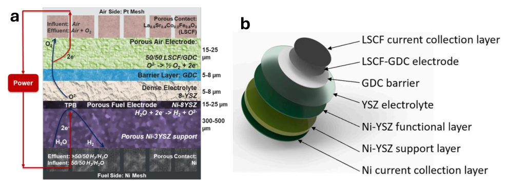 
Figure 1: (a) Schematic illustrating the composition and design of the SOECs in this study. (b) Schematic showing the construction of the coin cells used in this study, reproduced from Zhu et al. (2025).

📷 Fig 2

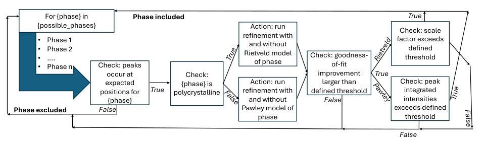 
Figure 2: Schematic explaining, in partial pseudo-code, the approximate phase identification algorithm used in the protocol for each diffraction pattern in a 2-dimensional grid measured over the cross-section of an SOEC.

📷 Fig 3

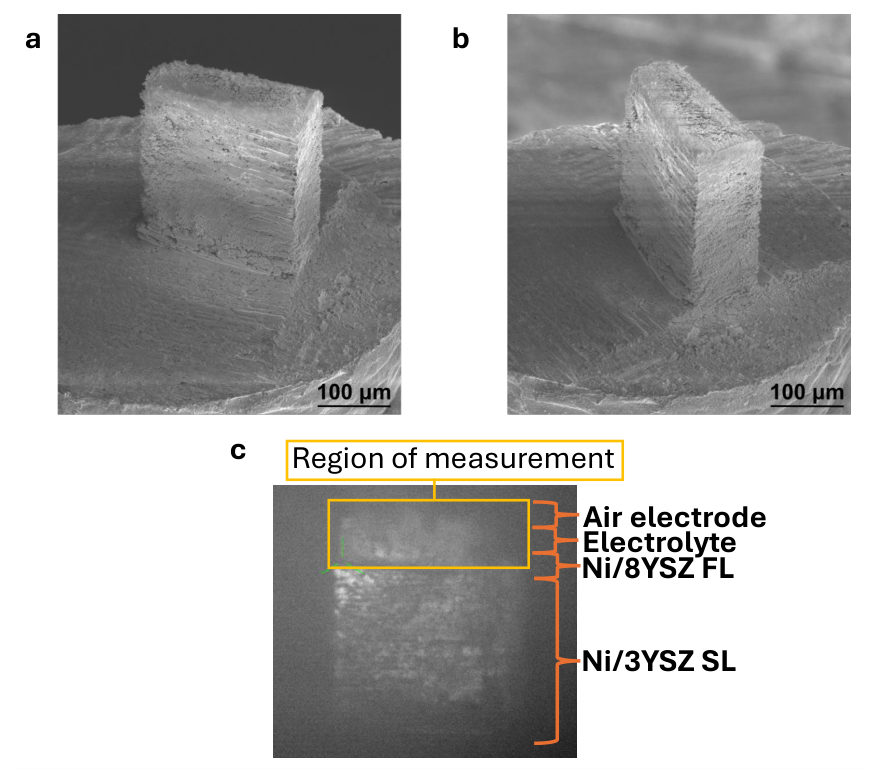 
Figure 3: (a) and (b) SEM images of a tombstone SOEC fragment from the same cell as the fragment studied in this paper. Note that this is not the same actual fragment. (c) Optical image of the tombstone SOEC fragment in the beamline, with the square indicating the region of measurement. FL and SL stand for functional layer and support layer respectively.

📷 Fig 4

 
Figure 4: Heatmap visualising the lattice parameters of (a) GDC, (b) LSCF-6428, and (c) 8YSZ as obtained by automated Rietveld refinement of diffraction data on the SOEC. All three phases are modelled with cubic lattice parameters in this study. White space within the heatmaps indi- cates pixels where the relevant phase is undetected by the algorithm, and is consistent with fuel electrode/air electrode relative positioning.

📷 Fig 5

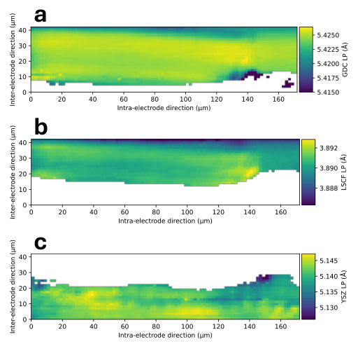 
Figure 5(a) shows fit quality quantified by goodness-of-fit (the ratio of Rwp to Rexp) as a function

**Summary.** This paper presents a novel, fully automated computational protocol for analyzing complex, spatially-resolved X-ray diffraction data from inhomogeneous materials like SOECs. By developing an open-access Python routine, the authors overcome significant manual analysis hurdles to map phase composition and strain across device cross-sections. This methodology is valuable for post mortem characterization of high-temperature electrochemical energy devices.

**Why it may be interesting.** Not directly relevant

Detailed structure

**Main problem.** The primary challenge is automating the analysis of massive, spatially-resolved synchrotron diffraction datasets from chemically inhomogeneous polycrystalline materials.

**Main result.** The authors developed and applied a fully automated Python routine that successfully performs phase identification and Rietveld refinement across complex device cross-sections, enabling detailed post mortem characterization of degradation products in SOECs.

**Method.** The method involves an iterative, automated protocol combining peak matching, goodness-of-fit checks ($	ext{R}_{	ext{wp}}/	ext{R}_{	ext{exp}}$), and scale factor analysis within a Rietveld framework, implemented via Python scripts calling Topas.

**Model / system.** The study focuses on Solid Oxide Electrolyser Cells (SOECs) fragments, which are analyzed using micron-scale X-ray diffraction ($\mu$-XRD). The technique is applicable to other electrochemical devices like all-solid-state batteries and fuel cells.

**Key observables.** Lattice parameters of various phases ($	ext{YSZ}$, $	ext{LSCF-6428}$), phase composition maps, strain distribution, and goodness-of-fit metrics across the sample cross-section.

**Important parameters / regimes.** Micron beam width, operating temperatures (high for SOECs), and crystallographic parameters derived from refinement ($	ext{R}_{	ext{wp}}/	ext{R}_{	ext{exp}}$).

**Assumptions / limitations.** The analysis assumes that the automated protocol can reliably handle data complexity; specific limitations include assuming cubic unit cells when rhombohedral structures are expected, and fixing the zero error to avoid correlation issues.

**Figures summary.** Figures illustrate SOEC designs, pseudo-code for the phase identification algorithm, heatmaps showing variations in lattice parameters and zero error across the sample, and plots comparing fit quality metrics.

**Paper structure.** The paper introduces the $\mu$-XRD technique and its analytical bottleneck. It details the automated Python routine (including pseudocode) and applies it to an SOEC case study, presenting results on phase mapping, lattice parameter variations due to chemistry/strain, and limitations encountered during refinement.

Abstract

A novel approach to post mortem characterisation of electrochemical and photovoltaic devices is spatially-resolved diffraction using a hyper-focused, micron-width x-ray beam to examine the distribution of degradation products and strain, a technique called $μ$-XRD. Aside from the experimental difficulties associated with beam focusing and sample preparation, which are themselves non-trivial, the analysis of resulting data is complex and challenging, with full Rietveld analysis rarely attempted in literature. The difficulty lies in the size of the data, which may consist of hundreds or even thousands of diffraction patterns with very different crystallographic phase compositions depending on position within the device, and the difficulty in fitting the data due to the presence of many phases at the same position, including possible degradation products which may be difficult to index and assign to known phases. In this paper, we present a fully-automated open access Python routine for performing phase identification and Rietveld analysis on 2D datasets of diffraction pattern taken at micron-scale positions, measured over the cross-section of a chemically inhomogeneous device with polycrystalline phases. Solid oxide electrolyser cells are a promising technology for green hydrogen production which can utilise waste heat to split water at higher efficiencies than low-temperature electrolysis techniques such as polymer electrolyte membranes, but exhibit many degradation modes due to the high operating temperatures. We present a case study using our analysis protocol on an SOEC fragment encompassing the air electrode, cation diffusion barrier, electrolyte, and fuel electrode. With modification, this protocol could be applied to other devices such as all-solid-state batteries, wet-electrolyte battery electrodes, solid oxide fuel cells, photovoltaic devices, and metal-oxide pseudocapacitors.

[↑ back to top](#top)

### [Molecular beam epitaxy synthesis of ternary nitride PrTaN$_2$ and its crystal structure determination](http://arxiv.org/abs/2607.28909v1)

**Authors:** Kosuke Takiguchi, Yoshiharu Krockenberger, Eisuke Magome, Yoji Kunihashi, Hideki Yamamoto  
**Type:** experiment · **Category:** other · **PDF:** <https://arxiv.org/pdf/2607.28909v1>  
**Analysis basis:** full PDF text, analyzed in chunks

📷 Fig 1

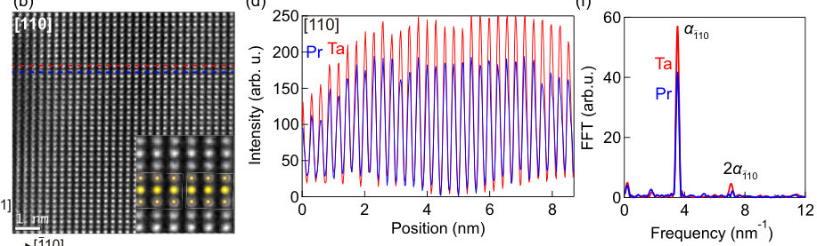 
Figure 1: (a,b) High-angle annular dark field scanning transmission electron microscopy (HAADF-STEM) images in the [100] and [110] directions of PrTaN2. The inset shows the expanded images with the schematic atomic images of PrTaN2. The scale bar corresponds to 1 nm. (c,d) Line intensity profiles of red and blue dashed lines in (a) and (b), respectively. Since the intensity of HAADF-STEM represents the atomic number, we can distinguish the cation positions, which means the red and blue lines represent Ta and Pr. For (c) and (d), Pr and Ta are located in alternate shifts in [001] direction. For the in-plane direction, while Pr and Ta are located half cycle change in (c), they are located same...

📷 Fig 2

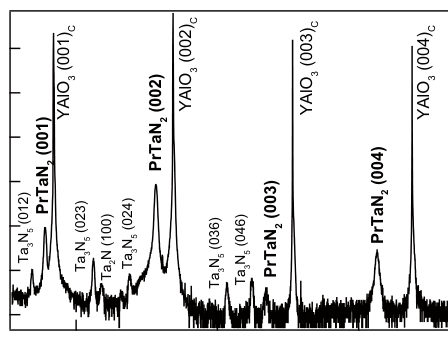 
Figure 2: XRD symmetric scan in [001]c direction of YAO measured in SAGA-LS with wave length of 1.00 Å. The crystalline coherency of PrTaN2 in [001] direction is confirmed with the higher order (00l) peaks up to (006). We also observed the Ta3N5 (012) and (023) peaks as well as their higher order diffraction peaks, which indicates that our RF radical source achieves the rich nitrogen environment.

📷 Fig 3

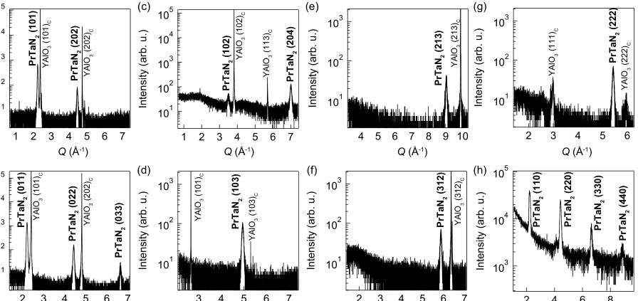 
Figure 3: XRD symmetric scan aligned in the direction of (a) (101) (χ = 45.5◦), (b) (011) (χ = 45.4◦), (c) (102) (χ = 63.0◦), (d) (103) (χ = 72.9◦), (e) (213) (χ = 37.0◦), (f) (312) (χ = 58.0◦), and (g)(222) (χ = 54.8◦) PrTaN2 planes. (h) In-plane XRD measurement with χ = 0.5◦. The estimated d spacing are presented in Table 1.

📷 Fig 4

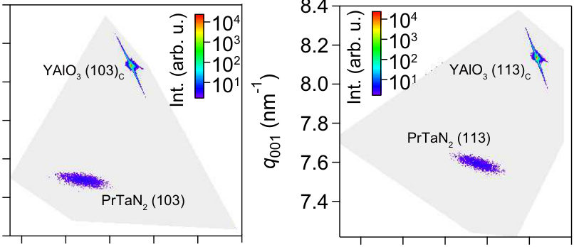 
Figure 4: High resolution reciprocal space maps of the PrTaN2 thin film around the YAO (103)c and YAO (113)c peak. Logarithmic scale is used to express the intensity of the diffraction, which is shown as the color bar. The relaxed film is grown on the substrate, and the film and the substrate share the same crystalline axis.

📷 Fig 5

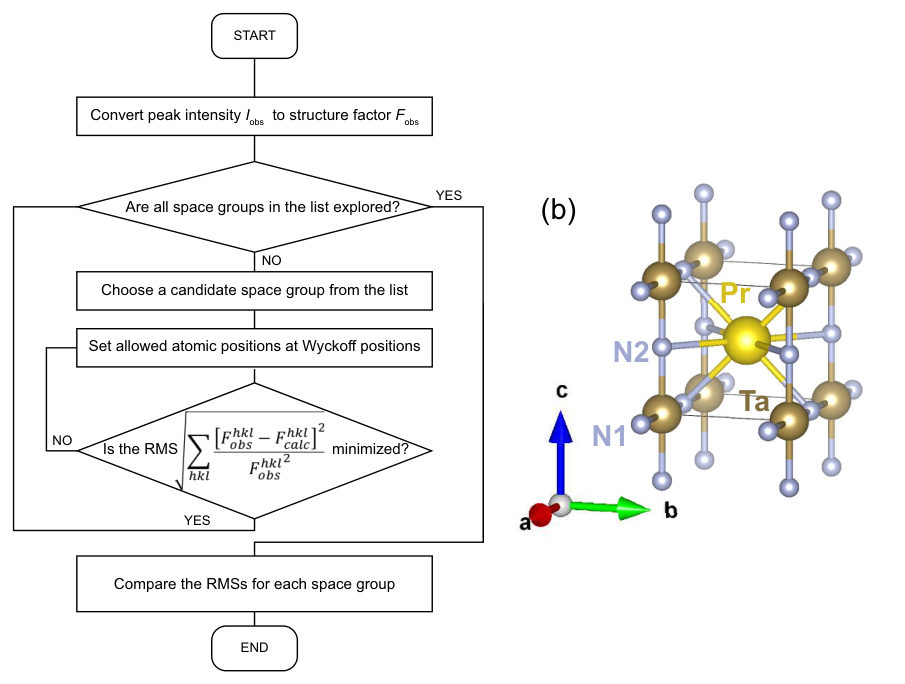 
Figure 5: (a)Fitting procedure of eq. (3) to the experimental data. To convert the peak intensity Iobs to the structure factor Fobs, we use eq. (4). By using this procedure, we can decrease the number of fitting parameter using Wyckoffpositions. (b) Crystal structure of PrTaN2 reproduced by the estimated atomic coordinates.

**Summary.** This paper reports the successful synthesis of a novel ternary nitride, PrTaN2, as an epitaxial thin film using Molecular Beam Epitaxy. The authors characterized its crystal structure as orthorhombic with space group P222 through detailed XRD and STEM analysis. This work establishes MBE as a powerful technique for exploring complex, previously inaccessible nitride materials.

**Why it may be interesting.** While highly materials-focused, the advanced use of structure factor analysis and systematic elimination of candidate phases mirrors complex pattern recognition problems relevant in quantum state tomography or phase diagram mapping.

Detailed structure

**Main problem.** The primary goal was the discovery and structural characterization of a novel ternary nitride, PrTaN2, which is difficult to synthesize using conventional bulk methods.

**Main result.** The authors successfully synthesized PrTaN2 as a thin film via Molecular Beam Epitaxy (MBE) and determined its crystal structure to be orthorhombic with the space group P222.

**Method.** The study employed MBE for synthesis, followed by structural characterization using X-ray Diffraction (XRD), HAADF-STEM, and advanced structure factor fitting techniques.

**Model / system.** The physical system is a thin film of the ternary nitride PrTaN2 grown epitaxially on YAlO3 substrates. The analysis involves modeling crystal symmetry and determining atomic coordinates based on diffraction data.

**Key observables.** Lattice parameters (a, b, c), orthorhombic structure confirmation, space group identification (P222), and the ratio of structure factors ($F_{204}/F_{102}$).

**Important parameters / regimes.** The synthesis method utilizes an RF nitrogen radical source for highly nitriding conditions; structural analysis relies on Wyckoff position constraints.

**Assumptions / limitations.** Initial assumptions regarding atomic positions were tested against experimental data, and the final structure determination relied on systematically excluding alternative candidate phases based on diffraction rules.

**Figures summary.** Figures show HAADF-STEM images confirming cation ordering (Pr vs Ta), FFT patterns matching XRD periodicity, and multiple XRD scans used to confirm the orthorhombic lattice parameters.

**Paper structure.** The paper follows a progression from synthesis via MBE to structural confirmation using STEM/XRD, followed by rigorous structure factor fitting that systematically rules out competing phases before finalizing the space group assignment.

Abstract

We report the discovery of a novel ternary nitride PrTaN$_2$ synthesized as a thin film using molecular beam epitaxy. The combination of e-beam evaporation for refractory elements and a radio-frequency nitrogen radical source enables growth under a highly nitriding environment, providing access to phases not readily obtained in bulk synthesis. Structural characterization by X-ray diffraction and high-angle annular dark-field scanning transmission electron microscopy reveals that the compound crystallizes in an orthorhombic structure and grows with a well-defined orientation on YAlO$_3$ substrates, while remaining essentially strain-free. To determine the crystal structure from limited thin-film diffraction data, we developed a fitting procedure based on structure factors. By combining extinction rules with constraints from Wyckoff positions, the number of fitting parameters is significantly reduced, enabling reliable structure determination. Systematic exclusion of alternative candidate phases in the Pr-Ta-N system, together with structure factor fitting, identifies the space group as $P222$ and determines the atomic coordinates. The present results demonstrate that thin-film growth with molecular beam epitaxy can stabilize previously unexplored ternary nitrides, and establish a practical approach for structural determination in such systems. This work provides a pathway for the exploration of new complex nitride materials.

[↑ back to top](#top)

