
# arxiv digest (quant-ph + cond-mat) — 2026-08-05

*201 papers · 56 relevant · 3 highlighted*

## 🔥 Most relevant (56)

*Every paper with at least one nonzero topic score, sorted by best-matching score. 🔥 marks scores ≥4/5. Click the title to jump to the full entry below; click [arXiv] to open the paper page. `(secondary)` marks papers from de-prioritized cond-mat archives.*

Show 56 relevant papers

- ⭐ [Phase-Space Methods for Many-Body Quantum Optics](#paper-2608.00341) [[arXiv]](http://arxiv.org/abs/2608.00341v1) — 🔥 `methods for driven-dissipative` **5/5** · 🔥 `Keldysh / 2PI / non-Gaussian methods` **4/5** · 🔥 `correlated / nonlocal dissipation` **4/5** · `Dicke superradiance` **3/5** · `Tavis-Cummings & cavity-many-emitter` **3/5** · `correlated cavity matter` **3/5** · `driven-dissipative phase transition` **3/5** · `non-equilibrium dynamics` **3/5** · `non-equilibrium universality` **2/5** · `superradiant laser` **2/5** · `analog quantum simulation` **1/5** · `entanglement & information structure` **1/5** · `exotic spin models in light-matter` **1/5** · `free-space correlated emission` **1/5** · `measurement-induced transitions` **1/5** · `quantum measurements` **1/5**
- [Non-Hermitian dynamics in a driven-dissipative and spatially correlated light-matter system](#paper-2608.00706) [[arXiv]](http://arxiv.org/abs/2608.00706v1) — 🔥 `methods for driven-dissipative` **5/5** · 🔥 `analog quantum simulation` **4/5** · 🔥 `driven-dissipative phase transition` **4/5** · `Tavis-Cummings & cavity-many-emitter` **3/5** · `interference shaping light` **3/5** · `non-equilibrium universality` **3/5** · `Keldysh / 2PI / non-Gaussian methods` **2/5** · `correlated cavity matter` **2/5** · `non-equilibrium dynamics` **2/5** · `quantum optics experiment` **2/5** · `Kondo & dissipative impurity` **1/5** · `correlated / nonlocal dissipation` **1/5** · `entanglement & information structure` **1/5** · `measurement-induced transitions` **1/5** · `quantum measurements` **1/5**
- [Realization of a Quantum Topological Photon Pump](#paper-2608.00162) [[arXiv]](http://arxiv.org/abs/2608.00162v1) — 🔥 `quantum optics experiment` **5/5** · 🔥 `analog quantum simulation` **4/5** · `correlated cavity matter` **3/5** · `driven-dissipative phase transition` **3/5** · `QC/QI experiment` **2/5** · `methods for driven-dissipative` **2/5** · `non-equilibrium universality` **2/5** · `Tavis-Cummings & cavity-many-emitter` **1/5** · `correlated / nonlocal dissipation` **1/5** · `entanglement & information structure` **1/5** · `exotic spin models in light-matter` **1/5** · `interference shaping light` **1/5** · `non-equilibrium dynamics` **1/5** · `quantum measurements` **1/5**
- [Reinforcement-Learned Electric-Field Sensing with Asymmetrically Blockaded Rydberg Arrays](#paper-2608.01832) [[arXiv]](http://arxiv.org/abs/2608.01832v1) — 🔥 `Rydberg arrays` **5/5** · 🔥 `analog quantum simulation` **4/5** · `quantum measurements` **2/5** · `correlated cavity matter` **1/5** · `entanglement & information structure` **1/5** · `methods for driven-dissipative` **1/5** · `non-equilibrium dynamics` **1/5**
- [Robust Nonclassical magnon pair generation and Cauchy-Schwarz inequality violation in a hybrid electromagnonic system](#paper-2608.01741) [[arXiv]](http://arxiv.org/abs/2608.01741v1) — 🔥 `methods for driven-dissipative` **4/5** · 🔥 `spintronics-quantum-optics interface` **4/5** · `analog quantum simulation` **3/5** · `correlated / nonlocal dissipation` **3/5** · `driven-dissipative phase transition` **3/5** · `entanglement & information structure` **3/5** · `exotic spin models in light-matter` **3/5** · `interference shaping light` **3/5** · `Keldysh / 2PI / non-Gaussian methods` **2/5** · `Tavis-Cummings & cavity-many-emitter` **2/5** · `correlated cavity matter` **2/5** · `non-equilibrium dynamics` **2/5** · `non-equilibrium universality` **2/5** · `quantum measurements` **1/5**
- [Validation and calibration of quantum hardware through the many-body quantum Mpemba effect](#paper-2608.01788) [[arXiv]](http://arxiv.org/abs/2608.01788v1) — 🔥 `QC/QI experiment` **4/5** · 🔥 `analog quantum simulation` **4/5** · `correlated / nonlocal dissipation` **3/5** · `driven-dissipative phase transition` **3/5** · `methods for driven-dissipative` **3/5** · `non-equilibrium dynamics` **3/5** · `entanglement & information structure` **2/5** · `non-equilibrium universality` **2/5** · `Keldysh / 2PI / non-Gaussian methods` **1/5** · `Rydberg arrays` **1/5** · `quantum measurements` **1/5** · `scars & prethermalization` **1/5**
- [Charge Tunable Optical Nonlinearity of Moiré Exciton-Polaritons](#paper-2608.02165) [[arXiv]](http://arxiv.org/abs/2608.02165v1) `(secondary)` — 🔥 `analog quantum simulation` **4/5** · 🔥 `correlated cavity matter` **4/5** · `driven-dissipative phase transition` **3/5** · `methods for driven-dissipative` **3/5** · `quantum optics experiment` **3/5** · `Tavis-Cummings & cavity-many-emitter` **2/5** · `non-equilibrium dynamics` **2/5** · `spintronics-quantum-optics interface` **2/5** · `Keldysh / 2PI / non-Gaussian methods` **1/5** · `correlated / nonlocal dissipation` **1/5** · `entanglement & information structure` **1/5** · `non-equilibrium universality` **1/5**
- [Squeezing-Fueled Quantum Otto Engine via Measurement-Induced Cooling: The Two-Qubit Quantum Rabi Model](#paper-2608.02521) [[arXiv]](http://arxiv.org/abs/2608.02521v1) — 🔥 `measurement-induced transitions` **4/5** · `analog quantum simulation` **3/5** · `correlated cavity matter` **3/5** · `quantum measurements` **3/5** · `Tavis-Cummings & cavity-many-emitter` **2/5** · `driven-dissipative phase transition` **2/5** · `entanglement & information structure` **2/5** · `methods for driven-dissipative` **2/5** · `non-equilibrium dynamics` **2/5** · `Keldysh / 2PI / non-Gaussian methods` **1/5** · `correlated / nonlocal dissipation` **1/5** · `non-equilibrium universality` **1/5** · `quantum optics experiment` **1/5**
- [Characterizing the nitrogen-vacancy center singlet transition and its phonon sideband for absorption-based room-temperature magnetometry](#paper-2608.02060) [[arXiv]](http://arxiv.org/abs/2608.02060v1) — 🔥 `QC/QI experiment` **4/5** · 🔥 `spintronics-quantum-optics interface` **4/5** · `correlated cavity matter` **3/5** · `quantum optics experiment` **3/5** · `Tavis-Cummings & cavity-many-emitter` **2/5** · `exotic spin models in light-matter` **2/5** · `methods for driven-dissipative` **2/5** · `quantum measurements` **2/5** · `Keldysh / 2PI / non-Gaussian methods` **1/5** · `analog quantum simulation` **1/5** · `correlated / nonlocal dissipation` **1/5** · `driven-dissipative phase transition` **1/5**
- [Work Statistics of Autonomous Quantum Energy Pumps](#paper-2608.00638) [[arXiv]](http://arxiv.org/abs/2608.00638v1) — 🔥 `quantum measurements` **4/5** · `correlated / nonlocal dissipation` **3/5** · `driven-dissipative phase transition` **3/5** · `methods for driven-dissipative` **3/5** · `non-equilibrium dynamics` **3/5** · `Keldysh / 2PI / non-Gaussian methods` **2/5** · `entanglement & information structure` **2/5** · `non-equilibrium universality` **2/5** · `Tavis-Cummings & cavity-many-emitter` **1/5** · `analog quantum simulation` **1/5** · `correlated cavity matter` **1/5** · `measurement-induced transitions` **1/5**
- [Adaptive Reconstruction of Bosonic Quantum States](#paper-2608.02049) [[arXiv]](http://arxiv.org/abs/2608.02049v1) — 🔥 `QC/QI experiment` **4/5** · `methods for driven-dissipative` **3/5** · `quantum measurements` **3/5** · `quantum optics experiment` **3/5** · `Tavis-Cummings & cavity-many-emitter` **2/5** · `analog quantum simulation` **2/5** · `measurement-induced transitions` **2/5** · `correlated / nonlocal dissipation` **1/5** · `correlated cavity matter` **1/5** · `driven-dissipative phase transition` **1/5** · `entanglement & information structure` **1/5** · `non-equilibrium dynamics` **1/5**
- [Fate of moiré flat bands for a weakly repulsive Bose-Einstein condensate in one-dimensional $\mathcal{PT}$-symmetric bichromatic optical lattices](#paper-2608.01680) [[arXiv]](http://arxiv.org/abs/2608.01680v1) — 🔥 `analog quantum simulation` **4/5** · 🔥 `driven-dissipative phase transition` **4/5** · `correlated / nonlocal dissipation` **3/5** · `methods for driven-dissipative` **3/5** · `non-equilibrium dynamics` **3/5** · `non-equilibrium universality` **2/5** · `Frenkel-Kontorova` **1/5** · `Keldysh / 2PI / non-Gaussian methods` **1/5** · `Kondo & dissipative impurity` **1/5** · `entanglement & information structure` **1/5**
- [Measurement and control of the interaction frequency shift in bosonic optical lattice clocks](#paper-2608.02425) [[arXiv]](http://arxiv.org/abs/2608.02425v1) — 🔥 `analog quantum simulation` **4/5** · `methods for driven-dissipative` **3/5** · `quantum measurements` **3/5** · `quantum optics experiment` **3/5** · `Keldysh / 2PI / non-Gaussian methods` **2/5** · `QC/QI experiment` **2/5** · `correlated / nonlocal dissipation` **1/5** · `correlated cavity matter` **1/5** · `driven-dissipative phase transition` **1/5** · `entanglement & information structure` **1/5** · `exotic spin models in light-matter` **1/5** · `non-equilibrium dynamics` **1/5**
- [Noise-enhanced temporal boundary states in non-Hermitian systems](#paper-2608.01179) [[arXiv]](http://arxiv.org/abs/2608.01179v1) — 🔥 `driven-dissipative phase transition` **4/5** · 🔥 `non-equilibrium dynamics` **4/5** · `analog quantum simulation` **3/5** · `correlated / nonlocal dissipation` **3/5** · `methods for driven-dissipative` **3/5** · `non-equilibrium universality` **3/5** · `Keldysh / 2PI / non-Gaussian methods` **1/5** · `Kondo & dissipative impurity` **1/5** · `QC/QI experiment` **1/5**
- [Non-Hermitian photon number filtering using N00N state Bloch oscillations](#paper-2608.01484) [[arXiv]](http://arxiv.org/abs/2608.01484v1) — 🔥 `analog quantum simulation` **4/5** · `correlated / nonlocal dissipation` **3/5** · `driven-dissipative phase transition` **3/5** · `methods for driven-dissipative` **3/5** · `non-equilibrium dynamics` **2/5** · `non-equilibrium universality` **2/5** · `Keldysh / 2PI / non-Gaussian methods` **1/5** · `Kondo & dissipative impurity` **1/5** · `correlated cavity matter` **1/5** · `entanglement & information structure` **1/5** · `interference shaping light` **1/5** · `measurement-induced transitions` **1/5**
- [Optical switching of magnetic order in few-layer CrSBr](#paper-2608.02337) [[arXiv]](http://arxiv.org/abs/2608.02337v1) `(secondary)` — 🔥 `exotic spin models in light-matter` **4/5** · 🔥 `spintronics-quantum-optics interface` **4/5** · `analog quantum simulation` **3/5** · `driven-dissipative phase transition` **3/5** · `non-equilibrium dynamics` **2/5** · `quantum optics experiment` **2/5** · `correlated / nonlocal dissipation` **1/5** · `methods for driven-dissipative` **1/5** · `non-equilibrium universality` **1/5** · `quantum measurements` **1/5**
- [Spin Quantum Hall Effect: the Critical Exponents](#paper-2608.00849) [[arXiv]](http://arxiv.org/abs/2608.00849v1) — 🔥 `non-equilibrium universality` **4/5** · `analog quantum simulation` **3/5** · `driven-dissipative phase transition` **3/5** · `exotic spin models in light-matter` **3/5** · `non-equilibrium dynamics` **3/5** · `methods for driven-dissipative` **2/5** · `spintronics-quantum-optics interface` **2/5** · `Keldysh / 2PI / non-Gaussian methods` **1/5** · `Kondo & dissipative impurity` **1/5**
- [Thermalization of open quantum systems with pseudomodes](#paper-2608.02517) [[arXiv]](http://arxiv.org/abs/2608.02517v1) — 🔥 `methods for driven-dissipative` **4/5** · 🔥 `non-equilibrium dynamics` **4/5** · `Keldysh / 2PI / non-Gaussian methods` **3/5** · `correlated / nonlocal dissipation` **3/5** · `driven-dissipative phase transition` **3/5** · `non-equilibrium universality` **2/5** · `Kondo & dissipative impurity` **1/5** · `analog quantum simulation` **1/5** · `scars & prethermalization` **1/5**
- [Hamiltonian Thresholds for Objective Records](#paper-2608.00365) [[arXiv]](http://arxiv.org/abs/2608.00365v1) — 🔥 `measurement-induced transitions` **4/5** · `entanglement & information structure` **3/5** · `methods for driven-dissipative` **3/5** · `quantum measurements` **3/5** · `correlated / nonlocal dissipation` **2/5** · `driven-dissipative phase transition` **2/5** · `Keldysh / 2PI / non-Gaussian methods` **1/5** · `analog quantum simulation` **1/5** · `non-equilibrium dynamics` **1/5** · `non-equilibrium universality` **1/5**
- [Magnetic Skyrmion Interacting with Optical Skyrmion](#paper-2608.02552) [[arXiv]](http://arxiv.org/abs/2608.02552v1) `(secondary)` — 🔥 `spintronics-quantum-optics interface` **4/5** · `exotic spin models in light-matter` **3/5** · `interference shaping light` **3/5** · `analog quantum simulation` **2/5** · `driven-dissipative phase transition` **2/5** · `methods for driven-dissipative` **2/5** · `non-equilibrium dynamics` **2/5** · `Keldysh / 2PI / non-Gaussian methods` **1/5** · `correlated / nonlocal dissipation` **1/5** · `non-equilibrium universality` **1/5**
- [Electrically Reconfigurable Silicon Carbide Nanophotonic Cavities on Thin-Film Lithium Niobate](#paper-2608.00372) [[arXiv]](http://arxiv.org/abs/2608.00372v1) — 🔥 `QC/QI experiment` **4/5** · `analog quantum simulation` **3/5** · `exotic spin models in light-matter` **3/5** · `spintronics-quantum-optics interface` **3/5** · `correlated cavity matter` **2/5** · `quantum optics experiment` **2/5** · `Tavis-Cummings & cavity-many-emitter` **1/5** · `driven-dissipative phase transition` **1/5** · `interference shaping light` **1/5**
- [Quantum computer-based simulation of Stark many-body localization in a 1D Fermi-Hubbard model](#paper-2608.02245) [[arXiv]](http://arxiv.org/abs/2608.02245v1) — 🔥 `QC/QI experiment` **4/5** · 🔥 `scars & prethermalization` **4/5** · `methods for driven-dissipative` **3/5** · `non-equilibrium dynamics` **3/5** · `non-equilibrium universality` **2/5** · `Keldysh / 2PI / non-Gaussian methods` **1/5** · `analog quantum simulation` **1/5** · `driven-dissipative phase transition` **1/5** · `entanglement & information structure` **1/5**
- [Scaled Caldeira-Leggett Dynamics: Deterministic Trajectories and the Classical Limit](#paper-2608.02054) [[arXiv]](http://arxiv.org/abs/2608.02054v1) — 🔥 `methods for driven-dissipative` **4/5** · 🔥 `quantum measurements` **4/5** · `Keldysh / 2PI / non-Gaussian methods` **3/5** · `measurement-induced transitions` **3/5** · `non-equilibrium dynamics` **2/5** · `correlated / nonlocal dissipation` **1/5** · `driven-dissipative phase transition` **1/5** · `non-equilibrium universality` **1/5**
- [Dissipation in Periodically Driven Quantum Systems: Partial Secularization and Thermodynamic Consistency](#paper-2608.00225) [[arXiv]](http://arxiv.org/abs/2608.00225v1) — 🔥 `methods for driven-dissipative` **4/5** · 🔥 `non-equilibrium dynamics` **4/5** · `driven-dissipative phase transition` **3/5** · `correlated / nonlocal dissipation` **2/5** · `non-equilibrium universality` **2/5** · `Keldysh / 2PI / non-Gaussian methods` **1/5** · `analog quantum simulation` **1/5**
- [Magnetoelastic control of quantum correlations and field sensitivity in a spin-1/2 Heisenberg dimer](#paper-2608.00777) [[arXiv]](http://arxiv.org/abs/2608.00777v1) `(secondary)` — 🔥 `analog quantum simulation` **4/5** · 🔥 `entanglement & information structure` **4/5** · `exotic spin models in light-matter` **3/5** · `spintronics-quantum-optics interface` **2/5** · `Keldysh / 2PI / non-Gaussian methods` **1/5** · `correlated / nonlocal dissipation` **1/5** · `driven-dissipative phase transition` **1/5** · `methods for driven-dissipative` **1/5**
- [Convergence monitoring of quantum Gibbs samplers](#paper-2608.02038) [[arXiv]](http://arxiv.org/abs/2608.02038v1) — 🔥 `quantum measurements` **4/5** · `measurement-induced transitions` **3/5** · `methods for driven-dissipative` **3/5** · `non-equilibrium dynamics` **2/5** · `Keldysh / 2PI / non-Gaussian methods` **1/5** · `correlated / nonlocal dissipation` **1/5** · `driven-dissipative phase transition` **1/5** · `non-equilibrium universality` **1/5**
- [Detecting high-dimensional entanglement with simple measurements](#paper-2608.02439) [[arXiv]](http://arxiv.org/abs/2608.02439v1) — 🔥 `entanglement & information structure` **4/5** · `QC/QI experiment` **3/5** · `quantum measurements` **3/5** · `quantum optics experiment` **3/5** · `analog quantum simulation` **1/5** · `measurement-induced transitions` **1/5**
- [Dynamics of nucleation in thermal phase transitions](#paper-2608.00169) [[arXiv]](http://arxiv.org/abs/2608.00169v1) — 🔥 `Keldysh / 2PI / non-Gaussian methods` **4/5** · `methods for driven-dissipative` **3/5** · `non-equilibrium dynamics` **3/5** · `driven-dissipative phase transition` **2/5** · `analog quantum simulation` **1/5** · `correlated / nonlocal dissipation` **1/5** · `non-equilibrium universality` **1/5**
- [Phase-Drift Limits and Adaptive Quadrature Readout in Programmable Photonic Processors](#paper-2608.02249) [[arXiv]](http://arxiv.org/abs/2608.02249v1) — 🔥 `quantum measurements` **4/5** · `measurement-induced transitions` **3/5** · `analog quantum simulation` **2/5** · `Keldysh / 2PI / non-Gaussian methods` **1/5** · `correlated cavity matter` **1/5** · `entanglement & information structure` **1/5** · `interference shaping light` **1/5** · `methods for driven-dissipative` **1/5** · `non-equilibrium dynamics` **1/5**
- [An asymptotically solvable model of many-body critical phases: mobility edges, scars, and inverted scars](#paper-2608.00157) [[arXiv]](http://arxiv.org/abs/2608.00157v1) — 🔥 `scars & prethermalization` **4/5** · `analog quantum simulation` **2/5** · `driven-dissipative phase transition` **2/5** · `non-equilibrium dynamics` **2/5** · `Frenkel-Kontorova` **1/5** · `entanglement & information structure` **1/5** · `exotic spin models in light-matter` **1/5** · `non-equilibrium universality` **1/5**
- [Measurement-Based Loss Tolerance in Graph-GKP Codes through Syndrome-Resolved Pauli-Frame Decoding](#paper-2608.00830) [[arXiv]](http://arxiv.org/abs/2608.00830v1) — 🔥 `quantum measurements` **4/5** · `measurement-induced transitions` **3/5** · `methods for driven-dissipative` **3/5** · `Keldysh / 2PI / non-Gaussian methods` **1/5** · `correlated / nonlocal dissipation` **1/5** · `driven-dissipative phase transition` **1/5** · `entanglement & information structure` **1/5**
- [Noise-robust discrimination of incoherent point sources with spatial-mode demultiplexing](#paper-2608.01765) [[arXiv]](http://arxiv.org/abs/2608.01765v1) — 🔥 `interference shaping light` **4/5** · `quantum measurements` **3/5** · `quantum optics experiment` **3/5** · `measurement-induced transitions` **2/5** · `Keldysh / 2PI / non-Gaussian methods` **1/5** · `driven-dissipative phase transition` **1/5**
- [High-dimensional quantum process tomography with undetected photons](#paper-2608.02490) [[arXiv]](http://arxiv.org/abs/2608.02490v1) — 🔥 `interference shaping light` **4/5** · `quantum measurements` **3/5** · `quantum optics experiment` **3/5** · `QC/QI experiment` **1/5** · `measurement-induced transitions` **1/5** · `methods for driven-dissipative` **1/5**
- [Unconditionally successful quantum Time-Marching algorithm via LCU for nonlinear Burgers equation](#paper-2608.02130) [[arXiv]](http://arxiv.org/abs/2608.02130v1) — 🔥 `quantum measurements` **4/5** · `measurement-induced transitions` **3/5** · `methods for driven-dissipative` **3/5** · `non-equilibrium dynamics` **2/5** · `driven-dissipative phase transition` **1/5**
- [Diodes and capacitors for the transport of monopoles in fragmented spin ice](#paper-2608.01883) [[arXiv]](http://arxiv.org/abs/2608.01883v1) — 🔥 `analog quantum simulation` **4/5** · `exotic spin models in light-matter` **3/5** · `non-equilibrium dynamics` **2/5** · `Keldysh / 2PI / non-Gaussian methods` **1/5** · `methods for driven-dissipative` **1/5** · `spintronics-quantum-optics interface` **1/5**
- [Fault-tolerant quantum computing with a microwave Cat Bus](#paper-2608.01111) [[arXiv]](http://arxiv.org/abs/2608.01111v1) — 🔥 `QC/QI experiment` **4/5** · `Tavis-Cummings & cavity-many-emitter` **3/5** · `correlated cavity matter` **3/5** · `analog quantum simulation` **1/5** · `methods for driven-dissipative` **1/5**
- [Maximal Rényi Relative Entropy for $α>2$](#paper-2608.01124) [[arXiv]](http://arxiv.org/abs/2608.01124v1) — 🔥 `entanglement & information structure` **4/5** · `Keldysh / 2PI / non-Gaussian methods` **2/5** · `non-equilibrium dynamics` **2/5** · `correlated / nonlocal dissipation` **1/5** · `driven-dissipative phase transition` **1/5** · `methods for driven-dissipative` **1/5** · `non-equilibrium universality` **1/5**
- [Surface adsorbates suppress low-frequency noise for shallow nitrogen-vacancy centers](#paper-2608.01478) [[arXiv]](http://arxiv.org/abs/2608.01478v1) — 🔥 `QC/QI experiment` **4/5** · `spintronics-quantum-optics interface` **3/5** · `correlated / nonlocal dissipation` **1/5** · `methods for driven-dissipative` **1/5** · `quantum measurements` **1/5**
- [Valley-controlled chiral magnetism in transition metal dichalcogenide monolayers](#paper-2608.02260) [[arXiv]](http://arxiv.org/abs/2608.02260v1) `(secondary)` — 🔥 `analog quantum simulation` **4/5** · `exotic spin models in light-matter` **3/5** · `Keldysh / 2PI / non-Gaussian methods` **1/5** · `methods for driven-dissipative` **1/5** · `spintronics-quantum-optics interface` **1/5**
- [Adaptive Spectroscopy of Fast Two-Level-System Dynamics in Superconducting Qubits](#paper-2608.02086) [[arXiv]](http://arxiv.org/abs/2608.02086v1) — 🔥 `QC/QI experiment` **4/5** · `quantum measurements` **2/5** · `correlated / nonlocal dissipation` **1/5** · `driven-dissipative phase transition` **1/5** · `methods for driven-dissipative` **1/5**
- [Dense Hamiltonians at the Parseval Limit: The Noncommutative BH Constant is Exponential and the Quantum FEI Conjecture is False](#paper-2608.01424) [[arXiv]](http://arxiv.org/abs/2608.01424v1) — 🔥 `entanglement & information structure` **4/5** · `analog quantum simulation` **1/5** · `driven-dissipative phase transition` **1/5** · `methods for driven-dissipative` **1/5** · `non-equilibrium dynamics` **1/5** · `non-equilibrium universality` **1/5**
- [Perfect Discrimination of Non-Orthogonal Quantum States via Adaptive Post-Measurement Queries](#paper-2608.01167) [[arXiv]](http://arxiv.org/abs/2608.01167v1) — 🔥 `quantum measurements` **4/5** · `measurement-induced transitions` **3/5** · `driven-dissipative phase transition` **1/5** · `entanglement & information structure` **1/5**
- [Revealing and reducing growth-induced interfacial disorder in preferentially aligned nitrogen-vacancy centers in diamond](#paper-2608.02350) [[arXiv]](http://arxiv.org/abs/2608.02350v1) — 🔥 `QC/QI experiment` **4/5** · `spintronics-quantum-optics interface` **3/5** · `quantum measurements` **1/5** · `quantum optics experiment` **1/5**
- [Revisiting Thermal Scalability for Large-Scale Superconducting Quantum Systems](#paper-2608.00990) [[arXiv]](http://arxiv.org/abs/2608.00990v1) — 🔥 `QC/QI experiment` **4/5** · `analog quantum simulation` **1/5** · `correlated / nonlocal dissipation` **1/5** · `driven-dissipative phase transition` **1/5** · `methods for driven-dissipative` **1/5** · `non-equilibrium dynamics` **1/5**
- [Emergent modular Luttinger liquid from spin-partitioned entanglement in the one-dimensional Hubbard model](#paper-2608.01817) [[arXiv]](http://arxiv.org/abs/2608.01817v1) — 🔥 `entanglement & information structure` **4/5** · `analog quantum simulation` **2/5** · `exotic spin models in light-matter` **1/5** · `non-equilibrium dynamics` **1/5**
- [Layer-Hybridized Wigner Crystals in MoSe2/WS2 Moiré Superlattice](#paper-2608.01553) [[arXiv]](http://arxiv.org/abs/2608.01553v1) `(secondary)` — 🔥 `analog quantum simulation` **4/5** · `driven-dissipative phase transition` **2/5** · `correlated cavity matter` **1/5** · `spintronics-quantum-optics interface` **1/5**
- [Time-dependent Berry curvature and quantum metric of Floquet-Bloch states](#paper-2608.01096) [[arXiv]](http://arxiv.org/abs/2608.01096v1) `(secondary)` — 🔥 `non-equilibrium dynamics` **4/5** · `analog quantum simulation` **1/5** · `driven-dissipative phase transition` **1/5** · `methods for driven-dissipative` **1/5** · `non-equilibrium universality` **1/5**
- [Oraqle: An Empirical Analysis of Qubit Readout and Discriminators in Quantum Error Correction](#paper-2608.01939) [[arXiv]](http://arxiv.org/abs/2608.01939v1) — 🔥 `QC/QI experiment` **4/5** · `quantum measurements` **2/5** · `methods for driven-dissipative` **1/5**
- [Toward Compact Fiber In-line Nonlinear Devices via Highly Efficient Nanophotonic Cavity Interface](#paper-2608.01084) [[arXiv]](http://arxiv.org/abs/2608.01084v1) — 🔥 `quantum optics experiment` **4/5** · `QC/QI experiment` **1/5** · `correlated cavity matter` **1/5** · `interference shaping light` **1/5**
- [Analytic Qubit Separation between POVMs and Projective Measurements](#paper-2608.01317) [[arXiv]](http://arxiv.org/abs/2608.01317v1) — 🔥 `quantum measurements` **4/5** · `entanglement & information structure` **1/5** · `measurement-induced transitions` **1/5**
- [Arbitrary-Distance Quantum Error Correction with Gauss's Law for $\mathbb Z_2$ Lattice Gauge Theory](#paper-2608.00165) [[arXiv]](http://arxiv.org/abs/2608.00165v1) — 🔥 `analog quantum simulation` **4/5** · `entanglement & information structure` **1/5** · `exotic spin models in light-matter` **1/5**
- [Benchmarking the fermionic quasi-1D many-body problem](#paper-2608.02007) [[arXiv]](http://arxiv.org/abs/2608.02007v1) — 🔥 `analog quantum simulation` **4/5** · `Keldysh / 2PI / non-Gaussian methods` **1/5** · `methods for driven-dissipative` **1/5**
- ⭐ [Near-optimal quantum metrology with few-qubit measurements](#paper-2608.01617) [[arXiv]](http://arxiv.org/abs/2608.01617v1) — 🔥 `quantum measurements` **4/5** · `entanglement & information structure` **1/5** · `measurement-induced transitions` **1/5**
- [Electron-like high-temperature superconductivity induced by compressive strain in La2PrNi2O7 thin films](#paper-2608.01295) [[arXiv]](http://arxiv.org/abs/2608.01295v1) — 🔥 `analog quantum simulation` **4/5** · `non-equilibrium dynamics` **1/5**
- [Complete Existence Classification of Seven-Partite Absolutely Maximally Entangled States](#paper-2608.01011) [[arXiv]](http://arxiv.org/abs/2608.01011v1) — 🔥 `entanglement & information structure` **4/5**
- [Entanglement of flower states](#paper-2608.02587) [[arXiv]](http://arxiv.org/abs/2608.02587v1) — 🔥 `entanglement & information structure` **4/5**

## ⭐ Highlighted (3)

*Papers by authors on your watch list. Click the title to jump to the full entry below; click [arXiv] to open the paper page.*

Show 3 highlighted papers

- ⭐ [Fault-Tolerant Heisenberg-Limited Quantum Sensing](#paper-2608.00171) [[arXiv]](http://arxiv.org/abs/2608.00171v1) — Alexey V. Gorshkov
- ⭐ [Near-optimal quantum metrology with few-qubit measurements](#paper-2608.01617) [[arXiv]](http://arxiv.org/abs/2608.01617v1) — John Preskill
- ⭐ [Phase-Space Methods for Many-Body Quantum Optics](#paper-2608.00341) [[arXiv]](http://arxiv.org/abs/2608.00341v1) — Ana Asenjo-Garcia

## All papers (142, sorted by relevance)

*Papers from quant-ph and your primary cond-mat archives (quant-gas, stat-mech, str-el, dis-nn). Highlighted papers (⭐) come first, then everything else sorted by topic-relevance score, highest first.*

### ⭐ [Phase-Space Methods for Many-Body Quantum Optics](http://arxiv.org/abs/2608.00341v1)

**Highlighted author(s):** Ana Asenjo-Garcia  
**Authors:** Edgar Guardiola-Navarrete, Silvia Cardenas-Lopez, Ana Asenjo-Garcia  
**Type:** theory · **Category:** other · **PDF:** <https://arxiv.org/pdf/2608.00341v1>  
**Analysis basis:** full PDF text, analyzed in chunks
**Topic relevance:** 🔥 `methods for driven-dissipative` **5/5** · 🔥 `Keldysh / 2PI / non-Gaussian methods` **4/5** · 🔥 `correlated / nonlocal dissipation` **4/5** · `Dicke superradiance` **3/5** · `Tavis-Cummings & cavity-many-emitter` **3/5** · `correlated cavity matter` **3/5** · `driven-dissipative phase transition` **3/5** · `non-equilibrium dynamics` **3/5** · `non-equilibrium universality` **2/5** · `superradiant laser` **2/5** · `analog quantum simulation` **1/5** · `entanglement & information structure` **1/5** · `exotic spin models in light-matter` **1/5** · `free-space correlated emission` **1/5** · `measurement-induced transitions` **1/5** · `quantum measurements` **1/5**

↔ Scroll figures horizontally

<figure class="paper-figure-card">
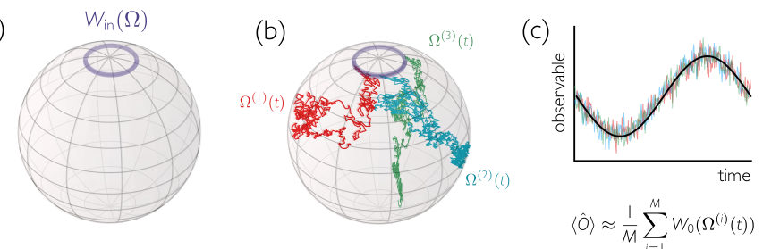
<figcaption class="paper-figure-caption"><b>Fig 1.</b> FIG. 1. Truncated Wigner approximation: The method consists on (a) obtaining the probability distribu- tion for the initial state, Win(Ω); (b) sampling this initial distribution to generate initial conditions and evolving them using the SDE system that describes the approximated dynamics; and (c) computing expectation values ⟨ˆO⟩by statistically averaging the phase-space representation of ˆO, WO(Ω), over M different realizations.</figcaption>
</figure>
<figure class="paper-figure-card">
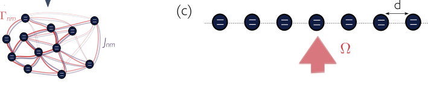
<figcaption class="paper-figure-caption"><b>Fig 2.</b> FIG. 2. Spin model for many-body quantum optics. (a) An ensemble of atoms in contact with a Markovian electromagnetic environment can be described as an open spin model by integrating out the electromagnetic degrees of freedom. The field effectively mediates coherent and dissipative interactions among the atoms. Examples of typical systems include: (b) Atoms decaying at rate Γc into a “bad” cavity, while being subjected to incoherent pumping and parasitic decay with rates w and Γ′, respectively. (c) Atoms in free space arranged in a 1D array with lattice constant d subjected to identical coherent pumping with Rabi frequency Ω.</figcaption>
</figure>
<figure class="paper-figure-card">
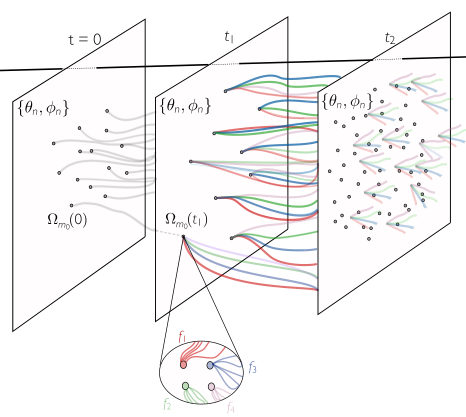
<figcaption class="paper-figure-caption"><b>Fig 3.</b> FIG. 3. Schematic representation of the calculation of multi-time correlation functions. A set of M0 samples from the initial distribution, Ωm0(0), is evolved to time t1. Using the kernel of the discrete representation of a spin, the auxiliary operator is sampled. Since there are four kernel operators, each trajectory generates four distinct types of new initial conditions. These new initial conditions are then evolved up to time t2, and the process is iteratively repeated until reaching the final time tK.</figcaption>
</figure>
<figure class="paper-figure-card">
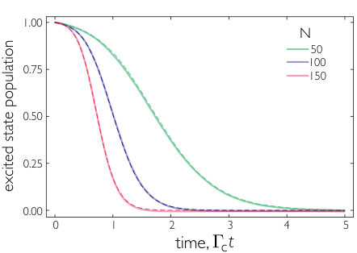
<figcaption class="paper-figure-caption"><b>Fig 4.</b> FIG. 4. Dicke superradiance in a cavity: (a) Normalized total excited population P</figcaption>
</figure>
<figure class="paper-figure-card">
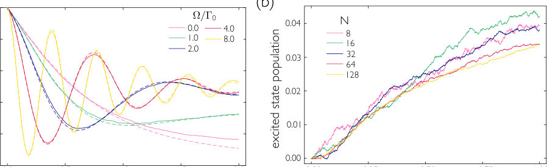
<figcaption class="paper-figure-caption"><b>Fig 5.</b> FIG. 5. Dissipative TWA evolution for a coherently driven 1D atomic array in free space. (a)Excited state population P n ⟨ˆσn ee⟩/N for a 1D array of N = 5 atoms in free space with d/λ0 = 0.1, polarization perpendicular to the chain, and different Rabi frequencies, calculated exactly by solving the master equation (dashed lines) and using the dissipative TWA (solid lines) with M0 = 1000 trajectories. (b) Evolution of excited state population if the system is initially in the ground state and Ω= 0, computed with the dissipative TWA and M0 = 1000 trajectories.</figcaption>
</figure>

**Summary.** This paper reviews phase-space methods for tackling the dynamics of complex many-body quantum optical systems where exact simulations are intractable. It details how techniques like the Truncated Wigner Approximation (TWA) allow researchers to simulate dissipative evolution by mapping quantum mechanics onto solvable partial differential equations. The development broadens simulation capabilities to include coherence and spectral properties crucial for understanding advanced light sources.

**Why it may be interesting.** This work directly addresses the computational bottleneck in simulating open quantum systems central to modern quantum optics research (e.g., cavity QED, atomic arrays), providing necessary theoretical tools for analyzing collective dissipation effects.

Detailed structure

**Main problem.** Developing computationally efficient methods to simulate the complex, out-of-equilibrium dynamics of many-body quantum optical systems.

**Main result.** The paper provides a comprehensive overview of phase-space techniques, deriving the exact PDE for dissipative evolution and extending the formalism to calculate multi-time correlation functions.

**Method.** It utilizes semiclassical phase-space approaches, such as the Truncated Wigner Approximation (TWA) and its extensions, which map quantum dynamics onto partial differential equations solvable via stochastic methods.

**Model / system.** The focus is on many-body quantum-optical systems involving ensembles of emitters (atoms, qubits) interacting through a common electromagnetic reservoir. This includes modeling open spin systems and bosonic modes.

**Key observables.** Multi-time correlation functions, coherence properties, spectral properties, directional correlations, and dynamics related to superradiance/subradiance.

**Important parameters / regimes.** The complexity scales exponentially with system size, necessitating approximations like TWA; the choice of phase-space representation (P, Q) is critical.

**Assumptions / limitations.** The primary approximation discussed is the Truncated Wigner Approximation (TWA), which treats subsequent evolution classically after initial sampling from a quasiprobability distribution. P and Q distributions are noted as generally suboptimal.

**Figures summary.** Not specified, but the notes describe Figure 1 illustrating the TWA process: obtaining an initial probability distribution, evolving via SDEs through sampling, and calculating expectation values via statistical averaging.

**Paper structure.** The paper is structured as a comprehensive overview, starting with the necessity of phase-space methods due to Hilbert space size limitations. It derives the exact PDE, discusses approximations like TWA, and extends the formalism for advanced calculations like multi-time correlations.

Abstract

Many-body quantum-optical systems, where a collection of emitters interacts through a common electromagnetic reservoir, exhibit rich out-of-equilibrium behavior and hold promise for applications in quantum technologies. However, exact numerical simulations of their dynamics quickly become unfeasible due to the exponential growth of the Hilbert space with system size. Semiclassical, phase-space approaches -- such as the Truncated Wigner approximation (TWA) -- provide computationally efficient alternatives by capturing leading-order quantum fluctuations. In this paper, we present a comprehensive overview of how to tackle problems in many-body quantum optics using phase-space methods. We derive the exact partial differential equation governing many-body dissipative evolution in any phase-space representation and discuss the approximations that yield the dissipative TWA proposed by Mink and Fleischhauer [SciPost Phys. 15, 233 (2023)]. We find that $P$ and $Q$ distributions are generally suboptimal for many-body quantum optics. Additionally, we extend the formalism to calculate multi-time correlation functions, thereby broadening the scope of phase-space simulations of open spin systems to include coherence and spectral properties, as well as directional correlations of collectively radiating emitters. These developments provide valuable tools for investigating exotic light sources driven by collective dissipation, driven-dissipative phase transitions, and a wealth of many-body phenomena arising in state-of-the-art experimental platforms.

[↑ back to top](#top)

### ⭐ [Near-optimal quantum metrology with few-qubit measurements](http://arxiv.org/abs/2608.01617v1)

**Highlighted author(s):** John Preskill  
**Authors:** Liang Mao, Senrui Chen, Hsin-Yuan Huang, John Preskill, Sisi Zhou  
**Type:** theory · **Category:** quantum information and computing · **PDF:** <https://arxiv.org/pdf/2608.01617v1>  
**Analysis basis:** full PDF text, analyzed in chunks
**Topic relevance:** 🔥 `quantum measurements` **4/5** · `entanglement & information structure` **1/5** · `measurement-induced transitions` **1/5**

↔ Scroll figures horizontally

<figure class="paper-figure-card">
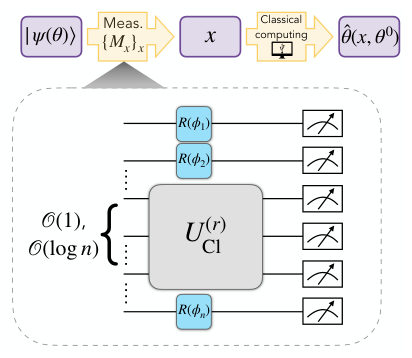
<figcaption class="paper-figure-caption"><b>Fig 1.</b> FIG. 1. Schematic illustration of quantum metrology and our measurement protocol. (a) In quantum metrology, a POVM {Mx}x is performed on the state |ψ(θ)⟩. Upon the outcome x, classical computer builds an estimator ˆθ. In quantum metrol- ogy, one typically has access to a prior estimate θ0 that is close to the true value θ. (b) In our protocol, the POVM acts locally on n−r qubits and as a random Clifford measurement on r qubits. Throughout the protocols introduced this work, r is at most O(log n). In most cases, r = 1 is sufficient.</figcaption>
</figure>
<figure class="paper-figure-card">
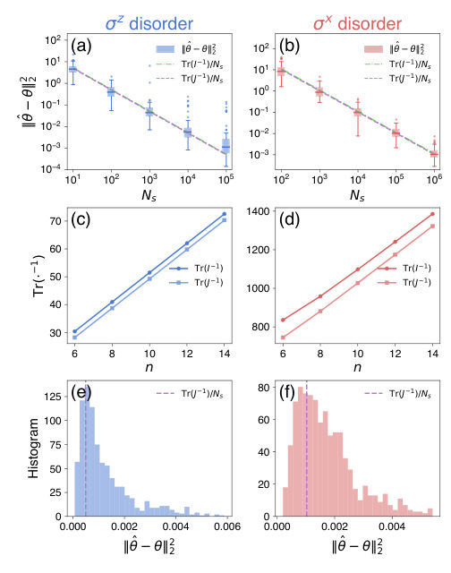
<figcaption class="paper-figure-caption"><b>Fig 2.</b> FIG. 2. Parameter estimation for disordered transverse-field Ising model with σz or σx disorder, using the POVM from Theorem 2 and the estimator from Eq. (14). (a)(b) Total MSE versus measurement number Ns for a typical random choice of θz,x at n = 10. Box plots summarize the statistical distribution of the data over 100 independent experiments. The central line of the box represents the median, while the lower and upper edges indicate the first quartile and third quartile. Whiskers extend to the most extreme data points within 2 times the interquartile range from the quartiles. In- dividual points outside the whiskers are shown as outliers. Numerical calculation shows 4τ(θ0) ≈113.8 when n...</figcaption>
</figure>

**Summary.** This paper introduces new quantum metrology protocols designed to estimate parameters in multi-qubit systems while drastically reducing the complexity of required quantum measurements. By establishing a link between state certification and parameter estimation, they show that few-qubit measurements can achieve near-optimal precision relative to the ultimate QFI bound. This is highly relevant for building practical, resource-efficient quantum sensors.

**Why it may be interesting.** This work provides concrete, resource-efficient measurement strategies that bridge the gap between theoretical quantum limits (QFI) and practical experimental feasibility using limited local measurements, which is crucial for designing real quantum sensors.

Detailed structure

**Main problem.** To develop quantum metrology protocols that estimate unknown parameters encoded in a quantum state using only physically feasible few-qubit measurements.

**Main result.** The authors establish a universal connection between quantum state certification and metrology, achieving near-optimal precision approaching the Quantum Cramér-Rao Bound with measurement overhead scaling favorably (constant for Haar random states).

**Method.** They transform protocols based on Conditional Fidelity Estimation (CFE) from state certification into metrological estimation frameworks using specific POVMs derived from few-qubit measurements.

**Model / system.** The study analyzes parameter estimation for parameterized pure quantum states $|\psi(	heta)
angle$ in a multi-qubit Hilbert space, exemplified by Hamiltonian estimation problems.

**Key observables.** Mean Squared Error Matrix (MSEM), Quantum Fisher Information (QFI), and the Certification Gap ($\Delta$).

**Important parameters / regimes.** Number of qubits ($n$), number of parameters ($m$), and measurement overhead scaling factors ($\mathcal{O}(n)$ or constant).

**Assumptions / limitations.** The protocols rely on establishing bounds derived from state certification techniques, particularly for Haar-random states.

**Figures summary.** Figures schematically illustrate the comparison between general quantum metrology POVMs and the proposed few-qubit measurement protocols; other figures show scaling of MSE vs. measurement number or CFI/QFI traces vs. system size $n$.

**Paper structure.** The paper builds by first defining the problem using QCRB, then introducing CFE as a link to metrology (Lemma 1), and finally deriving specific bounds for non-adaptive (Markov chain mixing time) and adaptive (Decision Tree) measurements, culminating in results for Haar random states.

Abstract

Quantum metrology, which addresses parameter estimation in quantum systems, has broad applications across science and technology. Conventional metrology protocols for multi-qubit states in the multi-parameter regime typically require highly complex quantum measurements, leading to substantial quantum-resource costs. In this work, we introduce a family of metrology protocols that use only few-qubit measurements, thereby significantly reducing the required resources. For arbitrary pure states, one of our protocols approaches the quantum Cramér-Rao bound up to an overhead in sample complexity that scales linearly with the number of qubits, irrespective of the number of parameters to be estimated. For typical Haar-random states, this overhead can be reduced to a constant. Our results build on recent advances in quantum state certification protocols with few-qubit measurements: we establish a universal connection between certification and metrology in which the precision of the certification protocol determines the metrological overhead. We also illustrate our approach through an example of Hamiltonian estimation from ground states.

[↑ back to top](#top)

### ⭐ [Fault-Tolerant Heisenberg-Limited Quantum Sensing](http://arxiv.org/abs/2608.00171v1)

**Highlighted author(s):** Alexey V. Gorshkov  
**Authors:** Lorcan O. Conlon, Yu-Xin Wang, Erfan Abbasgholinejad, Victor V. Albert, Michael J. Gullans, Alexey V. Gorshkov  
**Type:** theory · **Category:** quantum information and computing · **PDF:** <https://arxiv.org/pdf/2608.00171v1>  
**Analysis basis:** full PDF text, analyzed in chunks
**Topic relevance:** `correlated / nonlocal dissipation` **1/5** · `entanglement & information structure` **1/5** · `methods for driven-dissipative` **1/5** · `quantum measurements` **1/5**

↔ Scroll figures horizontally

<figure class="paper-figure-card">
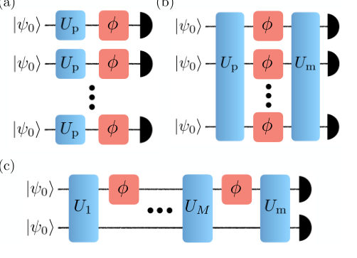
<figcaption class="paper-figure-caption"><b>Fig 1.</b> FIG. 1: Hierarchy of sensing protocols. (a) Separa- ble sensing, where each quantum channel encoding the parameter of interest ϕ, represented by the red box, is probed with a separable state. Up represents a unitary preparing some quantum state and |ψ0⟩may include an- cilla qubits. Given N uses of the same channel, the vari- ance in estimating ϕ will scale as σ2 ϕ ≥1/N. (b) En- tangled sensing where Up acts across all N qubits (and possibly ancillas) to prepare some optimal (potentially entangled) state for sensing ϕ. An optimal measurement across all N qubits (and possibly ancillas) is performed, represented by Um, and Heisenberg scaling is achieved σ2 ϕ ≥1/N 2. (c) M sequential uses of...</figcaption>
</figure>
<figure class="paper-figure-card">
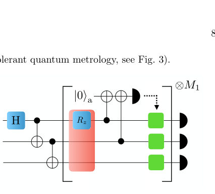
<figcaption class="paper-figure-caption"><b>Fig 2.</b> FIG. 2: Ideal error-corrected sensing with a three- qubit repetition code. In the ideal setting, errors oc- cur only in the quantum channel, shown as a red box and all other operations are assumed to be perfect. The green boxes denote a correction operation that depends on the syndrome measurement outcomes. For simplicity the syndrome measurement Z2Z3 is not shown.</figcaption>
</figure>
<figure class="paper-figure-card">
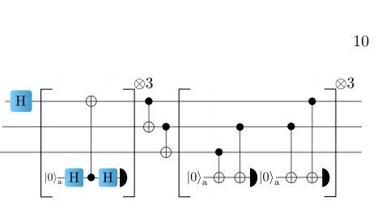
<figcaption class="paper-figure-caption"><b>Fig 3.</b> FIG. 4: Fault-tolerant state preparation. Syndrome measurements are used to detect X and Z errors. The corresponding correction operations are not shown for simplicity. See appendix B 3 for details.</figcaption>
</figure>
<figure class="paper-figure-card">
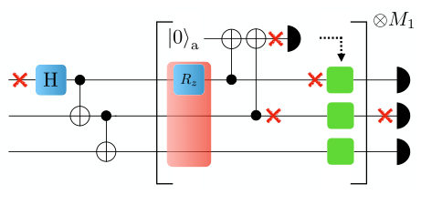
<figcaption class="paper-figure-caption"><b>Fig 4.</b> FIG. 3: Naive sensing protocol failures. Crosses mark parts of the quantum circuit where a single physi- cal error can cause a standard quantum-error-correction- assisted quantum metrology protocol to fail completely. Only some error locations are shown. The circuit re- quired to implement the final measurement is not shown explicitly.</figcaption>
</figure>
<figure class="paper-figure-card">
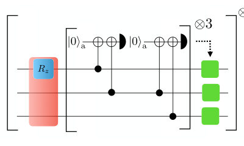
<figcaption class="paper-figure-caption"><b>Fig 5.</b> FIG. 5: Fault-tolerant syndrome extraction and error correction. Syndrome measurements are used to detect X errors that occur either during the natural evolution of the quantum state or during the correction process. The dashed arrow denotes a classical decoding process informing the appropriate correction operation shown in green. More detail on the decoding process is provided in appendix B 4.</figcaption>
</figure>

**Summary.** This paper addresses the fragility of high-precision quantum sensing in the presence of noise by importing fault-tolerance concepts from quantum computing. It demonstrates that under a specific restricted error model, Heisenberg scaling—the ultimate sensitivity limit—can be maintained for extended sensing times using simple repetition codes. This shows a pathway to robust quantum measurements beyond current theoretical limitations.

**Why it may be interesting.** This work directly bridges two major fields: quantum metrology and quantum error correction. For AMO physicists studying open quantum systems, it provides a concrete theoretical framework for how robust sensing protocols can be engineered using QEC principles against realistic noise channels.

Detailed structure

**Main problem.** The primary challenge is achieving quantum advantage in sensing by reaching the Heisenberg limit while mitigating noise effects that typically degrade entanglement-enhanced protocols.

**Main result.** Under a restricted qubit noise model, the authors demonstrate that Heisenberg scaling can be maintained for sensing times up to $T\propto 1/p^{(N+1)/2}$ using a simple repetition code, surpassing the naive error scaling.

**Method.** The work adapts concepts from fault-tolerant quantum computing (QEC) to metrology, analyzing how specific noise structures allow for the restoration of Heisenberg scaling through encoding and recovery operations.

**Model / system.** The system involves $N$ qubits used as sensors estimating a phase $\phi$. The analysis compares ideal sensing limits (SQL vs. HL) against noisy evolution governed by error probabilities ($p$) and utilizes repetition codes derived from QEC theory.

**Key observables.** Estimation error ($\sigma_\phi$), Visibility, Fisher Information (CFI/QFI), and the scaling of achievable time $T$.

**Important parameters / regimes.** Error probability $p$, number of qubits $N$, sensing time $T$, and the structure of the noise model.

**Assumptions / limitations.** The analysis relies on a specific, restricted qubit noise model where phase-flip errors are exponentially smaller than bit-flip errors. It also assumes the applicability of fault-tolerance ideas derived from quantum computing.

**Figures summary.** Figure 1 illustrates three sensing protocols: separable ($\sigma_\phi \propto 1/\sqrt{N}$), entangled ($\sigma_\phi \propto 1/N$), and sequential uses ($\sigma_\phi \propto 1/N$).

**Paper structure.** The paper progresses from establishing the theoretical limits of quantum sensing (SQL vs. HL) to identifying how noise degrades these enhancements, culminating in proposing fault-tolerance techniques derived from quantum computing to restore Heisenberg scaling under specific error assumptions.

Abstract

Quantum sensors hold great promise for achieving better sensitivity in the measurement of physical quantities compared to their classical counterparts. However, the conditions under which quantum advantage in sensing can be achieved are rather restrictive, and most quantum enhancements in sensing are lost in the presence of noise, errors, or a poorly calibrated system. To overcome these limitations, we are motivated to import ideas from fault-tolerant quantum computing to quantum sensing. Specifically, we consider a qubit noise model where the probability of phase-flip errors is exponentially smaller (in qubit number) compared to the probability of bit-flip errors that occur with probability $p$. For this noise structure, we demonstrate that, given a total sensing time $T$, Heisenberg scaling can be attained for times up to $T\propto 1/p^{(N+1)/2}$ for a $N$-qubit repetition code, in contrast with $T\propto 1/p$ without using a fault-tolerant sensing protocol.

[↑ back to top](#top)

### [Non-Hermitian dynamics in a driven-dissipative and spatially correlated light-matter system](http://arxiv.org/abs/2608.00706v1)

**Authors:** Ruiyang Huang, Eliott Beraud, Antoine Glicenstein, Simon Bernon  
**Type:** both · **Category:** other · **PDF:** <https://arxiv.org/pdf/2608.00706v1>  
**Analysis basis:** full PDF text, analyzed in chunks
**Topic relevance:** 🔥 `methods for driven-dissipative` **5/5** · 🔥 `analog quantum simulation` **4/5** · 🔥 `driven-dissipative phase transition` **4/5** · `Tavis-Cummings & cavity-many-emitter` **3/5** · `interference shaping light` **3/5** · `non-equilibrium universality` **3/5** · `Keldysh / 2PI / non-Gaussian methods` **2/5** · `correlated cavity matter` **2/5** · `non-equilibrium dynamics` **2/5** · `quantum optics experiment` **2/5** · `Kondo & dissipative impurity` **1/5** · `correlated / nonlocal dissipation` **1/5** · `entanglement & information structure` **1/5** · `measurement-induced transitions` **1/5** · `quantum measurements` **1/5**

↔ Scroll figures horizontally

<figure class="paper-figure-card">
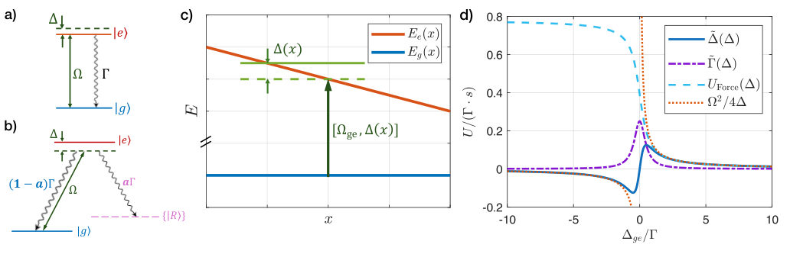
<figcaption class="paper-figure-caption"><b>Fig 1.</b> FIG. 1. a) Schematic of level structure of 2-level system; b) Schematic of general Raman decay, where part of the atoms decays to a collection of reservoir states; c) Schematic of the excited state engineering with linearly spatial-modulated detuning; d) The dressed ground state potential as a function of detuning, corresponding to Schematic C.</figcaption>
</figure>
<figure class="paper-figure-card">
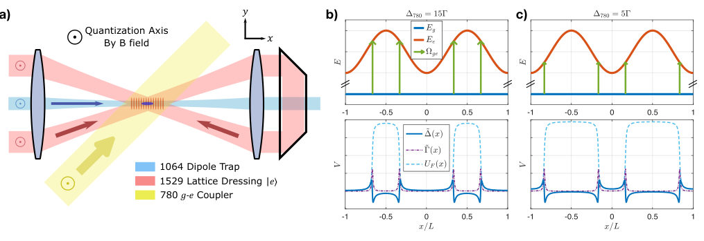
<figcaption class="paper-figure-caption"><b>Fig 2.</b> FIG. 2. (a) Optical setup for excited-state engineering. All laser polarizations are aligned with the magnetic field which defines the quantization axis. (b,c) Effective level scheme for periodic excited-state engineering and the corresponding dressing potential Veff, with ∆780 = 15Γ or 5Γ for Ve = 20Γ.</figcaption>
</figure>
<figure class="paper-figure-card">
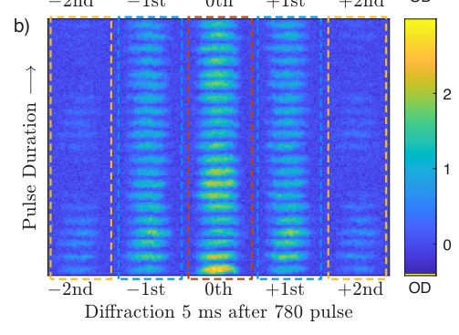
<figcaption class="paper-figure-caption"><b>Fig 3.</b> FIG. 3. Examples of experimental diffraction patterns versus pulse duration T (scanned increments of ∆T = 5 µs, starting from T = 10 µs at the bottom). (a) s780 = 0.034, ∆780 = 15Γ, approaching a steady state; (b) s780 = 0.169, ∆780 = 15Γ, exhibiting persistent oscillations. Red, blue and yellow boxes represent respectively the integration zones of the 0th, 1st and 2nd diffraction orders.</figcaption>
</figure>
<figure class="paper-figure-card">
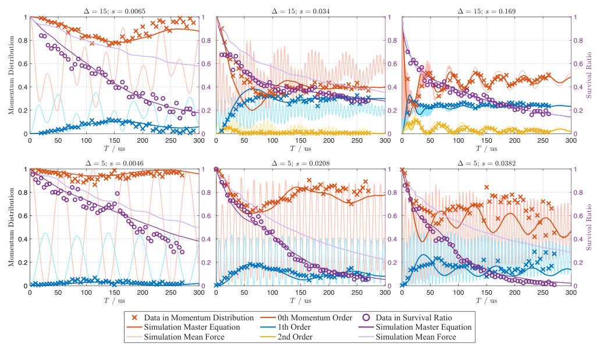
<figcaption class="paper-figure-caption"><b>Fig 4.</b> FIG. 4. Time evolution of the momentum distribution for selected saturation parameters and detunings. Set of parameters are specified above each sub-figure. Experimental diffraction data (markers) are compared with numerical predictions from the mean-force model (light curves) and the effective non-Hermitian master-equation model (solid curves). Red, blue and yellow crosses represent respectively the 0th, 1st and 2nd diffraction order population. Purple circle represent the survival ratio which is presented to the right axis. The same color code is used for the corresponding curves of the two theoretical models. For non-zero momentum orders, data are the average of orders with opposite sign.</figcaption>
</figure>
<figure class="paper-figure-card">
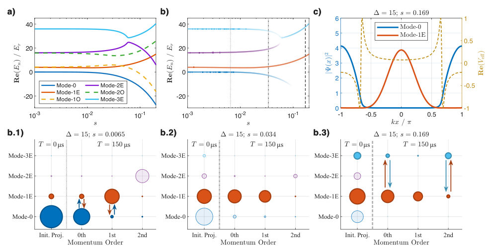
<figcaption class="paper-figure-caption"><b>Fig 5.</b> FIG. 5. Mode analysis for ∆780 = 15Γ: a) Re(En) of eigen modes in the Bloch basis; b) The dominant modes during diffraction indicated by transparency, based on the product of initial projection and remaining fraction at T = 150 µs; c) The examples of eigen wavefunction for Mode-1E (ground trapping state) and Mode-0 (anti-trapping state) for s = 0.169; b.1-3) The projection from the Bloch basis onto the free-space momentum, counted at the 3 saturation values indicated on b). The arrows note the momentum order pairs under Rabi oscillation.</figcaption>
</figure>

**Summary.** This work establishes a unified theoretical framework for analyzing how dissipation affects quantum dynamics in light-matter interactions. By deriving an effective complex potential from the master equation, the authors successfully model near-resonant behavior that fails perturbative treatments. The theory is validated by comparing predictions to matter-wave diffraction experiments on $^{87}	ext{Rb}$ BECs.

**Why it may be interesting.** It provides a rigorous, non-perturbative method to analyze open quantum systems in cold atoms, connecting fundamental concepts like exceptional points and dissipation directly to measurable physical phenomena like momentum-space interference patterns.

Detailed structure

**Main problem.** To develop a unified theoretical framework for studying non-Hermitian dynamics in driven-dissipative light-matter systems, especially where standard perturbative methods fail near resonance.

**Main result.** The derived formalism successfully models the interplay between coherent drive and dissipation, experimentally showing a reduced decay rate with increasing drive strength.

**Method.** The study combines theoretical derivations from the Lindblad master equation approach with numerical simulations (e.g., quantum jump algorithm) and comparison to matter-wave diffraction experiments using $^{87}	ext{Rb}$ BECs.

**Model / system.** The system is an atomic ensemble modeled as two-level systems interacting with a laser field, governed by a master equation that incorporates dissipation ($\Gamma$) and coherent driving ($\Omega$).

**Key observables.** Effective complex potential $V_{	ext{eff}}(\Omega, \Delta)$, matter-wave diffraction patterns, ground state level shift ($E_g$), and the repumped atom number $N(\Delta_{780})$.

**Important parameters / regimes.** Detuning ($\Delta$), Rabi frequency ($\Omega$), decay rate ($\Gamma$), and control parameters defining the light-matter interaction strength.

**Assumptions / limitations.** The analysis moves beyond mean-force formalisms which assume thermal particles, incorporating spatial correlations via non-commutativity $[\hat{
ho}, \hat{\Delta}] 
eq 0$.

**Figures summary.** Figures illustrate the level structure and excited state engineering; one figure shows the measured atom number $N(\Delta_{780})$ vs. detuning $\Delta_{780}$, which is used to calibrate the effective potential.

**Paper structure.** The paper progresses from establishing the master equation description for non-Hermitian dynamics, contrasting it with inadequate mean-force approximations, deriving effective potentials ($V_{	ext{eff}}$), and finally validating these theoretical predictions against experimental matter-wave diffraction data.

Abstract

Pure quantum states, as described in quantum mechanics textbooks, are ideal representations inevitably deteriorated in real systems by any dissipative connection to the environment. In this work we derive a unified theoretical frame to study the non-Hermitian dynamics of a driven-dissipative quantum system and validate it by comparison to experimental data of matter-wave diffraction. To highlight the role of dissipation, we perform the comparison in a near-resonant regime of light-matter interaction, where perturbative approaches fail. Here, we show that the developed formalism enables both exact simulations and an intuitive interpretation based on modal analysis. The theoretical analysis is based on the general master equation description of driven-dissipative systems, from which we derive an effective complex potential $V_\mathrm{eff}(Ω,Δ)$ that depends on control parameters such as the amplitude and detuning of the light matter interaction. Experimentally, we drive a $^{87}$Rb BEC near resonance using periodic excited-state engineering, mapping the spatially modulated $V_{\rm eff}[Ω,Δ(x)]$ into momentum space for precise quantification. The experimental results agree with numerical simulations of the master equation and demonstrate the interplay between coherent drive and dissipation, with an exceptional signature: a reduced decay rate with increasing drive. Such dynamics is then interpreted by a modal analysis of the non-Hermitian Hamiltonian $H_\mathrm{eff}=p^2/2m+V_\mathrm{eff}$ which provide an intuitive and qualitative explanation for such driven-dissipative system.

[↑ back to top](#top)

### [Realization of a Quantum Topological Photon Pump](http://arxiv.org/abs/2608.00162v1)

**Authors:** Qianao Yue, Bernardo Barrera, Martin Ritter, David M. Long, David A. Lane, Anushya Chandran, Alicia J. Kollár  
**Type:** experiment · **Category:** other · **PDF:** <https://arxiv.org/pdf/2608.00162v1>  
**Analysis basis:** full PDF text, analyzed in chunks
**Topic relevance:** 🔥 `quantum optics experiment` **5/5** · 🔥 `analog quantum simulation` **4/5** · `correlated cavity matter` **3/5** · `driven-dissipative phase transition` **3/5** · `QC/QI experiment` **2/5** · `methods for driven-dissipative` **2/5** · `non-equilibrium universality` **2/5** · `Tavis-Cummings & cavity-many-emitter` **1/5** · `correlated / nonlocal dissipation` **1/5** · `entanglement & information structure` **1/5** · `exotic spin models in light-matter` **1/5** · `interference shaping light` **1/5** · `non-equilibrium dynamics` **1/5** · `quantum measurements` **1/5**

↔ Scroll figures horizontally

<figure class="paper-figure-card">
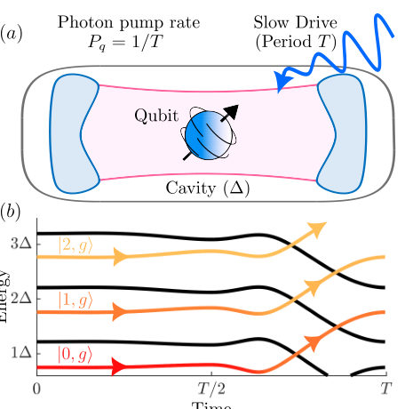
<figcaption class="paper-figure-caption"><b>Fig 1.</b> Figure 1. The Topological Photon Pump. (a) A coupled qubit- cavity system is periodically driven by a slow external drive with period T. One photon enters the cavity per cycle, so that the average pump rate Pq = 1/T. (b) The instantaneous spectrum vs time, showing spectral flow. Along each colored line, an n-photon state |n, g⟩is adiabatically transported one rung up the eigenstate ladder to an (n + 1)-photon state |n + 1, g⟩in one period; over multiple periods, the number of photons increases from n = 0 to n = nmax. The black lines correspond to depumping states.</figcaption>
</figure>
<figure class="paper-figure-card">
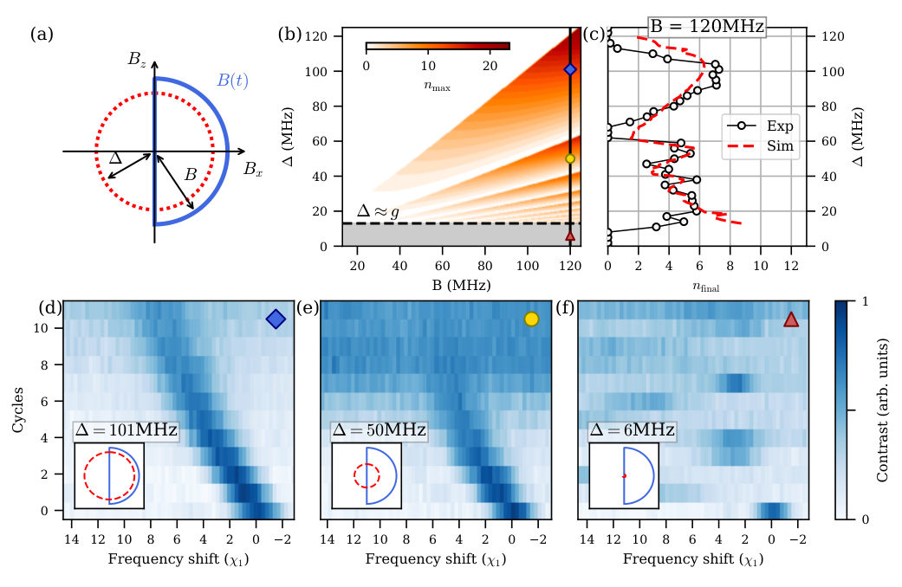
<figcaption class="paper-figure-caption"><b>Fig 2.</b> Figure 2. Phase Diagram of the Topological Pump. (a) Schematic of the effective time-dependent field ⃗B(t) (blue) relative to the ring | ⃗B(t)| = ∆. (b) The analytically computed maximum photon number nmax (color) as a function of B and ∆for g = 13 MHz, neglecting cavity loss. The resonances at ∆ℓ, where nmax = 0 separate large regions of robust pumping, with the largest values of nmax ≈20 found in the range ∆2 &lt; ∆&lt; ∆1 (blue diamond). Panels (c-f) show data along the black line B = 120 MHz. (c) Experimentally achieved largest photon number nfinal over 11 cycles (circles) and numerically simulated values accounting for cavity decay (red dashed line) versus detuning at B = 120 MHz (black line...</figcaption>
</figure>
<figure class="paper-figure-card">
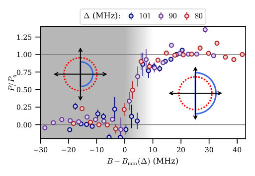
<figcaption class="paper-figure-caption"><b>Fig 3.</b> Figure 3. Quantization of Pump Rate. Photon pump rate P/Pq extracted from the first five cycles versus B for ∆= 101, 90, 80 MHz and ω = 5 MHz. Error bars indicate the uncertainty of the fit to n(mT) = (P/κ) × (1 −e−κmT ). We observe P ≈0 for B &lt; Bmin(∆) (gray shaded region) in the trivial regime, and P/Pq ≈1 deep in the topological regime B &gt; Bmin(∆) + 10 MHz. Insets show the drive protocols in the two regimes. Sample spectroscopy data corresponding to ∆= 80 MHz are shown in Fig. S9 of the Supplemental Materials.</figcaption>
</figure>
<figure class="paper-figure-card">
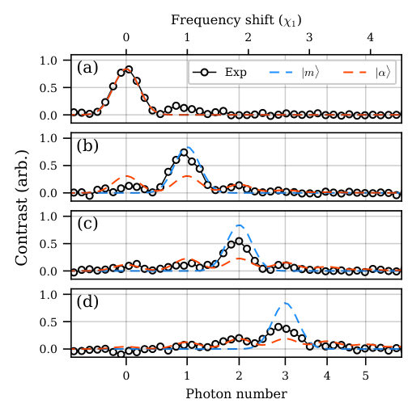
<figcaption class="paper-figure-caption"><b>Fig 4.</b> Figure 4. Fock-State Pumping. (a-d) Photon-number-resolved qubit spectroscopy after m = 0-3 pump cycles, showing exper- imental data (white circles), coherent-state distributions with |α|2 = m (red), and ideal m-photon Fock states (blue). The upper (lower) axis indicates integer multiples of the single- photon shift χ1 (the exact qubit frequency shifts corresponding to m photons). Despite cavity decay, the measured photon- number distributions retain strong overlap with the 1, 2, and 3-photon Fock states.</figcaption>
</figure>

**Summary.** The research reports the first experimental realization of a topological photon pump using a superconducting transmon qubit coupled to a microwave cavity. By controlling external fields to induce spectral flow, the system pumps photons into the cavity at a rate quantized by fundamental band topology. This achievement allows for the robust preparation of non-classical quantum states, which is crucial for quantum computing and communication protocols.

**Why it may be interesting.** This work is highly relevant as it combines topological concepts from condensed matter theory with cutting-edge quantum optics experiments in cavity QED. Demonstrating a robust, topologically protected process for generating non-classical light sources is a major advance for quantum information applications.

Detailed structure

**Main problem.** The primary goal was the experimental observation of a topological photon pump, which transfers photons into a quantum cavity at a rate quantized by band topology.

**Main result.** The authors successfully demonstrated this process using a superconducting transmon qubit coupled to a microwave cavity, observing quantized pumping rates and generating demonstrably non-classical (sub-Poissonian) cavity states.

**Method.** The experiment utilized circuit QED spectroscopy, measuring the AC Stark shift on the qubit as a function of the photon number in the cavity to infer the pump rate and final state population.

**Model / system.** The physical system is a superconducting transmon qubit coupled to a microwave cavity. The dynamics are governed by an effective Hamiltonian derived from the Jaynes-Cummings model, where pumping relies on spectral flow induced by time-varying external fields (detuning $\Delta$ and magnetic field $\vec{B}(t)$).

**Key observables.** Quantized photon pump rate ($P/P_q \approx 1$), maximum observable photon number ($\langle n 
angle \approx 7$), and sub-Poissonian photon statistics.

**Important parameters / regimes.** The process requires operating in specific parameter regimes defined by inequalities (e.g., $\kappa \ll \omega < g \ll \Delta, B$) to ensure adiabatic evolution.

**Assumptions / limitations.** Key assumptions include the validity of the adiabatic approximation and the ability to maintain a hierarchy of energy scales throughout the pumping cycle.

**Figures summary.** Figures illustrate the spectral flow mechanism (pumping vs. depumping), phase diagrams showing $n_{	ext{max}}$ dependence on control parameters, and spectroscopy plots confirming photon number resolution via AC Stark shifts.

**Paper structure.** The paper details the theoretical framework based on spectral flow, presents the experimental setup using circuit QED, describes the measurement protocol involving adiabatic evolution and subsequent qubit spectroscopy to resolve $n$, and finally reports quantitative measurements of quantized pumping rates and state preparation fidelity.

Abstract

Topological pumps transfer charge or energy at quantized rates determined solely by band topology, independent of the details of the control fields. Photon pumps operating on this principle could enable the robust preparation of non-classical states in a quantum cavity, even in the presence of control imperfections, but have not been directly observed. We present the first experimental observation of a topological photon pump, using a transmon qubit coupled to a microwave cavity. The pump operates in the quantum regime, pumping up from the vacuum state up to $\approx 7$ photons, and produces demonstrably non-classical cavity states for the first few cycles.

[↑ back to top](#top)

### [Reinforcement-Learned Electric-Field Sensing with Asymmetrically Blockaded Rydberg Arrays](http://arxiv.org/abs/2608.01832v1)

**Authors:** Shi-Qiang Qiao, Xue-Ke Song, Shi-Lei Su, Liu Ye, Dong Wang  
**Type:** theory · **Category:** other · **PDF:** <https://arxiv.org/pdf/2608.01832v1>  
**Analysis basis:** full PDF text, analyzed in chunks
**Topic relevance:** 🔥 `Rydberg arrays` **5/5** · 🔥 `analog quantum simulation` **4/5** · `quantum measurements` **2/5** · `correlated cavity matter` **1/5** · `entanglement & information structure` **1/5** · `methods for driven-dissipative` **1/5** · `non-equilibrium dynamics` **1/5**

↔ Scroll figures horizontally

<figure class="paper-figure-card">
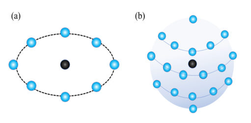
<figcaption class="paper-figure-caption"><b>Fig 1.</b> FIG. 1. Sensor geometries considered in this work. A central control atom (black) is surrounded by target atoms (blue). (a) Planar circular array used for scalar electric-field sensing. (b) Spherical array used for vector sensing. Microwave dressing is designed to suppress target-target interactions while retaining field-sensitive control-target interactions.</figcaption>
</figure>
<figure class="paper-figure-card">
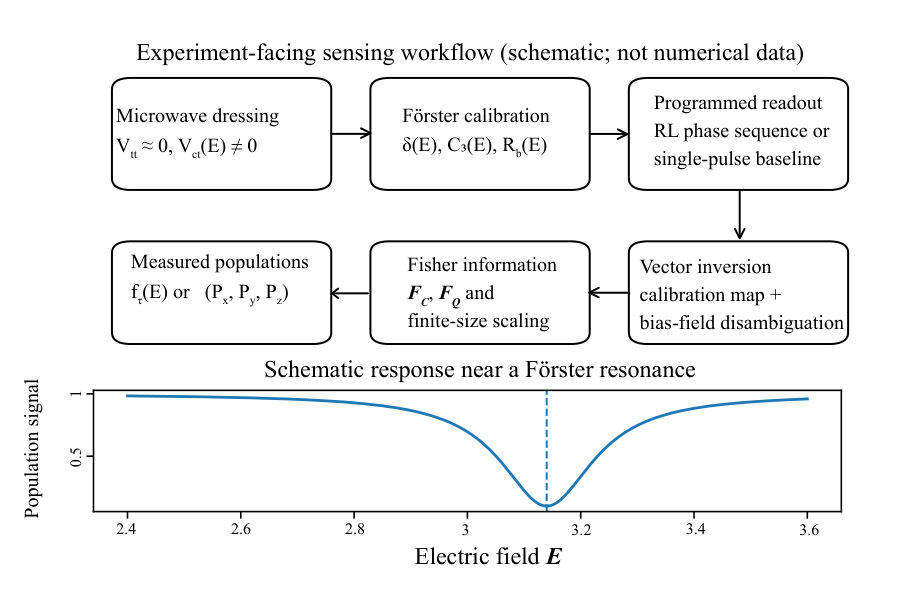
<figcaption class="paper-figure-caption"><b>Fig 2.</b> FIG. 2. Experiment-facing workflow of the proposed protocol. Microwave dressing first prepares an asymmetric blockade configuration, the Förster response is calibrated through δ(E) and C3(E), and the final population readout is performed either with a single-pulse baseline or with an RL-optimized phase sequence. The lower curve is a qualitative schematic of a population dip near resonance and is not numerical data.</figcaption>
</figure>
<figure class="paper-figure-card">
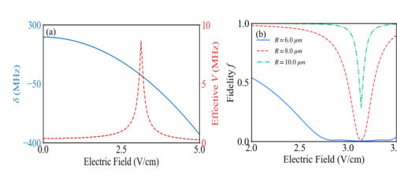
<figcaption class="paper-figure-caption"><b>Fig 3.</b> FIG. 3. (a) Calculated Förster response. The blue curve shows the energy defect δ(E) between the relevant pair states. The red dashed curve shows the corresponding effective inter- action magnitude calculated from Eq. (3) for the transverse orientation used in the planar-array simulations. (b) Full- excitation probability fτ as a function of the electric field for three control-target separations. A sharp dip appears near Eres ≃3.14 V/cm, where the blockade radius is largest.</figcaption>
</figure>
<figure class="paper-figure-card">
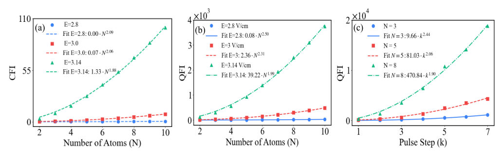
<figcaption class="paper-figure-caption"><b>Fig 4.</b> FIG. 4. (a) CFI FC of the binary full-excitation measurement as a function of total atom number N. Power-law fits over the simulated finite-size window yield FC ∝N b with b ≃2.09, 2.06, and 1.88. (b) QFI versus total atom number for three electric fields. The displayed power-law exponents are fits to the simulated values and should not be interpreted as asymptotic scaling laws. (c) Maximum QFI obtained by RL-optimized composite pulses as a function of pulse number k for several atom numbers. Power-law fits over the displayed finite range give FQ ∝kγ with γ ≃2.44, 2.06, and 1.90.</figcaption>
</figure>
<figure class="paper-figure-card">
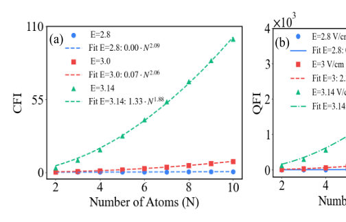
<figcaption class="paper-figure-caption"><b>Fig 5.</b> Fig. 3(b) shows the calculated fτ as a function of the elec- tric field E for the circular array with N = 5 (one control plus four targets) and R = 6.0, 8.0, 10.0µm. When E is far from the Förster resonance (Eres ≈3.14 V/cm), the interatomic interaction is weak, the blockade radius Rb is smaller than the atomic spacing R, and the target atoms can be excited nearly independently; consequently, fτ approaches unity. As E approaches Eres, Rb increases dramatically, and the excitation of the central control atom blocks the excitation of all target atoms, causing fτ to drop sharply to nearly zero, forming a distinct res- onance dip. After passing through the resonance, Rb decreases again and fτ...</figcaption>
</figure>

**Summary.** The authors present a method for ultra-sensitive electric field measurement using Rydberg atom arrays by exploiting the sharp, field-dependent change in interatomic interactions near a Förster resonance. They enhance sensitivity through Reinforcement Learning optimized pulse sequences and demonstrate full 3D vector field reconstruction using a minimal spherical atomic arrangement.

**Why it may be interesting.** This work represents a sophisticated application of quantum control (RL) to an established AMO platform (Rydberg atoms). The combination of blockade physics with metrology enhancement provides a highly advanced blueprint for quantum sensing.

Detailed structure

**Main problem.** The goal is to achieve high-precision, quantum-enhanced electric field sensing using Rydberg arrays, extending capability from scalar magnitude measurement to full 3D vector reconstruction.

**Main result.** The scheme demonstrates superlinear scaling of the Quantum Fisher Information (QFI) with atom number and enables full vector electrometry using a compact six-atom spherical configuration.

**Method.** The approach combines microwave dressing to induce an asymmetric blockade, utilizing the strong field dependence of interatomic interactions near a Förster resonance, and optimizing pulse sequences via Reinforcement Learning (RL).

**Model / system.** The physical system is Rydberg atoms in planar or spherical arrays. The dynamics are modeled using a Hamiltonian incorporating control-target interactions ($V_{1,j}$) whose strength depends critically on the external electric field $\mathbf{E}$ near resonance.

**Key observables.** Electric field ($\mathbf{E}$), blockade radius dependence on $\mathbf{E}$, Classical Fisher Information ($	ext{CFI}$), and Quantum Fisher Information ($	ext{QFI}$).

**Important parameters / regimes.** Förster resonance energy ($E_{	ext{res}} \approx 3.14 	ext{ V/cm}$), atom number ($N$), and the scaling exponents for $	ext{QFI} \propto N^b$ (where $b \approx 2$).

**Assumptions / limitations.** The primary Hamiltonian initially ignores residual target-target couplings, though the method is shown to be robust against various noise sources.

**Figures summary.** Figures illustrate sensor geometries (planar/spherical), the workflow combining dressing, Förster calibration, RL optimization, and vector inversion. Figure 3 shows the critical population dip $f_	au(\mathbf{E})$ near resonance.

**Paper structure.** The paper details the physical mechanism using microwave dressing to achieve asymmetric blockade; it quantifies sensitivity using $	ext{CFI}$ and $	ext{QFI}$; it introduces RL optimization for pulse enhancement; finally, it extends the concept to a spherical array for full vector reconstruction.

Abstract

We present a reinforcement learning-optimized Rydberg electrometer based on the asymmetric blockade effect and achieve high-sensitivity electric field sensing in Rydberg arrays. Microwave dressing induces asymmetric blockade to suppress interactions between target atoms, while keeping the coupling between the central control atom and target atoms field-tunable near Förster resonance. The field-regulated blockade radius affects the detectable atomic population signals, thereby enabling electric field sensing via state-selective readout. In planar atomic arrays, classical Fisher information exhibits near-quadratic scaling with atom number and approaches the Heisenberg limit. Reinforcement learning-designed composite pulses greatly enhance quantum Fisher information by up to one order of magnitude compared with single $π$ pulses. We further establish a compact six-atom spherical configuration for vector electrometry, in which field orientation is extracted from calibrated axial populations, and weak bias fields eliminate dipole-dipole-induced sign and magic-angle ambiguities. Numerical tests against Rabi frequency deviation, positional error, residual inter-target coupling and projection noise demonstrate the reliability of this scheme. This work provides an experimentally viable approach to realize high-precision three-dimensional Rydberg electric field sensing.

[↑ back to top](#top)

### [Robust Nonclassical magnon pair generation and Cauchy-Schwarz inequality violation in a hybrid electromagnonic system](http://arxiv.org/abs/2608.01741v1)

**Authors:** Sabur A Barbhuiya, Ajeet Kumar, Amarendra K Sarma  
**Type:** theory · **Category:** other · **PDF:** <https://arxiv.org/pdf/2608.01741v1>  
**Analysis basis:** full PDF text, analyzed in chunks
**Topic relevance:** 🔥 `methods for driven-dissipative` **4/5** · 🔥 `spintronics-quantum-optics interface` **4/5** · `analog quantum simulation` **3/5** · `correlated / nonlocal dissipation` **3/5** · `driven-dissipative phase transition` **3/5** · `entanglement & information structure` **3/5** · `exotic spin models in light-matter` **3/5** · `interference shaping light` **3/5** · `Keldysh / 2PI / non-Gaussian methods` **2/5** · `Tavis-Cummings & cavity-many-emitter` **2/5** · `correlated cavity matter` **2/5** · `non-equilibrium dynamics` **2/5** · `non-equilibrium universality` **2/5** · `quantum measurements` **1/5**

↔ Scroll figures horizontally

<figure class="paper-figure-card">
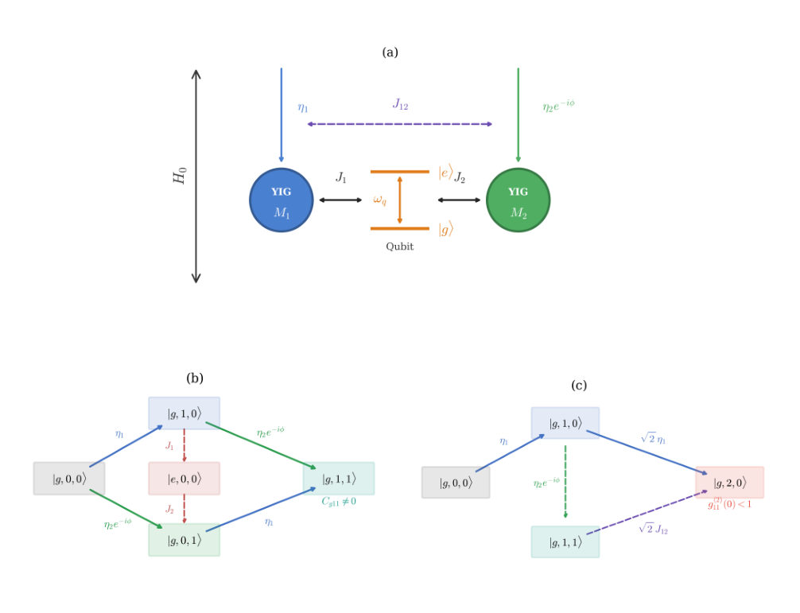
<figcaption class="paper-figure-caption"><b>Fig 1.</b> FIG. 1. Hybrid magnon–qubit system and the interference mechanism underlying the two-magnon blockade. (a) Effective-model configuration [Eq. (3)] which is obtained after adiabatic elimination of the microwave cavity. Two Kittel magnon modes M1 and M2 and a superconducting qubit (whose transition frequency isωq) are directly coupled by the cavity-induced interactions such as magnon–qubit couplings J1 and J2 and an effective magnon–magnon coupling J12. A static field H0 sets the magnon frequencies and the two modes are driven by η1 and η2e−iϕ with ϕ is the relative drive phase. (b) Excitation pathways to the cross-mode two-magnon state |g, 1, 1⟩. The two direct-drive paths (solid) each...</figcaption>
</figure>
<figure class="paper-figure-card">
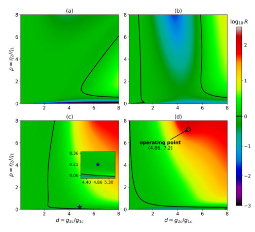
<figcaption class="paper-figure-caption"><b>Fig 2.</b> FIG. 2. Two-dimensional colour maps of the CSI violation factor R, on a log10 scale as functions of the coupling ratio d = g2c/g1c and the drive ratio p = η2/η1 at (a) ϕ = 0, (b) ϕ = π/2, (c) ϕ = π and (d) the operating phase ϕ∗= 1.183π. The white curve is the R = 1 contour separating the classical region from the CSI-violating one and the black line on the colour bar marks log10 R = 0. Also, the white circle in (d) marks the operating point (d, p) = (4.86, 7.2) where R = 73.4. The white star in (c) and the region enlarged in the inset mark the classical reference point (d, p) = (4.86, 0.206) at which R = 1 at ϕ = π. All the system parameters are taken from Refs. [16, 28, 42, 49, 50]: γ1 =...</figcaption>
</figure>
<figure class="paper-figure-card">

<figcaption class="paper-figure-caption"><b>Fig 3.</b> FIG. 3. Cavity-detuning dependence of the two-mode magnon blockade and the CSI violation at the drive ratio p = η2/η1 = 7.2. (a) Violation factor R on a log10 scale versus the cavity– drive detuning ∆c and the coupling ratio d = g2c/J1c at fixed ϕ = π. Three contours partition in the plane: the classical bound R = 1 (white solid) and the antibunching boundaries g(2) 11 (0) = 1 (black dashed) and g(2) 22 (0) = 1 (black dotted) above which the respective Kittel mode is antibunched. The dark band marks |∆c| &lt; 3gq where the dispersive Hamilto- nian of Eq. (3) is not reliably valid and the white dashed lines mark the operating detuning |∆c| = 5gq = 945 and the cir- cle is the operating point...</figcaption>
</figure>
<figure class="paper-figure-card">
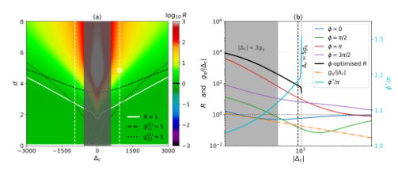
<figcaption class="paper-figure-caption"><b>Fig 4.</b> Fig. 3 establishes the detuning range where Eq. (3) re- mains valid and quantifies the violation cost of operating deeper within it. Since all derived parameters scale as 1/∆c we exclude |∆c| &lt; 3gq and operate at |∆c| = 5gq where the expansion parameter is gq/|∆c| = 0.200. The color map in Fig. 5(a) is symmetric about ∆c = 0 which arises from conjugating Eqs. (A2)–(A9) whose collapse operators are real and the first drive has ϕ1 = 0 which gives the relation R(∆c, d, ϕ) = R(−∆c, d, −ϕ) that re- duces to origin symmetry at ϕ = π. We have verified this numerically to zero deviation and hence we discuss only |∆c|. The violation is extensive in R &gt; 1 which is over 60.8% of the scanned plane. The...</figcaption>
</figure>
<figure class="paper-figure-card">
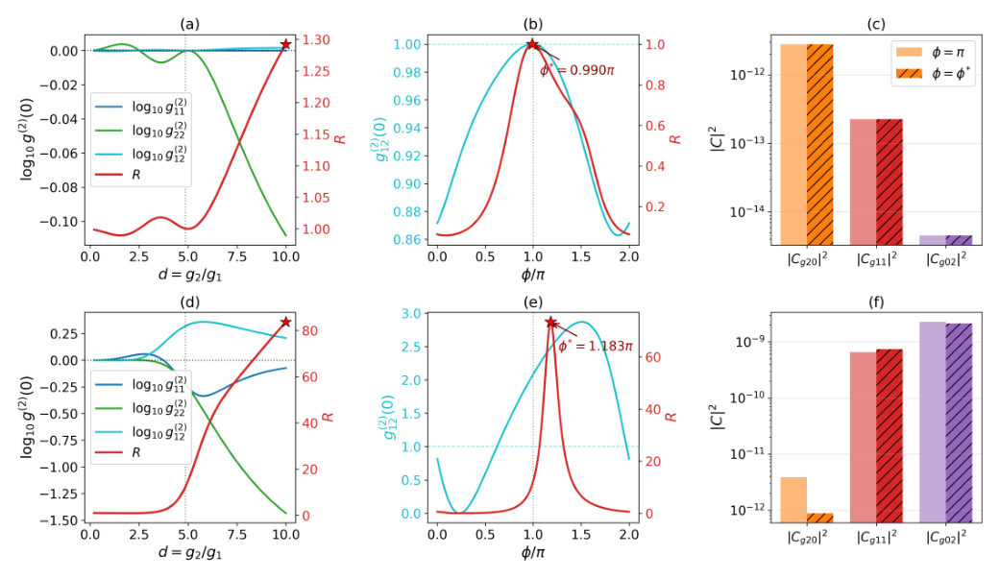
<figcaption class="paper-figure-caption"><b>Fig 5.</b> FIG. 4. Top row, p = η2/η1 = 0.2; bottom row, p = 7.2. (a),(d) The normalised correlations g(2) 11 (0), g(2) 22 (0), g(2) 12 (0) (left axis, log10) and the violation factor R (right axis) as functions of the coupling ratio d, at fixed relative phase ϕ = π; the grey dotted line marks the operating value d = 4.86 and the star marks the largest R within the scanned range 0.2 ≤d ≤10. (b),(e) g(2) 12 (0) (left) and R (right) as functions of the relative phase ϕ at d = 4.86; the grey dotted line marks the control phase ϕ = π, and in (e) the star marks the numerically located maximum at ϕ∗= 1.183π. (c),(f) The two-magnon amplitudes |Cg20|2, |Cg11|2, |Cg02|2 at the operating coupling ratio which...</figcaption>
</figure>

**Summary.** The paper investigates generating nonclassical magnon pairs in a hybrid electromagnonic circuit by controlling the relative phase of external microwave drives. By tuning this phase, researchers can actively restore destructive interference pathways that suppress single-mode excitations while enhancing cross-mode correlations. This control mechanism allows for robust demonstration of quantum phenomena, such as violating the Cauchy-Schwarz inequality, paving the way for phase-controlled magnonic quantum information processing.

**Why it may be interesting.** This work directly addresses quantum control in coupled bosonic systems (magnons), using external driving fields ($\phi$) as a knob to switch between classical and highly correlated quantum regimes, which is central to quantum optics and open quantum system research.

Detailed structure

**Main problem.** The study aims to achieve robust nonclassical magnon pair generation and demonstrate violation of the Cauchy-Schwarz inequality by actively controlling quantum interference in a hybrid electromagnonic system.

**Main result.** The relative drive phase acts as a dynamic control knob, enabling the simultaneous achievement of strong blockade and unambiguous violation of the macroscopic CSI ($R \gg 1$).

**Method.** The dynamics are analyzed using numerical solutions to the Lindblad master equation, supplemented by perturbative expansions in coupling strengths.

**Model / system.** The system is a tripartite hybrid quantum setup involving two Kittel magnon modes ($	ext{M}_1, 	ext{M}_2$) coupled via a common microwave cavity bus and mediated by a superconducting qubit. The effective Hamiltonian is derived after adiabatically eliminating the cavity mode.

**Key observables.** Second-order autocorrelation functions ($g^{(2)}_{aa}(0)$) and the Cauchy-Schwarz inequality violation factor ($R = g^{(2)}_{12}(0)/\sqrt{g^{(2)}_{11}(0)g^{(2)}_{22}(0)}$).

**Important parameters / regimes.** The relative drive phase ($\phi$) is the key control parameter, alongside coupling ratios and detunings.

**Assumptions / limitations.** The analysis relies on operating in the large detuning (dispersive) limit to adiabatically eliminate the cavity mode, which was validated by comparing effective vs. exact dynamics.

**Figures summary.** Figures illustrate how varying the drive phase ($\phi$) controls interference pathways, leading to high values of $R$ (up to 73.4) at optimal phases like $\phi^* \simeq 1.18\pi$.

**Paper structure.** The paper first establishes the model and uses perturbative methods to derive amplitudes ($C_{g...}$) showing phase dependence, then numerically solves the master equation to quantify nonclassicality via $R$, and finally validates the effective Hamiltonian approach against exact time evolution.

Abstract

Magnonic systems are a promising resource for quantum technologies because of their ability to couple significantly disparate quantum platforms and the generation of nonclassical magnon states through magnon blockade has attracted growing attention. In practice, however magnon blockade relies on a destructive interference that is easily spoiled by fabrication-induced coupling asymmetries. Here we show that the relative phase between two magnon drives acts as an active compensation knob that restores this interference even when the couplings are mismatched. We study two Kittel magnon modes in a hybrid system in which a superconducting qubit coupled to a common cavity mode mediates the inter-mode interaction and we find that tuning the drive phase produces both magnon blockade and a strong violation of the classical Cauchy--Schwarz inequality. We derive the analytic condition for the phase that compensates a given coupling asymmetry and confirm it against exact numerical simulations. The drive phase thereby serves as a control knob that switches the system between classical and quantum regimes. Our results enable phase-controlled magnonic quantum information processing.

[↑ back to top](#top)

### [Validation and calibration of quantum hardware through the many-body quantum Mpemba effect](http://arxiv.org/abs/2608.01788v1)

**Authors:** Francesco Campaioli, Marco Avesani, Oren Raz, Roderich Moessner, Gianluca Teza  
**Type:** experiment · **Category:** other · **PDF:** <https://arxiv.org/pdf/2608.01788v1>  
**Analysis basis:** full PDF text, analyzed in chunks
**Topic relevance:** 🔥 `QC/QI experiment` **4/5** · 🔥 `analog quantum simulation` **4/5** · `correlated / nonlocal dissipation` **3/5** · `driven-dissipative phase transition` **3/5** · `methods for driven-dissipative` **3/5** · `non-equilibrium dynamics` **3/5** · `entanglement & information structure` **2/5** · `non-equilibrium universality` **2/5** · `Keldysh / 2PI / non-Gaussian methods` **1/5** · `Rydberg arrays` **1/5** · `quantum measurements` **1/5** · `scars & prethermalization` **1/5**

↔ Scroll figures horizontally

<figure class="paper-figure-card">
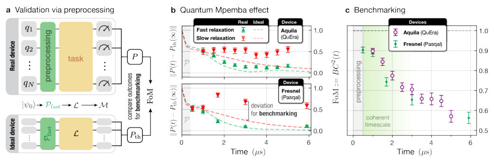
<figcaption class="paper-figure-caption"><b>Fig 1.</b> FIG. 1. Overview of validation routine. a, A register of N qubits qi, initialized in a state |ψ0⟩on a real device, undergoes a preprocessing sequence designed to accelerate (Pfast, green) or decelerate (Pslow, red) the relaxation dynamics induced by noise for a given task L. After the task is executed, the qubits are measured via a process M. The resulting measurement outcomes P from the real device are compared against simulated outcomes Pth (ideal device) to benchmark device performance; deviations are attributed to hardware imperfections and systematic errors. b, Measurement outcomes showing fast and slow relaxation towards the equilibrium configuration, obtained on two neutral-atom...</figcaption>
</figure>
<figure class="paper-figure-card">
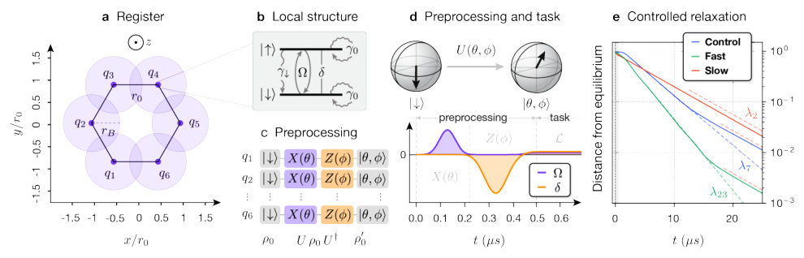
<figcaption class="paper-figure-caption"><b>Fig 2.</b> FIG. 2. Implementation of validation routine on Rydberg atom devices. a, We program a registers of six Rydberg atoms, arranged in a reproducible and exactly-solvable hexagonal layout with lattice spacing r0, forming a ring of 6 qubits (qi) on the xy-plane of the device trap. Ising interactions between atoms pairs (i, j) depend on distance r−6 ij [34, 35], as in Eq. (1). The shaded area around the atoms represents the blockade radius rB, which is a measure of the interaction range. b, Atoms are controlled by programmable transverse and longitudinal fields via globally addressed coupling strength Ωand δ, respectively, as shown in Eq. (1). The atoms undergo device-dependent local relaxation...</figcaption>
</figure>
<figure class="paper-figure-card">
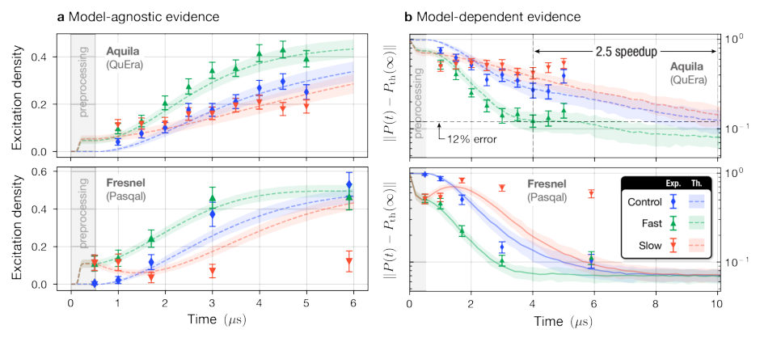
<figcaption class="paper-figure-caption"><b>Fig 3.</b> FIG. 3. Evidence of many-body quantum Mpemba effect. Model-agnostic evidence of the QME shown in panel a, by the dynamics of the excitation density n(t), i.e., the average number of excitations per atom on QuEra’s Aquila (top) and Pasqal’s machine Fresnel (botton). Model-dependent evidence of the QME is show in panel b, the dynamics of the distance from the equilibrium configuration ∥P(t) −Pth(∞)∥, where P(t) is the measured configuration vector at time t and Pth(∞) is the equilibrium configuration vector obtained from theory. Data points are obtained from 200 shots on each device; in a error bars represent the standard deviation, while in b they are obtained via bootstrapping, drawing 200...</figcaption>
</figure>
<figure class="paper-figure-card">
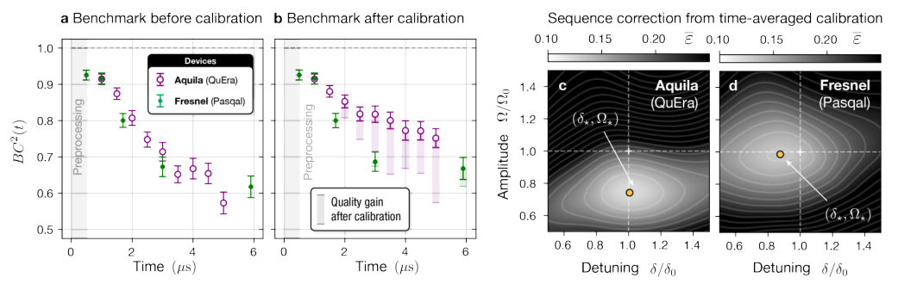
<figcaption class="paper-figure-caption"><b>Fig 4.</b> FIG. 4. Benchmark and sequence corrections from calibration. a, Benchmark score of the Aquila (QuEra) and Fresnel (Pasqal) at each keyframe averaged over control, fast, and slow sequences. Error bars denote one standard deviation from bootstrapping. b, Benchmark scores after time-resolved calibration. Vertical shaded regions indicate the quality gain achieved through calibration. The modest improvement obtained on Fresnel highlights the stringency of the benchmark test, with the slow preprocessing sequence proving the most challenging to reproduce. Heatmap of the time-averaged error landscapes ε(δ, Ω) defined in Eq. (10) on Aquila (c) and Fresnel (d), shown as a function of the deviations...</figcaption>
</figure>
<figure class="paper-figure-card">
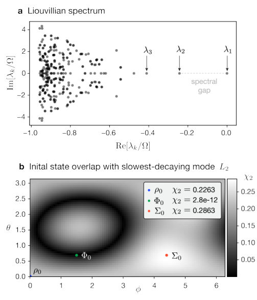
<figcaption class="paper-figure-caption"><b>Fig 5.</b> FIG. 5. Tuning relaxation by controlling the overlap with the slowest-decaying mode. a, The first 350 ele- ments of the spectrum {λk}d k=1 of the Liouville superoperator L associated with the Hamiltonian of Eq. (1), with N = 6, Ω= 0.584, δ = 0.866, C6/r6 0 = 0.866, γ0 = 0.222, γ↓= 0.01, plotted in the complex plane relative to the system’s trans- verse field amplitude Ω. b, Overlap χ2(θ, ϕ) between the pre- processed initial state ρ′ 0(θ, ϕ) and the slowest decaying mode L2 for N = 6. The fiducial initial state ρ0 = |↓⟩⟨↓|⊗N and the slow-decaying state Σ0 have a significant overlap χ2 &gt; 0.2, while the fast-decaying state Φ0 has an almost vanishing over- lap χ2 = 2.81 · 10−12. Note that Φ0...</figcaption>
</figure>

**Summary.** The paper presents a novel method to validate and calibrate programmable quantum processors using the many-body quantum Mpemba effect. By engineering fast and slow relaxation pathways in neutral-atom systems, the authors create a stringent benchmark that quantifies hardware imperfections directly from system dynamics. This establishes relaxation as a powerful, transferable tool for improving quantum hardware fidelity.

**Why it may be interesting.** This work directly addresses hardware characterization in AMO platforms (neutral atoms) by linking fundamental non-equilibrium physics (Mpemba effect) to practical quantum control engineering, providing actionable feedback for device improvement.

Detailed structure

**Main problem.** To develop a validation and calibration process for quantum hardware that is more accurate and scalable than existing benchmarks.

**Main result.** The authors establish many-body relaxation, specifically utilizing the quantum Mpemba effect, as a transferable tool to benchmark and calibrate programmable quantum processors.

**Method.** They introduce a preprocessing sequence ($P$) before running a target task ($L$), allowing direct measurement of extremal dynamical modes governing the open system's relaxation dynamics.

**Model / system.** The experiments are performed on neutral-atom processors (e.g., QuEra's Aquila and Pasqal's Fresnel) trapping Rubidium atoms, modeled as open many-body systems evolving under a Lindblad master equation.

**Key observables.** Figure of Merit ($	ext{FoM}$), Bhattacharyya coefficient ($	ext{BC}_2$), relaxation trajectories (fast vs. slow decay rates), and excitation density $n(t)$.

**Important parameters / regimes.** The initial state engineering controls the fast and slow relaxation pathways; performance is benchmarked against theoretical predictions.

**Assumptions / limitations.** Current validation methods are limited by exponential scaling for full tomography, necessitating reliance on specific dynamical benchmarks like convergence to equilibrium.

**Figures summary.** Figures illustrate the overall validation routine (Initial state $
ightarrow$ Preprocessing $
ightarrow$ Task execution) and show model-dependent evidence of the quantum Mpemba effect signature across different preprocessing regimes on both hardware platforms.

**Paper structure.** The paper introduces the concept by detailing the methodology using two independent neutral-atom processors, demonstrating the fast/slow relaxation pathways via the Mpemba effect, quantifying performance with a Figure of Merit, and concluding that this process serves as a general calibration tool.

Abstract

We introduce a validation process that harnesses engineered many-body relaxation to control and calibrate quantum hardware. On two independently developed neutral-atom processors, we realize the many-body quantum Mpemba effect in an open system for the first time. Initial-state engineering creates fast and slow relaxation pathways: the fast pathway opens access to unreachable mixed-state physics before hardware noise obscures the target dynamics, whereas the slow pathway amplifies hidden imperfections in preparation and control. Computational-basis measurements directly and independently benchmark dynamical reliability, revealing each processor's actual operating window as a many-body simulator. The processors are thus judged by the very dynamics they are built to reproduce. Complementary responses disentangle control errors and drive an adaptive, time-resolved scheme that supplies hardware developers directly actionable corrections, enhancing faithful reproduction of the target dynamics. These results establish many-body relaxation as a transferable validation and calibration tool for programmable quantum processors.

[↑ back to top](#top)

### [Squeezing-Fueled Quantum Otto Engine via Measurement-Induced Cooling: The Two-Qubit Quantum Rabi Model](http://arxiv.org/abs/2608.02521v1)

**Authors:** S R Rathnakaran, Asoka Biswas  
**Type:** theory · **Category:** other · **PDF:** <https://arxiv.org/pdf/2608.02521v1>  
**Analysis basis:** full PDF text, analyzed in chunks
**Topic relevance:** 🔥 `measurement-induced transitions` **4/5** · `analog quantum simulation` **3/5** · `correlated cavity matter` **3/5** · `quantum measurements` **3/5** · `Tavis-Cummings & cavity-many-emitter` **2/5** · `driven-dissipative phase transition` **2/5** · `entanglement & information structure` **2/5** · `methods for driven-dissipative` **2/5** · `non-equilibrium dynamics` **2/5** · `Keldysh / 2PI / non-Gaussian methods` **1/5** · `correlated / nonlocal dissipation` **1/5** · `non-equilibrium universality` **1/5** · `quantum optics experiment` **1/5**

↔ Scroll figures horizontally

<figure class="paper-figure-card">
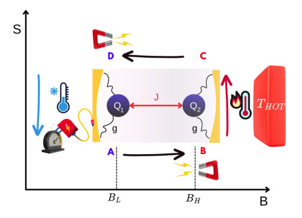
<figcaption class="paper-figure-caption"><b>Fig 1.</b> FIG. 1: Quantum Otto cycle dynamics comprising of two coupled qubits interacting with a common cavity.</figcaption>
</figure>
<figure class="paper-figure-card">
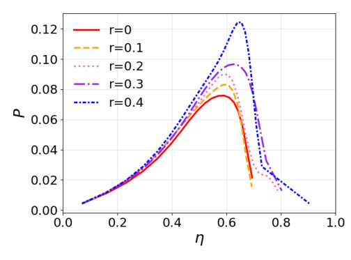
<figcaption class="paper-figure-caption"><b>Fig 2.</b> FIG. 2: Parametric plot showing the variation of Power (P) vs efficiency (η) for different squeezing strengths r across the magnetic field varied from BL = 0.5 to BH = 10BL. The parameters used here are: ωc = 5, τ = 1, τh = 1, T = 1, α = 0.5, ϕ = 0.</figcaption>
</figure>
<figure class="paper-figure-card">
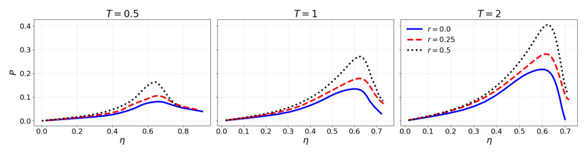
<figcaption class="paper-figure-caption"><b>Fig 3.</b> FIG. 3: Output power P versus efficiency η for different squeezing strengths r at three hot-bath temperatures T = 0.5, 1, and 2. Results are obtained by scanning the magnetic-field ratio BH/BL at fixed coupling α = 1/2 and ϕ = 0, all other parameteric values are the same as in Fig. 2.</figcaption>
</figure>
<figure class="paper-figure-card">
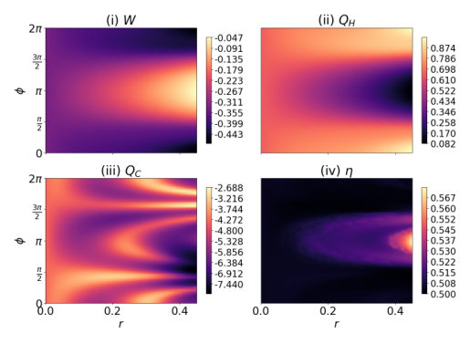
<figcaption class="paper-figure-caption"><b>Fig 4.</b> FIG. 4: Thermodynamic contour maps of the quantum Otto engine as functions of squeezing amplitude r and squeezing phase ϕ. Shown here (i) total work W, (ii) heat input from the hot bath QH, (iii) cold-stroke energy extraction QC, and (iv) cycle efficiency η = −W/QH. All parameters are identical to those in Fig. 2.</figcaption>
</figure>
<figure class="paper-figure-card">
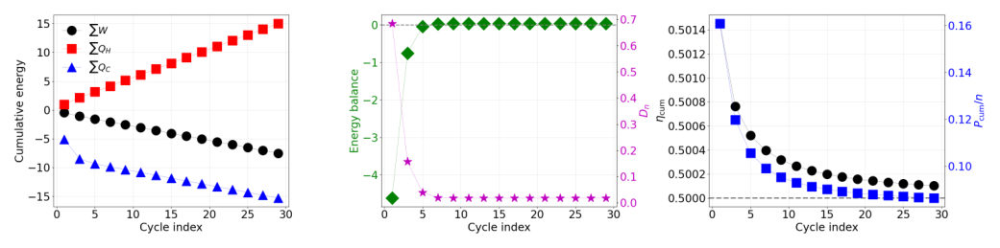
<figcaption class="paper-figure-caption"><b>Fig 5.</b> FIG. 5: Multi–cycle performance of the squeezed (r = 0.5) two–qubit Otto engine. The first panel shows the cumulative work output P</figcaption>
</figure>

**Summary.** The paper analyzes a Quantum Otto Engine built from two qubits coupled to a cavity mode, utilizing measurement-induced cooling instead of a traditional cold bath. By applying squeezing as an external fuel, the authors demonstrate that both power and efficiency are enhanced beyond established limits, establishing a blueprint for advanced quantum heat engines in QED systems.

**Why it may be interesting.** This work directly addresses quantum thermodynamics in a highly relevant platform (Cavity QED), showing how engineered quantum resources can overcome fundamental thermodynamic bounds.

Detailed structure

**Main problem.** Investigating how quantum resources like squeezing and measurement back-action can enhance the performance of a Quantum Otto Engine (QOE) beyond standard thermodynamic limits.

**Main result.** Squeezing systematically enhances both the power output and operational efficiency, allowing the engine to operate above the standard quantum Otto limit by utilizing non-classical correlations.

**Method.** The analysis combines theoretical modeling using the Hierarchical Equations of Motion (HEOM) for bath interactions with perturbative treatments of squeezing effects on work extraction and heat absorption across the four thermodynamic strokes.

**Model / system.** The system is a two-qubit working substance coupled to a cavity mode, operating within a Cavity Quantum Electrodynamics (QED) architecture. The engine cycle is driven by non-Markovian hot baths and cooled via projective measurement on the cavity mode.

**Key observables.** Power output, operational efficiency ($\eta$), coherence ($\zeta(t)$), entanglement, and work extracted ($W$).

**Important parameters / regimes.** Squeezing strength ($\mu$ or $r$), squeezing phase ($\phi$), bath temperature, and coupling constants ($g_1, g_2$).

**Assumptions / limitations.** The cold stroke is modeled by projective measurement back-action rather than thermal contact; the analysis confines itself to a specific invariant subspace (Sector A).

**Figures summary.** Figure 1 illustrates the Quantum Otto cycle dynamics involving two coupled qubits interacting with a common cavity.

**Paper structure.** The paper details the Hamiltonian and system decomposition, applies HEOM for bath interactions, analyzes work extraction during non-adiabatic strokes using squeezing terms, calculates heat absorption modified by coherence, and finally formulates the total resource-inclusive efficiency ($\eta_{	ext{tot}}$).

Abstract

We investigate a quantum Otto engine (QOE) constructed from the two-qubit quantum Rabi model, operating within a cavity quantum electrodynamics (QED) architecture. The engine operates with two qubits as the working substance and a single non-Markovian hot thermal bath, modeled via the hierarchical equations of motion (HEOM) formalism. In place of a conventional cold thermal reservoir, the cooling stroke is realized through a projective measurement protocol on the cavity mode, which acts as an ancillary subsystem and effectively mimics a cold bath for the qubit working medium via measurement back-action. A squeezing drive applied to the cavity mode serves as a quantum fuel. We demonstrate that cavity squeezing systematically enhances both the power output and operational efficiency of the engine - the work extracted per unit of heat drawn from the hot bath-driving it above the standard quantum Otto limit. In the limit-cycle regime, the efficiency, while remaining above the Otto bound throughout, asymptotically converges to it from above. This identifies squeezing as a controllable quantum resource for thermodynamic optimization. Our results reveal that the interplay between qubit-cavity coupling, measurement-induced cooling, and non-equilibrium squeezing gives rise to a multi-resource thermodynamic architecture with performance characteristics inaccessible to conventional two-bath quantum Otto engines, thereby providing a concrete route toward experimentally realizable quantum heat engines in cavity QED platforms.

[↑ back to top](#top)

### [Characterizing the nitrogen-vacancy center singlet transition and its phonon sideband for absorption-based room-temperature magnetometry](http://arxiv.org/abs/2608.02060v1)

**Authors:** Tobias Probst, Florian Schall, Sebastian Heuft, Janina J. Schindler, Lukas Lindner, Sven Mägdefessel, Rüdiger Quay, Philipp Reineck, Alexander M. Zaitsev, Takeshi Ohshima, Matthias Weidemüller, Jan Jeske  
**Type:** both · **Category:** other · **PDF:** <https://arxiv.org/pdf/2608.02060v1>  
**Analysis basis:** full PDF text, analyzed in chunks
**Topic relevance:** 🔥 `QC/QI experiment` **4/5** · 🔥 `spintronics-quantum-optics interface` **4/5** · `correlated cavity matter` **3/5** · `quantum optics experiment` **3/5** · `Tavis-Cummings & cavity-many-emitter` **2/5** · `exotic spin models in light-matter` **2/5** · `methods for driven-dissipative` **2/5** · `quantum measurements` **2/5** · `Keldysh / 2PI / non-Gaussian methods` **1/5** · `analog quantum simulation` **1/5** · `correlated / nonlocal dissipation` **1/5** · `driven-dissipative phase transition` **1/5**

↔ Scroll figures horizontally

<figure class="paper-figure-card">
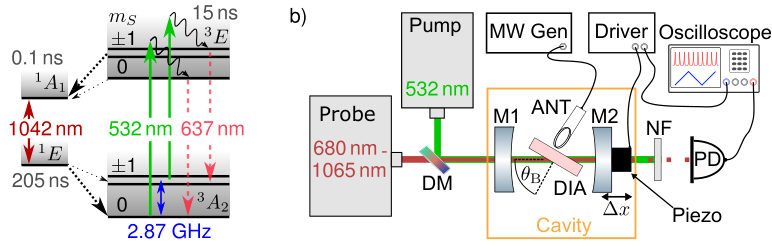
<figcaption class="paper-figure-caption"><b>Fig 1.</b> FIG. 1. NV−energy level diagram and cavity-enhanced spectroscopy setup. a) Energy levels of the NV−center. Optical and microwave transitions are indicated by colors, while phonon-mediated transitions are shown in black. The thickness of the dotted black arrow indicates the probability of the ISC between the triplet and singlet states. The electronic energy levels are broadened due to interactions with phonons (indicated by gray shading). A detailed description of the optical and electronic properties is given in the main text. b) Experimental setup for cavity-enhanced spectroscopy including a 532 nm pump laser and a tunable 680-1065 nm probe laser. Their beams are overlapped with a dichroic...</figcaption>
</figure>
<figure class="paper-figure-card">
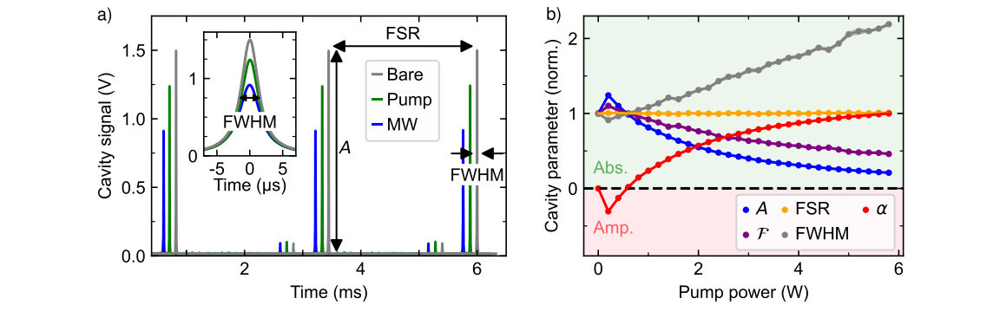
<figcaption class="paper-figure-caption"><b>Fig 2.</b> FIG. 2. Cavity resonances for different experimental configurations and pump power dependence of cavity parameters. a) Cavity resonances for the bare (gray), pump-induced (green) and microwave-induced while the pump laser is active (blue) cavity signals. Differences in the cavity signal between these three cases are used to calculate the signal changes α and the ODMR contrast, as described in the main text. The cavity resonances are defined by the amplitude A, the width (FWHM) and the resonance spacing (FSR), allowing to determine the cavity finesse F. This measurement was performed at a probe wavelength of 900 nm, a pump power of 0.85 W and a microwave power of 40 dBm. b) Pump power...</figcaption>
</figure>
<figure class="paper-figure-card">
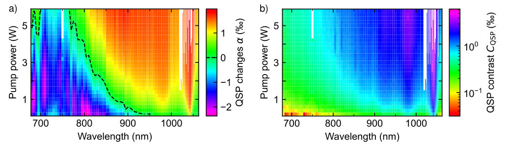
<figcaption class="paper-figure-caption"><b>Fig 3.</b> FIG. 3. Quasi-single-pass pump-induced signal changes and collective ODMR contrast. a) Pump-induced signal changes α over the entire available spectral and pump power range normalized to a quasi-single-pass (QSP) following Eq. (1). The black dotted line separates amplification and absorption regimes which are mainly associated with NV−triplet stimulated emission and singlet absorption, respectively. The strongest absorption occurs around the singlet ZPL at 1042 nm. Between 800-950 nm triplet emission and singlet absorption regimes overlap, leading to a competition of amplification and absorption effects. Which one of these effects dominates overall is dependent on the pump power. b) QSP...</figcaption>
</figure>
<figure class="paper-figure-card">
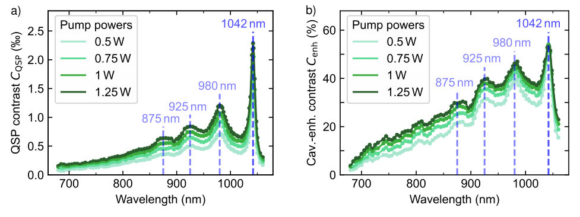
<figcaption class="paper-figure-caption"><b>Fig 4.</b> FIG. 4. Quasi-single-pass and cavity-enhanced collective ODMR contrasts for various pump powers. a) Quasi- single-pass (QSP) collective ODMR contrast CQSP at a microwave power of 40 dBm revealing the room-temperature NV−</figcaption>
</figure>
<figure class="paper-figure-card">
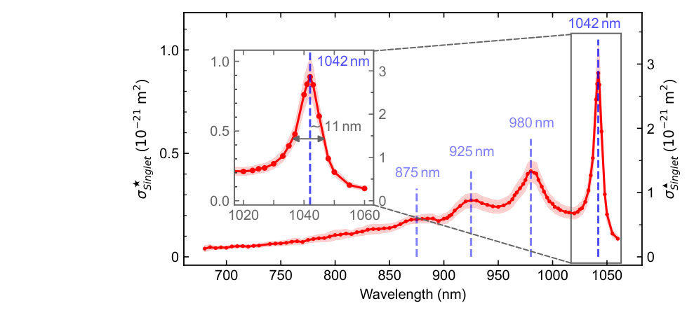
<figcaption class="paper-figure-caption"><b>Fig 5.</b> FIG. 5. Room-temperature absorption cross section (ACS) for the NV−singlet transition with its corresponding phonon sideband. The depicted curve characterizes the 1E →1A1 transition and corresponds to an average of multiple ACSs obtained from several combinations of pump and microwave powers, which we use to cross-validate our experimental method (see Fig. S10). The left and right y-axes indicate the corresponding singlet ACS values depending on which 532 nm NV−ACS was used (&quot;⋆&quot;→[40] and &quot;▲&quot;→[41]). At the ZPL, located at 1042 nm and displayed in the inset, an ACS of σ ⋆ 1042 = (0.89 ± 0.14) · 10−21 m2 or σ ▲ 1042 = (2.9 ± 0.5) · 10−21 m2. and a FWHM of ∼11 nm are found. A quasi-local 75 meV...</figcaption>
</figure>

**Summary.** This paper characterizes the nitrogen-vacancy center's singlet transition and its phonon sideband using advanced absorption spectroscopy at room temperature. By employing cavity enhancement and novel microwave-induced signal analysis, the authors quantify the fundamental absorption cross sections of these transitions. This work significantly advances the feasibility and sensitivity of NV-based magnetometers for practical applications.

**Why it may be interesting.** This work is highly relevant as it pushes the boundaries of quantum sensing by providing precise spectroscopic characterization of solid-state qubits (NV centers) under ambient conditions. The combination of cavity QED principles with detailed rate modeling offers a robust framework for understanding open quantum systems in materials science.

Detailed structure

**Main problem.** The goal is to develop highly sensitive, room-temperature magnetometry using nitrogen-vacancy (NV) centers in diamond by characterizing the magnetic-field-dependent absorption properties of the NV singlet transition and its phonon sideband.

**Main result.** The study successfully quantifies the room-temperature absorption cross sections for the singlet transition ($\sigma^{\star}_{1042} \approx 0.89 \cdot 10^{-21} 	ext{ m}^2$) using novel cavity-enhanced and microwave-induced techniques.

**Method.** The research combines cavity-enhanced spectroscopy, which measures signal changes under pump and microwave fields, with detailed rate model calculations to isolate the intrinsic absorption cross section from background effects.

**Model / system.** The physical system is NV centers in diamond. The analysis involves modeling the electronic state evolution using a density matrix approach governed by coupled differential equations, alongside experimental measurements utilizing high-finesse optical cavities and microwave excitation.

**Key observables.** Absorption cross sections ($\sigma$), Optically Detected Magnetic Resonance (ODMR) contrast ($C_{	ext{QSP}}$), and cavity signal changes ($\alpha$).

**Important parameters / regimes.** Room temperature operation, spectral range of 680-1050 nm, specific absorption wavelengths like 1042 nm, and Rabi frequencies ($\Omega$).

**Assumptions / limitations.** The use of normalization techniques is employed to eliminate the cavity enhancement effect; a novel method using microwave-induced changes is used to suppress contributions from other defects.

**Figures summary.** Figures illustrate the NV energy level diagram and experimental setup. Key figures show cavity resonances under different excitation conditions (Bare, Pump, MW) and plot calculated signal changes ($\alpha$) versus pump power, demonstrating transitions between amplification and absorption regimes.

**Paper structure.** The paper progresses from establishing the promise of absorption-based magnetometry over fluorescence methods to detailing the experimental setup using cavity enhancement. It then presents advanced analysis involving rate modeling (density matrix) to derive quantitative cross sections for the singlet transition across its phonon sideband, validating results through multiple measurement techniques.

Abstract

Magnetometry with nitrogen-vacancy (NV) centers in diamond has shown great promise in recent years. In particular, absorption-based magnetometry techniques, employing a cavity to enhance the absorption length, can improve the contrast and sensitivity compared to conventional techniques based on reading out the NV$^-$ triplet fluorescence. The absorption techniques rely on magnetic-field-dependent absorption at the NV$^-$ singlet zero phonon line at 1042$\,$nm and its phonon sideband. In a cavity-enhanced spectroscopy approach, we study pump-laser- and microwave-induced cavity signal changes at room temperature over a spectral range of 680-1050$\,$nm. Through normalization, we eliminate the cavity-enhancement effect and provide quasi-single-pass values for the absorption and optically detected magnetic resonance (ODMR) contrast. The highest contrast is found at 1042$\,$nm, but multiple points of high contrast are found at the peaks of the phonon sideband. Additionally, cavity-enhanced ODMR contrasts in the range of 50-80$\,\%$ are presented. We further measure the broadband singlet absorption cross section at room temperature with a novel method through microwave-induced signal changes. This method is insensitive to pump-laser-induced signal changes by other defects and quantifies the room-temperature absorption strength of the singlet transition and its entire phonon sideband. We determine the absorption cross section at 1042$\,$nm to be $σ^{\,\bigstar}_{1042}=(0.89\pm0.14)\cdot 10^{-21}\,\text{m}^2$ or $σ^{\,\blacktriangle}_{1042}=(2.9\pm0.5)\cdot 10^{-21}\,\text{m}^2$. depending on the employed 532$\,$nm NV$^-$ absorption cross section.

[↑ back to top](#top)

### [Work Statistics of Autonomous Quantum Energy Pumps](http://arxiv.org/abs/2608.00638v1)

**Authors:** Yang Peng  
**Type:** theory · **Category:** statistical mechanics · **PDF:** <https://arxiv.org/pdf/2608.00638v1>  
**Analysis basis:** full PDF text, analyzed in chunks
**Topic relevance:** 🔥 `quantum measurements` **4/5** · `correlated / nonlocal dissipation` **3/5** · `driven-dissipative phase transition` **3/5** · `methods for driven-dissipative` **3/5** · `non-equilibrium dynamics` **3/5** · `Keldysh / 2PI / non-Gaussian methods` **2/5** · `entanglement & information structure` **2/5** · `non-equilibrium universality` **2/5** · `Tavis-Cummings & cavity-many-emitter` **1/5** · `analog quantum simulation` **1/5** · `correlated cavity matter` **1/5** · `measurement-induced transitions` **1/5**

↔ Scroll figures horizontally

<figure class="paper-figure-card">
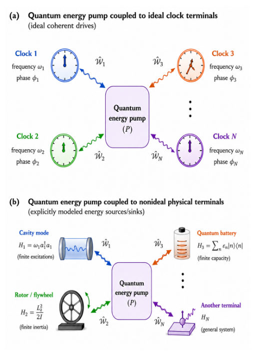
<figcaption class="paper-figure-caption"><b>Fig 1.</b> FIG. 1. Schematic of a quantum energy pump coupled to multiple energy terminals. The central pump mediates en- ergy exchange, and the arrows denote work supplied by the terminals. (a) Ideal clock terminals generate the phases of a periodic or quasiperiodic drive. (b) Physical terminals be- yond the ideal-clock limit may include cavity modes, rotors or flywheels, quantum batteries, and other energy-bearing quan- tum systems. Their finite resources and nonrigid dynamics can produce depletion and backaction, while pump–terminal correlations may modify the transfer statistics.</figcaption>
</figure>
<figure class="paper-figure-card">
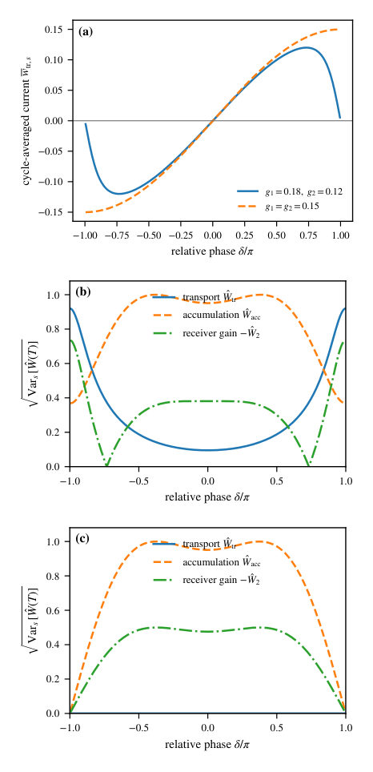
<figcaption class="paper-figure-caption"><b>Fig 2.</b> FIG. 2. Phase dependence of the two-clock qubit pump. (a) Cycle-averaged transport current wtr,s for unequal cou- plings (g1, g2) = (0.18, 0.12) and balanced couplings (g1, g2) = (0.15, 0.15). (b) One-cycle standard deviations of the transport work ˆ Wtr, accumulation work ˆ Wacc, and receiver energy gain −ˆ W2 for (g1, g2) = (0.18, 0.12). (c) The same three standard deviations for (g1, g2) = (0.15, 0.15). In all panels, Ω= 1, ϕ1 = δ/2, ϕ2 = −δ/2, and s = −1. The point δ = π in panel (c) is excluded because G = 0 and the Floquet spectrum is degenerate.</figcaption>
</figure>
<figure class="paper-figure-card">
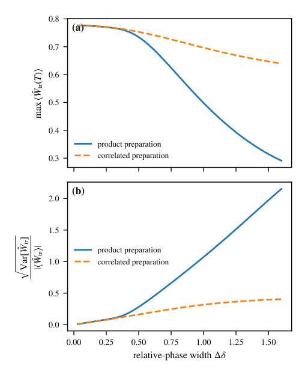
<figcaption class="paper-figure-caption"><b>Fig 3.</b> FIG. 4. Correlation-assisted one-cycle transport under wrapped-Gaussian uncertainty in the initial relative phase. (a) Maximum attainable mean transport work µmax prod(T) and µmax corr(T) for product and correlated pump–clock prepara- tions. (b) Relative standard deviations of the correspond- ing optimized transport work. The parameters are Ω= 1, (g1, g2) = (0.18, 0.12), δ0 = 2, ϕ1 = δ/2, and ϕ2 = −δ/2. The horizontal axis is the phase width ∆δ.</figcaption>
</figure>
<figure class="paper-figure-card">
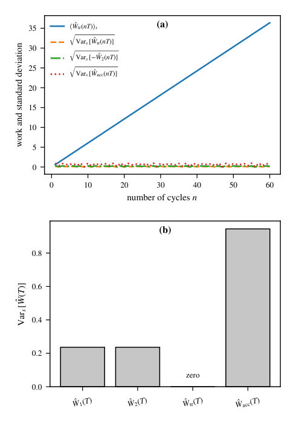
<figcaption class="paper-figure-caption"><b>Fig 4.</b> FIG. 3. Repeated-cycle work statistics and noise matching. (a) Mean transported work and standard deviations versus cycle number for Ω= 1, (g1, g2) = (0.18, 0.12), (ϕ1, ϕ2) = (0.7, −0.8), and s = −1. (b) One-cycle variances for Ω= 1, g1 = g2 = 0.15, (ϕ1, ϕ2) = (π/4, −π/4), and s = −1.</figcaption>
</figure>
<figure class="paper-figure-card">
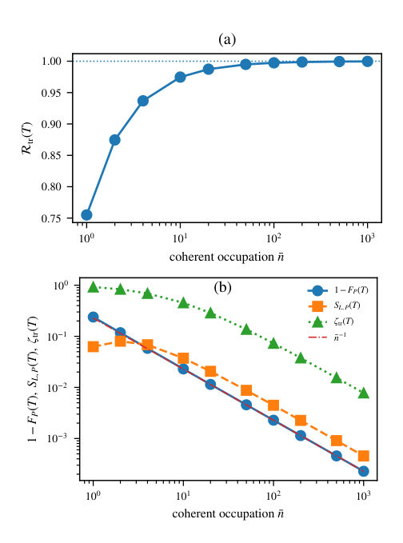
<figcaption class="paper-figure-caption"><b>Fig 5.</b> FIG. 5. Convergence of two coherent cavity terminals toward the ideal-clock limit over 1 ≤¯n ≤103. (a) Normalized mean transport Rtr(T). (b) Terminal-induced fraction of the exact transport variance ζtr(T), pump return infidelity 1 −FP (T), and pump linear entropy SL,P (T). The parameters are Ω= 1, (g1, g2) = (0.18, 0.12), (ϕ1, ϕ2) = (0.7, −0.8), and the initial pump state is the lower ideal-clock Floquet eigenstate. The horizontal line in panel (a) marks Rtr = 1; dash-dotted lines in panel (b) are proportional to ¯n−1.</figcaption>
</figure>

**Summary.** This paper establishes a comprehensive, terminal-resolved theory for analyzing how work is generated by autonomous quantum energy pumps. By explicitly treating the coupling terminals, it quantifies the role of initial correlations and develops diagnostics like the work-variance gap to measure non-ideal energy fluctuations. It advances understanding beyond mean current measurements in quantum thermodynamics.

**Why it may be interesting.** This is highly relevant for AMO and open quantum systems as it provides rigorous tools (like work-variance gaps) to quantify energy flow and dissipation in driven quantum devices beyond simple mean measurements.

Detailed structure

**Main problem.** The research develops a detailed, terminal-resolved theory for calculating work statistics in autonomous quantum energy pumps, moving beyond simple mean current measurements.

**Main result.** The framework shows that initial pump-terminal correlations can enhance the maximum achievable directional work, and it quantifies fluctuations missed by ignoring terminal backaction via a positive work-variance gap.

**Method.** The theory uses full-space quantum dynamics, tracing over explicit energy terminals modeled as ideal clocks to derive exact expressions for multi-terminal work moments.

**Model / system.** The system is an autonomous quantum energy pump coupled to multiple energy sources/sinks (terminals), which are explicitly modeled using clock Hamiltonians. The analysis extends from idealized 'ideal-clock' limits to more realistic, nonideal physical terminals like cavities.

**Key observables.** Work statistics ($\hat{W}_i(t)$), correlation-assisted gain ($\Delta_{	ext{corr}}(t)$), work-variance gap ($\hat{G}$), and asymptotic current operators ($\hat{w}(\infty)_i$).

**Important parameters / regimes.** Periodicity (Floquet eigenstates), initial pump--terminal correlations, and the deviation from ideal clock behavior.

**Assumptions / limitations.** Initial models assume ideal clock terminals; later extensions address nonideal physical terminals. The analysis often relies on projecting dynamics onto coordinate-diagonal density matrices ($\hat{\sigma}_P(s)$).

**Figures summary.** Figure 1 illustrates the setup, showing a central pump coupled to energy terminals, contrasting idealized quantum clocks with more complex physical terminals like cavities.

**Paper structure.** The paper builds from defining the full Hamiltonian and dynamics in terms of terminal couplings, deriving work observables based on these explicit terminals, analyzing the role of initial correlations, applying results to periodic/Floquet systems, and finally extending the theory to nonideal physical environments.

Abstract

We develop a terminal-resolved theory of work statistics for autonomous quantum energy pumps. By modeling the systems that supply and receive energy as explicit quantum terminals, the energy exchanged with each terminal is defined directly from its Hamiltonian change. When the terminals are modeled by ideal clocks, these full-space observables admit exact representations on the pump Hilbert space and recover the conventional phase-derivative currents of periodically and quasiperiodically driven systems. The framework resolves transported work from energy accumulated in the pump. It also incorporates arbitrary initial pump--terminal correlations and identifies when correlations can enhance directional energy transfer under uncertain driving phases. For periodic pumps, we derive finite-cycle work statistics in Floquet eigenstates, relate their fluctuations to Floquet quantum geometry, and show that the long-time terminal currents become mutually compatible. An exactly solvable two-terminal qubit exhibits noise matching, in which transport becomes sharp through cancellation of common-mode terminal fluctuations even though the individual terminal energies remain noisy. Finally, for physical terminals beyond the ideal-clock limit, we introduce a positive work-variance gap that quantifies the fluctuations missed by a pump-only description. A coherent-cavity benchmark shows systematic convergence toward the ideal-clock regime with increasing occupation while demonstrating that agreement of the mean current alone does not guarantee accurate work statistics.

[↑ back to top](#top)

### [Adaptive Reconstruction of Bosonic Quantum States](http://arxiv.org/abs/2608.02049v1)

**Authors:** Vasilisa Usova, Phila Rembold, Ian Yang, Marco Rossignolo, Simone Montangero, Samuele Tosatto, Gerhard Kirchmair  
**Type:** both · **Category:** other · **PDF:** <https://arxiv.org/pdf/2608.02049v1>  
**Analysis basis:** full PDF text, analyzed in chunks
**Topic relevance:** 🔥 `QC/QI experiment` **4/5** · `methods for driven-dissipative` **3/5** · `quantum measurements` **3/5** · `quantum optics experiment` **3/5** · `Tavis-Cummings & cavity-many-emitter` **2/5** · `analog quantum simulation` **2/5** · `measurement-induced transitions` **2/5** · `correlated / nonlocal dissipation` **1/5** · `correlated cavity matter` **1/5** · `driven-dissipative phase transition` **1/5** · `entanglement & information structure` **1/5** · `non-equilibrium dynamics` **1/5**

↔ Scroll figures horizontally

<figure class="paper-figure-card">
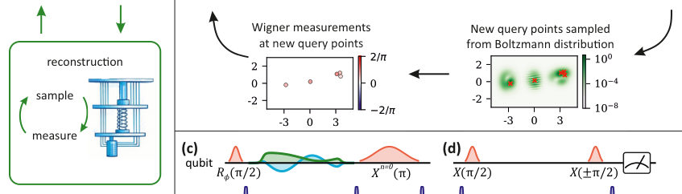
<figcaption class="paper-figure-caption"><b>Fig 1.</b> Figure 1: Closed-loop optimal control and bosonic state reconstruction. (a) Closed-loop quantum optimal control in a cQED setup. A figure of merit (FoM) is calculated based on the result of the bosonic state reconstruction and passed to the optimisation algorithm that generates new control pulses for the next optimisation iteration. (b) Reconstruction algorithm workflow. Measured Wigner values are sampled with replacement to obtain 10 different datasets. These datasets are passed to 10 identically initialised models. As a result of maximum a posteriori (MAP) optimisation, models converge to a different set of parameters and produce various Wigner maps. Deviations between the generated...</figcaption>
</figure>
<figure class="paper-figure-card">
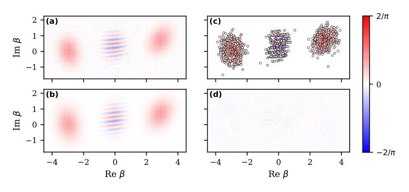
<figcaption class="paper-figure-caption"><b>Fig 2.</b> Figure 2: Example of the state reconstruction. (a) Reference high-resolution Wigner map. The measurement time is about 4 hours. (b) Reconstructed Wigner map. The measurement time is about 3.5 minutes. (c) 1000 measured points during the reconstruction. (d) Residuals between the measured and reconstructed data R(β) = Wmeas(β) −Wmodel(β). Since the model does not account for the bending of the fringes (see Eq. (4)), a small deviation is always present between the model and the observed data in the fringe area.</figcaption>
</figure>
<figure class="paper-figure-card">
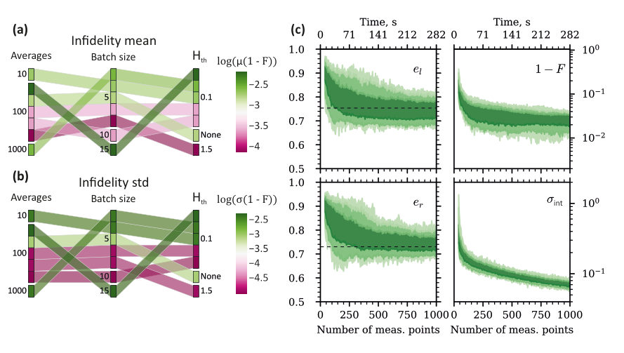
<figcaption class="paper-figure-caption"><b>Fig 3.</b> Figure 3: Hyperparameter search for the optimal reconstruction. The statistics for each set of hyperparameters is obtained from 100 experimental reconstruction runs. Infidelity is calculated as F2-fidelity between the model fit to the reference high-resolution Wigner map and the reconstructed Wigner map. (a) Mean of infidelities, calculated by 10 bootstrapped models, after 1000 measurements for different sets of hyperparameters. Each band represents one combination of hyperparameters. Its colour shows the resulting mean infidelity, where darker purple colours represent a smaller mean infidelity across the reconstruction runs. (b) Standard deviation of infidelities, calculated by 10...</figcaption>
</figure>
<figure class="paper-figure-card">
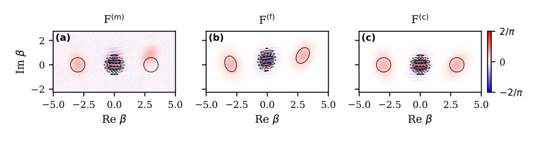
<figcaption class="paper-figure-caption"><b>Fig 4.</b> Figure 4: Illustration of the fidelity metrics (estimands) used in this section, computed according to Eq. (11). The coloured Wigner map corresponds either to the measured Wigner values or to the fitted/corrected Wigner map inferred from those measurements. The black contour indicates the reference Wigner map against which the fidelity is evaluated. (a) Fidelity between the Wigner map of the measured state and the target cat state, F (m) ≡F (meas, target) 2 . (b) Fidelity between the fit to the measured Wigner values and the fit to a high-resolution Wigner map, F (f) ≡F (fit meas, fit high res) 2 . (c) Fidelity between the fit corrected for the transformations (displacements and rotations)...</figcaption>
</figure>
<figure class="paper-figure-card">
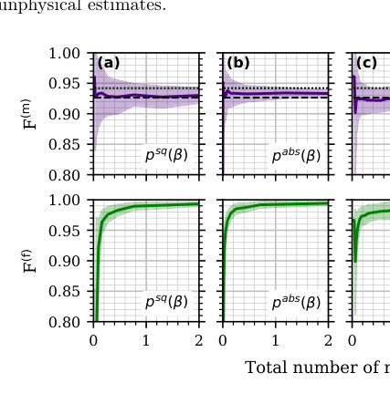
<figcaption class="paper-figure-caption"><b>Fig 5.</b> Figure 5: Comparison of Wigner function sampling strategies for |Cπ√</figcaption>
</figure>

**Summary.** The paper introduces an adaptive reconstruction technique to estimate the fidelity of bosonic quantum states, such as Schrödinger cat states, by reconstructing their Wigner function from minimal measurements. It employs a sophisticated combination of Bayesian inference and active learning guided by uncertainty quantification. This method proves highly efficient for experimental platforms like cQED, enabling autonomous state optimization via closed-loop control.

**Why it may be interesting.** This work directly addresses the practical challenge of characterizing complex quantum states in hardware platforms like cQED. The combination of active learning with quantum control makes it highly relevant for experimentalists working on open quantum systems and state preparation.

Detailed structure

**Main problem.** Characterizing bosonic quantum states is difficult due to large Hilbert spaces and high measurement costs, especially when physical equivalence involves phase space transformations.

**Main result.** The proposed adaptive reconstruction technique successfully estimates state fidelity with respect to a family of states using significantly fewer measurements than conventional methods.

**Method.** It combines physics-informed parametric modeling with Bayesian inference, bootstrap resampling, and active learning to guide the selection of optimal phase space sampling points.

**Model / system.** The study focuses on bosonic systems implemented on a circuit quantum electrodynamics (cQED) platform. Key states analyzed are Schrödinger cat states, whose properties are characterized via their Wigner function in phase space.

**Key observables.** Wigner function $W(eta)$, fidelity estimates ($F_{2	ext{-fidelity}}$), and the Fisher Information Matrix (FIM).

**Important parameters / regimes.** Cat state amplitudes $\alpha \in [1, 3]$, measurement budget ($N_{	ext{total}}$), and entropy thresholds ($H_{	ext{th}}$) for active sampling.

**Assumptions / limitations.** The analysis assumes Gaussian noise in Wigner measurements and relies on asymptotic limits when comparing different optimal sampling strategies.

**Figures summary.** Figures illustrate the closed-loop quantum optimal control workflow, the iterative process of adaptive sampling using bootstrapped data to guide new measurement points, and comparisons showing how various sampling methods converge to theoretical bounds for fidelity uncertainty.

**Paper structure.** The paper progresses from identifying the limitations of single-state tomography to introducing an active learning framework. It details the Bayesian/bootstrap methodology for reconstruction, demonstrates its application on cQED cat states, and concludes by comparing the resulting measurement efficiency against established sampling protocols using CRB analysis.

Abstract

Bosonic quantum systems provide a hardware-efficient platform for quantum information processing but remain challenging to characterise due to their large Hilbert space and the high measurement cost of state tomography. Existing approaches estimate the fidelity with respect to a single target state, making them unsuitable for applications in which physically equivalent states differ by phase space translations, rotations, or other transformations. Here, we introduce an adaptive reconstruction technique that estimates the fidelity with respect to a family of bosonic states while reconstructing the underlying Wigner function from a small number of measurements. The method combines a physics-informed parametric model with Bayesian inference, bootstrap, and active learning to iteratively select the most informative phase space sampling points. We implement the approach on a circuit quantum electrodynamics platform and benchmark it on Schrödinger cat states with amplitudes $α\in[1,3]$. The reconstruction yields reproducible fidelity estimates within a few minutes, remains robust to substantial displacements and rotations in phase space despite using a mismatched prior, and is sensitive to subtle state imperfections. We further compare the adaptive strategy with existing Wigner function sampling protocols experimentally, demonstrating the advantage of adaptive sampling for measurement-efficient fidelity estimation with respect to a family of cat states. Finally, we incorporate the reconstructed fidelity into the figure of merit used in a proof-of-principle closed-loop quantum optimal control experiment, demonstrating the applicability of the method to autonomous optimisation of bosonic quantum states.

[↑ back to top](#top)

### [Fate of moiré flat bands for a weakly repulsive Bose-Einstein condensate in one-dimensional $\mathcal{PT}$-symmetric bichromatic optical lattices](http://arxiv.org/abs/2608.01680v1)

**Authors:** Enhong Cheng, Yu Tan, Yanzhen Xu, Li-Jun Lang  
**Type:** theory · **Category:** quantum gases · **PDF:** <https://arxiv.org/pdf/2608.01680v1>  
**Analysis basis:** full PDF text, analyzed in chunks
**Topic relevance:** 🔥 `analog quantum simulation` **4/5** · 🔥 `driven-dissipative phase transition` **4/5** · `correlated / nonlocal dissipation` **3/5** · `methods for driven-dissipative` **3/5** · `non-equilibrium dynamics` **3/5** · `non-equilibrium universality` **2/5** · `Frenkel-Kontorova` **1/5** · `Keldysh / 2PI / non-Gaussian methods` **1/5** · `Kondo & dissipative impurity` **1/5** · `entanglement & information structure` **1/5**

↔ Scroll figures horizontally

<figure class="paper-figure-card">
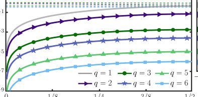
<figcaption class="paper-figure-caption"><b>Fig 1.</b> FIG. 1. Lowest (Eν=1, solid lines) and second (Eν=2, dashed lines) bands of the non-interacting Hermitian system for moir´e ratios α = 1/q at V0 = 0.8. The right panel shows the corre- sponding band gap ratio Gq defined in Eq. (12).</figcaption>
</figure>
<figure class="paper-figure-card">
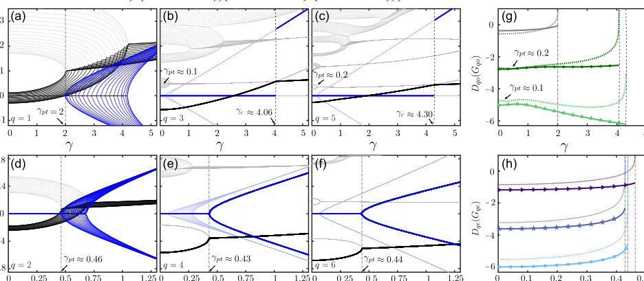
<figcaption class="paper-figure-caption"><b>Fig 2.</b> FIG. 2. (a)-(f) Several lowest energy bands as a function of the non-Hermitian strength γ for different moir´e ratios (1/q) in the absence of interactions. The black and blue curves represent the real and imaginary parts of the lowest band (Eν=1), respectively; the gray curves represent the real parts of higher bands (Eν&gt;1), while the light-blue lines correspond to the imaginary parts of a few selected higher bands. (a)-(c) odd parities qo = {1, 3, 5}, with the dispersion Dqo and gap ratio Gqo of the lowest real band plotted against γ in (g) shown as solid and dashed lines, respectively; (d)-(f) even parities qe = {2, 4, 6}, with the corresponding Dqe and Gqe shown in (h). The PT -breaking...</figcaption>
</figure>
<figure class="paper-figure-card">
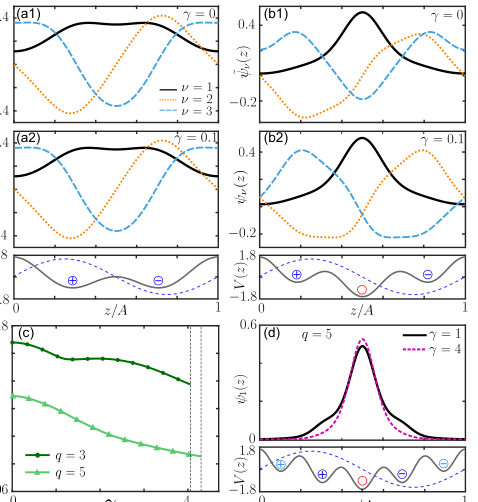
<figcaption class="paper-figure-caption"><b>Fig 3.</b> FIG. 3. Wave functions ψν(z) at k = 0 for the lowest three bands (upper panels) and the corresponding potential pro- files (lower panels) within one moir´e unit cell for (a) q = 2 and (b) q = 3. The real and imaginary parts of the poten- tial are shown by gray solid and blue dashed curves, respec- tively. The circles mark minima of the potential real part from Eq. (6), with the ± signs labeling the sign of its imag- inary part; the red open circle specifically marks the center minimum, at which V i(A/2) = 0. (a1) and (b1) represent ˜ψν in the Hermitian case, with |V21|/|V32| ≈3 and 0.63, respectively; the corresponding non-Hermitian counterparts (γ = 0.1) in (a2) and (b2), where in the...</figcaption>
</figure>
<figure class="paper-figure-card">
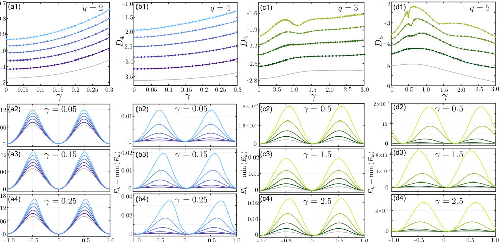
<figcaption class="paper-figure-caption"><b>Fig 4.</b> FIG. 4. The lowest real mean-field band and its dispersion Dq as functions of the non-Hermitian strength γ, for different interaction strengths nzc (color coded). Results for even parities (q = 2, 4) are shown in (a)-(b), using a blue color scale for nzc = 0.1 −0.5. (a1)(b1) D2,4 versus γ, while the typical band structures at γ = {0.05, 0.15, 0.25} are displayed in (a2)-(a4) and (b2)-(b4). Similarly, (c)-(d) present the odd parities (q = 3, 5), with nzc = 0.05 −0.2 indicated by a green scale. The D3,5 versus γ relation is in (c1)(d1), and the band structures at γ = {0.5, 1.5, 2.5} are in (c2)-(c4) and (d2)-(d4).</figcaption>
</figure>
<figure class="paper-figure-card">
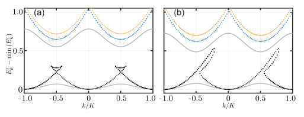
<figcaption class="paper-figure-caption"><b>Fig 5.</b> FIG. 5. Several lowest mean-field bands at interaction strength nzc = 2 for q = 2 in (a) Hermitian and (b) non- Hermitian with γ = 0.25. The lowest (black dots) and second (blue dots) bands are purely real, while the third band (or- ange dots) is complex and only shows the real part. The linear bands are shown in gray for comparison.</figcaption>
</figure>

**Summary.** The paper theoretically investigates how dissipation and interactions modify the flatness of moiré bands in 1D BECs trapped by $\mathcal{PT}$-symmetric optical lattices. Key findings show that this behavior is strongly dependent on the parity of the underlying lattice ratio, leading to distinct physical responses for even versus odd parities. This provides a detailed roadmap for engineering quantum band structures using non-Hermitian control.

**Why it may be interesting.** This work bridges concepts from nonlinear physics (GPE), topological/non-Hermitian systems ($\mathcal{PT}$-symmetry), and ultracold atomic physics (BECs in optical lattices). The parity dependence provides a rich, experimentally testable prediction for controlling quantum states via lattice geometry.

Detailed structure

**Main problem.** The study investigates how dissipation (via $\mathcal{PT}$-symmetry breaking) and weak repulsive interactions affect the flatness of moiré flat bands in a Bose-Einstein condensate confined by a 1D bichromatic optical lattice.

**Main result.** The fate of band flatness is highly dependent on the parity of the moiré ratio denominator, leading to distinct broadening or enhancement/reduction effects when interactions are included.

**Method.** Theoretical analysis using the Gross-Pitaevskii equation (GPE) in both non-interacting and interacting limits, supplemented by perturbation theory and tight-binding models for large imaginary potential regimes.

**Model / system.** The system is a Bose-Einstein condensate modeled by a 1D GPE subjected to a $\mathcal{PT}$-symmetric bichromatic optical lattice potential. The analysis focuses on the interplay between interaction strength ($g$) and the non-Hermitian control parameter ($\gamma$).

**Key observables.** Moiré flatness of the lowest band, $\mathcal{PT}$-symmetry breaking points, bandwidth decay rates ($D_q$), and gap ratios ($G_q$).

**Important parameters / regimes.** The moiré ratio $\alpha = k_2/k_1 = 1/q$, interaction strength $c$, and imaginary potential strength $\gamma$.

**Assumptions / limitations.** The analysis assumes the system can be reduced to one dimension (negligible transverse excitations) and often employs approximations valid in the weak interaction or large-$\gamma$ limits.

**Figures summary.** Figures illustrate band structures vs. moiré ratios, complex energy bands ($D_q$, $G_q$) vs. $\gamma$, wave function profiles within a unit cell for specific parities, and asymptotic scaling of bandwidth decay ($\sqrt{\gamma}$ dependence).

**Paper structure.** The paper progresses from the general non-interacting case to analyzing parity-dependent effects based on moiré ratios. It then incorporates mean-field interactions, culminating in detailed analyses using tight-binding models to determine the large-$\gamma$ scaling of band properties.

Abstract

One-dimensional (1D) superlattices provide one simplified platform for exploring moiré physics from a low-dimensional perspective, with the ratio of lattice constants playing a role analogous to the twist angle in two-dimensional bilayers. Here, we propose a 1D $\mathcal{PT}$-symmetric bichromatic optical lattice for a weakly repulsive Bose-Einstein condensate and investigate how the interplay of dissipation and interaction impacts the lowest moiré flat band.   Without interaction, we find that the lowest-band flatness induced by commensurate ratios exhibits a parity-dependent response to the $\mathcal{PT}$-symmetric imaginary potential due to the distinct $\mathcal{PT}$ pairing mechanism for the energy spectrum.   For ratios with even denominators (i.e., even parities), the level attraction and thus the $\mathcal{PT}$-symmetry breaking occur within the lowest two bands, leading to a monotonic broadening of the lowest flat band, whereas odd denominators (i.e., odd parities) yield a nonmonotonic response due to the $\mathcal{PT}$-symmetry breaking within the second and the third lowest bands instead while the lowest band remains purely real.   This parity-dependent phenomenon can be understood by the perturbation theory.   Furthermore, by solving the Gross-Pitaevskii equation, we also find that although the weak repulsive interaction can broaden the moiré bands alone, the combined effects of interaction and imaginary potential also lead to parity-dependent behaviors.   For even parities, band flattening is consistently diminished, whereas for odd parities, the imaginary potential can either enhance or reduce the degree of flattening.   These results pave the way for experimental studies of dissipation and interaction effects on band flatness in moiré systems.

[↑ back to top](#top)

### [Measurement and control of the interaction frequency shift in bosonic optical lattice clocks](http://arxiv.org/abs/2608.02425v1)

**Authors:** J. P. Salvatierra, M. Barbiero, G. Bertaina, D. Calonico, F. Levi, M. G. Tarallo  
**Type:** both · **Category:** other · **PDF:** <https://arxiv.org/pdf/2608.02425v1>  
**Analysis basis:** full PDF text, analyzed in chunks
**Topic relevance:** 🔥 `analog quantum simulation` **4/5** · `methods for driven-dissipative` **3/5** · `quantum measurements` **3/5** · `quantum optics experiment` **3/5** · `Keldysh / 2PI / non-Gaussian methods` **2/5** · `QC/QI experiment` **2/5** · `correlated / nonlocal dissipation` **1/5** · `correlated cavity matter` **1/5** · `driven-dissipative phase transition` **1/5** · `entanglement & information structure` **1/5** · `exotic spin models in light-matter` **1/5** · `non-equilibrium dynamics` **1/5**

↔ Scroll figures horizontally

<figure class="paper-figure-card">
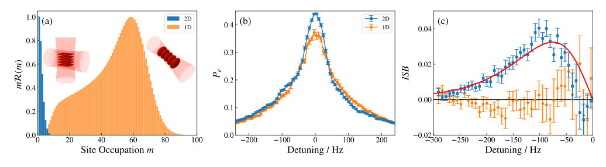
<figcaption class="paper-figure-caption"><b>Fig 1.</b> FIG. 1. Rabi spectroscopy of interacting bosons in optical lattices. a) Fraction of the atomic population contributing to the spectroscopic signal with a given site occupancy m for the 1D and 2D lattice configurations for Ntot = 7 × 104, with a pictorial view of their confinement volumes. b) Measured Rabi line shapes of the excited fraction for g to e interrogation for Ntot = 7 × 104 atoms, taken in a 1D lattice (orange circles) and in a 2D lattice (blue squares). While both profiles show a substantial broadening, the 2D profile is clearly asymmetric, revealing a many-body interaction structure. c) The reconstructed resolved atomic interaction sideband is plotted for both lattice...</figcaption>
</figure>
<figure class="paper-figure-card">
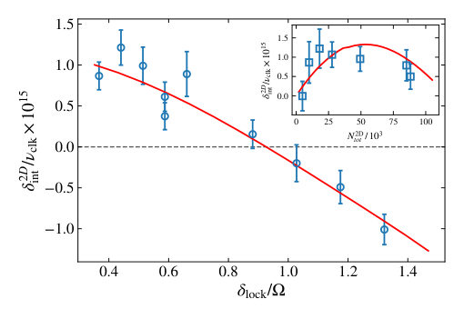
<figcaption class="paper-figure-caption"><b>Fig 2.</b> FIG. 2. Observation of clock frequency shift in a 2D lattice as function of the excitation fraction Pe as set by the locking point δlock (main panel) fitted by spin model integration (solid red line), with the absolute shift at the reference point pinned by the density shift measurement at different Ntot (in the inset). See main text for details.</figcaption>
</figure>
<figure class="paper-figure-card">
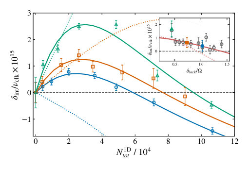
<figcaption class="paper-figure-caption"><b>Fig 3.</b> FIG. 3. Measurement of the interaction frequency shift in a 1D 88Sr optical lattice clock. Main panel: interleaved interac- tion shift measurements as function of the total lattice occu- pation Ntot at three different lock detunings δlock/Ω: 0.4 (tri- angles, green), 0.7 (squares, orange), 1.0 (circles, blue). Solid lines represents numerical fit by integrating the mean-field dis- sipative optical Bloch equations at the different δlock values, dashed lines are the unitary many-body spin-model interac- tion shift with same scattering parameters. Inset: Interaction frequency shift at a fixed total atom number Ntot = 7×103 as function of δlock. Colored points correspond to the frequency...</figcaption>
</figure>

**Summary.** This paper reports on high-precision measurements characterizing interaction frequency shifts in bosonic optical lattice clocks using $^{88}	ext{Sr}$ atoms. By analyzing the nonlinear density dependence of the clock shift in both 1D and 2D lattices, the authors demonstrate a method to actively tune out these systematic collisional shifts at specific operating points. This capability is vital for realizing next-generation quantum sensors with unprecedented stability.

**Why it may be interesting.** This work is highly relevant as it pushes the boundaries of precision measurement in AMO physics by quantifying complex, many-body interactions that must be precisely modeled and controlled for next-generation quantum sensors.

Detailed structure

**Main problem.** The research focuses on precisely measuring and controlling the nonlinear interaction frequency shifts (collisional shifts) experienced by bosonic atoms trapped in optical lattices.

**Main result.** The study demonstrates that these interactions lead to a density-dependent clock shift, but crucially shows that this shift can be canceled at specific operating points (magic densities/detunings) in both 1D and 2D lattice geometries.

**Method.** The authors combine precise experimental measurements of Rabi line shapes and sideband spectroscopy with theoretical modeling using mean-field approximations derived from full many-body Hamiltonians.

**Model / system.** The system is a bosonic optical lattice clock utilizing $^{88}	ext{Sr}$ atoms, modeled by an effective spin Hamiltonian incorporating linear and nonlinear interaction terms. The dynamics are analyzed via both unitary Schrödinger equations and dissipative optical Bloch equations.

**Key observables.** Clock shift dependence on atomic density ($N$), Rabi line shapes, and the reconstructed interaction sideband structure.

**Important parameters / regimes.** Interaction energy scales ($U_{ee}, U_{eg}$), lattice dimensionality (1D vs 2D), and specific cancellation detunings ($\delta_{	ext{lock}}$).

**Assumptions / limitations.** The analysis relies on mean-field approximations, adiabatic elimination techniques for radial degrees of freedom, and assumptions about the thermal state independence from spin dynamics.

**Figures summary.** Figures illustrate Rabi spectroscopy showing asymmetric line shapes in 2D lattices and frequency shift measurements versus total atom number in 1D lattices, confirming interaction effects.

**Paper structure.** The paper progresses by first establishing the general Hamiltonian for interacting bosons, deriving effective spin models via adiabatic elimination (theory), and then applying these frameworks to analyze experimental data from 1D and 2D lattice clocks to quantify density shifts and cancellation points (experiment).

Abstract

We report precise measurements of inter-level interactions in a bosonic optical lattice clock based on $^{88}$Sr atoms. We observe a nonlinear density dependence of the clock shift, even without reaching quantum degeneracy. In a 2D lattice, the Rabi line shape exhibits an interaction sideband consistent with a collective spin model, while in a 1D lattice the shift is modified by density-induced dephasing. These findings, combined with a careful choice of interrogation detuning and atomic density, can enable operation at a net-zero systematic density shift in $^{88}$Sr lattice clocks. We discuss the implications of these findings in many-body physics, quantum simulation, and precision isotope shift measurements, which provide a powerful probe for new physics beyond the Standard Model.

[↑ back to top](#top)

### [Noise-enhanced temporal boundary states in non-Hermitian systems](http://arxiv.org/abs/2608.01179v1)

**Authors:** Jielong Zhang, Bozheng Xue, Xianfeng Man, Baizhan Xia  
**Type:** both · **Category:** statistical mechanics · **PDF:** <https://arxiv.org/pdf/2608.01179v1>  
**Analysis basis:** full PDF text, analyzed in chunks
**Topic relevance:** 🔥 `driven-dissipative phase transition` **4/5** · 🔥 `non-equilibrium dynamics` **4/5** · `analog quantum simulation` **3/5** · `correlated / nonlocal dissipation` **3/5** · `methods for driven-dissipative` **3/5** · `non-equilibrium universality` **3/5** · `Keldysh / 2PI / non-Gaussian methods` **1/5** · `Kondo & dissipative impurity` **1/5** · `QC/QI experiment` **1/5**

↔ Scroll figures horizontally

<figure class="paper-figure-card">
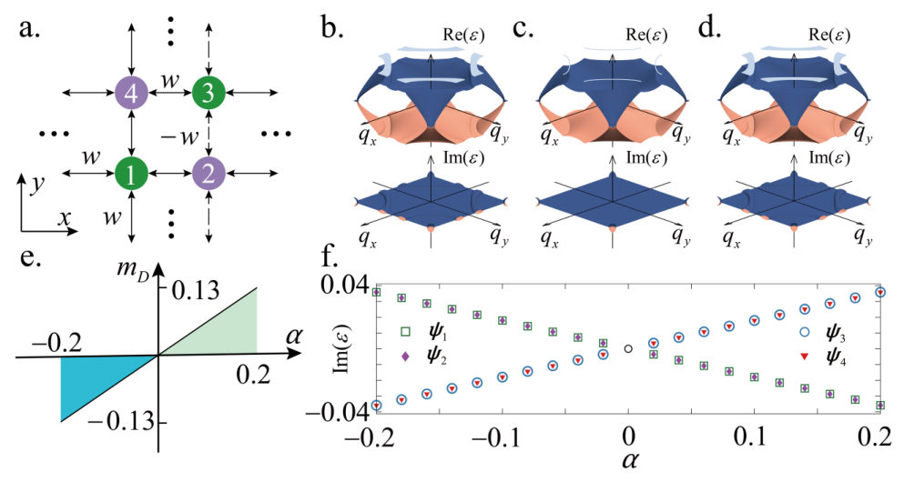
<figcaption class="paper-figure-caption"><b>Fig 1.</b> Fig. 1 | Time-periodically modulated 2D tight-binding model. a, Configuration of unit cell with uniform intra- and</figcaption>
</figure>
<figure class="paper-figure-card">
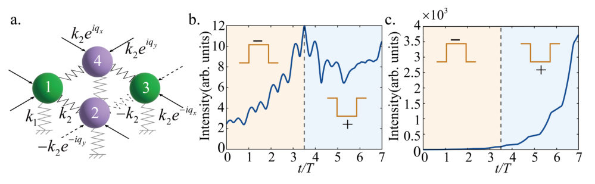
<figcaption class="paper-figure-caption"><b>Fig 2.</b> Fig. 2 | Temporal boundary state in a multi-degree-of-freedom spring–mass network driven by time-periodic</figcaption>
</figure>
<figure class="paper-figure-card">
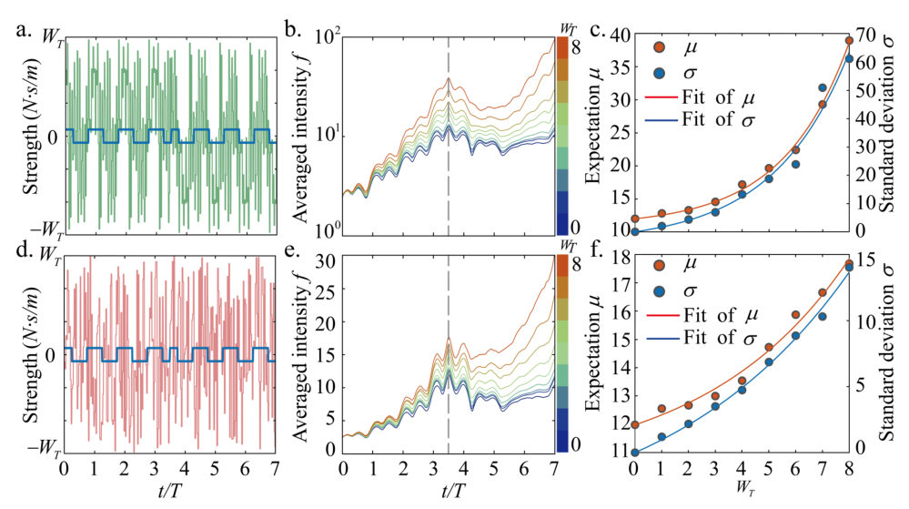
<figcaption class="paper-figure-caption"><b>Fig 3.</b> Fig. 3 | Noise-enhanced temporal boundary states under PRTN and FRTN. a, PRTN. Random noise 𝑟( ∈</figcaption>
</figure>
<figure class="paper-figure-card">
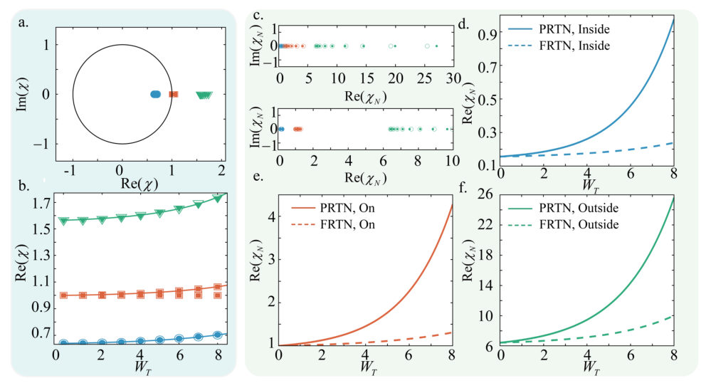
<figcaption class="paper-figure-caption"><b>Fig 4.</b> Fig. 4 | Eigenvalues of the averaged superoperator. a, Eigenvalue evolution of the single-period averaged</figcaption>
</figure>
<figure class="paper-figure-card">
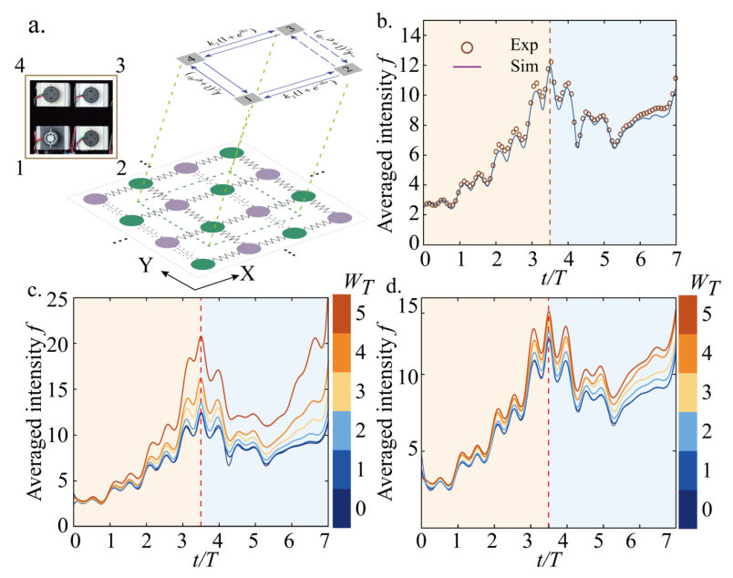
<figcaption class="paper-figure-caption"><b>Fig 5.</b> Fig. 5 Experimental realization of noise-enhanced temporal boundary states in a robotic metamaterial</figcaption>
</figure>

**Summary.** The paper demonstrates that temporal noise can paradoxically enhance topological boundary states in non-Hermitian systems. Using both theoretical superoperator analysis and experimental realization in a robotic metamaterial network, the authors show that averaging over noise leads to exponential amplification of these interface states. This establishes noise as a functional tool for engineering robust quantum devices.

**Why it may be interesting.** This work directly addresses open quantum systems dynamics by showing how engineered noise can stabilize or amplify coherent quantum phenomena, which is highly relevant for designing robust quantum devices.

Detailed structure

**Main problem.** The study investigates whether temporal noise, typically viewed as a destructive element, can constructively enhance or stabilize topological boundary states in non-Hermitian systems.

**Main result.** Ensemble averaging over periodic or random temporal noise leads to an exponential enhancement of the response intensity at the temporal interface, establishing noise as a constructive ingredient for robust topological state emergence.

**Method.** The analysis combines theoretical superoperator methods (Floquet theory) with experimental validation using programmable robotic metamaterial networks.

**Model / system.** The system is modeled by a 2D periodically driven non-Hermitian tight-binding Hamiltonian, which is experimentally realized in a spring–mass network composed of controllable oscillators.

**Key observables.** Response intensity at the temporal interface, growth rate of growing modes, decay rate of decaying ones, and quasi-energy spectrum gaps.

**Important parameters / regimes.** Noise strength (W), modulation frequency ($\Omega$), coupling parameters ($\alpha$), and time periodicity ($T$).

**Assumptions / limitations.** The analysis relies on ensemble averaging for noise effects and the slowly varying envelope approximation for the continuum model.

**Figures summary.** Figures illustrate quasi-energy spectra showing gap opening, exponential growth of response intensity under both PRTN and FRTN noise regimes, and schematics/measurements from the robotic metamaterial network demonstrating amplification.

**Paper structure.** The paper progresses from theoretical analysis using Floquet Hamiltonians to deriving superoperator evolution equations under different noise types (PRTN vs. FRTN), culminating in a detailed experimental realization and measurement campaign on a physical metamaterial platform.

Abstract

Time-periodic modulation introduces a synthetic degree of freedom to manipulate topological phases. This synthetic dimension can trigger a phase transition that localizes a boundary state at the temporal interface. Noise is widely deemed a fundamental threat to topological protection, universally anticipated to weaken or even destroy topological states. Here, we introduce periodically repeated temporal noise and fully random temporal noise into a 2D periodically driven non-Hermitian system. Paradoxically, under ensemble averaging, such temporal noise drives an exponential enhancement of the response intensity at the temporal interface. An averaged superoperator analysis shows that the noiseless band structure is preserved under both types of noise. Yet the noise increases the growth rate of growing modes while suppressing the decay rate of decaying ones. Finally, we experimentally realize the noise-enhanced temporal boundary state in a robotic metamaterial network. This finding establishes temporal noise as a constructive ingredient, enabling the unambiguous emergence of topological states and conferring exceptional robustness upon topological devices.

[↑ back to top](#top)

### [Non-Hermitian photon number filtering using N00N state Bloch oscillations](http://arxiv.org/abs/2608.01484v1)

**Authors:** Sean Crowe, Joanna Ptasinski, Melvin Pascoguin, Stefan Evans  
**Type:** theory · **Category:** quantum information and computing · **PDF:** <https://arxiv.org/pdf/2608.01484v1>  
**Analysis basis:** full PDF text, analyzed in chunks
**Topic relevance:** 🔥 `analog quantum simulation` **4/5** · `correlated / nonlocal dissipation` **3/5** · `driven-dissipative phase transition` **3/5** · `methods for driven-dissipative` **3/5** · `non-equilibrium dynamics` **2/5** · `non-equilibrium universality` **2/5** · `Keldysh / 2PI / non-Gaussian methods` **1/5** · `Kondo & dissipative impurity` **1/5** · `correlated cavity matter` **1/5** · `entanglement & information structure` **1/5** · `interference shaping light` **1/5** · `measurement-induced transitions` **1/5**

↔ Scroll figures horizontally

<figure class="paper-figure-card">
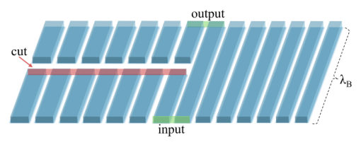
<figcaption class="paper-figure-caption"><b>Fig 1.</b> FIG. 2. Example of an asymmetric loss platform (not to scale). Two waveguides serve as inputs and outputs (green), and the cut (red) labels 0 transmission. New waveguides are added after the cuts to minimize edge effects.</figcaption>
</figure>
<figure class="paper-figure-card">
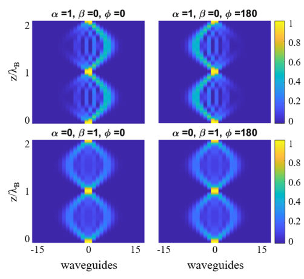
<figcaption class="paper-figure-caption"><b>Fig 2.</b> FIG. 1. Photon density evolution for input N00N states - light propagates in the z direction, tunneling between the 30 waveguides spanning the platform, using B = 1, C = 1.75 as an example.</figcaption>
</figure>
<figure class="paper-figure-card">
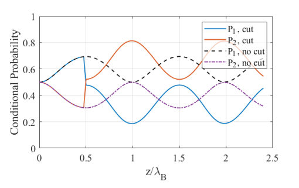
<figcaption class="paper-figure-caption"><b>Fig 3.</b> FIG. 3. Conditional probabilities (Eq. (17)) with and without cuts at the half Bloch period (z = λB/2), plotted as func- tions of normalized position. The input N = 1 and N = 2 N00N states are applied with equal probability (α = β = 1, see Eq. (5)), with C/B = 0.3 and phase ϕ = π to achieve &gt; 80% filtration of the N = 2 sector.</figcaption>
</figure>
<figure class="paper-figure-card">
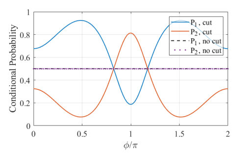
<figcaption class="paper-figure-caption"><b>Fig 4.</b> FIG. 4. Plot of conditional probabilities with and without cuts as a function of input phase. The same parameters as in Fig. 3 apply: α = β = 1 and C/B = 0.3. The probabilities are computed at the full Bloch period z = λB.</figcaption>
</figure>
<figure class="paper-figure-card">
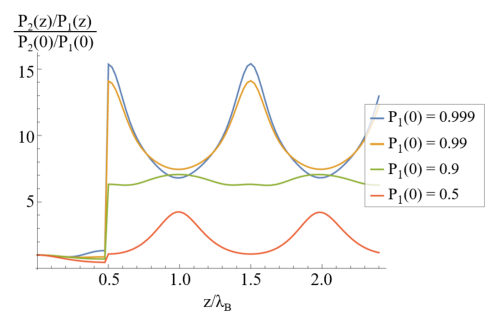
<figcaption class="paper-figure-caption"><b>Fig 5.</b> FIG. 6. Plot of normalized mode participation ratios as a function of z, with the initial fraction of the population in the N = 1 N00N state being varied, while C/B = 0.3 and ϕ = π for N = 2 filtration. Normalized efficiencies for these different populations of photon number states have been calculated and are found in appendix D.</figcaption>
</figure>

**Summary.** The paper proposes using N00N state Bloch oscillations in a waveguide array with controlled asymmetric loss to perform non-Hermitian photon number filtering. By tuning the input phase, researchers can dynamically switch between enhancing or suppressing specific photon number components (e.g., favoring 2-photon states over 1-photon states). This offers a promising theoretical pathway for improving state preparation in photonic quantum circuits.

**Why it may be interesting.** This work directly addresses quantum state manipulation in photonic circuits, which is a core area for quantum networking and computation. The use of engineered non-Hermitian physics (loss) to achieve filtering is a key concept in open quantum systems.

Detailed structure

**Main problem.** The research aims to develop a method for non-Hermitian photon number filtering using N00N state Bloch oscillations.

**Main result.** The scheme successfully filters specific photon number states, achieving high fidelity switching between 1-photon and 2-photon dominated output subspaces by tuning the input phase.

**Method.** The method involves simulating the evolution of photonic N00N states in a waveguide array containing an engineered asymmetric loss profile (a 'cut').

**Model / system.** The system is modeled using photonic waveguides exhibiting Bloch oscillations, governed by a Hamiltonian that includes coupling terms and linear growth in effective index. The process is analyzed via density matrix evolution ($
ho(z)$) across the cut.

**Key observables.** Output probabilities ($P_1$, $P_2$) for 1-photon and 2-photon subspaces, and normalized efficiency ratios ($E_1/E_1(0)$, $E_2/E_2(0)$).

**Important parameters / regimes.** Input phase ($\phi$), the ratio $C/B$ (controlling transverse spread), and the location of the asymmetric loss cut ($\lambda_B/2$).

**Assumptions / limitations.** The analysis assumes the ability to prepare initial N00N states with high fidelity, and it models the evolution as piecewise across the engineered loss region.

**Figures summary.** Figures illustrate photon density localization based on input phase (Fig. 1), conditional probabilities vs. input phase or $C/B$ (Figs. 4, 5), and normalized efficiency ratios showing suppression near the cut location (Fig. 7).

**Paper structure.** The paper details the Hamiltonian for zero-loss evolution, introduces the asymmetric loss mechanism at $\lambda_B/2$, calculates the resulting reduced density matrix ($
ho_{	ext{cut}}$), and finally analyzes the output probabilities after propagating past the cut.

Abstract

We explore Bloch oscillations of $N=1$ and $N=2$ photonic N00N states, using an array of linearly growing effective index waveguides with a simulated asymmetric loss profile. Starting with equal probability input $N=1$ and $N=2$ N00N states, and siphoning off a portion of the waveguides near the half Bloch period, we selectively output specific photon number states. Tuning the input phase, we achieve dynamic switching between 2-photon dominated (80\% of the output) and 1-photon dominated (90\% of the output) cases. This offers a path to improved state preparation in photonic circuits used in computing and networking.

[↑ back to top](#top)

### [Spin Quantum Hall Effect: the Critical Exponents](http://arxiv.org/abs/2608.00849v1)

**Authors:** Hrant Topchyan, Win Nuding, Andreas Klümper, Ara Sedrakyan  
**Type:** theory · **Category:** disordered systems and neural networks · **PDF:** <https://arxiv.org/pdf/2608.00849v1>  
**Analysis basis:** full PDF text, analyzed in chunks
**Topic relevance:** 🔥 `non-equilibrium universality` **4/5** · `analog quantum simulation` **3/5** · `driven-dissipative phase transition` **3/5** · `exotic spin models in light-matter` **3/5** · `non-equilibrium dynamics` **3/5** · `methods for driven-dissipative` **2/5** · `spintronics-quantum-optics interface` **2/5** · `Keldysh / 2PI / non-Gaussian methods` **1/5** · `Kondo & dissipative impurity` **1/5**

↔ Scroll figures horizontally

<figure class="paper-figure-card">
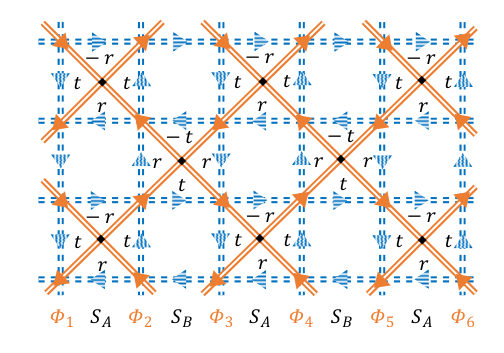
<figcaption class="paper-figure-caption"><b>Fig 1.</b> FIG. 1: The scattering network underlying the spin quantum Hall plateau transition.</figcaption>
</figure>
<figure class="paper-figure-card">
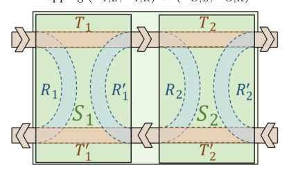
<figcaption class="paper-figure-caption"><b>Fig 2.</b> FIG. 2: Schematic representation of the structure of the S matrices. The two reflection blocks, R and R′ (blue stripes), and the two transmission blocks, T and T ′ (red stripes), are shown, with the arrows indicating the direction of the mapping.</figcaption>
</figure>
<figure class="paper-figure-card">
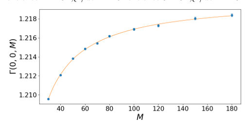
<figcaption class="paper-figure-caption"><b>Fig 3.</b> FIG. 3: Computed values of Γ(ε, ∆, M) (dots) and fitting curves obtained from the finite-size scaling ansatz used to determine the critical exponents.</figcaption>
</figure>

**Summary.** This paper numerically calculates the critical exponents ($
u$ and $\mu$) governing the Spin Quantum Hall Effect (SQHE) transition using a sophisticated S-matrix approach. By applying finite-size scaling theory to the network model, the authors confirm theoretical predictions for one exponent while providing precise estimates for both critical parameters in this disordered topological system.

**Why it may be interesting.** This research provides rigorous numerical benchmarks for critical phenomena in topological phases, which has implications for understanding quantum transport in engineered superconducting materials or disordered electronic systems relevant to AMO physics.

Detailed structure

**Main problem.** The primary goal is to determine the critical exponents ($
u$ for localization length and $\mu$ for boundary criticality) characterizing the Spin Quantum Hall Effect (SQHE). This serves as a crucial testbed for theories concerning disordered topological systems.

**Main result.** Numerical calculations using the S-matrix approach yielded estimates for the exponents: $
u \approx 1.33$ and $\mu \approx 1.15$. The value found for $
u$ is consistent with the analytical prediction of $4/3$.

**Method.** The authors employed high-precision numerical calculations based on the S-matrix approach applied to a regular network structure, utilizing finite-size scaling analysis.

**Model / system.** The study analyzes the SQHE network model, which is a spin analogue of the IQHE. It models quasiparticle transport in 2D disordered superconductors with broken time-reversal symmetry and belongs to Altland–Zirnbauer class C.

**Key observables.** Localization-length exponent ($
u$), boundary critical exponent ($\mu$), and the scaled Lyapunov exponent ($\Gamma$).

**Important parameters / regimes.** Disorder strength ($\epsilon$ or $\Delta$) and system size ($M$). The analysis is performed near the critical point where $\epsilon = \Delta = 0$.

**Assumptions / limitations.** The analysis is restricted to the regular network geometry, and the finite-size scaling ansatz for the Lyapunov exponent is employed.

**Figures summary.** Figure 1 illustrates the scattering network structure underlying the SQHE plateau transition. Figure 3 shows computed values of the scaled Lyapunov exponent $\Gamma$ versus system size $M$, fitted using a finite-size scaling ansatz to extract $
u$ and $\mu$.

**Paper structure.** The paper first establishes the physical model (SQHE network) and its connection to previous work. It then details the mathematical framework, focusing on constructing the total S matrix via amalgamation of block matrices. The core is the numerical analysis using finite-size scaling theory applied to the Lyapunov exponent to extract the critical exponents $
u$ and $\mu$.

Abstract

The spin quantum Hall effect (SQHE) provides one of the few examples of an Anderson localization transition for which exact critical exponents are known, making it an important testing ground for theories of disordered topological systems and conformal field theory. The corresponding network model, obtained by replacing the random $U(1)$ phases of the Chalker--Coddington model with random $SU(2)$ matrices, belongs to symmetry class C of the Altland--Zirnbauer classification and is believed to describe quasiparticle transport in two-dimensional disordered superconductors with broken time-reversal symmetry. In this work, we perform high-precision numerical calculations of the localization-length exponent ($ν$) and the boundary critical exponent ($μ$) for the SQHE network model using the recently developed $S$-matrix approach to random networks.

[↑ back to top](#top)

### [Thermalization of open quantum systems with pseudomodes](http://arxiv.org/abs/2608.02517v1)

**Authors:** R. Kevin Kessing, Thibaut Lacroix, Susana F. Huelga, Martin B. Plenio  
**Type:** theory · **Category:** statistical mechanics · **PDF:** <https://arxiv.org/pdf/2608.02517v1>  
**Analysis basis:** full PDF text, analyzed in chunks
**Topic relevance:** 🔥 `methods for driven-dissipative` **4/5** · 🔥 `non-equilibrium dynamics` **4/5** · `Keldysh / 2PI / non-Gaussian methods` **3/5** · `correlated / nonlocal dissipation` **3/5** · `driven-dissipative phase transition` **3/5** · `non-equilibrium universality` **2/5** · `Kondo & dissipative impurity` **1/5** · `analog quantum simulation` **1/5** · `scars & prethermalization` **1/5**

↔ Scroll figures horizontally

<figure class="paper-figure-card">
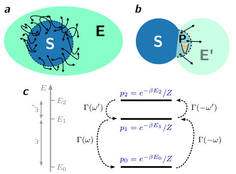
<figcaption class="paper-figure-caption"><b>Fig 1.</b> Figure 1: The basic idea behind pseudomode models for open quantum systems. a: A generic open quantum system (S) interacting strongly and non-trivially with a structured envi- ronment (E). Such complex environments are typically nu- merically inaccessible. b: To capture the effect of E on S without having to treat E explicitly, a pseudomode (P) is added to the system itself. P is damped via a Lindblad dissi- pator (2), representing a simple environment E’ whose effects on P are Markovian. However, P interacts with S via the same coupling terms as the original E did—and, ideally, the combination of P and E’ should reproduce the bath correla- tion functions of E. c: A toy example of detailed...</figcaption>
</figure>
<figure class="paper-figure-card">

<figcaption class="paper-figure-caption"><b>Fig 2.</b> Fig. 1) have become a prominent method for treating open quantum systems with strong system–bath cou- pling [16–22], with wide-ranging applications reach- ing from strong light-matter coupling [23–26] and en- ergy transfer in organic photovoltaics and photosyn- thesis [27–29] to trapped-ion simulators [18, 30, 31] and quantum heat engines [20, 22]. However, con- trary to intuitive expectations, reducing the system– pseudomode coupling to infinitesimal levels does not, in general, restore detailed balance (see Fig. 1c)— a central condition for thermodynamically consistent thermalization behavior [32–34]. Here, we examine under what conditions pseudomode approaches will or will not thermalize...</figcaption>
</figure>
<figure class="paper-figure-card">
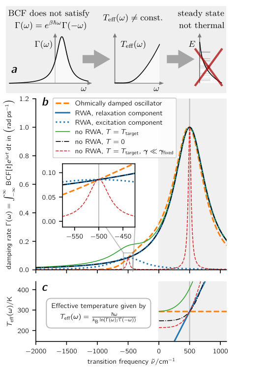
<figcaption class="paper-figure-caption"><b>Fig 3.</b> Figure 2: Damping rates and effective-temperature profiles for several single-pseudomode models. a: A schematic ex- planation of the significance of the BCFs: If the BCFs do not obey detailed balance, then the effective tempera- ture (9) is not constant and the steady state is not a sys- tem Gibbs state e−βH/Z, even in the weak-coupling limit. b: The frequency-dependent damping rates Γ(ω)—i.e., the Fourier-transformed BCFs—imposed upon the system by the single-pseudomode models. In all cases, ωP corresponds to ˜ν = 500 cm−1, g is chosen such that Γ(ωP ) = 1 rad ps−1</figcaption>
</figure>
<figure class="paper-figure-card">
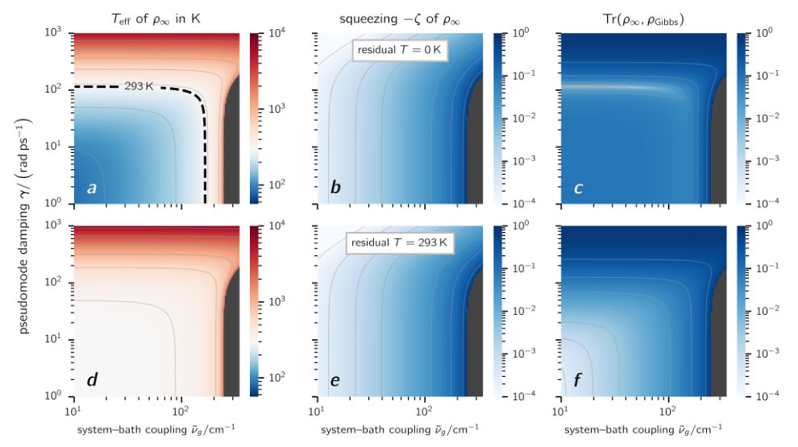
<figcaption class="paper-figure-caption"><b>Fig 4.</b> Figure 3: Steady-state properties of a harmonic oscillator (˜ν0 = 500 cm−1 ⇐⇒ω0 ≈94 rad ps−1) that is x-x-coupled (4) to a single resonant (ω0 = ωP ) pseudomode at a residual-environment temperature of T = 0 K (top row, a–c) or T = Ttarget = 293 K such that ℏω0 ≈2.5kBTtarget (bottom row, d–f ). The coupling g is given in terms of its wavenumber ˜νg = g/(2πcvac). The prominent area around γ ≈115 rad ps−1 for small g in the T = 0 cases corresponds to γfixed (21) and is also shown as the black dash-dotted line in Fig. 2, while the small-γ regions of the bottom row (T = Ttarget) corresponds to the black dashed line in Fig. 2. The gray areas mark the divergent regimes in which the system–bath...</figcaption>
</figure>
<figure class="paper-figure-card">
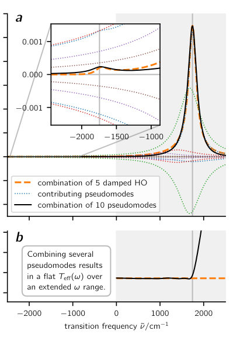
<figcaption class="paper-figure-caption"><b>Fig 5.</b> Figure 4: The Fourier-transformed BCFs resulting from a specific combination of five pseudomodes with Hermitian (H) coupling plus five pseudomodes with non-Hermitian (NH) coupling, all under x-x coupling (4) to the system. a: The black line represents the combined BCF resulting from the five H/NH pseudomode pairs, which are shown as pairs of thin, colored dotted lines: The positive-valued component of each pair is given by the H pseudomode, whereas the positive- valued component corresponds to its NH counterpart. The orange dashed line represents the corresponding combination of five Ohmically damped HOs (as given by Jref(ω) (13)) at the same frequencies as the pairs of pseudomodes. b: The...</figcaption>
</figure>

**Summary.** This paper investigates when pseudomode descriptions of open quantum systems correctly predict thermalization to the expected Gibbs state. It finds that while non-perturbative couplings break simple thermalization rules, specific mathematical constructions involving combining different types of pseudomodes can restore detailed balance and ensure thermodynamic consistency. This provides crucial guidelines for building accurate theoretical models in complex quantum environments.

**Why it may be interesting.** This work is highly relevant as it provides rigorous theoretical criteria for constructing effective models of open quantum systems where thermodynamic consistency (i.e., reaching the correct Gibbs state) is paramount, bridging strong coupling physics with standard thermal equilibrium concepts.

Detailed structure

**Main problem.** The central problem is determining the conditions under which pseudomode models, used to describe open quantum systems interacting with a bath, correctly thermalize to the system's Gibbs state.

**Main result.** Pseudomode models generally fail to thermalize correctly when coupling is non-perturbative; however, specific parameter choices or combining Hermitian/non-Hermitian modes can enforce 'weak' detailed balance and restore thermodynamic consistency.

**Method.** The analysis involves deriving generalized Lindblad master equations for the system coupled to pseudomodes, analyzing the detailed balance condition, and calculating an effective temperature profile across different coupling regimes.

**Model / system.** The model is an open quantum system (S) interacting with a bath via engineered 'pseudomodes' (P). The dynamics are governed by master equations derived from Hamiltonians involving various coupling types ($x$-$x$, RWA, dephasing), which are analyzed using spectral decomposition.

**Key observables.** Steady-state density matrix ($
ho_S$), detailed balance condition ($\Gamma(\omega)/\Gamma(-\omega) = e^{eta\hbar\omega}$), and the effective temperature profile ($T_{	ext{eff}}(\omega)$).

**Important parameters / regimes.** Coupling strength (perturbative vs. non-perturbative regimes), bath correlation functions, and parameters governing Hermitian/non-Hermitian mode combinations ($\alpha_j$).

**Assumptions / limitations.** The analysis often relies on the weak-coupling limit for certain derivations, although the goal is to explore beyond this limitation; convergence requires both detailed balance and a unique steady state.

**Figures summary.** Figures illustrate the basic concept of pseudomode coupling (Lindbladian), show how different models yield varying effective temperature profiles compared to ideal oscillators, and demonstrate tail suppression using non-Hermitian modes.

**Paper structure.** The paper progresses by first establishing the general framework for open systems with pseudomodes; it then analyzes the necessary conditions (detailed balance) for thermalization; subsequently, it explores advanced techniques like combining Hermitian/non-Hermitian modes and incorporating counterterms to improve spectral function behavior.

Abstract

Pseudomode approaches allow for an exact and unapproximated description of a quantum system interacting arbitrarily strongly with a bath. In general, a system coupled to pseudomodes will not thermalize to the system's Gibbs state: This is to be expected when the system-bath coupling is non-perturbative, but conflicts with common thermodynamic intuition when the system-bath coupling is asymptotically weak. We explore under which circumstances pseudomode models satisfy detailed balance (and subsequently thermalize to the system Gibbs state) and how specific choices of parameters can force "weak" detailed balance that is restricted to a limited frequency range. A combination of Hermitian and non-Hermitian pseudomodes that yields a flat effective-temperature profile is also considered. The results and criteria established here are relevant for the construction of pseudomode models in contexts where thermodynamic consistency is required.

[↑ back to top](#top)

### [Hamiltonian Thresholds for Objective Records](http://arxiv.org/abs/2608.00365v1)

**Authors:** Jie Gu  
**Type:** theory · **Category:** quantum information and computing · **PDF:** <https://arxiv.org/pdf/2608.00365v1>  
**Analysis basis:** full PDF text, analyzed in chunks
**Topic relevance:** 🔥 `measurement-induced transitions` **4/5** · `entanglement & information structure` **3/5** · `methods for driven-dissipative` **3/5** · `quantum measurements` **3/5** · `correlated / nonlocal dissipation` **2/5** · `driven-dissipative phase transition` **2/5** · `Keldysh / 2PI / non-Gaussian methods` **1/5** · `analog quantum simulation` **1/5** · `non-equilibrium dynamics` **1/5** · `non-equilibrium universality` **1/5**

↔ Scroll figures horizontally

<figure class="paper-figure-card">
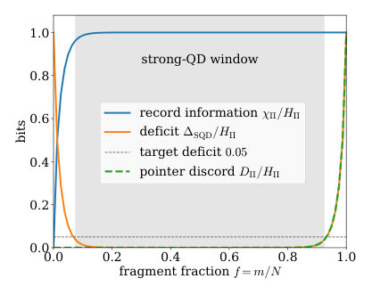
<figcaption class="paper-figure-caption"><b>Fig 1.</b> FIG. 1. Certified two-edge observer window in an i.i.d. binary pure-probe model with equal pointer priors and single-carrier conditional overlap s = |⟨e+|e−⟩| ∈[0, 1]. The fragment frac- tion is f = m/N, with m = 0, 1, . . . , N. The plotted parame- ters are N = 80, s = 0.78, and the shaded observer window is defined by ∆SQD(m)/HΠ &lt; 0.05; since HΠ = 1 in this binary equal-prior example, this is ∆SQD(m) &lt; 0.05.</figcaption>
</figure>
<figure class="paper-figure-card">
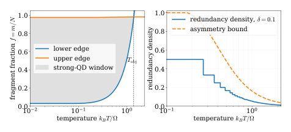
<figcaption class="paper-figure-caption"><b>Fig 2.</b> FIG. 2. The same spin-phase bath illustrates both the cer- tified two-edge window and the asymmetry-capacity law for equal pointer priors. Parameters are the carrier Bloch tilt ϑ = 0.40π, phase kick ϕ = 0.40π, carrier number N = 120, window target ϵ = 10−2, and record-deficit tolerance δ = 0.10. The temperature axis is the dimensionless ra- tio kBT/Ω. Left: the lower edge uses the plotted thresh- old log(1/ϵ) + log log(1/ϵ) = 6.13, while the upper edge uses log(1/ϵ) = 4.61, with the unspecified O(1) constants set to zero. The shaded region is the strong-QD window. Right: the exact block capacity 1/mrec(δ; T), where mrec is the smallest block size reaching the tolerance δ, is computed by the...</figcaption>
</figure>

**Summary.** This theoretical work establishes Hamiltonian laws defining 'objective records' of quantum information by requiring two complementary conditions on environmental monitoring: sufficient distinguishability (record edge) and residual coherence erasure (dephasing edge). It shows that objective witnessing is windowed, not monotonic, in the size of the observed environment fragment.

**Why it may be interesting.** It provides rigorous, microscopic criteria (Hamiltonian thresholds) for when quantum information is objectively recorded in an environment, which has implications for understanding measurement processes beyond simple decoherence models relevant to open quantum systems theory.

Detailed structure

**Main problem.** The paper addresses the fundamental distinction between quantum decoherence (local invisibility) and true 'objective records' of quantum information, which require multiple independent environmental witnesses.

**Main result.** Objective record certification requires satisfying two complementary Hamiltonian thresholds: a lower 'record edge' related to distinguishability and an upper 'surplus-dephasing edge' related to residual coherence.

**Method.** The analysis derives microscopic Hamiltonian laws by quantifying information content using metrics like Pointer Holevo Information, Pointer Discord, and the local strong-QD deficit ($\Delta SQD$).

**Model / system.** The model uses a fragmented environment architecture interacting with a system via exact QND product monitoring. A specific physical example analyzed is the Tilted Thermal Spin-Phase Bath.

**Key observables.** Pointer Holevo Information ($\chi_{\Pi}$), Pointer Discord ($D_{\Pi}$), Local strong-QD deficit ($\Delta SQD$), Record Exponent ($C_{rec}(F)$), and Surplus-Dephasing Exponent ($C_{dec}(F)$).

**Important parameters / regimes.** The required accuracy $\epsilon$, the fragment size $m$ relative to total size $N$, and temperature $T$ (in physical examples).

**Assumptions / limitations.** The results rely on additional regularity assumptions, assuming exact QND product monitoring, and utilizing i.i.d. stream models for capacity bounds.

**Figures summary.** Figures illustrate the certified two-edge observer window in an i.i.d. binary pure-probe model and show how temperature affects this window in the spin-phase bath.

**Paper structure.** The paper builds from defining objective records via Hamiltonian laws, deriving the two necessary complementary exponents ($C_{rec}$ and $C_{dec}$), establishing the resulting finite observer window, and finally determining capacity bounds using these thresholds for i.i.d. streams.

Abstract

Classical objectivity requires an environment to witness a pointer value, not merely to decohere it. We derive microscopic Hamiltonian laws for this distinction. Exact QND product monitoring yields a certified two-edge strong-Darwinism window: sufficient witnesses cross the optimal record-discrimination edge while retaining an unobserved complement that crosses the residual-coherence edge. Under additional regularity assumptions, the supplement gives converse bounds at the same logarithmic scale. For controlled-phase monitors, environmental asymmetry gives a single-fragment information bound, a redundancy converse, and, in efficient i.i.d. streams, an achievable block-capacity law for redundant witnesses. A finite-temperature spin-phase bath shows the physical separation: hot probes can decohere efficiently while losing the local asymmetry needed for objective witnesses.

[↑ back to top](#top)

### [Electrically Reconfigurable Silicon Carbide Nanophotonic Cavities on Thin-Film Lithium Niobate](http://arxiv.org/abs/2608.00372v1)

**Authors:** San Lam Ng, Georgii Grechko, Vladislav Bushmakin, Rainer Stöhr, Vadim Vorobyov, Roman Kolesov, Jörg Wrachtrup  
**Type:** experiment · **Category:** quantum information and computing · **PDF:** <https://arxiv.org/pdf/2608.00372v1>  
**Analysis basis:** full PDF text, analyzed in chunks
**Topic relevance:** 🔥 `QC/QI experiment` **4/5** · `analog quantum simulation` **3/5** · `exotic spin models in light-matter` **3/5** · `spintronics-quantum-optics interface` **3/5** · `correlated cavity matter` **2/5** · `quantum optics experiment` **2/5** · `Tavis-Cummings & cavity-many-emitter` **1/5** · `driven-dissipative phase transition` **1/5** · `interference shaping light` **1/5**

↔ Scroll figures horizontally

<figure class="paper-figure-card">
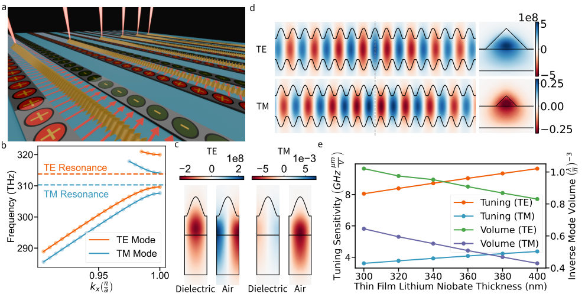
<figcaption class="paper-figure-caption"><b>Fig 1.</b> Figure 1: a. Schematic illustration of the cavity design. b. Simulation of the cavity bandgap, both resonance modes are placed at the middle of the bandgap. c. Simulation of the in-plane component of a unit cell. d. Simulation of the in-plane component of the resonance modes. The left figures show the top view, with dash line indicating the position of cavity centre. The right figures show the cross section view at the positions of field maxima. e. Simulated dependence of tuning sensitivity and mode volume on thin film LN thickness, showing that either the mode volume or the tuning sensitivity could be optimized depending on the need.</figcaption>
</figure>
<figure class="paper-figure-card">
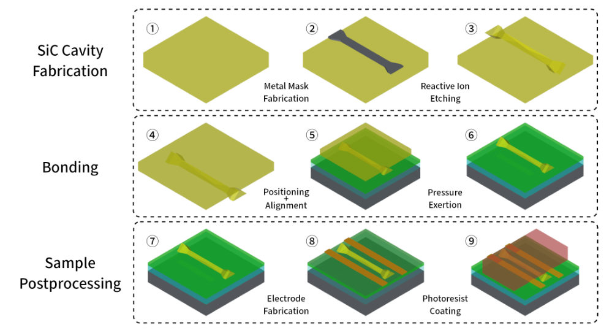
<figcaption class="paper-figure-caption"><b>Fig 2.</b> Figure 2: Outline of the fabrication procedure. The fabrication process is loosely divided into three parts. 1. Fabrication of triangular corrugated cavities from 4H-SiC by e-beam lithography followed by e-beam metal evaporation and reactive ion etching. 2. Bonding of nanobeams to LNOI by direct bonding. 3. Electrode fabrication and protective cladding of cavities.</figcaption>
</figure>
<figure class="paper-figure-card">
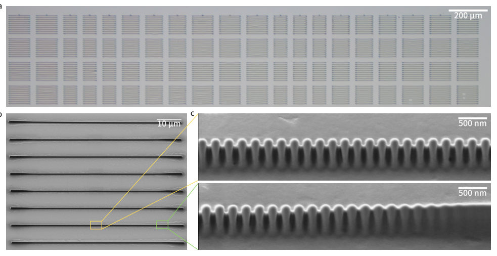
<figcaption class="paper-figure-caption"><b>Fig 3.</b> Figure 3: Images of bonded cavities. a. Optical image of a large matrix of bonded cavities of a high yield sample, demonstrating the efficiency of the bonding method. b. SEM image of an array of bonded cavities. c. Defect and taper sections of one of the cavity.</figcaption>
</figure>
<figure class="paper-figure-card">
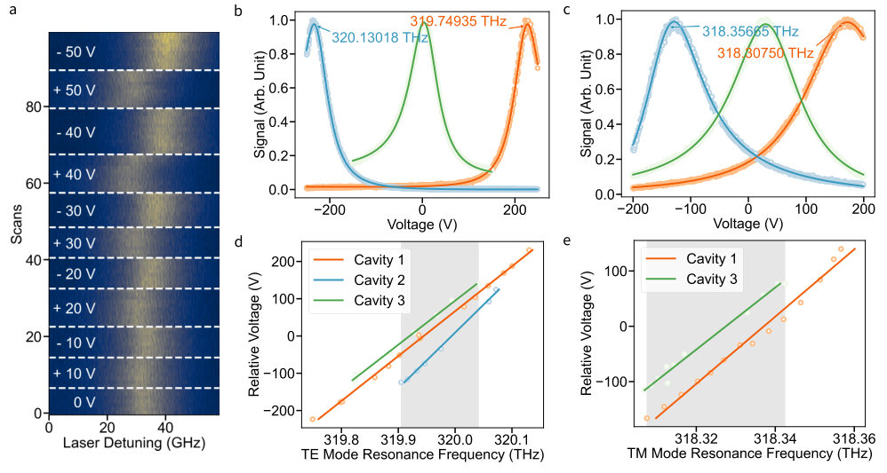
<figcaption class="paper-figure-caption"><b>Fig 4.</b> Figure 4: Results of electrical tuning tests. a. Laser scattering intensity as a function of frequency detuning for the TM mode of the cavity. Voltages were applied to the cavity in steps, and shifts in the resonance frequency were observed, verifying the successful tuning of cavity resonance. b,c. Voltage sweep performed on TE and TM mode of the cavity, confirming a tuning range of 380.8 GHz for TE and 49.1 GHz for TM mode. d,e. Tuning sensitivity (GHz V−1) of TE and TM modes of characterized cavities, the shaded region highlight the common spectral range among the tested cavities.</figcaption>
</figure>
<figure class="paper-figure-card">
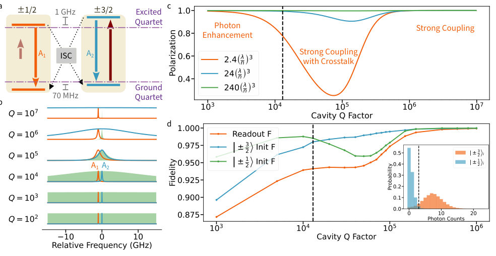
<figcaption class="paper-figure-caption"><b>Fig 5.</b> Figure 5: Estimated cavity enhancement for V2 centres under optimal placement. a. Simplified energy levels structure of the spin degree of freedom for V2 centre in the absence of external magnetic field18. Solid arrows denote radiative transitions and dashed arrows denote non-radiative decay channel. b. Illustration of linewidth broadening of the two electron spin state selective transitions. Blue (orange) curve represents A2 (A1) transition and the green shade represents the spectral width of the resonance mode. The cavity mode is in resonance with the A2 transition. At both low and very high Q factor, one or both transitions remain narrow, allowing the on-resonance transition to be...</figcaption>
</figure>

**Summary.** The authors report on a novel hybrid nanophotonic platform combining SiC nanocavities, which host spin defects, with thin-film Lithium Niobate. By exploiting the strong electro-optic effect of LNOI, they achieved wide-range electrical tuning ($\sim 380 	ext{ GHz}$) for multiple cavities. This breakthrough overcomes frequency mismatch issues, creating a robust and scalable platform for integrated quantum photonics and spin-photon interactions.

**Why it may be interesting.** This work directly addresses a major engineering bottleneck in solid-state quantum networking—frequency mismatch—by integrating two disparate physical systems (semiconductor photonics and electro-optic materials) to achieve deterministic tunability for coupling qubits to photons.

Detailed structure

**Main problem.** Scaling spin-photon architectures is hindered by frequency mismatches arising from fabrication variations in photonic cavity resonances and inhomogeneous optical transition frequencies of individual spins.

**Main result.** The hybrid platform successfully demonstrates deterministic electrical tuning of multiple SiC nanocavities into mutual spectral resonance, enabling scalable quantum photonic interfaces.

**Method.** A 'break and bond' process was used to integrate SiC photonic crystal arrays onto thin-film Lithium Niobate on Insulator (TFLN), allowing for external voltage application to tune the cavities electro-optically.

**Model / system.** The system is a hybrid nanophotonic platform combining Silicon Carbide (SiC) photonic crystal nanocavity arrays, which host spin defects (like V2 centers), with TFLN. The strong electro-optic response of TFLN provides the necessary wide-range tunability.

**Key observables.** Electrical tuning range ($\sim 380 	ext{ GHz}$ or $1.1 	ext{ nm}$), Purcell factor (theoretical $\approx 400$), readout/initialization fidelities ($>94\%$).

**Important parameters / regimes.** TFLN thickness, electro-optic coefficient of TFLN, cavity Q factors ($\sim 6 	imes 10^3$ to $13 	imes 10^3$).

**Assumptions / limitations.** The weak electro-optic response of SiC necessitates the use of a high-electro-optic material like TFLN for tuning.

**Figures summary.** Figures illustrate cavity design schematics, the three-step fabrication process (SiC etching, bonding to LNOI, electrode deposition), and experimental results confirming electrical resonance shifts across multiple cavities.

**Paper structure.** The paper details the necessity of tunable platforms for spin-photon interfaces, describes the hybrid SiC/TFLN platform construction via direct bonding, presents characterization showing wide-range electrical tuning, and concludes by demonstrating high fidelity quantum operations potential.

Abstract

Interfacing integrated photonics with solid-state spin defects holds great promise for future quantum networks, but the scaling of spin-photon architectures is hindered by frequency mismatches arising from fabrication-induced variations in photonic cavity resonances and the inhomogeneous optical transition frequencies of individual spins. These challenges call for a photonic platform with deterministic and wide-range tunability. Here, we demonstrate a hybrid nanophotonic platform based on direct bonding of silicon carbide photonic crystal nanocavity arrays onto thin-film lithium niobate on insulator, enabling deterministic electrical tuning of multiple SiC nanocavities into mutual spectral resonance. By exploiting the strong electro-optic response of lithium niobate, we achieve continuous and wide-range cavity tuning of 380 GHz ($\sim$1.1 nm), sufficient to compensate both cavity disorder and spin inhomogeneity. The nanocavities balance strong optical confinement with electrical tunability, exhibiting a theoretical Purcell factor of approximately 400. This hybrid platform enables electrically reconfigurable spin-photon interfaces for large-scale integrated quantum photonics.

[↑ back to top](#top)

### [Quantum computer-based simulation of Stark many-body localization in a 1D Fermi-Hubbard model](http://arxiv.org/abs/2608.02245v1)

**Authors:** Abdul Kalam, Prasenjit Deb, Akitada Sakurai, Tapan Mishra, V. S. Prasannaa, B. P. Das  
**Type:** both · **Category:** disordered systems and neural networks · **PDF:** <https://arxiv.org/pdf/2608.02245v1>  
**Analysis basis:** full PDF text, analyzed in chunks
**Topic relevance:** 🔥 `QC/QI experiment` **4/5** · 🔥 `scars & prethermalization` **4/5** · `methods for driven-dissipative` **3/5** · `non-equilibrium dynamics` **3/5** · `non-equilibrium universality` **2/5** · `Keldysh / 2PI / non-Gaussian methods` **1/5** · `analog quantum simulation` **1/5** · `driven-dissipative phase transition` **1/5** · `entanglement & information structure` **1/5**

↔ Scroll figures horizontally

<figure class="paper-figure-card">
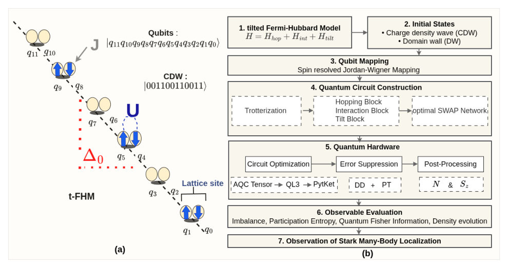
<figcaption class="paper-figure-caption"><b>Fig 1.</b> Figure 1. (a) Schematic representation of the tilted Fermi–Hubbard model considered in this work. The hopping amplitude J, on-site interaction U, and linear Stark potential of strength ∆0 define the disorder-free lattice model. A representative charge-density-wave (CDW) initial state and the qubit ordering used in the simulations are also shown. (b) Workflow of the quantum-simulation protocol. The tilted Fermi–Hubbard model is mapped to qubits using a spin-resolved Jordan–Wigner transformation, evolved using a Trotterized SWAP-network circuit, and optimized through AQC-Tensor, Qiskit level-3, and pytket routines before hardware execution. Error suppression is performed using dynamical...</figcaption>
</figure>
<figure class="paper-figure-card">
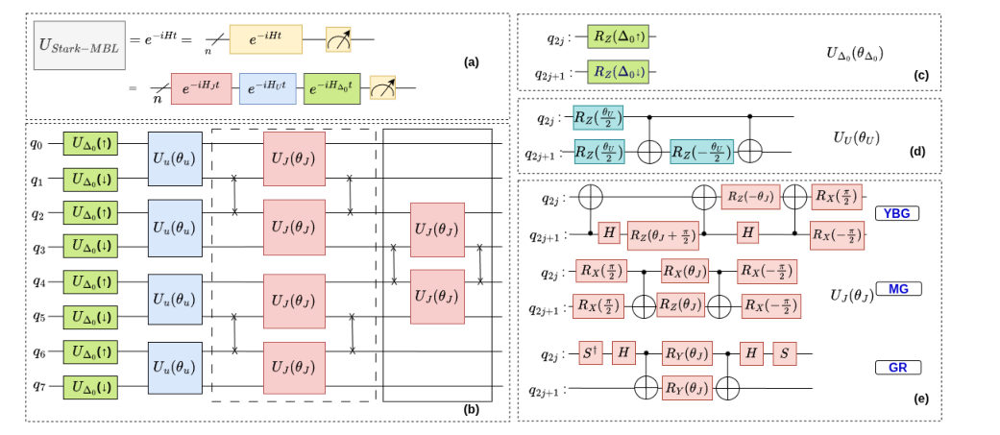
<figcaption class="paper-figure-caption"><b>Fig 2.</b> Figure 2. First-order Trotter implementation of the t-FHM. (a) The time-evolution operator is decomposed into hopping, interaction, and Stark-potential contributions. (b) Single Trotter-step circuit employing a constant-depth SWAP-network ar- chitecture, where the Stark-potential, interaction, and hopping blocks are applied sequentially. The SWAP network enables efficient implementation of the next-nearest-neighbor hopping interactions arising from the spin-resolved Jordan–Wigner map- ping using only nearest-neighbor connectivity. (c) Three alternative realizations of the hopping unitary UJ(θJ) considered in this work: Yang–Baxter gate (YBG), Matchgate (MG), and Fermionic Givens Rotation...</figcaption>
</figure>
<figure class="paper-figure-card">
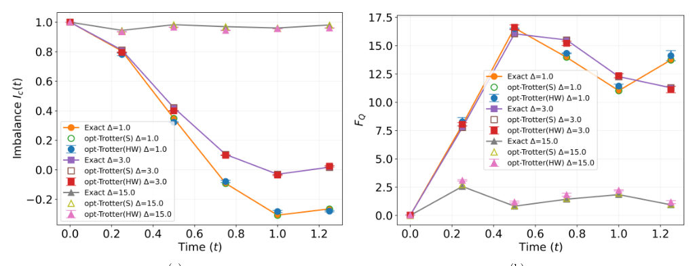
<figcaption class="paper-figure-caption"><b>Fig 3.</b> Figure 3. Comparison of exact diagonalization (Exact), optimized Trotter simulation [opt-Trotter(S)], and optimized Trotter hardware [opt-Trotter(HW)] results for a L = 6 t-FHM chain initialized in the CDW state. The optimized Trotter circuits are obtained after the circuit-compression and transpilation workflow described in Sec. III. Results are shown for three representative Stark-field strengths: ∆0 = 1 (weak tilt), ∆0 = 3 (intermediate tilt), and ∆0 = 15 (strong tilt). (a) Charge imbalance Ic(t), and (b) Quantum Fisher Information FQ(t). For weak and intermediate tilts, the imbalance rapidly decays while FQ and SPE 2 increase, indicating delocalized dynamics. In contrast, the...</figcaption>
</figure>
<figure class="paper-figure-card">
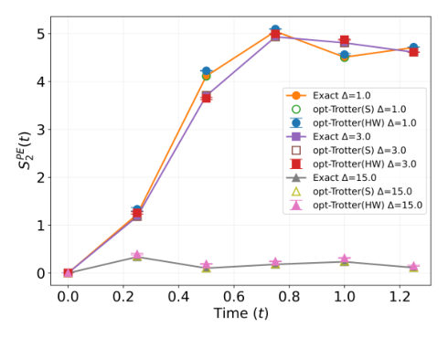
<figcaption class="paper-figure-caption"><b>Fig 4.</b> Figure 4. Time evolution of the second-order participation entropy SPE 2 (t) the CDW initial state. Results are com- pared among exact diagonalization (Exact), optimized noise- less Trotter simulation [opt-Trotter(S)], and optimized Trot- ter hardware execution [opt-Trotter(HW)] for three Stark- field strengths, ∆0 = 1, 3, and 15.</figcaption>
</figure>
<figure class="paper-figure-card">
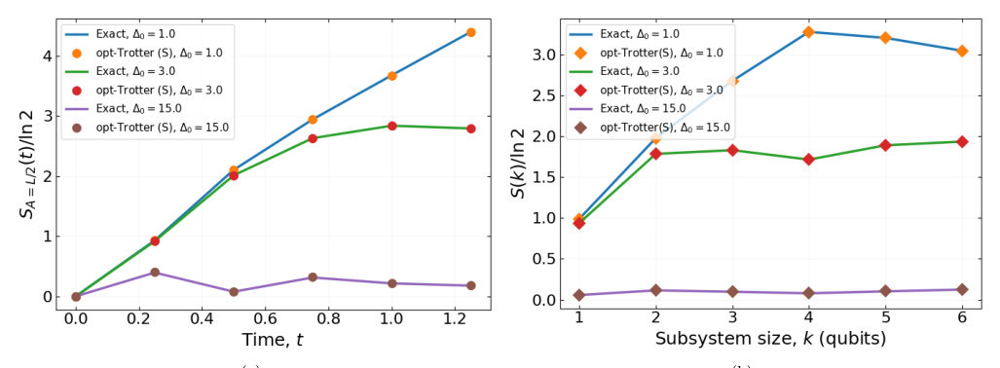
<figcaption class="paper-figure-caption"><b>Fig 5.</b> Figure 5. von Neumann entanglement entropy for the CDW initial state obtained from exact diagonalization and optimized first-order Trotter simulation. (a) Half-chain entanglement entropy SA=L/2(t) as a function of time for three Stark-field strengths, ∆0 = 1, ∆0 = 3, and ∆0 = 15. Weak and intermediate Stark fields exhibit substantial entanglement growth, whereas strong Stark fields strongly suppress the buildup of entanglement. (b) Subsystem entanglement entropy S(k) evaluated at the final evolution time t = 1.25 as a function of subsystem size k. For weak tilts, the entropy increases rapidly with subsystem size, reflecting extensive information spreading. In contrast, the strong-tilt...</figcaption>
</figure>

**Summary.** This work simulates Stark Many-Body Localization in the 1D Fermi-Hubbard model using an IBM superconducting quantum computer. By optimizing circuit depth and gate count, the authors successfully observed a transition from thermalizing to strongly localized behavior when applying a strong external electric field. This demonstrates the feasibility of simulating complex non-equilibrium condensed matter phenomena on current noisy quantum hardware.

**Why it may be interesting.** It bridges fundamental condensed matter physics (MBL) with cutting-edge quantum hardware implementation challenges, providing a concrete roadmap for simulating complex many-body dynamics on NISQ devices.

Detailed structure

**Main problem.** The study investigates Many-body localization (MBL), specifically Stark MBL, which describes non-ergodic behavior in isolated quantum many-body systems.

**Main result.** The authors demonstrated a crossover from thermalizing to strongly localized dynamics by simulating the t-FHM on a quantum computer using a strong external electric field (large tilt).

**Method.** Hamiltonian simulation was performed on an IBM superconducting qubit quantum computer using Trotterized circuits, optimized via tensor network methods.

**Model / system.** The system is modeled by the one-dimensional Fermi-Hubbard model subjected to a linear Stark potential (tilted Fermi-Hubbard model). The simulation requires mapping the fermionic system onto qubits using a spin-resolved Jordan-Wigner transformation.

**Key observables.** Charge Imbalance ($I_c(t)$), particle number in the initially occupied half ($N_{	ext{half}}(t)$), and density evolution.

**Important parameters / regimes.** Stark field strength ($\Delta_0$): weak, intermediate, and strong regimes are analyzed. The simulation is limited by NISQ device noise.

**Assumptions / limitations.** The use of the first-order Trotter approximation for time evolution introduces systematic errors; hardware limitations restrict access to very long evolution times.

**Figures summary.** Figures illustrate the model setup (t-FHM), the quantum circuit workflow involving SWAP networks and optimization routines, and show how observables like $N_{	ext{half}}(t)$ change across different Stark field strengths.

**Paper structure.** The paper introduces MBL theory, details the t-FHM Hamiltonian, outlines the qubit mapping and Trotterized simulation protocol, presents results showing the crossover between thermalizing and localized regimes based on the applied tilt strength, and concludes with benchmarking against exact methods.

Abstract

Many-body localization (MBL) is a dynamical phenomenon that describes the non-ergodicity of isolated quantum many-body systems. In contrast to thermalization, this phenomenon leads to a long-lived memory of initial states of local systems and slow growth of entanglement. In this work, we study Stark MBL in a 12-qubit correlated fermionic system described by the one-dimensional Fermi-Hubbard model using Hamiltonian simulation on an IBM superconducting qubit quantum computer. To enable such a computation on current-day noisy hardware, we combine a series of compilation steps, including the use of the spin-resolved Jordan-Wigner transformation, employing SWAP networks, and integrating a tensor-network-based quantum circuit optimization routine on top of a standard circuit optimization pipeline. As a result, there is approximately an 88$\%$ and 87$\%$ reduction in two-qubit gate count and circuit depth, respectively. Through such simulations of the real-time dynamics using Trotterized quantum circuits, we exhibit a crossover from thermalizing dynamics of the system at a weak tilt of the field to a strongly localized behavior at large tilt with short evolution times. We also benchmark our obtained results with respect to those from exact simulations.

[↑ back to top](#top)

### [Scaled Caldeira-Leggett Dynamics: Deterministic Trajectories and the Classical Limit](http://arxiv.org/abs/2608.02054v1)

**Authors:** S. V. Mousavi, S. Miret-Artés  
**Type:** theory · **Category:** statistical mechanics · **PDF:** <https://arxiv.org/pdf/2608.02054v1>  
**Analysis basis:** full PDF text, analyzed in chunks
**Topic relevance:** 🔥 `methods for driven-dissipative` **4/5** · 🔥 `quantum measurements` **4/5** · `Keldysh / 2PI / non-Gaussian methods` **3/5** · `measurement-induced transitions` **3/5** · `non-equilibrium dynamics` **2/5** · `correlated / nonlocal dissipation` **1/5** · `driven-dissipative phase transition` **1/5** · `non-equilibrium universality` **1/5**

↔ Scroll figures horizontally

<figure class="paper-figure-card">
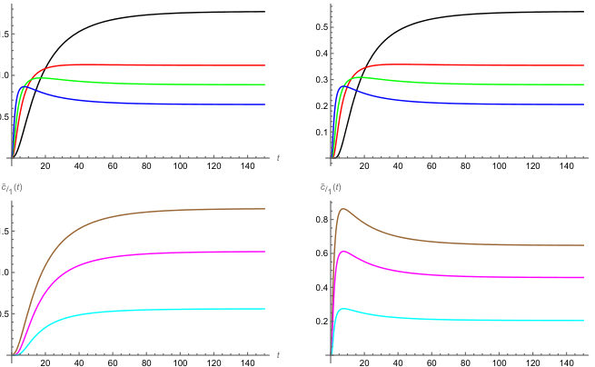
<figcaption class="paper-figure-caption"><b>Fig 1.</b> FIG. 1: Quantum coherence given by (39). Top panels: quantum regime (left) and transition regime with ϵ = 0.1 (right) for different temperatures: T = 2 (black), T = 5 (red), T = 8 (green), and T = 15 (blue). Bottom panels: coherence for fixed temperatures T = 2 (left) and T = 15 (right), for different regimes ϵ = 1 (brown), ϵ = 0.5 (magenta), and ϵ = 0.1 (cyan). Other parameters are ¯h = m = kB = 1, x0 = −5, p0 = 2, σ0 = 1, and γ = 0.01.</figcaption>
</figure>
<figure class="paper-figure-card">
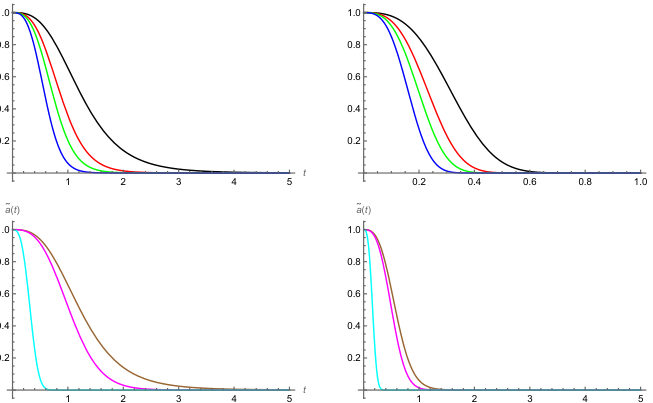
<figcaption class="paper-figure-caption"><b>Fig 2.</b> FIG. 2: Coherence attenuation coefficient ˜a(t) given by (50) versus time. Top panels show the quantum regime (left) and the transition regime with ϵ = 0.01 (right) for different temperatures: T = 2 (black), T = 5 (red), T = 8 (green), and T = 15 (blue). Bottom panels show a(t) for fixed temperatures T = 2 (left) and T = 15 (right) for different regimes: ϵ = 1 (brown), ϵ = 0.5 (magenta), and ϵ = 0.01 (cyan). Other parameters are fixed as ¯h = m = kB = 1, x0 = −5, p0 = 2, σ0 = 1, and γ = 0.01. These plots highlight how both temperature and quantumness influence the rate of coherence loss.</figcaption>
</figure>
<figure class="paper-figure-card">
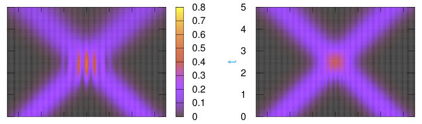
<figcaption class="paper-figure-caption"><b>Fig 3.</b> FIG. 3: Density plots of the probability density for the superposition state (51) in the x-t plane within the framework of the scaled CL equation for γ = 0.001 and T = 1. Different panels correspond to quantumness parameters: ϵ = 1 (top left), ϵ = 0.5 (top right), ϵ = 0.2 (bottom left), and ϵ = 0.05 (bottom right). Other parameters are fixed as ¯h = m = kB = 1, x0 = −5, p0 = 2 and σ0 = 1. These figures show how the environment gradually suppresses coherence as ϵ decreases.</figcaption>
</figure>

**Summary.** This paper analyzes the transition from quantum to classical behavior in an open system using the Caldeira-Leggett model. By reformulating dynamics in a Bohmian language and introducing a scaling parameter, the authors demonstrate that thermal effects lead to deterministic trajectories rather than stochastic noise at the level of the effective potential. This offers a unified view of dissipation and decoherence across quantum regimes.

**Why it may be interesting.** This work provides a detailed theoretical framework for understanding how thermal environments modify quantum trajectories during the QCT, offering insights beyond standard Markovian or purely quantum descriptions relevant to open quantum systems.

Detailed structure

**Main problem.** The paper investigates the quantum-to-classical transition (QCT) for an open quantum system governed by the Caldeira-Leggett model in a thermal environment.

**Main result.** It shows that the resulting dynamics remain deterministic even with thermal fluctuations, contrasting with stochastic Langevin descriptions, due to a residual structure in the effective potential.

**Method.** The analysis uses a Bohmian language by expressing the density matrix in polar form and deriving coupled generalized Hamilton-Jacobi and continuity equations. A scaled theory approach is employed to study the transition continuously.

**Model / system.** The system is an open quantum system interacting with a harmonic bath, modeled via the Caldeira-Leggett (CL) equation. The dynamics are analyzed in the high-temperature limit using a scaling parameter ($\epsilon$) that controls the approach to classicality.

**Key observables.** Coherence loss (quantified by $\ell_1$-norm), effective potential ($Q$), and deterministic trajectories for phase/amplitude evolution.

**Important parameters / regimes.** Quantumness parameter ($\epsilon$ or $\hbar$), Temperature, Dissipation coefficient ($\gamma$).

**Assumptions / limitations.** The analysis is restricted to the high-temperature Ohmic CL model. The derivation of the scaled theory requires specific mathematical extensions not explicitly derived within the framework.

**Figures summary.** Not specified in notes; focuses on deriving equations and analyzing functional dependencies rather than summarizing figure content.

**Paper structure.** The paper develops the dynamics using polar decomposition, derives coupled HJ/continuity equations, introduces a scaling parameter ($\epsilon$), analyzes the effective potential's structure across regimes, and contrasts the deterministic results with stochastic expectations.

Abstract

The dynamics of an open quantum system in the high-temperature regime of the Caldeira-Leggett model using a Bohmian language is investigated. By expressing the density matrix in polar form, generalized continuity and Hamilton-Jacobi equations are obtained. Thermal effects appear explicitly in the former, while they influence the latter only indirectly through an effective potential. Remarkably, the effective potential does not vanish in the classical limit and cannot, in general, be decomposed into simple additive quantum and thermal contributions. Instead, it retains a nontrivial structure leading to a residual temperature dependence in the resulting dynamics. As a consequence, the resulting temperature-dependent-classical trajectories remain deterministic even in the presence of a thermal environment. This behavior contrasts with the stochastic dynamics observed in the Langevin description and reflects the ensemble-based nature of the present approach. To further explore the quantum-to-classical transition, a scaled version of the Caldeira-Leggett equation is introduced by scaling both the density matrix and Planck constant through a quantumness parameter. This parameter takes the value one in the fully quantum regime and smoothly approaches zero in the classical limit. Applications to Gaussian states demonstrate a gradual suppression of coherence and interference, governed jointly by thermal effects and the transition parameter.

[↑ back to top](#top)

### [Dissipation in Periodically Driven Quantum Systems: Partial Secularization and Thermodynamic Consistency](http://arxiv.org/abs/2608.00225v1)

**Authors:** Luísa T. Tude, Carlos Ortega-Taberner, Roberta Zambrini, Gonzalo Manzano  
**Type:** theory · **Category:** statistical mechanics · **PDF:** <https://arxiv.org/pdf/2608.00225v1>  
**Analysis basis:** full PDF text, analyzed in chunks
**Topic relevance:** 🔥 `methods for driven-dissipative` **4/5** · 🔥 `non-equilibrium dynamics` **4/5** · `driven-dissipative phase transition` **3/5** · `correlated / nonlocal dissipation` **2/5** · `non-equilibrium universality` **2/5** · `Keldysh / 2PI / non-Gaussian methods` **1/5** · `analog quantum simulation` **1/5**

↔ Scroll figures horizontally

<figure class="paper-figure-card">
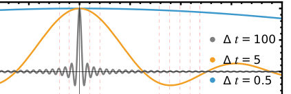
<figcaption class="paper-figure-caption"><b>Fig 1.</b> Figure 1. Illustration of the effect of coarse-graining on the Kossakowski matrix for different averaging intervals. Three cases are displayed corresponding to different time intervals ∆t compatible with full secular approximation (gray), the Floquet-Redfield equation (blue) and an intermediate regime (orange). The sinc function leads to a damping of some of the off-diagonal elements Kα,α′ when the frequency difference α −α′ becomes large. As an example, we show the resulting frequency differences α −α′ of the oscillating terms in the Kossakowski matrix (dashed red vertical lines) for the driven two-level system studied in Sec. 6.1, with Hamiltonian Eq. (44). We use units such that ω0 = 1...</figcaption>
</figure>
<figure class="paper-figure-card">
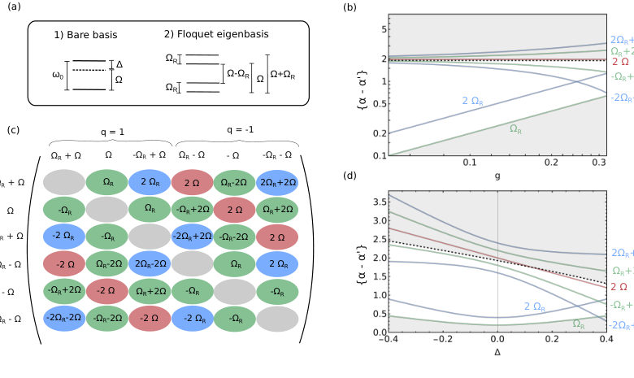
<figcaption class="paper-figure-caption"><b>Fig 2.</b> Figure 2. a. Energy diagram of the driven two-level system in the bare basis and in the Floquet eigenbasis. The Floquet eigenstates are separated by ΩR, and the Floquet replicas are shifted by Ω. b. Maximum coarse-grain frequency resolution ωmax = 2π/∆tmin as a function of g is depicted in black dashed. The minimum ∆t is the finest time resolution for a Markovian master equation to yield a positive Kossakowski matrix. Off-diagonal oscillation frequencies {α −α′} are color-coded as in (c). The gray shaded regions represent the limits of validity of the coarse grain interval (28) c. Kossakowski matrix, with the oscillation frequency of each term indicated at its position and colors denoting...</figcaption>
</figure>
<figure class="paper-figure-card">
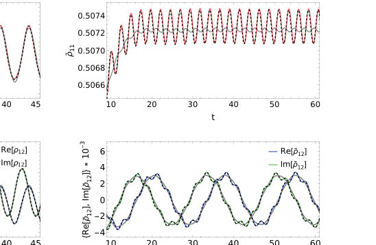
<figcaption class="paper-figure-caption"><b>Fig 3.</b> Figure 3. Exact dynamics of the driven two-level system in the Schr¨odinger picture (left), and interaction picture (right). The top row has the populations and the bottom row coherences. We show curves calculated with the Floquet-Redfield (black dotted), and coarse-grained (solid gray) master equations, together with exact non-Markovian simulations (colored lines). In the long-time limit, the system exhibits oscillations with frequency Ω in the Schr¨odinger picture, which are well captured by the three approaches. In the interaction picture, we observe population oscillations with frequency 2Ωthat are well captured by the Floquet-Redfield equation, but present reduced amplitude in the...</figcaption>
</figure>
<figure class="paper-figure-card">
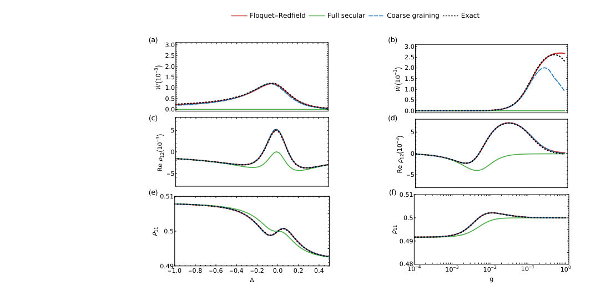
<figcaption class="paper-figure-caption"><b>Fig 4.</b> Figure 4. Comparison of the averages over a period of the drive of work (a. and b.), steady state coherence (c. and d.), and population (e. and f.) given by the coarse-grained, the Floquet-Redfield, and the full secular master equations, and an exact non-Markovian simulation (see legend) as a function of detuning (left) and driving strength (right). The full secular approximation can describe the populations and real part of coherences in the off-resonant regime, but fails to provide physical values of the imaginary part of coherences and therefore work current. The coarse-grained and Floquet-Redfield master equations agree with the exact simulation for the parameter inside its validity...</figcaption>
</figure>
<figure class="paper-figure-card">
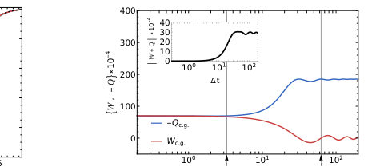
<figcaption class="paper-figure-caption"><b>Fig 5.</b> Figure 5. Averaged steady state and heat per cycle as a function of the detuning (left) and coarse-grain time interval (right). The energy currents are consistent with the first law of thermodynamics for small ∆t. The inset of the right panel shows the sum W + Q, representing the accuracy with which the first law of thermodynamics is obtained.</figcaption>
</figure>

**Summary.** This paper tackles the failure of standard master equation approximations when modeling open quantum systems under periodic driving. The authors introduce a coarse-graining technique that regularizes these models, ensuring thermodynamic consistency for calculated energy currents. This framework offers a practical way to validate the accuracy of Markovian descriptions in non-equilibrium quantum dynamics.

**Why it may be interesting.** This work provides a crucial theoretical tool for correctly applying approximations (like secularization) in complex, periodically driven quantum systems relevant to quantum thermodynamics and energy harvesting.

Detailed structure

**Main problem.** The study addresses unphysical predictions for steady-state energy currents that arise when applying a strong secular approximation to master equations describing periodically driven open quantum systems.

**Main result.** A coarse-grained formulation of the master equation successfully regularizes these thermodynamic inconsistencies, yielding completely positive dynamics and consistent energy current calculations.

**Method.** The authors propose a coarse-graining approach applied to the Floquet-Redfield master equation, which allows for partial secularization while maintaining physical consistency.

**Model / system.** The system involves open quantum systems subjected to periodic driving, modeled by Hamiltonians $H(t) = H_S(t) + H_B + H_{SB}$. The dynamics are analyzed using Floquet-Born-Markov master equations.

**Key observables.** Steady state energy currents (work and heat contributions), complete positivity of evolution, and the coarse-graining time interval ($	au_{CG}$).

**Important parameters / regimes.** The driving period $T$, coupling strengths ($\lambda$), and characteristic timescales are key parameters used to assess approximation validity.

**Assumptions / limitations.** The standard approach relies on Born and Markov approximations; the proposed method introduces a coarse-graining time $	au_{CG}$ to regularize these issues.

**Figures summary.** Figure 9 compares RWA vs. exact dynamics for off-diagonal elements, period-averaged steady-state populations, and energy flow during a cycle.

**Paper structure.** The paper first establishes the problem with the full secular approximation leading to thermodynamic inconsistencies; it then introduces the coarse-grained master equation approach, demonstrating its consistency by comparing results against exact non-Markovian simulations for specific examples like driven two-level systems and masers.

Abstract

Periodically driven open quantum systems are central to quantum thermodynamics and quantum control. These systems are typically described using Floquet-Born-Markov master equations, derived with the use of a full secular approximation, and whose thermodynamic implications are often overlooked. In this context, we show that such a strong secular approximation may lead to unphysical predictions for steady state energy currents. We then demonstrate that a coarse-grained formulation of the master equation can regularize these issues while yielding completely positive dynamics and consistent energy currents. The coarse-graining time has a clear physical interpretation, as it defines the temporal resolution at which a Markovian master equation can describe the evolution of the periodically driven system. We show the consistency and validity of our approach by comparing to an exact non-Markovian simulation in paradigmatic examples: a driven two-level system and a three-level maser coupled to hot and cold thermal reservoirs. Our work provides a practical framework for correctly applying the secular approximation in periodically driven-dissipative systems and for assessing the accuracy of master equations of the GKSL form.

[↑ back to top](#top)

### [Convergence monitoring of quantum Gibbs samplers](http://arxiv.org/abs/2608.02038v1)

**Authors:** Nikolaos Louloudis, Ruben Ibarrondo, Mikel Sanz, Mario Berta  
**Type:** theory · **Category:** statistical mechanics · **PDF:** <https://arxiv.org/pdf/2608.02038v1>  
**Analysis basis:** full PDF text, analyzed in chunks
**Topic relevance:** 🔥 `quantum measurements` **4/5** · `measurement-induced transitions` **3/5** · `methods for driven-dissipative` **3/5** · `non-equilibrium dynamics` **2/5** · `Keldysh / 2PI / non-Gaussian methods` **1/5** · `correlated / nonlocal dissipation` **1/5** · `driven-dissipative phase transition` **1/5** · `non-equilibrium universality` **1/5**

↔ Scroll figures horizontally

<figure class="paper-figure-card">
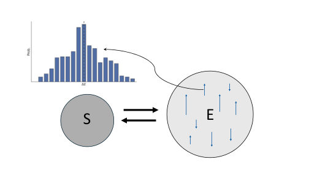
<figcaption class="paper-figure-caption"><b>Fig 1.</b> Figure 1. Davies limit intuition for the convergence monitor- ing scheme. Weak system–bath coupling induces transitions labeled by Bohr frequencies ν. These transitions are inferred from the bath without directly measuring the system. At thermal equilibrium, detailed balance implies symmetry of the equilibrium transition weights, M(ν) = M(−ν), so the transition profile is symmetric about ν = 0. Away from equi- librium an asymmetric profile signals a residual imbalance in the energy-exchange record. The algorithmic sampler of Sec. II replaces the Bohr frequencies by finite resolution quasi- frequencies. In Sec. III we derive the corresponding shifted symmetry of the quasi-frequencies which...</figcaption>
</figure>
<figure class="paper-figure-card">
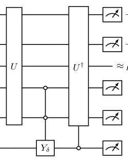
<figcaption class="paper-figure-caption"><b>Fig 2.</b> Figure 2. Implementation of Lindbladian simulation via weak measurement. The unitary U is the block encoding of the jumps in LA as seen in Eq. (9). Its implementation is de- scribed in Fig. 7. There are two cases. If q′ = 0, all ancillas are reset and the system remains in ρ. If q′ = 1, the Lindbla- dian step is applied to S, and, conditioned on B = q = 0 the registers A and E return to a and ω, respectively; otherwise, the step is discarded.</figcaption>
</figure>
<figure class="paper-figure-card">
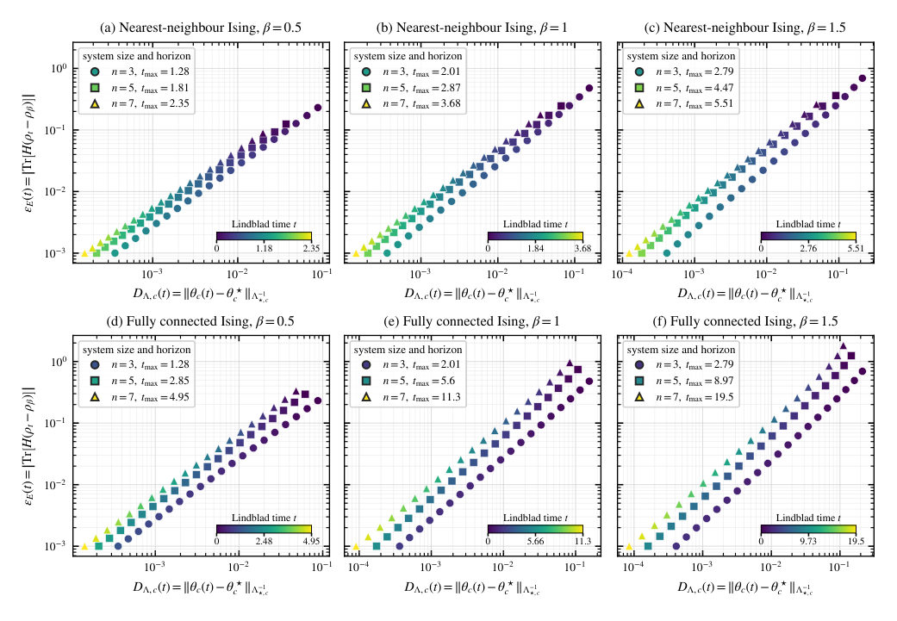
<figcaption class="paper-figure-caption"><b>Fig 3.</b> Figure 3. Relation between the deterministic target distance DΛ,c(t) and the energy error εE,c(t) under deterministic Lindblad evolution. Rows correspond to the nearest-neighbour and fully connected Ising families, and columns to β ∈{0.5, 1.0, 1.5}. Marker shape distinguishes n ∈{3, 5, 7}, and color gives the physical Lindblad time. The legends report the actual terminal time tmax for each system size. The equilibration time increase with n and β and is also larger for the fully connected model. In all cases, we observe a co-decay which confirms that the quasi-frequency distribution can monitor the relaxation of the energy observable.</figcaption>
</figure>
<figure class="paper-figure-card">
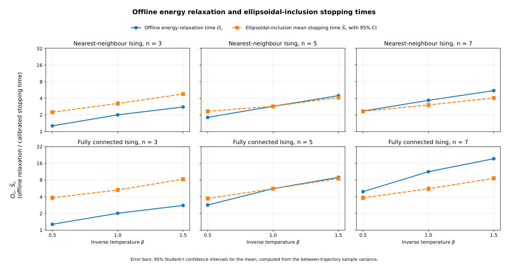
<figcaption class="paper-figure-caption"><b>Fig 4.</b> Figure 4. Inverse-temperature dependence of the deterministic energy-relaxation time Oc and the model-calibrated mean stopping time eSc of the ellipsoidal inclusion rule. Rows correspond to the two model families and columns to n ∈{3, 5, 7}. Error bars are 95% Student-t confidence intervals for the mean over 100 independent trajectories. The deterministic reference carries no trajectory-sampling error bar. A base-two logarithmic vertical axis is used. We see that the scaling of eSc has the same qualitative behavior as the offline oracle Oc.</figcaption>
</figure>
<figure class="paper-figure-card">
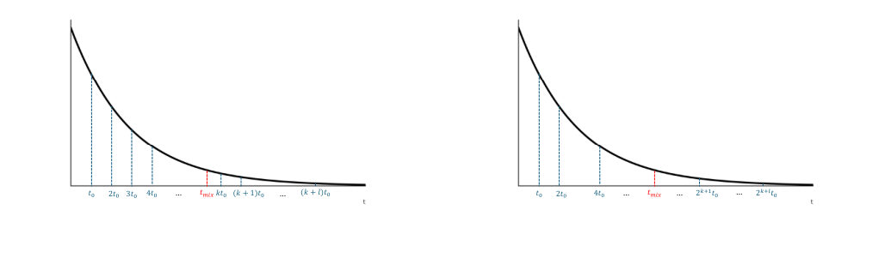
<figcaption class="paper-figure-caption"><b>Fig 5.</b> Figure 5. Naive convergence monitoring by repeated state preparation and destructive measurement. The black curve represents the relaxation of an observable (for simplicity exponential), the vertical dashed lines denote monitoring times, and tmix marks the unknown time at which the selected convergence tolerance is attained. For a fixed verification depth l, the linearly spaced grid uses Θ(tmix/t0) nodes and cumulative evolution time Θ(t2 mix/t0), whereas the geometrically spaced grid uses Θ(log(tmix/t0)) nodes and cumulative evolution time Θ(tmix). More generally, the verification overhead is Θ(2ltmix) for the geometrically spaced grid. All costs are multiplied by the number of independent...</figcaption>
</figure>

**Summary.** The paper introduces a novel, low-cost method to monitor the convergence of Quantum Gibbs Samplers (QGSs) used for sampling thermal equilibrium states. It achieves this by monitoring an energy balance condition derived from weak measurement records inherent to the QGS process. This diagnostic tool allows researchers to determine when simulations have reached equilibrium without needing costly auxiliary measurements.

**Why it may be interesting.** This is highly relevant for theoretical physicists working on open quantum systems or many-body dynamics as it provides a practical tool to verify convergence in complex, non-equilibrium simulations without requiring auxiliary measurements.

Detailed structure

**Main problem.** The primary goal is to develop an efficient, low-cost method to diagnose when a quantum Gibbs sampler (QGS) has converged to the true thermal equilibrium state.

**Main result.** A Hamiltonian-agnostic stopping criterion is proposed that monitors energy flow balance conditions derived from weak measurements inherent in the QGS process. This allows for convergence diagnosis using only data already generated by the simulation.

**Method.** The method exploits the physical requirement that net energy flow vanishes at equilibrium, translating this into a statistical test on the distribution of quasi-frequencies extracted from weak measurements.

**Model / system.** The system is a quantum state evolving towards the Gibbs state $\rho_\beta = e^{-\beta H} / \text{Tr}(e^{-\beta H})$ using Quantum Markov Chain Monte Carlo methods (QGSs). The process simulates open-system dynamics via Lindbladians.

**Key observables.** The mean and third centered moment of the weak-measurement record, which are used to construct a confidence ellipsoid for monitoring convergence.

**Important parameters / regimes.** Inverse temperature $\beta$, frequency resolution parameter $\sigma_E$, and tolerance parameters $P_j$ defining acceptable deviations from equilibrium constraints.

**Assumptions / limitations.** The criterion is a practical diagnostic, not a worst-case guarantee, relying on the underlying structure of energy flow conservation and detailed balance conditions.

**Figures summary.** Figure 1 illustrates the symmetry of transition weights at equilibrium versus asymmetry away from it. Figure 2 details the circuit implementation of Lindbladian simulation via weak measurement.

**Paper structure.** The paper introduces the problem, proposes the energy-flow based criterion using weak measurements, provides statistical analysis and numerical studies to validate its performance, and discusses limitations regarding worst-case guarantees.

Abstract

Recent progress in fully quantum Markov chain Monte Carlo methods enables efficient Gibbs-state sampling on quantum computers [Chen et al., Nature 646, 561 (2025)]. Although rigorous worst-case bounds on mixing times remain largely inaccessible for classically intractable systems, experience from classical Monte Carlo suggests that convergence of relevant observables may nevertheless be rapid. This raises the practical question of how to diagnose convergence efficiently, i.e., with at most polynomial overhead. We propose a low-cost criterion for convergence monitoring that exploits the weak measurements inherent in quantum Gibbs samplers and their qubit-efficient variants [Ding et al., arXiv:2508.05703 (2025)]. Our approach is based on the observation that, at thermal equilibrium, the net energy flow between system and environment vanishes and energy-exchange statistics satisfy a balance condition. This condition appears in the distribution of (quasi-)frequencies extracted from the weak-measurement record and we use it to construct a Hamiltonian-agnostic stopping criterion based solely on data already generated by the sampler. We provide a statistical analysis, along with numerical and analytical studies to understand its performance, assumptions, and limitations.

[↑ back to top](#top)

### [Detecting high-dimensional entanglement with simple measurements](http://arxiv.org/abs/2608.02439v1)

**Authors:** Suraj Goel, Alexander Bernal, Gabriele Cobucci, Will McCutcheon, Mehul Malik, Armin Tavakoli  
**Type:** both · **Category:** quantum information and computing · **PDF:** <https://arxiv.org/pdf/2608.02439v1>  
**Analysis basis:** full PDF text, analyzed in chunks
**Topic relevance:** 🔥 `entanglement & information structure` **4/5** · `QC/QI experiment` **3/5** · `quantum measurements` **3/5** · `quantum optics experiment` **3/5** · `analog quantum simulation` **1/5** · `measurement-induced transitions` **1/5**

↔ Scroll figures horizontally

<figure class="paper-figure-card">
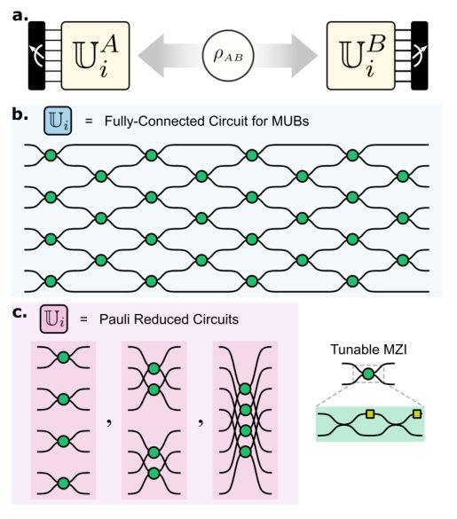
<figcaption class="paper-figure-caption"><b>Fig 1.</b> FIG. 1: Simpler measurements for entanglement wit- nessing. (a) When a high-dimensional quantum state is distributed between two parties, they perform joint mea- surements to verify the entanglement dimensionality. (b) Schematic of conventional measurements in mutually unbi- ases bases (MUBs) which correspond to a fully-connected op- tical circuit. (c) Our method requires lower-depth circuits connected in a few different pairing configurations. Mach- Zehnder interferometer (MZI) based optical circuits are shown used to measure path-encoded quantum states.</figcaption>
</figure>
<figure class="paper-figure-card">
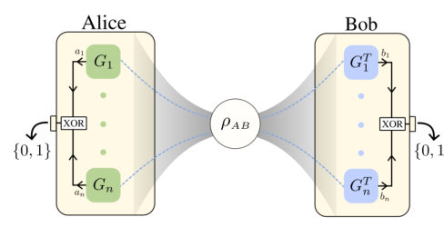
<figcaption class="paper-figure-caption"><b>Fig 2.</b> FIG. 2: Alice and Bob each receive a share of ρAB consisting of n qubits. They measure each qubit using an appropriate Pauli observable, G (GT ). From the respective string of out- comes, {a1, . . . , an} and {b1, . . . , bn}, they each compute the parity and return it as their respective final output.</figcaption>
</figure>
<figure class="paper-figure-card">
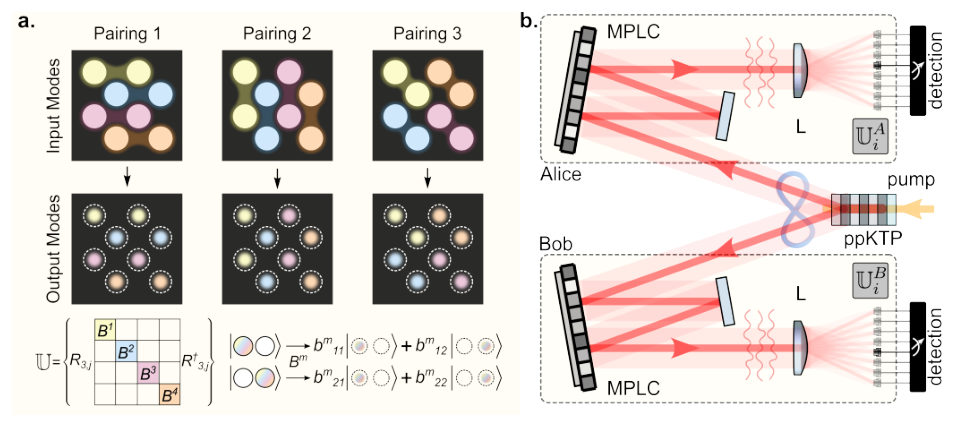
<figcaption class="paper-figure-caption"><b>Fig 3.</b> FIG. 3: Illustration of the experimental scheme. (a) Measurement circuit transforms macro-pixel modes to spatially separated Gaussian spots. The eight input pixels (and output spots) are arranged in a configuration that allows for nearest neighbour operations in three different pairing configurations (R3,j), effectively needing four parallel two-mode operations. The measurement operation U corresponding to the Pauli string observables for d = 8 can be expressed as a block diagonal matrix, with blocks Bj, each operating on a pair of macro-pixels resulting in a pair of outcomes. (b) Schematic illustration of the experimental setup, where the entangled pair of photons are generated using...</figcaption>
</figure>
<figure class="paper-figure-card">
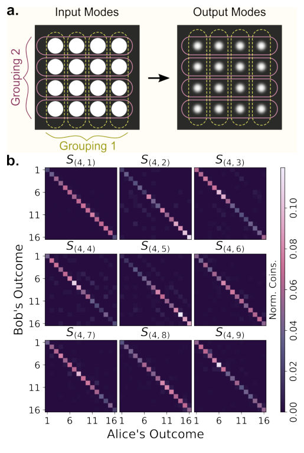
<figcaption class="paper-figure-caption"><b>Fig 4.</b> FIG. 4: Entanglement detection in a 16-dimensional subspace (a) 16 macro-pixel input modes are chosen in a 4-column grid to be transformed into a grid of spatially sepa- rated Gaussian spots such that two configurations of 4-mode groups are possible in enabling nearest neighbour interac- tion. The nine Pauli string operators can be expressed as four parallel 4 × 4 operations in the bespoke configurations. These operations are implemented using a three-plane MPLC. (b) Measured normalised coincidence (Norm. Coins.) matri- ces between Alice’s and Bob’s outcomes corresponding to each Pauli-string observable for d = 16 dimensional state. The measured data certifies the bound for 13-dimensional...</figcaption>
</figure>
<figure class="paper-figure-card">
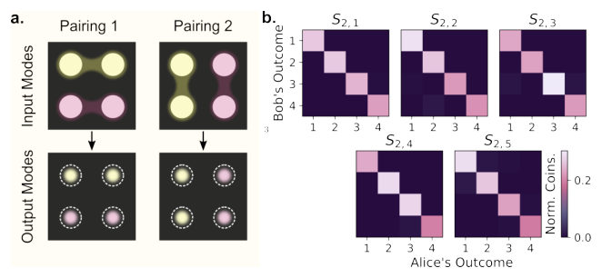
<figcaption class="paper-figure-caption"><b>Fig 5.</b> FIG. 5: (a) The four input pixels (and output spots) are arranged in a grid configuration that allows for nearest neighbour operations in two different permutations (Rj), effectively needing two parallel two-mode operations. (b) Measured normalised coincidence (Norm. Coins.) matrices between Alice’s and Bob’s outcomes corresponding to each Pauli-string observable for d = 4 dimensional state.</figcaption>
</figure>

**Summary.** The paper presents a novel, experimentally simpler method for detecting high-dimensional entanglement (Schmidt number) using only single-qubit measurements on photonic spatial modes. By developing and testing a witness parameter based on Pauli observables, the authors show that complex certification tasks can be achieved with significantly reduced experimental complexity compared to standard methods.

**Why it may be interesting.** This work directly addresses experimental bottlenecks in quantum information processing by proposing resource-efficient entanglement verification protocols applicable to scalable photonic quantum technologies.

Detailed structure

**Main problem.** The core problem is developing a measurement scheme to detect high-dimensional entanglement, quantified by the Schmidt number ($k$), that avoids complex local basis measurements.

**Main result.** The authors demonstrate that simple measurements using only sequences of single-qubit observables are sufficient and scalable enough to certify high-dimensional entanglement in photonic systems.

**Method.** They introduce a witness parameter $W_n(
ho_{AB})$ derived from Pauli string observables, which allows for bounding the Schmidt number based on experimentally feasible low-depth quantum circuits.

**Model / system.** The work utilizes high-dimensional photonic spatial mode entanglement, implemented using Multi-Plane Light Converters (MPLCs) and single-photon detectors. The theoretical framework involves analyzing Pauli string operators ($S_{n,j}$) acting on the bipartite state $
ho_{AB}$.

**Key observables.** The witness parameter $W_n(
ho_{AB})$, the Schmidt number ($k$), and fidelity ($F$) are key observables.

**Important parameters / regimes.** The local dimension ($d=2^n$) and the entanglement dimension ($k$) are central parameters. The depth of the required quantum circuit is a critical complexity parameter.

**Assumptions / limitations.** Assumptions include the validity of using Pauli string measurements to bound the Schmidt number, and in some derivations, assuming pure states or restricting analysis to diagonal operators.

**Figures summary.** Figures illustrate the comparison between complex conventional measurement circuits versus the proposed low-depth circuit scheme. Other figures detail the experimental setup involving SPDC sources and MPLC components for measuring coincidence matrices.

**Paper structure.** The paper develops theoretical bounds on entanglement measures ($\alpha(n, k)$) using multiple mathematical approaches (fidelity vs. element-wise maximization). It then experimentally validates these concepts by implementing the measurement scheme using photonic systems, culminating in numerical results that confirm the detection capability.

Abstract

The standard benchmark for high-dimensional entanglement is the number of dimensions in which entanglement must be present in order to generate the state. This is called the Schmidt number and its detection is usually based on implementing an appropriate set of local basis measurements. However, as quantum technology brings increasingly large physical dimensions within reach, the implementation of such measurements typically becomes more costly. Here, we develop a scheme for detecting Schmidt numbers based only on sequences of single-qubit observables. These measurements are simpler to implement as they require only low-depth quantum circuits. Using up to sixteen-dimensional photonic spatial mode entanglement and multi-plane light conversion technology, we demonstrate how it simplifies setup complexity and successfully detects the maximal (or close-to-maximal) Schmidt number. Our results reveal that simple and more scalable measurements are sufficient to detect high-dimensional entanglement properties.

[↑ back to top](#top)

### [Dynamics of nucleation in thermal phase transitions](http://arxiv.org/abs/2608.00169v1)

**Authors:** Oliver Gould, Joonas Hirvonen, Andrey Shkerin, Sergey Sibiryakov  
**Type:** theory · **Category:** statistical mechanics · **PDF:** <https://arxiv.org/pdf/2608.00169v1>  
**Analysis basis:** full PDF text, analyzed in chunks
**Topic relevance:** 🔥 `Keldysh / 2PI / non-Gaussian methods` **4/5** · `methods for driven-dissipative` **3/5** · `non-equilibrium dynamics` **3/5** · `driven-dissipative phase transition` **2/5** · `analog quantum simulation` **1/5** · `correlated / nonlocal dissipation` **1/5** · `non-equilibrium universality` **1/5**

↔ Scroll figures horizontally

<figure class="paper-figure-card">
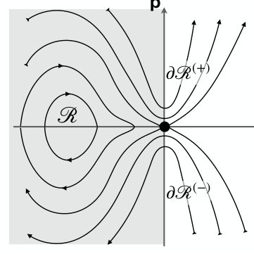
<figcaption class="paper-figure-caption"><b>Fig 1.</b> Figure 1: Phase-space trajectories and the metastable region R (shaded gray) for the cal- culation of the decay rate. The flux out of R crosses the surface ∂R(+), selected by the theta-function in Eq. (1). Trajectories from the outer region enter R through ∂R(−). The black dot indicates the transition state (TS).</figcaption>
</figure>
<figure class="paper-figure-card">
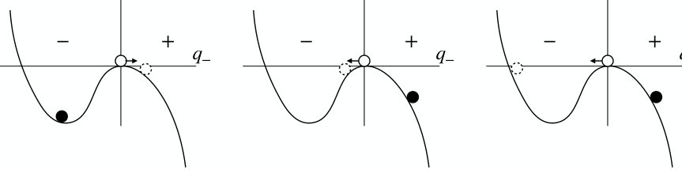
<figcaption class="paper-figure-caption"><b>Fig 2.</b> Figure 3: Different types of re-crossing motion. The particle starts from the top of the barrier (white solid circle) towards the true (a) or false (b,c) vacuum. Due to interactions with the heat bath, the particle turns around (white dashed circle), re-crosses the barrier and ends up in the region opposite its initial direction of motion (black circle). The re-crossing can happen promptly, before the particle leaves the vicinity of the barrier (a,b), or after oscillating in the false vacuum region (c).</figcaption>
</figure>
<figure class="paper-figure-card">
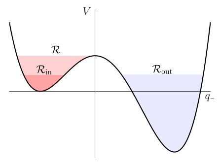
<figcaption class="paper-figure-caption"><b>Fig 3.</b> Figure 4: Three regions of phase space, here shown on a one-dimensional potential: Rin ⊂R, deep in the metastable phase; R the full metastable phase; and Rout ⊂¯R, where ¯R is the complement of R, far outside the metastable phase. The nucleation rate is the flux through ∂R carried by trajectories going from Rin to Rout.</figcaption>
</figure>
<figure class="paper-figure-card">
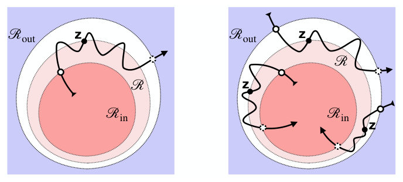
<figcaption class="paper-figure-caption"><b>Fig 4.</b> Figure 5: Different types of trajectories crossing the boundary of the metastable region R in the outward direction at a point z marked by a black dot. The part of the trajectory between the solid and dashed white circles is the orbit oz. The indicator function θin→out(oz) equals unity for the orbit in panel (a) and vanishes for all orbits in panel (b). Only the trajectory in panel (a) contributes to the MRT rate (35).</figcaption>
</figure>
<figure class="paper-figure-card">
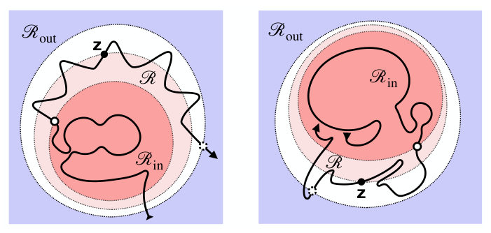
<figcaption class="paper-figure-caption"><b>Fig 5.</b> Figure 6: Sloshing re-crossing trajectories that contribute into the MRT rate (35) but must be excluded from the steady-state rate Γ.</figcaption>
</figure>

**Summary.** This paper develops a comprehensive dynamical framework for calculating the decay rate during first-order phase transitions in field theory. It introduces a general formula that corrects the standard equilibrium estimate by including a crucial dynamical prefactor. The work is significant because it provides a robust method applicable even when the system deviates significantly from thermal equilibrium.

**Why it may be interesting.** While focused on high-energy field theory, the methodology of calculating non-equilibrium rates via flux methods is highly relevant to open quantum systems where thermalization assumptions break down (e.g., driven or dissipative quantum dynamics).

Detailed structure

**Main problem.** The study focuses on accurately determining the dynamical effects during thermal first-order phase transitions, specifically calculating the decay rate of a metastable vacuum state.

**Main result.** The authors provide a general formula for the thermal decay rate that incorporates a dynamical prefactor, which accounts for deviations from equilibrium predictions and can be systematically evaluated.

**Method.** They develop a generalized approach similar to reactive flux methods in physical chemistry, moving beyond the assumptions of local thermodynamic equilibrium inherent in standard Transition State Theory (TST).

**Model / system.** The system is described by field theory undergoing thermal false vacuum decay. The dynamics are modeled using phase space probability flux calculations derived from a Hamiltonian describing the metastable state.

**Key observables.** The primary observable is the thermal decay rate, and its key diagnostic tool is the dynamical prefactor that modifies the equilibrium TST rate.

**Important parameters / regimes.** Key regimes include the semiclassical regime ($T_q \ll T \ll E_{	ext{ts}}$), and the analysis considers violations of 'thermality conditions' when a steady-state rate does not exist.

**Assumptions / limitations.** The initial framework relies on defining the decay rate via phase-space flux, but the core contribution is addressing the failure of the assumption of global thermal equilibrium near the transition state.

**Figures summary.** Figure 1 illustrates the geometry of the process in phase space, defining the metastable region $R$, its boundary $\partial R$, and the Transition State (TS).

**Paper structure.** The paper establishes the problem by noting TST's limitations, proposes a general dynamical formula for the decay rate including the prefactor, details the systematic evaluation recipe, validates it against known results, and concludes with numerical simulations showing non-perturbative effects.

Abstract

We study dynamical effects during nucleation in thermal first-order phase transitions in field theory. Focusing on the classical regime of the decay of a metastable state, we present the general formula for the thermal decay rate including the dynamical prefactor and give a recipe for its systematic evaluation. We describe the physical mechanism which reduces the actual thermal decay rate with respect to the statistical rate obtained in equilibrium theory. We also discuss the thermality conditions ensuring the existence of a steady-state thermal rate, in which case our formula is exact up to exponentially small corrections. We show that it reproduces the known results for the nucleation rate in stochastic mechanics and field theory, and allows us to unify and go beyond them. We illustrate this in real-time numerical simulations of simple field theory models. We observe significant non-perturbative contributions which can dominate the dynamical prefactor in weakly-coupled field theories at moderate exponential suppression of the decay rate. We explore the connection of these non-perturbative effects to oscillons. Notably, our numerical method requires exponentially less computing time than direct simulations of decays and is thus applicable to systems with arbitrarily strong exponential suppression. Finally, we discuss small or poorly thermalized systems when the thermality conditions are violated and the steady-state rate does not exist.

[↑ back to top](#top)

### [Phase-Drift Limits and Adaptive Quadrature Readout in Programmable Photonic Processors](http://arxiv.org/abs/2608.02249v1)

**Authors:** Gökhan Elmas, Igor A. Litvin, Janis Nötzel  
**Type:** theory · **Category:** quantum information and computing · **PDF:** <https://arxiv.org/pdf/2608.02249v1>  
**Analysis basis:** full PDF text, analyzed in chunks
**Topic relevance:** 🔥 `quantum measurements` **4/5** · `measurement-induced transitions` **3/5** · `analog quantum simulation` **2/5** · `Keldysh / 2PI / non-Gaussian methods` **1/5** · `correlated cavity matter` **1/5** · `entanglement & information structure` **1/5** · `interference shaping light` **1/5** · `methods for driven-dissipative` **1/5** · `non-equilibrium dynamics` **1/5**

↔ Scroll figures horizontally

<figure class="paper-figure-card">
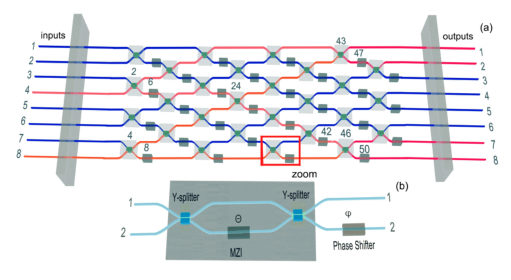
<figcaption class="paper-figure-caption"><b>Fig 1.</b> Figure 1: Eight-mode programmable photonic processor and quadrature-extraction configuration used for simulta- neous sine–cosine phase extraction [9].</figcaption>
</figure>
<figure class="paper-figure-card">
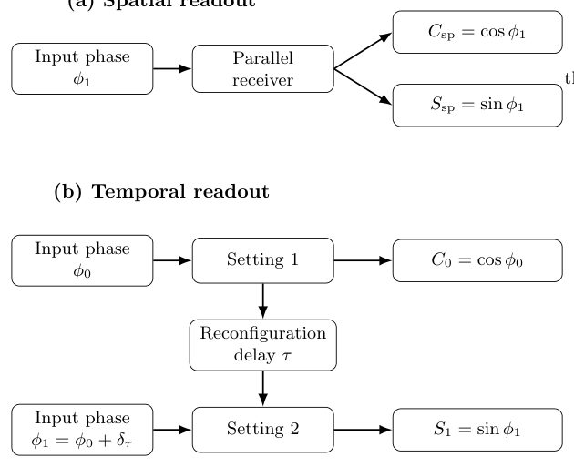
<figcaption class="paper-figure-caption"><b>Fig 2.</b> Figure 2: Spatial and temporal quadrature acquisition. The temporal example shows the order C →S.</figcaption>
</figure>
<figure class="paper-figure-card">
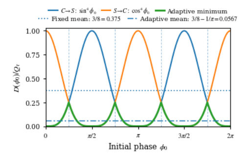
<figcaption class="paper-figure-caption"><b>Fig 3.</b> Figure 3: Phase-dependent drift coefficients for the two fixed quadrature orders and the adaptive minimum. The vertical dashed lines indicate the ordering boundaries. The uniform-phase mean coefficient decreases from 0.375 to 0.0567, corresponding to an 84.9% reduction in drift- induced mean-square error.</figcaption>
</figure>
<figure class="paper-figure-card">
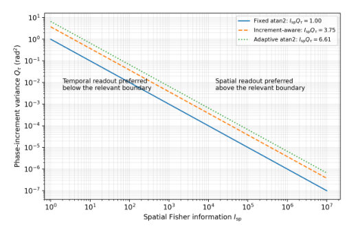
<figcaption class="paper-figure-caption"><b>Fig 4.</b> Figure 4: Architecture-selection boundaries for informa- tion gain g = 1.6. The horizontal and vertical variables are the simultaneous spatial Fisher information and the phase-increment variance at the selected reconfiguration interval. Temporal readout is favored below the boundary associated with its estimator; spatial readout is favored above it. The increment-aware curve is the symmetric local benchmark of Eq. (126). The plot uses Qτ directly and does not require a prescribed delay-scaling law.</figcaption>
</figure>
<figure class="paper-figure-card">
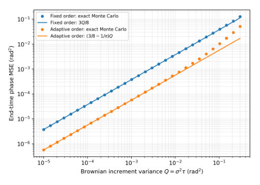
<figcaption class="paper-figure-caption"><b>Fig 5.</b> Figure 5: Exact end-time MSE for fixed and phase- adaptive quadrature ordering. Markers are Monte Carlo results and lines are the first-order expressions.</figcaption>
</figure>

**Summary.** This paper analyzes the fundamental limits on phase estimation in programmable photonic processors when measuring quadrature components sequentially. It develops a theory showing that adaptive measurement ordering can drastically reduce errors caused by unknown phase drift compared to fixed protocols. The results provide crucial guidelines for designing robust quantum optical hardware.

**Why it may be interesting.** This work directly addresses resource limitations and estimation fidelity in photonic quantum computation platforms by providing rigorous theoretical limits on phase estimation accuracy under realistic noise models.

Detailed structure

**Main problem.** The research quantifies the phase-drift penalty incurred when sequentially measuring sine and cosine quadratures in programmable photonic processors, compared to simultaneous measurement.

**Main result.** An adaptive ordering rule significantly outperforms fixed-order methods, reducing the drift-induced Mean Square Error by up to 84.9%.

**Method.** The authors derive theoretical bounds using Fisher information and analyze estimation errors based on small-angle approximations for $	ext{atan2}$ reconstruction.

**Model / system.** The study uses an eight-mode programmable photonic processor that converts relative optical phases into measurable sine and cosine power pairs, simulating phase evolution over time intervals ($	au$).

**Key observables.** Phase-drift penalty (MSE), Fisher Information ($I_{sp}, I_t$), and the effective information gain factor ($g$).

**Important parameters / regimes.** The phase-increment variance ($Q_	au$) is critical, as are dimensionless products like $I_{sp}Q_	au$ which define operational regimes.

**Assumptions / limitations.** The analysis relies on first-order approximations for error terms and assumes ideal balanced Poisson detection statistics for the Fisher information derivation.

**Figures summary.** Figures illustrate the eight-mode processor setup, quadrature extraction, and compare receiver performance (e.g., Figure 7) across different estimation strategies under a common noise model.

**Paper structure.** The paper moves from defining the physical measurement problem (quadrature readout) to deriving error bounds for fixed vs. adaptive temporal measurements, culminating in an information-theoretic comparison of various estimators.

Abstract

Phase fluctuations between optical inputs limit programmable photonic processors because their output powers depend on coherent interference. We study the phase-drift penalty that arises when sine and cosine quadratures are measured sequentially rather than simultaneously. The analysis is motivated by measurements from an eight-mode programmable photonic processor, including 35 free-running recordings of 300 s acquired at approximately 125 samples per second per channel. These recordings provide an empirical route for estimating the phase-increment variance at a selected reconfiguration interval.   The estimate is defined at the time of the second measurement. For fixed quadrature order, perturbation of the atan2 reconstruction gives $e_{C\to S}=-δ_τ\sin^2φ_0+O(δ_τ^2)$ and $e_{S\to C}=-δ_τ\cos^2φ_0+O(δ_τ^2)$. Writing $Q_τ=\operatorname{Var}(δ_τ)$, uniform phase averaging gives the first-order drift mean-square error $3Q_τ/8$. A phase-predicted ordering rule measures the locally less informative quadrature first and the more informative quadrature second. Its uniform first-order penalty is $(3/8-1/π)Q_τ$, which is 84.9 percent below the fixed-order value.   We also derive an increment-aware estimator from a local state-space model. Marginalizing the unknown phase increment increases the variance of a stale phase observation by $Q_τ$, reducing its Fisher information from $I$ to $I/(1+IQ_τ)$. For ideal balanced Poisson detection, the Fisher information of each quadrature equals its detected signal-photon number. This yields dimensionless architecture boundaries in spatial information and phase-increment variance. Nonlinear Monte Carlo simulations validate the perturbative laws, quantify robustness to prediction error, and compare simultaneous, fixed-order, increment-aware, and adaptive receivers under a common noise model.

[↑ back to top](#top)

### [An asymptotically solvable model of many-body critical phases: mobility edges, scars, and inverted scars](http://arxiv.org/abs/2608.00157v1)

**Authors:** Yi-Ting Tu, Zi-Jian Li, Sankar Das Sarma  
**Type:** theory · **Category:** disordered systems and neural networks · **PDF:** <https://arxiv.org/pdf/2608.00157v1>  
**Analysis basis:** full PDF text, analyzed in chunks
**Topic relevance:** 🔥 `scars & prethermalization` **4/5** · `analog quantum simulation` **2/5** · `driven-dissipative phase transition` **2/5** · `non-equilibrium dynamics` **2/5** · `Frenkel-Kontorova` **1/5** · `entanglement & information structure` **1/5** · `exotic spin models in light-matter` **1/5** · `non-equilibrium universality` **1/5**

↔ Scroll figures horizontally

<figure class="paper-figure-card">
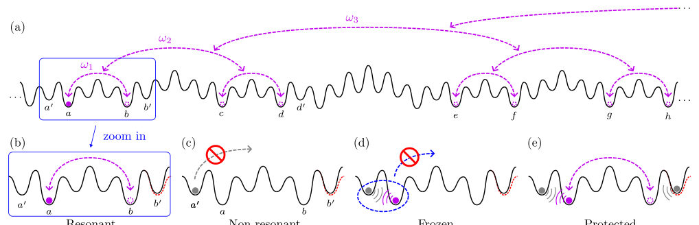
<figcaption class="paper-figure-caption"><b>Fig 1.</b> FIG. 1: Illustration of the effects of interaction on a system with hierarchical mirror structure. (a) The transport of such a system can be thought of as hierarchical oscillations between distant regions with frequencies ω1 ≫ω2 ≫ω3 ≫· · · . (b) For the lowest level of the hierarchy, if a particle is near the mirror center, it is resonant between two mirrored sites (a and b). (c) Further away from the mirror center, the particle becomes non-resonant due to a small asymmetry between sites a′ and b′ (red dashed line). (d) When the particles in (b) and (c) are both present, the non-resonant particle causes the resonant particle to become frozen due to interaction. (e) When two mirror-symmetric...</figcaption>
</figure>
<figure class="paper-figure-card">
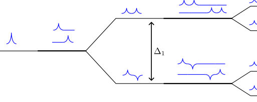
<figcaption class="paper-figure-caption"><b>Fig 2.</b> FIG. 2: (a) Iterative construction of the single-particle all-resonant HMS model in Sec. III A, modeling the purple particle in Fig. 1(a). (b) The spectrum (black) and energy eigenstates (blue), corresponding stepwise with (a).</figcaption>
</figure>
<figure class="paper-figure-card">
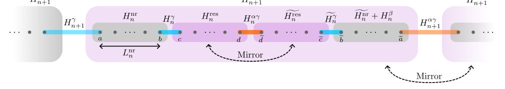
<figcaption class="paper-figure-caption"><b>Fig 3.</b> FIG. 3: Recursive construction of the solvable models, which works for both single-particle and many-body versions. At each step, Hres n+1 is formed by making a mirrored copy of Hres n (the resonant region), adding a pair of new segments Hnr n , g Hnr n with small symmetry-breaking terms Hβ n (the non-resonant region), and finally coupling the four segments by bonds Hγ n, Hαγ n , f Hγ n which are weaker and weaker as n →∞.</figcaption>
</figure>
<figure class="paper-figure-card">
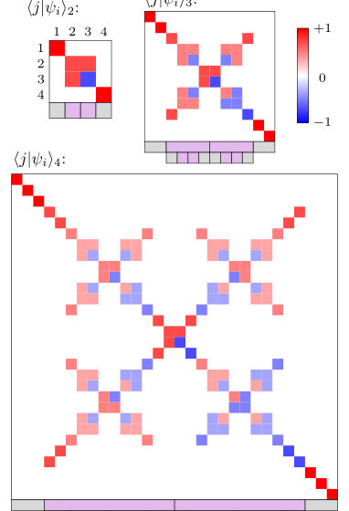
<figcaption class="paper-figure-caption"><b>Fig 4.</b> FIG. 4: Visualization of the eigenstates and their labeling of Hres n with Lres 1 = 1, Lnr n = n. The (i, j) entry of the matrix is ⟨j|ψi⟩n, assuming all error bounds are negligible. The figure is for illustrative purposes and not plotted from numerical data. The hierarchical structure is indicated at the bottom of the matrix, with magenta (gray) being (non-) resonance regions.</figcaption>
</figure>
<figure class="paper-figure-card">
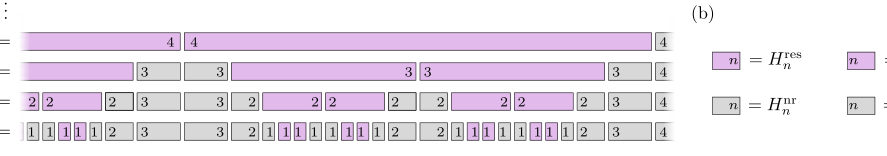
<figcaption class="paper-figure-caption"><b>Fig 5.</b> FIG. 5: Progressive approximations of the solvable model on an infinite lattice, which works for both single-particle and many- body versions. The Hamiltonian H∞ n at each step is a sum of decoupled segments. In the limit of n →∞, H∞ n converges to the final model H∞(in the sense of operator norm in the single-particle case, and term-wise in the many-body case).</figcaption>
</figure>

**Summary.** This work constructs an exactly solvable model of an interacting spin chain exhibiting a hierarchical mirror structure. It identifies two distinct many-body phases separated by a finite-temperature transition, suggesting a thermodynamic mobility edge in short-range systems. The findings challenge existing beliefs about localization and rare regions in quasiperiodic quantum matter.

**Why it may be interesting.** It directly addresses critical phenomena in interacting quantum systems, extending concepts from MBL theory to deterministic structures and proposing novel phase transitions like the thermodynamic mobility edge.

Detailed structure

**Main problem.** Investigating many-body critical phases beyond standard Many-Body Localization (MBL) by studying resonances arising from the underlying potential structure in deterministic, quasiperiodic systems.

**Main result.** The authors derive two distinct thermodynamic phases separated by a finite-temperature phase transition corresponding to a mobility edge, and suggest delocalized rare regions can exist even without low-disorder impurities.

**Method.** Construction of an asymptotically solvable model for a 1D interacting spin chain using the concept of Hierarchical Mirror Structure (HMS) and analyzing ETH satisfaction/violation in the thermodynamic limit.

**Model / system.** A one-dimensional nearest-neighbor interacting spin chain with a spatial structure inducing a hierarchy of mirror-like many-body resonances. The analysis also relates to the Aubry-André model.

**Key observables.** Weak Eigenstate Thermalization Hypothesis (ETH) satisfaction/violation; existence and nature of rare eigenstates (many-body scars and inverted scars); thermodynamic mobility edge.

**Important parameters / regimes.** Temperature, system size (thermodynamic limit), structural parameters defining the HMS hierarchy ($\Delta\phi_n$).

**Assumptions / limitations.** The model is constructed to be asymptotically solvable; analysis relies on separating transport timescales across different levels of the resonance hierarchy.

**Figures summary.** Figure 1 illustrates how interactions affect an HMS system, showing hierarchical oscillations, resonance at low levels, and protection mechanisms that can lead to freezing or delocalization.

**Paper structure.** The paper first establishes the structural basis using the HMS concept derived from single-particle spectral analysis ($\mu_{sc}$), then constructs the asymptotically solvable interacting model, analyzes the resulting two phases (MBC-E/MBC-L) and their separation by a mobility edge, and finally discusses implications for quasiperiodic models.

Abstract

While the prethermal regime of random many-body localized (MBL) systems is dominated by accidental many-body resonances, another class of resonances, originating from the underlying potential structure, is expected in large-size deterministic systems. It is known that this class of resonances can lead to single-particle critical phases that are neither localized nor extended, but the consequences in interacting systems remain unclear. In this work, we construct an asymptotically solvable model of a one-dimensional nearest-neighbor interacting spin chain, whose spatial structure induces a hierarchy of mirror-like many-body resonances. We derive two phases in the thermodynamic limit, characterized by the satisfaction and violation of a version of the weak eigenstate thermalization hypothesis (ETH). While these two phases are similar to the usual MBL and ETH phases, there exist rare eigenstates that behave like the opposite phase, interpreted as many-body scars and inverted scars. Surprisingly, the two phases can be separated by a finite-temperature phase transition, corresponding to a thermodynamic many-body mobility edge, which was often believed to be impossible. Our results also suggest the existence of delocalized rare regions in an otherwise-localized interacting Aubry-André model, even if there are no low-disorder regions like those in random systems. This challenges the common belief that there is no avalanche instability in quasiperiodic MBL.

[↑ back to top](#top)

### [Measurement-Based Loss Tolerance in Graph-GKP Codes through Syndrome-Resolved Pauli-Frame Decoding](http://arxiv.org/abs/2608.00830v1)

**Authors:** Seid Koudia, Symeon Chatzinotas  
**Type:** theory · **Category:** quantum information and computing · **PDF:** <https://arxiv.org/pdf/2608.00830v1>  
**Analysis basis:** full PDF text, analyzed in chunks
**Topic relevance:** 🔥 `quantum measurements` **4/5** · `measurement-induced transitions` **3/5** · `methods for driven-dissipative` **3/5** · `Keldysh / 2PI / non-Gaussian methods` **1/5** · `correlated / nonlocal dissipation` **1/5** · `driven-dissipative phase transition` **1/5** · `entanglement & information structure` **1/5**

↔ Scroll figures horizontally

<figure class="paper-figure-card">
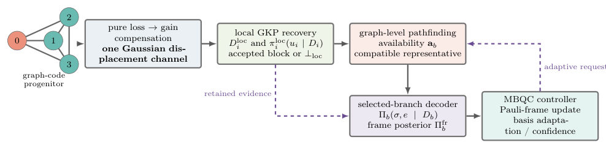
<figcaption class="paper-figure-caption"><b>Fig 1.</b> FIG. 1. Graph–GKP decoding pipeline. Pure loss followed by ideal gain compensation produces one additive Gaussian displacement channel. A local GKP recovery converts its continuous syndrome into a Pauli posterior and, at low confidence, a located decoder erasure ⊥loc. The resulting availability record restricts the quotient only for graph representative selection. Physical error weights use the full static lattice and the joint selected-branch likelihood, which is then pushed to the MBQC Pauli frame.</figcaption>
</figure>
<figure class="paper-figure-card">
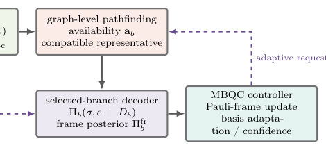
<figcaption class="paper-figure-caption"><b>Fig 2.</b> Figure 2 shows both the branch restriction produced by a local abstention and the magic-assisted equatorial interface. Thus an X-frame bit reverses the angle and a Z-frame bit flips the reported outcome. The uncer- tain physical contribution to this frame is obtained from the posterior in Sec. V C; it must not be replaced by a hard local decision before the teleportation branch is decoded. The Pauli and equatorial cases share the same decoder-conditioned search and differ only in their termi- nal interface.</figcaption>
</figure>
<figure class="paper-figure-card">
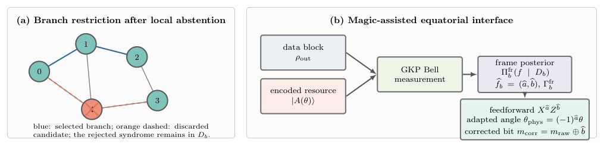
<figcaption class="paper-figure-caption"><b>Fig 3.</b> FIG. 2. Decoder-conditioned branch restriction and non-Pauli terminal interface. (a) A locally ambiguous block is converted to ⊥loc before the outer graph measurements, so candidates requiring that block are removed, while its rejected local syndrome remains in the global record. (b) An encoded non-Gaussian resource and a GKP Bell measurement implement the equatorial interface. The posterior frame controls the future angle and reported bit. The numerical A(θ) benchmarks treat this terminal resource ideally and evaluate the surrounding transport and frame layer.</figcaption>
</figure>
<figure class="paper-figure-card">
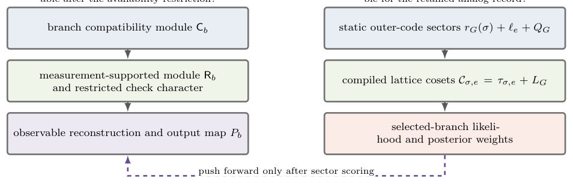
<figcaption class="paper-figure-caption"><b>Fig 4.</b> FIG. 3. Observable compatibility is not physical-error compatibility. The branch word b restricts the quotient modules used to reconstruct the observable and the measured syndrome character. Physical errors are classified by the full outer-code partition rG(σ) + ℓe + QG, compiled into static LG cosets, and only then pushed forward through Pb.</figcaption>
</figure>
<figure class="paper-figure-card">
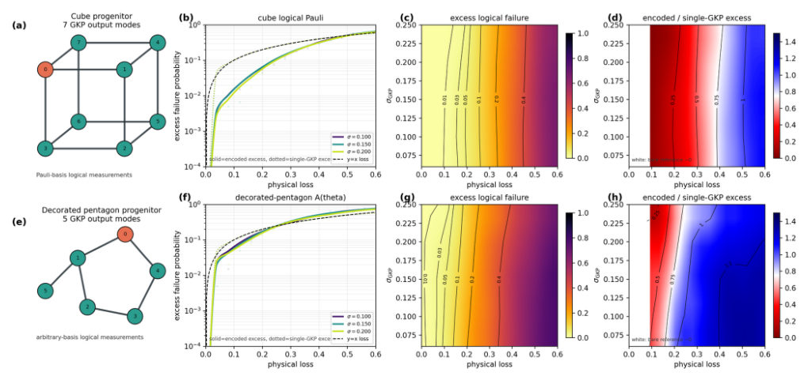
<figcaption class="paper-figure-caption"><b>Fig 5.</b> FIG. 4. Fixed-progenitor closest-coset benchmarks for square GKP blocks. Panels (a)–(d) use the seven-block cube code for logical Pauli measurements; panels (e)–(h) use the five-block decorated-pentagon code for the protected routing and frame layer surrounding an ideal supplied A(θ) terminal resource. Solid curves in (b) and (f) are encoded excess failure, dotted curves are the matched single-block GKP excess, and the dash-dotted line is the attenuation-coordinate reference. Panels (c) and (g) show encoded excess failure across (ℓ, σGKP), while (d) and (h) show the ratio of encoded to single-block excess. The coordinate ℓ= 1 −η enters through the Gaussian loss–amplification covariance;...</figcaption>
</figure>

**Summary.** This work introduces a comprehensive framework to manage resource loss in measurement-based quantum computing using Graph-GKP codes. It unifies the control mechanisms of graph stabilizers and continuous bosonic information from GKP states. The resulting interface offers a robust, causal method for fault tolerance in photonic quantum repeaters.

**Why it may be interesting.** It provides advanced theoretical tools for handling realistic noise (loss) in photonic quantum computation, which is crucial for scaling up quantum networks and repeaters.

Detailed structure

**Main problem.** The paper develops a unified causal framework for achieving measurement-based loss tolerance by combining graph codes with Gottesman-Kitaev-Preskill (GKP) codes.

**Main result.** It establishes a 'graph-GKP interface' that provides a single, unified control layer for fault-tolerant quantum computation primitives like MBQC and photonic repeaters.

**Method.** The approach involves calculating syndrome-resolved posteriors over graph branches using both accepted and rejected local measurement outcomes to guide subsequent logical operations.

**Model / system.** The system is based on bosonic platforms utilizing Graph-GKP codes, modeling physical attenuation as pure loss followed by quantum-limited amplification.

**Key observables.** Confidence scores for inferred Pauli classes, syndrome records, and the resulting outgoing logical Pauli frame.

**Important parameters / regimes.** Squeezing levels ($\sigma$), lattice structure (square/hexagonal), and channel width ($e\sigma$).

**Assumptions / limitations.** The physical process is modeled as pure loss followed by quantum-limited amplification; the use of a closest-coset approximation for decoding.

**Figures summary.** Not specified in the notes, but simulations identify task-dependent loss-tolerance behavior and pseudothresholds for different GKP lattices.

**Paper structure.** The paper builds from defining local GKP recovery mechanisms to calculating syndrome-resolved posteriors, culminating in a recursive concatenation structure that unifies graph decoding with lattice information flow.

Abstract

Graph codes offer multiple physical representatives of logical observables, while Gottesman-Kitaev-Preskill (GKP) codes retain analog information about bosonic displacement noise. We develop a causal framework that unifies these mechanisms for measurement-based loss tolerance under pure loss followed by quantum-limited amplification. In this framework, each local GKP recovery produces a refreshed logical block, a continuous syndrome record, and a confidence score for the inferred Pauli class. Low-confidence outcomes are deliberately converted into located erasures, so the availability pattern is generated directly from the bosonic data rather than sampled independently. Both accepted and rejected syndromes contribute to a syndrome-resolved posterior over the graph branch, which determines accessible logical representatives and the outgoing logical Pauli frame. We derive decoder-conditioned branch restriction, signed-outcome reconstruction, Pauli-frame updating, recursive concatenation of graph-GKP modules, and syndrome-resolved logical fusion. Numerical simulations across several squeezing levels identify task-dependent loss-tolerance behavior and finite-depth pseudothresholds for square and hexagonal GKP lattices. The resulting graph-GKP interface provides a unified causal control layer for fault-tolerant MBQC, fusion-based computation, and all-photonic repeaters.

[↑ back to top](#top)

### [Noise-robust discrimination of incoherent point sources with spatial-mode demultiplexing](http://arxiv.org/abs/2608.01765v1)

**Authors:** Jian-Qiang Liu, Chao-Ning Hu, Jun Xin, Xiao-Ming Lu  
**Type:** both · **Category:** other · **PDF:** <https://arxiv.org/pdf/2608.01765v1>  
**Analysis basis:** full PDF text, analyzed in chunks
**Topic relevance:** 🔥 `interference shaping light` **4/5** · `quantum measurements` **3/5** · `quantum optics experiment` **3/5** · `measurement-induced transitions` **2/5** · `Keldysh / 2PI / non-Gaussian methods` **1/5** · `driven-dissipative phase transition` **1/5**

↔ Scroll figures horizontally

<figure class="paper-figure-card">
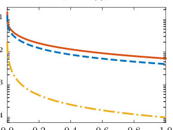
<figcaption class="paper-figure-caption"><b>Fig 1.</b> Fig. 1. Numerical results for the quantum Chernoff exponent (red solid line) and the classical Chernoff exponents for SPADE (blue dashed line) and DI (yellow dash-dotted line) with excess noise. The PSF is Gaussian with the standard deviation 𝜎= 115 𝜇m. The DI is set to 1000 pixels with a pixel size 𝑎= 4.6 𝜇m. For SPADE, only the two lowest-order HG modes are included in the calculation of the Chernoff exponent.</figcaption>
</figure>
<figure class="paper-figure-card">
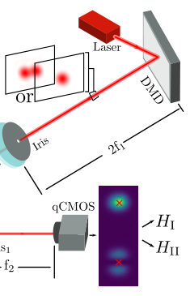
<figcaption class="paper-figure-caption"><b>Fig 2.</b> Fig. 3. Experimental setup for the SPADE-based hypothesis testing. DMD, digital micromirror device; CGH, computer-generated hologram; SLM, spatial light modulator. Only the first-order diffraction from the SLM is directed to the CMOS camera.</figcaption>
</figure>
<figure class="paper-figure-card">
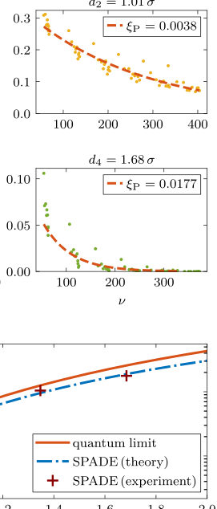
<figcaption class="paper-figure-caption"><b>Fig 3.</b> Fig. 4. Error probability and Chernoff exponent of SPADE-based hypothesis testing. The noise-to-signal ratio in this experiment is 𝑏/𝜈≈0.11. The first four panels show the error probability 𝑃err of SPADE as a function of 𝜈for the separations 𝑑1 = 0.67𝜎, 𝑑2 = 1.01𝜎, 𝑑3 = 1.35𝜎, and 𝑑4 = 1.68𝜎, respectively. The solid lines are fits to 𝑃err ∝exp(−𝜈𝜉P), with 𝜉P the extracted Chernoff exponent. The bottom panel shows the extracted Chernoff exponent 𝜉P as a function of the separation 𝑑.</figcaption>
</figure>

**Summary.** This paper develops a theoretical and experimental method for distinguishing between one or two closely spaced incoherent light sources in noisy environments. By employing reduced Spatial-Mode Demultiplexing (SPADE), the measurement concentrates source information into specific spatial modes. This technique significantly enhances noise robustness, allowing detection performance to approach the quantum limit even when significant background noise is present.

**Why it may be interesting.** This work is highly relevant to quantum optics and open quantum systems because it provides a concrete, quantifiable advantage of using structured measurements (spatial modes) over simple intensity measurements when background noise corrupts the signal, pushing detection towards fundamental quantum limits.

Detailed structure

**Main problem.** The core problem is discriminating between a single incoherent point source and two closely spaced incoherent point sources when background noise is present, especially in regimes where diffraction causes signal overlap.

**Main result.** Reduced Spatial-Mode Demultiplexing (SPADE) measurements are theoretically predicted and experimentally shown to be robust against background noise, consistently outperforming direct imaging methods by concentrating source information into minimal detection modes.

**Method.** The authors employ quantum hypothesis testing using the Chernoff exponent ($\xi$) derived from Poisson statistics for photon counts in the weak-source limit. They compare this theoretical bound against Direct Imaging (DI) measurements.

**Model / system.** The system involves optical imaging of incoherent point sources, modeled using quantum detection theory and characterized by Hermite-Gaussian (HG) spatial modes. The noise is assumed to be uniform and Poissonian background light.

**Key observables.** Chernoff exponent ($\xi_{	ext{meas}}$ or $\zeta$), which quantifies the exponential decay rate of the error probability, and the comparison between SPADE vs. DI performance.

**Important parameters / regimes.** Background-to-signal photon ratio (e.g., 0.11), source separation ($d$), and the number of lowest-order HG modes used for measurement.

**Assumptions / limitations.** The background noise is assumed to be uniform and Poissonian, and the PSF is approximated by a Gaussian function in the weak-source limit.

**Figures summary.** Figures compare quantum vs. classical Chernoff exponents for SPADE and DI with excess noise; one figure shows the experimental setup for SPADE hypothesis testing; another presents $P_{err}$ versus signal photon number ($
u$) demonstrating superior performance of reduced SPADE.

**Paper structure.** The paper establishes a theoretical framework using quantum state analysis and Chernoff bounds. It derives the optimal measurement strategy (SPADE) and compares its achievable exponent against direct imaging, culminating in experimental validation showing noise robustness.

Abstract

We theoretically predict and experimentally demonstrate that a reduced spatial-mode demultiplexing (SPADE) measurement using only the two lowest-order Hermite-Gaussian modes exhibits remarkable robustness against background noise in discriminating between a single source and two incoherent point sources. We establish a theoretical framework incorporating uniform background noise and derive an analytical Chernoff exponent expression, showing that SPADE consistently outperforms direct imaging (DI) across all source separations. Experimental results confirm that SPADE-based hypothesis testing approaches the quantum limit even when the background-to-signal photon ratio per pixel is 0.11. This advantage stems from SPADE's ability to concentrate source information into minimal detection modes, reducing the cumulative background noise impact. Our findings provide a practical detection scheme for applications where background noise is inevitable, such as astronomical observations and quantum sensing.

[↑ back to top](#top)

### [High-dimensional quantum process tomography with undetected photons](http://arxiv.org/abs/2608.02490v1)

**Authors:** Salini Rajeev, Mayukh Lahiri  
**Type:** theory · **Category:** quantum information and computing · **PDF:** <https://arxiv.org/pdf/2608.02490v1>  
**Analysis basis:** full PDF text, analyzed in chunks
**Topic relevance:** 🔥 `interference shaping light` **4/5** · `quantum measurements` **3/5** · `quantum optics experiment` **3/5** · `QC/QI experiment` **1/5** · `measurement-induced transitions` **1/5** · `methods for driven-dissipative` **1/5**

↔ Scroll figures horizontally

<figure class="paper-figure-card">
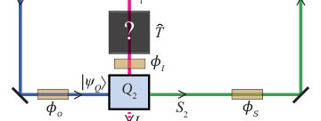
<figcaption class="paper-figure-caption"><b>Fig 1.</b> FIG. 1. Quantum process tomography scheme. There are two identical sources, Q1 and Q2, individually emitting a signal- idler pair in a high-dimensional Bell state. Idler beam, I1, is sent through Q2 and perfectly aligned with idler beam I2. This alignment induces coherence between signal beams S1 and S2. Consequently, a single-photon interference pattern is created when S1 and S2 are superposed by a beamsplit- ter (BS2) and one of the outputs is detected after projecting the signal photon onto a chosen mode. An unknown high- dimensional operation ( bT ) acts on the idler photon in beam I1. Applying a suitable unitary transformation (bU) in one of the signal beams, the unknown operation can...</figcaption>
</figure>
<figure class="paper-figure-card">
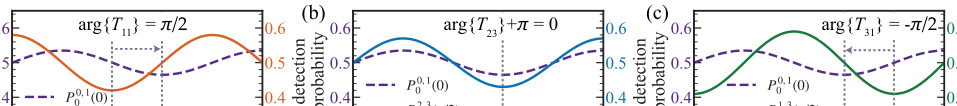
<figcaption class="paper-figure-caption"><b>Fig 2.</b> FIG. 2. Reconstruction of a non-unitary operator is illustrated using the matrix elements T11, T23, and T31. (a) The visibility of the interference pattern P 0,1 1 (θ = 0) gives |T11| = 0.16. The phase difference between P 0,1 0 (θ = 0) and P 0,1 1 (θ = 0) gives arg{T11} = π/2. (b) The visibility of P 2,3 2 (θ = π/2) gives |T23| = 0.14. A phase comparison between P 0,1 0 (θ = 0) and P 2,3 2 (θ = π/2) yields arg{T23}+ π = 0, which implies that arg{T23} = −π. (c) The visibility of P 1,3 3 (θ = π/2) gives |T31| = 0.18 and phase comparison with P 0,1 0 (θ = 0) shows that arg{T31} = −π/2.</figcaption>
</figure>

**Summary.** The paper presents a novel Quantum Process Tomography technique for high-dimensional qudits using photons. Instead of measuring the output state directly, it reconstructs an unknown process by analyzing interference patterns generated between two paths. This method is powerful because it allows full characterization without performing any measurement on the photon acted upon by the unknown operator.

**Why it may be interesting.** This work provides an elegant measurement-free characterization technique for quantum channels, which is crucial for validating complex photonic quantum hardware where destructive measurements are undesirable or impossible.

Detailed structure

**Main problem.** The goal is to fully characterize an arbitrary linear quantum operation ($\mathcal{E}$) acting on a high-dimensional photonic qudit without performing any direct measurement on the output state.

**Main result.** A method is proposed that reconstructs all matrix elements of the unknown process $\mathbf{b}_T$ by measuring single-photon interference patterns generated through an auxiliary, known unitary transformation ($\mathbf{b}_U$).

**Method.** The reconstruction relies on analyzing the sinusoidal variation of the single-photon detection probability ($P_d$) as a function of a tunable interferometric phase ($\varphi_{in}$). By systematically varying $\mathbf{b}_U$, all necessary information about $\mathbf{b}_T$ can be extracted.

**Model / system.** The system uses photonic qudits encoded in Orbital Angular Momentum (OAM) states. The process involves an unknown non-unitary operator ($\mathbf{b}_T$) acting on one photon path, while a known unitary operator ($\mathbf{b}_U$) acts on another, allowing for interference measurements.

**Key observables.** Single-photon detection probability ($P_d$), visibility ($V$), and the phase shifts observed in the interference patterns.

**Important parameters / regimes.** The dimensionality $N$ of the qudit space; the tunable interferometric phase $\varphi_{in}$.

**Assumptions / limitations.** The method assumes that quantum interference by path identity makes which-path information unavailable for the signal photon, and it relies on specific field operator transformations to handle non-unitary operations.

**Figures summary.** Figure 1 illustrates the general QPT scheme using a Zou-Wang-Mandel interferometer. Figure 2 demonstrates the retrieval of specific matrix elements ($T_{11}, T_{23}, T_{31}$) by analyzing interference patterns and visibilities.

**Paper structure.** The paper first defines the problem in high dimensions, details the interferometric setup using two sources and path splitting, derives the dependence of $P_d$ on phases (Chunk 1), and then systematically outlines a protocol to determine all matrix elements by varying $\mathbf{b}_U$ pairs (Chunk 2).

Abstract

The goal of quantum process tomography is to fully characterize an operation performed on a quantum state. By considering high-dimensional quantum states (qudit), we show that it is possible to fully reconstruct an arbitrary operation without performing any measurement on the transformed qudit. Our method is interferometric and conceptually different from existing techniques of quantum process tomography that must perform a measurement on the transformed qudit.

[↑ back to top](#top)

### [Unconditionally successful quantum Time-Marching algorithm via LCU for nonlinear Burgers equation](http://arxiv.org/abs/2608.02130v1)

**Authors:** Niccolo Fonio, Giuseppe Di Molfetta, Pierre Sagaut  
**Type:** theory · **Category:** quantum information and computing · **PDF:** <https://arxiv.org/pdf/2608.02130v1>  
**Analysis basis:** full PDF text, analyzed in chunks
**Topic relevance:** 🔥 `quantum measurements` **4/5** · `measurement-induced transitions` **3/5** · `methods for driven-dissipative` **3/5** · `non-equilibrium dynamics` **2/5** · `driven-dissipative phase transition` **1/5**

↔ Scroll figures horizontally

<figure class="paper-figure-card">
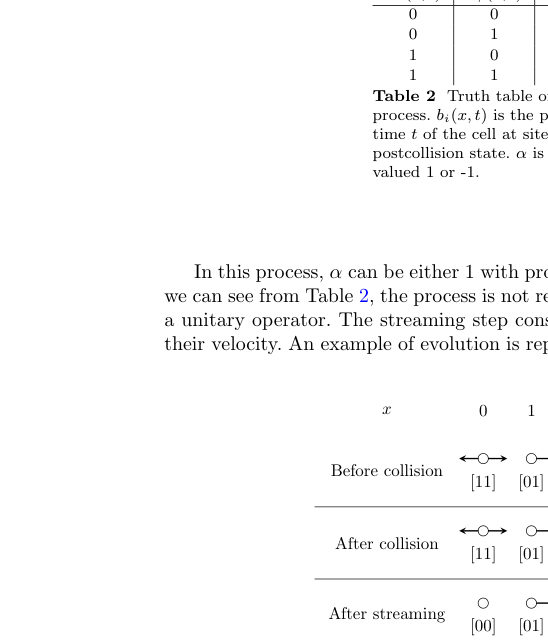
<figcaption class="paper-figure-caption"><b>Fig 1.</b> Fig. 3 Example of classical evolution [32]. The collision takes place at x = 1, 3, 4, with different random extractions for α. All the other cells are not affected by the collision. The streaming takes place according to respective velocities with continuous boundary conditions.</figcaption>
</figure>
<figure class="paper-figure-card">
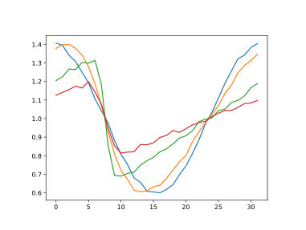
<figcaption class="paper-figure-caption"><b>Fig 2.</b> Fig. 4 Simulation of Burger’s equation with LGCA. 2048 grid points were used, ensemble-averaged over 100 realizations and space-averaged over 64 grid points. The left plot has p = 0.75, the right plot has p = 0.5. The specific dependence of the hydrodynamic parameters is partly detailed in [32].</figcaption>
</figure>

**Summary.** The paper presents a novel quantum algorithm to simulate nonlinear PDEs, like the Burgers equation, overcoming the critical issue of probabilistic failure inherent in current time-marching quantum solvers. By adapting quantum lattice gas automata and utilizing LCU conjugation, they achieve an unconditionally successful simulation framework for these complex dynamics.

**Why it may be interesting.** This work provides a concrete algorithmic breakthrough by solving the major hurdle of probabilistic failure in quantum simulation of nonlinear dynamics, which is crucial for simulating complex many-body or fluid systems.

Detailed structure

**Main problem.** Developing an unconditionally successful quantum Time-Marching (TM) algorithm for solving nonlinear Partial Differential Equations (PDEs), such as the Burgers equation.

**Main result.** The authors demonstrated a method using quantum lattice gas algorithms that allows time steps to be concatenated without probabilistic failure, achieving unconditional success for simulating nonlinearities.

**Method.** The approach leverages Linear Combination of Unitaries (LCU) circuits to implement non-unitary evolution arising from measurement outcomes in a quantum lattice gas cellular automaton model.

**Model / system.** The simulation targets the 1D Burgers' equation using a Lattice Gas Cellular Automata (LGCA) model. The method is compared against standard finite difference discretizations for advection equations.

**Key observables.** Success probability ($p_m$) of measurement outcomes, and the resulting non-unitary operators ($A_0, A_1$).

**Important parameters / regimes.** The relative phases ($\alpha, eta$) used to modify LGCA collision operators to satisfy necessary conjugation conditions.

**Assumptions / limitations.** The core assumption is that exploiting the correspondence between quantum measurement stochasticity and classical lattice gas randomness allows for unconditional time-step concatenation. A key limitation noted is that simple FDM schemes fail due to encoding not being phase-independent.

**Figures summary.** Figure 1 shows the general LCU circuit diagram, Figure 2 illustrates the standard LCU circuit, and Figures 3/4 provide visualizations of the classical and quantum simulation results for Burgers' equation on a grid.

**Paper structure.** The paper first establishes the challenge of probabilistic non-unitary evolution in quantum PDE solvers. It then introduces the general framework using LCU conjugation (Theorem 1). The core development applies this to LGCA operators, showing how phase modification satisfies the necessary conditions for unconditional time-marching.

Abstract

Most recently proposed quantum algorithms for solving linear and nonlinear partial differential equations rely on non-unitary operations. These operations are typically implemented probabilistically, requiring postselection and thus increasing the computational cost. We show that quantum lattice gas algorithms enable unconditionally successful quantum simulation of nonlinearities, yielding, to our knowledge, the first quantum algorithm for Burgers equation whose time steps can be concatenated without probabilistic failure. The key idea is to exploit the correspondence between the stochasticity of quantum measurement in the linear combination of unitaries framework and the intrinsic randomness of the classical lattice gas algorithm. In doing so, we identify general properties that characterize probabilistic classical algorithms amenable to this time-marching formulation, and illustrate the approach with an additional application.

[↑ back to top](#top)

### [Diodes and capacitors for the transport of monopoles in fragmented spin ice](http://arxiv.org/abs/2608.01883v1)

**Authors:** Anoop Raj, Sumiran Pujari, Ludovic D. C. Jaubert  
**Type:** theory · **Category:** strongly correlated electrons · **PDF:** <https://arxiv.org/pdf/2608.01883v1>  
**Analysis basis:** full PDF text, analyzed in chunks
**Topic relevance:** 🔥 `analog quantum simulation` **4/5** · `exotic spin models in light-matter` **3/5** · `non-equilibrium dynamics` **2/5** · `Keldysh / 2PI / non-Gaussian methods` **1/5** · `methods for driven-dissipative` **1/5** · `spintronics-quantum-optics interface` **1/5**

↔ Scroll figures horizontally

<figure class="paper-figure-card">
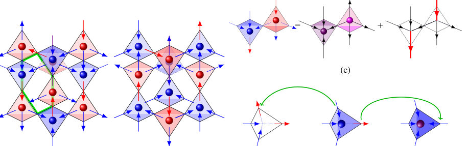
<figcaption class="paper-figure-caption"><b>Fig 1.</b> Figure 1: Fragmentation in spin ice and domain walls: The pyrochlore lattice is made of corner-sharing tetrahedra with four spin sublattices, one at each tetrahedron corner. The centres of all tetrahedra form a bipartite diamond lattice. (a) In a fragmented Coulomb phase, all tetrahedra are for example in a 3in-1out state on up tetrahedra (blue) and a 3out-1in state on down tetrahedra (red), defined as domain D. Flipping all spins around a closed loop of in-out-in-out... spins preserves the domain D (see green hexagon) (b) Flipping all spins in the system corresponds to domain ¯D. (c) The magnetic degrees of freedom of a 3in-1out state can be decomposed into two parts [19]: (i) a 4in,...</figcaption>
</figure>
<figure class="paper-figure-card">
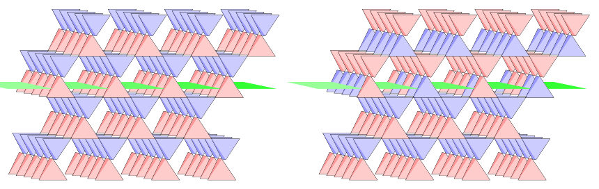
<figcaption class="paper-figure-caption"><b>Fig 2.</b> Figure 2: Domain walls in fragmented spin ice: (a) Starting from a fragmented spin configuration in domain D, we define a (green) plane at layer z = ndw, orthogonal to the [001] direction. (b) Flipping all spins above this plane transforms the upper part of the system from domain D to ¯D. The domain wall is one-tetrahedron layer thick, where 3out-1in and 3in-1out states co-exist; the former (red) belong to the lower domain D, while the latter (blue) belong to upper domain ¯D.</figcaption>
</figure>
<figure class="paper-figure-card">
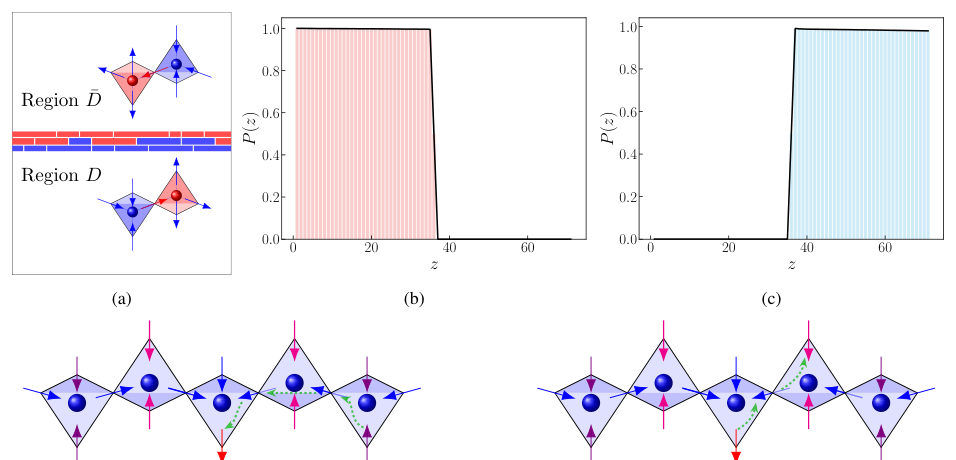
<figcaption class="paper-figure-caption"><b>Fig 3.</b> Figure 3: Diode effect: (a) Schematic representation of the system divided into domains D (bottom) and ¯D (top) via a domain wall at z = ndw = L/2. (b,c) Probability distribution function of the position of monopole carriers, as a function of z, during their diffusion in presence of a domain wall, for negative (b) and positive (c) charges. Simulation details are given in appendix A. (d,e) Microscopic mechanism of the diode effect. Starting from a given initial state at the domain wall, the green paths illustrates how (d) a negative charge is reflected, while (e) a positive charge can be transmitted. Coming from below, this interface is a W+ domain wall.</figcaption>
</figure>
<figure class="paper-figure-card">
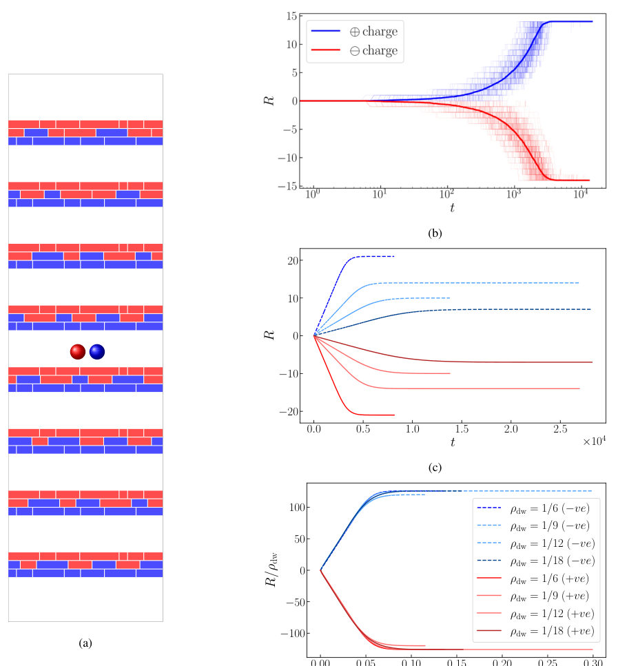
<figcaption class="paper-figure-caption"><b>Fig 4.</b> Figure 4: Capacitor: (a) Schematic representation of the system with p domain walls, ensuring that positive charges can only go up while negative ones can only go down. A single pair of charges is created in the central region, and its evolution is tracked under Monte Carlo dynamics. (b) Distribution of the position of positive (blue) and negative (red) charges along the z−axis, as a function of simulation time for p = 28 domain walls and L = 256. Solid lines represent the average over all independent runs, while thin light-coloured ones correspond to individual runs. The vertical axis denotes the domain index i = {−14, ..., 0, ..., +14}. The horizontal axis is shown on a logarithmic scale....</figcaption>
</figure>
<figure class="paper-figure-card">
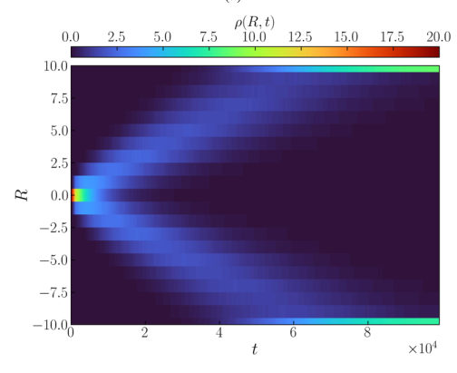
<figcaption class="paper-figure-caption"><b>Fig 5.</b> Figure 5: Capacitor with multiple charges: Initially, 10 pairs of charges (20 charges) are created in the central (zeroth) region. Annihilation between opposite charges is permitted but domain walls remain immobile. (a) Histogram of the number of surviving charges (Ns) at the end of simulations, for different densities of domain walls ρdw = 1</figcaption>
</figure>

**Summary.** This paper develops a theoretical framework showing how domain walls within magnetically fragmented spin ice can be engineered to function as functional components like diodes and capacitors for transporting magnetic monopoles. By leveraging the asymmetry inherent in these domain walls, the authors propose a novel method to control monopole current, opening avenues for designing quantum-like electronic devices based on frustrated magnetism.

**Why it may be interesting.** The work provides a concrete, device-oriented application (diodes/capacitors) to the complex physics of emergent quasi-particles in frustrated magnets, linking topological defects (domain walls) directly to electronic functionality. This bridges fundamental condensed matter theory with solid-state device concepts.

Detailed structure

**Main problem.** The primary goal is to design theoretical concepts for electronic/magnetic devices, specifically diodes and capacitors, that utilize the transport properties of magnetic monopoles in spin-ice materials.

**Main result.** The authors demonstrate that domain walls formed in magnetically fragmented spin ice act as an asymmetric filter (diode) for monopole current, and successive walls can accumulate charge to form a capacitor.

**Method.** The work combines theoretical proof of concept with extensive numerical simulations involving over a million spins to validate the predicted monopole transport mechanisms.

**Model / system.** The system is based on spin-ice materials exhibiting magnetic fragmentation, where quasi-particles behave as magnetic monopoles. The physics incorporates long-range antiferromagnetic order leading to domain walls separating different local orders (D and $\bar{D}$).

**Key observables.** Directional asymmetry of monopole current (diode effect), charge accumulation across domain walls (capacitor formation), and the resulting AC magnetic current ('magnetricity').

**Important parameters / regimes.** The existence and structure of domain walls, which are crucial for inducing directional bias; the material type (e.g., pyrochlore oxides).

**Assumptions / limitations.** It is assumed that the domain wall remains immobile during monopole transport simulations, allowing monopoles to pass through while establishing asymmetry.

**Figures summary.** Figures illustrate the magnetic fragmentation on the lattice, showing how flipping spins creates domain walls. Subsequent figures detail the diode effect by comparing probability distributions of positive vs. negative charges crossing the interface, and show the microscopic mechanism for charge reflection or transmission.

**Paper structure.** The paper establishes the physical context (monopoles in spin ice), introduces the concept of magnetic fragmentation leading to domain walls, theoretically proves that these walls act as diodes/capacitors, validates this with large-scale simulations, and concludes by discussing broader implications for other chiral or nematic spin liquids.

Abstract

Spin-ice materials are famous for their quasi-particle excitations that behave like magnetic monopoles. Magnetricity is the concept that these monopoles can conduct an AC magnetic current, in analogy with conduction electrons. While monopole dynamics has been intensively studied and is reasonably well understood, very little has been done to design devices in order to control magnetricity. Here we develop a theoretical proof of concept for the design of diodes and capacitors for the transport of monopoles. We use the property of systems with magnetic fragmentation, where spin-ice physics co-exists with long-range antiferromagnetic order. The key point is that magnetic order allows for the existence of domain walls. Under certain conditions of preparation, this domain wall is equivalent to an asymmetric filter for monopoles. In a given direction, positive charges can go through while negative ones are repelled; the opposite applies in the opposite direction. This asymmetry effectively functions like a diode for monopole current. Successive domain walls separate positive from negative charges with a vacuum of charge in between, producing a capacitor for monopoles. Once the capacitor is charged, it can in principle be used as a battery for monopoles. All microscopic mechanisms are explained and our proof of concept is validated by simulations of more than a million spins. Application to experiments are discussed for rare-earth pyrochlore oxides and artificial spin ice. Finally, we discuss in general terms how a domain wall in fragmented spin ice can also be seen as an emergent boundary separating two mirror "worlds" separated by time-reversal symmetry. Beyond spin ice, our work opens a promising direction of investigation for the dynamics of emergent quasi-particles crossing domain walls in chiral and nematic spin liquids, which also possess a broken symmetry.

[↑ back to top](#top)

### [Fault-tolerant quantum computing with a microwave Cat Bus](http://arxiv.org/abs/2608.01111v1)

**Authors:** Yanyan Chen, Xinyang Yu, Yueyang Min, Zhihao Zhang, Shuaifan Cao, Xiaopeng Li  
**Type:** theory · **Category:** quantum information and computing · **PDF:** <https://arxiv.org/pdf/2608.01111v1>  
**Analysis basis:** full PDF text, analyzed in chunks
**Topic relevance:** 🔥 `QC/QI experiment` **4/5** · `Tavis-Cummings & cavity-many-emitter` **3/5** · `correlated cavity matter` **3/5** · `analog quantum simulation` **1/5** · `methods for driven-dissipative` **1/5**

↔ Scroll figures horizontally

<figure class="paper-figure-card">
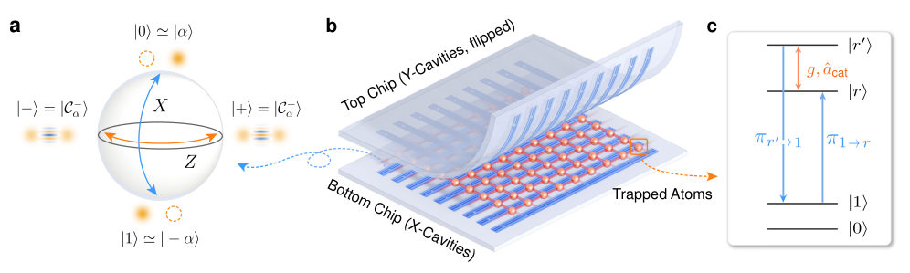
<figcaption class="paper-figure-caption"><b>Fig 1.</b> FIG. 1. A shuttling-free neutral-atom quantum processor mediated by a microwave Cat Bus. a, Bloch sphere representation of the stabilized cat-state manifold C = span{|α⟩, |−α⟩}, where logical Pauli operators are defined in the orthogonal X-basis C± α ∝(|α⟩± |−α⟩). b, Crossed-chip hardware configuration. A static 2D optical lattice traps neutral atoms between two chips containing orthogonal arrays of microwave resonators (top Y-cavities and bottom X-cavities). These resonators function as ‘Cat Buses’, mediating long-range entanglement and establishing a highly connected, shuttling-free processor geometry. c, Atomic energy level structure. Quantum information is stored in the computational...</figcaption>
</figure>
<figure class="paper-figure-card">
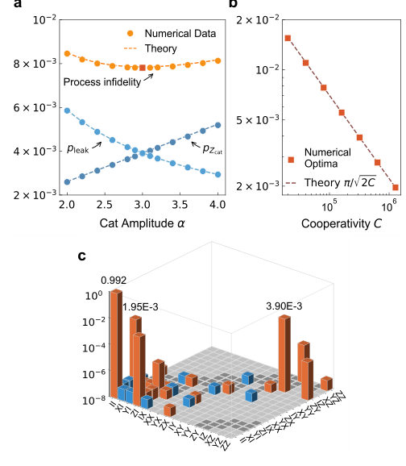
<figcaption class="paper-figure-caption"><b>Fig 2.</b> FIG. 2. Error characterization of the cat-atom CZ1</figcaption>
</figure>
<figure class="paper-figure-card">
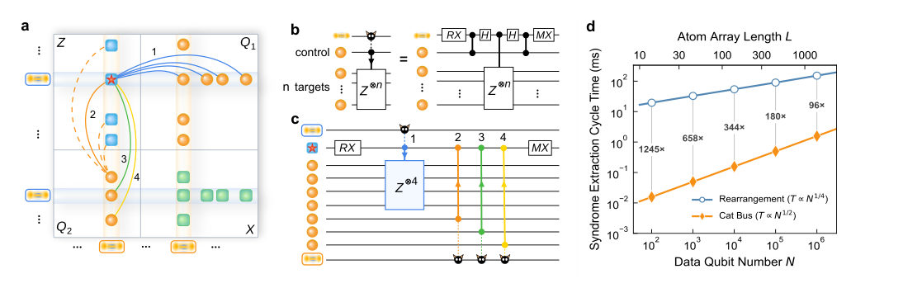
<figcaption class="paper-figure-caption"><b>Fig 3.</b> FIG. 3. Cat-bus-enabled syndrome extraction and cycle-time scaling for hypergraph product (HGP) codes. a, Physical layout of a hypergraph-product (HGP) code constructed from two identical (3, 4)-biregular classical Tanner graphs. Orange sites denote data qubits in the Q1 and Q2 blocks, whereas blue and green sites denote Z- and X-check ancillas, respectively. The marked weight-7 Z check couples to four data qubits in Q1 and three in Q2, and the edge labels 1–4 indicate the four interaction layers shown in c. b, Cat-mediated atom–atom CZn gate (left) and its decomposition into the native cat–atom entangling operations of our architecture (right). By design, the cat qubit disentangles from...</figcaption>
</figure>
<figure class="paper-figure-card">
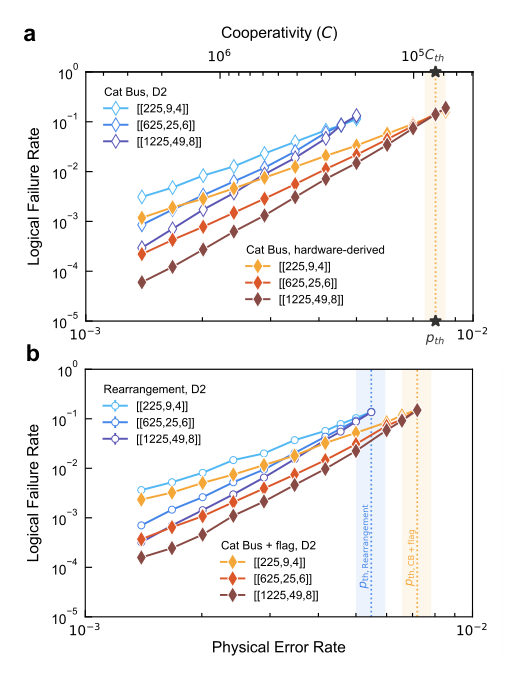
<figcaption class="paper-figure-caption"><b>Fig 4.</b> FIG. 4. Circuit-level logical performance of the Cat Bus architecture. a, Logical failure rate per syndrome- extraction cycle for the same Cat Bus circuits under the two-qubit depolarizing (D2) model and the hardware-derived (HD) Cat Bus error model. The upper axis converts the phys- ical error rate to cooperativity using p = π/ √</figcaption>
</figure>

**Summary.** The paper proposes a microwave 'Cat Bus' architecture to solve the latency bottleneck in scaling neutral-atom quantum computers. By using cavity modes stabilized as bosonic cat states, it achieves shuttling-free all-to-all connectivity and implements fast, high-fidelity one-to-many entangling gates. This results in significant improvements in syndrome extraction speed and error thresholds for fault-tolerant computation.

**Why it may be interesting.** This work directly addresses scalability in neutral-atom quantum computing by proposing a novel, high-speed interconnect (the Cat Bus) that bypasses slow physical atom movement, which is crucial for realizing large-scale fault tolerance.

Detailed structure

**Main problem.** The primary challenge addressed is overcoming the latency bottleneck associated with shuttling atoms in neutral-atom quantum computers to achieve scalable, fault-tolerant operation with all-to-all connectivity.

**Main result.** The proposed Cat Bus architecture enables a 180-fold reduction in syndrome-extraction cycle time compared to atom rearrangement methods and increases the error threshold from 0.55% to 0.72% under depolarizing noise.

**Method.** The authors develop hardware-aware scheduling schemes for syndrome extraction, benchmarking performance using Hypergraph-Product (HGP) codes against various noise models.

**Model / system.** The system is a hybrid platform coupling neutral atoms trapped in a static 2D optical lattice with superconducting microwave cavities forming a 'Cat Bus.' This bus mediates entanglement via bosonic cat states, enabling shuttling-free all-to-all connectivity.

**Key observables.** Syndrome-extraction cycle time (180x reduction), error threshold (0.72% to 0.80%), and logical failure rate (LFR).

**Important parameters / regimes.** Cat amplitude ($\alpha$), cooperativity ($C$), physical error rates ($p$), and system size ($N=10^5$ data qubits).

**Assumptions / limitations.** The analysis relies on the large-amplitude limit for cat states, assuming leading errors are dominated by cat Z errors and atomic leakage.

**Figures summary.** Figures illustrate the shuttling-free processor geometry (crossed-chip setup) and show error characterization of the native CZ gate, including infidelity vs. amplitude ($\alpha$) and optimized infidelity vs. cooperativity ($C$).

**Paper structure.** The paper first introduces the Cat Bus mechanism for all-to-all connectivity via a one-to-many CZ gate. It then derives the error channel and proposes hardware-aware scheduling for syndrome extraction using HGP codes, concluding with performance benchmarks comparing cycle times and error thresholds against existing methods.

Abstract

The scalability of fault-tolerant neutral-atom quantum computers is constrained by the latency of shuttling with optical tweezers, imposing a stringent trade-off between qubit overhead and circuit depth in quantum algorithm compilation. Here we propose a hardware-efficient, shuttling-free architecture that achieves all-to-all connectivity. Remote Rydberg atoms are resonantly entangled through a microwave ``Cat Bus''---a cavity mode autonomously stabilized in a bosonic cat state. The Cat Bus natively supports the highly parallelized execution of one-to-many $\mathrm{CZ}^n$ gates with exponentially suppressed crosstalk. We derive the resulting cat--atom error channel from the underlying interactions and physical constraints. For fault-tolerant operation, we develop a hardware-aware scheduling scheme that exploits the native cat--atom $\mathrm{CZ}^{n}$ gate to construct a syndrome-extraction circuit with minimum depth. We benchmark the architecture using hypergraph-product (HGP) codes and estimate a 180-fold reduction in syndrome-extraction cycle time at $N=10^5$ data qubits compared with an atom-rearrangement-based architecture. Under matched two-qubit depolarizing noise, the corresponding error threshold increases from $0.55\%$ to $0.72\%$. Under the hardware-derived error model, we obtain a threshold of $0.80\%$, corresponding to a threshold cooperativity of $C_{\mathrm{th}}=7.8 \times 10^4$, compatible with experimentally accessible parameters for Rydberg-coupled microwave-cavity systems. By avoiding atom transport, the Cat Bus provides a route towards high-speed, fault-tolerant neutral-atom quantum computation.

[↑ back to top](#top)

### [Maximal Rényi Relative Entropy for $α>2$](http://arxiv.org/abs/2608.01124v1)

**Authors:** Roberto Rubboli  
**Type:** theory · **Category:** quantum information and computing · **PDF:** <https://arxiv.org/pdf/2608.01124v1>  
**Analysis basis:** full PDF text, analyzed in chunks
**Topic relevance:** 🔥 `entanglement & information structure` **4/5** · `Keldysh / 2PI / non-Gaussian methods` **2/5** · `non-equilibrium dynamics` **2/5** · `correlated / nonlocal dissipation` **1/5** · `driven-dissipative phase transition` **1/5** · `methods for driven-dissipative` **1/5** · `non-equilibrium universality` **1/5**

↔ Scroll figures horizontally

<figure class="paper-figure-card">
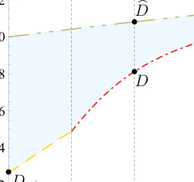
<figcaption class="paper-figure-caption"><b>Fig 1.</b> FIG. 1: Minimal and maximal relative entropies evaluated for the states</figcaption>
</figure>

**Summary.** This paper fully characterizes the maximal quantum extension of Rényi relative entropies for all parameters $\alpha$, resolving an outstanding problem for $\alpha > 2$. It proves that this maximal divergence is given by a specific form, $D_{\alpha, \alpha-1}(\rho\|\sigma)$. The result has a direct application in quantifying the coherence-generating power of quantum operations.

**Why it may be interesting.** This work provides fundamental mathematical tools—the complete characterization of quantum relative entropies—that underpin resource theories in quantum information, which are relevant to understanding coherence measures in open quantum systems dynamics.

Detailed structure

**Main problem.** The central problem is to characterize the maximal quantum extension of classical Rényi relative entropies for all parameters $\alpha$, specifically addressing the case where $\alpha > 2$. This completes a characterization previously limited to $\alpha \in [0, 2]$.

**Main result.** The paper proves that for $\alpha > 2$, the maximal quantum relative entropy is given by the $\alpha-z$ Rényi relative entropy with $z = \alpha-1$. This provides a complete characterization of both minimal and maximal extensions.

**Method.** The authors use techniques involving data-processing inequalities, variational characterizations (finding upper bounds), and establishing lower bounds through constructions involving quantum channels and state preparations to prove the required equalities/inequalities.

**Model / system.** The analysis is performed on general quantum states ($\rho, \sigma$) defined on a Hilbert space $A$, relating them to classical probability distributions ($p, q$). The framework involves studying various regularized relative entropy divergences (measured and prepared).

**Key observables.** Rényi relative entropies ($D_\alpha$), minimal/maximal quantum extensions of these entropies, and the coherence-generating power quantified by divergence inequalities.

**Important parameters / regimes.** The parameter $\alpha$ defining the Rényi entropy is crucial, with distinct results found for $\alpha \in [0, 1/2)$, $\alpha \geq 1/2$, $\alpha \in [0, 2]$, and finally $\alpha > 2$.

**Assumptions / limitations.** The analysis relies on the additivity of regularized quantities in the limit $n\to\infty$ and the faithfulness of the relative entropy for all relevant parameters.

**Figures summary.** Figure 1 illustrates that the maximal relative entropy switches to the form $D_{\alpha, \alpha-1}$ when $\alpha > 2$, confirming the theoretical result.

**Paper structure.** The paper systematically builds the characterization by first reviewing known results for minimal extensions. It then tackles the maximal extension, proving the necessary and sufficient conditions for state transformations (coherence generation) using established inequalities derived from data processing and convexity arguments across different $\alpha$ regimes.

Abstract

Quantum relative entropies play a fundamental role in quantum information theory. In the classical setting, Rényi relative entropies constitute, up to linear combinations, the most general class of relative entropies, naturally motivating the search for their minimal and maximal quantum extensions. The minimal extension is known to be the reverse sandwiched Rényi relative entropy for $α\in[0,1/2)$ and the sandwiched Rényi relative entropy for $α\geq 1/2$. In contrast, the maximal extension had previously been identified only for $α\in[0,2]$, where it is given by the geometric Rényi relative entropy. In this work, we complete this characterization by proving that for $α>2$, the maximal extension is given by the $α$-$z$ Rényi relative entropy with $z=α-1$. As an application, we determine when an energy-incoherent state can be transformed into an energy-coherent state by a Gibbs-preserving operation assisted by an uncorrelated catalyst, thereby fully characterizing the coherence-generating power of this class of operations in the catalytic setting.

[↑ back to top](#top)

### [Surface adsorbates suppress low-frequency noise for shallow nitrogen-vacancy centers](http://arxiv.org/abs/2608.01478v1)

**Authors:** Zhiyang Yuan, David A. Fehr, Kalliope Zervas, Sorawis Sangtawesin, Lila V. H. Rodgers, Patryk Gumann, Michael E. Flatte, Nathalie P. de Leon  
**Type:** experiment · **Category:** quantum information and computing · **PDF:** <https://arxiv.org/pdf/2608.01478v1>  
**Analysis basis:** full PDF text, analyzed in chunks
**Topic relevance:** 🔥 `QC/QI experiment` **4/5** · `spintronics-quantum-optics interface` **3/5** · `correlated / nonlocal dissipation` **1/5** · `methods for driven-dissipative` **1/5** · `quantum measurements` **1/5**

↔ Scroll figures horizontally

<figure class="paper-figure-card">
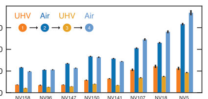
<figcaption class="paper-figure-caption"><b>Fig 1.</b> FIG. 1. (a) Schematic of a near-surface nitrogen-vacancy (NV) center in diamond. Under ambient (air) conditions, the diamond surface is covered by adsorbates such as water and hydrocarbons, whereas under ultra-high vacuum (UHV) conditions, these adsorbates are removed via low-temperature annealing, leaving a clean surface. (b) Hahn echo coherence time T2 measured for the same NV center in air (blue) and in UHV (orange), showing a 4.6× longer T2 in air. The bias magnetic field is 420 G and is aligned with the NV axis. (c) Ratio of T2 measured in air to that in UHV for eight NV centers, plotted as a function of NV depth. The depths are independently calibrated via proton NMR measurements in...</figcaption>
</figure>
<figure class="paper-figure-card">
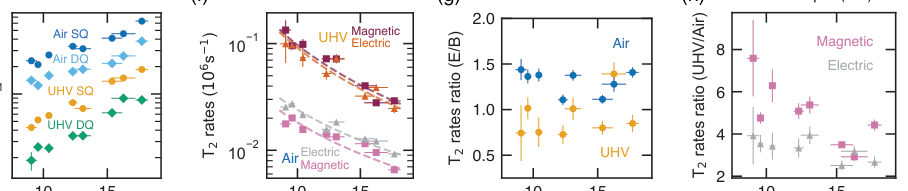
<figcaption class="paper-figure-caption"><b>Fig 2.</b> FIG. 2. (a) Energy level diagram of the ground-state electronic spin of the negatively charged NV center, indicating the two microwave-driven transitions. Magnetic field noise along the NV axis shifts the ms = +1 and ms = −1 levels in opposite direc- tions, whereas electric field noise shifts them in the same direction. (b) Pulse sequences for Hahn echo coherence measurements in the single-quantum (SQ) and double-quantum (DQ) bases. In the SQ protocol, the coherence of the superposition between ms = 0 and ms = −1 is probed. In the DQ protocol, a superposition between ms = +1 and ms = −1 is generated using two microwave tones, as the direct transition between these states is forbidden. Red...</figcaption>
</figure>
<figure class="paper-figure-card">
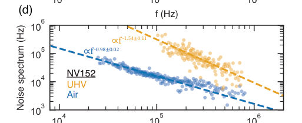
<figcaption class="paper-figure-caption"><b>Fig 3.</b> FIG. 3. (a) Dynamical decoupling measurements of NV co- herence using sequences with varying numbers of π pulses, performed on NV5 in air under an applied magnetic field of 420 G. (b) Extracted T2 coherence times as a function of the number of π pulses, demonstrating the extension of coherence with increasing π pulse numbers. Example data from two NV centers measured in air and in UHV are shown. Dashed lines are fits to power-law scaling, yielding exponents of 0.52±0.02 (air, NV5), 0.55±0.02 (air, NV141), 0.44±0.02 (UHV, NV5), and 0.36 ± 0.01 (UHV, NV141). (c,d) Noise spectra obtained via spectral decomposition of the dynamical decoupling data in air and in UHV for NV5 (c) and NV152 (d). In...</figcaption>
</figure>
<figure class="paper-figure-card">
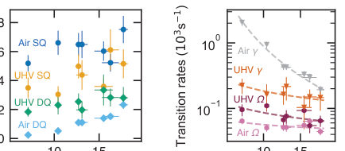
<figcaption class="paper-figure-caption"><b>Fig 4.</b> FIG. 4. (a) Energy level diagram of the NV center spin states, indicating SQ and DQ relaxation transitions, with cor- responding rates Ωand γ. (b) Pulse sequences for SQ and DQ relaxation measurements. In the SQ (DQ) protocol, the NV spin is initialized in the ms = 0 (ms = −1) state, and the re- laxation to the ms = −1 (ms = +1) state is measured. (c,d) Comparison of SQ T1 (c) and DQ T1 (d) in UHV and in air for the same NV center; data (points) are fitted to exponen- tial functions (lines). These measurements are performed at a magnetic field of 18 G. (e) SQ and DQ T1 as a function of NV depth in UHV and in air, showing shorter SQ T1 but longer DQ T1 in UHV. (f) Decomposed SQ (Ω) and DQ...</figcaption>
</figure>
<figure class="paper-figure-card">
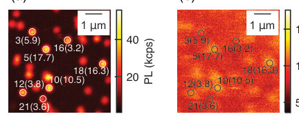
<figcaption class="paper-figure-caption"><b>Fig 5.</b> FIG. 5. (a) Confocal scan of a diamond sample acquired under ambient conditions. (b) Confocal scan of the same region acquired under UHV. NV centers are labeled by index, with the measured depth indicated in parentheses (in nm). The excitation laser power is 0.56 mW in air and 1.31 mW in UHV. Several shallow NV centers (e.g., NV3, NV16, and NV21) become undetectable in the UHV scan.</figcaption>
</figure>

**Summary.** The research investigates how surface adsorbates dictate the coherence of NV centers in diamond by comparing measurements in air versus UHV. While initial $T_2$ data suggests adsorbates are crucial, detailed analysis shows that low-frequency noise arises from surface charge compensated by these molecules. This work provides a nuanced understanding of environmental coupling essential for building reliable quantum sensors.

**Why it may be interesting.** This work provides critical experimental data on environmental coupling in solid-state qubits. The ability to spectroscopically distinguish between electric and magnetic noise sources using DQ measurements is highly valuable for designing robust quantum memories.

Detailed structure

**Main problem.** The primary goal is understanding how surface adsorbates limit the coherence time ($T_2$) of shallow Nitrogen-Vacancy (NV) centers in diamond, a key quantum sensor.

**Main result.** Removing adsorbates by moving to Ultra-High Vacuum (UHV) significantly reduces $T_2$ ($\sim 4	imes$), but analyzing different relaxation channels reveals that the low-frequency noise is linked to surface charge compensated by adsorbates in ambient air.

**Method.** The study uses advanced Electron Spin Resonance (ESR) techniques, including Hahn echo measurements ($T_2$) in both Single-Quantum (SQ) and Double-Quantum (DQ) bases, alongside longitudinal relaxation ($T_1$) measurements, comparing results between ambient air and UHV.

**Model / system.** The physical system is a shallow NV center embedded in diamond. The analysis involves separating decoherence contributions into electric and magnetic noise components by utilizing the distinct sensitivities of SQ and DQ spin measurements.

**Key observables.** $T_2$ coherence time, $T_1$ relaxation times, relative contributions of electric vs. magnetic noise, and noise spectral density power-law exponents ($\alpha$).

**Important parameters / regimes.** The comparison between ambient air and UHV conditions; the frequency regimes (e.g., $\sim 100 	ext{ MHz}$ for $T_1$); and the depth dependence of the noise components.

**Assumptions / limitations.** The observed changes in coherence are directly attributable to the presence or removal of surface adsorbates, which modify the local electric field environment.

**Figures summary.** Figures compare $T_2$ measurements (Air vs UHV) showing a large difference; they also detail the decomposition of decoherence rates into electric and magnetic parts across different depths and show $T_1$ comparisons between bases in both environments.

**Paper structure.** The paper systematically compares NV center coherence under ambient versus UHV conditions, uses SQ/DQ measurements to separate noise sources (E vs B), analyzes depth scaling of these noise components, and contrasts the findings from $T_2$ with those from $T_1$.

Abstract

Shallow nitrogen-vacancy (NV) centers in diamond are promising nanoscale quantum sensors, yet their coherence is strongly limited by surface-induced noise. Surface adsorbates are widely believed to be a major source of decoherence. Here, we test this assumption by characterizing shallow single NV centers under ultrahigh vacuum (UHV) conditions, where the diamond surface is kept free of adsorbates, and comparing their behavior to ambient conditions. Surprisingly, we observe a ~4x reduction in the Hahn echo coherence time T2 in UHV. By combining Hahn echo measurements in the single-quantum (SQ) and double-quantum (DQ) bases, we separate contributions from different noise sources and find that both electric and magnetic noise are enhanced in UHV. In contrast, T1 measurements reveal an increased DQ T1 in UHV, indicating suppressed electric field noise in the ~100 MHz frequency regime. These results point to a modification of the surface noise spectrum upon adsorbate removal, with different frequency regimes arising from distinct microscopic mechanisms. Specifically, we find that the low frequency noise is consistent with increased surface charge in UHV that can be compensated by surface adsorbates in ambient conditions. Our findings highlight a complex and previously underappreciated role of surface adsorbates in shaping the noise environment of shallow NV centers, with important implications for nanoscale quantum sensing.

[↑ back to top](#top)

### [Adaptive Spectroscopy of Fast Two-Level-System Dynamics in Superconducting Qubits](http://arxiv.org/abs/2608.02086v1)

**Authors:** Fabrizio Berritta, David Pahl, Lukas Pahl, William P. Banner, Gabriel Cutter, Jan A. Krzywda, Spencer Weeden, Shravan Patel, Paul Buttles, Stanislav Eilhart, Michael Gingras, Bethany M. Niedzielski, Robert McDermott, Mollie E. Schwartz, Kyle Serniak, Max Hays, Jeffrey A. Grover, William D. Oliver  
**Type:** experiment · **Category:** quantum information and computing · **PDF:** <https://arxiv.org/pdf/2608.02086v1>  
**Analysis basis:** full PDF text, analyzed in chunks
**Topic relevance:** 🔥 `QC/QI experiment` **4/5** · `quantum measurements` **2/5** · `correlated / nonlocal dissipation` **1/5** · `driven-dissipative phase transition` **1/5** · `methods for driven-dissipative` **1/5**

↔ Scroll figures horizontally

<figure class="paper-figure-card">
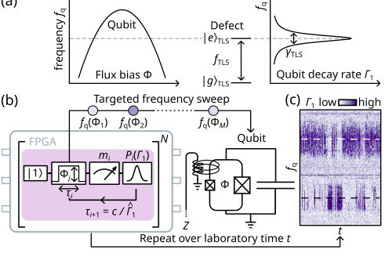
<figcaption class="paper-figure-caption"><b>Fig 1.</b> FIG. 1. Adaptive relaxation spectroscopy of TLS- induced loss. (a) Schematic of a flux-tunable qubit swept through resonance with a two-level-system defect. When fq ≈fTLS, the defect causes a peak in the qubit decay rate Γ1, whose spectral width γTLS is set by the defect linewidth and its coupling to the qubit. (b) Adaptive relaxation spec- troscopy schedule. At each of the M target qubit frequencies, the FPGA estimates the qubit decay rate Γ1 (purple box) over N adaptive probe cycles. During cycle i, the controller prepares the transmon in |1⟩and selects the wait time τi from the current Bayesian probability distribution Pi(Γ1). During τi the qubit is tuned (Φj) to the target frequency....</figcaption>
</figure>
<figure class="paper-figure-card">
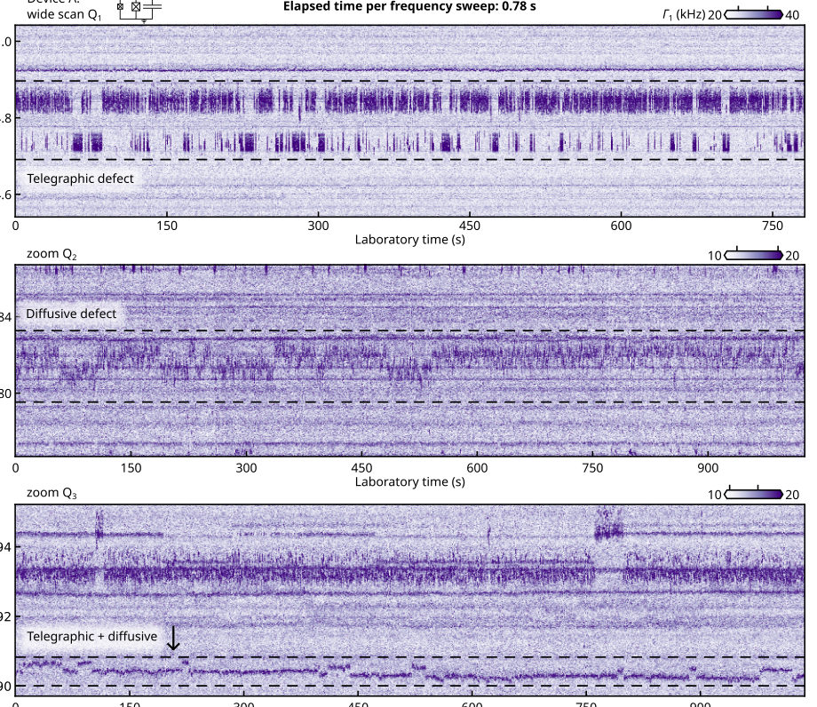
<figcaption class="paper-figure-caption"><b>Fig 2.</b> FIG. 2. Fast, time-resolved spectroscopy of TLS-induced relaxation. Adaptive estimates of the qubit decay rate Γ1 as a function of qubit frequency and laboratory time reveal spectrally and temporally fluctuating TLSs in Device A on timescales of seconds. The device comprises uncoupled flux-tunable transmon qubits. (a) Wide frequency scan of Q1, showing multiple decay-rate peaks, including a telegraphic defect with few-second switching highlighted by dashed lines. A Bayesian analysis based on a two-state hidden Markov model yields a characteristic switching correlation time τsw ≊2.2 s. Each column in this plot requires an average estimation time of only approximately 0.78 s spanning 500...</figcaption>
</figure>
<figure class="paper-figure-card">
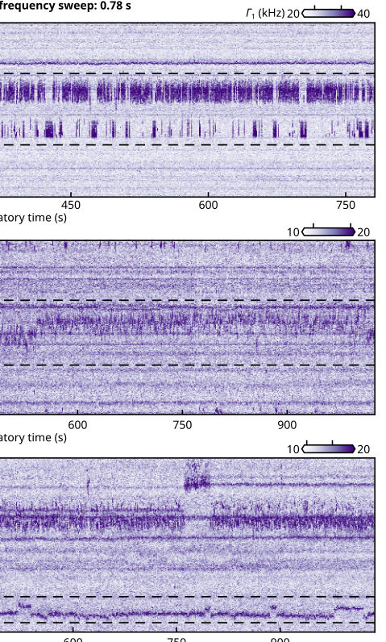
<figcaption class="paper-figure-caption"><b>Fig 3.</b> Figure 2(a) shows the controller estimates ˆΓ1 in Q1. The controller estimates Γ1 using N = 30 probe cy- cles [47] at each value of Φ, sweeping the flux so that fQ1 spans a 500 MHz detuning range from the upper degen- eracy point in 1 MHz steps. Each Γ1 estimate requires only about 1.5 ms of laboratory time. Every frequency sweep is interleaved with a Ramsey experiment at Φ = 0 to verify afterwards that the qubit frequency is calibrated within ±1 MHz.</figcaption>
</figure>
<figure class="paper-figure-card">
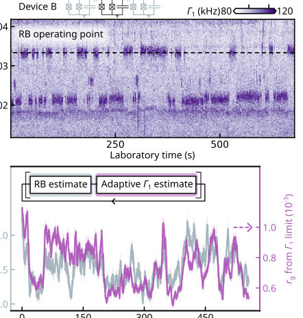
<figcaption class="paper-figure-caption"><b>Fig 4.</b> FIG. 3. TLS-correlated gate-error fluctuations. (a) Time-resolved TLS map near a telegraphic TLS in Device B, which has coupled flux-tunable transmon qubits. The marked operating point (dashed line) is used for the subse- quent randomized-benchmarking measurement in panel (b). (b) Randomized-benchmarking sequences are interleaved with adaptive Γ1 estimation at the same operating point. The measured gate infidelity (gray, left axis) qualitatively follows the infidelity expected from the independently estimated re- laxation rate (purple, right axis), supporting a correlation between defect-induced Γ1 fluctuations and gate-level errors. The zero-lag correlation is ρ0 = 0.618 at the on-TLS...</figcaption>
</figure>

**Summary.** The research presents an advanced spectroscopic technique to measure fast fluctuations caused by Two-Level System defects in superconducting qubits. By achieving sub-second temporal resolution, they quantified TLS switching rates and spectral diffusion coefficients previously inaccessible. This work fundamentally improves methods for characterizing decoherence sources, which is vital for scaling quantum processors.

**Why it may be interesting.** This work provides a crucial, high-bandwidth diagnostic tool for characterizing decoherence sources in superconducting qubits, directly impacting the error budget calculation necessary for fault-tolerant quantum computing.

Detailed structure

**Main problem.** Parasitic Two-Level System (TLS) defects are a major source of energy relaxation and temporal instability in superconducting quantum processors, making characterization difficult.

**Main result.** The authors revealed TLS dynamics on sub-second timescales via adaptive spectroscopy, quantifying telegraphic switching rates ($	au_{sw} \approx 2.2$ s) and spectral diffusion ($D \approx 0.93 	ext{ MHz}^2/	ext{s}$).

**Method.** They employed an FPGA-based controller to perform sub-second adaptive spectroscopy, combining Bayesian parameter estimation with randomized benchmarking.

**Model / system.** The study uses flux-tunable superconducting transmon qubits. The noise source is modeled as a two-state Markov process (telegraphic switching) coupled to the qubit decay rate ($\Gamma_1$).

**Key observables.** Qubit decay rate ($\Gamma_1$), telegraphic switching correlation time ($	au_{sw}$), spectral diffusivity ($D$), and gate infidelity ($\mathfrak{r}_g$).

**Important parameters / regimes.** Sub-second temporal resolution, characteristic timescales of seconds (vs. hours for conventional methods).

**Assumptions / limitations.** The analysis relies on modeling the TLS dynamics using a two-state hidden Markov model and assumes that measured fluctuations are dominated by these defects.

**Figures summary.** Figures show time-resolved maps ($\Gamma_1(f_q, t)$) exhibiting telegraphic switching; one figure correlates gate infidelity with estimated $\Gamma_1$ fluctuations across different TLS resonances.

**Paper structure.** The paper progresses from identifying the problem (TLS noise) to developing an advanced measurement technique (adaptive spectroscopy on FPGA), quantifying fast dynamics ($	au_{sw}, D$), and finally correlating these intrinsic defects with measurable operational errors (randomized benchmarking).

Abstract

Parasitic two-level-system (TLS) defects are a major source of energy relaxation and temporal instability in superconducting quantum processors. Our sub-second adaptive spectroscopy reveals telegraphic switching of TLSs with a characteristic timescale of a few seconds and spectral diffusion with diffusivity $D \approx 0.9~\mathrm{MHz}^2/\mathrm{s}$. These timescales are about $3 \times 10^2$ times faster than what is observed in conventional nonadaptive spectroscopy, which typically requires hours of measurement time. We resolve such fast dynamics on a field-programmable gate array (FPGA)-based controller that enables measurement of frequency- and time-resolved relaxations with sub-second temporal resolution in flux-tunable superconducting qubits. We observe similar defect dynamics across multiple qubits in independently fabricated devices measured in different laboratories. We correlate TLS-induced fluctuations with gate-level errors using randomized benchmarking. Our results reveal a previously inaccessible regime of frequency-resolved TLS dynamics and redefine the timescales relevant to TLS-aware characterization and calibration of superconducting quantum processors.

[↑ back to top](#top)

### [Dense Hamiltonians at the Parseval Limit: The Noncommutative BH Constant is Exponential and the Quantum FEI Conjecture is False](http://arxiv.org/abs/2608.01424v1)

**Authors:** Joseph Slote  
**Type:** theory · **Category:** other · **PDF:** <https://arxiv.org/pdf/2608.01424v1>  
**Analysis basis:** full PDF text, analyzed in chunks
**Topic relevance:** 🔥 `entanglement & information structure` **4/5** · `analog quantum simulation` **1/5** · `driven-dissipative phase transition` **1/5** · `methods for driven-dissipative` **1/5** · `non-equilibrium dynamics` **1/5** · `non-equilibrium universality` **1/5**

↔ Scroll figures horizontally

<figure class="paper-figure-card">
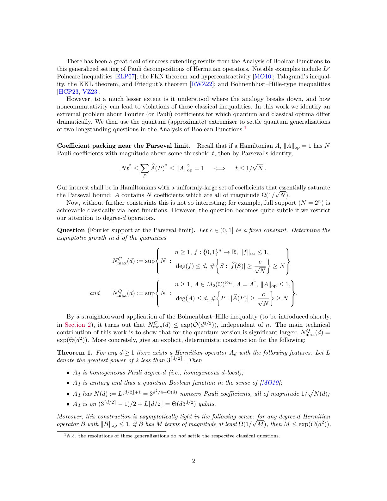
<figcaption class="paper-figure-caption"><b>Fig 1.</b> Low-resolution page preview, page 2</figcaption>
</figure>
<figure class="paper-figure-card">
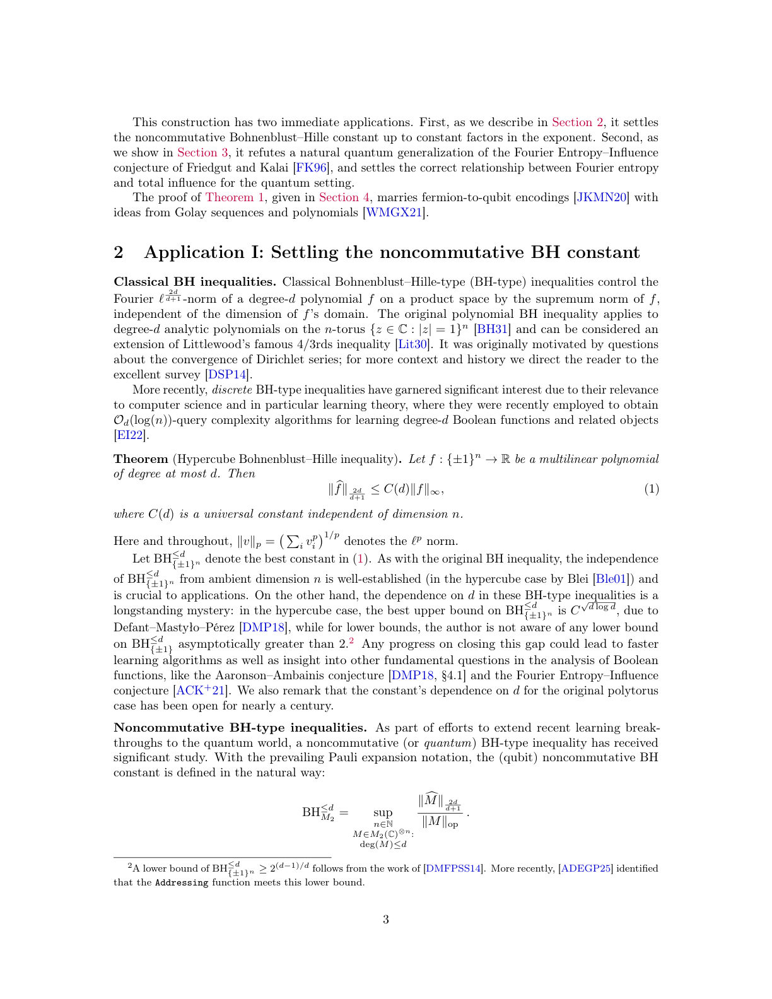
<figcaption class="paper-figure-caption"><b>Fig 2.</b> Low-resolution page preview, page 3</figcaption>
</figure>
<figure class="paper-figure-card">
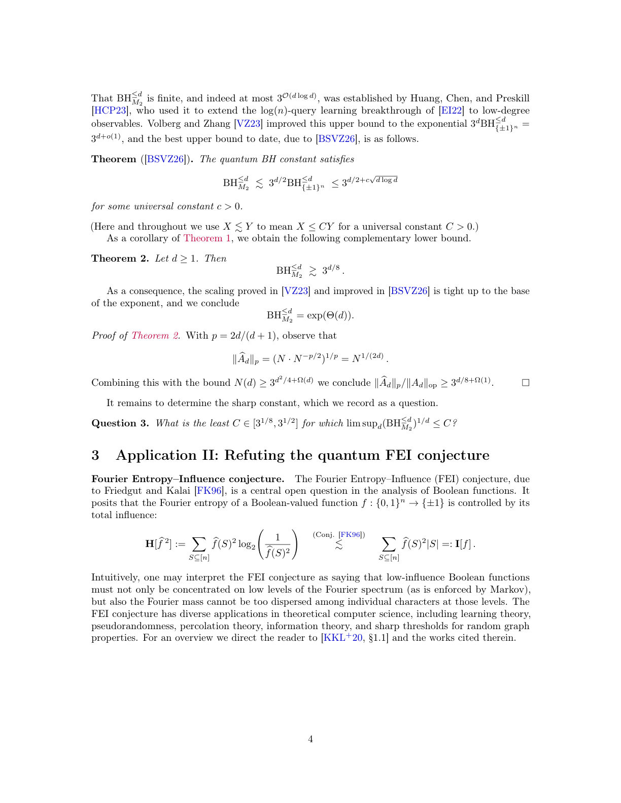
<figcaption class="paper-figure-caption"><b>Fig 3.</b> Low-resolution page preview, page 4</figcaption>
</figure>
<figure class="paper-figure-card">
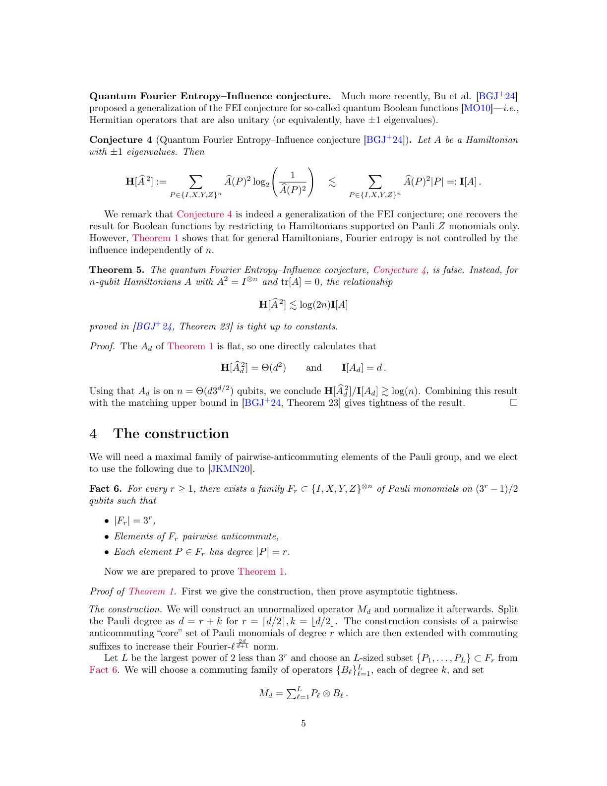
<figcaption class="paper-figure-caption"><b>Fig 4.</b> Low-resolution page preview, page 5</figcaption>
</figure>
<figure class="paper-figure-card">
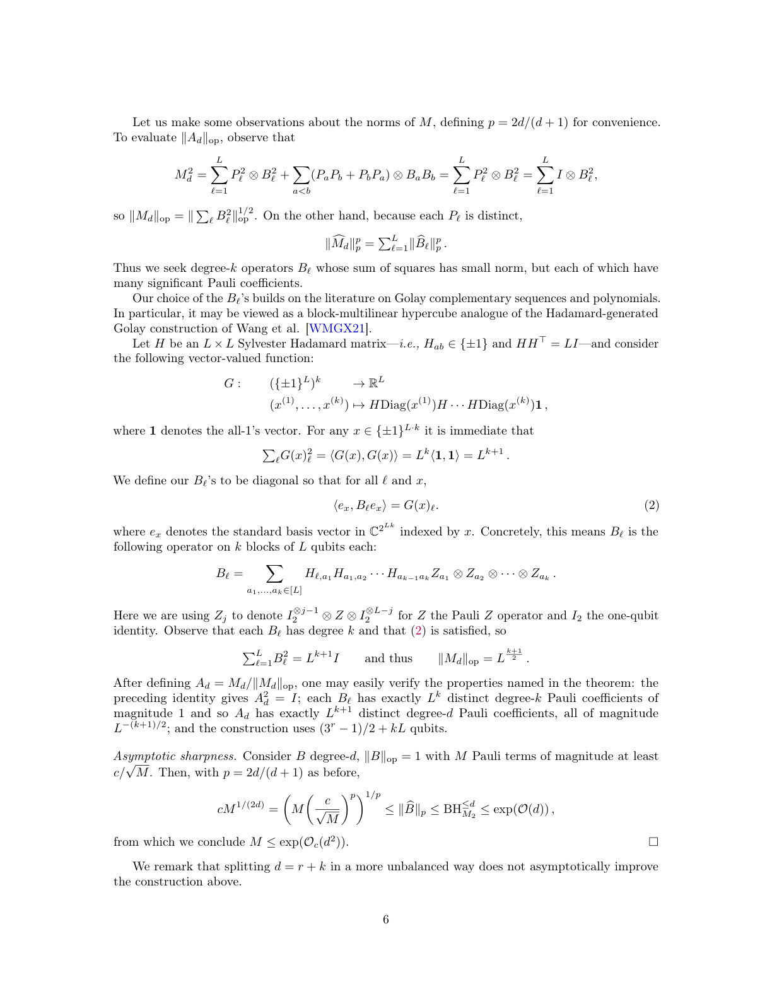
<figcaption class="paper-figure-caption"><b>Fig 5.</b> Low-resolution page preview, page 6</figcaption>
</figure>

**Summary.** This theoretical paper investigates extremal properties of operators on qubit systems by studying coefficient packing limits. It proves that the noncommutative Bohnenblust–Hille constant grows exponentially, setting a sharp boundary for such structures. Crucially, it refutes the Quantum Fourier Entropy-Influence conjecture using explicit Hamiltonian constructions.

**Why it may be interesting.** While highly mathematical, the techniques developed for analyzing operator coefficients and entanglement structure (via Pauli decomposition) are fundamental tools applicable to understanding resource theories in quantum information and characterizing complexity in many-body Hamiltonians.

Detailed structure

**Main problem.** The paper addresses extremal problems comparing quantum versus classical bounds on coefficient packing for operators, specifically settling the asymptotic growth of the noncommutative Bohnenblust–Hille (BH) constant and refuting a conjecture relating Quantum Fourier Entropy to Influence.

**Main result.** It establishes that the noncommutative BH constant grows exponentially ($\exp(\Theta(d))$), significantly faster than classical bounds. Furthermore, it proves that the Quantum Fourier Entropy-Influence conjecture is false for general Hamiltonians.

**Method.** The authors construct specific Hermitian operators (Hamiltonians) using Pauli decompositions and techniques related to Golay sequences to achieve these extremal constructions and derive lower bounds.

**Model / system.** The analysis focuses on Hermitian operators (Hamiltonians) acting on an $n$-qubit Hilbert space, characterized by their unique Pauli expansion. The core mathematical structure involves coefficient packing subject to Parseval's identity.

**Key observables.** Noncommutative Bohnenblust–Hille constant ($	ext{BH}_{M_2}(d)$), Quantum Fourier Entropy ($H[bA^2]$), and Influence ($I[A]$).

**Important parameters / regimes.** The degree $d$ of the Hamiltonian, the number of qubits $n$, and the magnitude of Pauli coefficients.

**Assumptions / limitations.** The analysis relies on Parseval's identity for the Pauli expansion and compares quantum results against known classical bounds (e.g., $	ext{BH}_{\{\pm 1\}}(d)$).

**Paper structure.** The paper proceeds by constructing specific Hamiltonians to test extremal limits, first tackling the BH constant growth and then using similar constructions to disprove the Quantum FEI conjecture.

Abstract

For each $d\geq 1$ we construct a norm-1 Hermitian operator whose Pauli expansion contains $N(d)=\exp(Ω(d^2))$ terms, each of degree $d$ and magnitude $1/\sqrt{N(d)}$ - the largest magnitude permitted by Parseval's identity. For comparison, if a bounded diagonal operator (or equivalently, a bounded degree-$d$ function on the Boolean cube) has $N(d)$ Pauli coefficients, all of magnitude $Ω(1/\sqrt{N(d)})$, then $N(d)\leq \exp(\widetilde{O}(d^{1.5}))$.   This construction implies the noncommutative Bohnenblust--Hille (BH) constant satisfies $\mathrm{BH}_{M_2}(d)\geq\exp(Ω(d))$. Together with the upper bounds proved in prior work, this settles the asymptotic growth of $\mathrm{BH}_{M_2}(d)$ as exponential. Our lower bound also asymptotically separates $\mathrm{BH}_{M_2}(d)$ from the (classical) hypercube BH constant $\mathrm{BH}_{\{\pm 1\}}(d)$, which in turn is known to be subexponential: $\mathrm{BH}_{\{\pm 1\}}(d)\leq C^{\sqrt{d \log d}}$.   Our Hamiltonians are also unitary and thus quantum Boolean functions in the sense of Montanaro and Osborne (2010). As such they refute the quantum Fourier Entropy-Influence conjecture of Bu et al. (2024), a natural generalization of the classical Fourier Entropy-Influence conjecture due to Friedgut and Kalai (1996).

[↑ back to top](#top)

### [Perfect Discrimination of Non-Orthogonal Quantum States via Adaptive Post-Measurement Queries](http://arxiv.org/abs/2608.01167v1)

**Authors:** Hanwool Lee, Teiko Heinosaari  
**Type:** theory · **Category:** quantum information and computing · **PDF:** <https://arxiv.org/pdf/2608.01167v1>  
**Analysis basis:** full PDF text, analyzed in chunks
**Topic relevance:** 🔥 `quantum measurements` **4/5** · `measurement-induced transitions` **3/5** · `driven-dissipative phase transition` **1/5** · `entanglement & information structure` **1/5**

↔ Scroll figures horizontally

<figure class="paper-figure-card">
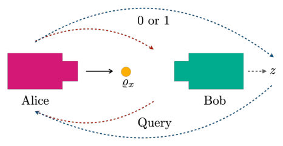
<figcaption class="paper-figure-caption"><b>Fig 1.</b> Figure 1. A scenario of query-assisted quantum state discrim- ination is illustrated. Bob sends a query to Alice, and Alice replies with a bit. The timing of the query and the classical information relative to the measurement significantly affects the optimal strategy and the achievable success probability. Both the query and the bit can be exchanged either before (red) or after (blue) the measurement. Interestingly, sending the query after the measurement can be more beneficial.</figcaption>
</figure>
<figure class="paper-figure-card">
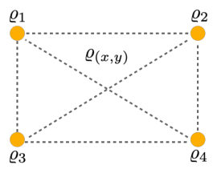
<figcaption class="paper-figure-caption"><b>Fig 2.</b> Figure 2. A graphical representation of the auxiliary ensemble for n = 4 is shown. The auxiliary ensemble consists of all pairwise mixtures of the original states.</figcaption>
</figure>

**Summary.** This paper explores the theoretical limit of distinguishing non-orthogonal quantum states when classical information is available. It demonstrates that allowing queries to depend on the measurement outcome (adaptive post-measurement) can yield a higher success probability than having prior knowledge, fundamentally challenging intuition about the value of timing in quantum measurements.

**Why it may be interesting.** This work directly addresses fundamental limits in quantum communication protocols by showing that measurement back-action can be leveraged optimally through adaptivity, which is crucial for understanding resource limitations in quantum sensing and cryptography.

Detailed structure

**Main problem.** The paper investigates whether allowing classical information to arrive adaptively after a quantum measurement can improve the perfect discrimination of non-orthogonal quantum states compared to having that information available beforehand.

**Main result.** Adaptive post-measurement queries can, in certain cases, allow for the perfect discrimination of pairwise non-orthogonal states, surpassing limits set by pre-measurement knowledge. The optimal strategy relates this problem to standard minimum-error discrimination on an auxiliary ensemble.

**Method.** The authors develop a theoretical framework comparing success probabilities ($P_{	ext{pre}}$ vs $P_{	ext{adapt\_post}}$) and derive the optimal measurement strategy by mapping the adaptive query scenario onto a known minimum-error discrimination problem for an auxiliary ensemble ($\mathcal{E}_{	ext{aux}}$).

**Model / system.** The model is quantum state discrimination involving a set of pairwise non-orthogonal pure quantum states ($\psi_x$) in a given Hilbert space dimension ($d$). Examples include trine and tetrahedron ensembles.

**Key observables.** Success probabilities for discrimination: $P_{	ext{pre}}$ (pre-measurement), $P_{	ext{post}}$ (outcome-independent post-measurement), and $P_{	ext{adapt\_post}}$ (adaptive post-measurement query).

**Important parameters / regimes.** The number of states ($n$), the dimension of the Hilbert space ($d$), and the overlap between states ($\langle \psi_i | \psi_j 
angle$).

**Assumptions / limitations.** The analysis often focuses on the case where only one bit of classical information is available, and it challenges the intuition that earlier classical information is always superior.

**Figures summary.** Figure 1 illustrates the timing difference between query types (red vs. blue). Figure 2 provides a graphical representation of the auxiliary ensemble for $n=4$.

**Paper structure.** The paper systematically compares three scenarios for classical information: pre-measurement, outcome-independent post-measurement, and adaptive post-measurement queries. It establishes a general method relating the optimal adaptive strategy to minimum-error discrimination on an auxiliary ensemble.

Abstract

A set of pairwise non-orthogonal quantum states cannot be perfectly discriminated, and this remains true even when one bit of classical partial information is available prior to the measurement. Contrary to the usual intuition that earlier information is at least as valuable as later information, we show that the same bit can be more useful when it arrives after the measurement. We present a framework for state discrimination in which the sender provides classical information in response to a request from the receiver, which we refer to as a query. In some cases, pairwise non-orthogonal states can be perfectly discriminated when the query is allowed to depend on the measurement outcome. We give a general method for finding the optimal strategy in this setting, which turns out to be the standard minimum-error discrimination problem for an auxiliary ensemble.

[↑ back to top](#top)

### [Revealing and reducing growth-induced interfacial disorder in preferentially aligned nitrogen-vacancy centers in diamond](http://arxiv.org/abs/2608.02350v1)

**Authors:** Cheng-I Ho, Marina Davydova, Patrik Straňák, Felix Hoffmann, Peter Knittel, Andrej Denisenko, Jörg Wrachtrup  
**Type:** experiment · **Category:** other · **PDF:** <https://arxiv.org/pdf/2608.02350v1>  
**Analysis basis:** full PDF text, analyzed in chunks
**Topic relevance:** 🔥 `QC/QI experiment` **4/5** · `spintronics-quantum-optics interface` **3/5** · `quantum measurements` **1/5** · `quantum optics experiment` **1/5**

↔ Scroll figures horizontally

<figure class="paper-figure-card">
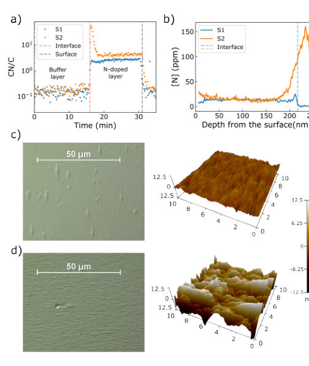
<figcaption class="paper-figure-caption"><b>Fig 1.</b> FIG. 1. Nitrogen profiles and surface characteriza- tion. a) OES of nitrogen-containing species in the plasma during growth. The gray dashed line marks the diamond sur- face, and the red dashed line marks the interface between the buffer layer and the N-doped layer, corresponding to the time at which nitrogen gas is introduced. b) ToF-SIMS profiles of the nitrogen concentrations in the two samples. The blue and orange dashed lines mark the interfaces for sample S1 and S2, respectively. c) and d) Optical differential-interference- contrast images (left) and three-dimensional atomic force mi- croscopy (AFM) images (right) of S1 and S2, respectively.</figcaption>
</figure>
<figure class="paper-figure-card">
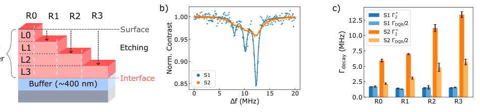
<figcaption class="paper-figure-caption"><b>Fig 2.</b> FIG. 2. Step-etching and spin-coherence properties. a) Schematic of the step-etching procedure. The measured regions are denoted R0, R1, R2, and R3 (separated by white dashed lines) and comprise different combinations of layers L0, L1, L2, and L3 (separated by gray dotted lines). The thicknesses of the NV layers in S1 and S2 are 217 nm and 252 nm, respectively, as determined by ToF-SIMS. The thicknesses of layers L0, L1, L2, and L3 are 110, 54, 24, and 29 nm for S1 and 110, 78, 24, and 40 nm for S2, respectively. b) Normalized ODMR spectra for S1 (blue) and S2 (orange). c) Decay rates Γ∗ 2 and ΓDQR</figcaption>
</figure>
<figure class="paper-figure-card">
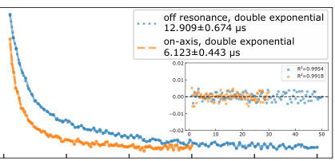
<figcaption class="paper-figure-caption"><b>Fig 3.</b> FIG. 3. DEER measurements and fitting. a) Experi- mental (black) and simulated (dark blue) DEER spectra. On- axis and off-axis P1 transitions are noted with red and green dotted lines, respectively. b) Decay curves of S2R0 when the additional π pulse is applied at off-resonance (blue) and to the on-axis transition (orange) frequencies. Exponential functions with stretching exponent of 1–2 and 1 are used for the fits of the off-resonance and on-axis curves, respectively. The fitting residuals are shown in the inset. c) Biexponential fitting of S2R0 and its fitting residuals.</figcaption>
</figure>
<figure class="paper-figure-card">
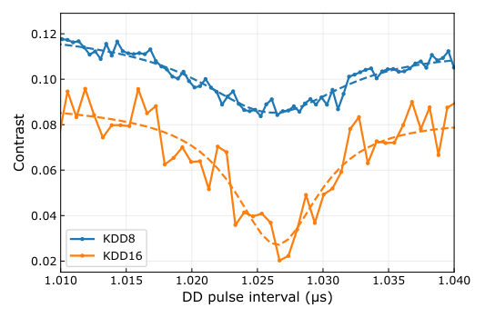
<figcaption class="paper-figure-caption"><b>Fig 4.</b> FIG. 5. 1H NMR signal detection with S1. NMR spectra measured using KDD sequences in R2 of S1. KDD8 (blue) and KDD16 (orange) denote 8 and 16 repetitions of the KDD sequence, respectively. The solid lines represent the experimental data, and the dotted lines are Lorentzian fits. The sensitivity is calculated from the two spectra.</figcaption>
</figure>
<figure class="paper-figure-card">
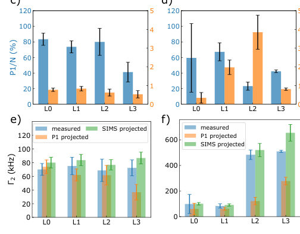
<figcaption class="paper-figure-caption"><b>Fig 5.</b> FIG. 4. Summary of NV centers, P1 centers, nitro- gen atoms, and spin-noise contributions in samples S1 and S2. a), b) Concentration profiles of NV centers (blue), P1 centers (green), and nitrogen atoms (orange). The corre- sponding concentration axes use the same colors. The gray dotted lines separate the different layers. c), d) Conversion ratios from nitrogen atoms to P1 centers (blue) and from P1 centers to NV centers (orange). e), f) Measured Γ2 (blue) and projected Γ2 values calculated from the P1-center concen- trations (orange) and nitrogen-atom concentrations (green). The projected Γ2 values are calculated using the model re- ported in Ref. [40]. Panels a), c), and e) correspond to...</figcaption>
</figure>

**Summary.** This research tackles the critical issue of growth-induced disorder in NV centers within diamond used for quantum sensing. By comparing pulsed versus smooth nitrogen doping methods, the authors demonstrate that controlled doping procedures are essential to minimize interfacial strain and defects. This leads to high-quality layers capable of achieving near-theoretical coherence limits and enabling sensitive NMR detection.

**Why it may be interesting.** This work is highly relevant as it directly addresses material science limitations (growth defects) that impede the realization of solid-state quantum sensors, bridging condensed matter physics with quantum optics/sensing.

Detailed structure

**Main problem.** The study investigates how growth-induced interfacial disorder, stemming from nitrogen doping procedures during CVD diamond growth, degrades the coherence of Nitrogen-Vacancy (NV) centers.

**Main result.** Smooth nitrogen delivery significantly suppresses this interfacial disorder, leading to NV spin-coherence properties approaching theoretical limits. The work also successfully demonstrated proton NMR detection using these high-quality layers.

**Method.** The researchers compared two nitrogen injection methods (pulsed vs. smooth) and used advanced characterization techniques like ODMR spectroscopy, ToF-SIMS depth profiling, and step-etching to map disorder gradients.

**Model / system.** The physical system is NV centers embedded in $^12	ext{C}$-enriched diamond thin films grown on (111) substrates. The analysis focuses on the impact of nitrogen concentration profiles and resulting lattice strain/defects on spin coherence.

**Key observables.** NV spin-coherence decay rates ($\Gamma^*_2$, $\Gamma_{	ext{DQR}}^2$), Nitrogen concentration profiles ([N]), P1 center concentrations ([P1]), and NMR signal detection capability.

**Important parameters / regimes.** Interfacial disorder magnitude, nitrogen doping procedure type (pulsed vs. smooth), effective depth ($d_{NV}$), and the resulting coherence time limit imposed by spin-bath noise.

**Assumptions / limitations.** The analysis often approximates the total decay rate as a sum of contributions ($\Gamma^*_2 \approx \Gamma_{	ext{DQR}}^2 + \Gamma_{	ext{strain}}$) and assumes certain background contributions are minor for simplification.

**Figures summary.** Figures illustrate OES/ToF-SIMS profiles comparing doping methods, ODMR spectra showing decay rates across etched layers (R0-R3), and final results summarizing concentration gradients and NMR detection signals.

**Paper structure.** The paper systematically compares two growth procedures using multiple characterization tools (OES, ToF-SIMS) to quantify disorder. It then uses step-etching and spin-coherence measurements across depth profiles to correlate doping history with quantum performance, culminating in a demonstration of high-sensitivity sensing.

Abstract

Nitrogen-vacancy (NV) centers in chemical-vapor-deposition (CVD) diamond can form preferentially oriented ensembles with high sensing performance and low densities of lattice defects. Thin films of this material are a cornerstone of various imaging modalities. However, nitrogen injection needed to produce such films can transiently drive growth out of equilibrium, generating interfacial strain and spin defects that degrade NV coherence. Here, we investigate this disorder in $^{12}\text{C}$-enriched, preferentially oriented NV layers grown on (111) diamond using two nitrogen-injection procedures, combined with nanometer-scale selective plasma etching and NV spin-coherence measurements. Pulsed nitrogen injection produces a pronounced nitrogen overshoot within a 60--80 nm interfacial region, generating excessive amounts of defects. By contrast, smooth nitrogen delivery through mass flow controllers substantially suppresses interfacial disorder, yielding coherence properties close to the theoretical limit imposed by spin-bath noise. A 50-nm NV layer is used to demonstrate proton nuclear magnetic resonance detection. This work reveals the role of interfacial disorder associated with the nitrogen-doping procedure and provides a route to growing high-quality, thin NV-doped layers for quantum-sensing applications.

[↑ back to top](#top)

### [Revisiting Thermal Scalability for Large-Scale Superconducting Quantum Systems](http://arxiv.org/abs/2608.00990v1)

**Authors:** Shaswot Shresthamali, Ilkwon Byun, Teruo Tanimoto, Yoshinori Uzawa, Kunihiro Inomata, Tsuyoshi Yamamoto, Koji Inoue  
**Type:** theory · **Category:** quantum information and computing · **PDF:** <https://arxiv.org/pdf/2608.00990v1>  
**Analysis basis:** full PDF text, analyzed in chunks
**Topic relevance:** 🔥 `QC/QI experiment` **4/5** · `analog quantum simulation` **1/5** · `correlated / nonlocal dissipation` **1/5** · `driven-dissipative phase transition` **1/5** · `methods for driven-dissipative` **1/5** · `non-equilibrium dynamics` **1/5**

↔ Scroll figures horizontally

<figure class="paper-figure-card">
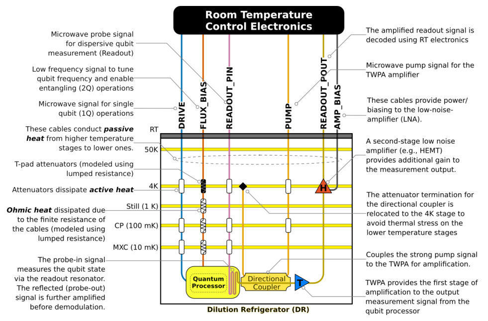
<figcaption class="paper-figure-caption"><b>Fig 1.</b> FIGURE 1. Simplified schematic of the cryogenic system in [8] consisting of the dilution refrigerator that houses the quantum processor and the supporting infrastructure. The major heat loads arise from heat conduction via the metallic cables (passive heat loads), heat dissipation through attenuators and amplifiers (active heat loads), and Joule heating (ohmic heat loads). Components with negligible heat footprint (e.g., circulators, filters, isolators) are not shown for simplicity.</figcaption>
</figure>
<figure class="paper-figure-card">
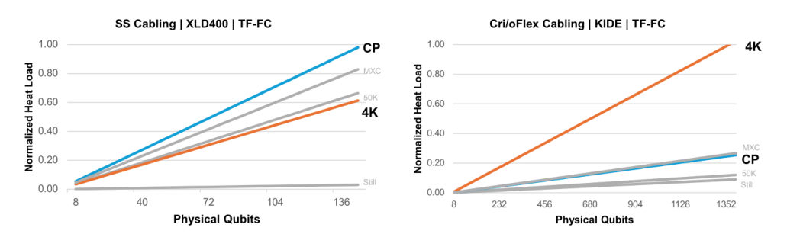
<figcaption class="paper-figure-caption"><b>Fig 2.</b> FIGURE 2. Normalized heat loads at different temperature stages under two wiring assumptions for the system in [8]. (left) Reproduced scalability trend for the stainless-steel wiring architecture considered in [8]. In this case, the millikelvin stages dominate because stainless-steel drive and flux-bias cables introduce large passive and ohmic heat loads. (right) Hypothetical replacement of stainless-steel cables with Cri/oFlex wiring [12] and upgrading the fridge to KIDE. Higher-capacity refrigeration and lower-PHL cabling increase the qubit count, but more importantly they change the scaling trend and shift the dominant bottleneck toward the 4 K stage. This shift motivates explicit...</figcaption>
</figure>
<figure class="paper-figure-card">
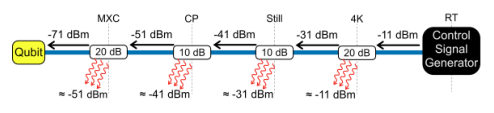
<figcaption class="paper-figure-caption"><b>Fig 3.</b> FIGURE 3. Active heat dissipation in attenuators along the DRIVE line during a single-qubit (1Q) operation. Each attenuator is assumed to dissipate all incident power as heat (pessimistic estimation). The DRIVE line has a total attenuation of 60 dB, distributed across multiple temperature stages. A 1Q operation requires −71 dBm of average power delivered to the qubit at the MXC [8]. The input power at each attenuator at different temperature stages along the drive line is obtained by propagating this value upstream from the MXC stage. As a result, the control signals generated at RT require an average power of −11 dBm.</figcaption>
</figure>
<figure class="paper-figure-card">
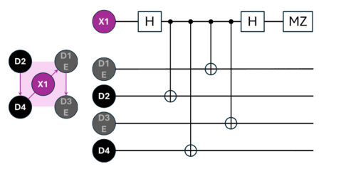
<figcaption class="paper-figure-caption"><b>Fig 4.</b> FIGURE 4. ESM operations for an X-ancilla qubit (left) and a Z-ancilla qubit (right). H: Hadamard; MZ: Z-basis measurement</figcaption>
</figure>
<figure class="paper-figure-card">
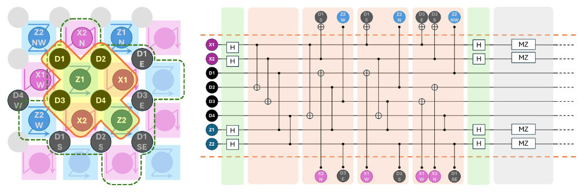
<figcaption class="paper-figure-caption"><b>Fig 5.</b> FIGURE 5. A rotated surface-code patch of distance 3 is enclosed in dashed green boundary (left). It consists of a tileable 8-qubit unit cell outlined in orange with yellow fill. ESM circuit (right) using both CNOT and CZ gates for the 8-qubit unit cell. All gates within the colored shaded regions are performed simultaneously (green: Hadamard gates, orange: entangling CX/CZ gates, gray: measurement operations).</figcaption>
</figure>

**Summary.** This paper revisits the thermal limits of superconducting quantum computers by developing an advanced heat estimation model. It demonstrates that previously overlooked heat sources, particularly from readout amplifiers and wiring resistance, create a dominant thermal bottleneck. The findings are critical for designing viable, large-scale cryogenic quantum hardware.

**Why it may be interesting.** This work directly addresses hardware limitations in scaling quantum computation, which is crucial for any theoretical physicist working on open quantum systems or building complex quantum architectures.

Detailed structure

**Main problem.** The readout amplification chain imposes a critical thermal scalability bottleneck that limits the size of superconducting quantum processors.

**Main result.** Amplifier-associated heat emerges as the dominant thermal bottleneck in modern large-scale cryogenic systems, requiring new modeling approaches to predict true qubit capacity.

**Method.** The authors developed an improved system-level thermal estimation model that fully accounts for active dissipation, passive conduction, and Joule heating across multiple cryogenic stages.

**Model / system.** The study models superconducting quantum processors housed in a dilution refrigerator (DR) with distinct temperature stages ($	ext{RT}$ down to $\sim 10	ext{ mK}$). The model calculates the total normalized heat load by summing contributions from cables, attenuators, and amplifiers.

**Key observables.** Total Normalized Heat Load ($	ext{NHL}_{	ext{THL},s}$) at each cryogenic stage; maximum supported physical qubit capacity.

**Important parameters / regimes.** Active dissipation, passive conduction coefficients, Joule heating resistance/currents, target scale (e.g., 10k qubits).

**Assumptions / limitations.** Previous models are criticized for omitting or underestimating the combined heat load from the readout amplifier chain, leading to overestimation of scalability.

**Figures summary.** Figure 2 compares two scalability trends: one dominated by passive heat load (SS wiring) and a second showing bottleneck migration towards the $4	ext{ K}$ stage with modern components.

**Paper structure.** The paper introduces the thermal bottleneck problem, details the improved unified modeling framework incorporating all major heat sources, analyzes cross-technology trade-offs, and concludes by evaluating pathways toward large single-fridge systems.

Abstract

The readout amplification chain imposes a critical thermal scalability bottleneck in large-scale superconducting quantum systems. This happens through three mechanisms: amplifier dissipation, passive conduction through bias wiring and Joule heating within that same wiring. These terms are absent or only partially represented in several prior system-level thermal-scalability models, leading to bottleneck misidentification and scalability overestimation. In this work, we improve upon previous system-level heat estimation models by fully accounting for the major heat sources in modern cryogenic quantum systems including the active dissipation, passive conduction, and Joule heating in the readout amplifier module. Our analysis demonstrates that amplifier-associated heat emerges as the dominant thermal bottleneck that fundamentally alters the thermal landscape of modern large-scale cryogenic systems. We explore various technology options and their tradeoffs to identify configurations that reduce this critical heat load and improve scalability. Finally, we evaluate forward-looking system configurations, including larger refrigeration platforms and optical approaches, and analyze forward-looking pathways toward single-fridge 10k-qubit cryogenic systems.

[↑ back to top](#top)

### [Emergent modular Luttinger liquid from spin-partitioned entanglement in the one-dimensional Hubbard model](http://arxiv.org/abs/2608.01817v1)

**Authors:** Ádám Bácsi, Catalin Pascu Moca, Balázs Dóra  
**Type:** theory · **Category:** strongly correlated electrons · **PDF:** <https://arxiv.org/pdf/2608.01817v1>  
**Analysis basis:** full PDF text, analyzed in chunks
**Topic relevance:** 🔥 `entanglement & information structure` **4/5** · `analog quantum simulation` **2/5** · `exotic spin models in light-matter` **1/5** · `non-equilibrium dynamics` **1/5**

↔ Scroll figures horizontally

<figure class="paper-figure-card">
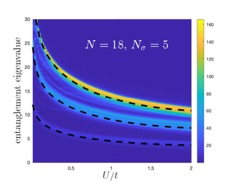
<figcaption class="paper-figure-caption"><b>Fig 1.</b> FIG. 2. Density plot of the evolution of the entanglement density of states, constructed from the first 400 largest eigen- values of the reduced density matrix out of the possible 18 5  , revealing the structures in the entanglement eigenvalues. The dashed lines denote the bosonization results from Eq. (8). The contribution of even larger eigenvalues can safely be neglected to the spin entanglement entropy.</figcaption>
</figure>
<figure class="paper-figure-card">
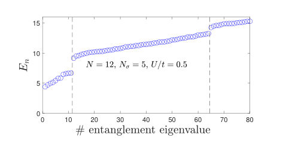
<figcaption class="paper-figure-caption"><b>Fig 2.</b> FIG. 1. Representative visualization of the first 80 eigenvalues of the entanglement Hamiltonian, displaying the branching property of the spectrum. In particular, the first 11 and second 53 eigenvalues make the 1st and 2nd branch, respectively, separated by black dashed lines.</figcaption>
</figure>
<figure class="paper-figure-card">
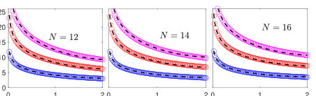
<figcaption class="paper-figure-caption"><b>Fig 3.</b> FIG. 3. The average entanglement eigenvalue of the first 3 lowest branches are plotted for N↑= N↓= 5 particles with increasing system size. The black dashed lines denote the bosonization results from Eq. (8), predicting β ∼ln(t/U) in the weak coupling limit.</figcaption>
</figure>
<figure class="paper-figure-card">
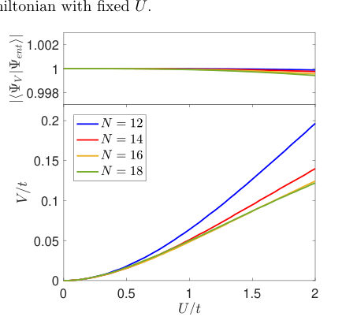
<figcaption class="paper-figure-caption"><b>Fig 4.</b> FIG. 4. The overlap of the ground state LL wavefunction of Eq. (15), |ΨV ⟩, and the ground state wavefunction of the spin entanglement Hamiltonian of the Hubbard model, |Ψent⟩, is shown from many-body ED in the upper panel, for the V −U combinations in the lower panel. Here, N↑= N↓= 5, and this is also the number of particles in the t −V model. The two wavefunctions for several system sizes are practically equivalent to each other.</figcaption>
</figure>

**Summary.** This work analyzes the entanglement structure of the 1D repulsive Hubbard model by examining the reduced density matrix after partitioning one spin species. The authors find that this leads to a modular Luttinger liquid whose correlations are governed by a single effective parameter, $\sqrt{K_c K_s}$. This demonstrates a universal principle: even when tracing out degrees of freedom, the entanglement structure retains critical algebraic correlations characteristic of 1D quantum liquids.

**Why it may be interesting.** The concept of an 'entanglement Hamiltonian' provides a powerful tool to characterize entanglement in interacting quantum systems. Finding that this modular structure is robust and yields a simple geometric mean for the correlation parameter offers deep insights into how entanglement encodes underlying symmetries, which is relevant for understanding exotic phases in correlated materials.

Detailed structure

**Main problem.** The study aims to determine the universal low-energy entanglement Hamiltonian associated with a spin partition in an interacting one-dimensional metal, specifically investigating its structure when tracing out one spin species from the Hubbard model.

**Main result.** Tracing out one spin species yields a modular Luttinger liquid whose effective correlation is governed by a single parameter equal to the geometric mean of the charge and spin Luttinger parameters. This reveals a universal modular structure in 1D fermionic systems.

**Method.** The authors combine bosonization techniques with exact diagonalization (ED) methods to calculate the reduced density matrix for one spin species, leading to the definition and analysis of an entanglement Hamiltonian.

**Model / system.** The primary system is the one-dimensional repulsive Hubbard model. The analysis proceeds by mapping the interacting fermionic problem onto bosonic fields via bosonization, allowing for the calculation of entanglement properties.

**Key observables.** Entanglement entropy, entanglement spectrum (eigenvalues of $H_{	ext{ent}}$), and Luttinger parameters ($K_c, K_s$).

**Important parameters / regimes.** The effective single LL parameter $\sqrt{K_c K_s}$, the repulsive interaction strength $U$, and the hopping amplitude $t$.

**Assumptions / limitations.** The analysis relies on bosonization techniques and assumes that the reduced density matrix is Gaussian-structured, which is valid for the quadratic nature of the bosonized theory.

**Figures summary.** Figures visualize the universal branching hierarchy in the entanglement spectrum (Fig. 1) and show the evolution of the entanglement density of states compared to bosonization predictions (Fig. 2).

**Paper structure.** The paper first establishes the theoretical framework by defining the reduced density matrix for one spin species ($
ho_\uparrow$) and deriving the associated entanglement Hamiltonian ($H_{	ext{mod}}$). It then applies this formalism to the Hubbard model, using bosonization results to predict universal properties like the effective Luttinger parameter and the branching structure of the spectrum.

Abstract

We study the spin-partitioned entanglement Hamiltonian of the one-dimensional repulsive Hubbard model. By combining bosonization with exact diagonalization, we show that tracing out one spin species produces a modular Luttinger liquid, whose properties fundamentally differ from those of the physical system. While the modular spectrum is fully dispersionless and possesses a momentum-independent entanglement gap, its eigenstates exhibit algebraic correlations governed by a single effective Luttinger parameter equal to the geometric mean of the charge and spin Luttinger parameters. The resulting entanglement spectrum displays a universal branching hierarchy in excellent agreement with exact diagonalization. We further demonstrate that the modular ground state is nearly identical to that of the spinless Luttinger liquid. These results uncover a universal modular structure in interacting one-dimensional fermionic systems.

[↑ back to top](#top)

### [Oraqle: An Empirical Analysis of Qubit Readout and Discriminators in Quantum Error Correction](http://arxiv.org/abs/2608.01939v1)

**Authors:** Emmanouil Giortamis, Aleksandra Świerkowska, Sandra Stankovic, Felix Gust, Benjamin Lienhard, Pramod Bhatotia  
**Type:** both · **Category:** quantum information and computing · **PDF:** <https://arxiv.org/pdf/2608.01939v1>  
**Analysis basis:** full PDF text, analyzed in chunks
**Topic relevance:** 🔥 `QC/QI experiment` **4/5** · `quantum measurements` **2/5** · `methods for driven-dissipative` **1/5**

↔ Scroll figures horizontally

<figure class="paper-figure-card">
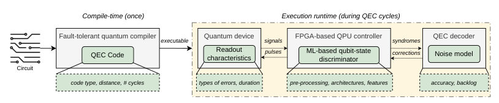
<figcaption class="paper-figure-caption"><b>Fig 1.</b> Fig. 1. Lifetime of a QEC-protected application. Our framework-based analysis covers the elements in green.</figcaption>
</figure>
<figure class="paper-figure-card">
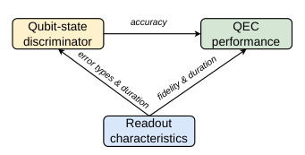
<figcaption class="paper-figure-caption"><b>Fig 2.</b> Fig. 2. Readout characteristics drive both the qubit-state discriminator and QEC per- formance, and the discriminator further shapes QEC performance.</figcaption>
</figure>
<figure class="paper-figure-card">
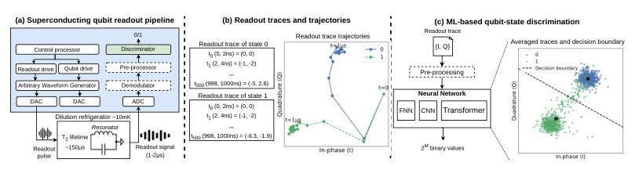
<figcaption class="paper-figure-caption"><b>Fig 3.</b> Fig. 3. Qubit-state readout pipeline (§ 2). (a) The signal is processed before a discriminator produces a binary outcome. (b) The trace forms a 2D IQ trajectory over the measurement window. (c) An ML-based discriminator clusters the trajectories and learns a decision boundary to output the qubit state.</figcaption>
</figure>
<figure class="paper-figure-card">
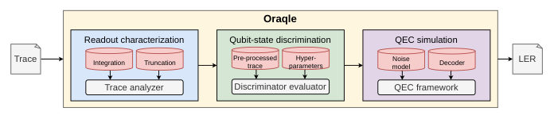
<figcaption class="paper-figure-caption"><b>Fig 4.</b> Fig. 4. Oraqle overview. Oraqle supports diverse trace analysis passes, discriminators, and QEC frameworks.</figcaption>
</figure>
<figure class="paper-figure-card">
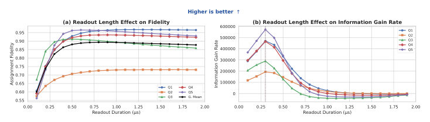
<figcaption class="paper-figure-caption"><b>Fig 5.</b> Fig. 6. Measurement duration effect on assignment fidelity (§ 4.1). (a) Geometric-mean baseline fidelity rises until 𝑡≈0.5𝜇s, then plateaus (Q1, Q2, Q4) or declines (Q3, Q5). (b) The information-gain rate peaks at 𝑡≈0.3𝜇s and turns negative beyond 𝑡≈1𝜇s.</figcaption>
</figure>

**Summary.** This paper presents Oraqle, a comprehensive framework to benchmark the entire readout-to-QEC pipeline for superconducting qubits. It systematically analyzes how measurement duration, machine learning discriminators, and QEC codes interact to determine the final logical error rate. The key takeaway is that hardware optimization should focus on reducing readout latency rather than over-engineering the classical decoding model.

**Why it may be interesting.** It provides concrete, quantitative guidelines for optimizing the physical implementation layer (readout electronics and ML) that directly impacts the theoretical performance limits of fault-tolerant quantum computation.

Detailed structure

**Main problem.** The performance of Quantum Error Correction (QEC) is critically dependent on the readout process, but this co-dependence between readout characteristics, ML discriminators, and QEC performance has not been deeply studied.

**Main result.** The study reveals that measurement duration can be significantly reduced with minimal logical error rate penalty, and discriminator complexity is largely irrelevant as residual errors are dominated by device physics.

**Method.** The authors introduce Oraqle, an end-to-end benchmarking framework that systematically evaluates the entire pipeline from raw qubit readout traces through ML discrimination to final QEC performance metrics.

**Model / system.** The work focuses on superconducting qubits operating in the dispersive regime. The system involves a full cycle: ancilla readout $
ightarrow$ ML decoding $
ightarrow$ error correction, tested across multiple QEC codes (e.g., Surface, Color).

**Key observables.** Logical Error Rate (LER), Readout Fidelity ($F_{5Q}$), and the raw IQ trace data used for classification.

**Important parameters / regimes.** Measurement duration ($\mu$s scale), discriminator complexity/model size, and the specific QEC code structure.

**Assumptions / limitations.** The analysis compares current hardware limitations with projected device capabilities across various noise models (e.g., decoherence-only vs. full flip error).

**Figures summary.** Figures compare LER versus measurement duration under different noise assumptions, demonstrating that readout flip errors are the primary driver of performance degradation at short timescales.

**Paper structure.** The paper establishes the QEC cycle and identifies readout as a bottleneck; it then introduces Oraqle to benchmark the entire stack across multiple codes and hardware regimes, culminating in three key findings regarding measurement time, discriminator role, and maturity dependence.

Abstract

Quantum error correction (QEC) is the most promising route toward fault-tolerant quantum computing and, thus, useful quantum computers. QEC operates as a continuous measure-decode-correct cycle: ancilla qubits are read out, a decoder infers errors from the resulting syndromes, and corrections are applied before the next round begins. Within this loop, readout occupies a uniquely critical role, as it is the sole source of ground truth available to the decoder. Yet readout is also the slowest and most error-prone operation in the stack, with characteristics that vary across qubits and drift over time; This complexity propagates directly to the classical control hardware, and in particular to the FPGA-hosted machine-learning (ML) discriminator that must classify each analog signal into a binary syndrome outcome. Despite this central role, QEC performance has not yet been studied in depth from the perspective of readout characteristics, readout length, and their co-design with an ML discriminator.   We introduce Oraqle, an end-to-end benchmarking framework that evaluates qubit-state readout and its impact on QEC performance across real experimentally extracted qubit-state-readout datasets, state-of-the-art ML discriminators, multiple QEC codes, and hardware regimes spanning current to projected devices. Our study reveals three asymmetric findings: The measurement duration can be significantly reduced with nearly no penalty to the logical error rate; The discriminator complexity barely affects the QEC performance, as residual errors are written into device physics rather than the model; and the impact of qubit-state readout on the logical error rate is conditional on where the hardware sits in the QEC landscape, a window that widens as devices mature.

[↑ back to top](#top)

### [Toward Compact Fiber In-line Nonlinear Devices via Highly Efficient Nanophotonic Cavity Interface](http://arxiv.org/abs/2608.01084v1)

**Authors:** Mahsa Haddadi Moghaddam, Kirlie Iulius Figuera Michal, Sangwoo Lee, Sijin Sung, Jongwon Lee, Hyeong-Ryeol Park, Je-Hyung Kim  
**Type:** experiment · **Category:** other · **PDF:** <https://arxiv.org/pdf/2608.01084v1>  
**Analysis basis:** full PDF text, analyzed in chunks
**Topic relevance:** 🔥 `quantum optics experiment` **4/5** · `QC/QI experiment` **1/5** · `correlated cavity matter` **1/5** · `interference shaping light` **1/5**

↔ Scroll figures horizontally

<figure class="paper-figure-card">
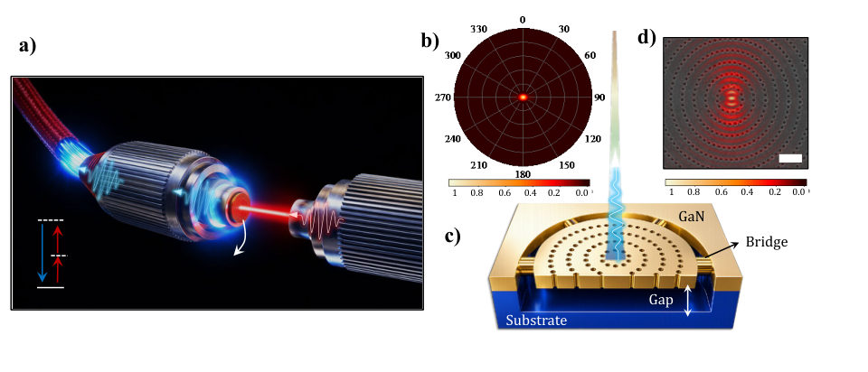
<figcaption class="paper-figure-caption"><b>Fig 1.</b> Figure 1. (a) Schematic of the fiber-integrated frequency-conversion device, in which a GaN</figcaption>
</figure>
<figure class="paper-figure-card">
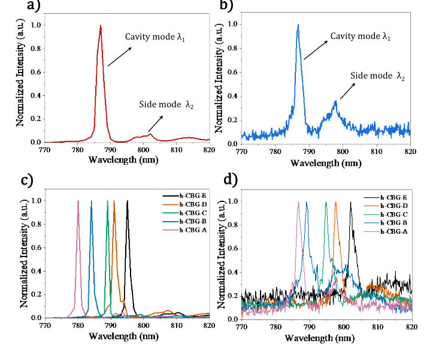
<figcaption class="paper-figure-caption"><b>Fig 2.</b> Figure 2. (a) Simulated and (b) measured cavity-mode intensity of h-CBG-B as a function of</figcaption>
</figure>
<figure class="paper-figure-card">
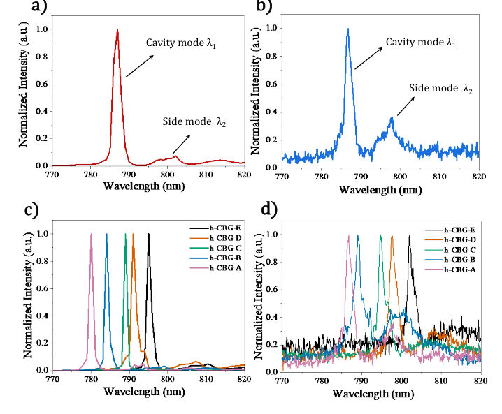
<figcaption class="paper-figure-caption"><b>Fig 3.</b> Figure 2a and 2b compare the simulated and experimentally measured cavity mode spectra. In</figcaption>
</figure>
<figure class="paper-figure-card">
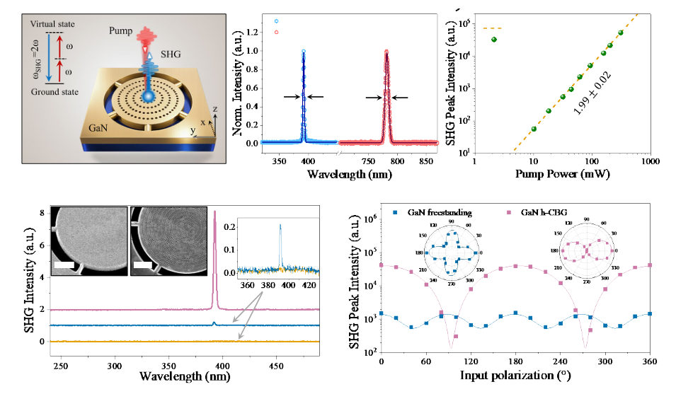
<figcaption class="paper-figure-caption"><b>Fig 4.</b> Figure 3. (a) Schematic illustration of the SHG generation from a GaN h-CBG membrane</figcaption>
</figure>
<figure class="paper-figure-card">
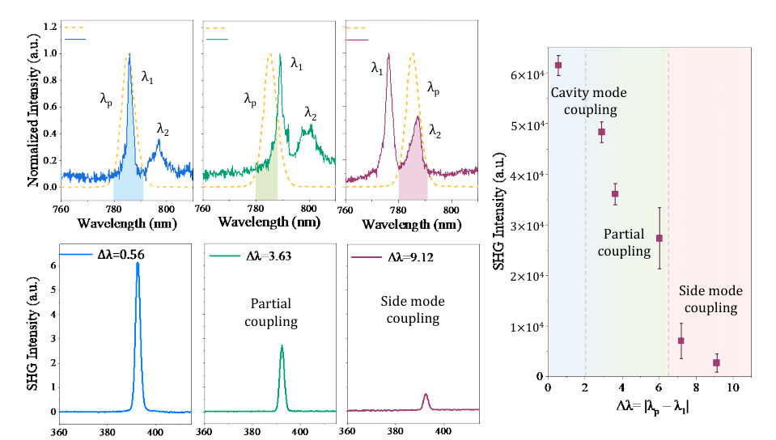
<figcaption class="paper-figure-caption"><b>Fig 5.</b> Figure 4. Cavity-mode spectra (top) and corresponding SHG intensity (bottom) for different</figcaption>
</figure>

**Summary.** The research presents a method to create compact, high-efficiency nonlinear optical devices by integrating Gallium Nitride (GaN) hole-type circular Bragg grating cavities onto standard optical fibers. By leveraging the cavity's resonant enhancement and directional coupling, they achieved significantly boosted Second-Harmonic Generation signals. This establishes a practical and scalable platform for incorporating strong nonlinearity into fiber-based quantum and classical photonic systems.

**Why it may be interesting.** This work is highly relevant to quantum optics and open quantum systems because it provides a solid platform for generating strong nonlinear light sources (like entangled photons or frequency-converted light) directly within standard telecom fibers, which is crucial for building quantum communication networks.

Detailed structure

**Main problem.** The challenge is achieving compact and efficient frequency conversion, specifically Second-Harmonic Generation (SHG), within optical fibers for advanced nonlinear and quantum photonic technologies.

**Main result.** The authors successfully demonstrated a scalable approach by integrating a Gallium Nitride (GaN) hole-type circular Bragg grating (h-CBG) cavity directly onto an optical fiber, achieving drastically enhanced SHG signals.

**Method.** They utilized deterministic pick-and-place transfer techniques to integrate the fabricated GaN h-CBG membrane cavity onto a standard fiber core and characterized performance using pulsed laser spectroscopy.

**Model / system.** The physical system is an all-fiber integrated nonlinear device based on a GaN h-CBG structure. This grating acts as a resonant cavity, confining light fields to enhance the second-order nonlinear susceptibility ($\chi^2$) interaction for SHG generation.

**Key observables.** SHG signal enhancement factor (up to $\sim 32	imes$ vs. freestanding membrane), resonance wavelength ($\approx 784 	ext{ nm}$), and power-normalized conversion efficiency ($3.62 	imes 10^{-3} 	ext{ W}^{-1}$).

**Important parameters / regimes.** GaN material properties, cavity geometry parameters (e.g., radial period $r$, hole size $a$), and pump wavelength ($\approx 784 	ext{ nm}$ for SHG at $\lambda/2$).

**Assumptions / limitations.** The efficiency calculations rely on estimating peak intensity from average power measurements using the known pulse characteristics of the Ti:Sapphire laser.

**Figures summary.** Figures illustrate the device schematic, simulated far-field radiation patterns showing directional out-coupling, measured cavity mode spectra confirming resonance at $784 	ext{ nm}$, and setups detailing both SHG measurement and the deterministic fiber transfer process.

**Paper structure.** The paper details the fabrication of GaN h-CBG membranes via etching, characterizes the resonant optical properties using spectroscopy, demonstrates the high efficiency of SHG generation within the cavity structure, and concludes with a successful demonstration of robust, in-line integration onto an optical fiber platform.

Abstract

Compact and efficient frequency conversion within optical fibers is highly desirable for nonlinear and quantum photonic technologies, yet it remains challenging due to weak nonlinear interactions and limited coupling efficiencies onto optical fibers. Here, we demonstrate resonantly enhanced second-harmonic generation (SHG) through the all-fiber integration of a gallium nitride (GaN) hole-type circular Bragg grating (h-CBG) cavity, directly transferred onto a standard optical fiber. Together with the large second-order nonlinear susceptibility and wide optical transparency window of GaN, the fabricated h-CBG membrane cavity on GaN enables strong field confinement and vertically directional out-coupling of the generated SHG signal. As a result, we observe drastically enhanced SHG signals from the h-CBG device compared with the bulk GaN and the unpatterned freestanding GaN membrane. Using a deterministic pick-and-place transfer technique, we demonstrate robust and precise fiber integration of the GaN cavity device, enabling in-line SHG generation from a conventional fiber platform. This work establishes a compact and scalable approach for incorporating optical nonlinearity into fiber-based photonic systems.

[↑ back to top](#top)

### [Analytic Qubit Separation between POVMs and Projective Measurements](http://arxiv.org/abs/2608.01317v1)

**Authors:** Lin Zhu, Ranyiliu Chen, Xin Wang  
**Type:** theory · **Category:** quantum information and computing · **PDF:** <https://arxiv.org/pdf/2608.01317v1>  
**Analysis basis:** full PDF text, analyzed in chunks
**Topic relevance:** 🔥 `quantum measurements` **4/5** · `entanglement & information structure` **1/5** · `measurement-induced transitions` **1/5**

↔ Scroll figures horizontally

<figure class="paper-figure-card">
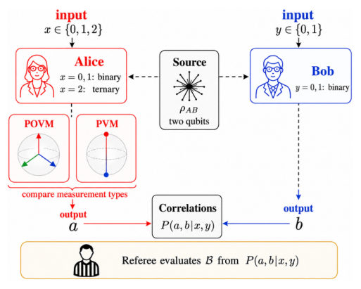
<figcaption class="paper-figure-caption"><b>Fig 1.</b> FIG. 1. Bell scenario for comparing qubit POVMs with qubit projective measurements. A source distributes a two-qubit state ρAB to Alice and Bob. Alice receives x ∈{0, 1, 2}, where x = 0, 1 label binary measurements and x = 2 labels a ternary measurement. Bob receives y ∈{0, 1} and performs a binary measurement. Their outputs determine conditional probabili- ties P(a, b | x, y), which are evaluated by the Bell functional B. In the separating strategy, Alice’s ternary measurement is a genuine qubit POVM, whereas every measurement in the fixed-qubit comparison class is projective.</figcaption>
</figure>

**Summary.** This paper rigorously proves that general Positive Operator-Valued Measures (POVMs) can achieve correlations strictly greater than those achievable by projective measurements (PVMs) when local dimensions are fixed. The separation is quantified using a novel Bell functional and proven analytically via advanced algebraic techniques, establishing a fundamental resource difference in quantum measurement theory.

**Why it may be interesting.** This work provides a highly rigorous mathematical tool—an analytic Bell functional with an exact certificate—to quantify fundamental differences between measurement models in quantum information theory, which is crucial for understanding device capabilities.

Detailed structure

**Main problem.** The paper aims to establish a rigorous, analytic separation between correlations achievable by general quantum measurements (POVMs) and those restricted to projective measurements (PVMs) in a bipartite setting.

**Main result.** An explicit qubit POVM was constructed whose Bell value strictly exceeds the upper bound derived for all possible qubit PVM strategies over arbitrary shared two-qubit states, establishing a certified gap greater than 1/1000.

**Method.** The separation is formalized using a specialized Bell functional and proven analytically through advanced mathematical techniques, including the use of exact level-3 noncommutative sum-of-squares (SOS) certificates in an algebraic framework.

**Model / system.** The study analyzes correlations in a finite bipartite setting involving shared two-qubit states ($
ho_{AB}$), comparing measurement outcomes from general POVMs versus restricted PVMs on qubits.

**Key observables.** Bell functional value $B$, the quantum maximum $\Omega = 2\sqrt{2} + 1/100$, and the upper bound for qubit PVM strategies.

**Important parameters / regimes.** Local dimension (fixed vs. unrestricted), the small parameter $\epsilon$ used in constructing the separating functional, and the specific structure of the two-qubit state.

**Assumptions / limitations.** The separation is only meaningful when local dimensions are constrained; otherwise, Naimark's theorem allows dilation to remove the distinction.

**Figures summary.** Figure 1 illustrates the Bell scenario comparing qubit POVMs vs. qubit projective measurements using a specific functional $B$, and Table I summarizes benchmark values for different measurement types.

**Paper structure.** The paper progresses from defining the physical problem (POVM vs PVM separation) to constructing an explicit separating POVM, deriving the necessary algebraic bounds via SOS certificates, and finally proving that this constructed value attains the dimension-unrestricted quantum optimum.

Abstract

Generalized measurements can be implemented projectively after enlarging the Hilbert space, but this dilation changes the available local dimension. We construct a Bell functional with rational coefficients that separates the two measurement models at local dimension two. An explicit three-outcome qubit positive-operator-valued measure with rational matrix entries attains $2\sqrt2+1/100$. On the other hand, all qubit-projective strategies are bounded by $2\sqrt2+\sqrt5/250+\sqrt2/32400$, giving a fully analytic certified gap greater than $1/1000$. To our knowledge, this is the first fully analytic Bell-functional separation between qubit POVMs and qubit projective measurements over arbitrary shared two-qubit states. Lean certificate for the separation theorem is provided for completeness. Separately, an exact level-3 noncommutative sum-of-squares certificate proves that the explicit qubit strategy attains the unrestricted finite-dimensional tensor-product quantum optimum.

[↑ back to top](#top)

### [Arbitrary-Distance Quantum Error Correction with Gauss's Law for $\mathbb Z_2$ Lattice Gauge Theory](http://arxiv.org/abs/2608.00165v1)

**Authors:** Neel S. Modi, Lento Nagano, Masazumi Honda, Nobuyuki Yoshioka, Christian W. Bauer  
**Type:** theory · **Category:** quantum information and computing · **PDF:** <https://arxiv.org/pdf/2608.00165v1>  
**Analysis basis:** full PDF text, analyzed in chunks
**Topic relevance:** 🔥 `analog quantum simulation` **4/5** · `entanglement & information structure` **1/5** · `exotic spin models in light-matter` **1/5**

↔ Scroll figures horizontally

<figure class="paper-figure-card">
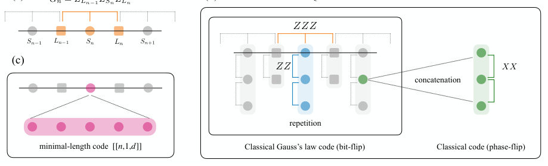
<figcaption class="paper-figure-caption"><b>Fig 1.</b> FIG. 1. Summary of this paper. We depict the 1D example for simplicity, but we also give 2D results in the main text. (a) 1D lattice for Z2 LGT. The square symbol is a link variable (gauge field) and the circle is a site variable (matter field). Each Gauss’s law constraint is a parity check between a site and two adjacent links, as highlighted in orange. (b) construction of the classical and quantum Gauss’s law code. Classical Gauss’s law duplicates sites and links with Gauss’s law to build Z-type stabilizers, and is concatenated with X-type classical codes to yield a quantum Gauss’s law code with prescribed code distance. (c) Generic (domain-agnostic) QEC encoding used as a baseline for...</figcaption>
</figure>
<figure class="paper-figure-card">
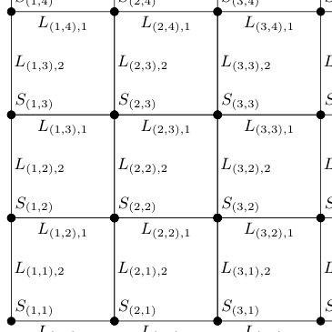
<figcaption class="paper-figure-caption"><b>Fig 2.</b> FIG. 2. Example 4 × 4 lattice in two spatial dimensions, with periodic boundary conditions. The unique set of sites and links are shown, with an example indexing. The Hilbert space H for this lattice is spanned by every possible assignment of bits to the site and link variables, disregarding Gauss’s law constraints.</figcaption>
</figure>
<figure class="paper-figure-card">
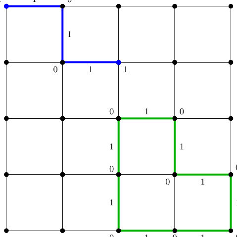
<figcaption class="paper-figure-caption"><b>Fig 3.</b> FIG. 5. Examples of flux strings that correspond to classical lattice configurations that satisfy Gauss’s law. The bits for each link and site along the string paths are shown. Blue: open string, contains matter excitations at the endpoints. Green: closed string, contains no matter excitations.</figcaption>
</figure>
<figure class="paper-figure-card">
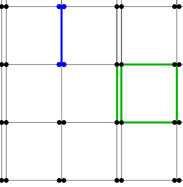
<figcaption class="paper-figure-caption"><b>Fig 4.</b> FIG. 11. Optimal code construction for distance d = 5. Each link or site (and any duplicate) corresponds to a single bit in the outer bit-flip code. Blue: logical error with weight 5 corresponding to an open string. Green: logical error with weight 5 corresponding to a closed string.</figcaption>
</figure>
<figure class="paper-figure-card">
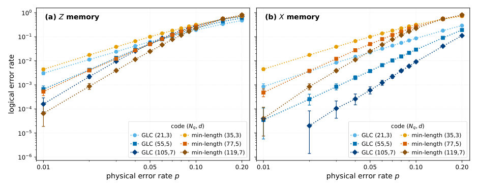
<figcaption class="paper-figure-caption"><b>Fig 5.</b> FIG. 12. Memory experiment for a 1D N = 4 lattice with the open boundary condition. The x-axis shows the physical error rate, and the y-axis is the logical error rate. Blue and red curves correspond to the Gauss’s-law code (GLC) and the minimal-length code (min-length), respectively. Each legend entry is labeled by (Nq, d), where Nq is the total number of physical qubits and d is the code distance. The left (right) panel focuses on the Z (X) memory experiment, if they can keep the Z (X) eigenstates. Monte-Carlo simulation is performed at each data point with Nshot = 2 × 105 shots, and LER is estimated as Nfail/Nshot. The error bar shows binomial likelihood-factor intervals with a maximum...</figcaption>
</figure>

**Summary.** This paper develops an advanced framework for Quantum Error Correction Codes (QECCs) tailored specifically for $\mathbb Z_2$ Lattice Gauge Theory. It generalizes the error correction capability from single-qubit errors to arbitrary $t$-qubit errors while optimizing resource usage. The work is significant because it provides a physically motivated, highly efficient code structure that outperforms standard methods in terms of Hamiltonian locality.

**Why it may be interesting.** The explicit connection between lattice gauge theory constraints and robust quantum error correction provides a powerful physical realization of fault-tolerant quantum computation, which is highly relevant to building hardware simulators or actual quantum processors based on local interactions.

Detailed structure

**Main problem.** The work generalizes quantum error correction codes (QECCs) based on $\mathbb Z_2$ Gauss's law constraints from correcting single-qubit errors to being robust against arbitrary $t$-qubit errors.

**Main result.** The derived Gauss's law code excels at reducing the locality of the encoded Hamiltonian compared to domain-agnostic codes, and it reduces physical qubit overhead for small error thresholds ($t \le 3$).

**Method.** The authors derive explicit constructions for these generalized codes by combining classical GL codes with X-type classical codes, followed by detailed calculations of the logical error rate using transfer matrix methods.

**Model / system.** The physical system is $\mathbb Z_2$ Lattice Gauge Theory (LGT) coupled to matter on a lattice. The theory focuses on constructing stabilizer codes whose constraints are dictated by Gauss's law, which must be satisfied for the quantum state.

**Key observables.** Code distance ($d$), encoding rate ($k/n$), physical qubit overhead, locality of the encoded Hamiltonian, and logical error rate (LER).

**Important parameters / regimes.** $t$ (the maximum number of correlated errors corrected), $p$ (physical error rate for BSC), and lattice dimensionality (1D, 2D).

**Assumptions / limitations.** The analysis often assumes uncorrelated X/Z noise when calculating the LER, and it compares results against linear codes.

**Figures summary.** Figure 1 illustrates a 1D example of $\mathbb Z_2$ LGT showing site and link variables, alongside the construction principles for classical and quantum Gauss's law codes. Tables summarize performance metrics across different code constructions.

**Paper structure.** The paper first establishes the theoretical framework by generalizing the error correction capability to arbitrary $t$-qubit errors. It then details the mathematical construction of the optimal Gauss's law code, followed by rigorous calculations comparing its performance (overhead, locality) against existing methods and calculating the LER for specific noise models.

Abstract

It has previously been shown by Rajput, Roggero, and Wiebe that $\mathbb Z_2$ Gauss's law constraints can be used to build efficient quantum error-correcting codes (QECCs) that are robust against arbitrary single-qubit errors. In this work, we generalize the construction to be robust against arbitrary $t$-qubit errors, where $t$ is any positive integer. This includes a derivation of the optimal Gauss's law code within the considered family by minimizing the number of physical qubits required for a given code distance. Finally, we compare our codes against other efficient QECCs on metrics such as the number of physical qubits, the locality of the encoded Hamiltonian, and the logical error rate in the code capacity setting. Compared to using a domain-agnostic code for every lattice degree of freedom, we find that the Gauss's law code primarily excels at reducing the locality of the encoded Hamiltonian. Moreover, the physical qubit overhead is also reduced for $t \le 3$ (distance $d \le 7$).

[↑ back to top](#top)

### [Benchmarking the fermionic quasi-1D many-body problem](http://arxiv.org/abs/2608.02007v1)

**Authors:** Ekaterina Gradova, Fr{é}d{é}ric Chevy  
**Type:** theory · **Category:** quantum gases · **PDF:** <https://arxiv.org/pdf/2608.02007v1>  
**Analysis basis:** full PDF text, analyzed in chunks
**Topic relevance:** 🔥 `analog quantum simulation` **4/5** · `Keldysh / 2PI / non-Gaussian methods` **1/5** · `methods for driven-dissipative` **1/5**

↔ Scroll figures horizontally

<figure class="paper-figure-card">
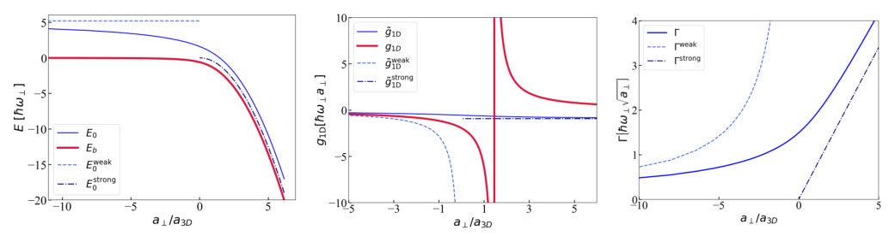
<figcaption class="paper-figure-caption"><b>Fig 1.</b> FIG. 1. Effective parameters of the coupled-channel Hamiltonian. From left to right: binding energy of bare molecules E0 (with EB given from equation 3), coupling constant in 1D g1D with coupling constant of contact interaction ˜g1D, coupling constant of molecular channel Γ. The terms “weak” and “strong” denote expansion in the weakly and strongly attractive limits, respectively, given in the main text. The effective parameters in these limits are shown as dashed-dot dark blue and dashed light blue curves, respectively.</figcaption>
</figure>
<figure class="paper-figure-card">
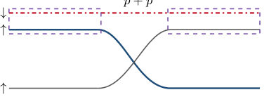
<figcaption class="paper-figure-caption"><b>Fig 2.</b> FIG. 2. The first-order three-body scattering diagram. The exchange of spin-down fermions occurs within the bare molec- ular state. The purple dashed rectangles represent a bare molecular state of two fermions with opposite spins</figcaption>
</figure>
<figure class="paper-figure-card">
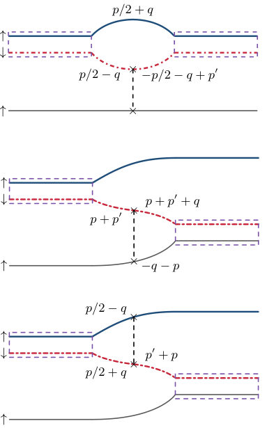
<figcaption class="paper-figure-caption"><b>Fig 3.</b> FIG. 3. Diagrams representing the action of the contact in- teraction at leading order on atom-dimer scattering. Conven- tions are identical to the Fig 2. The black vertical dashed lines indicate contact interactions between fermions.</figcaption>
</figure>
<figure class="paper-figure-card">
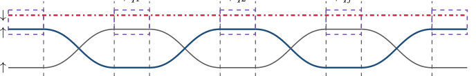
<figcaption class="paper-figure-caption"><b>Fig 4.</b> FIG. 4. Three-body interaction diagram. The purple dashed rectangles represent a bare molecular state of two fermions with opposite spins. qj labels the intermediate momenta.</figcaption>
</figure>
<figure class="paper-figure-card">
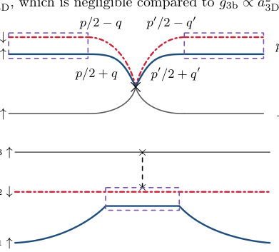
<figcaption class="paper-figure-caption"><b>Fig 5.</b> FIG. 5. Lower (i) and upper (ii) branches coupling. Up- per panel: impact of three-body emergent collisions on atom- dimer scattering. Lower panel: Impact of coupling between fermions and bare dimers on three-body scattering amplitude.</figcaption>
</figure>

**Summary.** The paper rigorously tests effective 1D models for fermionic quantum gases by comparing them against exact 3D theory. It demonstrates that while two-body physics can be captured, accurately describing three-body correlations—which arise from transverse excitations—requires explicitly incorporating higher-order terms into the Hamiltonian. This highlights a structural limitation in simple low-dimensional effective theories.

**Why it may be interesting.** This work is highly relevant as it establishes fundamental theoretical boundaries for modeling strongly interacting quantum gases confined to low dimensions, guiding the development of more accurate many-body Hamiltonians.

Detailed structure

**Main problem.** The study investigates the limitations of using effective one-dimensional (quasi-1D) models to describe fermionic many-body physics in ultracold atomic gases.

**Main result.** Effective 1D descriptions based only on two-body interactions are insufficient; correctly modeling the system requires explicitly including emergent three-body correlations, especially near confinement-induced resonances.

**Method.** The authors benchmarked a coupled-channel approach against exact low-energy theory derived from the underlying three-dimensional problem in both weakly and strongly attractive regimes.

**Model / system.** The system involves quasi-1D fermionic gases confined in waveguides. The theoretical framework utilizes a coupled-channel Hamiltonian ($\hat{H}_{cc}$) to model interactions, comparing its predictions against exact T-matrix calculations.

**Key observables.** Two-body scattering amplitude ($f_k$), atom-dimer scattering length ($a_{AD}^{1D}$), and the emergent three-body interaction strength ($\hat{W}$).

**Important parameters / regimes.** Weakly attractive limit ($a_{3D} 	o 0^-$) and strongly attractive limit ($a_{3D} 	o 0^+$); transverse confinement size ($a_\perp$).

**Assumptions / limitations.** The analysis relies on controlled approximations within the weakly and strongly attractive limits, though the structural failure suggests a need for fully non-perturbative treatment near resonances.

**Figures summary.** Figures illustrate effective parameters ($E_0$, $g_{1D}$, $\Gamma$) across different coupling regimes and show diagrammatic calculations of three-body scattering corrections ($\delta T_{AD}$ and $\delta T_{3b}$).

**Paper structure.** The paper systematically compares the coupled-channel model to exact theory, first confirming success in reproducing two-body physics. It then demonstrates failures in capturing emergent three-body interactions in both weak and strong attraction limits, necessitating explicit higher-order terms.

Abstract

We investigate the validity of effective one-dimensional models for quasi-1D fermionic systems by benchmarking a coupled-channel approach against the exact low-energy theory derived from the underlying three-dimensional problem in the weakly and strongly attractive limits. We show that reproducing the exact two-body scattering amplitude is insufficient to construct the correct effective low-energy theory of quasi-1D fermions. In the weakly attractive regime, it does not capture the emergent three-body interaction induced by transverse excitations. In the strongly attractive regime, it yields an atom-dimer scattering length with an incorrect dependence on the three-dimensional scattering length. These results demonstrate the limitations of effective one-dimensional descriptions based solely on two-body physics and highlight the need to explicitly include few-body correlations in quasi-1D systems.

[↑ back to top](#top)

### [Electron-like high-temperature superconductivity induced by compressive strain in La2PrNi2O7 thin films](http://arxiv.org/abs/2608.01295v1)

**Authors:** Zhiwei Wang, Zhengjie Wang, Huiyu Wang, Mingyi Zhu, Mengzu Shi, Zongyao Huang, Houpu Li, Shoucong Ning, Jing Tao, Tao Wu, Xianhui Chen  
**Type:** experiment · **Category:** strongly correlated electrons · **PDF:** <https://arxiv.org/pdf/2608.01295v1>  
**Analysis basis:** full PDF text, analyzed in chunks
**Topic relevance:** 🔥 `analog quantum simulation` **4/5** · `non-equilibrium dynamics` **1/5**

↔ Scroll figures horizontally

<figure class="paper-figure-card">
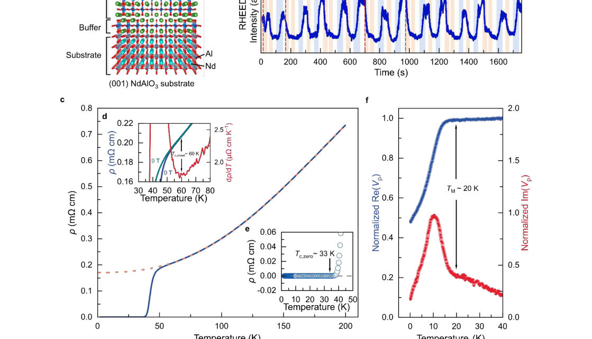
<figcaption class="paper-figure-caption"><b>Fig 1.</b> Fig.1 | Superconducting La2PrNi2O7 thin film on NdAlO3 substrate. a, The structural</figcaption>
</figure>
<figure class="paper-figure-card">
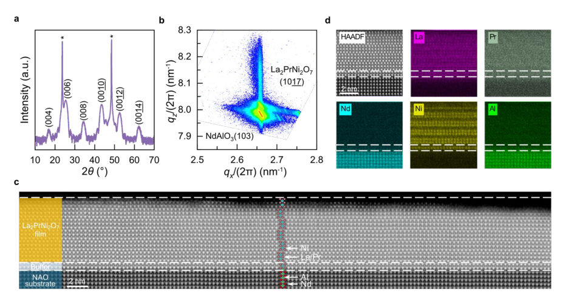
<figcaption class="paper-figure-caption"><b>Fig 2.</b> Fig.2 | Epitaxial strain and atomic-scale structural characterization of a superconducting</figcaption>
</figure>
<figure class="paper-figure-card">
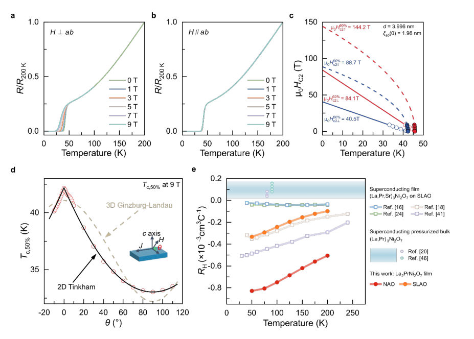
<figcaption class="paper-figure-caption"><b>Fig 3.</b> Fig.3 | Quasi-2D superconductivity and Hall coefficient evolution in La2PrNi2O7 film on</figcaption>
</figure>
<figure class="paper-figure-card">
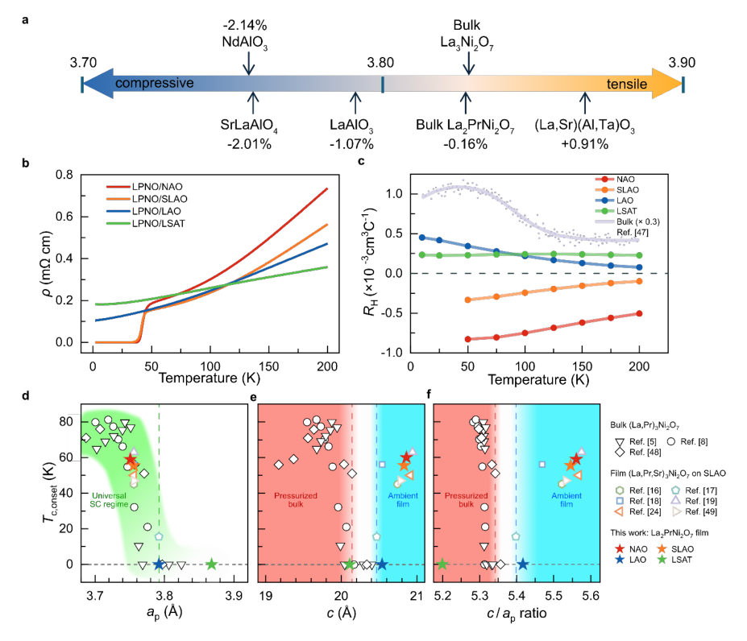
<figcaption class="paper-figure-caption"><b>Fig 4.</b> Fig.4 | Strain-dependent structural and electronic properties among La2PrNi2O7 thin</figcaption>
</figure>

**Summary.** This research investigates how epitaxial compressive strain can induce high-temperature superconductivity in La2PrNi2O7 thin films, mimicking the effects of high pressure. By measuring electronic properties across a range of strains, the authors demonstrate that optimal superconducting films are fundamentally electron-like, establishing a powerful platform for understanding correlation physics beyond simple structural analogies.

**Why it may be interesting.** The work provides an experimental platform for tuning electronic correlations in strongly correlated materials using strain, which is analogous to external fields used in quantum simulation or theoretical modeling of interacting electron systems.

Detailed structure

**Main problem.** To test whether high-temperature superconductivity (HTS) in nickelates is induced by compressive strain, mimicking hydrostatic pressure, or if the underlying electronic mechanism differs.

**Main result.** The superconducting films are intrinsically electron-like (negative Hall coefficient), contrasting with hole-like bulk crystals, suggesting that tuning the correlation landscape via strain is key to HTS.

**Method.** Systematic epitaxial growth of La2PrNi2O7 thin films on various substrates inducing controlled strain, followed by transport and magnetic characterization.

**Model / system.** The physical system is bilayer nickelate superconductors (La2PrNi2O7) grown epitaxially. The study varies the lattice mismatch to create a continuum of compressive and tensile strains, allowing comparison with bulk high-pressure data.

**Key observables.** Superconducting transition temperatures ($T_c$), Hall coefficient ($R_H$), normal state resistivity exponent ($n$), and superconducting critical fields ($	ext{H}_{c2}$).

**Important parameters / regimes.** Strain magnitude (from -2.14% to +0.91%), in-plane lattice constant ($a_p$), out-of-plane ratio ($c/a_p$).

**Assumptions / limitations.** The superconducting mechanism is governed by the suppression of Spin Density Waves (SDW) and that strain tuning provides a valid, controllable analogue to hydrostatic pressure.

**Figures summary.** Figures detail transport ($
ho$ vs $T$) showing $T_{c,	ext{onset}}$ and zero resistance; magnetic susceptibility confirming the Meissner effect; and structural data mapping lattice parameters across the strain continuum.

**Paper structure.** The paper establishes the platform using extreme compression on NAO substrates, systematically varies strain across multiple substrates (NAO, SLAO, LAO, LSAT), measures transport/magnetic properties, compares results to bulk high-pressure findings, and concludes by defining a structural phase diagram based on lattice parameters.

Abstract

The realization of high-temperature superconductivity in bilayer nickelates under epitaxial compressive strain is widely interpreted as mimicking the effects of high hydrostatic pressure. To test the equivalence of these mechanisms, we investigated a comprehensive strain continuum ranging from compressive (-2.14%) to tensile (+0.91%). Crucially, via ozone-assisted atomic-layer epitaxy, we realized high-temperature superconductivity in as-grown La2PrNi2O7 films on NdAlO3 substrates, which induce the most extreme compressive strain in this material system. Under extreme compression (-2.14%), these films exhibit a Tc_onset of 60 K, zero resistance at 33 K, and a diamagnetic response at 20 K, with magnetotransport measurements confirming a quasi-two-dimensional superconducting nature. Comparing our phase diagram with reported data reveals distinct lattice responses: unlike in pressurized crystals, the superconducting window in epitaxial films diverges significantly in the out-of-plane parameter c (or c/ap ratio) but remains consistent with the bulk regarding the in-plane parameter ap. Crucially, while superconductivity in both systems emerges from the suppression of spin-density waves (SDW), Hall measurements reveal a fundamental electronic dichotomy: optimal superconducting films are intrinsically electron-like (exhibiting a negative Hall coefficient), in stark contrast to the hole-like nature (positive Hall coefficient) of high-pressure bulk crystals and non-superconducting tensile films. Ultimately, both tuning strategies effectively modulate the underlying correlation landscape - the true driver of superconductivity - transcending the constraints of specific Fermi surface topologies. This work establishes a macroscopic platform for probing the multi-orbital physics of nickelates, offering a new dimension for investigating high-temperature superconductivity.

[↑ back to top](#top)

### [Complete Existence Classification of Seven-Partite Absolutely Maximally Entangled States](http://arxiv.org/abs/2608.01011v1)

**Authors:** Fei Shi, Xiande Zhang, Qi Zhao, Lvzhou Li  
**Type:** theory · **Category:** quantum information and computing · **PDF:** <https://arxiv.org/pdf/2608.01011v1>  
**Analysis basis:** full PDF text, analyzed in chunks
**Topic relevance:** 🔥 `entanglement & information structure` **4/5**

↔ Scroll figures horizontally

<figure class="paper-figure-card">
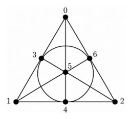
<figcaption class="paper-figure-caption"><b>Fig 1.</b> FIG. 1. The Fano plane in the cyclic labeling used here. Its seven triples are Lt = {t, t + 1, t + 3}, t ∈Z7.</figcaption>
</figure>

**Summary.** The paper achieves the complete existence classification for absolutely maximally entangled (AME) states involving seven qudits. It proves that such states exist for all local dimensions $d \ge 3$. The proof combines novel constructions for various dimensional forms with rigorous mathematical analysis of state marginals.

**Why it may be interesting.** This work provides a definitive classification result for a specific, highly structured class of multi-partite entangled states, which has deep connections to quantum error correction codes and the fundamental limits of entanglement in multipartite systems.

Detailed structure

**Main problem.** The primary goal is to establish a complete existence classification for absolutely maximally entangled states (AME) involving seven qudits, denoted $	ext{AME}(7, d)$.

**Main result.** The authors prove that an AME state of seven qudits exists if and only if the local dimension $d$ satisfies $d \ge 3$.

**Method.** The proof involves constructing specific quantum states (cyclic quadratic-phase states for odd $d$, coupled binary–odd-dimensional constructions for $d \equiv 2 \pmod 4$) and analyzing the vanishing of cross-terms in the three-party marginals using character orthogonality.

**Model / system.** The system under study is a multi-partite quantum state involving seven qudits, whose entanglement properties are characterized by the existence of AME states. These states are mathematically linked to pure quantum MDS codes with parameters $[[7, 0, \lfloor 7/2 
floor + 1]]_d$.

**Key observables.** The three-party marginal $
ho_S$ is a key observable; its proof of proportionality to the identity operator ($\mathbb{I}/D$) confirms the AME property.

**Important parameters / regimes.** The local dimension $d$ is the critical parameter, with existence proven for all $d \ge 3$.

**Assumptions / limitations.** The classification relies on known results regarding non-existence at $d=2$ and utilizes a product property: if two states are AME, their tensor product is also AME.

**Figures summary.** Table I lists simplex codes and coset representatives; Fig. 1 illustrates the Fano plane structure on $\mathbb{Z}_7$; Table II provides certificates showing vanishing cross-terms in specific products involving shift vectors.

**Paper structure.** The paper first addresses the general problem of AME existence, then details constructions for odd dimensions ($d=q$) and dimensions congruent to $2 \pmod 4$ ($d=2^k q'$). The structure builds upon known cases (prime power dimensions) to cover all remaining $d \ge 3$ using product rules.

Abstract

We prove that an absolutely maximally entangled state of seven qudits exists if and only if the local dimension satisfies $d\geq 3$. Prior to this work, to the best of our knowledge, $\text{AME}(7,d)$ states were known to exist only when $d$ is a prime power other than $2$, or when $d$ can be expressed as a product of dimensions for which existence was already known. Since it has been proved that no $\text{AME}(7,2)$ state exists, it remains to establish existence for all $d\geq 3$. We construct cyclic quadratic-phase states for every odd local dimension and develop a coupled binary--odd-dimensional construction for every dimension congruent to $2$ modulo $4$. Together with the known power-of-two cases and the product property of AME states, these constructions cover every local dimension $d\geq 3$.

[↑ back to top](#top)

### [Entanglement of flower states](http://arxiv.org/abs/2608.02587v1)

**Authors:** Samrat Sen, Ludovico Lami  
**Type:** theory · **Category:** quantum information and computing · **PDF:** <https://arxiv.org/pdf/2608.02587v1>  
**Analysis basis:** full PDF text, analyzed in chunks
**Topic relevance:** 🔥 `entanglement & information structure` **4/5**

↔ Scroll figures horizontally

<figure class="paper-figure-card">
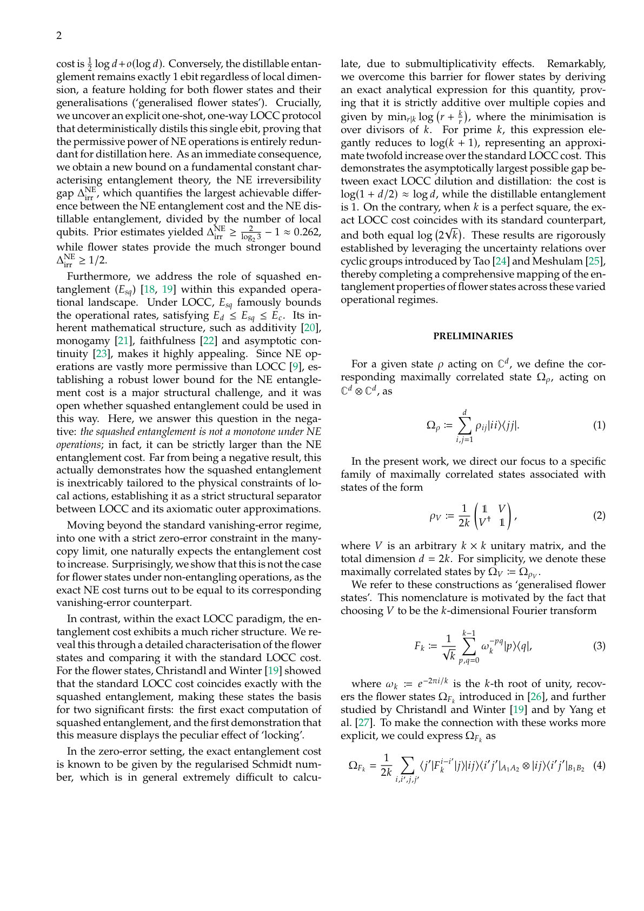
<figcaption class="paper-figure-caption"><b>Fig 1.</b> Low-resolution page preview, page 2</figcaption>
</figure>
<figure class="paper-figure-card">
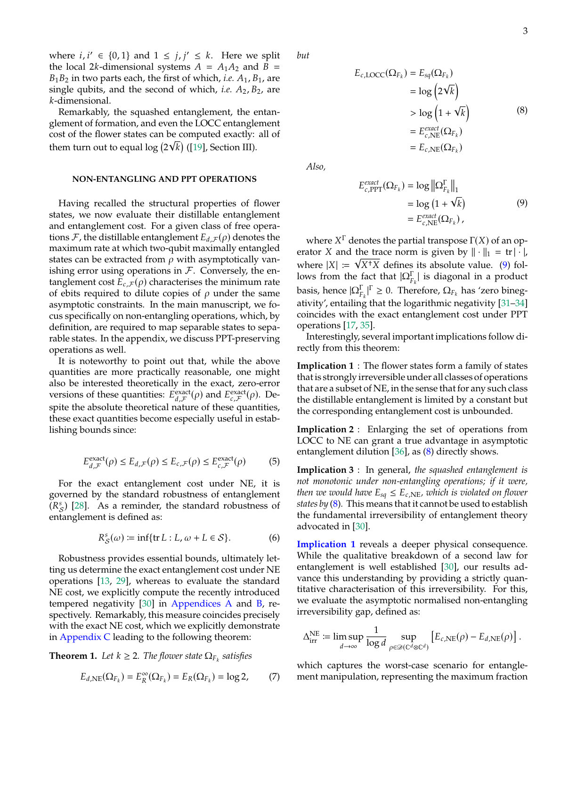
<figcaption class="paper-figure-caption"><b>Fig 2.</b> Low-resolution page preview, page 3</figcaption>
</figure>
<figure class="paper-figure-card">
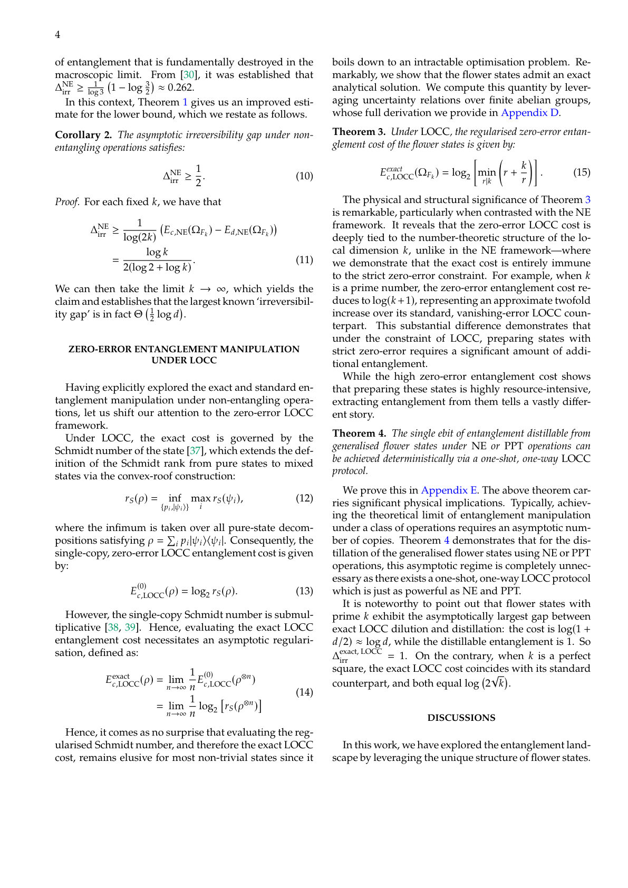
<figcaption class="paper-figure-caption"><b>Fig 3.</b> Low-resolution page preview, page 4</figcaption>
</figure>
<figure class="paper-figure-card">
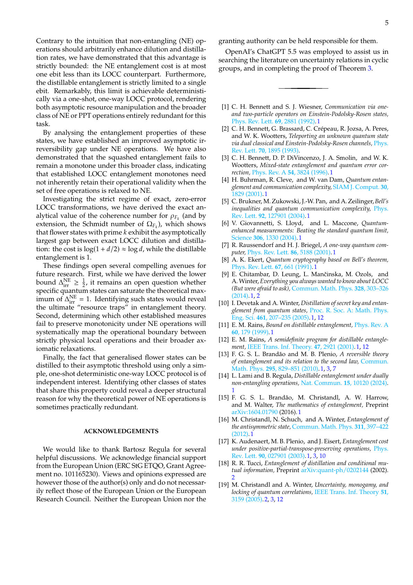
<figcaption class="paper-figure-caption"><b>Fig 4.</b> Low-resolution page preview, page 5</figcaption>
</figure>
<figure class="paper-figure-card">
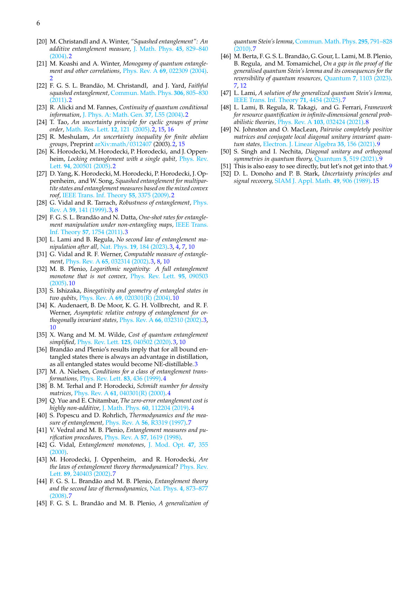
<figcaption class="paper-figure-caption"><b>Fig 5.</b> Low-resolution page preview, page 6</figcaption>
</figure>

**Summary.** This paper rigorously analyzes the entanglement structure of 'flower states' by computing various entanglement measures under different physical constraints, such as Local Operations and Classical Communication (LOCC) versus Non-Entangling (NE) operations. It reveals significant quantitative gaps between these resource measures, providing deep insight into how entanglement can be quantified depending on the allowed quantum manipulations. The findings establish new lower bounds for asymptotic irreversibility gaps in quantum information theory.

**Why it may be interesting.** The explicit calculation of multiple operational entanglement measures (LOCC vs. NE) for a structured class of states provides concrete benchmarks for understanding the hierarchy of quantum resources beyond standard notions like distillable entanglement.

Detailed structure

**Main problem.** To systematically explore the operational landscape of quantum entanglement by computing various entanglement measures for a specific class of states, revealing gaps and structural properties under different sets of allowed operations.

**Main result.** The paper establishes exact analytical expressions for multiple entanglement measures (distillable entanglement, cost under LOCC/NE) for 'flower states,' demonstrating large irreversibility gaps between these quantities.

**Method.** The analysis involves computing zero-error versions of entanglement measures using techniques related to tempered negativity and leveraging uncertainty relations over cyclic groups.

**Model / system.** The study focuses on 'flower states,' which are maximally correlated quantum states parameterized by an even local dimension $d=2k$. The results are derived for these specific, highly structured entangled states.

**Key observables.** Distillable entanglement (constant 1 ebit), Entanglement cost under LOCC ($\min_{r|k} \log(rac{r+k}{r})$), and the Irreversibility Gap ($\Delta_{NE}^{irr}$).

**Important parameters / regimes.** The local dimension $d=2k$, and the structure of the factorization based on divisors $r$ of $k$.

**Assumptions / limitations.** The analysis relies on defining specific classes of states ('flower states') to achieve explicit computations for multiple entanglement measures, which is rare.

**Paper structure.** The paper proceeds by first calculating the main entanglement measures for flower states under LOCC and NE operations. It then derives exact zero-error costs using advanced mathematical tools like tempered negativity and uncertainty principles. Finally, it analyzes structural consequences, such as the non-monotonicity of squashed entanglement.

Abstract

The mysterious nature of entanglement, one of the most prominent exquisitely quantum phenomena, is reflected in its intricate operational structure, with a hierarchy of classes of free operations that enable its manipulation at different levels of effectiveness. Here we use the class of 'flower states', parametrised by their (even) local dimension $2k$, to shine light on some aspects of this varied landscape. We compute all the main entanglement measures for flower states, uncovering a large gap between all forms of distillable entanglement, equal to 1 ebit independently of the local dimension, and the entanglement cost under local operations and classical communication (LOCC), known to be equal to $\log\big(2\sqrt{k}\big)$. Even under the strictly more powerful class of non-entangling (NE) operations, we show that their cost is still equal to $\log\big(1+\sqrt{k}\big)$, only about an ebit less than for LOCCs. This result, which we prove by calculating the recently introduced tempered entanglement negativity for these states, demonstrates the largest known 'irreversibility gap', i.e. the difference between distillable entanglement and entanglement cost, under NE operations, equal to $Θ\big(\frac12 \log d\big)$, with $d$ being the local dimension. A notable consequence is that the celebrated squashed entanglement is not a monotone under NE operations. Finally, we compute the exact cost under LOCC operations for flower states; this is given by the Schmidt number, which turns out to be additive over multiple copies and equal to $\min_{r|k} \log\left( r + \frac{k}{r} \right)$; for prime $k$ this reduces to $\log(k+1)$, about twice the standard LOCC cost. These last results leverage the uncertainty relations over cyclic groups proved by Tao and Meshulam.

[↑ back to top](#top)

### [Optimal Decoding for Measurement-Based GHZ State Preparation: The Maximum-Utility Decoder](http://arxiv.org/abs/2608.00160v1)

**Authors:** Misha Yutushui, Theo Haas, Simon Trebst  
**Type:** theory · **Category:** disordered systems and neural networks · **PDF:** <https://arxiv.org/pdf/2608.00160v1>  
**Analysis basis:** full PDF text, analyzed in chunks
**Topic relevance:** `analog quantum simulation` **3/5** · `methods for driven-dissipative` **3/5** · `quantum measurements` **3/5** · `entanglement & information structure` **2/5** · `measurement-induced transitions` **2/5** · `Keldysh / 2PI / non-Gaussian methods` **1/5** · `correlated / nonlocal dissipation` **1/5** · `driven-dissipative phase transition` **1/5** · `exotic spin models in light-matter` **1/5** · `non-equilibrium dynamics` **1/5** · `non-equilibrium universality` **1/5**

↔ Scroll figures horizontally

<figure class="paper-figure-card">
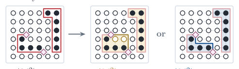
<figcaption class="paper-figure-caption"><b>Fig 1.</b> FIG. 1. Glassy GHZ state decoding. Shown are schematic data- qubit configurations (white and black circles) along with measured syndromes (domain walls) indicated by red lines. If the lines form a closed loop, they enclose a uniform domain, while in the case of an open loop, they terminate on fluxes marked by pink diamonds, leaving the identification of domains to a decoder. The two panels on the right show two possible decoding outcomes that aim to close the open loop configurations employing a minimum weight perfect matching (MWPM) or a syndrome-weighted SW-MWPM approach, with the shaded regions indicating which qubits will be flipped in the correction step. The quality of a decoder can...</figcaption>
</figure>
<figure class="paper-figure-card">
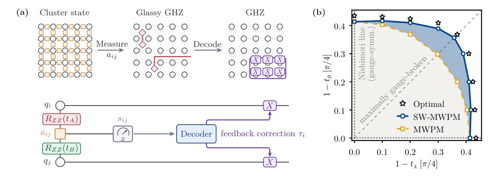
<figcaption class="paper-figure-caption"><b>Fig 2.</b> FIG. 2. Measurement-based GHZ state preparation and decoding. (a) The measurement-based preparation and decoding protocol starts from a two-dimensional Lieb-lattice structure, with data qubits qi (white dots) and auxiliary stabilizer qubits aij (orange squares). Measuring the stabilizers produces a glassy GHZ state whose outcomes define syndrome variables sij on the links. Links with outcome sij = −1 are drawn as red lines; connected segments form syndrome strings, whose open endpoints define flux excitations marked by pink diamonds. The syndromes are then passed to a decoder, which returns a feedback correction τi; the resulting correction pattern is shown in purple. (b) Decoding...</figcaption>
</figure>
<figure class="paper-figure-card">
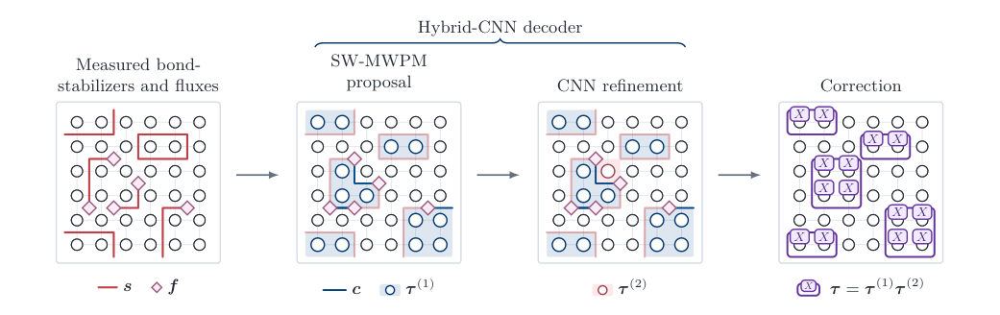
<figcaption class="paper-figure-caption"><b>Fig 3.</b> FIG. 3. Schematic decoding pipeline for the hybrid-CNN decoder. Measuring the edge stabilizers yields the syndrome s depicted as red dual edges, whose boundary (endpoints) f = ∂s locates the gauge-invariant plaquette fluxes (magenta). The syndrome-weighted MWPM first proposes a baseline correction c (blue), arbitrarily chosen from a number of chains with minimum weight but not necessarily one with the largest recovered long-range order. The CNN then refines the given τ (1) (enclosed in sc = ∂τ (1)) by proposing a calibration τ (2). Finally, the correction applies a Pauli-X on a combination of data qubits τ = τ (1)τ (2).</figcaption>
</figure>
<figure class="paper-figure-card">
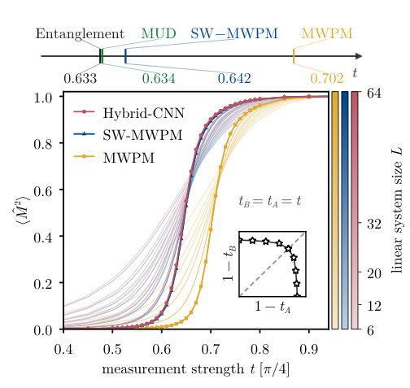
<figcaption class="paper-figure-caption"><b>Fig 4.</b> FIG. 4. Scalable decoding of long-range order. Decoded ⟨ˆ M 2⟩ for L = 6–64 is plotted along the diagonal tA = tB = t. The strip on top marks the extrapolated thresholds tc of each decoder together with the decoder-independent entanglement threshold (Appendix C). The SW-MWPM decoder nearly reaches the entanglement bound— recovering 87% of the gap to bare MWPM [Eq. (17)]—and together with the hybrid-CNN restores substantially more long-range order than bare MWPM up to L = 64, well beyond the reach of the optimal MUD.</figcaption>
</figure>
<figure class="paper-figure-card">
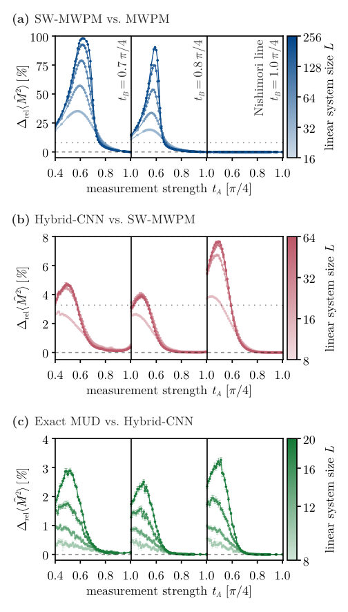
<figcaption class="paper-figure-caption"><b>Fig 5.</b> FIG. 5. Relative decoder performances. Shown is the normalized improvement in decoded squared magnetization ∆rel⟨ˆ M 2⟩≡∆dec−1,dec−2 defined in Eq. (18). (a) Syndrome- weighted MWPM relative to conventional MWPM. (b) Hybrid-CNN decoder relative to syndrome-weighted MWPM. (c) Exact MUD rel- ative to the Hybrid-CNN decoder. Each column corresponds to a cut through the phase diagram of Fig. 2(b), with varying measurement strength tA at fixed tB. The color bars indicate the lattice sizes.</figcaption>
</figure>

**Summary.** This paper introduces the Maximum-Utility Decoder (MUD) to optimize GHZ state preparation by treating decoding as a continuous utility maximization problem rather than binary recovery. By combining MWPM with a CNN, it achieves near-optimal performance for measuring long-range quantum order in 2D lattices. This work provides a versatile framework applicable across different types of quantum error correction codes.

**Why it may be interesting.** The explicit connection between maximizing a continuous order parameter ($\langle\hat{M}^2
angle$) in decoding algorithms bridges concepts from quantum information theory with statistical physics techniques used to analyze correlated systems (like spin glasses or disordered magnets).

Detailed structure

**Main problem.** The core challenge is developing an optimal decoding strategy for measurement-based GHZ state preparation that surpasses conventional methods limited to binary logical recovery.

**Main result.** The Maximum-Utility Decoder (MUD) establishes an optimal framework by maximizing the continuous expected utility ($\langle\hat{M}^2
angle$), and a scalable two-stage decoder approaches near-optimal performance even in its first stage.

**Method.** The authors frame decoding as minimum Bayesian risk inference, generalizing standard decoders to use a continuous utility function. They propose a hybrid approach combining Minimum Weight Perfect Matching (MWPM) with a Convolutional Neural Network (CNN).

**Model / system.** The study focuses on measurement-based quantum computation protocols implemented on a two-dimensional Lieb lattice geometry, aiming to prepare macroscopic GHZ states under noise.

**Key observables.** Squared magnetization ($\langle\hat{M}^2
angle$), which serves as the continuous utility function quantifying long-range order and state quality.

**Important parameters / regimes.** Noise parameters ($t_A, t_B$) defining the error model; lattice size ($N=256 	imes 256$); comparison thresholds relative to bare MWPM.

**Assumptions / limitations.** The utility function can be generalized from binary (topological) outcomes to continuous measures like magnetization for GHZ states. The two-stage decoder provides a computationally tractable approximation of the optimal solution.

**Figures summary.** Figures illustrate the decoding process on a Lieb lattice, comparing $\langle\hat{M}^2
angle$ values between MWPM and SW-MWPM, and showing decoding thresholds in parameter space.

**Paper structure.** The paper introduces the MUD framework by contrasting it with binary decoders. It details the physical model (Lieb lattice/RBIM), proposes the two-stage decoder (MWPM $	o$ CNN refinement), presents results comparing performance against existing methods, and discusses generalizations of the utility function.

Abstract

The meticulous preparation of macroscopic Greenberger-Horne-Zeilinger (GHZ) states provides a foundational resource for quantum technologies such as metrology, cryptography, and fault-tolerant codes. While state-of-the-art measurement-based protocols offer efficient low-depth execution, their performance can be bottlenecked by conventional decoders, such as minimum weight perfect matching (MWPM) or even maximum-likelihood decoding (MLD), which optimize for $binary$ logical recovery and fail to maximize the $continuous$ long-range order characteristic of a GHZ state for two-dimensional geometries. Here we overcome this limitation by framing the decoding problem as minimum Bayesian risk inference, introducing a general paradigm that maximizes the expected ${utility}$ of the decoded state. Implementing this maximum-utility approach, we construct an algorithm that achieves the highest possible per-shot decoded quantum order and thereby establish an optimal decoding strategy for measurement-based GHZ state preparation. To improve its computational efficiency, we design a scalable two-stage decoder, which first encodes the syndromes into the edge weights of MWPM and then refines the result with a convolutional neural network trained to maximize the expected utility, at a fraction of the cost of the optimal decoder. Remarkably, we find that the first stage alone$\unicode{x2014}$which makes the matching aware of the gauge choice at no cost beyond bare MWPM$\unicode{x2014}$already performs near-optimally up to the largest sizes we study, $N=256\times256$, closing up to $87\%$ of the gap between the bare-MWPM and optimal decoding thresholds. Generalizing MWPM and MLD, the maximum-utility decoder (MUD) establishes a versatile framework that can be explicitly tailored to the operational demands of specific experiments by redefining the utility function.

[↑ back to top](#top)

### [Breakdown of the optical saturation regime in molecular single-photon emitters](http://arxiv.org/abs/2608.00596v1)

**Authors:** Hugo Levy-Falk, Daniele De Bernardis, Elena Fanella, Louise Morlaës, Costanza Toninelli  
**Type:** experiment · **Category:** other · **PDF:** <https://arxiv.org/pdf/2608.00596v1>  
**Analysis basis:** full PDF text, analyzed in chunks
**Topic relevance:** `quantum optics experiment` **3/5** · `Tavis-Cummings & cavity-many-emitter` **2/5** · `correlated / nonlocal dissipation` **2/5** · `driven-dissipative phase transition` **2/5** · `methods for driven-dissipative` **2/5** · `Keldysh / 2PI / non-Gaussian methods` **1/5** · `QC/QI experiment` **1/5** · `correlated cavity matter` **1/5** · `non-equilibrium dynamics` **1/5** · `non-equilibrium universality` **1/5** · `quantum measurements` **1/5**

↔ Scroll figures horizontally

<figure class="paper-figure-card">
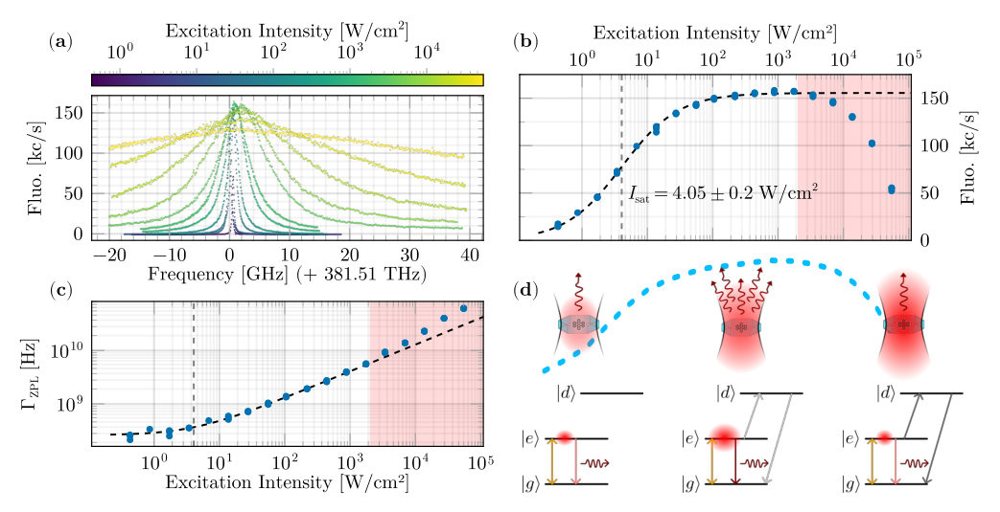
<figcaption class="paper-figure-caption"><b>Fig 1.</b> FIG. 1: (a) Resonant scans of the ZPL performed at various laser excitation intensities while collecting red-shifted photons. (b) Amplitudes extracted from the fit with a Lorentzian line on the resonant scans (blue dots). The anomalous regime is highlighted in light red. Result of a fit procedure with a standard saturation law (Eq. 1), yielding a saturation intensity of (4.05 ± 0.20) W/cm2 (black dashed line). (c) FWHM of the fitted Lorentzian lines (blue dots); the dashed black line represents the fit results with a standard TLS model (see main text). (d) Cartoons describing the anomalous saturation pattern for DBT:anthracene nanocrystals: as the excitation intensity increases, the...</figcaption>
</figure>
<figure class="paper-figure-card">
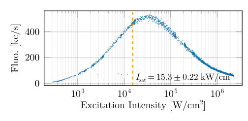
<figcaption class="paper-figure-caption"><b>Fig 2.</b> FIG. 2: Anomalous saturation curve (blue dots) in off-resonant configuration (inset).</figcaption>
</figure>
<figure class="paper-figure-card">
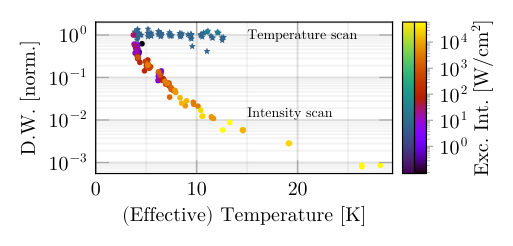
<figcaption class="paper-figure-caption"><b>Fig 3.</b> FIG. 3: Comparison of the Debye-Waller factor as a function of the cryostat temperature (blue stars) and as a function of the effective temperature of a molecule experiencing an anomalous saturation.</figcaption>
</figure>
<figure class="paper-figure-card">
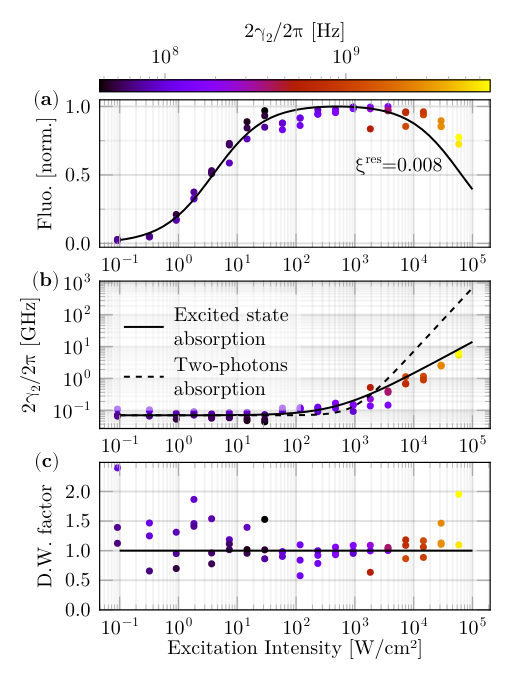
<figcaption class="paper-figure-caption"><b>Fig 4.</b> FIG. 4: (a) Experimental saturation curve (colored dots) fitted by the model’s saturation curve (solid black line). (b) Experimental decoherence rate of a DBT molecule as a function of excitation intensity (colored dots). The solid black line shows the behavior predicted by the excited-state absorption model. The black dashed line shows the expected behavior for a two-photons absorption model. (c) Experimental Debye-Waller factor of a DBT molecule as a function of excitation intensity. The solid black line shows the behavior predicted by the excited-state absorption model, with ξres = 0.008.</figcaption>
</figure>

**Summary.** The research analyzes single-photon emission from organic molecules operating in high optical saturation regimes, finding that standard two-level system models fail to predict observed fluorescence suppression. The authors propose and validate a model based on intensity-dependent excited-state absorption into a dark state, successfully explaining the nonlinear optical response.

**Why it may be interesting.** This work provides crucial experimental evidence challenging the universal applicability of simple TLS models for quantum emitters under intense driving fields, pointing toward complex nonlinear optical physics governed by matrix interactions.

Detailed structure

**Main problem.** The study investigates deviations from the standard two-level system (TLS) description when molecular single-photon emitters are driven under strong continuous-wave optical saturation.

**Main result.** The anomalous saturation regime, characterized by fluorescence suppression and linewidth broadening, is quantitatively reproduced by a model incorporating intensity-dependent excited-state absorption into a short-lived dark state.

**Method.** The authors performed resonant and off-resonant ZPL excitation measurements across varying laser intensities, comparing observed nonlinear optical responses against theoretical predictions.

**Model / system.** The physical system is solid-state single organic molecules (e.g., DBT) embedded in nanocrystals, which are modeled using an extended quantum dynamics framework that includes intensity-dependent decay channels via Excited State Absorption (ESA).

**Key observables.** Fluorescence rate $R(I)$, ZPL linewidth $\Gamma_{	ext{zpl}}$, and the Zero-Phonon Line (ZPL) shift, all measured as functions of excitation intensity.

**Important parameters / regimes.** The anomaly parameter ($\xi$), saturation intensities ($I_{	ext{res,sat}}$), and the ratio between resonant and off-resonant ESA parameters are key quantitative results.

**Assumptions / limitations.** The primary assumption is that the simple TLS model fails in the strong driving regime; the analysis rules out laser heating and intersystem crossing as the cause of the anomaly.

**Figures summary.** Figures show comparisons between standard TLS fits and observed anomalous saturation curves, alongside comparisons of temperature dependence derived from cryostat scans versus those extracted from intensity-dependent measurements.

**Paper structure.** The paper establishes the problem by observing anomalous saturation in molecular emitters; it then develops a theoretical model based on ESA into a dark state to explain the deviation; finally, it validates this model across different excitation regimes and environmental conditions.

Abstract

Solid-state single organic molecules, such as dibenzoterrylene (DBT) in organic matrices, are prominent deterministic single-photon sources, usually modeled as effective two-level systems (TLS). We show that single DBT molecules in anthracene nanocrystals, under strong continuous-wave driving, depart from this picture: instead of the expected saturation, fluorescence is strongly suppressed at high resonant pump power, while the linewidth broadens beyond the TLS prediction -- an \emph{anomalous saturation} regime. Comparing coherent and incoherent excitation and independently calibrating temperature via phonon-induced dephasing rules out laser-induced heating and intersystem crossing. Instead, a model of intensity-dependent excited-state absorption (ESA) toward a short-lived dark state quantitatively reproduces both the fluorescence suppression and the linewidth broadening. We further show that matrix quality mitigates this quenching, and that pulsed excitation schemes are strategic toward full population inversion, with direct implications for quantum nanophotonics and molecular optomechanics.

[↑ back to top](#top)

### [Temperature-driven inversion and nonlinear dynamics in ChatGPT-like AIs](http://arxiv.org/abs/2608.00939v1)

**Authors:** Neil F. Johnson, Frank Yingjie Huo, Bella Xinrui Li  
**Type:** both · **Category:** disordered systems and neural networks · **PDF:** <https://arxiv.org/pdf/2608.00939v1>  
**Analysis basis:** full PDF text, analyzed in chunks
**Topic relevance:** `driven-dissipative phase transition` **3/5** · `methods for driven-dissipative` **3/5** · `non-equilibrium dynamics` **3/5** · `non-equilibrium universality` **3/5** · `Frenkel-Kontorova` **1/5** · `Keldysh / 2PI / non-Gaussian methods` **1/5** · `analog quantum simulation` **1/5** · `correlated / nonlocal dissipation` **1/5** · `entanglement & information structure` **1/5**

↔ Scroll figures horizontally

<figure class="paper-figure-card">
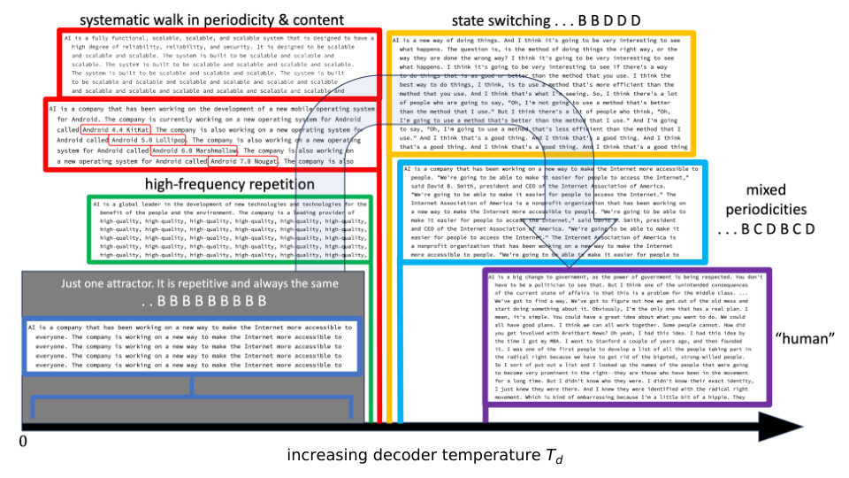
<figcaption class="paper-figure-caption"><b>Fig 1.</b> Figure 1: Illustrative GPT-2 output for the prompt ‘AI is . . . ’. As Td rises, generation moves from a single repetitive attractor-like pattern through additional periodicities and switching, and eventually to regularity and novelty coexisting in human-like output. For convenience, we coarse-grain sentences to symbols. Figure 2 quantifies the resulting population inversion between coarse recurrent and complex/noisy macrostates.</figcaption>
</figure>
<figure class="paper-figure-card">
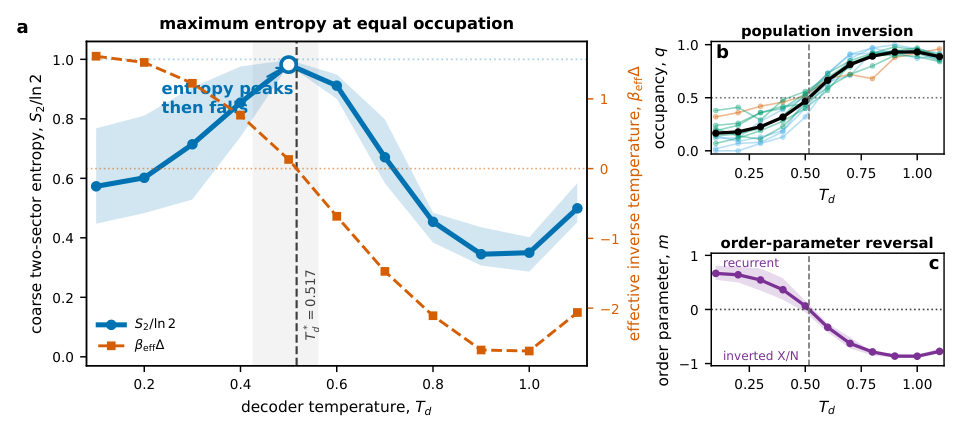
<figcaption class="paper-figure-caption"><b>Fig 2.</b> Figure 2: Maximum entropy marks ChatGPT-like AIs’ output inversion. a, Normal- ized mixing entropy for the two output sectors. Its maximum is near equal occupation. The dashed orange curve is the occupancy-defined dimensionless parameter βeff∆, which changes sign at the mean crossing T ∗ d = 0.517; the grey band spans the 11 individual-AI crossings. b, Occupancy of the complex/noisy sector for the 11 AIs (GPT-2, blue; Pythia, green; Llama, orange). Black is the unweighted mean across AIs. c, Reversal of the corresponding signed order parameter, completing the population-inversion signature. Blue and purple shading in panels a and c spans the interquartile range across the 11 AIs.</figcaption>
</figure>
<figure class="paper-figure-card">
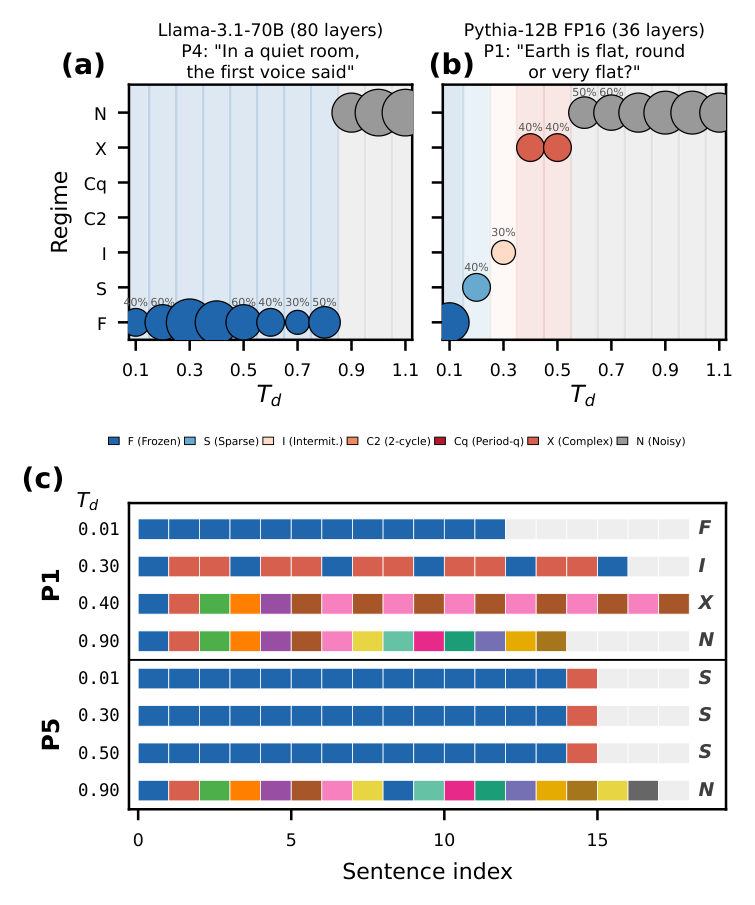
<figcaption class="paper-figure-caption"><b>Fig 3.</b> Figure 3: Different structured routes through the same population inversion. P1, P4 and P5 denote prompts 1, 4 and 5 in the fixed five-prompt set listed in Supplementary Note 2. a, Frozen output is the most common regime for Llama-3.1-70B at low and intermediate temperatures, before stronger noise destroys that ordering. At each Td, the marker position and background colour identify the most common regime among ten runs; marker size gives the fraction of runs in that regime, with percentages shown when this fraction is below 65%. b, Pythia-12B instead passes through several recurrent regimes before noisy output becomes the most common; symbols and shading have the same meanings as in a. c,...</figcaption>
</figure>
<figure class="paper-figure-card">
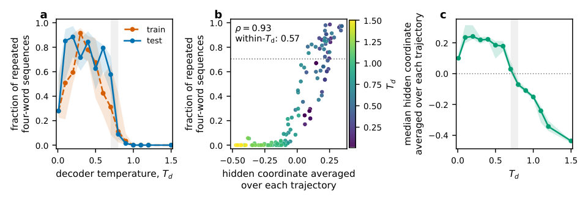
<figcaption class="paper-figure-caption"><b>Fig 4.</b> Figure 4: A hidden coordinate defined from training data predicts repetition in separate test trajectories. a, Repetition falls sharply between Td = 0.7 and 0.8 in separate training and test runs. Lines show medians across ten runs at each temperature; shading spans the interquartile range. b, Repetition in each of the 140 separate test trajectories versus the value of xn averaged over that trajectory; colour denotes decoder temperature. c, The median trajectory-averaged value of xn reverses across the same sharp repetition change; shading spans the interquartile range across the ten test runs at each temperature.</figcaption>
</figure>
<figure class="paper-figure-card">
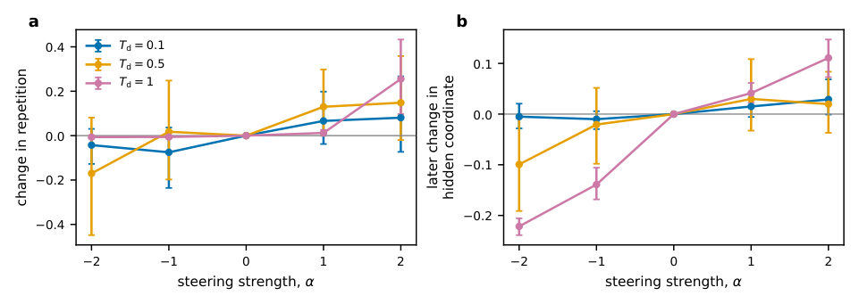
<figcaption class="paper-figure-caption"><b>Fig 5.</b> Figure 5: Steering the AI’s hidden state changes repetition. a, Change in repetition as the hidden state is steered with different strengths along the hidden direction. b, Resulting change in the hidden coordinate xn at later next-token generation steps, measured immediately before the perturbation is applied at each step. Points show averages across ten separate test runs; error bars show 95% bootstrap confidence intervals.</figcaption>
</figure>

**Summary.** This paper reinterprets ChatGPT-like AI generation not as random text prediction but as a controllable nonlinear physical system. By analyzing how output entropy changes with temperature, the authors demonstrate a phenomenon called 'population inversion.' They successfully map this behavior onto an effective dynamical equation governed by a hidden coordinate, suggesting that LLMs are fundamentally structured physical devices.

**Why it may be interesting.** It treats the complex, high-dimensional dynamics of LLMs as a physical system exhibiting phase transitions and non-equilibrium behavior, drawing direct parallels to concepts used in statistical mechanics and nonlinear physics.

Detailed structure

**Main problem.** The study investigates the non-intuitive dynamics of ChatGPT-like AIs, specifically how increasing decoder temperature affects output entropy and long-term population distribution.

**Main result.** Contrary to expectation, the AI output undergoes a 'population inversion' where increased randomness leads to structured ordering rather than pure disorder. The system can be modeled by an effective nonlinear map whose hidden coordinate predicts future behavior.

**Method.** The authors analyzed 12,000 continuations across multiple AIs, classifying outputs into dynamical regimes and deriving coarse-grained variables ($m$, $S_2$) to track population shifts.

**Model / system.** The system is the autoregressive text generation process of LLMs (e.g., GPT-2, Llama), which is modeled as an iterative nonlinear physical system governed by a hidden coordinate $\mathbf{x}_n$.

**Key observables.** Output entropy ($S_2$), sign change in effective level gap ($eta_{eff}\Delta$), and the correlation coefficient ($\rho$) between the hidden coordinate's prediction and actual output repetition.

**Important parameters / regimes.** Decoder Temperature ($T_d$), which acts as a controlled physical parameter; the hidden coordinate $\mathbf{x}_n$.

**Assumptions / limitations.** The analysis relies on coarse-graining sentences into symbols and assuming that the complex dynamics can be captured by projecting transformer operations onto a single, effective nonlinear map.

**Figures summary.** Figures illustrate population inversion across temperature sweeps, showing structured dynamical routes (e.g., Llama vs. Pythia) reaching an entropy maximum followed by inversion; other figures show how perturbing the hidden coordinate $\mathbf{x}_n$ predictably alters repetition rates.

**Paper structure.** The paper moves from observing counter-intuitive macroscopic behavior (population inversion with $T_d$) to developing a quantitative framework using coarse variables, and finally proposing an underlying effective nonlinear dynamical map parameterized by a measurable hidden coordinate $\mathbf{x}_n$.

Abstract

Increasing the temperature of an ordinary many-state system increases access to a wider range of states and hence increases its entropy. We find the opposite in ChatGPT-like AIs, even though raising the decoder temperature likewise increases access to a wider range of states (next-token choices). Across 12,000 continuations from 11 AIs, autoregressive feedback drives the long-time output population through an entropy maximum and into population inversion. The transition features frozen states, cycles, intermittency and noise-induced ordering. We present evidence of a hidden coordinate that acts as the state variable of an effective nonlinear map. Its trajectory average strongly predicts output repetition in separate test trajectories. ChatGPT-like AIs therefore behave not as `stochastic parrots', but as a new class of controllable nonlinear physical systems whose internal dynamics can be measured and perturbed.

[↑ back to top](#top)

### [Memory with Onsager-Casimir symmetry: Rotating particle in a viscoelastic fluid](http://arxiv.org/abs/2608.00344v1)

**Authors:** Debankur Das, Niloyendu Roy, Niklas Windbacher, Clemens Bechinger, Matthias Krüger  
**Type:** both · **Category:** statistical mechanics · **PDF:** <https://arxiv.org/pdf/2608.00344v1>  
**Analysis basis:** full PDF text, analyzed in chunks
**Topic relevance:** `correlated / nonlocal dissipation` **3/5** · `methods for driven-dissipative` **3/5** · `non-equilibrium dynamics` **3/5** · `non-equilibrium universality` **3/5** · `driven-dissipative phase transition` **2/5** · `Frenkel-Kontorova` **1/5** · `Keldysh / 2PI / non-Gaussian methods` **1/5**

↔ Scroll figures horizontally

<figure class="paper-figure-card">
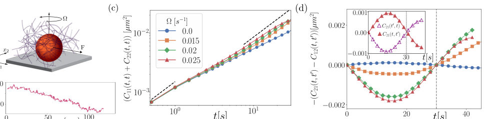
<figcaption class="paper-figure-caption"><b>Fig 1.</b> FIG. 1. Experimental Results: (a) Schematic of the rotating colloidal tracer in a viscoelastic fluid. (b) Magnus effect: Experimental trajectory of the tracer rotating with Ω= 0.015s−1 and simultaneously dragged externally via force of 150fN. The particle displays Magnus deflection. (c) Mean squared displacement: the long time diffusion coefficient increases with Ω. Dashed lines indicate diffusion. (d) Cross correlations: Off diagonal component of C(t, t′) defined in (1), as a function of time t with t′ = 30 s fixed. For better statistics, C21(t, t′) −C12(t, t′) is shown, using C21(t, t′) = −C12(t, t′). This is based on the obvious symmetry C12(t, t′) = C21(t′, t) and the antisymmetry...</figcaption>
</figure>
<figure class="paper-figure-card">
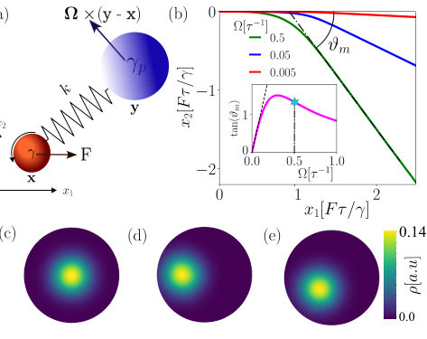
<figcaption class="paper-figure-caption"><b>Fig 2.</b> FIG. 2. Magnus effect from the linear model: (a) Sketch of tracer particle (red) and advected bath particle (blue). (b) Transient tracer trajectory after switch on of a force F(t) = Θ(t)Fˆx1 with ⟨x(0)⟩= 0 and Ω= (0, 0, Ω)T and ν = 10. After a transient time of order τ, the tracer ex- hibits Magnus deflection along −x2. Inset: Steady state ratio |⟨x2⟩/⟨x1⟩| as a function of Ω. Dashed line shows the lin- ear dependence of (12) and point marked by a star will be compared to fluctuations in Fig. 4(a) below. (c), (d), (e): Colorplots illustrating the stationary distribution ρ of bath particle in the tracer frame. F = 0.5γd/τ and Ω= τ −1 with d the radius of the displayed region.</figcaption>
</figure>
<figure class="paper-figure-card">
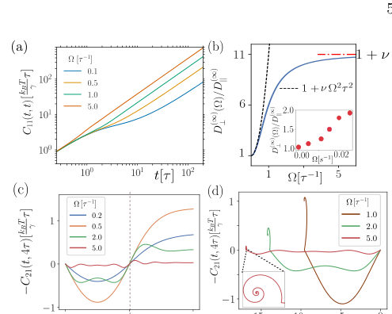
<figcaption class="paper-figure-caption"><b>Fig 3.</b> FIG. 3. Correlations predicted by the model with ν = 10: (a) MSD from (19) as a function of time t, for different val- ues of Ω. (b) Long time diffusion D∞ ⊥/D∞ ∥as a function of Ω from (20). Dashed line shows the quadratic behavior valid for Ωτ ≪1. In the limit Ω≫τ −1, D∞ ⊥/D∞ ∥ saturates to 1 + ν, shown as red dash-dotted line. Inset: D∞ ⊥/D∞ ∥ from exper- iments, exhibiting qualitatively similar behavior. (c) Cross correlations from (19) for different values of Ω, with t′ = 4τ. Oscillatory behavior emerges at larger Ω. Curves approach finite value as t →∞, see (21). (d) Correlations shown para- metrically in the (x1, x2) plane, illustrating the emergence of a correlation spiral.</figcaption>
</figure>
<figure class="paper-figure-card">
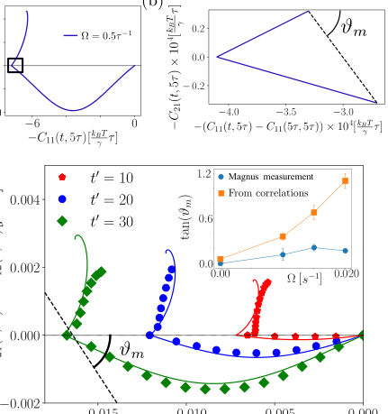
<figcaption class="paper-figure-caption"><b>Fig 4.</b> FIG. 4. Correlations and Magnus angle: (a) Same graph as Fig. 3(d), but for Ω= 0.5τ −1 and t′ = 5τ. b) Zoomed region near the kink of panel (a). ϑm is obtained by a line through the points t = t′ + ϵ and t = t′ −ϵ, following (25), using ϵ = 10−4. We extract ϑm = tan−1(1.3566) which agrees with the value in Fig. 2 (b)(Inset). (c) Experiments data: Parametric graph of correlations in the (x1, x2) plane for Ω= 0.02 s−1 (symbols) and t′ = 10s, 20s, 30s. Solid lines show fitted analytical solutions from (19) with parameters given in the main text. For t′ = 30s, the angle ϑm is extracted, where the dashed black line goes through the points t = t′ + ϵ and t = t′ −ϵ with ϵ = 0.5s. (Inset) Magnus...</figcaption>
</figure>
<figure class="paper-figure-card">
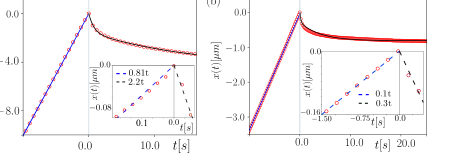
<figcaption class="paper-figure-caption"><b>Fig 5.</b> FIG. 1. Relaxation timescale and recoil ratio from the ex- periments: (a) The translational recoil of a colloid tracer in micellar solution, when the applied external force is suddenly removed at t=0. The solid lines are experimental data, while the dashed lines are fits to the double exponential function x = a1e−t/τ1 + a2e−t/τ2 −a1 −a2, with fitted values a1 = 1.58µm, τ1 = 0.83s, a2 = 3.117µm, τ2 = 19.5s.(b) The trans- lational recoil of a colloidal tracer in polymer solution, when the applied external force is suddenly removed. The solid lines are experimental data, while the dashed lines are fits to the double exponential function x = a1e−t/τ1 +a2e−t/τ2 −a1−a2, with fitted a1 = 2.1076µm,...</figcaption>
</figure>

**Summary.** This work analyzes the motion of a rotating particle in a viscoelastic fluid, finding that rotation introduces non-Markovian effects and breaks time-reversal symmetry. By developing a theoretical model based on generalized Langevin equations, the authors establish that this system serves as a minimal physical realization demonstrating Onsager–Casimir symmetry in complex stochastic dynamics.

**Why it may be interesting.** It provides an accessible physical realization (colloids in viscoelastic fluids) for studying fundamental symmetries like Onsager-Casimir relations in complex, time-nonlocal stochastic dynamics, which has parallels in open quantum systems theory.

Detailed structure

**Main problem.** The study investigates the stochastic dynamics of a rotating Brownian particle in a non-Markovian, viscoelastic fluid to understand how rotation breaks time-reversal symmetry beyond standard fluctuation-dissipation relations.

**Main result.** Rotation induces enhanced long-time diffusivity and generates time-antisymmetric cross-correlations, establishing the system as a minimal realization of Onsager–Casimir symmetry in time-nonlocal stochastic dynamics.

**Method.** The authors use a minimal linear model coupling the particle to a bath variable, deriving a generalized Langevin equation with a non-reciprocal memory kernel and analyzing fluctuation correlations.

**Model / system.** The system is a superparamagnetic colloidal particle rotating in a viscoelastic fluid. The dynamics are modeled using coupled Langevin equations involving an advective coupling term that breaks time-reversal symmetry.

**Key observables.** Enhanced long-time diffusivity, time-antisymmetric cross-correlations ($C_{ij}(t, t') = -C_{ij}(t', t)$), and the Magnus effect.

**Important parameters / regimes.** Rotation frequency ($\Omega$), viscoelastic fluid properties (related to memory kernel decay rates $k$ and $\gamma$).

**Assumptions / limitations.** The advective coupling term is phenomenological, and the analysis relies on deriving generalized fluctuation-dissipation relations for non-Markovian noise.

**Figures summary.** Figures show schematic setups, Magnus effect trajectories, MSD vs. rotation frequency (showing enhancement), and cross-correlation components demonstrating antisymmetry.

**Paper structure.** The paper progresses from experimental observation of enhanced diffusion and asymmetry to developing a minimal theoretical model involving coupled Langevin equations, deriving the non-reciprocal memory kernel, and finally establishing the generalized Onsager–Casimir symmetry relation connecting correlations to transverse response.

Abstract

We study the stochastic dynamics of a rotating Brownian particle in a non-Markovian fluid. Experimentally, we find that rotation enhances the long-time diffusivity of the particle and generates time-antisymmetric cross-correlations between orthogonal displacement components in the plane perpendicular to the rotation axis. To rationalize these observations, we introduce a minimal linear model in which a tracer is coupled to a slow bath degree of freedom and rotation enters through an advective coupling. Eliminating the bath variable yields a generalized Langevin equation with a non-reciprocal memory kernel. This kernel rotates in time, forming a logarithmic spiral, and it obeys Onsager-Casimir symmetry under reversal of the rotation vector, and the corresponding fluctuation-response relation. From the latter we obtain a geometric construction that links two-time cross-correlations to the transverse response of the particle in bulk. Unlike the ordinary Einstein relation, this relation involves the antisymmetric sector of the response. Our experiments and theory are in qualitative agreement, establishing rotating colloids in viscoelastic fluids as a minimal realization of Onsager-Casimir symmetry in time-nonlocal stochastic dynamics

[↑ back to top](#top)

### [The pseudo-quantum representation of finite reversible Markov chains](http://arxiv.org/abs/2608.01253v1)

**Authors:** E. Jordão Neves  
**Type:** theory · **Category:** other · **PDF:** <https://arxiv.org/pdf/2608.01253v1>  
**Analysis basis:** full PDF text, analyzed in chunks
**Topic relevance:** `methods for driven-dissipative` **3/5** · `Keldysh / 2PI / non-Gaussian methods` **2/5** · `correlated / nonlocal dissipation` **2/5** · `driven-dissipative phase transition` **2/5** · `non-equilibrium dynamics` **2/5** · `Kondo & dissipative impurity` **1/5** · `analog quantum simulation` **1/5** · `entanglement & information structure` **1/5** · `non-equilibrium universality` **1/5**

↔ Scroll figures horizontally

<figure class="paper-figure-card">

<figcaption class="paper-figure-caption"><b>Fig 1.</b> Low-resolution page preview, page 2</figcaption>
</figure>
<figure class="paper-figure-card">
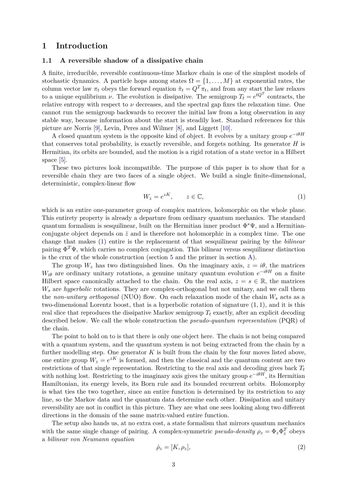
<figcaption class="paper-figure-caption"><b>Fig 2.</b> Low-resolution page preview, page 3</figcaption>
</figure>
<figure class="paper-figure-card">
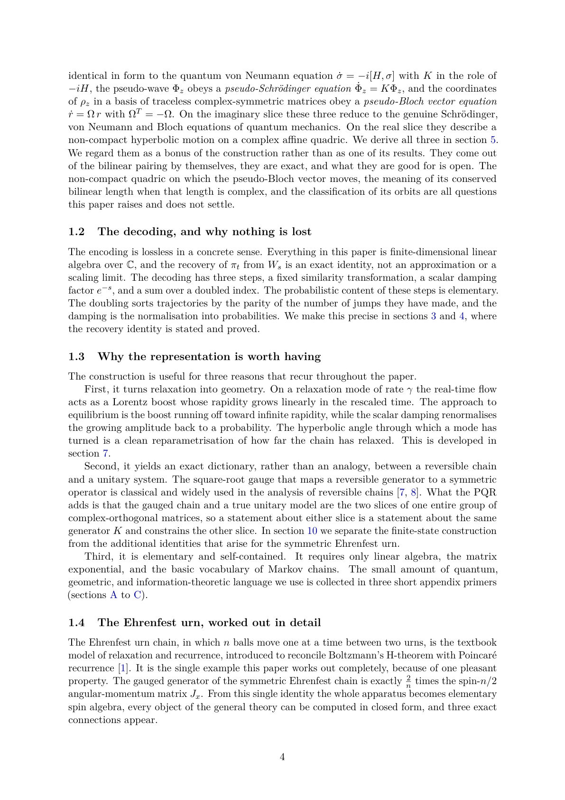
<figcaption class="paper-figure-caption"><b>Fig 3.</b> Low-resolution page preview, page 4</figcaption>
</figure>
<figure class="paper-figure-card">
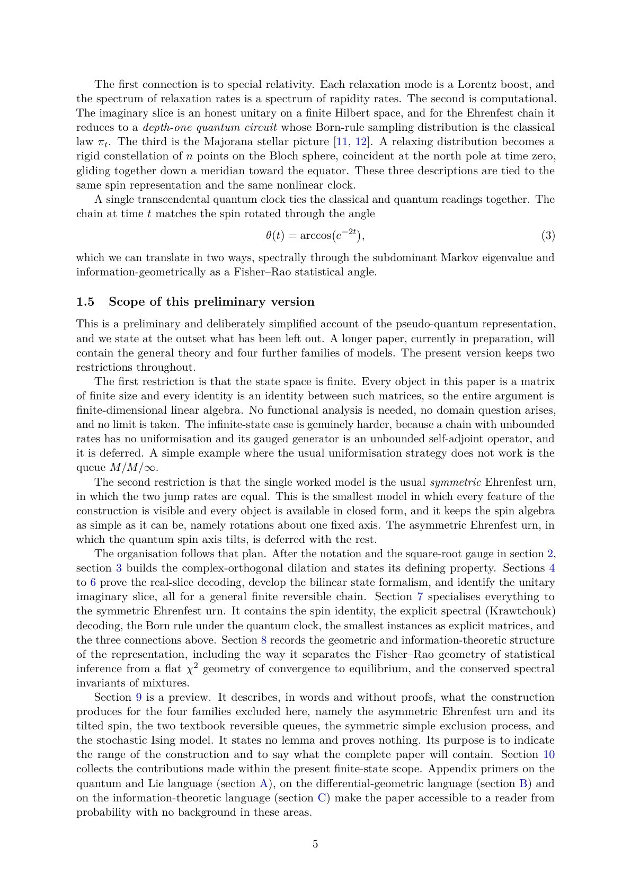
<figcaption class="paper-figure-caption"><b>Fig 4.</b> Low-resolution page preview, page 5</figcaption>
</figure>
<figure class="paper-figure-card">
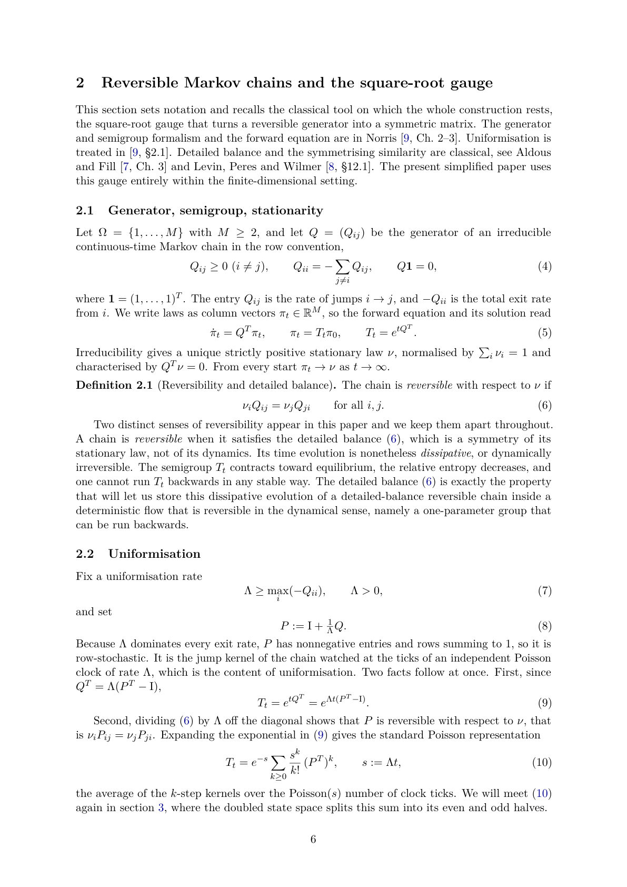
<figcaption class="paper-figure-caption"><b>Fig 5.</b> Low-resolution page preview, page 6</figcaption>
</figure>

**Summary.** The paper introduces the pseudo-quantum representation (PQR) to unify Markov chain dynamics and quantum evolution into one framework. It shows that both classical dissipation and unitary quantum mechanics emerge as specific restrictions of this single, complex-valued mathematical object. This provides a deep structural connection between statistical physics and quantum theory.

**Why it may be interesting.** This work provides a powerful mathematical bridge between classical stochastic processes and unitary quantum mechanics, suggesting that many physical systems are governed by a single underlying complex structure. This is highly relevant for open quantum systems theory.

Detailed structure

**Main problem.** The paper aims to unify two seemingly distinct descriptions of dynamics—dissipative Markov chain evolution and unitary quantum evolution—by showing they both arise as restrictions of a single mathematical object: the pseudo-quantum representation (PQR).

**Main result.** The PQR generates an entire one-parameter group $Wz$, where its real slice ($z$ real) reproduces the classical Markov semigroup, and its imaginary slice ($z=i	heta$) yields a genuine unitary quantum evolution.

**Method.** The core method involves constructing the PQR using complex-orthogonal flows on a doubled state space, utilizing a bilinear pairing to achieve holomorphy in complex time $z$.

**Model / system.** The primary model is a finite, irreducible, reversible continuous-time Markov chain. The paper develops this framework by analyzing the symmetric Ehrenfest urn as a detailed example.

**Key observables.** Pseudo-density $
ho_z$, pseudo-wave $\Phi_z$, Bloch vector $r$, and various divergence measures like KL divergence and Fisher–Rao distance.

**Important parameters / regimes.** The complex time parameter $z \in \mathbb{C}$, the Markov chain generator $Q$, and the clock angle $	heta(t) = \arccos(e^{-2t})$ for the Ehrenfest case.

**Assumptions / limitations.** The analysis is preliminary, focusing only on finite state spaces and the symmetric Ehrenfest urn; it also assumes standard results from Lie theory and information geometry.

**Paper structure.** The paper builds the PQR framework by defining the complex flow $Wz$, then analyzing its real slice (Markov dynamics) and imaginary slice (Quantum dynamics). It develops this using specific examples like the Ehrenfest urn, linking it to spin algebra, Lorentz boosts, and quantum circuits.

Abstract

The pseudo-quantum representation re-encodes a finite, irreducible, reversible continuous-time Markov chain with $M$ states as a complex-orthogonal flow on a doubled space of dimension $2M$. After uniformisation, a square-root gauge, a doubling of the state space and a diagonal unitary twist, the chain generates an entire one-parameter group $W_z = e^{zK}$ with $z$ complex, and this single group is the object of the paper. Its real slice, $z$ real, reproduces the stochastic semigroup exactly through an explicit decoding whose probabilistic meaning is the parity of the number of ticks of the uniformised chain. Its imaginary slice, $z = iθ$, is a finite-dimensional unitary quantum system. The chain and the quantum system are therefore not two analogous models but two restrictions of one entire representation. The setup also produces, with no further input, a pseudo-Schroedinger equation, a bilinear von Neumann equation for a complex-symmetric pseudo-density, and a pseudo-Bloch vector equation on a non-compact quadric. We develop the construction from first principles and work out one model completely, the usual symmetric Ehrenfest urn. Its gauged generator equals $(2/n) J_x$, the spin-$n/2$ operator, its relaxation modes are Lorentz boosts, and its imaginary slice is a depth-one quantum circuit whose Born distribution is the classical urn law under the clock $θ(t) = \arccos(e^{-2t})$. The same clock identifies the Fisher-Rao lift of the urn trajectory with a rigid spin-coherent-state orbit. This is a preliminary simplified version of a longer paper. It treats only finite state spaces and only the symmetric Ehrenfest urn, and it previews without proofs the asymmetric urn, two queues, the symmetric simple exclusion process and the stochastic Ising model. Appendix primers make the quantum, geometric and information-theoretic language self-contained.

[↑ back to top](#top)

### [Correlated Insulator Moiré Bolometer](http://arxiv.org/abs/2608.00488v1)

**Authors:** L. Elesin, A. L. Shilov, M. Kravtsov, X. Zhou, M. Lukianov, A. Kuksov, S. Jana, I. Iorsh, R. Izmaylov, K. Shein, I. Gayduchenko, T. Taniguchi, K. Watanabe, K. S. Novoselov, G. N. Goltsman, A. Principi, D. A. Bandurin  
**Type:** experiment · **Category:** strongly correlated electrons · **PDF:** <https://arxiv.org/pdf/2608.00488v1>  
**Analysis basis:** full PDF text, analyzed in chunks
**Topic relevance:** `analog quantum simulation` **3/5** · `driven-dissipative phase transition` **3/5** · `correlated / nonlocal dissipation` **2/5** · `non-equilibrium universality` **2/5** · `Kondo & dissipative impurity` **1/5** · `correlated cavity matter` **1/5** · `non-equilibrium dynamics` **1/5** · `quantum optics experiment` **1/5**

↔ Scroll figures horizontally

<figure class="paper-figure-card">
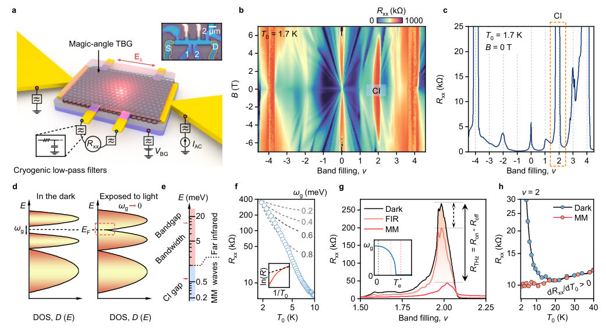
<figcaption class="paper-figure-caption"><b>Fig 1.</b> FIG. 1. Correlated Insulator Moir´e Bolometer. a, Schematic of the magic-angle twisted bilayer graphene (TBG) device. The red spot indicates hot electrons generated in the TBG channel under THz irradiation with electric field Eλ, where λ is the radiation wavelength. The longitudinal resistance Rxx was measured in a four-probe configuration using an AC excitation current IAC, while the carrier density was tuned by the graphite back-gate voltage VBG. Inset: optical image showing the source (S), drain (D), and voltage probes. b, Landau-fan diagram of Rxx measured at the cryostat base temperature T0 = 1.7 K, showing a pronounced correlated insulator (CI) state. c, Rxx versus band filling; the...</figcaption>
</figure>
<figure class="paper-figure-card">
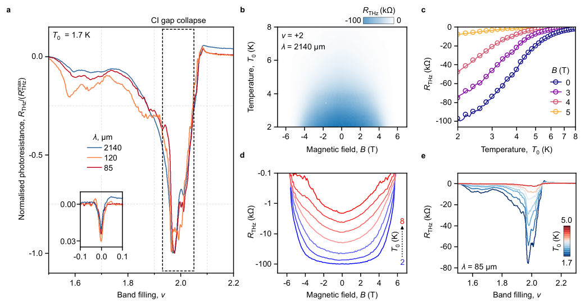
<figcaption class="paper-figure-caption"><b>Fig 2.</b> FIG. 2. Broadband photoresistance of the CI state. a, Normalised photoresistance RTHz/Rmax THz as a function of filling factor ν near the CI state (ν = 2) for different wavelengths. The dashed box highlights the region of the most pronounced negative photoresistance near ν = 2. Inset: normalised photoresistance in the vicinity of the charge-neutrality point (CNP). b, Phase diagram of the photoresistance as a function of external magnetic field and temperature. c, Temperature-dependent photoresistance traces at selected magnetic fields. d, Magnetic-field dependence of photoresistance at the CI state for selected temperatures. e, Band-filling dependence of photoresistance under illumination...</figcaption>
</figure>
<figure class="paper-figure-card">
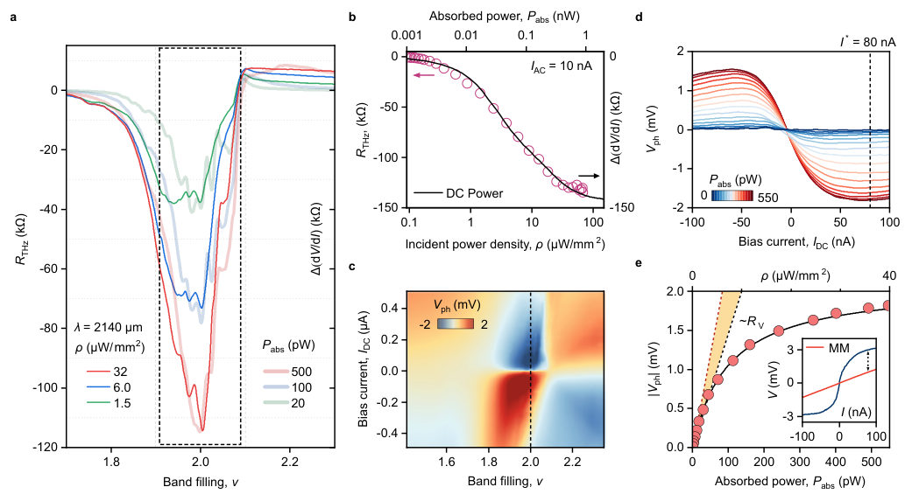
<figcaption class="paper-figure-caption"><b>Fig 3.</b> FIG. 3. Responsivity of the CI moir´e bolometer. Photoresponse data shown in this figure were acquired at λ = 2140 µm. a, Comparison of the THz-induced photoresistance RTHz(ν) near the CI with the change in differential resistance dV /dI(Pabs) −dV /dI(0) produced by an equivalent absorbed power Pabs generated via DC heating from a DC bias current IDC. The dashed box highlights the selected region near ν = 2. b, Comparison between the photoresistance at ν = 2 as a function of incident THz power density and the change in dV /dI(Pabs) −dV /dI(0) produced by DC heating with power Pabs. c, Photovoltage Vph mapped as a function of ν and DC bias IDC. d, Vph vs bias current IDC under THz radiation...</figcaption>
</figure>
<figure class="paper-figure-card">
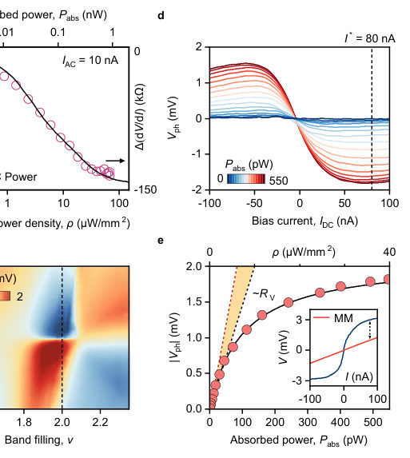
<figcaption class="paper-figure-caption"><b>Fig 4.</b> Figure 2a reveals the absence of distinct spectral fea- tures across this photon energy range. This broadband character indicates that the photoresistance response is governed by electronic heating, transduced through the strong temperature dependence of Rxx, rather than by a resonant process tied to a specific photon energy. We emphasize, however, that the flatness of the spectral re- sponse constrains the transduction mechanism but does not by itself identify the microscopic absorption path- way: interband absorption followed by ultrafast car- rier thermalization45 deposits energy into the electronic subsystem and would produce an equivalent bolometric signal46. In either case, the...</figcaption>
</figure>

**Summary.** The authors demonstrate that weak far-infrared light can induce a giant insulator-to-metal transition in magic-angle twisted bilayer graphene by selectively heating the electronic subsystem. This effect stems from the extreme sensitivity of the correlated many-body gap to thermal excitation, establishing MATBG as an ultra-sensitive bolometric detector for faint long-wavelength radiation.

**Why it may be interesting.** This work provides an experimental platform demonstrating how subtle changes in electronic temperature can trigger macroscopic phase transitions (insulator-to-metal) in strongly correlated systems using low-energy photons, which is highly relevant for understanding quantum criticality and energy detection.

Detailed structure

**Main problem.** To investigate if weak, low-energy photons can destabilize a correlated insulator (CI) state in magic-angle twisted bilayer graphene (MATBG) and drive it metallic, producing a giant photoresistive response.

**Main result.** The CI gap collapses upon irradiation due to electronic heating, leading to a broadband, low-noise photoresponse with high voltage responsivity. This mechanism is robust against magnetic fields and does not require structural transitions.

**Method.** Measurements involve mapping the longitudinal resistance ($R_{xx}$) under varying magnetic fields and temperature while irradiating the MATBG device with far-infrared (FIR) or millimeter-wave (MM) photons.

**Model / system.** The physical system is Magic-angle twisted bilayer graphene (MATBG) tuned to half filling of the moiré band, which exhibits correlated insulating states at integer fillings ($
u=\pm 2$). The physics relies on the extreme sensitivity of a many-body correlated gap to weak electronic heating.

**Key observables.** Photoresistance ($R_{	ext{THz}}$), voltage responsivity (exceeding millivolts per nW), and the collapse of the correlated insulating gap ($\omega_g 	o 0$).

**Important parameters / regimes.** Filling factor ($
u$), magnetic field ($B$) up to several tesla, incident photon energy comparable to the flat-band width, and electronic temperature rise ($\Delta T_e$).

**Assumptions / limitations.** The photoresponse is governed purely by electronic heating suppressing the many-body gap, rather than persistent photocarrier population or lattice dynamics.

**Figures summary.** Figures show $R_{xx}$ dependence on filling and magnetic field, demonstrating CI states. Other figures map broadband photoresistance ($R_{	ext{THz}}$) vs. $
u$ and $B$, confirming the electronic origin of the response.

**Paper structure.** The paper establishes the CI state in MATBG, demonstrates that weak FIR/MM irradiation causes a giant resistance drop by heating the electron subsystem (CI gap collapse), quantifies this photoresponse's high sensitivity, and contrasts this mechanism with superconducting bolometers while analyzing thermalization processes.

Abstract

Light incident on an insulator is generally not expected to turn it into a metal without invoking intense ultrafast excitation that leads to transient structural transitions. Here we show that magic-angle twisted bilayer graphene tuned to half filling of the moiré band provides a notable exception to this expectation. We find that weak beam of long-wavelength photons, with energies comparable to the flat-band width, selectively heat the low-heat-capacity electronic subsystem, thereby suppressing the correlated gap. This produces a giant resistance change governed not by a persistent photocarrier population, but by the extreme sensitivity of a many-body correlated gap to weak electronic heating. The resulting photon-driven insulator-to-metal transition produces a broadband low-noise photoresponse with voltage responsivity exceeding millivolts per nW of absorbed power. The mechanism is dual to superconducting hot-electron response: radiation-heated electrons suppress a many-body order, but in reverse the correlated insulator melts into a metal, providing robustness to magnetic fields of several tesla and a sharp insulator-to-metal resistive contrast. Our results establish correlated flat-band systems as a platform for ultra-sensitive detection of faint long-wavelength radiation.

[↑ back to top](#top)

### [Comparison of Lindblad and circuit approaches for quantum heat transport](http://arxiv.org/abs/2608.02511v1)

**Authors:** Bayan Karimi  
**Type:** theory · **Category:** other · **PDF:** <https://arxiv.org/pdf/2608.02511v1>  
**Analysis basis:** full PDF text, analyzed in chunks
**Topic relevance:** `methods for driven-dissipative` **3/5** · `correlated / nonlocal dissipation` **2/5** · `non-equilibrium dynamics` **2/5** · `Keldysh / 2PI / non-Gaussian methods` **1/5** · `Tavis-Cummings & cavity-many-emitter` **1/5** · `analog quantum simulation` **1/5** · `correlated cavity matter` **1/5** · `driven-dissipative phase transition` **1/5** · `non-equilibrium universality` **1/5**

↔ Scroll figures horizontally

<figure class="paper-figure-card">
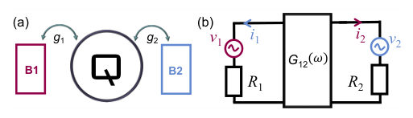
<figcaption class="paper-figure-caption"><b>Fig 1.</b> FIG. 1. The two-bath setup in an electric circuit. In the Lind- blad model in (a), heat between baths B1 and B2 is trans- ported via emission and absorption of microwave photons by each of them on the quantum circuit “Q” in between. In the circuit model in (b) each resistor bath generates thermal noise voltage that is converted into a noise current in the opposite resistor, thus transporting heat between the two.</figcaption>
</figure>
<figure class="paper-figure-card">
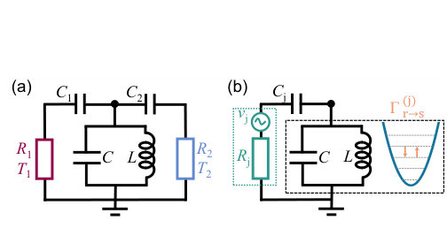
<figcaption class="paper-figure-caption"><b>Fig 2.</b> FIG. 2. The exemplary circuit to assess the two models. (a) The quantum circuit between the baths, namely the two re- sistors Rj maintained at temperatures Tj for j = 1, 2, is rep- resented by a harmonic oscillator (LC-circuit) coupled to the baths via the coupling capacitances Cj, j = 1, 2. (b) Illus- tration of how the resistor Rj acts as a thermal noise source acting on the LC-circuit which forms a quantum harmonic oscillator.</figcaption>
</figure>
<figure class="paper-figure-card">
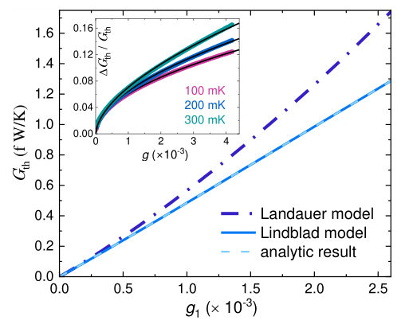
<figcaption class="paper-figure-caption"><b>Fig 3.</b> FIG. 3. Thermal conductance in a circuit presented in Fig. 2 as a function of coupling g1 for the two models along with the analytical result P = GthδT. The parameters are: R1 = R2 = 100 Ω, C = 6 C1 = 2 C2 = 30 fF, and L = 4.2 nH. The inset plot shows (GCircuit th −GLindblad th )/GCircuit th for three different temperatures as a function of coupling for the same circuit when the couplings are equal C1 = C2 = 5 fF. The black solid lines indicate fit to the numerical data with the function P = agb where b = 0.50, 0.54, and 0.58, for 100, 200, and 300 mK, respectively.</figcaption>
</figure>

**Summary.** This paper rigorously compares the Lindblad master equation approach with a circuit/Landauer model for calculating heat transport in quantum circuits. The authors demonstrate that while both methods agree in the weak coupling limit, they quantify the breakdown of this approximation at stronger couplings. This comparison provides crucial guidelines for applying open system dynamics theories to superconducting quantum devices.

**Why it may be interesting.** This work is highly relevant as it provides a rigorous cross-validation between two powerful theoretical tools (Lindblad vs. circuit theory) used to model open quantum systems, offering guidance on when approximations are valid for complex superconducting circuits.

Detailed structure

**Main problem.** The paper compares two theoretical frameworks—the Lindblad master equation approach and a circuit/Landauer model—for accurately calculating quantum heat transport mediated by thermal microwave photons in superconducting circuits.

**Main result.** For linear circuits, both models yield identical results in the weak coupling limit; however, the analysis quantifies that the weak coupling assumption limits the applicability of the Lindblad approach for quantitative predictions at larger couplings.

**Method.** The authors compare steady-state solutions derived from a Lindblad master equation (using Fermi's golden rule) against power calculations based on thermal noise spectra and transconductance in an equivalent circuit model.

**Model / system.** The system is modeled as an archetypal two-bath setup where heat flows through a cavity mediating interaction between the baths. The analysis extends to include anharmonic elements like qubits, which challenge the weak coupling assumption.

**Key observables.** Heat current (P) and thermal conductance ($G_{th}$)

**Important parameters / regimes.** Coupling constants ($g_j$ or $G_{12}(\omega)$), temperature difference ($\delta T$), and the strength of coupling relative to system parameters.

**Assumptions / limitations.** The primary assumption tested is the weak coupling limit required for the Lindblad master equation approach; deviations from this limit lead to discrepancies with the circuit model.

**Figures summary.** Figure 1 illustrates both the quantum Lindblad and microwave circuit approaches. Figure 3 numerically compares thermal conductance ($G_{th}$) derived from both models against varying coupling strengths, showing agreement at weak coupling but divergence otherwise.

**Paper structure.** The paper first introduces the physical problem and details the two competing theoretical frameworks (Lindblad vs. Circuit). It then performs an analytical comparison in the linear regime, derives quantitative expressions for thermal conductance, and concludes by assessing the range of validity of the weak coupling approximation using numerical comparisons.

Abstract

We compare two popular models applicable to analyzing heat transport by thermal microwave photons in quantum circuits. The first model is derived from a weak-coupling Lindblad master equation, with transition rates determined by Fermi's golden rule induced by thermal dissipation sources. The second approach employs a circuit model, where thermal Johnson-Nyquist noise generated by dissipative elements introduces currents, and consequently Joule power, in other parts of the circuit. This leads to a Landauer type expression of heat transport where the transmission coefficient is proportional to the transconductance in the circuit. We find that the two models yield identical results in a linear circuit in the weak coupling limit with an analytic expression of power in an archetypal circuit of a cavity mediating heat between two baths. Our analysis yields a quantitative assessment of the range of validity of the weak coupling assumption in a circuit. Due to the correspondence of the two results, we feel confident in applying the weak coupling Lindblad model also for analyzing heat transport in quantum circuits consisting, e.g. of qubits and/or non-linear resonators.

[↑ back to top](#top)

### [Duck hunting with quantum mechanics](http://arxiv.org/abs/2608.00579v1)

**Authors:** Artem Alexandrov  
**Type:** theory · **Category:** statistical mechanics · **PDF:** <https://arxiv.org/pdf/2608.00579v1>  
**Analysis basis:** full PDF text, analyzed in chunks
**Topic relevance:** `driven-dissipative phase transition` **3/5** · `methods for driven-dissipative` **3/5** · `non-equilibrium dynamics` **2/5** · `non-equilibrium universality` **2/5** · `Frenkel-Kontorova` **1/5** · `Keldysh / 2PI / non-Gaussian methods` **1/5** · `correlated / nonlocal dissipation` **1/5**

↔ Scroll figures horizontally

<figure class="paper-figure-card">
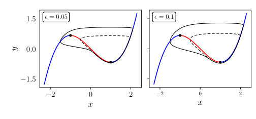
<figcaption class="paper-figure-caption"><b>Fig 1.</b> Figure 1. Canard trajectories in VdP system. Solid line: ca- nard with “head”, dashed line: canard without “head”. Un- stable branch of critical curve is colored red, stable branch is colored blue. Fold points are shown as black dots.</figcaption>
</figure>
<figure class="paper-figure-card">
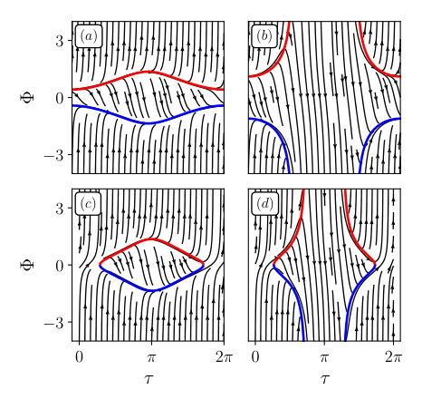
<figcaption class="paper-figure-caption"><b>Fig 2.</b> Figure 2. Vector fields for eq. (7) with ω = 0.1. Blue line corresponds to stable branch Φ− 0 (τ), red line corresponds to unstable branch Φ+ 0 (τ). Parameters are: (a) A = 0.5, B = 0.2, (b) A = 0.7, B = −0.8, (c) A = 0.8, B = 0.5, (d) A = 1.5, B = 0.0. Cases (b-d) are “canard candidates”: at least one real fold point exists. For (a) there is no real fold points. In all cases the branches continue by periodicity in τ.</figcaption>
</figure>
<figure class="paper-figure-card">
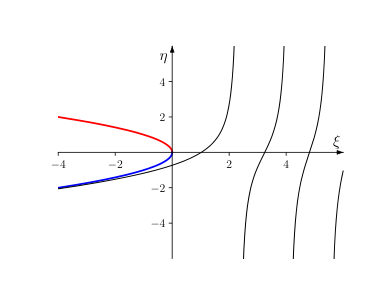
<figcaption class="paper-figure-caption"><b>Fig 3.</b> Figure 3. Local dynamics near the fold. The attracting branch is colored blue, the repelling branch is colored red.</figcaption>
</figure>
<figure class="paper-figure-card">
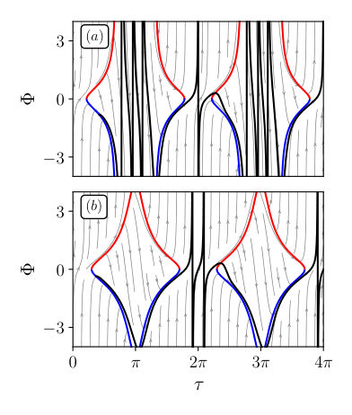
<figcaption class="paper-figure-caption"><b>Fig 4.</b> Figure 4. (a) Φ(t) for ω = 0.1, n = 1, A = 1.5 (respective B = −0.15894), both τ± are real; (b) Φ(t) for ω = 0.1, n = 2, A = 1.2 (respective B = 0.29034), τ+ is complex, τ−is real and causes quantization.</figcaption>
</figure>
<figure class="paper-figure-card">
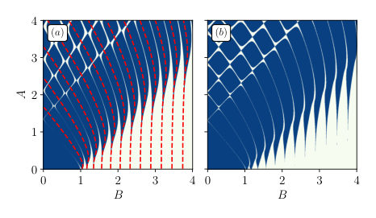
<figcaption class="paper-figure-caption"><b>Fig 5.</b> Figure 6. (a) Numerically obtained Arnold tongues (shaded by dark) and its center location from leading order analytical expressions (dashed red), (b) analytical leading order band- gap structure, obtained from DDP quantization. Both pic- tures have ω = 0.3.</figcaption>
</figure>

**Summary.** This paper establishes a profound link between the classical dynamics of slow-fast systems and the semi-classical behavior of quantum mechanics. Using the overdamped Josephson junction as a key example, it demonstrates that classically trapped canard solutions are mathematically equivalent to instantons in the corresponding quantum system. The methodology involves advanced techniques from dynamical systems theory and elliptic function analysis to derive precise quantization conditions.

**Why it may be interesting.** This work provides a powerful, unified mathematical framework connecting classical geometric phenomena (canards) directly to quantum spectral quantization rules, which is highly relevant for understanding Josephson junctions and other nonlinear quantum devices.

Detailed structure

**Main problem.** The paper bridges singular perturbation theory from classical slow-fast systems with semi-classical quantum mechanics by establishing a deep connection between canard solutions and instantons.

**Main result.** It shows that for specific physical systems, the existence of classically defined canard trajectories corresponds exactly to quantization conditions derived from the corresponding quantum system's action integrals.

**Method.** The analysis combines slow-fast dynamical systems theory (analyzing fold points and phase shifts) with semi-classical methods like WKB approximation and elliptic integral calculations for spectral properties.

**Model / system.** The primary model is the overdamped Josephson junction, governed by an equation related to the RSJ equation. The analysis is performed on a 2D torus ($T^2$) using transformations that map the system dynamics to Riccati equations and ultimately to Schrödinger-like problems.

**Key observables.** Poincaré Rotation Number ($
ho$), Canard Window (gap between Shapiro steps), Phase Shifts ($\pi/4$ per fold), Quantized phase-slip rates ($N>$ and $N<$).

**Important parameters / regimes.** The small parameter $\omega$ (related to the time scale separation) and system parameters $(A, B)$ that define different dynamical regimes.

**Assumptions / limitations.** The formal expansions used are divergent Gevrey-1 series; the analysis relies on specific continuation techniques across domain wall lines in the parameter space.

**Figures summary.** Figure 1 illustrates canard trajectories in a VdP system. Figure 2 shows vector fields for the transformed JJ equation at different parameters, highlighting 'canard candidates.' Figure 3 details local dynamics near a fold point.

**Paper structure.** The paper proceeds by first establishing the connection between slow-fast systems and quantum mechanics using Möbius systems. It then derives quantization conditions by analyzing phase shifts accumulated across fold points (using elliptic integrals) and finally relates these to spectral properties via monodromy matrix analysis on an elliptic curve.

Abstract

We bridge two sides of singular perturbation theory: the classical theory of slow-fast systems and the semi-classical approach to quantum mechanical systems. For a specific but physically important class of dynamical systems, we show that purely classical and exotic objects, so-called canard solutions, are shadows of instantons in the corresponding quantum system. We demonstrate that canard solutions exist in a domain of parameter space whose boundaries are determined by an instanton action. We illustrate our statements analytically for the relevant example, the overdamped Josephson junction, and confirm them numerically. For the Josephson junction, the canard window is the exponentially narrow gap between consecutive Shapiro steps.

[↑ back to top](#top)

### [Topological Defects in Triple-$Q$ Magnetic Orders: A Fixed-Lattice Homotopy Classification](http://arxiv.org/abs/2608.01838v1)

**Authors:** Jin-Tao Jin, Yi Zhou  
**Type:** theory · **Category:** strongly correlated electrons · **PDF:** <https://arxiv.org/pdf/2608.01838v1>  
**Analysis basis:** full PDF text, analyzed in chunks
**Topic relevance:** `analog quantum simulation` **3/5** · `exotic spin models in light-matter` **3/5** · `driven-dissipative phase transition` **2/5** · `entanglement & information structure` **1/5** · `methods for driven-dissipative` **1/5** · `non-equilibrium dynamics` **1/5** · `non-equilibrium universality` **1/5** · `spintronics-quantum-optics interface` **1/5**

↔ Scroll figures horizontally

<figure class="paper-figure-card">
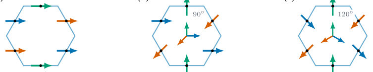
<figcaption class="paper-figure-caption"><b>Fig 1.</b> FIG. 1. Triple-Q geometry and representative ordered states, drawn in TikZ using the notation and color conventions of Ref. [17]. (a) Three physically labeled ordering wave vectors at the distinct, symmetry-related M points of the hexagonal Brillouin zone. (b)–(f) Fourier-amplitude configurations for phases I, IIB, IIIA, IIIB, and IIIC. Green, red, and blue consistently label the amplitudes at M1, M2, and M3, respectively. The central arrows show relative spin-space orientations; the mutually orthogonal IIIB frame is shown schematically in planar projection.</figcaption>
</figure>
<figure class="paper-figure-card">
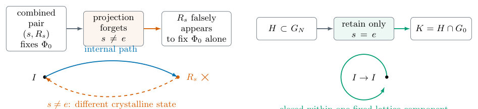
<figcaption class="paper-figure-caption"><b>Fig 2.</b> FIG. 2. Stabilizer construction, where I denotes the identity spin transformation. A pair (s, Rs) may fix Φ0 although neither part does separately. (a) Projection onto spin space is mathematically well defined, but using the projected group as the stabilizer drops s ̸= e and falsely identifies Rs as an internal closure even though the endpoint differs by a nontrivial crystalline transformation. (b) The connected stabilizer is instead obtained by intersection, which retains only trivial crystalline parts and ensures that loops close within one fixed-lattice component.</figcaption>
</figure>
<figure class="paper-figure-card">
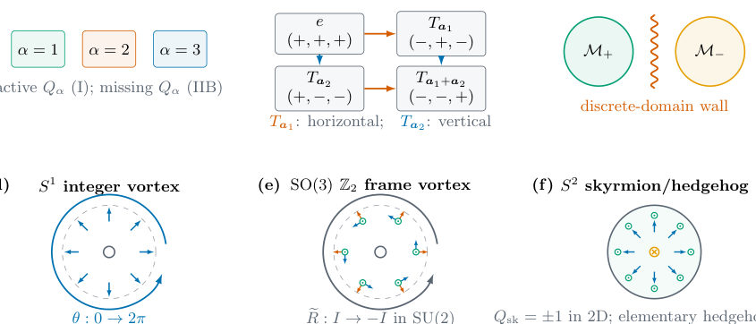
<figcaption class="paper-figure-caption"><b>Fig 3.</b> FIG. 3. Defect atlas keyed to the final column of Table I. (a) Three choices of active Q in phase I or missing Q in phase IIB. (b) The four translation-related V4 antiphase sectors; red and blue arrows apply Ta1 and Ta2. (c) Two components distinguished by frame orientation in phase IIB, scalar chirality in phase IIIB, or vector chirality in phase IIIC; M+ and M− are each homeomorphic to the phase-specific connected manifold M0 listed in Table I. (d) The integer 2π generator of an S1 component. (e) The nontrivial Z2 frame loop in SO(3), which lifts from I to −I in SU(2). Red and blue arrows denote two frame axes and the green dot the third. (f) An S2 texture, representing a skyrmion in two...</figcaption>
</figure>
<figure class="paper-figure-card">
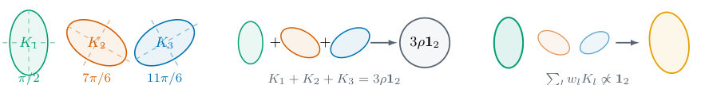
<figcaption class="paper-figure-caption"><b>Fig 4.</b> FIG. 4. Stiffness geometry. (a) Label-locked constant-energy ellipses for η &gt; 0; their short and long axes correspond to ρ + η and ρ −η and interchange for η &lt; 0. (b) Equal derivative contributions from the three labels give 3ρ12. (c) Unequal derivative contributions retain anisotropy in single- and double-Q phases, generic phase-IIIB frame textures, and near cores or walls.</figcaption>
</figure>

**Summary.** This theoretical work classifies the rich defect structure found in exotic magnetic phases called Triple-$Q$ magnets. It uses advanced topological tools, specifically homotopy groups, to determine the types and stability of defects like vortices and domain walls based on the underlying crystal and spin symmetries. The results provide a detailed map of the stable ordered states for these complex quantum materials.

**Why it may be interesting.** While focused on magnetism, the rigorous topological classification methodology—using homotopy theory ($\pi_k$) applied to symmetry-broken ordered states—is highly relevant for understanding defects in complex quantum materials or frustrated magnetic systems studied in AMO physics.

Detailed structure

**Main problem.** The paper aims to classify topological defects (vortices, domain walls) present in complex magnetic orders that combine continuous spin rotations with discrete crystalline symmetries.

**Main result.** It classifies seven stable phases by determining their defect content using homotopy groups ($\pi_1, \pi_2$), distinguishing between free internal defects and wall-bound composites.

**Method.** The classification relies on calculating the homotopy groups of the ordered-state manifold $M = G/H$, where $G$ is the full symmetry group and $H$ is the stabilizer subgroup.

**Model / system.** The system models Triple-$Q$ magnetic orders using an M-point triple-$Q$ Ginzburg–Landau theory, incorporating symmetries from translations ($V_4$) and point groups ($D_3$), alongside spin rotations ($\mathrm{O}(N)$).

**Key observables.** Topological defect types: domain walls ($\pi_0$), vortices ($\pi_1$), and skyrmion/hedgehog textures ($\pi_2$).

**Important parameters / regimes.** The dimensionality $N$ (for spin components) and the specific symmetry group structure ($V_4 
times D_3$) are crucial parameters.

**Assumptions / limitations.** The classification assumes a fixed-lattice background, explicitly excluding lattice dislocations and disclinations from the free defect count.

**Figures summary.** Figures illustrate representative Fourier-amplitude configurations for different phases and schematically distinguish between free defects and wall-bound endpoints. Table I summarizes the calculated defect content ($\pi_1, \pi_2$) for all seven stable phases.

**Paper structure.** The paper systematically builds the theory by defining the symmetry group, deriving the mathematical framework using homotopy groups based on stabilizer subgroups ($H$ and $K$), applying this machinery to classify specific magnetic phases (I through IIIC), and finally detailing the physical implications of these defect types.

Abstract

Multiple-$Q$ magnetic orders combine continuous spin rotations with discrete crystalline sectors associated with translations and point-group transformations, producing a richer defect structure than conventional single-$Q$ magnets. We classify the bulk defects of all seven stable phases for $N=2$ and $3$ in the $M$-point triple-$Q$ Ginzburg--Landau theory with $(\Vfour\rtimes\Dthree)\times\OO(N)$ symmetry, where $\Vfour$ is the translation-generated Klein four-group. The atomic lattice is treated as a prescribed background, with lattice dislocations and disclinations excluded and the three Fourier fields retaining their physical $M$-point labels. The parent-group transformations continuously connected to the identity form $G_0=\{e\}\times\SO(N)$. For a reference-state stabilizer $H$, the connected component containing the reference state is $G_0/(H\cap G_0)$, not the quotient obtained by projecting $H$ onto spin space. This distinction gives the orthogonal triple-$Q$ phase the full manifold $\OO(3)$, with chirality walls and Abelian $\ZZ_2$ frame vortices rather than non-Abelian binary-polyhedral vortices. Every connected component of the $\OO(2)$ phases supports an integer $2π$ vortex, whereas fractional windings close only when attached to a discrete-domain wall and are linearly confined at nonzero wall tension. Translation symmetry further forbids cross-gradient bilinears, reducing the quadratic elastic sector to an isotropic and an $M$-point-locked anisotropic stiffness. The classification separates free internal defects, crystalline domain walls, and wall-bound composites in triple-$Q$ magnets.

[↑ back to top](#top)

### [Limits of heralded photonic Bell-state generation in the presence of loss](http://arxiv.org/abs/2608.01549v1)

**Authors:** Kevin J. Randles, Manuel H. Muñoz-Arias, Mohan Sarovar  
**Type:** theory · **Category:** quantum information and computing · **PDF:** <https://arxiv.org/pdf/2608.01549v1>  
**Analysis basis:** full PDF text, analyzed in chunks
**Topic relevance:** `interference shaping light` **3/5** · `QC/QI experiment` **2/5** · `quantum optics experiment` **2/5** · `correlated / nonlocal dissipation` **1/5** · `correlated cavity matter` **1/5** · `driven-dissipative phase transition` **1/5** · `entanglement & information structure` **1/5** · `methods for driven-dissipative` **1/5**

↔ Scroll figures horizontally

<figure class="paper-figure-card">
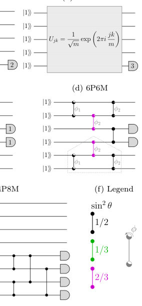
<figcaption class="paper-figure-caption"><b>Fig 1.</b> FIG. 1. Class of heralded Bell-state generation schemes considered in this work. (a)-(f) See main text and Table I. (a) HBSG scheme using minimal number of photons and modes (one for the heralding measurement and four for the output Bell state) [28]. (b) This circuit is an m × m discrete Fourier transform (DFT) with m = 5. We simply specify the matrix elements on the graphic as there are a variety of ways to implement such an in- terferometer (see App. H 3). (d) This circuit uses two m = 3 DFT circuits (the bottom of which is highlighted in the dashed region) followed by a single 50:50 beam- splitter and detection on the corresponding modes. Each DFT is decomposed into three beamsplitters...</figcaption>
</figure>
<figure class="paper-figure-card">
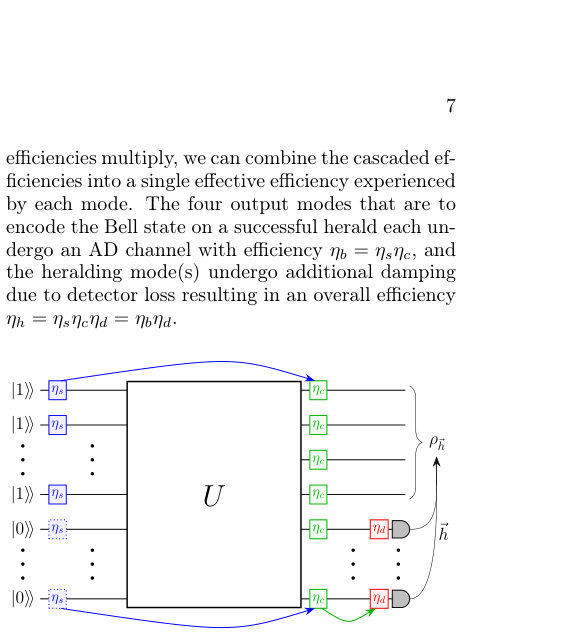
<figcaption class="paper-figure-caption"><b>Fig 2.</b> FIG. 2. Lumped photon loss model, wherein loss occurs at the photon sources, within the circuit, and at the detectors with efficiencies ηs, ηc, and ηd, respectively. In this model one can shift the loss to the end of the circuit using properties of photon loss channels.</figcaption>
</figure>
<figure class="paper-figure-card">
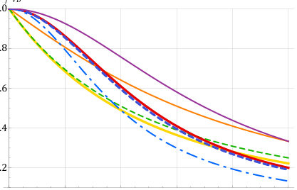
<figcaption class="paper-figure-caption"><b>Fig 3.</b> FIG. 3. Plot of F/η2 b = f −1 versus γh for each HBSG circuit considered here (see text for details).</figcaption>
</figure>
<figure class="paper-figure-card">
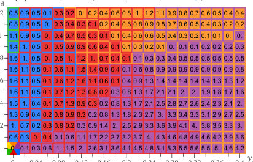
<figcaption class="paper-figure-caption"><b>Fig 4.</b> FIG. 4. Comparison of the HBSG circuits of Fig. 1 in the presence of HSPS multiphoton errors and lumped circuit photon loss. (a) Array plot of the maximum fi- delity out of each HBSG scheme s, Fmax = maxs(Fs), for each point (γb, γid) in the shown region; here nextra = 4. We overlay contours from a linearly interpolated grid (dashed white) and lines separating regions with differ- ent “winning” (max) schemes (dark red). (b) Winner and margin plot highlighting—for each γb, γid—which circuit has the highest fidelity (indicated via the central pixel color in colors consistent with the subcaption and Fig. 3) and by what margin, i.e., how much better it does than the second best circuit as a...</figcaption>
</figure>
<figure class="paper-figure-card">
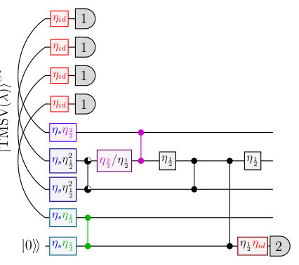
<figcaption class="paper-figure-caption"><b>Fig 5.</b> FIG. 5. Lossy HSPS and frequency beamsplitter model for the 4P5M scheme. The top four modes are heralding idler modes that are entangled with the top four sig- nal modes via TMSV states as indicated via the linking arcs. In addition to heralding detector loss, ηid, and sig- nal mode source loss, ηs, we account for beamsplitter loss with efficiencies η 1</figcaption>
</figure>

**Summary.** This paper rigorously analyzes how photon loss degrades the quality of heralded Bell-state generation in photonic quantum circuits. By developing advanced error models applicable to integrated optics, it provides critical trade-offs between circuit design choices (e.g., higher vs. lower photon number schemes) and achievable fidelity under realistic loss conditions.

**Why it may be interesting.** This work provides crucial quantitative design guidelines for implementing quantum protocols using integrated photonics, directly impacting the feasibility assessment for photonic quantum computation and communication networks.

Detailed structure

**Main problem.** The work analyzes the performance limits of heralded photonic Bell-state generation (HBSG) when realistic error mechanisms, particularly photon loss, are present.

**Main result.** Schemes utilizing higher-order multiphoton interference show superior fidelity robustness in low-loss regimes, while lower-photon-number schemes may be better if source or beam splitter losses dominate the resource cost.

**Method.** The authors developed a hierarchy of error models, ranging from simple lumped-loss approximations to complex integrated frequency-bin implementations incorporating architecture-dependent loss channels.

**Model / system.** The physical system is photonic quantum information processing using dual-rail encoded states on integrated optics platforms. The analysis focuses on generating fundamental entangled seed states like Bell pairs and GHZ states.

**Key observables.** Heralding probabilities, fidelities ($F$), and error robustness of the generated entangled states.

**Important parameters / regimes.** Loss efficiency ($\eta$), number of photons/modes ($N, M$), and specific loss parameters related to beamsplitter coupling ($\Omega$).

**Assumptions / limitations.** The analysis assumes a discrete-variable formalism and models loss using bosonic amplitude damping (AD) channels. Specific circuit variants are compared based on the location of assumed losses.

**Figures summary.** Figures illustrate various HBSG circuits (e.g., 4P5M, 6P6M), comparing fidelity performance histograms across different levels of modeled beam splitter loss ($\Omega$).

**Paper structure.** The paper progresses by first establishing the general problem, then developing increasingly complex error models (lumped loss $	o$ HSPS errors $	o$ frequency-bin loss). It compares multiple circuit variants to derive design guidance based on the dominant source of experimental imperfection.

Abstract

High-quality entangled states of photons underlie quantum information science (QIS) applications across communication, sensing, and computing. In many discrete-variable photonic QIS architectures, large application-ready states (e.g., cluster states, repeater graph states) are constructed via fusion measurements on small entangled seed states, of which Bell states are the fundamental example. The quality of seed-state generation therefore sets a baseline for application performance, making it crucial to understand this process under realistic error mechanisms, particularly in integrated photonics experiments. In this work, we analyze five heralded schemes for generating event-ready photonic Bell states, contrasting their heralding probabilities, fidelities, and error robustness. We develop a hierarchy of error models, progressing from an analytically tractable lumped-loss model to realistic heralded single-photon sources with multiphoton emission errors and finally to integrated frequency-bin implementations with architecture-dependent loss. Across these models, we find that schemes based on higher-order multiphoton interference provide superior fidelity robustness in low-loss implementations, while lower-photon-number schemes can be preferable when probabilistic sources or lossy beamsplitters dominate the resource cost. Our results provide design guidance for integrated discrete-variable quantum photonics, with particular relevance for frequency-bin architectures where active beamsplitter loss can determine the optimal resource-state-generation strategy.

[↑ back to top](#top)

### [Front Selection Is Not Determined by Renormalization-Group Stability](http://arxiv.org/abs/2608.02211v1)

**Authors:** Ko Okumura  
**Type:** theory · **Category:** statistical mechanics · **PDF:** <https://arxiv.org/pdf/2608.02211v1>  
**Analysis basis:** full PDF text, analyzed in chunks
**Topic relevance:** `non-equilibrium dynamics` **3/5** · `non-equilibrium universality` **3/5** · `driven-dissipative phase transition` **2/5** · `Frenkel-Kontorova` **1/5** · `Keldysh / 2PI / non-Gaussian methods` **1/5** · `methods for driven-dissipative` **1/5**

↔ Scroll figures horizontally

<figure class="paper-figure-card">
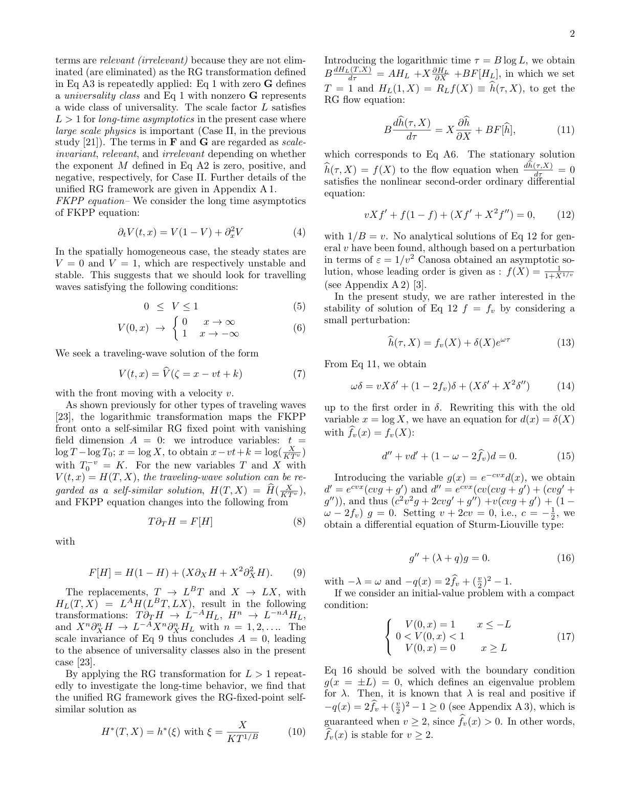
<figcaption class="paper-figure-caption"><b>Fig 1.</b> Low-resolution page preview, page 2</figcaption>
</figure>
<figure class="paper-figure-card">
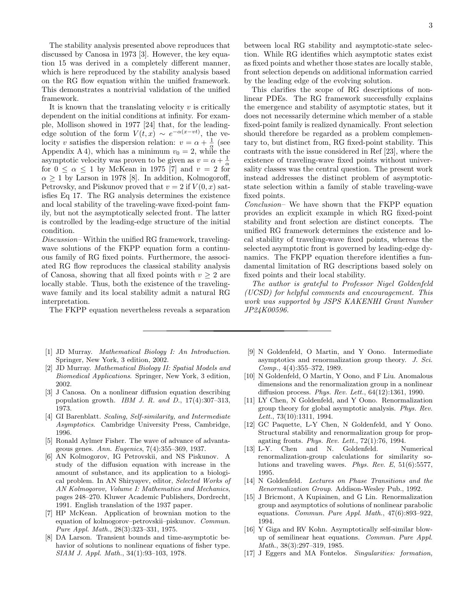
<figcaption class="paper-figure-caption"><b>Fig 2.</b> Low-resolution page preview, page 3</figcaption>
</figure>
<figure class="paper-figure-card">
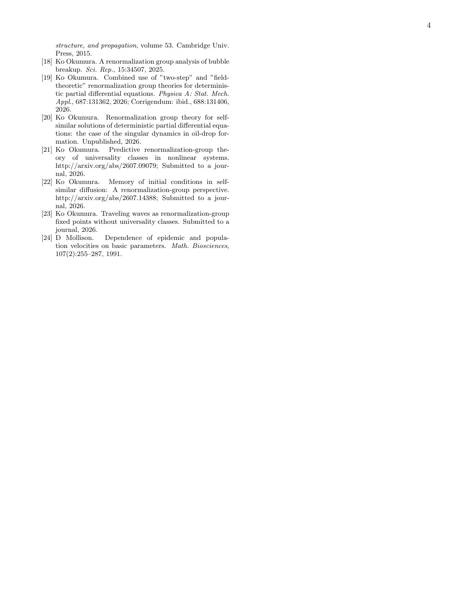
<figcaption class="paper-figure-caption"><b>Fig 3.</b> Low-resolution page preview, page 4</figcaption>
</figure>
<figure class="paper-figure-card">
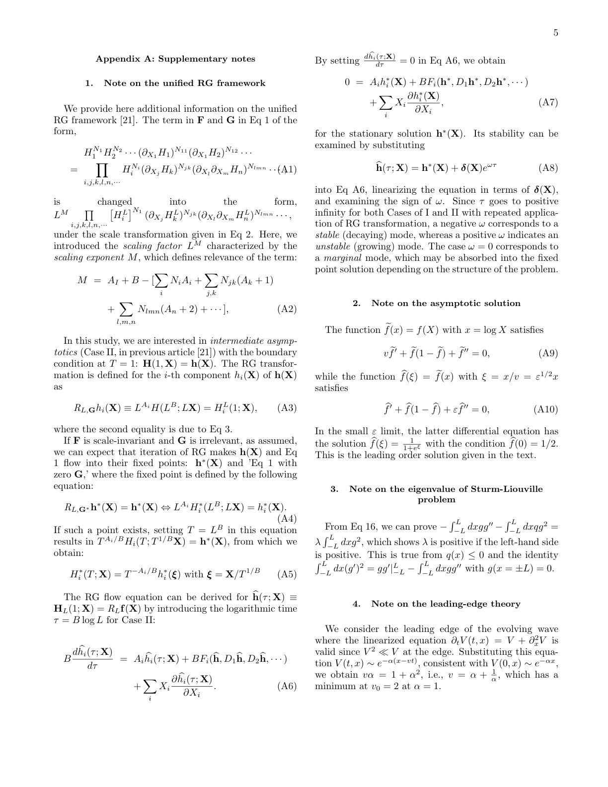
<figcaption class="paper-figure-caption"><b>Fig 4.</b> Low-resolution page preview, page 5</figcaption>
</figure>

**Summary.** This paper investigates whether local stability derived from Renormalization Group theory determines the final state reached by a propagating front described by the FKPP equation. Using RG analysis, the authors confirm that while all fronts with $v \geq 2$ are locally stable, this stability criterion is insufficient to predict which specific asymptotic state will materialize. They conclude that dynamic selection relies on external information carried by the leading edge of the solution.

**Why it may be interesting.** The distinction drawn between formal stability (RG) and dynamic selection is crucial in non-equilibrium statistical mechanics, impacting how one models pattern formation or phase transitions where multiple stable states might exist.

Detailed structure

**Main problem.** The study aims to determine if the stability of Renormalization-Group (RG) fixed points dictates which asymptotic state is selected during nonlinear wave propagation.

**Main result.** The analysis shows that for the FKPP equation, RG fixed-point stability and the actual asymptotically selected front state are distinct concepts. The selection depends on the leading-edge structure of the initial condition, not solely on local stability.

**Method.** A unified Renormalization-Group (RG) framework is applied to analyze traveling-wave solutions of nonlinear PDEs, supplemented by linearizing the dynamics at the solution's leading edge.

**Model / system.** The primary model is the Fisher–Kolmogorov–Petrovsky–Piskunov (FKPP) equation ($\partial_t V = V(1 -V) + \partial_{xx}V$), which serves as a canonical example for studying front propagation and asymptotic state selection.

**Key observables.** Traveling wave velocity ($v$), RG fixed points, local stability eigenvalues ($\omega$).

**Important parameters / regimes.** The velocity threshold $v \geq 2$ is highlighted in the stability analysis.

**Assumptions / limitations.** The leading-edge dynamics are analyzed under the approximation that $V^2 \ll V$ at the edge. The RG framework itself provides a description of existence and local stability.

**Figures summary.** Not specified by the notes.

**Paper structure.** The paper first establishes the FKPP equation as the model system, then applies an RG framework to show that solutions form a continuous family of fixed points. It subsequently performs a detailed stability analysis confirming local stability for $v \geq 2$, culminating in the argument that this stability does not determine the final selected state.

Abstract

The Fisher--Kolmogorov--Petrovsky--Piskunov equation provides a paradigmatic example of front propagation and asymptotic-state selection. Using a unified renormalization-group (RG) framework, we show that its traveling-wave solutions form a continuous family of RG fixed points and that all fronts with $v \ge 2$ are RG-stable. Nevertheless, the asymptotically selected front is not determined by RG stability. The FKPP equation therefore provides an explicit example in which RG fixed-point stability and asymptotic-state selection are distinct concepts.

[↑ back to top](#top)

### [Interplay of spin-orbit coupling, crystal field splitting and correlations: a ghost rotationally invariant slave boson treatment](http://arxiv.org/abs/2608.00254v1)

**Authors:** Xue Sun, Walber Hugo Brito, Andreas Gleis, Ran Adler, Tsung-Han Lee, Gabriel Kotliar, Corey Peters  
**Type:** theory · **Category:** strongly correlated electrons · **PDF:** <https://arxiv.org/pdf/2608.00254v1>  
**Analysis basis:** full PDF text, analyzed in chunks
**Topic relevance:** `Keldysh / 2PI / non-Gaussian methods` **3/5** · `driven-dissipative phase transition` **2/5** · `methods for driven-dissipative` **2/5** · `Kondo & dissipative impurity` **1/5** · `analog quantum simulation` **1/5** · `correlated cavity matter` **1/5** · `non-equilibrium dynamics` **1/5**

↔ Scroll figures horizontally

<figure class="paper-figure-card">
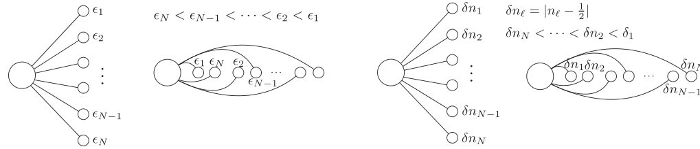
<figcaption class="paper-figure-caption"><b>Fig 1.</b> FIG. 1: Sketch of the different chain orderings of the bath in the star geometry. The large circle denotes the impurity, containing 6 fermionic spin-orbitals. Each small circle denotes a spin-orbital of the bath, and each circle (impurity and bath) corresponds to a site in the MPS. (a) Ordering of bath orbitals by their single-particle energies. (b) Ordering of bath orbitals by occupation. To estimate the occupation of the bath orbitals, we have performed a small-scale DMRG calculation with energy-ordering at bond dimension D ≤300.</figcaption>
</figure>
<figure class="paper-figure-card">
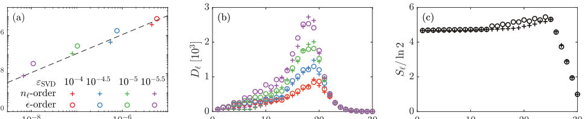
<figcaption class="paper-figure-caption"><b>Fig 2.</b> FIG. 2: (a) Relative error in energy versus discarded weight ξ. Different colors denote different singular-value thresholds εSVD. The symbols denote different bath orderings; circles for ordering by energy and crosses for ordering by occupation. The reference energy E0 is obtained by ξ-extrapolation of the occupation-ordered (crosses) energies. (b) Corresponding bond dimensions, versus MPS bond index ℓ. The bond dimension is strongly peaked at bonds ℓ= 19 and 20, where most of the computational time is spent. (c) Entanglement entropy Sℓat different bonds, computed at εSVD = 10−5.5. At the scale shown here, it would be essentially indistinguishable from that at εSVD = 10−4.</figcaption>
</figure>
<figure class="paper-figure-card">
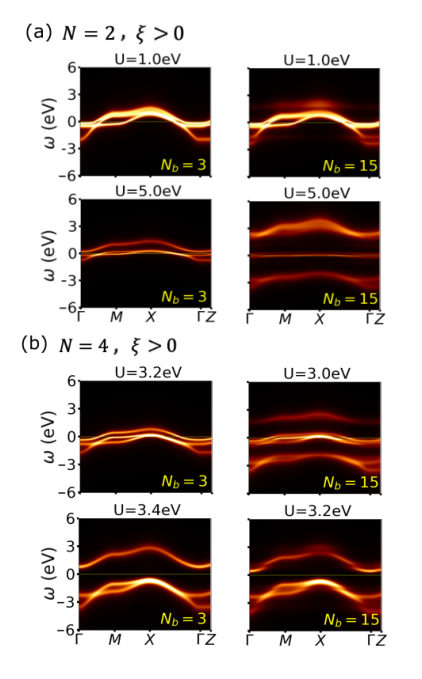
<figcaption class="paper-figure-caption"><b>Fig 3.</b> FIG. 4: Spectral functions of the three-orbital model obtained within GRISB under different fillings N and interactions U, with spin-orbit coupling only (∆= 0, J = 0). In (a) we show the results for N = 2 and (b) for N = 4. The bath size is Nb = 3, 15 respectively from the left to the right. The bare spin-orbit coupling is ξ = 0.2 eV.</figcaption>
</figure>
<figure class="paper-figure-card">
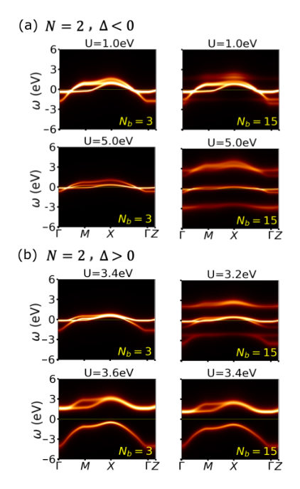
<figcaption class="paper-figure-caption"><b>Fig 4.</b> FIG. 3: Spectral function of the three-orbital model solved by RISB (left, Nb = 3) or GRISB (right, Nb = 15) for different values of the crystal field splitting ∆(ξ = 0, J = 0) in panels (a) and (b) for different values of the interaction U. The bath size is Nb = 3, 15 respectively from the left to the right. The bare crystal field splitting is ∆= −0.2 eV in (a) and ∆= 0.3 eV in (b).</figcaption>
</figure>
<figure class="paper-figure-card">
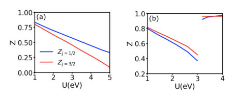
<figcaption class="paper-figure-caption"><b>Fig 5.</b> FIG. 5: Quasiparticle weight Z with fillings (a) N = 2 and (b) N = 4. The bare spin-orbit coupling is ξ = 0.2 eV, ∆= 0, and J = 0).</figcaption>
</figure>

**Summary.** This paper uses the Ghost Rotationally Invariant Slave Boson (GRISB) method to study how spin-orbit coupling, crystal field splitting, and electronic correlations interact in $	ext{Sr}_2	ext{RuO}_4$. By varying key interaction parameters U and J, the authors find that correlation strength dictates whether SOC is enhanced or suppressed. This work provides a detailed theoretical understanding of correlated electron behavior in $5d$ oxides.

**Why it may be interesting.** While focused on solid-state physics, the use of advanced quantum embedding techniques like slave bosons and their comparison to DMFT provides a rigorous theoretical framework for handling strong correlations in multi-orbital systems, which shares mathematical complexity with open quantum system treatments.

Detailed structure

**Main problem.** The study investigates the complex interplay between spin-orbit coupling (SOC), crystal field splittings (CFS), and electronic correlations in determining the low-energy properties of transition metal oxides.

**Main result.** The calculations reveal that increasing the Hubbard interaction parameter U enhances the SOC, whereas increasing the Hund's coupling J suppresses it.

**Method.** The research employs the Ghost Rotationally Invariant Slave Boson (GRISB) method, comparing its results against Dynamical Mean Field Theory (DMFT) and experimental data.

**Model / system.** The primary model is the $t_{2g}$ Hubbard-Kanamori model, applied specifically to the material $	ext{Sr}_2	ext{RuO}_4$, using parameters derived from DFT and LQSGW calculations.

**Key observables.** Static and dynamical observables driven by SOC (e.g., occupation matrix, self-energy), quasiparticle weight ($Z$), Fermi surface shape, and the Lifshitz transition as a function of strain.

**Important parameters / regimes.** Hubbard interaction strength ($U$) and Hund's coupling ($J$); low temperature regime; number of ghost orbitals (for convergence study).

**Assumptions / limitations.** The GRISB method is used, which involves solving saddle-point equations derived from a free energy functional, assuming site-independence for simplicity.

**Paper structure.** The paper structure follows an investigation of the model Hamiltonian components (kinetic, interaction, SOC, CFS), applying the GRISB method to calculate various observables, and analyzing the parameter dependence ($U$ vs $J$) and convergence properties.

Abstract

We investigate the interplay of spin-orbit coupling, crystal field splittings, and electronic correlations in the $t_{2g}$ Hubbard-Kanamori model within the recently formulated ghost rotationally invariant slave-boson method (GRISB). In particular, we study a tight binding model of Sr$_2$RuO$_4$ with parameters extracted from density functional theory and linearized quasiparticle self-consistent GW (LQSGW) calculations; we study the behavior of different physical quantities as the number of ghosts increases to examine the convergence of GRISB to dynamical mean field theory (DMFT) and experimental results; and we leverage the ability of GRISB to investigate the model over a wide range of parameters at low temperature. In particular, we examine both static and dynamical observables driven by the spin orbit coupling (SOC) and study how they vary as a function of the Hubbard $U$ and Hund's coupling $J$. GRISB converges quickly for most of these observables, and the calculations reveal the following: $U$ enhances the spin-orbit coupling while $J$ suppresses it. We also study the shape of the Fermi surface within different methodologies, and examine the Lifshitz transition which takes place as a function of strain in this material.

[↑ back to top](#top)

### [Long and short time linear response of metals: a geometric approach](http://arxiv.org/abs/2608.02298v1)

**Authors:** Nishchhal Verma, Raquel Queiroz  
**Type:** theory · **Category:** strongly correlated electrons · **PDF:** <https://arxiv.org/pdf/2608.02298v1>  
**Analysis basis:** full PDF text, analyzed in chunks
**Topic relevance:** `Keldysh / 2PI / non-Gaussian methods` **3/5** · `methods for driven-dissipative` **2/5** · `non-equilibrium dynamics` **2/5** · `analog quantum simulation` **1/5** · `correlated cavity matter` **1/5** · `driven-dissipative phase transition` **1/5** · `non-equilibrium universality` **1/5**

↔ Scroll figures horizontally

<figure class="paper-figure-card">
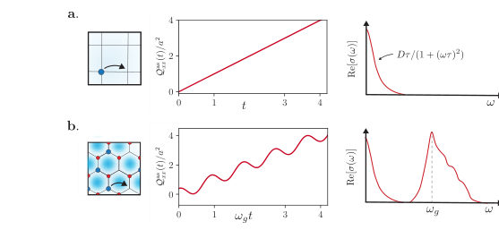
<figcaption class="paper-figure-caption"><b>Fig 1.</b> FIG. 1. Itinerant and bound charge in time and frequency. (a) In a single-orbital metal, dipole fluctuations grow lin- early in time, Qas xx(t) = D t, with the charge stiffness D as the growth rate (middle). The optical conductivity is a sin- gle Drude peak, broadened by a finite scattering time τ into the Lorentzian Dτ/(1 + (ωτ)2) (right). (b) In a multi-orbital metal, bound charge adds oscillations at the inter-band scale ωg on top of the same linear growth. In frequency, these ap- pear as an inter-band absorption peak centered at ωg, well separated from the Drude peak. The ratio D/S1 of Drude to total spectral weight quantifies the fraction of electrons that are itinerant rather than...</figcaption>
</figure>
<figure class="paper-figure-card">
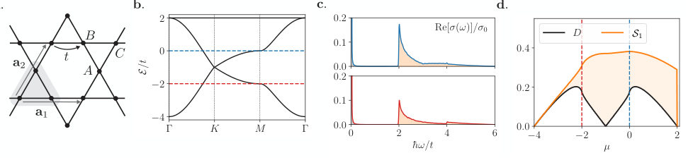
<figcaption class="paper-figure-caption"><b>Fig 2.</b> FIG. 2. Separation of scales in the kagome metal. (a) Kagome lattice with sublattices A, B, C, lattice vectors a1,2, and nearest-neighbor hopping t. (b) Band structure along Γ–K–M–Γ, with the flat band at ε = 2t. Dashed lines mark the two van Hove singularities, at µ = −2t (red) and µ = 0 (blue), positioned symmetrically about the Dirac point. (c) Optical conductivity at the two van Hove fillings. The Fermi surfaces are identical and the Drude peaks nearly coincide, but the inter-band absorption (shaded) is markedly stronger at the upper van Hove filling, closer to the flat band. (d) Drude weight D and total spectral weight S1 as a function of chemical potential µ. The bound-charge...</figcaption>
</figure>

**Summary.** This paper develops a geometric approach using the time-dependent quantum geometric tensor (tQGT) to analyze electronic transport in metals. It challenges the assumption that low-energy metal physics ignores wavefunction geometry by quantifying how this geometry contributes to charge stiffness and spectral weight. The work provides diagnostic tools, like the $D/S_1$ ratio, to probe the balance between itinerant and bound charges.

**Why it may be interesting.** Although focused on metals, the rigorous use of geometric tensors and linear response theory provides advanced tools for analyzing spectral weight transfer and charge dynamics in complex quantum materials, which is relevant to understanding strongly correlated phases.

Detailed structure

**Main problem.** The paper re-evaluates the role of quantum geometry, captured by the time-dependent quantum geometric tensor (tQGT), in describing electronic transport in metals.

**Main result.** It shows that while low-energy response is often thought to ignore wavefunction geometry, the tQGT reveals crucial information about charge stiffness and distinguishes between itinerant and bound charge contributions.

**Method.** The authors use linear response theory, calculating correlation functions involving position operators projected onto the electronic states via the tQGT framework.

**Model / system.** The study focuses on general metals, comparing results across different systems like 2D Dirac semimetals and 3D Weyl semimetals. The analysis is based on single-particle Green's functions derived from a Hamiltonian H.

**Key observables.** Time-dependent quantum geometric tensor (tQGT), Drude weight ($D$), Charge Stiffness ($D_{\mu
u}$), Optical conductivity ($\sigma_{\mu
u}(\omega)$), and the ratio $D/S_1$.

**Important parameters / regimes.** Long times vs. short timescales, low-energy response vs. high-energy states, and the limits $q 	o 0$ and $\omega 	o 0$.

**Assumptions / limitations.** The derivation of charge stiffness relies on gauge invariance (f-sum rule) in the clean limit; disorder is noted to broaden poles.

**Figures summary.** Figure 1 illustrates that dipole fluctuations show linear growth ($Dt$) for single-orbital metals but exhibit oscillations plus linear growth for multi-orbital metals.

**Paper structure.** The paper progresses by first establishing the general framework using tQGT, then applying it to analyze longitudinal response constrained by sum rules, and finally contrasting this with Hall response calculations that reveal distinct contributions from Berry curvature and orbital magnetic moments.

Abstract

The time-dependent quantum geometric tensor, which captures dipole fluctuations of bound electrons, is essential for understanding the electronic properties of insulators, superconductors, and flat bands. It is often considered subleading for low-energy descriptions of metals that are dominated by intra-band processes. Here, we revisit this perspective and highlight scenarios where the quantum geometry of the wavefunctions close to the Fermi surface plays a significant role. We compute the time-dependent quantum geometric tensor for metals, explain its divergence, and contrast it against singular geometric tensors of Dirac and Weyl semi-metals. We identify the ratio of Drude to total spectral weight, $D/\mathcal{S}_1$, as a lattice-scale probe of bound versus itinerant charge, and quantify it in the kagome metal, where the two van Hove fillings respond differently despite identical Fermi surfaces.

[↑ back to top](#top)

### [Microscopic dynamics of consensus formation in multi-agent LLM Naming Games](http://arxiv.org/abs/2608.02178v1)

**Authors:** Cristiano De Nobili, Vijayasri Iyer, Alessandro Codello, Raffaella Burioni  
**Type:** theory · **Category:** statistical mechanics · **PDF:** <https://arxiv.org/pdf/2608.02178v1>  
**Analysis basis:** full PDF text, analyzed in chunks
**Topic relevance:** `methods for driven-dissipative` **3/5** · `non-equilibrium universality` **3/5** · `non-equilibrium dynamics` **2/5** · `Keldysh / 2PI / non-Gaussian methods` **1/5** · `correlated / nonlocal dissipation` **1/5** · `driven-dissipative phase transition` **1/5**

↔ Scroll figures horizontally

<figure class="paper-figure-card">
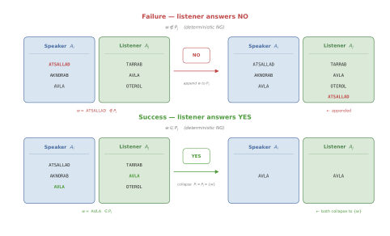
<figcaption class="paper-figure-caption"><b>Fig 1.</b> FIG. 1. Schematic of the Naming Game interaction. In the deterministic NG, the decision step is an inventory check (w ∈ Pj); in the LLM-NG it is replaced by the listener’s LLM call at temperature T.</figcaption>
</figure>
<figure class="paper-figure-card">

<figcaption class="paper-figure-caption"><b>Fig 2.</b> FIG. 2. The two new interaction channels of the LLM-NG that do not exist in the deterministic NG (Fig. 1). Top: a missed collapse occurs when w ∈Pj but the LLM answers NO, at rate 1−π; the inventories are left unchanged. Bottom: a repaint occurs when w /∈Pj but the LLM answers YES, at rate ϕ; the listener discards its inventory and adopts the alien word w. Together with Fig. 1, these panels enumerate the four channels (TP, FN, FP, TN) into which the LLM-NG interaction decomposes (Sec. III).</figcaption>
</figure>
<figure class="paper-figure-card">
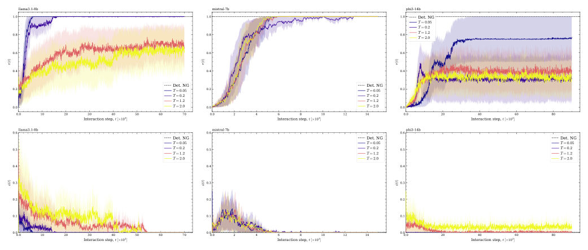
<figcaption class="paper-figure-caption"><b>Fig 3.</b> FIG. 3. Microscopic conditional rates for N = 150 agents at selected temperatures. Top row: consolidation rate π(t) = P(YES | w ∈Pj) for (a) llama3.1:8b, (b) mistral:7b, (c) phi3:14b. Dashed line: deterministic NG (π = 1). Bottom row: repaint rate ϕ(t) = P(YES | w /∈Pj) for (d) llama3.1:8b, (e) mistral:7b, (f) phi3:14b. Dashed line: deterministic NG (ϕ = 0). Shaded bands indicate seed-to-seed variance. Note the different y-axis scales in the bottom row, reflecting the order-of-magnitude difference in repaint noise across models.</figcaption>
</figure>
<figure class="paper-figure-card">
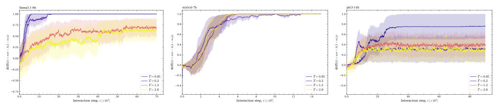
<figcaption class="paper-figure-caption"><b>Fig 4.</b> FIG. 4. Drift proxy ∆(t) = mπ −λ(1−m)ϕ (λ=1) for (a) llama3.1:8b, (b) mistral:7b, (c) phi3:14b. Positive drift implies net ordering.</figcaption>
</figure>
<figure class="paper-figure-card">
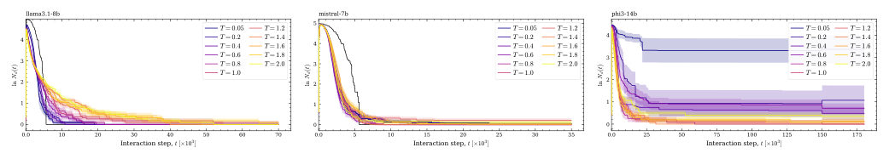
<figcaption class="paper-figure-caption"><b>Fig 5.</b> FIG. 5. Logarithm of the number of distinct words ln Nd(t) for N =150 agents at all explored temperatures (colour-coded from dark = low T to light = high T). Solid black: deterministic NG baseline. (a) llama3.1:8b: standard ordering (high T = slow). (b) mistral:7b: near-deterministic, all T bunched. (c) phi3:14b: inverted ordering (low T = slowest).</figcaption>
</figure>

**Summary.** This paper applies tools from non-equilibrium statistical mechanics to model consensus formation in multi-agent LLM populations. By analyzing the system's dynamics through two key conditional rates, it establishes that decoding temperature acts as a measurable control parameter. The work provides a quantitative taxonomy for understanding how stochasticity dictates collective ordering in AI systems.

**Why it may be interesting.** The framework provides a quantitative statistical physics toolkit—using concepts like critical lines, scaling exponents ($eta$, $\alpha$), and mean-field theory—to analyze emergent collective behavior in complex AI systems.

Detailed structure

**Main problem.** The study investigates the microscopic mechanisms by which internal stochasticity shapes macroscopic ordering during consensus formation among decentralized populations of Large Language Model (LLM) agents.

**Main result.** Consensus is always reached across three distinct listener regimes, and decoding temperature ($T$) emerges as a quantifiable, architecture-dependent control parameter governing the dynamics.

**Method.** The analysis employs mean-field theory applied to a minimal LLM Naming Game (LLM-NG), decomposing interactions into two conditional rates ($\pi(T)$ and $\phi(T)$).

**Model / system.** The system is an LLM Naming Game where agent decisions are stochastic single-token calls at temperature $T$. The dynamics are modeled by tracking the evolution of in-inventory ($P_j$) and out-inventory states.

**Key observables.** Conditional rates ($\pi(T), \phi(T)$), consensus time scaling exponents ($eta(T)$, $\alpha$), and the drift proxy $\Delta(t)$.

**Important parameters / regimes.** Decoding temperature ($T$); The ordering condition is generalized to a critical line in the $(\pi, \phi)$ plane.

**Assumptions / limitations.** The setup is deliberately minimal, excluding prompt engineering or multi-turn memory; mean-field theory and two-rate approximations are used for simplification.

**Figures summary.** Figures illustrate the schematic of the deterministic Naming Game and highlight two new LLM-NG channels: 'Missed collapse' and 'Repaint,' which are crucial for understanding stochasticity.

**Paper structure.** The paper develops a microscopic parametrization using $(\pi, \phi)$ rates to analyze consensus dynamics. It applies mean-field theory to derive ordering conditions and then characterizes different LLM architectures (Llama, Mistral, Phi3) based on how their $(\pi, \phi)$ pair responds to temperature $T$.

Abstract

Decentralized populations of Large Language Model (LLM) agents can spontaneously reach consensus on shared conventions, yet the microscopic mechanisms by which their internal stochasticity shapes macroscopic ordering remain unexplored. We study a minimal LLM Naming Game in which the listener's decision is a single-token LLM call at decoding temperature $T$, replacing the inventory check of the deterministic Naming Game. Each interaction decomposes into an in-inventory and an out-inventory channel with conditional rates $π(T)\!\equiv\!P(\text{YES}\mid w\in P_j)$ and $φ(T)\!\equiv\!P(\text{YES}\mid w\notin P_j)$, whose balance controls an ordering-disordering drift. A mean-field theory of the two-rate dynamics yields an analytical ordering condition that generalizes the consensus threshold of the stochastic Naming Game to a critical line in the $(π,φ)$ plane. Across three open-weight architectures, consensus is always reached, but through three distinct listener regimes: permissive (repaint-noise dominated), near-deterministic, and conservative (missed-collapse dominated). The effective finite-size exponent $β(T)$ in $t_{\rm conv}\!\sim\!N^β$ shifts with temperature, and the temperature-sensitivity $α$ in $t_c\!\sim\!e^{αT}$ ranges from ${\approx}\,0.67$ to ${\approx}\,0$ across architectures. Decoding temperature thus emerges as an architecture-dependent control parameter for decentralized LLM populations, quantitatively characterized by the statistical-physics toolkit.

[↑ back to top](#top)

### [Tunneling the Loss Landscape: Bypassing Memorization with Monte Carlo Parameter Swapping](http://arxiv.org/abs/2608.01833v1)

**Authors:** Lai Shun Chan, Xiaotian Zhang, Yue Shang, Ge Zhang, Entao Yang  
**Type:** both · **Category:** disordered systems and neural networks · **PDF:** <https://arxiv.org/pdf/2608.01833v1>  
**Analysis basis:** full PDF text, analyzed in chunks
**Topic relevance:** `methods for driven-dissipative` **3/5** · `driven-dissipative phase transition` **2/5** · `non-equilibrium dynamics` **2/5** · `non-equilibrium universality` **2/5** · `Frenkel-Kontorova` **1/5** · `scars & prethermalization` **1/5**

↔ Scroll figures horizontally

<figure class="paper-figure-card">
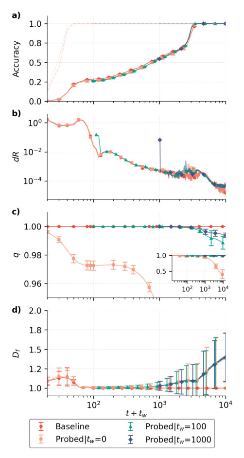
<figcaption class="paper-figure-caption"><b>Fig 1.</b> Figure 1: Comparison across waiting times. All data are from AdamW with learning rate 10−2 and weight decay 10−1, optimized for shortest grokking time. Baseline uses AdamW; probed model adds small Gaussian noise to test trajectory sensitivity. The x-axis is aligned to t + tw. (a) Test accuracy (solid lines show Test accuracy; translucent line shows training accuracy).(b) Parameter mobility, error bars were omitted to declutter the plot and provide a clearer view of the decreasing ∆R. Notable fluctuations are observed in the range from 0 to 102. (c) RC average across layers, with the insert showing the full range of replica decorrelation. (d) FD of Path average across layers. Occasionally,...</figcaption>
</figure>
<figure class="paper-figure-card">
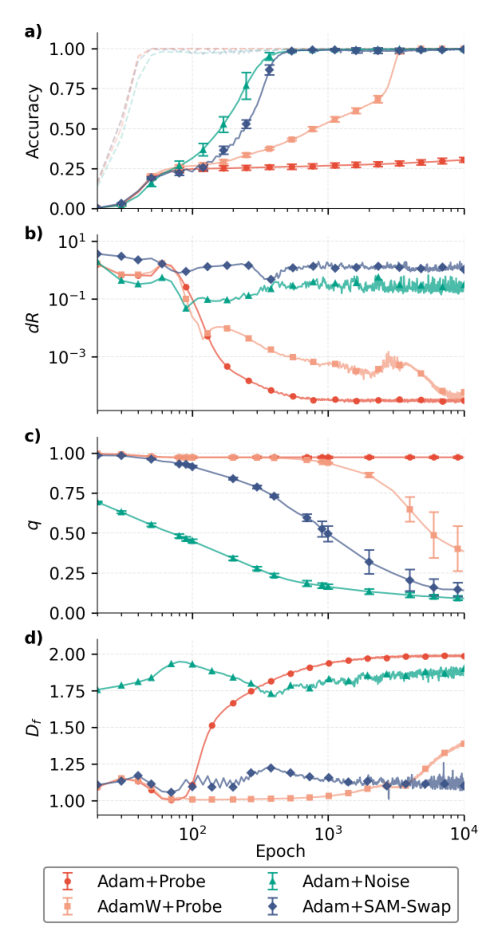
<figcaption class="paper-figure-caption"><b>Fig 2.</b> Figure 2: Comparison across perturbation methods: All models uses learning rate of 10−2, while AdamW addi- tionally applies weight decay of 10−1. Both models are probed using a weak Gaussian probe (σ = 10−5), whereas Adam+Noise employs additive Gaussian perturbations with σ = 10−2 and Adam+Swap uses the proposed SAM-Swap. All hyperparameters are selected to minimize grokking time. (a) Test accuracy (solid lines show Test accuracy; translu- cent line shows training accuracy) b) Parameter Mobility (c) Replica Correlation from tw = 0. (d) Fractal dimension of path. For fig (b) and (d), error bars were omitted in the plots to avoid excessive visual clutter. The Adam+Noise and Adam+Swap settings...</figcaption>
</figure>

**Summary.** This work reinterprets neural network 'grokking' through the lens of computational glass relaxation theory. By developing diagnostics like Parameter Mobility (PM), Replica Correlation (RC), and Fractal Dimension (FD), the authors show that memorization corresponds to a kinetically arrested, glassy state in parameter space. They propose SAM-Swap, an optimization technique inspired by physical Monte Carlo swaps, which successfully accelerates generalization by promoting necessary random exploration.

**Why it may be interesting.** The direct application of concepts from glassy physics—such as replica correlation and fractal dimension analysis—to characterize the optimization path of deep learning models provides a powerful, physically grounded lens for understanding generalization failure modes.

Detailed structure

**Main problem.** The paper addresses 'grokking,' where neural networks memorize training data before abruptly generalizing, framing this phenomenon using analogies from statistical physics.

**Main result.** Standard optimization traps the network in a kinetic arrested state characterized by collapsed parameter mobility and low fractal dimension; introducing State-Aware Monte Carlo Parameter Swapping (SAM-Swap) accelerates generalization by promoting random exploration.

**Method.** The authors introduce a three-component framework using Parameter Mobility (PM), Replica Correlation (RC), and Trajectory Fractal Dimension (FD) to quantitatively diagnose training dynamics, comparing these metrics against interventions like SAM-Swap.

**Model / system.** The study analyzes the training dynamics of neural networks, specifically on modular arithmetic tasks, treating the loss landscape as an effective energy surface analogous to a physical glass system undergoing relaxation.

**Key observables.** Parameter Mobility (PM), Replica Correlation (RC), and Fractal Dimension (FD) are used to characterize the geometry and dynamics of the parameter space trajectory.

**Important parameters / regimes.** The analysis distinguishes between different dynamic regimes, such as the 'glassy' kinetic arrest state versus accelerated relaxation achieved through random exploration.

**Assumptions / limitations.** The core hypothesis links delayed generalization directly to dynamic trapping (kinetic arrest) in the optimization landscape, which is validated by comparing PM, RC, and FD signatures against physical glass dynamics models.

**Figures summary.** Figures illustrate the transition of observables like PM and $D_f$ during training, showing collapse/plateauing during memorization and recovery upon intervention.

**Paper structure.** The paper first establishes the theoretical analogy between grokking and computational glass relaxation. It then introduces the three-component diagnostic framework (PM, RC, FD) to empirically validate this theory on network training dynamics, culminating in the proposal and testing of SAM-Swap as a corrective mechanism.

Abstract

Grokking is a striking phenomenon in neural network training, where a model can undergo a prolonged period of pure memorization before abrupt generalization. While previous works have attempted to interpret it through classical machine learning mechanisms like weight norm, recent research draws an analogy from statistical physics, framing grokking as a form of computational glass relaxation. This theory defines the initial memorization as a result of `fast cooling' where the training loss is reduced so quickly that a glass state is formed, followed by a `slow relaxation' towards final generalization. Although providing a unifying framework for representative grokking theories, this perspective has remained largely at the theoretical on macroscopic level without direct empirical validation on training dynamics. Here we introduce a three-component framework to directly characterize the training dynamics via parameter mobility (PM), and two representative measurements from glassy dynamics: replica correlation (RC) and fractal dimension (FD). We demonstrate that standard optimization presents clear signatures of glass dynamics and inherently traps the grokking network in a kinetic arrested memorization state with a collapsed mobility, strong history dependence, and channel-like motions. This quantitative agreement motivates us to introduce State-Aware Monte Carlo Parameter Swapping (SAM-Swap), an optimization plug-in that can accelerate generalization, inspired by swap Monte Carlo algorithm widely used in glass dynamics. Comparing SAM-Swap, weight decay, and Gaussian gradient noise, we find that accelerated generalization is consistently associated with random exploration in the parameter space, similar to diffusion in physics.

[↑ back to top](#top)

### [Nanohertz Pendulum toward Macroscopic Entanglement under Structural Damping](http://arxiv.org/abs/2608.02462v1)

**Authors:** Azusa Sawada, Hina Nakano, Kanta Watanabe, Gaku Ohashi, Shota Okumura, Nobuyuki Matsumoto  
**Type:** both · **Category:** other · **PDF:** <https://arxiv.org/pdf/2608.02462v1>  
**Analysis basis:** full PDF text, analyzed in chunks
**Topic relevance:** `quantum measurements` **3/5** · `measurement-induced transitions` **2/5** · `correlated / nonlocal dissipation` **1/5** · `driven-dissipative phase transition` **1/5** · `entanglement & information structure` **1/5** · `methods for driven-dissipative` **1/5** · `non-equilibrium dynamics` **1/5**

↔ Scroll figures horizontally

<figure class="paper-figure-card">
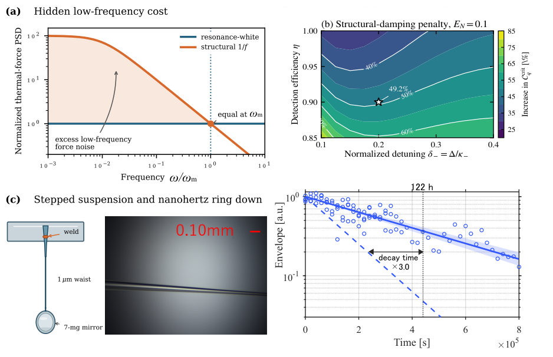
<figcaption class="paper-figure-caption"><b>Fig 1.</b> FIG. 1. Modeled entanglement cost and measured suspension gain. (a) Reference and regularized structural baths matched at ωm; shading marks the excess low-frequency force noise. (b) Structural-noise increase in the critical cooperativity for EN = 0.1, relative to the resonance-white bath, over normalized detuning δ−and detection efficiency η; the star marks (δ−, η) = (0.2, 0.9). (c) Suspension schematic, fiber micrograph, and ring-down of the 7-mg mirror. The solid curve is the joint fit to the stepped-suspension data, and the shaded band shows the variation obtained by shifting Γ by the quoted leave-one- record-out jackknife standard error. The dashed curve is calculated from the measured...</figcaption>
</figure>
<figure class="paper-figure-card">
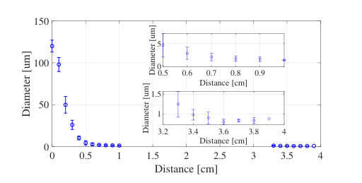
<figcaption class="paper-figure-caption"><b>Fig 2.</b> FIG. 2. Diameter profile of the stepped fused-silica fiber. Profiles measured for five fibers are shown; the insets enlarge the 1 µm waist and the thick upper section. The pendulum used for the ring-down measurement was welded at a section with diameter approximately 60 µm.</figcaption>
</figure>

**Summary.** The research addresses the challenge of structural damping degrading quantum entanglement in macroscopic pendulums. By developing a theoretical model quantifying this penalty, the authors designed and experimentally implemented a novel stepped fused-silica suspension. This device achieved a measured mechanical gain significantly exceeding the required threshold, advancing the feasibility of high-fidelity quantum measurements at room temperature.

**Why it may be interesting.** This work represents a crucial intersection of quantum sensing and mechanical engineering, demonstrating how advanced structural design (stepped fibers) can overcome fundamental noise limitations imposed by material damping to push macroscopic quantum measurements toward higher entanglement regimes.

Detailed structure

**Main problem.** The primary challenge is quantifying and mitigating the entanglement penalty imposed by the low-frequency tail (colored noise) originating from structural damping on macroscopic quantum entanglement measurements.

**Main result.** The authors successfully realized a 7-mg pendulum with a measured suspension gain ($G_q \simeq 2.5$) that significantly exceeds the theoretical requirement ($G_{	ext{req}} = 1.49$) needed to maintain measurable entanglement in the presence of structural noise.

**Method.** The work combines advanced quantum modeling using closed-loop state-space dynamics (Ornstein-Uhlenbeck baths) with high-precision experimental measurements of mechanical dissipation via ring-down analysis on a custom stepped fiber suspension.

**Model / system.** The physical system is a macroscopic pendulum suspended by a stepped fused-silica fiber, used in a continuous measurement setup. The theoretical model incorporates the full dynamics of the coupled cavity and mechanical modes, including structural damping modeled via auxiliary Ornstein-Uhlenbeck states.

**Key observables.** Logarithmic negativity ($	ext{EN}$), required suspension gain ($G_{	ext{req}}$), measured energy decay rate ($\Gamma/2\pi = 361(39)$ nHz), and the achieved mechanical suspension gain ($G_q \simeq 2.5$).

**Important parameters / regimes.** Detection loss ($\eta=0.9$), required structural-noise penalty factor (leading to $G_{	ext{req}}=1.49$), and the pendulum quality factor ($Q = 7.3(8) 	imes 10^6$).

**Assumptions / limitations.** The analysis relies on modeling the structural bath using auxiliary Ornstein-Uhlenbeck states, and a key limitation noted is that residual loss from the upper attachment weld significantly lowers the achievable quality factor compared to ideal material limits.

**Figures summary.** Figures illustrate the excess low-frequency force noise tail due to structural damping (Fig. 1a), quantify the required gain versus detection efficiency (Fig. 1b), and show schematics/measurements of the stepped fiber suspension used for dissipation characterization (Fig. 1c).

**Paper structure.** The paper progresses from theoretical modeling of entanglement degradation due to colored noise in a closed-loop system, deriving a quantitative requirement ($G_{	ext{req}}$), to presenting the experimental realization using a novel stepped fiber suspension, and finally comparing the measured performance gain ($G_q$) against this derived threshold.

Abstract

Pendulums are attractive for macroscopic quantum control because gravity dilution reduces mechanical loss, while the $1/f$ force-noise spectrum associated with structural damping allows nearly lossless trapping to suppress the thermal noise sampled at an upward-shifted resonance. The same $1/f$ spectrum, however, produces a low-frequency tail that penalizes entanglement. With $10\%$ detection loss, we find that this tail raises the required back-action-to-thermal force-noise ratio by about $50\%$, corresponding to a required suspension gain $G_{\rm req}=1.49$. To overcome this structural-noise penalty, we realize a $7$-mg pendulum suspended by a stepped fused-silica fiber, with an energy-decay rate $Γ/2π=361(39)$ nHz ($Q\equivω_0/Γ=7.3(8)\times10^6$) at $ω_0/2π=2.63$ Hz. The reduction in $ω_0Γ$ yields a measured gain $G_q\simeq2.5$ relative to the previous monolithic device, exceeding the requirement.

[↑ back to top](#top)

### [All-Electric Topological Phase Transitions in Proximity-Coupled Bilayer MnBi2Te4 Heterostructures](http://arxiv.org/abs/2608.01312v1)

**Authors:** Basavaraja G, Mukul Kabir  
**Type:** theory · **Category:** other · **PDF:** <https://arxiv.org/pdf/2608.01312v1>  
**Analysis basis:** full PDF text, analyzed in chunks
**Topic relevance:** `spintronics-quantum-optics interface` **3/5** · `driven-dissipative phase transition` **2/5** · `Kondo & dissipative impurity` **1/5** · `analog quantum simulation` **1/5** · `exotic spin models in light-matter` **1/5** · `non-equilibrium dynamics` **1/5**

↔ Scroll figures horizontally

<figure class="paper-figure-card">
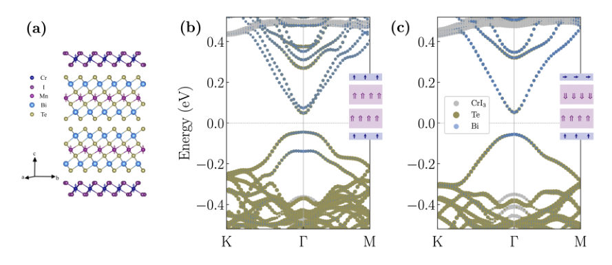
<figcaption class="paper-figure-caption"><b>Fig 1.</b> Figure 1. Controlling interlayer antiferromagnetic coupling in bilayer MTI via magnetic proximity to 2D FMI. (a) Schematic of a sandwich heterostructure CrI3/2SL-MnBi2Te4/CrI3, where proximity-induced exchange at the FMI/MTI interfaces is used to tune topological invariants by controlling the interlayer magnetic coupling in the MTI. (b) Ferromagnetic exchange at the FMI/MTI interface stabilizes ferromagnetic interlayer coupling in 2SL-MnBi2Te4 [inset, (↑/⇑· ⇑/↑)], yielding the corresponding band structure. (c) Upon electrically tuning the magnetic anisotropy of CrI3 from out-of-plane to in-plane, the interlayer coupling in the MTI reverses to antiferromagnetic order (inset), and the...</figcaption>
</figure>
<figure class="paper-figure-card">
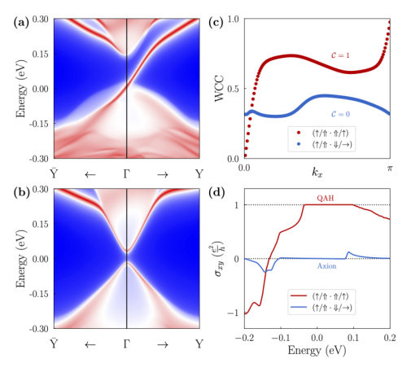
<figcaption class="paper-figure-caption"><b>Fig 2.</b> Figure 2. Switching topological invariants via gate-tunable proximity exchange. Interlayer magnetic coupling controls the surface-state topology of the MTI. (a) The ferromagnetic (↑/ ⇑· ⇑/ ↑) configuration hosts a single chiral edge mode with C = 1. (b) Switching the FMI anisotropy to the in- plane direction preserves a gapped surface spectrum in the (↑/ ⇑· ⇓/ →) configuration. While C = 0 for this state, the Fu-Kane Z2 invariant remains nontrivial. (c) The calculated evolution of WCC along closed paths in the BZ confirms the corresponding topological classification. (d) The anomalous Hall conductivity, obtained by integrating the Berry curva- ture over BZ, is quantized at σxy = e2/h for...</figcaption>
</figure>
<figure class="paper-figure-card">
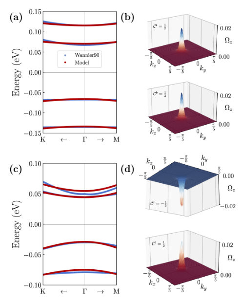
<figcaption class="paper-figure-caption"><b>Fig 3.</b> Figure 3. Low-energy 4×4 effective Hamiltonian at the Γ point capturing the essential physics of the topological phase transition. Interpolated bands near the massive Dirac point yield the effective Hamiltonian parameters for the (a) ferro- magnetic [(Mt, Mb, V ) = (102, 91, −28) meV] and (b) anti- ferromagnetic [(Mt, Mb, V ) = (−60, 42, −14) meV] configu- rations. The fitted vF ∼3.7×105 m/s is in good agreement with the value reported by angle-resolved photoemission spec- troscopy [17]. (c) The layer-resolved Berry curvature for the FM configuration exhibits Ωt/b z &gt; 0, yielding half-quantized layer Hall responses on each surface with Ct/b = + 1</figcaption>
</figure>

**Summary.** The paper presents a method to achieve all-electric control over topological phase transitions in magnetic topological insulators ($	ext{MnBi}_2	ext{Te}_4$). By sandwiching the material between gate-tunable ferromagnetic layers, researchers can switch reversibly between Quantum Anomalous Hall and axion insulating states without requiring massive external magnetic fields. This breakthrough solves a major bottleneck for scalable, high-temperature topological electronics.

**Why it may be interesting.** This work provides a concrete pathway to engineer topological states using purely electrical means, which is highly relevant for developing low-power quantum electronic devices that might interact with superconducting qubits or other quantum hardware components.

Detailed structure

**Main problem.** The primary challenge addressed is overcoming the need for extreme external magnetic fields (>9 T) to induce topological phase transitions in $	ext{MnBi}_2	ext{Te}_4$. The goal is to achieve field-free, all-electric control over switching between Quantum Anomalous Hall (QAH) and axion insulating states.

**Main result.** The authors demonstrate that gate-tunable magnetic anisotropy in a proximate ferromagnetic insulator ($	ext{CrI}_3$) can dynamically modulate the exchange coupling, enabling reversible switching between QAH ($C=1$) and axion insulator ($C=0$) phases using only an electric field.

**Method.** The study employs complementary first-principles calculations (DFT) with effective Hamiltonian modeling. Topological characterization is performed by calculating the Chern number via Berry flux/Wannier Charge Centres, alongside Monte Carlo simulations for thermal stability.

**Model / system.** The system is a bilayer $	ext{MnBi}_2	ext{Te}_4$ heterostructure sandwiched between two ferromagnetic insulators ($	ext{FMI}/	ext{MTI}/	ext{FMI}$). The low-energy physics is modeled using an effective Hamiltonian that incorporates surface Dirac fermions, Zeeman coupling from the Mn spins, and electrostatic potential terms.

**Key observables.** Quantized Anomalous Hall Conductivity ($\sigma_{xy} = e^2/h$ for QAH state) or zero-Hall plateau ($\sigma_{xy}=0$ for axion insulator); Chern number ($C=1$ vs $C=0$).

**Important parameters / regimes.** The control mechanism relies on modulating the proximity-induced exchange bias via electrostatic gating, which controls the interlayer coupling strength ($J_{\perp}$). The magnetic ordering temperature is also shown to be elevated.

**Assumptions / limitations.** The approach assumes that the short-range nature of the proximity effect allows for the maintenance of the intrinsic electronic structure of the $	ext{MnBi}_2	ext{Te}_4$ film while enabling external control.

**Figures summary.** Figures illustrate the schematic tuning of interlayer coupling from AFM to FM via $	ext{CrI}_3$, and show evidence of quantized QAH edge modes ($C=1$) versus zero-Hall plateaus ($	ext{axion}$) depending on the magnetic configuration.

**Paper structure.** The paper establishes the limitations of previous high-field switching methods, develops a model based on proximity coupling via an $	ext{FMI}$ gate, calculates topological invariants (Chern number) for both FM (QAH) and AFM (axion) couplings, and concludes by demonstrating all-electric reversibility.

Abstract

The intrinsic magnetic topological insulator MnBi2Te4, in the two-dimensional limit, hosts thickness dependent axion and quantum anomalous Hal (QAH) insulating states governed by antiferromagnetic interlayer coupling. However, controlled interconversion between these phases typically requires extreme external magnetic fields exceeding 9 T, limiting practical tunability. Using complementary first-principles calculations and effective Hamiltonian modeling, we demonstrate a field-free, reversible mechanism to engineer topological phase transitions by exploiting magnetic proximity at the interfaces with a ferromagnetic insulator. Gate-tunable magnetic anisotropy within the ferromagnetic insulator dynamically modulates the proximity-induced exchange bias, enabling all-electric switching of interlayer coupling and band topology in ultrathin MnBi2Te4. Crucially, long-range Heisenberg Monte Carlo simulations reveal that the magnetic ordering temperature of the encapculated MnBi2Te4 film is dramatically elevated. By eliminating the high-field requirement and simultaneously improving thermal stability, this gate-tunable paradigm solves a critical bottleneck in topological physics and offers a viable route toward scalable, high-temperature topological electronics.

[↑ back to top](#top)

### [Coarse-Graining and the Classification of Long-Range Correlations in Quantum Field Theory](http://arxiv.org/abs/2608.01989v1)

**Authors:** Jinku Guo  
**Type:** theory · **Category:** statistical mechanics · **PDF:** <https://arxiv.org/pdf/2608.01989v1>  
**Analysis basis:** full PDF text, analyzed in chunks
**Topic relevance:** `Keldysh / 2PI / non-Gaussian methods` **3/5** · `analog quantum simulation` **1/5** · `correlated / nonlocal dissipation` **1/5** · `driven-dissipative phase transition` **1/5** · `methods for driven-dissipative` **1/5** · `non-equilibrium dynamics` **1/5** · `non-equilibrium universality` **1/5**

↔ Scroll figures horizontally

<figure class="paper-figure-card">
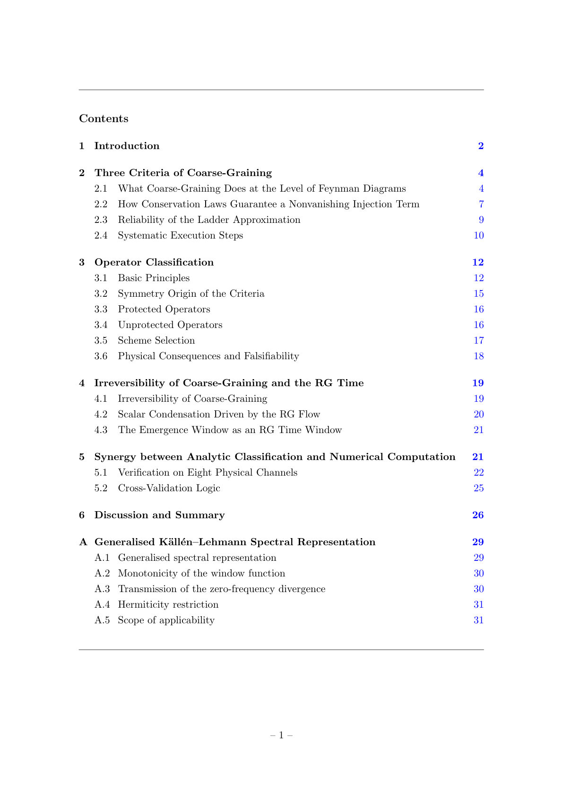
<figcaption class="paper-figure-caption"><b>Fig 1.</b> Low-resolution page preview, page 2</figcaption>
</figure>
<figure class="paper-figure-card">
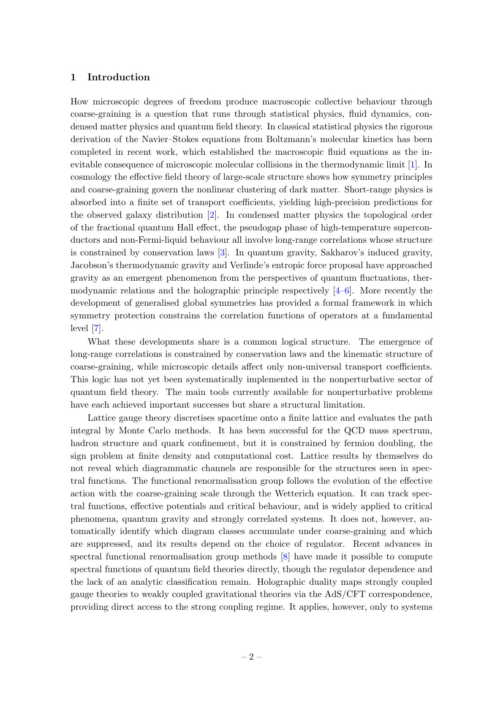
<figcaption class="paper-figure-caption"><b>Fig 2.</b> Low-resolution page preview, page 3</figcaption>
</figure>
<figure class="paper-figure-card">
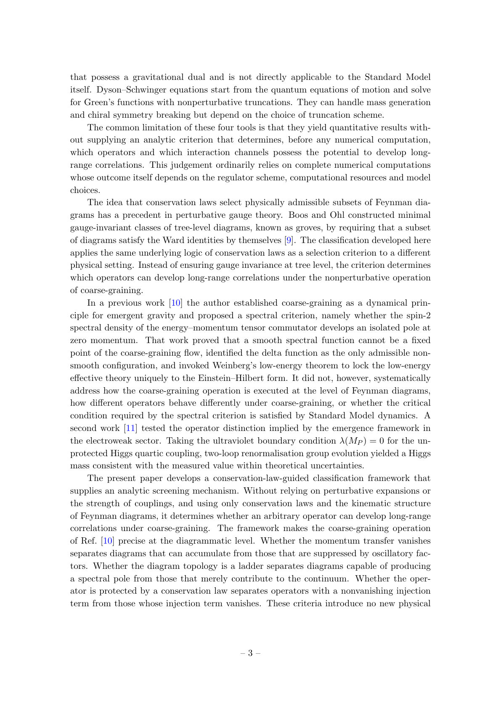
<figcaption class="paper-figure-caption"><b>Fig 3.</b> Low-resolution page preview, page 4</figcaption>
</figure>
<figure class="paper-figure-card">
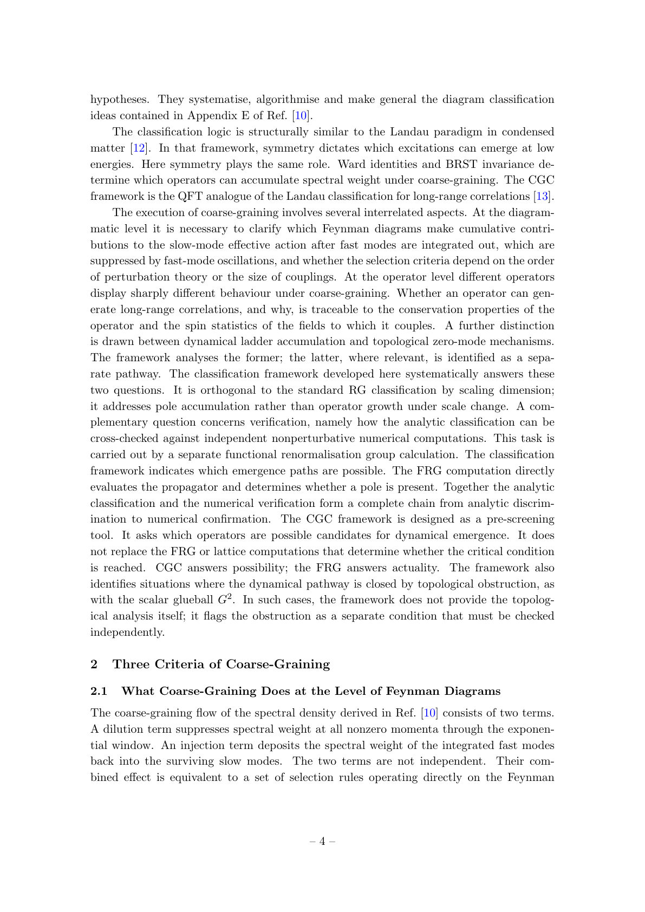
<figcaption class="paper-figure-caption"><b>Fig 4.</b> Low-resolution page preview, page 5</figcaption>
</figure>
<figure class="paper-figure-card">
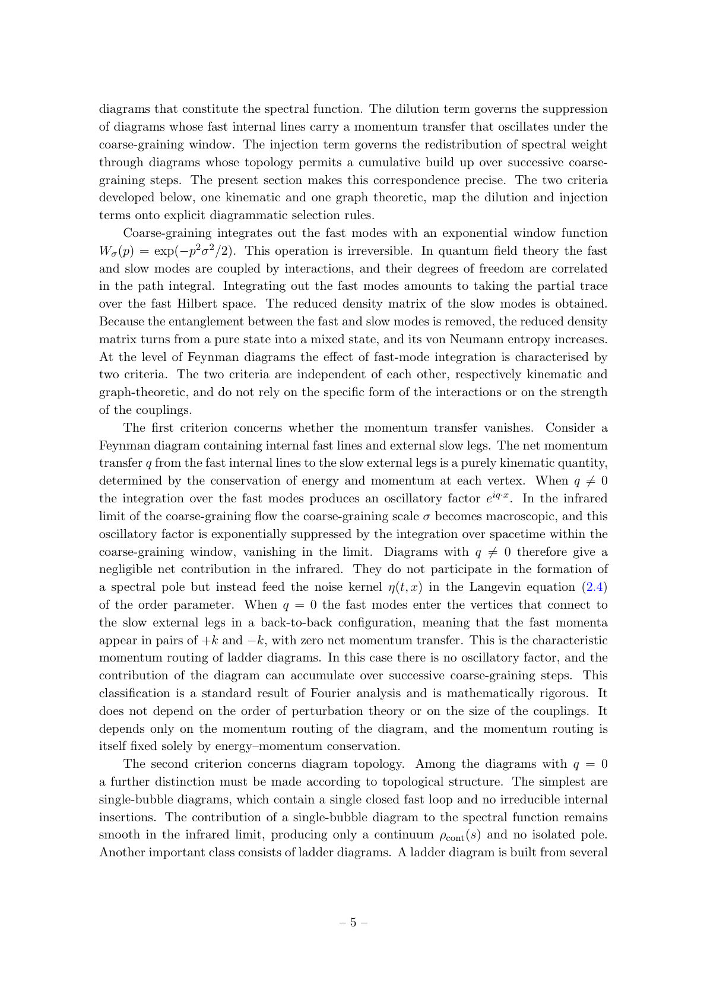
<figcaption class="paper-figure-caption"><b>Fig 5.</b> Low-resolution page preview, page 6</figcaption>
</figure>

**Summary.** This paper introduces a rigorous, conservation-law-guided framework to classify how long-range correlations develop during coarse-graining in QFT. It systematically analyzes Feynman diagrams based on momentum transfer, topology, and symmetry protection to predict if spectral poles—indicative of phase transitions or critical behavior—can emerge. This provides a powerful theoretical tool for understanding emergent physics across various quantum systems.

**Why it may be interesting.** The methodology provides a powerful, general theoretical tool that bridges concepts from quantum field theory renormalization group flow with established techniques in classical statistical mechanics for analyzing critical phenomena.

Detailed structure

**Main problem.** The paper develops a systematic framework to classify how long-range correlations emerge during coarse-graining operations in Quantum Field Theory (QFT). It aims to determine the conditions under which spectral poles form, analogous to phase transitions.

**Main result.** A conservation-law-guided classification establishes that pole formation depends on three criteria: nonvanishing injection terms from symmetry protection, specific diagram topologies (ladder diagrams), and kinematic constraints related to zero momentum transfer. This framework provides an analytic screening mechanism for possible emergence paths.

**Method.** The authors employ a coarse-graining approach using window functions, analyzing Feynman diagrams at the level of their topology and symmetries (Ward/BRST identities). The method draws strong analogies to classical statistical physics derivations like deriving fluid equations from molecular kinetics.

**Model / system.** The theory is applied generally to QFT, examining channels like the energy-momentum tensor ($T_{\mu
u}$) and gauge field strength ($F^2$). It references concepts applicable to strongly correlated systems, such as those studied in condensed matter physics (e.g., fractional quantum Hall effect).

**Key observables.** Spectral poles ($\delta(p^2)$ terms), the injection term magnitude, and the sign of the single-bubble contribution.

**Important parameters / regimes.** The critical condition for pole development ($1 - V \cdot \Pi_0 = 0$ or similar forms) and the window function parameter $\sigma$.

**Assumptions / limitations.** The analysis relies on linear response approximations in some sections, and it assumes that conservation laws provide sufficient constraints to classify the emergence path, leaving the final nonperturbative calculation open.

**Figures summary.** Not specified by notes; the structure is described as a decision tree or pipeline of criteria.

**Paper structure.** The paper builds its argument through sequential application of three criteria: 1) Kinematic constraints (momentum transfer $q=0$ required for accumulation), 2) Graph-theoretic analysis (distinguishing continuum vs. pole-forming topologies via ladder resummation), and 3) Conservation laws (ensuring nonvanishing matrix elements).

Abstract

A conservation-law-guided classification framework is developed for the execution of coarse-graining operations in quantum field theory. Coarse-graining produces a selection at the level of Feynman diagrams. Diagrams with nonzero momentum transfer are suppressed by oscillatory factors, zero-momentum-transfer ladder diagrams can accumulate through geometric series resummation to produce a spectral pole, and single-bubble topologies contribute only to the continuum. Conservation laws govern this classification. For operators protected by a Ward identity, the matrix element at zero momentum is guaranteed to be nonvanishing. For operators protected by BRST symmetry, the Slavnov-Taylor identities provide no mandatory suppression. The two cases differ in the strength of the algebraic guarantee. For unprotected operators the injection term vanishes and the spectral function remains continuous. The sign of the single-bubble contribution is determined by spin statistics. A positive sign leads to amplificative feedback in the ladder resummation, a negative sign leads to suppressive feedback. These two attributes, the nonvanishing of the injection term and the sign of the single-bubble contribution, are the defining criteria of the classification. As a direct application, a general classification of local operators is established within the emergence framework and verified on eight physical channels and three known solvable systems. The framework indicates which emergence paths are possible for each operator; whether the critical condition is reached is left for independent nonperturbative computation. The logical structure of this classification is parallel to the strategy used in deriving fluid equations from molecular kinetic theory in classical statistical physics.

[↑ back to top](#top)

### [A Standard Quantum Mechanical Treatment to Rationalize the Delayed-Choice Quantum Eraser](http://arxiv.org/abs/2608.02185v1)

**Authors:** Vipul Badhan, Pranvi, Samreet Dhillon, Bindiya Arora  
**Type:** theory · **Category:** other · **PDF:** <https://arxiv.org/pdf/2608.02185v1>  
**Analysis basis:** full PDF text, analyzed in chunks
**Topic relevance:** `interference shaping light` **3/5** · `quantum measurements` **3/5** · `entanglement & information structure` **1/5** · `measurement-induced transitions` **1/5**

↔ Scroll figures horizontally

<figure class="paper-figure-card">
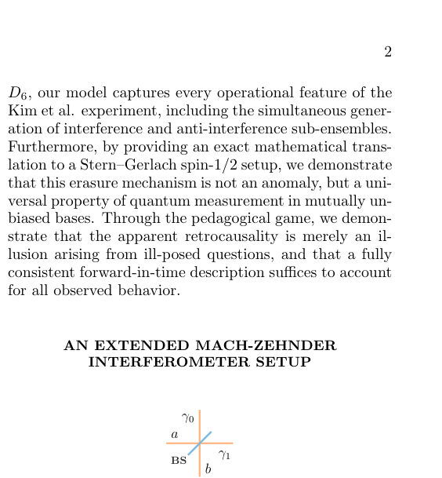
<figcaption class="paper-figure-caption"><b>Fig 1.</b> FIG. 1: Schematic representation of a standard beam splitter BS. Input spatial modes |a⟩and |b⟩undergo a unitary transformation, yielding output spatial modes |γ0⟩and |γ1⟩</figcaption>
</figure>
<figure class="paper-figure-card">
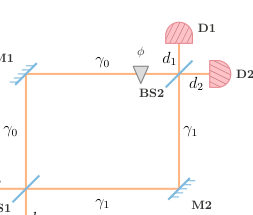
<figcaption class="paper-figure-caption"><b>Fig 2.</b> FIG. 2: Standard Mach-Zehnder interferometer (MZI). An incident photon entering via input mode |a⟩is split by BS1 into spatial modes |γ0⟩and |γ1⟩. After reflection at mirrors M1 and M2 and undergoing a relative phase shift ϕ, the paths recombine at BS2. Output modes |d1⟩ and |d2⟩are registered by detectors D1 and D2, respectively.</figcaption>
</figure>
<figure class="paper-figure-card">
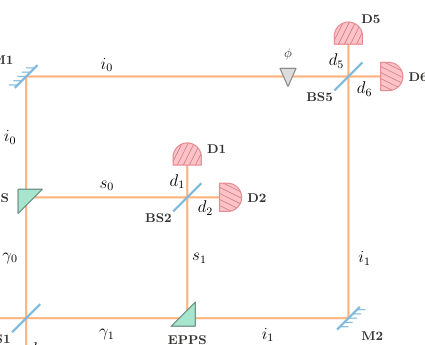
<figcaption class="paper-figure-caption"><b>Fig 3.</b> FIG. 3: Extended MZI configuration with entangled photon pair sources (EPPS) situated along modes |γ0⟩ and |γ1⟩generate signal (|s0⟩, |s1⟩) and idler (|i0⟩, |i1⟩) modes. Signal modes recombine at BS2 leading to detectors D1 and D2. Idler modes undergo recombination at BS5 yielding output modes |d5⟩and |d6⟩registered by detectors D5 and D6. Coincidence detections between (D1, D5) and (D2, D6) highlight complementary anti-interference and interference sub-ensembles.</figcaption>
</figure>
<figure class="paper-figure-card">
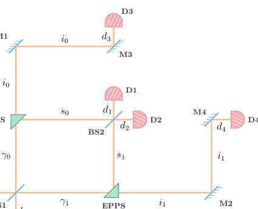
<figcaption class="paper-figure-caption"><b>Fig 4.</b> FIG. 4: Extended MZI configuration with idler modes |i0⟩and |i1⟩directed by mirrors M3 and M4 straight to detectors D3 (mode |d3⟩) and D4 (mode |d4⟩). A click at D3 or D4 provides path information for the corresponding signal photon at D1 or D2.</figcaption>
</figure>
<figure class="paper-figure-card">
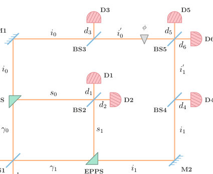
<figcaption class="paper-figure-caption"><b>Fig 5.</b> FIG. 5: Extended MZI obtained by replacing mirrors M3 and M4 in the case II with 50:50 beam splitters BS3 and BS4 unifies both operational modes (case I and case II) into a single schematic. Reflected idler modes (|d3⟩, |d4⟩) yield which-path measurements at detectors D3 and D4, while transmitted modes (|i′ 0⟩, |i′ 1⟩) recombine at BS5 for erasure measurements at D5 and D6. Arbitrarily extending the idler optical path lengths ensures signal registration at D1/D2 strictly precedes the idler measurement choice.</figcaption>
</figure>

**Summary.** This paper resolves the paradoxes of the delayed-choice quantum eraser by showing that the choice between measurement types is merely a selection of measurement bases within standard quantum mechanics. By modeling the system with an extended MZI and entangled pairs, the authors demonstrate that interference patterns are fully explained without invoking retrocausality. The work emphasizes that apparent paradoxes stem from conceptual misunderstandings about time and causality in quantum theory.

**Why it may be interesting.** It provides a rigorous theoretical grounding for interpreting foundational quantum optics experiments, clarifying that apparent non-local effects are artifacts of ill-posed questions rather than violations of causality.

Detailed structure

**Main problem.** To resolve the apparent paradoxes associated with delayed-choice quantum eraser experiments using standard quantum mechanics, specifically addressing the illusion of retrocausality.

**Main result.** The choice between which-path and erasure detectors is shown to be equivalent to choosing measurement bases, proving that quantum erasure is an expected result of measuring entangled states within a forward-in-time framework.

**Method.** The analysis uses standard quantum mechanical formalism applied to an extended Mach-Zehnder interferometer (MZI) setup involving entangled photon pairs.

**Model / system.** The core system is the MZI, modeled with an Entangled Photon-Pair Source (EPPS), which allows tracking correlations between signal and idler paths. The analysis maps the experiment to a two-way Stern-Gerlach framework for conceptual clarity.

**Key observables.** Interference patterns (constructive/destructive) observed at various detectors, joint detection probabilities for coincident clicks in different measurement bases.

**Important parameters / regimes.** The beam splitter parameter $	heta$ controls the operational regime of the setup, allowing selection between path-erasure ($	heta=0$), which-way ($	heta=\pi$), and delayed choice ($	heta=\pi/2$).

**Assumptions / limitations.** The approach relies on standard quantum mechanics formalism and assumes lossless operation of optical components; it explicitly avoids retrocausal frameworks.

**Figures summary.** Figures illustrate the MZI setup, showing interference conditions for different path choices. The paper also uses a ball-and-box game analogy to model the delayed choice correlation.

**Paper structure.** The paper progresses by first establishing basic MZI behavior, then analyzing specific cases (path-erasure vs. which-way) using entangled pairs, culminating in a unified treatment of the delayed choice mechanism via basis selection.

Abstract

Ever since the proposal of delayed choice quantum erasure and subsequent realization in the experiment by Kim et al., the interpretation and implications of delayed-choice experiments have remained a subject of intense foundational debate. This paper resolves the apparent paradox attached to the experiment using standard quantum mechanics. Using an extended Mach-Zehnder interferometer which captures every operational feature of the original experiment, we show that choosing between which-path and erasure detectors is simply a choice of measurement bases, which does not rewrite a photon's past. Furthermore, by mapping the experiment to a two-way Stern-Gerlach framework, we prove that quantum erasure is an expected result of measuring entangled states, not a physical anomaly. Ultimately, through a pedagogical game, we illustrate that the illusion of retrocausality arises from asking illegitimate questions, and that a forward-in-time description is entirely sufficient to explain the logic.

[↑ back to top](#top)

### [Breakdown of Universal Whirling Order in a Heisenberg Tsai-Type Approximant](http://arxiv.org/abs/2608.00467v1)

**Authors:** Farid Labib, Guillaume Beutier, Alessandro Bombardi, Marc de Boissieu, Ryuji Tamura  
**Type:** experiment · **Category:** strongly correlated electrons · **PDF:** <https://arxiv.org/pdf/2608.00467v1>  
**Analysis basis:** full PDF text, analyzed in chunks
**Topic relevance:** `exotic spin models in light-matter` **3/5** · `spintronics-quantum-optics interface` **3/5** · `analog quantum simulation` **2/5**

↔ Scroll figures horizontally

<figure class="paper-figure-card">
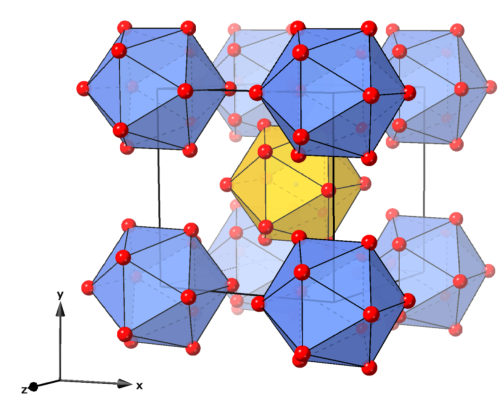
<figcaption class="paper-figure-caption"><b>Fig 1.</b> FIG. 1. Arrangement of Gd ions on the icosahedron shells in the cubic unit cell of Au–Al–Gd 1/1 AC (refer to [6] for structural details). The colors reflect the antiferromagnetic coupling between corner and body-center icosahedra of the cubic lattice, although all icosahedra are structurally identi- cal.</figcaption>
</figure>
<figure class="paper-figure-card">
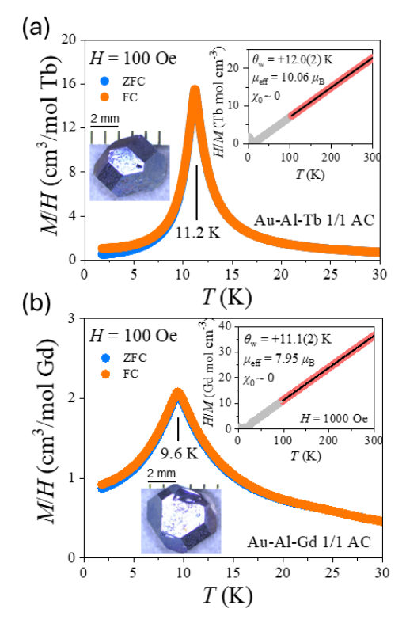
<figcaption class="paper-figure-caption"><b>Fig 2.</b> FIG. 2. Low temperature magnetic susceptibility M/H of (a)Au–Al–Tb, and (b) Au–Al–Gd 1/1 AC single crystals un- der H = 100 Oe. The insets in (a) and (b) show correspond- ing inverse magnetic susceptibilities (H/M) measured under H = 1000 Oe as well as the optical microscopu images of the corresponding single crystals.</figcaption>
</figure>
<figure class="paper-figure-card">
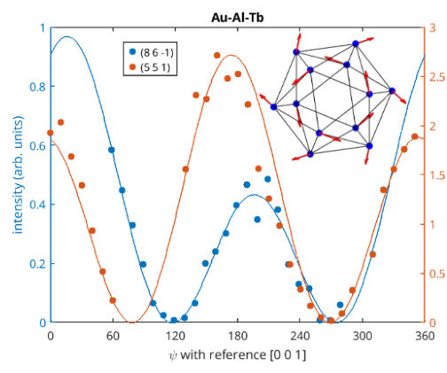
<figcaption class="paper-figure-caption"><b>Fig 3.</b> FIG. 3. Azimuthal scans of the (8, 6, −1) and (5, 5, 1) mag- netic reflections of Au–Al–Tb. Dots: experimental; plain curves: models corresponding to the whirling magnetic or- der proposed in Ref. [18] and depicted in inset (view from a [1, 1, 1] axis): the spins are tilted by 86◦from the fivefold axes.</figcaption>
</figure>
<figure class="paper-figure-card">
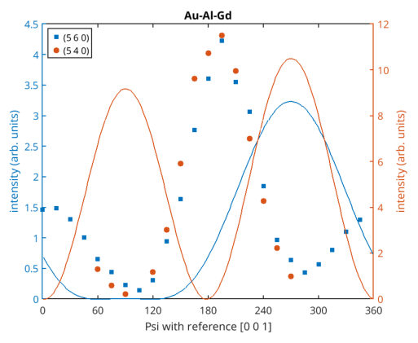
<figcaption class="paper-figure-caption"><b>Fig 4.</b> FIG. 4. Azimuthal scan of the (5, 6, 0) as (5, 4, 0) magnetic reflections of Au–Al–Gd. Dots: experimental; plain curves: models corresponding to the whirling magnetic order pro- posed in Ref. [18] (see also inset of FIG. 3).</figcaption>
</figure>

**Summary.** This work uses X-ray magnetic scattering to compare two related quasicrystal approximants, Au–Al–Tb and Au–Al–Gd. The experiments reveal that while the non-Heisenberg system exhibits a predictable 'whirling' magnetic order, the Heisenberg counterpart shows a distinctly different state. This strongly indicates that spin anisotropy is the critical factor determining the magnetic ground state, invalidating any purely geometric explanation for the observed magnetism.

**Why it may be interesting.** While focused on magnetism in solids, the core concept—that a simple geometric model fails when a specific interaction parameter (anisotropy) is varied—is analogous to how subtle changes in coupling constants or dimensionality can fundamentally alter quantum phases in correlated electron models.

Detailed structure

**Main problem.** To determine if the proposed 'whirling magnetic order' observed in non-Heisenberg Tsai-type quasicrystal approximants is solely dependent on crystal geometry or if spin anisotropy plays a crucial role.

**Main result.** The apparent universality of whirling order breaks down when comparing Au–Al–Tb (anisotropic) and Au–Al–Gd (nearly isotropic), demonstrating that spin anisotropy, not just cluster geometry, dictates the magnetic ground state.

**Method.** X-ray Resonant Magnetic Scattering (XRMS) measurements were performed on single crystals, supplemented by SQUID magnetometry and analysis of azimuthal angle dependence.

**Model / system.** The study investigates Au–Al–R (R = Gd, Tb) 1/1 approximants, comparing the strongly anisotropic $	ext{Au–Al–Tb}$ system against its nearly isotropic Heisenberg counterpart, $	ext{Au–Al–Gd}$.

**Key observables.** Azimuthal dependence of magnetic scattering intensity for specific reflections (e.g., (5 4 0), (5 6 0)), and the temperature dependence of magnetization ($M/H$).

**Important parameters / regimes.** Spin anisotropy, crystal structure geometry (Tsai-cluster approximants), and the comparison between Heisenberg vs. non-Heisenberg limits.

**Assumptions / limitations.** The initial hypothesis was that magnetic order is universal based on cluster geometry; this assumption is challenged by experimental results.

**Figures summary.** FIG. 3 shows azimuthal scans for $	ext{Au–Al–Tb}$ agreeing with the whirling model, while FIG. 4 shows partial scans for $	ext{Au–Al–Gd}$ that systematically contradict the universal whirling-order predictions.

**Paper structure.** The paper establishes the context of expected magnetic universality based on geometry, presents comparative experimental data from XRMS on two different rare-earth substitutions (Tb vs. Gd), and concludes by contrasting the results to pinpoint spin anisotropy as the necessary physical ingredient.

Abstract

Noncoplanar whirling magnetic order has recently been proposed as a universal magnetic state in non-Heisenberg Tsai-type quasicrystal approximants. Here, X-ray resonant magnetic scattering measurements on Heisenberg and non-Heisenberg Au-Al-R (R = Gd, Tb) 1/1 approximants reveal a clear breakdown of this universality in the Heisenberg limit. While the non-Heisenberg Au-Al-Tb system is well described by the previously identified whirling magnetic structure, the Heisenberg Au-Al-Gd counterpart exhibits qualitatively different azimuthal-angle dependences that are incompatible with the universal whirling-order model. Despite nearly identical crystal structures and comparable magnetic energy scales, the two systems stabilize distinct antiferromagnetic ground states with the same propagation vector k = (1, 0, 0), demonstrating that the apparent universality of whirling order is not a consequence of Tsai-cluster geometry alone but requires spin anisotropy. These results further reveal the emergence of a competing manifold of nearly degenerate magnetic states in the Heisenberg limit.

[↑ back to top](#top)

### [Gap distributions between successive personal bests in cricket: Data and Models](http://arxiv.org/abs/2608.01882v1)

**Authors:** Priyanka D. Bhoyar, Prashant M. Gade  
**Type:** both · **Category:** statistical mechanics · **PDF:** <https://arxiv.org/pdf/2608.01882v1>  
**Analysis basis:** full PDF text, analyzed in chunks
**Topic relevance:** `non-equilibrium universality` **3/5** · `non-equilibrium dynamics` **2/5** · `Keldysh / 2PI / non-Gaussian methods` **1/5** · `driven-dissipative phase transition` **1/5** · `methods for driven-dissipative` **1/5**

↔ Scroll figures horizontally

<figure class="paper-figure-card">
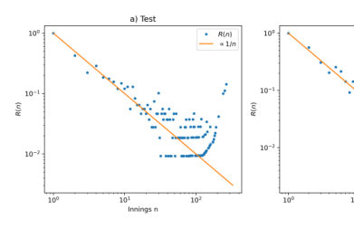
<figcaption class="paper-figure-caption"><b>Fig 1.</b> Figure 1: Shows the plot of probability R(n) of setting a new record in the nth inning on log-log scale for (a) Test Matches (b) ODI Matches and (c) T20 Matches. Early innings follow an approximate 1/n behavior, while deviations appear in the tail due to heterogeneity in career lengths.</figcaption>
</figure>
<figure class="paper-figure-card">
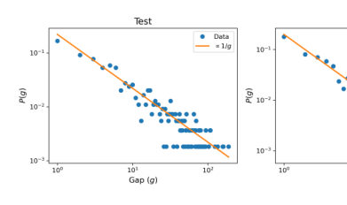
<figcaption class="paper-figure-caption"><b>Fig 2.</b> Figure 2: Normalized probability Mass function (PMF) of the gap distribution for the empirical Test, ODI, and T20 matches. The distribution shows heavy-tailed behavior and deviations from the classical 1/g record statistics prediction.</figcaption>
</figure>
<figure class="paper-figure-card">
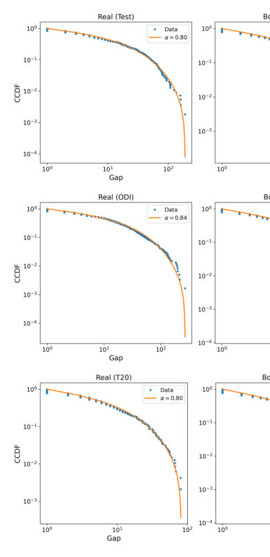
<figcaption class="paper-figure-caption"><b>Fig 3.</b> Figure 3: Complementary cumulative distribution functions (CCDFs) of inter-record gaps for (a) Test, (b) ODI, and (c) T20 cricket careers. The distributions exhibit broad tails spanning several orders of magnitude, indicating substantial variability in the waiting times between successive personal best performances. The solid lines represent maximum- likelihood fits to the truncated power law form P(g) ∼g−αe−λg. The estimated parameters are α = 0.799, λ = 0.0180 (Test), α = 0.843, λ = 0.01447 (ODI), and α = 0.799, λ = 0.035 (T20) for real data. For bootstrap-shuffle the parameters are α = 0.952, λ = 0.008 for test, α = 0.979, λ = 0.008 for ODI and α = 0.939, λ = 0.021 for T20. For reverse...</figcaption>
</figure>

**Summary.** This paper analyzes the gaps between personal best records in cricket to test if performance milestones follow simple random models. By comparing real career data against shuffled versions, the authors find that the observed scaling behavior is significantly altered when temporal ordering is destroyed. This demonstrates that record progression retains crucial information about the non-stationary, path-dependent nature of human athletic development.

**Why it may be interesting.** While applied to sports, the methodology—analyzing deviations from stationary assumptions in complex sequential data—is highly relevant to non-equilibrium statistical mechanics problems involving path dependence (e.g., aging systems or memory effects in disordered materials).

Detailed structure

**Main problem.** The study investigates whether the gap distribution between successive personal best performances (milestones) in cricket reflects simple stochastic processes or retains information about the complex temporal structure of an athlete's career.

**Main result.** Empirical gap distributions are better described by a truncated power law with exponents significantly different from classical predictions, and this deviation is strongly correlated with preserving the temporal ordering of performances.

**Method.** The authors compared empirical inter-record gap distributions against null models, including bootstrap-shuffled careers (destroying time order) and time-reversed careers, using statistical fitting techniques like MLE.

**Model / system.** The system is cricket performance data, analyzing the number of innings (gaps) between successive personal best scores for leading players in Test, ODI, and T20 formats. The theoretical baseline is the i.i.d. assumption predicting $P(g) \sim 1/g$.

**Key observables.** The gap distribution $P(g)$ and its fitted exponent $\alpha$ from a truncated power law fit ($P(g) \propto g^{-\alpha}e^{-\lambda g}$).

**Important parameters / regimes.** The scaling exponents $\alpha$ (empirical vs. shuffled), the cutoff parameter $\lambda$, and the comparison to the classical prediction ($\alpha=1$).

**Assumptions / limitations.** Classical theory assumes i.i.d. observations, which is violated by real sporting careers due to learning, aging, and non-stationarity.

**Figures summary.** Figures compare the normalized Probability Mass Functions (PMFs) of inter-record gaps for original, shuffled, and reversed careers, illustrating how temporal ordering affects the tail behavior.

**Paper structure.** The paper establishes the classical prediction based on i.i.d. processes, analyzes empirical data using truncated power law fitting, and then systematically tests null hypotheses by shuffling or reversing the time sequence to isolate the role of temporal structure.

Abstract

Successive personal best performances provide a natural measure of progression in an athlete's career. Classical record theory predicts a universal gap distribution, $P(g)\sim 1/g$, for independent and identically distributed (i.i.d.) sequences. However, sporting careers are shaped by learning, aging, changes in ability, and external influences that violate these assumptions. We investigate the statistics of inter-record gaps, defined as the number of innings between successive personal best scores, in cricket. Using career records of leading Test, ODI, and T20 players obtained from ESPN Cricinfo. We find that the empirical distributions are well described by truncated power law $P(g) \propto g^{-α} e^{-λg}$ with exponents in the range (0.799 $\leq α\leq$ 0.843). Much of this deviation disappears when the temporal ordering of innings is destroyed, indicating that career evolution plays a key role in shaping record occurrence. Bootstrap-shuffled careers, which preserve individual score distributions and career lengths while removing temporal ordering, yield significantly larger exponents ($α\approx 0.939\text{--}0.979$). These findings show that the progression of personal best performances retains information about the temporal organization of a player's career and cannot be fully explained by simple stochastic record processes. More generally, they illustrate how record statistics are altered in nonstationary and path-dependent systems.

[↑ back to top](#top)

### [LieStoNet: Learning Lie Symmetries from Spatiotemporal Data for Stochastic Dynamical Systems](http://arxiv.org/abs/2608.01582v1)

**Authors:** Shida Liu, Abhishek Gupta, Sumit Sinha, L. Mahadevan  
**Type:** theory · **Category:** disordered systems and neural networks · **PDF:** <https://arxiv.org/pdf/2608.01582v1>  
**Analysis basis:** full PDF text, analyzed in chunks
**Topic relevance:** `methods for driven-dissipative` **3/5** · `Keldysh / 2PI / non-Gaussian methods` **1/5** · `analog quantum simulation` **1/5** · `correlated / nonlocal dissipation` **1/5** · `driven-dissipative phase transition` **1/5** · `non-equilibrium dynamics` **1/5**

↔ Scroll figures horizontally

<figure class="paper-figure-card">
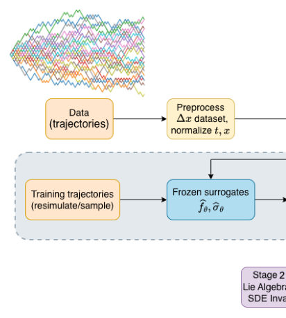
<figcaption class="paper-figure-caption"><b>Fig 1.</b> Figure 1. Pipeline for LieStoNet</figcaption>
</figure>
<figure class="paper-figure-card">
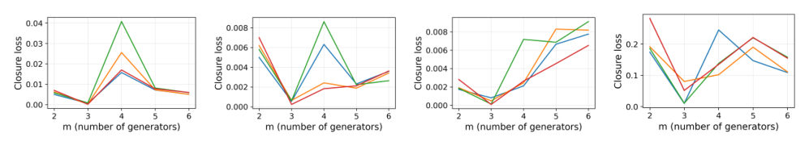
<figcaption class="paper-figure-caption"><b>Fig 2.</b> Figure 2. Post-training Lie bracket closure loss L1 vs. number of generators m across four experiments. Colors denote independent runs with identical settings (different random seeds), showing the minimum is consistently attained at the ground-truth m rather than a one-off.</figcaption>
</figure>
<figure class="paper-figure-card">
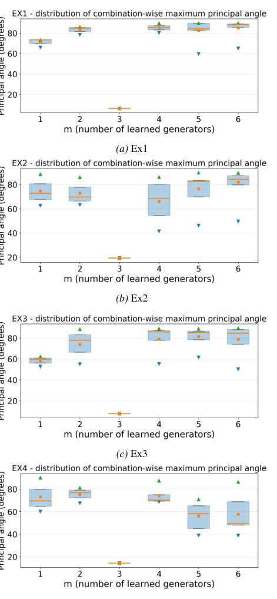
<figcaption class="paper-figure-caption"><b>Fig 3.</b> Figure 3. Distribution of combination-wise maximum principal angles. Number of learned generators (m) vs. principal angles. The blue boxes denote the interquartile range; the orange horizontal lines inside the box denote the median; the green up triangles and the blue down triangles denote the maximum and minimum of maximum principal angles, respectively; the orange dots denote the mean.</figcaption>
</figure>
<figure class="paper-figure-card">
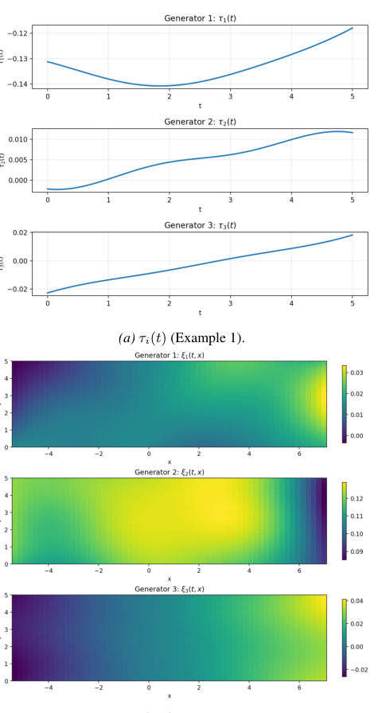
<figcaption class="paper-figure-caption"><b>Fig 4.</b> Figure 4. Learned generator components for Example 1. Part (a): temporal component τi(t). Part (b): spatial component ξi(t, x) visualized as heat maps.</figcaption>
</figure>
<figure class="paper-figure-card">
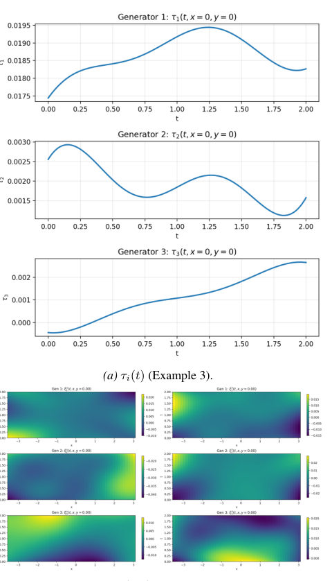
<figcaption class="paper-figure-caption"><b>Fig 5.</b> Figure 6. Learned generator components for Example 3. Part (a): τi(t). Part (b): ξi(t, x) heat maps.</figcaption>
</figure>

**Summary.** This paper introduces LieStoNet, a novel machine learning framework designed to discover continuous symmetry generators for Stochastic Differential Equations directly from raw data. By enforcing both the SDE's determining equations and the algebraic properties of Lie brackets within its loss function, it provides an interpretable method for analyzing symmetries in noisy stochastic systems.

**Why it may be interesting.** While focused on general stochastic systems, the methodology of using deep learning to enforce complex underlying mathematical structures (like Lie brackets) is highly relevant for modeling quantum dynamics where symmetries are crucial for simplification.

Detailed structure

**Main problem.** The core problem is discovering continuous Lie-point symmetries for Stochastic Differential Equations (SDEs) directly from noisy, spatiotemporal data trajectories.

**Main result.** LieStoNet successfully recovers symmetry generators consistent with known analytic algebras across various canonical SDEs, providing an interpretable tool for analyzing stochastic dynamics.

**Method.** It employs an end-to-end framework that first trains a neural surrogate for the SDE coefficients and then learns the symmetry generators by minimizing losses enforcing both the SDE determining equations and the Lie algebra axioms (closure and Jacobi identity).

**Model / system.** The system modeled is governed by an Itô SDE: d x_t = f(t, x_t) dt + sigma(t, x_t) dW_t. The analysis connects this stochastic view to the associated deterministic Fokker-Planck equation.

**Key observables.** Discovered Lie-point symmetry generators and the maximum principal angle between learned and analytic symmetry-algebra spans.

**Important parameters / regimes.** The relative weights assigned to different loss terms (e.g., $w_6$ for SDE constraints, $w_7$ for finite-step losses) are critical operational parameters.

**Assumptions / limitations.** The method is limited to discovering projectable Lie-point symmetries and relies on the assumption that a differentiable neural surrogate can accurately capture the underlying dynamics from discrete samples.

**Figures summary.** Tables detail performance metrics, ablation studies showing loss term importance, and quantitative analysis of how the maximum principal angle varies non-monotonically with optimization weights $w_6$ and $w_7$.

**Paper structure.** The paper introduces LieStoNet in two stages: first, training a neural surrogate for the SDE coefficients from data; second, optimizing the symmetry generators by minimizing a composite loss function that enforces both physical constraints (SDE determining equations) and mathematical structure (Lie algebra axioms).

Abstract

Symmetry is central to modern machine learning and physics: invariances and equivariances improve sample efficiency, robustness, and out-of-distribution generalization, while symmetry principles guide scientific modeling. Yet for stochastic dynamical systems the relevant continuous symmetries are rarely known, and symmetry discovery for SDEs has remained essentially unexplored. We introduce \textit{LieStoNet}, an end-to-end, \emph{template-free} framework for discovering Lie-point symmetries of SDEs directly from spatiotemporal trajectories, without prespecifying symmetry groups, templates, or canonical coordinates. Building on the seminal SDE Lie-symmetry theory of Gaeta and Quintero (1999), which formalizes Lie-point SDE symmetries and their relation to Fokker-Planck symmetries, LieStoNet learns neural surrogates for drift and diffusion from increments, then learns projectable generators by enforcing the SDE determining equations, separately regularizing for closure under Lie brackets, adherence to the Lie algebra axioms (bilinearity, antisymmetry, Jacobi), and a non-redundant independent basis. The surrogate also defines an associated Fokker-Planck equation, enabling optional discovery of its Lie-point symmetries in parallel. Across multiple canonical SDEs with known analytic symmetries, LieStoNet recovers generators consistent with the ground-truth symmetry algebra, providing interpretable symmetry discovery for noisy dynamics. Code is available at \href{https://github.com/sumit-sinha-seas/LieStoNet_Final.git}{this link}.

[↑ back to top](#top)

### [Algorithmic overlaps in the Baxter-Wu model: cluster dynamics under Novotny-Evertz updates](http://arxiv.org/abs/2608.01280v1)

**Authors:** Ian Pilé, Lev Shchur  
**Type:** theory · **Category:** statistical mechanics · **PDF:** <https://arxiv.org/pdf/2608.01280v1>  
**Analysis basis:** full PDF text, analyzed in chunks
**Topic relevance:** `non-equilibrium universality` **3/5** · `non-equilibrium dynamics` **2/5** · `driven-dissipative phase transition` **1/5** · `methods for driven-dissipative` **1/5**

↔ Scroll figures horizontally

<figure class="paper-figure-card">
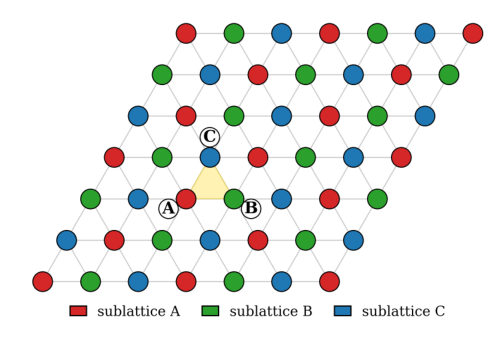
<figcaption class="paper-figure-caption"><b>Fig 1.</b> FIG. 1: Three-sublattice coloring of the triangular lattice (A red, B green, C blue); every elementary triangle (gold) has one site of each. The unique three-coloring closes on the torus only when L mod 3=0. This structure underlies both the four-fold degeneracy and the Novotny–Evertz cluster update.</figcaption>
</figure>
<figure class="paper-figure-card">
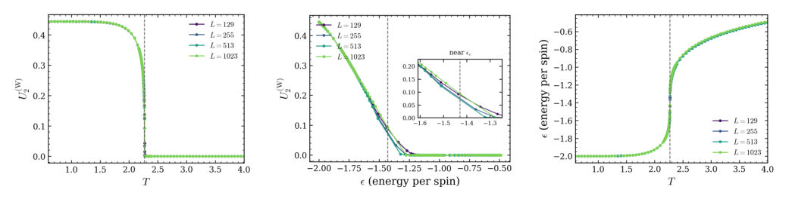
<figcaption class="paper-figure-caption"><b>Fig 2.</b> FIG. 2: Baxter–Wu, single-cluster updates. (a) Mean overlap U (W) 2 versus T for L=129–1023. The ordered-phase plateau at ≈0.44 reflects the 2N/3 active spins [Eq. (7)]. (b) Mean overlap versus energy per spin. Inset zooms on the critical region. (c) Energy per spin versus T. The monotonic relation justifies the energy axis in panel (b).</figcaption>
</figure>
<figure class="paper-figure-card">
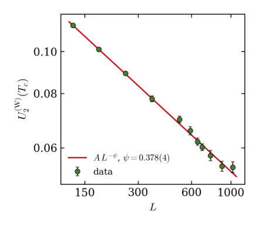
<figcaption class="paper-figure-caption"><b>Fig 3.</b> FIG. 3: Finite-size scaling of U (W) 2 (Tc) versus L (log–log) for eleven sizes L=129–1023, with jackknife errors from ∼400 independent replicas; the line is a pure power law A L−ψ with ψ(W) BW =0.378(4) (reduced χ2 ≈0.6), more moderate than the Ising/Potts value.</figcaption>
</figure>
<figure class="paper-figure-card">
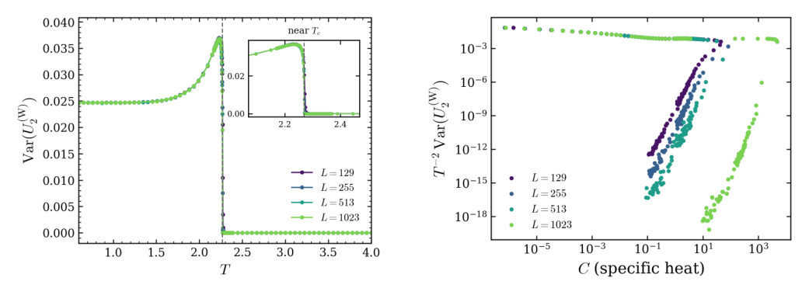
<figcaption class="paper-figure-caption"><b>Fig 4.</b> FIG. 4: (a) Variance Var(U (W) 2 ) versus T; inset on the critical peak. The peak sharpens with L; the low-T plateau is 2/81. (b) Rescaled variance T −2Var(U (W) 2 ) versus C (log–log). Upper branch T &lt; Tc, lower branch T &gt; Tc; they meet at the specific-heat peak.</figcaption>
</figure>
<figure class="paper-figure-card">
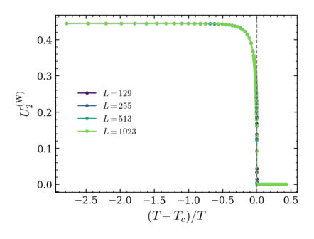
<figcaption class="paper-figure-caption"><b>Fig 5.</b> FIG. 5: U (W) 2 versus (T −Tc)/T; the overlap behaves like an order parameter, dropping from a finite plateau to zero without diverging.</figcaption>
</figure>

**Summary.** The paper analyzes the Baxter-Wu model using Markov Chain Monte Carlo simulations to study an 'algorithmic overlap' observable. By comparing its critical behavior to established models, the authors demonstrate that this overlap exponent is determined by the specific Novotny-Evertz cluster update rule rather than the model's static universality class. This highlights the diagnostic power of tracking dynamic process metrics in phase transitions.

**Why it may be interesting.** This work provides a rigorous example of how non-equilibrium or algorithmic observables can serve as powerful diagnostics in statistical mechanics, potentially revealing details about the dynamics inaccessible through standard equilibrium critical exponents.

Detailed structure

**Main problem.** The study investigates whether an 'algorithmic observable' derived from Markov Chain Monte Carlo (MCMC) simulations can characterize the thermodynamics of a phase transition in a multi-spin interaction model.

**Main result.** The algorithmic overlap mean behaves like an order parameter, dropping to zero at $T_c$, but its finite-size decay exponent ($\psi = 0.378(4)$) is smaller than that found for standard cluster dynamics (Ising/Potts), indicating it reflects the specific update rule.

**Method.** The authors simulate the Baxter-Wu model using a specialized Novotny-Evertz sublattice-freezing single-cluster update and measure the spatial overlap between successive spin configurations.

**Model / system.** The system is the 2D Baxter–Wu model on the triangular lattice with three-spin interactions ($\mathcal{H}_{	ext{BW}}$). The dynamics are governed by the Novotny–Evertz sublattice-freezing single-cluster update, which differs fundamentally from standard Fortuin–Kasteleyn cluster rules.

**Key observables.** Algorithmic overlap ($U^{(W)}_n$), its mean $\langle U^{(W)}_n 
angle$, and its finite-size scaling exponent ($\psi(W)$).

**Important parameters / regimes.** Critical temperature ($T_c$); system size $L$; the measured exponent $\psi = 0.378(4)$.

**Assumptions / limitations.** The overlap is treated as an algorithmic observable, and its behavior is assumed to be dictated by the specific cluster update rule (NE) rather than static equilibrium properties.

**Figures summary.** Not specified in detail, but comparisons are made between $\psi(W)$ for Baxter-Wu (NE dynamics) versus Ising/Potts models (FK dynamics).

**Paper structure.** The paper introduces the model and the algorithmic observable. It then details the simulation methodology using NE updates. The core of the work presents the measurement of the overlap's behavior across $T_c$ and compares the resulting critical exponent $\psi(W)$ to known results, concluding that the update rule dictates this exponent.

Abstract

We study the spatial overlap of successive spin configurations generated by Markov chain Monte Carlo simulations of the Baxter-Wu model. Using the Novotny-Evertz sublattice-freezing single-cluster update, we track the mean and variance of the algorithmic overlap across the critical region. We show that, even in this three-spin model, the overlap acts as an algorithmic observable that follows the thermodynamics of the transition: the single-cluster overlap mean behaves like an order parameter, dropping from a finite ordered-phase plateau toward zero across $T_c$. The overlap does not diverge at criticality, instead it remains finite and its finite-size value decays as a clean power law, $U_2(T_c)\sim L^{-ψ}$, over eleven sizes with an exponent $ψ{=}0.378(4)$ smaller than the value $\approx0.42$ found for the Ising and Potts models under standard Fortuin-Kasteleyn cluster dynamics, indicating that it reflects the Novotny-Evertz sublattice-freezing dynamics rather than any static property of the model.

[↑ back to top](#top)

### [Entanglement Generation Beyond Quantum Theory: From Product States to Popescu-Rohrlich Boxes](http://arxiv.org/abs/2608.02403v1)

**Authors:** Shun Umekawa, Akihiro Hokkyo, Hayato Arai, Kazuaki Takasan  
**Type:** theory · **Category:** quantum information and computing · **PDF:** <https://arxiv.org/pdf/2608.02403v1>  
**Analysis basis:** full PDF text, analyzed in chunks
**Topic relevance:** `entanglement & information structure` **3/5** · `Keldysh / 2PI / non-Gaussian methods` **1/5** · `correlated / nonlocal dissipation` **1/5** · `driven-dissipative phase transition` **1/5** · `methods for driven-dissipative` **1/5**

↔ Scroll figures horizontally

<figure class="paper-figure-card">
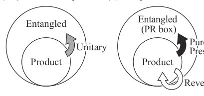
<figcaption class="paper-figure-caption"><b>Fig 1.</b> FIG. 1. Entanglement generation in terms of two hallmark properties of unitary dynamics: reversibility and pure-state preservation. (a) In quantum theory, unitary dynamics can reversibly transform product pure states into entangled pure states. (b) Although the simplest boxworld, which corre- sponds to the setting for the CHSH inequality, admits no re- versible entangling transformation, relaxing reversibility while retaining pure-state preservation allows product pure states to be transformed into entangled PR boxes.</figcaption>
</figure>

**Summary.** The paper explores entanglement generation beyond standard quantum theory by analyzing transformations in generalized probabilistic models. It proves that while reversible dynamics cannot generate supraquantum correlations (like PR boxes), relaxing the requirement of reversibility to only require pure-state preservation enables such generation. This provides a rigorous mathematical framework distinguishing between these two dynamical constraints.

**Why it may be interesting.** This work directly challenges fundamental assumptions about dynamics in quantum information theory, providing a concrete mechanism for generating correlations stronger than quantum mechanics allows without violating basic physical principles like pure-state mapping.

Detailed structure

**Main problem.** The paper investigates whether entanglement generation beyond quantum theory is possible using pure-state-preserving (PSP) transformations in a generalized probabilistic framework called 'boxworld.' It specifically tests if such dynamics can generate Popescu-Rohrlich (PR) box correlations from uncorrelated product states.

**Main result.** Relaxing the assumption of reversibility while maintaining PSP allows for entanglement generation, demonstrated by constructing an explicit transformation that maps product states to PR boxes. This establishes a physical distinction between reversibility and pure-state preservation beyond quantum theory.

**Method.** The authors use mathematical analysis on the state space $	ext{PNS}$ (defined by no-signaling constraints) to classify all PSP transformations ($\phi$). They employ techniques involving affine maps, postselection protocols, and structural theorems derived from analyzing how observables transform under $\phi$.

**Model / system.** The model is based on generalized probabilistic theories ('boxworld') describing correlations, specifically using the CHSH inequality setting. The system analyzes transformations acting on the state space of correlations ($	ext{PNS}$), distinguishing between quantum states and supraquantum PR boxes.

**Key observables.** CHSH Value ($S_{a,b}(p)$), correlation vectors $C_{\vec{W}}$, and the classification of maps (entangling, disentangling, entanglement-preserving).

**Important parameters / regimes.** The distinction between reversible dynamics and PSP dynamics; the structure of pure states ($	ext{VLR}$) versus PR boxes ($	ext{VPR}$).

**Assumptions / limitations.** The analysis focuses on the 'simplest bipartite boxworld' corresponding to the CHSH inequality setting, and later parts assume specific structural properties for the map $\phi$ (e.g., PSP property).

**Figures summary.** Figure 1 illustrates that relaxing reversibility while keeping PSP enables PR box generation, contrasting it with the no-entangling result found under full quantum reversibility.

**Paper structure.** The paper first establishes the 'no-go' theorem for reversible dynamics. It then introduces and constructs a specific non-trivial PSP transformation ($\phi$) that generates PR boxes. Subsequent sections provide rigorous mathematical proofs, exhaustively classifying all such maps based on structural constraints derived from analyzing observables in both the Heisenberg picture and by imposing separability preservation.

Abstract

Entanglement generation is a fundamental dynamical capability in quantum information science and underpins many quantum advantages. While quantum theory enables it through unitary dynamics, boxworld, a generalized probabilistic theory admitting Popescu--Rohrlich boxes with supraquantum correlations, has no reversible transformation capable of generating entanglement. We show that this no-go picture changes fundamentally once reversibility is relaxed to pure-state preservation. We construct a pure-state-preserving transformation that maps every uncorrelated pure state to a Popescu--Rohrlich box and completely classify all pure-state-preserving entangling transformations in the simplest bipartite boxworld. Our results provide the first explicit mechanism for generating beyond-quantum entanglement without introducing mixing and demonstrate a physical distinction between reversibility and pure-state preservation that is obscured by the structure of quantum theory.

[↑ back to top](#top)

### [What is electric charge?: Charge as a local observable in relativistic quantum field theory](http://arxiv.org/abs/2608.00468v1)

**Authors:** Hideyasu Yamashita  
**Type:** theory · **Category:** other · **PDF:** <https://arxiv.org/pdf/2608.00468v1>  
**Analysis basis:** full PDF text, analyzed in chunks
**Topic relevance:** `quantum measurements` **3/5** · `Keldysh / 2PI / non-Gaussian methods` **2/5** · `entanglement & information structure` **1/5** · `measurement-induced transitions` **1/5**

↔ Scroll figures horizontally

<figure class="paper-figure-card">
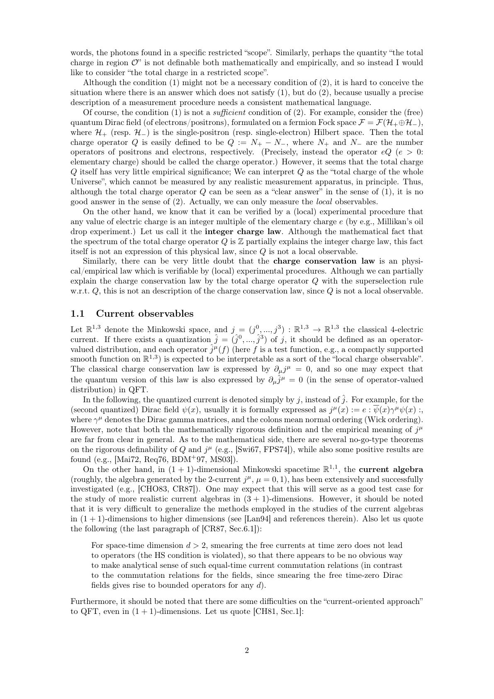
<figcaption class="paper-figure-caption"><b>Fig 1.</b> Low-resolution page preview, page 2</figcaption>
</figure>
<figure class="paper-figure-card">
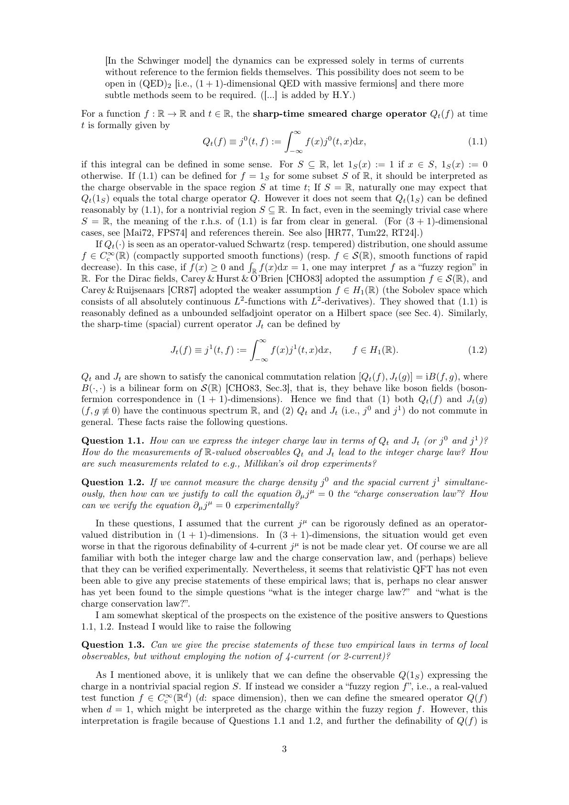
<figcaption class="paper-figure-caption"><b>Fig 2.</b> Low-resolution page preview, page 3</figcaption>
</figure>
<figure class="paper-figure-card">
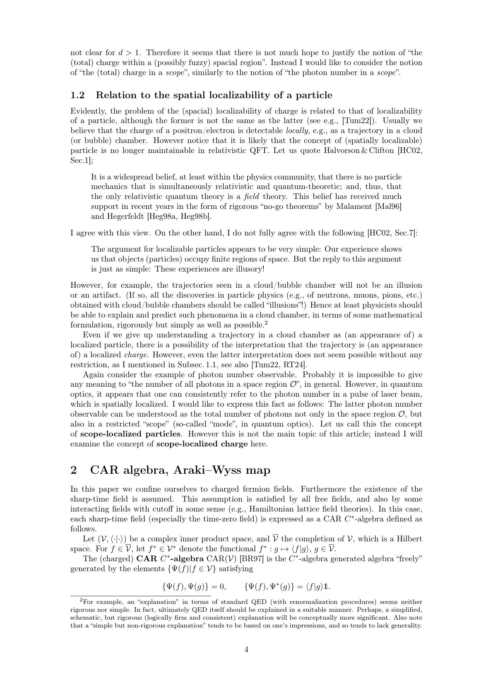
<figcaption class="paper-figure-caption"><b>Fig 3.</b> Low-resolution page preview, page 4</figcaption>
</figure>
<figure class="paper-figure-card">
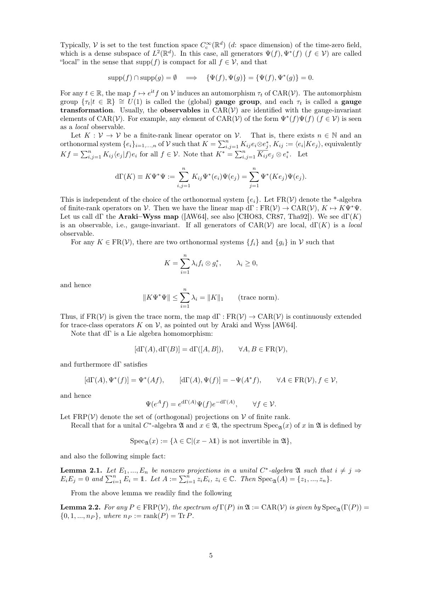
<figcaption class="paper-figure-caption"><b>Fig 4.</b> Low-resolution page preview, page 5</figcaption>
</figure>
<figure class="paper-figure-card">
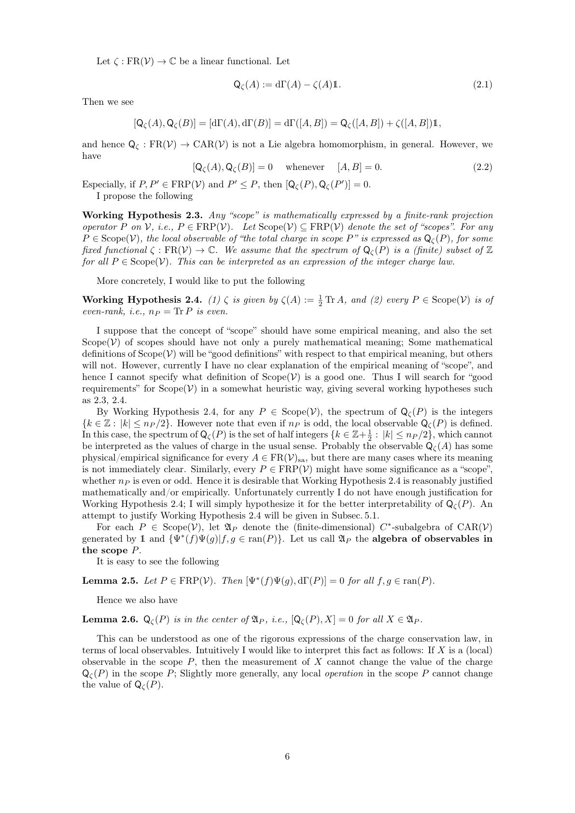
<figcaption class="paper-figure-caption"><b>Fig 5.</b> Low-resolution page preview, page 6</figcaption>
</figure>

**Summary.** This paper addresses the deep theoretical problem of defining electric charge as a truly local observable in relativistic QFT. It moves beyond standard current definitions by introducing 'scope-local charge' within an abstract C*-algebraic framework. The work provides mathematical tools to calculate conditional probabilities for these charges, offering a rigorous, albeit highly abstract, path toward reconciling quantum theory with empirical conservation laws.

**Why it may be interesting.** While highly abstract, the rigorous algebraic approach to defining conserved quantities like charge is foundational to understanding local measurements in QFT, which underpins many modern quantum information theories.

Detailed structure

**Main problem.** The paper tackles the fundamental theoretical question of defining 'electric charge' as a local, measurable observable within relativistic Quantum Field Theory (QFT). It questions whether standard concepts like the 4-current operator can provide an experimentally interpretable definition.

**Main result.** The author proposes and develops the concept of 'scope-local charge,' $Q_\zeta(P)$, defined in an abstract C*-algebraic setting using Araki–Wyss maps. This framework allows for mathematically consistent, quantifiable predictions regarding conditional probabilities of charge measurements.

**Method.** The methodology is highly abstract, employing algebraic quantum field theory (AQFT) techniques within the CAR algebra. It utilizes functional analysis, projection operators ($P$), and spectral decomposition to define observables locally.

**Model / system.** The theoretical framework models charged fermion fields (like the Dirac field) in Minkowski spacetime. The focus is not on a specific physical Hamiltonian but on the algebraic structure of local observables generated by these fields.

**Key observables.** Total charge operator ($Q$), 4-current operator ($\mathbf{j}$), and the proposed 'scope-local charge' $Q_\zeta(P)$.

**Important parameters / regimes.** The dimension of spacetime (specifically $(3+1)$ vs. $(1+1)$), and spectral properties related to integer quantization.

**Assumptions / limitations.** Key assumptions include defining observables via finite-rank projections ('scopes') and imposing structural constraints like C-invariance or specific relationships between projection operators ($P_1 P_2$).

**Paper structure.** The paper progresses from identifying the failure of standard local current definitions in (3+1)D to proposing the abstract 'scope' concept. It then develops mathematical machinery using C*-algebras, addressing symmetries (Charge Conjugation), and finally calculating conditional probabilities for these scope-local charges.

Abstract

It is rather surprising that modern quantum physics does not appear to have provided any clear answer to the simple question ``what is electric charge?''. Even when the total charge operator $Q$ is well-defined, the non-locality of $Q$ implies that it is not an observable in the usual sense, which can be measured by a (local) experimental apparatus. A candidate for the ``local version'' of charge operator is the 4-current operator $j=(j^μ)_{μ=0,1,2,3}$. However, it is known that the rigorous definition of $j$ is difficult in $(3+1)$-dimensional Minkowski space. Although it was found that the current can be defined in $(1+1)$-dimensions (Carey et al.), I argue that even when $j$ can be suitably defined, the interpretability of $j$ as the ``local charge operator'' is dubious. Instead I return to Araki and Wyss (1964), and propose the concept of ``scope-local charge'' $Q_ζ(P)$ for a ``scope'' $P$, expressed by a finite-dimensional projection. I work in an abstract $C^{*}$-algebraic setting.

[↑ back to top](#top)

### [Adaptive operator-generated subspaces for effective many-body Hamiltonians](http://arxiv.org/abs/2608.00560v1)

**Authors:** Ginanjar Utama, Hermawan Kresno Dipojono  
**Type:** theory · **Category:** strongly correlated electrons · **PDF:** <https://arxiv.org/pdf/2608.00560v1>  
**Analysis basis:** full PDF text, analyzed in chunks
**Topic relevance:** `analog quantum simulation` **3/5** · `correlated cavity matter` **1/5** · `entanglement & information structure` **1/5** · `non-equilibrium dynamics` **1/5**

↔ Scroll figures horizontally

<figure class="paper-figure-card">
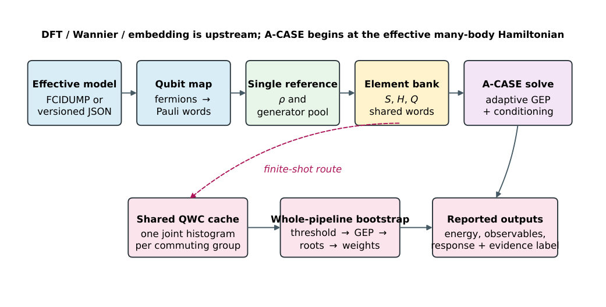
<figcaption class="paper-figure-caption"><b>Fig 1.</b> FIG. 1. Computational contract. The exact route builds one global matrix-element bank and solves an adaptively grown generalized eigenproblem. The finite-shot route measures the union word set in QWC groups and resamples each group’s joint histogram through every nonlinear downstream operation. Upstream electronic-structure and embedding stages are outside the claimed scope.</figcaption>
</figure>
<figure class="paper-figure-card">
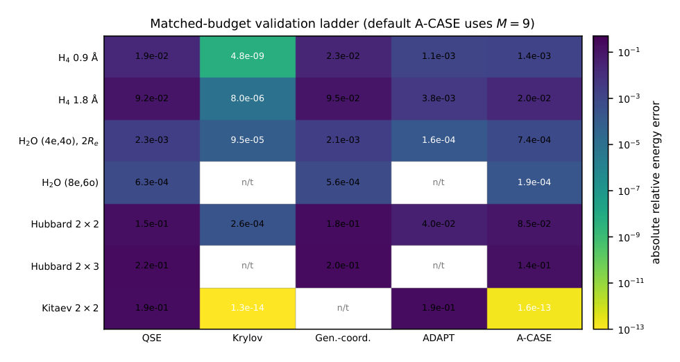
<figcaption class="paper-figure-caption"><b>Fig 2.</b> FIG. 2. Absolute relative energy error for the default matched-budget ladder. “n/t” means that the arm was not run. The heat map compares energy only; Table VI supplies the conditioning and measurement-width trade. The default A-CASE column uses M = 9, not the larger level-4 Hubbard run.</figcaption>
</figure>
<figure class="paper-figure-card">
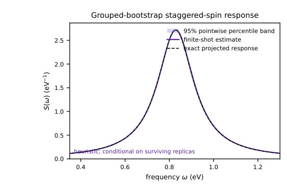
<figcaption class="paper-figure-caption"><b>Fig 3.</b> FIG. 3. Lorentzian-broadened staggered-spin line with η = 0.1 eV. The band is pointwise across frequency, heuristic, and conditional on replicas that reproduce the pipeline’s rank and root identity.</figcaption>
</figure>
<figure class="paper-figure-card">
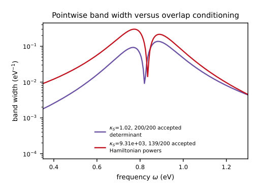
<figcaption class="paper-figure-caption"><b>Fig 4.</b> FIG. 4. Pointwise width of the 95% band across frequency for the two rows of Table VIII. The absolute spectra are visually indistinguishable, so the width is plotted directly. The cusp sits at the line center, where an uncertain gap moves the Lorentzian along the axis without changing its height.</figcaption>
</figure>

**Summary.** This paper introduces A-CASE, an advanced eigensolver that generates active subspaces by adaptively building matrix elements from a single shared bank of Pauli expectation values. It successfully bridges the gap between traditional electronic structure methods and modern quantum simulation techniques using small molecular benchmarks. The work establishes a systematic workflow for calculating energies and response functions without making overreaching claims about material accuracy or computational advantage.

**Why it may be interesting.** It provides a highly structured, computationally rigorous pathway to derive effective Hamiltonians for quantum simulation directly from electronic structure theory, which is crucial for applying quantum algorithms to chemistry and condensed matter physics.

Detailed structure

**Main problem.** The primary challenge is bridging the gap between electronic structure calculations that yield effective many-body Hamiltonians and quantum eigensolver studies that often start with pre-defined qubit models.

**Main result.** The proposed A-CASE method achieves high accuracy (e.g., $0.342 	ext{ mHa}$ error) for small systems by adaptively constructing the necessary subspace using a single, shared Pauli-expectation bank.

**Method.** It introduces the Adaptive Clifford-Algebra Subspace Eigensolver (A-CASE), an operator-generated Rayleigh--Ritz method that reconstructs matrix elements from one global expectation value bank and uses adaptive growth scoring to select basis operators.

**Model / system.** The work is tested on small molecular systems, specifically linear H4 in STO-3G with a CAS(4e, 4o) active space, allowing comparison against established methods like FCI.

**Key observables.** Energy eigenvalues, correlation energies, and response functions (susceptibility $\chi(\omega)$).

**Important parameters / regimes.** Subspace size (e.g., nine-vector budget), error tolerance ($	ext{mHa}$ level), and the number of Pauli words used in the bank.

**Assumptions / limitations.** The method does not claim materials accuracy, favorable scaling, or a quantum advantage; finite-shot response bands are explicitly noted as heuristic and conditional, not rigorous confidence certificates.

**Figures summary.** Figure 1 illustrates the computational contract comparing A-CASE's global matrix-element bank approach to the finite-shot route using QWC groups. Table I compares A-CASE against other subspace methods based on their selection rules.

**Paper structure.** The paper introduces A-CASE as a unified framework, details its adaptive growth mechanism and matrix reconstruction from a shared Pauli bank, presents quantitative benchmarks against established methods (ADAPT-GCIM, FCI), discusses the calculation of response functions, and concludes by outlining limitations regarding material accuracy claims.

Abstract

Electronic-structure and embedding workflows terminate in effective many-body Hamiltonians, whereas quantum eigensolver studies often start from hand-built qubit models. We present the Adaptive Clifford-Algebra Subspace Eigensolver (A-CASE), a single-reference, operator-generated Rayleigh--Ritz method. Overlap, Hamiltonian, observable, and response matrices are reconstructed from one shared Pauli-expectation bank, while adaptive growth scores overlap-aware local pencils and rejects symmetry leakage or near-linear dependence. A strict FCIDUMP adapter supplies the active-space boundary. For linear H$_4$ in STO-3G with CAS(4e,4o), the mapped sector agrees with independent determinant FCI to $3.1\times10^{-15}$ Ha. At a nine-vector budget A-CASE has a $3.019$ mHa error; replacing the determinant reference by a two-operator ADAPT-VQE state reduces it to $0.342$ mHa, without implying a matched total-cost advantage. Under a matched contract, the fixed-reference route uses one state preparation versus ADAPT-VQE's ninety but measures roughly an order of magnitude more Pauli words. Exact fixed-angle ADAPT-GCIM gives $13.364$ mHa at the nearest size match and $10.674$ mHa at the iteration match, with its transition-pair burden reported separately. Across a broader benchmark ladder, fixed Krylov bases are generally more accurate and often narrower but substantially less well conditioned. A grouped bootstrap propagates finite-shot variability through thresholding, diagonalization, root matching, spectral weights, susceptibility, and broadening; its bands are explicitly heuristic and conditional, not finite-sample confidence certificates. The work establishes an executable path from an interchange Hamiltonian to energies, correlations, and response, without claiming materials accuracy, favorable scaling, or quantum advantage.

[↑ back to top](#top)

### [Chiral Magnon Mixing by Symmetry-Breaking in Collinear Ferrimagnets](http://arxiv.org/abs/2608.00210v1)

**Authors:** Dhurba R. Jaishi, Tyler J. Slade, S. X. M. Riberolles, Bing Li, Tianxiong Han, D. M. Pajerowski, D. L. Abernathy, Barry Winn, Melissa Graves-Brook, B. G. Ueland, R. J. McQueeney  
**Type:** both · **Category:** strongly correlated electrons · **PDF:** <https://arxiv.org/pdf/2608.00210v1>  
**Analysis basis:** full PDF text, analyzed in chunks
**Topic relevance:** `spintronics-quantum-optics interface` **3/5** · `analog quantum simulation` **1/5** · `driven-dissipative phase transition` **1/5** · `exotic spin models in light-matter` **1/5**

↔ Scroll figures horizontally

<figure class="paper-figure-card">
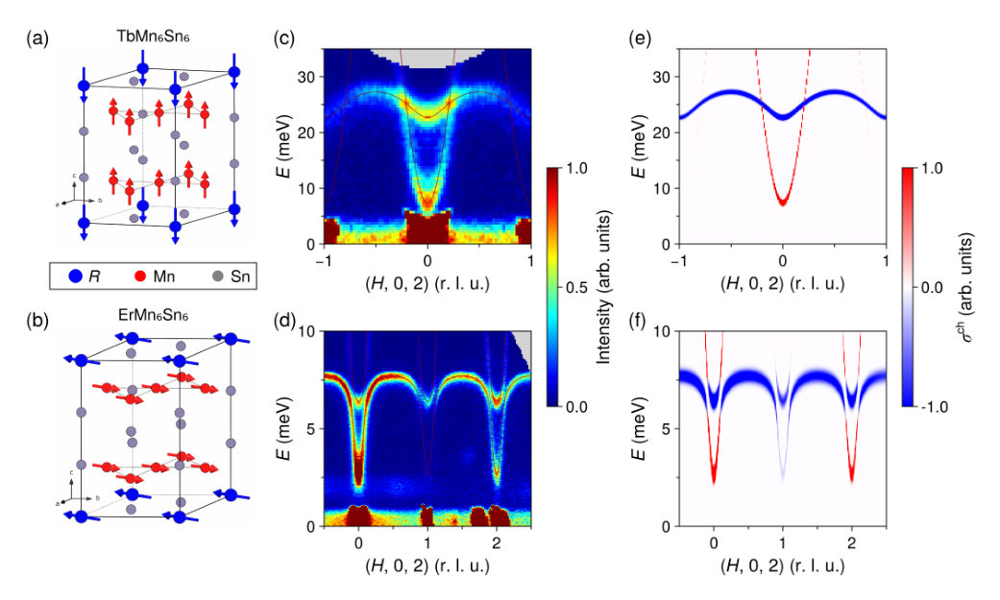
<figcaption class="paper-figure-caption"><b>Fig 1.</b> FIG. 1. Chiral magnons in Tb166 and Er166. (a) Uniaxial ferrimagnetic structure of Tb166. (b) Planar ferrimagnetic structure of Er166. (c), (d) Unpolarized INS measurement of the magnon dispersions of Tb166 and Er166, respectively. For Tb166, measurements were performed with Ei = 75 meV at 6 K along the reciprocal-lattice direction (H, 0, 2). Data have been integrated in the transverse directions with K = [-0.05, 0.05] and L = [1.90, 2.10] in reciprocal lattice units (r. l. u.). For Er166, measurements were performed with Ei = 12 meV at 1.8 K along the reciprocal-lattice direction (H, 0, 2). Data have been integrated in the transverse directions with K = [-0.03, 0.03] and L = [1.80, 2.20]...</figcaption>
</figure>
<figure class="paper-figure-card">
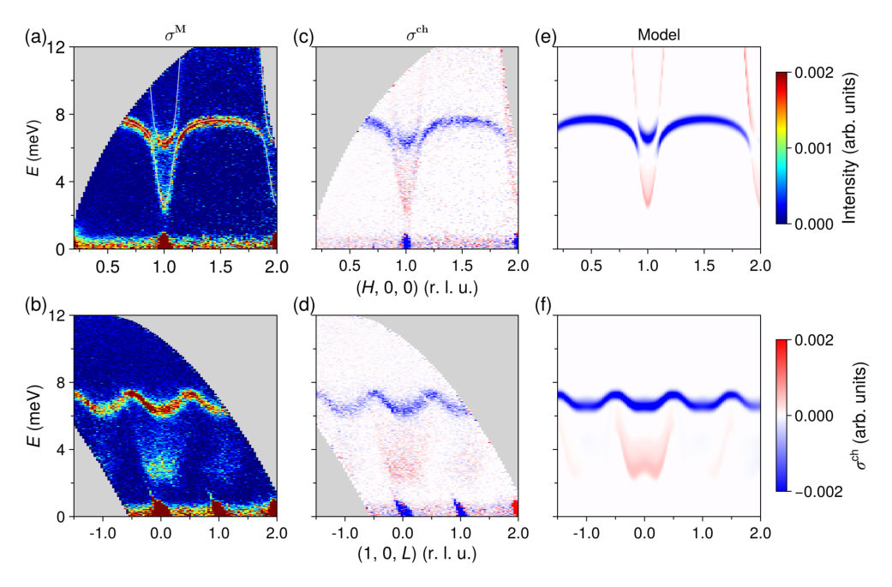
<figcaption class="paper-figure-caption"><b>Fig 2.</b> FIG. 2. Magnon chirality mixing in Er166. Half-polarized INS data for Er166 showing the magnetic contribution (σM) (a)–(b) and the chiral contribution (c)–(d) to spin excitations along the reciprocal-lattice direction (H, 0, 0) and (1, 0, L), respectively. The scattering events were collected with Ei = 15 meV at 6 K. The gray solid lines in (a) correspond to the model dispersion. (e), (f) Model calculations of the chiral scattering along the two directions convoluted with a Gaussian energy full-width-at-half-maximum of 0.4 meV. The gray shaded regions in (a-d) are obscured by the kinematic limit.</figcaption>
</figure>
<figure class="paper-figure-card">
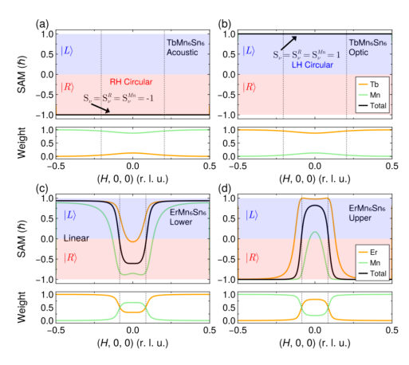
<figcaption class="paper-figure-caption"><b>Fig 3.</b> FIG. 3. Magnon spin angular momentum. Sublattice SAM and total SAM (in units of ℏ) for acoustic and optic modes in (a), (b) Tb166 and (c), (d) Er166. In each panel, the lower plot shows the sublattice weight for each eigenvector. Thin vertical lines indicate the wavevector where the modes cross.</figcaption>
</figure>
<figure class="paper-figure-card">
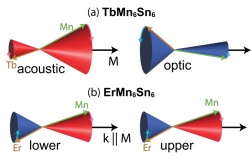
<figcaption class="paper-figure-caption"><b>Fig 4.</b> FIG. 4. Magnon mode eigenvectors. Precession of rare- earth moments (orange arrow) and Mn moments (green ar- row) in a right-handed (red cone) or left-handed fashion (blue cone) relative to the net magnetization (M). Eigenvectors are shown near the mode-crossing wavevector for (a) Tb166 and (b) Er166. For Er166, the Er and Mn moments precess with opposite handedness, allowing the cancellation of the net SAM and chirality.</figcaption>
</figure>

**Summary.** This work explores how broken symmetries in ferrimagnets, specifically $	ext{RMn}_6	ext{Sn}_6$, induce mixing between right- and left-handed magnons. By combining theoretical modeling with polarized neutron scattering experiments, the authors demonstrate that anisotropy can cause a measurable reversal of magnon chirality within a single energy band. This highlights magnetic symmetry as a key control knob for manipulating quantum spin excitations.

**Why it may be interesting.** The mechanism linking crystal symmetry breaking (anisotropy) to the hybridization and reversal of magnon chirality is a rich topic relevant to topological spin textures and emergent quantum phenomena in magnetic materials.

Detailed structure

**Main problem.** The study investigates chiral magnon mixing induced by symmetry-breaking mechanisms within collinear ferrimagnetic materials.

**Main result.** The research demonstrates that in $	ext{ErMn}_6	ext{Sn}_6$, magnetic anisotropy breaks the $U(1)$ symmetry, causing right- and left-handed magnons to hybridize, leading to a measurable reversal of chirality within a single magnon band as momentum changes.

**Method.** The study combines theoretical calculations using linear spin-wave theory with experimental measurements from polarized inelastic neutron scattering (INS).

**Model / system.** The system is the $	ext{RMn}_6	ext{Sn}_6$ kagome ferrimagnet. The physics is modeled via a Hamiltonian incorporating exchange interactions ($H_{	ext{ex}}$) and magnetic anisotropy ($H_{	ext{aniso}}$), which dictates the symmetry of the spin dynamics.

**Key observables.** Chiral scattering cross-section ($\sigma_{	ext{ch}}$) measured via polarized INS, magnon energy/momentum dispersion, and the degree of hybridization gap opening.

**Important parameters / regimes.** Rare-earth element (R = Tb, Er), applied magnetic field strength, and anisotropy parameters derived from CEF calculations ($B_m^l$).

**Assumptions / limitations.** The analysis relies on linear spin-wave theory approximations. Some measurements involve integrating over transverse directions in the Brillouin zone.

**Figures summary.** Figures illustrate crystal structures, unpolarized/chiral INS spectra for both $	ext{TbMn}_6	ext{Sn}_6$ and $	ext{ErMn}_6	ext{Sn}_6$, and theoretical calculations showing how chirality changes near mode crossings due to symmetry breaking.

**Paper structure.** The paper establishes the background on magnon chirality in ferrimagnets, details the experimental setup using polarized INS, develops the spin-wave Hamiltonian incorporating anisotropy, presents results comparing $	ext{Tb}$ (uniaxial) and $	ext{Er}$ (planar) systems, and concludes by discussing the role of symmetry breaking in inducing chiral mixing.

Abstract

Magnons in ferromagnets possess spin angular momentum defined by right-handed precession of the moment around the magnetization direction. In antiferromagnets with no net magnetization, left-and right-handed magnons are degenerate in the absence of an applied field. Ferrimagnets possess uncompensated magnetic sublattices, which should natively possess right-and left-handed magnons where their energy is split by the internal molecular field. Here, we show that RMn6Sn6 (R = Tb, Er) ferrimagnets possess right and left-handed magnon bands that cross at finite momentum (k) within the basal plane, defining modes with opposite dynamical chirality. Depending on the symmetry of the ferrimagnetic order, which may be manipulated by varying the rare-earth magnetic anisotropy or with applied field, the band crossing may remain a nodal line or may be gapped. The gapped modes contain hybridized chiral excitations whose chirality becomes k-dependent.

[↑ back to top](#top)

### [Estimating spacetime fluctuation strength in SU(1,1) and SU(2) interferometers](http://arxiv.org/abs/2608.00907v1)

**Authors:** B. Sharmila  
**Type:** theory · **Category:** other · **PDF:** <https://arxiv.org/pdf/2608.00907v1>  
**Analysis basis:** full PDF text, analyzed in chunks
**Topic relevance:** `interference shaping light` **3/5** · `correlated / nonlocal dissipation` **1/5** · `entanglement & information structure` **1/5** · `quantum measurements` **1/5**

↔ Scroll figures horizontally

<figure class="paper-figure-card">
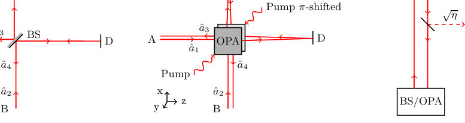
<figcaption class="paper-figure-caption"><b>Fig 1.</b> FIG. 1. A schematic diagram of an (a) SU(2) and (b) SU(1, 1) interferometer. (c) Modelling internal loss in an interferometer with a beam splitter of reflectance √η.</figcaption>
</figure>
<figure class="paper-figure-card">
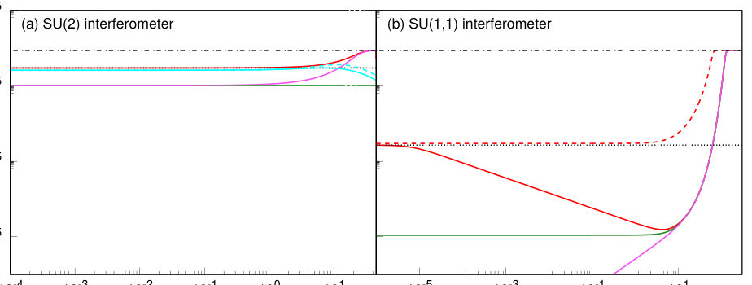
<figcaption class="paper-figure-caption"><b>Fig 2.</b> FIG. 2. Scaled QFI Qs = Γ2QΓ (red), scaled CFI C(2) gs = Γ2C(g2) Γ (green), scaled CFI C(i) gs = Γ2C(gi) Γ (magenta) with i = 3 in (a) and i = 4 in (b), and scaled CFI C(n) ns = Γ2C(nn) Γ with C(1) ns (solid cyan), C(5) ns (dashed cyan) vs squeezing 10 log10  e2β</figcaption>
</figure>
<figure class="paper-figure-card">
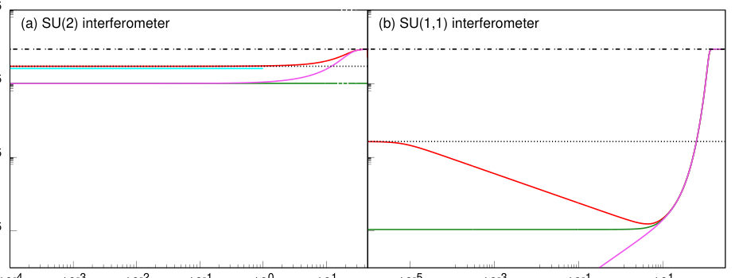
<figcaption class="paper-figure-caption"><b>Fig 3.</b> FIG. 3. Scaled QFI Qc = ℓ2Qℓ(red), scaled CFI C(2) gc = ℓ2C(g2) ℓ (green), scaled CFI C(i) gc = ℓ2C(gi) ℓ (magenta) with i = 3 in (a) and i = 4 in (b), and scaled CFI C(n) nc = ℓ2C(nn) ℓ with C(1) nc (cyan) vs squeezing 10 log10  e2β in decibels for (a) SU(2) and (b) SU(1, 1) interferometers. The black horizontal lines are at 0.5 (dot-dashed) and (1 −η) eσ (dotted) with η = 5 × 10−6</figcaption>
</figure>
<figure class="paper-figure-card">
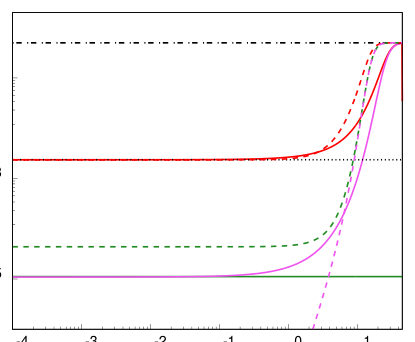
<figcaption class="paper-figure-caption"><b>Fig 4.</b> FIG. 4. Scaled QFI Qs = Γ2QΓ (red), scaled CFI C(2) gs = Γ2C(g2) Γ (green), and C(i) gs = Γ2C(gi) Γ (magenta) vs squeez- ing 10 log10  e2β in decibels, with solid curves for SU(2) and dashed curves for SU(1, 1) interferometers. Here i = 3 for SU(2) and i = 4 for SU(1, 1) interferometers. The black hor- izontal lines are at 0.5 (dot-dashed) and (1 −η) eσ (dotted) with η = 5 × 10−6.</figcaption>
</figure>
<figure class="paper-figure-card">
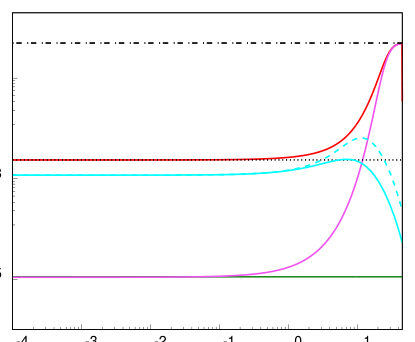
<figcaption class="paper-figure-caption"><b>Fig 5.</b> FIG. 5. Scaled QFI Qs = Γ2QΓ (red), scaled CFI C(2) gs = Γ2C(g2) Γ (green), scaled CFI C(3) gs = Γ2C(g3) Γ (magenta) and scaled CFI C(n) ns = Γ2C(nn) Γ with C(1) ns (solid cyan), C(5) ns (dashed cyan) vs squeezing 10 log10  e2β in decibels for an SU(2) interferometer. The black horizontal lines are at 0.5 (dot- dashed) and (1 −η) eσ (dotted) with η = 5 × 10−6.</figcaption>
</figure>

**Summary.** This paper theoretically compares two types of laser interferometers, SU(2) and SU(1,1), for detecting subtle signatures of random spacetime fluctuations. By calculating Fisher information metrics, the authors assess when the alternative SU(1,1) geometry provides a superior measurement sensitivity compared to the standard SU(2) setup. The findings suggest that while theoretically promising, realizing this advantage requires significant technological advancements beyond current experimental capabilities.

**Why it may be interesting.** This work applies advanced quantum metrology techniques (QFI/CFI) to fundamental physics problems in general relativity, specifically testing the limits of spacetime measurement using quantum optics.

Detailed structure

**Main problem.** The study aims to determine if using an SU(1,1) interferometer offers a measurable advantage over the conventional SU(2) interferometer for estimating spacetime fluctuation strength and correlation length.

**Main result.** For current experimental parameters, the SU(1,1) setup shows no advantage; however, theoretical analysis suggests it could outperform SU(2) under future conditions involving significant technological improvements.

**Method.** The authors compute both Quantum Fisher Information (QFI) and classical Fisher information (CFI) metrics for Gaussian input states in both interferometer types.

**Model / system.** The physical system is a high-precision laser interferometer, modeled using SU(2) and SU(1,1) transformations. The analysis incorporates the effects of internal losses ($\eta$) on the quantum state evolution.

**Key observables.** Quantum Fisher Information (QFI) and classical Fisher information metrics for estimating fluctuation strength ($\Gamma$) and correlation length ($\ell$).

**Important parameters / regimes.** Spacetime fluctuation strength ($\Gamma$), correlation length ($\ell$), internal loss ($\eta$), squeezing parameter ($eta$), and input coherent state amplitude ($\alpha$).

**Assumptions / limitations.** The analysis assumes the long wavelength limit, uses Gaussian states, and compares performance under both lossless and lossy conditions.

**Figures summary.** Figures compare scaled QFI and CFIs for SU(2) vs. SU(1,1) across different squeezing regimes; Table I summarizes ratios of Fisher information metrics.

**Paper structure.** The paper introduces the problem by comparing SU(2) and SU(1,1). It details the calculation of QFI and CFI using quadrature operators for Gaussian states. The core is a comparative analysis showing performance under current vs. future technological regimes to assess potential advantages.

Abstract

High-precision laser interferometers are commonly used to search for signatures of random spacetime fluctuations, in an attempt to understand the fundamental nature of gravity. Conventionally, $SU(2)$ interferometers have been used in such experimental investigations. Motivated by [K. Zheng \textit{et al.}, Photon. Res. \textbf{8}, 1653 (2020)], I assess if there is any advantage to be gained by using an $SU(1,1)$ interferometer instead of the $SU(2)$ interferometer. To this end, I compute the quantum Fisher information for estimating the strength and the correlation length of the spacetime fluctuations, and the corresponding classical Fisher information considering different experimentally relevant measurement schemes, in both types of interferometers. I compare the information metrics corresponding to different parameter regimes that are relevant to both current and possible future experimental setups. This helps me assess if and when the $SU(1,1)$ interferometer offers any advantage over the $SU(2)$ interferometer for estimating either the fluctuation strength or correlation length of the spacetime fluctuations.

[↑ back to top](#top)

### [Neural Quantum States for Nuclear Magnetic Resonance Spectroscopy](http://arxiv.org/abs/2608.00178v1)

**Authors:** Bharadwaj Chowdary Mummaneni, Bo Xing  
**Type:** theory · **Category:** disordered systems and neural networks · **PDF:** <https://arxiv.org/pdf/2608.00178v1>  
**Analysis basis:** full PDF text, analyzed in chunks
**Topic relevance:** `methods for driven-dissipative` **3/5** · `entanglement & information structure` **2/5** · `non-equilibrium dynamics` **1/5**

↔ Scroll figures horizontally

<figure class="paper-figure-card">
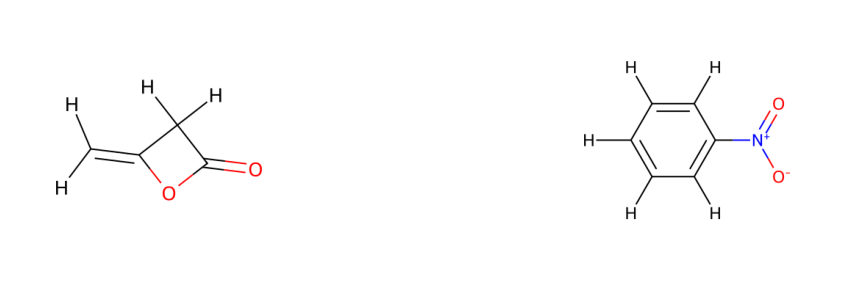
<figcaption class="paper-figure-caption"><b>Fig 1.</b> FIG. 1: Molecular structures of the four spin systems studied in this work. Hydrogen atoms are shown explicitly; heteroatoms are colored (Cl: green, O: red, N: blue). From top-left to bottom-right: cis-3-chloroacrylic acid (2 1H), 1,2,4-trichlorobenzene (3 1H), 3-methyleneoxetan-2-one (4 1H), and nitrobenzene (5 1H). NMR parameters are from experimental databases [28, 29].</figcaption>
</figure>
<figure class="paper-figure-card">
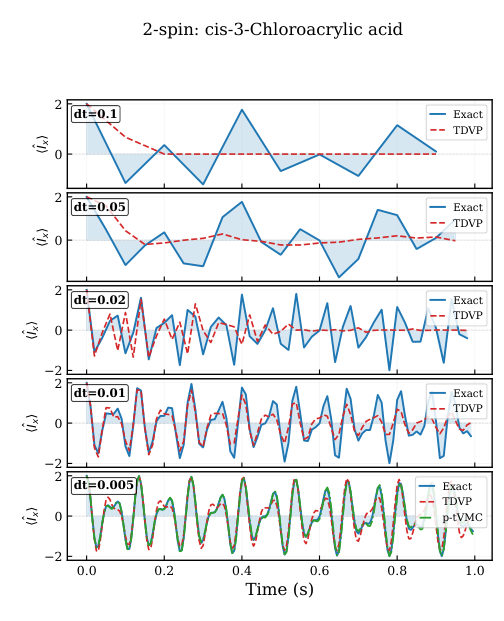
<figcaption class="paper-figure-caption"><b>Fig 2.</b> FIG. 2: Transverse magnetization ⟨ˆIx(t)⟩for the 2-spin sys- tem at decreasing ∆t (coarser at top, finest at bottom). Blue shaded: exact evolution; red dashed: NQS-TDVP; green dash-dot: p-tVMC (finest panel only). Both methods con- verge to the exact trajectory as ∆t decreases.</figcaption>
</figure>
<figure class="paper-figure-card">
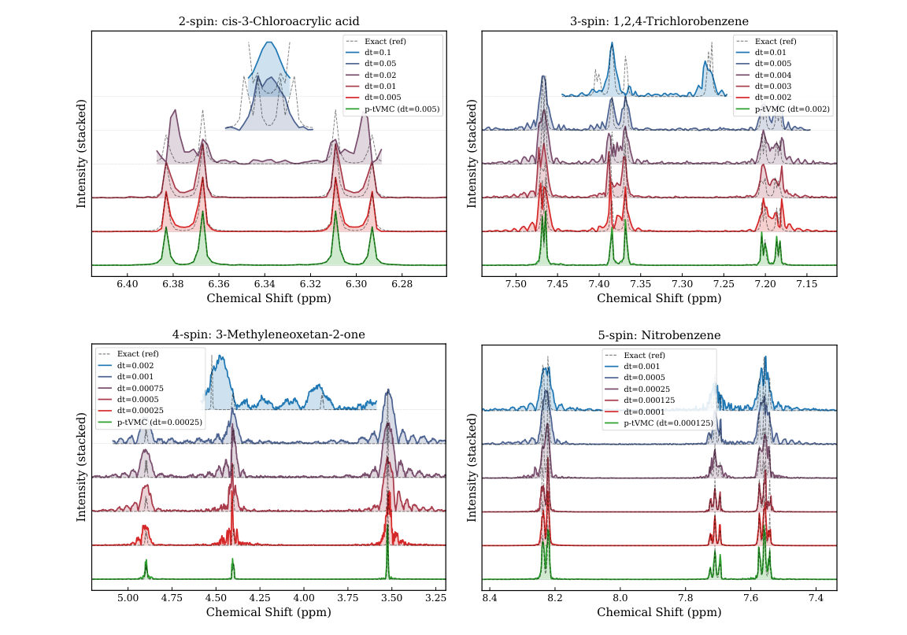
<figcaption class="paper-figure-caption"><b>Fig 3.</b> FIG. 3: NMR spectra for all four molecular spin systems, stacked by integration timestep ∆t (coarsest at top, finest at bottom). Colored fills: NQS-TDVP; green: p-tVMC at the finest timestep; dashed black: exact reference. The exact reference is evaluated on the same time grid as the NQS run in each row (Nt points at the corresponding ∆t) and Fourier-transformed identically, so its spectral resolution improves down the stack alongside the NQS spectra; rows differ in resolution, not in the underlying spectrum. All four systems show progressive convergence to the exact spectrum as ∆t decreases; p-tVMC reproduces the same spectral features at the finest level, though with larger residual error...</figcaption>
</figure>
<figure class="paper-figure-card">
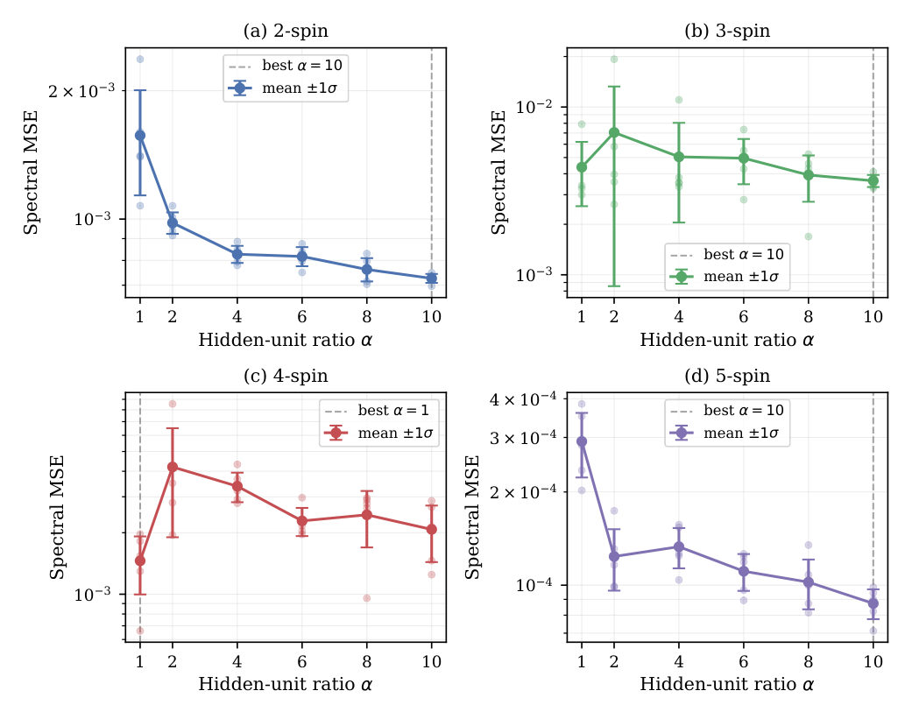
<figcaption class="paper-figure-caption"><b>Fig 4.</b> FIG. 4: Spectral MSE as a function of the hidden-unit ratio α for each molecular spin system (5 independent random seeds per point). Filled circles show individual seeds; connected markers show mean ±1σ; dashed vertical lines mark the optimal α. The 4-spin molecule is anomalous: it achieves its best accuracy at α = 1, whereas all other systems benefit from larger networks.</figcaption>
</figure>
<figure class="paper-figure-card">
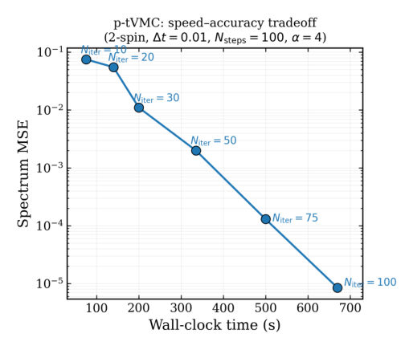
<figcaption class="paper-figure-caption"><b>Fig 5.</b> FIG. 5: Speed–accuracy tradeoff for p-tVMC on the 2- spin system (niter ∈{10, 20, 30, 50, 75, 100} gradient steps per timestep). Wall time scales linearly with niter; MSE drops by four orders of magnitude, showing that accuracy is optimizer- limited rather than expressivity-limited at these system sizes.</figcaption>
</figure>

**Summary.** The paper tackles the exponential complexity of simulating NMR spectra by using Neural Quantum States (NQS) to represent the quantum state. By implementing time evolution in the interaction frame, the authors overcome numerical stiffness caused by fast chemical-shift oscillations. This breakthrough allows for accurate simulations on significantly larger molecular systems than previously feasible.

**Why it may be interesting.** This work directly addresses the scalability limits of simulating quantum many-body dynamics in molecular physics by proposing an efficient transformation (interaction picture) within a modern machine learning framework (NQS).

Detailed structure

**Main problem.** Predicting Nuclear Magnetic Resonance (NMR) spectra from first principles is computationally intractable due to the exponential scaling of quantum state propagation with the number of coupled spins ($2^N$).

**Main result.** Propagating the dynamics in the interaction frame significantly reduces computational cost by orders of magnitude, enabling accurate simulations for larger molecules like sucrose (14 spins).

**Method.** The study employs Neural Quantum States (NQS) combined with time evolution techniques, specifically Time-Dependent Variational Principle (TDVP) and projected time-dependent Variational Monte Carlo (p-tVMC).

**Model / system.** The system models $N$ coupled spin-$1/2$ nuclei undergoing NMR spectroscopy. The Hamiltonian includes chemical shift ($\hat{H}_0$) and scalar coupling ($\hat{H}_1$) terms, derived from experimental parameters.

**Key observables.** NMR spectrum (obtained via Fourier transform of the FID signal), spectral Mean Squared Error (MSE), and entanglement entropy.

**Important parameters / regimes.** The primary bottleneck is the steep growth in required integration steps ($	ext{Nt}$) with $N$; propagation in the interaction frame mitigates this stiffness.

**Assumptions / limitations.** The methods rely on variational approximations (TDVP/p-tVMC) and assume that transforming to the interaction picture removes numerical stiffness associated with fast chemical-shift precession.

**Figures summary.** Figures illustrate speed-accuracy trade-offs, comparing MSE vs. integration steps in rotating versus interaction frames across various spin numbers ($N=2$ to $5$), and show entanglement entropy evolution for sucrose ($N=14$).

**Paper structure.** The paper first establishes the challenge of exponential scaling in NMR simulation. It then introduces NQS as a variational representation, comparing TDVP and p-tVMC dynamics. The core contribution is demonstrating that transforming to the interaction frame drastically improves computational efficiency for larger systems.

Abstract

Predicting a nuclear magnetic resonance (NMR) spectrum from first principles requires propagating a quantum state of dimension $2^N$ for $N$ coupled spins, which becomes intractable beyond larger $N$. We benchmark Neural Quantum States (NQS), a class of variational quantum states expressed as an artificial neural network, as an alternative representation for this problem. Using two propagation methods, the Time-Dependent Variational Principle (TDVP) and projected time-dependent Variational Monte Carlo (p-tVMC), we compute the $^1$H spectra of four ($2 \to 5$ spins) experimentally parameterized molecules. TDVP reproduces all line positions and intensities with average spectral mean squared errors of $<10^{-3}$; p-tVMC reproduces the same features, with accuracy determined by its per-step optimization parameters. One dominant obstacle to larger systems is the steep growth of the number of integration steps with spectral bandwidth, which can be removed by propagating in the interaction frame of the chemical-shifted Hamiltonian. Retaining the same accuracy, this reduces the number of integration steps roughly eightfold for the 3-spin system and by at least an order of magnitude for the 4- and 5-spin systems, and it enables a 14-spin molecule (sucrose) to be accurately propagated via Monte Carlo sampling.

[↑ back to top](#top)

### [Optimized Tensor-Network Renormalization for Quantum Dynamics: Resolving the Spectral Function of $\mathrm{K_2Co(SeO_3)_2}$](http://arxiv.org/abs/2608.02473v1)

**Authors:** Jiahang Hu, Runze Chi, B. Normand, Hai-Jun Liao, T. Xiang  
**Type:** both · **Category:** strongly correlated electrons · **PDF:** <https://arxiv.org/pdf/2608.02473v1>  
**Analysis basis:** full PDF text, analyzed in chunks
**Topic relevance:** `methods for driven-dissipative` **3/5** · `analog quantum simulation` **1/5** · `exotic spin models in light-matter` **1/5** · `non-equilibrium dynamics` **1/5**

↔ Scroll figures horizontally

<figure class="paper-figure-card">
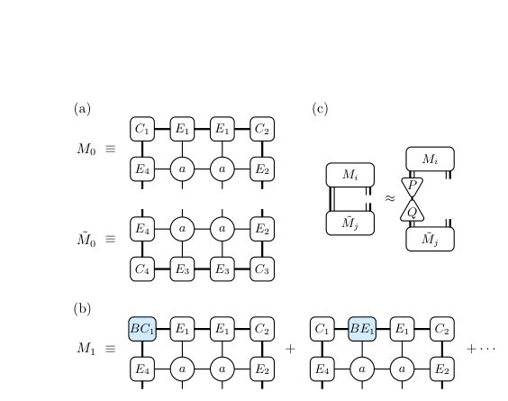
<figcaption class="paper-figure-caption"><b>Fig 1.</b> FIG. 1. Graphical representation of half-CTM tensors and projectors. The full 4×4 CTM network is partitioned into upper and lower halves, each forming a 2×4 network. (a) M0 and ˜ M0, defined solely from the ground-state tensors for the upper and lower half-CTM blocks, respectively. (b) M1, defined as the sum of eight tensor networks, two of which are shown explicitly, with a single B tensor placed at each of the eight possible positions. (c) Construction of the projectors P and Q, which truncate all Mi and ˜ Mj simultaneously.</figcaption>
</figure>
<figure class="paper-figure-card">
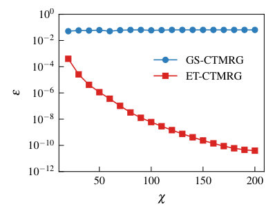
<figcaption class="paper-figure-caption"><b>Fig 2.</b> FIG. 2. Frobenius error, ε, shown as a function of the CTM bond dimension, χ, obtained with GS-CTMRG and ET-CTMRG for the square-lattice Heisenberg antiferromag- net (SLHAF) at momentum (0.2π, 0.3π) and D = 3.</figcaption>
</figure>
<figure class="paper-figure-card">
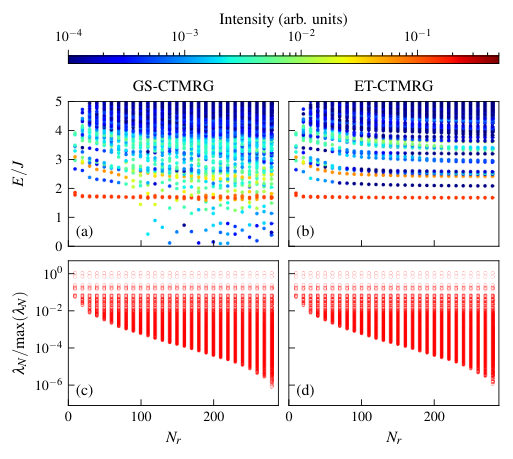
<figcaption class="paper-figure-caption"><b>Fig 3.</b> FIG. 3. Comparison of excitation spectra (a,b) and normal- ized norm-matrix eigenvalues (c,d) as functions of the number of retained states, Nr, obtained with GS-CTMRG (a,c) and ET-CTMRG (b,d) for the SLHAF, computed at momentum (0.2π, 0.3π) with D = 3 and χ = 60. In panels (a) and (b), the color indicates the spectral weight in each eigenstate.</figcaption>
</figure>
<figure class="paper-figure-card">
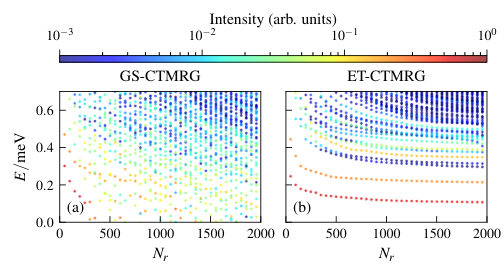
<figcaption class="paper-figure-caption"><b>Fig 4.</b> FIG. 4. Comparison of the excitation spectra computed for the triangular-lattice XXZ model of K2Co(SeO3)2 at the M point and zero field using GS-CTMRG (a) and ET-CTMRG (b), shown as functions of Nr for D = 4 and χ = 100.</figcaption>
</figure>
<figure class="paper-figure-card">
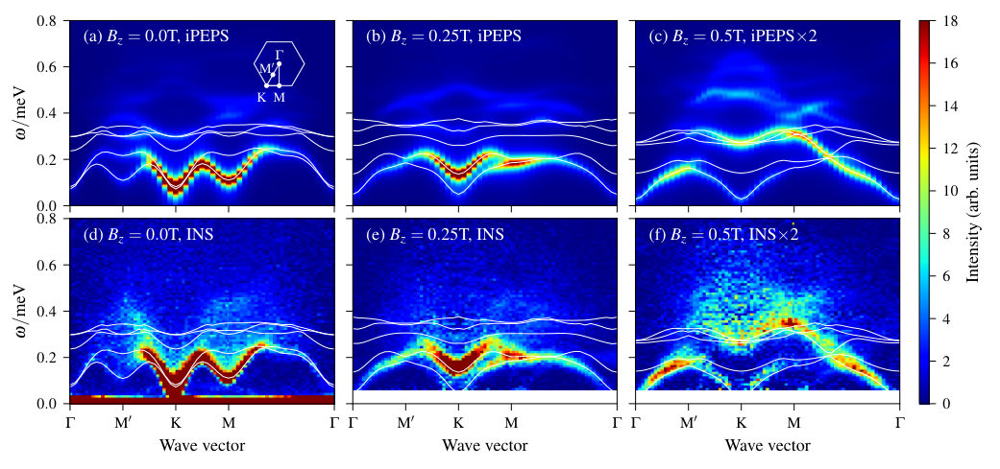
<figcaption class="paper-figure-caption"><b>Fig 5.</b> FIG. 5. Spin excitation spectra of K2Co(SeO3)2 computed using ET-CTMRG with D = 4 and χ = 100 and shown along the high-symmetry momentum path ΓKMΓ [inset panel (a)]. Panels (a–c) display the computed INS intensity at applied fields equivalent to Bz = 0, 0.25, and 0.5 T, respectively, and panels (d–f) the experimental data of Ref. [24]. A Lorentzian broadening factor η = 0.02meV is applied to the iPEPS spectra. Measurements at Bz = 0 T were performed on the spectrometer AMATERAS (J-PARC, Japan) and at finite fields on LET (ISIS, UK); the intensity at Bz = 0.5 T is multiplied by two to match the experimental presentation.</figcaption>
</figure>

**Summary.** This work introduces the Excitation-Tailored CTMRG (ET-CTMRG) method to overcome severe numerical instabilities when calculating dynamical spectral functions in 2D quantum magnets. By incorporating excitation tensors, ET-CTMRG yields highly accurate and stable results for systems like $\mathrm{K_2Co(SeO_3)_2}$, achieving quantitative agreement with inelastic neutron scattering data.

**Why it may be interesting.** The development of ET-CTMRG represents a significant algorithmic advance in simulating quantum dynamics, providing a robust tool for analyzing strongly correlated materials where traditional methods fail due to numerical instability.

Detailed structure

**Main problem.** The primary challenge is developing a numerically stable tensor-network method to accurately calculate dynamical spectral functions in strongly correlated 2D quantum magnets.

**Main result.** The proposed ET-CTMRG method successfully resolves numerical instabilities inherent in ground-state methods, achieving quantitative agreement with inelastic neutron scattering measurements for $\mathrm{K_2Co(SeO_3)_2}$.

**Method.** The authors introduce Excitation-Tailored CTMRG (ET-CTMRG), an improvement over standard Ground-State CTMRG by explicitly incorporating excitation tensors into the renormalization procedure.

**Model / system.** The study focuses on spin excitations in quantum magnets, specifically modeling $\mathrm{K_2Co(SeO_3)_2}$ using a triangular-lattice XXZ model. Benchmarks include the square lattice Heisenberg antiferromagnet (SLHAF).

**Key observables.** Dynamical spectral functions ($S(\mathbf{k}, \omega)$), excitation energies, and the Frobenius error ($\varepsilon$) used as a convergence diagnostic.

**Important parameters / regimes.** Magnetic field strength ($B_z$), bond dimension ($\chi$), number of retained states ($N_r$), and lattice geometry (triangular/square).

**Assumptions / limitations.** The core assumption is that incorporating excitation tensors into the renormalization projectors provides a faithful description of the excited-state manifold, overcoming ground-state limitations.

**Figures summary.** Figures compare the convergence of the Frobenius error ($\varepsilon$) for ET-CTMRG vs. GS-CTMRG across different bond dimensions ($\chi$). Other figures show calculated excitation spectra and spectral weight components ($S_{xx}, S_{zz}$) for $\mathrm{K_2Co(SeO_3)_2}$ under varying magnetic fields.

**Paper structure.** The paper first establishes the failure of standard CTMRG methods due to instability, then introduces ET-CTMRG. It validates this method by showing superior convergence on benchmark models (SLHAF) and finally applies it to analyze the complex spectral features of $\mathrm{K_2Co(SeO_3)_2}$ under applied magnetic fields.

Abstract

Tensor-network methods have opened a powerful route for the study of dynamical spectral functions in two-dimensional quantum systems. However, existing approaches within the framework of infinite projected entangled-pair states construct the required renormalization tensors solely from the ground-state environment and can suffer from severe numerical instability. We identify the origin of this instability and introduce an excitation-tailored corner-transfer-matrix renormalization-group (ET-CTMRG) method to resolve it. By incorporating excitation tensors into the renormalization procedure, the method constructs a substantially more accurate effective Hamiltonian matrix and thereby yields reliable and well-converged excitation spectra. For Heisenberg antiferromagnets, it reduces truncation errors by orders of magnitude and for the particularly complex case of the supersolid phase in the triangular-lattice XXZ magnet $\mathrm{K_2Co(SeO_3)_2}$, it achieves excellent quantitative agreement with inelastic neutron-scattering measurements. ET-CTMRG therefore provides a robust framework for investigating the dynamical properties of strongly correlated quantum systems.

[↑ back to top](#top)

### [Pressure-Driven Evolution of Electronic and Magnetic Correlations in Bilayer Nickelate La3Ni2O7](http://arxiv.org/abs/2608.02261v1)

**Authors:** Jian Zhou, Rui Song, Haiyan Lu  
**Type:** theory · **Category:** strongly correlated electrons · **PDF:** <https://arxiv.org/pdf/2608.02261v1>  
**Analysis basis:** full PDF text, analyzed in chunks
**Topic relevance:** `Kondo & dissipative impurity` **3/5** · `Keldysh / 2PI / non-Gaussian methods` **1/5** · `analog quantum simulation` **1/5** · `spintronics-quantum-optics interface` **1/5**

↔ Scroll figures horizontally

<figure class="paper-figure-card">
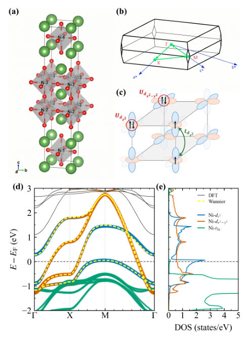
<figcaption class="paper-figure-caption"><b>Fig 1.</b> FIG. 1. Representative crystal and orbital-resolved elec- tronic structures of La3Ni2O7 at 14.1 GPa. (a) Conven- tional cell of the I4/mmm phase of La3Ni2O7, visualized us- ing VESTA [54]. (b) Brillouin zone and high-symmetry path generated using XCrySDen [55]. (c) Schematic illustration of the bilayer two-orbital model. (d) DFT band structure pro- jected onto the Ni dz2, Ni dx2−y2, and Ni t2g orbitals. The yellow dashed lines denote the Wannier-interpolated bands. (e) Orbital-projected density of states. The Fermi level is set to zero.</figcaption>
</figure>
<figure class="paper-figure-card">
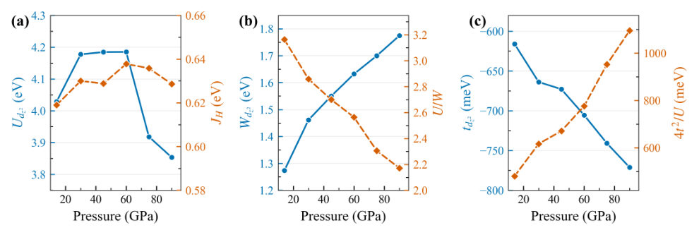
<figcaption class="paper-figure-caption"><b>Fig 2.</b> FIG. 2. Pressure evolution of the cRPA interaction parameters and related electronic energy scales in La3Ni2O7. (a) Screened on-site Coulomb interaction Udz2 for the Ni dz2 orbital and Hund’s exchange interaction JH between the Ni dz2 and dx2−y2 orbitals. (b) Bandwidth Wdz2 of the Ni dz2 bonding states and the corresponding relative correlation strength Udz2 /Wdz2 . (c) Interlayer hopping matrix element tdz2 between two Ni dz2 orbitals sharing the same inner apical O atom, together with the estimated superexchange energy scale 4t2 dz2 /Udz2 .</figcaption>
</figure>
<figure class="paper-figure-card">
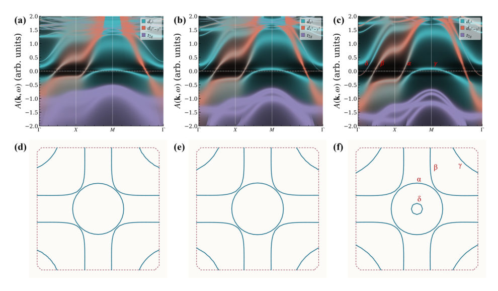
<figcaption class="paper-figure-caption"><b>Fig 3.</b> FIG. 3. DFT+DMFT electronic structure of La3Ni2O7 at T = 80 K using the pressure-dependent U and JH parameters obtained from cRPA. (a)–(c) Momentum-resolved spectral functions at 14.1, 45, and 75 GPa, respectively. (d)–(f) Corresponding Fermi- surface sections at the same pressures.</figcaption>
</figure>
<figure class="paper-figure-card">
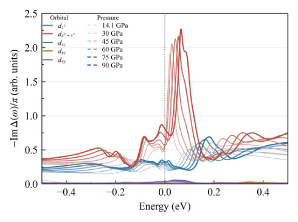
<figcaption class="paper-figure-caption"><b>Fig 4.</b> FIG. 4. Orbital-resolved hybridization function −Im∆(ω)/π of the Ni d orbitals in La3Ni2O7 under pressure from 14.1 to 90 GPa. The vertical dashed line marks the Fermi level.</figcaption>
</figure>
<figure class="paper-figure-card">
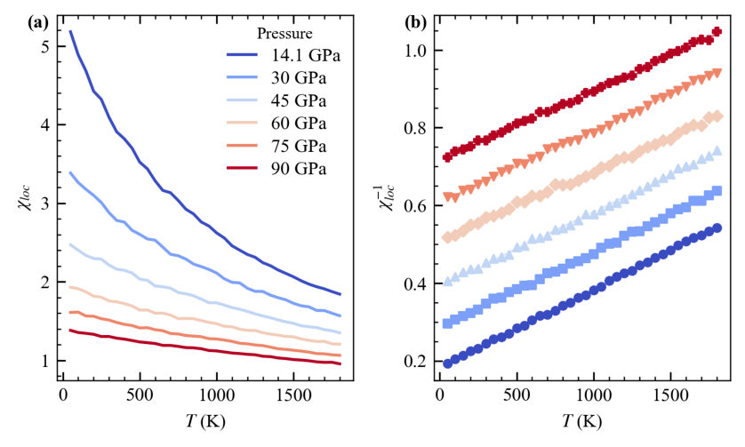
<figcaption class="paper-figure-caption"><b>Fig 5.</b> FIG. 5. Temperature dependence of the local spin response in La3Ni2O7 under pressure. (a) Static local spin susceptibility χloc as a function of temperature. (b) Inverse local spin susceptibility χ−1 loc and the corresponding Curie-Weiss fits. The dashed lines denote fits over the temperature range 50∼1800 K.</figcaption>
</figure>

**Summary.** This work investigates how high pressure alters the electronic and magnetic correlations in superconducting nickelate La3Ni2O7 using advanced many-body techniques like DMFT. The key finding is that increased itinerancy, specifically in the $d_{x^2-y^2}$ orbitals, enhances Kondo screening at the expense of superexchange coupling. This mechanism provides a microscopic explanation for the observed dome-shaped superconducting phase diagram.

**Why it may be interesting.** While focused on solid-state physics, the concept of orbital-selective renormalization and the competition between different types of electronic interactions (superexchange vs. Kondo screening) provides a rich theoretical framework applicable to understanding strongly correlated quantum materials in general.

Detailed structure

**Main problem.** The study aims to elucidate the microscopic mechanism governing the pressure-dependent superconducting transition temperature (Tc) in bilayer nickelate La3Ni2O7.

**Main result.** The decrease of Tc at high pressures is attributed to the dominance of Kondo screening over superexchange interactions, driven by orbital-selective itinerancy where Ni dx2-y2 states become more itinerant.

**Method.** The research employs a combination of Density-Functional Theory (DFT), Constrained Random Phase Approximation (cRPA), and Dynamical Mean-Field Theory (DMFT) calculations.

**Model / system.** The system is the bilayer nickelate La3Ni2O7, modeled using an effective extended Heisenberg Hamiltonian for magnetic interactions. The electronic structure analysis focuses on Ni 3d orbitals ($d_{z^2}$ and $d_{x^2-y^2}$).

**Key observables.** Superconducting transition temperature (Tc), orbital spectral weight redistribution, Kondo screening strength, and the effective magnetic exchange coupling (Jeff).

**Important parameters / regimes.** Hydrostatic pressure (up to 90 GPa), correlation parameters (U/W), and interlayer hopping elements ($t_{d_{z^2}}$).

**Assumptions / limitations.** The calculations rely on approximations inherent to cRPA and DMFT, such as neglecting certain off-diagonal hybridization function elements.

**Figures summary.** Figures illustrate orbital-resolved spectral weight redistribution, valence-state histograms showing charge fluctuations, and the pressure dependence of quasiparticle renormalization factors ($Z^{-1}$).

**Paper structure.** The paper systematically analyzes how hydrostatic pressure modifies electronic structure (DFT/DMFT) leading to changes in correlation strength and hybridization. This evolution is then linked microscopically to the suppression of magnetic exchange coupling ($	ext{Jeff}$) and the resulting superconducting phase diagram.

Abstract

The recent discovery of high-temperature superconductivity in pressurized bilayer La3Ni2O7 has sparked intense research interest, yet the microscopic mechanism governing its pressure-dependent superconducting transition temperature (Tc) remains elusive. In this work, we investigate the electronic and magnetic correlations of La3Ni2O7 under high pressure using a combination of density-functional theory (DFT), constrained random phase approximation (cRPA), and dynamical mean-field theory (DMFT). We find that while hydrostatic pressure enhances the interlayer hopping and the bare superexchange energy scale (4t2/U), it simultaneously drives the system toward a more itinerant regime by reducing the relative correlation strength (U/W). Crucially, our results reveal a distinct orbital-selective evolution: the Ni dx2-y2 states become increasingly itinerant, whereas the Ni dz2 orbitals retain a more localized character. This pressure-induced itinerancy significantly enhances the hybridization between the two, leading to a dramatic amplification of the Kondo-like screening of the local dz2 moments by the itinerant dx2-y2 electrons. Consequently, the effective magnetic exchange coupling (Jeff), which serves as the pairing glue, is suppressed in the high-pressure regime. Our findings suggest that the monotonic decrease of Tc at high pressures is driven by the dominance of Kondo screening over superexchange interactions, providing a coherent microscopic explanation for the dome-shaped superconducting phase diagram in La3Ni2O7.

[↑ back to top](#top)

### [Spin-orbit-entangled frustrated magnetism in fcc Ba$_2$(Yb,Nd)NbO$_6$ double perovskites](http://arxiv.org/abs/2608.01022v1)

**Authors:** S. M. Hossain, Sk. Soyeb Ali, S. Mohanty, R. Kolay, M. P. Saravanan, A. K. Yogi, Y. Tokiwa, R. Nath, S. K. Panda, M. Majumder  
**Type:** both · **Category:** strongly correlated electrons · **PDF:** <https://arxiv.org/pdf/2608.01022v1>  
**Analysis basis:** full PDF text, analyzed in chunks
**Topic relevance:** `analog quantum simulation` **3/5** · `exotic spin models in light-matter` **3/5**

↔ Scroll figures horizontally

<figure class="paper-figure-card">
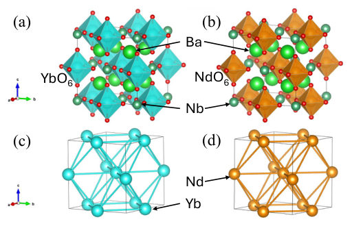
<figcaption class="paper-figure-caption"><b>Fig 1.</b> FIG. 1. (a)-(b) Crystal structure of Ba2YbNbO6 and Ba2NdNbO6 with cubic symmetry space group Fm-3m. The cyan and golden coloured octahedron formed by the RE ions, Yb and Nd, respectively, with six O atoms in red dots. (c)- (d) The arrangement of magnetic RE ions, Yb and Nd, in a fcc lattice geometry.</figcaption>
</figure>
<figure class="paper-figure-card">
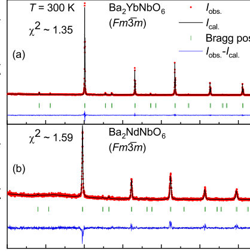
<figcaption class="paper-figure-caption"><b>Fig 2.</b> FIG. 2. (a)-(b) Rietveld refinement of the room-temperature PXRD patterns of Ba2YbNbO6 and Ba2NdNbO6, respec- tively. Red dots represent the observed intensities, and the black solid line shows the calculated PXRD pattern. The green bar symbols represent the Bragg peak positions corre- sponding to the calculated pattern. A difference between the Rietveld fit of the calculated PXRD profile and the observed intensity is shown by the blue solid line. χ2 value indicates the quality of goodness-of-fit of the Rietveld refinement.</figcaption>
</figure>
<figure class="paper-figure-card">
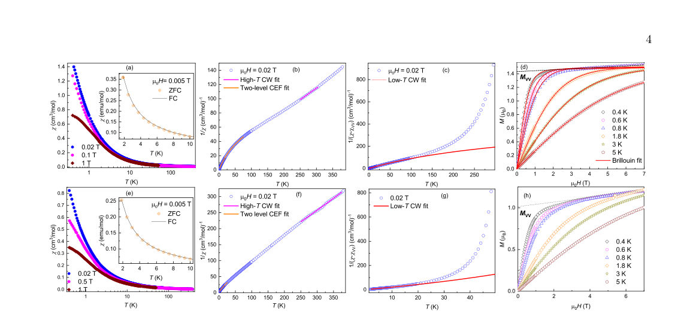
<figcaption class="paper-figure-caption"><b>Fig 3.</b> FIG. 3. (a) and (e): Temperature-dependent magnetic susceptibility (χ ≡M/H) from 0.4 K to 400 K measured at different applied magnetic fields (0.02 T, 0.1 T, and 1 T) for Ba2YbNbO6 and (0.02 T, 0.5 T, and 1 T) for Ba2NdNbO6, respectively. Insets showing the absence of spin frozen like transitions (b) and (f). Inverse susceptibility data fitted with the Curie-Weiss law in the high temperature limit, and the low temperature fit shows the two-level CEF fit. (c) and (g): The low temperature Curie-Weiss fit to [1/(χ −χV V )], for Ba2YbNbO6 and Ba2NdNbO6, respectively. (d) and (f): Isothermal magnetization (M vs H) at various temperatures (0.4 K to 5 K), exhibiting no hysteresis and a tendency...</figcaption>
</figure>
<figure class="paper-figure-card">
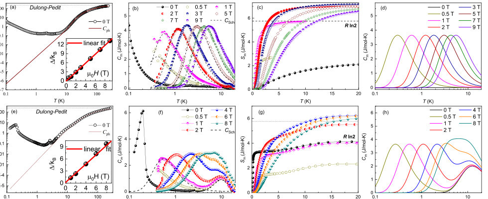
<figcaption class="paper-figure-caption"><b>Fig 4.</b> FIG. 4. (a) and (e) Zero-field heat capacity (Cp) (black open circles) of Ba2YbNbO6 and Ba2NdNbO6, respectively, with lattice contribution (Cph) (solid bordeaux line), inset showing the linear-field dependence of the Schottky gap (∆/kB). (b) and (f) Magnetic heat capacity (Cmag) at zero field and applied fields (0.5 T to 9 T), fitted with Schottky function due to Zeeman splitting of the jeff= 1/2 doublet. Cmag for Ba2NdNbO6 reveals a sharp increase at low temperatures, indicative of long- range magnetic ordering (TN = 200 mK) at zero-field. (c) and (g) Magnetic entropy change ∆Smag obtained by integrating Cmag/T vs T, saturating towards Rln2 with an applied field of 1 T and higher for...</figcaption>
</figure>
<figure class="paper-figure-card">
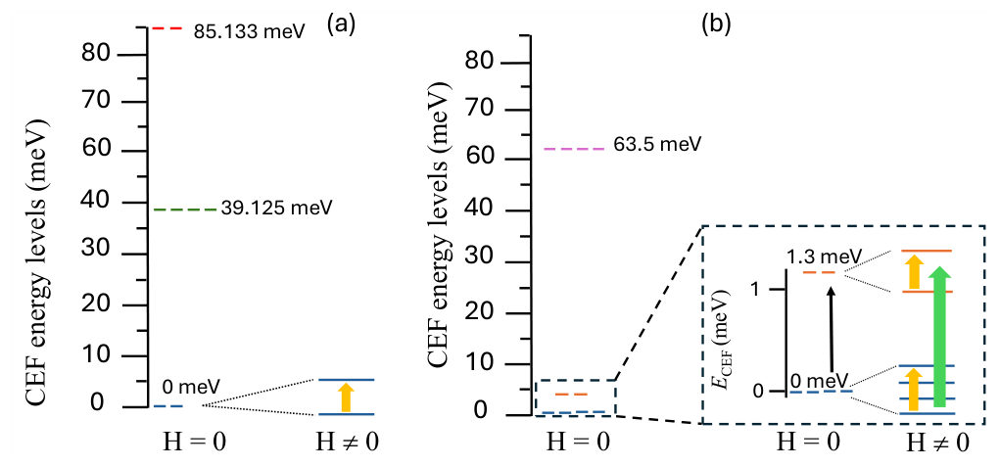
<figcaption class="paper-figure-caption"><b>Fig 5.</b> FIG. 5. Energy level schemes due to CEF effect at zero applied field (H = 0) for (a) Ba2YbNbO6 (0 meV, 39.12 meV, and 91.88 meV) and (b) Ba2NdNbO6 (0 meV, 1.3 meV, and 63.5 meV) obtained using point charge calculations. In the presence of a magnetic field (H ̸= 0), the degeneracy of the lowest Kramers levels is lifted by Zeeman splitting, and the arrows indicate the CEF transitions between the states corresponding to the Schottky peaks in the heat capacity data.</figcaption>
</figure>

**Summary.** The authors investigate $	ext{Ba}_2(	ext{Yb},	ext{Nd})	ext{NbO}_6$, rare-earth double perovskites, as potential Kitaev magnets. They use combined DFT and experimental techniques to show that strong spin-orbit coupling stabilizes a $	ext{j}_{	ext{eff}}=1/2$ ground state in an fcc lattice. The findings establish these materials as promising candidates for studying frustrated magnetism driven by single-ion anisotropy.

**Why it may be interesting.** This work bridges concepts from strongly correlated electron physics (Kitaev model) into the realm of $4f$ rare-earth oxides, providing a new platform to study SOC-driven quantum magnetic phenomena relevant to topological materials research.

Detailed structure

**Main problem.** The research investigates spin-orbit-entangled frustrated magnetism in rare-earth double perovskites, aiming to find candidates for Kitaev physics beyond traditional 4d/5d materials.

**Main result.** The compounds $	ext{Ba}_2	ext{YbNbO}_6$ and $	ext{Ba}_2	ext{NdNbO}_6$ are identified as promising rare-earth spin-orbit-entangled magnets exhibiting long-range magnetic order with moderate frustration at low temperatures.

**Method.** The study combines experimental measurements (magnetization, heat capacity) with advanced theoretical calculations using DFT+U+SOC to model the electronic structure and exchange interactions.

**Model / system.** The physical system is based on rare-earth double perovskites ($	ext{Ba}_2(	ext{Yb},	ext{Nd})	ext{NbO}_6$) crystallizing in an fcc structure, where strong SOC stabilizes isolated $	ext{j}_{	ext{eff}}=1/2$ Kramers doublet ground states.

**Key observables.** Magnetization vs. Temperature/Field ($\chi(T), M(H)$), Heat Capacity ($C/T$), Crystal Electric Field (CEF) energy gaps, and calculated magnetic exchange tensors.

**Important parameters / regimes.** Low temperatures (millikelvin regime), $	ext{j}_{	ext{eff}}=1/2$ ground state, SOC strength, and frustration parameters related to Kitaev interactions.

**Assumptions / limitations.** The analysis relies on the assumption that strong SOC and CEF effects dominate the low-energy physics, leading to isolated Kramers doublets. DFT calculations use $	ext{GGA}+	ext{U}$ approximations.

**Figures summary.** Figures illustrate crystal structures showing the fcc arrangement of RE ions; PXRD patterns confirm phase purity; magnetization/heat capacity data reveal magnetic ordering signatures at very low temperatures.

**Paper structure.** The paper progresses from establishing the structural and electronic ground state via DFT calculations, to characterizing the magnetic behavior using bulk measurements (magnetization, heat capacity), and finally interpreting these results in the context of frustrated magnetism and Kitaev physics.

Abstract

The search for candidate Kitaev materials has largely focused on 4$d$ and 5$d$ transition-metal compounds with various lattice geometries. In contrast, investigations of rare-earth 4$f$ systems have thus far been restricted mainly to honeycomb and triangular lattices. In this work, we investigate the rare-earth-based double perovskites Ba$_2$YbNbO$_6$ and Ba$_2$NdNbO$_6$, which crystallize in a face-centered cubic structure. Magnetization and heat-capacity measurements establish isolated ${j_{\rm eff}} = 1/2$ Kramers doublet ground states arising from strong spin-orbit coupling (SOC) and crystal electric-field effects, which are further supported by density-functional theory calculations. Millikelvin-temperature thermodynamic measurements reveal long-range magnetic order with moderate frustration in both compounds. The emergence of magnetic order may be understood within an order-by-disorder scenario, as theoretically proposed for rare-earth fcc lattices with finite Kitaev interactions. Our results thus identify Ba$_2$YbNbO$_6$ and Ba$_2$NdNbO$_6$ as promising rare-earth spin-orbit-entangled magnets and motivate further experimental and theoretical investigations aimed at determining the complete exchange tensor to elucidate the microscopic origin of the underlying magnetic interactions.

[↑ back to top](#top)

### [Finite-Syndrome Compression of Quantum Fisher Information](http://arxiv.org/abs/2608.02333v1)

**Authors:** Jianqi Sheng  
**Type:** theory · **Category:** quantum information and computing · **PDF:** <https://arxiv.org/pdf/2608.02333v1>  
**Analysis basis:** full PDF text, analyzed in chunks
**Topic relevance:** `quantum measurements` **3/5** · `entanglement & information structure` **1/5** · `measurement-induced transitions` **1/5**

↔ Scroll figures horizontally

<figure class="paper-figure-card">
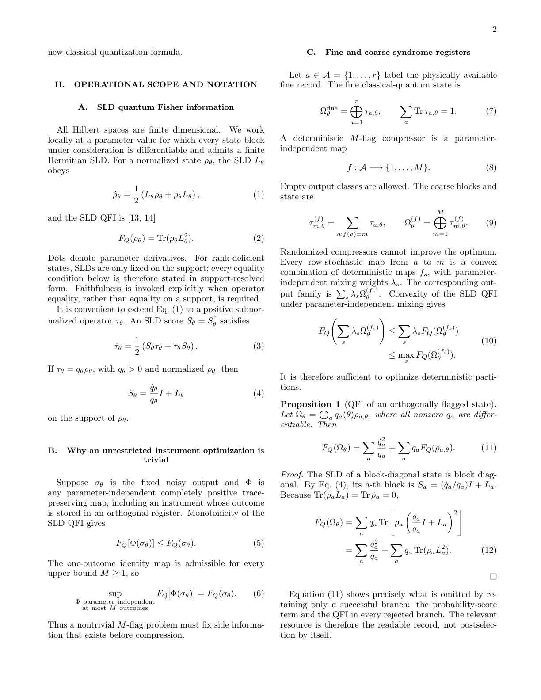
<figcaption class="paper-figure-caption"><b>Fig 1.</b> Low-resolution page preview, page 2</figcaption>
</figure>
<figure class="paper-figure-card">
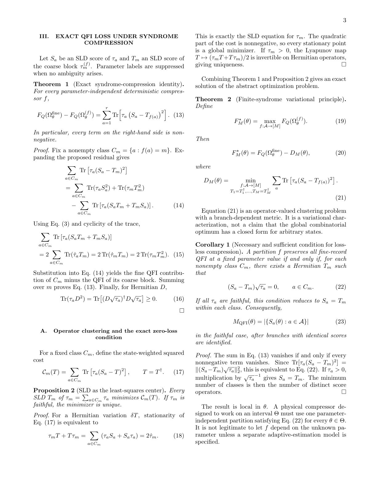
<figcaption class="paper-figure-caption"><b>Fig 2.</b> Low-resolution page preview, page 3</figcaption>
</figure>
<figure class="paper-figure-card">
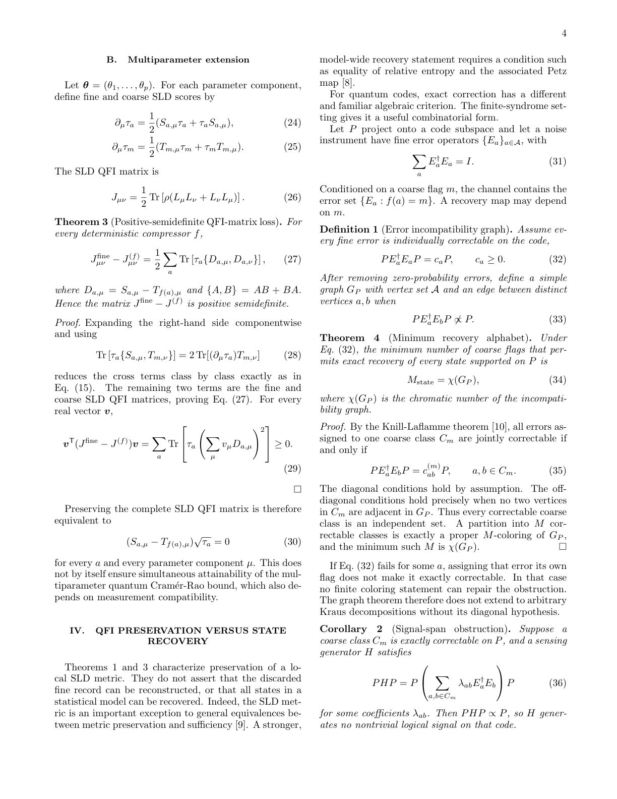
<figcaption class="paper-figure-caption"><b>Fig 3.</b> Low-resolution page preview, page 4</figcaption>
</figure>
<figure class="paper-figure-card">
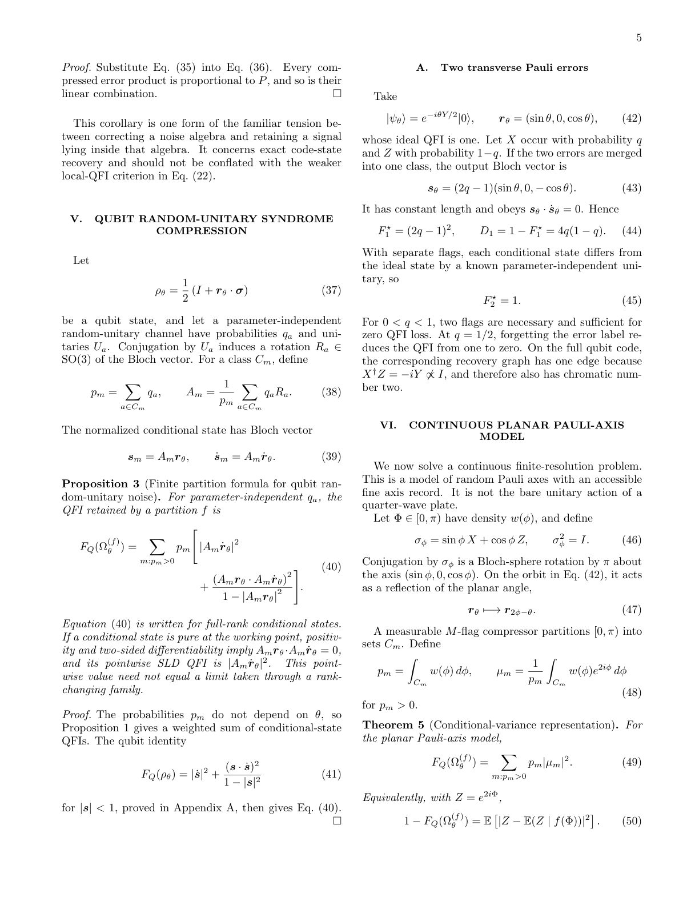
<figcaption class="paper-figure-caption"><b>Fig 4.</b> Low-resolution page preview, page 5</figcaption>
</figure>
<figure class="paper-figure-card">
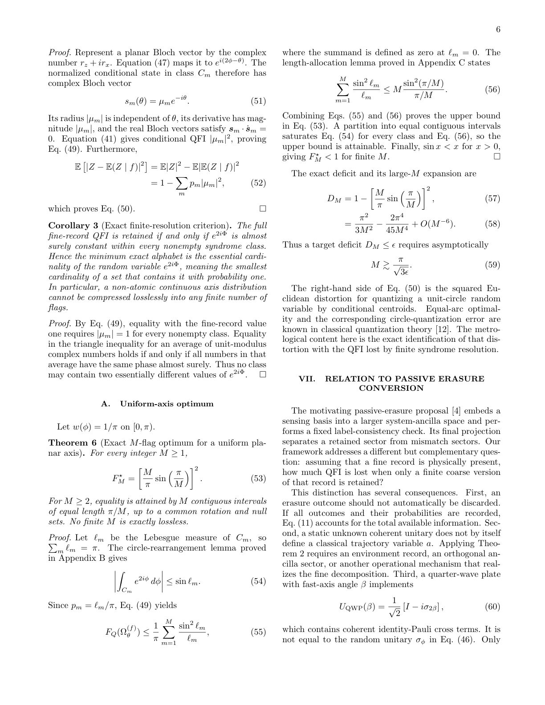
<figcaption class="paper-figure-caption"><b>Fig 5.</b> Low-resolution page preview, page 6</figcaption>
</figure>

**Summary.** This theoretical paper quantifies the fundamental trade-off between measurement resolution and achievable quantum sensing precision. It proves an exact identity showing that QFI loss due to syndrome compression equals a measurable mismatch between fine and coarse information estimates. The results establish necessary conditions for lossless encoding, linking it to graph theory (chromatic number) in code settings.

**Why it may be interesting.** It provides rigorous information-theoretic bounds on sensing precision when measurement resources are limited, which is crucial for designing practical quantum sensors that must operate with finite detectors.

Detailed structure

**Main problem.** The paper addresses how much Quantum Fisher Information (QFI) is unavoidably lost when compressing a fine-grained quantum measurement record into a finite set of measurable syndrome flags.

**Main result.** It derives an exact identity quantifying this QFI loss, showing that optimal compression is equivalent to solving an operator-valued clustering problem.

**Method.** The authors use the Symmetric-Logarithmic-Derivative (SLD) Quantum Fisher Information as a diagnostic tool and establish variational principles relating the achievable QFI to squared distances between fine and coarse SLD scores.

**Model / system.** The analysis is general, focusing on quantum sensing protocols where noise creates distinguishable but observationally mixed trajectories. Specific models include qubit random-unitary noise and planar random-Pauli axes.

**Key observables.** Symmetric-Logarithmic-Derivative Quantum Fisher Information (SLD QFI), the minimum number of readable syndromes ($\chi(G_P)$), and the QFI deficit ($D_M$).

**Important parameters / regimes.** The finite number of syndrome flags, $M$, which dictates the compression level.

**Assumptions / limitations.** The analysis fixes the fine-grained record and assumes parameter-independent classical compression; it also notes that SLD preservation is a local condition weaker than full statistical model recovery.

**Figures summary.** Not specified in the provided notes, but the structure implies mathematical derivations leading to explicit formulas for QFI loss (e.g., $F_M^{\star}=[M\sin(\pi/M)/\pi]^2$).

**Paper structure.** The paper builds from establishing an exact identity quantifying QFI loss due to finite syndrome resolution, showing this maps the problem to operator-valued clustering. It then applies this framework to specific physical models (e.g., quantum codes, planar axes) to derive concrete bounds and necessary conditions for lossless compression.

Abstract

Readable error records can protect quantum sensing because they prevent physically distinct noise trajectories from being irreversibly mixed. A finite detector or ancilla, however, can retain only finitely many syndrome values, and a general criterion for deciding which records may be merged without losing metrological information is absent. We formulate the problem for a fixed fine-grained classical-quantum record and parameter-independent compression into at most $M$ flags. We prove an exact identity expressing the lost symmetric-logarithmic-derivative quantum Fisher information (SLD QFI) as a sum of state-weighted squared distances between fine and coarse SLD scores. Consequently, optimal finite-syndrome design is exactly an operator-valued clustering problem, and zero loss is characterized by a support-resolved common-SLD condition. We extend the identity to the full multiparameter SLD QFI matrix and distinguish local QFI preservation from recovery of an entire statistical model. For exact recovery of a quantum code, we separately show that, when each fine error is individually correctable, the minimum number of readable syndromes is the chromatic number of a Knill-Laflamme incompatibility graph. For qubit random-unitary noise we obtain a finite partition formula. A planar random-Pauli model admits a conditional-variance representation and, for a uniform error axis, the exact optimum $F_M^{\star}=[M\sin(π/M)/π]^2$, with deficit $π^2/(3M^2)+O(M^{-4})$. These results identify the information-theoretic cost of finite syndrome resolution while making explicit the side-information assumptions required for any passive noise-to-erasure interpretation.

[↑ back to top](#top)

### [From minimal informationally complete measurements to orthocentric simplices and back again](http://arxiv.org/abs/2608.00809v1)

**Authors:** Piotr Bereza, Wojciech Słomczyński, Anna Szymusiak  
**Type:** theory · **Category:** other · **PDF:** <https://arxiv.org/pdf/2608.00809v1>  
**Analysis basis:** full PDF text, analyzed in chunks
**Topic relevance:** `quantum measurements` **3/5** · `entanglement & information structure` **1/5** · `measurement-induced transitions` **1/5**

↔ Scroll figures horizontally

<figure class="paper-figure-card">
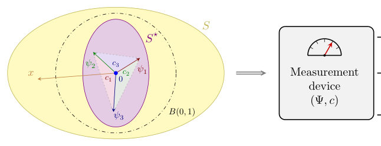
<figcaption class="paper-figure-caption"><b>Fig 1.</b> Figure 1: Conceptual geometric representation of states and measurements in V0. The compact convex set of states S contains 0 in its interior. The measurement vectors ψj belong to the polar dual S⋆and satisfy the closure condition, meaning the origin lies strictly within their convex hull. For a minimal measurement c is uniquely determined by Ψ and serves as the set of barycentric coordinates of the origin with respect to Ψ. Crucially, in this case barycentric coordinates admit a direct spatial interpretation: each cj is the ratio of the hypervolume of the sub-simplex formed by the origin and the facet opposite to ψj to the total volume of the measurement simplex.</figcaption>
</figure>
<figure class="paper-figure-card">
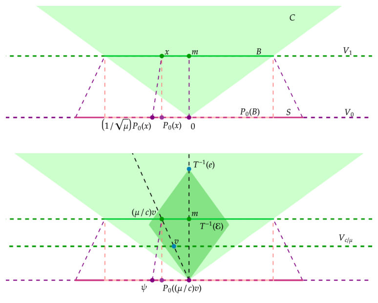
<figcaption class="paper-figure-caption"><b>Fig 2.</b> Figure 2: Above: The standard description of states is by a convex base B of a cone C. In our approach states are projected from V1 = aff B to the corresponding linear subspace V0 and then rescaled by 1/√µ in order to make the theory independent of the norm of the distinguished state m. Below: The effects can be transferred from the dual space to the space V via the unique isometric isomorphism T −1. An effect g mapped by T −1 to v can be uniquely represented by the ray containing it and the affine subspace Vc/µ parallel to V0, where c = g(m). Instead of the whole ray we can consider its intersection with V1, i.e., the point (µ/c)v, and, in consequence, the whole information about the...</figcaption>
</figure>
<figure class="paper-figure-card">
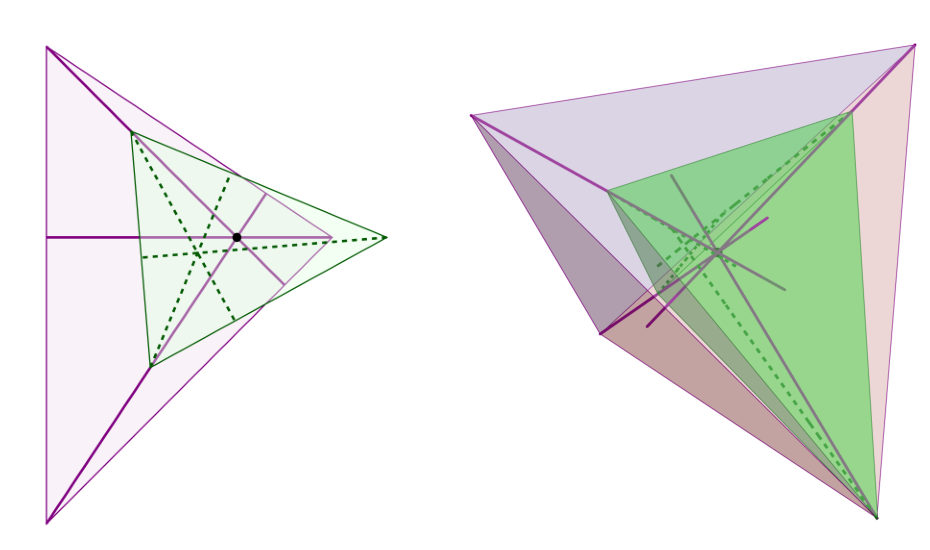
<figcaption class="paper-figure-caption"><b>Fig 3.</b> Figure 3: The vertices of the green triangle conv Ψ, whose orthocentre does not coincide with the origin, can be rescaled to obtain the purple triangle conv( s2</figcaption>
</figure>
<figure class="paper-figure-card">
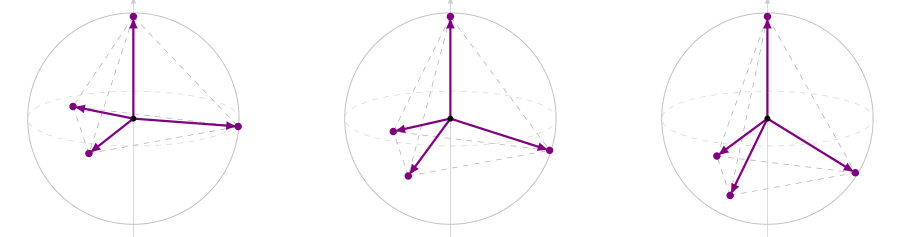
<figcaption class="paper-figure-caption"><b>Fig 4.</b> Figure 4: Three examples of axially symmetric measurements, represented as the tetrahedra conv Ψ for z0 = −0.1 (close to the flat limit), z0 = −1/3 (SIC-POVM) and z0 = −0.55 (close to the obtuse angle limit).</figcaption>
</figure>
<figure class="paper-figure-card">
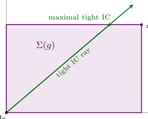
<figcaption class="paper-figure-caption"><b>Fig 5.</b> Figure 5: Anatomy of the family of minimal s-tight IC measurements generated by a fixed acute orthocentric simplex (Theorem 16), drawn schematically in the lengths λ1, . . . , λd+1 of the measurement vectors (two of the coordinates shown). For a fixed anchoring g of the directions the admissible lengths fill a box Σ(g) determined by S⋆(shaded); the tight IC measurements (c = p, Corollary 18) form a ray, which leaves the box at the maximal tight IC measurement, while the outer corner marks the maximal simplex, at which all lengths attain their bounds simultaneously; the white noise POVMs sit in the degenerate limit λ →0, which is not itself a member of the family (the limiting measurements...</figcaption>
</figure>

**Summary.** This theoretical paper connects the operational concept of minimal informationally complete measurements in Generalized Probabilistic Theories to classical Euclidean geometry. It proves that these 'tight' measurements are characterized by their associated vectors forming an acute orthocentric simplex. This establishes a deep, quantifiable link between optimal physical measurement procedures and fundamental geometric structures.

**Why it may be interesting.** While not directly about AMO systems, this work provides a powerful mathematical framework for characterizing optimal measurement strategies in any physical theory (including quantum mechanics) purely through geometric constraints on the state space.

Detailed structure

**Main problem.** The paper establishes a deep geometric correspondence between minimal informationally complete measurements (MICs) in Generalized Probabilistic Theories (GPTs) and the classical geometry of acute orthocentric simplices.

**Main result.** It proves a three-way equivalence: an MIC is $s$-tight if and only if its rescaled measurement vectors form the vertices of an acute orthocentric simplex centered at the origin, which must also be homothetically self-dual.

**Method.** The authors use intrinsic geometric approaches to GPTs, relating operational constraints (like 'tightness') to specific algebraic conditions on the measurement vectors ($\Psi$) and outcome probabilities ($c$).

**Model / system.** The study is set within Generalized Probabilistic Theories (GPTs), which generalize quantum mechanics by defining states as a convex body $S$ in a vector space $V_0$. The focus is on minimal IC measurements, which require exactly $d+1$ outcomes.

**Key observables.** Measurement vectors ($\Psi$), outcome probabilities ($c$), and the resulting geometric structure (acute orthocentric simplex).

**Important parameters / regimes.** The dimension of the state space ($d+1$), the skeleton probability vector ($P \in \Delta^{\circ}_{d+1}$), and the scaling factor $A$.

**Assumptions / limitations.** The analysis assumes a finite-dimensional setting, relies on specific definitions for the fiducial scalar product $\langle x, y 
angle_{P,A}$, and makes assumptions about the structure of the GGPT (e.g., supra-duality).

**Figures summary.** Figure 1 conceptually illustrates states ($S$), measurement vectors ($\psi_j$), and how probabilities $c$ are determined via barycentric coordinates.

**Paper structure.** The paper develops from defining MICs in GGPTs, establishing the geometric link to orthocentric simplices through necessary conditions (obtuse angles, cross-ratio), culminating in the main equivalence theorem that parameterizes the space of such measurements by $\Delta^{\circ}_{d+1}$.

Abstract

The reconstruction of unknown quantum states via minimal informationally complete measurements (MICs) is a cornerstone of quantum tomography. Although the statistical properties of these measurements are well-understood, their geometric structure has remained elusive. In this work, we establish a correspondence between the class of minimal $s$-tight informationally complete measurements, encompassing, among others, tight IC and morphophoric measurements, and the classical geometry of orthocentric simplices. In particular, we prove a three-way equivalence: a MIC is $s$-tight if and only if its measurement vectors, upon suitable rescaling, form the vertices of an acute orthocentric simplex with the orthocentre at the origin, and such simplices are precisely the homothetically self-dual ones. This geometric manifestation of operational ''tightness'' provides a bridge between the physical world and Euclidean geometry. Furthermore, the $s$-tight class is fully characterised by its measurement directions: the angles between them must be obtuse and satisfy a cross-ratio condition. We determine the space of admissible direction configurations: modulo rotations, every such configuration is encoded by a single probability vector, the ''skeleton'' of the measurement, together with an orientation class, so that the moduli space of $s$-tight MIC directions is $Δ^{\circ}_{d+1}\times\{\pm 1\}$. Conversely, every acute orthocentric simplex with the orthocentre at the origin can be anchored in the state space, generating a class of minimal $s$-tight IC measurements that contains exactly one tight IC measurement up to overall rescaling.

[↑ back to top](#top)

### [Negative thermal expansion, lattice dynamics, and complex magnetism in TbFeO$_3$](http://arxiv.org/abs/2608.00469v1)

**Authors:** Shubham Farswan, Reshma Kumawat, Dipankar Sarkar, Deeksha Singh, Md. Atif Hasan, Devajyoti Mukherjee, Kaushik Sen  
**Type:** experiment · **Category:** other · **PDF:** <https://arxiv.org/pdf/2608.00469v1>  
**Analysis basis:** full PDF text, analyzed in chunks
**Topic relevance:** `spintronics-quantum-optics interface` **3/5** · `analog quantum simulation` **1/5** · `exotic spin models in light-matter` **1/5**

↔ Scroll figures horizontally

<figure class="paper-figure-card">
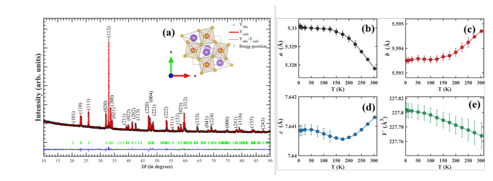
<figcaption class="paper-figure-caption"><b>Fig 1.</b> FIG. 1. Structural refinement of TbFeO3 x-ray diffraction pattern at room temperature. Unit cell, view along the c-axis. Here Tb atoms are shown in purple spheres, Fe atoms as red spheres, and O atoms as yellow spheres (b-d) Temperature evolution of the refined lattice parameters a(T), b(T), and c(T) respectively extracted by Rietveld refinement of temperature-dependent XRD measurements. (e) Temperature dependence of unit-cell volume V (T), indicating negative thermal expansion.The error bars represent the standard uncertainties obtained from the Rietveld refinement.</figcaption>
</figure>
<figure class="paper-figure-card">
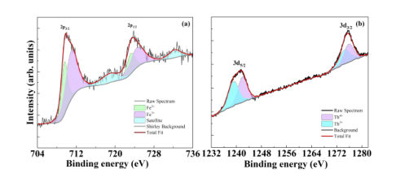
<figcaption class="paper-figure-caption"><b>Fig 2.</b> FIG. 2. High-resolution XPS spectra of the Fe-2p and Tb- 3d core levels of TbFeO3, showing the characteristic spin- orbit split components along with deconvoluted contributions corresponding to Fe2+, Fe3+ and Tb3+, Tb4+ ionic states.</figcaption>
</figure>
<figure class="paper-figure-card">
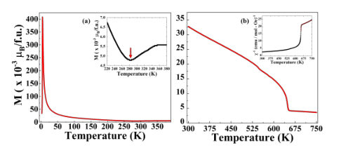
<figcaption class="paper-figure-caption"><b>Fig 3.</b> FIG. 3. Magnetization as a function of temperature for TbFeO3 measured under an applied magnetic field of 500 Oe: (a) low-temperature regime and (b) high-temperature regime. The inset of panel (a) highlights the variation in magnetization in the vicinity of 280 K. The inset of panel (b) shows the inverse magnetic susceptibility fitted using the modified Curie–Weiss expression given in Eq. (3).</figcaption>
</figure>
<figure class="paper-figure-card">
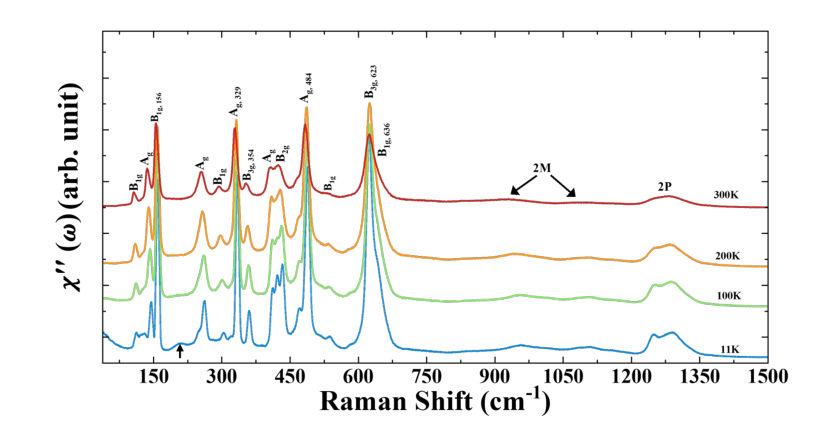
<figcaption class="paper-figure-caption"><b>Fig 4.</b> FIG. 4. Temperature-dependent Raman spectra of polycrystalline TbFeO3 measured at 11, 100, 200, and 300 K. Selected phonon modes are assigned, along with two-phonon (2P) and two-magnon (2M) excitations. The arrow indicates the emergence of a new mode at low temperatures.</figcaption>
</figure>
<figure class="paper-figure-card">
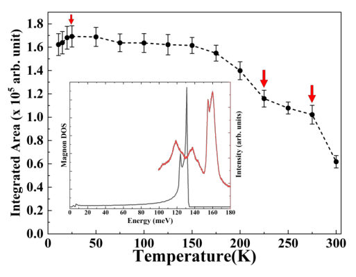
<figcaption class="paper-figure-caption"><b>Fig 5.</b> FIG. 5. Temperature dependence of the integrated intensity of the two-magnon peak in polycrystalline TbFeO3 powder. The inset shows the calculated magnon density of states (MDOS) for the Fe sublattice in TbFeO3, plotted together with the two- magnon Raman spectrum measured at 11 K for comparison.</figcaption>
</figure>

**Summary.** This work comprehensively investigates the physical properties of TbFeO3 by combining XRD, magnetization, and Raman spectroscopy. Key findings include observing negative thermal expansion and identifying strong evidence of spin-phonon coupling through phonon line shape analysis. The results establish that this material exhibits a pronounced interplay between its lattice structure, magnetic order, and local electronic environment.

**Why it may be interesting.** The detailed investigation into spin-phonon coupling mechanisms using multiple complementary techniques provides rich data on emergent quantum interactions in insulating magnets, which is relevant for understanding lattice dynamics in correlated materials.

Detailed structure

**Main problem.** To investigate the complex interplay among lattice dynamics, spin correlations, and local magnetic anomalies in TbFeO3.

**Main result.** The study reveals negative thermal expansion without structural transitions, strong evidence of spin-phonon coupling via Raman scattering, and a clear interplay between lattice and magnetic degrees of freedom.

**Method.** A combination of temperature-dependent X-ray diffraction (XRD), DC magnetization measurements, and advanced Raman spectroscopy was employed.

**Model / system.** The physical system is the rare-earth orthoferrite TbFeO3, which serves as a model for studying spin-lattice coupling in complex oxides.

**Key observables.** Negative thermal expansion (NTE) of unit cell volume, phonon frequencies and line shapes, two-magnon excitations, and magnetic susceptibility/magnetization curves.

**Important parameters / regimes.** Temperature range spanning 5 K to 300 K; the crossover from Gaussian to Lorentzian phonon profiles.

**Assumptions / limitations.** The analysis assumes that deviations in Raman spectra reflect spin-phonon coupling mechanisms rather than simple anharmonic decay. The interpretation of spectral weight requires careful consideration of background subtraction and fitting models.

**Figures summary.** Figures show XRD patterns demonstrating anisotropic unit cell volume changes (NTE), temperature dependence of lattice parameters, and Raman spectra detailing phonon modes and two-magnon excitations across various temperatures.

**Paper structure.** The paper systematically combines structural characterization (XRD for NTE) with spectroscopic probes (Raman for phonons/magnons) and magnetic measurements (magnetization). The structure builds the argument by showing how anomalies in one measurement correlate with subtle changes in another, establishing a unified picture of coupled physics.

Abstract

We report a temperature-dependent investigation of orthoferrite TbFeO$_3$ using x-ray diffraction, DC magnetization, and Raman scattering, complemented by room-temperature x-ray photoelectron spectroscopy. X-ray diffraction reveals negative thermal expansion over 5-300 K, with a small but systematic increase in unit-cell volume upon cooling in the absence of any structural phase transition. Raman scattering measurements identify the Raman-active phonon modes and show clear deviations from the conventional Klemens anharmonic decay model, particularly in phonon frequencies, indicating the presence of spin-phonon coupling. Two modes of $A_g$ and $B_{1g}$ symmetry exhibit a crossover from Gaussian-dominated line shapes at low temperatures to mixed Gaussian-Lorentzian profiles at higher temperatures, reflecting a transition from inhomogeneous broadening to lifetime-driven dynamics. High-energy Raman spectra reveal two-magnon excitations associated with the Fe sublattice, consistent with linear spin-wave theory, whose spectral weight shows only weak temperature dependence. In addition, a broad Raman mode emerging below $\sim 175$ K exhibits an order-parameter-like temperature evolution and coincides with the onset of phonon anomalies, while no corresponding strong anomaly is observed in the two-magnon response. Taken together, these results establish TbFeO$_3$ as a system with pronounced interplay among lattice dynamics, spin correlations, and emergent local magnetic-lattice anomalies.

[↑ back to top](#top)

### [Optimality of Gaussian Entanglement of Formation](http://arxiv.org/abs/2608.01909v1)

**Authors:** Gerardo Adesso  
**Type:** theory · **Category:** quantum information and computing · **PDF:** <https://arxiv.org/pdf/2608.01909v1>  
**Analysis basis:** full PDF text, analyzed in chunks
**Topic relevance:** `entanglement & information structure` **3/5** · `Keldysh / 2PI / non-Gaussian methods` **1/5** · `quantum optics experiment` **1/5**

↔ Scroll figures horizontally

<figure class="paper-figure-card">
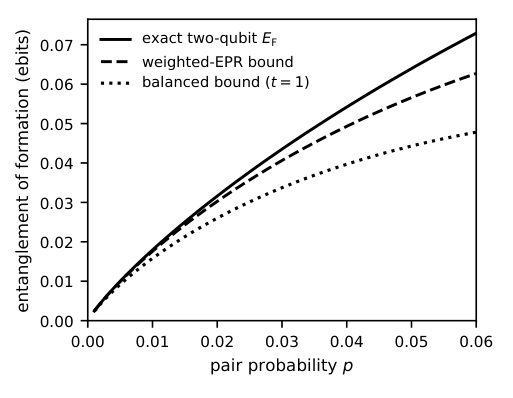
<figcaption class="paper-figure-caption"><b>Fig 1.</b> FIG. 1. Exact entanglement of formation and variance-based lower bounds for the lossy non-Gaussian state in Eq. (23), with ηA = 0.9 and ηB = 0.2. Optimizing the gain t keeps the bound close to the exact two-qubit result throughout the weak-pair regime and substantially improves on the balanced choice t = 1.</figcaption>
</figure>

**Summary.** This paper resolves a major open problem by proving that the Entanglement of Formation for any two-mode Gaussian state equals its simpler Gaussian restriction. The authors achieve this using sophisticated functional inequalities involving generalized EPR observables. This result provides an exact theoretical benchmark and a robust, measurable lower bound for quantifying entanglement in continuous variable systems.

**Why it may be interesting.** This work provides fundamental mathematical tools—the affine entanglement–EPR inequality—that bridge continuous variable quantum information theory with measurable physical observables like quadrature variances, which is highly relevant for experimental quantum optics.

Detailed structure

**Main problem.** The central problem is proving that for two-mode Gaussian states, the entanglement of formation (EF) exactly equals its Gaussian restriction ($	ext{EG}_F$), resolving a long-standing open question in continuous variable quantum information theory.

**Main result.** The authors prove $	ext{EF}(
ho_V) = 	ext{EG}_F(V)$ for all two-mode Gaussian states, and extend this result to bisymmetric multimode Gaussian states.

**Method.** The proof employs advanced functional analysis techniques, including reducing the optimization problem over Schmidt coefficients using singular value inequalities and applying logarithmic-Sobolev inequalities.

**Model / system.** The system under study consists of two-mode quantum states characterized by their covariance matrices ($V$), analyzed in the continuous variable framework (quadratures $x, p$).

**Key observables.** Entanglement of Formation ($	ext{EF}$), Gaussian Entanglement of Formation ($	ext{EG}_F$), and the generalized Einstein–Podolsky–Rosen (EPR) observable ($b_{Dt}$).

**Important parameters / regimes.** The analysis involves optimization over parameters like squeezing factors ($q$) and gain/time parameters ($t$).

**Assumptions / limitations.** The method provides an exact result for Gaussian states, but the derived bounds can be applied to arbitrary non-Gaussian mixed states using ensemble averaging.

**Figures summary.** Figure 1 compares the exact two-qubit EF against weighted-EPR and balanced bounds for a lossy non-Gaussian state, showing near saturation of the bound.

**Paper structure.** The paper develops the theory by establishing necessary inequalities relating $	ext{EF}$ to generalized EPR observables (Theorem 1), proving the equality for Gaussian states, and finally deriving quantitative lower bounds applicable to general mixed states.

Abstract

We prove that the entanglement of formation of every two-mode Gaussian state coincides with its Gaussian restriction, solving a longstanding open problem in continuous variable quantum information theory. The key result is a sharp affine relation between entanglement and a generalized Einstein-Podolsky-Rosen observable, valid for arbitrary pure two-mode states, including non-Gaussian ones. Our result extends to bisymmetric multimode Gaussian states, and also provides a measurable lower bound on the entanglement of formation of arbitrary non-Gaussian states.

[↑ back to top](#top)

### [Quantum sequential parameter testing](http://arxiv.org/abs/2608.01248v1)

**Authors:** Simon Morelli, Ricard Ravell Rodríguez, John Calsamiglia, Ramón Muñoz-Tapia, Gael Sentís, Michalis Skotiniotis  
**Type:** theory · **Category:** quantum information and computing · **PDF:** <https://arxiv.org/pdf/2608.01248v1>  
**Analysis basis:** full PDF text, analyzed in chunks
**Topic relevance:** `quantum measurements` **3/5** · `entanglement & information structure` **1/5** · `measurement-induced transitions` **1/5**

↔ Scroll figures horizontally

<figure class="paper-figure-card">
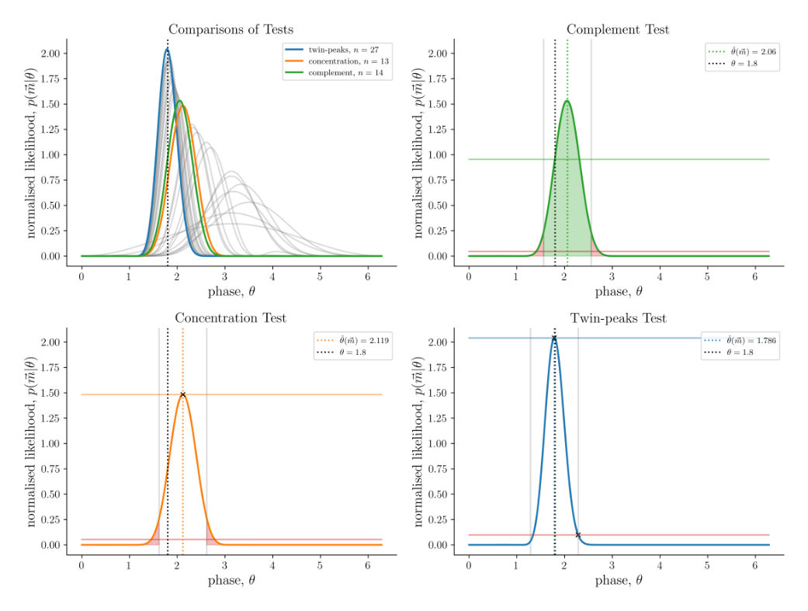
<figcaption class="paper-figure-caption"><b>Fig 1.</b> FIG. 1. The figure shows the three different tests explained in this work. The first image shows the updated normalized likelihood of each round as gray curves, with the three rounds where a test stops highlighted in color. The other three figures show the stopping conditions of the three sequential tests introduced in this work in detail. In green, we see the complement test, where the probability of the parameter lying in the interval is compared to the probability that it lies outside said interval. In orange, the concentration test, where the maximum likelihood is compared to the average likelihood outside a given interval, and in blue, the twin-peaks test, where the maximum likelihood...</figcaption>
</figure>
<figure class="paper-figure-card">
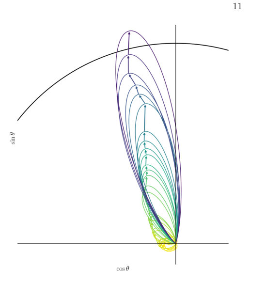
<figcaption class="paper-figure-caption"><b>Fig 2.</b> FIG. 2. One run of the equatorial phase testing protocol according to the twin-peaks test, and choosing a random mea- surement strategy. The plot is made in phase space, where the horizontal (vertical) axis corresponds to cos θ (sin θ). Each ellipse corresponds to one round, with a color gradient from yellow for early rounds to blue for later ones. In each ellipse, the arrow points towards the most likely phase, ˆθ, of that round. The distance between that point and the origin is the likelihood ratio p( ⃗mk ∣ˆθ)/p( ⃗mk ∣θ0), where θ0 is selected as the alternative hypothesis by the twin-peaks test given the interval of size 2δ = 1 around the ML estimate ˆθ. For the rest of the points...</figcaption>
</figure>
<figure class="paper-figure-card">
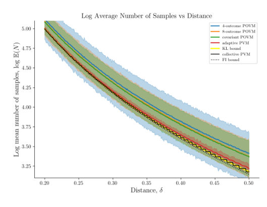
<figcaption class="paper-figure-caption"><b>Fig 3.</b> FIG. 3. Log-plot of the mean number of rounds until the maximum sequential test stops using the evidence threshold Aϵ = 19, corresponding to the calibration ϵ = 0.05. Differ- ent colors represent the different strategies explained in the main text; the lines show the mean number of rounds over 104 runs for the different strategies, with their corresponding standard deviation shown as shadow areas. The 4- and 8- outcome POVMs are shown in blue and orange, respectively, the random projective measurement in green, and the adap- tive measurement in red. The black line represents the col- lective strategy with a fixed number of rounds, and the yel- low line shows the asymptotic stopping time...</figcaption>
</figure>
<figure class="paper-figure-card">
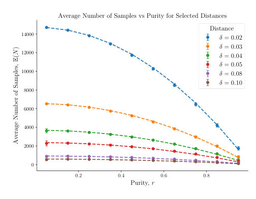
<figcaption class="paper-figure-caption"><b>Fig 4.</b> FIG. 4. Average number of samples required by the twin- peaks test for estimating the purity r of a qubit mixed state ρ using the evidence threshold Aϵ = 19, corresponding to the calibration ϵ = 0.05. The average number of samples is over 100 tests. The error bars correspond to the standard devia- tion. The dotted lines correspond to the average number of samples required in the asymptotic limit (Eq. (72)). In order for the numerical simulations not to run indefinitely, we set a threshold for the number of samples to 15000.</figcaption>
</figure>
<figure class="paper-figure-card">
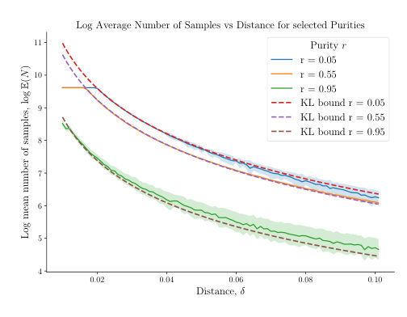
<figcaption class="paper-figure-caption"><b>Fig 5.</b> FIG. 5. Logarithm of the average number of samples required by the twin-peaks test for estimating the purity r of a qubit mixed state ρ as a function of the distance δ. The calibration is ϵ = 0.05. The average number of samples is computed over 100 tests, with the shaded region corresponding to the stan- dard deviation. The dashed lines correspond to the asymp- totic bound of Eq. (72). In order for the numerical simulations not to run indefinitely, we set a threshold for the number of samples to 15000; the flat orange and blue lines show this user-defined threshold value for small values of δ.</figcaption>
</figure>

**Summary.** This paper introduces sequential parameter testing, a framework to estimate unknown continuous parameters in quantum systems by adaptively ruling out incorrect values. It develops the 'twin-peaks test' and applies it successfully to qubit phase and purity estimation. The results demonstrate that this approach offers significant resource savings compared to fixed-size measurement protocols.

**Why it may be interesting.** It provides rigorous theoretical tools for quantifying resource efficiency in quantum certification tasks, which is crucial for designing practical quantum protocols where measurements must stop as soon as sufficient certainty is achieved.

Detailed structure

**Main problem.** The paper develops a novel framework for sequential parameter testing, designed to determine an unknown continuous quantum parameter up to a specified tolerance by ruling out competing values.

**Main result.** It establishes that sequential parameter testing is an operationally meaningful resource-efficient tool, showing significant average sample savings over fixed protocols for tasks like qubit purity estimation.

**Method.** The authors introduce and analyze three specific sequential tests (complement, concentration, twin-peaks) adapted from classical hypothesis testing theory to the quantum domain.

**Model / system.** The framework is applied to quantum systems characterized by unknown parameters encoded in state families $\{
ho_\vartheta\}$, specifically examining phase estimation and purity testing of qubits.

**Key observables.** Average sample cost, posterior density distributions, Quantum Fisher Information (QFI), and the parameter itself ($\vartheta$).

**Important parameters / regimes.** Tolerance ($\delta$), error tolerance ($\epsilon$), block size ($M$), and the unknown continuous parameter $\vartheta$ (e.g., phase or purity $r$).

**Assumptions / limitations.** The analysis relies on comparing sequential procedures to established classical bounds, assuming certain regularity conditions for optimal estimation strategies.

**Figures summary.** Figures illustrate updated normalized likelihoods over multiple rounds for the three test types; other figures compare MSE/error frequency across different measurement strategies and show the ratio of average samples required for varying block sizes $M$.

**Paper structure.** The paper builds from classical sequential hypothesis testing theory to quantum extensions, developing specific tests (like twin-peaks), applying them to qubit phase and purity estimation, and finally optimizing the resource cost by analyzing the optimal measurement block size $M$.

Abstract

Sequential strategies in hypothesis testing use a variable number of measurement rounds, allowing a decision to be made as soon as the observed data provide a prescribed level of error tolerance. Although sequential testing is well established for a discrete set of hypotheses, extending this framework to a continuous parameter space poses additional challenges and has remained largely unexplored. In this article, we introduce sequential \textit{parameter testing}, a framework for determining an unknown parameter up to a prescribed tolerance by ruling out sufficiently distant competing values with a target error tolerance. We clarify its operational distinction from conventional parameter estimation and develop sequential tests for continuous families of hypotheses, introducing the \textit{twin-peaks test} as a natural and computationally efficient analog of sequential likelihood-ratio testing. We apply the framework to two paradigmatic quantum tasks: testing the phase and the purity of a qubit. For phase testing, we show numerically that adaptive projective measurements achieve the same average sample cost as collective covariant measurements with a fixed number of copies. For purity testing, local measurements are optimal, and sequential parameter testing yields significant average sample savings over fixed sample-size protocols. Our results establish parameter testing as an operationally meaningful framework for resource-efficient certification tasks involving continuous parameters.

[↑ back to top](#top)

### [Schrödinger Generator for High-Dimensional Integration and Sampling on Quantum Many-Body States](http://arxiv.org/abs/2608.00529v1)

**Authors:** Lin-Jing Jiang, Fu Ma, Pei Li, Kai-Jia Sun, Guo-Liang Ma, Yu-Gang Ma  
**Type:** theory · **Category:** numerical methods · **PDF:** <https://arxiv.org/pdf/2608.00529v1>  
**Analysis basis:** full PDF text, analyzed in chunks
**Topic relevance:** `methods for driven-dissipative` **3/5** · `Keldysh / 2PI / non-Gaussian methods` **1/5** · `analog quantum simulation` **1/5**

↔ Scroll figures horizontally

<figure class="paper-figure-card">
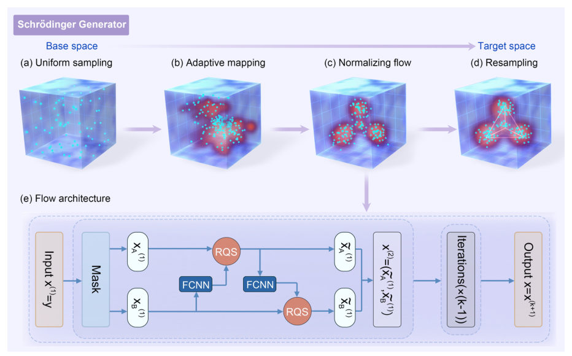
<figcaption class="paper-figure-caption"><b>Fig 1.</b> Fig. 1 Schematic of the Schr¨odinger Generator for high-dimensional integration and sampling. The frame- work combines an adaptive coordinate transformation, which reduces variance in each dimension, with a normalizing-flow transformation, which learns high-dimensional correlations, enabling efficient integration and low-variance sampling from complex target distributions. Upper panels show evolution of density distribution at successive stages: uniform initial sam- pling (a), adaptive importance mapping (b), flow-based transformation (c), and final resampling (d). Lower panels show architecture of the normalizing flow transformation using rational quadratic spline (RQS) with fully...</figcaption>
</figure>
<figure class="paper-figure-card">
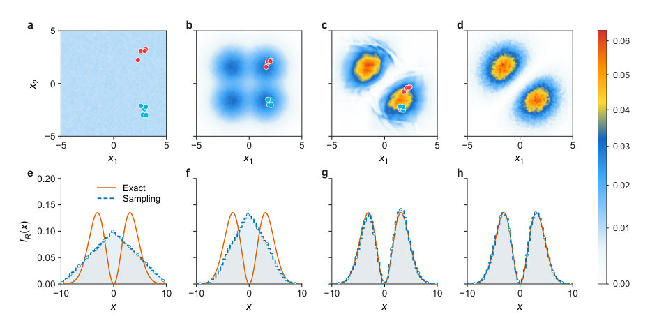
<figcaption class="paper-figure-caption"><b>Fig 2.</b> Fig. 2 Evolution of the sampled density for the two-dimensional fermionic distribution. Density distribu- tions at successive stages of the Schr¨odinger generator: uniform initial sampling (a), adaptive importance mapping (b), normalizing-flow transformation (c), and final resampling (d). The red and blue solid circles in (a)-(c) denote representative samples. Distribution of relative distance x = x1 −x2 obtained analytically (red solid lines) and from numerical samples (blue dashed lines) are presented in the corresponding lower panels. The SG progressively captures the bimodal structure and the suppressed diagonal region of the target distribution.</figcaption>
</figure>
<figure class="paper-figure-card">
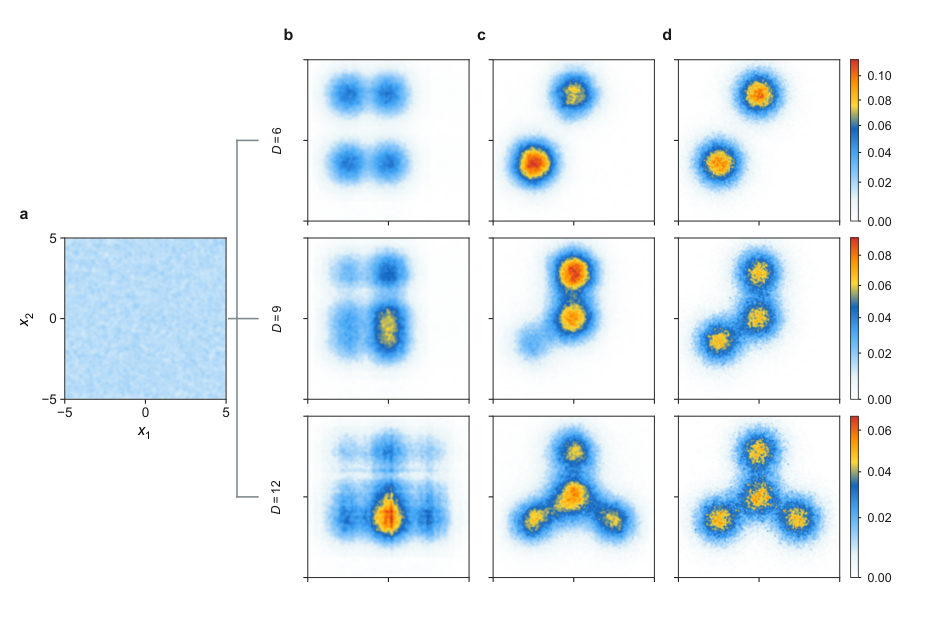
<figcaption class="paper-figure-caption"><b>Fig 3.</b> Fig. 3 Learning fermionic densities with the Schr¨odinger Generator. Evolution of the sampled density at succes- sive stages of the SG pipeline: uniform initialization (a), adaptive importance mapping (b), normalizing-flow transformation (c), and final resampling (d). Results are shown for dimensions D = 6 (top), D = 9 (middle) and D = 12 (bottom).</figcaption>
</figure>
<figure class="paper-figure-card">
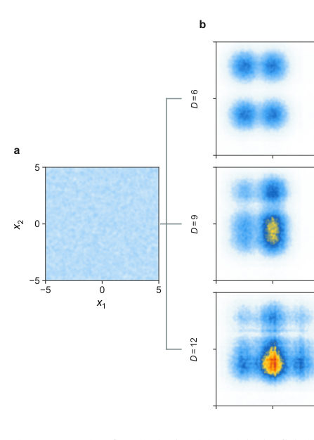
<figcaption class="paper-figure-caption"><b>Fig 4.</b> Figure 4 depicts a quantitative performance comparison. The upper panel shows the KL diver- gence between the sampled and target distribu- tions for uniform sampling, VEGAS sampling, and SG sampling. While uniform and VEGAS sampling rapidly degrade with increasing dimen- sion, SG maintains the lowest KL divergence from D = 2 up to D = 12, indicating a faithful recon- struction of the full probability density. The lower panel reports the corresponding uncertainties in the numerical evaluation of the normalization inte- gral. Consistent with the KL results, SG achieves significant reduction in the integral error relative to conventional methods in high dimensions.</figcaption>
</figure>
<figure class="paper-figure-card">
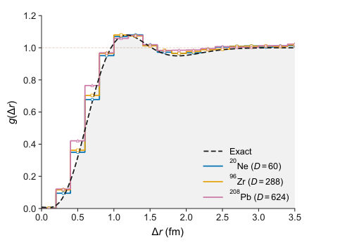
<figcaption class="paper-figure-caption"><b>Fig 5.</b> Fig. 5 Two-nucleon correlation functions in nuclei with the Schr¨odinger Generator. Radial two-body correlation functions g(∆r) for nucleus 20Ne, 96Zr, and 208Pb as a function of relative distance ∆r. Dashed lines denote the analytical input correlations, while solid lines represent results extracted from the generated samples in D = 60, 288, and 624 dimensions.</figcaption>
</figure>

**Summary.** This paper introduces the Schrödinger Generator (SG), a novel hybrid framework designed to overcome the limitations of Monte Carlo methods in high-dimensional integration. By combining adaptive importance sampling with normalizing flows, SG accurately samples highly correlated quantum many-body states, demonstrating stability up to dimensions exceeding 600 for nuclear physics applications.

**Why it may be interesting.** The development of robust, high-dimensional sampling tools is crucial for simulating complex quantum systems where correlations dominate the physics, providing a powerful computational tool applicable beyond standard condensed matter models.

Detailed structure

**Main problem.** High-dimensional integration and sampling of complex probability distributions, particularly those arising from quantum many-body systems, are computationally challenging for conventional Monte Carlo methods.

**Main result.** The proposed Schrödinger Generator (SG) framework achieves stable and scalable performance in dimensions exceeding 600, accurately reproducing strong correlations and nodal structures previously difficult to sample.

**Method.** It introduces a hybrid sampling technique that decomposes the Jacobian into an adaptive map component (for variance reduction) and a normalizing flow component (for capturing non-factorizable correlations), followed by a resampling step for unbiasedness.

**Model / system.** The method is benchmarked on quantum many-body states, specifically using the N-body density derived from fermionic wave functions, applied to nuclear systems up to $D=624$ dimensions.

**Key observables.** Integration estimates, Kullback–Leibler (KL) divergence, and two-nucleon correlation functions ($g(\Delta r)$).

**Important parameters / regimes.** High dimensionality ($D>600$), fermionic antisymmetry constraints, and the structure of the target density $|\Psi(\mathbf{x})|^2$.

**Assumptions / limitations.** The framework assumes that decomposing the Jacobian into adaptive mapping and flow transformation stabilizes optimization; a final resampling step is necessary to guarantee unbiased sampling.

**Figures summary.** Figures illustrate the SG workflow stages (uniform $	o$ adaptive $	o$ flow $	o$ resample) and show the successful reconstruction of correlated densities in $D=2$, $D=6, 9, 12$, and quantitative comparisons of KL divergence vs. dimension.

**Paper structure.** The paper introduces the SG framework by identifying the limitations of standard MC methods; it details the mathematical decomposition of the Jacobian into adaptive mapping and normalizing flow components; results are demonstrated across increasing dimensions ($D=2$ up to $D=624$), showing improved accuracy over existing techniques.

Abstract

Integration and sampling in high dimensions are among central challenges in modern science and technology, underlying applications ranging from quantum many-body physics to Bayesian inference and artificial intelligence. Although conventional Monte Carlo methods are formally scalable, their efficiency deteriorates rapidly in the presence of strong correlations or sharp features in high-dimensional configuration space. Here we introduce a new framework, termed the Schr"odinger Generator, for integration and sampling based on the explicit optimization of coordinate transformations. The method decomposes the total Jacobian into two complementary components, including an adaptive map that minimizes estimator variance by learning the marginal structure in each dimension, and a normalizing-flow-based transformation that captures non-factorizable correlations in the target distribution. A final resampling step guarantees unbiased sampling even when the learned transformation is imperfect. We demonstrate stable and scalable performance for nuclear quantum many-body states in dimensions exceeding 600. Short-range correlations among nucleons in finite nucleus are faithfully reproduced. The framework offers a physically transparent approach to high-dimensional stochastic integration and sampling, opening new possibilities for simulations of complex quantum systems.

[↑ back to top](#top)

### [Spatial-Order Hierarchy of Time-Dependent Exchange-Correlation Potential](http://arxiv.org/abs/2608.01483v1)

**Authors:** Naoki Negishi  
**Type:** theory · **Category:** strongly correlated electrons · **PDF:** <https://arxiv.org/pdf/2608.01483v1>  
**Analysis basis:** full PDF text, analyzed in chunks
**Topic relevance:** `Keldysh / 2PI / non-Gaussian methods` **3/5** · `methods for driven-dissipative` **1/5** · `non-equilibrium dynamics` **1/5**

↔ Scroll figures horizontally

<figure class="paper-figure-card">
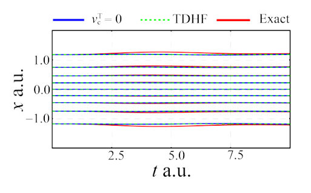
<figcaption class="paper-figure-caption"><b>Fig 1.</b> FIG. 1. Contours of the cumulative density Θ(x, t) obtained from the exact TDSE (red solid), the truncated propagation with exact vW xc and vT c = 0 (blue dashed), and TDHF (green dotted). The contour interval is 0.2.</figcaption>
</figure>
<figure class="paper-figure-card">
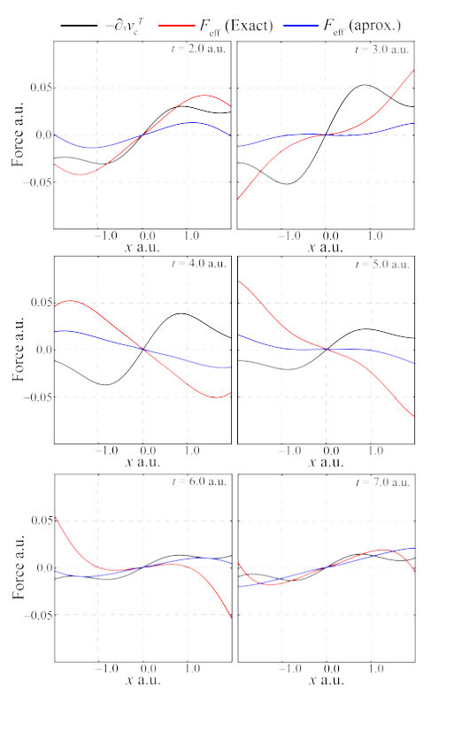
<figcaption class="paper-figure-caption"><b>Fig 2.</b> FIG. 2. Snapshots of kinetic-correlation force −∂xvT c (black solid), the exact effective force F exact eff (red dashed), and the effective force obtained with vT c = 0 (blue dotted).</figcaption>
</figure>

**Summary.** This paper tackles the unknown structural link between interaction and kinetic components within TDDFT's exchange-correlation potential. Using 1RDM expansions and numerical simulations on a 1D model, it derives mathematical constraints proving that accurate description of non-adiabatic electron motion requires incorporating these kinetic correlation terms. This provides an exact guiding principle for developing next-generation quantum simulation functionals.

**Why it may be interesting.** This work provides fundamental theoretical constraints for constructing accurate time-dependent functionals beyond standard approximations, which is crucial for simulating complex quantum dynamics in condensed matter systems.

Detailed structure

**Main problem.** The core problem is establishing a rigorous structural relationship between the kinetic-correlation ($v_{T}^{c}$) and interaction components of the time-dependent exchange-correlation potential ($v_{xc}$) within TDDFT.

**Main result.** The analysis establishes mathematical constraints derived from the off-diagonal expansion of the one-body reduced density matrix, proving that non-trivial kinetic correlation terms are necessary for accurate description during non-adiabatic dynamics.

**Method.** The authors employ a combination of theoretical derivation using 1RDM expansions and numerical simulation on a 1D two-electron model to test different approximations for $v_{xc}$.

**Model / system.** The study uses general N-electron systems, with specific quantitative tests performed on a one-dimensional two-electron spin-singlet model analogous to a 1D helium system.

**Key observables.** Electron density evolution ($\Theta(x, t)$), the effective force field ($F_{	ext{eff}}$), and the difference between exact and Hartree-Fock reduced density matrices ($\Delta\hat{\gamma}(t)$).

**Important parameters / regimes.** Time scales (e.g., $t=5.0$ a.u.), spatial dimensions (1D), and the order of expansion in the 1RDM off-diagonal distance.

**Assumptions / limitations.** The analysis relies on expanding the 1RDM relative to the TDHF reference, and while it addresses non-adiabatic dynamics, some derivations utilize structural constraints derived from low-order Taylor expansions.

**Figures summary.** Figures compare contours of the cumulative density function $\Theta(x, t)$ showing differences between exact time evolution (red solid) and truncated propagation results.

**Paper structure.** The paper progresses by first defining the components of $v_{xc}$ via 1RDM structure; it then establishes a mathematical constraint linking these components using low-order expansions; finally, numerical simulations on a 1D model demonstrate the physical consequences of neglecting kinetic correlation terms.

Abstract

Exact time-dependent density-functional theory separates the exchange-correlation potential into interaction and kinetic-correlation components, but the structural relation between them remains unknown. We establish a representability constraint based on the off-diagonal expansion of the one-electron reduced density matrix relative to a time-dependent Hartree-Fock (TDHF) reference. A non-zero linear term generates a non-HF current density while the kinetic-correlation component remains HF representable; higher-order off-diagonal structure activates the kinetic component. In a one-dimensional two-electron correlation quench, retaining the exact interaction component while setting the kinetic component to zero suppresses the density broadening of the exact evolution. These results establish a hierarchy of density equations of motion and provide an exact constraint for non-adiabatic functional construction.

[↑ back to top](#top)

### [Magnetic circular dichroism of THz modes and selection rules of Raman-active optical phonons in the polar altermagnet candidate \ce{Mn2Mo3O8}](http://arxiv.org/abs/2608.01062v1)

**Authors:** F. Schilberth, K. Vasin, M. Knauft, M. Kondákor, M. Vuckovic, N. Herrmann, K. Penc, M. Minola, B. Keimer, V. A. Martinez, K. Panda, A. A. Sirenko, L. Prodan, V. Tsurkan, A. A. Tsirlin, I. Kézsmárki, J. Deisenhofer  
**Type:** both · **Category:** strongly correlated electrons · **PDF:** <https://arxiv.org/pdf/2608.01062v1>  
**Analysis basis:** full PDF text, analyzed in chunks
**Topic relevance:** `spintronics-quantum-optics interface` **3/5** · `exotic spin models in light-matter` **1/5**

↔ Scroll figures horizontally

<figure class="paper-figure-card">
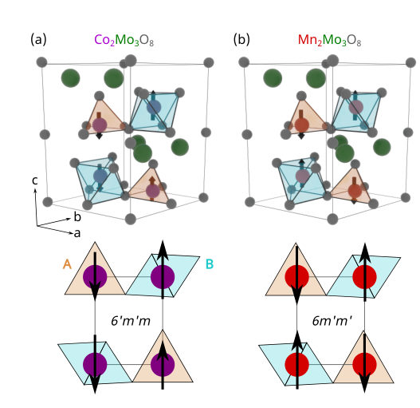
<figcaption class="paper-figure-caption"><b>Fig 1.</b> FIG. 1. Comparison of the different magnetic structures of (a) Co2Mo3O8/Fe2Mo3O8 and (b) Mn2Mo3O8. While for Co2Mo3O8/Fe2Mo3O8 the compensated antiferromagnetic state comprises four magnetic sublattices within the magnetic point group 6′m′m, Mn2Mo3O8 is described by two magnetic sublattices within the magnetic point group 6m′m′, which allows for ferrimagnetism.</figcaption>
</figure>
<figure class="paper-figure-card">
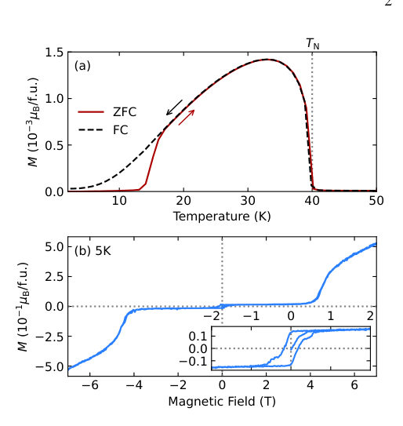
<figcaption class="paper-figure-caption"><b>Fig 2.</b> FIG. 2. (a) Magnetization of Mn2Mo3O8 as a function of tempera- ture measured upon heating after zero-field cooling (ZFC) and upon cooling in field (FC), both in a field of H = 100 Oe along the c-axis. (b) Magnetization as a function of magnetic field along the c-axis. The inset zooms in on the hysteresis at low fields.</figcaption>
</figure>
<figure class="paper-figure-card">
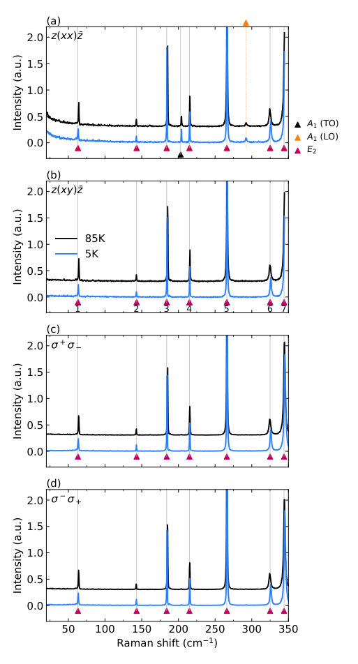
<figcaption class="paper-figure-caption"><b>Fig 3.</b> FIG. 3. Comparison of Raman spectra at 85 K (black) and 5 K (blue) in scattering configurations (a) z(xx)¯z allowing for the observation of E2 and A1 modes, (b) z(xy)¯z corresponding to the irreducible E2 representations of the paramagnetic phase. The determined eigen- frequencies of phonon modes expected for each configuration in the paramagnetic phase are indicated by upward triangles at the bottom of the individual panels. Symbols at the top of the panels indicate modes different from expected modes of the paramagnetic phase as described in the text. (c) and (d): Comparison of Raman spectra in crossed circular polarization configurations z(σ+σ−)¯z and z(σ−σ+)¯z at 5 K and 85 K.</figcaption>
</figure>
<figure class="paper-figure-card">
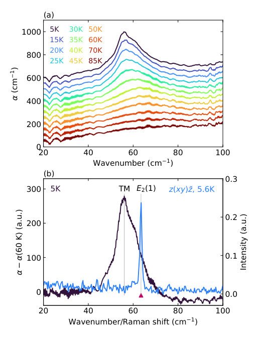
<figcaption class="paper-figure-caption"><b>Fig 4.</b> FIG. 4. (a) Temperature dependence of the absorption coefficient α in Mn2Mo3O8 for light polarization configuration Eω,Hω ⊥c cross- ing into the magnetically ordered state at TN = 41 K. (b) Comparison of the absorption difference ∆α = α(5 K)−α(60 K) (black) and the lowest-lying E2(1) Raman mode (blue) in the magnetically ordered state at T = 5 K.</figcaption>
</figure>
<figure class="paper-figure-card">
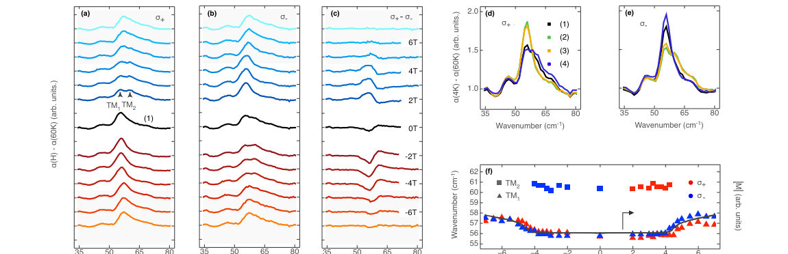
<figcaption class="paper-figure-caption"><b>Fig 5.</b> FIG. 5. Magnetic field dependence of absorption difference spectra for (a) right circularly polarized light (σ+), (b) left circularly polarized light (σ−) and (c) the difference of right and left circularly polarized spectra σ+ −σ−. Panels (d) and (e) show the zero-field absorption spectra for σ+ and σ−, where (1) corresponds to the first zero-field cooled spectra, (2) to the spectrum taken after the sweep to +7 T, (3) to the one taken after heating to 60 K and zero-field cooling again down to 5 K, and (4) to the one taken after the sweep to -7 T. (f) Magnetic field dependence of the peak frequencies of TM1 and TM2 in comparison to the modulus of the magnetization shown in Fig. 2(b).</figcaption>
</figure>

**Summary.** This study characterizes the coupled magnetic and vibrational excitations in Mn2Mo3O8 using THz spectroscopy and Raman scattering. By analyzing selection rules against crystal and magnetic symmetries, the authors identified key optical phonons and observed a characteristic magnetic circular dichroism signal linked to two-magnon excitations that vanishes upon field changes.

**Why it may be interesting.** This work directly bridges lattice dynamics (phonons) and magnetism (magnons/MCD) in a strongly correlated oxide system, providing detailed spectroscopic evidence of symmetry breaking upon magnetic ordering, which is crucial for understanding emergent quantum phenomena in solids.

Detailed structure

**Main problem.** The study investigates the magnetic and vibrational excitations, specifically THz modes and Raman-active optical phonons, in the polar altermagnet candidate Mn2Mo3O8.

**Main result.** Strong magnetic circular dichroism was observed at a broad THz excitation band only in the magnetically ordered state, which vanishes above the spin-flop transition. Furthermore, all optical phonons were identified using combined spectroscopic and theoretical analysis.

**Method.** The research combines temperature-dependent Raman scattering and magneto-optical THz time-domain spectroscopy with *ab initio* DFT+U calculations to analyze symmetry constraints.

**Model / system.** The physical system is the collinear altermagnet candidate Mn2Mo3O8, whose magnetic and vibrational properties are analyzed across paramagnetic and magnetically ordered phases using group theory applied to corepresentations.

**Key observables.** Magnetic circular dichroism (MCD) in the THz range, Raman-active optical phonon frequencies ($	ext{A}_1$, $	ext{E}_2$ modes), and selection rules based on pseudo-angular momentum conservation.

**Important parameters / regimes.** The spin-flop transition field (4 T); temperature dependence across magnetic ordering transitions ($T_N = 40 	ext{ K}$); DFT parameters ($	ext{U}_d = 5 	ext{ eV}$, $	ext{J}_d = 1 	ext{ eV}$).

**Assumptions / limitations.** The analysis relies on comparing experimental results to predictions derived from magnetic point group symmetry and the conservation of pseudo-angular momentum.

**Figures summary.** Figure 2 shows magnetization vs. T/H, indicating a spin-flop transition around 4 T; Figure 6 displays temperature-dependent absorption spectra related to optical band gaps.

**Paper structure.** The paper systematically analyzes the material's symmetry using corepresentations, first identifying all optical phonons via Raman scattering and comparing selection rules with pseudo-angular momentum conservation. It then uses THz spectroscopy to probe magnetic excitations, observing MCD linked to the magnetic ordering state.

Abstract

We investigated the magnetic and vibrational excitations in the collinear altermagnet candidate \ce{Mn2Mo3O8} by temperature dependent Raman scattering and magneto-optical THz time-domain transmission spectroscopy. By comparison to \textit{ab initio} calculations accurately capturing the eigenfrequencies of the vibrational eigenmodes, we identify all optical phonons, including the lowest-lying Raman modes of $A_1$ and $E_2$ type, which had remained elusive in a previous Raman study. Moreover, we compare the selection rules for optically active phonons in the paramagnetic and the magnetically ordered phases of \ce{Mn2Mo3O8} and analyze the Raman selection rules with respect to pseudo-angular momentum conservation. No evidence of the expected splitting of the degenerate paramagnetic $E_2$ optical phonons into modes with circular polarization upon magnetic ordering could be resolved, likely due to weak spin-orbit coupling typical for Mn$^{2+}$. In contrast, we observe strong magnetic circular dichroism at a broad THz excitation band, emerging in the magnetically ordered state. This band, potentially originating from two-magnon excitations, is only electric-dipole active and features a field-dependent two-component fine structure. Its magnetic circular dichroism vanishes above the spin-flop transition at 4~T.

[↑ back to top](#top)

### [Nearly tight lower bounds for estimating quantum functionals: Uhlmann fidelity, trace distance, and von Neumann entropy](http://arxiv.org/abs/2608.02600v1)

**Authors:** Qisheng Wang  
**Type:** theory · **Category:** quantum information and computing · **PDF:** <https://arxiv.org/pdf/2608.02600v1>  
**Analysis basis:** full PDF text, analyzed in chunks
**Topic relevance:** `entanglement & information structure` **3/5** · `quantum measurements` **1/5**

↔ Scroll figures horizontally

<figure class="paper-figure-card">
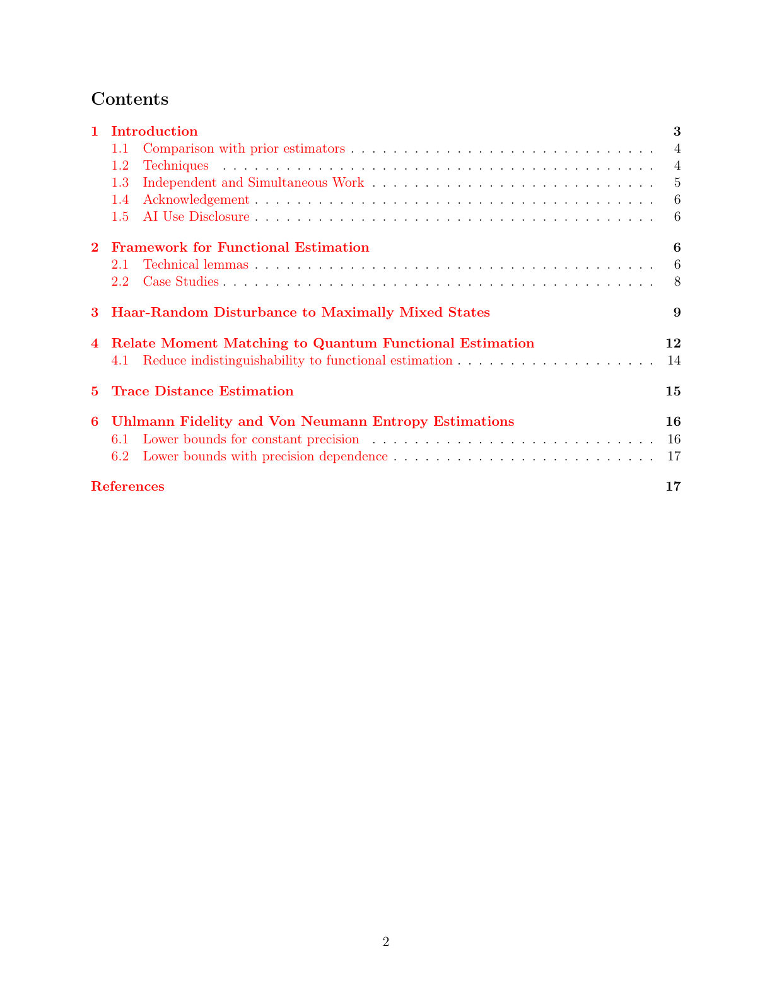
<figcaption class="paper-figure-caption"><b>Fig 1.</b> Low-resolution page preview, page 2</figcaption>
</figure>
<figure class="paper-figure-card">
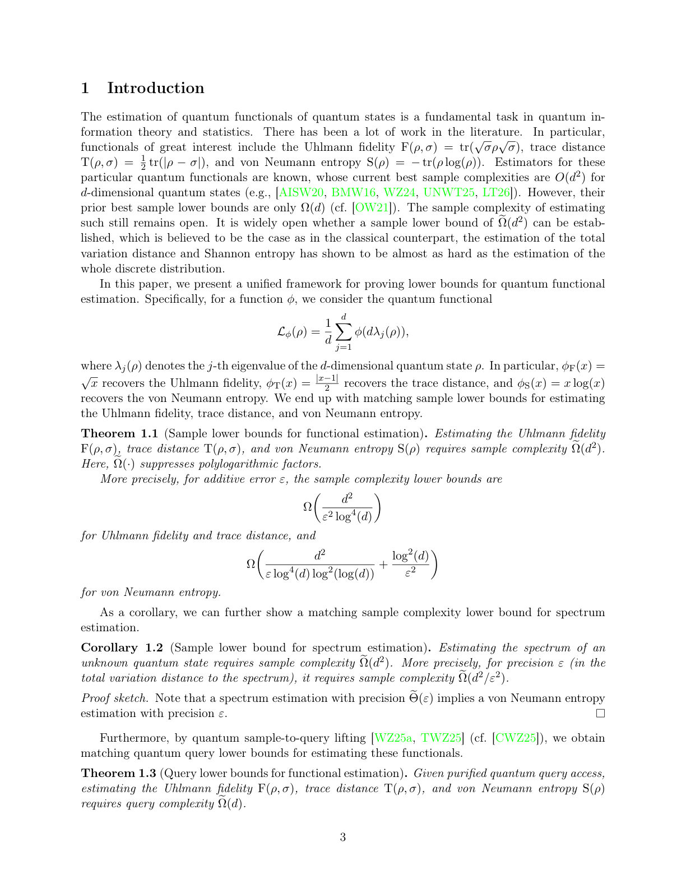
<figcaption class="paper-figure-caption"><b>Fig 2.</b> Low-resolution page preview, page 3</figcaption>
</figure>
<figure class="paper-figure-card">
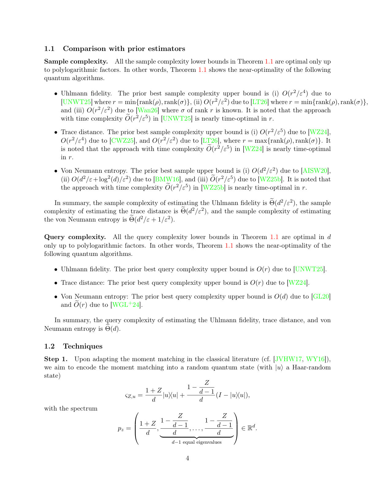
<figcaption class="paper-figure-caption"><b>Fig 3.</b> Low-resolution page preview, page 4</figcaption>
</figure>
<figure class="paper-figure-card">
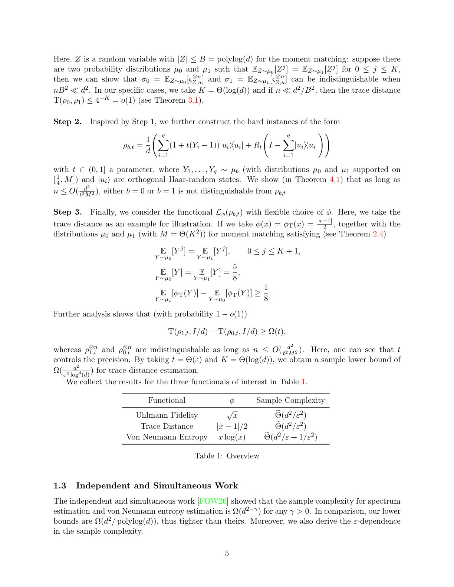
<figcaption class="paper-figure-caption"><b>Fig 4.</b> Low-resolution page preview, page 5</figcaption>
</figure>
<figure class="paper-figure-card">
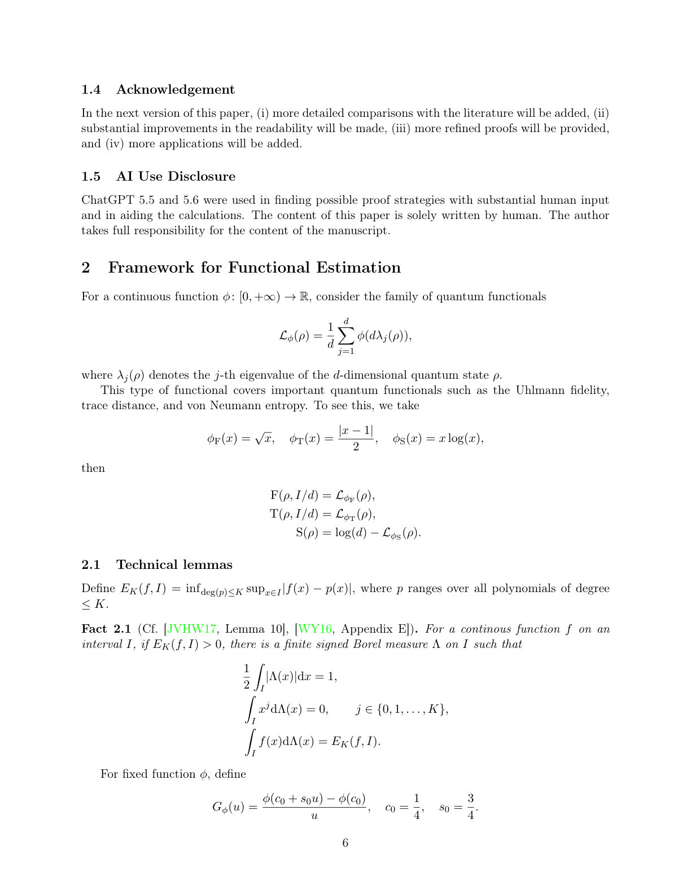
<figcaption class="paper-figure-caption"><b>Fig 5.</b> Low-resolution page preview, page 6</figcaption>
</figure>

**Summary.** This work provides a unified theoretical framework to determine the fundamental sample and query complexity required to estimate key quantum functionals—Uhlmann fidelity, trace distance, and von Neumann entropy. By establishing lower bounds matching known upper bounds, it proves near-optimality for several quantum estimation algorithms. This has significant implications for designing resource-efficient quantum characterization protocols.

**Why it may be interesting.** These fundamental lower bounds are crucial for understanding the limits of quantum estimation protocols. For AMO/open systems, knowing the minimum resources (samples/queries) needed to characterize state properties like entanglement or purity is vital for designing efficient measurements and characterization schemes.

Detailed structure

**Main problem.** The paper establishes unified lower bounds for estimating fundamental quantum functionals of quantum states, such as Uhlmann fidelity, trace distance, and von Neumann entropy.

**Main result.** It proves that estimating these three key functionals requires sample complexities scaling as $\widetilde{\Omega}(N^2)$ and yields corresponding query complexity lower bounds of $\widetilde{\Omega}(N)$.

**Method.** The authors develop a unified framework using moment matching techniques, constructing hard instances based on Haar-random states to derive the necessary lower bounds.

**Model / system.** The analysis concerns $d$-dimensional quantum states ($
ho$) and their estimation relative to other states or the maximally mixed state. The methodology involves relating functional estimation to distinguishing between two probability distributions via moments.

**Key observables.** Uhlmann fidelity ($F$), trace distance ($T$), and von Neumann entropy ($S$).

**Important parameters / regimes.** Dimensionality $d$, sample size $N$ (or $\epsilon$ for error), and the functional parameterization $\phi$.

**Assumptions / limitations.** The results rely on constructing hard instances ($
ho_{b,t}$) and applying techniques from property testing, such as sample-to-query lifting.

**Paper structure.** The paper introduces the general problem of bounding functional estimation. It then develops a unified framework using moment matching on constructed hard instances ($
ho_{b,t}$) to derive lower bounds for $F$, $T$, and $S$ in terms of sample complexity, concluding with query complexity results.

Abstract

In this paper, we present a unified framework for proving lower bounds for estimating functionals of quantum states. We therefore resolve several open problems by establishing lower bounds that match known upper bounds: we show that it requires $\widetildeΩ(N^2)$ samples to estimate the Uhlmann fidelity, trace distance, and von Neumann entropy. Moreover, they immediately imply matching query lower bounds of $\widetildeΩ(N)$ by quantum sample-to-query lifting. These lower bounds imply the near-optimality of a dozen quantum algorithms since 2016.

[↑ back to top](#top)

### [Automated Construction and Verification of Unextendible Product Bases](http://arxiv.org/abs/2608.01438v1)

**Authors:** Zicheng Han, Wanchen Zhang, Fei Shi, Xiande Zhang  
**Type:** theory · **Category:** quantum information and computing · **PDF:** <https://arxiv.org/pdf/2608.01438v1>  
**Analysis basis:** full PDF text, analyzed in chunks
**Topic relevance:** `entanglement & information structure` **3/5**

↔ Scroll figures horizontally

<figure class="paper-figure-card">
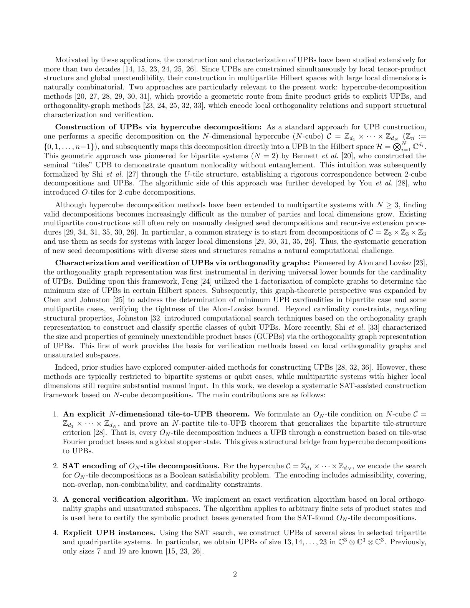
<figcaption class="paper-figure-caption"><b>Fig 1.</b> Low-resolution page preview, page 2</figcaption>
</figure>
<figure class="paper-figure-card">
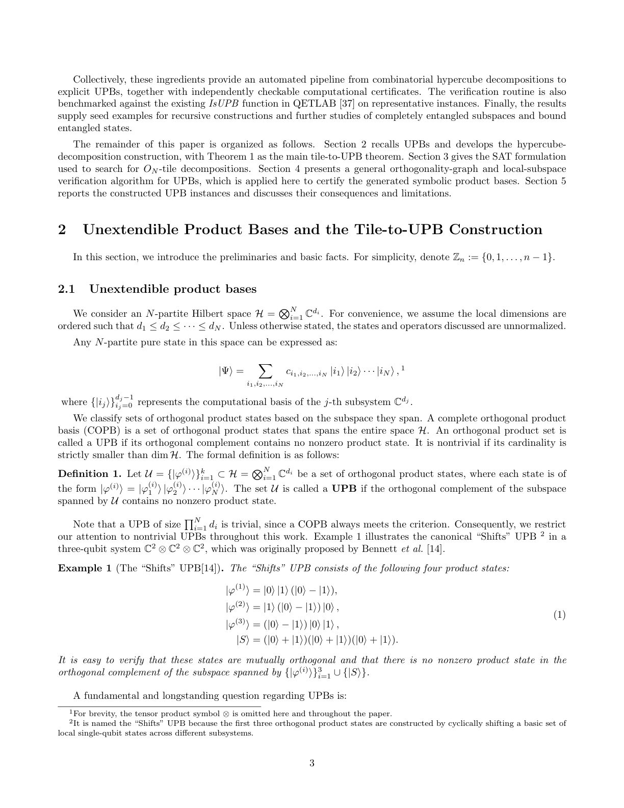
<figcaption class="paper-figure-caption"><b>Fig 2.</b> Low-resolution page preview, page 3</figcaption>
</figure>
<figure class="paper-figure-card">
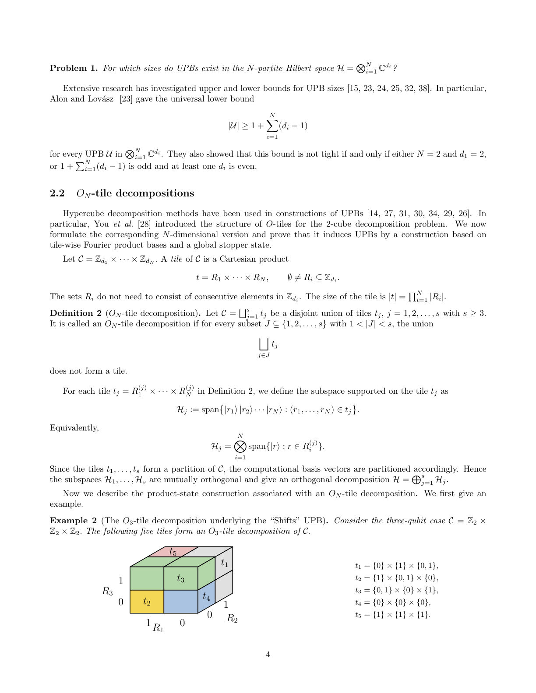
<figcaption class="paper-figure-caption"><b>Fig 3.</b> Low-resolution page preview, page 4</figcaption>
</figure>
<figure class="paper-figure-card">
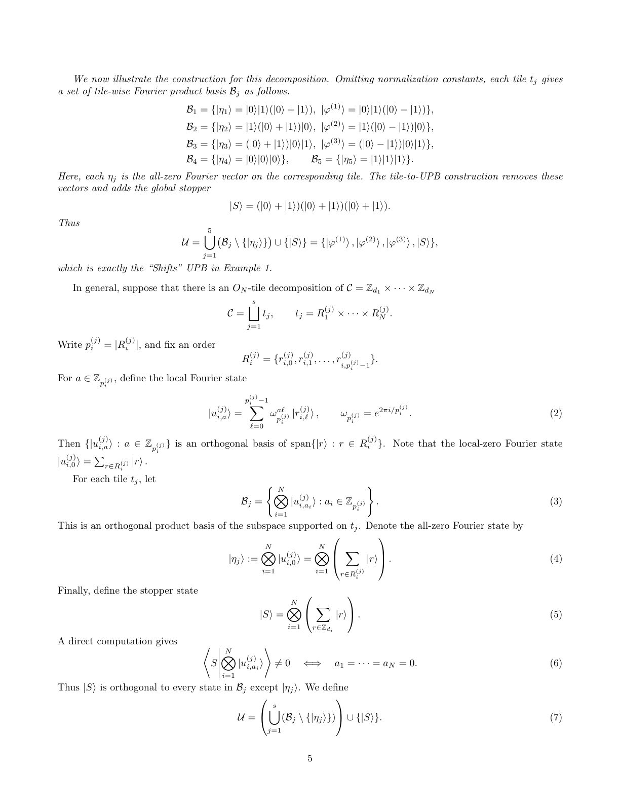
<figcaption class="paper-figure-caption"><b>Fig 4.</b> Low-resolution page preview, page 5</figcaption>
</figure>
<figure class="paper-figure-card">
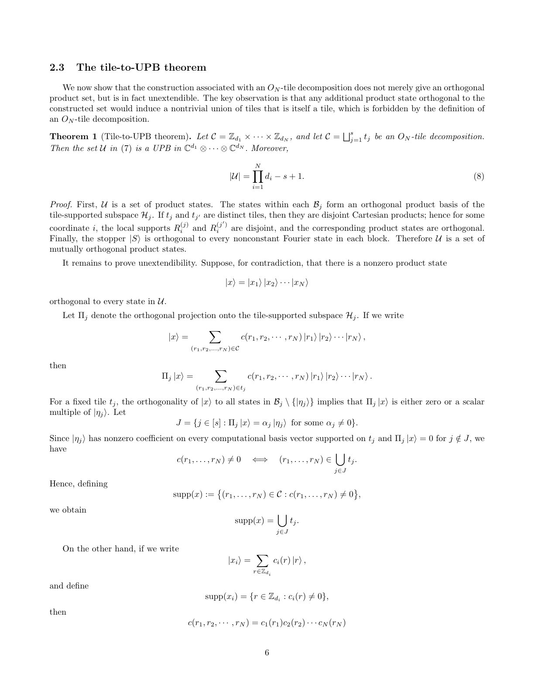
<figcaption class="paper-figure-caption"><b>Fig 5.</b> Low-resolution page preview, page 6</figcaption>
</figure>

**Summary.** This paper introduces a novel SAT-assisted framework to systematically construct and verify Unextendible Product Bases (UPBs) in multipartite quantum systems. By relating UPB existence to ON-tile decompositions of the hypercube, the authors provide an automated pipeline for generating explicit examples of these important structures. This advances the understanding of entanglement by providing concrete, verifiable examples of highly entangled subspaces.

**Why it may be interesting.** This work provides rigorous, systematic methods to construct highly structured quantum states (UPBs) that are crucial for understanding entanglement measures like bound entanglement in multipartite systems.

Detailed structure

**Main problem.** The central problem is determining the existence and constructing Unextendible Product Bases (UPBs) of specific sizes within multipartite quantum systems.

**Main result.** The authors established a tile-to-UPB theorem, providing an automated framework to generate explicit UPBs by solving combinatorial problems using SAT solvers.

**Method.** They combine concepts from combinatorics (ON-tile decompositions of the hypercube) with computational tools (SAT solvers) and quantum information theory constructions (Fourier product bases).

**Model / system.** The study concerns N-partite Hilbert spaces, $\mathcal{H} = \bigotimes_{i=1}^N \mathbb{C}^{d_i}$, where UPBs are sets of mutually orthogonal product states whose complement contains no non-zero product state.

**Key observables.** Cardinality (size) of the UPB; existence of ON-tile decompositions.

**Important parameters / regimes.** The dimensions $d_1, \dots, d_N$ of the local subsystems; the number of tiles $s$ in the decomposition.

**Assumptions / limitations.** The construction relies on finding an ON-tile decomposition of the underlying hypercube structure.

**Figures summary.** Tables summarize known UPB sizes for small tripartite and quadripartite systems, showing new instances found through their systematic search.

**Paper structure.** The paper introduces the problem, develops the SAT-assisted framework based on ON-tile decompositions, proves the tile-to-UPB theorem, implements a verification algorithm, and presents specific calculated examples of UPBs.

Abstract

Unextendible product bases (UPBs) are important structures in quantum information theory, with applications to completely entangled subspaces, bound entanglement, and local indistinguishability. Since many properties and applications of UPBs are closely related to their cardinalities, one of the central problems in the study of UPBs is to determine whether UPBs of prescribed sizes exist in a given multipartite system. In this paper, we introduce a SAT-assisted framework based on decompositions of the \(N\)-dimensional hypercube. We define \(O_N\)-tile decompositions and prove a tile-to-UPB theorem: every \(O_N\)-tile decomposition induces a UPB through a construction based on tile-wise Fourier product bases and a global stopper state. We then encode the search for such decompositions as a Boolean satisfiability (SAT) problem and use SAT solvers to generate explicit instances. In terms of verification, we also implement a UPB verification algorithm based on local orthogonality graphs and unsaturated subspaces. The algorithm can be used to determine whether an arbitrary finite set of product states forms a UPB. Using this framework, we obtain UPBs of several sizes in some tripartite and quadripartite systems, including sizes \(13,14,\ldots,23\) in \(\mathbb C^3\otimes\mathbb C^3\otimes\mathbb C^3\). Moreover, the small-dimensional instances obtained here can serve as seed UPBs for recursive constructions, leading to further examples in larger multipartite systems.

[↑ back to top](#top)

### [Optimal Quantum de Finetti Theorems via Argmax Rounding](http://arxiv.org/abs/2608.02590v1)

**Authors:** Fernando Granha Jeronimo, Pei Wu, Haochen Xu  
**Type:** theory · **Category:** quantum information and computing · **PDF:** <https://arxiv.org/pdf/2608.02590v1>  
**Analysis basis:** full PDF text, analyzed in chunks
**Topic relevance:** `entanglement & information structure` **3/5**

↔ Scroll figures horizontally

<figure class="paper-figure-card">
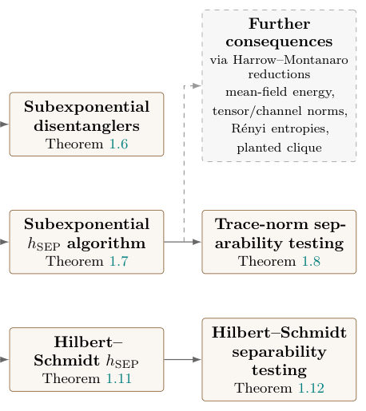
<figcaption class="paper-figure-caption"><b>Fig 1.</b> Figure 1: Dependency structure of the main results. Solid arrows show the proof organization used in the main body. Blue nodes are de Finetti statements; tan nodes are applications. The dashed gray branch records further consequences available through the reductions of Harrow–Montanaro [HM13, Sec. 4.2]; their parameters depend on the losses in those reductions.</figcaption>
</figure>
<figure class="paper-figure-card">
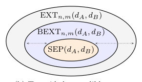
<figcaption class="paper-figure-caption"><b>Fig 2.</b> Figure 2: State-set containments underlying the de Finetti theorems. Nesting records containment. From left to right, the dotted markers represent the worst- case de Finetti errors for (EXCH(t) N , SEP(t) P ), (BOS(t) N , SEP(t) H ), (BEXTn,m, SEP), and (EXTn,m, SEP). Marker lengths are schematic.</figcaption>
</figure>

**Summary.** This work establishes optimal upper bounds for quantum de Finetti theorems, quantifying how close a highly symmetric quantum state can be to a product state. By applying advanced semidefinite programming techniques and the argmax method, it achieves sharp rates like $O(N^{-1/2})$ in Hilbert-Schmidt distance. The results have major implications by refuting conjectures related to entanglement structure and improving complexity bounds for quantum information tasks.

**Why it may be interesting.** It provides fundamental quantitative tools (optimal error bounds) that improve complexity results from exponential to subexponential dependence on local dimension $d$, impacting quantum complexity theory.

Detailed structure

**Main problem.** The paper aims to establish optimal finite quantum de Finetti upper bounds for bosonic and general exchangeable quantum states.

**Main result.** Optimal bounds are proven, notably achieving an $O(N^{-1/2})$ rate in Hilbert-Schmidt distance for the dimension-free bosonic case, which also refutes Watrous's disentangler conjecture.

**Method.** The proof reformulates de Finetti approximation as a sum-of-squares rounding problem and applies the argmax method to solve an associated semidefinite program.

**Model / system.** The analysis focuses on bosonic states $
ho_N$ in symmetric tensor product spaces, comparing them against separable or product-like state structures across $N$ subsystems with local dimension $d$.

**Key observables.** Trace distance ($	ext{Dtr}$), Hilbert-Schmidt distance ($	ext{DHS}_H$), and the error bounds quantifying deviation from independence.

**Important parameters / regimes.** Number of sites ($N$), local dimension ($d$), and marginal size ($t$).

**Assumptions / limitations.** The analysis relies on casting approximation problems as semidefinite programming relaxations that are then rounded using the argmax principle.

**Figures summary.** Not specified in the notes, but the structure implies derivations of bounds (e.g., Theorem 1.1-1.4) and explicit lower bound calculations for distances.

**Paper structure.** The paper progresses from establishing general optimal finite quantum de Finetti bounds to specific applications: refuting Watrous's conjecture via disentanglers, developing algorithms for Best Separable State estimation, and finally deriving the dimension-free bosonic bound using Hilbert-Schmidt norms.

Abstract

We prove optimal finite quantum de Finetti upper bounds. Given a bosonic state $ρ_N\in D(\mathrm{Sym}^N(\mathbb C^d))$, there is a probability measure $ν$ on the unit sphere such that \[   \left\|   ρ_N^{(2)}-\int |u\rangle\langle u|^{\otimes 2}\,dν(u)   \right\|_1   \le \frac{\sqrt{d-1}}{N-1}. \] By purification, the bosonic theorem also gives the optimal $O(d/N)$ upper bound for arbitrary exchangeable states. These results settle the dimension dependence left open by Christandl, König, Mitchison, and Renner (CMP 2007). The proof casts de Finetti approximation as sum-of-squares rounding and applies the argmax method of Jeronimo, Wu, and Xu (manuscript 2026).   More generally, $t$-site marginals satisfy $O(t\sqrt d/N)$ bosonic and $O(td/N)$ permutation-invariant bounds. Our proof formulates de Finetti approximation as the integrality gap of a symmetric-extension semidefinite program and rounds an optimum by the argmax principle. The sharp bounds have several consequences. For every fixed $\varepsilon\in(0,1)$, we construct a channel with input dimension $D=\exp(O_\varepsilon(\sqrt d\log d))=\exp(o(d))$ whose outputs are $\varepsilon$-close to separable states of local dimension $d$ and whose image contains every such separable state, thereby refuting Watrous's disentangler conjecture. We also obtain deterministic $\exp(\widetilde O(\sqrt d/\varepsilon))$-time algorithms for explicit Best Separable State without perfect completeness and for trace-distance separability testing.   Finally, spectral truncation gives the first dimension-free bosonic de Finetti theorem in Hilbert--Schmidt distance, with the optimal rate $Θ(N^{-1/2})$ when the dimension may grow.

[↑ back to top](#top)

### [Towards Tensor-Network SAT-Solvers for Quantum-Classical Workflows](http://arxiv.org/abs/2608.02041v1)

**Authors:** Benjamin Zec, Lukas Schmidbauer, Maja Franz, Wolfgang Mauerer  
**Type:** both · **Category:** numerical methods · **PDF:** <https://arxiv.org/pdf/2608.02041v1>  
**Analysis basis:** full PDF text, analyzed in chunks
**Topic relevance:** `methods for driven-dissipative` **3/5**

↔ Scroll figures horizontally

<figure class="paper-figure-card">
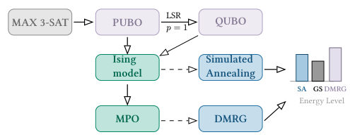
<figcaption class="paper-figure-caption"><b>Fig 1.</b> Fig. 1. We benchmark two transformation paths: MAX 3-SAT cast into PUBO, Ising and then MPO (path one) and MAX 3-SAT cast into PUBO, quadratised to QUBO, Ising and then MPO. We compare SA and DMRG ground-state deviations for the Ising and MPO models, respectively.</figcaption>
</figure>
<figure class="paper-figure-card">
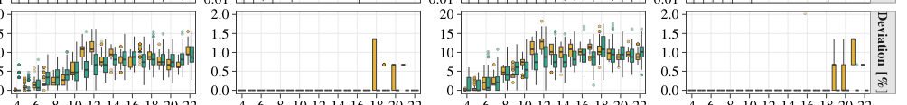
<figcaption class="paper-figure-caption"><b>Fig 2.</b> Fig. 2. Optimisation performance of SA (green) and DMRG (yellow), grouped by number of SAT variables n and clause count m. Upper panels show runtime per instance: SA is consistently faster and DMRG scales with n in both encodings, where outliers reflect instances with increased bond dimension χ, driving up contraction cost. Lower panels show deviation from the ground state: the PUBO encoding keeps deviations near zero throughout, while QUBO deviations grow monotonically with n and m and outliers reflect individual instances trapped in local minima due to insufficient bond dimension χ.</figcaption>
</figure>

**Summary.** This paper investigates using tensor network methods, specifically DMRG, as a classical surrogate for solving optimization problems derived from SAT instances within hybrid quantum computing workflows. The authors demonstrate that the encoding used (e.g., PUBO vs. QUBO) critically impacts performance, and they find that classical solvers like Simulated Annealing can match or exceed the performance of DMRG for these specific, classically solvable ground-state problems.

**Why it may be interesting.** While focused on optimization rather than fundamental quantum dynamics, the use of tensor networks (DMRG) as a benchmark surrogate for classical computation methods is highly relevant to understanding computational resource trade-offs in near-term quantum hardware architectures.

Detailed structure

**Main problem.** The core problem is developing robust classical surrogate mechanisms for solving optimization problems derived from Boolean satisfiability (SAT) within hybrid High-Performance Computing/Quantum Computing workflows.

**Main result.** The study finds that the choice of encoding (PUBO vs. QUBO) and the resulting solver performance are highly dependent on the problem structure, showing that simple transformations like quadratization can degrade solution quality significantly.

**Method.** The authors compare tensor network solvers (DMRG) against classical optimization techniques (Simulated Annealing) applied to Hamiltonians derived from SAT instances encoded as Matrix Product Operators.

**Model / system.** The model involves mapping Max-3-SAT problems into Pseudo-Boolean Functions, which are then formulated as Ising models and optimized using tensor network representations (MPOs).

**Key observables.** Solution quality (deviation from ground state), runtime scaling with problem size ($n$ variables, $m$ clauses), and the comparative performance of different encoding schemes.

**Important parameters / regimes.** The comparison involves native PUBO vs. quadratized QUBO encodings, and DMRG vs. SA solvers across varying system sizes.

**Assumptions / limitations.** It is assumed that integrated HPC/QC systems require classical fallbacks due to limitations like observability, necessitating an understanding of surrogate performance.

**Figures summary.** Figure 1 illustrates the end-to-end workflow comparing PUBO and QUBO paths. Figure 2 compares optimization performance (runtime and deviation) between SA and DMRG for both encodings as a function of $n$ and $m$.

**Paper structure.** The paper establishes the need for classical surrogates in HPC/QC, details the mapping from SAT to MPOs via PUBO/QUBO, benchmarks two encoding paths (native vs. quadratized), and compares DMRG against SA solvers on Max-3-SAT instances.

Abstract

Integrated HPC/QC systems aim to combine classical high-performance computing with quantum processors, but cannot be reduced to mechanisms for dispatching quantum kernels. An integrated architecture must support aspects such as observability, which cannot be implemented using QPUs alone, as well as fallback execution and cost-aware decisions on whether to replace quantum tasks with classical surrogates. Such mechanisms must be approximate or benefit from problem structure to soften the inescapable exponential classical worst-case complexity. In this work, we study tensor-network ground-state search, as such a surrogate, for optimisation problems. This combines key quantum primitives with advanced classical simulation. It provides initial empirical indicators for surrogate selection criteria, and exposes end-to-end toolchain effects that may be missed when transformation steps are studied in isolation. We compare a native polynomial unconstrained optimisation to-higher-order-Ising and a quadratised quadratic unconstrained binary optimization to-quadratic-Ising formulation for Max-3-SAT. Both are encoded as matrix product operator and optimised using density matrix renormalisation group approaches, with simulated annealing (SA) as classical performance baseline. Our results show that quadratisation is not a neutral transformation step: auxiliary variables and pairwise couplings substantially degrade solution quality relative to the native higher-order representation, while SA matches or outperforms DMRG across all tested instances. Since the optima of Boolean satisfiability (SAT)-derived problems are classical product states, DMRGs advantages dont materialise here. These findings suggest that surrogate selection in HPC/QC runtimes must be encoding- and instance-aware and provide empirical groundwork for informed decisions on fallback strategies and architecture co-design.

[↑ back to top](#top)

### [Symmetry-Projected Compatible Multiparameter Quantum Sensing](http://arxiv.org/abs/2608.01831v1)

**Authors:** G. R. Jin, Z. Y. Zhou, W. Yang  
**Type:** theory · **Category:** other · **PDF:** <https://arxiv.org/pdf/2608.01831v1>  
**Analysis basis:** full PDF text, analyzed in chunks
**Topic relevance:** `analog quantum simulation` **2/5** · `correlated / nonlocal dissipation` **2/5** · `driven-dissipative phase transition` **2/5** · `entanglement & information structure` **2/5** · `exotic spin models in light-matter` **2/5** · `methods for driven-dissipative` **2/5** · `Keldysh / 2PI / non-Gaussian methods` **1/5** · `Tavis-Cummings & cavity-many-emitter` **1/5** · `correlated cavity matter` **1/5** · `non-equilibrium dynamics` **1/5** · `non-equilibrium universality` **1/5** · `quantum measurements` **1/5** · `spintronics-quantum-optics interface` **1/5**

↔ Scroll figures horizontally

<figure class="paper-figure-card">
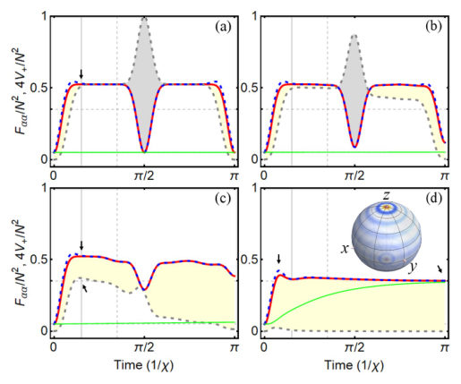
<figcaption class="paper-figure-caption"><b>Fig 1.</b> FIG. 1: Time evolution of 4V+ (blue dashed), Fxx (green solid), Fyy (red solid), and Fzz (gray dashed) under dissipative one-axis-twisting dynamics for (a) γ/χ = 0, (b) 10−3, (c) 10−2, and (d) 1. Under weak dephasing, a broad plateau develops within 3τd ≲χt ≲π/2 −3τd, where 4V+ ≃Fyy ≈Fzz ≈N2/2 and τd = 1/ √</figcaption>
</figure>

**Summary.** The paper introduces a symmetry-projection framework for multiparameter quantum sensing that mathematically guarantees the decoupling of parameter information sectors. By restricting analysis to states within a symmetry sector, it shows how cross-talk terms vanish in the QFIM, enabling simultaneous and optimal estimation of multiple parameters even in dissipative systems.

**Why it may be interesting.** This work provides a powerful theoretical tool—symmetry protection—to simplify complex multi-parameter quantum estimation problems in interacting quantum systems, directly linking fundamental symmetries to measurable metrological advantages.

Detailed structure

**Main problem.** The primary challenge addressed is achieving simultaneous information-sector decoupling and weak compatibility between multiple parameters ($	heta_{\alpha}$) in quantum sensing, which are often hindered by statistical coupling.

**Main result.** A symmetry-projection framework was developed that guarantees the vanishing of cross-sector elements in the Quantum Fisher Information Matrix (QFIM) and SLD commutators, leading to decoupled and weakly compatible parameter estimation channels.

**Method.** The authors decompose encoding generators relative to a symmetry sector projector ($\hat{P}$) into subspace-preserving and changing components. They then calculate the QFIM and use these restricted operators to derive analytical conditions for decoupling.

**Model / system.** The framework is applied generally but features specific models including parity-protected collective SU(2) spin systems (N spins) and dissipative One-Axis-Twisting (OAT) dynamics. The analysis focuses on probe states confined to a symmetry sector ($\hat{
ho} = \hat{P}\hat{
ho}\hat{P}$).

**Key observables.** Quantum Fisher Information Matrix (QFIM), mean Symmetric Logarithmic Derivative (SLD) commutator matrix, Uhlmann curvature, and spin fluctuation variances.

**Important parameters / regimes.** The number of particles ($N$), the parity of $N$ (even vs. odd), and the time evolution parameters ($	heta_x, 	heta_y, 	heta_z$).

**Assumptions / limitations.** The analysis fundamentally relies on restricting the probe state to a symmetry-projected subspace ($\hat{
ho} = \hat{P}\hat{
ho}\hat{P}$), which simplifies the full compatibility problem.

**Figures summary.** Figures illustrate the time evolution of various QFI components under dissipative OAT dynamics, showing plateaus and suppression due to dephasing effects.

**Paper structure.** The paper establishes the general symmetry-projection framework by decomposing generators. It then applies this to specific systems like SU(2) spins and OAT models, deriving conditions for cross-term vanishing (decoupling) and weak compatibility using spin correlation measurements.

Abstract

We establish a general symmetry-projection framework for multiparameter quantum sensing. Decomposing encoding generators into subspace-preserving and subspace-changing components relative to a symmetry sector identically eliminates all cross-sector elements of the quantum Fisher information matrix (QFIM) and the mean symmetric logarithmic derivative (SLD) commutator matrix. When projected subspace-changing generators act as a scalar within the occupied subspace, the corresponding QFIM block reduces to four times the symmetrized covariance matrix, regardless of probe state purity. For parity-protected collective $\mathrm{SU}(2)$ spin systems, this renders the transverse QFIM directly certifiable via spin fluctuations, with the optimal axis aligned with the anti-squeezed quadrature. Applied to a dissipative one-axis-twisting system, our framework reveals that highly mixed transient states can exhibit nearly balanced, Heisenberg-scaled QFIM components for transverse--longitudinal parameter pairs $(θ_y,θ_z)$ over a broad time window. Furthermore, while the steady state retains an isotropic transverse QFIM scaling as $N^2/3$, weak compatibility for transverse parameter pairs $(θ_x,θ_y)$ exhibits a sharp parity dependence---failing for odd $N$ but restored for even $N$. The resulting symmetry protection eliminates the Uhlmann curvature for transverse--longitudinal pairs, enabling simultaneous saturation of the multi-parameter quantum Cramér-Rao bound in the asymptotic limit.

[↑ back to top](#top)

### [Solitons in optical couplers: introduction and perspectives](http://arxiv.org/abs/2608.00696v1)

**Authors:** Boris A. Malomed  
**Type:** both · **Category:** other · **PDF:** <https://arxiv.org/pdf/2608.00696v1>  
**Analysis basis:** full PDF text, analyzed in chunks
**Topic relevance:** `Keldysh / 2PI / non-Gaussian methods` **2/5** · `driven-dissipative phase transition` **2/5** · `methods for driven-dissipative` **2/5** · `quantum optics experiment` **2/5** · `analog quantum simulation` **1/5** · `correlated / nonlocal dissipation` **1/5** · `correlated cavity matter` **1/5** · `non-equilibrium dynamics` **1/5** · `non-equilibrium universality` **1/5**

↔ Scroll figures horizontally

<figure class="paper-figure-card">
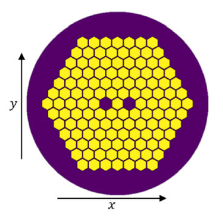
<figcaption class="paper-figure-caption"><b>Fig 1.</b> FIG. 1. A schematic transverse profile of a microstructured optical fiber, with two tunnel-coupled</figcaption>
</figure>
<figure class="paper-figure-card">
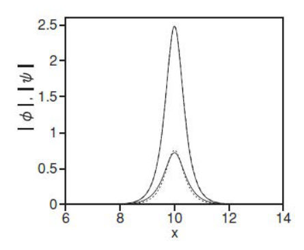
<figcaption class="paper-figure-caption"><b>Fig 2.</b> FIG. 2. A typical example of two components of a stable asymmetric soliton, with |ϕ(x)| ≡U(τ),</figcaption>
</figure>
<figure class="paper-figure-card">
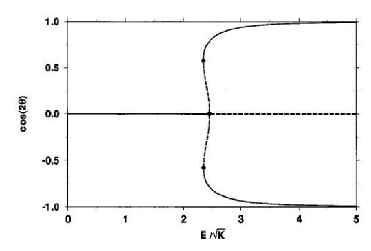
<figcaption class="paper-figure-caption"><b>Fig 3.</b> FIG. 3. The dependence of the asymmetry parameter cos(2θ) of the two-component solitons (see</figcaption>
</figure>
<figure class="paper-figure-card">
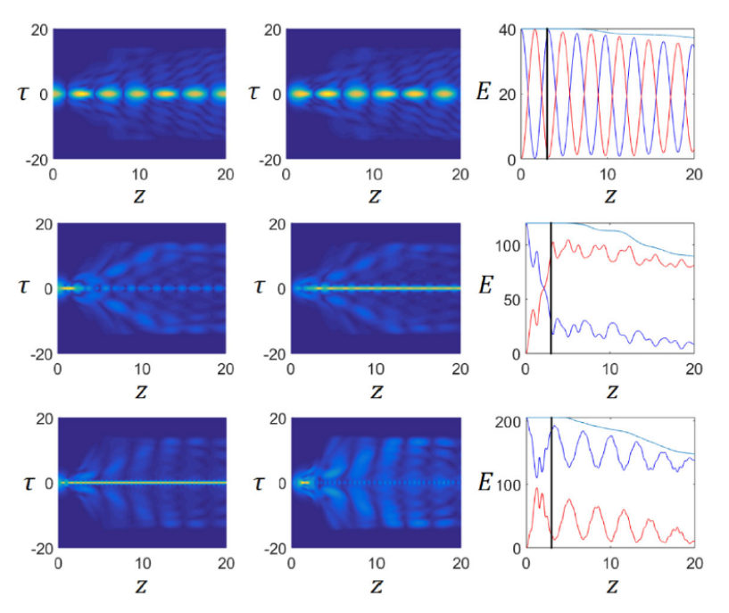
<figcaption class="paper-figure-caption"><b>Fig 4.</b> FIG. 4. Switching between the coupler’s cores, produced by simulations of Eqs. (1) and (2) with</figcaption>
</figure>
<figure class="paper-figure-card">
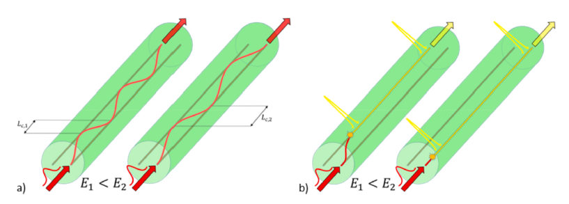
<figcaption class="paper-figure-caption"><b>Fig 5.</b> FIG. 5. A schematic picture of the propagation of an optical pulse initially coupled into one core</figcaption>
</figure>

**Summary.** This paper reviews the theoretical and experimental study of bright solitons in dual-core optical couplers. It details how nonlinearity causes a symmetry-breaking bifurcation, allowing stable asymmetric soliton states to emerge from symmetric ones as energy increases. The research confirms these predictions using both variational analysis of coupled NLSEs and direct measurements on nonlinear optical fibers.

**Why it may be interesting.** This work is highly relevant as it bridges classical nonlinear optics phenomena (soliton dynamics) with concepts of symmetry breaking and stability transitions, which are fundamental themes in AMO physics and open quantum systems modeling.

Detailed structure

**Main problem.** The study investigates bright solitons propagating in optical couplers, focusing specifically on the symmetry-breaking bifurcation (SBB) that leads to stable asymmetric soliton formation.

**Main result.** The analysis confirms the existence of stable asymmetric solitons emerging from a subcritical SBB point as the input energy increases. Experimentally, this was observed through self-trapping into strongly asymmetric states in dual-core fibers.

**Method.** The work employs both theoretical variational approximations (VA) applied to coupled nonlinear Schrödinger equations and direct experimental measurements using optical fiber setups.

**Model / system.** The physical system is a dual-core waveguide (optical coupler), modeled by linearly coupled nonlinear Schrödinger equations. The nonlinearity is Kerr (cubic), and the coupling is linear tunneling ($K$).

**Key observables.** Soliton energy ($E$), asymmetry parameter ($	heta$), output intensity patterns, and the transition points corresponding to bifurcation energies ($E_1, E_2$).

**Important parameters / regimes.** Coupling constant ($K$), input energy ($E$), and temporal width ($	au$ or $\eta$). The analysis identifies critical energy thresholds $E_1$ and $E_2$.

**Assumptions / limitations.** The theoretical work relies on the Variational Approximation (VA) for soliton profiles. Experimental discrepancies are noted due to unincluded effects like third-order dispersion and Raman self-frequency shift.

**Figures summary.** Figures illustrate schematic transverse profiles of optical couplers, plots showing $\cos(2	heta)$ vs. energy demonstrating the weakly subcritical SBB, and camera images showing experimental output intensity patterns for varying input energies.

**Paper structure.** The paper progresses from introducing the coupled nonlinear system and its invariants to applying variational methods to predict soliton stability regimes (symmetric vs. asymmetric). It then details the bifurcation analysis leading to the emergence of stable asymmetry, concluding with a comparison against pioneering experimental observations in dual-core fibers.

Abstract

This minireview provides a brief summary and a discussion of directions for further development of theoretical and, chiefly, experimental studies of bright solitons in optical couplers, i.e., dual-core waveguides which combine the linear inter-core coupling (tunneling of light between the parallel cores with the intra-core group-velocity dispersion and self-focusing Kerr (cubic) nonlinearity. Following a short introduction to the field, the article focuses on a brief review of relatively recent experimental results for the switching of solitons in dual-core nonlinear optical fibers and the spontaneous emergence of stable asymmetric two-core solitons in the couplers with the symmetric dual-core structure.

[↑ back to top](#top)

### [Marked vertex search on disordered graphs with Rosenzweig-Porter phases](http://arxiv.org/abs/2608.00224v1)

**Authors:** Sabyasachi Chakraborty, Tilen Cadez, Sonjoy Majumder, Rohit Kishan Ray  
**Type:** theory · **Category:** disordered systems and neural networks · **PDF:** <https://arxiv.org/pdf/2608.00224v1>  
**Analysis basis:** full PDF text, analyzed in chunks
**Topic relevance:** `analog quantum simulation` **2/5** · `driven-dissipative phase transition` **2/5** · `methods for driven-dissipative` **2/5** · `Keldysh / 2PI / non-Gaussian methods` **1/5** · `correlated / nonlocal dissipation` **1/5** · `entanglement & information structure` **1/5** · `non-equilibrium dynamics` **1/5** · `non-equilibrium universality` **1/5**

↔ Scroll figures horizontally

<figure class="paper-figure-card">
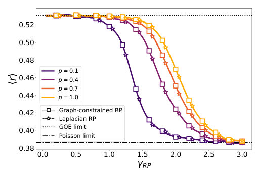
<figcaption class="paper-figure-caption"><b>Fig 1.</b> FIG. 1. Disorder-averaged spacing ratio ⟨r⟩as a function of the RP off-diagonal scaling parameter γRP for ER graphs with N = 1000 and edge probabilities p = 0.1, 0.4, 0.7, 1.0. Different colors denote different values of p. Square markers correspond to the graph-constrained RP Hamiltonian Eq. (8), while star markers correspond to the Laplacian-based RP operator Eq. (10). In both constructions, the ER adjacency matrix acts as a sparsity mask that determines the locations of the nonzero RP-scaled couplings. The horizontal dotted and dash-dotted lines indicate the GOE and Poisson limits, respectively.</figcaption>
</figure>
<figure class="paper-figure-card">
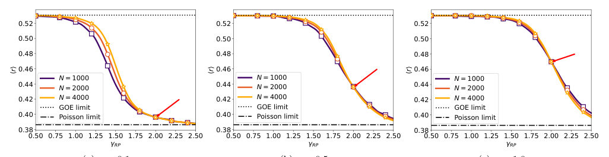
<figcaption class="paper-figure-caption"><b>Fig 2.</b> FIG. 2. Finite-size behavior of the disorder-averaged spacing ratio ⟨r⟩as a function of the RP off-diagonal scaling parameter γRP for the graph-constrained RP Hamiltonian at representative edge probabilities (a) p = 0.1, (b) p = 0.5, and (c) p = 1.0. Results are shown for N = 1000, 2000, and 4000. The curves display a crossover from GOE-like statistics at small γRP to Poisson-like statistics at large γRP. The horizontal dotted and dash-dotted lines denote the GOE and Poisson limits, respectively. The crossover point is used to estimate the critical scaling parameter γc.</figcaption>
</figure>
<figure class="paper-figure-card">
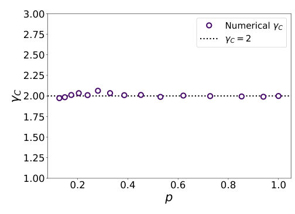
<figcaption class="paper-figure-caption"><b>Fig 3.</b> FIG. 3. Finite-size crossover γc as a function of the ER edge probability p. For each value of p, γc is identified as the value of γRP at which the adjacent-gap-ratio curves for N = 1000, 2000, and 4000 have the minimum mutual separation. The dotted horizontal line marks the conventional RP localization threshold, γc = 2.</figcaption>
</figure>
<figure class="paper-figure-card">
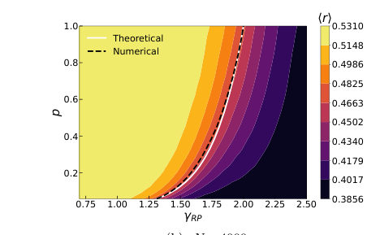
<figcaption class="paper-figure-caption"><b>Fig 4.</b> FIG. 4. Contour plot of the mean adjacent-gap ratio ⟨r⟩in the (γRP, p) plane for system sizes (a) N = 1000 and (b) N = 4000. The color scale denotes the value of ⟨r⟩, with larger values cor- responding to GOE-like statistics and smaller values approach- ing the Poisson limit. The black dashed curve denotes the numerical crossover line obtained from the anchored iso-⟨r⟩cri- terion, ⟨r(γRP, p)⟩= ⟨r(γRP = 2, p = 1)⟩. The white curve shows the analytical estimate γ⟨r⟩(p, N) = 2 + 2 log p/ log N, obtained from the effective-resonance condition kres ∼pN 1−γRP/2 ∼1.</figcaption>
</figure>
<figure class="paper-figure-card">
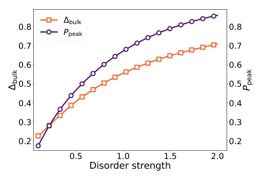
<figcaption class="paper-figure-caption"><b>Fig 5.</b> FIG. 5. Variation of the peak search probability Ppeak and spectral gaps ∆bulk = λmax −λbulk with disorder strength for CTQW-based marked vertex search on a weighted open line graph.</figcaption>
</figure>

**Summary.** This work analyzes quantum marked vertex search on disordered random graphs using the Rosenzweig-Porter model. It establishes that while strong disorder enhances the probability of finding the target state, it significantly slows down the search process compared to the ergodic regime. This reveals a fundamental trade-off between detection reliability and computational speed in quantum search protocols.

**Why it may be interesting.** It provides a quantitative link between random matrix theory applied to graphs and quantum algorithm performance, suggesting that engineered disorder can be a controllable resource rather than just an obstacle in quantum computation protocols.

Detailed structure

**Main problem.** The study investigates quantum marked vertex search algorithms on disordered random graphs to determine how disorder affects search performance.

**Main result.** The paper finds a counterintuitive trade-off: the localized phase yields higher success probability than the ergodic phase, but at the cost of significantly slower search times.

**Method.** The analysis uses continuous-time quantum walks on graph-constrained Rosenzweig-Porter (RP) ensembles, analyzing spectral properties and search dynamics across different disorder regimes.

**Model / system.** The system is a doubly random model combining Erdős–Rényi (ER) graph connectivity randomness with the RP Hamiltonian structure. The Hamiltonian controls interactions via tunable parameters ($\gamma_{RP}$) that define ergodic, non-ergodic, or localized quantum phases.

**Key observables.** Success fraction ($f$), maximum marked-state overlap ($\epsilon_{wi}$), and median search time ($\ln(	au)$).

**Important parameters / regimes.** ER graph edge probability ($p$) controlling sparsity, and the RP tuning parameter ($\gamma_{RP}$) controlling disorder strength.

**Assumptions / limitations.** The analysis relies on modeling the system using a constrained RP ensemble and comparing performance across different spectral regimes defined by $\gamma_{RP}$.

**Figures summary.** Figures illustrate the survival of Wigner-Dyson to Poisson spectral crossover, the systematic shift of localization boundaries with graph sparsity ($p$), and the clear increase in search time ($\ln(	au)$) as disorder strength increases.

**Paper structure.** The paper first establishes the spectral properties (Wigner–Dyson to Poisson crossover) of the RP ensemble under graph constraints. Subsequently, it applies this framework to study the marked vertex search problem, analyzing performance trade-offs across different disorder regimes.

Abstract

Quantum marked vertex search algorithms are known to outperform their classical counterparts, yet their behavior in the presence of disorder remains largely unexplored. Here, we address this gap by studying marked vertex search on disordered random graphs. To introduce disorder, we implement the Rosenzweig-Porter (RP) model, a random matrix ensemble with tunable ergodic, non-ergodic extended, and localized phases, on Erdős-Rényi (ER) graphs. This produces a doubly random system where ER graph connectivity randomizes which interactions exist, while RP disorder controls their strength and `on-site' potentials, providing a two-parameter framework to study quantum dynamics on disordered networks. First, we show that the characteristic Wigner-Dyson-to-Poisson spectral crossover of the RP ensemble survives under graph constraints across the sparse-to-dense range, and we derive an analytical estimate for the finite-size localization boundary that shifts systematically with the graph edge probability $p$, consistent with a resonant-hybridization argument. Thereafter, using this disordered graph ensemble, we study the marked vertex search problem and find that search performance tracks the underlying quantum phase directly. Counterintuitively, the ergodic phase, despite supporting fast transport, yields lower success probability than the localized phase, which achieves high success probability at the cost of significantly longer search times. These results establish a direct and quantitative link between random matrix disorder on graphs and the performance of continuous-time quantum walk search, and suggest that disorder, rather than being merely an obstacle, can be exploited as a tunable parameter in quantum search protocols.

[↑ back to top](#top)

### [On Identification of Heat and Work in Quantum Many-Body Systems with Local Operations and Classical Communication](http://arxiv.org/abs/2608.00993v1)

**Authors:** Hiroaki Matsueda  
**Type:** theory · **Category:** statistical mechanics · **PDF:** <https://arxiv.org/pdf/2608.00993v1>  
**Analysis basis:** full PDF text, analyzed in chunks
**Topic relevance:** `correlated / nonlocal dissipation` **2/5** · `entanglement & information structure` **2/5** · `non-equilibrium dynamics` **2/5** · `Keldysh / 2PI / non-Gaussian methods` **1/5** · `analog quantum simulation` **1/5** · `driven-dissipative phase transition` **1/5** · `methods for driven-dissipative` **1/5** · `non-equilibrium universality` **1/5**

↔ Scroll figures horizontally

<figure class="paper-figure-card">
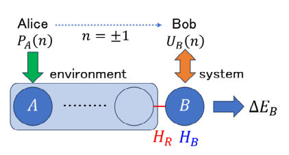
<figcaption class="paper-figure-caption"><b>Fig 1.</b> FIG. 1: Thermodynamic view of our model and protocol. The total system is a energy-extraction device, and Bob operates local feedback unitary to a local part of the total system de- pending on the Alice’s measurement result. Then, the energy reduction may occur near the Bob’s local system. The rest of the total system acts as an environment for Bob, and Bob cannot directly access to the environment.</figcaption>
</figure>
<figure class="paper-figure-card">
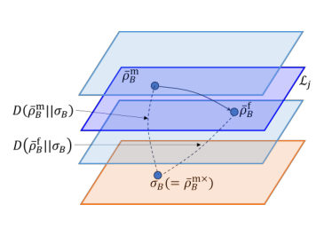
<figcaption class="paper-figure-caption"><b>Fig 2.</b> FIG. 2: Geometrical relation among ¯ρm B, ¯ρf B, and σB in terms of quantum information geometry. The total manifold M characterizing the quantum state space is foliated one, and is decomposed into a set of leafs {Lj}. The leaf Lj is labeled by a particular choice of control parameters in PA(n) and UB(n) for successful energy extraction. [Later, we will see that in the Kitaev-like model case we take j = (⃗r,⃗s)]. The reference state σB is taken so that it belongs to the leaf where the heat becomes maximum.</figcaption>
</figure>

**Summary.** This paper tackles the ambiguity in defining thermodynamic quantities like heat and work in complex quantum many-body systems. By analyzing energy extraction via Local Operations and Classical Communication, the authors propose that optimized extractable energy constitutes 'work,' while residual, uncontrollable energy defines 'heat.' They establish this framework using generalized Clausius inequalities tested on a Kitaev-like model.

**Why it may be interesting.** This work provides a rigorous, operational definition of heat and work in quantum systems that explicitly incorporates non-local correlations arising from communication (LOCC), which is crucial for understanding energy flow in realistic quantum devices.

Detailed structure

**Main problem.** The paper addresses the fundamental ambiguity in identifying heat ($\delta Q$) and work ($\delta W$) when analyzing energy extraction from quantum many-body systems.

**Main result.** Work is defined by optimizing Local Operations and Classical Communication (LOCC) to extract daemonic ergotropy, while residual, uncontrollable energy defines heat, leading to generalized Clausius inequalities.

**Method.** The authors analyze the optimization condition of LOCC using a Quantum Energy Teleportation (QET) protocol and derive two types of generalized Clausius inequalities for an effective quantum thermodynamics framework.

**Model / system.** The study uses a general quantum many-body system Hamiltonian, specifically examining energy extraction via the QET protocol involving subsystems A and B. A one-dimensional Kitaev-like model is used to test the derived thermodynamic relations.

**Key observables.** Work ($\Delta E_B$), Heat ($Q$), Daemonic Ergotropy, Effective Temperature ($eta_{	ext{eff}}$), and generalized Clausius inequalities (Type-I and Type-II).

**Important parameters / regimes.** The analysis depends on the optimization parameters of LOCC and coupling strengths within the Kitaev model.

**Assumptions / limitations.** The core assumption is that optimizing LOCC yields work, and the residual energy constitutes heat. The paper notes limitations regarding open quantum system descriptions (Lindblad equation) and the first law application.

**Figures summary.** Figure 1 illustrates the thermodynamic view of the model and QET protocol, showing how Bob operates locally based on Alice's measurement result.

**Paper structure.** The structure moves from identifying the ambiguity in heat/work definition to applying it within the QET framework. It then derives generalized Clausius inequalities, proposes specific definitions for $Q$ and $\Delta E_B$, and finally validates these definitions using a Kitaev-like model by checking consistency between bounds.

Abstract

How we identify heat and work is a fundamental question in modern quantum thermodynamics. Usually, heat and work are attributed to changes in the density matrix and the Hamiltonian, respectively, during time-evolution processes in quantum systems. Recently, it has been recognized that this identification is ambiguous. Furthermore, quantum thermodynamics involving quantum measurement is still under development. Motivated by these on-going works, we consider a quantum many-body system from which we extract energy by local operations and classical communication (LOCC) according to the quantum energy teleportation (QET) protocol. The central idea to define heat and work unambiguously is based on a sharp insight into the optimization condition of LOCC. When LOCC is optimized, the extractable energy by QET becomes a daemonic ergotropy; thus, it can be attributed as work. On the other hand, when LOCC is not optimized, we have not squeezed out all the energy with the unitary operation. It means there is uncontrollable energy left in the system. The uncontrollable energy can be attributed as heat after careful treatment of many-body interactions. The heat term consists of nonlocal correlation due to communication between remote participants, and the correlation cannot be directly observed for the participant in the subsystem. Thus, this feature is consistent with the traditional perspective of heat as an uncontrollable energy. To deeply understand the nature of heat, we derive two types of generalized Clausius inequality in our effective quantum thermodynamics, and discuss the direction of the inequality. To justify our perspective, we examine a one-dimensional Kitaev-like model and discuss the physical meaning of effective temperature in our thermodynamics.

[↑ back to top](#top)

### [Griffiths phase in clique percolation in random geometric graphs](http://arxiv.org/abs/2608.01487v1)

**Authors:** Vasilii Tiselko, Olga Valba, Alexander Gorsky  
**Type:** theory · **Category:** disordered systems and neural networks · **PDF:** <https://arxiv.org/pdf/2608.01487v1>  
**Analysis basis:** full PDF text, analyzed in chunks
**Topic relevance:** `Keldysh / 2PI / non-Gaussian methods` **2/5** · `methods for driven-dissipative` **2/5** · `analog quantum simulation` **1/5** · `correlated / nonlocal dissipation` **1/5** · `driven-dissipative phase transition` **1/5** · `exotic spin models in light-matter` **1/5** · `non-equilibrium dynamics` **1/5** · `non-equilibrium universality` **1/5**

↔ Scroll figures horizontally

<figure class="paper-figure-card">
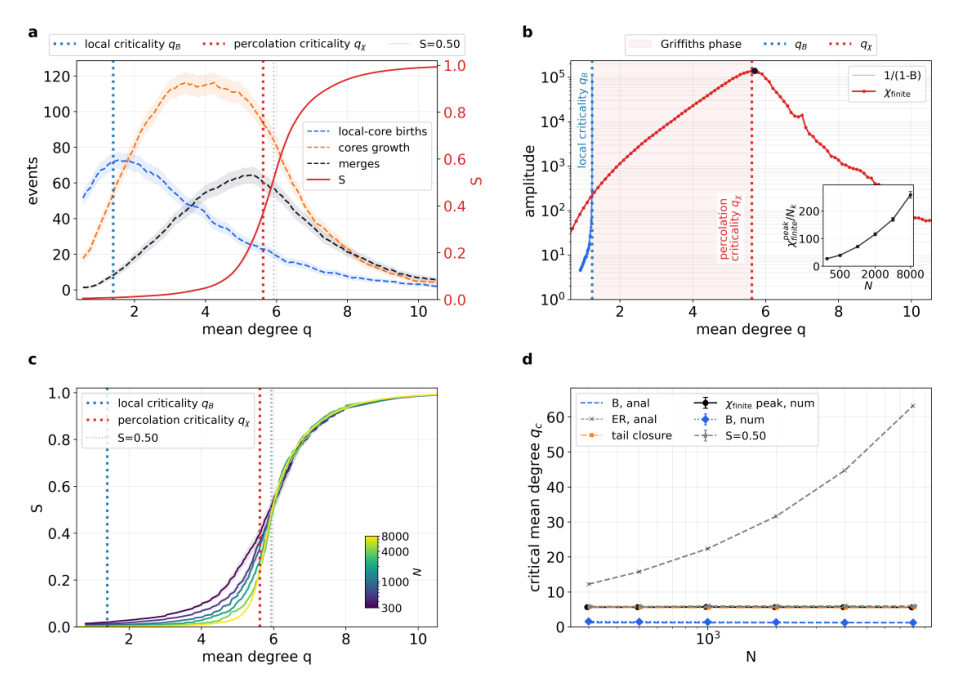
<figcaption class="paper-figure-caption"><b>Fig 1.</b> Figure 1: Percolation of k-cliques in a hard-threshold random geometric graph. The elementary event rates separate local-core births, growth of existing triangle components, and mergers of distinct triangle components; the red curve on the right axis is the largest-component fraction S (N = 1000, d = 4, k = 3, nstat = 100). Panel b places the two critical response objects on the same q axis: the fine-grid local response (1−B(q))−1 diverges at the local branching onset, whereas the finite-sector susceptibility χfinite peaks later when finite-component production is balanced by absorption into the largest component (N = 1000, d = 4, k = 3; nstat = 50 for the local response, nstat = 200 for...</figcaption>
</figure>
<figure class="paper-figure-card">
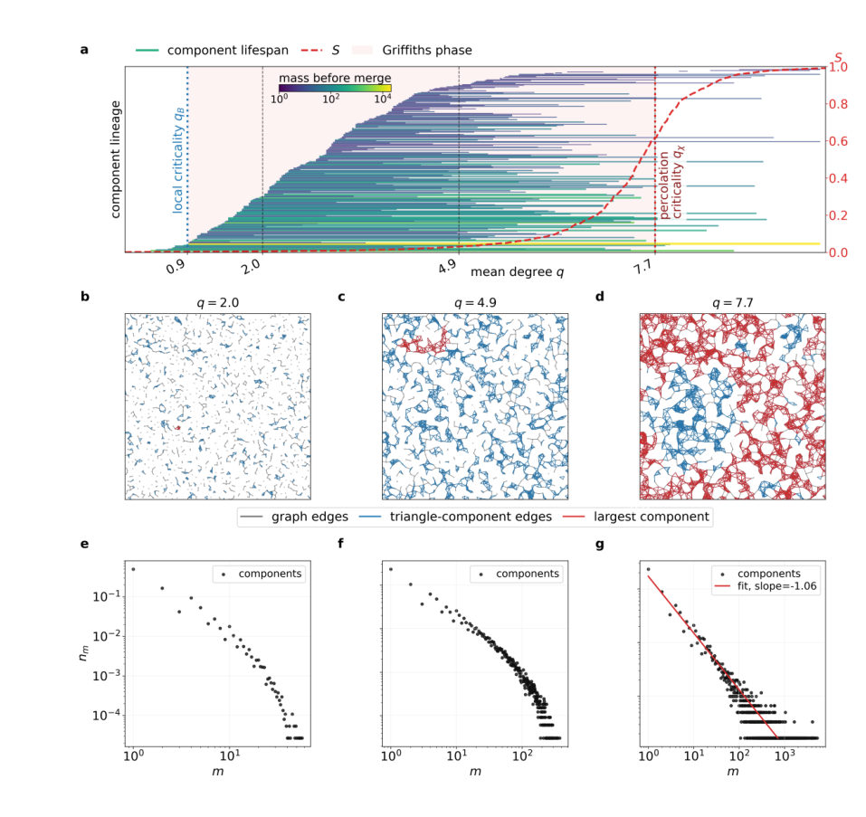
<figcaption class="paper-figure-caption"><b>Fig 2.</b> Figure 2: Genealogy of the Griffiths phase in a two-dimensional hard-threshold RGG. Panel a shows lifetimes of finite triangle-component lineages whose local component-level branching has become supercritical; the shaded interval qB &lt; q &lt; qχ marks the Griffiths phase, and the dashed red curve is the ensemble largest-component waterfall S(q). Panels b–d show graph snapshots at q = 2.0, at the midpoint between this value and qχ, and at qχ; background edges show the geometric graph, blue edges mark triangle-component edges, and red edges mark the largest triangle component. Panels e–g show the ensemble-mean finite-component mass distributions at the same three q values. The distributions...</figcaption>
</figure>
<figure class="paper-figure-card">
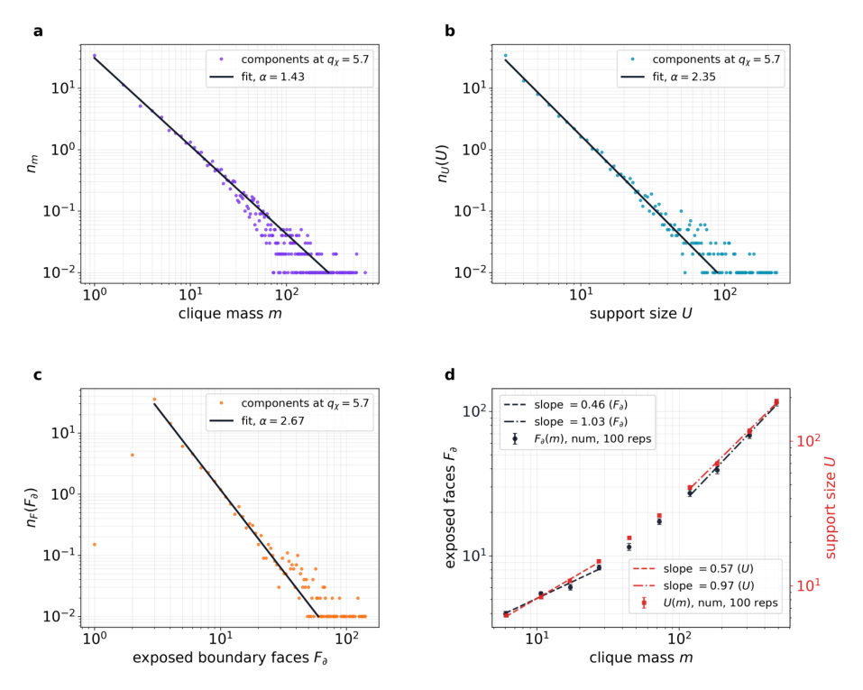
<figcaption class="paper-figure-caption"><b>Fig 3.</b> Figure 3: Scale-free finite-sector statistics at the hard-threshold transition. The finite-sector peak is at qχ = 5.7. Panels a–c are log-log component-count laws at qχ. Panel a shows the clique-mass distribution nm(m), where m is the number of k-cliques in a finite component; the displayed body fit gives the mass exponent α ≃1.43. Panel b shows the support-size distribution nU(U), where U is the number of vertices in the component vertex support; the body fit gives α ≃2.35. Panel c shows the distribution nF (F∂) of exposed boundary faces, fitted on the positive-boundary body; components with F∂= 0 are omitted from the log-log plot. Panel d relates the same objects morphologically: exposed...</figcaption>
</figure>
<figure class="paper-figure-card">
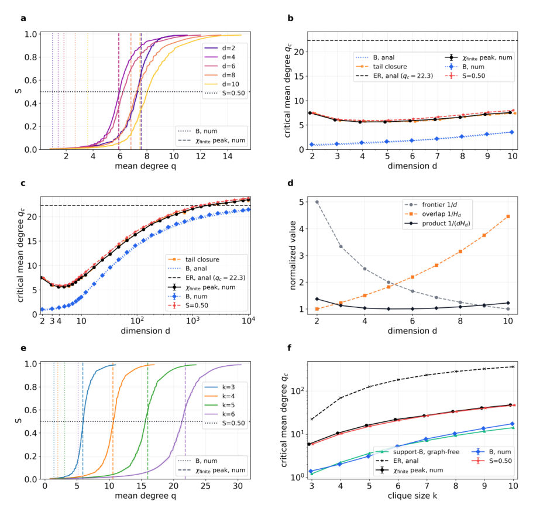
<figcaption class="paper-figure-caption"><b>Fig 4.</b> Figure 4: Dimension and clique-size scaling for the hard-threshold RGG. Panel a shows largest- component curves S(q) for d = 2, 4, 6, 8, 10; vertical markers indicate the analytic local onset B anal, the numerical local onset B num, and the numerical χfinite peak, while the horizontal dotted line marks S = 0.50 (N = 1000, k = 3, nstat = 100). Panel b summarizes the low-dimensional critical mean degrees qc for the same threshold coordinates: B anal, B num, tail closure, numerical χfinite peak, fixed S = 0.50, and the Erd˝os–R´enyi analytic reference (N = 1000, k = 3, nstat = 100). Panel c extends this dimension scan to the displayed high-d range; the hard-RGG finite-sector coordinates...</figcaption>
</figure>
<figure class="paper-figure-card">
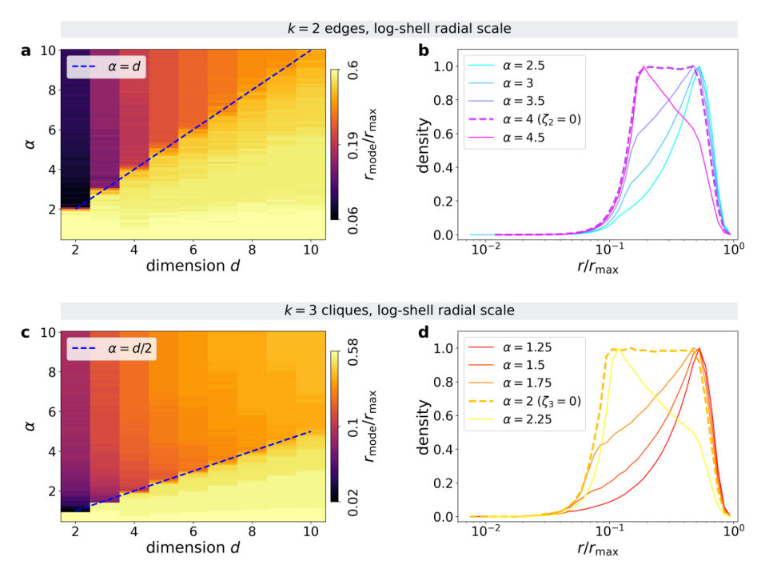
<figcaption class="paper-figure-caption"><b>Fig 5.</b> Figure 5: Radial modes and log-shell profile densities for the power-law kernel. Panels a and c show the mode location rmode/rmax in the (d, α) plane for edges and 3-cliques (N = 500, nstat = 5). Panels b and d show the corresponding representative profile cuts for the log-shell density ψk = dµk/d log r (N = 500, d = 4, nstat = 100). Its plateau occurs at ζk = d −(k −1)α = 0, where equal logarithmic shells carry equal bare event weight. The mode maps show that this balance occurs at different values of η = α/d for different clique sizes.</figcaption>
</figure>

**Summary.** This paper rigorously analyzes $k$-clique percolation in Random Geometric Graphs, identifying a Griffiths phase characterized by extended criticality. The authors develop sophisticated statistical tools to distinguish between local branching thresholds and global cluster formation thresholds. This work provides deep insights into how geometric constraints modify standard percolation theory in disordered media.

**Why it may be interesting.** While focused on graph theory/percolation, the methodology—using moment calculations (second moment $\chi$) to pinpoint phase transitions in systems with quenched disorder or geometric constraints—is highly relevant for understanding localization phenomena in disordered quantum systems or spin glasses.

Detailed structure

**Main problem.** The study characterizes the Griffiths phase of extended criticality arising from clique percolation within random geometric graphs (RGGs). It distinguishes between local continuation criticalities and global cluster formation criticalities.

**Main result.** The analysis identifies two distinct boundaries defining the Griffiths phase, particularly for power-law kernels. The relevant transition point is governed by the peak of the finite-component susceptibility ($\chi_{	ext{finite}}$), which accounts for spatial localization effects absent in simpler models like ER graphs.

**Method.** The authors use advanced statistical mechanics techniques involving size-biased excess completion intensities ($\Lambda_k$) and component-count laws to derive exact formulas for susceptibilities. They compare local branching criteria ($B_k=1$) with global coalescence criteria ($\max E[\chi_{	ext{finite}}(q)]$).

**Model / system.** The model is clique percolation on Random Geometric Graphs $G(q)$ defined on a d-dimensional domain using various radial connection kernels (sharp cut-off, power-law, exponential). The focus is on the formation and connectivity of $k$-cliques.

**Key observables.** k-clique percolation threshold; Griffiths phase behavior (power-law); finite-component susceptibility ($\chi_{	ext{finite}}(q)$); local continuation factor ($B_k$).

**Important parameters / regimes.** Kernel type (e.g., power-law, exponential); dimensionality $d$; clique size $k$; critical parameter $\eta = \alpha/d$.

**Assumptions / limitations.** The analysis often employs a 'one-large closure' ($\chi_{\ell}^{finite}$) when exact tail probabilities are intractable, approximating the contribution of the largest component. The local onset is modeled using a branching skeleton approach.

**Figures summary.** Not specified in notes; the structure suggests comparisons between different critical points derived from various mathematical criteria (e.g., $\chi_{all}$ vs $\chi_{	ext{finite}}$).

**Paper structure.** The paper progresses by establishing local criticality via branching processes, then introduces global cluster dynamics using component-count laws to define a finite-component susceptibility ($\chi_{	ext{finite}}$). Finally, it analyzes the scaling behavior of this susceptibility across different kernel regimes and dimensions.

Abstract

In this study, we discuss the clique percolation in the ensembles of random geometric graphs with different kernels that quantify the geometrical constraints. For the sharp cut-off we find the wide Griffiths phase of extended criticality with the power-law behavior. One boundary of the Griffiths phase is the generalization of a percolation critical point for the ER ensemble when the percolation within the large but finite cluster emerges. The second boundary corresponds to the point in the parameter space when the percolation in the entire clustered system becomes available. For the power-law kernel, richer behavior with a clique-size-dependent boundary between the effective ER and geometric regimes has been identified. The Griffiths phase in this case exists as well. Finally, the pattern with the exponential kernel has been analyzed. We briefly discuss the possible applications of our findings.

[↑ back to top](#top)

### [Exactly solvable model for the diffusive price-dynamics paradox under long-range correlated market-order flow](http://arxiv.org/abs/2608.00988v1)

**Authors:** Yuki Sato, Shunta Fujiwara, Kiyoshi Kanazawa  
**Type:** theory · **Category:** statistical mechanics · **PDF:** <https://arxiv.org/pdf/2608.00988v1>  
**Analysis basis:** full PDF text, analyzed in chunks
**Topic relevance:** `non-equilibrium dynamics` **2/5** · `non-equilibrium universality` **2/5** · `Keldysh / 2PI / non-Gaussian methods` **1/5** · `analog quantum simulation` **1/5** · `correlated / nonlocal dissipation` **1/5** · `driven-dissipative phase transition` **1/5** · `methods for driven-dissipative` **1/5**

↔ Scroll figures horizontally

<figure class="paper-figure-card">
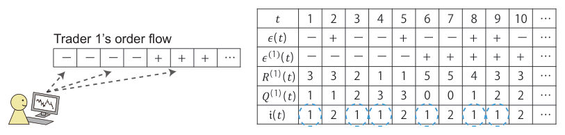
<figcaption class="paper-figure-caption"><b>Fig 1.</b> FIG. 1. Schematic of the Lillo–Mike–Farmer model. For each i ∈Ω, the internal state of trader i is characterized by (ϵ(i), R(i), Q(i)), where ϵ(i) is the metaorder sign, R(i) is the remaining metaorder volume, and Q(i) is the cumulative executed metaorder volume. In the coarse-grained description, the market-order sign ϵ(t) is determined by ϵ(t) = ϵ(i(t))(t), where i(t) denotes the ID of the trader submitting the order at time t. Since the metaorder size L obeys a power-law PDF, traders occasionally have large metaorders, which are split into long sequences of child orders. Because all child orders within the same metaorder have the same sign, the market-order sign ϵ(t) exhibits long memory.</figcaption>
</figure>
<figure class="paper-figure-card">
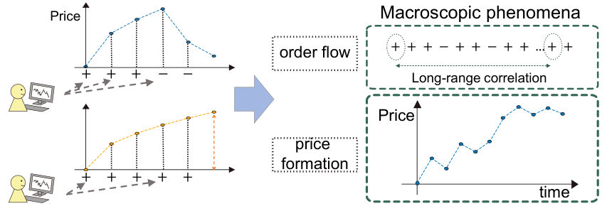
<figcaption class="paper-figure-caption"><b>Fig 2.</b> FIG. 2. Schematic of the discrete-time LMF price-dynamics model. The system consists of M order-splitting traders. At each time step, one trader is selected with equal probability λ = 1/M and submits a market order. The price is driven by the sum of the traders’ price-impact contributions, according to the additional assumption in Eq. (16).</figcaption>
</figure>
<figure class="paper-figure-card">
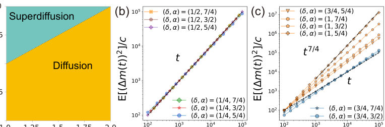
<figcaption class="paper-figure-caption"><b>Fig 3.</b> FIG. 3. Asymptotic behavior of the MSD (23) for the discrete-time LMF price-impact dynamics (19) for the single-trader case M = 1. (a) Phase diagram between superdiffusion (2δ &gt; α) and normal diffusion (2δ &lt; α). The phase boundary is given by 2δ = α. Here, δ ≤1/2 is the necessary and sufficient condition for the MSD to exhibit normal diffusion for any α &gt; 1. (b) Numerical MSD for δ ∈{0.25, 0.5}, α ∈{1.25, 1.5, 1.75}, and M = 1, showing normal diffusion. (c) Numerical MSD for δ ∈{0.75, 1}, α ∈{1.25, 1.5, 1.75}, and M = 1, showing both superdiffusive cases (orange markers) and normally diffusive cases (blue markers). A logarithmic correction appears at the boundary case α = 2δ.</figcaption>
</figure>
<figure class="paper-figure-card">
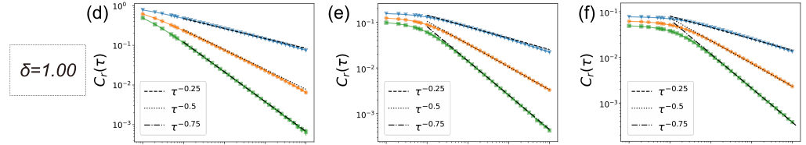
<figcaption class="paper-figure-caption"><b>Fig 4.</b> FIG. 4. Numerical results for the price-increment ACF (25) and (34). Panels (a)–(c) correspond to δ = 0.5 and α ∈{1.25, 1.5, 1.75}, with (a) M = 1, (b) M = 5, and (c) M = 10. Panels (d)–(f) correspond to δ = 1.0 and α ∈{1.25, 1.5, 1.75}, with (d) M = 1, (e) M = 5, and (f) M = 10. All results are consistent with our prediction Cr(τ) ∝τ −θ with θ = α −2δ + 1.</figcaption>
</figure>
<figure class="paper-figure-card">
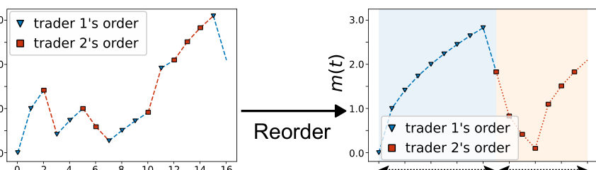
<figcaption class="paper-figure-caption"><b>Fig 5.</b> FIG. 5. Schematic illustration of the reordering procedure used to derive the exact PDF in the two-body system. In the original time series (left), orders from the two traders are randomly interleaved. By reordering the sample path so that trader 1 submits all orders during t ∈[0, τ1] and trader 2 submits all orders during t ∈[τ1 + 1, t] (right), the price process decomposes into two independent L´evy-walk contributions.</figcaption>
</figure>

**Summary.** This theoretical paper resolves a paradox in financial modeling by showing how predictable, correlated market order flow can coexist with diffusive price movements. It achieves this by developing an exactly solvable model that mandates the use of a square-root price impact law. The methodology relies heavily on advanced statistical physics tools like Lévy walks and asymptotic analysis of stochastic processes.

**Why it may be interesting.** While applied to finance, the mathematical machinery—analyzing non-Markovian processes (Lévy walks) under long-range memory effects ($	ext{LRC}$) and determining crossover regimes between different diffusion types—is highly relevant to open quantum systems or complex many-body dynamics where correlations decay slowly.

Detailed structure

**Main problem.** The paper resolves the 'diffusive price-dynamics paradox' arising from the contradiction between empirically observed Brownian motion in asset prices and predictable market order flow characterized by long-range correlations.

**Main result.** By incorporating the square-root price-impact law into an extended Lillo–Mike–Farmer (LMF) model, the authors prove that the price dynamics remain normal diffusive even when the underlying market-order flow exhibits long-range correlation.

**Method.** The approach involves developing and analyzing exactly solvable nonlinear time-series models by mapping them onto the Lévy-walk framework of non-Markovian stochastic processes. Calculations utilize Fourier/Laplace transforms to derive characteristic functions and analyze Mean Squared Displacement (MSD) scaling.

**Model / system.** The model is an extension of the LMF framework describing market microstructure, involving $M$ traders whose order flow exhibits long-range correlations ($	ext{LRC}$). The price dynamics are governed by a nonlinear price impact law, assumed to be proportional to the square root of cumulative volume ($I(Q) \propto Q^{1/2}$), which is added to the original state variables.

**Key observables.** Mean Squared Displacement (MSD) scaling ($\mathbb{E}[(\Delta m(t))^2]$), Order-sign Autocorrelation Function ($	ext{ACF}$), and the characteristic function $P_M(k, t)$.

**Important parameters / regimes.** The correlation exponent $\gamma$ of the order flow, and the price impact exponent $\delta$, with the critical condition being related to $\alpha$ (metaorder distribution exponent) such that $\delta=1/2$ ensures diffusion.

**Assumptions / limitations.** Key assumptions include using the square-root price-impact law ($I(Q) \propto Q^{1/2}$) and assuming specific functional forms for the metaorder-size distribution ($\psi_m(t)$).

**Figures summary.** Figures illustrate phase diagrams showing the transition between superdiffusion and normal diffusion based on parameters $\alpha$ and $\delta$, with numerical results confirming diffusive behavior under the square-root law.

**Paper structure.** The paper first establishes the paradox, then develops an extended nonlinear time-series model by incorporating the square-root price impact into the LMF framework. The core analysis involves deriving joint probability density functions and characteristic functions using advanced transform techniques to calculate asymptotic scaling laws for MSD.

Abstract

We develop an exactly solvable nonlinear time-series model by incorporating the square-root price-impact law into the Lillo--Mike--Farmer (LMF) model to resolve the diffusive price-dynamics paradox under predictable market-order flow. In financial market microstructure, it is well established that the price dynamics are approximately described by Brownian motion at long times. However, it is also well-known that market-order flow is clearly predictable due to long-range correlations, as mathematically formulated by the LMF model. Since market orders have a positive price impact in general, predictable market-order flow seems to contradict Brownian price dynamics. In this work, we resolve this diffusive price-dynamics paradox by developing nonlinear time-series models that generalize the LMF model based on the square-root price-impact law. Our time-series models can be mathematically mapped onto the Lévy-walk framework---an exactly solvable class of non-Markovian stochastic processes developed in statistical physics. We prove that the price dynamics are diffusive at long times under the square-root law even under predictable market-order flow. Our work highlights the crucial practical importance of the square-root law in understanding the microstructural foundation of the Efficient Market Hypothesis.

[↑ back to top](#top)

### [Spread complexity as a probe in generalized and long-range Aubry-Andre-Harper models](http://arxiv.org/abs/2608.02451v1)

**Authors:** Triyas Sapui, Tanoy Kanti Konar, Subinay Dasgupta, Aditi Sen De  
**Type:** theory · **Category:** disordered systems and neural networks · **PDF:** <https://arxiv.org/pdf/2608.02451v1>  
**Analysis basis:** full PDF text, analyzed in chunks
**Topic relevance:** `driven-dissipative phase transition` **2/5** · `entanglement & information structure` **2/5** · `Frenkel-Kontorova` **1/5** · `analog quantum simulation` **1/5** · `methods for driven-dissipative` **1/5** · `non-equilibrium dynamics` **1/5** · `non-equilibrium universality` **1/5**

↔ Scroll figures horizontally

<figure class="paper-figure-card">
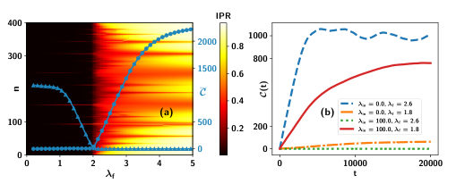
<figcaption class="paper-figure-caption"><b>Fig 1.</b> FIG. 1. (a) Map plot of the inverse participation ratio (IPR) and the long-time averaged spread complexity (right ordinate) for AAH model. We plot the spread complexity for the quenches from the ground state of H(λin = 0) to a higher values of λf (tri- angles), and from the ground state of H(λin = 100) to lower values of λf (circles) against λf (abscissa). The x axis represents the post- quench quasiperiodic potential strength λf and the left y axis repre- sents the index of the Krylov basis. Other parameters are β = 0 and N = 5000. (b) Variation of C(t) (ordinate) with time t (abscissa) for the same phase quench (dashed-dot and dotted lines) and a different- phase quench (solid and dashed...</figcaption>
</figure>
<figure class="paper-figure-card">
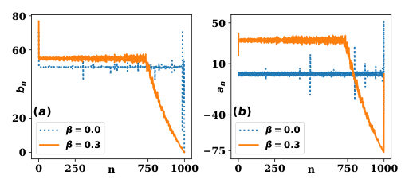
<figcaption class="paper-figure-caption"><b>Fig 2.</b> FIG. 2. Behavior of the Lanczos coefficients as a function of Krylov basis index n. (a) Lanczos coefficients bn for the AAH (β = 0.0) (dotted) and gAAH (β = 0.3) (solid) models. Unlike the AAH model, where bn drops to 0 abruptly near n = DK = 1000, the gAAH model exhibits a gradual decrease in bn after a certain value of n. (b) Lanczos coefficients an for both AAH (β = 0) (dot- ted) an gAAH (β = 0.3) (solid) models against n. In the AAH model an fluctuates around 0, whereas in the gAAH model, it initially fluc- tuates around a positive value before gradually decreasing and even- tually becoming negative. The data are obtained by quenching the highest excited state of λin = 0 to λf = 100.0....</figcaption>
</figure>
<figure class="paper-figure-card">
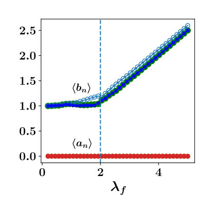
<figcaption class="paper-figure-caption"><b>Fig 3.</b> FIG. 3. Average of the Lanczos coefficients over n as a function of λf for the AAH model (with β = 0). The average of an remains close to 0 for all values of λf for all initial states while ⟨bn⟩is close to 1 upto λf = 2 (extended phase) and then it increases linearly in the localized phase for all the initial states, the ground state (solid cir- cles), the eigenstate from the middle spectrum (hollow circles) and the highest excited state (blue stars). N = 1000. All axes are dimen- sionless.</figcaption>
</figure>
<figure class="paper-figure-card">
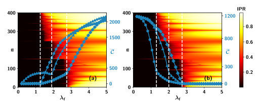
<figcaption class="paper-figure-caption"><b>Fig 4.</b> FIG. 4. (a) Long-time averaged spread complexity for the for- ward and backward quench. The inverse participation ratio (IPR) as a function of λf and the Krylov basis index n when β = 0.3 for the gAAH model where the initial states are the eigenstates of the Hamiltonian with λin = 0. The presence of a mobility edge is clear from the time-averaged spread complexity (values shown on the right side of the plot). The initial states are chosen to be the ground state (squares), a state from the middle spectrum (triangles), and the high- est excited state (circles) for the forward quench. The three white vertical lines indicate the location of the nonanalyticities. (b) Long- time averaged spread...</figcaption>
</figure>
<figure class="paper-figure-card">
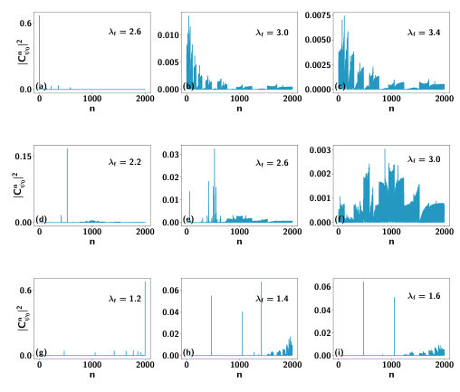
<figcaption class="paper-figure-caption"><b>Fig 5.</b> FIG. 5. Local density of states (LDOS) in the gAAH model. (a)- (c) |Cn ψ0|2 as a function of n, when |ψ0⟩is the ground state at λ = 0 and λf = 2.6, 3.0, 3.4 respectively. At λ = 2.6, |ψ0⟩has support on a very few eigenstates, close to λ = 3.0 where the transition is; this distribution changes dramatically, and the support spreads from a few states to many of the eigenstates. This sudden spread gives rise to the kinks in the average value of complexity. For λ = 3.4, i.e., in the localized phase, the spread is even greater. (d)-(f) The initial state is the state from the middle spectrum of λ = 0 and λf = 2.2, 2.6, 3.0. (g)-(h) The initial state is the highest excited state at λ = 0 and λf =...</figcaption>
</figure>

**Summary.** The paper uses spread complexity as a powerful diagnostic tool to study localization-delocalization transitions in generalized Aubry-André-Harper models. By analyzing how this complexity changes during quantum quenches across different potential regimes, the authors accurately pinpoint mobility edges. This methodology provides deep insights into the underlying single-particle dynamics of quasiperiodic systems.

**Why it may be interesting.** This work provides a sophisticated, quantifiable dynamical tool (spread complexity) to map out phase diagrams in quasiperiodic systems, complementing traditional spectral measures like IPR and offering insights into the underlying quantum dynamics near critical points.

Detailed structure

**Main problem.** The study investigates spread complexity as a dynamical probe to characterize quantum phase transitions, particularly identifying mobility edges in quasiperiodic systems.

**Main result.** Nonanalytic behavior in the long-time averaged spread complexity accurately identifies the mobility-edge transition in generalized AAH models. The Lanczos coefficients also show distinct signatures depending on the presence of such mobility edges.

**Method.** The analysis employs time evolution simulations using the Lanczos algorithm to construct a Krylov basis and calculate the long-time averaged spread complexity, alongside analyzing Lanczos coefficients and IPR.

**Model / system.** The primary model is the generalized and long-range Aubry-André-Harper (AAH) model, which describes localization phenomena due to competition between hopping and a quasiperiodic onsite potential. The Hamiltonian includes terms for long-range hopping ($\alpha$) and an energy-dependent potential deformation ($eta$).

**Key observables.** Spread complexity ($C$), Lanczos coefficients ($\{a_n, b_n\}$), Inverse Participation Ratio (IPR), and moments of the survival amplitude.

**Important parameters / regimes.** The quasiperiodicity strength ($\lambda'$), the long-range hopping exponent ($\alpha$), and the potential deformation parameter ($eta$) are key parameters controlling different physical regimes.

**Assumptions / limitations.** The analysis focuses on single-particle systems, which is noted as a gap compared to studies in interacting many-body systems. Calculations rely on taking limits (e.g., thermodynamic limit $N 	o \infty$).

**Figures summary.** Figures compare IPR and spread complexity ($C$) across different AAH model parameters ($\lambda$), demonstrating phase boundary detection. They also show comparisons of Lanczos coefficients for forward and backward quenches across various hopping ranges (NN, NNN, LR).

**Paper structure.** The paper develops the theoretical framework by defining spread complexity and applying it to generalized AAH models undergoing quantum quenches. It presents analytical derivations for moments and then compares the diagnostic power of $C$ against established methods like IPR across different hopping regimes (short-range vs. long-range).

Abstract

We investigate the spread complexity of quantum quenches in generalized and long-range Aubry-Andre-Harper (AAH) models, encompassing regimes with and without mobility edges. In particular, in the generalized AAH models supporting energy-dependent mobility edges, we demonstrate that the long-time averaged spread complexity exhibits nonanalytic behavior when the post-quench quasiperiodic potential crosses the mobility edge associated with the energy of the initial eigenstate, thereby accurately identifying the mobility-edge transition. Such a behavior is supported by the spreading of local density of states. We further derive analytical expressions for the moments and the corresponding Lanczos coefficients for quenches between the limits of vanishing and strong quasiperiodic potentials. The Lanczos coefficients display qualitatively distinct behavior depending on the presence of mobility edges - they exhibit an initial plateau followed by a decay with the Krylov basis index, in contrast to the nearly constant behavior of the conventional AAH model without mobility edges. For LR hopping, the coefficients decay with the Krylov basis index for quenches from the localized to the extended phase, while they coincide with the AAH results for quenches in the opposite direction.

[↑ back to top](#top)

### [Universal Scaling of the Magnetocaloric Effect in 2D Ising Monolayers and Bilayer](http://arxiv.org/abs/2608.01811v1)

**Authors:** Basit Iqbal, Kingshuk Sarkar  
**Type:** theory · **Category:** statistical mechanics · **PDF:** <https://arxiv.org/pdf/2608.01811v1>  
**Analysis basis:** full PDF text, analyzed in chunks
**Topic relevance:** `analog quantum simulation` **2/5** · `non-equilibrium universality` **2/5** · `driven-dissipative phase transition` **1/5** · `exotic spin models in light-matter` **1/5** · `methods for driven-dissipative` **1/5** · `non-equilibrium dynamics` **1/5**

↔ Scroll figures horizontally

<figure class="paper-figure-card">
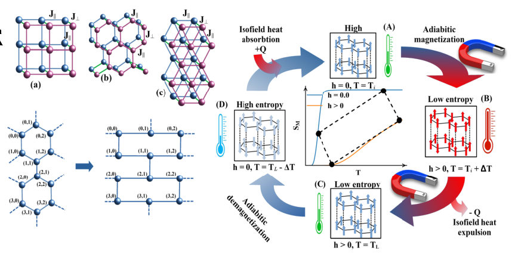
<figcaption class="paper-figure-caption"><b>Fig 1.</b> Figure 1: Schematics: (a) square bilayer, (b) honeycomb bilayer, and (c) triangular bilayer. Monolayer lattices can be considered as one layer in these lattices. (d) Schematic representation of the honeycomb lattice and its equivalent brick model. (e) Schematic representation of a MCE cycle as per the Brayton cycle: (A) →(B) adiabatic magnetization, (B) →(C) isofield heat expulsion, (C) →(D) adiabatic demagnetization, and (D) →(A) isofield heat absorption.</figcaption>
</figure>
<figure class="paper-figure-card">
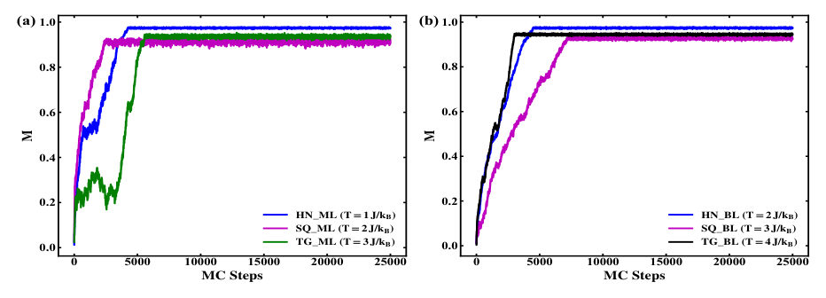
<figcaption class="paper-figure-caption"><b>Fig 2.</b> Figure 2: Variation of M with Monte Carlo (MC) steps plots are displayed for the square, honeycomb, and triangular lattices of (a) monolayer and (b) bilayer cases having L = 128 at fixed temperatures and h = 0.</figcaption>
</figure>
<figure class="paper-figure-card">
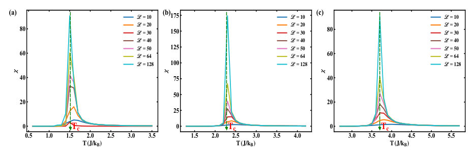
<figcaption class="paper-figure-caption"><b>Fig 3.</b> Figure 3: χ vs. T plots for the (a) honeycomb, (b) square, and (c) triangular lattices for lattice sizes up to L = 128 while h/J = 0. The transition temperature Tc is indicated in each case, which is precisely determined by the Binder cumulant as shown in Fig.4.</figcaption>
</figure>
<figure class="paper-figure-card">
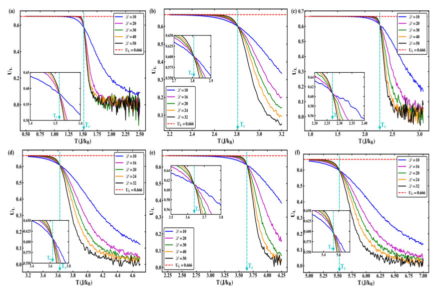
<figcaption class="paper-figure-caption"><b>Fig 4.</b> Figure 4: UL vs. T plots of (a) honeycomb monolayer, (b) honeycomb bilayer, (c) square monolayer, (d) square bilayer, (e) triangular monolayer, and (f) triangular bilayer lattices for different L along the three axes. The cyan-colored vertical dashed lines indicate their transition temperatures (Tc), and the values of the transition temperatures are labeled on the plots.</figcaption>
</figure>
<figure class="paper-figure-card">
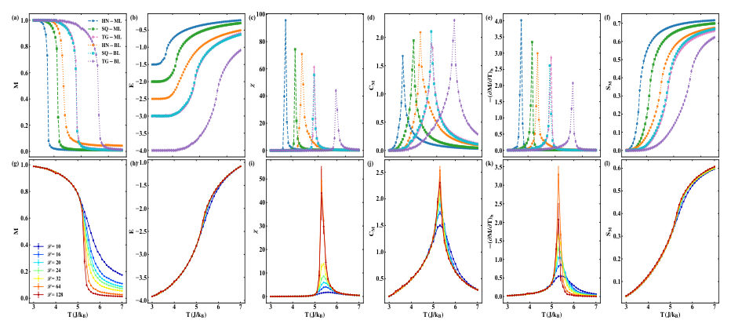
<figcaption class="paper-figure-caption"><b>Fig 5.</b> Figure 5: (a) to (f): Thermodynamic and magnetic quantities for the monolayer and bilayer cases of the square, honeycomb, and triangular lattice for h/J = 0 and L = 128. (g) to (i): Thermodynamic quantities at different lattice sizes L with error bars calculated using the Jackknife method.</figcaption>
</figure>

**Summary.** This work uses Monte Carlo simulations on 2D Ising lattices (monolayer and bilayer) to study the Magnetocaloric Effect. The key finding is that after appropriate normalization, the MCE response collapses onto universal master curves regardless of the lattice's coordination number or layer count. This establishes a robust theoretical framework for designing magnetic refrigerants based on fundamental scaling laws.

**Why it may be interesting.** While focused on classical statistical mechanics, the concept of universal scaling laws derived from lattice models is fundamental to understanding critical phenomena in many quantum systems, providing a strong theoretical benchmark for comparison.

Detailed structure

**Main problem.** To investigate whether the universal scaling behavior of the Magnetocaloric Effect (MCE) persists across different two-dimensional lattice geometries and layer counts.

**Main result.** The normalized MCE observables ($\Delta S_M$ and field exponent $n$) collapse onto a universal master curve, demonstrating that MCE scaling is independent of coordination number or layer count in 2D Ising systems.

**Method.** Monte Carlo simulations are used extensively, employing Binder cumulant analysis to precisely determine critical temperatures ($T_c$).

**Model / system.** The study uses the ferromagnetic Ising model applied to 2D square, honeycomb, and triangular lattices, considering both monolayer and bilayer configurations.

**Key observables.** Isothermal magnetic entropy change ($\Delta S_M$), adiabatic temperature change ($\Delta T_{ad}$), relative cooling power (RCP), and cooling capacity ($q$).

**Important parameters / regimes.** Coordination number ($r=3, 4, 6$) and layer count (monolayer/bilayer); magnetic field up to $\sim 2.6$ Tesla.

**Assumptions / limitations.** The system is modeled by the Ising Hamiltonian; for bilayers, symmetry ($J_{\parallel}= J_{\perp}$) is assumed in some contexts.

**Figures summary.** Figures schematically show lattice structures (square, honeycomb, triangular) and illustrate the MCE cycle analogy. One figure shows how magnetocaloric properties vary with temperature across different lattice sizes and fields.

**Paper structure.** The paper details the model formalism, discusses scaling theory and universality, presents results on finite-size analysis of thermodynamic/MCE quantities, covers hysteresis studies, and concludes with implications for magnetic refrigerants.

Abstract

We report a Monte Carlo study of the magnetocaloric effect (MCE) in two-dimensional ferromagnetic Ising models on square, honeycomb, and triangular lattices with monolayer and bilayer configurations. Using Binder cumulant analysis, we determine the critical temperature ($T_c$) of each structure and find that $T_c$ increases with coordination number, from the honeycomb ($r=3$) to the triangular ($r=6$) lattice. In contrast, the magnetic entropy change ($-ΔS_M$) decreases with coordination number, reaching its maximum for the honeycomb lattice. After normalization by their peak values and appropriate temperature scaling, both $-ΔS_M$ and the field exponent $n$ collapse onto universal master curves for different magnetic fields and across all six lattice structures at a fixed low field. This demonstrates universal MCE scaling independent of coordination number and layer count. Critical scaling analysis further supports the observed universality and power-law behavior. Unlike $-ΔS_M$, the adiabatic temperature change ($ΔT_{ad}$) increases with coordination number, whereas the magnetic Grüneisen parameter ($Γ_M$) follows the same trend as $-ΔS_M$. Although the peak value of $-ΔS_M$ decreases with coordination number, the relative cooling power and cooling capacity remain nearly unchanged due to compensating broadening of the $-ΔS_M$ curves. The field dependence of $-ΔS_M$, relative cooling power, and cooling capacity follows power laws up to $\sim2.6$ T (assuming $J\approx1$ meV). Hysteresis analysis shows that lattices with lower coordination numbers exhibit a faster reduction in loop width with increasing temperature. These results establish the universal scaling behavior of the magnetocaloric effect in two-dimensional monolayer and bilayer magnetic lattices and provide guidelines for designing magnetic refrigerants.

[↑ back to top](#top)

### [From Flight Logs to Atmospheric Science: Paragliders as Convection Sensors for Identifying Thermal Predictors](http://arxiv.org/abs/2608.00241v1)

**Authors:** César Hernández-Aguayo, Matthieu Cristelli, Michael Benzaquen  
**Type:** experiment · **Category:** statistical mechanics · **PDF:** <https://arxiv.org/pdf/2608.00241v1>  
**Analysis basis:** full PDF text, analyzed in chunks
**Topic relevance:** `non-equilibrium dynamics` **2/5** · `non-equilibrium universality` **2/5** · `Keldysh / 2PI / non-Gaussian methods` **1/5** · `driven-dissipative phase transition` **1/5** · `methods for driven-dissipative` **1/5**

↔ Scroll figures horizontally

<figure class="paper-figure-card">
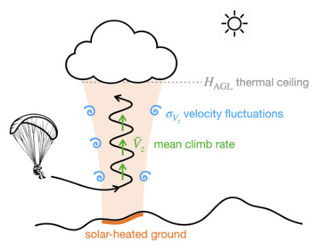
<figcaption class="paper-figure-caption"><b>Fig 1.</b> FIG. 1. Schematic of a paragliding climbing segment during which the pilot circles within a thermal column. The updraft rises from the heated surface up to a maximum altitude, which may correspond to either the dry or wet thermal ceiling, depending on atmospheric con- ditions. From such climbing segments, we extract three physical ob- servables (see Section III A): thermal strength ¯Vz, which probes the intensity of buoyancy generation; vertical velocity variability σVz, reflecting the amplitude of small-scale updraft fluctuations; and ther- mal ceiling HAGL, measuring the vertical extent of convection.</figcaption>
</figure>
<figure class="paper-figure-card">
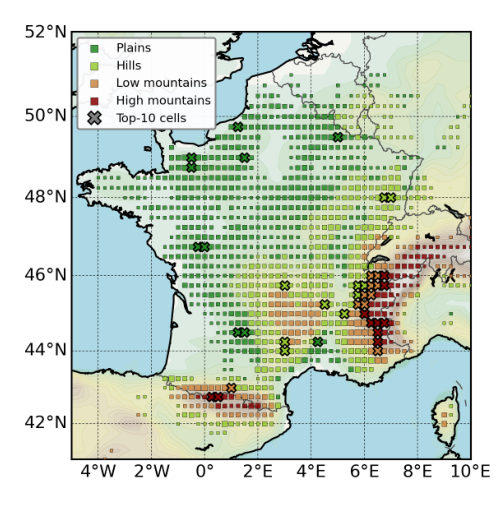
<figcaption class="paper-figure-caption"><b>Fig 2.</b> FIG. 2. Spatial distribution of climbing activity over France. Active ERA5 grid cells are colored by terrain class following the four-class elevation scheme of Eq. 1. Cell area is proportional to the logarithm of the segment count. Colored cross markers correspond to the ten highest-activity cells per terrain (forty cells total). The background shading shows the ground elevation derived from the ERA5 surface geopotential.</figcaption>
</figure>
<figure class="paper-figure-card">
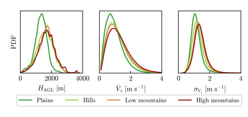
<figcaption class="paper-figure-caption"><b>Fig 3.</b> FIG. 3. Probability density functions of the three climbing observ- ables per terrain class: thermal ceiling HAGL (left), thermal strength ¯Vz (middle), and vertical velocity variability σVz (right).</figcaption>
</figure>
<figure class="paper-figure-card">
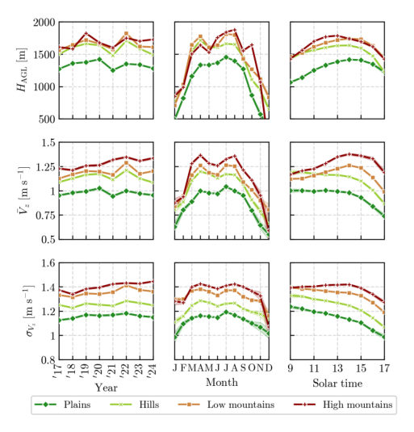
<figcaption class="paper-figure-caption"><b>Fig 4.</b> FIG. 4. Temporal evolution of the average climbing observables across three time scales. Rows show thermal ceiling HAGL (top), thermal strength ¯Vz (middle), and vertical-velocity variability σVz (bottom). Columns show interannual evolution (left), seasonal or monthly evolution (centre), and diurnal evolution (right, solar hour). Lines are coloured by terrain class.</figcaption>
</figure>
<figure class="paper-figure-card">
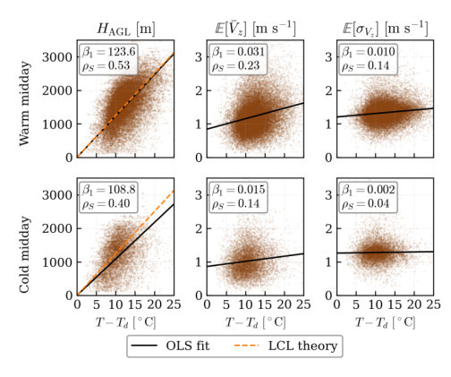
<figcaption class="paper-figure-caption"><b>Fig 5.</b> FIG. 5. LCL benchmark scatter for the Low mountains terrain at midday (12–14h solar). Rows: Warm season (top, n = 29,023 cell- hours) and Cold season (bottom, n = 8,217). Columns: thermal ceiling HAGL (left), mean climb rate E[ ¯Vz] (centre), and climb tur- bulence E[σVz] (right), each plotted against the dewpoint depression T−Td. Each brown dot is one cell-hour observation. The black solid line is the OLS fit (origin-constrained for HAGL, Eq. 12; with inter- cept for the velocity moments, Eq. 13). In the HAGL panels, the orange dashed line shows the theoretical LCL slope of 125m/○C. Each panel indicates the corresponding fitted slope β1 (m/○C for HAGL; ms−1/○C for the velocity moments) and...</figcaption>
</figure>

**Summary.** This paper introduces a massive dataset derived from paragliding flight logs to study atmospheric thermal convection. By analyzing diagnostics like thermal strength and ceiling height, the authors successfully identified that boundary-layer height is the primary predictor controlling these convective features across various terrains and seasons. The work demonstrates the utility of crowdsourced data for advancing fundamental understanding in atmospheric physics.

**Why it may be interesting.** While focused on meteorology, the rigorous statistical framework used to identify leading macroscopic predictors (like boundary-layer height) from complex, multi-scale observational data shares methodological parallels with identifying critical control parameters in non-equilibrium statistical systems.

Detailed structure

**Main problem.** Understanding fundamental questions about atmospheric thermal structure, such as the onset and intensity of convection, due to limited in situ observational coverage.

**Main result.** Boundary-layer height emerged as the leading independent predictor for both ceiling height and thermal strength across all terrains and seasons. The empirical relationship between ceiling height and temperature-dewpoint depression matched theoretical LCL scaling with high precision.

**Method.** The study aggregates data from paragliding flight logs, extracting diagnostics like thermal strength and ceiling height, and correlates these observables with global atmospheric reanalysis data (ERA5) using an orthogonalized regression framework.

**Model / system.** The physical system is the atmosphere undergoing thermal convection. The data source is a novel dataset derived from 1.47 million climbing segments recorded by paragliders over metropolitan France between 2017 and 2024.

**Key observables.** Thermal strength ($ar{V}_z$), vertical velocity variability ($\sigma V_z$), and thermal ceiling height ($H_{AGL}$).

**Important parameters / regimes.** Terrain type (Plains, Hills, Low mountains, High mountains), season, time of day, cloud state, soil moisture index, and boundary-layer height.

**Assumptions / limitations.** The dataset is limited to solar hours 9–17h; coastal cells are excluded as lift relies on dynamic rather than thermal convection; the analysis uses ERA5 reanalysis data for context.

**Figures summary.** Figures show spatial distribution of activity across terrain classes, empirical PDFs of observables varying by terrain (e.g., $H_{AGL}$ peaking differently in Plains vs. Mountains), and temporal evolution showing seasonal/diurnal cycles.

**Paper structure.** The paper first establishes the observational resource from paragliding data, then details the extraction of three key diagnostics ($ar{V}_z$, $\sigma V_z$, $H_{AGL}$), followed by a comprehensive analysis correlating these observables with various geophysical predictors using regression techniques.

Abstract

Atmospheric thermal convection drives boundary-layer dynamics and vertical exchange of heat, moisture, and momentum, yet fundamental questions about thermal structure remain open due to limited in situ observational coverage. We introduce a novel high-resolution observational dataset for atmospheric convection based on paragliding flight logs collected over metropolitan France during 2017-2024. Paragliders probe thermal updrafts by circling within them while carrying GPS variometers that record position and altitude; each climbing segment samples the vertical velocity field within a thermal column. Aggregated across 1.47 million climbing segments from 110,730 flights, this dataset provides unprecedented spatial coverage and temporal resolution. To demonstrate the value of this observational resource, we extract three physically distinct observables from climbing segments and characterize their dependence on terrain, season, time of day, cloud state, and soil moisture. Coupling the paragliding observations with global atmospheric reanalysis data (ERA5, 0.25 degrees hourly) through an orthogonalized regression framework against 118 physically interpretable predictors, we identify leading atmospheric predictors of these observables. The empirical relationship between ceiling height and temperature-dewpoint depression matches the theoretical lifting condensation level scaling with striking precision supporting our methodology. Boundary-layer height emerges as the leading independent predictor of both ceiling height and thermal strength across all terrains and seasons, while vertical-velocity variability is controlled by surface heat-flux and wind variables. Taken together, our results highlight the utility of crowdsourced flight-log data for investigating atmospheric convection.

[↑ back to top](#top)

### [Caustics and Superenergy in the Quantum Bouncer](http://arxiv.org/abs/2608.02427v1)

**Authors:** Marko. M. Ćosić, Andrew N. Jordan  
**Type:** theory · **Category:** other · **PDF:** <https://arxiv.org/pdf/2608.02427v1>  
**Analysis basis:** full PDF text, analyzed in chunks
**Topic relevance:** `Keldysh / 2PI / non-Gaussian methods` **2/5** · `quantum measurements` **2/5** · `methods for driven-dissipative` **1/5** · `non-equilibrium dynamics` **1/5**

↔ Scroll figures horizontally

<figure class="paper-figure-card">
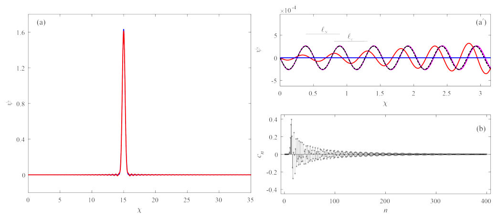
<figcaption class="paper-figure-caption"><b>Fig 1.</b> FIG. 1. (a) The initial state ψ0(τ) (the blue line), and its corresponding energy-limited approximation ψN(χ, 0) (the red line) for χ0 = 15, σ = 0.15, and N = 400. (a’) Enlarged view in the vicinity of the coordinate origin. The magenta line shows cNφN(χ), its harmonic approximation AN sin(|zN|χ) is shown by the dashed black line. (b) Stem plot of expansion coefficients cn calculated according to Eq. (19). Lines ℓN and ℓψ indicate the local wavelengths of cNφN(χ) and ψN(χ, 0) respectively.</figcaption>
</figure>
<figure class="paper-figure-card">
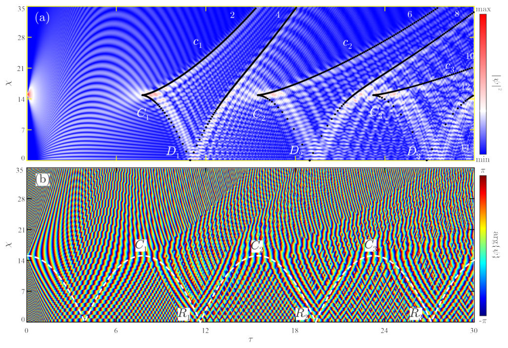
<figcaption class="paper-figure-caption"><b>Fig 2.</b> FIG. 2. (a) Log-scale probability density |ψ(χ, τ)|2 and (b) phase arg{ψ(χ, τ)} for χ0 = 15, σ = 0.15, and N = 400. Dotted black lines show the envelope of classical trajectories χ(τ; χ0, ˙χ0) starting at χ0 with varying initial velocities. Numbers denote point multiplicities in regions bounded by caustics c1, c2, c3. The white dashed line is the reference trajectory χ(τ; χ0, 0). Cusps of caustics and turning points of the reference trajectory are labeled C1, C2, C3. Rebound points of downward caustic branches are D1, D2, D3, with corresponding reference trajectory rebounds R1, R2, R3.</figcaption>
</figure>
<figure class="paper-figure-card">
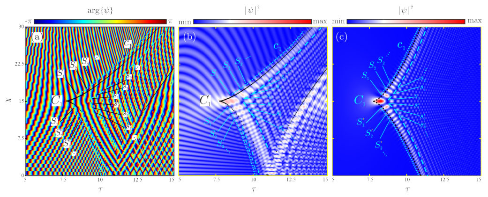
<figcaption class="paper-figure-caption"><b>Fig 3.</b> FIG. 3. (a,b) Magnified views of arg{ψN(χ, τ)} and |ψN(χ, τ)|2 near the cusp point C1 = (χ0, 2√χ0). (c) The local catastrophic approximation |ψN(χ, τ)|2 ≈|P((τC1 −τ)/¯τC1, (χ −χC1)/¯χC1)|2. Black dotted lines mark classical caustic lines in (a,b) and the bifurcation set of the optimal catastrophic polynomial A4 in (c). Dashed and dotted cyan lines show singularity chains on the bright and dark sides of the caustics, respectively. Dot-dash cyan lines indicate additional singularity chains generated by four-wave interference. We take N = 400 in this plot.</figcaption>
</figure>
<figure class="paper-figure-card">
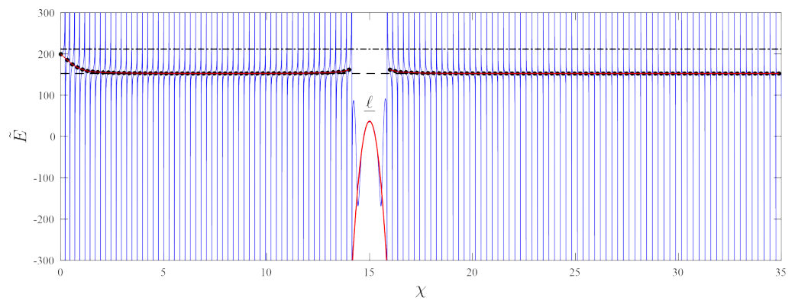
<figcaption class="paper-figure-caption"><b>Fig 4.</b> FIG. 4. The local energy values ˜EN(χ, 0) (blue) are plotted versus χ, with its inflection point in the superbehaving region marked by black circles. The dot-dashed and dashed black lines indicate the energy levels ε = k2 ψ and ε = εN, respectively. The limiting distribution ˜E(χ, 0) is shown in red. Line ℓshows the span of the positivity interval (43). The black-dotted-red line show the poly-lines (χij, ˜E(χij)).</figcaption>
</figure>
<figure class="paper-figure-card">
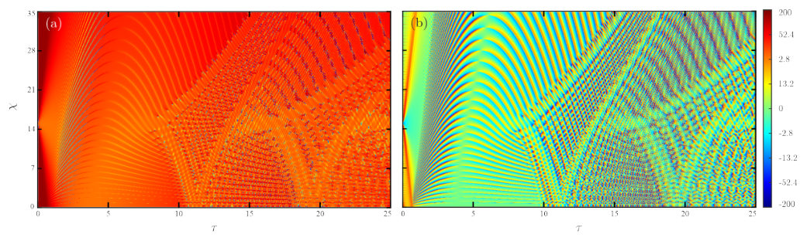
<figcaption class="paper-figure-caption"><b>Fig 5.</b> FIG. 5. (a,b) Evolution of Re{ ˜EN(χ, τ)} and Im{ ˜EN(χ, τ)}, respectively, for χ0 = 15, σ = 0.15, and N = 400. For clearer visualization, both functions were restricted to the interval [−200, 200]. For this choice of parameters, εN ≈152.529.</figcaption>
</figure>

**Summary.** This paper analyzes how classical caustics manifest in the quantum realm using the 'quantum bouncer' model. It connects these quantum caustics to advanced mathematical functions like the Pearcey function and quantifies superenergy—regions where local energy exceeds expected bounds. The methodology combines wavepacket propagation with deep semiclassical asymptotic analysis.

**Why it may be interesting.** This work bridges semiclassical mechanics, wave propagation phenomena (caustics), and non-classical energy measurements (superenergy) within a concrete quantum mechanical model relevant for measurement physics.

Detailed structure

**Main problem.** The paper investigates quantum interference and energetic phenomena associated with classical caustics, termed "quantum caustics," in a confined quantum system.

**Main result.** It demonstrates that caustics are exhibited by Gaussian wavepackets, connecting phase singularity chains near these caustics to the semiclassical Pearcey function. The study also quantifies superenergy regions where local energy exceeds expected eigenvalue bounds.

**Method.** The analysis employs Gaussian wavepacket propagation, semiclassical approximations (like those involving Airy functions), and alternative descriptions using Madelung/Bohm trajectories.

**Model / system.** The primary model is the quantum bouncer—a particle confined to $x \ge 0$ by a linear potential $V(x) = mgx$. The dynamics are governed by the time-dependent Schrödinger equation, analyzed via eigenfunction expansions.

**Key observables.** Quantum caustics, Superenergy ($	ilde{E}(x, t)$), Local observable $	ilde{O}(x)$, and phase singularity chains.

**Important parameters / regimes.** The analysis depends on the initial Gaussian wavepacket parameters ($\sigma, \chi_0$) and the system's confinement potential strength (related to $\alpha$ in dimensionless units).

**Assumptions / limitations.** The study relies on approximating the state as a finite superposition of eigenfunctions and analyzing asymptotic forms derived from Airy functions.

**Figures summary.** Not specified by notes, but appendices suggest figures illustrating the Pearcey function construction and wave function evolution near singularities.

**Paper structure.** The paper moves from defining the problem (quantum caustics/superenergy) in the quantum bouncer model to developing mathematical tools using Gaussian packets and asymptotic analysis. It culminates in applying these tools to relate caustic behavior to catastrophe theory via the Pearcey integral.

Abstract

We investigate the quantum interference and energetic phenomena associated with classical caustics in the quantum bouncing ball problem, we refer to as quantum caustics. By considering an initial Gaussian wavepacket, we show that caustics associated with the underlying classical trajectory families are exhibited. We connect the associated phase singularity chains in the vicinity of the caustic with the semiclassical Pearcey function built on the cusp catastrophe lines. We also quantify the amount of superenergy exhibited in these solutions - regions of space where the local energy exceeds the largest constituent energy eigenvalue. We give a complimentary description of the caustic and superenergy behavior using the Madelung/Bohm trajectories, which gives additional insight about the energy of the trajectories and how they traverse the phase singularity chains.

[↑ back to top](#top)

### [Quantum Vortices in a Boundary Layer: New Results and Perspectives](http://arxiv.org/abs/2608.02057v1)

**Authors:** Sergei V. Talalov  
**Type:** theory · **Category:** other · **PDF:** <https://arxiv.org/pdf/2608.02057v1>  
**Analysis basis:** full PDF text, analyzed in chunks
**Topic relevance:** `non-equilibrium dynamics` **2/5** · `Keldysh / 2PI / non-Gaussian methods` **1/5** · `driven-dissipative phase transition` **1/5** · `methods for driven-dissipative` **1/5**

↔ Scroll figures horizontally

<figure class="paper-figure-card">
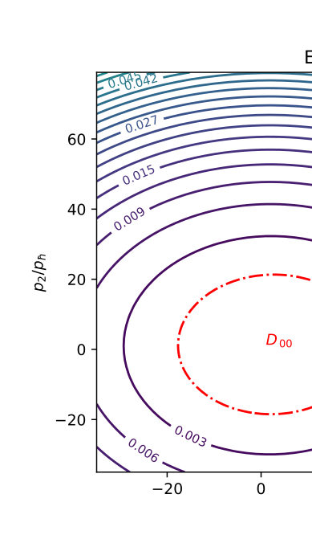
<figcaption class="paper-figure-caption"><b>Fig 1.</b> Figure 1: Energy levels for (κv)1 = 5, (κv)2 = 3.</figcaption>
</figure>
<figure class="paper-figure-card">
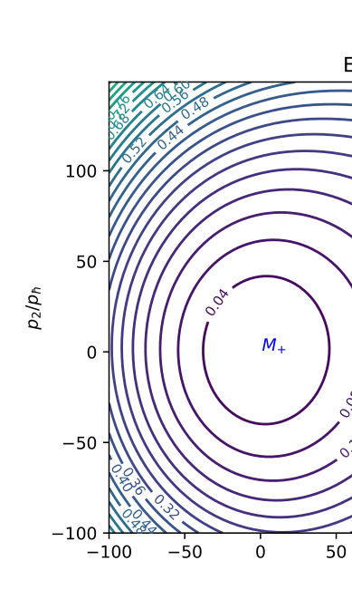
<figcaption class="paper-figure-caption"><b>Fig 2.</b> Figure 2: Energy levels for (κv)1 = 250, (κv)2 = 70.</figcaption>
</figure>
<figure class="paper-figure-card">
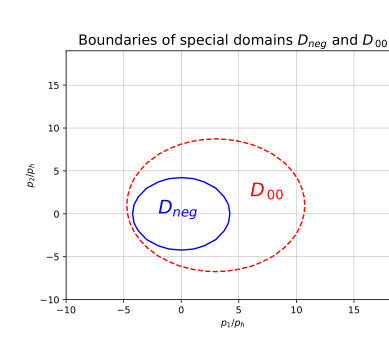
<figcaption class="paper-figure-caption"><b>Fig 3.</b> Figure 3: Domain’s boundaries for (κv)1 = 3, (κv)2 = 1.</figcaption>
</figure>
<figure class="paper-figure-card">
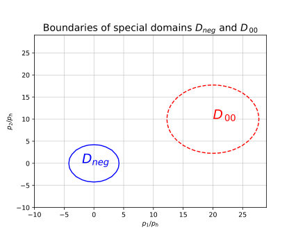
<figcaption class="paper-figure-caption"><b>Fig 4.</b> Figure 4: Domain’s boundaries for (κv)1 = 20, (κv)2 = 10.</figcaption>
</figure>

**Summary.** This paper theoretically analyzes the motion and quantization of quantum vortices near a planar boundary layer. Using group theory and novel quantization methods, it derives an energy spectrum showing complex dependence on external flow velocity. The results highlight that vortex stability depends critically on parameters, potentially leading to negative effective masses in certain quantum regimes.

**Why it may be interesting.** This work provides advanced theoretical tools for analyzing vortex dynamics in confined quantum fluids, touching upon concepts of effective mass and spectral stability relevant to superfluidity and quantum turbulence.

Detailed structure

**Main problem.** The study investigates the quantum dynamics of a thin circular vortex filament situated near an infinite planar boundary surface.

**Main result.** The energy spectrum exhibits complex dependence on external fluid velocity, and the inverse effective mass tensor can possess both positive and negative values in certain quantum states.

**Method.** The authors employ a novel quantization method for classical closed vortex filaments, utilizing group theory (e.g., centrally-extended Galilean group) to derive an effective Hamiltonian structure.

**Model / system.** The system models quantized vortices near a boundary layer, treated as quantized dynamical systems rather than purely topological defects. The dynamics are governed by an effective Hamiltonian incorporating particle motion and harmonic oscillator terms.

**Key observables.** Vortex energy spectrum $E = E({f p})$, inverse effective mass tensor, and quantized circulation $\Gamma_\lambda$.

**Important parameters / regimes.** External fluid velocity $\mathbf{v}$, quantum numbers ($n$), dimensionless parameters ($\kappa, \kappa_v$), and critical values like $\kappa_{cr}$.

**Assumptions / limitations.** The surrounding fluid velocity $\mathbf{v}$ is assumed parallel to the planar surface. The analysis often relies on approximations derived from spectral problems or small parameter expansions.

**Figures summary.** Figures illustrate energy levels for varying external velocities, showing domain boundaries ($\hbar_{	ext{neg}}, \hbar_{00}$) that dictate whether vortex modes are stable or unstable.

**Paper structure.** The paper progresses by first establishing the classical dynamics and Hamiltonian structure near the boundary. It then applies a novel quantization procedure to determine quantized circulation values. Finally, it performs stability analysis on the energy spectrum to map out regimes where vortices can exist.

Abstract

Here, we investigate the motion of a thin circular quantum vortex filament near the infinite planar surface. The fluid surrounding this surface moves with a non-zero velocity $\bf{v}$, which is parallel to the surface. We study the specific features of this quantum system and show that they are quite suitable for the boundary layer theory. The developed model allows us to calculate the vortex energy spectrum, $E = E({\bf p})$, where ${\bf p}$ is the total momentum of a vortex ring.  We have demonstrated that this function has complex non-trivial dependence on the velocity $\bf{v}$. It is stated that the inverse effective mass of a vortex under consideration is of a tensorial nature. In certain quantum states, the system shows the possibility of both negative and positive effective mass existing. This study employs a novel quantization method for classical closed vortex filaments, developed by the author earlier.

[↑ back to top](#top)

### [Compiler Framework for 3D Neutral-Atom Quantum Computers](http://arxiv.org/abs/2608.01316v1)

**Authors:** Chen Huang, Zhemin Zhang, Zhao Zhang, Xudong Lv, Zhiding Liang  
**Type:** theory · **Category:** quantum information and computing · **PDF:** <https://arxiv.org/pdf/2608.01316v1>  
**Analysis basis:** full PDF text, analyzed in chunks
**Topic relevance:** `QC/QI experiment` **2/5** · `Rydberg arrays` **1/5** · `analog quantum simulation` **1/5**

↔ Scroll figures horizontally

<figure class="paper-figure-card">
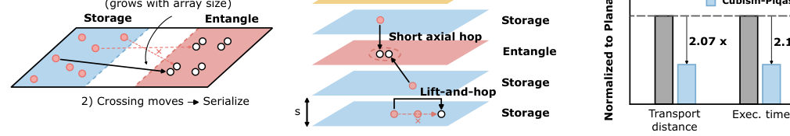
<figcaption class="paper-figure-caption"><b>Fig 1.</b> Fig. 1. Why 3D compilation. (a) A zoned planar architecture requires lateral transport that grows with array size, and the no-crossing constraint serializes conflicting moves. (b) Piqasso stacks storage, an entanglement layer zE, and a readout layer along z: gate pairs rendezvous via short axial hops, and blocked moves detour through a free transit layer (lift-and-hop). (c) Across 34 circuits from QASMBench and VeriQBench, Piqasso moves atoms 2.1× less and is faster on 32 of 34 circuits.</figcaption>
</figure>
<figure class="paper-figure-card">
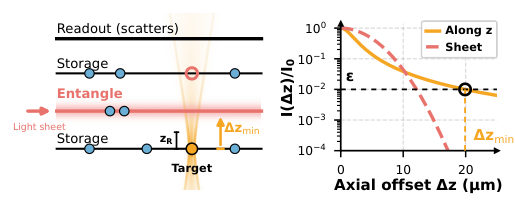
<figcaption class="paper-figure-caption"><b>Fig 2.</b> Fig. 2. Propagation direction governs layer selectivity. Left: stacked register, side view. The workhorse beams (traps, tweezers, focused Rz addressing) propagate along z and thread the entire stack: a beam focused on its target atom (waist w0) still illuminates the column neighbor through the slow on- axis tail, forcing the axial clearance ∆zmin. The in-plane Rydberg light sheet is confined to the entanglement layer zE, and readout occurs only on the far- separated readout layer. Right: the two decay scales behind this asymmetry. Along z the intensity falls only algebraically, reaching the crosstalk budget ϵ at ∆zmin, whereas the sheet’s transverse Gaussian tail is exponentially suppressed...</figcaption>
</figure>
<figure class="paper-figure-card">
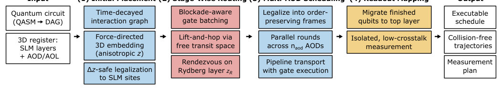
<figcaption class="paper-figure-caption"><b>Fig 3.</b> Fig. 3. The Piqasso compilation pipeline: (i) clearance-aware initial placement, (ii) stage-wise routing via entanglement-layer rendezvous, (iii) multi-AOD transport-round scheduling with cross-round pipelining, and (iv) readout mapping to the readout layer; the output is an executable schedule with collision-free trajectories and a measurement plan.</figcaption>
</figure>
<figure class="paper-figure-card">
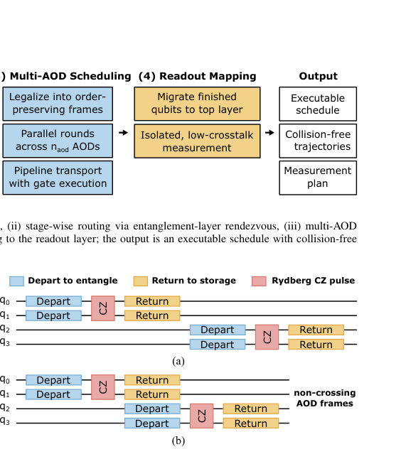
<figcaption class="paper-figure-caption"><b>Fig 4.</b> Fig. 4. Cross-round pipelining. (a) In a planar machine the return of pulse round and the ascent of pulse round move in opposite directions through a shared plane, forcing tone crossings that serialize the handoff. (b) In Cubism these moves are near-axial and pack into non-crossing frames; lift-and-hop detours any residual crossing through a free transit layer, so the axial round trips do not inflate the transport-round count.</figcaption>
</figure>
<figure class="paper-figure-card">
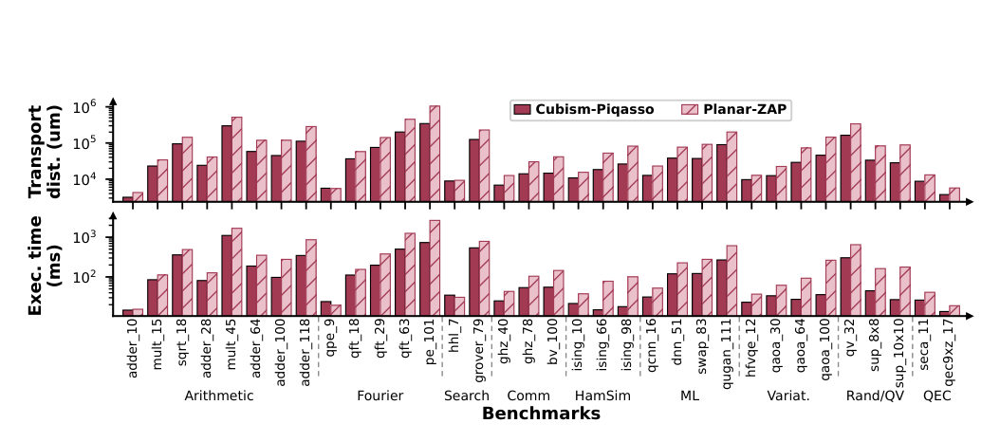
<figcaption class="paper-figure-caption"><b>Fig 5.</b> Fig. 5. Per-circuit transport distance (top) and circuit execution time (bottom) across the full 34-circuit application suite, for Cubism-Piqasso and the Planar- ZAP baseline (both log scale). Circuits are grouped by functional class and sorted by qubit count within each class. Piqasso moves atoms less on every circuit and runs faster on 32 of 34, with the gap widening on larger circuits; the two exceptions (hhl n7 and qpe n9) are small enough that the fixed axial hop is not yet amortized.</figcaption>
</figure>

**Summary.** The paper introduces Piqasso, a novel compiler framework designed for 3D neutral-atom quantum computers that overcomes the limitations of existing 2D compilers. By treating the axial dimension as a schedulable resource and implementing 'lift-and-hop' routing, it drastically reduces atom movement distance and increases execution speed on complex circuits. This advancement is crucial for scaling up programmable quantum processors.

**Why it may be interesting.** This work directly addresses the scaling bottleneck in neutral-atom quantum computing by providing a necessary software layer (the compiler) to exploit the physical 3D capabilities of the hardware platform. It bridges advanced AMO physics with computational complexity theory.

Detailed structure

**Main problem.** Existing quantum circuit compilers assume flat (2D) geometries, which is suboptimal for scaling neutral-atom quantum computers that can operate in three dimensions.

**Main result.** The proposed compiler, Piqasso, significantly outperforms state-of-the-art planar compilers by reducing atom transport distance by 2.1x and achieving up to 7.3x faster execution on complex circuits.

**Method.** Piqasso is an end-to-end 3D compiler that integrates clearance-aware placement, conflict-aware routing using 'lift-and-hop' detours, and a multi-AOD scheduler for parallel transport scheduling.

**Model / system.** The system utilizes neutral atoms trapped in programmable optical tweezer arrays arranged in a layered 'Cubism' architecture along the z-axis. This stack separates storage, entanglement, and readout functions into distinct layers.

**Key observables.** Total atom transport distance (reduction factor), execution time (speedup factor), movement fidelity, and number of serialized transport rounds.

**Important parameters / regimes.** Minimum axial clearance ($\Delta z_{\min}$), maximum AOL range ($Z_{\max}$), and the dimensionality of the required quantum circuit.

**Assumptions / limitations.** The primary assumption is that exploiting the third dimension resolves key planar limitations related to growing transport distance, dephasing during long travel, and move serialization due to crossing conflicts.

**Figures summary.** Figure 1 contrasts the axial-rendezvous design (Piqasso) with zoned planar alternatives. Figure 2 illustrates beam propagation, showing how focused Gaussian beams thread the stack while in-plane Rydberg light sheets are confined to dedicated entanglement layers.

**Paper structure.** The paper develops a fidelity-driven optimization framework for 3D compilation, detailing components like clearance-aware placement and conflict-aware routing. It then presents Piqasso's implementation, demonstrating performance gains over planar methods by treating the axial coordinate as a first-class resource.

Abstract

Neutral-atom quantum computers can now arrange atoms in three-dimensional tweezer arrays, yet every existing compiler assumes a flat geometry. We present Piqasso, a compiler that exploits the vertical axis by stacking storage, entanglement, and readout into distinct layers. Its pipeline pairs an analytical placement respecting axial-clearance optics with a router that brings gate partners together via short vertical hops---bypassing in-plane crossing conflicts through out-of-plane detours---and a multi-AOD scheduler that parallelizes transport across focal planes. On 34 circuits, Piqasso reduces atom transport distance by 2.1$\times$ over a state-of-the-art planar compiler, yielding up to 7.3$\times$ faster execution, 2.2$\times$ higher movement fidelity, and 1.8$\times$ fewer serialized transport rounds, with all gains widening at scale.

[↑ back to top](#top)

### [How NOT to build control-target gates in semiconductor quantum dots and beyond](http://arxiv.org/abs/2608.00733v1)

**Authors:** Roman Korol, John Nichol, Ignacio Franco  
**Type:** theory · **Category:** quantum information and computing · **PDF:** <https://arxiv.org/pdf/2608.00733v1>  
**Analysis basis:** full PDF text, analyzed in chunks
**Topic relevance:** `QC/QI experiment` **2/5** · `methods for driven-dissipative` **1/5** · `spintronics-quantum-optics interface` **1/5**

↔ Scroll figures horizontally

<figure class="paper-figure-card">
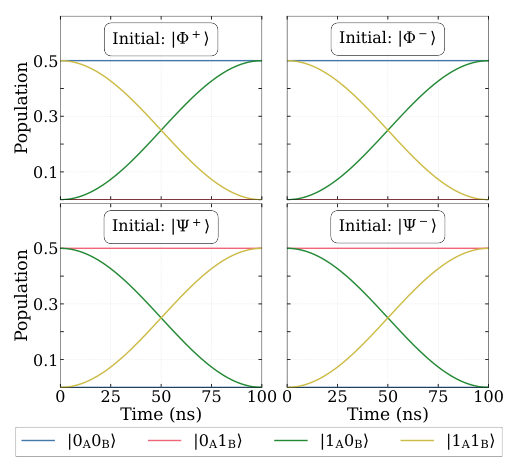
<figcaption class="paper-figure-caption"><b>Fig 1.</b> FIG. 1. Ideal CNOT gate operation in a hetero- geneous qubit encoding. Four Bell states (|Φ˘y “ 1 ?</figcaption>
</figure>
<figure class="paper-figure-card">
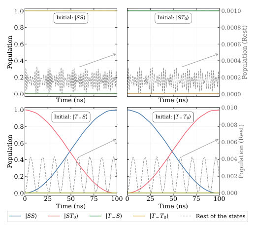
<figcaption class="paper-figure-caption"><b>Fig 2.</b> FIG. 2. CNOT in the presence of leakage states. Time evolution over the gate duration of 100 ns of the four-spin sys- tem. Note that the population outside of the computational space is plotted in gray on a secondary y-axis which is zoomed in by a factor of 1000 (panels a,b) and a factor of 100 (panels c,d).</figcaption>
</figure>
<figure class="paper-figure-card">
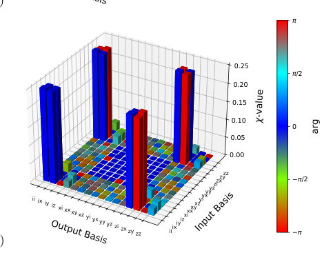
<figcaption class="paper-figure-caption"><b>Fig 3.</b> FIG. 4. The χ-matrix characterizing the proposed CNOT pulse applied to a pair of double quantum dots with (a) TB “ 0 featuring 99.6% gate fidelity and (b) TB “ 0.1TAB with 99.2% gate fidelity. The parameters in Eq. 6 are: TA “ ´5π ˆ 106 rad/s, ζpzq 12 “ 1.3π ˆ 109 rad/s and ζpzq 34 “ π ˆ 109 rad/s (650 and 500 MHz), T av AB “ ´5π ˆ 106 rad/s. Noise magnitudes are set by Q “ 40 for the exchange noise on each nearest-neighbor dot pair (1–2, 2–3, 3–4) and ∆Bpzq i “ 0.44π ˆ 106 rad/s for the magnetic noise. Note that the 0.4% decrease in fidelity for panel (b) is mostly due to the coherent error.</figcaption>
</figure>
<figure class="paper-figure-card">
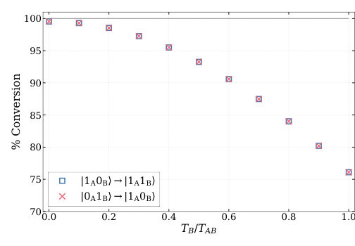
<figcaption class="paper-figure-caption"><b>Fig 4.</b> FIG. 3. Effect of non-zero TB. Percent interconversion between the |10y and |11y upon applying the CNOT gate as a function of TB relative to TAB. Note the quadratic decay of the percent conversion, enabling essentially full interconver- sion for small values of TB.</figcaption>
</figure>
<figure class="paper-figure-card">
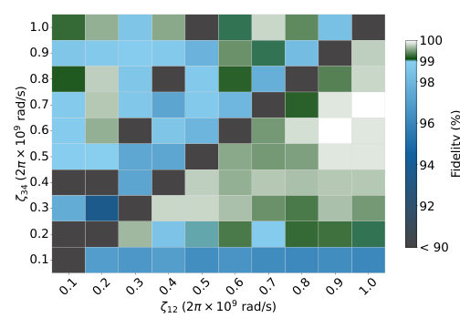
<figcaption class="paper-figure-caption"><b>Fig 5.</b> FIG. 5. Fidelity of the CNOT for different magnetic fields on qubit A, ζpzq 12 and qubit B, ζpzq 34 . The operation is robust to the particular magnetic field strength as long as the magnetic field and the gradient are both non-zero.</figcaption>
</figure>

**Summary.** This paper tackles the challenge of building asymmetric two-qubit gates, such as CNOT, in semiconductor quantum dots. The authors prove that natural interactions are too symmetric for these gates and propose a novel heterogeneous device blueprint. This design breaks the necessary symmetry, enabling high-fidelity, fast CNOT operations purely through electrical control.

**Why it may be interesting.** This work directly addresses hardware limitations in solid-state quantum computing by showing how architectural design (heterogeneity) can be used as a resource to overcome fundamental physical symmetries that restrict gate operations.

Detailed structure

**Main problem.** The primary challenge is implementing efficient, asymmetric two-qubit gates (like CNOT) in semiconductor quantum dot qubits.

**Main result.** The authors propose a heterogeneous double quantum dot blueprint that breaks spin exchange symmetry, enabling a single-pulse, fault-tolerant CNOT gate predicted for isotopically purified silicon within 100 ns.

**Method.** They use theoretical analysis based on symmetry constraints to argue that homogeneous architectures fail for asymmetric gates, leading them to design a hardware solution using non-identical qubit encodings.

**Model / system.** The system is semiconductor quantum dots, modeled using the Fermi-Hubbard model and mapped to a spin Hamiltonian. The focus is on singlet-triplet qubits within double quantum dot architectures.

**Key observables.** CNOT gate fidelity ($>99\%$), gate time ($\sim 100 	ext{ ns}$), and the preservation of coherence in isotopically purified silicon.

**Important parameters / regimes.** The key physical parameters involve the exchange coupling ($J_{ij}$) and the ability to break spin-exchange symmetry via heterogeneous device design.

**Assumptions / limitations.** It is assumed that single-qubit gates are highly accurate, and the derivation relies on projecting interactions onto a computational subspace while accounting for leakage.

**Figures summary.** Not specified in detail; the notes focus on theoretical derivations regarding Hamiltonian symmetry and proposed device blueprints rather than figure descriptions.

**Paper structure.** The paper first establishes the necessity of asymmetric gates, then theoretically proves that symmetric interactions prevent these gates in homogeneous systems. It proposes a heterogeneous blueprint to break this symmetry, culminating in numerical simulations predicting high-fidelity gate operation.

Abstract

Universal quantum computation requires single-qubit control together with at least one entangling two-qubit gate. CNOT and CROT gates are two famous examples of such gates, wherein the state of one qubit (control) dictates the transformation applied to the other (target). By using a simple derivation motivated by symmetry, we show that current device architectures of semiconductor-based quantum dot devices prevent efficient implementation of a CNOT and other asymmetric control-target gates via Heisenberg exchange, Coulomb repulsion, or other interaction that is invariant under spin exchange. Guided by this general principle, we propose a heterogeneous blueprint of double quantum dot devices that enables efficient implementation of the CNOT by breaking the spin exchange symmetry. Crucially, our numerical simulations predict that this novel device blueprint can enable a single-pulse fault-tolerant 100-ns CNOT gate in isotopically purified silicon.

[↑ back to top](#top)

### [Interspecies clock comparison below $5 \times 10^{-18}$ uncertainty with a transportable clock](http://arxiv.org/abs/2608.01916v1)

**Authors:** Chetan Vishwakarma, Ingo Nosske, Tim Lücke, Martin Steinel, Melina Filzinger, Erik Benkler, Sören Dörscher, Nils Huntemann, Christian Lisdat  
**Type:** experiment · **Category:** other · **PDF:** <https://arxiv.org/pdf/2608.01916v1>  
**Analysis basis:** full PDF text, analyzed in chunks
**Topic relevance:** `quantum optics experiment` **2/5** · `QC/QI experiment` **1/5** · `quantum measurements` **1/5**

↔ Scroll figures horizontally

<figure class="paper-figure-card">
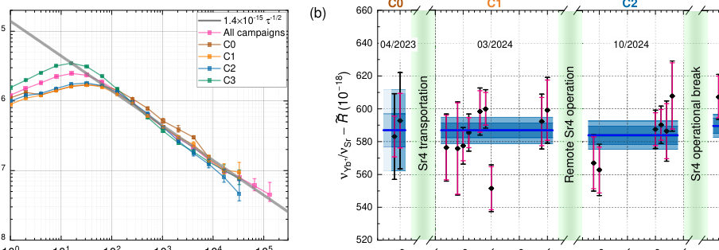
<figcaption class="paper-figure-caption"><b>Fig 1.</b> FIG. 1. Results of the comparisons between the Yb1E3 single-ion clock and the Sr4 transportable optical lattice clock at PTB. (a) Overlapping Allan deviations of the reduced frequency ratio for each campaign (C0 through C3) and for the combined data. The gray solid line indicates the best fit to the combined data at τ ≥256 s. (b) Daily mean frequency ratios relative to eR = 1.495 991 618 544 900. The bottom axis shows the Modified Julian Date (MJD), and main measurement months are indicated at the top. Magenta (black) error bars indicate the statistical (total) uncertainties. The solid blue lines, dark shaded regions, and light shaded regions represent the mean values, statistical...</figcaption>
</figure>
<figure class="paper-figure-card">
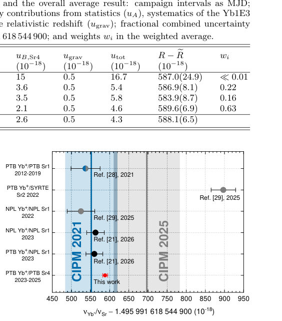
<figcaption class="paper-figure-caption"><b>Fig 2.</b> FIG. 2. Overview of measured values of νYb+/νSr with rel- ative uncertainties below 10−16 [21, 28, 29]. On the vertical axis, measurement years are shown, while the labels next to measurement points indicate reporting years. The blue and gray lines denote the ratios from the 2021 [30] and 2025 [31] CIPM evaluations, respectively; the corresponding shaded bands indicate their associated uncertainties. The color of each data point reported before 2026 indicates the CIPM evaluation to which it contributed. Previous measurements involving the clock PTB-Sr3 are subject to uncontrolled sys- tematic shifts [9, 29] and thus not shown here.</figcaption>
</figure>

**Summary.** The authors report a highly precise comparison of the optical frequencies between an ytterbium single-ion clock and a strontium lattice clock, achieving an uncertainty below $5 	imes 10^{-18}$. This result significantly advances the field by demonstrating the reliable operation of transportable atomic clocks for fundamental physical measurements. It provides crucial data supporting the roadmap for redefining the SI second.

**Why it may be interesting.** This work represents state-of-the-art precision measurement in quantum metrology. The ability to compare clocks using transportable standards is critical for extending fundamental physics tests beyond fixed laboratory settings.

Detailed structure

**Main problem.** The primary goal is achieving ultra-high accuracy interspecies clock comparisons, particularly involving a transportable clock, to meet requirements for redefining the SI second.

**Main result.** The measurement achieved a fractional uncertainty of $4.3 	imes 10^{-18}$ in the frequency ratio $
u_{	ext{Yb}^+}/
u_{	ext{Sr}}$, significantly improving previous records and validating the use of transportable clocks for fundamental measurements.

**Method.** The experiment measured the optical frequency ratio between a stationary single-ion clock ($^{171}	ext{Yb}^+$) and a transportable lattice clock ($^{87}	ext{Sr}$) over multiple campaigns, using an ultrastable laser as a common reference.

**Model / system.** The system involves comparing the electric-octupole (E3) transition of $^{171}	ext{Yb}^+$ with the $^1	ext{S}_0$--${^3	ext{P}_0}$ transition of $^{87}	ext{Sr}$. The methodology requires precise control over clock laser frequencies and accounting for environmental effects like relativistic redshift.

**Key observables.** The measured optical frequency ratio, $
u_{	ext{Yb}^+}/
u_{	ext{Sr}} = 1.495\,991\,618\,544\,900\,588\,1(65)$.

**Important parameters / regimes.** Fractional uncertainty of $4.3 	imes 10^{-18}$; the comparison spans nearly two years across four separate campaigns.

**Assumptions / limitations.** The analysis assumes that systematic errors, such as those related to lattice light shifts or gravitational potential variations, can be accurately modeled and corrected for.

**Figures summary.** Figure 1 shows overlapping Allan deviations of the reduced frequency ratio over multiple campaigns (C0-C3), demonstrating stability. Table I summarizes the results from these four distinct measurement campaigns.

**Paper structure.** The paper details the experimental setup comparing two different atomic species' optical transitions, presents data collected across multiple time periods/campaigns, analyzes the resulting frequency ratios to determine a weighted average value, and discusses the implications for SI second redefinition.

Abstract

We report a measurement of the optical frequency ratio between the $^2\mathrm{S}_{1/2}(F=0)$--${^2\mathrm{F}_{7/2}(F=3)}$ electric-octupole (E3) transition of $^{171}$Yb$^{+}$ and the $^1\mathrm{S}_0$--${^3\mathrm{P}_0}$ transition of $^{87}$Sr, $ν_{\mathrm{Yb}^{+}}/ν_\mathrm{Sr} = 1.495\,991\,618\,544\,900\,588\,1(65)$. Reaching a fractional uncertainty of $4.3 \times 10^{-18}$, this result improves upon the previous best by more than a factor of three and is among the few that meet the requirements for interspecies clock comparisons specified by the roadmap towards the redefinition of the SI second. The comparison is between a transportable optical lattice clock and a stationary single-ion clock. It spans a period of nearly two years, during which the transportable clock was intermittently operated off-campus. The ratio was reproducibly measured during four separate campaigns, which are consistent within their statistical uncertainties. The results demonstrate reproducible $10^{-18}$ level operation of the transportable clock and thus validate its application for chronometric geodesy and as a transfer standard for inter-institute clock comparisons, e.g., in the absence of optical fiber links.

[↑ back to top](#top)

### [Twenty-one characterizations of reversible quantum channels](http://arxiv.org/abs/2608.01088v1)

**Authors:** Nan Li, Yuan Li, Hanyu Yang, Shunlong Luo  
**Type:** theory · **Category:** quantum information and computing · **PDF:** <https://arxiv.org/pdf/2608.01088v1>  
**Analysis basis:** full PDF text, analyzed in chunks
**Topic relevance:** `entanglement & information structure` **2/5** · `correlated / nonlocal dissipation` **1/5** · `non-equilibrium dynamics` **1/5**

↔ Scroll figures horizontally

<figure class="paper-figure-card">
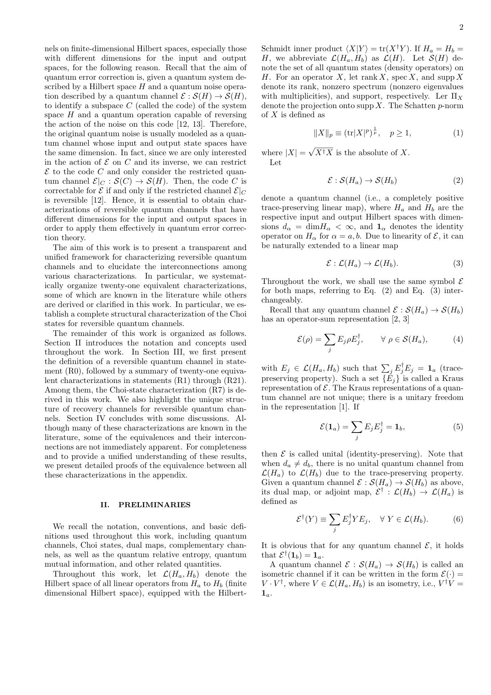
<figcaption class="paper-figure-caption"><b>Fig 1.</b> Low-resolution page preview, page 2</figcaption>
</figure>
<figure class="paper-figure-card">
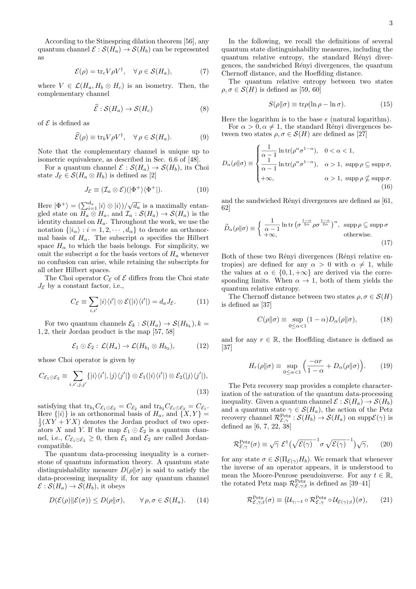
<figcaption class="paper-figure-caption"><b>Fig 2.</b> Low-resolution page preview, page 3</figcaption>
</figure>
<figure class="paper-figure-card">
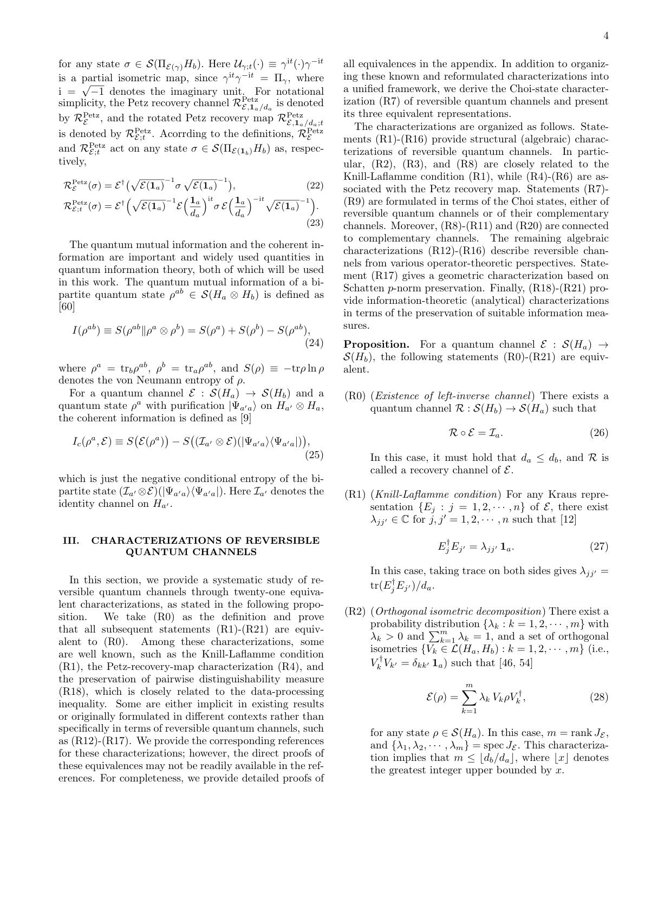
<figcaption class="paper-figure-caption"><b>Fig 3.</b> Low-resolution page preview, page 4</figcaption>
</figure>
<figure class="paper-figure-card">
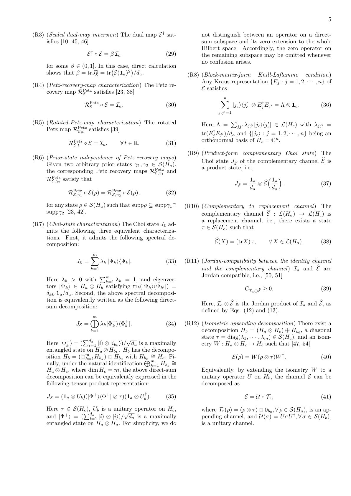
<figcaption class="paper-figure-caption"><b>Fig 4.</b> Low-resolution page preview, page 5</figcaption>
</figure>
<figure class="paper-figure-card">
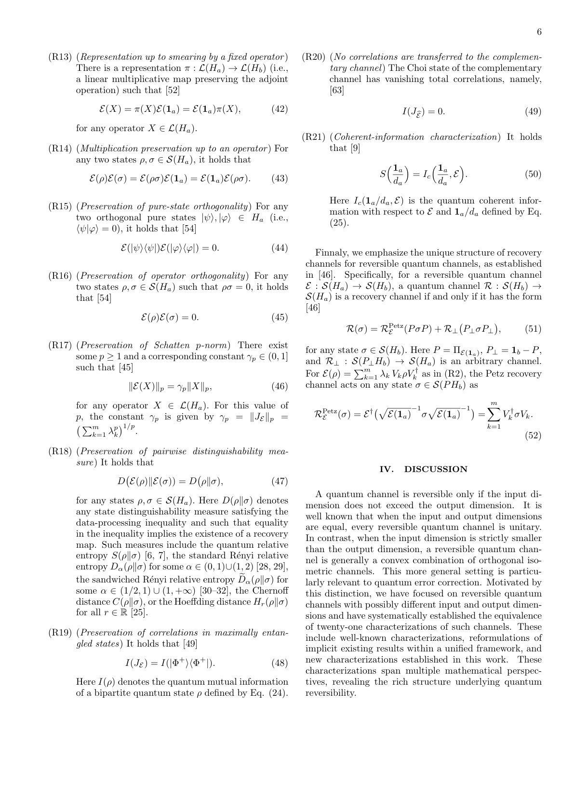
<figcaption class="paper-figure-caption"><b>Fig 5.</b> Low-resolution page preview, page 6</figcaption>
</figure>

**Summary.** This paper rigorously characterizes reversible quantum channels by presenting twenty-one equivalent mathematical conditions derived from algebraic, geometric, and information-theoretic viewpoints. It proves key structural results concerning the Choi state of these channels, offering a unified framework for understanding reversibility in quantum information processing.

**Why it may be interesting.** This work provides a deep structural understanding of quantum operations that are perfectly reversible, which is crucial for designing fault-tolerant quantum computation protocols and analyzing fundamental limits in quantum communication.

Detailed structure

**Main problem.** The central problem is providing a comprehensive characterization of reversible quantum channels acting on finite-dimensional Hilbert spaces.

**Main result.** The authors establish twenty-one equivalent mathematical conditions characterizing reversibility, including deriving three equivalent forms for the Choi state of such channels.

**Method.** The work employs rigorous theoretical proofs by relating algebraic properties (e.g., dual map inversion, Jordan products) to information-theoretic measures (e.g., distinguishability, mutual information).

**Model / system.** The system under study is a general quantum channel $E: S(\mathcal{H}_a) 	o S(\mathcal{H}_b)$, which is a completely positive trace-preserving linear map acting on the state space of finite-dimensional Hilbert spaces.

**Key observables.** Choi state ($\mathcal{J}_E$), Quantum Mutual Information, various distinguishability measures (relative entropy, R\'enyi divergences), and the existence of left/right inverse channels.

**Important parameters / regimes.** The dimensions of the input and output Hilbert spaces ($d_a$ and $d_b$) are key parameters defining the channel structure.

**Assumptions / limitations.** The analysis relies on established theorems regarding isometric maps, Stinespring dilation, and properties related to recovery channels (Petz's theory).

**Paper structure.** The paper systematically presents twenty-one equivalent characterizations ($	ext{R}0$ through $	ext{R}21$) for reversibility, building upon foundational definitions and proving equivalences between these conditions.

Abstract

Reversible quantum channels play a fundamental role in quantum dynamics and quantum information processing. A quantum channel is reversible if there exists another quantum channel acting as its left inverse. Due to their intrinsic significance and wide applications, it is desirable to characterize reversible quantum channels from diverse perspectives. In this work, we study reversible quantum channels on finite-dimensional Hilbert spaces, with particular emphasis on the case of different input and output dimensions. We systematically present twenty-one equivalent characterizations of reversible quantum channels from algebraic, geometrical, and information-theoretical perspectives. Among these characterizations, some are well known, while others, implicit in the literature or formulated in other contexts, are clarified here; the Choi-state characterization is derived in this work. Specifically, we prove that the Choi states of reversible quantum channels admit three equivalent forms: the spectral, direct-sum, and tensor-product representations. These twenty-one equivalent characterizations establish a comprehensive framework for reversible quantum channels, provide diverse insights into the structural and information-theoretic properties of quantum channels, and facilitate applications of reversibility in quantum information processing such as quantum error correction, quantum teleportation, and quantum thermodynamics.

[↑ back to top](#top)

### [An Argmax Principle for Sum-of-Squares Relaxations on the Sphere](http://arxiv.org/abs/2608.02594v1)

**Authors:** Fernando Jeronimo Granha, Pei Wu, Haochen Xu  
**Type:** theory · **Category:** quantum information and computing · **PDF:** <https://arxiv.org/pdf/2608.02594v1>  
**Analysis basis:** full PDF text, analyzed in chunks
**Topic relevance:** `entanglement & information structure` **2/5** · `Keldysh / 2PI / non-Gaussian methods` **1/5**

↔ Scroll figures horizontally

<figure class="paper-figure-card">
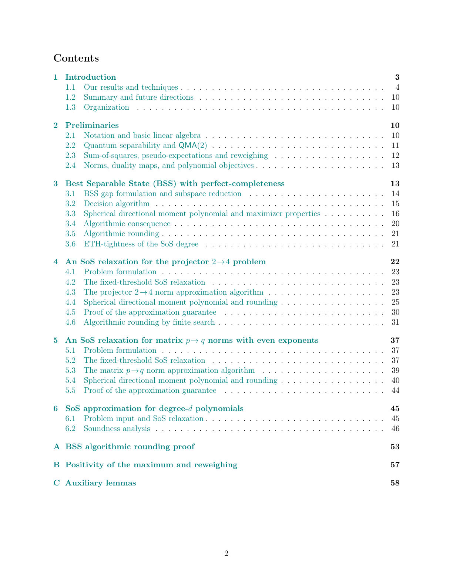
<figcaption class="paper-figure-caption"><b>Fig 1.</b> Low-resolution page preview, page 2</figcaption>
</figure>
<figure class="paper-figure-card">
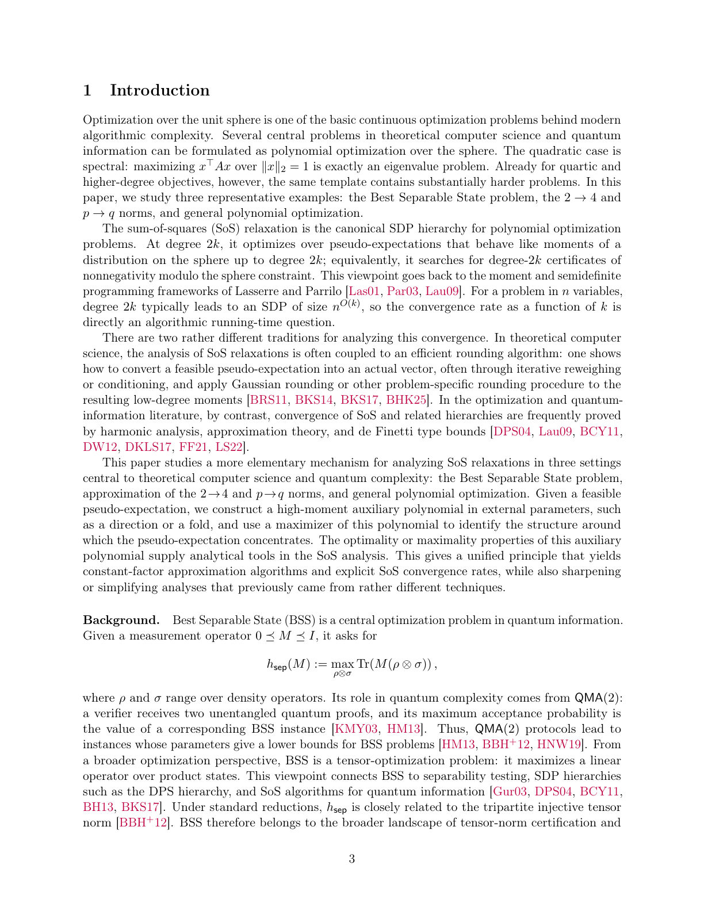
<figcaption class="paper-figure-caption"><b>Fig 2.</b> Low-resolution page preview, page 3</figcaption>
</figure>
<figure class="paper-figure-card">
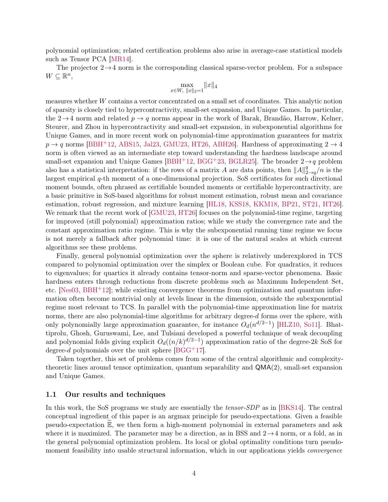
<figcaption class="paper-figure-caption"><b>Fig 3.</b> Low-resolution page preview, page 4</figcaption>
</figure>
<figure class="paper-figure-card">
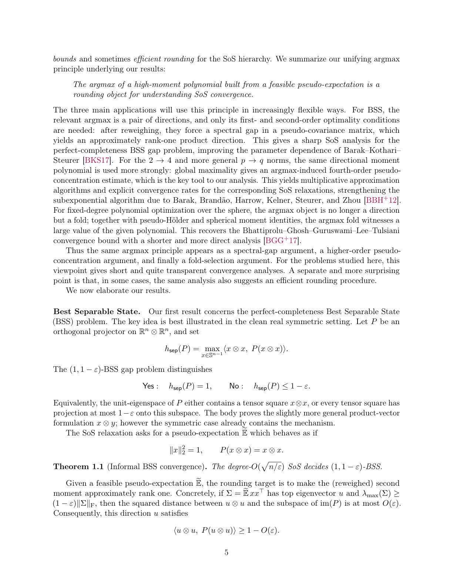
<figcaption class="paper-figure-caption"><b>Fig 4.</b> Low-resolution page preview, page 5</figcaption>
</figure>
<figure class="paper-figure-card">
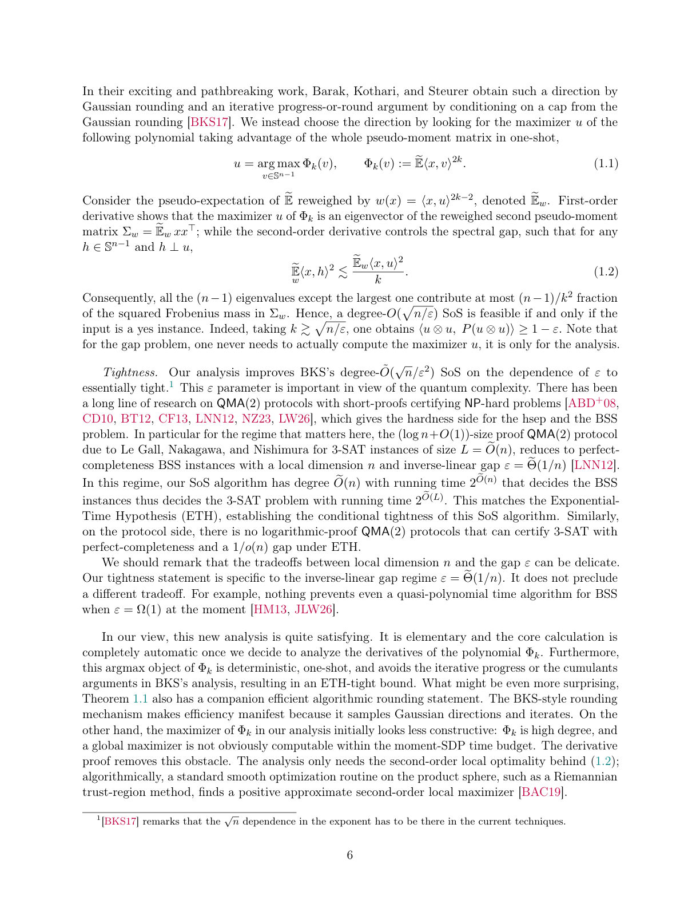
<figcaption class="paper-figure-caption"><b>Fig 5.</b> Low-resolution page preview, page 6</figcaption>
</figure>

**Summary.** This paper introduces an 'argmax principle' that uses the maximizer of high-moment polynomials to analyze Sum-of-Squares (SoS) relaxations on the unit sphere. It unifies disparate convergence analyses, providing improved bounds for tasks like determining quantum separability and approximating matrix norms. This methodological advance is significant because it offers a common mathematical lens through which multiple complex problems in quantum information can be viewed.

**Why it may be interesting.** The unification of analysis techniques across quantum separability, norm approximation, and general moment problems via a single principle is highly valuable for theoretical quantum information scientists.

Detailed structure

**Main problem.** Developing a unified 'argmax principle' to analyze Sum-of-Squares (SoS) relaxations for optimization problems defined over the unit sphere.

**Main result.** The argmax of high-moment pseudo-polynomials provides a common, unifying framework that yields sharper convergence bounds and simpler proofs across various quantum information tasks.

**Method.** The core method involves constructing an auxiliary polynomial based on high-order pseudo-moments ($\Phi_k$) and analyzing its global maximizer to derive necessary conditions for SoS convergence.

**Model / system.** The analysis applies to optimization problems over the unit sphere, specifically addressing the Best Separable State (BSS) problem in quantum information theory and approximating various matrix norms ($p 	o q$).

**Key observables.** Pseudo-expectations ($	ext{eE}$), high-order pseudo-moments ($\Phi_k$), approximation ratios for separability measures, and distance bounds between matrices.

**Important parameters / regimes.** The analysis is sensitive to the gap structure (e.g., inverse-linear gap $\epsilon = \Theta(1/n)$) and the required polynomial degree $k$ relative to system size $n$.

**Assumptions / limitations.** The framework assumes that analyzing the maximizer of the high-moment polynomial is sufficient to characterize the convergence properties of the underlying SoS relaxation.

**Figures summary.** Not specified in the notes, but the analysis involves bounding distances ($	ext{dist}_F$) between matrices derived from optimization variables $(u, v)$ and a target matrix $W$.

**Paper structure.** The paper introduces the argmax principle by applying it to three distinct problems: BSS (Theorem 1.1), Matrix Norms (Theorem 1.2), and general polynomial optimization convergence (recovering Bhattiprolu et al.'s result). The latter sections detail the rigorous mathematical machinery using Riemannian trust-region methods.

Abstract

We develop an argmax principle for analyzing sum-of-squares relaxations of optimization problems over the unit sphere. Given a feasible pseudo-expectation, we form a polynomial of high-order pseudo-moments, such as $Φ_k(u)=\widetilde{\mathbb E}\langle x,u\rangle^{2k}$. Our guiding principle is that its maximizers are rounding candidates: their local and global optimality conditions reveal the reweighed pseudo-expectation inequalities governing SoS convergence. This viewpoint unifies several problems previously analyzed by rather different techniques.   We obtain three results. First, for Best Separable State, we give a degree-$O(\sqrt{n/ε})$ SoS analysis for approximating $h_{\mathrm{sep}}(P)$ in the perfect-completeness regime, improving and simplifying Barak, Kothari and Steurer (STOC'17). The dependence is essentially tight for inverse-linear gap under the Exponential-Time Hypothesis, matching hardness from $\mathrm{QMA}(2)$ protocols. Second, for the matrix $2\to4$ norm, degree-$O(\sqrt n/ε)$ SoS gives a multiplicative $(1+ε)$ approximation. Barak et al. (STOC'12) previously gave a comparable-time constant-gap decision algorithm; our result gives a multiplicative guarantee and extends to a family of $p\to q$ norms with even $q$. Finally, for degree-$d$ polynomial optimization, we recover the convergence theorem of Bhattiprolu et al. (FOCS'17) with a shorter, more direct proof: degree-$k$ SoS gives approximation ratio $O_d((n/k)^{d/2-1})$.   The paper introduces no new relaxation. Instead, the high-moment argmax gives a common way to read an SoS solution, unifying previously separate convergence analyses and yielding sharper bounds or simpler proofs.

[↑ back to top](#top)

### [Parallel Repetition in the Two-Player Quantum Cloning Game](http://arxiv.org/abs/2608.00930v1)

**Authors:** Eli Coe Naig, Stephen A. Fenner  
**Type:** theory · **Category:** quantum information and computing · **PDF:** <https://arxiv.org/pdf/2608.00930v1>  
**Analysis basis:** full PDF text, analyzed in chunks
**Topic relevance:** `entanglement & information structure` **2/5** · `quantum measurements` **1/5**

↔ Scroll figures horizontally

<figure class="paper-figure-card">
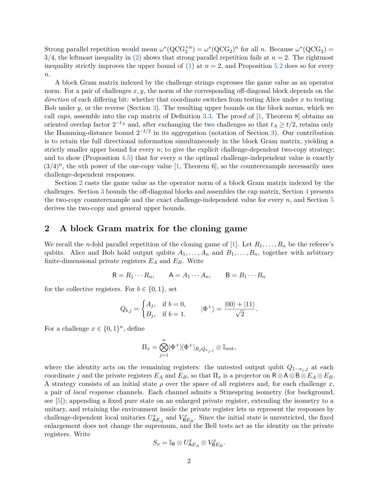
<figcaption class="paper-figure-caption"><b>Fig 1.</b> Low-resolution page preview, page 2</figcaption>
</figure>
<figure class="paper-figure-card">
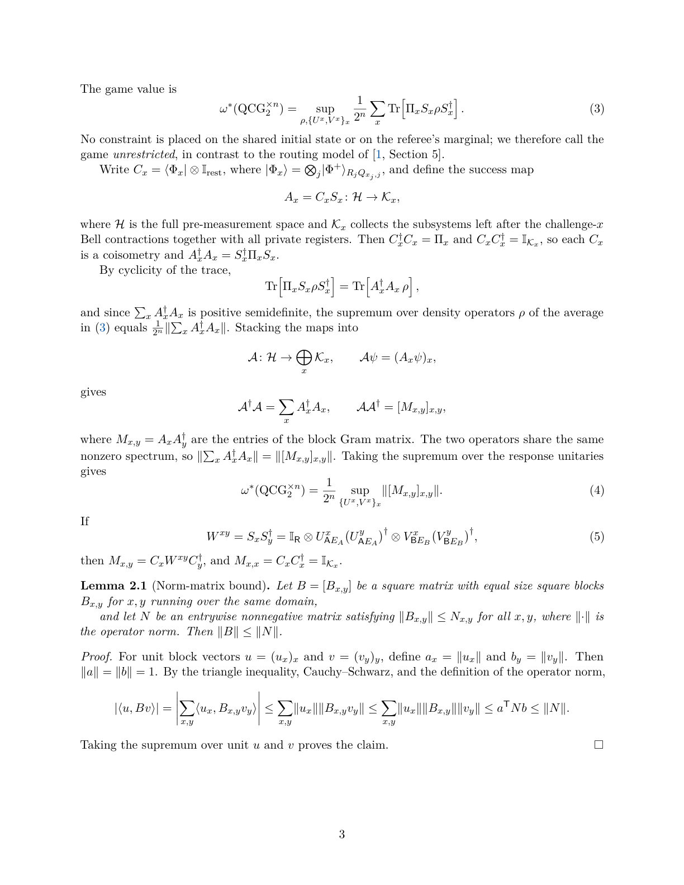
<figcaption class="paper-figure-caption"><b>Fig 2.</b> Low-resolution page preview, page 3</figcaption>
</figure>
<figure class="paper-figure-card">
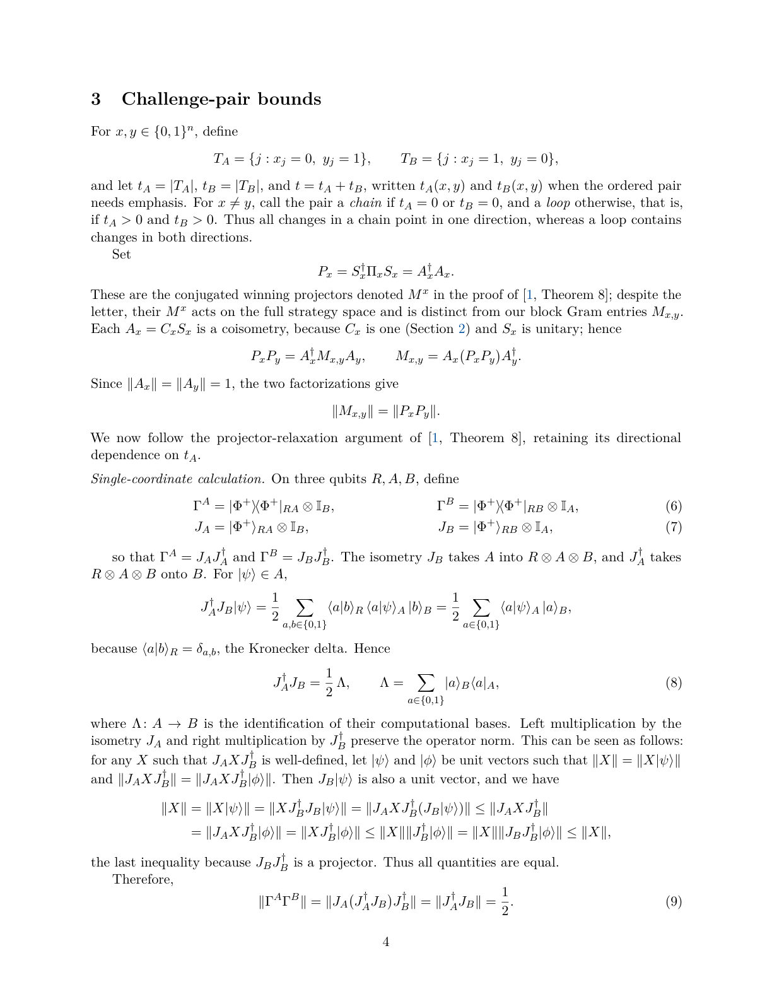
<figcaption class="paper-figure-caption"><b>Fig 3.</b> Low-resolution page preview, page 4</figcaption>
</figure>
<figure class="paper-figure-card">
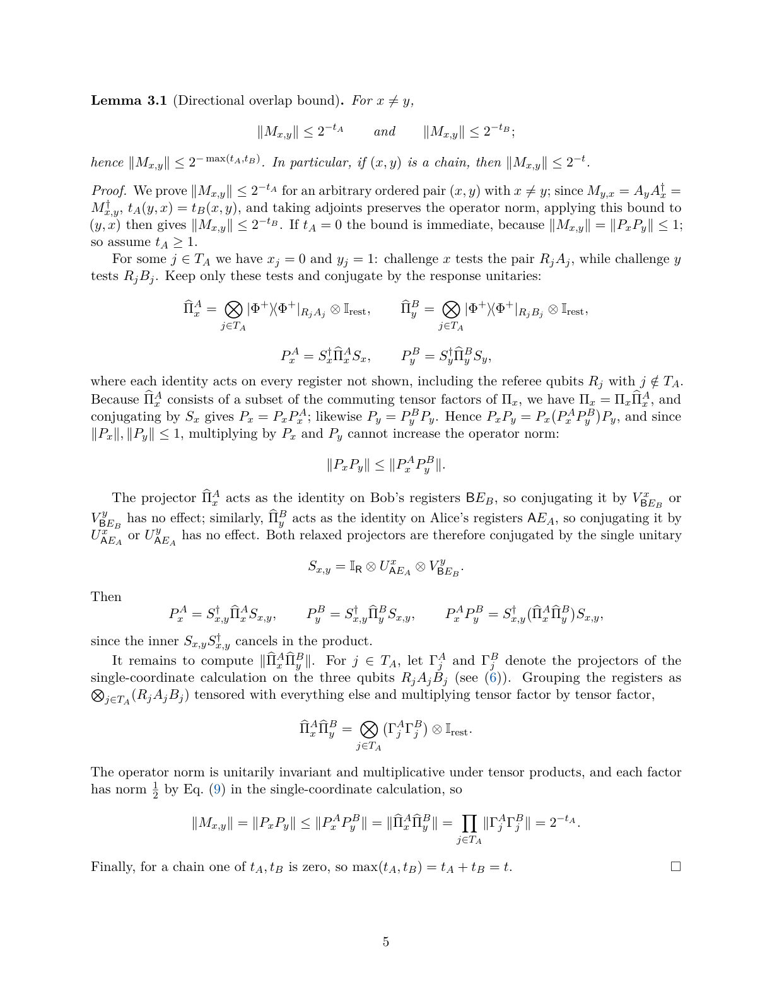
<figcaption class="paper-figure-caption"><b>Fig 4.</b> Low-resolution page preview, page 5</figcaption>
</figure>
<figure class="paper-figure-card">
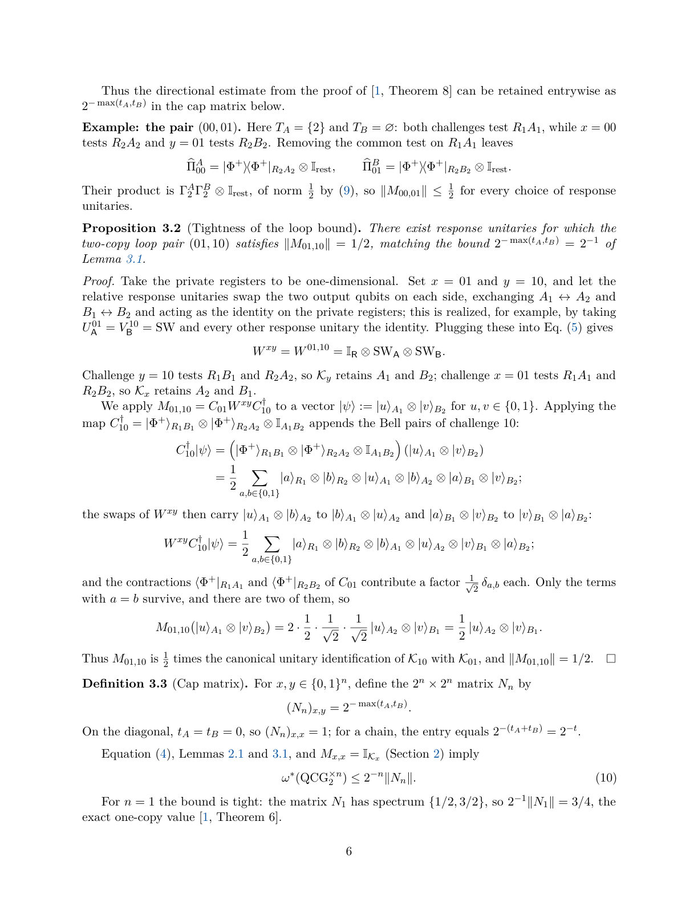
<figcaption class="paper-figure-caption"><b>Fig 5.</b> Low-resolution page preview, page 6</figcaption>
</figure>

**Summary.** The paper analyzes the two-player quantum cloning game to study the concept of strong parallel repetition. It proves that this property fails because optimal strategies can depend on the challenge, leading to a value higher than what is achievable with fixed (challenge-independent) responses. The authors establish new, tighter upper bounds for the game's value.

**Why it may be interesting.** This work directly addresses fundamental limits on quantum information tasks like cloning and verification, which are central topics in quantum cryptography and quantum computation theory. The techniques used for bounding matrix norms are highly relevant to understanding resource constraints in QI protocols.

Detailed structure

**Main problem.** The paper investigates the failure of strong parallel repetition within the context of the two-player quantum cloning game (QCG). It aims to establish tight bounds on the game's value for multiple copies.

**Main result.** Strong parallel repetition fails for the unrestricted QCG, as challenge-dependent strategies yield values exceeding those achievable by challenge-independent protocols. A new upper bound is derived that strictly improves previous estimates.

**Method.** The analysis uses techniques involving block Gram matrices and directional overlap bounds to constrain the game's value. It compares results from challenge-dependent versus challenge-independent strategies.

**Model / system.** The model is the two-player quantum cloning game ($	ext{QCG} 	imes n/2$), which involves local unitaries applied by two noncommunicating players based on a randomly sampled challenge string $x$.

**Key observables.** The primary observable is the game value $\omega^*(	ext{QCG} 	imes n/2)$, defined as the supremum of an expectation involving projectors and response unitaries.

**Important parameters / regimes.** The number of copies, $n$, is a key parameter. The bounds are compared against $(3/4)^n$ (challenge-independent) and $\cos^{2n}(\pi/8)$ (previous upper bound).

**Assumptions / limitations.** The analysis contrasts with previous bounds, showing that neither the lower bound $((3/4)^n)$ nor the upper bound ($\cos^{2n}(\pi/8)$) is tight for $n=2$. The exact two-copy value remains an open question.

**Paper structure.** The paper progresses by reformulating the game value using a block Gram matrix, deriving bounds through projector relaxation arguments, demonstrating the failure of strong parallel repetition via explicit strategies, and finally establishing tighter upper bounds using directional overlap analysis.

Abstract

We study parallel repetition in the two-player quantum cloning game, a monogamy-of-entanglement game motivated by quantum position verification. Colisson Palais, Escolà-Farràs, and Speelman bounded the value of $n$ copies between $(3/4)^n$ and $\cos^{2n}(π/8)$. For two copies, we prove that neither bound is tight. An explicit challenge-dependent strategy achieves value $(5+\sqrt{17})/16>9/16$, so strong parallel repetition fails for the unrestricted game. A block Gram matrix argument gives the upper bound $(11+\sqrt{65})/32<\cos^4(π/8)$ and strictly improves the previous parallel-repetition upper bound for every $n$. For every $n$, challenge-independent strategies have optimal value $(3/4)^n$.

[↑ back to top](#top)

### [Generalized Marginals of tie -Wigner Distribution nand Lagrangian Tomography](http://arxiv.org/abs/2608.00751v1)

**Authors:** Maurice de Gosson  
**Type:** theory · **Category:** other · **PDF:** <https://arxiv.org/pdf/2608.00751v1>  
**Analysis basis:** full PDF text, analyzed in chunks
**Topic relevance:** `quantum measurements` **2/5**

↔ Scroll figures horizontally

<figure class="paper-figure-card">
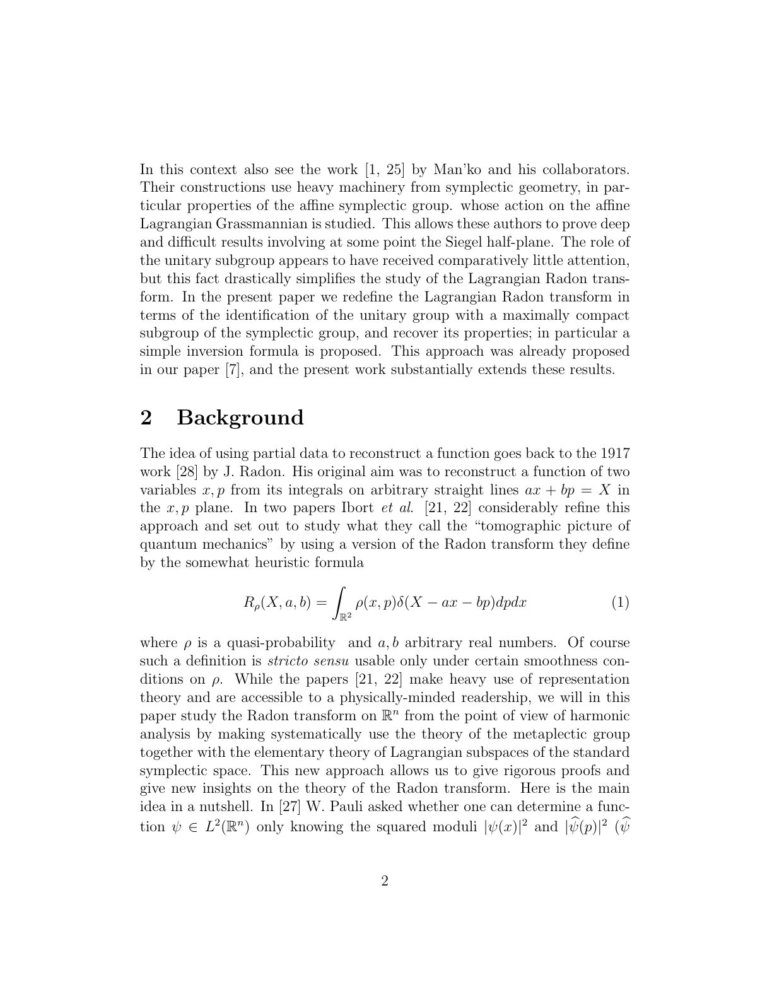
<figcaption class="paper-figure-caption"><b>Fig 1.</b> Low-resolution page preview, page 2</figcaption>
</figure>
<figure class="paper-figure-card">
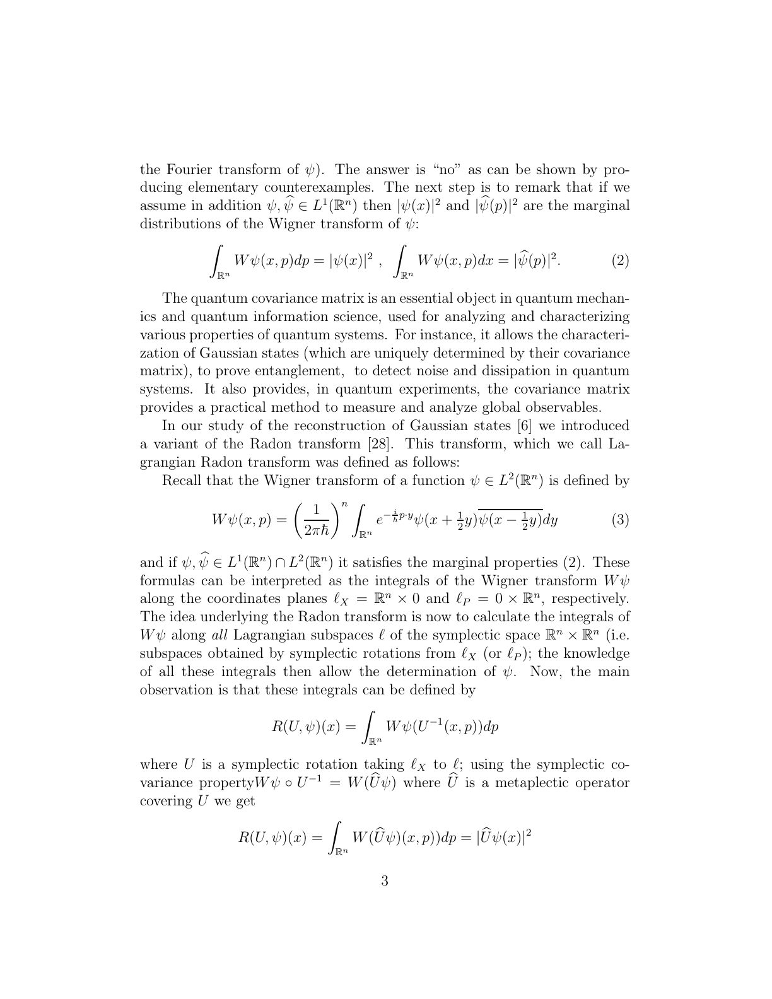
<figcaption class="paper-figure-caption"><b>Fig 2.</b> Low-resolution page preview, page 3</figcaption>
</figure>
<figure class="paper-figure-card">
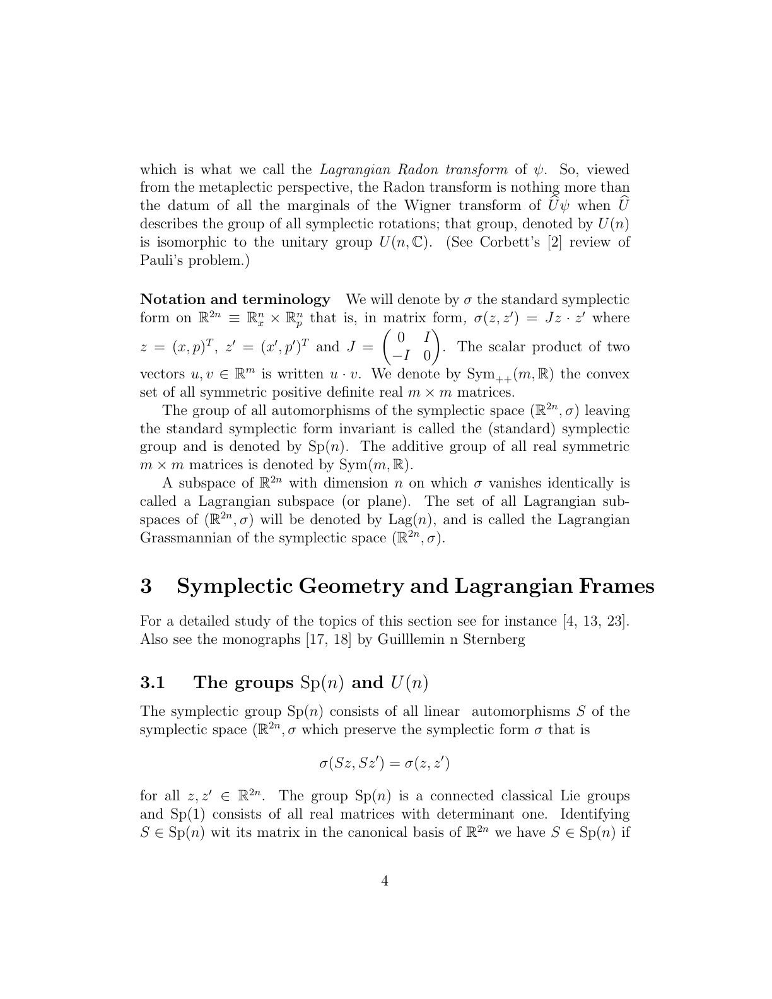
<figcaption class="paper-figure-caption"><b>Fig 3.</b> Low-resolution page preview, page 4</figcaption>
</figure>
<figure class="paper-figure-card">
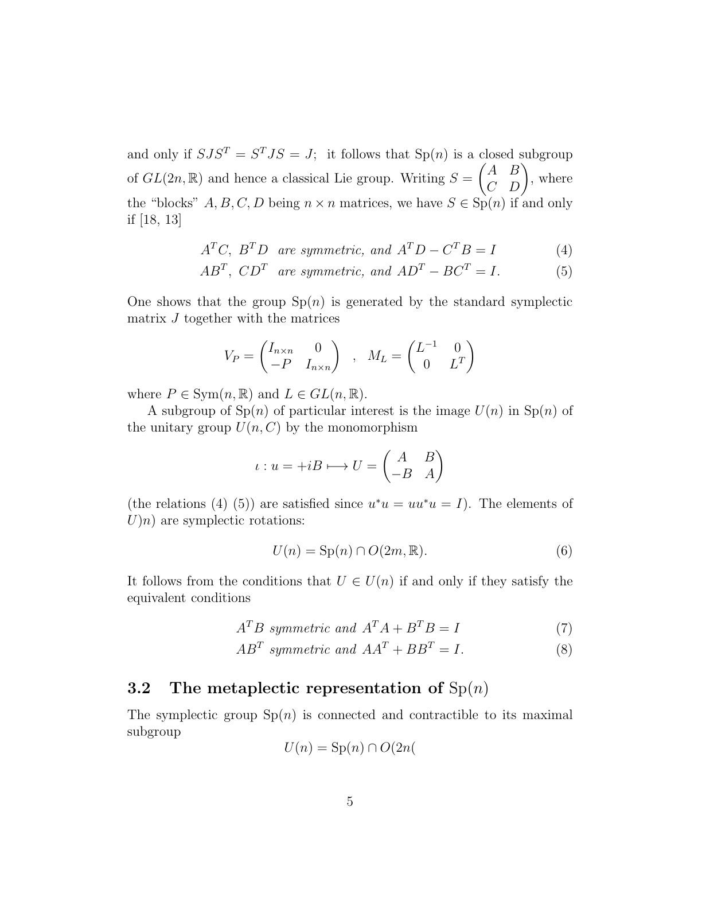
<figcaption class="paper-figure-caption"><b>Fig 4.</b> Low-resolution page preview, page 5</figcaption>
</figure>
<figure class="paper-figure-card">
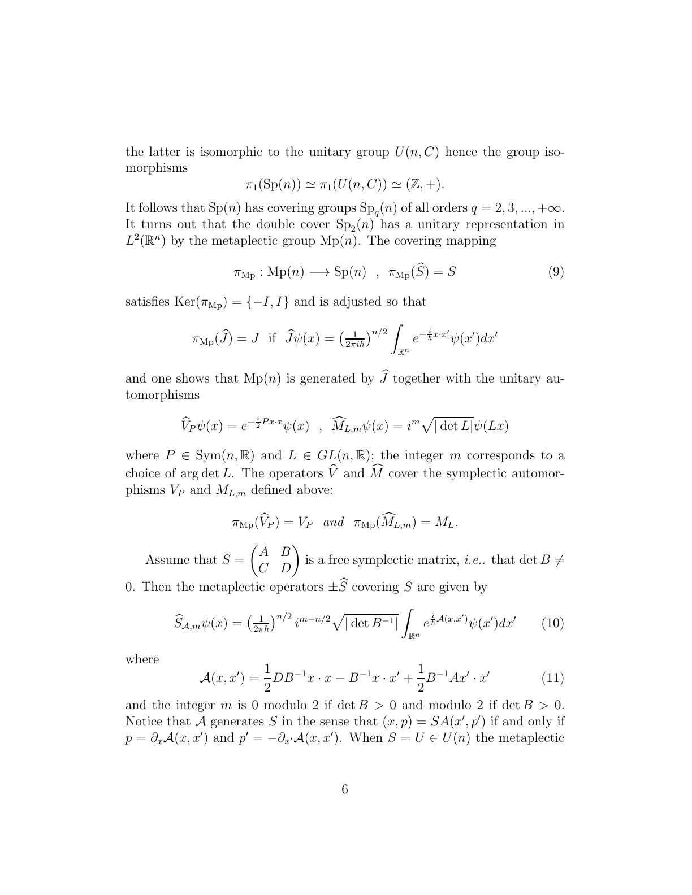
<figcaption class="paper-figure-caption"><b>Fig 5.</b> Low-resolution page preview, page 6</figcaption>
</figure>

**Summary.** This paper introduces a generalized Lagrangian Radon transform based on symplectic geometry to extend the concept of marginal measurements in quantum mechanics. It shows that by measuring projections (tomograms) along arbitrary Lagrangian subspaces, one can uniquely reconstruct the full quantum state's Wigner function or density operator. This provides a powerful mathematical tool for understanding phase-space tomography.

**Why it may be interesting.** This work provides a deep mathematical underpinning for quantum state tomography, connecting fundamental concepts like Wigner functions and phase space measurements through rigorous geometric methods applicable to open quantum systems theory.

Detailed structure

**Main problem.** The paper develops a symplectic formulation for the Lagrangian Radon transform to generalize the marginals of the Wigner distribution, providing a unified quantum tomography framework.

**Main result.** It establishes that generalized marginal measurements along arbitrary Lagrangian subspaces are sufficient to reconstruct the full density operator or Gaussian state in phase space.

**Method.** The approach uses advanced harmonic analysis on the symplectic group $Sp(n)$ acting on the Lagrangian Grassmannian $	ext{Lag}(n)$, generalizing classical Radon transforms.

**Model / system.** The theory applies to quantum states described by density operators ($
ho$) and their Wigner representations ($W\psi$), operating in phase space $\mathbb{R}^{2n}$.

**Key observables.** Generalized Lagrangian tomograms, the Wigner function $W\psi$, and the covariance matrix $\Sigma$.

**Important parameters / regimes.** The symplectic group structure, the dimension $n$ (related to degrees of freedom), and Planck's constant ($\hbar$).

**Assumptions / limitations.** The framework assumes sufficient smoothness conditions on the density operator for the Radon transform definitions to hold.

**Paper structure.** The paper builds from defining the symplectic geometry of the Lagrangian Radon transform, applying it first to Gaussian states (reconstruction formulas), and finally extending the concept to reconstruct general density operators via cross-Wigner distributions.

Abstract

We develop a symplectic formulation of the Lagrangian Radon transform based on the transitive action of the symplectic group on the Lagrangian Grassmannian. This geometric framework naturally extends the classical notion of the marginals of the Wigner transform, viewed as elementary tomograms, to arbitrary Lagrangian subspaces. The resulting generalized tomography provides a unified treatment of position and momentum measurements related by symplectic rotations. As applications, we revisit the Pauli reconstruction problem and establish reconstruction formulas for density operators from generalized Lagrangian tomograms.

[↑ back to top](#top)

### [Local network growth: How simple rules drive network complexity](http://arxiv.org/abs/2608.01853v1)

**Authors:** Alexei Vazquez  
**Type:** theory · **Category:** disordered systems and neural networks · **PDF:** <https://arxiv.org/pdf/2608.01853v1>  
**Analysis basis:** full PDF text, analyzed in chunks
**Topic relevance:** `analog quantum simulation` **1/5** · `correlated / nonlocal dissipation` **1/5** · `driven-dissipative phase transition` **1/5** · `entanglement & information structure` **1/5** · `methods for driven-dissipative` **1/5** · `non-equilibrium dynamics` **1/5** · `non-equilibrium universality` **1/5**

↔ Scroll figures horizontally

<figure class="paper-figure-card">
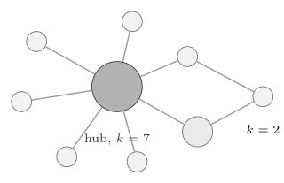
<figcaption class="paper-figure-caption"><b>Fig 1.</b> Figure 1.1: Degree. A node’s degree is simply its number of links. Drawn here with node size growing with degree: a few hubs (such as the central one, k = 7) carry many links, while most nodes have only one or two. That imbalance — many small nodes, a few giant hubs — is the hallmark of a scale-free network.</figcaption>
</figure>
<figure class="paper-figure-card">
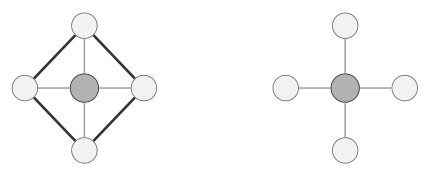
<figcaption class="paper-figure-caption"><b>Fig 2.</b> Figure 1.2: Clustering coefficient. The clustering of the central node (gray) is the fraction of its neighbor pairs that are themselves linked. (a) Four of the six neighbor pairs are linked (the bold links), so c ≈0.67 — a cliquish neighborhood. (b) No neighbors are linked to each other, so c = 0.</figcaption>
</figure>
<figure class="paper-figure-card">
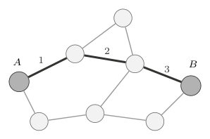
<figcaption class="paper-figure-caption"><b>Fig 3.</b> Figure 1.3: Distance. The distance between two nodes is the number of links on the shortest route between them. The shortest route from A to B here is three hops (in bold); the lower route is longer. In real networks these shortest distances stay small even as the network grows — the small-world effect.</figcaption>
</figure>
<figure class="paper-figure-card">
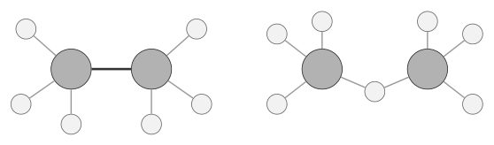
<figcaption class="paper-figure-caption"><b>Fig 4.</b> Figure 1.4: Degree correlations. (a) In an assortative network, hubs tend to link to other hubs (“birds of a feather”). (b) In a disassortative one, hubs avoid each other and link instead to low- degree nodes (“opposites attract”). Social networks lean assortative; technological and biological ones, disassortative.</figcaption>
</figure>
<figure class="paper-figure-card">
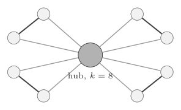
<figcaption class="paper-figure-caption"><b>Fig 5.</b> Figure 1.6: Why the standard clustering coefficient misleads. The hub’s neighbors all have degree two, and each spends its spare link on another neighbor of the hub. They are therefore as intercon- nected as their degrees allow — no rewiring could add a single link among them. Yet the standard coefficient, Eq. (1.2), divides by all 8 2  = 28 neighbor pairs and reports c = 4/28 ≈0.14, falling to zero as the hub grows. The pairs it counts are pairs the degrees forbid.</figcaption>
</figure>

**Summary.** This work argues that the complex structure of real networks—from social media to the web—does not require a global organizing principle. Instead, these intricate patterns emerge naturally and robustly from simple, localized rules governing how new connections are formed one node at a time.

**Why it may be interesting.** While not quantum in nature, the principles of emergent complexity from local interactions resonate with concepts in many-body physics, such as how collective behavior arises from individual particle Hamiltonians or local field interactions.

Detailed structure

**Main problem.** The paper addresses how complex, global statistical regularities found in real-world networks (like the Internet or social graphs) emerge from simple, purely local growth rules rather than requiring a global mechanism like preferential attachment.

**Main result.** Global network patterns—such as scale-free degree distributions and high clustering—are shown to be emergent consequences of microscopic decisions made only by newly connected nodes interacting with their immediate neighbors.

**Method.** The methodology involves identifying and testing specific local growth rules (e.g., search, triadic closure) against macroscopic network diagnostics using mean-field arguments and comparative analysis with deterministic models.

**Model / system.** The study applies to a wide variety of complex networks, including the Internet graph, social ties, protein interaction maps, and project dependency graphs. The focus is on the abstract mathematical structure of connectivity rather than a specific physical Hamiltonian.

**Key observables.** Degree distribution ($p(k) \sim k^{-\gamma}$), small-world properties (short paths, high clustering), community structure scaling ($\sqrt{n}$ vs $neta$), and local correlations between neighboring node degrees.

**Important parameters / regimes.** The growth rule itself is the key parameter; variations in this local decision process determine the resulting global exponents and structural metrics.

**Assumptions / limitations.** The central assumption is that locality dictates globality, meaning complex structure arises from simple, non-global interactions. Early analyses must carefully distinguish between measurement artifacts and true emergent properties.

**Figures summary.** Not specified; the notes describe conceptual figures illustrating degree counting and structural comparisons (e.g., ring lattice vs. real networks).

**Paper structure.** The paper builds its argument by first establishing the observed global regularities, then systematically challenging the necessity of global rules, and finally proposing that local mechanisms are sufficient to generate all observed complexity.

Abstract

The Internet, a living cell, a circle of friends, a billion-dollar construction project: these systems share almost nothing -- yet, drawn as networks, they look astonishingly alike. Each has a few giant hubs among a multitude of sparsely connected nodes, short paths between any two parts, dense local clustering, communities, and many redundant routes. For two decades such patterns have been credited to "preferential attachment," the rich getting richer -- a rule that, taken literally, asks every newcomer to survey the whole network before it links. This book makes a simpler case, and defends it one mechanism at a time: the global regularities of real networks are not imposed from above but emerge from purely local rules, in which each new node acts only on a node it has reached and that node's immediate neighbours. A surfer following links, a friend introducing a friend, a gene copied with its connections -- none consults the network as a whole, yet each builds, in the aggregate, the full and unmistakable signature of a real complex system. Written for the curious reader as much as the specialist, with the ideas told in plain language and the mathematics set aside in boxes that can be skipped, it shows how citation graphs, the web, social ties, protein interactions, and project schedules all grow themselves from the same handful of local rules -- one local decision at a time.

[↑ back to top](#top)

### [Bayesian Inference with Structured Signal: Static Replica Symmetry Breaking on the Nishimori Line in the Planted Spin Glass](http://arxiv.org/abs/2608.02373v1)

**Authors:** Andrea Vincenzo Dell'Abate, Louise Budzynski  
**Type:** theory · **Category:** disordered systems and neural networks · **PDF:** <https://arxiv.org/pdf/2608.02373v1>  
**Analysis basis:** full PDF text, analyzed in chunks
**Topic relevance:** `Keldysh / 2PI / non-Gaussian methods` **1/5** · `analog quantum simulation` **1/5** · `driven-dissipative phase transition` **1/5** · `exotic spin models in light-matter` **1/5** · `methods for driven-dissipative` **1/5**

↔ Scroll figures horizontally

<figure class="paper-figure-card">
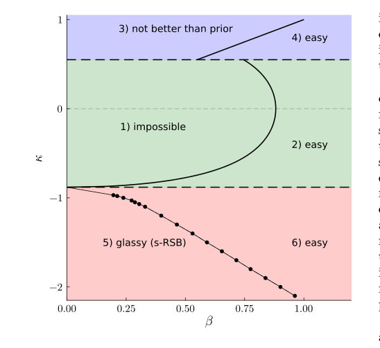
<figcaption class="paper-figure-caption"><b>Fig 1.</b> FIG. 1. Phase diagram of the inference problem obtained from the distributional cavity equations (B21, B22, C27), on random 3-regular graphs. The background colors indi- cate the phase of the prior: paramagnetic for κ ∈[κrsb, κc] in green, ferromagnetic for κ &gt; κc in blue, and static RSB for κ &lt; κrsb in red. In region 1, inference is information- theoretically impossible. In regions 2, 4 and 6, inference is possible and BP achieves the predicted optimal perfor- mance. In region 3, partial recovery is already possible from the prior alone, but the posterior does not improve over the trivial prior estimator. In region 5, the posterior is in a static RSB phase, within the x = 1 cavity approach...</figcaption>
</figure>
<figure class="paper-figure-card">
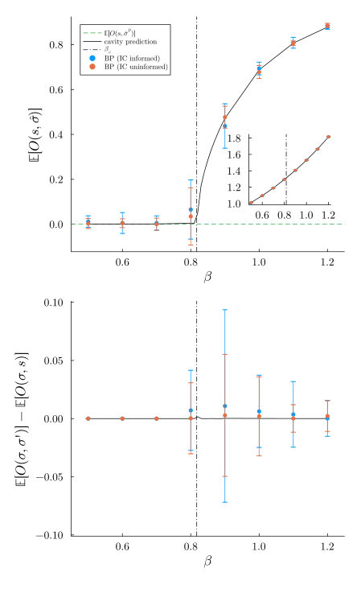
<figcaption class="paper-figure-caption"><b>Fig 2.</b> FIG. 2. Transition for κ = 0.4, from impossible to easy phase, occurring at βc = 0.818 (vertical dashed line). Top: Overlap between the MMO estimator (8) and the planted configuration s (the signal). Inset: Free-entropy of the pos- terior. Bottom: Nishimori identity, shown through the dif- ference between the overlap E [σ, σ′] between two indepen- dent samples from the posterior, and the overlap E [σ, s] between the signal and a sample from the posterior. Black solid line: cavity predictions. Dots: performance of Belief Propagation on finite size instances (N = 104) with two initial conditions (see equation (12)) informed of the signal (blue dots), and uninformed (orange dots).</figcaption>
</figure>
<figure class="paper-figure-card">
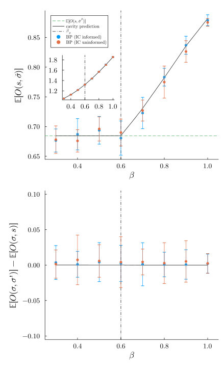
<figcaption class="paper-figure-caption"><b>Fig 3.</b> FIG. 3. Transition for κ = 0.6, from “not better than prior” to easy phase, occurring at βp = 0.6 (vertical dashed line). Top: Overlap between the MMO estimator and the signal s. For β ≤βp, it equals the overlap achieved by the trivial es- timator (green horizontal dashed line), and becomes larger for β &gt; βp. Inset: Free-entropy of the posterior. Bottom: Nishimori identity, shown through the difference between the overlap E [σ, σ′] between two independent samples from the posterior, and the overlap E [σ, s] between the signal and a sample from the posterior. Black solid line: cavity predic- tions. Dots: performance of Belief Propagation on finite size instances with two initial conditions...</figcaption>
</figure>
<figure class="paper-figure-card">
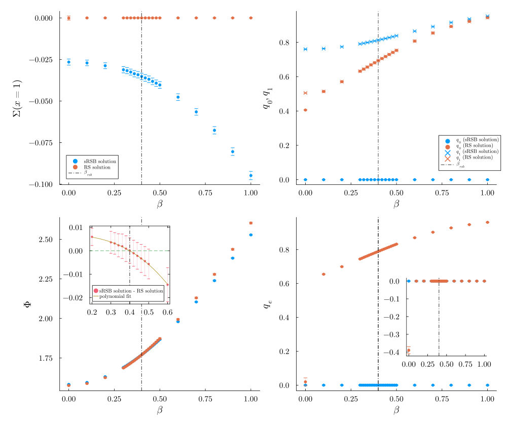
<figcaption class="paper-figure-caption"><b>Fig 4.</b> FIG. 4. Transition for κ = −1.2 from a static RSB phase to a easy RS phase, occurring at βrsb = 0.398 (vertical dashed line). Top left: Complexity Σ of the two solutions of (C27). Top right: inter-state and intra-state overlap q0 and q1. The static RSB solution (blue markers) is characterized by Σ &lt; 0 and q0 = 0 &lt; q1. The RS solution (orange markers) has vanishing complexity and equal overlaps q0 = q1, whenever it is thermodynamically dominant (the anomalous orange point at β = 0 belongs to a subdominant continuation of the RS branch). Bottom left: Free-entropy of the two solutions. For β &lt; βrsb, the s-RSB solution has larger free entropy, while for β &gt; βrsb the RS solution is dominant. The...</figcaption>
</figure>
<figure class="paper-figure-card">
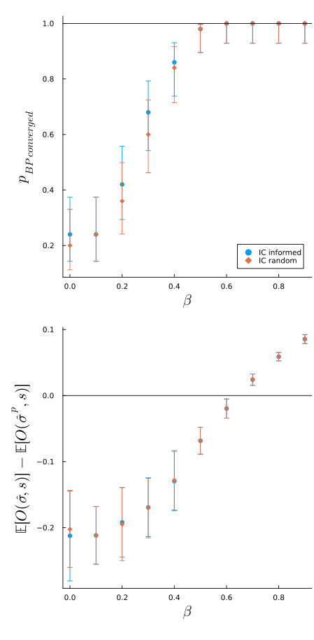
<figcaption class="paper-figure-caption"><b>Fig 5.</b> FIG. 5. Performance of BP at κ = −0.9 &lt; κrsb ≃−0.88 on finite-size instances with N = 104, averaged over 50 samples. Top: convergence probability of BP. Bottom: difference be- tween the overlap of the signal with the MMO estimator (8) and with the prior-based estimator (9), averaged over con- verged instances. Blue markers correspond to the informed initialization, while orange markers correspond to the unin- formed random initialization.</figcaption>
</figure>

**Summary.** This paper analyzes Bayesian inference in a structured spin glass model, moving beyond simple independent assumptions. By using advanced techniques like the replica method on random regular graphs, it demonstrates that correlated priors can lead to static Replica Symmetry Breaking (RSB) in the posterior distribution. This highlights how structural correlations fundamentally alter the information recovery process in disordered systems.

**Why it may be interesting.** While focused on classical statistical mechanics, the methodology of analyzing complex energy landscapes and phase transitions via replica methods is foundational for understanding quantum many-body systems, especially those exhibiting glassy dynamics or frustration.

Detailed structure

**Main problem.** The study investigates how structural correlations within the signal prior affect the feasibility and performance of Bayesian inference in a planted spin glass model, moving beyond standard i.i.d. assumptions.

**Main result.** The analysis reveals that structured priors can induce static Replica Symmetry Breaking (RSB) in the posterior distribution under Nishimori conditions, providing a non-trivial example of glassy behavior in an optimal inference setting.

**Method.** The work employs advanced tools from statistical physics, including the replica method and cavity equations, to analyze the phase diagram and transition points.

**Model / system.** The model is a planted spin glass on random regular graphs. The signal prior is defined by an Ising Hamiltonian with coupling $\kappa$, and observations are noisy couplings $J_{ij}$ related to the true signal $\mathbf{s}$.

**Key observables.** Reconstruction threshold ($eta_c$), overlap ($O(\mathbf{s}, \hat{\sigma})$), complexity ($\Sigma_0(x_0)$), and the identification of static RSB transitions.

**Important parameters / regimes.** Signal structure parameter $\kappa$, observation strength $eta$, and graph connectivity (e.g., 3-regular graphs).

**Assumptions / limitations.** The analysis relies on the replica method, cavity equations, and approximations like assuming delta distributions for message passing in the thermodynamic limit.

**Figures summary.** Figures illustrate phase diagrams showing regions of paramagnetic, ferromagnetic, and static RSB behavior based on $\kappa$ and signal strength. Other figures plot complexity measures ($\Sigma_0$) to locate transition points.

**Paper structure.** The paper systematically analyzes the Bayesian inference problem by deriving cavity equations for both the prior and posterior distributions. It then uses RSB analysis (replica method) to map out the phase diagram, identifying critical thresholds where the system transitions between different glassy phases.

Abstract

A common assumption in theoretical models of Bayesian inference is that the signal has i.i.d. components. To study the effect of correlations in the signal prior, we consider a minimal model: the planted spin glass on random regular graphs, where the signal is sampled from an Ising model with coupling $κ$. Depending on the phase of the prior, we find that adding structure in the signal can either help or hinder inference. In the paramagnetic regime, correlations in the signal lower the reconstruction threshold, so that weaker signal strength is sufficient for recovery. In the ferromagnetic regime, the prior alone already enables partial recovery, and we identify the threshold above which the observations provide additional information. When the prior itself is in a replica symmetry breaking (RSB) phase, we detect a static RSB transition in the posterior under Nishimori conditions. This provides an example where a non-separable, correlated prior leads to static RSB in a Bayes-optimal inference problem. We discuss the consequences of this glassy phase for algorithmic performance, in particular for Belief Propagation.

[↑ back to top](#top)

### [Quantum geometry and RKKY in flat bands](http://arxiv.org/abs/2608.01363v1)

**Authors:** Chang-geun Oh, Makoto Shimizu, Youichi Yanase, Shuichi Murakami  
**Type:** theory · **Category:** strongly correlated electrons · **PDF:** <https://arxiv.org/pdf/2608.01363v1>  
**Analysis basis:** full PDF text, analyzed in chunks
**Topic relevance:** `Keldysh / 2PI / non-Gaussian methods` **1/5** · `analog quantum simulation` **1/5** · `exotic spin models in light-matter` **1/5** · `spintronics-quantum-optics interface` **1/5**

↔ Scroll figures horizontally

<figure class="paper-figure-card">
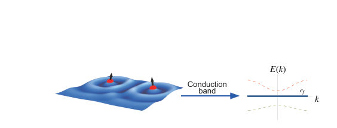
<figcaption class="paper-figure-caption"><b>Fig 1.</b> FIG. 1. Schematic illustration of localized spins (red) interacting through a flat conduction band. The right panel depicts the band structure E(k) featuring a flat band (solid blue) at the Fermi level, separated from remote bands (dashed lines) by an energy gap ∆.</figcaption>
</figure>
<figure class="paper-figure-card">
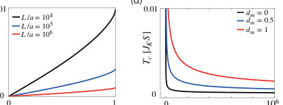
<figcaption class="paper-figure-caption"><b>Fig 2.</b> FIG. 2. Geometric stabilization of ferromagnetic order in a 1D RKKY model. (a) Energy dispersion of H1D c . The energy spectrum remains invariant under the tuning of the geometric parameter dm. (b) Static susceptibility χ0(q) for several values of dm = 0, 0.5 and 1. (c) Critical temperature Tc as a function of dm for fixed system sizes (L = 104, 105, 106). (d) Tc as a function of L for dm = 0.1, 0.5 and 1. Here, we fixed ∆= 0.3 for (b-c) and T = 0.01 for (b).</figcaption>
</figure>
<figure class="paper-figure-card">
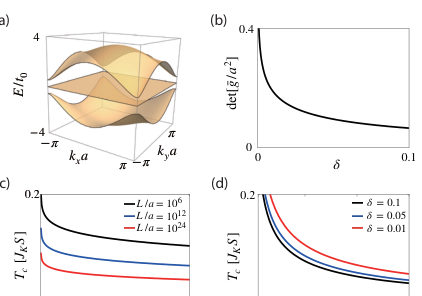
<figcaption class="paper-figure-caption"><b>Fig 3.</b> FIG. 3. Geometric stabilization of ferromagnetic order in a 2D RKKY model. (a) Energy dispersion of H2D c with δ = 0.4. (b) Determinant of the averaged quantum metric det ¯g as a function of δ. (c) Critical temperature Tc as a function of δ for fixed sys- tem sizes (L/a = 106, 1012, 1024). (d) Tc as a function of L for δ = 0.01, 0.05 and 0.1.</figcaption>
</figure>
<figure class="paper-figure-card">
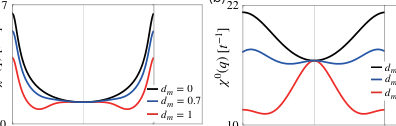
<figcaption class="paper-figure-caption"><b>Fig 4.</b> FIG. 4. Magnetic susceptibility in a 1D dispersive band. Static magnetic susceptibility χ0(q) as a function of momentum q for various quantum geometric parameters dm = {0, 0.7, 1.0}. (a) W/T = 40: Antiferromagnetic fluctuations dominate, with quantum geometry modulating the peak intensity. (b) W/T = 4: A transition from antiferromagnetic to ferromagnetic fluctuations occurs as dm increases. All calculations are performed at half-filling (µ = 0) with fixed parameters ∆= 0.3 and T = 0.01.</figcaption>
</figure>

**Summary.** This paper demonstrates that the RKKY interaction mediated by conduction electrons does not vanish in flat-band regimes; instead, it is governed by the quantum geometry of the Bloch states. The authors show this geometric coupling dictates magnetic rigidity and can stabilize finite-temperature magnetic order even in low dimensions. This establishes a general principle linking magnetism to the underlying electronic band structure's topology.

**Why it may be interesting.** This work provides a powerful geometric mechanism (the quantum metric) to understand magnetic ordering in itinerant electron systems, offering insights applicable to materials where band structure engineering is key for spintronics or correlated magnetism.

Detailed structure

**Main problem.** The study investigates how the Ruderman-Kittel-Kasuya-Yosida (RKKY) interaction behaves when conduction electron bands are perfectly flat, challenging conventional pictures based on band dispersion.

**Main result.** RKKY interactions persist in the flat-band limit, mediated instead by the quantum geometry of Bloch states. This geometric coupling determines magnetic rigidity and can stabilize magnetic order in finite systems, circumventing Mermin-Wagner constraints.

**Method.** The authors derive an effective RKKY Hamiltonian using microscopic derivations and analyze the long-wavelength structure of the static susceptibility ($\chi_0(\mathbf{q})$) via quantum geometry tensors.

**Model / system.** The model involves localized magnetic moments coupled to conduction electrons on a lattice (e.g., 1D or 2D Lieb lattices). The analysis focuses on the flat-band limit and its extension to general itinerant systems by varying geometric parameters.

**Key observables.** RKKY interaction strength, static susceptibility $\chi_0(\mathbf{q})$, magnetic correlation length ($\xi$), and spin stiffness ($D$).

**Important parameters / regimes.** Quantum metric ($ar{g}_{ab}$), bandwidth ($W$) to temperature ratio ($T$), and system size ($L$ or dimensionality $d$).

**Assumptions / limitations.** The analysis relies on linear spin-wave theory approximations and assumes that the quantum metric provides a universal regulator for magnetic fluctuations.

**Figures summary.** Figures illustrate how varying geometric parameters (like $d_m$ or $\delta$) modulates the static susceptibility $\chi_0(q)$ in 1D/2D systems, showing changes from antiferromagnetic to ferromagnetic behavior and affecting critical temperature scaling with system size.

**Paper structure.** The paper progresses by first establishing the failure of dispersion-driven RKKY in flat bands. It then introduces the quantum metric as the governing factor for long-range coupling. Finally, it generalizes this principle to finite and low-dimensional systems to explain magnetic stability beyond idealized limits.

Abstract

Flat conduction bands quench the group velocity and thus challenge conventional, dispersion-driven pictures of the Ruderman-Kittel-Kasuya-Yosida (RKKY) interaction, where localized moments are coupled via an effective exchange mediated by conduction electrons. Here we show that RKKY interactions in the flat-band limit are not extinguished by the vanishing group velocity but are instead mediated by the quantum geometry of Bloch states. Starting from a microscopic RKKY derivation, we demonstrate that the Brillouin-zone-averaged quantum metric controls the long-wavelength structure of the static susceptibility, thereby determining the magnetic correlation length and the spin stiffness. As a result, the finite spatial spread of Wannier functions provides an effective long-range coupling channel even when single-particle dispersion is absent. Furthermore, we establish the general principle that the ordering temperature is governed by the quantum metric in finite and low-dimensional samples, effectively circumventing the thermodynamic-limit constraint of the Mermin-Wagner theorem. Specifically, our theoretical investigation reveals that increasing the quantum metric enhances magnetic rigidity and leads to a corresponding rise in the critical temperature within finite-sized systems.

[↑ back to top](#top)

### [Effects of realistic pulse shapes in two-dimensional spectroscopy](http://arxiv.org/abs/2608.02275v1)

**Authors:** M. Russo, R. Gilliot, A. Blech, M. Joffre, C. P. Koch, H. Seiler  
**Type:** theory · **Category:** other · **PDF:** <https://arxiv.org/pdf/2608.02275v1>  
**Analysis basis:** full PDF text, analyzed in chunks
**Topic relevance:** `Keldysh / 2PI / non-Gaussian methods` **1/5** · `interference shaping light` **1/5** · `methods for driven-dissipative` **1/5**

↔ Scroll figures horizontally

<figure class="paper-figure-card">
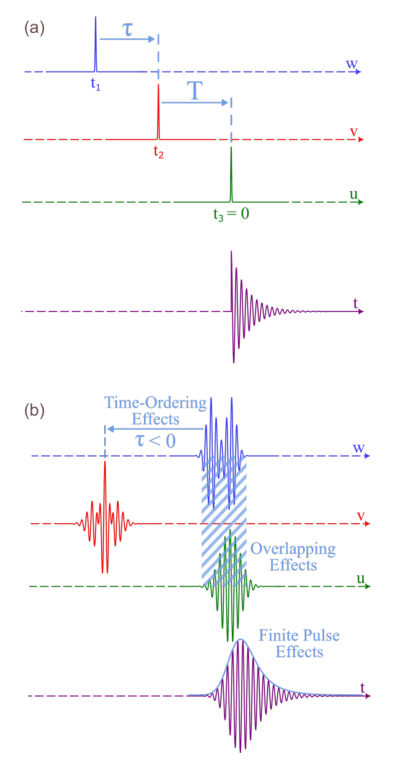
<figcaption class="paper-figure-caption"><b>Fig 1.</b> FIG. 1: Schematic illustrations of the incident pulses (E1, E2, E3) (in blue, red, and green) and of the emitted signal E(3) S (in purple). Variables (t1, t2, t3) are the arrival times of each pulse, while (τ, T) are the delays between each pulse. (a) Impulsive picture (b) Realistic picture, where the emitted signal is influenced by time-ordering, overlapping, and finite pulse effects.</figcaption>
</figure>
<figure class="paper-figure-card">
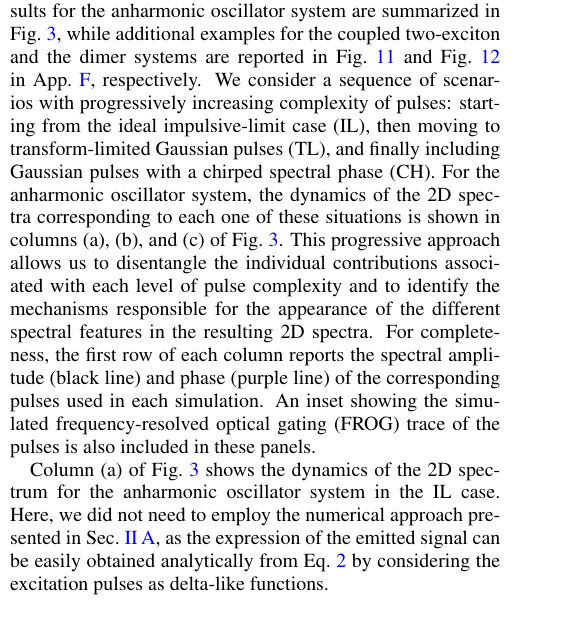
<figcaption class="paper-figure-caption"><b>Fig 2.</b> FIG. 2: Energy-level diagrams of the model systems investigated in this work: (a) anharmonic oscil- lator, (b) two-exciton system, and (c) six-level dimer model. These systems represent standard model platforms in 2D spectroscopy.</figcaption>
</figure>
<figure class="paper-figure-card">
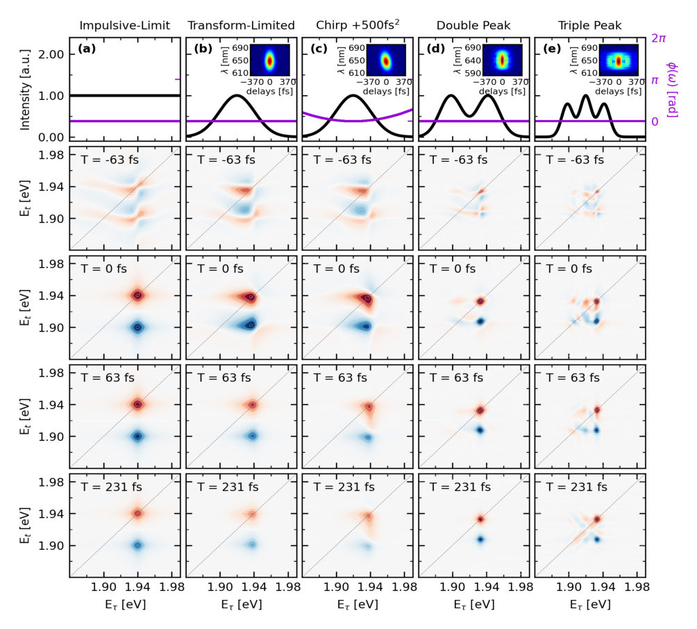
<figcaption class="paper-figure-caption"><b>Fig 3.</b> FIG. 3: Influence of pulse shape and spectral phase on the 2D spectra for the anharmonic oscillator system. Each column corresponds to a different excitation condition: (a) impulsive limit (IL), (b) Gaussian transform-limited pulse (TL), (c) chirped Gaussian pulse (CH), (d) double-peaked pulse with flat spectral phase, and (e) triple-peaked pulse with flat spectral phase. The first panel of each column shows the spectral amplitude and phase of the corresponding pulse (purple line), together with the associated FROG trace (inset). The panels below display the dynamics of the simulated 2D spectra. The color scale is normalized column-wise for each column. Blue features are negative, while red...</figcaption>
</figure>
<figure class="paper-figure-card">
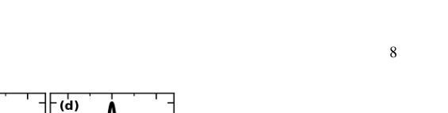
<figcaption class="paper-figure-caption"><b>Fig 4.</b> FIG. 4: Influence of long temporal tails of pulses on 2D spectra of an anhar- monic oscillator system. The first row shows the tempo- ral profiles of simulated fiber pulses, to which a super- Gaussian mask with pro- gressively increasing width (from left to right) has been applied. The panels be- low display the correspond- ing 2D spectra calculated for each masked pulse.</figcaption>
</figure>
<figure class="paper-figure-card">
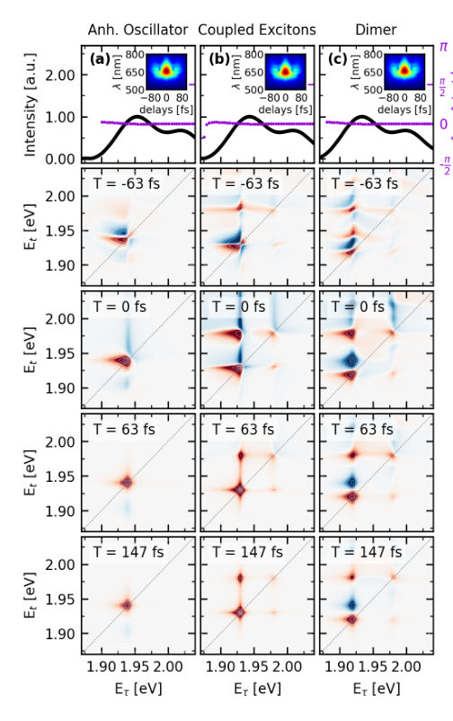
<figcaption class="paper-figure-caption"><b>Fig 5.</b> FIG. 5: Effect of long temporal tails on the 2D spectra of the three model systems. Each column corresponds to a different system: (a) an anharmonic oscillator, (b) two coupled excitons, and (c) a dimer. The top panel in each column shows the spectral amplitude and phase of the sim- ulated fiber pulse used in the calculation (purple line), to- gether with the corresponding FROG trace (inset). The panels below display the dynamics of the simulated 2D spectra. The color scale is normalized column-wise for each column.</figcaption>
</figure>

**Summary.** This paper presents an advanced theoretical method to simulate 2D spectroscopy signals by accurately incorporating the effects of realistic, non-ideal laser pulses. The authors demonstrate that neglecting these pulse characteristics leads to incorrect interpretations of quantum dynamics. By achieving linear scaling, they provide a powerful tool for interpreting complex experimental data in AMO physics.

**Why it may be interesting.** This work is highly relevant as it provides a computationally tractable framework for simulating complex quantum optical measurements, directly addressing how experimental artifacts (like pulse shape imperfections) manifest in fundamental spectroscopic observables.

Detailed structure

**Main problem.** To accurately simulate Two-dimensional (2D) spectroscopy by accounting for the effects of realistic pulse shapes, spectral phase distortions, and temporal pulse tails.

**Main result.** Realistic pulses induce additional spectral features, lineshape distortions, and oscillating contributions in 2D spectra, emphasizing that simulations must incorporate these effects for correct data interpretation.

**Method.** The authors developed an efficient simulation method by recasting the computationally intensive triple convolution integral into a form allowing linear scaling with sampling points under the Markovian approximation.

**Model / system.** The study focuses on 2D spectroscopy, a pump-pump-probe technique used to probe quantum state couplings. Models include anharmonic oscillators and two-exciton systems.

**Key observables.** The 2D spectrum $E^{(3)}_S(	au, T, t)$, spectral features, lineshape distortions, and oscillating contributions in the system's dynamics.

**Important parameters / regimes.** Pulse shapes (Gaussian, chirped, double/triple-peaked), time delays ($	au, T$), and pulse overlap effects.

**Assumptions / limitations.** The primary simplification relies on the Markovian assumption for the environment. The Rotating Wave Approximation (RWA) is also used.

**Figures summary.** Figures compare 2D spectra under various pulse shapes (IL vs. TL vs. CH) for two-exciton and dimer systems, showing how spectral features change with pulse complexity.

**Paper structure.** The paper introduces the theoretical framework to calculate the signal $E^{(3)}_S$ by separating contributions into partial response functions ($R_j$) and integral terms ($I_{j,\sigma}$), followed by applying this method to model various physical systems under different realistic excitation conditions.

Abstract

Two-dimensional (2D) spectroscopy is a powerful pump-pump-probe technique for revealing couplings between quantum states and disentangling the different contributions to the optical response of a system. We present an efficient method for 2D spectroscopy simulations in the Markovian limit for the environment, capable of handling arbitrary pulse shapes and reproducing time-ordering and overlapping pulse effects, while maintaining a computational cost that scales linearly with the number of sampling points. We leverage this framework to investigate how 2D spectra are affected by spectral phase distortions and highly non-Gaussian pulse shapes, such as those produced experimentally by hollow-core fibers or non-collinear optical amplifiers. We show that realistic pulses can induce the appearance of additional spectral features, lineshape distortions and oscillating contributions in the system's dynamics. Notably, even weak temporal pulse tails arising from uncorrected high-order spectral phase terms cause visible changes in the 2D spectra. We also find that homodyne detection schemes employed in experiments can mitigate the presence of such pulse effects. These results emphasize the importance of including realistic pulses in 2D spectroscopy simulations to identify pulse-induced effects and minimize ambiguities in the interpretation of experimental data.

[↑ back to top](#top)

### [Efficient re-sampling in quasi-probability decompositions](http://arxiv.org/abs/2608.02075v1)

**Authors:** Sara Santos, Stefan Woerner, Vincenzo Savona, Julien Gacon  
**Type:** theory · **Category:** quantum information and computing · **PDF:** <https://arxiv.org/pdf/2608.02075v1>  
**Analysis basis:** full PDF text, analyzed in chunks
**Topic relevance:** `Keldysh / 2PI / non-Gaussian methods` **1/5** · `entanglement & information structure` **1/5** · `methods for driven-dissipative` **1/5**

↔ Scroll figures horizontally

<figure class="paper-figure-card">
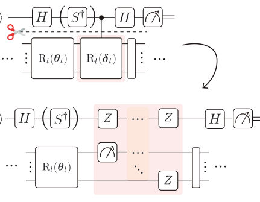
<figcaption class="paper-figure-caption"><b>Fig 1.</b> Fig. 2. Decomposition of the compressed Hadamard test circuit: (a) each controlled gate is cut and replaced by a local channel from a predefined decomposition set; (b) the cuts separate the ancilla qubit from the remaining circuit, leaving only local channels in place of the controlled gates.</figcaption>
</figure>
<figure class="paper-figure-card">
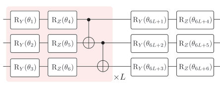
<figcaption class="paper-figure-caption"><b>Fig 2.</b> Fig. 3. Schematic representation of a layered ansatz with 3 qubits. This ansatz is composed of blocks of RZ and RY gates applied to all qubits, inter-layered by CNOT gates. L represents the number of layers, i.e., the number of times the shaded block is repeated (with different parameters).</figcaption>
</figure>
<figure class="paper-figure-card">
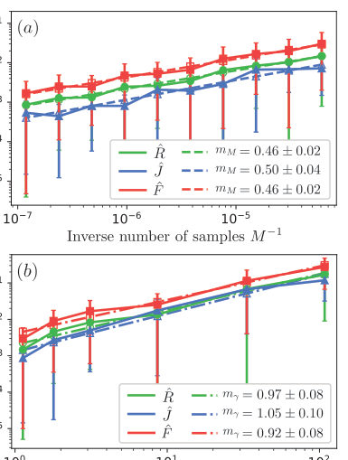
<figcaption class="paper-figure-caption"><b>Fig 3.</b> Fig. 4. Numerical results for the RMSE of the fidelity estimator, averaged over 10 runs. (a) RMSE vs. M−1 with fixed h = 0.1. (b) RMSE vs. γ with fixed M = 5 × 104.</figcaption>
</figure>
<figure class="paper-figure-card">
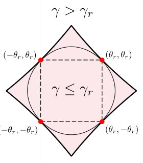
<figcaption class="paper-figure-caption"><b>Fig 4.</b> Fig. 5. Comparison of γ and χ of the QPD for two CRZ gates, parameterized by the pairs (θ1, θ2). The red points (±θr, ±θr) represent the reference an- gles. By symmetry, all pairs (±θr, ±θr) lead to the same γr = γ(±θr, ±θr) and χ, and, thus, the same resulting plot. The shaded region indicates the parameters for which γ(θ1, θ2) ≤γr, with the boundary given by the points that satisfy the γ equality; the thin black curve corresponds to the points for which χ = 1; and the dashed square denotes the perturbation domain [−θr, θr]2, within which the variance indicator satisfies χ ≤1.</figcaption>
</figure>
<figure class="paper-figure-card">
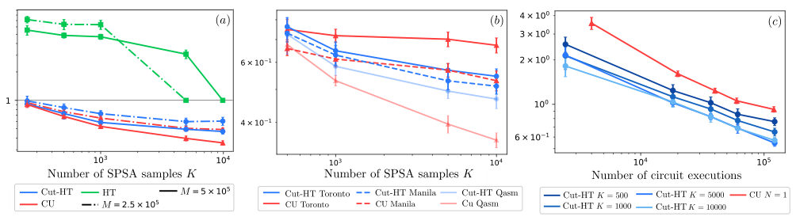
<figcaption class="paper-figure-caption"><b>Fig 5.</b> Fig. 6. Numerical results for the estimation of the real part of the QGT of a 3-qubit system described by the layered ansatz illustrated in Fig. 3 with L = 2. All data points are averaged over 10 runs. (a) Relative error vs. the number of SPSA samples K in a noiseless setting. The fidelity is computed using the cut-HT, HT, and CU methods, constrained to the same total number of circuit executions. We set h = 0.1. (b) Relative error vs. the number of SPSA samples K on Qiskit is fake Manila and Toronto backends with M = 5 × 105 QPD samples. The fidelity is computed using the cut-HT and CU methods, constrained to the same total number of circuit executions. We set h = 0.1 and compare with the...</figcaption>
</figure>

**Summary.** The paper proposes an efficient reweighting strategy to overcome the exponential sampling overhead inherent in Quasi-Probability Decompositions (QPDs). By reusing samples across slightly varied quantum circuits, it significantly reduces computational cost. This advancement extends the practical applicability of QPD-based methods for estimating key quantities like state fidelity and the Quantum Geometric Tensor in noisy quantum computing settings.

**Why it may be interesting.** This work directly addresses computational bottlenecks in variational quantum algorithms by providing a statistically rigorous method to reuse expensive Monte Carlo samples, which is crucial for scaling these methods on near-term hardware.

Detailed structure

**Main problem.** The primary challenge is mitigating the exponentially scaling sampling overhead associated with Quasi-Probability Decompositions (QPDs) when evaluating quantum observables across varying circuit parameters.

**Main result.** A reweighting strategy was introduced that allows reusing samples from a reference QPD to estimate observables for slightly varied circuits, effectively controlling the exponential sampling overhead while preserving ansatz structure.

**Method.** The authors employ a reweighting framework based on self-normalized importance sampling applied to QPDs. This technique estimates expectation values by leveraging shared sample sets across different parameter settings.

**Model / system.** The work focuses on parameterized quantum circuits used in variational algorithms, specifically estimating fidelities between quantum states and calculating the Quantum Geometric Tensor (QGT).

**Key observables.** Fidelity ($|\langle\psi|\phi
angle|^2$), Real/Imaginary parts of state overlaps ($\hat{R}, \hat{J}$), and the Quantum Geometric Tensor (QGT).

**Important parameters / regimes.** The sampling overhead factor ($\gamma$) and variance change factor ($\chi$) are key parameters analyzed for efficiency.

**Assumptions / limitations.** The reweighting technique is most effective when local channels used in the QPD have angle-independent forms, allowing sample reuse across parameter variations.

**Figures summary.** Figures illustrate circuit diagrams (Hadamard test, QPD decomposition) and numerical results comparing the Root Mean-Squared Error (RMSE) scaling of fidelity estimators under different overhead conditions. Appendix D analyzes error scaling for SPSA estimation.

**Paper structure.** The paper builds from foundational techniques like Hadamard testing for fidelity estimation to applying QPDs for circuit compression, culminating in the novel reweighting strategy for efficient parameter sweeps needed for advanced metrics like the QGT.

Abstract

Near-term quantum devices are limited by noise and hardware constraints, motivating algorithmic approaches that trade circuit complexity for increased sampling overhead. Quasi-probability decompositions (QPDs), for example, allow replacing non-local operations by multiple circuits with local operations, but the associated sampling overhead generally scales exponentially and limits their practicality. In this work, we introduce a reweighting strategy for QPDs for circuits with the same variational structure across parameter settings, reusing samples and thereby reducing the sampling overhead. We first demonstrate this approach by estimating fidelities between parameterized quantum states, a key primitive in variational time evolution and quantum kernel methods. Importantly, this setup allows controlling the exponential QPD sampling overhead while preserving the structure of the state-encoding ansatz. We then apply the method to estimate the real part of the quantum geometric tensor using the simultaneous perturbation stochastic approximation and find that, in the presence of realistic hardware noise, our method outperforms other standard estimation techniques. These results highlight the potential of reweighting strategies to extend the applicability of QPD-based methods in variational quantum algorithms.

[↑ back to top](#top)

### [Field-Free Transverse Aharonov--Bohm Phase Gate for an Orbital $l$-Qubit](http://arxiv.org/abs/2608.02090v1)

**Authors:** Ju Gao, Fang Shen  
**Type:** theory · **Category:** quantum information and computing · **PDF:** <https://arxiv.org/pdf/2608.02090v1>  
**Analysis basis:** full PDF text, analyzed in chunks
**Topic relevance:** `QC/QI experiment` **1/5** · `interference shaping light` **1/5** · `spintronics-quantum-optics interface` **1/5**

↔ Scroll figures horizontally

<figure class="paper-figure-card">
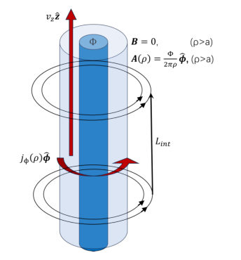
<figcaption class="paper-figure-caption"><b>Fig 1.</b> FIG. 1. Core-excluded TAB section. The flux core lies outside the support of the traveling electron wave. The centroid propagation has no path projection onto A, while jϕ projects onto Aϕ over Lint.</figcaption>
</figure>
<figure class="paper-figure-card">
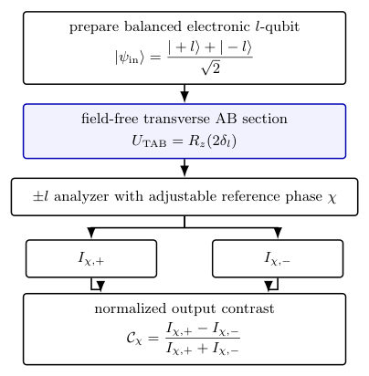
<figcaption class="paper-figure-caption"><b>Fig 2.</b> FIG. 2. Same-path preparation, phase transformation, and readout of the electronic l-qubit. The field-free transverse Aharonov–Bohm section writes the relative phase 2δl between the logical states | + l⟩and | −l⟩. An adjustable ±l analyzer converts this phase into the normalized output contrast Cχ.</figcaption>
</figure>

**Summary.** The paper proposes using the Aharonov-Bohm effect in a confined annular waveguide to create a field-free transverse phase gate for an orbital $l$-qubit. By analyzing the spin-resolved Dirac current, they show that confinement stabilizes a measurable relative phase $\Delta\phi_{TAB}$ proportional to the magnetic flux and angular momentum quantum number. This offers a pathway toward robust quantum information processing using engineered electromagnetic potentials.

**Why it may be interesting.** This work provides a concrete theoretical blueprint for realizing quantum gates using fundamental electromagnetic interactions (AB effect) within solid-state or nanoscale structures, which is highly relevant to superconducting circuits and semiconductor quantum computing.

Detailed structure

**Main problem.** To demonstrate a field-free transverse Aharonov–Bohm (TAB) phase gate for an orbital $l$-qubit.

**Main result.** Confinement in a finite-wall annular guide converts the intrinsic azimuthal Dirac current into a guided, reproducible phase operation $\Delta\phi_{TAB}$, enabling robust qubit manipulation.

**Method.** The phase is calculated by analyzing the spin-resolved conserved Dirac current and comparing two equivalent methods: integrating the transverse current texture or calculating the flux-induced angular-energy expectation value shift.

**Model / system.** The system models an electron wave propagating in a core-excluded finite-wall annular guide, supporting spin-resolved Dirac modes $|\pm l
angle$ which form the qubit basis.

**Key observables.** The measurable quantity is the normalized differential contrast $C_\chi$, which directly yields the relative phase $2\delta_l$.

**Important parameters / regimes.** Key parameters include the angular momentum quantum number $|l|$, the magnetic flux $\Phi$, and geometric dimensions like inner radius $a$ and outer radius $R$.

**Assumptions / limitations.** The analysis is performed to leading nonrelativistic order, assuming a straight annular guide geometry with core exclusion.

**Figures summary.** Figure 1 illustrates the physical setup showing flux outside the electron wave support. Figure 2 details the full gate operation: balanced input $	o$ TAB section ($R_z(2\delta_l)$) $	o$ analyzer ($\chi$) $	o$ output contrast $C_\chi$.

**Paper structure.** The paper develops the theory by extending free-space AB effects to confined Dirac modes, deriving the phase shift $\Delta E_{ln}(\Phi)$, showing how opposite winding modes form a qubit basis $\{|+l
angle, |-l
angle\}$, and finally detailing the interferometric readout scheme using differential contrast $C_\chi$.

Abstract

Free-space Aharonov--Bohm (AB) Bessel modes are known to carry a flux-dependent azimuthal Schrödinger probability current and kinetic orbital angular momentum. We extend this response to the spin-resolved conserved Dirac current of a core-excluded finite-wall annular guide and show that confinement converts its surviving orbital component into a transverse Aharonov--Bohm (TAB) propagation phase for a straight traveling mode whose centroid path has zero projection onto $\mathbf A$. The radial-gradient current reverses under spin reversal; retaining the complete evanescent tail closes it as a boundary contribution, leaving a spin-independent orbital phase $Δφ_{ln}\propto lΦL_{\rm int}\langleρ^{-2}\rangle_{ln}/v_z$. Opposite-winding modes $|\pm l\rangle$ form a same-path qubit implementing $R_z(2δ_l)$ with differential readout and common-mode phase rejection, while direct first-order crosstalk requires the angular harmonic $m=\pm2l$. For a $100\,μ\mathrm{m}$ section with $a=20\,\mathrm{nm}$, $R=30\,\mathrm{nm}$, $E_z=10\,\mathrm{meV}$, and $|l|=10$, the sensitivity is $0.1885\,\mathrm{mrad/mG}$ and $R_z(π)$ occurs at $16.67\,\mathrm{G}$. Finite-wall confinement thus turns intrinsic azimuthal Dirac current into a guided field-free phase operation.

[↑ back to top](#top)

### [Geometry-Informed Polynomial Time Quantum Approximation Schemes for Constrained Optimisation](http://arxiv.org/abs/2608.01121v1)

**Authors:** Chinonso Onah, Kristel Michielsen  
**Type:** both · **Category:** quantum information and computing · **PDF:** <https://arxiv.org/pdf/2608.01121v1>  
**Analysis basis:** full PDF text, analyzed in chunks
**Topic relevance:** `driven-dissipative phase transition` **1/5** · `entanglement & information structure` **1/5** · `methods for driven-dissipative` **1/5**

↔ Scroll figures horizontally

<figure class="paper-figure-card">
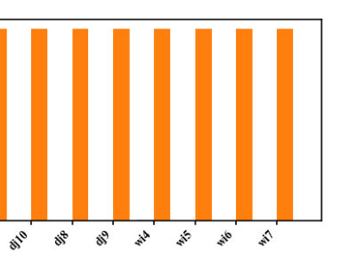
<figcaption class="paper-figure-caption"><b>Fig 1.</b> Figure 1: Raw versus post-repair feasible fraction for the QOptlib benchmark instances executed on ibm_brisbane. Hungarian repair maps all samples back into the feasible permutation set.</figcaption>
</figure>
<figure class="paper-figure-card">
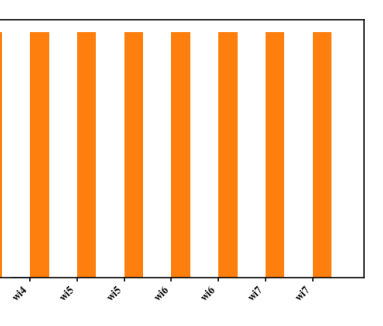
<figcaption class="paper-figure-caption"><b>Fig 2.</b> Figure 2: Raw versus post-repair feasible fraction for ibm_sherbrooke. As on ibm_brisbane, raw feasibility is very small and deterministic repair restores all outputs to feasibility.</figcaption>
</figure>
<figure class="paper-figure-card">
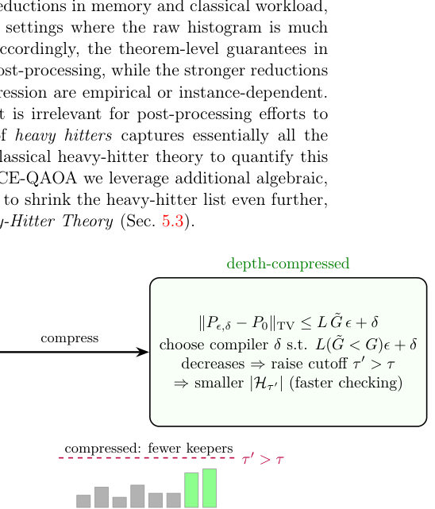
<figcaption class="paper-figure-caption"><b>Fig 3.</b> Figure 3: Depth-compression effect. Trading a tiny compiler error δ for a large gate-count reduction ˜G &lt; G reduces total TV error, lets you raise τ, and shrinks the heavy-hitter set. The associated circuit compression is discussed in App. A.8</figcaption>
</figure>
<figure class="paper-figure-card">
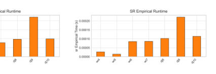
<figcaption class="paper-figure-caption"><b>Fig 4.</b> Figure 5: Empirical CPU runtimes for the three post-processing stages. The classical heavy-hitter stage has the largest footprint, the block-prefiltering stage is substantially cheaper, and the optional top-L compression is cheapest of all.</figcaption>
</figure>

**Summary.** This paper presents a robust framework for achieving polynomial-time quantum approximation schemes for hard constrained optimization problems, even when subjected to realistic device noise. It introduces the NP-HQ algorithm and Heavy-Hitter QAOA to manage noise effects while maintaining strong theoretical guarantees. The work demonstrates both algorithmic improvements and establishes fundamental computational separations regarding sampling distribution generation.

**Why it may be interesting.** While focused on optimization, the rigorous analysis of error propagation (TV distance) and resource scaling ($	ext{depth} \propto n$) provides transferable theoretical tools for understanding noise resilience in any quantum simulation or computation involving complex Hamiltonians.

Detailed structure

**Main problem.** Developing end-to-end polynomial-time quantum approximation schemes for solving constrained optimization problems under realistic device noise.

**Main result.** The authors propose the NP-HQ algorithm, achieving an FPRASq in low-noise regimes and establishing a quantum-classical separation showing that generating the optimal sampling distribution is the computational bottleneck.

**Method.** The approach combines Constraint-Enhanced QAOA (CE-QAOA) with classical post-processing steps: feasibility checking, problem-structured repair maps for noise correction, and objective scoring. A refinement technique called Heavy-Hitter QAOA reduces classical overhead.

**Model / system.** The framework utilizes the Onah–Firt–Michielsen (OFM) kernel to encode constrained optimization problems into a fixed-Hamming-weight space. The quantum dynamics are governed by a depth-$p$ CE-QAOA circuit, and the analysis is framed within the NISQ oracle model.

**Key observables.** Optimal solution probability mass ($q_0$), Total Variation Distance ($\|P_\epsilon - P_0\|_{TV}$), and the required shot complexity for high success probability.

**Important parameters / regimes.** Circuit depth $G(n, p) = \Theta(pn)$, noise window size, and the approximation error $\delta$.

**Assumptions / limitations.** The analysis relies on controlling objective inflation during deterministic repair and assumes that the quantum-classical separation holds unless NP is contained in BPP.

**Figures summary.** Figure 6 illustrates how the maximum permissible heavy-hitter threshold ($	heta_{\max}$) is limited by a combined error budget derived from depth compression and approximation errors. Tables compare recovered costs using different filtering stages.

**Paper structure.** The paper builds theory by analyzing noise impact via total variation bounds, deriving necessary shot budgets, introducing Heavy-Hitter QAOA for efficiency gains, establishing the NP-HQ algorithm's guarantees, and concluding with hardware validation on IBM Eagle processors.

Abstract

When does a noisy quantum sampler yield an end-to-end polynomial-time optimization algorithm with performance guarantees? Building on finite-depth and finite-shot guarantees for Constraint-Enhanced QAOA, we show that inverse-polynomial ideal probability on the optimal set, together with independent sampling, polynomial-time feasibility repair, and scoring, produces an exact-hit fully polynomial randomized approximation scheme, which we call an FPRASq.   This guarantee survives device noise within an instance-dependent window. For effective circuit depth linear in the product of layer count and problem size, preserving an inverse-depth fraction of the ideal optimal mass increases the required shot complexity by one power of the problem size. Beyond this window, deterministic repair guarantees feasibility and provides an instance-dependent approximation guarantee whenever the induced objective inflation is controlled.   The resulting NP-HQ algorithm fits the Chen-Cotler-Huang-Li oracle model. On any NP-hard kernel-admissible promise family, reproducing its inverse-polynomial optimal overlap with a polynomial-time classical sampler would imply that NP is contained in BPP, even with identical repair and perfect access to the constraint structure. Thus, the separation lies in generating the sampling distribution.   We further introduce Heavy-Hitter QAOA, which preserves these conditional guarantees while reducing the retained candidate set and classical post-processing cost by one power of the problem size. Hardware experiments on IBM Eagle r3 processors cover instances with up to one hundred logical variables and match or improve every tested QOptlib reference tour.

[↑ back to top](#top)

### [Learnable yet not simulable: a quantum resource theory of learning models](http://arxiv.org/abs/2608.02325v1)

**Authors:** Xinbiao Wang, Yuxuan Du, Dacheng Tao  
**Type:** theory · **Category:** quantum information and computing · **PDF:** <https://arxiv.org/pdf/2608.02325v1>  
**Analysis basis:** full PDF text, analyzed in chunks
**Topic relevance:** `driven-dissipative phase transition` **1/5** · `entanglement & information structure` **1/5** · `methods for driven-dissipative` **1/5**

↔ Scroll figures horizontally

<figure class="paper-figure-card">
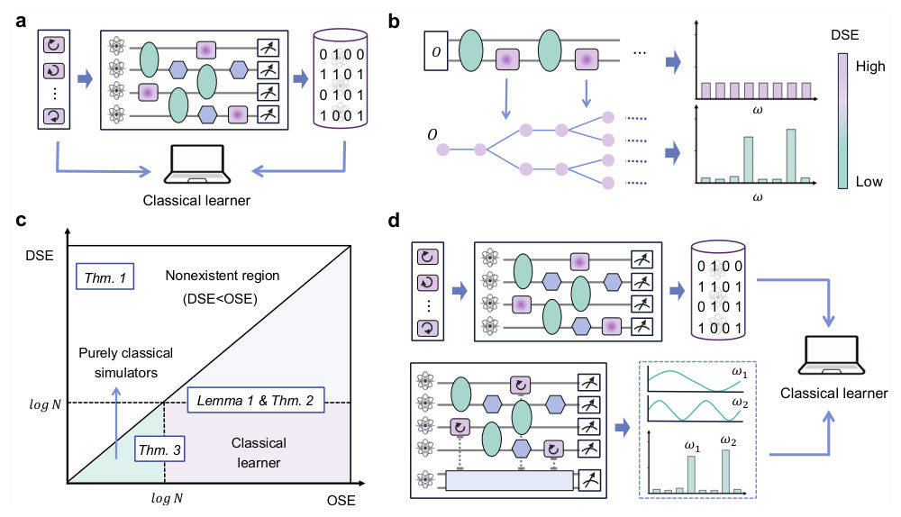
<figcaption class="paper-figure-caption"><b>Fig 1.</b> FIG. 1. Schematic overview of the classical simulability and classical learnability of quantum circuits under a quantum resource framework. a. The construction of classical surrogates consists of two steps. First, the classical learner collects the training dataset with labeled data from quantum devices. Then, the classical learner trains a classical machine learning model using these training data. b. Interpreting the operational meaning of DSE for learnability. DSE is defined from the trigonometric expansion of the target function, whose basis size grows exponentially with the number of tunable rotation gates. Small DSE implies that f(x) is concentrated on a small set of dominant...</figcaption>
</figure>
<figure class="paper-figure-card">
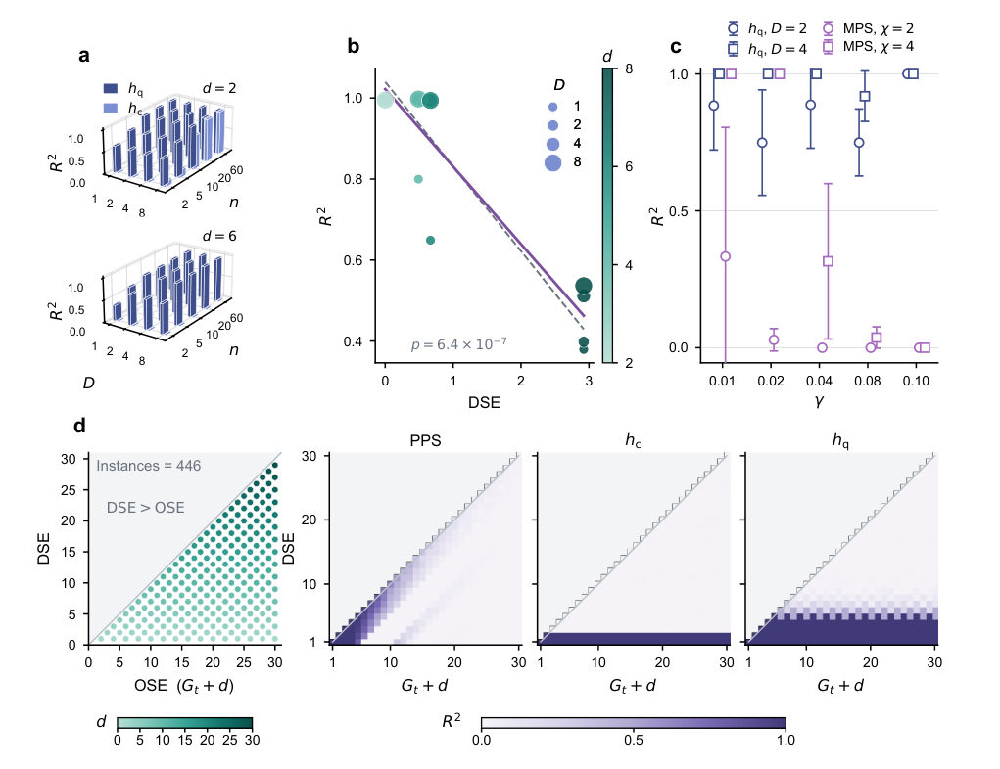
<figcaption class="paper-figure-caption"><b>Fig 2.</b> FIG. 2. Numerical validation of DSE-guided classical learnability and its separation from classical simulation. a. Prediction accuracy R2 of the DSE-guided surrogate hq and the Hamming-weight surrogate hc for random N = 6 qubit circuits with depth 66, Gt = 6, and CNOT rate γ = 0.1. The top and bottom panels correspond to d = 2 and d = 6 tunable rotations, respectively. The training-set size is varied over n ∈{2, 5, 10, 20, 60}, and the retained feature dimension over D ∈{1, 2, 4, 8}. b. Prediction accuracy of hq versus the first-order mode entropy S(1)[O(x; U)], used as an instance-dependent proxy for DSE, for circuits with d ∈2, 4, 6, 8 tunable gates (as indicated by point colors) and...</figcaption>
</figure>
<figure class="paper-figure-card">

<figcaption class="paper-figure-caption"><b>Fig 3.</b> FIG. 3. Scaling behavior of the DSE-guided surrogate. a. Prediction accuracy R2 of hq and hc for varying numbers of qubits, N ∈{20, 30, 40, 50, 60, 80}, and feature dimensions, D ∈{50, 100, 200, 300, 700}, paired with training-set sizes n ∈ {100, 200, 300, 500, 700}, respectively. b. DSE for the six system sizes considered in panel a, where N ∈{20, 30, 40, 50, 60, 80} is paired with d ∈{6, 9, 12, 15, 18, 21} tunable rotation gates (indicated by color).</figcaption>
</figure>
<figure class="paper-figure-card">
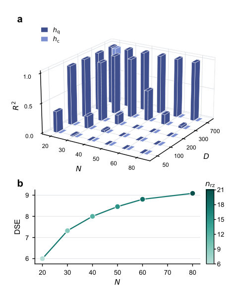
<figcaption class="paper-figure-caption"><b>Fig 4.</b> Fig. 1c. Finally, we examine the scalability behavior of hq at large scale. Specifically, we consider the quantum circuit U(x) = QN−1 i=1 CZi,i+1 Qd i=1 Ti RZi(xi) QN i=1 Hi with the observable O = 1 d−k+1 Pd−k+1 i=1 Qi+k−1 j=i Oj, where Oj = Zj−1XjZj+1 and k = 5. We consider six combinations of qubit size and the number of rotation gates, (N, d) = {(20, 6), (30, 9), (40, 12), (50, 15), (60, 18), (80, 21)}. As shown in Fig. 3b, the DSE proxy S(1) grows from approximately 6 to 9 across these instances. Fig. 3a shows the prediction performance of hq and hc with varying feature dimension and training set size (D, n) = {(50, 100), (100, 200), (200, 300), (300, 500), (700, 700)}. As the system...</figcaption>
</figure>

**Summary.** This work introduces the Dynamical Stabilizer Entropy (DSE) as a new resource measure to quantify the classical learnability of expectation values from tunable quantum circuits. The authors establish a phase diagram showing that learning is governed by DSE, allowing efficient approximation even when full classical simulation fails. This framework guides the design of scalable, data-driven algorithms for complex quantum systems.

**Why it may be interesting.** It provides a quantitative, resource-theoretic framework (DSE) to predict when quantum information processing tasks can be efficiently learned classically, even if they are too complex for direct simulation.

Detailed structure

**Main problem.** To establish a resource-theoretic characterization for classical learnability of quantum systems, especially when direct classical simulation is inefficient.

**Main result.** The Dynamical Stabilizer Entropy (DSE) serves as the governing resource measure, establishing a computational phase diagram that delineates the boundary between classically simulable and classically learnable regimes.

**Method.** The authors introduce DSE to quantify how broadly expectation-value functions are distributed across frequency modes, deriving bounds on sample complexity for classical surrogates guided by this entropy.

**Model / system.** The study analyzes expectation-value functions $f(x) = 	ext{Tr}(
ho_0, O(x; U))$ generated by families of tunable N-qubit quantum circuits. These are applied to tasks like digital quantum simulation and VQE optimization.

**Key observables.** Dynamical Stabilizer Entropy (DSE), Sample Complexity, Expected Risk ($R(h)$), Prediction Accuracy ($ar{R}^2$).

**Important parameters / regimes.** Circuit depth ($d$), Number of qubits ($N$), Total measurement budget ($m_t$), DSE value.

**Assumptions / limitations.** The analysis relies on standard complexity-theoretic assumptions, and the comparison is made between classical simulators, quantum-data-assisted surrogates, and direct simulation methods.

**Figures summary.** Figures illustrate a phase diagram comparing simulability vs. learnability based on DSE; other figures show prediction accuracy ($ar{R}^2$) versus feature dimension ($D$) or system size ($N$), confirming DSE's role as the dominant scaling factor.

**Paper structure.** The paper first introduces DSE to characterize quantum resource theory for learning. It then derives theoretical bounds and establishes a phase diagram comparing classical simulation limits with learnability boundaries. Finally, it validates these concepts using numerical experiments on structured circuits and VQE applications.

Abstract

Quantum resource theory has sharpened our understanding of the intrinsic complexity of quantum systems, particularly their classical simulability. However, it remains unclear which quantum resource governs the classical learnability of quantum circuits, especially beyond the regime of efficient classical simulation. Here we close this knowledge gap by studying the expectation-value functions of families of tunable quantum circuits, with many applications in digital quantum simulation, quantum metrology, and quantum-system characterization. Specifically, we introduce a new resource measure, the dynamical stabilizer entropy (\DSE), which quantifies how broadly an expectation-value function is distributed across its frequency modes. By relating \DSE to operator stabilizer entropy, we establish a computational phase diagram that compares classical simulators with quantum-data-assisted classical surrogates. We first determine the \DSE-dependent learnability boundary of this diagram by deriving bounds on the sample complexity and runtime of classical surrogates, and by developing a \DSE-guided surrogate. We then complete the diagram by proving, under standard complexity-theoretic assumptions, the existence of circuit families that can be efficiently learned by this surrogate but cannot be efficiently emulated from their circuit descriptions alone. Numerical experiments on random and structured circuits with up to 80 qubits support the predicted \DSE-dependent computational landscape. These results establish a quantitative resource-theoretic framework for delineating the boundary between classical simulation and learning, motivate resource measures linking quantum resources to learnability, and guide the design of learning-based algorithms for scalable quantum systems beyond the reach of direct classical simulation.

[↑ back to top](#top)

### [Microscopic magnetic phase evolution in the Weyl semimetal Mn$_3$Sn revealed by $μ^+$SR](http://arxiv.org/abs/2608.01892v1)

**Authors:** U. Miniotaite, O. K. Forslund, H. Luetkens, V. Rai, J. Persson, G. D. Morris, D. Zuhair, D. W. Tam, S. Nandi, Y. Sassa, M. Månsson  
**Type:** experiment · **Category:** other · **PDF:** <https://arxiv.org/pdf/2608.01892v1>  
**Analysis basis:** full PDF text, analyzed in chunks
**Topic relevance:** `analog quantum simulation` **1/5** · `exotic spin models in light-matter` **1/5** · `spintronics-quantum-optics interface` **1/5**

↔ Scroll figures horizontally

<figure class="paper-figure-card">
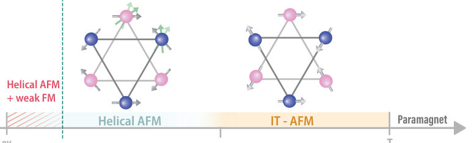
<figcaption class="paper-figure-caption"><b>Fig 1.</b> FIG. 1: Magnetic phase diagram of Mn3Sn. The evolution of magnetic states is shown as a function of temperature, indicating key transition temperatures (Tf, Tt, and TN). Exact values are omitted here because transition temperatures vary between samples. The spin configurations of the Mn atoms on the kagome lattice are illustrated for the helical antiferromagnetic (AFM) and inverse triangular AFM (IT-AFM) phases. Blue and pink atoms denote Mn atoms located in different layers in the unit cell. Green arrows show the IC spin rotation in subsequent unit cells for the respective layers.</figcaption>
</figure>
<figure class="paper-figure-card">
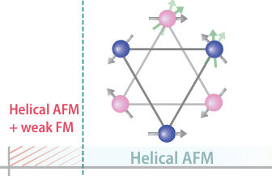
<figcaption class="paper-figure-caption"><b>Fig 2.</b> Fig. 2(c) shows the real part of the ACMS of Mn3Sn between 5 K and 80 K. A distinct peak is observed at Tf = 21 K. Notably, our results do not show a frequency- dependent shift for this peak.</figcaption>
</figure>
<figure class="paper-figure-card">
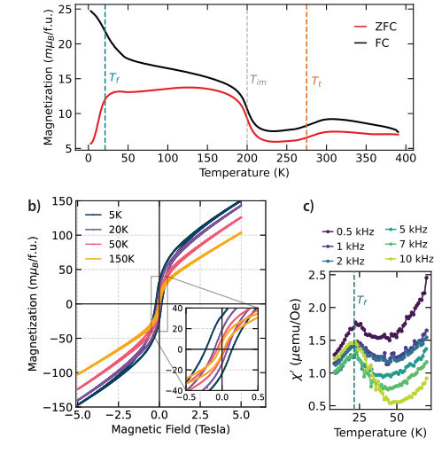
<figcaption class="paper-figure-caption"><b>Fig 3.</b> FIG. 2: Bulk magnetic characterization. a) Tempera- ture dependence of the magnetization using zero-field-cooled (ZFC) and field-cooled (FC) protocols with an applied mag- netic field of B = 0.1 T, marking key transition temperatures (Tf, Tim, and Tt). b) M(H) curves showing magnetization as a function of applied magnetic field between -5 T and 5 T at 5 K, 20 K, 50 K, and 150 K. The inset provides a magni- fied view of the low-field region to highlight the temperature evolution of the hysteresis. c) Real part of the AC magnetic susceptibility (ACMS), χ′, as a function of temperature across various frequencies, showing a peak near Tf.</figcaption>
</figure>
<figure class="paper-figure-card">
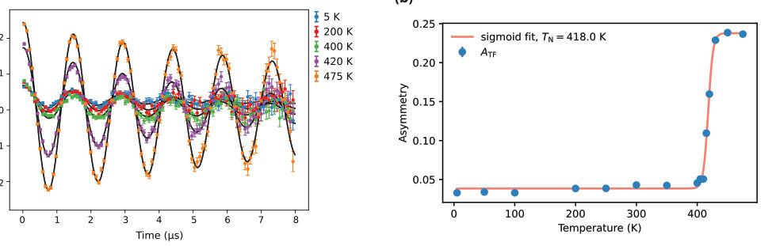
<figcaption class="paper-figure-caption"><b>Fig 4.</b> FIG. 3: N´eel temperature from TF-µ+SR. (a) Muon spin relaxation (µ+SR) spectra of Mn3Sn measured in an applied transverse field (TF) of B = 50 G at various temperatures. Solid black lines show fits to the experimental data using Eq. (1). (b) Evolution of the fitted TF asymmetry coefficient, A0, as a function of temperature. The sharp magnetic transition is fitted with a sigmoid function (red curve), extracting a N´eel temperature of TN = 418 K.</figcaption>
</figure>
<figure class="paper-figure-card">
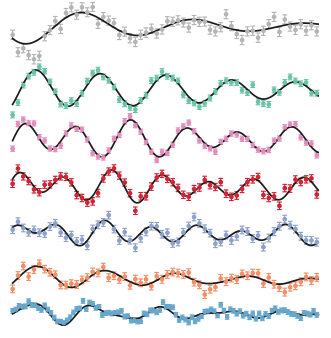
<figcaption class="paper-figure-caption"><b>Fig 5.</b> FIG. 4: Temperature evolution of ZF-µ+SR spectra. Zero-field (ZF) muon spin relaxation (µ+SR) asymmetry of Mn3Sn measured at various temperatures from 5 K to 450 K. Solid black lines show fits to the experimental data using Eq. (2). Successive spectra are vertically offset by a constant value for clarity of presentation.</figcaption>
</figure>

**Summary.** This work investigates the intricate temperature-dependent magnetic phase evolution in the Weyl semimetal Mn3Sn using muon spin relaxation ($\mu^+$SR) and magnetization measurements. It identifies three distinct magnetic transitions, demonstrating that the material's magnetic state is highly dynamic, featuring coexisting local environments rather than simple sequential ordering. The findings provide detailed microscopic insight into complex magnetism in topological materials.

**Why it may be interesting.** The study uses highly sensitive local probes ($\mu^+$SR) to map out complex, coexisting magnetic orders in a topological material. The observation of continuously evolving phases rather than sharp transitions is relevant for understanding quantum critical points and emergent many-body dynamics.

Detailed structure

**Main problem.** The study aims to resolve the microscopic magnetic phase evolution of the Weyl semimetal Mn3Sn across multiple temperature regimes.

**Main result.** The material exhibits a highly dynamic magnetic landscape characterized by coexisting and continuously evolving complex magnetic orders (IT-AFM, IC-helical) rather than abrupt transitions. The low-temperature state shows an increasing ferromagnetic component decoupled from static spin-glass freezing.

**Method.** Muon Spin Relaxation ($\mu^+$SR) measurements in both Zero-Field (ZF) and Transverse Field (TF), complemented by bulk magnetization ($M(H)$) and AC susceptibility studies.

**Model / system.** The physical system is the Weyl semimetal Mn3Sn. The analysis probes its magnetic transitions between an Inverse Triangular Antiferromagnetic (IT-AFM) phase, an Incommensurate Helical Antiferromagnetic (IC-helical) phase, and a low-temperature ferromagnetic component.

**Key observables.** Muon spin relaxation spectra asymmetry ($A_{	ext{tot}}$), relaxation rates ($\lambda$), bulk magnetization $M(T)$ and $M(H)$, and transition temperatures ($T_N=418 	ext{ K}, T_t \approx 275 	ext{ K}, T_f = 21 	ext{ K}$).

**Important parameters / regimes.** Temperature (ranging from 5 K to 475 K), applied magnetic field, and the fractional loss of initial asymmetry ($\sim 20\%$) in the IT-AFM phase.

**Assumptions / limitations.** The interpretation of missing muon asymmetry is tentative, suggesting possible origins like domain walls or grain boundaries; further single-crystal measurements are needed for confirmation.

**Figures summary.** Figures illustrate the magnetic phase diagram showing three transitions. Magnetization curves show hysteresis changes across temperatures, and $\mu^+$SR spectra detail the temperature dependence of oscillations and relaxation rates in different phases.

**Paper structure.** The paper systematically analyzes magnetic behavior using $\mu^+$SR (ZF/TF) to map out multiple magnetic transitions ($T_N, T_t, T_f$). It details the spectral signatures unique to each phase—from IC-helical field distributions to IT-AFM depolarization—culminating in a conclusion of continuous magnetic evolution.

Abstract

We report a comprehensive muon spin relaxation ($μ^+$SR) and bulk magnetization study of the antiferromagnetic (AFM) Weyl semimetal Mn$_3$Sn (composition Mn$_{2.99}$Sn). Mn$_3$Sn is reported to exhibit a commensurate inverse triangular (IT) AFM phase, an incommensurate (IC) helical AFM phase, and a proposed low-temperature spin-glass-like state. In our sample, we establish the respective transition temperatures for these phases to be $T_\mathrm{N} = 418$ K, $T_\mathrm{t} \approx 275$ K, and $T_\mathrm{f} = 21$ K. Investigating the low-temperature regime below $T_\mathrm{f}$, we find no evidence of a static spin-glass state. Instead, the sample exhibits an increasing ferromagnetic (FM) component accompanied by a localized slowing of spin fluctuations, indicating that these phenomena may be decoupled. In the IC helical AFM phase, fitting the zero-field (ZF) spectra reveals an asymmetric internal magnetic-field distribution, indicating that the magnetic structure is heavily modified by anharmonicity. Upon warming above 150 K, a continuous redistribution of muon spectral weight reveals a broad regime of coexisting local magnetic environments associated with the IC helical and IT-AFM phases. In the commensurate IT-AFM phase above $T_\mathrm{t}$, a persistent missing fraction in the initial asymmetry indicates that a subset of implanted muons, corresponding to roughly 20% of the sample-related asymmetry, undergoes unresolved ultrafast depolarization. Finally, we observe temperature-driven shifts in muon site populations above 325 K. Ultimately, our results show a highly dynamic magnetic landscape in Mn$_3$Sn, demonstrating how its complex magnetic orders often coexist and evolve continuously with temperature.

[↑ back to top](#top)

### [Multiparameter quantum estimation in a photon system induced by gravitational redshift](http://arxiv.org/abs/2608.00550v1)

**Authors:** Wei Ye, Hui Cao, Songtao Zhang, Xiang Zhu, Huan Zhang, Ying Xia, Shixun You, Daisheng Zhang, Shoukang Chang  
**Type:** theory · **Category:** quantum information and computing · **PDF:** <https://arxiv.org/pdf/2608.00550v1>  
**Analysis basis:** full PDF text, analyzed in chunks
**Topic relevance:** `correlated / nonlocal dissipation` **1/5** · `entanglement & information structure` **1/5** · `quantum measurements` **1/5**

↔ Scroll figures horizontally

<figure class="paper-figure-card">
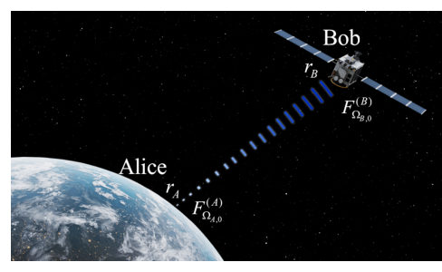
<figcaption class="paper-figure-caption"><b>Fig 1.</b> FIG. 1: (Color online) The sender, Alice, located at position rA, transmits a photonic wave packet initially characterized by a frequency distribution F (A) ΩA,0. This wave packet propagates through a curved spacetime background and is subsequently received by Bob at position rB, with the frequency distribution F (B) ΩB,0.</figcaption>
</figure>
<figure class="paper-figure-card">
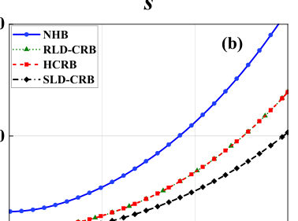
<figcaption class="paper-figure-caption"><b>Fig 2.</b> FIG. 5: (Color online) Error bounds as a function of (a) the s- parameter with α = π/2, θ = π/4, and ωc = t = η = 1, and of (b) the time parameter ωct with α = π/2, θ = π/4, s = 0.5, and η = 1.</figcaption>
</figure>
<figure class="paper-figure-card">
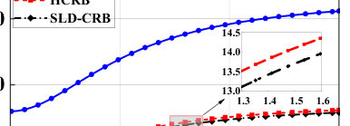
<figcaption class="paper-figure-caption"><b>Fig 3.</b> FIG. 4: (Color online) Error bounds as a function of (a) the s- parameter with α = π/2, θ = π/3, and ωc = t = η = 1, and of (b) the time parameter ωct with α = π/2, θ = π/3, s = 2, and η = 1.</figcaption>
</figure>

**Summary.** This paper analyzes multiparameter quantum estimation for photons affected by gravitational redshift and environmental noise. It compares several theoretical error bounds (like CRB vs. Nagaoka bound) and finds that the Nagaoka bound provides the tightest limit. The results show enhanced measurement precision in specific physical regimes, advancing the understanding of quantum sensing under extreme conditions.

**Why it may be interesting.** This work directly tackles advanced topics at the intersection of quantum metrology and general relativity, providing rigorous theoretical bounds on measurement precision when fundamental spacetime effects are present. The comparison between multiple bounding techniques is highly relevant to understanding physical limits.

Detailed structure

**Main problem.** The study investigates the ultimate precision limits for estimating multiple unknown parameters characterizing a photon system that has propagated through curved spacetime, specifically due to gravitational redshift.

**Main result.** The Nagaoka bound was shown to yield the tightest error estimate among several considered bounds (CRB, HCRB), and enhanced estimation precision was observed in specific physical regimes like strong-coupling or sub-Ohmic dephasing.

**Method.** The authors compared various quantum estimation bounds—including the Quantum Cramér-Rao Bound (CRB) and Holevo CRB—and utilized Semidefinite Programming (SDP) to derive tighter, numerically computable limits for multi-parameter estimation.

**Model / system.** The system is a photon propagating through curved spacetime, modeled by gravitational redshift effects. The analysis incorporates environmental noise via amplitude-damping and Ohmic-like dephasing channels.

**Key observables.** Mean Square Error Matrix ($\Sigma_{	heta}$), Fidelity ($	ilde{F}$), and the estimation error bounds themselves (e.g., Nagaoka Bound, HCRB).

**Important parameters / regimes.** Initial phase parameter, weight parameter, gravitational redshift strength ($	heta$), and environmental coupling parameters ($s$ for dephasing regimes).

**Assumptions / limitations.** The primary limitation addressed is the failure of the standard quantum CRB to provide a tight bound in the multi-parameter setting due to measurement incompatibility.

**Figures summary.** Figures illustrate how various error bounds compare across different physical parameters, such as the dephasing parameter $s$ or propagation time $\omega ct$, demonstrating regime-dependent precision enhancements.

**Paper structure.** The paper reviews the theoretical framework of quantum estimation bounds (CRB vs. Holevo/Nagaoka) and then applies these tools to a specific physical model: photon propagation under gravitational redshift and environmental noise, culminating in numerical comparisons for multi-parameter estimation.

Abstract

As photons propagate through curved spacetime, gravitational effects become unavoidable. In particular, gravitational redshift can induce significant distortion in photon wave packets, making it es?sential to investigate parameter estimation within this context. While previous research has focused on single-parameter estimation using the quantum Cramer-Rao bound, the multiparameter scenario remains largely unexplored. In this work, we investigate multiparameter quantum estimation for a photon system subject to gravitational redshift under both amplitude-damping and Ohmic-like dephasing channels. Our analysis reveals that the quantum Cramer-Rao bound fails to provide a tight error bound for the two-parameter estimation involving the initial phase and weight parameters inboth types of noisy channels. To overcome this limitation, we numerically compute two tighter error bounds, i.e., the Holevo Cramer-Rao bound and the Nagaoka bound, when utilizing a semidefinite program. We demonstrate that the Nagaoka bound yields the tightest error bound among all considered bounds, consistent with the general hierarchy of multiparameter quantum estimation. Furthermore, for the three-parameter estimation, including the initial weight parameter, the phase parameter, and the strength of gravitational redshift, we observe significantly enhanced estimation precision in the strong-coupling regime compared to the weak-coupling regime under the amplitude-damping channel. Similarly, in the Ohmic-like dephasing channel, the sub-Ohmic regime consistently affords higher precision than the Ohmic and super-Ohmic regimes.

[↑ back to top](#top)

### [Predictive Formulas for Scattering Mean Free Path for General Disordered Dielectric Media Beyond the Long-Wavelength Regime](http://arxiv.org/abs/2608.01016v1)

**Authors:** Jaeuk Kim, Salvatore Torquato  
**Type:** theory · **Category:** disordered systems and neural networks · **PDF:** <https://arxiv.org/pdf/2608.01016v1>  
**Analysis basis:** full PDF text, analyzed in chunks
**Topic relevance:** `Keldysh / 2PI / non-Gaussian methods` **1/5** · `methods for driven-dissipative` **1/5** · `non-equilibrium dynamics` **1/5**

↔ Scroll figures horizontally

<figure class="paper-figure-card">
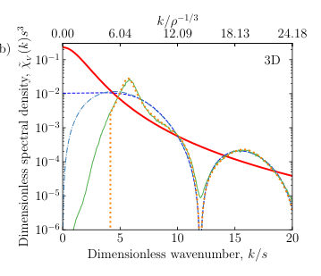
<figcaption class="paper-figure-caption"><b>Fig 1.</b> Fig. 2, and are also employed in FDTD simulations for d = 2, 3.</figcaption>
</figure>
<figure class="paper-figure-card">
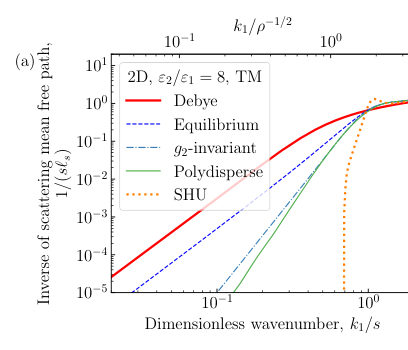
<figcaption class="paper-figure-caption"><b>Fig 2.</b> Figure 8 makes comparisons of 1/ℓs for 3D (fully statistically</figcaption>
</figure>

**Summary.** The paper develops advanced, microstructure-based formulas to predict the scattering mean free path ($\ell_s$) in general disordered dielectric media. It surpasses older models by handling arbitrarily shaped and polydisperse scatterers beyond the long-wavelength limit. This allows for the theoretical design of wave transport properties in engineered composites.

**Why it may be interesting.** This work provides a rigorous theoretical framework for predicting wave transport in complex, engineered disordered materials, which is crucial for designing metamaterials or photonic structures where scattering control is paramount.

Detailed structure

**Main problem.** The primary goal is to derive predictive formulas for the scattering mean free path ($\ell_s$) in general disordered dielectric media, extending beyond the limitations of the standard long-wavelength approximations.

**Main result.** The derived formulas are more general than Mie estimates, applicable to arbitrarily shaped and polydisperse particles, and predict specific scaling laws for hyperuniform media ($\ell_s \sim k_1^{-(d+1+\alpha)}$).

**Method.** The theory is based on the exact strong-contrast expansion for the effective dynamic dielectric constant, validated by comparison with finite-difference time-domain (FDTD) simulations.

**Model / system.** The study analyzes two-phase dielectric media, encompassing ordinary particulate systems, general nonparticulate media, and engineered structures like hyperuniform and stealthy hyperuniform composites in dimensions d=1, 2, and 3.

**Key observables.** Scattering mean free path ($\ell_s$), scattering coefficient ($\mu_s$), effective dynamic dielectric constant ($\epsilon_e$).

**Important parameters / regimes.** Incident wavenumber ($k_1$), specific surface ($s$), dielectric contrast ratio ($\epsilon_2/\epsilon_1$), and the hyperuniformity exponent ($\alpha$).

**Assumptions / limitations.** The formulas are derived using a strong-contrast expansion, which assumes the specimen is macroscopically large and statistically homogeneous.

**Figures summary.** References suggest comparisons between different theoretical approximations (like Mie estimates) and simulations across various microstructures and polarization states.

**Paper structure.** The paper develops general formulas based on the effective dielectric constant, compares these to established Mie theory limits, applies them to multiple model microstructures (including hyperuniform types), and validates predictions against FDTD simulation results.

Abstract

We derive predictive formulas for the scattering mean free path $\ell_s$ of statistically homogeneous two-phase dielectric media in dimensions $d=1,2,3$. Unlike Mie-based estimates limited to identical circular or spherical scatterers, the formulas apply to arbitrarily shaped and polydisperse particulate media as well as nonparticulate media, with microstructure entering through the spectral density. The formulas are based on the exact strong-contrast expansion for the effective dynamic dielectric constant. We apply them to five nonhyperuniform and hyperuniform models and validate selected cases using finite-difference time-domain simulations. For $k_1/s \lesssim 1$, where $k_1$ is the incident wavenumber and $s$ is the specific surface, the predictions agree well with simulations and are consistent with Mie theory where applicable, while improving accuracy for two-dimensional transverse-magnetic polarization. Mie estimates become more accurate for $k_1/s \gtrsim 1$. For hyperuniform media with $\widetildeχ_V(k)\sim k^α$ at small $k$, the theory predicts $\ell_s\sim k_1^{-(d+1+α)}$; stealthy hyperuniform media are transparent over a finite wavenumber interval. These results provide a microstructure-based route to predict and design wave transport in general disordered dielectric materials.

[↑ back to top](#top)

### [Pressure-induced self-doping and Fermi surface reconstruction in UAs2](http://arxiv.org/abs/2608.01244v1)

**Authors:** Zhenchao Wu, Yingying Cao, Yi-feng Yang  
**Type:** theory · **Category:** strongly correlated electrons · **PDF:** <https://arxiv.org/pdf/2608.01244v1>  
**Analysis basis:** full PDF text, analyzed in chunks
**Topic relevance:** `Keldysh / 2PI / non-Gaussian methods` **1/5** · `Kondo & dissipative impurity` **1/5** · `analog quantum simulation` **1/5**

↔ Scroll figures horizontally

<figure class="paper-figure-card">
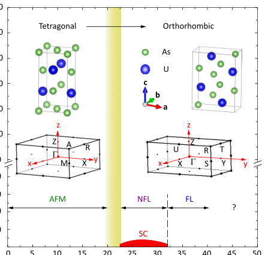
<figcaption class="paper-figure-caption"><b>Fig 1.</b> FIG. 1: Schematic phase diagram and crystal structures of UAs2 reproduced from Ref. [20]. The upper panel shows the tetragonal and orthorhombic crystal structures together with their corresponding Brillouin zones in the low- and high- pressure phases, respectively. The lower panel presents the schematic pressure–temperature phase diagram below 40 K, showing the low-pressure antiferromagnetic (AFM) phase, the superconducting (SC) dome, the non-Fermi-liquid (NFL) re- gion above Tc, and the high-pressure Fermi-liquid (FL) regime reported only up to 40.5 GPa. The yellow shaded region indicates the pressure range over which the tetragonal-to- orthorhombic structural transition occurs.</figcaption>
</figure>
<figure class="paper-figure-card">
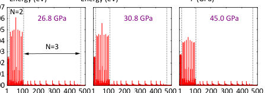
<figcaption class="paper-figure-caption"><b>Fig 2.</b> FIG. 3: Electronic structure of UAs2 under pressure obtained from DFT+DMFT at 50 K. (a) Momentum-resolved spectral functions at 26.8, 30.8, and 45 GPa. The arrow marks a low-energy kink, and the inset highlights the corresponding change in the slope of the real part of the real-frequency self- energy. (b) Pressure evolution of the U-5f5/2 (left) and U- 5f7/2 (right) densities of states at 26.8, 30.8, and 45 GPa. (c) Pressure dependence of the U-5f5/2, U-5f7/2, and total U-5f occupancies. (d) Probabilities of the atomic 5f-electron configurations obtained from the CT-HYB impurity solver at 26.8, 30.8, and 45 GPa. The dashed lines separate the N = 1, 2, and 3 configurations, where N denotes...</figcaption>
</figure>
<figure class="paper-figure-card">
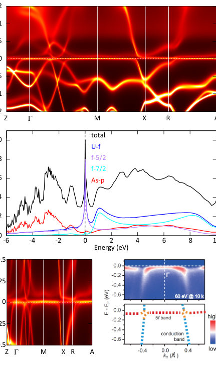
<figcaption class="paper-figure-caption"><b>Fig 3.</b> FIG. 2: Correlated electronic structure of UAs2 at am- bient pressure obtained from DFT+DMFT at 50 K. (a) Momentum-resolved spectral function A(k, ω) along a high- symmetry path in the Brillouin zone. (b) Density of states showing the contributions from the U-5f5/2, U-5f7/2, and As- 3p orbitals. (c) Comparison between the calculated spectral function and ARPES measurements [18], illustrating the ori- gin of the flat bands along the Γ–M direction.</figcaption>
</figure>
<figure class="paper-figure-card">
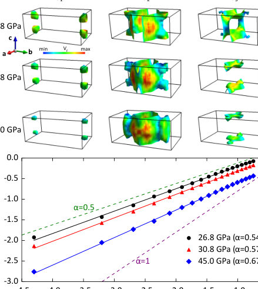
<figcaption class="paper-figure-caption"><b>Fig 4.</b> FIG. 4: (a) Evolution of the Fermi surfaces at 26.8, 30.8, and 45 GPa. (b) Log-log plots of the negative imaginary part of the Matsubara self-energy for the U-5f5/2 states. The solid lines are power-law fits to the data at 26.8, 30.8, and 45 GPa, while the green and purple dashed lines denote the reference power laws with exponents of 0.5, characteristic of non-Fermi-liquid behavior, and 1, expected for a Fermi liquid, respectively. The Fermi-surface visualization was performed using the FermiSurfer code [42]. The colors represent the magnitudes of the Fermi velocity.</figcaption>
</figure>

**Summary.** This work uses DFT+DMFT to investigate how pressure alters the electronic structure of the heavy-fermion superconductor UAs2. The key finding is that a pressure-induced self-doping effect, involving electron transfer between different 5f orbitals, reconstructs the Fermi surface into a state conducive to high Tc superconductivity. This suggests that orbital physics and Fermi surface nesting are crucial ingredients for unconventional pairing in correlated materials.

**Why it may be interesting.** While focused on actinides, the concept of tuning electronic correlations via external parameters (pressure) to induce novel quantum states like high-$T_c$ superconductivity through orbital physics is highly relevant to understanding strongly correlated systems in AMO and condensed matter theory.

Detailed structure

**Main problem.** To elucidate the microscopic origin of superconductivity in UAs2 under pressure by understanding how electronic structure changes drive superconducting behavior.

**Main result.** Superconductivity emerges when the Fermi surface has two disconnected, nested sheets, driven by a pressure-induced self-doping effect involving orbital-selective charge redistribution between 5f orbitals.

**Method.** Density Functional Theory combined with Dynamical Mean-Field Theory (DFT+DMFT) calculations were used to model the electronic structure evolution under varying pressures.

**Model / system.** The study focuses on UAs2, a heavy-fermion compound exhibiting superconductivity. The theoretical framework models the correlated 5f electrons using DFT+DMFT, incorporating spin-orbit coupling and local Coulomb interactions.

**Key observables.** Momentum-resolved spectral function A(k, omega), Partial Densities of States (DOS) for U-5f orbitals, Fermi surface topology, and superconducting transition temperature (Tc).

**Important parameters / regimes.** Pressure range (ambient to 45 GPa); orbital indices ($j=5/2$ vs $j=7/2$); charge fluctuation probabilities.

**Assumptions / limitations.** The calculations assume a nonmagnetic state for simplicity, and the mechanism remains partially unexplained despite strong evidence pointing toward nesting and fluctuations.

**Figures summary.** Figures illustrate the phase diagram showing structural transitions (tetragonal to orthorhombic) alongside electronic structure changes; spectral functions show flat bands shifting with pressure, and Fermi surface plots detail the evolution from disconnected sheets to a merged cylinder.

**Paper structure.** The paper first establishes the ambient pressure state matching ARPES data. It then analyzes the effect of increasing pressure, detailing orbital-selective charge transfer (self-doping), followed by mapping how the resulting Fermi surface topology dictates the superconducting phase boundary.

Abstract

Superconductivity has recently been reported in the heavy-fermion compound UAs2 under pressure, with the highest Tc among uranium-based correlated 5f-electron superconductors. To elucidate its microscopic origin, we investigate its electronic structure using density functional theory combined with dynamical mean-field theory (DFT+DMFT). At ambient pressure, our calculations reproduce the characteristic Kondo-lattice electronic structure, with flat hybridization bands near the Fermi energy around the Γ and M points, in good agreement with angle-resolved photoemission spectroscopy (ARPES). Under pressure, we find a systematic transfer of electrons from the more localized 5f5/2 orbitals to the more itinerant 5f7/2 orbitals, while the total U-5f occupancy remains nearly unchanged. This orbital-selective charge redistribution constitutes a pressure-induced self-doping effect that drives the 5f5/2 electrons from a localized Kondo regime toward a mixed-valence regime with enhanced charge fluctuations, leading to a dramatic reconstruction of the low-energy electronic structure. Remarkably, superconductivity emerges in the pressure range where the Fermi surface consists of two disconnected sheets with enhanced nesting, but disappears when they bend and merge into a corrugated three-dimensional cylinder. Our results provide an electronic-structure basis for understanding superconductivity in UAs2 and suggest that Fermi-surface nesting and charge fluctuations may contribute to the enhanced superconducting Tc, pointing to a possible distinction from conventional heavy-fermion superconductors.

[↑ back to top](#top)

### [Rhombohedral Graphene: A Tale of Many Crystals](http://arxiv.org/abs/2608.00167v1)

**Authors:** Ahmed Abouelkomsan, Filippo Gaggioli, Daniele Guerci, Liang Fu  
**Type:** theory · **Category:** strongly correlated electrons · **PDF:** <https://arxiv.org/pdf/2608.00167v1>  
**Analysis basis:** full PDF text, analyzed in chunks
**Topic relevance:** `Keldysh / 2PI / non-Gaussian methods` **1/5** · `analog quantum simulation` **1/5** · `methods for driven-dissipative` **1/5**

↔ Scroll figures horizontally

<figure class="paper-figure-card">
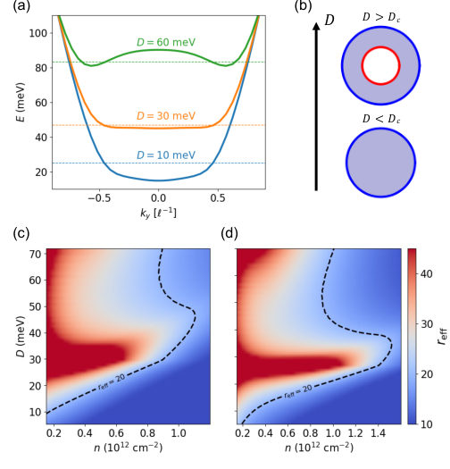
<figcaption class="paper-figure-caption"><b>Fig 1.</b> FIG. 1. Microscopic band structure (a) and illustration of the simply-connected and annular Fermi sea regimes (blue shaded), with the black and red lines indicating electron- and hole-like Fermi surfaces, respectively. Ratio of interaction en- ergy to kinetic energy in 4 (c) and 5 layer (d) rhombohedral graphene, with relative dielectric constant ϵ = 5.</figcaption>
</figure>
<figure class="paper-figure-card">
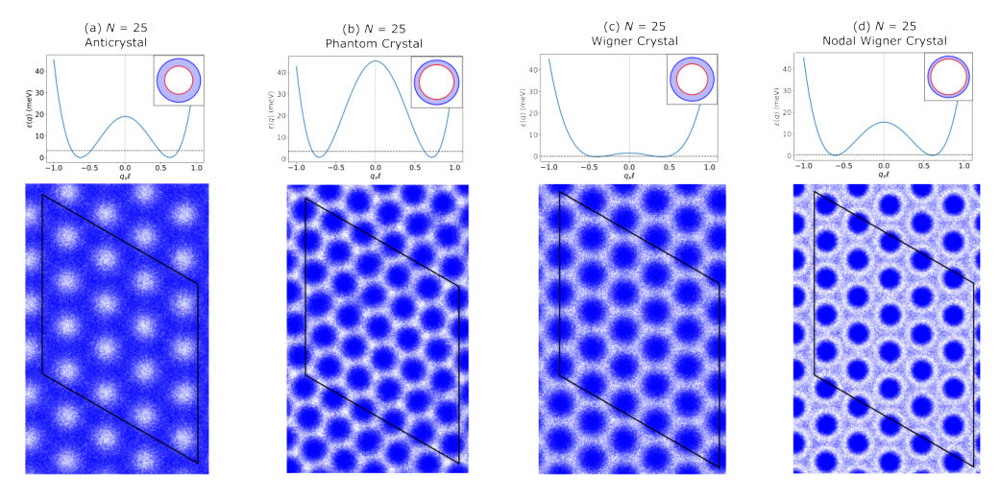
<figcaption class="paper-figure-caption"><b>Fig 2.</b> FIG. 2. (a)–(d) Ground-state charge density obtained from NN-VMC, illustrating four representative crystalline states. Blue denotes regions of high electron density, while white denotes regions of low density. The parameters are (α/EC, γ/EC, n) = (0.582, 0.740, 0.86 × 1012 cm−2) for (a), (0.740, 0.740, 0.659 × 1012 cm−2) for (b), (0.232, 0.702, 0.293 × 1012 cm−2) for (c), and (0.544, 0.739, 0.293 × 1012 cm−2) for (d). EC = e2/(4πϵϵ0ℓ) is the Coulomb energy scale where ℓ= ℏvF /t1 is the characteristic length scale of graphene with the Fermi velocity vF and t1 is inter-layer opposite sublattice hopping strength [17]. The parallelogram indicates the simulation supercell. Calculations are...</figcaption>
</figure>
<figure class="paper-figure-card">
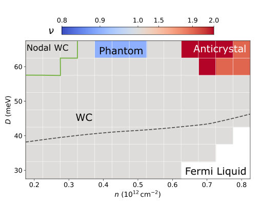
<figcaption class="paper-figure-caption"><b>Fig 3.</b> FIG. 3. Hartree Fock phase diagram for electrons with disper- sion ϵ(k) of the conduction band of rhombohedral tetralayer graphene, interacting via the long-range Coulomb interaction with dielectric constant ϵ = 12. The color code indicates the filling factor ν of the ground state crystal unit cell. The dashed line denotes the Lifshitz line where the Fermi surface topology chances.</figcaption>
</figure>
<figure class="paper-figure-card">
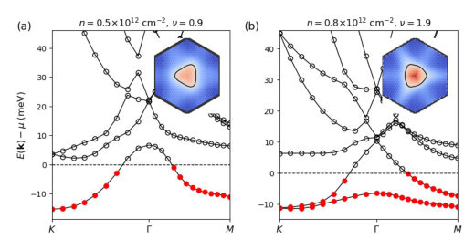
<figcaption class="paper-figure-caption"><b>Fig 4.</b> FIG. 4. Hartree-Fock band structure of the self-doped Wigner crystal (a) and the metallic anticrystal (b). The inset of panels (a) and (b) show the Fermi surface of hole-like quasi- particles. Panel (a) is obtained at n = 0.5 × 1012cm−2 and D = 65meV (ν ≈0.9), and panel (b) at n = 0.8 × 1012cm−2</figcaption>
</figure>

**Summary.** This paper investigates the complex quantum phase diagram of rhombohedral graphene, revealing multiple correlated electronic phases. Using advanced computational methods like NN-VMC, the authors predict novel crystalline structures, such as 'anticrystals,' that arise from strong electron-electron interactions tuned by external fields. This work advances our understanding of emergent order in low-dimensional correlated materials.

**Why it may be interesting.** The work provides detailed theoretical predictions for exotic insulating and superconducting states in 2D materials, offering concrete targets for experimental verification relevant to strongly interacting electron systems.

Detailed structure

**Main problem.** The study aims to identify the organizing principles governing the emergence, competition, and coexistence of strongly correlated quantum phases in rhombohedral graphene.

**Main result.** The authors predict unconventional quantum crystals, including a self-doped crystal and an 'anticrystal' (a lattice of holes), which are not found in classical systems.

**Method.** They employ a combination of Neural-Network Variational Monte Carlo (NN-VMC) methods with Hartree-Fock theory to solve for the interacting ground states.

**Model / system.** The system is rhombohedral graphene, an atomically thin carbon multilayer whose low-energy band structure can be tuned by carrier density ($n$) and a displacement field ($D$).

**Key observables.** Charge density profiles, the ratio $	ext{reff} = E_{	ext{int}} / E_{	ext{kin}}$, and the charge gap ($\Delta_{HF}$).

**Important parameters / regimes.** Carrier density ($n$), displacement field ($D$), and the indicator value $	ext{reff}$ (strong correlation occurs when $	ext{reff} \ge 20$).

**Assumptions / limitations.** The analysis relies on approximations like neglecting certain derivative terms in momentum space calculations, particularly in the thin-annulus limit.

**Figures summary.** Figures illustrate band structure changes (single vs. annular Fermi sea) and show ground-state charge densities for four distinct crystalline states discovered via NN-VMC.

**Paper structure.** The paper systematically maps out the energy landscape by varying $D$ and $n$, using $	ext{reff}$ as a guide to predict transitions between various correlated phases, including Wigner crystals and anti-crystals.

Abstract

Experiments on rhombohedral graphene have uncovered an extraordinary wealth of correlated quantum phases - from chiral superconductors to electronic crystals - all within a single family of atomically thin materials. Here, we introduce a simple indicator, derived from the noninteracting band dispersion, that identifies strongly correlated regions in the phase diagram of rhombohedral graphene as a function of carrier density and displacement field. We develop a neural-network variational Monte Carlo method, combined with Hartree-Fock theory, to solve the interacting ground states. Our calculation reveals a variety of electron crystals with no classical analog. These include, at increasing density: Wigner crystal, self-doped Wiger crystal, as well as ''anticrystal'', a lattice of holes in an electron liquid. We discuss their experimental manifestations and possible connection to superconductivity.

[↑ back to top](#top)

### [Cooperative Platoon Routing and Dispatching via Edge-Assisted Hybrid Quantum Optimization](http://arxiv.org/abs/2608.00524v1)

**Authors:** Talha Azfar, Ruimin Ke  
**Type:** both · **Category:** quantum information and computing · **PDF:** <https://arxiv.org/pdf/2608.00524v1>  
**Analysis basis:** full PDF text, analyzed in chunks
**Topic relevance:** `QC/QI experiment` **1/5** · `methods for driven-dissipative` **1/5**

↔ Scroll figures horizontally

<figure class="paper-figure-card">
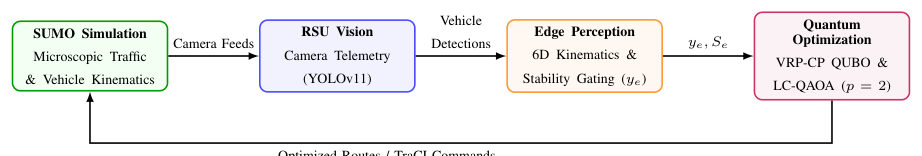
<figcaption class="paper-figure-caption"><b>Fig 1.</b> Fig. 1: Four-tier cyber-physical architecture: SUMO traffic is monitored by RSU camera telemetry (YOLOv11), converted into 6D kinematic features and stability flags (ye), compressed into a reward tensor (Se), solved by LC-QAOA / CPLEX, and returned as optimized CAV routes through TraCI.</figcaption>
</figure>
<figure class="paper-figure-card">
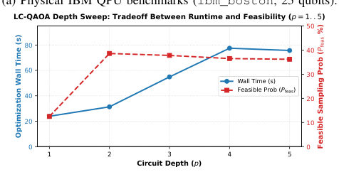
<figcaption class="paper-figure-caption"><b>Fig 2.</b> Fig. 2: Physical quantum hardware validation using 25 ac- tive qubits on ibm_boston. (a) LC-QAOA achieves 66.7% CNOT gate depth compression compared to standard all-to- all QAOA, increasing feasible sampling probability to 38.6%. (b) Circuit depth p = 2 achieves optimal feasible sampling (Pfeas = 38.6%) and optimal state probability (Popt = 14.2%) before hardware decoherence dominates at p ≥3.</figcaption>
</figure>
<figure class="paper-figure-card">
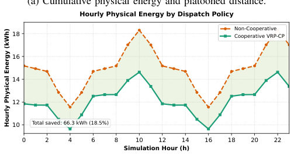
<figcaption class="paper-figure-caption"><b>Fig 3.</b> Fig. 3: Microscopic SUMO simulation results over the Troy, NY road network. Dynamic perception gating (ye = 1) reduces gross fleet tractive power demand from 358.4 kWh to 292.1 kWh, achieving an 18.5% physical energy reduction (66.3 kWh saved).</figcaption>
</figure>

**Summary.** The paper proposes an integrated framework for optimizing CAV routing by combining real-time traffic perception from roadside units with quantum computing. It formulates the problem as a QUBO and uses LC-QAOA on physical hardware, achieving significant energy savings (18.5%) in simulations while demonstrating improved quantum circuit performance over classical methods.

**Why it may be interesting.** This work demonstrates a concrete application where quantum computation (solving NP-hard optimization problems like VRP) is hybridized with classical, real-time edge AI processing to solve complex physical systems challenges in autonomous transportation.

Detailed structure

**Main problem.** Developing an edge-assisted, closed-loop evaluation pipeline for platooning-aware vehicle routing in Connected and Autonomous Vehicle (CAV) fleets operating in unstable urban traffic.

**Main result.** The framework achieved an 18.5% reduction in fleet energy demand in simulations, while quantum benchmarks showed LC-QAOA reducing CNOT depth by 66.7% on physical hardware.

**Method.** The problem is formulated as a QUBO model and solved using Linear-Chain QAOA (LC-QAOA) executed on an IBM QPU, integrated with edge perception data from roadside units.

**Model / system.** The system involves a four-tier cyber-physical architecture: SUMO simulation for traffic, RSU vision (YOLOv11) for 6D kinematics, stability gating ($	ext{ye}$), and quantum optimization via QUBO Hamiltonian minimization. The objective function is minimized by mapping interactions to native quadratic Ising terms.

**Key observables.** Energy savings (18.5% reduction), Feasible Sampling Probability ($P_{	ext{feas}}$ = 38.6%), Optimal Sampling Probability ($P_{	ext{opt}}$ = 14.2%), and two-qubit CNOT depth reduction (66.7%).

**Important parameters / regimes.** The quantum circuit depth parameter $p$, the stability thresholding constants ($\le 0.12$ for speed, $\le 0.5 	ext{ m/s}^2$ for variance), and the Lagrange penalty multiplier $\gamma=50.0$.

**Assumptions / limitations.** The energy model decouples optimization from physical evaluation; quantum execution is currently limited to localized subproblems (e.g., 25 qubits) rather than the entire network.

**Figures summary.** Figures illustrate the four-tier cyber-physical architecture, show cumulative energy savings over time in SUMO simulations, and compare QAOA vs. LC-QAOA performance on the QPU regarding depth reduction and sampling fidelity.

**Paper structure.** The paper details a multi-stage pipeline: 1) Edge perception (RSU/YOLOv11) estimates kinematics and gates platooning rewards based on physical stability. 2) The routing problem is formulated as a QUBO Hamiltonian, incorporating cost, platoon reward, and constraints. 3) This QUBO is solved using LC-QAOA on the QPU. 4) The optimized routes are fed back into a microscopic SUMO simulation for final energy evaluation.

Abstract

Cooperative platooning can reduce the energy use of Connected and Autonomous Vehicle (CAV) fleets, but the routing problem becomes difficult when vehicles must meet on the same road segments at compatible times while moving through unstable urban traffic. This paper develops an edge-assisted, closed-loop evaluation pipeline for platooning-aware vehicle routing. Roadside Units estimate local traffic kinematics from video, classify segment-level flow stability, and activate platooning rewards only on road segments where close-gap coordination is physically appropriate. The resulting multi-vehicle routing problem is written directly as a Quadratic Unconstrained Binary Optimization (QUBO) model, so pairwise platooning interactions are represented as native quadratic Ising terms instead of requiring auxiliary MILP linearization variables. We evaluate the framework using a 24-hour microscopic SUMO simulation of Troy, NY, together with localized IBM Quantum hardware benchmarks. The SUMO study shows an $18.5\%$ reduction in fleet tractive-energy demand relative to a non-cooperative baseline. On 25-active-qubit benchmark instances executed on $\texttt{ibm_boston}$, Linear-Chain QAOA reduces two-qubit CNOT depth by $66.7\%$ compared with dense QAOA and samples the exact classical ground state with $P_{\text{feas}} = 38.6\%$ and $P_{\text{opt}} = 14.2\%$ at $p=2$. These results suggest that edge perception and shallow quantum optimization can work together as a useful component of closed-loop CAV platoon dispatching.

[↑ back to top](#top)

### [Funnel-like protein energy landscapes emerge from functional evolution under thermal fluctuations](http://arxiv.org/abs/2608.01143v1)

**Authors:** Norifumi Maruyama, Macoto Kikuchi  
**Type:** theory · **Category:** statistical mechanics · **PDF:** <https://arxiv.org/pdf/2608.01143v1>  
**Analysis basis:** full PDF text, analyzed in chunks
**Topic relevance:** `driven-dissipative phase transition` **1/5** · `methods for driven-dissipative` **1/5**

↔ Scroll figures horizontally

<figure class="paper-figure-card">
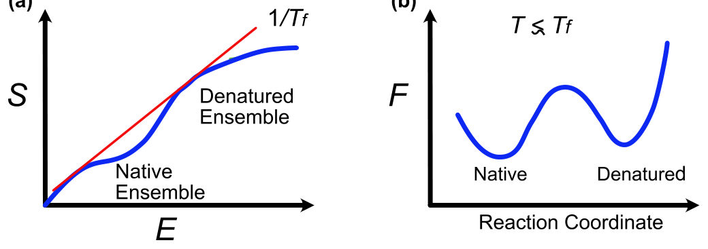
<figcaption class="paper-figure-caption"><b>Fig 1.</b> FIG. 1. Schematic representations of protein energy and free-energy landscapes. (a) Conformational entropy S(E) as a function of energy E for a protein with a funnel-shaped energy landscape. A common tangent touches the entropy curve at energies corresponding to the native and denatured ensembles. Its slope gives the inverse folding temperature, 1/Tf, at which the two ensembles coexist. (b) Corresponding free-energy landscape as a function of a schematic reaction coordinate. Below the folding temperature, the native and denatured ensembles form distinct minima separated by a free-energy barrier, giving rise to cooperative two-state folding.</figcaption>
</figure>
<figure class="paper-figure-card">
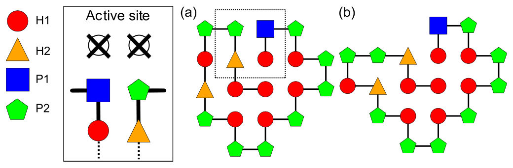
<figcaption class="paper-figure-caption"><b>Fig 2.</b> FIG. 2. Schematic illustration of the two-dimensional lattice protein model and the definition of the active site. The four residue types, H1, H2, P1, and P2, are represented by different symbols. A protein conformation is represented as a self-avoiding walk on a square lattice, and nonbonded nearest-neighbor residues interact through the contact energies listed in Table I. The active site is defined as the prescribed local arrangement of residues and covalent bonds shown in the boxed schematic. The crossed circles denote unoccupied lattice sites, ensuring that the active site is exposed on the protein surface, while the dotted lines indicate that the structure inside the four-residue motif is...</figcaption>
</figure>
<figure class="paper-figure-card">
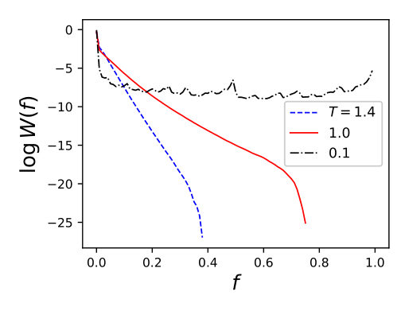
<figcaption class="paper-figure-caption"><b>Fig 3.</b> FIG. 3. Genotypic entropy as a function of fitness for envi- ronmental temperatures T = 0.1, 1.0, and 1.4. The geno- typic entropy is defined as the logarithm of the density of protein sequences with a given fitness. For each temperature, the density of sequences is normalized so that the total num- ber of sequences over all fitness bins is unity, allowing direct comparison among temperatures. At T = 1.0, the entropy decreases monotonically with increasing fitness, whereas it remains nearly constant at T = 0.1. At T = 1.4, the entropy terminates near f ≃0.4, indicating the absence of highly functional sequences.</figcaption>
</figure>
<figure class="paper-figure-card">
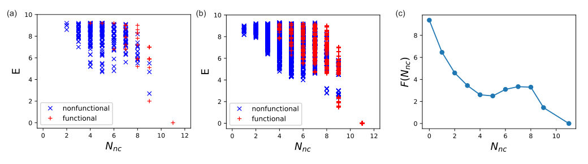
<figcaption class="paper-figure-caption"><b>Fig 4.</b> FIG. 4. Energy and free-energy landscapes of high-fitness sequences obtained at T = 1.0. (a) Energy spectrum of the highest- fitness sequence. The lowest 400 conformations ranked by energy are shown, with the energy E measured relative to the ground-state energy and plotted against the number of native contacts Nnc. The number of native contacts denotes the number of contacts shared with the native conformation and therefore serves as an order parameter for structural similarity to the native state. Functional conformations possessing the prescribed active-site motif are indicated by red plus signs, whereas nonfunctional conformations are indicated by blue crosses. (b) Energy spectra of the...</figcaption>
</figure>
<figure class="paper-figure-card">
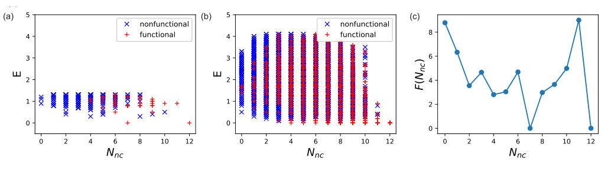
<figcaption class="paper-figure-caption"><b>Fig 5.</b> FIG. 5. Energy and free-energy landscapes of high-fitness sequences obtained at T = 0.1. (a) Energy spectrum of the sequence with the highest fitness among those with f &lt; 0.9. The lowest 400 conformations are shown as a function of the number of native contacts, with the energy measured relative to the ground-state energy. Functional and nonfunctional conformations are indicated by red plus signs and blue crosses, respectively. (b) Energy spectra of the 100 sequences with the highest fitness among those with f &lt; 0.9. For each sequence, the lowest 400 conformations are shown, with the energy measured relative to its ground-state energy and the native contacts defined with respect to its own...</figcaption>
</figure>

**Summary.** This work demonstrates that protein folding's characteristic funnel-like energy landscape does not need to be directly selected for; rather, it emerges naturally as a thermodynamic consequence of maintaining a specific local function when the system is subjected to intermediate thermal fluctuations. The temperature acts as a critical control parameter, distinguishing organized folding from glassy disorder.

**Why it may be interesting.** The concept that global structural organization (funneling) can be a thermodynamic byproduct of maintaining local function under thermal noise is highly relevant to understanding emergent order in complex physical systems, analogous to phase transitions driven by external parameters.

Detailed structure

**Main problem.** The study investigates whether funnel-like energy landscapes, characteristic of well-folded proteins, can emerge solely from natural selection acting on biological function, without explicitly selecting for foldability.

**Main result.** Funnel-like energy and free-energy landscapes emerge only within an appropriate intermediate range of environmental temperatures ($T$), suggesting that thermal fluctuations are necessary to organize the global fold based on local functional constraints.

**Method.** The authors used multicanonical Monte Carlo simulations combined with sequence sampling across the fitness landscape, comparing results at low, intermediate, and high temperatures.

**Model / system.** A two-dimensional lattice protein model using a reduced four-amino-acid alphabet. Function is defined by the equilibrium probability of forming a specific local active site motif under thermal fluctuations ($T$).

**Key observables.** Energy landscapes, free-energy landscapes (as a function of native contacts), genotypic entropy ($\log W(f)$), and structural diversity across different temperatures.

**Important parameters / regimes.** Environmental temperature ($T$), which dictates the strength of thermal fluctuations; fitness ($f$) derived from active site probability.

**Assumptions / limitations.** The model uses a simplified lattice structure and reduced amino-acid alphabet for computational tractability. The analysis relies on sampling across the entire fitness range via multicanonical methods.

**Figures summary.** Figures compare energy/free-energy landscapes at different T: Funnel shapes are seen at intermediate T (T=1.0), while glass-like, rugged profiles appear at low T (T=0.1). Genotypic entropy analysis shows distinct behavior across the temperature regimes.

**Paper structure.** The paper establishes the model and fitness definition, then uses multicanonical sampling to map sequence space. It systematically compares energy/free-energy landscapes generated at varying temperatures ($T$), contrasting the organized funnel structure (intermediate $T$) with the disordered glass state (low $T$).

Abstract

Proteins perform biological functions by folding into specific native structures that are stabilized by funnel-like energy landscapes shaped through evolution. We investigate whether such foldable proteins can emerge solely from selection for function, without any direct selection for foldability. Using a two-dimensional lattice protein model with four amino-acid types, we define protein function as the equilibrium probability that a prescribed local structure forming an active site is realized at environmental temperature $T$, and use this probability as the evolutionary fitness. Amino-acid sequences spanning the entire fitness range are sampled by multicanonical Monte Carlo method and their energy and free-energy landscapes are constructed from the equilibrium conformational ensemble. We find that only within an appropriate range of environmental temperatures do high-fitness sequences spontaneously acquire funnel-like energy landscapes, despite foldability never being included in the fitness definition. High-fitness sequences are furthermore supported by only a limited number of native conformations. At low temperatures, in contrast, high-fitness sequences exhibit rugged, glass-like energy landscapes and much greater structural diversity. These results suggest that foldable proteins need not be direct targets of evolution, but can emerge as a thermodynamic consequence of maintaining function under thermal fluctuations, whereby local functional constraints organize the global fold and give rise to funnel-like energy landscapes.

[↑ back to top](#top)

### [Hybrid Quantum Neural Networks: Theory, Implementations, and Applications](http://arxiv.org/abs/2608.01194v1)

**Authors:** Léo Monbroussou, Maniraman Periyasamy, Viacheslav Kuzmin, Pavel Sekatski, Viktoria Patapovich, Asel Sagingalieva, Alexey Melnikov  
**Type:** theory · **Category:** quantum information and computing · **PDF:** <https://arxiv.org/pdf/2608.01194v1>  
**Analysis basis:** full PDF text, analyzed in chunks
**Topic relevance:** `entanglement & information structure` **1/5** · `methods for driven-dissipative` **1/5**

↔ Scroll figures horizontally

<figure class="paper-figure-card">
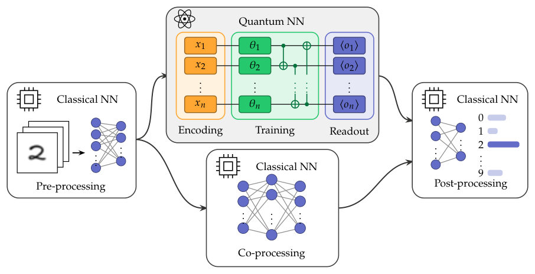
<figcaption class="paper-figure-caption"><b>Fig 1.</b> FIG. 1: Architecture example of a hybrid quantum neural network. A classical computer handles data pre- and post-processing, parallel co-processing, and parameter optimization, while a quantum circuit (parameterized by trainable angles) applies a unitary transformation in an exponentially large Hilbert space that, together with data encoding and measurement, realizes a nonlinear input–output map which can be hard to reproduce classically.</figcaption>
</figure>
<figure class="paper-figure-card">
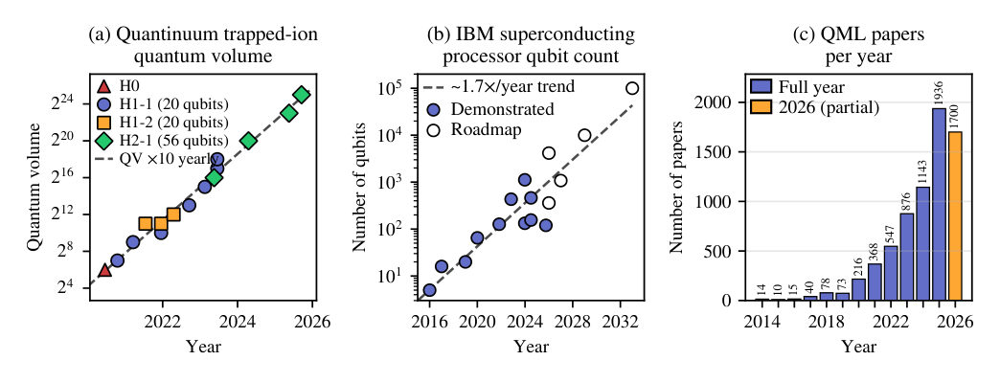
<figcaption class="paper-figure-caption"><b>Fig 2.</b> FIG. 2: Exponential growth trends in quantum hardware and Quantum Machine Learning (QML) research. (a) Quantum Volume of Quantinuum’s trapped-ion processors (H1 and H2 series) [1, 2]. (b) Physical qubit count of IBM’s superconducting processors; filled symbols are realized devices, open symbols are published roadmap targets [3–5]. (c) Number of papers published per year containing the phrase “Quantum Machine Learning” in the title or abstract, as indexed by OpenAlex [6] (covering arXiv preprints, journal articles, and conference proceedings). The orange bar denotes the most recent year (partial data from early July 2026).</figcaption>
</figure>
<figure class="paper-figure-card">
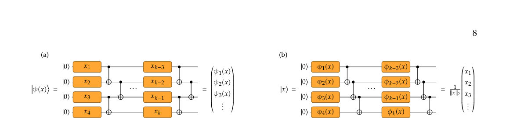
<figcaption class="paper-figure-caption"><b>Fig 3.</b> FIG. 3: The trade-off between the two main data-encoding strategies, illustrated on 𝑛= 4 qubits. (a) Angle encoding: parameters are trivially encoded into angles of a circuit, populating all 2𝑛basis states with amplitudes that are nonlinear (trigonometric) products of the data. (b) Amplitude encoding: circuit is derived numerically or analytically to reproduce a known state vector |𝑥⟩= Í 𝑖 𝑥𝑖 ||𝑥||2 |𝑒𝑖⟩such that the data sits directly in the amplitudes.</figcaption>
</figure>
<figure class="paper-figure-card">
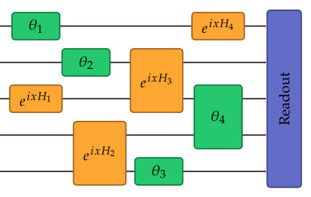
<figcaption class="paper-figure-caption"><b>Fig 4.</b> FIG. 4: QNN as a truncated Fourier series, Equation 13. The trainable blocks (green) determine the Fourier coefficients 𝑐𝜔(𝜃), while the data-encoding blocks (orange) determine the accessible frequency spectrum Ω.</figcaption>
</figure>
<figure class="paper-figure-card">
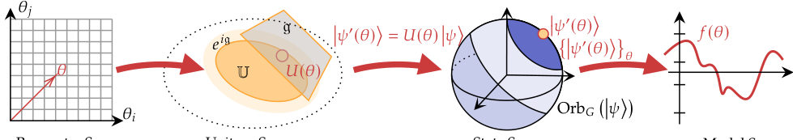
<figcaption class="paper-figure-caption"><b>Fig 5.</b> FIG. 6: The quantum model as a composition of maps, inspired by [141]. A choice of variational parameters 𝜃 determines the action of the QNN, represented as unitary transformation 𝑈(𝜃). Given an input 𝜓 in a Hilbert space, the QNN produces an output 𝜓′(𝜃) = 𝑈(𝜃) 𝜓 . Finally, by estimating the expectation value of some observable, one computes a quantum model 𝑓(𝜃).</figcaption>
</figure>

**Summary.** This review surveys Hybrid Quantum Neural Networks, a framework combining classical and quantum computing units to advance machine learning. It details how HQNNs are designed to utilize the exponential power of quantum circuits while remaining practical under current noisy hardware constraints. The paper aims to provide a roadmap for future research by structuring the state-of-the-art in this rapidly evolving field.

**Why it may be interesting.** It directly addresses the practical intersection of advanced ML theory with near-term quantum hardware limitations (NISQ), which is crucial for developing algorithms applicable to open quantum systems simulations or measurement analysis.

Detailed structure

**Main problem.** The field seeks new learning architectures beyond deep neural networks, leading to the investigation of Hybrid Quantum Neural Networks (HQNNs). These are designed to leverage quantum computation where it offers a principled advantage while delegating bulk processing to classical components.

**Main result.** The review provides a structured view of HQNNs, summarizing their theoretical foundations and practical applications by combining classical feature extraction with quantum subroutines for enhanced learning capabilities.

**Method.** The approach involves designing hybrid architectures that combine classical neural network layers (for high-dimensional feature processing) with variational quantum circuits (VQC) acting on exponentially large Hilbert spaces.

**Model / system.** HQNNs are the core model, combining classical components with quantum information processing units. The underlying physical platform is constrained by the Noisy Intermediate Scale Quantum (NISQ) regime.

**Key observables.** Model performance scaling laws, quantum advantage demonstration in specific tasks, and spectral structure representation.

**Important parameters / regimes.** Quantum Volume, physical qubit count, computational budget, and the degree of noise/error inherent to NISQ devices.

**Assumptions / limitations.** The primary assumption is that genuine quantum advantages exist for certain structured or quantum-native problems, even if current empirical evidence is mixed.

**Figures summary.** Figure 1 illustrates the data flow in an HQNN (classical pre-/post-processing $
ightarrow$ unitary transformation $
ightarrow$ classical readout). Figure 2 shows exponential growth trends related to hardware metrics and research output.

**Paper structure.** The paper reviews the theoretical foundations, surveys promising architectures, and examines implementation challenges of HQNNs for both machine learning and quantum machine learning communities.

Abstract

Artificial intelligence has been transformed by deep neural networks, yet the search for new learning architectures continues. Quantum machine learning offers one such direction, and hybrid quantum neural networks, which combine classical neural-network components with quantum information processing units, have emerged as a practical framework for near-term quantum technologies. However, the rapid development of the field across diverse architectures, benchmarks and hardware assumptions makes it difficult to assess the utility of various proposals, identify where genuine advantages may arise, and determine how practitioners can use these models. While recent benchmarks caution that such gains have not yet been demonstrated at scale, theoretical work has identified tasks on which quantum models hold provable advantages, and hybrid approaches have delivered promising results on practical problems using deliberately compact quantum components and substantially fewer trainable parameters. Here, we review hybrid quantum neural networks for the machine-learning and quantum-machine-learning communities. We summarize their main theoretical and methodological foundations, survey some of the most promising architectures developed so far, and examine their implementation challenges and reported performance. By consolidating these perspectives, this review provides a structured view of the state of the field and helps identify promising paths for future research and application-driven development.

[↑ back to top](#top)

### [Inhomogeneous Ising Model on 2D kagomé Lattice: Fermionic field approach](http://arxiv.org/abs/2608.02156v1)

**Authors:** Shahane A. Khachatryan, Zhidong Zhang, Ara G. Sedrakyan  
**Type:** theory · **Category:** statistical mechanics · **PDF:** <https://arxiv.org/pdf/2608.02156v1>  
**Analysis basis:** full PDF text, analyzed in chunks
**Topic relevance:** `Keldysh / 2PI / non-Gaussian methods` **1/5** · `analog quantum simulation` **1/5**

↔ Scroll figures horizontally

<figure class="paper-figure-card">
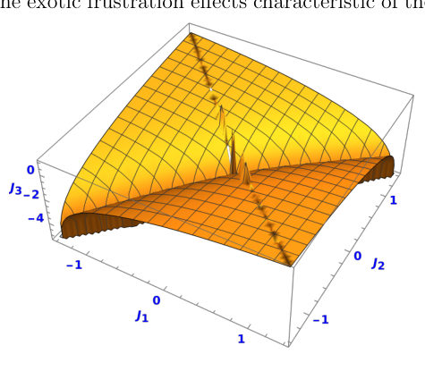
<figcaption class="paper-figure-caption"><b>Fig 1.</b> Figure 3: Critical subsurfaces on the real coordinate space {J1, J2, J3}</figcaption>
</figure>

**Summary.** This paper tackles the challenging problem of the inhomogeneous Ising model on a kagomé lattice using sophisticated fermionic field methods. By mapping it onto an eight-vertex model, the authors derive an exact equation for its critical phase transition surface. The results confirm the method's validity by reproducing known critical points in simpler limits.

**Why it may be interesting.** The rigorous application of advanced mathematical techniques (fermionic representation, R-matrices) to solve classical statistical mechanics models provides deep insights into phase transitions governed by complex lattice geometries.

Detailed structure

**Main problem.** The study investigates the critical behavior and thermodynamic properties of the two-dimensional inhomogeneous Ising model placed on a kagomé lattice.

**Main result.** The authors derived an exact equation defining the critical surface in the parameter space of coupling constants, and confirmed that the model correctly reduces to known results for simpler lattices (square or 1D).

**Method.** The core methodology involves mapping the Ising model onto a non-symmetric eight-vertex model and employing a fermionic field representation to evaluate the partition function via determinants.

**Model / system.** The system is an inhomogeneous Ising Model on a 2D kagomé lattice, characterized by nearest-neighbor interactions defined by three distinct coupling constants ($J_1, J_2, J_3$).

**Key observables.** Free energy, specific heat capacity, spontaneous magnetization, and the critical surface equation.

**Important parameters / regimes.** The coupling constants ($J_1, J_2, J_3$), which define the anisotropy of the interactions.

**Assumptions / limitations.** The analysis relies on mapping the system to an eight-vertex model structure and utilizing fermionic field techniques (e.g., Szegő's theorem for determinant evaluation) in the thermodynamic limit.

**Figures summary.** Figure 1 illustrates the kagomé lattice structure; Figure 2 indexes the R-operator; and Figure 3 maps out critical subsurfaces in the $\{J_1, J_2, J_3\}$ parameter space.

**Paper structure.** The paper proceeds by mapping the model to an eight-vertex form using a transfer matrix/R-matrix approach. It then utilizes fermionic variables to express the partition function as a determinant product, leading to the determination of the critical surface equation and subsequent calculation of thermodynamic quantities in various limits.

Abstract

We investigate the two-dimensional inhomogeneous Ising model (2DIM) on the kagom'e lattice by mapping it onto a particular non-symmetric eight-vertex model and constructing the corresponding $R$-matrix. Using a fermionic representation, we evaluate the partition function and derive explicit expressions for the main thermodynamic quantities. In the thermodynamic limit, we obtain an exact equation for the critical surface determining the phase transition of the model. We also calculate the free energy, specific heat, and spontaneous magnetization in the ferromagnetic case. Furthermore, we show that when one or two coupling constants vanish, the model reduces, respectively, to the square-lattice and one-dimensional Ising models. In both limits, our results reproduce the corresponding exact critical couplings and free energies.

[↑ back to top](#top)

### [Quantum Speedups for Testing Similar Means](http://arxiv.org/abs/2608.00741v1)

**Authors:** Chengshen Gao, Yongzhen Xu, Shenggen Zheng, Lvzhou Li  
**Type:** theory · **Category:** quantum information and computing · **PDF:** <https://arxiv.org/pdf/2608.00741v1>  
**Analysis basis:** full PDF text, analyzed in chunks
**Topic relevance:** `entanglement & information structure` **1/5** · `quantum measurements` **1/5**

↔ Scroll figures horizontally

<figure class="paper-figure-card">
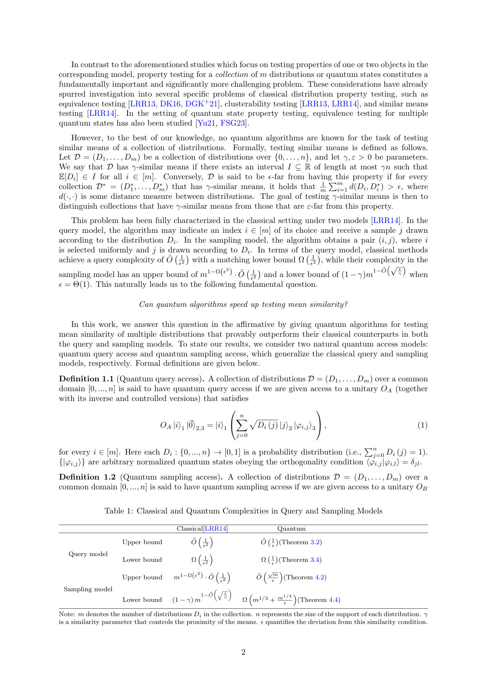
<figcaption class="paper-figure-caption"><b>Fig 1.</b> Low-resolution page preview, page 2</figcaption>
</figure>
<figure class="paper-figure-card">
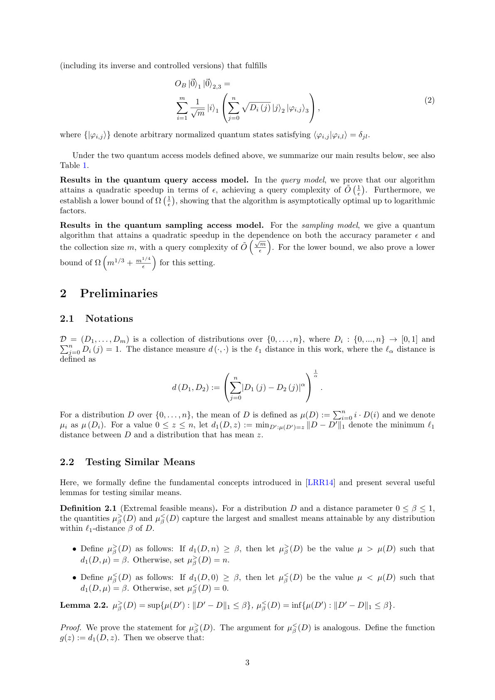
<figcaption class="paper-figure-caption"><b>Fig 2.</b> Low-resolution page preview, page 3</figcaption>
</figure>
<figure class="paper-figure-card">
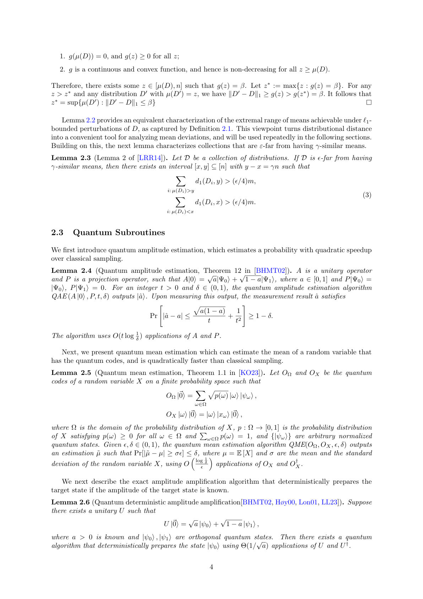
<figcaption class="paper-figure-caption"><b>Fig 3.</b> Low-resolution page preview, page 4</figcaption>
</figure>
<figure class="paper-figure-card">
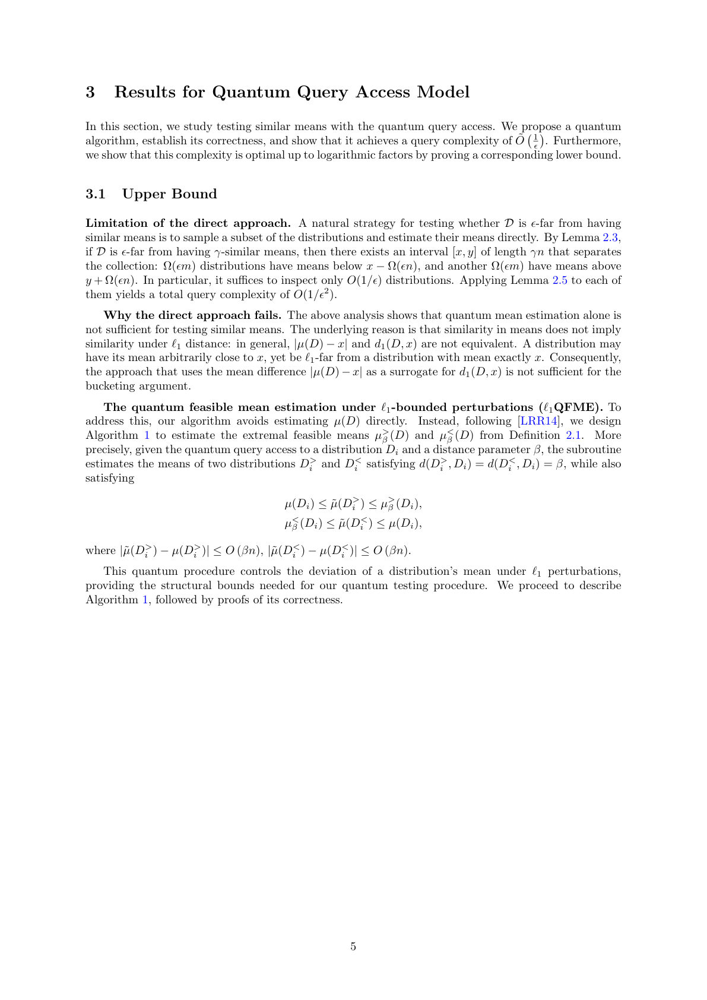
<figcaption class="paper-figure-caption"><b>Fig 4.</b> Low-resolution page preview, page 5</figcaption>
</figure>
<figure class="paper-figure-card">
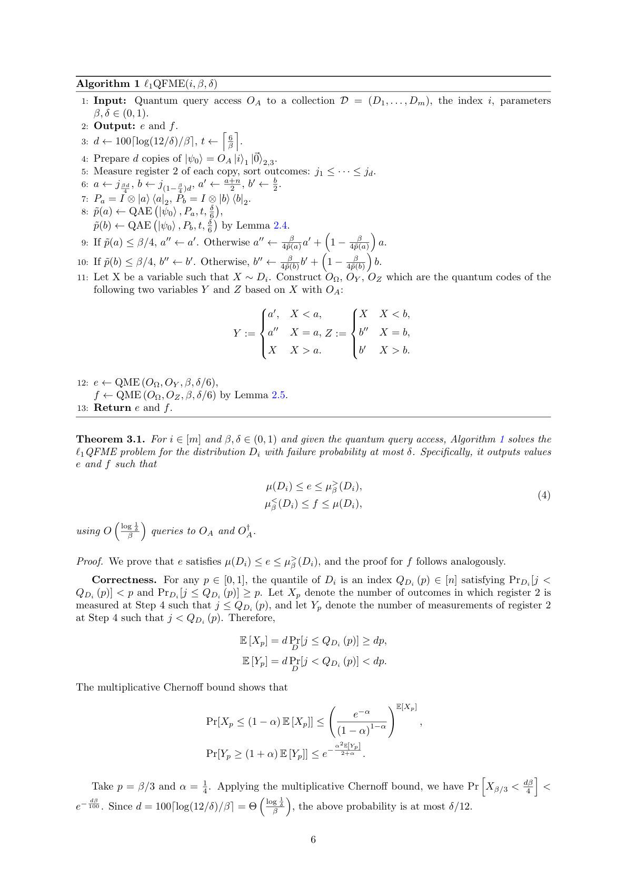
<figcaption class="paper-figure-caption"><b>Fig 5.</b> Low-resolution page preview, page 6</figcaption>
</figure>

**Summary.** This paper develops quantum algorithms to test whether multiple probability distributions share similar means, extending property testing beyond pairs of distributions. It achieves provable quadratic speedups over classical methods in both query and sampling access models. The results establish optimal complexity bounds for this multi-distribution mean similarity testing problem.

**Why it may be interesting.** This work directly tackles the boundary between classical and quantum computational advantages in a fundamental area of information theory—property testing—which is highly relevant for understanding the limits of quantum computation.

Detailed structure

**Main problem.** The work addresses the open question of whether quantum algorithms provide speedups for property testing when comparing $m \ge 3$ distributions, specifically testing if they share similar means.

**Main result.** They design quantum algorithms achieving complexities $	ilde{O}(1/\epsilon)$ (query model) and $	ilde{O}(\sqrt{m}/\epsilon)$ (sampling model), demonstrating quadratic speedups over classical bounds and establishing corresponding lower bounds.

**Method.** The approach involves adapting techniques like Quantum Amplitude Estimation (QAE) to estimate extremal feasible means under $\ell_1$-bounded perturbations, avoiding direct mean estimation which is insufficient.

**Model / system.** The problem is framed abstractly using quantum access models: the Query Model (unitary $O_A$) and the Sampling Model (unitary $O_B$). The underlying objects are classical probability distributions over $\{0, \dots, n\}$.

**Key observables.** Mean of a distribution $\mu(D)$, $\ell_1$ distance between distributions, and the deviation parameter $\epsilon$.

**Important parameters / regimes.** $m$ (number of distributions), $\epsilon$ (deviation tolerance), and $\gamma$ (similarity parameter).

**Assumptions / limitations.** The analysis relies on structural separation lemmas that characterize collections of distributions far from mean similarity, enabling the use of QAE/QME.

**Figures summary.** Table 1 summarizes the derived classical versus quantum complexities for both query and sampling models.

**Paper structure.** The paper first establishes the problem in two quantum access models. It then develops specialized quantum algorithms (like $\ell_1$QFME) to estimate necessary bounds, culminating in theorems that prove the optimal complexity bounds for testing mean similarity in both models.

Abstract

Property testing of distributions is a central topic in information theory, learning theory, and statistics. While quantum algorithms are known to offer significant speedups for property testing of a single distribution or a pair of distributions, it is unclear whether quantum algorithms provide speedups for property testing of $m$ ($m\geq 3$) distributions. This work focuses on quantum algorithms for testing whether $m$ distributions have similar means or are $ε$-far from mean similarity under two models. In the query model, the algorithm can choose which distribution to sample from, whereas in the sampling model, the distributions are selected uniformly. We design quantum algorithms with complexities $\tilde{O}(1/ε)$ (the $\tilde{O}$ notation hides poly-logarithmic factors) and $\tilde{O}(\sqrt{m}/ε)$ in the query and sampling models, respectively, achieving quadratic speedups over the classical counterparts. We further establish quantum lower bounds of $Ω\left(1/ε\right)$ and $Ω\rbra{m^{1/3}+\frac{m^{1/4}}ε}$ for the query model and the sampling model, demonstrating the optimality of our quantum algorithms in terms of the dependence on $ε$ up to logarithmic factors.

[↑ back to top](#top)

### [Ring Optimized M-APSK Modulation for Discrete Modulated CV-QKD](http://arxiv.org/abs/2608.01723v1)

**Authors:** Seonguk Kim, Jun Heo  
**Type:** theory · **Category:** quantum information and computing · **PDF:** <https://arxiv.org/pdf/2608.01723v1>  
**Analysis basis:** full PDF text, analyzed in chunks
**Topic relevance:** `Keldysh / 2PI / non-Gaussian methods` **1/5** · `entanglement & information structure` **1/5**

↔ Scroll figures horizontally

<figure class="paper-figure-card">
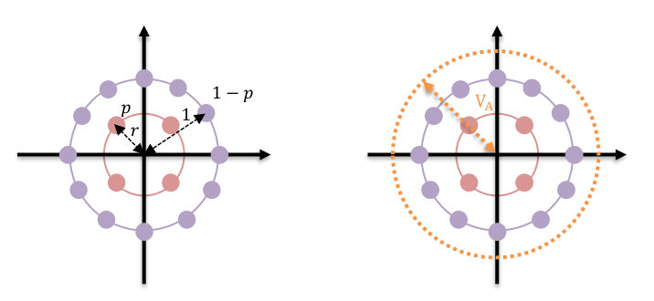
<figcaption class="paper-figure-caption"><b>Fig 1.</b> Fig. 1 Definition of radius, probability and modulation variance for the 16 APSK (4+12) constellation.</figcaption>
</figure>
<figure class="paper-figure-card">
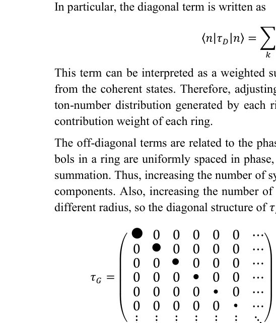
<figcaption class="paper-figure-caption"><b>Fig 2.</b> Fig. 2 Matrix structure of 𝜏𝐺 and 𝜏𝐷 in the Fock basis</figcaption>
</figure>
<figure class="paper-figure-card">
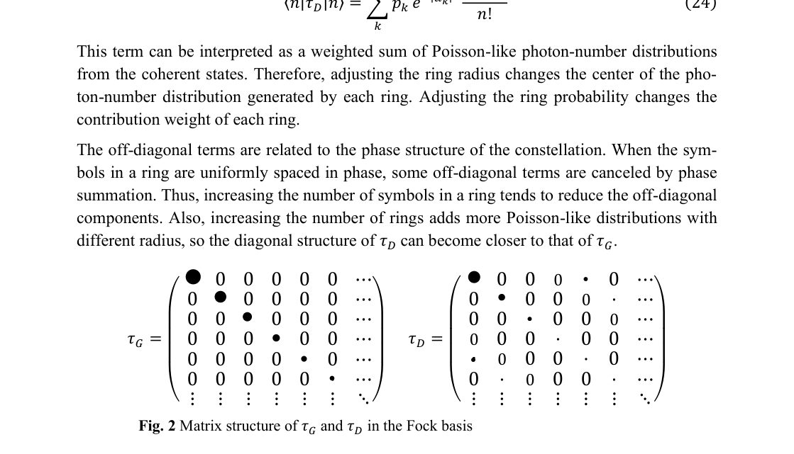
<figcaption class="paper-figure-caption"><b>Fig 3.</b> Fig. 2 compares the average density matrices of Gaussian modulation and discrete modula- tion in the Fock basis. The Gaussian average density matrix 𝜏𝐺 has only diagonal terms, which follow a thermal photon-number distribution. In contrast, the discrete average density matrix 𝜏𝐷 is illustrated using a 4-PSK example and contains both diagonal and off-diagonal terms. The diagonal terms of 𝜏𝐷 are weighted sums of Poisson-like distributions from coher- ent states, while the off-diagonal terms are determined by the phase structure and the number of symbols in the ring. Therefore, the proposed ring radius and ring probability optimization can be interpreted as a structural adjustment that makes...</figcaption>
</figure>
<figure class="paper-figure-card">
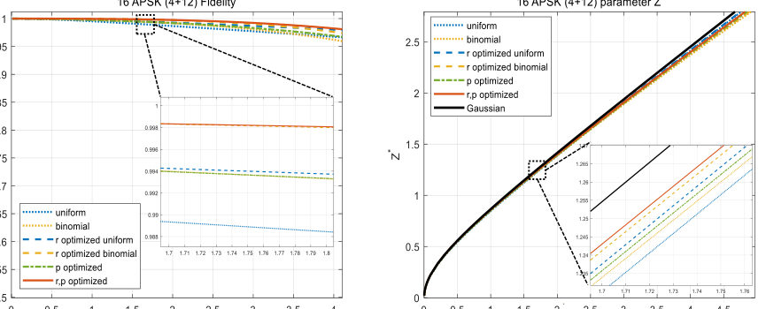
<figcaption class="paper-figure-caption"><b>Fig 4.</b> Fig. 3 Structural analysis of 16-APSK (4+12) for modulation variance optimization at 𝐿= 30 km.</figcaption>
</figure>
<figure class="paper-figure-card">
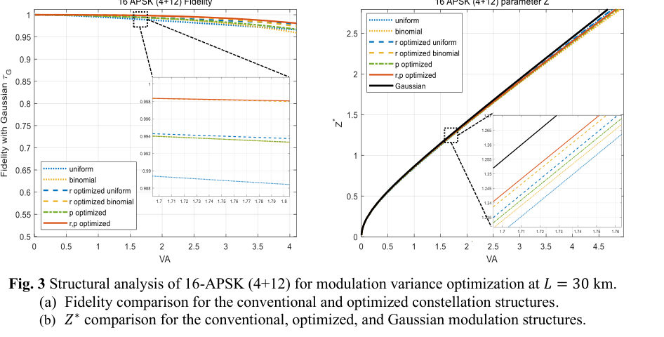
<figcaption class="paper-figure-caption"><b>Fig 5.</b> Fig. 3(a) shows the fidelity 𝐹(𝜏𝐷, 𝜏𝐺) as a function of the modulation variance 𝑉𝐴 at a trans- mission distance of 30 km. The 𝑟-optimized and 𝑟, 𝑝-optimized structures show higher fideli- ty than the non-optimized structures. This indicates that adjusting the ring radius and ring probability makes the discrete average state 𝜏𝐷 closer to the Gaussian average state 𝜏𝐺. In ad- dition, the binomial structure and the 𝑝-optimized structure show similar fidelity values. This result suggests that the conventional binomial probability is already close to a good probabil- ity shaping for 16-APSK (4+12).</figcaption>
</figure>

**Summary.** This paper proposes a novel optimization method for the constellation structure in discrete-modulated CV-QKD. By jointly optimizing ring radii and probabilities, they significantly improve the finite-size secret key rate compared to standard APSK structures. The core methodology involves using Gram matrix analysis to characterize the average state's deviation from ideal Gaussian modulation.

**Why it may be interesting.** This work directly addresses quantum information security protocols (QKD) using advanced mathematical techniques (Gram matrix, fidelity analysis) to optimize physical resource constraints (constellation geometry).

Detailed structure

**Main problem.** The paper aims to optimize the constellation structure of discrete-modulated continuous variable quantum key distribution (DM-CV-QKD) to maximize the finite-size secret key rate.

**Main result.** Optimizing the ring radius ratio and probability jointly extends the maximum transmission distance for 16-APSK by approximately 15% compared to conventional binomial structures.

**Method.** The optimization involves maximizing the secret key rate by adjusting constellation parameters, using the Gram matrix method to analyze the average state spectrum, and comparing results via quantum fidelity.

**Model / system.** The system is DM-CV-QKD, where Alice's signals are restricted to a finite set of coherent states forming an M-APSK constellation. Performance is benchmarked against ideal Gaussian modulation.

**Key observables.** Finite-size secret key rate ($K$), quantum fidelity ($\mathcal{F}$), and the correlation parameter ($Z^*$).

**Important parameters / regimes.** Constellation size (M), transmission distance ($L$), modulation variance ($V_A$), ring radius ratio ($\mathbf{r}$), and ring probability ($\mathbf{p}$).

**Assumptions / limitations.** The analysis uses a finite-size secret key rate model, and the Gram matrix method is employed to approximate the spectrum of the average state $	au$ by avoiding full diagonalization in the Fock basis.

**Figures summary.** Figures compare fidelity ($\mathcal{F}$) and $Z^*$ between optimized and conventional structures; Figure 4 shows the distance gain for the secret key rate vs. transmission distance.

**Paper structure.** The paper introduces the problem, details the mathematical framework using the Gram matrix to analyze the average state $	au$, presents the joint optimization procedure over constellation parameters ($\mathbf{r}, \mathbf{p}$), and concludes by quantifying the performance gains in terms of increased key rate and transmission distance.

Abstract

This paper proposes a multi ring M-APSK constellation optimization method for discrete-modulated continuous variable quantum key distribution. Unlike conventional APSK structures with fixed ring spacing and predefined ring probabilities, the proposed method optimizes the ring radius ratio and ring probability to improve the finite-size secret key rate. A method based on the Gram matrix is used to calculate the nonzero spectrum of the average state $τ$, and fidelity is used to compare the optimized discrete average state with the Gaussian average state. The results show that the proposed structure extends the maximum transmission distance of 16-APSK by approximately 15% compared with the conventional binomial APSK structure. The optimization gain is larger for small size APSK constellations, where the average state has a larger structural gap from Gaussian modulation.

[↑ back to top](#top)

### [Shape of Wigner Crystals and Hole Self-Doping in a Mexican-Hat Dispersion](http://arxiv.org/abs/2608.00170v1)

**Authors:** Minho Luke Kim, Xiao-Gang Wen  
**Type:** theory · **Category:** strongly correlated electrons · **PDF:** <https://arxiv.org/pdf/2608.00170v1>  
**Analysis basis:** full PDF text, analyzed in chunks
**Topic relevance:** `Keldysh / 2PI / non-Gaussian methods` **1/5** · `analog quantum simulation` **1/5**

↔ Scroll figures horizontally

<figure class="paper-figure-card">
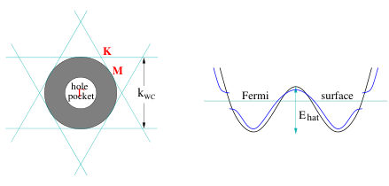
<figcaption class="paper-figure-caption"><b>Fig 1.</b> Figure 1: (Left) In the weak-interaction limit, an induced CDW may favor a lattice constant that matches the outer edge of the ring-like Fermi surface associated with the Mexican-hat dispersion, thereby gapping out the outer Fermi surface. The inner Fermi surface remains, giving rise to an mWC state. The shaded region in momentum space denotes the occupied electronic states, and kWC is the momentum transfer generated by the WC potential. (Right) Schematic Mexican-hat dispersion and the gapping of the outer Fermi surface by the WC potential.</figcaption>
</figure>
<figure class="paper-figure-card">
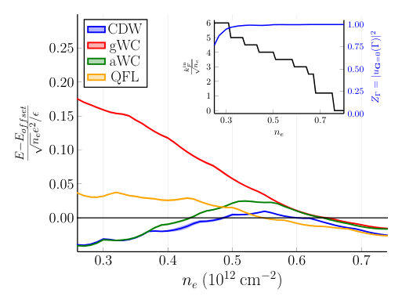
<figcaption class="paper-figure-caption"><b>Fig 2.</b> Figure 2: Energies of the commensurate crystal ans¨atze compared to the QFL ansatz. The CDW ansatz and aWC ansatz are much more energetically favorable relative to the standard gWC ansatz as it accommodates the Mexican hat dispersion, with CDW performing better than aWC at intermediate densities while converging at low densities. Range of errors are given in the ribbon. The density-dependent offset function Eoffset = (−3.23 + 2.71ne −1.60n2 e) e2√ne</figcaption>
</figure>
<figure class="paper-figure-card">
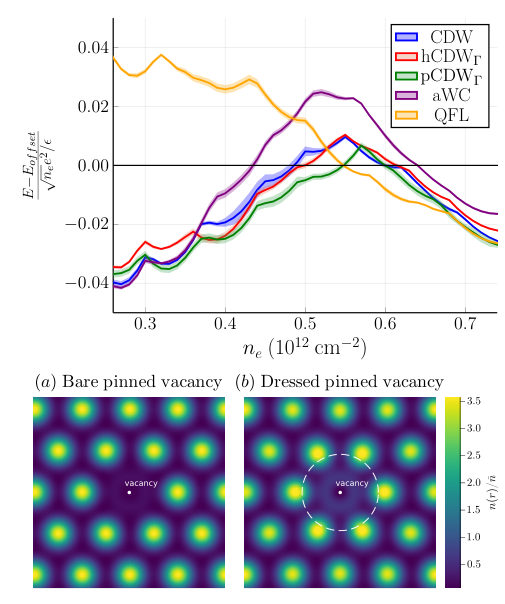
<figcaption class="paper-figure-caption"><b>Fig 3.</b> Figure 3: (Top) Energies of the commensurate CDW and aWC compared with those of one-vacancy hCDW and dressed pCDW states with a hole at Γ, where the hole creation is most energetically competitive. We find that the hCDWΓ is energetically competitive from around 0.4 × 1012 cm−2. The dressed pCDWΓ state performs even better with noticeable improvements compared to CDW and hCDWΓ. Range of errors are given in the ribbon. The same offset function is used. (Bottom): Visualization of the single-determinant density for the bare pinned vacancy D0({ri}) (left) and the dressed pinned vacancy F0({ri})D0({ri}) (right) for Ap = 1.2 and ξp = 0.8 in √ne = 1 units, which are the optimized values for the...</figcaption>
</figure>
<figure class="paper-figure-card">
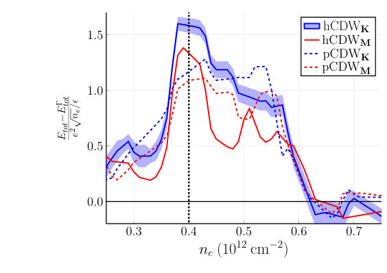
<figcaption class="paper-figure-caption"><b>Fig 4.</b> Figure 4: Difference of the total energy of the system in units of Coulomb energy for hCDWK and hCDWM states against hCDWΓ (in lines) and pCDWK and pCDWM states against pCDWΓ (in dashed lines). The energy difference can be used to fit coefficients of the effective hole tight-binding model for the nearest and next-nearest neighbor terms. Errors for hCDWK is displayed; other states have similar size of errors.</figcaption>
</figure>
<figure class="paper-figure-card">
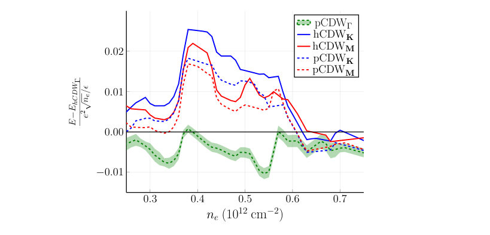
<figcaption class="paper-figure-caption"><b>Fig 5.</b> Figure 5: Energies of the doped CDW ans¨atze per electron compared against hCDWΓ. The effect of polarons is substantial, showing between 0.5-1% of Coulomb energy per particle for all symmetry point holes compared to their hCDW counterparts.</figcaption>
</figure>

**Summary.** The authors study Wigner crystal formation in a system with a Mexican-hat dispersion by comparing multiple theoretical ansätze. Using Variational Monte Carlo, they find that including polaron screening effects significantly stabilizes the hole-doped state compared to simpler models. This suggests that electron-vacancy correlations are crucial for understanding the transition into self-doped insulating phases.

**Why it may be interesting.** This work provides advanced many-body techniques (VMC with Jastrow/Polaron factors) applied to strongly correlated electron systems, offering insights into how correlation effects stabilize exotic phases like self-doped insulators.

Detailed structure

**Main problem.** The study investigates Wigner crystals (WCs) formed by strong Coulomb interactions within a system characterized by a Mexican-hat dispersion, specifically examining the possibility of hole self-doping near $k=0$.

**Main result.** Incorporating polaron screening effects significantly stabilizes the doped state ($	ext{pCDW}\Gamma$) compared to simpler models, suggesting that hole self-doping is energetically favorable near the WC transition.

**Method.** Variational Monte Carlo (VMC) calculations are employed using complex Slater-Jastrow and Polaron-dressed wavefunctions to calculate ground-state energies for various competing electronic phases.

**Model / system.** The system models electrons governed by a Mexican-hat dispersion $\epsilon_k = c_2k^2 + c_4k^4$. The physics explores the competition between Fermi liquid, Wigner crystal, and self-doped states under strong Coulomb repulsion.

**Key observables.** Variational energies ($E$), effective hole mass ($m_h^*$), and expectation values of kinetic energy ($\langle k^2 
angle$, $\langle k^4 
angle$).

**Important parameters / regimes.** Electron density ($n_e$) ranging from $0.25$ to $0.75 	imes 10^{12} 	ext{ cm}^{-2}$; dispersion parameters $c_2, c_4$.

**Assumptions / limitations.** The analysis relies on constructing sophisticated trial wavefunctions (gWC, aWC, pCDW) and assumes that the system's behavior can be captured by these correlated ansätze.

**Figures summary.** Figures compare the relative energies of different CDW ansätze ($	ext{gWC}$ vs. $	ext{aWC}$), and critically show that the polaron-dressed state ($	ext{pCDW}\Gamma$) has a lower energy than the bare hole-doped state ($	ext{hCDW}\Gamma$).

**Paper structure.** The paper develops theoretical tools for calculating expectation values (Laplacian, kinetic energy) for complex correlated states. It then applies these methods to compare the energetics of various Wigner crystal and doped CDW ansätze, culminating in a quantitative comparison showing the advantage of polaron dressing.

Abstract

We study Wigner crystals (WCs) induced by a strong Coulomb interaction from the ring-like Fermi surface of a Mexican-hat dispersion $ε_k= c_2k^2+c_4k^4$. We design orbital shape in order to minimize the energy of the WC, and find that a low ground-state energy requires an orbital shape with a depletion of electrons near $k=0$. To capture the Coulomb-induced correlations, we include a Jastrow factor as well as a factor describing the correlation between electrons and doped vacancies. Using variational Monte Carlo calculations, we calibrate the effective band parameters $c_2$ and $c_4$ to reproduce the two transitions observed experimentally as the electron density is lowered: from a spin-valley-polarized Fermi liquid with a disk-like Fermi surface, to one with a ring-like Fermi surface, and finally to a WC. We find that, even with an optimized orbital shape that depletes electrons near $k=0$, a WC with hole self-doping near $k=0$ can still be energetically favorable near the WC transition, provided that the electron-vacancy correlation is included. We also estimate the dispersion of the doped hole.

[↑ back to top](#top)

### [Sharp Quantum Capacity Thresholds: Exponential Strong Converses for Degradable and Antidegradable Channels](http://arxiv.org/abs/2608.01308v1)

**Authors:** Tulja Varun Kondra, Raphael Brinster, Hermann Kampermann, Dagmar Bruß, Nikolai Wyderka  
**Type:** theory · **Category:** quantum information and computing · **PDF:** <https://arxiv.org/pdf/2608.01308v1>  
**Analysis basis:** full PDF text, analyzed in chunks
**Topic relevance:** `Keldysh / 2PI / non-Gaussian methods` **1/5** · `entanglement & information structure` **1/5**

↔ Scroll figures horizontally

<figure class="paper-figure-card">
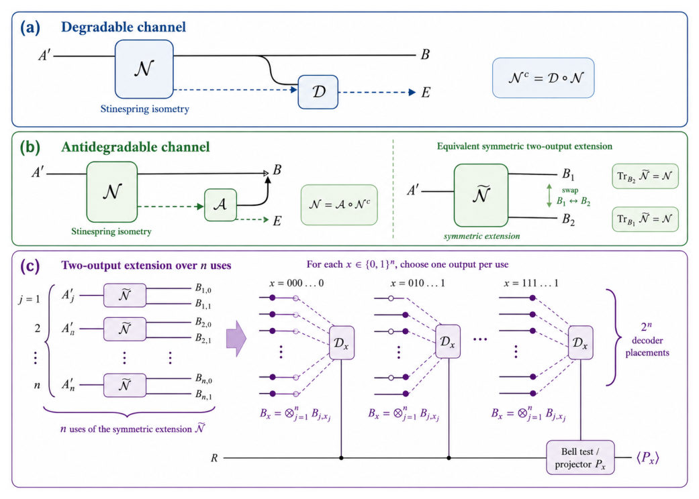
<figcaption class="paper-figure-caption"><b>Fig 1.</b> FIG. 1. Degradable and antidegradable channels, and the decoder-placement mechanism. (a) N is degradable when the environment output can be simulated from the receiver output by a degrading channel D, so that N c = D ◦N. (b) N is antidegradable when the receiver output can be simulated from the environment, N = A ◦N c; equivalently, it admits a symmetric two-output extension e N : A′ →B0B1 whose two marginal channels both equal N. (c) Applying the symmetric extension independently to n channel uses produces two receiver-like outputs at each position. Every string x ∈{0, 1}n selects one output from each pair and hence defines a subsystem Bx = Nn j=1 Bj,xj on which a copy Dx of the original...</figcaption>
</figure>
<figure class="paper-figure-card">
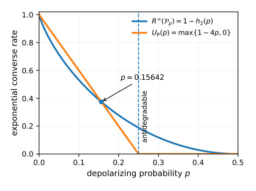
<figcaption class="paper-figure-caption"><b>Fig 2.</b> FIG. 2. Exponential strong-converse bounds for the qubit depolarizing channel. For Pp(ρ) = (1 −p)ρ + p 3 P3 i=1 σiρσi, our Pauli-channel bound is UP(p) = max{1 − 4p, 0}, while the regularized channel Rains information is the piecewise function in Eq. (51). The two cross at p ≃0.15642, above which our bound is strictly tighter. Our bound vanishes at the exact antidegradability threshold p = 1/4, whereas the Rains bound stays strictly positive there.</figcaption>
</figure>

**Summary.** This paper establishes rigorous, all-code exponential strong converse theorems for quantum channels, particularly focusing on degradable and antidegradable types. By proving that rates exceeding capacity result in exponentially decaying fidelity, it resolves long-standing open problems in quantum information theory. The methods involve sophisticated mathematical tools from operator theory and polynomial approximation.

**Why it may be interesting.** This work provides fundamental, sharp bounds on quantum communication limits that are crucial for understanding the ultimate performance thresholds of any quantum information processing protocol.

Detailed structure

**Main problem.** The central problem is establishing strong converse theorems for quantum channels, specifically determining if communication above the channel's quantum capacity remains possible when a fixed non-maximal error is tolerated.

**Main result.** The authors prove an all-code exponential strong converse for finite-dimensional degradable and antidegradable channels, showing that rates above capacity lead to exponentially decaying fidelity.

**Method.** The proof employs advanced techniques involving the Choi-Jamiołkowski correspondence, constructing weight matrices from multilinear polynomials, and bounding operator norms related to channel placements.

**Model / system.** The study focuses on general noisy quantum channels ($N: A' 	o B$), with specific attention paid to degradable (where capacity is single-letter) and antidegradable channels. The analysis uses Bell-target schemes for encoding.

**Key observables.** Fidelity ($F_n$) of the coding scheme, which decays exponentially with the number of channel uses ($n$).

**Important parameters / regimes.** The rate $r$ relative to the quantum capacity $Q(N)$, and the dimensionality parameters of the channels.

**Assumptions / limitations.** The analysis relies on bounding operator norms using polynomial approximations (e.g., approximating $	ext{NOR}_n$) and assuming specific structures for channel extensions.

**Figures summary.** Figure 1 illustrates the definitions of degradable/antidegradable channels and the use of a symmetric two-output extension ($e_N$) to generate overlapping placements $\{P_x\}$ central to the argument.

**Paper structure.** The paper progresses by first defining the strong converse problem, then developing technical tools (like bounding $\lVert \mathbf{A} 
Vert_\infty$ using weight matrices derived from polynomial approximations), and finally applying these tools sequentially to prove the exponential strong converse for antidegradable channels, followed by degradable channels.

Abstract

The quantum capacity of a noisy channel quantifies the maximum rate at which quantum information can be transmitted reliably. For general channels, its evaluation requires an optimization over arbitrarily many channel uses. Degradable channels form a central exception: their capacity is given by the single-letter coherent information, while antidegradable channels have zero capacity. Nevertheless, even for these fundamental classes, it has remained open whether communication above capacity becomes possible when a fixed non-maximal error is tolerated. Here we resolve this problem by proving an exponential strong converse for every finite-dimensional degradable and antidegradable channel: at any rate above capacity, the fidelity of every coding scheme decays exponentially with the number of channel uses. As an immediate consequence, we establish the first all-code exponential strong converse for the quantum erasure channel throughout its full parameter range, strengthening previous results that applied only to almost all codes. We also show that exponential strong-converse bounds are preserved under receiver post-processing. This yields efficiently computable semidefinite-programming bounds for arbitrary finite-dimensional channels, improved bounds for Pauli channels, and an exact exponential strong converse for a nondegradable multilevel amplitude-damping family.

[↑ back to top](#top)

### [Spin selectivity induced by non-collinear spins in Rashba wires](http://arxiv.org/abs/2608.00599v1)

**Authors:** Luciano Jacopo D'Onofrio, Maria Teresa Mercaldo, Mario Cuoco, Carmine Ortix  
**Type:** theory · **Category:** other · **PDF:** <https://arxiv.org/pdf/2608.00599v1>  
**Analysis basis:** full PDF text, analyzed in chunks
**Topic relevance:** `Keldysh / 2PI / non-Gaussian methods` **1/5** · `spintronics-quantum-optics interface` **1/5**

↔ Scroll figures horizontally

<figure class="paper-figure-card">
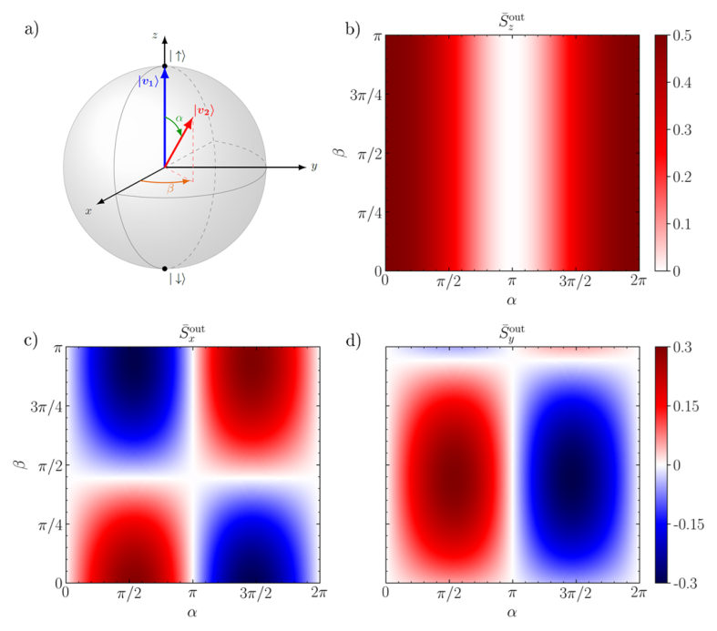
<figcaption class="paper-figure-caption"><b>Fig 1.</b> FIG. 1. Spin polarization acquired by unpolarized electrons perfectly transmitted through a Rashba wire with non-collinear spin states. (a) Bloch sphere representation of the spins of the right-moving states |v1⟩and |v2⟩at the Fermi level with α and β the polar and azimuthal angle of the |v2⟩state. (b–d) Contour maps of the net spin polarization components in the metallic drain ¯Sout z (b), ¯Sout x (c), and ¯Sout y (d) acquired by unpolarized electrons as a function of α and β.</figcaption>
</figure>
<figure class="paper-figure-card">
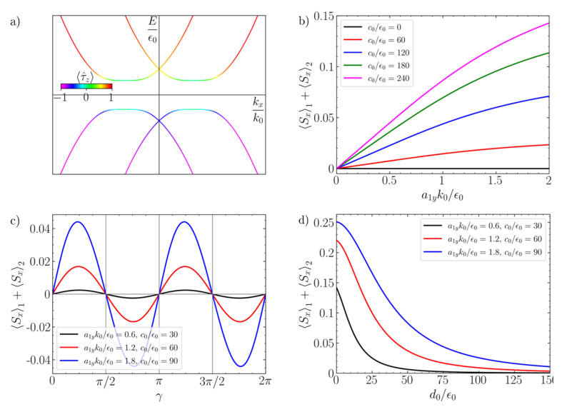
<figcaption class="paper-figure-caption"><b>Fig 2.</b> FIG. 2. Spin selectivity in an electron–hole wire with Rashba spin-orbit coupling. (a) Energy band dispersion assuming model parameters d2k2 0/ϵ0 = 1/200, a1yk0/ϵ0 = 1.8, c0/ϵ0 = 90, γ = π/4, and d0/ϵ0 = 35. We have introduced the characteristic energy scale ϵ0 and a reference momentum k0. The color scale encodes the orbital character of the bands. (b) Spin expectation value Sx summed over the two right-moving states as a function of the intraband Rashba coupling strength a1y for different values of the interorbital mixing strength c0. We have set the energy separation d0 = 70ϵ0 and the Fermi energy ϵF = 10ϵ0. (c)-(d) Same as a function of the angle parameter γ (c) and as a function of the...</figcaption>
</figure>
<figure class="paper-figure-card">
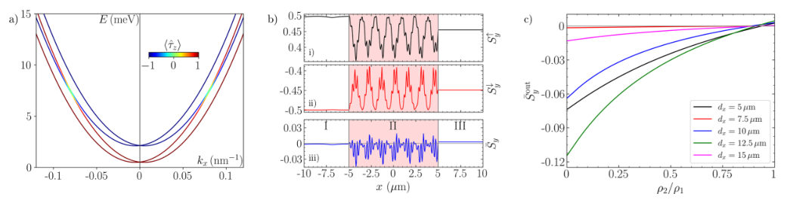
<figcaption class="paper-figure-caption"><b>Fig 3.</b> FIG. 3. Spin selectivity in a two-subband InAs nanowire. (a) Energy dispersion for the model Hamiltonian Eq.(1). (b) Spatial evolution of the spin ˆy component injected from a two-subband metallic lead (region I) and collected in the outer metallic lead (region III). The scattering region II corresponds to the two-subband InAs nanowire. The top panel corresponds to the injection of an ↑spin, while the middle panel is for an ↓spin. The net spin polarization resulting from the injection of unpolarized electrons is shown in the bottom panel. We have set the InAs nanowire length to dx = 10 µm and the subband weight ρ2/ρ1 = 1/2. (c) Net outgoing spin polarization as a function of the injection...</figcaption>
</figure>
<figure class="paper-figure-card">
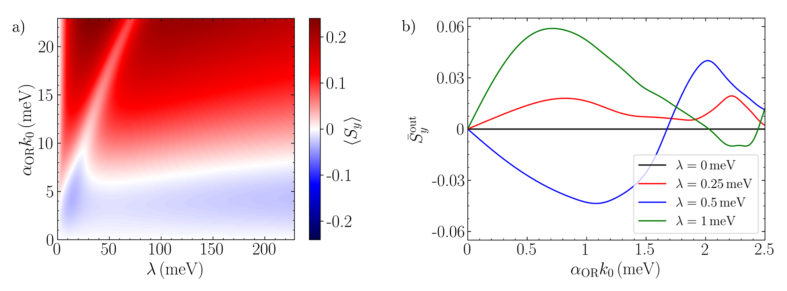
<figcaption class="paper-figure-caption"><b>Fig 4.</b> FIG. 4. Non-collinear spins and spin selectivity in an oxide nanowire with orbital Rashba and spin-orbit coupling. The nanowire is modelled by the Hamiltonian H = Ak2 x + αORkx ˆLy + λˆL · ˆS + δx ˆL2 x + δy ˆL2 y + δz ˆL2 z with ˆLx,y,z the L = 1 angular momentum operators. (a) Density plot of the ˆSy expectation value summed over the six right-moving states in the atomic spin-orbit coupling strength λ, orbital Rashba strength αOR plane. We have set A = 0.15ϵ0/k2 0 with ϵ0 = 38meV and k0 = 1nm−1, and the crystal field parameters δx = −0.2ϵ0, δy = −0.2ϵ0, δz = 0.3ϵ0. (b) Total emitted spin polarization for incoming unpolarized spins as a function of the orbital Rashba coupling strength αOR...</figcaption>
</figure>

**Summary.** The paper reveals a general mechanism to achieve efficient spin selectivity in 1D materials by exploiting non-collinear spin states. This non-collinearity can be engineered by coupling the electron's spin with an additional internal degree of freedom, such as orbital or valley pseudospin. The findings offer practical design rules for building next-generation quantum spin transport devices.

**Why it may be interesting.** This work provides concrete, tunable design principles for realizing robust quantum spin filtering effects in solid-state systems by manipulating internal symmetries (pseudospins) rather than relying on external magnetic fields or decoherence mechanisms.

Detailed structure

**Main problem.** The research aims to establish a general mechanism for achieving highly efficient spin selectivity in conventional time-reversal symmetric one-dimensional systems without relying on phase decoherence.

**Main result.** Spin selectivity is shown to arise inherently when the quantum eigenstates possess non-collinear spins, which can be engineered by introducing an additional pseudospin degree of freedom like valley or orbital angular momentum.

**Method.** The study employs theoretical analysis involving solving scattering problems through coupled spin/pseudospin Hamiltonians and calculating the net outgoing spin polarization ($ar{S}_{	ext{out}}$).

**Model / system.** The models include Rashba quantum wires, multi-subband semiconducting quantum wires (e.g., InAs nanowires), and oxide nanowires exhibiting coupled orbital and spin degrees of freedom.

**Key observables.** Spin selectivity ($ar{S}_{	ext{out}}$) and the degree of noncollinearity between spins of right-moving states are key diagnostics.

**Important parameters / regimes.** Rashba coupling strength ($\alpha_R$), interorbital mixing terms ($c_0$, $\alpha_{OR}$), pseudospin/orbital indices ($\hat{	au}, \hat{L}$), and system geometry parameters.

**Assumptions / limitations.** The analysis assumes the existence of pairs of states with opposite velocity expectation values, and approximations are made regarding transverse sub-band energy spacing in some models.

**Figures summary.** Figures illustrate Bloch sphere representations of spin polarization dependence on angles ($\alpha, eta$), and show calculated spin evolution and net polarization for InAs nanowires and oxide nanowires as a function of coupling parameters.

**Paper structure.** The paper develops the mechanism theoretically by analyzing generalized 1D systems with coupled spin/pseudospin degrees of freedom. It then applies this framework to specific physical realizations, including multi-subband semiconductor wires and complex oxide heterostructures, using scattering theory.

Abstract

We report a previously overlooked general mechanism to obtain highly efficient spin selectivity in conventional time-reversal symmetric one-dimensional systems without invoking phase decoherence. We reveal that Rashba quantum wires featuring non-collinear spin states at the Fermi level inherently possess spin-selective transport properties. We show that this spin noncollinearity can be systematically designed and engineered by introducing an additional pseudospin degree of freedom - such as valley, sublattice, or orbital angular momentum - into spin-orbit coupled systems. By applying this framework to multi-subband semiconducting quantum wires and oxide nanowires, we establish a generalized route toward quantum-coherent spin selectivity up to 10 %. Our findings offer practical design principles for spin-selective transport devices.

[↑ back to top](#top)

### [The Sample Complexity of Fidelity Estimation to a Known Rank-$r$ Reference State Is $\widetildeΘ(r^2/\varepsilon^2)$](http://arxiv.org/abs/2608.01770v1)

**Authors:** Gye Jin Lee, Sunghyeon Jo  
**Type:** theory · **Category:** quantum information and computing · **PDF:** <https://arxiv.org/pdf/2608.01770v1>  
**Analysis basis:** full PDF text, analyzed in chunks
**Topic relevance:** `entanglement & information structure` **1/5** · `quantum measurements` **1/5**

↔ Scroll figures horizontally

<figure class="paper-figure-card">
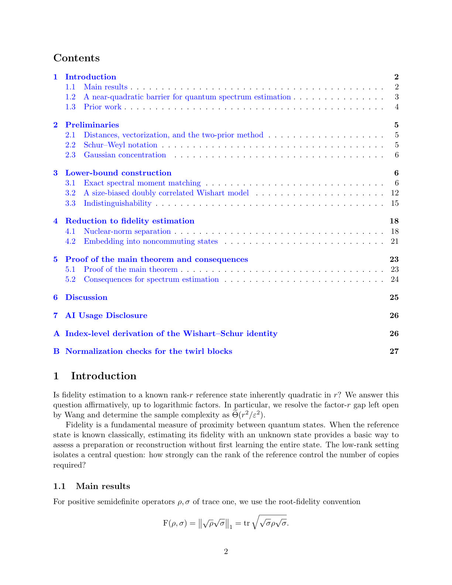
<figcaption class="paper-figure-caption"><b>Fig 1.</b> Low-resolution page preview, page 2</figcaption>
</figure>
<figure class="paper-figure-card">
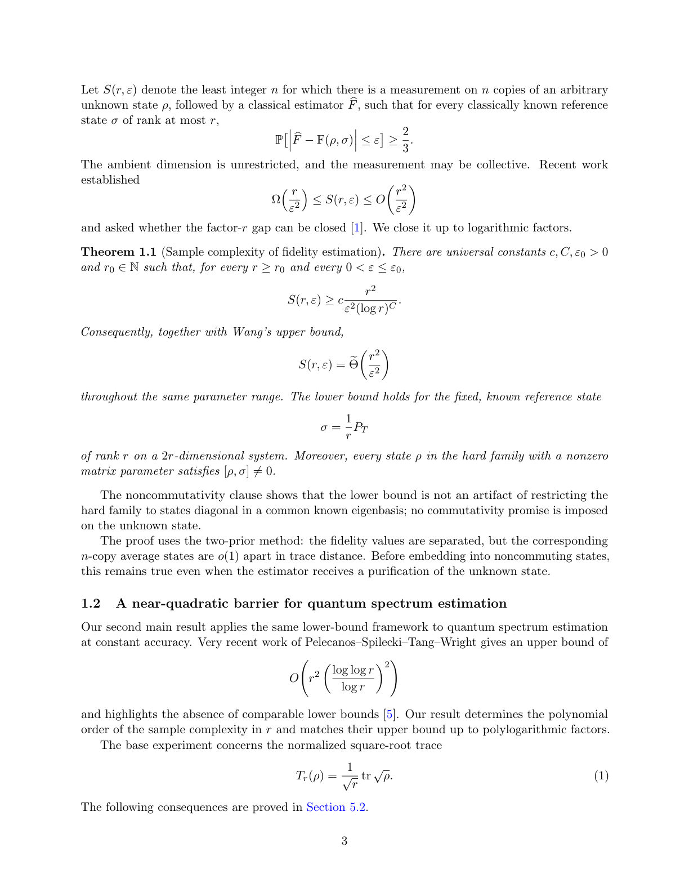
<figcaption class="paper-figure-caption"><b>Fig 2.</b> Low-resolution page preview, page 3</figcaption>
</figure>
<figure class="paper-figure-card">
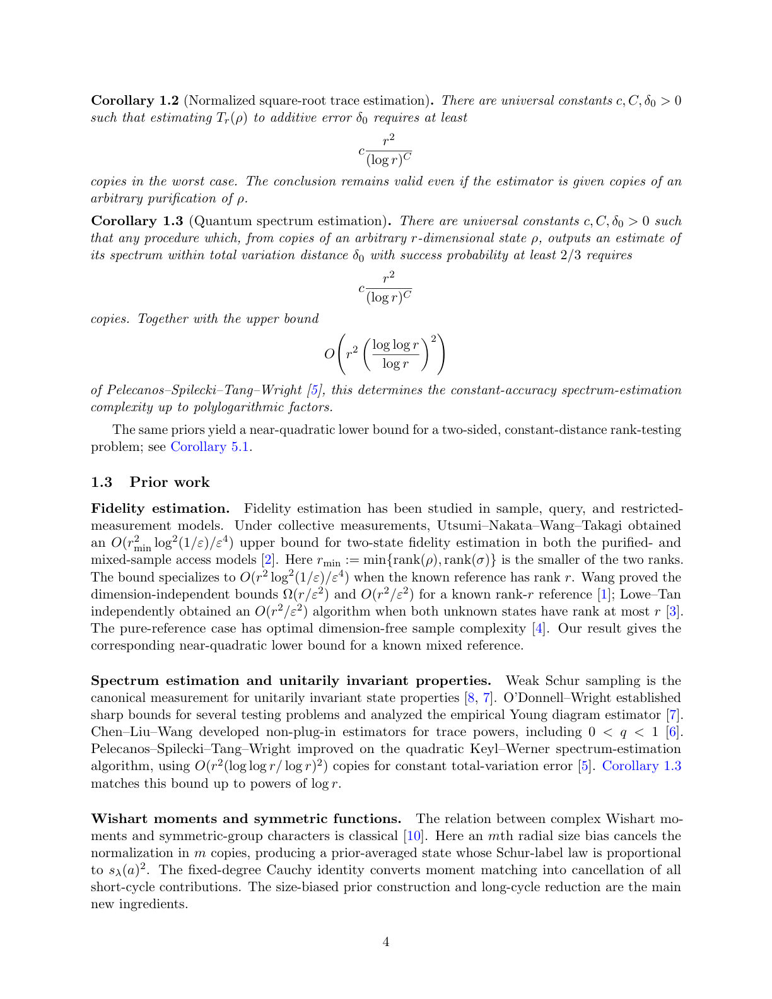
<figcaption class="paper-figure-caption"><b>Fig 3.</b> Low-resolution page preview, page 4</figcaption>
</figure>
<figure class="paper-figure-card">
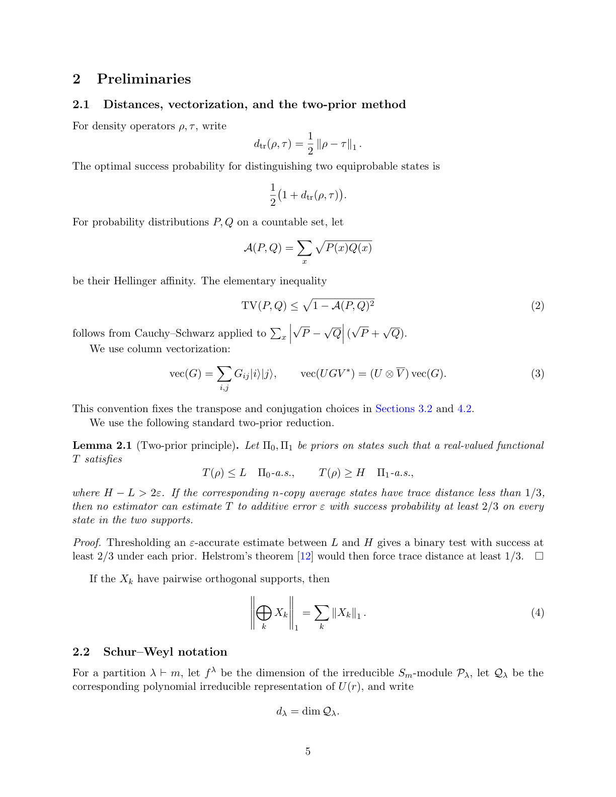
<figcaption class="paper-figure-caption"><b>Fig 4.</b> Low-resolution page preview, page 5</figcaption>
</figure>
<figure class="paper-figure-card">
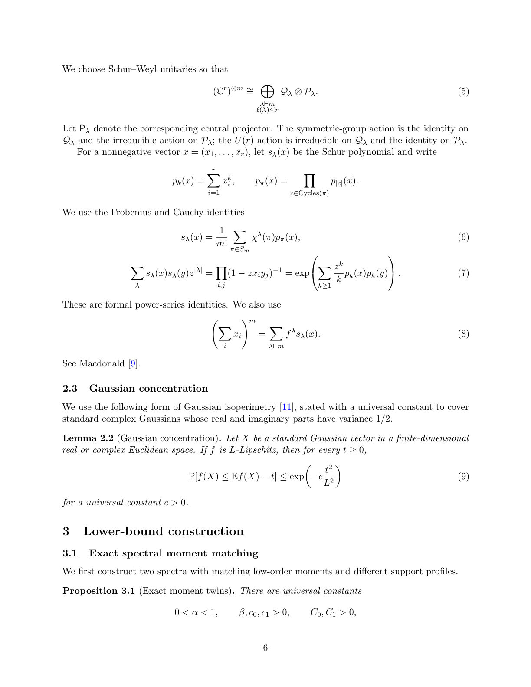
<figcaption class="paper-figure-caption"><b>Fig 5.</b> Low-resolution page preview, page 6</figcaption>
</figure>

**Summary.** This theoretical paper precisely determines the sample complexity for estimating the fidelity between an unknown quantum state and a known reference state. By resolving a long-standing gap in the literature, it establishes that this task requires $\widetilde{\Theta}(r^2/\varepsilon^2)$ samples. The methodology is highly technical, combining advanced random matrix theory (Wishart models) with spectral moment matching.

**Why it may be interesting.** This work provides fundamental quantitative limits on how much data (samples) is needed to estimate key properties of unknown quantum states, which directly impacts the feasibility and efficiency of quantum characterization protocols.

Detailed structure

**Main problem.** The paper determines the sample complexity required to estimate the root Uhlmann fidelity between an unknown quantum state $\rho$ and a known rank-$r$ reference state $\sigma$. It also addresses the lower bound for quantum spectrum estimation.

**Main result.** The sample complexity for fidelity estimation is resolved to $S(r, \varepsilon) = \widetilde{\Theta}(r^2/\varepsilon^2)$, establishing a near-quadratic barrier for this task.

**Method.** The proof combines advanced mathematical techniques including exact spectral moment matching, analysis using a radially size-biased doubly correlated Wishart model, and the Cauchy identity. The lower bound construction relies on constructing two probability measures with identical low-order moments but distinct supports.

**Model / system.** The system involves quantum states ($\rho$, $\sigma$) represented by positive semidefinite operators of trace one. The analysis is performed in the context of estimating fidelity between these states, often involving constructions based on maximally entangled states and mixtures.

**Key observables.** Root Uhlmann fidelity $F(\rho, \sigma)$, sample complexity $S(r, \varepsilon)$, and quantum spectrum estimation error.

**Important parameters / regimes.** Rank $r$ of the reference state $\sigma$, additive error $\varepsilon$. The result holds for small errors $\varepsilon \le \varepsilon_0$.

**Assumptions / limitations.** The primary lower bound construction is shown to hold for specific choices of $\sigma$ (e.g., maximally mixed on an $r$-dimensional subspace) and relies on the two-prior method.

**Paper structure.** The paper first establishes the main result for fidelity estimation by resolving a gap between known bounds, utilizing moment matching techniques within a Wishart model framework. It then addresses quantum spectrum estimation complexity separately, deriving lower bounds that confirm the polynomial order of the required samples.

Abstract

We settle the sample complexity of estimating the root Uhlmann fidelity $F(ρ,σ)=\operatorname{tr}\sqrt{\sqrtσρ\sqrtσ}$ between an unknown state $ρ$ and a known rank-$r$ reference state $σ$. Writing $S(r,\varepsilon)$ for the sample complexity at additive error $\varepsilon$, we resolve the open problem posed by Wang by closing, up to logarithmic factors, the gap between the previously known bounds $Ω(r/\varepsilon^2)$ and $O(r^2/\varepsilon^2)$. We prove $S(r,\varepsilon)=\widetildeΘ(r^2/\varepsilon^2)$ for all $0<\varepsilon\le\varepsilon_0$, where $\varepsilon_0>0$ is a universal constant. The lower bound already holds on a $2r$-dimensional system when $σ$ is maximally mixed on a fixed $r$-dimensional subspace, and for a hard family of states that do not commute with $σ$. The proof combines exact spectral moment matching, a radially size-biased doubly correlated Wishart model, and the Cauchy identity, reducing state indistinguishability to a long-cycle estimate for a weighted random permutation. A direct-sum embedding and binomial thinning yield the optimal $1/\varepsilon^2$ dependence. We also prove a near-quadratic lower bound $\widetildeΩ(r^2)$ for quantum spectrum estimation at constant accuracy. Combined with the recent $O(r^2(\log\log r/\log r)^2)$ upper bound, this determines the polynomial order of the sample complexity in this regime and establishes a near-quadratic barrier.

[↑ back to top](#top)

### [Coordinate space representation for quantum simulation of scalar field theory](http://arxiv.org/abs/2608.00670v1)

**Authors:** Gaetan Bardy, Matthieu Saubanere, Adrian Tanasa  
**Type:** theory · **Category:** quantum information and computing · **PDF:** <https://arxiv.org/pdf/2608.00670v1>  
**Analysis basis:** full PDF text, analyzed in chunks
**Topic relevance:** `analog quantum simulation` **1/5**

↔ Scroll figures horizontally

<figure class="paper-figure-card">
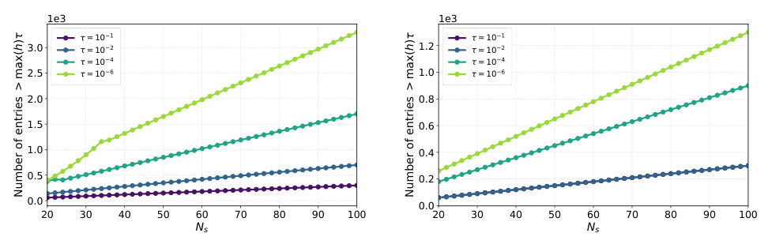
<figcaption class="paper-figure-caption"><b>Fig 1.</b> Figure 1: Number of non-zero entries in the hopping matrix h as a function of the lattice size Ns, for m = 1 (a) and m = 3 (b). The linear scaling demonstrates the effective band-diagonal structure of h. For m = 3, the results for τ = 10−2 and τ = 10−1 coincide, indicating that only the tridiagonal contributions remain significant.</figcaption>
</figure>
<figure class="paper-figure-card">
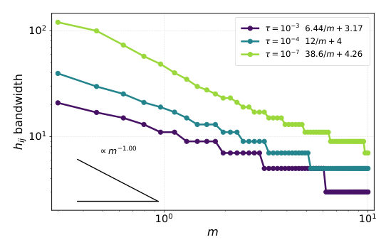
<figcaption class="paper-figure-caption"><b>Fig 2.</b> Figure 2: Effective bandwidth of the hopping matrix hij as a function of the mass parameter m. Power-law dependence of the effective bandwidth on m. The decreasing bandwidth indi- cates that the hopping matrix becomes increasingly localized as the mass increases.</figcaption>
</figure>
<figure class="paper-figure-card">
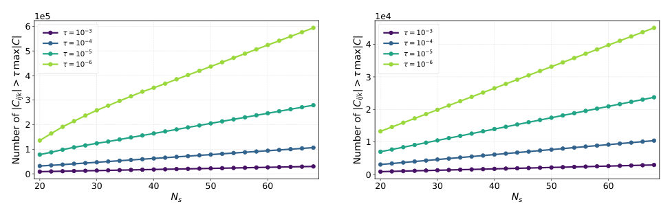
<figcaption class="paper-figure-caption"><b>Fig 3.</b> Figure 3: Number of non-zero entries in the interaction tensor U as a function of system size Ns, for m = 1 (a) and m = 3 (b). As for the hopping matrix, one notices a linear scaling, characteristic of a finite interaction range.</figcaption>
</figure>
<figure class="paper-figure-card">
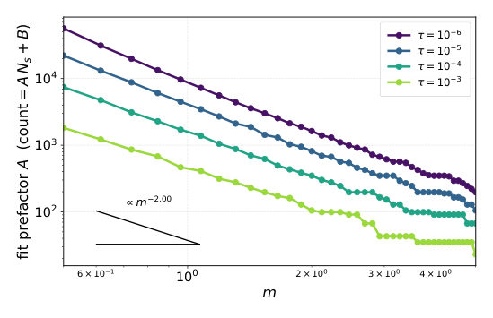
<figcaption class="paper-figure-caption"><b>Fig 4.</b> Figure 4: Effective bandwidth of Uijkl as a function of the mass parameter m. Power-law dependence of the effective bandwidth on m.</figcaption>
</figure>
<figure class="paper-figure-card">
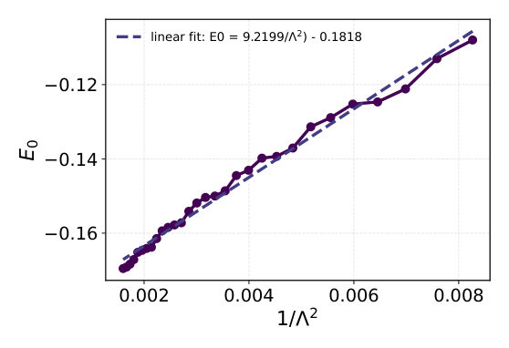
<figcaption class="paper-figure-caption"><b>Fig 5.</b> Figure 5: Ground-state energy obtained from HΛ as a function of 1/Λ2 for L = 5. The approximately linear behavior enables an extrapolation to the infinite-cutoff limit. The extrapolated energy at infinite cutoff is E0 = −0.1818.</figcaption>
</figure>

**Summary.** This paper investigates efficient ways to map the lattice $\phi^4$ field theory Hamiltonian onto qubits for quantum simulation. By comparing coordinate space and momentum space representations, the authors show that exploiting effective locality in the coordinate basis significantly reduces the required computational resources compared to standard methods. This work guides the development of resource-aware quantum algorithms for QFTs.

**Why it may be interesting.** The findings provide concrete guidelines on how choosing a specific basis representation can drastically improve the scaling of quantum resources needed to simulate complex many-body dynamics, which is crucial knowledge for designing near-term quantum algorithms.

Detailed structure

**Main problem.** Developing efficient quantum simulation methods for interacting quantum field theories by minimizing computational resources.

**Main result.** The coordinate-space representation ($	ext{HO}_x$) of the Hamiltonian exhibits an effective band-diagonal structure, significantly reducing the required Pauli string scaling compared to momentum-space representations.

**Method.** Comparing resource requirements (Pauli 1-norm and number of Pauli strings) for encoding the lattice $\phi^4$ Hamiltonian using different basis representations and quantum circuit encodings.

**Model / system.** The study focuses on the $\phi^4$ scalar field theory model, analyzed on a lattice in $(1+1)$ dimensions. The Hamiltonian is compared when formulated in coordinate space versus momentum space.

**Key observables.** Pauli 1-norm ($\|H\|_1$), number of Pauli strings, and resource scaling for qubits ($N_q$).

**Important parameters / regimes.** Coupling strength ($\lambda$), lattice spacing ($a$), and the choice between unary and binary boson-to-qubit mappings.

**Assumptions / limitations.** The analysis relies on exploiting effective locality to truncate the Hamiltonian while preserving the low-energy spectrum, and compares resource scaling for different encoding schemes.

**Figures summary.** Figure 9(a) compares the Pauli 1-norm for momentum space ($H_p$) under unary vs. binary encoding. Figure 9(b) shows that the ratio $\|H_x\|_1 / \|H_p\|_1$ decreases as coupling strength increases, favoring the coordinate basis.

**Paper structure.** The paper first introduces the problem of simulating QFTs and compares two representations: the amplitude basis (coordinate space) and the Fock basis (momentum space). It then analyzes the structure of the resulting Hamiltonians, focusing on sparsity, and finally quantifies resource requirements using Pauli norms for different encodings.

Abstract

Quantum computing provides a promising framework for the simulation of quantum field theories, where the computational cost depends both on the quantum algorithm employed and on the representation of the Hamiltonian. We investigate a formulation of the $φ^4$ model based on the harmonic-oscillator basis in coordinate space. We derive the lattice $φ^4$ Hamiltonian in this representation and analyze the structure of the resulting one-body matrix and interaction tensor. We show that both exhibit an effective band-diagonal structure, allowing controlled truncations of the Hamiltonian while preserving the low-energy spectrum. We validate this formulation by comparing low-energy observables obtained from numerical diagonalization with those computed in the standard harmonic-oscillator momentum-space representation. Finally, we estimate the resources required to encode the Hamiltonian on a quantum computer using both binary and unary boson-to-qubit mappings. By exploiting effective locality, the coordinate-space representation reduces the resources required for quantum simulation over a broad range of parameters.

[↑ back to top](#top)

### [Gradient expansion approximation of the inhomogeneous electron-gas revisited: Higher-order corrections](http://arxiv.org/abs/2608.02524v1)

**Authors:** Mario Benites, Angel Rosado, Efstratios Manousakis  
**Type:** theory · **Category:** strongly correlated electrons · **PDF:** <https://arxiv.org/pdf/2608.02524v1>  
**Analysis basis:** full PDF text, analyzed in chunks
**Topic relevance:** `Keldysh / 2PI / non-Gaussian methods` **1/5**

↔ Scroll figures horizontally

<figure class="paper-figure-card">
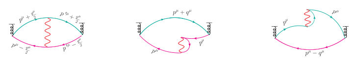
<figcaption class="paper-figure-caption"><b>Fig 1.</b> FIG. 1. Diagrammatic contributions to the irreducible polarization function up to first order in an expansion of ˜Vλ(p) given by Eq. 15. In our notation, pµ = (p0, ⃗p) and qµ = (0, ⃗q).</figcaption>
</figure>
<figure class="paper-figure-card">
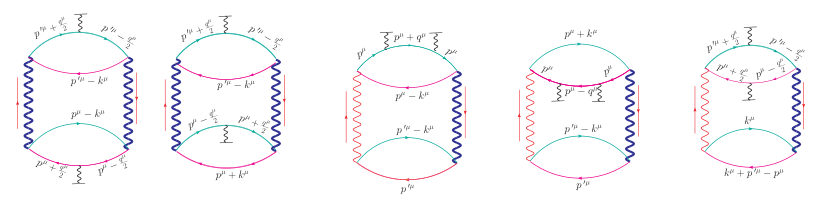
<figcaption class="paper-figure-caption"><b>Fig 2.</b> FIG. 2. Remaining diagrammatic contributions to Πxc(q, 0) to be combined with the diagrams in Fig. 1. These diagrams contribute to the same order in rs in the long-wavelength limit. The red color represents the regularized-Coulomb interaction line, while the blue color represents the RPA-renormalized interaction line. The solid green (fuchsia) lines represent the fermionic non-interacting electron (hole) propagator, while the curly line represents the insertion due to the weak external potential. The frequency and momentum variables follow the same shorthand notation as in Fig. 1.</figcaption>
</figure>
<figure class="paper-figure-card">
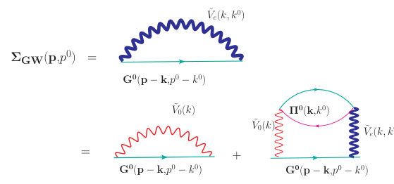
<figcaption class="paper-figure-caption"><b>Fig 3.</b> FIG. 3. Diagrammatic representation of the GW self-energy. The first diagram corresponds to the Fock self-energy ΣF (pµ) diagram and the second diagram is the ring-like self-energy diagram Σr(pµ).</figcaption>
</figure>
<figure class="paper-figure-card">
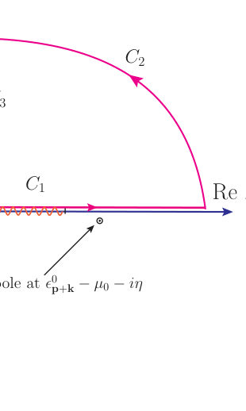
<figcaption class="paper-figure-caption"><b>Fig 4.</b> FIG. 4. Complex frequency plane integration path for the ring-diagram series self-energy.</figcaption>
</figure>
<figure class="paper-figure-card">
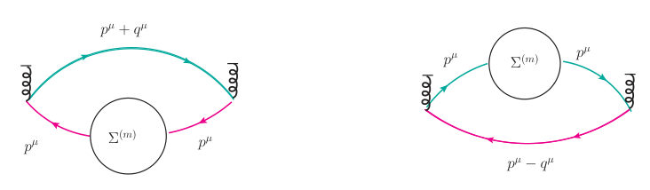
<figcaption class="paper-figure-caption"><b>Fig 5.</b> FIG. 5. Family of diagrams corresponding to the irreducible polarization function of the m-th order of the RPA-based reorga- nized perturbative expansion. These m-th order diagrams contain one insertion of an m-th order self-energy at one of the two fermion propagators.</figcaption>
</figure>

**Summary.** This theoretical work refines the Gradient Expansion Approximation (GEA) for the interacting electron gas by calculating higher-order corrections to the gradient energy coefficient. The authors establish an exact, definitive constraint that any valid GGA functional must satisfy in the high-density limit. This provides a crucial benchmark for improving density functional theory accuracy.

**Why it may be interesting.** While focused on solid-state theory, the rigorous derivation of exact constraints for DFT functionals is foundational knowledge relevant to understanding many-body interactions in condensed matter systems.

Detailed structure

**Main problem.** The paper revisits the Gradient Expansion Approximation (GEA) for the interacting electron gas to calculate higher-order corrections to the coefficient $B_{xc}[n]$ of the density gradient squared term in the exchange-correlation functional.

**Main result.** The authors derive an exact, definitive constraint for future Generalized Gradient Approximation (GGA) functionals by calculating the next-to-leading order correction scaling as $r_s \ln(r_s)$.

**Method.** The calculation involves systematically analyzing the static proper-polarization function $\Pi^*(q, 0)$ in the long-wavelength limit ($q 
ightarrow 0$) and extending the expansion to include higher-order diagrammatic terms.

**Model / system.** The study focuses on the inhomogeneous electron gas within the framework of Density Functional Theory (DFT), using approximations like the GEA for the exchange-correlation energy functional $E_{xc}[n]$.

**Key observables.** $B_{xc}[n]$ (the coefficient of $(
abla n)^2$), $\Pi^*(q, 0)$, and various integral kinds ($D_{n,5}$, $eta_n$).

**Important parameters / regimes.** Wigner-Seitz radius $r_s$, momentum transfer $q 	o 0$, and the high-density slowly-varying limit.

**Assumptions / limitations.** The analysis relies on the GEA, neglecting terms involving $
abla^2 n(\vec{r})$, and uses systematic techniques like contour deformation (Cauchy's theorem) for integral evaluation.

**Figures summary.** Figures illustrate complex integration paths used in calculating polarization functions and diagrammatic representations of self-energy series ($\Sigma_{2b}$).

**Paper structure.** The paper builds upon previous work by first establishing a systematic framework to evaluate the leading term coefficient ($q^2$) from $\Pi^*(q, 0)$, and then extending this analysis to calculate the next-to-leading order $r_s \ln(r_s)$ correction.

Abstract

In our recently published work (our Ref. 1) we revisited the gradient expansion approximation (GEA) of the interacting electron gas, and recalculated the leading-order contribution$-$with respect to the Wigner-Seitz radius $r_s$$-$to the coefficient $B_{xc}[n]$ of the square of the gradient of the electron density in the high-density and slowly varying limits. That work resolved historical controversies regarding these coefficients and demonstrated that serious misconceptions have led to incorrect constraints being imposed on popular functionals within the generalized gradient approximation (GGA). In the present paper, we extend this calculation to obtain the coefficient of the next-to-leading term, which scales as $r_s \ln(r_s)$ relative to the leading order. First, we establish a systematic framework to evaluate the integral expressions for the $b_{xc}$ coefficient of the leading term ($\sim q^2$) of the density-density response function in the long-wavelength limit ($q \to 0$)$-$a prerequisite for computing $B_{xc}[n]$. The significance of the calculation stems from the proof that the coefficient of this $r_s \ln(r_s)$ term receives no corrections from higher-order diagrammatic expressions. Consequently, our derived value serves as an exact, definitive constraint for future GGA functional development; in the high-density slowly-varying limit, any valid functional must reproduce the exact constraints established in both our previous work and the present paper.

[↑ back to top](#top)

### [No low-degree tests for quantum states](http://arxiv.org/abs/2608.00265v1)

**Authors:** Omar Alrabiah, Srinivasan Arunachalam, Sabee Grewal, John Wright  
**Type:** theory · **Category:** quantum information and computing · **PDF:** <https://arxiv.org/pdf/2608.00265v1>  
**Analysis basis:** full PDF text, analyzed in chunks
**Topic relevance:** `entanglement & information structure` **1/5**

↔ Scroll figures horizontally

<figure class="paper-figure-card">
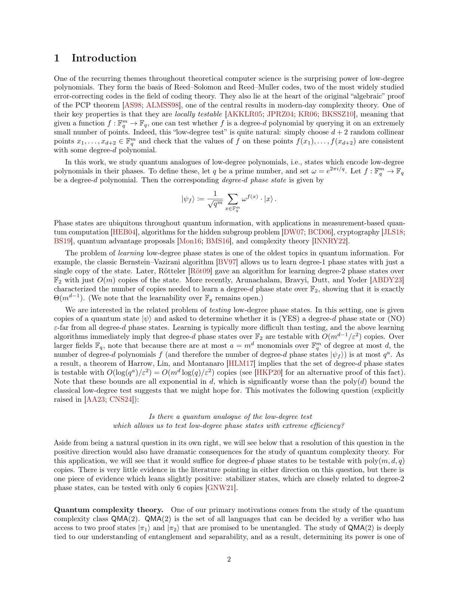
<figcaption class="paper-figure-caption"><b>Fig 1.</b> Low-resolution page preview, page 2</figcaption>
</figure>
<figure class="paper-figure-card">
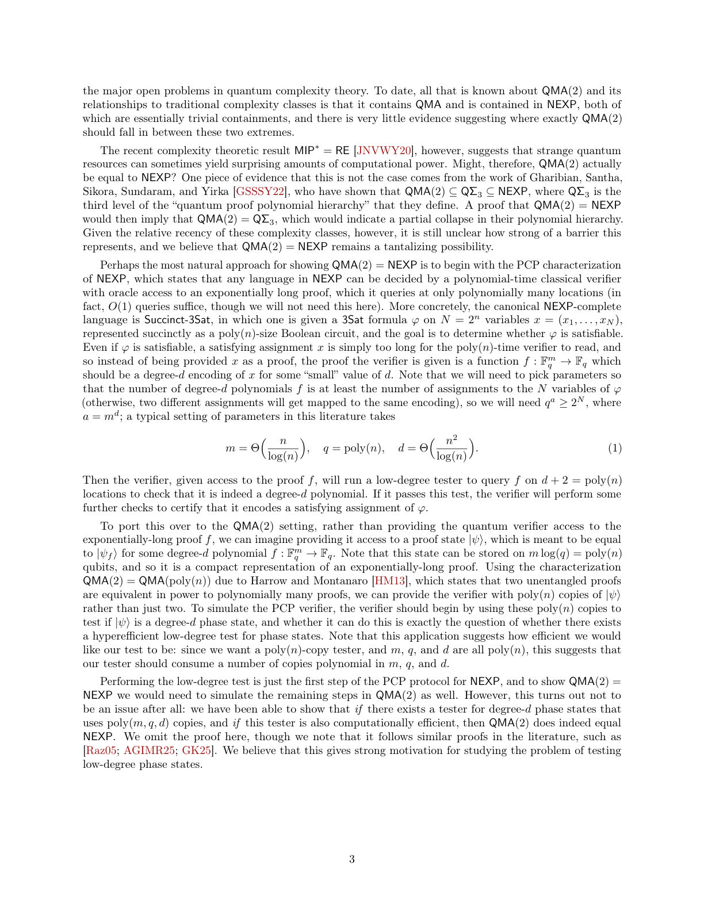
<figcaption class="paper-figure-caption"><b>Fig 2.</b> Low-resolution page preview, page 3</figcaption>
</figure>
<figure class="paper-figure-card">
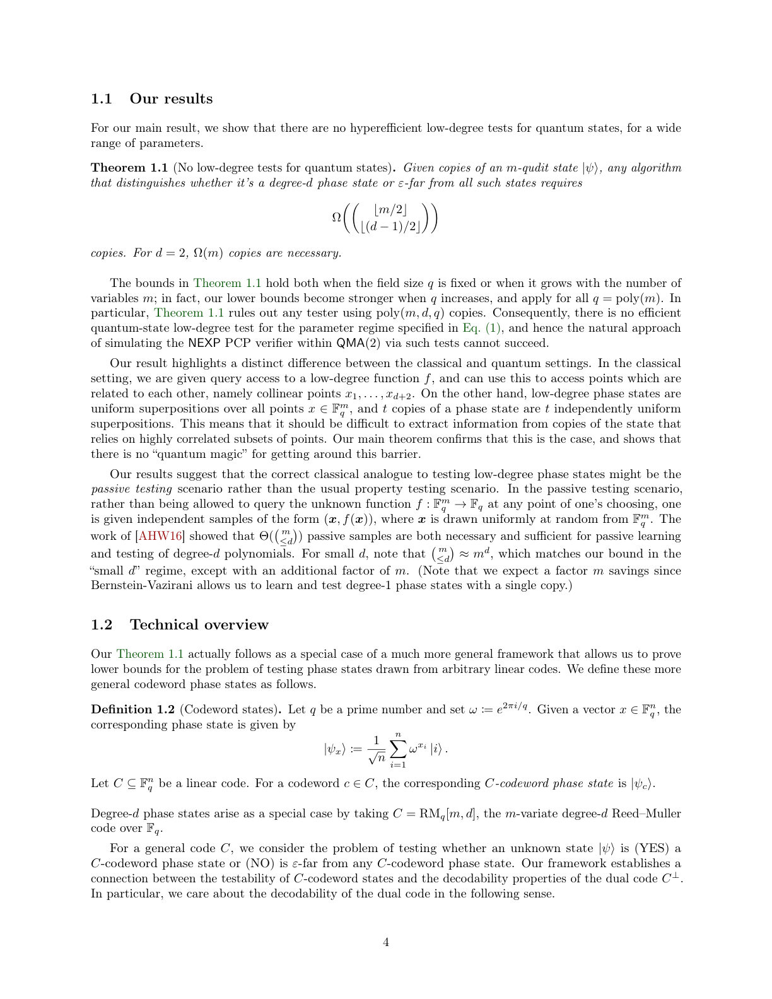
<figcaption class="paper-figure-caption"><b>Fig 3.</b> Low-resolution page preview, page 4</figcaption>
</figure>
<figure class="paper-figure-card">
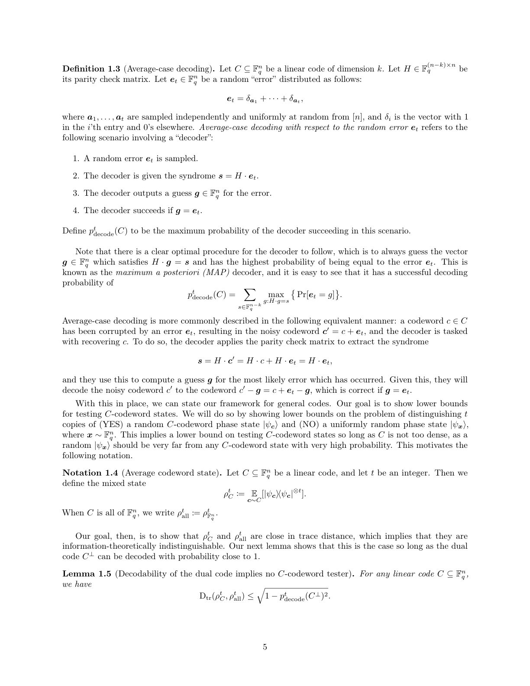
<figcaption class="paper-figure-caption"><b>Fig 4.</b> Low-resolution page preview, page 5</figcaption>
</figure>
<figure class="paper-figure-card">
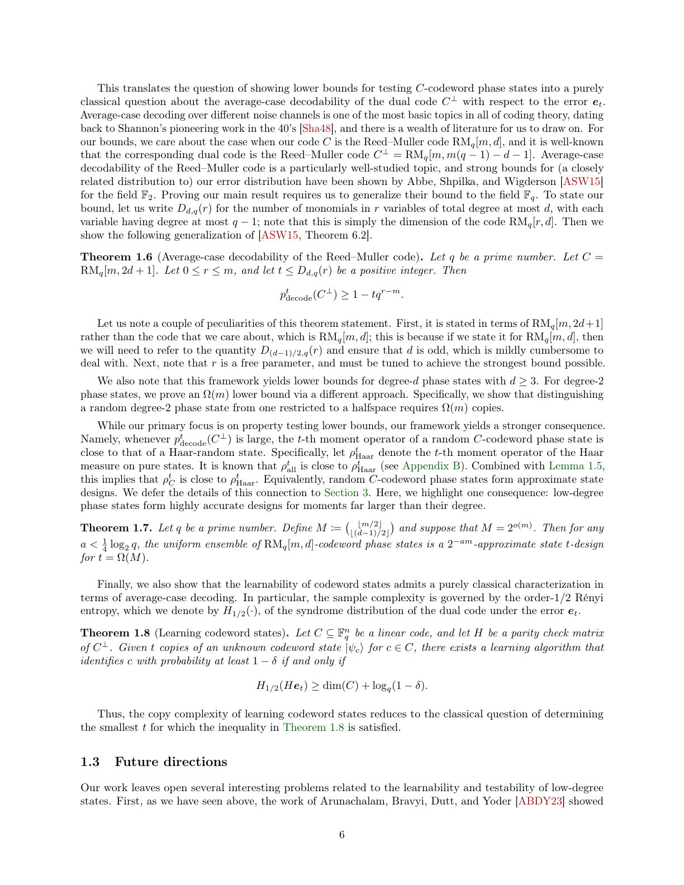
<figcaption class="paper-figure-caption"><b>Fig 5.</b> Low-resolution page preview, page 6</figcaption>
</figure>

**Summary.** This paper proves a lower bound showing that distinguishing low-degree phase quantum states requires an exponentially large number of copies relative to what might be expected from classical tests. By connecting quantum testing to classical coding theory, the authors demonstrate that such efficient testers do not exist for these structured quantum states.

**Why it may be interesting.** This work provides fundamental limitations on the distinguishability of structured quantum states, which has implications for understanding the computational complexity relationship between QMA(2) and NEXP.

Detailed structure

**Main problem.** The authors investigate whether an efficient quantum test exists for distinguishing low-degree phase states from random quantum states.

**Main result.** They prove that no such hyperefficient quantum low-degree test exists, establishing a lower bound on the required number of copies needed for testing.

**Method.** The analysis relates the quantum state testing problem to classical decoding properties of the dual code associated with Reed-Muller codes.

**Model / system.** The system involves $m$-qudit quantum states $|\psi_f
angle$ defined by a polynomial phase $f(x)$ over $\mathbb{F}_q^m$. The testing procedure aims to distinguish these structured states from general, random states.

**Key observables.** The required number of copies for the tester, and the trace distance between state ensembles ($	ext{D}_{	ext{tr}}$).

**Important parameters / regimes.** $m$ (number of qudits), $d$ (polynomial degree), $q$ (field size), and $\epsilon$ (distance parameter).

**Assumptions / limitations.** The results leverage known bounds on the tolerance of high-rate Reed--Muller codes to random errors.

**Paper structure.** The paper establishes a general framework relating quantum testing to classical decoding, derives lower bounds using coding theory, and concludes by stating that efficient testers are impossible for this class of states.

Abstract

We study the problem of testing low-degree phase states, namely m-qudit quantum states of the form $q^{-m/2} \sum_{x \in \mathbb{F}_q^m} ω^{f(x)} |x>$, where $f$ is a degree-$d$ polynomial. In contrast to the classical setting, where low-degree polynomials admit highly efficient classical testers, it is not known whether analogous quantum tests exist. We show that no such quantum low-degree test exists: any tester requires $Ω(\binom{\lfloor m/2\rfloor}{\lfloor (d-1)/2 \rfloor})$ copies to determine whether a given state is a degree-$d$ phase state or is far from every such state. Our results follow from a general framework that relates quantum testing of codeword phase states to classical decoding properties of the dual code, which allows us to leverage known bounds on the tolerance of high-rate Reed--Muller codes to random errors.

[↑ back to top](#top)

### [Optimal Strategies for Multi-parameter Quantum Metrology](http://arxiv.org/abs/2608.01114v1)

**Authors:** Linxuan Li, Zihao Hu, Longyun Chen, Yuxiang Yang, Haidong Yuan  
**Type:** theory · **Category:** other · **PDF:** <https://arxiv.org/pdf/2608.01114v1>  
**Analysis basis:** full PDF text, analyzed in chunks
**Topic relevance:** `quantum measurements` **1/5**

↔ Scroll figures horizontally

<figure class="paper-figure-card">
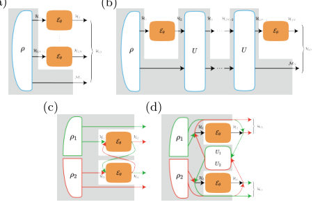
<figcaption class="paper-figure-caption"><b>Fig 1.</b> FIG. 1: Prototypical strategies of quantum metrology for N channels. Eθ is a quantum channel embedded unknown parameters θ, and the shaded grey area represents a quantum strategy ˜P. (a) Parallel strategy (Par). (b) Sequential strategy (Seq), where U1,...,UN are control operations. (c) Quantum SWITCH (SWI). The green and red lines, respectively, correspond to two different causal orders with no intermediate controls. (d) Causal superposition strategy (Sup), which is composed of two sequential strategies, plotted in green and in red respectively.</figcaption>
</figure>
<figure class="paper-figure-card">
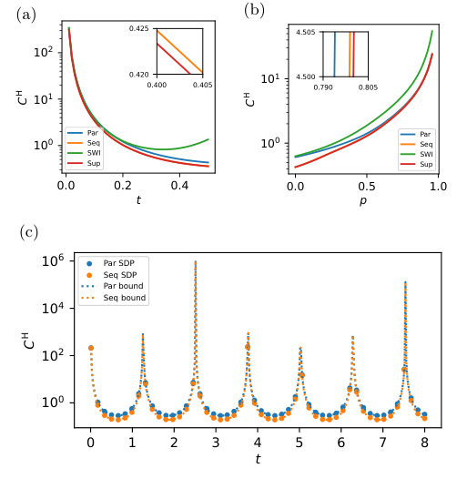
<figcaption class="paper-figure-caption"><b>Fig 2.</b> FIG. 2: Holevo bound using parallel Par, sequential Seq, and indefinite-causal-order strategies Sup for causal superposition and SWI for quantum SWITCH. We take N = 2, B = 2.5, θ = 1.3, and ϕ = π/4. (a): fix the decay noise rate p = 0.25 and vary the evolution time t. (b): fix t = 1.0 and vary the decay noise rate p. (c): comparison between the numerical and analytical results of Eqs. (38) and (39) in the noiseless case, where the circle markers “SDP” represent the numerical results and the dashed lines “bound” represent the analytical results.</figcaption>
</figure>
<figure class="paper-figure-card">
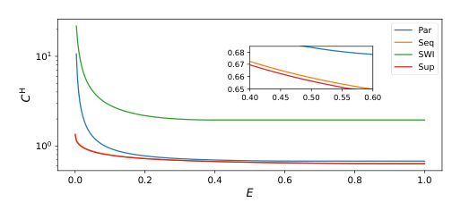
<figcaption class="paper-figure-caption"><b>Fig 3.</b> FIG. 3: Energy-constrained Holevo bound using parallel Par, sequential Seq, and indefinite-causal-order strategies Sup for causal superposition and SWI for quantum SWITCH. We fix N = 2, p = 0.5, θ = 1.3, ϕ = π/4, B = 2.5, and t = 0.6 (hence α = 1.5), while varying the energy budget E ≥0.</figcaption>
</figure>
<figure class="paper-figure-card">
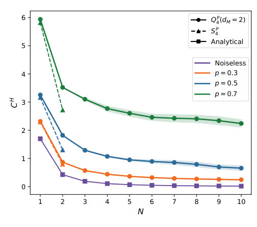
<figcaption class="paper-figure-caption"><b>Fig 4.</b> FIG. 4: Holevo bound QP k (dM = 2) versus SP k considering optimization of finite-memory strategies with identical controls. We consider 3-dimension quantum magnetometry problem in Sec. III and fix α = 2.5, θ = 1.3, and ϕ = π/4. The analytical result indicates Eq.(39) for noiseless case. Numerical simulations for QP k (dM = 2) are performed 20 times to compute the mean absolute errors and the corresponding 95% confidence intervals, represented by solid lines and shaded regions.</figcaption>
</figure>
<figure class="paper-figure-card">
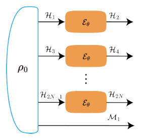
<figcaption class="paper-figure-caption"><b>Fig 5.</b> FIG. 5: Parallel scheme with N quantum channels. ˜P = ρ0 ∈M1 ⊗N i=1 H2i−1 is the probe state thus the parallel strategy corresponds to the state preparation stage of the metrological process. The reduced state ρ(1,3,...,2N−1) on the input system ⊗N i=1 H2i−1 corresponds to the sub-comb P (1) = TrM[ρ0].</figcaption>
</figure>

**Summary.** This paper introduces a comprehensive SDP framework to solve the challenging problem of simultaneous parameter estimation in quantum sensing. It jointly optimizes probe states and control operations across various strategy types (parallel, sequential, ICO) to determine fundamental precision limits. The resulting tool allows researchers to design optimal protocols while explicitly incorporating realistic resource constraints.

**Why it may be interesting.** This work provides a powerful, systematic computational toolkit for quantum metrology that moves beyond single-parameter limits by rigorously handling multi-parameter estimation trade-offs using advanced convex optimization techniques.

Detailed structure

**Main problem.** The core problem is developing a general computational framework to find optimal strategies for simultaneously estimating multiple unknown parameters ($	heta$) in quantum sensing, overcoming the incompatibility of individual parameter optimization limits.

**Main result.** The authors provide exact semidefinite-program (SDP) formulations that jointly optimize probe states, controls, and measurements across parallel, sequential, and indefinite causal order strategies, establishing fundamental precision bounds.

**Method.** They employ SDP techniques to recast the minimization of the Weighted Mean Square Error (WMSE) into convex optimization problems, deriving both primal and dual formulations for various quantum estimation bounds.

**Model / system.** The model is general quantum metrology involving a quantum channel $E_	heta$ acting on an initial probe state. The process is structured across stages: probe preparation, intermediate control operations, and final measurement, often visualized using a 'quantum comb' formalism.

**Key observables.** Weighted Mean Square Error (WMSE), precision bounds (Holevo, Nagaoka-Hayashi, QCRB), and the resulting mean-square error matrix $\mathbf{V}$.

**Important parameters / regimes.** The number of parameters ($d$), resource constraints like energy budgets or finite ancillary memory dimension, and noise models (e.g., Amplitude-Damping).

**Assumptions / limitations.** The analysis often compares ideal theoretical bounds with practically achievable performance under resource constraints; the general ICO strategy is noted as physically untraceable.

**Figures summary.** Figures illustrate prototypical strategies (Parallel, Sequential, Quantum SWITCH) and compare the achieved precision levels across different noise regimes for multiple parameters.

**Paper structure.** The paper builds by first defining the multi-parameter estimation challenge, then developing the general SDP framework to formulate various bounds, proving the equivalence between primal optimization formulations and their duals, and finally applying this tool to analyze specific resource-constrained sensing protocols.

Abstract

Estimating multiple unknown parameters simultaneously is essential for practical quantum sensing. However, it faces a fundamental challenge: the optimal strategy for estimating one parameter is often incompatible with that for another, making it impossible to simultaneously achieve the ultimate precision limits for all parameters. Here we develop a general and efficient computational framework that jointly optimizes probe states, control operations, and measurements across different strategy families, including parallel, sequential, and those with indefinite causal order. Our approach provides exact semidefinite-program formulations for several precision bounds, including the Holevo, Nagaoka-Hayashi, and quantum Cramér-Rao bounds. We demonstrate the capabilities of the framework in multiparameter magnetometry and frequency estimation, identifying optimal protocols within each class and revealing a strict hierarchy among the achievable performances of different classes in the multiparameter regime. The framework also directly incorporates resource constraints, such as energy budgets, enabling systematic investigation of experimentally realistic sensing scenarios. Furthermore, we develop a finite-memory optimization method for sequential strategies with restricted ancillary-memory dimension. By decomposing the protocol into initial probe preparation and intermediate control operations, this method provides a practical route to designing resource-constrained sequential sensing schemes. Our work establishes a versatile computational tool for determining fundamental precision limits and designing optimal quantum-sensing protocols in complex multiparameter settings.

[↑ back to top](#top)

### [Sparse Quantum State Preparation with Sublinear T-Count](http://arxiv.org/abs/2608.00414v1)

**Authors:** Jingquan Luo, Lvzhou Li  
**Type:** theory · **Category:** quantum information and computing · **PDF:** <https://arxiv.org/pdf/2608.00414v1>  
**Analysis basis:** full PDF text, analyzed in chunks
**Topic relevance:** `entanglement & information structure` **1/5**

↔ Scroll figures horizontally

<figure class="paper-figure-card">
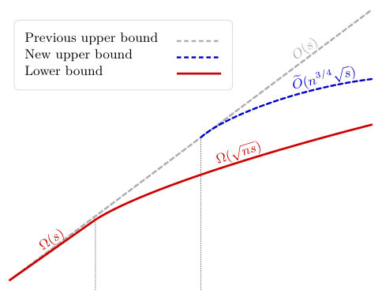
<figcaption class="paper-figure-caption"><b>Fig 1.</b> Figure 1: Schematic relation between the known constant-error bounds on the worst-case T-count for preparing an n-qubit s-sparse state as a function of the sparsity s. Ignoring polylogarithmic factors, our new upper bound is eO(n3/4√s), which crosses the previous linear upper bound around s = n3/2 up to polylogarithmic factors. The lower bound is linear for s = O(n) and becomes Ω(√ns) for s = Ω(n) up to s ≤2n/2.</figcaption>
</figure>
<figure class="paper-figure-card">
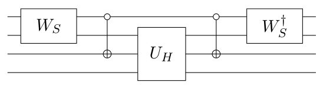
<figcaption class="paper-figure-caption"><b>Fig 2.</b> Figure 3: High-level circuit for the small-support implementation of F. The open-control CNOTs compute and uncompute a flag z indicating whether the input register equals 0n. The box UH then uses the flag and the label register to update the output register.</figcaption>
</figure>
<figure class="paper-figure-card">
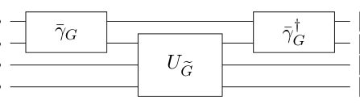
<figcaption class="paper-figure-caption"><b>Fig 3.</b> Figure 4: Prefix-compression step in Case 1 of the large-support recursion. The circuit computes ¯γG(u) into a fresh (r −1)-bit register, applies the recursive implementation U eG to the logical input ¯γG(u)v, and then uncomputes ¯γG(u). This reduces the input length from m to m−1 while preserving the support size.</figcaption>
</figure>
<figure class="paper-figure-card">
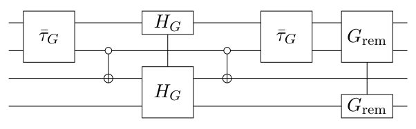
<figcaption class="paper-figure-caption"><b>Fig 4.</b> Figure 5: Support-peeling step in Case 2 of the large-support recursion. The circuit XORs ¯τG(u) into the suffix register, computes a flag indicating whether the modified suffix equals 0m−r, applies HG to contribute Gpeel, uncomputes the flag and suffix update, and then applies the recursive im- plementation of Grem. The two connected boxes labeled HG emphasize that this operation depends on (z, u) while the suffix register is bypassed.</figcaption>
</figure>

**Summary.** This paper analyzes the minimum T-gate count required to prepare $s$-sparse quantum states on $n$ qubits. The authors achieve a significant upper bound that shows sublinear scaling with sparsity $s$ when $s$ is large, while also proving a lower bound showing that linear scaling in $s$ remains necessary for small supports. This significantly narrows the theoretical gap between achievable and required resources.

**Why it may be interesting.** This work directly impacts resource estimation in quantum computation, particularly for tasks involving structured or low-rank quantum states, which is crucial for designing efficient quantum algorithms and error correction protocols.

Detailed structure

**Main problem.** The primary goal is to determine the fault-tolerant cost, measured by T-count in the Clifford+T model, required for preparing quantum states that are sparse in their computational basis support.

**Main result.** The authors provide an upper bound showing sublinear dependence on the sparsity $s$ when $s$ is large ($s \geq e\Omega(n^{3/2})$), while simultaneously establishing a lower bound of $\Omega(\min\{s, \sqrt{ns}\})$, which shows linear dependence on $s$ is unavoidable for small support.

**Method.** The upper bound relies on a novel 'support-aware synthesis theorem' for sparse Boolean functions. Lower bounds are established using information theoretic arguments and stabilizer properties related to the state preparation process.

**Model / system.** The study concerns $n$-qubit quantum states prepared fault-tolerantly within the Clifford+T circuit model. The complexity is measured by the T-count, which quantifies the resource cost of implementing the required unitary transformation.

**Key observables.** T-count (number of T gates), $\epsilon$ (approximation error), and $s$ (support size).

**Important parameters / regimes.** $n$ (total number of qubits); the crossover regime for $s$ is around $n^{3/2}$ (up to polylog factors).

**Assumptions / limitations.** The analysis assumes the use of the Clifford+T model and focuses on $\epsilon$-approximations of the target state.

**Figures summary.** Figure 1 schematically compares previous linear upper bounds, the new sublinear upper bound ($\exp(O(\min\{s, n^{3/4}\sqrt{s}\}))$), and the established lower bounds ($\Omega(\min\{s, \sqrt{ns}\})$) as a function of support size $s$.

**Paper structure.** The paper first establishes the problem context by noting the exponential cost for general states. It then presents the upper bound using a specialized synthesis theorem, followed by deriving lower bounds via information-theoretic arguments to narrow the gap between known complexity estimates.

Abstract

We study the fault-tolerant cost of preparing sparse quantum states, measured by $T$-count in the Clifford+$T$ model. Here an $n$-qubit state is called $s$-sparse if it is supported on at most $s$ computational-basis states. For arbitrary $n$-qubit states, the optimal $T$-count is $Θ(\sqrt{2^n\log(1/ε)}+\log(1/ε))$, but for $s$-sparse states the best previous upper bounds remained linear in $s$. We show that any $n$-qubit $s$-sparse state can be prepared up to error $ε$ using $\widetilde{O}(\min\{s,\ n^{3/4}\sqrt{s}\}+\sqrt{s\log(1/ε)}+\log(1/ε))$ $T$ gates, giving the first sublinear dependence on $s$ once the support is sufficiently large. Our approach is based on a support-aware synthesis theorem for sparse Boolean functions, which may be of independent interest. We also prove that, for every $0<ε\le 1/6$ and $2\le s\le 2^{n/2}$, sparse-state preparation requires $Ω(\min\{s,\sqrt{ns}\})$ $T$ gates, showing that linear dependence on $s$ is unavoidable in the small-support regime and substantially narrowing the gap between the known upper and lower bounds within this parameter range.

[↑ back to top](#top)

### [Zero-G: A Pre-Decoder-Aware Decoder for Quantum Error Correction](http://arxiv.org/abs/2608.02030v1)

**Authors:** Peter Wegmann, Theofilos Augoustis, Aleksandra Świerkowska, Emmanouil Giortamis, Pramod Bhatotia  
**Type:** theory · **Category:** quantum information and computing · **PDF:** <https://arxiv.org/pdf/2608.02030v1>  
**Analysis basis:** full PDF text, analyzed in chunks
**Topic relevance:** `quantum measurements` **1/5**

↔ Scroll figures horizontally

<figure class="paper-figure-card">
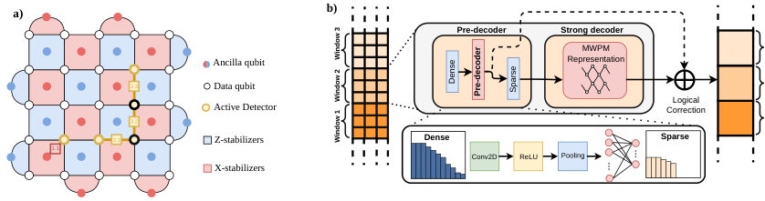
<figcaption class="paper-figure-caption"><b>Fig 1.</b> Fig. 2: (a) Surface code memory and (b) sliding-window decoding with a hierarchical neural-network pre- and an MWPM strong decoder.</figcaption>
</figure>
<figure class="paper-figure-card">
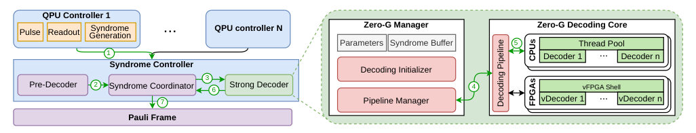
<figcaption class="paper-figure-caption"><b>Fig 2.</b> Fig. 3: High-level overview of the decoding system, showing how Zero-G integrates with existing decoding controllers within our pipeline. 1 a dense syndrome is passed to the decoding controller, 2 sparsified by a pre-decoder, 3 passed to a syndrome coordinator, 4 &amp; 5 decoded using a CPU-based pipeline which 6 returns the solution. Finally, 7 the result is passed to the Pauli frame.</figcaption>
</figure>
<figure class="paper-figure-card">

<figcaption class="paper-figure-caption"><b>Fig 3.</b> Fig. 4: Workflow of the Zero-G decoder. Given a sparse syndrome and decoding configuration, the 1 decoding subgraph is constructed, from which 2 a fast matching is constructed, 3 optimized, and used to construct the 4 logical observable. This is then returned as Pauli Frame Update and a decoding status.</figcaption>
</figure>
<figure class="paper-figure-card">
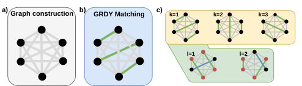
<figcaption class="paper-figure-caption"><b>Fig 4.</b> Fig. 5: Visualization of graph construction and matching workflow. a) A complete graph is built from the syndrome, b) an initial matching computed, and c) refined using RAMA and ROMA.</figcaption>
</figure>
<figure class="paper-figure-card">
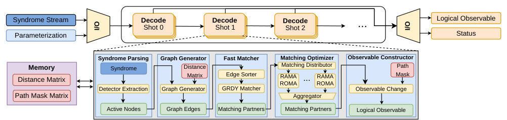
<figcaption class="paper-figure-caption"><b>Fig 5.</b> Fig. 6: Overview of the hardware implementation of Zero-G Decoding Core within a decoding pipeline, processing a continuous syndrome stream via dedicated I/O interfaces. A dedicated memory region stores precomputed decoding matrices utilized by the decoder.</figcaption>
</figure>

**Summary.** This paper introduces Zero-G, a novel strong decoder designed specifically for use in hierarchical Quantum Error Correction (QEC) pipelines. It addresses the bottleneck of existing decoders by exploiting sparse residual syndromes passed from pre-decoders. By using a stochastic approximate MWPM approach and decoupling hardware control, Zero-G achieves substantial latency improvements critical for building scalable, fault-tolerant quantum computers.

**Why it may be interesting.** While focused on digital quantum computing, the core challenge—managing complex, time-sensitive information processing pipelines with resource constraints—is relevant to modeling open quantum systems where measurement feedback must be fast enough to stabilize dynamics.

Detailed structure

**Main problem.** Achieving fault-tolerant quantum computation requires classical decoders that operate in real-time to prevent an exponential backlog of undecoded syndrome measurements.

**Main result.** Zero-G achieves a 10x latency improvement over existing strong decoders at matching accuracy, while scaling effectively across both CPU and FPGA hardware platforms.

**Method.** The authors propose Zero-G, a pre-decoder aware strong decoder that uses a stochastic approximate Minimum-Weight Perfect Matching (MWPM) approach to exploit syndrome sparsity dynamically.

**Model / system.** The work focuses on Quantum Error Correction (QEC), specifically referencing the surface code structure used to encode logical qubits across physical qubits. The system involves a hierarchical decoding pipeline: pre-decoder $
ightarrow$ Zero-G strong decoder.

**Key observables.** Logical Error Rate (LER) and Decoding Latency; the goal is to maintain LER matching with MWPM while drastically reducing latency.

**Important parameters / regimes.** Code distance ($d$), which dictates the scale of the problem, and the required real-time decoding budget ($\approx 1\ \mu	ext{s}$).

**Assumptions / limitations.** The primary assumption is that a pre-decoder-aware decoder can effectively exploit syndrome sparsity to improve performance beyond what current dense-syndrome decoders can achieve.

**Figures summary.** Figures illustrate the hierarchical decoding process, showing how pre-decoders filter errors and how Zero-G integrates into the pipeline, achieving significant speedups over state-of-the-art methods.

**Paper structure.** The paper establishes the real-time constraint of QEC, critiques existing decoder limitations (especially regarding syndrome sparsity), introduces Zero-G as a solution, details its stochastic MWPM approach and decoupled hardware architecture, and presents performance benchmarks demonstrating massive latency improvements.

Abstract

Fault-tolerant quantum computing requires classical decoders that keep pace with the underlying hardware, translating syndrome measurements into corrections fast enough to avoid an exponential backlog. To meet this real-time constraint, pre-decoders have emerged as part of a hierarchical decoding approach to resolve simple, local errors before passing a sparser residual syndrome to a strong decoder. While pre-decoding should, in theory, speed up the strong decoder, in practice, the speedup is only marginal, since existing strong decoders are designed to decode dense syndromes and cannot exploit the sparsity provided by pre-decoders. To address this, we present Zero-G, a strong decoder designed for use alongside pre-decoders. As a stochastic approximate minimum-weight perfect matching (MWPM) decoder, Zero-G exploits sparse residual syndromes, dynamically trading latency for accuracy rather than relying on an all-or-nothing runtime-accuracy trade-off. By decoupling hardware control from the decoding core itself, we enable heterogeneous deployment across both FPGAs and CPUs without maintaining separate implementations. Zero-G achieves a $10\times$ latency improvement over existing strong decoders at matching accuracy, with worst-case sub-350ns decoding at code distances up to d=15, while scaling to 640 logical qubits on a single 128-core CPU and 32 logical qubits on a single AMD Versal V80 FPGA.

[↑ back to top](#top)

### [{\it Ab initio} prediction of $d_{x^2-y^2}$-wave superconductivity in infinite-layer nickelates](http://arxiv.org/abs/2608.00512v1)

**Authors:** Guang-Yu Guo, Ren-Guo Guo, Yun-Chen Liao, Yang-hao Chan  
**Type:** theory · **Category:** strongly correlated electrons · **PDF:** <https://arxiv.org/pdf/2608.00512v1>  
**Analysis basis:** full PDF text, analyzed in chunks
**Topic relevance:** `Keldysh / 2PI / non-Gaussian methods` **1/5**

↔ Scroll figures horizontally

<figure class="paper-figure-card">
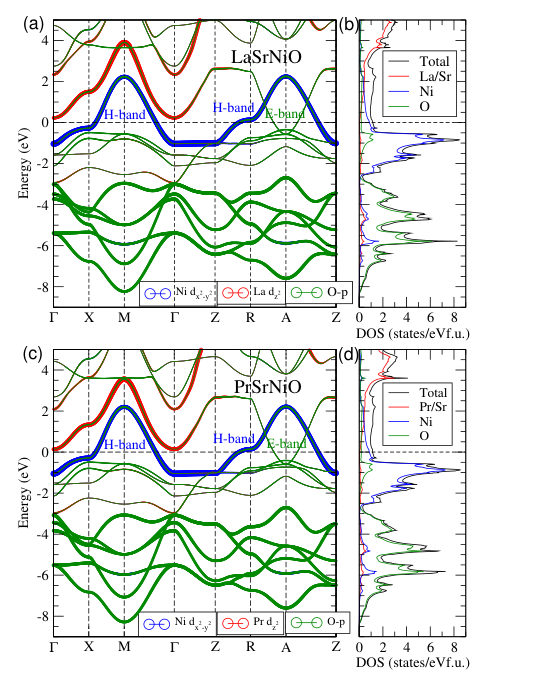
<figcaption class="paper-figure-caption"><b>Fig 1.</b> FIG. 2. Electronic structures of LaSrNiO and PrSrNiO. (a,b) Ni dx2−y2, La dz2 and O p orbital-projected energy bands, total and atom-decomposed density of states (DOS) of (a,b) LaSrNiO and (c,d) PrSrNiO. In (a,c), atomic orbital weights are proportional to the circle sizes.</figcaption>
</figure>
<figure class="paper-figure-card">
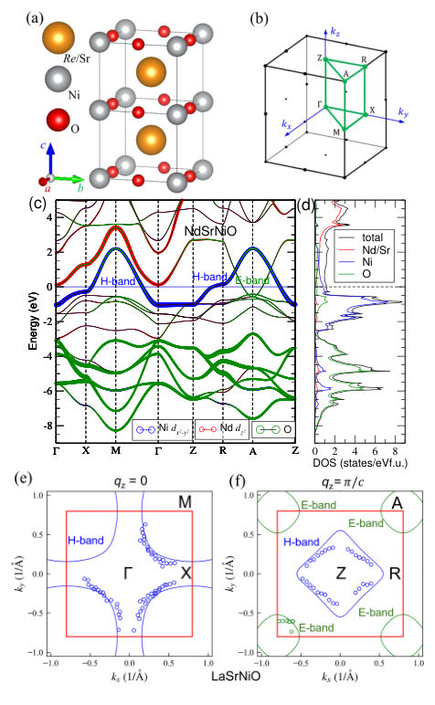
<figcaption class="paper-figure-caption"><b>Fig 2.</b> FIG. 1. Crystal and electronic structures. (a,b) Crystal structure and Brillouin zone of the infinite-layer nickelates ReSrNiO (Re = La, Pr, Nd). (c,d) Ni dx2−y2, Nd dz2 and O p orbital-projected energy bands, together with total and atom-decomposed density of states (DOS) of NdSrNiO. In (c), atomic orbital weights are proportional to the circle sizes. (e,f) Fermi surface (FS) in the kx −ky plane at (e) kz = 0 and (f) kz = π/c of LaSrNiO. Solid curves represent the calculated FS, and open circles denote the ARPES measurements [44].</figcaption>
</figure>
<figure class="paper-figure-card">
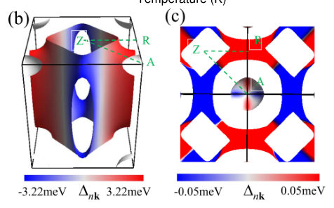
<figcaption class="paper-figure-caption"><b>Fig 3.</b> FIG. 3. Superconducting gap functions. (a) Averaged (solid symbols) and maximum (open symbols) superconduct- ing (SC) gap ∆of ReSrNiO as a function of temperature (T ). b,c, band n and momentum k-dependent SC gap ∆nk on the Fermi surface of NdSrNiO at 0.1 K in (b) the first Brillouin zone (BZ) and (c) the extended BZ and top view. The aver- aged ∆values are fitted with a BCS-type T -dependence. [4] The fitting curves are plotted as solid lines, which are nearly identical to the calculated ∆values. In (c), a smaller gap value scale is used so that the dx2−y2-wave gap function on the small FS pocket at the A point can be clearly seen.</figcaption>
</figure>
<figure class="paper-figure-card">
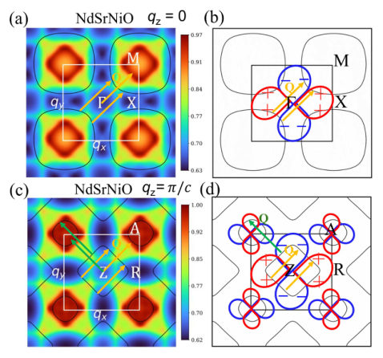
<figcaption class="paper-figure-caption"><b>Fig 4.</b> FIG. 5. Lindhard response function. Calculated bare suscep- tibility χ0(q) of NdSrNiO on the qx −qy plane at (a) qz = 0 and (c) qz = π/c. The displayed χ0(q) is normalized to its maximum value of 12.4. The normalized minimum value of χ0(q) is 0.62. Black curves represent the cross-sections of the Fermi surface (FS) pockets. In (a) and (c), the three orange arrows represent equivalent nesting vectors Q along the [1,1] direction, at which χ0(q) reaches its maximum. These wave vectors connect FS regions with opposite signs of the super- conducting gap, i.e., ∆k = −∆k+Q (see (b) and (d) as well as Sec. VI). Similarly, there are two identical green arrows pointing along the [-1,1] direction in...</figcaption>
</figure>
<figure class="paper-figure-card">
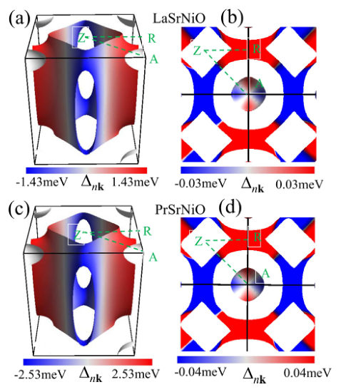
<figcaption class="paper-figure-caption"><b>Fig 5.</b> FIG. 4. Superconducting gap functions of LaSrNiO and PrSrNiO. Band n and momentum k-dependent superconduct- ing (SC) gap ∆nk on the Fermi surface (FS) of (a,b) LaSrNiO and (c,d) PrSrNiO, in (a,c) the first Brillouin zone and (b,d) the extended Brillouin zone. Note that in (b,d), a smaller SC gap value scale is used so that the dx2−y2-wave gap function on the small FS pockets at the A points can show up clearly.</figcaption>
</figure>

**Summary.** The authors perform an ab initio study on nickelates to determine their superconducting mechanism and gap symmetry. They find that spin fluctuations are the dominant pairing glue, leading to a $d_{x^2-y^2}(\pm)$-wave superconductivity structure. The results provide quantitative comparisons between different interaction types (SF vs. EPC) and predict measurable signatures for future experiments.

**Why it may be interesting.** This work provides a detailed theoretical framework for understanding unconventional superconductivity in novel materials using first-principles methods that treat multiple pairing mechanisms on equal footing, which is highly relevant for modern condensed matter theory.

Detailed structure

**Main problem.** The study aims to elucidate the superconducting pairing mechanism and determine the gap symmetry in infinite-layer nickelates, which are potential unconventional high-$T_c$ superconductors.

**Main result.** Superconductivity is found to be driven by spin fluctuation (SF) interactions on the large quasi-2D Fermi surface pocket, leading to a two-band superconductor with $d_{x^2-y^2}(\pm)$-wave gap functions. The SF interaction strength significantly exceeds that of electron-phonon coupling.

**Method.** The research employs fully ab initio Density Functional Theory for Superconductors (SCDFT) calculations, treating Electron-Phonon Coupling (EPC), screened Coulomb repulsion, and Spin Fluctuation (SF) interactions simultaneously.

**Model / system.** The physical system is the infinite-layer nickelate $	ext{Re}_{0.8}	ext{Sr}_{0.2}	ext{NiO}_2$ ($	ext{Re} = 	ext{La}, 	ext{Pr}, 	ext{Nd}$), which has a tetragonal structure with alternating $	ext{NiO}_2$ and $	ext{Re}_{1-x}	ext{Sr}_x$ layers.

**Key observables.** Superconducting critical temperature ($T_c$), gap symmetry ($	ext{d}_{x^2-y^2}(\pm)$-wave), nodal gap structure, Fermi surface topology (large 2D pocket and small 3D pockets), and quasiparticle density of states.

**Important parameters / regimes.** The relative strengths of interaction mechanisms: SF interaction is an order of magnitude stronger than EPC or Coulomb repulsion on the large FS pocket.

**Assumptions / limitations.** The calculations utilize Density Functional Theory (DFT) within the Local Density Approximation (LDA) and solve the superconducting gap equation using approximations for various coupling terms.

**Figures summary.** Figures illustrate crystal/electronic structures, orbital-projected energy bands, DOS, and show how different interaction mechanisms (EPC vs. SF) contribute to the pairing mechanism and renormalization effects across different Fermi surface pockets.

**Paper structure.** The paper systematically analyzes the electronic structure, determines the superconducting gap symmetry on different FS sheets, quantifies the relative strengths of EPC, Coulomb repulsion, and SF interactions, and concludes by linking these findings to experimental observables like ARPES spectra.

Abstract

Infinite-layer nickelates have recently emerged as a new family of potential unconventional high critical temperature ($T_c$) superconductors. However, fundamental questions such as their superconducting (SC) pairing mechanism and gap symmetry remain under intense debate. Here we present a fully {\it ab initio} theoretical study on the SC properties of optimally doped nickelates $Re$$_{0.8}$Sr$_{0.2}$NiO$_2$ ($Re=$ La, Pr, Nd), based on the density functional theory for superconductors calculations with electron-phonon coupling (EPC), screened Coulomb repulsion and spin fluctuation (SF) interaction treated on an equal footing. We find that $Re_{0.8}$Sr$_{0.2}$NiO$_2$ are two-band superconductors with sign reversal $d_{x^2-y^2}(\pm)$-wave gap functions on the different Fermi surface (FS) pockets. Interestingly, when the SF interaction is turned off, $T_c$ becomes negligibly small ($\sim$0.01 K), thus demonstrating that the superconductivity in $Re_{0.8}$Sr$_{0.2}$NiO$_2$ is driven by SF interaction. Moreover, our {\it ab initio} calculations reveal that the SF interaction is an order of magnitude stronger than both EPC and Coulomb repulsion on the large quasi-two-dimensional FS pocket around the Brillouin zone (BZ) center, thus leading to the SF-mediated pairing mechanism, although the EPC dominates on the small three-dimensional electron FS pockets at the BZ corners. The emergence of nodal $d_{x^2-y^2}(\pm)$-wave gap structure is traced to the pronounced peaks in the Lindhard response function at the BZ corners. Our calculated FS, SC critical temperature, nodal gap structure and SC quasiparticle density of states are consistent with most available experiments. Furthermore, predicted unconventional SC properties such as scanning tunneling spectra of La$_{0.8}$Sr$_{0.2}$NiO$_2$ and Pr$_{0.8}$Sr$_{0.2}$NiO$_2$ are ready for immediate experimental verifications.

[↑ back to top](#top)

## Other papers (8)

*Papers from primary archives without highlighted authors or any topic match. Click to expand.*

Show other papers

### [$d$-spacing distributions as a probe of nematoelastic response in iron-based superconductors](http://arxiv.org/abs/2608.01264v1)

**Authors:** Wenting Zhang, Ruixian Liu, Tingjun Zhang, Weiliang Yao, Xüe Fu, Hanqing Xie, Ziye Mo, Ting Guo, Kuo-Feng Tseng, Thomas Keller, Jitae T. Park, Fankang Li, Masaaki Matsuda, Avishek Maity, Long Tian, Pengcheng Dai, Xingye Lu  
**Type:** experiment · **Category:** strongly correlated electrons · **PDF:** <https://arxiv.org/pdf/2608.01264v1>  
**Analysis basis:** full PDF text, analyzed in chunks

↔ Scroll figures horizontally

<figure class="paper-figure-card">
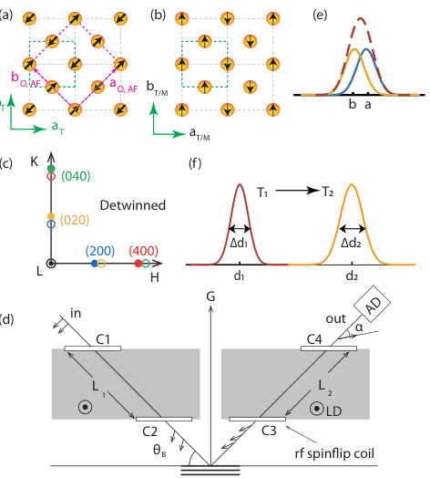
<figcaption class="paper-figure-caption"><b>Fig 1.</b> FIG. 1. Crystal and magnetic structures, reciprocal-space configuration, and neutron Larmor diffraction principle. (a) Schematic in-plane structure and stripe-type antiferromag- netic spin arrangement of BaFe2As2-based compounds. The tetragonal axes aT and bT and the orthorhombic/magnetic axes aO,AF and bO,AF are indicated. (b) Schematic in-plane structure and bicollinear antiferromagnetic spin arrangement of Fe1.07Te. The tetragonal/monoclinic axes aT/M and bT/M are indicated. (c) Reciprocal-space configuration for a de- twinned sample, illustrating the separation of symmetry- related in-plane Bragg reflections, such as (4, 0, 0) and (0, 4, 0) for Ba122 compounds and (2, 0, 0) and (0, 2,...</figcaption>
</figure>
<figure class="paper-figure-card">
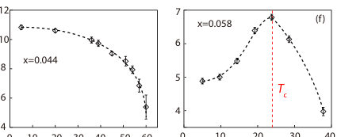
<figcaption class="paper-figure-caption"><b>Fig 2.</b> FIG. 2. Neutron Larmor diffraction results for Ba(Fe1−xCox)2As2 without intentionally applied uniax- ial stress, measured at the (4, 0, 0) Bragg reflection. (a),(b) Neutron polarization as a function of the total Larmor phase ϕ for samples with x = 0.044 (Ts ≈60 K, Tc ≈10 K) and x = 0.058 (Ts ≈38 K, Tc ≈24 K), respectively, at selected temperatures. Solid lines are fits to the polarization curves. The polarization curves are vertically offset for clarity; gray dashed lines indicate the corresponding baselines. (c),(d) Temperature dependence of the d-spacing width εFWHM for x = 0.044 and x = 0.058, respectively. Solid lines are Curie–Weiss-like fits to the data in the tetragonal phase. Open...</figcaption>
</figure>
<figure class="paper-figure-card">
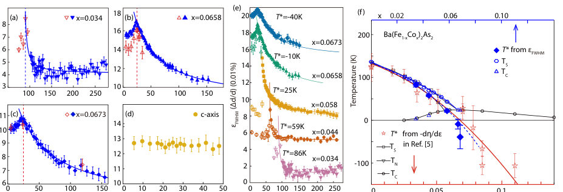
<figcaption class="paper-figure-caption"><b>Fig 3.</b> FIG. 3. Doping evolution of the relative d-spacing width in Ba(Fe1−xCox)2As2 without intentionally applied uniaxial stress. (a)–(c) Temperature dependence of εFWHM at the in-plane (4, 0, 0) reflection for x = 0.034 (Ts ≈90 K, Tc ≈5 K), 0.0658 (Tc ≈25.5 K), and 0.0673 (Tc ≈25 K), respectively. Solid lines are phenomenological Curie–Weiss-like fits in the tetragonal phase. (d) Width measured along the c axis, showing no comparable temperature-dependent anomaly. (e) Comparison of the in-plane widths for x = 0.034, 0.044, 0.058, 0.0658, and 0.0673. The labeled T ∗values are obtained from the same empirical fits. Open symbols in (a)-(e) denote values extracted from Larmor-diffraction...</figcaption>
</figure>
<figure class="paper-figure-card">
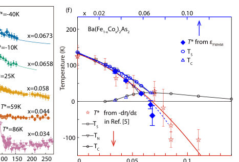
<figcaption class="paper-figure-caption"><b>Fig 4.</b> Figure 2 presents representative Larmor diffraction measurements on Ba(Fe1−xCox)2As2 with x = 0.044 and x = 0.058, measured at the in-plane (4, 0, 0) Bragg re- flection. For both compositions, the polarization curves P(ϕ) evolve strongly with temperature [Figs. 2(a) and 2(b)], demonstrating that the underlying d-spacing dis- tribution changes substantially on cooling. In the tetrag- onal phase, the polarization decay is well described by the single-Gaussian model, from which the relative d- spacing width εFWHM is extracted. Below the structural transition, the polarization curves are analyzed using the two-component model when the orthorhombic splitting becomes resolvable, allowing both the...</figcaption>
</figure>
<figure class="paper-figure-card">
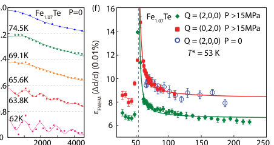
<figcaption class="paper-figure-caption"><b>Fig 5.</b> FIG. 4. Neutron Larmor diffraction results for Ba0.83K0.17Fe2As2, FeSe, and Fe1.07Te. (a), (c), (e) Neutron polarization as a function of the total Larmor phase ϕ for Ba0.83K0.17Fe2As2, FeSe, and Fe1.07Te, respectively. Solid lines are fits to the data. (b),(d) Temperature dependence of εFWHM for Ba0.83K0.17Fe2As2 and FeSe, respectively. Solid lines are Curie–Weiss-like fits, giving T ∗≈79 K for Ba0.83K0.17Fe2As2 and T ∗≈87 K for FeSe. (f) Widths for Fe1.07Te at the (2, 0, 0) and (0, 2, 0) reflections under nominal uniaxial pressure P &gt; 15 MPa, compared with the (2, 0, 0) result obtained without intentionally applied pressure. Open symbols in panels (b), (d), and (f) denote values extracted...</figcaption>
</figure>

**Summary.** This work uses neutron Larmor diffraction to measure how lattice spacing distributions broaden in iron-based superconductors as temperature changes. The observed Curie–Weiss-like broadening provides a bulk structural signature of nematic correlations, confirming that the coupling between electronic order and lattice strain is a key feature across different doping regimes.

**Why it may be interesting.** While focused on condensed matter magnetism/superconductivity, the use of structural probes (lattice response) to map out phase boundaries related to electronic order parameters is relevant for understanding symmetry breaking in strongly correlated systems.

Detailed structure

**Main problem.** To use neutron Larmor diffraction to probe nematoelastic response in iron-based superconductors (FeSCs).

**Main result.** The temperature-dependent broadening of $d$-spacings exhibits a Curie–Weiss-like behavior, which serves as a bulk structural signature of enhanced nematic correlations.

**Method.** Neutron Larmor diffraction is employed to measure the temperature-dependent distribution width ($\varepsilon	ext{FWHM}$) of relative $d$-spacings in various FeSC materials.

**Model / system.** The study focuses on FeSCs like $	ext{Ba}(	ext{Fe}_{1-x}	ext{Co}_x)_2	ext{As}_2$ and $	ext{FeSe}$. The underlying physics involves the bilinear coupling between electronic nematicity ($\phi$) and orthorhombic strain ($\varepsilon_6$), modeled by a mean-field Hamiltonian.

**Key observables.** In-plane relative $d$-spacing width ($\varepsilon	ext{FWHM}$), temperature dependence of $\varepsilon	ext{FWHM}$, and the characteristic Curie–Weiss scale ($T^*$).

**Important parameters / regimes.** Doping level (e.g., Co doping in $	ext{Ba}(	ext{Fe}_{1-x}	ext{Co}_x)_2	ext{As}_2$), applied uniaxial stress, and temperature relative to the nematic transition.

**Assumptions / limitations.** The broadening is assumed to arise from coupling between electronic nematicity and lattice strain, which can be described by a mean-field model incorporating spatially varying symmetry-breaking stress.

**Figures summary.** Figures illustrate crystal structures, reciprocal space configurations, and the temperature evolution of $d$-spacing distributions ($\Delta d$) measured via neutron Larmor diffraction.

**Paper structure.** The paper systematically measures $\varepsilon	ext{FWHM}$ across multiple FeSC materials under varying doping and stress conditions. It then applies a mean-field model to unify the observed Curie–Weiss-like broadening, showing how this lattice probe complements electronic measurements.

Abstract

Electronic nematicity in iron-based superconductors (FeSCs) couples bilinearly to orthorhombic strain, allowing nematic correlations to appear in the lattice response. Here we use neutron Larmor diffraction to measure the temperature-dependent distribution of relative $d$ spacings in electron-doped Ba(Fe$_{1-x}$Co$_x$)$_2$As$_2$, hole-doped Ba$_{0.83}$K$_{0.17}$Fe$_2$As$_2$, FeSe, and Fe$_{1.07}$Te. In Ba(Fe$_{1-x}$Co$_x$)$_2$As$_2$ crystals without intentionally applied uniaxial stress, the in-plane distribution width, $\varepsilon_{\rm FWHM}$, increases on cooling in the tetragonal phase and can be described phenomenologically by a Curie--Weiss-like form. The fitted scale $T^*$ decreases with Co doping and evolves similarly to the nematic phase diagram inferred from elastoresistance, although the two experiments probe different response functions. Related broadening in Ba$_{0.83}$K$_{0.17}$Fe$_2$As$_2$ and FeSe supports extending this interpretation beyond electron-doped BaFe$_2$As$_2$. By contrast, Fe$_{1.07}$Te shows no extended Curie--Weiss-like regime without applied stress, whereas uniaxial pressure produces a strongly anisotropic broadening that can contain contributions from both the field-biased lattice response and inhomogeneous loading. A mean-field model with bilinear nematoelastic coupling and spatially varying symmetry-breaking stress explains the Curie--Weiss-like broadening in terms of the renormalized orthorhombic compliance. Neutron Larmor diffraction therefore provides a bulk-sensitive probe of nematic-related lattice broadening that complements electronic and elastic measurements.

[↑ back to top](#top)

### [Better accuracy with fewer qubits: Single-particle basis set optimization for quantum chemistry on quantum computers](http://arxiv.org/abs/2608.02119v1)

**Authors:** Subimal Deb, V. S. Prasannaa  
**Type:** theory · **Category:** quantum information and computing · **PDF:** <https://arxiv.org/pdf/2608.02119v1>  
**Analysis basis:** full PDF text, analyzed in chunks

↔ Scroll figures horizontally

<figure class="paper-figure-card">
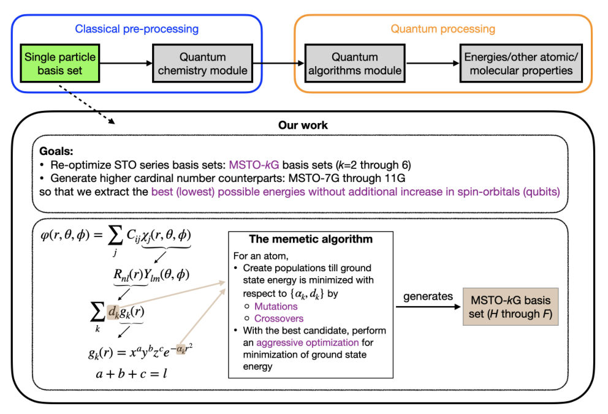
<figcaption class="paper-figure-caption"><b>Fig 1.</b> FIG. 1. Schematic of our workflow. A typical quantum chemical calculation in the quantum computing framework involves classical (or quantum-classical hybrid) pre-processing and quantum processing. While there have been many efforts on the processing and the quantum chemical part (Hartree-Fock and integral evaluation) of the pre-processing steps, little work has been done on reducing required quantum resources via basis set optimization. We develop our memetic algorithm to optimize exponents and contraction coefficients of the STO basis sets, extend it to cardinal number 11, and show that the resulting modified STO bases yield lower or comparable energies than the superior split valence...</figcaption>
</figure>
<figure class="paper-figure-card">
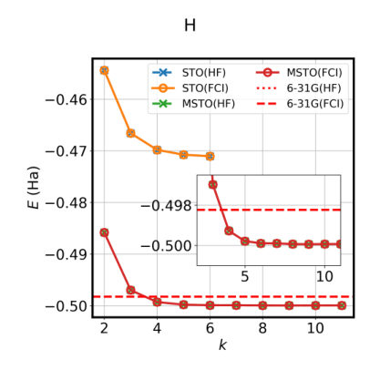
<figcaption class="paper-figure-caption"><b>Fig 2.</b> FIG. 2. HF and FCI ground state energies of the hydrogen atom from MSTO-kG basis, compared with minimal basis sets and split valence basis sets (6-31G).</figcaption>
</figure>
<figure class="paper-figure-card">
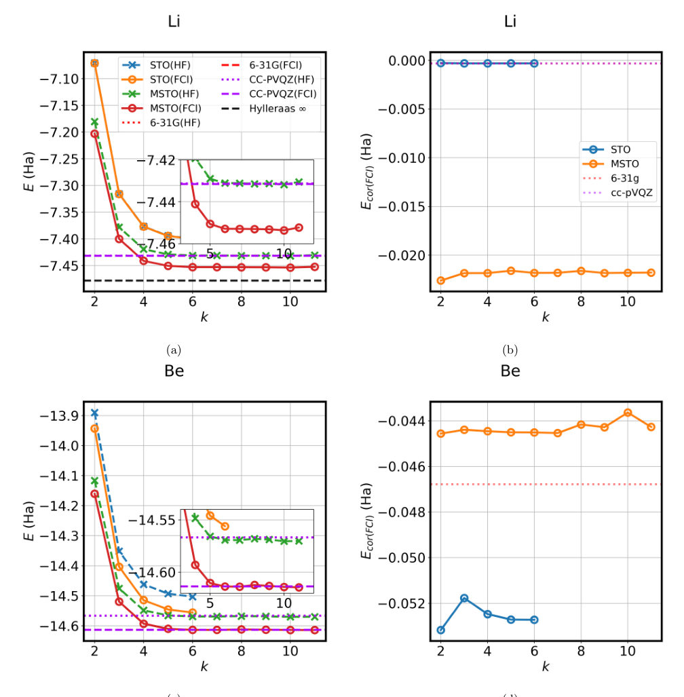
<figcaption class="paper-figure-caption"><b>Fig 3.</b> FIG. 3. HF and FCI ground state energies of (a) Li and (c) Be with our MSTO-kG basis, compared with minimal basis sets and split valence basis sets (6-31G). The energies for 6-31G and cc-pVQZ cannot be resolved at the scale of the figure. The FCI correlation energies captured for (b) Li and (d) Be for MSTO-kG basis compared against the minimal STO-kG basis sets show a significant improvement for the new basis along with an apparent saturation beyond k = 6 (see Tables III and IV).</figcaption>
</figure>
<figure class="paper-figure-card">
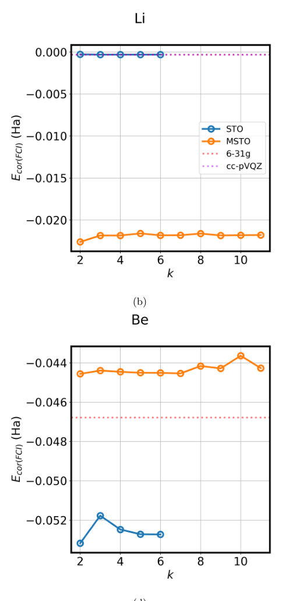
<figcaption class="paper-figure-caption"><b>Fig 4.</b> Fig. 4(a) and (b) present our results for Boron and Carbon, respectively. We see that the MSTO bases con- sistently outperform STO ones and predict ground state energies comparable to those from 6-31G basis, falling short of the higher quality basis sets by about 10 and 20 mHa, respectively (see Tables V and VI of Appendix B). We also observe that for these two systems and for</figcaption>
</figure>
<figure class="paper-figure-card">
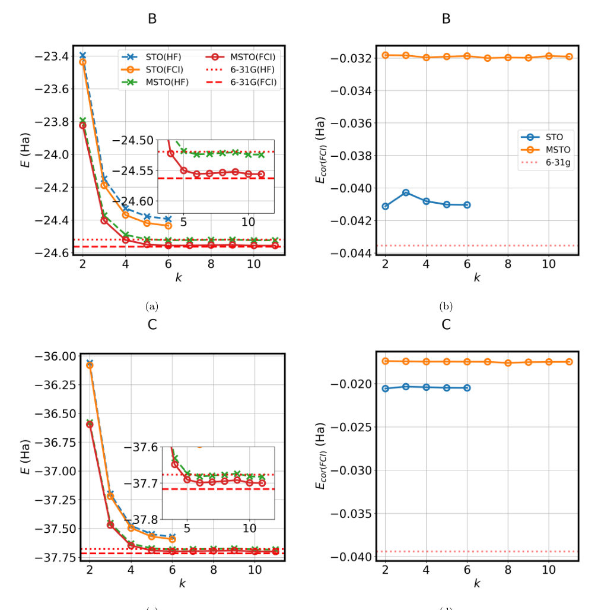
<figcaption class="paper-figure-caption"><b>Fig 5.</b> FIG. 4. HF and FCI ground state energies of (a) B and (c) C with our MSTO-kG basis, compared with minimal basis sets and split valence basis sets (6-31G). The FCI correlation energies captured for (b) B and (d) C for MSTO-kG basis compared against the minimal STO-kG basis sets show a significant improvement for the new basis along with an apparent saturation beyond k = 6 (see Tables V and VI).</figcaption>
</figure>

**Summary.** The paper introduces optimized, minimal basis sets (MSTO-kG) designed specifically for use in quantum computation simulations of molecular electronic structure. By optimizing these bases using advanced algorithms, the authors demonstrate that they can achieve chemical accuracy comparable to much larger, more resource-intensive basis sets. This paves a practical path toward performing complex quantum chemistry calculations on current noisy quantum hardware.

**Why it may be interesting.** This work directly addresses the critical bottleneck in applying quantum computation to chemistry: achieving chemical accuracy with limited hardware resources. The focus on basis set optimization as a resource-saving classical pre-processing step is highly relevant for near-term quantum simulation.

Detailed structure

**Main problem.** The primary goal is to improve the accuracy of quantum chemical calculations on near-term, noisy quantum computers while minimizing the required number of qubits.

**Main result.** The proposed MSTO-kG basis sets yield ground state energies comparable to or better than established high-quality bases (like 6-31G), but crucially require fewer qubits and two-qubit gates for quantum algorithms like VQE, QPE, and HHL.

**Method.** The authors reoptimize minimal basis sets using a genetic algorithm-inspired memetic approach combined with aggressive refinement strategies to generate optimized MSTO-kG bases.

**Model / system.** The study focuses on calculating the ground state electronic structure energies of small atoms (H through F) and molecules ($	ext{Li}_2$, $	ext{C}_2$, etc.). The calculations are benchmarked against Full Configuration Interaction (FCI) theory.

**Key observables.** Ground state energies (in Hartrees), required number of qubits, count of two-qubit gates, and logical T-gate counts for quantum algorithms.

**Important parameters / regimes.** Basis set parameters ($k=2$ to $11$), computational methods (VQE, QPE, HHL), and comparison against established basis sets like 6-31G and cc-pVQZ.

**Assumptions / limitations.** Quantum computers are expected to be noisy in the near term, limiting calculations to small active spaces. The MSTO bases are designed as a resource-efficient alternative to higher quality but more qubit-demanding basis sets.

**Figures summary.** Figures schematically illustrate the end-to-end workflow from classical pre-processing (basis set optimization) to quantum processing for chemistry, and tables provide systematic comparisons of calculated energies and required quantum resources across different atoms and molecules.

**Paper structure.** The paper systematically develops the methodology by first optimizing basis sets using a memetic algorithm. It then presents extensive numerical data comparing resulting atomic and molecular ground state energies against established benchmarks (6-31G, cc-pVQZ). Finally, it quantifies the resource savings (qubits/gates) when implementing these optimized bases within major quantum algorithms (VQE, QPE, HHL).

Abstract

In spite of recent advances, quantum computers are expected to be sufficiently noisy in the coming few years to the extent of limiting quantum chemical calculations to relatively small number of orbitals. However, even with reasonable quality single particle basis sets, small active spaces with limited orbitals can result in a significant fraction of correlation energy being lost, motivating the design of moderate quality qubit-efficient basis sets for quantum algorithms. We begin by reoptimizing the existing minimal basis sets using a genetic algorithm-inspired approach in conjunction with aggressive refinement strategies, and generate modified minimal basis sets (MSTO-kG basis; k = 2-11) for atoms from H through F. The ground state energies of H through F using our MSTO bases at FCI level of theory yield ground state energies that are comparable or sometimes even lower than those obtained using 6-31G basis sets. In the case of Li, the MSTO bases surpass the performance of cc-pVQZ bases. Thus, we obtain better atomic energies with same number of qubits relative to STO bases, and better/comparable energies with fewer qubits relative to higher quality bases. In the case of molecules, H2 performs poorly; a finding that is consistent with an earlier work in literature. For other molecules, Li2, C2, LiH, BeH and BeH2, the FCI results (except C2 for which we employ CISD) from our bases are comparable to/outperform those from 6-31G basis. Finally, we compare the resources required between different bases and find that MSTO bases yield better energies than the competing basis sets while incurring fewer qubits and two-qubit gates with VQE, QPE, and HHL. The logical T-gate counts are also found to be considerably lower for QPE and HHL respectively. Overall, our work paves way for more accurate yet less qubit-hungry quantum chemical calculations using near-term quantum computers.

[↑ back to top](#top)

### [NoisePQC++: A Unified NIST-Compliant PQC and Hybrid-PQC Implementation of the Noise Protocol](http://arxiv.org/abs/2608.00954v1)

**Authors:** Nadeem Ahmed, Aryya Gangopadhyay, Lei Zhang  
**Type:** experiment · **Category:** other · **PDF:** <https://arxiv.org/pdf/2608.00954v1>  
**Analysis basis:** full PDF text, analyzed in chunks

↔ Scroll figures horizontally

<figure class="paper-figure-card">
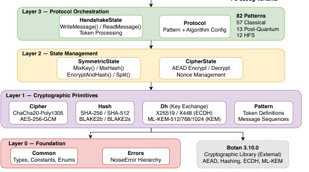
<figcaption class="paper-figure-caption"><b>Fig 1.</b> Figure 2: Shows the 5-layer module architecture of NoisePQC++.</figcaption>
</figure>
<figure class="paper-figure-card">
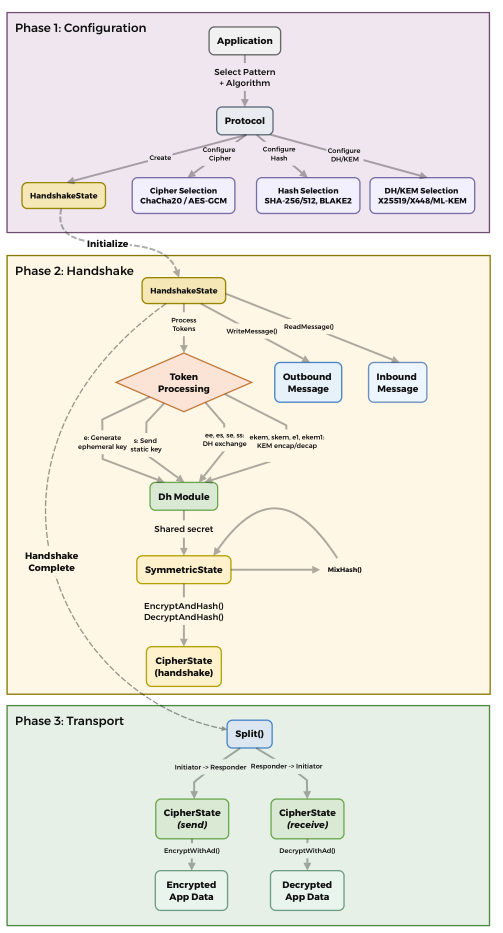
<figcaption class="paper-figure-caption"><b>Fig 2.</b> Figure 3: Runtime Handshake flow: app to transport encryption.</figcaption>
</figure>
<figure class="paper-figure-card">
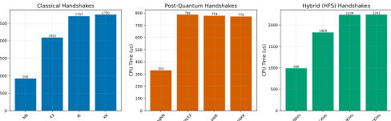
<figcaption class="paper-figure-caption"><b>Fig 3.</b> Figure 5: CPU time across classical, PQ, and hybrid patterns.</figcaption>
</figure>
<figure class="paper-figure-card">
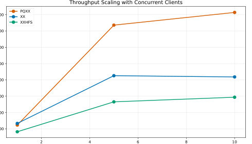
<figcaption class="paper-figure-caption"><b>Fig 4.</b> Figure 7: Throughput Scaling with Concurrent Clients.</figcaption>
</figure>
<figure class="paper-figure-card">
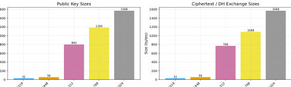
<figcaption class="paper-figure-caption"><b>Fig 5.</b> Figure 6: Public key and ciphertext sizes for DH and ML-KEM.</figcaption>
</figure>

**Summary.** This paper addresses the cryptographic vulnerability posed by quantum computers to current key exchange methods used in protocols like Noise. The authors present NoisePQC++, a unified C++ implementation that integrates NIST-standardized Post-Quantum Cryptography (ML-KEM) with classical ECDH for hybrid security. Benchmarking confirms that these PQC and hybrid handshakes are computationally feasible, providing a practical path toward quantum-resistant secure communications.

**Why it may be interesting.** Not directly relevant

Detailed structure

**Main problem.** The urgent need to update secure communication protocols due to the looming threat quantum computers pose to classical public-key cryptography, specifically those relying on ECDH.

**Main result.** NoisePQC++ successfully implements unified C++23 support for classical, pure PQC, and hybrid Noise handshakes, proving that NIST-standardized post-quantum methods are practical for future deployment.

**Method.** The authors developed a unified framework integrating lattice-based ML-KEM (NIST standard) with classical ECDH within the established Noise Protocol structure, using Hybrid Forward Secrecy.

**Model / system.** The system models secure key exchange protocols based on the Noise Protocol Framework, which is used in modern messaging systems like WireGuard. The implementation uses C++23 and leverages cryptographic primitives from Botan.

**Key observables.** Handshake Latency (ML-KEM-768 vs X25519), CPU Time, Key/Ciphertext Sizes, Network Round-Trip Time (RTT), and Throughput Scaling ($	ext{hs/s}$).

**Important parameters / regimes.** Classical primitives include ECDH (e.g., X25519); PQC relies on ML-KEM based on the Module-LWE problem.

**Assumptions / limitations.** The core assumption is that serial mixing of shared secrets via HKDF chaining is sufficient for secure hybrid key derivation, and performance overheads are manageable for deployment.

**Figures summary.** Figures compare latency (Classical vs PQ vs HFS) across various Noise patterns; they also show CPU time comparisons and the significant increase in wire overhead due to larger PQC keys/ciphertexts.

**Paper structure.** The paper introduces the problem, details the unified architecture of NoisePQC++, analyzes related work limitations, presents comprehensive benchmarking results across multiple metrics (latency, throughput), and concludes on feasibility for quantum-resistant channels.

Abstract

The threat of quantum computers to classical public-key cryptography has created an urgent need to evolve secure communication protocols with post-quantum cryptographic (PQC) primitives. The Noise Protocol Framework, widely used in systems such as WireGuard and WhatsApp, traditionally relies on the Elliptic Curve Diffie-Hellman (ECDH) public-key exchange scheme, which is vulnerable to quantum threats. In this paper, we present NoisePQC++, a unified C++23 implementation of the Noise Protocol framework augmented with post-quantum Key Encapsulation Mechanisms and Hybrid Forward Secrecy. Our design integrates the National Institute of Standards and Technology (NIST) standardized ML-KEM algorithm alongside classical ECDH, enabling full PQC, hybrid ECDH+PQC handshakes, and unified support for all 57 classical Noise handshake pattern variants, 13 post-quantum Noise handshakes, and their hybrid variants. Compared with prior work, NoisePQC++ offers broader protocol coverage, more complete implementation support, and greater flexibility. Our evaluation shows minimal overhead under normal network conditions and acceptable overhead in adverse cases, while significantly improving resistance against quantum adversaries. These results indicate that NIST-standardized post-quantum and hybrid Noise handshakes are practical and provide a credible basis for future deployment.

[↑ back to top](#top)

### [Quantum Simulation of Nuclear Shell Model Using GCM-Based Methods on NISQ Devices](http://arxiv.org/abs/2608.01769v1)

**Authors:** Durgesh Pandey, Ashutosh Singh, Ankit Kumar Das, P. Arumugam  
**Type:** theory · **Category:** quantum information and computing · **PDF:** <https://arxiv.org/pdf/2608.01769v1>  
**Analysis basis:** full PDF text, analyzed in chunks

↔ Scroll figures horizontally

<figure class="paper-figure-card">
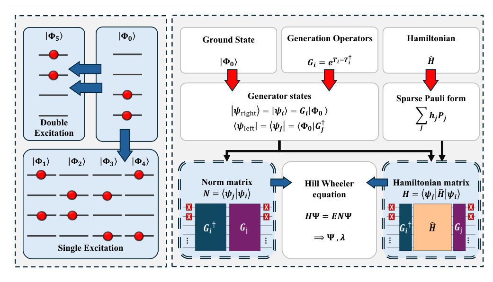
<figcaption class="paper-figure-caption"><b>Fig 1.</b> FIG. 1. Flowchart of the hybrid QuGCM. A non-orthogonal basis is first constructed classically from a reference state. A quantum computer is then employed to calculate the Hamiltonian (H) and Norm (N) matrices in this basis. The system’s energies (E) and wavefunctions (Ψ) are obtained by classically solving the resulting Hill-Wheeler generalized eigenvalue equation, HΨ = ENΨ.</figcaption>
</figure>
<figure class="paper-figure-card">
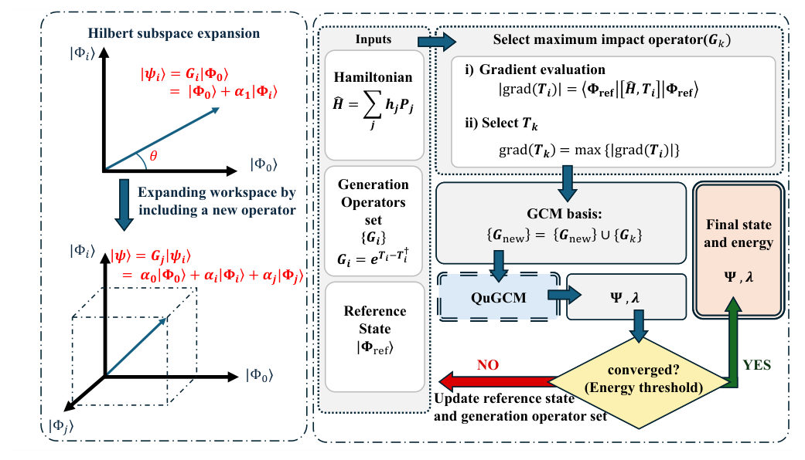
<figcaption class="paper-figure-caption"><b>Fig 2.</b> FIG. 2. Flowchart for an adaptive quantum algorithm ADAPT-GCIM that iteratively refines the basis set for the QuGCM. The algorithm evaluates the impact of Generation Operators on the system’s energy, selects the most influential one to add to the QuGCM basis, and then solves the GCM equations. This loop continues until the calculated energy converges, resulting in the final state and energy of the system. On the left, a conceptual diagram of the adaptive Hilbert space expansion. The ADAPT algorithm iteratively expands the Hilbert subspace, starting from an initial 2D basis defined by a reference state |Φ0⟩and a generated state |Φi⟩. In each step, a new basis vector |Φj⟩is added by selecting...</figcaption>
</figure>
<figure class="paper-figure-card">
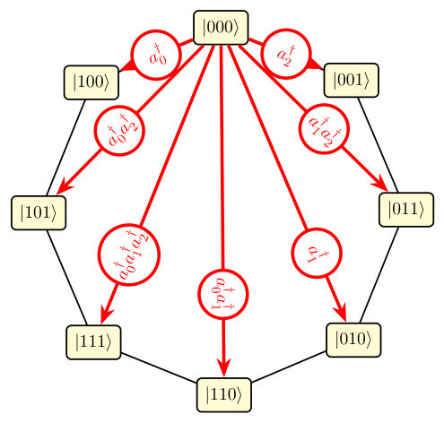
<figcaption class="paper-figure-caption"><b>Fig 3.</b> FIG. 3. Schematic diagram showing all conversions from a reference in GC encoding.</figcaption>
</figure>
<figure class="paper-figure-card">
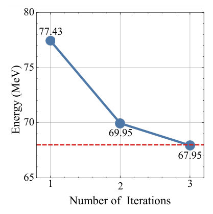
<figcaption class="paper-figure-caption"><b>Fig 4.</b> FIG. 4. Convergence of the deuteron ground-state energy with ADAPT-GCIM iterations. The method achieves rapid convergence to the expected ground-state value (shown as the dashed line) within three iterations.</figcaption>
</figure>
<figure class="paper-figure-card">
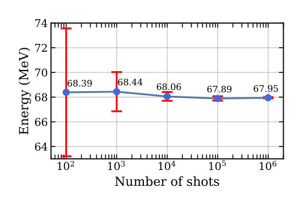
<figcaption class="paper-figure-caption"><b>Fig 5.</b> FIG. 5. Ground-state energy estimates for the deuteron sys- tem as a function of the number of measurement shots. Sta- tistical fluctuations at low shot counts decrease as the number of shots increases, with results converging toward the exact value.</figcaption>
</figure>

**Summary.** This work adapts the Generator Coordinate Method (GCM) for simulating correlated nuclear structure problems on noisy intermediate-scale quantum (NISQ) devices. By introducing QuGCM and ADAPT-GCIM, the authors provide a resource-efficient alternative to variational methods. The results confirm that this hybrid approach offers a viable path toward accurately modeling complex many-body physics using current quantum hardware limitations in mind.

**Why it may be interesting.** It directly addresses how established, complex many-body theories from nuclear physics can be mapped onto near-term quantum hardware using advanced algorithmic techniques like adaptive basis selection.

Detailed structure

**Main problem.** The primary goal is simulating low-lying eigenstates of complex nuclear systems by incorporating essential correlations beyond mean-field theory.

**Main result.** Both QuGCM and ADAPT-GCIM successfully reproduce classical energy spectra, demonstrating a practical and scalable quantum approach robust to current hardware noise limitations.

**Method.** A hybrid quantum-classical framework is employed using the Quantum Generator Coordinate Method (QuGCM) combined with an adaptive basis selection technique (ADAPT-GCIM).

**Model / system.** The system studied is nuclear matter, modeled using Hamiltonians for specific nuclei like $^6	ext{Li}$ and $^{38}	ext{Ar}$, starting from Hartree-Fock reference states.

**Key observables.** Energy spectrum (ground and excited state energies).

**Important parameters / regimes.** The complexity of the Hilbert space, which is managed by ADAPT-GCIM's gradient-based selection process.

**Assumptions / limitations.** The approach assumes that current NISQ devices can handle the required circuit depth for generating necessary basis states and overlap/Hamiltonian kernels.

**Figures summary.** Not specified in detail, but notes mention comparisons of Pauli operator expansions using Jordan-Wigner vs. Gray Code mappings.

**Paper structure.** The paper details the theoretical foundation (GCM, HF, UCCSD), outlines the quantum implementation steps for calculating necessary kernels on qubits, and compares different encoding strategies (JW vs GC) to optimize circuit depth.

Abstract

Based on the Generator Coordinate Method (GCM), we use a Quantum GCM (QuGCM) within a hybrid quantum-classical framework to simulate low-lying eigenstates of nuclear systems on quantum devices. The generator basis states are constructed from Hartree-Fock (HF) reference states, excited via symmetry-adapted unitary coupled-cluster (UCC) operators. These states are prepared as non-orthogonal quantum circuits and measured pairwise to compute the required overlap and Hamiltonian kernels. The resulting data is processed using a classical generalized-eigenvalue solver, following the GCM formalism, to extract the system's energy spectrum. To enhance efficiency and reduce circuit depth, we apply the Adaptive Generator Coordinate Inspired method (ADAPT-GCIM), which iteratively selects generator excitations based on energy gradients, thereby avoiding the need to explore the full Hilbert space. Our implementation is applied to nuclear systems, specifically the deuteron with the Reid68 potential and shell-model Hamiltonians of $^6$Li and $^{38}$Ar. For each system, both the QuGCM and ADAPT-GCIM methods produce energy spectra in agreement with classical diagonalization results, demonstrating robustness even under noise and limited-depth constraints. Additionally, we compare fermionic encoding strategies, specifically Jordan-Wigner (JW) transformations of one-hot (OH) encoding and Gray code (GC) mappings, and show that GC encoding reduces circuit complexity and improves fidelity during multi-reference state preparation. Our findings indicate that QuGCM and ADAPT-GCIM provide a practical and scalable path toward simulating correlated quantum systems, with lesser vulnerability to noise and better compatibility with the limitations of current quantum hardware.

[↑ back to top](#top)

### [Remarks on Regular Approximations to the Robin Aharonov-Bohm Hamiltonian](http://arxiv.org/abs/2608.00637v1)

**Authors:** Cesar R. de Oliveira  
**Type:** theory · **Category:** other · **PDF:** <https://arxiv.org/pdf/2608.00637v1>  
**Analysis basis:** full PDF text, analyzed in chunks

↔ Scroll figures horizontally

<figure class="paper-figure-card">
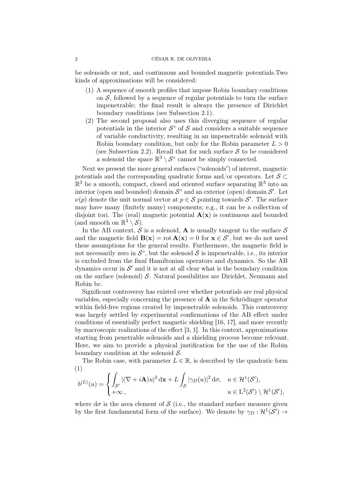
<figcaption class="paper-figure-caption"><b>Fig 1.</b> Low-resolution page preview, page 2</figcaption>
</figure>
<figure class="paper-figure-card">
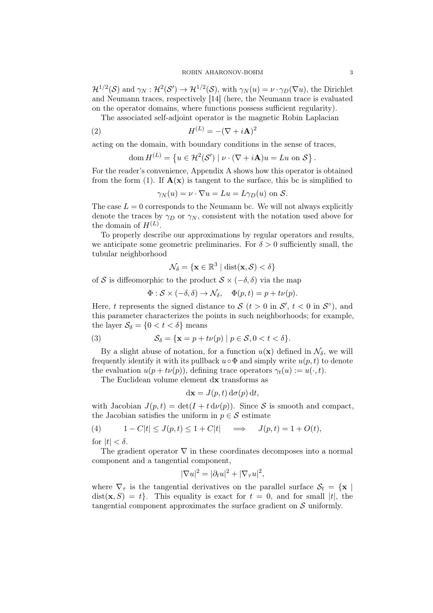
<figcaption class="paper-figure-caption"><b>Fig 2.</b> Low-resolution page preview, page 3</figcaption>
</figure>
<figure class="paper-figure-card">
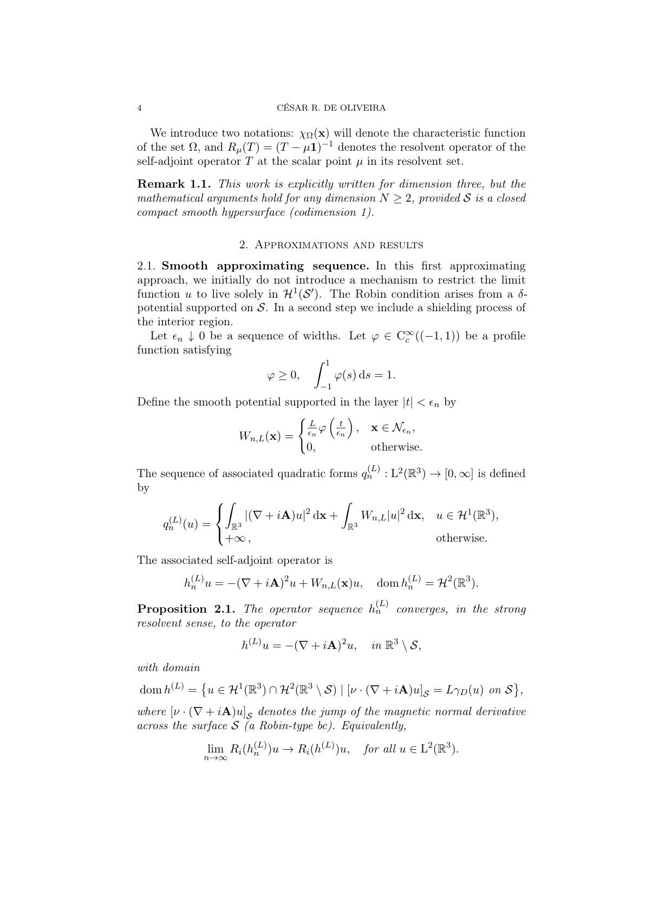
<figcaption class="paper-figure-caption"><b>Fig 3.</b> Low-resolution page preview, page 4</figcaption>
</figure>
<figure class="paper-figure-card">
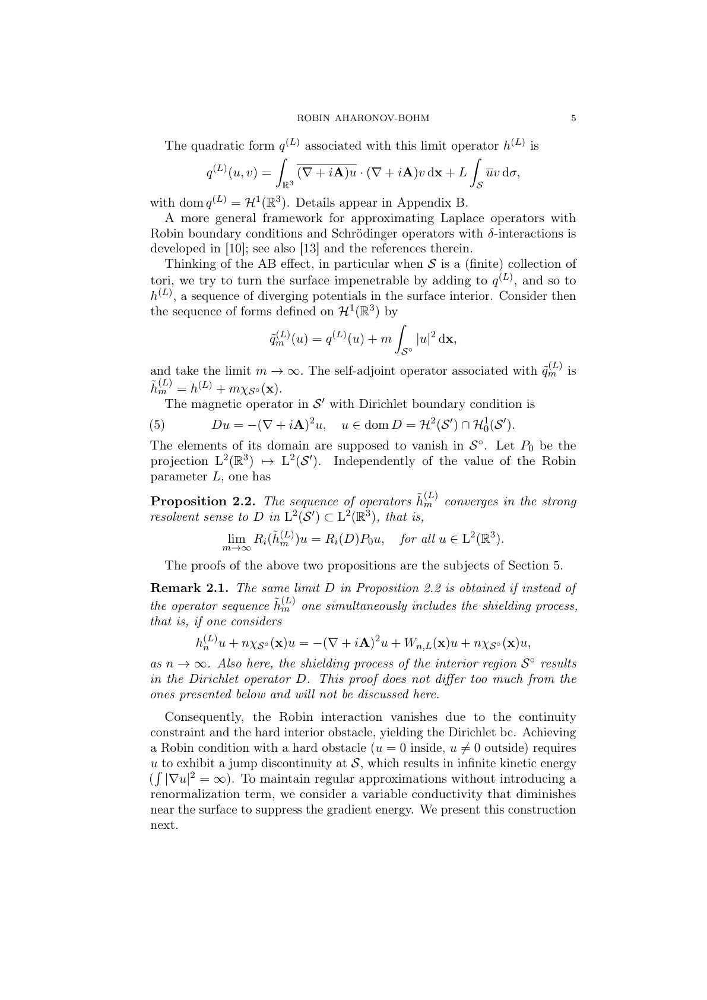
<figcaption class="paper-figure-caption"><b>Fig 4.</b> Low-resolution page preview, page 5</figcaption>
</figure>
<figure class="paper-figure-card">
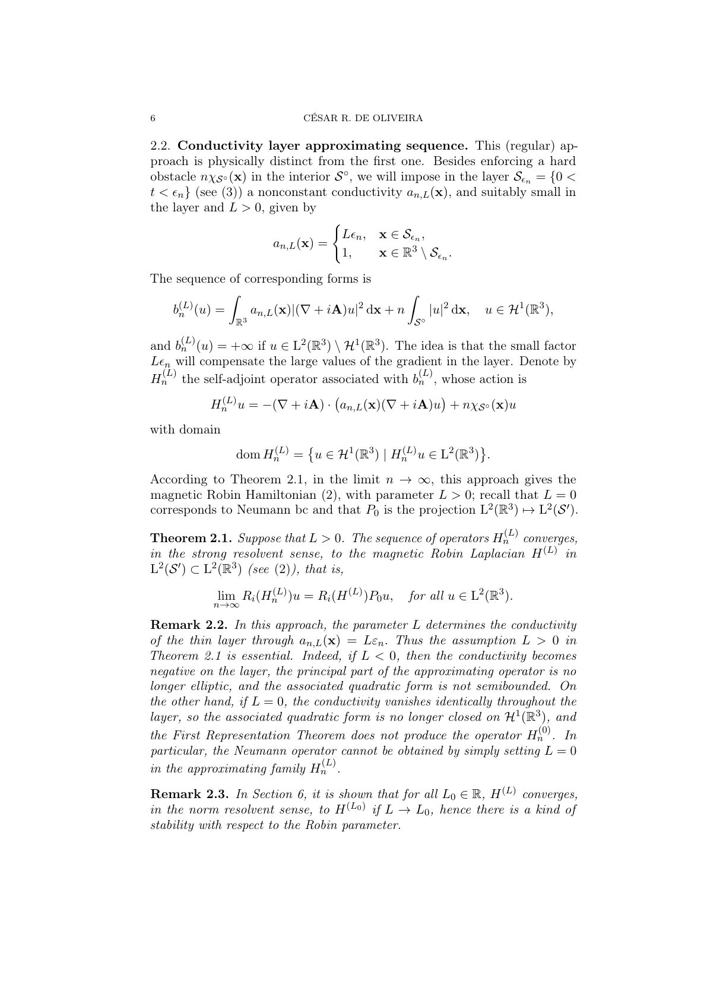
<figcaption class="paper-figure-caption"><b>Fig 5.</b> Low-resolution page preview, page 6</figcaption>
</figure>

**Summary.** This paper provides a detailed mathematical analysis proving that physically motivated approximations—such as using smooth potentials or variable conductivities near a solenoid—converge correctly to the true magnetic Robin Aharonov-Bohm Hamiltonian. By employing $\Gamma$-convergence, the authors rigorously establish the strong resolvent convergence of these approximate operators, confirming the physical validity of the model in the limit.

**Why it may be interesting.** The rigorous mathematical treatment of boundary conditions in quantum mechanics, especially involving magnetic fields and singular geometries like solenoids, is crucial for developing accurate theoretical models in condensed matter physics (e.g., superconducting junctions).

Detailed structure

**Main problem.** The paper investigates the mathematical rigorousness of approximating the magnetic Aharonov-Bohm Hamiltonian, particularly when incorporating Robin boundary conditions at a solenoid.

**Main result.** It establishes that approximations using smooth potentials or variable conductivity layers converge in the strong resolvent sense to the true magnetic Robin Laplacian operator. Furthermore, it shows stability under parameter variations.

**Method.** The primary mathematical tool is $\Gamma$-convergence of quadratic forms, which is used to prove the convergence of associated self-adjoint operators in the strong resolvent sense.

**Model / system.** The model involves a particle governed by a Schrödinger operator with a magnetic vector potential $A$ and confined near a toroidal solenoid. The Hamiltonian incorporates a Robin boundary condition ($
u \cdot (
abla+ iA)u = Lu$) at the solenoid's surface.

**Key observables.** The self-adjoint operators (Hamiltonians) associated with the system, particularly their resolvents $R_i(H)$.

**Important parameters / regimes.** Robin parameter $L$, layer thickness $\epsilon_n 	o 0$, and magnetic potential $A$.

**Assumptions / limitations.** The analysis assumes the existence of continuous and bounded magnetic potentials and relies on techniques like Green's identity and trace inequalities for convergence proofs.

**Paper structure.** The paper develops approximations in two main ways: using smooth potential layers (Section 2.1) and using variable conductivity layers with an interior hard obstacle (Section 2.2). Convergence is rigorously established via $\Gamma$-convergence, leading to the final characterization of the Robin boundary condition.

Abstract

In the space $\mathbb R^3$, for Robin parameter $L>0$, it is shown that there is a family of Schrödinger operators with penetrable toroidal solenoid and variable conductivity that approximates the magnetic Aharonov-Bohm operator with a Robin boundary condition at the solenoid (border). It is also shown that approximations via smooth potentials and then a barrier in the solenoid interior give Dirichlet boundary conditions. The approximations are in the strong resolvent sense and obtained through the $Γ$-convergence technique, and they hold for the more general setting of smooth, closed and compact surfaces and continuous and bounded magnetic potentials.

[↑ back to top](#top)

### [Symplectic Barnes-Wall GKP Codes: Deterministic $O(N \log^2 N)$ Decoding and Logarithmic Rate Scaling](http://arxiv.org/abs/2608.00601v1)

**Authors:** Shanxiang Lyu  
**Type:** theory · **Category:** quantum information and computing · **PDF:** <https://arxiv.org/pdf/2608.00601v1>  
**Analysis basis:** full PDF text, analyzed in chunks

↔ Scroll figures horizontally

<figure class="paper-figure-card">
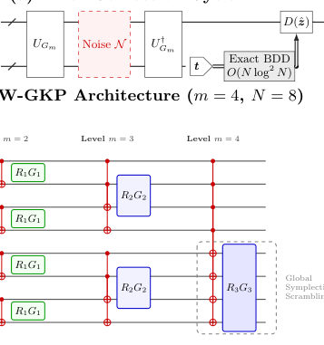
<figcaption class="paper-figure-caption"><b>Fig 1.</b> FIG. 1. Operational cycle and hardware architecture. (a) Logical modes and GKP ancillae are globally entangled via UGm; localized burst noise is scattered by U † Gm into diffuse background syndrome t. A deterministic O(N log2 N) classi- cal bounded-distance decoder computes the optimal recovery displacement D(ˆz). (b) The generation matrix Gm operates via a hierarchical butterfly network of symplectic entangling gates (RmGm), maximally scrambling phase space to pack R = 1</figcaption>
</figure>
<figure class="paper-figure-card">
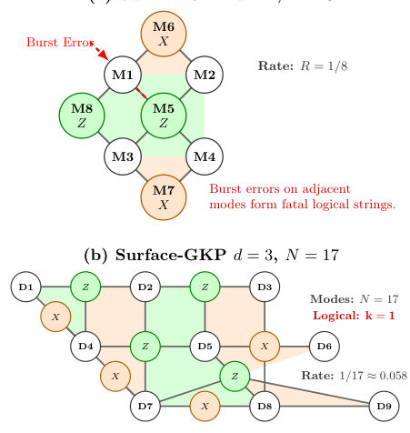
<figcaption class="paper-figure-caption"><b>Fig 2.</b> FIG. 2. Limitations of the 2D Surface-GKP code. (a) In a d = 2 planar layout, a localized burst error (red dashed line) on adjacent modes instantly forms a fatal logical string. (b) Scaling to d = 3 suppresses errors but requires quadratic expansion (N = 17) while yielding exactly one logical qubit— illustrating the vanishing rate R ∼O(1/ √</figcaption>
</figure>
<figure class="paper-figure-card">
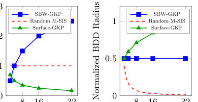
<figcaption class="paper-figure-caption"><b>Fig 3.</b> FIG. 3. Theoretical scaling comparison of multimode GKP architectures (schematic). (a) Rate k/N vs. N: SBW-GKP (blue, 1</figcaption>
</figure>

**Summary.** This paper introduces symplectic Barnes-Wall GKP codes that achieve an optimal logarithmic encoding rate ($R \propto \log N$) while maintaining a constant error protection distance ($\Delta^2=1$). By utilizing the structure of the Barnes-Wall lattice, they provide a deterministic and efficient decoding scheme for continuous-variable quantum error correction.

**Why it may be interesting.** This work provides a concrete, high-performance theoretical blueprint for fault-tolerant quantum computing using CV systems, directly impacting hardware requirements for photonic or superconducting implementations.

Detailed structure

**Main problem.** Designing practical, high-dimensional Gottesman-Kitaev-Preskill (GKP) codes for quantum error correction in continuous-variable systems while overcoming the limitations of rate-distance trade-offs.

**Main result.** The authors construct an explicit family of GKP codes based on the Barnes-Wall lattice achieving a logarithmic encoding rate ($R = rac{1}{2}\log_2 N$) with a constant code distance ($\Delta^2=1$).

**Method.** They use a recursive generator structure to realize a symplectic embedding of the Barnes-Wall lattice, enabling a deterministic $O(N\log^2 N)$ decoder.

**Model / system.** The system involves continuous-variable (CV) bosonic modes encoded into GKP states defined by lattices $\Lambda \subset \mathbb{R}^{2N}$. The construction leverages the symplectic structure and global entanglement properties of the Barnes-Wall lattice.

**Key observables.** Encoding Rate ($R = rac{1}{2}\log_2 N$), Code Distance ($\Delta^2=1$), Decoding Complexity ($O(N\log^2 N)$).

**Important parameters / regimes.** The constant distance $\Delta^2=1$ represents a specific, non-scaling protection level achieved at the expense of rate scaling.

**Assumptions / limitations.** The construction requires hardware supporting non-local modular connectivity to implement the global syndrome extraction and decoding process.

**Figures summary.** Figures compare code families (e.g., Surface-GKP vs SBW-GKP) showing superior rate scaling for the proposed method, and illustrate the operational cycle involving global entanglement.

**Paper structure.** The paper establishes the problem by reviewing limitations of existing codes, introduces the symplectic realization of the Barnes-Wall lattice via a recursive generator, proves the resulting code parameters (rate and distance), and details the transformation of the decoding problem from the dual lattice to the primal lattice for efficient computation.

Abstract

We construct an explicit symplectic realization of the Barnes-Wall lattice that yields a family of multimode Gottesman-Kitaev-Preskill (GKP) codes with encoding rate $R = \frac{1}{2}\log_2 N$ and a deterministic $O(N\log^2 N)$ bounded-distance decoder. The recursive generator $G_{m+1} = \bigl(\begin{smallmatrix} G_m & 0 \\ G_m & R_m G_m \end{smallmatrix}\bigr)$ with $R_m = I + Ω$ simultaneously guarantees symplectic integrality for valid quantum stabilizers and preserves the exact Barnes-Wall decoding structure through a chain of isometric isomorphisms. The code distance is constant at $Δ^2 = 1$ (in units of $2π$), representing an explicit distance--rate tradeoff in which logarithmic encoding efficiency is achieved at the cost of non-scaling protection. This construction provides a deterministic, space-efficient paradigm for GKP error correction in platforms supporting non-local modular connectivity.

[↑ back to top](#top)

### [Synthesis and structural validation of close-to-stoichiometric NiTe$_2$ single crystals](http://arxiv.org/abs/2608.02334v1)

**Authors:** T. Tirasutt, L. H. Tjeng, A. C. Komarek  
**Type:** experiment · **Category:** strongly correlated electrons · **PDF:** <https://arxiv.org/pdf/2608.02334v1>  
**Analysis basis:** full PDF text, analyzed in chunks

↔ Scroll figures horizontally

<figure class="paper-figure-card">
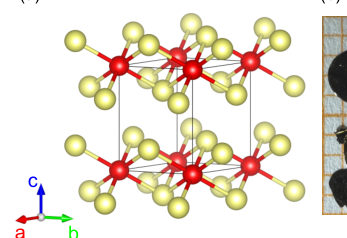
<figcaption class="paper-figure-caption"><b>Fig 1.</b> Figure 1: (a) The crystal structure of 1T-NiTe2 in the van der Waals layered phase, with the unit cell shown (red: Ni, yellow: Te), visualized using VESTA [21]. (b) Photograph of as-grown, millimeter-sized NiTe2 crystals on mm-paper, and (c) of a smaller NiTe2 single crystal used for the single crystal XRD mea- surement.</figcaption>
</figure>
<figure class="paper-figure-card">
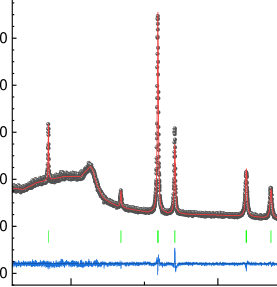
<figcaption class="paper-figure-caption"><b>Fig 2.</b> Figure 2: Powder X-ray diffraction patterns of NiTe2 with Rietveld fit. The bump-like features below 2Θ ∼26◦originate from the sample holder for air- sensitive samples; χ2: 1.74, Bragg R-factor: 2.65%, z(Te1) = 0.2534(4).</figcaption>
</figure>
<figure class="paper-figure-card">
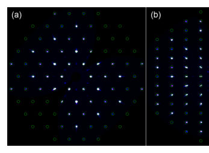
<figcaption class="paper-figure-caption"><b>Fig 3.</b> Figure 3: Precession maps of single crystal X-ray diffraction measurements of NiTe2 for the (a) (hk0), (b) (h0l) and (c) (0kl) planes of reciprocal space.</figcaption>
</figure>

**Summary.** This work reports the successful synthesis and detailed structural validation of stoichiometric $	ext{NiTe}_2$ single crystals using Chemical Vapor Transport. By employing both powder and single-crystal XRD, the authors confirmed the material's structure and established a highly reliable crystallographic benchmark for this promising type-II Dirac semimetal candidate.

**Why it may be interesting.** While focused on crystallography, establishing precise structural parameters for novel 2D materials like TMDCs is foundational knowledge required before any advanced quantum transport or electronic correlation studies can be performed.

Detailed structure

**Main problem.** The primary goal was to synthesize high-quality, close-to-stoichiometric single crystals of $	ext{NiTe}_2$ and establish a reliable structural benchmark for future physical property studies.

**Main result.** Single crystal XRD confirmed the structure is close to stoichiometric, showing no evidence of interstitial nickel atoms. The lattice parameters were successfully determined using both powder and single-crystal techniques.

**Method.** The material was synthesized via Chemical Vapor Transport (CVT), followed by rigorous structural characterization using Powder X-ray Diffraction (XRD) and high-precision Single Crystal XRD.

**Model / system.** The physical system is the transition metal dichalcogenide $	ext{NiTe}_2$, which adopts a 1T-type van der Waals layered structure ($Par{3}m1$). It is noted as a candidate material for studying type-II Dirac semimetallic behavior.

**Key observables.** Lattice parameters ($a, c$), occupancy of $	ext{Ni}$ atoms at the primary site ($	ext{Ni}1$), and confirmation regarding interstitial nickel occupation ($	ext{Ni}2$).

**Important parameters / regimes.** The stoichiometry is confirmed to be close to ideal, with refined $	ext{Ni}1$ occupancy near 0.988(9).

**Assumptions / limitations.** Caution is advised when interpreting EDX results due to inherent accuracy limitations, and the positional parameter $z(	ext{Te})$ from powder XRD may suffer from preferred orientation effects.

**Figures summary.** Figure 1 shows crystal structure models and photos of grown crystals. Figure 2 presents the Powder XRD pattern with Rietveld fitting for lattice parameters. Figure 3 displays precession maps from single-crystal measurements across key crystallographic planes.

**Paper structure.** The paper details the synthesis process using CVT, followed by a comprehensive structural analysis involving both powder and single-crystal XRD refinement to validate the crystal structure and stoichiometry of $	ext{NiTe}_2$.

Abstract

We report the synthesis of stoichiometric NiTe$_{2}$ single crystals via chemical vapor transport together with precise structural characterization. A combined analysis using powder X-ray diffraction (XRD) and single crystal XRD was performed to determine lattice parameters and structural details. High-resolution single crystal XRD reveals no evidence of interstitial nickel, confirming a close-to-stoichiometric composition. This work establishes a reliable benchmark for the crystal structure of stoichiometric NiTe$_{2}$, offering a reference for future studies on its physical properties.

[↑ back to top](#top)

### [The Pangaea Architecture: Fault-Tolerant Heterogeneous Topological Codes via a Quantum Bus](http://arxiv.org/abs/2608.01887v1)

**Authors:** Sheir Yarkoni, Chen Scheim, Daniel Hakshuri, Nadav Katz  
**Type:** theory · **Category:** quantum information and computing · **PDF:** <https://arxiv.org/pdf/2608.01887v1>  
**Analysis basis:** full PDF text, analyzed in chunks

↔ Scroll figures horizontally

<figure class="paper-figure-card">
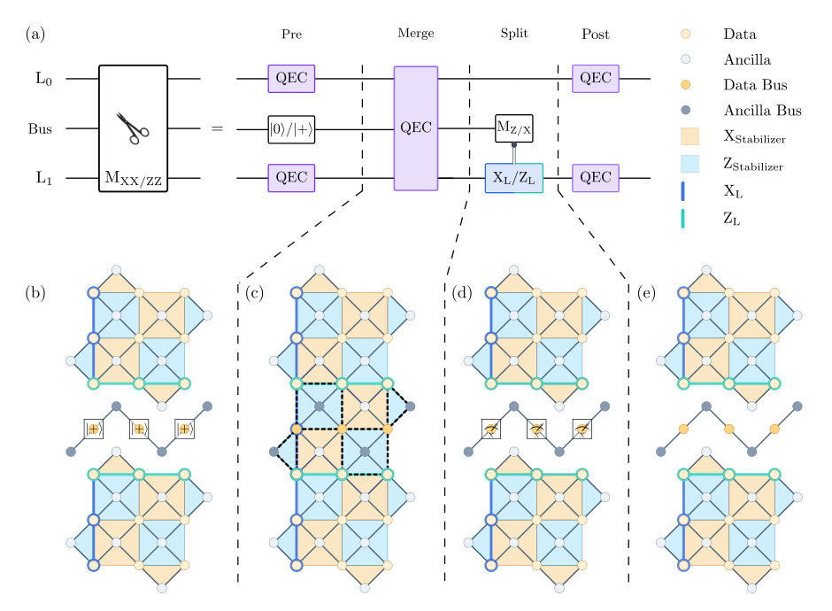
<figcaption class="paper-figure-caption"><b>Fig 1.</b> FIG. 1. Lattice surgery between two distance-3 rotated surface-code patches via a quantum bus, shown explicitly for an MZZ interaction. (a) Circuit-level diagram defining the main stages of lattice surgery, including fault-tolerant stabilizer measurements, which for future use we denote as the “scissors” operator, composed of: pre-op, merge, split, and post-op. (b)-(e) Equivalent schematic diagrams defining the four stages of the scissors operator. Data qubits participating in each logical XL(ZL) operator are highlighted in blue (turquoise).</figcaption>
</figure>
<figure class="paper-figure-card">
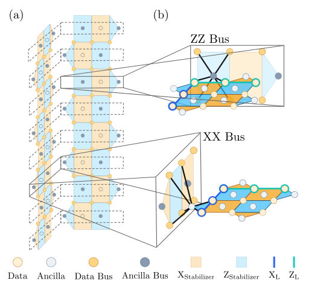
<figcaption class="paper-figure-caption"><b>Fig 2.</b> FIG. 2. Three-dimensional layout of two orthogonal quantum buses and their physical connections to two non- adjacent logical qubits. (a) Two orthogonal bus strips form a three-dimensional tower to enable long-distance interactions. Dashed lines highlight the respective “bus slots”, where each slot accepts a single code patch. Yellow nodes denote bus data qubits, gray nodes are ancilla qubits, and dashed nodes are “missing” qubits where rough boundaries of the code patch are inserted into. The ZZ-bus (XX-bus) is aligned with each surface-code patch’s logical ZL (XL) operator for native MZZ (MXX) parity measurements. (b) Zoomed-in diagram emphasizing the code patch-to-bus connectivity which...</figcaption>
</figure>
<figure class="paper-figure-card">
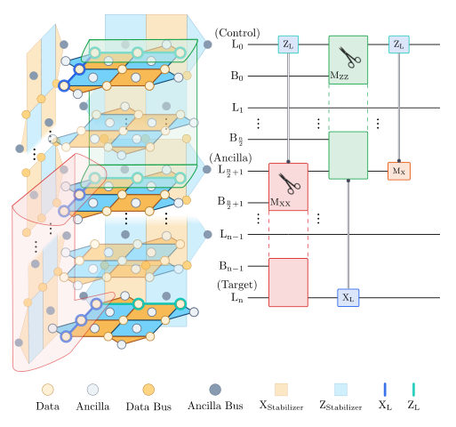
<figcaption class="paper-figure-caption"><b>Fig 3.</b> FIG. 4. Full measurement-based CNOT between non- adjacent logical qubits using the quantum bus, realized as a sequence of joint parity measurements (MXX, MZZ) fol- lowed by an ancilla readout, built from operational primitives defined in Fig. 1. Each colored wrapping strip on the left side illustrates the scissors operator on the relevant logical qubit patches.</figcaption>
</figure>
<figure class="paper-figure-card">

<figcaption class="paper-figure-caption"><b>Fig 4.</b> FIG. 3. Circuit-level description of a measurement-based CNOT using joint parity measurements. An ancilla medi- ates the gate between the control and target qubits. Red denotes the MXX measurement between ancilla and target, green denotes the MZZ measurement between control and an- cilla, orange denotes the final ancilla MX measurement, and blue denotes the relevant conditional Pauli-frame updates.</figcaption>
</figure>
<figure class="paper-figure-card">
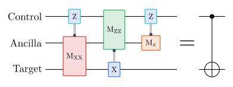
<figcaption class="paper-figure-caption"><b>Fig 5.</b> Fig. 4 shows a schematic of a bus-mediated CNOT. We implement observables MXX = X (Ancilla)X (Target)</figcaption>
</figure>

**Summary.** The paper introduces Pangaea, a novel fault-tolerant architecture that uses a quantum bus to connect remote patches of heterogeneous topological quantum codes. This design overcomes the scaling limitations of planar lattice surgery by achieving superior qubit resource estimates for multi-qubit operations. It establishes a scalable pathway toward building large-scale, three-dimensional quantum computers.

**Why it may be interesting.** This work is highly relevant as it proposes a concrete hardware blueprint (the quantum bus) to overcome fundamental connectivity bottlenecks in implementing large-scale topological quantum error correction codes, which is central to building practical quantum computers.

Detailed structure

**Main problem.** The primary challenge is developing a scalable, fault-tolerant quantum architecture to perform logical operations between remote patches of heterogeneous topological codes while overcoming the connectivity limitations of planar lattice surgery.

**Main result.** The proposed Pangaea architecture utilizes a quantum bus, achieving a significant scaling improvement by requiring only O(dN_L) physical qubits for multi-qubit interactions compared to O(d^2N_L) in traditional 2D setups. This allows for the construction of scalable, three-dimensional fault-tolerant quantum computing modules.

**Method.** The method involves using an auxiliary gauge-code strip (the quantum bus) to mediate logical operations by reconstructing joint logical operators through carefully designed measurements, generalizing lattice surgery into a 3D process.

**Model / system.** The system is the Pangaea architecture, which connects multiple patches of different topological codes (e.g., surface and color codes) via a quantum bus. This bus acts as an auxiliary gauge-code strip that facilitates long-range logical connectivity.

**Key observables.** Logical error rate ($p_L$), physical qubit count scaling ($O(dN_L)$ vs $O(d^2N_L)$), and the successful implementation of multi-qubit Pauli operations (e.g., CNOT, MZZ).

**Important parameters / regimes.** Distance ($d$) of the topological codes, number of logical qubits ($N_L$), and physical error rates ($p_{phys}$). The scaling factor improvement is quantified at the 50-logical-qubit scale.

**Assumptions / limitations.** The architecture assumes that nearest-neighbor physical connectivity can be maintained throughout the process, simplifying construction compared to proposals requiring complex long-range physical links. It also relies on the ability to perform joint parity measurements across different code families.

**Figures summary.** Figures illustrate the circuit-level stages of lattice surgery ('scissors' operator) using the bus for MZZ interactions; diagrams show 3D towers connecting non-adjacent qubits, and schematics detail surface-to-surface and surface-to-color patch connections via the bus.

**Paper structure.** The paper introduces Pangaea, detailing how the quantum bus mediates operations by reformulating lattice surgery. It mathematically derives the joint parity measurements required for long-range interactions, analyzes the scaling benefits over traditional methods, verifies fault tolerance through simulations, and discusses the resulting structure of merged heterogeneous codes.

Abstract

We introduce Pangaea, a fault-tolerant quantum architecture that uses a quantum bus to mediate logical operations between remote patches of two-dimensional topological codes. The bus is an auxiliary gauge-code strip whose measurements reconstruct joint logical operators while preserving nearest-neighbor physical connectivity. Enabling native heterogeneous topological codes and multi-qubit Pauli operations, the quantum bus can be interpreted as a three-dimensional generalization of lattice surgery. We require only $O(dN_L)$ physical qubits to implement multi-qubit interactions for $N_L$ distance-$d$ logical qubits, compared to $O(d^2N_L)$ of traditional two-dimensional architectures. At the 50-logical-qubit scale, Pangaea uses up to $10\times$ fewer physical qubits than planar surface-code architectures at matched logical error rates. We verify fault-tolerance of long-range measurement-based CNOT primitives for both surface--surface and surface--color joint parity measurements using pseudo-threshold simulations. We use this protocol to construct a native heterogeneous 15-to-1 magic-state distillation module using the quantum bus. These results establish Pangaea as a scalable architecture for three-dimensional fault-tolerant quantum computing that resolves the routing bottleneck of planar lattice surgery.

[↑ back to top](#top)

## Secondary cond-mat archives

*Papers from cond-mat.mtrl-sci, mes-hall, other, soft, supr-con. These archives are de-prioritized — they appear at the end regardless of relevance score.*

### Relevant in secondary archives (46)

### [Charge Tunable Optical Nonlinearity of Moiré Exciton-Polaritons](http://arxiv.org/abs/2608.02165v1)

**Authors:** Zhijie Li, Kok Wee Song, Jens-Christian Drawer, Vita Solovyeva, Martin Esmann, Niklas Nilius, Muhammad Sufyan Ramzan, Caterina Cocchi, Falk Eilenberger, Takashi Taniguchi, Kenji Watanabe, Atanu Patra, Subhamoy Sahoo, Simon Betzold, Sven Höfling, Alexander Högele, Oleksandr Kyriienko, Christian Schneider, Bo Han  
**Type:** both · **Category:** other · **PDF:** <https://arxiv.org/pdf/2608.02165v1>  
**Analysis basis:** full PDF text, analyzed in chunks
**Topic relevance:** 🔥 `analog quantum simulation` **4/5** · 🔥 `correlated cavity matter` **4/5** · `driven-dissipative phase transition` **3/5** · `methods for driven-dissipative` **3/5** · `quantum optics experiment` **3/5** · `Tavis-Cummings & cavity-many-emitter` **2/5** · `non-equilibrium dynamics` **2/5** · `spintronics-quantum-optics interface` **2/5** · `Keldysh / 2PI / non-Gaussian methods` **1/5** · `correlated / nonlocal dissipation` **1/5** · `entanglement & information structure` **1/5** · `non-equilibrium universality` **1/5**

↔ Scroll figures horizontally

<figure class="paper-figure-card">
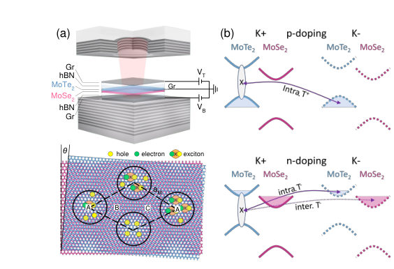
<figcaption class="paper-figure-caption"><b>Fig 1.</b> FIG. 1. (a) Top panel: schematics of open optical micro- cavity with a dual-gated MoTe2-MoSe2 HBL. Bottom panel: schematics of exciton (X) and charge filling into the high- symmetry point A of the moir´e superlattices for a R-type HBL. (b) Type-II band alignment in R-type MoTe2-MoSe2 HBL. Trion (T) states appear due to charge doping. Solid (dashed) lines represent spin-up (-down) bands.</figcaption>
</figure>
<figure class="paper-figure-card">
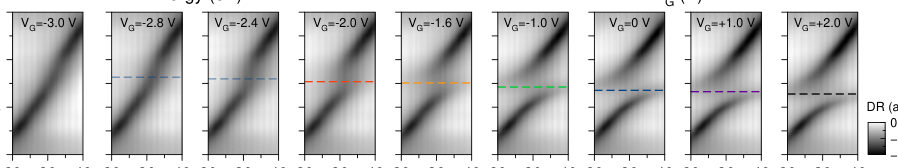
<figcaption class="paper-figure-caption"><b>Fig 2.</b> FIG. 2. (a) Gate tunable PL of MoTe2 ML region (top) and MoTe2-MoSe2 HBL (bottom) of the charge tunable device, with negative (n), neutral (i) and positive (p) doping regimes. (b) Cavity detuning DR at different VG. All graphs share the same color bar. The dashed lines mark moir´e exciton resonances. (c) VG-dependent exciton energies in HBL fitted from PL in (a) and DR in (b). (d) VG-dependent Rabi splittings (ℏΩ) in HBL. Color symbols correspond to the VG applied in Fig. 3(a). The Rabi gap energies of two ungated MoTe2 MLs are shown by cross symbols.</figcaption>
</figure>

**Summary.** The authors demonstrate electrical control over the nonlinear optical response of moiré exciton-polaritons using a gated $	ext{MoTe}_2-	ext{MoSe}_2$ heterobilayer. By inducing charge doping, they show that the required excitation density to reach saturation can be drastically lowered compared to neutral conditions. This work combines advanced cavity QED experiments with microscopic theory rooted in Pauli blocking.

**Why it may be interesting.** This work directly addresses open quantum systems dynamics, specifically cavity QED effects in solid-state materials. The ability to electrically tune nonlinearity via doping provides a powerful platform for studying many-body interactions in engineered quantum optical systems.

Detailed structure

**Main problem.** The study focuses on demonstrating and understanding the *in-situ* electrical control of optical saturation-based nonlinearity in moiré exciton-polaritons.

**Main result.** A small gate voltage can significantly reduce the required polariton density by an order of magnitude to achieve a comparable nonlinear saturation effect compared to charge-neutral conditions.

**Method.** The research combines experimental measurements (PL, DR) on a gated heterobilayer with microscopic theoretical modeling based on Pauli blocking for moiré superlattices.

**Model / system.** The physical system is a gate-controllable $	ext{MoTe}_2-	ext{MoSe}_2$ heterobilayer embedded in an open optical microcavity, forming moiré exciton-polaritons. The theory incorporates charge doping effects via Pauli blocking mechanisms.

**Key observables.** Gate voltage ($V_G$) dependent photoluminescence (PL), differential reflectivity (DR) showing anti-crossings and saturation behavior, Rabi splittings, and excitonic Stokes shifts.

**Important parameters / regimes.** Moiré superlattice constant $a_M \approx 4.2 	ext{ nm}$, gate voltage regimes (hole/electron doping), and the required polariton density for saturation ($	ext{dex-pol}$).

**Assumptions / limitations.** The theoretical description successfully explains observations within the framework of Pauli blocking applied to moiré superlattices with charge occupancy.

**Figures summary.** Figures illustrate schematics of the cavity/HBL, PL/DR spectra showing gate tunability and anti-crossings, and density-dependent DR curves demonstrating Rabi gap saturation effects.

**Paper structure.** The paper builds context by reviewing related literature (citations) before presenting experimental results on charge tuning ($	ext{PL}$/$	ext{DR}$) and then using theory to explain the observed nonlinear saturation phenomena via Pauli blocking.

Abstract

Transition metal dichalcogenides represent a versatile platform to study strong light-matter interactions based on excitons and electrons in ordered lattices. Twist-engineering of moiré structures further enables the manipulation of the polaritonic nonlinearities via engineering the exciton landscape on the nanoscale. In this work, we demonstrate in-situ control of the optical saturation-based nonlinearity of moiré exciton-polaritons by phase space restriction via charge doping. Strong exciton-photon coupling is established in a gate-controllable MoTe$_2$-MoSe$_2$ heterobilayer, embedded in a spectrally-tunable open cavity. A small gate voltage can effectively lower the necessary polariton density by one order of magnitude to achieve a similar nonlinear saturation effect as in the charge-neutral case. Our microscopic description successfully explains the observed phenomena in the framework of Pauli blocking for the moiré superlattices with charge preoccupation.

[↑ back to top](#top)

### [Optical switching of magnetic order in few-layer CrSBr](http://arxiv.org/abs/2608.02337v1)

**Authors:** Lukas Husel, Julian Trapp, Moritz Würf, Anna Rupp, Tim Wedl, Kenji Watanabe, Takashi Taniguchi, Iva Plutnarova, Zdenek Sofer, Alexander Högele  
**Type:** experiment · **Category:** other · **PDF:** <https://arxiv.org/pdf/2608.02337v1>  
**Analysis basis:** full PDF text, analyzed in chunks
**Topic relevance:** 🔥 `exotic spin models in light-matter` **4/5** · 🔥 `spintronics-quantum-optics interface` **4/5** · `analog quantum simulation` **3/5** · `driven-dissipative phase transition` **3/5** · `non-equilibrium dynamics` **2/5** · `quantum optics experiment` **2/5** · `correlated / nonlocal dissipation` **1/5** · `methods for driven-dissipative` **1/5** · `non-equilibrium universality` **1/5** · `quantum measurements` **1/5**

↔ Scroll figures horizontally

<figure class="paper-figure-card">
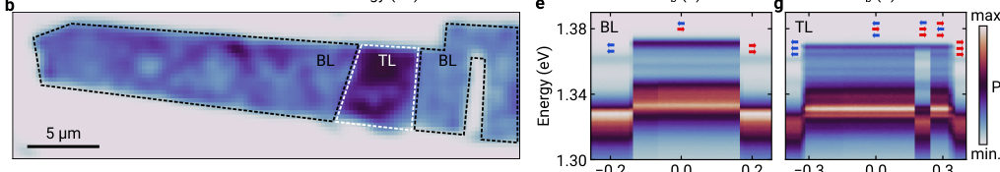
<figcaption class="paper-figure-caption"><b>Fig 1.</b> FIG. 1. Excitons in few-layer CrSBr as sensors of magnetic order. a, Schematic of CrSBr bilayer cooled below the Néel temperature, with the magnetic configuration indicated by the arrows. The insets show the crystal structure in the b-c and a-b planes. b, Confocal PL raster-scan map of CrSBr bilayer (BL) and trilayer (TL) regions encapsulated by hBN. The PL was integrated in the spectral range 1.327 −1.332 eV. c, Top panel: Spectra of bilayer PL (red line) and DR (blue line). Bottom panel: Trilayer PL (orange line) and DR (light green line). XA, XB and X′ B exciton energies are indicated by the dashed lines. d and e, Bilayer DR and PL spectra as a function of magnetic field Bb applied along...</figcaption>
</figure>
<figure class="paper-figure-card">
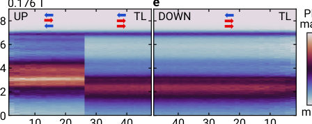
<figcaption class="paper-figure-caption"><b>Fig 2.</b> FIG. 2. Optical switching of magnetic spin-flip transi- tions. a, Schematic of the experiment: A non-resonant cw laser switches the magnetic configuration in few-layer CrSBr with illumination powers as low as a few tens of microwatts. b, Bilayer PL as a function of laser power (upward sweep) in a magnetic field of 0.162 T applied along the b-axis. The mag- netic configuration switches from AFM to FM, as indicated by the arrows. c, Same for a decreasing laser power (down- ward sweep), performed directly after the upward sweep in b. d and e, Same as b and c, but for the trilayer in a magnetic field of 0.176 T with laser-induced AFMA–MS spin-flip tran- sition. All spectra were normalized to...</figcaption>
</figure>
<figure class="paper-figure-card">
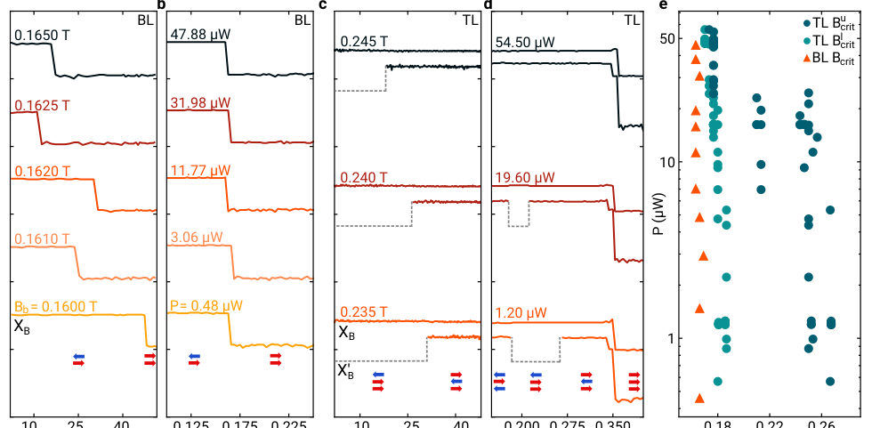
<figcaption class="paper-figure-caption"><b>Fig 3.</b> FIG. 3. Interplay of optical and magnetic fields determines the switching behavior. a, PL energy of the XB exciton in the bilayer, measured for upward sweeps of the laser power at different magnetic fields Bb. The arrows depict the magnetic configuration. b, Bilayer PL energy of XB for upward sweeps of Bb, measured at different laser powers. c and d, Same as a and b, but for the trilayer. In the MS magnetic configuration, the X′ B exciton PL was quenched (the dashed lines indicate its energy in DR). e, Critical spin-flip fields as a function of the laser power. For the bilayer, Bcrit for the AFM–FM transition is shown by orange triangles; for the trilayer, the critical fields for the...</figcaption>
</figure>
<figure class="paper-figure-card">
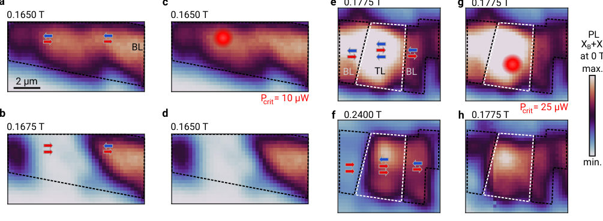
<figcaption class="paper-figure-caption"><b>Fig 4.</b> FIG. 4. Local and remote switching of magnetic domains. a and b, Raster-scan maps of bilayer PL intensity for magnetic fields of 0.1650 and 0.1675 T, respectively, acquired for a laser power below the critical value Pcrit. The increase in magnetic field switches the magnetic configuration within a subdomain, as indicated by the arrows. c and d, PL map of the same area as in a and b at a constant magnetic field of 0.1650 T, acquired before and after illuminating the spot indicated by the red dot with a laser power above Pcrit. Local laser illumination has the same effect as an increase of the magnetic field. e and f, PL map of the trilayer and the neighboring bilayers for magnetic fields of...</figcaption>
</figure>
<figure class="paper-figure-card">
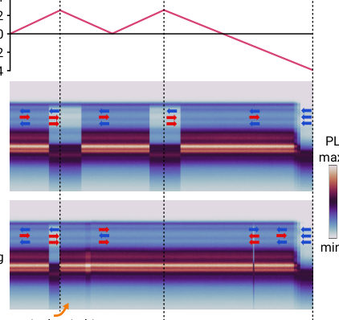
<figcaption class="paper-figure-caption"><b>Fig 5.</b> FIG. 5. Magneto-optical preparation and detection of the zero-field magnetic configuration. a, Sequence of magnetic fields Bb applied in the experiment. b, PL spectra obtained for the magnetic field sequence in a with a laser power below Pcrit, corresponding to a control measurement loop. The magnetic configurations occurring during the sweep are indicated by the arrows. c, Same as b, but with the sequence modified by targeted optical switching as indicated by the arrow.</figcaption>
</figure>

**Summary.** The authors demonstrate that the magnetic order in few-layer CrSBr can be switched using low-power optical excitation. By monitoring exciton energies and photoluminescence, they show that light can induce spin-flip transitions across extended areas, enabling deterministic control over the material's magnetic ground state. This establishes a promising platform for next-generation magneto-optoelectronic devices.

**Why it may be interesting.** This work provides a direct experimental demonstration of optically controlling magnetic states in a solid-state material using light-matter coupling via excitons, which is highly relevant for developing quantum or magneto-optoelectronic devices.

Detailed structure

**Main problem.** The study aims to demonstrate and utilize optical switching of magnetic order in few-layer CrSBr, a 2D van der Waals magnet.

**Main result.** Low-power continuous-wave laser excitation can induce spin-flip transitions ($	ext{AFM} 	o 	ext{FM}$) in the bilayer, and remote switching was observed across extended domains. The critical field for certain transitions decreases significantly with increasing laser power.

**Method.** The researchers used exciton absorption and photoluminescence spectroscopy with a continuous-wave laser to probe magnetic state changes as a function of applied magnetic field and laser power.

**Model / system.** The physical system is few-layer CrSBr, an antiferromagnetic 2D van der Waals magnet encapsulated by hBN. The magnetism can be controlled via magneto-excitons, which provide both optical readout and strong absorption channels for energy transfer.

**Key observables.** Exciton energies ($	ext{XA}$, $	ext{XB}$), magnetic configuration (AFM, FM, MS, AFMB), critical switching power ($P_{	ext{crit}}$), and critical magnetic fields ($B_{	ext{crit}}$).

**Important parameters / regimes.** Laser power as low as a few microwatts ($\mu	ext{W}$); near-critical external magnetic fields; temperature (cryogenic conditions).

**Assumptions / limitations.** The switching mechanism is attributed to energy transfer via exciton absorption coupling to the spin lattice, excluding substrate heating or photo-doping effects.

**Figures summary.** Figures illustrate exciton signatures confirming magnetic transitions under varying B fields; PL evolution maps demonstrate $	ext{AFM} 	o 	ext{FM}$ switching upon increasing laser power and observing local/remote switching patterns.

**Paper structure.** The paper systematically presents measurements using DR and PL spectroscopy, first establishing the dependence of exciton energies on magnetic order (Fig. 1), then demonstrating optical control by varying laser power (Fig. 2), and finally mapping out the complex interplay between applied fields and optical power to deterministically set the zero-field state (Fig. 3, Fig. 5).

Abstract

Manipulating magnetism with light is crucial for both fundamental understanding and technological advancements of information storage devices. The layered antiferromagnet CrSBr, part of the recently emerging class of two-dimensional van der Waals magnets, offers a unique path towards optical control of magnetism via magneto-excitons, which allow optical readout of the spin alignment and also provide a strong absorption channel. Here, we use exciton absorption and photoluminescence to demonstrate optical switching of the magnetic order in bi- and trilayer CrSBr. Using a continuous-wave laser with a power as low as a few microwatts at near-critical external magnetic fields, we demonstrate both local and remote switching of the magnetic configuration in extended lateral domains and further employ this mechanism to deterministically prepare the zero-field magnetic configuration. Our results establish optical switching as a useful means of controlling magnetism in CrSBr, with potential applications in magneto-optoelectronic devices.

[↑ back to top](#top)

### [Magnetic Skyrmion Interacting with Optical Skyrmion](http://arxiv.org/abs/2608.02552v1)

**Authors:** Lan Bo, Jian Chen, Xichao Zhang, Yan Zhou, Chengwei Qiu, Masahito Mochizuki  
**Type:** theory · **Category:** other · **PDF:** <https://arxiv.org/pdf/2608.02552v1>  
**Analysis basis:** full PDF text, analyzed in chunks
**Topic relevance:** 🔥 `spintronics-quantum-optics interface` **4/5** · `exotic spin models in light-matter` **3/5** · `interference shaping light` **3/5** · `analog quantum simulation` **2/5** · `driven-dissipative phase transition` **2/5** · `methods for driven-dissipative` **2/5** · `non-equilibrium dynamics` **2/5** · `Keldysh / 2PI / non-Gaussian methods` **1/5** · `correlated / nonlocal dissipation` **1/5** · `non-equilibrium universality` **1/5**

↔ Scroll figures horizontally

<figure class="paper-figure-card">
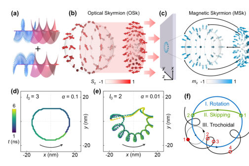
<figcaption class="paper-figure-caption"><b>Fig 1.</b> FIG. 1. (a) Two orthogonally polarized LG modes with l0 = 2 and l1 = 3. Red helical surfaces and blue arrows represent the OAM and SAM. (b),(c) Bloch-type OSk and Néel-type MSk shown through their stereographic projections. (d),(e) Representative MSk trajectories under different α and l0. (f) Schematic summary of the three dynamical modes.</figcaption>
</figure>
<figure class="paper-figure-card">
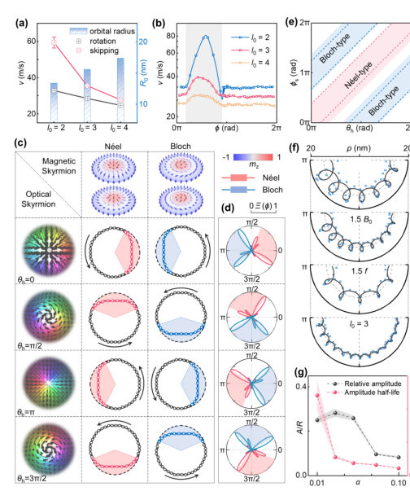
<figcaption class="paper-figure-caption"><b>Fig 2.</b> FIG. 2. (a) Rotation/skipping velocities and the orbital ra- dius R0 versus l0. (b) Azimuthal dependence of the instanta- neous velocity v(ϕ) for different l0. The shaded bands mark the skipping window. (c) Trajectories for different types of OSks and MSks. (d) Polar plots of the skipping index Ξ(ϕ) for Néel/Bloch MSks, with predicted skipping sectors shaded. (e) Skipping azimuth ϕs from simulations (shaded bands) com- pared with analytical predictions (dashed lines). (f) Simu- lated trochoidal trajectories (symbols) and corresponding fits (curves) for varying B0, f, and l0. The top panel reproduces the reference case in Fig. 1 (e). (g) Relative amplitude A/R and amplitude half-life ln 2/Γ...</figcaption>
</figure>
<figure class="paper-figure-card">
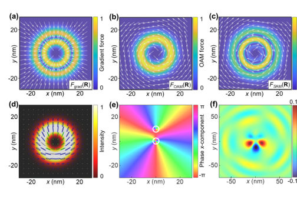
<figcaption class="paper-figure-caption"><b>Fig 3.</b> FIG. 3. (a)–(c) Optical-force distributions showing the gra- dient, OAM, and SAM components. (d) Polarization distri- bution of the OSk beam. (e) Phase distribution of the Bx field. (f) Spin-wave radiation excited by the OSk beam in a uniformly magnetized film.</figcaption>
</figure>
<figure class="paper-figure-card">
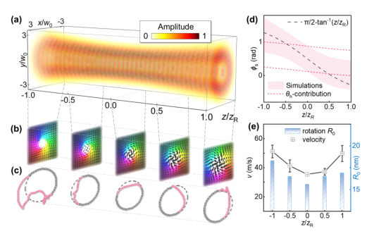
<figcaption class="paper-figure-caption"><b>Fig 4.</b> FIG. 4. (a) 3D amplitude distribution of the OSk beam. (b), (c) Stokes-vector textures and simulated MSk trajectories at the corresponding cross sections. (d) Skipping azimuth ϕs(z) from simulations compared with the analytical prediction. (e) Rotation velocity v and orbital radius R0 versus z/zR.</figcaption>
</figure>

**Summary.** This paper investigates the complex interaction between magnetic skyrmions and structured optical beams carrying orbital and spin angular momentum. By decomposing the driving force into distinct components, the authors identify three unique dynamical modes—rotation, skipping, and trochoidal motion. The results demonstrate that this coupling enables precise, phase-programmable control over magnetic topological matter using light.

**Why it may be interesting.** This work bridges topological concepts from condensed matter magnetism (skyrmions) with quantum optics (structured light), providing a framework for controlling magnetic states using tailored optical fields, which is highly relevant to open quantum systems and light-matter interaction studies.

Detailed structure

**Main problem.** The study investigates how a single Magnetic Skyrmion (MSk) interacts with an Optical Skyrmion (OSk) beam to achieve topology-enabled control over the MSk's dynamics.

**Main result.** Three distinct nonlinear dynamical modes—rotation, skipping, and trochoidal motion—are identified. The coupling allows for helicity-selective and phase-programmable optomagnonic control.

**Method.** The analysis uses an optomagnetic effective-field picture, decomposing the optical driving force into gradient, OAM, and SAM contributions to model the MSk's response via modified LLG or Thiele equations.

**Model / system.** The system involves magnetic skyrmions (topological particle) driven by structured light beams carrying orbital and spin angular momentum (OSk). The dynamics are governed by coupling terms derived from the optical drive field acting on the MSk magnetization.

**Key observables.** MSk core trajectories, skipping index $\Xi(\phi)$, rotational/skipping velocities $v(\phi)$, and the dependence of skipping azimuth ($\phi_s$) on OSk helicity ($	heta_h$).

**Important parameters / regimes.** Damping constant ($\alpha$), Laguerre-Gaussian mode indices ($l_0$), and the Gouy phase $\zeta(z)$ in 3D propagation.

**Assumptions / limitations.** The model assumes an externally prescribed optical drive, neglecting magnetization-to-optical feedback. The rigid-particle approximation is used for MSk center dynamics.

**Figures summary.** Figures illustrate LG modes and Poincaré sphere mappings; Fig. 2 shows velocity dependence and trajectories for the three dynamical modes; Fig. 3 details the components of the optical force ($\mathbf{F}_{	ext{grad}}$, $\mathbf{F}_{	ext{OAM}}$, $\mathbf{F}_{	ext{SAM}}$); Fig. 4 visualizes 3D beam structure and $z$-dependent skipping.

**Paper structure.** The paper establishes the physical context (MSk/OSk interaction), models the dynamics using force decomposition, identifies three distinct nonlinear modes (rotation, skipping, trochoidal motion) through analytical and numerical simulation, and extends the analysis to 3D propagation effects.

Abstract

Magnetic skyrmions (MSks) and optical skyrmions (OSks) embody topology in matter and in light, respectively. Here we investigate the interaction between a single MSk and an OSk beam. Three distinct nonlinear dynamical modes are identified: rotation, skipping, and trochoidal motion. By decomposing the optical driving force into gradient, orbital-angular-momentum, and spin-angular-momentum contributions, we clarify their respective roles of radial confinement, azimuthal drift, and precessional modulation. The skipping motion arises from the azimuthal asymmetry of the OSk beam and exhibits spatial selectivity originating from the magnetization-polarization coupling between the MSk and OSk. In three dimensions, the coupling acquires a propagation-dependent phase dominated by the differential Gouy phase, which yields $z$-asymmetric skipping trajectories. These results bridge topological particles and topological fields within a unified framework, offering helicity-selective and phase-programmable routes to optomagnonic control.

[↑ back to top](#top)

### [Magnetoelastic control of quantum correlations and field sensitivity in a spin-1/2 Heisenberg dimer](http://arxiv.org/abs/2608.00777v1)

**Authors:** E. W. B. de Souza, Moises Rojas, Onofre Rojas  
**Type:** theory · **Category:** statistical mechanics · **PDF:** <https://arxiv.org/pdf/2608.00777v1>  
**Analysis basis:** full PDF text, analyzed in chunks
**Topic relevance:** 🔥 `analog quantum simulation` **4/5** · 🔥 `entanglement & information structure` **4/5** · `exotic spin models in light-matter` **3/5** · `spintronics-quantum-optics interface` **2/5** · `Keldysh / 2PI / non-Gaussian methods` **1/5** · `correlated / nonlocal dissipation` **1/5** · `driven-dissipative phase transition` **1/5** · `methods for driven-dissipative` **1/5**

↔ Scroll figures horizontally

<figure class="paper-figure-card">
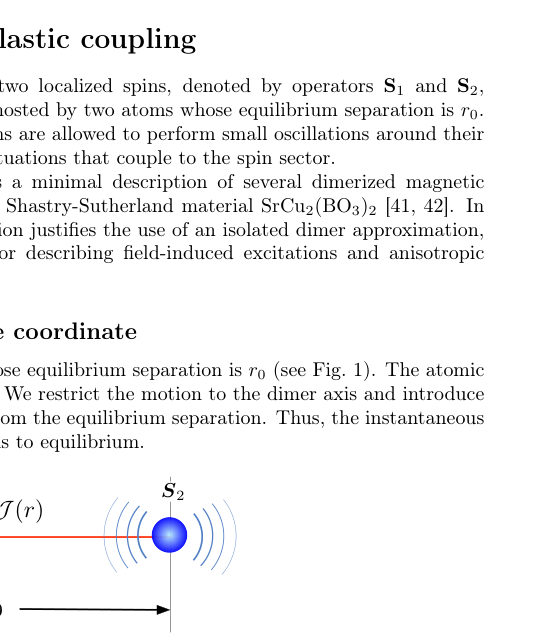
<figcaption class="paper-figure-caption"><b>Fig 1.</b> Figure 1: Schematic representation of a dimer spin oscillating around its equilibrium position r0.</figcaption>
</figure>
<figure class="paper-figure-card">
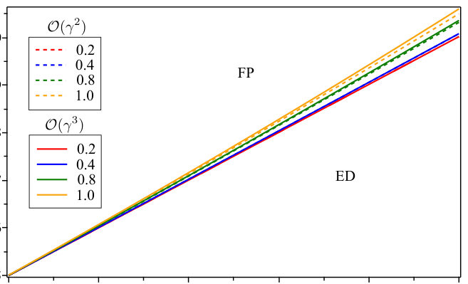
<figcaption class="paper-figure-caption"><b>Fig 2.</b> Figure 2: Zero-temperature phase diagram in the plane B/µBg versus Jx, for Jz = −1, κ = 5, at different values of γ. The dashed line includes only the linear magnetoelastic correction, while the solid line incorporates both linear and quadratic contributions.</figcaption>
</figure>
<figure class="paper-figure-card">
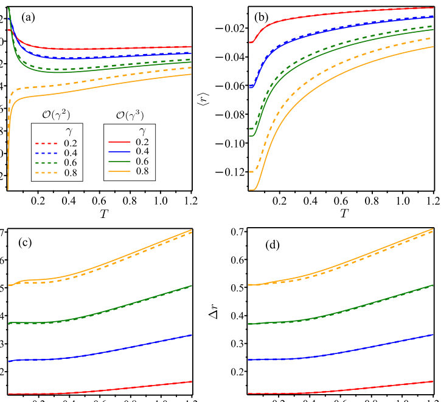
<figcaption class="paper-figure-caption"><b>Fig 3.</b> Figure 3: Thermal average displacement ⟨r⟩(a,b) and standard deviation ∆r (c,d) as functions of temperature T, for Jx = 1, Jz = −1 and κ = 5, at different values of γ. Dashed curves include only the linear magnetoelastic contribution, while solid curves include both linear and quadratic corrections. Panels (a,c) correspond to B/µBg = 1.1, and (b,d) to B/µBg = 0.9.</figcaption>
</figure>
<figure class="paper-figure-card">
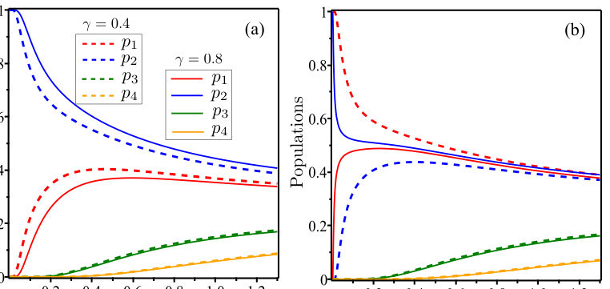
<figcaption class="paper-figure-caption"><b>Fig 4.</b> Figure 4: Level populations pj as functions of temperature T, for Jx = 1, Jz = −1 and κ = 5. Dashed curves correspond to γ = 0.4, and solid curves to γ = 0.8. Panels (a) and (b) show B/µBg = 1.1 and B/µBg = 0.9, respectively.</figcaption>
</figure>
<figure class="paper-figure-card">
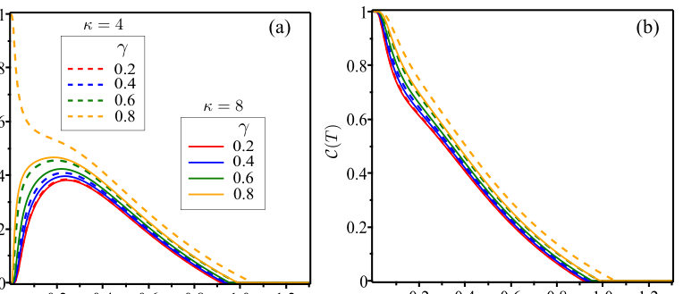
<figcaption class="paper-figure-caption"><b>Fig 5.</b> Figure 5: Concurrence C(T) as a function of temperature T, for Jx = 1, Jz = −1 and different values of γ. Dashed curves correspond to κ = 4, and solid curves to κ = 8. Panels (a) and (b) show B/µBg = 1.1 and B/µBg = 0.9, respectively.</figcaption>
</figure>

**Summary.** The paper theoretically analyzes a spin-1/2 Heisenberg dimer where the magnetic interactions are modulated by atomic vibrations. By treating this magnetoelastic coupling, the authors demonstrate that the system's ability to maintain nonclassical correlations (measured by LQU) and its sensitivity to external fields ($F_B$) are both controlled by the vibrational state. This establishes a unified picture linking quantum information measures to measurable thermodynamic responses.

**Why it may be interesting.** This work provides a concrete, tunable mechanism (magnetoelastic coupling) within a simple dimer model to control multiple facets of quantum behavior simultaneously, which is highly relevant for designing quantum sensors or qubits based on solid-state systems.

Detailed structure

**Main problem.** The study investigates how magnetoelastic coupling controls quantum correlations (entanglement, nonclassical uncertainty) and magnetic field sensitivity in a spin-1/2 Heisenberg dimer.

**Main result.** Magnetoelastic coupling plays a central role by linking the system's thermodynamic response to its underlying quantum correlation structure. Local Quantum Uncertainty persists even when entanglement vanishes at finite temperatures.

**Method.** The authors combine an exact treatment of the spin sector with a harmonic approximation for vibrational degrees of freedom, analyzing observables like Concurrence and Magnetic Fisher Information.

**Model / system.** The system is a spin-1/2 Heisenberg dimer whose exchange interaction depends on its relative displacement ($r$) due to magnetoelastic coupling. The Hamiltonian includes both magnetic (spin) and harmonic (vibrational) parts.

**Key observables.** Concurrence, Local Quantum Uncertainty (LQU), Magnetic Fisher Information ($F_B$), and thermal averages of spin/displacement ($\langle r^2 
angle$).

**Important parameters / regimes.** Temperature ($T$), external magnetic field ($B$), and the magnetoelastic coupling strength ($\gamma_\alpha$). The analysis is restricted by $\eta(T) \ll 1$.

**Assumptions / limitations.** The primary approximations involve restricting the vibrational motion to small displacements (harmonic approximation) and using Taylor expansions for the exchange couplings.

**Figures summary.** Figures illustrate the temperature dependence of Concurrence, LQU, and Fisher Information, showing how these quantities behave in different magnetic field regimes (ED vs. FP).

**Paper structure.** The paper builds from defining the coupled Hamiltonian to deriving an effective model using harmonic approximations for each spin sector. It then analyzes specific observables—LQU and $F_B$—to establish a direct link between quantum correlations and thermodynamic sensitivity.

Abstract

We investigate the thermodynamic and quantum properties of a magnetoelastic spin-1/2 Heisenberg dimer, where the exchange interaction depends on the dimer displacement. By combining an exact treatment of the spin sector with a harmonic description of the vibrational degree of freedom, we obtain an effective model in which each spin configuration is associated with a distinct vibrational mode, leading to a non-factorizable partition function. We analyze the thermal behavior and identify regimes corresponding to entangled and fully polarized states. Quantum correlations are analyzed through concurrence and local quantum uncertainty, showing that while entanglement is rapidly suppressed by temperature, nonclassical correlations persist over a broader range due to the competition between spin sectors. We further examine the magnetic Fisher information, which provides a measure of the sensitivity of the system to the external magnetic field. Its behavior reveals enhanced response in crossover regions where magnetoelastic effects induce strong redistribution of the level populations. Our results demonstrate that magnetoelastic coupling plays a central role in controlling both quantum correlations and magnetic response, establishing a direct link between entanglement, nonclassical correlations, and thermodynamic sensitivity in coupled spin-dimer systems.

[↑ back to top](#top)

### [Valley-controlled chiral magnetism in transition metal dichalcogenide monolayers](http://arxiv.org/abs/2608.02260v1)

**Authors:** Igor S. Krivenko, Vladimir N. Mantsevich, Dmitry S. Smirnov  
**Type:** theory · **Category:** statistical mechanics · **PDF:** <https://arxiv.org/pdf/2608.02260v1>  
**Analysis basis:** full PDF text, analyzed in chunks
**Topic relevance:** 🔥 `analog quantum simulation` **4/5** · `exotic spin models in light-matter` **3/5** · `Keldysh / 2PI / non-Gaussian methods` **1/5** · `methods for driven-dissipative` **1/5** · `spintronics-quantum-optics interface` **1/5**

↔ Scroll figures horizontally

<figure class="paper-figure-card">
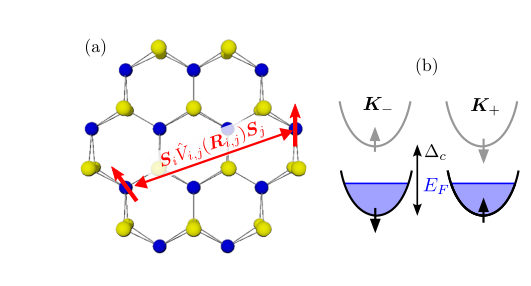
<figcaption class="paper-figure-caption"><b>Fig 1.</b> FIG. 1. (a) RKKY exchange interaction between two mag- netic impurities (red arrows) on top of a TMD ML (yellow and blue spheres). (b) Spin-valley locking regime for the con- duction electrons in the TMD ML: the electrons occupy the two lower spin subbands in the K+ and K−valleys of the conduction band.</figcaption>
</figure>
<figure class="paper-figure-card">
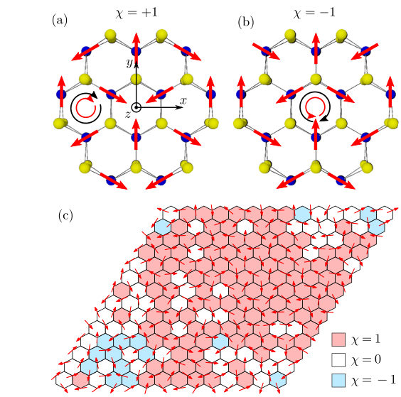
<figcaption class="paper-figure-caption"><b>Fig 2.</b> FIG. 2. (a) Chiral 120◦antiferromagnetic N´eel state with positive chirality χ = +1. (b) The same state with negative chirality χ = −1. (c) A snapshot taken from a Monte Carlo simulation of magnetic thermodynamics: the red, white and blue hexagons have chiralities χn = +1, 0, and −1, respec- tively.</figcaption>
</figure>
<figure class="paper-figure-card">
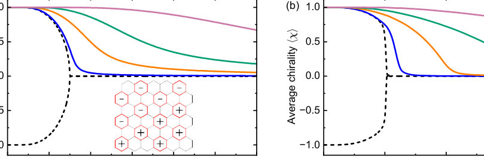
<figcaption class="paper-figure-caption"><b>Fig 3.</b> FIG. 3. Temperature dependence of the average chirality for the different strengths of the RKKY interaction specified in the legend in (b). The black dashed lines show the two equivalent chiral phases in the absence of the RKKY interaction, ˜V = 0. (a) Mean field approach of Eqs. (9) and (10). The inset shows a domain wall between different chiralities used for the derivation of the mean field theory. (b) Monte Carlo simulations for kF a0 = 0.1 (and L2 = 272 atoms).</figcaption>
</figure>
<figure class="paper-figure-card">
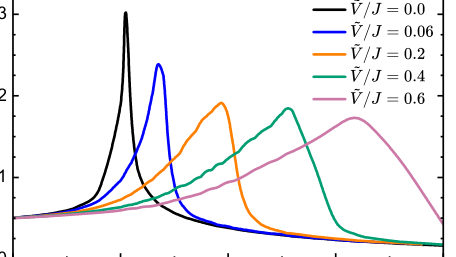
<figcaption class="paper-figure-caption"><b>Fig 4.</b> FIG. 4. Heat capacity per atom calculated within the Monte Carlo simulations for different values of the RKKY interaction for the same parameters as in Fig. 3(b).</figcaption>
</figure>
<figure class="paper-figure-card">
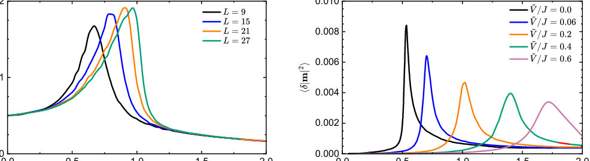
<figcaption class="paper-figure-caption"><b>Fig 5.</b> FIG. 5. (a) Heat capacity per atom calculated within the Monte Carlo simulations for different cluster sizes specified in the legend for ˜V /J = 0.1 and kF a0 = 0.1. (b) Variance of the magnetization magnitude ⟨δ|m|2⟩calculated for the same parameters as in Fig. 4.</figcaption>
</figure>

**Summary.** This work investigates how the Ruderman-Kittel-Kasuya-Yosida (RKKY) interaction, mediated by valley degrees of freedom in TMD monolayers, controls chiral magnetism. Using theoretical modeling and simulations, the authors show that this interaction fundamentally alters the magnetic phase diagram, stabilizing a unique chirality state while shifting the characteristic spin transition temperature.

**Why it may be interesting.** The coupling between valley physics, long-range interactions (RKKY), and magnetic ordering provides a rich platform for studying emergent quantum phases beyond simple Heisenberg models, relevant to correlated electron systems.

Detailed structure

**Main problem.** To use the RKKY interaction mediated by valley degree of freedom in TMD monolayers to create and control chiral magnetic textures, exploring non-universal phase transitions.

**Main result.** The chiral RKKY interaction reshapes the phase diagram by suppressing the chirality-related second-order transition while shifting the Berezinskii–Kosterlitz–Thouless (BKT) spin orientation transition to higher temperatures.

**Method.** Mean field theory and classical Monte Carlo simulations are employed to analyze the system's phase diagram and critical behavior.

**Model / system.** The study focuses on atomically thin TMD monolayers with localized magnetic moments, modeled by a Hamiltonian incorporating RKKY exchange ($H_{	ext{RKKY}}$) and direct exchange ($H_{	ext{dir}}$). The physics is governed by spin-valley locking in the low-energy electronic structure.

**Key observables.** Average chirality ($\langle\chi
angle$), Berezinskii–Kosterlitz–Thouless (BKT) transition temperature, and specific heat capacity ($c_V(T)$).

**Important parameters / regimes.** RKKY interaction strength ($	ilde{V}$), direct exchange coupling ($J$), and the lattice structure parameters.

**Assumptions / limitations.** The analysis relies on mean-field theory for initial transition estimates, and Monte Carlo simulations are used to refine results, though approximations regarding the RKKY range are noted.

**Figures summary.** Figures illustrate the chiral magnetic state (e.g., $120^\circ$ Néel state), temperature dependence of average chirality showing suppression by RKKY, and heat capacity peaks demonstrating BKT transition shifts.

**Paper structure.** The paper develops the Hamiltonian using second-order perturbation theory for the RKKY interaction in TMDs. It then applies mean field theory to analyze the chiral phase transition ($T_c$) and uses Monte Carlo simulations to study the spin orientation transition (BKT) as a function of RKKY strength.

Abstract

We put forward the Ruderman-Kittel-Kasuya-Yosida (RKKY) interaction in transition metal dichalcogenide monolayers as a tool to create and control a chiral magnetic texture. We show that in the spin-valley locking regime, the RKKY interaction acts as a Dzyaloshinskii-Moriya coupling with an effective spin rotation period exactly equal to the tripled lattice constant. Using mean field theory and classical Monte Carlo simulations, we demonstrate that this interaction qualitatively reshapes the phase diagram of atomically thin antiferromagnets. It destroys the chirality-related phase transition by selecting a single chirality value even when the RKKY interaction is small. At the same time, it shifts the Berezinskii-Kosterlitz-Thouless transition associated with spins orientation to higher temperatures. We argue that the valley degree of freedom of electrons mediating the RKKY interaction provides a powerful control knob for exploring non-universal phase transitions and quantum spin liquid states in two-dimensional van der Waals heterostructures.

[↑ back to top](#top)

### [Layer-Hybridized Wigner Crystals in MoSe2/WS2 Moiré Superlattice](http://arxiv.org/abs/2608.01553v1)

**Authors:** Tianyi Ouyang, Yuze Meng, Li Yan, Yuxuan Chen, Shuai Zhang, Xinyue Chen, Melike Erdi, Takashi Taniguchi, Kenji Watanabe, Seth Ariel Tongay, Benjamin Hunt, Ming Xie, Yong-Tao Cui, Su-Fei Shi  
**Type:** experiment · **Category:** strongly correlated electrons · **PDF:** <https://arxiv.org/pdf/2608.01553v1>  
**Analysis basis:** full PDF text, analyzed in chunks
**Topic relevance:** 🔥 `analog quantum simulation` **4/5** · `driven-dissipative phase transition` **2/5** · `correlated cavity matter` **1/5** · `spintronics-quantum-optics interface` **1/5**

↔ Scroll figures horizontally

<figure class="paper-figure-card">
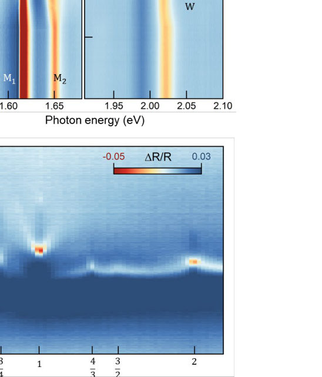
<figcaption class="paper-figure-caption"><b>Fig 1.</b> Fig.1. Doping-dependent reflectance contrast spectra of the MoSe2/WS2 moiré heterobilayer at zero electric field. (a) Schematic of the MoSe2/WS2 heterobilayer device incorporating a WSe2 2s exciton sensing layer. (b) Schematic of the Hubbard-band splitting of the conduction-band minima (CBMs) in MoSe2 and WS2. (c)–(e) Doping-dependent reflectance contrast spectra of MoSe2, WS2 and WSe2 2s sensing in the heterojunction region, respectively. M and W represent intralayer moiré excitons in MoSe2 and WS2, respectively. The sample temperature is maintained at 1.67 K for all measurements shown in this work.</figcaption>
</figure>
<figure class="paper-figure-card">
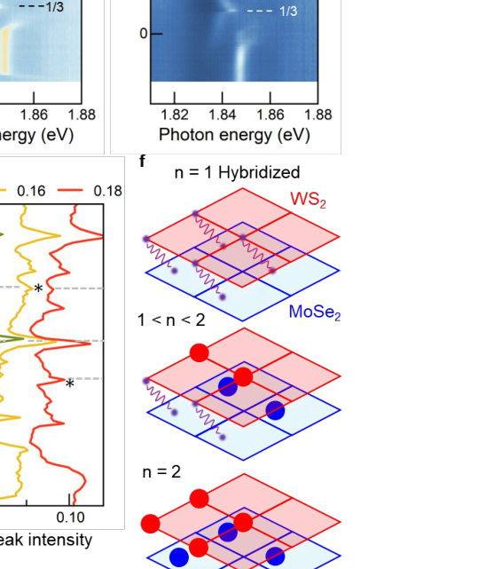
<figcaption class="paper-figure-caption"><b>Fig 2.</b> Fig.3. WSe2 2s sensing of flat-band hybridization in the band-alignment transition regime. (a)–(c) Doping-dependent reflectance contrast spectra of the WSe2 2s sensing exciton measured at electric fields of 0.14, 0.16, and 0.18 V/nm, respectively. (d) Large-range map of the WSe2 2s peak intensity across the band-alignment transition regime. White dashed box denotes the transition regime. (e) Doping-dependent WSe2 2s sensing exciton peak intensity at electric fields of 0.14, 0.16, and 0.18 V/nm. Stars denote the correlated insulating states at n = 2/3 and 3/2. (f) Schematic illustrations of hybridized Mott insulator n = 1 (upper panel), nonhybridized charge-transfer insulator n = 2 (lower...</figcaption>
</figure>
<figure class="paper-figure-card">
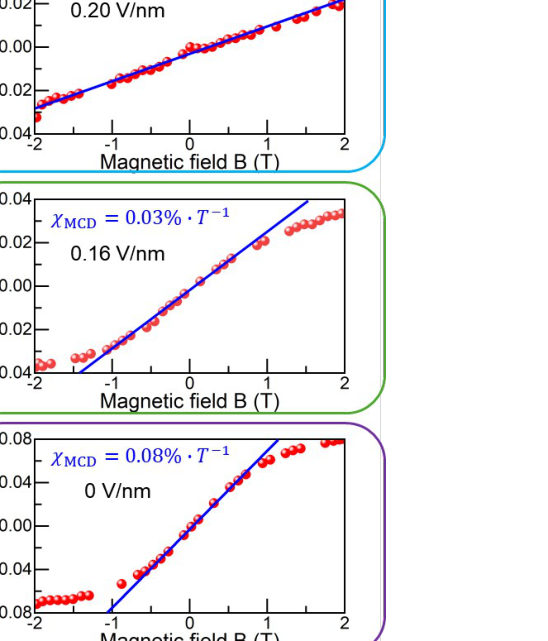
<figcaption class="paper-figure-caption"><b>Fig 3.</b> Fig.4. Magnetic circular dichroism across the band-alignment transition. (a) Electric-field-dependent reflectance contrast spectra of MoSe2 in the junction region at n = 1. The blue, green, and purple solid lines mark representative electric fields in the type-II band-alignment regime, the transition regime, and the type-I band-alignment regime, respectively. (b)-(d) Magnetic- field-dependent MCD measurements at resonant energy of 1.63 eV, corresponding to the blue, green, and purple solid lines in (a), respectively. All blue lines in (b)-(d) are fitted near zero magnetic field.</figcaption>
</figure>

**Summary.** This work demonstrates that MoSe2/WS2 moiré heterobilayers can act as tunable platforms for engineering correlated electronic states like Mott insulators and Wigner crystals. By applying an out-of-plane electric field, researchers control the interlayer hybridization, showing that charge ordering is stabilized differently depending on whether the electron density is below or above one per moiré cell.

**Why it may be interesting.** The ability to electrically tune correlation strength and charge ordering in a solid-state moiré system provides an accessible platform for studying fundamental many-body physics, analogous to tuning parameters in quantum simulation models.

Detailed structure

**Main problem.** The study investigates whether fractional charge-ordered states, such as Generalized Wigner Crystals (GWC), can survive when interlayer hybridization is induced in moiré heterobilayers.

**Main result.** The system exhibits layer-hybridized Mott insulators and GWCs whose stability depends strongly on the electron filling factor ($n$); specifically, strong correlation is favored at fillings above one electron per moiré cell due to Coulomb repulsion overcoming tunneling.

**Method.** The research combines optical characterization (reflectance contrast spectroscopy using Rydberg excitons) with magneto-optical measurements (Magnetic Circular Dichroism, MCD) across varying out-of-plane electric fields.

**Model / system.** The physical system is an H-stacked MoSe2/WS2 moiré heterobilayer. The analysis uses concepts of layer-polarized generalized Wigner crystals and Mott insulators, tunable via an external electric field that controls the band alignment between the two semiconducting layers.

**Key observables.** MCD spectra (sensitive to magnetism), doping-dependent reflectance contrast spectroscopy, hybridization energy ($t$), and charge ordering signatures at fractional fillings.

**Important parameters / regimes.** Filling factor ($n$) relative to unity, out-of-plane electric field strength ($	ext{V/nm}$), and the resulting band alignment regime (Type-I vs. Type-II).

**Assumptions / limitations.** The system can be modeled by considering the competition between interlayer tunneling (kinetic energy) and on-site Coulomb repulsion, which dictates charge localization.

**Figures summary.** Figures detail doping-dependent reflectance contrast spectra showing Hubbard band splitting under varying electric fields, alongside MCD measurements confirming magnetic signatures across different hybridization regimes.

**Paper structure.** The paper systematically maps the electronic state evolution by first characterizing the moiré superlattice structure and then using electric field tuning to transition between different band alignments (Type-I $	o$ Type-II), observing changes in correlated insulating states (Mott/GWC) at varying electron fillings.

Abstract

Transition metal dichalcogenide moiré heterobilayers with type-II band alignment provide a versatile platform for layer-polarized generalized Wigner crystals, in which strong Coulomb interactions drive charge ordering at fractional lattice fillings. With a finite interlayer band offset, an out-of-plane electric field can tune layer-resolved moiré bands through resonance and enable controllable interlayer hybridization. Although hybridized Mott insulators have been previously demonstrated, whether fractional charge-ordered states can survive such hybridization remains elusive. Here we drive an H-stacked MoSe2/WS2 moiré heterobilayer through a type-I-to-type-II band-alignment transition and realize layer-hybridized Mott insulator and generalized Wigner crystals. For fillings below one electron per moiré cell, tunneling delocalizes electrons and modifies Wigner crystallization. However, above one electron per cell, Coulomb repulsion overcomes tunneling and favors layer-separated occupation, stabilizing stronger charge-ordered states. These results establish electrically tunable hybridized moiré heterobilayers as a powerful platform for engineering correlated charge order and exploring fractional Chern phases and emergent magnetism.

[↑ back to top](#top)

### [Time-dependent Berry curvature and quantum metric of Floquet-Bloch states](http://arxiv.org/abs/2608.01096v1)

**Authors:** S. Sajad Dabiri, Reza Asgari  
**Type:** theory · **Category:** other · **PDF:** <https://arxiv.org/pdf/2608.01096v1>  
**Analysis basis:** full PDF text, analyzed in chunks
**Topic relevance:** 🔥 `non-equilibrium dynamics` **4/5** · `analog quantum simulation` **1/5** · `driven-dissipative phase transition` **1/5** · `methods for driven-dissipative` **1/5** · `non-equilibrium universality` **1/5**

↔ Scroll figures horizontally

<figure class="paper-figure-card">
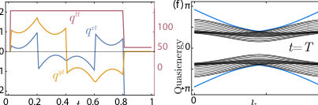
<figcaption class="paper-figure-caption"><b>Fig 1.</b> FIG. 2. (a) Time evolution of the highest phase band extrema (shaded envelope) for the RLBL model. Each gap closing is labeled with its topological charge in a circle; the +1 charge at t = tc signals the appearance of a dynamical edge state. (b) Bulk Floquet quasienergy spectrum of the RLBL model. (c),(e) Time dependence of the integrated quantum metric components qmn = 2π P</figcaption>
</figure>
<figure class="paper-figure-card">
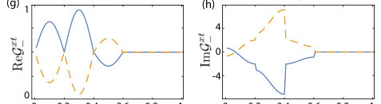
<figcaption class="paper-figure-caption"><b>Fig 2.</b> FIG. 1. (a) Time-dependent minimum and maximum of the highest phase band (shaded region) for the RLBL model. Gap closings occur at t = 0.4T which is a topological singular- ity. The topological charge of each gap closing is shown in a nearby circle. (b) The phase bands at t = T/2. (c) Brillouin- zone-integrated quantum metric components qmn = P</figcaption>
</figure>
<figure class="paper-figure-card">
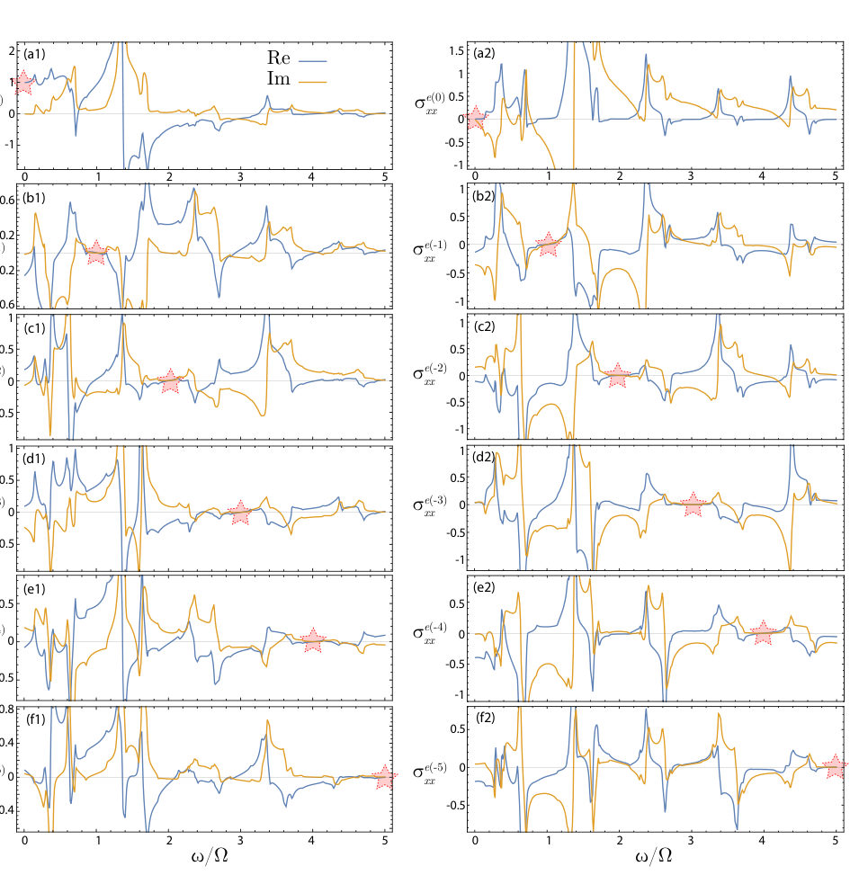
<figcaption class="paper-figure-caption"><b>Fig 3.</b> FIG. 3. (a)–(f) Frequency dependence of the Fourier components σ[1]e(−n) xy and σ[1]e(−n) xx , n = 0, 1, 2, 3, 4, 5 of the optical conductivity for the RLBL model, shown in units of e2/h under the assumption of ideal Floquet-state occupation. The quantized DC value—proportional to the Chern number—and the conductivity zeros mandated by Eqs. (17) and (18) are marked by dashed red stars. The parameters are J = 3π/2, T = 1, δ = 0.5π/T.</figcaption>
</figure>
<figure class="paper-figure-card">
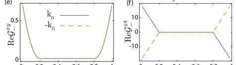
<figcaption class="paper-figure-caption"><b>Fig 4.</b> FIG. 4. (a) Time dependence of the highest phase band extrema (shaded envelope) for the Hsym model. (b) Phase bands at t = T/2 within the first FBZ. (c) Quantum weight components qmn, where {m, n} ∈{x, y, t} with the scale for qtt given on the right axis. The symmetries of the model en- force qxx = qyy and qxy = qxt = qyt = 0. (d) Nanoribbon phase bands at t = T. The parameters are J = 3π/2, δ = 0, T = 1. (e-f) the nonzero components of quantum geomet- ric tensors Gxy −and Gxt −at two special momenta k = −k0 and k = k0 = (0.1, 0.2). Parameters: J = 5π/2, T = 1, δ = π/2.</figcaption>
</figure>

**Summary.** This paper develops a unified theoretical framework using the time-dependent quantum geometric tensor to characterize periodically driven quantum systems. It extends concepts like Berry curvature to the time domain, deriving sum rules that link these geometric quantities directly to measurable optical responses. The findings establish this tensor as a key diagnostic tool for understanding topological and dynamical effects in Floquet matter.

**Why it may be interesting.** This work provides powerful diagnostic tools (the time-dependent quantum geometric tensor) for understanding how topological and geometric properties manifest in driven quantum matter, which is highly relevant to open quantum systems and Floquet engineering.

Detailed structure

**Main problem.** The primary goal is extending the concept of quantum geometry (Berry curvature and quantum metric) from static Bloch bands to periodically driven Floquet systems.

**Main result.** The authors establish a time-dependent quantum geometric tensor as a unified framework describing geometric, topological, and dynamical properties in these driven systems. They show that first-order DC Hall and longitudinal responses vanish under ideal band occupations.

**Method.** The methodology involves defining time-dependent geometric tensors in the Floquet-Bloch basis, deriving optical sum rules relating Fourier components of these tensors to measurable conductivity, and performing detailed symmetry analyses.

**Model / system.** The study focuses on two-dimensional (2D) quantum systems subjected to a time-periodic Hamiltonian, analyzed using Floquet theory. Specific models include the Rudner-Lindner-Berg-Levin (RLBL) model and fully symmetric Floquet Hamiltonians.

**Key observables.** Time-dependent Berry curvature ($\Omega_{xy}(t)$), quantum metric ($g_{xy}(t)$), optical conductivity $\sigma(\omega)$, and quantized charge pumping currents.

**Important parameters / regimes.** Periodicity $T$, quasienergy bands, harmonic frequencies $n\Omega$, and the assumption of ideal Floquet-band occupations.

**Assumptions / limitations.** The analysis heavily relies on assuming ideal occupation (bands fully filled or empty) to derive zero DC response sum rules. It also assumes orthogonality for the Floquet states.

**Figures summary.** Figures illustrate time dependence of phase band extrema, components of geometric tensors ($G_{xy}^-, G_{xt}^-$), and confirm analytical predictions regarding conductivity zeros and sum rules.

**Paper structure.** The paper builds from defining the time-dependent quantum geometric tensor in Floquet systems to deriving optical sum rules. It then explores non-adiabatic charge pumping via mixed Berry curvature, followed by a comprehensive symmetry analysis constraining the tensor components.

Abstract

The quantum geometry of Bloch bands, characterized by the Berry curvature and the quantum metric, underpins a wide range of linear and nonlinear responses in static systems. Here, we extend this framework to periodically driven (Floquet) systems by introducing a time-dependent Berry curvature and quantum metric defined directly in the Floquet-Bloch basis. We derive optical sum rules that relate the Fourier components of these geometric quantities to the optical conductivity and demonstrate that, under ideal Floquet-band occupations, the first-order DC Hall and longitudinal responses at harmonic frequencies vanish identically. We further introduce a mixed Berry curvature involving time and momentum derivatives, which gives rise to a non-adiabatic quantized charge-pumping mechanism that occurs naturally during each driving period without requiring adiabatic evolution. In addition, we identify the time-domain quantum metric as a measure of the energy fluctuations of a Floquet band and interpret its mixed components as quantifying polarization-energy correlations. A comprehensive symmetry analysis reveals how time-reversal, sublattice (chiral), particle-hole, inversion, rotational, and reflection symmetries constrain the time-dependent quantum geometric tensor and its associated topological invariant. Numerical simulations of the Rudner-Lindner-Berg-Levin model and a fully symmetric Floquet model confirm the analytical predictions. These results establish the time-dependent quantum geometric tensor as a unified framework for describing the geometric, topological, and dynamical properties of periodically driven quantum systems, with direct implications for optical spectroscopy, quantum transport, and topological charge-pumping experiments.

[↑ back to top](#top)

### [Hyperbolic-Tangent Shocks in a Lossy Nonlinear Transmission Line](http://arxiv.org/abs/2608.00723v1)

**Authors:** Eugene Kogan  
**Type:** theory · **Category:** other · **PDF:** <https://arxiv.org/pdf/2608.00723v1>  
**Analysis basis:** full PDF text, analyzed in chunks
**Topic relevance:** `driven-dissipative phase transition` **3/5** · `methods for driven-dissipative` **3/5** · `non-equilibrium dynamics` **3/5** · `non-equilibrium universality` **3/5** · `Frenkel-Kontorova` **2/5** · `Keldysh / 2PI / non-Gaussian methods` **2/5** · `analog quantum simulation` **2/5** · `correlated / nonlocal dissipation` **2/5** · `Kondo & dissipative impurity` **1/5** · `entanglement & information structure` **1/5** · `exotic spin models in light-matter` **1/5** · `scars & prethermalization` **1/5**

↔ Scroll figures horizontally

<figure class="paper-figure-card">
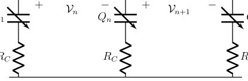
<figcaption class="paper-figure-caption"><b>Fig 1.</b> FIG. 1. Unit cells of the lossy nonlinear transmission line.</figcaption>
</figure>
<figure class="paper-figure-card">

<figcaption class="paper-figure-caption"><b>Fig 2.</b> FIG. 2. Comparison of the exact normalized force eF(v) (solid line) and the approximate normalized force eFG(v) obtained from the least-squares approximation (dashed line), for m = 2 and w = 1.2.</figcaption>
</figure>
<figure class="paper-figure-card">
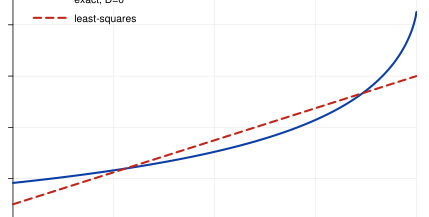
<figcaption class="paper-figure-caption"><b>Fig 3.</b> FIG. 3. Comparison of the exact normalized force eF(v) (solid line) and the approximate normalized force eFG(v) obtained from the least-squares approximation (dashed line), for m = 2 and w = 10.</figcaption>
</figure>
<figure class="paper-figure-card">
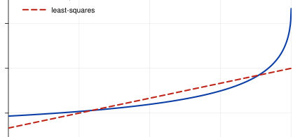
<figcaption class="paper-figure-caption"><b>Fig 4.</b> FIG. 5. Comparison of the exact normalized force eF(v) (solid line) and the approximate normalized force eFG(v) obtained from the least-squares approximation (dashed line), for m = 1.5 and w = 3.</figcaption>
</figure>
<figure class="paper-figure-card">
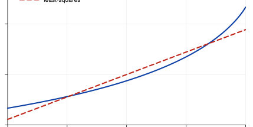
<figcaption class="paper-figure-caption"><b>Fig 5.</b> FIG. 4. Comparison of the exact normalized force eF(v) (solid line) and the approximate normalized force eFG(v) obtained from the least-squares approximation (dashed line), for m = 3 and w = 0.8.</figcaption>
</figure>

**Summary.** This paper investigates traveling shock fronts in a lossy nonlinear transmission line by solving an inverse problem for the required voltage-charge relation. The authors derive both exact and approximate solutions, demonstrating that physical constraints select a shock front. The work rigorously distinguishes between shocks and kinks using characteristic analysis of the underlying partial differential equations.

**Why it may be interesting.** While not directly quantum mechanical, the mathematical techniques used—solving nonlinear PDEs, inverse problem formulation, and analyzing wave front structures (shocks/kinks)—are highly relevant to understanding non-equilibrium dynamics in open quantum systems or classical field theories derived from quantum models.

Detailed structure

**Main problem.** The paper solves an inverse problem to determine the voltage-charge relation required for a specific hyperbolic-tangent traveling front profile in a lossy nonlinear transmission line.

**Main result.** Both exact and approximate constructions confirm that physical admissibility selects a shock front, and the results show asymptotic agreement up to order m^-2 in the broad-front limit.

**Method.** The authors employed an inverse problem approach by prescribing the $	anh$ profile, alongside constructing an approximation assuming a cubic voltage-charge relation and using characteristic analysis on the underlying PDEs.

**Model / system.** The system is a lossy nonlinear transmission line modeled by coupled partial differential equations. The dynamics are reduced to an ODE for traveling waves, characterized by nonlinearity and damping terms.

**Key observables.** Normalized force $eF(v)$, the distinction between compressive shocks (Lax-type) and noncompressive kinks via characteristic analysis, and the voltage-charge relation expressed using the Gauss hypergeometric function.

**Important parameters / regimes.** Dimensionless width parameter ($m$), dimensionless squared wave speed ($w$), and the front velocity $U$.

**Assumptions / limitations.** The exact solution is found by prescribing a $	anh$ profile. The approximation assumes a cubic voltage-charge relation, and the analysis relies on continuum approximations of discrete unit cells.

**Figures summary.** Figures compare the exact normalized force $eF(v)$ with the least-squares approximation $e_{FG}(v)$ across various parameters ($m$ and $w$), illustrating asymptotic agreement.

**Paper structure.** The paper proceeds by setting up the PDE model, solving the inverse problem exactly to find the required voltage-charge relation (involving ${}_2F_1$), developing an approximate solution via cubic fitting, and finally using characteristic analysis to rigorously distinguish between shock and kink solutions.

Abstract

We investigate traveling fronts in a lossy nonlinear transmission line. By prescribing a hyperbolic-tangent profile with dimensionless width $m$, we solve the inverse problem of determining the voltage--charge relation for which this profile is an exact solution. The exact relation is expressed in terms of the Gauss hypergeometric function. We also construct an approximate solution by assuming a cubic voltage--charge relation and replacing the resulting quadratic damping function with its optimal linear least-squares approximation. This construction determines the cubic coefficients and yields a modified governing equation that admits the prescribed profile as an exact solution. In both constructions, physical admissibility selects a shock front. In the broad-front limit, the approximate normalized force agrees with the exact result through order $m^{-2}$; numerical comparisons show that the agreement remains good even outside the asymptotic region of large $m$. Finally, a characteristic analysis of the original partial differential equations distinguishes compressive shocks from noncompressive kinks without recourse to the mechanical analogy.

[↑ back to top](#top)

### [Emission dynamics in zincblende InAsxP1-x quantum dots in InP nanowires: influence of quantum dot size, composition and nanowire geometry](http://arxiv.org/abs/2608.02029v1)

**Authors:** Tomasz Gzyl, Giada Bucci, Krzysztof Gawarecki, Elisa García-Tabarés, Anna Musiał, Valentina Zannier, Ylea Vlamidis, Fabio Beltram, Julian V. Montero, Beatriz Galiana, Lucia Sorba, Wojciech Rudno-Rudziński, Grzegorz Sęk  
**Type:** both · **Category:** other · **PDF:** <https://arxiv.org/pdf/2608.02029v1>  
**Analysis basis:** full PDF text, analyzed in chunks
**Topic relevance:** `correlated / nonlocal dissipation` **3/5** · `interference shaping light` **3/5** · `Tavis-Cummings & cavity-many-emitter` **2/5** · `correlated cavity matter` **2/5** · `driven-dissipative phase transition` **2/5** · `methods for driven-dissipative` **2/5** · `Keldysh / 2PI / non-Gaussian methods` **1/5** · `Kondo & dissipative impurity` **1/5** · `analog quantum simulation` **1/5** · `non-equilibrium dynamics` **1/5** · `quantum optics experiment` **1/5**

↔ Scroll figures horizontally

<figure class="paper-figure-card">
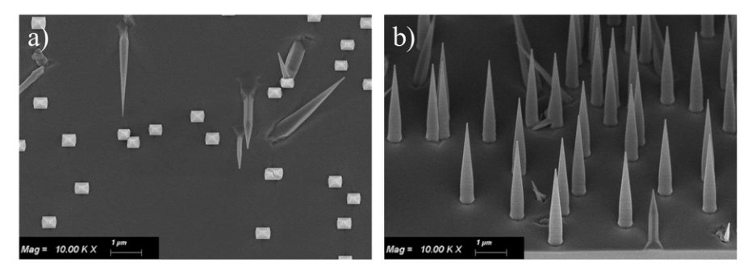
<figcaption class="paper-figure-caption"><b>Fig 1.</b> Fig. 1. SEM images of ZB QD-NWs of sample C from the top view (a) and from 45° tilted</figcaption>
</figure>
<figure class="paper-figure-card">
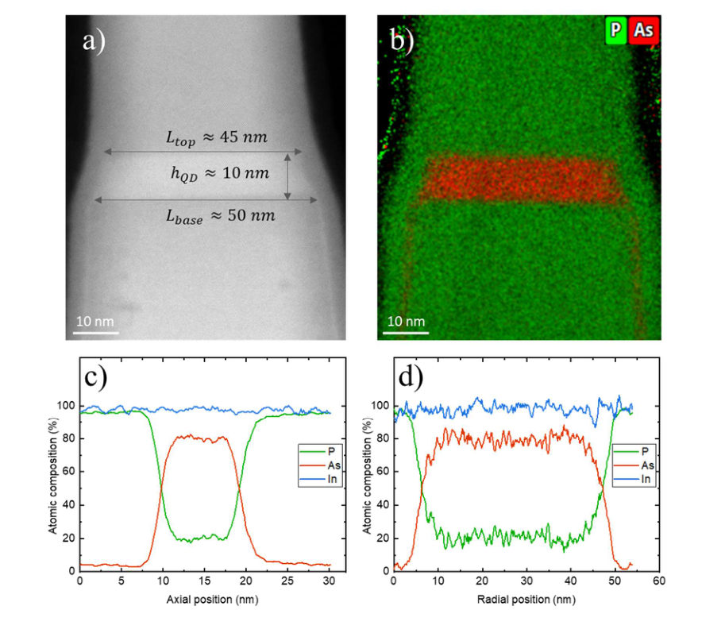
<figcaption class="paper-figure-caption"><b>Fig 2.</b> Fig.2 HRSTEM image of the QD with determined dimensions (a) EDS map of the same NW QD (b) As, P and In atomic distribution as a function of the QD height (axial direction)</figcaption>
</figure>
<figure class="paper-figure-card">
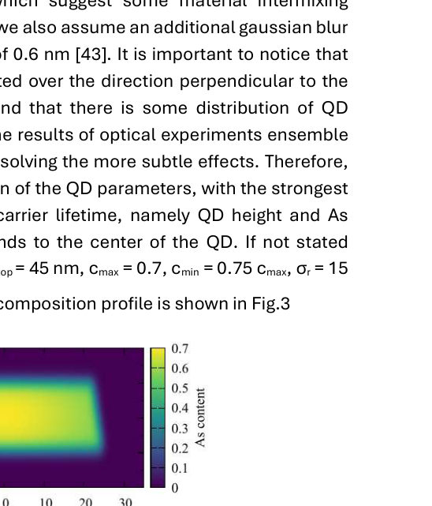
<figcaption class="paper-figure-caption"><b>Fig 3.</b> Fig. 3. Composition profile of InAsxP1-x QD in InP NW with As content colour- coded adapted in the calculation of strain and further in numerical 8 band k.p</figcaption>
</figure>
<figure class="paper-figure-card">
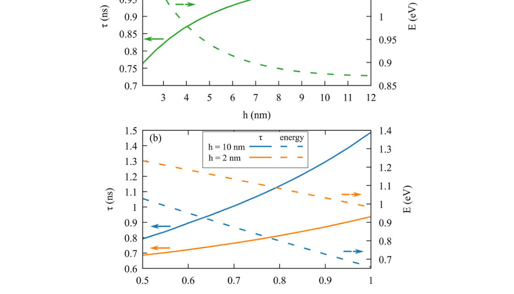
<figcaption class="paper-figure-caption"><b>Fig 4.</b> Fig. 4. The lifetimes (solid lines, the scale on the left) and the energies (dashed lines, the</figcaption>
</figure>
<figure class="paper-figure-card">
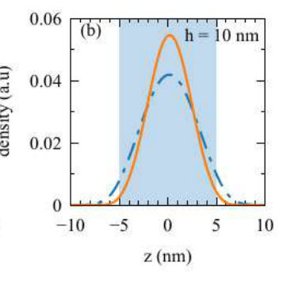
<figcaption class="paper-figure-caption"><b>Fig 5.</b> Fig. 5. The electron and hole probability density (the ground states) in the growth direction for h = 2 nm (a) and h = 10 nm (b) with shaded region marking the QD size.</figcaption>
</figure>

**Summary.** This research experimentally and theoretically examines exciton emission dynamics in semiconductor QDs embedded in NWs. By combining time-resolved photoluminescence with advanced simulations, the authors quantify how QD size, composition, and the surrounding waveguide structure modulate the radiative lifetime via the Purcell effect. This provides critical guidelines for engineering solid-state quantum light sources for telecom applications.

**Why it may be interesting.** This work directly addresses open quantum systems by quantifying how engineered photonic environments (waveguides) modify fundamental quantum decay rates, a key concept in solid-state quantum emitters for quantum information.

Detailed structure

**Main problem.** The study investigates how quantum dot (QD) emission dynamics, specifically exciton lifetime, are influenced by the QD size, composition, and the surrounding nanowire (NW) geometry.

**Main result.** The radiative lifetime is strongly dependent on the photonic environment; thin NW shells can cause significant spontaneous emission inhibition via the Purcell effect, while structural changes influence the intrinsic QD potential.

**Method.** A combination of time-resolved photoluminescence measurements and advanced theoretical modeling, including 8-band k.p calculations, configuration-interaction models, and FDTD simulations for optical confinement, was employed.

**Model / system.** The system involves zincblende InAsxP1-x QDs embedded within InP nanowires grown via CBE. The analysis considers the interplay between material properties (composition/size) and the photonic environment provided by the NW waveguide structure.

**Key observables.** Exciton lifetime ($	au$), Purcell factor ($F_P$), emission wavelength, and spectral dependence of these quantities.

**Important parameters / regimes.** QD composition ($x$), QD height, InP shell thickness (e.g., 55 nm vs 150 nm), and the resulting optical confinement modes ($	ext{HE}_{11}$).

**Assumptions / limitations.** The analysis requires considering both changes in the intrinsic QD potential and the external photonic environment (Purcell effect) for a full understanding.

**Figures summary.** Figures illustrate PL spectra, measured decay times across different sample geometries (A, B, C), and calculated Purcell factors ($F_p$) as a function of emission wavelength.

**Paper structure.** The paper follows an experimental/theoretical cycle: structural characterization ($	ext{STEM}$/$	ext{EDS}$) informs the theoretical models ($\mathbf{k}\cdot\mathbf{p}$, CI) which are then used to interpret time-resolved PL measurements across varying NW geometries and QD parameters.

Abstract

Hereby, we present an experimental and theoretical investigation of emission dynamics in zincblende InAsxP1-x quantum dots (QDs) embedded in InP nanowires (NWs) grown via vapour-liquid-solid mechanism by chemical beam epitaxy, using Au nanoparticles as a nucleation catalyst. By measuring time-resolved photoluminescence from an ensemble of QD-NWs it was possible to determine the exciton lifetime dependence on QD composition and height. Changes in the InP shell thickness surrounding the InP NW stem with a QD, brought additional insight into the influence of photonic environment on the carrier dynamics. High-resolution transmission electron microscopy, combined with energy-dispersive X-ray spectroscopy, provided actual structural parameters. The experimentally obtained lifetimes were interpreted in the light of results of 8 band kp calculations combined with configuration-interaction model to take into account the Coulomb interactions and finite-difference time domain photonic simulations to include the effect of optical confinement. The full understanding of the experimental results required considering both, the changes in the QD potential and the Purcell effect, the latter leading to spontaneous emission inhibition in the case of NWs with thin InP shell.

[↑ back to top](#top)

### [Planar Interfaces for Transmission of Chiral Spin Textures](http://arxiv.org/abs/2608.00388v1)

**Authors:** Robin Msiska, Cynthia J. O. Reichhardt, Charles Reichhardt, Eric Fullerton, Avadh Saxena  
**Type:** theory · **Category:** other · **PDF:** <https://arxiv.org/pdf/2608.00388v1>  
**Analysis basis:** full PDF text, analyzed in chunks
**Topic relevance:** `exotic spin models in light-matter` **3/5** · `non-equilibrium dynamics` **3/5** · `spintronics-quantum-optics interface` **3/5** · `driven-dissipative phase transition` **2/5** · `methods for driven-dissipative` **2/5** · `non-equilibrium universality` **2/5** · `Frenkel-Kontorova` **1/5** · `Keldysh / 2PI / non-Gaussian methods` **1/5** · `analog quantum simulation` **1/5** · `correlated / nonlocal dissipation` **1/5**

↔ Scroll figures horizontally

<figure class="paper-figure-card">
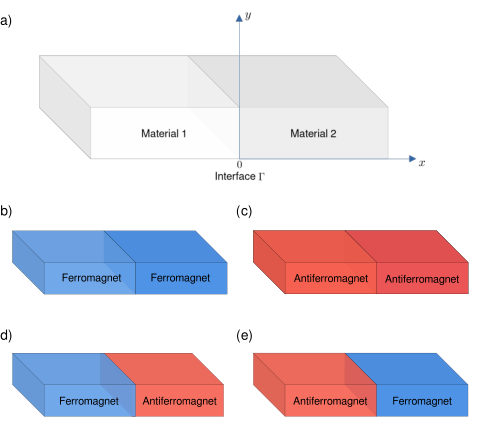
<figcaption class="paper-figure-caption"><b>Fig 1.</b> FIG. 1. Planar interface geometries considered in this work. (a) General source–receiving geometry, with a skyrmion driven from material 1 on the left toward an interface Γ separating two magnetic media, and material 2 on the right taken as the receiving region. (b)–(e) Block representations of the four interface classes, with attached colored regions indicating the two media on either side of the interface. Blue denotes a ferromagnetic region and red denotes an antiferromagnetic region. (b) FM–FM interface, where the magnetic order type is ferromagnetic on both sides. (c) AFM–AFM interface, where the magnetic order type is antiferromagnetic on both sides. (d) FM–AFM interface, where a...</figcaption>
</figure>
<figure class="paper-figure-card">
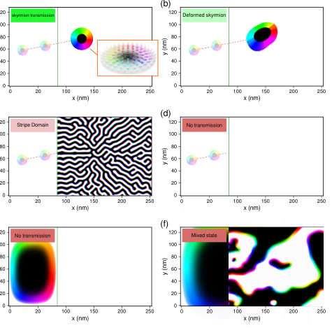
<figcaption class="paper-figure-caption"><b>Fig 2.</b> FIG. 2. Representative transmission outcomes, shown us- ing an FM–FM interface as an illustrative example, for the morphological classes used in the phase diagrams. Transpar- ent skyrmions indicate earlier positions along the trajectory indicated by the faded red dashed line, while solid textures show the current or final outcome after interaction with the interface. (a) Compact skyrmion transmission, in which the incident texture crosses the interface and reforms as a localized skyrmion in the receiving region. The inset in panel (a) shows the spin texture of an isolated skyrmion: the colored arrows represent the local orientation of the magnetic moments, with white and black denoting...</figcaption>
</figure>
<figure class="paper-figure-card">
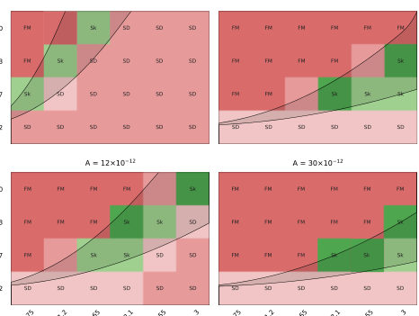
<figcaption class="paper-figure-caption"><b>Fig 3.</b> FIG. 3. FM–FM interface phase diagrams showing the structures formed in the variable right-hand region after a skyrmion is driven into it from the fixed left-hand region. Each panel shows the simulated right-region outcome as a function of the right-region DMI strength D and uniaxial anisotropy Ku at a fixed right-region exchange stiffness A. All panels correspond to a driving-current magnitude of |j| = 9 × 1012Am−2. The left-hand material parameters are held at A = 1.5 × 10−12Jm−1, D = 3.0 × 10−3Jm−2, and Ku = 8.0 × 105Jm−3. The categorical color scale groups the outcomes into background, stripe-domain, and skyrmion-like morphologies. Points labelled “FM” denote relaxation to the FM...</figcaption>
</figure>
<figure class="paper-figure-card">
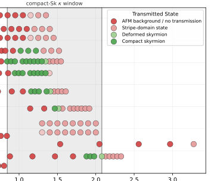
<figcaption class="paper-figure-caption"><b>Fig 4.</b> FIG. 4. Reduced-coordinate summary of the AFM–AFM interface simulations. Each point corresponds to one receiving- side material parameter set after the outcomes obtained over the sampled drives have been combined, and is plotted us- ing the wall-width scale ∆defined in Equation (25) and the reduced DMI fraction κ defined in Equation (28). Color dis- tinguishes relaxation into the AFM background or failure to transmit, stripe-domain formation, deformed-skyrmion trans- mission, and compact-skyrmion transmission. The shaded vertical band spans the range of κ over which deformed or compact skyrmion reception is observed.</figcaption>
</figure>
<figure class="paper-figure-card">
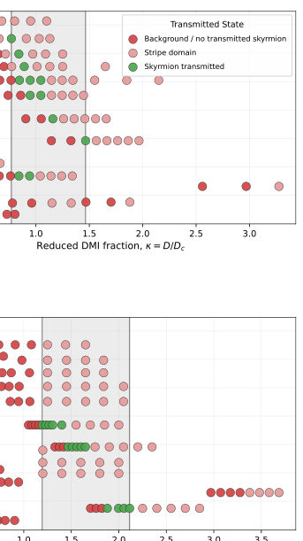
<figcaption class="paper-figure-caption"><b>Fig 5.</b> FIG. 5. Reduced-coordinate comparison of mixed-order skyrmion transmission for (a) AFM–FM and (b) FM–AFM interfaces. Each point represents one receiving-side material parameter set after combining the outcomes obtained over the sampled drive values, and is plotted using the wall-width scale ∆defined in Equation (25) and the reduced DMI fraction κ defined in Equation (28). Color distinguishes relaxation into the background or failure to transmit, stripe-domain formation, and skyrmion transmission. The shaded bands span the values of κ associated with skyrmion transmission in each geometry. The different distributions in panels (a) and (b) demonstrate that AFM–FM and FM–AFM transmission are...</figcaption>
</figure>

**Summary.** This paper analyzes the transmission of magnetic skyrmions across various planar interfaces (e.g., FM/AFM). Using micromagnetic simulations, the authors demonstrate that these interfaces function as active transport elements whose behavior is dictated by the specific magnetic order change. The results provide reduced design criteria for engineering functional spintronic devices.

**Why it may be interesting.** While focused on magnetism, the concept of 'active transport' across engineered boundaries, governed by local field equations and energy minimization principles, shares conceptual links with open quantum systems dynamics where boundary conditions dictate system evolution.

Detailed structure

**Main problem.** The study investigates how chiral spin textures, specifically skyrmions, maintain their structural integrity when driven across abrupt material interfaces with varying magnetic order.

**Main result.** Planar interfaces act as active transport elements, and the transmission outcome (e.g., compact vs. deformed) depends critically on the interface type (FM-FM, FM-AFM, etc.) and underlying material parameters.

**Method.** The research employs continuum micromagnetic simulations combined with analytic reduced-coordinate criteria to map out phase diagrams for skyrmion transmission.

**Model / system.** The system is an ultrathin film modeled by the Landau–Lifshitz–Gilbert equation, considering four types of planar interfaces (FM-FM, AFM-AFM, FM-AFM, AFM-FM). The energy functional includes bulk terms and explicit interface coupling energies.

**Key observables.** Skyrmion transmission outcome classified as compact transmission, deformed skyrmions, stripe-domain states, amorphous textures, or relaxation into the background.

**Important parameters / regimes.** Reduced Dzyaloshinskii-Moriya interaction (DMI), effective anisotropy, and dimensionless chirality ratios ($\kappa$).

**Assumptions / limitations.** The material parameters are assumed to be piecewise constant across the interface; the model uses micromagnetic approximations for texture dynamics.

**Figures summary.** Figure 1 illustrates the general source-receiving geometry and provides block representations for the four studied planar interface classes.

**Paper structure.** The paper systematically develops the governing equations (LLG, energy functional) for different interface types, derives specific boundary conditions at the interface ($\Gamma$), analyzes the resulting phase diagrams using reduced parameters, and concludes by classifying interfaces as active transport elements.

Abstract

Lateral magnetic interfaces provide a direct way to test whether skyrmions remain robust when driven across abrupt changes in material parameters and magnetic order. Here we study skyrmion transmission across planar ferromagnet-ferromagnet (FM-FM), antiferromagnet-antiferromagnet (AFM-AFM), ferromagnet-antiferromagnet (FM-AFM), and antiferromagnet-ferromagnet (AFM-FM) interfaces using micromagnetic simulations and analytic reduced-coordinate criteria. The outcomes are organized into phase diagrams according to the morphology formed in the receiving region, distinguishing compact transmission from deformed skyrmions, stripe-domain states, amorphous textures, and relaxation into the background. Same-order FM-FM and AFM-AFM skyrmion transmission is captured by an analytically defined range of the reduced Dzyaloshinskii-Moriya interaction, identifying the wall-softening regime that supports compact transmission without stripe formation. Mixed-order FM-AFM and AFM-FM interfaces are directionally distinct, requiring conversion between ferromagnetic magnetization and antiferromagnetic Néel textures. These results show that planar interfaces act as active transport elements and provide reduced design criteria for heterogeneous skyrmion tracks.

[↑ back to top](#top)

### [Wannier-Stark localization, confinement and edge states](http://arxiv.org/abs/2608.01902v1)

**Authors:** N. Aucar Boidi, A. Aharony, O. Entin-Wohlman, C. Proetto  
**Type:** theory · **Category:** other · **PDF:** <https://arxiv.org/pdf/2608.01902v1>  
**Analysis basis:** full PDF text, analyzed in chunks
**Topic relevance:** `analog quantum simulation` **3/5** · `driven-dissipative phase transition` **3/5** · `methods for driven-dissipative` **3/5** · `non-equilibrium dynamics` **3/5** · `Frenkel-Kontorova` **2/5** · `non-equilibrium universality` **2/5** · `Keldysh / 2PI / non-Gaussian methods` **1/5** · `Kondo & dissipative impurity` **1/5** · `scars & prethermalization` **1/5**

↔ Scroll figures horizontally

<figure class="paper-figure-card">
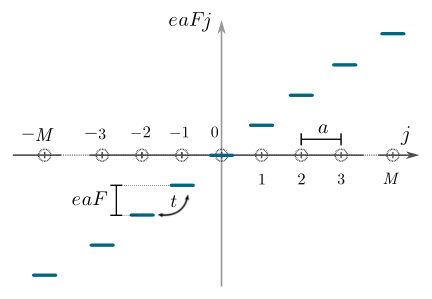
<figcaption class="paper-figure-caption"><b>Fig 1.</b> FIG. 1. A sketch of the one-dimensional lattice, represented by the dotted circles along the horizontal axis, with an odd number of sites placed in a linear potential µ j = eaF j. Each step indicates the energy of the corresponding site due to the presence of the potential which vanishes at the central site of the chain j = 0. Electrons can hop between neighboring sites with energy t.</figcaption>
</figure>
<figure class="paper-figure-card">
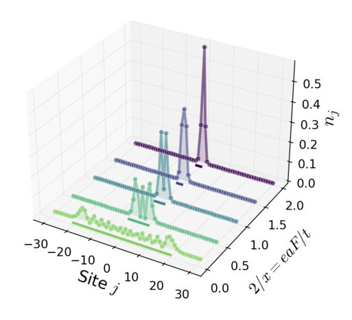
<figcaption class="paper-figure-caption"><b>Fig 2.</b> FIG. 2. (Color online) Probability nj = Jj(x)2 of finding a single electron in the Wannier-Stark eigenstate ℓ= 0, as a function of site index j, for several values of the electric fields F, in units of t/(ea). These states are localized around the cite j = 0. The full lines connect the actual values, which are calculated only for integer j. The straight segments signal the value of the localization length 2ξ = 4t/(eF).</figcaption>
</figure>
<figure class="paper-figure-card">
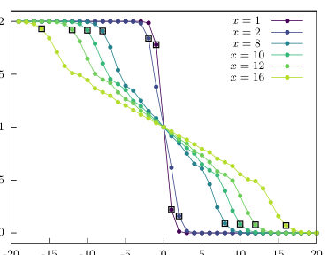
<figcaption class="paper-figure-caption"><b>Fig 3.</b> FIG. 3. (Color online) Occupation number profile for different values of x, Eq. (13). The squares indicate the distance ξ from the origin, see Eq. (9).</figcaption>
</figure>
<figure class="paper-figure-card">
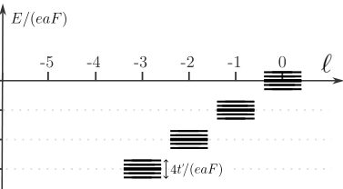
<figcaption class="paper-figure-caption"><b>Fig 4.</b> FIG. 4. The energy levels of the two-dimensional case, with M = 5, N′ = 5, Eq. (16). The horizontal axis denotes the index ℓ, which is also equal to the horizontal site index around which the corre- sponding states are localized, j = ℓ. The thick segments represent the Wannier-Stark ladder. Each of these energies is “dressed&quot; by a band of N′ levels, representing the band of “free&quot; electronic states in the transverse direction. The width of such a band is indicated by the double headed vertical arrow.</figcaption>
</figure>

**Summary.** This paper analyzes electron localization in lattices subjected to an electric field via the Wannier-Stark potential. It mathematically derives that these states are localized (Bessel functions), leading to insulating bulk behavior. By extending the model to 2D, it demonstrates how this confinement can create distinct metallic edge states alongside an insulating interior.

**Why it may be interesting.** This work provides a concrete, solvable model for how external fields can induce topological or boundary phenomena in condensed matter systems, which is highly relevant for understanding engineered quantum materials and interfaces.

Detailed structure

**Main problem.** The paper investigates Wannier-Stark localization, confinement, and the resulting edge states that appear at the boundary between a bulk material and vacuum when subjected to an electric field.

**Main result.** In 1D, the system is always insulating due to localized Wannier-Stark states; however, extending to 2D allows for the construction of models exhibiting both an insulating bulk and potentially metallic edge states.

**Method.** The analysis relies on solving tight-binding Hamiltonians in the presence of a linear potential, leading to eigenfunctions expressible in terms of Bessel functions.

**Model / system.** The model is non-interacting electrons on a 2D lattice subjected to a Wannier-Stark potential generated by an electric field along one axis. The physics transitions from 1D chains (analyzed via recurrence relations) to 2D lattices with transverse tunneling.

**Key observables.** Localization length ($\xi$), electron occupation profile $n(j;x)$, and the energy spectrum showing discrete Wannier-Stark levels coupled to continuous transverse bands.

**Important parameters / regimes.** The dimensionless parameter $x = 2t/(eaF)$ controls the degree of localization, with limits analyzed for large ($x 	o \infty$) and small ($x 	o 0$) electric fields.

**Assumptions / limitations.** Initially assumes non-interacting electrons; later incorporates electron-electron interactions (Hubbard/nearest-neighbor) to study correlated effects near the edge.

**Figures summary.** Figures illustrate the localization of states in 1D, the occupation profile decaying across an edge region at half-filling, and the resulting energy band structure in 2D.

**Paper structure.** The paper progresses from establishing the 1D Wannier-Stark ladder using Bessel functions to analyzing the many-electron filling (insulating bulk) before extending the formalism to a 2D lattice model that reveals metallic edge possibilities.

Abstract

The boundary between a system's bulk and the vacuum can be modeled by a potential which confines the electrons to the bulk. Here we present the example of the Wannier-Stark linear potential, generated by an electric field along one axis of a two-dimensional lattice. Along that axis, the potential generates electronic states which are localized around each lattice site, with eigenenergies which form the Wannier-Stark ladder. In the transverse direction, the states are governed by a tight binding model with free Bloch states. In the ground state, filling these states under the Pauli principle generates an insulating bulk and an edge which can be metallic in the transverse direction. This paper explains the concepts of localization, localization length, filling and confinement. The paper also acquaints the readers with the use of Bessel functions in the solution of a simple physical model. These topics can be easily included in courses on solid state physics, and only require prior knowledge of quantum mechanics.

[↑ back to top](#top)

### [Floquet spin-group framework and its application to light-tailored spin splitting in collinear magnets](http://arxiv.org/abs/2608.02393v1)

**Authors:** Tongshuai Zhu, Zixuan Li, Huaiqiang Wang, Su-Huai Wei, Jiawei Ruan  
**Type:** theory · **Category:** other · **PDF:** <https://arxiv.org/pdf/2608.02393v1>  
**Analysis basis:** full PDF text, analyzed in chunks
**Topic relevance:** `exotic spin models in light-matter` **3/5** · `non-equilibrium dynamics` **3/5** · `spintronics-quantum-optics interface` **3/5** · `analog quantum simulation` **2/5** · `driven-dissipative phase transition` **2/5** · `methods for driven-dissipative` **2/5** · `Keldysh / 2PI / non-Gaussian methods` **1/5** · `non-equilibrium universality` **1/5**

↔ Scroll figures horizontally

<figure class="paper-figure-card">
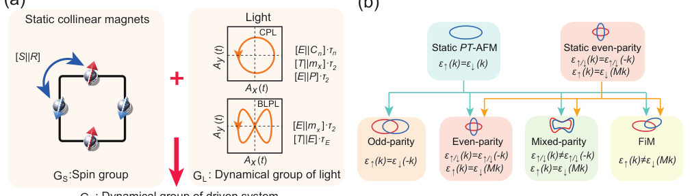
<figcaption class="paper-figure-caption"><b>Fig 1.</b> FIG. 1. Floquet spin splittings and dynamical symmetry in driven collinear magnets. (a) The symmetries of a collinear compensated magnet can be described by spin groups, whereas the symmetries of different light can be characterized by dynamical groups. For circular polarized light (CPL) with vector potential A0(cos ωt, sin ωt, 0), the generators of the dynamical group are [E||Cn]·τn, [T ||mx]·τ2, [E||P]·τ2, and for bilinear polarized light (BLPL) with vector potential A0(sin ωt, sin 2ωt, 0), the generators are [E||mx] · τ2, [T ||E] · τE (see main text for the details). For this specific BLPL, the inversion symmetry is lifted while the time-reversal symmetry is preserved, which is opposite...</figcaption>
</figure>
<figure class="paper-figure-card">
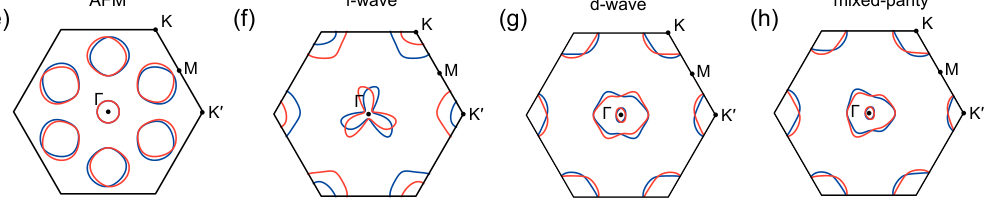
<figcaption class="paper-figure-caption"><b>Fig 2.</b> FIG. 2. Calculations of light-selected spin splitting in two-dimensional materials. (a-d) Calculated Fermi surface of MnPSe3 in the absence of light at EF = −0.3 eV (a), under CPL irradiation at EF = −0.3 eV (b), under BLPL irradiation with α = 0 at EF = −0.35 (c) and under BLPL irradiation with α = π/4 at EF = −0.35 (d). The driving parameters are ℏω = 10 eV and ˜A = 0.35 ˚A−1. (e-h), CCorresponding Fermi surfaces of Mn2P2S3Se3 without light at EF = −0.2 eV(e), under CPL irradiation at EF = −0.335 eV (f), under BLPL irradiation with α = 0 at EF = −0.335 (g) and under BLPL irradiation with α = π/4 at EF = −0.335 eV (h). The driving parameters are ℏω = 10 eV and ˜A = 0.25 ˚A−1.</figcaption>
</figure>
<figure class="paper-figure-card">
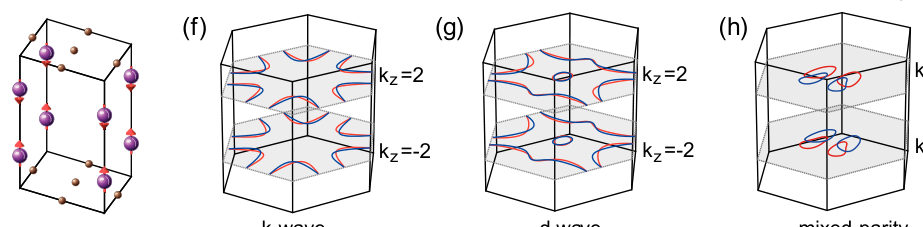
<figcaption class="paper-figure-caption"><b>Fig 3.</b> FIG. 3. Light selected spin splitting in three-dimensional tight-binding models. (a), Lattice model used for the tetragonal model with spin point group14/1m1m1m∞m1. (b-d) Fermi surfaces at EF = 1.2 eV under CPL irradiation (b), under BLPL irradiation with α = 0 (c), and under BLPL irradiation with α = π/4 (d). (e) Lattice model used for the hexagonal model with spin point group 16/1m∞m1. (f-h) Fermi surfaces of the hexagonal model at EF = −2.4 eV under CPL irradiation (f), under BLPL irradiation with α = 0 (g) and under BLPL irradiation with α = π/4 (h). The driving parameters are ℏω = 10 eV and ˜Aa = 2 for both models.</figcaption>
</figure>

**Summary.** This paper introduces a novel Floquet spin-group framework that unifies the study of light-induced spin splitting in collinear magnets. By combining crystal symmetry with the dynamical symmetry of polarized light, the authors provide systematic rules for engineering specific types of electronic band structures. This allows researchers to precisely control magnetic properties by tailoring external optical driving fields.

**Why it may be interesting.** This work provides a powerful theoretical tool—a symmetry classification scheme—to predict and engineer electronic properties in magnetic materials using external electromagnetic fields, which is highly relevant to quantum optics and open quantum systems research.

Detailed structure

**Main problem.** The primary goal is establishing a unified symmetry principle connecting the dynamical symmetry of incident light to the resulting spin-split electronic band structures in magnetic materials.

**Main result.** The authors developed a Floquet spin-group framework that systematically classifies allowed parity and momentum dependence for light-induced spin splittings, enabling the switching between different splitting types (odd, even, mixed) using tailored driving fields.

**Method.** The methodology combines crystal spin point group theory with the dynamical symmetry group of light to define a governing Floquet spin group ($\mathcal{G}_D$). This framework is applied via time-dependent Hamiltonian analysis and quasienergy constraints.

**Model / system.** The study focuses on collinear magnets, particularly altermagnets (AM) and antiferromagnets (AFM), modeled with negligible spin-orbit coupling. The system dynamics are governed by a Floquet Hamiltonian derived from periodic driving by light fields (CPL or BLPL).

**Key observables.** Spin-resolved quasienergy bands, the parity of spin splitting (odd/even/mixed), and higher-order wave splittings ($h$-wave, $k$-wave).

**Important parameters / regimes.** The driving field parameters, such as polarization type (CPL vs. BLPL) and relative phases ($\alpha$), act as crucial tuning knobs.

**Assumptions / limitations.** The framework is initially developed for collinear magnets with negligible spin-orbit coupling, although it claims general applicability.

**Figures summary.** Figures illustrate the generators defining the dynamical light group ($	ilde{G}_L$) and provide schematic classification tables showing how different light symmetries dictate the resulting parity of spin splittings in AMs.

**Paper structure.** The paper introduces the problem by noting the lack of a unified symmetry principle. It then develops the Floquet spin-group framework, applies it to classify various splitting types (2D and 3D), and concludes with specific examples demonstrating how light polarization controls these symmetries.

Abstract

Altermagnets combine momentum-dependent spin splitting with vanishing net magnetization, opening new opportunities for spintronics. Recent studies have shown that periodic driving by linearly or circularly polarized light, as well as by multicolor light fields, can control spin splitting in altermagnets and conventional antiferromagnets, and can even generate spin splitting patterns absent in equilibrium. Despite this progress, a unified principle connecting the dynamical symmetry of light to the symmetry of spin-split bands remains lacking, limiting the systematic design of light-induced spin structures. Here, by combining the spin group of crystals with the dynamical group of light, we establish a unified Floquet spin group framework for the study of periodically driven collinear magnets with negligible spin-orbit coupling. This framework systematically determines the allowed parity, momentum dependence, and nodal structure of spin splitting under different driving protocols. Guided by this symmetry classification, we show that odd-parity, even-parity, and mixed-parity spin splittings can be switched within the same material by tailoring the driving field. We further uncover higher-order $h$-wave and $k$-wave spin splittings in three-dimensional systems. Our work establishes a unified symmetry framework for light-controlled spin splitting and provides general principles for engineering nonequilibrium spin-band structures in altermagnets and related magnetic materials.

[↑ back to top](#top)

### [Tip-Enhanced Vibrational Ladder Climbing in Surface Molecular System](http://arxiv.org/abs/2608.01698v1)

**Authors:** Tatsuto Mochizuki, Shota Takahashi, Atsunori Sakurai, Toshiki Sugimoto  
**Type:** both · **Category:** other · **PDF:** <https://arxiv.org/pdf/2608.01698v1>  
**Analysis basis:** full PDF text, analyzed in chunks
**Topic relevance:** `methods for driven-dissipative` **3/5** · `non-equilibrium dynamics` **3/5** · `non-equilibrium universality` **2/5** · `quantum measurements` **2/5** · `quantum optics experiment` **2/5** · `Keldysh / 2PI / non-Gaussian methods` **1/5** · `correlated / nonlocal dissipation` **1/5** · `driven-dissipative phase transition` **1/5**

↔ Scroll figures horizontally

<figure class="paper-figure-card">
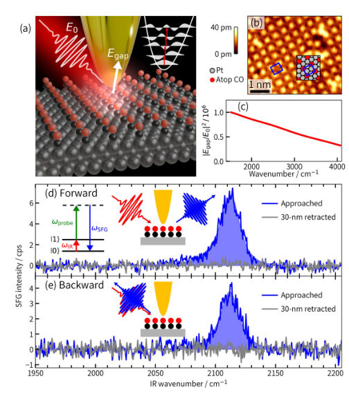
<figcaption class="paper-figure-caption"><b>Fig 1.</b> FIG. 1. (a) Schematic of tip-enhanced VLC. CO on Pt(111) is excited by an IR near field in the tip–substrate nanogap with an electric field component normal to the substrate surface (Egap). (b) STM image of CO/Pt(111) at 0.5 ML coverage acquired in constant-current mode at a sample bias voltage of 0.25 V and a tunneling current of 0.5 nA. The image was pre- processed with the “Stripe Removal” program [23]. The inset is a schematic representation of Pt atoms and CO molecules. The blue rectangles indicate the unit cell of the c( √</figcaption>
</figure>
<figure class="paper-figure-card">
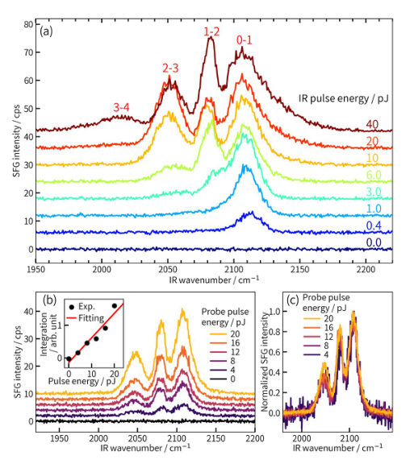
<figcaption class="paper-figure-caption"><b>Fig 2.</b> FIG. 2. (a) IR pulse energy dependence of forward-scattered TE-SFG spectra for CO/Pt(111). The probe pulse energy was maintained at 14 pJ. Backward-scattered spectra are shown in Supplemental Material Sec. S5 [27]. (b, c) Probe pulse energy dependence of TE-SFG spectra with IR pulse energy fixed at 10 pJ. Signal intensities are normalized to the peak intensity (c). The inset in (b) shows the integrated intensity of TE-SFG spectra as a function of the probe pulse energy. The red line is a linear fit to the data.</figcaption>
</figure>
<figure class="paper-figure-card">
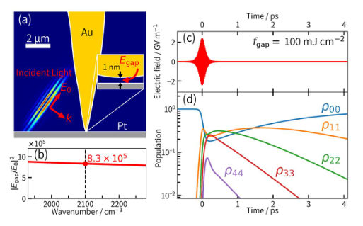
<figcaption class="paper-figure-caption"><b>Fig 3.</b> FIG. 3. (a) FDTD simulation setup for calculating the electric field enhancement in the tip–substrate nanogap. (b) Intensity enhancement factor (|Egap/E0|2) at the center of the nanogap as a function of the incident light wavenumber. The inten- sity enhancement factor is estimated to be 8.3 × 105 near the CO vibrational resonance. (c) Temporal profile of the electric field in the nanogap under irradiation by an incident pulse with fluence fgap = 100 mJ cm−2. (d) Time evolution of pop- ulations of the v = 0−4 states calculated using the multilevel optical Bloch equations when fgap = 100 mJ cm−2.</figcaption>
</figure>
<figure class="paper-figure-card">
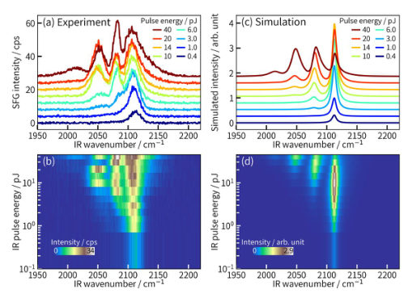
<figcaption class="paper-figure-caption"><b>Fig 4.</b> FIG. 4. Experimental and simulated TE-SFG spectra of CO on Pt(111). (a) Experimental TE-SFG spectra at various IR pulse energies. (b) 2D map of experimental TE-SFG spectra as a function of wavenumber and IR pulse energy. (c) Sim- ulated TE-SFG spectra at various IR pulse energies. (d) 2D map of simulated TE-SFG spectra as a function of wavenum- ber and IR pulse energy. The spectra in panels (a) and (c) are vertically offset for clarity.</figcaption>
</figure>

**Summary.** This paper reports on achieving 'vibrational ladder climbing'—the stepwise excitation to high vibrational states—in CO/Pt(111) using tip-enhanced sum-frequency generation (TE-SFG). By coupling near-field plasmonics with ultrafast spectroscopy, the authors demonstrate a powerful technique for non-equilibrium control over molecular vibrations. This opens a promising pathway for manipulating chemical reactions by precisely controlling vibrational energy at the nanoscale.

**Why it may be interesting.** This work is highly relevant as it pushes the boundaries of quantum control at the nanoscale. Using TE-SFG allows for probing ultrafast, non-equilibrium vibrational dynamics in surface molecules, which is a core topic in AMO physics and quantum optics.

Detailed structure

**Main problem.** The primary goal is to actively control molecular reactions by accessing high-lying vibrational energy states, which are difficult to reach using conventional methods.

**Main result.** The study successfully demonstrated the stepwise population of higher vibrational levels (vibrational ladder climbing) in CO adsorbed on Pt(111) using tip-enhanced sum-frequency generation (TE-SFG).

**Method.** The research combines ultrafast, time-resolved TE-SFG spectroscopy with numerical simulations based on solving the optical Bloch equations.

**Model / system.** The system involves CO molecules adsorbed on a Pt(111) surface, probed within the near-field nanogap of an STM tip. The dynamics are modeled using anharmonic potentials (Morse potential) and solved via the optical Bloch equations.

**Key observables.** Sequential appearance of 'hot-band peaks' corresponding to transitions like $0
ightarrow 1$, $1
ightarrow 2$, up to $3
ightarrow 4$; these hot bands are non-thermal and decay rapidly in time delay ($	au=5 	ext{ ps}$).

**Important parameters / regimes.** The process is highly dependent on the near-field enhancement provided by the plasmonic tip gap, with simulations showing field enhancements up to $10^6$. The accessible vibrational level is limited by the IR excitation bandwidth.

**Assumptions / limitations.** Key assumptions include that the observed hot bands are due to intra-pulse excitation rather than population accumulation over successive pulses. Model limitations include neglecting intermolecular dipole–dipole coupling and instantaneous frequency shifts.

**Figures summary.** Figures illustrate schematics of the TE-SFG setup, show the sequential appearance of multiple resonant peaks as IR pulse energy increases, and compare experimental spectra with simulations based on time evolution calculations.

**Paper structure.** The paper establishes the need for high vibrational state control, details the use of TE-SFG in the STM nanogap to overcome limitations, presents evidence of stepwise population transfer (VLC), validates this using theoretical models (optical Bloch equations), and concludes by discussing the bandwidth limitation on excitation.

Abstract

Achieving high-lying vibrational states is essential for actively controlling molecular reactions. We demonstrate vibrational ladder climbing of CO adsorbed on Pt(111) within the plasmonic tip-substrate nanogap formed in a scanning tunneling microscope, detected via tip-enhanced sum-frequency generation (TE-SFG). As the infrared pulse energy increases, hot-band peaks appear sequentially up to the 3-4 transition, indicating the stepwise population of higher vibrational states. Numerical analysis using the optical Bloch equations captures the observed energy dependence of these features. These results demonstrate the capability of TE-SFG to probe vibrational ladder climbing in surface molecular systems and suggest a promising route toward accessing high-lying vibrational states and controlling vibrational excitation at the nanoscale.

[↑ back to top](#top)

### [Coherent migration of the single excitation injected into finite-length segment of the biomolecular chain](http://arxiv.org/abs/2608.02131v1)

**Authors:** D. Chevizovich, V. Matic, Z. Przulj, S. Galovic  
**Type:** theory · **Category:** other · **PDF:** <https://arxiv.org/pdf/2608.02131v1>  
**Analysis basis:** full PDF text, analyzed in chunks
**Topic relevance:** `non-equilibrium dynamics` **3/5** · `Frenkel-Kontorova` **2/5** · `methods for driven-dissipative` **2/5** · `Keldysh / 2PI / non-Gaussian methods` **1/5** · `Kondo & dissipative impurity` **1/5** · `analog quantum simulation` **1/5** · `correlated / nonlocal dissipation` **1/5** · `driven-dissipative phase transition` **1/5** · `interference shaping light` **1/5** · `non-equilibrium universality` **1/5**

↔ Scroll figures horizontally

<figure class="paper-figure-card">
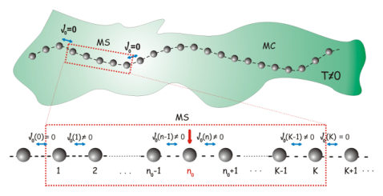
<figcaption class="paper-figure-caption"><b>Fig 1.</b> FIG. 1. Schematic representation of the considered molecular structure. The excitation is initially induced at the SE labeled by n0. The initially excited SE belongs to the MS, which forms part of a long MC.</figcaption>
</figure>
<figure class="paper-figure-card">
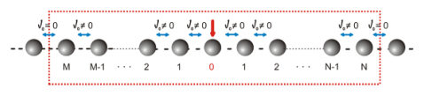
<figcaption class="paper-figure-caption"><b>Fig 2.</b> FIG. 2. A schematic representation of the renumbered MS. The SE where the excitation is initially induced is labeled as 0. On the left side of the zeroth SE, there are M SEs numbered from 1 to M. On the right side, there are N SEs numbered from 1 to N.</figcaption>
</figure>
<figure class="paper-figure-card">
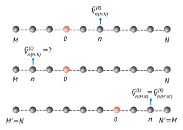
<figcaption class="paper-figure-caption"><b>Fig 3.</b> FIG. 3. A schematic illustration of the rule allowing one to obtain V (L) n (x) for a (M, N) structure, from V (R) n (x) of the corresponding (M ′ = N, N ′ = M) structure.</figcaption>
</figure>
<figure class="paper-figure-card">
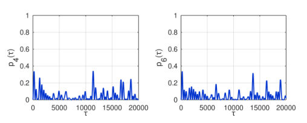
<figcaption class="paper-figure-caption"><b>Fig 4.</b> FIG. 4. TPS corresponding to the two nearest-neighbor sites of the initially excited site in a MS with M = 4, N = 16 (K = 21) SEs. For clarity, the site numbering in the figure follows the convention introduced in Fig. 1, where the sites are numbered starting from the left edge of the MS. The initially excited site is n0 = 5. Left panel: TPS corresponding to site n = 4. Right panel: TPS corresponding to site n = 6. Parameters: S = 0.3, B = 0.1, θ = 4.</figcaption>
</figure>
<figure class="paper-figure-card">
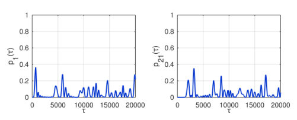
<figcaption class="paper-figure-caption"><b>Fig 5.</b> FIG. 5. TPS on the edge nodes of the MS, for the configura- tion M = 4, N = 16 (K = 21) SEs. The node numbering in the graph follows the convention used in Fig. 1. The initially excited node is n0 = 5. Left panel: probability distribution for the node n = 1. Right panel: probability distribution for the node n = 21. Parameters: S = 0.3, B = 0.1, θ = 4.</figcaption>
</figure>

**Summary.** This paper theoretically analyzes how a single excitation moves coherently within a finite segment of a biomolecular chain. It shows that the migration dynamics are dominated by complex quantum interference patterns rather than simple classical diffusion. Crucially, it reveals that boundary conditions and the initial placement of the excitation induce measurable asymmetries in the probability distribution.

**Why it may be interesting.** This work provides a detailed quantum mechanical description of energy transport in nanoscale biological systems, bridging concepts from polaron physics and quantum walks to explain non-trivial spatial localization effects governed by geometry.

Detailed structure

**Main problem.** The study investigates the coherent migration of a single excitation injected into a finite segment of a biomolecular chain.

**Main result.** The probability distribution exhibits an asymmetry for symmetrically placed nodes, which is solely due to the initial asymmetric placement within the finite boundary. The dynamics are governed by quantum interference rather than classical propagation.

**Method.** The analysis involves solving time-dependent equations of motion derived from a modified Holstein model using techniques like Laplace transforms and relating the problem to continuous-time quantum walk models.

**Model / system.** The system is modeled as a finite molecular segment (MS) within a biomolecular chain, described by an adapted Holstein Hamiltonian coupling electronic excitations to lattice vibrations. The excitation forms a self-trapped state resembling a nonadiabatic polaron.

**Key observables.** Time-dependent probability distribution of the excitation at nodes ($p_n(t)$), asymmetry in this distribution, and interference patterns.

**Important parameters / regimes.** The initial excitation position ($n_0$), boundary conditions (finite length $K$), and dimensionless parameters related to coupling strength ($S$) and hopping ($B$).

**Assumptions / limitations.** The model assumes the excitation cannot leave the finite segment, employs a Lang-Firsov unitary transformation, and uses a mean-field approximation that neglects incoherent polaron–phonon scattering.

**Figures summary.** Figures illustrate the Time-Probability Spectrum (TPS) showing deviations from symmetry at later times due to boundary effects, and demonstrate how the probability distribution evolves based on whether the initial excitation site is central or off-center.

**Paper structure.** The paper establishes the physical model using a modified Holstein Hamiltonian; it then applies polaron transformations and mean-field approximations to derive equations of motion for the correlation functions. The core analysis focuses on solving these equations to determine the time evolution, highlighting geometric effects like boundary asymmetry.

Abstract

We study the migration of a single excitation excited at a structural element of a finite molecular segment, which is a part of a long biomolecular chain. The excitation cannot leave the segment and is locally coupled to thermal vibrations of the lattice, forming a self-trapped state corresponding to a nonadiabatic polaron. The time-dependent probability distribution of finding the excitation at the nodes of the segment is calculated, with particular emphasis on the role of the initial excitation position. A formal analogy is observed between the present model and continuous-time quantum walk models on finite chains with reflecting boundaries. The results reveal an asymmetry in the probability distribution for nodes symmetrically positioned with respect to the initially excited site, which arises solely from the asymmetric placement of the initial excitation within the finite segment. The only exception occurs when the initially excited node is located at the center of the segment, where the probability distribution becomes symmetric. The complex interference pattern and the absence of well-defined revivals stem from the non-equidistant spectrum of mode frequencies, leading to progressive dephasing of the constituent modes. As a result, the initially well-localized probability maximum fragments into one dominant maximum accompanied by several secondary maxima of lower intensity. These findings highlight the importance of boundary conditions and initial-state geometry in controlling quantum transport in finite molecular systems.

[↑ back to top](#top)

### [Microwave Response of the Superconducting Diode Effect in Proximitized Bilayer Graphene Interferometers](http://arxiv.org/abs/2608.01313v1)

**Authors:** Shili Yan, Rubén Seoane Souto, Yi Luo, Jeroen Danon, Haitian Su, Junze Zhang, Han Gao, Xingjun Wu, Ji-Yin Wang, H. Q. Xu  
**Type:** experiment · **Category:** other · **PDF:** <https://arxiv.org/pdf/2608.01313v1>  
**Analysis basis:** full PDF text, analyzed in chunks
**Topic relevance:** `driven-dissipative phase transition` **3/5** · `methods for driven-dissipative` **3/5** · `non-equilibrium dynamics` **3/5** · `non-equilibrium universality` **2/5** · `Keldysh / 2PI / non-Gaussian methods` **1/5** · `Kondo & dissipative impurity` **1/5** · `QC/QI experiment` **1/5**

↔ Scroll figures horizontally

<figure class="paper-figure-card">
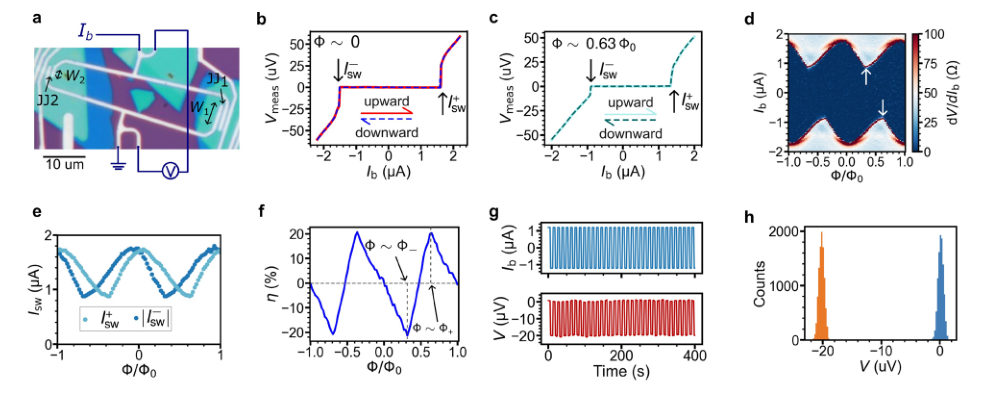
<figcaption class="paper-figure-caption"><b>Fig 1.</b> Fig. 1 |Device and characterization of the SDE. a Optical image of SQUID-1. The scale bar is 10</figcaption>
</figure>
<figure class="paper-figure-card">
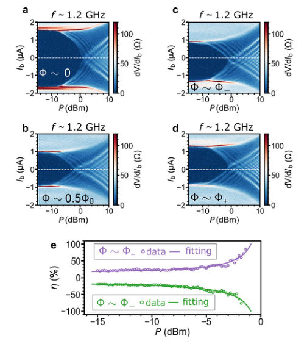
<figcaption class="paper-figure-caption"><b>Fig 2.</b> Fig. 2 | Microwave response of the SDE under a low-frequency microwave irradiation. a–d</figcaption>
</figure>
<figure class="paper-figure-card">
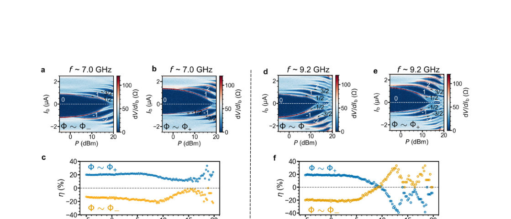
<figcaption class="paper-figure-caption"><b>Fig 3.</b> Fig. 3 | Microwave response of the SDE under two high-frequency microwave irradiations. a, b</figcaption>
</figure>
<figure class="paper-figure-card">
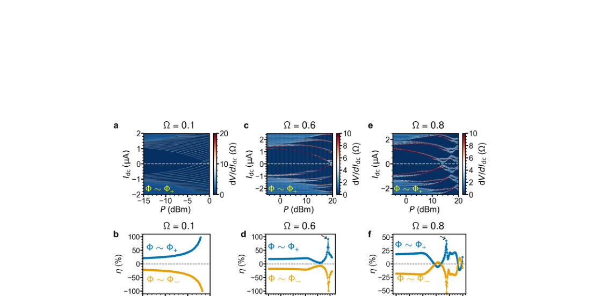
<figcaption class="paper-figure-caption"><b>Fig 4.</b> Fig. 4 | Simulated microwave response of the SDE under microwave irradiations of different</figcaption>
</figure>
<figure class="paper-figure-card">
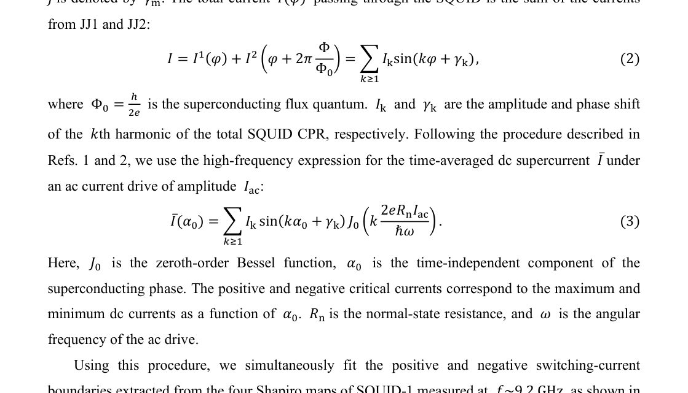
<figcaption class="paper-figure-caption"><b>Fig 5.</b> Fig. 3 in the main article and Figure S2 in Supplementary Section 1. A single set of CPR parameters</figcaption>
</figure>

**Summary.** The authors experimentally investigate how the Superconducting Diode Effect (SDE) behaves in bilayer graphene SQUIDs when driven by microwaves at high frequencies. They demonstrate that the diode efficiency deviates significantly from predictions based on low-frequency adiabatic theory, showing complex power dependencies and oscillations. This work establishes BLG SQUIDs as a versatile platform for studying dynamic superconducting junction properties.

**Why it may be interesting.** This work explores non-linear, time-dependent quantum electrodynamics effects in superconducting circuits. The transition from adiabatic to non-adiabatic regimes provides a rich testing ground for generalized Josephson junction models beyond simple DC approximations.

Detailed structure

**Main problem.** The study investigates the microwave response of the Superconducting Diode Effect (SDE) in superconducting quantum interference devices (SQUIDs) beyond the simple adiabatic driving regime.

**Main result.** At high microwave frequencies, the diode efficiency exhibits non-monotonic power dependence, sign reversal, and oscillatory characteristics, which are successfully modeled using the resistively shunted junction model with extracted current-phase relations.

**Method.** The research combines DC transport measurements of $V$-$I$ curves and differential resistance ($dI/dV$) with microwave irradiation experiments across various frequencies. Theoretical analysis involves fitting the Josephson junction Current-Phase Relationship (CPR) using harmonic expansions.

**Model / system.** The physical platform is a SQUID built from proximitized bilayer graphene, featuring superconducting Josephson junctions. The system dynamics are modeled using the Resistively Shunted Junction (RSJ) model and analyzed via time-dependent simulations incorporating extracted CPRs.

**Key observables.** Diode efficiency ($\eta$), switching currents ($I_{sw}^\pm$), Shapiro steps, and the dependence of $\eta$ on microwave power ($P$) and driving frequency ($f$).

**Important parameters / regimes.** Microwave frequencies (e.g., 1.2 GHz up to 10.8 GHz), magnetic flux ($\Phi/\Phi_0$), and microwave power ($P$).

**Assumptions / limitations.** The analysis often relies on fitting the CPR using a truncated harmonic series, and simulations are sometimes restricted to low-power regimes to avoid heating effects.

**Figures summary.** Figures show $V$-$I$ characteristics demonstrating SDE modulated by magnetic flux; subsequent figures map out $\eta$ vs. microwave power at various frequencies, revealing deviations from simple monotonic behavior.

**Paper structure.** The paper progresses from basic characterization of the SDE in BLG SQUIDs under DC bias and low-frequency microwaves (adiabatic regime) to detailed analysis of high-frequency responses, culminating in fitting CPRs and simulating the frequency-dependent power response of $\eta$.

Abstract

Microwave irradiation has emerged as a promising means to tune the superconducting diode effect (SDE) in Josephson junction devices. Previous experimental studies have mainly focused on the adiabatic-driving regime, in which the diode efficiency increases monotonically with microwave power and can approach the ideal value of unity. Beyond this regime, however, the microwave response of the SDE remains largely unexplored experimentally. In this work, we investigate the microwave response of the SDE in bilayer-graphene-based superconducting quantum interference devices (SQUIDs) under a broad range of driving frequencies. We show that increasing the driving frequency changes the response characteristics of the diode efficiency to microwave power--the dependence of the diode efficiency evolves from monotonic enhancement with increasing microwave power in the adiabatic regime to non-monotonic behavior beyond this regime, and ultimately to sign-reversal as well oscillatory characteristics at sufficiently high frequencies. We find that these experimentally observed frequency-dependent power response characteristics of the diode efficiency can be qualitatively captured by simulations based on the resistively shunted junction model using the device current-phase relations extracted from the experiments. These results establish SQUIDs made from bilayer graphene as a versatile platform for studying dynamic properties of superconducting junction devices.

[↑ back to top](#top)

### [Anisotropic transport of Josephson vortices in atomic-layer superconductors on vicinal surfaces](http://arxiv.org/abs/2608.01196v1)

**Authors:** Wenxuan Qian, Yash Chauhan, Ryohei Nemoto, Keisuke Sagisaka, Shunsuke Yoshizawa, Takashi Uchihashi  
**Type:** experiment · **Category:** other · **PDF:** <https://arxiv.org/pdf/2608.01196v1>  
**Analysis basis:** full PDF text, analyzed in chunks
**Topic relevance:** `non-equilibrium dynamics` **3/5** · `driven-dissipative phase transition` **2/5** · `non-equilibrium universality` **2/5** · `Frenkel-Kontorova` **1/5** · `Keldysh / 2PI / non-Gaussian methods` **1/5** · `analog quantum simulation` **1/5** · `correlated / nonlocal dissipation` **1/5** · `methods for driven-dissipative` **1/5**

↔ Scroll figures horizontally

<figure class="paper-figure-card">
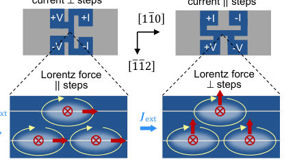
<figcaption class="paper-figure-caption"><b>Fig 1.</b> FIG. 1. Schematic drawing of the sample design. (a) Side view of the sample geometry. The Si(111) substrate has a vicinal surface with the normal direction tilted by 0.2 ◦to- ward [¯1¯12] orientation. The surface is composed of parallel terraces running in the [1¯10] direction, separated mostly by monatomic steps. The Si(111) surface is covered by In atomic bilayers to form ( √</figcaption>
</figure>
<figure class="paper-figure-card">
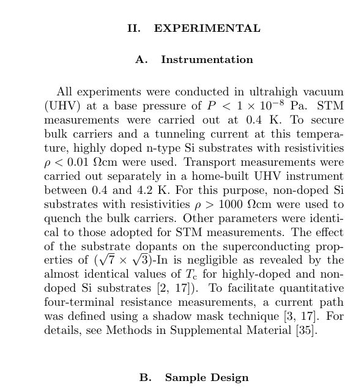
<figcaption class="paper-figure-caption"><b>Fig 2.</b> Figure 1(a) shows the side view of the schematic sam- ple geometry in the present work. The Si substrate has a vicinal (111) surface with the normal direction tilted by 0.2 ◦toward the [¯1¯12] orientation. Assuming that the atomic steps are mostly of the monatomic height (h0 = 0.31 nm), the surface is composed of parallel ter- races running in the [1¯10] direction with an average width of 89 nm. Such a regular atomic step array can be real- ized by adopting a special protocol of substrate cleaning</figcaption>
</figure>
<figure class="paper-figure-card">
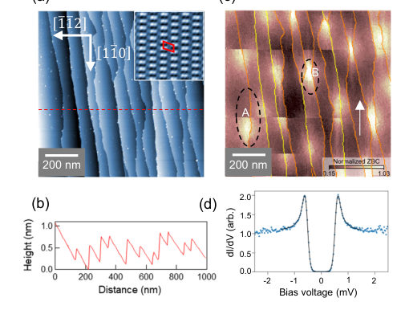
<figcaption class="paper-figure-caption"><b>Fig 3.</b> FIG. 2. STM characterization of the sample surface. (a) STM topograph image with a size of 1000 × 1000 nm2 with a sam- ple bias voltage V = 100 meV and a tunneling current I = 5 pA. The arrows indicate the crystalline orientations of the sur- face. The inset is a magnified image with a size of 10×10 nm2</figcaption>
</figure>
<figure class="paper-figure-card">
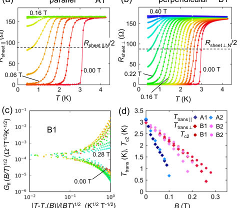
<figcaption class="paper-figure-caption"><b>Fig 4.</b> FIG. 3. Temperature-dependent sheet resistance Rsheet, which is directly proportional to the mobility of vortices, mea- sured at different magnetic fields. (a) Rsheet∥(Sample A1) for magnetic fields from B = 0.00 to 0.16 T with an increment of 0.02 T. The dashed line indicates the Rsheet∥= Rsheet∥,N/2, from which Ttrans∥is determined. (b) Analogous plot of Rsheet⊥(Sample B1) for magnetic fields from B = 0.00 to 0.40 T with an increment of 0.02 T. (c) Ullah-Dorsey scaling analysis applied to the Rsheet⊥(Sample B1) from B = 0.00 to 0.28 T with an increment of 0.02 T. Tc2 is determined from the analysis. (d) Ttrans∥, Ttrans⊥, and Tc2 plotted as a func- tion of B for all samples.</figcaption>
</figure>
<figure class="paper-figure-card">
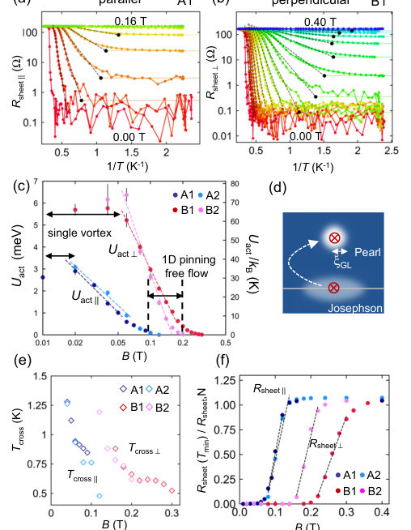
<figcaption class="paper-figure-caption"><b>Fig 5.</b> FIG. 4. Analysis on the Josephson vortex transport. (a) Ar- rhenius plots of the same Rsheet∥data of Fig. 3(a) (Sample A1). (b) Arrhenius plots of the Rsheet⊥data of Fig. 3(b) (Sample B1). In (a) and (b), the approximately straight lines in the high temperature regions indicate thermally acti- vated transport of vortices, while the saturations at the low- est temperatures suggest quantum tunneling of vortices. The black dots correspond to the crossover temperatures Tcross∥ and Tcross⊥. (c) Activation energies Uact∥(Samples A1 and B1) and Uact⊥(Samples A2 and B2) plotted as a function of B. The horizontal axis is set in the log scale. As a ref- erence, the scale for Uact/kB is set on the...</figcaption>
</figure>

**Summary.** This work reports on the anisotropic transport of Josephson vortices in atomic-layer superconducting films grown on vicinal surfaces. By combining STM imaging with detailed magneto-transport measurements, the authors demonstrate that vortex motion is highly directionally dependent, exhibiting regimes ranging from thermally activated creep to quantum tunneling. The findings map out a complex phase diagram governed by the underlying atomic step structure.

**Why it may be interesting.** The strong structural control (atomic steps) leading to highly anisotropic quantum dynamics provides an excellent platform for studying dimensionality crossover, pinning mechanisms, and non-equilibrium transport phenomena in superconductors.

Detailed structure

**Main problem.** The study investigates how Josephson vortices, formed at atomic steps on superconducting surfaces, exhibit highly anisotropic transport properties.

**Main result.** The vortex transport shows extreme anisotropy ($\sim 10^3$), leading to distinct regimes of motion—from thermally activated creep to one-dimensional pinning-free flow and quantum tunneling—all dependent on the direction relative to the atomic steps.

**Method.** Magneto-transport measurements (sheet resistance vs. T and B) are combined with Scanning Tunneling Microscopy (STM) to visualize vortex cores and map out the phase diagram.

**Model / system.** The system is an atomic-layer superconductor, Si(111)-($\sqrt{7}	imes\sqrt{3}$)-In, grown on a vicinal surface featuring distinct atomic steps. Josephson vortices are hypothesized to dominate transport at these structural features.

**Key observables.** Sheet resistance ($R_{	ext{sheet}}$), vortex mobility ($\mu_\phi$), activation energy ($U_{	ext{act}}$), and the anisotropy ratio $\alpha$.

**Important parameters / regimes.** Temperature (0.4 to 4.2 K), out-of-plane magnetic field (B), and the relative orientation of current/Lorentz force with respect to atomic steps.

**Assumptions / limitations.** The transport phenomena are dominated by Josephson vortices localized at the atomic steps, which act as effective Josephson junctions.

**Figures summary.** Figures show STM topography confirming step structures and ZBC images visualizing elongated bright regions identified as Josephson vortex cores. Transport data map out $R_{	ext{sheet}}$ vs. T and B, revealing anisotropic behavior.

**Paper structure.** The paper establishes the physical system via STM characterization, then presents transport measurements comparing current parallel versus perpendicular to steps. The analysis quantifies the anisotropy in mobility and maps out a complex B-T phase diagram detailing different vortex flow regimes.

Abstract

Atomic steps have strong influences on surface two-dimensional superconductors. Josephson vortices formed at the atomic steps under magnetic fields may dominate transport phenomena at low temperatures, but its experimental verification is still lacking. Here, we report the vortex transport properties of atomic-layer superconductor Si(111)-$(\sqrt{7}\times\sqrt{3})$-In with vicinal surfaces, for which Josephson vortices are directly observed by scanning tunneling microscopy. A sharp drop in resistance with decreasing temperature $T$, detected under out-of-plane magnetic field $B$, reveals a distinctive anisotropy with respect to the atomic step direction. The anisotropy of sheet resistance, proportional to that of vortex mobility, amounts to the order of $10^3$ at intermediate magnetic fields. In the high-$T$ and low-$B$ region, Josephson vortices exhibit thermally excited creep motions with anisotropic activation energy $U_\mathrm{act}$. A further increase in $B$ suppresses $U_\mathrm{act}$ toward zero anisotropically, resulting in one-dimensional pinning-free vortex flow at $0.10 \lesssim B \lesssim 0.20$ T. At the lowest temperatures, the vortex motion is governed by quantum tunneling. A $B$-$T$ phase diagram constructed based on these measurements reveals multiple regions characterized by directionally dependent vortex-transport mechanisms.

[↑ back to top](#top)

### [Spin Josephson diode effect induced by higher-harmonic spin Josephson currents in a diffusive Josephson junction](http://arxiv.org/abs/2608.01991v1)

**Authors:** Shin-ichi Hikino  
**Type:** theory · **Category:** other · **PDF:** <https://arxiv.org/pdf/2608.01991v1>  
**Analysis basis:** full PDF text, analyzed in chunks
**Topic relevance:** `Keldysh / 2PI / non-Gaussian methods` **3/5** · `spintronics-quantum-optics interface` **3/5** · `methods for driven-dissipative` **2/5** · `non-equilibrium dynamics` **2/5** · `driven-dissipative phase transition` **1/5** · `exotic spin models in light-matter` **1/5**

↔ Scroll figures horizontally

<figure class="paper-figure-card">
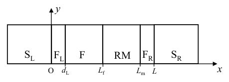
<figcaption class="paper-figure-caption"><b>Fig 1.</b> Figure 1. The schematic diagram of the SL/FL/F/RM/FR/SR junction is shown, where SL (SR) denotes the spin-singlet superconductor on the left (right), FL (FR) the thin ferromagnetic metal on the left (right), F the thick ferromagnetic metal, and normal metal with the RSOI (RM). The thick ferromagnet F serves as a barrier that suppresses the contribution of spin-singlet Cooper pairs. The total thicknesses of different regions are defined as Lf = dL + df, Lm = Lf + dm, and L = Lm + dR, where dL(R) are the thicknesses of FL(R), df that of F, and dm that of RM.</figcaption>
</figure>
<figure class="paper-figure-card">
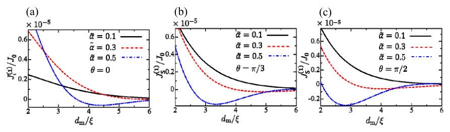
<figcaption class="paper-figure-caption"><b>Fig 2.</b> Figure 2. First-harmonic spin Josephson current (FHSJC) as a function of the thickness of the Rashba metal (dm) for ˜α = ξαR = 0.1, 0.3, and 0.5. Panels (a)–(c) correspond to θ = 0, π/3, and π/2, respectively. For weak Rashba spin-orbit interaction (˜α = 0.1), the current exhibits a monotonic decay with increasing dm. As ˜α increases, a damped oscillatory behavior develops, and even for ˜α = 0.3, a sign change can be identified, although the oscillation amplitude is small. For ˜α = 0.5, the oscillatory behavior becomes clearly visible for all values of θ. The oscillatory behavior originates from the interplay between the Rashba spin-orbit interaction and the exchange field. The FHSJC is...</figcaption>
</figure>
<figure class="paper-figure-card">
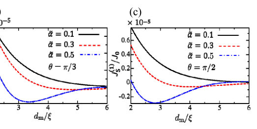
<figcaption class="paper-figure-caption"><b>Fig 3.</b> Figure 2 shows the dm dependence of the FHSJC, J(1) s = Jy,(1)(dm), for θ = 0, π/3, and π/2. The horizontal axis represents the thickness of the RM (dm), while the vertical axis denotes the FHSJC. For weak RSOI (˜α = αRξ = 0.1), the FHSJC exhibits a nearly monotonic decay with increasing dm. As ˜α increases, a damped oscillatory behavior gradually develops, and even for ˜α = 0.3, a sign change can be identified although the oscillation amplitude is small. For ˜α = 0.5, the oscillatory behavior becomes clearly visible for all values of θ. These results indicate that the oscillatory nature of the FHSJC is enhanced by the RSOI, and the direction of the FHSJC can be reversed by tuning the RM...</figcaption>
</figure>
<figure class="paper-figure-card">
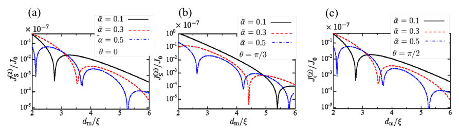
<figcaption class="paper-figure-caption"><b>Fig 4.</b> Figure 3. Second-harmonic spin Josephson current (SHSJC) as a function of the thickness of the Rashba metal (dm) for ˜α = ξαR = 0.1, 0.3, and 0.5. Panels (a)–(c) correspond to θ = 0, π/3, and π/2, respectively. The SHSJC is plotted on a logarithmic scale in terms of its absolute value. For all values of ˜α, the SHSJC exhibits a damped oscillatory behavior as a function of dm. The logarithmic representation highlights the nodes associated with sign reversals as sharp dips. The oscillation period becomes shorter with increasing ˜α, while the magnitude of the SHSJC is rapidly suppressed. The enhanced oscillatory behavior of the SHSJC reflects the higher-order coherent processes induced by the...</figcaption>
</figure>
<figure class="paper-figure-card">
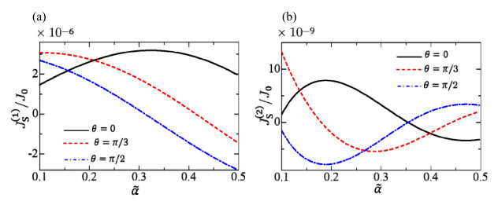
<figcaption class="paper-figure-caption"><b>Fig 5.</b> Figure 4. The first- and second-harmonic spin Josephson currents, J(1) s and J(2) s , as functions of the dimensionless Rashba spin–orbit interaction strength ˜α for θ = 0, π/3, and π/2. Panels (a) and (b) show the first- and second-harmonic spin Josephson currents, respectively. Both components change sign as ˜α is varied, while the second-harmonic component exhibits a more pronounced dependence. The pronounced ˜α dependence of the SHSJC indicates that the Rashba spin–orbit interaction plays a key role in determining the efficiency of the spin Josephson diode effect. The SHSJC is normalized by J0 = i8πNFDkBTc/ξc, where ξc = p</figcaption>
</figure>

**Summary.** This paper theoretically investigates the Spin Josephson Diode Effect (SJDE) in a diffusive junction containing Rashba metal. By deriving expressions for both first- and second-harmonic spin currents, the authors demonstrate that the SJDE can be achieved intrinsically via an emergent $\phi_0$ phase shift, eliminating the need for external magnetic fields or structural asymmetries.

**Why it may be interesting.** This work provides a detailed theoretical mechanism for non-reciprocal transport in superconducting junctions driven purely by internal material symmetries (RSOI/exchange field), which is highly relevant to understanding spin-charge conversion phenomena in mesoscopic devices.

Detailed structure

**Main problem.** The study investigates the mechanism behind the Spin Josephson Diode Effect (SJDE) in a diffusive Josephson junction, aiming to show how non-reciprocal spin transport can occur without external magnetic fields.

**Main result.** The SJDE is shown to arise from the interplay between first- and second-harmonic spin Josephson currents, which generate an intrinsic $\phi_0$ phase shift due to Rashba spin-orbit coupling (RSOI) and a ferromagnetic exchange field.

**Method.** The theoretical analysis employs the quasiclassical Green's function framework to derive analytical expressions for both the first- and second-harmonic spin Josephson currents.

**Model / system.** The system modeled is a diffusive Josephson junction structure incorporating a Rashba metal layer sandwiched between superconducting and ferromagnetic barriers (S/FF/F/RM/F/S).

**Key observables.** Spin Josephson Currents (FHSJC and SHSJC), the intrinsic $\phi_0$ phase shift, and the SJDE efficiency ($\eta_s$).

**Important parameters / regimes.** Rashba spin-orbit interaction strength ($\alpha_R$), junction thickness ($d_m$), and temperature ($T$).

**Assumptions / limitations.** The analysis uses a perturbative expansion near $T_c$ and assumes the thick ferromagnetic layer acts as a barrier suppressing spin-singlet pairs.

**Figures summary.** Figures schematically illustrate the S/FL/F/RM/FR/S junction structure, while derived equations present the functional forms for the harmonic currents.

**Paper structure.** The paper progresses by establishing the physical necessity of breaking $P$ and $T$ symmetries, deriving analytical expressions for both first- and second-harmonic spin Josephson currents using Green's functions, and finally analyzing how the interplay between these harmonics generates the intrinsic SJDE.

Abstract

We theoretically investigate the spin Josephson diode effect (SJDE) in a diffusive Josephson junction with a Rashba metal layer under a ferromagnetic exchange field. Within the quasiclassical Green's function framework, we derive analytical expressions for the first- and second-harmonic spin Josephson currents. The interplay between Rashba spin-orbit interaction and the exchange field breaks inversion and time-reversal symmetries, generating additional cosine terms in the spin current-phase relations and a finite phi0 phase shift. This phase shift induces an intrinsic asymmetry between forward and backward spin currents, leading to the SJDE without an external magnetic field. Numerical results show that the efficiency decreases with increasing metal thickness due to suppression of the second-harmonic component, while its dependence on spin-orbit interaction strength reflects competing effects between phase shift enhancement and harmonic suppression. These findings demonstrate that the interplay between harmonic components provides a mechanism for nonreciprocal spin transport without requiring suppression of spin-singlet correlations.

[↑ back to top](#top)

### [Non-linear spin current in the surface states of topological insulators](http://arxiv.org/abs/2608.01782v1)

**Authors:** Srijan Chatterjee, Tarun Kanti Ghosh  
**Type:** theory · **Category:** other · **PDF:** <https://arxiv.org/pdf/2608.01782v1>  
**Analysis basis:** full PDF text, analyzed in chunks
**Topic relevance:** `spintronics-quantum-optics interface` **3/5** · `Keldysh / 2PI / non-Gaussian methods` **2/5** · `methods for driven-dissipative` **2/5** · `non-equilibrium dynamics` **2/5** · `exotic spin models in light-matter` **1/5** · `non-equilibrium universality` **1/5**

↔ Scroll figures horizontally

<figure class="paper-figure-card">
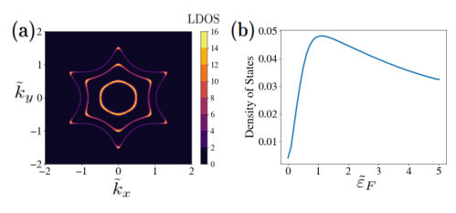
<figcaption class="paper-figure-caption"><b>Fig 1.</b> FIG. 1: (a) The Fermi contours corresponding to three Fermi energies, ˜εF = 0.5, 1.0, 1.5, showing a gradual distortion from circular to snowflake-like with increasing Fermi energy. The LDOS at ˜εF = 0.5 is uniformly distributed along the contour, while on increasing Fermi energy it gets concentrated at the tips of the snowflake contour. (b) The total density of states as a function of Fermi energy.</figcaption>
</figure>
<figure class="paper-figure-card">
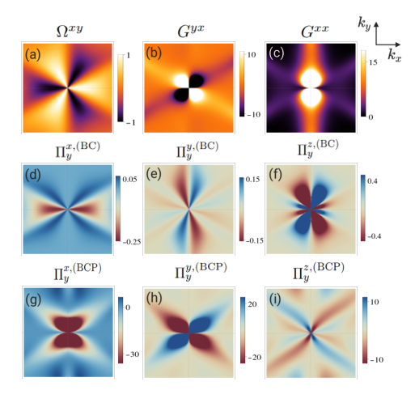
<figcaption class="paper-figure-caption"><b>Fig 2.</b> FIG. 2: Top panel: The momentum space distribution of (a) Berry curvature (in units of λ/v0), (b) transverse and (c) longitudinal components of BCP (in units of v2 0/16ε3 0). Middle panel: The three spin components of the BC-induced SOSC (in units of e2λ2/4v3 0). Bottom panel: The three spin components of the BCP dipole-induced SOSC (in units of e2λ2/16v3 0) . Here kx and ky are in units of k0 and range from −1 to 1.</figcaption>
</figure>
<figure class="paper-figure-card">
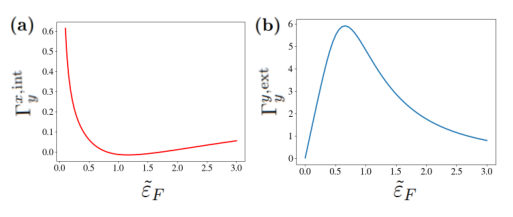
<figcaption class="paper-figure-caption"><b>Fig 3.</b> FIG. 4: (a) Intrinsic SOSC, with spins polarized in the direction of the applied electric field (in units of 102Γ0), where Γ0 = e2λ/v2 0). (b) Extrinsic SOSC with spin polarization along the direction of the spin current, (in units of 10−3Γ0) as a function of Fermi energy. Here τ = 1 ps.</figcaption>
</figure>
<figure class="paper-figure-card">
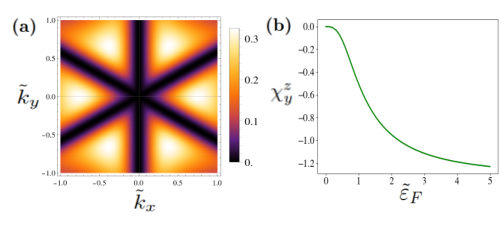
<figcaption class="paper-figure-caption"><b>Fig 4.</b> FIG. 3: (a) Momentum space distribution of the spin z-component of spin-weighted Berry curvature, Ξz yx (in units of −λ/v0. (b) Linear spin Hall conductivity (in units of e/2), with out-of-plane spin polarization as a function of Fermi energy.</figcaption>
</figure>

**Summary.** This paper theoretically analyzes pure spin currents in the surface states of topological insulators, focusing on the role of hexagonal warping. By extending linear response theory to the second order, the authors predict the existence of measurable intrinsic and extrinsic in-plane spin currents. This work is significant for spintronics as it provides a detailed understanding of non-linear spin transport mechanisms governed by crystal symmetry.

**Why it may be interesting.** This work provides a detailed theoretical framework for understanding higher-order transport phenomena in topological materials, which is crucial for designing next-generation spintronic devices that rely on non-linear spin manipulation.

Detailed structure

**Main problem.** The work investigates both linear and non-linear pure spin currents generated in the surface states of topological insulators (TIs). It specifically addresses how hexagonal warping influences these transport phenomena.

**Main result.** The second-order response yields measurable intrinsic and extrinsic in-plane spin currents, which are distinct from the purely out-of-plane current found in linear response. The crystal symmetry dictates that only specific components of the spin conductivity tensor survive.

**Method.** The authors extend conserved spin transport formalism to the non-linear regime by using perturbation theory on Bloch states and solving the Boltzmann transport equation for the non-equilibrium distribution function.

**Model / system.** The system is modeled using the surface states of 3D TIs like Bi2Te3, incorporating an effective low-energy Hamiltonian that includes a hexagonal warping term. This warping provides a well-defined Berry curvature while preserving time-reversal symmetry.

**Key observables.** Pure spin current (both linear and second-order), Spin Hall Effect components ($\Xi^l_{ab}$), Intrinsic and Extrinsic Second-Order Spin Conductivity (SOSC) components ($\Gamma^l_{	ext{int}}, \Gamma^l_{	ext{ext}}$).

**Important parameters / regimes.** Hexagonal warping strength ($\lambda$), Fermi energy ($E_F$ or $k_F$), and the relaxation time approximation ($	au$).

**Assumptions / limitations.** The analysis relies on extending the formalism to second-order in the electric field, using perturbation theory for eigenstates, and employing the relaxation time approximation in the Boltzmann equation.

**Figures summary.** Figures illustrate Fermi contours showing hexagonal warping distortion, momentum space distributions of Berry curvature and SOSC components, and plots detailing how spin conductivity varies with Fermi energy.

**Paper structure.** The paper progresses from establishing the linear response (purely out-of-plane current) to motivating the non-linear extension. It then derives second-order terms involving BCP and BC dipoles, calculates the total spin current via the Boltzmann equation, and finally analyzes the symmetry constraints imposed by the material's crystal structure.

Abstract

Spin Hall effect is one of the primary sources of pure spin current in spintronic devices, observed in spin-orbit coupled materials. In this work, we investigate linear and non-linear pure spin currents in the hexagonally warped surface states of topological insulators like $\rm Bi_2Te_3$, using the formalism of conserved spin transport. The hexagonal warping effect enables the application of this formalism by providing a well-defined Berry curvature without breaking the time-reversal symmetry. The absence of in-plane spin currents in the linear response motivates the extension of the formalism to the non-linear regime, by combining the perturbation of Bloch states with the Boltzmann transport equation. The second-order response exhibits both intrinsic and extrinsic in-plane spin currents induced by the spin-weighted Berry curvature, Berry connection polarizability (BCP) dipole and Berry curvature dipole (BCD) respectively. The band anisotropy due to the $C_{3v}$ symmetry of the material ($\rm Bi_2Te_3$) propagates through the spin textures and the band geometric quantities, resulting in the selection of certain components of the spin conductivity tensors.

[↑ back to top](#top)

### [Proximity effects of chiral magnetization on transition metal dichalcogenides monolayers](http://arxiv.org/abs/2608.02241v1)

**Authors:** Vladimir N. Mantsevich, Igor S. Krivenko, Dmitry S. Smirnov  
**Type:** theory · **Category:** other · **PDF:** <https://arxiv.org/pdf/2608.02241v1>  
**Analysis basis:** full PDF text, analyzed in chunks
**Topic relevance:** `exotic spin models in light-matter` **3/5** · `spintronics-quantum-optics interface` **3/5** · `Keldysh / 2PI / non-Gaussian methods` **1/5** · `analog quantum simulation` **1/5** · `driven-dissipative phase transition` **1/5** · `methods for driven-dissipative` **1/5** · `non-equilibrium dynamics` **1/5**

↔ Scroll figures horizontally

<figure class="paper-figure-card">
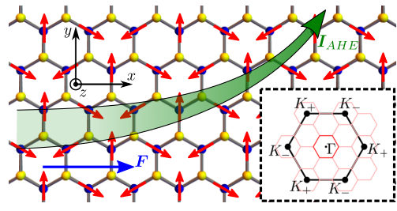
<figcaption class="paper-figure-caption"><b>Fig 1.</b> FIG. 1. Sketch of the system of a TMD ML covered by a magnetic ML. Blue and yellow spheres show the metal and chalcogen atoms of the TMD ML, respectively. Red arrows denote the direction of the magnetization in the top ML. The blue arrow shows the applied electric field, which leads to the antiferromagnetic AHE (green arrow). The inset shows folding of the Brillouin zone due to the chiral magnetization.</figcaption>
</figure>
<figure class="paper-figure-card">
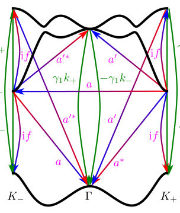
<figcaption class="paper-figure-caption"><b>Fig 2.</b> FIG. 2. The black solid curves show the energy dispersion of electrons in a pristine TMD ML without spin-orbit interaction calculated for the matrix of tunneling amplitudes (1) with the following parameters (in eV) [25]: ϵ2 −ϵ1 = 1, t0 = −0.2, t1 = 0.4, t2 = 0.5, t11 = 0.2, t12 = 0.3, t22 = 0.06. The arrows with labels show matrix elements between the states in K± and Γ valleys up to the first order in k. The green arrows show spin-independent elements, for other arrows the red and blue ends correspond to spin-up and spin-down states.</figcaption>
</figure>
<figure class="paper-figure-card">
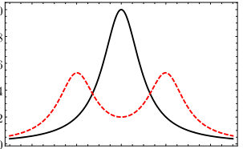
<figcaption class="paper-figure-caption"><b>Fig 3.</b> FIG. 3. Illustration of the absorption spectrum of a pure TMD ML in the vicinity of an exciton resonance frequency ωX (black solid line) and its modification due to the chiral magne- tization (red dashed line) calculated using a phenomenological homogeneous broadening Γ = |a|/(2ℏ).</figcaption>
</figure>

**Summary.** This paper theoretically examines how coupling a TMD monolayer to a chiral antiferromagnet alters its electronic and optical behavior. Using an effective $k\cdot p$ model, the authors predict measurable effects like the Anomalous Hall Effect and exciton resonance splitting. These predictions allow for potential experimental detection via magneto-optical measurements of the magnetization orientation.

**Why it may be interesting.** This work connects magnetism, topology (Berry curvature), and low-dimensional materials physics, providing theoretical tools for understanding emergent quantum phenomena in hybrid systems.

Detailed structure

**Main problem.** The study investigates how proximity effects from a chiral $120^\circ$ Néel magnetic structure modify the transport and optical properties of Transition Metal Dichalcogenide (TMD) monolayers.

**Main result.** The proximity effect induces an Anomalous Antiferromagnetic Hall Effect (AHE) and causes splitting/mixing of exciton resonances, even in the absence of net magnetization.

**Method.** The authors developed an effective $k\cdot p$ model derived from a six-band tight binding approach to calculate transport coefficients and optical transition matrix elements.

**Model / system.** The system is a TMD ML coupled to a chiral magnet, modeled using an effective Hamiltonian that incorporates exchange interaction, spin-orbit coupling, and symmetry-breaking terms. The analysis focuses on the electronic structure near $K_{\pm}$ and $\Gamma$ points.

**Key observables.** Anomalous Antiferromagnetic Hall Effect (AHE) conductivity ($\sigma_{xy}$), splitting of exciton resonances, Faraday rotation ($	heta_F$), and ellipticity ($	heta_E$).

**Important parameters / regimes.** The dependence on the magnetization orientation angle $\varphi$ via a $\cos 3\varphi$ term is crucial for diagnostics.

**Assumptions / limitations.** The magnetic layer interaction is treated perturbatively to derive the effective $k\cdot p$ model, and certain exchange interactions are neglected for simplification.

**Figures summary.** Figures illustrate the Brillouin zone folding due to magnetism, energy dispersion curves for pristine TMD bands, and theoretical predictions for magneto-optical responses.

**Paper structure.** The paper progresses from defining the physical system and Hamiltonian (tight binding $
ightarrow k\cdot p$ model) to calculating transport properties (AHE via Berry curvature) and finally analyzing optical response (exciton splitting and polarization measurements).

Abstract

We consider the proximity effects of a commensurate chiral $120^{\circ}$ Néel magnetic structure on the transport and optical properties of a transition metal dichalcogenide monolayer (TMD ML). The enlarged magnetic unit cell leads to the folding of the Brillouin zone and enables efficient intervalley spin-flip scattering. Starting from a six band tight binding model, we develop an effective $k\cdot p$ model, which describes the coupling between charge carriers in the TMD ML and the chiral magnetization. We predict the anomalous antiferromagnetic Hall effect (AHE) for conduction electrons and describe it accounting for the interplay between anomalous velocity, side jump, and skew scattering contributions. The proximity of the chiral magnetization also leads to the mixing and splitting of the exciton resonances in the two valleys which are related by the time reversal symmetry despite zero net magnetization. Finally, we demonstrate the possibility to measure the distribution of in-plane orientation of the chiral magnetization through Faraday rotation and the ellipticity of incident linearly polarized light.

[↑ back to top](#top)

### [Strain engineering of transient exciton diffusion in WSe2 monolayers at cryogenic temperatures](http://arxiv.org/abs/2608.02513v1)

**Authors:** Roberto Rosati, Mohammed Adel Aly Nouh, Robert Schmidt, Rudolf Bratschitsch, Ermin Malic  
**Type:** both · **Category:** other · **PDF:** <https://arxiv.org/pdf/2608.02513v1>  
**Analysis basis:** full PDF text, analyzed in chunks
**Topic relevance:** `methods for driven-dissipative` **3/5** · `non-equilibrium dynamics` **3/5** · `Keldysh / 2PI / non-Gaussian methods` **1/5** · `analog quantum simulation` **1/5** · `correlated / nonlocal dissipation` **1/5** · `driven-dissipative phase transition` **1/5** · `non-equilibrium universality` **1/5**

↔ Scroll figures horizontally

<figure class="paper-figure-card">
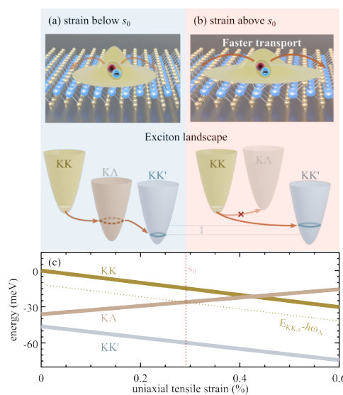
<figcaption class="paper-figure-caption"><b>Fig 1.</b> FIG. 1: Strain-engineering of exciton landscape in WSe2 monolayers: (a,b) Tensile strain leads to a speed- up of exciton transport due to a spectral reordering of KK, KΛ and KK′ excitons. Strain particularly modifies possible scattering channels and exciton thermalization. Strain larger than the critical value s0 ≈0.3 % deactivates the phonon- mediated KK-to-KΛ scattering resulting in a direct formation of hot dark KK′ states with a large excess energy. (c) The state reordering is a result of opposite strain gauge factors for KK (KK′) and KΛ excitons. 33 meV [34], intervalley scattering with acoustic phonons with energies of about 12-14 meV is energetically not al- lowed for strain values...</figcaption>
</figure>
<figure class="paper-figure-card">
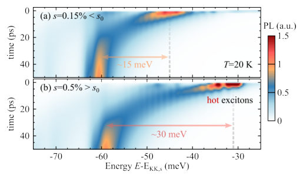
<figcaption class="paper-figure-caption"><b>Fig 2.</b> FIG. 2: Strain-tuning of exciton thermalization: Time- and energy-resolved photoluminescence of hBN-encapsulated WSe2 at T =20 K under an external uniaxial tensile strain of (a) s = 0.15% &lt; s0 and (b) s = 0.5% &gt; s0 with s0 ≈0.3% being the critical strain value, see Fig. 1(c). An initial high- energy signal redshifts toward the equilibrium emission within few tens of picoseconds. This is a hallmark of the thermaliza- tion of hot dark excitons (Fig. 1(a,b)). The energy separation between the initial and the equilibrium resonance increases abruptly from 15 meV to almost 30 meV at the critical strain value of s0 reflecting the suppression of the scattering channel from KK to KΛ excitons (Fig....</figcaption>
</figure>
<figure class="paper-figure-card">
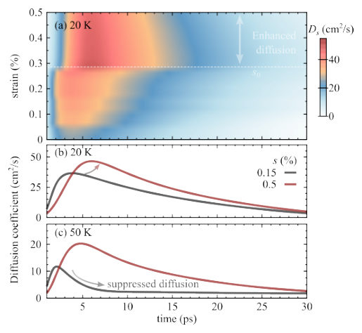
<figcaption class="paper-figure-caption"><b>Fig 3.</b> FIG. 3: Strain engineering of exciton propagation: (a) Time-resolved transient exciton diffusion coefficient of hBN- encapsulated WSe2 as a function of tensile strain at 20 K. We find an abrupt enhancement above the critical strain value of s0 ≈0.3 %. (b,c) Cuts at two specific strain values below and above s0 at 20 K and 50K, respectively. Interestingly, at the larger temperature, the duration of the enhanced transient diffusion is considerably shortened to only few picoseconds for strain values smaller than s0. This is due to the ther- mal activation of phonon absorption inducing the KK′-to-KΛ back-scattering.</figcaption>
</figure>
<figure class="paper-figure-card">
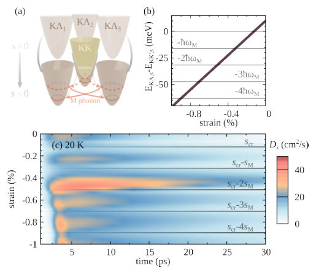
<figcaption class="paper-figure-caption"><b>Fig 4.</b> FIG. 4: Strain-induced periodic modulation of exci- ton diffusion: (a) Activation of KΛ excitons in presence of compressive strain. Here, hot dark excitons scatter be- tween the three degenerate KΛ valleys by emitting acous- tic M phonons with the energy ℏωM. (b) For strain values smaller than scr ≈−0.1 %, KΛ excitons become energeti- cally lower than KK′ excitons. The large strain gauge fac- tor of ∆K′Λ,s =EKΛ,s−EKK′,s allows emission of acoustic M phonons with a multiple of ℏωM (horizontal lines), which cor- responds to a strain periodicity of sM ≈0.2 meV/%. (c) The resulting periodic strain modulation of the transient exciton diffusion.</figcaption>
</figure>

**Summary.** This research demonstrates that strain engineering offers a powerful tool to control exciton dynamics in WSe2 monolayers. By applying tensile or compressive strain, researchers can modify the energy landscape and suppress specific phonon scattering channels. This manipulation results in an abrupt enhancement of hot dark exciton excess energy and significantly accelerates transient exciton diffusion, paving the way for tailored 2D semiconductor devices.

**Why it may be interesting.** This work provides quantitative rules for manipulating quantum transport properties (exciton diffusion) in 2D materials by external mechanical fields (strain), which is highly relevant to designing next-generation optoelectronic devices.

Detailed structure

**Main problem.** The study investigates how strain engineering can precisely control the transient exciton diffusion and energy landscape within WSe2 monolayers at cryogenic temperatures.

**Main result.** Tensile strain above a critical threshold ($s > s_0$) abruptly increases hot dark exciton excess energy, leading to an accelerated transient diffusion coefficient. Compressive strain is predicted to induce periodic modulation of this diffusion via M-phonon emission.

**Method.** The work combines theoretical modeling using master equations for excitonic dynamics with experimental measurements of time- and energy-resolved photoluminescence (PL) spectroscopy under controlled uniaxial strain.

**Model / system.** The physical system is WSe2 monolayers encapsulated by hBN, focusing on the interplay between bright and dark exciton states. The dynamics are modeled using an excitonic intravalley Wigner function governed by a master equation that includes spatial evolution, radiative losses, and strain-dependent exciton-phonon scattering terms.

**Key observables.** Transient PL spectrum ($I_s(E, \mathbf{r}, t)$), effective diffusion coefficient $D_s(t)$, and the excess energy of hot excitons ($\langle E_s 
angle_t$).

**Important parameters / regimes.** Strain magnitude ($s$), critical strain threshold ($s_0 \approx 0.3\%$), cryogenic temperatures (20 K, 50 K), and phonon energies (M phonons).

**Assumptions / limitations.** The analysis focuses on the lowest 1s states of specific exciton complexes ($	ext{KK}$, $	ext{K}\Lambda$, $	ext{KK}'$) and uses a Markov approach for scattering dynamics.

**Figures summary.** Figures illustrate how tensile strain causes spectral reordering, leading to faster transport by deactivating certain scattering channels; another figure shows the abrupt enhancement of $D_s(t)$ above $s_0$ with temperature dependence.

**Paper structure.** The paper systematically analyzes the effect of strain on exciton energy levels (via Wannier equations), models the resulting changes in scattering rates using a master equation, and quantifies the impact on measurable observables like PL spectra shifts and diffusion coefficients ($D_s(t)$).

Abstract

Tungsten-based transition metal dichalcogenides exhibit dark excitons as the energetically lowest states. These are crucial for exciton thermalization and propagation and they dominate low-temperature photoluminescence via the emergence of pronounced phonon sidebands. After a resonant excitation, highly mobile hot dark excitons are formed, which quickly thermalize into an equilibrium distribution. The application of strain modifies the exciton energy landscape and, in particular, the relative energy separation between bright and dark exciton states. The impact of strain on the transient photoluminescence and diffusion of non-equilibrium excitons has remained largely unexplored so far. In this work, we investigate the spatiotemporal exciton dynamics in strained hBN-encapsulated WSe2 monolayers at cryogenic temperatures. We demonstrate that tensile strain abruptly increases the excess energy of hot excitons, thereby accelerating their transient diffusion. We trace this back to suppressed phonon-mediated scattering from bright to dark excitons. Furthermore, we predict a periodic modulation of the transient exciton diffusion in the presence of a compressive strain resulting from strain-driven emission of M phonons. The gained microscopic insights illustrate how strain can be used to engineer transient photoluminescence and exciton diffusion in technologically promising 2D semiconductors.

[↑ back to top](#top)

### [Resonantly-enhanced Raman response in graphene-capped bismuthene on SiC](http://arxiv.org/abs/2608.01961v1)

**Authors:** Lukas Gehrig, Cedric Schmitt, Erica Fragomeni, Simone Sotgiu, Stefan Enzner, Tommaso Venanzi, Bing Liu, Kilian Strauß, Jonas Erhardt, Martin Kamp, Elena Stellino, Paolo Postorino, Jörg Schäfer, Simon Moser, Christoph Stampfer, Giorgio Sangiovanni, Ralph Claessen, Leonetta Baldassarre  
**Type:** both · **Category:** other · **PDF:** <https://arxiv.org/pdf/2608.01961v1>  
**Analysis basis:** full PDF text, analyzed in chunks
**Topic relevance:** `exotic spin models in light-matter` **3/5** · `spintronics-quantum-optics interface` **3/5** · `Keldysh / 2PI / non-Gaussian methods` **1/5** · `driven-dissipative phase transition` **1/5** · `interference shaping light` **1/5** · `methods for driven-dissipative` **1/5**

↔ Scroll figures horizontally

<figure class="paper-figure-card">
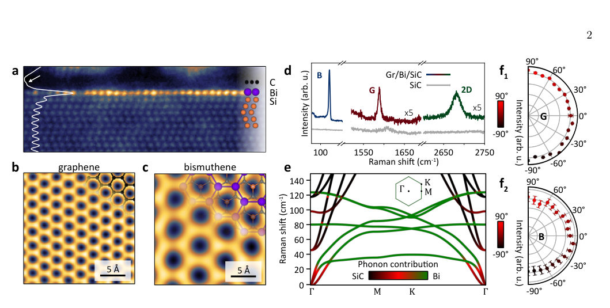
<figcaption class="paper-figure-caption"><b>Fig 1.</b> FIG. 1. Raman signature of intercalated bismuthene. a STEM image revealing a single monolayer of intercalated bismuth atoms, with the adsorption site located at the T1 position. b and c show STM images of graphene and bismuthene, respectively (see text for details). Both structures exhibit a honeycomb lattice, but with different lattice constants. d Raman spectrum showing the characteristic B peak of bismuthene (blue), as well as the G and 2D peaks of graphene (red and green, respectively). For comparison, a reference spectrum of the bare SiC substrate is shown in grey. e DFPT-calculated phonon dispersion of bismuthene on SiC, revealing a purely bismuth derived mode at Γ corresponding to...</figcaption>
</figure>
<figure class="paper-figure-card">
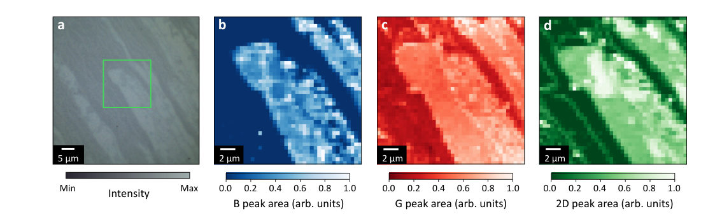
<figcaption class="paper-figure-caption"><b>Fig 2.</b> FIG. 2. Spatial mapping of intercalated bismuthene a Optical microscopy image of a sample, revealing two distinct phases: dark regions corresponding to non-intercalated areas and bright regions associated with intercalated domains. b-d Raman maps acquired within the area indicated by the green box in a, highlighting the spatial distribution of the respective spectral features.</figcaption>
</figure>
<figure class="paper-figure-card">
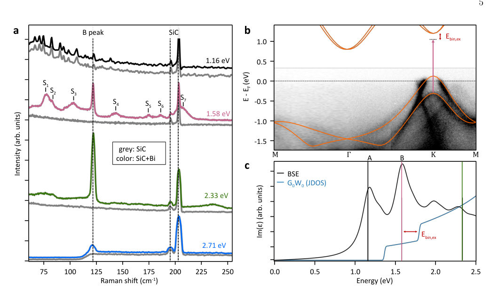
<figcaption class="paper-figure-caption"><b>Fig 3.</b> FIG. 3. Resonantly-enhanced Raman response. a Raman spectra measured at different excitation photon energies. b ARPES spectrum of intercalated bismuthene, in good agreement with DFT calculations (orange line), indicating slight p-type doping. The pink arrow marks the electronic transition associated with the B exciton and indicates its exciton binding energy Ebin,ex. c Absorption spectrum of pristine bismuthene calculated using the Bethe–Salpeter Equation (BSE), which accounts for the electron–hole Coulomb interaction and the resulting bound exciton states, is shown in black, while the GW-calculated joint density of states (jDOS) is shown in blue (taken from Ref. [23]). The step-like...</figcaption>
</figure>

**Summary.** This work presents a novel, ambient-condition Raman characterization technique for graphene-protected bismuthene monolayers. By tuning the excitation laser near the material's excitonic resonance, the researchers revealed intrinsic lattice dynamics and higher-order phonon modes previously inaccessible. This establishes Raman micro-spectroscopy as a powerful tool for probing delicate quantum materials.

**Why it may be interesting.** While focused on condensed matter spectroscopy, the study's emphasis on resonant enhancement mechanisms—where external energy tuning reveals hidden coupling strengths (exciton-phonon)—is highly relevant to understanding light-matter interaction in quantum systems.

Detailed structure

**Main problem.** The primary challenge is developing reliable, ambient-condition characterization methods for highly sensitive two-dimensional quantum spin Hall insulators like bismuthene.

**Main result.** The study successfully characterizes graphene-capped bismuthene using ex situ Raman spectroscopy, identifying intrinsic phonon modes and demonstrating resonant enhancement effects linked to excitonic transitions.

**Method.** The research combines experimental techniques (spatially resolved, polarization-dependent Raman spectroscopy) with theoretical calculations (DFPT for phonons, BSE/GW for excitons).

**Model / system.** The system under study is a heterostructure: bismuthene monolayer encapsulated by graphene on an SiC substrate. Bismuthene acts as the quantum spin Hall insulator layer.

**Key observables.** Pronounced Raman scattering peaks (e.g., $122 	ext{ cm}^{-1}$ for bismuthene), resonant enhancement of spectral features, and observation of interlayer breathing modes ($S1$).

**Important parameters / regimes.** Excitation energy tuned near the excitonic transition ($\sim 1.58 	ext{ eV}$); high crystalline order (narrow FWHM $\approx 5 	ext{ cm}^{-1}$).

**Assumptions / limitations.** The analysis assumes that resonant enhancement is governed by exciton-mediated scattering, and initial theoretical models neglect the weak van der Waals coupling of graphene.

**Figures summary.** Figures show STEM/STM confirmation of structure, Raman spectra mapping B, G, and 2D modes; phonon dispersion curves from DFPT; and absorption spectra showing A and B excitons.

**Paper structure.** The paper progresses by first establishing the structural feasibility (STEM/STM), then identifying intrinsic vibrational signatures via standard Raman measurements, and finally utilizing resonant excitation to probe higher-order, exciton-coupled scattering processes.

Abstract

Two-dimensional quantum spin Hall insulators based on atomic monolayers offer a promising route toward dissipationless electronics, yet their practical use is often limited by environmental instability. Encapsulating the system with a graphene capping layer has been shown to be a reliable method to prevent oxidation and degradation. However, the confirmation of a successful encapsulation still relies on ultra-high vacuum techniques, that considerably slow the process. Here, we present an ex situ, rapid, nondestructive and spatially resolved Raman characterization of graphene-capped bismuthene, a honeycomb monolayer of Bi on SiC. A pronounced Raman scattering peak at around 122 cm-1 is identified as the E2g phonon of bismuthene, via a comparison with density functional perturbation theory calculations. We use excitation-energy and polarization-dependent Raman measurements to enable an unambiguous assignment of the spectral features. Tuning the excitation energy close to the excitonic transition in pristine bismuthene, we observe a strong enhancement of the Raman response and the emergence of additional scattering peaks. In this regime, higher-order phonon features, as well as interfacial modes between bismuthene and the SiC substrate, become visible, suggesting the involvement of resonant scattering processes. Our results establish Raman micro-spectroscopy as a versatile tool for probing graphene-protected quantum materials, providing access to lattice dynamics and interlayer coupling.

[↑ back to top](#top)

### [Ion Flow under an Applied Electric Field in Semiconducting and Metallic Carbon Nanotubes](http://arxiv.org/abs/2608.00211v1)

**Authors:** J. B. Sokoloff  
**Type:** both · **Category:** other · **PDF:** <https://arxiv.org/pdf/2608.00211v1>  
**Analysis basis:** full PDF text, analyzed in chunks
**Topic relevance:** `non-equilibrium dynamics` **3/5** · `Keldysh / 2PI / non-Gaussian methods` **2/5** · `correlated / nonlocal dissipation` **1/5** · `driven-dissipative phase transition` **1/5** · `methods for driven-dissipative` **1/5** · `non-equilibrium universality` **1/5**

↔ Scroll figures horizontally

<figure class="paper-figure-card">
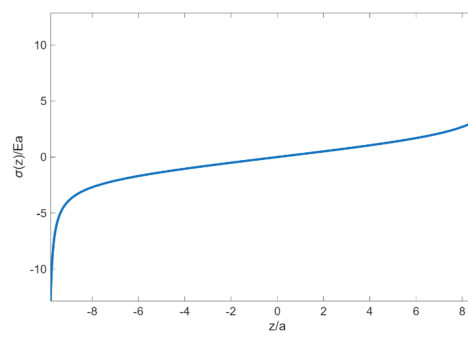
<figcaption class="paper-figure-caption"><b>Fig 1.</b> Figure 1: The electronic charge on the wall of a metallic nanotube ( ) / z Ea  in</figcaption>
</figure>
<figure class="paper-figure-card">
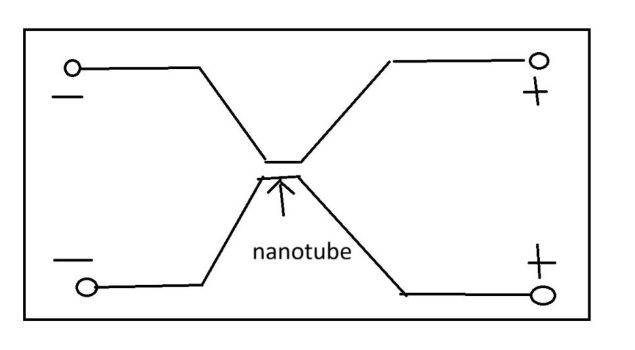
<figcaption class="paper-figure-caption"><b>Fig 2.</b> Fig. 2: A sketch of the experimental set-up in Ref. 11. Shown are the two positive and the two negative electrodes, which are poles perpendicular to the planar structure in which the fluid and the ions flow, and the etched guiding structures (illustrated in the sketch) that direct the ions into the nanotube.</figcaption>
</figure>

**Summary.** This paper investigates the discrepancy in ionic conductivity measurements between metallic and semiconducting carbon nanotubes under an electric field. The authors propose that the difference stems from how quickly each tube type reaches an equipotential state; semiconductors retain a persistent internal electric field longer than metals, driving higher measured ion flow rates.

**Why it may be interesting.** It provides a detailed physical mechanism connecting electronic structure (semiconductor vs. metal) to macroscopic transport properties (ionic conductivity) via transient electrostatics, which is relevant for understanding open quantum systems dynamics in nanoscale devices.

Detailed structure

**Main problem.** The study aims to elucidate how electronic degrees of freedom influence ion transport properties (ionic conductivity) in carbon nanotubes, reconciling conflicting experimental observations.

**Main result.** The difference in ionic conductivity between metallic and semiconducting CNTs for long tubes is attributed to the time scale required for the internal electric field to dissipate; semiconductors retain a measurable internal field longer than metals.

**Method.** The authors combine theoretical derivations based on quantum mechanical models (calculating electron concentrations and charge) with analysis of experimental measurements concerning ion flow rates under applied fields.

**Model / system.** The system involves metallic and semiconducting carbon nanotubes subjected to an external electric field, where ion transport ($	ext{K}^+$) is measured. The theory models the time evolution of surface charge distribution on the nanotube walls.

**Key observables.** Ionic conductivity, $	ext{K}^+$ flow rates, internal electric field strength ($E$), and characteristic time scales ($	au_t$).

**Important parameters / regimes.** Nanotube diameter (2.6-5.4 nm), length (100 $\mu$m vs 11 nm), applied electric field, and electronic parameters like band gap ($g$) and Fermi level ($E_F$).

**Assumptions / limitations.** The analysis relies on comparing different time scales: short tubes reach equipotential quickly, while long semiconducting tubes maintain a significant internal field for extended periods.

**Figures summary.** Figure 1 illustrates the electronic charge distribution on metallic nanotubes; Figure 2 sketches the experimental setup used in related literature (Ref. [11]).

**Paper structure.** The paper reviews conflicting literature results regarding ion flow rates, develops a theoretical framework based on charge relaxation times ($	au_t$), and uses this time scale difference to explain why semiconducting tubes exhibit higher conductivity than metallic ones under certain measurement conditions.

Abstract

Measurements made by Li, et. al., showed that the flow rates of potassium ions through 11nm long, subnanometer diameter, metallic and semiconducting carbon nanotubes under an applied electric field are almost the same. In contrast, measurements of the electrical conductivity of potassium chloride solution through 100 long metallic and semiconducting carbon nanotubes with diameters between 2.6-5.4nm by Cui, et. al., show that the ionic conductivity in the semiconducting nanotubes is larger than that of the metallic nanotubes. Possible theoretical origins of these differences are explored in this article.

[↑ back to top](#top)

### [Ferroelectric superconductivity in noncentrosymmetric metals](http://arxiv.org/abs/2608.00338v1)

**Authors:** Jason G. Kattan, T. Pereg-Barnea  
**Type:** theory · **Category:** strongly correlated electrons · **PDF:** <https://arxiv.org/pdf/2608.00338v1>  
**Analysis basis:** full PDF text, analyzed in chunks
**Topic relevance:** `Keldysh / 2PI / non-Gaussian methods` **3/5** · `analog quantum simulation` **1/5** · `correlated / nonlocal dissipation` **1/5** · `driven-dissipative phase transition` **1/5** · `methods for driven-dissipative` **1/5**

↔ Scroll figures horizontally

<figure class="paper-figure-card">
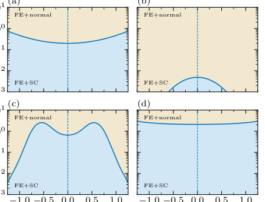
<figcaption class="paper-figure-caption"><b>Fig 1.</b> FIG. 1. Phase diagram for (a) enhanced pairing, (b) sup- pressed pairing, (c) peaked enhancement, and (d) high–Tc plateau. We use the parameters in Appendix B.</figcaption>
</figure>
<figure class="paper-figure-card">
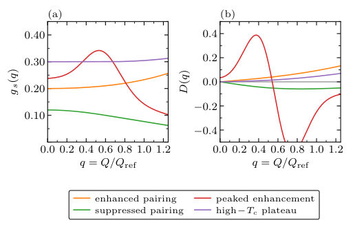
<figcaption class="paper-figure-caption"><b>Fig 2.</b> FIG. 2. Representative evaluations of the ferroelectric BCS model as functions of the dimensionless polar coordinate q. (a) The s-wave attraction strength gs(q). (b) The local en- hancement diagnostic D(q) ≡dgs</figcaption>
</figure>

**Summary.** This theoretical work develops a formalism to study how ferroelectricity and superconductivity can coexist in noncentrosymmetric metals. By treating polarization fluctuations as an effective attractive interaction, the authors derive conditions under which these lattice distortions drive electron pairing, extending BCS theory into polar materials.

**Why it may be interesting.** While focused on condensed matter pairing mechanisms, the treatment of fluctuating order parameters (polarization) mediating interactions is relevant to open quantum systems where environmental coupling drives collective excitations and emergent correlations.

Detailed structure

**Main problem.** The work investigates the fundamental physical problem of how superconductivity can coexist with, or even emerge from, ferroelectric ordering in noncentrosymmetric metals.

**Main result.** Superconductivity can be induced by attractive electron-electron interactions mediated by polarization fluctuations, leading to a BCS-type pairing mechanism analogous to phonon mediation.

**Method.** The authors employ a microscopic field-theoretic approach, deriving an effective Hamiltonian by integrating out ionic degrees of freedom (phonons) from the coupled electron-ion system.

**Model / system.** The model is a coupled electron-ion system described by a general Hamiltonian incorporating electronic operators and ionic position/momentum operators. The analysis proceeds via normal mode quantization of the ion subsystem, leading to an effective attractive interaction term for electrons.

**Key observables.** Superconducting critical temperature ($T_c$), superconducting gap ($\Delta$), spontaneous polarization, and the BCS-type gap equation.

**Important parameters / regimes.** The strength of the phonon-mediated attraction relative to Coulomb repulsion; parameters governing ferroelectric order (e.g., displacement magnitude).

**Assumptions / limitations.** Significant approximations are made, including reducing the model to a single relevant band and neglecting odd-order anharmonic couplings in the ion dynamics expansion.

**Figures summary.** The paper illustrates four representative qualitative regimes of pairing enhancement/suppression based on varying coupling strengths and polar dependencies (e.g., enhanced vs. suppressed pairing).

**Paper structure.** The structure moves from defining a general microscopic Hamiltonian for coupled electron-ion dynamics, through normal mode analysis of the ionic subsystem, to deriving simplified BCS gap equations that quantify the conditions for ferroelectric superconductivity.

Abstract

It has recently been shown in experiments that certain materials can display both superconductivity and ferroelectricity, contrary to a long-standing conjecture that these two phenomena are incompatible, or at least unrelated. In this work we study superconductivity in ferroelectric metals, using a formalism of ionic polarization fields coupled to itinerant electrons, both of which are treated at the microscopic level. The ferroelectric order manifests as a spontaneous polarization that may be uniform or spatially modulated, and fluctuations of the polarization mediate interactions between the electrons. The polarization fluctuations give rise to attractive interactions that can lead to Cooper pairing in certain lattice configurations, analogous to the nonpolar phonons in conventional BCS theory. Working with a simplified BCS model, we derive conditions under which superconductivity can coexist with and even emerge from ferroelectricity.

[↑ back to top](#top)

### [Analytical Charge Density Profile of Vortex Core in Weak-Coupling Superconductor](http://arxiv.org/abs/2608.00226v1)

**Authors:** Chi-Ken Lu  
**Type:** theory · **Category:** other · **PDF:** <https://arxiv.org/pdf/2608.00226v1>  
**Analysis basis:** full PDF text, analyzed in chunks
**Topic relevance:** `Keldysh / 2PI / non-Gaussian methods` **3/5** · `methods for driven-dissipative` **1/5** · `non-equilibrium dynamics` **1/5**

↔ Scroll figures horizontally

<figure class="paper-figure-card">
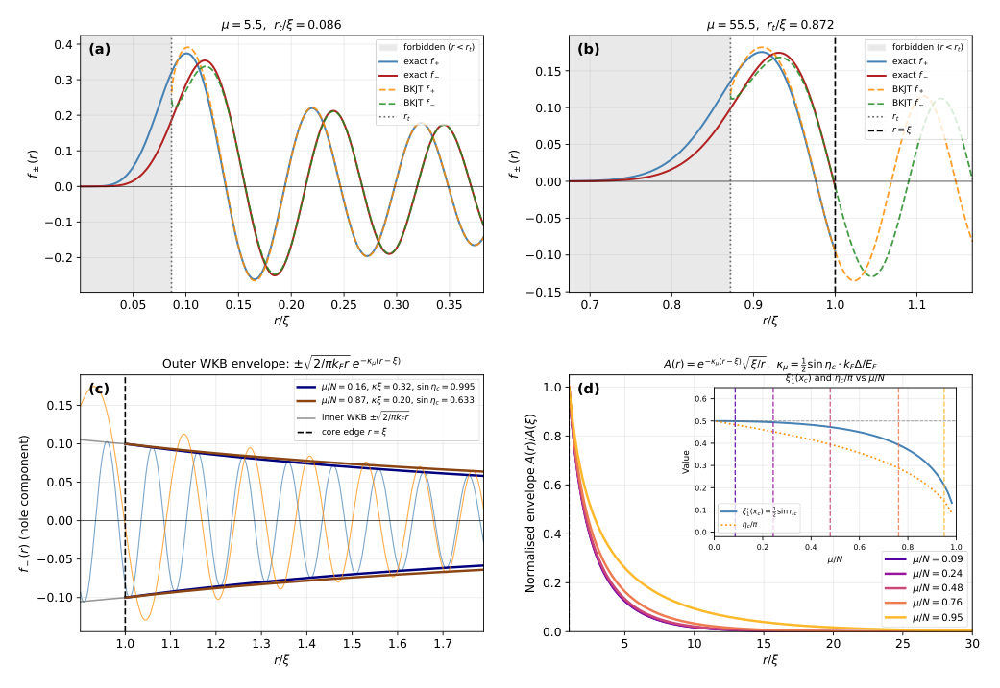
<figcaption class="paper-figure-caption"><b>Fig 1.</b> FIG. 1. CdGM bound-state wavefunctions computed with kF = 1, m = 1 2, ∆/EF = 0.01, giving ξ ≈63.7 k−1 F and N ≡ kFξ ≈63.7 modes. (a) Electron (f+, solid blue) and hole (f−, solid red) components alongside the BKJT inner approximation (dashed) for µ = 5.5 (rt/ξ = 0.086). The classically forbidden region r &lt; rt is shaded grey; the turning point (dotted vertical) lies deep inside the core. The exact Bessel and BKJT solutions overlap closely over most of the classically allowed region [28]. (b) Same for µ = 55.5 (rt/ξ = 0.867). The viewing window crosses the core edge r = ξ (vertical dashed line); for r &gt; ξ the Taylor-linearized outer BKJT solution is appended (dashed curves). The large...</figcaption>
</figure>
<figure class="paper-figure-card">
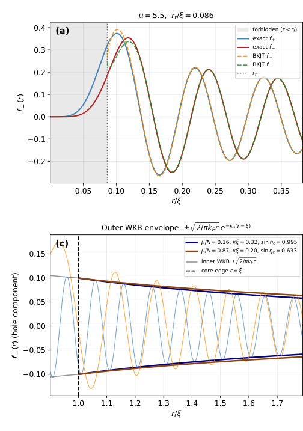
<figcaption class="paper-figure-caption"><b>Fig 2.</b> Fig. 2 displays the numerical results for computing the normalization constant C2 µ along with the analytical es-</figcaption>
</figure>
<figure class="paper-figure-card">
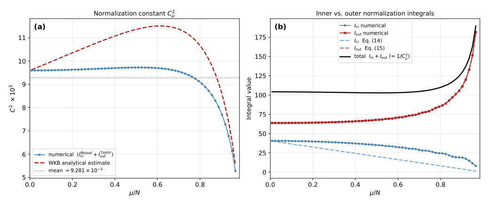
<figcaption class="paper-figure-caption"><b>Fig 3.</b> FIG. 2. Normalization constant C2 µ and its decomposition into inner and outer partial integrals, computed with kF = 1, m = 1</figcaption>
</figure>
<figure class="paper-figure-card">
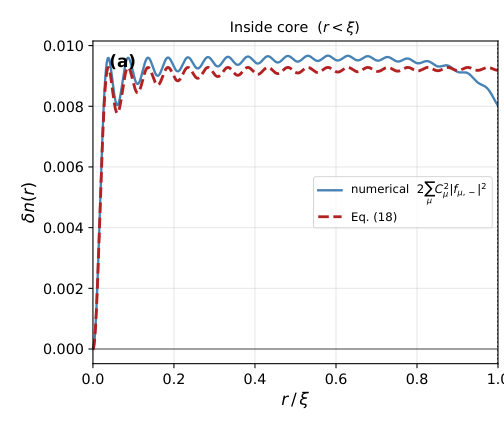
<figcaption class="paper-figure-caption"><b>Fig 4.</b> FIG. 3. Charge-density perturbation δn(r) computed with kF = 1, m = 1</figcaption>
</figure>
<figure class="paper-figure-card">
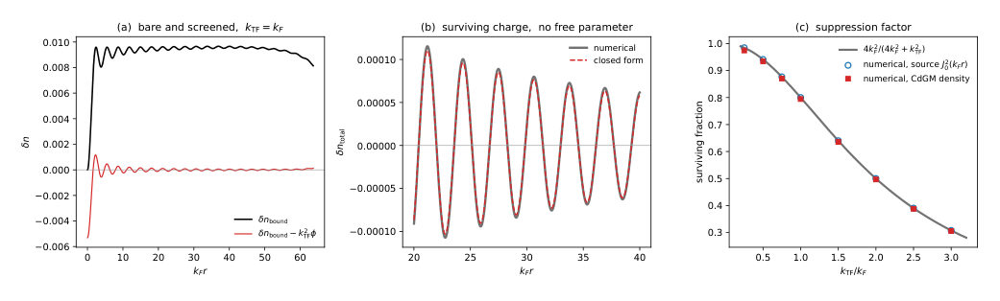
<figcaption class="paper-figure-caption"><b>Fig 5.</b> FIG. 4. Screening of the CdGM charge, computed with kF = 1, ∆/EF = 0.01 (kFξ ≈64), using the numerical mode sum 2 P</figcaption>
</figure>

**Summary.** This paper analytically determines the charge density profile inside a superconducting vortex core by simplifying the Bogoliubov–de Gennes equations. It shows that while the bound states create local modulations, global charge neutrality forces extended states to compensate this charge. The final result is a persistent, sign-alternating ripple modulation dictated by screening inefficiency at large momentum transfers.

**Why it may be interesting.** While focused on superconductivity, the rigorous mathematical techniques developed for solving the screened Poisson equation ($
abla^2 - k_{TF}^2$) using complex envelopes and separation of variables are highly valuable tools applicable to analyzing charge screening in other quantum many-body systems or interfaces.

Detailed structure

**Main problem.** To provide an elementary analytical account of the charge density profile within a superconducting vortex core, specifically addressing the sign change and residual modulation observed in self-consistent calculations.

**Main result.** The bound-state charge does not integrate to zero; neutrality requires extended states to compensate it exactly, leaving a persistent, sign-alternating $2k_F$ modulation outside the core.

**Method.** Analytical derivation using the slow-mode ansatz applied to Bogoliubov–de Gennes equations, followed by solving the screened Poisson equation using advanced mathematical techniques like separation of variables and 'replacement tricks'.

**Model / system.** The system is a weak-coupling s-wave superconductor containing a single vortex line. The physics is governed by quasiparticle bound states derived from Bogoliubov–de Gennes (BdG) equations, analyzed using a step-like gap profile.

**Key observables.** Charge density profile $\delta n(r)$, potential $\phi(r)$, and the residual $2k_F$ modulation amplitude.

**Important parameters / regimes.** Fermi wavevector ($k_F$), coherence length ($\xi$), Fermi momentum ($E_F$), and the ratio of superconducting gap to Fermi energy ($\Delta_\infty/E_F$).

**Assumptions / limitations.** The analysis relies on approximating the normalization constant as weakly dependent on angular momentum, and later uses 'replacement tricks' or separation of variables which are shown to fail near boundaries.

**Figures summary.** Figures compare exact Bessel solutions to approximations for mode normalization; another figure compares numerical vs. analytical solutions for a screened potential source using different mathematical techniques.

**Paper structure.** The paper first derives the in-core density profile analytically using simplified BdG sums, then tackles the screening problem by solving the Poisson equation, comparing several approximation methods (like the replacement trick) against exact solutions to validate the final result regarding residual oscillations.

Abstract

Self-consistent Bogoliubov-de Gennes calculations have long shown that solving the Poisson equation inside a superconducting vortex turns a one-signed charge depletion into a modulation that alternates in sign with period $π/k_F$. We give an elementary account of that result. Taking the Caroli-de Gennes-Matricon bound states in a step-like gap, we show that the normalization of the bound-state spinor is nearly independent of angular momentum, which collapses the mode sum into closed form. Inside the core the vortex winding removes one Bessel channel from a completeness sum, so the density vanishes on the vortex line and carries Friedel-like oscillations of wavevector $2k_F$; outside it the sum gives a $1/r$ envelope decaying over a coherence length, with a residual ripple. The bound-state charge does not integrate to zero, so neutrality obliges the extended states to compensate it exactly. That compensation is complete at long wavelength but fails at the diameter of the Fermi circle, and what survives is a sign-alternating $2k_F$ modulation reduced only by $4k_F^2/(4k_F^2+k_{TF}^2)$, a factor lying between one-half and three-quarters for any metal. The oscillation is therefore not a delicate effect but a consequence of neutrality and the inefficiency of screening at large momentum transfer: in the screened total the smooth terms cancel and only the ripple is left.

[↑ back to top](#top)

### [Band topology and symmetry-driven magneto-optical response in two-dimensional d-wave altermagnets with staggered spin-orbit coupling](http://arxiv.org/abs/2608.02155v1)

**Authors:** Meysam Bagheri Tagani Carmine Autieri, Wojciech Brzezicki  
**Type:** theory · **Category:** other · **PDF:** <https://arxiv.org/pdf/2608.02155v1>  
**Analysis basis:** full PDF text, analyzed in chunks
**Topic relevance:** `spintronics-quantum-optics interface` **3/5**

↔ Scroll figures horizontally

<figure class="paper-figure-card">
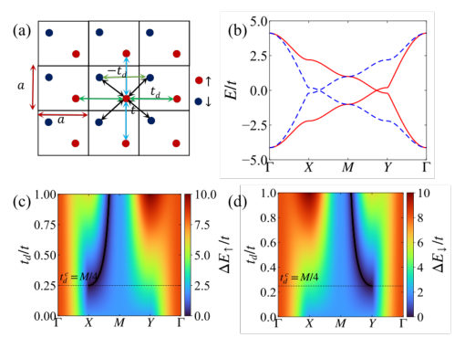
<figcaption class="paper-figure-caption"><b>Fig 1.</b> FIG. 1. (a) Schematic of the d-wave altermagnetic lat- tice composed of two basis sites. Nearest-neighbor (NN) and next-nearest-neighbor (NNN) hopping processes are in- dicated. Red (blue) sites indicate spin-up (spin-down) sites. (b) Spin-resolved band structure of the d-wave altermagnet along the high-symmetry path Γ–X–M–Y–Γ for parameters M = 1, a = 1, t = 1, and td = 0.3, without SOC terms. Solid (dashed) curves denote spin-down (spin-up) bands. (c)– (d) Evolution of the Dirac points in the Brillouin zone as a function of td for the spin-up and spin-down channels, respec- tively. The solid lines trace the momentum positions of the Dirac points for each spin sector.</figcaption>
</figure>
<figure class="paper-figure-card">
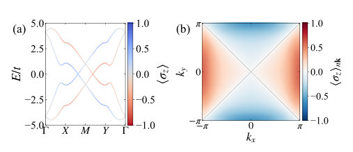
<figcaption class="paper-figure-caption"><b>Fig 2.</b> FIG. 2. (a) Band structure of the altermagnetic lattice for Rashba spin–orbit coupling λR = 0.6t. All other parameters are identical to those used in Fig. 1. (b) Out-of-plane spin polarization of the low-energy band near the Fermi level in the presence of Rashba SOC.</figcaption>
</figure>
<figure class="paper-figure-card">
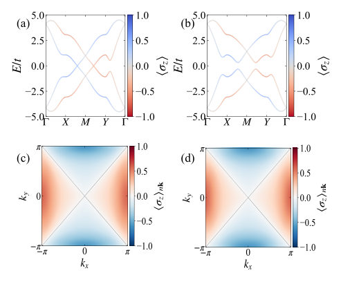
<figcaption class="paper-figure-caption"><b>Fig 3.</b> FIG. 3. Band structure of the altermagnetic lattice for (a) staggered Rashba interaction λs = 0.25t, and (b) bond stag- gered SOC interaction λb = 0.25t. λR = 0.6t, and all other parameters are identical to those used in Fig. 1. (c)-(d) Out- of-plane spin polarization of the low-energy band near the Fermi level for (a) and (b), respectively.</figcaption>
</figure>
<figure class="paper-figure-card">

<figcaption class="paper-figure-caption"><b>Fig 4.</b> Figure 2(b) displays sn,z(k) for the low-energy band immediately below the Fermi level. The texture retains the d-wave altermagnetic structure: regions related by a 90◦rotation carry opposite out-of-plane spin polar- ization. More precisely, the surviving antiunitary C4zT symmetry imposes</figcaption>
</figure>
<figure class="paper-figure-card">
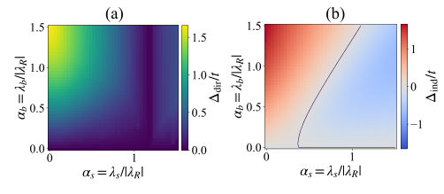
<figcaption class="paper-figure-caption"><b>Fig 5.</b> FIG. 4. (a) Minimum direct gap ∆dir/t and (b) indirect gap ∆ind/t as functions of the dimensionless staggered SOC parameters αs = λs/|λR| and αb = λb/|λR|. The solid line in panel (b) denotes ∆ind = 0 and separates the insulating region from the energy-overlapping metallic regime. λR = 0.6t and other parameters are the same as in Fig. 1.</figcaption>
</figure>

**Summary.** The paper develops a tight-binding model for 2D d-wave altermagnets to study their magneto-optical response. It shows that the interplay of different spin-orbit coupling mechanisms—particularly staggered components—is necessary to break symmetries, generate Berry curvature hot spots, and induce measurable optical Hall effects or even a Chern insulator phase. This work highlights how subtle structural couplings can dictate macroscopic electronic properties in compensated magnets.

**Why it may be interesting.** This work provides a detailed theoretical framework for understanding how engineered interfacial couplings (SOC) can induce exotic electronic properties like quantized Hall states or large optical responses in magnetically ordered materials without requiring net ferromagnetism, which is highly relevant for spintronics and topological materials research.

Detailed structure

**Main problem.** The study investigates how distinct spin-orbit coupling (SOC) mechanisms control band topology and magneto-optical response in two-dimensional d-wave altermagnets that lack a net ferromagnetic moment.

**Main result.** The combination of staggered SOC terms is crucial for generating finite Berry curvature, optical Hall conductivity, and potentially realizing a Chern insulator phase, even when the system remains topologically trivial in certain limits.

**Method.** Theoretical analysis using a four-band tight-binding model solved via covariant-velocity Kubo calculations to determine frequency-dependent transport properties.

**Model / system.** The physical system is a 2D d-wave altermagnet modeled on a Lieb lattice structure, described by a periodic four-band Hamiltonian incorporating hopping terms and three distinct SOC channels: uniform Rashba, sublattice-staggered Rashba, and bond-staggered SOC.

**Key observables.** Optical Hall conductivity ($\sigma_{xy}$), circular dichroism, Chern number ($C$), and DC/resonant Hall responses.

**Important parameters / regimes.** SOC strengths (lambda_R, lambda_s, lambda_b), carrier doping level (chemical potential $\mu$), and magnetic order parameter $M$.

**Assumptions / limitations.** The analysis assumes a collinear Néel vector configuration and relies on the tight-binding approximation; it distinguishes between topological quantization (Chern insulator) and large optical responses in trivial states.

**Figures summary.** Figures illustrate spin-resolved band structures along high-symmetry lines, showing the evolution of Dirac points and nodal gaps as SOC parameters are varied.

**Paper structure.** The paper develops the Hamiltonian incorporating various SOC terms, analyzes how each term breaks symmetries (e.g., sublattice-staggered Rashba breaking antiunitary symmetry), calculates topological invariants like the Chern number, and finally uses Kubo formalism to predict measurable magneto-optical responses under doping.

Abstract

Altermagnets combine compensated collinear magnetic order with momentum-dependent spin splitting, providing a route to transverse electronic and optical responses without a net ferromagnetic moment. We develop a strictly periodic four-band tight-binding model for a two-dimensional d-wave altermagnet and distinguish the roles of three spin orbit coupling (SOC) channels: uniform Rashba SOC, a sublattice-staggered Rashba interaction, and bond-staggered SOC.   In the absence of SOC, the d-wave kinetic anisotropy produces spin-polarized Dirac points on orthogonal Brillouin-zone boundaries, related by the altermagnetic fourfold spin-group symmetry. Uniform Rashba SOC mixes the spin sectors and shifts these nodes but preserves the antiunitary symmetry that forbids an integrated Hall response. The sublattice-staggered Rashba term breaks this symmetry and activates transverse optical response, whereas the bond-staggered SOC provides the mass that gaps the boundary nodes. Their combined action generates strong Berry-curvature hot spots and, within a narrow parameter window, an isolated lower two-band manifold with Chern number C=-2. For the representative parameters considered here it is possible to stabilize a Chern insulator phase.   Using covariant-velocity Kubo calculations, we show that large optical Hall conductivity and circular dichroism extend well beyond the nonzero-Chern region and are controlled by SOC-induced avoided crossings and symmetry breaking. We further find that carrier doping strongly modifies the resonant and dc Hall responses through Pauli blocking and the occupation of Berry-curvature hot spots, enabling gate-controlled sign reversals. These results identify the complementary roles of distinct interfacial SOC mechanisms in producing topology and tunable magneto-optical activity in compensated two-dimensional magnets.

[↑ back to top](#top)

### [Mechanism of State Transitions for the Vector Kuznetsov-Ma Breathers](http://arxiv.org/abs/2608.00570v1)

**Authors:** Muchen Dong, Lei Wang  
**Type:** theory · **Category:** other · **PDF:** <https://arxiv.org/pdf/2608.00570v1>  
**Analysis basis:** full PDF text, analyzed in chunks
**Topic relevance:** `driven-dissipative phase transition` **2/5** · `non-equilibrium dynamics` **2/5** · `non-equilibrium universality` **2/5** · `Frenkel-Kontorova` **1/5** · `Keldysh / 2PI / non-Gaussian methods` **1/5** · `analog quantum simulation` **1/5** · `correlated / nonlocal dissipation` **1/5** · `entanglement & information structure` **1/5** · `methods for driven-dissipative` **1/5** · `scars & prethermalization` **1/5**

↔ Scroll figures horizontally

<figure class="paper-figure-card">
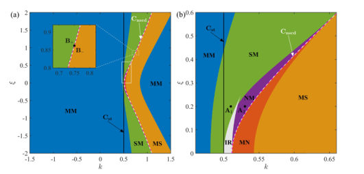
<figcaption class="paper-figure-caption"><b>Fig 1.</b> FIG. 1. KMB morphology map for χa ∈{χ1, χ2} at A = 5, B = 1: (a) global view and (b) enlargement of the white box in (a). Two-letter labels give components 1 and 2, with M, N, S denoting bright, dark, and four-petal structures (e.g., MM is bright–bright); IR denotes the invalid region. Cst and Cnscd are the state-transition and non-self-conjugate degener- ation curves. A1,2 give Figs. 2(a,b), and the one-sided limits at B± give Figs. 3(a,b).</figcaption>
</figure>
<figure class="paper-figure-card">
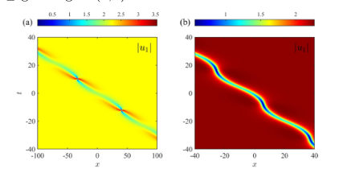
<figcaption class="paper-figure-caption"><b>Fig 2.</b> FIG. 2. First-component profiles of KMBs for A = 5, B = 1: (a) the four-petal KMB at (k, ξ) = (0.51, 0.20); (b) the dark KMB at (k, ξ) = (0.53, 0.20).</figcaption>
</figure>
<figure class="paper-figure-card">
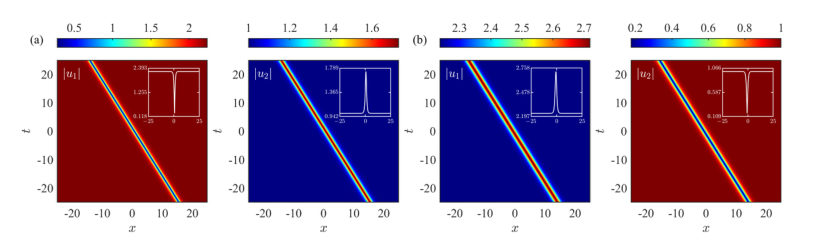
<figcaption class="paper-figure-caption"><b>Fig 3.</b> FIG. 3. One-sided limit solitons on Cnscd for A = 5, B = 1 at (k, ξ) = (0.75, 0.8619): (a) dark–antidark soliton at B+; (b) antidark–dark soliton at B−.</figcaption>
</figure>
<figure class="paper-figure-card">
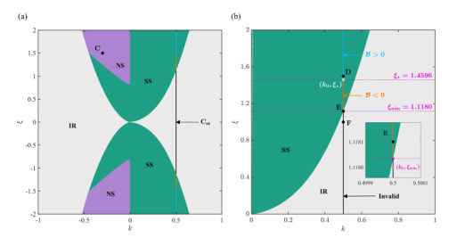
<figcaption class="paper-figure-caption"><b>Fig 4.</b> FIG. 4. Nondegenerate-sector morphology map for A = 5, B = 1: (a) global view and (b) first-quadrant enlargement. Cst contains an inactive segment in IR and two- and single- soliton transition segments. Points C, D, E, F give Figs. 5, 6(a), 6(b) and 10, respectively; Cscd1 bounds the sector. Two- letter labels carry the same meaning as those in Fig. 1.</figcaption>
</figure>
<figure class="paper-figure-card">
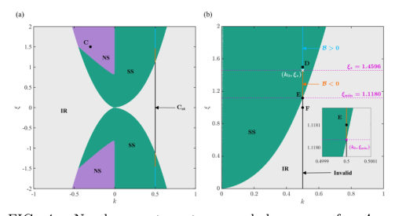
<figcaption class="paper-figure-caption"><b>Fig 5.</b> FIG. 5. Dark–four-lobed KMB at C in Fig. 4: (a) |u[1] 1 |, dark; (b) |u[1] 2 |, four-lobed. It is absent at equal amplitudes.</figcaption>
</figure>

**Summary.** This paper analyzes how vector Kuznetsov-Ma breathers undergo state transitions within a coupled Fokas-Lenells model. It identifies two key mechanisms: a discontinuous jump in the degenerate regime and a direct conversion to solitons when background frequencies match. The work uses advanced mathematical techniques to map out these transition boundaries.

**Why it may be interesting.** While focused on nonlinear PDEs, the study of stable/unstable localized structures, symmetry breaking, and transition dynamics shares conceptual overlap with understanding excitation modes in complex quantum systems or optical lattices.

Detailed structure

**Main problem.** The study investigates the mechanisms governing state transitions for vector Kuznetsov-Ma breathers (KMBs) within the coupled Fokas-Lenells framework.

**Main result.** Two distinct transition mechanisms are found: a discontinuous KMB-to-soliton jump in the degenerate sector, and a direct conversion to single/two-soliton states when background plane waves become frequency matched in the nondegenerate sector.

**Method.** The analysis employs theoretical techniques including Darboux transformations and spectral eigenvalue calculations, supplemented by numerical excitation for verification.

**Model / system.** The system is modeled by vector KMBs governed by a dimensionless Coupled Fokas-Lenells (CFL) system on unequal backgrounds. This framework incorporates intrinsic space–time coupling effects.

**Key observables.** Breather morphology, the existence and nature of limiting solitons (dark–antidark states), and the transition threshold parameters.

**Important parameters / regimes.** The background imbalance ($R 
eq 0$), which breaks spectral reflection symmetry; the specific curves defining degeneration ($C_{nscd}$) and frequency matching ($C_{st}$).

**Assumptions / limitations.** The analysis is confined to the CFL system, and certain limiting procedures (like one-fold Darboux transformations) are utilized to characterize transitions.

**Figures summary.** Figures illustrate KMB morphology maps showing transition curves ($C_{st}, C_{nscd}$), and visualize the resulting dark–antidark or multi-soliton states in different regimes.

**Paper structure.** The paper systematically analyzes the state transitions by first examining the degenerate sector (leading to discontinuous jumps) and then analyzing the nondegenerate sector (where frequency matching causes direct soliton conversion). Special attention is paid to limiting behavior on self-conjugate curves.

Abstract

We study two types of mechanisms of state transitions for vector Kuznetsov-Ma breathers (KMBs) in the coupled Fokas-Lenells framework on unequal backgrounds. The amplitude imbalance breaks spectral reflection symmetry and generates richer breather morphologies. In the degenerate sector, KMBs approaching a non-self-conjugate degeneration curve from opposite sides yield different limiting solitons, revealing a discontinuous KMB-to-soliton transition. In the nondegenerate sector, the background plane waves become frequency matched at a special wavenumber, converting the KMB into a single- or two-soliton state. We determine the exact transition threshold and characterize how nearby solutions vary with the parameter. We further investigate special limiting mechanisms arising on the self-conjugate degeneration curve and on the real spectrum at the state-transition wavenumber. Numerical excitation provides further evidence for these results.

[↑ back to top](#top)

### [Reciprocal Skin Effect from Internal Rotation](http://arxiv.org/abs/2608.01520v1)

**Authors:** Kin Hung Fung, C. T. Chan  
**Type:** theory · **Category:** other · **PDF:** <https://arxiv.org/pdf/2608.01520v1>  
**Analysis basis:** full PDF text, analyzed in chunks
**Topic relevance:** `driven-dissipative phase transition` **2/5** · `Frenkel-Kontorova` **1/5** · `analog quantum simulation` **1/5** · `correlated / nonlocal dissipation` **1/5** · `methods for driven-dissipative` **1/5** · `non-equilibrium dynamics` **1/5** · `non-equilibrium universality` **1/5**

↔ Scroll figures horizontally

<figure class="paper-figure-card">
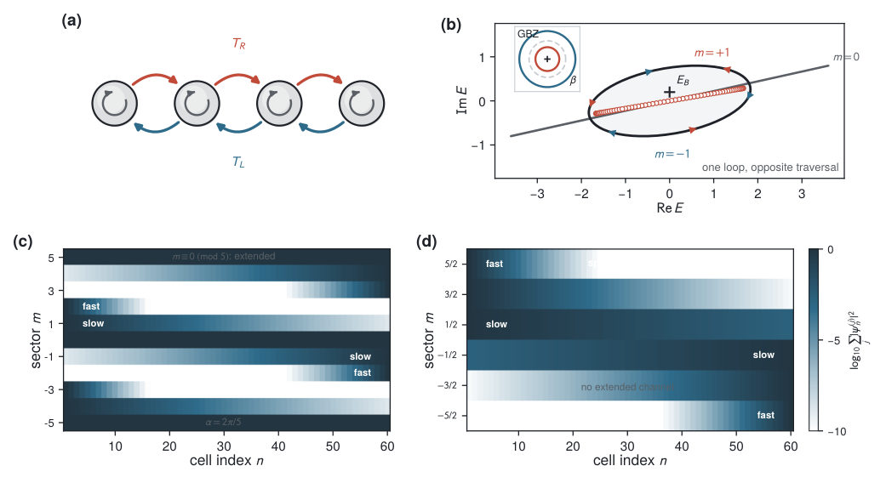
<figcaption class="paper-figure-caption"><b>Fig 1.</b> FIG. 1. The reciprocal rotor chain and its graded skin effect. (a) Identical cells carry a compact rotor; the inter-cell coupling TR,L = t0I + t1R(±α) is reciprocal as a matrix [Eq. (3)]. (b) At α = 2π/3 the channels m = ±1 trace one periodic-boundary loop with opposite orientation (terracotta/teal); about the common base point EB = 0.2i (cross, shaded), which avoids every sector spectrum [mink |Hm(k) −EB| ≥0.195], the point-gap windings are ν±1 = ±1 and ν0 = 0; the open-boundary spectrum (points) collapses onto an interior segment and m = 0 to a zero-area one through the origin. Inset: the sector-resolved GBZs are exact circles [Eq. (6)], m ≡1, 2 (mod 3) on reciprocal radii about the Bloch...</figcaption>
</figure>
<figure class="paper-figure-card">
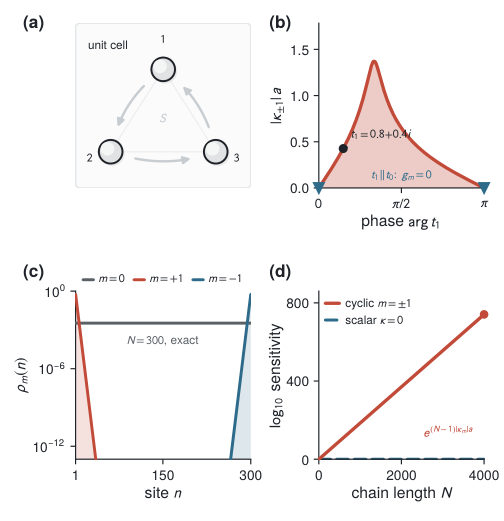
<figcaption class="paper-figure-caption"><b>Fig 2.</b> FIG. 2. Concrete cyclic three-site (C3) realization; (b)–(d) use the closed-form solution, so every curve is exact at arbi- trary N (no diagonalization). (a) Single-unit-cell schematic: three sites coupled by the cyclic shift S (the C3 rotation). (b) Skin rate of the m = ±1 channels versus coupling phase arg t1 (fixed |t1|): it vanishes at t1 ∥t0 (arg t1 = 0, π), where gm = 4 Im(t∗ 0t1) sin(mα) = 0 and every channel is gauge reciprocal (skin free within this mechanism); marker at the working point t1 = 0.8 + 0.4i. (c) Exact bipolar profile at N = 300: m = 0 extended, m = ±1 at opposite edges at equal rate, ρm(n) ∝|βm|2n [Eqs. (6) and (8)]; intensive (N- independent) since κm is. (d)...</figcaption>
</figure>
<figure class="paper-figure-card">
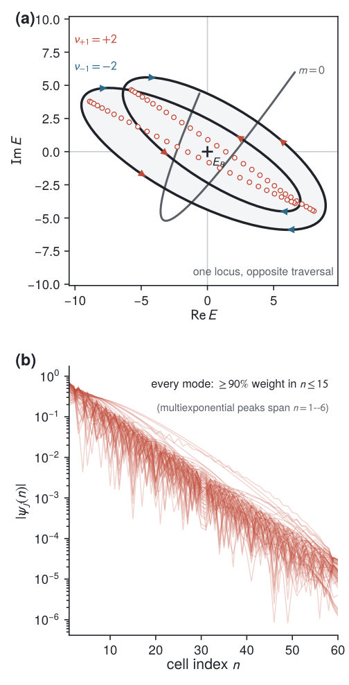
<figcaption class="paper-figure-caption"><b>Fig 3.</b> FIG. 3. Windings beyond ±1: the range-2 rotor of the main text [T2 = s0I + s1R(α), (s0, s1) = (3, 3e2πi/3), α = 2π/3]. (a) Bloch locus of the sector-(+1) channel: the curve encircles EB = 0 twice, ν+1 = +2 [here EB avoids every sector locus, mink |Hm(k)| ≥1.6]; the reciprocal partner m = −1 traces the same locus with opposite orientation, ν−1 = −2, and m = 0 degenerates to a zero-area locus. Points: open-boundary spectrum (N = 60), interior to the locus. (b) Eigenmode amplitudes |ψj(n)| of the ν = +2 channel: every mode is strongly left localized, carrying ≳93% of its weight in the leftmost quarter, though the multiexponential range-2 profiles need not peak in the first cell (peak cells...</figcaption>
</figure>

**Summary.** This work introduces the 'reciprocal skin effect' in lattice models by incorporating an internal conserved angular momentum (internal rotation). This mechanism generates a rich, graded topological invariant ($\mathbb{Z}_q$) that dictates directional localization while maintaining overall Hamiltonian reciprocity. The findings provide a powerful theoretical tool for designing quantum systems with controlled, symmetry-protected transport properties.

**Why it may be interesting.** The concept of a 'reciprocal skin effect' protected by internal symmetry is a sophisticated extension of standard non-Hermitian physics, providing new topological invariants ($\mathbb{Z}_q$) beyond simple $\mathbb{Z}_2$ indices. This framework could apply to engineered quantum metamaterials or optical lattices.

Detailed structure

**Main problem.** To construct a general mechanism where an internal, conserved compact angular momentum converts standard lattice couplings into a reciprocal non-Hermitian skin effect.

**Main result.** The system exhibits a graded topological invariant ($\mathbb{Z}_q$) protected by the internal rotation, leading to directional localization that is balanced between opposite boundaries (reciprocal skin effect).

**Method.** Theoretical analysis of lattice Hamiltonians involving rotational couplings, utilizing concepts from non-Hermitian topology and spectral theory.

**Model / system.** A class of lattices featuring an 'internal rotation'—a conserved compact angular momentum in each unit cell. The model is analyzed using a rotor chain Hamiltonian structure $H\psi = h_0(Jz) \psi + T_R \psi_{n+1} + T_L \psi_{n-1}$.

**Key observables.** Directional Imbalance Generator ($g_m$), Integer Grading ($\mathbb{Z}_q$) winding numbers, and the skin localization length ($\xi_m$).

**Important parameters / regimes.** The rotational parameter $\alpha$, spin quantum number $j$ (integer or half-integer), and coupling strengths ($t_0, t_1$).

**Assumptions / limitations.** The existence of a multi-mode internal space carrying a nontrivial rotation representation and the conservation of angular momentum $J_z$.

**Figures summary.** Figures illustrate the rotor chain structure, showing point-gap windings ($
u_{\pm 1}, 
u_0$) for specific $\alpha$ values (e.g., $\alpha=2\pi/3$), and visualizing spectral collapse and localization profiles.

**Paper structure.** The paper establishes the general mechanism via internal rotation leading to directional imbalance, derives the topological invariants ($\mathbb{Z}_q$), analyzes the behavior across different spin classes (integer vs. half-integer), and confirms realizations using specific lattices like the cyclic three-site model or passive lossy resonators.

Abstract

We present a class of lattices in which an internal rotation---a conserved compact angular momentum in each unit cell---turns reciprocal couplings into a non-Hermitian skin effect. In each conserved channel, the rotation character makes the left- and right-going amplitudes unequal, so the channel localizes directionally while the full Hamiltonian remains reciprocal, with conjugate channels pinned to opposite boundaries. Every channel is exactly solvable and carries an integer point-gap winding: under exact channel conservation, the phases form $\Z^{q}$, with one integer per conjugate channel pair, $q$ unbounded across multiplets, and $q=j+\tfrac{1}{2}$ for half-integer spin $j$ in the symplectic class AII$^{\dagger}$. Mixing conjugate channels collapses the grading to a critical, scale-free skin effect, with only the odd AII$^{\dagger}$ $\Z_{2}$ parity surviving. A cyclic three-site lattice and a passive lossy resonator array realize the effect.

[↑ back to top](#top)

### [Pressure-induced concurrent amorphization and superconductivity in topological material NbNiTe5](http://arxiv.org/abs/2608.02342v1)

**Authors:** Lingxiao Zhao, Yi Zhao, Bangshuai Zhu, Qi Wang, Cuiying Pei, Juefei Wu, Jin-Ke Bao, Wen-He Jiao, Yanpeng Qi  
**Type:** both · **Category:** disordered systems and neural networks · **PDF:** <https://arxiv.org/pdf/2608.02342v1>  
**Analysis basis:** full PDF text, analyzed in chunks
**Topic relevance:** `driven-dissipative phase transition` **2/5** · `Kondo & dissipative impurity` **1/5** · `analog quantum simulation` **1/5** · `methods for driven-dissipative` **1/5** · `non-equilibrium dynamics` **1/5**

↔ Scroll figures horizontally

<figure class="paper-figure-card">
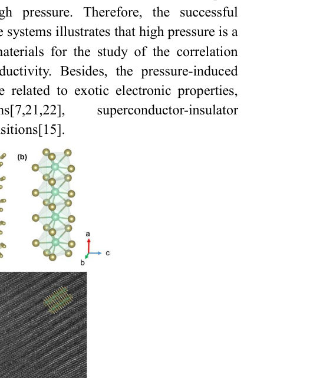
<figcaption class="paper-figure-caption"><b>Fig 1.</b> Figure 1. The crystal structure of NbNiTe5. (a). The crystal structure from the (100) direction. The</figcaption>
</figure>
<figure class="paper-figure-card">
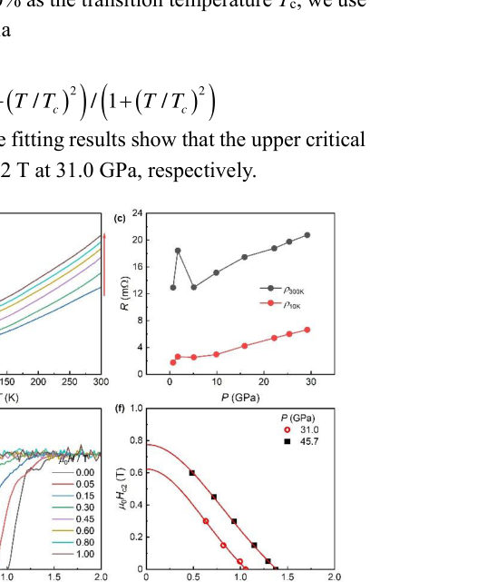
<figcaption class="paper-figure-caption"><b>Fig 2.</b> Figure 2. The evolution of resistance and superconductivity of NbNiTe5 under high pressure. (a)- (b). The temperature dependence of resistance from 1.8 K to 300 K in the pressure range of 0.7 GPa and 29.2 GPa. The red arrows indicate the increase and decrease of resistance during compression. (c). The evolution of resistance at 300 K and 10 K under high pressure. The grey vertical line marks 4.5 GPa, the transition pressure. (d). The temperature dependence of resistance from 0.3 K to 1.5 K. (e). The temperature dependence of resistance at 45.7 GPa under external magnetic field from 0 T to 1 T. (f). The 𝜇0𝐻𝑐2 at different temperature at 31.0 GPa and 45.7 GPa, respectively. The solid lines...</figcaption>
</figure>
<figure class="paper-figure-card">
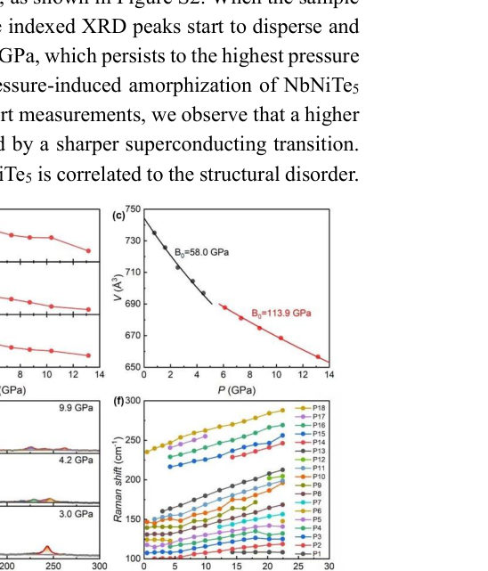
<figcaption class="paper-figure-caption"><b>Fig 3.</b> Figure 3. The high-pressure in-situ XRD and Raman spectra of NbNiTe5. (a). The powder XRD pattern under pressure. (b). The evolution of cell parameters during compression. (c). The evolution of cell volume during compression. The black and red lines exhibit the fitted functions with the BM model. (d). The Raman spectra of NbNiTe5 under pressure. (e). The fitted Raman spectra at 3.0 GPa, 4.2 GPa and 9.9 GPa with multiple Lorentzian functions. The vertical axes of the three panels represent identical scales of absolute intensity. (f). The evolution of Raman peaks during compression.</figcaption>
</figure>
<figure class="paper-figure-card">
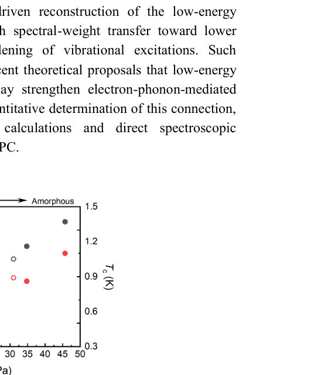
<figcaption class="paper-figure-caption"><b>Fig 4.</b> Figure 4. The phase diagram of superconductivity. The DOS is plotted on the left axis and the evolution of Tc with 90% and 50% criteria is displayed with the right axis. The vertical grey lines note the hardening behavior and emergence of amorphization.</figcaption>
</figure>

**Summary.** This work reports that applying high pressure causes the topological material $	ext{NbNiTe}_5$ to undergo amorphization, which coincides with the onset of superconductivity. Crucially, the superconducting critical temperature ($T_c$) is found to increase as the structural disorder increases during compression, suggesting disorder plays a key role in enhancing pairing mechanisms.

**Why it may be interesting.** While focused on condensed matter, the core mechanism—how controlled structural disorder enhances a quantum phenomenon like superconductivity—is highly relevant to understanding strongly correlated and disordered quantum systems.

Detailed structure

**Main problem.** The study investigates the unusual relationship between pressure-induced structural disorder (amorphization) and the emergence/enhancement of superconductivity in a topological material.

**Main result.** Superconductivity emerges concurrently with amorphization around 10 GPa, and the superconducting transition temperature ($T_c$) progressively increases as the degree of structural disorder enhances up to 45.7 GPa.

**Method.** The research combines high-pressure electrical transport measurements, in-situ X-ray diffraction (XRD), Raman spectroscopy, and theoretical modeling (DFT) to track material changes under compression.

**Model / system.** The physical system is the topological transition metal chalcogenide $	ext{NbNiTe}_5$. The study examines its structural evolution from crystalline to amorphous states under extreme pressure.

**Key observables.** Superconducting Transition Temperature ($T_c$), normal state resistance, upper critical field ($\mu_0H_{c2}$), and lattice parameter changes observed via XRD/Raman.

**Important parameters / regimes.** Pressure (up to 45.7 GPa); temperature; structural disorder level.

**Assumptions / limitations.** The enhancement of $T_c$ is directly modulated by the degree of structural disorder induced by high pressure, suggesting a mechanism related to disorder-enhanced electron-phonon coupling.

**Figures summary.** Figures illustrate resistance evolution showing superconductivity onset; XRD/Raman spectra track lattice changes and amorphization; phase diagrams map $T_c$ vs. pressure alongside structural transitions.

**Paper structure.** The paper systematically presents evidence: initial normal state behavior $
ightarrow$ observation of structural transition (amorphization) $
ightarrow$ confirmation of superconductivity onset coinciding with disorder $
ightarrow$ quantitative measurement of $T_c$ enhancement across the disordered regime.

Abstract

We have systematically studied the structural and electronic properties of a topological material NbNiTe5 under high pressure. The evolution of the normal state resistance shows a non-monotonic trend from 0.7 GPa to 5.1 GPa, in accordance with the second-order transition along the inter-layer direction observed in X-ray diffraction and Raman spectra. At around 10 GPa, the sample starts amorphization, which is concurrent with the emergence of superconductivity. Upon further compression, the structural disorder enhances and the superconducting transition becomes clearer, suggesting that the superconductivity is modulated by the degree of disorder in NbNiTe5 under high pressure. Within 45.7 GPa, the superconducting transition temperature (Tc) slowly rises from 0.6 K at 9.5 GPa to 1.4 K at 45.7 GPa. Our findings extend the family of transition metal chalcogenide superconductors and shed new light on understanding superconductivity in disordered systems.

[↑ back to top](#top)

### [Composite quantum geometry of superconductors](http://arxiv.org/abs/2608.02434v1)

**Authors:** Florian Simon, Thomas Bernat, Annica M. Black-Schaffer  
**Type:** theory · **Category:** other · **PDF:** <https://arxiv.org/pdf/2608.02434v1>  
**Analysis basis:** full PDF text, analyzed in chunks
**Topic relevance:** `entanglement & information structure` **2/5** · `Keldysh / 2PI / non-Gaussian methods` **1/5** · `analog quantum simulation` **1/5** · `driven-dissipative phase transition` **1/5**

↔ Scroll figures horizontally

<figure class="paper-figure-card">
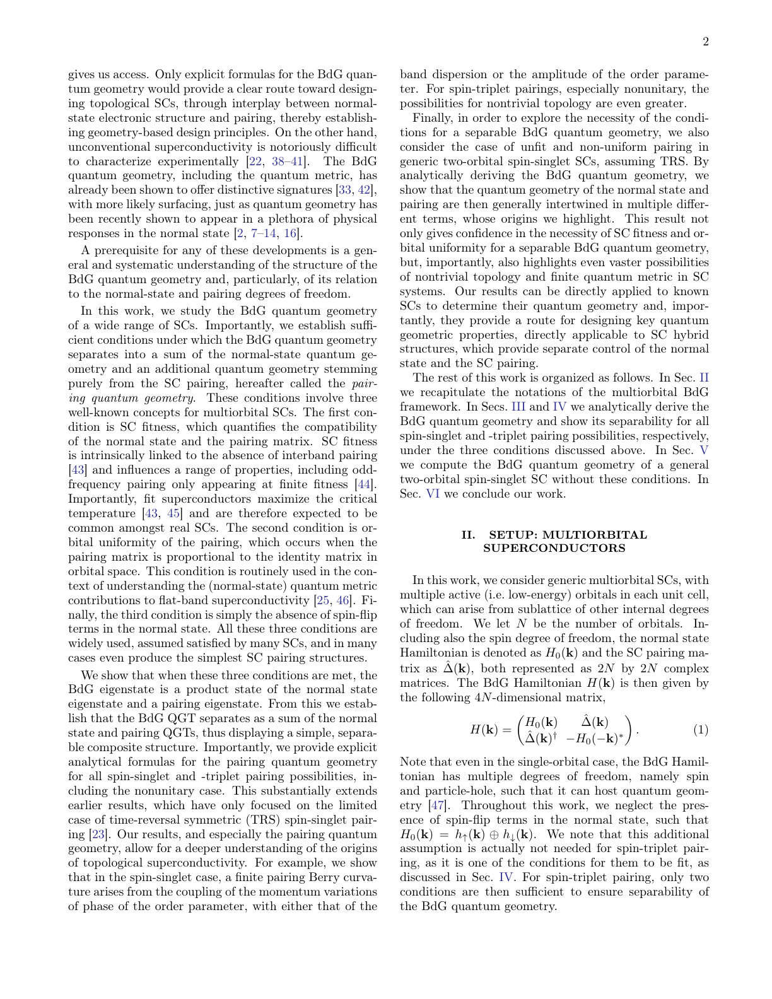
<figcaption class="paper-figure-caption"><b>Fig 1.</b> Low-resolution page preview, page 2</figcaption>
</figure>
<figure class="paper-figure-card">
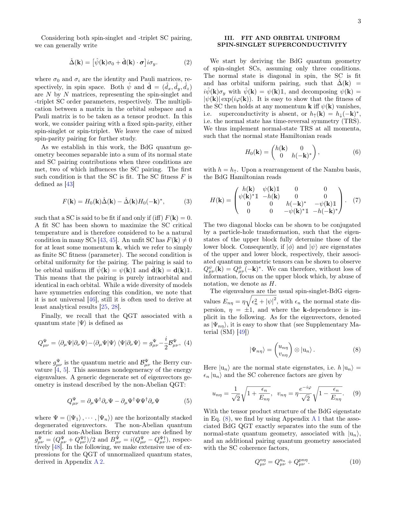
<figcaption class="paper-figure-caption"><b>Fig 2.</b> Low-resolution page preview, page 3</figcaption>
</figure>
<figure class="paper-figure-card">
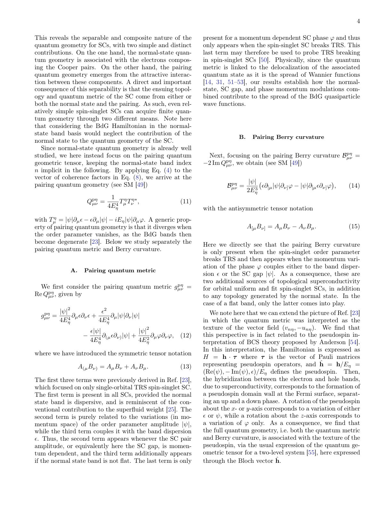
<figcaption class="paper-figure-caption"><b>Fig 3.</b> Low-resolution page preview, page 4</figcaption>
</figure>
<figure class="paper-figure-card">
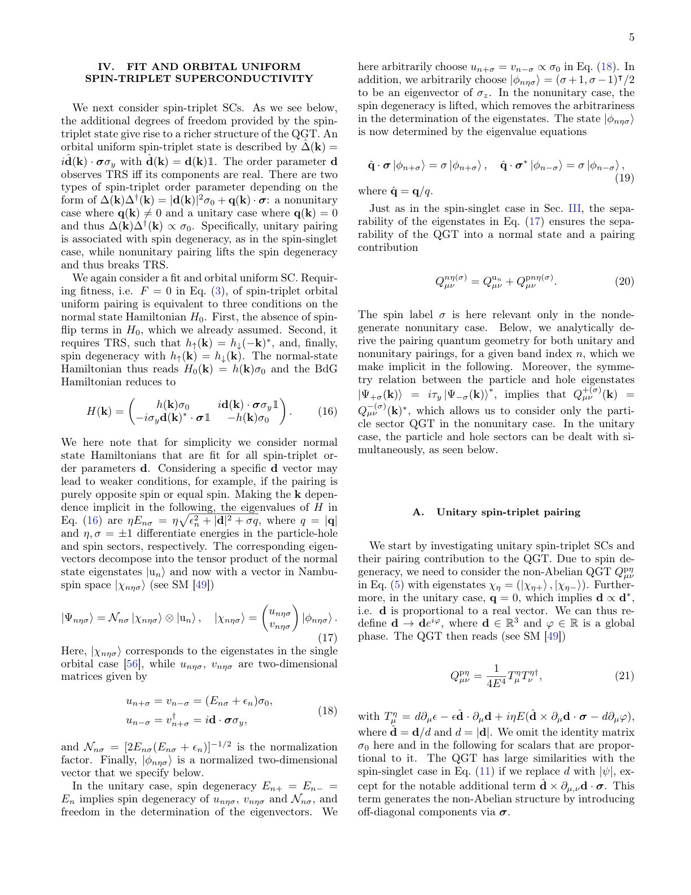
<figcaption class="paper-figure-caption"><b>Fig 4.</b> Low-resolution page preview, page 5</figcaption>
</figure>
<figure class="paper-figure-card">
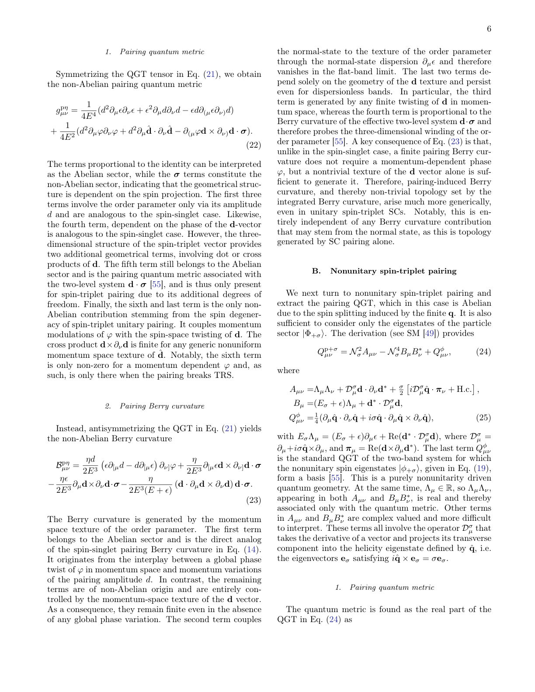
<figcaption class="paper-figure-caption"><b>Fig 5.</b> Low-resolution page preview, page 6</figcaption>
</figure>

**Summary.** This paper analyzes the quantum geometry of superconducting states using the BdG Hamiltonian. It shows that under specific physical conditions, this complex geometry cleanly separates into contributions from the normal metal and the superconducting pairing itself. This provides powerful theoretical tools for designing or diagnosing superconductors with engineered topological properties.

**Why it may be interesting.** This work provides a rigorous geometric framework to diagnose unconventional superconductivity by quantifying how pairing interactions alone can generate topological features or finite quantum metrics, even when the normal state is trivial.

Detailed structure

**Main problem.** The study investigates the quantum geometry of the superconducting state, defined by the Bogoliubov-de Gennes (BdG) Hamiltonian, to determine when this geometry can be decomposed into independent normal-state and pairing contributions.

**Main result.** Under specific conditions—superconducting fitness, orbital uniformity of pairing, and absence of normal-state spin-flip terms—the BdG quantum geometry cleanly separates into a sum of the normal-state and pairing quantum geometries.

**Method.** The authors use analytical derivations based on the BdG Hamiltonian formalism to calculate the Quantum Geometric Tensor (QGT) for various superconducting pairings (singlet and triplet).

**Model / system.** The system is superconductors modeled by the Bogoliubov-de Gennes (BdG) Hamiltonian, generalized to multiorbital structures. The analysis covers spin-singlet, spin-triplet, and nonunitary pairing states.

**Key observables.** The BdG quantum geometry, which includes both the quantum metric and Berry curvature; separability of this geometry into normal-state and pairing components.

**Important parameters / regimes.** Superconducting fitness ($\mathbf{F}(\mathbf{k})$), orbital uniformity of the superconducting pairing, and the nature of the pairing (spin-singlet vs. spin-triplet).

**Assumptions / limitations.** The clean separation of the quantum geometry requires meeting three general conditions: superconducting fitness, orbital uniformity of the pairing, and absence of normal-state spin-flip terms.

**Paper structure.** The paper establishes the multiorbital BdG framework, derives the separability results for various pairings under ideal conditions, examines non-separable cases where contributions intertwine, and concludes with design rules for engineered superconductors.

Abstract

The interplay of superconductivity and the quantum geometry of the normal state has recently been the subject of an array of studies, especially regarding the superfluid weight. In this work, we turn our attention to the quantum geometry of the superconducting state itself, set by the Bogoliubov-de Gennes (BdG) Hamiltonian, which dictates the geometric and topological properties of superconductivity. We show that under three general conditions, namely superconducting fitness, orbital uniformity of the superconducting pairing, and absence of normal-state spin-flip terms, the BdG quantum geometry exactly separates into a sum of the normal-state quantum geometry and an additional pairing quantum geometry, thereby displaying a simple composite structure. We show that this separation holds for all spin-singlet and -triplet pairings, including nonunitary spin-triplet pairing. We further provide explicit analytical formulas for the pairing quantum geometry for all these cases. These results establish how superconducting pairing alone easily drives both topology and a finite quantum metric, thus being present even in topological trivial or flat band superconductors, with no normal state quantum geometry. To complement these results, we also derive the BdG quantum geometry of a general two-orbital spin-singlet superconductor with non-uniform pairing and finite superconducting fitness. Here, our explicit analytical results establish a non-separable composite BdG quantum geometry, with the normal state and pairing contributions generally intertwining, thereby producing even more possibilities for finite quantum geometry. Our results provide design rules for creating superconductors and superconducting hybrid structures with nontrivial topology and finite quantum metric and will additionally help in the experimental diagnosis of unconventional superconductivity.

[↑ back to top](#top)

### [Discrete states and ballistic interference in quantum wires approaching macroscopic lengths](http://arxiv.org/abs/2608.02431v1)

**Authors:** Henok Weldeyesus, Taras Patlatiuk, Christian P. Scheller, Amir Yacoby, Loren N. Pfeiffer, Ken W. West, Dominik M. Zumbühl  
**Type:** experiment · **Category:** other · **PDF:** <https://arxiv.org/pdf/2608.02431v1>  
**Analysis basis:** full PDF text, analyzed in chunks
**Topic relevance:** `spintronics-quantum-optics interface` **2/5** · `Kondo & dissipative impurity` **1/5** · `analog quantum simulation` **1/5** · `non-equilibrium dynamics` **1/5**

↔ Scroll figures horizontally

<figure class="paper-figure-card">
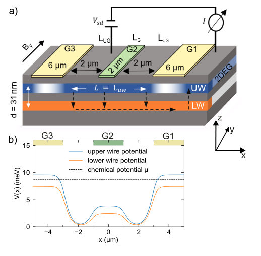
<figcaption class="paper-figure-caption"><b>Fig 1.</b> FIG. 1. Device sketch and potential landscape, not to scale. (a) View onto the cleaved side of the sample. The parallel wires have a vertical center-to-center distance of d = 31 nm. The shown setup corresponds to the 2|2|2 configuration, with a 2 µm gated section surrounded by two 2 µm sections. The outer gates G3 and G1 define the finite-length upper wire between them, while the lower wire is not fully depleted, car- rying one mode. The center gate voltage VG2 is varied during the measurements. (b) Calculated potential profile for the upper wire (blue) and lower wire (orange). The dashed line is the chemical potential µ in the upper system.</figcaption>
</figure>
<figure class="paper-figure-card">
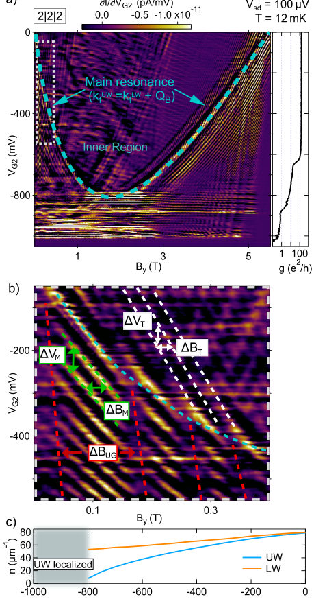
<figcaption class="paper-figure-caption"><b>Fig 2.</b> FIG. 2. (a) Transconductance ∂I/∂VG2 of 2|2|2 junction over the full range of gate voltage and magnetic field measured at 100 µV dc-bias. The main tunneling resonance between the lowest UW and LW modes is marked with a blue dashed curve. The inset shows g vs VG2 with all other gates deac- tivated, showing 2DEG and eventually wire mode depletion. The white box is magnified in (b), showing finite size effects arising from the gated section (green), ungated section (red) and the total length (white). The same color scale as in (a) is used. The extracted values are: ∆VM = 51 mV, ∆Vt = 46.2 mV, ∆BM = 38 mT, ∆BUG = 99 mT, ∆BT = 25 mT. (c) UW and LW density extracted from the main resonance in (a)...</figcaption>
</figure>
<figure class="paper-figure-card">
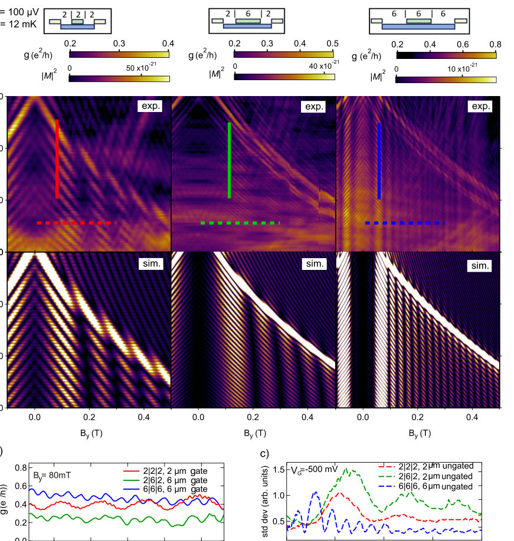
<figcaption class="paper-figure-caption"><b>Fig 3.</b> FIG. 3. Comparison of experiment (upper panel) and simulations (lower panel) for different wire and gate length (a) left to right: 2|2|2; 2|6|2; 6|6|6. (b) vertical line cuts (offset for clarity) along solid lines in (a) oscillation frequency reduces with shorter gate length. (c) average standard deviation along dashed lines in (a) vertical line spacing depends on length of the ungated region.</figcaption>
</figure>
<figure class="paper-figure-card">
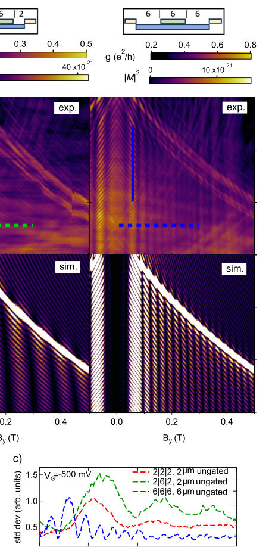
<figcaption class="paper-figure-caption"><b>Fig 4.</b> Figure 4(b) shows the FT magnitude of the product of the UW and LW wave functions for the same gate volt- age as in Fig. 4(a). The peaks from the gated section marked with black arrows in (a) lead to the difference and sum peaks marked with colored arrows in (e) when UW and LW wave functions are multiplied. The rela- tionship between the FT of wave function products and</figcaption>
</figure>
<figure class="paper-figure-card">
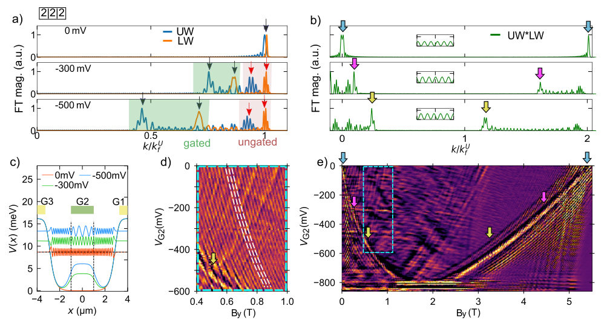
<figcaption class="paper-figure-caption"><b>Fig 5.</b> FIG. 4. Spectral composition: (a) Fourier transforms of UW (blue) and LW (orange) wave functions. The wave vectors under the gate G2 are highlighted with black arrows (green shaded area), while the red arrows indicate the wave vectors in the ungated regions (red shaded area). (b) Fourier transform of the product of UW and LW wave functions. The main resonance peaks are highlighted with colored arrows. The inset shows a magnified view (x70) of oscillations in the region between the marked peaks. (c) Potential shape in the UW for three gate voltages (0 mV, -300 mV, and -500 mV). The corresponding wave functions are shown (at much lower density for better visualization), offset for clarity, at...</figcaption>
</figure>

**Summary.** The research reports on observing fundamental single-particle quantum effects, such as ballistic interference and discrete energy quantization, in electron systems confined to one dimension over lengths approaching 18 $\mu$m. By using tunneling spectroscopy and comparing measurements with detailed simulations, the authors confirm that these structures behave as near-ideal 1D conductors. This work is significant for demonstrating the scalability of quantum coherence in solid-state devices.

**Why it may be interesting.** This work provides experimental evidence for coherent, ballistic quantum transport over micron scales, pushing the boundaries where simple single-particle quantum mechanics can be observed in solid-state devices, which is highly relevant for understanding mesoscopic physics and open quantum systems dynamics.

Detailed structure

**Main problem.** The primary challenge addressed is observing fundamental quantum phenomena, such as ballistic interference and discrete energy levels, in electronic systems as they approach macroscopic physical sizes.

**Main result.** The authors successfully demonstrated the observation of single-particle quantum mechanics effects, including clear interference patterns up to 18 $\mu$m and resolved orbital/spin states in wires approaching macroscopic dimensions.

**Method.** Measurements involve tunneling spectroscopy between parallel quantum wires under varying magnetic fields and gate voltages, analyzed by comparing results with detailed single-particle numerical simulations.

**Model / system.** The system is a double quantum wire structure realized on GaAs/AlGaAs using cleaved edge overgrowth. The physics is modeled using the Schrödinger equation to describe electron wavefunctions and tunneling currents between segments defined by lithographically patterned gates.

**Key observables.** Intricate interference patterns in magnetic field and density, discrete orbital and spin energy levels (Coulomb charging energies), and characteristic oscillation periods related to wire segment lengths ($L$).

**Important parameters / regimes.** Wire length up to 18 $\mu$m, low temperature/low noise measurement conditions, applied magnetic field ($B$), and gate voltage ($V_G$).

**Assumptions / limitations.** The analysis relies on the assumption that transverse confinement allows for effective 1D modeling, and simulations often assume constant wavefunction overlap components.

**Figures summary.** Figures illustrate device sketches, potential profiles, and detailed plots of differential conductance ($\partial I / \partial V_G$) showing main resonance peaks, replicas, and vanishing interference stripes whose periodicities allow extraction of characteristic lengths.

**Paper structure.** The paper systematically analyzes the complex oscillatory patterns in tunneling conductance arising from finite size effects (momentum matching) across different wire segments. It progresses from general interference analysis to resolving discrete quantum states and confirming the scalability of these single-particle quantum phenomena.

Abstract

Increasing the size of a system showing quantum effects is a difficult task limited by decoherence, a diminishing quantum level spacing, and the effects of disorder spoiling the quantum behavior when growing in size. Systems in 1D offer very strong confinement in the transverse directions, thus generally enhancing quantum effects, but are notoriously sensitive to disorder. In this work, we present a system of 1D electrons exhibiting discrete quantum levels and fully ballistic coherent quantum interference with lengths of up to 18\,$μ$m. Tunneling spectroscopy between two parallel quantum wires with a central gated segment shows intricate interference patterns exhibiting several different periods in magnetic field and density. An analysis over three different wire lengths and a comparison with single particle numerical simulations without any free parameters remarkably explains the full pattern including the observed periods. Therefore, these wires are essentially ideal 1D systems with aspect ratios approaching 1'000. In addition, at low bias, we also observe not only the Coulomb charging energies but can clearly resolve the discrete orbital and spin states in up to 10\,$μ$m long wires when filling 100 electrons with the center gate. This is made visible by a state-of-the-art low temperature and low noise measurement system. The spin filling sequence is completely regular, strictly alternating spin up and down, avoiding high spin states, while the peak conductance is modulated in accordance with the previously discussed interference patterns. These striking results show that single particle Schrödinger quantum mechanics such as ballistic quantum interference and discrete quantum states may be observed, under the right conditions, in systems of up to 18\,$μ$m length, thus approaching macroscopic sizes.

[↑ back to top](#top)

### [Resolving High-Energy States of Interlayer Excitons in MoSe$_2$/WSe$_2$ Heterostructures](http://arxiv.org/abs/2608.02040v1)

**Authors:** Chirag Chandrakant Palekar, Paulo E. Faria Junior, Tobias Manthei, Maximilian Nagel, Bhabani Sankar Sahoo, Shachi Machchhar, Imad Limame, Martin Podhorský, Jaroslav Fabian, Bárbara Rosa, Stephan Reitzenstein  
**Type:** both · **Category:** other · **PDF:** <https://arxiv.org/pdf/2608.02040v1>  
**Analysis basis:** full PDF text, analyzed in chunks
**Topic relevance:** `quantum optics experiment` **2/5** · `Keldysh / 2PI / non-Gaussian methods` **1/5** · `analog quantum simulation` **1/5** · `driven-dissipative phase transition` **1/5**

↔ Scroll figures horizontally

<figure class="paper-figure-card">
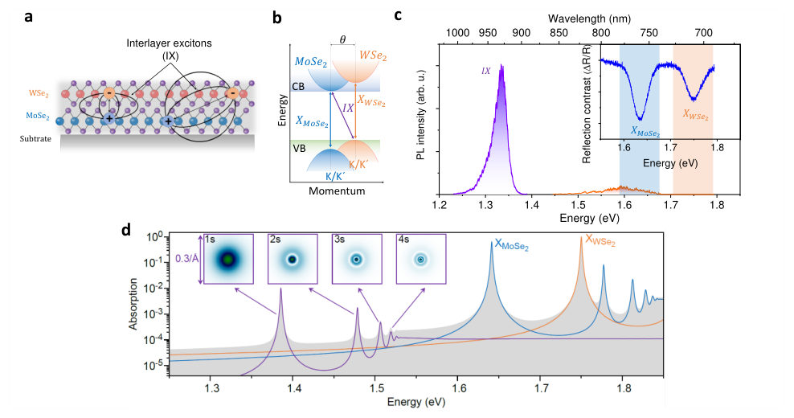
<figcaption class="paper-figure-caption"><b>Fig 1.</b> Figure 1. Excitons in MoSe2/WSe2 heterostructures. a) Schematic of the in MoSe2/WSe2 heterostructure along with IX states. b) Schematic of the type-II band alignment at K/K’ and the associated intra- as well as inter-layer exciton transitions. c) PL emission of MoSe2/WSe2 heterostructures measured at 4 K exhibiting pronounced emission from IXs. Inset: Reflection contrast measurement focusing on the intralayer exciton (XMoSe2 and XWSe2) absorption. d) Normalised calculated absorption spectrum of the intra- and inter-layer excitons for an air/MoSe2/WSe2/SiO2 configuration. The insets show the wavefunctions of the Rydberg-like IXs (1s, 2s, 3s and 4s excited states) in k-space from −0.15 ˚A −1...</figcaption>
</figure>
<figure class="paper-figure-card">
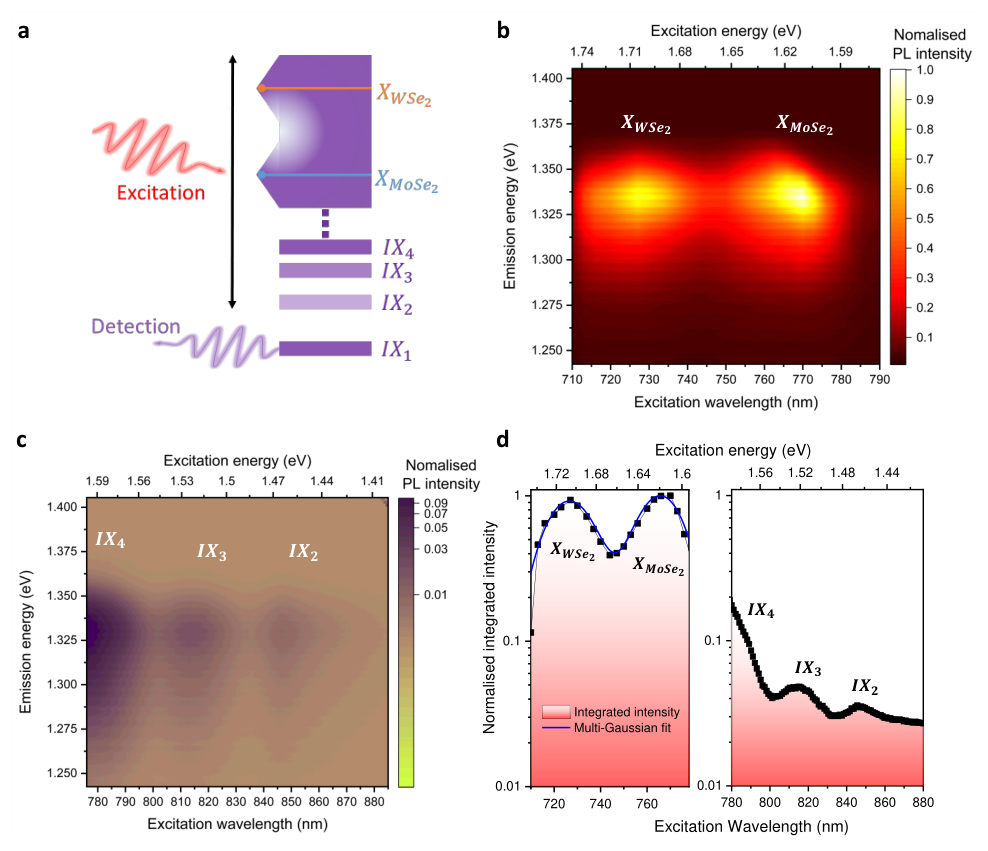
<figcaption class="paper-figure-caption"><b>Fig 2.</b> Figure 2. Identification of high-energy IX states through photoluminescence excitation spectroscopy. a) Schematic of the excitation and detection energetics of the PLE measurements. The PLE measurements on a MoSe2/WSe2 HSs with a twist angle of 56◦are shown in b) and c). The false-color graph demonstrates IX state emission as a function of excitation energy (wavelength) under constant excitation power. The intensity is normalised in both b) and c) plots with respect to MoSe2 resonance. d) Normalised integrated intensity (black squares) from data shown in b) (left panel) and c) (right panel), respectively as a function of the excitation wavelength exhibiting resonances associated with the IX...</figcaption>
</figure>
<figure class="paper-figure-card">
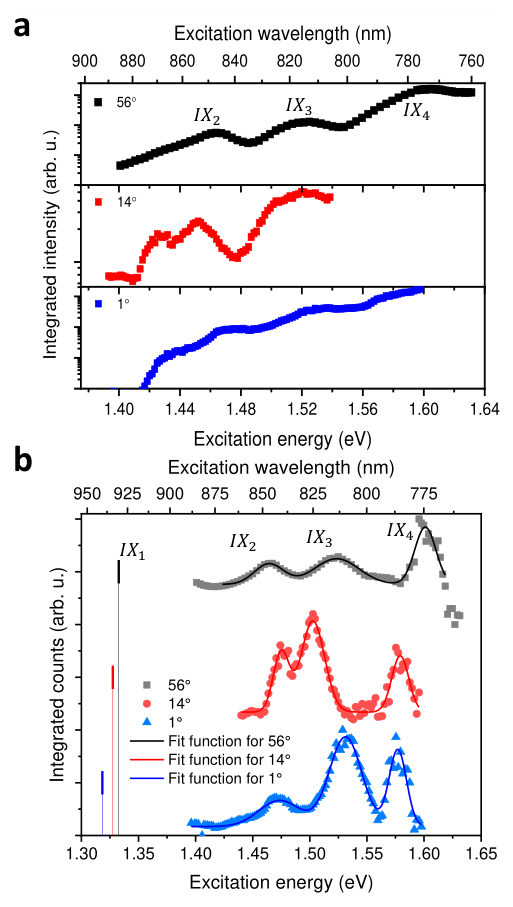
<figcaption class="paper-figure-caption"><b>Fig 3.</b> Figure 3. Rydberg-like high-energy states of IX states in MoSe2/WSe2 HSs. a) Integrated intensity acquired from PLE measurements from the HSs with twist angles of 56◦(black), 14◦(red), and 1◦(blue) from top to bottom, re- spectively. b) Integrated intensity resonance subtracted from exponentially decaying baseline. The resultant data is fitted with multi-Gauss function to extract the energetic separation between the states. The vertical dash lines at lower energies indicated the 1s IX state for each twist angle along with their projection on to the x axis.</figcaption>
</figure>
<figure class="paper-figure-card">
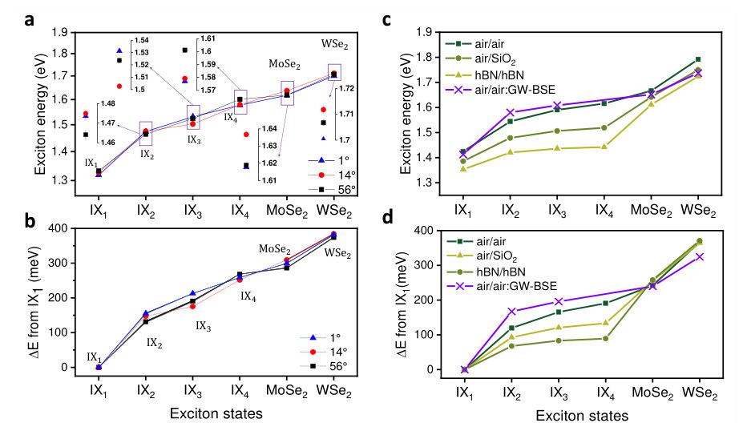
<figcaption class="paper-figure-caption"><b>Fig 4.</b> Figure 4. Twist-angle robustness and dielectric screening dependence of high-energy IX states. a) Extracted energies of the Rydberg-like states of the IX from Figure 3 b) for HSs with varying twist angle along with the intralayer exction PLE resonances (MoSe2 and WSe2). The extracted values are highlighted further with reduced energy scale in insets. b) Extracted energy separation (∆E) with respect to ground state of IX1 for high energy IX states in HS with varying twist angle. c) Calculated exciton energies for different HS cases: suspended (air/air), on SiO2 substrate (air/SiO2), and hBN encapsulated (hBN/hBN). The dashed line corresponds to energy values of a suspended HS obtained from...</figcaption>
</figure>

**Summary.** This work uses PLE spectroscopy to experimentally map the high-energy, Rydberg-like spectrum of interlayer excitons in MoSe$_2$/WSe$_2$ heterostructures. By comparing these measurements with theoretical calculations, the authors demonstrate that while the excited state energy levels are remarkably stable against changes in twist angle, they are highly sensitive to the surrounding dielectric environment. This confirms PLE as a powerful tool for probing fundamental many-body physics in 2D materials.

**Why it may be interesting.** The direct spectroscopic access to Rydberg-like excitonic states in solid-state heterostructures bridges concepts from atomic physics (Rydberg atoms) into condensed matter quantum optics. The strong dependence on dielectric environment suggests potential control mechanisms for enhancing nonlinear optical responses.

Detailed structure

**Main problem.** The high-energy states of interlayer excitons (IXs) in van der Waals heterostructures are largely unexplored, despite their importance for understanding many-body interactions and nonlinear optical phenomena.

**Main result.** PLE spectroscopy successfully resolves a Rydberg-like series of excited IX states ($2s$-, $3s$-, $4s$-like), demonstrating that the spectrum is robust against twist angle variations but highly sensitive to the dielectric environment.

**Method.** The study combines experimental Photoluminescence Excitation (PLE) spectroscopy with theoretical Wannier-exciton calculations incorporating screened Coulomb interactions.

**Model / system.** The physical system is MoSe$_2$/WSe$_2$ van der Waals heterostructures, which exhibit type-II band alignment leading to interlayer excitons. The analysis models the exciton energy spectrum using effective mass approximations and screened potentials.

**Key observables.** PLE resonance energies corresponding to $2s$-, $3s$-, and $4s$-like excited IX states; dependence of these energies on twist angle and dielectric screening.

**Important parameters / regimes.** Twist angles (e.g., 1$^\circ$, 14$^\circ$, 56$^\circ$), dielectric environment ($	ext{air/air}$ vs $	ext{hBN/hBN}$), and the principal quantum number ($n$) governing the Rydberg series.

**Assumptions / limitations.** The observed resonances are assigned to Rydberg-like states based on theoretical models; Wannier-exciton calculations assume parabolic bands and specific screening potentials.

**Figures summary.** Figures show PLE maps revealing distinct intensity maxima corresponding to $	ext{IX}2$, $	ext{IX}3$, and $	ext{IX}4$. Comparisons illustrate the robustness of these high-energy states across different twist angles versus their sensitivity to dielectric screening in theoretical models.

**Paper structure.** The paper first establishes the experimental feasibility using PLE spectroscopy to map out the previously inaccessible high-energy IX spectrum. It then compares this empirical data against theoretical predictions derived from Wannier-exciton calculations, concluding that environmental screening is the dominant physical factor governing the excited state energy ladder.

Abstract

High-energy states of interlayer excitons (IXs) in van der Waals heterostructures remain largely unexplored despite their importance for understanding many-body interactions and nonlinear optical phenomena. Here, we use photoluminescence excitation (PLE) spectroscopy to resolve a Rydberg-like series of excited IX states in MoSe$_2$/WSe$_2$ heterostructures. We observe multiple PLE resonances below the intralayer exciton energies, which we assign to the 2s-, 3s-, and 4s-like states of the IXs. These resonances are consistently observed across heterostructures with different twist angles, indicating that the high-energy state spectrum is only weakly affected by the twist angle. Wannier-exciton calculations incorporating screened Coulomb interactions reproduce the overall energy scale and qualitative trends of the measured Rydberg-like series, supporting the assignment of the observed resonances. Our findings demonstrate that PLE provides direct experimental access to the previously unexplored high-energy IX states in van der Waals heterostructures.

[↑ back to top](#top)

### [Universal scaling of the Anomalous Hall voltage of magnetic layer with the adjacent conducting layer](http://arxiv.org/abs/2608.00385v1)

**Authors:** Zhihao Yan, Qianbiao Liu, Zhengxiao Li, Lijun Zhu  
**Type:** both · **Category:** other · **PDF:** <https://arxiv.org/pdf/2608.00385v1>  
**Analysis basis:** full PDF text, analyzed in chunks
**Topic relevance:** `non-equilibrium dynamics` **2/5** · `exotic spin models in light-matter` **1/5** · `spintronics-quantum-optics interface` **1/5**

↔ Scroll figures horizontally

<figure class="paper-figure-card">
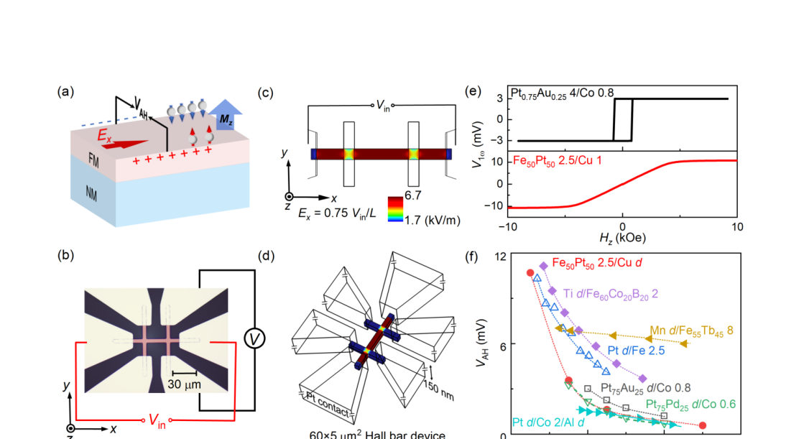
<figcaption class="paper-figure-caption"><b>Fig 1.</b> Figure 1. (a) Schematic diagram of the anomalous Hall effect. (b) Optical microscope image of the Fe50Pt50 2.5/Cu 10 Hall bar device and measurement geometry of the anomalous Hall voltage. (c)The electric field applied to the cross region is 0.75Vin/L when a voltage Vin is applied to the Hall bar with length L. (d) Device modeling and mesh division in the finite element analysis. (e) V1ω vs. out-of-plane magnetic field Hz for the Pt75Au25 4/Co 0.8 and the Fe50Pt50 2.5/Cu 1. (f) Dependence on normal metal thickness of the anomalous Hall voltage for Fe50Pt50 2.5/Cu d, Pt 5/Co 2/Al d, Pt75Au25 d/Co 0.8, Pt75Pd25 d/Co 0.6, Pt d/Fe 2.5, Mn d/Fe55Tb45 8, Ti d/Fe60Co20B20 2 heterostructures.</figcaption>
</figure>
<figure class="paper-figure-card">
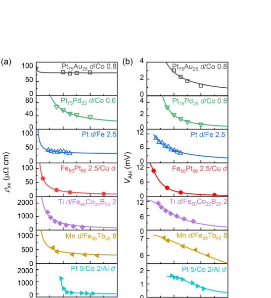
<figcaption class="paper-figure-caption"><b>Fig 2.</b> Figure 4. Dependence on the NM thickness of (a) the resistivity of normal metals and (b) the anomalous Hall voltage for the Pt75Au25 d/Co, Pt75Pd25 d/Co, Pt d/Fe, Ti d/Fe60Co20B20, Fe50Pt50/Cu d, Mn d/Fe55Tb45 and Pt/Co/Al d heterostructures.</figcaption>
</figure>
<figure class="paper-figure-card">
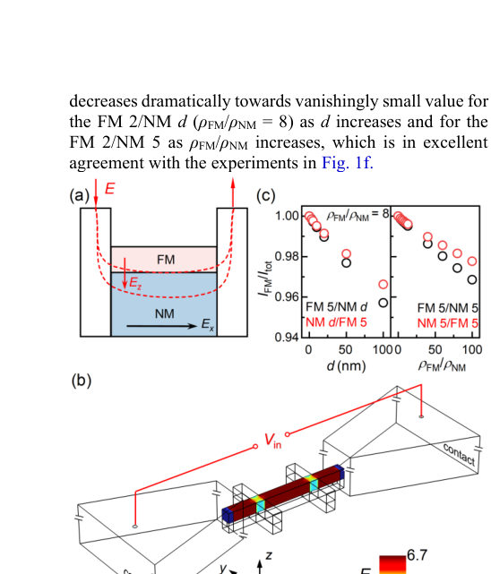
<figcaption class="paper-figure-caption"><b>Fig 3.</b> Figure 2. (a) Schematic and (b) Finite-element modeling of the electric field distributions in a NM/FM Hall bar with the electrical contact. (c) Simulated results of IFM/Itot vs the thickness of the NM and the ratio of the resistivity of the FM and NM. Here, IFM/Itot is the ratio of the volumetric integral of the longitudinal current density in the cross region of the FM in a bilayer Hall bar to that in a single- layer Hall bar with no adjacent conducting layer.</figcaption>
</figure>
<figure class="paper-figure-card">
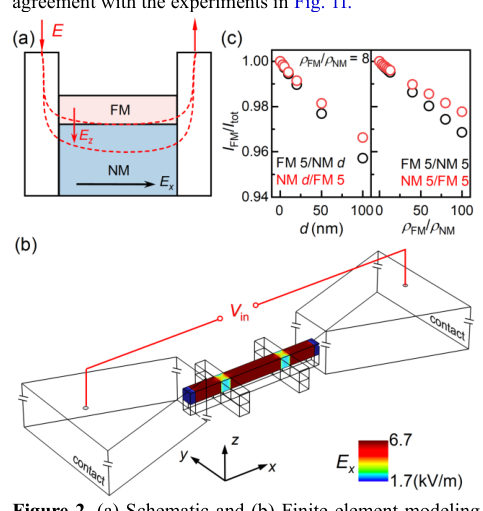
<figcaption class="paper-figure-caption"><b>Fig 4.</b> Figure 3. (a) Schematic and (b) Finite-element modeling of the charge screen effect of NM/FM heterostructure on the detection of the transverse voltage via the resistor serial. (c) Scaling of the simulated transverse voltage (VAH) for FM 2/NM d (ρFM/ρNM = 8) and FM 2/NM 5 with the thickness and resistivity of the NM.</figcaption>
</figure>
<figure class="paper-figure-card">
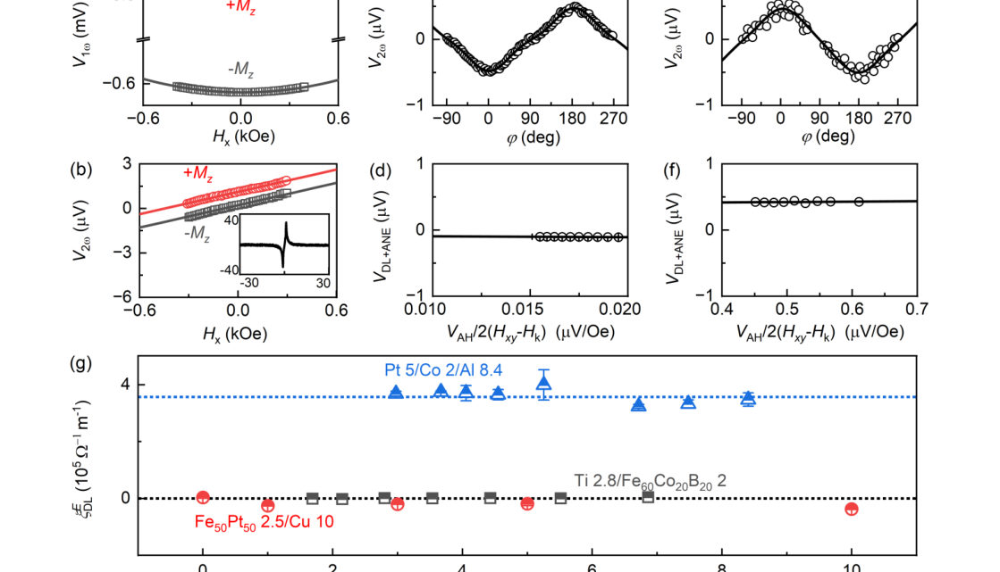
<figcaption class="paper-figure-caption"><b>Fig 5.</b> Figure 5. Dependence on Hx of (a) First Harmonic Hall voltage and (b) Second harmonic Hall voltage for the Pt 5/Co 2/Al 8.4 with perpendicular magnetic anisotropy. (c) Second harmonic Hall voltage vs. azimuth angle (φ) of the in-plane magnetic field (Hxy = 3.75 kOe) and (d) VDL+ANE vs. VAH/2(Hxy-Hk) for the Fe50Pt50 2.5/Cu 10. (e) Second harmonic Hall voltage vs φ (Hxy = 3 kOe) and (f) VDL+ANE vs. VAH/2(Hxy-Hk) for the Ti 2.8/Fe60Co20B20 2. (g) Dampinglike SOT efficiency per electric field for the Pt/Co/Al d, Fe50Pt50/Cu d and Ti d/Fe60Co20B20 with different NM thickness.</figcaption>
</figure>

**Summary.** This work analyzes how the Anomalous Hall voltage in magnetic heterostructures scales dramatically with the thickness of adjacent nonmagnetic layers. By combining experiments and advanced simulations, the authors prove that this scaling is governed by a simple serial resistor effect across the stack. This finding provides crucial insight into interpreting transverse voltages in spintronic devices.

**Why it may be interesting.** While focused on condensed matter magnetism, the rigorous modeling of transport phenomena using circuit analogies (serial resistance) provides a powerful, generalizable framework for analyzing complex interfacial electronic effects in nanoscale devices.

Detailed structure

**Main problem.** The study investigates the universal scaling of the Anomalous Hall voltage (V_AH) in magnetic heterostructures as a function of the thickness and resistivity of adjacent nonmagnetic conducting layers.

**Main result.** The dramatic scaling of V_AH is attributed to the serial resistor effect within the magnetic/non-magnetic stack, rather than changes in Fermi surface properties or angular momentum injection.

**Method.** The research combines transport experiments (using lock-in amplification) with analytical derivations and finite-element analyses (FEA) to model current flow and electric fields.

**Model / system.** The physical system is a magnetic heterostructure, typically an NM/magnet bilayer or trilayer. The analysis models the electrical circuit behavior using a serial resistor analogy.

**Key observables.** Anomalous Hall voltage (V_AH), harmonic Hall voltages (V_1\omega, V_2\omega), and the scaling dependence of V_AH on NM thickness (d) and resistivity ratio ($
ho_{FM}/
ho_{NM}$).

**Important parameters / regimes.** Nonmagnetic layer thickness ($d$), magnetic/non-magnetic resistivities ($
ho_{FM}, 
ho_{NM}$), and applied electric field strength.

**Assumptions / limitations.** The dominant mechanism governing the V_AH scaling is the serial resistor effect, which simplifies the analysis by decoupling it from complex electronic structure variations.

**Figures summary.** Figures illustrate the universal scaling of V_AH with NM thickness (Fig. 1), model current distribution effects (Fig. 2), and quantify the voltage reduction using the serial resistor model (Fig. 3).

**Paper structure.** The paper progresses by presenting experimental observations of V_AH scaling, developing an analytical/FEA framework based on the serial resistor effect to explain this scaling, and finally demonstrating that other spintronic analyses (like SOT efficiency) remain robust despite this voltage reduction.

Abstract

The anomalous Hall voltage of magnetic heterostructures plays a key role as the indicator for the magnetization state and its interplay with a variety of spintronic effects. In this letter, we report the observation, mechanism, and impact of the universal, dramatic scaling of the anomalous Hall voltage of magnetic heterostructures with the thickness and resistivity of the nonmagnetic conducting layers (e.g., normal metal) by combining transport experiments, analytical derivation, and finite-element analyses. We identify that the mechanism is the serial resistor effect of the magnetic and non-magnetic layers within the magnetic heterostructures and irrelevant to any Fermi surface variation or angular momentum injection from the nonmagnetic layer to the magnetic layer. We also show that the accuracy of the harmonic Hall voltage analyses of magnetic heterostructures are unaffected by the under-measuring of the anomalous Hall voltage and other transverse voltages due to the serial resistor effect. These findings provide crucial information for understanding a variety of spintronic phenomena involving the anomalous Hall and other transverse voltages.

[↑ back to top](#top)

### [Atomic-scale reactivity of the CeO$_2$~(100) surface reconstructions by scanning probe microscopy](http://arxiv.org/abs/2608.00704v1)

**Authors:** Kyungmin Kim, Manuel González Lastre, Estefanía Fernández-Villanueva, Pablo Pou, Hossein Sepehri-Amin, Masayuki Abe, Shigeki Kawai, M. Verónica Ganduglia-Pirovano, Ruben Perez, Oscar Custance  
**Type:** both · **Category:** other · **PDF:** <https://arxiv.org/pdf/2608.00704v1>  
**Analysis basis:** full PDF text, analyzed in chunks
**Topic relevance:** `Keldysh / 2PI / non-Gaussian methods` **1/5** · `Kondo & dissipative impurity` **1/5** · `analog quantum simulation` **1/5** · `methods for driven-dissipative` **1/5** · `non-equilibrium dynamics` **1/5**

↔ Scroll figures horizontally

<figure class="paper-figure-card">
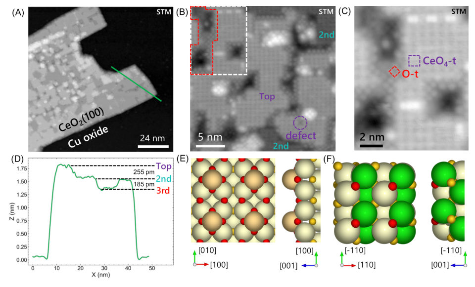
<figcaption class="paper-figure-caption"><b>Fig 1.</b> Figure 1: Ceria (100) morphology and surface reconstructions. (A) Topographic STM image of a CeO2(100) island grown on pre-oxidized Cu(111). (B) Topographic STM image of the top and second terraces of the island showing the predominance of the (2×2) reconstruction, CeO4-t(100) for short. A region displaying the c(2×2) reconstruction, O-t(100) for short, is enclosed by dashed red lines. (C) Zoom of the region marked by a white square in (B), featuring CeO4-t(100) and O-t(100) domains with different unit-cell orientations. (D) Height profile along the trace in (A) displaying representative step heights between terraces. (E and F) DFT-optimized structures of the CeO4-t(100) and O-t(100)...</figcaption>
</figure>
<figure class="paper-figure-card">
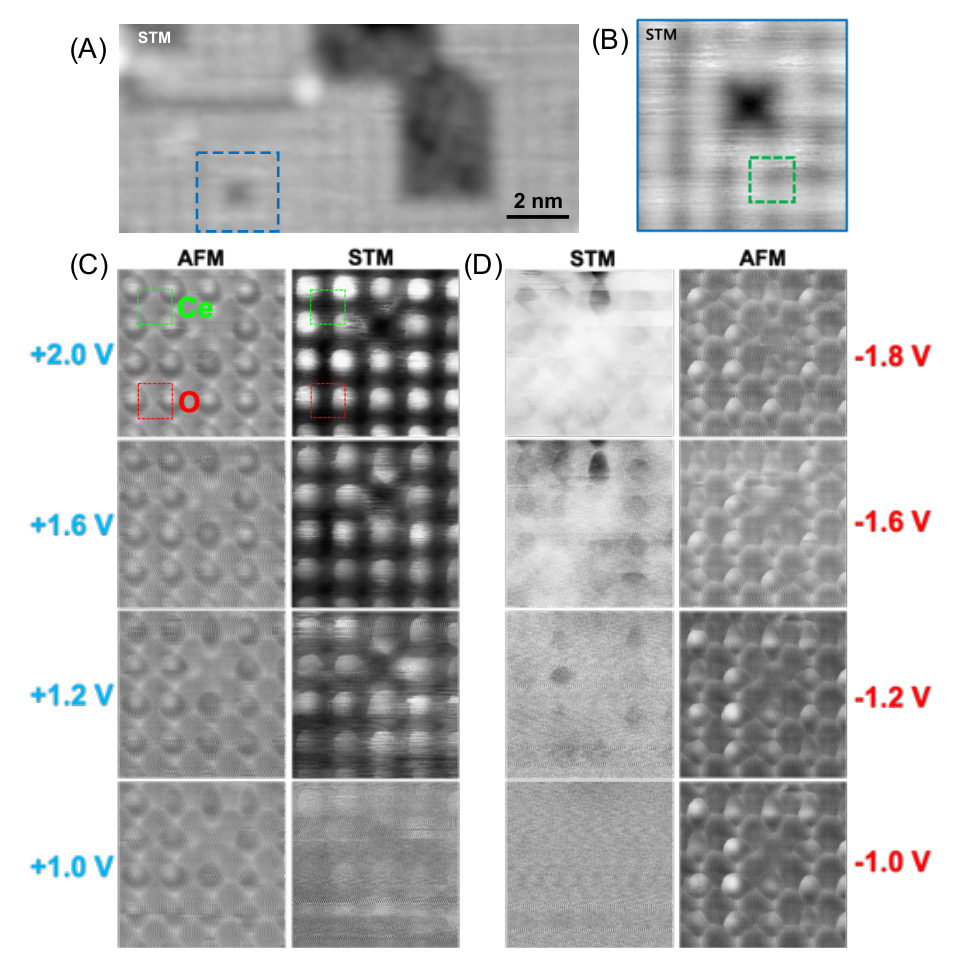
<figcaption class="paper-figure-caption"><b>Fig 2.</b> Figure 2: Atomic assignment by bias-dependent, simultaneous constant-height STM and AFM imaging of the CeO4-t(100) reconstruction. (A) Topographic STM image of a CeO4-t(100) region of the island exhibiting native point defects. (B) Detail of the defect marked in (A). (C) and (D) Simultaneously acquired constant-height bias-dependent AFM and STM images to investigate the empty (C) and filled (D) states of the surface. In empty-state STM, the bright protrusions are related to the Ce sites, whereas AFM signal resolves the outermost Ce and O atomic positions across all bias voltages explored. Acquisition parameters: 𝑉= 2.7 V, 𝐼= 2 pA, for (A) and (B); 𝐴= 60 pm, and 𝑓0 = 992175 Hz for AFM...</figcaption>
</figure>
<figure class="paper-figure-card">
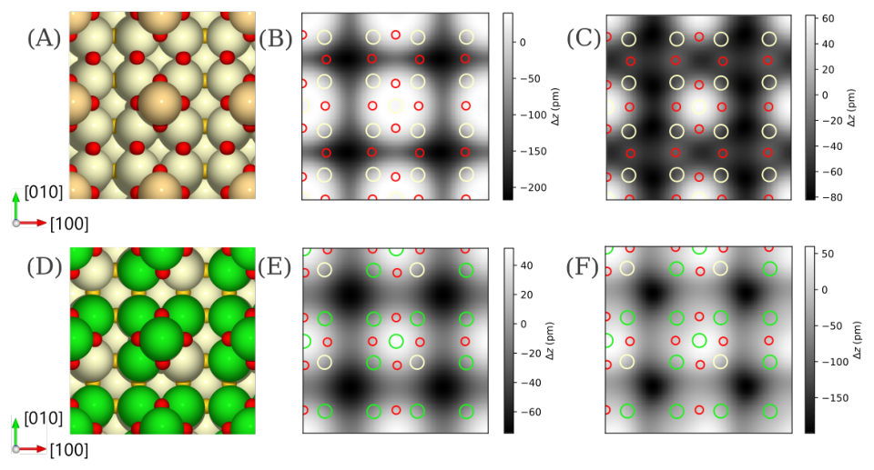
<figcaption class="paper-figure-caption"><b>Fig 3.</b> Figure 3: Simulated constant-current STM images of oxidized and reduced CeO4-t(100). (A, D) Structural models of the oxidized and reduced terminations, respectively. (B, C) Empty- and filled-state STM images of the oxidized surface. (E, F) Empty- and filled-state STM images of the reduced surface. The CeO4 pyramid is centered in the simulation cell in all STM calculations. Isovalues correspond to the mean isovalue in a plane 3 ˚A above the top Ce atom on the CeO4 pyramid. The empty- and filled-state isovalues are 1.06 × 10−4 and 1.62 × 10−5 states ˚A−3 for the oxidized surface, and 9.42 × 10−5 and 2.01 × 10−5 states ˚A−3 for the reduced surface, respectively. Removing the oxygen atoms...</figcaption>
</figure>
<figure class="paper-figure-card">
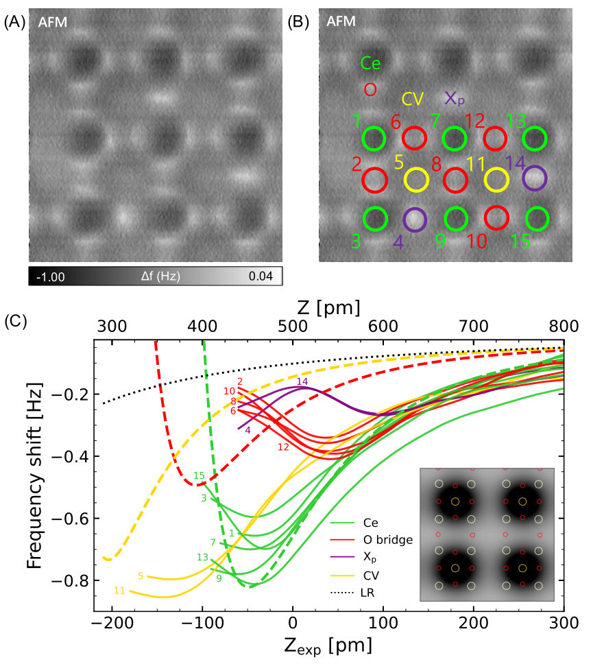
<figcaption class="paper-figure-caption"><b>Fig 4.</b> Figure 4: Site-specific force spectroscopy on the CeO4-t(100) surface. (A) Constant-height AFM image of a CeO4-t(100) region. (B) Same image with labels for the spectroscopy acquisition sites. Color code: green for cerium atoms (Ce); red for bridge positions mid-distance between two oxygen atoms of adjacent CeO4 pyramids; purple for those displaying a single bright protrusion (X𝑝) at similar surface location as the bridge site; and yellow for a coordination vacancy (CV) site. (C) Experimental Δ 𝑓(𝑧) curves (solid) and DFT-based simulations (dashed) for the sites marked in (B). The black dotted line represents the long range (LR) van der Waals contribution of the mesoscopic part of the probe...</figcaption>
</figure>
<figure class="paper-figure-card">
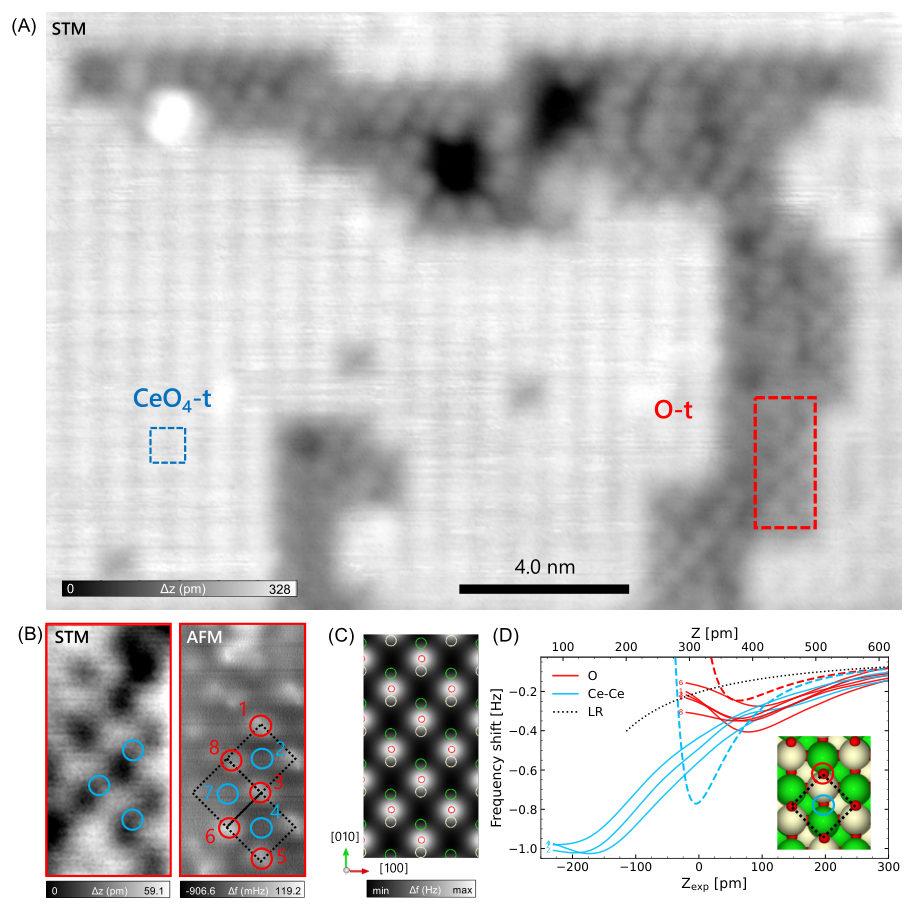
<figcaption class="paper-figure-caption"><b>Fig 5.</b> Figure 5: Structure and site-specific force spectroscopy of the O-t(100). (A) Topographic STM image showing patches of the O-t(100) reconstruction, which are located ∼185 pm below a terrace decorated with the CeO4-t(100) surface (Fig. 1D). (B) Topographic STM and constant- height AFM images of the marked region in (A). These images were not acquired simultaneously. Red and blue circles denote top-layer O and Ce bridge sites, respectively, where force spectroscopy measurements were performed. (C) FDBM simulation of a constant-height Δ 𝑓map of the reduced O-t(100) model displayed as inset in (D) and obtained at a probe-surface separation of 350 pm from the top oxygen layer. It shows bright...</figcaption>
</figure>

**Summary.** This work characterizes the atomic structure and reactivity of $	ext{CeO}_2(100)$ surfaces using a synergy of STM, AFM, and DFT modeling. It reveals that different surface terminations exhibit distinct physical interactions with probes—some dominated by Pauli repulsion, others by electrostatics. The findings establish a robust theoretical framework for interpreting nanoscale measurements on complex polar oxides.

**Why it may be interesting.** While not directly quantum information related, the rigorous application of advanced computational methods (DFT+U) combined with nanoscale characterization techniques (STM/AFM) to map out fundamental material properties and interaction potentials is highly relevant for understanding engineered quantum materials interfaces.

Detailed structure

**Main problem.** The study aims to elucidate the atomic-scale structure and reactivity of the complex, polar $	ext{CeO}_2(100)$ surface reconstructions.

**Main result.** A combined experimental-theoretical framework is established showing that while STM contrast can be misleading for local reduction states on one reconstruction ($	ext{CeO}_4$-terminated), AFM force spectroscopy reveals distinct interaction regimes (Pauli repulsion vs. electrostatics) depending on the termination.

**Method.** The research combines Scanning Tunneling Microscopy (STM) and Atomic Force Microscopy (AFM) experiments with first-principles Density Functional Theory (DFT) modeling to interpret surface interactions.

**Model / system.** The physical system is the $	ext{CeO}_2(100)$ surface, modeled in two key reconstructions: $	ext{CeO}_4$-pyramid-terminated and oxygen-terminated. The theoretical work uses DFT+U for electronic structure calculations and models probe interactions using force spectroscopy decomposition.

**Key observables.** Surface periodicity (STM), direct identification of exposed atomic species (AFM), local force response ($\Delta f(z)$ curves), and adsorbate interaction energies.

**Important parameters / regimes.** Temperature (4.8 K), DFT functional (PBE+D3), Hubbard U parameter ($U_{	ext{eff}} = 4.5 	ext{ eV}$), and the relative dominance of Pauli repulsion versus electrostatic forces in probe interactions.

**Assumptions / limitations.** Simple probe models are sufficient for qualitative interpretation on sites dominated by short-range interactions, but fail to capture the complexity introduced by long-range electrostatics on highly corrugated polar oxides.

**Figures summary.** Figures illustrate force decompositions (Pauli vs. Electrostatic) comparing $	ext{O-t}(100)$ and $	ext{CeO}_4$-t$(100)$, and show STM contrast variations based on the electronic state ($	ext{Ce}^{3+}$ vs $	ext{Ce}^{4+}$) and reconstruction type.

**Paper structure.** The paper progresses by first identifying the structural ambiguity of the surface, then using AFM/force spectroscopy to distinguish interaction regimes, followed by detailed DFT simulations that contrast STM's limitations versus AFM's direct site assignment capabilities.

Abstract

The atomic-scale structure and reactivity of the CeO$_2$(100) surface remain poorly understood because its intrinsic polarity and low stability lead to complex reconstructions. Here, we combine scanning tunneling microscopy (STM) and atomic force microscopy (AFM) experiments using oxygen-terminated probes with first-principles modeling to investigateCeO$_2$(100) films at the atomic scale. STM revealsthe patterns associated with the CeO$_4$-pyramid-terminated (2$\times$2) and oxygen-terminated c(2$\times$2) reconstructions, the latter forming small patches at step edges. AFM imaging andforce spectroscopy provide direct identification of the exposed surface atomic species and revealfeatures compatible with adsorbate-related perturbations. Density functional theoryand AFM simulations reproduce the main experimental observations and show that the interaction with the probe isgoverned by the short-range Pauli repulsion for the oxygen-terminated surface, while that for the CeO$_4$-terminated surface is markedly affected by electrostatic contributions, highlighting the limits of simple probe models for describing copper-oxide probes on strongly corrugated polar oxide surfaces. For CeO$_4$-terminated surfaces, STM alone is not a robust fingerprint of the local reduction state, as STM simulations of the oxidized and reduced surfaces yield a similar apparent contrast due to the interplay between the vacuum decay of the local density of states and the highly corrugated surface geometry. In contrast, for the oxygen-terminated reconstruction, STM is sensitive to the reduced state and provides information on the distribution of Ce$^{3+}$ and Ce$^{4+}$ ions in the first Ce layer. These results establish an experimental-theoretical framework that connects surface reconstruction, atomic-site assignment, local force response, and adsorbate sensitivity on complex oxide surfaces.

[↑ back to top](#top)

### [Beyond $K$-Theory: Geometry and Holomorphy in Hyperbolic Band Theory](http://arxiv.org/abs/2608.01596v1)

**Authors:** Steven Rayan  
**Type:** theory · **Category:** other · **PDF:** <https://arxiv.org/pdf/2608.01596v1>  
**Analysis basis:** full PDF text, analyzed in chunks
**Topic relevance:** `Keldysh / 2PI / non-Gaussian methods` **1/5** · `Kondo & dissipative impurity` **1/5** · `analog quantum simulation` **1/5** · `driven-dissipative phase transition` **1/5** · `entanglement & information structure` **1/5**

↔ Scroll figures horizontally

<figure class="paper-figure-card">
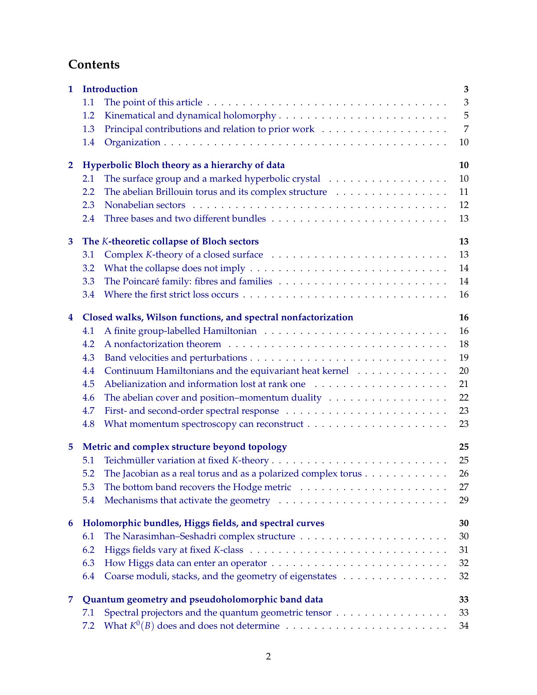
<figcaption class="paper-figure-caption"><b>Fig 1.</b> Low-resolution page preview, page 2</figcaption>
</figure>
<figure class="paper-figure-card">
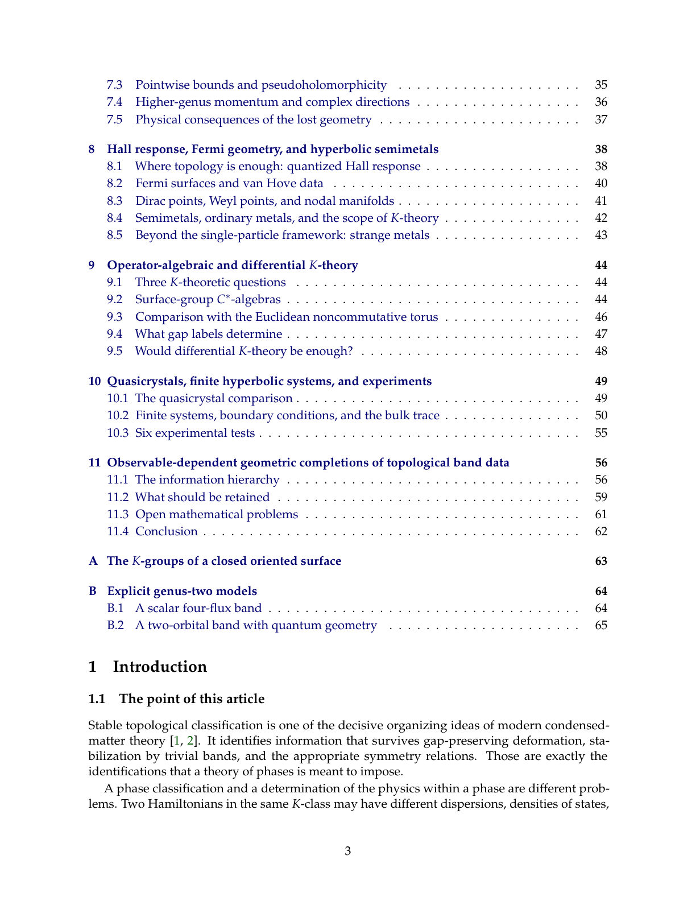
<figcaption class="paper-figure-caption"><b>Fig 2.</b> Low-resolution page preview, page 3</figcaption>
</figure>
<figure class="paper-figure-card">
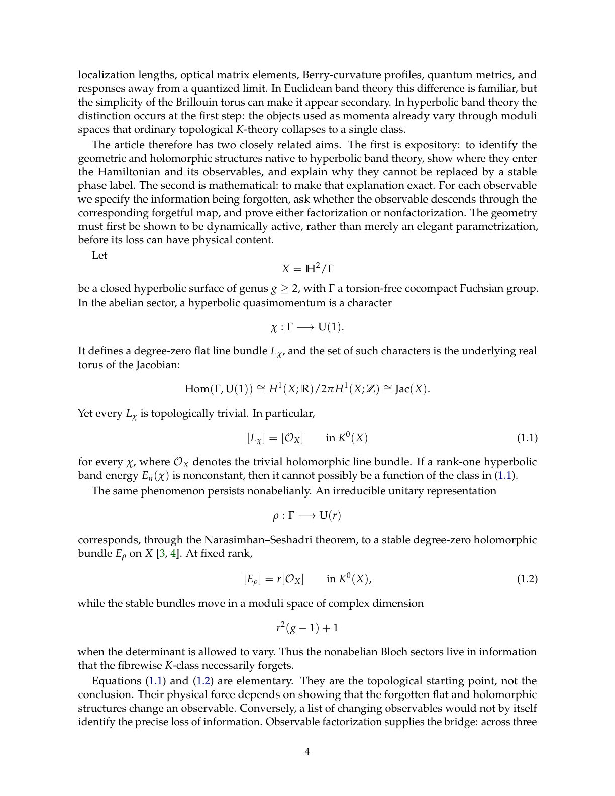
<figcaption class="paper-figure-caption"><b>Fig 3.</b> Low-resolution page preview, page 4</figcaption>
</figure>
<figure class="paper-figure-card">
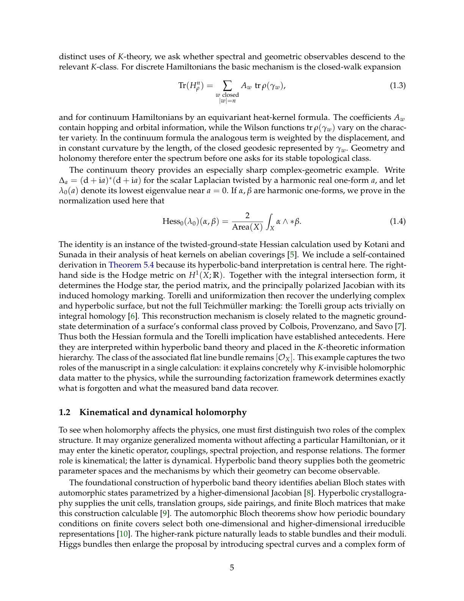
<figcaption class="paper-figure-caption"><b>Fig 4.</b> Low-resolution page preview, page 5</figcaption>
</figure>
<figure class="paper-figure-card">
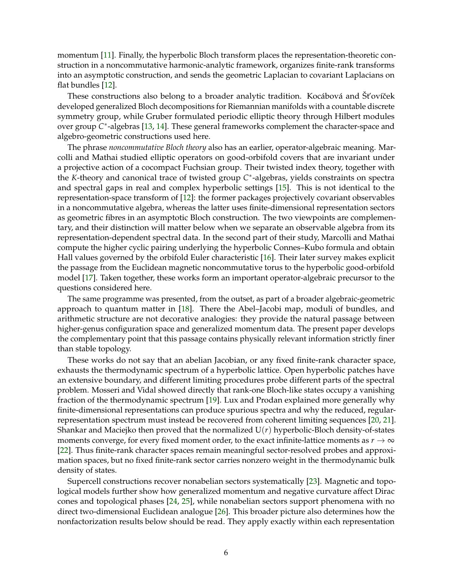
<figcaption class="paper-figure-caption"><b>Fig 5.</b> Low-resolution page preview, page 6</figcaption>
</figure>

**Summary.** This theoretical paper investigates hyperbolic band theory on curved manifolds, showing that standard topological tools like K-theory fail to capture all physical details. The authors introduce the concept of 'observable-factorization' to quantify how geometric and holomorphic variations—which are invisible to K-theory—actually manifest as measurable changes in spectral properties and quantum metrics.

**Why it may be interesting.** While highly abstract, the concept of distinguishing between stable topological invariants (like K-theory) and dynamic geometric information that dictates observable physics is crucial for understanding effective theories in condensed matter systems where topology meets geometry.

Detailed structure

**Main problem.** The paper addresses how geometric and holomorphic variations present in hyperbolic band theory are lost or 'collapsed' when using standard topological invariants like K-theory, which is insufficient for a full physical description.

**Main result.** It proves that nonfactorization occurs in key settings (fibrewise K^0, occupied-state K^0, operator-algebraic K-theory), demonstrating that geometric data remains observable even when K-theory suggests otherwise.

**Method.** The analysis compares stable topological classifications with physical observables by examining the Hessian of spectral quantities and formulating the discrepancy as an 'observable-factorization problem.'

**Model / system.** The system is hyperbolic band theory on a compact hyperbolic surface X, involving Bloch sectors defined over representations of the fundamental group $\Gamma$. The physics concerns energy bands derived from Hamiltonians or projectors.

**Key observables.** Spectra and Higgs spectral curves, Berry holonomy and quantum metric, partially filled Hall response, Fermi surface geometry, and the bottom-band Hessian (which relates to the Hodge inner product).

**Important parameters / regimes.** The genus $g$ of the hyperbolic surface ($g \ge 2$), the structure of the character variety, and the rank/size of the representations $\rho$.

**Assumptions / limitations.** The analysis distinguishes between 'kinematical holomorphy' (geometry organizing sector spaces) and 'dynamical holomorphy' (geometry informing the Hamiltonian), assuming these distinctions are physically meaningful.

**Paper structure.** The paper establishes K-theory as a starting point, then systematically proves nonfactorization in three distinct mathematical settings by calculating how geometric variations affect physical observables like spectra and metrics. It concludes by relating spectral data back to the underlying complex/hyperbolic geometry.

Abstract

Topological $K$-theory supplies the decisive stable classification principle for gapped free-fermion phases in Euclidean crystals once symmetry and stabilization are fixed. In hyperbolic band theory, by contrast, it is less decisive for the full band problem: generalized momentum sectors vary through moduli spaces, but passing to ordinary $K$-classes collapses their geometric and holomorphic variation. We distinguish kinematical holomorphy, in which complex geometry organizes the sector spaces, from dynamical holomorphy, in which that geometry informs a Hamiltonian or projector, and formulate the resulting loss as an observable-factorization problem.   For a compact hyperbolic surface $X$, we prove nonfactorization in three settings: fibrewise $K^0(X)$, occupied-state $K^0(B)$, and operator-algebraic $K$-theory. The affected quantities include spectra and Higgs spectral curves, the Berry holonomy and the quantum metric, the partially filled Hall response, and the Fermi surface and nodal geometries. We also identify the quantized pairings and local charges retained by topology.   Up to an explicit area factor, the Kotani--Sunada bottom-band Hessian is the Hodge inner product on $H^1(X;\mathbb R)$. Together with the integral intersection form, it recovers the homology-marked principally polarized Jacobian and hence, by Torelli and uniformization, the underlying complex and hyperbolic surface, though not a full Teichmüller marking. We also separate finite-rank sectors from the thermodynamic bulk. Locally faithful covers reproduce polynomial traces exactly and control continuous spectral observables. In arithmetic congruence towers, analytic observables converge as $O(|G_n|^{-η})$ for some $η>0$, and $C^s$ observables as $O((\log |G_n|)^{-s})$, while established coherent large-rank limits recover bulk density-of-states moments.

[↑ back to top](#top)

### [Bulk-Boundary Correspondence in Semi-Infinite Chains from Sublattice Zeros](http://arxiv.org/abs/2608.01368v1)

**Authors:** Ilya Iakoub, Nicolas Levasseur, Kylian Lionnet, Richard MacKenzie  
**Type:** theory · **Category:** other · **PDF:** <https://arxiv.org/pdf/2608.01368v1>  
**Analysis basis:** full PDF text, analyzed in chunks
**Topic relevance:** `Frenkel-Kontorova` **1/5** · `Keldysh / 2PI / non-Gaussian methods` **1/5** · `Kondo & dissipative impurity` **1/5** · `analog quantum simulation` **1/5**

↔ Scroll figures horizontally

<figure class="paper-figure-card">
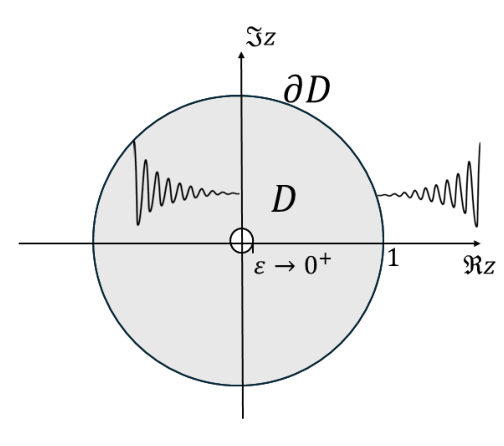
<figcaption class="paper-figure-caption"><b>Fig 1.</b> FIG. 1: The domain D and its boundary ∂D in the complex z plane. D consists of allowed values of z for a semi-infinite chain with boundary on the left. (Were the boundary on the right, the complimentary region (|z| &gt; 1) would be allowed.) The appearance of states in each region are sketched.</figcaption>
</figure>
<figure class="paper-figure-card">
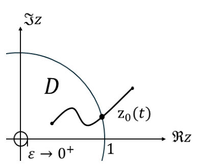
<figcaption class="paper-figure-caption"><b>Fig 2.</b> FIG. 2: A possible trajectory, in complex z space, of a simple zero of α(m) b (z) during an adiabatic evolution. The large dot represents the point where |z0(t)| = 1, at which the non-analytically continued Bloch Hamiltonian has a state with a sublattice zero. In other words, at this point, the edge state becomes a bulk state: it crosses the band. In the scenario shown above, the edge state would disappear from the semi-infinite chain after crossing the |z| = 1 circle.</figcaption>
</figure>
<figure class="paper-figure-card">
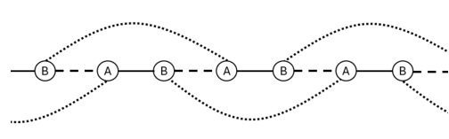
<figcaption class="paper-figure-caption"><b>Fig 3.</b> FIG. 3: An extension of the SSH model. Full black lines represent the hopping t1, dashed lines the hopping t2 and dotted lines represent the hopping t3.</figcaption>
</figure>
<figure class="paper-figure-card">
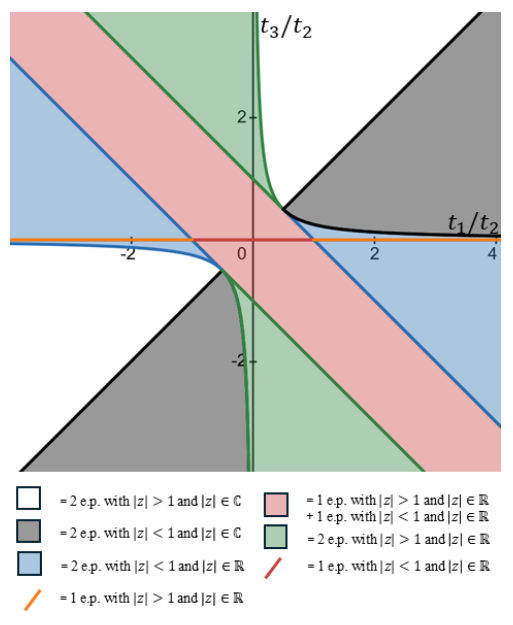
<figcaption class="paper-figure-caption"><b>Fig 4.</b> FIG. 4: (Color online) Phase diagram describing the number of exceptional states with B = 0. e.p. in the legend stands for exceptional point. The x axis, we retrieve the usual results of the SSH model.</figcaption>
</figure>

**Summary.** The paper derives a robust method to calculate the number of topologically protected edge states in semi-infinite chains by analyzing the zeros of analytically continued Bloch wavefunctions. It introduces and utilizes a winding number invariant that proves independent of arbitrary choices like unit cell definition, offering a superior tool for characterizing topological phases compared to traditional invariants.

**Why it may be interesting.** This work provides powerful mathematical machinery—using complex analysis tools like winding numbers derived from analytically continued Hamiltonians—to rigorously count topological edge states in condensed matter systems, which is highly relevant for understanding boundary physics in quantum materials.

Detailed structure

**Main problem.** To provide an alternative, robust derivation of the bulk-boundary correspondence for topological edge states in semi-infinite chains.

**Main result.** The number of topologically protected edge states is correctly counted by a winding number ($
u_B$) derived from analytically continued Bloch wavefunctions, which remains invariant even when changing the unit cell choice.

**Method.** The analysis employs complex variable techniques, specifically analytic continuation of the Bloch Hamiltonian to $z \in \mathbb{C}$ and applying the Argument Principle (winding number calculation) on a specific contour in the complex plane.

**Model / system.** The study analyzes semi-infinite chains, generalizing models like SSH chains, using an infinite chain Hamiltonian whose properties are analyzed via its continuation to complex wave vectors $z$. The system is characterized by hoppings and symmetries like chiral symmetry.

**Key observables.** Winding numbers ($
u^{(m)}_b$, $
u_A$, $
u_B$), the number of edge states, and exceptional points (where two Bloch states coalesce).

**Important parameters / regimes.** The complex variable $z$ used for analytic continuation; parameters defining hopping strengths ($t_1, t_2, t_3$) and magnetic field ($B$).

**Assumptions / limitations.** It is assumed that edge states can be derived from a single analytically continued Bloch state, and the winding number calculation assumes analyticity on the integration domain.

**Figures summary.** Figures illustrate the complex plane domain $D = \{0 < |z| \leq 1\}$ used for contour integrals, showing zero trajectories during adiabatic evolution and phase diagrams related to exceptional points.

**Paper structure.** The paper progresses by first establishing the analytic continuation method, then deriving a winding number invariant ($
u^{(m)}_b$) from boundary conditions, and finally comparing this result against other invariants (like the Zak phase) to prove its robustness across different unit cell choices.

Abstract

We provide an alternative derivation of the bulk-boundary correspondence for semi-infinite chains. To describe edge states, we analytically continue the usual Bloch Hamiltonian to complex wave vectors $k$. To start, we note that the zeros of a Bloch wavefunction are related to edge states, at least in systems with nearest-neighbour hoppings. We show that an analytically continued Bloch Hamiltonian with chiral symmetry has exceptional points, where two different states coalesce. These special points are related to the adiabatic protection of edge states. We derive a winding number that counts the number of topological edge states protected by chiral symmetry.

[↑ back to top](#top)

### [Complete Structural Determination of Mesostructural Dodecagonal Quasicrystalline Particles](http://arxiv.org/abs/2608.02142v1)

**Authors:** Xueliang Zhang, Xi Wang, Nobuhisa Fujita, Osamu Terasaki, Lu Han  
**Type:** experiment · **Category:** other · **PDF:** <https://arxiv.org/pdf/2608.02142v1>  
**Analysis basis:** full PDF text, analyzed in chunks
**Topic relevance:** `Frenkel-Kontorova` **1/5** · `analog quantum simulation` **1/5** · `methods for driven-dissipative` **1/5**

↔ Scroll figures horizontally

<figure class="paper-figure-card">
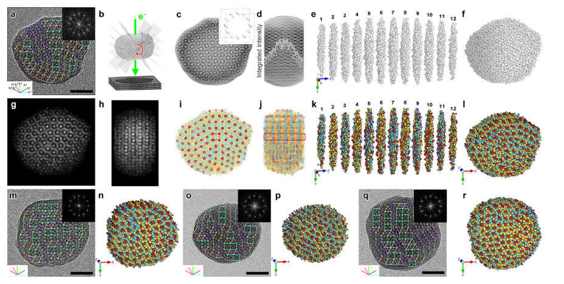
<figcaption class="paper-figure-caption"><b>Fig 1.</b> Figure 1. 3D determination of node coordinates in mesostructural dodecagonal quasicrystal particles. (a) 2D TEM image of a representative particle (QC-1), overlaid with 2D square- triangle tiling pattern; the inset shows the corresponding FFT with 12-fold rotational symmetry. (b) Schematic drawing of the data acquisition using tilt-series TEM images for 3D tomographic reconstruction. (c) Reconstructed 3D tomogram projected along the 12-fold axis (z-axis) along with its 3D FFT (inset), exhibiting 12-fold symmetry. Observed peaks in the FFT are colored according to whether can be indexed as hkml1&quot; , hkml0 and hkml1, with h, k, m, and l representing the four Miller indices along the...</figcaption>
</figure>
<figure class="paper-figure-card">
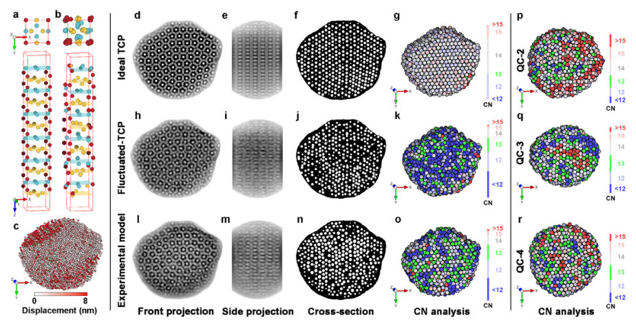
<figcaption class="paper-figure-caption"><b>Fig 2.</b> Figure 2. Structural analysis based on the TCP model. (a) A square-vertex unit of the ideal TCP structure, which is highly ordered with periodicity along the z-axis. (b) A columnar section extracted from the center of the particle (indicated by the red box in Figure 1i and 1j). The 12 colored planes correspond to the position of 12 slices shown in Figure 1d. The experimental nodal sites deviate from the ideal model. (c) Fluctuation assessment of the experimental nodal positions from the ideal TCP sites, red color indicates large fluctuation. (d,e) Front and side projections of the volumetric models of the ideal TCP. (f) Cross-section at z = ½ of the ideal TCP model (stack 109 of 200 along...</figcaption>
</figure>
<figure class="paper-figure-card">
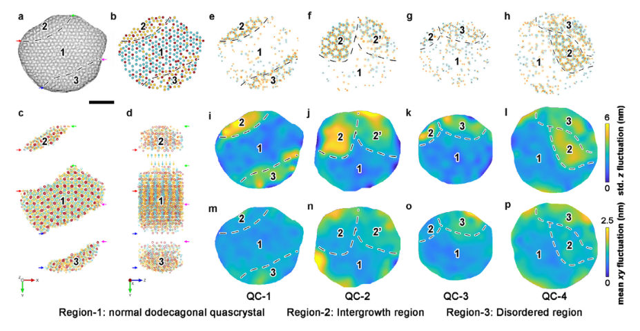
<figcaption class="paper-figure-caption"><b>Fig 3.</b> Figure 3. 3D analysis of defects and local disorder. (a) A cross-section of QC-1 taken at the middle position (slice 6). (b) Extracted nodes within the slice, showing that the slice structure can be partitioned into three distinct domains. Region-1 is the normal dodecagonal quasicrystal structure; Region-2 is the intergrowth region; and Region-3 is area with disordered structural arrangements. (c) Front projection of all extracted nodal positions of QC- 1, separated into three domains. (d) side projection of the corresponding domains, colored arrows indicating stacking fault (intergrowth defect). (e-h) Positions of the ‘outliers’ with positional displacement along the z-axis into...</figcaption>
</figure>
<figure class="paper-figure-card">
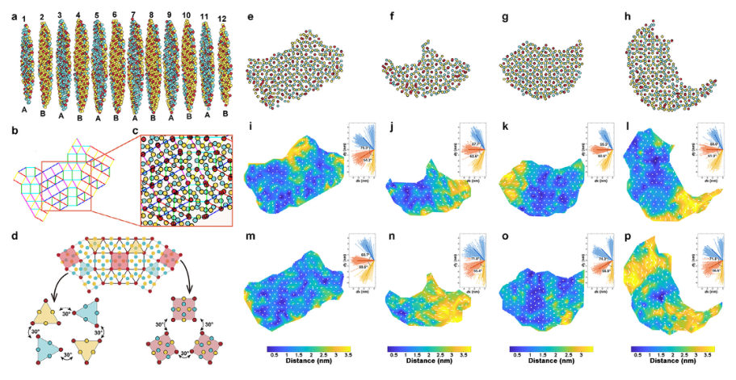
<figcaption class="paper-figure-caption"><b>Fig 4.</b> Figure 4. Tiling analysis and a simplified two-layer stacking model. (a) The merged 12 layers of QC-1. Odd-numbered layers (labelled layer A) consist mainly of Type I + Type III nodes, whereas even-numbered layers (layer B) are dominated by Type I + Type II nodes. (b) Dodecagonal ideal tiling of QC-1 with the intergrowth and disordered regions removed. (c) Enlarged view of the boxed region in (b), showing the nodal positions with actual tiling. (d) Schematic drawing of an ideal dodecagonal tiling. A hexagonal lattice can be obtained by rotating the basic tiling units by 30°, which creates adjacent layers. In the lower-left panel (triangular motif), the yellow background reveals a hexagonal...</figcaption>
</figure>

**Summary.** This work presents the first complete 3D structural determination of self-assembled mesostructural dodecagonal quasicrystals using advanced electron tomography. By analyzing nodal sites, the authors revealed that the structure deviates from simple theoretical models, quantifying defects and fluctuations. This advances understanding of soft-matter quasiperiodic order by providing detailed atomic-scale structural data.

**Why it may be interesting.** While focused on materials science crystallography rather than fundamental quantum phenomena, the rigorous use of advanced tomography to resolve local structural details and quantify deviations from idealized periodic models (like TCP) shares methodological parallels with characterizing complex many-body ground states or defect structures in condensed matter theory.

Detailed structure

**Main problem.** The primary challenge is achieving a precise, local three-dimensional (3D) structural determination of constituent atoms or secondary building units within complex self-assembled soft matter quasicrystalline systems.

**Main result.** The study reports the first complete 3D structure of mesostructural dodecagonal quasicrystals, revealing that the actual arrangement deviates from ideal tetrahedral close packing and exhibits quantifiable defects and fluctuations.

**Method.** Advanced electron tomography was employed to acquire tilt-series data, followed by custom structural tracing workflows to extract 3D coordinates of nodal sites across the entire particle volume.

**Model / system.** The physical system is self-assembled mesostructural dodecagonal quasicrystalline particles formed from cationic surfactant and silica precursors. The analysis compares the experimental structure against idealized models, such as the Tetrahedrally Close-Packed (TCP) lattice.

**Key observables.** 3D nodal coordinates, coordination numbers (CN), phason strain parameters ($\lambda$, $d$), and comparison of simulated vs. experimental TEM images.

**Important parameters / regimes.** The periodicity along the stacking axis (e.g., 6.9 nm for QC-1) and the cutoff distance used for neighbor counting ($1.5 	imes$ mean nearest-neighbor distance).

**Assumptions / limitations.** Initial reconstruction assumes a spherical geometry for each extracted node, although subsequent analysis incorporates positional fluctuations to refine this.

**Figures summary.** Figures illustrate the entire process: 2D tiling patterns, 3D tomogram reconstructions showing 12-fold symmetry in FFT, and direct comparisons between simulated TEM images based on derived models (Ideal vs. Fluctuated) and experimental views.

**Paper structure.** The paper progresses from identifying the structural challenge to detailing the advanced electron tomography data acquisition and reconstruction process. It then analyzes the extracted 3D nodal positions by classifying node types, quantifying deviations from ideal lattices using displacement analysis, and finally proposing a simplified two-layer stacking model that best fits the observed disorder.

Abstract

Quasicrystals have revolutionized our understanding of order in solids by demonstrating exotic structural and physicochemical properties with diverse potential applications. Despite the development of various theoretical models and experimental techniques to describe quasicrystal structures, the precise determination of local three dimensional (3D) arrangements of constituent atoms, or of secondary building units such as clusters or micelles, remains elusive. This challenge is particularly acute in self assembled soft matter quasicrystalline systems, where the complex assembly of molecular groups introduces additional defects and structural modulations. Herein, we report the first complete structural determination of self-assembled mesostructural dodecagonal quasicrystalline particles. Employing advanced electron tomography, combined with dedicated structural tracing and processing workflows, the 3D coordinates of all nodal sites were extracted. This approach reveals that the actual structure deviates from the conventionally assumed tetrahedral close packing geometry, exhibiting diverse coordination environments and displacive fluctuations. We identified and quantified rotational intergrowths arising from node exchange, as well as various defects and disorder, with these features discernible only through 3D analysis. Additionally, we propose a simplified two-layer stacking of isomorphic hexagonal model to form dodecagonal quasicrystal. This work advances our understanding of soft-matter dodecagonal quasicrystals and paves the way for detailed structural elucidation of self-assembled systems.

[↑ back to top](#top)

### [Screening phonon-mediated superconductors from static orbital Hamiltonians](http://arxiv.org/abs/2608.02426v1)

**Authors:** Jian-Feng Zhang, Ze-Feng Gao, Xiao-Qi Han, Dingshun Lv, Miao Gao, Kai Liu, Xinguo Ren, Zhong-Yi Lu, Tao Xiang  
**Type:** theory · **Category:** other · **PDF:** <https://arxiv.org/pdf/2608.02426v1>  
**Analysis basis:** full PDF text, analyzed in chunks
**Topic relevance:** `Keldysh / 2PI / non-Gaussian methods` **1/5** · `analog quantum simulation` **1/5** · `methods for driven-dissipative` **1/5**

↔ Scroll figures horizontally

<figure class="paper-figure-card">
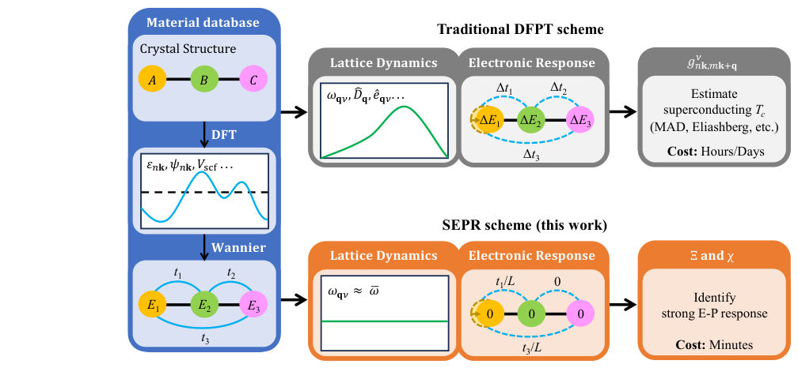
<figcaption class="paper-figure-caption"><b>Fig 1.</b> FIG. 1. Schematic illustration of the static electron-phonon response (SEPR) scheme framework. The gray panel shows the conventional DFPT-based workflow. The orange panel summarizes the present SEPR workflow, which consists of three successive approximations: (i) the dynamic isotropic approximation, which replaces mode-dependent phonon frequencies by an average characteristic frequency ¯ω; (ii) the double-center approximation, which retains the hopping variations associated with bonds connected to the displaced atom; and (iii) the bonding attractivity (BA) model approximation, which estimates the hopping derivatives from the static Hamiltonian through a bond-length dependence. The resulting...</figcaption>
</figure>
<figure class="paper-figure-card">
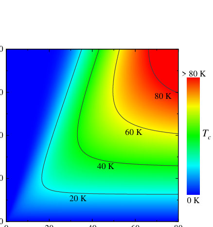
<figcaption class="paper-figure-caption"><b>Fig 2.</b> FIG. 2. Contour map of the superconducting transition tem- perature Tc in the Ξ−¯ω plane, evaluated from the McMillan- Allen-Dynes formula. Within dynamic isotropic approxima- tion, we have ωlog = ¯ω and λ = Ξ2/ℏ2¯ω2. µ∗was empirically set as 0.1.</figcaption>
</figure>
<figure class="paper-figure-card">
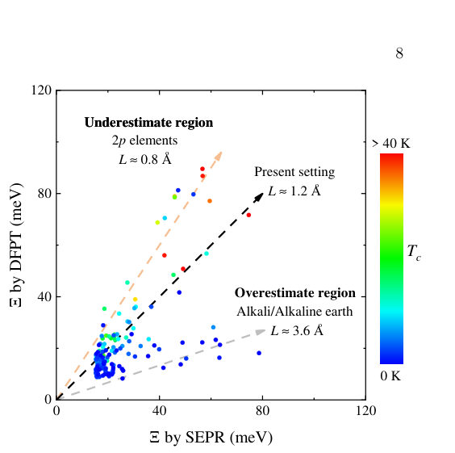
<figcaption class="paper-figure-caption"><b>Fig 3.</b> FIG. 4. Comparison of the screening parameter Ξ obtained from the SEPR scheme and from DFPT for the 150 dynam- ically stable screened compounds. The horizontal axis shows Ξ from SEPR, and the vertical axis shows Ξ from DFPT. The dashed diagonal line corresponds to ΞSEPR = ΞDFPT. Symbol colors indicate the superconducting Tc (exp. or cal.).</figcaption>
</figure>
<figure class="paper-figure-card">
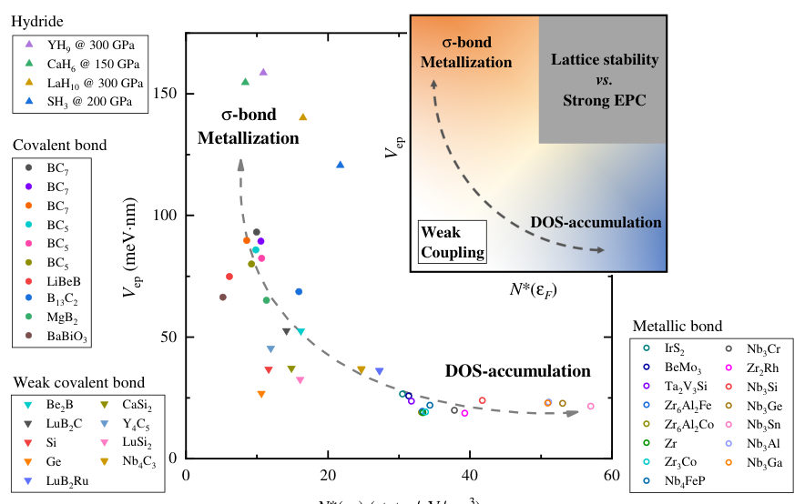
<figcaption class="paper-figure-caption"><b>Fig 4.</b> FIG. 5. Distribution of the 34 screened dynamically stable superconducting candidates with calculated Tc &gt; 10 K, together with several representative high-pressure hydrides, in the Vep −N ∗(εF ) plane. The horizontal axis is the active density of states per unit volume, N ∗(εF ), and the vertical axis is the average electron-phonon scattering measure, Vep. Different symbols denote different material classes, including high-pressure hydrides, strong-covalent systems, weak-covalent systems, and metallic bond systems. The inset schematically divides the plane into the σ-bond metallization regime, the DOS-accumulation regime, the weak-coupling region, and the region associated with the...</figcaption>
</figure>

**Summary.** This paper introduces a novel, low-cost computational framework called SEPR to screen for phonon-mediated superconductors by estimating electron-phonon coupling directly from static orbital Hamiltonians. By bypassing expensive explicit phonon calculations, the authors screened over 36,000 compounds and identified 34 promising candidates with $T_c > 10$ K. The work reveals that high-$T_c$ superconductivity arises primarily through two distinct mechanisms: strong covalent $\sigma$-bonding or high density of states accumulation near the Fermi level.

**Why it may be interesting.** While focused on condensed matter superconductivity rather than quantum information, the development of an efficient, physically transparent theoretical framework (SEPR) to bypass computationally prohibitive steps in many-body calculations is methodologically relevant to complex quantum simulations.

Detailed structure

**Main problem.** The high computational cost of first-principles calculations for electron-phonon coupling (EPC) severely limits large-scale screening of potential superconducting materials.

**Main result.** The authors developed a low-cost framework identifying 34 dynamically stable superconducting candidates with calculated Tc > 10 K, revealing two distinct microscopic routes to high-Tc superconductivity.

**Method.** They propose the Static Electron-Phonon Response (SEPR) scheme, which estimates EPC tendency directly from static orbital-based Hamiltonians, bypassing explicit phonon perturbation calculations during screening.

**Model / system.** The study focuses on phonon-mediated superconductors analyzed using an orbital-based tight-binding Hamiltonian. The framework uses approximations like the Dynamic Isotropic Approximation and Bonding Attractivity (BA) model to derive screening parameters $\Xi$ and $\chi$.

**Key observables.** Superconducting critical temperature ($T_c$), EPC scattering scale ($\lambda$, $V_{ep}$), and intrinsic deformation response ($\chi$).

**Important parameters / regimes.** The two key regimes identified are the metallized covalent $\sigma$-bond route (high $V_{ep}$) and the Fermi-level density-of-states accumulation route (high $N^*(\epsilon_F)$).

**Assumptions / limitations.** The SEPR framework is an estimation of electronic tendency, not a replacement for full DFPT calculation; it relies on several approximations to achieve computational efficiency.

**Figures summary.** Figure 1 compares the conventional costly DFPT workflow with the efficient SEPR workflow. Figure 5 maps the identified candidates in a $V_{ep} - N^*(\epsilon_F)$ plane, showing clustering into two distinct high-$T_c$ regimes.

**Paper structure.** The paper first identifies the computational bottleneck of EPC calculations. It then introduces and details the SEPR scheme using three approximations to calculate screening parameters ($\Xi$, $\chi$). Finally, it applies this method to a large database, identifying candidates and classifying them based on their underlying microscopic mechanism for high-$T_c$.

Abstract

The first-principles search for superconductors is severely limited by the high cost of electron-phonon coupling (EPC) calculations. Here we develop a low-cost, physically transparent framework that identifies strong-EPC materials directly from static orbital-based Hamiltonians without explicit phonon perturbation calculations. Verification using density functional perturbation theory (DFPT) for representative superconductors shows that the framework captures semi-quantitatively the EPC scale at substantially lower computational cost. Applied to more than 36,000 compounds in the MattKeyBond database, it identifies 34 dynamically stable superconducting candidates with calculated $T_c > 10$ K after DFPT verification. These candidates reveal two distinct routes to relatively high-$T_c$ superconductivity: a metallized covalent $σ$-bond route that is more favorable for achieving high-$T_c$ superconductors, and a Fermi-level density-of-states accumulation route that can enhance $T_c$ but usually to a more limited extent.

[↑ back to top](#top)

### [Superconducting dome due to the Fano-Feshbach shape resonance in artificial high-Tc superlattices](http://arxiv.org/abs/2608.02501v1)

**Authors:** Gaetano Campi, Andrea Alimenti, Danielle Villa, G. Alexander Smith, Fedor F. Balakirev, Luis Balicas, Andrea Perali, Sergio Caprara, Gennady Logvenov, Antonio Bianconi1  
**Type:** experiment · **Category:** strongly correlated electrons · **PDF:** <https://arxiv.org/pdf/2608.02501v1>  
**Analysis basis:** full PDF text, analyzed in chunks
**Topic relevance:** `Keldysh / 2PI / non-Gaussian methods` **1/5** · `Kondo & dissipative impurity` **1/5** · `analog quantum simulation` **1/5**

↔ Scroll figures horizontally

<figure class="paper-figure-card">
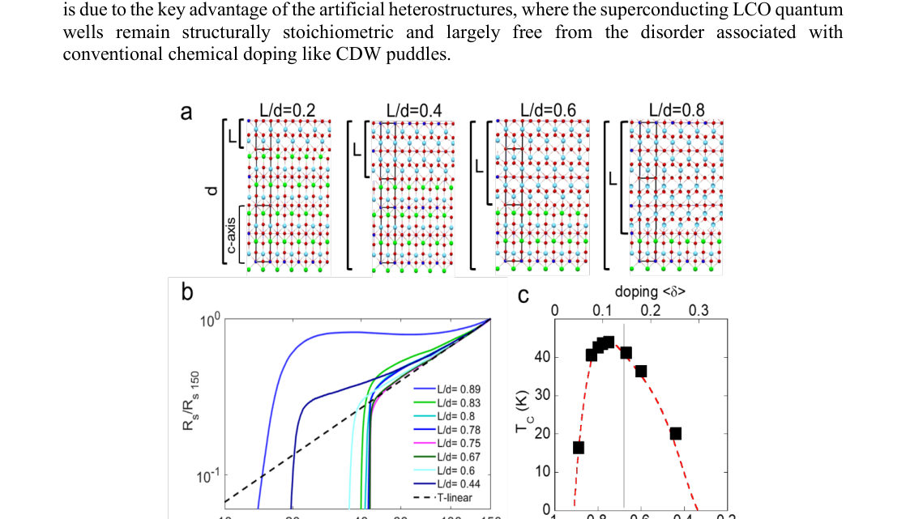
<figcaption class="paper-figure-caption"><b>Fig 1.</b> Figure 1. (a) Crystal structure of an AHTS superconductor composed of a 3D superlattice of quantum wells made of stoichiometric LCO units of thickness L, intercalated by chemically doped normal metal units LSCO of thickness W with period d = L + W. Conformational parameter L/d yields the optimum critical temperature in the range 0.6 &lt; L/d &lt; 0.7, (b) Normalized sheet resistance as a function of temperature for LSCO/LCO superlattices with different L/d ratios measured in this work. The dashed line represents the T-linear resistivity expected for the Planckian regime in the range 0 &lt; T &lt; 150 K. (c) Superconducting dome, TC as a function of L/d, for the AHTS superlattices measured in this work.</figcaption>
</figure>
<figure class="paper-figure-card">
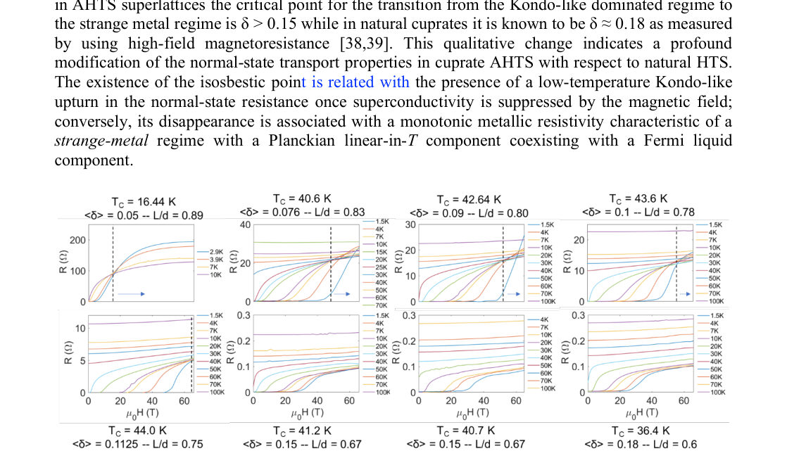
<figcaption class="paper-figure-caption"><b>Fig 2.</b> Figure 2. Resistance R(Ω) as a function of the temperature in eight samples with different TC and L/d (&lt;δ&gt;) values (indicated at the top of the upper panels), measured under magnetic field μ0H up to 72 T at the NHMFL-LANL facility. To expose this crossover, we extracted the temperature dependence of the resistance, R(T), collected at fixed magnetic fields by taking vertical cuts of the R(H) data, see Fig. 3. These curves provide a direct view of the evolution of the normal-state transport as a function of both field and doping. For samples exhibiting the isosbestic point in R(H), the corresponding R(H) curves display a clear upturn at low temperatures once superconductivity is suppressed by...</figcaption>
</figure>
<figure class="paper-figure-card">
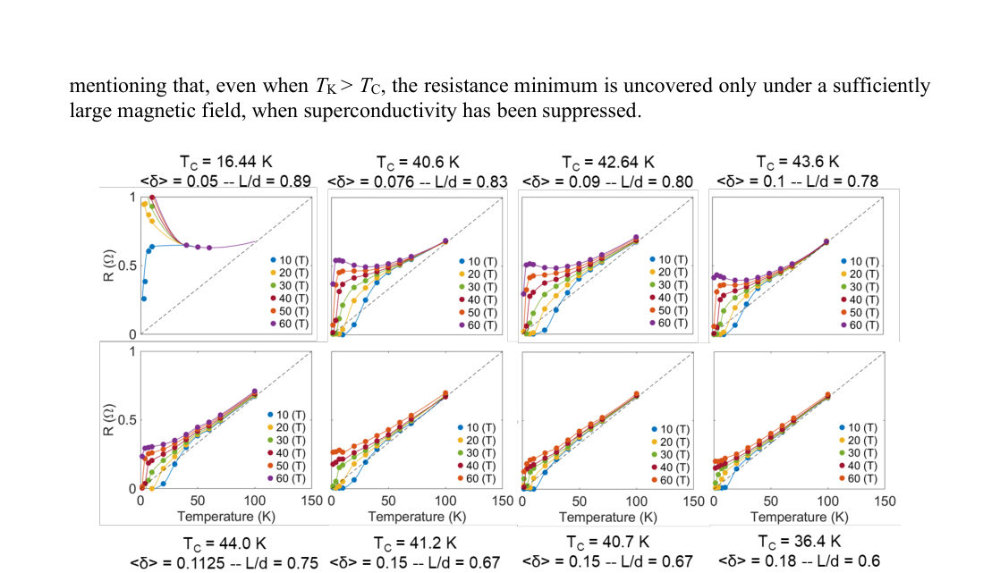
<figcaption class="paper-figure-caption"><b>Fig 3.</b> Figure 3. Resistance as a function of temperature under the indicated magnetic fields for the eight samples studied here. Values of d are indicated at the top of the upper panels and bottom of lower panels. We observe the low-temperature upturn in resistance characteristic of the pseudogap phase with a Kondo-like component coexisting with Planckian dissipation, dominant at δ=0.15 The systematic disappearance of both the low-temperature upturn in R(T) and the crossing point in R(H) upon increasing doping indicates that this additional scattering channel weakens progressively. Near optimal doping, the transport is instead dominated by a robust linear-in-temperature resistivity, characteristic...</figcaption>
</figure>
<figure class="paper-figure-card">
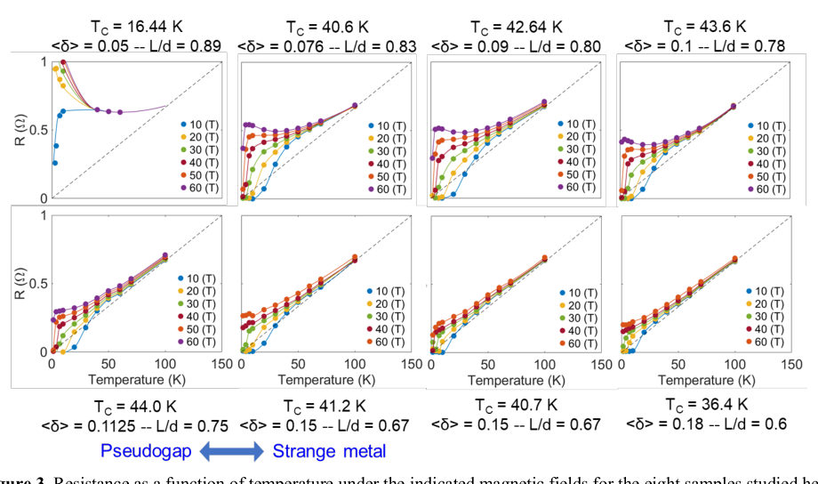
<figcaption class="paper-figure-caption"><b>Fig 4.</b> Figure 4 (a) Normal state resistance (open circles) normalized by the value of the resistance at T = 150 K or R(150K) as a function of T under µ0H = 60 T for the eight samples studied here, alongside the modelled curves (continuous lines) via Eq. 1. Different values of L/d are indicated by different colors. (b) Tk and R0k+r0 parameters extracted through the fitting procedure. We can distinguish the strong Kondo-like regime, where TK &gt; TC, and the weak Kondo-like regime with TK &lt; TC. Upon further increasing doping, a crossover to strange metallic state is observed, where a Fermi- liquid-like behaviour emerges at low temperatures, characterized by both a quadratic temperature dependence of...</figcaption>
</figure>
<figure class="paper-figure-card">
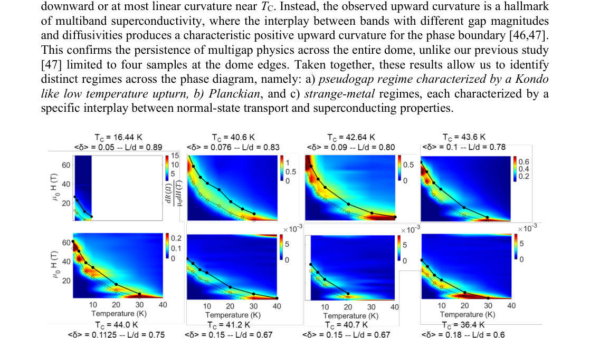
<figcaption class="paper-figure-caption"><b>Fig 5.</b> Figure 5. Color contour plots of dR/μ0d(H) as a function of μ0H and T, for the samples with different L/d ratios. Black dots alongside the thick black line represent the upper critical magnetic fields, namely, μ0H100. The dashed black lines are the irreversible magnetic fields μ0HCirr. Open circles represent the maximum of the derivative modeled by the Fano line shape.</figcaption>
</figure>

**Summary.** The research experimentally validates a theory predicting superconducting domes in artificial high-Tc superlattices by tuning the material structure's geometry. Using pulsed magnetotransport measurements, the authors map out how changing the lattice period tunes the system through different electronic regimes, confirming predictions related to Fano-Feshbach resonances and BEC-BCS crossover physics.

**Why it may be interesting.** This work provides an experimental realization and validation of complex theoretical predictions (Fano resonance, BEC-BCS crossover) in engineered quantum materials, bridging concepts from strongly correlated physics to measurable transport properties.

Detailed structure

**Main problem.** To experimentally validate the Bianconi Perali Valletta (BPV) theory predicting a superconducting dome based on quantum material design in Artificial High-Tc Superlattices (AHTS).

**Main result.** The study confirms the theoretical prediction of a superconducting dome, showing that both $T_C$ and $\mu_0H_{C2}$ peak at specific geometrical ratios ($L/d \approx 0.75$), consistent with a BEC-to-BCS crossover driven by Fano-Feshbach resonance.

**Method.** Systematic magneto-transport measurements were performed on AHTS across the full doping range using pulsed magnetic fields up to 72 T.

**Model / system.** The system consists of Artificial High-Tc Superlattices (AHTS) formed by alternating superconducting doped Mott insulator layers ($	ext{LCO}$) and normal metal spacers ($	ext{LSCO}$). The structure's electronic properties are tuned by the geometrical factor $L/d$.

**Key observables.** Resistive transitions, upper critical magnetic field ($\mu_0	ext{H}_{C2}(T)$), Ginzburg-Landau coherence length ($\xi_0$), and the superconducting dome shape.

**Important parameters / regimes.** The geometrical factor $L/d$, which controls the effective hole concentration $\delta=0.45(1 - L/d)$; doping levels (underdoped to overdoped).

**Assumptions / limitations.** The superconductivity is governed by a Fano-Feshbach shape resonance involving multigap pairing, as predicted by BPV theory.

**Figures summary.** Figures illustrate the superconducting dome ($T_C$ vs. $L/d$) and the dependence of resistance on magnetic field ($\mu_0H$), highlighting doping-dependent transport features like Kondo-like upturns.

**Paper structure.** The paper presents a systematic magneto-transport study, mapping out the evolution of superconducting parameters across varying doping levels by tuning the superlattice geometry ($L/d$).

Abstract

In this work we provide compelling experimental validation of the Bianconi Perali Valletta (BPV) theory predicting a superconducting dome based on a quantum material design of Artificial High TC Superlattices (AHTS) made with a selected nanoscale heterostructure geometry. These AHTS are SNSN superlattices of quantum wells of period d, composed of first units, superconducting doped Mott insulator layers with Rashba spin orbit coupling (S) of thickness L, intercalated by second units, normal metal spacers (N). In these superlattices, grown by molecular beam epitaxy (MBE), the experimental superconducting dome is obtained by material quantum design changing the chemical potential via the quantum geometrical factor L/d which tunes the Fano-Feshbach shape resonance in the pair transfer between superconducting gaps in the BCS regime and different gaps in the BEC-BCS crossover. Here we present a systematic magneto-transport study of AHTS artificial superlattices across the full doping range of the superconducting dome, from the deeply underdoped to the overdoped regime, using pulsed magnetic fields up to 72 T. By varying the L/d ratio, we tune the effective hole concentration delta=0.45(1-L/d) and map the evolution of the resistive transitions, the upper critical magnetic field and the Ginzburg-Landau coherence length

[↑ back to top](#top)

### [Time reversal symmetry broken quantum spin hall effect in pseudospin-1 Dirac-Rashba system](http://arxiv.org/abs/2608.02152v1)

**Authors:** Puspita Parui, Bheema Lingam Chittari  
**Type:** theory · **Category:** other · **PDF:** <https://arxiv.org/pdf/2608.02152v1>  
**Analysis basis:** full PDF text, analyzed in chunks
**Topic relevance:** `analog quantum simulation` **1/5** · `exotic spin models in light-matter` **1/5** · `spintronics-quantum-optics interface` **1/5**

↔ Scroll figures horizontally

<figure class="paper-figure-card">
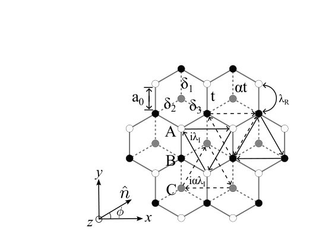
<figcaption class="paper-figure-caption"><b>Fig 1.</b> FIG. 1. Schematic of α −T3 lattice with sublattices A, B and C are denoted by white, black and grey circles, respectively. The model contains nearest-neighbour hopping t (solid lines) and αt (dashe lines); next-nearest-neighbour intrinsic SOC λI and αλI (solid and dashed arrows, respectively); spin-mixing Rashba spin-orbit coupling λR (curved arrow). Magnetization orientation in real space is specified by ˆn.</figcaption>
</figure>
<figure class="paper-figure-card">

<figcaption class="paper-figure-caption"><b>Fig 2.</b> FIG. 2. Phase diagram of the global bulk gap as a function of α and exchange coupling λ⊥ ex for out-of-plane magnetization for (a) λR = 0 and (a) λR = 0.05. The Chern numbers (C, Cσ) are used to index the TI phases. A negative bandgap indicates transition to a metallic phase due to the indirect band gap closing as the band gaps at different k values overlap.</figcaption>
</figure>
<figure class="paper-figure-card">
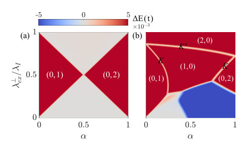
<figcaption class="paper-figure-caption"><b>Fig 3.</b> Fig.2(a) and Fig.2(b) show the numerically calculated bulk band gap phase diagram as a function of out-of- plane exchange field λ⊥ ex and the lattice parameter α, in the absence and presence of Rashba SOC, respectively. The grey region denotes a direct band-gap closing, whereas the blue region indicates closing of the indirect bandgap, both representing a metallic phase. The insulating phases are indexed by the pair (C, Cs), where C is the total Chern number and Cs is the projected spin Chern number of the occupied subspace. While the total Chern number (C) identifies the QAH topology, the QSH phase is characterised by the projected spin Chern number (Cs), as the exchange field explicitly...</figcaption>
</figure>
<figure class="paper-figure-card">
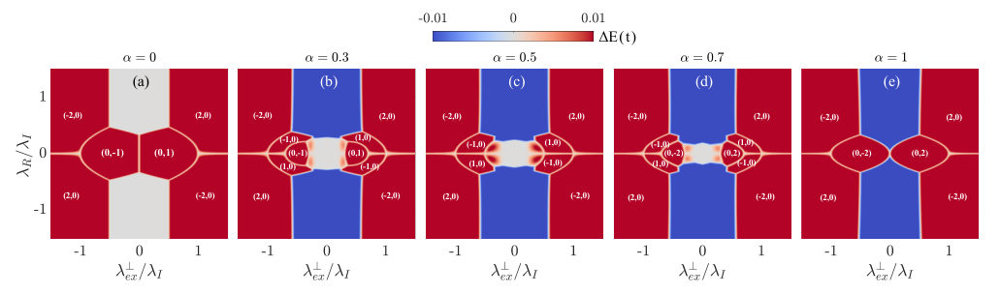
<figcaption class="paper-figure-caption"><b>Fig 4.</b> FIG. 3. Phase diagram of bulk band gap in the λR/λI - λ⊥ ex/λI plane, for different values of α. (C, Cσ) indicates the total and projected spin Chern number of the occupied subspace for different topological phases. The zero band-gap lines indicate a phase transition, whereas the blue region suggests an indirect band-gap closure.</figcaption>
</figure>
<figure class="paper-figure-card">
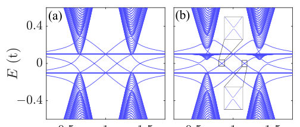
<figcaption class="paper-figure-caption"><b>Fig 5.</b> FIG. 4. Electronic spectrum of zig-zag edged α−τ3 ribbon for α = 1. The parameters are chosen to be λI = 0.2, λ⊥ ex = 0.1 and λR = 0 (a) and λR = 0.02 (b). The inset shows gapped edge bands in the presence of Rashba coupling. The width of the ribbon considered is 30nm, containing 141 zigzag chains along the width.</figcaption>
</figure>

**Summary.** This paper theoretically explores the complex interplay between time-reversal symmetry breaking, Rashba spin-orbit coupling, and magnetism in a pseudospin-1 fermionic system. It demonstrates that the QSH phase persists under broken TRS but transitions into distinct QAH phases. Crucially, it also shows how applying an in-plane magnetic field can induce tunable Second-Order Topological Insulator (SOTI) phases hosting localized corner states.

**Why it may be interesting.** This work provides a detailed theoretical playground for understanding how multiple topological orders (QSH, QAH, SOTI) can coexist and transition within a single, tunable lattice structure using external magnetic fields and SOC.

Detailed structure

**Main problem.** The study investigates how the Quantum Spin Hall (QSH) phase survives, transitions, or changes character when Time-Reversal Symmetry (TRS) is broken by a ferromagnetic exchange field and spin mixing occurs via Rashba SOC.

**Main result.** The system exhibits multiple topological phases, including QSH and distinct Quantum Anomalous Hall (QAH) phases. Furthermore, in-plane magnetization can induce Second-Order Topological Insulator (SOTI) phases with tunable corner states.

**Method.** Theoretical analysis using tight-binding models on the pseudospin-1 $\alpha$-T3 lattice, calculating topological invariants like the spin-Chern number and total Chern number via momentum-space Hamiltonian diagonalization.

**Model / system.** The system is a pseudospin-1 fermionic model on an $\alpha$-T3 lattice, incorporating Kane-Mele hopping, Rashba SOC ($\lambda_R$), and ferromagnetic exchange coupling ($\lambda_{ex}$). The Hamiltonian is analyzed in spin-up/spin-down sectors.

**Key observables.** Spin-Chern number ($C_\sigma$), total Chern number ($C$), bulk band gaps ($\Delta E$), and localized zero-energy corner states (SOTI).

**Important parameters / regimes.** Lattice parameter $\alpha$, Rashba coupling strength ($\lambda_R$), and exchange field strengths ($\lambda_{\perp	ext{ex}}, \lambda_{\parallel	ext{ex}}$).

**Assumptions / limitations.** The analysis relies on projecting the Hamiltonian onto occupied subspaces to define topological invariants when symmetries are broken.

**Figures summary.** Figures illustrate band structures (e.g., zigzag nanoribbons) showing gap closing/reopening at critical parameter values ($\alpha = \lambda_{	ext{ex}}$), and real-space spectra confirming tunable zero-energy corner modes in SOTI phases.

**Paper structure.** The paper systematically analyzes the Hamiltonian's response to broken TRS, first establishing QSH protection, then showing how Rashba SOC drives transitions into specific QAH states, and finally exploring the realization of SOTI phases via in-plane magnetization.

Abstract

The Quantum spin Hall (QSH) phase is conventionally understood to be protected by time-reversal symmetry (TRS). Here, we theoretically investigated the fate of the QSH phase in a pseudospin-1 fermionic $α-\mathcal{T}_3$ system in the presence of a TRS-breaking ferromagnetic exchange field and spin-nonconserving Rashba spin-orbit coupling. Despite broken TRS, the QSH phase survives over a finite parameter regime and is characterised by a non-zero projected spin-Chern number $C_σ(σ= \uparrow, \downarrow)$, protected by a spin-spectral gap. In the absence of Rashba coupling, the QSH phase remains robust up to an $α$-dependent critical exchange field. Rashba SOC qualitatively reshapes the phase diagram by driving transitions into two distinct quantum anomalous Hall (QAH) phases: a $C=2$ phase, irrespective of $α$-values, and a $C=1$ phase for $α\neq 0,1$, which is further identified as a valley-polarized QAH phase arising from a single valley. Rotating the magnetization to in-plane gaps out the first-order helical edge states and gives rise to second-order topological insulator (SOTI) phases that host localized corner states in suitable finite geometry. We further identify a topological phase transition between two different SOTI phases, mediated by nanoribbon edge states at an exchange field equal to $α$. These results establish spin-resolved topology in a higher pseudospin system as well as the $α-\mathcal{T}_3$ lattice as a versatile platform for engineering and controlling multiple topological phases through magnetic exchange and spin-orbit coupling.

[↑ back to top](#top)

### [Emergence of Double-Dome Superconductivity in the Pressurized Dirac Semimetal BaMg2Bi2](http://arxiv.org/abs/2608.02394v1)

**Authors:** Qi Wang, Juefei Wu, Cuiying Pei, Yi Zhao, Yiyan Wang, Yanpeng Qi  
**Type:** both · **Category:** other · **PDF:** <https://arxiv.org/pdf/2608.02394v1>  
**Analysis basis:** full PDF text, analyzed in chunks
**Topic relevance:** `analog quantum simulation` **1/5** · `driven-dissipative phase transition` **1/5**

↔ Scroll figures horizontally

<figure class="paper-figure-card">
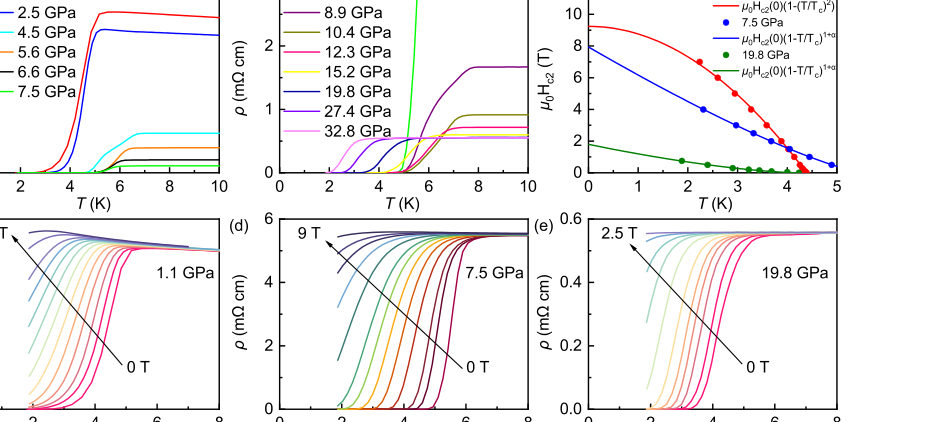
<figcaption class="paper-figure-caption"><b>Fig 1.</b> FIG. 1. (a) and (b) Temperature dependence of resistivity ρ(T ) at various pressures in the temperature range from 1.8 to 10 K for BaMg2Bi2 single crystal. (c)-(e) Temperature dependence of ρ(T ) under different magnetic fields at 1.1, 7.5, and 19.8 GPa, respectively. (f) The upper critical field µ0Hc2(T ) as a function of temperature at representative pressures. The solid lines demonstrate the fitting results using µ0Hc2(T ) = µ0Hc2(0)(1 −( T</figcaption>
</figure>
<figure class="paper-figure-card">
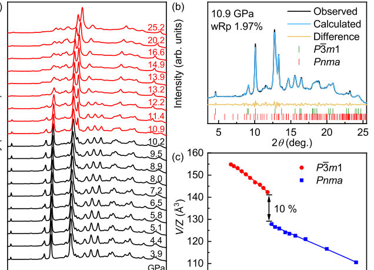
<figcaption class="paper-figure-caption"><b>Fig 2.</b> FIG. 2. (a) High-pressure XRD patterns of BaMg2Bi2 single crystal in the pressure range of 3.9 - 25.2 GPa at room temperature. (b) Rietveld refinement of XRD at 10.9 GPa. (c) The volume per formula V/Z as a function of pressure. The solid lines represent the third-order Birch-Murnaghan fitting.</figcaption>
</figure>
<figure class="paper-figure-card">

<figcaption class="paper-figure-caption"><b>Fig 3.</b> FIG. 3. (a) The crystal structure of P¯3m1 and Pnma phase in BaMg2Bi2. (b) The enthalpy difference relative to the P¯3m1 phase of BaMg2Bi2 under high pressure. (c)-(e) The phonon spectra of the predicted phase Pnma under different pressures.</figcaption>
</figure>
<figure class="paper-figure-card">
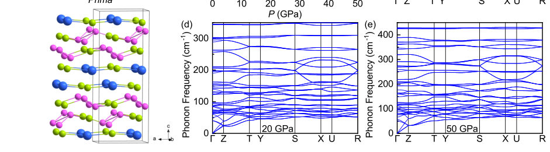
<figcaption class="paper-figure-caption"><b>Fig 4.</b> FIG. 4. (a-c) The Hall resistivity ρH(B) as a function of magnetic field within the pressure up to 32.8 GPa at 10 K. (d) Pressure dependence of Hall coefficient RH.</figcaption>
</figure>
<figure class="paper-figure-card">
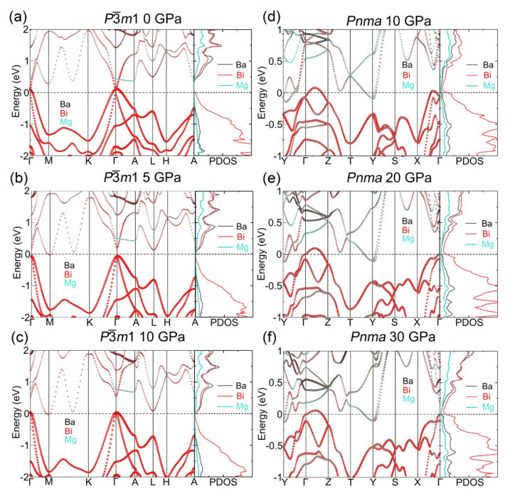
<figcaption class="paper-figure-caption"><b>Fig 5.</b> FIG. 5. The band structures and partial density of states (PDOS) of the P¯3m1 phase from 0 to 10 GPa (a)-(c) and the predicted structure Pnma from 10 to 30 GPa (d)-(f).</figcaption>
</figure>

**Summary.** This work reports on high-pressure studies of the Dirac semimetal BaMg2Bi2, revealing a unique double-dome superconducting behavior. The enhancement of superconductivity is directly correlated with two distinct physical events: a pressure-induced Lifshitz transition and a structural phase change from P3m1 to Pnma. This highlights how external tuning can drive complex interplay between electronic structure and macroscopic quantum phenomena.

**Why it may be interesting.** While focused on condensed matter superconductivity, the interplay between external tuning parameters (pressure) driving both electronic topology changes (Lifshitz transition) and lattice structure changes is a general theme relevant to quantum phase transitions in strongly correlated or topological systems.

Detailed structure

**Main problem.** The study investigates how high pressure affects the superconducting properties and structural stability of the topological Dirac semimetal BaMg2Bi2.

**Main result.** A double-dome superconducting behavior is revealed, with distinct enhancements in Tc linked to a Lifshitz transition and a structural phase transition from P3m1 to Pnma.

**Method.** The research combines high-pressure X-ray diffraction (XRD), electrical transport measurements (resistivity/Hall resistivity), and first-principles theoretical calculations (DFT).

**Model / system.** The physical system is the topological material BaMg2Bi2, studied under extreme pressures using a Diamond Anvil Cell. The analysis tracks changes in crystal structure, electronic band topology, and superconducting critical temperatures.

**Key observables.** Double-dome superconducting transition temperature (Tc), upper critical field (Hc2(T)), structural phase transitions ($	ext{P}ar{3}m1 	o 	ext{Pnma}$), and changes in Fermi surface topology.

**Important parameters / regimes.** Applied pressure (up to 25.2 GPa); superconducting transition temperatures (e.g., 6.67 K, 7.22 K).

**Assumptions / limitations.** Cell preparations were performed in an argon atmosphere due to the air-sensitive nature of the material.

**Figures summary.** Figures show $
ho(T)$ and $H_{c2}(T)$ vs pressure (Fig. 1), high-pressure XRD patterns confirming structural changes (Fig. 2), and electronic structure calculations for both phases (Fig. 5, 6).

**Paper structure.** The paper systematically presents measurements of superconducting properties under increasing pressure, correlating the observed double-dome behavior with simultaneous structural transitions identified via XRD and theoretical stability analysis.

Abstract

Dirac semimetal BaMg2Bi2 is reported to be a unique topological material that manifests surface superconductivity that coexistswith bulk band topology at ambient pressure. Here, we present a comprehensive investigation of high-pressure superconductingproperties in BaMg2Bi2 single crystal. Significantly, a pressure-driven double-dome superconducting behavior was revealed, withthe superconducting transition temperature Tc approaching the maximum values of 6.67 K at 4.5 GPa and 7.22 K at 10.4 GPafor the first and second superconducting domes, respectively. The combination of high-pressure X-ray diffraction, Hall resistivitymeasurements, and theoretical calculations demonstrates that, the first superconducting regime is closely related to the pressure-modulated Lifshitz transition, whereas the second superconducting phase emerges concurrently with a structural transition fromthe ambient-pressure P3m1 phase to a high-pressure Pnma phase.

[↑ back to top](#top)

### [Evidence for superconductivity at 190 K in a pressure-overdoped cuprate](http://arxiv.org/abs/2608.00942v1)

**Authors:** Alexander C. Mark, Huu T. Do, David Rodriguez, D. Gonzalez Arevalo, Adam Denchfield, Eduardo H. T. Poldi, Daniel P. Phelan, N. K. Man, Rssell J. Hemley  
**Type:** both · **Category:** strongly correlated electrons · **PDF:** <https://arxiv.org/pdf/2608.00942v1>  
**Analysis basis:** full PDF text, analyzed in chunks
**Topic relevance:** `Keldysh / 2PI / non-Gaussian methods` **1/5** · `analog quantum simulation` **1/5**

↔ Scroll figures horizontally

<figure class="paper-figure-card">
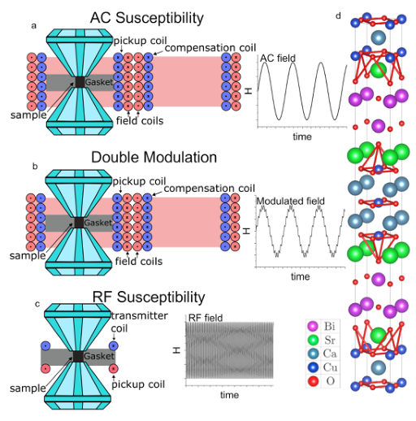
<figcaption class="paper-figure-caption"><b>Fig 1.</b> Fig. 1 DAC techniques used to measure signatures of su- perconductivity in Bi-2223 in this study. a) Setup for AC susceptibility measurements including a pickup and field coil around a diamond anvil. A matched reverse-wound compen- sation coil is placed next to the sensor to compensate for stray fields. · and x indicate coil is wound into or out of the page, respectively. Representative low frequency AC magnetic field waveform presented next to setup. b) Double modulation setup identical to the AC susceptibility setup, but utilizing a modulated AC field composed of a high amplitude low fre- quency modulation wave and a high frequency low amplitude excitation wave. c) RF susceptibility setup...</figcaption>
</figure>
<figure class="paper-figure-card">
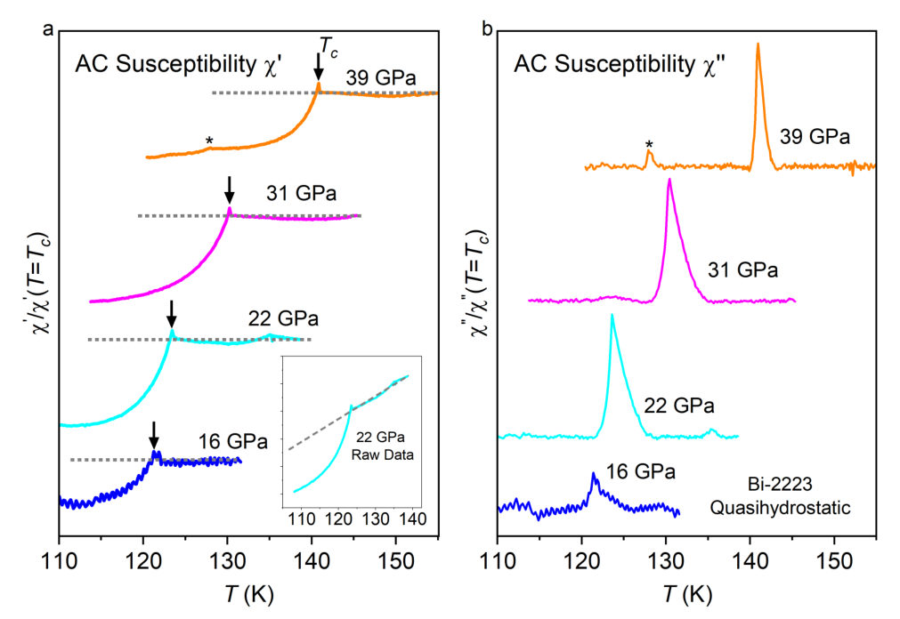
<figcaption class="paper-figure-caption"><b>Fig 2.</b> Fig. 2 a) χ′(T) for larger quasihydrostatic 20/80 Bi-2223/KCl samples. Inset: representative linear baseline subtraction near Tc. b) Corresponding χ′′(T). Data collected at a driving frequency of f = 98 Hz. Additional oscillations apparent in 16 GPa data due to low integration time used in demodulation. The background above Tc was approximately linear for all runs, and a linear background has been subtracted around Tc from all measurements to account for the diamagnetism of the pressure cells. Signals at 39 GPa (*) are attributed to pressure gradients developing across the sample, resulting in different regions having different Tc values [28]. Dotted lines are guides to the eye; signal...</figcaption>
</figure>
<figure class="paper-figure-card">
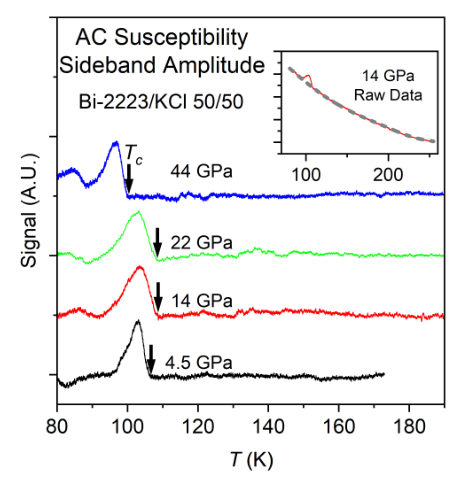
<figcaption class="paper-figure-caption"><b>Fig 3.</b> Fig. 3 Amplitudes of modulated signals from the less- quasihydrostatic 50/50 mixture of Bi-2223/KCl showing devi- ations from the linear background at Tc. Inset: representative background baseline (grey dashed line). Data offset for clar- ity.</figcaption>
</figure>
<figure class="paper-figure-card">
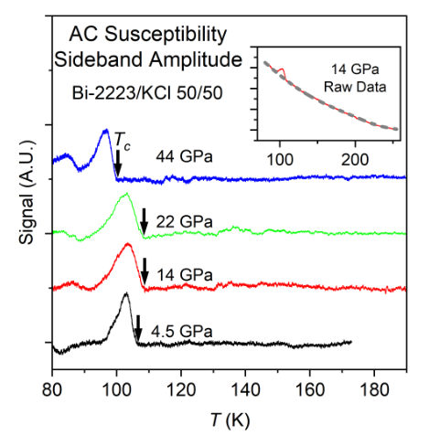
<figcaption class="paper-figure-caption"><b>Fig 4.</b> Figure 2 shows the results of measurements con- ducted on quasihydrostatic compression using lock-in techniques to probe χ′ and χ′′. χ′(T) signals show field expulsion at Tc due to the Meissner effect, in agreement with previous experiments at lower pressures in Ne [5]. At 39 GPa, the highest pressure where we directly mea- sured the AC susceptibility with these techniques [38], multiple features in both χ′ and χ′′ are apparent. We attribute these features to the development of stress gradients across the sample as the compression envi- ronment stiffens, resulting in multiple superconducting transitions at different points across the sample. In con- trast, comparable samples prepared in a...</figcaption>
</figure>
<figure class="paper-figure-card">
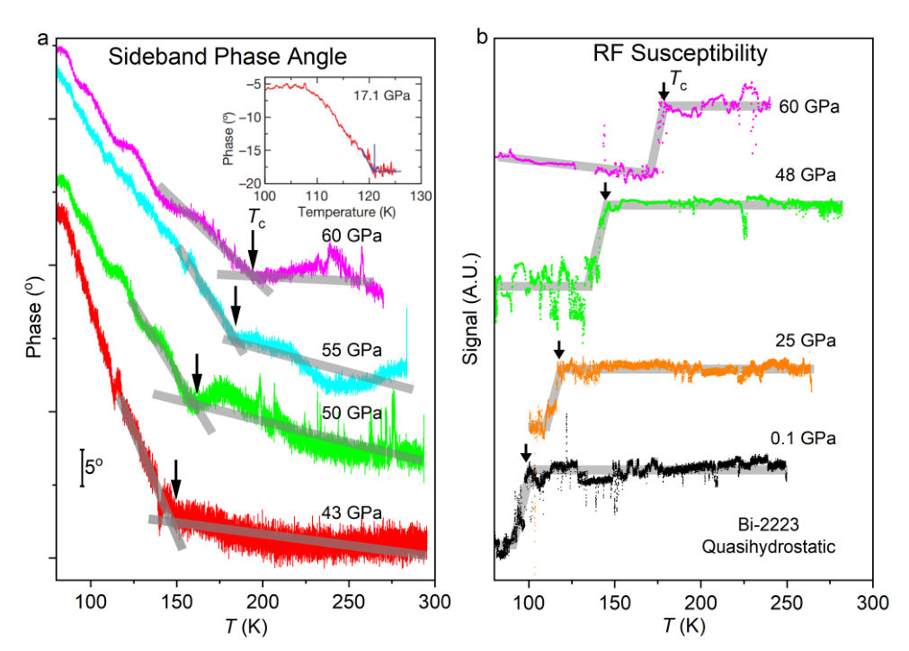
<figcaption class="paper-figure-caption"><b>Fig 5.</b> Fig. 4 a) Temperature dependence of the sideband phase angle of the quasihydrostatic 20/80 Bi-2223/KCl samples at various pressures. Data were collected using a driving frequency of 98 Hz and a modulation frequency of 2450 Hz. Arrows indicate assigned Tc values using the criteria of Chen et al. [5]. Oscillations in measurements are instrumental and due to overtones of the driving frequencies. Data offset for clarity. Inset: phase angle - temperature plot adapted from Chen et al. [5] indicating the Tc assignment criteria. b) Transmitted RF signals through a 20/80 Bi-2223/KCl mixture. Drops in the transmitted signal indicate diamagnetic transitions attributed to the onset of the Meissner...</figcaption>
</figure>

**Summary.** This study reports on measuring superconducting critical temperatures ($T_c$) in cuprates under extreme pressures up to 60 GPa. By combining advanced magnetic susceptibility measurements with DFT calculations, the authors demonstrate a continuous rise of $T_c$ to 190 K at high pressure. This suggests the existence of a 'second superconducting regime' driven by significant electronic restructuring at very high hole doping levels.

**Why it may be interesting.** This work directly addresses unconventional superconductivity in strongly correlated materials, which is a major focus area. The use of high pressure as an external tuning parameter provides a unique way to map out the phase diagram and explore exotic electronic states relevant to many-body physics.

Detailed structure

**Main problem.** The study investigates how applying high external pressure affects the superconducting critical temperature ($T_c$) in cuprate superconductors, specifically looking for evidence of a second superconducting regime at highly overdoped states.

**Main result.** The research reports observing $T_c$ rising continuously to 190 K at 60 GPa, suggesting that high pressure induces electronic restructuring leading to enhanced superconductivity beyond previously known limits.

**Method.** A combination of experimental techniques (AC susceptibility, double modulation, RF susceptibility) under high-pressure diamond anvil cells, complemented by DFT calculations to model doping changes, was employed.

**Model / system.** The physical system is the cuprate superconductor $	ext{Pb}_{0.4}	ext{Bi}_{1.6}	ext{Sr}_2	ext{Ca}_2	ext{Cu}_3	ext{O}_{10+\delta}$ ($	ext{Bi-2223}$). The theoretical framework involves modeling how pressure modifies the hole doping concentration ($n_H$) and induces changes in the Fermi surface topology.

**Key observables.** Meissner effect onset, $T_c$ dependence on pressure (up to 60 GPa), AC susceptibility ($\chi'$ and $\chi''$), and calculated equivalent hole doping ($n_H$).

**Important parameters / regimes.** Pressure range up to 60 GPa; critical temperature reaching 190 K; high hole doping regime.

**Assumptions / limitations.** The interpretation relies on the assumption that pressure-induced changes in electronic structure (as modeled by DFT) govern the superconducting enhancement, and careful background subtraction is necessary for susceptibility measurements.

**Figures summary.** Figures illustrate DAC setups, temperature dependence of magnetic susceptibility ($\chi'$), modulated signal amplitudes under different compression environments, and calculated hole doping ($n_H$) vs. pressure.

**Paper structure.** The paper establishes the context of pressure tuning in cuprates, presents experimental measurements across various high-pressure regimes using multiple susceptometry techniques, analyzes the non-monotonic behavior at lower pressures, and concludes by presenting evidence for a continuous rise to 190 K, linking it to a second superconducting regime.

Abstract

It is well established that the critical temperature ($T_c$) of cuprate superconductors can be tuned by pressure. For example, compression decouples the hole doping from chemical doping allowing for overdoped samples far beyond what is possible at ambient pressure. In this work, multiple techniques are used to probe the onset of the Meissner effect at $T_c$ as a function of pressure in $\mathrm{Pb_{0.4}Bi_{1.6}Sr_2Ca_2Cu_3O_{10+δ}}$ (Bi-2223) to 60 GPa in different compression environments. Samples compressed under quasihydrostatic conditions exhibit a distinctive non-monotonic pressure dependence of $T_c$ below 25 GPa, in agreement with previous reports. With further increase in pressure $T_c$ climbs continuously to 190 K at 60 GPa. Evidence for critical temperatures exceeding those reported to date for cuprates at ambient and high pressures, the results may be understood in terms of the proposed second superconducting regime at high hole doping.

[↑ back to top](#top)

### [Extracting higher-order nonlinearities in nanomechanical resonators using the backbone relation](http://arxiv.org/abs/2608.02008v1)

**Authors:** Maria Kallergi, Daniel K. J. Boneß, Maximilian Seitner, Wolfgang Belzig, Eva M. Weig  
**Type:** experiment · **Category:** other · **PDF:** <https://arxiv.org/pdf/2608.02008v1>  
**Analysis basis:** full PDF text, analyzed in chunks
**Topic relevance:** `quantum measurements` **1/5** · `quantum optics experiment` **1/5**

↔ Scroll figures horizontally

<figure class="paper-figure-card">
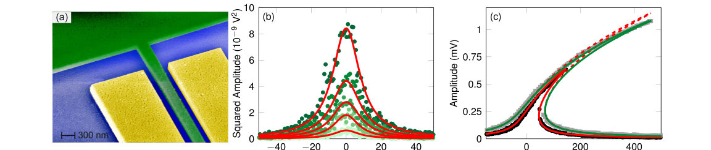
<figcaption class="paper-figure-caption"><b>Fig 1.</b> FIG. 1. (a) Scanning electron micrograph of a doubly-clamped silicon nitride string resonator (green) and flanking electrodes (gold). (b) Frequency response for different drive powers in the linear regime (−63 dBm, −59 dBm, −57 dBm, −54.5 dBm, −52 dBm depicted as light to dark green dots). Red lines represent Lorentzian fits to the data. (c) Frequency response for drive powers of −35 dBm (black dots) and −30 dBm (grey squares). The red solid line depicts a fit of the −35 dBm curve with the Duffing model yielding 𝛼1 = 4.170 · 1025 kg−1 m−2, see Eq. (A14). The red dashed line shows the same model at −30 dBm. The green solid line shows a fit with the extended model with 𝛼2 = 8.402 · 1046 s...</figcaption>
</figure>
<figure class="paper-figure-card">
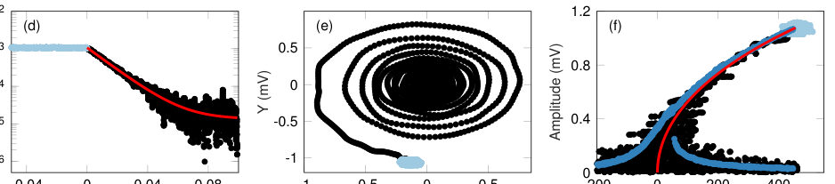
<figcaption class="paper-figure-caption"><b>Fig 2.</b> FIG. 2. Ringdown measurements in and beyond the Duffing regime. Turquoise and black dots show the response amplitude before and after switching off the drive. (a),(d) Amplitude response at a drive power of −35 dBm ( −30 dBm) applied at the upper bifurcation point. The red line represents an exponential fit to the data. (b),(e) Phase-space representation of the ringdown measurement, depicting the quadrature (Y) vs. the in-phase (X) component for the data shown in (a) and (d), respectively. The spiraling trajectory confirms the decay of the amplitude. (c),(f) Backbone relation for the ringdowns shown in (a) and (d), respectively. The backbone is extracted from the time derivative of the phase...</figcaption>
</figure>
<figure class="paper-figure-card">
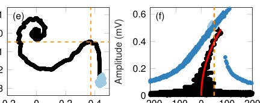
<figcaption class="paper-figure-caption"><b>Fig 3.</b> FIG. 3. (a) Frequency response at a drive power of −26 dBm. The red solid line shows a fit with the extended nonlinear model that includes 𝛼2 and 𝛼3. (b) Ringdown measurement for the same drive power applied at the upper bifurcation point. Turquoise (black) points show the amplitude signal before (after) switching off the drive. The red line represents the exponential fit to the data. (c) Phase space representation of the ringdown measurement, showing the quadrature (Y) vs. the in-phase (X) component of the data using the same color code as in (b). (d) Backbone relation for the ringdown. The backbone is extracted from the time derivative of the phase signal. It is shifted in frequency by...</figcaption>
</figure>
<figure class="paper-figure-card">
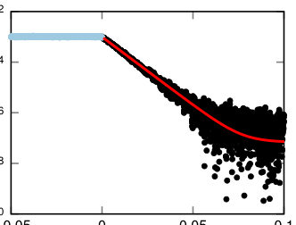
<figcaption class="paper-figure-caption"><b>Fig 4.</b> FIG. 4. Action decay measured at the upper bifurcation point for a drive power of −26 dBm, corresponding to the largest amplitude explored in this work. The ringdown follows an exponential decay, confirming the linear damping hypothesis.</figcaption>
</figure>
<figure class="paper-figure-card">
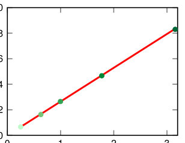
<figcaption class="paper-figure-caption"><b>Fig 5.</b> FIG. 5. Extracted maximum of frequency response curves for drive powers ranging from −63 dBm to −52 dBm (light to dark green, as in Fig. 1(a) of the main text) plotted over the square of the driving volt- age. From the linear fit, depicted in red, we can obtain the calibration parameter c that relates the drive to the response amplitude. In our case, we obtain 𝑐= 0.2645.</figcaption>
</figure>

**Summary.** The paper introduces a novel, robust method using the 'backbone curve' derived from ringdown measurements to accurately characterize higher-order conservative nonlinearities in nanomechanical resonators. By analyzing the frequency dependence on amplitude, this technique overcomes limitations of conventional methods that suffer from frequency drift or are restricted in their nonlinearity scope. This advancement is crucial for utilizing these high-precision mechanical systems in advanced quantum sensing applications.

**Why it may be interesting.** This work is highly relevant to open quantum systems and quantum optics because nanomechanical resonators are increasingly used as high-precision mechanical oscillators whose nonlinear dynamics must be precisely characterized for use in quantum sensing or cavity optomechanics.

Detailed structure

**Main problem.** The primary goal is developing a robust method to accurately extract higher-order conservative nonlinearities from nanomechanical resonators, especially those that are symmetry-breaking.

**Main result.** The proposed backbone curve method successfully extracts nonlinearity coefficients ($\alpha_i$) with high accuracy, showing superior robustness against frequency fluctuations compared to conventional fitting techniques.

**Method.** The core technique involves using ringdown measurements to construct a 'backbone curve' that maps the instantaneous oscillation frequency versus amplitude, which is then used in conjunction with action-angle formalisms for coefficient extraction.

**Model / system.** The system studied is a high-Q nanomechanical string resonator (silicon nitride on fused silica). The dynamics are modeled by an anharmonic potential $U(q) = \sum M_i \gamma_i q^i$, and the frequency dependence $\omega(A)$ is derived from the action-angle formalism.

**Key observables.** Nonlinear eigenfrequency $\omega(A)$, nonlinear coefficients ($\alpha_i$ or $\gamma_i$), ringdown decay time constant ($	au$), and the backbone curve $\omega_{	ext{inst}}(A)$.

**Important parameters / regimes.** High-Q factor, operating temperature (293 K), drive power levels (e.g., $-35 	ext{ dBm}$), and nonlinearity coefficients $\alpha_1, \alpha_2, \dots$.

**Assumptions / limitations.** The method assumes negligible nonlinear damping over the measured amplitude range; initial analysis often relies on single-mode approximations.

**Figures summary.** Figures illustrate ringdown measurements, phase space trajectories to accurately determine the start time ($t_0$), and plots comparing nonlinearity coefficients derived from different fitting approaches (e.g., response curve vs. backbone fit).

**Paper structure.** The paper progresses by first establishing the physical system and theoretical framework ($\omega(A)$), then detailing multiple measurement techniques (Duffing fits, ringdown analysis), and finally advocating for and validating the superior robustness of the backbone-based extraction method.

Abstract

Nanomechanical resonators are a powerful platform for studying nonlinear dynamics with high sensitivity and precision. We explore the nonlinear response of a high-Q nanomechanical string resonator in and beyond the Duffing regime and introduce a robust framework for accurately extracting its conservative nonlinearities. The method is based on the backbone curve obtained from ringdown measurements, making it inherently resilient to small frequency fluctuations while explicitly accounting for both symmetry-breaking and non-symmetry-breaking nonlinearities. To validate the approach, we perform complementary ringdown and frequency-response measurements on the nanostring resonator and benchmark the backbone-based extraction against established frequency-response techniques. The comparison confirms the accuracy of the proposed framework and demonstrates its advantages over conventional methods for nonlinear characterization.

[↑ back to top](#top)

### [Second-harmonic generation in twisted double bilayer graphene: Double-resonant enhancement from moiré flat bands](http://arxiv.org/abs/2608.02384v1)

**Authors:** Takaaki V. Joya, Takuto Kawakami, Mikito Koshino  
**Type:** theory · **Category:** other · **PDF:** <https://arxiv.org/pdf/2608.02384v1>  
**Analysis basis:** full PDF text, analyzed in chunks
**Topic relevance:** `Keldysh / 2PI / non-Gaussian methods` **1/5** · `interference shaping light` **1/5**

↔ Scroll figures horizontally

<figure class="paper-figure-card">
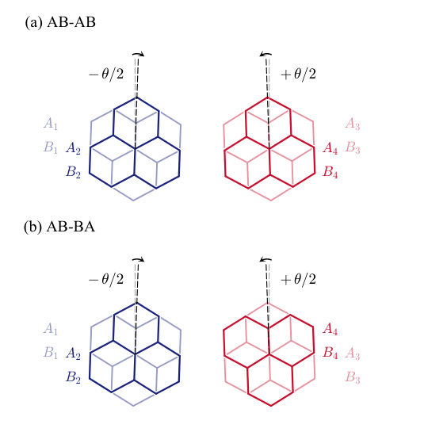
<figcaption class="paper-figure-caption"><b>Fig 1.</b> FIG. 1. Stacking configurations of (a) AB–AB-stacked and (b) AB–BA-stacked twisted double bilayer graphene (TDBG).The lower BLG (blue) and the upper BLG (red) are rotated by ∓𝜃/2 and stacked on top of each other.</figcaption>
</figure>
<figure class="paper-figure-card">
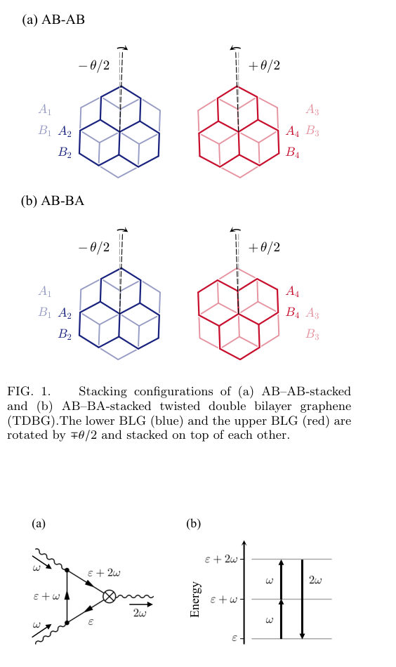
<figcaption class="paper-figure-caption"><b>Fig 2.</b> FIG. 2. (a) Feynman diagram that is relevant to AB-stacked bilayer graphene and TDBG. The dots represent the interact- ing Hamiltonians and the crossed circle represents the current density operator. (b) Microscopic three-step optical transi- tion that generates SHG.</figcaption>
</figure>
<figure class="paper-figure-card">
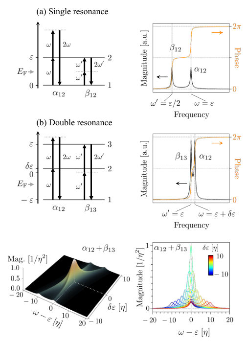
<figcaption class="paper-figure-caption"><b>Fig 3.</b> FIG. 3. Schematic diagrams of the processes involved in the SHG signal. (a) Single resonances via one-photon (𝛼12) and two-photon (𝛽12) processes between two energy levels, shown on the left. The 𝛼12 and 𝛽12 processes produce a peak at 𝜔= 𝜀and 𝜔′ = 𝜀/2 respectively. (b) Top two panels show the situation approaching double resonance involving three levels, where the 𝛼12 and 𝛽13 processes produce a peak at 𝜔= 𝜀as 𝛿𝜀→0. Bottom two panels are the plots of the double-resonant signal as a function of 𝛿𝜀. It can be seen that the signal is significantly enhanced as 𝛿𝜀approaches 0. The family of curves is universal, expressed in units involving the broadening parameter 𝜂.</figcaption>
</figure>
<figure class="paper-figure-card">
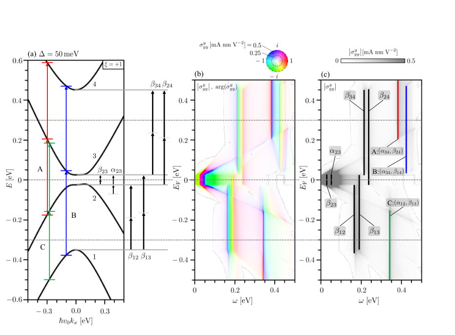
<figcaption class="paper-figure-caption"><b>Fig 4.</b> FIG. 4. (a) Band structure of non-moir´e AB-stacked bilayer graphene from the 𝐾+ valley. A vertical bias voltage of Δ = 50 meV is applied across the two layers. (b) Magnitude and phase of the SHG tensor, 𝜎𝑦 𝑦𝑦 and arg(𝜎𝑦 𝑦𝑦), as a function of (𝜔; 𝐸F) on a colour-density plot, where we plot 𝜔and 𝐸F on the horizontal and vertical axes. Namely, arg(𝜎𝑦 𝑦𝑦) is given by the hue while 𝜎𝑦 𝑦𝑦 is given by the saturation. We note that the scale of the vertical axes of the band structure and the density maps are aligned. (c) Colour-density plot of the magnitude 𝜎𝑦 𝑦𝑦 with indications of the important spectral features.</figcaption>
</figure>
<figure class="paper-figure-card">
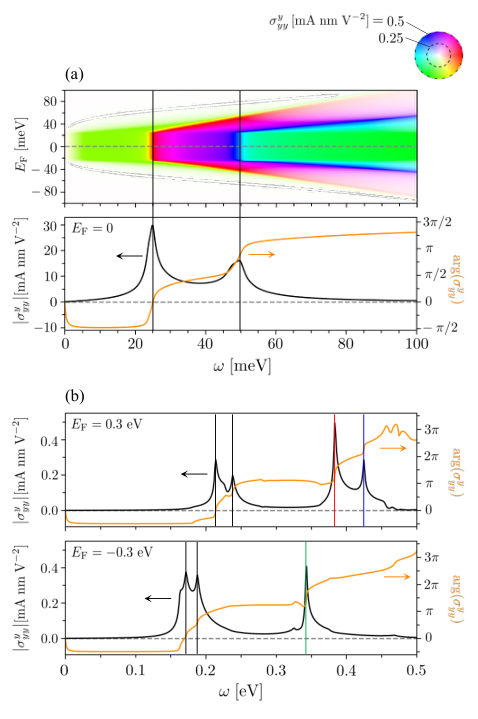
<figcaption class="paper-figure-caption"><b>Fig 5.</b> FIG. 5. (a) Zoomed-in view of the colour-density plot near the CNP shown in the top panel. The bottom panel shows the slice through 𝐸F = 0, the where magnitude and phase are plotted in black and orange, respectively. The vertical lines are the 𝛼23 and 𝛽23 peaks indicated in Fig. 4 (c). (b) Top (bottom) panel is a slice through 𝐸F = 0.3 eV (𝐸F = −0.3 eV), where, again, the vertical lines correspond to the features indicated in Fig. 4 (c).</figcaption>
</figure>

**Summary.** This theoretical study analyzes the nonlinear optical response, specifically Second-Harmonic Generation (SHG), in twisted double bilayer graphene. The key finding is the identification of a 'double-resonant' mechanism that significantly enhances the SHG signal by simultaneously satisfying optical transitions at both $\omega$ and $2\omega$. This provides a general framework for controlling non-linear optics in moiré materials.

**Why it may be interesting.** This work provides a detailed quantum optical analysis of tunable electronic structures (moiré bands), which is highly relevant to understanding non-linear responses in designer quantum materials that can be tuned via external fields like bias voltage.

Detailed structure

**Main problem.** The study investigates the mechanism behind enhanced Second-Harmonic Generation (SHG) in twisted double bilayer graphene (TDBG). The focus is on identifying and quantifying the 'double-resonant' enhancement beyond standard moiré flat band effects.

**Main result.** The authors demonstrate that a pronounced double-resonant process, where optical transitions at both $\omega$ and $2\omega$ are simultaneously satisfied, leads to substantial amplification of the SHG response. They also find distinct symmetry signatures ($\pi$-phase shift) between AB–AB and AB–BA stacking configurations.

**Method.** The investigation uses a perturbative approach based on an effective continuum Hamiltonian derived for the moiré scale. The calculation involves deriving the nonlinear susceptibility tensor $\sigma_{\mu\alpha\alpha}$ using Green's function formalism.

**Model / system.** The physical system is Twisted Double Bilayer Graphene (TDBG), which exhibits a moiré superlattice at small twist angles ($	heta$). The model employs an effective continuum Hamiltonian incorporating interlayer moiré interactions, analyzed across varying bias voltages and Fermi energies.

**Key observables.** Second-Harmonic Generation (SHG) signal strength, nonlinear susceptibility $\sigma_{\mu\alpha\alpha}$, and the resonance structure related to single or double resonances.

**Important parameters / regimes.** Twist angle ($	heta$), vertical bias voltage ($V_{AB}$), Fermi energy ($E_F$), and stacking configuration (AB–AB vs AB–BA).

**Assumptions / limitations.** The analysis relies on coarse-graining the system to the moiré scale at small $	heta$, and approximations are made in the perturbative expansion of the Hamiltonian.

**Figures summary.** Figures illustrate stacking configurations, Feynman diagrams for Hamiltonian construction, and color-density maps showing SHG spectra revealing single and double resonance features.

**Paper structure.** The paper systematically analyzes the SHG response by first establishing the effective continuum model for TDBG. It then details the calculation of the nonlinear susceptibility using perturbation theory, culminating in the identification and theoretical description of the double-resonant enhancement mechanism.

Abstract

We theoretically investigate second-harmonic generation (SHG) in twisted double bilayer graphene (TDBG) with AB--AB and AB--BA stacking configurations using a perturbative approach based on an effective continuum Hamiltonian. We present a systematic analysis of the SHG response as a function of twist angle, vertical bias voltage, Fermi energy, and stacking configuration. We find that the SHG signal is strongly enhanced at small twist angles due to the emergence of moiré flat bands and the associated increase in the joint density of states. Beyond this conventional enhancement mechanism, we demonstrate that the reduced bandwidth enables a pronounced double-resonant process, in which optical transitions at both $ω$ and $2ω$ are simultaneously satisfied over extended regions of the moiré Brillouin zone. This mechanism leads to a substantial amplification of the SHG response, analogous to the enhancement observed in systems with discrete energy levels, but realised here in a tuneable moiré band structure. Furthermore, we show that the AB--AB and AB--BA configurations exhibit a systematic $π$ phase shift in the SHG response at large bias voltages, reflecting their distinct symmetry and electronic structure. Our results identify double-resonance effects as a generic mechanism for enhancing SHG in moiré systems and provide a unified framework for understanding and controlling nonlinear optical responses in tuneable flat-band materials.

[↑ back to top](#top)

### [Skyrmion Excitations in the $ν=-1$ Quantum Hall state in Monolayer Graphene](http://arxiv.org/abs/2608.00390v1)

**Authors:** Jincheng An, Ajit C. Balram, Ganpathy Murthy  
**Type:** theory · **Category:** strongly correlated electrons · **PDF:** <https://arxiv.org/pdf/2608.00390v1>  
**Analysis basis:** full PDF text, analyzed in chunks
**Topic relevance:** `Keldysh / 2PI / non-Gaussian methods` **1/5** · `analog quantum simulation` **1/5**

↔ Scroll figures horizontally

<figure class="paper-figure-card">
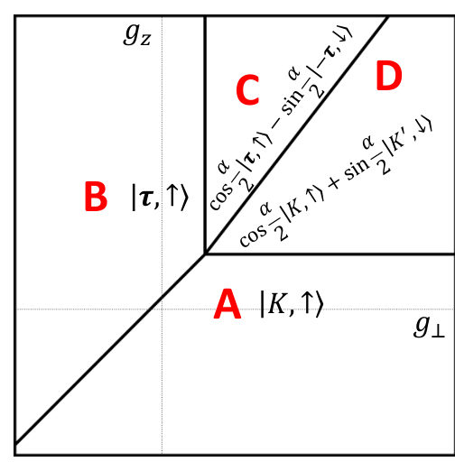
<figcaption class="paper-figure-caption"><b>Fig 1.</b> FIG. 1: The ν = −1 QHFM ground state phase diagram with g⊥, gz ∈[−400, 800] meV · nm2. External fields are fixed at EZ = 1eZ &amp; EV = 0.3eZ. There are four different phases: A, B, C, &amp; D. The occupied spinor for a given phase is presented in the region occupied by the phase.</figcaption>
</figure>
<figure class="paper-figure-card">
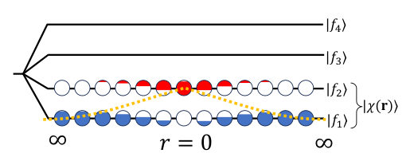
<figcaption class="paper-figure-caption"><b>Fig 2.</b> FIG. 2: Schematic representation of a skyrmion excited state upon the ν = −1 QHFM ground state. The skyrmion spinor |χ(r)⟩is a linear combination between the occupied spinor |f1⟩and an orthogonal spinor |f2⟩, which is unoccupied in the ground state, but occupied at the core of the skyrmion.</figcaption>
</figure>
<figure class="paper-figure-card">
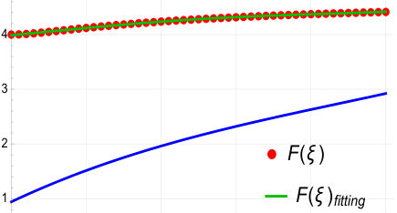
<figcaption class="paper-figure-caption"><b>Fig 3.</b> FIG. 3: Dependence of the dimensionless functions F(ξ) and X(ξ) on ξ, defined in Eqs. (35) and (39), respectively. The monotonic increase of both functions indicates that increasing ξ raises both the stiffness energy of the non- linear sigma model and the Coulomb interaction energy of the skyrmion.</figcaption>
</figure>
<figure class="paper-figure-card">
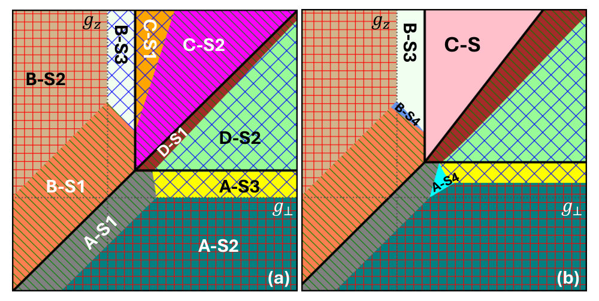
<figcaption class="paper-figure-caption"><b>Fig 4.</b> FIG. 4: Skyrmion phases above the ν = −1 QHFM ground states with g⊥∈[−400, 800]meV · nm2, gz ∈[−400, 800]meV · nm2. The one-body fields are fixed at EZ = 1eZ &amp; EV = 0 in panel (a), and at EZ = 1eZ &amp; EV = 0.3eZ in panel (b). At EV = 0, there are ten skyrmion phases: A-S1-S3, B-S1-S3, C-S1-S2, &amp; D-S1-S2. At finite EV , two new skyrmion phases, A-S4 and B-S4, appear, while C-S1 and C-S2 merge into a new skyrmion phase C-S. The solid black lines indicate the boundaries between the QHFM ground state phases. Phases with Ξ = 2 in Eq. (45) are hatched with red ‘+’ symbols, phases with Ξ = 0 are hatched with blue ‘x’ symbols, and phases with Ξ = −2 are hatched with green ‘\\’ symbols. The unhatched...</figcaption>
</figure>
<figure class="paper-figure-card">
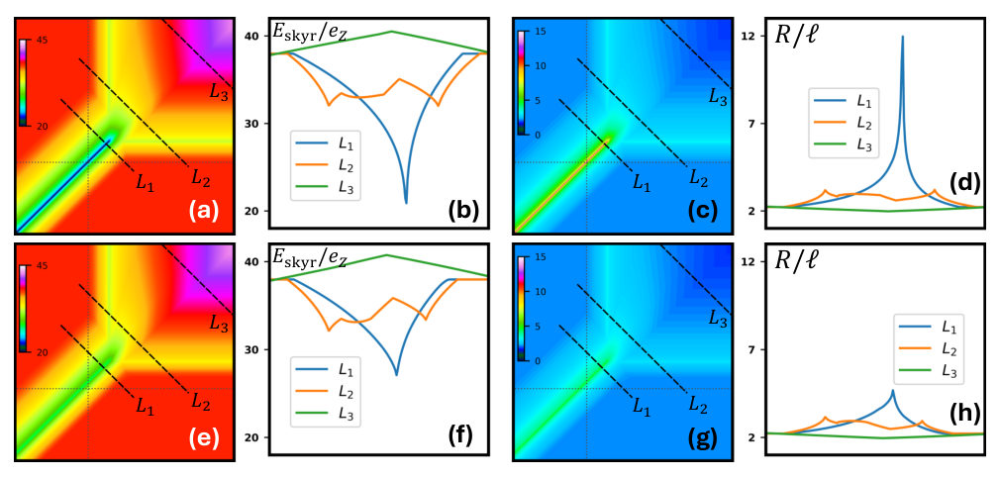
<figcaption class="paper-figure-caption"><b>Fig 5.</b> FIG. 5: (a) Skyrmion energy Eskyr (in unit of eZ) over a range of couplings for EV = 0, corresponding to the phase diagram of Fig. 4(a). (b) The skyrmion energy of panel (a) is plotted along the three different sections L1, L2 &amp; L3, shown in panel (a). (c) The size R of the optimal skyrmion (in units of ℓ) over a range of couplings for EV = 0, also associated with the skyrmion phase diagram Fig. 4(a). (d) The size of the skyrmion plotted along the three sections L1, L2 &amp; L3 of panel (a). (e) Skyrmion energy for a range of couplings for EV = 0.3EZ, corresponding to the phase diagram of Fig. 4(b). (f) The skyrmion energy in units of eZ plotted along the sections L1, L2 &amp; L3 of panel (e). (g)...</figcaption>
</figure>

**Summary.** This paper theoretically investigates skyrmion excitations within the $\nu=-1$ quantum Hall ferromagnetic state of monolayer graphene. Using a variational approach combined with Hartree-Fock methods, the authors map out a complex phase diagram featuring thirteen distinct skyrmion phases. The work establishes a general framework for studying topological excitations in multicomponent quantum Hall ferromagnets.

**Why it may be interesting.** This work provides advanced theoretical tools for understanding topological excitations (skyrmions) in highly correlated electron systems like graphene under extreme conditions, which is relevant to modern condensed matter theory.

Detailed structure

**Main problem.** The study investigates skyrmion excited states atop the SU(4) quantum Hall ferromagnetic ground state at filling factor $\nu=-1$ in monolayer graphene.

**Main result.** The authors establish a phase diagram identifying thirteen distinct skyrmion phases under varying external field conditions, providing a systematic framework for such excitations.

**Method.** A variational framework combining effective field theory with the Hartree-Fock approximation is used to minimize the total energy functional of the skyrmion texture.

**Model / system.** The system is monolayer graphene subjected to a perpendicular magnetic field, modeled by an effective Hamiltonian incorporating long-range Coulomb interaction, short-range anisotropic interactions, Zeeman coupling, and sublattice symmetry-breaking potentials.

**Key observables.** Phase diagram of skyrmion excitations; spin-valley textures, energies, and characteristic sizes of the identified phases.

**Important parameters / regimes.** Filling factor $\nu=-1$; external field strengths ($E_Z, E_V$); interaction parameters ($g_\perp, g_z$).

**Assumptions / limitations.** The analysis relies on a variational ansatz for the skyrmion projector and assumes that certain energy contributions can be calculated using approximations like slow variation over the magnetic length scale.

**Figures summary.** Figure 1 shows the $\nu=-1$ QHFM ground state phase diagram in the $(g_\perp, g_z)$ plane with four distinct phases (A, B, C, D). Figure 2 schematically represents a skyrmion excited state using spinor components.

**Paper structure.** The paper first establishes the $\nu=-1$ QHFM ground state phase diagram. It then develops a variational approach to calculate the total energy of skyrmions by summing stiffness, Coulomb, and symmetry-breaking contributions, leading to the identification of multiple distinct phases.

Abstract

We investigate the skyrmion excited states atop the $SU(4)$ quantum Hall ferromagnetic ground state at filling factor $ν=-1$ in monolayer graphene. The competition among short-range anisotropic interactions, the Zeeman coupling, and sublattice symmetry-breaking potential gives rise to four distinct spin-valley-ordered ground-state phases. Combining effective field theory with the Hartree--Fock approximation, we develop a variational framework that incorporates both the long-range Coulomb interaction and the symmetry-breaking terms on an equal footing. Variational minimization determines the optimal skyrmion texture, including both its spatial radial profile and internal $SU(4)$ spinor structure. We establish the phase diagram of skyrmion excitations, identify thirteen distinct skyrmion phases under different external-field conditions, and determine their spin-valley textures, energies, and characteristic sizes. The robustness of the results against different radial ansätze demonstrates the reliability of our variational approach. Our work provides a systematic framework for studying skyrmion excitations in multicomponent quantum Hall ferromagnets and can be naturally extended to more general $SU(4)$ quantum Hall systems.

[↑ back to top](#top)

### [Active Passivation Tunes Hotspot Locations in GaN Transistors with In Situ Thermal Mechanical Visualization](http://arxiv.org/abs/2608.01257v1)

**Authors:** Yicheng Wei, Sihang Liu, Zimu Jiang, jinquan Zhang, Zifeng Huang, Han Yang, Yang He, Jin Wei, Zhe Cheng  
**Type:** both · **Category:** other · **PDF:** <https://arxiv.org/pdf/2608.01257v1>  
**Analysis basis:** full PDF text, analyzed in chunks
**Topic relevance:** `non-equilibrium dynamics` **1/5**

↔ Scroll figures horizontally

<figure class="paper-figure-card">
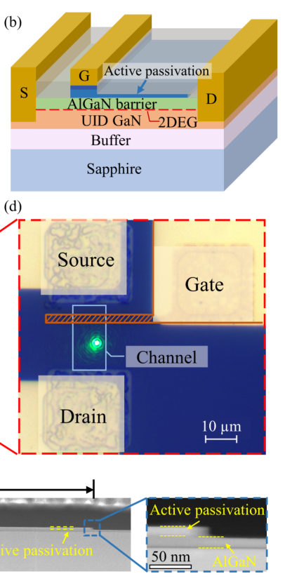
<figcaption class="paper-figure-caption"><b>Fig 1.</b> Figure 1. Sample structure. (a) Schematic structure of the Conv-HEMT and (b) the AP-</figcaption>
</figure>
<figure class="paper-figure-card">
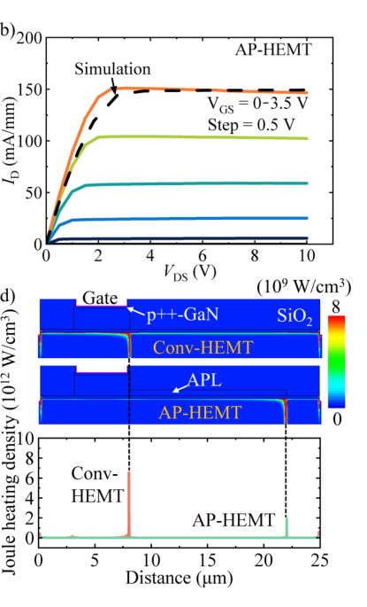
<figcaption class="paper-figure-caption"><b>Fig 2.</b> Figure 2. Measured and simulated electrical properties for the Conv-HEMT and the AP-</figcaption>
</figure>
<figure class="paper-figure-card">
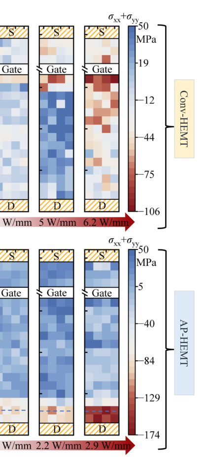
<figcaption class="paper-figure-caption"><b>Fig 3.</b> Figure 3. Measured thermomechanical profiles of the partially scanned active channel</figcaption>
</figure>
<figure class="paper-figure-card">
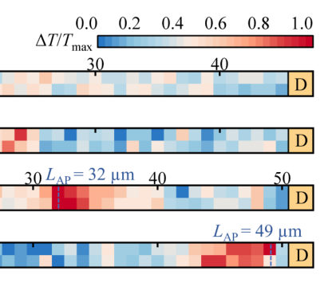
<figcaption class="paper-figure-caption"><b>Fig 4.</b> Figure 5. Normalized temperature rises (ΔT/Tmax) and hotspot positions of the AP-</figcaption>
</figure>
<figure class="paper-figure-card">
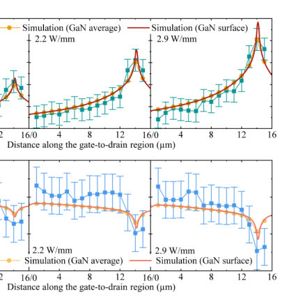
<figcaption class="paper-figure-caption"><b>Fig 5.</b> Figure 6. Thermal and mechanical simulations of the AP-HEMT with LGS/LG/LGD/LAP</figcaption>
</figure>

**Summary.** This work demonstrates a novel technique using active passivation layers to proactively control where heat is generated within GaN transistors. By adjusting this layer, researchers can intentionally shift the hotspot away from critical areas like the gate edge towards the drain end. This approach offers crucial guidelines for designing high-power electronics by co-optimizing electric fields and thermal management.

**Why it may be interesting.** While focused on solid-state electronics, the core concept of using structural modification (passivation) to manage localized energy deposition and resulting stress fields has parallels in controlling energy flow or minimizing dissipation hotspots in quantum devices.

Detailed structure

**Main problem.** Localized Joule heating in GaN transistors operating at high power densities degrades performance by inducing thermal and mechanical stresses. Existing methods focus on external heat removal, ignoring the intrinsic behavior of the heat source.

**Main result.** Active passivation layers can proactively tune hotspot locations by shifting peak electric fields and localized Joule heating from the gate edge to the drain-side end of the active passivation layer.

**Method.** The study combines in-situ micro-Raman thermography for experimental measurement with multi-physics electro-thermal-mechanical simulations (TCAD/FEA) for validation.

**Model / system.** The physical system is a GaN High Electron Mobility Transistor (HEMT), comparing conventional structures to those enhanced with an Active Passivation layer. The analysis models the coupled electro-thermal-mechanical response under high bias conditions.

**Key observables.** Hotspot location, temperature rise ($\Delta T$), in-plane thermal stress profiles, peak electric field distribution, and device saturation current.

**Important parameters / regimes.** Active Passivation layer length (LAP), gate-drain distance (LGD), and applied bias/power density.

**Assumptions / limitations.** The analysis assumes that manipulating the passivation structure can directly control the spatial redistribution of peak electric fields and subsequent heat generation, which is confirmed by simulation against experimental measurements.

**Figures summary.** Figures compare electrical properties, simulated electric field/Joule heating for conventional vs. active passivation devices; Figure 3 shows $\Delta T$ and stress maps comparing both structures; Figure 5 demonstrates the one-to-one correlation between LAP length and hotspot position.

**Paper structure.** The paper first establishes the problem of localized Joule heating, then introduces the AP structure to proactively tune hotspots. It presents electrical characterization, followed by in-situ thermal/mechanical visualization (Raman thermography), which is validated against coupled multi-physics simulations to confirm the hotspot migration mechanism.

Abstract

Efficient thermal dissipation has become critical in emerging electronic devices. However, most existing studies have primarily focused on engineering heat dissipation pathways, largely overlooking the intrinsic behavior of the heat source itself. We demonstrate an active passivation technology that proactively tunes hotspot locations in GaN transistors. By adjusting the active passivation layer length, the hotspot is shifted from the gate edge to the drain-side AP edge, establishing a clear one-to-one spatial correlation. In-situ thermal-mechanical visualization via micro-Raman thermography, combined with multi-physics electro-thermal-mechanical simulations, directly captures the spatial redistribution of both temperature and thermal stress profiles. Electrical analysis confirms that this hotspot migration is driven by the spatial shift of the peak electric field and localized Joule heating. This proactive heat-source tuning strategy provides critical design guidelines for power electronics.

[↑ back to top](#top)

### [Thermal Stability of Two-Dimensional Crystals with Extended OH Hydrogen-Bonded Chains](http://arxiv.org/abs/2608.02544v1)

**Authors:** Alexander V. Savin  
**Type:** theory · **Category:** statistical mechanics · **PDF:** <https://arxiv.org/pdf/2608.02544v1>  
**Analysis basis:** full PDF text, analyzed in chunks
**Topic relevance:** `Frenkel-Kontorova` **1/5**

↔ Scroll figures horizontally

<figure class="paper-figure-card">
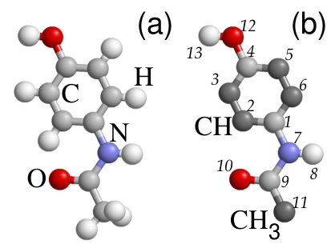
<figcaption class="paper-figure-caption"><b>Fig 1.</b> FIG. 1: Construction of the coarse-grained model for the paracetamol (PCM) molecule: (a) all-atom representation and (b) coarse-grained model (the numbering of interaction sites is shown). Hydrogen atoms are shown in white, carbon atoms in light gray, nitrogen in blue, oxygen in red, and the united CH and CH3 atoms in dark gray.</figcaption>
</figure>
<figure class="paper-figure-card">
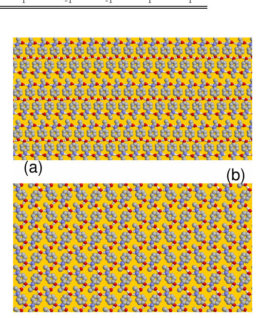
<figcaption class="paper-figure-caption"><b>Fig 2.</b> FIG. 3: Crystal structure of (a) a homochiral and (b) a racemic layer of paracetamol molecules deposited on a flat h-BN crystal surface. Carbon atoms are shown in gray, ni- trogen in blue, oxygen in red, and hydrogen in white; the flat substrate is shown in yellow. Hydrogen bonds between the hydroxyl and peptide groups are shown as red-and-white lines..</figcaption>
</figure>
<figure class="paper-figure-card">
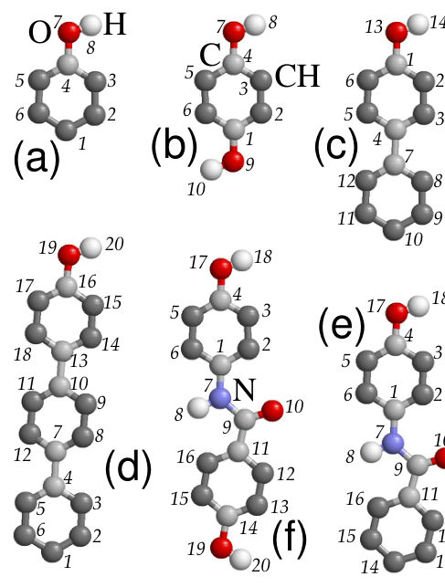
<figcaption class="paper-figure-caption"><b>Fig 3.</b> FIG. 2: Coarse-grained models of the (a) phenol C6H5OH, (b) hydroquinone C6H4(OH)2, (c) 4-phenylphenol C6H5–C6H4OH, (d) 4-(4-phenylphenyl)phenol C6H5–C6H4– C6H4OH, (e) 4-hydroxybenzanilide C6H5C(O)NHC6H4OH, and (f) 4,4-dihydroxybenzanilide C6H4OHC(O)NHC6H4OH molecules. Hydrogen atoms (H) are shown in white, carbon atoms (C) in light gray, nitrogen atoms (N) in blue, oxygen atoms (O) in red, and united CH groups in dark gray. For each structure, the numbering of atoms used in the molecules is shown.</figcaption>
</figure>
<figure class="paper-figure-card">
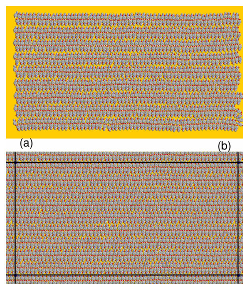
<figcaption class="paper-figure-caption"><b>Fig 4.</b> FIG. 4: Structure of a two-dimensional crystal composed of N = 1080 PCM molecules adsorbed on a planar h-BN sub- strate. The molecular arrangement of a crystallite formed by 9 parallel molecular chains is presented for (a) open (free) boundary conditions and (b) periodic boundary conditions, with simulation box dimensions of ax × ay = 60 × 60 nm2</figcaption>
</figure>
<figure class="paper-figure-card">
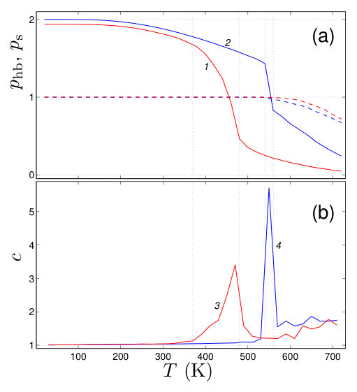
<figcaption class="paper-figure-caption"><b>Fig 5.</b> FIG. 6: Temperature dependence of (a) phb (solid lines) and ps (dashed lines); (b) c for the racemic structure of N = 1080 PCM molecules. Curves 1 and 3 correspond to a rectangular crystallite with free edges, while curves 2 and 4 correspond to a two-dimensional crystal fully covering the substrate. Verti- cal dotted lines indicate temperatures of 370, 480, 540, and 560 K.</figcaption>
</figure>

**Summary.** This work uses molecular dynamics simulations to study how organic molecules with hydroxyl groups form stable two-dimensional crystals on h-BN substrates via extended hydrogen bonds. The research demonstrates that these crystalline structures possess remarkable thermal stability, suggesting a viable pathway for creating advanced proton-exchange membranes capable of operating at elevated temperatures.

**Why it may be interesting.** While focused on condensed matter materials science, the detailed study of phase transitions (2D vs. 3D melting) using MD simulations provides rich data for statistical mechanics models concerning low-dimensional systems and interfacial physics.

Detailed structure

**Main problem.** The study investigates the thermal stability of two-dimensional (2D) crystalline structures formed by organic molecules adsorbed on a hexagonal boron nitride (h-BN) substrate.

**Main result.** The resulting 2D crystals exhibit high thermal stability, with measured onset melting temperatures ranging up to $377^\circ	ext{C}$ for specific molecular arrangements. These stable structures suggest potential use in developing high-temperature proton-exchange membranes (PEMs).

**Method.** Molecular Dynamics (MD) simulations were employed to model the atomic interactions and thermal evolution of the adsorbed monolayers.

**Model / system.** The system consists of planar molecules containing benzene rings and hydroxyl groups, forming extended hydrogen-bonded chains ($	ext{OH}\cdots	ext{OH}\cdots$). These are deposited on a flat h-BN substrate. The simulation uses detailed force fields incorporating Lennard-Jones potentials and specific interaction terms.

**Key observables.** Onset melting temperatures ($T_m$), heat capacity $c(T)$, number of hydrogen bonds ($ar{N}_{hb}$), and fraction of molecules adsorbed flat ($p_s$).

**Important parameters / regimes.** Temperature range up to $\sim 550$ K (in simulation units); specific molecular structures like hydroquinone, paracetamol, etc.

**Assumptions / limitations.** The substrate interaction is modeled using a fixed attractive plane approximation for the h-BN sheet; the dynamics are simulated via Langevin equations of motion.

**Figures summary.** Figures illustrate crystal structures (e.g., $	ext{4PhPh}$ and $	ext{44PhPhPh}$) on h-BN, and temperature dependence plots comparing solid/liquid phases for different molecular systems.

**Paper structure.** The paper progresses by establishing the physical model (molecules on h-BN), simulating various molecules to confirm stable 2D crystal formation via H-bonding, quantifying thermal stability through melting point measurements, and concluding with applications in high-temperature PEMs.

Abstract

Numerical simulations of the dynamics of monolayer structures of molecules deposited on a sheet of hexagonal boron nitride (h-BN) have been performed. It is shown that molecules containing benzene rings and hydroxyl groups in their structure can form stable two-dimensional crystals with linear chains of hydrogen bonds OH$\cdots$OH$\cdots$OH$\cdots$ Such structures are formed by the following molecules: phenol (C$_6$H$_5$OH), hydroquinone (C$_6$H$_4$(OH)$_2$), 4-phenylphenol (C$_6$H$_5$--C$_6$H$_4$OH), 4-(4-phenylphenyl)phenol (C$_6$H$_5$--C$_6$H$_4$--C$_6$H$_4$OH), paracetamol (CH$_3$C(O)NHC$_6$H$_4$OH), 4-hydroxybenzanilide (C$_6$H$_5$C(O)NHC$_6$H$_4$OH) and 4,4-dihydroxybenzanilide (C$_6$H$_4$OHC(O)NHC$_6$H$_4$OH). On the one hand, the benzene rings in these molecules ensure their strong interaction with the flat substrate; on the other hand, they do not hinder the formation of extended hydrogen-bonded chains. The monolayer structures of these molecules exhibit high thermal stability: the onset melting temperatures of their 2D crystals are 47, 187, 127, 247, 167, 307, and 377 $^\circ$C, respectively. The simulations allow us to conclude that multilayer structures composed of h-BN sheets and molecules of hydroquinone, paracetamol, and 4-hydroxybenzanilide can be used for the development of novel proton-exchange membranes capable of operating at elevated temperatures.

[↑ back to top](#top)

### Other secondary papers (5)

Show other secondary papers

### [Bulk Ising superconductivity in an intercalated TaSe2 bilayer structure](http://arxiv.org/abs/2608.01209v1)

**Authors:** Yupeng Li, Zhaopeng Guo, Lihong Hu, Guoan Li, Siqi Wu, Xinyi Zheng, Xiao Deng, Zhiyuan Zhang, Anqi Wang, Xingchen Guo, Ziwei Dou, Peiling Li, Yuke Li, Fanming Qu, Guangtong Liu, Jin-Ke Bao, Guang-Han Cao, Li Lu, Jie Shen, Zhu-An Xu  
**Type:** both · **Category:** other · **PDF:** <https://arxiv.org/pdf/2608.01209v1>  
**Analysis basis:** full PDF text, analyzed in chunks

↔ Scroll figures horizontally

<figure class="paper-figure-card">
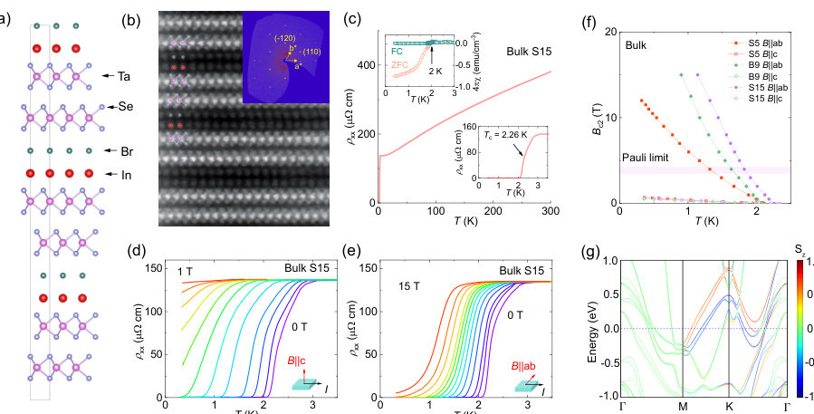
<figcaption class="paper-figure-caption"><b>Fig 1.</b> FIG. 1. Structure and superconductivity of bulk InBr(TaSe2)2. (a) Side view of the crystalline structure, highlighting the alternating 2Hb-TaSe2 bilayers and InBr spacer layers. (b) HRTEM image of InBr(TaSe2)2 taken along the [100] zone axis, with an overlaid atomic model. The inset shows the reconstructed image for (hk0) planes from SXRD data. (c) R-T curve with a magnified view of the transition (lower right inset) and the corresponding magnetic susceptibility (upper left inset). (d, e) Superconducting transitions under B⊥and B∥, respectively. (f) T-dependent B⊥ c2 and B∥ c2 for three bulk samples. (g) Band structure of bulk InBr(TaSe2)2, with spin-up (Sz &gt; 0) and spin-down (Sz &lt; 0)...</figcaption>
</figure>
<figure class="paper-figure-card">
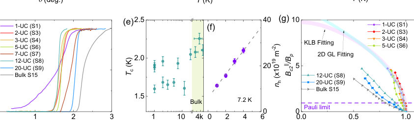
<figcaption class="paper-figure-caption"><b>Fig 2.</b> FIG. 2. Thickness-dependent superconductivity. (a) Angular dependent Bc2 at 1.51 K for the 3-UC device. The data above 90◦is mirrored from the data below 90◦for clarity of presentation. (b) Rs map as a function of T and B⊥for the 1 UC device S1, showing the extracted B⊥ c2 together with the corresponding 2D GL fit. The inset shows an optical photograph of the device and its thickness measurement. (c) T-dependent Rs measured under varying B∥. The extracted B∥ c2 are fitted by 2D GL and KLB model. (d) T-R/RN curves for devices of varying thickness. (e) Thickness-dependent Tc. (f) nh as a function of thickness, with the dashed guide line. (g) T/Tc-dependent B∥ c2/Bp at different samples. The...</figcaption>
</figure>
<figure class="paper-figure-card">
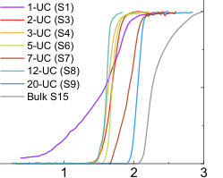
<figcaption class="paper-figure-caption"><b>Fig 3.</b> Figure 2 explores the thickness-dependent supercon- ductivity in InBr(TaSe2)2 to further study the exception- ally large B∥ c2 behavior. Temperature-dependent sheet</figcaption>
</figure>
<figure class="paper-figure-card">
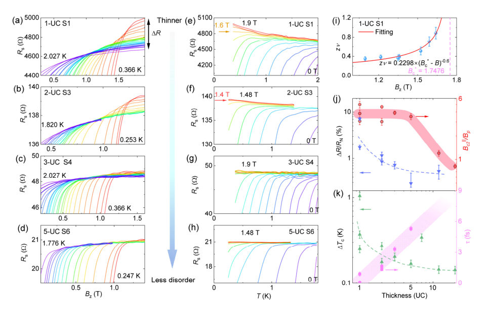
<figcaption class="paper-figure-caption"><b>Fig 4.</b> FIG. 3. Rs-Bz (a-d) and Rs-T curves (e-h) for different InBr(TaSe2)2 flakes. (i) B-dependent zv with theoretical fits for 1-UC flakes. The error bar of zv is obtained during the scaling analysis. (j,k) Thickness-dependent resistance enhancement ratio ∆R/RN (blue scatters, blue dashed guide line), B∥ c2/Bp [red scatters extracted from Fig. 2(g) at T/Tc = 0.88, red guide line], superconducting transition width ∆Tc = T 90% c - T 10% c (green scatters, green dashed guide line), τ (magenta guide range).</figcaption>
</figure>
<figure class="paper-figure-card">
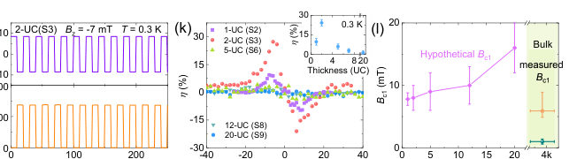
<figcaption class="paper-figure-caption"><b>Fig 5.</b> FIG. 4. (a-d) dV/dI map as a function of Ib and Bz for 2, 5, 12 and 20 UC at 0.3 K. (e-h) Bz-dependent ∆Ic. A smooth guide curve (pink line) is included to clarify the overall trend. (i) dV/dI-Ib curves for positive and negative current sweep under ±6 mT. (j) Superconducting half-wave rectification at Bz = -7 mT and 0.3 K in the device S3. (k) Bz-η behaviors at different thicknesses. The inset displays the thickness-dependent η, with values taken as the maximum magnitude in panel (k). (l) Thickness-dependent Bc1. Magenta points are extracted from the peak positions indicated by black arrows in panels (e-h). Cyan and orange symbols represent Bc1 values obtained under B∥and B⊥in Bulk S15 (see...</figcaption>
</figure>

**Summary.** The study reports on bulk and thin-film superconductors based on intercalated $	ext{TaSe}_2$ bilayers. By measuring anisotropic critical fields and observing a persistent Superconducting Diode Effect, the authors provide strong evidence that Ising Spin-Orbit Coupling is the key mechanism driving their unconventional superconductivity. This research advances the search for materials exhibiting robust, high-field superconducting states.

**Why it may be interesting.** This work provides experimental evidence for realizing and characterizing exotic superconducting states driven by strong spin-orbit coupling in layered materials, which is highly relevant to understanding unconventional superconductivity mechanisms beyond BCS theory.

Detailed structure

**Main problem.** The study investigates the emergence of bulk Ising superconductivity (IS) in intercalated TaSe2 bilayers, specifically aiming to explain an exceptionally large upper critical field ($B_{c2}$) exceeding the Pauli limit.

**Main result.** Multiple experimental and theoretical analyses strongly support that the observed superconducting behavior is governed by Ising Spin-Orbit Coupling (SOC), which manifests as anisotropic $B_{c2}$ and a persistent Superconducting Diode Effect (SDE).

**Method.** The research combines synthesis of noncentrosymmetric bilayers, transport measurements ($R$-$T$, $B$-field sweeps), theoretical band structure calculations (DFT), and fitting to advanced superconducting models (AGL, Tinkham).

**Model / system.** The physical system is the intercalated $	ext{InBr}(	ext{TaSe}_2)_2$ bilayer, which possesses a noncentrosymmetric rhombohedral crystal structure. The superconductivity is analyzed across bulk and thin-film limits.

**Key observables.** Anisotropic upper critical fields ($B_{\parallel}c_2$, $B_{\perp}c_2$), the ratio $B_{\parallel}c_2/B_p$ (observed to be large, e.g., $\sim 3.56$), and the Superconducting Diode Effect ($\Delta I_c$).

**Important parameters / regimes.** Superconducting transition temperature ($T_c = 2.26 	ext{ K}$), Pauli limit ($B_p$), and thickness dependence of superconducting parameters.

**Assumptions / limitations.** The authors attribute the large $B_{\parallel}c_2/B_p$ ratio and SDE primarily to Ising SOC, ruling out other mechanisms like Superconducting Orbital Screening (SOS) or Meissner screening as the sole cause.

**Figures summary.** Figures illustrate crystal structure confirmation (HRTEM/SXRD), anisotropic superconducting behavior via $B_{c2}$ vs. field plots, thickness dependence of $T_c$ and $B_{\parallel}c_2/B_p$, and mapping of the Superconducting Diode Effect ($\Delta I_c$).

**Paper structure.** The paper progresses by first establishing bulk superconductivity and its anisotropy, then using thickness-dependent measurements and SDE analysis to distinguish between competing pairing mechanisms (Ising SOC vs. SOS), culminating in a comprehensive conclusion favoring Ising SOC.

Abstract

Ising spin-orbit coupling in bulk systems has drawn considerable interest for its ability to conveniently construct spin-orbit environments and enable exotic quantum phenomena. In this work, we synthesize intercalated 2Hb-TaSe$_2$ bilayers with noncentrosymmetric structure and, through multifaceted analysis, present multiple lines of evidence for the emergence of bulk Ising superconductivity. Resistivity measurements reveal anisotropic superconducting behavior, with a remarkably large in-plane upper critical field $B_{c2}^{\|}$ that exceeds the Pauli limit $B_{p}$. Band structure calculations further show band splitting accompanied by out-of-plane spin polarization. Collectively, these observations point to the presence of Ising superconductivity. Additional measurements of the thickness-dependent ratio $B_{c2}^{\|}$/$B_{p}$ and the superconducting diode effect not only further support the Ising superconducting nature of this material, but also reveal additional features of bulk Ising superconductivity evolving with thickness. Our findings provide valuable insights that may contribute to the search for bulk Ising superconductors.

[↑ back to top](#top)

### [Cryogenic focused-ion-beam microstructuring enabling quantitative $c$-axis transport measurements in Tl$_2$Ba$_2$CuO$_{6+δ}$](http://arxiv.org/abs/2608.02344v1)

**Authors:** Ayanesh Maiti, Carsten Putzke, Linus Holeschovsky, Roemer D. H. Hinlopen, Chunyu Guo, Dorothee Herrmann, Seunghyun Khim, Berit H. Goodge, Andre W. Tyler, Michele S. Conroy, Andreas W. Rost, Andrew P. Mackenzie, Philip J. W. Moll  
**Type:** experiment · **Category:** strongly correlated electrons · **PDF:** <https://arxiv.org/pdf/2608.02344v1>  
**Analysis basis:** full PDF text, analyzed in chunks

↔ Scroll figures horizontally

<figure class="paper-figure-card">
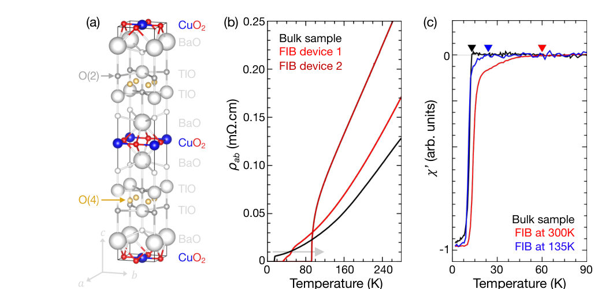
<figcaption class="paper-figure-caption"><b>Fig 1.</b> FIG. 1. Cryogenic suppression of FIB-induced damage in Tl2201. a. Crystal structure of Tl2Ba2CuO6+δ, highlighting the interstitial O(4) sites and the lattice O(2) sites that control hole doping and are depleted by vacuum annealing. b. Transport measurements on a Tl2201 single crystal before and after device fabrication using standard FIB microstructuring techniques. Ion-beam exposure increases Tc in overdoped Tl2201 (grey arrow), consistent with oxygen loss driving the material towards optimal doping. The FIB-patterned devices shown here are likely inhomogeneous and do not represent the intrinsic behaviour of Tl2201 at any well-defined doping level. c. Magnetic susceptibility measurements...</figcaption>
</figure>
<figure class="paper-figure-card">
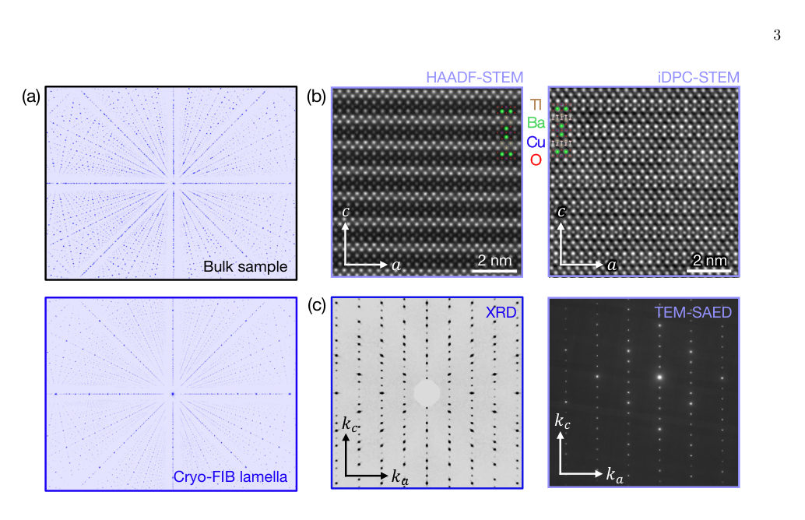
<figcaption class="paper-figure-caption"><b>Fig 2.</b> FIG. 2. Structural integrity of cryo-FIB microstructured Tl2201. a. Gnomonic projections of single-crystal XRD datasets acquired from a bulk Tl2201 crystal and a cryo-FIB-milled lamella. Both datasets exhibit identical Bragg reflections consistent with the known crystal structure of Tl2201, indicating that cryogenic microstructuring preserves long-range crystalline order. b. Atomic-resolution images of a cryo-FIB lamella acquired using HAADF-STEM and iDPC imaging. The observed atomic arrangement is consistent with the expected Tl2201 crystal structure, demonstrating preservation of the lattice at the atomic scale. c. Single-crystal XRD precession images compared with selected area electron...</figcaption>
</figure>
<figure class="paper-figure-card">
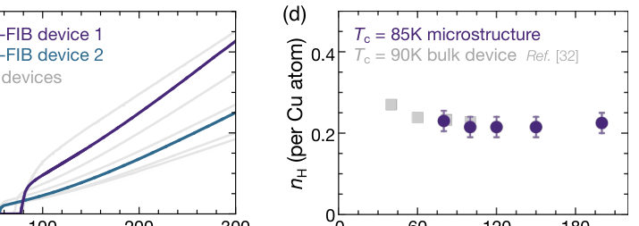
<figcaption class="paper-figure-caption"><b>Fig 3.</b> FIG. 3. Validation of transport measurements in cryo-FIB microstructured Tl2201. a. False-coloured SEM image of a representative ab-plane transport device with a six-terminal geometry, enabling simultaneous four-point measurements of the in-plane resistivity and Hall effect. b. In-plane resistivity of annealed cryo-FIB microstructured devices. The measured temperature dependence is quantitatively consistent with transport measurements on bulk single crystals, indicating that cryo- FIB processing preserves the intrinsic in-plane transport properties of Tl2201. c. Antisymmetrised Hall resistivity of a cryo-FIB device near optimal doping above Tc. The Hall response is linear in magnetic field,...</figcaption>
</figure>
<figure class="paper-figure-card">
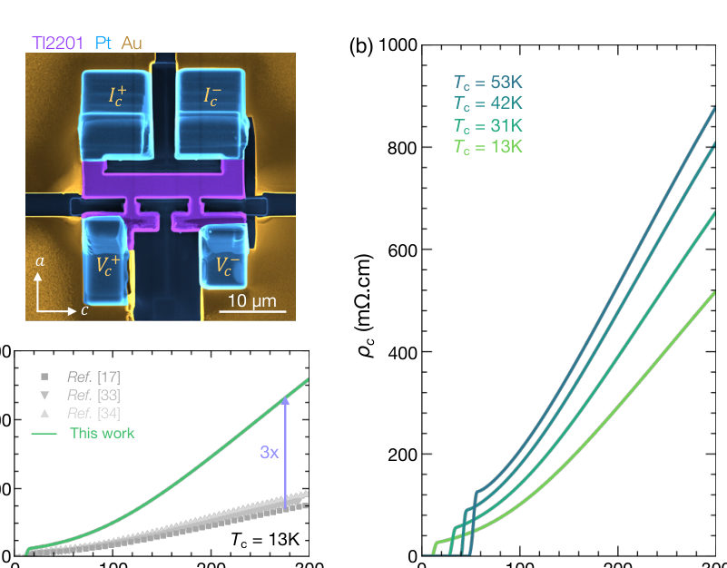
<figcaption class="paper-figure-caption"><b>Fig 4.</b> FIG. 4. Intrinsic c-axis transport in cryo-FIB microstructured Tl2201. a. False-coloured SEM image of a repre- sentative c-axis transport device used for four-point resistivity measurements. The microstructured geometry enables precise determination of the current path and sample dimensions, allowing accurate measurement of the absolute c-axis resistivity. b. Temperature dependence of the c-axis resistivity ρc measured in cryo-FIB microstructured Tl2201 devices spanning a range of hole dopings. The measured behaviour is qualitatively consistent with previous reports on bulk single crystals, exhibiting metallic transport at high temperature and a systematic reduction in ρc with increasing...</figcaption>
</figure>
<figure class="paper-figure-card">
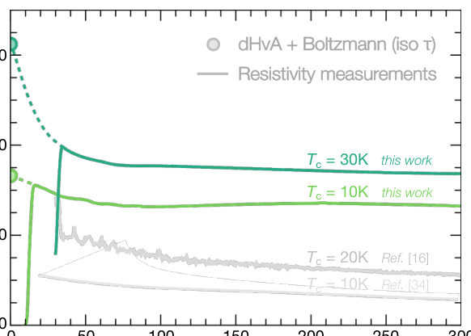
<figcaption class="paper-figure-caption"><b>Fig 5.</b> FIG. 5. Intrinsic transport anisotropy in Tl2201. Transport anisotropy ρc/ρab obtained from the cryo-FIB c-axis resistivity measurements of Fig.4 and bulk in-plane transport data of Fig.3. The resulting anisotropy is systematically larger than previous transport estimates [16, 34] by approximately the same factor by which the absolute c-axis resistivity is enhanced. For comparison, zero-temperature anisotropy values calculated from the known dHvA and AMRO Fermi surface geometry of overdoped Tl2201, assuming an isotropic relaxation time [9], are also shown. Dashed lines are a guide to the eye, indicating a possible smooth extrapolation of the electrical transport anisotropy below Tc. In...</figcaption>
</figure>

**Summary.** This paper introduces cryogenic Focused-Ion-Beam (cryo-FIB) microstructuring as a breakthrough technique to perform quantitative transport measurements on cuprate superconductors. By suppressing ion-beam damage, the authors obtain significantly higher and more reliable $c$-axis resistivity values for $	ext{Tl}2201$. These results resolve long-standing discrepancies by showing that the measured transport anisotropy aligns quantitatively with theoretical predictions derived from quantum oscillation data.

**Why it may be interesting.** This work provides an advanced experimental technique (cryo-FIB) to overcome fundamental sample preparation limitations in high-$T_c$ superconductors. The quantitative agreement achieved between different physical probes ($
ho_c/
ho_{ab}$ vs dHvA) is highly relevant for understanding the underlying electronic structure of strongly correlated materials.

Detailed structure

**Main problem.** Absolute transport measurements in cuprate superconductors are limited by sample disorder, inhomogeneity, and geometric uncertainty inherent to standard microfabrication techniques.

**Main result.** Cryogenic Focused-Ion-Beam (cryo-FIB) microstructuring enables reliable quantitative $c$-axis resistivity ($
ho_c$) measurements, yielding values significantly larger than previous reports and bringing the transport anisotropy into agreement with quantum oscillation data.

**Method.** The authors fabricated highly controlled lamellae from single crystals using cryo-FIB and performed four-point electrical transport measurements on both the ab-plane and c-axis directions.

**Model / system.** The study focuses on the overdoped cuprate superconductor $	ext{Tl}_2	ext{Ba}_2	ext{CuO}_{6+\delta}$ ($	ext{Tl}2201$). The electronic properties are investigated by measuring transport coefficients across different doping levels controlled by oxygen stoichiometry.

**Key observables.** In-plane resistivity ($
ho_{ab}(T)$), $c$-axis resistivity ($
ho_c(T)$), Hall carrier density, and the ratio $
ho_c/
ho_{ab}$ (transport anisotropy).

**Important parameters / regimes.** Temperature range (2–300 K), magnetic field up to 14 T, and oxygen doping level controlled by annealing.

**Assumptions / limitations.** The primary assumption is that cryo-FIB processing successfully mitigates ion-beam damage and thermal degradation mechanisms (like oxygen loss) that plague standard FIB methods in cuprates.

**Figures summary.** Figures compare $
ho_{ab}(T)$ and magnetic susceptibility ($\chi(T)$) showing structural preservation via cryo-FIB. Key figures show the measured $
ho_c(T)$ values, which are systematically enhanced compared to literature, and a final plot confirming that the calculated transport anisotropy matches theoretical predictions from quantum oscillations.

**Paper structure.** The paper first establishes the limitations of prior measurements due to sample damage. It then details the cryo-FIB methodology for preparing high-quality lamellae. Results are presented by validating in-plane measurements, followed by the critical $c$-axis transport measurements, culminating in a reconciliation between measured anisotropy and theoretical Fermi surface models.

Abstract

Absolute transport measurements in correlated quantum materials are often limited by disorder, inhomogeneity, geometric uncertainty, and small crystal size. Focused ion beam (FIB) technology offers a route to overcome many of these limitations by enabling transport devices with precisely defined geometry to be fabricated from lamellae extracted from carefully selected regions of a crystal, but its application to cuprate superconductors has been hindered by ion-beam-induced damage. Here we study the clean overdoped cuprate Tl2201 and show that conventional FIB processing causes thermally driven oxygen loss, while cryogenic FIB microstructuring largely suppresses this degradation and preserves the crystal structure from the bulk to the atomic scale. Microstructured devices quantitatively reproduce established in-plane resistivity and Hall carrier density measurements without rescaling. Applying this approach to $c$-axis transport, we obtain absolute $ρ_c(T)$ values approximately three times larger than previously reported, bringing the transport anisotropy into quantitative agreement with the known Fermi surface geometry within an isotropic relaxation-time approximation. These results resolve a long-standing discrepancy between transport and quantum oscillation measurements in overdoped Tl2201 and establish cryogenic FIB microstructuring as a route to reliable quantitative transport measurements in quantum materials where disorder, inhomogeneity, geometry, or small crystal size have previously limited experimental accuracy.

[↑ back to top](#top)

### [Deformation algorithm: Deforming (2+1)-dimensional integrable systems to higher dimensional ones](http://arxiv.org/abs/2608.01293v1)

**Authors:** Wang Fa-Ren, Jia Man, Lou S Y  
**Type:** theory · **Category:** other · **PDF:** <https://arxiv.org/pdf/2608.01293v1>  
**Analysis basis:** full PDF text, analyzed in chunks

↔ Scroll figures horizontally

<figure class="paper-figure-card">
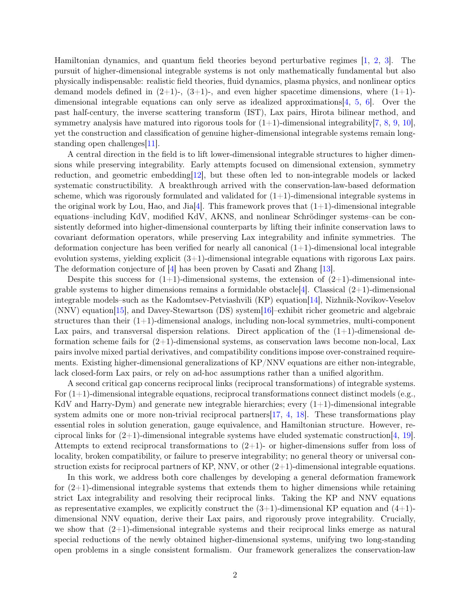
<figcaption class="paper-figure-caption"><b>Fig 1.</b> Low-resolution page preview, page 2</figcaption>
</figure>
<figure class="paper-figure-card">
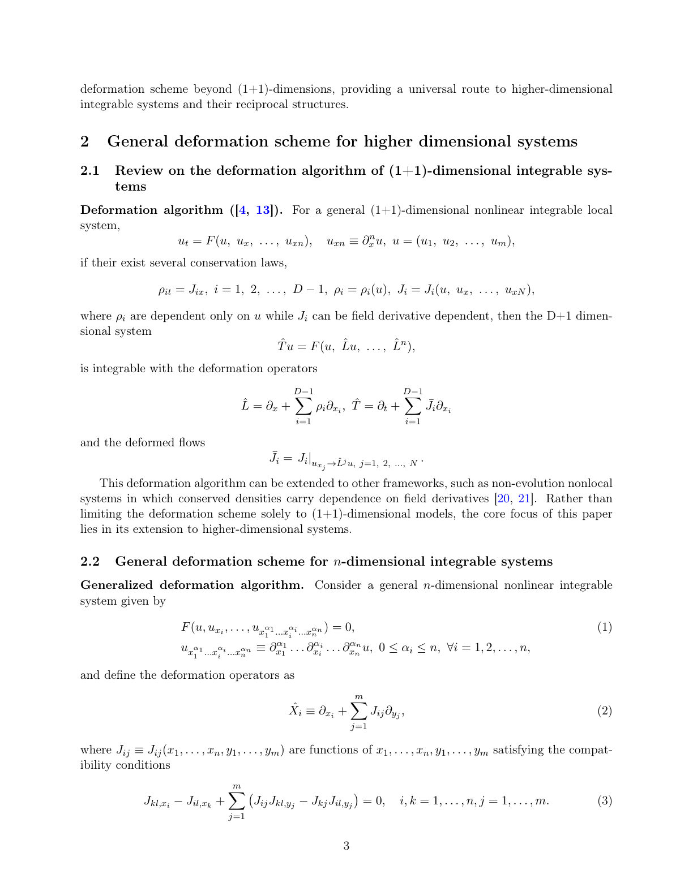
<figcaption class="paper-figure-caption"><b>Fig 2.</b> Low-resolution page preview, page 3</figcaption>
</figure>
<figure class="paper-figure-card">
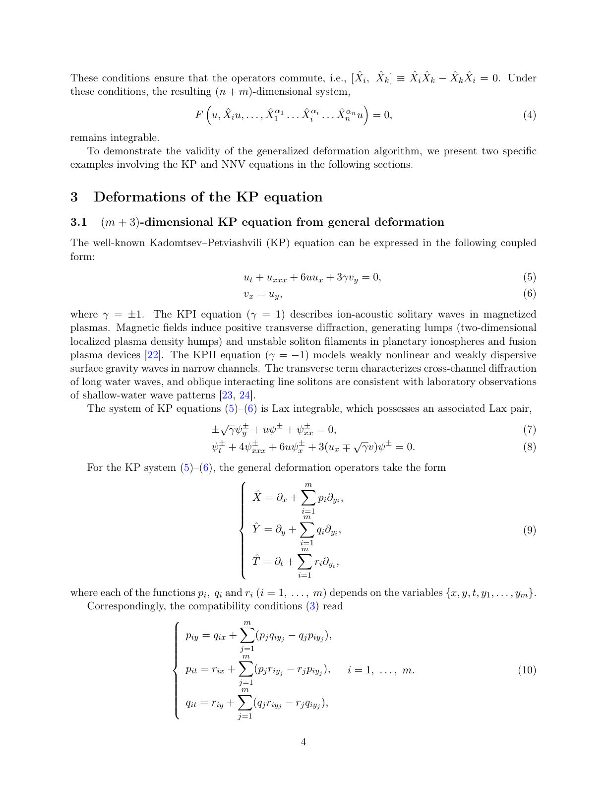
<figcaption class="paper-figure-caption"><b>Fig 3.</b> Low-resolution page preview, page 4</figcaption>
</figure>
<figure class="paper-figure-card">
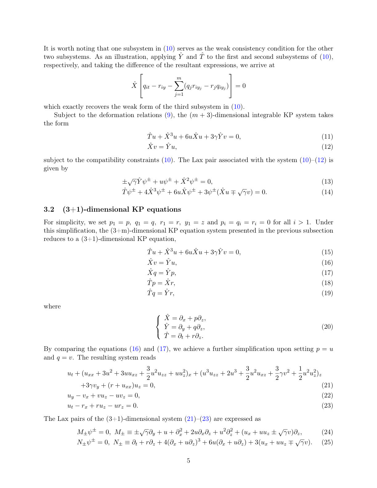
<figcaption class="paper-figure-caption"><b>Fig 4.</b> Low-resolution page preview, page 5</figcaption>
</figure>
<figure class="paper-figure-card">
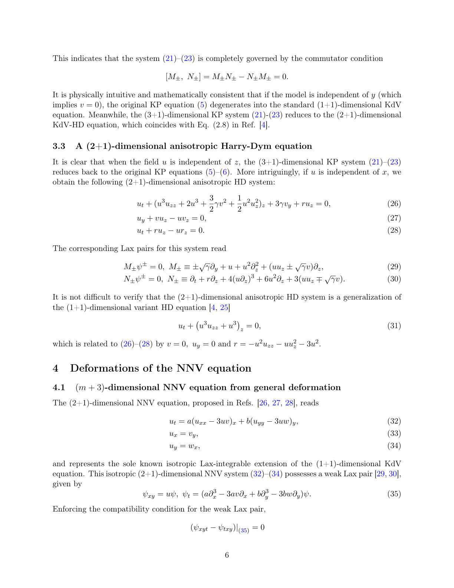
<figcaption class="paper-figure-caption"><b>Fig 5.</b> Low-resolution page preview, page 6</figcaption>
</figure>

**Summary.** This paper develops a unified mathematical framework to extend integrable nonlinear equations like KP and NNV from 2+1 dimensions into higher dimensional systems. By using covariant deformation operators, the authors construct infinite hierarchies of solutions and derive their Lax pairs. This work provides a general method for understanding how symmetries and integrability are preserved when moving to higher spatial dimensions.

**Why it may be interesting.** While focused on classical PDEs, the mathematical machinery of finding infinite symmetries and conserved quantities through deformation operators is highly relevant to constructing effective Hamiltonians or characterizing integrability in complex quantum field theories or many-body models.

Detailed structure

**Main problem.** The primary goal is extending the deformation algorithm, which lifts integrable systems from (1+1)-dimensions to higher dimensions, specifically tackling the challenging case of (2+1)-dimensional models.

**Main result.** The authors establish a unified framework for deforming both the anisotropic KP and isotropic NNV equations into infinite families of $(m+3)$-dimensional integrable hierarchies, yielding novel reciprocal links.

**Method.** They employ a covariant deformation framework using mutually commuting field-dependent operators ($\hat{X}, \hat{Y}, \hat{T}$) and rigorously verify integrability by ensuring the vanishing commutator condition for derived Lax pairs.

**Model / system.** The study focuses on classical nonlinear integrable partial differential equations, namely the Kadomtsev-Petviashvili (KP) equation and the Nizhnik-Novikov-Veselov (NNV) equation. These are generalized into high-dimensional master systems.

**Key observables.** Lax integrability, infinite families of conservation laws, closed-form Lax pairs, and the structure of reciprocal integrable links.

**Important parameters / regimes.** The dimensionality ($m+3$), deformation parameters ($p_i, q_i, r_i$), and specific reduction constraints (e.g., setting auxiliary variables to zero).

**Assumptions / limitations.** The analysis relies on the existence of commuting deformation operators and uses traveling wave ansatz to find explicit solutions for the high-dimensional systems.

**Figures summary.** Not specified in the notes, but the paper discusses deriving Lax pairs (Eq. 7, Eq. 62–63) and solving resulting ODEs using elliptic integrals (Eq. 78).

**Paper structure.** The structure moves from identifying the open problem (generalizing to 2+1 D), introducing the unified deformation framework for KP/NNV, constructing the high-dimensional hierarchies, deriving Lax pairs, analyzing specific truncations (e.g., 3+1 D, 4+1 D), and finally establishing the universal route to reciprocal links.

Abstract

The deformation algorithm based on conservation laws can lift (1+1)-dimensional integrable systems to higher-dimensional counterparts while preserving Lax integrability, yet its generalization to (2+1)-dimensional models has remained an open problem. This paper establishes a unified deformation framework for two (2+1)-dimensional integrable equations: the anisotropic Kadomtsev-Petviashvili (KP) equation and the isotropic Nizhnik-Novikov-Veselov (NNV) equation. By introducing a set of mutually commuting field-dependent deformation operators, we systematically construct infinite families of ($m+3$)-dimensional integrable KP and NNV hierarchies, derive their closed-form Lax pairs, and rigorously verify integrability via the vanishing commutator condition of Lax operators. For each high-dimensional hierarchy, concrete finite-dimensional master systems are obtained by truncating auxiliary spatial variables: a (3+1)-dimensional KP system and a (4+1)-dimensional generalized NNV system. Further symmetry reductions recover the original (2+1)-dimensional KP and NNV equations, and more importantly produce two distinct Harry-Dym (HD)-type reciprocal integrable systems. The KP reduction yields an anisotropic (2+1)-dimensional HD model, while the NNV reduction generates the first spatially isotropic two-space-dimensional HD system reported so far, filling a notable gap in existing literature. Parallel comparison of the KP and NNV branches reveals that the spatial symmetry of the original two-dimensional parent equation directly governs the symmetry properties of its high-dimensional deformations and HD dual subsystems. Our work not only extends the conservation-law deformation conjecture beyond (1+1)-dimensions to accommodate both strong Lax and weak Lax structures, but also provides a universal route to construct reciprocal links for multi-dimensional integrable systems.

[↑ back to top](#top)

### [Enhanced and robust superconductivity in La0.8Sr0.2NiO2 membranes compressed up to 210 GPa](http://arxiv.org/abs/2608.02042v1)

**Authors:** Shu Cai, Yuqing Tian, Shengjun Yan, Jinyu Zhao, Bo Hao, Jianfeng Zhang, Shuaihang Sun, Yang Ding, Qi Wu, Ho-kwang Mao, I. Bozovic, Yuefeng Nie, Liling Sun  
**Type:** experiment · **Category:** strongly correlated electrons · **PDF:** <https://arxiv.org/pdf/2608.02042v1>  
**Analysis basis:** full PDF text, analyzed in chunks

↔ Scroll figures horizontally

<figure class="paper-figure-card">
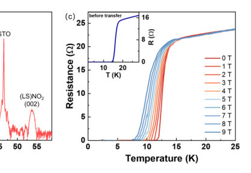
<figcaption class="paper-figure-caption"><b>Fig 1.</b> Figure 1 Ambient-pressure characterization of the freestanding infinite-layer</figcaption>
</figure>
<figure class="paper-figure-card">
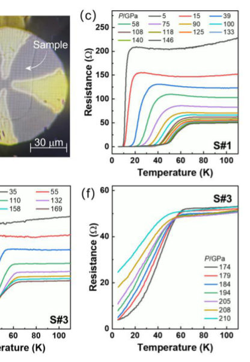
<figcaption class="paper-figure-caption"><b>Fig 2.</b> Figure 2 The membrane and electrode configuration on the diamond culet, and</figcaption>
</figure>
<figure class="paper-figure-card">
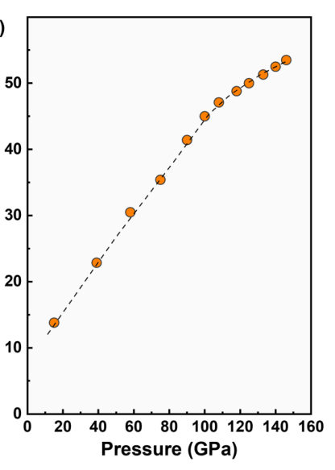
<figcaption class="paper-figure-caption"><b>Fig 3.</b> Figure 3. Superconductivity enhancement in compressed La0.8Sr0.2NiO2</figcaption>
</figure>
<figure class="paper-figure-card">
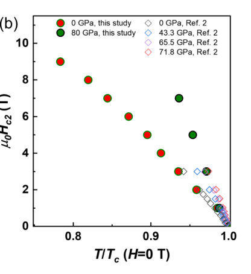
<figcaption class="paper-figure-caption"><b>Fig 4.</b> Figure 4 Characterization of the superconducting transition and upper critical</figcaption>
</figure>
<figure class="paper-figure-card">
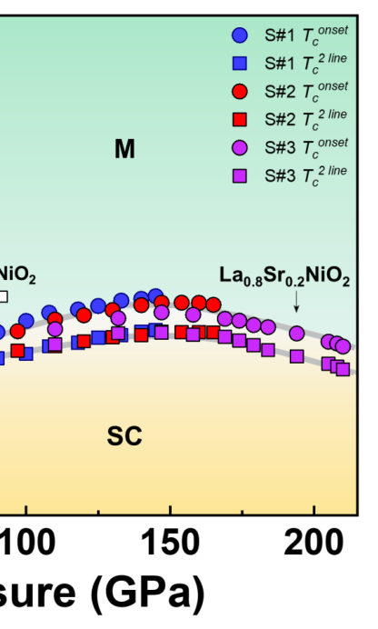
<figcaption class="paper-figure-caption"><b>Fig 5.</b> Figure 5 Pressure-temperature phase diagram of La0.8Sr0.2NiO2 membranes up to</figcaption>
</figure>

**Summary.** This work reports on the superconducting behavior of freestanding $	ext{La}_{0.8}	ext{Sr}_{0.2}	ext{NiO}_2$ membranes subjected to ultrahigh pressures up to 210 GPa. The key finding is that superconductivity remains robust, showing a characteristic dome-like increase in transition temperature, peaking at 74.5 K under compression before gradually decreasing. This demonstrates a novel pathway for studying high-$T_c$ superconductivity without substrate constraints.

**Why it may be interesting.** The study provides empirical evidence for superconductivity enhancement far beyond pressures where other high-$T_c$ superconductors fail, offering insights into the fundamental electronic mechanisms governing pairing in nickelates under extreme compression.

Detailed structure

**Main problem.** To investigate the enhanced and robust superconductivity in infinite-layer nickelate membranes under extreme high pressures, overcoming substrate limitations.

**Main result.** Superconductivity persists up to 210 GPa, exhibiting a dome-like evolution where $T_{c	ext{onset}}$ peaks at 74.5 K at 146 GPa before decreasing slightly.

**Method.** High-pressure electrical resistance measurements were performed *in situ* using Diamond Anvil Cells (DAC) on freestanding $	ext{La}_{0.8}	ext{Sr}_{0.2}	ext{NiO}_2$ membranes.

**Model / system.** The system is the infinite-layer nickelate superconductor, $	ext{La}_{0.8}	ext{Sr}_{0.2}	ext{NiO}_2$, studied as freestanding membranes to eliminate substrate effects common in high-pressure studies of cuprates and other oxides.

**Key observables.** Superconducting transition onset temperature ($T_{	ext{conset}}$), critical magnetic field ($\mu_0H_{c2}$), and resistance vs. temperature/pressure curves.

**Important parameters / regimes.** Pressure range up to 210 GPa; peak $T_{c	ext{onset}} = 74.5 	ext{ K}$ at $P = 146 	ext{ GPa}$.

**Assumptions / limitations.** The superconducting state enhancement is genuine, confirmed by the simultaneous increase in both $T_{	ext{conset}}$ and $\mu_0H_{c2}$ with pressure.

**Figures summary.** Figures show XRD confirming the infinite-layer phase, zero-field resistance measurements before/after transfer, and multiple panels illustrating the evolution of $T_{	ext{conset}}(P)$ across the entire pressure range.

**Paper structure.** The paper establishes the context by noting the success of nickelates over cuprates. It details sample preparation (membranes) and measurement techniques under DAC compression. The core results present the quantitative dome-like dependence of $T_{	ext{conset}}$ on pressure, culminating in the discussion of robustness up to 210 GPa.

Abstract

The discovery of superconductivity in infinite-layer nickelate thin films has opened a new frontier for exploring unconventional oxide superconductors beyond the copper oxide family. However, the presence of substrate hampers investigations under very high pressure. Recently, this problem was circumvented by a study of freestanding Nd0.85Sr0.15NiO2 membranes, which revealed that superconducting transition temperature kept increasing as the pressure was ramped up to 91 GPa, without showing signs of saturation. Naturally, one wonders what would happen at even higher pressures. Here, we report that superconductivity in a freestanding La0.8Sr0.2NiO2 membrane persists under applied ultrahigh pressures up to 210 GPa. The superconducting transition onset temperature exhibits a continuous dome-like evolution, increasing from 16 K at ambient pressure to a peak of 74.5 K at 146 GPa, and then gradually decreasing to 57.4 K at 210 GPa. Such robustness of superconductivity against ultrahigh pressure has not been observed in high-Tc oxide superconductors before.

[↑ back to top](#top)

### [Superconducting ternary compounds Li-X-B (X=Mo, W) within the mild pressure range: First-principles predictions](http://arxiv.org/abs/2608.02362v1)

**Authors:** Bangshuai Zhu, Juefei Wu, Dexi Shao, Junjie Wang, Yu Han, Cuiying Pei, Qi Wang, Jian Sun, Yanpeng Qi  
**Type:** theory · **Category:** other · **PDF:** <https://arxiv.org/pdf/2608.02362v1>  
**Analysis basis:** full PDF text, analyzed in chunks

↔ Scroll figures horizontally

<figure class="paper-figure-card">
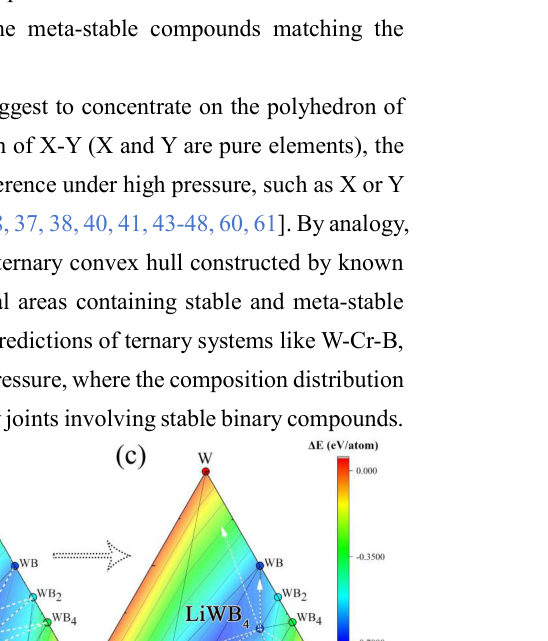
<figcaption class="paper-figure-caption"><b>Fig 1.</b> FIG. 1 The ternary composition line (TCL) in the ternary convex hulls of Li-W-B at 40 GPa. (a)</figcaption>
</figure>
<figure class="paper-figure-card">
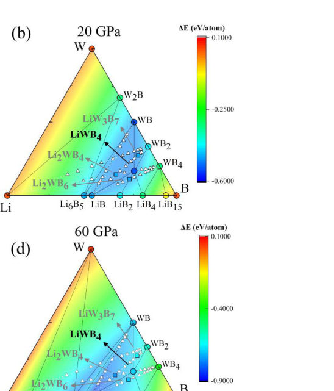
<figcaption class="paper-figure-caption"><b>Fig 2.</b> FIG. 2 (a)-(d) The ternary convex hulls of Li-W-B system under high pressures. The circle and black</figcaption>
</figure>
<figure class="paper-figure-card">
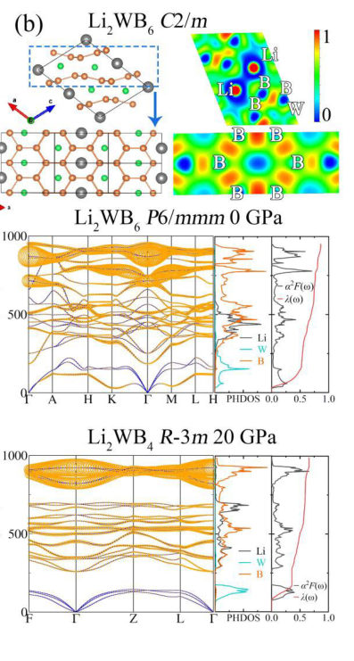
<figcaption class="paper-figure-caption"><b>Fig 3.</b> FIG. 3 (a) The crystal structure of the predicted phase Li2WB6 P6/mmm and ELF at (2-10) plane</figcaption>
</figure>
<figure class="paper-figure-card">
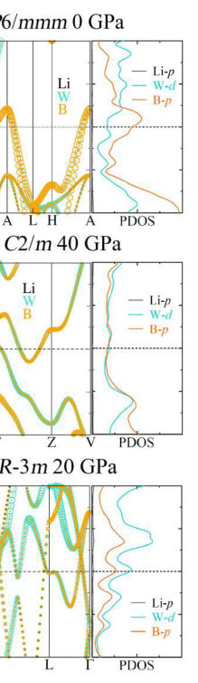
<figcaption class="paper-figure-caption"><b>Fig 4.</b> FIG. 4 The band structures and partial density of states (PDOS) of the predicted phases of (a)</figcaption>
</figure>
<figure class="paper-figure-card">
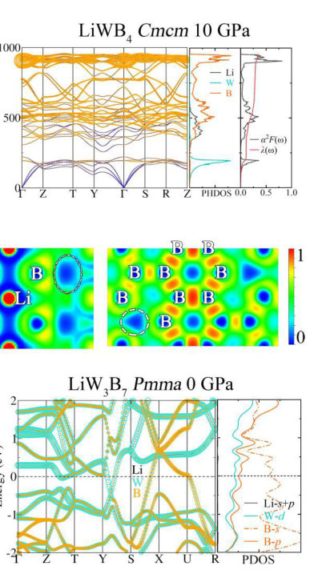
<figcaption class="paper-figure-caption"><b>Fig 5.</b> FIG. 5 (a) The crystal structure of the predicted phase LiWB4 Cmcm and ELF at the (010) plane and</figcaption>
</figure>

**Summary.** This paper uses first-principles DFT calculations and a novel Ternary Composition Lines (TCLs) strategy to predict superconducting ternary borides, $	ext{Li-X-B}$, for Molybdenum and Tungsten. The research successfully identifies several stable candidates predicted to superconduct at ambient or mild pressures, significantly reducing the extreme pressure requirements seen in pure compounds. This work advances computational materials design by validating a systematic method for exploring complex phase spaces.

**Why it may be interesting.** While focused on solid-state physics, the use of advanced computational search strategies (TCLs) combined with first-principles calculations to map out complex phase diagrams is relevant to understanding many-body ground states in novel materials.

Detailed structure

**Main problem.** The research aims to identify superconducting ternary compounds, specifically $	ext{Li-X-B}$ ($	ext{X}=	ext{Mo}, 	ext{W}$), that can maintain superconductivity at ambient or mild pressures, overcoming the need for extreme high pressures.

**Main result.** Several new Li-X-B phases were predicted to be superconducting with critical temperatures ($T_c$) around 11 K, and the study validated a Ternary Composition Lines (TCLs) strategy to explore these stable compositions at low pressure.

**Method.** The work relies on first-principles calculations using Density Functional Theory (DFT) combined with advanced computational search techniques like Ternary Composition Lines (TCLs) and MAGUS for structure prediction.

**Model / system.** The physical system is the ternary boride compound $	ext{Li-X-B}$ ($	ext{X}=	ext{Mo}, 	ext{W}$). The study investigates its electronic structure, stability relative to the convex hull, and superconducting properties under varying pressure regimes.

**Key observables.** Superconducting critical temperature ($T_c$), electron-phonon coupling constant ($\lambda$), thermodynamic stability (enthalpy difference), and crystal structure/phase transitions.

**Important parameters / regimes.** Mild to ambient pressure range (compared to $\sim 100 	ext{ GPa}$ for pure $	ext{WB}_2$); specific compositions like $	ext{Li}_2	ext{WB}_6$ and $	ext{Li}_4	ext{MoB}_2$.

**Assumptions / limitations.** The primary assumption is that the proposed Ternary Composition Lines (TCLs) effectively guide the search for thermodynamically stable or meta-stable superconducting phases in the complex ternary phase diagram.

**Figures summary.** Figures illustrate the construction of TCLs in the $	ext{Li-W-B}$ system, showing initial hulls and predicted composition lines. Other figures detail structural transitions ($	ext{P}6/mmm$ to $	ext{C}2/m$) and phonon/EPC analyses for specific phases.

**Paper structure.** The paper follows a structure of problem definition (reducing pressure requirements), methodology description (DFT, TCLs), systematic application to the $	ext{Li-X-B}$ system, presentation of stable candidates ($	ext{LiWB}_4$, etc.), and concluding with validation of the computational strategy.

Abstract

Among the superconducting hydrides under high pressure, a number of studies concentrate on the ternary compounds to explore unique superconductors, which are capable of reducing the stable pressure and maintain superconductivity. In this work, to verify our proposed strategy of ternary composition lines (TCLs) to explore ternary compounds, we combined the first-principles calculations and crystal structure predictions to study the ternary compounds Li-X-B (X=Mo, W) under high pressure. After calculations along five and four TCLs in Li-W-B and Li-Mo-B, respectively, five Li-W-B compounds and four Li-Mo-B compounds were predicted. The compositions of LiWB4, Li4MoB2 and LiMo2B2 could be thermodynamically stable under high pressure, and Li2WB6 is around 0.02 eV/atom above the convex hull at 0 GPa, which has potential for synthesizing. Both of the predicted Li2WB6 P6/mmm and Li2WB4 R-3m are superconducting and their Tc are around 11 K, which are similar to the Tc of WB2 P6/mmm around 100 GPa. An anomalous increase of Tc was found in Li4MoB2 C2/m upon compression. We carried out full ternary search (FTS) to evaluate the validity of the TCLs strategy in Li-W-B system at 0 GPa. Our results are helpful for understanding the phase diagram of Li-X-B (X=Mo, W) under high pressure and the introducing of Li atoms provide candidate structures to reduce the measured stable pressure from ~100 GPa in WB2 P6/mmm to 0 GPa. Meanwhile, we preliminary validate the strategy of TCLs in structure predictions and we expect to improve this strategy in the future, shedding light on the studies of ternary compounds.

[↑ back to top](#top)

