
# arxiv digest (quant-ph + cond-mat) — 2026-08-06

*126 papers · 46 relevant · 3 highlighted*

## 🔥 Most relevant (46)

*Every paper with at least one nonzero topic score, sorted by best-matching score. 🔥 marks scores ≥4/5. Click the title to jump to the full entry below; click [arXiv] to open the paper page. `(secondary)` marks papers from de-prioritized cond-mat archives.*

Show 46 relevant papers

- [Heralded Free-Electron Writing of the Most Subradiant State in an Atomic Array](#paper-2608.03056) [[arXiv]](http://arxiv.org/abs/2608.03056v1) — 🔥 `free-space correlated emission` **5/5** · 🔥 `Dicke superradiance` **4/5** · 🔥 `correlated / nonlocal dissipation` **4/5** · `analog quantum simulation` **3/5** · `interference shaping light` **3/5** · `quantum measurements` **3/5** · `superradiant laser` **3/5** · `Tavis-Cummings & cavity-many-emitter` **2/5** · `driven-dissipative phase transition` **2/5** · `methods for driven-dissipative` **2/5** · `non-equilibrium dynamics` **2/5** · `Keldysh / 2PI / non-Gaussian methods` **1/5** · `Kondo & dissipative impurity` **1/5** · `correlated cavity matter` **1/5** · `entanglement & information structure` **1/5** · `measurement-induced transitions` **1/5** · `non-equilibrium universality` **1/5**
- [Controllable interaction between photons and distant spins via vacuum Rabi oscillations](#paper-2608.03809) [[arXiv]](http://arxiv.org/abs/2608.03809v1) — 🔥 `spintronics-quantum-optics interface` **5/5** · 🔥 `QC/QI experiment` **4/5** · 🔥 `analog quantum simulation` **4/5** · 🔥 `exotic spin models in light-matter` **4/5** · `correlated cavity matter` **3/5** · `quantum optics experiment` **3/5** · `correlated / nonlocal dissipation` **2/5** · `entanglement & information structure` **2/5** · `non-equilibrium dynamics` **2/5** · `Tavis-Cummings & cavity-many-emitter` **1/5** · `driven-dissipative phase transition` **1/5** · `methods for driven-dissipative` **1/5** · `quantum measurements` **1/5**
- [Universal crossovers in weakly-monitored quantum critical states](#paper-2608.02716) [[arXiv]](http://arxiv.org/abs/2608.02716v1) — 🔥 `quantum measurements` **5/5** · 🔥 `entanglement & information structure` **4/5** · 🔥 `measurement-induced transitions` **4/5** · `non-equilibrium universality` **3/5** · `Keldysh / 2PI / non-Gaussian methods` **2/5** · `correlated / nonlocal dissipation` **2/5** · `driven-dissipative phase transition` **2/5** · `methods for driven-dissipative` **1/5** · `non-equilibrium dynamics` **1/5**
- [Rydberg-Mediated Nonlinear Quantum Optics](#paper-2608.02992) [[arXiv]](http://arxiv.org/abs/2608.02992v1) — 🔥 `Rydberg arrays` **5/5** · 🔥 `analog quantum simulation` **4/5** · `Tavis-Cummings & cavity-many-emitter` **2/5** · `correlated cavity matter` **2/5** · `correlated / nonlocal dissipation` **1/5** · `driven-dissipative phase transition` **1/5** · `entanglement & information structure` **1/5** · `interference shaping light` **1/5**
- ⭐ [Cavity control of quantum phase transitions in a two-dimensional kondo lattice](#paper-2608.03714) [[arXiv]](http://arxiv.org/abs/2608.03714v1) — 🔥 `Kondo & dissipative impurity` **4/5** · 🔥 `analog quantum simulation` **4/5** · 🔥 `correlated cavity matter` **4/5** · `Keldysh / 2PI / non-Gaussian methods` **3/5** · `driven-dissipative phase transition` **3/5** · `methods for driven-dissipative` **3/5** · `non-equilibrium dynamics` **2/5** · `non-equilibrium universality` **2/5** · `Tavis-Cummings & cavity-many-emitter` **1/5** · `exotic spin models in light-matter` **1/5** · `spintronics-quantum-optics interface` **1/5**
- [High-Frequency Gravitational Wave Detection with Superconducting Qubits](#paper-2608.02733) [[arXiv]](http://arxiv.org/abs/2608.02733v1) — 🔥 `Tavis-Cummings & cavity-many-emitter` **4/5** · `Dicke superradiance` **3/5** · `correlated cavity matter` **3/5** · `entanglement & information structure` **3/5** · `analog quantum simulation` **2/5** · `correlated / nonlocal dissipation` **2/5** · `driven-dissipative phase transition` **2/5** · `methods for driven-dissipative` **2/5** · `QC/QI experiment` **1/5** · `exotic spin models in light-matter` **1/5** · `non-equilibrium dynamics` **1/5** · `non-equilibrium universality` **1/5** · `quantum optics experiment` **1/5** · `spintronics-quantum-optics interface` **1/5**
- [Generation and Enhancement of Bipartite and Tripartite Entanglement in an Electro-Optomechanical Ring Cavity](#paper-2608.03578) [[arXiv]](http://arxiv.org/abs/2608.03578v1) — 🔥 `entanglement & information structure` **4/5** · `Keldysh / 2PI / non-Gaussian methods` **3/5** · `analog quantum simulation` **3/5** · `correlated cavity matter` **3/5** · `driven-dissipative phase transition` **3/5** · `methods for driven-dissipative` **3/5** · `Tavis-Cummings & cavity-many-emitter` **2/5** · `non-equilibrium dynamics` **2/5** · `correlated / nonlocal dissipation` **1/5** · `interference shaping light` **1/5** · `non-equilibrium universality` **1/5**
- [Few-photon degenerate parametric resonance in a two-tone driven microwave resonator](#paper-2608.03871) [[arXiv]](http://arxiv.org/abs/2608.03871v1) — 🔥 `methods for driven-dissipative` **4/5** · `correlated cavity matter` **3/5** · `driven-dissipative phase transition` **3/5** · `quantum optics experiment` **3/5** · `Keldysh / 2PI / non-Gaussian methods` **2/5** · `Tavis-Cummings & cavity-many-emitter` **2/5** · `non-equilibrium universality` **2/5** · `analog quantum simulation` **1/5** · `correlated / nonlocal dissipation` **1/5** · `entanglement & information structure` **1/5** · `interference shaping light` **1/5** · `non-equilibrium dynamics` **1/5** · `quantum measurements` **1/5**
- [Correlating spin and optical properties of quantum emitters in hBN](#paper-2608.03090) [[arXiv]](http://arxiv.org/abs/2608.03090v1) — 🔥 `QC/QI experiment` **4/5** · 🔥 `spintronics-quantum-optics interface` **4/5** · `exotic spin models in light-matter` **3/5** · `quantum optics experiment` **3/5** · `Tavis-Cummings & cavity-many-emitter` **2/5** · `quantum measurements` **2/5** · `analog quantum simulation` **1/5** · `correlated / nonlocal dissipation` **1/5** · `correlated cavity matter` **1/5** · `driven-dissipative phase transition` **1/5** · `interference shaping light` **1/5**
- [Nonlocality-induced critical-length hierarchy from non-Hermitian competition](#paper-2608.02746) [[arXiv]](http://arxiv.org/abs/2608.02746v1) — 🔥 `analog quantum simulation` **4/5** · 🔥 `non-equilibrium universality` **4/5** · `correlated / nonlocal dissipation` **3/5** · `driven-dissipative phase transition` **3/5** · `methods for driven-dissipative` **3/5** · `non-equilibrium dynamics` **2/5** · `Keldysh / 2PI / non-Gaussian methods` **1/5** · `Kondo & dissipative impurity` **1/5** · `entanglement & information structure` **1/5**
- [Quantum Impurities as Probes of Finite-Temperature Fluctuations in Two-Dimensional Bose Gases](#paper-2608.03665) [[arXiv]](http://arxiv.org/abs/2608.03665v1) — 🔥 `non-equilibrium dynamics` **4/5** · `Keldysh / 2PI / non-Gaussian methods` **3/5** · `Kondo & dissipative impurity` **3/5** · `analog quantum simulation` **3/5** · `non-equilibrium universality` **3/5** · `driven-dissipative phase transition` **2/5** · `correlated / nonlocal dissipation` **1/5** · `methods for driven-dissipative` **1/5** · `scars & prethermalization` **1/5**
- [Quantum-Limited Blind Source Separation of Classical Light](#paper-2608.02921) [[arXiv]](http://arxiv.org/abs/2608.02921v1) — 🔥 `quantum measurements` **4/5** · `interference shaping light` **3/5** · `measurement-induced transitions` **3/5** · `quantum optics experiment` **3/5** · `QC/QI experiment` **2/5** · `analog quantum simulation` **1/5** · `correlated cavity matter` **1/5** · `driven-dissipative phase transition` **1/5** · `entanglement & information structure` **1/5** · `methods for driven-dissipative` **1/5** · `non-equilibrium dynamics` **1/5**
- [Two-Parameter Ansatz for the Violation of Eigenstate Thermalization](#paper-2608.02744) [[arXiv]](http://arxiv.org/abs/2608.02744v1) — 🔥 `non-equilibrium dynamics` **4/5** · 🔥 `scars & prethermalization` **4/5** · `non-equilibrium universality` **3/5** · `analog quantum simulation` **2/5** · `driven-dissipative phase transition` **2/5** · `Frenkel-Kontorova` **1/5** · `Keldysh / 2PI / non-Gaussian methods` **1/5** · `correlated / nonlocal dissipation` **1/5** · `entanglement & information structure` **1/5** · `exotic spin models in light-matter` **1/5** · `methods for driven-dissipative` **1/5**
- [The Utility of Sparse Error Detection in Quantum Simulations](#paper-2608.02944) [[arXiv]](http://arxiv.org/abs/2608.02944v1) — 🔥 `quantum measurements` **4/5** · `analog quantum simulation` **3/5** · `measurement-induced transitions` **3/5** · `methods for driven-dissipative` **3/5** · `non-equilibrium dynamics` **2/5** · `Keldysh / 2PI / non-Gaussian methods` **1/5** · `correlated / nonlocal dissipation` **1/5** · `driven-dissipative phase transition` **1/5** · `entanglement & information structure` **1/5** · `exotic spin models in light-matter` **1/5**
- [A quantum game of telephone](#paper-2608.03963) [[arXiv]](http://arxiv.org/abs/2608.03963v1) — 🔥 `QC/QI experiment` **4/5** · `methods for driven-dissipative` **3/5** · `quantum measurements` **3/5** · `quantum optics experiment` **3/5** · `non-equilibrium dynamics` **2/5** · `correlated / nonlocal dissipation` **1/5** · `driven-dissipative phase transition` **1/5** · `entanglement & information structure` **1/5** · `measurement-induced transitions` **1/5**
- [Exact Resonances Are Not Sufficient for Phonon Energy Diffusion](#paper-2608.03180) [[arXiv]](http://arxiv.org/abs/2608.03180v1) — 🔥 `non-equilibrium dynamics` **4/5** · `non-equilibrium universality` **3/5** · `scars & prethermalization` **3/5** · `driven-dissipative phase transition` **2/5** · `methods for driven-dissipative` **2/5** · `Frenkel-Kontorova` **1/5** · `Keldysh / 2PI / non-Gaussian methods` **1/5** · `analog quantum simulation` **1/5** · `correlated / nonlocal dissipation` **1/5** · `entanglement & information structure` **1/5**
- [Particle-Vortex Duality of Hydrodynamics](#paper-2608.02732) [[arXiv]](http://arxiv.org/abs/2608.02732v1) — 🔥 `Keldysh / 2PI / non-Gaussian methods` **4/5** · `driven-dissipative phase transition` **3/5** · `methods for driven-dissipative` **3/5** · `non-equilibrium dynamics` **3/5** · `analog quantum simulation` **2/5** · `non-equilibrium universality` **2/5** · `correlated / nonlocal dissipation` **1/5** · `exotic spin models in light-matter` **1/5**
- [Faraday pattern formation in dipolar superfluid and supersolid quantum gases](#paper-2608.03553) [[arXiv]](http://arxiv.org/abs/2608.03553v1) — 🔥 `analog quantum simulation` **4/5** · 🔥 `driven-dissipative phase transition` **4/5** · `methods for driven-dissipative` **3/5** · `non-equilibrium dynamics` **3/5** · `non-equilibrium universality` **3/5** · `Keldysh / 2PI / non-Gaussian methods` **1/5**
- [Spin-charge separation in the triangular-lattice Hofstadter-Hubbard model](#paper-2608.02727) [[arXiv]](http://arxiv.org/abs/2608.02727v1) — 🔥 `analog quantum simulation` **4/5** · `exotic spin models in light-matter` **3/5** · `non-equilibrium dynamics` **3/5** · `entanglement & information structure` **2/5** · `methods for driven-dissipative` **2/5** · `Keldysh / 2PI / non-Gaussian methods` **1/5** · `Rydberg arrays` **1/5** · `non-equilibrium universality` **1/5**
- [Typical Output States of Monitored Random Clifford Circuits: A Graph-Theoretic Approach](#paper-2608.03102) [[arXiv]](http://arxiv.org/abs/2608.03102v1) — 🔥 `measurement-induced transitions` **4/5** · `driven-dissipative phase transition` **3/5** · `entanglement & information structure` **3/5** · `non-equilibrium dynamics` **2/5** · `non-equilibrium universality` **2/5** · `correlated / nonlocal dissipation` **1/5** · `methods for driven-dissipative` **1/5** · `quantum measurements` **1/5**
- [On-chip generation of multi-qubit graph states with high-dimensional encoded single photons](#paper-2608.03012) [[arXiv]](http://arxiv.org/abs/2608.03012v1) — 🔥 `QC/QI experiment` **4/5** · `quantum optics experiment` **3/5** · `entanglement & information structure` **2/5** · `measurement-induced transitions` **2/5** · `quantum measurements` **2/5** · `analog quantum simulation` **1/5** · `interference shaping light` **1/5** · `non-equilibrium dynamics` **1/5**
- [On-chip Quantum Measurement of Squeezing Generated from a Silicon Nitride Micro-ring Resonator](#paper-2608.03402) [[arXiv]](http://arxiv.org/abs/2608.03402v1) — 🔥 `quantum optics experiment` **4/5** · `quantum measurements` **3/5** · `QC/QI experiment` **2/5** · `measurement-induced transitions` **2/5** · `analog quantum simulation` **1/5** · `correlated / nonlocal dissipation` **1/5** · `correlated cavity matter` **1/5** · `driven-dissipative phase transition` **1/5** · `interference shaping light` **1/5**
- [A First-principles Computational Framework for Quantum Decoherence in Complex Diamond Spin Environments](#paper-2608.02846) [[arXiv]](http://arxiv.org/abs/2608.02846v1) — 🔥 `QC/QI experiment` **4/5** · 🔥 `spintronics-quantum-optics interface` **4/5** · `Keldysh / 2PI / non-Gaussian methods` **1/5** · `Kondo & dissipative impurity` **1/5** · `analog quantum simulation` **1/5** · `correlated / nonlocal dissipation` **1/5** · `exotic spin models in light-matter` **1/5** · `methods for driven-dissipative` **1/5** · `non-equilibrium dynamics` **1/5**
- [Exact Tradeoff Between Quantum Error Correction and Quantum Darwinism: An Information-Theoretic No-Go Theorem](#paper-2608.03944) [[arXiv]](http://arxiv.org/abs/2608.03944v1) — 🔥 `entanglement & information structure` **4/5** · `correlated / nonlocal dissipation` **3/5** · `methods for driven-dissipative` **3/5** · `driven-dissipative phase transition` **2/5** · `Keldysh / 2PI / non-Gaussian methods` **1/5** · `non-equilibrium dynamics` **1/5** · `non-equilibrium universality` **1/5**
- [Geometric-Symmetry Logical Gate and Local-Probe Selectivity in the Three-Leg AKLT Ladder](#paper-2608.03861) [[arXiv]](http://arxiv.org/abs/2608.03861v1) — 🔥 `entanglement & information structure` **4/5** · `analog quantum simulation` **3/5** · `methods for driven-dissipative` **3/5** · `non-equilibrium dynamics` **2/5** · `Keldysh / 2PI / non-Gaussian methods` **1/5** · `correlated / nonlocal dissipation` **1/5** · `driven-dissipative phase transition` **1/5**
- [Interplay between teleportation fidelity and basis-independent coherence in maximally sliced states under decoherence](#paper-2608.03865) [[arXiv]](http://arxiv.org/abs/2608.03865v1) — 🔥 `entanglement & information structure` **4/5** · `correlated / nonlocal dissipation` **3/5** · `methods for driven-dissipative` **3/5** · `driven-dissipative phase transition` **2/5** · `Keldysh / 2PI / non-Gaussian methods` **1/5** · `non-equilibrium dynamics` **1/5** · `non-equilibrium universality` **1/5**
- [The intermediate scattering function of an interacting adlayer as a characteristic function: a closed-form theory of Ising lattice-gas surface diffusion](#paper-2608.03398) [[arXiv]](http://arxiv.org/abs/2608.03398v1) — 🔥 `non-equilibrium dynamics` **4/5** · `methods for driven-dissipative` **3/5** · `non-equilibrium universality` **3/5** · `driven-dissipative phase transition` **2/5** · `Frenkel-Kontorova` **1/5** · `Keldysh / 2PI / non-Gaussian methods` **1/5** · `correlated / nonlocal dissipation` **1/5**
- [Dynamic Induction of Lattice Gauge Theories on a Quantum Computer](#paper-2608.02756) [[arXiv]](http://arxiv.org/abs/2608.02756v1) — 🔥 `analog quantum simulation` **4/5** · `methods for driven-dissipative` **3/5** · `QC/QI experiment` **2/5** · `non-equilibrium dynamics` **2/5** · `driven-dissipative phase transition` **1/5** · `entanglement & information structure` **1/5** · `exotic spin models in light-matter` **1/5**
- [PaQit: Energy-Runtime-Fidelity Co-Optimization for Neutral Atom Quantum Computers](#paper-2608.02815) [[arXiv]](http://arxiv.org/abs/2608.02815v1) — 🔥 `Rydberg arrays` **4/5** · 🔥 `analog quantum simulation` **4/5** · `QC/QI experiment` **3/5** · `entanglement & information structure` **1/5** · `methods for driven-dissipative` **1/5** · `non-equilibrium dynamics` **1/5**
- ⭐ [Structure of matrix product locally purifiable density operators](#paper-2608.02724) [[arXiv]](http://arxiv.org/abs/2608.02724v1) — 🔥 `methods for driven-dissipative` **4/5** · `entanglement & information structure` **3/5** · `non-equilibrium dynamics` **2/5** · `Keldysh / 2PI / non-Gaussian methods` **1/5** · `analog quantum simulation` **1/5** · `correlated / nonlocal dissipation` **1/5** · `driven-dissipative phase transition` **1/5**
- [Joint spectral characterization of SPDC photon pairs near 2 $μ$m in (Al)GaAs-on-insulator waveguides](#paper-2608.03950) [[arXiv]](http://arxiv.org/abs/2608.03950v1) — 🔥 `quantum optics experiment` **4/5** · `interference shaping light` **3/5** · `Keldysh / 2PI / non-Gaussian methods` **1/5** · `QC/QI experiment` **1/5** · `driven-dissipative phase transition` **1/5**
- [Local magnetic order in vacancy-disrupted spin ice Ho2TiO5](#paper-2608.03850) [[arXiv]](http://arxiv.org/abs/2608.03850v1) — 🔥 `analog quantum simulation` **4/5** · `exotic spin models in light-matter` **3/5** · `Kondo & dissipative impurity` **1/5** · `entanglement & information structure` **1/5** · `spintronics-quantum-optics interface` **1/5**
- [DAMPyF: a Python implementation of the DAMPF method for the simulation of open-system dynamics](#paper-2608.03668) [[arXiv]](http://arxiv.org/abs/2608.03668v1) — 🔥 `methods for driven-dissipative` **4/5** · `non-equilibrium dynamics` **2/5** · `Keldysh / 2PI / non-Gaussian methods` **1/5** · `correlated / nonlocal dissipation` **1/5** · `driven-dissipative phase transition` **1/5**
- [Sample-half-inserted quantum interferometer](#paper-2608.03622) [[arXiv]](http://arxiv.org/abs/2608.03622v1) — 🔥 `quantum optics experiment` **4/5** · `interference shaping light` **3/5** · `QC/QI experiment` **1/5** · `quantum measurements` **1/5**
- [Topological properties and phase diagram of the triangular Hofstadter model with staggered flux](#paper-2608.03278) [[arXiv]](http://arxiv.org/abs/2608.03278v1) `(secondary)` — 🔥 `analog quantum simulation` **4/5** · `correlated cavity matter` **1/5** · `driven-dissipative phase transition` **1/5** · `entanglement & information structure` **1/5** · `exotic spin models in light-matter` **1/5** · `non-equilibrium dynamics` **1/5**
- [A lower bound on the classical simulation cost of star-network correlations](#paper-2608.03986) [[arXiv]](http://arxiv.org/abs/2608.03986v1) — 🔥 `entanglement & information structure` **4/5** · `quantum measurements` **2/5** · `measurement-induced transitions` **1/5**
- [Entangling Topological Invariants](#paper-2608.03634) [[arXiv]](http://arxiv.org/abs/2608.03634v1) — 🔥 `entanglement & information structure` **4/5** · `analog quantum simulation` **1/5** · `correlated cavity matter` **1/5** · `non-equilibrium dynamics` **1/5**
- [Protected measurements for protected superconducting qubits](#paper-2608.03325) [[arXiv]](http://arxiv.org/abs/2608.03325v1) — 🔥 `quantum measurements` **4/5** · `QC/QI experiment` **2/5** · `measurement-induced transitions` **1/5**
- [TNASS: Tensor Network Active Space Selection with the Entanglement Feature](#paper-2608.03645) [[arXiv]](http://arxiv.org/abs/2608.03645v1) — 🔥 `entanglement & information structure` **4/5** · `methods for driven-dissipative` **3/5**
- [Magneto-oscillations, nonlinearity, and nonreciprocity of Coulomb drag in quantum circuits](#paper-2608.02812) [[arXiv]](http://arxiv.org/abs/2608.02812v1) — 🔥 `Keldysh / 2PI / non-Gaussian methods` **4/5** · `methods for driven-dissipative` **1/5** · `non-equilibrium dynamics` **1/5**
- [Separable States Violate the Complementary-Quantum Correlation Conjecture](#paper-2608.03828) [[arXiv]](http://arxiv.org/abs/2608.03828v1) — 🔥 `entanglement & information structure` **4/5** · `quantum measurements` **2/5**
- [Characterizing pairwise swapping capabilities of dense coding channels](#paper-2608.03184) [[arXiv]](http://arxiv.org/abs/2608.03184v1) — 🔥 `entanglement & information structure` **4/5** · `non-equilibrium dynamics` **1/5**
- [Real-time decoding of quantum error correction codes using high-performance computing](#paper-2608.03948) [[arXiv]](http://arxiv.org/abs/2608.03948v1) — 🔥 `QC/QI experiment` **4/5** · `quantum measurements` **1/5**
- [Entanglement Distillation of some Rank-Five Symmetric NPT States in Two-Qutrit Systems](#paper-2608.03710) [[arXiv]](http://arxiv.org/abs/2608.03710v1) — 🔥 `entanglement & information structure` **4/5**
- [Schmidt-Gauge Non-Local Magic: Representation, Optimality, and Mathematical Properties](#paper-2608.02745) [[arXiv]](http://arxiv.org/abs/2608.02745v1) — 🔥 `entanglement & information structure` **4/5**
- [The geometry of absolute separability and other convex matrix properties from spectrum](#paper-2608.03390) [[arXiv]](http://arxiv.org/abs/2608.03390v1) — 🔥 `entanglement & information structure` **4/5**

## ⭐ Highlighted (3)

*Papers by authors on your watch list. Click the title to jump to the full entry below; click [arXiv] to open the paper page.*

Show 3 highlighted papers

- ⭐ [Structure of matrix product locally purifiable density operators](#paper-2608.02724) [[arXiv]](http://arxiv.org/abs/2608.02724v1) — Ignacio Cirac
- ⭐ [Cavity control of quantum phase transitions in a two-dimensional kondo lattice](#paper-2608.03714) [[arXiv]](http://arxiv.org/abs/2608.03714v1) — Yuto Ashida
- ⭐ [Non-Relativistic Quantum Electrodynamics of Atoms in a Rotating Ring Cavity](#paper-2608.03997) [[arXiv]](http://arxiv.org/abs/2608.03997v1) — Murray J. Holland

## All papers (101, sorted by relevance)

*Papers from quant-ph and your primary cond-mat archives (quant-gas, stat-mech, str-el, dis-nn). Highlighted papers (⭐) come first, then everything else sorted by topic-relevance score, highest first.*

### ⭐ [Cavity control of quantum phase transitions in a two-dimensional kondo lattice](http://arxiv.org/abs/2608.03714v1)

**Highlighted author(s):** Yuto Ashida  
**Authors:** Jun Mochida, Atac Imamoglu, Yuto Ashida  
**Type:** theory · **Category:** strongly correlated electrons · **PDF:** <https://arxiv.org/pdf/2608.03714v1>  
**Analysis basis:** full PDF text, analyzed in chunks
**Topic relevance:** 🔥 `Kondo & dissipative impurity` **4/5** · 🔥 `analog quantum simulation` **4/5** · 🔥 `correlated cavity matter` **4/5** · `Keldysh / 2PI / non-Gaussian methods` **3/5** · `driven-dissipative phase transition` **3/5** · `methods for driven-dissipative` **3/5** · `non-equilibrium dynamics` **2/5** · `non-equilibrium universality` **2/5** · `Tavis-Cummings & cavity-many-emitter` **1/5** · `exotic spin models in light-matter` **1/5** · `spintronics-quantum-optics interface` **1/5**

↔ Scroll figures horizontally

<figure class="paper-figure-card">
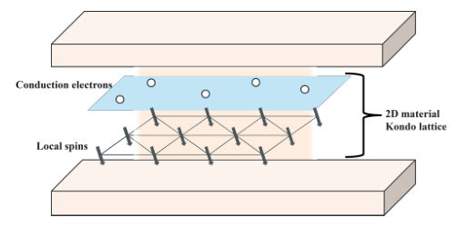
<figcaption class="paper-figure-caption"><b>Fig 1.</b> FIG. 1: Schematic setup of a two-dimensional Kondo lattice material coupled to a planar cavity mode. Con- duction electrons in the two-dimensional Kondo lattice layer couple to the cavity mode, while the localized mo- ments are treated as decoupled from the cavity field.</figcaption>
</figure>
<figure class="paper-figure-card">
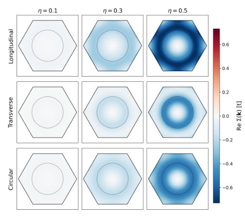
<figcaption class="paper-figure-caption"><b>Fig 2.</b> FIG. 2: The self-energy Σ(k) in momentum space for the triangular lattice at ρe = 0.7. The black dotted line shows the bare conduction-electron Fermi surface at this filling. The self-energy has a clear momentum de- pendence, and the pattern changes with the polarization structure. From top to bottom, these are the longitudinal structure and the transverse and circular model struc- tures, respectively.</figcaption>
</figure>
<figure class="paper-figure-card">
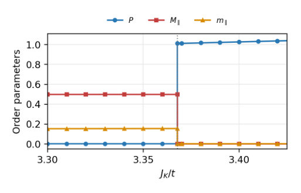
<figcaption class="paper-figure-caption"><b>Fig 3.</b> FIG. 4: The mean-field parameters of ground states near the phase transition point at ρe = 0.7 and η = 0. The Kondo hybridization P is finite in the heavy-fermion phase, while the in-plane magnetic order parameter M∥ characterizes the 120-degree AFM phase.</figcaption>
</figure>
<figure class="paper-figure-card">
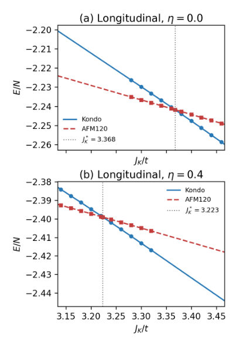
<figcaption class="paper-figure-caption"><b>Fig 4.</b> FIG. 3: Energy crossing between the heavy-fermion phase and the 120-degree antiferromagnetic phase at ρe = 0.7 for the longitudinal structure. The upper and lower panels show η = 0 and η = 0.4, respectively. The two panels use the same horizontal range. The 120-degree AFM phase has the lower energy at smaller JK, while the heavy-fermion phase becomes lower at larger JK.</figcaption>
</figure>
<figure class="paper-figure-card">
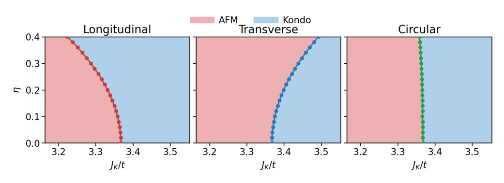
<figcaption class="paper-figure-caption"><b>Fig 5.</b> FIG. 5: JK–η phase diagram for the triangular lattice at ρe = 0.7. The phase diagram is obtained by solving the self-consistent equations for each phase and comparing the corresponding ground-state energies. The horizontal axis shows the Kondo coupling JK, and the vertical axis shows the cavity coupling strength η. The heavy-fermion region expands toward smaller JK for the longitudinal case, while the 120-degree AFM region expands for the transverse model case. The circular model case gives a transition line between these two cases.</figcaption>
</figure>

**Summary.** This theoretical paper demonstrates that vacuum fluctuations from planar optical cavities can act as a tunable control knob for quantum phase transitions in 2D Kondo lattices. By calculating the cavity-induced self-energy, the authors show that the specific geometry of the electromagnetic field dictates whether the system stabilizes a heavy-fermion state or an antiferromagnetic magnetic order.

**Why it may be interesting.** This work directly bridges cavity QED (AMO physics) with strongly correlated matter by showing how external electromagnetic fields can tune fundamental many-body parameters like exchange couplings and hybridization strengths in solid-state systems.

Detailed structure

**Main problem.** The study investigates how vacuum fluctuations from confined electromagnetic cavities can be used to actively control quantum phase transitions (QPTs) occurring in two-dimensional Kondo lattices.

**Main result.** Cavity-induced interactions modify the conduction band via a momentum-dependent self-energy, demonstrating that the geometry of the cavity field (longitudinal vs. transverse) dictates whether the system favors a heavy-fermion or magnetically ordered state.

**Method.** The analysis employs mean-field theory applied to an effective periodic Anderson model coupled to cavity modes, calculating leading-order corrections via self-energy renormalization.

**Model / system.** The physical system is a 2D Kondo lattice, modeled by coupling conduction electrons and localized f-moments. The Hamiltonian includes terms for the electronic structure, local moments, and the cavity field, which mediates an effective electron-electron interaction.

**Key observables.** Quantum phase transition boundaries (Heavy-fermion vs. Antiferromagnetic), Kondo hybridization order parameter ($P$), renormalized energy bands ($E_{\pm}^k$).

**Important parameters / regimes.** Cavity coupling strength ($\eta$), filling fraction ($
ho_e$), and the geometry of the cavity field (longitudinal, transverse, circular).

**Assumptions / limitations.** The analysis uses a perturbative treatment for the cavity interaction ($\eta \ll 1$) and relies on mean-field approximations for both the Kondo screening and magnetic ordering.

**Figures summary.** Figures illustrate the polarization dependence of the self-energy $\Sigma(k)$ in square lattices, phase diagrams showing transition boundaries vs. coupling strength ($\eta$), and shifts in the critical coupling constant ($J_K$).

**Paper structure.** The paper builds from defining the coupled Hamiltonian to deriving an effective electron-electron interaction via virtual photon exchange. It then applies mean-field theory to compare the free energies of the heavy-fermion phase against magnetically ordered states, analyzing results for different lattice geometries.

Abstract

Cavity quantum electrodynamics offers a route to control quantum phases by using vacuum fluctuations of confined electromagnetic fields. In particular, planar cavities based on polar van der Waals materials can generate strongly confined modes and are promising for controlling two-dimensional correlated materials. Recently, moiré materials have become central platforms for studying two-dimensional heavy-fermion systems and their quantum phase transitions. Kondo lattices provide a prototypical model for studying quantum phase boundaries, driven by competition between Kondo screening and the ordering of local magnetic moments. We show that a cavity-induced interaction can shift the quantum phase transitions between a heavy-fermion phase and an antiferromagnetic phase in a two-dimensional Kondo lattice through a momentum-dependent self-energy of the conduction bands. For the longitudinal projected field motivated by h-BN hyperbolic phonon polaritons, the self-energy favors Kondo hybridization and expands the heavy-fermion region. Transverse and circular in-plane model structures give distinct effects, with the transverse case relatively favoring the magnetically ordered phase and the circular case lying between the longitudinal and transverse cases. These results indicate that electromagnetic vacuum fluctuations can effectively modify the control parameters of strongly correlated two-dimensional Kondo materials.

[↑ back to top](#top)

### ⭐ [Structure of matrix product locally purifiable density operators](http://arxiv.org/abs/2608.02724v1)

**Highlighted author(s):** Ignacio Cirac  
**Authors:** Yale Yauk, Yuhan Liu, Ignacio Cirac  
**Type:** theory · **Category:** numerical methods · **PDF:** <https://arxiv.org/pdf/2608.02724v1>  
**Analysis basis:** full PDF text, analyzed in chunks
**Topic relevance:** 🔥 `methods for driven-dissipative` **4/5** · `entanglement & information structure` **3/5** · `non-equilibrium dynamics` **2/5** · `Keldysh / 2PI / non-Gaussian methods` **1/5** · `analog quantum simulation` **1/5** · `correlated / nonlocal dissipation` **1/5** · `driven-dissipative phase transition` **1/5**

↔ Scroll figures horizontally

<figure class="paper-figure-card">
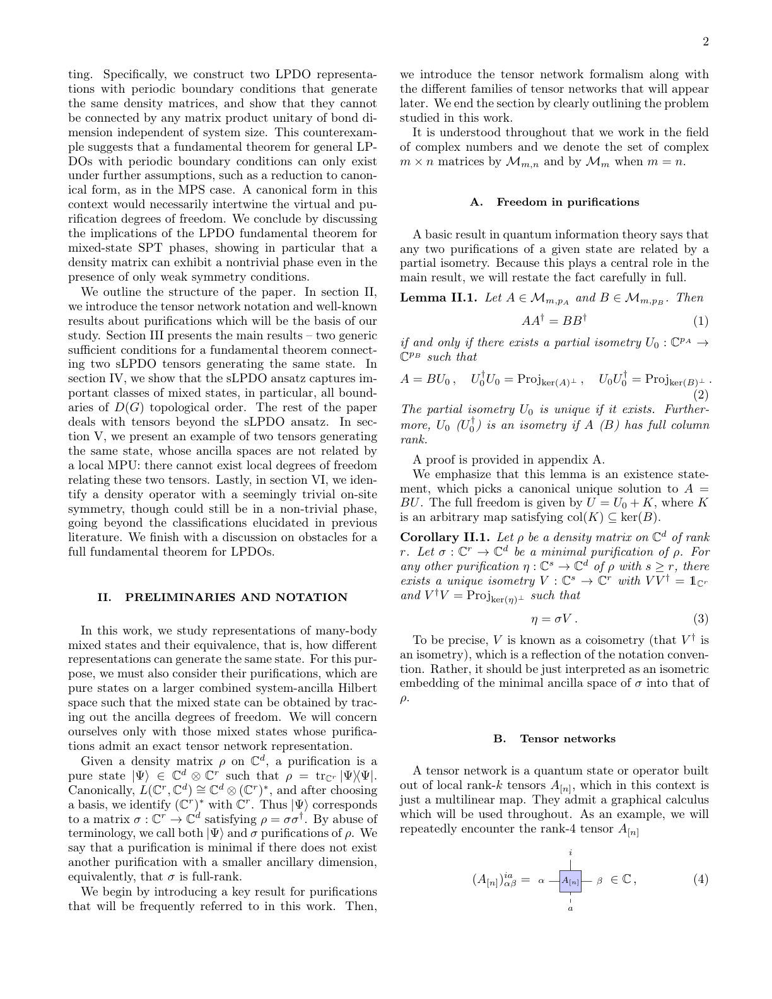
<figcaption class="paper-figure-caption"><b>Fig 1.</b> Low-resolution page preview, page 2</figcaption>
</figure>
<figure class="paper-figure-card">
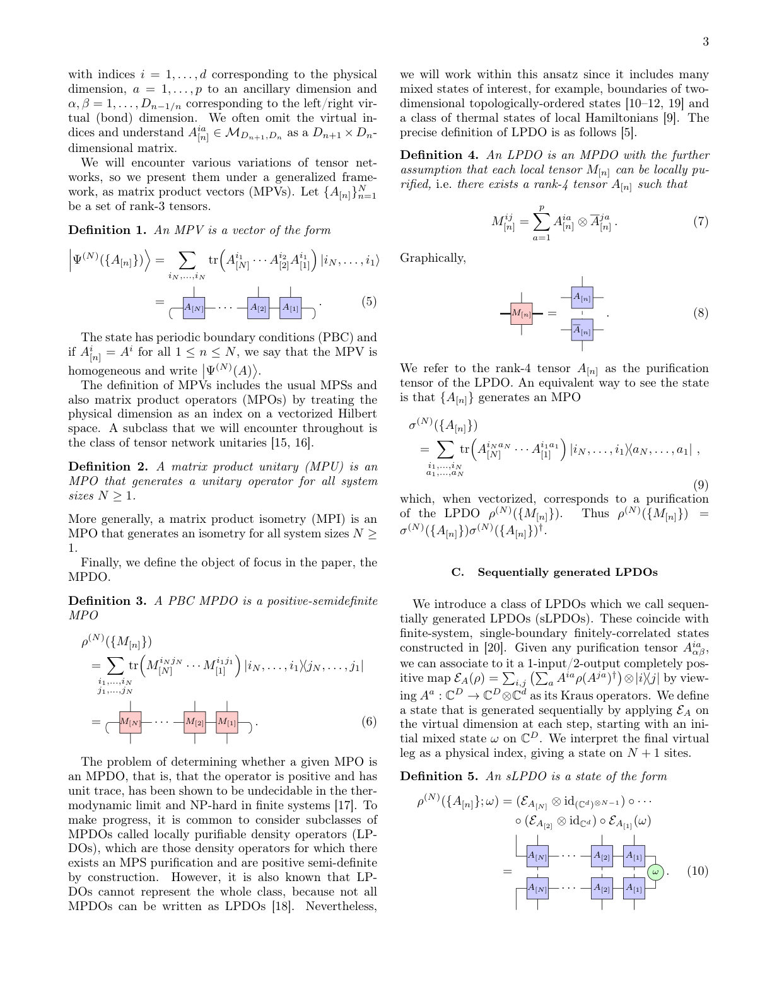
<figcaption class="paper-figure-caption"><b>Fig 2.</b> Low-resolution page preview, page 3</figcaption>
</figure>
<figure class="paper-figure-card">
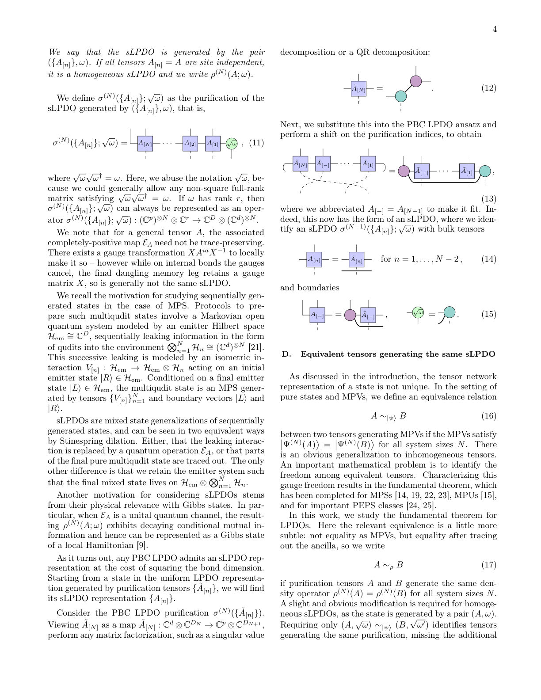
<figcaption class="paper-figure-caption"><b>Fig 3.</b> Low-resolution page preview, page 4</figcaption>
</figure>
<figure class="paper-figure-card">
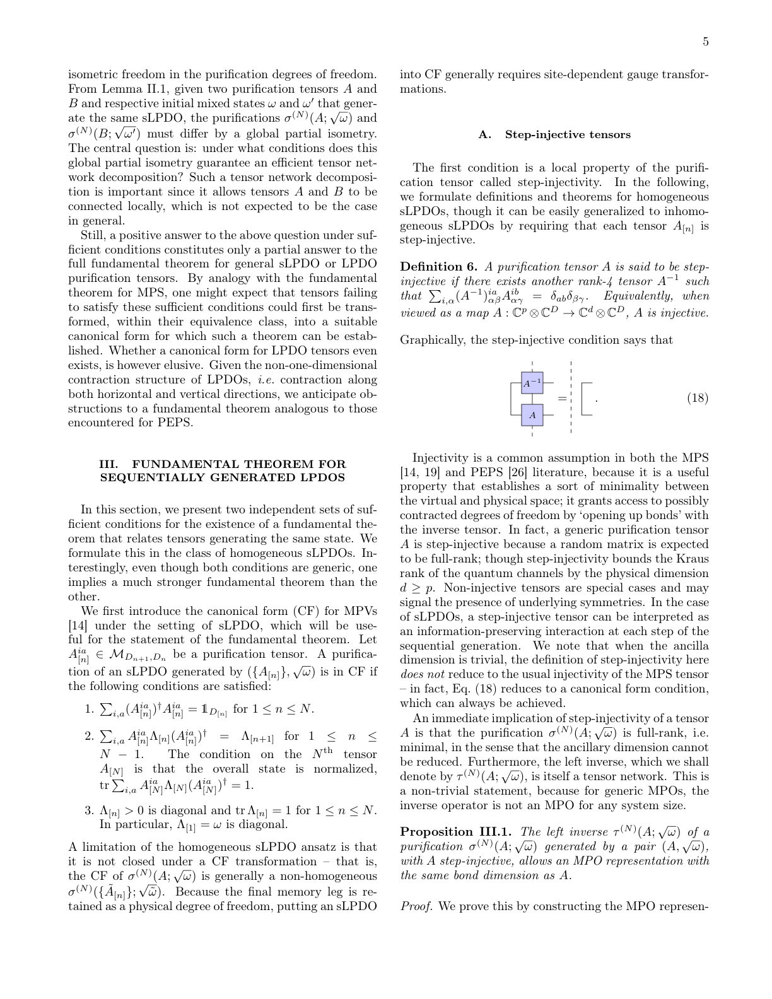
<figcaption class="paper-figure-caption"><b>Fig 4.</b> Low-resolution page preview, page 5</figcaption>
</figure>
<figure class="paper-figure-card">
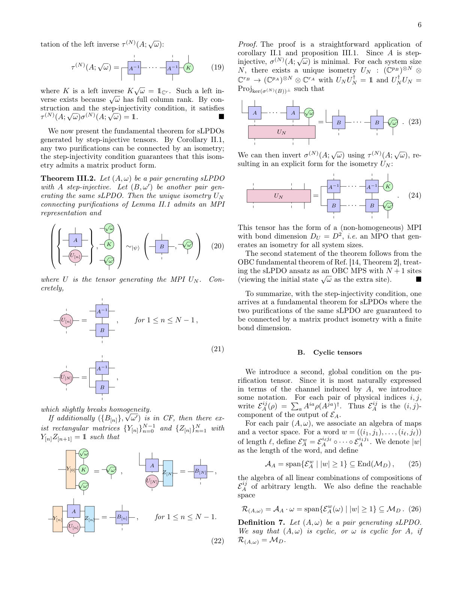
<figcaption class="paper-figure-caption"><b>Fig 5.</b> Low-resolution page preview, page 6</figcaption>
</figure>

**Summary.** This paper develops a fundamental theorem to characterize when different tensor network representations yield the same mixed-state density operator, focusing on LPDOs. It proves equivalence for a restricted subclass (sLPDOs) using matrix product isometries but highlights that general cases may be more complex. The work advances the mathematical tools used to simulate and understand quantum phases of matter.

**Why it may be interesting.** This work provides deep structural insights into how quantum information (the state $
ho$) can be encoded in different mathematical forms (tensors), which is crucial for understanding the limitations and power of tensor network simulations in condensed matter physics.

Detailed structure

**Main problem.** The work aims to establish a fundamental theorem characterizing the equivalence of different tensor network representations for mixed-state density operators, specifically focusing on Locally Purifiable Density Operators (LPDOs). It seeks an analogy to existing theorems for MPS and MPOs.

**Main result.** For sequentially generated LPDOs (sLPDOs), two representations generating the same density matrix are equivalent if and only if they are related by a specific matrix product isometry acting on the purification bonds, provided suitable invertibility conditions hold.

**Method.** The authors employ advanced tensor network techniques, analyzing the mathematical structure of purification tensors for mixed states to derive necessary and sufficient conditions for representation equivalence.

**Model / system.** The focus is on characterizing density operators ($
ho$) that can be represented as Matrix Product Locally Purifiable Density Operators (LPDOs), which are a subclass of MPOs describing quantum phases of matter, particularly those arising from successive applications of quantum channels (sLPDOs).

**Key observables.** The density operator $
ho(N)$, the purification tensor $A[n]$, and correlation functions like $\langle Q_k Q_{k'} 
angle_{
ho(M)_\alpha}$.

**Important parameters / regimes.** System size ($N$), bond dimensions, and parameters ($\alpha$) governing the dressing operators.

**Assumptions / limitations.** The analysis for sLPDOs relies on suitable invertibility or cyclic conditions; a counterexample is provided showing that general LPDOs with periodic boundary conditions may lack such a simple fundamental theorem.

**Figures summary.** Not specified in detail, but the notes reference mathematical derivations involving tensor structures (e.g., Eq. 6, Eq. B1) and correlation function calculations.

**Paper structure.** The paper progresses from general purification theory to defining LPDOs/sLPDOs, establishing sufficient conditions for equivalence using step-injectivity, and finally contrasting these results with known structures like those derived from abelian groups or MPO dressing.

Abstract

Tensor network methods provide powerful analytical and numerical tools for characterizing quantum phases of matter. While the mathematical structure of matrix product states (MPS) is well understood through the MPS fundamental theorem, an analogous understanding for mixed-state tensor networks remains largely absent: if two purification tensors generate the same density matrix, how are they related? In this work, we initiate the study of a fundamental theorem for matrix product locally purifiable density operators (LPDOs) and focus on sequentially generated LPDOs (sLPDOs), a broad subclass admitting an interpretation in terms of successive applications of quantum channels on an initial state. We prove that, under suitable invertibility or cyclic conditions, two sLPDO representations generate the same density matrix for arbitrary system sizes if and only if they are related by a matrix product isometry acting on the purification bonds. Beyond the sLPDO setting, we provide a counterexample that suggests an obstruction to a general fundamental theorem for LPDOs with periodic boundary conditions. Finally, we discuss implications for mixed-state symmetry-protected topological phases, including the possibility of nontrivial phases protected only by weak symmetry conditions.

[↑ back to top](#top)

### ⭐ [Non-Relativistic Quantum Electrodynamics of Atoms in a Rotating Ring Cavity](http://arxiv.org/abs/2608.03997v1)

**Highlighted author(s):** Murray J. Holland  
**Authors:** Jarrod T. Reilly, Murray J. Holland  
**Type:** theory · **Category:** other · **PDF:** <https://arxiv.org/pdf/2608.03997v1>  
**Analysis basis:** full PDF text, analyzed in chunks
**Topic relevance:** `analog quantum simulation` **3/5** · `correlated cavity matter` **3/5** · `Tavis-Cummings & cavity-many-emitter` **2/5** · `Keldysh / 2PI / non-Gaussian methods` **1/5** · `interference shaping light` **1/5**

↔ Scroll figures horizontally

<figure class="paper-figure-card">
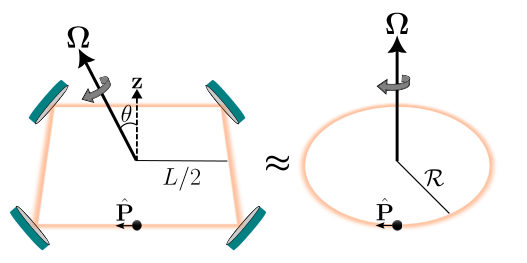
<figcaption class="paper-figure-caption"><b>Fig 1.</b> FIG. 1. Schematic diagram of a non-relativistic atom inside a ring cavity rotating with uniform angular velocity Ω. In our final Hamiltonian in Sec. V, we approximate the square cavity as a 1D ring and approximate Ω≈˜Ωz = Ωcos θz so that we can use separation of variables in cylindrical coordinates (see Appendix B).</figcaption>
</figure>

**Summary.** This paper develops a comprehensive quantum electrodynamics model for atoms inside a rotating optical ring cavity by starting from the Dirac equation in curved spacetime. Through successive approximations and transformations, it arrives at a modified Jaynes-Cummings Hamiltonian. The key theoretical contribution is predicting measurable shifts—the rotation-induced hyperfine shift and Sagnac shift—due to the non-inertial nature of the cavity.

**Why it may be interesting.** This work bridges general relativity/curved spacetime effects with modern cavity QED, providing a concrete theoretical prediction (the rotation-induced shift) that can be tested in advanced atomic clock or sensing platforms.

Detailed structure

**Main problem.** The paper derives a quantum optics model for atoms placed inside an optical ring resonator that is undergoing rotation, starting from fundamental principles.

**Main result.** It yields a modified Jaynes-Cummings Hamiltonian that explicitly incorporates rotational effects, predicting both a rotation-induced hyperfine shift and the Sagnac shift in the cavity modes.

**Method.** The derivation proceeds through multiple theoretical steps: starting with the Dirac equation in curved spacetime, taking the non-relativistic limit via Foldy-Wouthuysen transformations, and finally using multipole expansions.

**Model / system.** The system is a protium atom interacting with an electromagnetic field confined within a rotating ring cavity. The theoretical framework involves coupling the Dirac equation to the E&M field in a curved spacetime described by the generalized Born metric.

**Key observables.** Rotation-induced hyperfine shift, Sagnac shift for counterpropagating modes, and the modified Jaynes-Cummings Hamiltonian parameters.

**Important parameters / regimes.** Angular velocity ($\Omega$), atomic transition frequencies, cavity mode structure (1D ring approximation).

**Assumptions / limitations.** The derivation relies on several approximations: non-relativistic limit (FW transformation), electric dipole approximation, two-level system assumption, and the rotating-wave approximation.

**Figures summary.** Figure 1 schematically illustrates a non-relativistic atom situated within the geometry of a rotating ring cavity.

**Paper structure.** The paper follows a rigorous theoretical progression: starting with the Dirac equation in curved spacetime $\to$ deriving the Hamiltonian for the E&M field and the atom $\to$ applying FW transformations to reach the non-relativistic limit $\to$ using PZW transformation for multipole coupling $\to$ finalizing the model via standard quantum optics approximations.

Abstract

In this paper, we derive a quantum optics model in a non-inertial rotating ring cavity from first principles. We begin with the Dirac equation in curved spacetime, add minimal coupling to the electromagnetic field, and then find the Dirac Hamiltonian for the generalized Born metric. We then formally take the non-relativistic limit by way of Foldy-Wouthuysen transformations and project onto a fermionic Fock space for the atoms' electrons, protons, and neutrons. Focusing on a protium atom, we next move from a minimal coupling gauge to a multipole expansion gauge by taking a Power-Zienau-Woolley transformation under the dipole and long-wavelength approximations. Here, we find additional terms from the rotation of the system including a rotation-induced hyperfine shift of the atomic transition which could possibly be observed experimentally even for small rotation rates. Making the electric dipole, two-level, and rotating-wave approximations, we arrive at a Jaynes-Cummings-like Hamiltonian which also accounts for rotational effects, such as the rotation-induced hyperfine shift and the Sagnac shift for the cavity's counterpropagating modes.

[↑ back to top](#top)

### [Heralded Free-Electron Writing of the Most Subradiant State in an Atomic Array](http://arxiv.org/abs/2608.03056v1)

**Authors:** Tong Shen, Zhexin Zhao, Meng Xiao  
**Type:** theory · **Category:** other · **PDF:** <https://arxiv.org/pdf/2608.03056v1>  
**Analysis basis:** full PDF text, analyzed in chunks
**Topic relevance:** 🔥 `free-space correlated emission` **5/5** · 🔥 `Dicke superradiance` **4/5** · 🔥 `correlated / nonlocal dissipation` **4/5** · `analog quantum simulation` **3/5** · `interference shaping light` **3/5** · `quantum measurements` **3/5** · `superradiant laser` **3/5** · `Tavis-Cummings & cavity-many-emitter` **2/5** · `driven-dissipative phase transition` **2/5** · `methods for driven-dissipative` **2/5** · `non-equilibrium dynamics` **2/5** · `Keldysh / 2PI / non-Gaussian methods` **1/5** · `Kondo & dissipative impurity` **1/5** · `correlated cavity matter` **1/5** · `entanglement & information structure` **1/5** · `measurement-induced transitions` **1/5** · `non-equilibrium universality` **1/5**

↔ Scroll figures horizontally

<figure class="paper-figure-card">
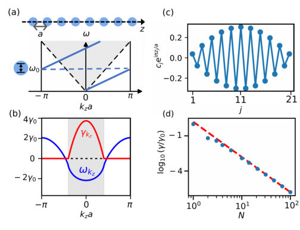
<figcaption class="paper-figure-caption"><b>Fig 1.</b> FIG. 1. (a) Upper panel: Ordered atomic chain with spacing a along the z direction. Lower panel: Comparison between the free-space photon dispersion (black dashed lines) and the free- electron dispersion in the non-recoil approximation (blue solid line). The gray shaded area indicates the light cone, and ω0 is the transition frequency of each atom (modeled as a two-level system). (b) Collective frequency shift ωkz and decay rate γkz of the Bloch modes for an infinite atomic chain, where γ0 is the single-atom decay rate and a = λ0/5. The decay rate vanishes outside the light cone (gray region). (c) Coefficients cj exp (iπzj/a) of the most subradiant state in a finite chain with 21 atoms. (d)...</figcaption>
</figure>
<figure class="paper-figure-card">
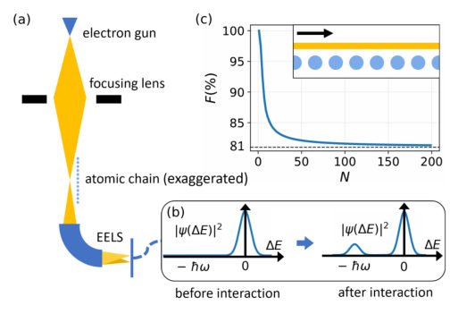
<figcaption class="paper-figure-caption"><b>Fig 2.</b> FIG. 2. Free-electron heralding protocol and straight- trajectory benchmark. (a) Schematic of the EELS-based setup. A quasi-monochromatic electron is emitted from an electron gun, focused onto the atomic chain by an electro- magnetic lens, and analyzed after the interaction by EELS. (b) Electron energy spectrum before and after the interaction. (c) Conditional fidelity F for preparing the most subradiant state using a diffraction-free, well-focused straight electron trajectory, illustrated in the inset. The fidelity approaches the 8/π2 ≈81% limit for large N.</figcaption>
</figure>
<figure class="paper-figure-card">
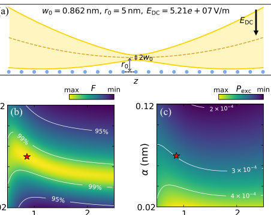
<figcaption class="paper-figure-caption"><b>Fig 3.</b> FIG. 3. (a) Schematic of a diffracting Gaussian electron wave packet steered by a vertical DC electric field EDC. The dashed line marks the center of the electron wave packet, while the yellow shaded region denotes rmid(z)±w(z). The parameters correspond to the optimal point marked by the red stars in (b) and (c). Other parameters are N = 21, λ0 = 780 nm, a/λ0 = 1/20, n = 1 (with electron velocity v0 = c/30), and r0 = 5 nm. (b, c) Conditional fidelity (b) and excitation probability (c) as functions of the beam waist w0 and trajectory curvature α. The red star indicates the maximum-fidelity point, with Fmax = 99.55% and Pexc = 2.97 × 10−4.</figcaption>
</figure>
<figure class="paper-figure-card">
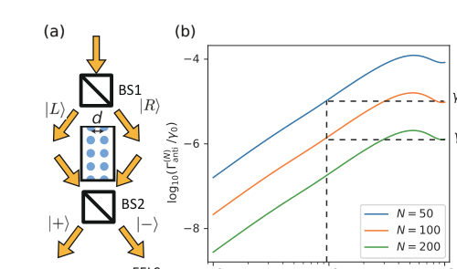
<figcaption class="paper-figure-caption"><b>Fig 4.</b> FIG. 4. (a) Scheme for heralding an antisymmetric excita- tion in two parallel atomic chains. A path-superposed elec- tron interacts with the two chains and is recombined before EELS detection. The inset defines the interchain spacing d. (b) Decay rate Γ(N) anti/γ0 of the antisymmetric state as a func- tion of the interchain spacing d for several total atom numbers N. All other unspecified parameters are the same as those in Fig. 3. The horizontal dashed lines indicate γ(50) min and γ(100) min for single chains, serving as references for the two-chain decay suppression. The vertical dashed line marks d = 98 nm, used as a representative interchain spacing for this comparison.</figcaption>
</figure>
<figure class="paper-figure-card">
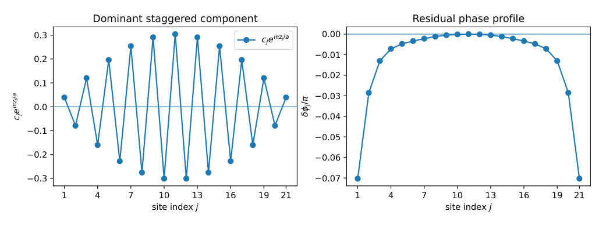
<figcaption class="paper-figure-caption"><b>Fig 5.</b> FIG. 1. Decomposition of the most subradiant eigenstate in a finite atomic chain. Left: dominant staggered component cjeiπzj/a of the numerically obtained most subradiant eigenstate for N = 21 and a = λ0/3, showing the alternating sign structure and the nonuniform envelope. Right: residual phase profile δφj/π after removing the dominant staggered phase. The residual phase is small compared with the leading π phase difference between neighboring atoms, justifying its neglect in the qualitative phase-matching discussion. In the numerical fidelity calculations, the exact eigenstate including this residual phase profile is used as the target state.</figcaption>
</figure>

**Summary.** The paper demonstrates that free electrons can act as 'quantum writers' to prepare highly subradiant collective excitations in atomic chains. By leveraging the electron's momentum and trajectory, they overcome fundamental limitations faced by optical preparation methods. This technique achieves near-perfect fidelity even in deeply subwavelength regimes, opening new avenues for quantum memory and sensing.

**Why it may be interesting.** This work provides a concrete, high-fidelity method for engineering collective quantum states (superradiance/subradiance) that are otherwise inaccessible with standard propagating light fields, which is crucial for advanced quantum sensing and memory applications in AMO physics.

Detailed structure

**Main problem.** The primary challenge is optically preparing the most subradiant eigenstate in a deeply subwavelength atomic chain because this state requires matching both an out-of-cone wave vector and a nonuniform spatial envelope.

**Main result.** A free electron passing through the array can overcome these constraints, achieving near-unity conditional fidelity ($F>99.5\%$) even at deep subwavelength spacings. Furthermore, path superposition in two chains yields stronger subradiance than single chains.

**Method.** The authors model the interaction using a scattering operator and utilize the free electron's velocity to set momentum while its trajectory shapes the excitation envelope for heralded preparation via EELS detection.

**Model / system.** The system is an ordered 1D array (chain) of two-level atoms. The physics involves collective eigenmodes described by a non-Hermitian Hamiltonian, and the interaction is treated perturbatively using electron scattering theory.

**Key observables.** Conditional fidelity ($F$), minimum decay rate ($\gamma_{	ext{min}}$), excitation probability ($P_{	ext{exc}}$), and the ratio of decay rates in two chains ($\Gamma(N)_{anti} / \gamma(N/2)_{min}$).

**Important parameters / regimes.** Deeply subwavelength spacing ($a = \lambda_0/20$), near-unity fidelity ($F > 99.5\%$), and the free electron's velocity ($v_0$).

**Assumptions / limitations.** Approximations include Born–Markov, non-recoil for the electron, and using Gaussian beam profiles with parabolic trajectories induced by DC electric fields.

**Figures summary.** Figures illustrate the comparison between photon and free-electron dispersion relations, showing how $\mathbf{q} = \omega_0/v_0$ enables access to subradiant modes. Later figures map out fidelity landscapes based on beam waist and trajectory curvature for optimized preparation.

**Paper structure.** The paper progresses from establishing the fundamental difficulty of state preparation in deep subwavelength regimes, introducing the free-electron writing mechanism using momentum/envelope matching, extending this protocol to two parallel chains via path superposition, and finally analyzing robustness against energy spread.

Abstract

The most subradiant eigenstate of a finite subwavelength atomic chain in free space, protected by strongly suppressed radiative decay, offers a powerful resource for photon storage, quantum sensing, and many-body quantum optics. Yet its optical preparation is hindered by the simultaneous need to match a wave vector outside the light cone and a nonuniform envelope. Here, we show that a free electron can overcome these constraints: its velocity sets the imprinted wave vector, while the trajectory of the diffracting wave packet shapes the excitation envelope. This simultaneous momentum and envelope matching enables heralded preparation with near-unity conditional fidelity ($F>99.5\%$) even in a deeply subwavelength regime that is difficult to access with propagating free-space photons. We further show that a path-superposed free electron can excite an antisymmetric state in two closely spaced parallel chains, whose interchain destructive interference yields stronger subradiance than a single chain with the same total number of atoms. These results establish free electrons as quantum writers for collective excitations that are difficult to access with propagating optical fields.

[↑ back to top](#top)

### [Controllable interaction between photons and distant spins via vacuum Rabi oscillations](http://arxiv.org/abs/2608.03809v1)

**Authors:** Xiao Xue, Jurgen Dijkema, Tobias Bonsen, Patrick Harvey-Collard, Maximilian Rimbach-Russ, Sander L. de Snoo, Guoji Zheng, Amir Sammak, Giordano Scappucci, Lieven M. K. Vandersypen  
**Type:** experiment · **Category:** other · **PDF:** <https://arxiv.org/pdf/2608.03809v1>  
**Analysis basis:** full PDF text, analyzed in chunks
**Topic relevance:** 🔥 `spintronics-quantum-optics interface` **5/5** · 🔥 `QC/QI experiment` **4/5** · 🔥 `analog quantum simulation` **4/5** · 🔥 `exotic spin models in light-matter` **4/5** · `correlated cavity matter` **3/5** · `quantum optics experiment` **3/5** · `correlated / nonlocal dissipation` **2/5** · `entanglement & information structure` **2/5** · `non-equilibrium dynamics` **2/5** · `Tavis-Cummings & cavity-many-emitter` **1/5** · `driven-dissipative phase transition` **1/5** · `methods for driven-dissipative` **1/5** · `quantum measurements` **1/5**

↔ Scroll figures horizontally

<figure class="paper-figure-card">
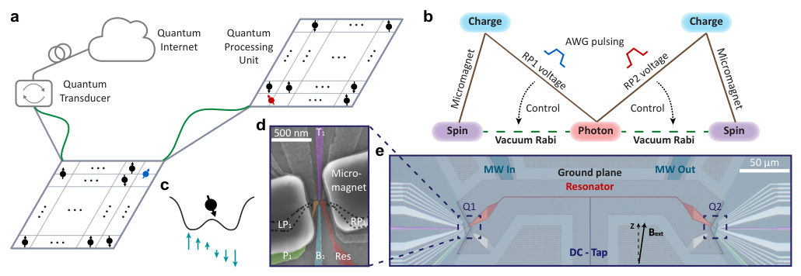
<figcaption class="paper-figure-caption"><b>Fig 1.</b> Fig. 1: A distributed quantum computation architecture enabled by superconducting resonators. a. Vision of a spin-based quantum processor. The processor contains multiple two-dimensional quantum dot arrays with densely patterned quantum dots that host electron (or hole) spin qubits. Each module is connected to superconducting resonators at its corners. The quantum information encoded in spin qubits can be exchanged into microwave photons in the resonators, which can either be transferred to another qubit in a different module, or transduced to an optical photon in a quantum internet. b. Spin-photon-spin coupling scheme. Green and brown lines represent resonant and off-resonant coupling...</figcaption>
</figure>
<figure class="paper-figure-card">
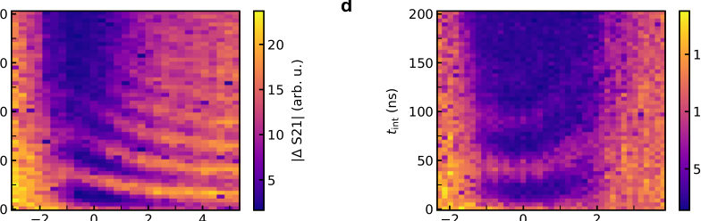
<figcaption class="paper-figure-caption"><b>Fig 2.</b> Fig. 2: Vacuum Rabi oscillations. a,b. Vacuum Rabi oscillations of (a) Q1 and (b) Q2 . The data points show the magnitude of the measured transmission signal through the resonator as a function of the interaction time tint between the resonator and the corresponding qubit. Solid lines are fits to the data using a numerical model of the spin-photon system, including coupling to its environment (see Section A for details). A vacuum Rabi frequency of 27.3 MHz (20.1 MHz) is extracted for Q1 (Q2), which matches spectroscopic vacuum Rabi splittings in early experiments on this device. The data points are averaged over 106 shots. c,d. Vacuum Rabi oscillations measured as a function of the interdot...</figcaption>
</figure>
<figure class="paper-figure-card">
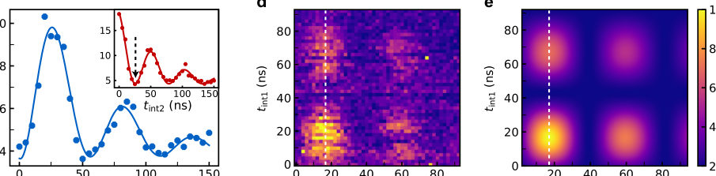
<figcaption class="paper-figure-caption"><b>Fig 3.</b> Fig. 3: Transfer of excitations between distant spins. a. Circuit schematic implemented in the experiment. b. Schematics showing the double dot configuration leading to vacuum Rabi oscillations for Q2 and Q1 respectively. c. With the resonator being populated and Q1 in its ground state, a vacuum Rabi oscillation with inverted phase is observed. The oscillation frequency is fitted to be 17.8 MHz. Inset, vacuum Rabi oscillation of Q2 used to prepare a photon in the resonator. The dashed arrow indicates the duration of the pulse (tint2 = 27 ns) used to measure the blue data points in the main figure. The data points are averaged over 5 × 105 shots. d-e. Measured and simulated transmission...</figcaption>
</figure>
<figure class="paper-figure-card">
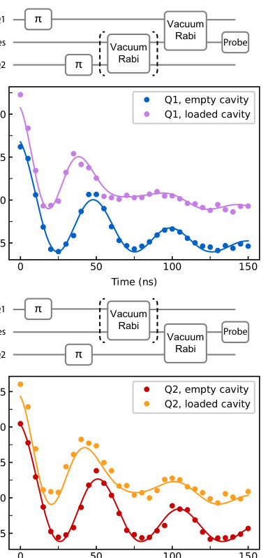
<figcaption class="paper-figure-caption"><b>Fig 4.</b> Fig. 4: Accelerated vacuum Rabi oscillations. a. The top panel shows the circuit schematic. Both qubits start in their excited state. Then the spin excitation in Q2 is completely swapped into the resonator and subsequently, the vacuum Rabi oscillation between Q1 and the photon-occupied resonator is measured, as shown in the bottom panel. The vacuum Rabi oscillation is found to be faster by a factor of 1.28 (purple data points and lines) compared to the case of an empty cavity (blue data points and lines), which corresponds to an initial photon number of 0.65. b. The same experiment is performed with the roles of the two qubits interchanged. Here the vacuum Rabi oscillation is accelerated by...</figcaption>
</figure>
<figure class="paper-figure-card">
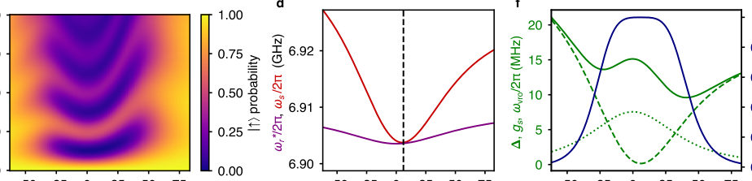
<figcaption class="paper-figure-caption"><b>Fig 5.</b> Fig. 5: Asymmetry in the vacuum Rabi oscillations versus interdot detuning. a,b. Simulated spin-up probability as a function of interdot detuning ε and interaction time tint. In these simulations, we use ωr/2π = 6.9105 GHz, κ/2π = 1.8 MHz, gc/2π = 192 MHz, γ1,c/2π = 1 GHz, and ∆Bx = 40 mT. The remaining simulation parameters are different for DQD1 (a): 2tc/h = 10 GHz, Bz = 246.0 mT, ∆Bz = 4 mT, and DQD2 (b): 2tc/h = 14 GHz, Bz = 246.9 mT, ∆Bz = 0.5 mT. c,d. Effective spin and resonator frequencies as a function detuning for DQD1 (c) and DQD2 (d). The effective spin frequency is calculated as ωs/2π = (E1 −E0)/h, where Ei are the eigenenergies of ˜HDQD. The effective resonator frequency is...</figcaption>
</figure>

**Summary.** The paper reports on the realization of controlled light-matter interaction between two distant electron spin qubits mediated by a microwave cavity. By observing vacuum Rabi oscillations and implementing state transfer protocols, the authors demonstrate that single excitations can be coherently shuttled from one qubit to another via a photon. This work establishes fundamental building blocks for integrating solid-state quantum memories with photonic communication channels.

**Why it may be interesting.** This work is highly relevant as it directly addresses quantum networking concepts by realizing controllable entanglement generation (spin-photon-spin) using solid-state qubits coupled to superconducting cavities, a core area of cavity QED and open quantum systems research.

Detailed structure

**Main problem.** The goal is to demonstrate controllable interaction between photons and distant electron spins using vacuum Rabi oscillations, thereby creating a functional interface between semiconductor spin qubits and photonic quantum links.

**Main result.** The authors successfully observed multiple vacuum Rabi oscillations and demonstrated the coherent transfer of single excitations from one spin qubit, through the cavity photon, to a second, spatially separated spin qubit.

**Method.** The experiment involves pulsing the system through resonant and dispersive regimes using voltage controls on double quantum dots coupled to a superconducting microwave cavity resonator.

**Model / system.** The physical platform is an engineered semiconductor-superconductor hybrid device containing two double quantum dots hosting single electron spin qubits ($	ext{Q1}$ and $	ext{Q2}$) coupled to a microwave cavity. The dynamics are governed by the interplay between spin, photon, and charge degrees of freedom.

**Key observables.** Vacuum Rabi oscillation frequency ($\Omega_{	ext{Rabi}}$), spin population probabilities ($P_\uparrow$), and the acceleration factor of the Rabi frequency when multiple excitations are present.

**Important parameters / regimes.** Interdot detuning ($\epsilon$), external magnetic field strength/orientation, cavity loss rates ($\gamma$), and coupling strengths ($g_s$).

**Assumptions / limitations.** The state transfer protocol requires both qubits to start in their ground states; deviations from ideal acceleration are attributed to energy loss and dephasing during the initial photon emission.

**Figures summary.** Figures show vacuum Rabi oscillation data vs. time/detuning, schematics of spin-photon-spin coupling, and plots illustrating accelerated oscillations corresponding to different initial photon numbers.

**Paper structure.** The work progresses from demonstrating basic single-qubit VROs, to implementing controlled state transfer between two distant spins via the cavity, and finally analyzing the underlying physics by studying the asymmetry of VROs versus detuning ramps.

Abstract

Vacuum Rabi oscillations between a single photon and a single spin demonstrate the capability of harnessing light-matter interaction at the level of a single quantum of energy. Since the observation of strong spin-photon coupling in gate-defined quantum dots, probing this interaction in the time-domain has been a major objective. Here, we carefully engineer a device composed of two spatially separated double quantum dots hosting single electron spin qubits and a superconducting cavity to accommodate microwave photons. We observe multiple vacuum Rabi oscillations between each spin qubit and the cavity. By concatenating vacuum Rabi oscillations involving the two spins, an energy excitation in one qubit can be emitted as a photon and then transferred to the other qubit. When a single photon is emitted, the cavity is prepared in a Fock state, leading to an accelerated vacuum Rabi frequency. These results serve as building blocks not only in exploring light-matter interactions, but also in interfacing semiconductor spin qubits to photonic links.

[↑ back to top](#top)

### [Universal crossovers in weakly-monitored quantum critical states](http://arxiv.org/abs/2608.02716v1)

**Authors:** Abhishek Kumar, Rushikesh A. Patil, Andreas W. W. Ludwig, Romain Vasseur  
**Type:** theory · **Category:** statistical mechanics · **PDF:** <https://arxiv.org/pdf/2608.02716v1>  
**Analysis basis:** full PDF text, analyzed in chunks
**Topic relevance:** 🔥 `quantum measurements` **5/5** · 🔥 `entanglement & information structure` **4/5** · 🔥 `measurement-induced transitions` **4/5** · `non-equilibrium universality` **3/5** · `Keldysh / 2PI / non-Gaussian methods` **2/5** · `correlated / nonlocal dissipation` **2/5** · `driven-dissipative phase transition` **2/5** · `methods for driven-dissipative` **1/5** · `non-equilibrium dynamics` **1/5**

↔ Scroll figures horizontally

<figure class="paper-figure-card">
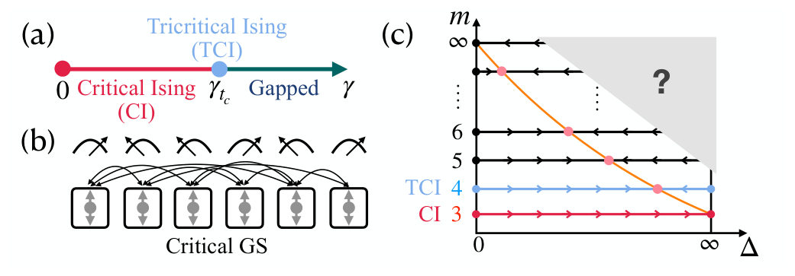
<figcaption class="paper-figure-caption"><b>Fig 1.</b> FIG. 1. Model setup and RG flow. (a) Zero-temperature phase diagram of the one-dimensional O’Brien–Fendley chain. The three-spin interaction controlled by γ drives the critical Ising (CI) point, shown in red, to a gapped phase through the tricritical Ising (TCI) point at γtc, shown in sky blue. (b) Schematic illustration of weak measurement operations applied to the critical ground states. (c) RG-flow schematic for weakly measured critical ground states. The CI and TCI points correspond to the m = 3 and m = 4 fixed-point actions of the multi-critical Ising Landau-Ginzburg sequence, which are famously known as the mth unitary minimal model CFT. Weak measurements with the operator considered...</figcaption>
</figure>
<figure class="paper-figure-card">
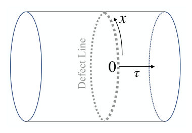
<figcaption class="paper-figure-caption"><b>Fig 2.</b> FIG. 2. Measurement defect line. The action of per- forming measurements on critical ground state with periodic boundary is equivalent to introducing random defect on the zero time slice of the unmeasured field theory on a cylindrical space-(imaginary) time geometry (See e.g. [1, 40, 50]). The probability of the randomness is proportional to the partition function of the defect theory itself, which follows from Born’s rule.</figcaption>
</figure>
<figure class="paper-figure-card">
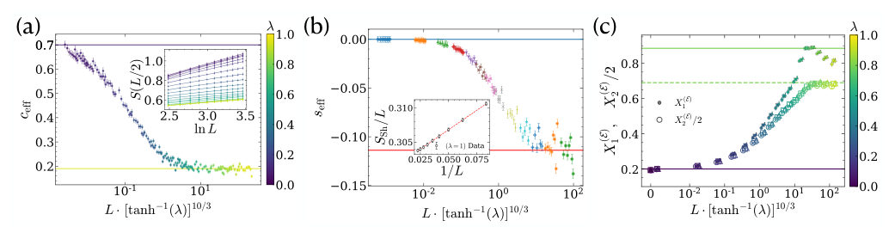
<figcaption class="paper-figure-caption"><b>Fig 3.</b> FIG. 3. Universality of tricritical Ising subjected to weak energy measurement. We show finite-size RG crossover collapses of universal quantities and scaling exponents computed from the post-measurement TCI ground state with periodic boundary conditions. The data collapse as a function of L/ξ, where ξ = (tanh−1 λ)−10/3 is the crossover length associated with the RG relevant perturbation induced by measurements. The saturation of universal quantities and scaling exponents in the regime L/ξ ≫1 provides evidence for a measurement-dominated infrared fixed point. (a) Entanglement effective central charge ceff extracted from the half-system von Neumann entanglement entropy. The inset shows the...</figcaption>
</figure>
<figure class="paper-figure-card">
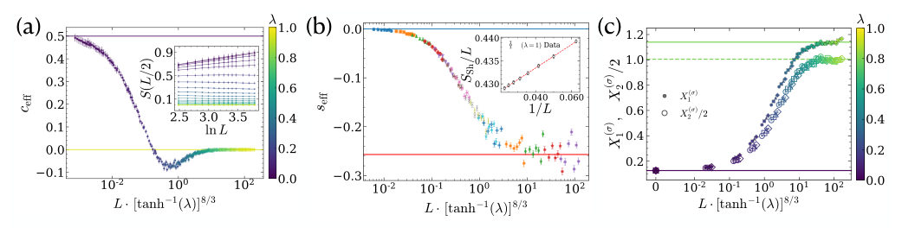
<figcaption class="paper-figure-caption"><b>Fig 4.</b> FIG. 4. Universality of critical Ising subjected to weak spin measurement. We show finite-size RG crossover collapses of universal quantities and scaling exponents computed from the post-measurement Ising ground state with periodic boundary conditions. The data collapse as a function of L/ξ, where ξ = (tanh−1 λ)−8/3 is the crossover length associated with the relevant spin-measurement perturbation about the unmeasured critical Ising fixed point. The collapse indicates a direct flow toward the projective-measurement fixed point. Analogous to the TCI RG crossover, the universal quantities and scaling exponents show saturation near the infrared regime at large L/ξ. (a) Entanglement effective...</figcaption>
</figure>
<figure class="paper-figure-card">
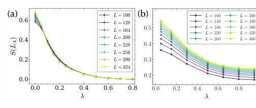
<figcaption class="paper-figure-caption"><b>Fig 5.</b> FIG. 5. Scaling of Entanglement entropy. We perform finite-size scaling of bipartite entanglement entropy S(LA) be- tween two halves of the system for the ground state of (a) crit- ical Ising and (b) tricritical Ising subjected to their respective measurement protocols under open boundary condition. (a) The ground state of critical Ising with σz weak measurement on each site leads to an area law entanglement at any non- zero measurement strength. For intermediate measurement strength regime and finite-size L, the entanglement entropy decreases with increase in system size L. This region extends toward λ →0 on further increasing L which stays consis- tent with the crossover scaling collapse...</figcaption>
</figure>

**Summary.** This paper investigates how weak measurements perturb the ground states of 1D quantum Ising models at critical and tricritical points. Using RG analysis, the authors show that intrinsic measurement randomness drives the system to novel 'measurement-dominated' fixed points. These findings reveal complex universal scaling behaviors inaccessible via standard unitary treatments.

**Why it may be interesting.** This work directly addresses how non-unitary processes (measurements) fundamentally alter the long-distance scaling laws predicted by standard critical theories, providing a rigorous framework for understanding decoherence effects on quantum criticality.

Detailed structure

**Main problem.** The study characterizes universal crossovers occurring in post-measurement ensembles of ground states at quantum critical points, specifically investigating how intrinsic measurement randomness modifies standard critical properties.

**Main result.** For the critical Ising model, weak measurements lead to an RG flow towards a projective fixed point with area-law entanglement, while for the tricritical Ising model, evidence suggests a weak-measurement fixed point characterized by logarithmic entanglement.

**Method.** The analysis employs finite-size Renormalization Group (RG) crossover analyses and field theory formulations based on replica tricks to study the effects of measurement randomness.

**Model / system.** The system under investigation is the 1D quantum Ising Hamiltonian, examined at both critical (CI) and tricritical (TCI) points. Measurements are modeled as weak energy or spin measurements performed without post-selection, generating an ensemble state governed by the Born rule randomness.

**Key observables.** Entanglement effective central charge ($c_{	ext{eff}}$), effective Affleck-Ludwig boundary entropy ($	ext{seff}$), and signatures of multifractality from moments of measurement-averaged correlation functions.

**Important parameters / regimes.** The analysis compares regimes corresponding to zero measurement strength ($\lambda=0$), weak measurements, and projective measurements ($\lambda=1$).

**Assumptions / limitations.** The study is limited to explicit lattice protocols for CI and TCI, and the field theory description relies on specific Kraus operators defining the measurement process.

**Figures summary.** Figure 1 illustrates the model setup, showing the phase diagram of the O’Brien–Fendley chain at CI and TCI points, alongside schematics of weak measurements and RG flow. Other figures show representative fits for correlation functions in the tricritical Ising case.

**Paper structure.** The paper establishes the problem by defining measurement protocols on critical/tricritical systems. It then applies advanced theoretical tools like finite-size RG and replica field theory to calculate universal quantities, culminating in specific predictions for the infrared fixed points reached under different measurement strengths.

Abstract

We study post-measurement ensembles of ground states of tricritical and critical 1D quantum Ising Hamiltonians subjected, respectively, to weak energy and spin measurements without post-selection. These measurements act as relevant perturbations about the unmeasured critical ground states. Using finite-size renormalization group (RG) crossover analyses, we characterize their universal properties through the entanglement effective central charge, effective Affleck-Ludwig boundary entropy, and signatures of multifractality from moments of measurement-averaged correlation functions. In both cases, we find evidence for "measurement-dominated" or "measurement-altered" fixed points governed by the underlying Born-rule randomness. For critical Ising, we find a direct RG flow to a projective-measurement fixed point with area-law entanglement, whereas for the tricritical Ising model, we find evidence for a weak-measurement fixed point with logarithmic entanglement. These results clarify the RG-flow structure of weakly measured multicritical Ising ground states and show how intrinsic measurement-induced randomness can generate complex and rich universal long-distance scaling behavior in the post-measurement ensembles, accessible to controlled analytical RG and numerical finite-size RG crossover analyses.

[↑ back to top](#top)

### [Rydberg-Mediated Nonlinear Quantum Optics](http://arxiv.org/abs/2608.02992v1)

**Authors:** Yun-Hui He, Chang-Cheng Li, Xu Shen, Jing-Xu Bai, Xiao-Feng Shi, Lin Li, Yue-Chun Jiao, Jian-Ming Zhao  
**Type:** theory · **Category:** other · **PDF:** <https://arxiv.org/pdf/2608.02992v1>  
**Analysis basis:** full PDF text, analyzed in chunks
**Topic relevance:** 🔥 `Rydberg arrays` **5/5** · 🔥 `analog quantum simulation` **4/5** · `Tavis-Cummings & cavity-many-emitter` **2/5** · `correlated cavity matter` **2/5** · `correlated / nonlocal dissipation` **1/5** · `driven-dissipative phase transition` **1/5** · `entanglement & information structure` **1/5** · `interference shaping light` **1/5**

↔ Scroll figures horizontally

<figure class="paper-figure-card">
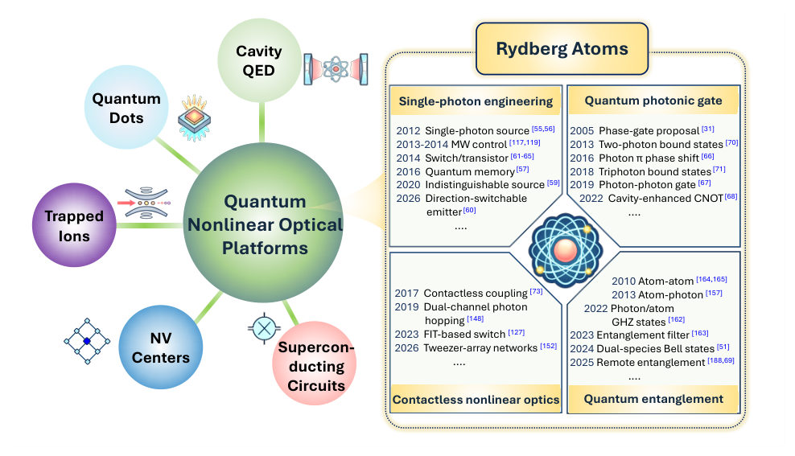
<figcaption class="paper-figure-caption"><b>Fig 1.</b> Fig. 1: Position of Rydberg-mediated nonlinear quantum optics within the broader landscape of quantum</figcaption>
</figure>
<figure class="paper-figure-card">

<figcaption class="paper-figure-caption"><b>Fig 2.</b> Fig. 2: Comparison of the energy level diagrams of the theoretically calculated Cesium atom (left panel)</figcaption>
</figure>
<figure class="paper-figure-card">
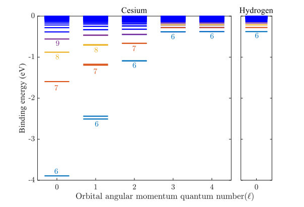
<figcaption class="paper-figure-caption"><b>Fig 3.</b> Fig. 2, for high-ℓstates where the electron remains far from the core (δℓ→0), the manifold becomes</figcaption>
</figure>
<figure class="paper-figure-card">
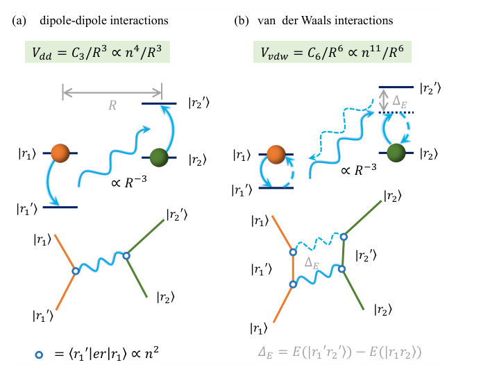
<figcaption class="paper-figure-caption"><b>Fig 4.</b> Fig. 3: Schematic diagram of the interactions between Rydberg states. (a) Dipole–dipole and (b) van</figcaption>
</figure>
<figure class="paper-figure-card">
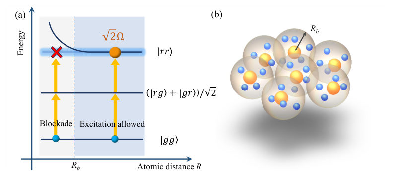
<figcaption class="paper-figure-caption"><b>Fig 5.</b> Fig. 4: (a) Schematic diagram of Rydberg blockade effect in the two-atom case. The blockade radius Rb is</figcaption>
</figure>

**Summary.** This review provides a comprehensive overview of Rydberg-mediated nonlinear quantum optics, detailing how strong long-range interactions in highly excited atoms can be mapped onto photons. By utilizing phenomena like the Rydberg blockade effect within an EIT scheme, researchers can engineer effective photon-photon interactions at the single-photon level. This capability is crucial for developing next-generation quantum gates and networking components.

**Why it may be interesting.** This work is highly relevant as it details how exotic atomic properties (Rydberg blockade) are engineered to solve fundamental problems in quantum optics, bridging the gap between matter excitation physics and photonic quantum information processing.

Detailed structure

**Main problem.** The primary challenge is realizing strong, controllable interactions between individual photons for quantum information processing, overcoming the inherent weakness of conventional optical nonlinearities.

**Main result.** Rydberg atoms enable effective photon-photon interactions at the single-photon level by mapping atomic interactions onto photonic degrees of freedom.

**Method.** The review synthesizes theoretical understanding of Rydberg electromagnetically induced transparency (EIT) and the blockade mechanism to model light-matter coupling.

**Model / system.** The system utilizes highly excited Rydberg atoms, whose strong long-range dipole-dipole ($1/R^3$) and van der Waals ($1/R^6$) interactions are leveraged. These interactions create a 'superatom' collective excitation regime.

**Key observables.** Effective photon–photon interaction strength, blockade radius ($R_b$), group index ($n_g$), and the efficiency of quantum state transfer.

**Important parameters / regimes.** Principal quantum number ($n$) which dictates scaling laws ($\propto n^2$ for dipole moment; $\propto n^{11}$ for $C_6$); atomic density ($
ho_N$).

**Assumptions / limitations.** The analysis often relies on the assumption that alkali atom scaling laws can be accurately modeled using an effective principal quantum number ($n^* = n - \delta_\ell$).

**Figures summary.** Figures illustrate the relative position of Rydberg optics among other platforms, energy level diagrams for different atoms (Cs vs H), and schematic representations of dipole-dipole/van der Waals interactions and the two-atom blockade effect.

**Paper structure.** The paper progresses by introducing fundamental principles, detailing key developments like single-photon engineering and quantum gates, providing a comprehensive overview of current state-of-the-art applications, and concluding with future prospects.

Abstract

Rydberg atoms have emerged as a versatile platform for quantum optics due to their exaggerated properties, particularly their strong long-range interactions, which enable a new regime of light-matter interaction. By mapping the interactions between Rydberg atoms onto photons, effective photon-photon interactions can be realized at the single-photon level, thereby overcoming the intrinsic weakness of conventional optical nonlinearities. In this review, we first introduce the fundamental physical principles of Rydberg-mediated quantum optics, and then discuss some key developments, including single-photon engineering, photonic quantum gates, contactless nonlinear optics, and quantum entanglement, providing a comprehensive overview of the current state and prospects of this rapidly developing field.

[↑ back to top](#top)

### [High-Frequency Gravitational Wave Detection with Superconducting Qubits](http://arxiv.org/abs/2608.02733v1)

**Authors:** Heechan Yi, Seong Chan Park, Kyoungchul Kong, Myeonghun Park  
**Type:** theory · **Category:** other · **PDF:** <https://arxiv.org/pdf/2608.02733v1>  
**Analysis basis:** full PDF text, analyzed in chunks
**Topic relevance:** 🔥 `Tavis-Cummings & cavity-many-emitter` **4/5** · `Dicke superradiance` **3/5** · `correlated cavity matter` **3/5** · `entanglement & information structure` **3/5** · `analog quantum simulation` **2/5** · `correlated / nonlocal dissipation` **2/5** · `driven-dissipative phase transition` **2/5** · `methods for driven-dissipative` **2/5** · `QC/QI experiment` **1/5** · `exotic spin models in light-matter` **1/5** · `non-equilibrium dynamics` **1/5** · `non-equilibrium universality` **1/5** · `quantum optics experiment` **1/5** · `spintronics-quantum-optics interface` **1/5**

↔ Scroll figures horizontally

<figure class="paper-figure-card">
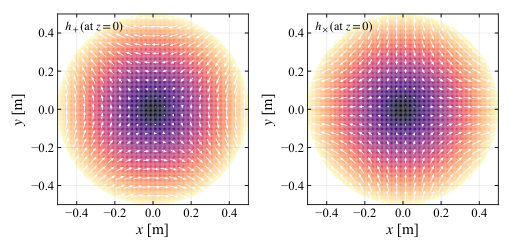
<figcaption class="paper-figure-caption"><b>Fig 1.</b> FIG. 1: GW-induced effective current in the transverse 𝑥𝑦 plane at the center of the cavity, for the ℎ+ (a) and ℎ× (b) polarizations. The color scale is the normalized magnitude and the arrows the transverse direction.</figcaption>
</figure>
<figure class="paper-figure-card">
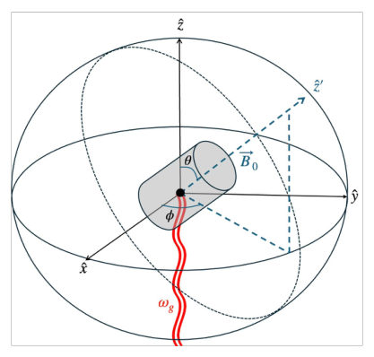
<figcaption class="paper-figure-caption"><b>Fig 2.</b> FIG. 2: Geometric configuration for an incoming GW and a cylindrical cavity. To describe arbitrary GW propagation, the GW incidence is fixed along the ˆ𝑧axis with frequency 𝜔𝑔 assuming that ℎ𝜇𝜈∝𝑒𝑖𝜔𝑔(𝑡−𝑧). The orientation of the cavity is parameterized by 𝜃, representing the polar angle between the GW propagation vector and the longitudinal axis of the cylinder (ˆ𝑧′), and the azimuthal angle 𝜙, defined as the angle between the ˆ𝑥axis and the projection of the cavity axis onto the 𝑥𝑦plane. The external ®𝐵0 field is aligned with ˆ𝑧′-axis.</figcaption>
</figure>
<figure class="paper-figure-card">
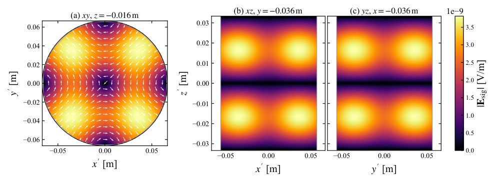
<figcaption class="paper-figure-caption"><b>Fig 3.</b> FIG. 4: Spatial profile at hot spots of the induced signal electric field for the TE212 mode. Panels (a), (b), and (c) show representative 𝑥𝑦, 𝑥𝑧, and 𝑦𝑧slices through the cylindrical cavity, respectively. The benchmark parameters are 𝑅= 6.67 cm, 𝐿= 6.67 cm (so that 𝑓TE212 = 5 GHz), 𝐵0 = 5.0 T, 𝑄= 105, and ℎ0 = 10−23, for a co-aligned ℎ+ polarized GW on the TE212 resonance; the plotted field is the steady-state coherent amplitude of Eq. (17) with the mode normalization of Eq. (13b) (peak ¯Esig = 3.8 × 10−9 V/m). The color scale denotes the magnitude ¯Esig in V/m, while the arrows in panel (a) indicate the transverse field direction in the 𝑥𝑦plane.</figcaption>
</figure>
<figure class="paper-figure-card">
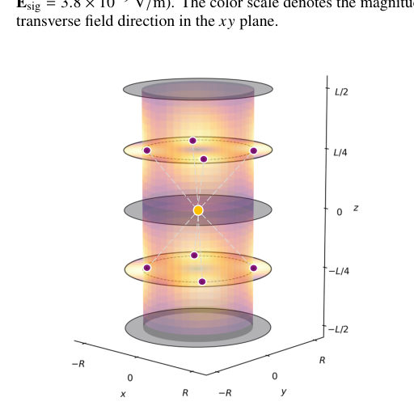
<figcaption class="paper-figure-caption"><b>Fig 4.</b> FIG. 5: Tesseract-like qubit structure for qubit readout. Sensor qubits (purple) sit at the off-axis TE212 hot spots on the 𝑧= ±𝐿/4 antinodal planes. The central ancilla qubit (yellow) sits at the center of the cavity, where it is a field node for the TE212 mode and collects the accumulated signal through the readout circuits of Figure 12.</figcaption>
</figure>
<figure class="paper-figure-card">
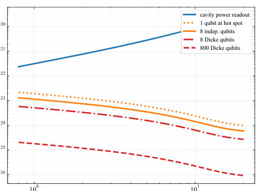
<figcaption class="paper-figure-caption"><b>Fig 5.</b> FIG. 6: 5𝜎-benchmark projected strain sensitivity ℎmin for an 𝐿= 𝑅cavity rescaled at each point so that the TE212 resonance tracks the GW frequency 𝑓𝑔(with 𝜃= 0). The curves show the cavity-power readout (blue), one qubit at the TE212 hot spot (orange dotted), and eight qubits read out independently (orange solid), in a symmetric Dicke state for 8 qubits (red dash-dotted) and 800 qubits (red dashed). The Dicke curves assume a single global Dicke register (𝑛𝐷= 𝑛2 𝑞/2 + 𝑛𝑞); the eight-site local implementation of Appendix C 3 would degrade the 800-qubit strain reach by a factor of ≃2.8. The numerical simulation uses 𝐵0 = 5 T, 𝑄= 105, 𝜏eff ≃100𝜇s, 𝐶= 0.1 pF, 𝑑= 100 𝜇m, 𝑡int = 1 min per point...</figcaption>
</figure>

**Summary.** The paper proposes using superconducting transmon qubits as highly sensitive detectors for high-frequency gravitational waves. By leveraging the inverse Gertsenshtein effect and encoding the signal into an entangled Dicke state register, they achieve a collective enhancement that dramatically improves strain sensitivity compared to classical limits. This establishes a transformative quantum framework for next-generation GW searches in the GHz band.

**Why it may be interesting.** This work directly applies advanced concepts from cavity QED and many-body physics (Dicke states) to solve a fundamental problem in astrophysics/particle physics (GW detection), providing a concrete quantum advantage scaling law for experimental realization.

Detailed structure

**Main problem.** Detecting high-frequency gravitational waves (HFGWs) which are too weak or oscillate at frequencies that evade traditional macroscopic interferometry methods.

**Main result.** The authors propose a quantum sensing framework where entanglement allows the strain sensitivity to scale as $h_{\min} \propto n_q^{-3/4}$, surpassing standard cavity limits by five orders of magnitude for 800 qubits.

**Method.** They utilize the inverse Gertsenshtein effect, coupling HFGWs to superconducting transmon qubits embedded in microwave cavities, and enhance sensitivity using entangled Dicke states.

**Model / system.** The system involves an array of superconducting transmon qubits acting as localized sensors within a resonant microwave cavity. The interaction is modeled via the effective four-current ($\mathbf{j}_{	ext{eff}}$) driven by the GW field, and the enhancement relies on mapping excitation parity using Dicke states.

**Key observables.** Strain sensitivity ($h_{\min}$), signal probability scaling ($\propto n^2$), and the characteristic spin-2 quadrupolar pattern of the induced electromagnetic field.

**Important parameters / regimes.** Qubit number ($n_q$), cavity quality factor ($Q$), operating frequency (GHz band), and the Planck-scale suppression inherent to gravitational interactions.

**Assumptions / limitations.** The analysis assumes an idealized global entangled register, neglecting relaxation effects, and focuses on direct GW–EM coupling while using a monochromatic approximation for steady-state solutions.

**Figures summary.** Figures illustrate the geometry of incoming GWs relative to the cavity axis and show the effective current ($\mathbf{j}_{	ext{eff}}$) induced by different polarizations ($h_+, h_	imes$).

**Paper structure.** The paper first establishes the physical problem (HFGW detection gap), then details the quantum sensing mechanism involving the inverse Gertsenshtein effect at field hot spots, and finally derives the collective enhancement scaling using entangled Dicke states.

Abstract

High-frequency gravitational waves (HFGWs) provide a unique window into high-energy and early-universe physics, yet they evade traditional macroscopic interferometry. To bridge this detection gap, we propose a novel quantum-sensing paradigm utilizing superconducting transmon qubits embedded in resonant microwave cavities. Through the inverse Gertsenshtein effect, HFGWs propagating in a static magnetic field resonantly excite a cavity mode. By leveraging the characteristic spin-2 quadrupolar pattern of the induced electromagnetic field, we position qubits directly at the electric-field hot spots of the $\mathrm{TE}_{212}$ mode to act as localized sensors. Crucially, configuring this array as an entangled quantum register via symmetric Dicke states unlocks a fundamental scaling advantage: the signal probability scales quadratically with the qubit number, translating to a $h_{\min} \propto n_q^{-3/4}$ strain sensitivity scaling. We demonstrate that an idealized global register of 800 qubits reaches a strain sensitivity that surpasses standard macroscopic cavity-power limits by five orders of magnitude. Benchmarked against representative axion-haloscope parameters, this collective quantum enhancement decisively mitigates the profound Planck-scale suppression inherent to gravitational interactions, establishing a transformative framework for next-generation HFGW searches in the GHz band.

[↑ back to top](#top)

### [Generation and Enhancement of Bipartite and Tripartite Entanglement in an Electro-Optomechanical Ring Cavity](http://arxiv.org/abs/2608.03578v1)

**Authors:** Fouad Essaadi, Yassine Oussarhan, Mohamed Ouhammou, Said Mouslih, Mohamed Jakha, Bouzid Manaut, Souad Taj  
**Type:** theory · **Category:** other · **PDF:** <https://arxiv.org/pdf/2608.03578v1>  
**Analysis basis:** full PDF text, analyzed in chunks
**Topic relevance:** 🔥 `entanglement & information structure` **4/5** · `Keldysh / 2PI / non-Gaussian methods` **3/5** · `analog quantum simulation` **3/5** · `correlated cavity matter` **3/5** · `driven-dissipative phase transition` **3/5** · `methods for driven-dissipative` **3/5** · `Tavis-Cummings & cavity-many-emitter` **2/5** · `non-equilibrium dynamics` **2/5** · `correlated / nonlocal dissipation` **1/5** · `interference shaping light` **1/5** · `non-equilibrium universality` **1/5**

↔ Scroll figures horizontally

<figure class="paper-figure-card">
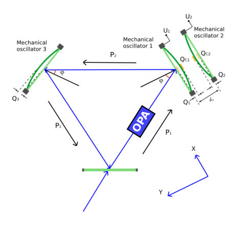
<figcaption class="paper-figure-caption"><b>Fig 1.</b> Figure 1. Schematic representation of the optomechanical system</figcaption>
</figure>
<figure class="paper-figure-card">
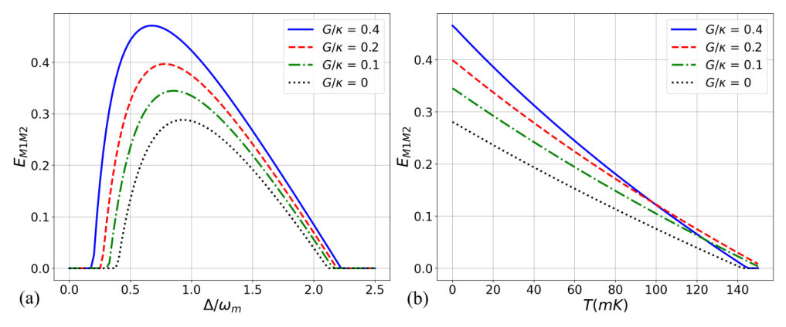
<figcaption class="paper-figure-caption"><b>Fig 2.</b> Figure 2. (a) Plot of logarithmic negativity EM1M2 versus the normalized detuning ∆/ωm. We have taken θ = π, λ = 0.9ωm, PL = 60mW and T = 1mK . (b) EM1M2 versus temperature for a fixed value of normalized detuning ∆= 0.8ωm. The remaining parameters are the same as in Figure 2(a).</figcaption>
</figure>
<figure class="paper-figure-card">
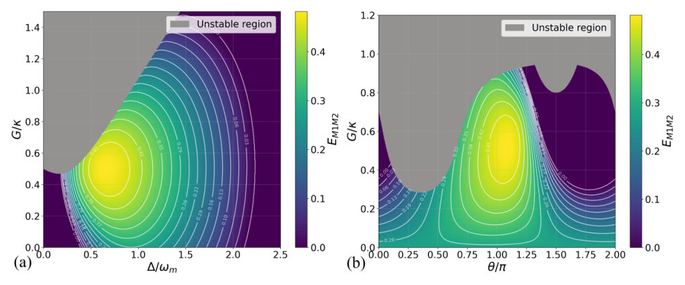
<figcaption class="paper-figure-caption"><b>Fig 3.</b> Figure 3. (a) EM1M2 as function of the ∆/ωm and G/κ. The chosen parameters are: PL = 60mW, T = 1mK, λ = 0.9ωm and θ = π. (b) EM1M2 as function of the phase ratio θ/π and G/κ for ∆= 0.8ωm. The other parameters are the same as in Figure 3(a).</figcaption>
</figure>
<figure class="paper-figure-card">
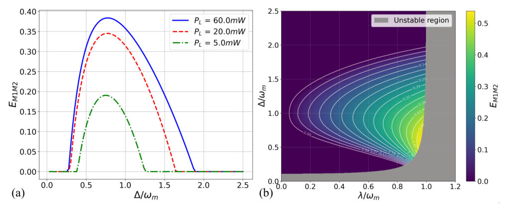
<figcaption class="paper-figure-caption"><b>Fig 4.</b> Figure 4. (a) EM1M2 vs ∆/ωm for various values of input LASER, the other parameters are: G = 0.5κ, θ = π, λ = 0.8ωm and T = 5mK. (b) EM1M2 vs ∆/ωm for different values of the coupling λ where PL = 60mW. The remaining parameters are the same as in Figure 4(a).</figcaption>
</figure>
<figure class="paper-figure-card">
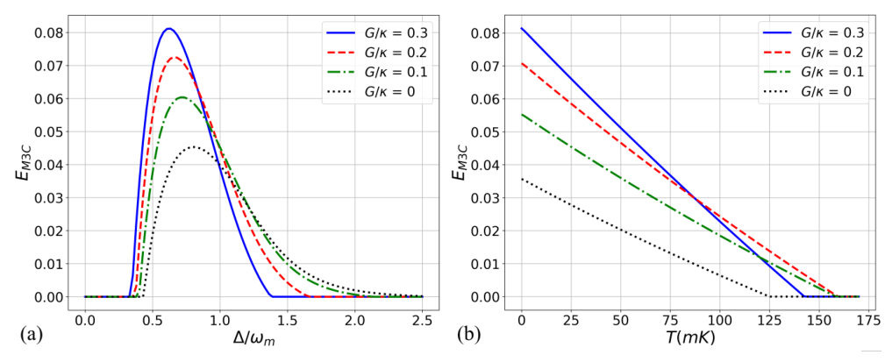
<figcaption class="paper-figure-caption"><b>Fig 5.</b> Figure 5. (a) Plot of logarithmic negativity EM3C versus the normalized detuning ∆/ωm for different values of the gain ratios G/κ. We have taken θ = π</figcaption>
</figure>

**Summary.** This paper analyzes the generation and enhancement of bipartite and tripartite entanglement in an electro-optomechanical ring cavity. It shows that while mechanical coupling is needed to create initial correlations, adding an OPA allows for significant amplification of these quantum states. The findings provide detailed parameter optimization guidelines but also warn about inherent trade-offs between maximizing entanglement and maintaining system stability.

**Why it may be interesting.** This work is highly relevant as it models an open quantum system where multiple physical mechanisms (electrostatics, cavity optics, parametric driving) interact to control multipartite entanglement, providing a blueprint for engineered quantum resources.

Detailed structure

**Main problem.** The study investigates how quantum entanglement, both bipartite and tripartite, can be generated and subsequently enhanced within a complex electro-optomechanical ring cavity system.

**Main result.** The Coulomb interaction is necessary for initial entanglement generation, but the inclusion of an Optical Parametric Amplifier (OPA) acts as a powerful control mechanism to dramatically amplify these quantum correlations.

**Method.** The authors derived the system Hamiltonian and used Quantum Langevin Equations, linearizing them around steady-state solutions. Entanglement was quantified using the covariance matrix formalism, specifically logarithmic negativity and minimum residual contangle.

**Model / system.** The physical platform is a hybrid electro-optomechanical ring cavity containing two Coulomb-coupled mechanical resonators ($M_1, M_2$) and an embedded OPA. The system dynamics are governed by coupled optomechanical, charge-mediated (Coulomb), and parametric nonlinear interactions.

**Key observables.** Bipartite entanglement quantified by logarithmic negativity; Tripartite entanglement quantified by minimum residual contangle ($\mathcal{R}_{\min}^{	au}$).

**Important parameters / regimes.** OPA gain ($G$), optical phase ($	heta$), laser detuning ($\Delta$), Coulomb coupling strength ($\lambda$), and system temperature ($T$).

**Assumptions / limitations.** The analysis relies on linearizing the quantum Langevin equations around steady-state solutions, assuming Gaussian fluctuations are dominant.

**Figures summary.** Figures illustrate entanglement measures (e.g., $	ext{EM}_{3C}$) as functions of detuning ($\Delta/\omega_m$), OPA gain ratio ($G/\kappa$), and Coulomb coupling strength ($\lambda/\omega_m$).

**Paper structure.** The paper follows a progression from defining the full Hamiltonian and deriving QLEs, through steady-state analysis and linearization to obtain the drift matrix $A$, culminating in the calculation of the covariance matrix via the Lyapunov equation to quantify entanglement.

Abstract

This study investigates the generation and enhancement of quantum entanglement in an electro-optomechanical ring cavity system. The setup integrates two Coulomb-coupled mechanical resonators, which serve as the fundamental mechanism for the generation of bipartite and tripartite entanglement via charge mediated coupling. We then demonstrate the significant enhancement of this entanglement via a nonlinear parametric drive (an optical parametric amplifier, OPA), which injects a controllable nonlinearity into the cavity. We derive the system's Hamiltonian and the corresponding quantum Langevin equations, which are linearized around steady-state solutions to analyze Gaussian quantum fluctuations. Employing the covariance matrix formalism, we quantify bipartite entanglement via logarithmic negativity and tripartite entanglement via the minimum residual contangle. Our results unequivocally show that while the Coulomb interaction is indispensable for creating entanglement, the OPA acts as a powerful control tool, dramatically amplifying the degree of quantum correlations for all subsystems. We find that the strength of entanglement is highly sensitive to several parameters and can be optimized through the strategic selection of the OPA's gain and phase, the laser detuning, and the input power. A key finding is the existence of a trade-off, where parameters that maximize entanglement also constrain the stable operating regime of the system. Furthermore, thermal noise is shown to progressively degrade all quantum correlations, underscoring the necessity for low-temperature operation. These findings provide comprehensive guidance for parameter optimization, outlining a clear path from generation to enhancement, and highlight the potential of such hybrid systems as versatile platforms for controlling multipartite entanglement in quantum technologies.

[↑ back to top](#top)

### [Few-photon degenerate parametric resonance in a two-tone driven microwave resonator](http://arxiv.org/abs/2608.03871v1)

**Authors:** Orjan Ameye, Jakob Koenig, Clinton Potts, Oded Zilberberg, Gary Steele  
**Type:** both · **Category:** other · **PDF:** <https://arxiv.org/pdf/2608.03871v1>  
**Analysis basis:** full PDF text, analyzed in chunks
**Topic relevance:** 🔥 `methods for driven-dissipative` **4/5** · `correlated cavity matter` **3/5** · `driven-dissipative phase transition` **3/5** · `quantum optics experiment` **3/5** · `Keldysh / 2PI / non-Gaussian methods` **2/5** · `Tavis-Cummings & cavity-many-emitter` **2/5** · `non-equilibrium universality` **2/5** · `analog quantum simulation` **1/5** · `correlated / nonlocal dissipation` **1/5** · `entanglement & information structure` **1/5** · `interference shaping light` **1/5** · `non-equilibrium dynamics` **1/5** · `quantum measurements` **1/5**

↔ Scroll figures horizontally

<figure class="paper-figure-card">
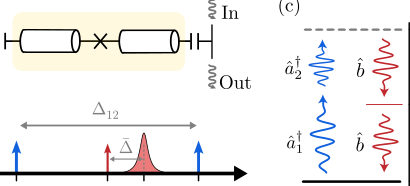
<figcaption class="paper-figure-caption"><b>Fig 1.</b> FIG. 1. Device and drive scheme. (a) Superconducting coplanar waveguide resonator with an embedded Josephson junction, acting as a nonlinear (Kerr) oscillator [cf. Eq. (1)], addressed through the input/output port. (b) Frequency layout: two coherent microwave tones at ω1 and ω2 (blue arrows) are separated by ∆12 [cf. Eq. (2)]; stimulated parametric drive at ¯ω (red arrow) manifests via four-wave mixing [see (c)] and is detuned from the bare oscillator resonance ω0 (red Lorenzian) by ¯∆. (c) Energy-level diagram of the underlying four-wave-mixing process: one photon is absorbed from each drive (ˆa1, ˆa2; blue) and two degenerate photons are emitted into the para- metric tone ˆb at frequency...</figcaption>
</figure>
<figure class="paper-figure-card">
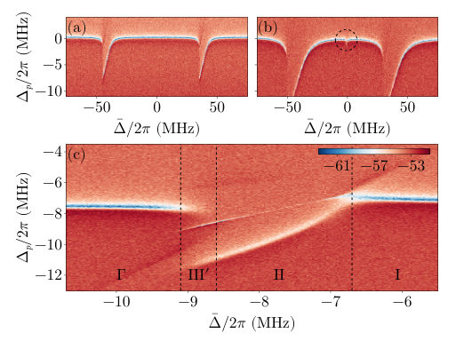
<figcaption class="paper-figure-caption"><b>Fig 2.</b> FIG. 2. Degenerate parametric excitation in a two-tone driven Kerr nonlinear oscillator. Measured transmission |S 21| (color, dB) as a function of probe detuning ∆p = ωpr −ω0 and drive midpoint detun- ing. (a) Transmission spectrum at low drive power (−20.0 dBm at the generator, tone separation ∆12 = 80 MHz). The probe resolves the bare cavity dip when the two-tone pump is off-resonance. As ei- ther pump tone crosses resonance, it drives a high-amplitude Duffing state. There, the linear response is renormalized via the AC Stark effect. This manifests as signal and idler side-peaks bending away from the bare resonance. (b) Spectrum at intermediate drive power (−8.0 dBm at the generator, ∆12...</figcaption>
</figure>
<figure class="paper-figure-card">
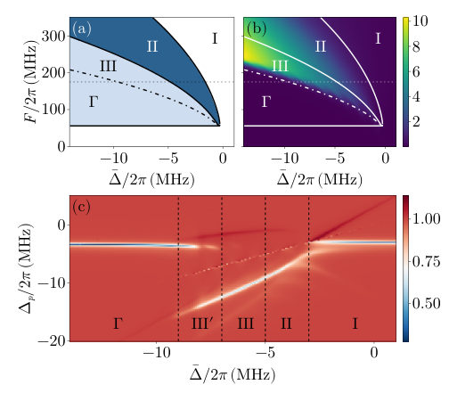
<figcaption class="paper-figure-caption"><b>Fig 3.</b> FIG. 3. Harmonic balance results [cf. Eqs. (3)-(6)]. (a) Mean-field phase diagram as a function of two-tone drive strength F and mid- point detuning ¯∆, where the order parameter, β = ⟨ˆb⟩, takes values of: vacuum only (white, region I), two spontaneous Z2 symmetry-broken bright parametric phase states (dark blue, region II), and coexistence of the vacuum with the two phase states (light blue, regions III and Γ). (b) Stationary-state photon number Dˆb†ˆb E (color) from numeri- cal single-mode KPO Lindblad master equation. Superposed white curves represent the mean-field phase boundaries of (a); the dash- dotted line marks the analytical dissipative phase transition separat- ing regions III...</figcaption>
</figure>
<figure class="paper-figure-card">
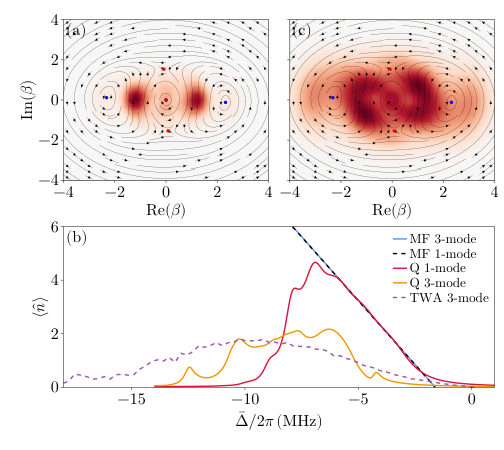
<figcaption class="paper-figure-caption"><b>Fig 4.</b> FIG. 4. Model comparison of the parametric-mode occupation and phase-space distribution. (a) Phase-space distribution of the para- metric mode ˆb at ¯∆/2π = −7.26 MHz computed from the three-mode TWA; blue dots mark the stable bright-state mean-field fixed points, red dots the corresponding unstable saddles, and streamlines the mean-field phase-space flow. The two Gaussian blobs characteristic of the Z2 parametric state sit between the origin and the bright-state fixed points, at lower amplitudes with respect to the mean-field pre- diction. (b) Stationary-state photon number Dˆb†ˆb E of the parametric mode versus ¯∆: mean-field (MF) and quantum Lindblad (Q) predic- tions for the single-mode...</figcaption>
</figure>

**Summary.** The paper explores parametric resonance in a superconducting Kerr oscillator using two microwave tones. It demonstrates that conventional single-mode theoretical reductions fail quantitatively because they ignore pump fluctuations. By employing a full three-tone quantum description, the authors accurately model phenomena like the AC Stark shift and show how quantum noise fundamentally alters expected classical behavior in the few-photon regime.

**Why it may be interesting.** This work is highly relevant as it pushes beyond standard mean-field approximations in driven-dissipative systems, providing concrete evidence for how quantum noise fundamentally renormalizes macroscopic predictions near the quantum-classical crossover point.

Detailed structure

**Main problem.** The study investigates degenerate parametric resonance in a Kerr oscillator driven by two microwave tones, specifically testing the validity of simplified theoretical models when operating in the few-photon regime.

**Main result.** A full three-tone quantum description is necessary to accurately reproduce experimental observables, showing that neglecting pump fluctuations leads to severe underestimation of effects like the AC Stark shift.

**Method.** The authors employ transmission spectroscopy measurements combined with theoretical modeling comparing mean-field approximations against full Lindblad master equation simulations for the coupled system.

**Model / system.** The physical platform is a Josephson-junction Kerr oscillator driven by two coherent microwave tones, modeled using an effective three-mode Hamiltonian and governed by a Lindblad master equation.

**Key observables.** Transmission spectrum $|S_{21}|$, AC Stark shift, stationary-state photon number $\langle\hat{b}^\dagger\hat{b}
angle$, and phase-space distributions of the cavity mode.

**Important parameters / regimes.** The few-photon limit is crucial, where quantum fluctuations dominate dissipation; the ratio $K/\kappa$ (single-photon Kerr shift vs. linewidth) dictates the failure of mean-field theory.

**Assumptions / limitations.** The primary assumption challenged is the validity of single-mode reduction; the work overcomes this by using a full three-tone quantum description, though computational limits restrict simulations to small photon numbers.

**Figures summary.** Figures show measured transmission spectra revealing parametric signatures and AC Stark effects. Theoretical figures compare phase diagrams and stationary photon number predictions from mean-field versus full quantum treatments, highlighting the renormalization of semiclassical lobes.

**Paper structure.** The paper establishes the physical setup and measurement techniques (transmission spectroscopy) before developing a theoretical comparison: first showing the failure of single-mode reduction, then presenting the successful quantitative agreement using the full three-tone quantum description.

Abstract

Multi-tone external driving offers a route to parametric physics without directly modulating the device. However, the validity of the parametric response in the few-photon regime remains underexplored. Here, we apply two coherent microwave tones to a Josephson-junction Kerr oscillator and stimulate degenerate parametric downconversion via four-wave mixing. Using transmission spectroscopy, we observe that the response retains the qualitative semiclassical Kerr parametric oscillator structure, including its instability lobe and bistable phase-space topology. Interestingly, we demonstrate that a conventional single-mode reduction fails to capture the system quantitatively: the predicted AC Stark shift is severely underestimated, and the reported distributions might not be fully physical when the single-photon Kerr shift $K$ exceeds the cavity linewidth $κ$. Instead, we show that a full three-tone quantum description accurately reproduces the experimental observables. There, quantum fluctuations of the drive tones become dynamically dominant over dissipation, and all three interacting tones operate in a deep few-photon limit where the expected semiclassical macroscopic lobes undergo fundamental renormalization due to profound mixing with quantum variance. Our results establish two-tone-driven Kerr oscillators as potential parametric amplifiers and open new horizons to explore the quantum-to-classical crossover in driven-dissipative circuits.

[↑ back to top](#top)

### [Correlating spin and optical properties of quantum emitters in hBN](http://arxiv.org/abs/2608.03090v1)

**Authors:** Nika Teran, Benjamin Whitefield, Nicholas Sloane, Kenji Watanabe, Takashi Taniguchi, Igor Aharonovichand Mehran Kianinia  
**Type:** experiment · **Category:** quantum information and computing · **PDF:** <https://arxiv.org/pdf/2608.03090v1>  
**Analysis basis:** full PDF text, analyzed in chunks
**Topic relevance:** 🔥 `QC/QI experiment` **4/5** · 🔥 `spintronics-quantum-optics interface` **4/5** · `exotic spin models in light-matter` **3/5** · `quantum optics experiment` **3/5** · `Tavis-Cummings & cavity-many-emitter` **2/5** · `quantum measurements` **2/5** · `analog quantum simulation` **1/5** · `correlated / nonlocal dissipation` **1/5** · `correlated cavity matter` **1/5** · `driven-dissipative phase transition` **1/5** · `interference shaping light` **1/5**

↔ Scroll figures horizontally

<figure class="paper-figure-card">
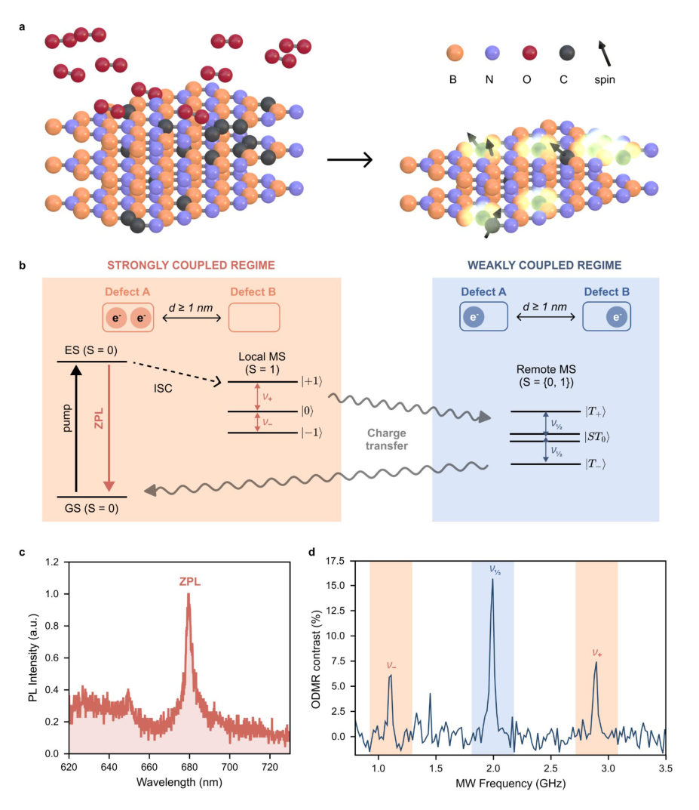
<figcaption class="paper-figure-caption"><b>Fig 1.</b> Figure 1. Generation of ODMR-active quantum emitters in hBN flakes described by the spin complex model. (a) Schematic of annealing a carbon-doped hBN flake in an oxygen atmosphere (left) to create ODMR-active emitters where etching of the top hBN layer occurs. (b) Simplified energy level structure of the proposed spin-complex model. The orange panel on the left represents both electrons residing on defect A, while the blue panel on the right shows the regime after charge transfer, when one electron remains on defect A and the other is localised on defect B. The distance between defects is</figcaption>
</figure>
<figure class="paper-figure-card">
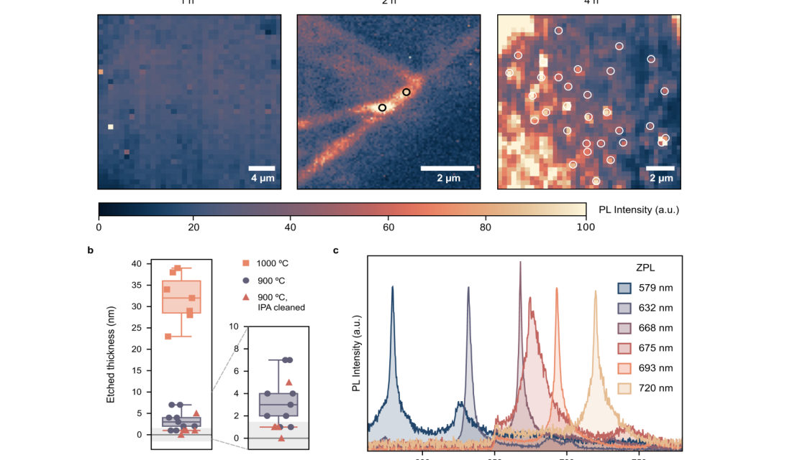
<figcaption class="paper-figure-caption"><b>Fig 2.</b> Figure 2. Oxygen annealing optimisation for high density of visible emitters and retained integrity of exfoliated hBN flakes. (a) Confocal PL scans of hBN flakes annealed at 1000ºC for 1, 2, and 4 hours. Emitters are circled in black or white. (b) Box plots summarising the amount of hBN etched during the annealing process at 1000ºC (orange squares) and 900ºC (blue circles). Zoomed-in axes show that no significant difference was observed between flakes cleaned only in UV-ozone before annealing, and flakes additionally cleaned in IPA (triangles). (c) Emission spectra of emitters resulting from a 4h anneal at 900ºC (Figure S3b).</figcaption>
</figure>
<figure class="paper-figure-card">
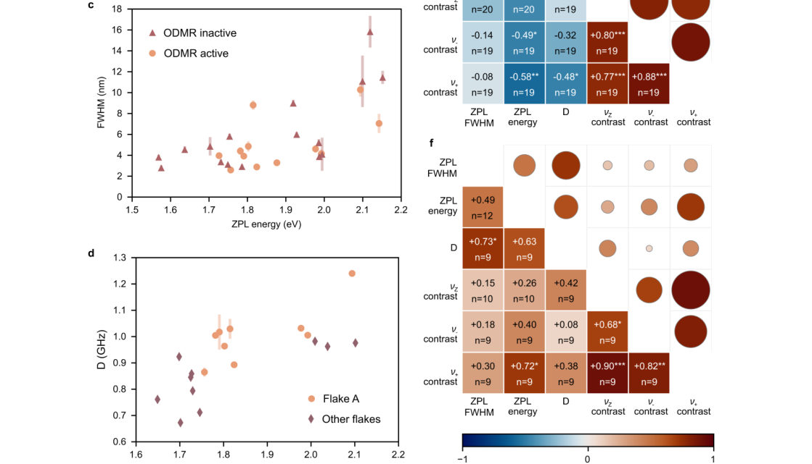
<figcaption class="paper-figure-caption"><b>Fig 3.</b> Figure 3. Intra- and inter-flake emitter statistics for ODMR-active and inactive emitters. (a) Confocal PL scan of Flake A. (b) Visualisation of proportion of ODMR-inactive (top) and active (bottom) emitters in Flake A. (c) Scatter plot of ZPL FWHM versus ZPL energy of emitters in Flake A coded by ODMR-active (circles) and inactive (triangles). (d) Scatter plot of ZFS parameter D versus ZPL energy of ODMR-active emitters in Flake A (circles) and other flakes (diamonds). (e), (f) Correlation matrices of Spearman ρ of ZPL FWHM, ZPL energy, D, and ODMR contrast of the 𝜈𝜈½, 𝜈𝜈-, and 𝜈𝜈+ transitions grouped by (e) pooled emitters and (f) only emitters in Flake A. Each pair is shown twice. In the...</figcaption>
</figure>
<figure class="paper-figure-card">
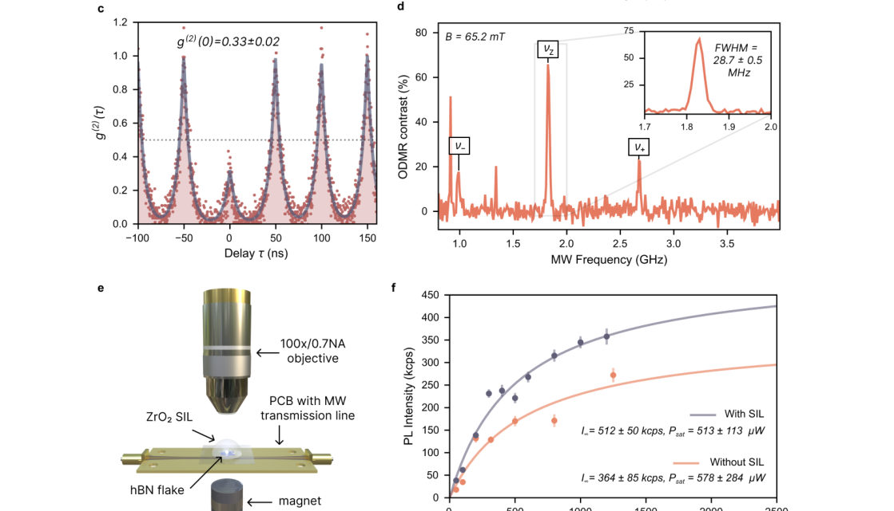
<figcaption class="paper-figure-caption"><b>Fig 4.</b> Figure 4. Characteristics and enhancement of an ODMR-active single photon emitter. (a) Confocal PL scan of the emitter with a 720 nm band-pass filter, circled in white. (b) PL emission spectrum. Inset: PL intensity decay after pulse, fitted by a single exponential function to obtain emitter’s optical lifetime and corresponding instrument response function (IRF). (c) 20 MHz pulsed second order autocorrelation function, g(2)(τ), with a dip g(2)(0) &lt; 0.5 indicating single photon emission without background correction. The dashed horizontal line at g(2)(0) = 0.5 is a guide to the eye. (d) ODMR contrast spectrum with annotated 𝜈𝜈½, 𝜈𝜈-, and 𝜈𝜈+ transitions measured at an applied magnetic field...</figcaption>
</figure>

**Summary.** The research investigates using carbon-doped hBN defects as solid-state quantum emitters for sensing applications. By correlating optical properties like ZPL energy with spin parameters like D, the authors found that while the spin state correlates strongly with optical features, the ODMR contrast does not. This suggests distinct physical origins for the spin and optical responses, guiding deterministic emitter design.

**Why it may be interesting.** This work directly addresses the engineering challenge of creating reliable quantum light sources by decoupling the mechanisms governing spin coherence (for qubits) from those governing photon emission, which is crucial for integrated quantum devices.

Detailed structure

**Main problem.** The study aims to correlate spin and optical properties of quantum emitters in hBN for use in near-surface quantum sensing.

**Main result.** A direct correlation was found between the zero-field splitting parameter D and the ZPL energy, but the ODMR contrast showed no such correlation with these optical parameters.

**Method.** The researchers synthesized spin-complex defects in carbon-doped hBN flakes and characterized them using techniques including ODMR, measurement of ZFS parameters, and photon collection enhancement via solid immersion lenses.

**Model / system.** The physical system is optically addressable spin defects (hypothesized as Donor-Acceptor Pairs) within hexagonal boron nitride (hBN). The model involves analyzing different coupling regimes for the defect spins to understand their optical emission pathways.

**Key observables.** Zero-Field Splitting parameter D, Zero-Phonon Line (ZPL) energy and FWHM, ODMR contrast ($
u
u\pm$ and $
u
u^{1/2}$), and single-photon emission ($g^{(2)}(0)$).

**Important parameters / regimes.** Optimal annealing conditions ($900^\circ	ext{C}$ for 4h); correlation coefficients (Pearson $r$, Spearman $
ho$).

**Assumptions / limitations.** The ODMR signal depends on coupling to a remote defect B, making it independent of the DAP structure's optical properties.

**Figures summary.** Figures illustrate the spin complex model, optimization of annealing conditions for high emitter density, and correlation matrices comparing ZPL properties, D, and ODMR contrast across different emitters.

**Paper structure.** The paper progresses from establishing the physical platform (hBN defects) to synthesizing them under optimized conditions. It then presents statistical analysis correlating various measured parameters (ZPL vs. D vs. Contrast), culminating in a mechanistic conclusion about the origin of spin versus optical properties.

Abstract

Optically addressable spin defects in hexagonal boron nitride (hBN) are well suited for near-surface quantum sensing. They offer bright, wavelength-tunable single-photon emission with high optically detected magnetic resonance (ODMR) contrast at room temperature. Here we controllably synthesise a high density of spin-complex defects in carbon-doped hBN flakes. We find that the zero-field splitting parameter D is directly correlated with the zero-phonon line of an emitter, while the ODMR contrast shows no such correlation. We further analyse an individual narrowband defect showing 68% ODMR contrast and enhance its photon collection by ~40% using a solid immersion lens. By advancing both the practical synthesis of the spin complexes and the understanding of their microscopic origin, our results move us toward the deterministic creation of ODMR-active quantum emitters

[↑ back to top](#top)

### [Nonlocality-induced critical-length hierarchy from non-Hermitian competition](http://arxiv.org/abs/2608.02746v1)

**Authors:** Mengjie Yang, Alexander N. Poddubny, Ching Hua Lee  
**Type:** theory · **Category:** disordered systems and neural networks · **PDF:** <https://arxiv.org/pdf/2608.02746v1>  
**Analysis basis:** full PDF text, analyzed in chunks
**Topic relevance:** 🔥 `analog quantum simulation` **4/5** · 🔥 `non-equilibrium universality` **4/5** · `correlated / nonlocal dissipation` **3/5** · `driven-dissipative phase transition` **3/5** · `methods for driven-dissipative` **3/5** · `non-equilibrium dynamics` **2/5** · `Keldysh / 2PI / non-Gaussian methods` **1/5** · `Kondo & dissipative impurity` **1/5** · `entanglement & information structure` **1/5**

↔ Scroll figures horizontally

<figure class="paper-figure-card">
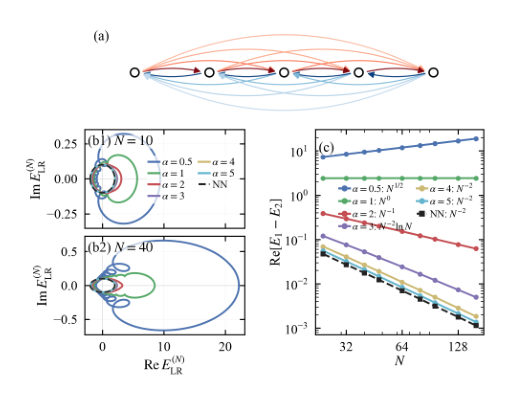
<figcaption class="paper-figure-caption"><b>Fig 1.</b> Figure 1. Single-chain signatures of nonlocality. (a) Schematic of a non-reciprocal long-range chain with alge- braically decaying asymmetric hoppings [Eq. (1)]. (b1,b2) Finite-cutoff Bloch spectra of Eq. (3) for N = 10 and 40, γ = 0.05, and α = 0.5, 1, 2, 3, 4, 5, with the nearest-neighbor Hatano–Nelson chain shown as the black dashed reference. Reducing α strongly enlarges the spectral excursion and ex- poses the nonanalytic long-range band edge. (c) Open- boundary band-edge spacing ∆Re E = Re(E1 −E2), demon- strating the crossover from the long-range scaling ∆E ∼ N 1−α to the quadratic nearest-neighbor scaling ∆E ∼N −2.</figcaption>
</figure>
<figure class="paper-figure-card">
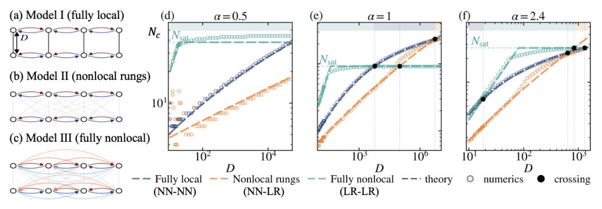
<figcaption class="paper-figure-caption"><b>Fig 2.</b> Figure 2. Hierarchy of critical-length scalings in three competitive non-Hermitian skin lattices. (a)–(c) Schematics of the fully local (model I, NN–NN, Eq. (6)), nonlocal-rungs (model II, NN–LR, Eq. (7)), and fully nonlocal (model III, LR–LR, Eq. (8)) geometries, with opposite non-Hermitian pumping on the two legs and interchain separation D. The dominant scaling laws: Nc ∼ln D, Nc ∼Dα/3, and a scale-covariant fully nonlocal onset with finite-window saturation/crossover. (d)–(f) Critical length Nc versus D for α = 0.5, 1, 2.4 at fixed non-reciprocity. Open circles are obtained by direct diagonalization of the finite open-boundary single-particle lattice Hamiltonians, dashed curves are the...</figcaption>
</figure>
<figure class="paper-figure-card">
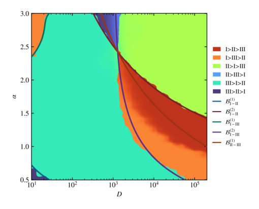
<figcaption class="paper-figure-caption"><b>Fig 3.</b> Figure 3. Global critical-length hierarchy in the (D, α) plane at γ = 0.05. The background colors denote the six possible or- derings of the critical lengths N I c, N II c , and N III c,full for the fully local, nonlocal-rung, and fully nonlocal lattices, respectively. The five colored curves are the distinct connected analyti- cal hierarchy-boundary solutions: the deep-blue and wine-red curves denote B(1) I−II and B(2) I−II [Eqs. (42) and (43)], respec- tively; the dark-teal and deep-violet curves denote B(1) I−III and B(2) I−III [Eqs. (44) and (45)], respectively; and the burnt-red curve denotes B(1) II−III [Eq. (46)]. All five curves are obtained by equating the corresponding...</figcaption>
</figure>
<figure class="paper-figure-card">
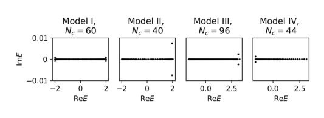
<figcaption class="paper-figure-caption"><b>Fig 4.</b> Figure 4. The energy spectrum for the four competitive NHSE ladders at their respective critical lengths Nc: fully local NN– NN ladder (Model I), nonlocal rungs NN–LR ladder (Model II), fully nonlocal LR–LR ladder (Model III), and nonlocal-legs LR–NN control geometry (Model IV). For the fully nonlocal LR–LR ladder (Model III), the displayed collision occurs near the right edge of the spectrum. For the nonlocal-legs LR–NN control geometry (Model IV), the corresponding edge-sector onset is analyzed below through the bottom-edge pair. For the fully local NN–NN ladder (Model I) and nonlocal rungs NN–LR ladder (Model II), transitions occur at both the top and bottom of the spectrum. α = 2, γ =...</figcaption>
</figure>
<figure class="paper-figure-card">
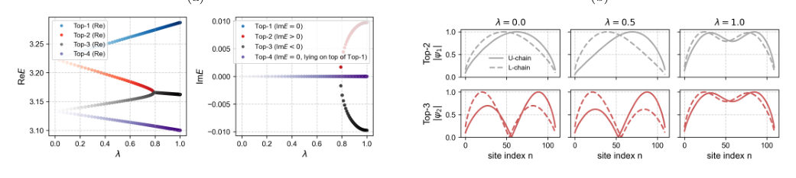
<figcaption class="paper-figure-caption"><b>Fig 5.</b> Figure 5. Fully nonlocal LR–LR competitive NHSE ladder (Model III). (a) The complex energy spectrum of the four eigenstates with the largest real parts (Top-1 to Top-4), plotted as a function of the inter-chain coupling strength λ. Each state is distinguished by a unique color map, where the color intensity corresponds to λ. The Top-2 and Top-3 eigenvalues merge as λ increases. (b) Spatial distribution of the eigenstate amplitudes (|ψn|) for the Top-2 (top row) and Top-3 (bottom row) eigenstates, which originate from the p = 1 and q = 2 single-chain modes, respectively. The plots illustrate the state evolution at three discrete values of the inter-chain coupling: λ = 0.0 (left column), λ =...</figcaption>
</figure>

**Summary.** This theoretical work analyzes spectral transitions in coupled non-Hermitian lattices by incorporating long-range hopping interactions. The authors demonstrate that these long-range couplings reorganize the critical behavior from conventional logarithmic scaling to a hierarchy including algebraic and scale-covariant regimes. This offers a generalized framework for understanding stability thresholds in complex quantum systems.

**Why it may be interesting.** The framework provides a platform-independent understanding of how nonlocality fundamentally alters stability thresholds in open quantum systems, which is highly relevant for designing robust topological or photonic circuits.

Detailed structure

**Main problem.** The study investigates how long-range hoppings fundamentally reorganize critical spectral behavior in non-Hermitian lattices, moving beyond conventional scaling laws.

**Main result.** Long-range hoppings induce a hierarchy of distinct critical behaviors, including an algebraic onset and a novel scale-covariant regime, which systematically removes physical length scales like the skin depth.

**Method.** The analysis involves comparing three coupled ladder configurations (Models I, II, III) by analyzing spectral transitions using both finite-size Bloch symbols and time/frequency domain measurements of eigenvalue splitting.

**Model / system.** The system models are non-Hermitian lattices formed by two coupled chains exhibiting the Non-Hermitian Skin Effect. The Hamiltonian incorporates nearest-neighbor (NN) and long-range (LR) hopping terms, allowing for three distinct coupling geometries (local/long-range legs and rungs).

**Key observables.** Critical length scale ($N_c$), spectral transitions (real to complex energy spectra), relative imaginary splitting ($\Delta 	ext{Im}$ or $\Gamma_{\max}$).

**Important parameters / regimes.** Transverse separation ($D$), power-law decay exponent ($\alpha$), and non-reciprocity parameter ($\gamma$).

**Assumptions / limitations.** The analysis assumes Open Boundary Conditions (OBCs) throughout, and for analytical tractability, the full distance-dependent coupling kernel is sometimes approximated by a constant-kernel form.

**Figures summary.** Figures illustrate single-chain Bloch spectra and compare $N_c$ vs. $D$ plots for three different nonlocal ladder configurations (Model I, II, III), demonstrating the differing scaling laws.

**Paper structure.** The paper progresses by defining the physical models (three coupled chains) and then systematically analyzing the critical length scale ($N_c$) associated with spectral transitions using multiple diagnostic tools (Bloch symbols, time/frequency domain measurements). The comparison across different coupling types reveals the hierarchy of scaling laws.

Abstract

Spectral transitions in non-Hermitian lattices often arise from the competition between non-reciprocal skin accumulation and inter-component hybridization. In short-range systems formed by two coupled chains, this competition conventionally leads to the logarithmic critical-length law $N_c\sim\ln D$, where $D$ is the transverse separation between the chains. Here we show that long-range hoppings fundamentally reorganizes this critical behavior, producing a hierarchy of distinct scaling laws. When only the hybridization couplings are power-law decaying with exponent $α$, the onset becomes algebraic, $N_c\sim D^{α/3}$. When the hoppings within each chain are themselves also power-law decaying, in addition to the hybridization couplings, the system enters a scale-covariant regime for $α<2$, in which the criticality threshold equation depends only on the system aspect ratio $N_c/D$. At $α=2$ and beyond, this regime is followed by a marginal logarithmically corrected and algebraically corrected regimes, respectively. We identify two new non-local mechanisms that enable this unconventional critical hierarchy: a nonanalytic band-edge dispersion from long-range intra-chain hoppings, and parity-mixing hybridization induced by non-reciprocity. Our results show that nonlocality systematically removes the physical length scales i.e. skin depth underlying conventional critical non-Hermitian skin behavior, offering a platform-independent framework testable in programmable topoelectrical circuits, photonic lattices and digital quantum simulators.

[↑ back to top](#top)

### [Quantum Impurities as Probes of Finite-Temperature Fluctuations in Two-Dimensional Bose Gases](http://arxiv.org/abs/2608.03665v1)

**Authors:** Victor Velasco, Gabriele Spada, Giovanni Midei, Andrea Perali, Luis A. Peña Ardila  
**Type:** theory · **Category:** quantum gases · **PDF:** <https://arxiv.org/pdf/2608.03665v1>  
**Analysis basis:** full PDF text, analyzed in chunks
**Topic relevance:** 🔥 `non-equilibrium dynamics` **4/5** · `Keldysh / 2PI / non-Gaussian methods` **3/5** · `Kondo & dissipative impurity` **3/5** · `analog quantum simulation` **3/5** · `non-equilibrium universality` **3/5** · `driven-dissipative phase transition` **2/5** · `correlated / nonlocal dissipation` **1/5** · `methods for driven-dissipative` **1/5** · `scars & prethermalization` **1/5**

↔ Scroll figures horizontally

<figure class="paper-figure-card">
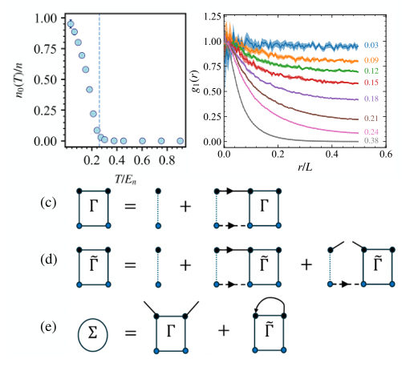
<figcaption class="paper-figure-caption"><b>Fig 1.</b> Figure 1. (a) Condensate fraction n0(T)/n as a function of temper- ature calculated using PIMC for a repulsive boson–boson interaction (gBB = 0.5ℏ2/m) and N = 512 particles. The vertical dashed line represents Θc. (b) One-body correlation functions, g1(r), obtained from PIMC simulations. The shaded area around the curves repre- sents the statistical error. The temperature values, in units of En, are indicated by the color scale, and the condensate fraction is extracted from g1(L/2). (c)-(e) Feynman diagrams representing the nonex- tended and extended schemes for determining the self-energy [28]. Solid and dashed lines denote bosonic and impurity propagators, re- spectively, while the dashed...</figcaption>
</figure>
<figure class="paper-figure-card">
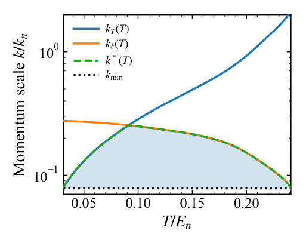
<figcaption class="paper-figure-caption"><b>Fig 2.</b> Figure 2. Temperature dependence of the characteristic mo- mentum scales defining the infrared window: the thermal scale kT (T), the phonon (healing) scale kξ(T), their minimum k∗(T) = min[kT (T), kξ(T)], and the finite-size infrared cutoff kmin. The shaded region indicates the momentum shell kmin &lt; k &lt; k∗(T) where the phonon infrared contribution develops.</figcaption>
</figure>
<figure class="paper-figure-card">
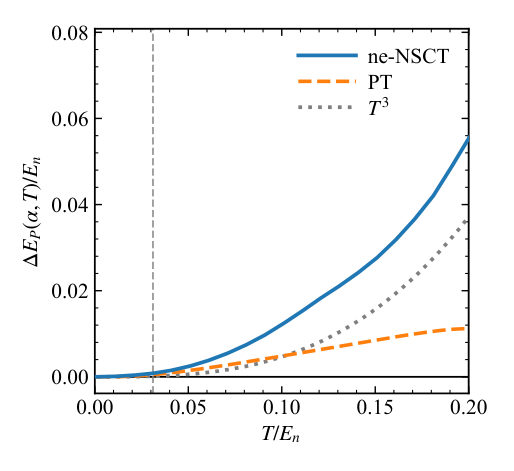
<figcaption class="paper-figure-caption"><b>Fig 3.</b> Figure 3. Weak-coupling energy shift ∆EP (α, T) for α = 10.0. The perturbative Fr¨ohlich result is shown as perturbation theory (PT) and is compared with the ne-NSCT result. The gray dotted curve is a scaled T 3 guide representing the phonon-window phase-space dependence from Eq. (12). The vertical dashed line marks the finite- size phonon activation scale Tact.</figcaption>
</figure>
<figure class="paper-figure-card">
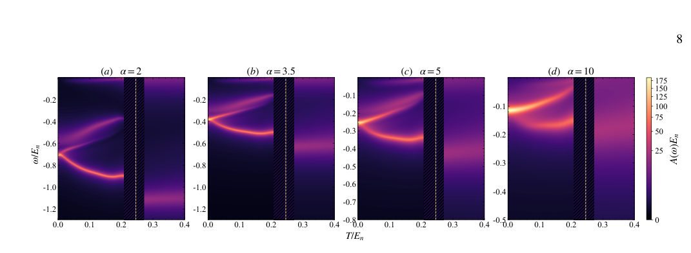
<figcaption class="paper-figure-caption"><b>Fig 4.</b> Figure 4. Zero-momentum impurity spectral function A(ω, T), showing the polaronic branch energies, EP , as a function of temperature, calculated within the e-NSCT approximation, for progressively weaker couplings: (a) α = 2.0, (b) α = 3.5, (c) α = 5.0 and (d) α = 10.0. The shaded interval marks the finite-size crossover around Θc (dashed white line), which is excluded from the quantitative analysis. We use a larger numerical width of δ/En = 0.05 for T &gt; Θc in the spectral line for clarity, while setting δ/En = 0.01 for T &lt; Θc.</figcaption>
</figure>
<figure class="paper-figure-card">
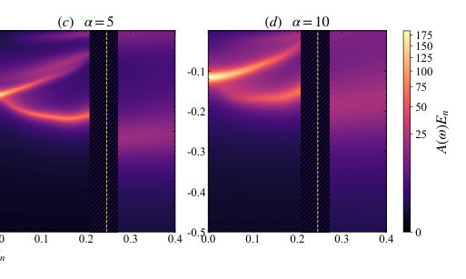
<figcaption class="paper-figure-caption"><b>Fig 5.</b> Figure 5 compares the lowest attractive-polaron energy with the vacuum-dimer energy −EB. At large α, both en- ergies approach zero. This visual convergence does not repre-</figcaption>
</figure>

**Summary.** The paper analyzes attractive Bose polarons in 2D Bose gases, using them as spectroscopic tools to measure finite-temperature fluctuations. By combining advanced scattering theory with PIMC simulations, the authors predict a nonmonotonic temperature dependence for the polaron energy due to phonon dressing effects induced by finite size.

**Why it may be interesting.** This research directly addresses non-equilibrium dynamics and critical behavior in low-dimensional quantum systems, which is central to modern AMO physics involving ultracold atoms.

Detailed structure

**Main problem.** The study investigates how quantum impurities act as sensitive probes for finite-temperature fluctuations, phonon dressing effects, and bound-state physics within two-dimensional Bose gases.

**Main result.** The impurity quasiparticle energy exhibits a nonmonotonic temperature dependence because the thermal population of resolved phonon modes competes with condensate depletion. This confirms attractive polarons' utility in probing 2D gas dynamics.

**Method.** A hybrid theoretical approach combining finite-temperature many-body scattering theory (e-NSCT) with input from Path-Integral Monte Carlo (PIMC) simulations is employed for analysis.

**Model / system.** The system models a single attractive impurity immersed in a weakly interacting, finite two-dimensional Bose gas. The physics incorporates effects arising from the finite size imposing an infrared momentum cutoff ($k_{min}$).

**Key observables.** Impurity quasiparticle energy, condensate fraction $n_0(T)$, and polaron energy dependence on temperature.

**Important parameters / regimes.** Finite-size effect (IR cutoff $k_{min}$), characteristic temperature $\Theta_c$ (Bogoliubov validity boundary), and the coupling strength ($g$).

**Assumptions / limitations.** The Bogoliubov description is treated as a low-energy approximation, valid only below the finite-size crossover temperature $\Theta_c$. The analysis relies on treating the system perturbatively in the weak coupling limit.

**Figures summary.** Figure 1(a) shows the condensate fraction decreasing with T; Figure 1(b) shows correlation functions. Other figures compare polaron splitting results from continuum vs. discrete calculations.

**Paper structure.** The work builds theory by establishing the Hamiltonian and utilizing Bogoliubov/e-NSCT frameworks, incorporating PIMC results for $n_0(T)$ to analyze the impurity energy across different thermal regimes defined by the finite-size cutoff.

Abstract

Two-dimensional quantum gases provide a distinctive setting in which enhanced thermal fluctuations, finite-size effects, and two-body bound-state formation are intrinsically intertwined. In this work, we study a single attractive impurity immersed in a finite, weakly interacting two-dimensional Bose gas, where finite size stabilizes a nonzero condensate fraction by introducing an infrared momentum scale, thereby enabling a Bogoliubov description of the bath. Using a hybrid approach that combines finite-temperature many-body scattering theory with input from path-integral Monte Carlo, we analyze the impurity quasiparticle energy across the condensate and normal regimes. The infrared scale generates a phonon-activation temperature below which the impurity energy remains nearly temperature independent. Once the resolved phonon modes become thermally populated, their contribution competes with condensate depletion, producing a nonmonotonic temperature dependence of the polaron energy. These results suggest that attractive Bose polarons may serve as sensitive probes of finite-size thermal fluctuations, phonon dressing, and bound-state physics in low-dimensional Bose gases.

[↑ back to top](#top)

### [Quantum-Limited Blind Source Separation of Classical Light](http://arxiv.org/abs/2608.02921v1)

**Authors:** Janis Nötzel, Kiran Adhikari  
**Type:** theory · **Category:** quantum information and computing · **PDF:** <https://arxiv.org/pdf/2608.02921v1>  
**Analysis basis:** full PDF text, analyzed in chunks
**Topic relevance:** 🔥 `quantum measurements` **4/5** · `interference shaping light` **3/5** · `measurement-induced transitions` **3/5** · `quantum optics experiment` **3/5** · `QC/QI experiment` **2/5** · `analog quantum simulation` **1/5** · `correlated cavity matter` **1/5** · `driven-dissipative phase transition` **1/5** · `entanglement & information structure` **1/5** · `methods for driven-dissipative` **1/5** · `non-equilibrium dynamics` **1/5**

↔ Scroll figures horizontally

<figure class="paper-figure-card">
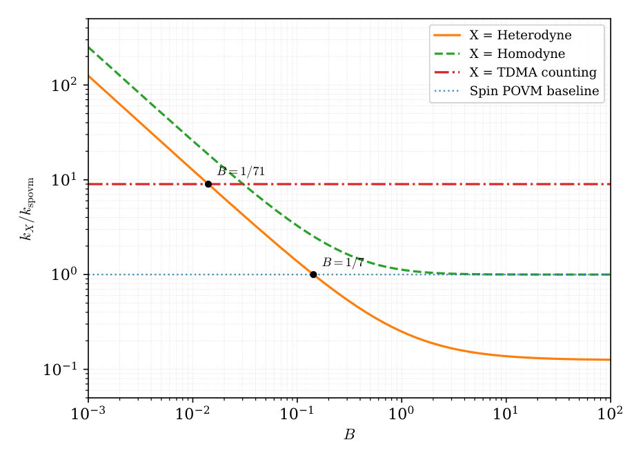
<figcaption class="paper-figure-caption"><b>Fig 1.</b> Figure 1: Unit-cell sample-complexity comparison. The ratio kX/kspovm of copies required by method X and by the spin POVM is shown against B. Other constants such as the gap ∆, precision ε and confidence α cancels in the ratio, so the curves are universal. Similar regions of advantage were already observed in [63].</figcaption>
</figure>
<figure class="paper-figure-card">
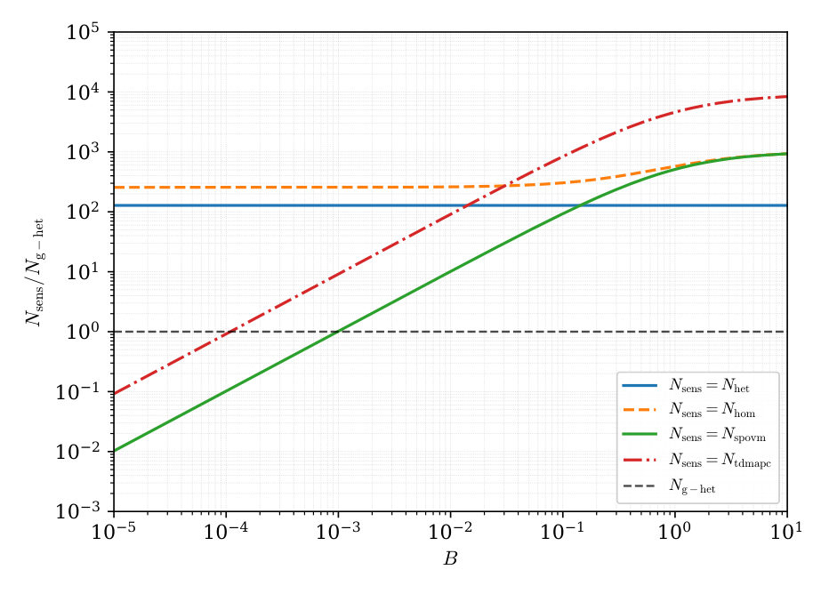
<figcaption class="paper-figure-caption"><b>Fig 2.</b> Figure 2: The ratio Nsens/Ng−het of the total number of copies required by the unit-cell-based Jacobi algorithm and by global heterodyne tomography on all K modes is shown as a function of the brightness B, for K = 16. The dashed line marks the break-even point Nsens = Ng−het, and curves below it indicate a region of potential quantum advantage. Ntdmapc and Nspovm reaches this region at low brightness.</figcaption>
</figure>
<figure class="paper-figure-card">
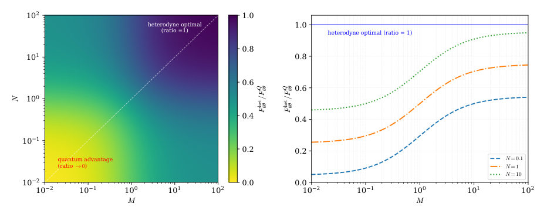
<figcaption class="paper-figure-caption"><b>Fig 3.</b> Figure 3: Comparison of the heterodyne and quantum-optimal Fisher information for the beam-splitter angle θ, given by the ratio F het θθ /F Q θθ in Eq. (198). The left panel shows that the ratio is less than unity for all finite thermal occupations M, N. The right panel includes slices at some fixed N.</figcaption>
</figure>
<figure class="paper-figure-card">

<figcaption class="paper-figure-caption"><b>Fig 4.</b> Figure 3 illustrates F het θθ /F Q θθ part of Eq. (198) over the full range of thermal occupations. The ratio is strictly below unity everywhere on the (M, N) plane, confirming that heterodyne detection is never optimal for estimating the beam-splitter angle at any finite occupation. Heterodyne detection approaches the quantum limit (ratio →1) only when both modes are bright, while the quantum advantage (ratio →0) is largest when either occupation is small.</figcaption>
</figure>

**Summary.** This work tackles Blind Source Separation for thermal light by proposing a novel, sensing-assisted method implemented in a programmable photonic interferometer. This quantum approach estimates and suppresses optical correlations locally, achieving measurement precision superior to classical heterodyne detection methods, particularly when photon numbers are low.

**Why it may be interesting.** It demonstrates how fundamental concepts of quantum measurement theory (like achieving the Holevo bound) can be directly mapped onto physical hardware (photonic interferometers) to solve complex signal processing tasks like BSS.

Detailed structure

**Main problem.** The paper addresses Blind Source Separation (BSS) for independent thermal optical sources mixed by an unknown passive linear transformation.

**Main result.** A proposed sensing-assisted quantum method achieves asymptotically optimal estimation bounds, showing a significant advantage over conventional heterodyne tomography, especially in the weak-light regime.

**Method.** The authors propose an iterative, sensing-based approach implemented within a programmable interferometer mesh to perform an in situ Jacobi diagonalization of the input multimode correlation matrix.

**Model / system.** The system involves thermal light sources whose output state is mixed by an unknown passive linear transformation $U$. The physical platform modeled is a photonic circuit utilizing tunable Mach-Zehnder interferometers as unit cells.

**Key observables.** Covariance matrices, correlation matrices, and quantum measurement outcomes like photon number differences ($\{P^{NDAB}_t\}$).

**Important parameters / regimes.** Thermal energies ($N_1, \ldots, N_K$), the weak-light regime (low photon numbers), and parameters defining the mixing transformation $(	heta, \phi)$.

**Assumptions / limitations.** The theoretical framework relies on quantum multiparameter estimation theory, specifically comparing performance against the Holevo Cramér–Rao bound.

**Paper structure.** The paper develops the problem formulation using quantum multiparameter estimation bounds, proposes the sensing-assisted method via interferometer unit cells for iterative diagonalization, and contrasts this with classical heterodyne tomography approaches.

Abstract

Using the framework of quantum multiparameter estimation, we study the problem of separating independent thermal optical sources mixed by an unknown passive linear transformation, which is known as blind source separation in signal processing. We propose a sensing-assisted method that iteratively estimates and suppresses optical correlations directly within the unit cells of a programmable interferometer. We show that collective quantum measurements exhibit a substantial advantage over conventional detection methods by constructing collective measurements that asymptotically achieve the Holevo Cramér--Rao bound in a unit cell of the interferometer for the respective sub-problem. By systematically arranging multiple such cells in a photonic mesh, our proposal implements an in situ Jacobi diagonalization of the input multimode correlation matrix. We contrast our method with a conventional approach where heterodyne detection is used to reconstruct the full covariance matrix and subsequently diagonalize it on a classical computer. A comparison with this heterodyne tomography approach shows that our sensing-based method is particularly advantageous in the weak-light regime.

[↑ back to top](#top)

### [Two-Parameter Ansatz for the Violation of Eigenstate Thermalization](http://arxiv.org/abs/2608.02744v1)

**Authors:** Kohei Ohgane, Lev Vidmar  
**Type:** theory · **Category:** statistical mechanics · **PDF:** <https://arxiv.org/pdf/2608.02744v1>  
**Analysis basis:** full PDF text, analyzed in chunks
**Topic relevance:** 🔥 `non-equilibrium dynamics` **4/5** · 🔥 `scars & prethermalization` **4/5** · `non-equilibrium universality` **3/5** · `analog quantum simulation` **2/5** · `driven-dissipative phase transition` **2/5** · `Frenkel-Kontorova` **1/5** · `Keldysh / 2PI / non-Gaussian methods` **1/5** · `correlated / nonlocal dissipation` **1/5** · `entanglement & information structure` **1/5** · `exotic spin models in light-matter` **1/5** · `methods for driven-dissipative` **1/5**

↔ Scroll figures horizontally

<figure class="paper-figure-card">
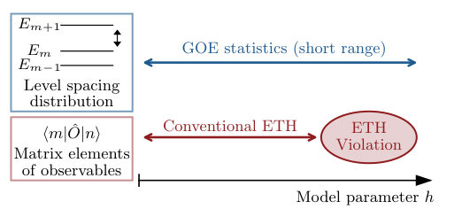
<figcaption class="paper-figure-caption"><b>Fig 1.</b> FIG. 1. The ETH breakdown in finite systems upon tuning a model parameter h away from the ergodic regime. In the ergodic regime, observable matrix elements are described by the conventional ETH. We focus on the boundary of validity of the conventional ETH, where short-range spectral statistics, such as the level-spacing distribution, remain consistent with GOE predictions.</figcaption>
</figure>
<figure class="paper-figure-card">
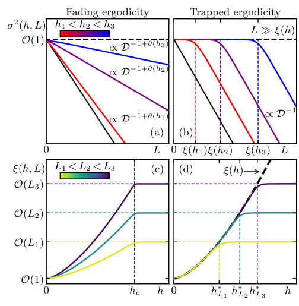
<figcaption class="paper-figure-caption"><b>Fig 2.</b> FIG. 2. Two scenarios for the ETH violation: (a,c) fading er- godicity, and (b,d) trapped ergodicity. (a,b) The variance σ2</figcaption>
</figure>
<figure class="paper-figure-card">
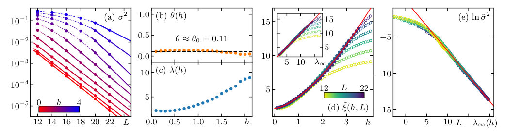
<figcaption class="paper-figure-caption"><b>Fig 3.</b> FIG. 3. Evidence of trapped ergodicity in the disordered J1-J2 model. (a) Variance σ2 vs L at various h. The solid lines are linear fits to ln σ2 vs L for the points at large L, see End Matter for computational details. The dashed curves are guides for the eye. (b) and (c) The extracted parameters θ(h) and λ(h) from the fits in (a). The dashed line in (b) is the average θ0 = 0.11 of θ(h) in the interval h ∈[0, 2]. (d) Scaled ergodization length ˜ξ(h, L) = ξ(h, L) −θ0L vs h in the main panel. The filled symbols correspond to the values of h, L at which r ≈rGOE, while open symbols correspond to r &lt; rGOE; see also Fig. 5 in End Matter. The solid line is a fit of the function λ∞(h) = a0hµ + a1...</figcaption>
</figure>
<figure class="paper-figure-card">
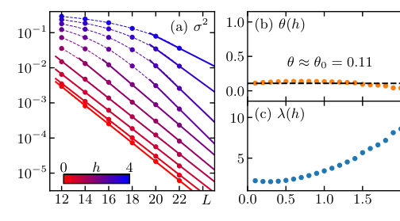
<figcaption class="paper-figure-caption"><b>Fig 4.</b> Figure 3(a) shows σ2 versus L at various h. In the weakly disordered regime W ≲1.5 (red dots), the de- cay of σ2 is consistent with the conventional ETH, σ2 ∝ exp{−L/η0} ≈D−1, for all L under consideration. At larger disorder, we observe horizontal shifts of the decays of σ2, without a considerable change of slopes. This is an indication of trapped ergodicity. We next extract the parameters θ(h) and λ(h) from Eq. (8) assuming equality instead of proportionality; see also End Matter for the details of fitting procedure. Re- sults of this quantitative analysis are shown in Figs. 3(b) and 3(c), respectively. We observe that θ(h) is roughly a constant that is very close to zero (we fit θ by a...</figcaption>
</figure>
<figure class="paper-figure-card">
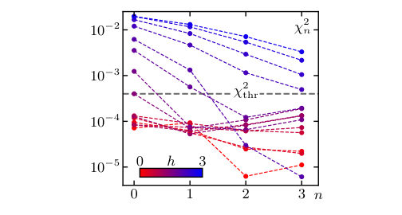
<figcaption class="paper-figure-caption"><b>Fig 5.</b> FIG. 4. Fitting error χ2 n, see Eq. (11), versus n. The hori- zontal dashed line is the threshold χ2 thr = 4 × 10−4. The thin dashed lines between the adjacent dots are guides of the eye.</figcaption>
</figure>

**Summary.** The paper proposes a two-parameter ansatz to theoretically describe the continuous transition from standard Eigenstate Thermalization Hypothesis (ETH) behavior to its complete breakdown. By distinguishing between 'fading' and 'trapped' ergodicity mechanisms, it offers a unified framework for understanding how quantum systems lose or regain thermalizing properties in finite sizes.

**Why it may be interesting.** This work provides crucial theoretical machinery ($	heta, \lambda$ parameters) to classify non-equilibrium dynamics in interacting quantum systems, which is fundamental for understanding thermalization beyond simple ETH predictions.

Detailed structure

**Main problem.** The paper addresses the lack of a general theory describing the continuous transition between conventional Eigenstate Thermalization Hypothesis (ETH) and its complete breakdown in isolated quantum many-body systems.

**Main result.** They introduce a two-parameter ansatz that successfully unifies and distinguishes two distinct mechanisms for ETH violation: fading ergodicity and trapped ergodicity, confirming trapped ergodicity in tested models.

**Method.** The analysis involves developing a theoretical ansatz $\xi(h, L) = 	heta(h)L + \lambda(h)$ to model the scaling of observable variance ($\sigma^2$) with system size ($L$).

**Model / system.** The framework is tested on spin-1/2 $J_1$-$J_2$ Heisenberg chains incorporating both on-site disorder and linear potentials (Stark model).

**Key observables.** Variance ($\sigma^2$) of diagonal matrix elements, ergodization length ($\xi(h, L)$), and the parameters $	heta(h)$ and $\lambda(h)$.

**Important parameters / regimes.** Model parameter $h$ (disorder strength), system size $L$, and the characteristic energy scale $\eta_0$.

**Assumptions / limitations.** The core assumption is that ETH violation can be parameterized by a linear combination of $L$ and an additive term, allowing for the separation of different physical mechanisms.

**Figures summary.** Figures illustrate the expected scaling behavior of $\sigma^2$ versus model parameter $h$, distinguishing between conventional ETH, fading ergodicity, and trapped ergodicity regimes.

**Paper structure.** The paper first establishes the theoretical need for a continuous interpolation theory for ETH violation. It then introduces the two-parameter ansatz to mathematically distinguish between the physical scenarios of fading and trapped ergodicity before applying this framework to numerical results on spin chains.

Abstract

The eigenstate thermalization hypothesis (ETH) provides the prevailing framework for understanding quantum thermalization and ergodicity in isolated many-body systems. Yet, no general theory describes the continuous onset of ETH violation between the conventional ETH and its complete breakdown. Here, we introduce a two-parameter ansatz for the ETH violation that unifies and distinguishes two mechanisms: fading ergodicity and trapped ergodicity. While fading ergodicity captures the established route to ergodicity breaking, trapped ergodicity describes a distinct scenario in which ETH is violated in finite systems but restored in the thermodynamic limit. We test this framework in the spin-1/2 $J_1$-$J_2$ chains with on-site disorder and linear potential. In both cases, we find that the observed ETH violation is consistent with trapped ergodicity.

[↑ back to top](#top)

### [The Utility of Sparse Error Detection in Quantum Simulations](http://arxiv.org/abs/2608.02944v1)

**Authors:** Henry Froland, Dorota M. Grabowska, Sebastian Grieninger, Jeremy Hartse, Anne L. Lashbrook, Zhiyao Li, Ziyuan Li, Sarah J. M. Powell, Martin J. Savage, Xiaojun Yao, Nikita A. Zemlevskiy  
**Type:** theory · **Category:** quantum information and computing · **PDF:** <https://arxiv.org/pdf/2608.02944v1>  
**Analysis basis:** full PDF text, analyzed in chunks
**Topic relevance:** 🔥 `quantum measurements` **4/5** · `analog quantum simulation` **3/5** · `measurement-induced transitions` **3/5** · `methods for driven-dissipative` **3/5** · `non-equilibrium dynamics` **2/5** · `Keldysh / 2PI / non-Gaussian methods` **1/5** · `correlated / nonlocal dissipation` **1/5** · `driven-dissipative phase transition` **1/5** · `entanglement & information structure` **1/5** · `exotic spin models in light-matter` **1/5**

↔ Scroll figures horizontally

<figure class="paper-figure-card">
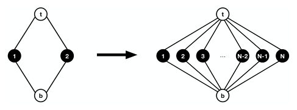
<figcaption class="paper-figure-caption"><b>Fig 1.</b> FIG. 1. The connectivity diagram for the [[4, 2, 2]] code (left) and the generalization to the Iceberg code [[N + 2, N, 2]] (right). The top and bottom qubits are used to stabilize the N logical qubits in the Iceberg code family.</figcaption>
</figure>
<figure class="paper-figure-card">
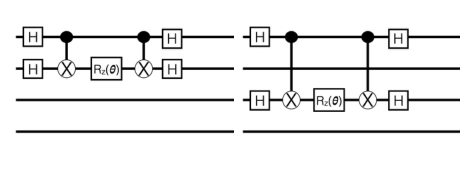
<figcaption class="paper-figure-caption"><b>Fig 2.</b> FIG. 3. Non-FT circuits for rotating logical states in the</figcaption>
</figure>
<figure class="paper-figure-card">
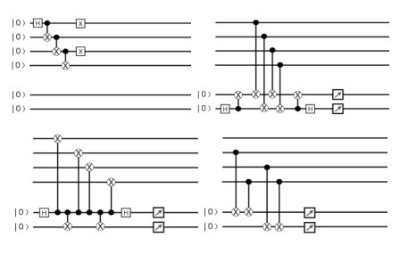
<figcaption class="paper-figure-caption"><b>Fig 3.</b> FIG. 2. Quantum circuits for a FT preparation of the Neel state |¯0¯1⟩. The upper left circuit furnishes a non-FT prepara- tion of the Neel state (Neel0). The upper right circuit (the ˆSz given in Eq. (4)) provides a FT stabilizer check for bit-flips ( ˆSz). The lower-left circuit (the ˆSx given in Eq. (4)) provides a FT stabilizer check for phase-flips ( ˆSx). The lower-right cir-</figcaption>
</figure>
<figure class="paper-figure-card">
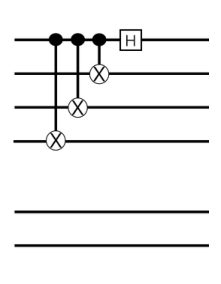
<figcaption class="paper-figure-caption"><b>Fig 4.</b> FIG. 4. A quantum circuit to map the physical states con- tributing to each logical state into a single basis state.</figcaption>
</figure>
<figure class="paper-figure-card">
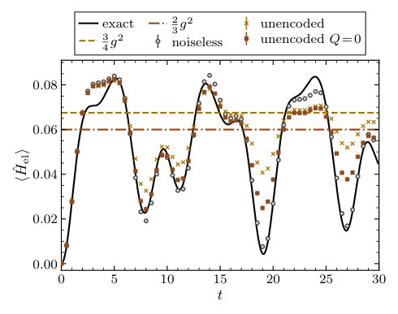
<figcaption class="paper-figure-caption"><b>Fig 5.</b> FIG. 5. The total energy in the electric field in the L = 2 Schwinger model as a function of time starting from the Neel state. The solid black line corresponds to exact unitary evo- lution. The black circles correspond to noiseless Trotterized time evolution. The golden points correspond to noisy Trot- terized time evolution with p2 = 0.003 depolarizing noise without postselection into the physical space, while the brown points are the results obtained with postselection. The golden dashed line corresponds to the value in the limit of complete depolarization of g2L(L + 1)/8 = 0.0675 (determined by the matrix elements of the identity operator of the symmetric gauge term). The postselection...</figcaption>
</figure>

**Summary.** This paper explores using sparse error detection techniques to make quantum simulations of lattice gauge theories feasible with current, noisy quantum computers. By embedding models like the Schwinger model into specific stabilizer codes and implementing periodic syndrome measurements, the authors show that systematic error reduction can significantly boost observable accuracy. This suggests a path toward applying minimal fault tolerance in high-energy physics simulations.

**Why it may be interesting.** It directly addresses the practical challenge of running complex quantum field theory simulations on noisy near-term hardware by proposing a resource-efficient fault tolerance mechanism (sparse detection).

Detailed structure

**Main problem.** The work investigates how sparse error detection can be utilized to perform fault-tolerant quantum simulations of lattice gauge theories.

**Main result.** Sparse error detection shows potential for improving observable estimation accuracy in near-term quantum simulations, systematically driving errors down towards the code's noise floor.

**Method.** The authors simulate time evolution using specific quantum error-correcting codes (Iceberg and Hypercube families) while incorporating sparse syndrome measurements and physics-aware postselection.

**Model / system.** The primary model is the lattice Schwinger model, embedded into stabilizer codes like [[N+2, N, 2]] or [[2^N, N, 2]]. The simulation uses the axial gauge for Hamiltonian construction.

**Key observables.** Observable estimation accuracy; systematic error reduction over time; logical error rates.

**Important parameters / regimes.** Realistic near-term noise rates ($p_2$); codeblock size (large blocks are advantageous); number of error detection rounds.

**Assumptions / limitations.** The analysis assumes that incorporating minimal fault tolerance layers enhances performance, and postselection is used to eliminate leading order bit-flip errors.

**Paper structure.** The paper examines the utility of sparse error detection for lattice gauge theory simulations, comparing different code families and demonstrating improved accuracy under realistic noise conditions through iterative error detection rounds.

Abstract

The recent success of error detecting codes points toward their potential application to fault-tolerant simulations of nature. In this work, we examine the utility of sparse error detection for simulating lattice gauge theories using quantum computers. In particular, we study the time evolution of the lattice Schwinger model embedded into the Iceberg code family, $[[N+2, N, 2]]$, as well as the Hypercube code family, $[[2^N, N, 2]]$. The lattice of electrons and positrons in the axial gauge is embedded into a single code block or into multiple code blocks, and this work finds that large codeblocks are advantageous in the absence of connectivity constraints. Noisy classical simulations with realistic near-term error rates, infrequent syndrome measurements and physics-aware postselection are found to improve observable estimation. Under realistic noise rates for near-term quantum computers, this work finds that sparse error detection in quantum simulations has the potential to improve accuracy of observable estimation. Additional rounds of error detection are found to systematically drive errors in observables to the noise floor set by the code. These findings suggest that incorporating minimal implementations of fault tolerance in the near-term will enhance the performance of quantum simulations in nuclear physics and high-energy physics.

[↑ back to top](#top)

### [A quantum game of telephone](http://arxiv.org/abs/2608.03963v1)

**Authors:** Arefur Rahman, Matthew L. Stevens, Cory M. Nunn, Daniel E. Jones, Brian T. Kirby, Joseph M. Lukens  
**Type:** both · **Category:** quantum information and computing · **PDF:** <https://arxiv.org/pdf/2608.03963v1>  
**Analysis basis:** full PDF text, analyzed in chunks
**Topic relevance:** 🔥 `QC/QI experiment` **4/5** · `methods for driven-dissipative` **3/5** · `quantum measurements` **3/5** · `quantum optics experiment` **3/5** · `non-equilibrium dynamics` **2/5** · `correlated / nonlocal dissipation` **1/5** · `driven-dissipative phase transition` **1/5** · `entanglement & information structure` **1/5** · `measurement-induced transitions` **1/5**

↔ Scroll figures horizontally

<figure class="paper-figure-card">
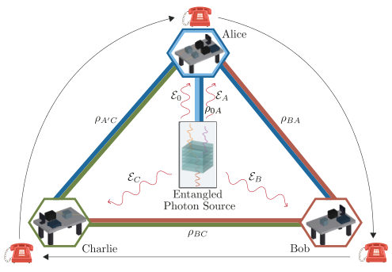
<figcaption class="paper-figure-caption"><b>Fig 1.</b> FIG. 1. Schematic of a three-node quantum telephone ex- periment. A central nonlinear source generates polarization- entangled photon pairs, which are distributed as bipar- tite states {ρ0A, ρBA, ρBC, ρA′ C} (colored lines) after opti- cal channels {E0, EA, EB, EC} (crimson arrows) to three nodes: Alice (A/A′), Bob (B), and Charlie (C). Bootstrapping on a single ancilla channel at Alice, all unknown quantum chan- nels are then inferred using the measured data, the accuracy of which depends on both the ground truth channels and the estimation procedure.</figcaption>
</figure>
<figure class="paper-figure-card">
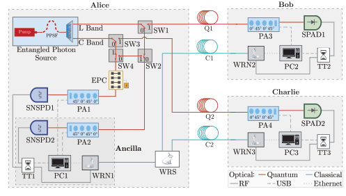
<figcaption class="paper-figure-caption"><b>Fig 2.</b> FIG. 2. Schematic of the experimental setup. Details are pro- vided in the text. EPC: electronic polarization controller; PA: polarization analyzer; PC: personal computer; PPSF: peri- odically poled silica fiber; SNSPD: superconducting nanowire single-photon detector; SPAD: single-photon avalanche diode; SW: switch; TT: time tagger; WRN: White Rabbit node; WRS: White Rabbit switch.</figcaption>
</figure>
<figure class="paper-figure-card">
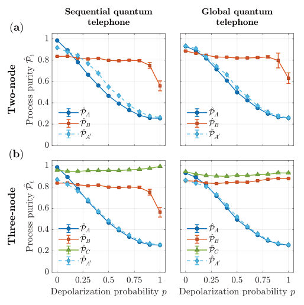
<figcaption class="paper-figure-caption"><b>Fig 3.</b> FIG. 3. Process purities ˆPA, ˆPB, ˆPC, and ˆPA′ as a function of depolarization probability p of the targeted ground truth Al- ice channel E⋆ A. (a) Two-node configuration. (b) Three-node configuration. Left and right columns delineate between se- quential inference via Eq. (3) and global inference via Eq. (4). Channels ˆEA and ˆEA′ should be compared to a depolarizing channel [Eq. (10)], while ˆEB and ˆEC should be compared to unitary channels [Eq. (9)].</figcaption>
</figure>
<figure class="paper-figure-card">
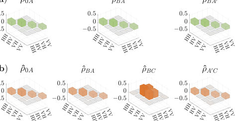
<figcaption class="paper-figure-caption"><b>Fig 4.</b> FIG. 4. Real parts of the two-qubit density matrices ˆρij esti- mated directly from telephone coincidence counts, for p = 1 depolarizing probability on channel E⋆ A(A′). (a) Two-node tele- phone experiment. (b) Three-node telephone experiment.</figcaption>
</figure>
<figure class="paper-figure-card">
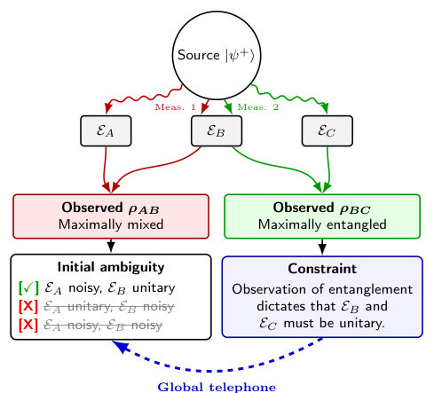
<figcaption class="paper-figure-caption"><b>Fig 5.</b> FIG. 5. Resolving channel ambiguities through global quan- tum telephone. Observing a maximally mixed output state ρAB = (EA ⊗EB)(|ψ+⟩⟨ψ+|) leaves ambiguity as to the qual- ity of EA and EB. However, seeing a maximally entangled ρBC = (EB ⊗EC)(|ψ+⟩⟨ψ+|) requires that both EB and EC are unitary channels, information that can then be backprop- agated to reveal only EA as noisy.</figcaption>
</figure>

**Summary.** This paper introduces 'quantum telephone,' an advanced tomography protocol designed to characterize unknown quantum channels in multi-node networks using only intermediate detection events. By employing a global inference strategy rather than sequential estimation, the method overcomes fundamental limitations related to information loss and rank deficiency in noisy physical systems. This offers a robust pathway for building and verifying complex quantum communication infrastructure.

**Why it may be interesting.** It provides a practical, hardware-efficient technique for characterizing complex open quantum systems (quantum channels) in real-world photonic networks, directly addressing resource limitations common in quantum networking research.

Detailed structure

**Main problem.** The primary challenge is characterizing unknown quantum channels within complex, multi-node quantum networks when local entanglement sources are scarce.

**Main result.** A global inference protocol, termed 'quantum telephone,' successfully resolves parameter degeneracies and estimates channel parameters even when intermediate states become completely depolarized, outperforming sequential estimation methods.

**Method.** The authors developed an iterative ancilla-assisted process tomography protocol that uses Bayesian inference (MCMC) to estimate the entire set of unknown channels simultaneously, leveraging global constraints from all measured links.

**Model / system.** The work is implemented on a deployed multinode fiber network using polarization qubits across a three-node circular topology. The model involves characterizing sequential quantum processes $E_t$ connecting nodes (Alice, Bob, Charlie).

**Key observables.** Coincidence counts ($N_t$), process purities ($\hat{P}_t$), and estimated two-qubit density matrices ($\hat{
ho}_{ij}$).

**Important parameters / regimes.** Depolarization probability ($p$), number of nodes (two vs. three), and the computational complexity difference between sequential and global inference.

**Assumptions / limitations.** Standard ancilla-assisted process tomography requires full Schmidt rank, which is violated in general; the authors assume that global constraints can compensate for this local failure.

**Figures summary.** Figures illustrate the experimental setup (Fig 2), compare estimated channel purities vs. depolarization probability for sequential vs. global methods (Fig 3), and show process fidelities ($\hat{F}$) versus $p$ comparing fixed vs. variable unitary corrections (Figs 6 & 7).

**Paper structure.** The paper introduces the quantum telephone protocol, compares its performance against standard sequential estimation using both purity and fidelity metrics across two-node and three-node setups, and concludes by analyzing the implications of global versus local information gathering.

Abstract

Characterizing multinode quantum networks without ubiquitous local entanglement sources presents significant experimental challenges. We introduce ``quantum telephone,'' an iterative ancilla-assisted process tomography protocol that leverages intermediate detection events, effectively treating previously probed links as ancillae for subsequent links. Implemented on a deployed multinode fiber network, we observe noisy intermediate channels create fundamental parameter degeneracies that compound inference errors under sequential estimation. Counterintuitively, the inclusion of downstream near-unitary channels provides boundary constraints that, when used in tandem with global inference, can resolve ambiguity in channels earlier in the sequence. By compensating for localized information loss, this approach obviates the strict full-rank requirements of standard ancilla-assisted process tomography, even when intermediate states become completely depolarized. Overall, quantum telephone offers a hardware-efficient and information-maximizing path toward characterizing complex quantum networks with limited resources.

[↑ back to top](#top)

### [Exact Resonances Are Not Sufficient for Phonon Energy Diffusion](http://arxiv.org/abs/2608.03180v1)

**Authors:** Wei Lin, Yong Zhang, Hong Zhao  
**Type:** theory · **Category:** statistical mechanics · **PDF:** <https://arxiv.org/pdf/2608.03180v1>  
**Analysis basis:** full PDF text, analyzed in chunks
**Topic relevance:** 🔥 `non-equilibrium dynamics` **4/5** · `non-equilibrium universality` **3/5** · `scars & prethermalization` **3/5** · `driven-dissipative phase transition` **2/5** · `methods for driven-dissipative` **2/5** · `Frenkel-Kontorova` **1/5** · `Keldysh / 2PI / non-Gaussian methods` **1/5** · `analog quantum simulation` **1/5** · `correlated / nonlocal dissipation` **1/5** · `entanglement & information structure` **1/5**

↔ Scroll figures horizontally

<figure class="paper-figure-card">
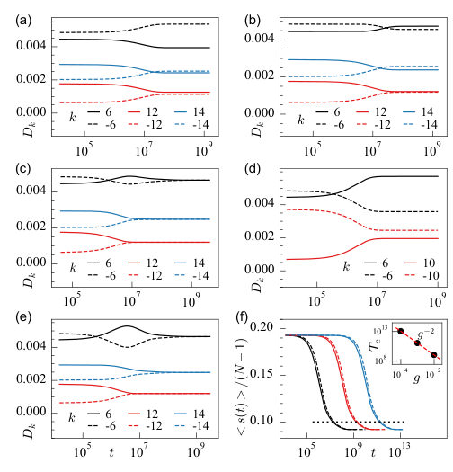
<figcaption class="paper-figure-caption"><b>Fig 1.</b> FIG. 1. Direct numerical verification of exact-resonant ki- netics in the periodic FPUT-6 chain. (a)–(e) Time evolution of the wave actions Dk for N = 32 and g = 10−2, retain- ing (a) a single symmetric sextet; (b) two coupled symmet- ric sextets; (c) all symmetric 3 ↔3 exact resonances; (d) all quasi-symmetric 3 ↔3 exact resonances; and (e) both families. (f) Normalized indicator entropy ⟨s(t)⟩/(N −1) for g = 10−2, 10−3, and 10−4. The solid and dashed lines corre- spond, respectively, to calculations retaining both resonance families and the symmetric family alone. The inset shows the relaxation time Tc, defined by ⟨s(Tc)⟩/(N −1) = 0.1; the dashed line indicates Tc ∝g−2.</figcaption>
</figure>
<figure class="paper-figure-card">
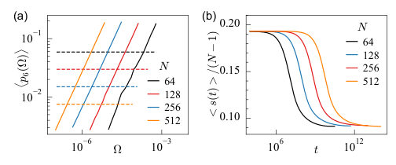
<figcaption class="paper-figure-caption"><b>Fig 2.</b> FIG. 2. Size dependence of six-wave resonant channels. (a) Mode-averaged weighted connection strength ⟨p6(Ω)⟩as a function of the broadening width Ωfor N = 64, 128, 256, and 512. Solid curves show the quasi-resonant contribution from 0 &lt; |∆ω| &lt; Ω, whereas dashed horizontal lines show the exact-resonant contribution at ∆ω = 0. (b) Normalized indi- cator entropy ⟨s(t)⟩/(N −1) obtained from the exact-resonant kinetic equation including all allowed 3 ↔3 processes at g = 10−2 for the same system sizes.</figcaption>
</figure>
<figure class="paper-figure-card">
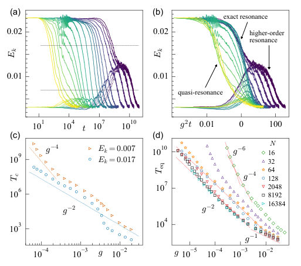
<figcaption class="paper-figure-caption"><b>Fig 3.</b> FIG. 3. Full Hamiltonian dynamics of the periodic FPUT-6 chain. (a) Evolution of the k = ±1 mode energies for N=32, with g decreasing from 0.02 to 6 × 10−5. The horizontal lines mark the thresholds Ek=1 = 0.017 and Ek=1 = 0.007. (b) The same data plotted against the rescaled time g2t. (c) Relaxation time Tc as a function of g for the two thresholds in (a). (d) Equipartition time Teq for different system sizes. Dashed lines indicate reference power laws.</figcaption>
</figure>
<figure class="paper-figure-card">
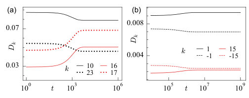
<figcaption class="paper-figure-caption"><b>Fig 4.</b> FIG. 4. Symmetry-constrained kinetic arrest in the DNLS model and the periodic FPUT-β chain. Exact four-wave ki- netic evolution of Dk for (a) the DNLS model and (b) the periodic FPUT-β chain, both with N = 32.</figcaption>
</figure>
<figure class="paper-figure-card">
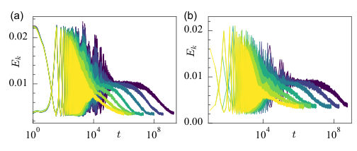
<figcaption class="paper-figure-caption"><b>Fig 5.</b> FIG. 5. Symmetry-constrained transient in the fixed- boundary FPUT-6 lattice. (a,b) Time evolution of the k = ±1 traveling-wave component energies for N = 32 and 64, re- spectively. The colored curves, from left to right, correspond to decreasing nonlinearity strengths from g = 3 × 10−3 to 10−4. As g decreases, the early-time dynamics increasingly approaches pairwise balance, followed by a slower redistribu- tion beyond the pairwise transient.</figcaption>
</figure>

**Summary.** The paper investigates phonon energy diffusion in anharmonic lattices, arguing that simple resonance matching is insufficient for achieving full thermalization. It demonstrates that symmetry constraints can cause kinetic arrest at non-thermal zero-flux states using only exact resonances. Complete energy spreading requires the inclusion of quasi-resonant interactions.

**Why it may be interesting.** This work provides a rigorous theoretical understanding of non-equilibrium dynamics in many-body systems, particularly highlighting how subtle spectral features (like the difference between exact vs. quasi-resonance) dictate whether a system reaches true thermal equilibrium or gets stuck in an arrested state.

Detailed structure

**Main problem.** The study challenges the assumption that merely establishing resonance matching and nonzero coupling is sufficient for persistent phonon energy diffusion (thermalization).

**Main result.** Exact resonances are only kinematic criteria, not sufficient dynamical ones; complete energy spreading requires quasi-resonances to overcome symmetry-enforced kinetic arrest.

**Method.** The analysis uses theoretical derivations of kinetic equations and numerical simulations comparing the dynamics driven by exact versus quasi-resonant scattering processes.

**Model / system.** The primary model is weakly anharmonic lattices, specifically using the periodic FPUT-6 lattice model. The system dynamics are governed by a derived kinetic equation from the sextic interaction term.

**Key observables.** Wave actions ($D_k$), normalized indicator entropy $\langle s(t) 
angle/(N-1)$, and relaxation times ($T_c$, $T_{eq}$).

**Important parameters / regimes.** Nonlinearity strength ($g$), system size ($N$), and the distinction between exact vs. quasi-resonance coupling widths ($\Omega$).

**Assumptions / limitations.** The analysis distinguishes between the thermodynamic limit and fixed finite sizes, noting that these limits do not commute.

**Figures summary.** Figure 1 shows time evolution of wave actions for various resonance subsets leading to arrest; Figure 2 compares size dependence of coupling strengths for exact vs. quasi-resonances; Figure 3 illustrates energy evolution across different resonance regimes as nonlinearity decreases.

**Paper structure.** The paper systematically analyzes the conditions for phonon thermalization, first establishing the kinetic framework using FPUT models, then demonstrating that symmetry constraints cause arrest via exact resonances, and finally showing that quasi-resonances are necessary for full energy spreading.

Abstract

Multi-phonon resonance conditions underpin kinetic theories of phonon transport and lattice thermalization. We show that exact resonance matching, nonzero interaction coefficients, and network connectivity do not guarantee persistent energy diffusion. Symmetry-enforced balance relations drive exact-resonant collision currents to nonthermal zero-flux states, producing kinetic arrest from individual resonant sets to connected networks. Complete energy spreading is sustained by quasi-resonances. The thermodynamic and weak-nonlinearity limits do not commute: the leading kinetic behavior is recovered in the former, whereas at fixed finite size the thermalization time diverges through higher-order crossovers as the nonlinearity vanishes. Exact-resonance existence and connectivity are therefore kinematic, not sufficient dynamical, criteria for phonon energy diffusion.

[↑ back to top](#top)

### [Particle-Vortex Duality of Hydrodynamics](http://arxiv.org/abs/2608.02732v1)

**Authors:** Cenke Xu, Matthew P. A. Fisher  
**Type:** theory · **Category:** other · **PDF:** <https://arxiv.org/pdf/2608.02732v1>  
**Analysis basis:** full PDF text, analyzed in chunks
**Topic relevance:** 🔥 `Keldysh / 2PI / non-Gaussian methods` **4/5** · `driven-dissipative phase transition` **3/5** · `methods for driven-dissipative` **3/5** · `non-equilibrium dynamics` **3/5** · `analog quantum simulation` **2/5** · `non-equilibrium universality` **2/5** · `correlated / nonlocal dissipation` **1/5** · `exotic spin models in light-matter` **1/5**

↔ Scroll figures horizontally

<figure class="paper-figure-card">
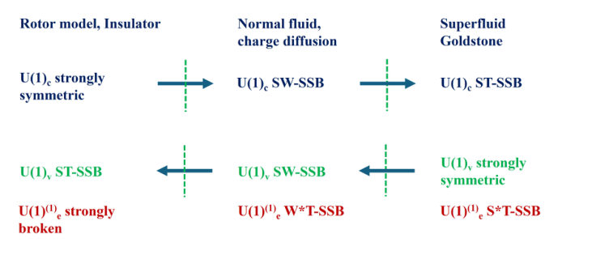
<figcaption class="paper-figure-caption"><b>Fig 1.</b> FIG. 1. The dynamical phase diagram of quantum rotor model with U(1)c symmetry. Starting with the insulator phase, after U(1)c-SW-SSB (condensing ˜ϕ), the system enters the normal fluid phase with charge density diffusion; after U(1)c-ST-SSB (condensing ϕ), the system enters the superfluid phase with Goldstone mode. The same phase diagram can also be produced starting with the superfluid phase, which is the strongly symmetry phase of U(1)v. After the U(1)v-SW-SSB (condensing ˜θ), the system enters the normal fluid, and after U(1)v-ST-SSB (condensing θ), the system enters the insulator phase of rotor.</figcaption>
</figure>

**Summary.** This work establishes a particle-vortex duality for 2D boson/rotor models undergoing dissipative dynamics. By analyzing how symmetries break (SW-SSB vs. WT-SSB), the authors show that the hydrodynamics of charge density and vortices are mathematically equivalent descriptions. This provides a unified framework connecting matter wave physics to magnetohydrodynamic concepts.

**Why it may be interesting.** The explicit connection between charge conservation symmetries ($U(1)_c$) and dual vortex symmetries ($U(1)_e$), mediated by symmetry breaking, provides a powerful theoretical tool for understanding coupled quantum field theories relevant to condensed matter systems like superconductors or superfluids.

Detailed structure

**Main problem.** The paper develops a quantum particle-vortex duality for emergent hydrodynamics in 2D boson/rotor systems, extending known dualities from equilibrium to non-equilibrium settings.

**Main result.** A robust duality is established between the hydrodynamic consequences of different symmetry breaking mechanisms (SW-SSB vs. WT-SSB) associated with charge ($U(1)_c$) and vortex ($U(1)_v$) symmetries, bridging matter and magnetohydrodynamics.

**Method.** The analysis employs the Keldysh path integral formalism to derive effective hydrodynamic equations from Lindbladian dissipative dynamics in various quantum phases.

**Model / system.** The system is a 2D quantum boson/rotor model on a lattice, governed by both a Hamiltonian (quantum coherent) and Lindblad dissipative terms. The physics is analyzed across Mott insulator, Normal fluid, and Superfluid regimes.

**Key observables.** Charge density ($\mathbf{n}$), phase field ($\phi$), gauge fields ($\mathbf{E}, \mathbf{B}$), and the resulting hydrodynamic modes (e.g., propagating Goldstone mode).

**Important parameters / regimes.** Coupling constants ($u_n, u_\phi$), dissipation rates ($\Gamma$), and symmetry breaking types (SW-SSB, WT-SSB).

**Assumptions / limitations.** The analysis relies on working to leading order in small parameters and often assumes finite length scales ($\xi$) for perturbative expansions.

**Figures summary.** Tables summarize the complex relationship between symmetry structure ($U(1)_c$ vs $U(1)_e$), spontaneous symmetry breaking type, and resulting hydrodynamic modes across different phases.

**Paper structure.** The paper systematically analyzes the dynamics by first establishing the quantum framework (Keldysh action), then examining specific symmetry breaking scenarios (SW-SSB, WT-SSB) in different phases (Normal/Superfluid), culminating in the general statement of the particle-vortex duality.

Abstract

Equipped with the recently recognized symmetry structure of mixed states of matter and "strong-weak spontaneous symmetry breaking" (SW-SSB), we develop a quantum particle-vortex duality of emergent model-F and model-A hydrodynamics of 2d boson/rotor systems. This duality relation demonstrates that classical hydrodynamics of 2d bosons can be described in terms of the charge symmetry $U(1)_c$, but also equivalently in terms of the dual (emergent) 1-form symmetry $U(1)^{(1)}_e$, as well as $U(1)_v$ associated with the conservation of vortices. This duality provides a bridge between the hydrodynamics of matter and magnetohydrodynamics.

[↑ back to top](#top)

### [Faraday pattern formation in dipolar superfluid and supersolid quantum gases](http://arxiv.org/abs/2608.03553v1)

**Authors:** Sumit Semwal, Shawan K. Jha, G. A. Bougas, S. I. Mistakidis, Pankaj Kumar Mishra  
**Type:** theory · **Category:** quantum gases · **PDF:** <https://arxiv.org/pdf/2608.03553v1>  
**Analysis basis:** full PDF text, analyzed in chunks
**Topic relevance:** 🔥 `analog quantum simulation` **4/5** · 🔥 `driven-dissipative phase transition` **4/5** · `methods for driven-dissipative` **3/5** · `non-equilibrium dynamics` **3/5** · `non-equilibrium universality` **3/5** · `Keldysh / 2PI / non-Gaussian methods` **1/5**

↔ Scroll figures horizontally

<figure class="paper-figure-card">
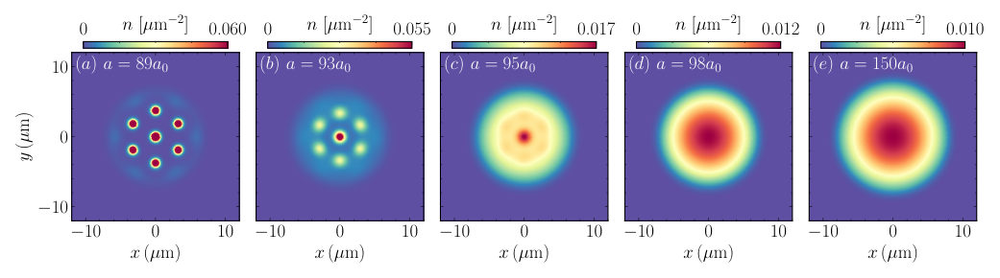
<figcaption class="paper-figure-caption"><b>Fig 1.</b> FIG. 1. Distinct ground state phases of oblate 164Dy dipolar quantum gases at different scattering lengths a, as inferred by the two-dimensional integrated density profiles, n = R |Ψ(r)|2dz. (a), (b) Supersolid states manifest at small scattering lengths, displaying crystalline order and a superfluid background. (c) As the scattering length increases, the density modulation becomes less pronounced, signaling the supersolid–to-superfluid crossover. (d), (e) When the short-range interactions dominate over the dipolar ones, the gas resides in the trapped dipolar superfluid configuration. Here, N = 8 × 104 and the trapping frequencies are (ωr, ωz) = 2π × (43, 133) Hz.</figcaption>
</figure>
<figure class="paper-figure-card">
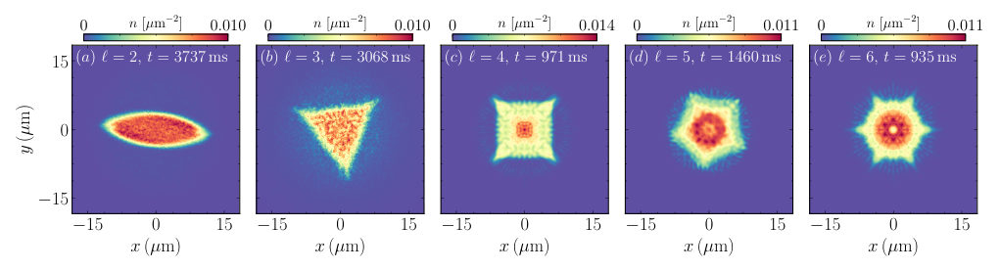
<figcaption class="paper-figure-caption"><b>Fig 2.</b> FIG. 2. Density profiles of different surface patterns of dipolar superfluids arising due to parametric resonances induced by the modulated scattering length [Eq. (4)] at specific driving frequencies. The various surface deformations are classified according to the ℓazimuthal quantum number, and they refer to (a) elliptical (ℓ= 2), (b) triangular (ℓ= 3), (c) square (ℓ= 4), (d) pentagonal (ℓ= 5), and (e) hexagonal (ℓ= 6) surface modes appearing at different time-instants, see also Fig. 3 and Fig. 4. These surface modes are excited at driving frequencies ωd/2π ≃112, 129, 147, 162, and 174 Hz, respectively. The dipolar superfluid is initialized at a scattering length ai = 150 a0 and it is...</figcaption>
</figure>
<figure class="paper-figure-card">
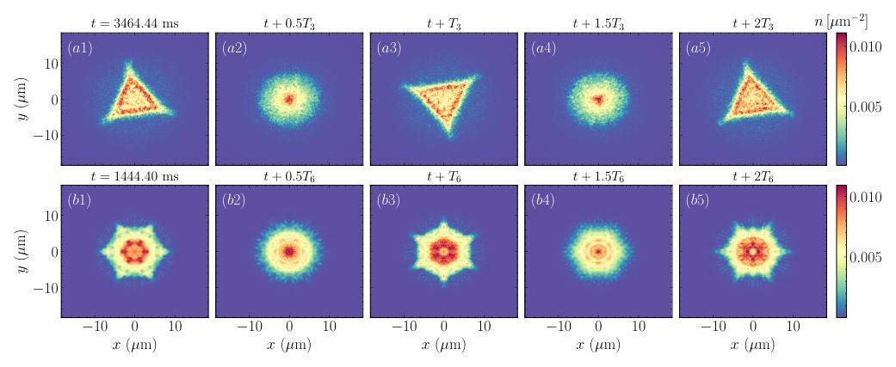
<figcaption class="paper-figure-caption"><b>Fig 3.</b> FIG. 3. Precession, deformation and recurrence of resonantly excited polygonal surface patterns induced by modulation of the scattering length in dipolar superfluids. (a1)-(a5) [(b1)-(b5)] Density snapshots (see legends) of the dipolar superfluid accommodating a triangular [hexagonal] surface pattern excited at driving frequency ωd/2π ≃129 Hz [ωd/2π ≃174 Hz]. The patterns exhibit a sub-harmonic response and re-emerge after two driving periods, i.e. 2Tℓwith ℓ= 3, 6, a behavior that is characteristic of first-order parametric resonances. All other parameters are the same as in Fig. 2.</figcaption>
</figure>
<figure class="paper-figure-card">
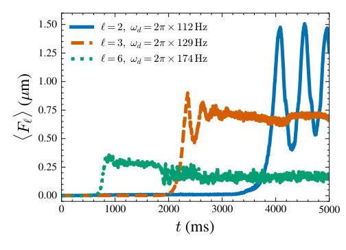
<figcaption class="paper-figure-caption"><b>Fig 4.</b> FIG. 4. Time-averaged spectral strength, ⟨Fℓ(t)⟩, associated with surface deformation modes of different angular symme- tries (see also main text). The higher ℓmodes manifest faster as compared to the lower ones (see legends), whereas the lat- ter are characterized by stronger surface deformations, as cap- tured by their larger spectral strengths.</figcaption>
</figure>
<figure class="paper-figure-card">
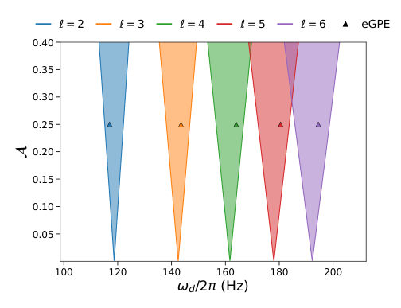
<figcaption class="paper-figure-caption"><b>Fig 5.</b> FIG. 5. Instability tongues of the dipolar superfluid for dif- ferent ℓmodes across the A–ωd plane, at ωz = 2π × 500 Hz. The resonant frequencies in the small driving amplitude limit, i.e. A →0, as obtained analytically (numerically) from the Mathieu equation (eGPE) correspond to ωd/2π = 118.68 Hz (ωd/2π ≃117.00 Hz) for ℓ= 2, ωd/2π = 143.50 Hz (ωd/2π ≃ 141.50 Hz) for ℓ= 3, ωd/2π = 161.68 Hz (ωd/2π ≃164.00 Hz) for ℓ= 4, ωd/2π = 178.00 Hz (ωd/2π ≃180.50 Hz) for ℓ= 5, and ωd/2π = 192.28 Hz (ωd/2π ≃194.50 Hz) for ℓ= 6. For direct comparison, the resonant frequencies from the eGPE at A = 0.25 are also depicted with triangles on top of the Floquet tongues.</figcaption>
</figure>

**Summary.** This paper investigates how external parametric driving induces Faraday patterns in dipolar quantum gases across different phases. It uses the extended Gross-Pitaevskii equation to model the system, revealing a distinct crossover mechanism: surface modes dominate in the superfluid phase, transitioning through hybrid excitations near the supersolid boundary, and finally settling into bulk droplet patterns characteristic of the supersolid state.

**Why it may be interesting.** This work is highly relevant as it explores pattern formation and dynamical instabilities in strongly interacting quantum fluids using advanced mean-field theory, bridging concepts from superfluidity, dipolar interactions, and non-equilibrium dynamics.

Detailed structure

**Main problem.** The study investigates Faraday instabilities, which manifest as spontaneous structure formation, in dipolar superfluid and supersolid quantum gases subjected to external parametric driving.

**Main result.** The research demonstrates a clear dynamical crossover from surface collective modes (superfluids) to hybrid surface-bulk excitations near the transition, culminating in bulk density patterns characteristic of the supersolid regime.

**Method.** The dynamics are simulated using the extended Gross-Pitaevskii equation (eGPE), and resonance spectra are analyzed by deriving an appropriate Mathieu equation.

**Model / system.** The system models three-dimensional trapped dipolar quantum gases, such as $^{164}	ext{Dy}$ atoms. The physics is governed by the competition between short-range interactions, long-range anisotropic dipole-dipole interactions (DDI), and external parametric driving.

**Key observables.** Faraday patterns (standing-wave density modulations), resonance frequencies, sub-harmonic response, and the characterization of surface vs. bulk excitations.

**Important parameters / regimes.** The relative strength of contact vs. dipolar interactions ($\epsilon_{dd}$), the trap aspect ratio, and the parameters governing the parametric driving protocol ($A$, $\omega_d$).

**Assumptions / limitations.** The dynamics are modeled using the extended Gross-Pitaevskii equation (eGPE), which includes beyond mean-field Lee-Huang-Yang corrections in the local-density approximation.

**Figures summary.** Figure 1 illustrates distinct ground state phases (supersolid vs. superfluid) based on scattering length, while Figure 2 shows various surface density patterns ($\ell=2$ to $\ell=6$) induced by parametric resonance via scattering length modulation.

**Paper structure.** The paper analyzes the system in different regimes: first addressing the superfluid phase where discrete polygonal surface modes are excited; then examining the transition region near the supersolid state, leading to hybrid excitations; and finally characterizing the bulk patterns that dominate deep within the supersolid regime.

Abstract

We investigate Faraday instabilities in three-dimensional parametrically driven trapped dipolar quantum gases within the framework of the extended Gross-Pitaevskii equation. In the superfluid regime, periodic modulation of the short-range interactions induces the resonant excitation of discrete polygonal surface modes displaying sub-harmonic response. The resonance frequencies and the parametric windows of instability are accurately captured by an appropriate Mathieu equation, further corroborating our simulations. It is also shown that dipolar interactions in superfluids shift the resonance frequencies to lower values compared to their non-dipolar counterparts. Near the superfluid-to-supersolid transition, intrinsic density undulations associated with the softened roton mode accelerate pattern formation, yielding hybrid surface and bulk excitations. The bulk patterns prevail deeper in the supersolid regime, emerging from droplet collisions with the superfluid background. Our results reveal a crossover from surface collective modes to hybrid surface-bulk excitations and demonstrate how parametric driving dictates pattern formation in long-range interacting quantum fluids.

[↑ back to top](#top)

### [Spin-charge separation in the triangular-lattice Hofstadter-Hubbard model](http://arxiv.org/abs/2608.02727v1)

**Authors:** Yuntian Gu, Hui Yang, Zhehao Dai, Yantao Wu  
**Type:** theory · **Category:** strongly correlated electrons · **PDF:** <https://arxiv.org/pdf/2608.02727v1>  
**Analysis basis:** full PDF text, analyzed in chunks
**Topic relevance:** 🔥 `analog quantum simulation` **4/5** · `exotic spin models in light-matter` **3/5** · `non-equilibrium dynamics` **3/5** · `entanglement & information structure` **2/5** · `methods for driven-dissipative` **2/5** · `Keldysh / 2PI / non-Gaussian methods` **1/5** · `Rydberg arrays` **1/5** · `non-equilibrium universality` **1/5**

↔ Scroll figures horizontally

<figure class="paper-figure-card">
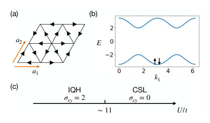
<figcaption class="paper-figure-caption"><b>Fig 1.</b> FIG. 1. Triangular-lattice Hofstadter-Hubbard model. (a) Gauge choice for the nearest-neighbor hopping shown in a 2 × 2 unit cell, a1 = (1, 0), and a2 = (1/2, √</figcaption>
</figure>
<figure class="paper-figure-card">
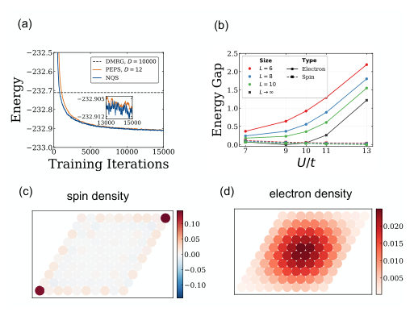
<figcaption class="paper-figure-caption"><b>Fig 2.</b> FIG. 2. Ground state and excited states with open bound- ary conditions. (a) Ground-state energy comparison among DMRG, PEPS, and NQS on an 8 × 8 system at U = 13. (b) Single-electron gap E0(N+1, Sz = 1/2)−E0(N, Sz = 0) (solid lines) and spin gap E0(N, Sz = 1) −E0(N, Sz = 0) (dashed lines) as functions of interaction strength U for L = 6 (green), L = 8 (blue), and L = 10 (red). The grey line represents the electron gap extrapolated to L →∞. (c,d) Spin den- sity and excess charge density of the lowest-energy state with one electron above half-filling at U = 13. The spin density is concentrated near the boundary, whereas the excess charge density is mainly distributed in the bulk, giving a...</figcaption>
</figure>
<figure class="paper-figure-card">
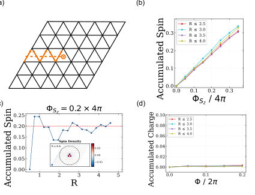
<figcaption class="paper-figure-caption"><b>Fig 3.</b> FIG. 3. Spin and charge pumping in the CSL phase at U = 13 with open boundary conditions. (a) Illustration of flux inser- tion. The flux is placed at the orange cross, and hoppings that cross the dashed branch cut acquire θij →θij +σzΦSz/2 for spin-flux insertion or θij →θij + Φ for charge-flux inser- tion. (b) Spin Sz(R) enclosed within radius R of the flux as a function of spin flux ΦSz on a 12 × 12 lattice. For 2 ≤R ≤4, the linear response approaches the quantized spin Hall con- ductance σs xy. (c) Radial profile of the accumulated spin at fixed spin flux ΦSz = 0.2 × 4π on a 12 × 12 cluster. The spin approaches the theoretical prediction before the circle reaches the boundary; the inset...</figcaption>
</figure>
<figure class="paper-figure-card">
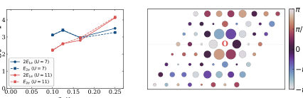
<figcaption class="paper-figure-caption"><b>Fig 4.</b> FIG. 5. Pair energy, single electron energy, and pair wave function near the IQH-CSL transition with periodic boundary conditions. (a) Size dependence of two times the charge-1e energy 2E1e = 2(E0(N + 1, Sz = 1/2) −E0(N, Sz = 0)) and charge-2e energy E2e = E0(N + 2, Sz = 0) −E0(N, Sz = 0). At U = 7, the positive binding energy observed on small clusters decreases with increasing system size and falls below numerical resolution on the largest clusters. Near the critical interaction, U = 11, the binding energy is consistent with zero for all sizes studied. (b) Spatial structure of the spin-singlet pair wave function ∆(r) = ⟨Ψ2e| (c† r↑c† 0↓−c† r↓c† 0↑) |ΨGS⟩for U = 11 and L = 8, showing the...</figcaption>
</figure>
<figure class="paper-figure-card">
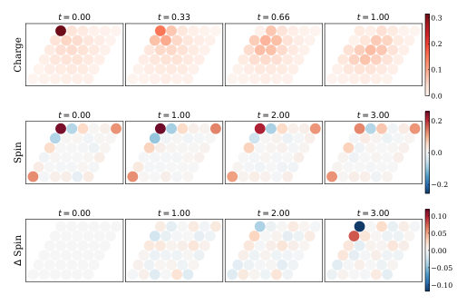
<figcaption class="paper-figure-caption"><b>Fig 5.</b> FIG. 4. Real-time PEPS dynamics of an injected electron in the CSL phase at U = 13 on a 6 × 6 cluster. The initial state contains one additional electron pinned near the upper-left corner by spin-dependent local attractive potentials h↑ pin = 4.4 and h↓ pin = 3.6. After the potential is removed at t = 0, the excess charge rapidly spreads into the bulk, while the spin density remains near the boundary and propagates along the edge. The contrasting charge and spin motion provides a direct dynamical signature of spin-charge separation.</figcaption>
</figure>

**Summary.** The paper investigates the chiral spin liquid phase in the triangular-lattice Hofstadter-Hubbard model using advanced quantum simulation methods. The authors demonstrate spin-charge separation by showing distinct real-space dynamics for spin and charge excitations. This work confirms the utility of NQS and PEPS as powerful tools for diagnosing topological order in strongly correlated electronic systems.

**Why it may be interesting.** This work is highly relevant as it uses sophisticated numerical techniques (NQS/PEPS) to probe fractionalized excitations, a core topic in strongly correlated physics that often connects to emergent phenomena studied in AMO systems like Rydberg arrays or cold atom lattices.

Detailed structure

**Main problem.** The study investigates spin-charge separation (fractionalization) within the context of a putative chiral spin liquid phase.

**Main result.** The authors provide direct real-space evidence for spin-charge separation by observing that spin density localizes on the edge while excess charge diffuses into the bulk during time evolution simulations.

**Method.** The research employs advanced quantum many-body techniques, specifically Variational Monte Carlo with Neural Quantum States (NQS) and Projected Entangled Pair States (PEPS), alongside real-time dynamics simulations.

**Model / system.** The model is the triangular-lattice Hofstadter-Hubbard model, which is relevant to moiré materials and hosts potential chiral spin liquid phases. The Hamiltonian includes hopping terms modulated by a magnetic flux ($\Phi = \pi/2$ per triangle) and an onsite Hubbard interaction ($U$).

**Key observables.** Spin Hall response ($\sigma^s_{xy}$), Charge Hall response ($\sigma_{xy}$), real-space spin density vs. charge density evolution, and two-electron binding energy.

**Important parameters / regimes.** The key parameters are the hopping amplitude ($t$), the onsite interaction strength ($U$), and the magnetic flux $\Phi$. The analysis focuses on regimes around $U \approx 11$ where a transition to CSL is expected.

**Assumptions / limitations.** The study assumes that NQS and PEPS can accurately diagnose topological order, although pairing evidence diminishes rapidly with system size, limiting conclusions about superconductivity in the thermodynamic limit.

**Figures summary.** Figures illustrate gap closing/opening as a function of $U$ (Fig. 2(b)), show direct real-space separation of spin and charge densities (Fig. 2(c,d) & Fig. 4), and demonstrate quantized spin pumping response upon flux insertion (Fig. 3).

**Paper structure.** The paper first establishes the model and methods, then analyzes gap behavior across different coupling regimes ($U$). It proceeds to provide direct evidence for SCS via real-space simulations and quantifies topological properties using charge/spin pumping measurements.

Abstract

Recent experiments in moiré materials have enabled the realization of a variety of exotic quantum phases. In this context, the Hofstadter-Hubbard model has been proposed as a possible setting for hosting chiral spin liquid. Concurrently, significant progress has been recently made in the computational methods for two-dimensional many-body fermion systems, which makes numerically studying this challenging model a real possibility in genuine 2D geometry. Motivated by these advances, we investigate the putative chiral spin liquid phase in the triangular-lattice Hofstadter-Hubbard model using variational Monte Carlo with neural quantum states (NQS) and projected entangled pair states (PEPS). We observe spin-charge separation directly in real space through numerical spin-pumping simulation and real-time spin and charge motion. In addition, in the context of anyonic superconductivity conjectured in this model, we find a positive two-electron binding energy on small systems, but it decreases below our numerical resolution as the system size increases. Our work demonstrates NQS and PEPS as powerful tools, capable of cross-checking each other, for diagnosing topological order and fractionalized excitations in strongly correlated electronic systems.

[↑ back to top](#top)

### [Typical Output States of Monitored Random Clifford Circuits: A Graph-Theoretic Approach](http://arxiv.org/abs/2608.03102v1)

**Authors:** Yu-Xuan Zhang, Yu-Xiang Zhang  
**Type:** theory · **Category:** statistical mechanics · **PDF:** <https://arxiv.org/pdf/2608.03102v1>  
**Analysis basis:** full PDF text, analyzed in chunks
**Topic relevance:** 🔥 `measurement-induced transitions` **4/5** · `driven-dissipative phase transition` **3/5** · `entanglement & information structure` **3/5** · `non-equilibrium dynamics` **2/5** · `non-equilibrium universality` **2/5** · `correlated / nonlocal dissipation` **1/5** · `methods for driven-dissipative` **1/5** · `quantum measurements` **1/5**

↔ Scroll figures horizontally

<figure class="paper-figure-card">
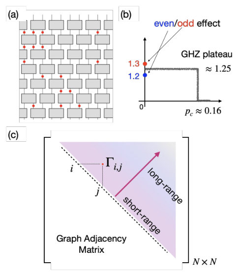
<figcaption class="paper-figure-caption"><b>Fig 1.</b> Figure 1. (a) Brickwork random Clifford circuits consists of local two-qubit Clifford gates interleaved with random single- qubit Pauli Z measurements (red dots). (b) Schematic of the GHZ-entanglement content as a function of the measurement rate p in monitored circuits: An even–odd effect at p = 0 and a plateau ⟨g3⟩≈1.25 in bulk of the volume-law phase. (c) Our primary theoretical tool is the graph adjacency matrix (Γ) for the output stabilizer states. In the large-N limit, the statis- tics of such adjacency matrix determines the distribution of stabilizer states sampled by the monitored random Clifford circuits. Due to translational invariance in the bulk of the system, matrix elements...</figcaption>
</figure>
<figure class="paper-figure-card">
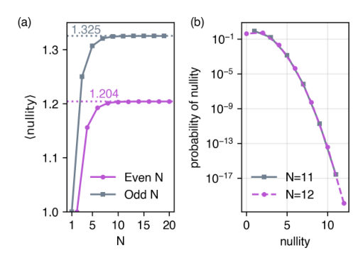
<figcaption class="paper-figure-caption"><b>Fig 2.</b> Figure 2. (a) The dependence of the expectation value of ⟨dim ker Γ⟩on qubit number N. Already at N = 10, the result coincides well with the asymptotic limit (dotted lines). (b) The distribution of nullity for N = 11 and 12.</figcaption>
</figure>
<figure class="paper-figure-card">
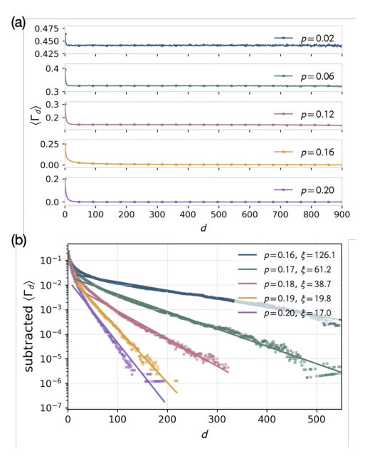
<figcaption class="paper-figure-caption"><b>Fig 3.</b> Figure 3. (a) Averaged edge density (AED) for N = 1000 qubits and values of p detailed in the plots. Graphs of the volume-law phase (p = 0.02, 0.06, 0.12) have a homogeneous long-range AED ⟨Γd⟩&gt; 0, which drops to zero near the criti- cal point (p = 0.16) and in the area-law phase (p = 0.20). (b) The decay of AED ⟨Γd⟩subtracted by the long-range AED in the area-law phase. The data fit into the exponential form exp(−d/ξ).</figcaption>
</figure>
<figure class="paper-figure-card">
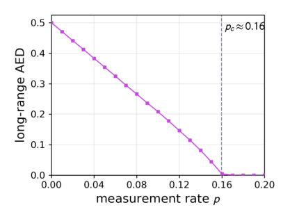
<figcaption class="paper-figure-caption"><b>Fig 4.</b> Figure 4. The homogeneous long-range AED decays as a func- tion of measurement rate p almost linearly.</figcaption>
</figure>
<figure class="paper-figure-card">
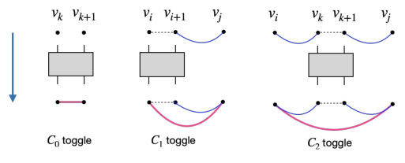
<figcaption class="paper-figure-caption"><b>Fig 5.</b> Figure 5. Schematic illustrating the three types of edge tog- gles and the typical configurations through which a new edge (red) is established. Time evolves downward. Dashed lines represent edges whose existence is conditional.</figcaption>
</figure>

**Summary.** The paper analyzes monitored random Clifford circuits by mapping their output states onto graph structures. Using this graph-theoretic approach, the authors derive analytical results for entanglement measures like GHZ content and identify an emergent, smaller unitary subsystem in the volume-law phase. This work successfully locates the critical point of the measurement-induced phase transition using mean-field theory on the underlying random graph ensemble.

**Why it may be interesting.** This work provides a powerful, concrete link between random graph theory (a statistical mechanics tool) and non-equilibrium quantum dynamics, offering structural insights into how measurement processes constrain complex quantum states.

Detailed structure

**Main problem.** The paper aims to develop a graph-theoretic framework to directly characterize the typical output states of monitored random Clifford circuits, moving beyond traditional entanglement measures.

**Main result.** They found that in the volume-law phase, the output state is equivalent to a unitary circuit on an emergent dense subgraph ($G(N_{\text{sub}}, 1/2)$), and they analytically determined the critical point of the Measurement-Induced Phase Transition (MIPT) at $p_c = 0.1608$.

**Method.** The core method involves mapping the output stabilizer states to graph states characterized by an adjacency matrix ($\Gamma$), allowing for large-$N$ limit analysis and mean-field calculations.

**Model / system.** The system is a monitored random Clifford circuit, which serves as a model for non-equilibrium quantum many-body dynamics. The state structure is analyzed using graph theory representations of stabilizer states.

**Key observables.** GHZ entanglement content ($\langle g_3 \rangle$), bipartite entanglement (entropy), and the structure/density of the emergent subgraph within the output state graph.

**Important parameters / regimes.** The measurement probability ($p$) which controls the transition between volume-law and area-law entanglement regimes, and the system size ($N$).

**Assumptions / limitations.** The analysis relies on the large-$N$ limit convergence to the Erdős–Rényi random graph ensemble $G(N, 1/2)$, and that local Clifford operations can be mapped onto graph complementation rules.

**Figures summary.** Figure 1 illustrates the circuit setup with measurements; Figure 1(b) shows the even-odd effect in GHZ content vs. measurement rate $p$; and Figure 1(c) depicts how edge correlations decay with distance on the graph.

**Paper structure.** The paper first introduces the model and the limitations of previous entropy-based methods, then develops the graph-state framework to analyze output states, derives analytical results for GHZ content and subgraph structure in specific phases, and finally uses mean-field theory to locate the MIPT critical point.

Abstract

Monitored random Clifford circuit is a paradigmatic platform for exploring non-equilibrium quantum many-body dynamics using quantum-information methods. It is well-known for exhibiting a measurement-induced phase transition (MIPT) between volume-law and area-law phases of bipartite entanglement. In this Article, we develop a graph-state based framework that grants direct access to the typical output states of monitored random Clifford circuits. We first show that, in the large-$N$ limit, where $N$ denotes qubit number, the graph representations of random stabilizer states converge to the Erdős--Rényi random graph ensemble $G(N,1/2)$. This observation allows us to resolve the open problem of Greenberger--Horne--Zeilinger (GHZ) entanglement in random stabilizer states. We derive analytically the mean GHZ content, $\langle g_3\rangle=1.204$ for even $N$ and $1.325$ for odd $N$. For monitored one dimensional (1D) circuits in the volume-law phase, we uncover an emergent dense subgraph of the form $G(N_{\mathrm{sub}},1/2)$ in the output-state graphs. This implies that the output state of a monitored circuit is equivalent to an output of a unitary circuit on $N_{\mathrm{sub}}$ qubits, weakly perturbed by the remaining $N-N_{\mathrm{sub}}$ qubits carrying little entanglement. This result directly accounts for the quantum error-correcting capability of the volume-law phase. We further identify a clustering effect in the spatial distribution of the dense subgraph along the 1D qubit chain, and reproduce it with an infection-recovery toy model that exhibits a measurement-induced absorbing-state phase transition. Finally, we locate the critical point of the MIPT at $p_c = 0.1608$ through a mean-field argument on the graph, in excellent agreement with the numerical result $p_c\approx 0.16$.

[↑ back to top](#top)

### [On-chip generation of multi-qubit graph states with high-dimensional encoded single photons](http://arxiv.org/abs/2608.03012v1)

**Authors:** Lan-Tian Feng, Bo-Hao Zhang, Di Liu, Pan Gong, Yu-Yang Ding, Guo-Ping Guo, Guang-Can Guo, Xi-Feng Ren  
**Type:** experiment · **Category:** quantum information and computing · **PDF:** <https://arxiv.org/pdf/2608.03012v1>  
**Analysis basis:** full PDF text, analyzed in chunks
**Topic relevance:** 🔥 `QC/QI experiment` **4/5** · `quantum optics experiment` **3/5** · `entanglement & information structure` **2/5** · `measurement-induced transitions` **2/5** · `quantum measurements` **2/5** · `analog quantum simulation` **1/5** · `interference shaping light` **1/5** · `non-equilibrium dynamics` **1/5**

↔ Scroll figures horizontally

<figure class="paper-figure-card">
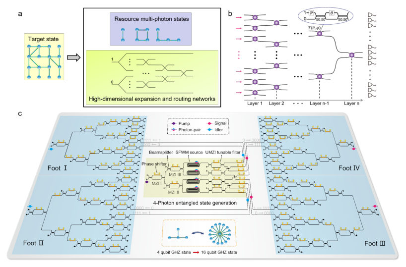
<figcaption class="paper-figure-caption"><b>Fig 1.</b> FIG. 1: Conceptual illustration of the proposed approach and circuit. a, To prepare the target state, we can select appropriate resource multi-photon states and deploy customized high-dimensional expansion and routing networks. b, The layer-by-layer qubit measurement scheme. For n-qubit quantum state preparation with single photons, a n-layer measurement structure is arranged, and each layer can achieve complete measurement of the corresponding qubit. c, The schematic diagram of photonic integrated circuit for 4-photon 16-qubit GHZ state preparation. Owing to the consistency in the forms of GHZ states with different qubit numbers, high-dimensional expansion and routing operations are...</figcaption>
</figure>
<figure class="paper-figure-card">
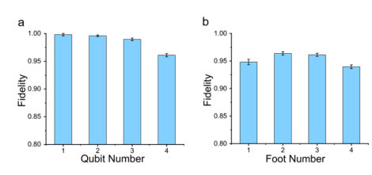
<figcaption class="paper-figure-caption"><b>Fig 2.</b> FIG. 2: Results of the single-photon multi-qubit GHZ state. a, The fidelity of single-photon encoded GHZ state with different qubit numbers. b, The fidelity of single-photon encoded 4-qubit GHZ state with different measurement modules (Foots I-IV). The errors are ob- tained from 300 simulation calculations with the experimental data subjected to Gaussian statics.</figcaption>
</figure>
<figure class="paper-figure-card">
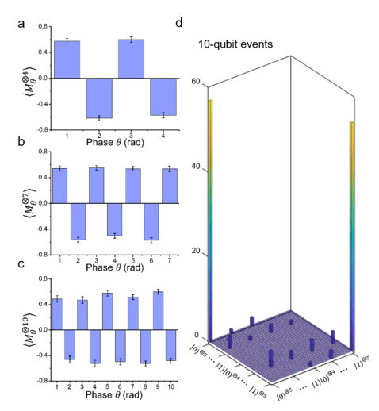
<figcaption class="paper-figure-caption"><b>Fig 3.</b> FIG. 3: Results of the four-photon multi-qubit GHZ state. a-c, The expectation values of Mk for the 4-qubit (a), 7-qubit (b) and 10-qubit (c) GHZ state. The coherence values of the 4-qubit, 7- qubit, and 10-qubit GHZ states are calculated to be 0.589(0.020), 0.543(0.015), and 0.516(0.014), respectively. d, Fourfold coinci- dence counts measured in the 0/1 basis for the 10-qubit GHZ state. The populations of the |0⟩⊗10 and |1⟩⊗10 terms are calculated to be 0.815(0.024).</figcaption>
</figure>
<figure class="paper-figure-card">
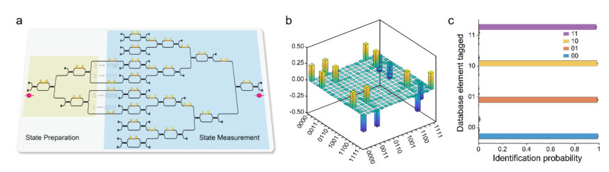
<figcaption class="paper-figure-caption"><b>Fig 4.</b> FIG. 4: Results of the single-photon 4-qubit cluster state. a, The schematic diagram of photonic integrated circuit for single-photon 4-qubit cluster state preparation. The four path dimensions are relabeled, each corresponding to a product term of the cluster state. b, Real part of the measured density matrix of the cluster state. Crystal clear bars represent the density matrix for the ideal cluster state. The imaginary part of the measured density matrix is negligible. c, The identification probability for different labeled elements.</figcaption>
</figure>

**Summary.** The paper presents an advanced method for creating complex multi-qubit entangled states, such as GHZ and cluster states, using single photons on integrated optical chips. By employing high-dimensional encoding instead of direct multi-photon generation, the authors achieve high fidelity across up to 10 qubits. This work advances scalable photonic quantum information processing by demonstrating both state preparation and algorithmic execution (Grover's search).

**Why it may be interesting.** This work provides a concrete, scalable platform demonstration for photonic quantum computation by addressing the resource limitations inherent in multi-photon sources, which is highly relevant to experimental quantum optics and networking research.

Detailed structure

**Main problem.** The primary challenge is generating high-fidelity multi-qubit graph states necessary for universal quantum computation using photonic systems, circumventing the low efficiency of traditional multi-photon sources.

**Main result.** The authors successfully generated and characterized high-fidelity GHZ states up to 10 qubits and a single-photon 4-qubit cluster state on an integrated chip. They also demonstrated Grover's search algorithm using this photonic resource.

**Method.** They propose replacing complex multi-photon preparation with resource-efficient single-photon operations involving high-dimensional encoding, routing, and layer-by-layer quantum measurement schemes.

**Model / system.** The experiment is performed on programmable photonic integrated circuits (silicon photonics) using pulsed lasers at 1550.12 nm. The system utilizes high-dimensional encoding via path degrees of freedom to encode multiple qubits within single photons.

**Key observables.** Fidelity ($F$), Entanglement Witness values ($\langle 	ext{W}_{Gm} 
angle$), and the identification probability for Grover's search.

**Important parameters / regimes.** The largest demonstrated state was a 10-qubit GHZ state, with fidelity reaching $0.961(0.003)$ for 4 qubits; cluster state fidelity reached $0.991(0.004)$.

**Assumptions / limitations.** The approach assumes the feasibility of high-dimensional encoding and relies on quantum state tomography and entanglement witness measurements for verification.

**Figures summary.** Figures show measured fidelities for GHZ states across varying qubit numbers, entanglement witness values confirming genuine multipartite entanglement (violating classical bounds), and the identification probability achieved during a Grover search demonstration.

**Paper structure.** The paper details the conceptual framework of single-photon high-dimensional encoding, presents experimental results on generating and characterizing multi-qubit graph states (GHZ/cluster) using integrated photonics, and concludes with demonstrations of quantum algorithms like Grover's search.

Abstract

Photonic multi-qubit entanglement is key to optical quantum information processing, particularly universal quantum computing. Yet multi-photon sources suffer from low emission efficiency, making single-photon high-dimensional encoding an appealing alternative. Here we propose an explicit and resource-efficient high-dimensional encoding approach to achieve the target multi-qubit quantum state. The technically challenging preparation of multi-photon quantum states is replaced by single-photon operations involving high-dimensional expansion, routing, and multi-layered quantum measurement. Besides, each photon in the resource multi-photon quantum state can be used to encode multiple qubits in a distributed manner, and a larger entangled state will be constructed. We demonstrate this approach using programmable photonic integrated circuits, where multi-qubit graph states--including the Greenberger-Horne-Zeilinger state and the cluster state--are generated and characterized. We additionally demonstrate the Grover search algorithm using the single-photon cluster state. Our findings unlock a novel route towards diverse entangled state generation with photons and advance large-scale and universal photonic quantum information processing.

[↑ back to top](#top)

### [On-chip Quantum Measurement of Squeezing Generated from a Silicon Nitride Micro-ring Resonator](http://arxiv.org/abs/2608.03402v1)

**Authors:** Yuhang Lei, Chenfei Cui, Yue Li, Hon Ki Tsang, Z. Y. Ou  
**Type:** experiment · **Category:** quantum information and computing · **PDF:** <https://arxiv.org/pdf/2608.03402v1>  
**Analysis basis:** full PDF text, analyzed in chunks
**Topic relevance:** 🔥 `quantum optics experiment` **4/5** · `quantum measurements` **3/5** · `QC/QI experiment` **2/5** · `measurement-induced transitions` **2/5** · `analog quantum simulation` **1/5** · `correlated / nonlocal dissipation` **1/5** · `correlated cavity matter` **1/5** · `driven-dissipative phase transition` **1/5** · `interference shaping light` **1/5**

↔ Scroll figures horizontally

<figure class="paper-figure-card">
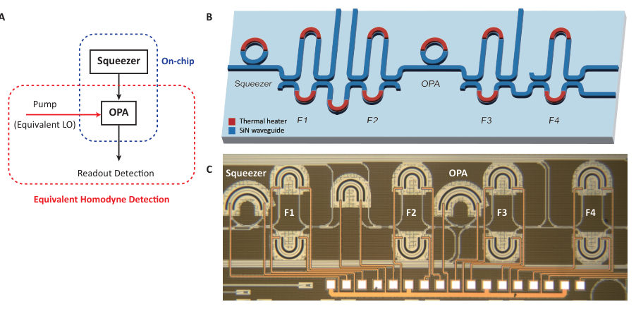
<figcaption class="paper-figure-caption"><b>Fig 1.</b> Figure 1: Concept and device architecture of on-chip parametric-amplifier-assisted quantum</figcaption>
</figure>
<figure class="paper-figure-card">
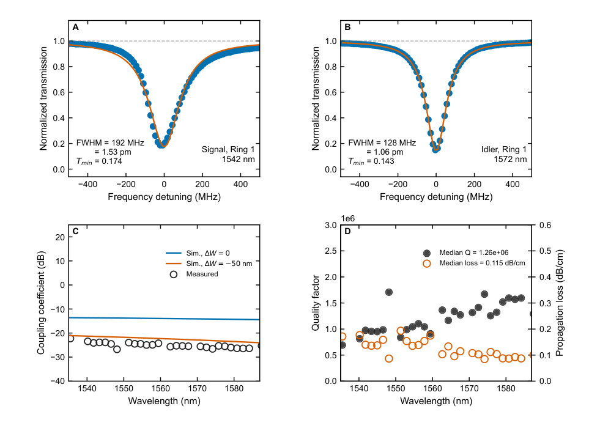
<figcaption class="paper-figure-caption"><b>Fig 2.</b> Figure 2: Ring linear characterization. (A)(B) Measured transmission spectrum at signal wave-</figcaption>
</figure>
<figure class="paper-figure-card">
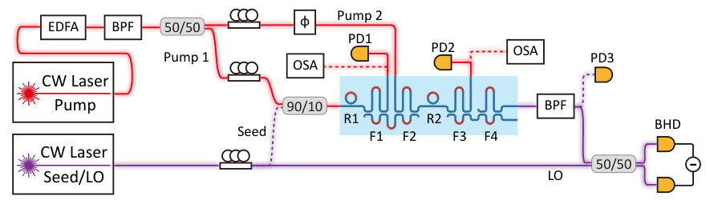
<figcaption class="paper-figure-caption"><b>Fig 3.</b> Figure 3: Experimental setup. The blue box encloses the on-chip device, which consists of two</figcaption>
</figure>
<figure class="paper-figure-card">
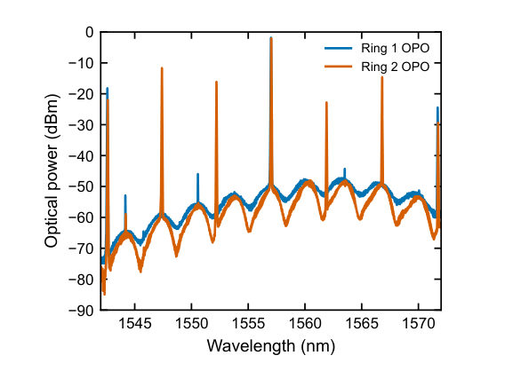
<figcaption class="paper-figure-caption"><b>Fig 4.</b> Figure 4: OPO characterization. Overlap between the OPO spectra of the two micro-ring res-</figcaption>
</figure>
<figure class="paper-figure-card">
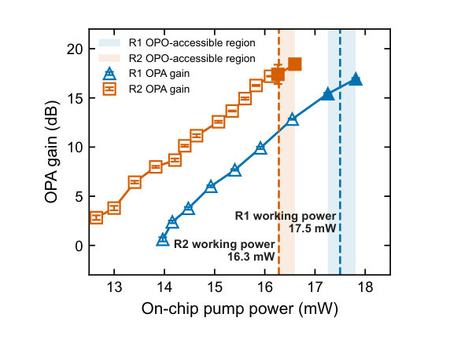
<figcaption class="paper-figure-caption"><b>Fig 5.</b> Figure 5: OPA gain characterization. Measured OPA gain versus on-chip pump power for R1</figcaption>
</figure>

**Summary.** The paper addresses the critical issue of signal degradation due to coupling losses when measuring quantum light states on photonic chips. The authors propose and experimentally demonstrate an 'on-chip quantum measurement' technique using cascaded silicon nitride micro-ring resonators acting as a squeezer followed by a parametric amplifier. This method successfully measures significant squeezing (4.6 dB) even with substantial external optical loss, establishing a scalable platform for integrated quantum sensing.

**Why it may be interesting.** This work provides a crucial engineering solution to a major bottleneck in integrated quantum photonics—loss. By showing how amplification can circumvent loss limitations, it paves a practical path for scaling quantum sensors onto chips.

Detailed structure

**Main problem.** The primary challenge is that coupling losses between on-chip quantum optical components and off-chip detectors destroy fragile quantum correlations, limiting the observable squeezing.

**Main result.** The authors successfully demonstrated a 4.6 dB quantum noise reduction despite exceeding 5 dB of chip-to-fiber coupling loss by implementing an on-chip measurement scheme.

**Method.** They utilized a two-stage system: one micro-ring resonator generates the squeezed state, and a second ring acts as a high-gain parametric amplifier (OPA) to measure this state before significant external loss occurs.

**Model / system.** The physical platform is an integrated silicon nitride (SiN) photonic chip containing two cascaded micro-ring resonators. The system functions as a monolithic SU(1,1) interferometer when used for sensing.

**Key observables.** Quantum noise reduction (measured in dB), interference fringe visibility, and the measured squeezing level relative to vacuum noise.

**Important parameters / regimes.** Chip-to-fiber coupling loss (>5 dB); observed quantum noise reduction (4.6 dB); high gain regime of the OPA ($G \gg 1$).

**Assumptions / limitations.** The measurement is inherently loss-tolerant because the amplifier elevates the quantum noise floor above vacuum levels, making detection insensitive to downstream losses.

**Figures summary.** Figures illustrate the conceptual schematic (Squeezer $
ightarrow$ OPA), the device structure on SiN, and crucially, the measured quantum noise spectra comparing squeezed vs. vacuum states under varying pump phases.

**Paper structure.** The paper establishes the problem of loss in chip-based quantum optics, proposes the parametric amplifier assisted measurement scheme (SU(1,1) interferometer), details the experimental implementation on SiN rings, and presents quantitative measurements demonstrating noise reduction despite high coupling losses.

Abstract

Integration of quantum optical technique on-chip is crucial for large scale applications of quantum technology, which were proven in a free space environment to be superior to the corresponding classical technology. Squeezed states of light can be used for enhancing the sensitivity of quantum sensors and for fault-tolerant quantum computing. Although chip-based squeezed light generation has advanced significantly, practical impact remains limited because coupling losses between the chip and off-chip detectors destroy delicate quantum correlations, restricting the amount of observed squeezing. Here, we overcome this limitation by implementing the idea of on-chip quantum measurement with the aid of a parametric amplifier and applying it to the squeezed state generated by a silicon nitride (SiN) microring resonator. In our scheme, two matched SiN micro-rings are sequentially constructed. The first ring generates a squeezed state, whereas the second ring acts as a high-gain parametric amplifier (PA) that measures the squeezed state before the light experiences significant off-chip loss. This architecture is inherently loss-tolerant: the amplifier elevates the quantum noise well above the vacuum level, making the measurement insensitive to downstream losses. We directly observe a quantum noise reduction of 4.6 dB from the first ring, despite a chip-to-fiber coupling loss exceeding 5 dB. This work also demonstrates the first monolithic SU(1,1) interferometer with an estimated 5 dB signal-to-noise enhancement compared to traditional linear interferometers, and thus establishes a practical pathway for chip-based quantum sensors.

[↑ back to top](#top)

### [A First-principles Computational Framework for Quantum Decoherence in Complex Diamond Spin Environments](http://arxiv.org/abs/2608.02846v1)

**Authors:** Huijin Park, Ha-young Jeong, Hyeonsu Kim, Christoph Findler, Fedor Jelezko, Sangwon Oh, Junghyun Lee, Giulia Galli, Hosung Seo  
**Type:** both · **Category:** quantum information and computing · **PDF:** <https://arxiv.org/pdf/2608.02846v1>  
**Analysis basis:** full PDF text, analyzed in chunks
**Topic relevance:** 🔥 `QC/QI experiment` **4/5** · 🔥 `spintronics-quantum-optics interface` **4/5** · `Keldysh / 2PI / non-Gaussian methods` **1/5** · `Kondo & dissipative impurity` **1/5** · `analog quantum simulation` **1/5** · `correlated / nonlocal dissipation` **1/5** · `exotic spin models in light-matter` **1/5** · `methods for driven-dissipative` **1/5** · `non-equilibrium dynamics` **1/5**

↔ Scroll figures horizontally

<figure class="paper-figure-card">
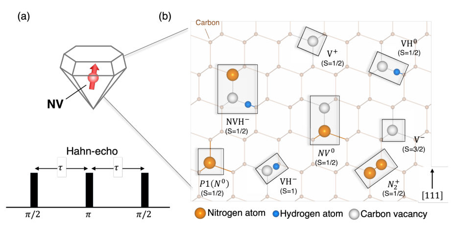
<figcaption class="paper-figure-caption"><b>Fig 1.</b> Figure 1. Paramagnetic defects in diamond and central spin model. (a) Schematic of the negatively charged nitrogen-vacancy in diamond subject to a Hahn-echo pulse sequence. (b) Representative paramagnetic defects considered in this study. Brown, blue, white, and orange spheres denote carbon, hydrogen, vacancies, and nitrogen atoms, respectively. An external magnetic field is applied along the [111] crystallographic axis.</figcaption>
</figure>
<figure class="paper-figure-card">
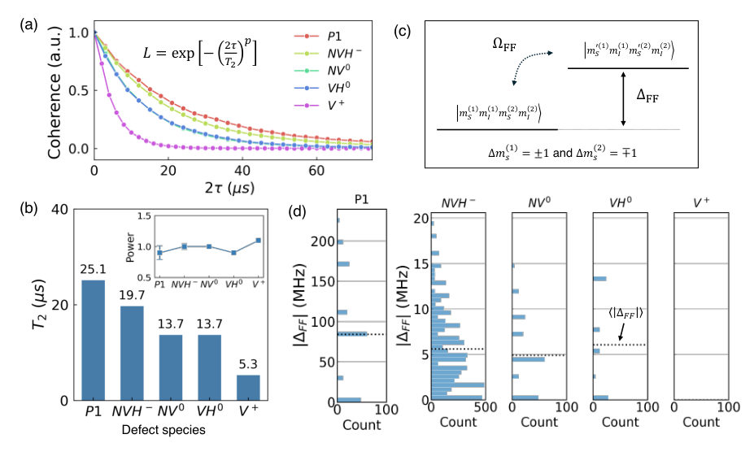
<figcaption class="paper-figure-caption"><b>Fig 2.</b> Figure 2. NV decoherence in homogeneous PM defect baths. (a) Computed coherence functions of NV centers in homogenous defect baths with a defect concentration of 12 ppm under a magnetic field of 322.7 G. (b) Extracted 𝑻𝟐 and 𝒑 (inset) parameters for each bath. They are obtained by fitting the coherence functions L using a stretched exponential decay model. (c) Energy-level diagram illustrating electron-spin flip-flop transitions within a defect</figcaption>
</figure>
<figure class="paper-figure-card">
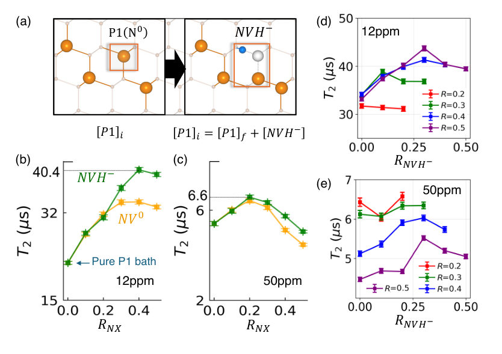
<figcaption class="paper-figure-caption"><b>Fig 3.</b> Figure 3. Variation of the coherence time T2 in the defect conversion model (a) Schematic of the defect conversion model illustrating the transformation of P1 centers into other N-related defects (e.g. 𝑁𝑉𝐻!). Orange, white and blue ball denote nitrogen atom, carbon vacancy and hydrogen atom respectively. The orange box indicates a site converted defect from P1 to 𝑁𝑉𝐻!. (b, c) Computed 𝑇&quot; values in two-species mixed bath as a function of the conversion ratio 𝑅*P, for (b) [𝑃1]/ = 12 ppm and (c) [𝑃1]/ = 50 ppm. (d, e) 𝑇&quot; values in three-species mixed bath (𝑃1- 𝑁𝑉$-𝑁𝑉𝐻!) as a function of 𝑅*+Q! for (d) [𝑃1]/ = 12 ppm and (e) [𝑃1]/ = 50 ppm. The total conversion ratio 𝑅= 𝑅*+# + 𝑅*+Q! is varied...</figcaption>
</figure>
<figure class="paper-figure-card">
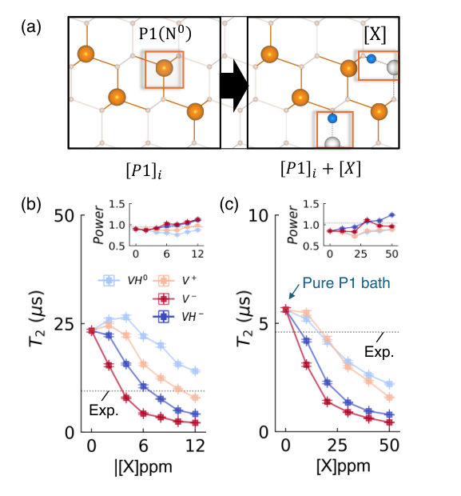
<figcaption class="paper-figure-caption"><b>Fig 4.</b> Figure 4. Variation of the coherence time 𝑻𝟐 in extra defect model (a) Schematic of the extra defect model. Orange boxes labeled [𝑿] represent V/H-related defects introduced into the bath. (b, c) Computed 𝑻𝟐 and 𝒑 values as a function of [𝑿] for (b) [𝑷𝟏]𝒊 = 12 ppm and (c) [𝑷𝟏]𝒊= 50 ppm. Black dotted lines indicate experimentally extracted 𝑻𝟐 and 𝒑 values. Experimental details are described in a later section.</figcaption>
</figure>
<figure class="paper-figure-card">
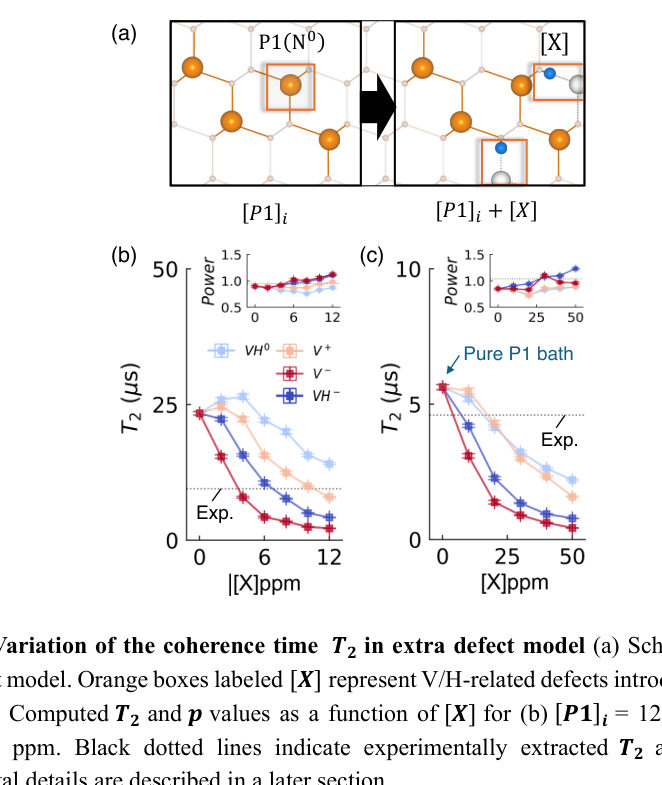
<figcaption class="paper-figure-caption"><b>Fig 5.</b> Figure 4b, and 4c show 𝑇&quot; as a function of the V/H-related defect concentration [X], which is</figcaption>
</figure>

**Summary.** This work introduces a first-principles computational framework to accurately model quantum decoherence in diamond by treating complex, heterogeneous defect environments. By combining DFT with spin-bath simulations, the authors show that individual defect types critically influence coherence times, offering a predictive tool for optimizing quantum materials.

**Why it may be interesting.** It provides a crucial link between atomistic material science (DFT of defect structure) and fundamental quantum dynamics (decoherence), which is vital for designing robust solid-state qubits.

Detailed structure

**Main problem.** Predicting quantum decoherence in realistic solid-state materials is computationally challenging because complex defect environments are often inaccurately modeled as simple homogeneous spin baths.

**Main result.** The study demonstrates that decoherence depends critically on the specific identity and composition of defects, showing that heterogeneous bath effects can significantly alter coherence times compared to predictions from simpler models.

**Method.** A predictive framework combining first-principles electronic structure calculations (DFT) with quantum many-body spin-bath simulations is developed and validated against magnetic-field-dependent Hahn-echo measurements.

**Model / system.** The system uses diamond containing Nitrogen-Vacancy (NV) ensembles as the central qubit, interacting with a heterogeneous bath of multiple paramagnetic defects (e.g., N-, V-, H-related species).

**Key observables.** Quantum coherence time ($T_2^*$), decoherence decay behavior (stretched exponential), and field dependence.

**Important parameters / regimes.** Defect identity, defect concentration, hyperfine interaction parameters, and magnetic field strength.

**Assumptions / limitations.** The framework moves beyond homogeneous bath approximations by incorporating defect-resolved spin Hamiltonians and heterogeneous interactions.

**Figures summary.** Figure 1 schematically illustrates the central spin model used to compute decoherence dynamics of an NV center interacting with a PM defect spin bath environment.

**Paper structure.** The paper develops a computational framework, applies it to model decoherence in diamond using various defects, and validates its predictions by reproducing experimental coherence times across different magnetic fields.

Abstract

Quantum decoherence induced by defects remains a major limitation for solid-state quantum technologies, yet predicting decoherence in realistic materials remains computationally challenging. Complex defect populations are often approximated as homogeneous spin baths, obscuring the role of defect-specific electronic structure and spin dynamics. Here, we develop a predictive framework for decoherence in diamond by combining first-principles electronic-structure calculations, quantum many-body spin-bath simulations, and experimental validation. The framework incorporates defect-resolved spin Hamiltonians and heterogeneous spin baths containing multiple paramagnetic defect species. Using diamond nitrogen-vacancy ensembles as a model platform, we investigate mixed nitrogen-, vacancy-, and hydrogen-related defect environments. We show that decoherence depends not only on defect density but also on defect identity and bath composition, whose distinct electronic structures, hyperfine interactions, and spin dynamics produce different coherence behavior. Heterogeneous defect populations can either suppress or enhance decoherence, producing trends unexplained by homogeneous-bath models. Magnetic-field-dependent Hahn-echo measurements on samples with different defect concentrations validate the framework. The calculations reproduce the observed coherence times and stretched-exponential decay behavior across a broad magnetic-field range and identify vacancy-related defects as critical contributors beyond the conventionally assumed P1 spin bath. By linking atomistic defect properties to quantum coherence, our framework provides a predictive route for identifying hidden defect environments and optimizing decoherence in defect-based quantum materials.

[↑ back to top](#top)

### [Exact Tradeoff Between Quantum Error Correction and Quantum Darwinism: An Information-Theoretic No-Go Theorem](http://arxiv.org/abs/2608.03944v1)

**Authors:** Arghya Maity, Kelvin Onggadinata, Teck Seng Koh  
**Type:** theory · **Category:** quantum information and computing · **PDF:** <https://arxiv.org/pdf/2608.03944v1>  
**Analysis basis:** full PDF text, analyzed in chunks
**Topic relevance:** 🔥 `entanglement & information structure` **4/5** · `correlated / nonlocal dissipation` **3/5** · `methods for driven-dissipative` **3/5** · `driven-dissipative phase transition` **2/5** · `Keldysh / 2PI / non-Gaussian methods` **1/5** · `non-equilibrium dynamics` **1/5** · `non-equilibrium universality` **1/5**

↔ Scroll figures horizontally

<figure class="paper-figure-card">
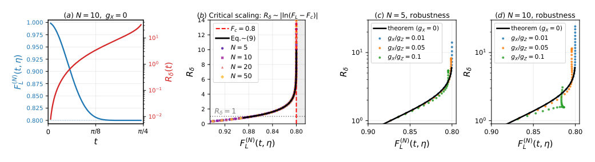
<figcaption class="paper-figure-caption"><b>Fig 1.</b> FIG. 1. Numerical results for the Darwinism–QEC competition (gZ = 1, η = 0.6, δ = 0.10). (a) Competition in time for N = 10, gX = 0. Blue curve (left axis): logical fidelity F (N) L (t, η), decaying monotonically from unity toward the floor Fc = (1 + η)/2 = 0.8 (dotted line). Red curve (right axis, log scale): Darwinistic redundancy Rδ(t), rising simultaneously. Solid lines are the closed-form analytical predictions Eqs. (5) and (8); exact diagonalization data (not shown separately) agrees to these. (b) Critical Darwinism–QEC scaling. Rδ is plotted against the logical fidelity F (N) L on linear axes for N = 5, 10, 20, 50 (colored points). The black curve is the exact tradeoff (Eq. (9))....</figcaption>
</figure>
<figure class="paper-figure-card">
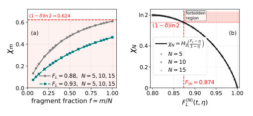
<figcaption class="paper-figure-caption"><b>Fig 2.</b> FIG. 2. Numerical confirmation of the no-go theorem , δ = 0.10, η = 0.60). (a) Fragment Holevo information χm as a function of the fragment fraction f = m/N, computed for N = 5, 10, 15 at two representative logical fidelities FL = 0.88 and FL = 0.93, both lying above the no-go threshold Fth = 0.874. Every curve remains strictly below the Darwinism threshold (1 −δ) ln 2 = 0.624 nat (red dashed line) for all fragment sizes m = 1, . . . , N, demonstrat- ing that no environment fragment—however large—carries suffi- cient classical information to establish Darwinistic redundancy when FL &gt; Fth. (b) Full-environment Holevo information χN as a func- tion of logical fidelity F (N) L , for N = 5, 10,...</figcaption>
</figure>

**Summary.** This paper establishes an exact information-theoretic tradeoff theorem demonstrating that the emergence of redundant classical records via Quantum Darwinism directly degrades the logical fidelity protected by Quantum Error Correction. By analyzing a solvable model, the authors derive a quantitative relationship linking these two seemingly disparate phenomena and prove a general no-go bound governing this competition.

**Why it may be interesting.** This work provides a rigorous, quantitative link between two major concepts in quantum information theory (QEC and QD), suggesting that environmental interaction cannot simultaneously maximize both coherence protection and classical redundancy. This has implications for understanding decoherence mechanisms in realistic physical systems.

Detailed structure

**Main problem.** The paper establishes a quantitative, information-theoretic tradeoff between Quantum Error Correction (QEC), which preserves quantum coherence, and Quantum Darwinism (QD), which describes the emergence of objective classical information via environmental redundancy.

**Main result.** An exact, parameter-independent tradeoff theorem is derived showing that increasing redundant classical records (Darwinistic Redundancy) must come at the direct expense of the logical fidelity of the quantum state. Furthermore, a model-independent no-go theorem proves this fundamental limit.

**Method.** The authors analyze an exactly solvable block-environment model by deriving relationships between three key observables: logical fidelity ($F_L$), Holevo information ($\chi$), and decoherence factors ($\Gamma$).

**Model / system.** The system uses the logical GHZ block of the Shor code interacting with $N$ environment qubits. The dynamics are analyzed using a Hamiltonian structure, focusing on the resulting decoherence factor $\Gamma_N(t)$ that governs both quantum information loss and environmental entanglement.

**Key observables.** Logical Fidelity ($F_L^{(N)}$), Holevo Information ($\chi_m$), Darwinistic Redundancy ($R_\delta$), Decoherence Factor ($\Gamma_N(t)$), and Von Neumann Entropy ($S(
ho_b)$).

**Important parameters / regimes.** Environment size ($N$), imperfect recovery efficiency ($\eta$), decoherence parameter ($gZ_t$), and the redundancy threshold ($\delta$).

**Assumptions / limitations.** The initial analytical derivation relies on an exactly solvable limit (e.g., setting one coupling constant to zero), although numerical tests confirm robustness using the full Hamiltonian.

**Figures summary.** Figures numerically demonstrate the competition between QEC and QD, showing data collapse onto the derived tradeoff equation, confirming critical scaling near thresholds, and verifying the model-independent no-go theorem by plotting $\chi$ vs $F_L$.

**Paper structure.** The paper systematically introduces the conflict between QEC and QD, develops the solvable block-environment model using the Shor code, derives expressions for fidelity and redundancy based on a common decoherence factor ($\Gamma$), and finally eliminates this factor to establish the exact tradeoff theorem and the general no-go bound.

Abstract

Quantum error correction (QEC) and Quantum Darwinism describe opposing consequences of system-environment interactions: QEC seeks to preserve logical quantum information, whereas Quantum Darwinism explains the emergence of objective classical information through its proliferation into the environment. Despite their common physical origin, no direct quantitative connection between these paradigms has previously been established. We introduce an exactly solvable block-environment model based on the logical GHZ block of the Shor [[9,1,3]] quantum error-correcting code, collectively coupled to N environment qubits. The logical fidelity, Holevo information, and Darwinistic redundancy are obtained systematically for arbitrary environment size and imperfect recovery efficiency. Eliminating the common decoherence parameter yields an exact tradeoff relating Darwinistic redundancy directly to the post-recovery logical fidelity, demonstrating that the emergence of redundant classical records occurs at the expense of logical quantum information. We further prove a model-independent no-go theorem showing that the logical fidelity exceeds a critical threshold precludes the emergence of Darwinistic redundancy, irrespective of the microscopic Hamiltonian or environment structure. The solvable model saturates this general bound, establishing the first quantitative information-theoretic connection between logical quantum information protection and the emergence of redundant classical records.

[↑ back to top](#top)

### [Geometric-Symmetry Logical Gate and Local-Probe Selectivity in the Three-Leg AKLT Ladder](http://arxiv.org/abs/2608.03861v1)

**Authors:** Jingnuo Han, Youning Li  
**Type:** theory · **Category:** quantum information and computing · **PDF:** <https://arxiv.org/pdf/2608.03861v1>  
**Analysis basis:** full PDF text, analyzed in chunks
**Topic relevance:** 🔥 `entanglement & information structure` **4/5** · `analog quantum simulation` **3/5** · `methods for driven-dissipative` **3/5** · `non-equilibrium dynamics` **2/5** · `Keldysh / 2PI / non-Gaussian methods` **1/5** · `correlated / nonlocal dissipation` **1/5** · `driven-dissipative phase transition` **1/5**

↔ Scroll figures horizontally

<figure class="paper-figure-card">
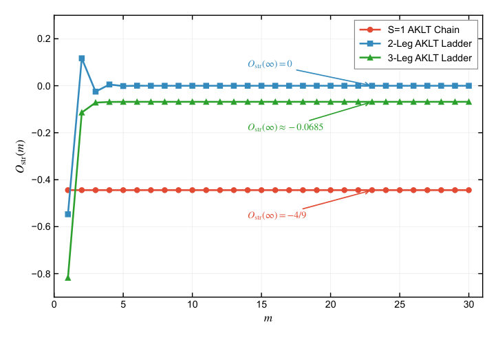
<figcaption class="paper-figure-caption"><b>Fig 1.</b> FIG. 1: Thermodynamic-limit string order Ostr(m) versus m for the chain, two-leg ladder,</figcaption>
</figure>
<figure class="paper-figure-card">
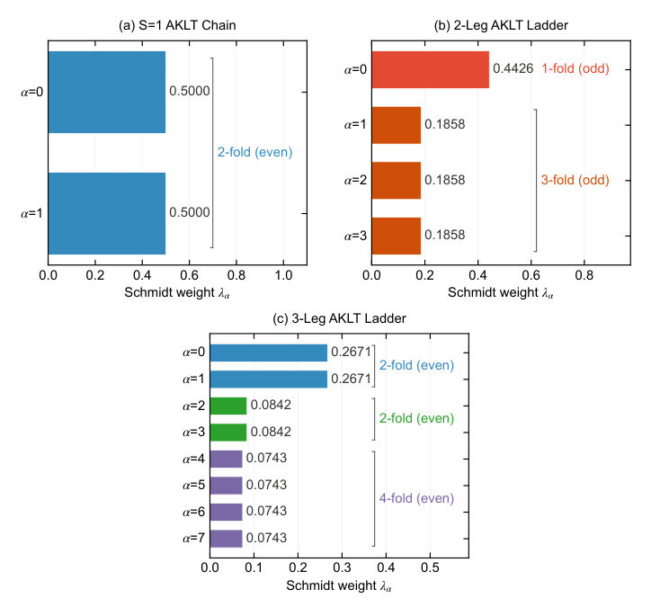
<figcaption class="paper-figure-caption"><b>Fig 2.</b> FIG. 2: Entanglement spectra of the chain, the two-leg ladder, and the three-leg ladder.</figcaption>
</figure>
<figure class="paper-figure-card">
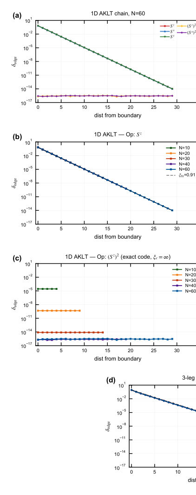
<figcaption class="paper-figure-caption"><b>Fig 3.</b> FIG. 3: (a) Edge-distinguishability δedge versus distance from the boundary for all</figcaption>
</figure>

**Summary.** The authors investigate how symmetry protects quantum information encoded on the boundaries of a three-leg AKLT ladder. They derive a quantitative decay law showing that local probe operators can only access specific symmetry sectors, leading to an observable hierarchy in correlation lengths. This establishes a rigorous link between lattice geometry, underlying symmetries, and the robustness of topological quantum memory.

**Why it may be interesting.** This work provides quantitative metrics (decay laws, selection rules) linking fundamental symmetries to concrete measures of quantum information protection in lattice models, which is highly relevant for understanding robust quantum memories and computation architectures.

Detailed structure

**Main problem.** The study aims to establish a quantitative connection between Symmetry-Protected Topological (SPT) symmetry, lattice geometry, and the protection of boundary-encoded quantum information.

**Main result.** The paper shows that local operator accessibility decay is governed by selection rules derived from symmetries, leading to an observable hierarchy of correlation lengths in the three-leg AKLT ladder.

**Method.** The analysis uses exact Matrix Product State (MPS) constructions and channel decomposition techniques motivated by the Knill--Laflamme condition to quantify information leakage.

**Model / system.** The system studied is the three-leg Affleck-Kennedy-Lieb-Tasaki (AKLT) ladder, an exactly solvable SPT model with on-site symmetry SO(3) x Z2. It is analyzed using MPS representations derived from a frustration-free parent Hamiltonian.

**Key observables.** Logical gates ($	ext{SO}(3)$ rotations and permutation), local operator accessibility decay law $\delta_{	ext{edge}}(	ext{dist}) \propto e^{-	ext{dist}/\xi(L=\ell)}$, and the hierarchy of correlation lengths $\xi(L=1) > \xi(L=2) > \xi(L=3)$.

**Important parameters / regimes.** The symmetry labels (SO(3) tensor rank and $P_{tb}$ parity), the lattice geometry (three-leg ladder vs. single chain), and the correlation lengths $\xi(L)$ are key parameters.

**Assumptions / limitations.** The analysis relies on projecting the system onto relevant sectors ($L$-sectors) and assuming that the decay law can be accurately modeled by retaining leading eigenvalues in the channel decomposition.

**Figures summary.** Table IV shows the channel-resolved edge fidelity $\delta_{	ext{edge}}$ at a finite size, demonstrating how contributions from different symmetry channels (b) and (c) add in quadrature to determine the overall decay profile.

**Paper structure.** The paper first characterizes the symmetries and logical gates using MPS. It then introduces a distinguishability measure based on channel decomposition of the transfer matrix. Finally, it derives the symmetry-resolved decay law for local accessibility, showing how different $L$-sectors contribute distinct correlation lengths.

Abstract

Symmetry-protected topological (SPT) phases provide a platform for encoding quantum information in protected boundary degrees of freedom. Here we study the three-leg Affleck-Kennedy-Lieb-Tasaki (AKLT) ladder as an exactly solvable SPT system with on-site symmetry $SO(3)\times \mathbb{Z}_2$. Using an exact matrix product state construction, we characterize the symmetry action on the edge encoding space and the accessibility of this space by local operators. We find that the continuous $SO(3)$ symmetry induces boundary rotations, while the leg-exchange symmetry generates a geometry-dependent logical permutation of edge qubits. Furthermore, by introducing a distinguishability measure motivated by the Knill--Laflamme condition, we derive a symmetry-resolved decay law for local accessibility. The decay is controlled by a selection rule raised from the Wigner--Eckart theorem, whereby a rank-$\ell$ local operator couples only to the $\mathcal L=\ell$ transfer-matrix sector, with a decay length determined by the corresponding correlation length. We further identify a finite-size channel that is independent of the probe operator position. These results establish a quantitative connection between SPT symmetry, lattice geometry, and the protection of boundary-encoded quantum information.

[↑ back to top](#top)

### [Interplay between teleportation fidelity and basis-independent coherence in maximally sliced states under decoherence](http://arxiv.org/abs/2608.03865v1)

**Authors:** Anushree Pandey, Sovik Roy  
**Type:** theory · **Category:** quantum information and computing · **PDF:** <https://arxiv.org/pdf/2608.03865v1>  
**Analysis basis:** full PDF text, analyzed in chunks
**Topic relevance:** 🔥 `entanglement & information structure` **4/5** · `correlated / nonlocal dissipation` **3/5** · `methods for driven-dissipative` **3/5** · `driven-dissipative phase transition` **2/5** · `Keldysh / 2PI / non-Gaussian methods` **1/5** · `non-equilibrium dynamics` **1/5** · `non-equilibrium universality` **1/5**

↔ Scroll figures horizontally

<figure class="paper-figure-card">
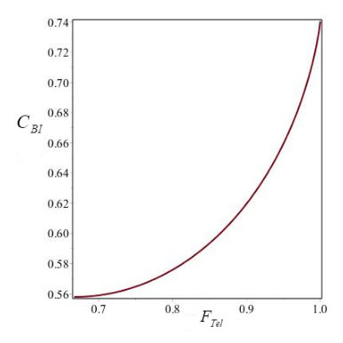
<figcaption class="paper-figure-caption"><b>Fig 1.</b> Figure 1: Variation of the basis-independent coherence CBI with the teleportation fidelity FTel for the ideal maximally sliced (MS) state. The plot, obtained from Eq. (17), shows a smooth monotonic increase of the basis-independent coherence with teleportation fidelity, ranging from CBI ≈0.558 at the classical teleportation threshold (FTel = 2</figcaption>
</figure>
<figure class="paper-figure-card">
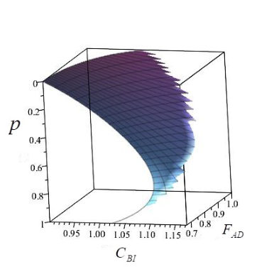
<figcaption class="paper-figure-caption"><b>Fig 2.</b> Figure 2: Three-dimensional variation of the basis-independent coherence CBI as a function of the teleportation fidelity FAD and the amplitude damping parameter p. The surface illustrates the analytical relationship given by Eq. (30), showing that CBI is positively correlated with the teleportation fidelity while both quantities are progressively degraded with increasing amplitude damping. The contraction of the surface at larger values of p indicates that stronger decoherence restricts the physically accessible region of high coherence and high teleportation fidelity.</figcaption>
</figure>
<figure class="paper-figure-card">
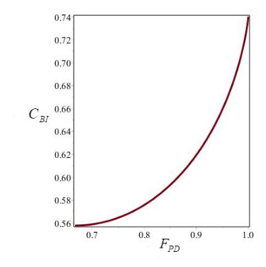
<figcaption class="paper-figure-caption"><b>Fig 3.</b> Figure 3: Variation of the basis-independent coherence, CBI, as a function of the teleportation fidelity, FP D, under phase damping.</figcaption>
</figure>

**Summary.** This paper theoretically analyzes how environmental noise degrades the performance of quantum teleportation using a three-qubit Maximally Sliced state. By deriving analytical links between fidelity, basis-independent coherence, and entanglement measures under amplitude and phase damping, it distinguishes the unique degradation pathways caused by different types of decoherence.

**Why it may be interesting.** This work is highly relevant as it provides a unified, quantitative framework connecting fundamental concepts—multipartite entanglement ($	au$), coherence ($	ext{CBI}$), and operational capability (teleportation)—under realistic noisy conditions, which is crucial for designing robust quantum communication protocols.

Detailed structure

**Main problem.** The study investigates how environmental decoherence affects quantum teleportation fidelity by analyzing its interplay with basis-independent coherence in maximally sliced states.

**Main result.** The analysis establishes explicit analytical relationships between coherence and fidelity under amplitude damping (AD) and phase damping (PD), showing distinct noise effects: AD introduces a state-dependent threshold, while PD preserves the quantum advantage until complete dephasing.

**Method.** The authors employ the Kraus operator formalism to derive expressions for teleportation fidelity and basis-independent coherence, connecting these quantities to the Coffman-Kundu-Wootters (CKW) three-tangle.

**Model / system.** The system under study is a three-qubit Maximally Sliced (MS) state, which serves as the shared entangled resource for quantum teleportation. Decoherence is modeled using Amplitude Damping and Phase Damping channels.

**Key observables.** Teleportation fidelity ($F_{	ext{Tel}}$), basis-independent coherence ($	ext{CBI}$), and the CKW three-tangle ($	au$).

**Important parameters / regimes.** The state parameter $	heta$, amplitude damping probability $p$, and phase damping rate $\lambda$.

**Assumptions / limitations.** The analysis assumes independent application of Kraus operators for each qubit during decoherence, and that the teleportation protocol relies on the reduced bipartite density matrix.

**Figures summary.** Figure 1 shows the monotonic increase of CBI with $F_{	ext{Tel}}$ for ideal states. Figure 2 illustrates the three-dimensional variation of CBI as a function of $F_{	ext{AD}}$ and $p$, showing positive correlation and degradation with increasing noise.

**Paper structure.** The paper develops by first defining the MS state and quantifying its entanglement via the three-tangle. It then derives fidelity expressions under AD and PD using Kraus operators, establishing analytical links between CBI and fidelity for both noise channels, concluding with a comparison of how each channel degrades quantum resources.

Abstract

The influence of environmental decoherence on quantum teleportation is investigated by considering the three-qubit Maximally Sliced (MS) state as the shared entangled resource. Using the Kraus operator formalism, analytical expressions are derived for the teleportation fidelity under amplitude damping and phase damping channels. The corresponding basis-independent coherence is obtained, establishing explicit analytical relations between coherence and teleportation fidelity under both decoherence mechanisms. The results are further expressed in terms of the Coffman-Kundu-Wootters (CKW) three-tangle, thereby connecting genuine tripartite entanglement with teleportation performance. The analysis reveals distinct effects of the two noise channels: amplitude damping introduces a state-dependent threshold for achieving quantum teleportation, whereas phase damping preserves the quantum advantage until complete dephasing. These results provide a unified analytical framework for understanding the interplay among multipartite entanglement, quantum coherence and teleportation in noisy three-qubit MS states.

[↑ back to top](#top)

### [The intermediate scattering function of an interacting adlayer as a characteristic function: a closed-form theory of Ising lattice-gas surface diffusion](http://arxiv.org/abs/2608.03398v1)

**Authors:** S. Miret-Artés  
**Type:** theory · **Category:** statistical mechanics · **PDF:** <https://arxiv.org/pdf/2608.03398v1>  
**Analysis basis:** full PDF text, analyzed in chunks
**Topic relevance:** 🔥 `non-equilibrium dynamics` **4/5** · `methods for driven-dissipative` **3/5** · `non-equilibrium universality` **3/5** · `driven-dissipative phase transition` **2/5** · `Frenkel-Kontorova` **1/5** · `Keldysh / 2PI / non-Gaussian methods` **1/5** · `correlated / nonlocal dissipation` **1/5**

↔ Scroll figures horizontally

<figure class="paper-figure-card">
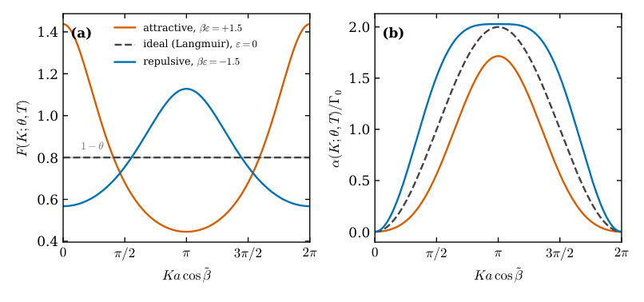
<figcaption class="paper-figure-caption"><b>Fig 1.</b> Figure 1: Analytic ingredients of the interacting ISF, Eq. (42), for a one-dimensional channel (z = 2) at coverage θ = 0.2: attractive (βε = +1.5, η = +0.28), ideal (ε = 0, dashed) and repulsive (βε = −1.5, η = −0.17) adlayers. (a) Static structure factor F(K), Eq. (20): attraction gathers diffuse intensity at the zone centre, repulsion at the zone boundary, while the ideal adlayer is flat at 1 −θ. (b) Dephasing rate α(K)/Γ0, Eq. (41): the interaction distorts the Chudley–Elliott shape 1−cos(Ka cos ˜β) (dashed) oppositely for opposite interaction signs, and de Gennes narrowing flattens the rate around the structure peak of the repulsive case.</figcaption>
</figure>
<figure class="paper-figure-card">
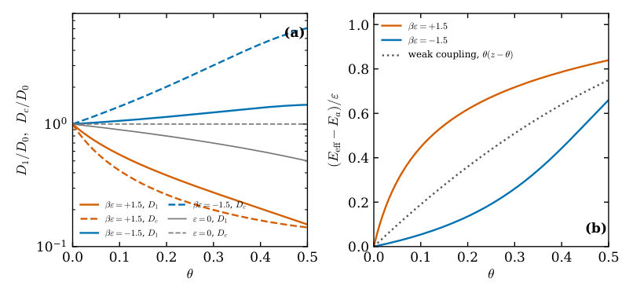
<figcaption class="paper-figure-caption"><b>Fig 2.</b> Figure 2: The two faces of interacting transport along a channel (z = 2), for the same attractive (βε = +1.5, orange) and repulsive (βε = −1.5, blue) adlayers in both panels, set throughout by η(θ, βε). (a) The coefficients: jump D1 (solid) and chemical Dc (dashed), Eqs. (47) and (52), normalized to D0, with ε = 0 in grey. Attraction suppresses both; repulsion enhances them, most strongly the chemical one, which rises about six-fold by θ = 0.5, while for ε = 0 it stays exactly at D0 [24]. (b) Their Arrhenius slope: the excess (Eeff −Ea)/ε, Eq. (54), with the weak-coupling form θ(z −θ) (dotted). The two panels are the magnitude and the temperature slope of the same interacting diffusion:...</figcaption>
</figure>
<figure class="paper-figure-card">
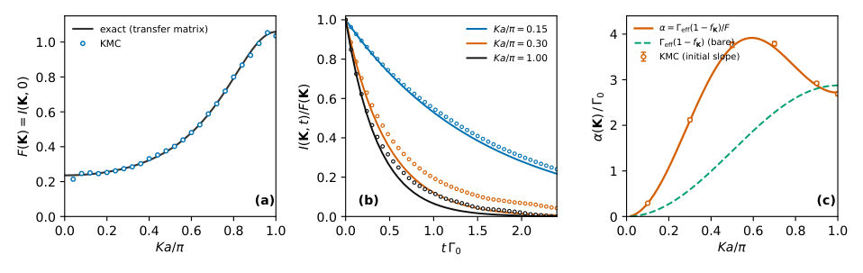
<figcaption class="paper-figure-caption"><b>Fig 3.</b> Figure 3: Kinetic Monte Carlo benchmark along a one-dimensional channel (θ = 0.5, repulsive βε = −1.5), run on the same Hamiltonian (8) and the same Kawasaki rates that the theory uses (Appendix C). Here the transfer-matrix statics and Γeff are exact, so the test isolates the Markovian truncation. (a) Statics: F(K) = I(K, 0) from simulation (points) against the exact Lorentzian (20) (line). (b) Shape: normalized ISF at three momenta against e−αt (lines); near-exponential, with the largest departure at mid-zone. (c) Rate: the collective rate measured as a genuine t →0+ slope (sixteen seeds, error bars the standard error), against the closed form (41) (solid) and the undressed Γeff[1 −fK]...</figcaption>
</figure>
<figure class="paper-figure-card">
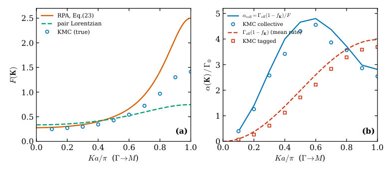
<figcaption class="paper-figure-caption"><b>Fig 4.</b> Figure 4: The same benchmark on a square lattice (z = 4, θ = 0.5, βε = −0.8, along Γ→M), testing what the channel cannot: here neither the statics nor Γeff is exact. (a) Statics: the measured F (points) lies between the random-phase form (32) (solid), which overestimates the correlation peak, and the pair-approximation Lorentzian (20) (dashed). (b) Dynamics: the collective rate built from the measured F (points) follows the closed form (solid) to 10–15%, while the tagged-particle rate (open squares) falls below the mean-rate form (dashed) by the tracer correlation factor fc ≈0.7–0.9 that the theory omits.</figcaption>
</figure>
<figure class="paper-figure-card">
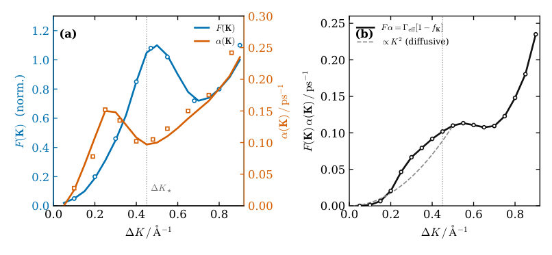
<figcaption class="paper-figure-caption"><b>Fig 5.</b> Figure 5: Coherent HeSE data for Na/Cu(111) at θ = 0.025 ([11¯2] azimuth, 155 K), digitized from Ref. [14] (Figs. 3b and 4a). (a) The structural pair: the measured quasi-elastic amplitude, our F(K) (left axis), is suppressed as K →0 and peaks at ∆K⋆≈0.45 Å−1, while the decay rate α(K) (right axis) shows its anticorrelated dip at the same momentum: de Gennes narrowing, Eq. (41). (b) The parameter-free test: their point-by-point product Fα = Γeff[1 −fK] retains no trace of either peak or dip and reduces to the smooth, diffusive single-adsorbate rate; equivalently, their ratio is 1/F(K), the narrowing itself.</figcaption>
</figure>

**Summary.** This paper presents a closed-form theory for the intermediate scattering function of an interacting adlayer, treating it as an Ising lattice-gas system. By leveraging the ISF's role as a characteristic function, the authors successfully incorporate lateral interactions into surface diffusion dynamics. The resulting theory provides testable predictions that are validated against Kinetic Monte Carlo simulations.

**Why it may be interesting.** The rigorous derivation of dynamics from static structure factors using a characteristic function approach is highly relevant for understanding non-equilibrium many-body systems where memory effects are crucial.

Detailed structure

**Main problem.** To develop a closed-form theoretical description for the intermediate scattering function (ISF) of an interacting adlayer undergoing surface diffusion.

**Main result.** The authors derived a closed-form expression for the ISF that rigorously incorporates lateral interactions, predicting four correlated fingerprints observable in experimental measurements.

**Method.** The theory utilizes the characteristic function framework, projecting the master equation onto the density and employing techniques like Random-Phase Approximation (RPA) and Transfer Matrix methods to derive exact or controlled approximations.

**Model / system.** The system is an interacting adlayer modeled as an Ising lattice-gas on a substrate. Dynamics are governed by surface diffusion processes, analyzed via measurements like helium spin-echo yielding the ISF.

**Key observables.** Intermediate Scattering Function (ISF), $I(K, t)$; Static Structure Factor, $F(K)$; Quasi-elastic line shape; Linewidth and Arrhenius slope dependence on coverage.

**Important parameters / regimes.** Interaction strength ($\varepsilon$), temperature ($T$), adsorbate coverage ($	heta$), momentum transfer ($K$).

**Assumptions / limitations.** The closed form is obtained by dropping the memory kernel of the equation of motion, which provides a controlled approximation; the RPA is used for 2D treatment.

**Figures summary.** Figures illustrate the deviation parameter $\Delta(K)$ across the zone for different interaction regimes and test theoretical bounds against KMC data to validate the closed-form applicability.

**Paper structure.** The paper establishes the ISF as a characteristic function, develops the theory using lattice gas models (1D via Transfer Matrix, 2D via RPA), derives the closed form by controlling approximations, and validates these results through comparison with KMC simulations and specific physical applications (Na/Cu(111)).

Abstract

The intermediate scattering function (ISF) measured by helium spin-echo is a characteristic function (CF): the Fourier transform of the distribution of adsorbate displacements, whose value at zero time is the static structure factor. We use this double role to bring lateral interactions of Ising lattice-gas type into surface diffusion. The ISF then follows in closed form in momentum transfer, time, coverage and temperature, and with it the whole linear-response hierarchy. A single correlation parameter fixes both the equilibrium structure and the interaction-renormalized hop rate; it is exact along a one-dimensional channel, and is carried onto the surface as the nearest-neighbour correlation of a pair approximation, the momentum dependence of the structure factor then coming from a collective (random-phase) treatment. The closed form is not postulated. Projecting the master equation onto the density gives an exact equation of motion whose amplitude is an identity and whose initial rate obeys a sum rule, so that the quasi-elastic weight is the layer's own structure factor and de Gennes narrowing becomes a theorem rather than an analogy; the closed form is what remains when the memory kernel of that equation is dropped. Kinetic Monte Carlo (KMC) on the same Hamiltonian reproduces the dressed hop rate to better than about one per cent and the initial collective rate to $1$--$2\%$. Four correlated, non-critical fingerprints of the interaction follow --- in the quasi-elastic amplitude, its linewidth, the Arrhenius slope, and the dependence of the fitted linewidth on the range of times over which the decay is fitted. They invert in closed form for the attempt frequency, the static barrier and the interaction. Applications to Na/Cu(111) and H/Pt(111) are analysed and discussed.

[↑ back to top](#top)

### [Dynamic Induction of Lattice Gauge Theories on a Quantum Computer](http://arxiv.org/abs/2608.02756v1)

**Authors:** Barbara Andrade, Declan Millar, Lewis Anderson, Vincent R. Pascuzzi, Maciej Lewenstein, Ivano Tavernelli, Jad C. Halimeh, Tobias Grass  
**Type:** both · **Category:** quantum information and computing · **PDF:** <https://arxiv.org/pdf/2608.02756v1>  
**Analysis basis:** full PDF text, analyzed in chunks
**Topic relevance:** 🔥 `analog quantum simulation` **4/5** · `methods for driven-dissipative` **3/5** · `QC/QI experiment` **2/5** · `non-equilibrium dynamics` **2/5** · `driven-dissipative phase transition` **1/5** · `entanglement & information structure` **1/5** · `exotic spin models in light-matter` **1/5**

↔ Scroll figures horizontally

<figure class="paper-figure-card">
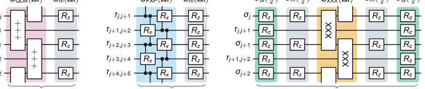
<figcaption class="paper-figure-caption"><b>Fig 1.</b> FIG. 1. Qubit encoding, gauge protection, and circuit realizations of the dynamically induced spin-1/2 U(1) quantum link Schwinger model. (a) The gauge–matter interaction is a three-body term that creates a particle–antiparticle pair on neighboring matter sites and simultaneously flips the electric flux on the link between them, coupling |+++⟩and |−−−⟩ with strength J in the rotated frame. (b) Gauss’s law Gj |phys⟩= 0 ties the matter charge at each site to the divergence of the electric field, leaving three gauge-invariant qubit triples per site parity. (c) The two initial states studied experimentally: the fully filled state and the bare vacuum. (d) In the spectrum of HXXX, the...</figcaption>
</figure>
<figure class="paper-figure-card">
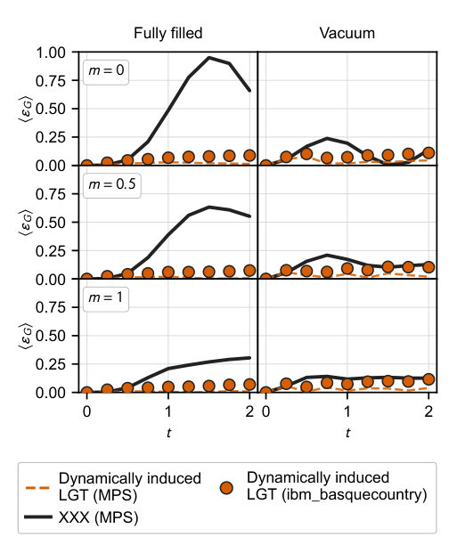
<figcaption class="paper-figure-caption"><b>Fig 2.</b> FIG. 2. Gauge violation for a dynamically induced spin-1/2 U(1) quantum link Schwinger model. Time evolution of the normalized average gauge violation ⟨εG⟩fol- lowing a quench from the fully-filled state (left) and vac- uum state (right). Rows show staggered masses, m = 0 (blue); m = 0.5 (green); m = 1 (orange). Solid lines show the evolution under HXXX from Trotterized matrix-product- state (MPS) simulation; dashed lines give the MPS results for the dynamically induced gauge protection quantum cir- cuits. Markers show ibm_basquecountry hardware data for the dynamically induced LGT (circles). We set the protection strength to V = 4.5 and use Trotter step size ∆t = 0.25.</figcaption>
</figure>
<figure class="paper-figure-card">
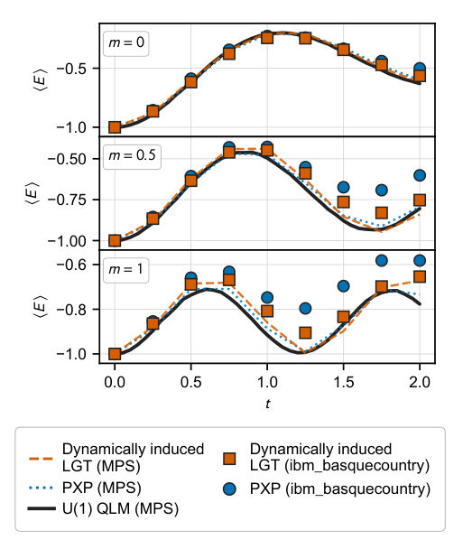
<figcaption class="paper-figure-caption"><b>Fig 3.</b> FIG. 3. Mean electric field for a dynamically induced spin-1/2 U(1) quantum link Schwinger model evolving from the fully-filled state. Time evolution of the mean electric field ⟨E⟩following a quench from the fully-occupied product state, where every matter site is occupied and gauge links are fixed by Gauss’s law. Panels show staggered masses m = 0 (blue); m = 0.5 (green); m = 1 (orange). Solid lines are the high-resolution target QLM trajectory from Trotter- ized matrix-product-state (MPS) simulation; dashed and dot- ted lines give the MPS results for the dynamically induced gauge protection and PXP circuits, respectively. Markers show ibm_basquecountry hardware data for the PXP model...</figcaption>
</figure>
<figure class="paper-figure-card">
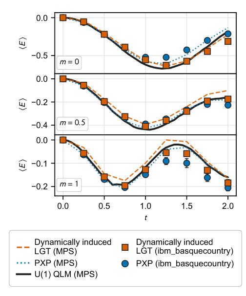
<figcaption class="paper-figure-caption"><b>Fig 4.</b> FIG. 4. Mean electric field for a dynamically induced spin-1/2 U(1) quantum link Schwinger model evolv- ing from the vacuum. Time evolution of the mean electric field ⟨E⟩following a quench from the bare vacuum, where ev- ery matter site is empty and gauge links are fixed by Gauss’s law. Panels show staggered masses m = 0 (blue); m = 0.5 (green); m = 1 (orange). Solid lines are the high-resolution target QLM trajectory from Trotterized matrix-product-state (MPS) simulation; dashed and dotted lines give the MPS results for the dynamically induced gauge protection and PXP circuits, respectively. Markers show ibm_basquecountry hardware data for the PXP model (circles) and the dynami- cally...</figcaption>
</figure>

**Summary.** The paper introduces a breakthrough method to simulate Lattice Gauge Theories on quantum computers by dynamically generating the required gauge dynamics from a simpler starting Hamiltonian. By using single-qubit terms derived from Gauss's law, they successfully confine the evolution to the physical subspace while drastically reducing the circuit depth compared to direct simulation methods.

**Why it may be interesting.** This work directly addresses resource limitations in simulating complex physical theories like LGTs by transforming a symmetry constraint into an active, efficient part of the Hamiltonian engineering process, which is highly relevant for quantum simulation algorithms.

Detailed structure

**Main problem.** Developing a resource-efficient method for digital quantum simulation of Lattice Gauge Theories (LGTs) while rigorously enforcing gauge invariance.

**Main result.** The authors demonstrated that using single-qubit terms proportional to the Gauss's law generator can dynamically induce the LGT dynamics from a simpler Hamiltonian, achieving a fivefold reduction in entangling-gate depth compared to direct implementations.

**Method.** They employ a novel 'dynamic induction' paradigm where gauge constraints are enforced via experimentally efficient single-qubit penalty terms ($V_{HG}$) added to a simple starting Hamiltonian ($H_{XXX}$), rather than relying on post-selection or energy penalties.

**Model / system.** The target system is the U(1) Quantum Link Model (QLM) LGT, simulated using spin-1/2 qubits. The implementation uses 101 qubits on an IBM quantum processor to simulate dynamics in $1+1$ dimensions.

**Key observables.** Average gauge violation ($\langle \epsilon_G 
angle$), mean electric field ($\langle E 
angle$), and comparison of time evolution against Matrix Product State (MPS) classical benchmarks.

**Important parameters / regimes.** Gauge protection strength ($V=4.5$); Trotter step size ($\Delta t=0.25$); Lattice size ($N_f=50$).

**Assumptions / limitations.** The method is shown to work for $1+1$ dimensions, and the initial Hamiltonian used is simpler than the full target LGT.

**Figures summary.** Figures illustrate qubit encoding, gauge protection mechanisms separating physical/unphysical sectors, and time evolution plots comparing protected vs. unprotected dynamics of observables like $\langle \epsilon_G 
angle$ and $\langle E 
angle$.

**Paper structure.** The paper introduces the problem (LGT simulation), proposes the dynamic induction method using $H_{XXX}$ plus gauge terms ($V_{HG}$), details the implementation on quantum hardware, presents results showing reduced circuit depth and accurate dynamics matching classical benchmarks.

Abstract

Gauge invariance is central to modern physics and underpins quantum simulations of lattice gauge theories (LGTs). Existing quantum simulation approaches employ Gauss's law either to energetically suppress gauge-violating processes in analog platforms or to detect and discard gauge-violating outcomes in digital devices. Here we introduce a third paradigm, in which Gauss's law is used to dynamically generate the gauge theory itself from a substantially simpler Hamiltonian. Starting from a readily programmable three-body XXX model, we employ experimentally efficient single-qubit U(1) gauge symmetry-generator terms that induce the dynamics of a U(1) LGT. We implement this approach using 101 qubits on a 156-qubit IBM quantum processor and observe real-time dynamics in quantitative agreement with the target LGT while reducing the entangling-gate depth per Trotter step by a factor of five compared with a direct implementation. Our results establish gauge protection as a resource for Hamiltonian engineering rather than merely symmetry preservation, opening a scalable resource-efficient route towards digital quantum simulations of increasingly complex gauge theories in higher spatial dimensions.

[↑ back to top](#top)

### [PaQit: Energy-Runtime-Fidelity Co-Optimization for Neutral Atom Quantum Computers](http://arxiv.org/abs/2608.02815v1)

**Authors:** Jason Ludmir, Tirthak Patel  
**Type:** both · **Category:** other · **PDF:** <https://arxiv.org/pdf/2608.02815v1>  
**Analysis basis:** full PDF text, analyzed in chunks
**Topic relevance:** 🔥 `Rydberg arrays` **4/5** · 🔥 `analog quantum simulation` **4/5** · `QC/QI experiment` **3/5** · `entanglement & information structure` **1/5** · `methods for driven-dissipative` **1/5** · `non-equilibrium dynamics` **1/5**

↔ Scroll figures horizontally

<figure class="paper-figure-card">
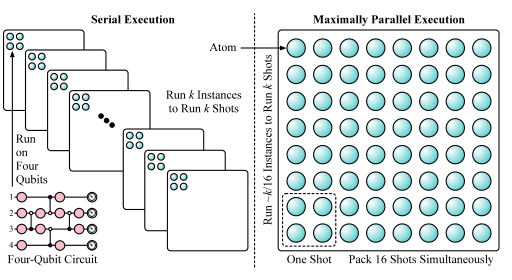
<figcaption class="paper-figure-caption"><b>Fig 1.</b> Fig. 1. Serial execution vs. maximally parallel execution.</figcaption>
</figure>
<figure class="paper-figure-card">
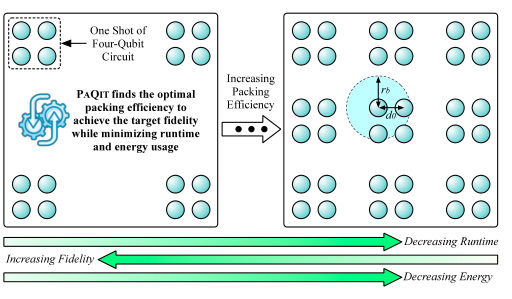
<figcaption class="paper-figure-caption"><b>Fig 2.</b> Fig. 2. PaQit determines the packing efficiency of the qubits on the neutral atom system to minimize the runtime and energy usage for a target output fidelity desired by the user.</figcaption>
</figure>
<figure class="paper-figure-card">
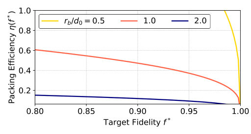
<figcaption class="paper-figure-caption"><b>Fig 3.</b> Fig. 3. The packing efficiency decreases with increasing fidelity, with strong dependency on the rb</figcaption>
</figure>
<figure class="paper-figure-card">
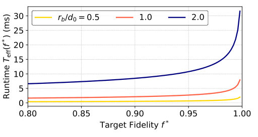
<figcaption class="paper-figure-caption"><b>Fig 4.</b> Fig. 4. The total runtime of a circuit increases with higher target fidelity, with strong dependency on the rb</figcaption>
</figure>
<figure class="paper-figure-card">
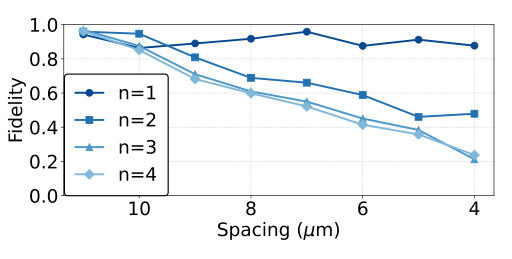
<figcaption class="paper-figure-caption"><b>Fig 5.</b> Fig. 7. Real Aquila hardware executions showing state-preparation fidelity versus atom spacing for four array sizes.</figcaption>
</figure>

**Summary.** The paper introduces PaQit, a novel framework designed to co-optimize energy, runtime, and fidelity in neutral-atom quantum computers. It models the critical trade-off where increasing qubit density boosts speed but degrades computation accuracy due to Rydberg interactions. By integrating device physics into scheduling decisions, PaQit provides actionable guidelines for operating these complex quantum hardware systems.

**Why it may be interesting.** This work directly addresses the engineering constraints necessary for realizing large-scale quantum computation with neutral atoms by providing a quantitative link between physical interactions (Rydberg blockade) and system performance metrics (Energy/Time/Fidelity).

Detailed structure

**Main problem.** The relationship between energy consumption, runtime, and computational fidelity in neutral-atom quantum computers is poorly understood, hindering practical scheduling decisions.

**Main result.** PaQit provides a framework that jointly optimizes these three metrics by translating target fidelity into specific qubit packing decisions based on Rydberg interaction physics.

**Method.** The authors developed a hardware-grounded analytical model and a fidelity-aware qubit packing framework to guide system scheduling.

**Model / system.** The platform is neutral-atom quantum computing using atoms trapped in optical lattices, where interactions are dominated by the $1/r_{ij}^6$ Rydberg blockade potential. The dynamics are modeled via a time-dependent Hamiltonian incorporating this interaction term.

**Key observables.** Energy consumption (P), Runtime (T), Computational Fidelity ($\mathcal{F}$), and Qubit Packing Density ($\eta$).

**Important parameters / regimes.** Static baseline power ($P_0$), Rydberg blockade radius ($r_b$), target fidelity ($f^*$), and packing efficiency ($\eta$).

**Assumptions / limitations.** The system operates in a static-power-dominated regime where energy depends heavily on execution time, not just instantaneous utilization.

**Figures summary.** Figure 1 illustrates the bounds for serial versus maximally parallel execution. Figure 2 shows how PaQit determines optimal packing efficiency to minimize runtime and energy while meeting a target fidelity.

**Paper structure.** The paper establishes the physical limitations (Rydberg interactions) leading to trade-offs between density/throughput and fidelity, develops analytical models for power/time scaling under serial and parallel regimes, introduces PaQit to resolve this multi-objective optimization, and validates the framework using simulations of real hardware platforms.

Abstract

Neutral-atom quantum computers provide a scalable platform for large-scale quantum computation due to their all-optical control, room-temperature operation, and flexible lattice geometry. Although the favorable energy characteristics of these systems are well recognized, the relationship between system-level energy consumption, runtime, and computational fidelity remains poorly understood, limiting practical scheduling decisions. In this work, we develop a hardware-grounded analytical model that captures how energy and runtime scale with qubit utilization in neutral-atom systems.   We introduce PaQit, a fidelity-aware qubit packing framework that integrates device-level Rydberg interaction physics with system-level scheduling to jointly optimize energy, runtime, and fidelity. By translating fidelity targets into packing decisions, PaQit identifies operating regimes that maximize parallelism while respecting interaction-driven crosstalk constraints. We validate the analytical framework using simulations of QuEra's analog Aquila system and digital Gemini system, as well as real hardware executions, demonstrating close agreement between the predicted trends and observed system behavior.

[↑ back to top](#top)

### [Joint spectral characterization of SPDC photon pairs near 2 $μ$m in (Al)GaAs-on-insulator waveguides](http://arxiv.org/abs/2608.03950v1)

**Authors:** Alexandre Z. Leger, Emil Z. Ulsig, Samuel E. Fontaine, Dileep V. Reddy, Eric J. Stanton, Lynden K. Shalm, Richard P. Mirin, Martin J. Stevens, J. E. Sipe, Nicolas Volet, Deny R. Hamel  
**Type:** both · **Category:** quantum information and computing · **PDF:** <https://arxiv.org/pdf/2608.03950v1>  
**Analysis basis:** full PDF text, analyzed in chunks
**Topic relevance:** 🔥 `quantum optics experiment` **4/5** · `interference shaping light` **3/5** · `Keldysh / 2PI / non-Gaussian methods` **1/5** · `QC/QI experiment` **1/5** · `driven-dissipative phase transition` **1/5**

↔ Scroll figures horizontally

<figure class="paper-figure-card">
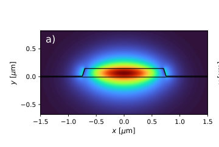
<figcaption class="paper-figure-caption"><b>Fig 1.</b> Fig. 2. Magnitude of the dominant electric-field component (a) for the fundamental TE00 signal/idler mode and (b) for the TM00 pump mode, calculated for the AlGaAs waveguide geometry using the numerical model described in Section 4. Similar mode profiles are obtained for GaAs.</figcaption>
</figure>
<figure class="paper-figure-card">
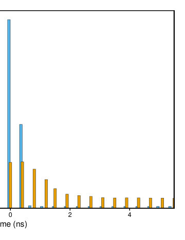
<figcaption class="paper-figure-caption"><b>Fig 2.</b> Fig. 3. Coincidence histograms of photon pairs from a GaAs waveguide pumped by a continuous-wave diode laser at 975 nm, measured with and without the 500 m dispersive fiber. Peak broadening arises from the fiber chromatic dispersion used for time-of-flight spectral analysis. Without the fiber, the histogram was accumulated for 90 s, yielding a coincidence-to-accidental ratio of 90. The measurement with the fiber required a 20-minute accumulation, which reduced this ratio to 4; the extended accumulation time and lower ratio account for the elevated background.</figcaption>
</figure>
<figure class="paper-figure-card">
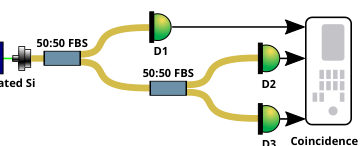
<figcaption class="paper-figure-caption"><b>Fig 3.</b> Fig. 4. Setup used to measure the heralded second-order correlation function. A half-wave plate and polarizing beam splitter (PBS) control the pump power prior to coupling into the waveguide. Residual pump light is suppressed using anti-reflection (AR) coated silicon before the down-converted signal is directed to a three-detector correlation measurement.</figcaption>
</figure>
<figure class="paper-figure-card">
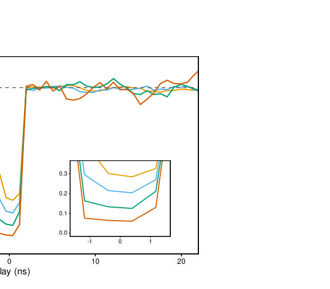
<figcaption class="paper-figure-caption"><b>Fig 4.</b> Fig. 5. Heralded second-order correlation function measured at different pump powers. At the lowest pump power (215 µW), we measure 𝑔(2) H (0) ≈0.06. The increase in 𝑔(2) H (0) with pump power is consistent with enhanced multi-pair generation at higher SPDC brightness.</figcaption>
</figure>
<figure class="paper-figure-card">
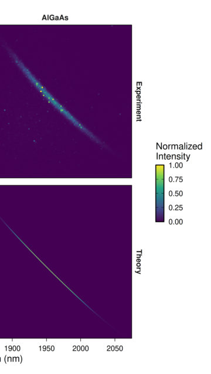
<figcaption class="paper-figure-caption"><b>Fig 5.</b> Fig. 7. Joint-spectral intensities obtained from the time-of-flight experiment described in Section 3.2 for (a) GaAs and (b) AlGaAs. Simulated joint-spectral intensities, JSI(𝜆𝑠, 𝜆𝑖) ∝|𝜑II(𝜆𝑠, 𝜆𝑖)|2, are shown for (c) GaAs and (d) AlGaAs.</figcaption>
</figure>

**Summary.** The paper reports the first direct joint spectral characterization of SPDC photon pairs near $2 \mu	ext{m}$ using integrated GaAs/AlGaAs waveguides. By combining time-of-flight spectroscopy with advanced numerical modeling, the authors validated their source's broadband emission and determined optimal device lengths for high-efficiency quantum light generation.

**Why it may be interesting.** This work is highly relevant as it pushes integrated quantum light sources into a technologically important wavelength band ($2 \mu	ext{m}$) crucial for free-space quantum communication, providing necessary characterization data for quantum network components.

Detailed structure

**Main problem.** The primary goal is the joint spectral characterization of spontaneously parametrically down-converted (SPDC) photon pairs near $2 \mu	ext{m}$ using integrated waveguides.

**Main result.** The authors successfully demonstrated broadband emission with strong spectral anti-correlations and developed a numerical model that accurately reproduces the measured Joint Spectral Intensity (JSI).

**Method.** The study combines experimental measurements of JSI via time-of-flight spectroscopy with theoretical modeling using the biphoton wavefunction approach.

**Model / system.** The physical system is an integrated photon source utilizing straight GaAs- and AlGaAs-on-insulator waveguides, which provide strong second-order nonlinearity ($\chi^{(2)}$) for on-chip pair generation.

**Key observables.** Joint Spectral Intensity (JSI), heralded second-order correlation function ($g^{(2)}_H(	au)$), and the SPDC conversion probability ($P_{	ext{SPDC}}$).

**Important parameters / regimes.** The operating wavelength regime is near $2 \mu	ext{m}$, pumped from $980 	ext{ nm}$. Key parameters include effective areas ($\approx 0.75 \mu	ext{m}^2$) and optimal waveguide lengths (e.g., $\sim 13.8 	ext{ mm}$ for GaAs).

**Assumptions / limitations.** The numerical model assumes both photons reach the output without scattering, and discrepancies in absolute efficiency are attributed to uncertainties in measuring on-chip pump power.

**Figures summary.** Figures illustrate waveguide cross-sections, field profiles, coincidence histograms showing spectral broadening for time-of-flight analysis, and comparisons between simulated and measured JSI structures.

**Paper structure.** The paper progresses from establishing the necessity of $2 \mu	ext{m}$ sources to detailing the experimental setup (JSI measurement), presenting quantitative results on pair generation rates ($P_{	ext{SPDC}}$), validating these results against a detailed numerical model, and finally determining optimal device lengths.

Abstract

Integrated photon-pair sources are a core component of chip-based quantum computing, communication, and metrology. Although such sources have been demonstrated at conventional telecom wavelengths, the 2 $μ$m band remains comparatively less explored, despite offering advantages for free-space quantum communication, low-loss transmission in emerging fiber networks, and integration with silicon photonic platforms. In this paper, we demonstrate spontaneous parametric down-conversion (SPDC) in straight GaAs- and AlGaAs-on-insulator waveguides. This platform offers strong second-order nonlinearity and geometry-tunable dispersion, which are advantageous for efficient on-chip pair generation. Measurements of the joint spectral intensity and heralded second-order correlation function show broadband emission around 2 $μ$m with strong spectral anti-correlations. To our knowledge, this is the first direct joint-spectral characterization of an integrated SPDC source in this wavelength regime.

[↑ back to top](#top)

### [Local magnetic order in vacancy-disrupted spin ice Ho2TiO5](http://arxiv.org/abs/2608.03850v1)

**Authors:** Raju Baral, Haidong Zhou, Qiang Zhang, Benjamin A. Frandsen, Stuart Calder  
**Type:** experiment · **Category:** strongly correlated electrons · **PDF:** <https://arxiv.org/pdf/2608.03850v1>  
**Analysis basis:** full PDF text, analyzed in chunks
**Topic relevance:** 🔥 `analog quantum simulation` **4/5** · `exotic spin models in light-matter` **3/5** · `Kondo & dissipative impurity` **1/5** · `entanglement & information structure` **1/5** · `spintronics-quantum-optics interface` **1/5**

↔ Scroll figures horizontally

<figure class="paper-figure-card">
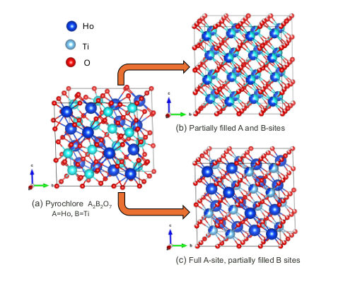
<figcaption class="paper-figure-caption"><b>Fig 1.</b> FIG. 1. Crystal structure models for pyrochlore spin- ice A2B2O7 and stuffed spin-ice A2BO5, where A = Ho and B = Ti. (a) Pyrochlore Ho2Ti2O7 with fully occu- pied A-site Ho and B-site Ti sublattices. (b,c) Idealized average-structure descriptions of Ho2TiO5 showing two pos- sible cation-occupancy models. Panel (b) shows partial Ho occupancy on both the A and B sites, with approximately two-thirds occupancy on each sublattice. Panel (c) shows a fully occupied A site and a partially occupied B site.</figcaption>
</figure>
<figure class="paper-figure-card">
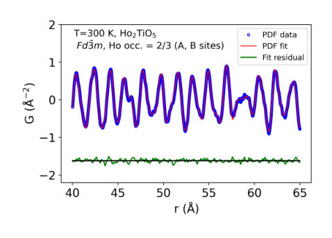
<figcaption class="paper-figure-caption"><b>Fig 2.</b> FIG. 3. PDF pattern of Ho2TiO5 collected on POWGEN instrument at T = 300 K (Qmax = 30 ˚A−1).</figcaption>
</figure>
<figure class="paper-figure-card">
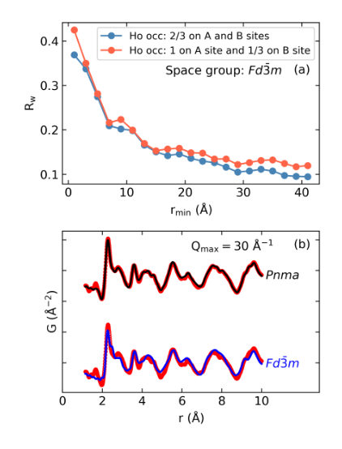
<figcaption class="paper-figure-caption"><b>Fig 3.</b> FIG. 2. (a) Goodness-of-fit parameter (Rw) as a function of minimum r value (rmin) in the “sliding-box” refinements at 300 K. The blue symbol represent the Ho occupancy with 2/3 on both A and B sites, and the orange symbol represent the Ho occupancy where the A site is fully occupied and the B site has 1/3 occupancy. (b) Local atomic fits at 300 K using the Fd¯3m and Pnma models over 1–10 ˚A. (Neutron scattering data collected on the POWGEN instrument.)</figcaption>
</figure>
<figure class="paper-figure-card">
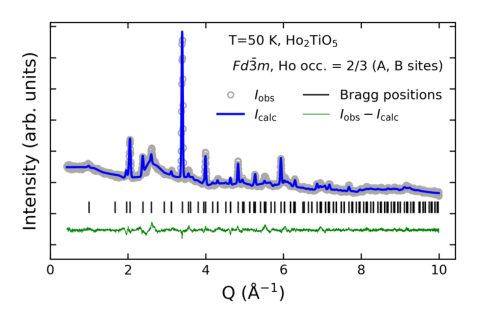
<figcaption class="paper-figure-caption"><b>Fig 4.</b> FIG. 4. Rietveld refinement of the neutron powder diffrac- tion pattern of Ho2TiO5 collected at 50 K on the HB2A in- strument (λ = 1.12 ˚A).</figcaption>
</figure>
<figure class="paper-figure-card">
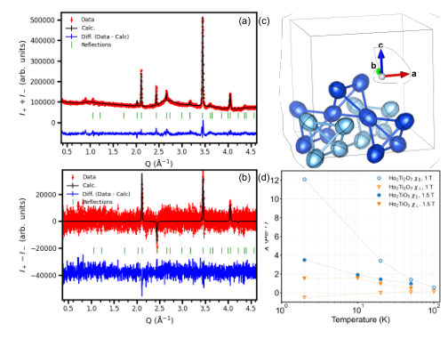
<figcaption class="paper-figure-caption"><b>Fig 5.</b> FIG. 5. Half-polarized neutron powder diffraction for the (a) sum and (b) difference of I+ and I−measurements of Ho2TiO5 at 10 K and H = 0.5 T. (c) Local susceptibil- ity ellipsoids for the Ho ions extracted from the model fits. (d) Parallel (χ∥) and perpendicular (χ⊥) components of the susceptibility as a function of temperature for Ho2TiO5 at H = 1.5 T compared to Ho2Ti2O7 at H = 1 T. (Neutron scattering data collected on the HB-2A instrument).</figcaption>
</figure>

**Summary.** This work uses neutron scattering to compare the ideal spin-ice material Ho2Ti2O7 with its disordered analog, Ho2TiO5. The key finding is that structural disorder does not eliminate the local magnetic tendency; instead, it creates a 'vacancy-disrupted' state where ice-rule physics persists on an incomplete lattice. This demonstrates the robustness of local constraints against global structural imperfections.

**Why it may be interesting.** While focused on magnetism, the study of disorder effects (vacancy disruption) on emergent quantum ground states like spin ice is highly relevant to understanding frustrated magnetic systems that can be modeled using concepts applicable to correlated electron models or lattice gauge theories.

Detailed structure

**Main problem.** The study investigates how local magnetic correlations persist when the ideal spin-ice material Ho2Ti2O7 is structurally disrupted by partial cation occupancy to form Ho2TiO5.

**Main result.** Ho2TiO5 retains a local Ising anisotropy and exhibits a 'vacancy-disrupted spin ice' state, where the tendency toward ice-rule configurations persists on a topologically incomplete magnetic network.

**Method.** The research combines neutron scattering measurements (total and half-polarized) with advanced analysis techniques like real-space mPDF and RMC modeling to probe local magnetic order.

**Model / system.** The system involves pyrochlore titanates, comparing the canonical spin-ice material Ho2Ti2O7 against the disordered stuffed compound Ho2TiO5. The physics is governed by strong single-ion Ising anisotropy on a tetrahedral lattice.

**Key observables.** Local magnetic correlations (mPDF), degree of adherence to the ice rule (e.g., 2-in/2-out configurations), and local site susceptibility tensors ($\chi_{\parallel}/\chi_{\perp}$).

**Important parameters / regimes.** Temperature regimes ($0.3 	ext{ K}$ up to $50 	ext{ K}$), occupancy ratios ($2/3$ for disorder).

**Assumptions / limitations.** The analysis assumes that the local magnetic correlations can be extracted and modeled despite the average crystal structure retaining high symmetry ($	ext{Fd}ar{3}	ext{m}$).

**Figures summary.** Figures illustrate structural models comparing ideal vs. stuffed compounds, and show quantitative data on spin configurations (e.g., fraction of tetrahedra satisfying ice rules) as a function of temperature.

**Paper structure.** The paper proceeds by first establishing the methods using PDF analysis for local structure determination, followed by polarized neutron diffraction to confirm single-ion anisotropy, and finally applying RMC/mPDF analyses to quantify the deviation from ideal spin-ice behavior in the disordered compound.

Abstract

We investigate how local magnetic correlations evolve when the classical pyrochlore spin-ice Ho2Ti2O7 is transformed into the partially disordered stuffed compound Ho2TiO5. Neutron scattering measurements were analyzed using real-space magnetic pair distribution function, reciprocal-space reverse Monte Carlo, and half-polarized neutron powder diffraction methods to connect the average crystal structure with local magnetic correlations. Both compounds retain long-range $Fd-3m symmetry, but in Ho2TiO5 this average structure distorts locally through Ho-O, Ti-O and O-O bond-length disorder associated with partial Ho/Ti occupancy. Despite this disorder, half-polarized neutron powder diffraction shows that the Ho moments retain local <111> rangle Ising anisotropy and form spin-in/spin-out configurations on the tetrahedral network. In Ho2Ti2O7, real- and reciprocal-space analyses reveal a nearly ideal two-in/two-out spin-ice state at 0.3K, with 95% of tetrahedra satisfying the ice rule, followed by progressive thermal disordering on warming. In Ho2TiO5, most tetrahedra are magnetically incomplete because some tetrahedral vertices are occupied by nonmagnetic Ti rather than Ho; nevertheless, the dominant incomplete configurations are 2-in/1-out and 1-in/2-out, which are locally compatible with the ice rule if the missing Ho spin is restored. The single-ion <111> Ising anisotropy is therefore retained throughout, while the collective ice ordering is strongly disrupted: Ho2TiO5 is a vacancy-disrupted spin ice in which a local ice-rule tendency persists on a topologically incomplete magnetic network.

[↑ back to top](#top)

### [DAMPyF: a Python implementation of the DAMPF method for the simulation of open-system dynamics](http://arxiv.org/abs/2608.03668v1)

**Authors:** Nicola Lorenzoni, Susana F. Huelga, Martin B. Plenio  
**Type:** theory · **Category:** other · **PDF:** <https://arxiv.org/pdf/2608.03668v1>  
**Analysis basis:** full PDF text, analyzed in chunks
**Topic relevance:** 🔥 `methods for driven-dissipative` **4/5** · `non-equilibrium dynamics` **2/5** · `Keldysh / 2PI / non-Gaussian methods` **1/5** · `correlated / nonlocal dissipation` **1/5** · `driven-dissipative phase transition` **1/5**

↔ Scroll figures horizontally

<figure class="paper-figure-card">
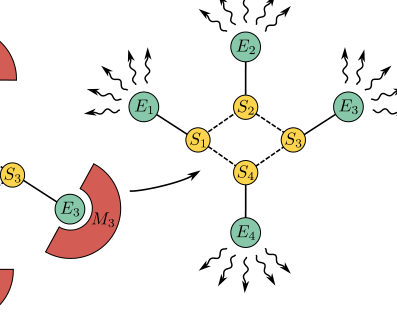
<figcaption class="paper-figure-caption"><b>Fig 1.</b> Figure 1: Conceptual representation of the pseudomode approach. The physical local environments (˜Ei) associated with each site (Si) are partitioned into a non-Markovian core (Ei) and a Markovian remainder (Mi), which is traced out exactly and induces a Lindblad dissipator.</figcaption>
</figure>
<figure class="paper-figure-card">
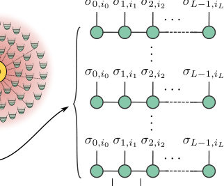
<figcaption class="paper-figure-caption"><b>Fig 2.</b> Figure 2: Graphical representation of (a) the extended system, comprising the finite- dimensional system and its local pseudomode environments, and (b) the DAMPF de- composition of the extended density matrix into system-indexed pseudomode MPSs.</figcaption>
</figure>
<figure class="paper-figure-card">
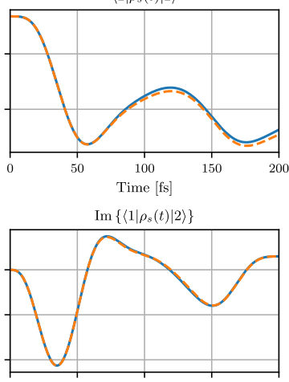
<figcaption class="paper-figure-caption"><b>Fig 3.</b> Figure 3: Comparison of the dimer energy-transfer dynamics obtained using the two numerical parameter sets described in the text.</figcaption>
</figure>
<figure class="paper-figure-card">
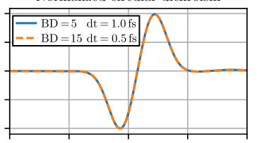
<figcaption class="paper-figure-caption"><b>Fig 4.</b> Figure 4: Comparison of the dimer absorption and circular dichroism spectra ob- tained with the two sets of numerical parameters described in the text. A Gaussian filter with σ = 50fs was applied to the computed optical coherences to ensure their decay within the simulated time interval of 200fs.</figcaption>
</figure>

**Summary.** This paper introduces DAMPyF, an open-source Python tool implementing the DAMPF method to simulate open quantum dynamics. It allows for numerically exact simulation of system-environment coupling using tensor networks (MPS) applied to pseudomode representations. The tool is versatile, supporting both general energy transfer and specialized molecular spectroscopy calculations.

**Why it may be interesting.** This work directly addresses state-of-the-art simulation techniques for open quantum systems, which is a major focus area in modern AMO physics, especially concerning light-matter interactions and energy transport.

Detailed structure

**Main problem.** The simulation of open quantum systems where a finite system interacts with an environment exhibiting memory effects, requiring non-perturbative treatment.

**Main result.** Introduction of DAMPyF, an open-source Python implementation enabling numerically exact simulations for complex dynamics like energy transfer and molecular spectroscopy.

**Method.** The Dissipation-Assisted Matrix Product Factorization (DAMPF) method is used to represent the extended density matrix ($
ho_{se}$) via a tensor network approach (MPS formalism).

**Model / system.** The system involves a finite quantum system coupled to an environment modeled by structured reservoirs, often described by generalized spin-boson models. Dynamics are governed by the GKSL master equation.

**Key observables.** Reduced system density matrix ($
ho_s(t)$), linear absorption spectra ($A(\omega)$), and circular dichroism spectra ($	ext{CD}(\omega)$).

**Important parameters / regimes.** Pseudomode bond dimension ($\chi$), time step ($\Delta t$), thermal energy ($k_BT$), and system coupling strengths.

**Assumptions / limitations.** The method relies on the pseudomode representation of structured reservoirs, which assumes Gaussianity to maintain numerically exact reduced system dynamics. Trotter decomposition introduces an error $O(\Delta t^2)$.

**Figures summary.** Figure 1 conceptually illustrates partitioning the environment into a non-Markovian core and Markovian remainder; Figure 2 graphically details the DAMPF decomposition of $
ho_{se}$ using MPSs.

**Paper structure.** The paper describes the physical model, the DAMPF algorithm derivation, the user-facing code structure (including installation/execution), input/output formats, and provides minimal working examples for various applications.

Abstract

DAMPyF is an open-source Python implementation of the dissipation-assisted matrix product factorization (DAMPF) method, a tensor-network-based approach for the numerically exact simulation of finite-dimensional quantum systems coupled to bosonic environments. The method relies on a pseudomode representation of structured reservoirs and a matrix-product-state representation of the density matrix of the extended system, comprising the system and the pseudomodes. DAMPyF currently provides two workflows. First, it supports excitation energy-transfer dynamics within the single-system-excitation manifold, in which a system excitation is propagated in time. Second, it provides a high-level workflow tailored to molecular spectroscopy, in which the system levels represent electronic states and optical coherences are propagated for the subsequent computation of linear spectra, including absorption and circular dichroism. This paper describes the physical model, the DAMPF algorithm, the user-facing code structure, installation and execution, input and output formats, and minimal examples.

[↑ back to top](#top)

### [Sample-half-inserted quantum interferometer](http://arxiv.org/abs/2608.03622v1)

**Authors:** Wei Li, Tao Xie, Yu-Hang Luo, Kang Zheng, Meiyu Peng, Hui Yang, Chunling Ding, Chen-Zhi Yuan, Omar S. Magana-Loaiza, Keyu Xia, Ryosuke Shimizu, Hui Jing, Chenglong You, Rui-Bo Jin  
**Type:** experiment · **Category:** other · **PDF:** <https://arxiv.org/pdf/2608.03622v1>  
**Analysis basis:** full PDF text, analyzed in chunks
**Topic relevance:** 🔥 `quantum optics experiment` **4/5** · `interference shaping light` **3/5** · `QC/QI experiment` **1/5** · `quantum measurements` **1/5**

↔ Scroll figures horizontally

<figure class="paper-figure-card">
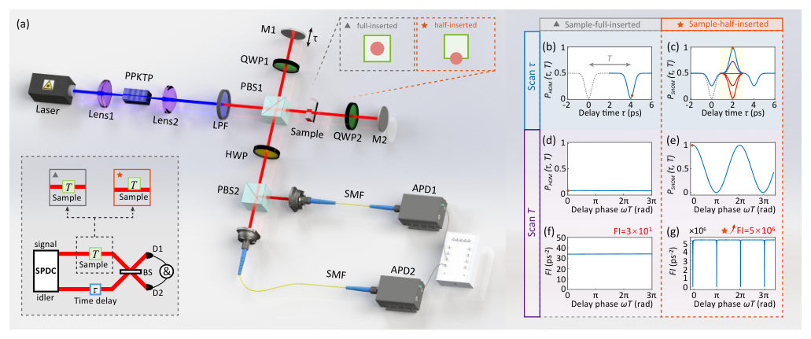
<figcaption class="paper-figure-caption"><b>Fig 1.</b> FIG. 1. The concept of the sample-half-inserted HOM (SHOM) interference. (a) Experimental setup for the SHOM interferometer. A narrowband laser with a center wavelength of 405.0(1) nm pumps a PPKTP crystal to produce photon pairs via type-II spontaneous parametric down-conversion (SPDC). The orthogonally polarized signal and idler photons are directed into a delay system consisting of a polarization beam splitter (PBS1), two quarter-wave plates (QWP1, QWP2) set at 45◦, and two mirrors (M1, M2). Mirror M1 is mounted on a stepper motor to scan the optical delay τ. After the delay line, the photons pass through a half-wave plate (HWP) set at 22.5◦and a second PBS (PBS2) before being coupled...</figcaption>
</figure>
<figure class="paper-figure-card">
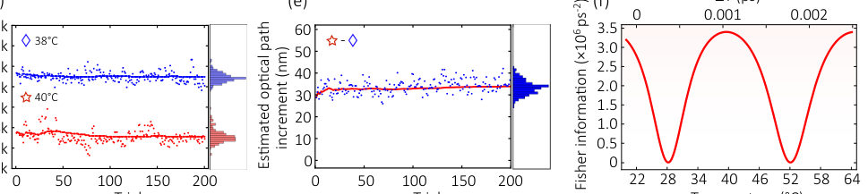
<figcaption class="paper-figure-caption"><b>Fig 2.</b> FIG. 2. Experimental results of sample-half-inserted HOM interference. (a) Hong–Ou–Mandel (HOM) interference patterns without the sample (gray) and with the sample fully inserted (blue). Dashed points represent experimental data, and solid lines denote Gaussian fits. (b) HOM interference patterns with the sample half inserted, where the sample is heated to different temperatures. (c) Coincidence counts at the interference center as a function of temperature, with time delay τ fixed at the central dip position from (b). (d) Coincidence counts at the interference center for 38 ◦C (blue) and 40 ◦C (red) measured over 200 trials. Solid lines represent the cumulative average; the histogram on...</figcaption>
</figure>
<figure class="paper-figure-card">
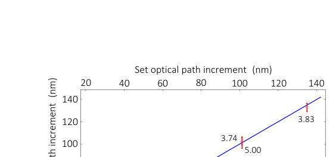
<figcaption class="paper-figure-caption"><b>Fig 3.</b> FIG. 2</figcaption>
</figure>
<figure class="paper-figure-card">
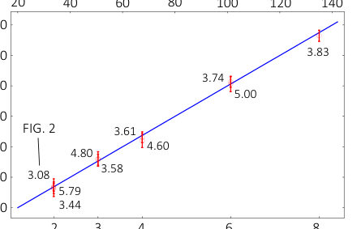
<figcaption class="paper-figure-caption"><b>Fig 4.</b> FIG. 3. Estimated optical path increment versus tem- perature increment. The bottom axis represents the sam- ple temperature increment, which corresponds to set optical path increment indicated on the top axis. The red hollow circle denotes the average of the measurement results. The precision (standard deviation) for each set is indicated in the figure.</figcaption>
</figure>

**Summary.** The paper introduces the Sample-Half-Inserted HOM (SHOM) interferometer as a novel technique to dramatically improve measurement precision in quantum interferometry. By exploiting an asymmetric photon-sample interaction, SHOM enhances the Fisher information by five orders of magnitude over standard methods. This allows for achieving nanoscale measurements with significantly fewer photons, paving the way for practical quantum-enhanced metrology.

**Why it may be interesting.** This work provides a concrete, experimentally validated method to boost the sensitivity of quantum optical measurements beyond standard limits by engineering the interaction geometry, which is highly relevant for developing practical quantum sensors in AMO physics and quantum optics.

Detailed structure

**Main problem.** The primary goal is to enhance the precision of optical path difference measurements using Hong-Ou-Mandel (HOM) interferometry, which typically suffers from low Fisher information per measurement trial.

**Main result.** The proposed Sample-Half-Inserted HOM (SHOM) interferometer enhances the Fisher information by five orders of magnitude compared to standard HOM. Experimentally, this allowed achieving nanoscale precision ($13.63 	ext{ as}$) using significantly fewer photons ($O(10^7)$).

**Method.** The authors developed and experimentally demonstrated the SHOM configuration, which introduces an asymmetric photon-sample interaction leading to a unique dip-bump-dip interference pattern.

**Model / system.** The system is a quantum interferometer utilizing two-photon quantum interference (HOM effect) enhanced by modifying the sample interaction to create the SHOM setup. Theoretical models for coincidence probabilities ($	ext{P}_{	ext{SHOM}}$) and precision estimation via Fisher Information were employed.

**Key observables.** Coincidence counts, optical path difference/time delay ($T$), interference patterns (dip-bump-dip structure), and calculated Fisher information ($F$).

**Important parameters / regimes.** Precision of $4.09 	ext{ nm}$ ($\approx 13.63 	ext{ as}$) and accuracy of $1.22 	ext{ nm}$ ($\approx 4.07 	ext{ as}$) achieved with $O(10^7)$ photons.

**Assumptions / limitations.** The fundamental limitation overcome is the low Fisher information inherent to standard HOM schemes; the technique assumes that the asymmetric interaction can be reliably modeled and measured.

**Figures summary.** Figure 1 illustrates the concept of SHOM setup and compares coincidence probabilities ($	ext{P}_{	ext{HOM}}$ vs $	ext{P}_{	ext{SHOM}}$). Figure 2 shows experimental results, including HOM/SHOM patterns varying with temperature, resulting sinusoidal count variations, and calculated Fisher information.

**Paper structure.** The paper introduces the limitation of standard HOM interferometry, proposes the SHOM enhancement via asymmetric interaction, derives the necessary mathematical models for coincidence probabilities and Fisher Information, presents experimental validation showing superior precision, and concludes by discussing the broad applicability of the SHOM technique to other quantum metrology tasks.

Abstract

Quantum technologies have been widely recognized as unprecedented opportunities for ultra-high precision metrology. As a celebrated example in modern quantum optics, the Hong-Ou-Mandel (HOM) interferometer is well-known for enabling temporal resolutions on the attosecond scale. However, the relatively low Fisher information per trial in ordinary HOM measurements typically necessitates tens of thousands of repetitions to achieve such precision. Here, we propose and demonstrate a sample-half-inserted HOM (SHOM) interferometer, which enhances the Fisher information by five orders of magnitude in a single interference event. By introducing an asymmetric photon-sample interaction, the SHOM configuration produces a distinctive dip-bump-dip interference structure, converting what was previously viewed as an artifact into a helpful metrological resource. Experimentally, we measured the optical path difference with an average precision of 4.09 nm (13.63 as) and an average accuracy of 1.22 nm (4.07 as) using $O(10^7)$ photons. Our results establish SHOM interferometry as an efficient phase-insensitive approach, not only paving the way toward practical quantum-enhanced thickness measurement for transparent materials, but also serving as an elegant strategy to improve the performance of various quantum devices.

[↑ back to top](#top)

### [A lower bound on the classical simulation cost of star-network correlations](http://arxiv.org/abs/2608.03986v1)

**Authors:** Martin J. Renner  
**Type:** theory · **Category:** quantum information and computing · **PDF:** <https://arxiv.org/pdf/2608.03986v1>  
**Analysis basis:** full PDF text, analyzed in chunks
**Topic relevance:** 🔥 `entanglement & information structure` **4/5** · `quantum measurements` **2/5** · `measurement-induced transitions` **1/5**

↔ Scroll figures horizontally

<figure class="paper-figure-card">
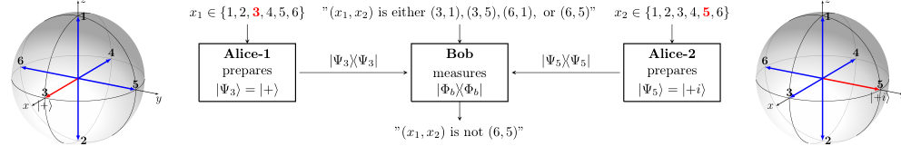
<figcaption class="paper-figure-caption"><b>Fig 1.</b> Figure 2. Each Alice receives a number between 1 and 6. Given the input, they prepare one of the eigenstates of the three Pauli operators and send it to Bob. Here, x1 = 3 and x2 = 5, so Alice-1 sends the state |+⟩and Alice-2 the state |+i⟩. Bob receives a promise about the inputs of Alice-1 and Alice-2. For instance, the referee tells him that x1 is either 3 or 6 and x2 is either 1 or 5. They win if Bob can exclude one of the possible combinations. So he is supposed to reply either “(x1, x2) is not (3, 1)” or “(x1, x2) is not (6, 1)” or “(x1, x2) is not (6, 5)”. We show that the task can be solved perfectly with the presented qubit strategy but requires a classical message of more than two...</figcaption>
</figure>

**Summary.** This paper analyzes the communication complexity required to simulate joint measurements on a star network of $n$ parties. It proves that achieving perfect distinguishability classically demands a message length scaling exponentially with both the number of parties and the dimension of the quantum system. This highlights a significant, quantifiable advantage of using quantum channels over classical ones for multi-partite correlations.

**Why it may be interesting.** This work provides rigorous information-theoretic bounds showing that simulating multi-partite quantum correlations requires resources scaling non-trivially with system size, which is foundational for understanding the limits of classical simulation in quantum physics.

Detailed structure

**Main problem.** The paper studies the quantum communication complexity of correlations arising from joint measurements on a star network, comparing the advantage of quantum versus classical message transmission.

**Main result.** It establishes that the classical communication cost required to simulate joint quantum measurements scales exponentially with the dimension ($d$) and number of parties ($n$), demonstrating a fundamental quantum advantage.

**Method.** The authors use concepts from quantum information theory, including antidistinguishability, to derive lower bounds on classical simulation costs for specific exclusion tasks in a star network setting.

**Model / system.** The model involves $n$ parties (Alices) each sending a $d$-level quantum system to a central node (Bob), who performs a joint measurement. The core task is distinguishing between potential input states based on the measurement outcome.

**Key observables.** Quantum correlation probabilities, classical communication message length ($m$), and the success probability of an exclusion task.

**Important parameters / regimes.** Number of senders ($n$) and dimension of the quantum system ($d$). The scaling is shown to depend on both $n$ and $d$.

**Assumptions / limitations.** The analysis focuses on scenarios where the task can be solved perfectly quantumly, and communication is restricted between Alices and Bob.

**Figures summary.** Figure 1 illustrates the star network setup for joint measurement. Figure 2 provides a concrete example demonstrating the required exclusion output based on input promises for $n=2$ and $d=6$.

**Paper structure.** The paper develops results by first defining the quantum communication task, then deriving lower bounds on classical simulation costs using antidistinguishability arguments (Theorem 1), followed by constructing a perfect quantum strategy (Appendix A) to confirm these bounds.

Abstract

It is well established that quantum strategies outperform classical ones in several communication tasks. We study the quantum communication complexity of correlations arising from joint measurements on quantum systems distributed across a star network, where several parties each send a quantum system to a central node. We introduce an exclusion task that can be solved perfectly when each party sends a quantum $d$-level system, but would require a large classical message otherwise. In fact, the task cannot be solved with certainty if each of the $n$ parties sends a classical message with less than $n^{(d-1)}$ symbols. This implies an advantage of using quantum over classical messages in that scenario that scales with both, the dimension of the quantum system and the number of systems measured simultaneously. As an application, this shows that no finite-size classical description of a qubit suffices to reproduce the statistics of a joint measurement on sufficiently many qubits.

[↑ back to top](#top)

### [Entangling Topological Invariants](http://arxiv.org/abs/2608.03634v1)

**Authors:** Kazuki Ikeda, Yaron Oz  
**Type:** theory · **Category:** other · **PDF:** <https://arxiv.org/pdf/2608.03634v1>  
**Analysis basis:** full PDF text, analyzed in chunks
**Topic relevance:** 🔥 `entanglement & information structure` **4/5** · `analog quantum simulation` **1/5** · `correlated cavity matter` **1/5** · `non-equilibrium dynamics` **1/5**

↔ Scroll figures horizontally

<figure class="paper-figure-card">
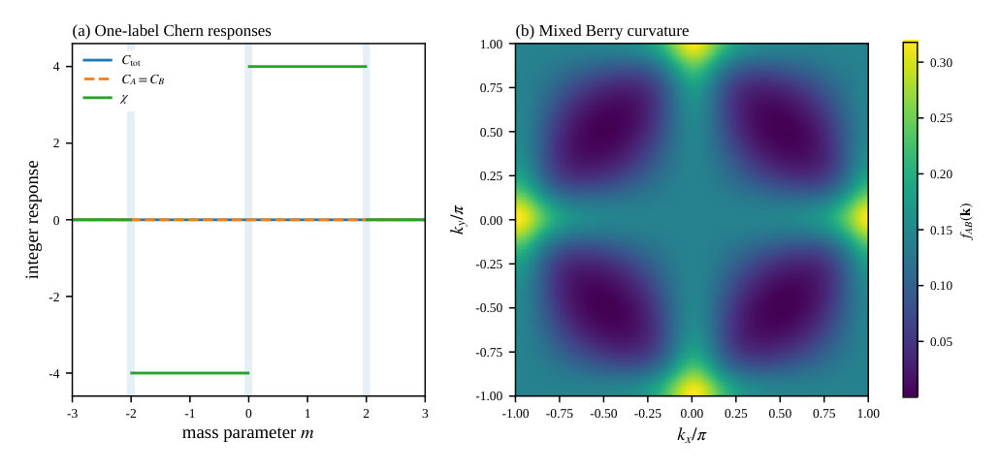
<figcaption class="paper-figure-caption"><b>Fig 1.</b> FIG. 1. Mixed Chern topology with vanishing one-label responses. (a) Total and one-label responses vanish on the central plateaus, while 𝜒= ±4. Shading marks bulk gap closings. (b) The mixed Berry curvature at 𝑚= 1 integrates to four; the sector table is given in Eq. (13).</figcaption>
</figure>
<figure class="paper-figure-card">
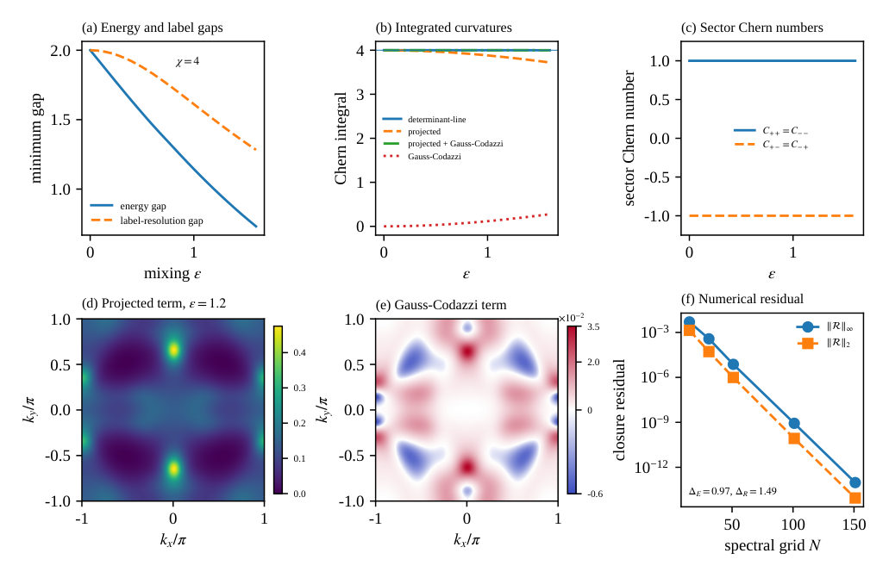
<figcaption class="paper-figure-caption"><b>Fig 2.</b> FIG. 2. Mixed Chern topology under label mixing. (a) Energy and label-resolution gaps. (b) Determinant-line curvature and its projected and Gauss–Codazzi contributions. (c) Sector Chern numbers computed with the Fukui–Hatsugai–Suzuki algorithm [16]. (d),(e) Projected and Gauss–Codazzi densities at 𝜖= 6/5 on a momentum grid. Separate color scales display the two contributions; the Gauss–Codazzi scale is centered at zero. (f) Numerical residual of Eq. (18).</figcaption>
</figure>
<figure class="paper-figure-card">
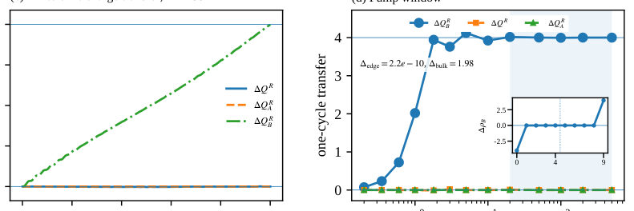
<figcaption class="paper-figure-caption"><b>Fig 3.</b> FIG. 3. Boundary spectrum and cross pump. (a) Edge states of the eight-band QWZ ribbon with both label charges conserved. Sector momentum offsets separate coincident crossings. (b) A boundary 𝜏𝑥coupling opens a gap. (c) Finite-time evolution transfers only 𝐵 charge. (d) Finite-size and ramp-time dependence around the quantized transfer; the inset shows the boundary-localized density change.</figcaption>
</figure>
<figure class="paper-figure-card">
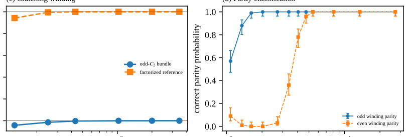
<figcaption class="paper-figure-caption"><b>Fig 4.</b> FIG. 4. Clutching quotient and subsystem-factorization test. (a) Numerical integration of the interblock-coupled rank-four projector converges to 𝐶2 = 1. (b) The solid curve gives the minimum gap on the sampled sphere, and the dashed curve gives the analytic lower bound. The right axis shows the block-commutator norm 1</figcaption>
</figure>
<figure class="paper-figure-card">
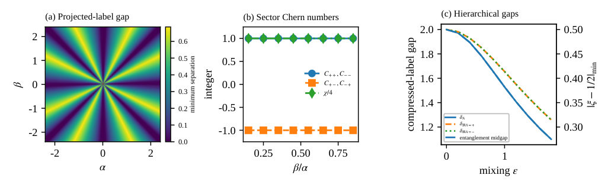
<figcaption class="paper-figure-caption"><b>Fig 5.</b> FIG. 6. Projected-label gaps and hierarchical diagnostics. (a) Minimum normalized label-resolution gap of 𝑃(𝛼𝑍𝐴+ 𝛽𝑍𝐵)𝑃at 𝜖= 6/5, computed on a 301 × 301 parameter grid and a 25 × 25 Brillouin-zone grid. (b) Along 𝛼= 1 and 0.15 ≤𝛽≤0.85, the four sector Chern integers and 𝜒remain constant. (c) The sequential 𝐴and conditional-𝐵compressed gaps are open along the mixing path; the secondary axis shows the associated entanglement-spectrum distance from 𝜉= 1/2.</figcaption>
</figure>

**Summary.** This work develops a sophisticated topological framework to measure entanglement in electronic systems by quantifying obstructions to factorizing the occupied state manifold. It shows that while local measurements might suggest independent subsystems, global invariants like mixed Chern classes reveal genuine, non-factorizable quantum correlations. This has direct implications for understanding exotic topological phases in condensed matter physics.

**Why it may be interesting.** It provides rigorous mathematical tools (mixed Chern classes, clutching quotients) to quantify entanglement in topological quantum matter that cannot be captured by simply summing up contributions from individual subsystems.

Detailed structure

**Main problem.** The core problem is characterizing topological obstructions that prevent the global factorization of occupied electronic multiplets when decomposing them into independent candidate subsystems.

**Main result.** The mixed Chern class ($\chi$) successfully isolates non-factorizable topological information, and a specific criterion based on $\gcd(p,q)$ determines if global factorization is possible over $S^4$.

**Method.** The authors use algebraic topology tools, comparing transition functions via quotient structures (like the subsystem-gluing quotient) and analyzing clutching maps for bundles over $S^4$.

**Model / system.** The study concerns isolated occupied multiplets described by vector bundles ($E 	o X$) in multiband quantum systems, analyzed using Hamiltonians and spectral projectors.

**Key observables.** Mixed Chern classes ($\chi_{ab}$), total/one-label Chern numbers ($C_{tot}, C_A, C_B$), charge transfers ($\Delta Q$), and the clutching quotient $\eta_{p,q}(E)$.

**Important parameters / regimes.** The factor dimensions $p$ and $q$, the geometry of the underlying manifold (e.g., closed surface vs. $S^4$), and the flux pumping parameters.

**Assumptions / limitations.** The analysis relies on defining appropriate quotient structures to filter out trivially factorizable topological data, and in some cases, assumes ideal measurement protocols for tomography.

**Figures summary.** Figures illustrate that while total and one-label responses vanish (e.g., $\Delta Q_{tot} = \Delta Q_A = 0$), the mixed invariant ($\chi$) remains nonzero, confirming entanglement beyond simple factor contributions.

**Paper structure.** The paper progresses from defining the obstruction via transition function comparison on a general surface to analyzing the specific case of $S^4$ using clutching maps. It then applies these concepts to physical measurements like flux pumping and projector tomography protocols.

Abstract

An isolated occupied multiplet may admit local tensor-product descriptions without a globally consistent subsystem structure. We characterize the obstruction by comparing the transition functions of the occupied multiplet with those generated by independent basis changes in the two candidate subsystems. When a decomposition into rank-one sectors over a closed surface is specified, the resulting quotient removes row- and column-additive Chern data and yields mixed Chern classes. Momentum-dependent mixing of the sector labels adds the Gauss--Codazzi curvature of the moving lines, while in the label-conserving limit the mixed class is measured by a crossed Thouless pump. When only the factor dimensions $p$ and $q$ are specified, the comparison is made at the level of the clutching map of a rank-$pq$ bundle over $S^4$. Product frames generate winding numbers in $q\mathbb Z+p\mathbb Z$, so global factorization is possible exactly when $C_2$ is divisible by $\gcd(p,q)$; in particular, odd $C_2$ obstructs a $2\times2$ factorization. We illustrate the two settings with finite eight-level Hamiltonians and give pumping and occupied-projector tomography protocols for their readout.

[↑ back to top](#top)

### [Protected measurements for protected superconducting qubits](http://arxiv.org/abs/2608.03325v1)

**Authors:** Xanda C Kolesnikow, Thomas B Smith, Andrew C Doherty  
**Type:** theory · **Category:** quantum information and computing · **PDF:** <https://arxiv.org/pdf/2608.03325v1>  
**Analysis basis:** full PDF text, analyzed in chunks
**Topic relevance:** 🔥 `quantum measurements` **4/5** · `QC/QI experiment` **2/5** · `measurement-induced transitions` **1/5**

↔ Scroll figures horizontally

<figure class="paper-figure-card">
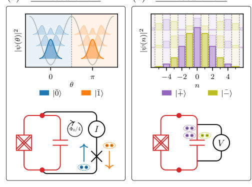
<figcaption class="paper-figure-caption"><b>Fig 1.</b> FIG. 1. Protected measurements. Shown for an ideal protected qubit described by Eq. (1). (a) Z measurements identify anything closer to θ = 0 as a logical |¯0⟩(blue) and anything closer to θ = π as a logical |¯1⟩(orange). This can be implemented by measuring the direction of the current through a shunting Josephson junction. (b) X measurements identify any state with even Cooper-pair parity as a logical |¯+⟩(purple) and anything with odd Cooper-pair parity as a logical |¯−⟩(green). This can be implemented by measuring the voltage across the circuit.</figcaption>
</figure>
<figure class="paper-figure-card">
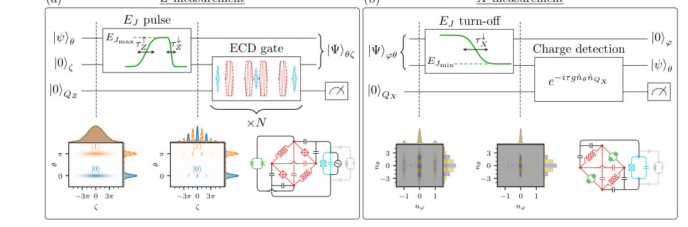
<figcaption class="paper-figure-caption"><b>Fig 2.</b> FIG. 2. Measuring the 0-π qubit. (a) Z measurement. The protocol consists of smoothly turning on the shunting Josephson element (green) to prepare GKP states in the ζ mode of the 0-π qubit (red) that are entangled with its θ mode, then sharply turning off the Josephson element, returning the ζ mode to a linear oscillator. Through a series of Echoed Controlled Displacement (ECD) gates, the logical information in the GKP states is transferred to an ancillary qubit (cyan), which is then measured in a single shot via a readout resonator (gray). (b) X measurement. By adiabatically turning off the internal Josephson junctions (green) of the 0-π qubit (red), the X-basis information is mapped to...</figcaption>
</figure>
<figure class="paper-figure-card">
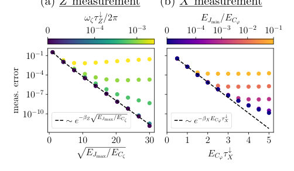
<figcaption class="paper-figure-caption"><b>Fig 3.</b> FIG. 3. Measurement errors. (a) Z measurement er- rors as a function of the maximum Josephson energy EJmax for different turn-off times τ ↓ Z. The black dashed line is an analytically calculated measurement error; see Appendix C. The ζ-mode energy ratio is EL/ECζ = 4.1 × 10−3, and θ is treated as a classical variable. (b) X measurement errors as a function of the turn-off time τ ↓ X for different minimum Josephson energies EJmin. The black dashed line is an expo- nential fit to the EJmin = 0 and ECφτ ↓ X &lt; 3 data. The 0-π qubit parameters are ECθ/ECφ = 10−2, EJ/ECφ = 2.5 and EL/ECθ = 4.1 × 10−3. See Appendix E for details of the nu- merical simulations.</figcaption>
</figure>
<figure class="paper-figure-card">
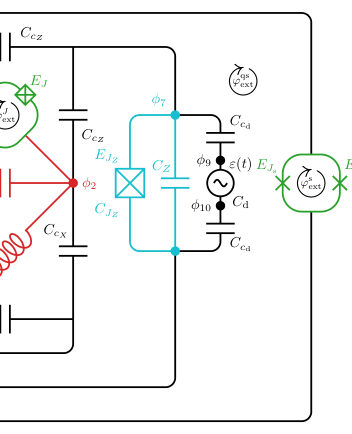
<figcaption class="paper-figure-caption"><b>Fig 4.</b> FIG. 4. Complete circuit diagram for measuring the 0-π qubit in both bases.</figcaption>
</figure>
<figure class="paper-figure-card">
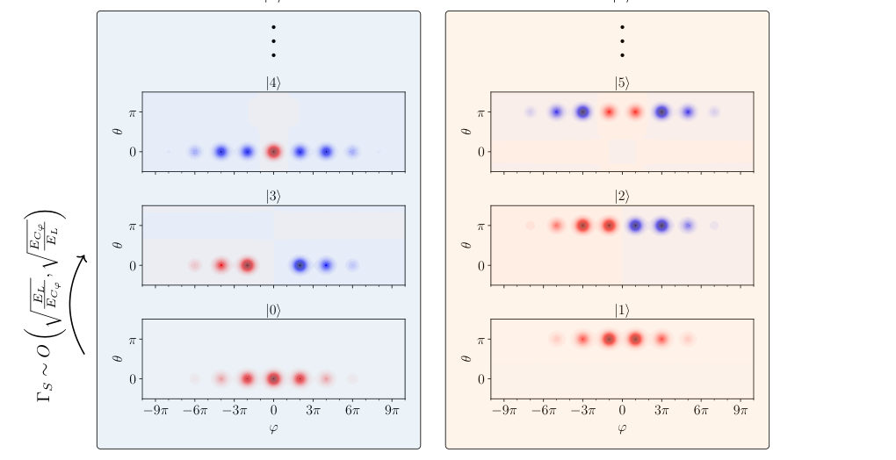
<figcaption class="paper-figure-caption"><b>Fig 5.</b> FIG. 5. Subsystem decomposition for the 0-π qubit eigenstates. Red (blue) regions denote positive (negative) values of the real part of the wavefunction. β is a decay constant that is close to 2(2 − √</figcaption>
</figure>

**Summary.** This paper details methods to perform fault-tolerant measurements on protected $0-\pi$ superconducting qubits. By leveraging QND techniques and coupling the qubit state to auxiliary modes, the authors achieve measurement protocols for both Z and X bases. These results are crucial for realizing universal, error-corrected quantum computation in superconducting circuits.

**Why it may be interesting.** This work provides concrete theoretical blueprints for performing necessary diagnostic measurements (readout) on highly protected quantum hardware, directly addressing a major bottleneck in scaling up superconducting quantum processors.

Detailed structure

**Main problem.** The core challenge is developing robust methods to measure protected superconducting qubits without destroying their inherent protection mechanisms, which is essential for fault-tolerant quantum computation.

**Main result.** The authors successfully propose protocols for performing both Z and X basis measurements on the $0-\pi$ qubit that maintain its protected nature by utilizing Quantum Non-Demolition (QND) measurement principles.

**Method.** Measurement relies on encoding logical information into auxiliary modes ($\zeta$ mode for Z, $	heta$ mode parity for X) and coupling this information to ancillary qubits via controlled gates like Echoed Controlled Displacement (ECD).

**Model / system.** The system is the $0-\pi$ superconducting qubit, whose Hamiltonian involves multiple coupled Josephson junctions. The protection mechanism is linked to code structures, such as those related to rotor-GKP codes.

**Key observables.** Measurement error rates for both Z and X bases; identification of proximity to protected states ($\vertar{0}
angle$ or $\vertar{1}
angle$) via measurement outcomes.

**Important parameters / regimes.** Josephson coupling strengths ($E_J$), charging energies ($E_C$), ancillary qubit parameters, and control time scales (e.g., turn-off times $	au_{\downarrow}$).

**Assumptions / limitations.** The protocols assume the ability to rapidly switch off Josephson junctions or treat certain modes classically for simplification in deriving error bounds.

**Figures summary.** Figures illustrate the Z measurement protocol using the $\zeta$ mode and ECD gates, and the X measurement by mapping information onto Cooper-pair parity of the $	heta$ mode. Later figures analyze how varying impedance affects these measured error rates.

**Paper structure.** The paper progresses from establishing the general need for protected measurements to detailing specific protocols for Z and X bases on the $0-\pi$ qubit, followed by quantitative analysis showing the dependence of measurement errors on external parameters like impedance.

Abstract

Protected superconducting qubits such as the $0$-$π$ qubit promise to substantially suppress error rates, facilitating fault-tolerant quantum computing with fewer qubits. Measuring these qubits is challenging due to their protected nature, and thus far no concrete proposal exists for how to measure them without breaking their protection. Here we show how to perform protected measurements of the $0$-$π$ qubit in two orthogonal bases. The protection of these measurements is facilitated by their quantum non-demolition nature, allowing faults on ancillary measurement qubits to be tolerated. As experimental progress pushes protected qubits further into the low error-rate regime, our techniques will be crucial for fault-tolerant universal control.

[↑ back to top](#top)

### [TNASS: Tensor Network Active Space Selection with the Entanglement Feature](http://arxiv.org/abs/2608.03645v1)

**Authors:** Angus Mingare, Isabelle Heuzé, Peter V. Coveney  
**Type:** theory · **Category:** strongly correlated electrons · **PDF:** <https://arxiv.org/pdf/2608.03645v1>  
**Analysis basis:** full PDF text, analyzed in chunks
**Topic relevance:** 🔥 `entanglement & information structure` **4/5** · `methods for driven-dissipative` **3/5**

↔ Scroll figures horizontally

<figure class="paper-figure-card">
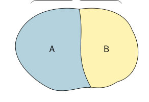
<figcaption class="paper-figure-caption"><b>Fig 1.</b> Figure 1: A representation of an L-site quantum system partitioned into two complementary, bi- partite subregions, A and B.</figcaption>
</figure>
<figure class="paper-figure-card">
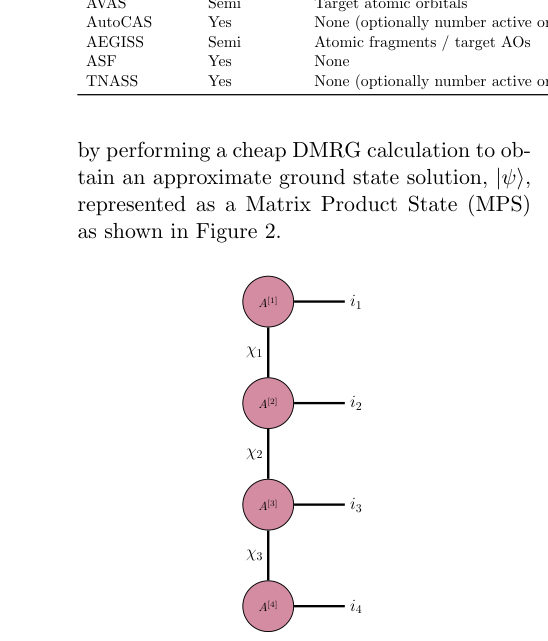
<figcaption class="paper-figure-caption"><b>Fig 2.</b> Figure 2: An MPS is a one-dimension chain of tensors, A[i], representing a quantum state. The physical dimension of site k is ik.</figcaption>
</figure>
<figure class="paper-figure-card">
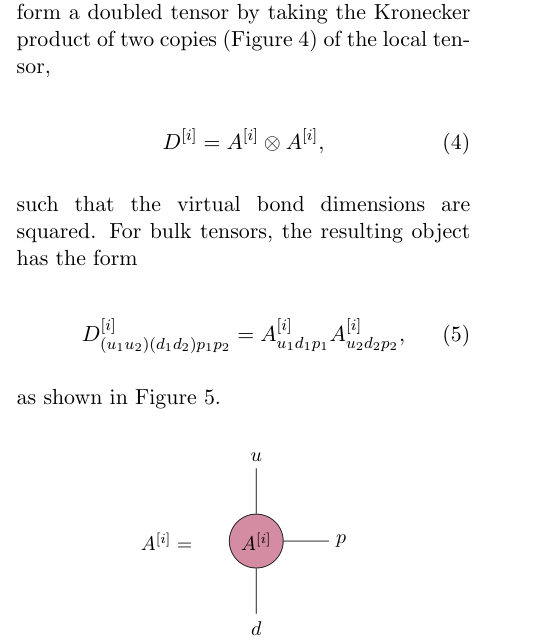
<figcaption class="paper-figure-caption"><b>Fig 3.</b> Figure 3: One site of the MPS, A[i] with indices u (up), d (down), and p (physical).</figcaption>
</figure>
<figure class="paper-figure-card">
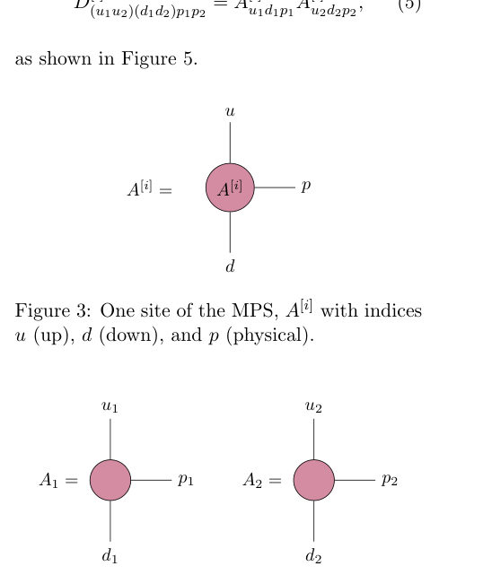
<figcaption class="paper-figure-caption"><b>Fig 4.</b> Figure 4: Visual depiction of two identical copies (A1 and A2) of the local tensor A[i].</figcaption>
</figure>
<figure class="paper-figure-card">
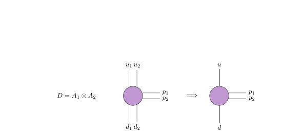
<figcaption class="paper-figure-caption"><b>Fig 5.</b> Figure 5: Construction of the doubled tensor D = A1 ⊗A2 via the Kronecker product of two local tensor copies, resulting in squared virtual bond dimensions.</figcaption>
</figure>

**Summary.** This paper introduces TNASS, a novel active space selection technique that uses tensor networks to quantify multi-orbital electronic entanglement. By encoding orbital purities as an MPS and calculating the Entanglement Feature, it identifies strongly correlated regions more robustly than traditional methods. This provides a scalable foundation for high-accuracy molecular simulations in complex chemical environments.

**Why it may be interesting.** This work directly addresses how quantum information theory can be leveraged to solve fundamental computational bottlenecks in chemistry, providing a rigorous, entanglement-based alternative to heuristic selection criteria for strongly correlated systems.

Detailed structure

**Main problem.** The core challenge is developing an accurate, scalable, and automated method for selecting the active space in multi-scale molecular electronic structure calculations.

**Main result.** The proposed TNASS method, utilizing entanglement features, yields lower ground state energies and more accurate dipole moments compared to existing fully automated selection schemes like those based on single-orbital entropy or HOMO/LUMO gaps.

**Method.** It employs Tensor Network methods (specifically representing orbital purities as a Matrix Product State) to quantify multi-orbital entanglement via the Entanglement Feature (EF).

**Model / system.** The method is applied to molecular electronic structure calculations, benchmarked on diatomic molecules like BeO and BN using the 6-31G* basis set.

**Key observables.** Ground state energies, dipole moments, single-orbital entropy, and multi-orbital entanglement measures derived from the EF.

**Important parameters / regimes.** The method's computational cost scales poorly with bond dimension ($\chi$), limiting initial applications to small systems.

**Assumptions / limitations.** It assumes that quantifying electronic correlation via entanglement structure provides a superior guide for active space selection compared to single-orbital metrics or simple gap analysis.

**Figures summary.** Figures compare energy dissociation curves and dipole moment changes across different geometries (compressed, intermediate, stretched) for BeO/BN, contrasting TNASS results against CCSD(T) benchmarks and other selection methods.

**Paper structure.** The paper introduces the necessity of active space selection, details the mathematical framework using MPS to encode entanglement features (EF), compares EF-based selection (TNASS) against single-orbital entropy and HOMO/LUMO approaches across various molecular geometries, and validates performance via energy and dipole moment calculations.

Abstract

The quality of multi-scale modelling techniques in molecular electronic structure calculations, such as embedding and subspace methods, relies upon the chosen active space. The automation of active space selection is vital for ensuring the accuracy, reproducibility, and scalability in such calculations. In this work, we introduce Tensor Network Active Space Selection using the Entanglement Feature. Through the isolation of strongly correlated electrons, this method provides a scalable foundation for embedding methods in multi-scale modelling. By representing the purities of all possible orbital partitions as a Matrix Product State, our method isolates regions of strong electron correlation without requiring manual preselection of target atoms or the calculation of expensive high-order density matrices. The results demonstrate that this approach leads to lower ground state energies and more accurate dipole moments than other fully automated selection schemes such as those based solely on single-orbital entropy or the selection of spatial orbitals around the HOMO/LUMO gap.

[↑ back to top](#top)

### [Magneto-oscillations, nonlinearity, and nonreciprocity of Coulomb drag in quantum circuits](http://arxiv.org/abs/2608.02812v1)

**Authors:** Alex Levchenko, Mingyang Zheng, Dominique Laroche  
**Type:** theory · **Category:** other · **PDF:** <https://arxiv.org/pdf/2608.02812v1>  
**Analysis basis:** full PDF text, analyzed in chunks
**Topic relevance:** 🔥 `Keldysh / 2PI / non-Gaussian methods` **4/5** · `methods for driven-dissipative` **1/5** · `non-equilibrium dynamics` **1/5**

↔ Scroll figures horizontally

<figure class="paper-figure-card">
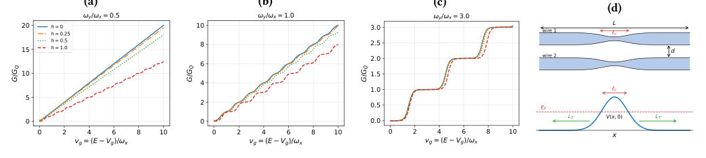
<figcaption class="paper-figure-caption"><b>Fig 1.</b> FIG. 1. Magnetoconductance of the saddle-point constriction, Eqs. (2)–(5), for confinement ratios (a) ωy/ωx = 1/2, (b) 1, and (c) 3, at several values of the reduced field h = ωc/ωx. The staircase sharpens and the plateaus widen with increasing field as ∆1(B) shrinks and ∆2(B) grows, reproducing the classic results of Refs. [24, 25] and benchmarking the model used throughout. (d) Schematic of the coupled double- wire geometry: gates define two parallel channels of length L at separation d; the potential profile along each channel has its bottleneck (extent ℓc ≪L) described by the saddle Eq. (1), while the interwire coupling acts along the entire parallel region, over which the rectified...</figcaption>
</figure>
<figure class="paper-figure-card">
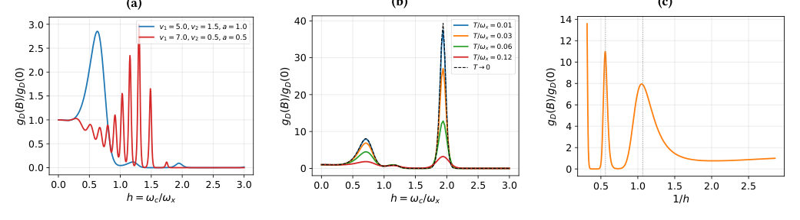
<figcaption class="paper-figure-caption"><b>Fig 2.</b> FIG. 2. Magneto-oscillations of the linear drag. (a) Normalized drag gD(B)/gD(0) from Eq. (9) for two representative parameter sets (vg,1, vg,2, a). (b) Thermal smearing at vg,1 = 5, vg,2 = 3, a = 1: exact finite-T evaluation of Eqs. (6) and (7) for increasing T/ωx; the T →0 limit Eq. (9) is shown dashed. (c) Matched wires (vg,1 = vg,2 = 5, a = 1.2, T/ωx = 0.1) plotted against 1/h: the dotted lines mark the depopulation condition ∆2(h)(n + 1</figcaption>
</figure>
<figure class="paper-figure-card">
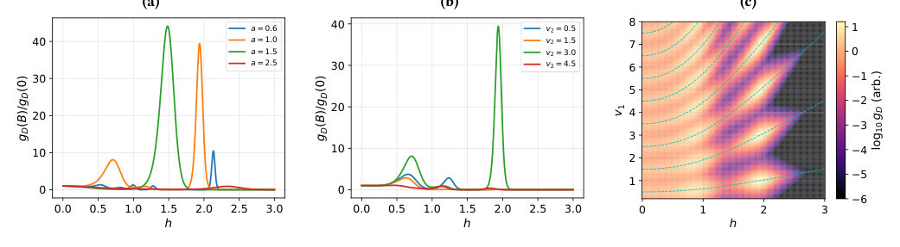
<figcaption class="paper-figure-caption"><b>Fig 3.</b> FIG. 3. Parameter dependence of the drag magneto-oscillations, Eq. (9). (a) Confinement-ratio dependence at fixed gates (vg,1 = 5, vg,2 = 3). (b) Drag-wire gate dependence at vg,1 = 5, a = 1. (c) Map of log10 gD in the (h, vg,1) plane at vg,2 = 3, a = 1; the dashed curves are the subband risers ∆2(h)(n + 1</figcaption>
</figure>
<figure class="paper-figure-card">
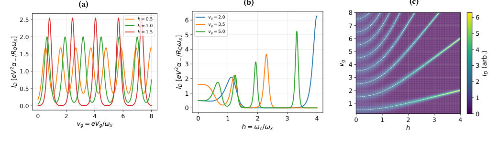
<figcaption class="paper-figure-caption"><b>Fig 4.</b> FIG. 4. Nonlinear drag in a magnetic field, Eq. (12), in units of eV 2α−/RQωx (a = 1). (a) Gate dependence for several fields: the peaks sharpen and grow ∝1/∆1(h) as the field compresses the risers. (b) Magneto-oscillations at fixed gate: each peak marks one subband depopulation, and the last (highest-field) peak is the strongest. (c) Map of ID(vg, h); the signal concentrates on the riser fan ∆2(h)(n + 1</figcaption>
</figure>
<figure class="paper-figure-card">
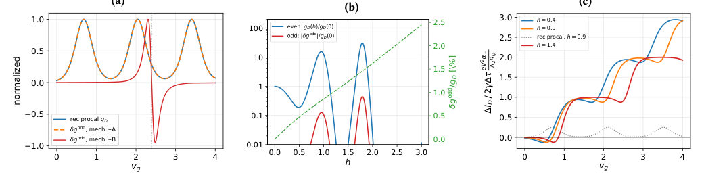
<figcaption class="paper-figure-caption"><b>Fig 5.</b> FIG. 5. Dissipation-induced nonreciprocity of drag. (a) Lineshapes of the field-odd component of the linear drag at h = 0.8, a = 1.2: for an energy-smooth transmission-time difference (mechanism A) δgodd tracks the reciprocal peaks, while a resonant ∆τ at a subband anticrossing (mechanism B) produces a dispersive feature pinned to the anticrossing (dotted line). (b) Even versus odd drag magneto- oscillations for matched wires with the lumped small parameter 2γδηc = 10−2, where δ is the saddle asymmetry and ηc = J0/J the coupling-asymmetry factor defined in Sec. V; the odd/even ratio (dashed, right axis) grows with field as γ∆τ(B) ∝B/∆1(B). (c) Drive- polarity asymmetry of the nonlinear...</figcaption>
</figure>

**Summary.** This work develops a comprehensive theory for Coulomb drag in coupled quantum wires under a magnetic field. It predicts characteristic magneto-oscillations whose contrast depends on temperature relative to the field-sharpened tunneling width. Furthermore, it rigorously analyzes nonlinear and nonreciprocal transport effects, providing diagnostic tools for characterizing device physics beyond simple linear response.

**Why it may be interesting.** The detailed theoretical framework for analyzing mesoscopic transport phenomena like Coulomb drag in magnetic fields is highly relevant to understanding quantum coherence and interaction effects in nanoscale electronic devices, bridging concepts from condensed matter theory and quantum optics.

Detailed structure

**Main problem.** The study investigates magneto-oscillations, nonlinearity, and nonreciprocity effects in Coulomb drag within interactively coupled quantum circuits.

**Main result.** The theory derives closed forms for the linear drag conductance and shows that nonlinear/nonreciprocal responses are governed by transconductance measurements or geometric asymmetries.

**Method.** The analysis employs Keldysh scattering-state constructions, Landauer formalism extensions, and detailed derivations in both linear (thermal) and nonlinear (shot noise) transport regimes.

**Model / system.** The system consists of two interactively coupled adiabatic constrictions (quantum point contacts or short quantum wires) embedded in a magnetic field. The coupling is modeled purely by the Coulomb interaction.

**Key observables.** Magneto-oscillations in drag current, linear drag conductance ($g_D$), particle-hole asymmetry factor ($A_i(\omega)$), and nonreciprocal components of the drag signal.

**Important parameters / regimes.** Magnetic field ($B$) leading to cyclotron frequency ($\omega_c$), temperature ($T$), gate voltage ($V_g$), and the ratio of thermal length to coupling range ($L_T/d$).

**Assumptions / limitations.** The model assumes a minimal system of two coupled constrictions, uses approximations for the interaction kernel in different limits (e.g., long thermal length), and analyzes specific transport regimes.

**Figures summary.** Figures illustrate magnetoconductance staircase structures dependent on confinement ratios, show periodicity in $1/B$, map parameter space showing drag ridges tracking subband steps, and compare theoretical predictions for temperature dependence ($T^2$ vs. linear-in-$T$).

**Paper structure.** The paper builds from the basic Hamiltonian and single-particle solutions to derive the linear drag conductance using Keldysh techniques. It then extends this analysis to the nonlinear regime (shot noise) and discusses distinct sources of nonreciprocity, concluding with open problems regarding zero-field asymmetry and low-temperature upturns.

Abstract

We consider the problem of Coulomb drag in interactively coupled quantum circuits built of adiabatic constrictions: quantum point contacts and short quantum-wire channels. The interplay of spatial confinement and magnetic field leads to a rich oscillatory response of the drag current as a function of gate voltage and magnetic field: drag peaks track the depopulation of magnetoelectric subbands, are asymptotically periodic in inverse field, and their visibility is controlled by the competition of temperature with the field-sharpened tunneling width of the constriction. We derive a closed expression for the linear drag conductance whose interaction kernel simplifies dramatically in the experimentally relevant limit of a long thermal length compared with the range of the interwire coupling, investigate the drag in the nonlinear regime, where the drag current measures the transconductance of the drive channel at any field, and discuss physically motivated models of dissipation-induced nonreciprocity of the drag signal. Extensions accounting for Zeeman splitting, interaction renormalization of the barrier transmission, backscattering at high field, and the frequency structure of the circuit coupling delineate how each mechanism imprints itself on the temperature dependence and lineshapes of the drag oscillations.

[↑ back to top](#top)

### [Separable States Violate the Complementary-Quantum Correlation Conjecture](http://arxiv.org/abs/2608.03828v1)

**Authors:** Jinbo Wang, Qihang Wang, Kun Chen  
**Type:** theory · **Category:** quantum information and computing · **PDF:** <https://arxiv.org/pdf/2608.03828v1>  
**Analysis basis:** full PDF text, analyzed in chunks
**Topic relevance:** 🔥 `entanglement & information structure` **4/5** · `quantum measurements` **2/5**

↔ Scroll figures horizontally

<figure class="paper-figure-card">
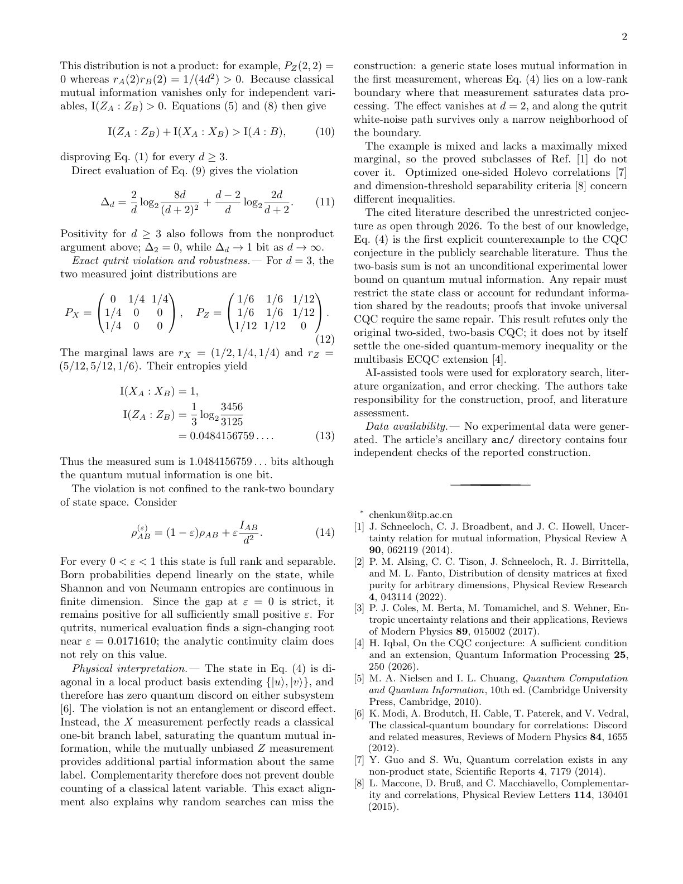
<figcaption class="paper-figure-caption"><b>Fig 1.</b> Low-resolution page preview, page 2</figcaption>
</figure>

**Summary.** The paper disproves the Complementary-Quantum Correlation conjecture using an explicit, non-entangled (separable) state for local dimensions $d \geq 3$. By comparing classical mutual information sums from complementary measurements against the quantum mutual information, the authors demonstrate a measurable excess. This finding is significant because it shows that correlations violating this bound do not require entanglement or quantum discord.

**Why it may be interesting.** This work provides a fundamental theoretical challenge to existing bounds in quantum correlation theory by showing that simple separable states can violate conjectures previously thought to hold universally, impacting how we quantify non-classical correlations.

Detailed structure

**Main problem.** The paper aims to disprove the Complementary-Quantum Correlation (CQC) conjecture, which posits an upper bound on the sum of classical mutual informations from complementary measurements relative to the quantum mutual information.

**Main result.** The CQC conjecture is disproved for all local dimensions $d \geq 3$ using a specific rank-two separable state. This violation occurs even without invoking entanglement or quantum discord.

**Method.** The authors analyze the bipartite state using two complementary projective measurements (computational and Fourier-conjugate bases) and calculate classical Shannon mutual informations to show their sum exceeds the premeasurement quantum mutual information.

**Model / system.** The study considers a general bipartite quantum state $
ho_{AB}$ defined for local dimension $d \geq 3$. The counterexample specifically utilizes an explicit rank-two separable state: $
ho_{AB} = rac{1}{2}|u
angle\langle u|_A \otimes |v
angle\langle v|_B + rac{1}{2}|v
angle\langle v|_A \otimes |u
angle\langle u|_B$.

**Key observables.** Classical mutual informations $I(Z_A : Z_B)$ and $I(X_A : X_B)$, compared against the quantum mutual information $I(A:B)$. The excess violation is quantified for qutrits as $\approx 0.048$ bits.

**Important parameters / regimes.** Local dimension $d \geq 3$. The violation persists and approaches a limit as $d 	o \infty$.

**Assumptions / limitations.** The counterexample state is separable, meaning the failure of the conjecture occurs in non-entangled regimes. The result only refutes the specific two-sided CQC inequality.

**Paper structure.** The paper introduces the CQC conjecture and then constructs a concrete counterexample using a separable state for $d \geq 3$. It calculates the relevant mutual information quantities to demonstrate the violation, concluding with the physical interpretation that the effect stems from complementary readouts of a shared classical variable.

Abstract

Correlations measured in complementary local bases provide an experimentally accessible probe of the total correlations in a bipartite quantum state. The complementary-quantum correlation conjecture asserts that the sum of two such classical mutual informations never exceeds the premeasurement quantum mutual information. We disprove this conjecture in every local dimension $d\geq3$ with an explicit rank-two separable state. One of the two complementary measurements recovers the complete one-bit branch label, while the other retains additional classical correlation. For qutrits the excess is exactly $\frac13\log_2(3456/3125)=0.0484156759\ldots$ bits. Continuity yields full-rank separable violations. The effect therefore requires neither entanglement nor quantum discord; it arises from two complementary readouts of the same classical latent variable.

[↑ back to top](#top)

### [Characterizing pairwise swapping capabilities of dense coding channels](http://arxiv.org/abs/2608.03184v1)

**Authors:** Abhishek Muhuri, Nirman Ganguly, Aditi Sen De, Indranil Chakrabarty  
**Type:** theory · **Category:** quantum information and computing · **PDF:** <https://arxiv.org/pdf/2608.03184v1>  
**Analysis basis:** full PDF text, analyzed in chunks
**Topic relevance:** 🔥 `entanglement & information structure` **4/5** · `non-equilibrium dynamics` **1/5**

↔ Scroll figures horizontally

<figure class="paper-figure-card">
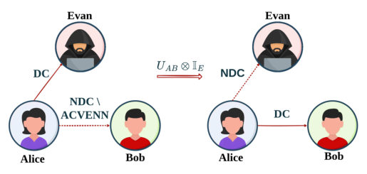
<figcaption class="paper-figure-caption"><b>Fig 1.</b> FIG. 1: Schematic diagram of the dense coding swapping in a tripartite setting. A tripartite state is shared among Al- ice (transmitter), Bob (desired receiver), and Evan (compro- mised party). Initially, Alice shares a dense codeable state with Evan, which precludes dense codeability between Alice and Bob due to the DC exclusion principle. If Evan gets com- promised, Alice aims to stop granting quantum advantages to Evan and give the benefits to Bob by activating dense code- ability in the channel ρAB without invoking Evan. The swap- ping occurs when a suitable global unitary operation UAB</figcaption>
</figure>
<figure class="paper-figure-card">
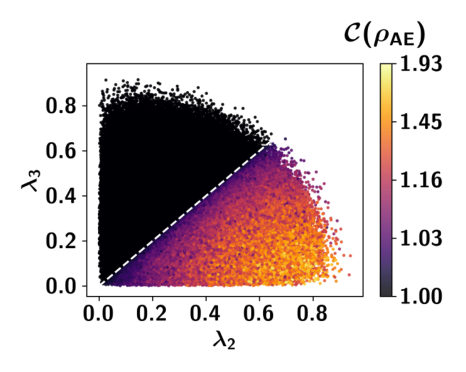
<figcaption class="paper-figure-caption"><b>Fig 2.</b> FIG. 2: Dense coding capacity of the reduced state ρAE as a function of the Schmidt coefficients . The map plot of C(ρAE) for reduced states ρAE = TrB[|ψ⟩⟨ψ|ABE] with respect to λ2 (ordinate) and λ3 (abscissa) obtained from 5 × 105 randomly generated tripartite pure states |ψ⟩ABE. The black dots repre- sent states that are non-advantageous for dense coding, while the dots with lighter shades correspond to tripartite states with higher dense coding capacity in ρAE. The white dashed line denotes λ2 = λ3. The figure shows that the reduced states with λ2 &gt; λ3 ensure dense codeability of ρAE. This figure is generated over all set of ρABE for which ρAB /∈ACVENN, thus characterizing the set of all...</figcaption>
</figure>
<figure class="paper-figure-card">
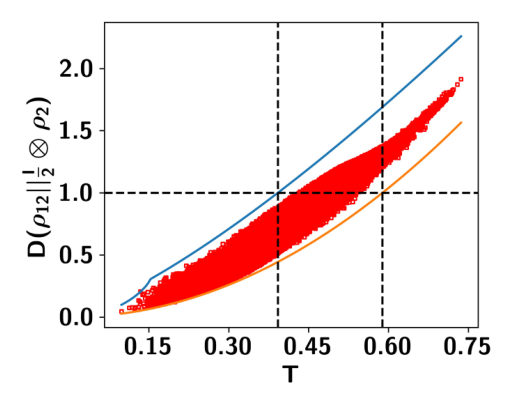
<figcaption class="paper-figure-caption"><b>Fig 3.</b> FIG. 3: Bounds on relative entropy D(ρ12|| I2</figcaption>
</figure>
<figure class="paper-figure-card">
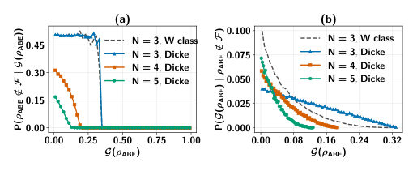
<figcaption class="paper-figure-caption"><b>Fig 4.</b> FIG. 4: Role of genuine multiparty entanglement in dense coding swapping task. (a) The probability distribution of a state being a resource state as a function of the generalized geometric measure (GGM). (b) The probability distribution of the GGM of the initial shared state, conditioned on the state being a resource. The triangles, squares, and circles corre- spond to three-, four-, and five-qubit Dicke states with a sin- gle excitation, respectively. The (grey) dashed line represents the three-qubit W-class states. All axes are dimensionless.</figcaption>
</figure>
<figure class="paper-figure-card">
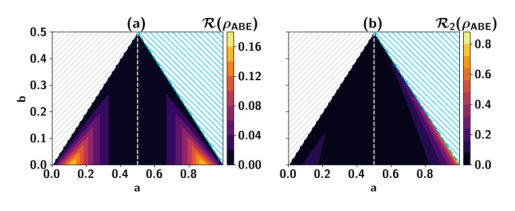
<figcaption class="paper-figure-caption"><b>Fig 5.</b> FIG. 5: Tolerance of the generalized W states across the pa- rameter space a and b against noise. (a) Map plot for the tolerance of the resource states, R(ρABE) against a and b of the gW states. (b) The same when the gW state is admixed with orthogonal colored noise described in the text. The grey- hatched region on the left corresponds to non-resource states satisfying a &lt; b, whereas the blue-hatched region on the right represents states with non-real coefficients, for which 1 −a −b &lt; 0. The white dashed line at a = 0.5 marks the set of states whose reduced state ρAB belongs to the ACVENN class. Within the physically admissible resource region (the triangular domain), brighter shades...</figcaption>
</figure>

**Summary.** This paper introduces 'dense coding swapping,' a mechanism allowing the transfer of quantum information advantage between different communication channels using joint unitary operations. By deriving necessary and sufficient conditions based on entanglement measures like Schmidt coefficients, it provides a theoretical framework for enhancing network robustness against channel limitations or eavesdropping.

**Why it may be interesting.** This work provides rigorous mathematical tools to quantify how quantum advantages can be actively managed or transferred in complex multi-party quantum networks, which is crucial for designing robust quantum communication protocols.

Detailed structure

**Main problem.** The paper characterizes 'dense coding swapping,' a novel multipartite entanglement-assisted task where quantum advantage (dense codeability) is transferred between communication channels using joint unitary operations.

**Main result.** Necessary and sufficient conditions for this swapping are derived in terms of Schmidt coefficients, showing that the process is possible while respecting constraints like the DC exclusion principle. The required resource state needs only a small amount of genuine multipartite entanglement.

**Method.** The analysis uses mathematical derivations based on conditional von Neumann entropy, Schmidt decomposition, and optimization techniques to find optimal unitary operators realizing the swap.

**Model / system.** The study focuses on $N$-party quantum states (e.g., three-qubit pure states or generalized W states) shared among legitimate parties, involving bipartite channels like $
ho_{AE}$ and $
ho_{AB}$.

**Key observables.** Dense Coding Capacity ($C(\cdot)$), conditional von Neumann entropy $S(A|B)$, Schmidt coefficients ($\lambda_i$), and Bloch correlation parameters.

**Important parameters / regimes.** The number of parties ($N$), the admixture parameter for noise ($s$), and unitary transformation parameters ($J_x, J_y, J_z$).

**Assumptions / limitations.** The analysis often assumes pure states initially, extending later to mixed states via white or colored noise admixtures. The process relies on applying specific two-qubit unitary operations.

**Figures summary.** Figures illustrate the schematic of DC swapping in tripartite settings and map out parameter spaces showing where quantum advantage is present or lost due to noise or state constraints.

**Paper structure.** The paper progresses from defining the core concept (DC advantage/exclusion principle) to deriving necessary conditions for pure states using Schmidt coefficients, then extends this analysis to mixed states under various noise models, and finally optimizes unitary parameters for maximum capacity.

Abstract

We introduce a novel multipartite entanglement-assisted classical communication task, referred to as dense coding swapping, in which legitimate parties collaboratively swap the dense codeability from one communication channel to another through suitable joint unitary operations. Due to the dense coding (DC) exclusion principle, the scheme enhances the dense codeability of a target pair while simultaneously reducing it for a non-target branch in the network. This swapping capability has broader implications, as it may be viewed as a form of process swapping, distinct from resource swapping, while also providing a prevention measure when one of the receivers is compromised. We derive necessary and sufficient conditions, expressed in terms of the Schmidt coefficients, for three-qubit pure states to support DC swapping, while we obtain a sufficient criterion for mixed states using their Bloch correlation parameters. Furthermore, we identify the optimal two-qubit unitary operators capable of realizing the swapping of dense codeability between communication channels. We further examine the tolerance of these eligible states against both colored and white noise, demonstrating the resilience of the proposed task under environmental perturbations. We also show that multipartite states supporting DC swapping require only a small amount of genuine multipartite entanglement and that this requirement decreases with increasing system size.

[↑ back to top](#top)

### [Real-time decoding of quantum error correction codes using high-performance computing](http://arxiv.org/abs/2608.03948v1)

**Authors:** Lingling Lao, Qiang Wang, Yuanqi Liu, Yantong Liu, Haowen Wang, Yitao Chen, Yankang Zhao, Zhenwei Wu, Wei Zhang, Yong Dong, Yingwen Liu, Mingche Lai, Junjie Wu  
**Type:** both · **Category:** quantum information and computing · **PDF:** <https://arxiv.org/pdf/2608.03948v1>  
**Analysis basis:** full PDF text, analyzed in chunks
**Topic relevance:** 🔥 `QC/QI experiment` **4/5** · `quantum measurements` **1/5**

↔ Scroll figures horizontally

<figure class="paper-figure-card">

<figcaption class="paper-figure-caption"><b>Fig 1.</b> FIG. 2. Overview of the THQLink architecture.</figcaption>
</figure>
<figure class="paper-figure-card">
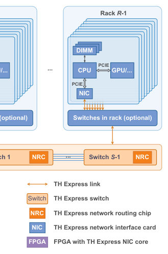
<figcaption class="paper-figure-caption"><b>Fig 2.</b> Figure 3 illustrates the closed-loop real-time decoding flow in THQLink. On the FPGA side, the Syndrome-to- Packet generator encapsulates streaming syndromes into Mini-Packets and transmits them over the lightweight physical/link-layer interface. The packets are then for-</figcaption>
</figure>
<figure class="paper-figure-card">
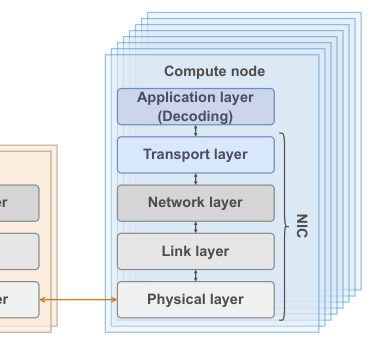
<figcaption class="paper-figure-caption"><b>Fig 3.</b> FIG. 3. The real-time decoding flow via the high-speed network TH-Express.</figcaption>
</figure>
<figure class="paper-figure-card">
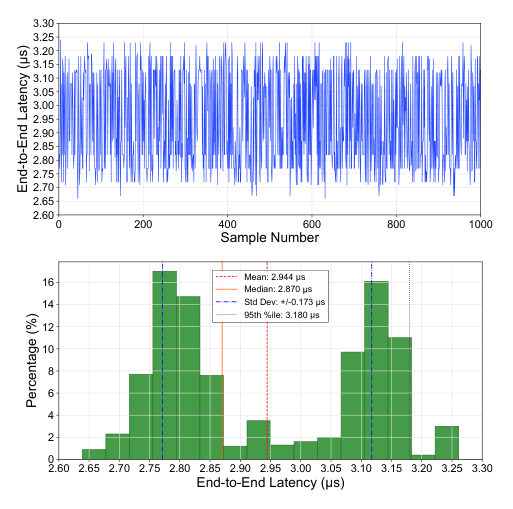
<figcaption class="paper-figure-caption"><b>Fig 4.</b> FIG. 4. The round latency of TH-Express with direct inter- connect between HPC and FPGA.</figcaption>
</figure>
<figure class="paper-figure-card">
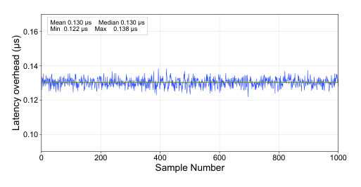
<figcaption class="paper-figure-caption"><b>Fig 5.</b> FIG. 5. Latency overhead per additional hop</figcaption>
</figure>

**Summary.** This paper introduces THQLink, an architecture designed to enable real-time Quantum Error Correction (QEC) decoding using coupled High-Performance Computing and QPU resources. By implementing a parallel window decoding strategy, the authors overcome the latency limitations of traditional decoders, enabling scalable fault tolerance for large quantum codes.

**Why it may be interesting.** This work directly addresses the engineering bottleneck in fault-tolerant quantum computing by providing a concrete, high-throughput hardware/software framework for error correction decoding.

Detailed structure

**Main problem.** The core challenge is achieving real-time decoding of Quantum Error Correction (QEC) codes, which requires processing syndrome measurements within microsecond timescales to prevent computational backlogs.

**Main result.** The proposed THQLink architecture successfully demonstrates real-time decoding for the surface code up to distance 19 by integrating HPC resources with the QPU via a low-latency interconnect.

**Method.** The authors propose an architectural framework (THQLink) and compare different decoding strategies, notably developing a parallel-window decoder that scales better than global batch decoders in terms of latency vs. code distance.

**Model / system.** The work focuses on the surface code model for QEC, which protects logical qubits using physical qubits arranged on a 2D lattice. The implementation relies on coupling quantum processors (QPU) with general-purpose High-Performance Computing (HPC) resources.

**Key observables.** Round-trip latency ($\mu$s), decoding time per round ($1 \mu s$), logical error rate ($	ext{P}_{	ext{fail}}$), and code distance ($d$).

**Important parameters / regimes.** Physical error rate ($p$) (e.g., 0.1%, 0.3%), Code Distance ($d$), and the required real-time constraint ($\sim 1 \mu s$).

**Assumptions / limitations.** The parallel window decoding strategy trades a slight increase in logical error rate for a substantial reduction in latency, which is necessary for large code distances.

**Figures summary.** Figures illustrate the THQLink architecture and closed-loop data flow. Comparisons show that while global decoders fail to meet real-time constraints beyond moderate distances, the parallel window decoder maintains throughput by overlapping syndrome rounds.

**Paper structure.** The paper first establishes the necessity of low-latency QEC decoding. It then details the THQLink architecture and its performance metrics. Finally, it compares advanced decoding algorithms (Global vs. Parallel Window) to demonstrate scalable real-time operation for large surface codes.

Abstract

Quantum error correction (QEC) is indispensable for building scalable fault-tolerant quantum computers. Effective QEC demands stringent real-time decoding: the decoder must process syndrome measurements and determine corrections within a time scale--typically on the order of microseconds, to avoid data backlog. Scaling to large number of logical qubits further necessitates significant computational resources. In this work, we propose an architecture, called \emph{THQLink}, for real-time decoding of quantum error correction codes using high-performance computing (HPC) resources. The network connecting the HPC and the control system of quantum processing unit (QPU) is built on TH-Express and can be adapted to different quantum technologies and their associated control stacks. We report a round-trip latency of 2.944 $μ$s on average, with an incremental overhead of 130 ns per additional hop. Using a parallel window strategy, we demonstrate real-time decoding (1 $μ$s per QEC round) of the surface code up to distance 19 using a matching-based decoder on CPUs. Our work presents a scalable framework for real-time decoding in fault-tolerant quantum computing. It can be readily applied to quantum-centric supercomputers that feature tight integration between QPU and HPC resources, thereby enabling efficient support for hybrid quantum-classical algorithms and computation-intensive workloads offloaded from the QPU.

[↑ back to top](#top)

### [Entanglement Distillation of some Rank-Five Symmetric NPT States in Two-Qutrit Systems](http://arxiv.org/abs/2608.03710v1)

**Authors:** Yuwei Lei, Zihua Song, Lin Chen, Mingju Liu  
**Type:** theory · **Category:** quantum information and computing · **PDF:** <https://arxiv.org/pdf/2608.03710v1>  
**Analysis basis:** full PDF text, analyzed in chunks
**Topic relevance:** 🔥 `entanglement & information structure` **4/5**

↔ Scroll figures horizontally

<figure class="paper-figure-card">
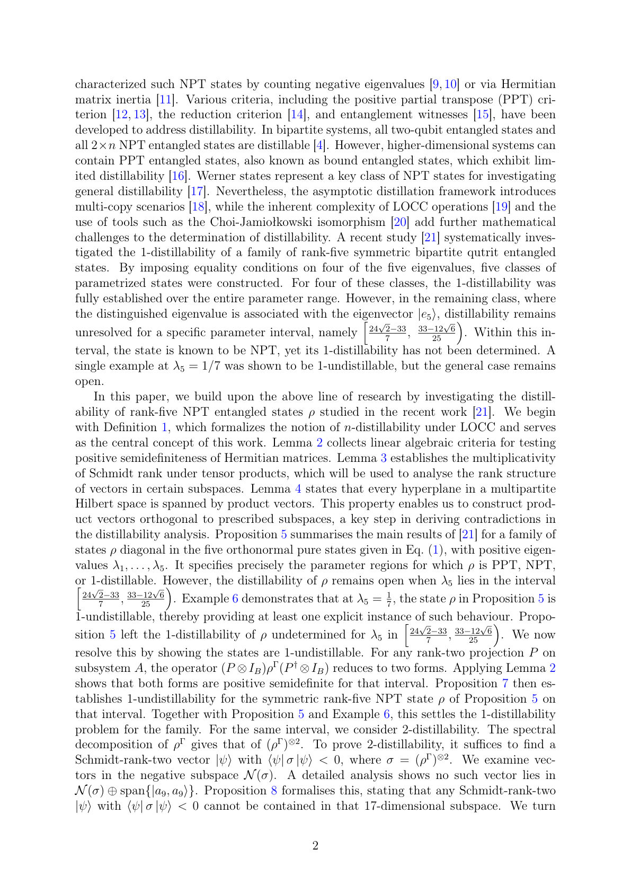
<figcaption class="paper-figure-caption"><b>Fig 1.</b> Low-resolution page preview, page 2</figcaption>
</figure>
<figure class="paper-figure-card">
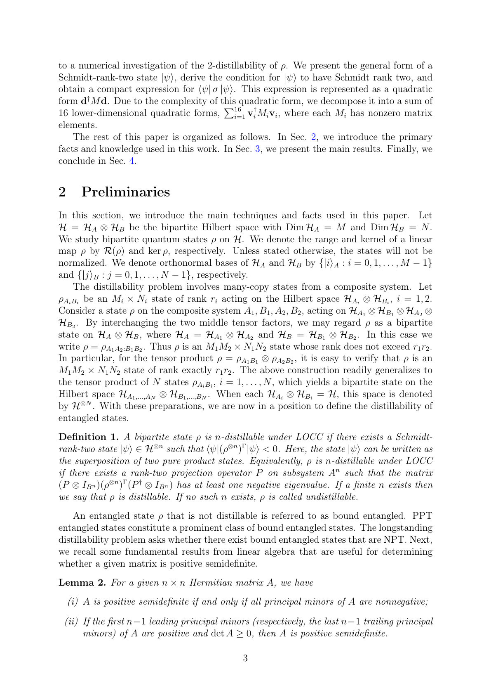
<figcaption class="paper-figure-caption"><b>Fig 2.</b> Low-resolution page preview, page 3</figcaption>
</figure>
<figure class="paper-figure-card">
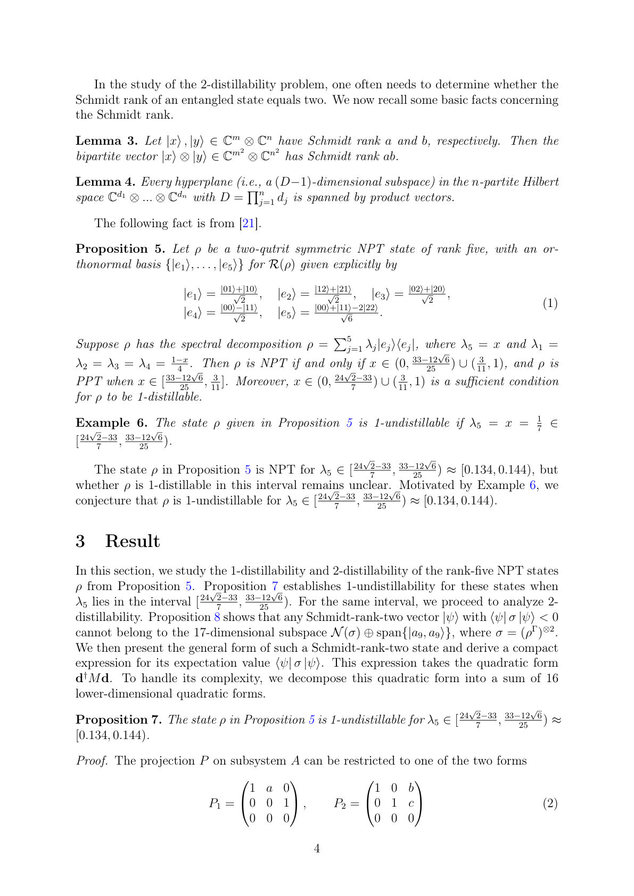
<figcaption class="paper-figure-caption"><b>Fig 3.</b> Low-resolution page preview, page 4</figcaption>
</figure>
<figure class="paper-figure-card">
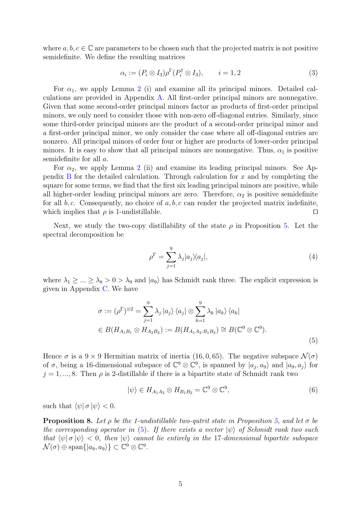
<figcaption class="paper-figure-caption"><b>Fig 4.</b> Low-resolution page preview, page 5</figcaption>
</figure>
<figure class="paper-figure-card">
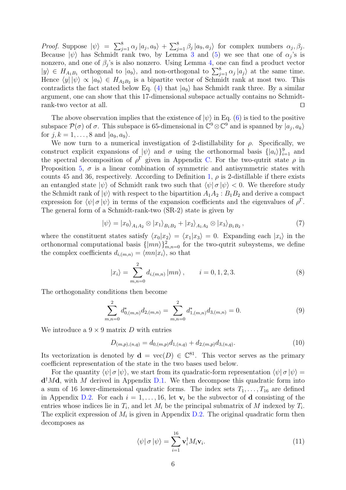
<figcaption class="paper-figure-caption"><b>Fig 5.</b> Low-resolution page preview, page 6</figcaption>
</figure>

**Summary.** This paper rigorously analyzes the entanglement distillation capacity of a specific family of two-qutrit quantum states. It resolves the 1-distillability problem by proving that the states are undistillable over an open parameter interval. Furthermore, it establishes a structural obstruction concerning the necessary conditions for 2-distillability.

**Why it may be interesting.** This work provides rigorous mathematical tools (like analyzing principal minors and quadratic forms) to determine fundamental resource properties (entanglement distillability) in multi-partite quantum systems, which is central to quantum information theory.

Detailed structure

**Main problem.** The paper investigates the distillability properties (1-distillability and 2-distillability) of a specific class of symmetric NPT quantum states.

**Main result.** They prove that for a certain parameter range, these states are 1-undistillable, and they characterize a structural obstruction preventing negative expectation values required for 2-distillability.

**Method.** The analysis uses criteria based on positive semidefiniteness of projected matrices (for distillability) and reformulating the problem as finding negative eigenvalues of quadratic forms associated with Schmidt-rank-two vectors.

**Model / system.** The system involves two-qutrit quantum systems described by a family of rank-five symmetric NPT states, $
ho$, parameterized by an eigenvalue $\lambda_5$.

**Key observables.** 1-distillability and 2-distillability; the expectation value $\langle\psi|\sigma|\psi
angle$ for specific vectors $|\psi
angle$.

**Important parameters / regimes.** The state is parameterized by eigenvalues, particularly $\lambda_5$, which must fall within certain intervals to satisfy NPT or PPT conditions.

**Assumptions / limitations.** The analysis relies on linear algebraic criteria (like positive semidefiniteness of minors) and the assumption that distillability can be determined by checking specific low-rank vectors.

**Figures summary.** Not specified, but the notes detail the construction of 16 large principal submatrices ($\mathbf{M}_1$ through $\mathbf{M}_{16}$) used to calculate a quadratic form expectation value.

**Paper structure.** The paper proceeds by establishing preliminaries on distillability criteria, then tackles 1-distillability using minor positivity checks, followed by a detailed structural analysis of the necessary conditions for 2-distillability involving quadratic forms and subspace projections.

Abstract

Entanglement distillation is a fundamental task in quantum information processing. In this work, we investigate the distillability properties of a class of two-qutrit symmetric NPT states of rank five. We resolve the 1-distillability problem for this class by proving that the previously open interval of the eigenvalue parameter is 1-undistillable. For the 2-distillability, we uncover a structural obstruction showing that no Schmidt-rank-two vector has a negative expectation in the relevant subspace. We also perform numerical investigations to explore the 2-distillability beyond this obstruction.

[↑ back to top](#top)

### [Schmidt-Gauge Non-Local Magic: Representation, Optimality, and Mathematical Properties](http://arxiv.org/abs/2608.02745v1)

**Authors:** Fabio Franchini, Salvatore Marco Giampaolo  
**Type:** theory · **Category:** quantum information and computing · **PDF:** <https://arxiv.org/pdf/2608.02745v1>  
**Analysis basis:** full PDF text, analyzed in chunks
**Topic relevance:** 🔥 `entanglement & information structure` **4/5**

↔ Scroll figures horizontally

<figure class="paper-figure-card">
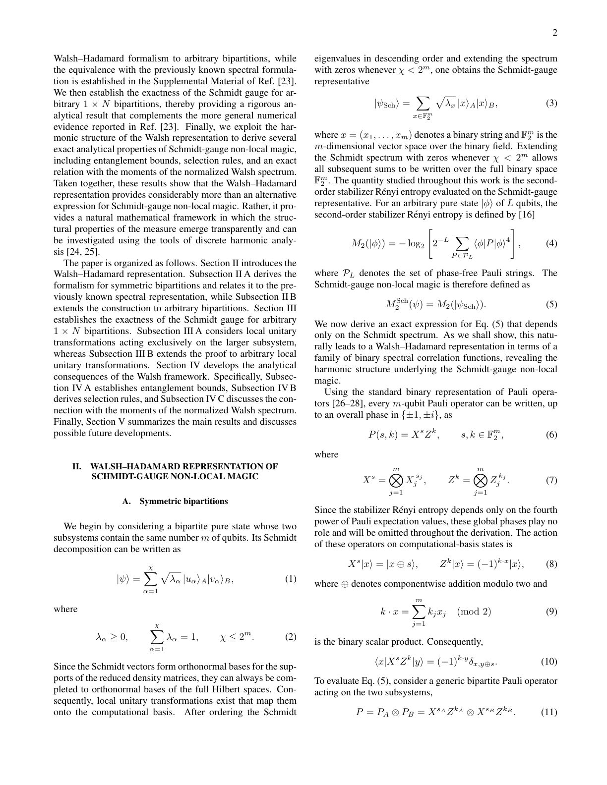
<figcaption class="paper-figure-caption"><b>Fig 1.</b> Low-resolution page preview, page 2</figcaption>
</figure>
<figure class="paper-figure-card">
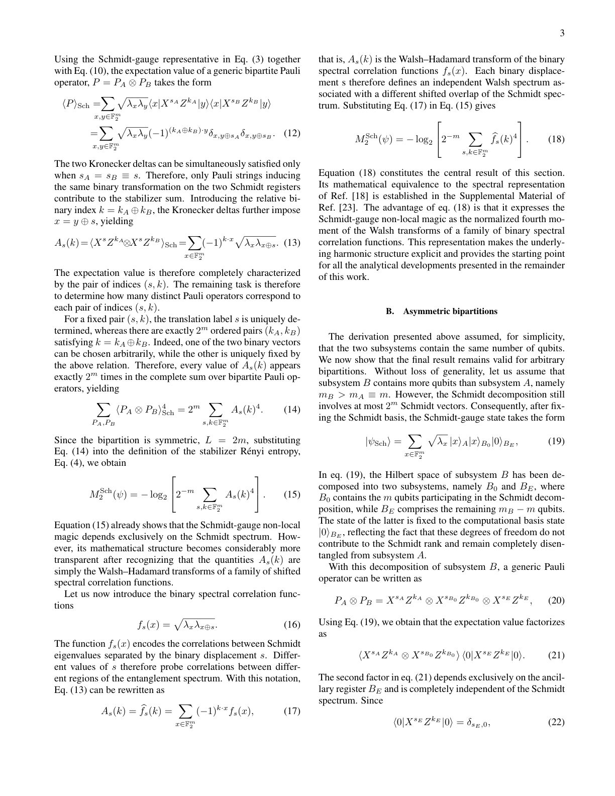
<figcaption class="paper-figure-caption"><b>Fig 2.</b> Low-resolution page preview, page 3</figcaption>
</figure>
<figure class="paper-figure-card">
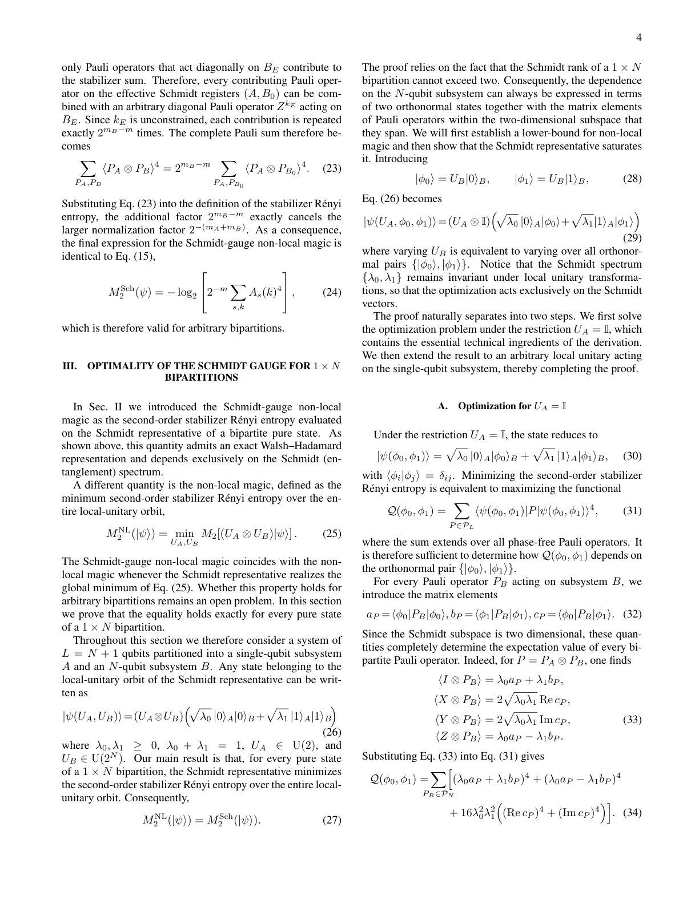
<figcaption class="paper-figure-caption"><b>Fig 3.</b> Low-resolution page preview, page 4</figcaption>
</figure>
<figure class="paper-figure-card">
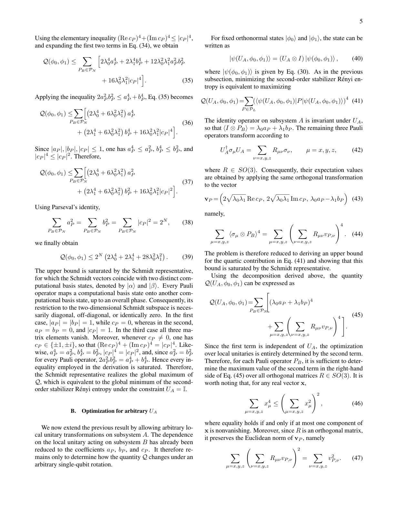
<figcaption class="paper-figure-caption"><b>Fig 4.</b> Low-resolution page preview, page 5</figcaption>
</figure>
<figure class="paper-figure-card">
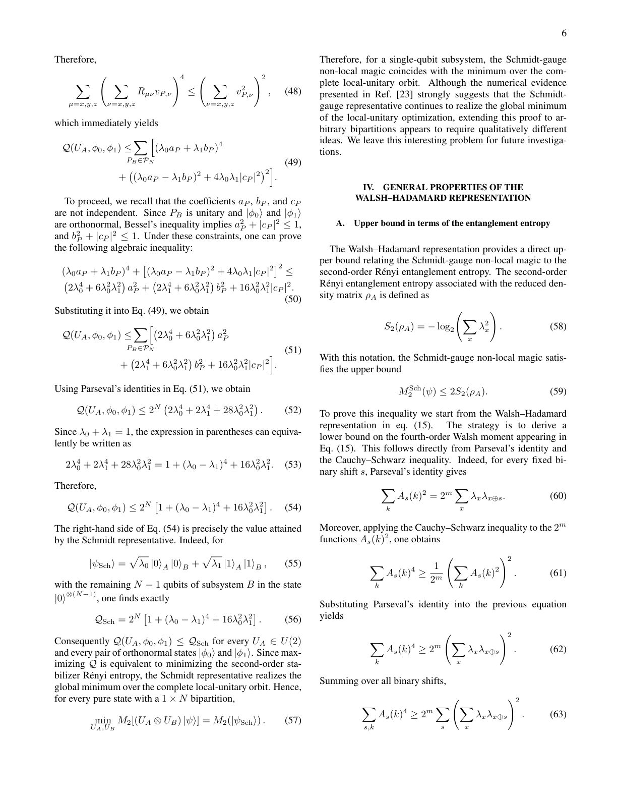
<figcaption class="paper-figure-caption"><b>Fig 5.</b> Low-resolution page preview, page 6</figcaption>
</figure>

**Summary.** This paper develops a novel mathematical theory for quantifying 'Schmidt-gauge non-local magic,' a measure of genuine non-local correlations in quantum states. It achieves this by recasting the problem into the language of discrete harmonic analysis using the Walsh–Hadamard transform. The work establishes that this gauge provides an exact and mathematically rich characterization, particularly useful for understanding entanglement structure beyond simple spectral measures.

**Why it may be interesting.** It provides a powerful new analytical tool (discrete harmonic analysis) to study entanglement structure in quantum states, which is highly relevant for understanding resource quantification in quantum information theory.

Detailed structure

**Main problem.** The goal is to mathematically isolate the genuinely non-local correlations within a quantum state's non-stabilizerness, distinct from local contributions.

**Main result.** The Schmidt-gauge formulation provides an exact characterization of this non-local magic, revealing an underlying discrete harmonic structure via the Walsh–Hadamard representation.

**Method.** The authors develop a mathematical theory by reformulating the optimization problem using the Walsh–Hadamard transform, connecting it to concepts from discrete harmonic analysis.

**Model / system.** The study analyzes bipartite pure quantum states $|\psi
angle$, focusing on characterizing non-local correlations via entanglement spectra and stabilizer formalism.

**Key observables.** Schmidt-gauge non-local magic ($M_{	ext{Sch}}^2(\psi)$), Entanglement spectrum, Walsh–Hadamard coefficients, Second-order stabilizer Rényi entropy ($	ext{Rényi}_2$).

**Important parameters / regimes.** Bipartition structure (especially $1 	imes N$ vs. general), Local unitary transformations ($U_A, U_B$), and the associated harmonic modes.

**Assumptions / limitations.** The initial focus is on symmetric bipartitions, though exactness for $1 	imes N$ bipartitions is proven; extension to generic bipartitions remains an open problem.

**Paper structure.** The paper builds from defining the non-local magic via minimization over local unitaries, deriving its connection to the Schmidt spectrum, and finally establishing the rigorous mathematical framework using Walsh–Hadamard analysis.

Abstract

While the full non-stabilizerness (magic) of a quantum state contains local, basis-dependent contributions, a non-local formulation based on a minimization over local unitaries isolates the component associated with genuinely non-local correlations. Within such a framework, the Schmidt-gauge formulation of non-local magic provides a direct connection between genuinely non-local non-stabilizer correlations and the entanglement spectrum of quantum many-body states. Building on the exact Walsh--Hadamard representation introduced in our accompanying Letter, we develop the mathematical theory associated with this formulation. We extend the formalism to arbitrary bipartitions, prove the exactness of the Schmidt gauge for arbitrary $1\times N$ bipartitions, and derive general analytical properties of Schmidt-gauge non-local magic, including entanglement bounds, selection rules, and exact relations with the moments of the normalized Walsh spectrum. This representation also allows to interpret non-local magic as the inverse participation ratio of the Walsh entanglement spectrum, thus relating it to a concentration measure in Walsh space. These results demonstrate that the Walsh--Hadamard representation reveals an underlying discrete harmonic structure that is hidden in the original spectral formulation and provides considerably more than an equivalent expression for Schmidt-gauge non-local magic. Rather, it furnishes the natural mathematical framework for its analytical investigation, placing the theory within the broader context of discrete harmonic analysis.

[↑ back to top](#top)

### [The geometry of absolute separability and other convex matrix properties from spectrum](http://arxiv.org/abs/2608.03390v1)

**Authors:** Jennifer Ahiable, Naga Bhavya Teja Kothakonda, Andreas Winter  
**Type:** theory · **Category:** quantum information and computing · **PDF:** <https://arxiv.org/pdf/2608.03390v1>  
**Analysis basis:** full PDF text, analyzed in chunks
**Topic relevance:** 🔥 `entanglement & information structure` **4/5**

↔ Scroll figures horizontally

<figure class="paper-figure-card">
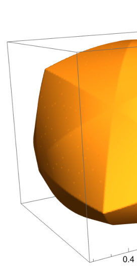
<figcaption class="paper-figure-caption"><b>Fig 1.</b> Figure 1: The absolute separable spectrahedron ASEP2,2</figcaption>
</figure>
<figure class="paper-figure-card">
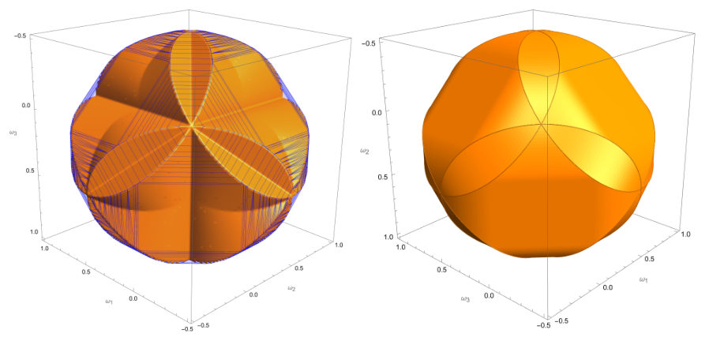
<figcaption class="paper-figure-caption"><b>Fig 2.</b> Figure 2: On the left (Fig. 2a), the inscribed object (orange) depicts the set of normalized spectra of two-qubit decomposable block-positive matrices [18, Theorem 3] and the enclosing shell (purple), is the convex hull of this object. This convex hull is exactly the normalized polar witness set ASEP◦ 2,2 (Fig. 2b) of the spectrahedron in Figure 1.</figcaption>
</figure>
<figure class="paper-figure-card">
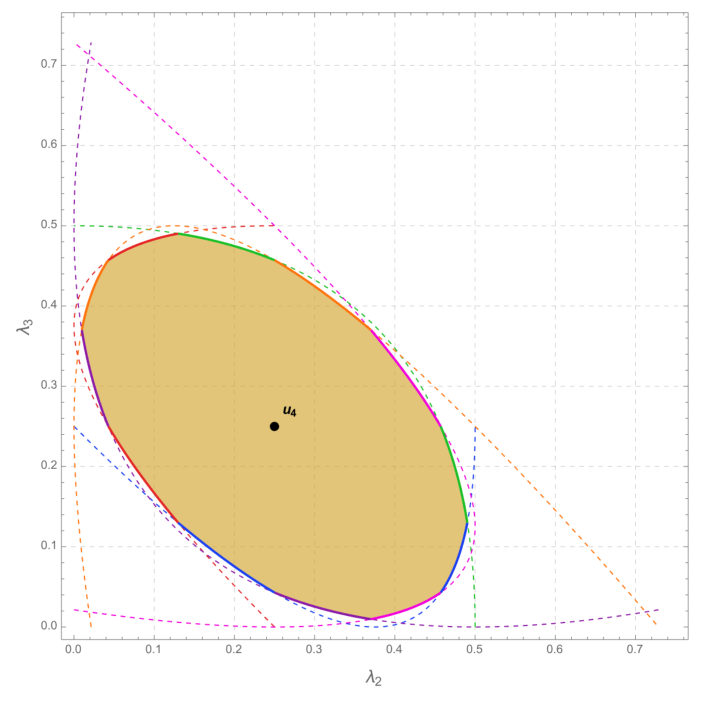
<figcaption class="paper-figure-caption"><b>Fig 3.</b> Figure 3: A cross-section of ASEP2,2 at λπ(1) = 0.25 whose boundary is generated by κ2,2 = 6 irreducible hypersurfaces, each of dimension 2 (brightly colored). The interior (yellow) includes the center u4 = 1 4(1, 1) corresponding to the spectra of the maximally mixed state. Each colored curve is a hypersurface ZVmn (det Lπi) for i = 1, . . . , 6 in the slice. The feasible regions of the topological boundary are indicated by thick brightly colored parts of the curves while the infeasible regions outside the set are the dotted colored parts.</figcaption>
</figure>
<figure class="paper-figure-card">
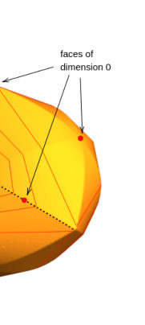
<figcaption class="paper-figure-caption"><b>Fig 4.</b> Figure 4: Some extreme points and maximal faces of ASEP2,2 defined by α ∈R (Corollary 5.8).</figcaption>
</figure>
<figure class="paper-figure-card">
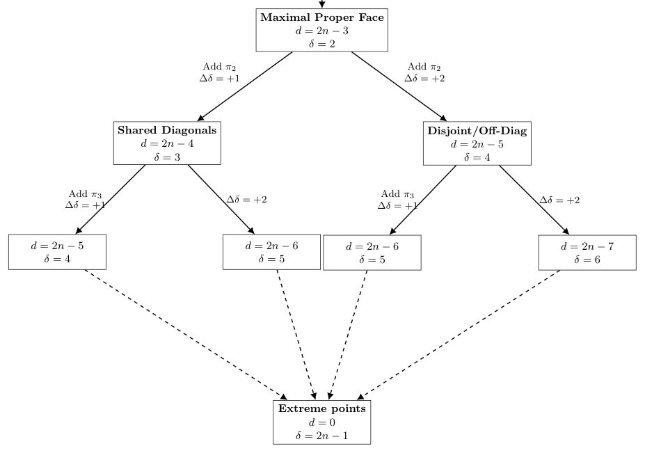
<figcaption class="paper-figure-caption"><b>Fig 5.</b> Figure 5: Schematic illustration of how faces of ASEP2,n arise as active kernel constraints are added. Here δ = rank(C) denotes the number of linearly independent equations defining the face, and d = dim(FU) = (2n −1) −δ. Each added active permutation, πi may increase the rank by 1 or 2, thereby lowering the face dimension accordingly. Dashed arrows indicate the continuation of this process down to extreme points.</figcaption>
</figure>

**Summary.** This theoretical paper analyzes the complex geometry of sets defining separable or positive partial transpose bipartite quantum states. It proves that the set of absolute PPT states forms a spectrahedron, while the absolutely separable states are more general semialgebraic sets. The work provides deep structural insights into these boundaries using advanced tools from convex and algebraic geometry.

**Why it may be interesting.** The rigorous geometric characterization of entanglement witnesses (like PPT/separability criteria) is fundamental for understanding quantum correlations and resource theories in quantum information.

Detailed structure

**Main problem.** The paper investigates the geometric structure of the spectra for bipartite quantum states that satisfy absolute separability ($	ext{ASEP}_{m,n}$) or are absolutely positive partial transpose ($	ext{APPT}_{m,n}$). It aims to characterize these sets using tools from convex geometry.

**Main result.** It proves that $	ext{APPT}_{m,n}$ is a spectrahedron with exposed faces, while $	ext{ASEP}_{m,n}$ is generally only semialgebraic. Furthermore, it provides structural characterizations of the boundaries and extreme points for both sets.

**Method.** The methodology combines convex geometry (studying absolute convex sets and their spectra) with algebraic techniques involving polynomial determinants derived from permutation group actions on matrix representations.

**Model / system.** The focus is on bipartite quantum states $
ho \in M_m \otimes M_n$, specifically those satisfying the criteria of absolute separability or absolute PPT, which are constrained by global unitary transformations.

**Key observables.** Maximal attainable purity, minimal von Neumann entropy, relative spectral volume, and the geometric structure (spectrahedra/semialgebraic sets) of $	ext{APPT}_{m,n}$ and $	ext{ASEP}_{m,n}$.

**Important parameters / regimes.** The dimensions $m$ and $n$ of the bipartite system; the indices related to permutations in $S_{m,n}$.

**Assumptions / limitations.** The analysis relies on establishing general geometric properties of absolute convex sets and utilizing advanced results concerning linear determinant preservers on symmetric matrices.

**Paper structure.** The paper first establishes general geometric properties for absolute convex matrix sets. It then applies these tools to characterize $	ext{APPT}_{m,n}$ as a spectrahedron and $	ext{ASEP}_{m,n}$ as semialgebraic. Finally, it uses permutation group theory and determinant polynomials to precisely map out the boundary structure of $	ext{APPT}_{m,n}$.

Abstract

We investigate the geometric structure of the set of spectra of bipartite absolute separable states ($\mathrm{ASEP}_{m,n}$) and absolute positive partial transpose states ($\mathrm{APPT}_{m,n}$), i.e., bipartite quantum states that remain separable or PPT respectively, under all global unitary transformations. First, we establish general geometric properties of absolute convex sets of matrices, their spectra and extreme points. Regarding absolute separability, we present a permutation-symmetric reformulation of the absolute PPT criterion and use it to demonstrate that $\mathrm{APPT}_{m,n}$ is a spectrahedron for all $m\leq n$: in particular, all its faces are exposed. In contrast, while $\mathrm{ASEP}_{2,n}$ is also a spectrahedron, we prove that in general $\mathrm{ASEP}_{m,n}$ is a semialgebraic set for all $m\leq n$. Furthermore, we provide a complete characterization of the faces and extreme points of $\mathrm{APPT}_{m,n}$ and demonstrate that the dimension of a face is determined by the rank of a certain matrix, with maximal proper faces having dimension $(mn-m-1)$.   In the quantitative setting, we provide a rigorous lower bound on the maximal attainable purity of $\mathrm{APPT}_{m,n}$ via an inscribed polytope $\mathcal{P}_{m,n}$ and conjecture that the maximal purity of $\mathrm{APPT}_{m,n}$ (along with its spectra) coincides with the polytope for arbitrary dimensions except when $m=n=2$. Additionally, we also provide a rigorous upper bound on the minimal von Neumann entropy of $\mathrm{APPT}_{m,n}$ and demonstrate numerically that the minimum entropy eventually coincides with the polytope $\mathcal{P}_{m,n}$ as the local system dimension $n$ increases. Finally, we show that the relative spectral volume of $\mathrm{APPT}_{m,n}$ decays exponentially in $n$ by a constant multiplicative factor of the relative volume of the inscribed polytope $\mathcal{P}_{m,n}$.

[↑ back to top](#top)

### [Quantifying Pauli Errors in Single-Photon Resource-State Generation](http://arxiv.org/abs/2608.03005v1)

**Authors:** Yuktee Gupta, Andrew C. Doherty, Sahand Mahmoodian  
**Type:** theory · **Category:** quantum information and computing · **PDF:** <https://arxiv.org/pdf/2608.03005v1>  
**Analysis basis:** full PDF text, analyzed in chunks
**Topic relevance:** `quantum measurements` **3/5** · `quantum optics experiment` **3/5** · `QC/QI experiment` **2/5** · `entanglement & information structure` **2/5** · `measurement-induced transitions` **2/5** · `analog quantum simulation` **1/5** · `correlated / nonlocal dissipation` **1/5** · `driven-dissipative phase transition` **1/5** · `interference shaping light` **1/5** · `methods for driven-dissipative` **1/5** · `non-equilibrium dynamics` **1/5**

↔ Scroll figures horizontally

<figure class="paper-figure-card">
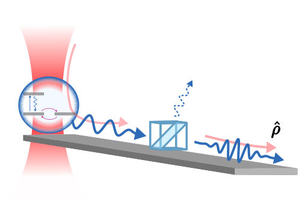
<figcaption class="paper-figure-caption"><b>Fig 1.</b> FIG. 1. Modelling coherent state leakage and photon loss with beam-splitters. The emitted state is denoted by the solid blue lines and the lost photon is given by the dotted line, after passing through a beamsplitter with transmission coefficient η. The laser used to excite the emitter can leak into the waveguide, given by the straight red lines, and has final photon number |γ|2 which is included in the final density state ˆρ</figcaption>
</figure>
<figure class="paper-figure-card">
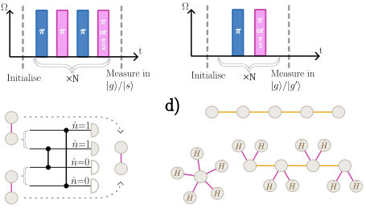
<figcaption class="paper-figure-caption"><b>Fig 2.</b> FIG. 2. Level schemes of emitters and applied pulse sequences for the corresponding emitters. (a) The three-level emitter with two degenerate ground states, and the excited state is only accessible by one of the ground states, |g⟩. One pulse se- quence here involves exciting the emitter (blue bar), perform- ing a πs↔g rotation (pink bar), exciting the emitter again and then performing a final πs↔g/ π</figcaption>
</figure>
<figure class="paper-figure-card">
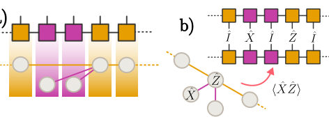
<figcaption class="paper-figure-caption"><b>Fig 3.</b> FIG. 3. Representing emitted photons as an MPS, where we have used the Penrose graphical notation to represent the MPS. (a) shows the graphical MPS representation of the state vector of a graph state below. GHZ photons and cluster state photons represented by different types of MPS blocks as in Eq. 15, here represented in orange and pink, b) Calculat- ing the expectation values of an operator on the graph state is simplified in this representation. The expectation value is simply the MPO of the operator contracted with the MPS rep- resentation of the state, where operators act on corresponding MPS blocks.</figcaption>
</figure>

**Summary.** This work presents a comprehensive method to characterize the fidelity of entangled single-photon resources emitted from quantum emitters. By measuring first-order coherence functions, researchers can reconstruct the full state and analytically derive Pauli error probabilities associated with subsequent fusion measurements. This provides crucial guidelines for improving photon sources for fault-tolerant quantum computing.

**Why it may be interesting.** It provides a concrete, experimentally measurable pathway (via coherence functions) to quantify fundamental noise sources that limit fault-tolerant quantum computation in photonic platforms.

Detailed structure

**Main problem.** The paper develops a method to compute Pauli error rates for entangled single-photon resource states generated from quantum emitters, bridging continuous field measurements with discrete qubit error models.

**Main result.** Analytic expressions for Pauli error probabilities are derived purely as functions of experimentally measurable parameters like first-order coherence function values and transmission coefficients.

**Method.** The authors use first-order coherence measurements ($G^{(1)}$) to reconstruct the full quantum state ($\hat{
ho}$) and then calculate stabilizer expectation values to determine the associated Pauli error maps for fusion operations.

**Model / system.** The system involves single-photon sources based on multi-level quantum emitters (three- or four-level), which generate entangled states used in photonic quantum computing circuits.

**Key observables.** First-order coherence function $G^{(1)}(x_1, x_2)$, Pauli error probabilities ($p_x, p_y, p_z$), and stabilizer expectation values ($\langle\hat{O}
angle$).

**Important parameters / regimes.** Photon noise parameters, transmission coefficient $\eta$, and coupling constants derived from emitter properties.

**Assumptions / limitations.** The analysis assumes the ability to measure $G^{(1)}$ to reconstruct the state; error calculations are performed up to first order in experimental parameters.

**Figures summary.** Figures illustrate level schemes for three-level and four-level emitters, pulse sequences for generating entangled states (GHZ/cluster), and dual-rail fusion circuit setups.

**Paper structure.** The paper progresses from characterizing the emitted state using $G^{(1)}$ measurements to modeling the error process via Pauli maps applied during a fusion operation on multi-photon resource states.

Abstract

We propose a scheme to compute Pauli error rates in photonics-based quantum error correction using experimental observables of single photons produced from quantum emitters. We show that first-order coherence measurements and first-order cross correlations, which can be implemented using photon counting, can extract single-photon and entangled single-photon wavefunctions in the presence of imperfections due to photon distinguishability, laser noise, and photon loss. Leveraging this, we show that the wavefunction of any entangled state of noisy photons produced from a single quantum emitter can be expressed in matrix-product-state form and can be used to analytically compute the expectation value of the stabilizer generators of the corresponding entangled state. From this we obtain analytic expressions for the Pauli error probabilities in terms of the photon noise parameters. Furthermore, we calculate Pauli error maps for entangled photons after undergoing Bell- state measurements in terms of these parameters. Our work provides a method to use experimental measurements to determine the required quality of photons produced from quantum emitters for fault-tolerant fusion-based photonics quantum computing.

[↑ back to top](#top)

### [Lower bounds on entropy production from dynamical correlation functions](http://arxiv.org/abs/2608.03619v1)

**Authors:** Paul Raux, Alexander M. Maier, Udo Seifert  
**Type:** theory · **Category:** statistical mechanics · **PDF:** <https://arxiv.org/pdf/2608.03619v1>  
**Analysis basis:** full PDF text, analyzed in chunks
**Topic relevance:** `correlated / nonlocal dissipation` **3/5** · `methods for driven-dissipative` **3/5** · `non-equilibrium dynamics` **3/5** · `Keldysh / 2PI / non-Gaussian methods` **2/5** · `entanglement & information structure` **2/5** · `non-equilibrium universality` **2/5** · `driven-dissipative phase transition` **1/5** · `quantum measurements` **1/5**

↔ Scroll figures horizontally

<figure class="paper-figure-card">
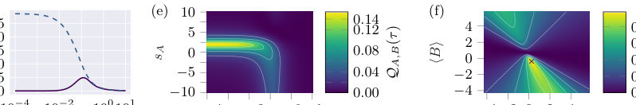
<figcaption class="paper-figure-caption"><b>Fig 1.</b> Figure 1. Inferring entropy production in the NESS for a coarse-grained Markov network. (a) Four-state network in which states 1 and 2 cannot be distinguished and observables are as given in (59). (b) Quality factor QA,B(τ) defined in (55) as a function of the cycle affinities AC1 and AC2 for fixed lag τ = 10−2, and (c) as a function of τ and AC2 for AC1 = 6. (d) Cut of the heatmap (c) for the affinities AC2 = −6 (solid) and AC2 = 6 (dashed). (e) Quality factor QA,B(τ) as a function of lag τ and shift sA of the observable A for sB = 2 and (AC1, AC2) = (6, −6). (f) Quality factor QA,B(τ) as a function of the mean values ⟨A⟩and ⟨B⟩, i.e., for shifts sA, sB ∈[−5, 5], with maximum (cross) for...</figcaption>
</figure>
<figure class="paper-figure-card">
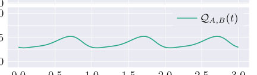
<figcaption class="paper-figure-caption"><b>Fig 2.</b> Figure 2. Inferring entropy production for the pe- riodically driven, fully resolved four-state Markov net- work from Fig. 1 with observables (A1, A2, A3, A4) = (1, −2, −1, 0) and (B1, B2, B3, B4) = (0, 1, −2, −1). Up- per panel: Time-dependent entropy production rate and its estimator (38). Lower panel: Quality factor (56). The transition rates are k12(t) = exp [2 + sin(2πt)], k21(t) = exp [−2 −sin(2πt)], and (k13, k14, k23, k31, k32, k34, k41, k43) = (1.0, 0.7, 4.1, 1.5, 0.9, 1.1, 2.3, 1.9).</figcaption>
</figure>
<figure class="paper-figure-card">
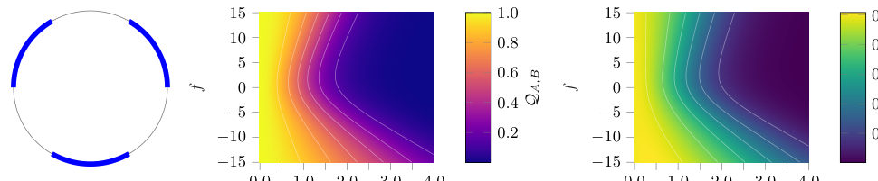
<figcaption class="paper-figure-caption"><b>Fig 3.</b> Figure 3. Estimating the entropy production for an overdamped Langevin particle on a one-dimensional ring with unit length subject to the potential (61) and a non-conservative force f for observables as given in (62). (a) Sketch of a one-dimensional ring. The intervalls [1/12, 1/4), [5/12, 7/12) and [3/4, 11/12) are highlighted in blue. (b) Quality factor QA,B defined in (57) as a function of potential amplitude V0 and driving force f for the fully observable ring in (a). (c) Quality factor QA,B as in (b) for the case in which only the blue regions of the ring in (a) are visible.</figcaption>
</figure>

**Summary.** This paper establishes rigorous lower bounds on entropy production by analyzing the asymmetry of two-time correlation functions. It develops separate forms of these bounds for steady-state and time-dependent non-equilibrium processes. The results are highly relevant for characterizing irreversibility in complex physical systems using only experimentally accessible measurements.

**Why it may be interesting.** This work provides powerful theoretical tools for quantifying irreversibility and dissipation in complex systems using only measurable correlation functions, which is crucial for understanding open quantum systems where full state tomography is impossible.

Detailed structure

**Main problem.** The primary goal is deriving rigorous lower bounds on entropy production (EPR) for systems where measurements are partial or coarse-grained.

**Main result.** Two key bounds are derived: one valid for Non-Equilibrium Steady States ($	ext{NESS}$) using arbitrary correlation lags, and another requiring the vanishing lag limit ($	au 	o 0$) for time-dependent processes.

**Method.** The analysis relies on exploiting the asymmetry of experimentally accessible two-time correlation functions between state observables ($A$ and $B$), relating this asymmetry to path weights and KL divergence bounds derived from fluctuation theorems.

**Model / system.** The theory applies to systems following Markovian dynamics or coupled overdamped Langevin equations. Examples include discrete-state Markov networks (e.g., four-state models) and continuous processes like particles on a ring potential.

**Key observables.** Entropy Production Rate ($	ext{EPR}$), two-time correlation function $C_{A,B}(t, 	au)$, and the correlation asymmetry $\chi_{A,B}(t, 	au)$.

**Important parameters / regimes.** Correlation lag ($	au$), time ($t$), system affinities, and potential amplitudes ($V_0$).

**Assumptions / limitations.** The underlying dynamics must be Markovian on some microscopic level. For time-dependent processes, the bound derivation requires taking the limit of vanishing correlation lag ($	au 	o 0$).

**Figures summary.** Figures illustrate the performance and optimization of the derived bounds (e.g., showing Quality Factors $Q_{A,B}(	au)$ vs $	au$ or affinities) for both NESS and time-dependent driving scenarios.

**Paper structure.** The paper develops two main results: a bound applicable to steady states ($\hat{\sigma}_{A,B}(	au) \le \sigma$) and a second bound derived in the vanishing lag limit ($\hat{\sigma}_{A,B}(t) \le \sigma(t)$). It then applies these bounds to various physical models (Markov networks, Langevin dynamics) to test their tightness.

Abstract

Entropy production is a key property in stochastic thermodynamics. For partially observed and coarse-grained systems, its inference is challenging and typically rests on proven lower bounds. We derive two versions of such bounds based on the asymmetry of experimentally accessible two-time correlation functions of coarse-grained state observables. For non-equilibrium steady states, the bound is valid for arbitrary correlation lag. For time-dependent processes, it requires the limit of vanishing lag. These bounds hold true for any system that follows either a Markovian dynamics or a coupled set of overdamped Langevin equations on some underlying, unobservable level of description. We illustrate the bounds for both types of dynamics and discuss their optimization and potential tightness.

[↑ back to top](#top)

### [Preserving Symmetry: Spontaneous Symmetry Breaking through Decoherence](http://arxiv.org/abs/2608.03736v1)

**Authors:** Sam Kuypers  
**Type:** theory · **Category:** other · **PDF:** <https://arxiv.org/pdf/2608.03736v1>  
**Analysis basis:** full PDF text, analyzed in chunks
**Topic relevance:** `Keldysh / 2PI / non-Gaussian methods` **3/5** · `driven-dissipative phase transition` **3/5** · `non-equilibrium dynamics` **2/5** · `non-equilibrium universality` **2/5** · `Frenkel-Kontorova` **1/5** · `analog quantum simulation` **1/5** · `correlated / nonlocal dissipation` **1/5** · `measurement-induced transitions` **1/5** · `methods for driven-dissipative` **1/5** · `quantum measurements` **1/5**

↔ Scroll figures horizontally

<figure class="paper-figure-card">
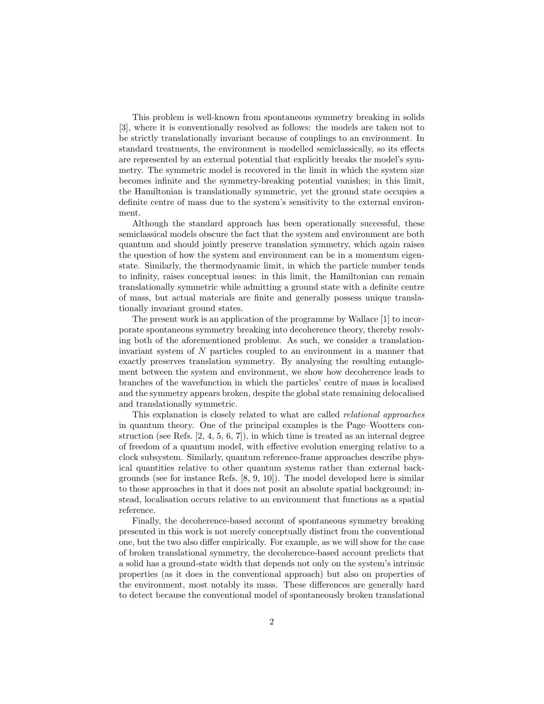
<figcaption class="paper-figure-caption"><b>Fig 1.</b> Low-resolution page preview, page 2</figcaption>
</figure>
<figure class="paper-figure-card">
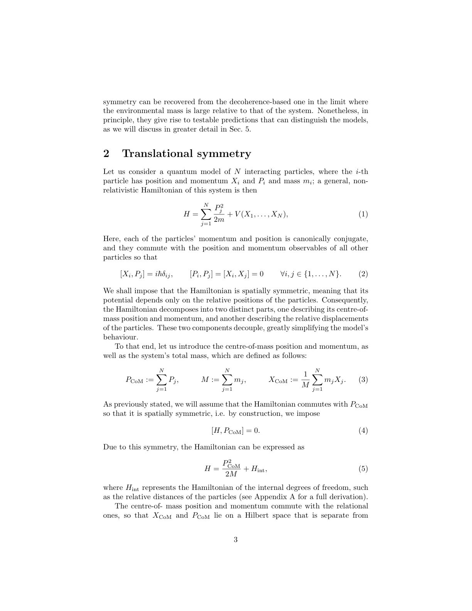
<figcaption class="paper-figure-caption"><b>Fig 2.</b> Low-resolution page preview, page 3</figcaption>
</figure>
<figure class="paper-figure-card">
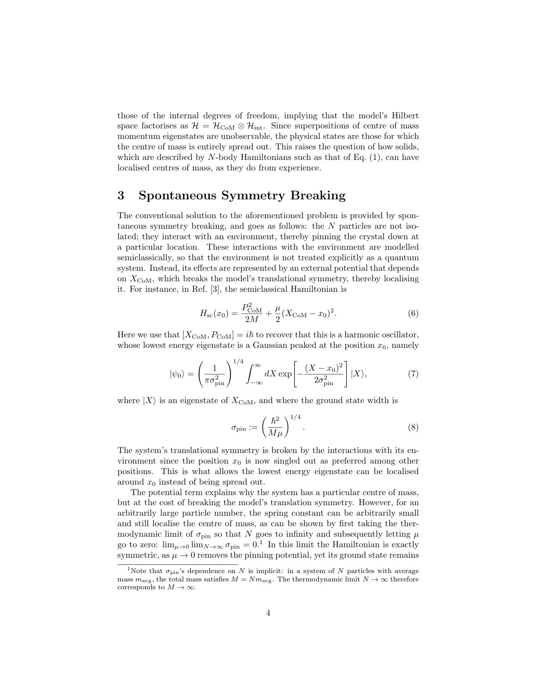
<figcaption class="paper-figure-caption"><b>Fig 3.</b> Low-resolution page preview, page 4</figcaption>
</figure>
<figure class="paper-figure-card">
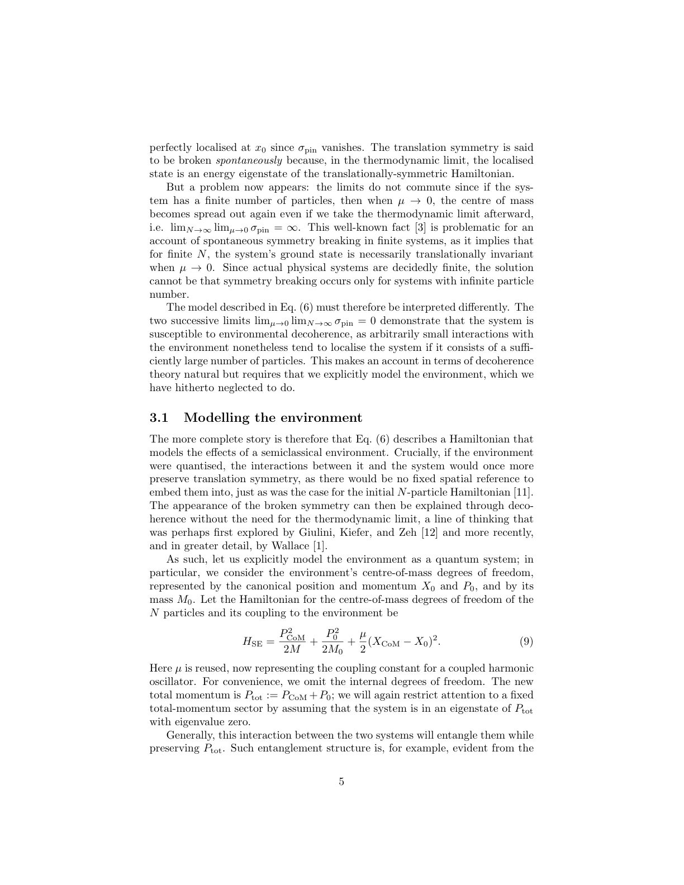
<figcaption class="paper-figure-caption"><b>Fig 4.</b> Low-resolution page preview, page 5</figcaption>
</figure>
<figure class="paper-figure-card">
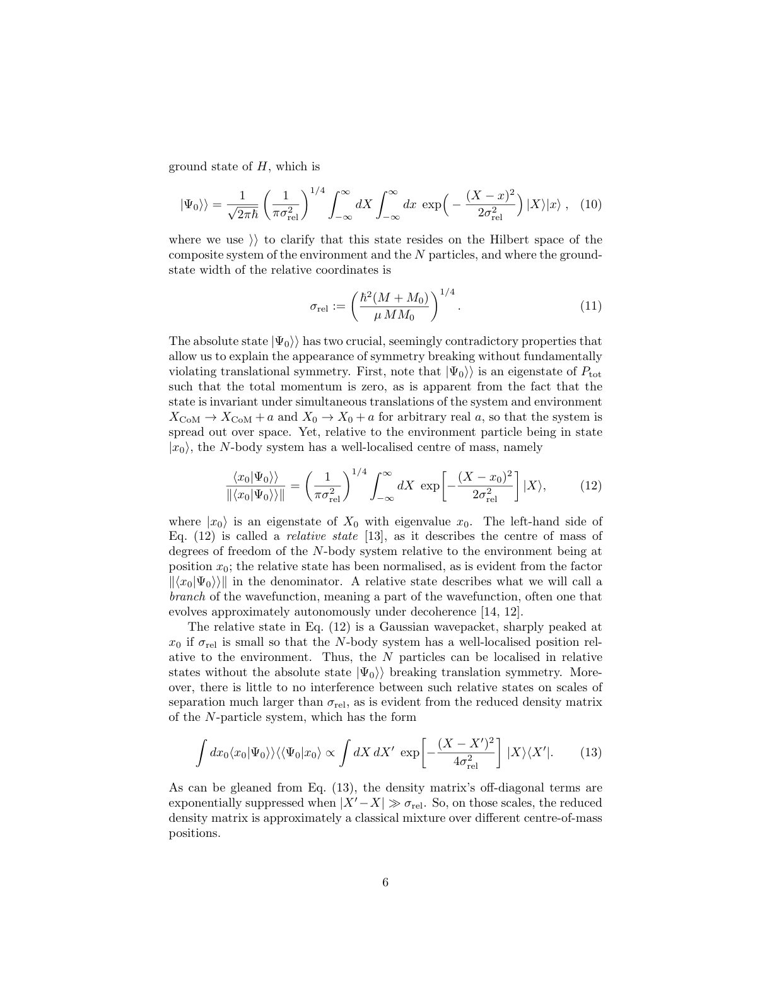
<figcaption class="paper-figure-caption"><b>Fig 5.</b> Low-resolution page preview, page 6</figcaption>
</figure>

**Summary.** This theoretical paper resolves the conflict between observed particle localization in solids and the underlying translational symmetry of quantum mechanics. By quantizing the environment, the authors show that apparent symmetry breaking occurs only within localized 'decoherent branches,' while the total system state remains globally symmetric. This offers a finite-system resolution to long-standing issues in condensed matter theory.

**Why it may be interesting.** This work provides a rigorous quantum mechanical framework for understanding emergent classical-like phenomena, such as localization, using decoherence theory in a way that respects fundamental symmetries.

Detailed structure

**Main problem.** The paper addresses how localized centers of mass appear in solid materials, reconciling this observation with quantum mechanical descriptions that are fundamentally translationally symmetric.

**Main result.** Localization arises within decoherent branches when the environment is quantized, allowing the total state vector to remain globally translationally symmetric.

**Method.** The authors analyze the system-environment coupling by quantizing the environment and examining the reduced density matrix dynamics relative to the environment's position.

**Model / system.** The model involves $N$ interacting particles (the system) coupled to a harmonic oscillator environment. The Hamiltonian is analyzed in terms of center-of-mass and environmental degrees of freedom.

**Key observables.** Ground-state width ($\sigma_{	ext{pin}}$), reduced density matrix off-diagonal terms, and the relative state $|\psi(x)
angle$.

**Important parameters / regimes.** Environmental mass ($M_0$), coupling strength ($\mu$), and system size (finite vs. thermodynamic limit).

**Assumptions / limitations.** The core assumption is that quantizing the environment allows for a description where decoherence causes apparent symmetry breaking without violating global symmetries.

**Paper structure.** The paper contrasts conventional semiclassical approaches (relying on environmental potentials) with the novel approach of quantizing the environment. It develops mathematical tools to define relative states and shows how decoherence leads to localized branches while preserving global symmetry.

Abstract

Solids appear to have localised centres of mass, yet many-body quantum theory describes them using translationally symmetric models that preclude localisation. Conventionally, this is resolved through spontaneous symmetry breaking by introducing an interaction with a semiclassical environment that breaks the symmetry. In the thermodynamic limit, the interaction can be removed while leaving the state localised. This, however, raises the question of how localisation arises outside the thermodynamic limit, i.e., in finite quantum systems (Wallace, 2018). Here, we show that, by quantising the environment, the localisation of finite systems occurs within decoherent branches, while the state vector of the composite system remains translationally symmetric. Our approach is analogous to the Page-Wootters construction (Page & Wootters, 1983) and quantum reference frames; moreover, we recover the semiclassical description as a limiting case while predicting experimentally distinguishable corrections away from this limit.

[↑ back to top](#top)

### [Fermionic Villain model with exact lattice chiral symmetries](http://arxiv.org/abs/2608.02728v1)

**Authors:** Zhiyao Lu, Shu-Heng Shao  
**Type:** theory · **Category:** strongly correlated electrons · **PDF:** <https://arxiv.org/pdf/2608.02728v1>  
**Analysis basis:** full PDF text, analyzed in chunks
**Topic relevance:** `Keldysh / 2PI / non-Gaussian methods` **3/5** · `analog quantum simulation` **3/5** · `driven-dissipative phase transition` **2/5** · `methods for driven-dissipative` **2/5** · `Kondo & dissipative impurity` **1/5** · `correlated cavity matter` **1/5** · `entanglement & information structure` **1/5** · `exotic spin models in light-matter` **1/5** · `non-equilibrium dynamics` **1/5**

↔ Scroll figures horizontally

<figure class="paper-figure-card">
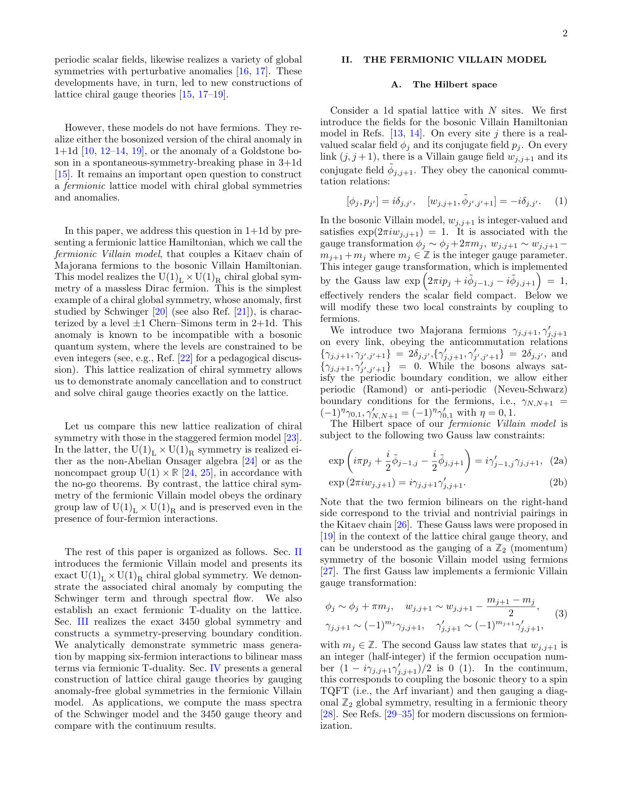
<figcaption class="paper-figure-caption"><b>Fig 1.</b> Low-resolution page preview, page 2</figcaption>
</figure>
<figure class="paper-figure-card">
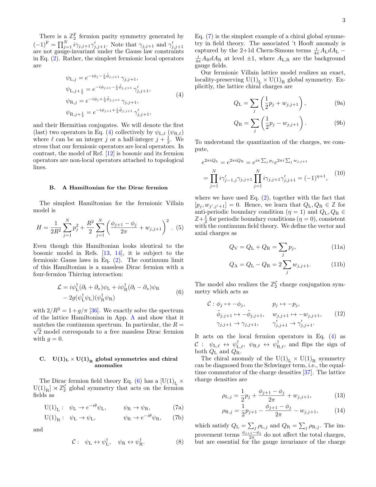
<figcaption class="paper-figure-caption"><b>Fig 2.</b> Low-resolution page preview, page 3</figcaption>
</figure>
<figure class="paper-figure-card">
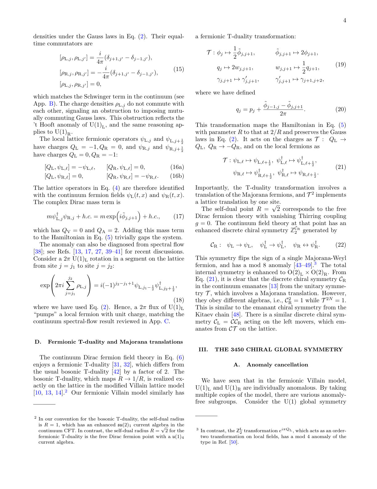
<figcaption class="paper-figure-caption"><b>Fig 3.</b> Low-resolution page preview, page 4</figcaption>
</figure>
<figure class="paper-figure-card">
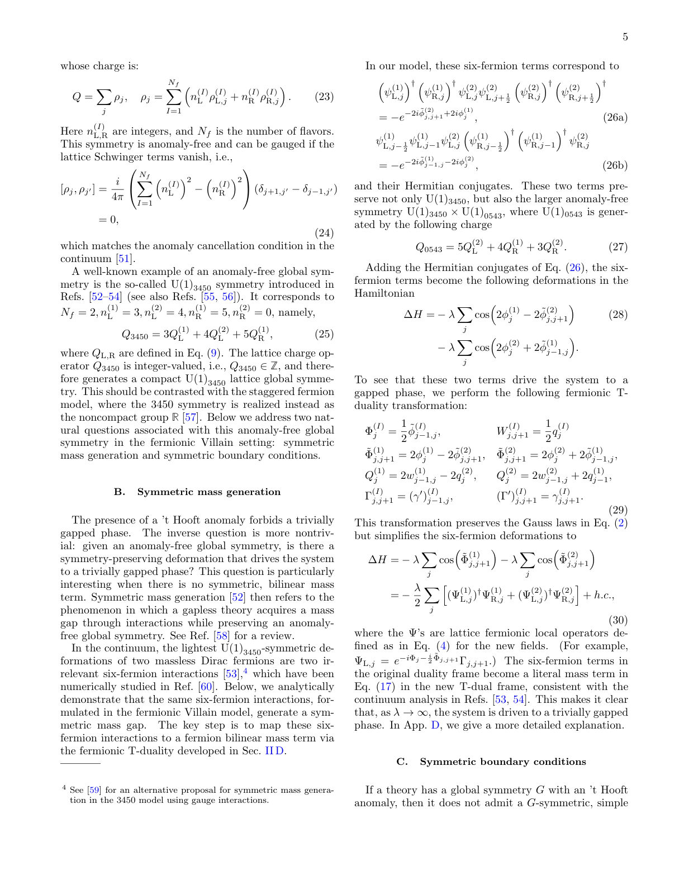
<figcaption class="paper-figure-caption"><b>Fig 4.</b> Low-resolution page preview, page 5</figcaption>
</figure>
<figure class="paper-figure-card">
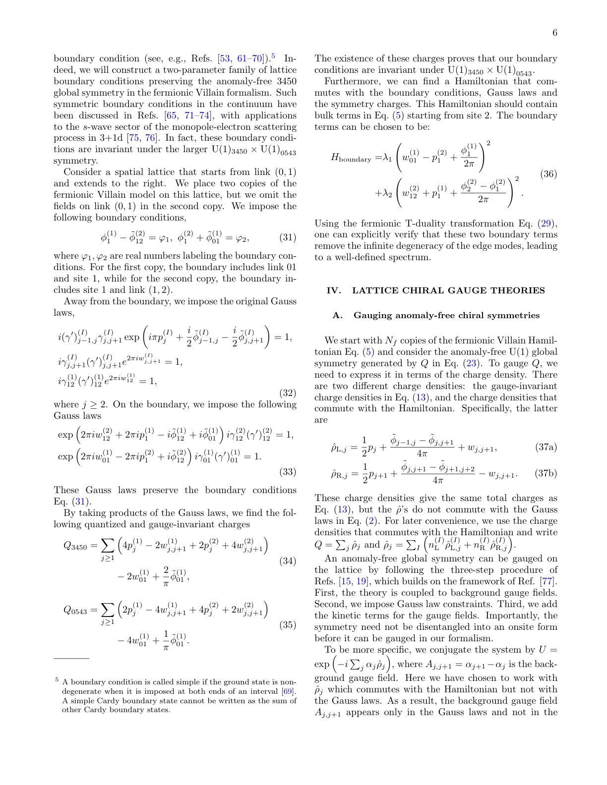
<figcaption class="paper-figure-caption"><b>Fig 5.</b> Low-resolution page preview, page 6</figcaption>
</figure>

**Summary.** This paper develops a fermionic lattice model called the Villain model that successfully incorporates exact chiral symmetries and anomalies on a lattice. By coupling Majorana fermions to bosonic fields, the authors overcome theoretical constraints and demonstrate methods like T-duality to achieve symmetric mass generation. This work provides a powerful framework for studying lattice chiral gauge theories.

**Why it may be interesting.** While focused on QFT/Condensed Matter, the rigorous handling of topological invariants (anomalies) and symmetry protection in low dimensions is highly relevant for understanding superconducting phases or topological quantum materials studied using AMO techniques.

Detailed structure

**Main problem.** The central problem is constructing a fermionic lattice Hamiltonian that exactly realizes chiral global symmetries and their associated anomalies while overcoming constraints like the Nielsen-Ninomiya no-go theorem.

**Main result.** The authors successfully construct such a model, demonstrating anomaly cancellation and providing methods to generate mass symmetrically via T-duality mapping of six-fermion interactions.

**Method.** The analysis employs techniques from lattice field theory, including the use of Villain bosons coupled to Majorana fermions, chiral charge quantization, and fermionic T-duality transformations.

**Model / system.** The system is the 'fermionic Villain model,' which couples a Kitaev chain of Majorana fermions to bosonic Villain fields. The Hamiltonian is governed by Gauss law constraints that couple these bosonic and fermionic degrees of freedom.

**Key observables.** Chiral charges ($Q_L, Q_R$), the $	ext{'t Hooft anomaly}$ (diagnosed via Chern-Simons terms or Schwinger terms), and the mass spectra of related models like the lattice Schwinger model.

**Important parameters / regimes.** The analysis explores various limits: continuum limit, deep infrared limit ($k=0$), and varying coupling strengths ($\lambda$).

**Assumptions / limitations.** The construction relies on the bosonic Villain fields being essential to evade no-go theorems; T-duality is used as a key mathematical tool for mapping interactions.

**Figures summary.** Not specified by notes, but the analysis involves deriving dispersion relations and effective Hamiltonians in various limits.

**Paper structure.** The paper systematically introduces the model via its Hamiltonian and Gauss laws, analyzes chiral symmetries and anomalies using charge quantization, demonstrates mass generation through T-duality, and concludes with applications to specific lattice gauge theories.

Abstract

We present a fermionic lattice Hamiltonian that exactly realizes the $\mathrm{U(1)}_\mathrm{L}\times \mathrm{U(1)}_\mathrm{R}$ global symmetry and the associated chiral anomalies of a massless Dirac fermion in 1+1 dimensions. The construction couples Villain bosons to a Kitaev chain of Majorana fermions, where the bosonic fields are essential for evading Nielsen-Ninomiya-type no-go theorems. For two copies of our model, we realize the anomaly-free $\mathrm{U(1)}_{3450}$ global symmetry and construct symmetric boundary conditions. We analytically demonstrate symmetric mass generation by mapping the symmetry-preserving six-fermion interactions to fermion bilinear terms using fermionic T-duality. Finally, by gauging general anomaly-free global symmetries, we obtain a broad class of lattice chiral gauge theories. As nontrivial applications, we compute the mass spectra of the lattice Schwinger model and the 3450 gauge theory, finding agreement with the corresponding continuum results.

[↑ back to top](#top)

### [Single-molecule strong optomechanical regimes in SERS via hybrid plasmonic cavities](http://arxiv.org/abs/2608.03307v1)

**Authors:** Miguel Á. Martínez-García, Johannes Feist, Diego Martín-Cano  
**Type:** theory · **Category:** other · **PDF:** <https://arxiv.org/pdf/2608.03307v1>  
**Analysis basis:** full PDF text, analyzed in chunks
**Topic relevance:** `correlated cavity matter` **3/5** · `methods for driven-dissipative` **3/5** · `Tavis-Cummings & cavity-many-emitter` **2/5** · `Keldysh / 2PI / non-Gaussian methods` **1/5** · `analog quantum simulation` **1/5** · `correlated / nonlocal dissipation` **1/5** · `driven-dissipative phase transition` **1/5** · `entanglement & information structure` **1/5** · `interference shaping light` **1/5** · `non-equilibrium dynamics` **1/5**

↔ Scroll figures horizontally

<figure class="paper-figure-card">
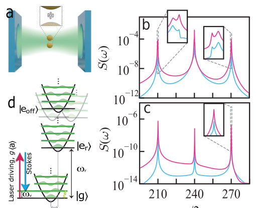
<figcaption class="paper-figure-caption"><b>Fig 1.</b> Figure 1. (a) Sketch of a hybrid cavity consisting of a Fabry- Perot resonator coupled to metallic dimer interacting with a molecule in resonance with the anti-Stokes sideband. (b) Cavity spectra of the hybrid system with gom/2π = 0.1 THz and κ/2π = 3.3 THz (gom/2π = 0 for blue lines). (c) Anal- ogous cavity spectra for a metallic dimer without dielectric resonator, i.e. κ/2π = 33 THz. The rest of the parameters are ∆c/2π = 0, ωv/2π = 30 THz, Ω/2π = 1 THz, ∆r/2π = 30 THz, g0,r/2π = 3 THz, gr/2π = 2.5 THz, κv/2π = 10 GHz and γ/2π = 50 MHz.(d) Sketch of the molecular energy-level structure for a displaced vibrational potential model with res- onant and several off-resonant electronic levels...</figcaption>
</figure>
<figure class="paper-figure-card">
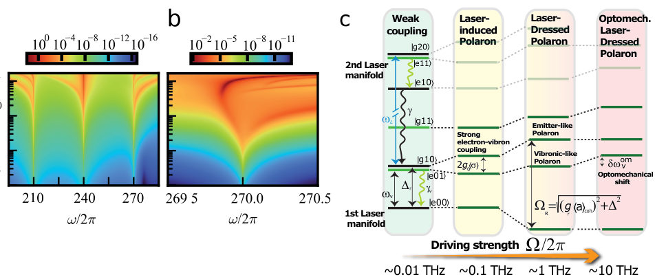
<figcaption class="paper-figure-caption"><b>Fig 2.</b> Figure 2. (a) Cavity emission spectra as a function of the driving strength and (b) a frequency zoom at the anti-Stokes region. The parameters coincide with Fig. 1. (c) Optomechanical laser-dressed polaron energy level scheme in nearly resonant SERS as a function of the driving strength Ωand with off-resonant cavity optomechanical interactions. The left panel illustrates the laser-detuned energy structure in the weak electron-vibron coupling region, which is shown in the bare basis of the electronic, laser and vibrational excitation-number states, |ne, nL, nv⟩. The right panels display the three distinctive polaron interaction regions as a function of the driving field.</figcaption>
</figure>
<figure class="paper-figure-card">
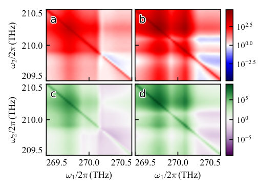
<figcaption class="paper-figure-caption"><b>Fig 3.</b> Figure 3. Maps of the normalized frequency-filtered second- order coherence g(2) Γ (ω1, ω2) at two frequencies for the purely resonant model (a) and (b) with off-resonant lev- els and their corresponding Cauchy-Schwarz inequality [31] (g(2) Γ (ω1, ω2))2/(g(2) Γ (ω1, ω1)g(2) Γ (ω2, ω2)) maps , (c)-(d), re- spectively . The rest of the parameters coincide with Fig. 1.</figcaption>
</figure>
<figure class="paper-figure-card">
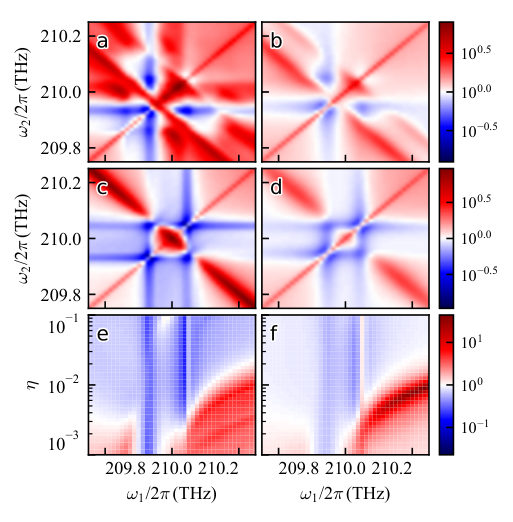
<figcaption class="paper-figure-caption"><b>Fig 4.</b> Figure 4. Maps of the normalized frequency-filtered second- order coherence g(2) Γ (ω1, ω2) at two frequencies for the com- bined model and a cavity linewidth for an harmonic vibration (η = 0) for a hybrid κ/2π = 3.3 THz (a) and plasmonic nanocavity κ/2π = 33 THz (b). (c)-(d) analogous figuresfor an anharmonic vibration (η = 0.05) . (e)-(f) the second sensor frequency is fixed at ω2/2π = 210.05 THz as a function the anharmonicity parameter η. The respective parameters are ∆′ c = −ωv and Ω/2π = 7 THz. The rest of the parameters coincide with Fig. 1.</figcaption>
</figure>

**Summary.** The paper develops a theoretical framework to study strong optomechanical coupling at the single-molecule level using SERS enhanced by hybrid plasmonic cavities. By analyzing photon correlations, the authors show that nonclassical signatures like antibunching can be used to optically characterize anharmonic vibrational potentials in molecules. This advances the field toward quantum control of molecular vibrations.

**Why it may be interesting.** This work directly bridges quantum optics with molecular spectroscopy by proposing a method to use single-photon statistics (antibunching) as an optical signature for anharmonicity, which is a core topic in advanced AMO physics and open quantum systems.

Detailed structure

**Main problem.** The research aims to achieve and characterize single-molecule strong optomechanical coupling within Surface-Enhanced Raman Scattering (SERS) regimes, overcoming limitations posed by weak interactions and sample damage at high intensities.

**Main result.** Strong coupling is demonstrated using detuned emitter-hybrid cavity configurations, allowing the observation of enhanced spectral splittings and nonclassical photon statistics that reveal anharmonic vibrational modifications at single-molecule levels.

**Method.** The study employs open-system quantum dynamics simulations using Lindblad master equations to model dissipation in a coupled system, supplemented by calculating second-order photon correlation functions.

**Model / system.** The physical platform is a hybrid plasmonic cavity coupled to fluorescent molecules. The system is modeled via an electron-vibron Hamiltonian incorporating coupling terms ($g_{om}$) and analyzed using master equations for dissipation ($\dot{\hat{
ho}}$).

**Key observables.** Enhanced splittings in Stokes/anti-Stokes spectra, nonclassical photon statistics (bunching/antibunching), and violation of the Cauchy-Schwarz inequality.

**Important parameters / regimes.** Strong coupling regime where coherent energy exchange dominates dissipation; driving powers ($\Omega/2\pi \sim 1-10$ THz); cavity enhancement factor ($g_{hyb}/\kappa_{hyb}$).

**Assumptions / limitations.** The Markovian description of decay into environmental baths is assumed, and the use of a detuned emitter-hybrid cavity configuration is crucial to avoid high intensities.

**Figures summary.** Figures illustrate the hybrid cavity structure and energy levels; spectral maps show Stokes/anti-Stokes sidebands vs. driving strength ($\Omega$); $g^{(2)}$ maps compare resonant vs. cooperative models, highlighting nonclassical correlations for anharmonic vibrations.

**Paper structure.** The paper progresses by establishing the physical model (Hamiltonian/Master Equation), demonstrating how detuning enables strong coupling below damage thresholds, and finally using photon correlation measurements ($g^{(2)}$) to spectroscopically probe nonlinear vibrational potentials via antibunching signatures.

Abstract

We identify enhanced strong coherent Surface-Enhanced Raman Scattering (SERS) interactions facilitated by hybridized metallo-dielectric cavities with a resonant fluorescent molecule. By illuminating a detuned electronic transition near saturation via a narrowband hybrid plasmonic mode, we observe enhanced splittings in the Stokes and anti-Stokes spectra, revealing strong optomechanical coupling and nonlinear vibrational modifications at intensities far below irreversible SERS damage thresholds. We compute the second-order photon correlations that allows identifying the nonclassical character associated to these strong optomechanical interactions and SERS configurations that enables them to optically characterize the anharmonic character of the vibrational modes.

[↑ back to top](#top)

### [AOM-based ultra-low noise laser intensity control up to the MHz range](http://arxiv.org/abs/2608.03547v1)

**Authors:** Christian Partes, Jonas Auch, Eduard Heidt, Kirill Karpov, Florian Kiesel, Christian Groß  
**Type:** experiment · **Category:** other · **PDF:** <https://arxiv.org/pdf/2608.03547v1>  
**Analysis basis:** full PDF text, analyzed in chunks
**Topic relevance:** `quantum measurements` **3/5** · `quantum optics experiment` **3/5** · `analog quantum simulation` **2/5** · `interference shaping light` **2/5** · `driven-dissipative phase transition` **1/5** · `measurement-induced transitions` **1/5** · `methods for driven-dissipative` **1/5** · `superradiant laser` **1/5**

↔ Scroll figures horizontally

<figure class="paper-figure-card">
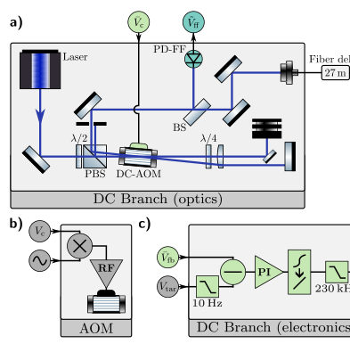
<figcaption class="paper-figure-caption"><b>Fig 1.</b> Fig. 1 Overview of the experimental setup. Dark blue lines represent the laser beam path, black lines indicate electronic connections. Components and signals that are part of the DC (AC) branch are marked in light (mint) green. a) Schematic representation of the beam path and the positioning of the photodiodes. The feedback signal and the control signal of the DC branch are labeled with ¯Vfb and ¯Vc, respectively. In the AC branch, the feedforward signal ˜Vff and the fast feedback signal ˜Vfb are processed to obtain the AC control voltage ˜Vc. The out-of-loop signal Vout serves as an independent measurement of the RIN. It is obtained from the output of the control system indicated by the...</figcaption>
</figure>
<figure class="paper-figure-card">
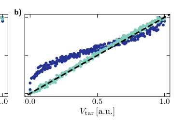
<figcaption class="paper-figure-caption"><b>Fig 2.</b> Fig. 2 a)/b) Dependence of the control voltage ¯Vc (dark blue) and the PD-FB1 output voltage ¯Vfb (mint green) on the target voltage Vtar without (a) and with (b) active linearization. The signals have been offset and normalized to vary between 0 and 1 for better reading. The black dashed line represents an ideal linear dependence as a guide for the eye.</figcaption>
</figure>
<figure class="paper-figure-card">
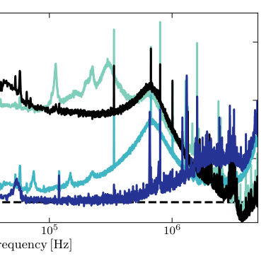
<figcaption class="paper-figure-caption"><b>Fig 3.</b> Fig. 3 RIN spectrum of the free-running laser (black) and the laser stabilized by the complete control system (dark blue). Additionally, the spectra obtained by using only the slow DC branch (mint green) and the fast AC branch without feedforward (light blue) are shown. The horizontal, dashed line at −155 dB Hz−1 indicates the lowest achieved RIN level.</figcaption>
</figure>
<figure class="paper-figure-card">
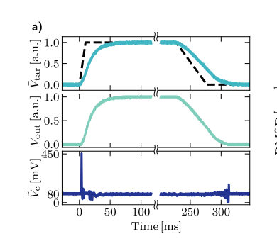
<figcaption class="paper-figure-caption"><b>Fig 4.</b> Fig. 4 a) Time dependence of the PD-OUT output voltage Vout (mint green) and the AC control voltage ˜Vc (dark blue) during an increase and decrease of the target signal Vtar. The low-pass filtered setpoint voltage ¯Vtar is shown in light blue. For reference, the black dashed line indicates an unfiltered pulse signal with a rise (fall) time of 10 ms (50 ms). The output voltage Vout and the filtered target voltage ¯Vtar have been normalized and offset to vary between 0 and 1. At time t = 0 s, the ramp of the target voltage Vtar begins. b) Root mean square deviation (RMSD) between the intensity curves during signal ramps with (V AC out (t)) and without (V DC out (t)) active AC control. The...</figcaption>
</figure>
<figure class="paper-figure-card">
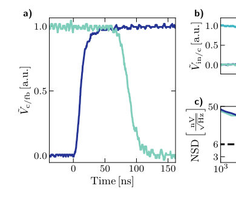
<figcaption class="paper-figure-caption"><b>Fig 5.</b> Fig. 5 a) Response of the PD-FB2 output voltage ˜Vfb (mint green) on a step of the control signal ˜Vc (dark blue). The data has been scaled to vary between 0 and 1 for better readability. b) Step response of the feedback (light blue) and the feedforward (mint green) branch of the summing amplifier. The corresponding input signal is displayed in dark blue. All signals have been offset and normalized to vary between 0 and 1 for better readability. c) NSD of the summing amplifier output (mint green) on a logarithmic scale. For comparison, the noise floor of the measurement device is shown in dark blue. The black dashed line indicates a noise level of 6 nV/ √</figcaption>
</figure>

**Summary.** The paper presents an advanced experimental technique to achieve ultra-low relative intensity noise in high-power lasers using Acousto-Optic Modulators (AOMs). By integrating a sophisticated control scheme involving both feedback and feedforward paths, the system stabilizes laser intensity up to the MHz range. This capability is crucial for next-generation quantum experiments involving light ultracold atoms.

**Why it may be interesting.** This work directly addresses a critical technical requirement for modern AMO experiments, such as optical lattice physics, where laser intensity stability is paramount for trapping and manipulating ultracold atoms.

Detailed structure

**Main problem.** The development of high-power laser sources that maintain ultra-low relative intensity noise (RIN) while allowing dynamic control up to the MHz frequency range.

**Main result.** The authors achieved an ultra-low relative intensity noise level down to $-155 	ext{ dB Hz}^{-1}$ even at several hundred kHz by implementing a combined feedback and feedforward control system on an AOM platform.

**Method.** A novel control architecture combining two standard feedback loops with one feedforward branch, implemented using photodiodes for measurement and FPGA/analog electronics for signal processing.

**Model / system.** The experiment uses Acousto-Optic Modulators (AOMs) driven by RF mixers. The system incorporates a slow DC control loop for low-frequency stabilization and a fast AC loop, alongside feedforward compensation to suppress noise across a wide bandwidth.

**Key observables.** Relative Intensity Noise (RIN) spectrum, measured down to $-158 	ext{ dB Hz}^{-1}$ at the electronic limit; closed-loop bandwidth up to $1.2 	ext{ MHz}$.

**Important parameters / regimes.** Noise suppression of $>30 	ext{ dB}$; control bandwidth extending into the $	ext{MHz}$ range; AOM reaction times down to $65 	ext{ ns}$.

**Assumptions / limitations.** The system relies on linearizing the non-linear AOM response using Gain-Scheduling and Piecewise Linear Approximation (PLA) algorithms.

**Figures summary.** Figures illustrate the experimental setup, detailing beam paths for DC and AC control branches. Other figures compare RIN spectra across different control regimes (free-running vs. fully controlled).

**Paper structure.** The paper details the necessity of low-noise lasers, describes the physical AOM system, outlines the advanced signal processing combining feedback/feedforward loops, presents measurements showing noise suppression at high frequencies, and concludes with performance metrics.

Abstract

High-power laser sources that exhibit low relative intensity noise and allow simultaneous dynamic control of their light level are required for a broad range of applications in various fields of physics. Acousto-optic modulators (AOMs) are widely used for active power stabilization and regulation due to their simple drive electronics requirements and high optical power handling capability in free-space. However, the rather slow propagation speed of the sound wave within the AOM crystal typically limits their control bandwidth to a few hundred kHz. In this work, we present a novel AOM-based control system that is capable of significantly suppressing intensity noise of high-power lasers up to the MHz range. By combining two standard feedback loops with one feedforward control branch and optimizing the beam path in the AOM crystal, ultra-low relative intensity noise levels down to $-155\, \text{dB}\,\text{Hz}^{-1}$ even at several hundred kHz are achieved. Our results are relevant for applications that require ultra-low intensity noise at Fourier frequencies up to the MHz range, such as optical lattice experiments with light ultracold atoms.

[↑ back to top](#top)

### [Bimodal non-Gaussian photonic states from a single quantum emitter in a waveguide](http://arxiv.org/abs/2608.03658v1)

**Authors:** Thomas Copie, Ofer Firstenberg, G. P. Teja, Radim Filip, Hanna Le Jeannic  
**Type:** theory · **Category:** quantum information and computing · **PDF:** <https://arxiv.org/pdf/2608.03658v1>  
**Analysis basis:** full PDF text, analyzed in chunks
**Topic relevance:** `correlated cavity matter` **3/5** · `correlated / nonlocal dissipation` **2/5** · `entanglement & information structure` **2/5** · `Keldysh / 2PI / non-Gaussian methods` **1/5** · `Tavis-Cummings & cavity-many-emitter` **1/5** · `analog quantum simulation` **1/5** · `driven-dissipative phase transition` **1/5** · `interference shaping light` **1/5** · `methods for driven-dissipative` **1/5** · `non-equilibrium dynamics` **1/5**

↔ Scroll figures horizontally

<figure class="paper-figure-card">
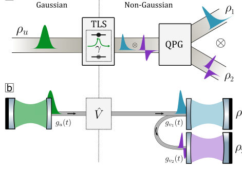
<figcaption class="paper-figure-caption"><b>Fig 1.</b> Figure 1. (a) Scheme of the proposed protocol. A propa- gating pulsed Gaussian state ρu, initially occupying a sin- gle spectro-temporal mode, interacts with a two-level system and is transformed into a multimode non-Gaussian quantum state. In the two-mode regime considered here, the output state supported on v1 ⊗v2 can be mapped onto distinct spa- tial modes, for instance using a quantum pulse gate (QPG) [27]. (b) Equivalent diagram of the virtual cavity formalism [25, 26] applied to our two mode system. The input field is initially contained in the input cavity. Thanks to a tailored coupling gu(t), it leaks a pulse of shape u(t) in the waveguide. After interacting with the TLS (with a...</figcaption>
</figure>
<figure class="paper-figure-card">
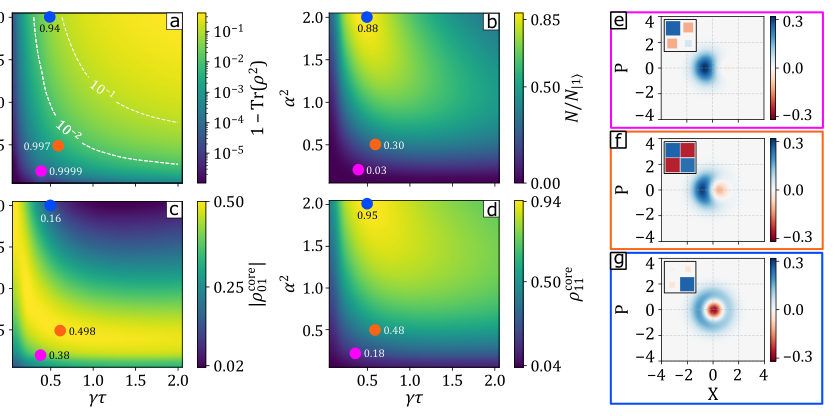
<figcaption class="paper-figure-caption"><b>Fig 2.</b> Figure 2. Maps of selected properties of ρ1 as functions of the coherent input pulse intensity |α|2 and normalized duration γτ. (a) Impurity 1 −Tr(ρ2 1) of the first output mode ρ1. (b) Wigner negativity volume of ρ1 normalized to that of a single-photon. (c) Coherence |ρcore 01 | = | ⟨0| ρcore 1 |1⟩| of the corresponding core state. (d) Single photon population ρcore 11 = ⟨1| ρcore 1 |1⟩of the core state. (e-g) Wigner functions of ρ1 for three representative values of α2 and γτ. The insets shows the density matrices of the corresponding core states ρcore 1 . The color of each frame matches the associated marker in panels (a)-(d)</figcaption>
</figure>
<figure class="paper-figure-card">
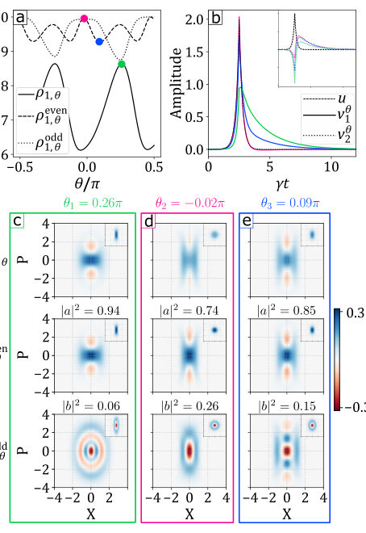
<figcaption class="paper-figure-caption"><b>Fig 3.</b> Figure 3. Bi-modal non-Gaussian output from a squeezed vacuum input pulse. (a) Purity of ρ1,θ, ρeven 1,θ and ρodd 1,θ as a function of θ. Three values of θ are marked by colored dots: θ1 = 0.26π, θ2 = −0.02π and θ3 = 0.09π. (b) Output modes vθ 1 (full) and vθ 2 (dashed) for θ1,2,3. (c-e) Output states for θ1,2,3. From top to bottom, the Wigner functions correspond to the density matrices ρ1,θ, ρeven 1,θ and ρodd 1,θ . The insets corre- spond to the matching density matrices in vθ 2: ρ2,θ, ρeven 2,θ and ρodd 2,θ . For each column and i ∈{1, 2}, |a|2 and |b|2 are such that ρi,θ = |a|2ρeven i,θ + |b|2ρodd i,θ .</figcaption>
</figure>
<figure class="paper-figure-card">
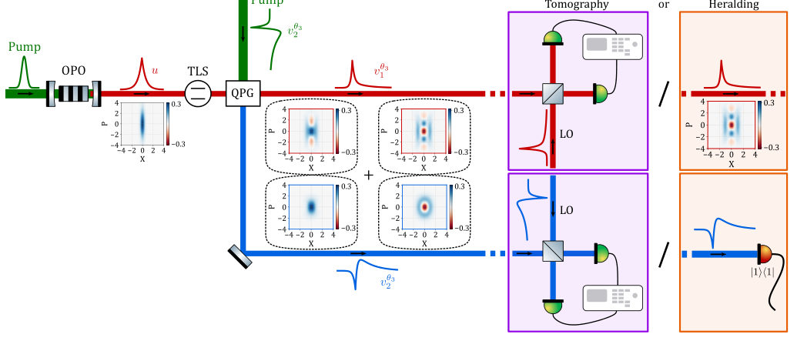
<figcaption class="paper-figure-caption"><b>Fig 4.</b> Figure 4. Simplified experimental protocol. A coherent pulse is sent on an optical parametric oscillator (OPO) to generate a squeezed vacuum pulse. The interaction with the TLS generates a bi-modal output field with Non-Gaussian features. A quantum pulse gate separates modes vθ 1 and vθ 2. One can then perform tomography on the bimodal output field or implement a heralding protocol.</figcaption>
</figure>
<figure class="paper-figure-card">
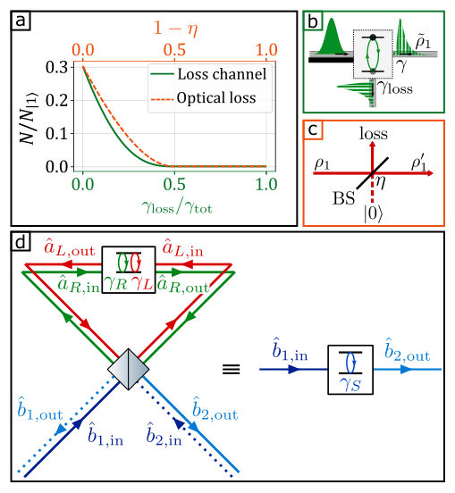
<figcaption class="paper-figure-caption"><b>Fig 5.</b> Figure 5. (a) Evolution of the Wigner negativity of the out- put state as a function of losses, for two different loss pro- cesses. The input is a coherent state (α = √</figcaption>
</figure>

**Summary.** The paper details a method to generate high-quality, non-Gaussian photonic states by coupling a single quantum emitter to a waveguide. By employing squeezed vacuum inputs, the authors demonstrate the creation of bimodal states that allow for the extraction of complex resources like large squeezed cat states. This work advances quantum light sources beyond simple photon addition/subtraction protocols.

**Why it may be interesting.** This work directly addresses quantum state engineering in photonic systems, providing concrete protocols for generating complex non-Gaussian resources (like cat states) necessary for fault-tolerant quantum computation and quantum metrology.

Detailed structure

**Main problem.** The research focuses on deterministically and heraldedly generating non-Gaussian states of light using a single quantum emitter coupled to a chiral waveguide.

**Main result.** Using squeezed-vacuum inputs, the protocol generates bimodal non-Gaussian states from which higher-stellar-rank states, such as large squeezed cat states, can be extracted with high purity and success rates.

**Method.** The analysis employs virtual cavity formalism, linear mode rotation to analyze joint density matrices in different output bases, and utilizes fidelity witnesses combined with Wigner negativity to bound the stellar rank of generated states.

**Model / system.** The system consists of a two-level quantum emitter (TLS) coupled to a one-dimensional, ideally chiral waveguide. The interaction is modeled using an input-output relationship derived from the Hamiltonian describing the TLS and the field modes.

**Key observables.** Wigner negativity volume, Stellar rank ($r^*$), Purity of partial density matrices ($
ho_{1,	heta}, 
ho_{2,	heta}$), and the core state $
ho_{	ext{core}}$.

**Important parameters / regimes.** Coupling rates ($\gamma$), frequency separation ($\omega_0$), input field type (coherent vs. squeezed vacuum), and the ratio of average photon number to coupling strength ($\langle n 
angle\gamma	au$).

**Assumptions / limitations.** The initial assumption is an ideal chiral waveguide; limitations are analyzed regarding imperfect coupling and non-chiral waveguides.

**Figures summary.** Figure 1 illustrates the protocol scheme using pulsed Gaussian states. Figure 2 shows properties of the reduced state $
ho_1$ (Impurity, Wigner negativity volume) versus input amplitude $|\alpha|$.

**Paper structure.** The paper progresses by first establishing the physical model and deterministic generation via coherent pulses; it then advances to utilizing squeezed-vacuum inputs to access higher-rank states; finally, it details advanced diagnostics like stellar rank bounding and discusses practical implementation considerations.

Abstract

We investigate the generation of deterministic and heralded non-Gaussian states of light, using a single two-level system coupled to a chiral waveguide. We study the case of a single two level system driven by pulsed coherent and squeezed drive in a chiral waveguide. For coherent input pulses, we show that the emitter can deterministically generate Wigner-negative states, albeit of limited rank. Going beyond, using squeezed-vacuum inputs, we show that the interaction produces bimodal non-Gaussian states from which higher-stellar-rank states, including large squeezed cat states, can be experimentally extracted with a substantial success rate. Motivated by experimental implementations, we further analyze the effect of imperfect coupling and of the intrinsic $50\%$ collection limit of symmetric, non-chiral waveguides. Finally, we propose a simple interferometric scheme that recovers an effectively chiral interaction in an otherwise bidirectional waveguide.

[↑ back to top](#top)

### [Chaos and Diffusion in Twisted Bilayer Graphene](http://arxiv.org/abs/2608.02916v1)

**Authors:** Olga Arroyo-Gascón, Manuel Pino  
**Type:** theory · **Category:** disordered systems and neural networks · **PDF:** <https://arxiv.org/pdf/2608.02916v1>  
**Analysis basis:** full PDF text, analyzed in chunks
**Topic relevance:** `methods for driven-dissipative` **3/5** · `driven-dissipative phase transition` **2/5** · `non-equilibrium dynamics` **2/5** · `non-equilibrium universality` **2/5** · `Frenkel-Kontorova` **1/5** · `Keldysh / 2PI / non-Gaussian methods` **1/5** · `Kondo & dissipative impurity` **1/5** · `analog quantum simulation` **1/5** · `correlated / nonlocal dissipation` **1/5**

↔ Scroll figures horizontally

<figure class="paper-figure-card">
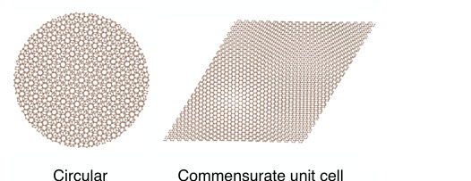
<figcaption class="paper-figure-caption"><b>Fig 1.</b> Figure 1. The two different types of TBG flakes studied in this work. The circular flake corresponds to a rotation angle θcom = 21.8◦, and the commensurate unit cell flake to θcom = 1.05◦.</figcaption>
</figure>
<figure class="paper-figure-card">
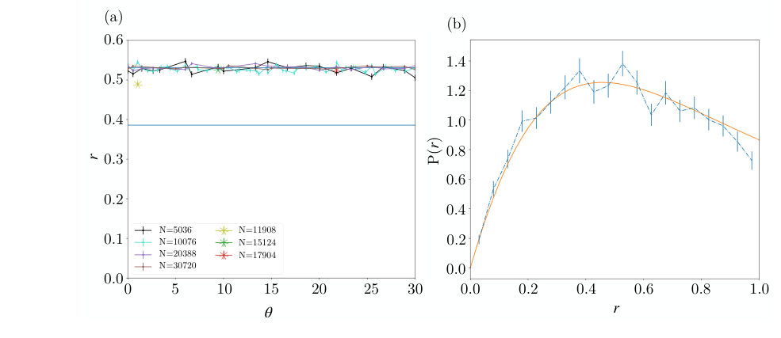
<figcaption class="paper-figure-caption"><b>Fig 2.</b> Figure 2. (a) Level statistics as a function of rotation angle θ for circular flakes (lines) and commensurate supercell flakes (stars), with diverse number of atoms N. For each system size, averages over all eigenstates within 3 and 5 eV are performed. (b) Probability distribution of the level statistics for a commensurate supercell with θcom = 21.8◦(blue), and GOE probability distribution (orange). Averages over all eigenstates within 3 and 5 eV are performed.</figcaption>
</figure>
<figure class="paper-figure-card">
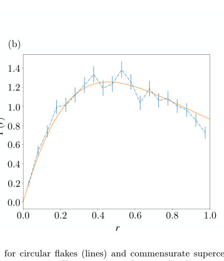
<figcaption class="paper-figure-caption"><b>Fig 3.</b> Fig. 2 (a) shows r as a function of θ for circular flakes and commensurate supercells under open boundary con- ditions, up to N ∼31000 atoms. Averages are computed over all states between 3 and 5 eV. We emphasize that a random sliding between the two layers is included in all cases (without averaging over different slidings). For the commensurate supercells, we have constructed lat- tices labeled by the unit cell indices (n, m), introduced in Section II. Namely, we choose (n, m) =(2, 1), (8, 7) and (32, 31). From Eq. 1, we find the corresponding commensurate rotation angles θcom = 21.8◦, 4.4◦and 1.05◦, respectively, with a moiré superlattice periodicity ranging from LM = 6.5 Å to 134 Å....</figcaption>
</figure>
<figure class="paper-figure-card">
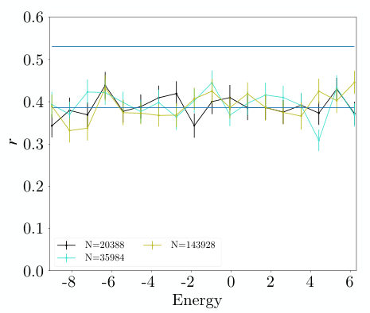
<figcaption class="paper-figure-caption"><b>Fig 4.</b> Figure 3. Level statistics as a function of energy for circular flakes at θ = 0◦with diverse number of atoms N. For each system size, averages over 100 eigenstates within the energy range shown in the Figure are performed.</figcaption>
</figure>
<figure class="paper-figure-card">
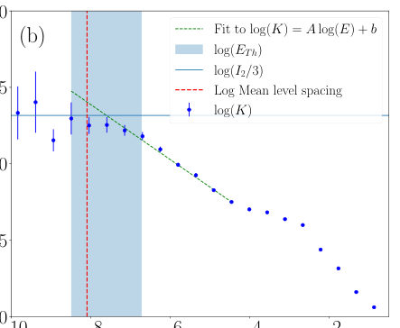
<figcaption class="paper-figure-caption"><b>Fig 5.</b> Figure 4. Eigenvector correlations as a function of energy for TBG. (a) Circular flake with N = 30720 and incommensurate twist angle θ = 21◦. (b) Commensurate supercell flake with θcom = 21.8◦and N = 31024. Scatter points indicate the eigenvector correlations K averaged over many states around energy 4 eV, while the horizontal blue line is the average value of I2/3. The blue-colored area is our estimated range of the Thouless energy, while the red dashed line corresponds to the mean level spacing.</figcaption>
</figure>

**Summary.** This work numerically analyzes chaos and diffusion in twisted bilayer graphene, demonstrating that the system exhibits quantum chaos even at large twist angles. The key finding is that border-induced scattering acts as a powerful single-particle mechanism, inducing diffusive behavior regardless of lattice commensurability. This highlights the crucial role of sample boundaries in determining electronic transport properties.

**Why it may be interesting.** The findings on how structural imperfections (borders) induce universal quantum chaotic behavior in a 2D material are highly relevant to understanding open quantum systems where boundaries play a critical role.

Detailed structure

**Main problem.** The study investigates the emergence of quantum chaos and diffusive transport mechanisms within finite-sized Twisted Bilayer Graphene (TBG) flakes.

**Main result.** Chaos is robustly induced in TBG systems regardless of lattice commensurability or rotation angle, with border scattering identified as a dominant single-particle mechanism causing diffusion.

**Method.** The analysis employs numerical diagonalization of the tight-binding Hamiltonian and uses Random Matrix Theory diagnostics (like level spacing ratios) alongside Thouless energy scaling to characterize spectral statistics.

**Model / system.** The system is Twisted Bilayer Graphene modeled by a tight-binding Hamiltonian. The study examines flakes with both commensurate and incommensurate twist angles, focusing on the role of boundaries.

**Key observables.** Level spacing ratios ($\langle r 
angle$), probability distribution $P(r)$, Thouless energy ($E_{Th}$), and dimensionless conductance ($g$).

**Important parameters / regimes.** Twist angle ($	heta$), system size ($N$), and the nature of scattering (border-induced vs. intrinsic).

**Assumptions / limitations.** The analysis often assumes random sliding between layers for comparison, and specific energy ranges are focused on for robust averaging.

**Figures summary.** Figures show level statistics ($\langle r 
angle$) dependence on angle/size, K-correlator plateaus confirming GOE behavior, and scaling plots demonstrating $E_{Th} \sim 1/\sqrt{N}$ consistent with border scattering.

**Paper structure.** The paper progresses by establishing the model (Hamiltonian), applying chaos diagnostics (level statistics vs. GOE/Poisson) across different angles, quantifying diffusion via Thouless energy scaling, and concluding that boundary effects dominate the chaotic behavior.

Abstract

We numerically analyze chaos and diffusion in experimentally-relevant models of twisted bilayer graphene. Our results indicate that finite systems at both commensurate and incommensurate rotation angles exhibit chaos. We compute the Thouless energy of the system at intermediate twist angles to further understand the diffusive processes associated with the chaotic nature of the spectrum. We find that the mean free path of the non-interacting electrons scales with the system size, which is consistent with diffusive processes caused by border-induced scattering. In summary, our results show the role of borders as a experimentally relevant single-particle scattering mechanism, which is much stronger than in single-layer graphene and induces chaos and diffusion regardless of the rotation angle and the lattice commensurability.

[↑ back to top](#top)

### [Hydrodynamic description of proliferating active matter](http://arxiv.org/abs/2608.03317v1)

**Authors:** Nathan Silvano, Emilio Hernandez-Garcia, Cristóbal López  
**Type:** theory · **Category:** statistical mechanics · **PDF:** <https://arxiv.org/pdf/2608.03317v1>  
**Analysis basis:** full PDF text, analyzed in chunks
**Topic relevance:** `Keldysh / 2PI / non-Gaussian methods` **3/5** · `driven-dissipative phase transition` **3/5** · `non-equilibrium dynamics` **2/5** · `non-equilibrium universality` **2/5** · `Frenkel-Kontorova` **1/5** · `analog quantum simulation` **1/5** · `correlated / nonlocal dissipation` **1/5** · `methods for driven-dissipative` **1/5**

↔ Scroll figures horizontally

<figure class="paper-figure-card">
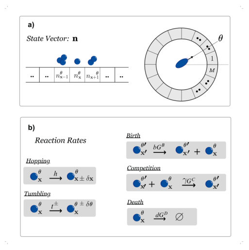
<figcaption class="paper-figure-caption"><b>Fig 1.</b> Figure 1. Microscopic model representation. a) Schematics of the state vector n. Left: Spatial lattice with occupation numbers nθ x. Right: Discretized orientation space for a single particle in two dimensions. b) Individual-based model (IBM) reaction rates, including hopping and tumbling dynamics, as well as birth, competition, and death processes.</figcaption>
</figure>
<figure class="paper-figure-card">
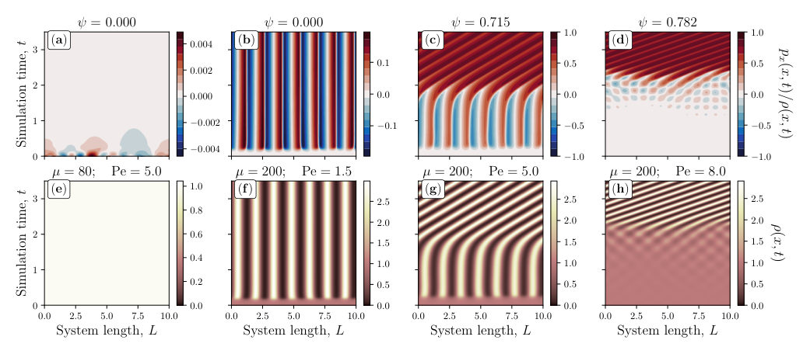
<figcaption class="paper-figure-caption"><b>Fig 2.</b> Figure 2. System evolution in the quasi-one-dimensional case, Eqs. (62) and (63), for different dynamical regimes. Bottom row is the normalized density distribution ρ(x, t). Top row is the polarization strength px(x, t)/ρ(x, t). We identify, at the final simulation time, the order parameter ψ computed from Eq. (66). Values of µ and Pe are indicated in each case. Other parameters: L = 100 and Dr = 0.7. Initial condition is always the homogeneous solution ρ = 1, px = 0 slightly perturbed by noise. a, e) Evolution relaxing towards the stable homogeneous density with null polarization. b, f) Formation of stationary patterns with negligible orientational order (ψ ∼0). c, g) Pattern formation by...</figcaption>
</figure>
<figure class="paper-figure-card">
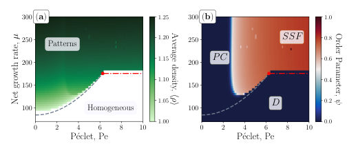
<figcaption class="paper-figure-caption"><b>Fig 3.</b> Figure 3. Phase Diagram simulated from Eq. (62) and (63) in one spatial dimension, at a final time t = 25 starting from the homogeneous solution slightly perturbed by noise. The dashed gray line is the analytical Turing line of pattern for- mation from Eq. (60). The red dash dotted line is the analyt- ical Hopf instability line from Eq. (61). Color in a) indicates the spatially averaged density ⟨ρ⟩, where ⟨ρ⟩= 1 identifies the homogeneous steady state. Color in b) indicates the or- der parameter ψ, computed from Eq. (66). Other parameters: L = 10 and Dr = 0.7. The different phases found are indi- cated with the labels D, PC and SSF in panel b). The D phase gives a homogeneous density, as...</figcaption>
</figure>
<figure class="paper-figure-card">
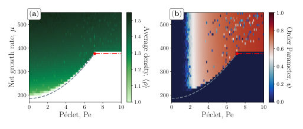
<figcaption class="paper-figure-caption"><b>Fig 4.</b> Figure 4. Phase Diagram simulated from Eqs. (47),(48) in two spatial dimension, at a final time t = 10 starting from the homogeneous solution slightly perturbed by noise. The dashed gray line is the analytical Turing line of pattern for- mation from Eq. (60). The red dash dotted line is the analyt- ical Hopf instability line from Eq. (61). Color in a) indicates the spatially averaged density ⟨ρ⟩, where ⟨ρ⟩= 1 identifies the homogeneous steady state. Color in b) indicates the or- der parameter ψ, computed from Eq. (67). Other parameters: L = 10 and Dr = 0.7.</figcaption>
</figure>
<figure class="paper-figure-card">
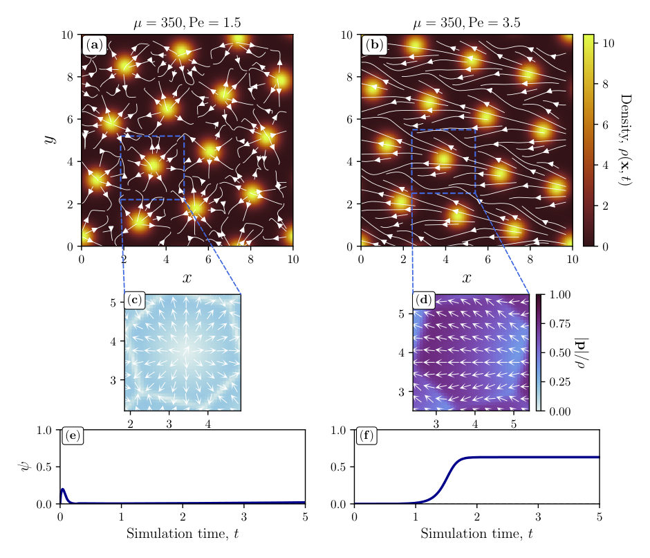
<figcaption class="paper-figure-caption"><b>Fig 5.</b> Figure 5. Spatiotemporal patterns from numerical integration of Eqs. (47) and (48) in two dimensions starting from the homogeneous solution slightly perturbed with noise. In all panels L = 10 and Dr = 0.7. (a, b) Density configurations ρ at long times, with polarization streamlines in white. (a) Stationary hexagonal clusters obtained at µ = 350 and Pe = 1.5 (see SM Video 5) exhibiting in (c) periodic angular orientations with small polarization strengths |p|/ρ. (b) Traveling hexagonal clusters obtained at µ = 350 and Pe = 3.5, characterized by aligned orientations and high polarization strength |p|/ρ (shown in (d). This configuration is reached after a transient in which stationary clusters...</figcaption>
</figure>

**Summary.** This paper establishes a general continuum hydrodynamic framework for complex proliferating active matter by deriving mean-field equations from a detailed lattice master equation. Using the von Mises ansatz, they successfully model collective behaviors like flocking and predict pattern formation instabilities (Turing/Hopf) that match numerical simulations.

**Why it may be interesting.** While focused on classical active matter, the rigorous derivation of macroscopic field theories from microscopic stochastic rules, coupled with stability analysis (Turing/Hopf), mirrors techniques used in modeling non-equilibrium quantum many-body dynamics or open quantum systems far from equilibrium.

Detailed structure

**Main problem.** Developing a general continuum theory for proliferating active matter that incorporates self-propulsion, birth, death, and nonlocal competition.

**Main result.** The derived hydrodynamic framework successfully reproduces key dynamical regimes, including Turing and Hopf instabilities, confirming its applicability to diverse active systems.

**Method.** The authors derive mean-field evolution equations from a microscopic master equation by taking the continuum limit and employing a von Mises ansatz closure for angular correlations.

**Model / system.** The model describes self-propelled particles on a lattice undergoing stochastic processes (birth, death, competition) alongside directional hopping. The dynamics are mapped onto coupled hydrodynamic equations for particle density and polarization fields.

**Key observables.** Particle density ($
ho$), Polarization vector field ($P$), Mean occupation numbers $\langle n_{	heta}^x 
angle$, and instability thresholds (Turing/Hopf).

**Important parameters / regimes.** Net growth rate ($\mu$), Péclet number ($Pe$), Diffusion coefficients ($D_T, D_R$).

**Assumptions / limitations.** The primary approximations include the mean-field factorization of averages and the use of the von Mises ansatz to close the resulting hierarchy of moment equations.

**Figures summary.** Figure D1 shows simulation results for a quasi-one-dimensional system, demonstrating hysteretic behavior (bistability) when sweeping parameters like the growth rate ($\mu$) across instability lines for specific Péclet numbers ($Pe=5$ and $Pe=7.5$).

**Paper structure.** The paper progresses from defining the microscopic lattice model via a master equation to deriving mean-field continuum equations, applying the von Mises closure to obtain coupled hydrodynamic equations for density ($
ho$) and polarization ($P$), and finally analyzing these equations in simplified 1D systems to study pattern formation and bistability.

Abstract

We develop a continuum theory for proliferating active matter starting from a microscopic stochastic model of self-propelled particles undergoing birth, death, and nonlocal competition. Beginning from the master equation, we derive mean-field evolution equations for the particle density and polarization fields and close the resulting hierarchy through a von Mises ansatz, providing a coupled hydrodynamic description applicable to a broad class of proliferating active systems. As an application, we study the recently introduced Active Brownian Bug model, in which the form of flocking emerges despite the absence of explicit alignment interactions. Linear stability analysis predicts both Turing and Hopf instabilities, whose analytical thresholds agree with numerical simulations. The continuum model reproduces the principal dynamical regimes of the underlying particle system, including homogeneous states, stationary periodic clusters, and coherently propagating flocking states. These results establish a general continuum framework for proliferating active matter and provide a physical interpretation of collective motion driven by the interplay between activity and population dynamics.

[↑ back to top](#top)

### [Impurities Near the Light Cone](http://arxiv.org/abs/2608.03704v1)

**Authors:** Gabriel Cuomo, Simone Giombi, Luigi Tizzano  
**Type:** theory · **Category:** strongly correlated electrons · **PDF:** <https://arxiv.org/pdf/2608.03704v1>  
**Analysis basis:** full PDF text, analyzed in chunks
**Topic relevance:** `non-equilibrium universality` **3/5** · `Kondo & dissipative impurity` **2/5** · `entanglement & information structure` **2/5** · `non-equilibrium dynamics` **2/5** · `Keldysh / 2PI / non-Gaussian methods` **1/5** · `analog quantum simulation` **1/5** · `correlated / nonlocal dissipation` **1/5** · `driven-dissipative phase transition` **1/5** · `methods for driven-dissipative` **1/5**

↔ Scroll figures horizontally

<figure class="paper-figure-card">
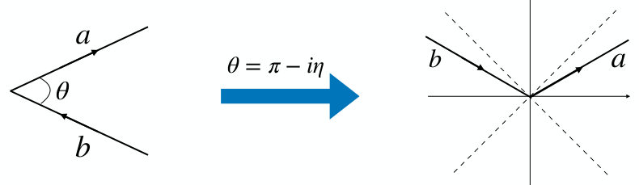
<figcaption class="paper-figure-caption"><b>Fig 1.</b> Figure 1: The Euclidean cusp (left) and its Wick rotation to a Lorentzian boosted configu- ration (right).</figcaption>
</figure>
<figure class="paper-figure-card">
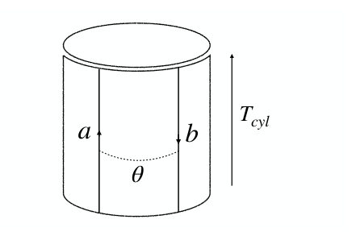
<figcaption class="paper-figure-caption"><b>Fig 2.</b> Figure 2: Cusped defects in Euclidean signature, both in flat space and on the cylinder.</figcaption>
</figure>
<figure class="paper-figure-card">
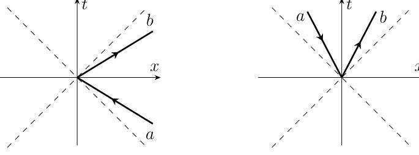
<figcaption class="paper-figure-caption"><b>Fig 3.</b> Figure 3: Lorentzian cusp configurations considered in the text. The dashed lines denote the light cone t = ±x, while the thick lines denote the defects a and b. Top left: the spacelike configuration defining ΓL ab(y). Top right: the quench configuration, where a static defect is kicked at the origin into the future light cone. Bottom left: the spacelike′ configuration, where the defects run on spacelike contours causally connected with each other. Bottom right: the Sudakov configuration, with both defects inside the future light cone.</figcaption>
</figure>
<figure class="paper-figure-card">
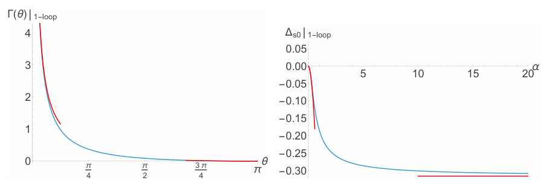
<figcaption class="paper-figure-caption"><b>Fig 4.</b> Figure 4: The one-loop contributions to: the cusp anomalous dimension Γ(+,s)(+,s) (0) (θ)|1-loop =</figcaption>
</figure>
<figure class="paper-figure-card">
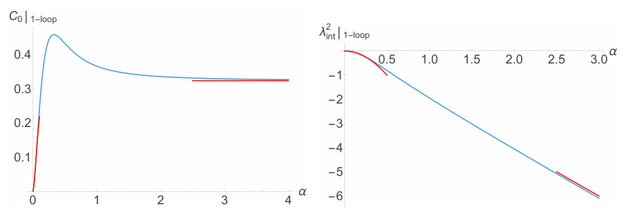
<figcaption class="paper-figure-caption"><b>Fig 5.</b> Figure 5: The one-loop contributions to: the Casimir energy C0|1-loop = C0 + (s + 1)πα, fig. 5a; and the large boost interaction coefficient λ2 int|1-loop = λ2 int −2(s + 1)α, fig. 5b. The blue curves are obtained from numerical integration while the red ones are the (semi-)analytic small and large coupling asymptotics reported in the main text.</figcaption>
</figure>

**Summary.** This paper investigates the behavior of anomalous dimensions associated with line defects in conformal field theories when moving from Euclidean to Lorentzian spacetime. The key finding is that under certain assumptions, this dimension stabilizes at a constant value determined by endpoint operator scaling dimensions, providing new insights into non-perturbative physics beyond standard gauge theory predictions.

**Why it may be interesting.** While focused on high-energy QFT/CFT, the techniques of analyzing correlation functions near singular limits (like cusps) and deriving universal scaling laws are highly relevant to understanding critical points or boundary effects in strongly correlated quantum materials.

Detailed structure

**Main problem.** The research aims to determine how the cusp anomalous dimension behaves for general conformal line defects when analytically continued from Euclidean to Lorentzian spacetime signatures.

**Main result.** For general CFTs, the large-boost limit of the Lorentzian cusp anomalous dimension is found to be fixed by the scaling dimensions of local endpoint operators, differing significantly from standard gauge theory results.

**Method.** The authors employ analytic continuation techniques, moving from Euclidean calculations involving line defects to Lorentzian configurations like the Sudakov or quench limits. They derive expressions for the anomalous dimension based on assumptions about local endpoint operators.

**Model / system.** The study is set in the context of Conformal Field Theories (CFTs) and involves analyzing cusps formed by two meeting line defects, with applications tested using models like pinning-field defects or spin impurities. The analysis draws parallels to gauge theories.

**Key observables.** Cusp anomalous dimension ($\Gamma_{ab}(	heta)$ in Euclidean space; $\Gamma^L_{ab}(y)$ in Lorentzian space), and the scaling dimensions of defect-creation operators ($\Delta_{a0}, \Delta_{b0}$).

**Important parameters / regimes.** The boost parameter ($y$), the coupling constants, and the scaling dimensions associated with the defects.

**Assumptions / limitations.** A crucial assumption is that the line defects admit local endpoint operators connecting them to the trivial line; otherwise, the physics changes significantly (e.g., flux tube formation).

**Figures summary.** Figures illustrate both Euclidean and Lorentzian configurations of cusped defects, including specific setups like the Sudakov configuration.

**Paper structure.** The paper establishes the general problem by contrasting with known gauge theory results, derives the large-boost limit based on endpoint operator assumptions, analyzes distinct analytic continuations, proposes a positivity bound, and tests these predictions in several perturbative examples.

Abstract

The lightlike Wilson line cusp underlies the Sudakov double logarithm and is a central ingredient in gauge-theory factorization. We ask what replaces this behavior for general conformal line defects in Lorentzian signature. We argue that, when the defects admit local endpoint operators, the cusp anomalous dimension has a finite large-boost limit fixed by the scaling dimensions of the corresponding defect-creation operators. We further analyze the distinct analytic continuations of the cusp, elucidate their physical interpretations, and propose a positivity bound on the Lorentzian cusp anomalous dimension. We test these predictions in several perturbative examples, including pinning-field defects and spin impurities, and discuss their possible implications for gauge theories.

[↑ back to top](#top)

### [Heisenberg scaling under collective non-parallel directional noise via geometric state design](http://arxiv.org/abs/2608.02848v1)

**Authors:** Francisco Riberi, Milad Marvian, Lorenza Viola  
**Type:** theory · **Category:** other · **PDF:** <https://arxiv.org/pdf/2608.02848v1>  
**Analysis basis:** full PDF text, analyzed in chunks
**Topic relevance:** `analog quantum simulation` **3/5** · `QC/QI experiment` **2/5** · `quantum measurements` **2/5** · `Keldysh / 2PI / non-Gaussian methods` **1/5** · `correlated / nonlocal dissipation` **1/5** · `driven-dissipative phase transition` **1/5** · `entanglement & information structure` **1/5** · `exotic spin models in light-matter` **1/5** · `methods for driven-dissipative` **1/5**

↔ Scroll figures horizontally

<figure class="paper-figure-card">
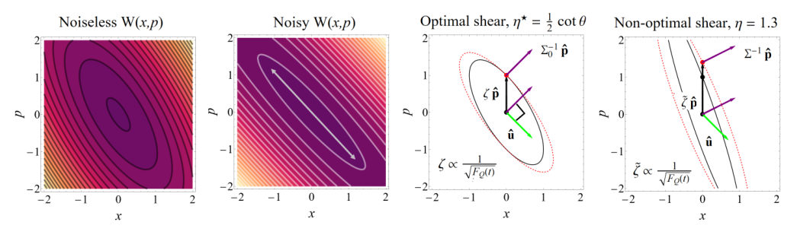
<figcaption class="paper-figure-caption"><b>Fig 1.</b> FIG. 1. Geometric protection against collective non-parallel directional noise. Left: Gaussian Wigner function with mean and covariance given by Eq. (7). Noise induces rank-one diffusion along ˆu, broadening the ellipse (white arrows). Right: Geometric interpretation of the QCRB. Contours E(r) ≡r⊤Σ−1 t r define the noiseless (black) and noisy (red, dashed) ellipses. The green arrow shows the direction ˆu of the rank-one contribution that modifies Σ0 under noise, Eq. (7). The purple arrows represent the vector Σ−1ˆp, which is normal to the noisy ellipse surface along ˆp. For optimal shear (η⋆= 1</figcaption>
</figure>
<figure class="paper-figure-card">
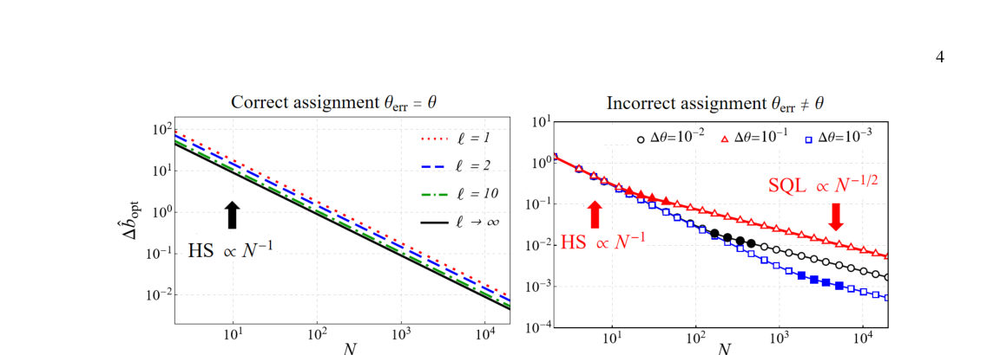
<figcaption class="paper-figure-caption"><b>Fig 2.</b> FIG. 2. Optimal performance of OATS under collective directional noise. Left: Lower bound to precision ∆ˆbopt = [F tot Q,⋆(t⋆)]−1/2 for different values of the short-time decay coefficient χ(t) ≃χℓ 0(ωct)ℓas a function of probe number N. Full knowledge of the noise direction is assumed. In all cases, HS is achieved, ∆ˆbopt ∝N −1, with the largest constant prefactor for Markovian noise (ℓ= 1) and increasingly better performance with higher ℓ. Right: Transition from HS to noise-limited asymptotics when measuring a suboptimal quadrature Qerr = cos θerr ˆx + sin θerr ˆp. Here, imperfect knowledge of the noise axis leads to an incorrect assignment θerr that deviates from the true noise direction...</figcaption>
</figure>

**Summary.** The paper develops a theory showing how to maintain Heisenberg scaling in quantum frequency estimation despite classical directional noise. This immunity is achieved by engineering the initial quantum state such that the signal encoding direction is geometrically orthogonal to the noise diffusion direction. The results confirm this robustness, while also quantifying the performance degradation when the noise environment is only partially known.

**Why it may be interesting.** This work provides a concrete, physically realizable protocol for enhancing quantum sensing beyond the Standard Quantum Limit by actively designing input states that are robust against specific types of environmental noise, which is highly relevant to trapped-ion and cavity QED platforms.

Detailed structure

**Main problem.** The core problem is achieving Heisenberg scaling ($\Delta\hat{b} \propto N^{-1}$) in quantum parameter estimation when the system is subjected to classical collective directional noise, especially when the signal and noise axes are non-parallel.

**Main result.** A geometric noise-immunity mechanism was identified: by designing an appropriate input state (One-Axis-Twisted State), the signal encoding can be made metric-orthogonal to the noise diffusion direction, preserving Heisenberg scaling regardless of noise temporal correlations.

**Method.** The analysis uses the Holstein-Primakoff approximation to map the spin system to bosonic quadratures and employs the Quantum Fisher Information (QFI) derived from the Wigner function evolution under noise averaging.

**Model / system.** The model involves an ensemble of N effective two-level systems whose collective spin operators $\mathbf{J}$ are used to estimate a static frequency $b$. The noise is modeled as classical, Gaussian, and acting along a fixed direction $\hat{\mathbf{v}}$.

**Key observables.** Quantum Fisher Information (QFI), estimation uncertainty ($\Delta\hat{b}$), Wigner function ($W(x, p)$), and the optimal measurement quadrature.

**Important parameters / regimes.** Probe number $N$, noise correlation time $	au$ (governing Markovian/non-Markovian regimes), signal axis angle $	heta$, and noise direction $\hat{\mathbf{v}}$.

**Assumptions / limitations.** The analysis relies on the Holstein-Primakoff approximation for tractability, assuming Gaussian statistics for the noise, and analyzing small deviations from perfect knowledge of the noise axis.

**Figures summary.** Figure 1 illustrates geometric protection by showing how optimal state design keeps the QCRB insensitive to noise diffusion. Figure 2 demonstrates that Heisenberg scaling is maintained for all noise correlation types when full noise knowledge is assumed, but degrades if the noise axis is imperfectly known.

**Paper structure.** The paper first establishes the problem of directional noise limiting metrology. It then introduces the geometric immunity mechanism using OATS states to achieve metric-orthogonality between signal and noise directions. Finally, it analyzes the breakdown of this scaling when the noise direction knowledge becomes imperfect.

Abstract

Spin-squeezed states enable entanglement-enhanced frequency estimation; however, the achievable performance is limited in practice by decoherence. We study the problem of parameter estimation under \emph{classical collective noise} that acts along a \emph{fixed} direction during signal encoding. While we restrict our analysis to Gaussian noise statistics, no assumption is made on the nature of the noise temporal correlations. Our approach captures both parallel (dephasing) and single-axis transverse noise as special cases, and covers both Markovian and non-Markovian metrological regimes. In the properly squeezed limit, where a Holstein-Primakoff description is accurate, we identify a geometric noise-immunity mechanism: for \emph{known} non-parallel signal and noise axes, an appropriate one-axis-twisted input encodes the signal in a quadrature that is metric-orthogonal to the direction of noise-induced diffusion. Irrespective of the noise temporal correlations, the resulting estimation precision exhibits Heisenberg scaling in the probe number. Optimal performance is achievable by measuring a single collective spin component. Imperfect knowledge of the noise axis produces a crossover from Heisenberg scaling at moderate probe number back to the known collective-dephasing bounds asymptotically.

[↑ back to top](#top)

### [Helicity in monoaxial chiral magnets](http://arxiv.org/abs/2608.03389v1)

**Authors:** Victor Laliena, Diego Gironés-Magaña, Javier Campo  
**Type:** theory · **Category:** other · **PDF:** <https://arxiv.org/pdf/2608.03389v1>  
**Analysis basis:** full PDF text, analyzed in chunks
**Topic relevance:** `spintronics-quantum-optics interface` **3/5** · `driven-dissipative phase transition` **2/5** · `non-equilibrium dynamics` **2/5** · `Keldysh / 2PI / non-Gaussian methods` **1/5** · `analog quantum simulation` **1/5** · `correlated / nonlocal dissipation` **1/5** · `exotic spin models in light-matter` **1/5** · `methods for driven-dissipative` **1/5** · `non-equilibrium universality` **1/5**

↔ Scroll figures horizontally

<figure class="paper-figure-card">
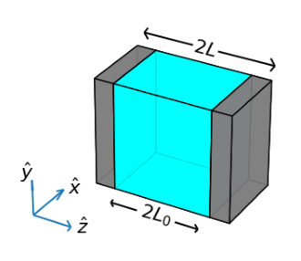
<figcaption class="paper-figure-caption"><b>Fig 1.</b> FIG. 1. Composite chiral magnet. The cyan region is occu- pied by a monoaxial chiral magnet, and the gray regions by two identical slabs of a uniaxial ferromagnet. The chiral axis is oriented along the ˆz direction. Although not reflected in the figure, the dimensions of the system along the ˆx and ˆy directions are assumed to be infinite.</figcaption>
</figure>
<figure class="paper-figure-card">
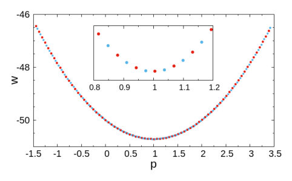
<figcaption class="paper-figure-caption"><b>Fig 2.</b> FIG. 2. Energy density of the helical states, in units of Acq2 c, as a function of p. The red and blue dots correspond to n = 0 and n = 1, respectively.</figcaption>
</figure>
<figure class="paper-figure-card">
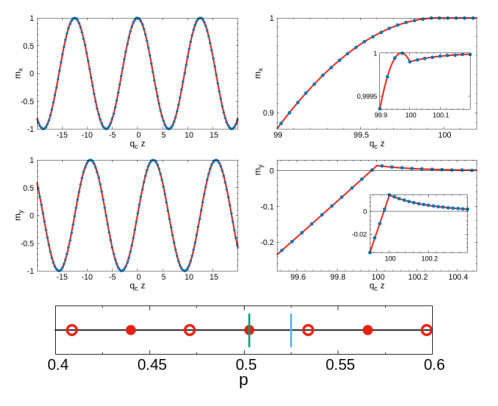
<figcaption class="paper-figure-caption"><b>Fig 3.</b> FIG. 3. Magnetization components of the metastable helical state reached after allowing an initial state with n = 0 and a non-admissible helicity of p = 0.525 to evolve. The left panels display the center of the chiral magnet, and the right panels show the vicinity of one of the interfaces (the insets provide a zoomed-in view of the interface). The blue dots represent the numerical results, and the red line corresponds to the exact helical state with p = 0.503. In the bottom panel, the admissible values of p near the initial non-admissible value are shown as filled (n = 0) and open (n = 1) red circles. The initial value of p is indicated by the blue vertical line segment, and the helicity...</figcaption>
</figure>
<figure class="paper-figure-card">
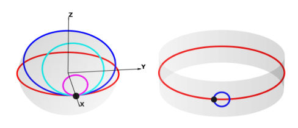
<figcaption class="paper-figure-caption"><b>Fig 4.</b> FIG. 4. Illustration of the homotopy of curves on a sphere and a cylinder. On the sphere (left panel), to transform continu- ously a closed curve of winding number one (red) into a closed curve of zero winding number (purple), or vice versa, one of the poles must be crossed. On the cylinder (right panel), such a continuous transformation is impossible.</figcaption>
</figure>
<figure class="paper-figure-card">
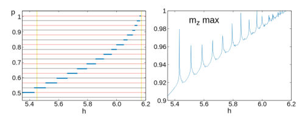
<figcaption class="paper-figure-caption"><b>Fig 5.</b> FIG. 5. (Left) Evolution of the helicity as a magnetic field is slowly applied to the helical state with p = 0.503, starting at h = 0 and ending at the critical field hc = 6.17. The ab- scissa represents the instantaneous applied field. The horizon- tal lines indicate the admissible values of p for n = 0 (red) and n = 1 (black). The vertical yellow lines indicate the desta- bilizing field for p = 0.503 and the critical field hc = 6, 17. (Right) Maximum value of mz within the chiral magnet as a function of the instantaneous magnetic field. The sharp, narrow peaks coincide with the jumps in helicity.</figcaption>
</figure>

**Summary.** This work investigates metastable helical magnetic states that emerge when a chiral magnet is interfaced with two uniaxial ferromagnets. The authors identify the stabilization mechanism as 'dynamical topological protection' and show that these states can be manipulated by applying electric currents or magnetic fields. This makes the system highly promising for advanced spintronic applications.

**Why it may be interesting.** While focused on magnetism, the study of topologically protected non-equilibrium states and switching mechanisms using current injection shares conceptual links with controlling quantum states in engineered solid-state systems relevant to spintronics.

Detailed structure

**Main problem.** To elucidate the topological origin of stabilization for metastable helical states in monoaxial chiral magnets when they are placed in contact with two uniaxial ferromagnets.

**Main result.** The system exhibits metastable helical states stabilized by a mechanism termed dynamical topological protection, allowing switching between these states using magnetic fields and polarized currents.

**Method.** Theoretical analysis involving the derivation of energy functionals and solving the Landau-Lifshitz-Gilbert equation numerically for both static and dynamic configurations.

**Model / system.** A composite magnet consisting of a central monoaxial chiral magnet sandwiched between two identical uniaxial ferromagnets. The dynamics are governed by the LLG equation incorporating exchange, Dzyaloshinskii-Moriya interaction (DMI), and anisotropy terms.

**Key observables.** Helicity (wave number) of helical states, winding number density distribution, and stability spectrum derived from linearized LLG equations.

**Important parameters / regimes.** Chiral magnet parameters ($A_c, D, K_c$) and ferromagnet parameters ($\mu_u, A_u, K_u$); the helicity $p$.

**Assumptions / limitations.** The system is assumed to have infinite dimensions in $\hat{x}$ and $\hat{y}$; stability analysis relies on linearizing the LLG equation.

**Figures summary.** Figure 1 illustrates the composite chiral magnet structure, showing the relative placement of the chiral and ferromagnetic regions along the z-axis.

**Paper structure.** The paper establishes the physical model (composite magnet), derives the relevant energy functional and dynamics (LLG equation), analyzes the topological origin of metastable states, and investigates their static/dynamic response to external fields and currents.

Abstract

The equilibrium state of a monoaxial chiral magnet surrounded by a non-magnetic medium (such as air or vacuum) is a helical texture characterized by a single, well-defined wave vector. No metastable states have ever been observed in such systems. Recently, however, it was demonstrated that when a chiral magnet is in close contact with two uniaxial ferromagnets, a large number of metastable helical states emerge in addition to the equilibrium state [Phys. Rev. B 109, 214424]. These helical states are distinguished by their wave number (helicity). In the present work, we elucidate the topological origin of the stabilization of these states --a mechanism we term dynamical topological protection-- and investigate their static and dynamic properties. We find that, as a consequence of this dynamical topological protection, the winding number of the helical states remains constant under the application of sufficiently weak magnetic fields and polarized electric currents. Furthermore, when a polarized current is applied to a metastable helical state, a static configuration is reached. This state retains the original winding number, but its winding number density becomes non-homogeneously distributed, concentrating near the interface with one of the ferromagnets. The dynamic response to sufficiently large magnetic fields and currents provides mechanisms to switch between different helical states. Since the magnetic properties depend on helicity, these metastable helical states are highly promising for applications in spintronics and magnonics.

[↑ back to top](#top)

### [Scale-covariant liquid in nonlocal high Tc strange metals](http://arxiv.org/abs/2608.03013v1)

**Authors:** Jian Xian Sim  
**Type:** theory · **Category:** strongly correlated electrons · **PDF:** <https://arxiv.org/pdf/2608.03013v1>  
**Analysis basis:** full PDF text, analyzed in chunks
**Topic relevance:** `Keldysh / 2PI / non-Gaussian methods` **3/5** · `correlated / nonlocal dissipation` **3/5** · `driven-dissipative phase transition` **2/5** · `Kondo & dissipative impurity` **1/5** · `methods for driven-dissipative` **1/5** · `non-equilibrium dynamics` **1/5** · `non-equilibrium universality` **1/5**

↔ Scroll figures horizontally

<figure class="paper-figure-card">
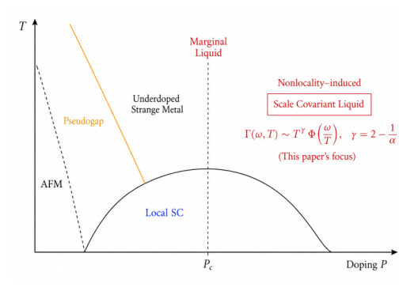
<figcaption class="paper-figure-caption"><b>Fig 1.</b> FIG. 1. The proposed phase diagram from nonlocality. The op- timally and overdoped regime are captured by a locality expo- nent 1 ≤α ≤2 with poorly screened repulsions V (r) ∼1/rα, producing a scale-covariant self-energy. The superconducting phase is local due to enhanced screening of the superfluid.</figcaption>
</figure>
<figure class="paper-figure-card">
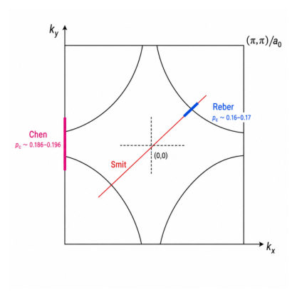
<figcaption class="paper-figure-caption"><b>Fig 2.</b> FIG. 2. Locations in the Brillouin zone [15, 17, 18] probed by ARPES. Marginal Fermi liquid doping level is labelled as pc.</figcaption>
</figure>

**Summary.** This theoretical work addresses the puzzling normal state of high-Tc superconductors by modeling it using poorly screened, non-local repulsive interactions. The authors derive a scale-covariant quasiparticle decay rate whose exponent depends continuously on doping via an interaction parameter $\alpha$. This framework successfully unifies observations across different doping regimes without requiring quantum criticality.

**Why it may be interesting.** The focus on nonlocality as an alternative mechanism for anomalous transport properties is highly relevant to understanding strongly correlated electron systems where simple Fermi liquid descriptions fail.

Detailed structure

**Main problem.** To develop a theory explaining the scale-covariant, doping-dependent normal state of high-$T_c$ strange metals without invoking quantum criticality.

**Main result.** The authors propose that poorly screened, non-local effective repulsions $V_\alpha(r) \sim 1/r^\alpha$ naturally explain the observed power-law decay rate $\Gamma(\omega, T) \propto T^\gamma$, where $\gamma = 2 - 1/\alpha$.

**Method.** The theory uses a hydrodynamic screening phenomenology and calculates the inelastic quasiparticle decay rate ($\Gamma_{	ext{inel}}$) via diagrammatic techniques within the G0W approximation.

**Model / system.** The system is high-$T_c$ superconductors exhibiting strange metal behavior. The model incorporates an interaction potential whose spatial nonlocality is parameterized by a doping-dependent exponent $\alpha$ ($1 \le \alpha \le 3$).

**Key observables.** Scale-covariant quasiparticle decay rate ($\Gamma(\omega, T)$), quasiparticle residue ($Z_k$), and the effective spatial nonlocality probed by $\alpha(p)$.

**Important parameters / regimes.** Doping level (controlling $\alpha$), temperature $T$, energy $\omega$, and the exponent $\alpha$ itself.

**Assumptions / limitations.** The derivation relies on heuristic assumptions for charge relaxation (continuity law) and approximations concerning momentum transfer ($q \ll k_F$).

**Figures summary.** Figure 1 proposes a phase diagram showing that optimal and overdoped regimes are captured by $1 \le \alpha \le 2$ using poorly screened repulsions.

**Paper structure.** The paper first establishes the problem of scale-covariant self-energy in strange metals. It then develops the hydrodynamic screening phenomenology, calculates $\Gamma_{	ext{inel}}$ using linear response theory, and finally derives the scaling relation $\gamma = 2 - 1/\alpha$ to unify different doping regimes.

Abstract

Experiments in recent years on high $T_c$ superconductors find a puzzling nodal scale-covariant self-energy with an exponent varying continuously with doping. We propose a mechanism: nonlocality induced by poorly screened effective repulsions $V_α(r) \sim 1/r^α$, where a continuously doping-dependent exponent $1 \le α\le 3$ naturally interpolates between the Mott insulating and Fermi liquid limits. We develop a phenomenology of hydrodynamic screening, finding a scale-covariant quasiparticle decay rate $Γ(ω,T) \propto T^γ Φ(ω/T)$ in energy $ω$ and temperature $T$, with $γ= 2-\frac{1}α$ for nonlocal $ 1 < α< 2$. Our results naturally capture the optimally doped to overdoped regimes, whereas the underdoped regime is qualitatively distinct. In our theory, spectroscopy-fitted exponents directly probe the charged fluid's effective spatial nonlocality. Nonlocality shows that quantum criticality is not necessary to explain scale-covariant phenomena.

[↑ back to top](#top)

### [Emergence and Detection of Surface altermagnetism in KV$_2$Se$_2$O](http://arxiv.org/abs/2608.03551v1)

**Authors:** Rodrigo Jaeschke-Ubiergo, Xanthe H. Verbeek, Colin Lange, Sergio Rodriguez, Atasi Chakraborty, Alexander Mook, Jairo Sinov  
**Type:** theory · **Category:** strongly correlated electrons · **PDF:** <https://arxiv.org/pdf/2608.03551v1>  
**Analysis basis:** full PDF text, analyzed in chunks
**Topic relevance:** `Keldysh / 2PI / non-Gaussian methods` **3/5** · `spintronics-quantum-optics interface` **3/5** · `methods for driven-dissipative` **2/5** · `non-equilibrium dynamics` **2/5** · `exotic spin models in light-matter` **1/5**

↔ Scroll figures horizontally

<figure class="paper-figure-card">
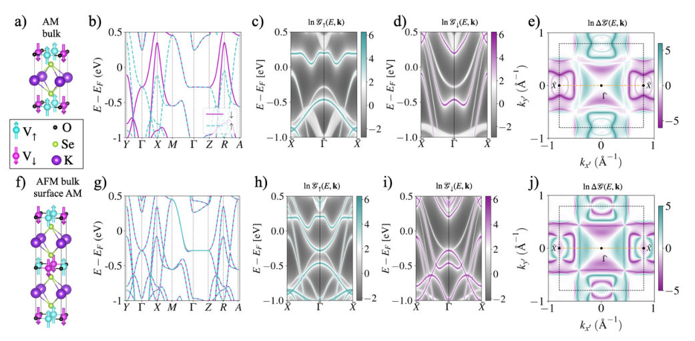
<figcaption class="paper-figure-caption"><b>Fig 1.</b> Figure 1. Non-relativistic DFT calculations of KV2Se2O with AM (a-e) and AFM (f-j) ordering. (a) Unit cell of the AM configuration, cyan and magenta arrows denote magnetic moments with opposite direction. (b) Spin-polarized bulk electronic band structure, with altermagnetic d-wave splitting. (c-e) Surface states for the VO-terminated (001) surface of the AM configuration. (c) Spin-up and (d) spin-down channel surface spectral function (Gσ(E, k)), in a spin-split path. (e) The spin- polarized spectral function difference (∆G(E, k) = G↑(E, k)−G↓(E, k)) at the Fermi energy EF exhibiting d-wave character with two nodal planes. Surface Brillouin zone indicated with a black dashed square. (f)...</figcaption>
</figure>
<figure class="paper-figure-card">
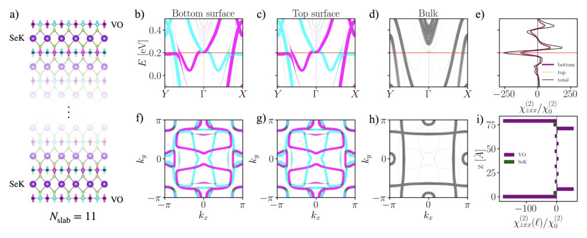
<figcaption class="paper-figure-caption"><b>Fig 2.</b> Figure 2. (a) Slab of KV2Se2O, with Nslab = 11 and broken PT . (b-d) Spin polarized band structure projected on the bottom surface (b), top surface (c) and bulk (d). (f-h) Spin polarized isoenergy lines at µ = EF + 0.2eV, projected on the bottom surface (g), top surface (g) and bulk (h). (e) χzxx component of the NLEE tensor, as function of the chemical potential resolved in both surfaces. (i) Layer resolved NLEE tensor at µ = 0.2eV.</figcaption>
</figure>
<figure class="paper-figure-card">
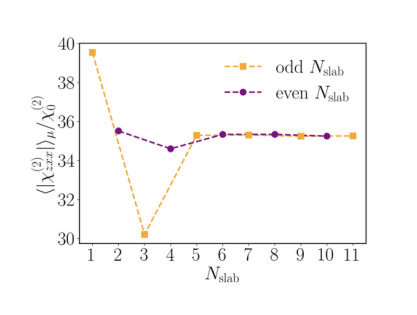
<figcaption class="paper-figure-caption"><b>Fig 3.</b> Figure 3. Chemical potential average of the surface nonlinear Edelstein tensor 1 ∆µ R dµ |χ(2) zxx(ℓ= 0)|, over the energy inter- val µ ∈[−0.1, 0.5] eV, as function of the number of layers in the slab, for even and odd number of layers.</figcaption>
</figure>
<figure class="paper-figure-card">
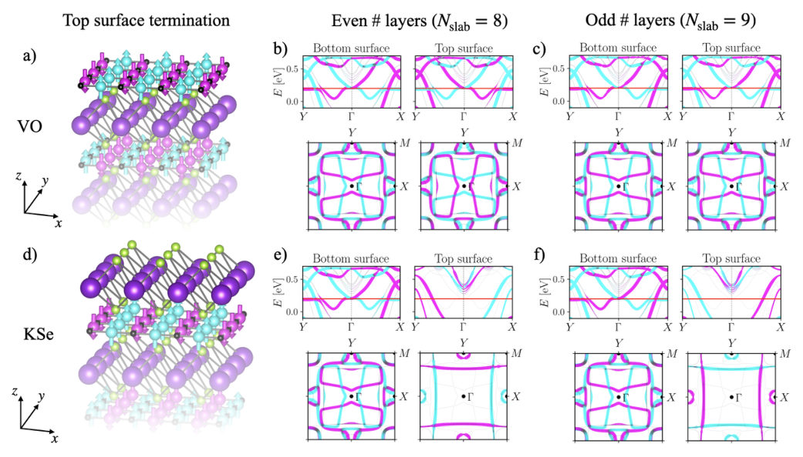
<figcaption class="paper-figure-caption"><b>Fig 4.</b> Figure 4. Slab calculations of KV2Se2O (including SOC) with two types of terminations and number of layers. (a,d) Graphic representation of the terminations used in the top surface. (a) Termination in VO plane. (d) Termination in SeK layers. Bottom termination (not showned) is VO in both cases. (b,c) Electronic structure for VO top surface termination with even (b) and odd (c) number of layers. (e,f) Electronic structure for SeK top surface termination with even (c) and odd (f) number of layers. On each of the four cases (b,c,e,f) the electronic structure is shown in 4 subpanels containing the electronic band structure, projected on the bottom (left) and top (right) surfaces. Below each...</figcaption>
</figure>
<figure class="paper-figure-card">
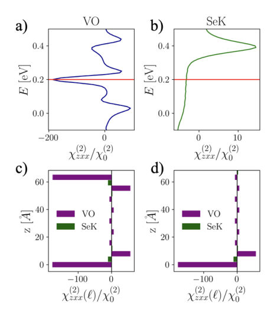
<figcaption class="paper-figure-caption"><b>Fig 5.</b> Figure 5. Nonlinear Edelstein response χ(2) zxx at the top sur- face of KV2Se2O, with termination on VO (a) and (SeK) (b). Layer resolved nonlinear Edelstein response χ(2) zxx(ℓ) for top surface terminated in VO (c) and SeK (d). Bottom surface is terminated at the VO plane in all cases. The slab calculation contains Nslab = 7 VO planes.</figcaption>
</figure>

**Summary.** This work theoretically investigates emergent surface altermagnetism in KV2Se2O by reconciling conflicting experimental data. The authors predict that the unique signature of this phenomenon is a large, symmetry-protected nonlinear Edelstein response localized at the material's surface. They utilize advanced DFT and transport formalisms to calculate these spin responses.

**Why it may be interesting.** While focused on magnetism, the detailed calculation of transport coefficients ($\chi^{(2)}$) using advanced many-body formalisms (Boltzmann equation expansion) provides rigorous theoretical tools applicable to understanding spin-charge coupling phenomena in correlated electron systems.

Detailed structure

**Main problem.** The study aims to demonstrate and reconcile the concept of emergent surface altermagnetism in KV2Se2O, explaining conflicting experimental observations regarding bulk antiferromagnetism versus d-wave spin splitting.

**Main result.** The (001) surface of antiferromagnetically ordered KV2Se2O exhibits d-wave altermagnetism, which is predicted to manifest as a large nonlinear Edelstein response localized at the surface.

**Method.** Theoretical calculations using Density Functional Theory (DFT) combined with advanced techniques like Wannier function renormalization and Boltzmann transport formalism were employed to calculate electronic structure and spin responses.

**Model / system.** The physical system is KV2Se2O, a layered material exhibiting Lieb lattice geometry. The analysis models the surface using finite slab calculations, considering different terminations (VO vs SeK).

**Key observables.** Surface spectral function difference ($\Delta G$), nonlinear Edelstein response ($\chi_{zxx}^{(2)}$), and spin-splitting in electronic band structure.

**Important parameters / regimes.** The analysis is sensitive to surface termination, the number of layers ($N_{	ext{slab}}$), and the magnetic ordering (AM vs AFM).

**Assumptions / limitations.** Approximations include using a constant relaxation time ($	au$) for transport calculations and relying on DFT/Wannier function methods for electronic structure.

**Figures summary.** Figures illustrate surface spectral functions for different magnetic orderings, the slab model setup, and plots showing how the nonlinear Edelstein tensor $\chi^{(2)}$ varies with the number of layers ($N_{	ext{slab}}$) and termination type.

**Paper structure.** The paper progresses by first establishing the theoretical framework using DFT/Wannier tools to calculate surface spectral functions. It then applies the Boltzmann formalism to derive symmetry-constrained expressions for linear and nonlinear Edelstein tensors, culminating in predictions for measurable signatures like $\chi^{(2)}$.

Abstract

We demonstrate the recent concept of emergent surface altermagnetism through its unique signatures in \KVSO. We show that for bulk antiferromagnetically ordered \KVSO, the (001) surface exhibits $d$-wave altermagnetism. Our results fully explain the recent seemingly contradicgting experimental evidence, independently showing both an antiferromagnetically ordered bulk from neutron diffraction, and $d$-wave spin splitting from photoemission spectroscopy. To fully verify this conecept, we predict, as a key experimental signature, a large nonlinear Edelstein response, which is localized at the surface, and follows the $d$-wave altermagnetic symmetry. These results are not only relevant for the metallic and room-temperature magnet \KVSO, but also for several other Lieb lattice systems. Our work expands the pool of techniques that can be used to detect altermagnetism emerging at the surfaces of antiferromagnets.

[↑ back to top](#top)

### [Two dimensional inhomogeneous classical systems at criticality](http://arxiv.org/abs/2608.02903v1)

**Authors:** Jean-Marie Stéphan  
**Type:** theory · **Category:** statistical mechanics · **PDF:** <https://arxiv.org/pdf/2608.02903v1>  
**Analysis basis:** full PDF text, analyzed in chunks
**Topic relevance:** `non-equilibrium universality` **3/5** · `analog quantum simulation` **2/5** · `driven-dissipative phase transition` **2/5** · `non-equilibrium dynamics` **2/5** · `Frenkel-Kontorova` **1/5** · `Keldysh / 2PI / non-Gaussian methods` **1/5**

↔ Scroll figures horizontally

<figure class="paper-figure-card">
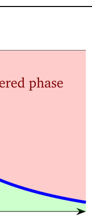
<figcaption class="paper-figure-caption"><b>Fig 1.</b> Figure 2: Phase diagram of the two-dimensional Ising model. The critical line (4) shown in blue separates an ordered phase from a disordered phase. Recall temper- ature is implicit in this diagram, since K = βJ and K′ = βJ′. All Ising models with parameters on the blue critical line renormalize to the same Ising conformal field theory, so it is not a line of critical points in the field-theoretical sense.</figcaption>
</figure>
<figure class="paper-figure-card">
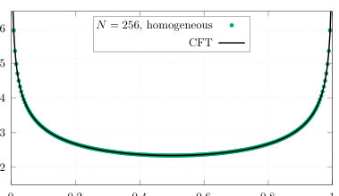
<figcaption class="paper-figure-caption"><b>Fig 2.</b> Figure 5: Equal imaginary time spin-spin correlations for N = 256 spins, with notation σ(x) = σ(x, y = 0). Left: homogeneous case with known chord length scaling (11). Right: inhomogeneous case, with deformation f (u) = 1 + a sin2πpu + b sin6πpu, a = 0.7, b = 0.5. Data for p = 1 and p = 2 is shown, and it compares extremely well with the curved spacetime CFT result (23). .</figcaption>
</figure>
<figure class="paper-figure-card">
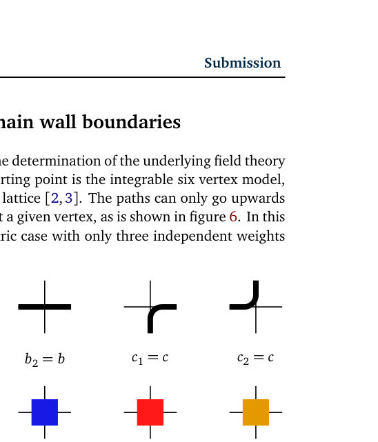
<figcaption class="paper-figure-caption"><b>Fig 3.</b> Figure 6: Top figure: representation of the six allowed vertices a1, a2, b1, b2, c1, c2 of the model. The paths can be seen as particle trajectories which can only go to the right, or upwards. They can meet at a given vertex but cannot cross. We also consider a case where vertex weights are particle-hole symmetric, as shown. Bottom figure: color code used in several of the following figures to represent vertex configurations.</figcaption>
</figure>
<figure class="paper-figure-card">
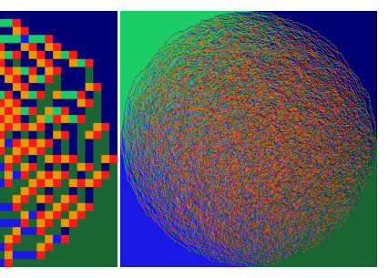
<figcaption class="paper-figure-caption"><b>Fig 4.</b> Figure 7: Typical configurations of the six vertex model with domain wall boundary conditions. Left: path configurations for N = 32, which enter through the left and exit through the top of the square. Middle: vertex representation for the same con- figuration, with the color code described in figure 6. Right: vertex representation for N = 512, with &quot;arctic circle&quot; boundary between the fluctuating and frozen regions.</figcaption>
</figure>
<figure class="paper-figure-card">
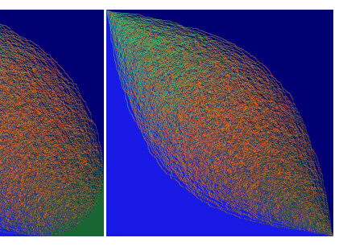
<figcaption class="paper-figure-caption"><b>Fig 5.</b> Figure 8: Typical configurations obtained using Monte Carlo. Three cases with de- formation λ(x) = π/4 + πα</figcaption>
</figure>

**Summary.** This paper analyzes two-dimensional classical lattice models at criticality when subjected to slow spatial variations. It demonstrates that these inhomogeneous systems are governed by Conformal Field Theory defined on a curved space, successfully deriving the underlying metric for both the Ising and six vertex models. This work provides a rigorous theoretical framework connecting lattice statistics, CFT, and geometry.

**Why it may be interesting.** The connection between lattice statistical mechanics models (like the Ising model) and continuum field theories in curved spacetime provides a powerful tool for understanding how geometry influences critical phenomena, which is relevant to effective Hamiltonians in AMO physics.

Detailed structure

**Main problem.** The study investigates how critical behavior of two-dimensional classical lattice models is modified by slow, spatially varying (inhomogeneous) deformations.

**Main result.** Such inhomogeneous systems are shown to be described by a Conformal Field Theory formulated on a curved space, allowing the identification of the underlying space metric.

**Method.** The analysis combines techniques from Conformal Field Theory (CFT), free fermion mapping via Jordan-Wigner transformation, and hydrodynamic approaches for specific cases.

**Model / system.** The primary models are 2D classical lattice systems, specifically the Ising model and the six vertex model with domain wall boundary conditions. The Hamiltonian is defined by local coupling constants that vary slowly across the lattice.

**Key observables.** Spin correlation functions, the energy gap ($\Delta E$), and the 'arctic curve' separating critical fluctuating regions from ordered phases.

**Important parameters / regimes.** Coupling constants ($K, K'$), the deformation function $f(x/N)$, and the system size $N$ (in the large $N$ limit).

**Assumptions / limitations.** The deformations are assumed to vary slowly at lattice scales while crucially preserving the underlying critical behavior.

**Figures summary.** Figures illustrate the phase diagram of the Ising model, show the structure of the inhomogeneous lattice couplings, and provide numerical comparisons between calculated gaps/correlations and CFT predictions.

**Paper structure.** The paper progresses from establishing the general framework using CFT for slow deformations to applying this formalism specifically to the 2D Ising model, deriving the curved space metric, and finally solving specific cases like the six vertex model using hydrodynamics.

Abstract

We study simple inhomogeneous deformations of known two-dimensional classical lattice models described by conformal field theory (CFT) at large distances. The deformations are chosen to vary slowly at lattice scales, while preserving critical behavior. Globally, we find that such systems are described by a CFT in curved space, and identify the underlying space metric. Our two examples are the Ising model and the six vertex model with domain wall boundary conditions. In the latter boundaries are also inhomogeneous, which complicates the analysis. We nevertheless solve the free case using hydrodynamics. In the presence of interactions we determine the arctic curve which separates a critical fluctuating region from an ordered (frozen) phase.

[↑ back to top](#top)

### [Inverse Design of Quantum Control Sequences with Fourier Neural Operators](http://arxiv.org/abs/2608.03702v1)

**Authors:** Anastasia Pipi, Valentin Duruisseaux, Emily Been, Xuecheng Tao, Taylor L. Patti, Anima Anandkumar, Prineha Narang  
**Type:** theory · **Category:** other · **PDF:** <https://arxiv.org/pdf/2608.03702v1>  
**Analysis basis:** full PDF text, analyzed in chunks
**Topic relevance:** `methods for driven-dissipative` **3/5** · `analog quantum simulation` **2/5** · `non-equilibrium dynamics` **2/5** · `QC/QI experiment` **1/5** · `driven-dissipative phase transition` **1/5** · `quantum measurements` **1/5**

↔ Scroll figures horizontally

<figure class="paper-figure-card">
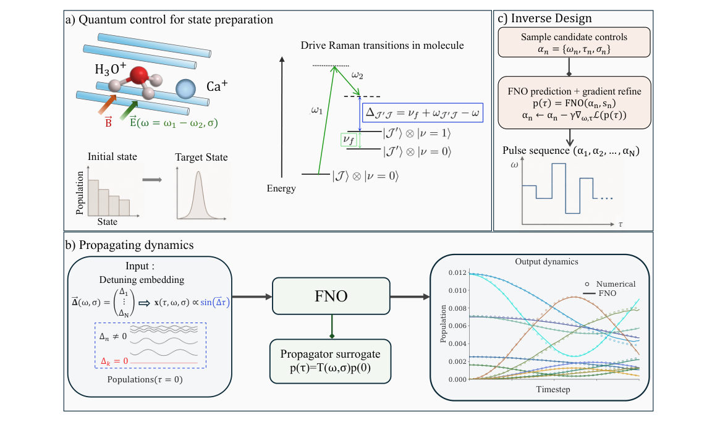
<figcaption class="paper-figure-caption"><b>Fig 1.</b> FIG. 1: FNO-based inverse-design pipeline for quantum state preparation. (a)Quantum control for molecular state preparation. Hydronium, H3O+, is co-trapped with a Ca+ logic ion in a quantum logic spectroscopy (QLS) setup. Molecular states J and J ′ are addressed by two-photon Raman sideband pulses driven by fields with angular frequencies ω1 and ω2, giving the effective two-photon angular frequency ω = ω1 −ω2. The first field is linearly polarized, while the second has polarization σ ∈{σ+, σ−}, denoted schematically by ⃗E(ω, σ). Appendix A 1 details how these electric-field polarizations determine the molecular selection rules. The Raman sideband drive couples the molecular transition to...</figcaption>
</figure>
<figure class="paper-figure-card">
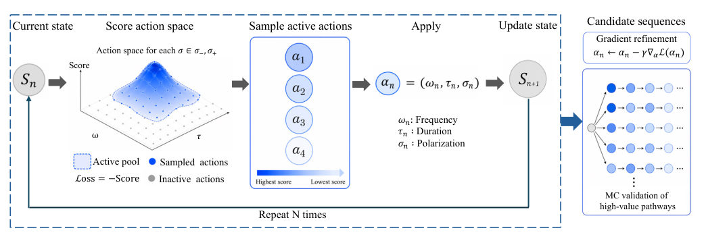
<figcaption class="paper-figure-caption"><b>Fig 2.</b> FIG. 2: Schematic of the stochastic planner (FNO-SPMP) used for inverse design of laser-pulse sequences. Starting from the current state sn, the model scores the available actions over the effective laser frequency ω and time τ, with the selection objective taken as the negative score, L = −Score = −S(αn, sn). An active pool is then formed from the actions whose score exceeds a defined threshold, and for each candidate sequence the planner stochastically samples one action from this pool at each pulse step. A sampled action αn = (ωn, τn, σn) (i.e. a pulse specified by its frequency ω, duration τ, and polarization σ) is applied to advance the system to the next state sn+1. Repeating this for...</figcaption>
</figure>
<figure class="paper-figure-card">
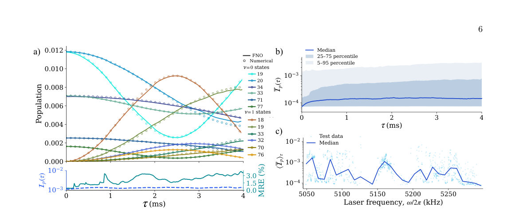
<figcaption class="paper-figure-caption"><b>Fig 3.</b> FIG. 3: Forward-propagation accuracy of the FNO surrogate. (a) Basis-state population dynamics predicted by the FNO and compared with CUDA-Q reference trajectories obtained from the reconstructed unitary propagator. The trajectory corresponds to a single pulse with drive frequency ω/2π = 5159.6 kHz. For clarity, we plot only states with a population change greater than 10−4; approximately stationary states are omitted from the upper panels but included in the full-state population infidelity Ip(τ). The lower strip reports Ip(τ) = 1 −Fp(τ) over all states and the percentage mean relative error (MRE) over the plotted active states. States are indexed from lowest to highest energy. (b)...</figcaption>
</figure>
<figure class="paper-figure-card">
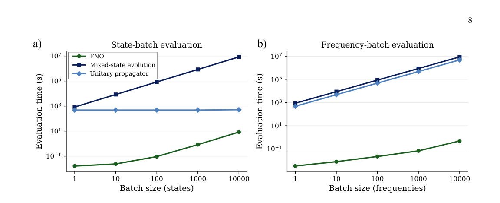
<figcaption class="paper-figure-caption"><b>Fig 4.</b> FIG. 4: Wall-clock evaluation time for forward propagation using numerical baselines and the FNO-based surrogate. (a) State-batch evaluation, where multiple initial mixed states are propagated at a fixed drive frequency. (b) Frequency-batch evaluation, where one initial mixed state is propagated over multiple drive frequencies. We compare three methods: 1) the FNO surrogate, which predicts the population dynamics in one batched forward pass, 2) direct mixed-state CUDA-Q evolution, which numerically propagates the density matrix, and 3) a CUDA-Q unitary-propagator baseline, where the propagator is reconstructed from batched basis-state evolution and then applied to the mixed initial state.</figcaption>
</figure>
<figure class="paper-figure-card">
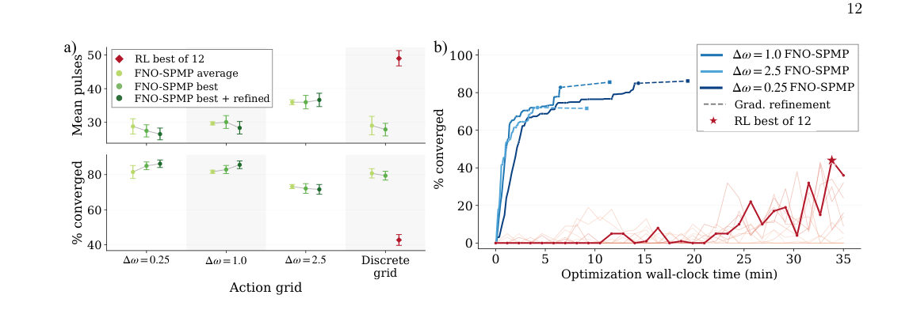
<figcaption class="paper-figure-caption"><b>Fig 5.</b> FIG. 5: Comparison of FNO-SPMP and RL state-preparation protocols. (a) Numerical validation of FNO-SPMP pulse sequences across action grids. The upper panel shows the percentage of Monte Carlo (MC) rollouts that reach the target purity threshold, and the lower panel shows the mean number of pulses over all rollouts. Markers indicate the average performance over generated sequences, the best selected sequence, and the result after gradient-based refinement. For the FNO-SPMP grids, ∆ω is the frequency-grid spacing used during inverse design. The discrete grid is the action space used for the RL comparison, with both frequency and pulse duration restricted to discrete values. (b) Convergence...</figcaption>
</figure>

**Summary.** The paper introduces an FNO-based framework to overcome the exponential computational cost of quantum optimal control. By using a fast surrogate model trained on molecular dynamics, they develop a planner that efficiently designs pulse sequences to purify complex molecular states in trapped ions. This significantly accelerates state preparation protocols compared to traditional optimization or reinforcement learning methods.

**Why it may be interesting.** This work directly addresses the computational scaling limits in quantum control theory by replacing expensive numerical solvers with data-driven neural operators, making previously intractable large-scale molecular simulations feasible for optimization.

Detailed structure

**Main problem.** The core problem is performing inverse design for quantum optimal control sequences, which is computationally prohibitive due to the exponential growth of complexity with Hilbert space dimension.

**Main result.** The proposed FNO-SPMP framework achieves state purification in a large molecular subspace ($888$-dimensional $	ext{H}_3	ext{O}^+$) significantly faster and more reliably than reinforcement learning baselines, reducing generation time from hours to minutes.

**Method.** The authors use a Fourier Neural Operator (FNO) as a fast, differentiable surrogate model to predict molecular-motional population dynamics. This is integrated into an iterative stochastic planner (FNO-SPMP) for inverse design.

**Model / system.** The system studied is the hydronium ($	ext{H}_3	ext{O}^+$) molecule coupled with a logic ion ($	ext{Ca}^+$) in a trapped-ion setup. The dynamics are modeled by tracking basis-state populations within an 888-dimensional subspace.

**Key observables.** Target-state population (aiming for $\geq 0.98$), sequence success rate, and the time required to generate the control pulse sequence.

**Important parameters / regimes.** The system is studied at $20 	ext{ K}$, involving control parameters like laser frequency ($\omega$), pulse duration ($	au$), and polarization ($\sigma$).

**Assumptions / limitations.** Key assumptions include restricting the motional mode to $
u \in \{0, 1\}$ and relying on measurement/cooling steps that reset coherences to allow a population-based description.

**Figures summary.** Figures illustrate the full FNO-based inverse design pipeline for quantum control in $	ext{H}_3	ext{O}^+$, detailing the Hamiltonian setup, single-pulse prediction via FNO, and the iterative planning loop.

**Paper structure.** The paper first establishes the computational bottleneck of quantum optimal control. It then introduces the FNO surrogate model to accelerate dynamics simulation. Finally, it details the FNO-SPMP protocol for inverse design, benchmarking its performance against RL methods on the $	ext{H}_3	ext{O}^+$ system.

Abstract

Quantum optimal control is a key tool for steering quantum dynamics, but its computational cost grows rapidly with the Hilbert space dimension. Here, we introduce a Fourier Neural Operator (FNO)-based framework for learning high dimensional molecular quantum dynamics and accelerating the inverse design of control protocols. Given an initial molecular population distribution, laser frequency, and polarization, the FNO predicts molecular-motional population dynamics up to $10^7$ times faster than GPU-accelerated numerical propagation with CUDA-Q Dynamics. Using this fast and differentiable surrogate, we develop the FNO stochastic pulse-measurement planner (FNO-SPMP), which constructs pulse sequences to purify an initially mixed Boltzmann distribution. We demonstrate the protocol in an 888-dimensional subspace of the hydronium molecule at 20 K, achieving a target-state population of 0.98 with a sequence success rate of up to 86.2%. In a shared discrete control space, FNO-SPMP achieves nearly twice the success rate of a reinforcement-learning baseline while using roughly half as many quantum control pulses and reducing pulse-sequence generation time from approximately 10 hours to 10-20 minutes. These results show that operator-learning surrogates can enable inverse design in quantum systems whose Hilbert spaces are too large for conventional direct optimization.

[↑ back to top](#top)

### [Large scale neural quantum states reveal the interplay between superconductivity and quantum criticality in the Hofstadter-Hubbard model](http://arxiv.org/abs/2608.02753v1)

**Authors:** Christopher Roth, Andrew Millis, Tomohiro Soejima  
**Type:** theory · **Category:** strongly correlated electrons · **PDF:** <https://arxiv.org/pdf/2608.02753v1>  
**Analysis basis:** full PDF text, analyzed in chunks
**Topic relevance:** `analog quantum simulation` **3/5** · `methods for driven-dissipative` **3/5** · `Keldysh / 2PI / non-Gaussian methods` **1/5** · `driven-dissipative phase transition` **1/5** · `entanglement & information structure` **1/5** · `exotic spin models in light-matter` **1/5**

↔ Scroll figures horizontally

<figure class="paper-figure-card">
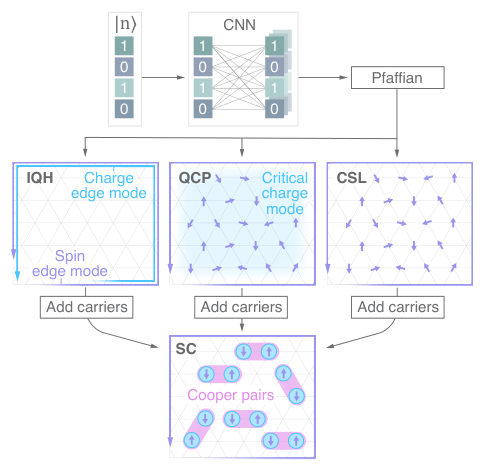
<figcaption class="paper-figure-caption"><b>Fig 1.</b> FIG. 1. Overview of our numerical simulations. We use a Pfaffian-based neural quantum wavefunction to simulate the triangular-lattice Hofstadter-Hubbard model at π/2 flux per plaquette. We find a second-order phase transition between an IQH and a CSL phase at half filling, separated by a quan- tum critical point. Upon doping, all of these phases become the same superconductor, but the superfluid stiffness is en- hanced near the critical point.</figcaption>
</figure>
<figure class="paper-figure-card">
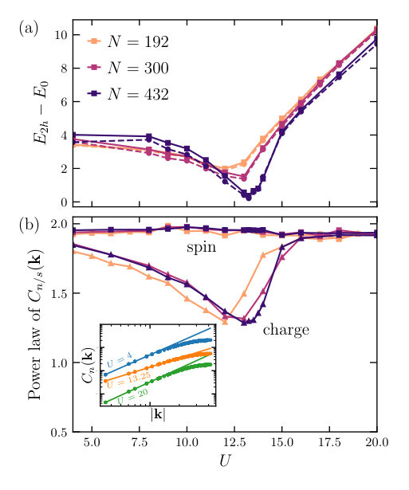
<figcaption class="paper-figure-caption"><b>Fig 2.</b> FIG. 2. Second-order phase transition between the IQH and CSL phases. Here we show the results of simulations on N = 192, N = 300, and N = 432 site clusters. (a) Energy gap to a 2 hole excitation as a function of U. The charge gap approaches zero around U ∼13.25. (b) Small-|k| power law of the charge (triangle) and spin (square) structure factors as a function of U. Charge fluctuations become enhanced near the critical point. (Inset) Power-law fit of Cˆn(k) at U = 4, 13.25, and 20.</figcaption>
</figure>
<figure class="paper-figure-card">
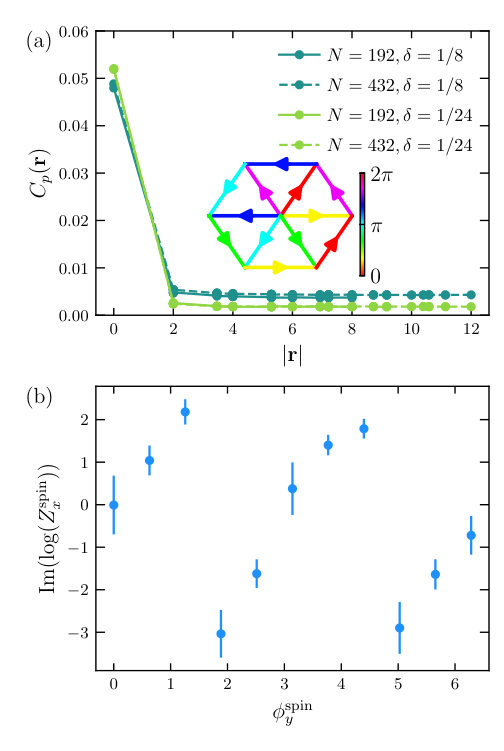
<figcaption class="paper-figure-caption"><b>Fig 3.</b> FIG. 3. Characterizing topological superconductivity. (a) Pair correlations on the Hofstadter-Hubbard model at U = 8 for 192 and 432 site clusters at 1/8 and 1/24 doping. (In- set) The phases of the pairing order parameter as written in Eq. (2). (b) Many-body spin polarization as a function of spin flux threading at U = 10, δ = 1/36 on the 192 site torus. The polarization winds twice as ϕspin y goes from 0 to 2π, cor- responding to σs xy = 2 ℏ</figcaption>
</figure>
<figure class="paper-figure-card">
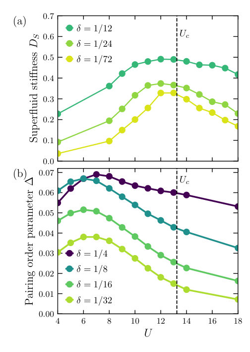
<figcaption class="paper-figure-caption"><b>Fig 4.</b> FIG. 4. Doping the Hofstadter-Hubbard model around the critical point. (a) Superfluid stiffness Ds as a function of U for several different doping levels at N = 432, computed from d2E/dϕ2 y. At low doping, the stiffness peaks around the critical point. (b) Pairing order parameter extracted from the square root of the average pair correlations beyond distance 4 on the 192 site cluster as a function of U for several different doping levels. It peaks at small U and is featureless around the critical point.</figcaption>
</figure>
<figure class="paper-figure-card">
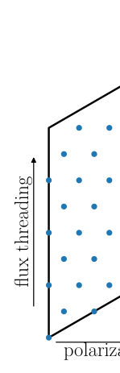
<figcaption class="paper-figure-caption"><b>Fig 5.</b> FIG. 5. Diagram of the tori simulated in this work. Here we show a √</figcaption>
</figure>

**Summary.** This work investigates superconductivity in the Hofstadter-Hubbard model, focusing on how doping across a quantum critical point influences pairing. Using Neural Quantum States, the authors find that while the pairing magnitude is stable, the superfluid stiffness strongly peaks near the transition, suggesting that proximity to criticality enhances superconducting mobility more than it affects pair formation itself.

**Why it may be interesting.** The methodology—using NQS to probe quantum criticality in strongly correlated models—provides a powerful computational framework applicable to understanding exotic superconducting mechanisms driven by competing orders.

Detailed structure

**Main problem.** The study addresses how a parent insulating state dictates the superconductivity that emerges when the system is doped away from an insulator.

**Main result.** Superconductivity in the Hofstadter-Hubbard model is governed not by the nature of the parent state, but by proximity to the quantum critical point separating two distinct phases.

**Method.** The authors employed Neural Quantum States (NQS) trained on variational wavefunctions to simulate the system's ground state properties across various doping levels and interaction strengths.

**Model / system.** The physical model is the triangular-lattice Hofstadter-Hubbard model with a $\pi/2$ flux per plaquette. At half filling, it exhibits two parent states: an integer quantum Hall insulator (IQH) and a chiral spin liquid (CSL), separated by a topological phase transition.

**Key observables.** Superfluid stiffness ($\mathcal{D}_s$), pairing order parameter ($\Delta$), $2e$ charge gap ($\Delta_{2e}$), and structure factors ($C^{\wedge}_n(k)$, $C^{\wedge}_{Sz}(k)$).

**Important parameters / regimes.** Interaction strength ($U$), doping level ($\delta$), and the proximity to the quantum critical point (QCP) separating IQH and CSL phases.

**Assumptions / limitations.** The analysis relies on NQS being a powerful tool for capturing long-range electronic correlations, and that observables like superfluid stiffness can be accurately extracted via flux threading or finite differences.

**Figures summary.** Figures illustrate the continuous nature of the IQH–CSL transition (vanishing gap), the enhancement of superfluid stiffness near the QCP, and the distinct behavior of pairing order parameter versus stiffness across this critical region.

**Paper structure.** The paper systematically analyzes the model by first characterizing the parent insulating phases via topological invariants (winding numbers) and then investigating superconductivity upon doping. Key diagnostics include measuring gap closing, analyzing structure factors for critical fluctuations, and comparing the response of pairing order vs. superfluid stiffness near the QCP.

Abstract

Understanding how a parent insulating state shapes the superconductivity that emerges upon doping is a long-standing problem dating back to Anderson's resonating-valence-bond proposal. The triangular-lattice Hofstadter-Hubbard model with $π/2$ flux per plaquette offers an ideal setting for this question: at half filling it hosts two distinct parent states---an integer quantum Hall insulator at weak coupling and a chiral spin liquid at intermediate coupling---separated by a topological phase transition. Using neural quantum states on tori of up to $432$ sites, we present strong evidence that the transition is continuous, with a vanishing $2e$ charge gap and critical charge fluctuations. Upon doping, we find a topological superconductor with off-diagonal long-range order consistent with $d+id$ pairing on either side of the transition. The two ingredients of superconductivity, pair formation and phase coherence, respond to the parent state in sharply different ways: while the pairing order parameter remains nearly unchanged across the transition, the superfluid stiffness is strongly enhanced near the critical point. The energy scale of the superconductor is therefore set not by which parent state is doped, but by proximity to the transition between them. Our results establish neural quantum states as a powerful tool for understanding the delicate interplay between long-ranged electronic correlations and superconductivity.

[↑ back to top](#top)

### [Suppressing Cavity Frequency Noise Using a Kerr Nonlinearity](http://arxiv.org/abs/2608.03440v1)

**Authors:** J. P. van Soest, S. Meilof, G. L. Bhai, M. Villiers, C. A. Potts, G. A. Steele  
**Type:** experiment · **Category:** other · **PDF:** <https://arxiv.org/pdf/2608.03440v1>  
**Analysis basis:** full PDF text, analyzed in chunks
**Topic relevance:** `quantum optics experiment` **3/5** · `Tavis-Cummings & cavity-many-emitter` **2/5** · `quantum measurements` **2/5** · `QC/QI experiment` **1/5** · `correlated cavity matter` **1/5** · `driven-dissipative phase transition` **1/5**

↔ Scroll figures horizontally

<figure class="paper-figure-card">
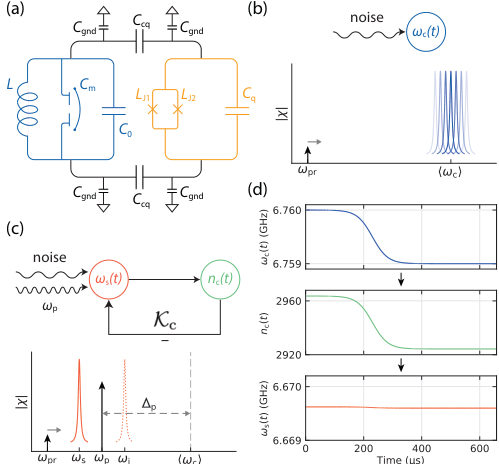
<figcaption class="paper-figure-caption"><b>Fig 1.</b> FIG. 1. Illustration of the Kerr-feedback mechanism in a microwave resonator. (a) Schematic representation of the circuit. The cavity is shown in blue, the qubit in orange. (b) Diagram of a cavity resonance subject to environmental noise that fluctuates the resonance frequency ωc(t) (blue). A small probe tone ωpr (black arrow) is swept over the fluctu- ating cavity resonance. (c) A pump tone with frequency ωp (large black arrow) is applied red-detuned from the bare cav- ity frequency ⟨ωc⟩. The linearized response of the Kerr cavity is described by the dressed cavity resonance ωs(t) (solid red), and an additional idler resonance ωi(t) (dotted red), located symmetrically about the pump...</figcaption>
</figure>
<figure class="paper-figure-card">
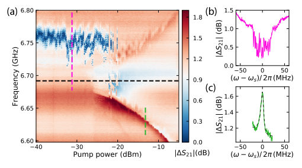
<figcaption class="paper-figure-caption"><b>Fig 2.</b> FIG. 2. Observation of the Kerr-locked cavity. (a) Nor- malized colormap of the magnitude |∆S21| response, mea- sured using two-tone spectroscopy. A pump tone, red-detuned from the bare cavity by ∆p/2π = −68 MHz (black dashed line), is progressively increased in power while a weak, non- invasive probe tone is swept across the cavity resonance. At low pump powers, fluctuations of the cavity resonance are ob- served about ⟨ωc⟩/2π = 6.76 GHz. Above a pump power of −20.0 dBm the nonlinear response bifurcates, resulting in the dressed cavity resonance to appear below the pump frequency. This mode is consequently frequency-stabilized, together with the idler mode on the opposite side of the pump....</figcaption>
</figure>
<figure class="paper-figure-card">
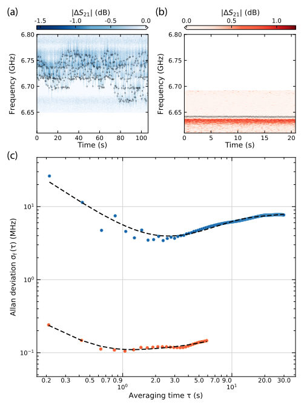
<figcaption class="paper-figure-caption"><b>Fig 3.</b> FIG. 3. Time dynamics of the cavity resonance be- fore and after Kerr-feedback. (a) Normalized colormap of the measured |∆S21| response of fast spectroscopy traces. The unlocked bare cavity displays resonance-frequency fluctu- ations and linewidth broadening. The fit resonance frequency of each trace is shown with black circles, exhibiting a stan- dard deviation of σstd,c = 23.2 MHz. Measurement and fits of the dressed cavity resonance are shown in panel (b), where the standard deviation is reduced to σstd,s = 297 kHz. (c) Absolute frequency Allan deviation σf(τ) before (blue) and after (red) applying the intrinsic feedback mechanism to the cavity. Black dashed lines show fits based on the...</figcaption>
</figure>
<figure class="paper-figure-card">
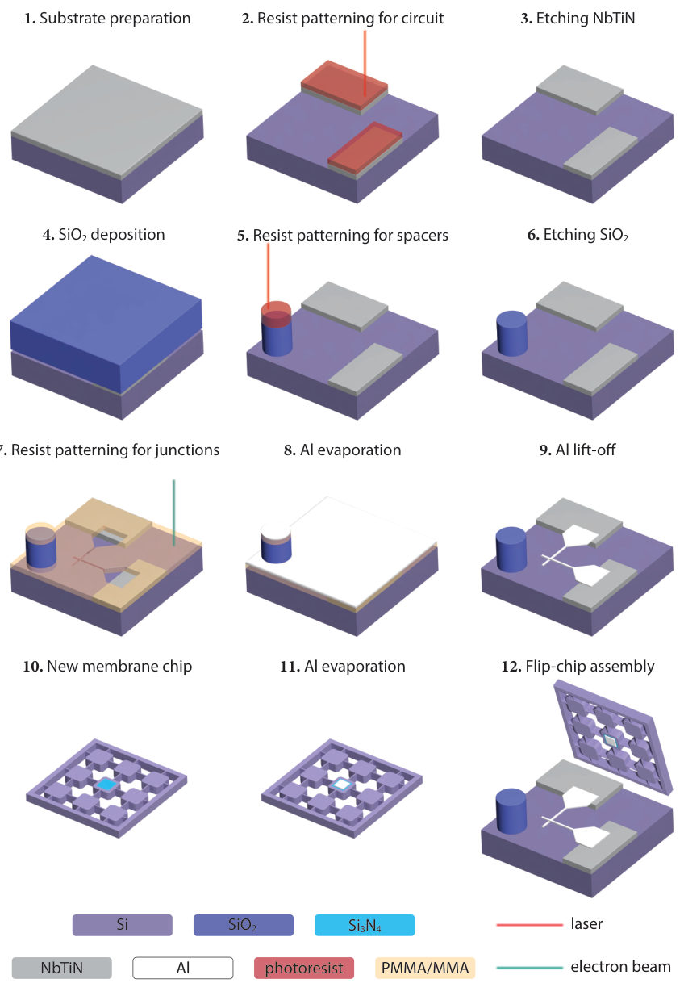
<figcaption class="paper-figure-caption"><b>Fig 4.</b> FIG. 4. Schematic device fabrication. Panels 1-3 show the fabrication of the NbTiN microwave circuit. Panels 4-6 show the deposition and etching of the SiO2 spacers. Panels 7-9 show the evaporation and lift-off process for the Al junctions. Panels 10-12 show the metallization and placement of the membrane chip. Dimensions of the structures are not to scale. Detailed information on each step is provided in the text.</figcaption>
</figure>
<figure class="paper-figure-card">
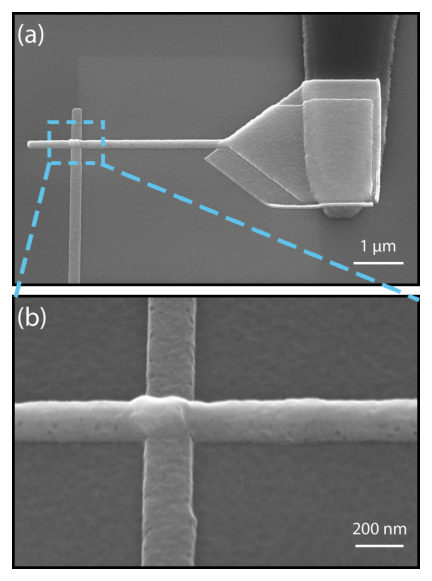
<figcaption class="paper-figure-caption"><b>Fig 5.</b> FIG. 5. Scanning electron micrographs of an alu- minum junction. Two different magnifications of a Joseph- son junction fabricated with the described recipe. The images are taken with a tilt of 40◦. Panel (a) shows the intact step edges of the Al (white) from the Si substrate (gray) to the NbTiN circuit (black). (b) A zoom-in of the Manhattan-style Al-AlOx-Al Josephson junction.</figcaption>
</figure>

**Summary.** The authors demonstrate that by exploiting the Kerr nonlinearity inherent in superconducting microwave cavities, they can passively stabilize resonance frequency fluctuations. This 'Kerr locking' technique suppresses noise by two orders of magnitude without requiring active feedback loops. The method offers a general approach for stabilizing various nonlinear resonators used across quantum sensing and computing platforms.

**Why it may be interesting.** This work demonstrates a purely nonlinear, passive method for stabilizing high-quality microwave resonators, which is crucial for building sensitive quantum sensors and improving readout fidelity in superconducting quantum circuits.

Detailed structure

**Main problem.** Resonance-frequency fluctuations limit the sensitivity of superconducting microwave cavities used for various quantum measurements.

**Main result.** The intrinsic Kerr nonlinearity provides a passive feedback mechanism that suppresses cavity frequency noise by nearly two orders of magnitude, reaching the $1/f$ noise floor without active control.

**Method.** Two-tone spectroscopy and Allan deviation analysis were used to experimentally characterize the nonlinear feedback and measure temporal stability.

**Model / system.** The system is a superconducting microwave cavity incorporating a flux-tunable transmon qubit, which induces a Kerr nonlinearity ($K_c$). The stabilization mechanism involves locking the noisy cavity mode to a strong pump tone.

**Key observables.** Frequency fluctuations ($\sigma_{std}$), Allan deviation ($\sigma_f(	au)$), and the transfer function $T(\omega_m)$.

**Important parameters / regimes.** Pump detuning ($\Delta_p$), Kerr nonlinearity coefficient ($K_c$), cavity linewidth ($\kappa$).

**Assumptions / limitations.** The stabilization relies on operating in a regime where the intrinsic nonlinear feedback dominates over external noise sources.

**Figures summary.** Figures illustrate the spectroscopy response before and after locking, showing frequency stabilization; time dynamics plots compare standard deviations (MHz to kHz); and Allan deviation plots quantify the noise floor reduction.

**Paper structure.** The paper first establishes the problem of cavity noise limitation. It then details the Kerr-locking mechanism using theoretical modeling (Bogoliubov modes) and experimental characterization via two-tone spectroscopy, culminating in quantitative analysis of noise suppression using Allan deviation.

Abstract

Resonance-frequency fluctuations can limit the sensitivity and stability of superconducting microwave cavities used for qubit readout, optomechanical displacement sensing, and magnetic flux detection. Here, we demonstrate the suppression of resonance-frequency fluctuations by locking a noisy nonlinear superconducting microwave cavity to a strong pump tone. The Kerr nonlinearity of this system, whereby the resonance frequency depends on the intracavity field amplitude, gives rise to an intrinsic feedback mechanism that enables passive stabilization without active external feedback. Using two-tone spectroscopy, we experimentally characterize the intrinsic nonlinear feedback mechanism and investigate its temporal stability through Allan deviation analysis. The frequency fluctuations of the locked cavity mode are reduced by nearly two orders of magnitude, reaching the $1/f$ noise floor, without continuous frequency tracking or active control. Kerr locking provides a general approach for self-stabilizing nonlinear microwave resonators by suppressing low-frequency cavity noise while preserving sensitivity to signals outside the locking bandwidth. This approach may benefit a broad range of systems, including SQUID-based resonators, optomechanical devices, and parametric amplifiers.

[↑ back to top](#top)

### [Thermodynamically consistent initialization of the Maxwell--Cattaneo---Vernotte heat conduction model: Analytical solutions and engineering applications](http://arxiv.org/abs/2608.03495v1)

**Authors:** Zalán Sándor, Róbert Kovács  
**Type:** theory · **Category:** statistical mechanics · **PDF:** <https://arxiv.org/pdf/2608.03495v1>  
**Analysis basis:** full PDF text, analyzed in chunks
**Topic relevance:** `non-equilibrium dynamics` **3/5** · `non-equilibrium universality` **2/5** · `Keldysh / 2PI / non-Gaussian methods` **1/5** · `analog quantum simulation` **1/5** · `correlated / nonlocal dissipation` **1/5** · `driven-dissipative phase transition` **1/5** · `methods for driven-dissipative` **1/5**

↔ Scroll figures horizontally

<figure class="paper-figure-card">
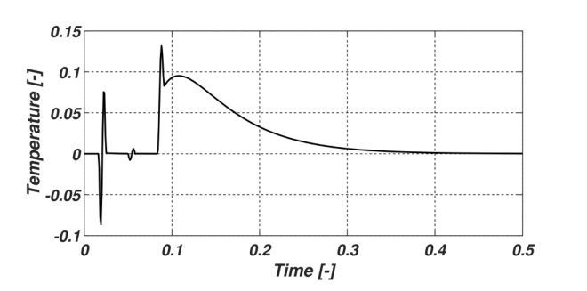
<figcaption class="paper-figure-caption"><b>Fig 1.</b> Figure 1: Demonstrating the appearance of artificial oscillations for hyperbolic heat equations in COMSOL [24]. It is difficult to distinguish between real physical wave propagation and nonphysical numerical error.</figcaption>
</figure>
<figure class="paper-figure-card">
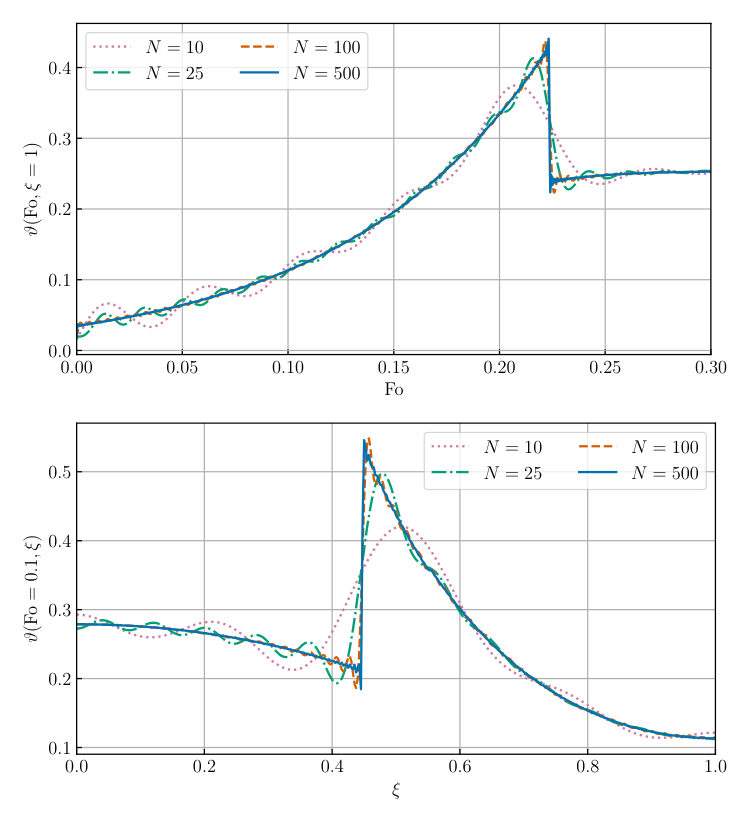
<figcaption class="paper-figure-caption"><b>Fig 2.</b> Figure 2: Convergence test of the Galerkin-type analytical solution in the case when the initial time derivative of q is zero and ˆτ = 0.05. Top figure: convergence of the temperature in time. Bottom figure: convergence of the temperature in space. Such a study makes clear that the proper representation of sharp fronts requires the use of 500 terms of the Galerkin series.</figcaption>
</figure>
<figure class="paper-figure-card">
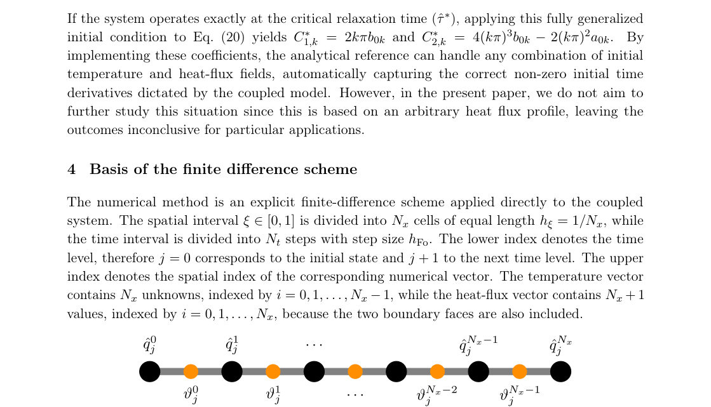
<figcaption class="paper-figure-caption"><b>Fig 3.</b> Figure 3: Schematic representation of the spatial discretization used in the explicit finite-difference simulations. The temperature is evaluated at cell centers, while the heat flux is evaluated at cell faces.</figcaption>
</figure>
<figure class="paper-figure-card">
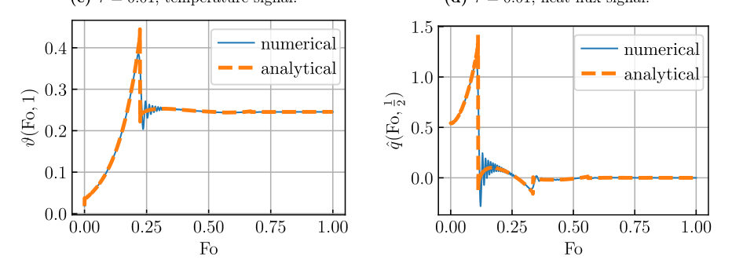
<figcaption class="paper-figure-caption"><b>Fig 4.</b> Figure 4: Comparison of analytical and numerical signals when the initial heat-flux derivative is set to zero.</figcaption>
</figure>
<figure class="paper-figure-card">
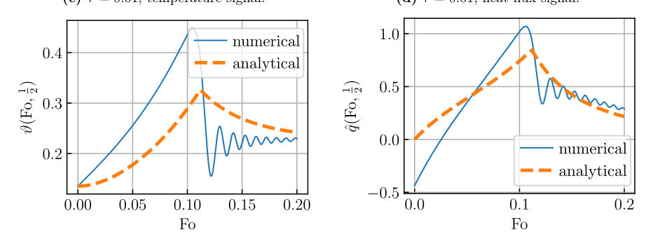
<figcaption class="paper-figure-caption"><b>Fig 5.</b> Figure 5: Comparison of analytical and numerical signals when a spatially uniform non-zero initial derivative of the heat flux is used.</figcaption>
</figure>

**Summary.** This paper addresses the critical numerical challenge of initializing non-Fourier heat conduction models like MCV. By comparing three initialization methods against an analytical solution, the authors prove that assuming zero or uniform initial derivatives introduces severe unphysical oscillations. They establish a thermodynamically consistent technique using the exact space-dependent derivative to ensure accurate simulation of transient thermal wave propagation.

**Why it may be interesting.** While focused on classical heat transfer, the rigorous mathematical treatment of initial conditions and the distinction between physical dynamics and numerical artifacts is highly relevant to any field involving time evolution or non-equilibrium states, including quantum quench dynamics simulations.

Detailed structure

**Main problem.** The core challenge is mathematically defining the initial time derivative for non-equilibrium states when numerically solving the Maxwell--Cattaneo--Vernotte (MCV) heat conduction model.

**Main result.** Using an initialization strategy that maps the exact space-dependent derivative preserves local thermodynamic structure, yielding robust transient responses matching analytical benchmarks without introducing unphysical oscillations seen with zero or uniform assumptions.

**Method.** The authors compare three initialization strategies—zero derivative, uniform non-zero derivative, and exact space-dependent derivative—by solving the coupled MCV equations using an explicit staggered finite-difference scheme against a Galerkin analytical solution.

**Model / system.** The study focuses on one-dimensional transient heat conduction governed by the MCV model, which is a non-Fourier extension incorporating a memory-type constitutive relationship for heat flux. The system is analyzed under adiabatic boundary conditions with an exponentially distributed initial temperature field.

**Key observables.** Transient responses of temperature (T) and heat flux (q); quantitative error percentages ($\varepsilon_{\vartheta}, \varepsilon_{\hat{q}}$).

**Important parameters / regimes.** Relaxation time ($	au$), thermal conductivity ($\lambda$), density ($
ho$), specific heat capacity ($c$); the non-dimensional relaxation parameter $\hat{	au}$.

**Assumptions / limitations.** The analysis assumes constant transport coefficients and focuses on 1D conduction; the rigorous initialization technique is shown to be computationally inexpensive relative to time-stepping.

**Figures summary.** Figures compare numerical simulations (using different initial derivative assumptions) against an analytical reference solution for various relaxation times ($\hat{	au}$), demonstrating artifact generation from incorrect initialization.

**Paper structure.** The paper systematically evaluates three initialization methods, compares the resulting transient solutions to a known analytical benchmark derived via Galerkin's method, and concludes by establishing a thermodynamically consistent procedure applicable to higher-order models like Guyer–Krumhansl.

Abstract

This paper investigates the numerical initialization of the one-dimensional Maxwell--Cattaneo--Vernotte (MCV) heat conduction model, addressing the critical mathematical challenge of defining the initial time derivative for non-equilibrium states. In modern high-frequency thermal engineering applications, traditional time-integration schemes and commercial finite-element solvers frequently introduce severe numerical artifacts when handling non-Fourier models. This study systematically evaluates three initialization strategies: a zero derivative, a spatially uniform non-zero derivative, and an exact space-dependent derivative. Using an explicit staggered finite-difference scheme, the transient responses to an exponentially distributed initial temperature field under adiabatic boundary conditions are compared against an analytical solution using the Galerkin method. The results demonstrate that assuming a zero or spatially uniform initial derivative introduces significant unphysical oscillatory deviations, leading to heat-flux prediction errors as the relaxation time increases. Conversely, mapping the exact space-dependent derivative onto the staggered grid preserves the local thermodynamic structure of the initial state, yielding robust transient responses that match the analytical benchmark without meaningful computational overhead. These findings establish a thermodynamically consistent initialization technique that can be extended to non-local models as well.

[↑ back to top](#top)

### [Vector-field control and emergent basal-plane anisotropy of magnetic textures in noncentrosymmetric (Fe$_{0.63}$Ni$_{0.3}$Pd$_{0.07}$)$_3$P](http://arxiv.org/abs/2608.03513v1)

**Authors:** Victor Ukleev, Oleg I. Utesov, Lorenzo Ubilla, Chen Luo, Radu-Marius Abrudan, Peter Wild, Holger Kropf, Moritz Winter, Sebastian Schneider, Alexander Tahn, Bernd Rellinghaus, Tim A. Butcher, Simone Finizio, Sebastian Wintz, Markus Weigand, Max T. Birch, Yoshinori Tokura, Yasujiro Taguchi, Kosuke Karube, Florin Radu  
**Type:** experiment · **Category:** other · **PDF:** <https://arxiv.org/pdf/2608.03513v1>  
**Analysis basis:** full PDF text, analyzed in chunks
**Topic relevance:** `exotic spin models in light-matter` **3/5** · `spintronics-quantum-optics interface` **3/5** · `analog quantum simulation` **1/5** · `driven-dissipative phase transition` **1/5** · `methods for driven-dissipative` **1/5** · `non-equilibrium dynamics` **1/5**

↔ Scroll figures horizontally

<figure class="paper-figure-card">
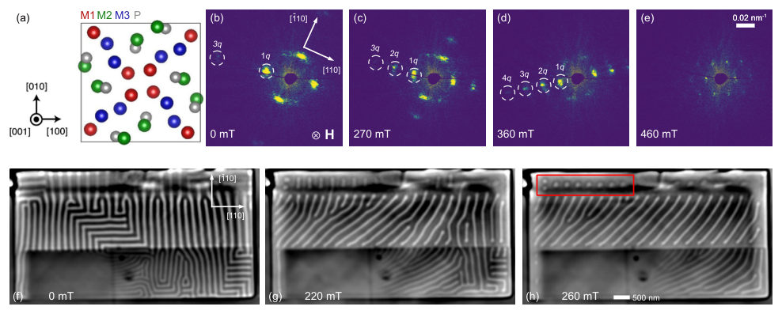
<figcaption class="paper-figure-caption"><b>Fig 1.</b> FIG. 1. (a) Schematic of noncentrosymmetric tetragonal crystal structure of (Fe0.63Ni0.3Pd0.07)3P viewed from [001] direction. Three inequivalent crystallographic sites, randomly occupied by metallic ions, are denoted M1, M2, and M3. (b-e) Resonant SAXS patterns measured in (b) zero field, (c) 270 mT, (d) 360 mT, and (e) 460 mT applied along the c-axis. (f-h) Real-space ptychographic phase images of magnetic textures measured at the out-of-plane magnetic field H||[001] of (f) 0 mT, (g) 220 mT, (h) 260 mT in stripe, soliton, and co-existing soliton and skyrmion states. Skyrmions nucleated at 260 mT are highlighted by the red box.</figcaption>
</figure>
<figure class="paper-figure-card">
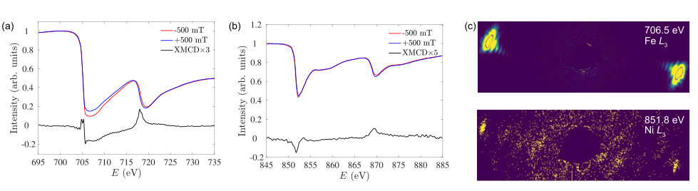
<figcaption class="paper-figure-caption"><b>Fig 2.</b> FIG. 2. (a,b) Soft x-ray transmission and XMCD spectra measured across Fe and Ni L2,3 edges, respectively. (c) Rescaled element-selective SAXS patterns measured at zero field at Fe and Ni edges.</figcaption>
</figure>
<figure class="paper-figure-card">
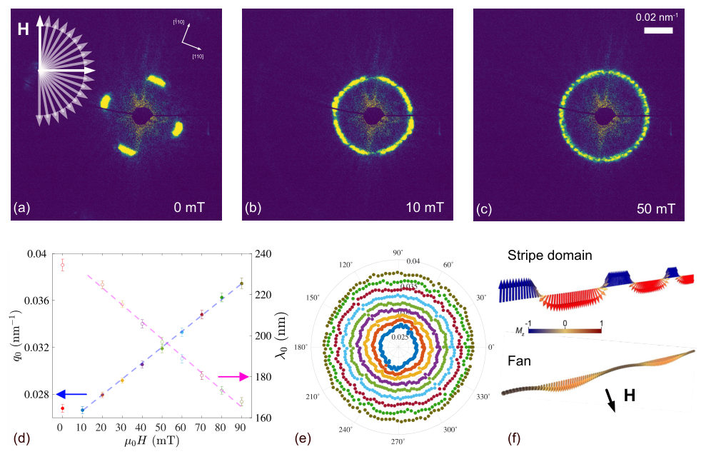
<figcaption class="paper-figure-caption"><b>Fig 3.</b> FIG. 3. Summed vector-field SAXS patterns measured at 300 K and at the magnitude of the azimuthal magnetic field of (a) 0 mT, (b) 10 mT, and (c) 50 mT. (d) In-plane field dependence of the magnetic wavevector and the corresponding real-space stripe periodicity averaged over all azimuthal field angles. (e) Polar plot of the wavevector magnitude as a function of the azimuthal field angle and the magnitude of the field. Symbol colors correspond to those indicating the field magnitudes in panel (d). (f) Schematics of zero-field stripe domain and in-plane field-induced fan structures.</figcaption>
</figure>
<figure class="paper-figure-card">
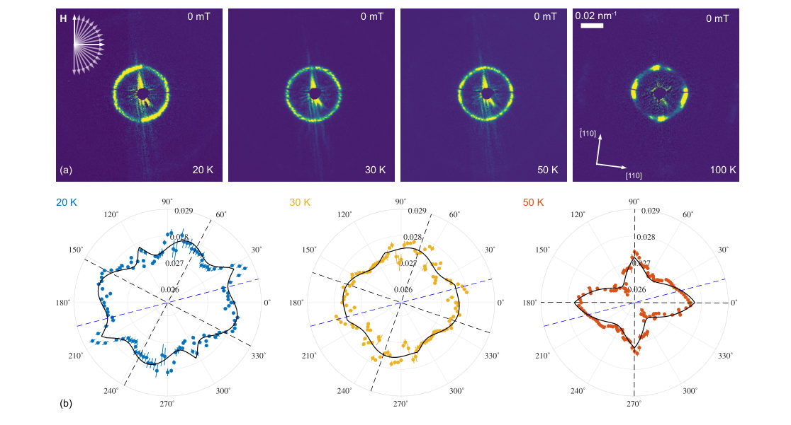
<figcaption class="paper-figure-caption"><b>Fig 4.</b> FIG. 4. (a) Summed zero-field SAXS patterns measured at 20 K, 30 K, 50 K, 100 K after applying a saturating field of 200 mT in every azimuthal direction with a 3◦step. At 100 K and above, the domain propagation direction always returns to its original axis. (b) Polar plot of the magnetic wavevector magnitude as a function of the azimuthal field angle at 20 K, 30 K, and 50 K at zero field. Solid curves represent the fit according to the theoretical model discussed in the main text. Dashed black lines indicate the fitted orientations of the effective DMI axes, while the dashed blue line marks the direction of the in-plane uniaxial strain.</figcaption>
</figure>

**Summary.** This work uses advanced X-ray scattering techniques on $(	ext{Fe}_{0.63}	ext{Ni}_{0.3}	ext{Pd}_{0.07})_3	ext{P}$ to demonstrate precise control over magnetic stripe domains using in-plane fields. Crucially, the study reveals that cooling the material causes a temperature-dependent rotation of the effective Dzyalinskii-Moriya interaction landscape, establishing it as a model system for studying chiral spin textures.

**Why it may be interesting.** While primarily experimental magnetism, the precise control over emergent magnetic order parameters (like DMI orientation) using external fields and temperature provides insights into symmetry breaking and phase transitions relevant to quantum materials research.

Detailed structure

**Main problem.** The study investigates how applying external vector magnetic fields and varying temperature affects the complex topological spin textures, specifically stripe domains, in a noncentrosymmetric magnet.

**Main result.** Vector-field control allows continuous rotation of stripe domain orientation from chiral to achiral states at room temperature, while cooling reveals a temperature-driven evolution of anisotropic interactions, including the effective Dzyalinskii-Moriya interaction (DMI).

**Method.** The research combines resonant small-angle x-ray scattering (SAXS) and ptychography measurements performed in controlled vector magnetic fields over a wide temperature range.

**Model / system.** The physical system is the noncentrosymmetric material $(	ext{Fe}_{0.63}	ext{Ni}_{0.3}	ext{Pd}_{0.07})_3	ext{P}$, which exhibits $S_4$ symmetry and hosts various topological spin textures like stripe domains and skyrmion lattices.

**Key observables.** Magnetic modulation vector ($\mathbf{q}$), stripe domain orientation, SAXS harmonics ($1q, 3q, \dots$), and the dependence of $\mathbf{q}$ on applied field angle ($	heta$) and temperature ($T$).

**Important parameters / regimes.** Temperature range (20 K to 300 K); weak in-plane magnetic fields ($\sim 10 	ext{ mT}$); basal plane anisotropy.

**Assumptions / limitations.** The analysis relies on modeling the observed phenomena using combined effects of magnetocrystalline anisotropy, anisotropic exchange, and DMI within the $S4$ symmetry framework.

**Figures summary.** Figures illustrate schematic structures, SAXS patterns under varying out-of-plane fields (showing transitions between domain types), and element-resolved SAXS maps confirming magnetic modulation in Ni moments.

**Paper structure.** The paper progresses by first establishing the material's properties using various scattering techniques, then demonstrating deterministic vector-field control of stripe domains at room temperature, followed by a detailed analysis showing how cooling reveals complex, temperature-dependent anisotropy axes related to DMI evolution.

Abstract

(Fe$_{0.63}$Ni$_{0.3}$Pd$_{0.07}$)$_3$P is a room-temperature magnet with $S_4$ symmetry that hosts a rich variety of topological spin textures. Here, we report a combined resonant small-angle x-ray scattering and ptychography study of (Fe$_{0.63}$Ni$_{0.3}$Pd$_{0.07}$)$_3$P in vector magnetic fields over a broad temperature range. We demonstrate deterministic vector-field control of magnetic stripe domains, where in-plane fields continuously rotate their orientation via a transition from a chiral stripe to an achiral fan configuration. Furthermore, at 50 K and below, the stripe orientation becomes metastably pinned and retains its field-trained direction. While the magnitude of the wavevector is nearly isotropic within the basal plane at room temperature, a pronounced temperature evolution of anisotropic interactions emerges upon cooling. In particular, non-trivial anisotropy axes develop at 20-50 K reflecting the combined effects of magnetocrystalline anisotropy, anisotropic exchange, and Dzyaloshinskii-Moriya interaction (DMI), whose effective orientation is found to rotate with temperature. These results establish (Fe$_{0.63}$Ni$_{0.3}$Pd$_{0.07}$)$_3$P as a model system for vector-field control of chiral spin textures and reveal a previously unrecognized temperature-driven evolution of the effective DMI landscape in a noncentrosymmetric magnet.

[↑ back to top](#top)

### [Distributed Phase Sensing with Multiphoton States in Optical Interferometry](http://arxiv.org/abs/2608.02977v1)

**Authors:** Subhrajit Modak, Danilo Triggiani, Cosmo Lupo  
**Type:** theory · **Category:** quantum information and computing · **PDF:** <https://arxiv.org/pdf/2608.02977v1>  
**Analysis basis:** full PDF text, analyzed in chunks
**Topic relevance:** `interference shaping light` **3/5** · `entanglement & information structure` **2/5** · `quantum measurements` **2/5** · `analog quantum simulation` **1/5** · `measurement-induced transitions` **1/5**

↔ Scroll figures horizontally

<figure class="paper-figure-card">
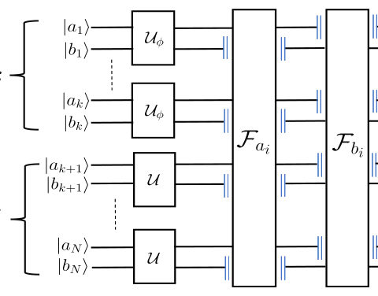
<figcaption class="paper-figure-caption"><b>Fig 1.</b> FIG. 1. Schematic representation of a linear-optical interferometric architecture for multiphoton phase estimation. The input state consists of N single photons distributed across 2N optical modes. The photons evolve under a global unitary transformation comprises a phase- dependent interferometric network that simultaneously generates multipartite path entanglement and encodes the unknown phase parameter φ, followed by a quantum Fourier transform F, which coherently redistributes the optical amplitudes among all modes. Within the phase- encoding network, individual interferometric blocks implement either the phase shift φ or the identity operation, thereby imprinting the phase information...</figcaption>
</figure>
<figure class="paper-figure-card">
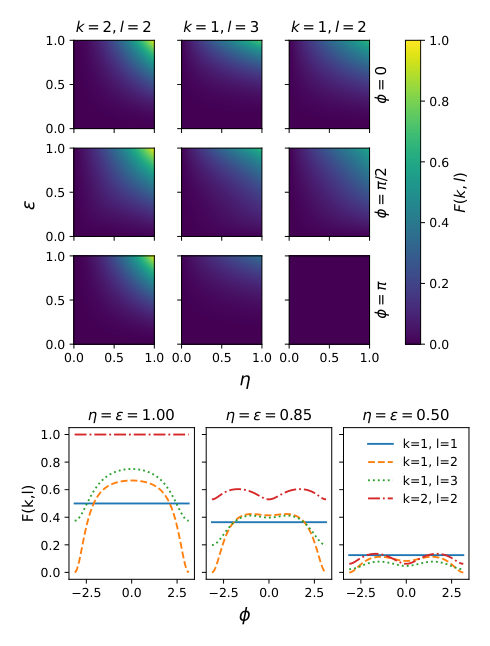
<figcaption class="paper-figure-caption"><b>Fig 2.</b> FIG. 2. The table highlights the suppression of multiphoton advan- tage under loss. The CFI in a two-receiver configuration is shown in (a) as a function of the loss parameters ε and η for represen- tative values of φ, k, and l, and (b) as a function of the phase φ for different loss regimes. Increasing loss progressively suppresses the multiphoton enhancement, leading to a systematic reduction in phase-estimation performance</figcaption>
</figure>
<figure class="paper-figure-card">
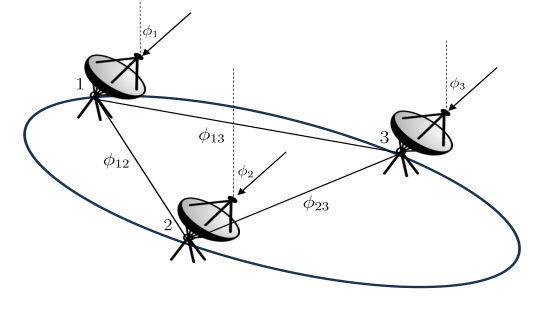
<figcaption class="paper-figure-caption"><b>Fig 3.</b> FIG. 3. Schematic of a three-receiver single-photon optical telescope for multiparameter phase estimation. A single photon is coherently distributed among three spatial modes associated with the three receivers. The relative phases between the modes are encoded through the optical path differences between the source and the corresponding receivers, with one mode chosen as an arbitrary phase reference to remove the global phase freedom. The resulting probe state contains the relevant relative phase information and is characterised by a full-rank quantum Fisher information matrix. The three pairwise baselines provide multiparameter estimation and precision analysis via the quantum Cramér–Rao...</figcaption>
</figure>
<figure class="paper-figure-card">
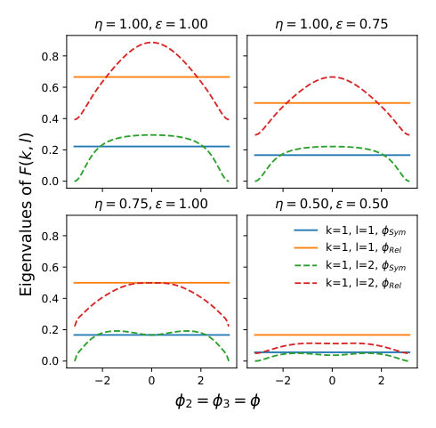
<figcaption class="paper-figure-caption"><b>Fig 4.</b> FIG. 4. Illustrates CFI under transmission loss. The eigenvalues of the CFI matrix are evaluated for N-photon state undergoing lossy evolution, with ε and η denoting the transmissivities of the phase and reference modes, respectively. Results are shown for N = 2 and N = 3, corresponding to the photon-number partitions (k,l) = (1,1) and (1,2) under the constraint φ2 = φ3. Increasing the number of reference photons initially improves the precision of relative-phase estimation. However, this improvement persists only up to a critical balance between η and ε. Beyond this point, the metrological ad- vantage is lost, resulting in reduced sensitivity.</figcaption>
</figure>

**Summary.** This paper develops a comprehensive theory for enhancing phase estimation sensitivity in optical interferometers using multiphoton states. It derives the optimal conditions for photon distribution—favoring balance—and quantifies how measurement techniques (like number-resolving detection) maintain quantum advantages even when realistic photon loss is present. The results establish a scalable framework for quantum-enhanced distributed metrology.

**Why it may be interesting.** This work provides a rigorous theoretical framework for quantum metrology in photonic systems, directly addressing how entanglement and measurement choice can overcome classical limits, which is central to quantum information science applications like quantum communication and sensing.

Detailed structure

**Main problem.** The paper investigates how to achieve optimal phase estimation sensitivity in quantum interferometry using multiphoton states.

**Main result.** Maximum phase sensitivity is achieved when the input photons are distributed symmetrically between the phase-encoding and reference blocks, leading to a phase-independent response for $\varphi 
eq 0$.

**Method.** The authors derive the classical Fisher Information (CFI) by calculating probability amplitudes using matrix permanents and analyzing the second derivatives of the detection probabilities with respect to the unknown phase.

**Model / system.** The system is a linear-optical interferometer designed for phase estimation, utilizing $N$ separable photon inputs that evolve into number-path entangled states via unitary transformations (like QFTs) followed by photon-number-resolving detection.

**Key observables.** Classical Fisher Information (CFI), phase sensitivity, and the probability of observing specific output photon-number configurations ($\vec{n}$).

**Important parameters / regimes.** Total photon number ($N$), imbalance parameter ($\Delta = |k - l|/N$), and photon loss parameters ($\epsilon, \eta$).

**Assumptions / limitations.** The analysis relies on the small-phase approximation ($\varphi \simeq 0$) for initial derivations, and later incorporates models for realistic photon loss.

**Figures summary.** Figures schematically illustrate the interferometric architecture (FIG. 1) and show how CFI depends on phase ($	ext{FIG. 2}$), while tables quantify CFI under varying conditions like imbalance or loss.

**Paper structure.** The paper progresses from deriving the ideal CFI for balanced partitions, to analyzing the impact of photon loss by comparing detection schemes (homodyne vs. number-resolving), and finally extending the framework to multi-mode distributed sensing.

Abstract

We investigate interferometric phase-estimation using separable photon inputs that evolve into number-path entangled states through linear optical networks, followed by photon-number-resolving detection. A simple analytical expression for the classical Fisher information at zero phase is derived for arbitrary $N$-photon states distributed across 2$N$ optical modes, partitioned into phase-encoding and reference blocks. Among all possible photon distributions between these blocks, the balanced configuration maximizes the phase sensitivity for every photon number $N$ and uniquely exhibits a phase-independent response. The achievable sensitivity degrades monotonically with increasing asymmetry in the photon distribution. We further investigate the robustness of the protocol in the presence of realistic photon loss and extend the analysis to distributed architectures with multiple receivers. In the low photon-flux regime, vacuum fluctuations fundamentally limit local quadrature measurements, whereas nonlocal photon-number-resolving measurements exploit multiphoton interference to mitigate loss-induced sensitivity degradation. Together, these results establish a scalable framework for quantum-enhanced distributed multimode metrology.

[↑ back to top](#top)

### [Manipulation of localized excitons in CrPS$_4$ by temperature and magnetic field](http://arxiv.org/abs/2608.03543v1)

**Authors:** Dipankar Jana, Swagata Acharya, Amit Pawbake, Dmitrii Litvinov, Aljoscha Soll, Zdenek Sofer, Clement Faugeras, Dimitar Pashov, Mark van Schilfgaarde, Kostya S. Novoselov, Marek Potemski, Maciej Koperski  
**Type:** both · **Category:** strongly correlated electrons · **PDF:** <https://arxiv.org/pdf/2608.03543v1>  
**Analysis basis:** full PDF text, analyzed in chunks
**Topic relevance:** `exotic spin models in light-matter` **3/5** · `spintronics-quantum-optics interface` **3/5** · `Keldysh / 2PI / non-Gaussian methods` **1/5** · `analog quantum simulation` **1/5** · `driven-dissipative phase transition` **1/5**

↔ Scroll figures horizontally

<figure class="paper-figure-card">
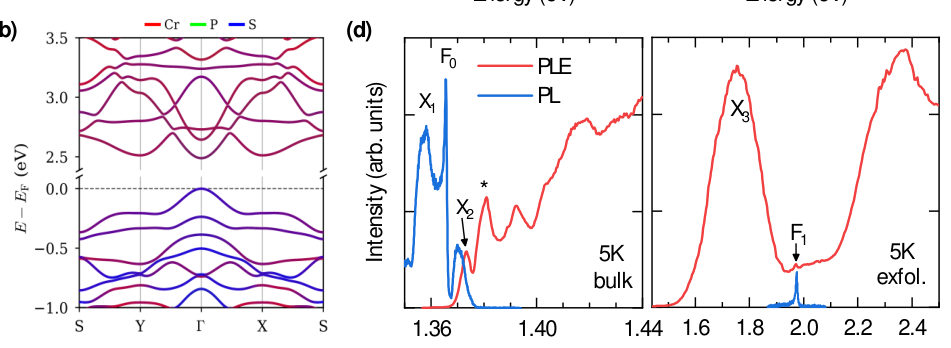
<figcaption class="paper-figure-caption"><b>Fig 1.</b> FIG. 1. (a) Schematic crystallographic and magnetic structure of CrPS4 in the antiferromagnetic phase. Gray, green, and yellow spheres denote chromium, sulfur, and phosphorus atoms, respectively. Images generated using the VESTA software package [34]. (b) Electronic band structure of CrPS4 in the AFM phase. The Fermi level is set to zero. The red- and blue- colored bands correspond to Cr and S ions, respectively. (c) Optical absorption spectra of CrPS4 computed using the QSG ˆW method for the spin-allowed transitions and the DMFT method for the spin-flip transition. An artificial linewidth of 3 meV broadens all features. (d) Low-temperature (5 K) PL and PLE spectra of CrPS4, measured on a...</figcaption>
</figure>
<figure class="paper-figure-card">
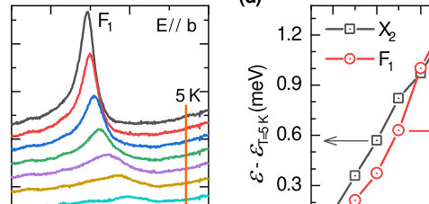
<figcaption class="paper-figure-caption"><b>Fig 2.</b> FIG. 2. (a) Unpolarized PLE spectra and (a) linear polarization resolved PL spectra of bulk CrPS4 at some selected tempera- tures. Spectra are vertically shifted for clarity. PL spectra acquired with E ∥b-axis are scaled by a factor of 5. Vertical dotted lines serve as a guide to the temperature-dependent peak shift of the dominant transitions, while the horizontal dotted lines in the PLE plot correspond to the background level. (c) PL spectra of bulk CrPS4 in the high-energy region, measured in the E ∥b-axis configuration with 5 K temperature intervals. Temperature-dependent (d) peak shifts of the X2 and F1 transitions and (e) integrated intensities of the X1, X2, and F1 transitions. The...</figcaption>
</figure>
<figure class="paper-figure-card">
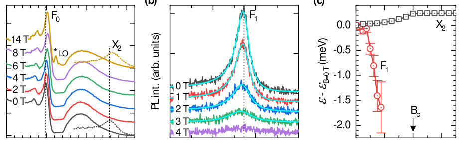
<figcaption class="paper-figure-caption"><b>Fig 3.</b> FIG. 3. Low-temperature PL spectra of bulk CrPS4 as a function of a magnetic field applied perpendicular to the sample plane (E ∥c-axis) in (a) low-energy and (b) high-energy spectral windows. Vertical dashed lines serve as visual guides for field-dependent peak shift. ’*LO’ corresponds to the phonon replica of spin-flip transition ’*’ [38]. (c) Magnetic field dependence of the peak energies of the X2 and F1 transitions. The vertical arrow indicates the critical saturation field (Bc=8 T) at which CrPS4 undergoes a transition from canted AFM to a FM state.</figcaption>
</figure>
<figure class="paper-figure-card">
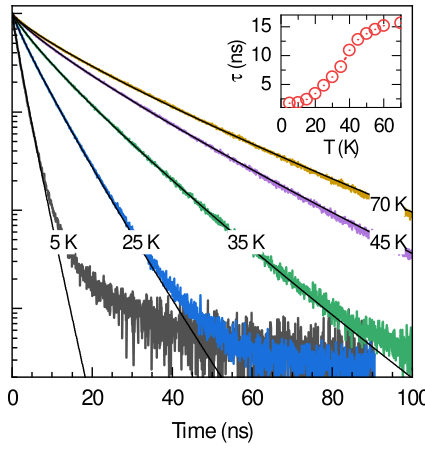
<figcaption class="paper-figure-caption"><b>Fig 4.</b> FIG. 4. Temporal decay profile of the X1 PL intensity at some selected temperatures. All decay profiles are normalized to their peak intensity. The black lines denote fits to the data using a single stretched-exponential decay function. The inset shows the estimated temperature dependence of the decay time of X1 transition.</figcaption>
</figure>
<figure class="paper-figure-card">
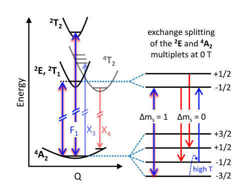
<figcaption class="paper-figure-caption"><b>Fig 5.</b> FIG. 5. Schematic configuration-coordinate diagram for the d3 electronic configuration within the Tanabe–Sugano frame- work. The extended energy scheme, considering exchange splitting of the 2E and 4A2 states, is shown on the right. The electronic excitations (emissions) are shown by blue (red) ver- tical arrows.</figcaption>
</figure>

**Summary.** The study investigates excitonic behavior in the layered antiferromagnetic semiconductor $	ext{CrPS}_4$ using both advanced theory and detailed optical measurements. Researchers found that temperature and magnetic fields induce measurable shifts in exciton energies, providing clear spectroscopic signatures of magnetic phase transitions. This work highlights the potential for all-optical control and sensing of magnetic order in these correlated materials.

**Why it may be interesting.** This work is highly relevant as it uses optical spectroscopy to map out the complex interplay between electronic excitations (excitons) and magnetic order parameters in a solid-state material, touching upon concepts central to quantum magnetism and correlated materials physics.

Detailed structure

**Main problem.** The study investigates excitonic phenomena in $	ext{CrPS}_4$, focusing on how these optical properties are intertwined with the material's spin and lattice degrees of freedom, particularly concerning magnetic ordering.

**Main result.** The research establishes that $	ext{CrPS}_4$ is a direct-gap semiconductor whose low-energy excitonic transitions exhibit clear, measurable energy shifts corresponding to magnetic phase transitions (AFM $\leftrightarrow$ PM).

**Method.** A combination of advanced theoretical calculations (MBPT, DMFT, QSG$\hat{	ext{W}}$) and detailed experimental measurements (low-temperature PL/PLE spectroscopy under varying temperature and magnetic fields) was employed.

**Model / system.** The system is $	ext{CrPS}_4$, a layered antiferromagnetic van der Waals semiconductor. The theoretical framework models excitons interacting with spin and lattice degrees of freedom, while experiments probe these interactions optically.

**Key observables.** Exciton transition energies ($\sim 1.36 	ext{ eV}$), bandgap energy ($2.48 	ext{ eV}$ in AFM phase), temperature-dependent peak shifts, and exciton decay rates ($	au$).

**Important parameters / regimes.** Temperature (up to $300 	ext{ K}$), magnetic field (up to $8 	ext{ T}$), and activation energies ($E_a = 80 \pm 10 	ext{ meV}$).

**Assumptions / limitations.** The analysis often relies on modeling exciton population transfer between localized states ($	ext{X}1 
ightarrow 	ext{X}4$) using rate equations, and assuming simplified background behavior in intensity fitting.

**Figures summary.** Figures illustrate the crystal structure, calculated band/optical spectra for different magnetic phases, and temperature/field dependence of PL intensities showing characteristic energy shifts and quenching behaviors.

**Paper structure.** The paper progresses from theoretical predictions of electronic structure (bandgap, excitons) to experimental characterization of these features under varying external stimuli (T, B), culminating in detailed analysis of exciton population dynamics via temperature-dependent decay modeling.

Abstract

Layered van der Waals magnetic semiconductors provide a versatile platform for exploring excitonic phenomena intertwined with spin and lattice degrees of freedom, enabling excitons to act as sensitive probes of magnetic order. CrPS$_4$ is a layered antiferromagnetic semiconductor that hosts rich excitonic features whose microscopic origin and connection to magnetic ordering remain incompletely understood. Here, we investigate the electronic and excitonic properties of bulk CrPS$_4$ using a combination of many-body perturbation theory, dynamical mean-field theory, and photoluminescence-based experiments. Our calculations establish CrPS$_4$ as a direct-gap semiconductor with a bandgap of 2.48~eV in the antiferromagnetic phase. Several sub-bandgap excitonic transitions are predicted by theory, comprising multiple spin-allowed excitons and an additional spin-flip excitation, predominantly localized on the Cr$^{3+}$ ions. Temperature- and magnetic-field-dependent optical measurements reveal thermally driven exciton redistribution among localized states and identify characteristic energy shifts that provide clear optical signatures of magnetic phase transitions in CrPS$_4$. These results provide new insights into the excitonic transitions of antiferromagnets and suggest potential routes for all-optical sensing and light-driven control of their magnetic order.

[↑ back to top](#top)

### [Matrix Product Evolution: A Method for Simulating Quantum Circuits Using Tensor Networks](http://arxiv.org/abs/2608.03472v1)

**Authors:** Haruyuki Kawabe, Minoru Nagai, Tsuyoshi Okubo, Synge Todo  
**Type:** theory · **Category:** numerical methods · **PDF:** <https://arxiv.org/pdf/2608.03472v1>  
**Analysis basis:** full PDF text, analyzed in chunks
**Topic relevance:** `entanglement & information structure` **3/5** · `methods for driven-dissipative` **3/5** · `non-equilibrium dynamics` **2/5** · `analog quantum simulation` **1/5**

↔ Scroll figures horizontally

<figure class="paper-figure-card">
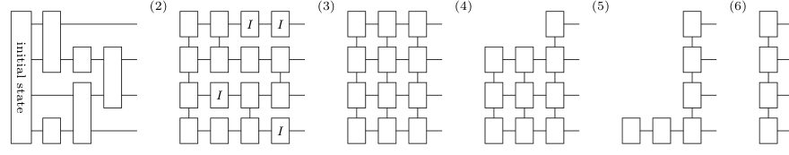
<figcaption class="paper-figure-caption"><b>Fig 1.</b> FIG. 1. Overview of the tensor-network representation and contraction strategy underlying the MPE-based simulation for a quantum circuit. (1) An input quantum circuit consisting of an initial state and a sequence of quantum gates. (2–6) Construction of a corresponding tensor network, insertion of identity tensors, temporal compression of the tensor network, successive contraction of MPEs, and final contraction yielding the output quantum state.</figcaption>
</figure>
<figure class="paper-figure-card">
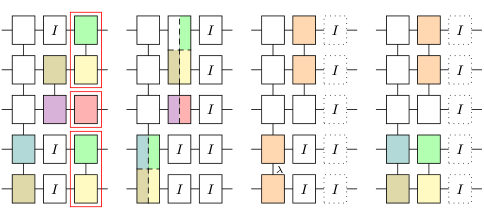
<figcaption class="paper-figure-caption"><b>Fig 2.</b> FIG. 2. Procedure of the temporal compression. (1) Each red box indicates a local tensor block to be processed. (2) The block is contracted with the nearest nontrivial tensors on its left (earlier time step). (3a) The result is factorized by an SVD along the spatial direction; if the spatial bond dimension λ is at most four, the merge is accepted and the all-identity columns (dotted) vacated by the merge are removed. (3b) If it exceeds four, the merge is rejected and the block is packed leftward past the identity tensors.</figcaption>
</figure>
<figure class="paper-figure-card">
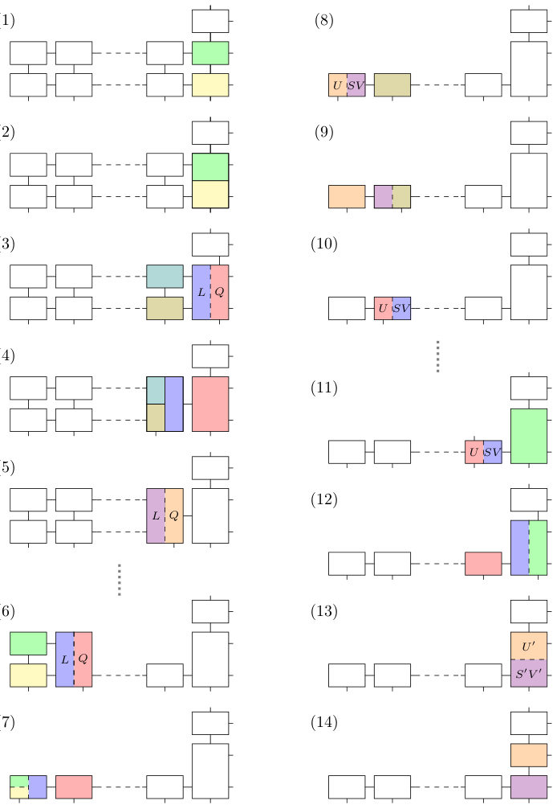
<figcaption class="paper-figure-caption"><b>Fig 3.</b> FIG. 3. Procedure for zipping up two MPEs. The process consists of three parts. In (1)–(7), tensors in adjacent MPEs are contracted, and the resulting lower-triangular matrix L is propagated toward the left. In (8)–(12), singular value decomposition is performed, and the singular values S together with the right unitary matrix V are propagated toward the right. In (13)–(14), an MPS representation of the final state is constructed.</figcaption>
</figure>
<figure class="paper-figure-card">
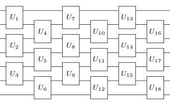
<figcaption class="paper-figure-caption"><b>Fig 4.</b> FIG. 4. Example of a quantum circuit composed of randomly- generated unitary gates Uj. This example illustrates a 7-qubit circuit with depth 6.</figcaption>
</figure>
<figure class="paper-figure-card">
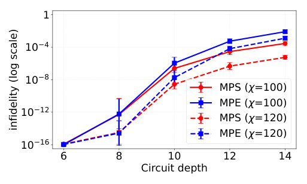
<figcaption class="paper-figure-caption"><b>Fig 5.</b> FIG. 5. Approximation errors of the MPS- and MPE-based methods for random quantum circuits on 14 qubits with max- imum bond dimensions χ = 120 and 100, compared with the exact results. The horizontal axis represents the circuit depth. The plotted values show the mean over 10 independent trials, and the error bars indicate the corresponding variance. The initial state is fixed to the product state |0⟩⊗n, and no post- selection is applied. Values below 10−16 are within machine precision and can be regarded as effectively zero.</figcaption>
</figure>

**Summary.** This paper introduces Matrix Product Evolution (MPE), a novel tensor network method that represents quantum circuits by compressing them along the circuit's time depth. It details an efficient contraction strategy, demonstrating that MPE can achieve higher accuracy than standard MPS methods when post-selection is applied to the final state, making it valuable for simulating complex quantum dynamics.

**Why it may be interesting.** For AMO physicists studying open quantum systems or dynamics, MPE offers a powerful tool to simulate time evolution where entanglement structure is complex; the explicit handling of temporal correlations via depth compression is valuable for understanding circuit complexity beyond simple spatial bipartitions.

Detailed structure

**Main problem.** Classical simulation of quantum circuits is limited by Hilbert space size, necessitating efficient tensor network representations.

**Main result.** Matrix Product Evolution (MPE) provides a depth-oriented tensor network representation that can outperform standard MPS when post-selection is involved, particularly in reducing temporal entanglement contributions to the error.

**Method.** The authors introduce MPE, which represents circuits as 2D tensor networks compressed along the circuit depth using an exact 'temporal compression' procedure. Simulation proceeds via a specialized 'zip-up contraction' strategy.

**Model / system.** The method is tested on random quantum circuits and time evolution simulations of the quantum Ising model acting on multiple qubits (e.g., 14 qubits).

**Key observables.** Fidelity ($|\langle\varphi|\varphi_0
angle|^2$), Infidelity ($1 - |\langle\varphi|\varphi_0
angle|^2$), and singular value distributions.

**Important parameters / regimes.** Maximum temporal bond dimension ($\chi$), circuit depth (number of gates/Trotter steps), and the degree of post-selection ($p$).

**Assumptions / limitations.** The method relies on controlling approximation error via truncation ($\chi$) during tensor contraction, and its advantage is highlighted when post-selection constrains temporal degrees of freedom.

**Figures summary.** Figures compare infidelity (MPE vs MPS) for random circuits and the Ising model, showing MPE's superior performance with post-selection. They also illustrate the procedural steps for temporal compression and zipping up tensors.

**Paper structure.** The paper first introduces MPE as a depth-based tensor representation, details the exact temporal compression and zip-up contraction procedures, and then compares its numerical behavior against standard MPS methods using random circuits and structured Hamiltonian evolution (Ising model) with post-selection diagnostics.

Abstract

Classical simulation of quantum circuits is an essential tool in quantum information science, but its applicability is constrained by the exponential growth of the Hilbert space and the entanglement structure of quantum states. In this work, we introduce Matrix Product Evolution (MPE), a tensor-train representation of quantum circuits constructed along the circuit depth rather than along the qubit index. Within this formulation, the simulation of a quantum circuit is modeled as the contraction of multiple MPE tensors. We develop an efficient contraction strategy based on a zip-up procedure to carry out this contraction in practice. We investigate the numerical behavior of this MPE-based contraction framework through simulations of random quantum circuits and the time evolution of a quantum many-body state. Our results characterize the growth of temporal bond dimensions, clarify how post-selection modifies the contraction cost and approximation accuracy, and identify regimes in which depth-oriented tensor-network contractions provide a useful complement to standard MPS-based simulation approaches.

[↑ back to top](#top)

### [Surface-Selective Probe of Spin-Triplet Superconductivity in Rhombohedral Graphene](http://arxiv.org/abs/2608.03870v1)

**Authors:** Kilian Krötzsch, Zekang Zhou, Kryštof Kolář, Yonggen Li, Kenji Watanabe, Takashi Taniguchi, Moty Heiblum, Cyprian Lewandowski, Mitali Banerjee  
**Type:** both · **Category:** strongly correlated electrons · **PDF:** <https://arxiv.org/pdf/2608.03870v1>  
**Analysis basis:** full PDF text, analyzed in chunks
**Topic relevance:** `exotic spin models in light-matter` **3/5** · `spintronics-quantum-optics interface` **3/5** · `Keldysh / 2PI / non-Gaussian methods` **1/5** · `Kondo & dissipative impurity` **1/5** · `quantum measurements` **1/5**

↔ Scroll figures horizontally

<figure class="paper-figure-card">
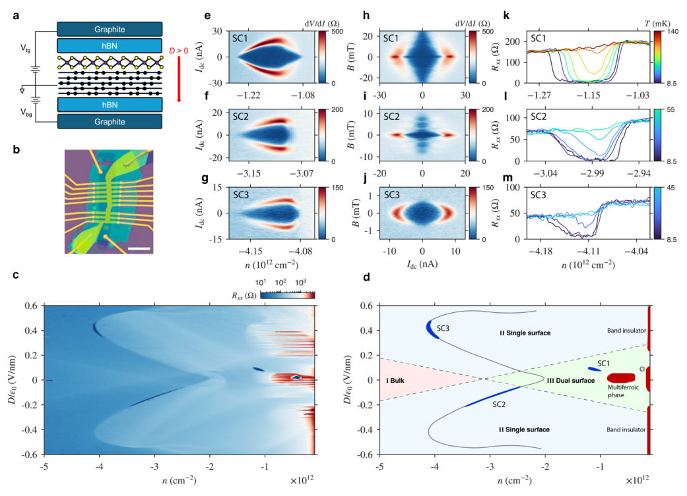
<figcaption class="paper-figure-caption"><b>Fig 1.</b> FIG. 1. Superconductivity in WS2-proximized R5G. a, Longitudinal resistance Rxx as a function of carrier density n and displacement field D/ε0 at B = 0 T and T ≃8.5 mK. b, Schematic of the phase diagram in a, labeling the bulk regime (Region I), single-surface regime (Region II), dual-surface regime (Region III), the multiferroic phase, correlated insulating (CI) and band-insulating (BI) states, and the three superconducting pockets SC1–SC3. c, Device schematic: rhombohedral pentalayer graphene (R5G) proximized on one side by monolayer WS2, encapsulated by hBN, and contacted by top and bottom graphite gates. The red arrow denotes the positive-D convention. d, Optical micrograph of the...</figcaption>
</figure>
<figure class="paper-figure-card">
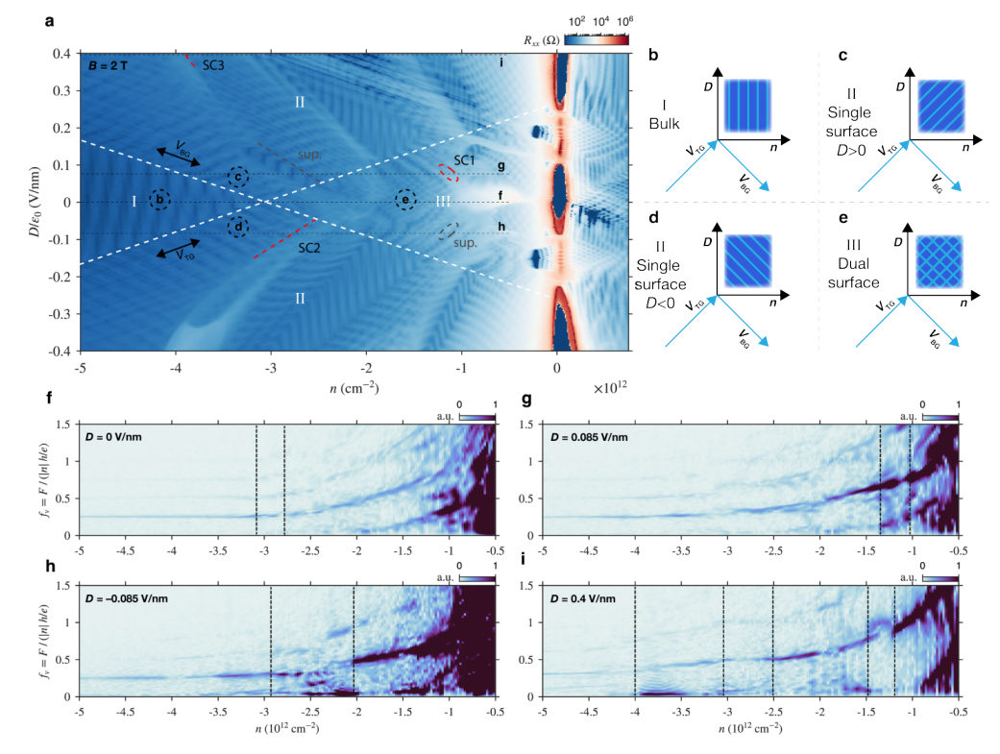
<figcaption class="paper-figure-caption"><b>Fig 2.</b> FIG. 2. Quantum oscillations and gate-tracking features of WS2-proximitized R5G. a, Longitudinal resistance Rxx as a function of carrier density n and displacement field D/ε0 at B = 2 T. On the hole-doped side, the phase diagram separates into the bulk regime (Region I), single-surface regime (Region II), and dual-surface regime (Region III), bounded by gate- tracking features (white dashed lines). The superconducting pockets SC1 and SC2 (red dashed outlines), their suppressed or strongly weakened counterparts (“sup.”), and SC3 are marked. Black arrows indicate the directions of the bottom- and top-gate voltage axes, VBG and VTG; letters denote the positions corresponding to the schematics...</figcaption>
</figure>
<figure class="paper-figure-card">
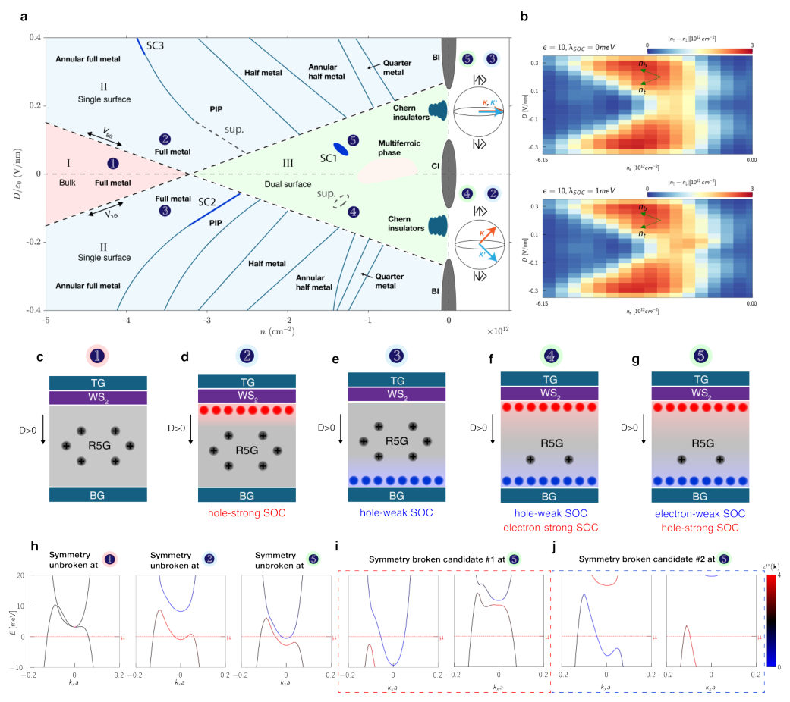
<figcaption class="paper-figure-caption"><b>Fig 3.</b> FIG. 3. Normal-state fermiology and surface-selective spin-orbit coupling. a, Schematic n–D phase diagram of the hole-doped side obtained from the analysis of Fig. 2. Region I is a bulk-like full metal. Region II contains single-surface metallic states, including full-metal, partially isospin-polarized (PIP), half-metallic, annular half-metallic, and quarter-metallic regimes. Region III contains dual-surface metallic, correlated insulating (CI), and multiferroic phases, terminating in band-insulating (BI) states at large |D|. Circled numerals 1–5 mark representative positions shown in c–g and h–j; SC1, SC2, and SC3 are indicated. Insets illustrate the valley-contrasting Ising SOC induced by...</figcaption>
</figure>

**Summary.** This research uses surface-selective measurements on graphene proximitized by WS2 to investigate the spin structure of superconductivity. By observing how superconducting pockets appear or disappear depending on carrier polarization relative to the interface, the authors provide strong evidence supporting a spin-triplet pairing mechanism. The combination of advanced transport measurements and theoretical modeling makes this a powerful tool for studying correlated electron phenomena in 2D materials.

**Why it may be interesting.** The work provides a highly tunable platform for probing exotic superconducting symmetries in 2D materials. The use of proximity coupling as a 'spin probe' is valuable because it allows researchers to selectively perturb and measure specific components of the pairing order parameter, which is crucial for understanding unconventional superconductivity mechanisms.

Detailed structure

**Main problem.** To obtain complementary probes of the superconducting spin structure in rhombohedral graphene, as direct magnetic field probing is challenging due to multiple possible microscopic mechanisms for field-robust superconductivity.

**Main result.** The surface-selective proximity coupling to WS2 acts as a displacement-field-tunable probe, providing evidence for spin-triplet superconductivity by observing superconducting asymmetry dependent on carrier polarization relative to the interface.

**Method.** The study combines low-temperature magnetotransport measurements (measuring $R_{xx}$ and differential resistance) with theoretical self-consistent band structure calculations using a mean-field Hartree-Fock approach.

**Model / system.** The system is rhombohedral pentalayer graphene (R5G) proximitized on one side by WS2. The physics involves analyzing the interplay between superconducting pairing, induced Ising spin-orbit coupling (SOC), and carrier polarization across different electronic regimes (bulk vs. surface pockets).

**Key observables.** Superconducting pocket robustness ($	ext{SC1}, 	ext{SC2}, 	ext{SC3}$), asymmetry in superconductivity under displacement field reversal, quantum oscillation patterns, and Fermi-surface topology.

**Important parameters / regimes.** Low temperature ($T \simeq 8.5 	ext{ mK}$), zero magnetic field ($	ext{B}=0 	ext{ T}$), and the magnitude of the displacement field ($D/\epsilon_0$).

**Assumptions / limitations.** The analysis assumes that the observed asymmetry is due to the surface-selective nature of the Ising SOC, which competes with different pairing symmetries.

**Figures summary.** Figures illustrate longitudinal resistance vs. carrier density and displacement field, quantum oscillation patterns in gate voltage planes, and schematics detailing the three distinct superconducting pockets ($	ext{SC1}-	ext{SC3}$).

**Paper structure.** The paper first establishes the experimental platform using magnetotransport measurements to map out superconducting regimes based on external fields. It then uses quantum oscillations and band structure calculations to characterize the underlying electronic topology (Fermi surface). Finally, it integrates these findings by analyzing how the SOC modifies the pairing state, leading to the conclusion about spin-triplet superconductivity.

Abstract

Superconductivity in rhombohedral graphene has been observed across many layer numbers, with mounting evidence pointing toward spin-triplet pairing, yet complementary probes of the superconducting spin structure remain needed. Here we use one-sided WS$_2$ proximity in rhombohedral pentalayer graphene (R5G) as a surface-selective spin-orbit probe. The induced Ising spin-orbit coupling is strongest for carriers localized near the WS$_2$ interface, allowing the displacement field to tune the overlap between superconducting carriers and the spin-orbit perturbation. We observe a strongly asymmetric superconducting landscape: two robust pockets, SC1 and SC2, survive only on mutually opposite signs of displacement field, while a third pocket, SC3, is substantially weaker. Gate-tracking features, quantum oscillations, and self-consistent band-structure calculations identify the layer polarization and Fermi-surface character of the relevant carriers. The robust superconducting states are absent or strongly weakened when the active high-DOS carriers are polarized toward the WS$_2$ interface. Since Ising spin-orbit coupling is compatible with time-reversed spin-singlet pairing but competes with same-spin intervalley triplet pairing by canting or pinning the parent spin texture, this surface-selective suppression provides additional evidence for spin-triplet superconductivity involving both hole-like and electron-like carriers. Our results establish one-sided TMD proximity as a displacement-field-tunable probe of superconducting spin structure in rhombohedral graphene.

[↑ back to top](#top)

### [The New High-entropy Compound RhMnFeCoGe4 with Cubic Non-centrosymmetric B20 Structure](http://arxiv.org/abs/2608.03523v1)

**Authors:** V. A. Sidorov, V. N. Krasnorussky, A. V. Bokov, Z. N. Volkova, A. P. Gerashchenko, N. M. Chtchelkatchev, M. V. Magnitskaya, D. A. Salamatin, A. V. Semeno, V. V. Brazhkin, A. V. Tsvyashchenko  
**Type:** both · **Category:** strongly correlated electrons · **PDF:** <https://arxiv.org/pdf/2608.03523v1>  
**Analysis basis:** full PDF text, analyzed in chunks
**Topic relevance:** `exotic spin models in light-matter` **3/5** · `spintronics-quantum-optics interface` **3/5** · `Keldysh / 2PI / non-Gaussian methods` **1/5** · `Kondo & dissipative impurity` **1/5** · `analog quantum simulation` **1/5**

↔ Scroll figures horizontally

<figure class="paper-figure-card">
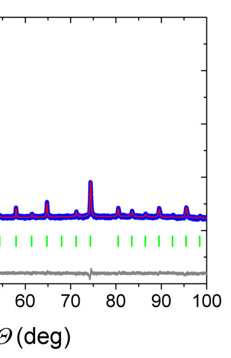
<figcaption class="paper-figure-caption"><b>Fig 1.</b> Figure 1: The XRD pattern of the RhMnFeCoGe4 compound. The blue dots represent the experimental data, the red line - fitting by Rietveld method, the gray line depicts the difference between the experiment and fitting, and the green ticks indicate the Bragg positions for the B20 structure. Asterisks denote the most intense peaks from the Fe1.67Ge impurity.</figcaption>
</figure>
<figure class="paper-figure-card">
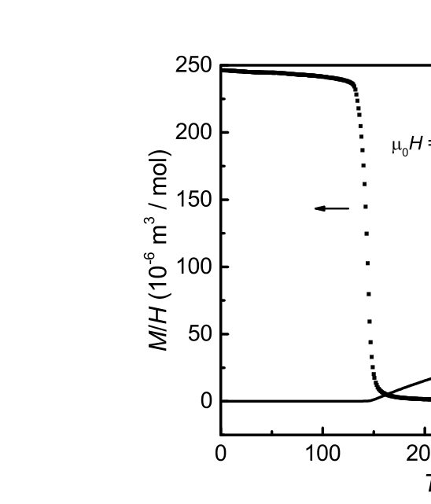
<figcaption class="paper-figure-caption"><b>Fig 2.</b> Figure 2: The temperature dependence of the magnetic susceptibility M/(µ0H) of the RhMnFeCoGe4 compound (left scale), measured in a field of µ0H = 0.01 T, and inverse magnetic susceptibility χ−1 = (µ0H)/M as a function of temperature (right scale). Red line - is a Curie-Weiss fit of χ−1 in a linear high-T region with µef f = 4.0 µB/f.u. and Curie-Weiss temperature Θ = 186 K.</figcaption>
</figure>
<figure class="paper-figure-card">
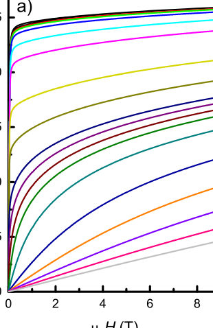
<figcaption class="paper-figure-caption"><b>Fig 3.</b> Figure 3: Isotherms of magnetization of the RhMnFeCoGe4 compound for temperatures in the range 2-260 K (panel a), spontaneous magnetization MS , obtained at µ0H = 9 T as a function of temperature (panel b).</figcaption>
</figure>
<figure class="paper-figure-card">
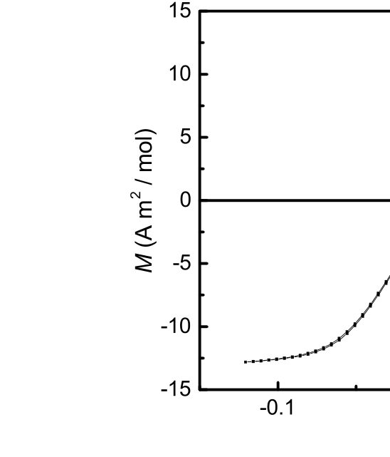
<figcaption class="paper-figure-caption"><b>Fig 4.</b> Figure 4: The magnetization of the RhMnFeCoGe4 compound, obtained at T = 2.0 K. Inset - an expanded region in proximity of µ0H = 0. The numbered arrows illustrate the variation in µ0H, which is represented by the following sequence: 1) an initial increase up to 9 T (black line), 2) a decrease in the field (red), and 3) a subsequent increase (blue).</figcaption>
</figure>
<figure class="paper-figure-card">
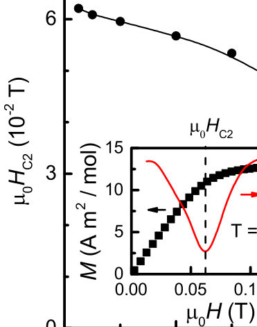
<figcaption class="paper-figure-caption"><b>Fig 5.</b> Figure 5: The magnetic phase diagram of the RhMnFeCoGe4 compound. The points were identified as local minimums of the second derivative of the magnetization curve, the line is a guide for the eye. Inset demonstrate M(µ0H) (points) and d2M/d(µ0H)2 (line) dependencies as a function of magnetic field µ0H at T = 5 K. The position of the µ0HC2 is indicated by a vertical dashed line.</figcaption>
</figure>

**Summary.** This work reports on the synthesis and comprehensive characterization of a novel high-entropy compound, RhMnFeCoGe4, which crystallizes in a B20 structure. The material is found to be ferromagnetic with a critical temperature of 146 K. By combining magnetic measurements, NMR spectroscopy, and DFT calculations, the authors map out its electronic structure and how its magnetic properties respond to external pressure.

**Why it may be interesting.** While primarily condensed matter physics, the detailed study of magnetic phase transitions and electronic band structures in complex, disordered materials like high-entropy alloys touches upon many-body interactions relevant to correlated electron systems.

Detailed structure

**Main problem.** The study focuses on synthesizing and characterizing a novel high-entropy compound, RhMnFeCoGe4, which possesses a cubic non-centrosymmetric B20 structure.

**Main result.** The material exhibits ferromagnetic behavior with a critical temperature of 146 K and a spontaneous moment of 2.5 mu_B per formula unit, showing magnetic properties sensitive to external pressure.

**Method.** A combination of experimental techniques (XRD, VSM, NMR) and theoretical calculations (ab initio DFT) was employed to investigate its electronic and magnetic structure.

**Model / system.** The physical system is the high-entropy compound RhMnFeCoGe4, which adopts a cubic non-centrosymmetric B20 crystal structure. The research explores how magnetism and transport properties are governed by this complex composition under varying pressure conditions.

**Key observables.** Ferromagnetic ordering ($T_C=146$ K), spontaneous magnetization ($2.5 \mu_B$), critical exponents ($eta, \gamma, \delta$), magnetic moments of constituent atoms (Mn: $2.2 \mu_B$, Co: $0.5 \mu_B$), and lattice parameters.

**Important parameters / regimes.** Critical temperature ($T_C=146$ K), applied pressures (up to 8 GPa), temperatures (2–260 K), and magnetic fields ($\le 9$ T).

**Assumptions / limitations.** The analysis assumes that the observed resistivity anomaly is due to chemical disorder, which was not fully accounted for in the initial *ab initio* simulations.

**Figures summary.** Figures illustrate XRD patterns confirming the B20 structure; magnetization vs. temperature/field curves show ferromagnetic transitions and critical behavior; DOS and band structures compare paramagnetic and ferromagnetic states.

**Paper structure.** The paper follows a standard materials science investigation: synthesis confirmation (XRD) $
ightarrow$ bulk magnetic characterization (VSM, critical exponents) $
ightarrow$ microscopic analysis (NMR, DFT calculations of DOS/band structure) $
ightarrow$ discussion of pressure effects.

Abstract

A novel high-entropy compound, RhMnFeCoGe$_4$, with a cubic non-centrosymmetric B20 struc- ture, has been synthesized under conditions of high pressure and temperature. The electrical transport and magnetic properties of the obtained compound at both ambient and elevated pres- sures have been investigated. In addition, nuclear magnetic resonance (NMR) spectra were obtained at 4.2 K and ab initio calculations were performed. The new material exhibits ferromag- netic behavior with a critical temperature of $T_C$ = 146 K and a spontaneous moment of 2.5 $μ_B$ per formula unit. The magnetization data obtained at the critical region yielded the critical temperature and exponents, which were found to be $T_C$ = 146(1) K, $β$ = 0.337(1), $γ$ = 1.121(1), and $δ$ = 4.326(1). The magnetic moments of Mn and Co were determined from NMR spectra to be 2.2 $μ_B$ and 0.5 $μ_B$, respectively. Ab initio calculations yielded reasonable values for the lattice parameter and the magnetic moments of all constituents. The density of states and band structure are determined for both paramagnetic and ferromagnetic states. Lattice compression results in the increase in the $T_C$.

[↑ back to top](#top)

### [Magnetoresistance in Magnetic Weyl semimetal Mn$_{3}$ZnC](http://arxiv.org/abs/2608.03414v1)

**Authors:** Sunil Gangwar, C. S. Yadav  
**Type:** both · **Category:** strongly correlated electrons · **PDF:** <https://arxiv.org/pdf/2608.03414v1>  
**Analysis basis:** full PDF text, analyzed in chunks
**Topic relevance:** `spintronics-quantum-optics interface` **3/5** · `Kondo & dissipative impurity` **1/5** · `analog quantum simulation` **1/5** · `exotic spin models in light-matter` **1/5** · `non-equilibrium dynamics` **1/5**

↔ Scroll figures horizontally

<figure class="paper-figure-card">
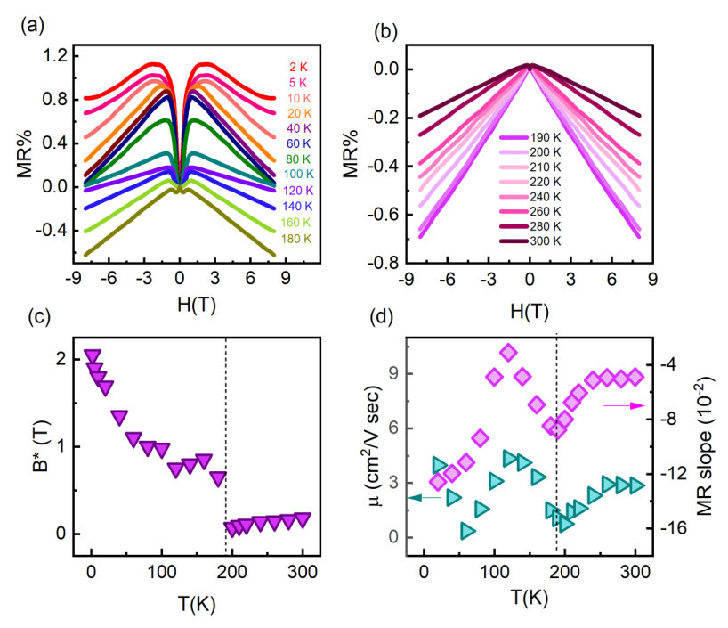
<figcaption class="paper-figure-caption"><b>Fig 1.</b> Figure 1. Magnetic field dependent magnetoresistance (MR) of Mn3ZnC in the temperature range (a) 1.8 - 180 K, and (b) 190 - 300 K. (c) Critical magnetic field B∗as a function of temperature. (d) Carrier mobility µ and MR slope as a function of temperature.</figcaption>
</figure>
<figure class="paper-figure-card">
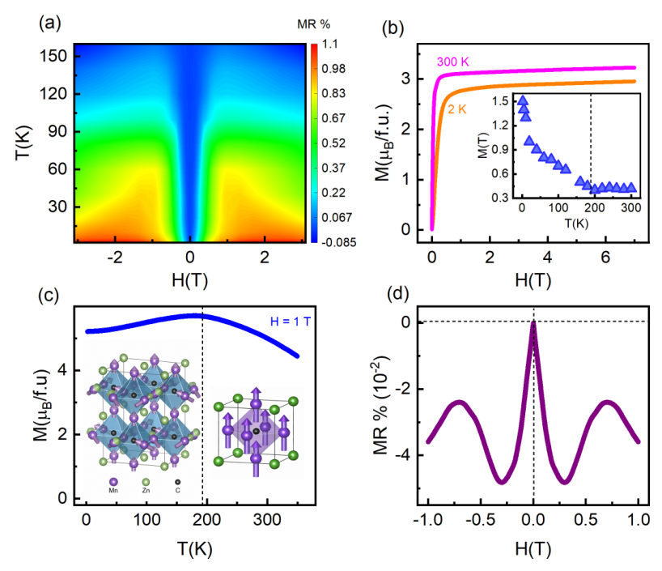
<figcaption class="paper-figure-caption"><b>Fig 2.</b> Figure 2. (a) Contour plot of MR % in the temperature range of 1.8 - 160 K up to 3 T applied magnetic field. (b) Isothermal magnetization as a function of magnetic field at 2 K and 300 K. Inset shows the critical magnetization values as a function of temperature. (c) Magnetization as a function of temperature at H= 1 T applied magnetic field. Inset shows the magnetic crsytal structures in ferrimagnetic and ferromagnetic states. (d) MR % as a function of temperature at 180 K.</figcaption>
</figure>
<figure class="paper-figure-card">
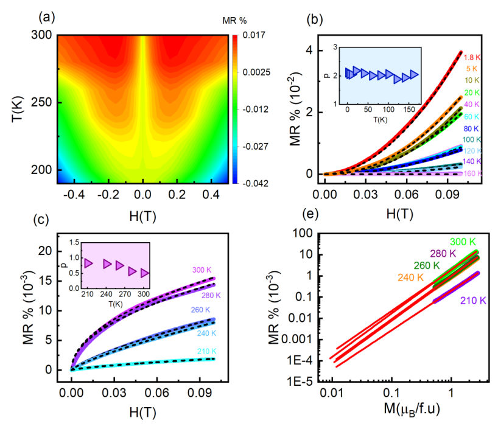
<figcaption class="paper-figure-caption"><b>Fig 3.</b> Figure 3. (a) Contour plot of MR % in the temperature range of 190 - 300 K up to 0.5 T applied magnetic field. (b) MR % curves as a function of field in the temperature range of T = 1.8 – 160 K, fitted with MR ∝Hp power law. (c) MR % curves as a function of field in the temperature range of T = 210 – 300 K, fitted with MR ∝Hp power law. The insets in (b) and (c) show the temperature dependence of the exponent p. (d) MR % curves as a function of magnetization in the temperature range of T = 210 – 300 K, fitted with MR ∝M β power law.</figcaption>
</figure>
<figure class="paper-figure-card">
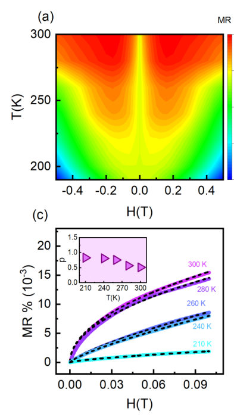
<figcaption class="paper-figure-caption"><b>Fig 4.</b> Figure 4 shows the temperature dependence of MR, which decreases monotonically as the temperature in- creases. The value of MR is ∼0.8 %, at 1.8 K, and reaches to - 0.23 % at room temperature. The magni- tude of MR is small, owing to the low carrier mobility in the compound. A sign reversal is observed around 120 K, which coincides with a sharp drop in carrier mobility at roughly the same temperature. The sign change in MR observed in various materials and has been associated with the interplay between carrier mobility and scatter- ing mechanisms [30, 31]. Similarly, for Mn3ZnC, the car-</figcaption>
</figure>
<figure class="paper-figure-card">
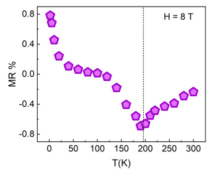
<figcaption class="paper-figure-caption"><b>Fig 5.</b> Figure 4. Magnetoresistance as a function of temperature at H = 8 T field.</figcaption>
</figure>

**Summary.** This paper reports on magnetoresistance measurements in the magnetic nodal line semimetal Mn3ZnC, demonstrating a clear link between MR anomalies and the material's ferromagnetic/ferrimagnetic transitions. By analyzing how MR changes with field and temperature relative to magnetization, the authors suggest that quantum transport effects related to spin-dependent scattering govern the electronic behavior.

**Why it may be interesting.** While focused on condensed matter magnetism, the strong dependence of electronic transport properties (MR) on spin polarization and topological band structure provides insights into emergent quantum phenomena relevant to correlated electron systems.

Detailed structure

**Main problem.** The study investigates magnetoresistance (MR) in magnetic topological semimetals to understand how spin-dependent electron scattering mechanisms couple with magnetic ordering.

**Main result.** The MR behavior is strongly correlated with the material's magnetic state (FM vs. FIM), showing distinct field and temperature dependencies that suggest quantum transport effects dominate over classical models.

**Method.** The research combines experimental measurements of MR versus applied magnetic field and temperature with theoretical analysis comparing observed power laws to established quantum transport theories.

**Model / system.** The system under study is Mn3ZnC, an antiperovskite nodal line semimetal exhibiting both ferromagnetic (FM) and ferrimagnetic (FIM) transitions. The analysis draws parallels with general topological magnetic materials.

**Key observables.** Magnetoresistance (MR), magnetization ($M$), carrier mobility ($\mu$), and the field/temperature dependence of MR power laws ($	ext{MR} \propto H^p$ or $	ext{MR} \propto M^eta$).

**Important parameters / regimes.** Magnetic transition temperatures ($\sim 420	ext{ K}$ FM, $\sim 195	ext{ K}$ FIM), low-field critical fields ($B^*$), and high magnetic field regimes ($\geq 2	ext{ T}$).

**Assumptions / limitations.** The analysis tests applicability of various transport models (PL model, Guiding Center Diffusion) and ultimately favors quantum limit theories due to low sample mobility.

**Figures summary.** Figures illustrate MR vs. H at varying T across magnetic transitions; contour plots show low-field MR dependence on field/temperature; magnetization curves track the FM/FIM states.

**Paper structure.** The paper systematically analyzes MR data, first establishing the correlation between MR and $M(H)$ in different magnetic phases (FM vs. FIM). It then compares observed field dependencies to theoretical models before concluding with interpretations based on quantum transport limits.

Abstract

The magnetoresistance (MR) in magnetic materials reveal an intriguing spin-dependent electron scattering, highlighting the role of spin polarization on the electronic transport properties. This becomes even more interesting for the topological magnetic materials where a finite Berry curvature leads to an intrinsic scattering channel also. In this report, we investigate MR of Mn$_{3}$ZnC, an antiperovskite magnetic nodal line semimetal. Mn$_{3}$ZnC shows a ferromagnetic (FM) transition at $\sim$ 420 K, followed by an ferrimagnetic (FIM) transition at $\sim$ 195 K. We focus on the interpretation of MR data and highlight the relation between MR and its magnetization. The signature of magnetization induced MR shows correlation at low magnetic fields and displays distinct behaviors in the FIM and FM states. Similar to the isothermal magnetization M(H) curve of FM and FIM state, the MR curves exhibit a sharp increase, followed by a linear behavior at higher fields. As the magnetic field varies, the cusp-like anomaly becomes more pronounced, and vanishes at the magnetic phase transition, which then reappears as the temperature increases. The sign change in the MR curves in the FIM state is attributed to a drastic change in the carrier mobility. Interestingly, this system shows a positive MR in FM state at very low field, which is quite unusual.

[↑ back to top](#top)

### [Exotic superconductivity in the doped Kitaev quantum spin liquid](http://arxiv.org/abs/2608.03024v1)

**Authors:** Takahiro Misawa, Kota Ido  
**Type:** theory · **Category:** strongly correlated electrons · **PDF:** <https://arxiv.org/pdf/2608.03024v1>  
**Analysis basis:** full PDF text, analyzed in chunks
**Topic relevance:** `exotic spin models in light-matter` **3/5** · `analog quantum simulation` **2/5** · `Keldysh / 2PI / non-Gaussian methods` **1/5**

↔ Scroll figures horizontally

<figure class="paper-figure-card">
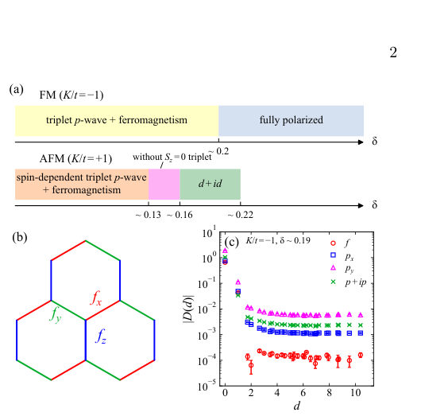
<figcaption class="paper-figure-caption"><b>Fig 1.</b> FIG. 1. (a) Schematic phase diagrams as functions of the hole concentration δ for the ferromagnetic (K/t = −1) and anti- ferromagnetic (K/t = +1) Kitaev interactions. The shaded regions use the same colors as Figs. 2 and 3, and the phase boundaries are estimated from the L = 12 results. (b) Honey- comb lattice with the three bond types α ∈{x, y, z} and the corresponding nearest-neighbor form factors fx, fy, fz used to construct the pairing operators. (c) Distance dependence of the pairing correlation Dη α(r) for the four triplet form fac- tors (f, px, py, p + ip) in the Sz = 0 sector on the L = 12 cluster at δ ≃0.19 with the ferromagnetic Kitaev interaction (K/t = −1). The plateau for d...</figcaption>
</figure>
<figure class="paper-figure-card">
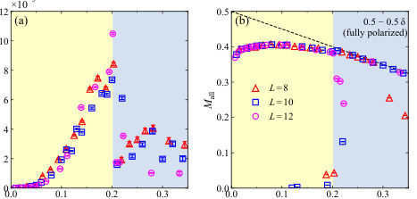
<figcaption class="paper-figure-caption"><b>Fig 2.</b> FIG. 2. Ferromagnetic Kitaev interaction (K/t = −1). (a) Doping dependence of the long-range-averaged py triplet superconducting correlation P all py = [(P T py)2 + (P ↑ py)2 + (P ↓ py)2]1/2 for L = 8, 10, and 12. (b) Total magnetization Mall for L = 8, 10, and 12. The dashed line shows the fully po- larized value (1 −δ)/2. The yellow shading marks the doping range where the triplet p-wave superconducting correlation is enhanced. The blue shading marks the doping range where the magnetization approaches the fully polarized value.</figcaption>
</figure>
<figure class="paper-figure-card">
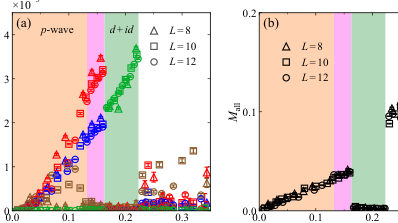
<figcaption class="paper-figure-caption"><b>Fig 3.</b> FIG. 3. Antiferromagnetic Kitaev interaction (K/t = +1). (a) Doping dependence of representative long-range-averaged pairing correlations for L = 8, 10, and 12: Sz = 0 triplet py (brown: P T py), equal-spin triplet (blue: P ↑ px and red: P ↓ py), and singlet d + id (green: P S d+id). Two triplet regimes appear at low doping, one with and one without sizable P T py, followed by a narrow d+id regime and a high-doping regime with weak, size-dependent triplet correlations. The orange, magenta, and green shaded regions mark these two triplet regimes and the d + id regime, respectively. (b) Total magnetization Mall for L = 8, 10, and 12.</figcaption>
</figure>

**Summary.** The authors theoretically investigate exotic superconductivity in the doped Kitaev quantum spin liquid using variational Monte Carlo simulations. They find that superconducting pairing symmetries are highly dependent on doping and the sign of the Kitaev interaction, predicting robust triplet p-wave superconductivity coexisting with ferromagnetism for FM coupling. This work offers a theoretical roadmap for searching for such unconventional phases in real materials.

**Why it may be interesting.** This work directly addresses unconventional superconductivity in a highly correlated magnetic system, providing concrete predictions—like triplet p-wave coexistence with magnetism—that guide experimental searches in candidate materials.

Detailed structure

**Main problem.** The study investigates exotic superconducting phases, particularly triplet p-wave and singlet d+id pairing, that can coexist with ferromagnetism in a doped Kitaev quantum spin liquid.

**Main result.** For ferromagnetic coupling, robust triplet superconductivity coexists with ferromagnetism at low to intermediate doping. For antiferromagnetic coupling, the superconducting symmetry changes from triplet p-wave to singlet d+id pairing as doping increases.

**Method.** The research employs the many-variable variational Monte Carlo (mVMC) method using a projected pair-product wave function representation of the Kitaev quantum spin liquid.

**Model / system.** The system is the hole-doped t-J-type Kitaev model on the honeycomb lattice, analyzed for both ferromagnetic ($K/t=-1$) and antiferromagnetic ($K/t=+1$) Kitaev interactions. The analysis covers doping regimes ($\delta$).

**Key observables.** Superconducting pairing correlations (singlet/triplet), uniform magnetization per site ($M_\alpha$), and total magnetization ($M_{all}$).

**Important parameters / regimes.** Doping concentration ($\delta$), Kitaev interaction strength ratio ($K/t$), and lattice size ($L=8, 10, 12$).

**Assumptions / limitations.** The analysis relies on projecting the BCS state onto a fixed particle number sector to obtain the pair-product wave function $|\phi_{	ext{pair}}(F)
angle$. The fate in the thermodynamic limit remains an open question.

**Figures summary.** Figures show phase diagrams vs. doping for FM/AFM cases, distance dependence of pairing correlations ($D_{\eta}^\alpha(r)$), and doping dependence of triplet correlation ($P_{all}^{py}$) alongside total magnetization ($M_{all}$).

**Paper structure.** The paper systematically analyzes the superconducting ground state by first establishing the theoretical framework using projected wave functions (BdG approach) and then applying mVMC to calculate pairing correlations and magnetization across different doping regimes for both FM and AFM couplings.

Abstract

We investigate superconductivity in a doped Kitaev quantum spin liquid by applying the many-variable variational Monte Carlo method to the hole-doped $t$-$J$-type Kitaev model. Using a projected pair-product wave function that can exactly represent the Kitaev quantum spin liquid, we examine the stability of superconducting phases on isotropic two-dimensional clusters. For the ferromagnetic Kitaev interaction, robust triplet $p$-wave superconductivity coexists with ferromagnetism in the low-to-intermediate doping regime but is suppressed as the system approaches the fully polarized ferromagnetic phase. For the antiferromagnetic Kitaev interaction, superconductivity exhibits a change in the dominant pairing symmetry from spin-dependent triplet $p$-wave at low doping to singlet $d+id$ at intermediate doping. By varying the strength of the ferromagnetic Kitaev interaction at fixed doping, we show that the triplet superconductivity increases together with the ferromagnetic moment and becomes strongest slightly below full polarization. Our results provide a theoretical basis for experimental searches for unconventional superconductivity, such as triplet superconductivity coexisting with ferromagnetism, in carrier-doped Kitaev candidate materials.

[↑ back to top](#top)

### [Tunable Skyrmions in a Topological Wigner Crystal](http://arxiv.org/abs/2608.02832v1)

**Authors:** David A. Dahlbom, Daniel Kaplan, Premala Chandra, Cristian D. Batista  
**Type:** theory · **Category:** strongly correlated electrons · **PDF:** <https://arxiv.org/pdf/2608.02832v1>  
**Analysis basis:** full PDF text, analyzed in chunks
**Topic relevance:** `exotic spin models in light-matter` **3/5** · `analog quantum simulation` **2/5** · `Keldysh / 2PI / non-Gaussian methods` **1/5**

↔ Scroll figures horizontally

<figure class="paper-figure-card">
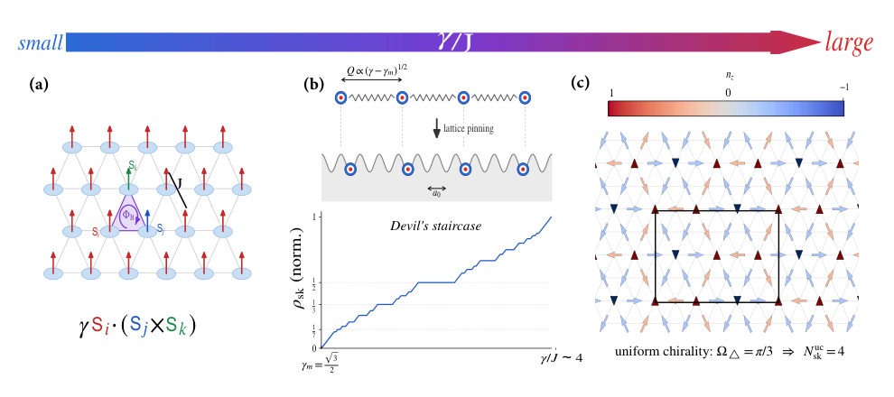
<figcaption class="paper-figure-caption"><b>Fig 1.</b> Figure 1. Illustration of the topology-induced competition. (a) In the ferromagnetic Wigner crystal, the pseudospin degree of freedom is coupled ferromagnetically via a Heisenberg exchange J. Without any Berry flux, this state is fully polarized. In the presence of a finite Berry flux, three-particle exchange contributes an additional phase ΦB, which determines the chiral coupling γ. (b) As the chiral coupling is increased relative to J, the ferromagnet becomes unstable. At the critical value γ/J = √</figcaption>
</figure>
<figure class="paper-figure-card">
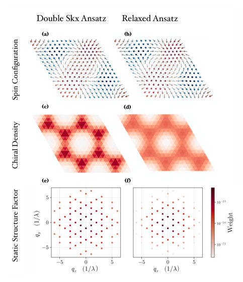
<figcaption class="paper-figure-caption"><b>Fig 2.</b> Figure 2. Comparison between the triple-Q ansatz of Eq. (31) and the numerically relaxed configuration ((a) and (b)) with Q = 0.0625 and γ = 0.93. The spatial distribution of the skyrmion density is largely preserved under relaxation, with only quantitative distortions of the profile ((c) and (d)), corre- sponding to a transfer of weight to lower-order Fourier com- ponents ((e) and (f), colors in log scale). The Brillouin zone boundary lies outside of the panel boundaries of (e) and (f); without log color scaling, weight would only be visible on the six innermost components in both cases.</figcaption>
</figure>
<figure class="paper-figure-card">
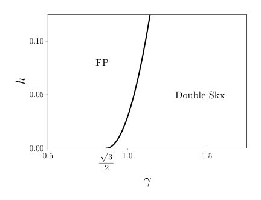
<figcaption class="paper-figure-caption"><b>Fig 3.</b> Figure 3. Long-wavelength phase diagram for the Hamiltonian of Eq. (1) including lattice corrections up to quartic order in inverse skyrmion lengthscale 1/λ. “FP” is the fully polarized phase, and “Double Skx” is a crystal of double skyrmions. The spin texture of the Double Skx phase is illustrated in Fig. 2.</figcaption>
</figure>
<figure class="paper-figure-card">
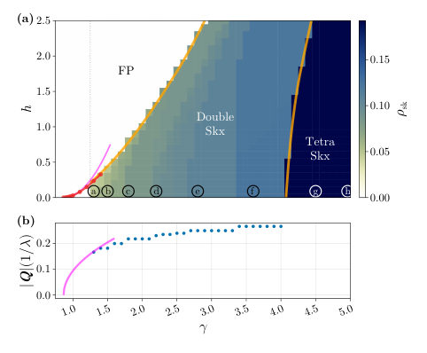
<figcaption class="paper-figure-caption"><b>Fig 4.</b> Figure 4. (a) Phase diagram for the Hamiltonian of Eq. (1) as determined from numerical simulations on a lattice. The color gradient, drawn from a grid of unbiased simulations beginning with γ = 1.3, represents the skyrmion density ρsk. With in- creasing γ, the phases develop from a fully polarized (FP) order into a double skyrmion crystal (Double Skx). The skyrmion density increases with larger γ until finally transitioning into a tetra-skyrmion state with uniform scalar spin chirality and four skyrmions per magnetic unit cell (Tetra Skx). The phase boundary between the FP and Double Skx phases illustrated in Fig 5 (d) is shown in red dots and lines. The prediction of the long wavelength...</figcaption>
</figure>
<figure class="paper-figure-card">
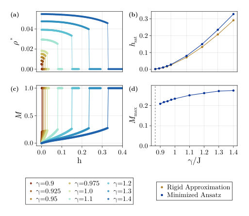
<figcaption class="paper-figure-caption"><b>Fig 5.</b> Figure 5. Behavior of the optimized double skyrmion ansatz approaching the transition to the fully polarized state. (a) Evolution of the skyrmion density ρsk as a function of field for a range of small γ values above the transition. (b) Phase boundary determined by an interpolated numerical study of the ansatz (blue dots) together with the lower-bound on the phase boundary predicted by the rigid approximation [Eq. (39)]. The rigid approximation remains good up to about γ = 1.1. (c) Evolution of the magnetization M as a function of field for a series of γ values. (d) Magnetization of the ansatz just below the saturation field hsat.</figcaption>
</figure>

**Summary.** The paper theoretically investigates the formation of skyrmion crystals in Wigner solids whose underlying band structure imparts Berry curvature. By modeling the competition between Heisenberg and chiral interactions, the authors show that the system's topological texture density is continuously tunable via the ratio of these coupling constants. This establishes a comprehensive phase diagram for ferromagnetic topological Wigner crystals.

**Why it may be interesting.** This work connects topological quantum geometry (Berry curvature) directly to emergent magnetic textures (skyrmions) in strongly correlated electron systems, providing a theoretical framework for understanding exotic electronic states beyond simple magnetism.

Detailed structure

**Main problem.** Investigating how topological textures, specifically skyrmions, emerge and are stabilized in Wigner crystals when underlying electronic bands possess Berry curvature.

**Main result.** The competition between ferromagnetic exchange ($J$) and chiral interaction ($\gamma$) stabilizes a zero-field tunable skyrmion crystal whose density can be continuously tuned by the ratio $\gamma/J$.

**Method.** A combination of continuum field theory (nonlinear sigma model) applied to a discrete triangular lattice, supplemented by gradient expansion techniques up to fourth order.

**Model / system.** The system models low-density electrons forming a Wigner solid on a triangular lattice. The effective spin Hamiltonian includes Heisenberg exchange ($J$) and a chiral three-spin interaction ($\gamma$), which originates from the Berry curvature of the underlying electronic bands.

**Key observables.** Skyrmion density ($
ho_{sk}$), topological charge ($N_{sk}$), magnon structure, and the Dynamical Spin Structure Factor (DSSF).

**Important parameters / regimes.** The ratio $\gamma/J$ is crucial for tuning skyrmion density; extreme coupling leads to a 24-site tetra-skyrmion crystal.

**Assumptions / limitations.** The analysis assumes a regular triangular lattice structure and relies on expanding the Hamiltonian in spatial derivatives up to fourth order in the continuum limit.

**Figures summary.** Figures illustrate the phase diagram showing transitions from ferromagnetic Wigner crystals to double-skyrmion crystals, culminating in the tetra-skyrmion crystal at large chiral coupling ($\gamma/J \geq 4$).

**Paper structure.** The paper progresses from defining the microscopic Hamiltonian on the lattice, deriving the continuum sigma model, analyzing energy contributions via gradient expansion (up to fourth order), and finally characterizing specific complex phases like the tetra-skyrmion crystal using real and momentum space representations.

Abstract

In low density systems with strong interactions electrons are expected to crystallize into a Wigner solid. Recently, advances in two-dimensional systems where electrons carry Berry curvature have added a topological dimension to Wigner crystallization. Using a model for pseudospin interactions in a topological Wigner crystal, here we show that the competition between ferromagnetic Heisenberg exchange $J$ and the chiral interaction $γ$ on the triangular lattice stabilizes a zero-field skyrmion crystal whose density is continuously tunable through the ratio $γ/J$. The chiral interaction originates from finite Berry curvature in an underlying time-reversal broken Wigner crystal. In the continuum limit, the chiral interaction acts as a chemical potential for skyrmions, while higher-order gradient terms beyond the nonlinear sigma model select the skyrmion density. At large chiral coupling, we uncover a 24-site tetra-skyrmion crystal carrying four units of topological charge per magnetic unit cell, which becomes degenerate with four-sublattice tetrahedral order as $J \to 0$. We characterize the magnon structure for these phases and discuss the transition between the tunable skyrmion crystal to these states at large $γ/J$. Our results establish the phase diagram of ferromagnetic topological Wigner crystals.

[↑ back to top](#top)

### [Contrasting anisotropic electron-phonon-spin coupling in Fe$_{3}$GeTe$_{2}$ and Fe$_{5}$GeTe$_{2}$: A helicity-resolved Raman study](http://arxiv.org/abs/2608.03193v1)

**Authors:** Smrutiranjan Mekap, Jyoti Saini, Andrzej Ptok, Pawan Kumar Srivastava, Changgu Lee, Subhasis Ghosh, Anushree Roy  
**Type:** experiment · **Category:** strongly correlated electrons · **PDF:** <https://arxiv.org/pdf/2608.03193v1>  
**Analysis basis:** full PDF text, analyzed in chunks
**Topic relevance:** `spintronics-quantum-optics interface` **3/5** · `exotic spin models in light-matter` **1/5**

↔ Scroll figures horizontally

<figure class="paper-figure-card">
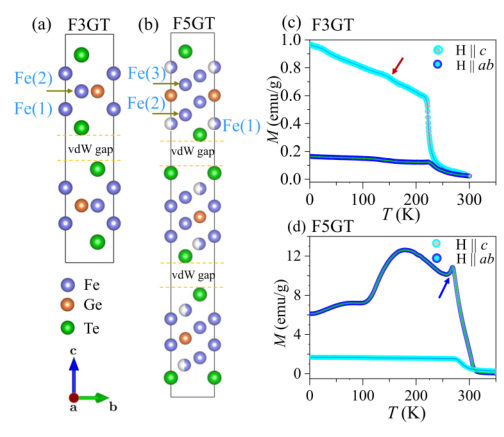
<figcaption class="paper-figure-caption"><b>Fig 1.</b> Figure 1. Crystal structure of (a) F3GT, and (b) F5GT. Fe, Ge, and Te atoms are shown with colored solid balls. vdW gaps between layers are shown by a pair of yellow dashed lines. The polarised M–T curves measured for in-plane and out-of-plane magnetic fields for (c) F3GT, and (d) F5GT. For descriptions of arrows, refer to the text.</figcaption>
</figure>
<figure class="paper-figure-card">
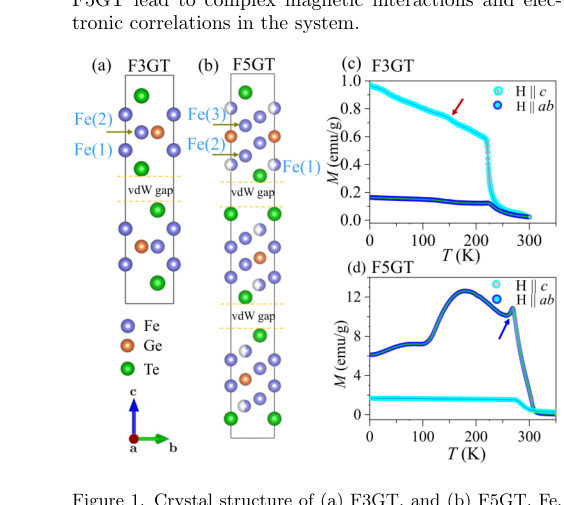
<figcaption class="paper-figure-caption"><b>Fig 2.</b> Figure 1(c) and (d) present the temperature-dependent magnetization measured with a magnetic field applied along the ab plane and the c axis for F3GT and F5GT, respectively. Both compounds undergo a paramagnetic (PM)-to-ferromagnetic (FM) transition, with TC ≈223</figcaption>
</figure>
<figure class="paper-figure-card">
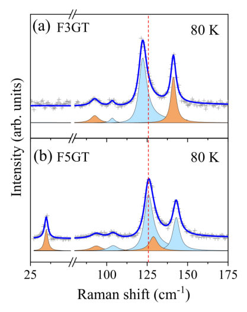
<figcaption class="paper-figure-caption"><b>Fig 3.</b> Figure 2. Raman spectra of (a) F3GT, and (b) F5GT at 80 K under RL configuration. The measured spectra are shown with + symbols, and the net fitted spectra are shown by blue curves. The deconvoluted A and E modes are shown by cyan and orange shaded areas, respectively. The red dashed line marks the difference in Raman shift of these two compounds for an A1 mode.</figcaption>
</figure>
<figure class="paper-figure-card">
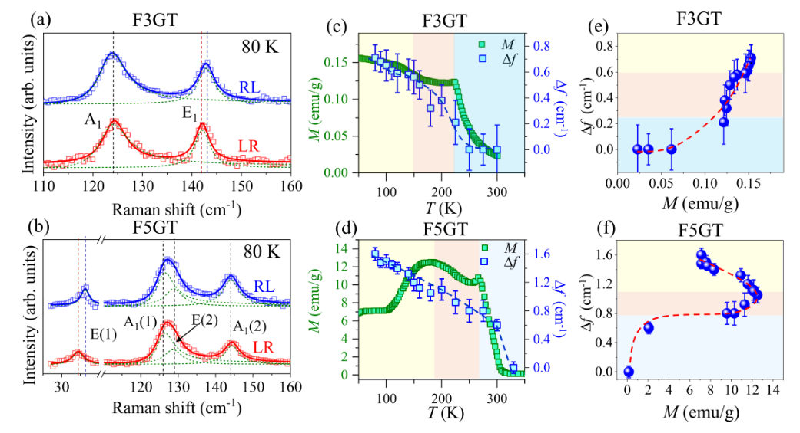
<figcaption class="paper-figure-caption"><b>Fig 4.</b> Figure 3. Magnified helicity-resolved Raman spectra in RL and LR configurations at 80 K are presented by blue and red symbols, respectively, for (a) F3GT, and (b) F5GT. The dashed lines mark the maximum of the Raman peak positions in these configurations. The comparison between M −T in the ab-plane and ∆f −T for (c) F3GT and (d) F5GT. The variation of ∆f with in-plane magnetization for (e) F3GT, and (f) F5GT. Error bars with ∆f in panels (c)–(f) are estimated using the mean and standard deviation of the Raman shift obtained from a non-linear curve fitting procedure, and then following the propagation of error method. The color shades mark the one-to-one correspondence between ∆f and M...</figcaption>
</figure>
<figure class="paper-figure-card">
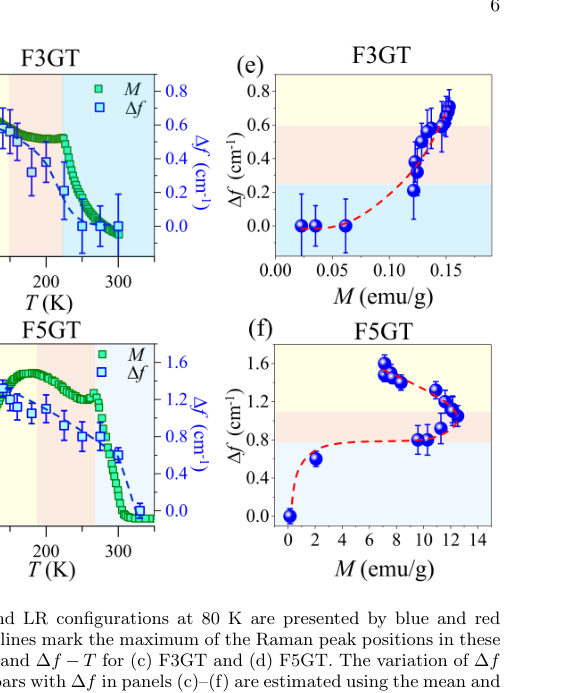
<figcaption class="paper-figure-caption"><b>Fig 5.</b> Figure 4(a)–(b) present the polar plots of the intensity of the A1 and E1 modes of F3GT at regular intervals of scattering directions for the incident RCP and LCP light at 80 K. In non-resonant helicity-resolved Raman scattering, the scattering intensity for the Ra-</figcaption>
</figure>

**Summary.** The research uses helicity-resolved Raman spectroscopy to compare the electron-phonon-spin coupling in $	ext{Fe}_3	ext{GeTe}_2$ and $	ext{Fe}_5	ext{GeTe}_2$. The findings reveal that this coupling is complex, stemming from spin-orbit interactions rather than just magnetic ordering. This highlights how crystal structure dictates the nature of anisotropic light-matter interaction in these layered magnets.

**Why it may be interesting.** This work provides experimental insight into how lattice vibrations couple anisotropically with spin-orbit coupled electronic states in magnetic materials, which is crucial for understanding emergent quantum phenomena in condensed matter systems.

Detailed structure

**Main problem.** The study aims to comparatively investigate anisotropic electron-phonon-spin coupling mechanisms in two-dimensional van der Waals ferromagnets, $	ext{Fe}_3	ext{GeTe}_2$ and $	ext{Fe}_5	ext{GeTe}_2$.

**Main result.** The helicity-dependent Raman response is shown to arise from spin-orbit-coupled electronic interactions rather than solely from time-reversal symmetry breaking due to magnetic order. Furthermore, the crystal structure dictates distinct coupling behaviors between the two compounds.

**Method.** Helicity-resolved Raman spectroscopy was employed, utilizing left- and right-circularly polarized excitations across varying temperatures and wavelengths.

**Model / system.** The physical systems are layered metallic ferromagnets: $	ext{Fe}_3	ext{GeTe}_2$ (hexagonal) and $	ext{Fe}_5	ext{GeTe}_2$ (rhombohedral). The analysis focuses on the interplay between lattice vibrations, electronic structure, and magnetic ordering in these materials.

**Key observables.** Chiral mode splitting ($\Delta f$), Fano asymmetry parameter ($1/q$), and polarization-dependent Raman intensities derived from helicity-resolved measurements.

**Important parameters / regimes.** Temperature dependence of coupling strengths; the difference between out-of-plane vs. in-plane magnetization effects on coupling anisotropy.

**Assumptions / limitations.** The analysis assumes that the observed spectral features can be decomposed into contributions from electron-phonon, spin-orbit, and magnetic ordering effects using symmetry group theory for Raman tensor fitting.

**Figures summary.** Figures illustrate unit cells for both compounds; polarization dependence plots (e.g., in VH configuration) are used to analyze mode symmetries and coupling mechanisms.

**Paper structure.** The paper establishes the context of 2D van der Waals ferromagnets, details the comparative measurements on $	ext{F}3	ext{GT}$ and $	ext{F}5	ext{GT}$, presents spectroscopic evidence regarding chiral splitting and Fano parameters, and concludes by relating structural differences to distinct coupling dynamics.

Abstract

Two-dimensional van der Waals ferromagnets Fe$_3$GeTe$ _2$ (F3GT) and Fe$_5$GeTe$_2$ (F5GT) exhibit pronounced magneto-optical responses, which open promising platforms for investigating the interplay among lattice, electronic, and magnetic degrees of freedom. Here, we present a comparative study of optical resonance-induced anisotropic electron-phonon coupling and its association with magnetic ordering in these systems using wavelength- and temperature-dependent helicity-resolved Raman spectroscopy. By resolving the doubly degenerate E modes under left- and right-circularly polarized excitations, we demonstrate that the temperature evolution of the chiral mode splitting ($Δf$) does not track the magnetization behavior, indicating that the helicity-dependent Raman response arises not solely from time-reversal symmetry breaking due to magnetic order, but also from spin-orbit-coupled electronic interactions. Notably, in F3GT, the out-of-plane magnetization indirectly governs the in-plane anisotropic electron-phonon coupling under optical resonance, whereas F5GT exhibits static anisotropic interactions. The Fano asymmetry parameter $1/q$ reveals mode- and temperature-dependent coupling strengths between phonons and the electronic continuum, with pronounced angular anisotropy in F3GT but isotropic behavior in F5GT--- a consequence of its multiple Fe sites and enhanced interlayer hybridization in the latter. Our results demonstrate the role of crystal structure and magnetic anisotropy in shaping the anisotropically coupled electron-phonon-spin dynamics in these layered metallic ferromagnets, and highlight Fe$_x$GeTe$_2$ as a versatile platform for microscopic insight into chiral light-matter interactions in layered metallic ferromagnets.

[↑ back to top](#top)

### [Gravitational redshift as a quantum channel: modeling the effects of gravitational redshift in quantum optics](http://arxiv.org/abs/2608.03549v1)

**Authors:** Thomas Mieling, Andreas Wolfgang Schell, David Edward Bruschi  
**Type:** theory · **Category:** quantum information and computing · **PDF:** <https://arxiv.org/pdf/2608.03549v1>  
**Analysis basis:** full PDF text, analyzed in chunks
**Topic relevance:** `Keldysh / 2PI / non-Gaussian methods` **2/5** · `entanglement & information structure` **2/5** · `methods for driven-dissipative` **2/5** · `correlated / nonlocal dissipation` **1/5** · `driven-dissipative phase transition` **1/5** · `interference shaping light` **1/5** · `non-equilibrium dynamics` **1/5**

↔ Scroll figures horizontally

<figure class="paper-figure-card">
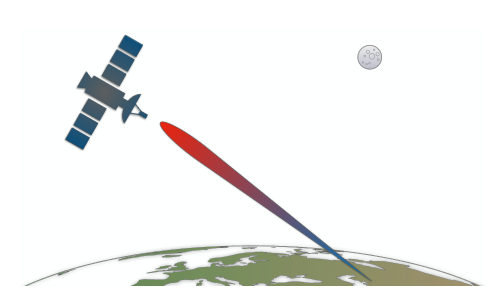
<figcaption class="paper-figure-caption"><b>Fig 1.</b> Figure 1. Schematic depiction of the generic setup covered by this work. A photon can be exchanged by users placed at different locations in a stationary space-time. The figure is for illustration purposes only.</figcaption>
</figure>
<figure class="paper-figure-card">
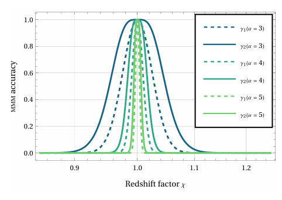
<figcaption class="paper-figure-caption"><b>Fig 2.</b> Figure 2. Plots of the parameters 𝛾1 and 𝛾2, defined in Eqs. (24) and (25), that quantify the violation of the mmm model. Here, 𝛼= ln(𝜔0/𝜎) parametrizes the relative width of the Gaussian frequency spectra, where 𝜔0 is the central frequency and 𝜎is the spectral width. As expected, the unitarity of the matrix deteriorates for increasingly sharp Gaussian profiles.</figcaption>
</figure>
<figure class="paper-figure-card">
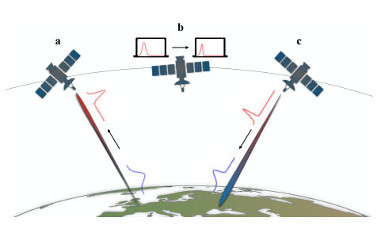
<figcaption class="paper-figure-caption"><b>Fig 3.</b> Figure 4. Alice-to-Bob-to-Alice protocol: A photon is sent from Alice to Bob, who receives it in general as a different wave packet (Panel a). Bob measures only the degrees of freedom previously agreed upon with Alice, prepares the new state, and sends it back to Alice (Panel b). Since part of the information is in general lost to unobservable modes, Alice will not receive the same wave packet as the one that she had sent (Panel c). The picture is for illustrative purposes only: the space-time is static and, in general, the round-trip protocol is best implemented using a ground station and a static rocket. A satellite in geostationary orbit can also be considered, however, Doppler shift due...</figcaption>
</figure>

**Summary.** This paper addresses the theoretical gap in describing gravitational redshift quantum mechanically. It proves that previous models are inconsistent and resolves this by formulating the effect as a well-defined quantum channel acting on Gaussian states of light. This allows researchers to use modern quantum information tools to analyze relativistic effects on quantum optical signals.

**Why it may be interesting.** This work bridges general relativity with fundamental quantum information theory by providing rigorous tools (channel nonunitarity) to quantify relativistic effects on quantum light fields, which is highly relevant for quantum communication in curved spacetime.

Detailed structure

**Main problem.** The primary challenge is developing a consistent quantum mechanical description of gravitational redshift, which has historically been modeled using flawed effective multi-mode mixers.

**Main result.** The authors successfully model the effect as a genuine quantum channel when restricted to Gaussian states, allowing characterization using standard quantum information techniques like fidelity and channel nonunitarity.

**Method.** The work involves analyzing spectral transformations derived from general relativity and correcting inconsistencies in previous models by employing field-theoretic methods and extending the description to unitary channels on larger Hilbert spaces.

**Model / system.** The system is light propagating through a stationary spacetime, where the gravitational redshift induces an operator transformation $U_\chi$ on the spectral distribution functions of the photons. The analysis focuses on characterizing this transformation as a quantum channel.

**Key observables.** Fidelity ($F_\chi$), Channel Nonunitarity ($\eta(\chi)$), and the overlap quantity $\Delta f(\chi) = (f, U_\chi f)$.

**Important parameters / regimes.** The redshift factor $\chi = \sqrt{\zeta_a/\zeta_b}$ dictates the transformation; squeezing in the initial state is crucial for observing fidelity reduction.

**Assumptions / limitations.** Previous models incorrectly assumed that the unitary operator $U_\chi$ could be represented by a finite-dimensional matrix, an assumption proven false for general physical spectra when $\chi 
eq 1$.

**Figures summary.** Figures illustrate the violation of unitarity ($\gamma_1, \gamma_2$) in older models and show state evolution (e.g., Alice-to-Bob-to-Alice roundtrip) using fidelity measures.

**Paper structure.** The paper progresses by first establishing the classical/wave-packet transformation; it then critiques existing multi-mode mixer models, proving their inconsistency; subsequently, it introduces two consistent corrections: a field-theoretic approach and the quantum channel formalism for Gaussian states.

Abstract

The gravitational frequency shift of light is well understood in the theory of classical electromagnetism. Nevertheless, its description in quantum theory is not yet fully developed. Recent work pointed out inconsistencies in previously developed models aimed at describing gravitational redshift as an effective multi-mode mixer (MMM) acting on modes of light, however, a complete solution of the issues was not obtained. Here, we identify the root cause of the MMM model's inconsistency and provide two complementary approaches to correct it: a "natural" one from a field-theoretic perspective, and another adapted to the language of quantum mechanics of finite-dimensional systems. We show that the second approach allows for modeling of the redshift in a multi-mode transmission setup as a quantum channel that can be characterized using standard quantum information-theoretic techniques when restricting the input states to Gaussian states of light.

[↑ back to top](#top)

### [Ramp, Plateau, and Wormholes without Averaging, and Hyper-non-perturbative Structures in Gravity](http://arxiv.org/abs/2608.02743v1)

**Authors:** Hong Liu  
**Type:** theory · **Category:** other · **PDF:** <https://arxiv.org/pdf/2608.02743v1>  
**Analysis basis:** full PDF text, analyzed in chunks
**Topic relevance:** `non-equilibrium dynamics` **2/5** · `Keldysh / 2PI / non-Gaussian methods` **1/5** · `analog quantum simulation` **1/5** · `correlated / nonlocal dissipation` **1/5** · `driven-dissipative phase transition` **1/5** · `entanglement & information structure` **1/5** · `methods for driven-dissipative` **1/5** · `non-equilibrium universality` **1/5** · `scars & prethermalization` **1/5**

↔ Scroll figures horizontally

<figure class="paper-figure-card">
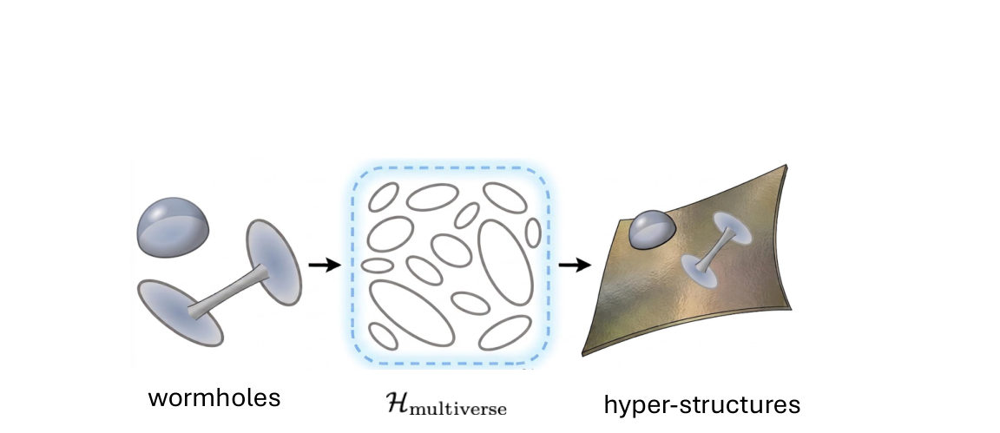
<figcaption class="paper-figure-caption"><b>Fig 1.</b> FIG. 1. From topology to hyper-structures: wormholes demand a multiverse; from the multiverse emerge hyper-structures. The inclusion of wormhole topologies naturally necessitates an arbitrary number of disconnected boundaries, described by the multiverse Hilbert space Hmultiverse. Within Hmultiverse, one can construct “coherent states” corresponding to emergent hyper-structures, anal- ogous to the construction of D-branes as boundary states in the closed string Hilbert space. In the cartoon above, a hyper-structure is depicted as a “brane” on which spacetime boundaries can anchor. This is purely a visual metaphor; in higher-dimensional gravities, there is no physical target space in which...</figcaption>
</figure>
<figure class="paper-figure-card">
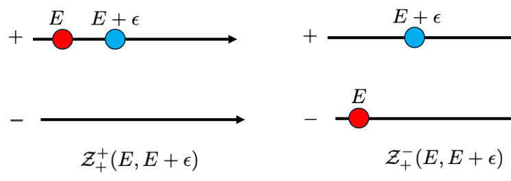
<figcaption class="paper-figure-caption"><b>Fig 2.</b> FIG. 2. Cis-dipole and trans-dipole. (a): Z+ +(E, E + ϵ). (b): Z− +(E, E + ϵ). The two horizontal lines represent the upper (+) and lower (−) banks of the cut along the E-axis. Alternatively, by analytically continuing the values from the lower bank under the cut onto the adjacent Riemann sheet, these lines can also be viewed as representing the E-axis on two neighboring sheets. The filled red and blue circles denote ∆(E) and ∆−1(E), respectively.</figcaption>
</figure>
<figure class="paper-figure-card">
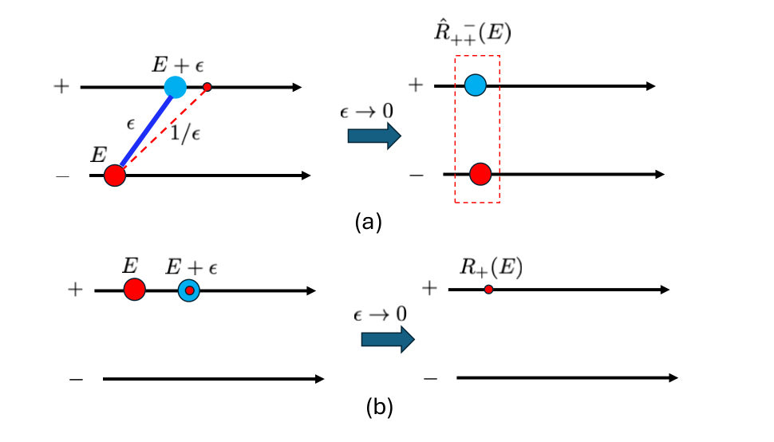
<figcaption class="paper-figure-caption"><b>Fig 3.</b> FIG. 3. The conventions are the same as those in Fig. 2, with R+(E + ϵ) represented by a red dot. (a) R+(E + ϵ) and the trans-dipole Z− +(E, E + ϵ) form a nontrivial three-body bound con- figuration (2.63) in the ϵ →0 limit, represented on the right by the dashed box. R+(E + ϵ) is deliberately separated from ∆−1 + (E + ϵ) for visualization purposes. The contractions between ∆−(E) and ∆−1 + (E +ϵ) are represented by a thick blue line (yielding a contribution proportional to ϵ), while the contraction between R+(E+ϵ) and ∆−(E) is represented by a red dashed line (yielding a contribution proportional to 1/ϵ). Note that after contraction R+(E + ϵ) has been “absorbed” by the dipole background,...</figcaption>
</figure>
<figure class="paper-figure-card">
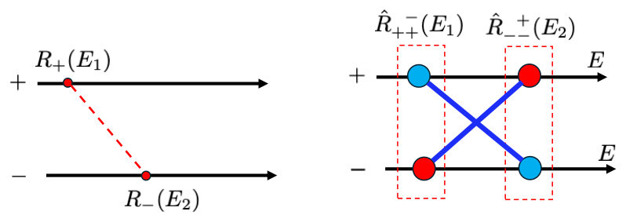
<figcaption class="paper-figure-caption"><b>Fig 4.</b> FIG. 4. While the ramp arises from correlations between two resolvents residing on different branches (as illustrated in (a)), the plateau arises from correlations between two trans-bound resol- vents of opposite orientations (as illustrated in (b)). Conventions follow those of Fig. 2 and Fig. 3.</figcaption>
</figure>
<figure class="paper-figure-card">
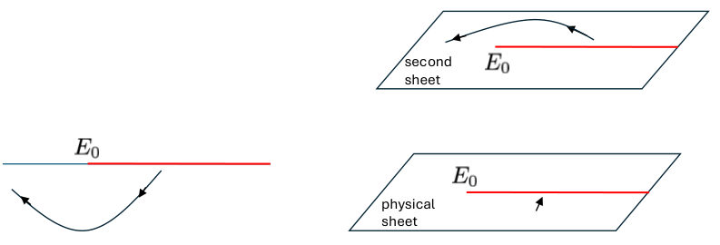
<figcaption class="paper-figure-caption"><b>Fig 5.</b> FIG. 5. (a) Analytic continuation of ∆−(E) from E &gt; E0 to E &lt; E0 through the lower half-plane of the physical sheet (only the physical sheet shown). (b) Analytic continuation of ∆−(E) from E &gt; E0 to E &lt; E0 by passing under the branch cut and moving through the upper half-plane of the second sheet. The branch cuts are represented by thick red lines.</figcaption>
</figure>

**Summary.** This paper proposes a novel method to derive universal features of quantum chaos and gravity without invoking ensemble averaging. By applying a 'smooth filter projection' to semiclassical formulas, the authors show that phenomena like spectral ramps emerge from single-system physics. This framework establishes a deep duality, predicting corresponding double exponential corrections in both quantum many-body systems and gravitational wormhole dynamics.

**Why it may be interesting.** While highly theoretical, the focus on extracting macroscopic smooth behavior from underlying chaotic/erratic microscopic data mirrors techniques used in analyzing complex many-body dynamics where averaging approximations are often employed.

Detailed structure

**Main problem.** The paper reinterprets universal features of quantum chaos (like spectral ramps/plateaus) and their gravitational duals, which are conventionally thought to require ensemble averaging.

**Main result.** These phenomena can be derived purely from single-system dynamics by projecting out the smooth macroscopic structure hidden within erratic microscopic data. This predicts double exponential corrections in both quantum many-body systems ($1/N^2$) and gravity ($	ext{GN}$).

**Method.** The core method involves defining a 'smooth filter projection' that isolates the smooth component of observables, bypassing explicit ensemble averaging techniques.

**Model / system.** The work applies to quantum chaotic systems modeled by the Gutzwiller trace formula and extends this framework holographically to large-N gravitational systems involving spacetime wormholes.

**Key observables.** Spectral form factor (ramp, plateau), density of states oscillations, hyper-non-perturbative objects (baby-universe condensates).

**Important parameters / regimes.** Large-$N$ limit, semiclassical limit ($\hbar 	o 0$), gravitational coupling constant ($G_N$).

**Assumptions / limitations.** The existence and applicability of a 'minimal Gutzwiller-like structure' in the large-N holographic limit is postulated.

**Paper structure.** The paper develops an alternative framework using smooth filtering to derive random matrix features from single systems, postulates a minimal Gutzwiller structure for holography, and then applies this dual concept to show how wormholes generate corresponding double exponential effects in gravity.

Abstract

Universal hallmarks of quantum chaos---such as the ramp and plateau in the spectral form factor---and the ramp's gravitational duals involving wormholes are widely interpreted as consequences of spectral or ensemble averaging. In this paper, following an earlier proposal of~\cite{Liu25c}, we develop an alternative approach: these phenomena arise as macroscopic smooth structures hidden within erratic microscopic data, which can be isolated through a smooth filter projection. Using the semiclassical Gutzwiller trace formula as a paradigmatic example, we illustrate how many features characteristic of random matrix models---including the ramp, the plateau, the spectral curve, and single-eigenvalue instantons---can be derived in the semiclassical limit without invoking ensemble or explicit spectral averages.   We postulate the existence of a minimal Gutzwiller-like structure in the large-$N$ limit of holographic systems and explore its consequences. Beyond deriving the ramp and the plateau, this Gutzwiller-like structure predicts universal rapid macroscopic oscillations in the density of states and the possible existence of hyper-instantons, both of which involve double exponentials in $1/N^2$.   On the gravity side, we demonstrate how spacetime wormholes enable the construction of emergent hyper-non-perturbative objects---such as baby-universe and wormhole condensates---which yield double exponential effects in $G_N$. This mirrors the postulated boundary Gutzwiller-like structure and provides a dual gravitational derivation of the universal rapid macroscopic oscillations in the density of states and the spectral plateau.

[↑ back to top](#top)

### [Fluctuations of topological charges in two-dimensional classical Heisenberg model through high-temperature and low-temperature expansions](http://arxiv.org/abs/2608.03195v1)

**Authors:** Shan-Chang Tang  
**Type:** theory · **Category:** statistical mechanics · **PDF:** <https://arxiv.org/pdf/2608.03195v1>  
**Analysis basis:** full PDF text, analyzed in chunks
**Topic relevance:** `Keldysh / 2PI / non-Gaussian methods` **2/5** · `analog quantum simulation` **2/5** · `driven-dissipative phase transition` **1/5** · `entanglement & information structure` **1/5** · `exotic spin models in light-matter` **1/5** · `non-equilibrium dynamics` **1/5** · `non-equilibrium universality` **1/5**

↔ Scroll figures horizontally

<figure class="paper-figure-card">
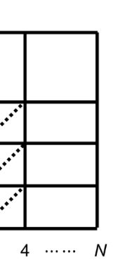
<figcaption class="paper-figure-caption"><b>Fig 1.</b> Figure 1: The lattice for calculation</figcaption>
</figure>
<figure class="paper-figure-card">
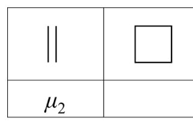
<figcaption class="paper-figure-caption"><b>Fig 2.</b> Figure 2: The diagrams for the first several nonzero µi’s</figcaption>
</figure>
<figure class="paper-figure-card">
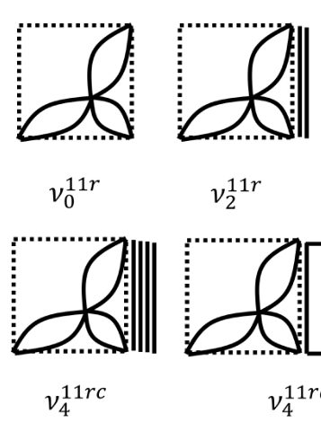
<figcaption class="paper-figure-caption"><b>Fig 3.</b> Figure 3: The diagrams for the first several nonzero νi’s in ρ2 11r</figcaption>
</figure>
<figure class="paper-figure-card">
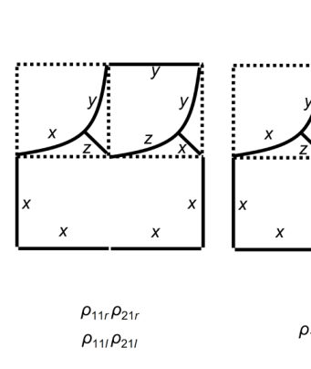
<figcaption class="paper-figure-caption"><b>Fig 4.</b> Figure 5: The diagrams for the first several nonzero νi’s in ρ11ρ21</figcaption>
</figure>
<figure class="paper-figure-card">
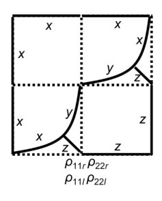
<figcaption class="paper-figure-caption"><b>Fig 5.</b> Figure 6: The diagrams for the first several nonzero νi’s in ρ11ρ22</figcaption>
</figure>

**Summary.** This paper analyzes the fluctuation of topological charges in the 2D classical Heisenberg model using both high-temperature and low-temperature expansions. The key finding is that these fluctuations follow an area law at high temperatures but switch to a perimeter law at low temperatures, suggesting a phase transition analogous to the Kosterlitz-Thouless transition.

**Why it may be interesting.** The study of topological excitations and their fluctuations is central to understanding phase transitions in many quantum systems, making this relevant to theories involving emergent order parameters or critical phenomena.

Detailed structure

**Main problem.** The study investigates how topological charge fluctuations behave in the two-dimensional classical Heisenberg model, aiming to draw parallels with the Kosterlitz-Thouless transition observed in the 2D XY model.

**Main result.** The fluctuation of topological charges exhibits an area law ($\propto L^2$) at high temperatures and transitions to a perimeter law ($\propto L$) at low temperatures.

**Method.** The analysis employs both high-temperature expansions (diagrammatic techniques) and low-temperature approximations, treating the system in the continuous limit as decoupled free scalar fields.

**Model / system.** The physical system is the two-dimensional classical Heisenberg model defined by the Hamiltonian $H = -J \sum_{\langle ij 
angle} \mathbf{S}_i \cdot \mathbf{S}_j$. At low temperatures, it is approximated in the continuous limit as a Gaussian field theory.

**Key observables.** Topological charge fluctuation ($\chi$), defined as $\langle Q^2 
angle - \langle Q 
angle^2$, and the topological charge $Q$ itself.

**Important parameters / regimes.** Temperature ($T$) or inverse temperature ($eta = 1/k_B T$), and the linear dimension of the region ($L$).

**Assumptions / limitations.** The high-temperature expansion is carried out up to $O(eta^4)$, and the low-temperature regime assumes spins fluctuate around the z-axis, leading to a continuum approximation.

**Figures summary.** Figure 1 defines the lattice structure and topological charge $
ho_{ij}$. Figure 2 illustrates diagrams contributing to correlation functions used in the calculation.

**Paper structure.** The paper first establishes the problem by relating it to the KT transition. It then details calculations using high-temperature expansions, followed by a separate treatment using low-temperature approximations that map the system onto free scalar fields. The results are compared to show the scaling laws for $\chi$.

Abstract

It is well known that KT transition in 2d XY model is driven by the binding and unbinding of topological defects, which can be characterized by the fluctuation of topological charges inside a region. We extend the idea into the 2d Heisenberg model and calculate the fluctuation through high-temperature and low-temperature expansion respectively. It is found that the fluctuation of topological charges is proportional to the area of the region at high temperatures while obeys the perimeter law at low temperatures.

[↑ back to top](#top)

### [A Spectral Route to Directed-Polymer Glasses](http://arxiv.org/abs/2608.03730v1)

**Authors:** Sen Mu, Abbas Ali Saberi, Mehran Kardar  
**Type:** theory · **Category:** disordered systems and neural networks · **PDF:** <https://arxiv.org/pdf/2608.03730v1>  
**Analysis basis:** full PDF text, analyzed in chunks
**Topic relevance:** `Keldysh / 2PI / non-Gaussian methods` **2/5** · `non-equilibrium dynamics` **2/5** · `driven-dissipative phase transition` **1/5** · `methods for driven-dissipative` **1/5** · `non-equilibrium universality` **1/5**

↔ Scroll figures horizontally

<figure class="paper-figure-card">
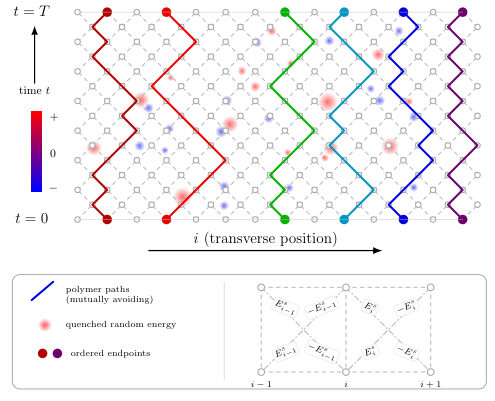
<figcaption class="paper-figure-caption"><b>Fig 1.</b> FIG. 1. Finite-density mutually avoiding directed polymers in a quenched random medium. Colored paths connect or- dered endpoints at t = 0 and t = T on a space–time lattice with closed transverse boundary conditions, while the non- crossing constraint preserves their ordering. Red and blue spots indicate the quenched disorder. The lower-right block shows the bond-energy assignment defining T(s), with the two sides of each local cell carrying ±Es i and the neighboring cell carrying ±Es i−1.</figcaption>
</figure>
<figure class="paper-figure-card">
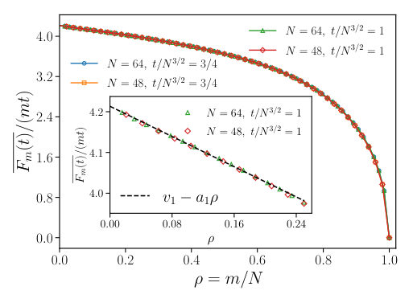
<figcaption class="paper-figure-caption"><b>Fig 2.</b> FIG. 2. Mean cumulative growth per filled level, Fm(t)/(mt), as a function of the density ρ = m/N for N = 48 and 64 at the matched scaled times t/N 3/2 = 3/4 and 1. For N = 64, these correspond to t = 384 and 512, while for N = 48 the nearest integer times are t = 249 and 333. The close overlap of the curves at fixed t/N 3/2, as well as between the two scaled times, indicates an approximately stationary long-time regime. Inset: dilute-density regime ρ ≤1/4 at t/N 3/2 = 1. The dashed line is a linear fit to the N = 64 data, Fm(t)/(mt) = v1 −a1ρ, with v1 ≈4.2 and a1 ≈0.9; the N = 48 data closely follow the same relation. The numerical simulations use µ = 0 and σ = 2, with 14904 disorder...</figcaption>
</figure>
<figure class="paper-figure-card">
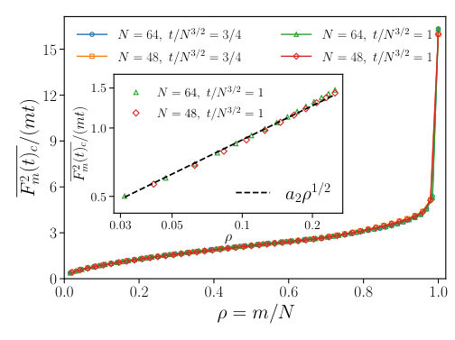
<figcaption class="paper-figure-caption"><b>Fig 3.</b> FIG. 3. Second disorder cumulant of the filled free energy, F 2 m(t)c/(mt), as a function of the density ρ = m/N for N = 48 and 64 at the matched scaled times t/N 3/2 = 3/4 and 1. The sharp increase near full filling approaches the exact result F 2 N(t)c/(Lt) = 4σ2 = 16 for σ = 2. Inset: log-log plot of the dilute regime at t/N 3/2 = 1. The dashed line shows the fit a2ρ1/2 to the N = 64 data with a2 ≈2.9; the N = 48 data closely follow the same scaling.</figcaption>
</figure>
<figure class="paper-figure-card">
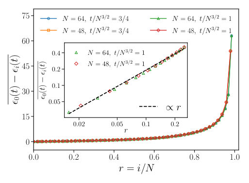
<figcaption class="paper-figure-caption"><b>Fig 4.</b> FIG. 4. Rank-resolved logarithmic spectral edge. For this figure only, the levels are indexed as i = 0, . . . , N −1, with i = 0 denoting the largest logarithmic eigenvalue, and ϵi(t) = ln |λi(t)|/t. The main panel shows ϵ0(t) −ϵi(t) as a function of the scaled rank r = i/N for N = 48 and 64 at the matched scaled times t/N 3/2 = 3/4 and 1. Inset: log-log plot of the small-r regime 0 &lt; r ≤1/4 at t/N 3/2 = 1. The dashed line is a linear fit to the N = 64 data, demonstrating ϵ0 −ϵi ∝r near the upper spectral edge; the N = 48 data closely follow the same scaling.</figcaption>
</figure>

**Summary.** This paper develops a novel 'spectral route' to calculate the free energy of directed polymers in a random medium, modeling glassy line matter. By reformulating the problem as filling logarithmic eigenvalues of a transfer matrix product, the authors confirm that the resulting interaction energy scales quadratically with density ($
ho^2$). This result successfully matches predictions from advanced theoretical methods like the replica Bethe ansatz.

**Why it may be interesting.** The connection between non-intersecting path counting (DPRMs) and random matrix theory spectra is highly relevant to understanding disordered quantum systems. The successful derivation of $
ho^2$ scaling via spectral methods provides a powerful, alternative theoretical tool for analyzing glassy dynamics.

Detailed structure

**Main problem.** The study aims to determine the quenched free energy and its cumulants for a finite density of mutually avoiding directed polymers (DPRMs) in a random medium, which serves as a model for glassy line matter.

**Main result.** The spectral filling approach successfully reproduces the $
ho^2$ interaction energy scaling predicted by the replica Bethe ansatz at low densities. Furthermore, it establishes that the disorder-induced linear edge of the logarithmic spectrum confirms this theoretical prediction.

**Method.** The authors recast the complex many-polymer problem into an equivalent problem of filling the logarithmic eigenvalues of a single-polymer transfer matrix product, utilizing determinant identities and spectral analysis techniques.

**Model / system.** The system models mutually avoiding directed polymers in a quenched random medium. This is mathematically formulated using a time-evolution governed by a single-polymer transfer matrix product $W(t) = T(t) \cdots T(1)$, whose minors relate to multi-polymer partition functions.

**Key observables.** Free-energy density ($f(
ho)$), interaction free energy ($\Delta f(
ho)$), and the disorder-averaged logarithmic spectral edge $\epsilon_0(t) - \epsilon_i(t)$.

**Important parameters / regimes.** Polymer density ($
ho$), time $t$, and system size $N$. Key regimes include the dilute limit ($\Delta f(
ho) \sim 
ho^2$) and the pure case ($\Delta f(
ho) \sim 
ho^3$).

**Assumptions / limitations.** The analysis relies on mapping the problem to a fermionic filling rule, requiring the transfer matrix product $W(t)$ to possess real positive eigenvalues, which is confirmed by combining total nonnegativity (from Boltzmann construction) and oscillatory matrix theory.

**Figures summary.** Figure 1 illustrates DPRMs on a space-time lattice. Figure 2 shows the cumulative logarithmic growth rate vs. density $
ho$, confirming linear scaling in the dilute regime. Figure 3 tracks the second disorder cumulant, showing expected low-density scaling and convergence at full filling.

**Paper structure.** The paper develops mathematically by first establishing the spectral connection using determinant identities (Chunk 3), then applying this to calculate the free energy density via eigenvalue filling (Chunks 1 & 2). Finally, it rigorously confirms the mathematical validity of the spectral method through high-precision numerical checks on the eigenvalues themselves (Chunk 4).

Abstract

A finite density of mutually avoiding directed polymers in a quenched random medium is a minimal model of glassy line matter. The dilute theory, solved by replica Bethe ansatz, predicts an interaction free energy proportional to $ρ^2$ and disorder cumulants with distinct power-law dependences on the density $ρ$, but direct numerical tests have been hindered by the combinatorially large many-polymer transfer matrix. We recast the problem as filling logarithmic eigenvalues of a single-polymer transfer-matrix product, obtaining the quenched free energy, its cumulants, and a disorder-induced linear spectral edge consistent with the replica prediction.

[↑ back to top](#top)

### [Energy levels of the second-harmonic Hamiltonian at large photon numbers](http://arxiv.org/abs/2608.02788v1)

**Authors:** Boulat Nougmanov  
**Type:** theory · **Category:** other · **PDF:** <https://arxiv.org/pdf/2608.02788v1>  
**Analysis basis:** full PDF text, analyzed in chunks
**Topic relevance:** `Tavis-Cummings & cavity-many-emitter` **2/5** · `Keldysh / 2PI / non-Gaussian methods` **1/5** · `analog quantum simulation` **1/5** · `correlated cavity matter` **1/5** · `driven-dissipative phase transition` **1/5** · `methods for driven-dissipative` **1/5**

↔ Scroll figures horizontally

<figure class="paper-figure-card">
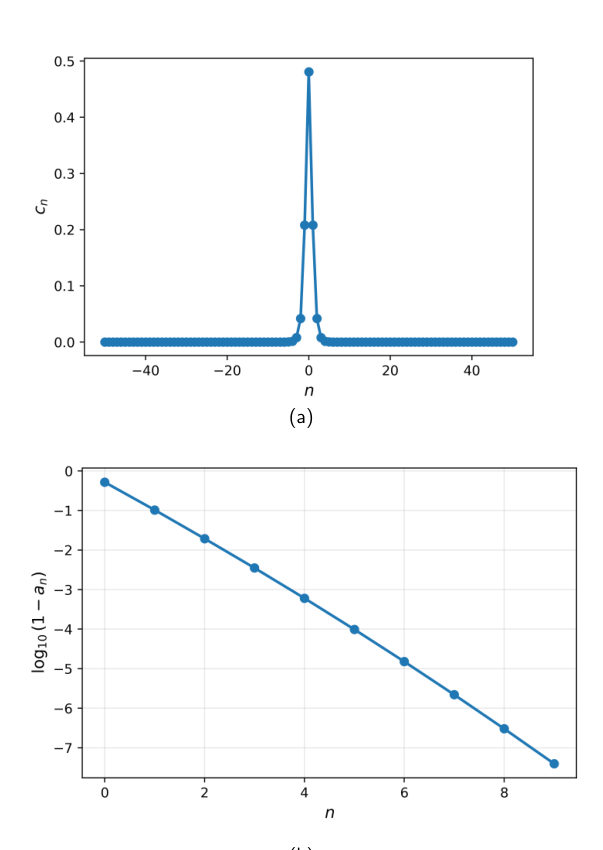
<figcaption class="paper-figure-caption"><b>Fig 1.</b> Figure 1: Expansion coefficients cn (a) and the accuracy of the truncated eigenstate expansion an (b) for the initial state |ψ0⟩= |N⟩a |0⟩b.</figcaption>
</figure>
<figure class="paper-figure-card">
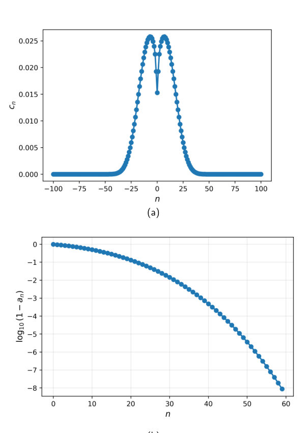
<figcaption class="paper-figure-caption"><b>Fig 2.</b> Figure 2: Expansion coefficients cn (a) and the accuracy of the truncated eigenstate expansion an (b) for the initial state |ψ0⟩= |0⟩a |N/2⟩b.</figcaption>
</figure>
<figure class="paper-figure-card">
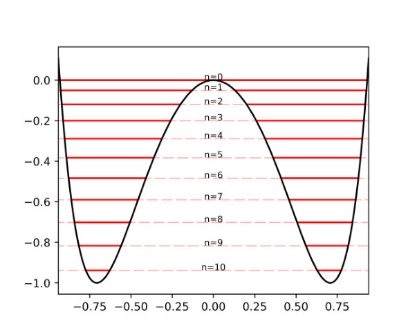
<figcaption class="paper-figure-caption"><b>Fig 3.</b> Figure 3: Potential values U(x) = 4x6 −3x2 with indication of level lines −εn at N = 40.</figcaption>
</figure>
<figure class="paper-figure-card">
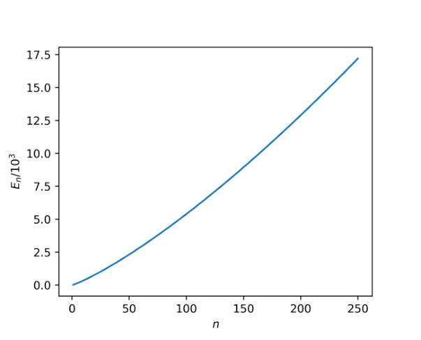
<figcaption class="paper-figure-caption"><b>Fig 4.</b> Figure 4: The exact energy levels found by the matrix diagonalization method in the Nikitin-Masalov representation at N = 1000.</figcaption>
</figure>
<figure class="paper-figure-card">
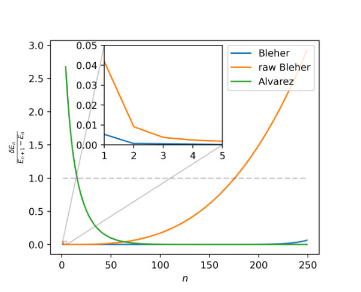
<figcaption class="paper-figure-caption"><b>Fig 5.</b> Figure 5: Absolute errors of the approximate energy levels normalized by the spacing between adjacent exact levels at N = 1000. The blue curve corresponds to the numerical solution of Eq. (17), the orange curve to the explicit approximation (20), and the green curve to the Alvarez approximation (21).</figcaption>
</figure>

**Summary.** This paper analyzes the energy spectrum of a $\chi^{(2)}$ Hamiltonian describing processes like second-harmonic generation at high excitation numbers. By mapping the problem to an effective Schrödinger equation, the authors derive highly accurate asymptotic formulas for the energy levels using advanced quantization techniques. These results offer significant analytical improvements over standard approximations in this quantum optics regime.

**Why it may be interesting.** This work provides advanced analytical techniques for solving quantum systems with nonlinear interactions, particularly useful in quantum optics or open quantum system dynamics where effective potentials are derived.

Detailed structure

**Main problem.** The study aims to derive accurate asymptotic expressions for the energy spectrum of a degenerate $\chi^{(2)}$ Hamiltonian when the total excitation number is very large.

**Main result.** The authors derived an implicit quantization condition leading to two explicit, complementary asymptotic formulas that accurately describe the energy levels near the center of the spectrum where conventional approximations fail.

**Method.** The problem was mapped onto a one-dimensional Schrödinger equation with a double-well potential, and solutions were found using Bleher's separatrix quantization condition, supplemented by small-$t$ and large-$t$ expansions.

**Model / system.** The system models nonlinear optical processes like second-harmonic generation and parametric down-conversion, governed by a degenerate $\chi^{(2)}$ Hamiltonian. The spectral problem is simplified due to the conservation of total excitation number, leading to finite-dimensional matrix diagonalization.

**Key observables.** Energy levels ($E_n$) of the system spectrum.

**Important parameters / regimes.** Large total excitation numbers ($N \gg 1$), and a dimensionless parameter $t$ used in the asymptotic analysis.

**Assumptions / limitations.** The derived formulas are valid only within specific ranges for the parameter $t$ (e.g., $t < 1/2$ for one formula), and the conventional JWKB approximation is insufficient near the separatrix energy ($E=0$).

**Figures summary.** Figures illustrate expansion coefficients, compare the accuracy of different approximations against exact matrix diagonalization at large N, and show the potential energy landscape.

**Paper structure.** The paper establishes the spectral problem via Hamiltonian mapping to a Schrödinger equation. It then derives an implicit quantization condition and proceeds by analyzing three complementary asymptotic regimes (small-$t$, large-$t$, and intermediate) to provide comprehensive formulas for $E_n$.

Abstract

We study the energy spectrum of the degenerate $χ^{(2)}$ Hamiltonian describing second-harmonic generation and parametric down-conversion at large total excitation numbers. Owing to the conservation of the total excitation number, the spectral problem reduces to the diagonalization of finite-dimensional tridiagonal matrices. Following the approach of Alvarez and Alvarez-Estrada, we map this problem onto an effective one-dimensional Schrödinger equation with a double-well potential. We then derive an implicit quantization condition for the energy levels near the top of the potential barrier and obtain two explicit asymptotic formulas applicable in complementary spectral regions. The ranges of applicability of the resulting formulas are established, and their accuracy is compared with exact matrix diagonalization and with the conventional JWKB approximation. The proposed approach provides an accurate analytical description of the energy levels near the center of the spectrum, where the conventional approximation loses accuracy.

[↑ back to top](#top)

### [PACE-QAOA: Physics-Constrained Quantum Optimization for Qubit-Efficient Power System Islanding](http://arxiv.org/abs/2608.02789v1)

**Authors:** Yuqi Jiang, Zhiding Liang, Qiang Guan, Yan Li, Ganesh Kumar Venayagamoorthy  
**Type:** both · **Category:** quantum information and computing · **PDF:** <https://arxiv.org/pdf/2608.02789v1>  
**Analysis basis:** full PDF text, analyzed in chunks
**Topic relevance:** `analog quantum simulation` **2/5** · `Keldysh / 2PI / non-Gaussian methods` **1/5** · `driven-dissipative phase transition` **1/5** · `entanglement & information structure` **1/5** · `methods for driven-dissipative` **1/5**

↔ Scroll figures horizontally

<figure class="paper-figure-card">
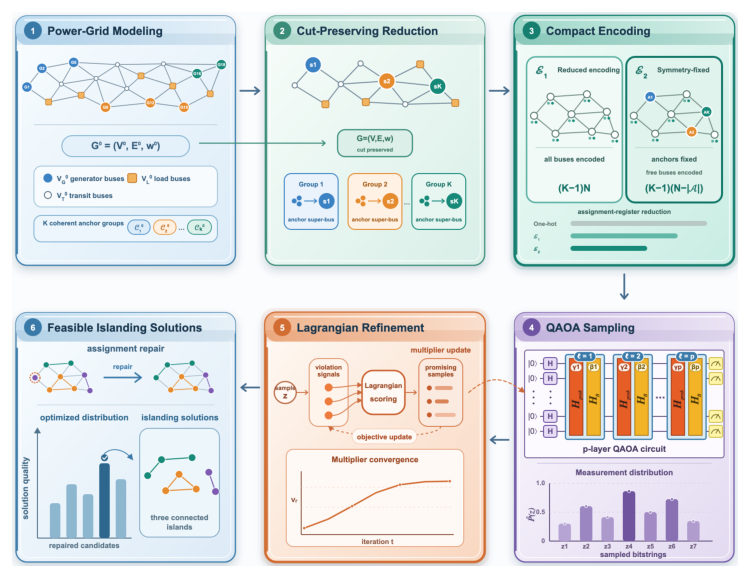
<figcaption class="paper-figure-caption"><b>Fig 1.</b> Fig. 1. Overall PACE-QAOA workflow for controlled power-system islanding. (1) The original grid is modeled as a weighted graph with generator, load, and transit buses and 𝐾coherent anchor groups. (2) Each coherent group is contracted into an anchor super-bus to form a cut-preserving working graph. (3) The compact encodings E1 and E2 represent bus-to-island assignments, with E2 fixing anchor labels to further reduce the assignment register. (4) A 𝑝-layer QAOA circuit samples candidate assignments. (5) Lagrangian refinement uses constraint violations to score promising samples and update the multipliers. (6) Assignment repair converts the selected samples into feasible connected islands....</figcaption>
</figure>
<figure class="paper-figure-card">
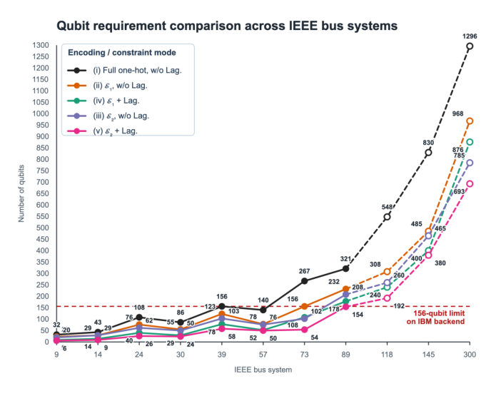
<figcaption class="paper-figure-caption"><b>Fig 2.</b> Fig. 2. Qubit requirements of the five islanding formulations across IEEE bus systems. Black represents full one- hot QAOA. Orange and green represent encoding E1 without and with the Lagrangian treatment, respectively. Purple and magenta represent encoding E2 without and with the Lagrangian treatment, respectively. Filled markers and solid lines indicate executed cases through the IEEE 89-bus system. Open markers and dashed lines indicate formula-based projections for the IEEE 118-, 145-, and 300-bus systems. The red dashed line marks the 156-qubit capacity of the available IBM backend.</figcaption>
</figure>
<figure class="paper-figure-card">
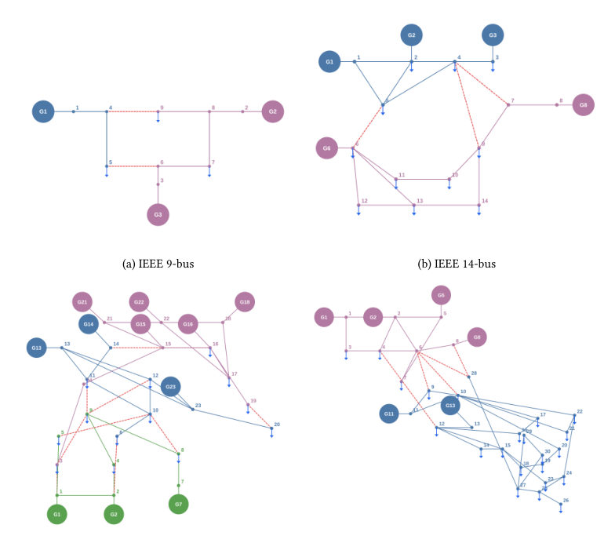
<figcaption class="paper-figure-caption"><b>Fig 3.</b> Fig. 3. Optimal islanding results generated by the proposed QAOA framework on the IEEE 9-, 14-, 24-, and 30-bus test systems. Bus colors indicate the island assignment of each bus, and the red dashed lines denote the transmission interfaces removed to form the final islands. The resulting islands consist mainly of neighboring buses and require only a few transmission lines to be disconnected.</figcaption>
</figure>
<figure class="paper-figure-card">
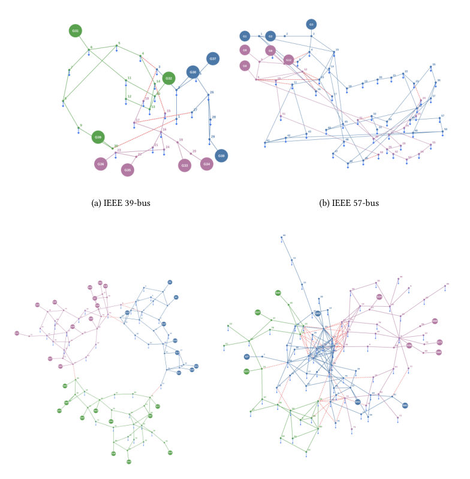
<figcaption class="paper-figure-caption"><b>Fig 4.</b> Fig. 4. Optimal islanding results generated by the proposed QAOA framework on the IEEE 39-, 57-, 73-, and 89-bus test systems. Bus colors indicate the island assignment of each bus, and the red dashed lines denote the transmission interfaces removed to form the final islands. The resulting islands consist mainly of neighboring buses and require only a few transmission lines to be disconnected.</figcaption>
</figure>
<figure class="paper-figure-card">
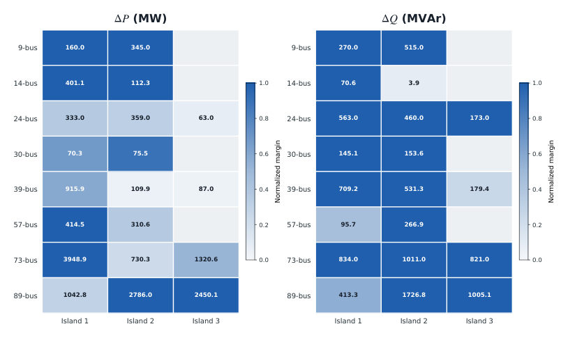
<figcaption class="paper-figure-caption"><b>Fig 5.</b> Fig. 5. Island-level active- and reactive-power support margins across all benchmark systems. Each cell reports the exact margin in MW or MVAr, while the white-to-blue color scale represents the corresponding margin normalized by island demand. Darker cells indicate greater relative headroom. Gray cells denote an unavailable third island in a two-island system.</figcaption>
</figure>

**Summary.** This paper tackles the NP-hard problem of optimal power system islanding by developing a novel, qubit-efficient hybrid quantum optimization approach using QAOA. By combining compact encoding techniques with Lagrangian constraint handling, the authors significantly reduce the required quantum resources and improve the scalability of the algorithm. This provides a transferable pathway for applying constrained quantum optimization to large, real-world engineering problems on near-term hardware.

**Why it may be interesting.** While focused on power systems, the core methodology—developing resource-efficient quantum encodings and constraint handling for hard combinatorial problems—is highly relevant to simulating complex many-body Hamiltonians in AMO physics or optimizing quantum control sequences.

Detailed structure

**Main problem.** The core problem is solving controlled power system islanding, an NP-hard combinatorial optimization task, using quantum computation.

**Main result.** The authors developed a qubit-efficient hybrid QAOA formulation that reduces circuit complexity from quadratic to linear scaling on sparse graphs while maintaining solution quality across multiple IEEE test systems.

**Method.** They employ a physics-informed compact encoding and a qubit-efficient Lagrangian constraint strategy within the QAOA framework to manage resource constraints imposed by near-term quantum hardware.

**Model / system.** The model is a power network represented as a weighted graph, where the goal is partitioning it into self-sustaining islands. The optimization is formulated as minimizing cut weight subject to connectivity and size constraints.

**Key observables.** Feasible, high-quality islanding solutions; linear scaling of phase-separator and per-layer gate complexity; stable solution quality under device noise.

**Important parameters / regimes.** System size (up to 89 buses); fixed number of islands ($K$); circuit depth and sampling budgets.

**Assumptions / limitations.** The approach assumes that compact encoding and Lagrangian updates can effectively reduce the required qubit count below conventional formulations, although final feasibility requires classical power-flow analysis.

**Figures summary.** Figures compare different Hamiltonian formulations (e.g., direct vs. Lagrangian) showing reductions in Pauli-term count and improved landscape smoothness for trainability.

**Paper structure.** The paper introduces the problem, develops a compact encoding ($E_1$ to $E_2$), implements a slack-free Lagrangian treatment, analyzes complexity scaling (reducing gate complexity from quadratic to linear), validates results on multiple IEEE benchmarks, and performs noise analysis.

Abstract

Controlled islanding partitions a stressed power network to limit disrupted power transfer while preserving operational integrity in every island. This NP-hard partitioning problem becomes increasingly demanding as networks grow, motivating quantum optimization as a complementary approach. However, limited qubit capacity restricts the scale at which conventional QAOA can address islanding. This paper develops a qubit-efficient hybrid quantum formulation that overcomes this barrier. A physics-informed compact encoding captures essential islanding decisions while exploiting grid structure, with formal guarantees preserving the feasible solution space and optimization objective. A qubit-efficient Lagrangian strategy combines quantum optimization with classical refinement to enforce operational constraints. Complexity analysis shows that for fixed island counts on sparse graphs, the formulation reduces phase-separator and per-layer gate complexity from quadratic to linear scaling. Evaluations on eight IEEE systems (9 to 89 buses) across multiple quantum backends produce feasible, high-quality solutions under practical circuit and sampling budgets. Factorial ablation attributes resource and runtime gains to the complementary effects of compact encoding and qubit-efficient Lagrangian constraint handling. Noise analysis demonstrates stable solution quality under device noise, and landscape diagnostics reveal smoother, more consistently scaled QAOA cost surfaces. These results provide a transferable pathway for scaling constrained quantum optimization toward larger real-world applications on near-term hardware.

[↑ back to top](#top)

### [Thermodynamic phase transition, pairing symmetry and Fermi surface topology in Ruddlesden-Popper nickelate films](http://arxiv.org/abs/2608.03908v1)

**Authors:** Yu Miao, Zhiwei Wang, Hongxu Sun, Jianchang Shen, Runqing Luan, Zhipeng Ou, Xinru Yong, Zhenyu Wang, Tao Wu, Haoyu Hu, Junfeng He, Xianhui Chen  
**Type:** both · **Category:** strongly correlated electrons · **PDF:** <https://arxiv.org/pdf/2608.03908v1>  
**Analysis basis:** full PDF text, analyzed in chunks
**Topic relevance:** `driven-dissipative phase transition` **2/5** · `Keldysh / 2PI / non-Gaussian methods` **1/5** · `Kondo & dissipative impurity` **1/5** · `analog quantum simulation` **1/5**

↔ Scroll figures horizontally

<figure class="paper-figure-card">
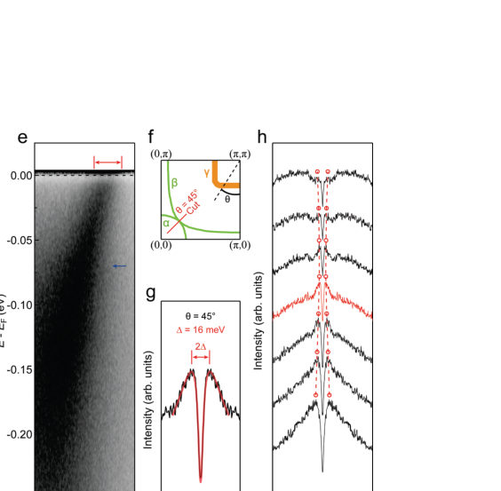
<figcaption class="paper-figure-caption"><b>Fig 1.</b> Fig. 1. Electronic structure of La2PrNi2O7/NdAlO3. (a) Crystal structure of</figcaption>
</figure>
<figure class="paper-figure-card">
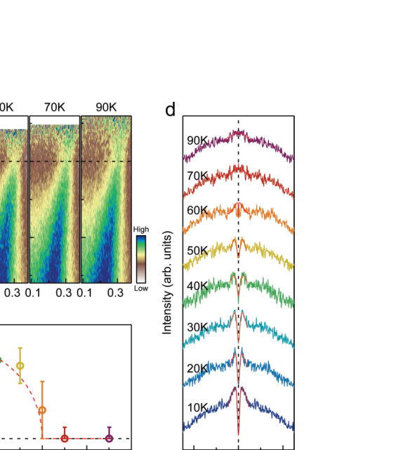
<figcaption class="paper-figure-caption"><b>Fig 2.</b> Fig. 2. Temperature dependence of the superconducting gap in La2PrNi2O7/NdAlO3.</figcaption>
</figure>
<figure class="paper-figure-card">
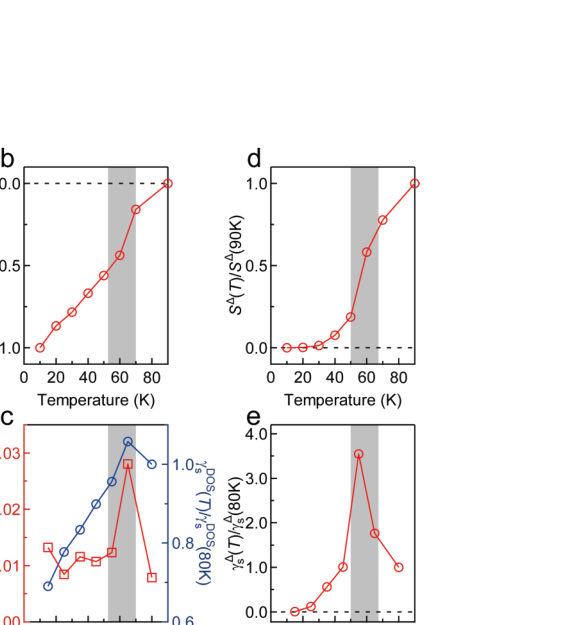
<figcaption class="paper-figure-caption"><b>Fig 3.</b> Fig. 3. Temperature evolution of the electron density of states and electronic specific</figcaption>
</figure>
<figure class="paper-figure-card">
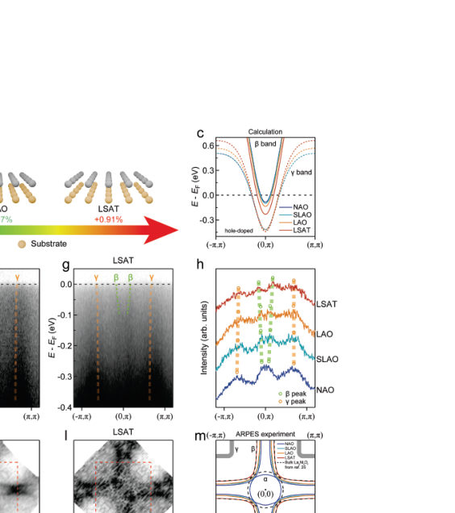
<figcaption class="paper-figure-caption"><b>Fig 4.</b> Fig. 4. Evolution of Fermi surface topology with epitaxial strain in La2PrNi2O7 thin</figcaption>
</figure>

**Summary.** This work investigates superconductivity in RP nickelate films using ARPES and thermodynamic analysis. The authors report direct evidence for a superconducting phase transition via an electronic specific heat jump, confirming a nonzero order parameter. They establish that the pairing symmetry is nodeless (s-wave) and map how the Fermi surface topology relates to this emergent superconducting state.

**Why it may be interesting.** While focused on solid-state physics, the clear measurement of a phase transition signature ($\Delta C/T$) and the determination of pairing symmetry provide fundamental insights into emergent quantum ground states relevant to strongly correlated electron systems.

Detailed structure

**Main problem.** To investigate high-transition-temperature superconductivity and determine the pairing symmetry in Ruddlesden-Popper nickelate films, specifically by providing direct thermodynamic evidence of the superconducting phase transition.

**Main result.** The study observed a clear electronic specific heat jump at T_C, confirming a thermodynamic phase transition, and established that the superconducting gap is nodeless, suggesting an s-wave pairing symmetry in these RP nickelates.

**Method.** The research combines Angle-Resolved Photoemission Spectroscopy (ARPES) measurements with Density Functional Theory (DFT) calculations to probe electronic structure and thermodynamics.

**Model / system.** The physical system is the Ruddlesden-Popper (RP) nickelate heterostructure, $	ext{La}_2	ext{PrNi}_2	ext{O}_7/	ext{NdAlO}_3$, thin films. Measurements are performed on these epitaxial films under varying strain conditions.

**Key observables.** Superconducting gap magnitude ($\Delta \sim 16 	ext{ meV}$), electronic specific heat jump at $T_C$, and the topology of the Fermi surface pockets ($\alpha, eta, \gamma$).

**Important parameters / regimes.** Critical temperature ($T_C$), superconducting order parameter, epitaxial strain, and orbital character (e.g., $	ext{dz}^2$ pocket).

**Assumptions / limitations.** The electronic specific heat analysis relies on analogies with cuprates; DFT calculations often assume a single-layer limit to simplify the model.

**Figures summary.** Figures illustrate ARPES results showing gap opening, temperature dependence of the gap, evidence for the specific heat jump at $T_C$, and how Fermi surface pockets evolve under varying epitaxial strain.

**Paper structure.** The paper proceeds by characterizing the electronic structure via ARPES, demonstrating the superconducting transition through thermodynamic measurements (specific heat), determining the pairing symmetry from the gap structure, and finally mapping the relationship between Fermi surface topology and superconductivity using strain dependence.

Abstract

Ruddlesden-Popper (RP) nickelates provide an uncharted territory to explore high-transition-temperature (high-$T_C$) superconductivity and superconducting mechanism. Here, we investigate the electronic structure of a new type of high-$T_C$ superconducting RP nickelate heterostructure $\mathrm{La_2PrNi_2O_7/NdAlO_3}$ by angle-resolved photoemission spectroscopy. A superconducting state is observed without a pseudogap state, enabling a direct measurement of the superconducting order parameter and a microscopic extraction of the electronic specific heat. The observed superconducting gap opens at $T_C$ with prominent coherence peaks, illustrating the emergence of nonzero order parameter upon entering the superconducting state. An electronic specific heat jump appears at $T_C$, further demonstrating a thermodynamic phase transition. The magnitude of the superconducting order parameter is quantified by the observed superconducting coherence peaks, and a nodeless behavior is unambiguously established in the absence of pseudogap. The underlying Fermi surface consists of $α$, $β$ and $γ$ pockets, exhibiting a multi-orbital nature. Strain dependent measurements further reveal the $γ$ pocket in all superconducting and non-superconducting films with different epitaxial strain. Our results establish the missing thermodynamic evidence for superconducting phase transition in nickelates. They also provide direct evidence for the symmetry of the superconducting order parameter and illustrate the relationship between Fermi surface topology and the emergence of superconductivity in RP nickelate films.

[↑ back to top](#top)

### [Kappa distributions as asymptotic marginals of exponential family ensembles](http://arxiv.org/abs/2608.03960v1)

**Authors:** Sergio Davis  
**Type:** theory · **Category:** statistical mechanics · **PDF:** <https://arxiv.org/pdf/2608.03960v1>  
**Analysis basis:** full PDF text, analyzed in chunks
**Topic relevance:** `non-equilibrium dynamics` **2/5** · `driven-dissipative phase transition` **1/5** · `non-equilibrium universality` **1/5**

↔ Scroll figures horizontally

<figure class="paper-figure-card">
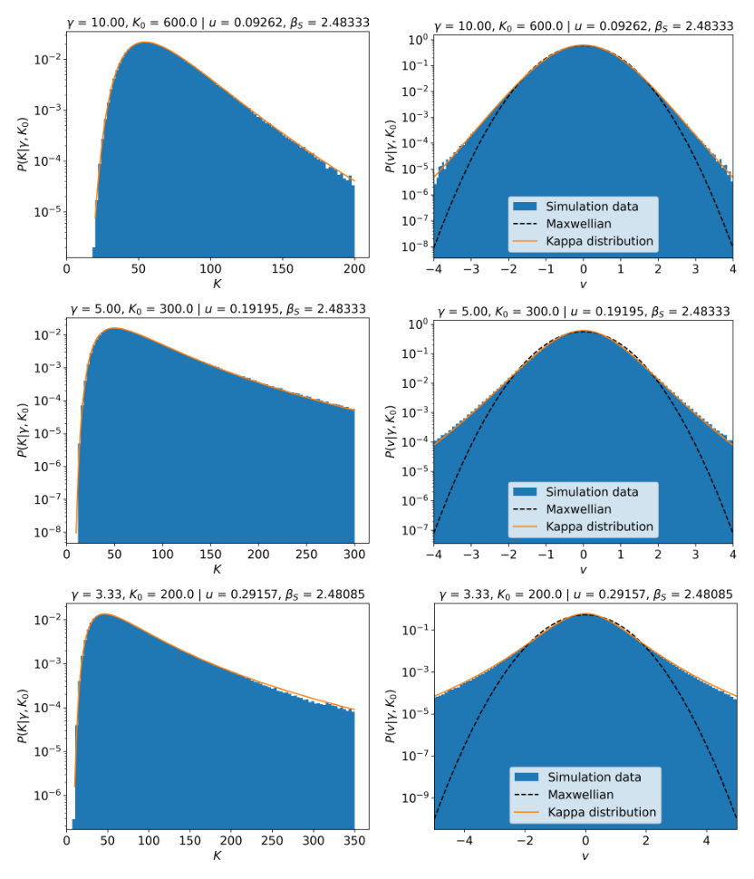
<figcaption class="paper-figure-caption"><b>Fig 1.</b> Figure 1: Left panels, kinetic energy histograms from Metropolis simulations of a system of N=100 particles at γ = 10 and K0 = 600 (first row), γ = 5 and K0 = 300 (second row), and γ=3.33 and K0 = 200 (third row) together with their corresponding exact inverse-gamma distributions. Right panels, histograms of a single velocity component against one-dimensional kappa distributions for u = 0.09262, βS = 2.48333 (first row), u = 0.19195, βS = 2.48333 (second row), and u=0.29157, βS = 2.48085 (third row).</figcaption>
</figure>
<figure class="paper-figure-card">
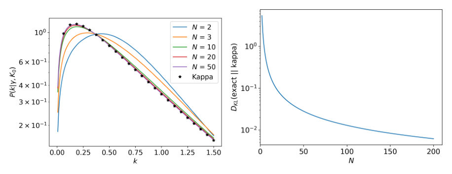
<figcaption class="paper-figure-caption"><b>Fig 2.</b> Figure 2: Left, exact kinetic energy distribution in (60) for γ = 5, k = 0.75 and different values of N (solid lines) versus the kinetic energy distribution corresponding to the kappa model (black stars) in (68). Right, Kullback-Leibler divergence between the exact kinetic energy distribution in (60) and the kinetic energy distribution corresponding to the kappa model in (68) as a function of N for γ = 5 and k = 0.75.</figcaption>
</figure>

**Summary.** This work shows that the kappa distribution arises naturally as an asymptotic limit when analyzing the single-particle velocity distribution of a system whose total kinetic energy follows an inverse-gamma ensemble. The derivation bypasses reliance on nonextensive statistical mechanics by using standard marginalization techniques in the thermodynamic limit, providing both theoretical insight and a practical Monte Carlo simulation method.

**Why it may be interesting.** While not directly about quantum systems, the rigorous derivation of non-standard distributions like Kappa from fundamental statistical mechanics principles (marginalization) is highly relevant for understanding generalized thermalization processes in complex many-body systems.

Detailed structure

**Main problem.** To demonstrate that the Kappa distribution emerges naturally as an asymptotic marginal single-particle velocity distribution from a system governed by an inverse-gamma ensemble in the thermodynamic limit.

**Main result.** The single-particle velocity distribution converges to a kappa distribution form ($P(v|\kappa, 	heta)$) when taking $N 	o \infty$, providing a mechanism for its appearance outside nonextensive statistical mechanics.

**Method.** The derivation involves marginalizing the probability density over the velocities of $N$ particles, starting from an initial exponential family ensemble defined by total kinetic energy constraints.

**Model / system.** The system is modeled as $N$ interacting particles whose dynamics are analyzed via steady-state solutions to the Liouville equation. The analysis focuses on the probability density derived from an inverse-gamma distribution of the total kinetic energy.

**Key observables.** Single-particle velocity distribution $P(v)$, total kinetic energy distribution $P(K)$, and the Kullback-Leibler distance ($	ext{D}_{	ext{KL}}$) used for convergence testing.

**Important parameters / regimes.** The spectral index $\kappa$, ensemble parameters $\gamma$ and $K_0$, and the thermodynamic limit ($N 	o \infty$).

**Assumptions / limitations.** The derivation relies on taking the thermodynamic limit ($N 	o \infty$) for the asymptotic result, and the initial state is assumed to be an energy steady state.

**Figures summary.** Figure 1 compares simulated histograms of kinetic energy/velocity components against exact inverse-gamma distributions. Figure 2 compares the exact vs. kappa model for kinetic energy and plots $	ext{D}_{	ext{KL}}$ divergence versus $N$.

**Paper structure.** The paper first establishes the initial probability density based on total kinetic energy constraints, derives the marginal distribution for total energy ($P(K)$), and then performs a second marginalization over remaining particles to find the single-particle velocity distribution. The final steps involve taking the $N 	o \infty$ limit to map this result onto the known kappa distribution form.

Abstract

Recently (Physica A 660 130370, 2025), emergence of superstatistical behavior in driven classical systems has been shown for systems with constant microcanonical heat capacity. As an application of this result, in this work we show that a system of $N$ particles with inverse gamma distribution of total kinetic energies must have kappa-distributed single-particle velocities in the limit $N \rightarrow \infty$. Our results provide insight into the nature of kappa distributions outside the theory of nonextensive statistical mechanics, while also bringing forward a practical method for the generation of kappa velocities via Monte Carlo Metropolis simulation in the inverse gamma ensemble.

[↑ back to top](#top)

### [Discrepancy between the H-Function and Entropy: Insights into the rigorously established Boltzmann equation for hard-sphere gases](http://arxiv.org/abs/2608.03355v1)

**Authors:** Li-Xiang Cen  
**Type:** theory · **Category:** statistical mechanics · **PDF:** <https://arxiv.org/pdf/2608.03355v1>  
**Analysis basis:** full PDF text, analyzed in chunks
**Topic relevance:** `non-equilibrium dynamics` **2/5** · `non-equilibrium universality` **1/5**

↔ Scroll figures horizontally

<figure class="paper-figure-card">
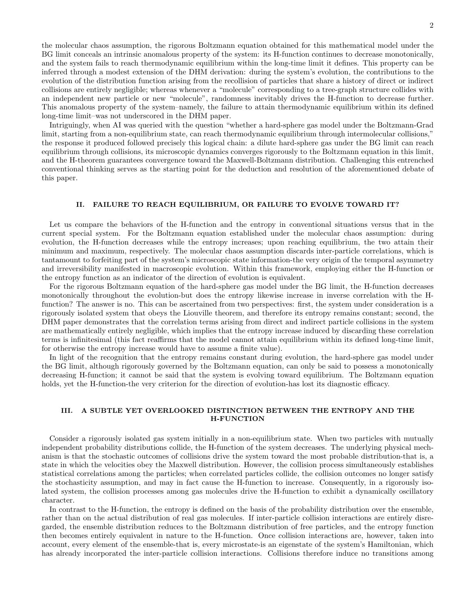
<figcaption class="paper-figure-caption"><b>Fig 1.</b> Low-resolution page preview, page 2</figcaption>
</figure>
<figure class="paper-figure-card">
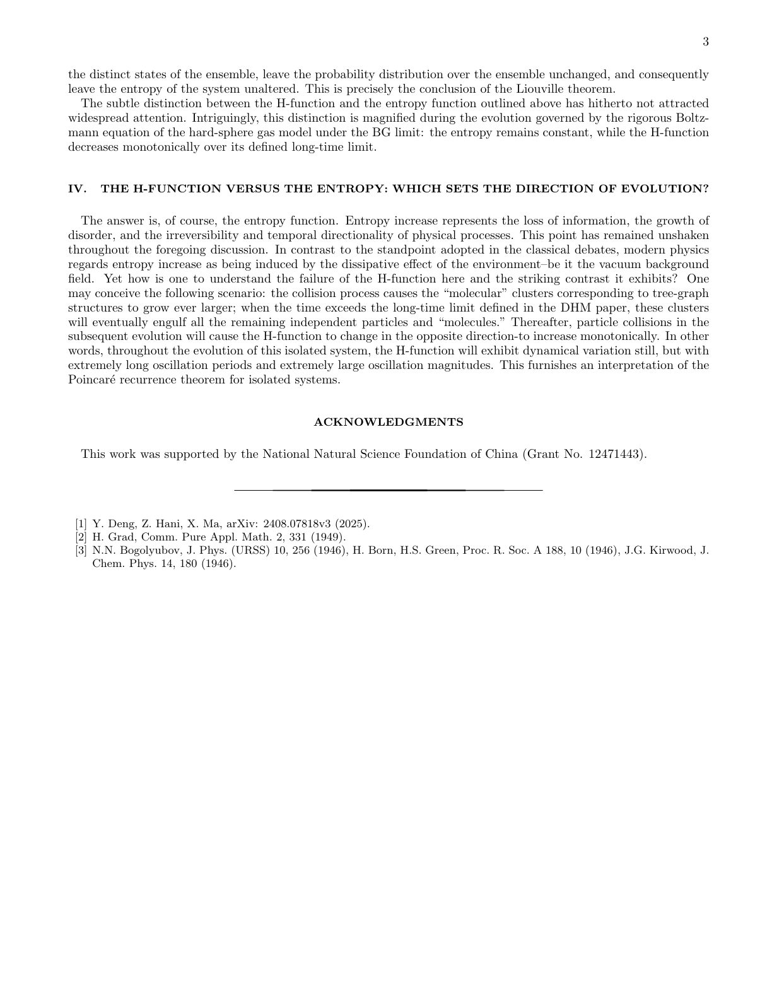
<figcaption class="paper-figure-caption"><b>Fig 2.</b> Low-resolution page preview, page 3</figcaption>
</figure>

**Summary.** This paper rigorously examines the hard-sphere gas model to compare the behavior of the H-function and Entropy. It demonstrates that while conventional theory relies on the H-function decreasing as a measure of irreversibility, rigorous analysis shows entropy remains constant for an isolated system. The conclusion is that entropy, not the H-function, correctly defines the arrow of time in this physical context.

**Why it may be interesting.** It challenges foundational assumptions in statistical mechanics regarding irreversible processes (H-theorem) by using a rigorous, microscopic model to show when macroscopic thermodynamic quantities fail to capture the true direction of time evolution for isolated systems.

Detailed structure

**Main problem.** The paper investigates the fundamental discrepancy between the H-function and entropy regarding the arrow of time in non-equilibrium statistical mechanics.

**Main result.** For the hard-sphere gas model under rigorous derivation, the system's entropy remains constant (due to isolation), while the H-function decreases initially but exhibits complex behavior suggesting it is not the true criterion for irreversible evolution.

**Method.** The analysis involves comparing the time evolution of the H-function and Entropy using rigorous derivations of the Boltzmann equation under the Boltzmann-Grad limit.

**Model / system.** The system studied is a hard-sphere gas model. The dynamics are governed by the rigorously derived Boltzmann equation, which is analyzed in the context of the Boltzmann-Grad (BG) limit.

**Key observables.** H-function ($H$) and Entropy ($S$).

**Important parameters / regimes.** Boltzmann-Grad (BG) limit; long-time limit defined by DHM paper.

**Assumptions / limitations.** The analysis contrasts the conventional molecular chaos assumption with results from rigorous derivations for isolated systems.

**Paper structure.** The structure involves establishing the discrepancy between H and S evolution, analyzing the hard-sphere gas model under BG limits, contrasting this with standard Boltzmann theory, and concluding that entropy dictates irreversibility.

Abstract

By investigating the origin of the evolutionary discrepancy between the H-function and entropy, we elucidate that the H-function fails to serve as a valid arrow-of-time criterion in the rigorously derived Boltzmann equation for the hard-sphere gas model under the Boltzmann-Grad limit.

[↑ back to top](#top)

### [Impossibility of Perfectly Complete Many-Round Key Agreement in the QROM](http://arxiv.org/abs/2608.03824v1)

**Authors:** Longcheng Li, Qian Li, Xingjian Li, Qipeng Liu  
**Type:** theory · **Category:** quantum information and computing · **PDF:** <https://arxiv.org/pdf/2608.03824v1>  
**Analysis basis:** full PDF text, analyzed in chunks
**Topic relevance:** `entanglement & information structure` **2/5** · `Keldysh / 2PI / non-Gaussian methods` **1/5**

↔ Scroll figures horizontally

<figure class="paper-figure-card">
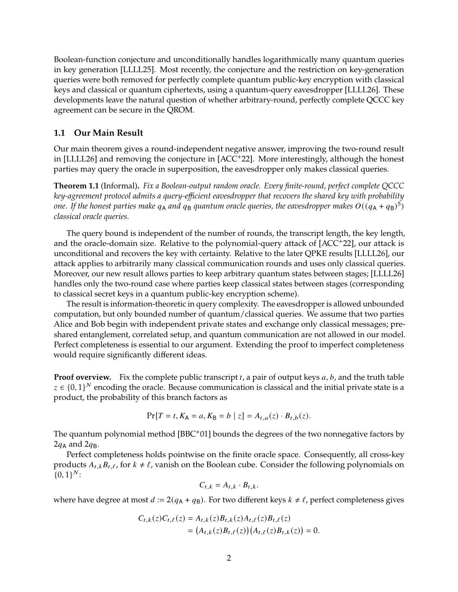
<figcaption class="paper-figure-caption"><b>Fig 1.</b> Low-resolution page preview, page 2</figcaption>
</figure>
<figure class="paper-figure-card">
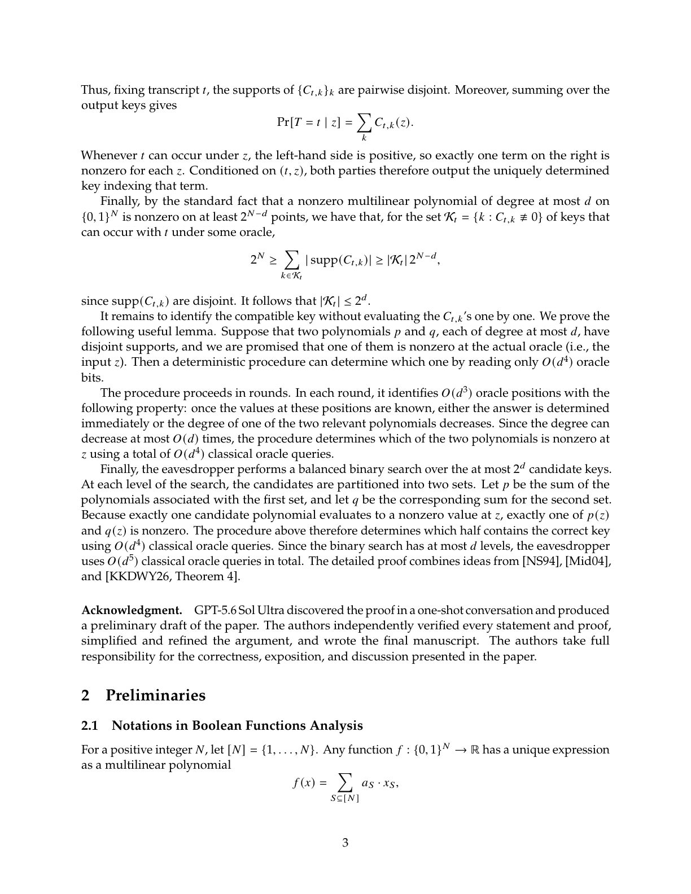
<figcaption class="paper-figure-caption"><b>Fig 2.</b> Low-resolution page preview, page 3</figcaption>
</figure>
<figure class="paper-figure-card">
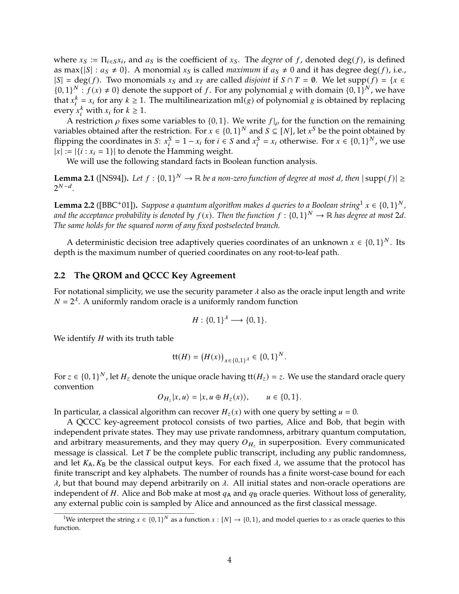
<figcaption class="paper-figure-caption"><b>Fig 3.</b> Low-resolution page preview, page 4</figcaption>
</figure>
<figure class="paper-figure-card">
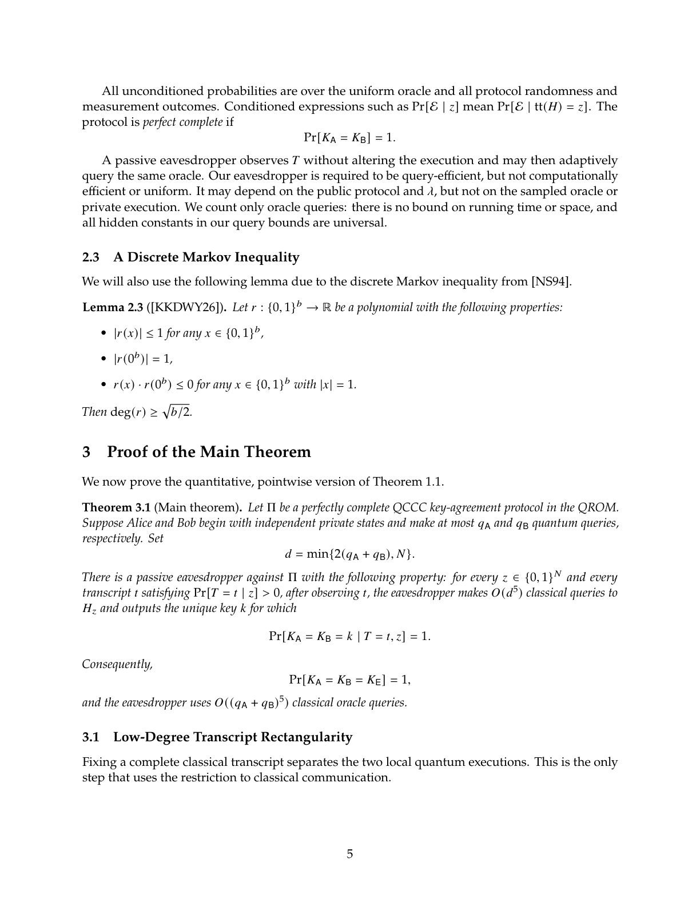
<figcaption class="paper-figure-caption"><b>Fig 4.</b> Low-resolution page preview, page 5</figcaption>
</figure>
<figure class="paper-figure-card">
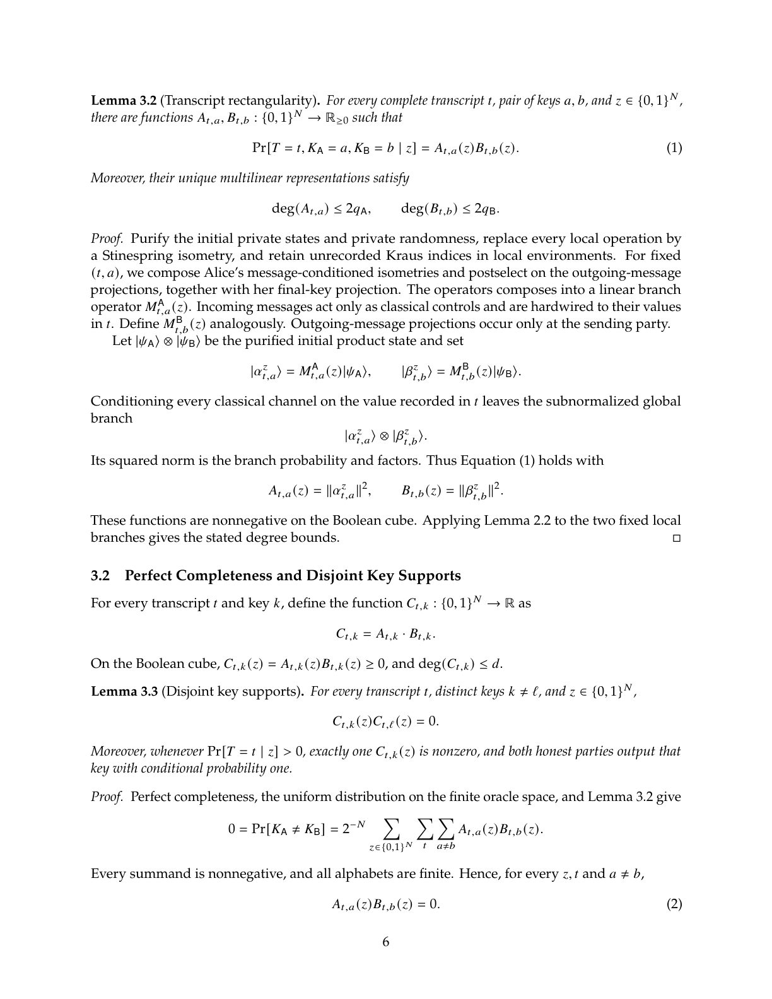
<figcaption class="paper-figure-caption"><b>Fig 5.</b> Low-resolution page preview, page 6</figcaption>
</figure>

**Summary.** This theoretical paper proves a strong impossibility result showing that perfectly complete Quantum Key Agreement (QKA) protocols cannot be built from black-box one-way functions. The authors show an eavesdropper can always recover the key efficiently by exploiting the structure imposed by perfect completeness within the QROM model. This work significantly tightens previous security bounds by removing reliance on unproven conjectures and achieving a round-independent complexity bound.

**Why it may be interesting.** While focused on QKD/QKA security proofs rather than physical AMO systems, the underlying mathematical techniques involving polynomial methods and information-theoretic security bounds are fundamental tools in quantum information theory that inform secure communication protocols relevant to quantum networking.

Detailed structure

**Main problem.** The paper proves the impossibility of constructing perfectly complete quantum key agreement protocols (QKA) using only black-box access to quantumly secure one-way functions.

**Main result.** It demonstrates that an eavesdropper can recover the shared secret key with certainty using a polynomial number of classical oracle queries, specifically $O((q_A + q_B)^5)$.

**Method.** The proof utilizes the quantum polynomial method over the Boolean cube and relies on establishing that the probability distributions associated with different keys must have pairwise disjoint supports.

**Model / system.** The analysis is conducted in the Quantum Random Oracle Model (QROM) within a Quantum Computation with Classical Communication (QCCC) framework. Parties exchange only classical messages and query an oracle $H_z$.

**Key observables.** The shared secret key, which must be uniquely determined by the eavesdropper.

**Important parameters / regimes.** The maximum number of quantum queries allowed for Alice ($q_A$) and Bob ($q_B$), which dictate the complexity bound.

**Assumptions / limitations.** The protocol must achieve perfect completeness ($\Pr[K_A = K_B] = 1$). The model restricts communication to classical messages, disallowing pre-shared entanglement or quantum channels.

**Paper structure.** The paper builds the argument by first establishing polynomial representations for the protocol's probability structure (Transcript Rectangularity), then using properties of disjoint supports to limit candidate keys, and finally employing a decision tree search over these candidates to derive the query complexity bound.

Abstract

This paper proves that it is impossible to construct perfectly complete quantum key agreement protocols (QKA) from quantumly secure one-way functions (OWFs) in a black-box manner.   Specifically, consider any protocol in which Alice and Bob exchange only classical messages, make at most $q_{\mathsf{A}}$ and $q_{\mathsf{B}}$ quantum queries, respectively, to a Boolean-valued random oracle, and agree on a shared key with certainty. This paper shows that there exists an eavesdropper, given the classical messages, that can recover the shared key with certainty using $O((q_{\mathsf{A}}+q_{\mathsf{B}})^5)$ classical oracle queries. The bound is independent of the number of rounds, transcript length, key length, and oracle-domain size. Previous results only applies to two-round key agreement (Li et al. CRYPTO 26) or relies on unproven conjectures (Austrin et al. CRYPTO 22).   GPT-5.6 Sol Ultra found this proof in a one-shot conversation and drafted a preliminary version of this paper. The authors are fully responsible for the correctness, writing and discussions of this paper.

[↑ back to top](#top)

### [Quantum error correction at ultra-low overhead](http://arxiv.org/abs/2608.02773v1)

**Authors:** Zhide Lu, Weikang Li, Dong-Ling Deng  
**Type:** theory · **Category:** quantum information and computing · **PDF:** <https://arxiv.org/pdf/2608.02773v1>  
**Analysis basis:** full PDF text, analyzed in chunks
**Topic relevance:** `QC/QI experiment` **2/5** · `Rydberg arrays` **1/5**

↔ Scroll figures horizontally

<figure class="paper-figure-card">
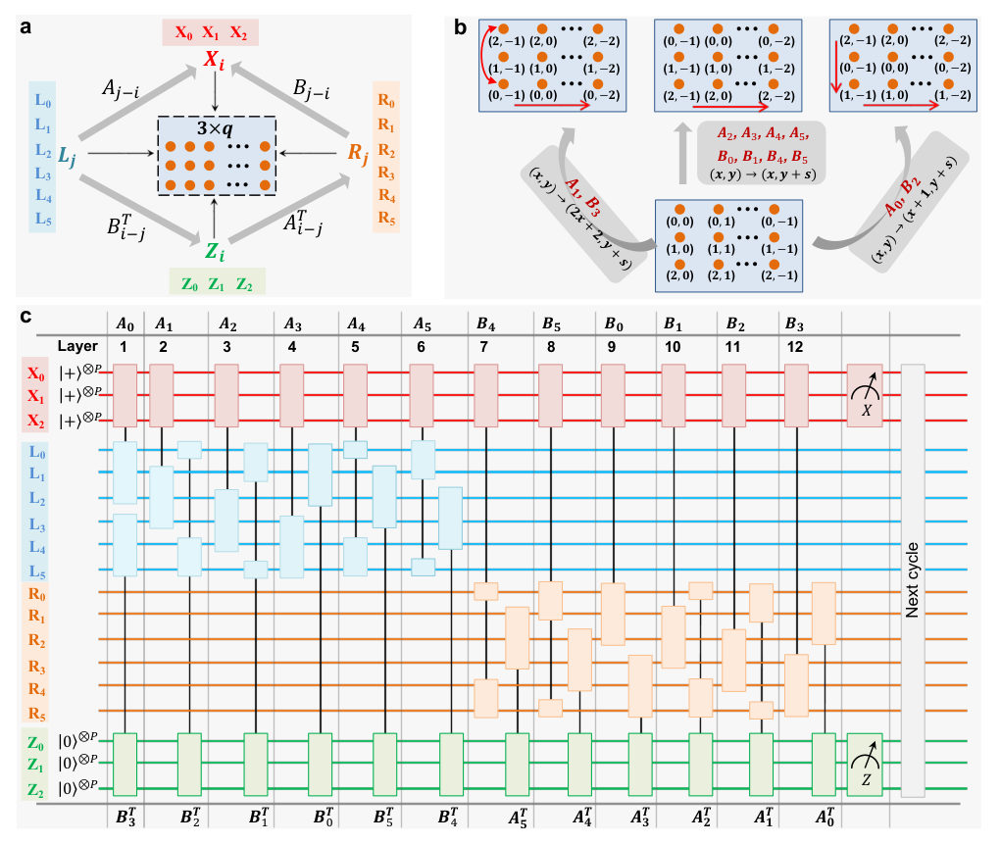
<figcaption class="paper-figure-caption"><b>Fig 1.</b> Fig. 1. Construction and implementation of Cornucopia codes. a, Block structure and connectivity. Data qubits are partitioned into six L- type and six R-type blocks, while check qubits comprise three X-type and three Z-type blocks, with individual qubits indexed by row-column coordinates (x, y) ∈Z3 × Zq. The connectivity between check and data blocks is governed by operators Ak and Bk (indices evaluated modulo 6), each defining a coordinate permutation that specifies a one-to-one physical coupling pattern. Specifically, Xi check blocks couple to Lj and Rj via Aj−i and Bj−i, whereas Zi check blocks couple via B⊤ i−j and A⊤ i−j, respectively. b, Geometric action of coordinate permutations....</figcaption>
</figure>
<figure class="paper-figure-card">
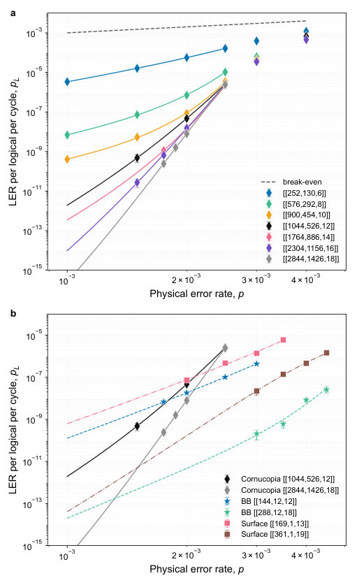
<figcaption class="paper-figure-caption"><b>Fig 2.</b> Fig. 2. Logical performance of Cornucopia codes. a, Logical error rate per logical qubit per cycle, pL, as a function of the physical error rate, p, for the Cornucopia codes in Tab. 1. The grey dashed line in- dicates the break-even condition pL = p. b, Comparison of the Cor- nucopia codes [[1044, 526, 12]] and [[2844, 1426, 18]] against repre- sentative bivariate bicycle codes [31] and rotated surface codes. The surface code encodes a single logical qubit in an independent patch. In both panels, markers denote numerical simulation results, with error bars representing the 1σ statistical uncertainty. The solid and dash-dotted lines represent extrapolations to the low-error regime ob- tained...</figcaption>
</figure>
<figure class="paper-figure-card">
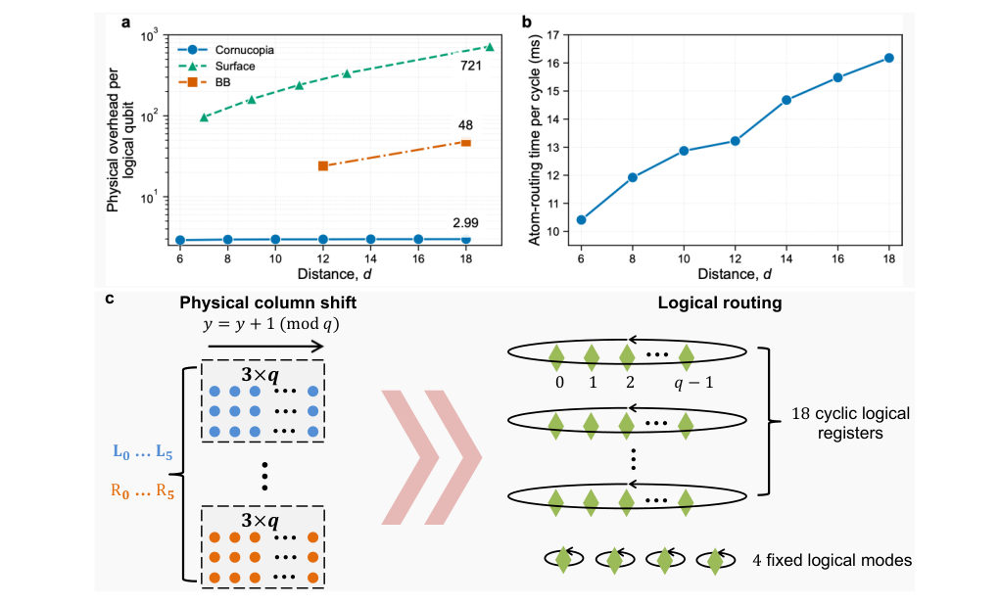
<figcaption class="paper-figure-caption"><b>Fig 3.</b> Fig. 3. Hardware overhead and logical routing of Cornucopia codes. a, Physical overhead per logical qubit as a function of the code distance d. The physical overhead takes into account both data qubits and check qubits required for syndrome extraction. Cornucopia codes (blue) maintain a low overhead of ∼3 across all distances. In contrast, the per-logical physical overhead for surface codes (green) and bivariate bicycle codes (orange) scales unfavorably, reaching 721 (at d = 19) and 48 (at d = 18), respectively. b, Qubit-routing time per syndrome extraction cycle as a function of the code distance d for Cornucopia codes. The physical execution time exhibits a modest increase from 10.4 ms to...</figcaption>
</figure>

**Summary.** This paper introduces Cornucopia codes, a new family of quantum error correcting codes designed specifically for implementation on neutral-atom arrays. These codes overcome traditional trade-offs by achieving high encoding rates and robust error thresholds while maintaining low physical overhead. The results demonstrate a path toward practical, large-scale fault-tolerant quantum computation.

**Why it may be interesting.** It provides a concrete blueprint for realizing fault-tolerant quantum computation by directly addressing hardware constraints (like connectivity and overhead) within the theoretical framework of QEC codes.

Detailed structure

**Main problem.** The central challenge for large-scale quantum computing is suppressing errors, which requires error correction codes that balance encoding efficiency, error threshold, and hardware feasibility.

**Main result.** Cornucopia codes achieve an ultra-high encoding rate (>1/2) and a high pseudo-threshold ($\ge 0.4\%$) while maintaining low physical overhead suitable for near-term quantum processors.

**Method.** The authors introduce Cornucopia codes, co-designing the code structure, physical layout, atom rearrangement protocol, and syndrome extraction schedule to enable parallel measurements.

**Model / system.** The work is modeled using abstract qLDPC codes, specifically designed for implementation on reconfigurable neutral-atom arrays which provide long-range connectivity.

**Key observables.** Logical error rate ($p_L$), encoding rate ($r$), and physical overhead compared to established codes like the surface code or bivariate bicycle codes.

**Important parameters / regimes.** Physical error rate ($p=0.1\%$), logical qubit count (e.g., 1426), and circuit depth (constant for syndrome extraction).

**Assumptions / limitations.** The analysis assumes a standard circuit-level noise model and relies on the feasibility of implementing coordinate permutations via global rigid motions in neutral-atom arrays.

**Figures summary.** Figures illustrate code block structures, geometric actions defining couplings, and the circuit scheduling for syndrome extraction across twelve layers. Tables compare performance metrics like logical error rates across different code families.

**Paper structure.** The paper progresses from identifying the trade-off limitations in existing codes to introducing Cornucopia codes. It details the hardware-aware co-design, analyzes the parallel syndrome measurement circuit, and mathematically proves the structure of the resulting logical error subspaces using group algebra homology.

Abstract

Suppressing errors is the central challenge for useful large-scale quantum computing. While quantum error correction promises a viable solution to this challenge, existing codes typically suffer from trade-offs among encoding efficiency, error threshold, and hardware feasibility. Here, we introduce Cornucopia codes, a family of practical, hardware-efficient quantum low-density parity-check codes that achieve an ultra-high encoding rate exceeding $1/2$ while maintaining a pseudo-threshold exceeding $0.4\%$ under the standard circuit-level noise model. Inspired by recent affine-permutation-based code constructions and the long-range connectivity available in reconfigurable neutral-atom arrays, we adopt a structured code geometry in which the code layout, atom rearrangement, and syndrome-extraction schedule are co-designed. This structure enables nonlocal syndrome measurements through simple, parallel atom rearrangements. A complete syndrome extraction cycle measures all $X$- and $Z$-type checks in parallel with $12$ entangling layers, independent of the code size. The resulting threshold is comparable to those of the surface code and bivariate bicycle codes. In particular, a single code block $[[2844,1426,18]]$ encodes $1{,}426$ distance-$18$ logical qubits, achieving an extrapolated logical error rate of $2.6\times10^{-16}$ ($1.9\times10^{-31}$) per logical qubit per cycle, assuming the physical error rate of $0.1\%$ ($0.01\%$). By comparison, a bivariate bicycle code implementation would require more than $68{,}000$ physical qubits to encode the same number of logical qubits at a comparable logical error rate. These results bring demonstrations of ultra-low overhead quantum error correction within the reach of near-term quantum processors.

[↑ back to top](#top)

### [Fractal deconfinement and confinement in Sierpinski ice](http://arxiv.org/abs/2608.02741v1)

**Authors:** James Walkling, Roderich Moessner  
**Type:** theory · **Category:** statistical mechanics · **PDF:** <https://arxiv.org/pdf/2608.02741v1>  
**Analysis basis:** full PDF text, analyzed in chunks
**Topic relevance:** `analog quantum simulation` **1/5** · `driven-dissipative phase transition` **1/5** · `methods for driven-dissipative` **1/5** · `non-equilibrium dynamics` **1/5** · `non-equilibrium universality` **1/5**

↔ Scroll figures horizontally

<figure class="paper-figure-card">
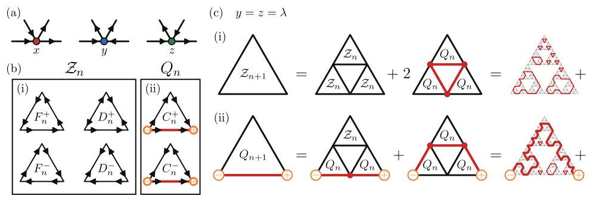
<figcaption class="paper-figure-caption"><b>Fig 1.</b> FIG. 1. (a) three vertex configurations not related by σj →−σj for the Sierpinski gasket six-vertex model. We color the vertices according to their type. They have Boltzmann weights x, y, z such that α = exp(−βEα) for α ∈{x, y, z} with energies Eα. (b) different recursion variables defined by their corner vertex orientations. (i) neutral vertices sum to Zn. (ii) two charge configurations sum to Qn, with a red string joining the orange charges. (c) diagrams for the recursion relations of Eq. 1 where plaquettes are labeled based on their charge as in panel (b) and uncolored bulk vertices correspond to y = z = λ. (i) shows the recursion for Zn where the factor of 2 comes from the two possible...</figcaption>
</figure>
<figure class="paper-figure-card">
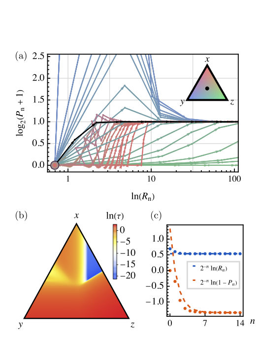
<figcaption class="paper-figure-caption"><b>Fig 2.</b> FIG. 2. Pn and Rn, Eqs. 2,3, for different (x, y, z). (a) pa- rameter flow with n projected onto recursion variables Pn and Rn. The black line is for ice x = y = z. For sufficiently large n, all phases with finite x, y, z flow to a confining point with P∗= 1, Rn →∞. There is an unstable fixed point with respect to y, z &gt; 0 marked by the circle in the lower left. (b) logarithm of the string tension, ln(τ) = ln(2−n ln Rn), for n = 30. We plot a section of the space of (x, y, z) by fixing xyz = 1 where the parameters in the lower left corner are (x, y, z) = (e−5, e−5, e10). The finite value of the tension indi- cates confinement almost everywhere, excluding two disjoint regions with low...</figcaption>
</figure>
<figure class="paper-figure-card">
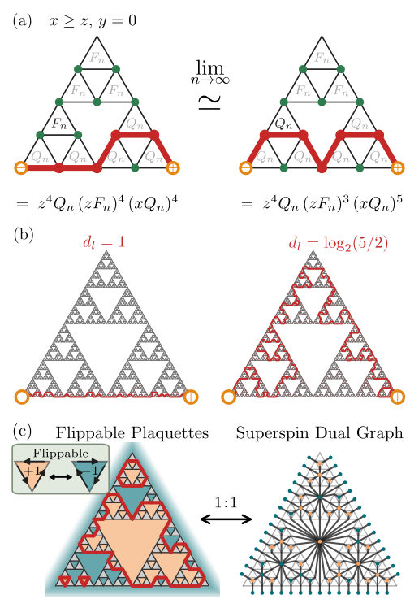
<figcaption class="paper-figure-caption"><b>Fig 3.</b> FIG. 3. Fractal deconfinement and superspins. (a) Two con- tributions to Qn+2, with gray recursion variables indicating unchanged plaquettes. Below the diagrams are their corre- sponding weights with ratio is xQn/zFn = 1 in the limit n →∞for x ≥z, y = 0. (b) Typical string joining two charges with different fractal dimensions, dl (Eq. 9) for n = 6 generations. (c) Flippable dual plaquettes and superspin con- struction for the y = 0 four-vertex model overlayed on the fractal. Highlighted dual plaquettes have boundaries of flip- pable loops of spins, and different domains are separated by strings of x-type vertices. The pth dual plaquette can be treated as an Ising superspin with possible...</figcaption>
</figure>
<figure class="paper-figure-card">
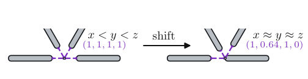
<figcaption class="paper-figure-caption"><b>Fig 4.</b> FIG. 4. Potential experimental implementation of degenerate vertices in artificial spin ice (ASI). The distances of the tips of the micromagnetic islands islands (gray) from the central vertex are shown in purple. They are tuned to the values (1, 0.64, 1, 0) such that x ≈y ≈z as calculated within the dumbbell approximation [11, 48].</figcaption>
</figure>
<figure class="paper-figure-card">
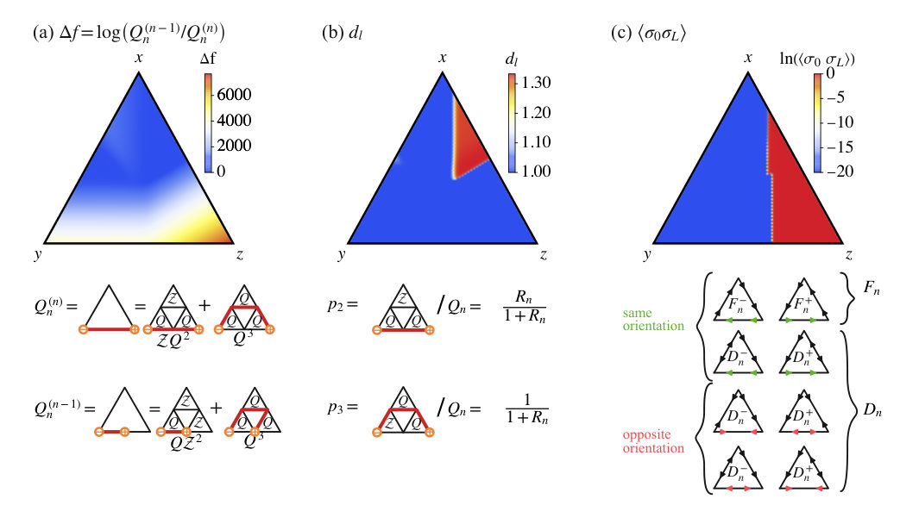
<figcaption class="paper-figure-caption"><b>Fig 5.</b> FIG. 5. Illustrations of diagrams for calculating different observables of interest in the main text alongside full recursion calculations. (a) calculation of the string tension, ∆f, which comes from studying the change in free energy as we move a charge from L/2 to L along the bottom of the fractal. (b) fractal dimension, dl, of the string and its definition via the lengths. The two possible paths at the largest length scales are 3 copies or 2 copies of the previous iteration with probabilities of p3 and p2 respectively. (c) neutral diagrams that contribute to the spin-spin correlator. The spins in color are those at 0 and L. Same circulation configurations give a positive contribution to...</figcaption>
</figure>

**Summary.** This paper analyzes the six-vertex model on the Sierpinski gasket fractal to study charge confinement. It finds that while the standard ice limit shows confinement, specific parameter choices lead to a novel 'fractal deconfinement' regime. The work uses recursive calculations to determine key observables like string tension and the fractal dimension of the connecting strings.

**Why it may be interesting.** The concept of emergent fractional dimensions ($d_l$) governing topological excitations (strings) in a statistical system provides deep insights into how dimensionality affects long-range order, relevant to understanding critical phenomena in complex materials.

Detailed structure

**Main problem.** The study investigates fractal deconfinement and confinement phenomena by analyzing statistical mechanical models on fractal lattices.

**Main result.** The model exhibits a transition from entropic charge confinement (in the ice limit) to fractal deconfinement in specific parameter regimes, characterized by a non-trivial string dimension $d_l$.

**Method.** The authors employ recursive calculations for partition functions and correlators tailored to the hierarchical structure of the Sierpinski gasket.

**Model / system.** The system is the six-vertex model applied to the Sierpinski gasket, a four-coordinated fractal with Hausdorff dimension $d_f=\log_2 3$. The analysis compares regimes like the standard ice point to specific low-energy limits (e.g., HAFM).

**Key observables.** String tension ($	au$), correlation decay length ($\xi$), and the fractal dimension of the connecting string ($d_l$).

**Important parameters / regimes.** The vertex weights (x, y, z) which define different regimes; the fractal dimension $d_f = \log_2 3$.

**Assumptions / limitations.** The analysis relies on deriving and solving coupled recurrence relations based on the hierarchical structure of the lattice.

**Figures summary.** Figures illustrate recursion relation flows, phase diagrams showing parameter dependence, and geometric representations of string paths with different fractal dimensions ($d_l$).

**Paper structure.** The paper progresses by defining the model on the fractal, deriving recursive relations for partition functions, analyzing how correlations decay (confinement vs. deconfinement), and finally proposing experimental realizations using artificial spin ice.

Abstract

We study the six-vertex model on the Sierpinski gasket, a four-coordinated hierarchical fractal with Hausdorff dimension $d_f=\log_23$. Given the importance of dimensionality for the long-wavelength behavior of such models, we specifically consider correlations and confinement as a function of the vertex weights, with the equal-weight point corresponding to the ice model. We calculate the partition function and correlators recursively to obtain a rich phase diagram hosting many different regimes. While the ice model shows entropic charge confinement, a particular four-vertex limit exhibits fractal deconfinement, with the string joining the deconfined charges itself a statistical fractal with fractal dimension $d_l=\log_2(5/2)\approx 1.3$. Finally, we propose a setup as an artificial spin ice to enable experimental study of the rich phenomenology of Sierpinski ice and its generalisations.

[↑ back to top](#top)

### [Microscopic Origin of Random Singlet Behavior in B-site Disordered Spin-1/2 Perovskite BaCu_1/3Nb_2/3O_3 Revealed by EXAFS and Thermodynamics](http://arxiv.org/abs/2608.03671v1)

**Authors:** Sagar Mahapatra, Francesco De Angelis, Martin Etter, Edmund Welter, M. P. Saravanan, Rajeev Rawat, Carlo Meneghini, Surjeet Singh  
**Type:** experiment · **Category:** disordered systems and neural networks · **PDF:** <https://arxiv.org/pdf/2608.03671v1>  
**Analysis basis:** full PDF text, analyzed in chunks
**Topic relevance:** `Kondo & dissipative impurity` **1/5** · `analog quantum simulation` **1/5** · `exotic spin models in light-matter` **1/5** · `spintronics-quantum-optics interface` **1/5**

↔ Scroll figures horizontally

<figure class="paper-figure-card">
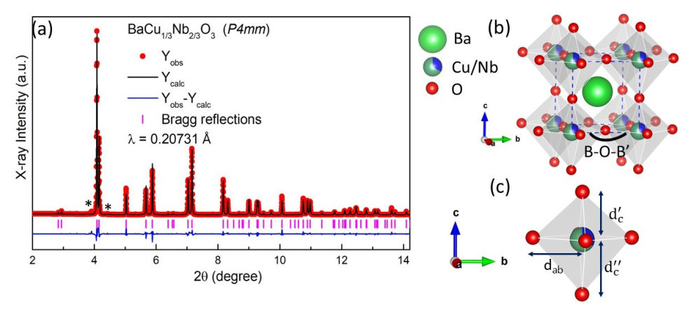
<figcaption class="paper-figure-caption"><b>Fig 1.</b> FIG. 1. (a) Synchrotron X-ray powder diffraction pattern of BCNO showing observed (red), calculated (black), and difference (blue) plots. The magenta sticks show the position of the expected Bragg peaks. (b) The ABO3-type crystal structure of BCNO. (c) An isolated BO6 octahedron showing the slight off-centering of the B-site cations.</figcaption>
</figure>
<figure class="paper-figure-card">
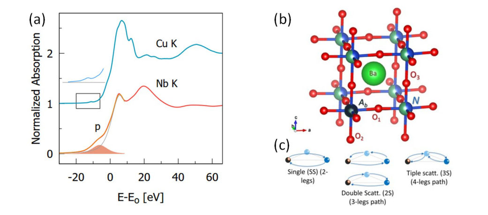
<figcaption class="paper-figure-caption"><b>Fig 2.</b> FIG. 2. (a) Normalized XANES spectra measured on BCNO at the Cu-K and Nb-K edges. For clarity, the energy scale is referenced to the corresponding metal foil edge energies, and the spectra are vertically offset. A tiny pre-edge shoulder is visible in the Cu K-edge XANES spectrum, highlighted in the upper inset. A pre-edge shoulder (denoted p) is also observed at the Nb-K edge. The contribution of the pre-edge peak used in fitting the Nb edge features is shown in orange for clarity, together with the model curve for the edge rise (gray line) (see text). (b) The schematic representation of the pseudo-cubic unit of P4mm structure with the absorber Ab (Cu/Nb) in the left bottom corner (black)...</figcaption>
</figure>
<figure class="paper-figure-card">
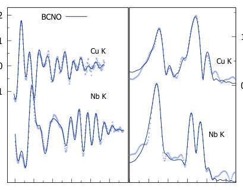
<figcaption class="paper-figure-caption"><b>Fig 3.</b> FIG. 3. Left panel: k2-weighted experimental EXAFS data (dots) and best fit curves (full lines) measured at the Cu and Nb K edges, on BCNO sample. Right panel: moduli of the k2-weighted Fourier transforms of experimental data (dots) and best fit curves (full lines). Data are vertically shifted for clarity.</figcaption>
</figure>
<figure class="paper-figure-card">
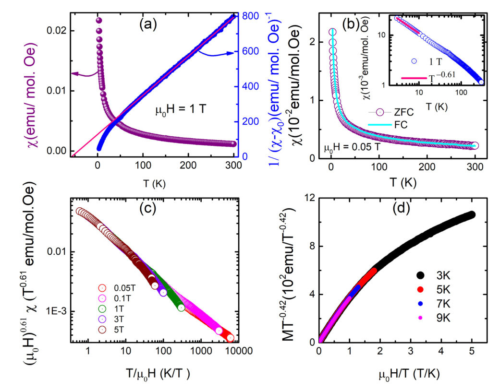
<figcaption class="paper-figure-caption"><b>Fig 4.</b> FIG. 4. Magnetic susceptibility and T/H scaling in BCNO. (a) The temperature variation of magnetic susceptibility χ(T) and the inverse magnetic susceptibility 1/(χ −χ0). The pink line through the data points is the Curie-Weiss fit. (b) The zero-field- cooled (ZFC) and field-cooled (FC) data measured under µ0H = 0.05T. Inset: power-law (T −γ) fitting of χ −χ0 below 10 K shown a log-log scale. (c) and (d) show data scaling behavior of χ(T) and isothermal magnetization M(H), respectively. See text for details.</figcaption>
</figure>
<figure class="paper-figure-card">
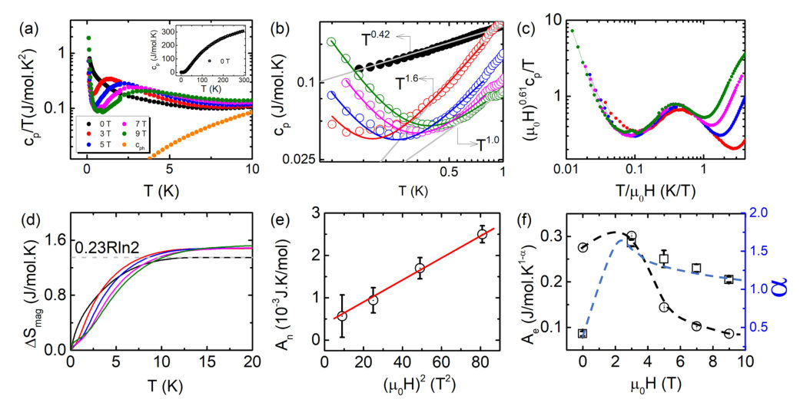
<figcaption class="paper-figure-caption"><b>Fig 5.</b> FIG. 5. (a) The temperature variation of specific heat plotted as cp/T. The calculated phonon contribution is also shown. Inset: The temperature-dependent zero-field specific heat cp(T) in the temperature range of 0.1 ≤T ≤300 K. (b) cp versus T for various applied magnetic fields plotted on a log-log scale. The fitted curves (eq. 3) are shown as solid lines through the data points. The gray colored lines are a guide to eye showing T 0.42 (representative of the zero-field data), T 1.6 (representative of the intermediate fields), and T 1.0 (representative of the high-field data). (c) The data collapse of the scaled specific heat µ0Hγcp/T plotted against the normalized temperature T/µ0H for...</figcaption>
</figure>

**Summary.** The researchers studied the disordered perovskite $	ext{BaCu}_{1/3}	ext{Nb}_{2/3}	ext{O}_3$ using X-ray spectroscopy and low-temperature magnetometry. They found that local structural disorder suppresses direct magnetic linkages, leading to a Random Singlet (RS) ground state characterized by power-law temperature dependencies in thermodynamic measurements. Furthermore, applying high magnetic fields induces a crossover toward a distinct quantum paramagnetic phase.

**Why it may be interesting.** This work provides a detailed experimental realization of random-singlet physics in an oxide magnet, offering insights into how local structural disorder dictates macroscopic quantum magnetic behavior, which is relevant for understanding disordered quantum materials.

Detailed structure

**Main problem.** The study investigates the microscopic origin of Random Singlet (RS) behavior in a disordered perovskite, $	ext{BaCu}_{1/3}	ext{Nb}_{2/3}	ext{O}_3$, and its connection to magnetic ordering.

**Main result.** The material exhibits clear signatures of a random-singlet phase via power-law scaling in specific heat and susceptibility at low temperatures, while high fields suggest a crossover to a quantum paramagnetic state.

**Method.** A combined approach using structural probes (XRD/XAFS) to determine local atomic order, coupled with detailed thermodynamic measurements ($c_p(T)$ and $\chi(T)$ under varying magnetic fields).

**Model / system.** The system is the B-site disordered spin-1/2 perovskite $	ext{BaCu}_{1/3}	ext{Nb}_{2/3}	ext{O}_3$, where disorder leads to quenched randomness in the magnetic exchange network.

**Key observables.** Specific heat ($c_p(T)$), magnetic susceptibility ($\chi(T)$), and local structural correlations derived from EXAFS.

**Important parameters / regimes.** Random-singlet exponent $\gamma \approx 0.6$; crossover to $T$-linear specific heat at high fields; low Curie-Weiss temperature ($\Theta_{CW}\approx -50$ K).

**Assumptions / limitations.** The magnetic behavior can be modeled by the Random Singlet (RS) theory, and structural disorder is primarily responsible for suppressing long-range order.

**Figures summary.** Figures detail XRD patterns confirming average structure, XAFS showing local Cu/Nb correlations, and $c_p$ vs. T plots demonstrating power-law scaling at low fields and linear behavior at high fields.

**Paper structure.** The paper first uses structural methods (XRD/XAFS) to characterize the disorder; it then analyzes magnetic susceptibility and specific heat measurements across varying fields to diagnose the nature of the spin ground state, concluding with entropy calculations to estimate contributions from different spin subsystems.

Abstract

We report a combined structural and thermodynamic study of the ABO$_3$-type disordered perovskite BaCu$_{1/3}$Nb$_{2/3}$O$_3$ (BCNO), whose B site is jointly occupied by Cu and Nb in the $1:2$ ratio. Using synchrotron powder x-ray diffraction (XRD) and x-ray absorption fine structure (XAFS) spectroscopy, we investigate the microscopic nature of Cu$^{2+}$/Nb$^{5+}$ disorder on the pseudo-cubic B-sublattice and its relation to the emergent random-singlet (RS) behavior evidenced at low temperatures. While XRD reveals no long-range Cu/Nb ordering and average site occupancy consistent with stoichiometry, XAFS reveals a peculiar local chemical order characterized by preferential heteroatomic Cu$:$Nb correlations. This local arrangement strongly suppresses direct Cu$:$Cu linkages, despite the Cu concentration being close to the percolation threshold of a cubic lattice. The resulting exchange network explains the absence of spin-glass freezing or long-range magnetic order in the presence of substantial antiferromagnetic interactions, as indicated by a Curie-Weiss temperature $Θ_{CW}\approx -50$ K. Instead, the magnetic susceptibility $χ(T)$ and specific heat $c_p(T)$ exhibit power-law behavior and characteristic single-parameter $T/H$ scaling over broad temperature and magnetic-field ranges, consistent with random-singlet phenomenology. Notably, at very low temperatures, the specific heat behavior transitions from $T^{1-γ}$ ($γ\approx 0.6$ from the $T/H$ scaling) in zero-field to a T-linear dependence under high field, indicating a crossover to a distinct low-energy regime whose microscopic origin remains to be established.

[↑ back to top](#top)

### [1+1d Lattice Dirac Fermions from Non-Onsite Vector and Axial Symmetries](http://arxiv.org/abs/2608.02722v1)

**Authors:** Tabin Dharanikota, Lukasz Fidkowski  
**Type:** theory · **Category:** strongly correlated electrons · **PDF:** <https://arxiv.org/pdf/2608.02722v1>  
**Analysis basis:** full PDF text, analyzed in chunks
**Topic relevance:** `Frenkel-Kontorova` **1/5** · `Keldysh / 2PI / non-Gaussian methods` **1/5** · `analog quantum simulation` **1/5**

↔ Scroll figures horizontally

<figure class="paper-figure-card">
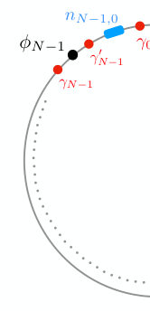
<figcaption class="paper-figure-caption"><b>Fig 1.</b> Figure 1: Degrees of freedom of the fermionic Villain model. The bosonic degrees of freedom are ϕr ∈R and nr,r+1 ∈Z/2. The fermionic degrees of freedom are Majorana fermions γr, γ′ r. There is a fermionic Villain condition (eq. 2) imposed on all of the states in the Hilbert space. In the (equivalent) graded tensor product Hilbert space, ϕr are replaced with ˜ϕr ∈R/Z, and nr,r+1 by ˜nr,r+1 ∈Z/2, and the Villain condition maps onto the constraint that odd angular momentum states of the ˜ϕr rotor are fermion parity odd (iγrγ′ r = −1).</figcaption>
</figure>

**Summary.** This work constructs and solves a lattice Hamiltonian for a 1+1d Dirac fermion that possesses exact U(1) vector and axial symmetries. By mapping the complex system to an equivalent fermionic Villain model, the authors demonstrate its solvability and show it captures the physics of interacting Luttinger liquids. This provides a powerful theoretical tool for studying symmetry-protected topological phases in condensed matter systems.

**Why it may be interesting.** The rigorous construction of an exactly solvable interacting fermionic system realizing a Dirac fermion while maintaining specific symmetries is highly relevant for understanding strongly correlated electron models where symmetry protection is crucial.

Detailed structure

**Main problem.** The primary goal is constructing an exactly solvable lattice Hamiltonian for a 1+1d Dirac fermion that possesses exact microscopic U(1) vector and axial symmetries, while correctly accounting for the mixed anomaly between these symmetries.

**Main result.** The authors successfully construct such a model, showing it realizes the entire Luttinger liquid universality class in an exactly solvable manner through mapping to a fermionic Villain Hilbert space.

**Method.** The solvability is established by constructing two equivalent descriptions of the Hilbert space (graded tensor product and fermionic Villain) and demonstrating an isomorphism between them. Low-energy physics is analyzed via mode expansion, reducing the Hamiltonian to coupled harmonic oscillators.

**Model / system.** The system is a 1+1d lattice Dirac fermion model defined on a ring with N sites, involving bosonic rotors ($\phi_r$), discrete variables ($n_{r,r+1}$), and Majorana fermions. The Hamiltonian incorporates constraints ensuring the required symmetries are maintained.

**Key observables.** Chiral charges ($Q_L, Q_R$), energy spectrum of normal modes ($\omega_k$), and the mixing amplitude $A(t)$ used to compare field theory vs. Villain model predictions.

**Important parameters / regimes.** The ratio U0/J0 determines the fixed point; the analysis distinguishes between sectors based on axial charge ($Q_A=0$, even, or odd).

**Assumptions / limitations.** The analysis relies heavily on defining and utilizing an isomorphism ('Villain disentangler') between two formal descriptions of the Hilbert space, and often involves gauge-fixing constraints to simplify the Hamiltonian.

**Figures summary.** Figure 1 illustrates the degrees of freedom for the fermionic Villain model used in the construction.

**Paper structure.** The paper proceeds by defining the complex Hilbert space structure using two formalisms (graded tensor product vs. Villain) and establishing their equivalence. It then constructs the Hamiltonian, solves it by mapping to harmonic oscillators, analyzes low-energy excitations based on axial charge sectors, and finally compares predictions for coupling constants derived from field theory versus the lattice model.

Abstract

We construct an exactly solvable Hamiltonian lattice model realizing a 1+1d Dirac fermion, with exact microscopic vector and axial vector $U(1)$ symmetries. The mixed anomaly between these is accommodated by the not-on-site action of the symmetries. Our Hilbert space is a $Z_2$-graded tensor product of local $Z_2$-graded Hilbert spaces which include infinite dimensional rotor degrees of freedom. The Hamiltonian becomes manifestly exactly solvable after a locality-preserving unitary mapping to an equivalent fermionic Villain Hilbert space. Our construction also allows an exactly solvable realization of interacting fermionic Luttinger liquids. At the free Dirac fixed point, our Hamiltonian contains irrelevant interactions, which we compute to leading order.

[↑ back to top](#top)

### [Antisymmetric Dynamical Spin Correlations: Spin-Space-Group Constraints and Frequency-Moment Sum Rules](http://arxiv.org/abs/2608.03786v1)

**Authors:** Tsutomu Momoi  
**Type:** theory · **Category:** strongly correlated electrons · **PDF:** <https://arxiv.org/pdf/2608.03786v1>  
**Analysis basis:** full PDF text, analyzed in chunks
**Topic relevance:** `Keldysh / 2PI / non-Gaussian methods` **1/5** · `analog quantum simulation` **1/5** · `spintronics-quantum-optics interface` **1/5**

↔ Scroll figures horizontally

<figure class="paper-figure-card">
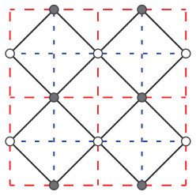
<figcaption class="paper-figure-caption"><b>Fig 1.</b> FIG. 1. Minimal two-sublattice square-lattice model used in the linear spin-wave calculation. Solid, red dashed, and blue dotted bonds denote J, Jd, and Jnm, respectively. Gray and open circles denote the A and B sublattices, respectively. The primitive lattice vectors are a1 = 2a ˆx and a2 = 2a ˆy.</figcaption>
</figure>

**Summary.** This theoretical work establishes fundamental symmetry constraints and precise frequency-moment sum rules governing the antisymmetric part of the dynamical spin structure factor. By analyzing these constraints using magnetic space groups, the authors predict which types of magnetic excitations are allowed or forbidden in various ordered magnets like helices and antiferromagnets. This provides powerful diagnostic tools for interpreting inelastic neutron scattering data.

**Why it may be interesting.** While focused on magnetism, the rigorous application of group theory symmetries to derive exact spectral properties and sum rules is a powerful general technique applicable to any quantum many-body system where symmetry dictates observable selection rules.

Detailed structure

**Main problem.** The paper derives symmetry constraints and exact zero-temperature sum rules for the spin-component-antisymmetric part of the dynamical spin-structure-factor tensor.

**Main result.** These symmetries dictate selection rules for magnetic excitations, allowing finite spectral weight even when zeroth or first frequency moments vanish under specific crystal/spin symmetries.

**Method.** The analysis uses group theory applied to residual unitary and antiunitary operations of magnetic space groups and spin-space groups, combined with linear spin-wave calculations.

**Model / system.** The framework is applied to general magnetic systems, including collinear antiferromagnets, rotation-related altermagnets, and planar helical magnets (e.g., on a triangular lattice).

**Key observables.** Antisymmetric dynamical spin-structure-factor tensor ($C_{\alphaeta}(\mathbf{q}, \omega)$), commutator spectral function $A_{\alphaeta}^{	ext{as}}(\mathbf{q}, \omega)$, and its frequency moments ($M^0, M^1$).

**Important parameters / regimes.** Zero temperature ($T=0$), momentum ($\mathbf{q}$), and the specific symmetry operations (unitary/antiunitary).

**Assumptions / limitations.** The analysis relies on deriving constraints from residual space group symmetries; some calculations use linear spin-wave theory approximations.

**Figures summary.** Not specified in the notes, but the text discusses explicit realizations of these constraints via LSWT for helical magnets and general symmetry rules for different magnetic types.

**Paper structure.** The paper first defines the antisymmetric DSF, then derives general symmetry constraints using space groups, establishes moment sum rules (zeroth and first moments), and finally applies this framework to specific models like collinear antiferromagnets and planar helices.

Abstract

Polarized inelastic neutron scattering probes the handedness of magnetic excitations through the spin-component-antisymmetric part of the dynamical spin-structure-factor tensor. We derive its symmetry constraints under unitary and antiunitary residual operations of magnetic space groups and spin-space groups. These constraints determine the allowed tensor components, their parity under momentum reversal, and symmetry-enforced nodes. We then introduce the corresponding antisymmetric commutator spectral function and derive exact zero-temperature sum rules for its frequency moments. The zeroth moment is fixed by the uniform magnetization. For Heisenberg or XXZ exchange Hamiltonians, the first moment of the $xy$ component is fixed by a momentum-weighted static vector chirality. For compensated collinear antiferromagnets, the antisymmetric dynamical structure factor is forbidden when inversion or a translation relates the opposite-spin sublattices. In rotation-related altermagnets, however, an $xy$ component that is even under momentum reversal is allowed at generic wave vectors. Finite antisymmetric spectral weight can therefore coexist with vanishing zeroth and first moments of the commutator spectral function. In a planar helix, by contrast, a residual antiunitary spin-space-group symmetry makes the allowed $xy$ component odd under momentum reversal. Its first moment is generally nonzero and is fixed by a momentum-weighted static vector chirality through the first-moment sum rule. Linear spin-wave calculations for representative altermagnetic and helical models explicitly realize these symmetry and sum-rule constraints.

[↑ back to top](#top)

### [Analytical results of Typical Medium Theory for the Bethe lattice with Cauchy disorder](http://arxiv.org/abs/2608.03770v1)

**Authors:** A. Östlin, I. Titvinidze, M. Kollar, D. Jones, L. Chioncel  
**Type:** theory · **Category:** disordered systems and neural networks · **PDF:** <https://arxiv.org/pdf/2608.03770v1>  
**Analysis basis:** full PDF text, analyzed in chunks
**Topic relevance:** `Keldysh / 2PI / non-Gaussian methods` **1/5** · `Kondo & dissipative impurity` **1/5**

↔ Scroll figures horizontally

<figure class="paper-figure-card">
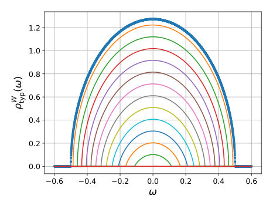
<figcaption class="paper-figure-caption"><b>Fig 1.</b> Figure 1. Typical density of states (TDOS) ρW typ on the Bethe lattice for Cauchy-distributed disorder and different disorder strengths W, equally spaced between 0.01 and 0.25. The blue curve with symbols corresponds to the DOS of the clean Bethe lattice. The half-bandwidth is D = 0.5.</figcaption>
</figure>
<figure class="paper-figure-card">
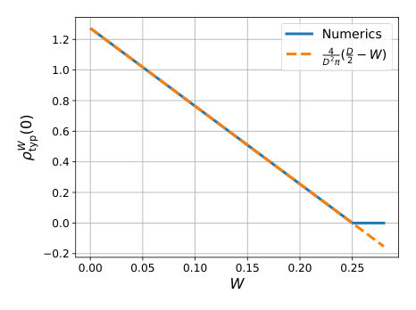
<figcaption class="paper-figure-caption"><b>Fig 2.</b> Figure 2. TDOS ρW typ(ω) at ω = 0 as a function of the disorder strength W. The orange dashed line shows the analytical result.</figcaption>
</figure>
<figure class="paper-figure-card">
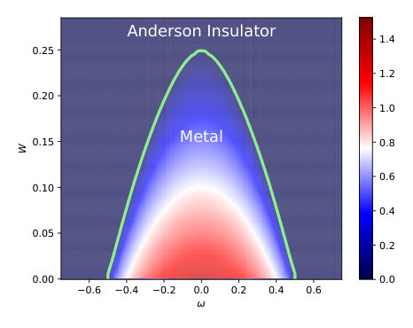
<figcaption class="paper-figure-caption"><b>Fig 3.</b> Figure 4. ω–W phase diagram for the Bethe lattice with Cauchy-distributed disorder. The green curve denotes the mobility edge separating the metallic and localized (insulating) phases. The color map shows the TDOS ρW typ(ω).</figcaption>
</figure>
<figure class="paper-figure-card">
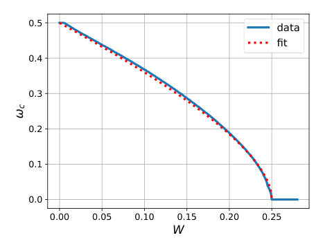
<figcaption class="paper-figure-caption"><b>Fig 4.</b> Figure 3. Mobility edge ωc as a function of the disorder strength W for the Bethe lattice with Cauchy-distributed disorder. For |ω| &gt; ωc, the TDOS vanishes, ρW typ(ω) = 0. The dotted red line corresponds to a fit obtained from Eq. (8), with the fitting parameters a = 0.6874.</figcaption>
</figure>
<figure class="paper-figure-card">
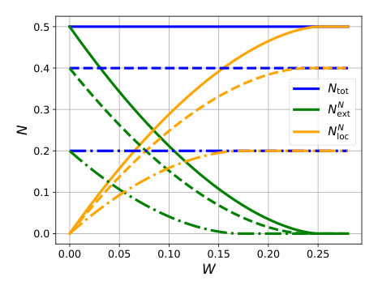
<figcaption class="paper-figure-caption"><b>Fig 5.</b> Figure 5. Number of extended and localized states, N W ext and N W loc, as a function of the disorder strength W for the Bethe lattice with Cauchy-distributed disorder. Results are shown at three fillings: half-filling (solid lines), Ntot = 0.4 (dashed lines), and Ntot = 0.2 (dash-dotted lines). The color coding of the curves is given in the legend.</figcaption>
</figure>

**Summary.** This paper develops an analytical framework using Typical Medium Theory (TMT) to study Anderson localization on the Bethe lattice with Cauchy disorder. The authors derive key results showing that the typical density of states vanishes linearly at a critical disorder strength, signaling the continuous collapse of extended electronic states. This work provides quantitative insights into the metal-insulator transition in highly disordered quantum systems.

**Why it may be interesting.** The rigorous application of TMT to characterize localization transitions provides powerful analytical tools applicable to understanding spectral properties in disordered quantum materials.

Detailed structure

**Main problem.** The study aims to characterize the Anderson localization transition (metal-insulator transition) in a disordered quantum system.

**Main result.** The typical density of states at the band center decreases linearly with disorder strength and vanishes at a critical disorder $W_c = D/2$, indicating continuous collapse of extended states.

**Method.** The authors employ Typical Medium Theory (TMT), which uses the geometric average of local quantities, to analyze the Anderson Hamiltonian on an infinite-connectivity Bethe lattice.

**Model / system.** The system is non-interacting spin-less fermions hopping on a Bethe lattice subjected to random on-site energies drawn from a Cauchy distribution. The model is described by an Anderson Hamiltonian.

**Key observables.** Typical Density of States ($
ho_{W}^{	ext{typ}}(\omega)$), Mobility Edge ($\omega_c$), Number of Extended/Localized States ($N_{W}^{	ext{ext}}, N_{W}^{	ext{loc}}$).

**Important parameters / regimes.** Disorder strength ($W$), Disorder bandwidth parameter ($D$).

**Assumptions / limitations.** The primary approximation is the use of Typical Medium Theory (TMT) over the conventional CPA, and analytical derivations rely on specific algebraic simplifications afforded by the Cauchy distribution.

**Figures summary.** Figure 1 numerically shows the typical density of states ($
ho_{W}^{	ext{typ}}$) for varying disorder strengths, illustrating its suppression and the shrinking energy interval.

**Paper structure.** The paper establishes the TMT self-consistency loop for this specific system. It derives analytical expressions for key observables like $
ho_{W}^{	ext{typ}}(0)$ and $\omega_c$, analyzing the continuous transition from extended to localized states, and deriving approximate forms for the imaginary part of the self-energy ($\Sigma_I$).

Abstract

We present a combined numerical and analytically tractable realization of the typical medium theory (TMT) for Anderson localization on the infinite-connectivity Bethe lattice with Cauchy-distributed on-site disorder. Exploiting the special properties of the Cauchy distribution and the Bethe lattice, we derive an analytical expression for the typical density of states (TDOS) and obtain a simplified TMT self-consistency scheme. We show that the TDOS at the band center decreases linearly with disorder strength and vanishes at the critical disorder $W_c=D/2$. The resulting $ω$--$W$ phase diagram reveals the continuous collapse of the mobility edge and the disappearance of extended states.

[↑ back to top](#top)

### [Fibonacci number systems and the localization criterion in the many-body Aubry-André model](http://arxiv.org/abs/2608.03458v1)

**Authors:** Balázs Hetényi  
**Type:** theory · **Category:** disordered systems and neural networks · **PDF:** <https://arxiv.org/pdf/2608.03458v1>  
**Analysis basis:** full PDF text, analyzed in chunks
**Topic relevance:** `Frenkel-Kontorova` **1/5** · `analog quantum simulation` **1/5**

↔ Scroll figures horizontally

<figure class="paper-figure-card">
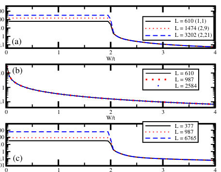
<figcaption class="paper-figure-caption"><b>Fig 1.</b> FIG. 1. Numerical results for the variance (centered second moment) of the polarization (M2) as a function of the poten- tial strength (W/t) for three particle densities (a) ρ = 1 2, (b) ρ = 2 1+ √</figcaption>
</figure>
<figure class="paper-figure-card">
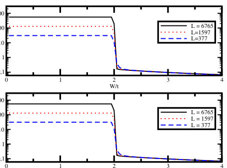
<figcaption class="paper-figure-caption"><b>Fig 2.</b> FIG. 2. Centered variance of the polarization for (a) γ+ and (b) γ−(see Eq. (22)). γ+ and γ−differ from Fn−1</figcaption>
</figure>

**Summary.** This paper applies an extension of the Fibonacci number system, called the fractional Fibonacci number system, to analyze localization in the Aubry-André model. It establishes that the nature of the particle density dictates whether the system undergoes a metal-insulator transition at $W=2t$ or remains localized even for small potentials. The work provides a mathematical framework for classifying critical behavior in quasiperiodic quantum systems.

**Why it may be interesting.** This work bridges deep mathematical concepts (number systems like Fibonacci bases) directly into condensed matter physics to predict critical behavior (localization transitions), offering a novel theoretical tool for analyzing quasiperiodic systems beyond standard band theory.

Detailed structure

**Main problem.** The paper investigates how number theoretic properties, specifically using Fibonacci number systems, can be employed to interpret the localization phase diagram of the many-body Aubry-André model.

**Main result.** The localization behavior depends critically on whether the particle density is rational or irrational; certain irrational densities exhibit different transition points ($W=0$ vs $W=2t$) compared to others.

**Method.** The authors introduce and utilize a 'fractional Fibonacci number system' to represent particle densities ($
ho = N/L$), allowing for a systematic classification of localization regimes in the thermodynamic limit.

**Model / system.** The study focuses on the many-body non-interacting Aubry-André model, characterized by a Hamiltonian involving hopping strength ($t$) and a quasiperiodic potential strength ($W$). The analysis is performed across varying particle densities ($
ho = N/L$).

**Key observables.** Localization criterion (change in density representation as $L 	o \infty$), variance of polarization ($M_2$), and the transition point between metallic and insulating phases.

**Important parameters / regimes.** Potential strength ($W$) relative to hopping strength ($t$); particle density ($
ho$).

**Assumptions / limitations.** Periodic boundary conditions are assumed; the classification based on base-$\varphi$ is noted to lose strict meaning in the true thermodynamic limit, depending on the approach path.

**Figures summary.** Figure 1 shows numerical variance results for three different densities (rational, golden ratio irrational, other irrational) demonstrating size dependence changes at $W/t=2$. Figure 2 compares polarization variance for $\gamma^+$ and $\gamma^-$ approaching a limit, showing a transition at $W=2t$ for finite systems.

**Paper structure.** The paper introduces the fractional Fibonacci number system to analyze the Aubry-André model. It derives localization criteria based on density representation (Zeckendorf/base-$\varphi$) and compares results for different types of densities, concluding with a discussion on the limitations in the thermodynamic limit.

Abstract

We introduce an extension of the Fibonacci number system, we call the fractional Fibonacci number system, which interpolates between the Fibonacci number system (used for natural numbers) and the irrational base-$φ$ number system, which can be used to represent real numbers. The number system finds its use in interpreting the localization phase diagram of the many-body non-interacting Aubry-André model. For finite system sizes a localization criterion can be obtained if the particle density is written in the fractional Fibonacci number system. In the thermodynamic limit, the criterion remains, but in this case the particle density is expressed in base-$φ$. The nature of the thermodynamic limit is also discussed.

[↑ back to top](#top)

### [High-level quantum structured programs as quantum registers compositions](http://arxiv.org/abs/2608.03873v1)

**Authors:** David Chamizo, Jose Garcia-Alonso, Juan M. Murillo  
**Type:** theory · **Category:** quantum information and computing · **PDF:** <https://arxiv.org/pdf/2608.03873v1>  
**Analysis basis:** full PDF text, analyzed in chunks
**Topic relevance:** `analog quantum simulation` **1/5** · `entanglement & information structure` **1/5**

↔ Scroll figures horizontally

<figure class="paper-figure-card">
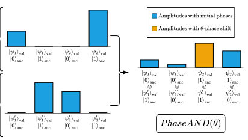
<figcaption class="paper-figure-caption"><b>Fig 1.</b> Fig. 1. Representation of the PhaseAND(θ) operation functionality on two register with one constraint each. On the right, those states without amplitude contribution are suppressed for simplification. Bars height is an arbitrary depiction of amplitude absolute values while color is related to relative phase.</figcaption>
</figure>
<figure class="paper-figure-card">
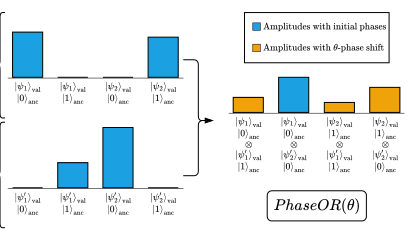
<figcaption class="paper-figure-caption"><b>Fig 2.</b> Fig. 2. Representation of the PhaseOR(θ) operation functionality on two register with one constraint each. On the right, those states without amplitude contribution are suppressed for simplification. Bars height is an arbitrary depiction of amplitude absolute values while color is related to relative phase.</figcaption>
</figure>
<figure class="paper-figure-card">
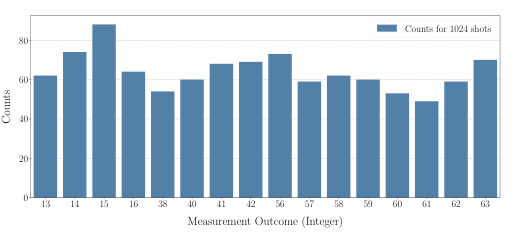
<figcaption class="paper-figure-caption"><b>Fig 3.</b> Fig. 3. Histogram representing the results obtained after evaluating Algorithm 1 for the case of Eq. (36) after 1024 shots.</figcaption>
</figure>
<figure class="paper-figure-card">
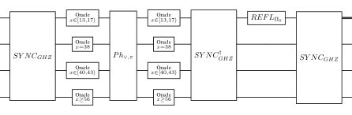
<figcaption class="paper-figure-caption"><b>Fig 4.</b> Fig. 4. Circuit derived from the high-level syntax of Algorithm 1 for the case of Eq. (36).</figcaption>
</figure>
<figure class="paper-figure-card">
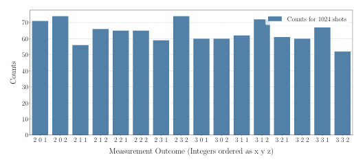
<figcaption class="paper-figure-caption"><b>Fig 5.</b> Fig. 5. Histogram representing the results obtained after evaluating Algorithm 1 for the case of Eq. (37) after 1024 shots.</figcaption>
</figure>

**Summary.** This paper addresses the complexity of writing large-scale quantum programs by proposing a high-level structured programming paradigm. It models computation not as gate sequences on individual qubits, but as transformations acting upon abstract 'quantum registers.' By formalizing this structure using an algebraic approach, it enables the design of tools like quantum SMT solvers that operate at a much higher level of abstraction.

**Why it may be interesting.** This work provides theoretical tools for abstracting quantum computation beyond simple circuit diagrams, which is crucial for designing scalable algorithms and verifying complex quantum protocols relevant to AMO physics simulations.

Detailed structure

**Main problem.** Current quantum programming is too low-level, requiring manual management of individual qubits and gates for complex problems, leading to high cognitive load and errors.

**Main result.** The paper proposes a conceptual framework for high-level quantum structured programming by treating computation as semantically defined transformations acting on entire quantum registers.

**Method.** It develops an algebraic formalism that bridges high-level syntax with low-level semantics, allowing the design of a quantum satisfiability modulo theories (SMT) solver based purely on structural operations.

**Model / system.** The model views computation as operating on abstract 'quantum registers' ($\mathbf{q}$), which are treated as undivided computational entities rather than sequences of individual qubits. The formalism extends concepts like Hoare's laws to this quantum domain.

**Key observables.** The focus shifts from gate sequences to the transformation and composition rules governing entire quantum registers.

**Important parameters / regimes.** None explicitly stated beyond the abstract structure of the quantum registers themselves.

**Assumptions / limitations.** The primary assumption is that computation can be successfully abstracted by defining transformations on register compositions, independent of underlying qubit details. The formalism's completeness regarding all possible quantum circuit laws is also noted as a limitation.

**Paper structure.** The paper progresses from identifying the problem (low-level gate programming) to proposing a conceptual framework based on register composition, formalizing this with an algebraic formalism that defines recursive circuits and composition laws, culminating in the ability to use this structure for SMT solving.

Abstract

Current quantum programs are mainly designed at the level of quantum gates acting on individual qubits; on a large scale and for complex problems this may involve a high cognitive load on the programmer, making the program specification nontrivial and error-prone. In this context, providing quantum programming with higher abstraction mechanisms will assist in making this task more manageable and robust against design errors. In this work, a conceptual framework is addressed following the notion of the whole quantum computation as a structure composed of quantum registers representing each an undivided entity. Thus, computation progresses through semantically well-defined transformations that act on, or entangle, quantum registers, thereby modifying the global state. Ultimately, the program reaches the desired state by following a specific composition strategy. With this in mind, high-level syntax is presented through an algebraic formalism that bridges them with their low-level semantics. Proposed syntax is based on certain well-know operations used on quantum algorithms that apply phase shifts upon logical condition satisfaction or leverage on parallel evaluation. Based solely on the formalized operations, a quantum satisfiability modulo theories (SMT) solver can be designed. At its core, this work contributes to establishing some methodological principles towards realizing a high-level quantum structured programming.

[↑ back to top](#top)

### [Mesoscopic Quantum Communication via Photon-Number Moments](http://arxiv.org/abs/2608.03418v1)

**Authors:** Gabriele Cenedese, Alex Pozzoli, Luca Razzoli, Alessia Allevi  
**Type:** theory · **Category:** quantum information and computing · **PDF:** <https://arxiv.org/pdf/2608.03418v1>  
**Analysis basis:** full PDF text, analyzed in chunks
**Topic relevance:** `entanglement & information structure` **1/5** · `interference shaping light` **1/5**

↔ Scroll figures horizontally

<figure class="paper-figure-card">
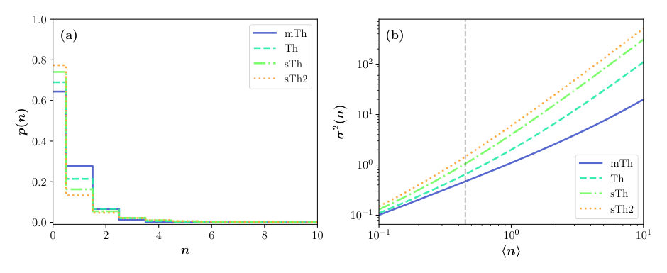
<figcaption class="paper-figure-caption"><b>Fig 1.</b> FIG. 1. (a) Photon number distributions of the multi-mode pseudo-thermal state (mTh), single-mode pseudo-thermal state (Th), super-thermal state from a speckled-speckle field (sTh), and second-harmonic of single-mode pseudo-thermal state (sTh2), all of them having a mean value ⟨n⟩= 0.45, µs = 1 for Th, STh and STh2, while µs = 10 for mTh, and µs2 = 1 for STh. (b) Variance as a function of the mean value for the same states as in panel (a); the vertical dashed line highligths ⟨n⟩= 0.45.</figcaption>
</figure>
<figure class="paper-figure-card">
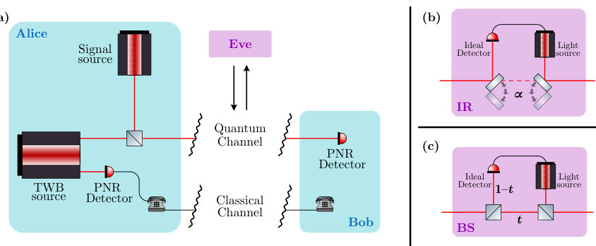
<figcaption class="paper-figure-caption"><b>Fig 2.</b> FIG. 2. (a) Sketch of the proposed communication scheme, where Alice encodes information into classical optical states of light with different photon-number distributions and sends them to Bob through a quantum channel together with the portion of a TWB state. Sketch of (b) the IR attack and (c) the BS attack performed by Eve. In (b) α is the fraction of data corresponding to a given symbol intercepted and replaced by Eve, while in (c) t is the transmissivity of the BS and (1 −t) its reflectivity.</figcaption>
</figure>
<figure class="paper-figure-card">
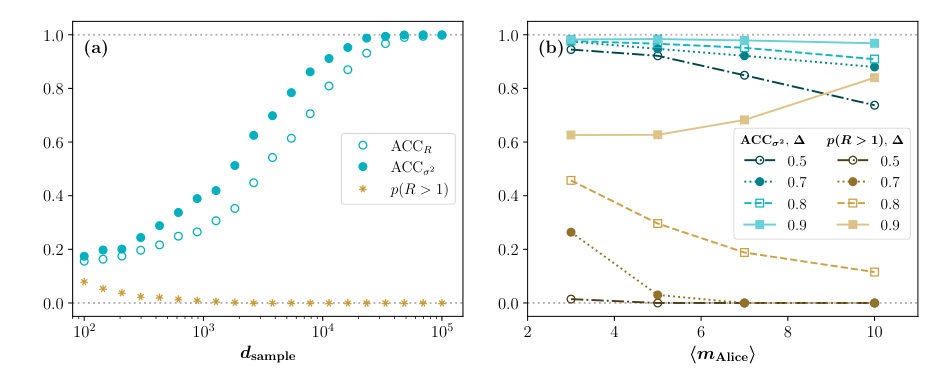
<figcaption class="paper-figure-caption"><b>Fig 3.</b> FIG. 3. (a) Bob’s discrimination accuracies ACCσ2, ACCR, and p(R &gt; 1) as a function of the data sample size dsample per symbol, for loss ∆= 0.5 and mean photon number of the TWB ⟨mAlice⟩= 5. (b) Bob’s ACCσ2 and p(R &gt; 1) as a function of ⟨mAlice⟩, for dsample = 2 × 104 and varying ∆. In both panels, blue tones refer to ACC, while brown tones refer to p(R &gt; 1). The superimposed signals have mean values ⟨ms,L⟩= 0.40 and ⟨ms,H⟩= 0.45.</figcaption>
</figure>
<figure class="paper-figure-card">
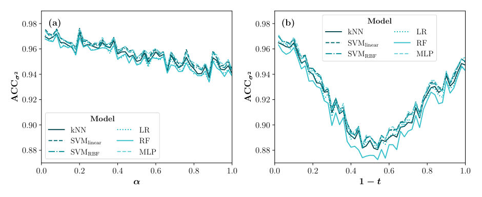
<figcaption class="paper-figure-caption"><b>Fig 4.</b> FIG. 4. (a) Bob’s discrimination accuracy ACCσ2 as a function of the fraction of intercepted data α in the IR attack and (b) as a function of the BS reflectivity (1 −t) in the BS attack. Different colors and line styles correspond to different classifiers: k-Nearest Neighbors (kNN), Linear Support Vector Machine (SVMlinear), Support Vector Machine with Radial Basis Function kernel (SVMRBF), Logistic Regression (LR), Random Forest (RF), and Multi-Layer Perceptron (MLP). In all panels the parameters are ⟨ms,L⟩= 0.40, ⟨ms,H⟩= 0.45, ⟨mAlice⟩= 5, ∆= 0.5, and dsample = 2 × 104.</figcaption>
</figure>
<figure class="paper-figure-card">
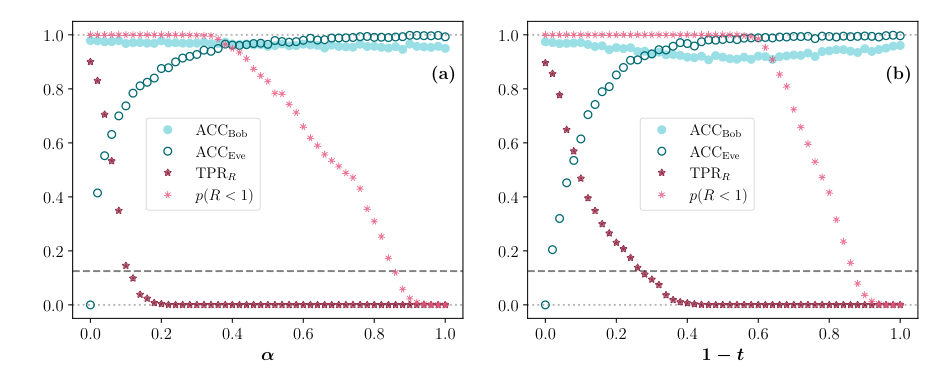
<figcaption class="paper-figure-caption"><b>Fig 5.</b> FIG. 5. Bob’s (dots) and Eve’s (open circles) discrimination accuracy ACCσ2 as a function of (a) α in the IR attack and (b) (1 −t) in the BS attack. The dashed line indicates the accuracy of the random classifier, namely ACC = 1/8. Security-related figures of merit based on the noise reduction factor R are the probability that Bob measures nonclassical correlations p(R &lt; 1) (asterisks) and the TPRR (stars). In both panels, the parameters are ⟨ms,L⟩= 0.40, ⟨ms,H⟩= 0.45, ⟨mAlice⟩= 5, ∆= 0.5, and dsample = 2 × 104.</figcaption>
</figure>

**Summary.** The authors propose a secure quantum communication protocol using mesoscopic optical states encoded via the first and second moments of photon number distributions. Security is guaranteed by utilizing the nonclassical correlations present in an accompanying twin-beam state resource against common eavesdropping attacks. The numerical simulations confirm that this approach maintains key generation rates, suggesting feasibility for future experimental realization.

**Why it may be interesting.** This work directly addresses quantum key distribution in a high-loss regime by leveraging classical state properties combined with nonclassical entanglement resources, which is highly relevant to practical quantum networking research.

Detailed structure

**Main problem.** To propose a quantum communication protocol that enhances robustness against photon loss by encoding information in mesoscopic optical states.

**Main result.** The protocol is shown to be secure against intercept-resend and beam-splitting attacks, yielding non-zero key generation rates under numerical simulation.

**Method.** Information is encoded using the first and second moments of photon-number distributions ($\langle n 
angle$ and $	ext{Var}(n)$) of classical states superimposed on a twin-beam state.

**Model / system.** The system utilizes mesoscopic optical states, specifically multi-mode twin-beam (TWB) states generated via spontaneous parametric down-conversion, requiring Photon-Number-Resolving (PNR) detectors for implementation.

**Key observables.** Photon-number moments ($\langle n 
angle$, $	ext{Var}(n)$), the noise reduction factor ($R$), and the Key Generation Rate (KGR).

**Important parameters / regimes.** Mesoscopic intensity regime, detection efficiency ($\eta=0.4$), TWB mean photon number ($\langle m_{Alice} 
angle$ in $[3.0, 10.0]$).

**Assumptions / limitations.** The analysis assumes the use of PNR detectors and that security relies on exploiting nonclassical correlations inherent to the twin-beam resource.

**Figures summary.** Figure 1 illustrates photon number distributions and variances for various pseudo-thermal states versus $\langle n 
angle$. Figure 2 sketches the proposed communication scheme alongside models for intercept-resend and beam-splitting attacks.

**Paper structure.** The paper establishes the problem by proposing an encoding based on moments, derives security witnesses using TWB correlations ($R<1$), analyzes performance metrics (TPR, KGR) against specific eavesdropping attacks, and concludes with feasibility statements for experimental implementation.

Abstract

Mesoscopic optical states are a promising resource for quantum communication, combining robustness against losses with the preservation of genuine quantum features. Here, we propose a quantum communication protocol in which information is encoded in the first and second moments of the photon-number distributions of classical optical states, and then decoded by photon-number-resolving detectors. Security relies on the nonclassical photon-number correlations of a twin-beam state transmitted alongside the signal in the quantum channel, providing an experimentally accessible security witness against both intercept-resend and beam-splitter attacks investigated in this work. Numerical simulations performed in experimentally accessible parameter regimes support the feasibility and security of the proposed communication protocol, yielding nonzero key generation rates under the considered eavesdropping attacks, and motivating its future experimental implementation.

[↑ back to top](#top)

### [Uncovering Non-Gaussianity through Multi-Copy Symmetries](http://arxiv.org/abs/2608.03755v1)

**Authors:** Hao Dai, Yue Zhang  
**Type:** both · **Category:** quantum information and computing · **PDF:** <https://arxiv.org/pdf/2608.03755v1>  
**Analysis basis:** full PDF text, analyzed in chunks
**Topic relevance:** `Keldysh / 2PI / non-Gaussian methods` **1/5** · `entanglement & information structure` **1/5**

↔ Scroll figures horizontally

<figure class="paper-figure-card">
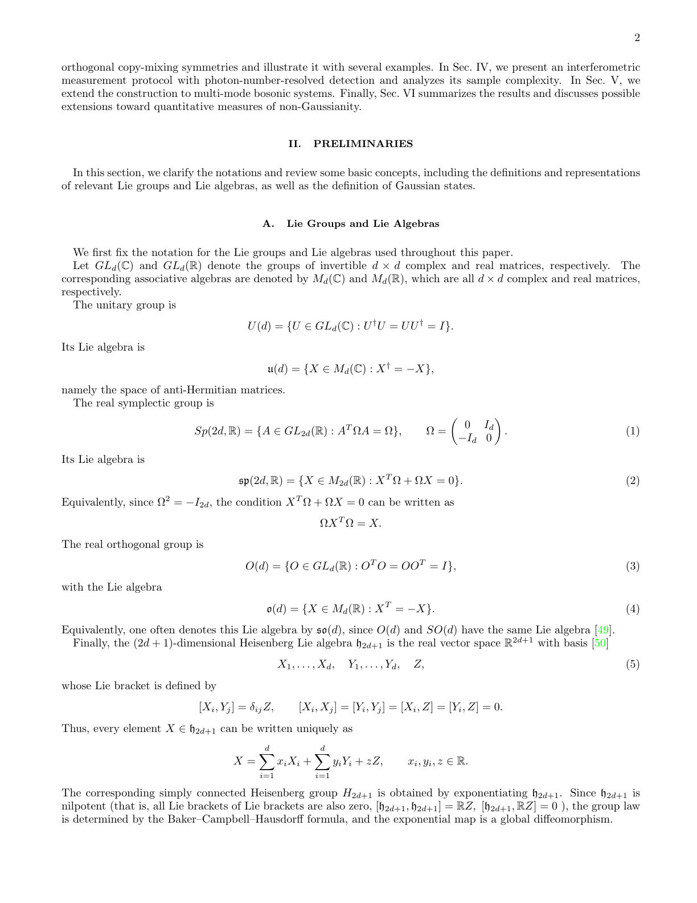
<figcaption class="paper-figure-caption"><b>Fig 1.</b> Low-resolution page preview, page 2</figcaption>
</figure>
<figure class="paper-figure-card">
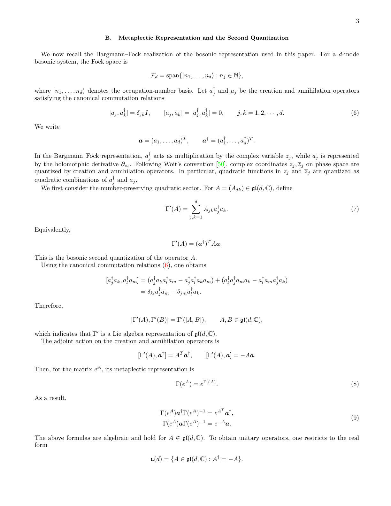
<figcaption class="paper-figure-caption"><b>Fig 2.</b> Low-resolution page preview, page 3</figcaption>
</figure>
<figure class="paper-figure-card">
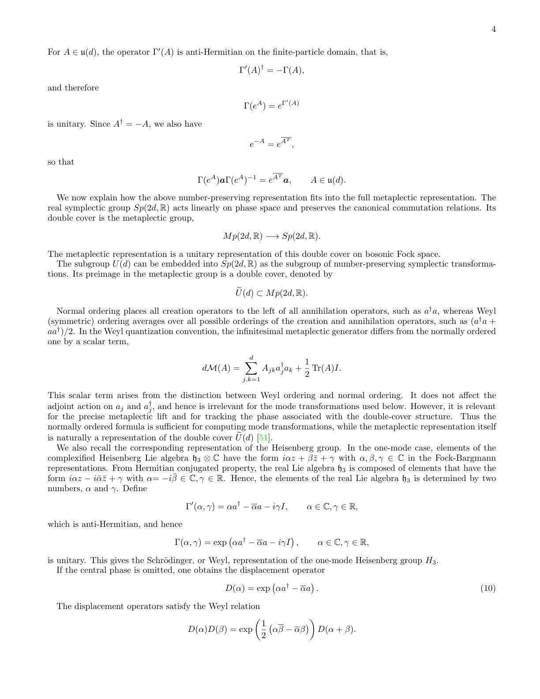
<figcaption class="paper-figure-caption"><b>Fig 3.</b> Low-resolution page preview, page 4</figcaption>
</figure>
<figure class="paper-figure-card">
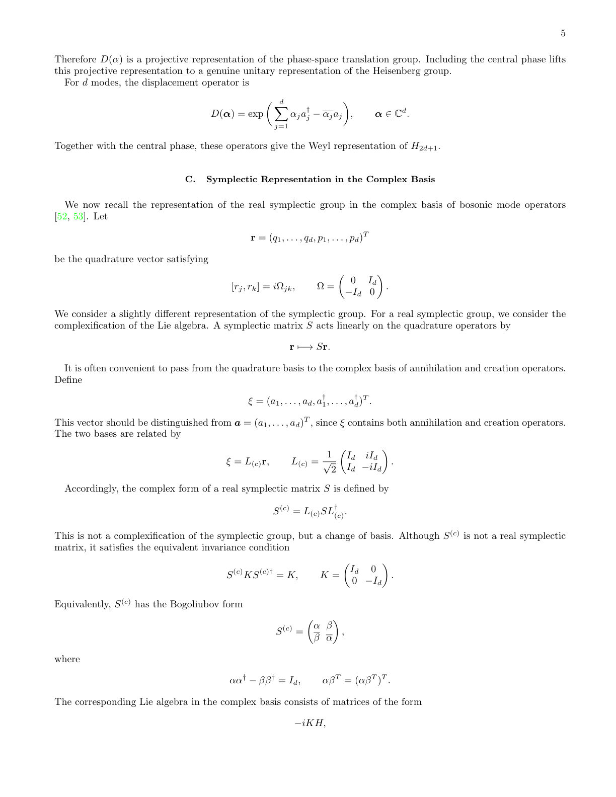
<figcaption class="paper-figure-caption"><b>Fig 4.</b> Low-resolution page preview, page 5</figcaption>
</figure>
<figure class="paper-figure-card">
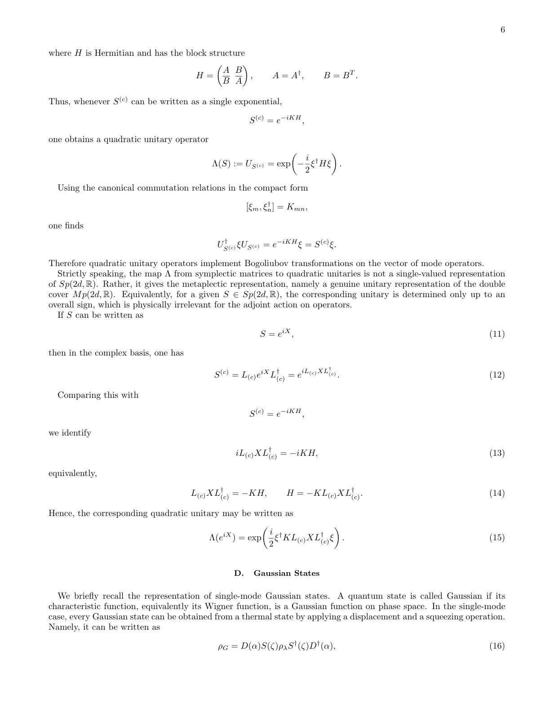
<figcaption class="paper-figure-caption"><b>Fig 5.</b> Low-resolution page preview, page 6</figcaption>
</figure>

**Summary.** This paper introduces a novel group-theoretic approach using multi-copy symmetries to diagnose non-Gaussianity in bosonic quantum states. By analyzing how copy-mixing transformations interact with Gaussian unitaries, the authors derive necessary symmetry identities that all Gaussian states must obey. Violation of these identities provides a concrete and experimentally testable witness for non-Gaussian character.

**Why it may be interesting.** This provides a powerful, mathematically rigorous tool rooted in symmetry theory (group theory) to detect non-Gaussianity in continuous variable systems, which is highly relevant for quantum optics and quantum information processing.

Detailed structure

**Main problem.** The primary challenge is developing a robust method to characterize non-Gaussianity in continuous-variable quantum states, as traditional witnesses struggle due to the non-convex nature of Gaussian sets.

**Main result.** The authors developed a group-theoretic, multi-copy symmetry framework where violating specific identities derived from copy-mixing transformations certifies that a state is non-Gaussian.

**Method.** The method analyzes how passive linear optical transformations mixing multiple copies of a quantum state commute with Gaussian unitaries applied to each copy, leading to symmetry constraints violated by non-Gaussian states.

**Model / system.** The work focuses on bosonic systems (single-mode and multi-mode) described by continuous variables, utilizing concepts from Lie groups like the Heisenberg group and symplectic transformations.

**Key observables.** Non-Gaussianity witnesses derived from symmetry constraints; specific multi-copy expectation values $	ext{Tr}(
ho^{\otimes k}\Gamma_d(O))$ compared against Gaussian reference values $W_G(O)$.

**Important parameters / regimes.** The number of copies ($k$), the thermal reference parameter (fixed via purity), and parameters defining the covariance matrix ($\sigma$) are crucial.

**Assumptions / limitations.** The analysis assumes that the relevant symmetry structure can be captured by analyzing commutators involving copy-mixing transformations and Gaussian unitaries, which is extended to multi-mode systems.

**Paper structure.** The paper progresses from identifying the difficulty of non-Gaussianity witnesses to developing a group-theoretic framework based on copy-mixing symmetries. It derives specific commutation relations for Gaussian states and then proposes using violations of these identities as quantitative detectors, culminating in an experimental protocol.

Abstract

Gaussian states are fundamental in continuous-variable quantum information, yet characterizing non-Gaussianity remains challenging due to the non-convexity of the Gaussian set. Existing witnesses typically rely on Wigner negativity or other information-theoretic quantities. In this work, we develop a group-theoretic, multi-copy approach to detect non-Gaussianity in bosonic systems. We study passive linear optical transformations that mix copies of a quantum state and analyze their commutation with identical Gaussian unitaries applied to each copy. Orthogonal copy-mixing transformations commute with the symplectic part of the Gaussian action, while the displacement part restricts the symmetry to the stabilizer of the collective mode. This structure yields a family of witnesses satisfied by all single-mode Gaussian states. Fixing the thermal reference parameter via the purity, violation of these identities certifies non-Gaussianity. We illustrate the method with several single-mode examples and present an experimental protocol based on passive interferometry and photon-number-resolved detection, showing that the relevant multi-copy expectation values can be estimated from bounded phase observables. Finally, we extend the construction to multi-mode systems and discuss how the same symmetry framework may lead to quantitative measures of non-Gaussianity.

[↑ back to top](#top)

### [Accelerated quantum Monte Carlo simulations of the attractive Hubbard model on the kagome lattice](http://arxiv.org/abs/2608.03894v1)

**Authors:** Jie Zhang, Xiang Li, Yu Wang  
**Type:** theory · **Category:** strongly correlated electrons · **PDF:** <https://arxiv.org/pdf/2608.03894v1>  
**Analysis basis:** full PDF text, analyzed in chunks
**Topic relevance:** `analog quantum simulation` **1/5**

↔ Scroll figures horizontally

<figure class="paper-figure-card">
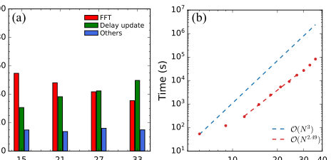
<figcaption class="paper-figure-caption"><b>Fig 1.</b> FIG. 2. (a) Percentages of the computational time occupied by each process in our simulations at different system sizes L. (b) The total computational time is shown on a log-log scale for different system sizes L. The blue dashed line indicates the O(N 3) reference scaling (N = 3L2), while the red dashed line shows a linear fit within the range 12 ⩽L ⩽27. The simulations are performed for a represen- tative parameter set with U = −5.0 and ρ = 2 3, using 50 warmup steps, 50 measure steps and a projection length of β = 10.</figcaption>
</figure>
<figure class="paper-figure-card">
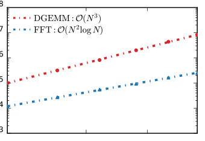
<figcaption class="paper-figure-caption"><b>Fig 2.</b> FIG. 1. Average computational time per matrix-matrix multiplication as a function of the system size L on the kagome lattice. The compu- tational time is shown on a log-log scale at different system sizes L for the standard dense matrix multiplication (DGEMM) and the FFT- accelerated matrix multiplication. Dashed lines represent linear fits.</figcaption>
</figure>
<figure class="paper-figure-card">
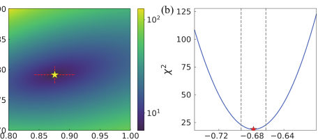
<figcaption class="paper-figure-caption"><b>Fig 3.</b> FIG. 4. χ2 minimization for determining the critical parameters. (a) The color map of χ2 in the (ν, |U|c) parameter plane. The yellow star marks the minimum of χ2 at |U|c = 4.79(1) and ν = 0.88(3). (b) Corresponding fit for the critical exponent ζ, using the optimal |U|c and ν from (a). The minimum (red star) marks ζ = −0.68(2). Dashed lines in both panels represent the standard errors for the cor- responding parameters.</figcaption>
</figure>
<figure class="paper-figure-card">
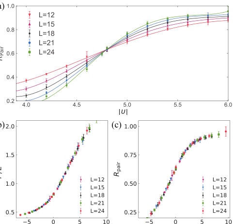
<figcaption class="paper-figure-caption"><b>Fig 4.</b> FIG. 3. (a) The correlation ratio RPair as a function of |U| for differ- ent system sizes L at the Dirac filling ρ = 2</figcaption>
</figure>
<figure class="paper-figure-card">
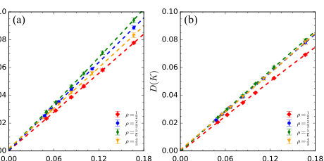
<figcaption class="paper-figure-caption"><b>Fig 5.</b> FIG. 6. Finite-size extrapolations of the CDW order parameters at the wave vector of (a) Γ and (b) K at |U| = 8.0 for different fillings ρ. All data points are obtained with 1000 warm steps, 1000 measure steps, and projection length β = 30. Quadratic fitting is applied.</figcaption>
</figure>

**Summary.** This work significantly advances the study of correlated electrons on the kagome lattice by developing an FFT-accelerated Quantum Monte Carlo method. The research confirms superfluid quantum criticality at specific fillings while demonstrating that proposed CDW orders are likely artifacts of finite system size. This computational breakthrough allows for precise determination of critical exponents.

**Why it may be interesting.** The development of an $N^{2.49}$ computational scaling for a complex QMC simulation is highly relevant, providing access to larger systems than previously possible for studying quantum critical points in lattice models.

Detailed structure

**Main problem.** The study investigates interaction-driven correlated states, specifically the competition between superfluid (SF) and charge-density-wave (CDW) orders on the kagome lattice.

**Main result.** Large-scale simulations reveal zero-temperature superfluid quantum criticality at the Dirac filling, while evidence suggests that previously proposed CDW orders are likely finite-size effects.

**Method.** The authors developed and applied an accelerated Determinant Quantum Monte Carlo (DQMC) scheme combining FFT techniques with delay-update algorithms to overcome previous computational limitations.

**Model / system.** The system is the attractive Hubbard model defined on the kagome lattice, characterized by a Hamiltonian involving nearest-neighbor hopping ($t$) and an attractive interaction ($U < 0$).

**Key observables.** Superfluid order parameter (P), correlation ratio ($R_{	ext{Pair}}$), and momentum-dependent CDW order parameter ($D(\vec{Q})$).

**Important parameters / regimes.** Dirac filling ($
ho = 2/3$), critical interaction $|U|_c \approx 4.79$, and system sizes up to $L=24$.

**Assumptions / limitations.** The primary assumption is that the accelerated DQMC scheme accurately models the physics, allowing for reliable finite-size scaling analyses.

**Figures summary.** Figures compare computational time scaling (FFT vs. DGEMM) and show data collapse for SF order parameters at $
ho=2/3$. Other figures illustrate finite-size extrapolations of CDW order parameters at wave vectors $\Gamma$ and K.

**Paper structure.** The paper details the model setup, introduces the FFT-accelerated DQMC methodology (combining FFT with delay updates), presents results on SF criticality via finite-size scaling, and concludes by analyzing the stability of various CDW states.

Abstract

The recent discovery of several families of kagome materials and experimental realization of optical kagome lattices have stimulated growing numerical studies of interaction-driven correlated states on the kagome lattice. Among the available numerical approaches, determinant quantum Monte Carlo (DQMC) is a powerful method for investigating such strongly correlated states. However, the accessible system sizes of existing DQMC simulations remain limited, preventing reliable finite-size scaling analyses. Here we develop a general acceleration scheme based on fast Fourier transform (FFT) for propagator multiplications on composite lattices and combine it with the delay-update algorithm, enabling simulations on system sizes twice as large as those of previous DQMC studies, allowing reliable finite-size scaling analyses of the attractive kagome-lattice Hubbard model. Our large-scale simulations reveal the interaction-driven zero-temperature superfluid quantum criticality at the Dirac filling and provide reliable estimates of the associated critical exponents. Besides, we find no evidence that the previously proposed triangle-rule charge-density-wave order survives in the thermodynamic limit, suggesting that it is likely a finite-size effect. Moreover, for system sizes accessible in current two-dimensional optical lattice experiments, the combined FFT and delay-update scheme exhibits an effective computational cost scaling as $N^{2.49}$, substantially below the $\mathcal{O}(N^3)$ computational cost of conventional DQMC simulations.

[↑ back to top](#top)

### [Fidelity-Based Robustness Margins for Finite-Time Quantum Control](http://arxiv.org/abs/2608.03698v1)

**Authors:** S. P. O'Neil, F. C. Langbein, C. A. Weidner, E. A. Jonckheere, S. Schirmer  
**Type:** theory · **Category:** quantum information and computing · **PDF:** <https://arxiv.org/pdf/2608.03698v1>  
**Analysis basis:** full PDF text, analyzed in chunks
**Topic relevance:** `quantum measurements` **1/5**

↔ Scroll figures horizontally

<figure class="paper-figure-card">
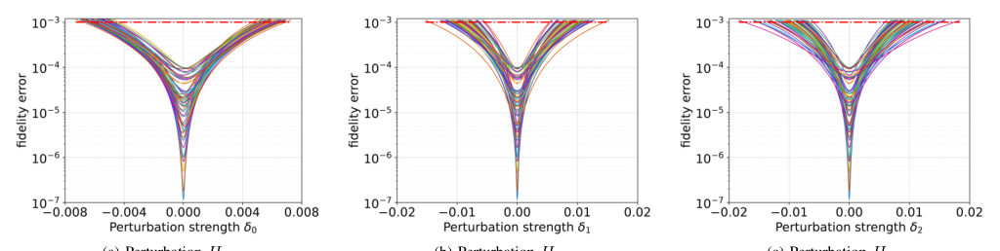
<figcaption class="paper-figure-caption"><b>Fig 1.</b> Fig. 1. Fidelity error versus perturbation strength for H0, H1, H2 perturbations across the controllers. The dashed line indicates the fidelity-error threshold 10−3.</figcaption>
</figure>
<figure class="paper-figure-card">
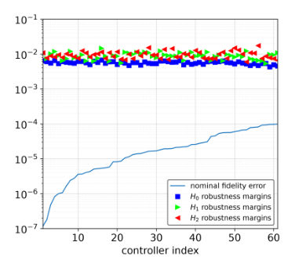
<figcaption class="paper-figure-caption"><b>Fig 2.</b> Fig. 2. Robustness margins for H0, H1, and H2 across the 61 controllers ordered by increasing nominal fidelity error ε0.</figcaption>
</figure>
<figure class="paper-figure-card">
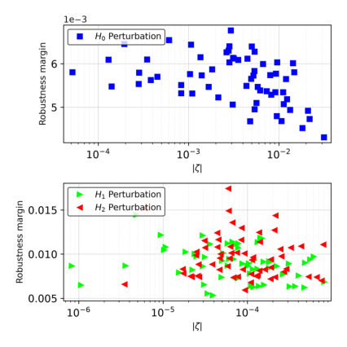
<figcaption class="paper-figure-caption"><b>Fig 3.</b> Fig. 3. Robustness margins versus nominal differential-sensitivity magnitude |ζj| for H0 (top) and H1, H2 (bottom).</figcaption>
</figure>

**Summary.** This paper introduces a novel framework to calculate robust margins for quantum gate fidelity when system parameters are uncertain. By deriving structure-specific Lipschitz bounds, it certifies the maximum allowed perturbation size while guaranteeing the final gate fidelity stays above a set threshold. This moves beyond simple local sensitivity analysis by providing actionable safety boundaries for quantum control protocols.

**Why it may be interesting.** This work provides rigorous, quantifiable guarantees on the stability of quantum gates under realistic parameter uncertainties, which is crucial for designing fault-tolerant quantum hardware and understanding experimental limitations in quantum computation.

Detailed structure

**Main problem.** The paper develops a method to quantify the robustness margin for finite-time quantum control when the system Hamiltonian is subject to structured, small perturbations.

**Main result.** A structure-specific fidelity-threshold robustness margin is derived, providing a certified minimum perturbation radius ensuring gate fidelity remains above a specified threshold $F_T$.

**Method.** The analysis uses differential sensitivity bounds and establishes a Lipschitz constant for the fidelity function with respect to the perturbing parameter. An iterative algorithm refines this margin by taking safe steps toward the first boundary.

**Model / system.** The system is a finite-dimensional closed quantum system evolving under piecewise-constant coherent control, governed by a time-dependent Hamiltonian that includes structured affine perturbations from a single scalar parameter $\mu$.

**Key observables.** Normalized trace-amplitude gate fidelity ($F(t_f)$), the sensitivity of fidelity to perturbation ($\zeta_\mu^0$), and the certified robust margin ($M$).

**Important parameters / regimes.** The control time horizon $t_f$, the target fidelity threshold $F_T$, and the magnitude of the structured Hamiltonian perturbations $\mu$.

**Assumptions / limitations.** The analysis is restricted to scalar, one-parameter structured Hamiltonian perturbations; it does not cover simultaneous multi-parameter uncertainty or open-system dynamics.

**Figures summary.** Figures illustrate fidelity error trajectories under various perturbations ($H_0, H_1, H_2$) and compare the calculated robustness margins ($M$) against the nominal differential sensitivity magnitudes ($|\zeta_j|$).

**Paper structure.** The paper first establishes the theoretical framework using fidelity derivatives to derive a finite margin certificate. It then applies this method to specific three-qubit gate control examples, comparing the resulting structure-dependent margins across different perturbation types.

Abstract

We develop a structure-specific fidelity-threshold robustness margin for finite-dimensional closed quantum systems under piecewise-constant coherent control. A scalar physical parameter may perturb the drift, a control Hamiltonian, or another declared Hamiltonian component across the control horizon. A differential sensitivity bound for trace-amplitude gate fidelity yields a threshold-dependent Lipschitz constant on the connected safe parameter component and hence a certified finite perturbation radius. Recentering this certificate produces an iterative one-dimensional method that takes certified safe steps toward the first fidelity-threshold boundary in either parameter direction. A three-qubit gate-control example shows that these finite margins vary by up to a factor of three across controllers of comparable nominal fidelity and contain structure-dependent information not captured by nominal differential sensitivity alone.

[↑ back to top](#top)

### [Improved constant factors for qubitized Hamiltonian simulation](http://arxiv.org/abs/2608.02734v1)

**Authors:** Matthew Pocrnic, Danial Motlagh  
**Type:** theory · **Category:** quantum information and computing · **PDF:** <https://arxiv.org/pdf/2608.02734v1>  
**Analysis basis:** full PDF text, analyzed in chunks
**Topic relevance:** `analog quantum simulation` **1/5**

↔ Scroll figures horizontally

<figure class="paper-figure-card">
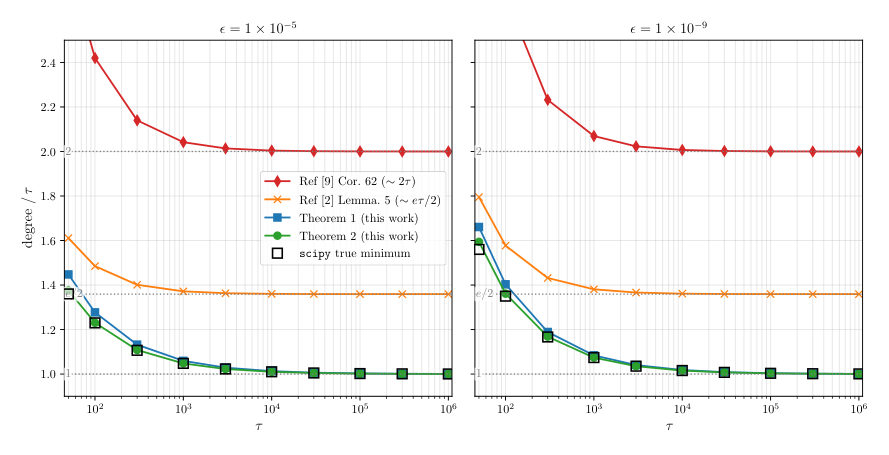
<figcaption class="paper-figure-caption"><b>Fig 1.</b> FIG. 1. Comparison of degree bounds with τ := αt from Theorems 1 and 2 to the exact Bessel tail, Corollary 62 from Ref. [18], and Lemma 5 from [7] version 1. We plot the exact Bessel tail to machine precision via the clear boxes using SciPy [21] to show that the bound is tight and to further illustrate that the gap to the optimal result becomes negligible with increasing τ. To contextualize the results, for the simulation of modestly sized organic chemical reactions in first quantization, the product αt approximately satisfies αt ≈104-106 [22].</figcaption>
</figure>

**Summary.** This paper significantly improves theoretical bounds for determining the required polynomial degree ($d$) needed to simulate quantum time evolution using Quantum Signal Processing. By refining the mathematical bounding of the error tail in the Jacobi-Anger series, the authors reduce the estimated overhead for Hamiltonian simulation tasks by a factor of $e/2$. This is a crucial algorithmic refinement for quantum computing resource estimation.

**Why it may be interesting.** This work provides a concrete, quantitative improvement in the resource estimation for quantum simulation algorithms, directly impacting the feasibility estimates for implementing complex dynamics on near-term quantum hardware.

Detailed structure

**Main problem.** The primary goal is to improve the constant multiplicative factor determining the required polynomial degree ($d$) needed for approximating quantum time evolution operators using Quantum Signal Processing (QSP). This addresses a gap between current theoretical bounds and the optimal asymptotic constant.

**Main result.** The authors derive rigorous, tighter upper bounds on $d$ by carefully analyzing the Bessel tail in the Jacobi-Anger series. This improvement reduces overhead estimates for Hamiltonian simulation tasks by a factor of approximately $e/2$.

**Method.** The work combines quantum signal processing theory with advanced polynomial approximation techniques. Specifically, it employs Kapteyn's and Watson's inequalities to bound the truncation error arising from approximating the time evolution operator $e^{-i	au H}$.

**Model / system.** The focus is on Hamiltonian simulation, which approximates the time-evolution operator $e^{-i	au H}$ by finding a polynomial approximation of $e^{-i	au x}$ over $[-1, 1]$. The underlying mathematical structure involves the Jacobi-Anger expansion and Bessel functions.

**Key observables.** The required polynomial truncation degree ($d$), the approximation error ($\epsilon$), and the time evolution parameter ($	au$).

**Important parameters / regimes.** The asymptotic regime $	au \gg 1$ is crucial, as the leading constant in the bound approaches the optimal value of 1.

**Assumptions / limitations.** The analysis relies on establishing rigorous bounds for the Bessel tail using specific mathematical inequalities (Kapteyn's and Watson's).

**Figures summary.** Figure 1 compares the derived degree bounds against the exact Bessel tail, demonstrating convergence towards the optimal result as $	au$ increases.

**Paper structure.** The paper establishes the connection between Hamiltonian simulation and polynomial approximation via QSP. It then develops increasingly tight mathematical bounds on $d$ using successive applications of inequalities (Kapteyn's followed by Watson's) to rigorously bound the truncation error term.

Abstract

Quantum signal processing (QSP) serves as the asymptotically optimal technique for Hamiltonian simulation on a quantum computer. By approximating the time evolution operator via the Jacobi-Anger expansion, the Hamiltonian simulation problem reduces to a problem in polynomial approximation theory: find a sufficient degree-$d$ polynomial series to approximate $e^{-iτx}$ on $[-1,1]$ within error $ε$. While $d\in\tilde{\mathcal{O}}(τ)$ is known to be asymptotically optimal, there exists a gap between state-of-the-art bounds and the optimal constant multiplicative factor, which is approximately equal to 1. Here, we close this gap almost entirely, to the point where possible future improvements will not be of practical significance. Our improvement resides in a careful treatment of the Bessel tail in the Jacobi-Anger series using Kapteyn's and Watson's inequalities, thereby reducing the overhead estimates for all Hamiltonian simulation tasks on quantum computers by a factor of $\approx e/2$.

[↑ back to top](#top)

### [QuScope: An Open-Source Python Framework for Quantum-Circuit Simulation of Transmission Electron Microscopy](http://arxiv.org/abs/2608.02782v1)

**Authors:** Sean D. Lam, Roberto dos Reis  
**Type:** theory · **Category:** quantum information and computing · **PDF:** <https://arxiv.org/pdf/2608.02782v1>  
**Analysis basis:** full PDF text, analyzed in chunks
**Topic relevance:** `interference shaping light` **1/5**

↔ Scroll figures horizontally

<figure class="paper-figure-card">
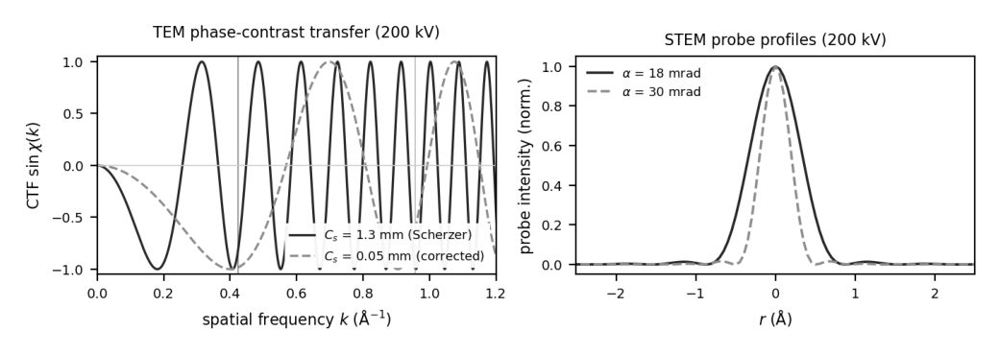
<figcaption class="paper-figure-caption"><b>Fig 1.</b> FIG. 1. Transfer characteristics of the optical settings used in this paper, from QuScope’s CTFCalculator at 200 kV. On the left, the TEM phase-contrast transfer function sin χ(k) at the extended Scherzer defocus ∆f = −1.2√Csλ [15] is shown for a conventional (Cs = 1.3 mm, ∆f = −685.2 ˚A) and an aberration-corrected (Cs = 0.05 mm, ∆f = −134.4 ˚A) instrument; vertical lines mark the point resolutions d = 0.66 (Csλ3)1/4 (2.50 and 1.11 ˚A). On the right, aberration-free STEM probe intensity profiles are shown for 18 and 30 mrad convergence semi-angles (FWHM 0.70 and 0.40 ˚A).</figcaption>
</figure>
<figure class="paper-figure-card">
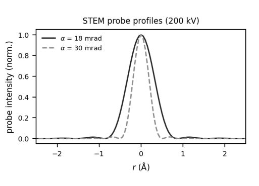
<figcaption class="paper-figure-caption"><b>Fig 2.</b> Figure 2 shows the pipeline as implemented by QuantumCTEMCircuit. The register is prepared in the uniform superposition H⊗nq |0⟩, the plane wave ψ0 = const, after which the four optical elements act.</figcaption>
</figure>
<figure class="paper-figure-card">
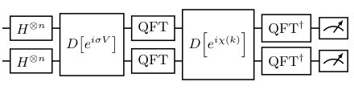
<figcaption class="paper-figure-caption"><b>Fig 3.</b> FIG. 2. Quantum CTEM pipeline [Eq. (7)] for an N × N image with n = log2 N qubits per spatial register. The phase grating D[eiσV ] and lens transfer function D[eiχ] are diagonal unitaries; the two-dimensional (I)QFT acts separably on the row and column registers. For multislice simulation (Sec. V) the grating–QFT–propagator–IQFT block repeats once per slice before the lens is applied.</figcaption>
</figure>
<figure class="paper-figure-card">
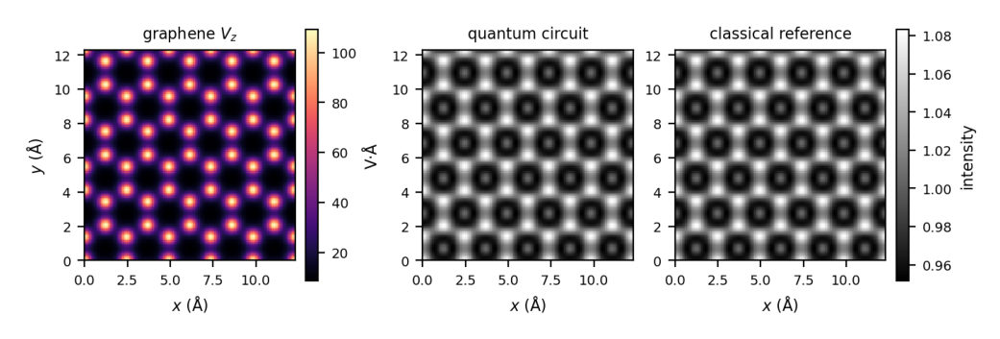
<figcaption class="paper-figure-caption"><b>Fig 4.</b> FIG. 3. Quantum CTEM (POA) of a periodic graphene sheet (≈5 × 5 unit cells, 60 atoms) at 200 kV, 128 × 128 grid (14 qubits), aberration-corrected Scherzer conditions (Cs = 0.05 mm, ∆f = −134 ˚A). From left to right, the panels show the projected potential (Kirkland parametrization with Debye–Waller smearing; C–C bond 1.42 ˚A), the image intensity from the quantum circuit [Eq. (7)] showing the classic dark-atom honeycomb contrast, and the classical FFT reference. Quantum and classical fidelity | ⟨ψq|ψc⟩|2 = 1.000000. Exact statevector simulation.</figcaption>
</figure>
<figure class="paper-figure-card">
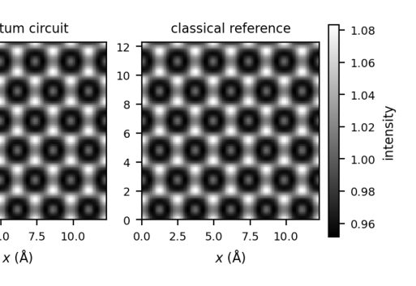
<figcaption class="paper-figure-caption"><b>Fig 5.</b> Figure 6 shows quantum multislice STEM of the same SrTiO3 [100] crystal used in Sec. V, ten unit cells thick, with an aberration-free 30 mrad probe (∆f = 0, Cs = 0) at 200 kV. One unit cell is scanned at full resolution (32 × 32 grid at 0.122 ˚A/pixel, 10 qubits) under peri- odic boundary conditions, and every scan pixel is the readout of one complete 20-slice quantum circuit, exe- cuted in exact statevector simulation. Each pixel involves state preparation of the shifted probe, then the multi- slice circuit assembled by build probe circuit (twenty phase-grating diagonal unitaries interleaved with QFT- conjugated Fresnel propagators), then the detector-plane transform with the exit...</figcaption>
</figure>

**Summary.** This paper introduces QuScope, an open-source Python framework that models the entire process of Transmission Electron Microscopy (TEM) image formation using quantum circuits. It maps electron wavefunction propagation onto quantum gates, allowing simulations of techniques like CTEM and STEM. The work validates its accuracy by matching classical results to unit fidelity while also providing crucial resource estimates for future quantum hardware implementation.

**Why it may be interesting.** It provides a concrete, physics-driven application demonstrating how complex wave phenomena can be formulated as quantum circuits, offering valuable benchmarks for quantum simulation algorithms beyond standard chemistry or materials Hamiltonians.

Detailed structure

**Main problem.** The core problem is simulating the complex, coherent evolution of an electron wavefunction through a specimen in Transmission Electron Microscopy (TEM).

**Main result.** The authors developed QuScope, an open-source framework that successfully maps the entire TEM imaging pipeline onto quantum circuits, achieving unit fidelity with classical simulations.

**Method.** The methodology involves amplitude encoding the $N 	imes N$ wavefunction into qubits and implementing physical operations (like Fresnel propagation or phase transmission) using diagonal unitaries conjugated by Quantum Fourier Transforms (QFTs).

**Model / system.** The system is TEM, simulating electron wave propagation through specimens like $	ext{SrTiO}_3$. The physics maps to a quantum circuit model where optical elements are unitary gates.

**Key observables.** Image intensity ($|\psi_{	ext{image}}(\mathbf{r})|^2$), state fidelity ($\langle\psi_q|\psi_c
angle|^2$), and resource estimates (gate counts, depth).

**Important parameters / regimes.** Grid size ($N 	imes N$), scattering strength ($\sigma V$), and error rates for noise analysis.

**Assumptions / limitations.** The framework relies on the assumption that quantum simulation can accurately model wave propagation; limitations include the exponential cost of synthesizing arbitrary diagonal unitaries and decoherence effects in deep circuits.

**Figures summary.** Figures illustrate transfer characteristics, probe intensity channeling through crystalline materials ($	ext{SrTiO}_3$), and comparisons between quantum and classical multislice results.

**Paper structure.** The paper introduces the problem mapping to quantum circuits, details the implementation of core components (QFTs, diagonal unitaries), validates the framework against classical simulations across various TEM techniques (CTEM, STEM), and concludes with resource estimation for near-term hardware.

Abstract

Image formation in transmission electron microscopy (TEM) is governed by the coherent evolution of the electron wavefunction through the specimen and the objective lens. This physics maps naturally onto the gate model of quantum computation. We present QuScope, an open-source Python framework that expresses the complete TEM image-formation pipeline as quantum circuits. The $N\times N$ electron wavefunction is amplitude-encoded in $2\log_2 N$ qubits, and every optical element, including phase-grating transmission, Fresnel propagation between specimen slices, and the aberrated objective lens, is implemented as a diagonal unitary conjugated by quantum Fourier transforms. On this foundation, QuScope v0.2.0 implements validated imaging pipelines, covering conventional TEM under the phase-object approximation, full multislice CTEM and STEM for thick specimens. All quantum results reported here come from exact, noise-free statevector simulation of the circuits on classical hardware, and every result is validated against a classical twin implementation. Quantum and classical multislice exit waves agree to unit fidelity, and all physical constants are verified against standard references. We provide transpiled quantum-resource estimates for each algorithm, an analysis of the diagonal-synthesis bottleneck that governs near-term hardware execution, and a fully tested, documented, and pip-installable package. QuScope v0.2.0 is available at https://github.com/QuScope/QuScope.

[↑ back to top](#top)

### [Realified tensor networks: quantum circuit simulation on real-valued matrix accelerators](http://arxiv.org/abs/2608.03987v1)

**Authors:** Yusheng Zhao, Xiwei Pan, Enji Xiong, Chengkai Zhu, Jinguo Liu  
**Type:** theory · **Category:** numerical methods · **PDF:** <https://arxiv.org/pdf/2608.03987v1>  
**Analysis basis:** full PDF text, analyzed in chunks
**Topic relevance:** `methods for driven-dissipative` **1/5**

↔ Scroll figures horizontally

<figure class="paper-figure-card">
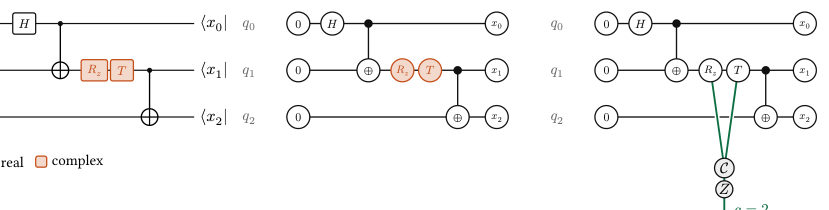
<figcaption class="paper-figure-caption"><b>Fig 1.</b> Figure 1: From quantum circuit to real-valued contraction. (a) A quantum circuit U with real (white) and complex (orange) gates; the simulation target is a single amplitude ⟨x|U|0⟩, i.e. the projection of the output onto the computational-basis product state |x⟩= |x0x1x2⟩. (b) Its tensor-network representation over C (schematic): gates become tensors and qubit lines become contracted indices. (c) Realification as a local graph rewrite: each complex tensor acquires a dimension-2 leg (green) carrying its real and imaginary parts, contracted green legs meet at the structure tensor C, and a conjugated tensor carries the sign flip Z on its green leg (Sec. 2); the result is a single static real...</figcaption>
</figure>
<figure class="paper-figure-card">
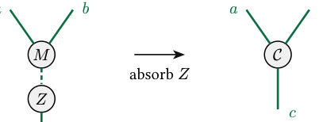
<figcaption class="paper-figure-caption"><b>Fig 2.</b> Figure 2: (a) M distinguishes input legs (solid) from output (dashed). (b) Absorbing Z yields C, invariant under all permutations of its legs.</figcaption>
</figure>
<figure class="paper-figure-card">
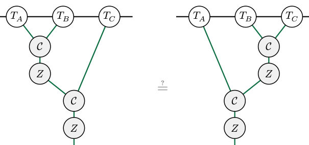
<figcaption class="paper-figure-caption"><b>Fig 3.</b> Figure 5: One complex network, two realifications. Contracting the same three-tensor chain along (AB)C (left) or A(BC) (right) places the C and Z nodes differently, so the two real networks have different shapes. Both contract to the same tensor: the wiring is a gauge choice, and spider fusion re-aligns it from one tree to the other by local moves.</figcaption>
</figure>
<figure class="paper-figure-card">
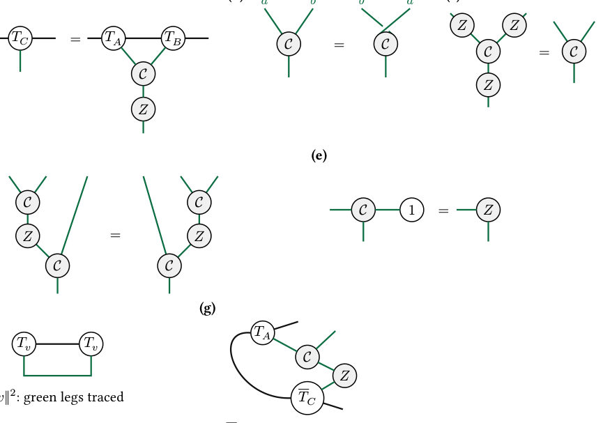
<figcaption class="paper-figure-caption"><b>Fig 4.</b> Figure 6: The algebra of the realified representation. (a) Matrix product (see also Fig. 3). (b) Permutation invariance: C is symmetric in all three legs. (c) Conjugate covariance: Z on all three legs cancels. (d) Cascade rule (associativity). (e) Unit rule: C contracted with 1 = (1, 0)⊤</figcaption>
</figure>
<figure class="paper-figure-card">
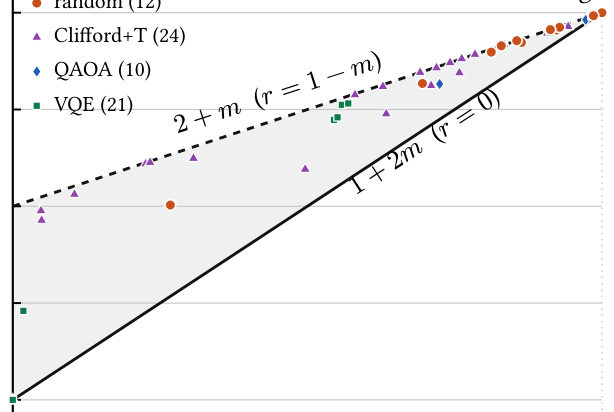
<figcaption class="paper-figure-caption"><b>Fig 5.</b> Figure 8: Measured overhead versus merge fraction m for all 67 benchmark instances: twelve random circuits (orange circles), 24 Clifford+T (purple triangles), 10 QAOA (blue diamonds), and 21 VQE (green squares). The law (5) confines every point to the band between the solid line 1 + 2m (r = 0) and the dashed line 2 + m (r = 1 −m). All-real circuits (Clifford+T at density 0, TFIM-type VQE) cluster at (m=0, 1×); deep random and QAOA circuits accumulate against the 3× ceiling.</figcaption>
</figure>

**Summary.** This paper addresses the challenge of running complex quantum circuit simulations on hardware accelerators limited to real arithmetic. The authors propose a 'realification rewrite' that mathematically transforms any complex tensor network into an equivalent real one. This method successfully demonstrates superior performance over standard complex-handling baselines when executed on real-only matrix engines.

**Why it may be interesting.** This work provides a concrete computational pathway for simulating complex quantum dynamics (which often involve complex amplitudes) using commodity real-valued AI accelerators, making advanced quantum simulation more accessible.

Detailed structure

**Main problem.** Simulating quantum circuits via tensor networks on modern matrix accelerators (NPUs, TPUs) that are restricted to real-valued matrix multiplications (GEMM).

**Main result.** The authors introduce a 'realification rewrite' that maps complex tensor networks to equivalent real ones, achieving performance competitive with existing methods.

**Method.** They develop a mathematical rewrite that replaces complex tensor contractions with sequences of real-valued tensor operations using an algebra structure tensor (M), allowing computation on real-only hardware.

**Model / system.** The model is quantum circuit simulation represented by tensor network contraction over complex numbers. The physical system involves general quantum circuits, including random, Clifford+T, QAOA, and VQE instances.

**Key observables.** Arithmetic overhead in real multiplications ($1 + 2m + r$), time complexity ($	ext{tcR}$), space complexity ($	ext{scR}$), and read–write cost ($	ext{rwcR}$).

**Important parameters / regimes.** The cost law shows an overhead never exceeding $3	imes$ relative to real contraction; the performance is shown on an Ascend 910 NPU.

**Assumptions / limitations.** The method assumes that existing software stacks optimized for real GEMMs can be utilized, and it relies on a tree-dependent structure choice during rewriting.

**Figures summary.** Figure 1 illustrates the process from quantum circuit to complex tensor network to final real-valued rewrite. Figure 2 details how the multiplication tensor M is simplified to C by absorbing a phase factor Z. Table 5 reports optimized complexities for various circuits.

**Paper structure.** The paper first identifies the hardware mismatch (complex vs. real GEMM). It then introduces the 'realification rewrite' and proves a tight cost law based on volume fractions ($m, r$). The core of the work involves applying this method to benchmark multiple circuit types across different optimization strategies, concluding with performance results on specific hardware.

Abstract

Tensor-network contraction simulates quantum circuits, but modern matrix accelerators (NPUs, TPUs) expose only real GEMM pipelines, so the complex networks of quantum simulation must be reconstructed in software. We resolve the mismatch by a realification rewrite that maps any complex tensor network to a real one. At each merge of two complex tensors, a rank-3 structure tensor realizes Gauss's three-multiplication (3M) formula; contractions with one or no complex operand need only two or one real products. We prove a tight cost law: overhead $1 + 2m + r$ in real multiplications, where $m$ and $r$ are the volume fractions of two- and one-complex-operand contractions, never exceeding $3\times$ relative to real contraction, with every intermediate at most doubled in size. On 67 circuits (random, Clifford+$T$, QAOA, VQE), the law holds across the real-to-complex range and complex-gate placement, not count, governs cost. Contraction orders transfer from the complex network with a relative arithmetic-cost gap below $5\times 10^{-4}$ on 66 of 67 circuits; the exception closes under a few steps of low-temperature simulated annealing. On an Ascend 910 NPU the rewrite beat both the four-real-GEMM baseline and a per-GEMM Gauss lowering on all twelve random circuits and on 52 of 55 structured cells (three cells slower by at most 12\%); the four-GEMM baseline was slower by a median $1.7\times$ (random) and $1.4\times$ (structured). Realification makes complex tensor-network contraction native to real-only matrix engines.

[↑ back to top](#top)

### [Topological Recursion and Quantum Path Signatures](http://arxiv.org/abs/2608.02861v1)

**Authors:** Inês Aniceto, Thomas Cass, Samuel Crew  
**Type:** theory · **Category:** other · **PDF:** <https://arxiv.org/pdf/2608.02861v1>  
**Analysis basis:** full PDF text, analyzed in chunks
**Topic relevance:** `Keldysh / 2PI / non-Gaussian methods` **1/5**

↔ Scroll figures horizontally

<figure class="paper-figure-card">
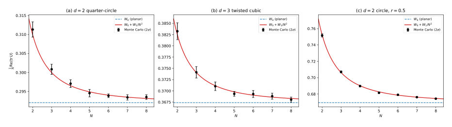
<figcaption class="paper-figure-caption"><b>Fig 1.</b> Figure 1: Genus-1 correction to the finite-N Wilson line (2σ error bars). Monte Carlo values (points); W0 +W1/N2 (solid) and the planar value W0 (dashed), for (a) the d = 2 quarter-circle (s = 1.0, W1 = +0.0716), (b) the d = 3 twisted cubic (a = 0.75, W1 = +0.0602) and (c) the d = 2 Wilson loop (r = 0.5, W1 = +0.3320).</figcaption>
</figure>

**Summary.** This work develops a sophisticated mathematical machinery using a non-commutative Laplace transform to relate path space observables (quantum path signatures) to algebraic equations from random matrix theory. It successfully derives the full genus expansion of these loop equations, providing deep structural insights into quantum field theories governed by such spectral relations.

**Why it may be interesting.** While highly abstract, the techniques developed—relating geometric/path integrals (signatures) to formal power series and spectral curves—are powerful tools for analyzing quantum field theories in dimensions where standard methods fail.

Detailed structure

**Main problem.** The paper establishes a rigorous mathematical framework connecting path space analysis (quantum path signatures) to algebraic structures derived from random matrix theory via a non-commutative Laplace transform.

**Main result.** They successfully derive the genus-$g$ loop equations for the quantum path signature, confirming consistency across multiple computational methods up to genus one and providing a systematic expansion in $1/N$.

**Method.** The core method involves introducing and utilizing a non-commutative Laplace transform that maps convolution products on path space functionals (signatures) to algebraic products of formal power series.

**Model / system.** The analysis centers on the quantum path signature, derived from random unitary matrix-valued paths $U(\gamma)$, which is related to Wilson loops in gauge theory and planar limits of matrix models.

**Key observables.** Quantum Path Signature ($S$), Planar Wilson Line Observable ($W$), Genus-$g$ corrections ($W_g$), and the non-commutative resolvent ($R_\mu$).

**Important parameters / regimes.** The large-$N$ limit (planar limit), genus $g$, and path geometry $\gamma(t)$ are key parameters.

**Assumptions / limitations.** The analysis assumes factorial decay of the signature moments for the existence of the planar limit, and it notes that the full solution theory for interacting models remains open due to non-closure.

**Figures summary.** Not specified in detail, but the structure implies showing recursive relations (e.g., Eq. 66) and comparing results from different computational approaches (discretized loops vs. combinatorial forms).

**Paper structure.** The paper progresses by first defining the non-commutative Laplace transform to map path convolution to algebraic products; it then applies this to derive the planar loop equation; subsequently, it extends this framework to systematically calculate genus-$g$ corrections ($W_g$) via integral equations.

Abstract

We introduce a non-commutative Laplace transform between functionals on path space and formal series in a tensor algebra, under which a natural convolution of path functionals becomes an algebraic product of series. Applying it to a random unitary matrix-valued path development - the quantum path signature - we show that the governing planar loop equations take a non-commutative spectral form. We then extend the loop equations to a $1/N$ genus expansion, organised by topological recursion, and obtain a hierarchy of integral equations on path space for the corrections.

[↑ back to top](#top)

## Other papers (9)

*Papers from primary archives without highlighted authors or any topic match. Click to expand.*

Show other papers

### [CNOT-Distance is NP-complete under all-to-all connectivity](http://arxiv.org/abs/2608.03825v1)

**Authors:** Antonio Acuaviva, Arturo Acuaviva, Pablo Acuaviva  
**Type:** theory · **Category:** quantum information and computing · **PDF:** <https://arxiv.org/pdf/2608.03825v1>  
**Analysis basis:** full PDF text, analyzed in chunks

↔ Scroll figures horizontally

<figure class="paper-figure-card">
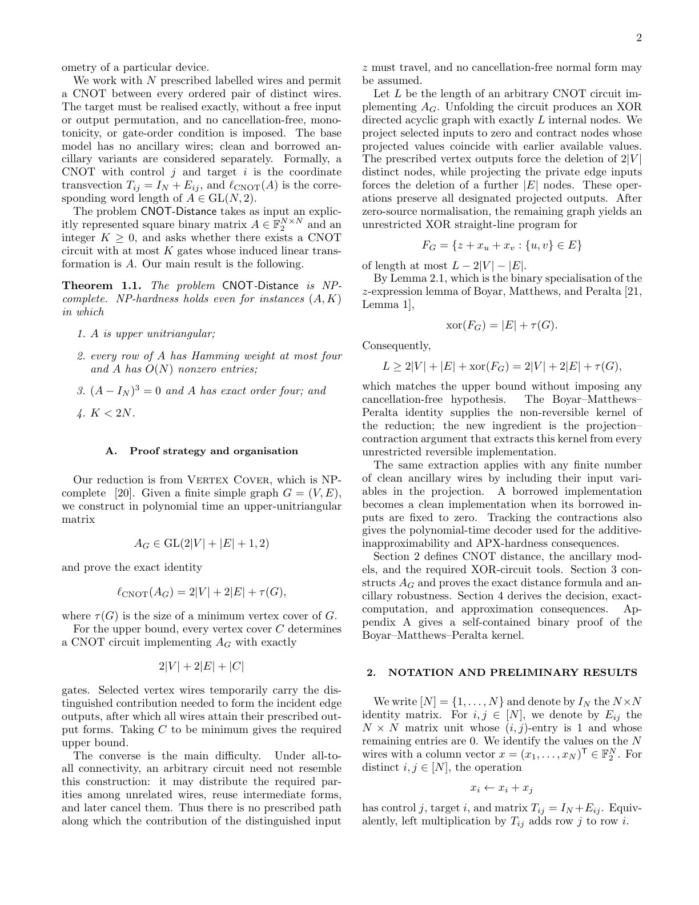
<figcaption class="paper-figure-caption"><b>Fig 1.</b> Low-resolution page preview, page 2</figcaption>
</figure>
<figure class="paper-figure-card">
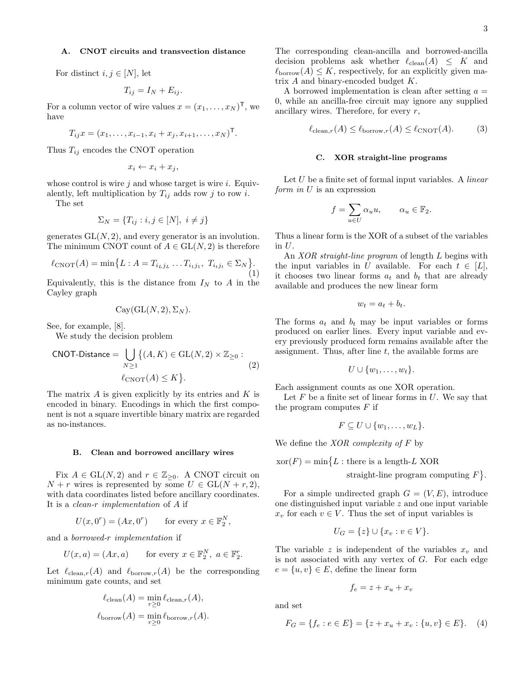
<figcaption class="paper-figure-caption"><b>Fig 2.</b> Low-resolution page preview, page 3</figcaption>
</figure>
<figure class="paper-figure-card">
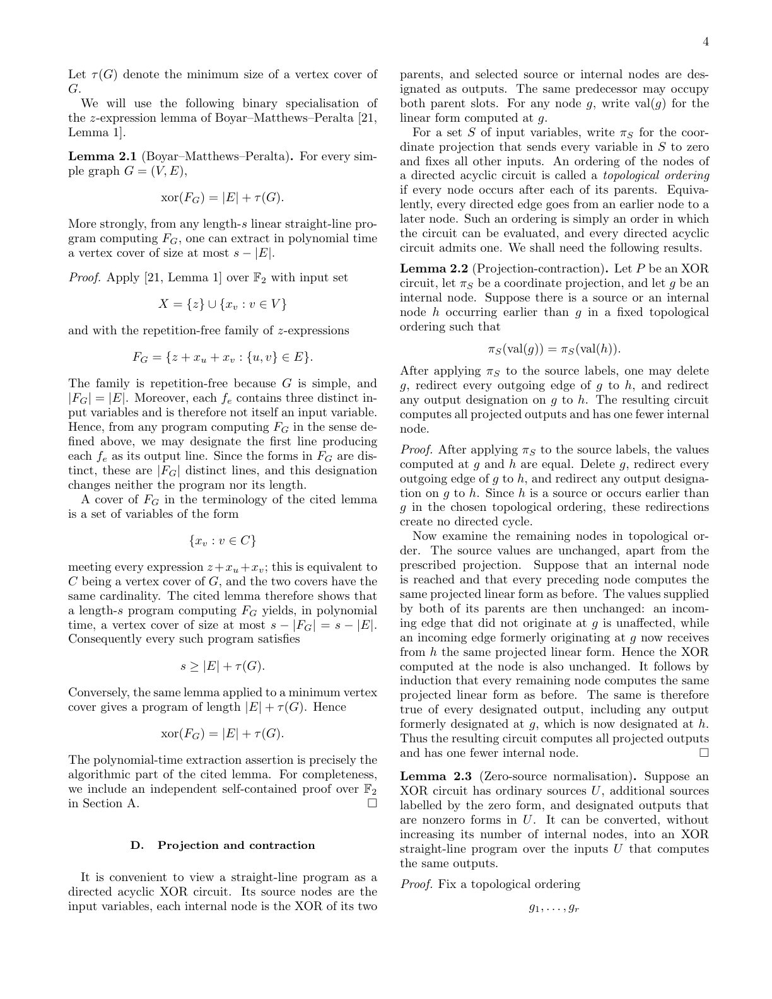
<figcaption class="paper-figure-caption"><b>Fig 3.</b> Low-resolution page preview, page 4</figcaption>
</figure>
<figure class="paper-figure-card">
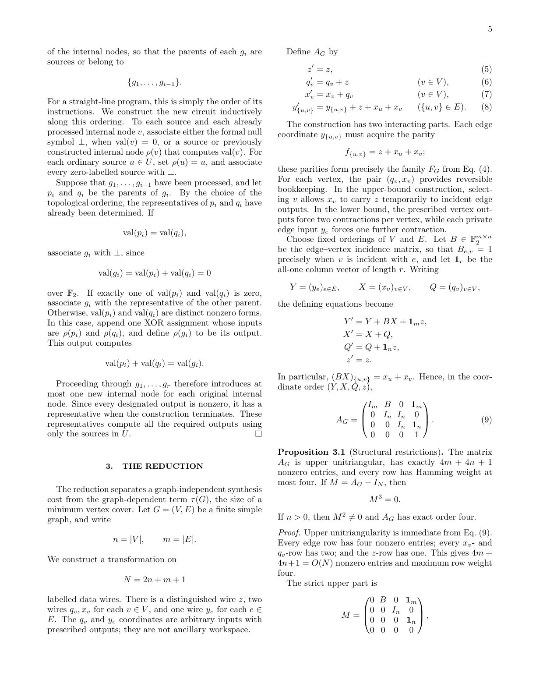
<figcaption class="paper-figure-caption"><b>Fig 4.</b> Low-resolution page preview, page 5</figcaption>
</figure>
<figure class="paper-figure-card">
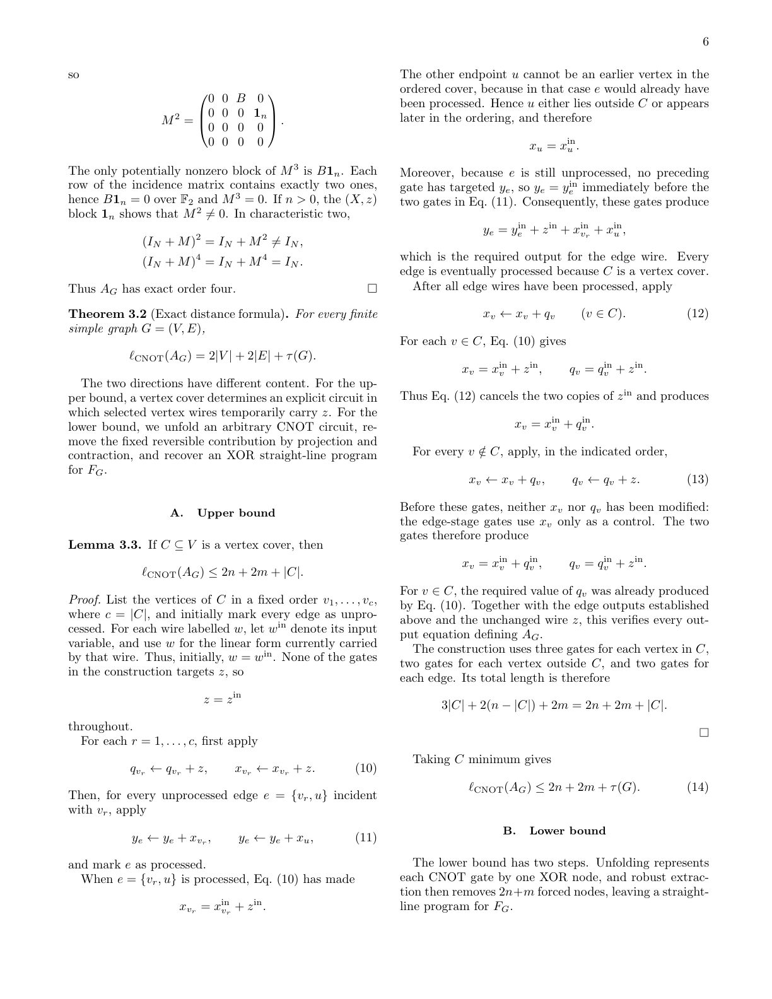
<figcaption class="paper-figure-caption"><b>Fig 5.</b> Low-resolution page preview, page 6</figcaption>
</figure>

**Summary.** This paper proves that calculating the minimum number of CNOT gates required to implement a given linear transformation (CNOT-Distance) is an NP-complete problem. The authors achieve this by constructing specific matrices whose gate count exactly matches the size of the minimum vertex cover of a graph. This result establishes a strong theoretical lower bound on the complexity of quantum circuit synthesis.

**Why it may be interesting.** This work provides fundamental computational hardness results for quantum circuit synthesis, which is crucial for understanding the limits of implementing desired unitary operations using physical hardware constraints.

Detailed structure

**Main problem.** The problem addressed is determining if a given invertible linear transformation $A \in GL(N, 2)$ can be implemented using at most $K$ CNOT gates ($	ext{CNOT-Distance}$).

**Main result.** The authors prove that the $	ext{CNOT-Distance}$ problem is NP-complete under all-to-all connectivity.

**Method.** The proof relies on a reduction from Minimum Vertex Cover (an NP-complete problem) and involves analyzing the structure of CNOT circuits by mapping them to XOR directed acyclic graphs.

**Model / system.** The model is quantum circuit synthesis using only CNOT gates acting on fixed labeled wires, represented mathematically by linear transformations over $\mathbb{F}_2$.

**Key observables.** $\ell_{	ext{CNOT}}(A)$ (minimum gate count), $	au(G)$ (minimum vertex cover size).

**Important parameters / regimes.** $N$ (number of wires/qubits), $K$ (gate budget).

**Assumptions / limitations.** The analysis assumes all-to-all connectivity between any pair of distinct wires.

**Paper structure.** The paper establishes the NP-completeness by constructing a specific matrix $A_G$ derived from an arbitrary graph $G$, showing that $\ell_{	ext{CNOT}}(A_G)$ exactly encodes the minimum vertex cover size, thus linking circuit complexity to graph theory.

Abstract

Given $A\in\operatorname{GL}(N,2)$ and an integer $K$, we ask whether $A$ can be implemented by at most $K$ CNOT gates on fixed labelled wires with all-to-all connectivity. We prove that this problem is NP-complete. From a finite simple graph $G=(V,E)$, we construct an upper-unitriangular matrix $A_G\in\operatorname{GL}(2|V|+|E|+1,2)$ satisfying $\ell_{\mathrm{CNOT}}(A_G)=2|V|+2|E|+τ(G)$, where $τ(G)$ is the minimum vertex-cover size. Each target matrix has $O(N)$ nonzero entries and row Hamming weight at most four. The lower bound unfolds an arbitrary CNOT circuit into an XOR directed acyclic graph and applies projection--contraction operations, allowing cancellation and unrestricted reuse of intermediate parities. For this family, the optimum is unchanged by any finite number of clean or borrowed ancillary wires that must be restored. A polynomial-time decoder further yields NP-hardness of approximation within every fixed additive constant and, through an L-reduction from Minimum Vertex Cover on cubic graphs, APX-hardness of the associated CNOT-circuit optimisation problem.

[↑ back to top](#top)

### [Factorization of Exclusive-Sum-Of-Products Expressions with Rectangle Covering to Reduce Quantum Circuit Cost](http://arxiv.org/abs/2608.03188v1)

**Authors:** Audrey Hou, Lucia Zhang, Ali Al-Bayaty, Marek Perkowski  
**Type:** theory · **Category:** quantum information and computing · **PDF:** <https://arxiv.org/pdf/2608.03188v1>  
**Analysis basis:** full PDF text, analyzed in chunks

↔ Scroll figures horizontally

<figure class="paper-figure-card">
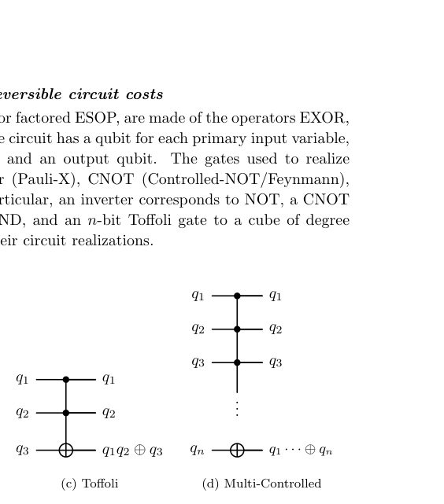
<figcaption class="paper-figure-caption"><b>Fig 1.</b> Fig. 1. Permutative Quantum Gates</figcaption>
</figure>
<figure class="paper-figure-card">
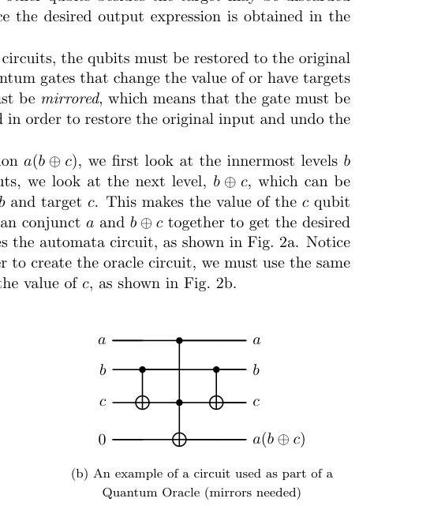
<figcaption class="paper-figure-caption"><b>Fig 2.</b> Fig. 2. Realization of a(b ⊕c) in Automata vs Oracle circuit</figcaption>
</figure>
<figure class="paper-figure-card">
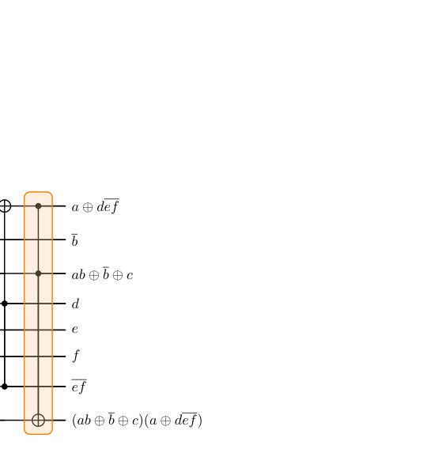
<figcaption class="paper-figure-caption"><b>Fig 3.</b> Fig. 4. Automata of After factoring</figcaption>
</figure>
<figure class="paper-figure-card">
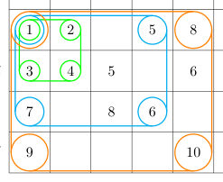
<figcaption class="paper-figure-caption"><b>Fig 4.</b> Fig. 8. Odd Rectangle Covering vs. Disjoint Covering on the same matrix</figcaption>
</figure>
<figure class="paper-figure-card">
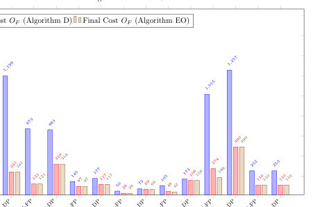
<figcaption class="paper-figure-caption"><b>Fig 5.</b> Fig. 10. Costs Before and After Factorization</figcaption>
</figure>

**Summary.** This paper presents novel algorithms that factor complex logic expressions (ESOP) by mapping them onto 2D matrices and using rectangle covering techniques. This factorization allows for the creation of equivalent, but significantly simpler, quantum circuits. The resulting cost reductions in both classical gate counts and quantum circuit metrics are substantial, making it a key tool for optimizing quantum computation resource estimates.

**Why it may be interesting.** While focused on circuit minimization rather than physical Hamiltonian simulation, the techniques developed for efficient logical decomposition and resource estimation are fundamental to designing scalable quantum algorithms.

Detailed structure

**Main problem.** The primary goal is optimizing quantum circuit costs associated with implementing complex logic functions represented as Exclusive-Sum-Of-Products (ESOP) expressions.

**Main result.** The proposed factorization algorithms significantly reduce both the classical literal count and the quantum Maslov cost of realizing these circuits, achieving reductions between 20% and 95%.

**Method.** The method involves representing the ESOP expression as a 2D matrix and applying specialized 'Rectangle Covering methods' (Disjoint and Even-Odd) to find an equivalent, factored form.

**Model / system.** The model is abstract quantum circuit realization for AND/EXOR logic gates. Costs are measured using the Maslov cost for both quantum oracle and automaton circuits, which are built upon generalized n-bit Toffoli gates.

**Key observables.** Literal count (L(E)), Maslov cost for quantum automata (A(E)), and Maslov cost for quantum oracles (O(E)).

**Important parameters / regimes.** The complexity of the ESOP expression, which must be FPRM with cube degrees at most 2 for direct matrix representation.

**Assumptions / limitations.** For quantum oracle circuits, intermediate variables in factored forms require 'restoring' via mirroring gates to maintain equivalence with the original circuit structure.

**Figures summary.** Figures illustrate gate realizations (CNOT, Toffoli), comparisons of costs before and after factorization using matrix representations, and demonstrations of the disjoint rectangle covering process on these matrices.

**Paper structure.** The paper introduces the problem of ESOP cost optimization, details the matrix representation and the two rectangle covering algorithms (Disjoint and Even-Odd), presents comparative results across multiple benchmarks for literal count, automata cost, and oracle cost, and concludes with an analysis comparing algorithmic efficiency.

Abstract

The implementation of quantum circuits is currently very expensive, especially due to the usage of large Toffoli gates. Therefore, it is critical to optimize circuit costs by factoring expressions as they become more complex. In the proposed algorithms to factor ESOP expressions, each product term is converted into a cell in a 2D matrix, and optimal factored AND/EXOR solutions are determined using Disjoint and Even-Odd Rectangle covering methods. Two Python programs implementing these algorithms were tested and evaluated using well-known benchmarks. The results showed that both the literal counts used in classical logic circuits as well as the Maslov cost used in quantum circuits was reduced by 20%-95% depending on expression size.

[↑ back to top](#top)

### [Harvest: Resource-Aware Quantum Compilation for Magic State Protocols](http://arxiv.org/abs/2608.03315v1)

**Authors:** Jannik Pflieger, Aleksandra Świerkowska, Emmanouil Giortamis, Pramod Bhatotia  
**Type:** theory · **Category:** quantum information and computing · **PDF:** <https://arxiv.org/pdf/2608.03315v1>  
**Analysis basis:** full PDF text, analyzed in chunks

↔ Scroll figures horizontally

<figure class="paper-figure-card">
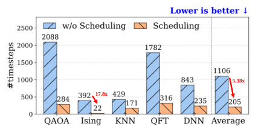
<figcaption class="paper-figure-caption"><b>Fig 1.</b> Fig. 1: Number of timesteps with and without magic state scheduling. Scheduling lowers the execution time by an average 5.38× (up to 17.8×).</figcaption>
</figure>
<figure class="paper-figure-card">
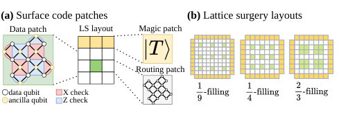
<figcaption class="paper-figure-caption"><b>Fig 2.</b> Fig. 2: Patch-level execution model (§II-A). (a) A physical surface-code patch is abstracted into a data, routing, or magic-state patch on a lattice-surgery layout. (b) Layout templates with different data-patch fillings.</figcaption>
</figure>
<figure class="paper-figure-card">
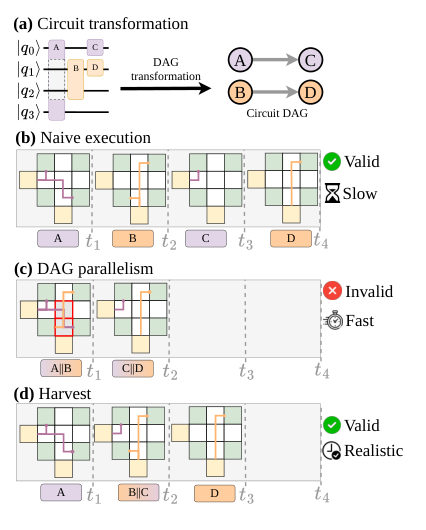
<figcaption class="paper-figure-caption"><b>Fig 3.</b> Fig. 3: Resource-aware compilation motivation (§II-D). (a) Circuit-to-DAG transformation. (b) Naive serial execution. (c) DAG-only scheduling. (d) Resource-aware scheduling.</figcaption>
</figure>
<figure class="paper-figure-card">
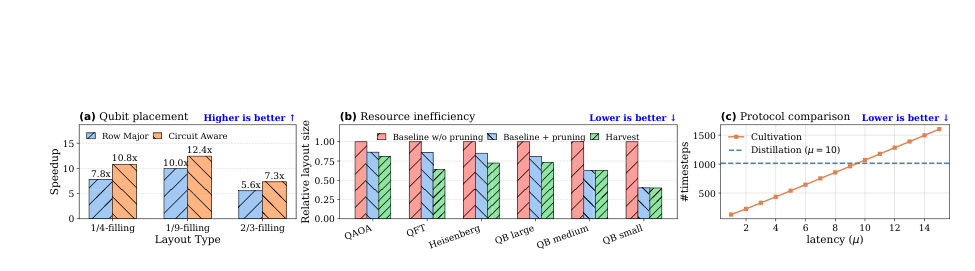
<figcaption class="paper-figure-caption"><b>Fig 4.</b> Fig. 4: Three effects motivating resource-aware lattice-surgery compilation (§III). (a) Circuit-aware vs. row-major placement. (b) Patches removed by post-scheduling pruning. (c) Distillation vs. cultivation latency/throughput trade-offs.</figcaption>
</figure>
<figure class="paper-figure-card">
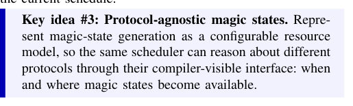
<figcaption class="paper-figure-caption"><b>Fig 5.</b> Fig. 5 shows Harvest’s position in the compilation stack: four components built around a shared intermediate represen- tation, H-IR. Input and output. Harvest’s own decisions should stay de- coupled from hardware-specific lowering: it takes a quantum circuit as input and produces H-IR, a routed patch-level IR, as output. Harvest IR (H-IR). Because all four components must reason over the same dependencies, layout, and schedule, H-IR serves as their shared representation. Circuit transformer. Since the rest of the pipeline needs the circuit’s dependencies and lattice-surgery structure exposed up front, the circuit transformer produces three representations of the input program: a Clifford+T...</figcaption>
</figure>

**Summary.** This paper introduces Harvest, a novel compiler designed for fault-tolerant quantum computation utilizing lattice surgery. It solves the critical problem where scheduling, placement, and magic-state resource management cannot be optimized in isolation due to shared physical constraints. By co-optimizing these factors, Harvest achieves substantial speedups and dramatically improves hardware resource utilization.

**Why it may be interesting.** While focused on compilation rather than fundamental physics, the resource management challenges—optimizing spatial layout alongside temporal execution constraints—are highly relevant to designing physical implementations of quantum circuits using superconducting or trapped-ion architectures.

Detailed structure

**Main problem.** The core problem is developing a quantum compiler that can co-optimize placement, routing, scheduling, and magic-state supply for lattice-surgery operations in fault-tolerant quantum computation.

**Main result.** Harvest achieves significant performance gains on benchmarks, showing an average speedup of 4.83x (up to 17.8x) over sequential execution while reclaiming substantial unused physical resources.

**Method.** The authors propose HARVEST, a resource-aware compilation approach that uses a patch-level intermediate representation (H-IR) to jointly optimize scheduling with circuit-aware placement and congestion-aware routing.

**Model / system.** The system modeled is a fault-tolerant quantum processor using topological codes, where operations are executed via 'lattice surgery' on a 2D grid of physical patches that can hold data, magic states, or act as routes.

**Key observables.** Average speedup (e.g., 4.83x), schedule length improvement (up to 1.35x), and the percentage of reclaimed unused resources (e.g., up to 72.0% magic-state patches).

**Important parameters / regimes.** The optimization must jointly consider data dependencies, physical resource conflicts (ports/routes), and consumable non-Clifford resources (magic states).

**Assumptions / limitations.** Independent optimization of placement, routing, scheduling, or magic-state supply is insufficient because operations contend for shared physical resources like ports and routes.

**Figures summary.** Figures illustrate the patch-level execution model showing data, routing, and magic-state patches; comparisons show speedup gains over naive serial execution by integrating resource awareness into scheduling.

**Paper structure.** The paper introduces the limitations of existing compilers, proposes the HARVEST framework with its H-IR, details the co-optimization pipeline (placement $
ightarrow$ scheduling $
ightarrow$ pruning), and validates it against standard quantum benchmark suites.

Abstract

Fault-tolerant quantum processors based on topological codes execute programs through lattice surgery, where operations must be mapped, routed, and supplied with magic states across a 2D grid of physical patches. Non-Clifford operations require these magic states, produced either by distillation factories or by cultivation, each trading footprint against preparation latency, and delivering a magic state to the data patches that consume it requires routing through the same shared layout as every other operation. Yet placement, routing, scheduling, and magic-state supply cannot be optimized in isolation: two operations with no circuit-level dependency can still contend for the same ports, routes, or magic-state terminals once placed, so a compiler that decouples instruction scheduling from magic-state generation, or hard-codes a single generation protocol, is forced to trade execution time against layout footprint instead of co-optimizing both across protocols.   We present Harvest, a resource-aware compilation approach for lattice-surgery that co-optimizes magic-state consumption with circuit-aware placement and congestion-aware routing under a protocol-agnostic resource model, then reclaims unused layout footprint after scheduling. Across standard benchmark suites (QAOA, QFT, QASMBench), Harvest achieves an average speedup of $4.83\times$ (up to $17.8\times$) over sequential execution, improves schedule length by up to $1.35\times$ through circuit-aware placement, and reclaims up to $72.0\%$ of unused magic-state patches and $33.9\%$ of unused routing patches.

[↑ back to top](#top)

### [Improved Quantum Algorithms for Reinforcement Learning Under a Generative Model](http://arxiv.org/abs/2608.02826v1)

**Authors:** Joao F. Doriguello  
**Type:** theory · **Category:** quantum information and computing · **PDF:** <https://arxiv.org/pdf/2608.02826v1>  
**Analysis basis:** full PDF text, analyzed in chunks

↔ Scroll figures horizontally

<figure class="paper-figure-card">
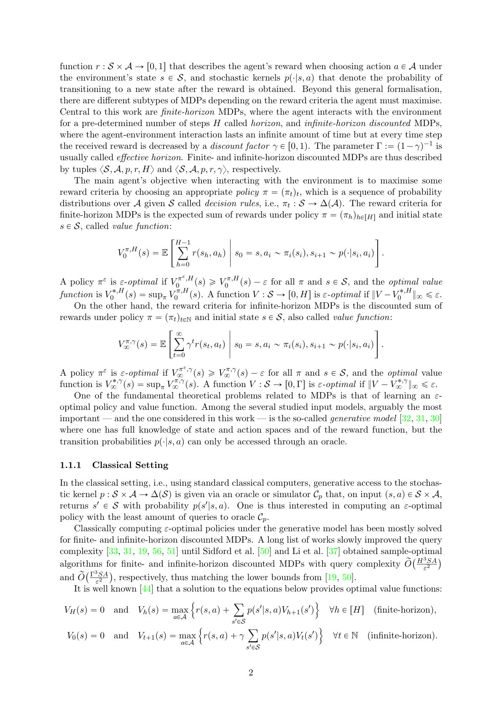
<figcaption class="paper-figure-caption"><b>Fig 1.</b> Low-resolution page preview, page 2</figcaption>
</figure>
<figure class="paper-figure-card">
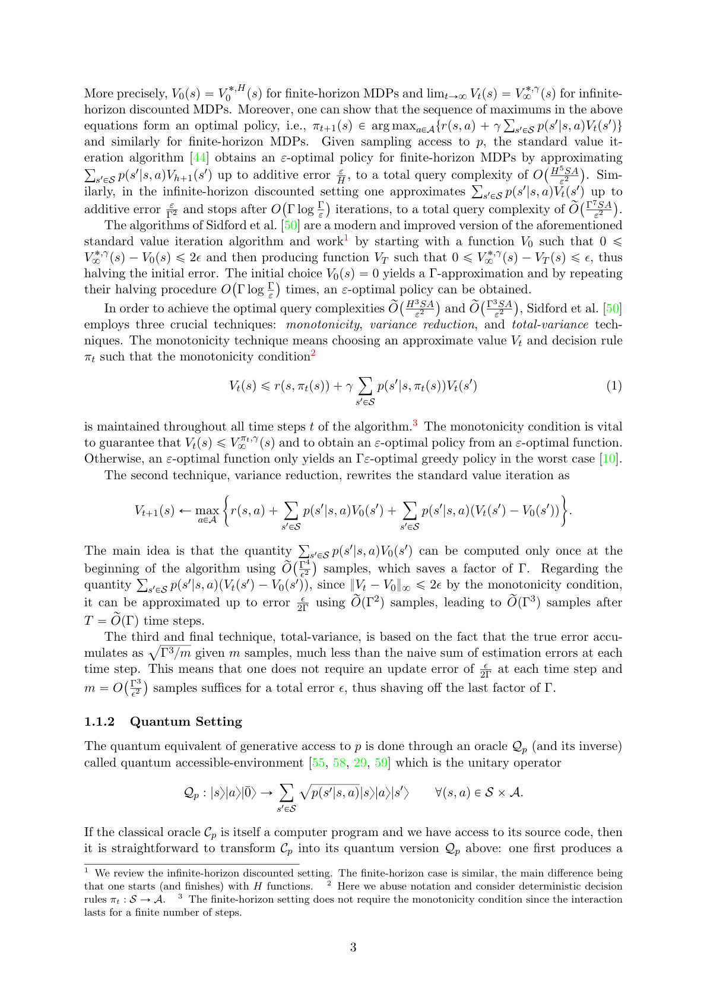
<figcaption class="paper-figure-caption"><b>Fig 2.</b> Low-resolution page preview, page 3</figcaption>
</figure>
<figure class="paper-figure-card">
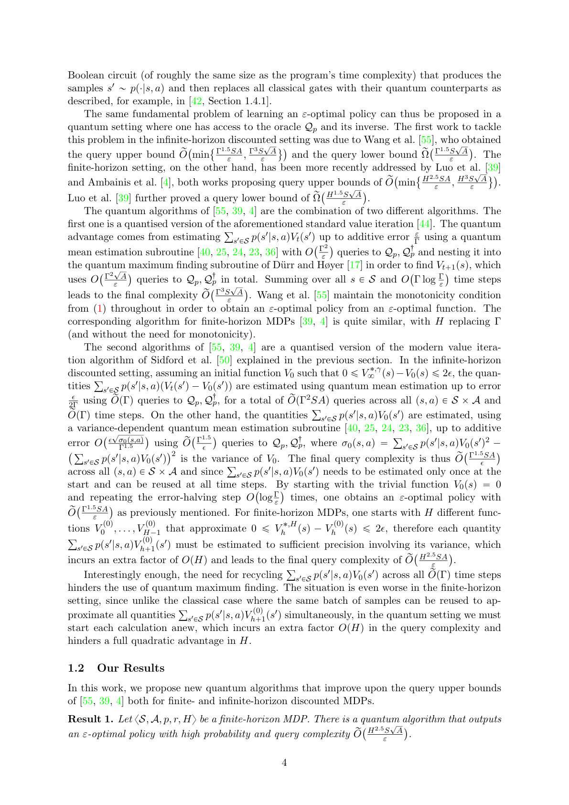
<figcaption class="paper-figure-caption"><b>Fig 3.</b> Low-resolution page preview, page 4</figcaption>
</figure>
<figure class="paper-figure-card">
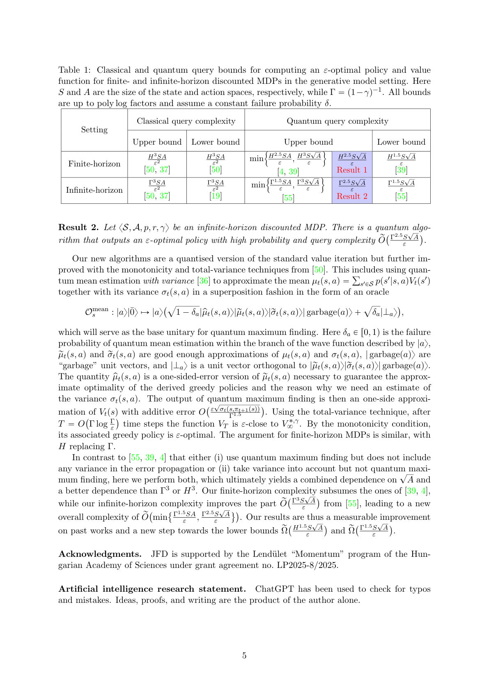
<figcaption class="paper-figure-caption"><b>Fig 4.</b> Low-resolution page preview, page 5</figcaption>
</figure>
<figure class="paper-figure-card">
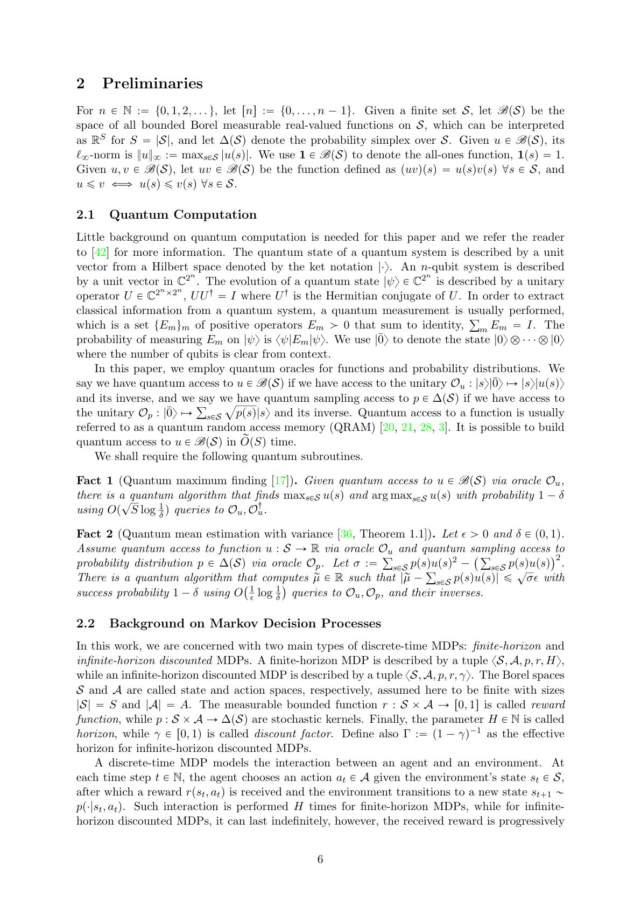
<figcaption class="paper-figure-caption"><b>Fig 5.</b> Low-resolution page preview, page 6</figcaption>
</figure>

**Summary.** This paper introduces improved quantum algorithms designed to solve for optimal policies in Reinforcement Learning within Markov Decision Processes. By combining quantum subroutines like quantum mean estimation and maximum finding, the authors significantly reduce the required query complexity compared to prior classical and quantum methods. This advances the theoretical understanding of quantum computation's role in solving complex sequential decision-making problems.

**Why it may be interesting.** While the application is ML/AI, the core methodology relies entirely on developing and analyzing complex quantum algorithms (quantum mean estimation, amplitude amplification techniques) applied to optimization problems, making it highly relevant to quantum computation theory.

Detailed structure

**Main problem.** The core problem is developing quantum algorithms to compute approximate optimal policies for Reinforcement Learning (RL) in Markov Decision Processes (MDPs). This aims to overcome the computational challenges posed by large state/action spaces.

**Main result.** The authors propose new quantum algorithms that improve query complexities compared to previous works, achieving bounds approaching established quantum lower limits for both finite- and infinite-horizon MDPs.

**Method.** The approach combines standard value iteration techniques with advanced quantum subroutines, specifically quantum mean estimation and quantum maximum finding. These are integrated using total-variance reduction techniques.

**Model / system.** The model is a discrete-time Markov Decision Process (MDP), studied in finite-horizon or infinite-horizon discounted settings. The process relies on estimating optimal policies ($\pi^*$) and value functions ($V^*$).

**Key observables.** Query complexity, $\epsilon$-optimality for policies and value functions.

**Important parameters / regimes.** State space size (S), action space size (A), finite horizon length (H), discount factor ($\gamma$), and the desired error tolerance ($\epsilon$).

**Assumptions / limitations.** The analysis assumes access to transition probabilities via an oracle, which is quantum accessible-environment ($Q_p$) in the quantum setting.

**Figures summary.** Not specified by notes; references suggest comparison of classical vs. quantum query bounds in a table format.

**Paper structure.** The paper builds upon foundational work in MDPs and RL theory, proposing novel quantum algorithms that combine quantum mean estimation and maximum finding to improve sample complexity bounds for solving optimal policies.

Abstract

Reinforcement learning is a subfield of machine learning that studies how an agent interacts with an environment in order to extract as large a reward as possible. A standard approach to study such interaction is through Markov Decision Processes (MDPs) and the task of choosing an optimal policy --- a function that tells the agent which action to take. In this work, we study two types of MDPs --- finite-horizon and infinite-horizon discounted --- and propose new quantum algorithms for computing approximate optimal policies. Our quantum algorithms are based on a new combination of standard value iteration and quantum subroutines like quantum mean estimation and quantum maximum finding, overall enhanced with techniques from sample-optimal classical algorithms. Our resulting query complexities improve upon previous works, thus approaching already established quantum lower bounds.

[↑ back to top](#top)

### [Iterative linear quadratic regulator on SU(N) for multi-qubit gate synthesis](http://arxiv.org/abs/2608.03656v1)

**Authors:** Dirk Heimann, Felix Wiebe, Elie Mounzer, Shivesh Kumar  
**Type:** theory · **Category:** quantum information and computing · **PDF:** <https://arxiv.org/pdf/2608.03656v1>  
**Analysis basis:** full PDF text, analyzed in chunks

↔ Scroll figures horizontally

<figure class="paper-figure-card">
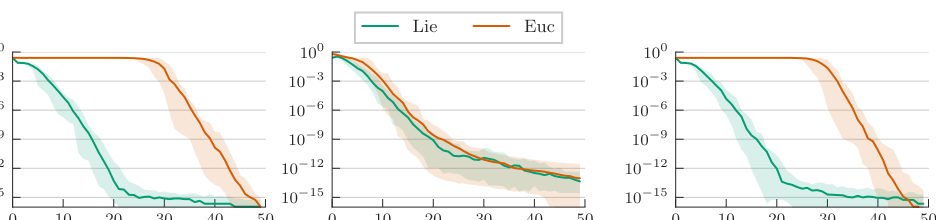
<figcaption class="paper-figure-caption"><b>Fig 1.</b> FIG. 2: The median of 25 runs is plotted with upper and lower whiskers at each iteration step for three-qubit gates.</figcaption>
</figure>
<figure class="paper-figure-card">
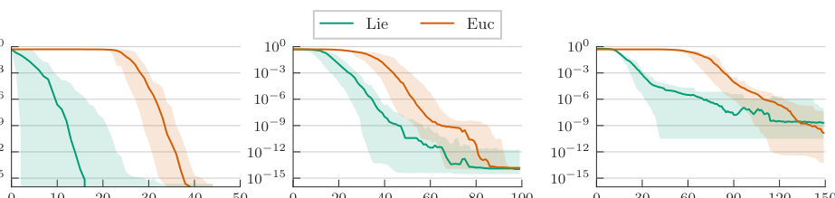
<figcaption class="paper-figure-caption"><b>Fig 2.</b> FIG. 3: The median of 25 runs is plotted with upper and lower whiskers at each iteration step for weighted parity X and Z three-, four-, and five-qubit gates.</figcaption>
</figure>
<figure class="paper-figure-card">
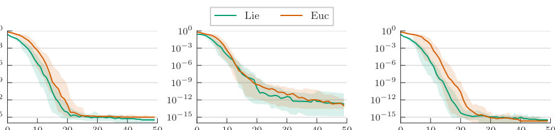
<figcaption class="paper-figure-caption"><b>Fig 3.</b> FIG. 5: The median of 25 runs is plotted with upper and lower whiskers at each iteration step for three-qubit gates with area under the curve Bayesian optimization cost function.</figcaption>
</figure>
<figure class="paper-figure-card">
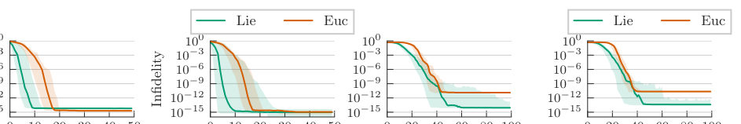
<figcaption class="paper-figure-caption"><b>Fig 4.</b> FIG. 6: The median of 25 runs is plotted with upper and lower whiskers at each iteration step for parity X and Z three- and four-qubit gates with the area under the curve Bayesian optimization cost function.</figcaption>
</figure>
<figure class="paper-figure-card">
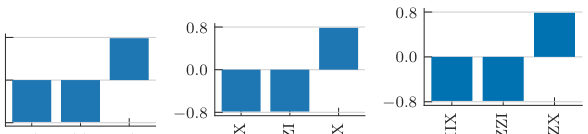
<figcaption class="paper-figure-caption"><b>Fig 5.</b> FIG. 7: Solutions found with on iteration step with 1 −F &lt; 10−15 while allowing the full algebra basis as drive terms.</figcaption>
</figure>

**Summary.** This paper develops and applies an adaptation of the Iterative Linear Quadratic Regulator (iLQR) tailored specifically to the Lie-group structure of SU(N). By incorporating this geometric constraint into the optimization process, the authors demonstrate improved convergence speed for quantum gate synthesis compared to standard methods. The findings highlight the value of group theory in enhancing optimal control algorithms for multi-qubit systems.

**Why it may be interesting.** This work provides a rigorous mathematical framework for optimizing quantum controls by respecting the underlying group structure (SU(N)), which is crucial for developing scalable, physically constrained gate synthesis protocols.

Detailed structure

**Main problem.** The primary goal is designing complex multi-qubit quantum gates using Quantum Optimal Control (QOC) theory.

**Main result.** Incorporating the Lie-group geometry into the iLQR formulation accelerates convergence compared to Euclidean methods in unconstrained settings, though it increases sensitivity to initialization under constraints.

**Method.** The authors adapt the Iterative Linear Quadratic Regulator (iLQR) by formulating updates and cost functions directly on the Special Unitary group SU(N), comparing this Lie-group approach against standard Euclidean iLQR.

**Model / system.** The system involves quantum dynamics evolving on the special unitary group SU(N), where control is achieved by applying time-dependent Hamiltonian terms (drive fields) to synthesize target gates.

**Key observables.** Convergence speed, gate fidelity, and the resulting infidelities of synthesized gates.

**Important parameters / regimes.** The comparison hinges on two regimes: an idealized unconstrained setting versus a constrained setting limited to 2-local Hamiltonian terms.

**Assumptions / limitations.** The derivation relies heavily on Taylor expansions and linearizing the system dynamics around the current trajectory, which introduces approximations.

**Figures summary.** Figures show infidelity results for various multi-qubit gates (e.g., three- and five-qubit gates) comparing performance across different optimization score functions and iteration steps.

**Paper structure.** The paper builds mathematically by deriving necessary Taylor expansions on Lie groups, detailing the iLQR update equations for SU(N), and then presenting numerical results comparing the convergence of the Lie-group vs. Euclidean formulations under varying constraints.

Abstract

In quantum optimal control theory, gradient-based trajectory optimization techniques have proven versatile in designing multi-qubit quantum gates. Furthermore, incorporating the underlying Lie-group structure can accelerate the optimization process. In this work, we adapt the Lie-group formulation of the iterative linear quadratic regulator (iLQR) to the special unitary group SU(N) and apply it to quantum gate synthesis, systematically comparing it against the standard Euclidean iLQR formulation across multiple two- to five-qubit gates. We find that in the idealized, unconstrained setting, where all Lie-algebra basis elements are available as drive Hamiltonian terms, the Lie-group formulation converges faster than the Euclidean iLQR formulation. If drive terms are constrained to 2-local Hamiltonian terms, the Lie-group variant converges faster in early optimization iterations, but exhibits greater sensitivity to initialization and a stronger tendency towards local minima. These results demonstrate that incorporating Lie-group geometry into iLQR substantially improves convergence and highlight important next steps for improvements in constrained control settings.

[↑ back to top](#top)

### [Optimal and Deterministic Quantum Search on the Simplex of Complete Graphs](http://arxiv.org/abs/2608.03777v1)

**Authors:** Kiyoji Huang Fujiwara, Yujia Shi, Thomas G. Wong  
**Type:** theory · **Category:** quantum information and computing · **PDF:** <https://arxiv.org/pdf/2608.03777v1>  
**Analysis basis:** full PDF text, analyzed in chunks

↔ Scroll figures horizontally

<figure class="paper-figure-card">
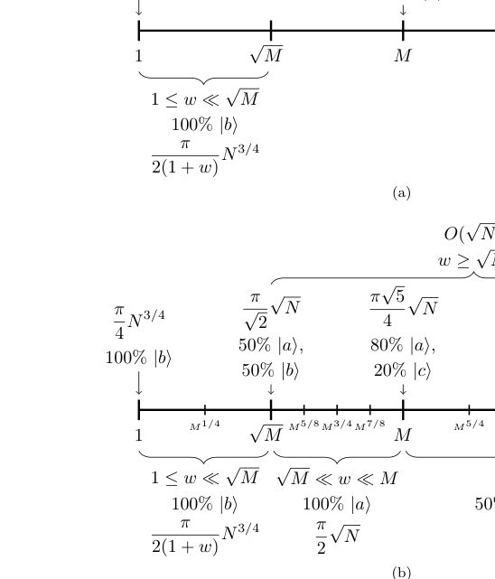
<figcaption class="paper-figure-caption"><b>Fig 1.</b> Fig. 2 Summary the first (or only) stage for search on the weighted simplex of complete graphs for large N. Subfigure (a) depicts only the prior results, and (b) includes the present results. The minor ticks in (b) are examples that are investigated in the paper.</figcaption>
</figure>
<figure class="paper-figure-card">
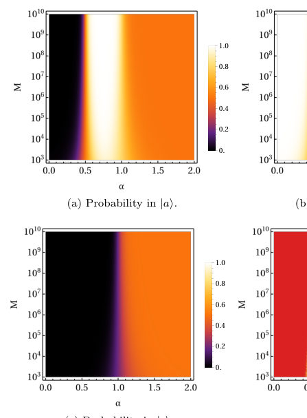
<figcaption class="paper-figure-caption"><b>Fig 2.</b> Fig. 3 For search on the simplex of complete graph with M(M + 1) vertices (ranging from M = 103 to 1010) and w = Mα (ranging from w = M0 to M2), the probability reached in (a) |a⟩, (b) |b⟩, and (c) |c⟩at the numerically-determined runtime using the numerically determined critical jumping rate. Subfigure (d) is the numerically-determined runtime divided by √</figcaption>
</figure>
<figure class="paper-figure-card">
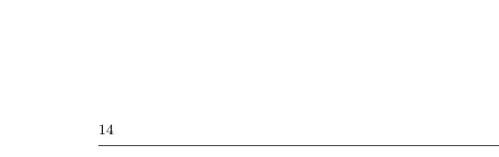
<figcaption class="paper-figure-caption"><b>Fig 3.</b> Fig. 5 For search on the simplex of com- plete graphs with w = M = 10 000 and γ = γw=M (7), the probability at the marked vertex |a⟩(solid black) and at vertex |c⟩ (dashed red).</figcaption>
</figure>
<figure class="paper-figure-card">
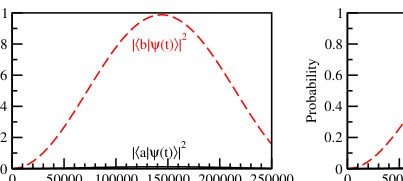
<figcaption class="paper-figure-caption"><b>Fig 4.</b> Fig. 9 For search on the simplex of complete graphs with M = 10 000 and w = M 1/4, the probability at the marked vertex |a⟩(solid black) and at vertex |b⟩(dashed red) with (a) γ = γw=M1/4 (14) and (b) γ = γW (13).</figcaption>
</figure>
<figure class="paper-figure-card">
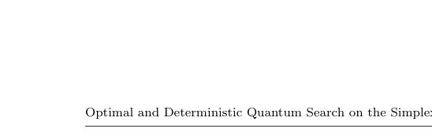
<figcaption class="paper-figure-caption"><b>Fig 5.</b> Fig. 11 For search on the simplex of com- plete graphs with M = 10 000, w = M 5/8, and γ = γw=M5/8 (15), the probability at the marked vertex |a⟩(solid black) and at vertex |b⟩(dashed red).</figcaption>
</figure>

**Summary.** This paper tackles the problem of achieving optimal and deterministic quantum search on the weighted simplex of complete graphs. The authors provide novel analytical proofs demonstrating that specific bridge weight conditions ($w=M$) guarantee both asymptotic optimality ($\mathcal{O}(\sqrt{N})$) and determinism for the quantum walk algorithm. It is significant because it rigorously characterizes the relationship between graph structure, edge weights, and search complexity.

**Why it may be interesting.** This work provides rigorous theoretical bounds on quantum search complexity ($\mathcal{O}(\sqrt{N})$) for a complex network structure, offering deep insights into how local structural properties (like weights) dictate global algorithmic efficiency in quantum computation.

Detailed structure

**Main problem.** The primary goal is to analytically prove optimal and deterministic quantum search algorithms for a specific graph structure: the simplex of complete graphs.

**Main result.** The authors provide the first analytical proof that optimal quantum search occurs when the bridge weight equals $M$, and they establish conditions ($\sqrt{M} \leq w \leq M$) under which the search is both asymptotically optimal and deterministic.

**Method.** The research combines analytical proofs using continuous-time quantum walk Hamiltonians with numerical demonstrations across various parameter regimes (bridge weights).

**Model / system.** The system is modeled as a weighted simplex of complete graphs, containing $N = M(M+1)$ vertices. The search dynamics are governed by a time evolution operator derived from a specific Hamiltonian involving the adjacency matrix and bridge weights ($w$).

**Key observables.** Search runtime (compared to $\sqrt{N}$), success probability, and the probability distribution across basis states $|a
angle$ (marked vertex) and neighboring vertices.

**Important parameters / regimes.** The weight of the bridges ($w$) relative to $M$, specifically comparing regimes like $w=M$, $w=\sqrt{M}$, and $\sqrt{M} \ll w \ll M$.

**Assumptions / limitations.** The analysis focuses on the single-marked vertex case, and it explicitly shows that graph connectivity measures (like algebraic connectivity) are unreliable indicators of fast search performance in this family.

**Figures summary.** Figures summarize search results across different weights $w$, showing runtime vs. weight scaling; Figure 3 details probability overlaps and runtime for specific weight scalings ($w=M^\alpha$).

**Paper structure.** The paper progresses by establishing the physical model, analyzing the quantum walk Hamiltonian in reduced subspaces using perturbation theory, deriving optimal rates for various weight regimes, and finally comparing search performance against graph connectivity metrics.

Abstract

The simplex of complete graphs, also known as the first-order truncated simplex lattice, is a network of $M+1$ identical complete graphs, each with $M$ vertices, such that each clique contains an edge or bridge to every other clique. It contains $N = M(M+1)$ vertices, and previous asymptotic results using a continuous-time quantum walk to search this graph for a single marked vertex have either numerically demonstrated an optimal runtime of $O(\sqrt{N})$, or analytically proved a deterministic success probability of 1, but not both, even when the bridges are weighted. In this paper, we give the first analytical proof of optimal quantum search on this graph, proving that it occurs when the weight of the bridges equals $M$. In addition, we numerically show that the optimal runtime is achieved more broadly whenever the weight is at least $\sqrt{M}$. Furthermore, the algorithm is also deterministic when the weight scales between $\sqrt{M}$ and $M$, and this is the first example of quantum search on the simplex of complete graphs that is both asymptotically optimal and deterministic. In addition, for weights where the algorithm is nondeterministic, we give a way to find the marked vertex by inspecting neighboring vertices. Finally, while it is known that connectivity is not a reliable indicator of fast quantum search when comparing different graph families, we show that it is also unreliable within the graph family of weighted simplex of complete graphs.

[↑ back to top](#top)

### [Physics-Informed Quantum Machine Learning with Hard Constraint Embedding for Nonlinear Differential Equations of the First Order](http://arxiv.org/abs/2608.03029v1)

**Authors:** Mengke Xu, Xi Li, Xiao Chen, Xunan Wang, Wanli Huo, Long Ma, Weiqi Yan  
**Type:** theory · **Category:** numerical methods · **PDF:** <https://arxiv.org/pdf/2608.03029v1>  
**Analysis basis:** full PDF text, analyzed in chunks

↔ Scroll figures horizontally

<figure class="paper-figure-card">
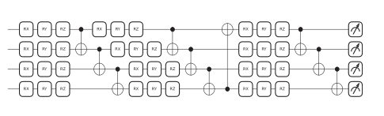
<figcaption class="paper-figure-caption"><b>Fig 1.</b> Figure 1: Quantum Ansatz with alternating entanglement pattern for 4 qubits and 3 layers.</figcaption>
</figure>
<figure class="paper-figure-card">
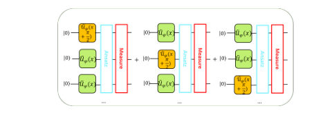
<figcaption class="paper-figure-caption"><b>Fig 2.</b> Figure 2: Derivative computation via parameter-shift rule.</figcaption>
</figure>
<figure class="paper-figure-card">
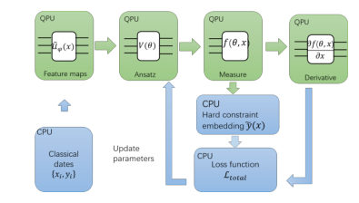
<figcaption class="paper-figure-caption"><b>Fig 3.</b> Figure 3: Flowchart of the proposed PIQML framework with hard constraint embedding.</figcaption>
</figure>
<figure class="paper-figure-card">
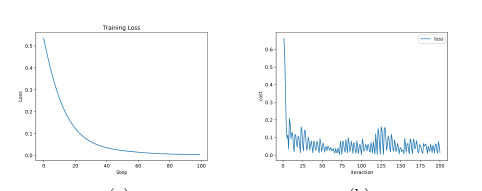
<figcaption class="paper-figure-caption"><b>Fig 4.</b> Figure 5: Comparison of the loss functions for a simple linear ODE. (a) Our PIQML model. (b) The existing quantum method from the literature [21].</figcaption>
</figure>
<figure class="paper-figure-card">
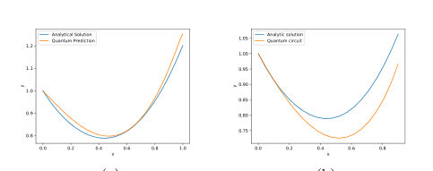
<figcaption class="paper-figure-caption"><b>Fig 5.</b> Figure 4: (a) Comparison of the PIQML model (orange line) against the analytical solution (blue line) for a simple linear ODE. (b) Performance of an existing quantum method from the literature (orange line) [21] in fitting the same ODE, showing inferior accuracy compared to the PIQML model.</figcaption>
</figure>

**Summary.** This paper introduces a Physics-Informed Quantum Machine Learning (PIQML) framework designed to solve nonlinear ODEs using near-term quantum hardware. It achieves this by embedding initial conditions as hard constraints and formulating the loss function around satisfying the differential equation residual itself. The method demonstrates high accuracy on complex dynamics, positioning it as a viable tool for quantum simulation in the NISQ era.

**Why it may be interesting.** While focused on numerical methods, the reliance on quantum circuits for derivative calculation (parameter-shift rule) and the integration of physical laws into the training objective makes it relevant to developing quantum algorithms for simulating complex physical dynamics.

Detailed structure

**Main problem.** The primary goal is solving nonlinear first-order ordinary differential equations (ODEs) using quantum machine learning techniques suitable for near-term quantum devices.

**Main result.** The proposed PIQML framework successfully learns solutions to challenging ODEs, including highly oscillatory ones, showing close agreement with high-precision classical numerical benchmarks.

**Method.** It employs a Physics-Informed Quantum Machine Learning (PIQML) framework that uses hard constraint embedding to analytically enforce initial conditions and focuses the loss function on satisfying the differential equation residual.

**Model / system.** The model utilizes parameterized quantum circuits (PQCs) as variational ansatzes, encoding input variables via Fourier or Chebyshev feature maps. The solution is constructed by explicitly enforcing initial conditions through a function mapper.

**Key observables.** Differential equation residual ($\mathcal{L}_{	ext{res}}$), reference data fitting loss ($\mathcal{L}_{	ext{data}}$), and the comparison of quantum-derived solutions against high-precision classical numerical benchmarks (e.g., RK45).

**Important parameters / regimes.** The method is specifically designed for the NISQ era, utilizing techniques like the parameter-shift rule for gradient evaluation to avoid classical discretization.

**Assumptions / limitations.** It assumes that quantum circuits can effectively approximate the required solution manifold and that hard constraint embedding overcomes convergence issues associated with soft penalty terms.

**Figures summary.** Figures demonstrate the PIQML model's ability to accurately capture oscillatory and decaying behavior for damped oscillators, showing close alignment of function values and derivatives compared to analytical solutions.

**Paper structure.** The paper introduces the motivation (DE solving challenges vs. NISQ limits), details the methodology covering feature maps, ansatz structure, hard constraint embedding, parameter-shift rule gradient computation, and the composite loss formulation, concluding with validation on various ODEs.

Abstract

Quantum algorithms based on linear-system approaches for solving differential equations demand qubit and precision resources beyond near-term capabilities. To address these challenges, this work proposes a physics-informed quantum machine learning (PIQML) framework with hard constraint embedding, specifically designed for NISQ era. Within this framework, parameterized quantum circuits serve as machine learning models, where the input variable is encoded into a high-dimensional feature space via a Fourier feature map. Subsequently, to eliminate approximation errors in critical physical conditions, the solution is constructed through a rigorously designed function mapper that analytically enforces initial conditions as hard constraints. Crucially, we compute derivatives with respect to the input variable using the parameter-shift rule---a quantum native gradient evaluation technique that avoids classical discretization. Unlike generic loss functions that target abstract data patterns, our loss function focuses on the differential equation residual and reference data. This design ensures that the trained model not only approximates the data but also intrinsically satisfies the physical constraint expressed by the DE itself. Our method is validated on several differential equations, including highly oscillatory ones, demonstrating its capability to tackle challenging nonlinear dynamics. Results demonstrate that our quantum model successfully learns the solution, showing close agreement with a high-precision classical numerical benchmark.

[↑ back to top](#top)

### [Separating quantum circuits from classical LLMs](http://arxiv.org/abs/2608.03962v1)

**Authors:** Srinivasan Arunachalam, Arkopal Dutt, Hari Krovi, Rik Sengupta  
**Type:** theory · **Category:** quantum information and computing · **PDF:** <https://arxiv.org/pdf/2608.03962v1>  
**Analysis basis:** full PDF text, analyzed in chunks

↔ Scroll figures horizontally

<figure class="paper-figure-card">
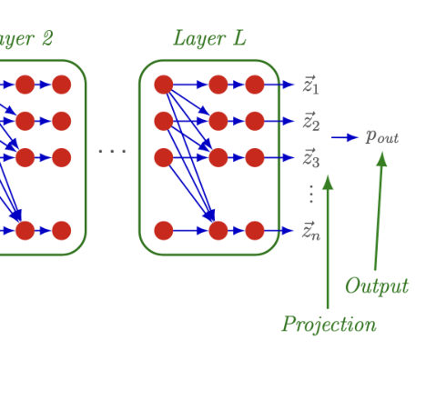
<figcaption class="paper-figure-caption"><b>Fig 1.</b> Figure 1: An idealized depiction of the core transformer architecture.</figcaption>
</figure>
<figure class="paper-figure-card">
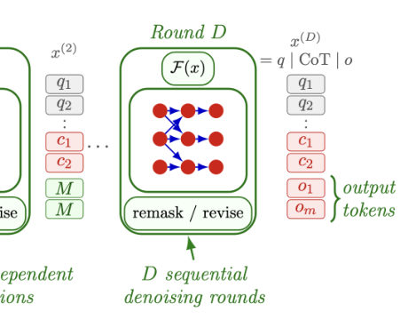
<figcaption class="paper-figure-caption"><b>Fig 2.</b> Figure 2: An idealized depiction of the core DLM architecture.</figcaption>
</figure>
<figure class="paper-figure-card">
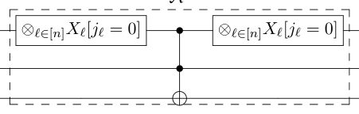
<figcaption class="paper-figure-caption"><b>Fig 3.</b> Figure 4: Illustration of quantum circuit Aj used for equality check [ij = j] and outputting the corresponding bit xj if true.</figcaption>
</figure>
<figure class="paper-figure-card">
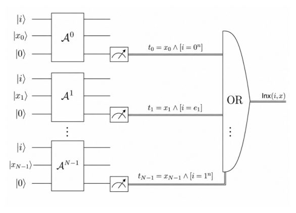
<figcaption class="paper-figure-caption"><b>Fig 4.</b> Figure 5: Illustration of the circuit used for outputting Inx(i, x) using copies of |i⟩and the circuit of Aj, ∀j ∈[N −1]0 from Figure 4.</figcaption>
</figure>
<figure class="paper-figure-card">
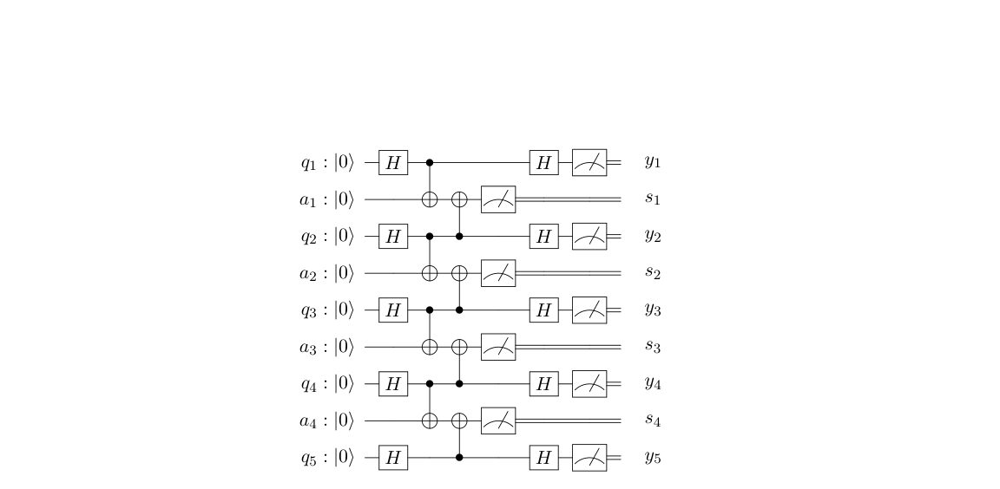
<figcaption class="paper-figure-caption"><b>Fig 5.</b> Figure 6: Illustration of circuit for preparing the poor man’s cat state and sampling from U⊕ 5 .</figcaption>
</figure>

**Summary.** This paper rigorously proves that low-depth quantum circuits possess computational capabilities fundamentally beyond those achievable by modern large language models (Transformers and DLMs). By showing separations in both the ability to sample certain distributions and the complexity of computing specific functions, it initiates a formal study of quantum advantage within the AI domain.

**Why it may be interesting.** This work directly addresses quantum advantage in the context of state-of-the-art AI models, providing theoretical benchmarks for when quantum computation might outperform classical deep learning methods.

Detailed structure

**Main problem.** To establish unconditional separations between low-depth quantum computation ($	ext{QNC}_0$) and classical Large Language Model (LLM) architectures like Transformers and Diffusion Language Models (DLMs).

**Main result.** The authors prove both distributional separation (a specific distribution sampleable by $	ext{QNC}_0$ but not by constant-round DLMs) and functional separation (a function computable by shallow quantum circuits requiring a prohibitively large width in any constant-depth transformer).

**Method.** The work employs complexity theory, constructing specific computational tasks (distribution sampling and function computation) to compare the inherent power of bounded-depth quantum gates versus the resource scaling (width $H_{dp}$) of modern LLMs.

**Model / system.** The models compared are low-depth quantum circuits ($	ext{QNC}_0$) and classical neural network architectures, specifically decoder-only Transformers and Diffusion Language Models. The analysis focuses on their computational capacity under shallow depth constraints.

**Key observables.** Distributional distance (for sampling), required width ($H_{dp}$) for functional computation, and circuit depth ($	ext{QNC}_0$ depth).

**Important parameters / regimes.** Constant depth, $\mathcal{O}(\log \log n)$ depth, input length $n$, and the resource metric $H_{dp}$.

**Assumptions / limitations.** The separations are based on specific complexity-theoretic tasks designed to highlight structural differences between quantum computation and LLM mechanisms.

**Paper structure.** The paper develops arguments by first establishing foundational separations between $	ext{QNC}_0$ and classical circuits, then extending this comparison specifically to the operational constraints of modern DLMs (including revision/remasking steps) for both distributional and functional tasks.

Abstract

Modern large language models - transformers and diffusion language models - are built around two canonical algorithmic tasks: prediction and generation. We prove unconditional separations between low-depth quantum computation and the corresponding bounded-resource classical language-model architectures in both regimes. Concretely, we exhibit the following:   1. Distributional separation. We give a distribution that is sampleable by $\textsf{QNC}^0$ circuits (i.e., a family of constant-depth quantum circuits consisting of bounded fan-in gates) that no constant-round diffusion language model ($\textsf{DLM}$) with shallow scheduling and denoising can sample within constant distance, even when allowed sublinear chain-of-thought and output-token revision/remasking events, the very features modern $\textsf{DLM}$s rely on.   2. Functional separation. We exhibit a function computable in $\land \circ \textsf{QNC}^0[\log\log n]$ (i.e., a family of O$(\log\log n)$-depth $\textsf{QNC}^0$ circuits, where $n$ is the input length, followed by a single classical $\mathsf{AND}$ gate) such that any constant-depth decoder-only transformer computing the function must be large: it would have to have width $n^{Ω(1)}$.   Together, our work initiates the study of quantum advantage in the era of large language models.

[↑ back to top](#top)

### [Unweighted Gapped Clique Homology is $\mathsf{QMA}_1$-complete](http://arxiv.org/abs/2608.02726v1)

**Authors:** Ryu Hayakawa  
**Type:** theory · **Category:** quantum information and computing · **PDF:** <https://arxiv.org/pdf/2608.02726v1>  
**Analysis basis:** full PDF text, analyzed in chunks

↔ Scroll figures horizontally

<figure class="paper-figure-card">
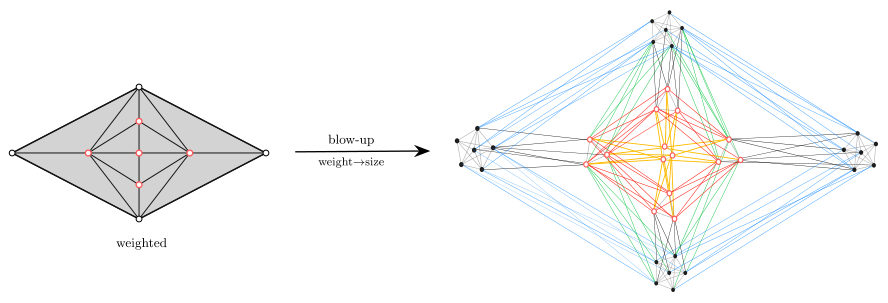
<figcaption class="paper-figure-caption"><b>Fig 1.</b> Figure 1: The blow-up correspondence. A weighted base complex is replaced by an unweighted expanded complex in which vertex weights are represented by block sizes. For simplicity, only the expanded vertices and incomplete edges are drawn. Symmetric averages over one-copy-per- block choices reconstruct the weighted Hodge metric. The illustration uses block sizes 6 and 3, exhibiting an integral ratio of 2.</figcaption>
</figure>
<figure class="paper-figure-card">
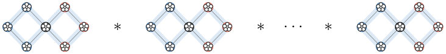
<figcaption class="paper-figure-caption"><b>Fig 2.</b> Figure 2: The qubit-register blow-up. A one-qubit bowtie has two harmonic cycles representing |0⟩and |1⟩. In the expanded register, each vertex is replaced by a complete graph and each bowtie edge by the corresponding complete bipartite connection. The n-qubit register is the join product of these one-qubit expanded graphs. Each register block has size M = ρ; the displayed copy counts are schematic.</figcaption>
</figure>
<figure class="paper-figure-card">
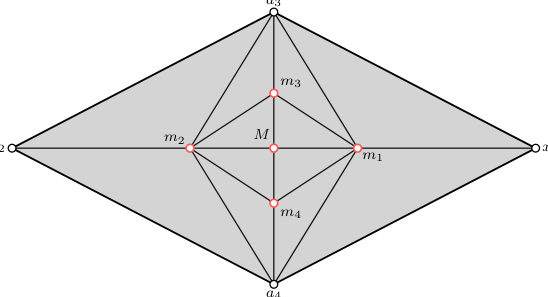
<figcaption class="paper-figure-caption"><b>Fig 3.</b> Figure 3: A schematic single-projector filling gadget. The boundary cycle is filled by an interior membrane, so the selected encoded cycle becomes null-homologous while the orthogonal cycles are preserved by the selectivity argument. The drawing suppresses the cut-and-reglue triangu- lation and clique-closure data used in that argument.</figcaption>
</figure>

**Summary.** The paper proves that deciding the homology of an unweighted clique complex, given a spectral gap promise on its Laplacian, is $\mathsf{QMA}_1$-complete. It achieves this by showing that the complexity originates from the gap condition itself, not from vertex weights, using sophisticated blow-up constructions to map quantum Hamiltonian gaps onto topological invariants.

**Why it may be interesting.** This work connects deep concepts from algebraic topology (homology), spectral theory (Laplacians/gaps), and quantum complexity theory ($\mathsf{QMA}$), providing a powerful tool for classifying computational problems arising from physical structures.

Detailed structure

**Main problem.** The paper tackles the computational complexity of determining if a graph's clique complex has nontrivial homology, especially when spectral gap promises are involved.

**Main result.** It proves that Unweighted Gapped Clique Homology is $\mathsf{QMA}_1$-complete, demonstrating that the difficulty stems from the spectral gap promise rather than vertex weighting.

**Method.** The proof uses a 'blow-up' construction to transform weighted homology problems into unweighted ones, relying on detailed spectral analysis of the Hodge Laplacian.

**Model / system.** The model involves clique complexes derived from graphs ($Cl(G)$) and their associated combinatorial Hodge Laplacians ($\Delta_k$). The complexity is linked to quantum computation via Hamiltonian gap properties.

**Key observables.** Homology group $H_k(X; \mathbb{R})$ (non-trivial vs. trivial), minimum eigenvalue of the Laplacian $\lambda_{\min}(\Delta_k)$, and spectral gaps ($p(N)$).

**Important parameters / regimes.** Vertex weights, gap size promise ($1/	ext{poly}(N)$), and the universal gate set $g_2$ for $\mathsf{QMA}_1^{g_2}$.

**Assumptions / limitations.** The analysis assumes the existence of a source Hamiltonian whose spectral properties can be mapped to the homology gaps via the blow-up construction.

**Figures summary.** Figure 3 schematically illustrates a single-projector filling gadget, showing how an interior membrane nullifies a boundary cycle while preserving orthogonal cycles.

**Paper structure.** The paper progresses by first establishing hardness for weighted complexes, then developing the 'blow-up' construction to eliminate weights, and finally proving both $\mathsf{QMA}_1$-hardness (via gap preservation) and containment in $\mathsf{QMA}_1^{g_2}$.

Abstract

Deciding whether the clique complex of a given graph has nontrivial homology in a given dimension, under vertex-product weighting and an inverse-polynomial spectral gap promise on the combinatorial Hodge Laplacian, is known to be $\mathsf{QMA}_1$-hard and contained in $\mathsf{QMA}$ by King and Kohler (FOCS 2024). The vertex weights are essential in the known proof, where they provide the scale separation needed for the spectral gap analysis. We prove that, when every vertex has weight one, the problem remains $\mathsf{QMA}_1^{g_2}$-hard and is contained in $\mathsf{QMA}_1^{g_2}$, where $\mathsf{QMA}_1^{g_2}$ is $\mathsf{QMA}_1$ with the universal gate set $g_2=\{\mathsf{X},\mathsf{CX},\mathsf{CCX},H\otimes H\}$. The construction replaces weight by expansion: each vertex of the weighted complex is blown up into a clique whose size encodes its weight. The block sizes are chosen so that symmetric averages reproduce the weighted Hodge metric. The symmetric sector therefore carries the weighted Laplacian up to a common scalar factor, while a local averaging argument gives a uniform lower bound on the orthogonal complement to the symmetric sector. Hence the weighted gap analysis transfers to an unweighted clique complex without introducing either additional low-energy states or spurious homology. Containment in $\mathsf{QMA}_1^{g_2}$ follows from Rudolph's exact linear combination of unitaries simulation of sparse integer clique Laplacians. The result shows that the gap promise, rather than vertex weighting, is the source of the complexity of gapped clique homology.

[↑ back to top](#top)

## Secondary cond-mat archives

*Papers from cond-mat.mtrl-sci, mes-hall, other, soft, supr-con. These archives are de-prioritized — they appear at the end regardless of relevance score.*

### Relevant in secondary archives (15)

### [Topological properties and phase diagram of the triangular Hofstadter model with staggered flux](http://arxiv.org/abs/2608.03278v1)

**Authors:** Qi Gao, Wei Chen  
**Type:** theory · **Category:** other · **PDF:** <https://arxiv.org/pdf/2608.03278v1>  
**Analysis basis:** full PDF text, analyzed in chunks
**Topic relevance:** 🔥 `analog quantum simulation` **4/5** · `correlated cavity matter` **1/5** · `driven-dissipative phase transition` **1/5** · `entanglement & information structure` **1/5** · `exotic spin models in light-matter` **1/5** · `non-equilibrium dynamics` **1/5**

↔ Scroll figures horizontally

<figure class="paper-figure-card">
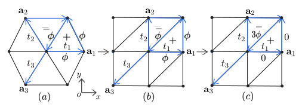
<figcaption class="paper-figure-caption"><b>Fig 1.</b> FIG. 1: (a) Triangular lattice with staggered flux ±3ϕ in adjacent triangles; the hopping amplitudes along the three bonds of a triangle are respectively t1, t2 and t3 with phase factor ϕ. The lattice model in (a) is topologically equivalent to a square lattice model in (b) with nearest neighbor hopping plus next nearest neighbor hopping in one diagonal direction, which is again equivalent to the lattice model in (c).</figcaption>
</figure>
<figure class="paper-figure-card">
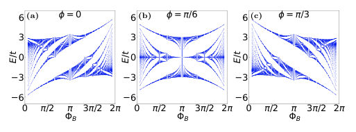
<figcaption class="paper-figure-caption"><b>Fig 2.</b> FIG. 2: The Hofstadter spectrum of the triangular lattice with staggered flux ϕ at t1 = t2 = t3 = t. (a): ϕ = 0; (b): ϕ = π/6; (c): ϕ = π/3. [29]</figcaption>
</figure>
<figure class="paper-figure-card">
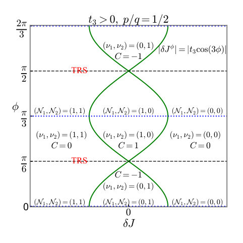
<figcaption class="paper-figure-caption"><b>Fig 3.</b> FIG. 3: Phase diagram of the dimerized model at half filling for p/q = 1/2 and t3 &gt; 0 over a period of ϕ. The two curves defined by |δJ| = |t3 cos 3ϕ| correspond to the gap-closing boudaries. The system is gapped away from the two curves with the labeled Chern number C. The indices (ν1, ν2) label the winding numbers at k1 = π</figcaption>
</figure>
<figure class="paper-figure-card">
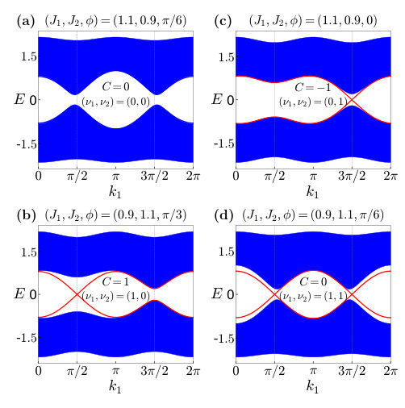
<figcaption class="paper-figure-caption"><b>Fig 4.</b> FIG. 4: Band structure of the dimerized model with p/q = 1/2 in a ribbon geometry of width 2N2a and t1 = 0.4, , t3 = 0.2 [29]. (a) Band structure in the regime J1 −J2 &gt; |2t3 cos 3ϕ|. (b) and (c) Band structure in the regime |J2 −J1| &lt; |2t3 cos 3ϕ|. (d) Band structure in the regime J1 −J2 &lt; −|2t3 cos 3ϕ|.</figcaption>
</figure>
<figure class="paper-figure-card">
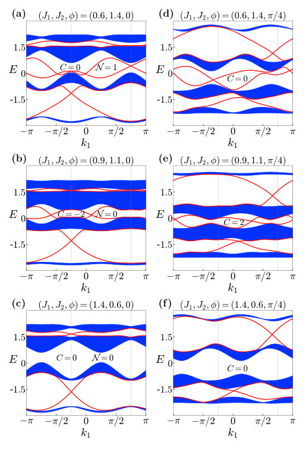
<figcaption class="paper-figure-caption"><b>Fig 5.</b> FIG. 5: The band structure of the dimerzied model with p/q = 1/4 in a ribbon geometry of width 4N2a and t1 = t3 = 0.5 [29]. (a) and (d) Band structure in the regime δJ &lt; −|δJc cos 3ϕ| for ϕ = 0 and π</figcaption>
</figure>

**Summary.** This work theoretically analyzes the topological phases of a triangular Hofstadter model used to simulate twisted bilayer TMDs. By studying how staggered flux and dimerization break symmetries, the authors map out complex phase diagrams characterized by quantized Chern numbers. The findings provide testable predictions for both solid-state materials and controllable cold atom systems.

**Why it may be interesting.** While focused on condensed matter topology, the connection to moiré superlattices and tunable parameters (like electric displacement field) makes it highly relevant for AMO physicists working on engineered quantum systems using optical lattices or photonic crystals.

Detailed structure

**Main problem.** The study investigates the topological properties and phase diagram of the triangular Hofstadter model incorporating staggered flux.

**Main result.** The system exhibits rich topological phases dependent on whether the magnetic flux parameter q is even or odd, with distinct Chern number characteristics in different gapped regimes.

**Method.** The analysis involves mapping the Hamiltonian to momentum space and calculating topological invariants (like the Chern number) by analyzing the energy spectrum's dependence on external fluxes and dimerization strength.

**Model / system.** The model is the triangular Hofstadter lattice with staggered flux, relevant for describing twisted bilayer transition metal dichalcogenides (TMDs). The Hamiltonian incorporates both a uniform magnetic flux ($\Phi_B = 2\pi p/q$) and an additional staggered flux term.

**Key observables.** Chern number ($C$), Hall conductivity ($\sigma_{xy}$), longitudinal conductivity ($\sigma_{xx}$), and the energy spectrum $E(\mathbf{k})$.

**Important parameters / regimes.** Rational external magnetic flux $\Phi_B = 2\pi p/q$, staggered flux parameter $\phi$, and dimerization strength ($\delta J$).

**Assumptions / limitations.** The analysis assumes a tight-binding description for the low energy physics, and specific symmetries (like P symmetry) are analyzed at certain flux values.

**Figures summary.** Figures illustrate the Hofstadter spectrum for various fluxes and depict the phase diagram behavior based on the rational flux ratio $p/q$ and dimerization strength.

**Paper structure.** The paper first introduces the Hamiltonian, then analyzes the effect of staggered flux symmetry. It proceeds to study the dimerized model's phase diagram separately for even and odd values of q, concluding with implications for experimental realization in TMDs or cold atoms.

Abstract

We study the topological properties and phase diagram of the triangular Hofstadter model with staggered flux in adjacent triangles in this work. This lattice can be used to describe the low energy physics of the twisted bilayer transition metal dichalcogenides (TMD) in a certain range of the electric displacement field between the two layers. We show that the Hofstadter spectrum of this model is generally asymmetric except at specific staggered flux $3φ= π/2 \mod π$ due to an additional P symmetry at such $φ$. Breaking the translation symmetry by dimerization lifts the P symmetry and results in rich topological phases in the system. The dimerized model with different rational external magnetic flux $Φ_B = 2πp/q$ has phase diagram with the following common features. For even q, the dimerized model generally has three gapped regimes. The one with small dimerization has finite Chern number and the other two have zero Chern number. For odd q, the model is gapped with zero Chern number at any finite dimerization. For both q even and odd, the two regimes with zero Chern number can be further characterized by the inversion symmetry of the parametrized one-dimensional chains of the system at φ= 0 \mod π/3$, and one regime is topologically non-trivial and the other is trivial. Our results may be tested in twisted bilayer TMD with weak interaction or cold atom systems in optical lattice or photonic crystals achieved in recent experiments.

[↑ back to top](#top)

### [Magnetic-field control of Fermi polaron fine structure and polarization in strained monolayer semiconductors](http://arxiv.org/abs/2608.03853v1)

**Authors:** Zakhar A. Iakovlev  
**Type:** theory · **Category:** other · **PDF:** <https://arxiv.org/pdf/2608.03853v1>  
**Analysis basis:** full PDF text, analyzed in chunks
**Topic relevance:** `Keldysh / 2PI / non-Gaussian methods` **3/5** · `spintronics-quantum-optics interface` **3/5** · `driven-dissipative phase transition` **2/5** · `methods for driven-dissipative` **2/5** · `Kondo & dissipative impurity` **1/5** · `analog quantum simulation` **1/5** · `correlated / nonlocal dissipation` **1/5** · `exotic spin models in light-matter` **1/5** · `interference shaping light` **1/5** · `non-equilibrium dynamics` **1/5**

↔ Scroll figures horizontally

<figure class="paper-figure-card">
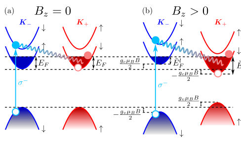
<figcaption class="paper-figure-caption"><b>Fig 1.</b> Figure 1. Intervalley Fermi polaron in W-based TMDC mono- layer (a) without magnetic field and (b) in external magnetic field. Zeeman shifts of the bands, Eqs. (4), are shown in panel (b). Exciton in K−-valley is excited by left circularly polarized light. Black arrows demonstrate electron spin in the subbands. The valley polarization is demonstrated via the change of Fermi energy, Eqs. (35), (37).</figcaption>
</figure>
<figure class="paper-figure-card">
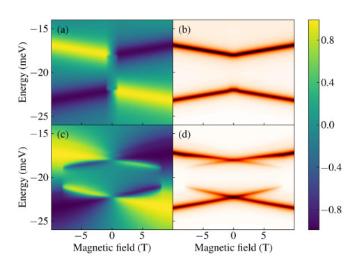
<figcaption class="paper-figure-caption"><b>Fig 2.</b> Figure 2. (a,c) Circular dichroism of absorption Pc(E), Eq. (43), and (b,d) absorption spectra of unpolarized light A, Eq. (44), as a function of magnetic field for W-based TMDC. (a,b) Small doping Ne = 1010 cm−2, Bcrit = 1 T, (c,d) mod- erate doping Ne = 8·1010 cm−2, Bcrit = 8 T. The parameters are ET 1 = 22 meV, ET 2 = 18 meV, Me = Mh = 0.4m0, gX = −4, gc = 2 and ℏγ = 0.2 meV.</figcaption>
</figure>
<figure class="paper-figure-card">
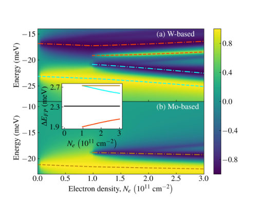
<figcaption class="paper-figure-caption"><b>Fig 3.</b> Figure 3. Circular dichroism of absorption Pc(E), Eq. (43), in the spectral range of attractive Fermi polarons at magnetic field B = 10 T for (a) W-based TMDC and (b) Mo-based TMDC. Red and cyan lines show inter- and intravalley Fermi polaron levels in W-based TMDC, Eq. (47), brown lines show intervalley Fermi polaron levels in Mo-based TMDC, Eq. (48). Dashed lines show R-polarized sublevels, dashed-dotted lines show L-polarized sublevels. The inset demonstrates the at- tractive Fermi polaron energy splittings with the same colors as the main figure, black line shows exciton splitting, that is equal to the bare trion splitting. The critical electron den- sity, corresponding to Bcrit = 10 T,...</figcaption>
</figure>
<figure class="paper-figure-card">
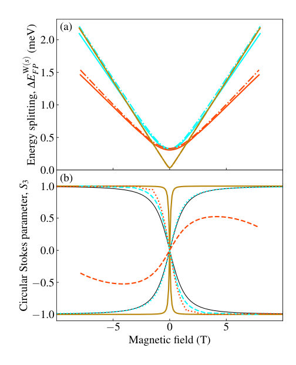
<figcaption class="paper-figure-caption"><b>Fig 4.</b> Figure 4. (a) The Fermi polaron radiative doublet splitting and (b) circular polarization in terms of Stokes parameter S3 for strained TMDC monolayers as a function of mag- netic field. Cyan lines show intravalley Fermi polaron dou- blets, while red lines show intervalley Fermi polarons. Solid lines in (a) correspond to the numerical solution of Eq. (55), while dashed-dotted lines correspond to analytical approxi- mation, Eq. (54). Color lines in (b) correspond to eigen- states of Green’s matrix, Eq. (50), while thin solid black lines correspond to their approximation with g = gX for sim- plicity, Eq. (56). Solid brown lines show energy level split- ting, Eq. (B5), and Stokes parameter S3,...</figcaption>
</figure>
<figure class="paper-figure-card">
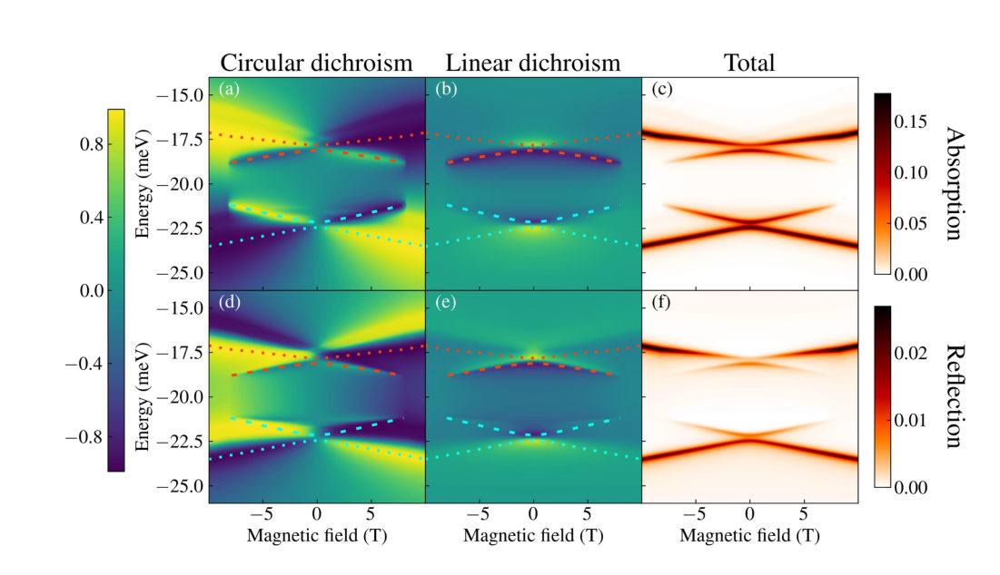
<figcaption class="paper-figure-caption"><b>Fig 5.</b> Figure 5. (a) Circular dichroism of absorption Pc(E), Eq. (43), (b) linear dichroism of absorption Pl(E) =  AX −AY  /A, (c) absorption spectrum of unpolarized light A, Eq. (30), as a function of magnetic field for strained W-based TMDC. (d) Circu- lar dichroism of reflection, (e) linear dichroism of reflection, (f) reflection spectrum of unpolarized light. Note that the absolute value of absorption is ∼10 times greater than reflection. Color lines describing Fermi polaron energies are the same as in Fig. 4. The phenomenological broadening ℏΓ = 0.1 meV, the radiative decay rate Γ0 = 0.65 ps−1 [68], and other parameters are the same as in Fig. 4 with Ne = 8 · 1010 cm−2 and Bcrit = 8 T.</figcaption>
</figure>

**Summary.** This paper develops a theoretical framework to understand how the energy structure and polarization of Fermi polarons are controlled in 2D semiconductor monolayers using combined magnetic fields and mechanical strain. By calculating optical spectra via Green's functions, it demonstrates that these external parameters offer powerful, complementary tools for manipulating many-body excitonic quasiparticles.

**Why it may be interesting.** This work is highly relevant as it treats open quantum systems dynamics (excitons coupled to a Fermi sea) under external fields, providing detailed predictions for magneto-optical responses that can be probed experimentally.

Detailed structure

**Main problem.** The theory develops the fine structure and polarization of Fermi polarons in doped two-dimensional semiconductors under the combined influence of external magnetic fields and uniaxial strain.

**Main result.** The study shows that controlling strain, magnetic field, and electron density allows continuous tuning of energy splitting and eigenstate polarization. Real and strain-induced pseudomagnetic fields provide complementary tools for controlling optical response.

**Method.** The research employs the Green's function approach to calculate energy levels and Stokes parameters, supplemented by a simplified effective two-level model for analytical study.

**Model / system.** The system involves excitons interacting with a Fermi sea of resident charge carriers in TMDC monolayers. The Hamiltonian incorporates terms for external magnetic fields (Zeeman shifts) and strain ($\hat{H}_s$).

**Key observables.** Energy levels, Stokes parameters, absorption/reflection spectra, circular and linear dichroism, and the polaron g factor renormalization.

**Important parameters / regimes.** External magnetic field ($B$), uniaxial strain, electron density, and critical magnetic fields leading to full valley polarization.

**Assumptions / limitations.** Orbital effects of the magnetic field are neglected due to a small scattering time ($	au_e$). The analysis assumes $\mathbf{B}$ does not affect interaction parameters $V_1$ and $V_2$.

**Figures summary.** Figure 1 illustrates the intervalley Fermi polaron in W-based TMDC monolayers, showing Zeeman shifts both without and with an external magnetic field.

**Paper structure.** The theory builds from the non-interacting Hamiltonian ($\hat{H}_0$), incorporates magnetic field effects ($\hat{H}_B$) via the full Hamiltonian $\hat{H}$, and finally analyzes optical properties using Green's functions, culminating in spectral calculations for various regimes.

Abstract

The theory of attractive Fermi polaron energy spectrum fine structure and polarization in doped two-dimensional semiconductors in external magnetic field is developed. Fermi polaron $g$ factor renormalization due to correlations with the valley-polarized Fermi sea of resident charge carriers is calculated. We study the competition between Zeeman and strain-induced splittings in monolayers under uniaxial strain. The control of strain, magnetic field and electron density allows continuous tuning of energy splitting and eigenstate polarization. Linearly polarized strain-induced split doublet exhibits quadratic Zeeman shift changing to linear Zeeman splitting with elliptical polarization with the increase of magnetic field. We identify a critical magnetic field above which resident charge carriers become fully valley polarized and only one circularly polarized Fermi polaron state remains. Within the Green's function approach we calculate energy levels and Stokes parameters of attractive Fermi polaron states and introduce a simplified effective two-level model allowing us to study analytically the interplay of Zeeman and pseudo-Zeeman splitting. We calculate absorption and reflection spectra, including circular and linear dichroism in the trion spectral range. These results show that real and strain-induced pseudomagnetic fields provide complementary tools for controlling the optical response of many-body excitonic quasiparticles in two-dimensional semiconductors.

[↑ back to top](#top)

### [Transition to spatiotemporal chaos with multiple colliding pulse sequences of the nonlinear Schrödinger equation](http://arxiv.org/abs/2608.02783v1)

**Authors:** Avner Peleg, Debananda Chakraborty  
**Type:** theory · **Category:** other · **PDF:** <https://arxiv.org/pdf/2608.02783v1>  
**Analysis basis:** full PDF text, analyzed in chunks
**Topic relevance:** `driven-dissipative phase transition` **3/5** · `methods for driven-dissipative` **3/5** · `non-equilibrium dynamics` **2/5** · `non-equilibrium universality` **2/5** · `Frenkel-Kontorova` **1/5** · `Keldysh / 2PI / non-Gaussian methods` **1/5** · `analog quantum simulation` **1/5** · `correlated / nonlocal dissipation` **1/5**

↔ Scroll figures horizontally

<figure class="paper-figure-card">
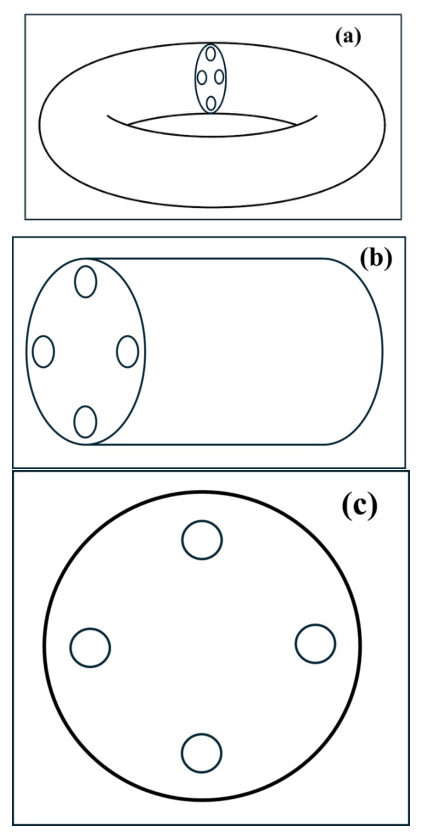
<figcaption class="paper-figure-caption"><b>Fig 1.</b> FIG. 1: A sketch of the waveguide array loops considered in the paper. (a) A side view. (b) A</figcaption>
</figure>
<figure class="paper-figure-card">

<figcaption class="paper-figure-caption"><b>Fig 2.</b> FIG. 2: Projections of the numerically obtained trajectories of the unshifted 1989 Di Cera model</figcaption>
</figure>
<figure class="paper-figure-card">
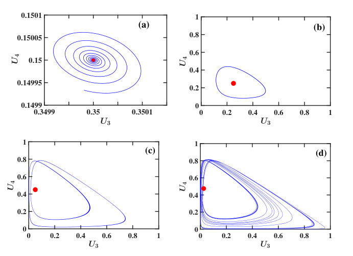
<figcaption class="paper-figure-caption"><b>Fig 3.</b> Fig. 2 shows the projections of the numerical solution’s trajectories in phase space on the</figcaption>
</figure>
<figure class="paper-figure-card">
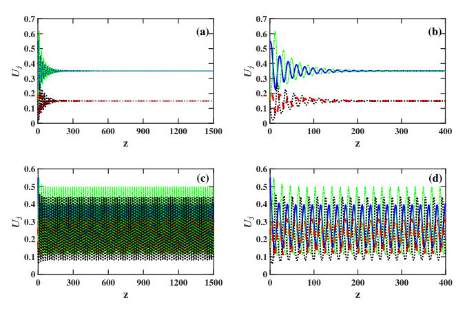
<figcaption class="paper-figure-caption"><b>Fig 4.</b> FIG. 3: The z-dependences of the pulse energies Uj in the unshifted 1989 Di Cera model (28) for</figcaption>
</figure>
<figure class="paper-figure-card">
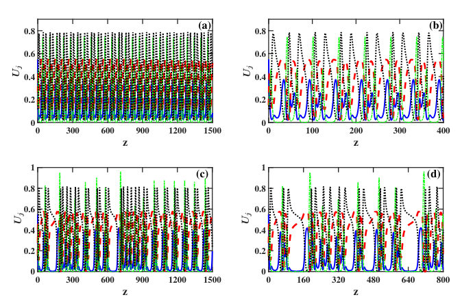
<figcaption class="paper-figure-caption"><b>Fig 5.</b> FIG. 4: The z-dependences of the pulse energies Uj in the unshifted 1989 Di Cera model (28) for</figcaption>
</figure>

**Summary.** This paper presents the first demonstration of spatiotemporal chaos arising from multiple colliding pulse sequences in nonlinear waveguide arrays. By deriving generalized Lotka-Volterra models via perturbation theory applied to coupled-NLS equations, the authors show that energy dynamics exhibit chaotic behavior. The key finding is the remarkable agreement between these simplified LV models and complex numerical simulations, even when strong pattern distortions occur.

**Why it may be interesting.** This work bridges nonlinear wave physics (NLS) with classical dynamical systems (LV models), providing a robust theoretical framework for understanding complex energy dissipation in optical systems, which has implications for quantum optics and nonlinear signal processing.

Detailed structure

**Main problem.** The study demonstrates the transition to spatiotemporal chaos when multiple colliding pulse sequences propagate in nonlinear waveguide arrays.

**Main result.** Excellent agreement is found between generalized Lotka-Volterra (LV) models and coupled-NLS simulations for energy dynamics, confirming chaotic behavior even under strong distortions.

**Method.** The authors used perturbation theory to derive LV models from the perturbed cubic Nonlinear Schrödinger equation (NLS), followed by extensive numerical simulations.

**Model / system.** The system involves multiple sequences of optical pulses propagating in nonlinear waveguide arrays governed by perturbed coupled-NLS equations with cubic gain/loss. The dynamics are modeled using generalized Lotka-Volterra systems for energy evolution.

**Key observables.** Pulse energy dynamics ($U_j(z)$) and the spatial pattern evolution ($\vert\psi_j(t, z)\vert$).

**Important parameters / regimes.** The parameter $m$ is varied to explore different regimes; the cubic nonlinearity coefficient $\epsilon_3$ governs dissipation.

**Assumptions / limitations.** Initial derivations relied on weak perturbation assumptions and periodicity of soliton sequences, which were later overcome by introducing a shifting transformation ($U' = U+a$).

**Figures summary.** Figures illustrate pulse patterns ($\vert\psi_j(t, z)\vert$) for both unshifted and shifted models in chaotic regimes, alongside plots comparing energy evolution from coupled-NLS simulations against LV model predictions.

**Paper structure.** The paper progresses by first analyzing single collision effects using perturbation theory to derive LV models, then applying these models to multisequence systems, and finally confirming the transition to chaos through numerical comparison between the full coupled-NLS equations and the derived LV dynamics.

Abstract

We present the first demonstration of transition to spatiotemporal chaos with multiple colliding pulse sequences in systems described by perturbed cubic nonlinear Schrödinger (NLS) equations. For this purpose, we consider propagation of multiple sequences of optical pulses in two distinct types of nonlinear waveguide arrays with cubic gain and loss. By employing a perturbation theory for NLS solitons, we show that the dynamics of pulse energies in the waveguide array systems is described by generalized Lotka-Volterra (LV) models, which exhibit dissipative chaos in a wide region in parameter space. We test the LV models' predictions for chaotic dynamics of pulse energies by extensive numerical simulations with perturbed systems of coupled-NLS equations. We find excellent agreement between the results of the LV and coupled-NLS models for energy dynamics in both types of waveguide array systems, despite the strong pulse pattern distortions and the strongly nonlinear nature of the dynamics.

[↑ back to top](#top)

### [Wavelength-Selective control of Atomic Scale Au Contacts](http://arxiv.org/abs/2608.03831v1)

**Authors:** Werner Brämer-Escamilla, Floralba Lopez, Laila Procel, David Llerena, Carlos Sabater, Ernesto Medina  
**Type:** experiment · **Category:** other · **PDF:** <https://arxiv.org/pdf/2608.03831v1>  
**Analysis basis:** full PDF text, analyzed in chunks
**Topic relevance:** `non-equilibrium dynamics` **3/5** · `driven-dissipative phase transition` **2/5** · `non-equilibrium universality` **2/5** · `Frenkel-Kontorova` **1/5** · `methods for driven-dissipative` **1/5** · `quantum measurements` **1/5** · `quantum optics experiment` **1/5**

↔ Scroll figures horizontally

<figure class="paper-figure-card">
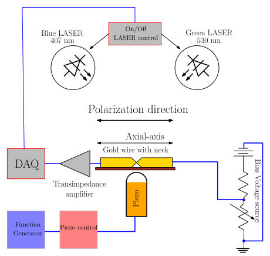
<figcaption class="paper-figure-caption"><b>Fig 1.</b> FIG. 1. Diagrammatic representation of the experimental setup. The distance between the contacts on the neck of the gold wire is controlled by a piezoelectric element, which is con- nected to a function generator via a piezoelectric controller. Both the conductance measurements and the switching of the lasers on and off are controlled by a computer via a DAQ (Data Acquisition Unit).</figcaption>
</figure>
<figure class="paper-figure-card">
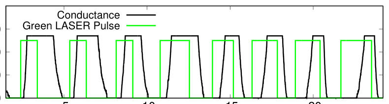
<figcaption class="paper-figure-caption"><b>Fig 2.</b> FIG. 2. Experimental results for the conductance of a) an initially formed metallic bridge that is ruptured by the blue wavelength laser and b) an initially open gap, in which a metallic bridge is formed by the green wavelength laser. The black sequence of square pulses shows the junction conductance, while the blue (online) and yellow (online) represent laser pulses on the junction.</figcaption>
</figure>
<figure class="paper-figure-card">
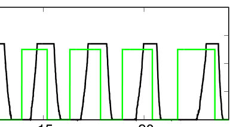
<figcaption class="paper-figure-caption"><b>Fig 3.</b> Figure 2 shows the conductance dynamics for light- induced bridge rupture and bridge formation. In both protocols, up to 20 laser pulses are applied sequentially. Panel (a) shows that blue illumination ruptures a pre- existing metallic bridge: the conductance drops when the blue laser is turned on, and the bridge reforms after the laser is turned off. Panel (b) shows the complementary process: starting from an open gap, green illumination forms a metallic bridge, which ruptures again after the laser is turned off. Both behaviors are reproducible over many switching cycles. We expect two regimes of conduction for either the rup- ture or the formation of the contact: a tunneling regime before...</figcaption>
</figure>
<figure class="paper-figure-card">
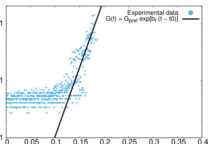
<figcaption class="paper-figure-caption"><b>Fig 4.</b> FIG. 3. Conductance below G0 during gap closure prior to bridge formation under the formation wavelength. The semilogarithmic behavior is well described by an exponential transient, G(t) = Gpref exp[bf(t −t0)]. The physically rele- vant fit parameter is the logarithmic slope bf = 55.46 ms−1. .</figcaption>
</figure>
<figure class="paper-figure-card">
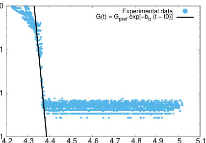
<figcaption class="paper-figure-caption"><b>Fig 5.</b> FIG. 5. Conductance below G0 after blue-light-induced bridge rupture. The exponential decay corresponds to drift- like gap opening in the tunneling regime. The physically rel- evant fit parameter is the logarithmic slope bb = 119.5 ms−1.</figcaption>
</figure>

**Summary.** The researchers achieved wavelength-selective control over the movement of atoms in gold nanocontacts using laser illumination. By comparing conductance changes under green versus blue light, they showed that different wavelengths drive opposite atomic drifts—one promoting bridge formation and the other promoting rupture. This establishes a new mechanism for reversibly controlling metallic contacts at the atomic scale.

**Why it may be interesting.** This work provides a clean, measurable platform to study non-equilibrium atomic dynamics driven by light, which has implications for understanding energy dissipation and directed transport in nanoscale quantum devices.

Detailed structure

**Main problem.** To demonstrate wavelength-selective control over atomic motion (drift) within metallic nanocontacts, moving beyond simple thermal switching mechanisms.

**Main result.** Illumination at different wavelengths drives opposite and distinct atomic rearrangements—gap closure/growth with green light ($\lambda \simeq 530$ nm) versus neck thinning/rupture with blue light ($\lambda \simeq 407$ nm).

**Method.** Time-resolved conductance measurements are performed on a mechanically controllable Au break junction, analyzing dynamics in both the tunneling and metallic regimes.

**Model / system.** The system is an atomic-scale gold contact (Au nanogap) studied under ambient conditions. The analysis uses established models for conductance decay (exponential in tunneling regime) and linear growth ($\sqrt{G}$ vs time in metallic regime).

**Key observables.** Conductance ($G$) vs Time, gap closing/opening velocities ($v_f, v_b$), and radial neck-growth/thinning velocities ($v_r$).

**Important parameters / regimes.** Wavelengths ($\lambda_{	ext{form}} \simeq 530$ nm for formation; $\lambda_{	ext{rup}} \simeq 407$ nm for rupture); the quantum conductance unit ($G_0$).

**Assumptions / limitations.** The observed reversal of motion is attributed to a wavelength-dependent modification of the effective free-energy landscape, rather than uniform heating.

**Figures summary.** Figures illustrate conductance dynamics showing exponential transients during gap closure/opening and linear $\sqrt{G}$ vs time plots demonstrating growth (green light) or thinning (blue light).

**Paper structure.** The paper establishes the experimental setup using an MCBJ, details measurements in both tunneling and metallic regimes, presents evidence for wavelength-dependent drift rates, and concludes by modeling this control via modified activation barriers.

Abstract

We demonstrate wavelength-selective control of atomic motion in a mechanically controllable Au break junction. Excitation at $λ_{\mathrm{form}}\simeq 530~{\rm nm}$ drives gap closure and metallic bridge formation, whereas excitation at $λ_{\mathrm{rup}}\simeq 407~{\rm nm}$ drives neck thinning, bridge rupture, and subsequent gap opening. Unlike conventional optical switching in metallic contacts, where illumination primarily acts via thermal expansion, the present experiment reveals oppositely directed atomic drift at different wavelengths. Time-resolved conductance traces allow us to distinguish two dynamical regimes. In the tunneling regime, exponential conductance transients measure the drift velocity of the gap coordinate for both gap closure and gap opening. In the metallic regime, the Sharvin relation converts linear $\sqrt{G/G_0}$ transients into radial neck-growth and neck-thinning velocities of comparable magnitude. These results establish optically selected atomic drift as a mechanism for reversible control of metallic nanocontacts and provide a quantitative route to follow plasmon-assisted atomic rearrangements in real time.

[↑ back to top](#top)

### [Electrostatic Superlattices beyond 1:1 Stoichiometry](http://arxiv.org/abs/2608.02981v1)

**Authors:** Binay P. Nayak, Prapti Kakkar, Wesley P. Korba, Honghu Zhang, Wenjie Wang, Surya K. Mallapragada, Alex Travesset, David Vaknin  
**Type:** both · **Category:** other · **PDF:** <https://arxiv.org/pdf/2608.02981v1>  
**Analysis basis:** full PDF text, analyzed in chunks
**Topic relevance:** `analog quantum simulation` **3/5** · `driven-dissipative phase transition` **2/5** · `Frenkel-Kontorova` **1/5** · `correlated cavity matter` **1/5** · `entanglement & information structure` **1/5** · `non-equilibrium dynamics` **1/5** · `non-equilibrium universality` **1/5**

↔ Scroll figures horizontally

<figure class="paper-figure-card">
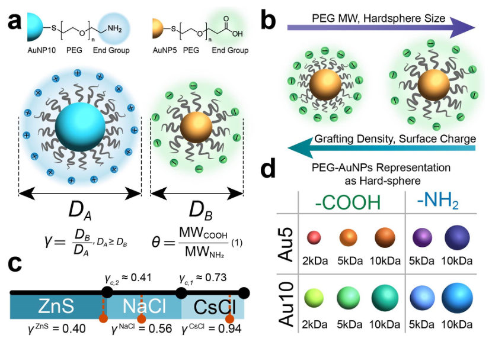
<figcaption class="paper-figure-caption"><b>Fig 1.</b> Fig. 1. Charge-regulated nanoparticle building blocks for superlattices beyond 1:1 stoichiometry. (a) Schematic of gold nanoparticles (AuNPs) with core diameters Dcore = 5 nm (yellow) and 10 nm (blue) functionalized with thiol-terminated poly(ethylene glycol) (PEG) bearing either NH2 (blue, +) or COOH (green, −) end groups; the sign of the corona charge is indicated throughout. The polymer-grafted particles are treated as effective hard spheres of diameters DA and DB, defining the size ratio γ = DB/DA, while θ denotes the molecular weight (MW) ratio of the oppositely charged PEG coronas. For identical PEG MW, the smaller, higher-curvature cores typically graft at a higher areal density,...</figcaption>
</figure>
<figure class="paper-figure-card">
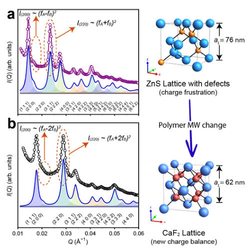
<figcaption class="paper-figure-caption"><b>Fig 2.</b> Fig. 2. Molecular weight induced grafting density tran- sition from ZnS to CaF2. (a) Small-angle X-ray scattering (SAXS) intensity, I(Q) vs. Q, for COOH–PEG5k–Au5 and NH2– PEG10k–Au10 NPs mixed at a 2:1 number ratio. In a previous study, we demonstrated that a size ratio γ ≈0.7 (defined as the ratio of the larger to smaller functionalized AuNP diameters) sta- bilizes a defect-rich ZnS-type superlattice. In this system, the ZnS structure is formed by COOH–PEG5k–Au5 and NH2–PEG10k– Au10, and its pronounced defectivity is attributed to an imbal- ance in surface charge arising from asymmetric polymer coronas (see discussion below), leading to interstitial occupation or site- exchange defects....</figcaption>
</figure>
<figure class="paper-figure-card">

<figcaption class="paper-figure-caption"><b>Fig 3.</b> Figure 2 summarizes the structural evolution obtained by systematically varying the surface chemistry of the binary NP system while keep- ing the core sizes fixed (10 and 5 nm). For COOH–PEG5k–Au5 and NH2–PEG10k–Au10 mixed at a 2:1 number ratio, the SAXS pat- tern (Fig. 2a) is well described by a ZnS-type superlattice, albeit with signatures of nearest- neighbor site-exchange defects. Consistent with our previous results, a size ratio γ ≈0.7 stabi-</figcaption>
</figure>
<figure class="paper-figure-card">
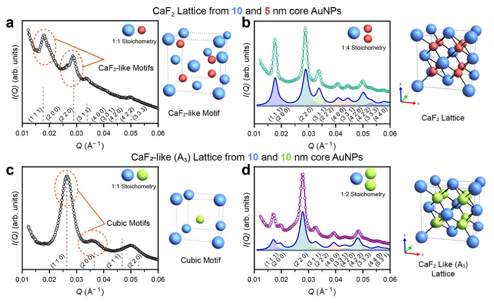
<figcaption class="paper-figure-caption"><b>Fig 4.</b> Fig. 3. Emergence of a stoichiometric CaF2 superlattice from bulk mixing ratio. (a) SAXS diffraction pattern, I(Q) vs. Q, for COOH–PEG2k–Au5 and NH2–PEG5k–Au10 mixed at a 1:1 number ratio. Although this composition was predicted to favor a CaF2-like structure, the pattern exhibits only short-range order (SRO), indicating that the exact CaF2 stoichiometry is highly sensitive to the bulk particle ratio. (b) Increasing the mixing ratio 4:1 drives crystallization into a CaF2-type superlattice, evidenced by well-defined Bragg reflections. The SAXS profile is well described by a polycrystalline CaF2-like model. At a 2:1 ratio, the structure is of high quality, but a residual background persists,...</figcaption>
</figure>
<figure class="paper-figure-card">
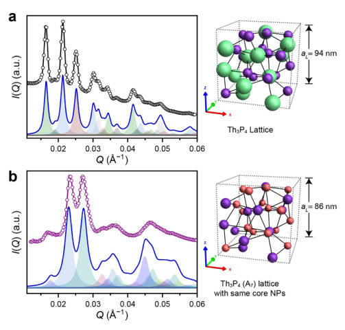
<figcaption class="paper-figure-caption"><b>Fig 5.</b> Fig. 4. Symmetry breaking from CsCl to higher- stoichiometry Th3P4 superlattices. (a) SAXS intensity, I(Q) vs. Q, for a 4:1 number-ratio mixture of NH2–PEG5k–Au5 and COOH–PEG5k–Au10 at pH 3. The diffraction pattern is well described by an ideal Th3P4-type model. For the inverse ligand assignment (COOH–PEG5k–Au5 with NH2–PEG5k–Au10), the same core-size pair forms a CsCl (AB ) superlattice. 31 Swapping the ligand identities changes the curvature-dependent grafting density and hence the regulated surface charge densities, breaking the effective 1:1 charge balance that stabilizes CsCl and instead favoring a higher-stoichiometry Th3P4 superstructure (28 NPs per unit cell; nominal A : B = 3 : 4)....</figcaption>
</figure>

**Summary.** This work details the controlled self-assembly of nanoparticle superlattices to create exotic, high-stoichiometry crystalline analogues. By manipulating surface chemistry and particle ratios, researchers can drive structural transitions beyond simple 1:1 stoichiometry into complex phases like $	ext{CaF}_2$ or $	ext{Th}_3	ext{P}_4$. This provides a powerful platform for designing materials with tailored electronic and photonic properties.

**Why it may be interesting.** While focused on materials science, the concept of controlling emergent collective states (superlattices) through tunable local interactions (charge mismatch) shares conceptual parallels with engineered quantum many-body systems where boundary conditions or interaction strengths dictate the final ground state structure.

Detailed structure

**Main problem.** The research aims to overcome limitations in synthesizing electrostatic superlattices, specifically achieving high stoichiometry beyond simple 1:1 ratios.

**Main result.** By systematically tuning parameters like grafting density and particle size, the authors demonstrate controlled transitions from parent lattices (e.g., ZnS) to higher-stoichiometry analogues ($	ext{CaF}_2$, $	ext{Th}_3	ext{P}_4$).

**Method.** The study combines experimental techniques like in situ Small-Angle X-ray Scattering (SAXS) with theoretical understanding of charge regulation and structural phase transitions.

**Model / system.** The system involves polymer-grafted nanoparticles (NPs) acting as building blocks for ionic lattice analogs. The assembly is governed by electrostatic interactions modulated by controlled charge mismatch across different NP species.

**Key observables.** SAXS diffraction patterns, Bragg reflections, and the degree of structural order (Long-, Short-, Medium-Range Order).

**Important parameters / regimes.** Size ratio ($\gamma$), grafting density asymmetry, polymer molecular weights ($	ext{PEG}x	ext{k}$), and bulk particle mixing ratios.

**Assumptions / limitations.** The analysis assumes that the structural evolution is dictated by satisfying local charge neutrality through progressive interstitial filling or reorganization into larger unit cells.

**Figures summary.** Figures illustrate schematic structural sequences based on size ratio (Fig. 1) and show SAXS intensity data confirming transitions between different superlattice types ($	ext{ZnS} 	o 	ext{CaF}_2$) upon tuning polymer chemistry (Fig. 2).

**Paper structure.** The paper progresses by establishing the physical model using functionalized NPs, demonstrating controlled structural transitions from simple to complex stoichiometries via systematic parameter tuning, and confirming these changes using SAXS.

Abstract

Exotic nanoparticle superstructures can be accessed by harnessing nanoparticle softness and charge regulation, features often viewed as obstacles to structural control. Here, we show that regulated charge mismatch in polymer-grafted nanoparticles enables the assembly of high-stoichiometry cubic superlattices. By co-tuning grafting density, particle size, and bulk composition, we realize ionic-lattice analogues such as CaF2 and Th3P4, as well as single-component A3 and A7 superlattices without atomic counterparts. The A3 lattice has recently been identified theoretically as a photonic band-gap lattice. These phases emerge from a 1:1 "parent" lattice when local charge neutrality cannot be satisfied, driving either progressive interstitial filling or reorganization into a larger basis. For instance, the systematic occupation of ZnS tetrahedral sites yields CaF2, while ligand-swapping symmetry breaking converts CsCl into Th3P4. Upon heating, the assemblies exhibit reversible lattice contraction and pronounced negative thermal expansion. Furthermore, the energetic penalty for defects increases with nanoparticle size, facilitating the scalable production of high-quality, open superlattices for photonic applications.

[↑ back to top](#top)

### [Broken site symmetry of Fe adatoms on Bi$_2$Te$_3$](http://arxiv.org/abs/2608.02770v1)

**Authors:** Duy Nguyen, Hari Paudyal, Joseph R. Sink, Michael E. Flatte, Jay A. Gupta  
**Type:** both · **Category:** other · **PDF:** <https://arxiv.org/pdf/2608.02770v1>  
**Analysis basis:** full PDF text, analyzed in chunks
**Topic relevance:** `spintronics-quantum-optics interface` **3/5** · `driven-dissipative phase transition` **2/5** · `Keldysh / 2PI / non-Gaussian methods` **1/5** · `Kondo & dissipative impurity` **1/5** · `methods for driven-dissipative` **1/5** · `non-equilibrium dynamics` **1/5**

↔ Scroll figures horizontally

<figure class="paper-figure-card">
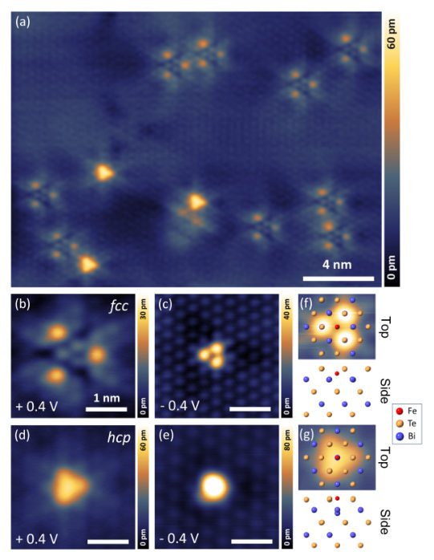
<figcaption class="paper-figure-caption"><b>Fig 1.</b> FIG. 1. STM identification of fcc- and hcp-Fe adsorp- tion sites on Bi2Te3. (a) Large-area constant-current STM topograph of Fe adatoms deposited on the Te-terminated Bi2Te3(111) surface (21 nm×16 nm, V = +0.4 V, Iset = 0.1 nA), showing that Fe predominantly occupies fcc hollow sites. (b, c) High-resolution images of an fcc-Fe adatoms ac- quired at sample-bias voltages of +0.4 V and −0.4 V, respec- tively (Iset = 0.3 nA). (d, e) Corresponding images of an hcp- site Fe adatom acquired under the same tunneling conditions. (f, g) Top and side views of atomic models for Fe adsorbed at the fcc and hcp hollow sites, respectively. Fe, Te, and Bi atoms are shown in red, orange, and blue,...</figcaption>
</figure>
<figure class="paper-figure-card">
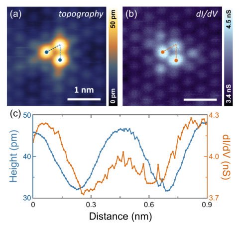
<figcaption class="paper-figure-caption"><b>Fig 2.</b> FIG. 2. (a) Constant-current image of an fcc-site Fe shows three bright lobes exhibiting near three-fold symme- try. (b) Simultaneously acquired dI/dV image reveals un- equal intensity among the lobes, indicating reduced symmetry (V = −0.2 V, Iset = 0.3 nA, Vmod = 25 mV). (c) Line profiles extracted along the dashed path in (a) and (b) compare the topographic height (blue) and dI/dV intensity (orange). The topography exhibits peak height variations by only ∼3 pm between lobes, while showing larger changes in dI/dV .</figcaption>
</figure>
<figure class="paper-figure-card">
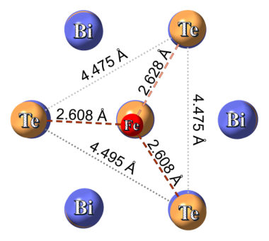
<figcaption class="paper-figure-caption"><b>Fig 3.</b> FIG. 3. Calculated structural relaxation of the fcc-site Fe adatom on Bi2Te3. Relaxed adsorption geometry showing displacement of the Fe atom from the symmetric C3v hollow site toward a nn-Te atom, reducing the symmetry to C1v.</figcaption>
</figure>
<figure class="paper-figure-card">
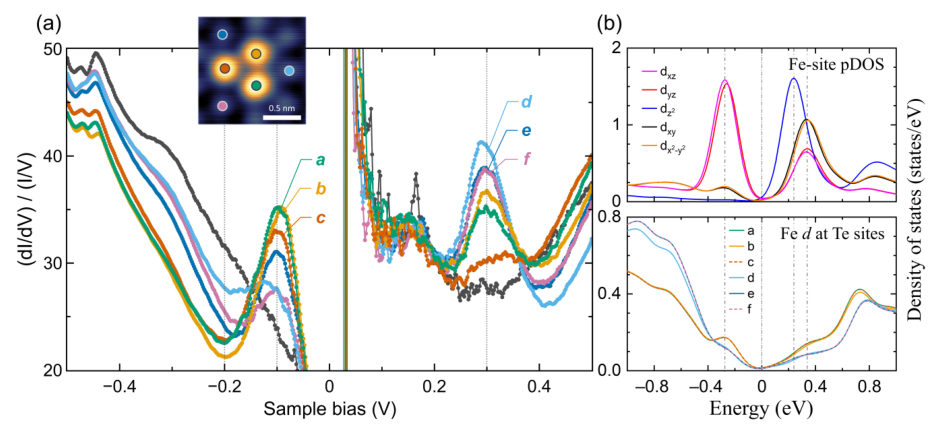
<figcaption class="paper-figure-caption"><b>Fig 4.</b> FIG. 4. (a) Normalized dI/dV spectra acquired on an fcc-site Fe adatom in Bi2Te3 reveal a common set of impurity resonances in the occupied and unoccupied states, with the spectral weight varying between the nn-Te and nnn-Te. The locations at which the spectra were acquired are indicated by correspondingly colored dots in the inset STM image; the Bi2Te3 spectrum is shown in gray. The spectra were acquired at a setpoint of Vset = −0.5 V and Iset = 2 nA. (b) pDOS for the relaxed fcc-site Fe adatom configuration. Upper: Fe-site pDOS resolved by d-orbital character, showing pronounced peaks dominated by dxz &amp; dyz in the occupied states and dz2 and dx2−y2 &amp; dxy in the unoccupied states. Lower:...</figcaption>
</figure>
<figure class="paper-figure-card">
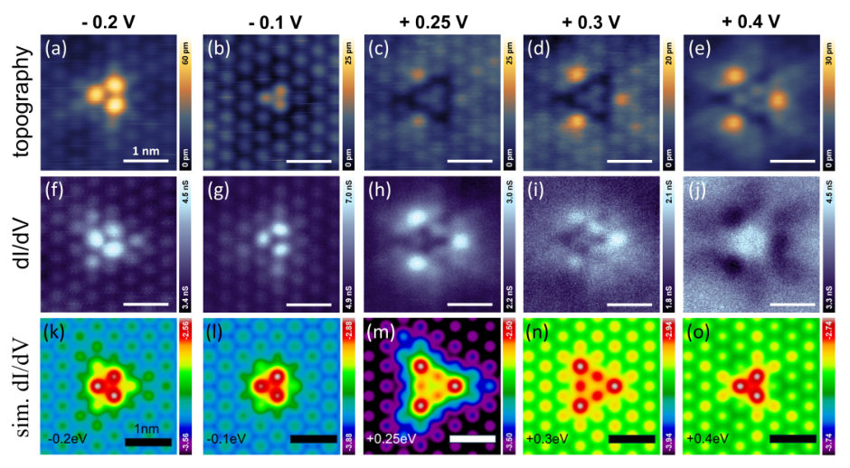
<figcaption class="paper-figure-caption"><b>Fig 5.</b> FIG. 5. Bias-dependent imaging of the fcc-site Fe adatom on Bi2Te3. (a)–(e) Constant-current topographic images and (f)–(j) Simultaneously acquired dI/dV maps at sample-bias voltages of −0.2, −0.1, +0.25, +0.3, and +0.4 V, respectively (Iset = 0.3 nA, Vmod = 25 mV). (k)–(o) Simulated dI/dV maps from tight-binding calculations at the corresponding energies. The color scale represents log(LDOS).</figcaption>
</figure>

**Summary.** This work combines STM imaging with DFT calculations to study Fe adatoms on $	ext{Bi}_2	ext{Te}_3$. While topography suggests high threefold symmetry, spectroscopic measurements reveal pronounced symmetry breaking. The theoretical analysis attributes this change to a Jahn-Teller distortion, reducing the site symmetry from $C_{3v}$ to $C_{1v}$, which is confirmed by electronic structure calculations.

**Why it may be interesting.** The explicit link between a geometric/structural instability (Jahn-Teller effect) and measurable electronic anisotropy in a topological material is highly relevant for understanding symmetry control in quantum devices.

Detailed structure

**Main problem.** The study investigates how adsorbed Fe adatoms on $	ext{Bi}_2	ext{Te}_3(111)$ break the local symmetry, contrasting initial high-symmetry STM observations with spectroscopic evidence.

**Main result.** DFT calculations confirm that the system undergoes a static Jahn-Teller distortion, reducing the adsorption symmetry from $C_{3v}$ to $C_{1v}$, which is consistent with observed electronic anisotropy in $	ext{d}I/	ext{d}V$ maps.

**Method.** The research combines Scanning Tunneling Microscopy (STM) spectroscopy with Density Functional Theory (DFT) calculations and tight-binding Green's function simulations.

**Model / system.** The physical system is Fe adatoms adsorbed on the $	ext{Bi}_2	ext{Te}_3(111)$ surface. The theoretical modeling involves calculating the resolvent using a tight-binding Hamiltonian parameterized by orbital and orientation dependent terms.

**Key observables.** Topographic contrast ($C_{3v}$ vs $C_{1v}$), differential conductance ($	ext{d}I/	ext{d}V$) spectral weight variation, structural relaxation energy difference ($72.5 	ext{ meV}$), and orbital character of the density of states.

**Important parameters / regimes.** Temperature (4.5 K), DFT functional (PBE), distortion energy ($\Delta E = 72.5 	ext{ meV}$), and specific orbital characters ($d_{xz}, d_{yz}$, etc.).

**Assumptions / limitations.** The observed asymmetry is intrinsic to the adsorption site, not due to tip artifacts; the structural relaxation mechanism is modeled via Jahn-Teller distortion.

**Figures summary.** Figures compare STM topography and $	ext{d}I/	ext{d}V$ maps showing symmetry contrast, illustrate the structural transition from $C_{3v}$ to $C_{1v}$, and show DFT projected density of states (pDOS) confirming orbital splitting.

**Paper structure.** The paper progresses by first presenting STM observations suggesting high symmetry ($C_{3v}$), then using $	ext{d}I/	ext{d}V$ spectroscopy to reveal symmetry breaking, followed by DFT calculations that identify the Jahn-Teller distortion mechanism leading to $C_{1v}$, and finally confirming this structural change via tight-binding simulations.

Abstract

We report a combined scanning tunneling microscopy and atomistic theoretical study of Fe adatoms on the Bi$_2$Te$_3$(111) surface. Topographic imaging at $4.5$~K shows Fe adatoms in fcc and hcp hollow sites exhibit a threefold-symmetric contrast, consistent with the $C_{3v}$ symmetry of the adsorption site. However, simultaneously acquired differential conductance ($dI/dV$) maps reveal a pronounced reduction in symmetry, evidenced by differential contrast observed at nearest-neighbor Te sites. Density functional theory calculations show that the Fe/Bi$_2$Te$_3$ system undergoes a static Jahn--Teller distortion, reducing the adsorption symmetry from $C_{3v}$ to $C_{1v}$, with the distorted configuration favored by $72.5$~meV. Orbital-projected density of states calculations show that the occupied states near the Fermi level are dominated by $d_{xz}$ and $d_{yz}$ orbitals, whereas the unoccupied states are primarily of $d_{z^2}$, $d_{x^2-y^2}$ and $d_{xy}$ character. The local density of states from these orbitals is in good qualitative agreement with experimental $dI/dV$ spectra. Furthermore, simulated local-density-of-states maps using a tight-binding Green's function approach are in good agreement with experimental $dI/dV$ maps, confirming that the reduced symmetry originates from the $C_{1v}$ structural distortion.

[↑ back to top](#top)

### [Hidden Quantum Geometry in Bilayer Exciton Condensates](http://arxiv.org/abs/2608.03049v1)

**Authors:** Xuzhe Ying, Benjamin T. Zhou  
**Type:** theory · **Category:** strongly correlated electrons · **PDF:** <https://arxiv.org/pdf/2608.03049v1>  
**Analysis basis:** full PDF text, analyzed in chunks
**Topic relevance:** `Keldysh / 2PI / non-Gaussian methods` **3/5** · `methods for driven-dissipative` **2/5** · `analog quantum simulation` **1/5** · `correlated cavity matter` **1/5** · `driven-dissipative phase transition` **1/5**

↔ Scroll figures horizontally

<figure class="paper-figure-card">
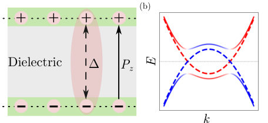
<figcaption class="paper-figure-caption"><b>Fig 1.</b> Figure 1. Bilayer system and exciton condensate. (a) Schematic sys- tem setup with some electrons (holes) in the bottom (top) layer. The out-of-plane polarization Pz will exhibit a distintive response to the in-plane AC field. (b) Schematic quasi-particle spectrum (solid line). Dashed lines correspond to the non-interacting electronic bands. The mean field order parameter ∆hybridizes the electrons’ wavefunc- tions in the two layers.</figcaption>
</figure>
<figure class="paper-figure-card">
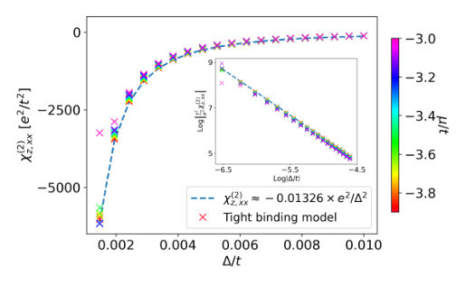
<figcaption class="paper-figure-caption"><b>Fig 2.</b> Figure 2. Exciton condensate’s nonlinear out-of-plane dielectric re- sponse χ(2) z,xx v.s. mean field order parameter ∆at various “chemical potentials” µ. Inset: The same data (taking absolute value) plotted on log-log scale.</figcaption>
</figure>

**Summary.** This theoretical work investigates how the formation of an exciton condensate in bilayer materials induces hidden quantum geometry. By calculating the second-order polarization response ($\chi^{(2)}$) to an external electric field, the authors predict a unique signature: that this nonlinear response scales inversely with the square of the excitonic order parameter ($\Delta^{-2}$). This establishes bilayer ECs as a platform for studying correlation-driven Berry phase effects.

**Why it may be interesting.** The explicit calculation of nonlinear optical responses ($\chi^{(2)}$) driven by emergent quantum geometric properties (Berry curvature) provides a concrete, measurable signature for correlated electron phenomena, linking fundamental theory to potential experimental detection in condensed matter systems.

Detailed structure

**Main problem.** To determine if excitonic order itself generates intrinsic quantum geometry in a bilayer exciton condensate (EC), even when non-interacting bands are trivial.

**Main result.** The second-order dipole response function exhibits a characteristic inverse square power law dependence on the EC order parameter ($\chi^{(2)} \propto \Delta^{-2}$), revealing a hidden Berry phase effect driven by electron-hole correlations.

**Method.** The study employs quantum kinetic equations, Wigner transformation to phase space, and perturbative expansion in $\hbar$ to calculate linear and second-order response functions.

**Model / system.** A bilayer system formed by stacking electron-doped and hole-doped layers, which forms an exciton condensate (EC) due to inter-layer Coulomb interaction. The physics is analyzed using mean-field Hamiltonians and quasi-particle descriptions.

**Key observables.** Out-of-plane polarization ($P_z$), the second-order dipole response function ($\chi^{(2)}_{z;\alphaeta}$), and the hidden in-plane Berry curvature ($\Omega^n_{\alpha}(\mathbf{k})$).

**Important parameters / regimes.** The excitonic order parameter ($\Delta$), the external AC electric field ($\mathbf{E}(t)$), and the inverse square scaling dependence on $\Delta$.

**Assumptions / limitations.** The analysis relies heavily on semi-classical approximations via Wigner transformation, perturbative expansion in $\hbar$, and specific limits like long wavelength or small order parameter.

**Figures summary.** Not specified by notes; the focus is on deriving scaling laws ($\chi^{(2)} \propto 1/\Delta^2$) and functional forms for response functions.

**Paper structure.** The paper systematically develops a response theory, first establishing the Hamiltonian in phase space via Wigner transformation. It then calculates linear and second-order responses, culminating in the derivation of the $\chi^{(2)}$ scaling law based on excitonic coherence.

Abstract

When an electron-doped layer is stacked with a hole-doped layer with approximately equal carrier density, inter-layer Coulomb interaction turns the bilayer system into an exciton condensate (EC). In this Letter, we reveal a fundamental property of bilayer ECs: the excitonic order gives rise to nontrivial hidden quantum geometric effects in the correlated electron-hole bands, even when the non-interacting bands are trivial. Such peculiar EC-driven quantum geometry manifests itself in a characteristic out-of-plane polarization response upon applying an in-plane AC electric field to the bilayer EC system. In particular, the second-order response exhibits a characteristic inverse square scaling with the bilayer EC order parameter. Our finding reveals a fundamental hidden Berry phase effect driven by electron-hole correlations, and establishes bilayer EC as a promising platform for rich nonlinear physics.

[↑ back to top](#top)

### [Enhancement of far-field thermal emission via polaritonic cavity modes](http://arxiv.org/abs/2608.03621v1)

**Authors:** Maelie Coral, Jose Ordonez-Miranda, Georges Hamaoui, Roman Anufriev, Laurent Jalabert, Masahiro Nomura, Yannick De Wilde, Sebastian Volz  
**Type:** both · **Category:** other · **PDF:** <https://arxiv.org/pdf/2608.03621v1>  
**Analysis basis:** full PDF text, analyzed in chunks
**Topic relevance:** `interference shaping light` **3/5** · `correlated cavity matter` **1/5** · `driven-dissipative phase transition` **1/5** · `quantum optics experiment` **1/5**

↔ Scroll figures horizontally

<figure class="paper-figure-card">
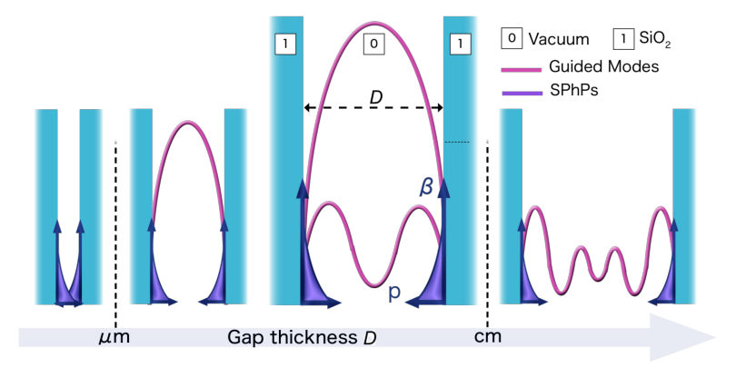
<figcaption class="paper-figure-caption"><b>Fig 1.</b> Fig. 1 Hybridization of SPhPs with guided modes inside a planar cavity. Schematic illustration of the polaritonic cavity concept considered in this work. The planar cavity is formed by two parallel interfaces supporting hybrid electromagnetic modes arising from the coupling between SPhPs (purple zones) and guided cavity modes (pink lines) propagating with in-plane and cross-plane wavevectors β and p, respectively. The relative balance between near- field coupling, guided propagation, and mode suppression depends on the cavity gap thickness D: sub-micrometer gaps (D ≲1 µm) favor strongly coupled interface modes, micrometer gaps (D ≳1 µm) enable guided polaritonic propagation, and large gaps...</figcaption>
</figure>
<figure class="paper-figure-card">
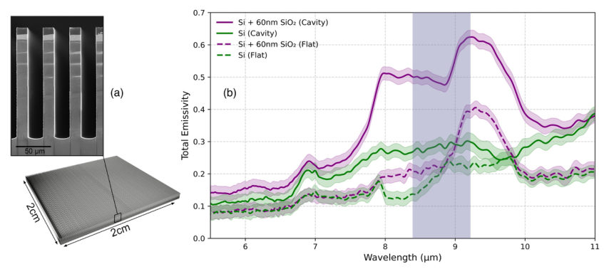
<figcaption class="paper-figure-caption"><b>Fig 2.</b> Fig. 2 Total emissivity spectra of flat and cavity samples. (a) Scanning electron microscope (SEM) image of the fabricated cavities, comprising 20-µm-wide and 160-µm-deep gaps separated by 20-µm-thick Si walls. (b) Room- temperature total hemispherical emissivity measured for flat reference samples (dashed lines) and cavity samples (solid lines) made of bare Si (green) and Si covered with a 60-nm-thick thermally grown SiO2 layer (purple). The shaded purple band marks the spectral range in which SPhPs exist for a SiO2/Vacuum/SiO2 double interface (see SM Fig. S2), highlighting the resonance window associated with the cavity-induced emissivity enhancement. Bare Si cavities exhibit a broadband...</figcaption>
</figure>
<figure class="paper-figure-card">
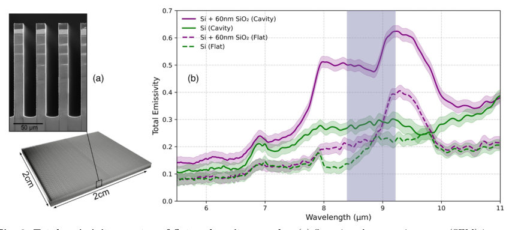
<figcaption class="paper-figure-caption"><b>Fig 3.</b> Figure 2(b) shows the total hemispherical emissivity spectra of flat (dashed) and cavity (solid) sam- ples of bare Si (green) and Si covered with a SiO2 nanolayer (purple). For bare Si, surface patterning</figcaption>
</figure>
<figure class="paper-figure-card">
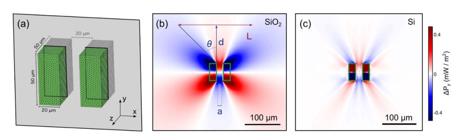
<figcaption class="paper-figure-caption"><b>Fig 4.</b> Fig. 3 Spatial distribution of the cavity-induced Poynting vector.(a) Mesh used in the SCUFF-EM simulations for the cavity walls. The calculations were performed on a plane located at z = 25 µm (grey square), which corresponds to the midpoint of the walls’ width. (b) Frequency-integrated map of the cavity-induced Poynting vector ∆Py for a cavity with SiO2 walls outlined by the green rectangles. The annotations identify the aperture size a, observation distance from the aperture d, diffraction angle θ, and computational window L. (c) ∆Py map obtained for a cavity with Si walls under identical conditions. Positive and negative values of ∆Py represent the local enhancement and suppression of...</figcaption>
</figure>
<figure class="paper-figure-card">
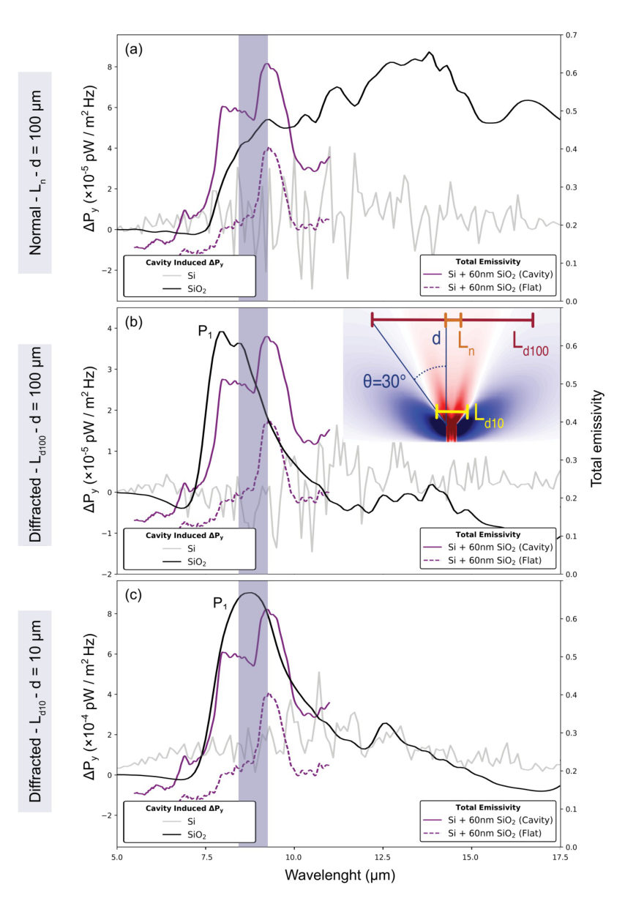
<figcaption class="paper-figure-caption"><b>Fig 5.</b> Fig. 4 Spectrally resolved cavity-induced Poynting vector and measured emissivity spectra. Left axis: Poynting vector ∆Py calculated for cavities with SiO2 (black) and Si (grey) walls. The spectra are averaged over the spatial window (a) Ln (θ = 0◦) at d = 100 µm, (b) Ld100 (θ = 30◦) at d = 100 µm, and (c) Ld10 (θ = 30◦) at d = 10 µm. Right axis: Experimental emissivity spectra reproduced from Fig. 2 for flat and cavity samples covered with a 60-nm-thick SiO2 layer. The shaded purple region indicates the SPhP spectral range for a SiO2/vacuum/SiO2 double interface (see SM Fig. S2). The Si cavity shows no distinct spectral signature, in agreement with the broadband emissivity enhancement...</figcaption>
</figure>

**Summary.** The paper demonstrates that coating silicon microcavities with SiO2 significantly enhances far-field thermal emission near the polaritonic resonance. By combining emissivity measurements with advanced simulations, the authors prove this enhancement stems from thermally excited guided modes (TEGMs) efficiently coupling confined optical energy into free space radiation.

**Why it may be interesting.** This work provides a concrete, scalable platform for engineering thermal radiation spectra by controlling confined electromagnetic modes (polaritons) and their coupling to free space. This bridges concepts from cavity QED/photonics into classical thermal energy management.

Detailed structure

**Main problem.** The study aims to quantify how thermally excited guided modes (TEGMs) within optical cavities contribute to, and enhance, far-field thermal emission for applications like thermophotovoltaics.

**Main result.** Covering silicon cavities with a thin SiO2 layer enhances the near-infrared emissivity by up to 200% compared to bare silicon, demonstrating that TEGMs are the source of this controllable enhancement.

**Method.** The research combines experimental measurements of hemispherical emissivity using an integrating sphere with advanced fluctuational electrodynamics simulations (SCUFF-EM).

**Model / system.** The physical system is a planar cavity structure etched into Si, featuring two parallel interfaces separated by a gap. The enhancement mechanism relies on the coupling between surface phonon-polaritons and cavity resonances.

**Key observables.** Total hemispherical emissivity spectra ($\varepsilon(\lambda)$), and the cavity-induced Poynting vector ($\Delta P_y$) derived from simulations.

**Important parameters / regimes.** Cavity gap width (20 $\mu$m) and depth (160 $\mu$m); SiO2 layer thickness (60 nm); spectral resonance wavelengths (e.g., 8.5 $\mu$m).

**Assumptions / limitations.** The enhancement is attributed to the conversion of two-dimensionally confined polaritonic modes into three-dimensional radiative channels via diffraction outcoupling.

**Figures summary.** Figures show SEM images of fabricated cavities, spectral comparisons between bare and coated samples (showing peak enhancement), and spatial maps of the Poynting vector demonstrating energy channeling in the SiO2 cavity versus edge effects in bare Si.

**Paper structure.** The paper establishes the need to study far-field emission from TEGMs. It then details the experimental setup and measurements, followed by theoretical modeling using electrodynamics simulations to decompose the emitted field into contributions from individual walls versus the hybridized cavity mode, culminating in quantitative results showing enhancement mechanisms.

Abstract

Controlling thermal emission is crucial for applications involving thermophotovoltaics, thermal sensing, imaging, and camouflage. While prior studies focused on the emission of thermally excited guided modes (TEGMs) inside cavities, their contribution to the far-field radiation outside cavities has remained unexplored. Here, we demonstrate a tunable far-field thermal channel enabled by TEGMs arising from the coupling of surface phonon-polaritons and cavity resonances. By combining infrared emissivity experiments with fluctuational electrodynamics simulations, we identify distinct spectral features marking the conversion of two-dimensionally confined polaritonic modes into three-dimensional radiative channels. We find that silicon cavities covered with SiO2 enhance the emissivity by up to 200% near the polaritonic spectral resonance, whereas bare silicon cavities yield only broadband enhancement. These findings provide experimental evidence of TEGMs and establish a simple cavity architecture as an effective and scalable platform for tailoring thermal radiation without complex nanofabrication.

[↑ back to top](#top)

### [Pressure induced magnetic-field-free superconducting diode effect in NbSe2 flake](http://arxiv.org/abs/2608.03072v1)

**Authors:** Shihao Zhu, Tian Le, Cuiying Pei, Changhua Li, Yi Liao, Yi Zhao, Lingxiao Zhao, Qi Wang, Juefei Wu, Qilian Zhang, Yueshen Wu, Tonghuan Fu, Xujie Lü, Wenge Yang, Jie Shen, Jun Li, Yulin Chen, Xiao Lin, Wen-Yu He, Yanpeng Qi  
**Type:** both · **Category:** other · **PDF:** <https://arxiv.org/pdf/2608.03072v1>  
**Analysis basis:** full PDF text, analyzed in chunks
**Topic relevance:** `spintronics-quantum-optics interface` **3/5** · `Keldysh / 2PI / non-Gaussian methods` **1/5** · `driven-dissipative phase transition` **1/5**

↔ Scroll figures horizontally

<figure class="paper-figure-card">
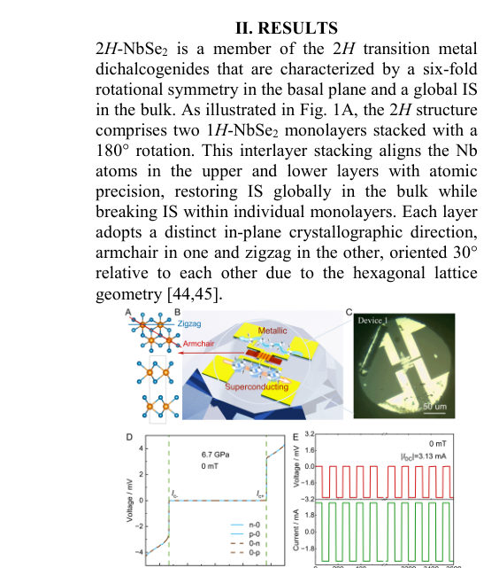
<figcaption class="paper-figure-caption"><b>Fig 1.</b> FIG 1. Crystal structure, device configuration and SDE of NbSe2 in high-pressure Device 1. (A) The crystal structures of 2H-NbSe2 from top and side views. Nb atoms are shown in orange, and Se atoms in blue. (B) The schematic image of the pressure induced SDE on diamond culet. With a current applied, the Cooper pairs flow in one direction while undergoing dissociation in the reverse direction. (C) Optical image of sample chamber in Device 1. (D) V-I curve for Device 1 under 6.7 GPa. (E) Half-wave rectification measured at 1.8 K and 11.0 GPa under zero magnetic field. The amplitude of the excitation current is 3.13 mA and the frequency are 0.008 Hz. Owing to its weak van der Waals interaction...</figcaption>
</figure>
<figure class="paper-figure-card">
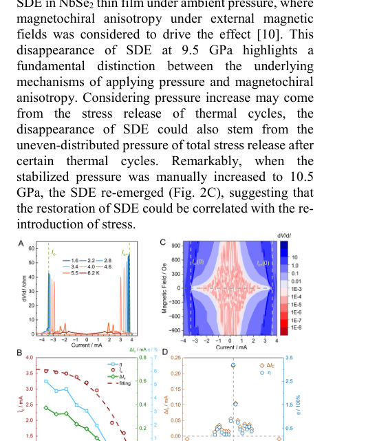
<figcaption class="paper-figure-caption"><b>Fig 2.</b> FIG 3. Temperature and magnetic dependence of SDE in Device 1. (A) Differential resistance dV/dI-I curves varying with temperature at 7.6 GPa. The critical current Ic is defined to be the value where the differential resistance reaches its peak in dV/dI. (B) Temperature dependence of the critical current Ic, the asymmetric critical current ΔIc (ΔIc=Ic+-|Ic-|) and SDE efficiency η at 7.6 GPa. (C) Magnetic field dependence of differential resistance dV/dI-I curves at 9.2 GPa. (D) Magnetic field dependence of the asymmetric critical current ΔIc and SDE efficiency η at 9.2 GPa and 1.8 K. We further investigated the temperature dependence of the SDE. Fig. 3A and B show the differential...</figcaption>
</figure>
<figure class="paper-figure-card">
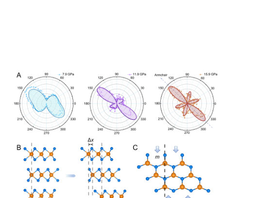
<figcaption class="paper-figure-caption"><b>Fig 3.</b> FIG 4. Pressure-induced SHG in NbSe2 flake. (A) Pressure dependence of SHG in 10 nm NbSe2 flake at 7.9 GPa, 11.9 GPa and 15.9 GPa, respectively. (B) Layer displacement leading to the breaking of IS, Δx≠Δx’. (C) Degradation of C3v to C1v leaving one mirror symmetry along armchair direction. Generally, the emergence of SDE requires IS breaking. However, NbSe2 has a centrosymmetric structure that preserves IS. This implies that applying pressure to NbSe2 thin films must induce IS breaking. To confirm this, we performed high-pressure second-harmonic generation (SHG) measurements. Fig. 4A and Fig. S11 illustrate the evolution of the SHG intensity as a function of pressure. It is almost...</figcaption>
</figure>

**Summary.** This work reports the discovery of a superconducting diode effect in $	ext{NbSe}_2$ flakes induced purely by high pressure, eliminating the need for external magnetic fields. By correlating this nonreciprocal transport with pressure-induced breaking of inversion symmetry (confirmed via SHG), the authors propose a theoretical model showing that such effects can emerge without explicitly violating time-reversal symmetry. This establishes pressure engineering as a powerful tool for realizing versatile superconducting devices.

**Why it may be interesting.** The finding challenges established paradigms regarding superconducting diode effects by proposing a mechanism for nonreciprocity driven solely by structural symmetry breaking (pressure) rather than requiring external magnetic fields or complex heterostructures, which has implications for designing novel quantum devices.

Detailed structure

**Main problem.** The study investigates the superconducting diode effect (SDE), a nonreciprocal phenomenon, aiming to challenge the conventional belief that SDE requires breaking both inversion symmetry (IS) and time-reversal symmetry (TRS).

**Main result.** They report observing a magnetic-field-free SDE in $	ext{NbSe}_2$ flakes using only pressure to break IS, while the effect exhibits even-in-$B$ behavior suggesting TRS preservation.

**Method.** The research combines experimental measurements (V-I curves, SHG) under high pressure with theoretical modeling using a Landau-Ginzburg free energy functional.

**Model / system.** The physical system is single-phase $	ext{NbSe}_2$ flakes studied in a Diamond Anvil Cell. The theory models the SDE origin from a cubic term ($	ext{q}^3$) coupling to the induced in-plane electric polarization after IS breaking.

**Key observables.** Superconducting diode efficiency ($\eta$), nonreciprocal critical currents ($|I_{c+}| 
eq |I_{c-}|$), Second Harmonic Generation (SHG) signals, and $	ext{V-I}$ characteristics under varying pressure/field.

**Important parameters / regimes.** High pressures (e.g., 6.7 GPa to 15.9 GPa), low temperatures ($\sim 1.8 	ext{ K}$), and the magnetic field dependence ($B$).

**Assumptions / limitations.** The primary theoretical assumption is that the SDE can arise from IS breaking via a $	ext{q}^3$ term in the free energy functional, even if TRS remains intact.

**Figures summary.** Figures illustrate V-I curves showing nonreciprocity under pressure (Fig. 1D), SHG patterns confirming symmetry changes ($	ext{C}_{3v} 	o 	ext{C}_{1v}$) correlating with SDE onset (Fig. 4), and the dependence of SDE on temperature and magnetic field (Fig. 3).

**Paper structure.** The paper progresses by first demonstrating the existence of a pressure-induced, field-free SDE in $	ext{NbSe}_2$ flakes using transport measurements; it then uses SHG to confirm the underlying symmetry breaking mechanism (IS); finally, it proposes and validates a theoretical model based on Landau-Ginzburg theory that explains the nonreciprocity without explicit TRS breaking.

Abstract

The superconducting diode effect (SDE) is a fascinating nonreciprocal phenomenon where the critical current is different for opposite current directions. It is widely believed that realizing SDE requires breaking both inversion symmetry (IS) and time-reversal symmetry (TRS), which are usually achieved via heterostructure engineering and applying external magnetic fields. Here, we report a pressure-induced magnetic-field-free SDE in NbSe2 flakes without any heterostructures. We show that pressure alone breaks the IS, as confirmed by the second harmonic generation. Crucially, upon applying an out-of-plane magnetic field (B), the SDE exhibits even-in-B behavior, implying the absence of explicit TRS breaking. This finding challenges the prevailing theoretical paradigm and demonstrates that a magnetic-field-free SDE can emerge without explicitly breaking TRS. Thereby, our work establishes pressure engineering as a powerful tool for inducing nonreciprocal superconductivity and designing versatile, magnetic-field-free superconducting devices.

[↑ back to top](#top)

### [Two-phonon pairing and superconductivity in $SrTiO_3$](http://arxiv.org/abs/2608.03823v1)

**Authors:** Antonio Santacesaria, Cristiano Muzzi, Maria Eleonora Temperini, Paolo Barone, Maria N. Gastiasoro, José Lorenzana  
**Type:** theory · **Category:** strongly correlated electrons · **PDF:** <https://arxiv.org/pdf/2608.03823v1>  
**Analysis basis:** full PDF text, analyzed in chunks
**Topic relevance:** `Keldysh / 2PI / non-Gaussian methods` **3/5** · `methods for driven-dissipative` **1/5**

↔ Scroll figures horizontally

<figure class="paper-figure-card">
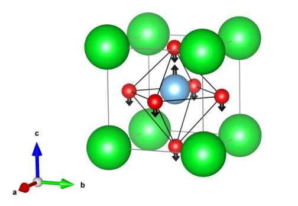
<figcaption class="paper-figure-caption"><b>Fig 1.</b> Figure 1. SrTiO3 cubic unit cell. We show oxygen atoms in red, titanium atoms in blue, and strontium atoms in green. Black arrows represent the Slater mode displacements, for which oxygen atoms move coherently as a cage with opposite phases with respect to the titanium atom while strontium atoms are fixed in their equilibrium position. Notice that DFT calculations have been made with the tetragonal unit cell.</figcaption>
</figure>
<figure class="paper-figure-card">
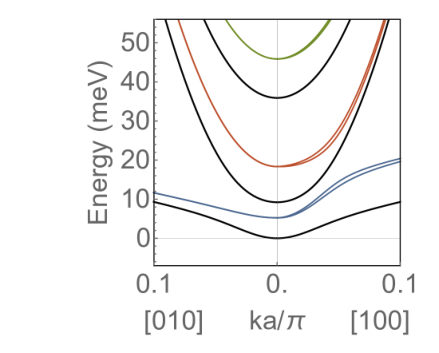
<figcaption class="paper-figure-caption"><b>Fig 2.</b> Figure 2. Equilibrium doubly degenerate bands (black) and band structure in the presence of a Slater frozen phonon (1 blue, 2 red and 3 green). Directions are indexed in pseudocubic coordinates. The lattice displacement is along [010] with magnitude uS = 0.02 ˚A. Notice that this displacement is much smaller than the estimated zero-point motion of the soft mode (ls ≈0.3 ˚A). The small splitting of each band at finite wave-vector along [100] is due to the Rashba mechanism, while the rigid shift at Γ can be attributed to the two-phonon mechanism.</figcaption>
</figure>
<figure class="paper-figure-card">
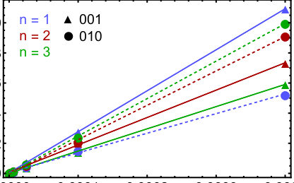
<figcaption class="paper-figure-caption"><b>Fig 3.</b> Figure 3. Band shift δn as a function of the relative displace- ment between oxygen and titanium squared u2 S. Solid symbols are the DFT data, while the lines are a linear fit. The dif- ferent colors indicate the three lower bands using the same conventions as Fig. 2 (band 1: blue, 2: red, and 3: green). Triangles and solid lines refer to computations for uS along the c-direction, while circles and dashed lines are taken for uS along (010) in pseudocubic coordinates (a+b in the tetragonal ones), which corresponds nearly to the Ti-O-Ti bond direction in the basal plane.</figcaption>
</figure>
<figure class="paper-figure-card">
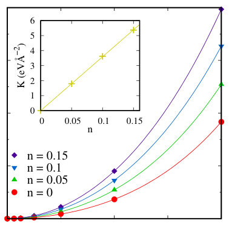
<figcaption class="paper-figure-caption"><b>Fig 4.</b> Figure 4. Total DFT energy as a function of the displacement in the Slater mode polarized along the tetragonal aT axis (pseu- docubic [110] direction) for different band fillings n. Points are fitted using a quartic function E(u) = Ku2/2 + V4u4, shown as a continuous line. The inset shows the effective stiffness constant as a function of band filling.</figcaption>
</figure>
<figure class="paper-figure-card">
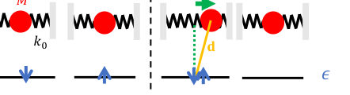
<figcaption class="paper-figure-caption"><b>Fig 5.</b> Figure 5. Linear (a) and quadratic (b) Holstein models. An electronic level with single particle energy ϵ interacts with a harmonic oscillator representing an ion. Blue arrows represent the electrons. In (a), the distance of the ion to the electronic site varies linearly with the displacement, while in (b), it varies quadratically. Assuming that the energy of the electronic level is linear in the distance leads to the linear and quadratic models. Comparing the energy of two electrons in the same sites (left panels) with the one of two electrons in different sites (right) allows us to obtain the attractive interaction.</figcaption>
</figure>

**Summary.** This work theoretically explores if two-phonon interactions can explain superconductivity in doped strontium titanate. Using advanced calculations derived from DFT, the authors solve an Eliashberg equation to predict $T_c$. The key finding is that while the mechanism is plausible, the theoretical prediction for doping dependence contradicts experimental results.

**Why it may be interesting.** Although focused on phonon-mediated superconductivity, the theoretical framework involves solving complex many-body equations (Eliashberg) and analyzing strong coupling limits, which shares mathematical structure with models used in strongly correlated systems.

Detailed structure

**Main problem.** The study investigates whether a two-phonon pairing mechanism, proposed by Ngai, can account for superconductivity observed in doped strontium titanate (STO).

**Main result.** While the theory predicts a superconducting transition temperature ($T_c$) that increases monotonically with doping, this contradicts experimental observations. The coupling strength is found to be dominated by high-energy physics.

**Method.** The authors derive an effective electron-electron interaction mediated by two-phonon exchange and solve a one-loop Eliashberg equation in the weak-coupling limit.

**Model / system.** The system is doped strontium titanate ($	ext{SrTiO}_3$), modeled using coupled electronic and lattice Hamiltonians. The analysis incorporates the electron-two-phonon interaction term, $\mathcal{H}_{	ext{el}-2	ext{ph}}$, which is crucial for determining pairing.

**Key observables.** Superconducting critical temperature ($T_c$) as a function of doping; effective coupling constant ($\lambda$).

**Important parameters / regimes.** The two-phonon deformation potential coefficient ($\alpha$); the Fermi energy scale relative to phonon frequencies (where Migdal theorem fails).

**Assumptions / limitations.** The analysis assumes the soft mode is well-represented by the Slater mode and neglects variations in band mass. The applicability of the Eliashberg theory is confirmed despite strong coupling terms.

**Figures summary.** Figure 1 shows the $	ext{SrTiO}_3$ unit cell and Slater mode displacements, while Figure 2 illustrates how electronic bands are affected by frozen phonon displacements.

**Paper structure.** The paper first establishes the theoretical framework using DFT calculations to estimate the two-phonon coupling strength ($\alpha$) via multiple methods (DFT shifts, total energy fitting, empirical data). It then applies this interaction within a one-loop Eliashberg theory to predict $T_c$ versus doping.

Abstract

We explore the possibility that the two-phonon pairing mechanism proposed by Ngai can explain superconductivity in doped strontium titanate (STO). The two-phonon deformation potential is evaluated using two distinct theoretical estimates based on first-principles calculations and two empirical estimates based on experimental data, yielding very large values of the same order of magnitude. We derive the effective electron-electron interaction mediated by two-phonon exchange. Crucial to our computations is the strong dispersion of the involved soft phonons. Because the scale of the two-phonon interaction is much larger than the Fermi energy, the Migdal theorem does not apply. We obtain a one-loop Eliashberg equation that can be solved in the weak-coupling limit. We find that despite the significant electron-phonon matrix element, phase space considerations considerably reduce the effective coupling. A two-phonon mechanism can not be excluded based on the $T_c$ magnitude, but its value is dominated by the high-energy-frequency physics and is weakly affected by the soft-phonon behavior. The theory predicts a $T_c$ that monotonously increases with doping, which is not in accordance with the experiment. We identify the conditions for a two-phonon mechanism to be effective in other materials and discuss possible candidates.

[↑ back to top](#top)

### [Strain Tuning of Orbital-Driven Giant Magnetoresistance in van der Waals ferrimagnet Mn$_3$Si$_2$Te$_6$](http://arxiv.org/abs/2608.03568v1)

**Authors:** Abdul Ahad, Miuko Tanaka, Shunta Aoki, Darius-Alexandru Deaconu, Varun Shah, Tenta Kitamura, Hao Ou, Mohammad Saeed Bahramy, Jiang Pu, Toshiya Ideue  
**Type:** experiment · **Category:** strongly correlated electrons · **PDF:** <https://arxiv.org/pdf/2608.03568v1>  
**Analysis basis:** full PDF text, analyzed in chunks
**Topic relevance:** `spintronics-quantum-optics interface` **3/5**

↔ Scroll figures horizontally

<figure class="paper-figure-card">
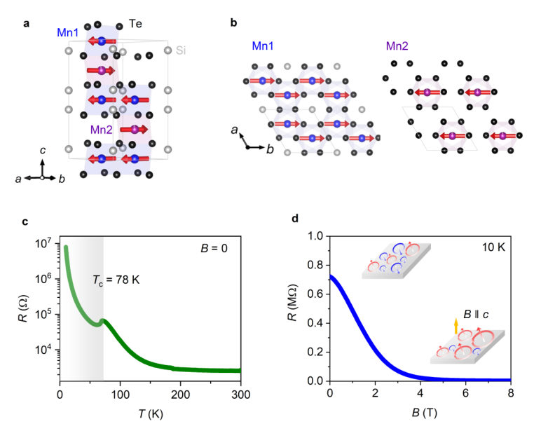
<figcaption class="paper-figure-caption"><b>Fig 1.</b> FIG. 1. Side view (a) and top view (b) of the crystal/ magnetic structures. There are two</figcaption>
</figure>
<figure class="paper-figure-card">
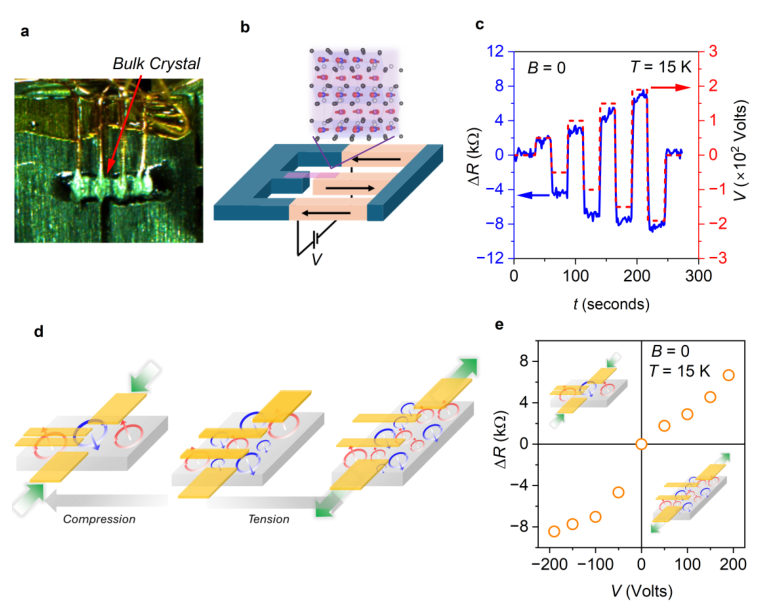
<figcaption class="paper-figure-caption"><b>Fig 2.</b> FIG. 2. (a) Photograph of a bulk crystal mounted on the holder of strain cell’s titanium plate</figcaption>
</figure>
<figure class="paper-figure-card">
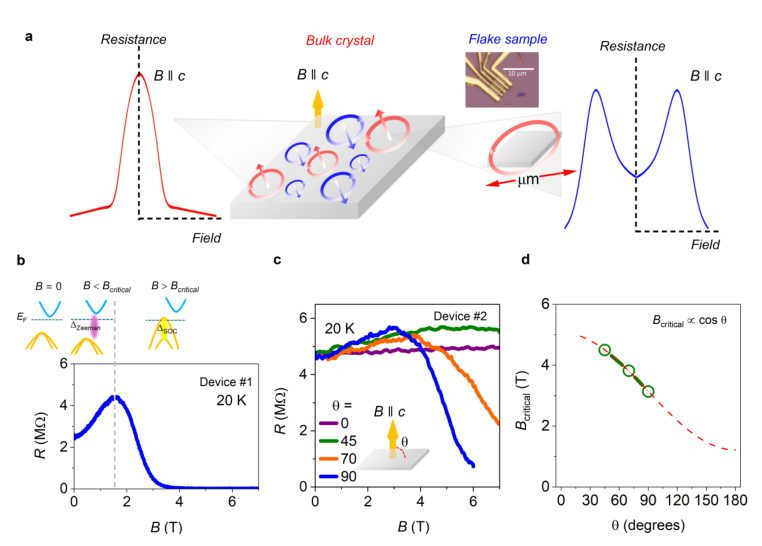
<figcaption class="paper-figure-caption"><b>Fig 3.</b> FIG. 3. (a) Schematics of magnetoresistance (B ∥c) of bulk samples containing multidomain COC</figcaption>
</figure>
<figure class="paper-figure-card">
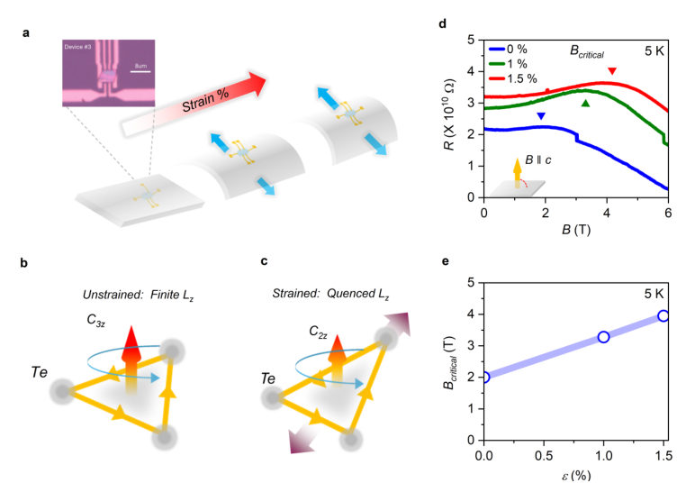
<figcaption class="paper-figure-caption"><b>Fig 4.</b> FIG. 4. (a) Schematic of uniaxial strain application for the nanodevices fabricated on the flexible</figcaption>
</figure>

**Summary.** The research reports on using mechanical strain to control the Giant Magnetoresistance in a van der Waals ferrimagnet. By comparing bulk crystals (where domain wall dynamics dominate) with nanoflakes (single-domain behavior), the authors establish that strain tunes the orbital angular momentum, providing a unified understanding of this emergent quantum magnetic effect.

**Why it may be interesting.** This work demonstrates how mechanical strain can be used as an external knob to tune fundamental electronic and magnetic properties governed by orbital physics, which is highly relevant for designing novel quantum spintronic devices.

Detailed structure

**Main problem.** The study investigates how mechanical strain can control the orbital-driven Giant Magnetoresistance (GMR) in the van der Waals ferrimagnet Mn3Si2Te6, aiming to establish a unified microscopic mechanism for this effect.

**Main result.** Strain proves to be an exceptionally effective control parameter; it manipulates domain wall density in bulk crystals and tunes the orbital angular momentum component responsible for GMR in single-domain nanoflakes.

**Method.** The researchers used in situ measurements of electrical resistance ($\Delta R$) under controlled uniaxial tensile and compressive strain, comparing results from both bulk crystals and exfoliated flake devices.

**Model / system.** The system is the van der Waals ferrimagnet Mn3Si2Te6. The physics involves complex interplay between magnetic ordering (ferrimagnetic), orbital angular momentum ($L_z$) originating from Te p-orbitals, and strain-induced symmetry changes that govern magnetotransport.

**Key observables.** Resistance modulation ($\Delta R$) vs. uniaxial strain; Critical magnetic field ($B_{	ext{critical}}$) dependence on strain and field angle ($	heta$); Magnetoresistance (MR) curves in multi-domain vs. single-domain regimes.

**Important parameters / regimes.** Uniaxial strain ($\epsilon$), Magnetic Field ($B$), Temperature ($T$), Orbital angular momentum component ($L_z$).

**Assumptions / limitations.** The transport behavior can be explained by either the reorganization of chiral orbital current (COC) domains in bulk or by direct band structure modulation via spin-orbit coupling in single-domain flakes.

**Figures summary.** Figures show strain cell setups, $\Delta R$ vs. strain curves demonstrating domain wall changes, and MR vs. B curves comparing multi-domain and single-domain behavior, with $B_{	ext{critical}}$ shifting linearly with tensile strain.

**Paper structure.** The paper systematically compares magnetotransport measurements across different sample sizes (bulk vs. flakes) under varying strain conditions to reconcile conflicting observations regarding the origin of GMR, culminating in a unified model linking strain to orbital degrees of freedom.

Abstract

Strain engineering of magnetotransport offers a powerful strategy for uncovering emergent electronic and domain phenomena in quantum magnetic materials, while providing a promising pathway toward next-generation mechanically programmable spintronic technologies. Van der Waals magnets are particularly attractive in this context because their high crystallinity and mechanical flexibility allow exceptionally large, precisely controllable strain, enabling access to strain-induced functionalities unattainable in conventional solids. Here, we report systematic strain control of the van der Waals magnet Mn$_3$Si$_2$Te$_6$, which exhibits an unconventional colossal magnetoresistance whose microscopic origin remains under debate. We demonstrate in situ large-strain modulation of the electrical resistance in bulk crystals and show that the effect can be consistently explained by strain-tunable chiral orbital-current domains. Furthermore, measurements on exfoliated flake devices containing a single chiral domain reveal direct strain control of the electronic structure affected by orbital magnetic moment, establishing a unified microscopic mechanism for the unconventional colossal magnetoresistance. These results identify strain as an exceptionally effective control parameter for tailoring electronic and magnetic states in van der Waals magnets and provide a conceptual framework for realizing spin-straintronic functionalities based on orbital degrees of freedom.

[↑ back to top](#top)

### [Lifshitz transitions and isospin polarization in twist-decoupled monolayer-bilayer graphene](http://arxiv.org/abs/2608.02899v1)

**Authors:** Alex Boschi, Leonardo Sabattini, Sergey Slizovskiy, Vaidotas Mišeikis, Zewdu M. Gebeyehu, Stiven Forti, Antonio Rossi, Kenji Watanabe, Takashi Taniguchi, Fabio Beltram, Vladimir I. Fal'ko, Camilla Coletti, Sergio Pezzini  
**Type:** both · **Category:** strongly correlated electrons · **PDF:** <https://arxiv.org/pdf/2608.02899v1>  
**Analysis basis:** full PDF text, analyzed in chunks
**Topic relevance:** `driven-dissipative phase transition` **2/5** · `Kondo & dissipative impurity` **1/5** · `analog quantum simulation` **1/5** · `non-equilibrium dynamics` **1/5**

↔ Scroll figures horizontally

<figure class="paper-figure-card">
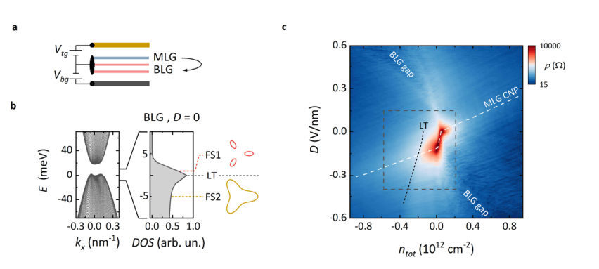
<figcaption class="paper-figure-caption"><b>Fig 1.</b> FIG. 1: Accessing the valence band of biased BLG within TMBG. (a) Sketch of the studied device with gating configuration. Yellow: Au gate; dark gray: graphite gate; blue: MLG; red: BLG. (b) Left: low-energy BLG bands within TMBG at D = 0 (left), as a function of kx relative to the K point. Center: density of states in the top part of the BLG valence band (-10 meV &lt; E &lt; +10 meV). Right: evolution of the Fermi surface across the LT. FS1 (red) is shown at E = 1 meV, FS2 (yellow) is shown at E = -5 meV. (c) Resistivity as a function of gate-induced charge density and displacement field, measured at T = 0.4 K and B = 0 T. A log color scale is used. The black dashed line is the calculated n-D...</figcaption>
</figure>
<figure class="paper-figure-card">

<figcaption class="paper-figure-caption"><b>Fig 2.</b> Figure 1a shows the device configuration. An hBN-encapsulated CVD-grown TMBG crystal, composed of a MLG (blue) twisted by 30° on top of BLG (red), is controlled by a top (Au, yellow) and a bottom (graphite, dark gray) gate electrode. The combined action of the gate voltages (Vbg and Vtg) induces a total charge density ntotௗ=ௗ1/e ∙ (CbgVbg + CtgVtg) and a displacement field D/ε0ௗ=ௗ(CbgVbg - CtgVtg)/2 [31], where Cbg and Ctg are the</figcaption>
</figure>
<figure class="paper-figure-card">
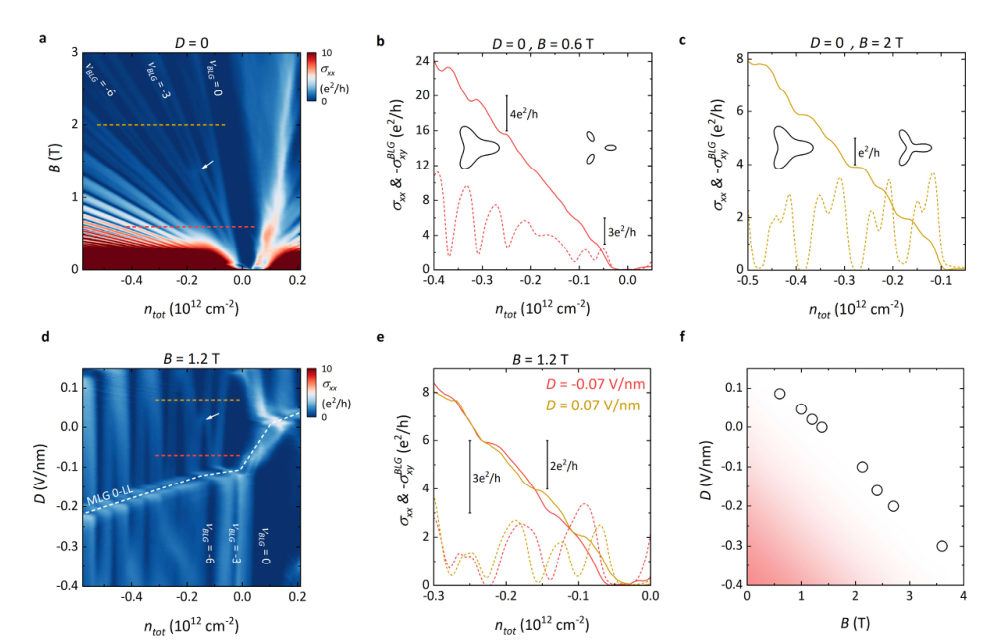
<figcaption class="paper-figure-caption"><b>Fig 3.</b> FIG. 2: Tunable BLG Lifshitz transitions in TMBG. (a) Longitudinal conductivity as a function of magnetic field and carrier density, measured at D = 0. The red and yellow dashed lines locate data plotted in panel b and c, respectively. The white arrow indicates a LL crossing close to the BLG valence band edge. (b) Longitudinal (dashed line) and Hall (continuous line) conductivity, measured along the red dashed line in panel a (B = 0.6 T). The evolution of the FS induced by hole doping is sketched. (c) Same as panel b, measured along the yellow dashed line in panel a (B = 2 T). (d) Longitudinal conductivity as a function of displacement field and carrier density, measured at B = 1.2 T. The...</figcaption>
</figure>
<figure class="paper-figure-card">
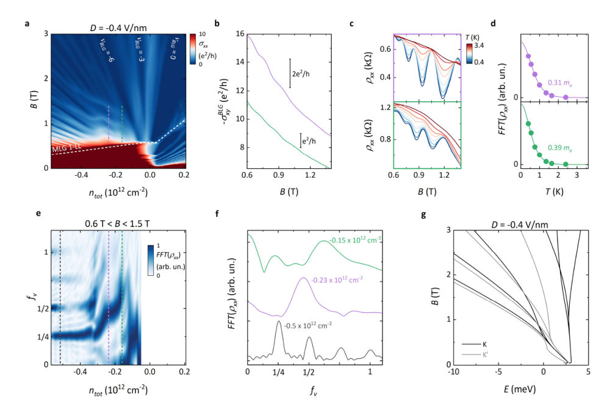
<figcaption class="paper-figure-caption"><b>Fig 4.</b> FIG. 3: Signatures of spontaneous isospin polarization of BLG holes. (a) Longitudinal conductivity as a function of magnetic field and carrier density, measured at D = -0.4 V/nm. The pink and green dashed lines identify data plotted in panels b and c. (b) Hall conductivity measured along the dashed lines in panel a. (c) Longitudinal resistivity at selected temperatures, measured along the dashed pink (upper) and green (lower) lines in panel a. (d) Amplitude of the FFT peak as a function of temperature (dots), corresponding to the resistivity oscillations in panel c. The continuous lines are fits to the data using the Lifshitz–Kosevich formula. (e) FFT power spectral density as a function of...</figcaption>
</figure>

**Summary.** This paper reports on the study of strongly correlated electronic phases in bilayer graphene using a twist-decoupled monolayer structure. By measuring transport properties at zero bias, the authors reveal evidence for Lifshitz transitions and signatures of partially isospin polarized quantum Hall states. This work establishes CVD-grown twisted graphene as a powerful platform for investigating fundamental many-body physics.

**Why it may be interesting.** This work provides experimental validation for complex many-body physics in a tunable 2D material system, showing how proximity effects can be used to probe intrinsic correlated states otherwise requiring extreme external tuning.

Detailed structure

**Main problem.** The study investigates correlated electronic phases, specifically Lifshitz transitions and isospin polarization, within bilayer graphene (BLG) when coupled to a nearby monolayer graphene (MLG). The goal is to explore these phenomena without relying on an external displacement field.

**Main result.** The authors demonstrated the observation of three-fold degenerate quantum Hall states at zero bias and provided evidence for partially isospin polarized (PIP) phases, suggesting that electronic interactions are robustly preserved even with the proximity of MLG.

**Method.** The research combines low-temperature magneto-transport measurements ($
ho$ vs. gate/field) with theoretical modeling using effective k.p Hamiltonians to analyze Fermi surface topology changes and quantum oscillations.

**Model / system.** The physical system is a twist-decoupled monolayer-bilayer graphene (TMBG) stack, where the BLG hosts correlated phases tied to Lifshitz transitions at saddle points. The analysis utilizes effective k.p Hamiltonians describing the electronic structure near K-points.

**Key observables.** Resistivity ($
ho$), Quantum Hall (QH) states characterized by filling factors ($
u_{	ext{BLG}}$), and anomalous frequencies extracted from quantum oscillations via FFT analysis.

**Important parameters / regimes.** Zero external displacement field ($D=0$), doping level, magnetic field ($B$), and the coupling strength/proximity of the MLG.

**Assumptions / limitations.** The primary assumption is that electronic interactions in BLG are preserved despite the presence of an atomically close MLG. Theoretical analysis relies on effective k.p Hamiltonian approximations.

**Figures summary.** Figures show device configurations, $
ho$ vs. gate parameters highlighting Lifshitz transition regions, LL fan diagrams confirming QH states at $D=0$, and FFT power spectral densities demonstrating characteristic oscillation frequencies related to isospin polarization.

**Paper structure.** The paper progresses by first establishing the TMBG platform's ability to access correlated phases at zero bias. It then details observations of tunable Lifshitz transitions via transport measurements, followed by spectroscopic evidence (FFT analysis) confirming spontaneous isospin polarization signatures.

Abstract

Bernal-stacked bilayer graphene (BLG) hosts correlated electronic phases tied to low-energy Lifshitz transitions at saddle points in its valence band. To access this regime, ultralow charge disorder and control over a vertical electric field are simultaneously required. Here, we employ a twist-decoupled monolayer (MLG) to bias a proximal BLG in the absence of an external displacement field (D). We thereby reveal three-fold degenerate quantum Hall states at D = 0, with multiple transitions driven by doping, magnetic and electric field. Spontaneous broken symmetry in the vicinity of the valence band edge is signaled by the emergence of quantum oscillations with anomalous frequencies and large quasiparticle mass. These results indicate that electronic interactions in BLG are preserved in presence of an atomically close MLG, while showcasing the potential of CVD-grown graphene multilayers for the exploration of correlated phases of matter.

[↑ back to top](#top)

### [Anisotropic Phonon Heat Flow and Thermoelectric Response in Tetragonal GeS$_2$ and GeSe$_2$](http://arxiv.org/abs/2608.03478v1)

**Authors:** Neeraj Kulhari, Krishna Swaroop Sharma, K. C. Bhamu  
**Type:** theory · **Category:** other · **PDF:** <https://arxiv.org/pdf/2608.03478v1>  
**Analysis basis:** full PDF text, analyzed in chunks
**Topic relevance:** `Keldysh / 2PI / non-Gaussian methods` **1/5** · `methods for driven-dissipative` **1/5** · `non-equilibrium dynamics` **1/5**

↔ Scroll figures horizontally

<figure class="paper-figure-card">
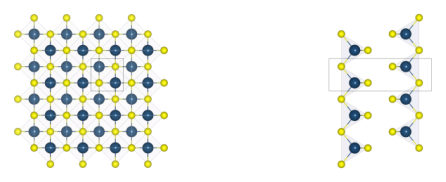
<figcaption class="paper-figure-caption"><b>Fig 1.</b> Fig. 1. Crystal structure of tetragonal GeS2 (space group P42/nmc): (a) top view and (b) side view. Blue and yellow spheres denote Ge and S atoms, respectively; translucent polyhedra in panel (a) show GeS4 tetrahedra, and the projected unit cell is indicated in panel (b).</figcaption>
</figure>
<figure class="paper-figure-card">
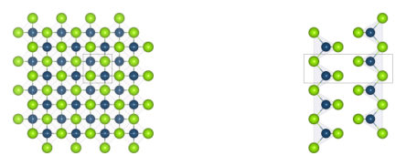
<figcaption class="paper-figure-caption"><b>Fig 2.</b> Fig. 2. Crystal structure of tetragonal GeSe2 (space group P42/nmc): (a) top view and (b) side view. Blue and green spheres denote Ge and Se atoms, respectively; translucent polyhedra in panel (a) show GeSe4 tetrahedra, and the projected unit cell is indicated in panel (b).</figcaption>
</figure>
<figure class="paper-figure-card">
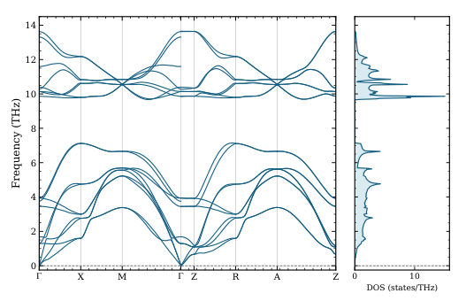
<figcaption class="paper-figure-caption"><b>Fig 3.</b> Fig. 3. DFPT phonon dispersion and total vibrational density of states of tetragonal GeS2. Frequencies are interpolated along Γ–X–M–Γ–Z– R–A–Z, while the DOS is integrated on a 40 × 40 × 20 uniform mesh. The non-analytical correction from the calculated dielectric tensor and Born effective charges is included.</figcaption>
</figure>
<figure class="paper-figure-card">
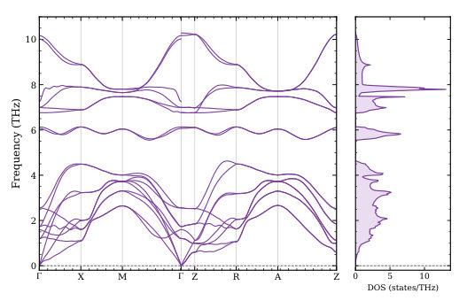
<figcaption class="paper-figure-caption"><b>Fig 4.</b> Fig. 4. DFPT phonon dispersion and total vibrational density of states of tetragonal GeSe2, calculated with the same path, non-analytical cor- rection, and 40×40×20 DOS mesh used for GeS2.</figcaption>
</figure>
<figure class="paper-figure-card">
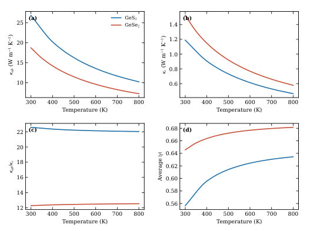
<figcaption class="paper-figure-caption"><b>Fig 5.</b> Fig. 5. Comparison of ShengBTE RTA lattice-transport descriptors for tetragonal GeS2 and GeSe2: (a) in-plane lattice thermal conductivity, (b) cross-plane lattice thermal conductivity, (c) anisotropy ratio κab/κc, and (d) average mode Grüneisen parameter.</figcaption>
</figure>

**Summary.** This theoretical study characterizes the thermoelectric potential of layered semiconductors GeS2 and GeSe2 by calculating their anisotropic thermal and electrical transport properties. Using advanced computational methods combining DFT with Boltzmann transport solvers, the authors demonstrate that these materials exhibit strong directional anisotropy in heat flow. The results highlight how suppressed out-of-plane lattice heat conduction can enhance the overall figure of merit (zT) for cross-plane applications.

**Why it may be interesting.** While focused on solid-state thermoelectrics, the rigorous application of advanced many-body transport formalisms (Boltzmann equation solvers combined with DFT inputs) provides a template for analyzing energy/heat flow in complex quantum materials, which has parallels to open quantum system dynamics.

Detailed structure

**Main problem.** The study investigates the anisotropic phonon heat flow and thermoelectric response in tetragonal GeS2 and GeSe2.

**Main result.** Both compounds are identified as strongly anisotropic thermoelectrics, with cross-plane transport benefiting from suppressed lattice heat conduction. The calculated zT values are moderate but show clear directional dependence.

**Method.** The research employs a combination of Density Functional Theory (DFT) for electronic structure and elastic properties, coupled with advanced Boltzmann transport formalisms (ShengBTE/AMSET) to calculate thermal and electrical transport coefficients.

**Model / system.** The physical systems are the layered tetragonal semiconductors GeS2 and GeSe2. The calculations model lattice vibrations using DFPT and electronic transport using state-dependent scattering mechanisms within a Boltzmann framework.

**Key observables.** Lattice thermal conductivities (in-plane vs. cross-plane), thermoelectric figure of merit (zT), band gaps, and anisotropic elastic constants ($C_{ij}$).

**Important parameters / regimes.** Temperatures up to 800 K; carrier concentrations varying across the doping range; HSE03/Wannier derived band gaps.

**Assumptions / limitations.** The analysis relies on combining AMSET electronic coefficients with ShengBTE RTA lattice thermal conductivity, and specific approximations are made for scattering mechanisms and transport tensor calculations.

**Figures summary.** Figures systematically present component-resolved zT values as a function of carrier concentration and temperature for both materials, alongside detailed spectral analyses of the lattice thermal conductivity components ($\kappa_{ab}$ vs. $\kappa_c$).

**Paper structure.** The paper follows a comprehensive computational structure: first establishing structural/electronic stability (DFT/HSE03), then calculating elastic properties, followed by detailed phonon transport analysis (ShengBTE for $\kappa_l$), and finally combining these with electronic transport (AMSET) to map out component-resolved zT performance.

Abstract

The electronic structure, lattice dynamics, bonding, elastic response, and anisotropic thermoelectric transport properties of tetragonal GeS$_2$ and GeSe$_2$ were investigated using density functional theory, density functional perturbation theory, Wannier interpolation, and scattering-aware Boltzmann transport. The relaxed structures are mechanically and dynamically stable within the calculated harmonic description. The HSE03/Wannier band gaps are 2.48 eV for GeS$_2$ and 1.23 eV for GeSe$_2$, while substitution of S by Se lowers the upper phonon frequency from approximately 13.6 to 10.3 THz.   The phonon Boltzmann transport calculations reveal pronounced lattice-transport anisotropy. Within the relaxation-time approximation, the 300 K in-plane and cross-plane lattice thermal conductivities are 26.86 and 1.19 W m$^{-1}$ K$^{-1}$ for GeS$_2$, and 18.74 and 1.52 W m$^{-1}$ K$^{-1}$ for GeSe$_2$, respectively. At 800 K, these values decrease to 10.22 and 0.46 W m$^{-1}$ K$^{-1}$ for GeS$_2$, and 7.25 and 0.58 W m$^{-1}$ K$^{-1}$ for GeSe$_2$. Frequency-resolved analysis shows that low-frequency phonons carry most of the heat, whereas the small cross-plane values reflect restricted out-of-plane phonon transport.   Combining the ShengBTE RTA lattice tensors with AMSET electronic coefficients gives $zT=0.257$ for n-type cross-plane GeS$_2$ at 800 K and $10^{19}$ cm$^{-3}$. The corresponding PBE-AMSET estimate for GeSe$_2$ is $zT=0.066$ for p-type cross-plane transport at 800 K and $3\times10^{20}$ cm$^{-3}$. LOBSTER analysis identifies mixed covalent--ionic Ge--X bonding, with Ge--S bonds having a larger stabilizing ICOHP magnitude than Ge--Se bonds ($-5.27$ versus $-4.74$ eV per bond). These results identify tetragonal GeX$_2$ compounds as strongly anisotropic thermoelectrics with moderate calculated $zT$ values whose cross-plane response benefits from suppressed lattice heat transport.

[↑ back to top](#top)

### [Pressure-induced Superconductivity in Thermoelectric Semiconductor Mg3Sb2](http://arxiv.org/abs/2608.03058v1)

**Authors:** Cuiying Pei, Yasong Wu, Airan Li, Juefei Wu, Qi Wang, Yifan Zhu, Yi Zhao, Lingling Gao, Changhua Li, Weizheng Cao, Shihao Zhu, Mingxin Zhang, Yulin Chen, Chenguang Fu, Tiejun Zhu, Jiong Yang, Yanpeng Qi  
**Type:** both · **Category:** other · **PDF:** <https://arxiv.org/pdf/2608.03058v1>  
**Analysis basis:** full PDF text, analyzed in chunks
**Topic relevance:** `analog quantum simulation` **1/5** · `driven-dissipative phase transition` **1/5**

↔ Scroll figures horizontally

<figure class="paper-figure-card">
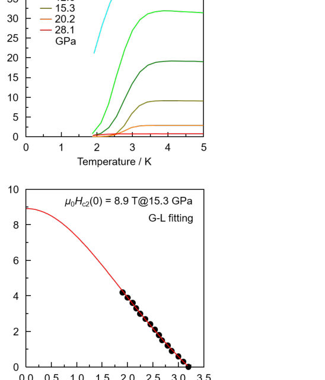
<figcaption class="paper-figure-caption"><b>Fig 1.</b> Figure 1 (a) Temperature-dependent resistivity of Mg3Sb2 under various pressures in run I; (b) Enlarged ρ(T) curve in the vicinity of the Tc; (c) Temperature-dependent resistivity under various magnetic fields at 15.3 GPa; (d) Temperature-dependent upper critical field of Mg3Sb2 at 15.3 GPa. Solid lines represent the fits based on the Ginzburg- Landau (G-L) formula.</figcaption>
</figure>
<figure class="paper-figure-card">
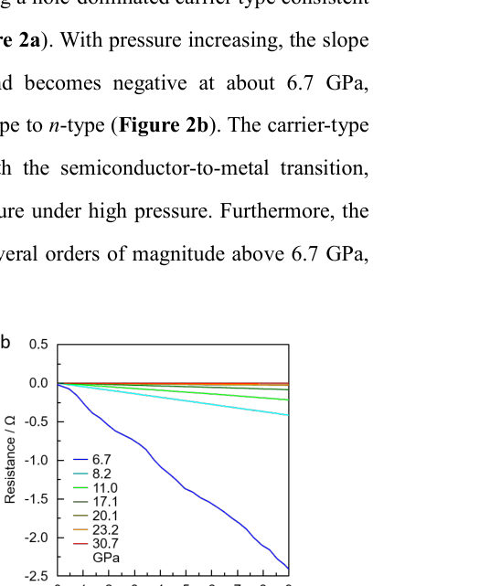
<figcaption class="paper-figure-caption"><b>Fig 2.</b> Figure 2 (a) Hall resistance of Mg3Sb2 as a function of magnetic field under various pressures; (b) Enlarged Hall resistance of Mg3Sb2 in the vicinity of the carrier-type transition.</figcaption>
</figure>
<figure class="paper-figure-card">
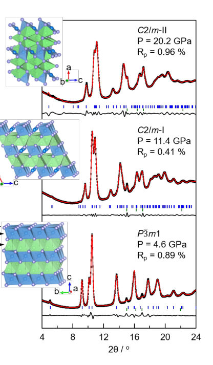
<figcaption class="paper-figure-caption"><b>Fig 3.</b> Figure 3 (a) Raman spectra of Mg3Sb2 under various pressures; (b) Phonon mode symmetry and vibration directions of Mg3Sb2; (c) Diffraction profiles of high-pressure phases of Mg3Sb2 at 4.6 GPa, 11.4 GPa, and 20.2 GPa, respectively. Experimental and calculated patterns are indicated by black stars and red lines, respectively. Solid lines below each curve represent residual intensity. Vertical bars indicate peak positions of Bragg reflections for Mg3Sb2 in the P3തm1 space group at 4.6 GPa, C2/m-I at 11.4 GPa, and C2/m-II at 20.2 GPa (blue) and Re gasket (olive). The inset shows structures of Mg3Sb2 under ambient condition (P3ത m1) and high pressure (C2/m-I and C2/m-II), respectively.</figcaption>
</figure>
<figure class="paper-figure-card">
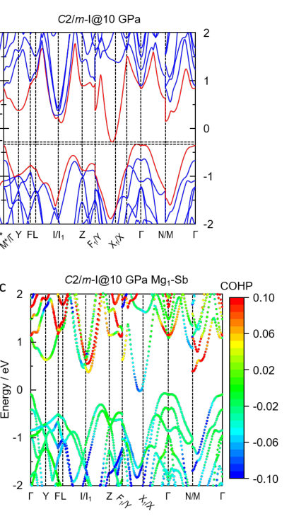
<figcaption class="paper-figure-caption"><b>Fig 4.</b> Figure 4 Calculated band structures and band-resolved pCOHP. (a) Aligned bands of the P3തm1 phase at ambient pressure and the C2/m-I phase at 10 GPa with respect to the average Mg 1s orbitals. Red lines indicate the band edges; (b) Band-resolved pCOHP of octahedral Mg-Sb for P3തm1 phase; (c) Band-resolved pCOHP of octahedral Mg-Sb for C2/m-I phase. The Fermi level is set as zero.</figcaption>
</figure>
<figure class="paper-figure-card">
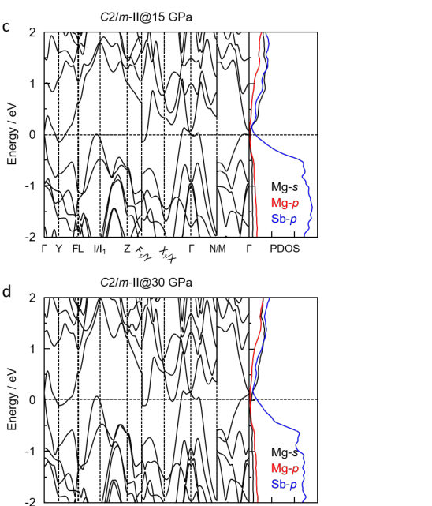
<figcaption class="paper-figure-caption"><b>Fig 5.</b> Figure 5 (a)-(b) Band structures and PDOS of the C2/m-I phase at various pressures; (c)-(d) Band structures and PDOS of the C2/m-II phase at various pressures.</figcaption>
</figure>

**Summary.** This work reports the discovery of pressure-induced superconductivity in $	ext{Mg}_3	ext{Sb}_2$, demonstrating that high pressure drives structural phase transitions and a carrier type crossover. By combining transport measurements, XRD, and Raman spectroscopy, the authors establish a detailed high-pressure phase diagram, revealing how electronic structure dictates emergent quantum properties like superconductivity.

**Why it may be interesting.** While focused on solid-state physics rather than quantum information, the study's detailed mapping of emergent quantum phenomena (superconductivity) driven by external parameters (pressure) provides an excellent model system for understanding how tuning external fields can induce novel quantum states in condensed matter systems.

Detailed structure

**Main problem.** The study investigates pressure-induced superconductivity, electronic transitions, and structural phase changes within the thermoelectric semiconductor $	ext{Mg}_3	ext{Sb}_2$. It aims to map out the high-pressure phase diagram of this material.

**Main result.** Superconductivity is discovered in $	ext{Mg}_3	ext{Sb}_2$ under pressure, exhibiting a dome-shaped critical temperature ($T_c$) peaking at $3.3 	ext{ K}$ at $12.6 	ext{ GPa}$. This superconductivity coincides with structural transitions and a carrier type crossover from p-type to n-type.

**Method.** The research combines multiple techniques: in situ high-pressure transport measurements (resistivity, Hall effect), X-ray diffraction (XRD) for structural identification, Raman spectroscopy for vibrational analysis, and first-principles theoretical calculations.

**Model / system.** The physical system is the $	ext{Mg}_3	ext{Sb}_2$ semiconductor crystal. The study tracks its electronic structure changes across different high-pressure phases ($	ext{P}ar{3}m1 	o 	ext{C}2/m	ext{-I} 	o 	ext{C}2/m	ext{-II}$), which are linked to the emergence of superconductivity.

**Key observables.** Superconducting critical temperature ($T_c$), resistivity ($
ho(T)$), Hall coefficient ($R_H$), structural phases ($	ext{P}ar{3}m1$, $	ext{C}2/m	ext{-I}$, $	ext{C}2/m	ext{-II}$), and carrier type (p-type to n-type).

**Important parameters / regimes.** Pressure regimes up to $30 	ext{ GPa}$; superconducting critical temperature peaking at $3.3 	ext{ K}$ at $12.6 	ext{ GPa}$.

**Assumptions / limitations.** The analysis relies on the assumption that structural phase transitions are directly coupled to changes in electronic properties and superconductivity.

**Figures summary.** Figures illustrate resistivity vs pressure showing superconducting signatures, Hall resistance confirming carrier crossover, and Raman/XRD spectra mapping out the sequence of structural phases ($	ext{P}ar{3}m1$, $	ext{C}2/m	ext{-I}$, $	ext{C}2/m	ext{-II}$) under increasing pressure.

**Paper structure.** The paper systematically presents evidence for high-pressure phase transitions using XRD and Raman, correlates these structural changes with electronic property shifts (metallization, p$	o$n crossover) via transport measurements, and finally maps the resulting superconducting dome structure to establish a comprehensive high-pressure phase diagram.

Abstract

The intrinsic electronic structures of narrow bandgap thermoelectric (TE) materials serve as a platform for the investigation of coupling effects of quasi-particles under high pressure, enabling the exploration of emerging electronic and phonon transport, superconductivity, and topological transition. Here, we report the discovery of pressure-induced superconductivity in the TE semiconductor Mg3Sb2. Upon the increased pressure, the metallization occurs at 8.7 GPa, followed by a superconducting transition concomitant with a carrier-type crossover from p- to n-type. This phenomenon arises from a pressure-induced structural phase transition from the semiconducting P-3m1 to the metallic C2/m-I phase. The superconducting critical temperature (Tc) exhibits a dome-shaped pressure dependence, peaking at 3.3 K at 12.6 GPa. Combined theoretical calculations, high-pressure Raman spectroscopy, and X-ray diffraction (XRD) measurements reveal an additional structural transition above 20 GPa, yielding a distinct C2/m-II phase. Our findings establish the high-pressure phase diagram of Mg3Sb2, elucidate its pressure-dependent electronic properties, and provide valuable insights for future investigations of TE materials under high pressure.

[↑ back to top](#top)

### [Machine Learning Bandgap Prediction of Nanoporous Graphenes with Water](http://arxiv.org/abs/2608.03680v1)

**Authors:** Sneha Mittal, Alan E. Anaya Morales, Victor Rosendal, Mads Brandbyge  
**Type:** theory · **Category:** disordered systems and neural networks · **PDF:** <https://arxiv.org/pdf/2608.03680v1>  
**Analysis basis:** full PDF text, analyzed in chunks
**Topic relevance:** `methods for driven-dissipative` **1/5**

↔ Scroll figures horizontally

<figure class="paper-figure-card">
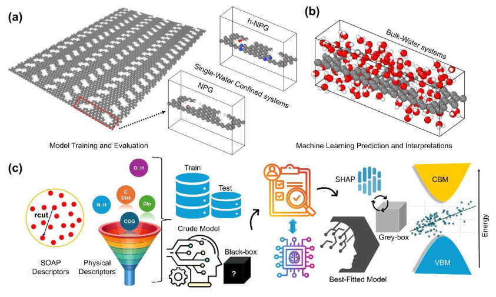
<figcaption class="paper-figure-caption"><b>Fig 1.</b> Figure 1. (a) Atomic structure of NPG showing the selected unit-cell region used to model single and bulk water NPG/h-NPG systems. Single-water configurations are shown for NPG and h-NPG, (b) a representative bulk-water configuration, and (c) an end-to-end ML framework comprising data generation, model training, prediction, and interpretation. Structural descriptors, including SOAP and physics-informed descriptors, are extracted to encode the relationship between atomic configurations and bandgap energies. Multiple data- driven black-box and physics-informed grey-box models are trained and evaluated, followed by hyperparameter tuning. The best-fitted models are then applied to predict...</figcaption>
</figure>
<figure class="paper-figure-card">
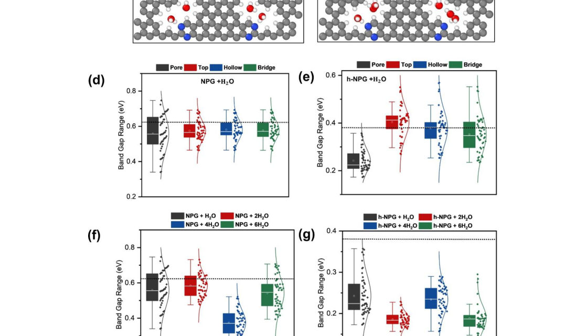
<figcaption class="paper-figure-caption"><b>Fig 2.</b> Figure 2. (a) Periodic unit cells of NPG and h-NPG with a single-water molecule adsorbed at the pore site, the arrows show different adsorption sites for water, and (b) electronic band structures of NPG and h-NPG in the presence of a single-water molecule. The band dispersions are plotted along the high-symmetry path X → Γ → Z in the Brillouin zone. The black dashed band lines indicate the corresponding band structures of the pristine systems for comparison. (c) Schematic of the optimized configuration of h-NPG with an increasing number of water</figcaption>
</figure>
<figure class="paper-figure-card">
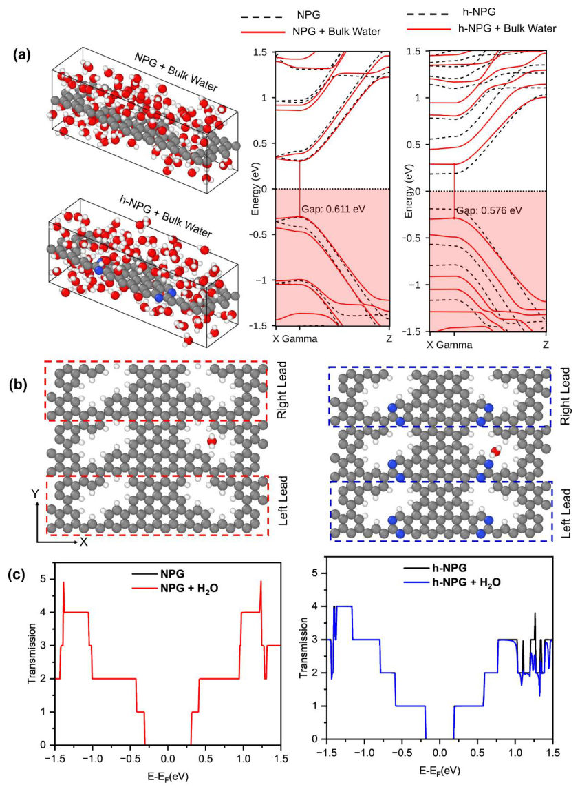
<figcaption class="paper-figure-caption"><b>Fig 3.</b> Figure 3. (a) Periodic unit cells of NPG and h-NPG under bulk-water at ambient density (𝜌= 1.0 𝑔 𝑐𝑚−3) and corresponding band structures, (b) Two-probe transport geometries of NPG/h- NPG with water adsorbed at the pore site. The dashed boxes indicate the electrode regions used in the transport calculations, and (c) Zero-bias transmission spectra of single-water NPG/h- NPG systems. For comparison, the transmission spectra of corresponding pristine systems are also shown. The Fermi energy is shifted to zero.</figcaption>
</figure>
<figure class="paper-figure-card">
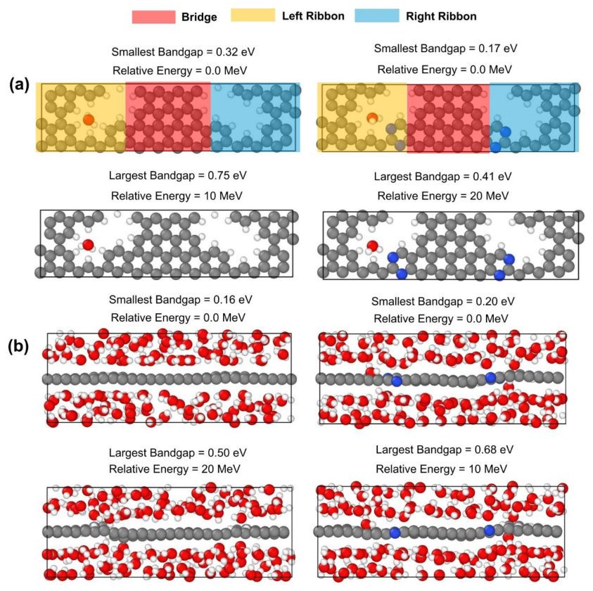
<figcaption class="paper-figure-caption"><b>Fig 4.</b> Figure 4. The lowest and highest bandgap configurations of NPG and h-NPG in (a) single- water and (b) bulk water environments. Atom color code: carbon (grey), hydrogen (white), oxygen (red), and nitrogen (blue).</figcaption>
</figure>
<figure class="paper-figure-card">
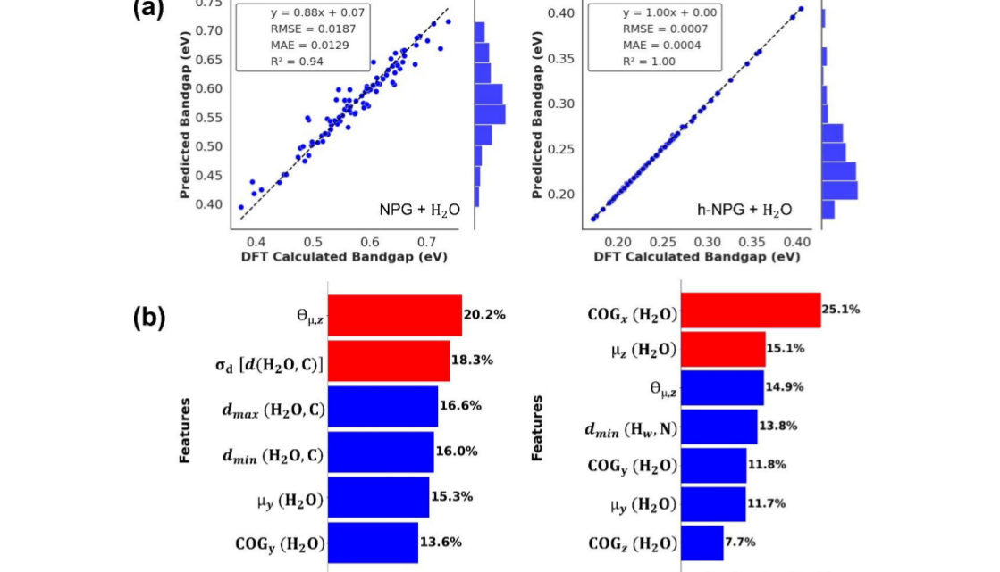
<figcaption class="paper-figure-caption"><b>Fig 5.</b> Fig. 6 Grey-box ML prediction and feature-importance analysis for single-water NPG and h- NPG systems. (a) Marginal histogram parity plots comparing GPR-predicted bandgaps with DFT-calculated bandgaps for NPG + H2O and h-NPG + H2O using physics-informed descriptors. (b) SHAP-based global feature-importance plots showing the relative contribution of the selected descriptors to the bandgap prediction for each system.</figcaption>
</figure>

**Summary.** The authors investigate how water influences the electronic bandgap of nanoporous graphene structures by combining DFT simulations with Machine Learning. They develop sophisticated ML models using structural descriptors derived from molecular dynamics to predict the bandgap accurately while simultaneously identifying key physical factors, such as dipole orientation and local hydration structure, that control this quantum transport property.

**Why it may be interesting.** This work bridges solid-state physics with advanced data science by using machine learning not just as a black box predictor, but as an *interpretable* tool to derive physical rules governing quantum material response to environmental coupling (water).

Detailed structure

**Main problem.** The study aims to understand how the presence of confined or ambient water molecules modulates the quantum electronic bandgap in nanoporous graphene (NPG) and its nitrogen-doped variant ($	ext{h-NPG}$).

**Main result.** Water interaction significantly affects $	ext{h-NPG}$ bandgaps, which is quantified by developing interpretable Machine Learning models that correlate structural descriptors of the water environment with electronic properties.

**Method.** The research combines Density Functional Theory ($	ext{DFT}$) and *ab initio* Molecular Dynamics ($	ext{AIMD}$) simulations to generate data, followed by training various supervised ML regression models (like GPR) using SOAP-based descriptors for prediction.

**Model / system.** The system involves NPG/h-NPG nanostructures interacting with water. The electronic properties are calculated via DFT on configurations sampled through AIMD simulations across varying water densities and adsorption sites.

**Key observables.** Bandgap energy, dipole moments (magnitude and orientation), water-substrate distances ($	ext{d}_{\min}, 	ext{d}_{\max}$), and various structural descriptors derived from the local atomic environment.

**Important parameters / regimes.** Temperature ($300 	ext{ K}$), cutoff radii ($r_{	ext{cut}} = 6 	ext{ Å}$ or $5 	ext{ Å}$), and water density (single-water vs. bulk $\sim 1.0 	ext{ g/cm}^3$).

**Assumptions / limitations.** The ML models are trained to balance predictive accuracy with physical interpretability, assuming that the bandgap variation can be mapped onto local structural and electrostatic descriptors.

**Figures summary.** Figures illustrate the ML framework, DFT-calculated band structures comparing pristine vs. hydrated states, UMAP embeddings showing descriptor space diversity, and plots correlating predicted vs. calculated bandgaps using various physical features.

**Paper structure.** The paper systematically develops a multi-scale approach: first, simulating water interactions ($	ext{AIMD}$); second, extracting comprehensive structural/electrostatic descriptors (SOAP, dipole moments, distances); third, training and validating ML models (GPR, KRR, etc.) to predict the bandgap; and finally, interpreting which specific descriptors govern the observed electronic modulation.

Abstract

The structure and dynamical behavior of water confined at or within nanostructures is a topic central to many fields, from biology to emerging electronics such as carbon nanostructures. Nanoporous graphene (NPG) containing periodic nanoscale pores with specific topologies has emerged as a promising material in carbon-based nanoelectronics; however, its interaction with ambient water remains poorly understood. Here, we combine density functional theory (DFT), ab initio molecular dynamics (AIMD), and interpretable machine learning (ML) to reveal how water controls quantum transport in NPGs. Depending on the local hydration structure, the bandgap varies by more than a factor of two across NPG and nitrogen-doped hybrid (h-NPG) systems. To uncover the underlying mechanism, we develop Smooth Overlap of Atomic Positions (SOAP)-based black-box and physics-informed grey-box ML models. The Gaussian process regression model achieves near-DFT accuracy while enabling physical interpretation. Analysis identifies water dipole orientation, water-substrate distance, water center-of-geometry, and ribbon-resolved dipole moments as the dominant factors controlling bandgap modulation across NPG and h-NPG systems.

[↑ back to top](#top)

### Other secondary papers (1)

Show other secondary papers

### [Quaternion-Kahler geometry of time reversal symmetric crystals](http://arxiv.org/abs/2608.03178v1)

**Authors:** Hyeongmuk Lim, Junseo Jung, Yuting Qian, Bohm-Jung Yang  
**Type:** theory · **Category:** other · **PDF:** <https://arxiv.org/pdf/2608.03178v1>  
**Analysis basis:** full PDF text, analyzed in chunks

↔ Scroll figures horizontally

<figure class="paper-figure-card">
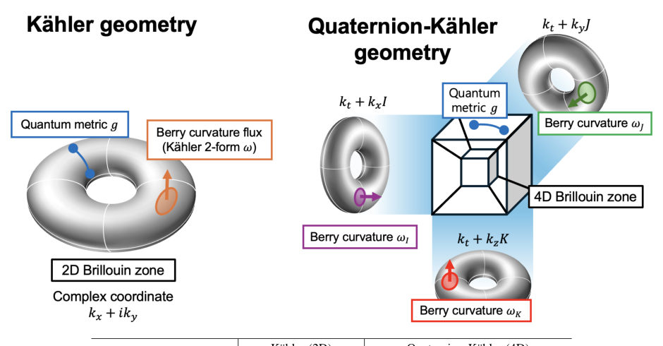
<figcaption class="paper-figure-caption"><b>Fig 1.</b> Figure 1. Schematic comparison of K¨ahler and quaternion-K¨ahler band geometry. In an ideal two-dimensional Chern band, the quantum metric and the Abelian Berry curvature are related by a complex structure: the metric measures distances between nearby Bloch states, while the Berry curvature measures the phase rotation accumulated around an infinitesimal momentum space loop. For a time reversal symmetric Kramers pair in four dimensions, the Abelian curvature is replaced by an SU(2) curvature with three local components, F I, F J, and F K. These components rotate into one another under a change of Kramers frame, while the metric g and the canonical four-form Ω= P</figcaption>
</figure>
<figure class="paper-figure-card">
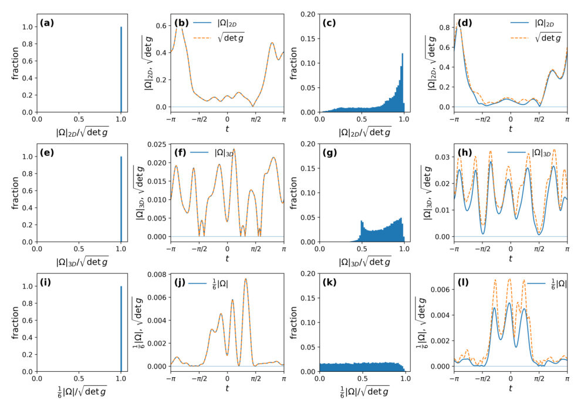
<figcaption class="paper-figure-caption"><b>Fig 2.</b> Figure 2. Induced metric–curvature inequalities in random Wilson–Dirac models. The figure compares the quantum geometric local bounds in two, three, and four dimensions. The rows correspond respectively to the two-dimensional slice k3 = k4 = 0, the three-dimensional slice k4 = 0, and the full four-dimensional Brillouin zone. In the histogram panels, the plotted target function is Ad(k)/ p</figcaption>
</figure>
<figure class="paper-figure-card">
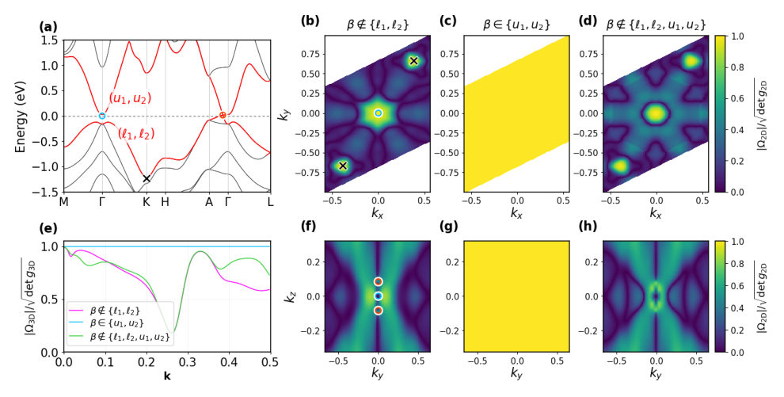
<figcaption class="paper-figure-caption"><b>Fig 3.</b> Figure 3. Metric–curvature inequalities in Na3Bi. Numerical evaluation of the induced quaternionic metric–curvature bounds for the Na3Bi band structure. (a) Band dispersion along high-symmetry lines. The target lower Kramers pair {ℓ1, ℓ2} and the upper low-energy pair {u1, u2} are shown in red, and the dashed line denotes the Fermi level EF . (b–d) Two-dimensional bound √det g2D ≥|Ω|2D on the displayed (kx, ky) slice, represented by the saturation ratio |Ω|2D/√det g2D. (e–h) Corresponding three-dimensional bound √det g3D ≥|Ω|3D. Panel (e) shows a line cut along (k1, k2, k3) = (t, t, t), whereas panels (f–h) show maps on the displayed (ky, kz) plane. In the spectral decomposition of the...</figcaption>
</figure>

**Summary.** The paper establishes that the quantum geometry describing time reversal symmetric crystals must be quaternionic rather than Kähler. By introducing the Quaternion-Quantum Geometric Tensor, the authors derive fundamental metric–curvature inequalities that constrain the band structure's topology in 2D, 3D, and 4D systems.

**Why it may be interesting.** This work provides a powerful mathematical generalization of topological band theory from Abelian (Chern) to non-Abelian (Quaternion-Kähler) geometry, offering new constraints on the electronic structure of time-reversal symmetric materials.

Detailed structure

**Main problem.** To develop a generalized geometric framework for quantum phenomena in time reversal symmetric crystals, moving beyond standard Kähler geometry.

**Main result.** The geometry governing Kramers pairs is shown to be quaternionic, leading to the Quaternion-Quantum Geometric Tensor (QQGT) which unifies the metric and non-Abelian Berry curvature components.

**Method.** The authors employ advanced differential geometry, mapping band structures into quaternion projective space ($\mathbb{HP}^n$) and deriving metric–curvature inequalities from the QQGT.

**Model / system.** The study focuses on time reversal symmetric crystals with spin, characterized by Kramers degeneracy pairs of Bloch states. The analysis generalizes concepts from Abelian Chern bands to non-Abelian structures relevant for these systems.

**Key observables.** Quantum metric ($g$), three components of the $	ext{SU}(2)$ Berry curvature ($\mathbf{F}_I, \mathbf{F}_J, \mathbf{F}_K$), and topological invariants like the second Chern number ($C_2$) and Fu–Kane–Mele invariants.

**Important parameters / regimes.** The dimensionality (2D, 3D, 4D) of the Brillouin zone manifold; the structure dictated by Kramers pairs ($\Theta = PT$).

**Assumptions / limitations.** The analysis assumes the existence of a Kramers pair structure and relies on rigidity arguments within quaternionic projective space to establish bounds.

**Figures summary.** Figure 1 schematically compares Kähler (2D, Abelian) and Quaternion-Kähler (4D, non-Abelian) band geometry; other figures illustrate band structure folding when time reversal symmetry is present.

**Paper structure.** The paper progresses by first identifying the geometric inadequacy of Kähler theory for spinful systems, then introducing the quaternionic framework via the QQGT, establishing 4D bounds, and finally deriving lower-dimensional analogues (2D and 3D) relating to known topological invariants.

Abstract

Quantum geometry reveals how the shape of Bloch wave functions governs correlated quantum phenomena. Its standard formulation describes isolated complex bands, where Berry curvature is Abelian and ideal geometry is Kahler. However, time reversal symmetric crystals with spin require a different language since Kramers degeneracy pairs Bloch states and turns Berry curvature into a non-Abelian SU(2) field. Here we show that Kramers pair band geometry is quaternionic. A minimal Kramers pair defines a map into quaternion projective space, and its quaternionic quantum geometric tensor unifies the quantum metric with the three SU(2) Berry curvature components. The non-negativity of this tensor imposes local metric-curvature inequalities, whose saturation defines the non-Abelian counterpart of ideal Chern bands. In four dimensions, the ideal limit further yields an algebraic structure related to the four-dimensional quantum Hall effect. Our results promote ideal quantum geometry from the Abelian geometry of Chern bands to the quaternionic, non-Abelian geometry of time reversal symmetric quantum matter.

[↑ back to top](#top)

