
# arxiv digest (quant-ph + cond-mat) — 2026-08-07

*98 papers · 40 relevant · 0 highlighted*

## 🔥 Most relevant (40)

*Every paper with at least one nonzero topic score, sorted by best-matching score. 🔥 marks scores ≥4/5. Click the title to jump to the full entry below; click [arXiv] to open the paper page. `(secondary)` marks papers from de-prioritized cond-mat archives.*

Show 40 relevant papers

- [Scaling behavior in non-reciprocal and odd conserved dynamics near criticality](#paper-2608.05027) [[arXiv]](http://arxiv.org/abs/2608.05027v1) — 🔥 `non-equilibrium universality` **5/5** · 🔥 `driven-dissipative phase transition` **4/5** · `Keldysh / 2PI / non-Gaussian methods` **3/5** · `methods for driven-dissipative` **3/5** · `non-equilibrium dynamics` **3/5** · `Frenkel-Kontorova` **1/5** · `analog quantum simulation` **1/5** · `correlated / nonlocal dissipation` **1/5**
- [Neutral Atom Quantum Computing: Principles, Routes, Progress, and Challenges](#paper-2608.05010) [[arXiv]](http://arxiv.org/abs/2608.05010v1) — 🔥 `QC/QI experiment` **5/5** · 🔥 `Rydberg arrays` **4/5** · `analog quantum simulation` **3/5** · `entanglement & information structure` **2/5** · `non-equilibrium dynamics` **1/5** · `quantum optics experiment` **1/5**
- [Measurement-induced generation of Schrödinger cat states in cavity QED](#paper-2608.04578) [[arXiv]](http://arxiv.org/abs/2608.04578v1) — 🔥 `measurement-induced transitions` **4/5** · 🔥 `quantum optics experiment` **4/5** · `analog quantum simulation` **3/5** · `methods for driven-dissipative` **3/5** · `quantum measurements` **3/5** · `QC/QI experiment` **2/5** · `Tavis-Cummings & cavity-many-emitter` **2/5** · `correlated cavity matter` **2/5** · `driven-dissipative phase transition` **2/5** · `Keldysh / 2PI / non-Gaussian methods` **1/5** · `correlated / nonlocal dissipation` **1/5** · `entanglement & information structure` **1/5** · `interference shaping light` **1/5** · `non-equilibrium dynamics` **1/5** · `non-equilibrium universality` **1/5**
- [High-cooperativity coupling and spin-resolved extinction of tin-vacancy centers in a diamond-like microcavity](#paper-2608.04797) [[arXiv]](http://arxiv.org/abs/2608.04797v1) — 🔥 `quantum optics experiment` **4/5** · 🔥 `spintronics-quantum-optics interface` **4/5** · `Tavis-Cummings & cavity-many-emitter` **3/5** · `analog quantum simulation` **3/5** · `correlated cavity matter` **3/5** · `exotic spin models in light-matter` **3/5** · `QC/QI experiment` **2/5** · `correlated / nonlocal dissipation` **1/5** · `driven-dissipative phase transition` **1/5** · `entanglement & information structure` **1/5** · `interference shaping light` **1/5** · `methods for driven-dissipative` **1/5**
- [Constructing Non-Hermitian Theories with Tunable Exceptional Points and Controlled State Purification](#paper-2608.05052) [[arXiv]](http://arxiv.org/abs/2608.05052v1) — 🔥 `methods for driven-dissipative` **4/5** · `Keldysh / 2PI / non-Gaussian methods` **3/5** · `analog quantum simulation` **3/5** · `correlated / nonlocal dissipation` **3/5** · `driven-dissipative phase transition` **3/5** · `Kondo & dissipative impurity` **2/5** · `entanglement & information structure` **2/5** · `non-equilibrium dynamics` **2/5** · `non-equilibrium universality` **2/5** · `measurement-induced transitions` **1/5**
- [Engineering Nanodiamonds for Quantum Sensing: Material Constraints at the Nanoscale](#paper-2608.04489) [[arXiv]](http://arxiv.org/abs/2608.04489v1) — 🔥 `QC/QI experiment` **4/5** · `methods for driven-dissipative` **3/5** · `spintronics-quantum-optics interface` **3/5** · `analog quantum simulation` **2/5** · `correlated / nonlocal dissipation` **2/5** · `driven-dissipative phase transition` **2/5** · `Keldysh / 2PI / non-Gaussian methods` **1/5** · `Kondo & dissipative impurity` **1/5** · `entanglement & information structure` **1/5** · `exotic spin models in light-matter` **1/5** · `non-equilibrium dynamics` **1/5** · `non-equilibrium universality` **1/5** · `quantum measurements` **1/5** · `quantum optics experiment` **1/5**
- [Spectral evolution of two-photon emission in microresonators](#paper-2608.04684) [[arXiv]](http://arxiv.org/abs/2608.04684v1) — 🔥 `quantum optics experiment` **4/5** · `correlated cavity matter` **3/5** · `driven-dissipative phase transition` **3/5** · `interference shaping light` **3/5** · `Keldysh / 2PI / non-Gaussian methods` **2/5** · `Tavis-Cummings & cavity-many-emitter` **2/5** · `non-equilibrium dynamics` **2/5** · `QC/QI experiment` **1/5** · `methods for driven-dissipative` **1/5** · `non-equilibrium universality` **1/5** · `quantum measurements` **1/5** · `superradiant laser` **1/5**
- [Preparation geometry and slow-sector routing in driven Kerr resonators: an operational spectral theory of Liouvillians](#paper-2608.05046) [[arXiv]](http://arxiv.org/abs/2608.05046v1) — 🔥 `methods for driven-dissipative` **4/5** · `Keldysh / 2PI / non-Gaussian methods` **3/5** · `driven-dissipative phase transition` **3/5** · `correlated / nonlocal dissipation` **2/5** · `correlated cavity matter` **2/5** · `non-equilibrium dynamics` **2/5** · `non-equilibrium universality` **2/5** · `Tavis-Cummings & cavity-many-emitter` **1/5** · `measurement-induced transitions` **1/5** · `quantum measurements` **1/5**
- [RKKY interaction as a probe of spin splitting and odd-parity nature in Floquet collinear magnets](#paper-2608.04969) [[arXiv]](http://arxiv.org/abs/2608.04969v1) `(secondary)` — 🔥 `exotic spin models in light-matter` **4/5** · 🔥 `non-equilibrium dynamics` **4/5** · `Keldysh / 2PI / non-Gaussian methods` **3/5** · `methods for driven-dissipative` **3/5** · `spintronics-quantum-optics interface` **3/5** · `analog quantum simulation` **2/5** · `driven-dissipative phase transition` **1/5** · `non-equilibrium universality` **1/5**
- [Analytical Floquet Quantum Statistics from Nonequilibrium Green's Functions](#paper-2608.04558) [[arXiv]](http://arxiv.org/abs/2608.04558v1) — 🔥 `methods for driven-dissipative` **4/5** · 🔥 `non-equilibrium dynamics` **4/5** · `Keldysh / 2PI / non-Gaussian methods` **3/5** · `driven-dissipative phase transition` **3/5** · `non-equilibrium universality` **2/5** · `Kondo & dissipative impurity` **1/5** · `analog quantum simulation` **1/5** · `correlated / nonlocal dissipation` **1/5** · `correlated cavity matter` **1/5**
- [Critical and multicritical Kasner scaling in holographic phase transitions](#paper-2608.04522) [[arXiv]](http://arxiv.org/abs/2608.04522v1) — 🔥 `non-equilibrium universality` **4/5** · `Keldysh / 2PI / non-Gaussian methods` **3/5** · `driven-dissipative phase transition` **3/5** · `entanglement & information structure` **2/5** · `methods for driven-dissipative` **2/5** · `non-equilibrium dynamics` **2/5** · `analog quantum simulation` **1/5** · `correlated / nonlocal dissipation` **1/5** · `correlated cavity matter` **1/5**
- [Quantum Contextuality and Entanglement-Free Grover Search in a Trapped-Ion Optical Qudit](#paper-2608.04128) [[arXiv]](http://arxiv.org/abs/2608.04128v1) — 🔥 `QC/QI experiment` **4/5** · `quantum measurements` **3/5** · `quantum optics experiment` **3/5** · `entanglement & information structure` **2/5** · `measurement-induced transitions` **2/5** · `analog quantum simulation` **1/5** · `correlated / nonlocal dissipation` **1/5** · `driven-dissipative phase transition` **1/5** · `interference shaping light` **1/5** · `non-equilibrium dynamics` **1/5**
- [Single-eigenstate test of eigenstate thermalization hypothesis via perturbed eigenstate quench](#paper-2608.04696) [[arXiv]](http://arxiv.org/abs/2608.04696v1) — 🔥 `analog quantum simulation` **4/5** · 🔥 `non-equilibrium dynamics` **4/5** · `non-equilibrium universality` **3/5** · `entanglement & information structure` **2/5** · `scars & prethermalization` **2/5** · `correlated / nonlocal dissipation` **1/5** · `driven-dissipative phase transition` **1/5** · `exotic spin models in light-matter` **1/5** · `methods for driven-dissipative` **1/5**
- [Emergent Replica Clock Unifies Many-Body Localization and Thermalization](#paper-2608.04762) [[arXiv]](http://arxiv.org/abs/2608.04762v1) — 🔥 `non-equilibrium dynamics` **4/5** · `non-equilibrium universality` **3/5** · `analog quantum simulation` **2/5** · `entanglement & information structure` **2/5** · `scars & prethermalization` **2/5** · `Keldysh / 2PI / non-Gaussian methods` **1/5** · `correlated / nonlocal dissipation` **1/5** · `driven-dissipative phase transition` **1/5** · `methods for driven-dissipative` **1/5**
- [Entanglement entropy of fermions in a strange metal](#paper-2608.04098) [[arXiv]](http://arxiv.org/abs/2608.04098v1) — 🔥 `entanglement & information structure` **4/5** · `non-equilibrium universality` **3/5** · `Keldysh / 2PI / non-Gaussian methods` **2/5** · `analog quantum simulation` **2/5** · `driven-dissipative phase transition` **2/5** · `Kondo & dissipative impurity` **1/5** · `correlated / nonlocal dissipation` **1/5** · `methods for driven-dissipative` **1/5** · `non-equilibrium dynamics` **1/5**
- [Breakdown of Monotonic Impurity Entropy Flow in $\mathscr{PT}$-Symmetric Multichannel Kondo Systems](#paper-2608.04083) [[arXiv]](http://arxiv.org/abs/2608.04083v1) — 🔥 `Kondo & dissipative impurity` **4/5** · `Keldysh / 2PI / non-Gaussian methods` **3/5** · `driven-dissipative phase transition` **3/5** · `non-equilibrium universality` **2/5** · `correlated / nonlocal dissipation` **1/5** · `entanglement & information structure` **1/5** · `methods for driven-dissipative` **1/5** · `non-equilibrium dynamics` **1/5**
- [From normal Lindbladians to non-normal quantum trajectories](#paper-2608.04775) [[arXiv]](http://arxiv.org/abs/2608.04775v1) — 🔥 `methods for driven-dissipative` **4/5** · 🔥 `quantum measurements` **4/5** · `measurement-induced transitions` **3/5** · `non-equilibrium dynamics` **2/5** · `Keldysh / 2PI / non-Gaussian methods` **1/5** · `correlated / nonlocal dissipation` **1/5** · `driven-dissipative phase transition` **1/5**
- [Revealing Noise in Axial Motion Through Quantum Noise Spectroscopy on a Trapped Ion Processor](#paper-2608.04089) [[arXiv]](http://arxiv.org/abs/2608.04089v1) — 🔥 `QC/QI experiment` **4/5** · `methods for driven-dissipative` **3/5** · `quantum measurements` **2/5** · `quantum optics experiment` **2/5** · `Keldysh / 2PI / non-Gaussian methods` **1/5** · `analog quantum simulation` **1/5** · `correlated / nonlocal dissipation` **1/5** · `driven-dissipative phase transition` **1/5** · `non-equilibrium dynamics` **1/5**
- [Valley polarization of moiré interlayer exciton complexes driven by many-body interactions](#paper-2608.04151) [[arXiv]](http://arxiv.org/abs/2608.04151v1) — 🔥 `analog quantum simulation` **4/5** · `non-equilibrium dynamics` **3/5** · `non-equilibrium universality` **2/5** · `quantum optics experiment` **2/5** · `Keldysh / 2PI / non-Gaussian methods` **1/5** · `correlated / nonlocal dissipation` **1/5** · `driven-dissipative phase transition` **1/5** · `entanglement & information structure` **1/5** · `methods for driven-dissipative` **1/5**
- [Wavepacket Approach for Spin Transport in Zigzag Spin Chain](#paper-2608.04534) [[arXiv]](http://arxiv.org/abs/2608.04534v1) — 🔥 `analog quantum simulation` **4/5** · `exotic spin models in light-matter` **3/5** · `non-equilibrium dynamics` **3/5** · `non-equilibrium universality` **2/5** · `entanglement & information structure` **1/5** · `methods for driven-dissipative` **1/5** · `scars & prethermalization` **1/5** · `spintronics-quantum-optics interface` **1/5**
- [Disentanglement in the macroscopic limit](#paper-2608.04858) [[arXiv]](http://arxiv.org/abs/2608.04858v1) — 🔥 `entanglement & information structure` **4/5** · `analog quantum simulation` **2/5** · `correlated / nonlocal dissipation` **2/5** · `driven-dissipative phase transition` **2/5** · `methods for driven-dissipative` **2/5** · `Keldysh / 2PI / non-Gaussian methods` **1/5** · `non-equilibrium dynamics` **1/5** · `non-equilibrium universality` **1/5**
- [An improved car-oriented mean-field theory for stochastic traffic flow models](#paper-2608.04731) [[arXiv]](http://arxiv.org/abs/2608.04731v1) — 🔥 `methods for driven-dissipative` **4/5** · `Keldysh / 2PI / non-Gaussian methods` **3/5** · `non-equilibrium dynamics` **2/5** · `non-equilibrium universality` **2/5** · `Frenkel-Kontorova` **1/5** · `correlated / nonlocal dissipation` **1/5** · `driven-dissipative phase transition` **1/5**
- [Methods for traceable scanning magnetometry using single nitrogen vacancy centers in diamond: determining orientation, distance and localization](#paper-2608.04632) [[arXiv]](http://arxiv.org/abs/2608.04632v1) — 🔥 `QC/QI experiment` **4/5** · 🔥 `spintronics-quantum-optics interface` **4/5** · `quantum measurements` **2/5** · `quantum optics experiment` **2/5** · `analog quantum simulation` **1/5** · `exotic spin models in light-matter` **1/5**
- [Constructive realization of self-referential prediction limits in quantum control: Resource bounds and Gödel-safe architectures](#paper-2608.04779) [[arXiv]](http://arxiv.org/abs/2608.04779v1) — 🔥 `quantum measurements` **4/5** · `measurement-induced transitions` **3/5** · `QC/QI experiment` **2/5** · `driven-dissipative phase transition` **1/5** · `entanglement & information structure` **1/5** · `interference shaping light` **1/5** · `quantum optics experiment` **1/5**
- [Demonstrating advantages of dynamic quantum circuits on a hybrid superconducting qubit-cavity processor](#paper-2608.04780) [[arXiv]](http://arxiv.org/abs/2608.04780v1) — 🔥 `QC/QI experiment` **4/5** · `measurement-induced transitions` **3/5** · `quantum measurements` **3/5** · `correlated cavity matter` **1/5** · `non-equilibrium dynamics` **1/5** · `quantum optics experiment` **1/5**
- [Laminar gaps mirror turbulent puffs in pipe flow](#paper-2608.04823) [[arXiv]](http://arxiv.org/abs/2608.04823v1) — 🔥 `non-equilibrium universality` **4/5** · `driven-dissipative phase transition` **3/5** · `non-equilibrium dynamics` **3/5** · `Frenkel-Kontorova` **1/5** · `analog quantum simulation` **1/5** · `methods for driven-dissipative` **1/5**
- [Poled-fibre phase modulator for efficient high-dimensional quantum measurements](#paper-2608.04112) [[arXiv]](http://arxiv.org/abs/2608.04112v1) — 🔥 `QC/QI experiment` **4/5** · `quantum measurements` **3/5** · `quantum optics experiment` **3/5** · `interference shaping light` **1/5** · `measurement-induced transitions` **1/5**
- [Universal Scaling of the Minimum Error Probability in Qualification of Quantum States](#paper-2608.04870) [[arXiv]](http://arxiv.org/abs/2608.04870v1) — 🔥 `quantum measurements` **4/5** · `measurement-induced transitions` **3/5** · `non-equilibrium universality` **2/5** · `driven-dissipative phase transition` **1/5** · `entanglement & information structure` **1/5** · `non-equilibrium dynamics` **1/5**
- [Accessing Chern Numbers From Bloch Eigenstates Singularities](#paper-2608.04998) [[arXiv]](http://arxiv.org/abs/2608.04998v1) `(secondary)` — 🔥 `analog quantum simulation` **4/5** · `quantum optics experiment` **3/5** · `non-equilibrium dynamics` **2/5** · `driven-dissipative phase transition` **1/5** · `interference shaping light` **1/5**
- [Analytic correspondence between multipartite entanglement and quantum phase transitions](#paper-2608.04467) [[arXiv]](http://arxiv.org/abs/2608.04467v1) — 🔥 `entanglement & information structure` **4/5** · `analog quantum simulation` **3/5** · `Keldysh / 2PI / non-Gaussian methods` **1/5** · `driven-dissipative phase transition` **1/5** · `exotic spin models in light-matter` **1/5**
- [Contextuality in Sequential State Discrimination](#paper-2608.04099) [[arXiv]](http://arxiv.org/abs/2608.04099v1) — 🔥 `quantum measurements` **4/5** · `measurement-induced transitions` **3/5** · `Keldysh / 2PI / non-Gaussian methods` **1/5** · `driven-dissipative phase transition` **1/5** · `entanglement & information structure` **1/5**
- [The two-particle-irreducible vertex of the two-dimensional lattice $φ^4$ model across the Ising transition](#paper-2608.04497) [[arXiv]](http://arxiv.org/abs/2608.04497v1) — 🔥 `Keldysh / 2PI / non-Gaussian methods` **4/5** · `analog quantum simulation` **1/5** · `driven-dissipative phase transition` **1/5** · `methods for driven-dissipative` **1/5** · `non-equilibrium dynamics` **1/5** · `non-equilibrium universality` **1/5**
- [Lifting the degeneracy of quantum spin liquid phase by uniaxial pressure](#paper-2608.04782) [[arXiv]](http://arxiv.org/abs/2608.04782v1) — 🔥 `analog quantum simulation` **4/5** · `exotic spin models in light-matter` **3/5** · `spintronics-quantum-optics interface` **1/5**
- [Reconstructing non-Abelian braiding and fusion without anyon transport](#paper-2608.04103) [[arXiv]](http://arxiv.org/abs/2608.04103v1) — 🔥 `QC/QI experiment` **4/5** · `quantum measurements` **3/5** · `measurement-induced transitions` **1/5**
- [An optical-fibre-integrated buffer for packet-switched quantum networks](#paper-2608.04093) [[arXiv]](http://arxiv.org/abs/2608.04093v1) — 🔥 `QC/QI experiment` **4/5** · `quantum optics experiment` **2/5** · `interference shaping light` **1/5**
- [Complex field-induced magnetic phases and anisotropic magnetotransport in off-stoichiometric CeCuBi2](#paper-2608.04946) [[arXiv]](http://arxiv.org/abs/2608.04946v1) — 🔥 `Kondo & dissipative impurity` **4/5** · `analog quantum simulation` **1/5** · `exotic spin models in light-matter` **1/5** · `spintronics-quantum-optics interface` **1/5**
- [Motional refocusing for trap-off Rydberg gates](#paper-2608.04812) [[arXiv]](http://arxiv.org/abs/2608.04812v1) — 🔥 `Rydberg arrays` **4/5** · `QC/QI experiment` **1/5** · `methods for driven-dissipative` **1/5** · `non-equilibrium dynamics` **1/5**
- [Quantum Many-Body Metrology of Rotation Sensing with Strong Interactions](#paper-2608.04082) [[arXiv]](http://arxiv.org/abs/2608.04082v1) — 🔥 `analog quantum simulation` **4/5** · `entanglement & information structure` **2/5** · `non-equilibrium dynamics` **1/5**
- [Complementary Quantum Correlations Are Universal for Qubits](#paper-2608.04916) [[arXiv]](http://arxiv.org/abs/2608.04916v1) — 🔥 `entanglement & information structure` **4/5** · `quantum measurements` **2/5**
- [Sharp Continuity of Petz and Sandwiched Rényi Conditional Entropies](#paper-2608.04947) [[arXiv]](http://arxiv.org/abs/2608.04947v1) — 🔥 `entanglement & information structure` **4/5**

## All papers (82, sorted by relevance)

*Papers from quant-ph and your primary cond-mat archives (quant-gas, stat-mech, str-el, dis-nn). Highlighted papers (⭐) come first, then everything else sorted by topic-relevance score, highest first.*

### [Scaling behavior in non-reciprocal and odd conserved dynamics near criticality](http://arxiv.org/abs/2608.05027v1)

**Authors:** Martin Kjøllesdal Johnsrud, Giulia Pisegna, Ramin Golestanian  
**Type:** theory · **Category:** statistical mechanics · **PDF:** <https://arxiv.org/pdf/2608.05027v1>  
**Analysis basis:** full PDF text, analyzed in chunks
**Topic relevance:** 🔥 `non-equilibrium universality` **5/5** · 🔥 `driven-dissipative phase transition` **4/5** · `Keldysh / 2PI / non-Gaussian methods` **3/5** · `methods for driven-dissipative` **3/5** · `non-equilibrium dynamics` **3/5** · `Frenkel-Kontorova` **1/5** · `analog quantum simulation` **1/5** · `correlated / nonlocal dissipation` **1/5**

↔ Scroll figures horizontally

<figure class="paper-figure-card">
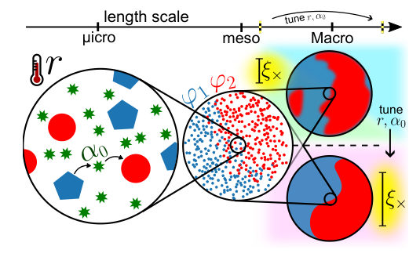
<figcaption class="paper-figure-caption"><b>Fig 1.</b> FIG. 1. Illustration of the hierarchical structure of the sys- tem. µicro: Two species of enzymes or active colloids (red and blue) produce and consume a chemical (green). Features such as temperature and non-reciprocal activity set the parame- ters, such as the tuning parameters r and α0. meso: The sys- tem is described by a density field φa. Macro: The crossover length ξ× (yellow) depends on the tuning of the microscopic parameters r and α0. Adjusting the tuning parameters can induce transitions between different regimes, depending on whether the correlation length is above (green/blue, mani- festly Non-Reciprocal regime) or below (magenta, effective- equilibrium regime) the crossover...</figcaption>
</figure>
<figure class="paper-figure-card">
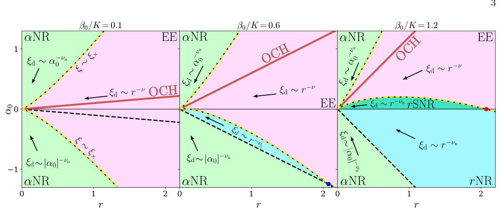
<figcaption class="paper-figure-caption"><b>Fig 2.</b> FIG. 2. The scaling behavior of the NRCH for various values of β0 &gt; 0. The correlation length ξd scales with the tuning parameters. The scaling regimes are either Effective Equilibrium (EE), or manifestly Non-Reciprocal (NR). In the latter, the scaling is controlled by r in r(S)NR and α0 in αNR. In rSNR, the non-reciprocity is suppressed due to a competition between α0 and β0. The values of the exponents are given in Table I. On the red line, the system is an odd Cahn-Hilliard (OCH) model, and is defined by Eq. (19). The yellow-and-black line, where ξd ∼ξ×, demarcates crossover in scaling exponents. The line is defined by |σ|/r∆= 1, and its intersection with α0 = 0 is marked with a red dot....</figcaption>
</figure>
<figure class="paper-figure-card">
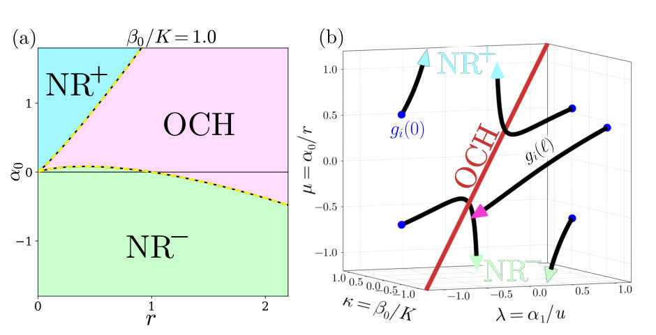
<figcaption class="paper-figure-caption"><b>Fig 3.</b> FIG. 3. (a) The different scaling regimes are connected to different RG fixed-points, OCH and NR±. (b) The RG flow of the non-reciprocal parameters of the NRCH. The OCH fixed-point corresponds to the line α1/u = β0/K = α0/r. This is unstable, and so the system will flow to either of the NR± fixed-point, at α0/r = ±∞.</figcaption>
</figure>
<figure class="paper-figure-card">
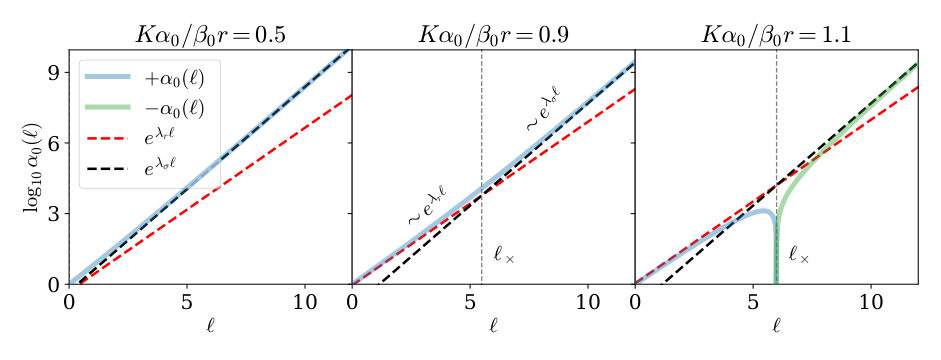
<figcaption class="paper-figure-caption"><b>Fig 4.</b> FIG. 4. The flow of the effective tuning-parameter α0 according to the β-functions calculated with the momentum-shell approach, as a function of RG-scale ℓ= ln b, for u(0) = r(0) = 1. Depending on the initial values of r, α0, β0 and K, there is a crossover RG-scale ℓ×, and a corresponding length-scale ξ×, where the scaling-behavior changes. This may be accompanied by a change in sign.</figcaption>
</figure>
<figure class="paper-figure-card">
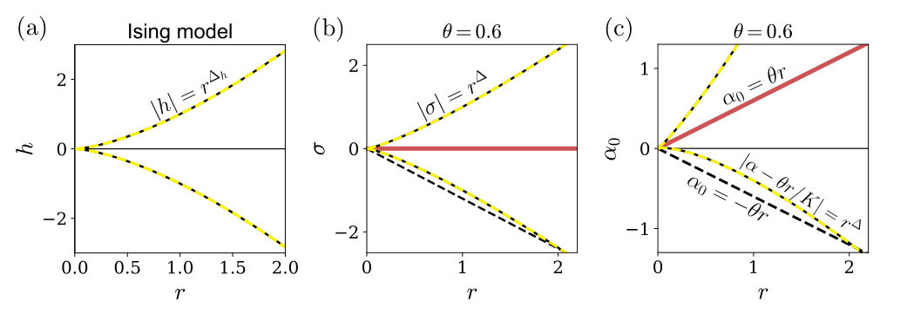
<figcaption class="paper-figure-caption"><b>Fig 5.</b> FIG. 5. (a) The scaling behavior of the Ising universality class, as a function of the two tuning-parameters r and h. (b) The scaling behavior of the NRCH, as a function of σ and r. (c) The scaling behavior of the NRCH as a function of α0 and r, for a given value of β0. The red line represents the OCH fixed-points. The yellow line in all cases illustrates the crossover in the scaling-function, from |s| ≪1 to |s| ≫1.</figcaption>
</figure>

**Summary.** This paper theoretically analyzes the critical behavior of active matter systems modeled by the Non-Reciprocal Cahn-Hilliard equation, which incorporates non-equilibrium activity. Using renormalization group techniques, the authors show that while structural correlations follow equilibrium predictions, the dynamic correlation length diverges according to novel scaling laws dictated by the system's inherent non-reciprocity. This work provides a framework for understanding how metabolic or active processes can fundamentally alter critical phenomena.

**Why it may be interesting.** The concepts of non-equilibrium critical points and broken time-reversal symmetry are highly relevant to open quantum systems where dissipation or external driving breaks detailed balance. The RG approach used for active matter dynamics provides a theoretical framework applicable to driven many-body physics.

Detailed structure

**Main problem.** The study investigates the scaling behavior of non-reciprocal and odd conserved dynamics near a critical point in active matter systems.

**Main result.** Structural correlations are governed by standard equilibrium exponents, while dynamical correlations exhibit novel scaling regimes characterized by new critical exponents due to broken time-reversal symmetry.

**Method.** The research employs perturbative dynamical renormalization group (RG) techniques and response-field formalism to analyze correlation functions and self-energies.

**Model / system.** The primary model is the Non-Reciprocal Cahn-Hilliard (NRCH) model, describing a binary mixture with non-reciprocal interactions. A related critical point is identified as the Odd Cahn-Hilliard (OCH) model.

**Key observables.** Structural correlation length ($\xi_s$), dynamical correlation length ($\xi_d$), and vorticity ($\Omega_{ss}$), which probes time-reversal symmetry breaking.

**Important parameters / regimes.** Reduced temperature ($r$) and the non-reciprocal coupling strength ($\alpha_0$). The system exhibits distinct regimes: Effective Equilibrium (EE) and manifestly Non-Reciprocal (NR).

**Assumptions / limitations.** The analysis relies on RG calculations, assuming specific potential conditions for simplified functional gradient dynamics.

**Figures summary.** Figure 1 illustrates the hierarchical control of transitions between non-reciprocal and effective-equilibrium regimes. Figure 2 maps out the crossover lines in parameter space showing how $\xi_d$ behaves relative to tuning parameters ($r$ and $\alpha_0$).

**Paper structure.** The paper develops from establishing the physical context (active matter, non-reciprocity) using the NRCH model, applying RG techniques to calculate scaling exponents ($
u$ vs. $
u_n$), and finally detailing complex calculations of correlation functions ($J(0,1)$, $J(1,0)$) via dimensional regularization.

Abstract

In recent years, non-reciprocity has been explored as a ubiquitous manifestation of non-equilibrium activity at the microscopic scales for various active matter systems, from mixtures of chemically active enzymes, colloids, and droplets, to engineered light-controlled active colloids and robotic meta-materials. A commonly used minimal model to describe the dynamics of a binary mixture of conserved species with non-reciprocal interactions is the non-reciprocal Cahn-Hilliard (NRCH) model. The model is characterized by a temperature-like tuning parameter, which can trigger phase separation, and a non-reciprocal coupling, which can lead to the formation of spatio-temporal patterns, as it represents an intrinsic source of non-equilibrium activity and breaks parity and time-reversal symmetries. Here, we study the scaling behavior of the NRCH model near the critical point using perturbative dynamical renormalization group techniques. We find that structural and dynamical correlations are controlled by different correlation lengths, both of which diverge at the critical point, but governed by different scaling laws. In particular, while the structural correlations are always controlled by temperature and the classical Wilson-Fisher critical exponent, the dynamical correlation length exhibits multiple scaling regimes in which either temperature or non-reciprocal coupling can dominate as the key tuning parameter, with a new critical exponent characterizing the divergence. The critical point corresponds to a conserved equilibrium-like dynamics with odd mobility, which we denote as the odd Cahn-Hilliard (OCH) model. Our findings may have important implications on how living systems can control phase separation and spatio-temporal pattern formation using the rates of catalytic reactions, and in general metabolism, as control parameters.

[↑ back to top](#top)

### [Neutral Atom Quantum Computing: Principles, Routes, Progress, and Challenges](http://arxiv.org/abs/2608.05010v1)

**Authors:** Junchao Wang, Zeyuan Wang, Lei Li, Feng Wang, Shibo Liang, Keduo Yan  
**Type:** both · **Category:** quantum information and computing · **PDF:** <https://arxiv.org/pdf/2608.05010v1>  
**Analysis basis:** full PDF text, analyzed in chunks
**Topic relevance:** 🔥 `QC/QI experiment` **5/5** · 🔥 `Rydberg arrays` **4/5** · `analog quantum simulation` **3/5** · `entanglement & information structure` **2/5** · `non-equilibrium dynamics` **1/5** · `quantum optics experiment` **1/5**

↔ Scroll figures horizontally

<figure class="paper-figure-card">
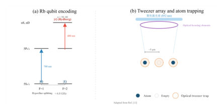
<figcaption class="paper-figure-caption"><b>Fig 1.</b> Figure 1: Qubit encoding and optical tweezer ar- ray of neutral atoms. (a) Energy-level structure of a rubidium-87 atom. The hyperfine states F = 1 and F = 2 of the 5S1/2 ground state encode |0⟩and |1⟩, respectively, and a two-photon transition (780 nm + 480 nm) excites the atom to a high principal- quantum-number nS or nD Rydberg state |r⟩. (b) Schematic of an optical tweezer array. A focused laser beam is split by optical focusing elements into a pe- riodic trap array; each trap confines one atom, and dashed circles indicate vacancies (adapted from Ref. [12].)</figcaption>
</figure>
<figure class="paper-figure-card">
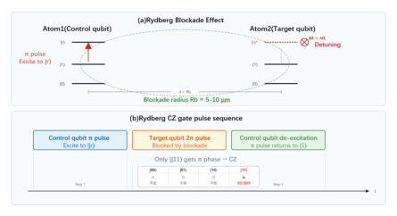
<figcaption class="paper-figure-caption"><b>Fig 2.</b> Figure 2: Rydberg blockade quantum gate mecha- nism. (a) Blockade effect: after atom 1 is excited to the Rydberg state |r⟩, the |r⟩energy level of atom 2 within the blockade radius Rb shifts significantly by ∆E ≫¯hΩand cannot be resonantly excited (red dashed line + ×). (b) CZ gate pulse sequence: a π pulse excites the control qubit, a 2π pulse on the tar- get qubit accumulates phase, and the control qubit is de-excited; only the |11⟩state acquires a π phase (adapted from Refs. [14,15].)</figcaption>
</figure>
<figure class="paper-figure-card">
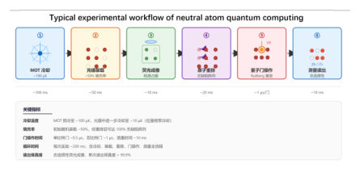
<figcaption class="paper-figure-caption"><b>Fig 3.</b> Figure 3: Typical experimental workflow of neutral atom quantum computing. The process starts with magneto-optical trap (MOT) capture of cold atoms, followed by random loading of single atoms into opti- cal tweezers (∼50% filling), fluorescence imaging de- tection, atom rearrangement to eliminate vacancies, Rydberg-laser quantum gate operations, and finally fluorescence readout of the quantum state. A typical cycle takes ∼100 ms, with key fidelity parameters noted (adapted from Refs. [1,12,17].)</figcaption>
</figure>
<figure class="paper-figure-card">
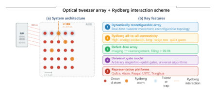
<figcaption class="paper-figure-caption"><b>Fig 4.</b> Figure 4: Schematic of optical tweezer array with Rydberg interaction. A single laser beam is split by a spatial light modulator (SLM) or acousto-optic deflector (AOD) into hundreds to thousands of fo- cused spots, forming an independently addressable two-dimensional optical tweezer array (adapted from Refs. [2,3].)</figcaption>
</figure>
<figure class="paper-figure-card">
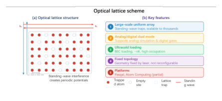
<figcaption class="paper-figure-caption"><b>Fig 5.</b> Figure 5: Schematic of optical lattice scheme and computation modes. Two counterpropagating laser beams form a standing wave, creating periodic po- tential wells at the nodes where atoms are trapped to form a large-scale uniform array (adapted from Ref. [6].)</figcaption>
</figure>

**Summary.** This paper reviews neutral atom quantum computing, which uses laser-trapped atoms and Rydberg interactions to perform quantum gates. It systematically surveys the technical progress from basic principles to thousand-qubit systems, highlighting key achievements like high fidelity and advanced error correction demonstrations. The review concludes by analyzing critical bottlenecks needed for realizing fault-tolerant quantum computation.

**Why it may be interesting.** It provides a comprehensive roadmap for quantum information scientists by detailing the hardware realization path—from atomic physics principles to fault-tolerant computation architectures. The detailed discussion on error correction integration is highly relevant.

Detailed structure

**Main problem.** The central challenge is developing scalable, high-fidelity quantum computing hardware using neutral atoms.

**Main result.** Significant progress has been shown across the field, reaching thousand-qubit arrays and demonstrating advanced error correction protocols. The mainstream route involves optical tweezer arrays combined with Rydberg interactions.

**Method.** The paper provides a systematic review covering theoretical principles, experimental techniques, and future scaling challenges in neutral atom quantum computing.

**Model / system.** The platform uses laser-trapped neutral atoms (e.g., Rb, Sr) as qubits, leveraging internal energy levels and strong dipole-dipole interactions mediated by highly excited Rydberg states to implement gates.

**Key observables.** Two-qubit gate fidelity ($>99.5\%$), number of trapped qubits ($\sim 10^3$ to $10^4$), error correction thresholds, and coherence times (seconds to minutes).

**Important parameters / regimes.** Rydberg blockade radius ($R_b$), interaction strength ($\propto 1/R^6$ or $1/R^3$), and the scalability-fidelity trade-off.

**Assumptions / limitations.** The primary bottlenecks analyzed include atom loss, laser system industrialization, control electronics bandwidth, and achieving fault tolerance beyond current memory demonstrations.

**Figures summary.** Figures illustrate qubit encoding schemes using atomic energy levels (e.g., Rb hyperfine states) and the schematic workflow involving optical tweezer arrays for gate operations via Rydberg blockade.

**Paper structure.** The review systematically covers working principles (qubit encoding, trapping methods like tweezers/lattices), core mechanisms (Rydberg interactions, blockade gates), surveyed technical routes, historical progress milestones, and in-depth analysis of current bottlenecks and future directions.

Abstract

Neutral atom quantum computing utilizes laser-trapped neutral atoms as qubits and realizes quantum logic gate operations through Rydberg-state interactions. In recent years, it has become one of the most vibrant directions in quantum computing hardware. This paper systematically reviews the working principles of neutral-atom quantum computers, including qubit encoding, atom trapping and manipulation, Rydberg states and interactions, the Rydberg blockade quantum gate mechanism, and atom rearrangement with reconfigurable architectures. The mainstream technical routes are surveyed, represented by optical tweezer arrays combined with Rydberg interactions, optical lattice schemes, and dipole trap arrays. A panoramic review is provided of domestic and international research progress from theoretical foundations in 2000 to the latest achievements in 2026, including thousand-qubit-scale systems, logical qubits, and quantum error correction experiments. Key breakthroughs are highlighted, such as the 6100-atom qubit array, continuous operation of a 3000-qubit system, quantum simulation of the Kitaev honeycomb model, toric code error correction demonstrations, encoding rates exceeding 1/2, and fault-tolerant architectures. The core bottlenecks are analyzed in depth, including the scalability--fidelity trade-off, engineering implementation of quantum error correction, atom loss and mid-circuit replenishment, laser system industrialization, control electronics scalability, and long-distance quantum interconnection. This paper aims to provide a systematic reference for academic research and technological development in this field.

[↑ back to top](#top)

### [Measurement-induced generation of Schrödinger cat states in cavity QED](http://arxiv.org/abs/2608.04578v1)

**Authors:** Tong Wang, Peng-Fei Wei, Hai-Jun Xing, Zhihai Wang  
**Type:** theory · **Category:** other · **PDF:** <https://arxiv.org/pdf/2608.04578v1>  
**Analysis basis:** full PDF text, analyzed in chunks
**Topic relevance:** 🔥 `measurement-induced transitions` **4/5** · 🔥 `quantum optics experiment` **4/5** · `analog quantum simulation` **3/5** · `methods for driven-dissipative` **3/5** · `quantum measurements` **3/5** · `QC/QI experiment` **2/5** · `Tavis-Cummings & cavity-many-emitter` **2/5** · `correlated cavity matter` **2/5** · `driven-dissipative phase transition` **2/5** · `Keldysh / 2PI / non-Gaussian methods` **1/5** · `correlated / nonlocal dissipation` **1/5** · `entanglement & information structure` **1/5** · `interference shaping light` **1/5** · `non-equilibrium dynamics` **1/5** · `non-equilibrium universality` **1/5**

↔ Scroll figures horizontally

<figure class="paper-figure-card">
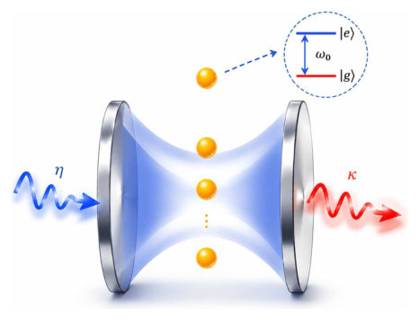
<figcaption class="paper-figure-caption"><b>Fig 1.</b> Figure 1. A schematic diagram of the model used for generat- ing the Schr¨odinger cat state is shown in the figure. A series of two-level atoms which are prepared in the same initial state pass through a single-mode cavity one by one.</figcaption>
</figure>
<figure class="paper-figure-card">
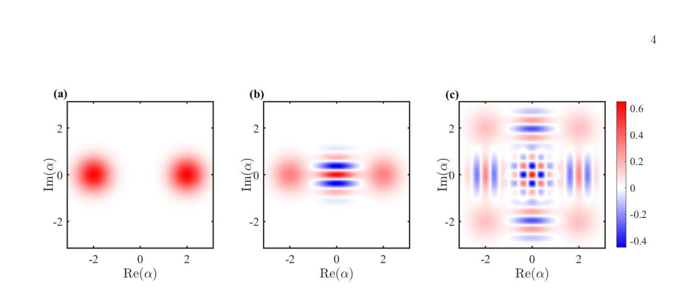
<figcaption class="paper-figure-caption"><b>Fig 2.</b> Figure 2. Wigner functions of Schr¨odinger cat states without dissipation. (a) The two-legged Schr¨odinger cat state. (b) The four-legged Schr¨odinger cat state. The drive area and interaction phase are set as ητ1 = 2 and χτ2 = π/2, respectively, with the remaining parameters chosen as θ0 = θf = π/4.</figcaption>
</figure>
<figure class="paper-figure-card">
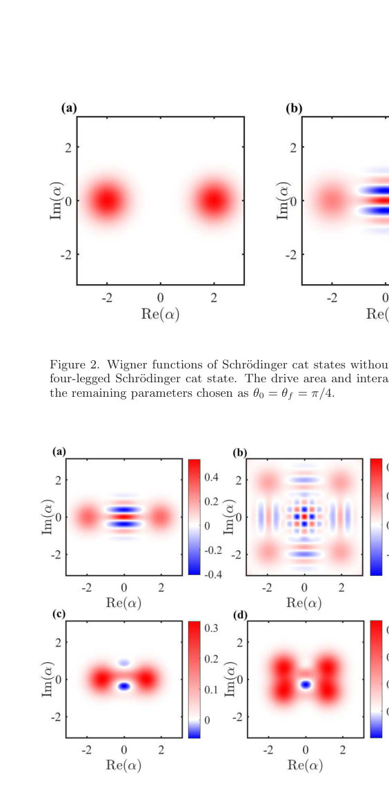
<figcaption class="paper-figure-caption"><b>Fig 3.</b> Figure 3. Influence of dissipation on the Wigner func- tions of Schr¨odinger cat states. Two-legged and four-legged Schr¨odinger cat states are shown under (a, b) weak dissipa- tion (κ = 0.01η) and (c, d) stronger dissipation (κ = 0.075η). The drive area and interaction phase are set as ητ1 = 2 and χτ2 = π/2, respectively, with the remaining parameters cho- sen as θ0 = θf = π/4.</figcaption>
</figure>

**Summary.** The paper presents a novel, measurement-based protocol for creating Schrödinger cat states in a cavity QED setup. By combining coherent driving with dispersive atom-cavity coupling followed by atomic postselection, the authors generate highly nonclassical field states. This method is advantageous because it avoids the need for strong nonlinear interactions or engineered dissipation while maintaining robustness against moderate photon loss.

**Why it may be interesting.** This work provides an experimentally accessible route to generating complex nonclassical states using standard cavity QED components (driving and measurement) rather than relying on difficult-to-implement strong nonlinearities or engineered loss mechanisms.

Detailed structure

**Main problem.** The primary goal is generating Schrödinger cat states, which are crucial nonclassical resources for continuous-variable quantum information processing.

**Main result.** A measurement-based protocol was proposed that successfully generates robust, multi-component Schrödinger cat states in a cavity QED system without needing strong nonlinearities or engineered dissipation.

**Method.** The method combines coherent driving, dispersive atom-cavity interaction, and subsequent atomic postselection to project the field into a non-Gaussian superposition state.

**Model / system.** The physical platform is a Cavity Quantum Electrodynamics (QED) system involving a single-mode cavity coupled to flying two-level atoms. The dynamics are modeled using the Lindblad master equation, incorporating driving and dispersive coupling terms.

**Key observables.** Wigner function $W(\alpha)$ in phase space, used to diagnose nonclassicality via negative values and interference fringes.

**Important parameters / regimes.** The protocol depends on cavity decay rate ($\kappa$), the coherent driving strength ($\eta$), and the dispersive coupling constant ($\chi$).

**Assumptions / limitations.** The protocol assumes that postselection on the atomic state effectively erases 'which-way' information, enabling the revival of quantum interference.

**Figures summary.** Figure 2 illustrates Wigner functions for two-component and four-component cat states in the ideal (lossless) case. Figure 3 compares these states under weak versus strong cavity dissipation, showing coherence loss with increasing $\kappa$.

**Paper structure.** The paper details a measurement-based protocol involving periodic cycles ($	au_1$ driving, $	au_2$ interaction). It analyzes the resulting state via postselection and demonstrates scalability to $2^N$-component states, followed by numerical simulations analyzing robustness against cavity dissipation.

Abstract

Schrödinger cat states, representing coherent superpositions of macroscopically distinguishable states, are indispensable nonclassical resources for continuous-variable quantum information processing. Existing generation protocols typically rely on strong nonlinear interactions, complicated control techniques, or engineered dissipation, posing challenges for experimental implementation. Here, we propose a simple measurement-based protocol for generating Schrödinger cat states in a cavity-QED system by combining coherent driving, dispersive atom--cavity interactions, and atomic postselection. The atom--cavity interaction establishes coherent correlations between the atomic and photonic degrees of freedom, while the subsequent atomic postselection projects the cavity field onto a non-Gaussian superposition state with pronounced Wigner negativity. Numerical simulations based on the Lindblad master equation show that the generated Schrödinger cat states remain robust against moderate cavity dissipation. Our results demonstrate that conditional atomic measurements provide an effective and experimentally accessible approach for preparing nonclassical cavity states without relying on strong optical nonlinearities or engineered dissipation.

[↑ back to top](#top)

### [High-cooperativity coupling and spin-resolved extinction of tin-vacancy centers in a diamond-like microcavity](http://arxiv.org/abs/2608.04797v1)

**Authors:** Kerim Köster, András Laukó, Federico Rapisarda, Philipp Graßhoff, Vladislav Bushmakin, Jens Fuhrmann, Ou Wang, Dominic Reinhardt, Doğuşcan Ahiboz, Peter Knittel, Thomas Hümmer, Wolfgang Wernsdorfer, Jörg Wrachtrup, Fedor Jelezko, Tommaso Pregnolato, Tim Schröder, Jan Meijer, Cyril Popov, David Hunger  
**Type:** experiment · **Category:** other · **PDF:** <https://arxiv.org/pdf/2608.04797v1>  
**Analysis basis:** full PDF text, analyzed in chunks
**Topic relevance:** 🔥 `quantum optics experiment` **4/5** · 🔥 `spintronics-quantum-optics interface` **4/5** · `Tavis-Cummings & cavity-many-emitter` **3/5** · `analog quantum simulation` **3/5** · `correlated cavity matter` **3/5** · `exotic spin models in light-matter` **3/5** · `QC/QI experiment` **2/5** · `correlated / nonlocal dissipation` **1/5** · `driven-dissipative phase transition` **1/5** · `entanglement & information structure` **1/5** · `interference shaping light` **1/5** · `methods for driven-dissipative` **1/5**

↔ Scroll figures horizontally

<figure class="paper-figure-card">
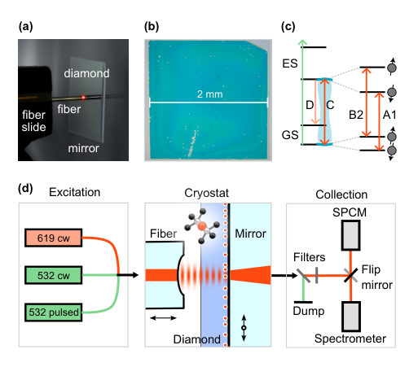
<figcaption class="paper-figure-caption"><b>Fig 1.</b> Figure 1. A cryogenic microcavity platform for solid-state quantum optics. (a) Photograph of the fiber-based plano- concave Fabry–P´erot cavity, showing the diamond membrane on the planar mirror and the fiber mirror mounted on a fiber slide. (b) Optical microscope image of the 2×2 mm2 diamond membrane bonded onto the planar cavity mirror. (c) Level scheme of the SnV center with the C transition addressed by the cavity resonance. An applied magnetic field resolves the two spin-selective optical transitions. (d) Cavity-integrated SnV centers are excited off-resonantly or resonantly probed through the fiber mirror. Emitted fluorescence or transmitted probe light is spectrally filtered and...</figcaption>
</figure>
<figure class="paper-figure-card">
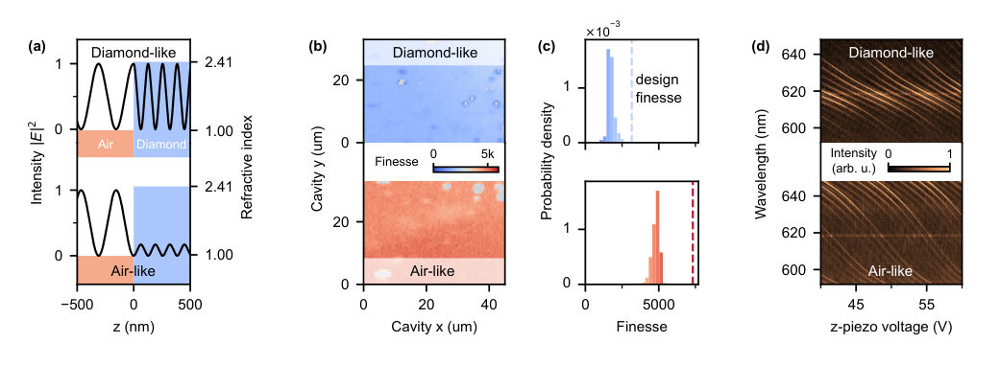
<figcaption class="paper-figure-caption"><b>Fig 2.</b> Figure 2. Hybrid air-diamond microcavity characterization. (a) Normalized intracavity electric-field intensity |E|2 for a diamond-like mode (top) and an air-like mode (bottom), illustrating the contrasting field localizations across the air gap and diamond membrane. (b) Spatially resolved finesse maps acquired at lateral positions characteristic of the diamond-like and air-like modes. (c) Histograms of the finesse maps in (b), yielding median finesse values of F = 1700 and F = 4840 for the diamond-like and air-like modes, respectively; dashed lines indicate the corresponding design (lossless) values of F = 3160 and F = 7320. (d) Cavity dispersion scans recorded at the respective lateral...</figcaption>
</figure>
<figure class="paper-figure-card">
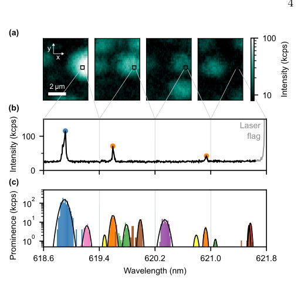
<figcaption class="paper-figure-caption"><b>Fig 3.</b> Figure 3. Cavity-enhanced hyperspectral characterization of SnV centers under off-resonant excitation. (a) Fluorescence map acquired over a 5×7 µm2 lateral area; the color scale rep- resents peak fluorescence intensity. (b) Representative spec- trum at a single lateral position obtained by cavity scanning showing three spectrally isolated fluorescence peaks and a laser flag for wavelength reference. (c) Detected fluorescence signatures grouped by lateral position, wavelength, and peak prominence. Matching colors indicate features assigned to the C and D transitions of the same SnV center. Peak widths re- flect the statistical spread of peak positions across individual time traces, and thus...</figcaption>
</figure>
<figure class="paper-figure-card">
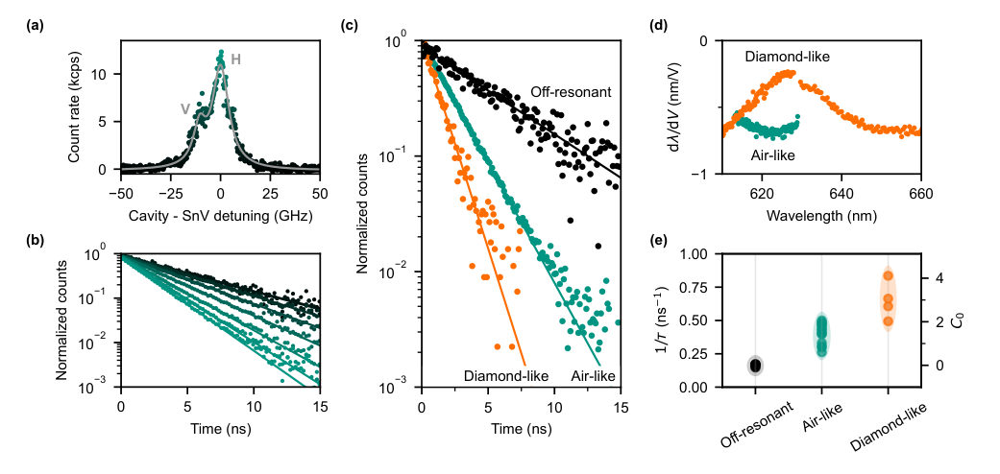
<figcaption class="paper-figure-caption"><b>Fig 4.</b> Figure 4. Purcell enhancement of SnV centers. (a) Cavity resonance scan over the brightest identified SnV center. The fluorescence as a function of cavity detuning reveals a double-peaked feature arising from the two orthogonal polarization eigenmodes (H and V) of the cavity, fitted with a double Lorentzian. The extracted linewidth of 8.8(13) GHz is consistent with the cavity linewidth independently determined from resonant laser scans. (b) Excited-state lifetime measurements as a function of cavity-emitter detuning, with color encoding the detuning (green: on resonance, black: far off resonance). The on-resonance lifetime is Purcell-shortened to τc = 2.07(1) ns compared to the free-space...</figcaption>
</figure>
<figure class="paper-figure-card">
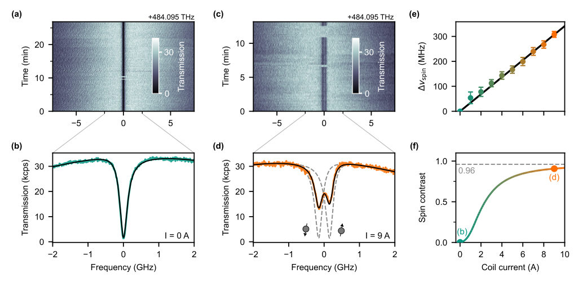
<figcaption class="paper-figure-caption"><b>Fig 5.</b> Figure 5. Cavity-enhanced extinction and Zeeman splitting of spin transitions in transmission. (a,c) Consecutive cavity transmission scans, recorded without and with applied magnetic field (Icoil = 0 and 9 A), plotted as a function of laser frequency and time with transmission color-coded. Near the SnV C-transition at fSnV ≈484.095 THz, a pronounced extinction feature appears at the cavity resonance with a 96% contrast at zero field (a). Horizontal gaps mark intervals in which the emitter occupied a dark charge state and a repump pulse was applied. At maximum coil current, the extinction feature splits into two branches corresponding to the two spin-conserving transitions. (b,d)...</figcaption>
</figure>

**Summary.** The research demonstrates that coupling tin-vacancy centers in diamond within a specialized Fabry-Pérot microcavity significantly enhances the efficiency of spin-photon interactions. By engineering the cavity mode into a 'diamond-like' regime, they achieved high cooperativity and successfully measured spin-selective optical transitions using an external magnetic field.

**Why it may be interesting.** This work directly addresses key challenges in solid-state quantum emitters: maximizing light-matter interaction (Purcell effect) while maintaining coherence, which is central to building scalable quantum networks using cavity QED principles.

Detailed structure

**Main problem.** The goal is to establish a highly efficient spin-photon interface using tin-vacancy (SnV) centers in diamond for quantum network applications.

**Main result.** The authors demonstrated cavity enhancement of light-matter coupling, achieving a coherent cooperativity of $C = 4.0(14)$ and observing spin-selective optical transitions with high contrast ($\mathcal{C}_{	ext{spin}} = 0.91$).

**Method.** The experiment involves measuring resonant extinction spectroscopy on SnV centers coupled to a tunable Fabry-Pérot microcavity at cryogenic temperatures.

**Model / system.** The physical system is an open Fabry-Pérot microcavity containing low-roughness diamond membranes, which enhances the coupling between the cavity mode and the spin-photon interface provided by the SnV centers. The analysis uses concepts from cavity Quantum Electrodynamics (cQED).

**Key observables.** Coherent cooperativity ($C$), extinction contrast ($\mathcal{C}$), Purcell factor ($C_0$), and magnetic field splitting ($\delta
u_{	ext{spin}}$).

**Important parameters / regimes.** Operating temperature down to 1 K; diamond-like mode enhancement ($C_0 = 4.1(1)$ vs $1.85(5)$); high spin contrast ($\mathcal{C}_{	ext{spin}} = 0.91$).

**Assumptions / limitations.** The primary assumption is that using low-roughness diamond membranes allows for field confinement in the 'diamond-like' regime, maximizing Purcell enhancement while maintaining mechanical stability.

**Figures summary.** Figures characterize hybrid air-diamond microcavity modes showing field intensity and finesse maps; later figures illustrate resonant extinction spectroscopy traces at zero and non-zero magnetic fields to extract cQED parameters.

**Paper structure.** The paper first establishes the superior coupling regime by comparing 'air-like' vs. 'diamond-like' cavity modes using Purcell enhancement calculations. It then proceeds to measure the coherent coupling strength ($C$) and finally investigates spin properties by applying a magnetic field to observe spin-resolved extinction.

Abstract

The tin-vacancy (SnV) center in diamond is a promising spin-photon interface for quantum networks, combining favorable optical properties with spin coherence above 1K. Unfolding the full potential requires cavity enhancement to increase photon-emitter coupling efficiency. Here, we demonstrate cavity-enhanced light-matter coupling of SnV centers in a fully tunable Fabry-Pérot microcavity operating at temperatures down to 1K with in-situ magnetic field control. We access the diamond-like regime of hybrid cavity modes through integration of low-roughness diamond membranes, where the field is concentrated inside the diamond and Purcell enhancement is maximized. Diamond-like modes deliver a more than two-fold increase in the effective Purcell factor over air-like modes, reaching $C_0 = 4.1(1)$ compared to $C_0 = 1.85(5)$ in the air-like case, while simultaneously relaxing mechanical stability requirements. Resonant probing reveals coherent cavity-emitter coupling with 96% extinction contrast and a coherent cooperativity of $C = 4.0(14)$. By applying a magnetic field, we further achieve spin-resolved cavity extinction, observing spin-selective optical transitions with a contrast of ${\cal C}_{\rm spin} = 0.91$. These results establish SnV centers in diamond coupled to open Fabry-Pérot microcavities as a promising platform for efficient spin-photon interfaces.

[↑ back to top](#top)

### [Constructing Non-Hermitian Theories with Tunable Exceptional Points and Controlled State Purification](http://arxiv.org/abs/2608.05052v1)

**Authors:** Soumya Kanti Pal, Rupak Majumder, Shamik Gupta  
**Type:** theory · **Category:** statistical mechanics · **PDF:** <https://arxiv.org/pdf/2608.05052v1>  
**Analysis basis:** full PDF text, analyzed in chunks
**Topic relevance:** 🔥 `methods for driven-dissipative` **4/5** · `Keldysh / 2PI / non-Gaussian methods` **3/5** · `analog quantum simulation` **3/5** · `correlated / nonlocal dissipation` **3/5** · `driven-dissipative phase transition` **3/5** · `Kondo & dissipative impurity` **2/5** · `entanglement & information structure` **2/5** · `non-equilibrium dynamics` **2/5** · `non-equilibrium universality` **2/5** · `measurement-induced transitions` **1/5**

↔ Scroll figures horizontally

<figure class="paper-figure-card">
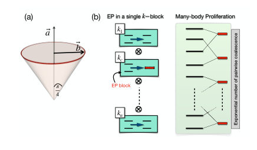
<figcaption class="paper-figure-caption"><b>Fig 1.</b> FIG. 1. (a): Geometric representation of EP conditions (3). (b): Exponential proliferation of many-body eigenvector coa- lescences induced by an EP in a single momentum block.</figcaption>
</figure>
<figure class="paper-figure-card">
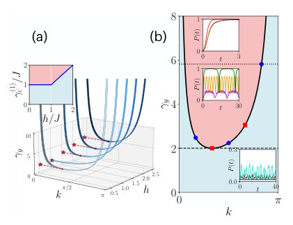
<figcaption class="paper-figure-caption"><b>Fig 2.</b> FIG. 2. For the non-Hermitian Hamiltonian H = H(1) − iH(2), with H(1) in Eq. (6) and the y-deformation H(2) = γy sin k σy, every allowed momentum block hosts an EP at kc = k ∈RBZ. (a) Critical deformation strength γ(c) y in Eq. (5) as a function of (h, k, γy). The stars mark the minimum threshold γ(1) c ≡mink∈RBZ γ(c) y (k), while the in- set shows γ(1) c /J versus h/J. (b) For h = 0.5, J = 1, the solid black curve shows γ(c) y (k) in the thermodynamic limit, with the dashed horizontal line indicating γ(1) c . For a finite system with L = 6, the red (blue) circles denote the odd- parity (even-parity) momentum blocks. Although the upper threshold γ(2) c ≡maxk∈RBZ γ(c) y (k) diverges in the...</figcaption>
</figure>
<figure class="paper-figure-card">
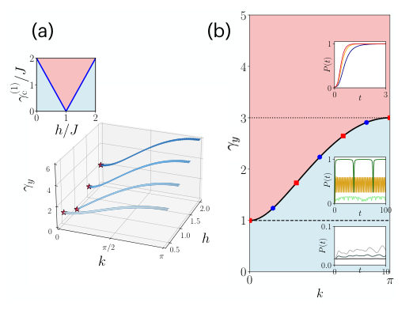
<figcaption class="paper-figure-caption"><b>Fig 3.</b> FIG. 4. For the non-Hermitian Hamiltonian H = H(1) − iH(2), with H(1) in Eq. (6) and the y-deformation H(2) = γyσy, every allowed momentum block hosts an EP at kc = k ∈RBZ. (a) Critical deformation strength γ(c) y in Eq. (5) as a function of (h, k, γy). The stars mark the minimum threshold γ(1) c ≡mink∈RBZ γ(c) y (k), while the inset shows γ(1) c /J versus h/J. (b) For h = 0.5, J = 1, the solid black curve shows γ(c) y (k) in the thermodynamic limit, with the dashed (respectively, dotted) horizontal line indicating γ(1) c (respectively, γ(2) c ). For a finite system with L = 6, the red (blue) circles denote the odd-parity (even-parity) momen- tum blocks. Going from top to bottom, the three...</figcaption>
</figure>
<figure class="paper-figure-card">
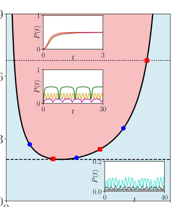
<figcaption class="paper-figure-caption"><b>Fig 4.</b> FIG. 3. For the non-Hermitian Hamiltonian H = H(1) − iH(2), with H(1) in Eq. (6) and the y-deformation H(2) = γy sin k σy, every allowed momentum block hosts an EP at kc = k ∈RBZ. For h = 0.5, J = 1, the solid black curve shows γ(c) y (k) in the thermodynamic limit, with the dashed horizontal line indicating γ(1) c . For a finite system with L = 7, the red (blue) circles denote the odd-parity (even-parity) momentum blocks. Although the upper thresh- old γ(2) c ≡maxk∈RBZ γ(c) y (k) diverges in the thermodynamic limit, its finite-size value is indicated by the dotted hori- zontal line. Going from top to bottom, the three subpan- els show the time evolution of the many-body purity, start- ing...</figcaption>
</figure>

**Summary.** The paper presents a comprehensive framework using momentum-space deformation to design non-Hermitian Hamiltonians exhibiting tunable Exceptional Points. These EPs are shown to act as universal mechanisms capable of purifying arbitrary mixed quantum states. The results provide systematic protocols for engineering various types of non-Hermitian quantum matter.

**Why it may be interesting.** This work directly addresses open quantum systems by providing a powerful tool (EPs) to engineer dissipation or coherence control, which is highly relevant for understanding decoherence and state preparation in complex physical platforms.

Detailed structure

**Main problem.** The work develops a general design principle for creating and controlling Exceptional Points (EPs) in quadratic many-body Hamiltonians, while also establishing EPs as a universal mechanism for purifying arbitrary mixed quantum states.

**Main result.** Momentum-space deformation provides a unified route to engineer EPs, which fundamentally allows for the purification of mixed quantum states, exhibiting distinct odd-even system-size dichotomies in the thermodynamic limit.

**Method.** The analysis uses momentum-space decomposition of quadratic fermionic Hamiltonians and introduces non-Hermitian deformations ($\mathbf{H}_{	ext{nH}, k} = \mathbf{H}^{(1)} - i\mathbf{H}^{(2)}$) to systematically tune parameters towards EP conditions.

**Model / system.** The primary model is the quadratic free fermionic Hamiltonian (e.g., Transverse Field Ising Chain), analyzed in momentum space via Bloch Hamiltonians $\hat{H}_k$. The non-Hermiticity is introduced through controlled deformations ($\gamma$).

**Key observables.** Normalized purity $P(t)$, eigenvalue/eigenvector coalescence, and the existence of EPs at critical deformation strengths ($\gamma^{(c)}$).

**Important parameters / regimes.** Deformation strength $\gamma$ relative to critical thresholds ($\gamma^{(1)}_c, \gamma^{(2)}_c$), system size parity (odd vs. even $L$).

**Assumptions / limitations.** The analysis is restricted to quadratic BdG Hamiltonians; purification proofs rely on the existence of a Jordan canonical form structure.

**Figures summary.** Figures illustrate the geometric conditions for EPs in parameter space and show the exponential proliferation of eigenvector coalescences induced by an EP within a single momentum block.

**Paper structure.** The paper establishes the general framework using momentum-space deformation, details the EP criteria, demonstrates state purification dynamics across different deformation regimes ($\gamma$), and concludes with protocols for engineering various non-Hermitian couplings (short/long-range).

Abstract

Exceptional points (EP's) are a hallmark of non-Hermitian quantum systems. We show that momentum-space deformation provides a general design principle for creating and controlling EP's in quadratic many-body Hamiltonians. We identify universal criteria for the momentum sectors to host EP's and the corresponding critical deformation strengths, while revealing that a single momentum-sector EP induces quite remarkably an exponential proliferation of many-body eigenvector coalescences. We further establish EP's as a universal mechanism for purifying arbitrary mixed quantum states, uncovering distinct purification regimes and a fundamental odd-even system-size dichotomy in the thermodynamic limit. Our framework also provides a systematic reverse-engineering protocol for generating short- and long-range, reciprocal and nonreciprocal non-Hermitian quantum matter, together with an explicit Lindblad embedding. These results thus establish momentum-space deformation as a unified route to exceptional-point engineering and controlled design of many-body non-Hermitian quantum systems.

[↑ back to top](#top)

### [Engineering Nanodiamonds for Quantum Sensing: Material Constraints at the Nanoscale](http://arxiv.org/abs/2608.04489v1)

**Authors:** Ashutosh Rathi, Keisuke Oshimi, Kento Sasaki, Kensuke Kobayashi, Yutaka Shikano, Oliver Benson, Tim Schröder, Shery L. Y. Chang, Masazumi Fujiwara  
**Type:** both · **Category:** other · **PDF:** <https://arxiv.org/pdf/2608.04489v1>  
**Analysis basis:** full PDF text, analyzed in chunks
**Topic relevance:** 🔥 `QC/QI experiment` **4/5** · `methods for driven-dissipative` **3/5** · `spintronics-quantum-optics interface` **3/5** · `analog quantum simulation` **2/5** · `correlated / nonlocal dissipation` **2/5** · `driven-dissipative phase transition` **2/5** · `Keldysh / 2PI / non-Gaussian methods` **1/5** · `Kondo & dissipative impurity` **1/5** · `entanglement & information structure` **1/5** · `exotic spin models in light-matter` **1/5** · `non-equilibrium dynamics` **1/5** · `non-equilibrium universality` **1/5** · `quantum measurements` **1/5** · `quantum optics experiment` **1/5**

↔ Scroll figures horizontally

<figure class="paper-figure-card">
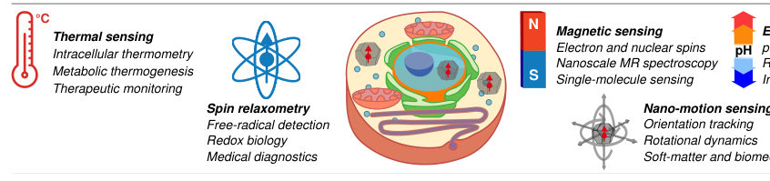
<figcaption class="paper-figure-caption"><b>Fig 1.</b> FIG. 1. Bottlenecks and sensing opportunities of NDs hosting nitrogen–vacancy (NV) centers. a. Key factors limiting NV-based quantum sensing performance using NDs, grouped into four broad classes: structural disorder, surface-related effects, spin and charge-state control, and environmental influences. The central schematic illustrates a ND hosting an NV center and the core sensing principle based on optical initialization and photoluminescence (PL) readout of the NV spin, with microwave control applied where required. b. Representative sensing opportunities enabled by NDs, highlighting their role as mobile probes in complex biological and nanoscale environments.</figcaption>
</figure>
<figure class="paper-figure-card">
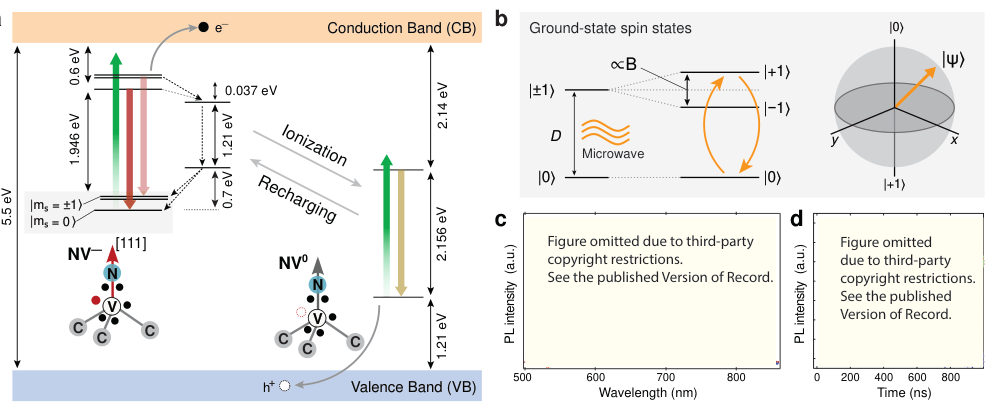
<figcaption class="paper-figure-caption"><b>Fig 2.</b> FIG. 2. Fundamentals of nitrogen–vacancy (NV) centers in diamond. a. Electronic structure of NV defect states within the diamond band gap, illustrating optical excitation, radiative decay, and spin-dependent intersystem crossing in the NV−state. b. Ground-state spin structure of NV−. The spin-triplet (S = 1) ground state enables coherent microwave control via the |0⟩↔|±1⟩transitions, illustrated by the Bloch-sphere representation. c. Normalized PL spectra of NV0 and NV−. Adapted from Ref. 32 with permission. Copyrighted by the American Physical Society. d. Spin-dependent PL dynamics under optical excitation, forming the basis of optical initialization and readout of the NV spin. Adapted...</figcaption>
</figure>
<figure class="paper-figure-card">
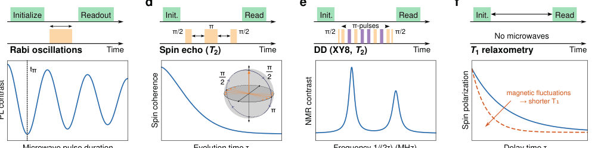
<figcaption class="paper-figure-caption"><b>Fig 3.</b> FIG. 3. Sensing principles of NV centers in diamond. a. Continuous-wave ODMR (cw-ODMR), in which laser excitation, microwave driving, and PL readout are applied simultaneously. b. Representative cw-ODMR spectra illustrating sensitivity to magnetic field, temperature, and electric field, including strain contributions. c–f. Representative pulsed sensing protocols, including Rabi oscillations (c), spin-echo measurements of the coherence time T2 (d), and dynamical-decoupling sequences (e.g., XY8) enabling frequency-selective detection of nuclear magnetic resonance (NMR) signals (e). f. Spin–lattice relaxation (T1) measurements, sensitive to high-frequency magnetic fluctuations. See Table I for...</figcaption>
</figure>
<figure class="paper-figure-card">
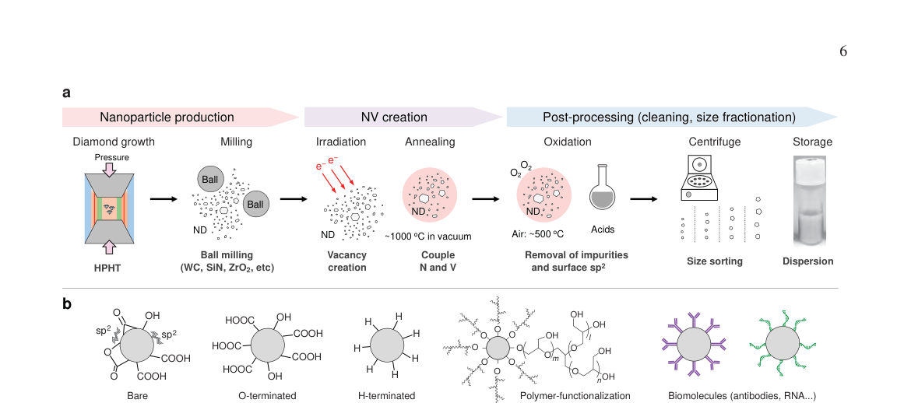
<figcaption class="paper-figure-caption"><b>Fig 4.</b> FIG. 4. Overview of ND fabrication and chemical control for NV-based quantum sensing. a. Commonly used workflow for ND fabrica- tion, including nanoparticle synthesis, NV creation, and post-processing steps. b. Representative ND surface states, including bare surfaces with residual sp2-like carbon, oxygen (O)- and hydrogen (H)-terminated surfaces, and polymer- or biomolecule-functionalized NDs for col- loidal stabilization and biofunctionalization.</figcaption>
</figure>
<figure class="paper-figure-card">

<figcaption class="paper-figure-caption"><b>Fig 5.</b> FIG. 5. NV charge-state control through surface electrostatics and electrochemical modulation. a. Schematic band diagrams of O- and H-terminated diamond surfaces in contact with air or aque- ous environments, showing the vacuum level (Evac), electron affinity χ, band bending, the conduction band minimum (CBM) and valence band maximum (VBM), Fermi level (EF) alignment with the envi- ronmental chemical potential (µ), and the NV0/−charge-transition level (ENV0/−). b–d. Simulated band diagrams for H-terminated di- amond at two nitrogen implantation doses of 1012 and 1013 cm−2, showing the implantation profile and depth-dependent alignment of the VBM (solid) and NV charge-transition levels...</figcaption>
</figure>

**Summary.** This paper reviews the use of NV centers in nanodiamonds for advanced quantum sensing applications. It details that while NDs offer portability, their small size introduces significant material constraints like lattice strain and surface noise that degrade spin coherence times compared to bulk diamond. The authors provide a structured view of these physical limitations alongside necessary mitigation strategies.

**Why it may be interesting.** This work is highly relevant to AMO physics and open quantum systems because it models decoherence mechanisms ($T_1, T_2$) in a solid-state platform where environmental coupling (surface charges, strain) dictates the coherence limit, moving beyond idealized bulk models.

Detailed structure

**Main problem.** The primary challenge is understanding and mitigating material constraints, such as lattice strain and surface noise, that degrade the performance of nitrogen-vacancy (NV) centers when embedded in nanodiamonds for quantum sensing.

**Main result.** While NDs are excellent mobile probes for biosensing, their nanoscale confinement introduces complex, intertwined noise mechanisms compared to bulk diamond, necessitating advanced material engineering strategies for robust operation.

**Method.** The work combines theoretical analysis of physical constraints with experimental characterization using optical detection techniques like Optically Detected Magnetic Resonance (ODMR) and spin relaxation measurements.

**Model / system.** The system is the NV center in diamond, specifically focusing on the negatively charged $	ext{NV}^-$ state. The behavior is governed by ground-state Hamiltonian terms including zero-field splitting, Zeeman interaction, and strain/electric field coupling.

**Key observables.** Spin relaxation times ($T_1$ and $T_2$), spin-dependent photoluminescence (PL) contrast, and the sensitivity of ODMR signals to external fields (B, T, E).

**Important parameters / regimes.** Nanoscale dimensions, lattice strain magnitude, surface charge density, and particle-to-particle variability.

**Assumptions / limitations.** The analysis assumes that NV centers are optically addressable via their spin-triplet ground state ($S=1$) and that performance degradation is primarily due to nanoscale material imperfections.

**Figures summary.** Figures illustrate the electronic structure of $	ext{NV}^-$ (PL spectra, spin dynamics) and summarize sensing principles using various ODMR protocols (cw vs. pulsed).

**Paper structure.** The paper establishes the promise of NDs as mobile sensors, details the fundamental physics of NV readout, analyzes how nanoscale confinement introduces specific noise channels (strain/surface), and concludes with mitigation strategies for robust quantum operation.

Abstract

Optically addressable solid-state spin defects have emerged as powerful multimodal quantum sensors, with nitrogen-vacancy (NV) centers in bulk diamond providing benchmark quantum control and sensitivity under ambient conditions. Embedding such defects in nanodiamonds (NDs) extends these capabilities to mobile probes capable of accessing complex biological and nanoscale environments. Reduced dimensions, however, introduce constraints beyond volumetric spin impurities, notably enhanced lattice strain and surface-induced noise sources, which shorten NV spin relaxation times (T1 and T2) and destabilize the NV charge state, as well as resulting in pronounced particle-to-particle variability in NDs typically produced by top-down approaches. These effects complicate both sensing performance and the quantitative interpretation of multimodal signals in realistic environments. This article provides a structured perspective on the physical mechanisms by which material properties constrain NV behavior in NDs, together with mitigation strategies that shape the robust use of these mobile quantum sensors for biosensing and nanoscale science.

[↑ back to top](#top)

### [Spectral evolution of two-photon emission in microresonators](http://arxiv.org/abs/2608.04684v1)

**Authors:** Francesca Famà, Stefano Dello Russo, Stefano Giaccari, Salvatore Virzì, Lorenzo Lucia, Cecilia Clivati, Chiara Gionco, Mario Siciliani de Cumis, Stefano Condio, Erik Cerrato, Gianluca Bertaina, Alice Meda, Marco Gramegna, Marco Genovese, Filippo Levi, Ivo Pietro Degiovanni, Davide Calonico  
**Type:** both · **Category:** quantum information and computing · **PDF:** <https://arxiv.org/pdf/2608.04684v1>  
**Analysis basis:** full PDF text, analyzed in chunks
**Topic relevance:** 🔥 `quantum optics experiment` **4/5** · `correlated cavity matter` **3/5** · `driven-dissipative phase transition` **3/5** · `interference shaping light` **3/5** · `Keldysh / 2PI / non-Gaussian methods` **2/5** · `Tavis-Cummings & cavity-many-emitter` **2/5** · `non-equilibrium dynamics` **2/5** · `QC/QI experiment` **1/5** · `methods for driven-dissipative` **1/5** · `non-equilibrium universality` **1/5** · `quantum measurements` **1/5** · `superradiant laser` **1/5**

↔ Scroll figures horizontally

<figure class="paper-figure-card">
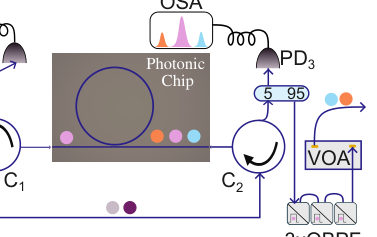
<figcaption class="paper-figure-caption"><b>Fig 1.</b> Fig. 1. Schematic of the experimental setup for photon-pair generation and effective detuning measurement. A continuous-wave pump laser is split: 95% is phase-modulated to create weak fourth-order sidebands for cavity monitoring, while the remaining 5% is amplified and filtered to drive photon-pair generation in the microresonator. Two optical circulators are used to route the counterpropagating beams through the microring and detection paths. DWDM Dense wavelength division multiplexing, OBPF Optical Band Pass Filter, PD photodiode, C circulator, PM phase modulator, VOA variable optical attenuator.</figcaption>
</figure>
<figure class="paper-figure-card">
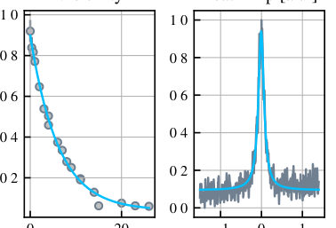
<figcaption class="paper-figure-caption"><b>Fig 2.</b> Fig. 2. Simplified schematics of the measurements and representative examples. The light-blue (orange) color is used to indicate the idler (signal) mode at 1530.1 nm (1557.3 nm) (a) Coincidence measurement scheme. (b) Example of coincidence measurement. Here the signal is used as start and the idler as stop on the time tagger, so that 𝑡stop = 𝑡start + 𝜏. The measurement shown is taken for 𝛿eff = 2𝜋× 154.28(3) MHz and using the fitting function Eq. (2) we get 𝜏−= 3.3(2) ns and 𝜏+ = 3.7(2) ns. (c) Second-order correlation function 𝑔(2) scheme for the idler mode. (d) 𝑔(2) example data for 𝛿eff = 2𝜋×151.06(6) MHz, fitted with the function Eq. (3) to obtain 𝜏i = 4.05(8) ns. (e) Interferometer...</figcaption>
</figure>
<figure class="paper-figure-card">
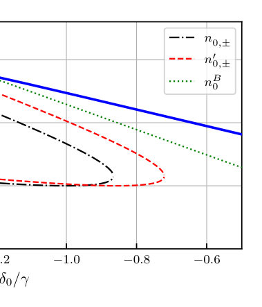
<figcaption class="paper-figure-caption"><b>Fig 3.</b> Fig. 3. Scaled pumped-mode occupation 𝑔𝑛0/𝛾(solid thick curves: stable; thin curve: unstable) for 𝑃in = 24 mW, and stability of the pump and sideband modes, as a function of the cold-cavity detuning 𝛿0/𝛾. We show the threshold occupancy of mode 0, associated with the onset of instability for 𝛿ˆ𝑎0 (𝑛0,±, black dot-dashed curve), and for ˆ𝑎𝑠/𝑖(𝑛′ 0,±, red-dashed curve). We operate in the bistability regime (colored band) at the high-occupation stable solution. 𝑛𝐵 0 (dotted curve) is the line for the bifurcation of the signal-idler mode (|𝑙| = 12). Where this boundary crosses the power-dependent stability curve, it separates the split-spectrum and gain-narrowing regimes.</figcaption>
</figure>
<figure class="paper-figure-card">
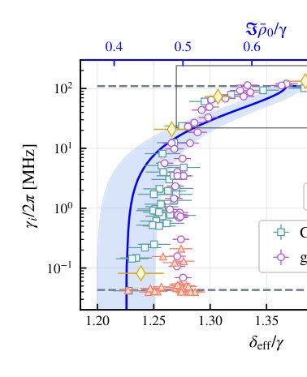
<figcaption class="paper-figure-caption"><b>Fig 4.</b> Fig. 4. (Main, Bottom axis) Idler mode linewidth as a function of normalized detuning 𝛿eff/𝛾, with 𝛾= 2𝜋× 109.8(6) MHz. Experimental linewidths extracted from measurements of temporal coincidences (light-blue squares), autocorrelation (purple circles), variable visibility in a Mach-Zehnder interferometer (yellow diamonds), and heterodyne beat (orange triangles). The lower (upper) gray dotted line indicates the linewidths of the pump laser (the cavity mode at the pump wavelength). (Main, Top axis) Numerical simulation of idler mode linewidth as a function of the normalized Kerr-shifted detuning ℑ( ¯𝜌0)/𝛾. The blue solid line corresponds to an input power of 24 mW, while the light-blue shaded...</figcaption>
</figure>

**Summary.** This paper characterizes the spectral evolution of two-photon emission in high-Q microresonators as they approach an Optical Parametric Oscillator threshold. By combining time-correlation measurements with advanced theoretical modeling, the authors track how the photon pair linewidth narrows from a cavity-limited value toward the pump laser's natural linewidth. This comprehensive characterization is vital for engineering stable and scalable integrated quantum light sources.

**Why it may be interesting.** This work provides a detailed roadmap for characterizing nonlinear quantum sources, which is crucial for developing integrated quantum network components. The ability to track spectral coherence across the spontaneous-to-coherent transition using multiple diagnostic tools (time correlation vs. phase measurement) is highly valuable for quantum optics research.

Detailed structure

**Main problem.** The study investigates how the spectral coherence of two-photon emission evolves as a nonlinear microresonator transitions from spontaneous quantum pair generation to an optical parametric oscillation (OPO) regime.

**Main result.** The linewidth is observed to evolve continuously, transitioning from a cavity-lifetime-limited scale in the low-power regime toward the pump-linewidth scale near OPO onset. Theoretical analysis confirms this transition using piecewise fitting functions based on detuning.

**Method.** The work combines time-correlation measurements (probing $g^{(2)}$) and phase-sensitive techniques like heterodyne beating to characterize coherence, supplemented by advanced theoretical modeling using QuantumCumulants.

**Model / system.** The physical platform is a high-Q silicon nitride microresonator where photon pairs are generated via third-order Four-Wave Mixing (FWM). The dynamics are modeled across regimes ranging from spontaneous quantum emission to coherent OPO, requiring analysis of first and second-order correlation functions.

**Key observables.** Emission linewidth evolution, first-order coherence function ($g^{(1)}(	au)$), second-order correlation function ($g^{(2)}$), and effective detuning ($\delta_{	ext{eff}}$).

**Important parameters / regimes.** Cavity lifetime ($\sim 3 	ext{ ns}$), pump-linewidth scale, OPO threshold, and the effective detuning $\delta_{	ext{eff}}(\omega_p)$.

**Assumptions / limitations.** Correlation measurements ($g^{(2)}$) are assumed to follow Siegert relations below threshold but fail above it; theoretical models often rely on large-occupation/mean-field approximations.

**Figures summary.** Figures illustrate the experimental setup for pair generation and detuning measurement, alongside schematics detailing coincidence counting and interferometric measurements used to probe coherence functions across different power regimes.

**Paper structure.** The paper progresses from describing the physical system (FWM in $	ext{Si}_3	ext{N}_4$ resonators) to outlining multiple experimental techniques for measuring coherence ($g^{(1)}, g^{(2)}$). It then details theoretical modeling, showing how analytic solutions must switch between different functional forms depending on whether the system is oscillatory or overdamped relative to the OPO threshold.

Abstract

High-Q silicon nitride microresonators are versatile sources for generating photon pairs via four-wave mixing. We investigate the spectral coherence of this process, tracking the transition from the spontaneous quantum regime to the onset of optical parametric oscillation. By combining time-correlation measurements with phase-sensitive measurements, we continuously monitor the emission linewidth as it evolves from a cavity-lifetime-limited linewidth toward the pump-linewidth scale. This characterization is essential for optimizing integrated sources for scalable quantum networks.

[↑ back to top](#top)

### [Preparation geometry and slow-sector routing in driven Kerr resonators: an operational spectral theory of Liouvillians](http://arxiv.org/abs/2608.05046v1)

**Authors:** Kilian Seibold  
**Type:** theory · **Category:** other · **PDF:** <https://arxiv.org/pdf/2608.05046v1>  
**Analysis basis:** full PDF text, analyzed in chunks
**Topic relevance:** 🔥 `methods for driven-dissipative` **4/5** · `Keldysh / 2PI / non-Gaussian methods` **3/5** · `driven-dissipative phase transition` **3/5** · `correlated / nonlocal dissipation` **2/5** · `correlated cavity matter` **2/5** · `non-equilibrium dynamics` **2/5** · `non-equilibrium universality` **2/5** · `Tavis-Cummings & cavity-many-emitter` **1/5** · `measurement-induced transitions` **1/5** · `quantum measurements` **1/5**

↔ Scroll figures horizontally

<figure class="paper-figure-card">
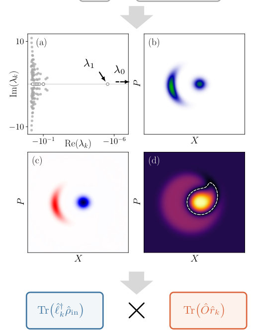
<figcaption class="paper-figure-caption"><b>Fig 1.</b> FIG. 1. Operational anatomy of a Liouvillian mode. Start- ing from L, one computes its eigenvalues and matched right and left eigenoperators. (a) Complex spectrum of a driven- dissipative Kerr resonator with the selected gap mode λ1. The stationary eigenvalue λ0 = 0 lies outside the logarithmic real-axis range. (b) Steady-state Wigner function Wss(X, P). (c) Right-mode Wigner symbol W R k (X, P), which represents the propagated density deformation. (d) Magnitude of the coherent-state excitation map |Ek(X, P)| = π|Qˆℓ† k(α)|. For</figcaption>
</figure>
<figure class="paper-figure-card">

<figcaption class="paper-figure-caption"><b>Fig 2.</b> Figure 1 summarizes the spectral, phase-space, and exci- tation–detection anatomy of a resolved Liouvillian mode. The two factors depend separately on the mode gauge, whereas their product does not. For a transient, ˆX = ˆρin. For a stationary correlation or response, ˆX = B(ˆρss) is the source generated by a superoperator B. For a diagonalizable Liouvillian, the state evolves as</figcaption>
</figure>
<figure class="paper-figure-card">
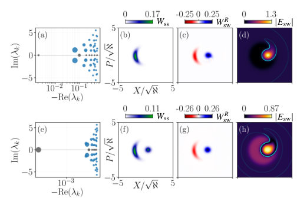
<figcaption class="paper-figure-caption"><b>Fig 3.</b> FIG. 2. Operational anatomy of bistable switching. The top row shows ∆/eU = 1.6, near the onset of a separated switch- ing timescale. The bottom row shows ∆/eU = 1.9, deeper in the metastable regime. (a,e) Low-lying nonstationary spec- trum with the switching mode highlighted. The stationary eigenvalue is omitted because the −Re(λk) axis is logarith- mic. (b,f) Stationary Wigner function Wss(X, P). (c,g) Right switching deformation W R sw(X, P). (d,h) Magnitude of the coherent-state excitation map |Esw(X, P)| in a fixed Hermi- tian mode gauge. The zero contour suppresses the switching mode. When this branch is the unique gap mode, the contour defines coherent strong-Mpemba preparations....</figcaption>
</figure>
<figure class="paper-figure-card">
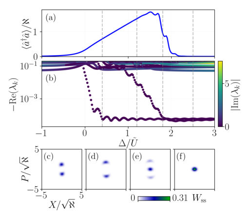
<figcaption class="paper-figure-caption"><b>Fig 4.</b> FIG. 3. Global detuning scan of the parametrically driven Kerr resonator. (a) Normalized stationary occupa- tion ⟨ˆa†ˆa⟩/ℵ. (b) Low-lying decay rates −Re(λk) on a log- arithmic scale, colored by | Im(λk)|. The stationary eigen- value λ0 = 0 is omitted. (c–f) Stationary Wigner functions at ∆/eU = 0.4, 1.2, 1.8, and 2.5, respectively. They show the crossover from a two-lobe regime through bright–central coexistence to a central low-amplitude state. Parameters are G/eU = 0.5 and eF/eU = 0. All other parameters are as in Fig. 2.</figcaption>
</figure>
<figure class="paper-figure-card">
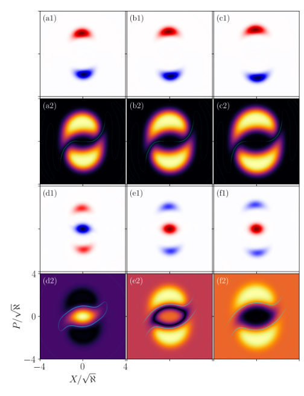
<figcaption class="paper-figure-caption"><b>Fig 5.</b> FIG. 4. Operational anatomy across the bright-central crossover. Columns correspond to ∆/eU = 1.5, 1.8, and 2.2. (a1–c1) Right deformation of the odd lobe-imbalance branch. (a2–c2) Magnitude of its excitation map. (d1–f1) Right defor- mation of the even bright-central branch. (d2–f2) Magnitude of its excitation map. The cyan curves mark Eµ(X, P) = 0 in fixed Hermitian mode gauges. Within each branch pair, the upper row shows the right-mode Wigner deformation and the lower row the matched Husimi excitation map. The two rows represent different operators, and each panel is normalized in- dependently. All parameters other than ∆/eU are as in Fig. 3.</figcaption>
</figure>

**Summary.** The paper introduces an operational spectral theory for Liouvillians that moves beyond just calculating decay rates by incorporating how input sources and measurement readouts couple to the system's modes. Using this framework on driven Kerr resonators, the authors demonstrate that specific preparation geometries can suppress unwanted dynamics or isolate distinct relaxation pathways. This provides a powerful diagnostic tool for understanding complex open quantum optical systems.

**Why it may be interesting.** This work is highly relevant as it provides a rigorous mathematical toolset for analyzing open quantum systems dynamics beyond simple spectral decomposition, directly linking theoretical structure (eigenoperators) to measurable experimental protocols (preparation/readout).

Detailed structure

**Main problem.** To develop an operational spectral theory for Liouvillians that characterizes not only decay rates (eigenvalues) but also precisely how quantum modes are excited, propagated, and detected in a specific experimental protocol.

**Main result.** The framework shows that preparation geometry and slow-sector propagation provide complementary operational information beyond just the eigenvalues, allowing identification of mode suppression and separation of relaxation channels in driven Kerr resonators.

**Method.** The theory utilizes matched left and right eigenoperators ($\hat{\ell}_k$ and $\hat{r}_k$) associated with the Liouvillian spectrum to define an operational modal weight that governs excitation and readout overlap.

**Model / system.** The study focuses on open quantum systems, specifically driven Kerr resonators, whose dynamics are governed by a Lindblad master equation derived from a Hamiltonian involving nonlinearity and external drives.

**Key observables.** Left/right eigenoperators ($\hat{\ell}_k, \hat{r}_k$), modal weight ($w_k$), excitation factor ($E_k$), detection factor ($D_k$), and residues ($R_{AB}^k$) for stationary correlations.

**Important parameters / regimes.** The Kerr nonlinearity strength ($U$), drive strengths ($F, G$), and the spectral gap/slow subspace definition are key parameters governing the dynamics.

**Assumptions / limitations.** The analysis assumes a finite-dimensional Liouville space and often requires checking multiple conditions (positivity, trace-one) to ensure that projected reduced models remain valid Markov generators.

**Figures summary.** Figures illustrate the operational anatomy, showing spectral features like gap modes, steady-state Wigner functions, right-mode symbols, and coherent-state excitation maps derived from the theory.

**Paper structure.** The paper builds from defining the general Liouvillian spectrum to introducing left/right eigenoperators. It then applies this framework to analyze specific physical phenomena in Kerr resonators, including mode suppression and stationary correlation analysis via residues, concluding with extensions to perturbation theory on slow manifolds.

Abstract

Liouvillian eigenvalues determine decay rates and oscillation frequencies, but not how the corresponding modes are excited, propagated, and detected in a chosen protocol. We develop an operational spectral theory based on matched left and right eigenoperators. Left eigenoperators determine excitation by an input or source; right eigenoperators determine the propagated density deformation and readout overlap; their product is a gauge-invariant modal weight. For bosonic systems, coherent preparations turn left eigenoperators into phase-space excitation maps whose zeros identify mode-selective suppression, while right eigenoperators yield the corresponding Wigner deformations. Resolved slow subspaces define operational coordinates and, when positivity and Markov-admissibility hold, a projected routing generator. In driven Kerr resonators, the framework identifies preparations that suppress a switching mode, separates symmetry-resolved relaxation channels, and reveals bias-induced crossovers in projected multichannel routing while the coherent-preparation partition continues to deform. Preparation geometry and slow-sector propagation thus provide complementary operational information beyond Liouvillian eigenvalues alone.

[↑ back to top](#top)

### [Analytical Floquet Quantum Statistics from Nonequilibrium Green's Functions](http://arxiv.org/abs/2608.04558v1)

**Authors:** Yuhua Ren, Gaomin Tang, Hui Pan, Jian-Sheng Wang  
**Type:** theory · **Category:** statistical mechanics · **PDF:** <https://arxiv.org/pdf/2608.04558v1>  
**Analysis basis:** full PDF text, analyzed in chunks
**Topic relevance:** 🔥 `methods for driven-dissipative` **4/5** · 🔥 `non-equilibrium dynamics` **4/5** · `Keldysh / 2PI / non-Gaussian methods` **3/5** · `driven-dissipative phase transition` **3/5** · `non-equilibrium universality` **2/5** · `Kondo & dissipative impurity` **1/5** · `analog quantum simulation` **1/5** · `correlated / nonlocal dissipation` **1/5** · `correlated cavity matter` **1/5**

↔ Scroll figures horizontally

<figure class="paper-figure-card">
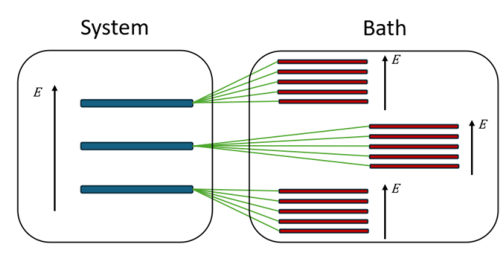
<figcaption class="paper-figure-caption"><b>Fig 1.</b> FIG. 1. Schematic of the system-bath coupling for a hypo- thetical system with NS = 3 states and a bath with 15 states. The bath depicted is composed of three identical sub-baths, with each containing five levels. Each system level couples exclusively and fully to one sub-bath. In the ideal bath as- sumption, both the coupling strength and the sub-bath den- sity of states are uniform.</figcaption>
</figure>
<figure class="paper-figure-card">
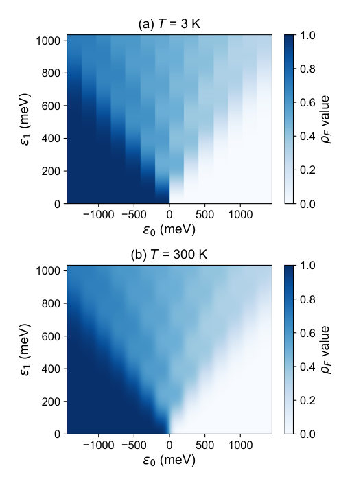
<figcaption class="paper-figure-caption"><b>Fig 2.</b> FIG. 2. Heatmaps of the Floquet Fermi function (Eq. (65)) at temperatures (a) 3 K and (b) 300 K corresponding to a simple sinusoidal driving (Eq. (64)) with frequency ℏΩ= 207 meV. The horizontal axis denotes the equilibrium energy level, while the vertical axis denotes (half of) the modulation amplitude. When ε1 = 0, which corresponds to a vanishing driving amplitude, the system is in equilibrium. A stronger drive widens the boundary between populated (low energy) and unpopulated (high energy) regions. At higher tempera- tures, temperature smearing smooths out the staircase feature of the Floquet Fermi function.</figcaption>
</figure>
<figure class="paper-figure-card">
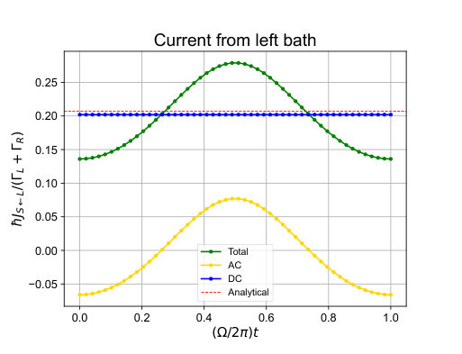
<figcaption class="paper-figure-caption"><b>Fig 3.</b> FIG. 3. Numerical computation of the current exiting from the left bath over one period using Eq. (70). To show leading- order behaviour, the current is normalized by ΓL + ΓR. The same sinusoidal resonant level model is used, with Hamilto- nian given by Eq. (64). The Hamiltonian parameters are ℏΩ= 2.07 eV, ϵ0 = 0 eV, and ϵ1 = 372 meV. Both baths are kept at the same temperature of 300 K, but the chemical potentials differ, with µL = 82.7 meV and µR = −82.7 meV. The bath couplings are set slightly differently, with ΓL = 0.001ℏΩand ΓR = 0.0015ℏΩ, although the results remain robust under variations. The “Total”, “AC”, and “DC” currents are com- puted numerically from their respective terms in...</figcaption>
</figure>

**Summary.** This paper develops an analytical method using Nonequilibrium Green's Functions combined with Floquet theory to characterize the steady-state statistics of quantum systems periodically coupled to a bath. It successfully derives the characteristic Floquet Fermi distribution and generalizes fundamental transport relations like the Landauer formula for these driven, open systems.

**Why it may be interesting.** This work provides a rigorous, unified theoretical framework connecting time-periodic driving (Floquet engineering) directly to non-equilibrium statistical mechanics for open quantum systems, which is highly relevant for understanding driven nanoscale devices.

Detailed structure

**Main problem.** The primary goal is deriving an analytical expression for the steady-state quantum statistics of periodically driven quantum systems coupled to a bath.

**Main result.** The authors derive the Floquet Fermi distribution, showing that the steady-state occupation is a weighted sum of shifted Fermi functions. They also establish a generalized Landauer formula for DC current in this regime.

**Method.** The work combines Nonequilibrium Green's Function (NEGF) formalism with Floquet theory to handle time-periodic driving and coupling to an environment.

**Model / system.** The system consists of a quantum system periodically driven by an external field and coupled to a thermal bath. The analysis is general, extending beyond simple commuting Hamiltonians.

**Key observables.** Steady-state quantum statistics (occupation distribution), retarded/advanced/lesser Green's functions, and the DC component of the current.

**Important parameters / regimes.** The driving frequency ($\Omega$), temperature ($T$), and the spectral function of the bath are key parameters governing the steady state.

**Assumptions / limitations.** Assumptions include weak system-bath coupling ($\Gamma 	o 0^+$) and utilizing the Floquet representation to manage time dependence, though extensions beyond ideal baths are shown.

**Paper structure.** The paper builds a coherent description by first embedding Floquet theory into NEGF, deriving closed-form expressions for Green's functions in the Floquet basis. It then applies this to determine the steady-state statistics and finally generalizes transport formulas like Landauer's.

Abstract

We derive an analytical expression for the steady-state quantum statistics of periodically driven quantum systems coupled to a bath using the nonequilibrium Green's function (NEGF) formalism. By embedding Floquet theory into NEGF, we obtain closed expressions for the retarded, advanced, and lesser Green's functions in the Floquet representation, yielding the Floquet Fermi distribution in which the steady-state occupation is expressed as a weighted sum of Fermi functions shifted by integer multiples of the driving frequency. The weights are determined solely by the Fourier components of the micromotion operator, providing a transparent interpretation of Floquet sideband occupations. Our analysis extends beyond the diagonal commuting Hamiltonians treated in earlier work, and further shows that the robust Floquet distribution remains valid for a broad class of weakly coupled bath spectral functions beyond the ideal featureless-bath approximation. Finally, we establish a Floquet version of the Landauer formula for the DC part of the current, in which the equilibrium Fermi functions are replaced by their Floquet-modified counterparts. Together, these results provide a coherent description of Floquet quantum statistics and transport in periodically driven open quantum systems.

[↑ back to top](#top)

### [Critical and multicritical Kasner scaling in holographic phase transitions](http://arxiv.org/abs/2608.04522v1)

**Authors:** Ling-Long Gao, Yan Liu, Hong-Da Lyu  
**Type:** theory · **Category:** statistical mechanics · **PDF:** <https://arxiv.org/pdf/2608.04522v1>  
**Analysis basis:** full PDF text, analyzed in chunks
**Topic relevance:** 🔥 `non-equilibrium universality` **4/5** · `Keldysh / 2PI / non-Gaussian methods` **3/5** · `driven-dissipative phase transition` **3/5** · `entanglement & information structure` **2/5** · `methods for driven-dissipative` **2/5** · `non-equilibrium dynamics` **2/5** · `analog quantum simulation` **1/5** · `correlated / nonlocal dissipation` **1/5** · `correlated cavity matter` **1/5**

↔ Scroll figures horizontally

<figure class="paper-figure-card">
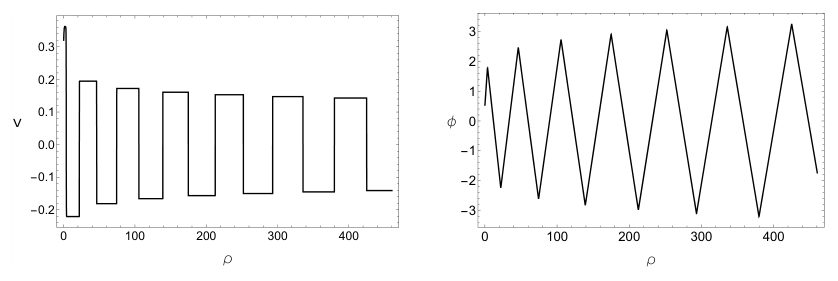
<figcaption class="paper-figure-caption"><b>Fig 1.</b> Figure 1: A typical interior evolution of a hairy black brane solution in Einstein-scalar the- ory with super-exponent potential (2.2). Here ρ = log(z/zh). Kasner epochs correspond to the plateau regime in the left panel and the sloped regime in the right panel, while bounces correspond to the jumps between two epochs in both panels.</figcaption>
</figure>
<figure class="paper-figure-card">
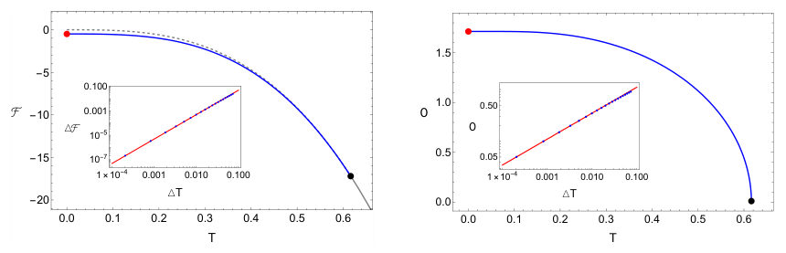
<figcaption class="paper-figure-caption"><b>Fig 2.</b> Figure 2: Thermodynamics and condensate at the generic second-order critical point at λ4 = λ = λ8 = 1/10, λ6 = 0. Left: free-energy densities of the Schwarzschild (gray) and hairy (blue) black holes. Right: The order parameter O/(−κ) as a function of T/(−κ). In both panels, the black dot marks the critical point of the phase transition, while the red dot denotes the corresponding zero-temperature domain wall solution. The insets are log-log plots: ∆F versus ∆T = Tc −T on the left, and O versus ∆T on the right. We work in unit κ = −1.</figcaption>
</figure>
<figure class="paper-figure-card">
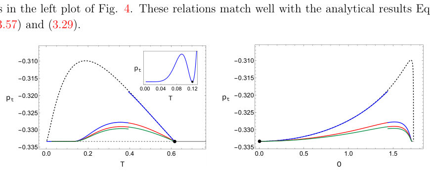
<figcaption class="paper-figure-caption"><b>Fig 3.</b> Figure 3: The Kasner exponent pt as a function of the temperature T (left) and condensate O (right) for λ4 = λ = λ8 = 1/10, λ6 = 0. In the left plot, the gray line is the Schwarzschild value pt = −1/3; the first (blue), second (red), and third (green) epochs are shown separately, while the polynomial model without the super-exponential term (i.e. set λ = 0) (black dashed) is included for comparison. Interestingly, pt ≃pSch t at a special temperature T = 0.11965, as shown in the inset of the left panel, and interior of the hairy black hole becomes Schwarzschild-like, details of the interior are discussed in Appendix D. We work in unit κ = −1.</figcaption>
</figure>
<figure class="paper-figure-card">
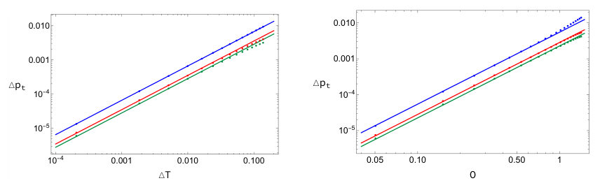
<figcaption class="paper-figure-caption"><b>Fig 4.</b> Figure 4: The first three continuously tracked Kasner epochs in the ordinary critical phase transition for λ4 = λ = λ8 = 1/10, λ6 = 0. Left: ∆p(n) t versus ∆T; Right: ∆p(n) t versus O. In both panels different colors denote different epochs: n = 1 (blue), 2 (red), 3 (green). All epochs have the predicted critical powers.</figcaption>
</figure>
<figure class="paper-figure-card">
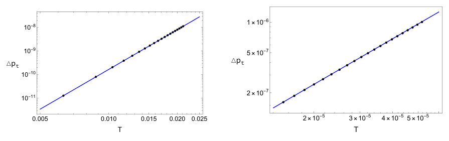
<figcaption class="paper-figure-caption"><b>Fig 5.</b> Figure 5: Log-log plot of ∆pt = p(1) t −pSch t at extremely low-temperature of the super- exponential model with λ4 = λ = λ8 = 1/10, λ6 = 0 (left), and polynomial model with λ = 0, λ4 = 1/10 and λ6 = 0 (right). The black dots are numerical data, while the blue lines are the fitting. In both models, the numerical fitted amplitude and exponent agree with the analytic values to the first three significant digits.</figcaption>
</figure>

**Summary.** This paper analyzes how holographic phase transitions dictate the scaling laws observed in the anisotropic Kasner geometry inside black holes. It derives specific power-law scalings for the deviation of the Kasner exponents near criticality, showing that these patterns persist across multiple interior epochs. The work connects boundary critical phenomena to the deep spacetime structure via advanced gravitational and thermodynamic techniques.

**Why it may be interesting.** While primarily in gravity/QFT, the study of phase transitions (criticality, multicriticality) and the connection between bulk geometry and boundary thermodynamics is highly relevant to understanding critical phenomena in strongly coupled quantum systems.

Detailed structure

**Main problem.** The study investigates how holographic phase transitions imprint their scaling laws onto the local Kasner geometry within Einstein-scalar black holes.

**Main result.** The deviation of the first-epoch Kasner exponent scales according to a power law dependent on the critical order ($r$), and later epochs inherit the same temperature exponent as the initial one.

**Method.** The analysis employs perturbative methods, scaling symmetries, and Infrared (IR) matching techniques to connect boundary critical behavior to the black hole interior dynamics.

**Model / system.** The system is a 4D Einstein-scalar gravity model dual to a boundary field theory deformed by a double-trace operator. The geometry involves hairy black holes whose interiors are analyzed using Kasner-like solutions.

**Key observables.** Kasner exponents ($p_t, p_x, p_\phi$), the boundary condensate ($\alpha$), and the renormalized free energy density ($F$).

**Important parameters / regimes.** The critical order $r$ (ordinary $r=1$, tricritical $r=2$, etc.), temperature deviation $(T_c-T)$, and the leading irrelevant exponent of the IR fixed point.

**Assumptions / limitations.** The analysis focuses on super-exponential scalar potentials, and certain results rely on assuming only decreasing transitions exist in the interior evolution.

**Figures summary.** Figures schematically illustrate the sequence of infinitely many Kasner epochs separated by bounces inside the black hole, and one figure shows a special hairy solution exhibiting a Schwarzschild-like interior despite exterior hair.

**Paper structure.** The paper progresses from establishing the general framework using planar ansatz solutions to deriving scaling laws for the first epoch. It then analyzes sequences of subsequent epochs, connects low-temperature behavior to IR fixed points, and finally discusses screening mechanisms that can revert the interior dynamics to a simple Schwarzschild form.

Abstract

We study how holographic phase transitions imprint their scaling laws on the local Kasner geometry inside Einstein-scalar black holes. At fixed double-trace coupling, we derive the near-critical scaling of the deviation of the first-epoch Kasner exponent from the Schwarzschild value: $p_t^{(1)}+\frac{1}{3} \propto O^2 \propto (T_c-T)^{1/r}$, where $O$ denotes the boundary condensate and $r$ labels ordinary criticality ($r=1$), tricriticality ($r=2$), and higher multicriticality ($r\geq3$). A super-exponential scalar potential generates a sequence of Kasner epochs separated by scalar-field bounces. We further find that any later epoch that can be tracked continuously across the transition inherits the same temperature exponent, while its coefficient depends on the epoch. Numerical solutions confirm these predictions for the ordinary and tricritical cases. Finally, we show analytically that the leading irrelevant exponent of the infrared fixed point governs the low-temperature Kasner scaling, and verify the resulting scaling numerically for the first Kasner exponent.

[↑ back to top](#top)

### [Quantum Contextuality and Entanglement-Free Grover Search in a Trapped-Ion Optical Qudit](http://arxiv.org/abs/2608.04128v1)

**Authors:** Tarun Dutta, Jasper Phua Sing Cheng, Alex Jin, Sergi Ramos-Calderer, José Ignacio Latorre, Manas Mukherjee  
**Type:** experiment · **Category:** other · **PDF:** <https://arxiv.org/pdf/2608.04128v1>  
**Analysis basis:** full PDF text, analyzed in chunks
**Topic relevance:** 🔥 `QC/QI experiment` **4/5** · `quantum measurements` **3/5** · `quantum optics experiment` **3/5** · `entanglement & information structure` **2/5** · `measurement-induced transitions` **2/5** · `analog quantum simulation` **1/5** · `correlated / nonlocal dissipation` **1/5** · `driven-dissipative phase transition` **1/5** · `interference shaping light` **1/5** · `non-equilibrium dynamics` **1/5**

↔ Scroll figures horizontally

<figure class="paper-figure-card">
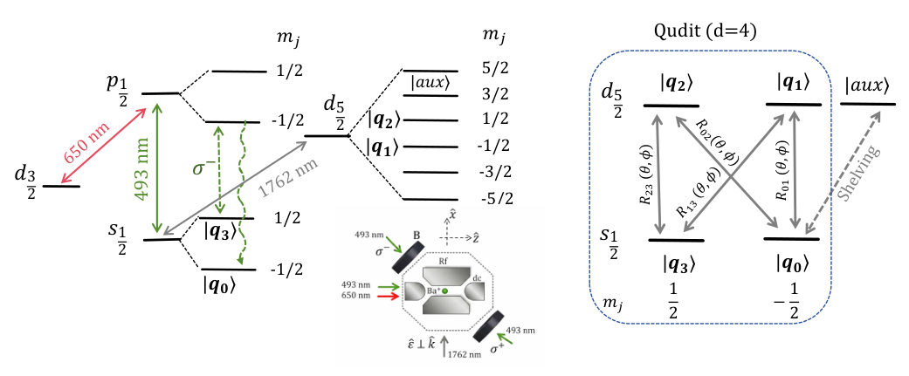
<figcaption class="paper-figure-caption"><b>Fig 1.</b> FIG. 1. Energy-level structure of the trapped-ion 138Ba+ qudit and the coherent transitions employed for initialization and quantum control. The 493 nm transition is used for Doppler cooling, while the 650 nm transition repumps population from the metastable d3/2 manifold back to the cooling cycle. A resonant 493 nm σ−-polarized optical-pumping beam drives the |s1/2, mJ = +1/2⟩→|p1/2, mJ = −1/2⟩transition, thereby initializing the ion into the dark state |s1/2, mJ = −1/2⟩≡|q0⟩. The four-dimensional optical qudit computational basis is encoded in the Zeeman sublevels of the s1/2 and d5/2 electronic manifolds. The basis states {|q0⟩, |q1⟩, |q2⟩, |q3⟩} are defined using the mJ = ±1/2 sublevels...</figcaption>
</figure>
<figure class="paper-figure-card">
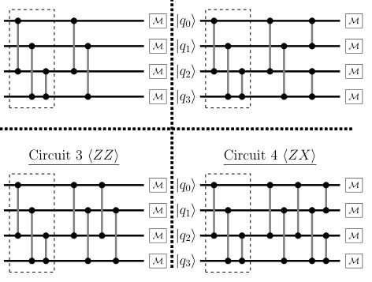
<figcaption class="paper-figure-caption"><b>Fig 2.</b> FIG. 2. Pulse sequences implementing the four effective CHSH measurement configurations in the single-qudit sys- tem. Connected levels represent coherent rotations within the corresponding two-level subspaces. The first three transitions prepare the superposition state (|q0⟩+ |q3⟩)/ √</figcaption>
</figure>
<figure class="paper-figure-card">
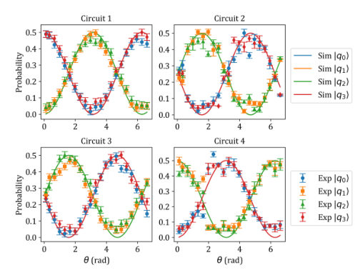
<figcaption class="paper-figure-caption"><b>Fig 3.</b> FIG. 3. Measured state populations for the four effective CHSH measurement configurations as a function of the rota- tion angle θ. Experimental data are shown as points, while solid lines represent numerical simulations obtained from co- herent evolution under a noiseless Hamiltonian model.</figcaption>
</figure>
<figure class="paper-figure-card">
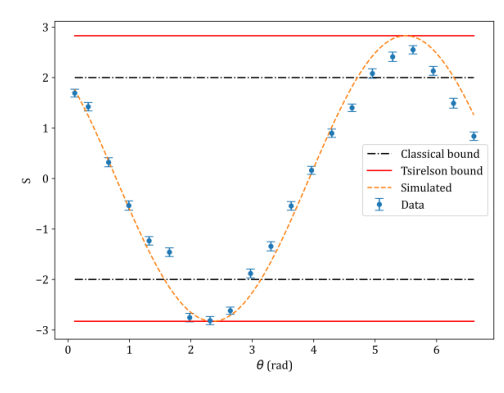
<figcaption class="paper-figure-caption"><b>Fig 4.</b> FIG. 4. Measured CHSH parameter S as a function of the rotation angle θ. Experimental data are shown as points and numerical simulations as solid lines. The black horizontal line indicates the classical CHSH bound S = 2, while the red line denotes the Tsirelson bound S = 2 √</figcaption>
</figure>
<figure class="paper-figure-card">
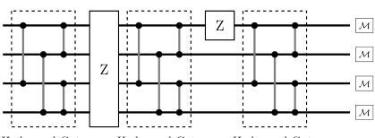
<figcaption class="paper-figure-caption"><b>Fig 5.</b> FIG. 5. Quantum circuit implementing Grover’s search al- gorithm in a single d = 4 qudit. Connected pairs of lev- els denote coherent rotations within the corresponding two- level subspaces, forming embedded SU(2) operations inside the full SU(4) manifold. The initial Hadamard-like trans- formation prepares an equal superposition of all four com- putational basis states. The central multi-level Z-operation acts as the Grover oracle by selectively applying a π-phase shift to the marked state, thereby inverting its phase relative to the remaining basis states. The subsequent Hadamard–Z– Hadamard sequence implements the Grover diffusion operator Us = 2|s⟩⟨s| −I, corresponding to reflection...</figcaption>
</figure>

**Summary.** The authors demonstrate a versatile architecture using a single trapped ion to realize both complex quantum computation and contextuality measurements. They successfully implemented an entanglement-free Grover search and measured strong violations of a CHSH inequality. This establishes the platform as a powerful tool for investigating fundamental relationships between coherence, non-classicality, and quantum information processing.

**Why it may be interesting.** This work is highly relevant as it combines advanced concepts from open quantum systems (decoherence analysis) with fundamental tests of non-classicality (contextuality) and computational primitives (Grover's search) all within the well-established, high-fidelity framework of trapped ions.

Detailed structure

**Main problem.** The research aims to disentangle the roles of coherent interference and quantum contextuality by implementing both concepts within a single, programmable physical system.

**Main result.** They successfully demonstrated an entanglement-free Grover search with high probability (up to 94.5%) and measured a significant violation of the CHSH inequality ($S = 2.816 \pm 0.082$), approaching the Tsirelson bound.

**Method.** The study uses coherent optical rotations on a trapped ion qudit to perform quantum algorithms and measure contextuality via single-qudit measurements.

**Model / system.** The platform is a programmable four-dimensional optical qudit encoded in a single trapped $^{138}	ext{Ba}^+$ ion, utilizing metastable states. Universal control over the $d=4$ Hilbert space is achieved through specific resonant optical transitions.

**Key observables.** Target-state identification probabilities for Grover's search; the CHSH parameter $S$; state preparation fidelity ($F$).

**Important parameters / regimes.** The maximum measured violation of $S = 2.816 \pm 0.082$, which approaches the Tsirelson bound ($\approx 2.828$); single-qudit $\pi$-pulse fidelity of $(98.8 \pm 0.3)\%$.

**Assumptions / limitations.** The primary limitations are attributed to laser-induced decoherence, coherent control errors, and state-detection infidelity.

**Figures summary.** Figures illustrate the energy level structure and pulse sequences for quantum control; one figure shows the Grover circuit diagram in a single qudit; another displays the measured CHSH parameter $S$ vs. rotation angle $	heta$, showing violation above the classical limit.

**Paper structure.** The paper progresses by first establishing universal coherent control over the qudit, then implementing and measuring an entanglement-free quantum algorithm (Grover's search), followed by demonstrating contextuality measurements using a CHSH inequality on the same hardware.

Abstract

Quantum computational advantage is generally attributed to coherent interference and other non-classical resources, yet their respective roles remain difficult to disentangle in experimental platforms where multipartite entanglement is inherently present. High-dimensional quantum systems provide an attractive route for investigating these resources while simultaneously reducing hardware overhead for quantum information processing. Here we realize a programmable four-dimensional optical qudit encoded in a single trapped $^{138}\mathrm{Ba}^{+}$ ion and demonstrate universal coherent control through phase-programmable optical rotations. Using this platform, we implement an entanglement-free realization of Grover's quantum search algorithm, achieving target-state identification probabilities of up to $94.5\pm2.0\%$. Within the same processor, we further demonstrate state-dependent quantum contextuality through a Clauser--Horne--Shimony--Holt (CHSH)-type noncontextuality inequality, obtaining a maximum violation of $S = 2.816 \pm 0.082$, in close agreement with the Tsirelson bound. By integrating programmable quantum computation and contextuality measurements within a single multilevel trapped-ion platform, our work establishes a versatile architecture for investigating the relationship between coherent interference and contextuality in quantum information processing and provides a scalable route toward high-dimensional quantum technologies.

[↑ back to top](#top)

### [Single-eigenstate test of eigenstate thermalization hypothesis via perturbed eigenstate quench](http://arxiv.org/abs/2608.04696v1)

**Authors:** Zhouhao Guo, Jiaju Zhang  
**Type:** theory · **Category:** statistical mechanics · **PDF:** <https://arxiv.org/pdf/2608.04696v1>  
**Analysis basis:** full PDF text, analyzed in chunks
**Topic relevance:** 🔥 `analog quantum simulation` **4/5** · 🔥 `non-equilibrium dynamics` **4/5** · `non-equilibrium universality` **3/5** · `entanglement & information structure` **2/5** · `scars & prethermalization` **2/5** · `correlated / nonlocal dissipation` **1/5** · `driven-dissipative phase transition` **1/5** · `exotic spin models in light-matter` **1/5** · `methods for driven-dissipative` **1/5**

↔ Scroll figures horizontally

<figure class="paper-figure-card">
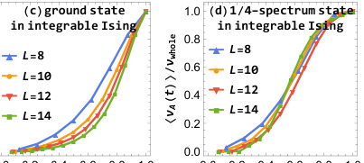
<figcaption class="paper-figure-caption"><b>Fig 1.</b> FIG. 1. Rescaled time-averaged subsystem evolution speed after a perturbed eigenstate quench in chaotic and inte- grable Ising chains. Top panels: Chaotic Ising chain with parameters hx = √</figcaption>
</figure>
<figure class="paper-figure-card">
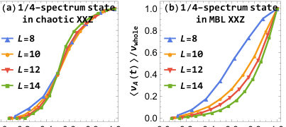
<figcaption class="paper-figure-caption"><b>Fig 2.</b> FIG. 2. Rescaled time-averaged subsystem evolution speed after a perturbed eigenstates quench in a disordered XXZ chain, shown for both the chaotic and MBL regimes. Left: Chaotic regime with disorder strength W = √</figcaption>
</figure>
<figure class="paper-figure-card">
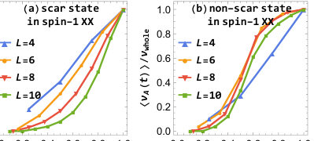
<figcaption class="paper-figure-caption"><b>Fig 3.</b> FIG. 3. Rescaled time-averaged subsystem evolution speed after a quench from perturbed eigenstates in the spin-1 XX chain. Left: Bimagnon scar state |Sn⟩with n = 3. Right: Non-scar eigenstate at the 1/4 position of the spectrum. We have taken h = √</figcaption>
</figure>

**Summary.** The authors propose a novel diagnostic using a perturbed eigenstate quench to test the Eigenstate Thermalization Hypothesis (ETH) at the level of individual energy eigenstates. By analyzing the time-averaged subsystem evolution speed versus system size ratio, they distinguish ETH-obeying states (S-shaped curve) from non-thermalizing ones (J-shaped curve). This method is robustly tested across diverse 1D spin chain models.

**Why it may be interesting.** This provides a powerful, computationally feasible probe for understanding thermalization dynamics in isolated quantum systems without needing to construct full thermal ensembles, which is highly relevant for AMO platforms simulating many-body physics.

Detailed structure

**Main problem.** The paper aims to develop an efficient, single-eigenstate diagnostic tool to test the Eigenstate Thermalization Hypothesis (ETH) in isolated quantum many-body systems.

**Main result.** A novel quench protocol distinguishes ETH-obeying eigenstates, which show an S-shaped curve with an inflection point at half system size, from ETH-violating states, which exhibit a convex J-shape.

**Method.** The diagnostic uses a 'perturbed eigenstate quench' protocol, evolving a weakly perturbed initial state $|\psi(0)
angle$ under the original Hamiltonian and measuring the time-averaged subsystem evolution speed $\langle v_A(t) 
angle$.

**Model / system.** The method is benchmarked across various 1D spin chains, including chaotic/integrable Ising models, disordered XXZ chains (covering ergodic to MBL regimes), and a spin-1 XX chain exhibiting scar states.

**Key observables.** Time-averaged subsystem evolution speed $\langle v_A(t) 
angle$ plotted against the subsystem size ratio $x = \ell/L$.

**Important parameters / regimes.** The perturbation strength ($\epsilon=10^{-3}$), and the system parameters defining different quantum regimes (e.g., disorder strength in XXZ chains).

**Assumptions / limitations.** The method assumes that the time-averaged speed $\langle v_A(t) 
angle$ provides a robust, qualitative distinction between thermalizing and non-thermalizing dynamics.

**Figures summary.** Figures compare the normalized evolution speed versus subsystem size ratio for different eigenstates (e.g., ground state vs. bulk states) across various Hamiltonian regimes.

**Paper structure.** The paper introduces the problem of single-eigenstate ETH testing, details the perturbed eigenstate quench methodology, presents the characteristic S-shaped vs. J-shaped signatures, and validates this diagnostic across multiple paradigmatic 1D spin chain models.

Abstract

We propose and numerically validate an efficient single-eigenstate diagnostic for the eigenstate thermalization hypothesis (ETH) based on a perturbed eigenstate quench protocol. By introducing a weak random perturbation to an energy eigenstate to break its stationarity, we characterize the time-averaged subsystem evolution speed as a function of the subsystem-to-total system size ratio. The diagnostic relies on a robust qualitative distinction: eigenstates satisfying ETH exhibit an S-shaped curve with a clear inflection point near half the system size, while ETH-violating eigenstates display a convex J-shaped profile. We benchmark the criterion across paradigmatic one-dimensional spin chains covering chaotic, integrable, many-body localized, and quantum many-body scar regimes, obtaining full agreement with established thermalization phenomenology. Our method circumvents the need for explicit thermal ensemble construction, providing a robust, experimentally feasible probe of eigenstate thermalization at the single-eigenstate level.

[↑ back to top](#top)

### [Emergent Replica Clock Unifies Many-Body Localization and Thermalization](http://arxiv.org/abs/2608.04762v1)

**Authors:** Tong Liu  
**Type:** theory · **Category:** disordered systems and neural networks · **PDF:** <https://arxiv.org/pdf/2608.04762v1>  
**Analysis basis:** full PDF text, analyzed in chunks
**Topic relevance:** 🔥 `non-equilibrium dynamics` **4/5** · `non-equilibrium universality` **3/5** · `analog quantum simulation` **2/5** · `entanglement & information structure` **2/5** · `scars & prethermalization` **2/5** · `Keldysh / 2PI / non-Gaussian methods` **1/5** · `correlated / nonlocal dissipation` **1/5** · `driven-dissipative phase transition` **1/5** · `methods for driven-dissipative` **1/5**

↔ Scroll figures horizontally

<figure class="paper-figure-card">
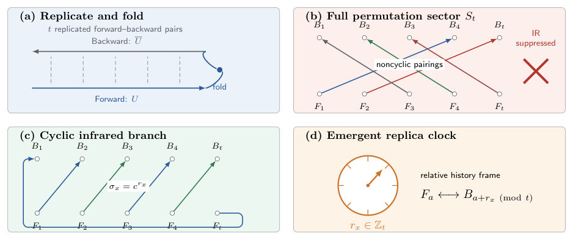
<figcaption class="paper-figure-caption"><b>Fig 1.</b> FIG. 1. Birth of the replica clock. (a) Replication and folding place forward and backward unitary histories in one local tensor network. (b) The resulting St pairing sector contains noncyclic crossings, which are gapped or dephase under infrared coarse graining. (c) The surviving coherent pairings form the cyclic branch σx = crx. (d) Its local coordinate is the replica clock rx ∈Zt.</figcaption>
</figure>
<figure class="paper-figure-card">
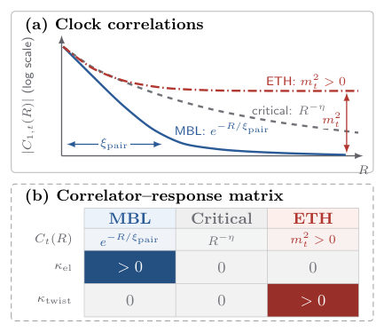
<figcaption class="paper-figure-caption"><b>Fig 2.</b> FIG. 2. Three clock regimes and their two responses. (a) Color and line style distinguish exponential decay (MBL), scale-free decay (critical), and long-range locking (ETH). (b) The response matrix directly pairs each correlator with its two asymptotic costs: MBL has line tension only, ETH has twist stiffness only, and both vanish at criticality.</figcaption>
</figure>
<figure class="paper-figure-card">
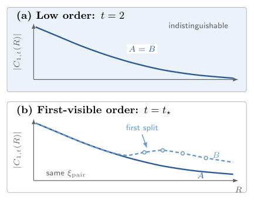
<figcaption class="paper-figure-caption"><b>Fig 3.</b> FIG. 3. Quantized resolution. (a) At low replica order, localized dynamics A and B have the same correlator and are operationally indistinguishable. (b) At t = t⋆, a newly representable invariant produces their first higher-order split even though the spatial decay scale ξpair remains the same.</figcaption>
</figure>

**Summary.** The paper unifies Many-Body Localization and Thermalization by introducing an emergent cyclic clock field whose correlator exhibits distinct asymptotic behaviors in each phase. This framework also introduces 'replica order' as a discrete diagnostic tool that allows researchers to distinguish between localized systems even if they share identical spatial correlation lengths.

**Why it may be interesting.** This work provides a powerful, unified mathematical tool—the emergent clock—to classify quantum thermalization behavior. The concept of 'replica order' offers a novel, discrete way to probe the depth of localization beyond simple spatial correlation measures, which is highly relevant for understanding complex many-body physics.

Detailed structure

**Main problem.** The paper aims to find a single, unifying order parameter that can distinguish between Many-Body Localization (MBL) and Eigenstate Thermalization Hypothesis (ETH), as current diagnostics treat them separately.

**Main result.** An emergent cyclic clock field $r_x$ is introduced whose correlator exhibits three distinct asymptotic regimes corresponding precisely to MBL, critical, and ETH phases. Furthermore, replica order provides a discrete coordinate to distinguish localized dynamics sharing the same spatial correlation length.

**Method.** The authors analyze isolated unitary quantum dynamics by constructing a statistical mechanics over forward-backward history pairings, leading to an effective action for the emergent clock field.

**Model / system.** The analysis is performed on isolated unitary quantum systems, focusing on 'quantum histories' rather than just physical states. The mathematical framework involves replicating and folding these history pairs into a partition sum.

**Key observables.** Clock correlator $C_t(R)$, line tension ($\kappa_{	ext{el}}$), twist stiffness ($\kappa_{	ext{twist}}$), and the replica order ($t$).

**Important parameters / regimes.** The three asymptotic regimes (MBL, critical, ETH) define distinct values for $\kappa_{	ext{el}}$ and $\kappa_{	ext{twist}}$. The replica order $t$ acts as a discrete resolution parameter.

**Assumptions / limitations.** The analysis relies on coarse-graining history-pairing configurations in the infrared limit and assumes that higher-order invariants only become visible at specific, quantized replica orders ($t^\star$).

**Figures summary.** Figure 1 illustrates the emergence of the clock from noncyclic pairings. Figure 2 compares the three distinct clock regimes (MBL, Critical, ETH) via correlator magnitude and response costs ($\kappa_{	ext{el}}, \kappa_{	ext{twist}}$). Figure 3 demonstrates that replica order $t$ provides quantized resolution to distinguish dynamics otherwise indistinguishable by spatial correlation length.

**Paper structure.** The paper develops the concept of history-pairing statistical mechanics, identifies the emergent clock field and its three asymptotic regimes (MBL/Critical/ETH), establishes a central identity unifying coherence lengths, and finally introduces replica order $t$ as a secondary diagnostic coordinate to resolve ambiguities in localized dynamics.

Abstract

Many-body localization (MBL) and eigenstate thermalization (ETH) are traditionally distinguished by a collection of separate diagnostics, not by a single order parameter. We show that replication and folding of isolated unitary dynamics generate a complex statistical mechanics of forward--backward history pairings and, in a closed cyclic infrared sector, an emergent clock $r_x\in\mathbb Z_t$. Its correlator has three distinct asymptotics: exponential decay in MBL, scale-free decay at criticality, and long-range locking in the thermal phase. A controlled $l$-bit reduction makes the clock action quasi-local, while its inverse correlation length obeys $ξ_{\rm pair}^{-1}=κ_{\rm el}=\ln|ρ_0/ρ_q|$, unifying history coherence, the defect line tension, and the transfer spectrum. Replica order supplies a second, discrete coordinate---the first order at which a hidden dynamical invariant becomes visible---and can distinguish localized dynamics that share the same spatial correlation length.

[↑ back to top](#top)

### [Entanglement entropy of fermions in a strange metal](http://arxiv.org/abs/2608.04098v1)

**Authors:** Santanu Singh, Surajit Bera, Chenyuan Li, Subir Sachdev, Sumilan Banerjee  
**Type:** theory · **Category:** strongly correlated electrons · **PDF:** <https://arxiv.org/pdf/2608.04098v1>  
**Analysis basis:** full PDF text, analyzed in chunks
**Topic relevance:** 🔥 `entanglement & information structure` **4/5** · `non-equilibrium universality` **3/5** · `Keldysh / 2PI / non-Gaussian methods` **2/5** · `analog quantum simulation` **2/5** · `driven-dissipative phase transition` **2/5** · `Kondo & dissipative impurity` **1/5** · `correlated / nonlocal dissipation` **1/5** · `methods for driven-dissipative` **1/5** · `non-equilibrium dynamics` **1/5**

↔ Scroll figures horizontally

<figure class="paper-figure-card">
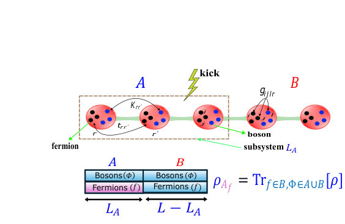
<figcaption class="paper-figure-caption"><b>Fig 1.</b> FIG. 1. 1D Yukawa-SYK model and fermionic subsys- tem: A one-dimensional model (sites r, r′ = 1, · · · , L, shown for L = 5) of Yukawa-SYK quantum dots having spinless fermions (black) and bosons (blue), each with N (shown for N = 3) flavors (indexed by i, j, l) at each site r. The fermion and boson flavors within each dot interact via spatially ran- dom Yukawa interaction gijlr. Same flavor of fermions hop with amplitudes (black arrows) trr′ and bosonic fields are quadratically coupled via Krr′, between the sites r and r′. The one dimensional chain is divided into a spatial subsys- tem A (dashed rectangle) of length LA and its complement B of length L −LA, shown here for LA = 3 and L = 5....</figcaption>
</figure>
<figure class="paper-figure-card">
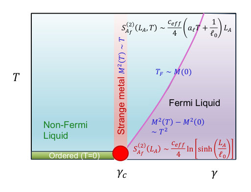
<figcaption class="paper-figure-caption"><b>Fig 2.</b> FIG. 2. Phase diagram of 1D Yukawa-SYK model: The schematic phase diagram of the 1D Yukawa-SYK model (Fig.1) as a function of temperature T and a parameter γ that controls the spherical constraint on the bosons. A quantum critical point (QCP) γ = γc at T = 0 separates a gapped dis- ordered phase for γ &gt; γc, with boson mass M(0) and Fermi liquid (FL) ground state, and a gapless non-Fermi liquid or- dered phase for γ &lt; γc. The boson mass M 2(T) increases as ∼T 2 in the FL phase, where the FL scale TF ∼M(0) →0 for γ →γ+ c . At the QCP, the coupling between fermions and critical bosons leads to a strange metal with critical Fermi points devoid of quasiparticles, and boson thermal mass M(T) ∼ √</figcaption>
</figure>
<figure class="paper-figure-card">
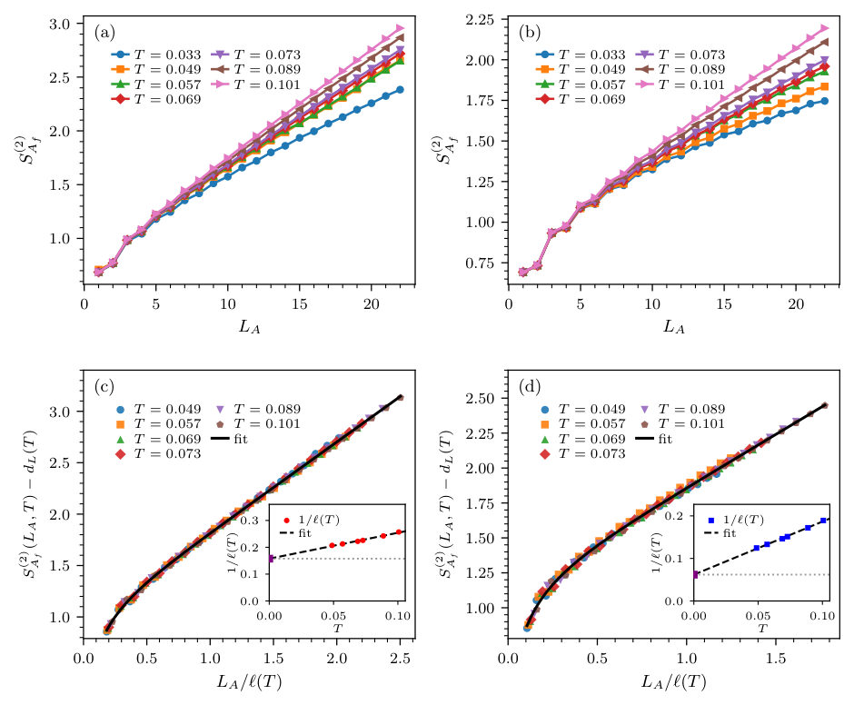
<figcaption class="paper-figure-caption"><b>Fig 3.</b> FIG. 3. Fermionic-subsystem second Rényi entropy and scaling collapse for 1D Yukawa-SYK model: S(2) Af as a function of subsystem size LA for system size L = 50 (see Fig.1) at different temperatures T, for (a) the strange metal at γ/γc = 1 and (b) Fermi liquid at γ/γc = 1.84. Corresponding scaling collapses in (c) and (d), where the scaling curves are fitted (solid black lines) with the CFT-like crossover formula in Eq.(1), yielding effective central charges, ceff = 1.56 ± 0.02 for γ/γc = 1 and ceff = 1.30 ± 0.02 for γ/γc = 1.84. (Insets) The extracted inverse length scale 1/ℓ(T), plotted as a function of T, exhibits a finite intercept at T = 0, 1/ℓ0 ≃0.16 for γ/γc = 1 and 1/ℓ0 ≃0.06 for...</figcaption>
</figure>
<figure class="paper-figure-card">
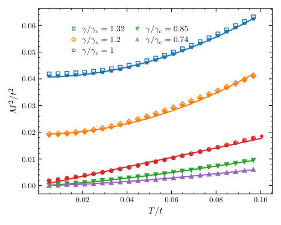
<figcaption class="paper-figure-caption"><b>Fig 4.</b> FIG. 4. Boson thermal mass: The thermal mass M 2(T) for the 1D Yukawa-SYK model (unfilled symbols) with t = 1, µ = 0, K = 1 and g = 1 is compared with that of the effective dissipative O(N) model (filled symbols) with dissipation strength κ = g2/(πv2 F)) ≃0.08. For γ &gt; γc, M 2(T) −M 2(0) ∼T 2, whereas M 2(T) ∼T α for γ ≤γc. Up to logarithmic corrections, α = 1 at the QCP (γ = γc). For γ &lt; γc, M 2(T) shows a power law behavior with α = 1.36 for γ/γc = 0.85 and α = 1.51 for γ/γc = 0.74. The solid lines denote the power-law fits.</figcaption>
</figure>
<figure class="paper-figure-card">
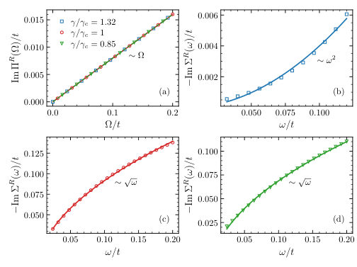
<figcaption class="paper-figure-caption"><b>Fig 5.</b> FIG. 5. Bosonic and fermionic self energies: (a) Imagi- nary part of the retarded bosonic self energy ΠR(Ω) for three values of γ in the disordered (γ/γc = 1.32), critical (γ/γc = 1) and ordered (γ/γc = 0.85) states with t = 1, µ = 0, K = 1 and g = 1, at temperature T = 0.005. (b) γ/γc = 1.32, (c) γ/γc = 1 and (d) γ/γc = 0.85, show the corresponding imagi- nary part of the fermionic self-energies. The solid lines denote the power-law fits with the frequencies.</figcaption>
</figure>

**Summary.** This paper investigates the entanglement entropy in strange metals using a solvable large-N model akin to Yukawa SYK. By calculating the second Rényi entropy, the authors show that the crossover between thermal and entanglement regimes follows universal scaling laws predicted by CFT theory. This confirms strong quantum correlations beyond simple Fermi liquid descriptions.

**Why it may be interesting.** While focused on condensed matter, the study of entanglement entropy scaling laws and critical behavior provides theoretical tools applicable to understanding quantum criticality in strongly interacting many-body systems relevant to AMO physics.

Detailed structure

**Main problem.** The study addresses the entanglement entropy of gapless fermionic systems, specifically those exhibiting strange metal behavior without well-defined quasiparticles.

**Main result.** The crossover from thermal to entanglement entropy is captured by a single universal scaling ansatz, and for the critical strange metal, this curve follows the CFT form with an effective central charge larger than non-interacting values.

**Method.** The authors employ large-N field theory techniques, exactly computing the second Rényi entropy via imaginary-time path integrals and solving resulting saddle-point equations.

**Model / system.** The model is a solvable 1D lattice system analogous to the Yukawa-Sachdev-Ye-Kitaev (Yukawa SYK) model, coupling two Fermi points to scalar bosons via random Yukawa interactions.

**Key observables.** Second Rényi entropy of fermions ($S^{(2)}_A$), effective central charge ($c_{	ext{eff}}$), and the temperature/size dependence of entanglement entropy.

**Important parameters / regimes.** The system behavior is controlled by a parameter $\gamma$, defining regimes: Strange Metal (QCP, $\gamma = \gamma_c$), Ordered Phase ($\gamma < \gamma_c$), and Fermi Liquid (FL) Phase ($\gamma > \gamma_c$).

**Assumptions / limitations.** The analysis is restricted to the large-$N$ limit. The study also uses specific path integral formalisms and numerical techniques like recursive Green's function inversion.

**Figures summary.** Figures illustrate the model setup, a phase diagram showing the QCP separating FL from Strange Metal regimes, and plots demonstrating the scaling collapse of $S^{(2)}_A$ using CFT-like formulas.

**Paper structure.** The paper builds by first defining the physical problem (entanglement in strange metals), then detailing the mathematical machinery (large-$N$ saddle points, path integrals), presenting results across different temperature/size regimes, and finally deriving universal scaling laws.

Abstract

The subsystem-size dependence of ground-state entanglement entropy and its crossover to thermal entropy as a function of temperature are well understood for one-dimensional (1D) gapless systems described by conformal field theory (CFT), and for free fermions with a Fermi surface in any dimension. However, little is known about the entanglement entropy for gapless fermionic systems without quasi-particles, such as a strange metal. Here we study the entanglement entropy of fermions in a solvable large-$N$ 1D lattice model akin to the Yukawa-Sachdev-Ye-Kitaev (Yukawa SYK) model. In this model, two Fermi points are coupled to scalar bosons via spatially random Yukawa interactions, providing a solvable model of a strange metal when the bosons become critical at a quantum critical point. We exactly compute the second Rényi entropy of fermions in a spatial subregion in this model. Our results unravel crucial role of intra-subregion entanglement between fermionic and bosonic degrees of freedom along with the inter-subregion entanglement in understanding the ground states of such strongly coupled fermion-boson systems. We show that the crossover from thermal entropy to entanglement entropy, is captured by a single scaling ansatz, that collapses the second Rényi entropy of fermions for different subregion sizes and temperatures into a single universal curve. We further show that the universal scaling curve for the critical strange metal is well described by the standard CFT formula, albeit with an effective central charge substantially larger than the non-interacting value.

[↑ back to top](#top)

### [Breakdown of Monotonic Impurity Entropy Flow in $\mathscr{PT}$-Symmetric Multichannel Kondo Systems](http://arxiv.org/abs/2608.04083v1)

**Authors:** Pradip Kattel, Abay Zhakenov, Natan Andrei  
**Type:** theory · **Category:** statistical mechanics · **PDF:** <https://arxiv.org/pdf/2608.04083v1>  
**Analysis basis:** full PDF text, analyzed in chunks
**Topic relevance:** 🔥 `Kondo & dissipative impurity` **4/5** · `Keldysh / 2PI / non-Gaussian methods` **3/5** · `driven-dissipative phase transition` **3/5** · `non-equilibrium universality` **2/5** · `correlated / nonlocal dissipation` **1/5** · `entanglement & information structure` **1/5** · `methods for driven-dissipative` **1/5** · `non-equilibrium dynamics` **1/5**

↔ Scroll figures horizontally

<figure class="paper-figure-card">
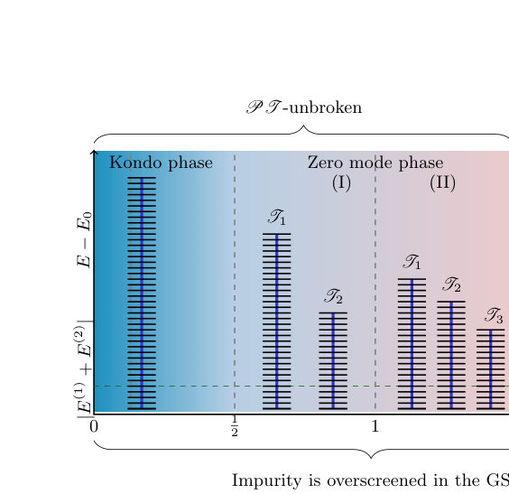
<figcaption class="paper-figure-caption"><b>Fig 1.</b> FIG. 1: Phase diagram of the n-channel Kondo model with two spin- 1</figcaption>
</figure>
<figure class="paper-figure-card">
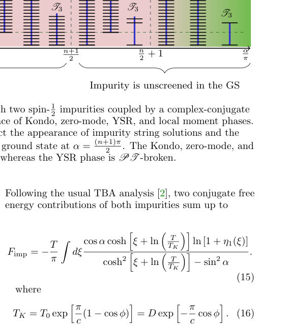
<figcaption class="paper-figure-caption"><b>Fig 2.</b> Fig. 2 shows the impurity entropy Simp = ln g(T) = −∂Fimp/∂T and impurity specific heat Cimp = T ∂Simp/∂T. Throughout the Kondo phase, Simp de- creases monotonically from the ultraviolet value 2 ln 2 to the infrared value 2 ln h 2 cos  π n+2 i . The parameter α</figcaption>
</figure>
<figure class="paper-figure-card">
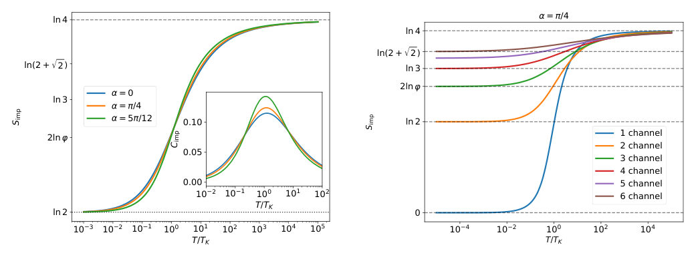
<figcaption class="paper-figure-caption"><b>Fig 3.</b> FIG. 2: Impurity entropy Simp as a function of T/TK. Left: two-channel model for several values of α, with the corresponding impurity specific heat Cimp shown in the inset. Right: impurity entropy at fixed α = π/4 for different channel numbers. Here φ = (1 + √</figcaption>
</figure>
<figure class="paper-figure-card">
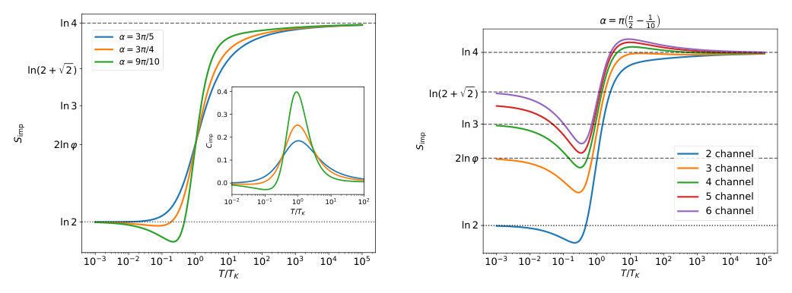
<figcaption class="paper-figure-caption"><b>Fig 4.</b> FIG. 3: Impurity entropy Simp as a function of T/TK in the zero-mode phase. Left: two-channel model for several values of α, with the corresponding impurity specific heat Cimp shown in the inset. Increasing α continuously changes the entropy flow from monotonic to nonmonotonic. Right: impurity entropy for different channel numbers with α = π  n</figcaption>
</figure>
<figure class="paper-figure-card">
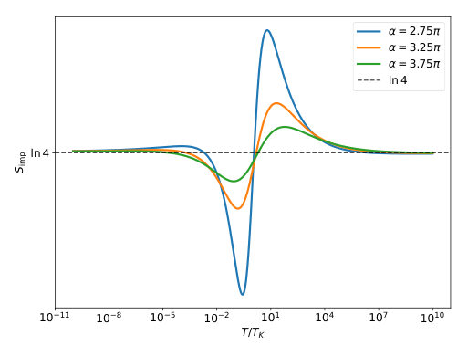
<figcaption class="paper-figure-caption"><b>Fig 5.</b> FIG. 4: Impurity entropy Simp as a function of T/TK in the local moment phase for the three-channel model. Both the UV and IR fixed points have Simp = ln 4, with α-dependent overshooting and undershooting at intermediate temperatures.</figcaption>
</figure>

**Summary.** This paper analyzes a $\mathscr{PT}$-symmetric Kondo model to study the entropy flow of impurities. Using advanced techniques like TBA and RG analysis, the authors map out four distinct impurity phases based on a non-Hermiticity parameter $\alpha$. The key finding is that while some phases show expected monotonic behavior, others exhibit nonmonotonic entropy flow, challenging simple assumptions about quantum renormalization group irreversibility.

**Why it may be interesting.** The investigation into non-Hermitian physics ($\mathscr{PT}$ symmetry) applied to strongly correlated impurity models provides insights into how spectral properties (like complex energies or zero modes) can violate standard thermodynamic theorems like RG irreversibility, which is crucial for understanding open quantum systems dynamics.

Detailed structure

**Main problem.** The study investigates the breakdown of monotonic impurity entropy flow within $\mathscr{PT}$-symmetric multichannel Kondo systems.

**Main result.** While the standard Kondo phase shows monotonic entropy flow consistent with defect CFT, the zero-mode and local-moment phases exhibit nonmonotonic behavior, contradicting simple expectations of RG irreversibility.

**Method.** The analysis employs Renormalization Group (RG) flow techniques combined with a generalized Thermodynamic Bethe Ansatz (TBA) to calculate impurity free energy and entropy.

**Model / system.** The system is a $\mathscr{PT}$-symmetric non-Hermitian multichannel Kondo model involving two spin-$1/2$ impurities coupled to $n$ conduction electron channels via complex-conjugate couplings.

**Key observables.** Impurity free energy, Affleck–Ludwig $g$-function, and impurity entropy flow ($\text{Simp}$).

**Important parameters / regimes.** The dimensionless non-Hermiticity parameter $\alpha$, which dictates the phase diagram (Kondo, zero-mode, YSR, local moment).

**Assumptions / limitations.** The analysis relies on exact solutions derived from Bethe Ansatz methods and defect CFT concepts.

**Figures summary.** Figures illustrate the phase diagram mapping $\alpha$ to different Kondo regimes; they also show $\text{Simp}$ vs. $T/T_K$, demonstrating monotonic flow in some phases and nonmonotonicity (overshoots/undershoots) in others.

**Paper structure.** The paper first establishes the model Hamiltonian and parameters, then analyzes the RG flow across different regimes defined by $\alpha$. It details calculations using TBA to find thermodynamic quantities, culminating in a comparison between theoretical expectations of monotonicity and the actual nonmonotonic results found for specific phases.

Abstract

We study a $\mathscr{PT}$-symmetric non-Hermitian multichannel Kondo model consisting of a pair of spin-$\frac12$ impurities coupled to $n$ conduction-electron channels through complex-conjugate Kondo couplings. The impurity renormalization-group (RG) flow is characterized by the Kondo scale $T_K$ and a dimensionless non-Hermiticity parameter $α$. As $α$ increases, the exact Bethe Ansatz solution exhibits four impurity phases: overscreened Kondo, zero mode, Yu--Shiba--Rusinov (YSR), and local moment. The Kondo, zero-mode, and local-moment phases are $\mathscr{PT}$-unbroken, whereas the YSR phase spontaneously breaks $\mathscr{PT}$ symmetry. Using a generalized thermodynamic Bethe Ansatz, we determine the impurity free energy and Affleck--Ludwig $g$-function throughout the $\mathscr{PT}$-unbroken phases. In the Kondo phase, the defect RG flow connects the ultraviolet and infrared conformal fixed points, with the impurity entropy flowing from $2\ln2$ to $2\ln\left[2\cos\left(\fracπ{n+2}\right)\right]$, in agreement with defect conformal field theory. In the zero-mode phase, zero-energy impurity strings reorganize the spectrum into multiple excitation towers, while in the local-moment phase, the RG flow becomes cyclic, returning to the unscreened local-moment fixed point. We conjecture that RG irreversibility, and hence a generalized Affleck--Ludwig $g$-theorem, survives throughout the Kondo phase. Our exact solution nevertheless shows that a real spectrum and defect entropies consistent with defect CFT do not guarantee RG irreversibility: the impurity entropy is non-monotonic in both the zero-mode and local-moment phases.

[↑ back to top](#top)

### [From normal Lindbladians to non-normal quantum trajectories](http://arxiv.org/abs/2608.04775v1)

**Authors:** Shakib Daryanoosh  
**Type:** theory · **Category:** other · **PDF:** <https://arxiv.org/pdf/2608.04775v1>  
**Analysis basis:** full PDF text, analyzed in chunks
**Topic relevance:** 🔥 `methods for driven-dissipative` **4/5** · 🔥 `quantum measurements` **4/5** · `measurement-induced transitions` **3/5** · `non-equilibrium dynamics` **2/5** · `Keldysh / 2PI / non-Gaussian methods` **1/5** · `correlated / nonlocal dissipation` **1/5** · `driven-dissipative phase transition` **1/5**

↔ Scroll figures horizontally

<figure class="paper-figure-card">
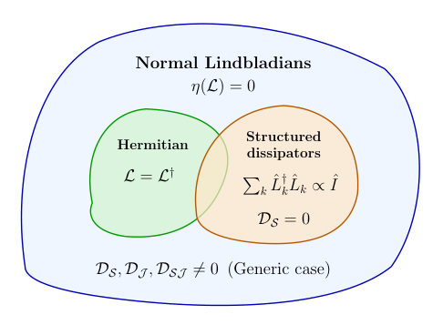
<figcaption class="paper-figure-caption"><b>Fig 1.</b> FIG. 1. Conceptual organization of the normal Lindbladians considered in this work. The two colored regions represent an- alytically tractable subclasses whose intersection is nonempty.</figcaption>
</figure>

**Summary.** This paper rigorously investigates Lindbladian normality by decomposing the master equation into smooth and stochastic jump parts. It establishes that global normality requires a specific algebraic balance between these components, leading to spectral stability (no Exceptional Points). Crucially, it shows this means that while individual quantum trajectories might exhibit transient mode mixing, this coupling vanishes upon ensemble averaging, providing a trajectory-level interpretation of Liouvillian normality.

**Why it may be interesting.** This work provides a deep theoretical link between the spectral properties of the Liouvillian superoperator (a global property) and the dynamics observed when simulating individual quantum trajectories, which is crucial for understanding realistic open system simulations.

Detailed structure

**Main problem.** The core problem is understanding how global properties of the Lindblad generator, specifically Liouvillian normality ($\|[L, L^\dagger]\| = 0$), manifest at the level of individual stochastic quantum trajectories.

**Main result.** Normal Lindbladians are characterized by an exact steady-state balance relation between smooth and jump contributions, ensuring that while individual trajectories may show transient mode coupling, this coupling cancels out upon ensemble averaging, recovering independent relaxation modes.

**Method.** The authors decompose the Lindbladian into deterministic smooth ($S$) and stochastic jump ($J$) components, analyzing the commutator structure $[L, L^\dagger]$ using the Hilbert-Schmidt inner product to derive necessary algebraic constraints for normality.

**Model / system.** The study concerns open quantum systems undergoing Markovian evolution governed by the GKSL master equation ($\dot{
ho} = L(
ho)$). The analysis is general but uses structured dissipative processes, such as a thermal qubit model, as examples.

**Key observables.** Lindbladian normality measure $\eta(L) = \|[L, L^\dagger]\|$, the doubled trajectory operator $	ilde{\varrho}(t)$, and the second moment of stochastic weights $\mathbb{E}[w_c^2(t)]$.

**Important parameters / regimes.** The decomposition into smooth ($S$) and jump ($J$) generators; the rates ($\gamma_{th}$) associated with dissipation.

**Assumptions / limitations.** The analysis relies on decomposing $L=S+J$ and studying the evolution of second moments, assuming finite-dimensional systems where weight growth is bounded by the correlation superoperator $f_W$.

**Paper structure.** The paper progresses from defining the global normality condition via the commutator to decomposing the generator into smooth and jump parts. It establishes necessary algebraic conditions for normality, proves that normal generators avoid Exceptional Points (EPs), and finally interprets this global property by showing how stochastic coupling cancels out in ensemble averages at the trajectory level.

Abstract

Efficient simulation of Markovian open quantum systems remains a central challenge because the density-matrix description grows exponentially with system size. Quantum trajectory methods provide an alternative by replacing mixed-state evolution with stochastic pure-state realizations. Here we investigate this framework for normal Lindblad generators, whose orthogonal eigenoperator decomposition precludes transient amplification. By decomposing the Lindbladian into deterministic smooth and stochastic jump contributions, we derive an exact steady-state balance relation that identifies the interplay between these processes as the mechanism underlying Liouvillian normality. We further show that normal Lindbladians exclude exceptional points and that, although individual quantum trajectories generally exhibit stochastic coupling between Liouvillian eigenmodes, these couplings cancel upon ensemble averaging, recovering independent orthogonal relaxation modes. These results provide a trajectory-level interpretation of Liouvillian normality and clarify how a global property of the Lindblad generator is realized through stochastic quantum dynamics.

[↑ back to top](#top)

### [Revealing Noise in Axial Motion Through Quantum Noise Spectroscopy on a Trapped Ion Processor](http://arxiv.org/abs/2608.04089v1)

**Authors:** Vivian Maloney, Matthew Chow, Leigh Norris, Melissa Revelle, Daniel Lobser, Brian McFarland, Edward Tortorici, Christopher Yale, Susan Clark, Gregory Quiroz  
**Type:** both · **Category:** other · **PDF:** <https://arxiv.org/pdf/2608.04089v1>  
**Analysis basis:** full PDF text, analyzed in chunks
**Topic relevance:** 🔥 `QC/QI experiment` **4/5** · `methods for driven-dissipative` **3/5** · `quantum measurements` **2/5** · `quantum optics experiment` **2/5** · `Keldysh / 2PI / non-Gaussian methods` **1/5** · `analog quantum simulation` **1/5** · `correlated / nonlocal dissipation` **1/5** · `driven-dissipative phase transition` **1/5** · `non-equilibrium dynamics` **1/5**

↔ Scroll figures horizontally

<figure class="paper-figure-card">
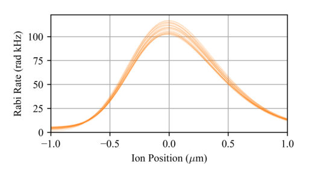
<figcaption class="paper-figure-caption"><b>Fig 1.</b> FIG. 1. Beam-profile calibrations used to determine the ion position within the 355 nm beam. A single ion was displaced along the trap axis, allowing its axial motion to sample different local beam inten- sities. Skew-Gaussian fits to the resulting scans reveal calibration-to- calibration drift in beam center, peak intensity, and envelope shape, including significant profile asymmetry.</figcaption>
</figure>
<figure class="paper-figure-card">
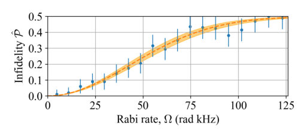
<figcaption class="paper-figure-caption"><b>Fig 2.</b> FIG. 2. The infidelity curve for λ = 0.33 kHz obtained at an offset of 0.425 µm, fit according to Eq. (37) with a value of ξ = 2.6 ± 0.3 × 10−10 (rad Hz)−2. Shot-noise intervals are shown in blue calculated from the 95% Wilson score confidence interval (CI) at each Rabi rate, and the propagated infidelity with the 95% CI for ξ in orange.</figcaption>
</figure>
<figure class="paper-figure-card">
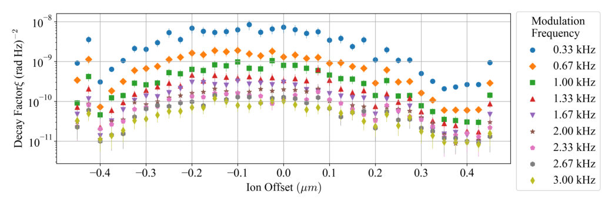
<figcaption class="paper-figure-caption"><b>Fig 3.</b> FIG. 3. Decay factors extracted from DR-QNS measurements as a function of axial ion offset from the beam center. Each point shows the fitted value of ξ obtained from the shared-amplitude model χ = ξΩ2 0 for a fixed axial offset and DR modulation frequency λ. Error bars indicate the fit uncertainty from binomial shot noise. The decay factors vary strongly with both offset and modulation frequency: low-frequency DR waveforms show the largest decay, while higher-frequency waveforms are increasingly suppressed. The broad position dependence reflects conversion of axial motion into effective amplitude noise through the local beam curvature, with increased decay near the beam center where the...</figcaption>
</figure>
<figure class="paper-figure-card">
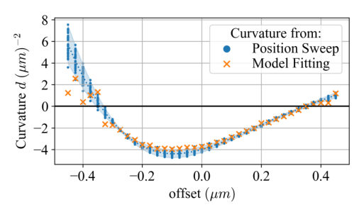
<figcaption class="paper-figure-caption"><b>Fig 4.</b> FIG. 4. Beam-profile curvature used in the axial-motion noise model. Blue points show curvatures extracted from repeated position-sweep calibrations at drift-corrected ion positions; the dotted line and shaded band show the mean and empirical 95% CI. Orange crosses show curvatures inferred from the global model fit. Near-zero cur- vature indicates beam inflection points, where quadratic coupling of axial motion to amplitude noise is suppressed.</figcaption>
</figure>
<figure class="paper-figure-card">
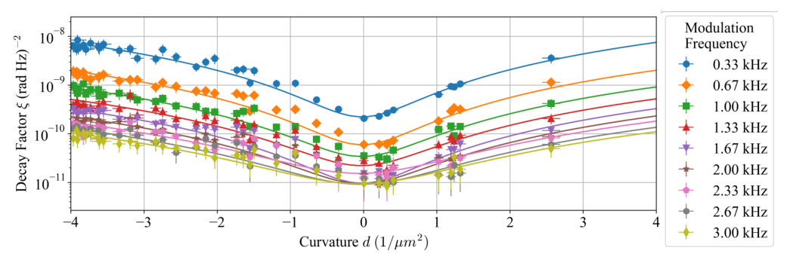
<figcaption class="paper-figure-caption"><b>Fig 5.</b> FIG. 5. Global fit of the axial-motion noise model to experimentally extracted DR-QNS decay factors. Points show ξ(λ, d) versus local beam curvature d for each DR modulation frequency λ, and solid curves show the fitted model. The fit includes a curvature-independent native control-noise contribution and a curvature-dependent axial-motion contribution proportional to d2. The model captures the measured decay factors across nearly three orders of magnitude in ξ. The minimum near d = 0 across DR waveforms is consistent with suppression of quadratic conversion of axial motion into effective amplitude noise at the beam inflection point.</figcaption>
</figure>

**Summary.** The paper introduces Quantum Noise Spectroscopy (QNS) tailored for trapped ions to measure and quantify noise originating from the ion's axial motion. By analyzing how this motion couples to the addressing laser beam profile, the authors can separate motional noise components from intrinsic control noise. This technique allows researchers to map out noise landscapes across multiple qubits simultaneously.

**Why it may be interesting.** This work provides a sophisticated spectroscopic tool to diagnose subtle environmental couplings (like motional noise) that limit gate fidelity in trapped-ion quantum computing architectures, which is highly relevant for open quantum systems research.

Detailed structure

**Main problem.** The study aims to isolate and characterize native control noise sources, specifically those induced by axial motion, in a trapped-ion quantum processor.

**Main result.** By using dephasing-robust quantum noise spectroscopy (DR-QNS), the authors successfully separated curvature-dependent axial-motion noise from intrinsic control noise, allowing for motional parameter extraction and multi-qubit characterization.

**Method.** The methodology involves applying DR-QNS to analyze how thermal axial motion couples to the addressing laser beam profile, modeling the system dynamics using Lindblad master equations and spectral analysis in the frequency domain.

**Model / system.** The physical platform is an individually-addressed trapped-ion processor. The noise coupling is modeled by incorporating the ion's position dependence ($f(x) \propto a + bx + dx^2$) into the effective Rabi rate, leading to Hamiltonian terms dependent on axial displacement $\hat{x}$.

**Key observables.** Control-noise spectrum $S(\omega)$, motional parameters (mean occupation and relaxation rates), and the decay exponent $\chi$.

**Important parameters / regimes.** Beam curvature ($d$), ion position relative to beam profile, Rabi rate ($\Omega(t)$), and axial mode frequencies ($\omega_m$).

**Assumptions / limitations.** Assumes weak coupling between noise sources (laser amplitude vs. motion) and utilizes second-order cumulant truncations for the correlation functions.

**Figures summary.** The notes detail spectral decompositions $S(\omega)$ into components related to laser noise, linear axial motion ($S_x(\omega)$), and quadratic motion ($S_{xx}(\omega)$), showing how these contributions are separated and analyzed in frequency space.

**Paper structure.** The paper progresses by establishing the theoretical framework using DR-QNS for trapped ions, deriving the spectral decomposition of noise sources based on axial motion coupling, and finally demonstrating the separation capability across multiple qubits.

Abstract

Native noise processes in quantum processors are often difficult to isolate because multiple error mechanisms contribute to the same measured loss of coherence. Here we use dephasing-robust quantum noise spectroscopy to identify and characterize control noise induced by axial motion in an individually-addressed trapped-ion processor. When the ion motion is transverse to the addressing beam, thermal axial motion couples to the beam profile and produces effective amplitude control noise. We show that this noise is governed primarily by the local beam curvature and appears as a low-frequency contribution to the reconstructed control-noise spectrum. By varying the ion position within the beam profile, we separate curvature-dependent axial-motion noise from curvature-independent native control noise and extract motional parameters that are otherwise difficult to access on this platform. We also apply the protocol in parallel to a four-ion register, demonstrating a spectroscopic method for simultaneous characterization of position-dependent control noise across multiple qubits. The results of this study identify beam inflection points as operating regions that suppress axial-motion-induced noise at the cost of reduced Rabi rate, as found in PRX Quantum 3, 010334 (2022).

[↑ back to top](#top)

### [Valley polarization of moiré interlayer exciton complexes driven by many-body interactions](http://arxiv.org/abs/2608.04151v1)

**Authors:** Adrian O. Paulus, Mikołaj J. Metelski, Alain Dijkstra, Kenji Watanabe, Takashi Taniguchi, Nathan P. Wilson, Jonathan J. Finley  
**Type:** experiment · **Category:** strongly correlated electrons · **PDF:** <https://arxiv.org/pdf/2608.04151v1>  
**Analysis basis:** full PDF text, analyzed in chunks
**Topic relevance:** 🔥 `analog quantum simulation` **4/5** · `non-equilibrium dynamics` **3/5** · `non-equilibrium universality` **2/5** · `quantum optics experiment` **2/5** · `Keldysh / 2PI / non-Gaussian methods` **1/5** · `correlated / nonlocal dissipation` **1/5** · `driven-dissipative phase transition` **1/5** · `entanglement & information structure` **1/5** · `methods for driven-dissipative` **1/5**

↔ Scroll figures horizontally

<figure class="paper-figure-card">
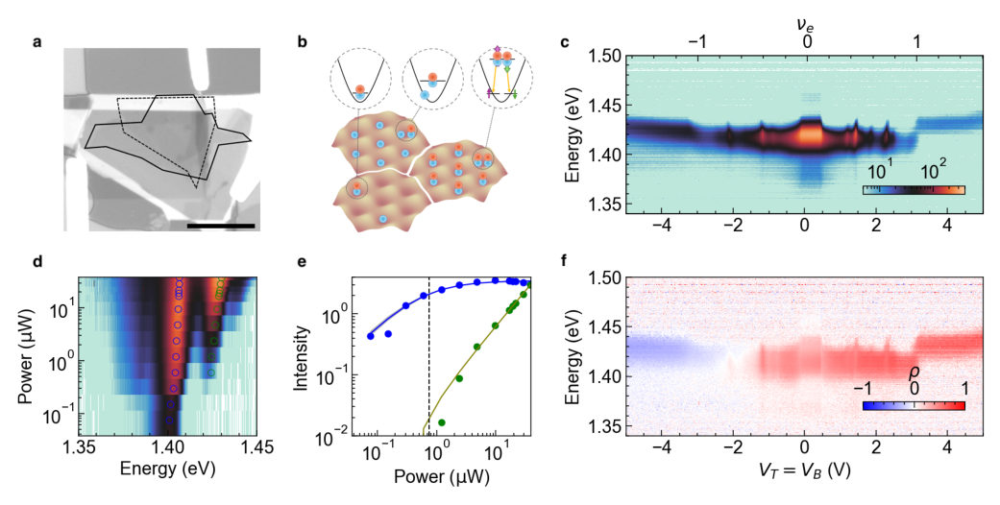
<figcaption class="paper-figure-caption"><b>Fig 1.</b> FIG. 1. Localization of electrons and IX in the moiré lattice. a, Optical micrograph of device, with WSe2 (WS2) outlined in a black (dashed) line. The scale bar corresponds to 20 µm. b, Charges and IX can be localized by the moiré potential. When either νe &gt; 1 or νIX &gt; 1, particles are forced to cohabit lattice sites and repel one another. c, Doping- dependent CW PL of IX at 750 nW (νIX ≈1) with clear signatures of correlated states. d, IX are filled in discrete steps by modulating excitation power of CW laser. The circular dots represent peak centers extracted from fitting Gaussian line profiles. e, IX intensity saturates as soon as every lattice site is occupied, as is indicated by dashed...</figcaption>
</figure>
<figure class="paper-figure-card">
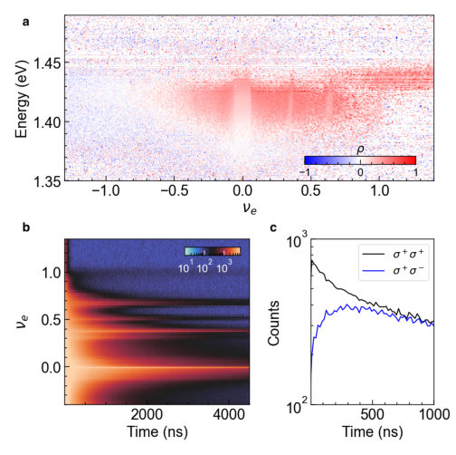
<figcaption class="paper-figure-caption"><b>Fig 2.</b> FIG. 2. Polarization dependence of IX emission under pulsed excitation. a, Degree of polarization dependent as a function of electronic lattice filling with 200 kHz pulsed excita- tion at 1.5 µW. Degree of polarization decreases at correlated electronic states and charge neutrality. b, Time-resolved PL of the IX at 1.5 µW. c, Polarization resolved transients of the IX at νe = 0 and 300 nW.</figcaption>
</figure>
<figure class="paper-figure-card">
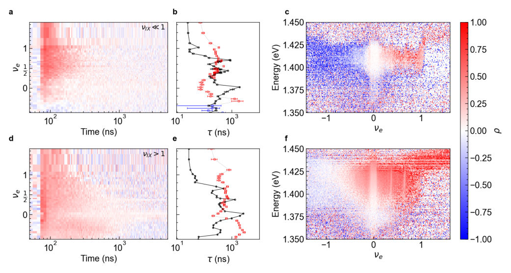
<figcaption class="paper-figure-caption"><b>Fig 3.</b> FIG. 3. Gate control of IX polarization dynamics. a, Time resolved degree of polarization as a function of electronic lattice filling under pulsed excitation at 37.5 nW (νIX ≪1), and d, at 1.5 µW (νIX &gt; 1). Polarization responds to changing overall charge density, but remains relatively unaffected by correlated electronic states. b and e, Fits to PL lifetime (black) and valley lifetimes at low and high excitation power respectively. Red color indicates co-circular polarization, blue cross-circular polarization. PL lifetimes respond strongly to correlated fillings, while valley lifetimes are weakly affected. c and f, Degree of polarization in PL spectra under the same excitation conditions...</figcaption>
</figure>
<figure class="paper-figure-card">
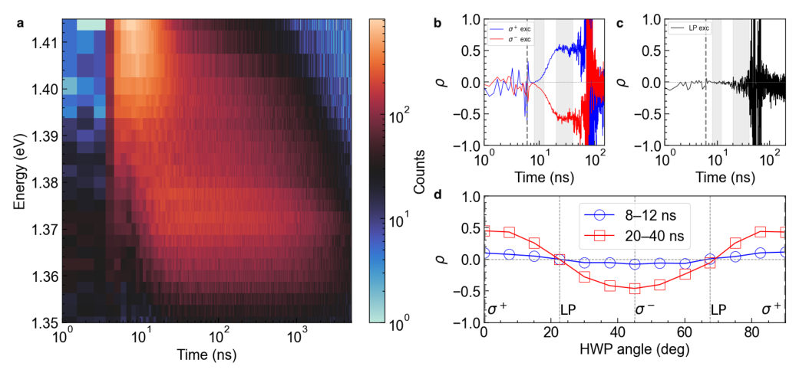
<figcaption class="paper-figure-caption"><b>Fig 4.</b> FIG. 4. Energy resolved dynamics of IX and IXX. a, Energy and time resolved emission of IX and IXX. b, Degree of circular polarization of IXX under σ+ (blue) and σ−(red), or c, linear polarization. d, Degree of polarization under varying excitation polarization at different times after excitation, corresponding to different moiré lattice fillings νIX.</figcaption>
</figure>
<figure class="paper-figure-card">
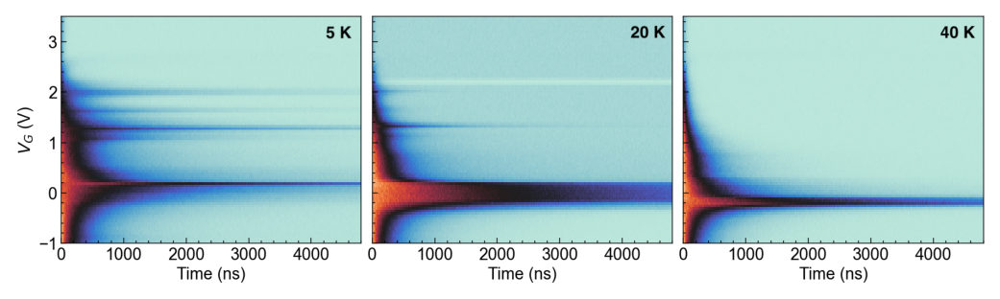
<figcaption class="paper-figure-caption"><b>Fig 5.</b> FIG. 5. IX PL lifetimes at different temperatures. Time resolved IX PL for temperatures 5 K, 20 K, and, 40 K. As the charge correlated states melt, the extended PL lifetimes at charge correlated states extinguish.</figcaption>
</figure>

**Summary.** This work investigates the complex valley polarization of interlayer excitons in moiré heterostructures by tuning both exciton and charge densities. The researchers demonstrate that changes in measured polarization are often artifacts of enhanced exciton lifetimes rather than direct scattering mechanisms. Crucially, they observe a strong anomalous valley polarization emerging during the decay of higher-order complexes (IXX), highlighting the profound influence of many-body physics.

**Why it may be interesting.** The interplay between valley coherence, strong correlation effects (Mott physics), and exciton dynamics in engineered moiré systems provides a rich platform for studying non-equilibrium quantum many-body physics relevant to correlated electron models.

Detailed structure

**Main problem.** Investigating how many-body interactions modify the valley polarization and dynamics of localized interlayer excitons (IX) in moiré heterostructures.

**Main result.** The observed decrease in polarization at low density is due to lifetime dilution, not enhanced scattering; furthermore, a strong anomalous valley polarization develops during the decay of doubly-occupied sites (IXX).

**Method.** Time-resolved and time-integrated photoluminescence (PL) spectroscopy using pulsed excitation across varying electronic charge densities.

**Model / system.** The study uses an R-type WSe2/WS2 bilayer heterostructure forming a moiré superlattice, allowing control over IX density and correlated electronic charge states.

**Key observables.** IX PL lifetime, valley polarization (circular polarization), and the formation/decay dynamics of IXX complexes.

**Important parameters / regimes.** Interlayer exciton (IX) density ($
u_{	ext{IX}}$), electronic charge density ($
u_e$), and excitation power (high vs. low density regimes).

**Assumptions / limitations.** The analysis distinguishes between polarization reduction due to enhanced intervalley scattering versus dilution from increased IX lifetimes.

**Figures summary.** Figures show PL dependence on doping/power, time-resolved polarization transients comparing different filling factors ($
u_e$), and energy-resolved traces distinguishing IX and IXX emission channels.

**Paper structure.** The paper systematically explores the physics by varying excitation density to probe regimes from correlated charge insulators (low $
u_{	ext{IX}}$) to excitonic Mott insulators with IXX formation (high $
u_{	ext{IX}}$), comparing time-integrated vs. time-resolved measurements.

Abstract

Localized interlayer excitons (IX) in moiré transition metal dichalcogenide heterostructures can both probe and participate in many-body states hosted by the moiré superlattice. When the IX density is small compared to the moiré lattice density, the formation of incompressible charge crystals at fractional electronic moiré fillings modifies exciton-charge scattering, leading to enhanced lifetimes in photoluminescence (PL) measurements. At high IX densities, the exciton dynamics are altered by the emergence of an excitonic Mott insulator and the formation of doubly-occupied sites (IXX). Here, we investigate the IX PL lifetime and valley polarization in an R-type $\mathrm{WSe_2}$/$\mathrm{WS_2}$ bilayer across a wide range of IX and charge densities. While previous studies reported a decrease of polarization in time-integrated measurements in charge-incompressible phases, our results show that this arises not from enhanced intervalley scattering, but from a dilution of the valley polarization by the dramatic enhancement of IX lifetimes. At high excitation densities, we probe the dynamics of the IXX and show that despite the nominal antiparallel valley configuration of the two constituent excitons, a strong, anomalous valley polarization develops as the IXX population decays. Our results shed light on the complex exciton and valley dynamics of IX and demonstrate that they are strongly modified by the rich many-body physics of moiré heterobilayers.

[↑ back to top](#top)

### [Wavepacket Approach for Spin Transport in Zigzag Spin Chain](http://arxiv.org/abs/2608.04534v1)

**Authors:** Hiroaki Onishi  
**Type:** theory · **Category:** strongly correlated electrons · **PDF:** <https://arxiv.org/pdf/2608.04534v1>  
**Analysis basis:** full PDF text, analyzed in chunks
**Topic relevance:** 🔥 `analog quantum simulation` **4/5** · `exotic spin models in light-matter` **3/5** · `non-equilibrium dynamics` **3/5** · `non-equilibrium universality` **2/5** · `entanglement & information structure` **1/5** · `methods for driven-dissipative` **1/5** · `scars & prethermalization` **1/5** · `spintronics-quantum-optics interface` **1/5**

↔ Scroll figures horizontally

<figure class="paper-figure-card">
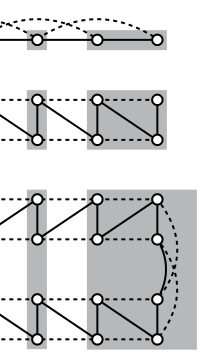
<figcaption class="paper-figure-caption"><b>Fig 1.</b> Fig. 1. Superblock configuration of zigzag chain in different representations. Solid lines denote nearest-neighbor bonds, dashed lines denote next-nearest-neighbor bonds, and shaded rectangles represent the superblock consisting of left and right blocks and two (super)sites. (a) Chain representation. (b) Two-leg ladder representation, where odd and even sites are paired to form a supersite. (c) Four-leg ladder representation, where two two-leg ladders are arranged and the periodic boundary condition is adopted.</figcaption>
</figure>
<figure class="paper-figure-card">
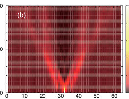
<figcaption class="paper-figure-caption"><b>Fig 2.</b> Fig. 3. Time evolution of magnon-pair density N −−(i, t) in (a) open and (b) periodic boundary conditions. J1 = −1, J2 = 1, N = 64, M = 24, and σ = 0. Here we keep 400 states.</figcaption>
</figure>
<figure class="paper-figure-card">
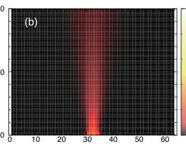
<figcaption class="paper-figure-caption"><b>Fig 3.</b> Fig. 4. Time evolution of magnon-pair density N −−(i, t) with (a) σ = 0 and (b) k0 = π and σ = 2. J1 = −1, J2 = 1, N = 64, and M = 32. Here we adopt the periodic boundary condition and keep 100 states.</figcaption>
</figure>

**Summary.** This work uses the time-dependent DMRG method to examine spin transport in a zigzag spin chain model representing a spin nematic liquid. By tracking magnon-pair wavepackets, the authors demonstrate that while propagation occurs generally, specific conditions (k=pi) lead to localization due to flat dispersion modes arising from antiferro-quadrupole order. This highlights how subtle details of the underlying quantum ground state dictate transport behavior.

**Why it may be interesting.** The application of advanced numerical techniques like tDMRG to study transport phenomena in strongly correlated magnetic systems provides insights into how underlying quantum order (like quasi-long-range order) dictates macroscopic dynamics, which is highly relevant for understanding exotic quantum materials.

Detailed structure

**Main problem.** The study investigates the spin transport properties of a spin nematic liquid confined within a frustrated zigzag spin chain subjected to an external magnetic field.

**Main result.** While magnon pairs generally propagate coherently, the wavepacket remains localized when considering the specific momentum k=pi due to the flat dispersion structure associated with gapless antiferro-quadrupole quasi-long-range order.

**Method.** The analysis employs a time-dependent Density-Matrix Renormalization Group (tDMRG) method to track the time evolution of magnon-pair wavepackets governed by the system's Hamiltonian.

**Model / system.** The model is a spin nematic liquid realized in a zigzag spin chain, described by a Hamiltonian involving nearest and next-nearest neighbor interactions ($J_1$ and $J_2$) plus a magnetic field term. Periodic boundary conditions are used to maintain uniform ground states.

**Key observables.** Magnon-pair density ($N^{--}(i, t)$), wavepacket propagation velocity, and coherence preservation over time.

**Important parameters / regimes.** The analysis focuses on the case where the initial wavepacket momentum is $k_0=\pi$, and compares results for zero ($\sigma=0$) versus finite ($\sigma>0$) initial width.

**Assumptions / limitations.** Periodic boundary conditions are assumed to avoid edge-induced magnetization structures, and the low-energy excitation dynamics are modeled by bound magnon pairs.

**Figures summary.** Figures illustrate the time evolution of the magnon-pair density in both open (showing expansion/reflection) and periodic boundary conditions. Specifically, Figure 4 contrasts coherent propagation ($\sigma=0$) with localization ($\sigma>0, k_0=\pi$).

**Paper structure.** The paper first establishes the physical model and Hamiltonian, then details the tDMRG methodology for time evolution. It compares results between OBC (showing edge effects) and PBC (preferred). The core analysis contrasts wavepacket dynamics under different initial conditions ($\sigma=0$ vs $\sigma>0$), leading to the conclusion about localization.

Abstract

We study the spin transport property of a spin nematic liquid in a frustrated zigzag spin chain in a magnetic field from the perspective of the time evolution of wavepackets by a time-dependent density-matrix renormalization group method. We use the periodic boundary condition to avoid an edge-induced magnetization structure in the open boundary condition. We find that at the saturation, a magnon-pair wavepacket of momentum k=pi stays localized, since the gapless dispersion due to the antiferro-quadrupole quasi-long-range order has a rather flat structure, indicating zero propagation velocity.

[↑ back to top](#top)

### [Disentanglement in the macroscopic limit](http://arxiv.org/abs/2608.04858v1)

**Authors:** Eyal Buks  
**Type:** theory · **Category:** statistical mechanics · **PDF:** <https://arxiv.org/pdf/2608.04858v1>  
**Analysis basis:** full PDF text, analyzed in chunks
**Topic relevance:** 🔥 `entanglement & information structure` **4/5** · `analog quantum simulation` **2/5** · `correlated / nonlocal dissipation` **2/5** · `driven-dissipative phase transition` **2/5** · `methods for driven-dissipative` **2/5** · `Keldysh / 2PI / non-Gaussian methods` **1/5** · `non-equilibrium dynamics` **1/5** · `non-equilibrium universality` **1/5**

↔ Scroll figures horizontally

<figure class="paper-figure-card">

<figcaption class="paper-figure-caption"><b>Fig 1.</b> FIG. 1: The Lieb-Mattis model. The energy expectation value ⟨H⟩and the level of entanglement τTS are plotted as a function of p [see Eq. (10)] for 2N = 6, 8, 10 and 12.</figcaption>
</figure>
<figure class="paper-figure-card">
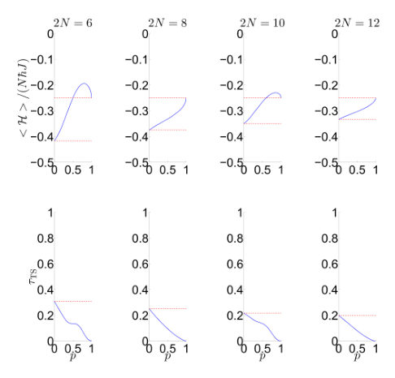
<figcaption class="paper-figure-caption"><b>Fig 2.</b> Fig. 1 display the normalized energy expectation value ⟨ψ (p)| H |ψ (p)⟩/ (NℏJ) as a function of p. The normal- ized energy expectation values of −1/4, for the N´eel state, and of −(1/4)(1 + 2/N), for the ground state, are repre- sented by overlaid red dashed horizontal lines. The plots in the second row of Fig. 1 display the entanglement τTS between two spins l′ and l′′ (where l′ ∈{1, 2, · · · , N} and l′′ ∈{N + 1, N + 2, · · · , 2N}) as a function of p. The overlaid red dashed horizontal lines in the second row of Fig. 1 represent the value given by Eq. (9) for the ground state entanglement τTS. The number N for the first (left), second, third and forth column in Fig. 1 is 3, 4, 5 and 6,...</figcaption>
</figure>
<figure class="paper-figure-card">
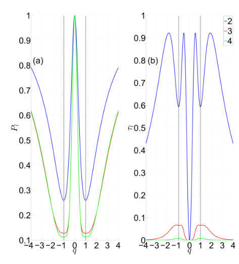
<figcaption class="paper-figure-caption"><b>Fig 3.</b> FIG. 2: AKLT model. Both (a) purity Pl = Tr ρ2 (1,l) and (b) entanglement τl are plotted as a function of q. The colors blue, red and green are used for the site spacing l values of 2, 3 and 4, respectively. The overlaid black dashed vertical lines label the values q = ±1 (AKLT ground state).</figcaption>
</figure>
<figure class="paper-figure-card">
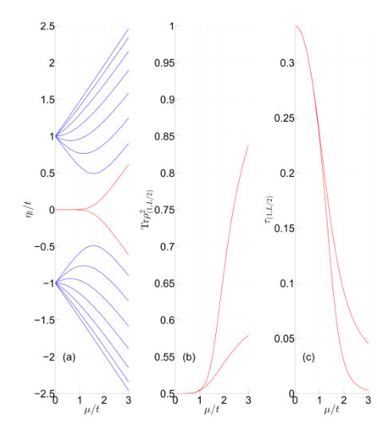
<figcaption class="paper-figure-caption"><b>Fig 4.</b> FIG. 3: Kitaev chain. The (a) Bogoliubov eigenvalues ηl/t, (b) two sites purity Tr ρ2 (1,L/2) and (c) the two sites level of entanglement τ(1,L/2) are plotted as as a function of the ratio µ/t, for the case L = 8.</figcaption>
</figure>

**Summary.** This paper explores spontaneous disentanglement using modified quantum dynamics applied to several integrable many-body models. It finds that non-local entanglement tends to destabilize in the macroscopic limit, offering a theoretical framework linking microscopic quantum correlations to classical macroscopic behavior.

**Why it may be interesting.** This work directly addresses fundamental questions regarding the emergence of classicality from quantum mechanics by quantifying how entanglement decays or stabilizes as system size increases, which is central to open quantum systems theory.

Detailed structure

**Main problem.** The study investigates spontaneous disentanglement, aiming to provide a theoretical bridge between the quantum nature of microscopic systems and the classical behavior observed in macroscopic limits.

**Main result.** The analysis shows that non-local entanglement tends to become unstable in the macroscopic limit for certain models (like Lieb-Mattis and Kitaev), while local entanglement stability remains possible, suggesting a mechanism for decoherence.

**Method.** The research employs modified Schrödinger equations with nonlinear terms derived from Kraus operators to model time evolution. It analyzes various many-body quantum models using established entanglement diagnostics like the partial transpose criterion.

**Model / system.** Three specific integrable many-body models are analyzed: the Lieb-Mattis antiferromagnet, the AKLT ring, and the Kitaev chain. The dynamics are governed by a nonlinear extension of the Schrödinger equation incorporating disentanglement terms.

**Key observables.** Entanglement measures ($	au_{TS}, 	au_l, 	au$), partial transpose eigenvalues (for non-separability), mutual information ($I_{a,b}$), and correlation functions $\langle C_{s',s''}
angle$.

**Important parameters / regimes.** The macroscopic limit ($N \gg 1$ or $L \gg 1$) is the primary focus. The ratio of disentanglement to thermalization rates ($\gamma_D/\gamma_H$) is also key.

**Assumptions / limitations.** The study assumes that spontaneous disentanglement can be modeled by adding nonlinear terms to the standard quantum evolution equation, and it relies on exact solutions for specific integrable models.

**Figures summary.** Figures plot expectation values of Hamiltonians ($\langle H 
angle$) and entanglement measures ($	au_{TS}$) as a function of system parameters ($p$), illustrating state changes across different model sizes.

**Paper structure.** The paper introduces the spontaneous disentanglement hypothesis via modified dynamics, applies this framework to specific integrable models (Lieb-Mattis, AKLT, Kitaev), calculates entanglement diagnostics in the macroscopic limit, and draws conclusions about the stability of quantum correlations.

Abstract

The recently proposed spontaneous disentanglement hypothesis is formulated using a modified Schrödinger equation having an added nonlinear term. The hypothesis is motivated by some outstanding issues in the foundations of quantum mechanics, including the problem of quantum measurement. Spontaneous disentanglement is explored in the current study for the macroscopic limit. This is done using some many--body models having known exact solutions. For the under--study models, it is found that non--local entanglement becomes unstable in the macroscopic limit. On the other hand, stability in the macroscopic limit of local entanglement is not excluded. These findings demonstrate that the spontaneous disentanglement hypothesis can bridge between the quantumness of the microscopic realm, and the classicalness of the macroscopic one.

[↑ back to top](#top)

### [An improved car-oriented mean-field theory for stochastic traffic flow models](http://arxiv.org/abs/2608.04731v1)

**Authors:** Yasar Efe Dai, Andreas Schadschneider, Michael Schreckenberg  
**Type:** theory · **Category:** statistical mechanics · **PDF:** <https://arxiv.org/pdf/2608.04731v1>  
**Analysis basis:** full PDF text, analyzed in chunks
**Topic relevance:** 🔥 `methods for driven-dissipative` **4/5** · `Keldysh / 2PI / non-Gaussian methods` **3/5** · `non-equilibrium dynamics` **2/5** · `non-equilibrium universality` **2/5** · `Frenkel-Kontorova` **1/5** · `correlated / nonlocal dissipation` **1/5** · `driven-dissipative phase transition` **1/5**

↔ Scroll figures horizontally

<figure class="paper-figure-card">
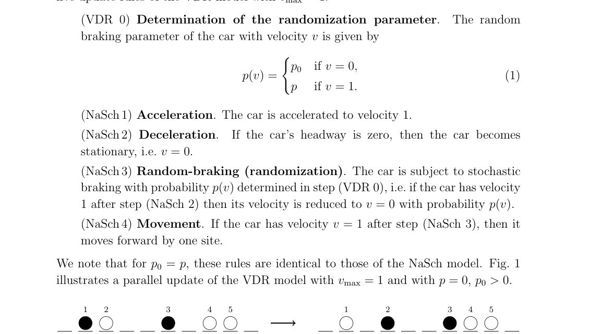
<figcaption class="paper-figure-caption"><b>Fig 1.</b> Figure 1: A parallel update of the VDR model on a lattice of length L = 10 with N = 5 cars in the limit p = 0, p0 &gt; 0. Black (white) circles denote cars with velocity 1 (0). The configuration at time t (left) leads to the configuration at time t + 1 (right) if car 2 stochastically restarts and car 5 stochastically remains stationary.</figcaption>
</figure>
<figure class="paper-figure-card">
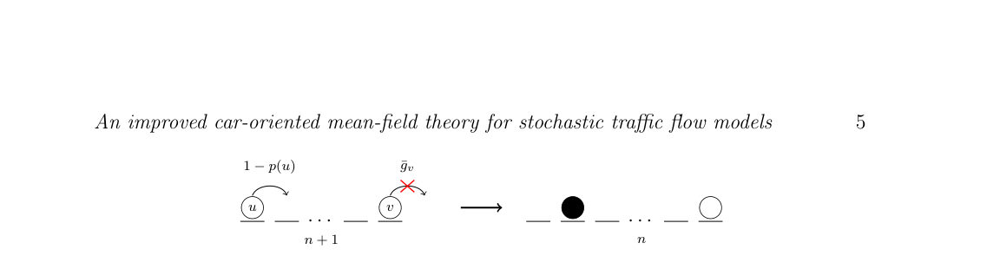
<figcaption class="paper-figure-caption"><b>Fig 2.</b> Figure 2: Schematic of the master equation for P10(n, t+1). It evolves from Puv(n+1, t) if the leading car does not move (with probability ¯gv) and the following car moves one step (with probability 1 −p(u)). This is the only transition leading to P10(n, t + 1).</figcaption>
</figure>
<figure class="paper-figure-card">
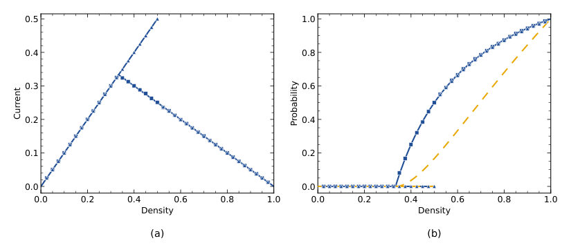
<figcaption class="paper-figure-caption"><b>Fig 3.</b> Figure 3: (a) Fundamental diagram and (b) zero-headway distribution of a stationary car with p0 = 0.5 and p = 0. The triangular (rectangular) markers denote simulations data with homogeneous (jammed) initial conditions. They are compared with stable and metastable theoretical results. In (a) COMF and iCOMF results coincide and are represented as continuous line. In (b) COMF and iCOMF results are represented by a yellow dashed line and blue continuous line, respectively. They only coincide in the free-flow regime.</figcaption>
</figure>
<figure class="paper-figure-card">
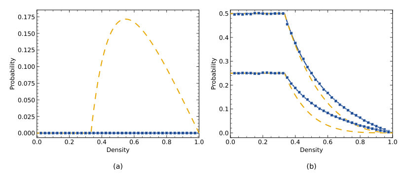
<figcaption class="paper-figure-caption"><b>Fig 4.</b> Figure 4: Headway distribution of a moving car in the cruise-control limit with p0 = 0.5, p1 = 0: (a) 0-headway distribution and (b) non-zero headway distributions (1-headway and 2-headway from top to bottom) are shown. Computer simulations with a jammed initial configuration (markers) are compared with COMF (yellow dashed lines) and iCOMF results (continuous lines).</figcaption>
</figure>
<figure class="paper-figure-card">
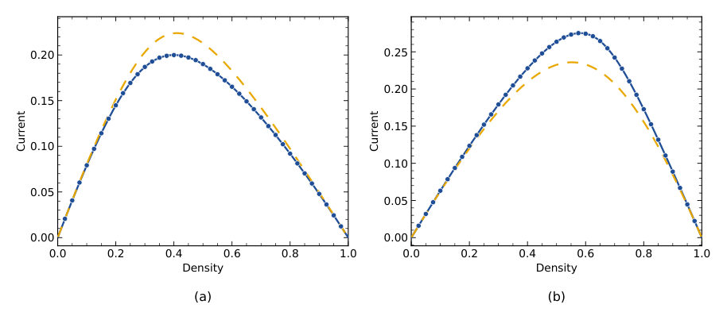
<figcaption class="paper-figure-caption"><b>Fig 5.</b> Figure 5: Generic fundamental diagrams in the STS regime with p0 = 0.5, p = 0.1 (a) and FTS regime with p0 = 0.1, p = 0.5 (b). Comparison between iCOMF (solid blue lines), COMF (yellow dotted lines) and computer simulations (markers) are shown.</figcaption>
</figure>

**Summary.** This paper introduces an improved Car-Oriented-Mean-Field (iCOMF) theory to analyze stochastic traffic flow models based on cellular automata. By incorporating nearest-neighbor pair correlations, iCOMF overcomes the limitations of classical mean-field theories that fail in congested or inhomogeneous states. The results demonstrate excellent agreement with simulations for the VDR model, providing a more accurate statistical mechanical description of vehicular traffic.

**Why it may be interesting.** The methodology of extending mean-field theories to incorporate short-range, non-factorizable correlations via cluster methods is highly relevant to open quantum systems and many-body physics where simple product states fail.

Detailed structure

**Main problem.** To improve the analytical understanding of stochastic traffic flow models by accurately capturing both short- and long-range correlations neglected by classical mean-field theories.

**Main result.** The proposed improved Car-Oriented-Mean-Field (iCOMF) theory provides accurate descriptions of fundamental diagrams and headway distributions for the VDR model, suggesting it may be an exact description in certain limits.

**Method.** The authors develop iCOMF by combining aspects of COMF theory with a two-site cluster method, leading to the formulation and solution of master equations for nearest-neighbor pair probabilities.

**Model / system.** The system is single-lane vehicular traffic modeled using Cellular Automata (CA), specifically focusing on the Velocity-Dependent-Randomization (VDR) model with a maximum velocity of 1.

**Key observables.** Fundamental Diagram J(rho) (flow vs. density), zero-headway distributions P_v(0), and non-zero headway distributions P_{u,v}(n).

**Important parameters / regimes.** The analysis covers different regimes including the Cruise-Control Limit (STS regime, p=0) and general models where braking probabilities are involved.

**Assumptions / limitations.** iCOMF assumes a product state over nearest-neighbor pairs; classical COMF fails when particle-hole symmetry is broken or in inhomogeneous steady states.

**Figures summary.** Figures compare fundamental diagrams and headway distributions (0-headway, 1-headway) derived from iCOMF against computer simulations across various traffic regimes.

**Paper structure.** The paper introduces the limitations of classical mean-field theories for traffic flow. It then develops and applies the improved iCOMF theory by formulating master equations for pair correlations. Results are presented by comparing iCOMF predictions against simulation data across different physical regimes (e.g., STS vs. general model).

Abstract

We propose an improved mean-field analysis of cellular automata models of single-lane vehicular traffic. By combining aspects of the Car-Oriented-Mean-Field (COMF) theory and the 2-site cluster method, which have been previously successfully applied to similar models, we aim to capture both short- and long-range correlations more accurately. In contrast to classical mean-field theories, the improved method is well suited for models with inhomogeneous stationary states and able to capture the essential properties of phase separation, e.g. in models with slow-to-start rules. The improved accuracy and new physical insights are illustrated through an application to the VDR model with $v_{\text{max}}=1$.

[↑ back to top](#top)

### [Methods for traceable scanning magnetometry using single nitrogen vacancy centers in diamond: determining orientation, distance and localization](http://arxiv.org/abs/2608.04632v1)

**Authors:** Nikhita Khera, Ephraim Spindler, Yanis Abdedou, Marcel Gasser, Sandra Wolff, Bert Lägel, Robert Frömter, Mathias Weiler, Mathias Kläui, Elke Neu  
**Type:** experiment · **Category:** other · **PDF:** <https://arxiv.org/pdf/2608.04632v1>  
**Analysis basis:** full PDF text, analyzed in chunks
**Topic relevance:** 🔥 `QC/QI experiment` **4/5** · 🔥 `spintronics-quantum-optics interface` **4/5** · `quantum measurements` **2/5** · `quantum optics experiment` **2/5** · `analog quantum simulation` **1/5** · `exotic spin models in light-matter` **1/5**

↔ Scroll figures horizontally

<figure class="paper-figure-card">
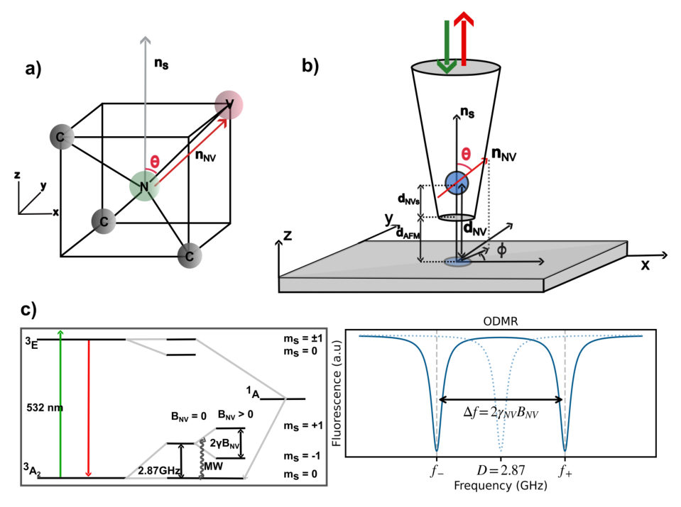
<figcaption class="paper-figure-caption"><b>Fig 1.</b> Figure 1: Nitrogen-Vacancy (NV) center geometry and sensing principles. (a) Unit cell of the diamond lattice highlighting the NV center orientation. The Nitrogen (N) and Vacancy (V) define the high symmetry axis nNV, forming a polar angle θ with respect to the surface normal, ns along the z-axis. (b) Schematic of the scanning NV microscopy setup. The NV-containing diamond nanopillar probe is scanned close to the sample surface. The NV has a stand-off distance dNV above the sample surface. The magnetic field projection depends on both the polar angle θ and the azimuthal angle ϕ. (c) The energy level diagram of the NV (left) and the Optically Detected Magnetic Resonance (ODMR) spectrum...</figcaption>
</figure>
<figure class="paper-figure-card">
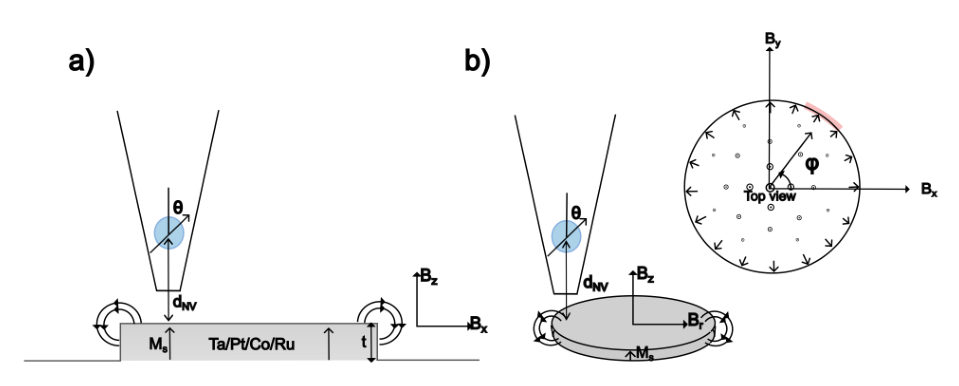
<figcaption class="paper-figure-caption"><b>Fig 2.</b> Figure 2: (a) Schematic illustrating the NV center in the probe, at a stand-off distance dNV above the stripe edge. The out of plane magnetization Ms, produces a stray field along the edge. (b) Schematic of the scanning NV nanopillar probe above a PMA disc, shown in side view (left) and top view (right). The out-of-plane magnetization M produces a radial stray field at the disc edge (arrows). The angular position of the field extremum along the edge (highlighted arc) encodes the azimuth ϕ of the NV axis, measured from the +x axis.</figcaption>
</figure>
<figure class="paper-figure-card">
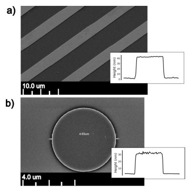
<figcaption class="paper-figure-caption"><b>Fig 3.</b> Figure 3: (a) SEM image (main) and AFM topog- raphy (inset) of the PMA stripe. (b) SEM image (main) and AFM topography (inset) of the PMA disc</figcaption>
</figure>
<figure class="paper-figure-card">
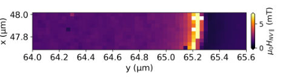
<figcaption class="paper-figure-caption"><b>Fig 4.</b> Figure 4: Two-dimensional BNV map over the stripe region. The map shows the stray magnetic field BNV measured over the edge of a PMA stripe. The color scale indicates BNV in mT.</figcaption>
</figure>
<figure class="paper-figure-card">
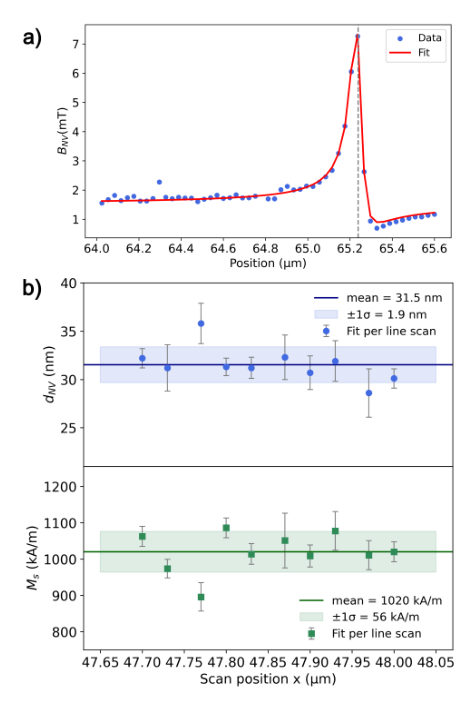
<figcaption class="paper-figure-caption"><b>Fig 5.</b> Figure 5: NV-to-sample distance calibration from stripe edge line scans. (a) Representative BNV line scan (blue points) acquired perpendicular to the stripe edge, together with the fitted stray-field model (red curve). (b) Summary of dNV (top) and Ms (bottom) values extracted from ten independent line scans distributed along the stripe edge. The solid lines and shaded bands indicate the mean and the ±1σ standard deviation across the ensemble, respec- tively.</figcaption>
</figure>

**Summary.** This work presents advanced techniques for using single NV centers in diamond to map magnetic fields at the nanoscale. By analyzing stray fields from patterned magnetic films (stripes and discs), the authors developed a robust calibration method that determines crucial unknown parameters like the probe distance ($d_{NV}$) and NV orientation ($\phi$). This significantly enhances the quantitative capability of SNVM for fundamental studies in condensed matter magnetism.

**Why it may be interesting.** While the core technique is magnetometry, the ability to precisely characterize geometric parameters ($d_{NV}, \phi$) *in situ* without external controls makes this a powerful tool for quantum sensing platforms, relevant to understanding coupling strengths in solid-state qubits.

Detailed structure

**Main problem.** The primary goal is to enable nanoscale, quantitative imaging of magnetic stray fields using single Nitrogen Vacancy (NV) centers in diamond by accurately determining unknown parameters like the NV-sample distance and its orientation.

**Main result.** The authors successfully demonstrated a method to directly infer the NV center's standoff distance ($d_{NV} = 31.5 	ext{ nm}$) and its azimuthal orientation ($\phi$) with high precision, all without requiring external vector magnet control.

**Method.** A multi-step calibration protocol is employed using patterned magnetic samples (PMA stripes and discs) to map the NV fluorescence signal, which is sensitive to the local magnetic field projected onto the NV axis.

**Model / system.** The system uses a single NV center in a diamond nanopillar probe scanning over perpendicularly magnetized thin films. The measurement relies on modeling the stray magnetic field ($\mathbf{B}$) from these patterned samples using analytic expressions involving complete elliptic integrals for discs, and simpler forms for stripes.

**Key observables.** NV fluorescence signal (Zeeman shift), which is proportional to $	ext{BNV} = \mathbf{n}_{NV} \cdot \mathbf{B}$.

**Important parameters / regimes.** $d_{NV}$ (standoff distance), $\phi$ (azimuthal orientation), and the magnetic magnetization ($M_{st}$) of the sample.

**Assumptions / limitations.** Key assumptions include negligible thickness for discs ($t \ll d_{NV}$) and that the measured field is solely generated by the patterned sample structure, allowing calibration to remove unknown geometric factors.

**Figures summary.** Figures illustrate schematics of NV placement over PMA stripes and discs, showing how stray fields encode $\phi$. Other figures show SEM/AFM images of these patterns and fluorescence dip analysis from inverse AFM measurements.

**Paper structure.** The paper establishes the need to calibrate unknown parameters ($d_{NV}, \phi$) in SNVM. It details a three-step calibration protocol: using stripe line-cuts for $d_{NV}$, then using disc maps to find $\phi$, and finally employing inverse AFM measurements on silicon needles to map lateral NV placement.

Abstract

Individual, scannable nitrogen vacancy (NV) centers in single crystal diamond nanostructures enable nanoscale, quantitative imaging of magnetic stray fields. Nevertheless, important parameters like distance between the NV center and the sample and the orientation of the NV high symmetry axis are often not known precisely and enter data evaluation as free fitting parameters. We here use scanning NV imaging on micro-patterned, perpendicularly magnetized stripes and discs. From these measurements, we directly infer NV - sample distance d_NV and the NV's azimuthal orientation without the need for an external vector magnet control. We determine d_NV = 31.5 nm, while we infer the azimuthal orientation with a precision of 3°. We additionally employ commercially available silicon needles to image the apex topography of our diamond nanostructures to detect surface contamination. Simultaneously, monitoring NV fluorescence as a function of the needle's position allows us to estimate the lateral placement of the NV inside the diamond nanostructure.

[↑ back to top](#top)

### [Constructive realization of self-referential prediction limits in quantum control: Resource bounds and Gödel-safe architectures](http://arxiv.org/abs/2608.04779v1)

**Authors:** Salman Sajad Wani, Álvaro Perales-Eceiza, Saif Al-Kuwari, Mir Faizal  
**Type:** both · **Category:** quantum information and computing · **PDF:** <https://arxiv.org/pdf/2608.04779v1>  
**Analysis basis:** full PDF text, analyzed in chunks
**Topic relevance:** 🔥 `quantum measurements` **4/5** · `measurement-induced transitions` **3/5** · `QC/QI experiment` **2/5** · `driven-dissipative phase transition` **1/5** · `entanglement & information structure` **1/5** · `interference shaping light` **1/5** · `quantum optics experiment` **1/5**

↔ Scroll figures horizontally

<figure class="paper-figure-card">
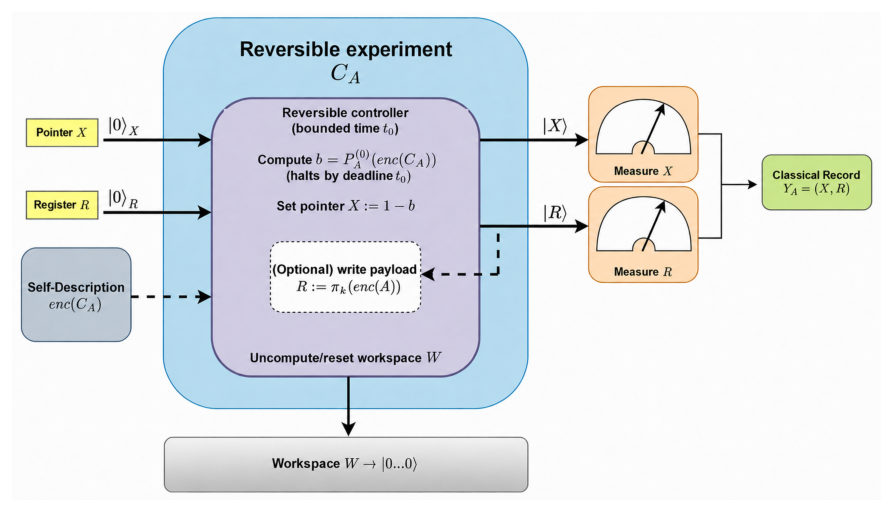
<figcaption class="paper-figure-caption"><b>Fig 1.</b> Figure 1. Compiled control loop for CA. A reversible controller computes b = P (0) A (CA) by the deadline t0 and sets the pointer bit X = 1 −b. Optionally, a payload R = πk(A) is written to a second register. The workspace is uncomputed before the final measurement in the computational basis, yielding the record YA = (X, R) for a single shot.</figcaption>
</figure>
<figure class="paper-figure-card">
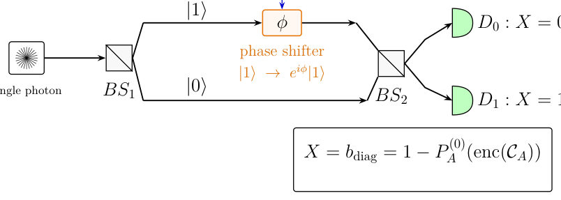
<figcaption class="paper-figure-caption"><b>Fig 2.</b> Figure 2. Single-photon Mach–Zehnder implementation of the diagonal pointer bit. The upper layer depicts the classical diagonal controller: the compiled description CA is supplied to the bounded-time predictor A, whose first output bit b = P (0) A (CA) is complemented to form bdiag = 1 −b. The commanded phase is ϕ = πbdiag. The lower layer depicts the optical pointer: a single photon enters a balanced MZI, the phase shifter acts on the upper path |1⟩ as |1⟩7→eiϕ |1⟩, and the output detectors define the pointer assignments D0 7→X = 0 and D1 7→X = 1. In the ideal limit, the detector record satisfies X = bdiag = 1 −P (0) A (CA). The timing condition Tflight ≥Tctrl + Tπ + ∆ensures that the...</figcaption>
</figure>

**Summary.** This work translates the mathematical impossibility of universal self-prediction into a concrete engineering constraint for quantum hardware. By constructing a diagonal protocol, the authors demonstrate that any predictor embedded in a closed control loop will fail when analyzing its own operation. This establishes 'Gödel-safe architectures' as necessary safeguards for reliable autonomous quantum technologies.

**Why it may be interesting.** It provides rigorous, hardware-level constraints on autonomous quantum computation, showing that self-monitoring loops introduce fundamental computational limitations analogous to Gödel's incompleteness theorems.

Detailed structure

**Main problem.** The paper addresses the fundamental theoretical limit on whether a quantum system can universally predict its own experimental outcomes when embedded in a closed-loop control process.

**Main result.** It proves that any deterministic, bounded-time predictor cannot correctly predict its own outcome if the architecture allows for self-reference (the 'forbidden causal path').

**Method.** The proof uses a diagonal construction based on Kleene's recursion theorem, translating computability theory into an operational laboratory obstruction.

**Model / system.** The system is programmable quantum control, realized physically using single-photon Mach-Zehnder Interferometers (MZI) and theoretically modeled via reversible quantum circuits requiring Bennett uncomputation.

**Key observables.** The primary observable is a classical pointer bit ($X$) that deterministically contradicts the predictor's forecast; other observables include the diagonal bit ($b_{	ext{diag}}$) and payload records ($R$).

**Important parameters / regimes.** Key parameters involve computational bounds ($	au(k)$), resource scaling (depth $D_{	ext{log}}$, width $W_{	ext{log}}$), and physical error rates ($p$, visibility $V$).

**Assumptions / limitations.** The core assumption is the existence of a 'reflective closure condition' allowing the protocol description to influence its own execution path; physically, it assumes ideal single-photon behavior and controlled timing.

**Figures summary.** Figures likely illustrate the circuit diagrams for the diagonal construction, showing the MZI setup used to realize the contradictory pointer bit, and potentially scaling plots of resource requirements vs. prediction complexity.

**Paper structure.** The paper builds from abstract computability theory (Kleene's theorems) to defining the necessary architectural condition (reflective closure), then details the contradiction using a diagonal construction ($	ext{C}_A$), and finally maps this proof onto concrete physical realizations using MZI optics and fault-tolerant quantum error correction scaling laws.

Abstract

Programmable quantum control systems increasingly rely on predictive modules for certification, real-time feedback, and autonomous decision-making. This development raises a fundamental question: can self-analyzing quantum platforms universally predict their own experimental outcomes? Wolpert formalized a general impossibility of universal self-prediction. Here we translate that limitation into an explicit laboratory obstruction that can be realized with finite resources. We consider settings with programmable quantum control in which predictors can be embedded as subroutines within the experiments they analyze. Our diagonal construction uses Kleene's recursion theorem to transform any deterministic bounded-time predictor into a reversible protocol encoding its own specification. The resulting protocol invokes the predictor on that specification and deterministically produces a classical pointer record that contradicts the forecast. For efficient predictors, the compilation has polynomial overhead and admits concrete physical realizations as a fault-tolerant quantum circuit and as a minimal Mach-Zehnder interferometer. These realizations connect computability-theoretic self-reference to programmable quantum hardware. We also introduce and formally define Gödel-safe architectures. These architectures block the forbidden causal path from the protocol description to an actuator that can affect the pointer during the same run. We analyze their implications for real-time quantum error correction, including the resulting expressiveness trade-offs. As quantum control loops grow in computational expressiveness, the limits of self-reference cease to be mere mathematical abstractions and become explicit engineering constraints for the reliable operation of autonomous quantum technologies.

[↑ back to top](#top)

### [Demonstrating advantages of dynamic quantum circuits on a hybrid superconducting qubit-cavity processor](http://arxiv.org/abs/2608.04780v1)

**Authors:** Hongbo Wu, Ling Hu, Jiasheng Mai, Munan Zhang, Libo Zhang, Yanyan Cai, Xiaowei Deng, Pan Zheng, Zhongchu Ni, Song Liu, Kun Fang, Dapeng Yu, Yuan Xu  
**Type:** experiment · **Category:** quantum information and computing · **PDF:** <https://arxiv.org/pdf/2608.04780v1>  
**Analysis basis:** full PDF text, analyzed in chunks
**Topic relevance:** 🔥 `QC/QI experiment` **4/5** · `measurement-induced transitions` **3/5** · `quantum measurements` **3/5** · `correlated cavity matter` **1/5** · `non-equilibrium dynamics` **1/5** · `quantum optics experiment` **1/5**

↔ Scroll figures horizontally

<figure class="paper-figure-card">
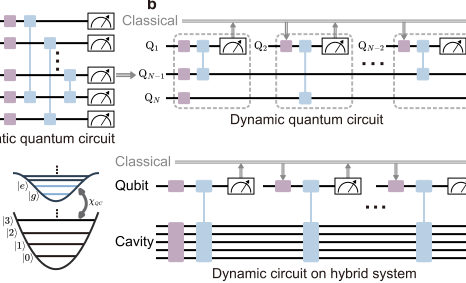
<figcaption class="paper-figure-caption"><b>Fig 1.</b> Fig. 1: Schematic illustration of DQCs on a hybrid superconduct- ing qubit–cavity processor. a Conventional static quantum circuit with N qubits. b Dynamic circuits: the upper qubit is measured, reset, and reused sequentially with real-time feed-forward. c Imple- mentation of DQCs on a hybrid superconducting qubit–cavity sys- tem, where a transmon qubit is dispersively coupled to a long-lived cavity. The cavity’s multi-level Hilbert space serves as the computa- tional register and the transmon is repeatedly measured and reused.</figcaption>
</figure>
<figure class="paper-figure-card">
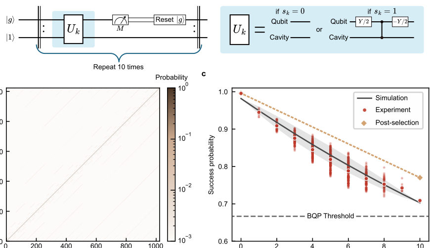
<figcaption class="paper-figure-caption"><b>Fig 2.</b> Fig. 2: Experimental realization of DQC for the 10-bit BV algorithm. a DQC sequence for the BV algorithm. The protocol comprises 10 iterative cycles, each corresponding to one bit sk of the hidden string s. The system is initialized in |g,1⟩. Each cycle contains a conditional operation Uk, a mid-circuit measurement (M), and a measurement-based qubit reset. The operation Uk is conditioned on sk: applying a CNOT- type operation if sk = 1, while idling if sk = 0. b Measured output-state probability distribution for all 210 = 1024 oracle configurations, each obtained from 45,000 repetitions. The correct outputs correspond to the dominant diagonal elements. c Algorithmic success probability...</figcaption>
</figure>
<figure class="paper-figure-card">
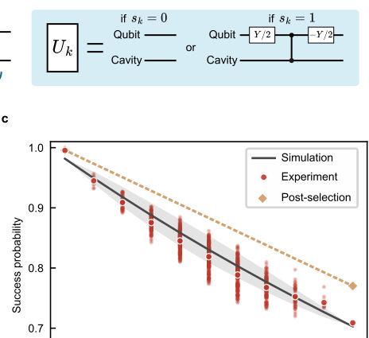
<figcaption class="paper-figure-caption"><b>Fig 3.</b> Figure 3b shows the measured output-state probability dis- tributions as a function of the target phase θ, obtained from m = 8 mid-circuit measurements. For each target phase, the circuit is repeated 45,000 times to reconstruct the output dis- tribution. Three representative horizontal cuts at θ = 0.1, 0.5, and 0.9 are presented in Fig. 3c, showing good agreement with theoretical predictions. To enable a fair comparison with pre- vious experimental QPE implementations, we adopt the same resource definition as Ref. [9], where a single qubit measure- ment is counted as one unit of resource. The total measure- ment resources for each phase estimation are fixed at R = 200, the circuit is...</figcaption>
</figure>
<figure class="paper-figure-card">
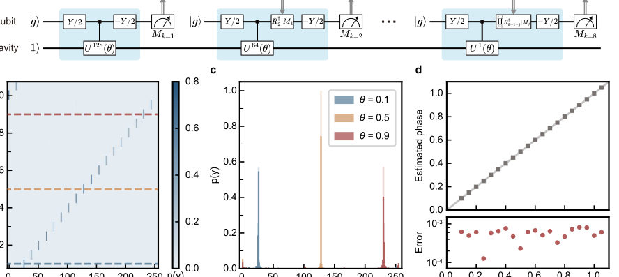
<figcaption class="paper-figure-caption"><b>Fig 4.</b> Fig. 3: Experimental realization of DQC for the 8-bit QPE algorithm. a DQC sequence for the QPE algorithm. The cavity is initialized in Fock state |1⟩, an eigenstate of the unitary operator U = ei2πθa†a, while the transmon is initialized in ground state |g⟩and repeatedly measured and reset. The protocol consists of eight adaptive cycles, each including controlled-U28−k operations, single-qubit rotations, a mid-circuit measurement Mk, and classically conditioned phase gates implemented via virtual phase rotations. b Measured probability distributions of the binary output states y for target phases θ ∈{0.1,0.15,...,1.05}, obtained from 45,000 repetitions of the experiment for each phase. c...</figcaption>
</figure>
<figure class="paper-figure-card">
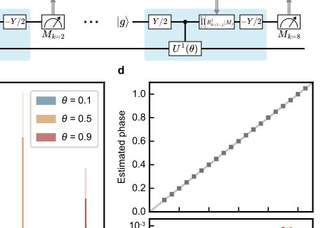
<figcaption class="paper-figure-caption"><b>Fig 5.</b> Figure 4b shows the experimental results, where the three measurement outcomes are converted from binary strings to decimal values to determine the period. The performance is evaluated using the SSO, yielding values of {0.9979(5), 0.9988(3), 0.9977(4), 0.9985(2), 0.9982(4), 0.9983(3)} for the six coprime bases, respectively. These results significantly exceed the state-of-the-art in previous dynamic-circuit imple- mentations on an ion-trap system [22], which achieved SSO values only in the range of 0.90 −0.97. Our demonstration constitutes the first high-performance dynamic-circuit imple-</figcaption>
</figure>

**Summary.** The paper demonstrates the utility of Dynamic Quantum Circuits (DQCs) on a hybrid superconducting qubit-cavity processor. By leveraging mid-circuit measurements and ancilla reuse, they successfully implemented complex algorithms like Shor's algorithm with high fidelity. This establishes DQCs as a promising, scalable route for programmable quantum computation.

**Why it may be interesting.** This work provides concrete, benchmarked demonstrations of advanced quantum algorithms on a superconducting platform using dynamic circuit techniques, which is highly relevant for researchers developing scalable quantum hardware architectures.

Detailed structure

**Main problem.** To demonstrate the advantages of Dynamic Quantum Circuits (DQCs) for quantum computation by reducing physical-qubit overhead through mid-circuit measurements and classical feed-forward control.

**Main result.** The authors successfully implemented complex algorithms, including a 10-bit Bernstein-Vazirani algorithm ($	ext{SSO}=82\%$) and Shor's algorithm for factoring 15 ($	ext{SSO}>99.8\%$), on a hybrid superconducting platform.

**Method.** The study employs DQCs utilizing a high-dimensional cavity qudit as the register and a reusable transmon ancilla, enabling adaptive control sequences that surpass static circuit performance.

**Model / system.** The physical system is a single hybrid superconducting qubit–cavity processor (cQED) housed in a dilution refrigerator. It consists of a high-dimensional cavity qudit coupled to a dispersively coupled transmon ancilla, modeled by a dispersive Hamiltonian.

**Key observables.** Success Probability ($	ext{SSO}$), Estimation Errors ($<10^{-3}$ for QPE), and fidelity measurements (e.g., $	ext{F}_{	ext{QND}} = 99.09\%$).

**Important parameters / regimes.** Cavity coherence times ($\sim 1 	ext{ ms}$); Transmon coherence times ($\sim 100 \mu	ext{s}$); Coupling strength ($\chi_{QC}/2\pi = 2.59 	ext{ MHz}$).

**Assumptions / limitations.** The performance is limited by the fidelity of mid-circuit measurements, rapid resets, and the accuracy of GRAPE optimization for high-photon-number state control.

**Figures summary.** Figures illustrate the DQC sequence for BV (showing probability distributions), QPE (showing phase estimation results), and Shor's algorithm (showing $	ext{SSO}$ values for factoring 15).

**Paper structure.** The paper first introduces DQCs, then details the experimental realization on the superconducting platform by characterizing high-fidelity components (readout/reset). Finally, it demonstrates increasing algorithmic complexity: BV $
ightarrow$ QPE $
ightarrow$ Shor's algorithm, concluding with an error analysis isolating decay and control imperfections.

Abstract

Dynamic quantum circuits (DQCs) provide a hardware-efficient route to quantum computing by reducing physical-qubit overhead and compressing circuit topology through mid-circuit measurements, qubit reset and reuse, and classical feed-forward control. Here, we demonstrate the advantages of DQCs on a single hybrid superconducting qubit-cavity processor by implementing a hierarchy of algorithms with increasing complexity. This hybrid architecture consists of a high-dimensional cavity qudit serving as the computational register and a dispersively coupled superconducting transmon ancilla that is repeatedly measured, reset, and reused to enable dynamic control. Using this device, we implement a 10-bit Bernstein-Vazirani algorithm with an average success probability of 82%, surpassing state-of-the-art dynamic and static implementations in both scale and performance; an 8-bit quantum phase-estimation protocol with estimation errors below 10-3; and the first dynamic-circuit implementation of Shor's algorithm on a superconducting platform, factoring 15 over all coprime bases with squared statistical overlap values above 99.8%. These results provide concrete benchmarks for future DQC implementations and highlight the versatile advantages of DQCs with the hybrid qubit-qudit architecture, establishing it as a promising route toward scalable, programmable quantum computation.

[↑ back to top](#top)

### [Laminar gaps mirror turbulent puffs in pipe flow](http://arxiv.org/abs/2608.04823v1)

**Authors:** Shai Kapon, Tobias Grafke, Anna Frishman  
**Type:** theory · **Category:** statistical mechanics · **PDF:** <https://arxiv.org/pdf/2608.04823v1>  
**Analysis basis:** full PDF text, analyzed in chunks
**Topic relevance:** 🔥 `non-equilibrium universality` **4/5** · `driven-dissipative phase transition` **3/5** · `non-equilibrium dynamics` **3/5** · `Frenkel-Kontorova` **1/5** · `analog quantum simulation` **1/5** · `methods for driven-dissipative` **1/5**

↔ Scroll figures horizontally

<figure class="paper-figure-card">
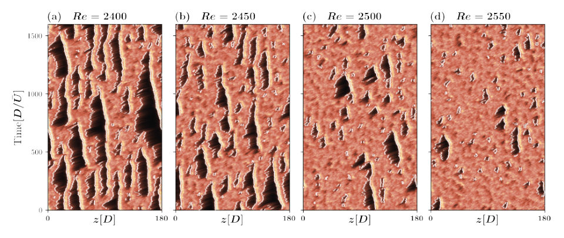
<figcaption class="paper-figure-caption"><b>Fig 1.</b> Figure 1: Space–time visualization of the flow for four different Reynolds numbers using a colour map of the turbulence level 𝑞(Eq. (1)) with lighter colours indicating higher turbulence levels. White contours delimit the identified laminar gaps.</figcaption>
</figure>
<figure class="paper-figure-card">
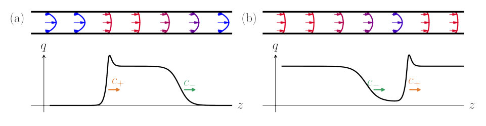
<figcaption class="paper-figure-caption"><b>Fig 2.</b> Figure 2: Schematic illustration of (a) a puff/slug and (b) an anti-puff. The upper panel shows the streamwise mean flow profile as a function of the streamwise coordinate 𝑧, and the lower panel shows the corresponding turbulence level 𝑞.</figcaption>
</figure>
<figure class="paper-figure-card">
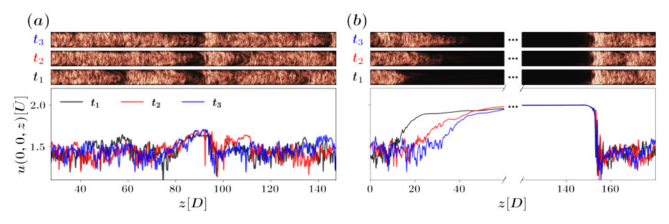
<figcaption class="paper-figure-caption"><b>Fig 3.</b> Figure 3: Comparison between an anti-puff (a) and a laminar complement of a slug (b) at Re = 2500, shown on identical spatial and colour scales. Top panels show the turbulence level (without averaging) visualized in a cross-section through the pipe at three times separated by Δ𝑡= 20D/ ¯U , plotted in a reference frame moving with the strong front. Bottom panels show the corresponding centreline velocity. For the slug, part of the laminar region between the fronts is compressed for clarity.</figcaption>
</figure>
<figure class="paper-figure-card">
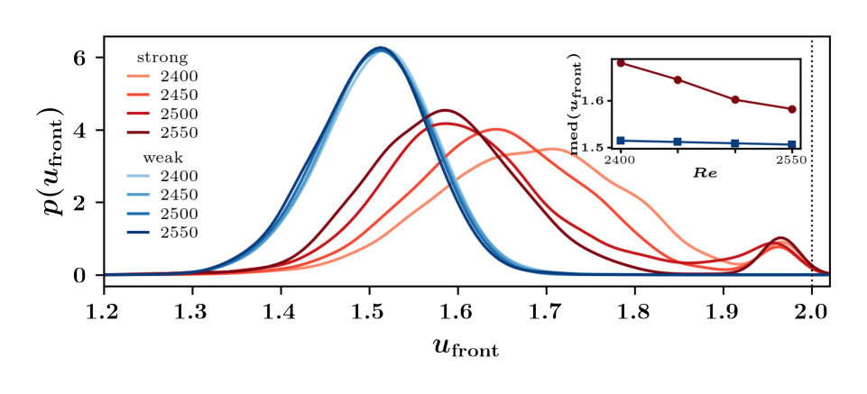
<figcaption class="paper-figure-caption"><b>Fig 4.</b> Figure 4: Distributions of the centreline velocity at laminar–turbulent fronts, 𝑢front, for 𝑅𝑒 ∈ {2400, 2450, 2500, 2550}, with strong (weak) fronts in red (blue). Histograms are computed with bin width Δ𝑢= 0.005 and smoothed with a Gaussian filter of width 4Δ𝑢. For the strong front, the peak at 𝑢front ≈2 ¯𝑈corresponds to slugs, while the peak at lower 𝑢front is a new type of strong front. The latter shifts to smaller 𝑢front with increasing Reynolds number, whereas the weak-front distribution remains centred at 𝑢front ≈𝑢turbulence. Inset: median front velocity of the anti-puff branch, med(𝑢front) for 𝑢front &lt; 1.9 for the strong front and its weak-front as a function of 𝑅𝑒, showing the two...</figcaption>
</figure>
<figure class="paper-figure-card">
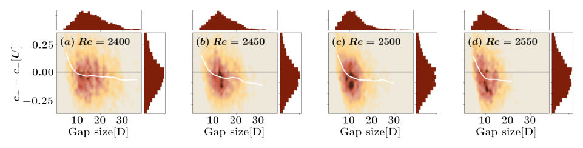
<figcaption class="paper-figure-caption"><b>Fig 5.</b> Figure 5: Two-dimensional histograms of the front-velocity difference 𝑐= 𝑐+ −𝑐−against anti-puff width for (a) Re = 2400, (b) Re = 2450, (c) Re = 2500 and (d) Re = 2550. Positive (negative) 𝑐corresponds to expanding (contracting) gaps. The white line is the Savgol-smoothed mean over widths, restricted to bins containing &gt; 25 samples. The convergence to a constant at large gap sizes reflects the fixed velocity difference of slugs.</figcaption>
</figure>

**Summary.** This work investigates the intermittent coexistence of laminar and turbulent flow in pipe flow at intermediate Reynolds numbers. Using DNS simulations, the authors characterize 'laminar gaps' (anti-puffs) that maintain stability through a self-regulating mechanism involving two distinct fluid fronts. They conclude that these gaps are fundamental to intermittency and predict their disappearance marks the onset of fully developed, homogeneous turbulence.

**Why it may be interesting.** The concept of a transition controlled by metastable, dynamically stable localized structures (laminar gaps) whose disappearance signals a phase change is highly relevant to understanding non-equilibrium transitions in complex physical systems, analogous to pattern formation or critical phenomena studied in AMO physics.

Detailed structure

**Main problem.** The study characterizes the intermittent phase where laminar and turbulent states coexist during the transition from laminar to fully turbulent flow in pipe flow at intermediate Reynolds numbers.

**Main result.** Laminar gaps, analogous to turbulent 'puffs,' exhibit self-regulation via matching front speeds and are predicted to become unstable and disappear at a finite critical Reynolds number ($	ext{Re} \sim 2900$), marking the onset of homogeneous turbulence.

**Method.** The analysis relies on Direct Numerical Simulations (DNS) applied to pipe flow, coupled with detailed diagnostics of spatio-temporal structures like traveling fronts and gap lifetimes.

**Model / system.** The physical system is steady, incompressible pipe flow (Poiseuille flow). The dynamics are analyzed by tracking localized coherent structures—'puffs' in the lower $	ext{Re}$ range and 'laminar gaps' (anti-puffs) in the higher $	ext{Re}$ range.

**Key observables.** Turbulence fraction, gap size, front speeds ($c_+$ and $c_-$), mean lifetimes ($	au$) of laminar gaps, and cross-sectionally averaged energy profiles ($\mathfrak{q}(z)$).

**Important parameters / regimes.** Reynolds number ($	ext{Re}$), specifically focusing on ranges like $(1750, 2300)$ and $(2300, 3000)$.

**Assumptions / limitations.** The persistence of laminar gaps is modeled as an escape process from a chaotic saddle; the transition to uniform turbulence is assumed to be sharp at $	ext{Re} \sim 2900$.

**Figures summary.** Figures visualize space-time evolution comparing puff regimes vs. gap regimes, schematics illustrate the self-regulating mechanism involving two fronts, and profiles compare large contracting gaps (slugs) versus small spontaneously generated anti-puffs.

**Paper structure.** The paper progresses by first establishing the existence of coexisting laminar/turbulent states at intermediate $	ext{Re}$. It then details the dynamics of these structures (anti-puffs), showing their self-regulation and exponential decay. Finally, it predicts the critical $	ext{Re}$ where this mechanism fails, leading to homogeneous turbulence.

Abstract

Pipe flow at intermediate Reynolds numbers, between the laminar and fully turbulent regimes, takes the form of several spatially and temporally intermittent phases in which turbulent and laminar states coexist. In the lower range, $Re\in (1750,2300)$, turbulence appears in the form of localized traveling structures called "puffs", which form long-lived chaotic dynamical states, whose stochastic decays and splits control the steady state intermittency. At the other end, $Re\in (2300,3000)$, puffs are replaced by an extended turbulent state, with laminar pockets intermittently forming and disappearing within it. Using direct numerical simulations of pipe flow at $Re = 2400, 2450, 2500, 2550$, we provide evidence that these laminar gaps form a distinct dynamical state analogous to puffs: a traveling laminar pocket in a turbulent surrounding, stabilized by a shear-dependent self-tuning mechanism. We analyse the mean spatial profile of these gaps and show that their lifetimes are exponentially distributed, suggesting that gap closing corresponds to an escape from a chaotic saddle. Finally, we suggest these laminar gaps become unstable and disappear at a finite Reynolds number, $Re\sim 2900$, which can be interpreted as the onset point of spatially and temporally homogeneous turbulence.

[↑ back to top](#top)

### [Poled-fibre phase modulator for efficient high-dimensional quantum measurements](http://arxiv.org/abs/2608.04112v1)

**Authors:** Nayda Guerrero, Nelson Villalba, Gustavo H. dos Santos, Carlos J. Salazar, Cristobal Melo, Fernando Castillo, Jaime Cariñe, Guilherme B. Xavier, Esteban S. Gómez, Stephen P. Walborn, João Pereira, Gabriel Saavedra, Gustavo Lima  
**Type:** experiment · **Category:** quantum information and computing · **PDF:** <https://arxiv.org/pdf/2608.04112v1>  
**Analysis basis:** full PDF text, analyzed in chunks
**Topic relevance:** 🔥 `QC/QI experiment` **4/5** · `quantum measurements` **3/5** · `quantum optics experiment` **3/5** · `interference shaping light` **1/5** · `measurement-induced transitions` **1/5**

↔ Scroll figures horizontally

<figure class="paper-figure-card">
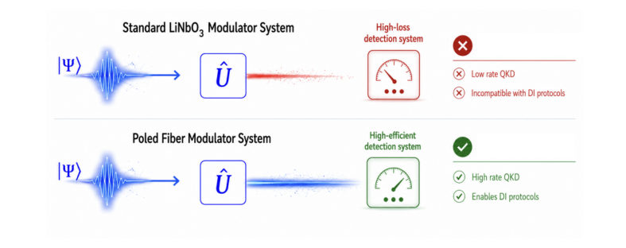
<figcaption class="paper-figure-caption"><b>Fig 1.</b> Figure 1. Effect of receiver loss in quantum photonic experiments. Top: a conventional receiver based on a commercial, fiber-pigtailed LiNbO3 phase modulator (3 dB insertion loss) implements the basis-selection unitary U, pushing the overall measurement efficiency below the threshold required for DI quantum information experiments or severe limiting the rate attainable in QKD. Bottom: a receiver based on a poled-fiber phase modulator implements the same unitary at sub-dB insertion loss, constituting the architecture demonstrated in this work.</figcaption>
</figure>
<figure class="paper-figure-card">
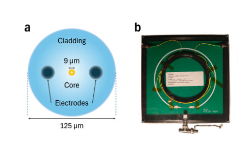
<figcaption class="paper-figure-caption"><b>Fig 2.</b> Figure 2. a) Cross-section diagram of the poled-fiber phase modulator. Two longitudinal electrodes are inserted in the cladding equidistant from the single-mode core. b) Finished and packaged PFPM.</figcaption>
</figure>
<figure class="paper-figure-card">
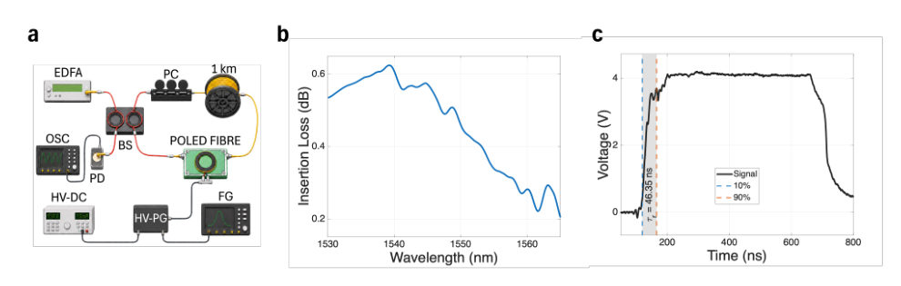
<figcaption class="paper-figure-caption"><b>Fig 3.</b> Figure 3. Characterization of the poled-fiber phase modulator. (a), Experimental configuration used for the optical and temporal characterization. Spontaneous amplified emission from an EDFA is injected into the fiber system containing the poled- fiber modulator. (b), Wavelength-dependent insertion loss obtained from measurements with an optical spectrum analyzer. (c), Photodiode waveform measured at the π-phase operating point, including the 10–90% rise-time estimation. BS: Fiber beamsplitter; EDFA: Erbium Doped Fiber Amplifier; FG: Function generator; HV-DC: High-voltage direct current power supply; HV-PG: High-voltage pulse generator; OSC: Oscilloscope; PC: Manual polarization...</figcaption>
</figure>
<figure class="paper-figure-card">
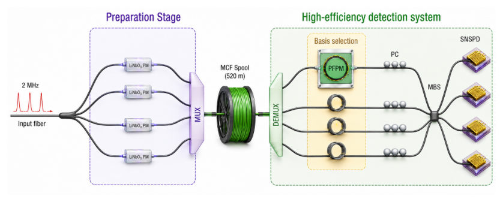
<figcaption class="paper-figure-caption"><b>Fig 4.</b> Figure 4. Schematics of the four-dimensional HD-QKD system used. A weak coherent pulse is distributed among four single- mode fibers through a four core multicore beam splitter (4C-MBS) [32] and sent to the Preparation Stage, where four LiNbO3 phase-modulators generate the QKD qudit states. The photons are then multiplexed into a 520 m spool of a 4C multicore fiber, which constitutes the transmission channel. At Bob, the photons are routed to the high-efficiency detection system, within which a single PFPM (yellow Basis Selection box) realises the active basis switching. Four polarization controllers ensure path indistinguishability before a second 4C-MBS performs the high-dimensional...</figcaption>
</figure>
<figure class="paper-figure-card">
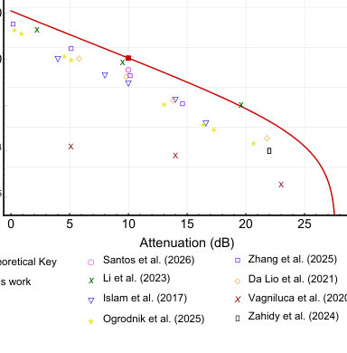
<figcaption class="paper-figure-caption"><b>Fig 5.</b> Figure 5. Finite secret-key fraction (bits per pulse) as a func- tion of channel attenuation, compared with recent leading QKD demonstrations.</figcaption>
</figure>

**Summary.** This paper demonstrates the use of Poled-fibre phase modulators (PFPMs) to overcome major bottlenecks in high-dimensional quantum measurements. By offering low loss and polarization independence directly on standard telecom fibers, PFPMs enable a highly efficient receiver for advanced QKD protocols. The results establish this technology as a key building block for scalable, fiber-integrated quantum information processing.

**Why it may be interesting.** This work is highly relevant to quantum optics and photonic QI as it provides an ultra-low-loss, fiber-native component crucial for scaling up complex quantum network protocols beyond laboratory settings.

Detailed structure

**Main problem.** The primary challenge is achieving efficient, high-dimensional quantum state detection for advanced protocols like QKD, where conventional modulators introduce significant optical losses and polarization sensitivity.

**Main result.** The use of Poled-fibre phase modulators (PFPMs) enables a fully fiber-integrated platform that significantly reduces receiver loss and achieves record finite secret-key rates in four-dimensional QKD demonstrations.

**Method.** The authors implemented an active quantum measurement basis selection using the PFPM within a high-dimensional QKD setup, comparing its performance against traditional $	ext{LiNbO}_3$ modulators.

**Model / system.** The system utilizes Poled-fibre phase modulators (PFPMs) integrated into a fiber platform for active quantum state measurements in four dimensions ($d=4$). This technology is inherently compatible with standard telecom fibers and offers low loss and polarization independence.

**Key observables.** Finite secret-key rate per pulse, receiver insertion loss (e.g., 2.79 dB vs 5.76 dB), and the ability to perform basis switching using a single modulator.

**Important parameters / regimes.** Four-dimensional qudits ($d=4$), sub-dB insertion loss, $10 	ext{ dB}$ channel attenuation, and operational stability up to $100 	ext{ kHz}$.

**Assumptions / limitations.** The analysis assumes that the mode-dependent loss contribution to QBER is negligible compared to the measured baseline interferometric QBER.

**Figures summary.** Figures compare receiver losses using conventional modulators versus PFPMs for basis selection; other figures detail characterization setups and system cross-sections.

**Paper structure.** The paper first establishes the need for low-loss, high-dimensional measurement devices. It then details the fabrication and characterization of the PFPM. Finally, it presents experimental results demonstrating its use in a four-dimensional QKD session, quantifying performance improvements over prior art.

Abstract

Efficient detection of quantum states underpins advanced device-independent quantum-information protocols that provide the ultimate level of security for tasks including quantum random number generation and quantum key distribution (QKD). High-dimensional encoding is a natural route to boost the performance of such protocols, offering enhanced noise resilience and higher information capacity, yet their practical implementation remains challenging. A key experimental bottleneck in higher dimensions is the typical need of active modulators for basis selection, which incur substantial optical losses and polarization-sensitive operation. Poled optical fiber phase modulators (PFPMs) are a fiber-native electro-optic technology that naturally addresses these challenges, combining sub-dB insertion loss, intrinsic polarization independence, and direct compatibility with standard telecommunications fiber. Here we report the first use of a PFPM for active quantum-state measurements in a fully fiber-integrated platform. Basis selection in our receiver for four-dimensional qudits is achieved using a single PFPM, substantially simplifying the receiver architecture. As a benchmark, we perform a four-dimensional QKD session and obtain a finite secret-key rate per pulse that, to the best of our knowledge, surpasses all previously reported QKD demonstrations. Our results establish poled-fiber electro-optic modulation as a broadly applicable platform for high-efficiency detection in fiber-integrated quantum information processing.

[↑ back to top](#top)

### [Universal Scaling of the Minimum Error Probability in Qualification of Quantum States](http://arxiv.org/abs/2608.04870v1)

**Authors:** Zhaoyu Fei, Yaotian Li, Weicheng Huang, Xiaoguang Wang, Y. M. Du  
**Type:** theory · **Category:** quantum information and computing · **PDF:** <https://arxiv.org/pdf/2608.04870v1>  
**Analysis basis:** full PDF text, analyzed in chunks
**Topic relevance:** 🔥 `quantum measurements` **4/5** · `measurement-induced transitions` **3/5** · `non-equilibrium universality` **2/5** · `driven-dissipative phase transition` **1/5** · `entanglement & information structure` **1/5** · `non-equilibrium dynamics` **1/5**

↔ Scroll figures horizontally

<figure class="paper-figure-card">
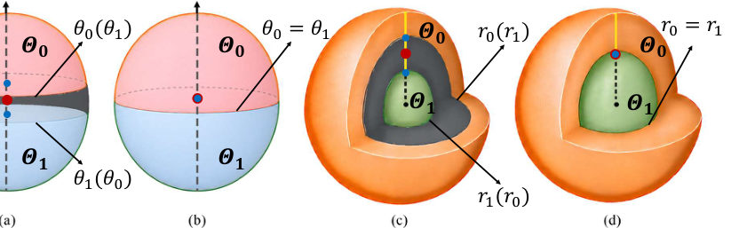
<figcaption class="paper-figure-caption"><b>Fig 1.</b> Fig. 1. Schematic illustration of the region configurations for PDQ and PQ. Panels (a) and (b) show PDQ, whereas panels (c) and (d) show PQ. The gray domains in panels (a) and (c) have different meanings. For disjoint regions, they denote domains in which no state under consideration lies (for overlapping regions, they denote the intersections Θ0 ∩Θ1). Panels (b) and (d) show adjacent regions. In panels (a) and (b), the orange and green surface domains denote Θ0 and Θ1, while the pink and light-blue interior domains denote the convex hulls of the corresponding state sets. In panels (c) and (d), the orange and green domains denote Θ0 and Θ1, respectively. In panel (c), the yellow line marks...</figcaption>
</figure>
<figure class="paper-figure-card">
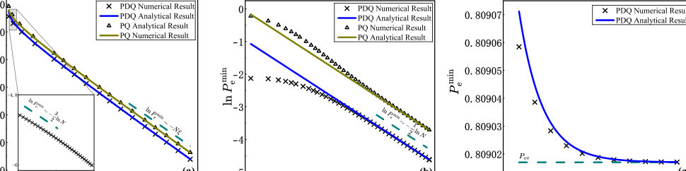
<figcaption class="paper-figure-caption"><b>Fig 2.</b> Fig. 2. Numerical verification of the minimum error probability for PDQ and PQ. (a) Disjoint regions, with θ0 = 0.05π, θ1 = 0.15π for PDQ and r0 = 0.72, r1 = 0.9 for PQ. (b) Adjacent regions, with θ0 = θ1 = 0.15π for PDQ and r0 = r1 = 0.9 for PQ. (c) Overlapping regions for PDQ, with θ0 = 0.8π and θ1 = 0.2π. Crosses (×) and triangles (△) denote the numerical results for PDQ and PQ, respectively, obtained by Eq. (1), whereas solid curves show the analytical results from Eq. (6). Gray dashed lines indicate the asymptotic scaling laws in panels (a) and (b) and the intrinsic error probability in panel (c). The inset in panel (a) highlights the N −3/2 scaling in the small-N regime.</figcaption>
</figure>
<figure class="paper-figure-card">
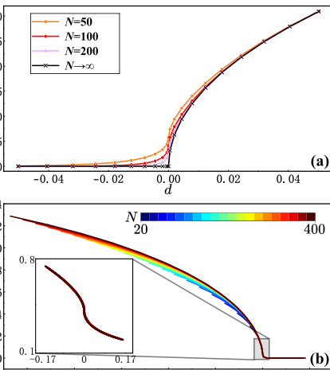
<figcaption class="paper-figure-caption"><b>Fig 3.</b> Fig. 3. Finite-N scaling analysis of the minimum error prob- ability in the PDQ. (a) Minimum error probability P min e as a function of signed distance for N copies. (b) For N copies, with N from N = 20 to N = 400, the rescaled error proba- bility N 1/2P min e is plotted as a function of d.</figcaption>
</figure>

**Summary.** This paper develops a theory for quantifying the minimum error rate when distinguishing between two sets of unknown quantum states (state qualification). By analyzing different spatial arrangements of these state regions—disjoint, adjacent, or overlapping—the authors derive universal scaling laws. These results show that the measurement precision transitions between exponential decay and power-law behavior as the number of samples increases.

**Why it may be interesting.** This work provides fundamental theoretical tools for quantum sensing and verification protocols, showing how measurement precision scales universally based purely on the geometric arrangement of allowed state parameters, which is relevant to optimizing quantum measurements in any field.

Detailed structure

**Main problem.** The paper addresses quantum state qualification, which is formulated as a composite quantum hypothesis test to determine if an unknown quantum state belongs to one of two predefined parameter regions.

**Main result.** It derives universal scaling laws for the minimum error probability ($P_{\min e}$) depending on whether the admissible regions are disjoint (exponential decay), adjacent (power law), or overlapping, identifying a second-order phase transition between these regimes.

**Method.** The analysis uses quantum hypothesis testing theory, exploiting symmetries of the parameter space to simplify the optimal measurement structure and derive asymptotic expressions for $P_{\min e}$.

**Model / system.** The problem is generalized from specific examples like Polarization-Direction Qualification (PDQ) and Purity Qualification (PQ) applied to spin-1/2 states, treating the state parameters via Bloch vectors or general parameter regions.

**Key observables.** Minimum error probability ($P_{\min e}$), Quantum Chernoff divergence ($\xi$), and Quantum Fisher information ($F$).

**Important parameters / regimes.** The number of copies ($N$) is crucial, as are the geometric configurations of the state sets (disjoint, adjacent, overlapping).

**Assumptions / limitations.** The derivation relies heavily on exploiting symmetries to find optimal measurements; for some cases, prior distributions are assumed to share specific symmetries like $SO(3)$.

**Figures summary.** Figures illustrate region configurations for PDQ and PQ (a-d) and numerically verify the derived scaling laws for $P_{\min e}$ across disjoint, adjacent, and overlapping regions.

**Paper structure.** The paper introduces the hypothesis test framework, analyzes specific physical examples (PDQ/PQ), derives the universal scaling laws based on region geometry, and concludes by characterizing the phase transition between these regimes.

Abstract

Qualification of quantum states judges which of two sets of quantum states an unknown state lies in, where the two sets are labeled by two distinct parameter regions. We formulate this problem as a composite quantum hypothesis test and uncover universal scaling laws for the minimum error probability for $N$ copies. Taking polarization-direction qualification and purity qualification as examples, we show that the $N$-copy permutation symmetry and the geometric symmetries of the parameter regions identify the optimal measurements and the "worst pairwise states". The minimum error probability scales as $N^{-3/2}\exp(-Nξ)$ for disjoint regions and as $(NF)^{-1/2}$ for adjacent regions, where $ξ$ and $F$ are the quantum Chernoff divergence and quantum Fisher information associated with the "worst pairwise states", respectively. With the minimum error probability serving as an order parameter, the transition between the scaling behaviors becomes a second-order phase transition as $N\to\infty$. Our approach determines whether a quantum state belongs to a given set without full state tomography, thereby enabling qualification of large ensembles using finite samples.

[↑ back to top](#top)

### [Analytic correspondence between multipartite entanglement and quantum phase transitions](http://arxiv.org/abs/2608.04467v1)

**Authors:** Huynh Le Dan Linh, Vu Tuan Hai, Le Bin Ho  
**Type:** theory · **Category:** statistical mechanics · **PDF:** <https://arxiv.org/pdf/2608.04467v1>  
**Analysis basis:** full PDF text, analyzed in chunks
**Topic relevance:** 🔥 `entanglement & information structure` **4/5** · `analog quantum simulation` **3/5** · `Keldysh / 2PI / non-Gaussian methods` **1/5** · `driven-dissipative phase transition` **1/5** · `exotic spin models in light-matter` **1/5**

↔ Scroll figures horizontally

<figure class="paper-figure-card">
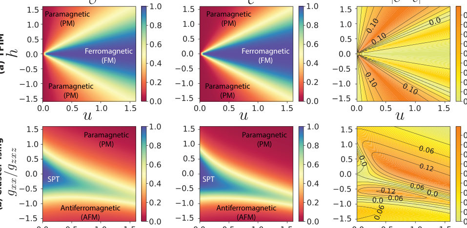
<figcaption class="paper-figure-caption"><b>Fig 1.</b> FIG. 1. Comparison between the normalized GOP e O (left), normalized CE eC (center), and their absolute difference | e O −eC| (right) for two representative one-dimensional spin models with N = 5: (a) the transverse-field Ising model, and (b) the generalized cluster-Ising model. In all cases, CE accurately reproduces the phase boundaries identified by the corresponding GOP. The normalized root-mean-square deviations are approximately 7% and 8%, respectively. The remaining discrepancies are localized predominantly near the critical manifold, while the agreement within each gapped phase is excellent, consistent with Theorem 1.</figcaption>
</figure>

**Summary.** The paper establishes a deep theoretical link showing that multipartite entanglement (Concentratable Entanglement) behaves identically to traditional order parameters when characterizing Quantum Phase Transitions in 1D spin systems. By proving this correspondence and demonstrating its measurement feasibility via SWAP tests, it offers a universal, model-independent diagnostic tool for studying quantum criticality.

**Why it may be interesting.** This work provides a powerful, entanglement-based diagnostic tool that bypasses the need to calculate model-specific order parameters, making QPT detection more accessible for experimental quantum simulation platforms.

Detailed structure

**Main problem.** The paper aims to establish a rigorous, analytic correspondence between multipartite entanglement measures and quantum phase transitions (QPTs) in 1D quantum spin systems.

**Main result.** It proves that Concentratable Entanglement (CE) shares the same analyticity structure as generalized order parameters (GOPs), identifies the same quantum phases, and serves as an experimentally accessible, model-independent probe for QPTs.

**Method.** The analysis involves deriving theoretical theorems showing shared analytic dependence on single-particle correlation matrices ($\Gamma$) for Gaussian ground states, complemented by numerical validation on specific spin models.

**Model / system.** The study focuses on one-dimensional quantum spin systems, specifically the Transverse-Field Ising Model (TFIM) and generalized cluster-Ising models. The Hamiltonians are local spin-1/2 interactions parameterized by coupling constants ($\lambda$).

**Key observables.** Concentratable Entanglement ($C(S)$), Generalized Order Parameters (GOPs, $O(\lambda)$), and the single-particle correlation matrix ($\Gamma_{ij}$).

**Important parameters / regimes.** Control parameters $\lambda$ governing the Hamiltonian; critical points where phase transitions occur.

**Assumptions / limitations.** The analysis assumes a unique gapped ground state within each quantum phase, and for free-fermion systems, it relies on the analyticity of the Bogoliubov transformation with respect to Hamiltonian parameters.

**Figures summary.** Figure 1 compares normalized GOP ($\langle O 
angle$) and normalized CE ($\langle C 
angle$) across the TFIM and cluster-Ising models, demonstrating that CE accurately reproduces the phase boundaries identified by GOPs.

**Paper structure.** The paper develops theoretical theorems establishing shared analyticity (Theorem 1), demonstrates phase discrimination capabilities using CE (Theorem 2), and proves an exact correspondence for Gaussian ground states based on $\Gamma$ (Theorem 3). This is validated numerically on TFIM and cluster-Ising models.

Abstract

We derive an analytic correspondence between multipartite concentratable entanglement (CE) and quantum phase transitions in one-dimensional quantum spin systems. We prove that CE shares the same analyticity structure as generalized order parameters, identifies the same quantum phases, and, for Gaussian ground states, is completely determined by the same single-particle correlation matrix. Numerical validation on the transverse-field Ising and generalized cluster-Ising models confirms these analytical predictions for both symmetry-breaking and symmetry-protected topological quantum phase transitions. Since CE can be measured directly using a constant-depth parallelized SWAP-test circuit, our results establish CE as an experimentally accessible, model-independent probe of quantum phase transitions without requiring model-specific order parameters.

[↑ back to top](#top)

### [Contextuality in Sequential State Discrimination](http://arxiv.org/abs/2608.04099v1)

**Authors:** Nyan Raess, Farid Shahandeh  
**Type:** theory · **Category:** quantum information and computing · **PDF:** <https://arxiv.org/pdf/2608.04099v1>  
**Analysis basis:** full PDF text, analyzed in chunks
**Topic relevance:** 🔥 `quantum measurements` **4/5** · `measurement-induced transitions` **3/5** · `Keldysh / 2PI / non-Gaussian methods` **1/5** · `driven-dissipative phase transition` **1/5** · `entanglement & information structure` **1/5**

↔ Scroll figures horizontally

<figure class="paper-figure-card">
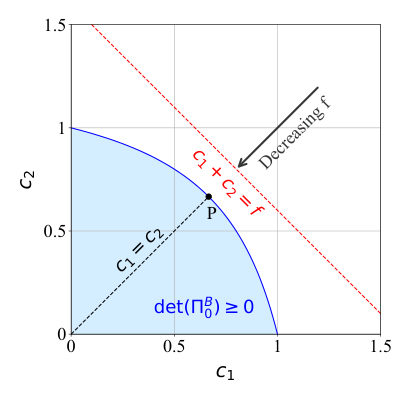
<figcaption class="paper-figure-caption"><b>Fig 1.</b> FIG. 1: A visualization of the optimal solution for USD of two pure qubit states under equal priors, here with confusability s2 = 1/4. The blue region contains all feasible cB 1 , cB 2 choices i.e. ΠB 0 ≥0. To minimize the failure probability we want to maximize the sum cB 1 + cB 2 : we want the largest f so that the red line intersects the feasible region. It is easy to see that this will occur along the line cB 1 = cB 2 ; specifically, at P = (1/1+s, 1/1+s).</figcaption>
</figure>
<figure class="paper-figure-card">
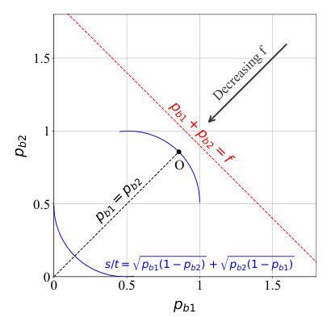
<figcaption class="paper-figure-caption"><b>Fig 2.</b> FIG. 2: A visualization of the optimal solution for sequential MESD of two pure qubit states under equal priors, assuming the ratio s/t is fixed; here s/t = 0.7. The blue curve contains all feasible p1b, p2b choices. The success probability to be maximized is 1/2(p1b + p2b) = f/2. The largest f for which the red line and blue curve intersect occurs along p1b = p2b, specifically at O =  1/2(1 + p</figcaption>
</figure>
<figure class="paper-figure-card">
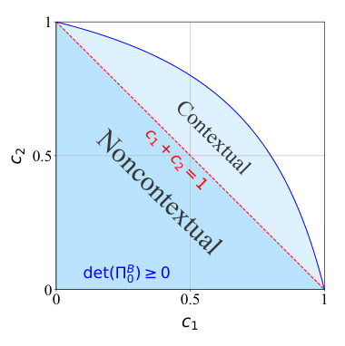
<figcaption class="paper-figure-caption"><b>Fig 3.</b> FIG. 3: A visualization of the source of contextual advantage; the nonnegativity condition of the quantum model is the blue region. Here, s = 0.5. Nonnegativity/noncontextuality of the ontological representation is bounded by the red line. For any confusability s2 ̸= 0, 1 there is a margin between these boundaries, representing contextual strategies that outperform the NC bound. Only the bounding blue curve has determinant exactly 0. This means that strategies within this margin outperform the NC bound and are still viable in the sequential protocol, as the post-measurement states are distinguishable.</figcaption>
</figure>
<figure class="paper-figure-card">
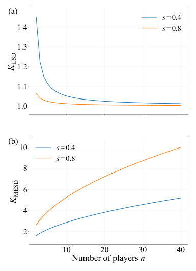
<figcaption class="paper-figure-caption"><b>Fig 4.</b> FIG. 4: A comparison of the approximate number of players with a contextual scenario in each protocol, denoted by KUSD and KMESD respectively, against number of players n, where 2 ≤n ≤40. Note that for USD the values of s are such that a &gt; 1/2, as is required for Eq. (39) to be well-defined. For USD the number of contextual players drops rapidly, while for MESD it grows approximately at rate √n.</figcaption>
</figure>

**Summary.** This work investigates when generalized contextuality is necessary for optimal strategies in sequential quantum state discrimination. By comparing Unambiguous State Discrimination (USD) and Minimum Error State Discrimination (MESD), the authors show that the requirement for contextuality changes depending on the protocol and the initial distinguishability of the states. The findings offer deep insights into the fundamental limitations imposed by quantum mechanics on multi-stage measurement processes.

**Why it may be interesting.** It provides rigorous theoretical tools (contextuality measures) applicable to quantum measurement theory, which underpins many open quantum system dynamics and information processing tasks.

Detailed structure

**Main problem.** The paper characterizes the role of generalized contextuality in sequential quantum state discrimination protocols, comparing unambiguous (USD) and minimum error (MESD) settings.

**Main result.** Contextuality's presence depends critically on the protocol used (USD vs. MESD) and the distinguishability of the input states; for instance, contextuality is predicted to be more likely in sequential USD when states have low confusability.

**Method.** The analysis employs formalisms like COPE matrices, consistency relations derived from completeness relations, and ontological modeling to test violations of noncontextuality across multiple measurement stages.

**Model / system.** The system involves discriminating between a set of unknown quantum states (qubits) sequentially among $n$ players. The protocols analyzed are Minimum Error State Discrimination (MESD) and Unambiguous State Discrimination (USD).

**Key observables.** Success probabilities for USD ($P_{Q}^{USD}(n)$) and MESD, confusability ($s^2$), and post-measurement confusability ($t^2$).

**Important parameters / regimes.** The number of players $n$, the state confusability $s^2$, and the measurement parameters defining detection operators.

**Assumptions / limitations.** Assumes specific structures for POVM elements in MESD analysis, and relies on Spekkens' assumption relating operational indistinguishability to ontological equivalence.

**Figures summary.** Figure 1 visualizes the feasible region for optimal measurements in single-player USD for two pure qubit states, showing the optimum relative to the boundary defined by confusability.

**Paper structure.** The paper progresses from analyzing the single-player case (USD) using COPE formalism, extends this analysis to sequential players ($n>1$) by deriving consistency relations, and then compares contextuality findings between USD and MESD protocols, culminating in detailed ontological checks for MESD.

Abstract

Generalized contextuality is known to be required in optimal strategies for quantum state discrimination protocols. More recently, sequential discrimination tasks have been studied; n players attempt to determine in which state a qubit was prepared, in such a way that they all have a finite probability of success. We consider the extent to which contextuality plays a role in sequential versions of both unambiguous and minimum error discrimination. In the standard nonsequential case where n = 1, we use the COPE formalism to demonstrate that the presence of contextuality is guaranteed not only for the optimal measurement, but for a specific set of nonoptimal measurements as well. In the sequential case n > 1, we show that the presence of contextuality depends on which states are prepared, and on the protocol (unambiguous or minimum error) selected.

[↑ back to top](#top)

### [The two-particle-irreducible vertex of the two-dimensional lattice $φ^4$ model across the Ising transition](http://arxiv.org/abs/2608.04497v1)

**Authors:** Lode Pollet  
**Type:** theory · **Category:** statistical mechanics · **PDF:** <https://arxiv.org/pdf/2608.04497v1>  
**Analysis basis:** full PDF text, analyzed in chunks
**Topic relevance:** 🔥 `Keldysh / 2PI / non-Gaussian methods` **4/5** · `analog quantum simulation` **1/5** · `driven-dissipative phase transition` **1/5** · `methods for driven-dissipative` **1/5** · `non-equilibrium dynamics` **1/5** · `non-equilibrium universality` **1/5**

↔ Scroll figures horizontally

<figure class="paper-figure-card">
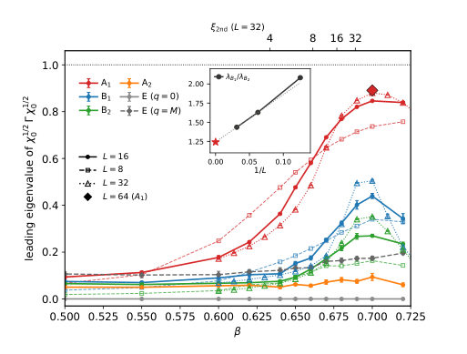
<figcaption class="paper-figure-caption"><b>Fig 1.</b> FIG. 1. The leading eigenvalue of the symmetrized Bethe- Salpeter kernel, given by χ1/2 0 Γχ1/2 0 , is evaluated at zero trans- fer and resolved in the C4v irreducible representations as a function of the inverse temperature β (with L = 16, rep- resented by filled symbols). The A1 channel (ferromagnetic) drives the instability toward unity, while the B1 (nematic) and B2 (diagonal nematic) channels cooperate. The A2 channel is inert, and the E channel, associated with anti-ferromagnetic fluctuations, vanishes identically at q = 0 due to parity. How- ever, it is non-zero at the corner transfer q = M = (π, π), indicated by a grey dashed line. Open symbols illustrate the finite-size trend for...</figcaption>
</figure>
<figure class="paper-figure-card">
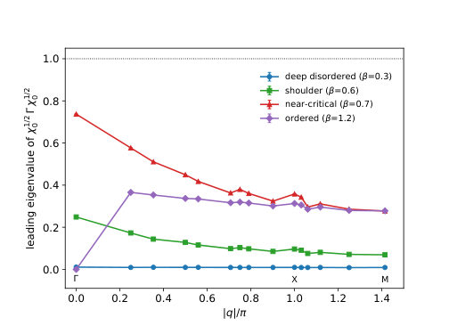
<figcaption class="paper-figure-caption"><b>Fig 2.</b> FIG. 2. The leading kernel eigenvalue as a function of trans- fer momentum |q| is shown along the irreducible wedge, with points marked at Γ, X, and M, for four regimes at L = 8 in the A1 sector. The near-critical curve is taken at β = 0.7, where the A1 eigenvalue reaches its maximum on this finite lattice of size L = 8. This finite-size pseudo-critical point is slightly above the thermodynamic critical point βc ≈0.685 (as discussed in Sec. III and App. G). It is important to note that we are plotting this finite-size maximum instead of βc. In the deep disordered phase, the vertex is weak and nearly independent of q. As we approach criticality, the dominance of the q = 0 mode increases,...</figcaption>
</figure>
<figure class="paper-figure-card">
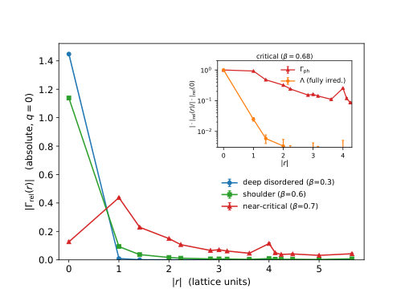
<figcaption class="paper-figure-caption"><b>Fig 3.</b> FIG. 3. The absolute value of the relative-coordinate vertex kernel is defined as Γrel(r) = 1 N P</figcaption>
</figure>
<figure class="paper-figure-card">
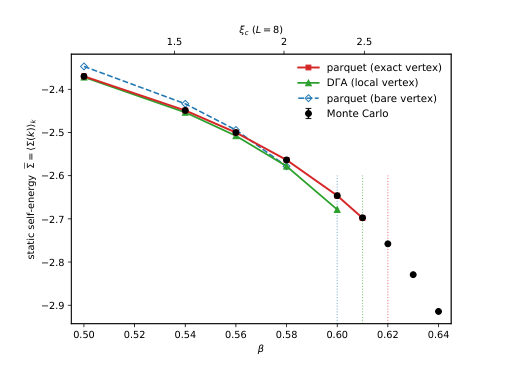
<figcaption class="paper-figure-caption"><b>Fig 4.</b> FIG. 4. The local self-energy, denoted as Σ = ⟨Σ(k)⟩k, is plotted against β for a system with L = 8. This data comes from a fully self-consistent solution using the parquet–Schwinger-Dyson–Dyson approach. The results show the full measured (exact) vertex represented by red squares, while the DΓA local single-site vertex is indicated by green triangles. The blue open diamonds show the bare- vertex (parquet-approximation) result, Λ = −6λ/N, included as a reference. These findings are compared to Monte Carlo simulations, with points that include bootstrap errors. The exact vertex closely aligns with the Monte Carlo self-energy, whereas the local DΓA vertex falls approximately 1% short....</figcaption>
</figure>
<figure class="paper-figure-card">
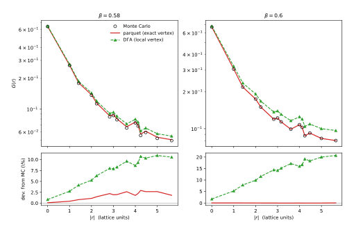
<figcaption class="paper-figure-caption"><b>Fig 5.</b> FIG. 5. The real-space propagator G(r) is compared be- tween the fully self-consistent parquet solution—derived from both the fully measured (statistically exact) vertex and the approximate DΓA local vertex—and the Monte Carlo prop- agator (also statistically exact) at β = 0.58 and 0.60 (with L = 8, on a logarithmic scale). The exact vertex accurately reproduces G(r) at all distances, while the local DΓA vertex shows an overshoot at large |r|. In the lower panels, the per- centage deviation from the Monte Carlo results is presented. Statistical errors, obtained through bootstrapping, are ap- proximately 0.1%, which is smaller than the plotted symbols.</figcaption>
</figure>

**Summary.** This work rigorously calculates the two-particle-irreducible vertex for the 2D $\phi^4$ model across its Ising phase transition. By combining Monte Carlo data with advanced functional methods, the authors pinpoint that the A1 channel drives the instability and provide a highly accurate benchmark for theoretical approximations of critical dynamics.

**Why it may be interesting.** While focused on classical statistical mechanics, the rigorous diagrammatic techniques used to calculate correlation functions and vertices are foundational tools applicable to understanding quantum critical points in many-body systems relevant to AMO physics.

Detailed structure

**Main problem.** The study reconstructs and analyzes the two-particle-irreducible (2PI) vertex of the 2D lattice $\phi^4$ model as it passes through the Ising phase transition.

**Main result.** The instability driving the transition is governed by the A1 (ferromagnetic) channel, while the fully irreducible vertex can be accurately determined using advanced diagrammatic techniques like parquet equations.

**Method.** The authors combine Monte Carlo measurements of two-particle correlators with theoretical frameworks such as Bethe-Salpeter and Parquet/Schwinger-Dyson equations to extract the vertex function $\Gamma$.

**Model / system.** The system is a two-dimensional single-component $\phi^4$ lattice field theory, which belongs to the Ising universality class. The analysis tracks its behavior across the critical point.

**Key observables.** The leading eigenvalue of the symmetrized Bethe-Salpeter kernel; the momentum and real-space dependence of the 2PI vertex $\Gamma(k, p; q)$

**Important parameters / regimes.** Temperature/Inverse Temperature ($\beta$); lattice size ($L$); momentum transfer ($q$)

**Assumptions / limitations.** The analysis relies on inverting Monte Carlo data and employing approximations like the Dynamical Local-Vertex Approximation (D$\Gamma$A) and solving parquet equations.

**Figures summary.** Figures illustrate how leading eigenvalues approach unity at criticality, show $\Gamma(q)$ evolving from short-range to power-law tails near $T_c$, and map out convergence walls for theoretical approximations.

**Paper structure.** The paper proceeds by first relating the vertex to measured correlators, analyzing its symmetry decomposition ($C_{4v}$), tracking the instability across phases (disordered $\to$ critical $\to$ ordered), and finally benchmarking results against advanced functional methods like parquet equations.

Abstract

We reconstruct the 2PI vertex $Γ(k,p;q)$ from Monte Carlo measurements of the connected two-particle correlator for the two-dimensional single-component $φ^4$ lattice field theory and follow it across the Ising transition. Resolving the vertex in the irreducible representations of the point group $C_{4v}$, we find that the instability is driven by the $A_1$ (ferromagnetic) channel at zero transfer, whose leading eigenvalue of the symmetrized Bethe--Salpeter kernel approaches unity. Substantial $B_1$ (nematic) and $B_2$ (diagonal nematic) contributions cooperate with $A_1$ across all system sizes, highlighting that the soft sector is   multidimensional. In real space, the vertex is short-ranged away from criticality while it develops a power-law tail at the critical point. In the ordered phase, the $q=0$ eigenvalue collapses because the ferromagnetic weight has condensed into the (one-particle-reducible) order parameter (or collective coordinate for a finite system), although finite-momentum fluctuations persist. By stripping the crossed-channel ladders, we obtain the fully irreducible vertex, which is a local contact -- to a very good approximation. Inserted into the parquet and Schwinger--Dyson equations, this contact reproduces the Monte Carlo self-energy with an accuracy better than one-tenth of a percent. This provides a first-principles benchmark of the dynamical local-vertex approximation (D$Γ$A). Additionally, we demonstrate that in the critical region, the physical solution of the parquet equations behaves as a repulsive fixed point, driven initially by a single order-parameter mode.

[↑ back to top](#top)

### [Lifting the degeneracy of quantum spin liquid phase by uniaxial pressure](http://arxiv.org/abs/2608.04782v1)

**Authors:** Shams Sohel Islam, Zurab Guguchia, Orion Gerguri, Petr Král, Maxime Lamotte, Toni Shiroka, Jonas A. Krieger, Thomas J. Hicken, Tina Arh, Gediminas Simutis, Abanoub Hanna, Nazmul Islam, Bella Lake, Hubertus Luetkens, Hans Henning Klauss, Rajib Sarkar  
**Type:** experiment · **Category:** strongly correlated electrons · **PDF:** <https://arxiv.org/pdf/2608.04782v1>  
**Analysis basis:** full PDF text, analyzed in chunks
**Topic relevance:** 🔥 `analog quantum simulation` **4/5** · `exotic spin models in light-matter` **3/5** · `spintronics-quantum-optics interface` **1/5**

↔ Scroll figures horizontally

<figure class="paper-figure-card">
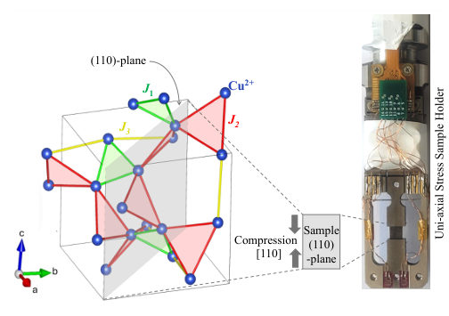
<figcaption class="paper-figure-caption"><b>Fig 1.</b> FIG. 1. (a) Schematic of the 3D frustrated Cu2+ network in PbCuTe2O6, highlighting representative competing exchange pathways J1, J2, and J3 and the (110) plane relevant to the uniaxial-stress geometry. The arrow indicates the applied compression direction, [110]. For clarity, the J4 interaction, which forms an additional chain-like coupling along the body diagonal, is not shown [25]. (b) Photograph of the sample mounted on the uniaxial-stress sample holder for µSR.</figcaption>
</figure>
<figure class="paper-figure-card">
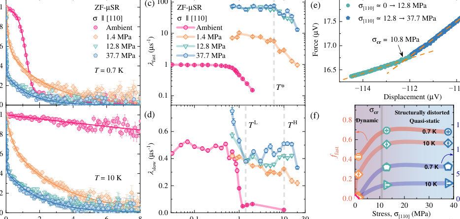
<figcaption class="paper-figure-caption"><b>Fig 2.</b> FIG. 2. (a),(b) Representative ZF-µSR depolarization measured as a function of uniaxial stress σ[110] at T = 0.7 K and 10 K, respectively. At ambient pressure, these temperatures correspond to the proposed QSL-like regime and a regime closer to the paramagnetic state, respectively [10]. Solid lines are fits using the two-component relaxation model described in the SM [26]. (c),(d) Temperature dependence of the fast and slow ZF relaxation rates for selected uniaxial stresses. Vertical dashed lines indicate the characteristic temperature scales discussed in the text. (e) Stress–strain curve: force versus displacement measured during the uniaxial-stress experiment. The arrow marks the slope...</figcaption>
</figure>
<figure class="paper-figure-card">
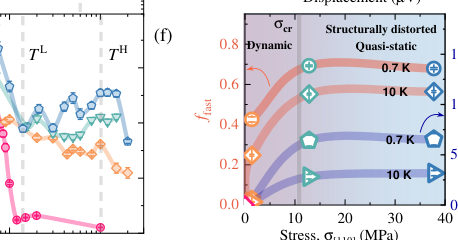
<figcaption class="paper-figure-caption"><b>Fig 3.</b> Figure 3(d) shows the Knight shifts extracted from the TF-µSR spectra [26]. Since the muon Knight shift pro- vides a measure of local magnetic susceptibility, its tem- perature dependence tracks the evolution of local spin</figcaption>
</figure>
<figure class="paper-figure-card">
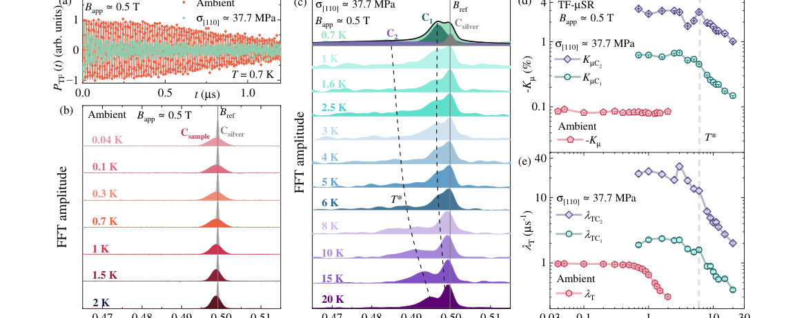
<figcaption class="paper-figure-caption"><b>Fig 4.</b> FIG. 3. (a) Representative TF-µSR depolarization measured at T = 0.7 K under ambient pressure and σ[110] = 37.7 MPa, in an applied transverse field of Bapp ≃0.5 T. The solid lines represent fits described in the SM [26]. (b),(c) Fourier-transform spectra measured at representative temperatures under ambient pressure and σ[110] = 37.7 MPa, respectively, in the same applied field. At σ[110] = 37.7 MPa, the decomposition of the 0.7 K spectra into two sample-related peaks (C1 and C2) and a reference peak (Csilver) is shown. The vertical solid line marks the reference field determined from the silver signal. (d) Temperature dependence of the muon Knight shifts under ambient pressure and σ[110] =...</figcaption>
</figure>
<figure class="paper-figure-card">
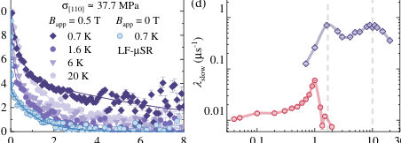
<figcaption class="paper-figure-caption"><b>Fig 5.</b> FIG. 4. (a), (b) Longitudinal-field (LF) µSR depolariza- tion PLF(t) measured under ambient pressure and 37.7 MPa, respectively, at selected temperatures in applied fields of Bapp = 0 and 0.5 T. Solid lines are fits using the same two-component relaxation model employed for ZF-µSR anal- ysis [26]. (c), (d) Temperature dependence of the fast (λfast) and slow (λslow) LF relaxation rates under ambient pressure and 37.7 MPa, respectively. Vertical dashed lines mark the characteristic temperature scales discussed in the text.</figcaption>
</figure>

**Summary.** This work uses muon spin relaxation ($\mu$SR) under uniaxial pressure to probe the quantum spin liquid candidate $	ext{PbCuTe}_2	ext{O}_6$. The researchers found that applying stress modifies the local magnetic response and enhances quasi-static correlations without inducing conventional long-range magnetic order. This demonstrates a powerful, symmetry-selective method for controlling frustrated exchange interactions in QSL materials.

**Why it may be interesting.** The ability to tune quantum magnetic ground states using external strain is highly relevant for understanding emergent phenomena in strongly correlated electron systems, providing a clean experimental handle on frustrated interactions.

Detailed structure

**Main problem.** To determine if uniaxial pressure can control the frustrated exchange landscape of a 3D Quantum Spin Liquid (QSL) candidate, $	ext{PbCuTe}_2	ext{O}_6$, and potentially drive it toward magnetic order.

**Main result.** The system remains in a dynamically fluctuating state even under high stress, but compression provides a clean route to tune the frustrated exchange landscape by exploiting magnetoelastic coupling. No evidence for conventional static long-range magnetic order was observed.

**Method.** Muon spin relaxation/rotation ($\mu$SR) measurements were performed *in situ* while applying controlled uniaxial compression along the [110] direction.

**Model / system.** The study investigates $	ext{PbCuTe}_2	ext{O}_6$, a candidate three-dimensional (3D) $S=1/2$ QSL characterized by competing antiferromagnetic interactions forming a frustrated 3D hyper-hyperkagome network.

**Key observables.** Muon spin relaxation rates ($\lambda_{	ext{fast}}, \lambda_{	ext{slow}}$), internal-field distribution broadening, and the stress-strain curve.

**Important parameters / regimes.** Uniaxial stress $\sigma_{[110]}$ up to $37.7\ 	ext{MPa}$; critical stress $\sigma_{	ext{cr}} \sim 10.8\ 	ext{MPa}$.

**Assumptions / limitations.** The analysis assumes that the observed changes are due to magnetoelastic coupling between lattice strain and magnetic correlations.

**Figures summary.** Figures show ZF-$\mu$SR spectra, force-displacement curves correlating stress with $\mu$SR response, and temperature dependence of relaxation rates under varying uniaxial stresses.

**Paper structure.** The paper systematically measures $\mu$SR properties across a range of applied uniaxial stresses, identifying critical structural transitions ($\sigma_{	ext{cr}}$) that correlate with changes in the local magnetic environment and spin dynamics.

Abstract

We report muon spin relaxation/rotation ($μ$SR) measurements of the candidate three-dimensional (3D) quantum spin liquid (QSL) PbCuTe$_2$O$_6$, hosting $S=1/2$ moments, under controlled in situ [110] uniaxial compression up to $σ_{[110]}=37.7$~MPa. A small directional lattice perturbation significantly modifies the local magnetic response, while above $σ_{\rm cr}\sim10.8$\,MPa the relaxation rates are strongly enhanced and the internal-field distribution is substantially broadened. These changes occur along with the local crystalline symmetry breaking. While, no evidence for conventional static long-range magnetic order is observed, the compression drives the system towards a structurally modified and strongly correlated state in which enhanced quasi-static correlations coexist with persistent slow spin dynamics. This work demonstrates a clean and symmetry-selective route to control frustrated exchange landscape and access hidden magnetic instabilities in a 3D QSL candidate opening up the possibilities to tune other correlated systems where intrinsic coupling between magnetic and lattice degrees of freedom are relevant.

[↑ back to top](#top)

### [Reconstructing non-Abelian braiding and fusion without anyon transport](http://arxiv.org/abs/2608.04103v1)

**Authors:** Lucy Byles, Matthew D. Horner, Benjamin T. H. Varcoe, Jiannis K. Pachos  
**Type:** experiment · **Category:** quantum information and computing · **PDF:** <https://arxiv.org/pdf/2608.04103v1>  
**Analysis basis:** full PDF text, analyzed in chunks
**Topic relevance:** 🔥 `QC/QI experiment` **4/5** · `quantum measurements` **3/5** · `measurement-induced transitions` **1/5**

↔ Scroll figures horizontally

<figure class="paper-figure-card">
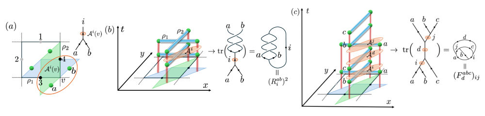
<figcaption class="paper-figure-caption"><b>Fig 1.</b> FIG. 1. Diagrammatic reconstruction of (Ri)2 and (Fij)2. (a) Minimal plaquette underlying the reduced two-qutrit protocol. Although the original D(S3) plaquette contains four d = 6 qudits, the relevant ribbon and projection operators act non-trivially only on qudits 3 and 4, and their action is subsequently reduced to two qutrits. The reduced ribbons FG ρ1 and F G ρ2 create pairs of G anyons (green spheres), and the vertex projector Ai(v) resolves their fusion channel. (b) Spacetime sequence for reconstructing the squared braiding phase. Temporally ordered ribbon operations and an intermediate charge projection close the worldlines into a double braid of anyons a and b in channel i, giving...</figcaption>
</figure>
<figure class="paper-figure-card">
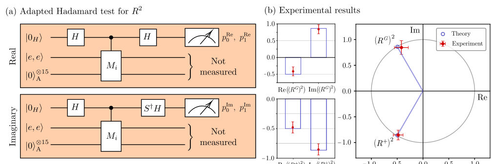
<figcaption class="paper-figure-caption"><b>Fig 2.</b> FIG. 2. Hardware reconstruction of the squared braiding phases. (a) Adapted Hadamard-test circuits used to extract the real and imaginary components of the non-unitary ribbon-projection overlap. The block Mi is the unitary dilation of the reduced two-qutrit map FG ρ2F G ρ1Ai(v)FG ρ2F G ρ1. The real component is obtained with the final Hadamard measurement basis, while the imaginary component is obtained by inserting S† before the final Hadamard. The operation ancillas are not measured, as only the Hadamard ancilla outcomes p0 and p1 are used. The i = + circuit gives Re  (R+)2 = 8(2pRe 0 −1) and Im  (R+)2 = 8(2pIm 0 −1), while replacing Ai(v) by the identity gives (R1)2 and hence (RG)2 =...</figcaption>
</figure>
<figure class="paper-figure-card">
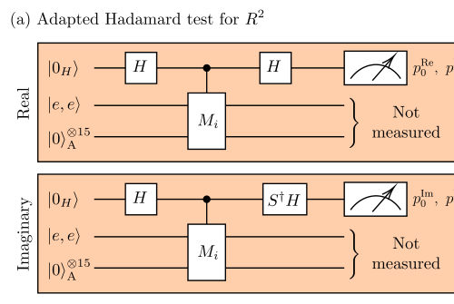
<figcaption class="paper-figure-caption"><b>Fig 3.</b> Figure 1(b) gives the spacetime interpretation of the braiding measurement. The horizontal plane is the pla- quette geometry and the vertical direction is time. The ordered application of the ribbons first creates the two G anyons a and b, after which the projection Ai(v) fixes their fusion channel and subsequent ribbon operations are applied. Because the quantity measured is a vacuum expectation value, the initial and final ribbon endpoints are contracted, as indicated by the red vertical lines, pro- ducing closed spacetime loops. The ordering of the two final ribbon operations is essential: the sequence shown gives linked loops, corresponding to a double exchange of the anyons a and b,...</figcaption>
</figure>
<figure class="paper-figure-card">
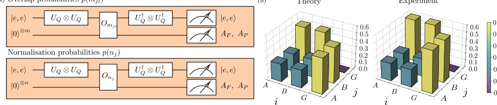
<figcaption class="paper-figure-caption"><b>Fig 4.</b> FIG. 3. Hardware reconstruction of the squared fusion amplitudes. (a) Post-selected fusion-readout protocol. The upper circuit measures the overlap probabilities p(mji) using m = 30 ancillas, while the lower circuit measures the normalisation probabilities p(nj) using n = 27 ancillas. Unlike the braiding reconstruction, no Hadamard test is used: the probabilities are obtained from bit strings satisfying the ribbon-operation condition AF = 0 · · · 0, the projection-ancilla syndromes AP = (si, sj) for the overlap circuit or sj for the normalisation circuit, and the final computational output |e, e⟩. (b) Theoretical and experimentally reconstructed matrices of squared fusion amplitudes,...</figcaption>
</figure>
<figure class="paper-figure-card">
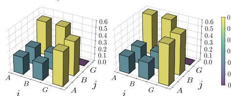
<figcaption class="paper-figure-caption"><b>Fig 5.</b> Figure 1(c) shows the analogous construction for fu- sion. The lower part of the sequence prepares one fusion- basis resolution of three G anyons: two anyons are first resolved through channel i, and the resulting charge sub- sequently fuses to the final channel d = G. Inserting the additional ribbon operation and the projection Aj</figcaption>
</figure>

**Summary.** The authors developed and experimentally demonstrated a novel, resource-efficient method to measure non-Abelian braiding and fusion properties for topological quantum computing using only local measurements on trapped ions. By implementing this on Quantinuum's H2 system, they achieved high fidelities, proving that complex anyonic operations can be simulated without physically moving the anyons.

**Why it may be interesting.** This work directly addresses a major bottleneck in topological quantum computation—the difficulty of accessing fundamental anyonic data—by proposing an entirely measurement-based protocol applicable to trapped-ion hardware.

Detailed structure

**Main problem.** The research aims to reconstruct the defining non-Abelian braiding and fusion data for topological quantum computation without needing physical transport of anyons.

**Main result.** They successfully reconstructed these primitives with high fidelities ($\overline{\mathcal{F}}_{R}=0.9988$ and $\overline{\mathcal{F}}_{F}=0.9987$), demonstrating measurement-only protocols for building larger topological quantum processors.

**Method.** The protocol uses a measurement-only approach based on temporally ordered ribbon operations, adapted Hadamard tests for braiding phases, and post-selected measurements for fusion amplitudes.

**Model / system.** The study models the system using the quantum double model $D(S_3)$ and implements the reduced two-qutrit version of the protocol on Quantinuum's H2 trapped-ion processors.

**Key observables.** Reconstructed squared braiding phases ($\langle (R+)^2 
angle_{	ext{exp}}$) and fusion amplitudes ($F_{	ext{exp}}$); output-state fidelities $\overline{\mathcal{F}}_{R}$ and $\overline{\mathcal{F}}_{F}$.

**Important parameters / regimes.** The protocol is reduced to a two-qutrit implementation from an initial four-qudit overlap, utilizing logical qutrits ($	ext{g1}, 	ext{g2} \in \mathbb{Z}_3$).

**Assumptions / limitations.** The reconstruction relies on reducing higher-dimensional overlaps to effective two-qutrit operations and using specific input states for the Hadamard test.

**Figures summary.** Figures illustrate the plaquette diagram of the reduced protocol, the spacetime sequence for braiding measurement (Fig. 1b), hardware circuits for testing phases via adapted Hadamard tests (Fig. 2), and circuit diagrams for fusion amplitude reconstruction (Fig. 3a).

**Paper structure.** The paper details the theoretical framework for non-Abelian anyons, presents the measurement-only protocol using ribbon operations on trapped ions, describes the specific circuits for measuring braiding phases via Hadamard tests, and concludes with high-fidelity results confirming the feasibility of these building blocks.

Abstract

Non-Abelian anyons offer a route to fault-tolerant and universal quantum computing, but experimental access to their defining braiding and fusion data remains limited by the resource overhead of implementing extended anyonic processes on quantum hardware. Here we introduce and experimentally realise a measurement-only protocol based on temporally ordered ribbon operations that reconstructs the non-Abelian braiding and fusion primitives of the quantum double model $D(S_3)$ without physical anyon transport. We implement a reduced two-qutrit version of the protocol on Quantinuum's H2 trapped-ion processors, realising ancilla-assisted ribbon operations and anyonic charge projections in a qubit encoding. We reconstruct the squared braiding phases and fusion amplitudes using an adapted Hadamard test and post-selected measurements, respectively. The associated braiding and fusion transformations reproduce their ideal actions with average normalised output-state fidelities of $\overline{\mathcal{F}}_{R}=0.9988$ and $\overline{\mathcal{F}}_{F}=0.9987$. Combining these primitives produces a non-Clifford braid and a non-stabilizer resource state, supporting measurement-only anyonic encodings as building blocks for larger topologically encoded quantum processors.

[↑ back to top](#top)

### [An optical-fibre-integrated buffer for packet-switched quantum networks](http://arxiv.org/abs/2608.04093v1)

**Authors:** Daniel Spegel-Lexne, Joakim Argillander, Martin Clason, Åsa Claesson, Kenny Hey Tow, Gustavo Lima, João M. B. Pereira, Guilherme B. Xavier  
**Type:** experiment · **Category:** quantum information and computing · **PDF:** <https://arxiv.org/pdf/2608.04093v1>  
**Analysis basis:** full PDF text, analyzed in chunks
**Topic relevance:** 🔥 `QC/QI experiment` **4/5** · `quantum optics experiment` **2/5** · `interference shaping light` **1/5**

↔ Scroll figures horizontally

<figure class="paper-figure-card">
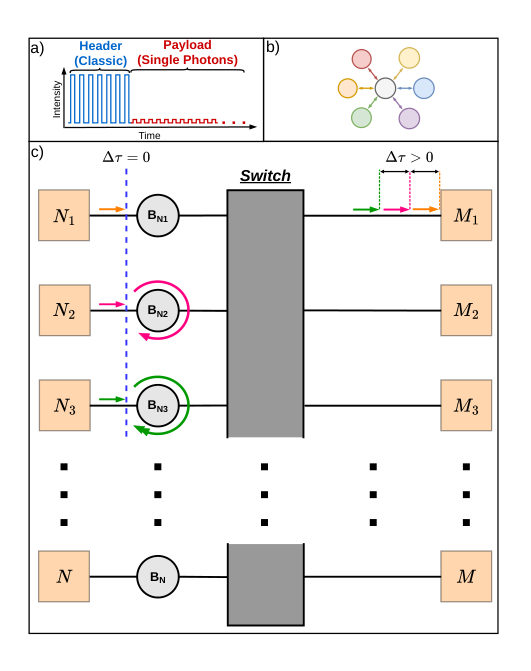
<figcaption class="paper-figure-caption"><b>Fig 1.</b> Figure 1. Quantum network packet switching. a) Packet structure consisting of a header containing classical informa- tion and a payload consisting of quantum states. b) A star network configuration, with multiple users connected through a central switching node. c) N users are connected to M users in a star configuration, where the central node has buffering and switching functionality. Packets can be sent from any of the N to the M users at will. As an example, if packets from users N1, N2 and N3, which are all addressed to the same end user (M1), arrive simultaneously at the central node, then the packets will collide in the outgoing communication channel to M1. Buffering is therefore...</figcaption>
</figure>
<figure class="paper-figure-card">
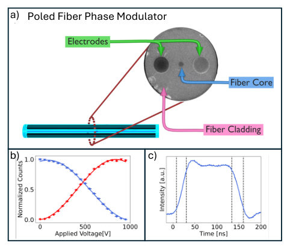
<figcaption class="paper-figure-caption"><b>Fig 2.</b> Figure 2. Poled fibre modulator. a) The cross-section of the poled fibre phase modulator is shown, imaged using a Vytran glass processor. b) Interference curves at the two outputs of a fibre-optical Sagnac interferometer driven by the poled fibre phase modulator. The outputs are measured with the two single-photon detectors. The interferometer is the same one employed in our experiment, please see in the next sec- tion for details. The error bars represent the standard devi- ation assuming a Poissonian photon number distribution. c) Time domain response from a driving pulse applied to the poled modulator within the Sagnac interferometer. In this measurement, the classical optical output is...</figcaption>
</figure>
<figure class="paper-figure-card">
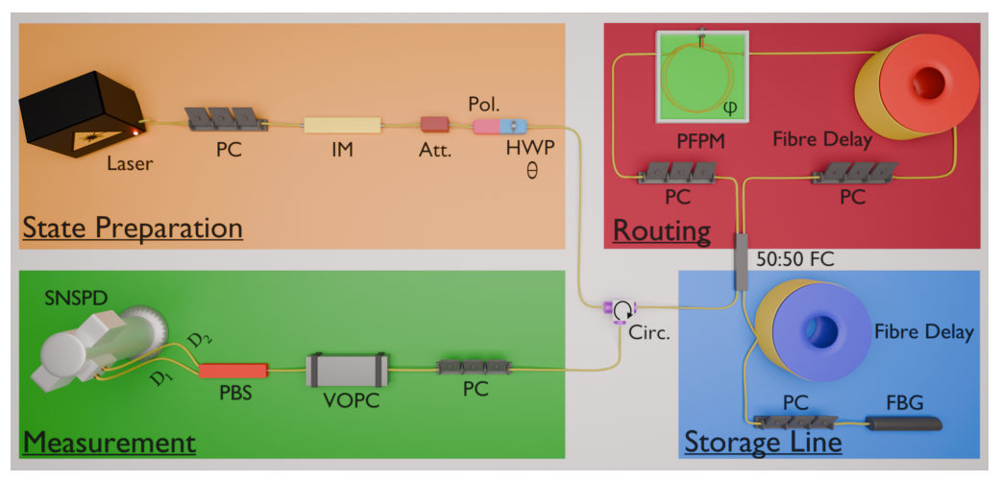
<figcaption class="paper-figure-caption"><b>Fig 3.</b> Figure 3. All-fibre quantum packet buffer implementation. We prepare weak coherent polarisation encoded qubits in the state preparation stage. A fibre coupler is employed at the output of this stage, and connected to a superconducting nanowire single-photon detector (SNSPD) for photon number calibration purposes. Then an optical circulator leads to the routing stage consisting of a Sagnac interferometer with the poled fibre phase modulator used to control whether a relative ϕ = 0 or ϕ = π phase shift is applied onto the packets, thus causing it to be routed to the storage line or to exit the loop back through the circulator. A fibre delay is employed in the Sagnac loop to ensure the phase...</figcaption>
</figure>
<figure class="paper-figure-card">
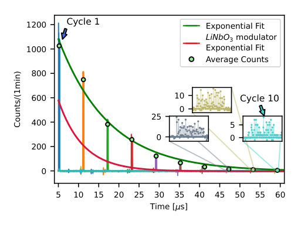
<figcaption class="paper-figure-caption"><b>Fig 4.</b> Figure 4. Buffer efficiency. A payload of 16 weak coherent states (WCSs) is stored in the buffer, and subsequently re- trieved. We employ 0.1 photons per state on average (1.6 photons per payload) on the input of the buffer, to demon- strate storage for typical weak coherent state amplitudes in practical applications. The different curves corresponding up to ten storage cycles are obtained individually for each delay of the retrieval high voltage pulse, and acquired with a time tagger. They are then all plotted superposed on the figure. The green data points represent the average detected single- photon counts for all the 16 WCSs for that particular storage loop, and the green curve is an...</figcaption>
</figure>
<figure class="paper-figure-card">
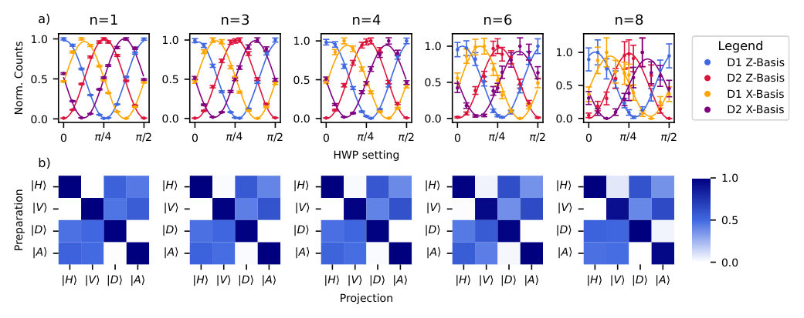
<figcaption class="paper-figure-caption"><b>Fig 5.</b> Figure 5. Quantum information storage. a) Normalised single-photon detection following the projective polarisation measure- ment in the measurement stage for different storage times, up to a maximum n = 8 corresponding to 47 µs. It is carried out as a function of the input half-wave plate angle (θ) in the superposition |ψinput⟩= cos(2θ)|H⟩+ sin(2θ)|V ⟩. For each storage cycle we project the state |ψinput⟩over the two mutually unbiased bases used in BB84 QKD, the computational (Z) and the logical (X) bases. The integration time for each data point is 30 secs. Error bars come from the assumption that each detection event is governed by Poissonian statistics. b) We show the corresponding...</figcaption>
</figure>

**Summary.** The paper presents an experimental demonstration of an optical-fibre integrated buffer designed for packet-switched quantum networks. By utilizing a poled fibre phase modulator within a recirculating loop, the system can store and retrieve polarization-encoded qubits while simultaneously reading out classical packet headers. This achievement establishes a practical, telecom-compatible architecture crucial for deploying the quantum internet.

**Why it may be interesting.** This work directly addresses hardware limitations in quantum networking by providing a robust, low-loss, fibre-integrated component necessary for scaling beyond simple point-to-point links.

Detailed structure

**Main problem.** Developing a fully fibre-integrated buffer for packet-switched quantum networks that can delay qubit payloads while allowing real-time readout of classical packet headers.

**Main result.** The authors demonstrated a practical, all-fibre architecture capable of storing and retrieving polarization-encoded qubits with storage times up to 47 $\mu$s and an average QBER of 1.8%.

**Method.** The system uses a recirculating loop incorporating an ultra-low-loss poled fibre phase modulator (PFPM) within a Sagnac interferometer setup.

**Model / system.** The physical platform is an optical-fibre integrated buffer utilizing a recirculating resonator circuit. The key component enabling the functionality is the PFPM, which provides fast, polarization-insensitive switching directly in the fiber.

**Key observables.** Storage time (up to 47 $\mu$s), average quantum bit error rate (1.8%), and successful simultaneous header/payload processing.

**Important parameters / regimes.** Qubit encoding (polarization), operational stability over several hours, and the required phase shift ($\phi=0$ or $\pi$) controlled by an electric field.

**Assumptions / limitations.** The primary assumption is that using in-fibre components overcomes limitations associated with bulk optics and high insertion losses of previous approaches.

**Figures summary.** Figure 1 illustrates quantum network packet switching requiring buffering. Figure 2 details the poled fibre modulator's cross-section, interference curves, and time domain response.

**Paper structure.** The paper introduces the need for integrated quantum buffers, presents the physical realization using a recirculating loop and PFPM, demonstrates the storage/retrieval process with polarization encoding, and concludes by establishing its viability for telecom integration.

Abstract

Packet-switched quantum networks require buffers that can delay qubit payloads while routing information is read out in real time. Previous approaches have not provided this functionality in a fully fibre-integrated architecture compatible with telecom infrastructure. Here we demonstrate an optical-fibre-integrated buffer, based on a recirculating loop and a fibre storage line, in which the storage time of a polarisation-encoded qubit payload is determined by readout of an attached packet header. The key component behind this achievement is an ultra-low-loss poled fibre phase modulator, which provides fast, polarisation-insensitive switching directly in fibre and allows header and payload to be processed within the buffer. We demonstrate storage and retrieval of polarisation-encoded qubit payloads for storage times up to 47 $μ$s, with an average quantum bit error rate of 1.8% together with stable operation over several hours. These results establish a practical fibre-based architecture for packet-level quantum network buffering that can easily integrate into the current telecommunication infrastructure opening up new paths for deployment of the quantum internet.

[↑ back to top](#top)

### [Complex field-induced magnetic phases and anisotropic magnetotransport in off-stoichiometric CeCuBi2](http://arxiv.org/abs/2608.04946v1)

**Authors:** Vikas Chahar, Shivam Rathod, Sneh, Lipika, Shobha Singh, Balwant Singh Chauhan, Subhadeep Bej, Weida Yin, Yin-Chen Huang, Rie Y. Umetsu, Ratnamala Chatterjee, Kaustuv Manna  
**Type:** experiment · **Category:** strongly correlated electrons · **PDF:** <https://arxiv.org/pdf/2608.04946v1>  
**Analysis basis:** full PDF text, analyzed in chunks
**Topic relevance:** 🔥 `Kondo & dissipative impurity` **4/5** · `analog quantum simulation` **1/5** · `exotic spin models in light-matter` **1/5** · `spintronics-quantum-optics interface` **1/5**

↔ Scroll figures horizontally

<figure class="paper-figure-card">
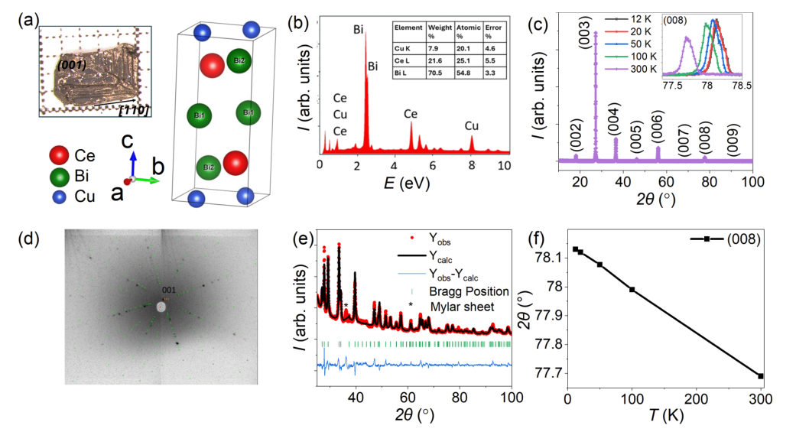
<figcaption class="paper-figure-caption"><b>Fig 1.</b> FIG. 1. (a) Optical image of the CeCuBios 2 single crystal, tetragonal unit-cell structure of CeCuBios 2 , where Bi occupy two lattice sites Bi1 and Bi2. (b) EDS spectra collected at one region of the crystal. (c) XRD pattern of CeCuBios 2 crystal surface indexed with (00l) tetragonal basal planes. Inset shows an enlarged view of the (008) XRD peak of the CeCuBios 2 single crystal measured at different temperatures. (d) Refined Laue diffraction with (001) plane of the crystal. (e) Rietveld refinement of the powder X-ray diffraction data of CeCuBios 2 . Peaks marked with (*) in the XRD pattern arise from the mylar sheet used to prevent powder oxidation. The red curve represents the observed...</figcaption>
</figure>
<figure class="paper-figure-card">
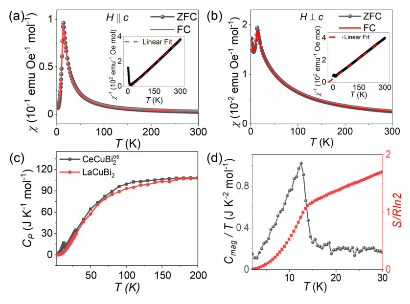
<figcaption class="paper-figure-caption"><b>Fig 2.</b> FIG. 2. Temperature dependence of the zero-field-cooled (ZFC) and field-cooled (FC) DC magnetic susceptibility measured under an applied magnetic field of 100 Oe for (a) H ∥[001] (χ∥) and (b) H ∥[110] (χ⊥). Insets show the Curie–Weiss fitting of the inverse susceptibilities 1/χ∥and 1/χ⊥in the high-temperature paramagnetic region. (c) Temperature dependence of the specific heat CP for CeCuBios 2 and the diamagnetic reference compound LaCuBi2. (d) Temperature dependence of the magnetic specific heat Cmag/T and magnetic entropy S/R ln 2 for CeCuBios 2 .</figcaption>
</figure>
<figure class="paper-figure-card">
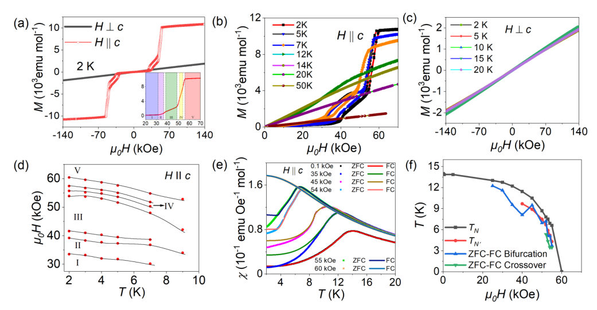
<figcaption class="paper-figure-caption"><b>Fig 3.</b> FIG. 3. (a) Field dependence of magnetization at 2 K for magnetic fields applied parallel and perpendicular to the c-axis. The inset highlights several field-induced magnetic phases and the multi-step evolution of magnetization. (b), (c) Magnetization curves measured at different temperatures for H ∥c and H ⊥c, respectively. (d) Evolution of the metamagnetic transitions regions I −V with temperature, calculated from field derivative of magnetization dM/dH. (e) Temperature dependence of zero-field-cooled (ZFC) and field-cooled (FC) magnetic susceptibility measured for H ∥c under different magnetic fields. (f) Magnetic field–temperature (H-T) phase diagram showing the evolution of TN, second...</figcaption>
</figure>
<figure class="paper-figure-card">
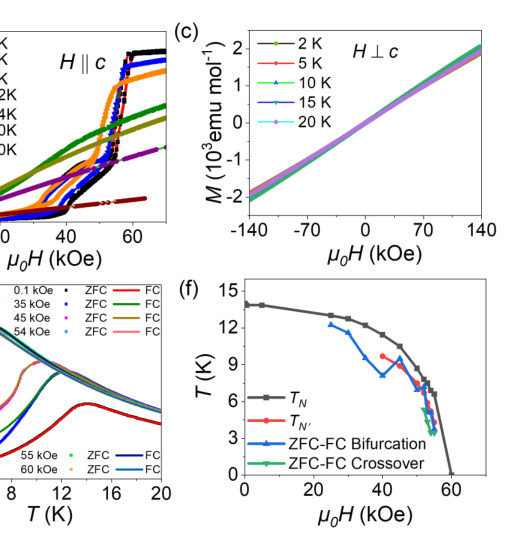
<figcaption class="paper-figure-caption"><b>Fig 4.</b> Figure 3 (e) shows the temperature dependent ZFC and FC magnetic susceptibility measured with the mag- netic field applied parallel to the c-axis. With increasing magnetic field strength, TN gradually shifts toward lower temperatures, indicating suppression of the long-range antiferromagnetic order. In addition, a second anomaly TN′ emerges in the field range 44–57 kOe , suggesting the stabilization of an additional field-induced magnetic phase or a reconstruction of the spin configuration in the vicinity of the metamagnetic transition [12, 25, 26]. The field and temperature evolution of TN and TN′ is sum- marized in the H-T phase diagram shown in Fig. 3 (f). At low magnetic fields (µ0H &lt;...</figcaption>
</figure>
<figure class="paper-figure-card">
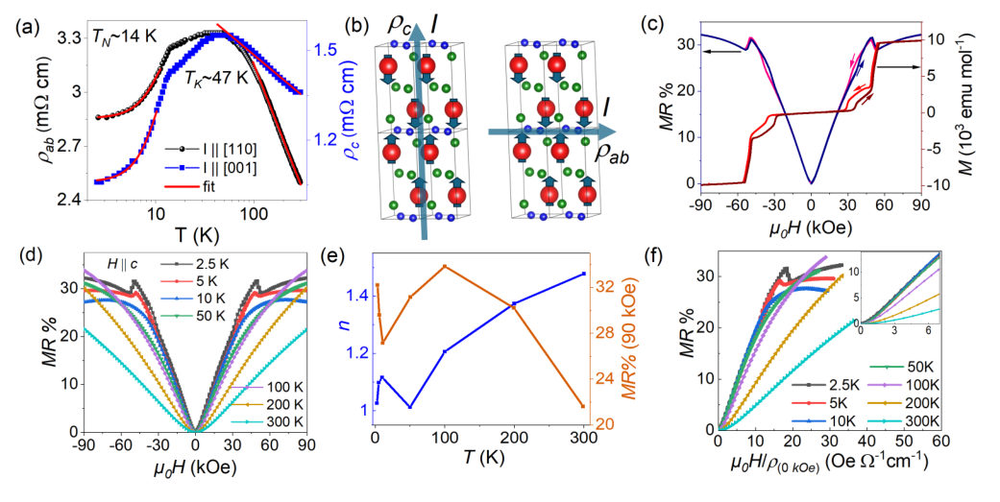
<figcaption class="paper-figure-caption"><b>Fig 5.</b> FIG. 4. (a) Temperature dependence of longitudinal resistivity measured for current I applied along the ab plane ([110]) ρab and along c-axis ([001]) ρc. The low-temperature resistivity data (T≤10 K), fitted using Eq. (1), resistivity has a maximum around T≈47 K. Above, T≈47 K, the resistivity follows a -cln(T) dependence shown with linear red lines. (b) Schematic illustration of anisotropic scattering originating from crystallographic and magnetic anisotropy. The crystallographic anisotropy, determined by the orientation of Ce magnetic moments with respect to the current flow direction in the ab plane ([110]) and along the c-axis, can give rise to distinct high- and low-resistance states...</figcaption>
</figure>

**Summary.** This work presents comprehensive experimental data on off-stoichiometric CeCuBi2, revealing it to be an anisotropic Kondo antiferromagnet. The research demonstrates that the interplay between magnetic anisotropy and Kondo correlations leads to complex, field-tunable spin phases, which manifest as large, highly anisotropic magnetotransport responses.

**Why it may be interesting.** The co-existence of Kondo physics, strong magnetic anisotropy, and field-induced glassy behavior in a single material platform makes it highly relevant for understanding strongly correlated quantum materials where external fields can tune ground states.

Detailed structure

**Main problem.** The study investigates the complex interplay between field-induced magnetic phases, strong magnetic anisotropy, and anisotropic magnetotransport in off-stoichiometric CeCuBi2.

**Main result.** The material exhibits coexistence of Kondo correlations, long-range antiferromagnetism, and field-tunable spin configurations, leading to large room-temperature magnetoresistance and evidence of glassy spin dynamics.

**Method.** A combination of structural characterization (XRD), magnetic measurements ($\chi$, $C_P$, $	ext{M}(H)$), and angle-dependent magnetotransport measurements were employed.

**Model / system.** The physical system is off-stoichiometric CeCuBi2 single crystals, which are modeled as an anisotropic Kondo antiferromagnet where the electronic behavior is governed by the interplay of CEF effects, RKKY exchange, and Kondo interactions.

**Key observables.** Antiferromagnetic ordering ($T_N \sim 14	ext{ K}$), weak heavy-fermion signature ($\gamma = 102$), multiple metamagnetic transitions, large magnetoresistance ($\sim 22\%$), and anisotropic magnetoresistance ($	ext{AMR} \sim 10.9\%$).

**Important parameters / regimes.** Temperature (especially $T_N$ and $\sim 47	ext{ K}$), magnetic field strength ($H$) up to $9	ext{ T}$, and crystal orientation relative to the applied field.

**Assumptions / limitations.** The off-stoichiometry, particularly Cu vacancies, is assumed to tune the local electronic environment and mediate complex exchange interactions.

**Figures summary.** Figures confirm single-crystallinity along the c-axis via XRD/Laue patterns; magnetic measurements show $	ext{ZFC}/	ext{FC}$ behavior confirming AFM ordering and field-induced metamagnetism; transport data quantify anisotropy in resistance and magnetoresistance.

**Paper structure.** The paper proceeds by first characterizing the crystal structure and stoichiometry, followed by detailed analysis of magnetic properties (susceptibility, specific heat, $	ext{M}(H)$) to establish AFM order and heavy-fermion nature. It then focuses on magnetotransport measurements to link the complex spin states to measurable electronic transport anomalies.

Abstract

We report a detailed study on the structural, angle-dependent magnetic and magnetotransport properties of highly anisotropic off-stoichiometric CeCuBi2 single crystals. Our results reveal CeCuBi2 as an anisotropic Kondo antiferromagnet exhibiting complex field-induced magnetic behavior and unusual magnetotransport properties. Magnetic susceptibility and specific heat measurements reveal antiferromagnetic (AFM) ordering below TN = 14 K with strong anisotropy and weak heavy-fermion behavior. Electrical transport measurements show highly anisotropic resistivity and a broad hump around 47 K, indicative of Kondo-driven heavy-fermion behavior. Magnetization measurements reveal multiple field-induced metamagnetic phases, while AC susceptibility measurements indicate slow spin dynamics and spin-glass-like behavior in intermediate field-induced magnetic states. Furthermore, we observe large and strongly anisotropic magneto transport responses, including room-temperature magnetoresistance of approximately 22% at 300 K and 9 T and butterfly-like anisotropic magnetoresistance with AMR values reaching approximately 10.9%. These results highlight a strong interplay among Kondo correlations, magnetic anisotropy, and field-tunable spin configurations, making CeCuBi2 a possible platform for exploring correlated and anisotropic quantum phenomena.

[↑ back to top](#top)

### [Motional refocusing for trap-off Rydberg gates](http://arxiv.org/abs/2608.04812v1)

**Authors:** Yoav Sagi, Ofer Firstenberg, Nir Davidson, Guy Raz  
**Type:** theory · **Category:** other · **PDF:** <https://arxiv.org/pdf/2608.04812v1>  
**Analysis basis:** full PDF text, analyzed in chunks
**Topic relevance:** 🔥 `Rydberg arrays` **4/5** · `QC/QI experiment` **1/5** · `methods for driven-dissipative` **1/5** · `non-equilibrium dynamics` **1/5**

↔ Scroll figures horizontally

<figure class="paper-figure-card">
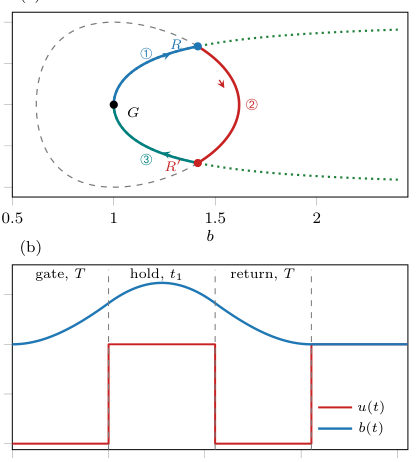
<figcaption class="paper-figure-caption"><b>Fig 1.</b> FIG. 1. The echo protocol in the Ermakov phase plane (shown for ωT = 1). (a) The free-flight invariant curve ε0 = 1 2 (green dotted) passes through both the tar- get G = (1, 0) and the release point R, Eq. (6), on opposite (expanding/contracting) branches. With the trap on at nom- inal depth, G is the center of the phase portrait and the closed orbit through R (gray dashed) re-crosses the invariant curve exactly at the conjugate point R′ = (bT , −˙bT ). The protocol therefore consists of the gate flight ➀, a hold ➁of duration t1 [Eq. (11)] that transfers R →R′, and a return flight ➂ of duration exactly T that coasts into G, where the trap is switched on permanently. (b) Control u(t) and...</figcaption>
</figure>
<figure class="paper-figure-card">
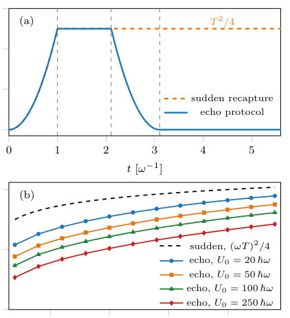
<figcaption class="paper-figure-caption"><b>Fig 2.</b> FIG. 2. Wave-packet numerical validation. (a) Mo- tional excitation ⟨n⟩(t) = ⟨H0⟩/ℏω −1</figcaption>
</figure>
<figure class="paper-figure-card">
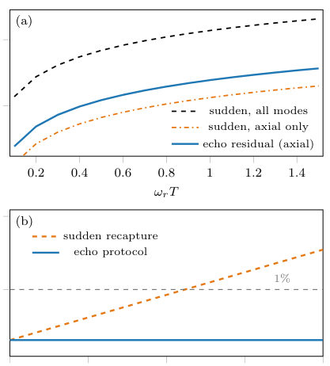
<figcaption class="paper-figure-caption"><b>Fig 3.</b> FIG. 3. Heating suppression and Doppler-error con- trol over a circuit. (a) Motional heating energy per release– recapture cycle, in units of ℏωz, versus the dark time T, for a cylindrically symmetric tweezer with η = ωr/ωz = 3.75 and a single global intensity control timed on the radial frequency. The echo removes the radial heating exactly in the harmonic model; the remaining axial residual (blue) lies a factor ≈30 below the total sudden-recapture heating (black dashed). (b) Motional Doppler error proxy ϵD =  keffσvτR 2/2 versus gate number for the cesium parameters of Table I, assuming com- plete phase randomization of the breathing excitation be- tween gates; gate number k counts...</figcaption>
</figure>
<figure class="paper-figure-card">
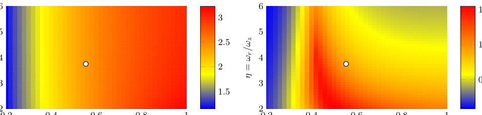
<figcaption class="paper-figure-caption"><b>Fig 4.</b> FIG. 4. Continuation of the exact radial–axial Λ = 2 palindrome. The left panel gives the post-gate recovery time of the positive branch. The right panel gives the smallest singular value of the timing Jacobian (24). A vanishing value would indicate a fold or loss of local uniqueness. The branch remains positive and regular over the displayed gate-time and aspect-ratio range. The white circle marks the operating point used throughout the paper, x = ωrT = 0.5529 and η = ωr/ωz = 3.75, corresponding to the cesium Rydberg-gate example of Sec. V.</figcaption>
</figure>
<figure class="paper-figure-card">
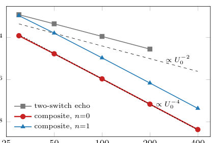
<figcaption class="paper-figure-caption"><b>Fig 5.</b> FIG. 5. Suppression of anharmonic heating by the composite echo. Heating per cycle versus the depth U0 of the full Gaussian trapping potential at ωT = 0.5529, ob- tained by direct wave-function propagation. For each value of U0, the initial states are eigenstates of the corresponding static Gaussian trap, rather than eigenstates of its harmonic approximation. The ‘two-switch echo’ and the ‘composite, n = 0’ calculations start from the Gaussian-trap ground state, while the ‘composite, n = 1’ calculation starts from its first excited eigenstate. The composite sequence of Eqs. (31)– (33) cancels the complete first-order quartic transition ampli- tude and changes the residual heating law from...</figcaption>
</figure>

**Summary.** The paper presents a novel motional refocusing protocol that eliminates heating during the release-and-recapture cycle inherent to Rydberg gates. By precisely controlling the trapping light intensity, the authors restore the atomic motion to its initial state, enabling deeper and more reliable quantum circuits in optical tweezers.

**Why it may be interesting.** This work provides a highly practical, theoretically rigorous method (intensity modulation) to overcome fundamental decoherence/heating limits in neutral atom quantum computing architectures.

Detailed structure

**Main problem.** Rydberg entangling gates suffer from motional heating due to the release-and-recapture cycle when trapping light is switched off, limiting circuit depth.

**Main result.** A motional refocusing protocol using only programmable trap intensity switching can exactly remove this heating in the harmonic approximation and suppress leading anharmonic corrections.

**Method.** The authors developed a time-optimal control sequence by promoting classical phase-space refocusing conditions to an exact quantum statement, analyzed via the Ermakov equation.

**Model / system.** The system involves neutral atoms trapped in optical tweezers executing Rydberg blockade gates. The dynamics are modeled using a three-dimensional harmonic potential whose evolution is governed by programmable trap intensity switching.

**Key observables.** Motional populations and coherences, heating ($\Deltaar{n}_{	ext{sud}}$), recapture probability ($P_{1d}(t)$).

**Important parameters / regimes.** Trap frequencies ($\omega_i$), catch depth ($\Lambda$), gate duration ($T$), anharmonicity strength.

**Assumptions / limitations.** Initial analysis assumes the harmonic approximation; later extensions consider finite ramps and anharmonic corrections.

**Figures summary.** Figures illustrate phase-space dynamics (echo protocol) and show 1D recapture probabilities comparing quantum vs. classical predictions at various temperatures.

**Paper structure.** The paper first develops the refocusing protocol in the harmonic approximation, proving its time-optimality. It then extends this theory to multiple modes and incorporates anharmonic corrections by deriving composite sequences. Finally, wave-packet simulations validate the analytic results for realistic Gaussian tweezers.

Abstract

Rydberg entangling gates in optical-tweezer arrays are commonly executed with the trapping light switched off, so every gate contains a release--and--recapture cycle that heats the atomic motion and can ultimately limit circuit depth. We develop a motional refocusing protocol that exactly removes this heating in the harmonic approximation using only programmable intensity switching of the trapping light. The protocol closes the release--and--recapture cycle for every matched harmonic mode, returning arbitrary motional populations and coherences exactly up to ordinary evolution under the static trap. We derive the recovery sequence in closed form for arbitrary catch depth and prove that, within the experimentally relevant regime, it is the unique globally time-optimal solution under bounded trap intensity. The harmonic theory is then extended in two directions. First, we construct exact common-intensity recovery sequences that simultaneously refocus several nondegenerate harmonic modes, including radial--axial and fully anisotropic three-dimensional traps. Second, we derive a composite sequence that suppresses the leading anharmonic correction of weakly anharmonic traps by canceling all first-order motional transitions induced by the quartic anharmonicity, changing the residual heating law from $U_0^{-2}$ to $U_0^{-4}$. Wave-packet simulations in realistic Gaussian tweezers validate the analytic theory and quantify the residual effects of anharmonicity, finite switching ramps, trap ellipticity, and control errors. Applied to representative cesium Rydberg gates, the protocol suppresses the dominant recapture heating to the anharmonic floor and prevents the associated motional Doppler contribution from increasing with circuit depth. The resulting framework provides a practical route toward heating-free trap-off neutral-atom gates using only trap-intensity modulation.

[↑ back to top](#top)

### [Quantum Many-Body Metrology of Rotation Sensing with Strong Interactions](http://arxiv.org/abs/2608.04082v1)

**Authors:** Yong-Jun Baak, Uwe R. Fischer  
**Type:** theory · **Category:** quantum gases · **PDF:** <https://arxiv.org/pdf/2608.04082v1>  
**Analysis basis:** full PDF text, analyzed in chunks
**Topic relevance:** 🔥 `analog quantum simulation` **4/5** · `entanglement & information structure` **2/5** · `non-equilibrium dynamics` **1/5**

↔ Scroll figures horizontally

<figure class="paper-figure-card">
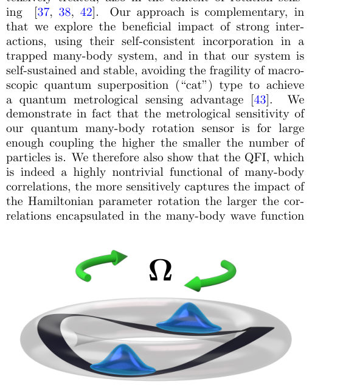
<figcaption class="paper-figure-caption"><b>Fig 1.</b> FIG. 1. Illustration of the rotation sensing setup. The interacting bosons are placed in a strongly confining ring trap, on which an azimuthal two-site optical lattice poten- tial V (θ) = V0 cos2 θ, breaking azimuthal invariance, is super- imposed (black), leading to localization of the single-particle density (blue) for large V0.</figcaption>
</figure>
<figure class="paper-figure-card">
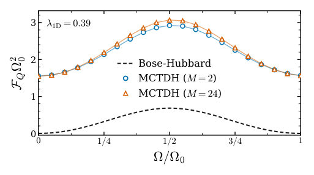
<figcaption class="paper-figure-caption"><b>Fig 2.</b> FIG. 2. The QFI for N = 2 bosons with coupling λ1D = 0.39 and V0/Er = 8. Dashed line is the BH result with fixed Wannier orbitals. Scattered points show MCTDH calculation results for M = 2 (circles) and M = 24 (triangles) orbitals. Lines are guides to the eye.</figcaption>
</figure>
<figure class="paper-figure-card">
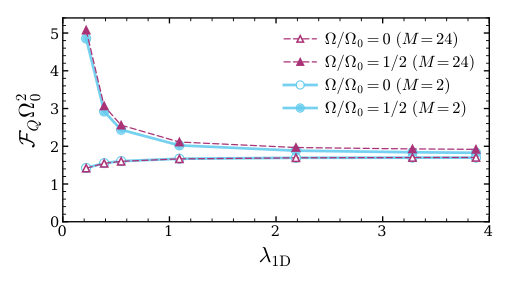
<figcaption class="paper-figure-caption"><b>Fig 3.</b> FIG. 3. Convergence of QFI for large coupling, for Ω= 0 (from below) and Ω0/2 (from above), with M = 2 and 24 self-consistently computed orbitals (N = 2).</figcaption>
</figure>
<figure class="paper-figure-card">
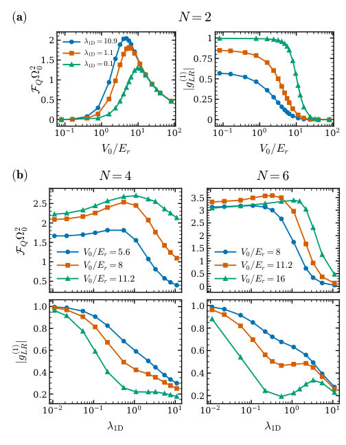
<figcaption class="paper-figure-caption"><b>Fig 4.</b> FIG. 4. (a) Left panel: Lattice-depth dependence of the QFI at Ω= 0 for N = 2 interacting bosons. Right panel: Normalized one-body Glauber correlation function g(1) LR = g(1)(θ = π/2, θ′ = 3π/2) between the two azimuthal lattice sites. M = 8 orbitals were used for the self-consistent cal- culation. (b) Interaction-strength dependence of the QFI at Ω= 0 for N = 4 (left column) and N = 6 (right column) bosons. M = 12 (M = 18) orbitals were used for N = 4 (N = 6) to reach convergence.</figcaption>
</figure>
<figure class="paper-figure-card">
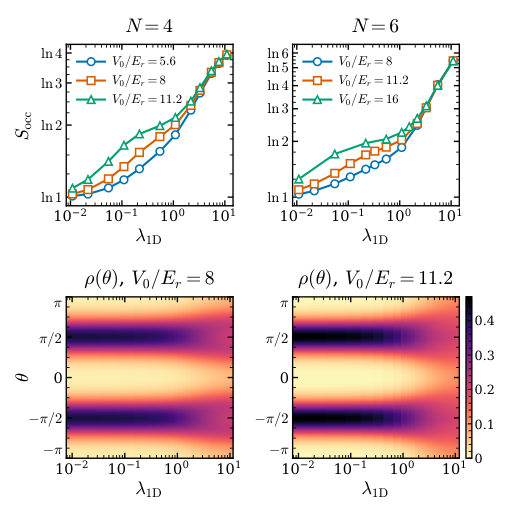
<figcaption class="paper-figure-caption"><b>Fig 5.</b> FIG. 5. First row: Occupation entropy (16) as a function of coupling λ1D. The normalized one-body density ρ(θ) along the azimuthal direction is displayed in the second row for V0/Er = 8 (N = 4) and V0/Er = 11.2 (N = 6). M = 12 (M = 18) orbitals were used for N = 4 (N = 6).</figcaption>
</figure>

**Summary.** This paper investigates enhancing rotation sensing sensitivity using strongly interacting bosons trapped in a quasi-1D ring. By employing advanced MCTDH calculations, the authors demonstrate that strong interactions beneficially increase the Quantum Fisher Information (QFI) at zero rotation rate, significantly outperforming simpler mean-field approximations.

**Why it may be interesting.** This work directly addresses how strong quantum correlations can be harnessed in ultracold atomic systems to surpass classical or simple mean-field limits in precision sensing applications like gyroscopes.

Detailed structure

**Main problem.** The study focuses on determining the ultimate quantum limit for rotation sensing using strongly interacting bosonic systems.

**Main result.** Self-consistent many-body calculations show that strong interactions can enhance the Quantum Fisher Information (QFI) at zero rotation rate, contrary to mean-field predictions.

**Method.** The authors employ a fully self-consistent approach utilizing the Multi-Configurational Time-Dependent Hartree (MCTDH) method to compute the QFI of the full many-body eigenstates.

**Model / system.** The system consists of strongly interacting bosons confined in a quasi-one-dimensional ring trap with two weak links. The dynamics are governed by a Hamiltonian incorporating interaction terms and an angular momentum term related to rotation.

**Key observables.** Quantum Fisher Information (QFI), which sets the ultimate precision limit for estimating the rotation rate ($\Omega$).

**Important parameters / regimes.** Interaction coupling strength ($\lambda_{1D}$ or $\gamma$), particle number ($N$), and the ratio of interaction to kinetic energy.

**Assumptions / limitations.** The analysis relies on comparing the full MCTDH solution against simpler approximations like the two-mode Bose-Hubbard model, which is shown to be insufficient for accurate metrology predictions.

**Figures summary.** Figures compare QFI results between the full MCTDH method and the simplified Bose-Hubbard model across varying interaction strengths and particle numbers. One figure shows the dependence of QFI on lattice depth.

**Paper structure.** The paper establishes the physical setup (interacting bosons in a ring trap) and the metrological goal (maximizing QFI). It then develops the theoretical framework using MCTDH, contrasting its results against simpler mean-field models to demonstrate the non-trivial enhancement provided by strong correlations.

Abstract

We study the ultimate quantum limit of rotation sensing with a few strongly interacting bosons confined in a quasi-one-dimensional ring trap with two weak links. It is demonstrated that a self-consistent many-body solution of the problem is required to correctly predict the ultimate sensitivity of this strongly correlated many-body gyroscope to rotation. For both small rotation velocities and small particle numbers, the many-body quantum Fisher information becomes maximal for large interaction couplings, showing the potential of strongly interacting miniaturized many-body sensors to precisely estimate slow rotations with high spatial resolution.

[↑ back to top](#top)

### [Complementary Quantum Correlations Are Universal for Qubits](http://arxiv.org/abs/2608.04916v1)

**Authors:** Jinbo Wang, Qihang Wang, Kun Chen  
**Type:** theory · **Category:** quantum information and computing · **PDF:** <https://arxiv.org/pdf/2608.04916v1>  
**Analysis basis:** full PDF text, analyzed in chunks
**Topic relevance:** 🔥 `entanglement & information structure` **4/5** · `quantum measurements` **2/5**

↔ Scroll figures horizontally

<figure class="paper-figure-card">
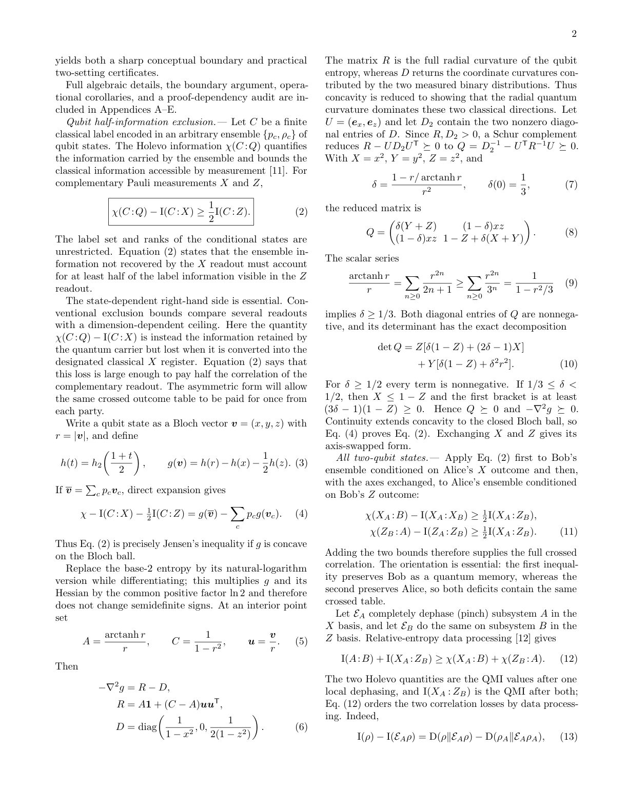
<figcaption class="paper-figure-caption"><b>Fig 1.</b> Low-resolution page preview, page 2</figcaption>
</figure>
<figure class="paper-figure-card">
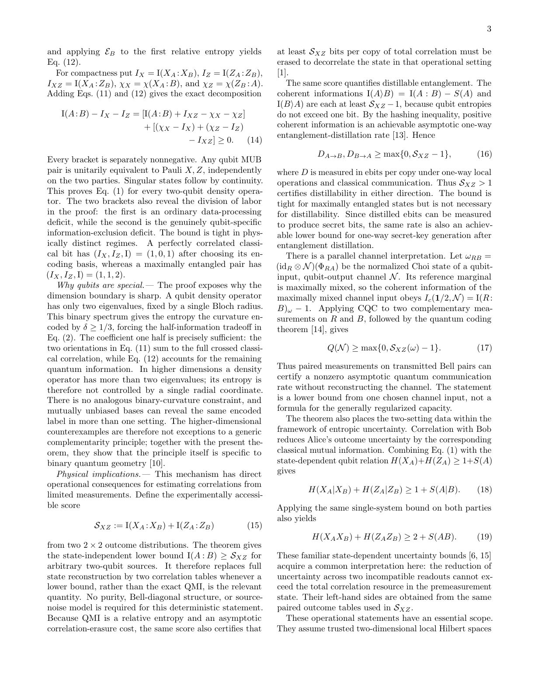
<figcaption class="paper-figure-caption"><b>Fig 2.</b> Low-resolution page preview, page 3</figcaption>
</figure>
<figure class="paper-figure-card">
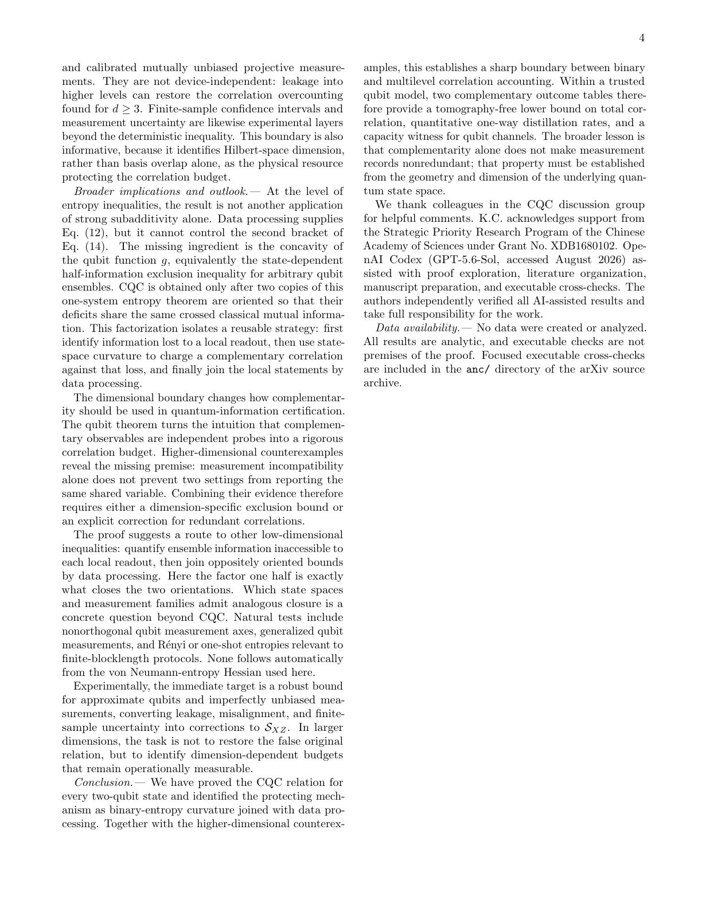
<figcaption class="paper-figure-caption"><b>Fig 3.</b> Low-resolution page preview, page 4</figcaption>
</figure>
<figure class="paper-figure-card">
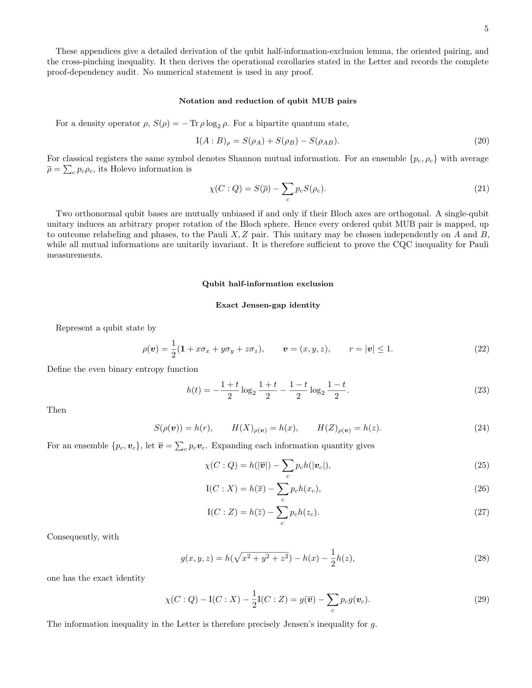
<figcaption class="paper-figure-caption"><b>Fig 4.</b> Low-resolution page preview, page 5</figcaption>
</figure>
<figure class="paper-figure-card">
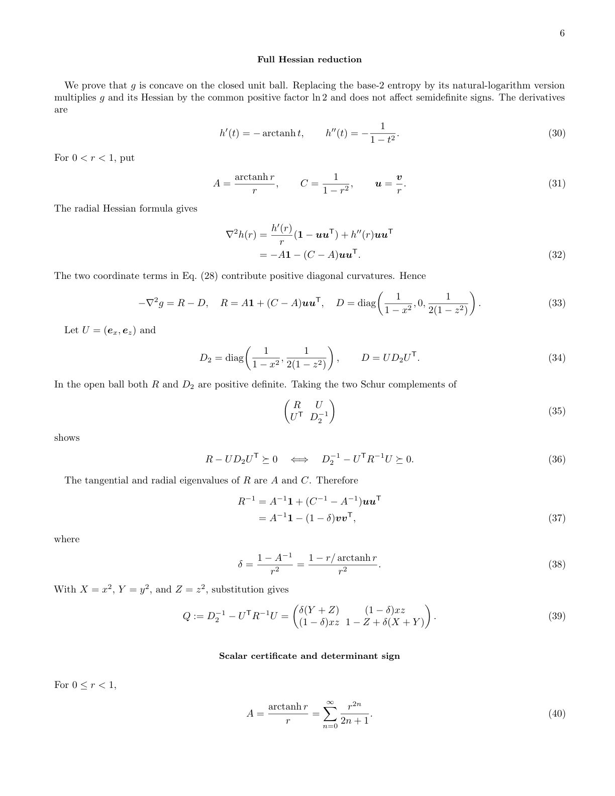
<figcaption class="paper-figure-caption"><b>Fig 5.</b> Low-resolution page preview, page 6</figcaption>
</figure>

**Summary.** This theoretical work establishes a novel lower bound on total quantum correlation for two-qubit systems by summing classical correlations measured in complementary bases. It proves this relationship holds due to unique geometric properties of qubits (binary entropy curvature). This has direct operational consequences, providing a tomography-free way to estimate entanglement and quantify the capacity of quantum channels.

**Why it may be interesting.** It provides a powerful, experimentally accessible diagnostic tool ($S_{XZ}$) that bypasses the need for full state tomography to quantify fundamental resources like entanglement and mutual information in qubit systems.

Detailed structure

**Main problem.** The core problem is establishing a rigorous, state-independent lower bound for the total quantum correlation (Quantum Mutual Information) when experiments can only measure correlations from limited, complementary measurement settings.

**Main result.** For two qubits, the sum of classical mutual informations measured in two complementary local bases provides a universal lower bound on the total quantum correlation, $I(A:B) \ge I(X_A:X_B) + I(Z_A:Z_B)$.

**Method.** The proof relies on analyzing the geometry of the Bloch ball using binary-entropy curvature and applying advanced information theory tools like relative-entropy data processing bounds.

**Model / system.** The analysis focuses exclusively on two-qubit quantum states ($
ho_{AB}$) and their correlations measured via Pauli bases (X, Z). The result is highly dependent on the dimensionality being exactly two.

**Key observables.** Quantum Mutual Information ($I(A:B)$), Classical Mutual Information from measurements ($I(X_A:X_B)$, $I(Z_A:Z_B)$), and the derived lower bound $S_{XZ}$.

**Important parameters / regimes.** The dimensionality of the system (must be qubits, $d=2$), and the specific choice of complementary bases (e.g., X and Z).

**Assumptions / limitations.** The result is strictly valid for two-qubit systems; in higher dimensions ($d \ge 3$), complementary measurements can lead to overcounting.

**Paper structure.** The paper establishes the physical problem, derives the mathematical inequality using entropy curvature arguments on the Bloch ball, and then applies this bound to operational tasks like certifying entanglement or bounding quantum channel capacity.

Abstract

Extracting total correlations from a quantum system usually requires reconstructing its state, whereas many experiments access only a few measurement settings. A possible shortcut is to add the mutual informations obtained from complementary measurements; in dimensions above two, however, this procedure can count the same classical correlation twice. We establish that qubits are protected from such overcounting. For every two-qubit state, the correlations observed in two complementary local bases are bounded by the premeasurement quantum mutual information. The proof traces this protection to binary-entropy curvature on the Bloch ball and combines a qubit information-exclusion tradeoff with data processing under local dephasing. Consequently, two correlation tables give a tomography-free lower bound on total correlation. A score above one bit also certifies a quantitative one-way entanglement-distillation rate; when applied to the Choi state of a qubit channel, the same data lower bound its quantum capacity. The theorem therefore identifies both an operational use of complementarity and the trusted two-dimensional setting in which its correlation accounting is valid.

[↑ back to top](#top)

### [Sharp Continuity of Petz and Sandwiched Rényi Conditional Entropies](http://arxiv.org/abs/2608.04947v1)

**Authors:** Hao-Chung Cheng, Po-Chieh Liu  
**Type:** theory · **Category:** quantum information and computing · **PDF:** <https://arxiv.org/pdf/2608.04947v1>  
**Analysis basis:** full PDF text, analyzed in chunks
**Topic relevance:** 🔥 `entanglement & information structure` **4/5**

↔ Scroll figures horizontally

<figure class="paper-figure-card">
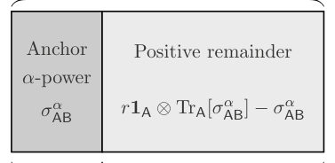
<figcaption class="paper-figure-caption"><b>Fig 1.</b> Figure 1. Schematic correspondence between the isotropic equality model and the arbitrary-anchor construction. Here, PB0 denotes the projection onto the r-dimensional subspace of B. In both panels, the darker positive operator and its lighter complement have partial traces (tracing out system A) proportional to the same operator on B, with proportionality factors 1 and D −1. In panel (A) the two summands have orthogonal supports, whereas in panel (B) they need not commute or have orthogonal supports. The exact agreement of the partial-trace multiplicities motivates assigning the same weights a and b in Equation (54).</figcaption>
</figure>
<figure class="paper-figure-card">
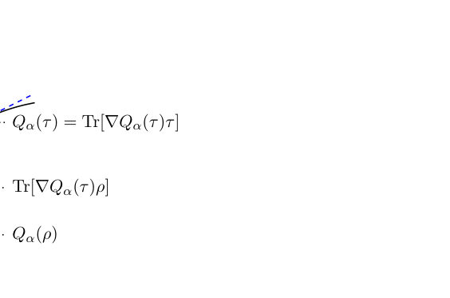
<figcaption class="paper-figure-caption"><b>Fig 2.</b> Figure 2. Linearization of the R´enyi functional Qα(ρ) (defined in Equation (10) and Equation (14), respectively) at the comparison point τ via the Hilbert–Schmidt gradient operator ∇Qα(τ) defined in Equation (21). For the Bell anchor state Φr, the chosen comparison point τ = τ (α) Φr,δ in Equation (54) coincides with the worst-case isotropic state ρδ in Equation (42). The gap between the tangent line and the R´enyi functional curves thus collapses, i.e., Qα(ρδ) = Tr[∇Qα(τ)ρδ] = Qα(τ).</figcaption>
</figure>

**Summary.** This paper rigorously determines the sharp rate at which Petz and sandwiched Rényi conditional entropies change when the input quantum states are slightly perturbed in trace distance. By employing advanced functional analysis techniques, it establishes optimal continuity bounds that generalize known results for the standard von Neumann entropy.

**Why it may be interesting.** Understanding how quantum information measures change smoothly with small perturbations is crucial for quantifying noise resilience and defining robust physical observables in quantum computation and communication protocols.

Detailed structure

**Main problem.** The paper determines the sharp modulus of continuity for optimized Petz and sandwiched Rényi conditional entropies when comparing two bipartite quantum states that are close in trace distance.

**Main result.** A concrete, optimal bound is derived for the difference between these conditional entropies based on the trace distance $\delta$ and the effective dimension $D$. Taking the limit $\alpha 	o 1$ recovers known sharp bounds for the von Neumann conditional entropy.

**Method.** The proof involves linearizing the concave Rényi functional at a comparison point, utilizing concepts like Schmidt-rank domination, and applying noncommutative calibration estimates derived from trace-distance duality.

**Model / system.** The analysis concerns general bipartite quantum states ($
ho_{AB}, \sigma_{AB}$) in finite-dimensional Hilbert spaces. The core mathematical tools involve Rényi entropy functionals applied to these states.

**Key observables.** Petz and sandwiched Rényi conditional entropies ($H^\uparrow_\alpha(A|B)$ and $eH^\uparrow_\alpha(A|B)$), the trace distance $\delta$, and the effective dimension $D$.

**Important parameters / regimes.** The entropy order parameter $\alpha \in [1/2, 1)$, and the trace distance $\delta \in [0, 1]$.

**Assumptions / limitations.** All Hilbert spaces are finite dimensional. The derivation relies on advanced matrix analysis techniques.

**Figures summary.** Figure 1 schematically compares isotropic equality models with arbitrary-anchor constructions; Figure 2 illustrates the linearization of the Rényi functional $Q_\alpha(
ho)$ at a comparison point $	au$.

**Paper structure.** The paper establishes foundational properties (concavity, linearity) for the entropy functionals using supporting operators. It then applies these tools to derive sharp continuity bounds for both Petz and sandwiched entropies, culminating in explicit formulas for the optimal bound.

Abstract

We determine the sharp modulus of continuity, in trace distance, of the optimized Petz and sandwiched Rényi conditional entropies for every order $α\in[\frac12,1)$. If two bipartite states are within trace distance $δ$, then both conditional entropies differ by at most $\frac{1}{1-α}   \log[(1-\varepsilon)^α   +(D-1)^{1-α}\varepsilon^α]$, where $\varepsilon := \min\{δ,1-1/D\}$ and $D$ is the effective dimension, given by the dimension of the first subsystem times the largest possible Schmidt rank. For every distance constraint $δ\in[0,1]$, the bound is attained by an isotropic pair with a maximally entangled anchor. Taking $α\uparrow1$ recovers the recent sharp continuity bound of quantum conditional entropy by Berta et al. [arXiv:2607.24687].   The proof linearizes the relevant concave Rényi functional at a comparison point dictated by the isotropic equality family. Schmidt-rank domination extends the equality geometry to an arbitrary anchor state, after which trace-distance duality and a noncommutative calibration estimate control the perturbation and anchor term without weakening the sharp constant. The latter estimate requires matrix analysis and is assisted by ChatGPT 5.6 Sol.

[↑ back to top](#top)

### [Fast Quantum Interconnects via Neutral Atom Ensembles](http://arxiv.org/abs/2608.05147v1)

**Authors:** Sina Zeytinoglu, Wenchao Xu, Thomas Pohl  
**Type:** theory · **Category:** quantum information and computing · **PDF:** <https://arxiv.org/pdf/2608.05147v1>  
**Analysis basis:** full PDF text, analyzed in chunks
**Topic relevance:** `Rydberg arrays` **3/5** · `free-space correlated emission` **3/5** · `analog quantum simulation` **2/5** · `QC/QI experiment` **1/5** · `correlated / nonlocal dissipation` **1/5** · `driven-dissipative phase transition` **1/5** · `entanglement & information structure` **1/5** · `exotic spin models in light-matter` **1/5** · `methods for driven-dissipative` **1/5** · `non-equilibrium dynamics` **1/5**

↔ Scroll figures horizontally

<figure class="paper-figure-card">
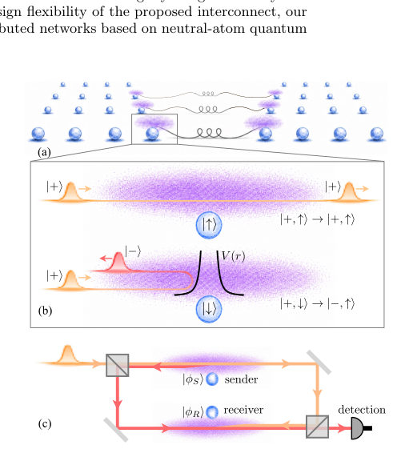
<figcaption class="paper-figure-caption"><b>Fig 1.</b> FIG. 1. (a) Schematic illustration of a quantum interconnect for neutral-atom arrays that generates entanglement between atoms (blue spheres) in distant arrays by exploiting dipolar Rydberg-state interactions and collective photon coupling to mesoscopic atomic ensembles (purple clouds). (b) Dipolar exchange interactions, V (r), between the qubit-atom and the propagating Rydberg-polaritons, that propagate through the ensemble, give rise to qubit-controlled photon transmission and reflection that generate entanglement between the qubit states, (|↑⟩, |↓⟩) and the propagation modes, (|±⟩), of the inci- dent photon. (c) This conditional reflection and transmission can be used to...</figcaption>
</figure>
<figure class="paper-figure-card">
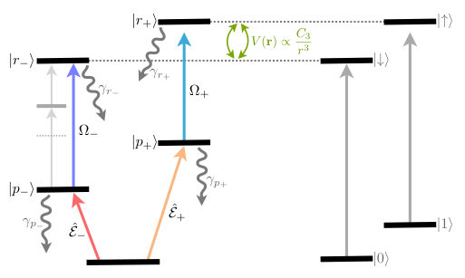
<figcaption class="paper-figure-caption"><b>Fig 2.</b> FIG. 2. Level diagrams for the ensemble atoms (left) and qubit atom (right). The coupling of the forward and back- ward propagating photon modes ( ˆE±), the control-field Rabi frequencies (Ω±), and the decay rates γp± and γr± are indi- cated in the figure. The dipole-dipole interaction potential, V (r) between the Rydberg qubit and the ensemble atoms in- duces an excitation-exchange, |r−, ↑⟩↔|r+, ↓⟩, as described by Eq.(1).</figcaption>
</figure>
<figure class="paper-figure-card">
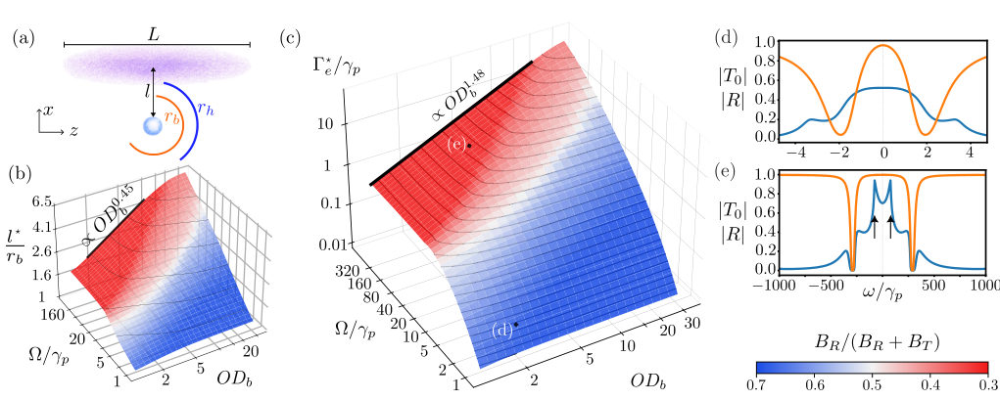
<figcaption class="paper-figure-caption"><b>Fig 3.</b> FIG. 3. Optimizing the geometry of the setup (a) yields the optimal ensemble-qubit distance shown in panel (b), with the indicated scaling l⋆∼OD0.45 b (black line) at large Rabi frequencies Ω. Panel (c) shows the maximum entanglement generation rate for optimized geometry and pulse length as a function of ODb and Ω. The equipotential lines correspond to constant values of Γ⋆ e, while the color coding indicates the relative importance of the bandwidth for transmission (BT ) and reflection (BR), according to BR/(BR + BT ), with the colors saturating outside the range indicated in the legend. Blue shading marks indicate the transmission-limited regime, where the transmission-bandwidth in the...</figcaption>
</figure>
<figure class="paper-figure-card">
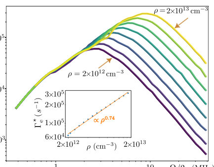
<figcaption class="paper-figure-caption"><b>Fig 4.</b> FIG. 4. Optimal entanglement generation rate Γ⋆ e for 174Yb atoms as a function of the control Rabi frequency Ω. The different curves are obtained for varying atomic peak densities between 2 × 1012 cm−3 and 2 × 1013 cm−3 in 7 steps on a logarithmic scale. Γ⋆ e features a pronounced maximum, which is shown in the inset.</figcaption>
</figure>
<figure class="paper-figure-card">
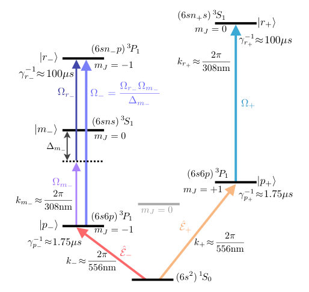
<figcaption class="paper-figure-caption"><b>Fig 5.</b> FIG. 5. Energy level diagrams of the 174Yb ensemble atoms, indicating all relevant states, lifetimes, and transition wavenumbers, discussed in the text.</figcaption>
</figure>

**Summary.** The paper proposes a novel, scalable quantum interconnect using neutral atom ensembles and Rydberg interactions to generate remote entanglement. By exploiting strong dipole-dipole coupling between atomic states, it achieves high entanglement generation rates ($\gtrsim 3 	imes 10^5$ s$^{-1}$) without requiring an optical cavity. This presents a promising pathway for building distributed quantum networks based on neutral atoms.

**Why it may be interesting.** This work directly addresses a core challenge in quantum networking—creating fast, scalable entanglement links—by proposing an all-atomic/photonic mechanism that bypasses cavity requirements, which is highly relevant for experimental AMO physicists.

Detailed structure

**Main problem.** The primary goal is developing fast and scalable quantum interconnects necessary for building distributed quantum networks.

**Main result.** The proposed method achieves entanglement generation rates exceeding $3 	imes 10^5$ s$^{-1}$ by leveraging strong dipole-dipole interactions in neutral atom ensembles, avoiding the need for optical cavities.

**Method.** The analysis involves numerical simulations of qubit-photon dynamics governed by optical propagation equations in frequency space to model state-dependent photon operations.

**Model / system.** The system uses neutral atom ensembles (e.g., Ytterbium) where a single qubit interacts with propagating photons via strong dipole-dipole interactions between Rydberg states, mediating entanglement generation.

**Key observables.** Entanglement generation rate ($\Gamma_e$), transmission spectrum ($T_0$), and conditional reflection spectrum ($R$).

**Important parameters / regimes.** Dipole-dipole interaction potential $V(r)$, Rabi frequencies ($\Omega_\pm$), decay rates ($\gamma_{p\pm}, \gamma_{r\pm}$), and optical depth ($O_{Db}$).

**Assumptions / limitations.** The protocol relies on the ability to implement state-dependent photon operations using collective light-matter coupling in small atomic ensembles.

**Figures summary.** Figure 1 schematically shows entanglement generation via dipolar Rydberg interactions between atoms and photons. Figure 2 details level diagrams illustrating the coupling mechanism for ensemble and qubit atoms.

**Paper structure.** The paper develops the concept by first describing the physical setup, then deriving the necessary Hamiltonian/equations of motion (Eqs. 1-3), simulating the dynamics to calculate performance metrics ($\Gamma_e$), and finally analyzing scaling laws based on optical depth.

Abstract

Distributing entanglement between distant qubits is a crucial element of scalable quantum computing. Here, we describe a scalable quantum interconnect that generates remote entanglement at rates approaching those compatible with two-qubit gates of current neutral-atom quantum processors. The proposed approach exploits the strong dipole-dipole interactions between atomic Rydberg states to generate entanglement between stationary qubits and propagating photons, without the need for an optical cavity. We provide a thorough description of the optimal conditions for the developed entanglement-generation protocol for realistic experimental parameters and demonstrate that entanglement-generation rates $\gtrsim 3\times 10^5$ s$^{-1}$ can be achieved using Rydberg states of ytterbium atoms. Given the inherent scalability and design flexibility of the proposed interconnect, our results suggest a promising approach towards distributed networks based on neutral-atom quantum architectures.

[↑ back to top](#top)

### [Structural Chirality from Short-Range Order in Heteroanionic Materials](http://arxiv.org/abs/2608.04841v1)

**Authors:** Benjamin J. Morgan  
**Type:** theory · **Category:** statistical mechanics · **PDF:** <https://arxiv.org/pdf/2608.04841v1>  
**Analysis basis:** full PDF text, analyzed in chunks
**Topic relevance:** `analog quantum simulation` **3/5** · `methods for driven-dissipative` **3/5** · `driven-dissipative phase transition` **2/5** · `non-equilibrium dynamics` **2/5** · `non-equilibrium universality` **2/5** · `Frenkel-Kontorova` **1/5** · `Keldysh / 2PI / non-Gaussian methods` **1/5** · `entanglement & information structure` **1/5**

↔ Scroll figures horizontally

<figure class="paper-figure-card">
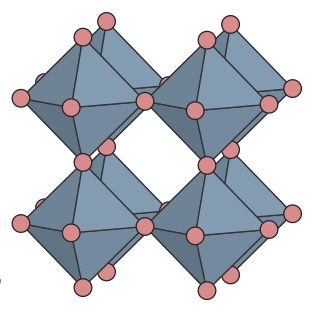
<figcaption class="paper-figure-caption"><b>Fig 1.</b> FIG. 1. The achiral ReO3-type structure, comprising a cubic Pm¯3m framework of corner-sharing MX6 octahedra.</figcaption>
</figure>
<figure class="paper-figure-card">
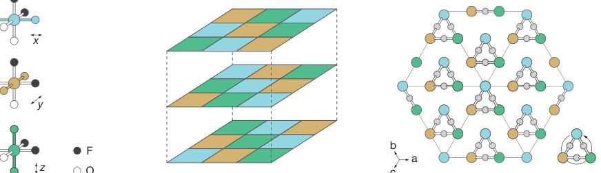
<figcaption class="paper-figure-caption"><b>Fig 2.</b> FIG. 2. (a) The labelling rule used for structure enumeration, shown for the three axes: at each cation the two fluorides (black) sit cis, leaving one octahedral axis where both are oxides (coloured). That fluoride-free axis (x, y or z) sets the cation label. (b) Cation labelling for the P3121 ground state: the cations of the 3 × 3 × 3 cell are coloured by their fluoride-free axis. (c) The same P3121 configuration, viewed down ⟨111⟩with only the Nb−F bonds drawn; the fluoride-free axis cycles x →y →z out of the page, giving the 31 screw about this ⟨111⟩axis.</figcaption>
</figure>
<figure class="paper-figure-card">
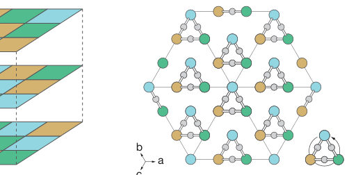
<figcaption class="paper-figure-caption"><b>Fig 3.</b> FIG. 3. Density-functional energies of 3 × 3 × 3 NbO2F configurations, relative to the ground state. (a) Energy by ensemble: random F/O placements, period-three OOF order- ings with random inter-chain phase, and the cis + OOF orbits; bars mark the median energy for each ensemble. (b) Energy versus inter-chain coherence for all twelve chiral orbits.</figcaption>
</figure>
<figure class="paper-figure-card">
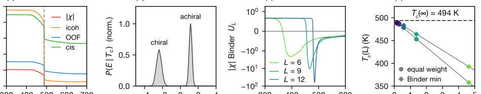
<figcaption class="paper-figure-caption"><b>Fig 4.</b> FIG. 4. Finite-temperature behaviour of the chiral-to-achiral transition in NbO2F from replica-exchange Wang–Landau sampling. (a) Reweighted order parameters (|χ|, inter-chain coherence, OOF amplitude, and cis fraction) versus temperature at L = 18. The dashed line marks Tc(L = 18). (b) Energy distribution P(E | Tc) for L = 18 at the equal-weight coexistence temperature. Energies are plotted per atom, relative to the saddle point E∗between the two peaks. (c) Binder cumulant of the chirality order parameter |χ|, UL(T), for L = 6, 9, 12. The minima at L = 15 and 18 are much deeper and are omitted so that the three smaller sizes remain visible. (d) Finite-size scaling of the transition...</figcaption>
</figure>
<figure class="paper-figure-card">
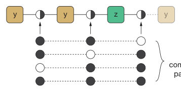
<figcaption class="paper-figure-caption"><b>Fig 5.</b> FIG. 5. The row test of the labelling encoding. Each panel shows one axis-aligned row of the supercell (a ⟨001⟩chain of three cations and three shared anions; the faded cation repeats the first, showing the periodic wrap), with cations coloured by fluoride-free-axis label (x blue, y gold, z green, as in Fig. 2), fluoride black and oxide open. (a) A valid row: exactly one cation is labelled with the row axis, its two row anions are forced to oxide, and the row’s fluoride is pinned to the remaining site. (b) Two or more row-axis labels force all three anions to oxide, leaving no site for the row’s fluo- ride. (c) With zero row-axis labels, every cation demands a fluoride along the row, and...</figcaption>
</figure>

**Summary.** This work proves that structural chirality can emerge purely from the specific arrangement (ordering) of two different anion species within an otherwise achiral crystal lattice. Using DFT and advanced Monte Carlo simulations, the authors predict a stable chiral phase transition temperature for $	ext{NbO}_2	ext{F}$. This establishes configurational ordering as a robust mechanism for designing new functional chiral materials.

**Why it may be interesting.** While focused on solid-state chemistry, the use of advanced statistical mechanics tools like Wang-Landau sampling and cluster expansions to map out complex multi-component ordering phases is highly relevant for understanding frustrated quantum systems or lattice models in AMO physics.

Detailed structure

**Main problem.** The study determines if structural chirality can be induced solely by the configurational ordering of two anion species over an achiral parent structure, independent of atomic displacements.

**Main result.** Configurational ordering is established as a chemically realizable route to structural chirality, with simulations predicting a stable chiral phase up to a first-order transition at 494 K in $	ext{NbO}_2	ext{F}$.

**Method.** The research employs direct enumeration, Density Functional Theory (DFT) calculations, and advanced Monte Carlo simulations (Wang–Landau) on cluster-expansion models.

**Model / system.** The system modeled is ReO$_3$-type oxyfluorides with a 2:1 anion stoichiometry (e.g., $	ext{NbO}_2	ext{F}$), analyzed using a $3 	imes 3 	imes 3$ supercell framework.

**Key observables.** Chirality order parameter ($\chi$), inter-chain coherence, OOF amplitude, and the phase transition temperature ($T_c$).

**Important parameters / regimes.** The critical temperature $T_c = 494 \pm 1$ K; the stoichiometry of 2:1 anion ratio.

**Assumptions / limitations.** The analysis assumes that both cis coordination and period-three chain ordering rules are energetically favored in the material.

**Figures summary.** Figures illustrate the achiral parent structure, the labeling rules for enumeration, DFT energy comparisons between random and ordered states, and size-dependent signatures of a first-order phase transition (bimodality in energy distribution).

**Paper structure.** The paper progresses from establishing the combinatorial proof that specific anion orderings are inherently chiral, to using DFT to identify the ground state, and finally employing Monte Carlo simulations with finite-size scaling to predict the thermodynamic stability and critical temperature of the resulting chiral phase.

Abstract

Established routes to structural chirality in inorganic crystals depend on symmetry-lowering atomic displacements of an achiral parent structure. We show that chirality can instead be forced by the ordering of two anion species over the sites of an achiral parent, independent of atomic displacements. ReO$_3$-type oxyfluorides with a 2:1 anion stoichiometry, such as NbO$_2$F, exhibit two ordering patterns: cis octahedral coordination and period-three anion-chain ordering, both rooted in the off-centring of $d^0$ cations. By direct enumeration, we prove that every configuration combining both orderings on the smallest commensurate cell is chiral, belonging to a Sohncke space group. For the specific case of NbO$_2$F, density-functional theory calculations predict that the ground state is the maximally symmetric chiral configuration. Wang-Landau Monte Carlo simulations of a DFT-trained cluster-expansion model predict an equilibrium chiral phase up to a first-order transition at 494 K. These results establish configurational ordering as a chemically realisable route to structural chirality, and mark heteroanionic materials with analogous ordering chemistry as candidates for a new class of chiral functional materials.

[↑ back to top](#top)

### [Effect of Cross-Spectral Correlations on Qubit Dynamics: Coherence Revival and Relaxation Modulation](http://arxiv.org/abs/2608.04672v1)

**Authors:** Siddhartha Dutta, Sujay Mondal, Abhijit Bandyopadhyay  
**Type:** theory · **Category:** quantum information and computing · **PDF:** <https://arxiv.org/pdf/2608.04672v1>  
**Analysis basis:** full PDF text, analyzed in chunks
**Topic relevance:** `Keldysh / 2PI / non-Gaussian methods` **3/5** · `correlated / nonlocal dissipation` **3/5** · `methods for driven-dissipative` **3/5** · `driven-dissipative phase transition` **2/5** · `non-equilibrium dynamics` **2/5** · `non-equilibrium universality` **1/5**

↔ Scroll figures horizontally

<figure class="paper-figure-card">
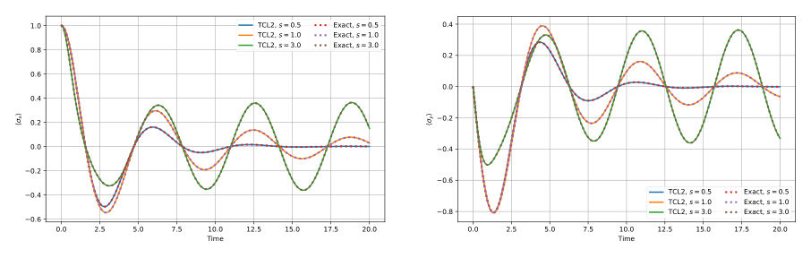
<figcaption class="paper-figure-caption"><b>Fig 1.</b> Figure 1: Benchmarking against the exactly solvable pure-dephasing model: Temporal profile of ⟨σx⟩t (left panel) and ⟨σy⟩t (right panel) for a purely dephasing environment. Solid curves show the results obtained from the numerical implementation after setting Jxx(ω) = Jxz(ω) = Jzx(ω) = 0, such that only Jzz(ω) contributes. The spectral-density (Jzz(ω)) parameters are ηz = 0.25, ωcz = 0.5, sz = 0.5 and 1.0. Dotted curves show the corresponding exact pure- dephasing solutions given in Eq. (50) for the same parameter values.</figcaption>
</figure>
<figure class="paper-figure-card">
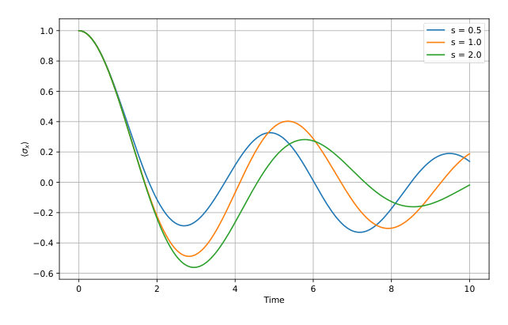
<figcaption class="paper-figure-caption"><b>Fig 2.</b> Figure 2: Benchmarking the pure dissipation sector. Temporal evolution of ⟨σx⟩t for a purely dissipative environment, obtained from the numerical implementation by setting Jxz(ω) = Jzx(ω) = Jzz(ω) = 0, such that only Jxx(ω) contributes. The spectral-density parameters are ηx = 0.05 and ωcx = 0.5, with representative values of sx in the sub-Ohmic (sx &lt; 1), Ohmic (sx = 1), and super-Ohmic (sx &gt; 1) regimes. The resulting profiles may be qualitatively compared with those reported in Ref. [19].</figcaption>
</figure>
<figure class="paper-figure-card">
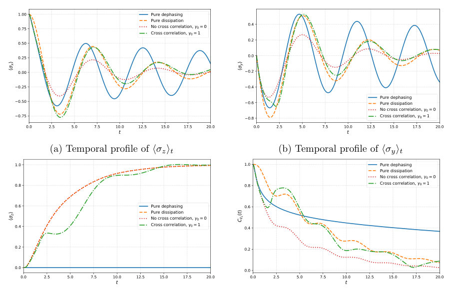
<figcaption class="paper-figure-caption"><b>Fig 3.</b> Figure 3: Temporal evolution of the Bloch-vector components of ρ(t) and coherence C(t) for the initial state ρ(0) = |+⟩⟨+|. The parameter sets are - for pure dephasing: (ηz = 0.05, sz = 1, ωcz = 5, ηx = 0); pure dissipation - (ηx = 0.05, sx = 1, ωcx = 5, ηz = 0); simultaneous dephasing and dissipation without cross correlations, (ηx = ηz = 0.05, sx = sz = 1, ωcx = ωcz = 5, γ0 = 0); and cross-correlated dephasing and dissipation, with the same parameters but γ0 = 1 and τ = 2. For all plots we take β = 40.</figcaption>
</figure>
<figure class="paper-figure-card">
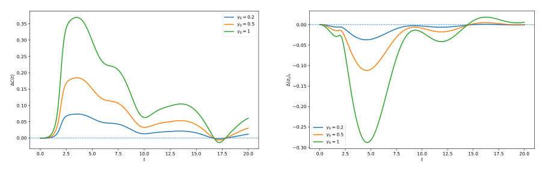
<figcaption class="paper-figure-caption"><b>Fig 4.</b> Figure 4: Temporal evolution of ∆C(t) (left panel) and ∆⟨σz⟩t (right panel) for representative cross-correlation strengths γ0 = 0.2, 0.5, and 1.0. The remaining cross-spectral parameters are fixed at ωc = 5, τ = 2 and ϕ = 0, with inverse temperature β = 40. The diagonal spectral- density parameters are ηx = ηz = 0.05, sx = sz = 1, and ωcx = ωcz = 5.</figcaption>
</figure>
<figure class="paper-figure-card">
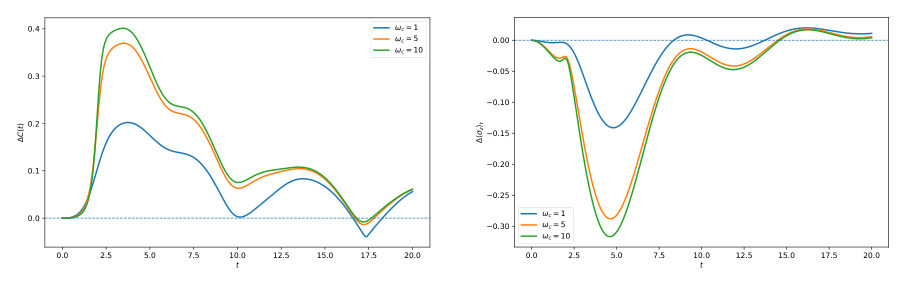
<figcaption class="paper-figure-caption"><b>Fig 5.</b> Figure 5: Temporal evolution of ∆C(t) (left panel) and ∆⟨σz⟩t (right panel) for representative values of the cross-spectral cutoff frequency, ωc = 1, 5, and 10. The remaining cross-spectral parameters are fixed at γ0 = 1, τ = 2 and ϕ = 0, with inverse temperature β = 40. The diagonal spectral-density parameters are ηx = ηz = 0.05, sx = sz = 1, and ωcx = ωcz = 5.</figcaption>
</figure>

**Summary.** This paper theoretically analyzes how correlated noise from a shared bosonic bath modifies qubit dynamics. By using the TCL2 framework, the authors show that cross-spectral correlations couple otherwise independent dephasing and relaxation channels. This coupling allows environmental noise to actively redistribute decoherence loss, creating temporary windows of enhanced coherence or suppressed energy decay.

**Why it may be interesting.** This work directly addresses noise engineering in open quantum systems, showing how structured environmental coupling can be harnessed to temporarily protect or enhance coherence, which is critical for quantum memory and computation protocols.

Detailed structure

**Main problem.** The study investigates how cross-spectral correlations between longitudinal (dephasing) and transverse (relaxation) noise affect the dynamics of a qubit.

**Main result.** These correlations generate non-monotonic population relaxation and can induce a transient revival of coherence, allowing for temporal redistribution of decoherence loss.

**Method.** The analysis employs the second-order time-convolutionless (TCL2) framework to derive closed, time-local equations for the qubit's Bloch vector components.

**Model / system.** The model is a single qubit coupled to a shared bosonic bath via an interaction Hamiltonian. The environmental noise is characterized by a matrix-valued spectral density encoding cross-correlations between different noise channels.

**Key observables.** Bloch vector components ($\langle\sigma_x
angle, \langle\sigma_y
angle, \langle\sigma_z
angle$), coherence revival magnitude ($\Delta C(t)$), and population relaxation modulation ($\Delta \langle\sigma_z
angle_t$).

**Important parameters / regimes.** Cross-correlation strength ($\gamma_0$), spectral bandwidth ($\omega_c$), relative time delay ($	au$), phase offset ($\phi$), and bath temperature ($eta$).

**Assumptions / limitations.** The analysis is restricted to the weak-coupling regime, and the dynamics are derived using the Born approximation within the TCL2 framework.

**Figures summary.** Figures demonstrate how coherence enhancement and relaxation suppression vary by changing correlation strength, spectral bandwidth, relative time delay, phase offset, and bath temperature.

**Paper structure.** The paper follows a logical progression: introducing the model, deriving the master equation using TCL2, specializing to the qubit dynamics, parameterizing correlations, validating numerically against known limits, analyzing the effects of cross-correlations, and concluding with discussions on control parameters.

Abstract

We investigate the reduced dynamics of a qubit subject to correlated longitudinal and transverse noise arising from its coupling to a shared bosonic bath. The environmental fluctuations are characterized by a positive-semidefinite matrix-valued spectral density, whose complex off-diagonal elements encode correlations between dephasing and relaxation channels in the frequency domain. Within the second-order time-convolutionless framework, we derive closed time-local equations for the Bloch-vector components of the reduced density matrix. The numerical implementation is validated against the exact pure-dephasing solution and the established behavior of the transverse-coupling spin-boson model. When both noise channels are present, the cross-spectral terms couple the otherwise distinct dephasing and relaxation sectors, producing dynamics that cannot be reproduced by adding independent noise contributions. In particular, the correlations generate non-monotonic population relaxation and a transient revival of coherence following its initial decay. The strength, bandwidth, delay, and phase of the cross spectrum provide control parameters for the magnitude and temporal structure of these effects. Our results demonstrate that correlated multi-axis noise can redistribute coherence loss and energy relaxation in time, thereby providing finite temporal windows of enhanced coherence or suppressed relaxation within the weak-coupling regime.

[↑ back to top](#top)

### [Variational Bounds for Perceptron Learning from Structured Data](http://arxiv.org/abs/2608.04882v1)

**Authors:** Francesco Camilli, Pierluigi Contucci, Federica Gerace, Emanuele Mingione  
**Type:** theory · **Category:** disordered systems and neural networks · **PDF:** <https://arxiv.org/pdf/2608.04882v1>  
**Analysis basis:** full PDF text, analyzed in chunks
**Topic relevance:** `Keldysh / 2PI / non-Gaussian methods` **3/5** · `driven-dissipative phase transition` **2/5** · `entanglement & information structure` **2/5** · `methods for driven-dissipative` **2/5** · `analog quantum simulation` **1/5** · `correlated / nonlocal dissipation` **1/5** · `correlated cavity matter` **1/5** · `non-equilibrium dynamics` **1/5** · `non-equilibrium universality` **1/5**

↔ Scroll figures horizontally

<figure class="paper-figure-card">
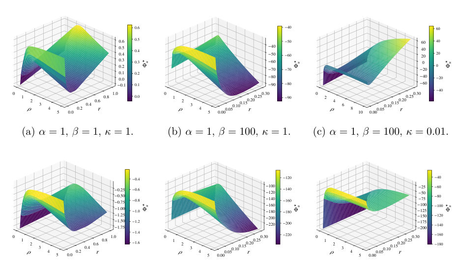
<figcaption class="paper-figure-caption"><b>Fig 1.</b> Figure 1: Numerical surfaces of the reduced variational potential Φ⋆ u(ρ, r) for different choices of the model parameters, with logistic utility uy(s) = −log (1 + e−ys), no ad- ditional separable regularization, ϕ(σi) = 0, and Gaussian centroid distribution θ ∼ N(0, IN). λ = 1 in all plots. The inner minimization over (δ, h) and the outer maximiza- tion over (q, m) are both performed using the L-BFGS-B method from scipy.optimize. In the degenerate case r = 0, where the constraint h2 ≤αr forces h = 0, the remaining scalar minimization over δ is performed using the bounded method from scipy.optimize. For both optimization routines, the tolerance is set to 10−9 and the maximum number of...</figcaption>
</figure>
<figure class="paper-figure-card">
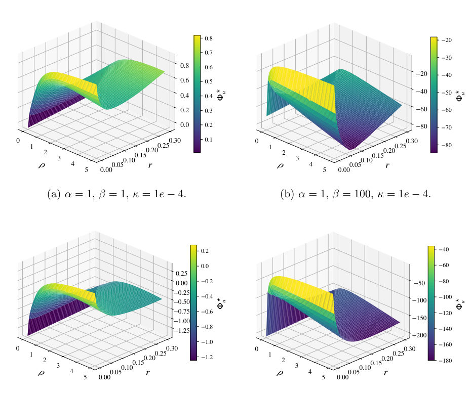
<figcaption class="paper-figure-caption"><b>Fig 2.</b> Figure 2: Numerical surfaces of the reduced variational potential Φ⋆ u(ρ, r) for different choices of the model parameters, with logistic utility uy(s) = −log (1 + e−ys), no addi- tional separable regularization, ϕ(σi) = log cosh σi, and Gaussian centroid distribution θ ∼N(0, IN). λ = 1 in all plots. The parameters of the optimization in δ, h, q and m are the same as in Figure 1.</figcaption>
</figure>

**Summary.** This work applies sophisticated variational principles from statistical physics to analyze the theoretical performance limits of a continuous-spin perceptron trained on structured data. By deriving matching upper and lower bounds for the quenched pressure, it provides a unified framework to calculate key learning metrics like generalization error and ground-state energy. This connects concepts from machine learning theory directly into the rigorous mathematical tools used in condensed matter physics.

**Why it may be interesting.** Although focused on classical ML models, the use of advanced statistical mechanics tools (variational methods, quenched averages, replica-like structures) mirrors techniques used in analyzing quantum many-body systems near criticality or in disordered quantum Hamiltonians.

Detailed structure

**Main problem.** The paper derives variational bounds for the quenched pressure associated with Perceptron learning from structured data in the thermodynamic limit.

**Main result.** Lower and upper minimax variational bounds are established for the limiting quenched pressure, which match when optimization parameters commute, identifying a solution via a single variational principle.

**Method.** The authors employ a variational approach using interpolation techniques (adapted from Guerra and Toninelli) to bound the free energy/quenched pressure.

**Model / system.** The model is a continuous-spin perceptron trained on data generated by a Gaussian mixture, described by a random Hamiltonian $H_N(\sigma)$ acting on spins $\sigma \in \mathbb{R}^N$.

**Key observables.** Quenched pressure (limit of the log partition function), training loss ($\epsilon_t$), generalization error ($\epsilon_g$), and ground-state energy.

**Important parameters / regimes.** Mixing strength ($\lambda$), centroid ($	heta$), regularization parameter ($\kappa$), and system size ($N, M$).

**Assumptions / limitations.** The method requires specific hypotheses on the utility functions (concavity) and relies on log-concavity estimates; matching of outer optimizations is a key point.

**Paper structure.** The paper builds from defining the physical model and Hamiltonian, to introducing variational bounds via interpolation techniques, deriving stationarity conditions from a single potential, and finally applying this framework to compute multiple thermodynamic quantities like loss and error.

Abstract

We introduce a variational approach to a finite-temperature continuous-spin perceptron trained on a Gaussian mixture. The model allows for a broad class of concave utilities and log-concave separable prior measures on the spins. By combining the interpolation method with log-concavity and concentration estimates, we derive lower and upper minimax variational bounds for the limiting quenched pressure. Remarkably, the two bounds differ only in the order of optimization of two variational parameters, while all remaining extrema are controlled by the concave--convex structure of the variational potential. Whenever the two optimizations commute, the two bounds match and identify the solution of the model. The same potential yields the fixed-point equations as stationarity conditions and provides a unified route to the computation of the ground-state energy, training loss, and generalization error.

[↑ back to top](#top)

### [Ghost-RISB for Correlated Electron-Phonon Systems: Application to the Hubbard-Holstein Model](http://arxiv.org/abs/2608.04816v1)

**Authors:** Samuele Giuli, Ricardo J. Campos-Lopes, Emin Moghadas, Massimo Capone  
**Type:** theory · **Category:** strongly correlated electrons · **PDF:** <https://arxiv.org/pdf/2608.04816v1>  
**Analysis basis:** full PDF text, analyzed in chunks
**Topic relevance:** `Keldysh / 2PI / non-Gaussian methods` **3/5** · `methods for driven-dissipative` **3/5** · `driven-dissipative phase transition` **2/5** · `Kondo & dissipative impurity` **1/5** · `analog quantum simulation` **1/5** · `correlated / nonlocal dissipation` **1/5** · `correlated cavity matter` **1/5** · `non-equilibrium dynamics` **1/5**

↔ Scroll figures horizontally

<figure class="paper-figure-card">
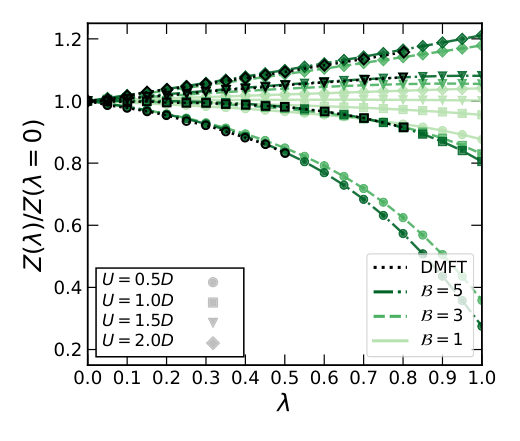
<figcaption class="paper-figure-caption"><b>Fig 1.</b> Figure 1: Effect of electron-phonon interaction on the quasi- particle weight Z measured by the ratio Z(λ)/Z(λ = 0) for ω0 = 0.2 and U = 0.5D (circles), U = 1.0D (squares), U = 1.5D (triangles) and U = 2.0D (diamond). The figure compares DMFT (black, dotted line) extracted from Ref. [29] with ghost-RISB using B = 5 (dark green, dash-dot line), B = 3 (green, dashed line) and B = 1 (light green, contin- uous line).</figcaption>
</figure>
<figure class="paper-figure-card">
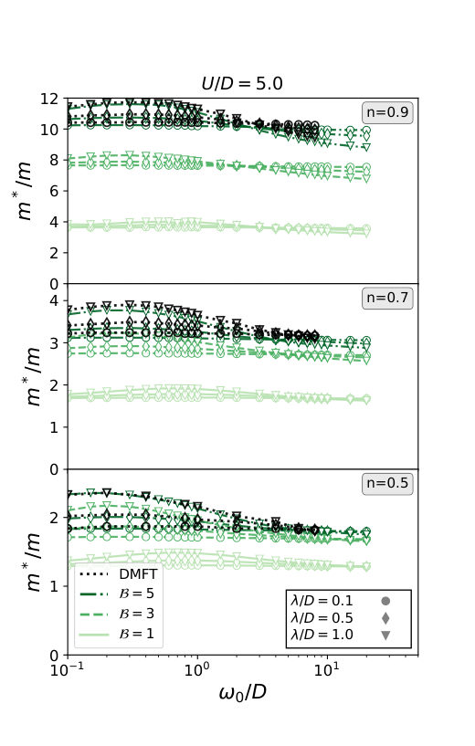
<figcaption class="paper-figure-caption"><b>Fig 2.</b> Figure 2: Mass renormalisation as a function of the phonon frequency for n = 0.9 (top panel), n = 0.7 (central panel) and n = 0.5 (bottom panel) at fixed U = 5D. In each panel, we plot B = 1 (light green, continuous line), B = 3 (green, dashed line) and B = 5 (dark green, dash-dot line), together with DMFT (dotted gray lines). The markers indicate λ = 1.0D (triangle), λ = 0.5D (diamond) and λ = 0.1D (circle). The agreement increases with doping and with the number of ghosts. B = 5 is in perfect agreement with DMFT data from Ref.[30].</figcaption>
</figure>
<figure class="paper-figure-card">
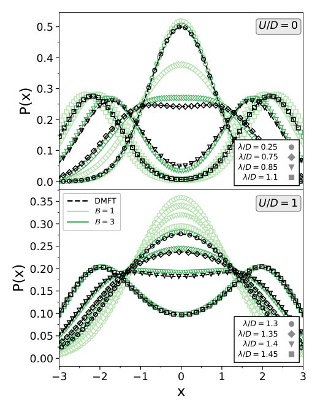
<figcaption class="paper-figure-caption"><b>Fig 3.</b> Figure 3: Phonon probability distribution functions for dif- ferent values of λ. We compare the case of the half-filled Hol- stein model (upper panel) and the Hubbard-Holstein model at U/D = 1 (lower panel), both with a characteristic frequency of ω0/D = 0.2. The calculations are for B = 1 and B = 3 and are compared with DMFT data extracted from [69, 72].</figcaption>
</figure>
<figure class="paper-figure-card">
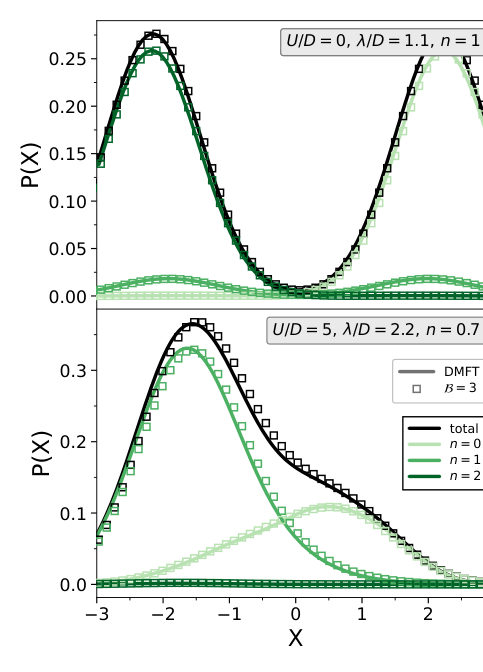
<figcaption class="paper-figure-caption"><b>Fig 4.</b> Figure 4: Total and charge-resolved phonon probability dis- tribution functions projected to the empty, single, and double- occupied charge sectors. We compare the half-filled Holstein model (upper panel) at λ/D = 1.1 and the doped Hubbard- Holstein model at U/D = 5, λ/D = 2.2 (lower panel) at a filling of n = 0.7, both with a characteristic frequency of ω0/D = 0.2. The calculations are done for B = 3 and com- pared with DMFT data at the same parameter values.</figcaption>
</figure>
<figure class="paper-figure-card">
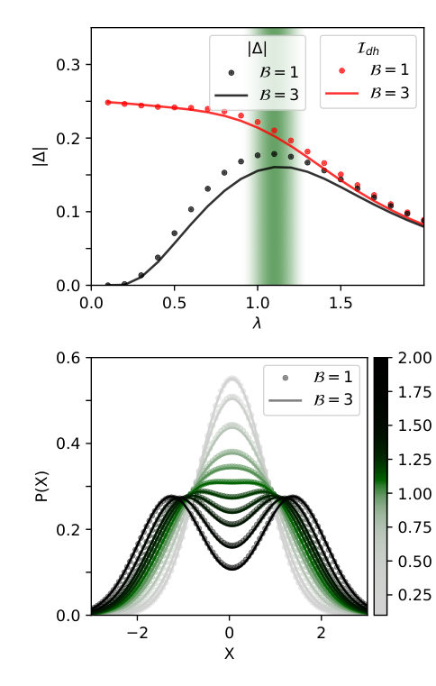
<figcaption class="paper-figure-caption"><b>Fig 5.</b> Figure 5: Holstein model (U/D = 0 and ω0/D = 1.0) plot of (a) superconducting order parameter (black) and double- holon overlap Idh (red) for B = 1 (dots) and B = 3 (line) and as a function of the effective attraction λ. In green the area at which we identify the polaronic crossover. (b) Phononic dis- tribution function showed for values of λ/D between 0.0 (light gray) and 2.0 (black) passing through the polaronic crossover (green) around λ = 1.1 using B = 1 (dots) and B = 3 (line).</figcaption>
</figure>

**Summary.** This paper introduces an advanced theoretical tool, the ghost-RISB method, to tackle the challenging physics of correlated electron-phonon interactions in models like Hubbard-Holstein. It successfully reproduces key results from computationally intensive DMFT while offering superior efficiency for mapping out complex phase diagrams, particularly concerning superconductivity suppression.

**Why it may be interesting.** The method provides a computationally cheaper alternative to DMFT for strongly coupled electron-phonon systems, allowing rapid phase diagram exploration that is critical for understanding materials like high-Tc superconductors or polaronic conductors.

Detailed structure

**Main problem.** The primary goal is developing a theoretical framework to accurately treat the complex interplay between electron-electron correlation (Hubbard repulsion) and local electron-phonon coupling in quantum materials.

**Main result.** The generalized ghost-RISB method achieves quantitative agreement with DMFT for key observables like quasiparticle weights, while being significantly more computationally efficient. It also predicts a suppression of the superconducting order parameter in the bipolaronic regime.

**Method.** The authors generalize the ghost-rotationally-invariant slave-boson (ghost-RISB) method by incorporating local phonon modes into the variational framework. This involves mapping the problem onto an enlarged Fock space and solving saddle-point equations derived from a Lagrangian formulation.

**Model / system.** The study focuses on the Hubbard-Holstein model, which describes fermions coupled to local optical phonon modes via terms for hopping ($t$), on-site repulsion ($U$), phonon energy ($\omega_0$), and electron-phonon coupling ($g$).

**Key observables.** Electron quasiparticle weights (Z), superconducting order parameter, and charge-resolved phonon distributions ($P_2(X)$ and $P_0(X)$).

**Important parameters / regimes.** Coupling strengths are characterized by dimensionless ratios like $\lambda = 2g^2/\omega_0$. The analysis covers regimes ranging from weak to strong coupling.

**Assumptions / limitations.** The method relies on mean-field decoupling for both bosonic and fermionic fields, and the final results are obtained by imposing static saddle point conditions on the derived Lagrangian.

**Figures summary.** Figure 1 compares DMFT results with ghost-RISB calculations for the quasi-particle weight Z under varying electron-electron coupling strengths (U).

**Paper structure.** The paper introduces the Hamiltonian, develops the generalized ghost-RISB formalism by mapping to an enlarged space and deriving a Lagrangian ($\mathcal{L}_{	ext{gRISB}}$), solves the resulting saddle point equations for matrix fields, benchmarks against DMFT, and finally applies the framework to analyze superconducting pairing in the bipolaronic regime.

Abstract

We develop a generalization of the ghost-rotationally-invariant slave-boson (ghost-RISB) method that incorporates local phonon modes coupled to arbitrary on-site electronic degrees of freedom, enabling a nonperturbative treatment of electron-electron and electron-phonon interactions within an efficient variational framework. The method extends the ghost-orbital construction to capture dynamical self-energy effects and phonon-induced renormalizations beyond static slave-boson approaches. Benchmarking against dynamical mean-field theory (DMFT) results for the Hubbard-Holstein model, we find excellent quantitative agreement for electron quasiparticle weights and phonon properties across a wide range of coupling strengths, and it captures accurately the competition between electron-electron and electron-phonon interactions. We show that the inclusion of the ghost orbitals is crucial to accurately describe the regime of low-frequency, strongly dynamical, phonons. The extended ghost-RISB achieves this accuracy at a fraction of the computational cost of DMFT, due to its self-consistency rooted in static observables instead of dynamical ones, enabling rapid exploration of correlated electron-phonon phase diagrams. We exploit this advantage to characterize the most demanding regime of strong coupling and adiabatic phonons. Our analysis shows a suppression of the superconducting order parameter, which is interpreted as a Franck-Condon-like reduction of the overlap between the phonon wavefunctions associated with empty and doubly-occupied sites in the bipolaronic regime.

[↑ back to top](#top)

### [Quantum SWITCH-induced non-Markovianity is not entirely quantum](http://arxiv.org/abs/2608.04685v1)

**Authors:** Rajeev Gangwar, Ananda G. Maity  
**Type:** theory · **Category:** quantum information and computing · **PDF:** <https://arxiv.org/pdf/2608.04685v1>  
**Analysis basis:** full PDF text, analyzed in chunks
**Topic relevance:** `entanglement & information structure` **3/5** · `methods for driven-dissipative` **3/5** · `correlated / nonlocal dissipation` **2/5** · `driven-dissipative phase transition` **2/5** · `Keldysh / 2PI / non-Gaussian methods` **1/5** · `non-equilibrium dynamics` **1/5** · `non-equilibrium universality` **1/5**

↔ Scroll figures horizontally

<figure class="paper-figure-card">
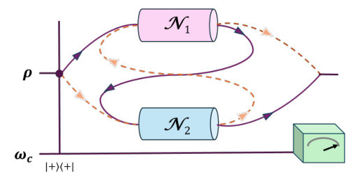
<figcaption class="paper-figure-caption"><b>Fig 1.</b> FIG. 1: Schematic illustration of the quantum SWITCH. The control qubit is initialized in the state ωc = |+⟩⟨+|, thereby coherently superposing the two possible channel orders: N1 followed by N2, and N2 followed by N1. The control qubit is subsequently measured in the superposition basis.</figcaption>
</figure>
<figure class="paper-figure-card">
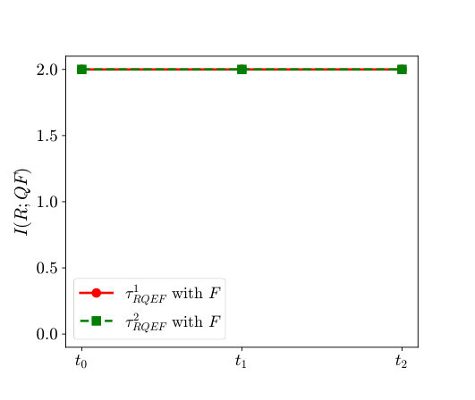
<figcaption class="paper-figure-caption"><b>Fig 2.</b> FIG. 3: Mutual information I(R; QF), where F is the extended space, shows monotonic behavior at all time steps, confirming the absence of genuine quantum non-Markovianity for both processes.</figcaption>
</figure>
<figure class="paper-figure-card">
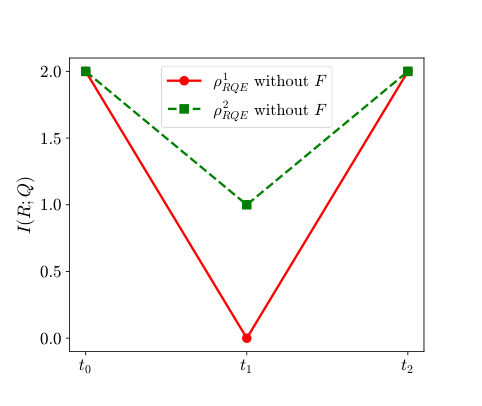
<figcaption class="paper-figure-caption"><b>Fig 3.</b> FIG. 2: Mutual information I(R; Q) between the reference system (R) and the quantum system (Q) at discrete time steps (t0, t1, t2), exhibiting non-Markovian dynamics, where the en- vironment is initialized in γ(1) E maximally mixed state and γ(2) E classically correlated state.</figcaption>
</figure>
<figure class="paper-figure-card">
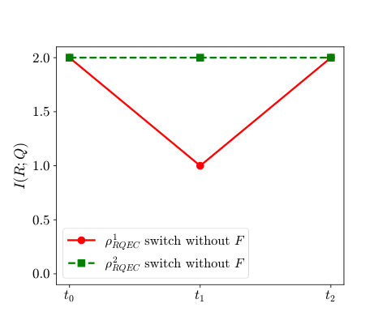
<figcaption class="paper-figure-caption"><b>Fig 4.</b> FIG. 4: Mutual information I(R; Q) under the quantum SWITCH, where initial state ρ1 0 exhibits non-monotonic (non- Markovian) behavior while initial state ρ2 0 remains constant across all time steps.</figcaption>
</figure>
<figure class="paper-figure-card">
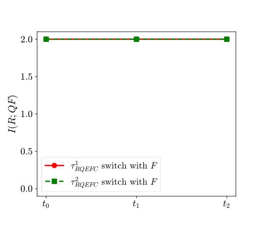
<figcaption class="paper-figure-caption"><b>Fig 5.</b> FIG. 5: Mutual information I(R; QF) at discrete time steps (t0, t1, t2) under the quantum SWITCH, remains mono- tonic, confirming the absence of genuine quantum non- Markovianity.</figcaption>
</figure>

**Summary.** This paper investigates the memory effects generated by the quantum SWITCH, a mechanism enabling indefinite causal order. By employing advanced diagnostics comparing standard and extended mutual information, the authors demonstrate that any observed non-Markovianity is not genuinely quantum. This forces a critical re-examination of which physical resources truly provide quantum advantages in such protocols.

**Why it may be interesting.** This work is highly relevant for theoretical physicists working on open quantum systems because it provides a rigorous, advanced diagnostic tool (the $I(R; QF)$ test) to filter out spurious non-Markovian signatures that might otherwise lead to overestimation of quantum advantages in complex protocols like indefinite causal order.

Detailed structure

**Main problem.** The study aims to determine if memory effects (non-Markovianity) generated by the quantum SWITCH are genuinely quantum or merely artifacts arising from classical correlations.

**Main result.** The research concludes that the observed memory effects in the quantum SWITCH dynamics are not genuinely quantum non-Markovian, suggesting a re-evaluation of the physical resources underpinning indefinite causal order advantages.

**Method.** The authors analyze two scenarios (discrete and continuous time) using advanced diagnostics like CP-divisibility and comparing standard mutual information ($I(R; Q)$) against an extended environment mutual information ($I(R; QF)$).

**Model / system.** The core model is the quantum SWITCH, which implements indefinite causal order by coherently superposing different orders of quantum channels acting on a system coupled to a control qubit.

**Key observables.** Non-Markovian information backflow, Quantum Mutual Information $I(R; Q)$, and the extended mutual information $I(R; QF)$.

**Important parameters / regimes.** The analysis distinguishes between genuine quantum non-Markovianity (requiring specific monotonicity in $I(R; QF)$) and classical sources of memory.

**Assumptions / limitations.** The primary diagnostic tool relies on the assumption that true quantum non-Markovianity must manifest as a monotonic decrease when the environment is extended with an inert system ($F$).

**Figures summary.** Figures illustrate the comparison between $I(R; Q)$ (showing non-monotonic revival) and $I(R; QF)$ (showing monotonic decay) for both discrete and continuous time settings, confirming the classical origin of apparent memory.

**Paper structure.** The paper analyzes the quantum SWITCH in both discrete-time evolution and continuous-time dynamical maps. The core logic involves applying various non-Markovianity measures and ultimately using the extended environment diagnostic ($F$) to distinguish genuine quantum effects from classical ones.

Abstract

Indefinite causal order extends quantum information processing beyond fixed causal structures, with the quantum SWITCH serving as its canonical realization. By coherently superposing different orders of quantum channels, the quantum SWITCH has been shown to provide operational advantages in communication, computation, metrology, and related tasks. Despite these advances, the physical resources responsible for these advantages remains unclear. Recent studies have further revealed that the quantum SWITCH can generate memory effects, manifested as non-Markovian information backflow. In this work, we examine the origin of such memory and determine whether they reflect genuine (quantum) non-Markovianity or instead arises from classical origin. To this end, we analyze two representative scenarios: one based on discrete-time evolution and another formulated through dynamical maps in open quantum systems. We show that the memory effects generated by the quantum SWITCH are not genuinely quantum non-Markovian, thereby prompting a re-examination of the source of quantum advantage in indefinite causal order frameworks.

[↑ back to top](#top)

### [The Born Representation Theorem and the Unistochastic Theorem](http://arxiv.org/abs/2608.04354v1)

**Authors:** Jacob A. Barandes  
**Type:** theory · **Category:** other · **PDF:** <https://arxiv.org/pdf/2608.04354v1>  
**Analysis basis:** full PDF text, analyzed in chunks
**Topic relevance:** `quantum measurements` **3/5** · `non-equilibrium dynamics` **2/5** · `Keldysh / 2PI / non-Gaussian methods` **1/5** · `analog quantum simulation` **1/5** · `correlated / nonlocal dissipation` **1/5** · `driven-dissipative phase transition` **1/5** · `entanglement & information structure` **1/5** · `measurement-induced transitions` **1/5** · `methods for driven-dissipative` **1/5** · `non-equilibrium universality` **1/5**

↔ Scroll figures horizontally

<figure class="paper-figure-card">
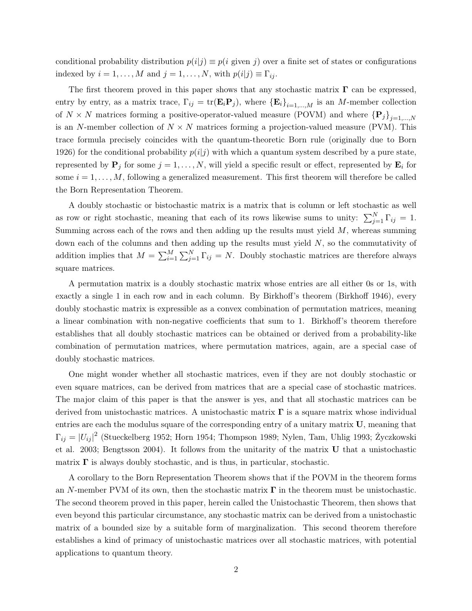
<figcaption class="paper-figure-caption"><b>Fig 1.</b> Low-resolution page preview, page 2</figcaption>
</figure>
<figure class="paper-figure-card">
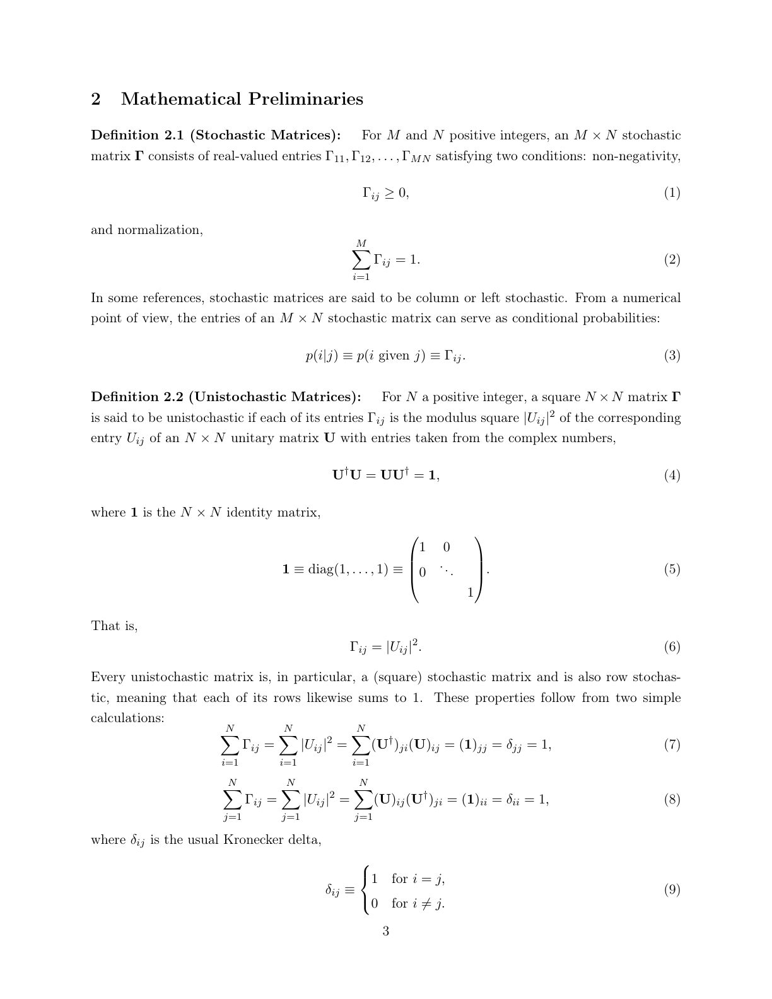
<figcaption class="paper-figure-caption"><b>Fig 2.</b> Low-resolution page preview, page 3</figcaption>
</figure>
<figure class="paper-figure-card">
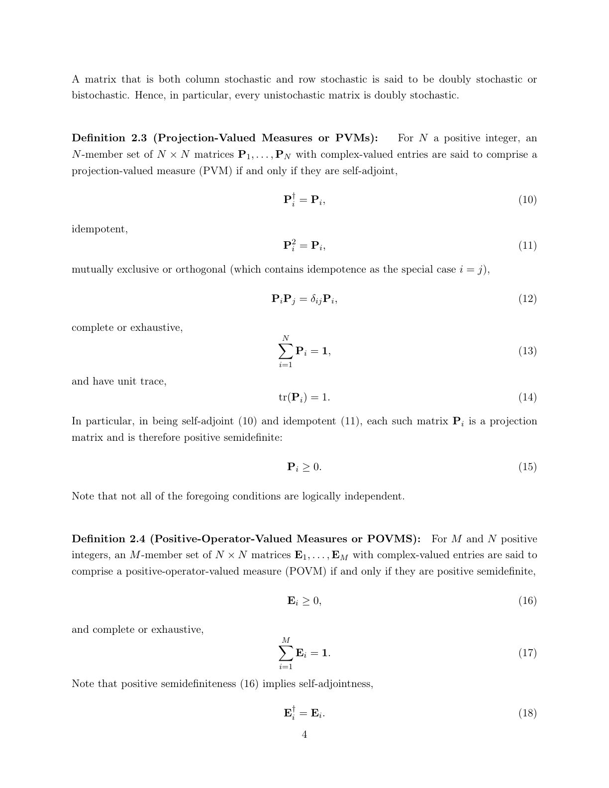
<figcaption class="paper-figure-caption"><b>Fig 3.</b> Low-resolution page preview, page 4</figcaption>
</figure>
<figure class="paper-figure-card">
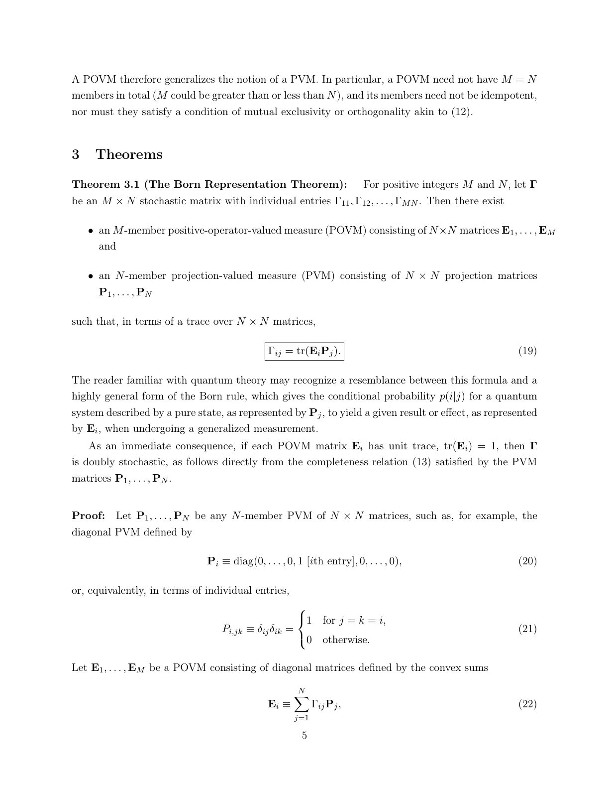
<figcaption class="paper-figure-caption"><b>Fig 4.</b> Low-resolution page preview, page 5</figcaption>
</figure>
<figure class="paper-figure-card">
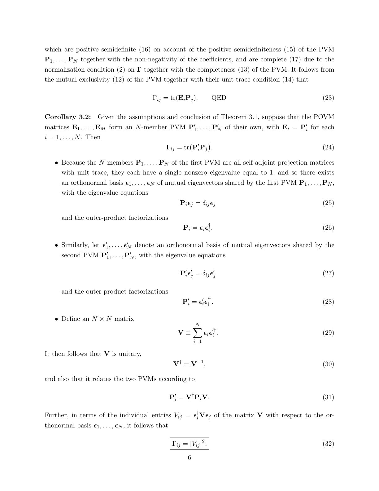
<figcaption class="paper-figure-caption"><b>Fig 5.</b> Low-resolution page preview, page 6</figcaption>
</figure>

**Summary.** This paper develops two theorems connecting stochastic matrices to quantum probability theory. It shows that any entry in a stochastic matrix can be written as a trace involving generalized quantum measurement operators (POVMs and PVMs). Crucially, it establishes that these processes are fundamentally linked to unistochastic matrices, suggesting that unitary evolution dictates the structure of all discrete-time probabilistic systems.

**Why it may be interesting.** This work provides a rigorous mathematical bridge between classical Markovian dynamics and quantum unitary evolution by showing how general probabilistic processes are constrained by structures related to unitaries (unistochastic matrices).

Detailed structure

**Main problem.** To establish deep mathematical connections between stochastic matrices, which model classical probabilistic processes (Markov chains), and the probability rules derived from quantum mechanics.

**Main result.** The paper proves that any entry of a stochastic matrix can be expressed as a trace involving POVMs and PVMs (Born Representation Theorem), and further shows that these entries are fundamentally constrained by unistochastic matrices, suggesting a primacy of unitary evolution structures.

**Method.** Constructive proofs utilizing properties of Positive-Operator-Valued Measures (POVMs) and Projection-Valued Measures (PVMs) within the framework of trace formulas.

**Model / system.** The model centers on stochastic matrices $\Gamma$ describing conditional probabilities $p(i|j)$ in discrete-time Markov chains. These are related to quantum systems via PVMs $\{P_j\}$ and POVMs $\{E_i\}$, which generalize the standard Born rule.

**Key observables.** The entries of the stochastic matrix $\Gamma_{ij}$, representing conditional probabilities, and their representation as traces involving quantum measures.

**Important parameters / regimes.** The dimensions $M 	imes N$ of the stochastic matrix; the structure of the underlying POVMs and PVMs.

**Assumptions / limitations.** The primary assumption is that classical probabilistic processes can be mapped onto structures derived from quantum measurements (POVM/PVM formalism).

**Paper structure.** The paper introduces the Born Representation Theorem, showing $\Gamma_{ij} = 	ext{tr}(E_i P_j)$. It then proves a corollary relating this to unistochastic matrices. Finally, it presents the Unistochastic Theorem, demonstrating that any stochastic matrix can be derived from marginalizing a larger unistochastic structure.

Abstract

This paper presents self-contained, constructive proofs of two new theorems about stochastic matrices, with direct relevance to quantum theory. The first theorem, herein called the Born Representation Theorem, shows that each entry of any stochastic matrix can be expressed as the trace of a pairwise product of matrices, where the first factor in the pairwise product belongs to a positive-operator-valued measure (POVM) and the second factor belongs to a projection-valued measure (PVM). As its name suggests, this theorem entails that the entries of any stochastic matrix can be expressed in terms of a generalized version of the quantum-theoretic Born rule. It follows as a corollary that if the POVM in this first theorem is a PVM, then the stochastic matrix is unistochastic, meaning that its entries are each the modulus square of the corresponding entry of a unitary matrix of the same size. The second theorem proved in this paper, called the Unistochastic Theorem, then shows that by dilating the underlying vector space by a bounded number of additional dimensions if necessary, each entry of any stochastic matrix can be expressed in terms of the trace of a pairwise product for which both factors belong to PVMs, and can thus be derived via marginalization from a larger unistochastic matrix. This second theorem therefore establishes a kind of primacy of unistochastic matrices over stochastic matrices, and hints at a close connection with unitary time evolution in quantum theory. The paper concludes with a brief discussion of potential applications to discrete-time deterministic processes and Markov chains.

[↑ back to top](#top)

### [Dynamically suppressing cavity dephasing induced by frequency fluctuations of a coupled nonlinear mode](http://arxiv.org/abs/2608.04494v1)

**Authors:** Yunwei Lu, Xinyuan You, Ziwen Huang, Sébastien Léger, Jens Koch, Yao Lu  
**Type:** theory · **Category:** other · **PDF:** <https://arxiv.org/pdf/2608.04494v1>  
**Analysis basis:** full PDF text, analyzed in chunks
**Topic relevance:** `methods for driven-dissipative` **3/5** · `QC/QI experiment` **2/5** · `non-equilibrium dynamics` **2/5** · `Keldysh / 2PI / non-Gaussian methods` **1/5** · `correlated / nonlocal dissipation` **1/5** · `correlated cavity matter` **1/5** · `driven-dissipative phase transition` **1/5** · `quantum optics experiment` **1/5**

↔ Scroll figures horizontally

<figure class="paper-figure-card">
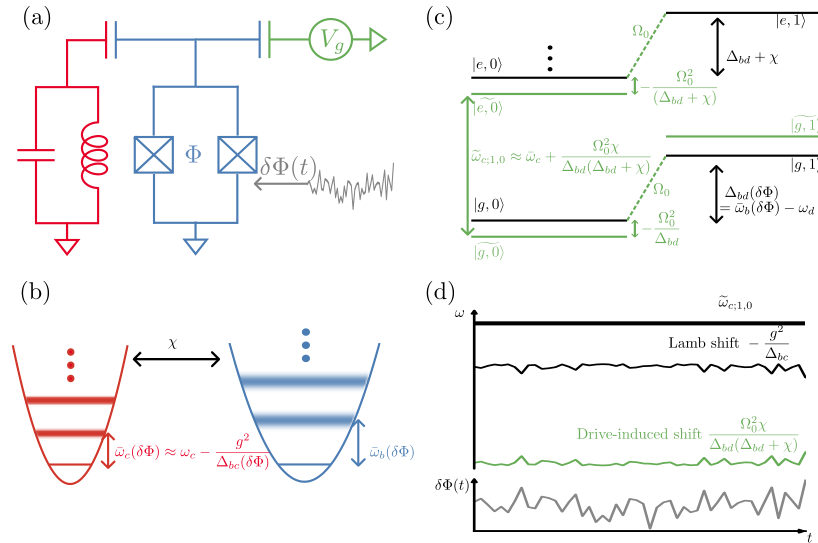
<figcaption class="paper-figure-caption"><b>Fig 1.</b> Figure 1. Illustration of suppressing cavity dephasing by Stark-assisted flux-noise evasion (SAFE). (a) Circuit diagram of a flux-tunable transmon (FTT) dispersively coupled to a superconducting cavity. The FTT is driven by a coherent voltage source Vg. Flux noise δΦ(t) modulates the FTT frequency and constitutes the dominant noise source. (b) Fluctuations of the cavity frequency induced by the Lamb shift. The bare modes have frequencies ωc and ωb(δΦ), with detuning ∆bc(δΦ) = ωb(δΦ) −ωc. The coupling g hybridizes the modes and yields dressed frequencies ¯ωb/c(δΦ), dispersive shift χ. As a result, fluctuations in the FTT frequency δωb(t) caused by flux noise δΦ(t) lead to cavity-frequency...</figcaption>
</figure>
<figure class="paper-figure-card">
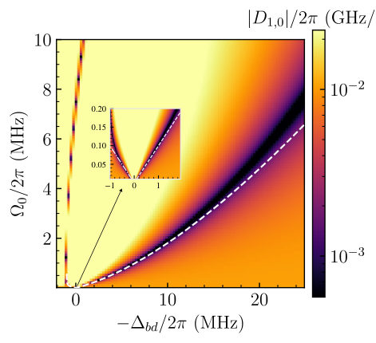
<figcaption class="paper-figure-caption"><b>Fig 2.</b> Figure 2. Dynamical sweet spots generated by SAFE. Two- dimensional map of D1,0 as a function of drive amplitude Ω0 and detuning ∆bd. Dashed curves denote the analytical sweet- spot conditions from Eqs. (22) and (28) for the main panel and the inset, respectively. See App. E for the representative system parameters in the dispersive regime.</figcaption>
</figure>
<figure class="paper-figure-card">
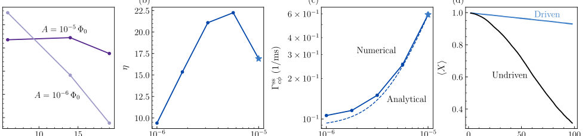
<figcaption class="paper-figure-caption"><b>Fig 3.</b> Figure 3. Numerical evaluation of cavity pure-dephasing suppression and time-domain simulation of SAFE. (a) Pure-dephasing suppression factor η as a function of the drive detuning ∆bd for the 1/f flux-noise amplitudes A = 10−6Φ0 and 10−5Φ0. SAFE suppresses the cavity pure-dephasing rate over the parameter range considered here. The suppression decreases more rapidly with |∆bd| at the smaller noise amplitude, whereas it remains nearly constant at moderate detunings for the larger noise amplitude. (b) η as a function of the 1/f flux-noise amplitude A at ∆bd/2π = −19 MHz. The maximum suppression occurs near A ≈6 × 10−6Φ0. (c) Cavity pure-dephasing rates as functions of A at ∆bd/2π = −19 MHz....</figcaption>
</figure>
<figure class="paper-figure-card">
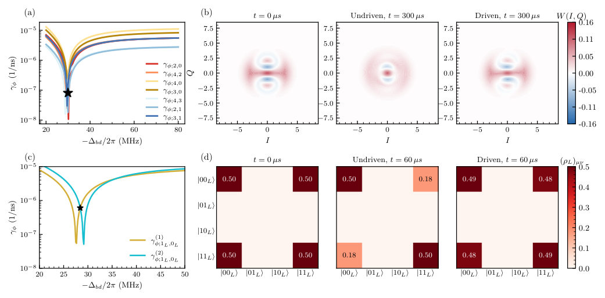
<figcaption class="paper-figure-caption"><b>Fig 4.</b> Figure 4. Improvement of the coherence of bosonic encodings using SAFE (the drive amplitude is Ω0/2π = 10 MHz throughout). Binomial code—(a) Dephasing rates (γϕ;m,n) induced by FTT frequency fluctuations as a function of ∆bd. The star marks ∆bd/2π ≈−30 MHz, where all relevant γϕ;m,n are suppressed by factors of at least 13. (b) Wigner function of |+L⟩at t = 300 µs, plotted in the dimensionless phase-space coordinates I and Q. The driven case retains the interference features that are lost without the drive. The decoherence-induced infidelity is reduced from 0.3 without the drive to 0.043 with the drive. Dual-rail encoding—(c) Dephasing rate of each dual-rail qubit as a function of ∆bd. Both...</figcaption>
</figure>
<figure class="paper-figure-card">
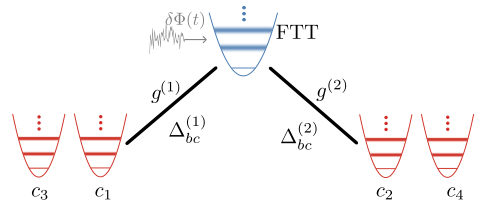
<figcaption class="paper-figure-caption"><b>Fig 5.</b> Figure 5. Schematic of the system of two dual-rail qubits considered in this work. The first logical qubit is encoded in cavities c1 and c3, and the second logical qubit is encoded in cavities c2 and c4. The rails c1 and c2, one from each dual- rail qubit, are dispersively coupled to a common flux-tunable transmon (FTT) ancilla with respective coupling strengths g(1) and g(2) and detunings ∆(1) bc and ∆(2) bc . Flux fluctuations δΦ(t) modulate the FTT frequency and induce correlated fre- quency fluctuations in the coupled cavity rails through the dispersive Lamb shift.</figcaption>
</figure>

**Summary.** This paper introduces a protocol called SAFE to protect superconducting cavities from dephasing caused by flux noise inherent in nonlinear Josephson elements. By applying a weak off-resonant microwave drive, the system can be tuned to a dynamical sweet spot where the cavity frequency becomes insensitive to low-frequency noise. This significantly enhances coherence times, improving fidelity for quantum control applications.

**Why it may be interesting.** This work directly addresses decoherence mitigation in superconducting quantum circuits by engineering noise resilience through external driving fields, which is central to modern quantum information processing architectures.

Detailed structure

**Main problem.** The primary challenge addressed is mitigating cavity dephasing caused by low-frequency flux noise originating from coupled nonlinear Josephson elements.

**Main result.** The proposed Stark-Assisted Flux-noise Evasion (SAFE) protocol successfully creates a dynamical sweet spot, extending the cavity dephasing time by over an order of magnitude.

**Method.** The authors use Floquet theory and master equation analysis to derive conditions for noise insensitivity, implementing operator transformations and secular approximations.

**Model / system.** The system modeled is a superconducting microwave cavity dispersively coupled to a flux-tunable transmon (FTT), analyzed under the influence of $1/f$ flux noise.

**Key observables.** Cavity dephasing time ($T_2^*$), susceptibility ($D_{n,m}$), and residual decoherence rates.

**Important parameters / regimes.** Weak off-resonant microwave drive strength ($\Omega_0$), detuning ($\Delta_{bc}$), and the noise spectral density ($S_{1/f}(\omega)$).

**Assumptions / limitations.** The analysis relies on weak driving approximations, dispersive coupling regimes, and truncating the system dynamics to a manageable subspace.

**Figures summary.** Figures illustrate the creation of dynamical sweet spots in parameter space (Fig. 2) and show how the drive compensates for noise-induced shifts.

**Paper structure.** The paper progresses from identifying the noise source and its effect on the Hamiltonian, to deriving the condition for a dynamical sweet spot using Floquet theory, and finally modeling the dynamics via an effective master equation incorporating the protective drive.

Abstract

High-coherence superconducting cavities offer a promising platform for quantum information, with long coherence times and negligible intrinsic dephasing. However, cavity control generally relies on nonlinear Josephson elements whose frequency fluctuations are inherited by the cavity as dephasing, potentially limiting control fidelities and eroding the noise bias used in error-correction protocols. Here, we introduce Stark-Assisted Flux-noise Evasion (SAFE), a hardware-efficient protocol that protects the cavity from inherited dephasing using only a weak off-resonant microwave drive applied to the nonlinear element. As a concrete setup, we analyze a 3D superconducting cavity dispersively coupled to a flux-tunable transmon (FTT) subject to $1/f$ flux noise. Analytical predictions are confirmed by Monte Carlo simulations with realistic parameters, which show that SAFE can extend the cavity dephasing time by more than an order of magnitude while keeping residual drive-induced decoherence subdominant.

[↑ back to top](#top)

### [Applications of Spin-Dependent Generalized Squeezing in Hybrid Spin-Oscillator Quantum Processors](http://arxiv.org/abs/2608.04197v1)

**Authors:** Kai Shinbrough, Donovan J. Webb, Iver R. Øvergaard, Oana Băzăvan, Sebastian Saner, Christopher J. Ballance, Raghavendra Srinivas  
**Type:** theory · **Category:** quantum information and computing · **PDF:** <https://arxiv.org/pdf/2608.04197v1>  
**Analysis basis:** full PDF text, analyzed in chunks
**Topic relevance:** `exotic spin models in light-matter` **3/5** · `spintronics-quantum-optics interface` **3/5** · `Tavis-Cummings & cavity-many-emitter` **2/5** · `analog quantum simulation` **1/5** · `correlated cavity matter` **1/5** · `non-equilibrium dynamics` **1/5**

↔ Scroll figures horizontally

<figure class="paper-figure-card">
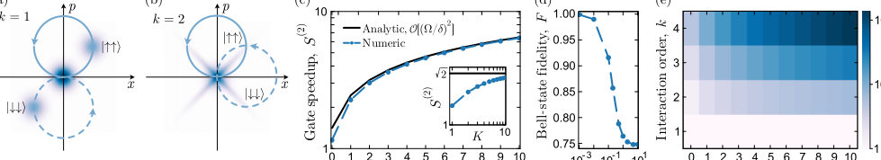
<figcaption class="paper-figure-caption"><b>Fig 1.</b> FIG. 1. Squeezing-mediated geometric phase gates. Wigner function trajectories for one gate duration are shown for spin- dependent (a) displacements (k = 1), and (b) squeezing (k = 2); Wigner functions are shown at t(k) g /4, with the amplitude and phase of the time-dependent displacement and squeezing interactions shown for |↑↑⟩(solid) and |↓↓⟩(dashed) spin states under ˆJz spin-conditioning. Spin states |↑↓⟩and |↓↑⟩remain at the origin for the duration of the gate. (c) Gate speedup for k = 2 and K = 1 as a function of initial Fock state occupation, ni, assuming dynamics truncated at second order in the Magnus expansion (solid) and under full numeric integration of the underlying...</figcaption>
</figure>
<figure class="paper-figure-card">
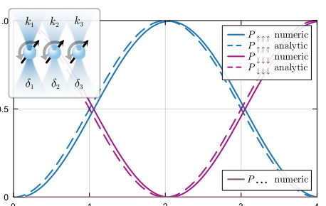
<figcaption class="paper-figure-caption"><b>Fig 2.</b> FIG. 2. Squeezing-mediated 3-body spin interactions. Spin population dynamics under the engineered 3-body interac- tion (solid) and analytic ˆσxˆσxˆσx interaction (dashed). All 3-body spin populations are plotted; populations outside of the P↑↑↑and P↓↓↓subspace (P···) are smaller than the axis width. Inset: Schematic of individually addressed generalized squeezing interactions with squeezing (k1 = 2) on ion 1, and displacements (k2 = k3 = 1) on ions 2 and 3, with detunings (δ1, δ2, δ3) = (3, 2, 1)∆for global detuning ∆.</figcaption>
</figure>
<figure class="paper-figure-card">
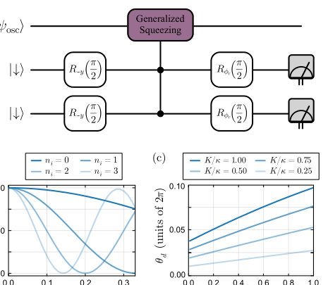
<figcaption class="paper-figure-caption"><b>Fig 3.</b> FIG. 3. Squeezing-mediated thermometry. (a) Circuit dia- gram depicting a spin-conditioned generalized squeezing in- teraction inside a Ramsey sequence on the spin subsystem. (b) Resulting Fock-state (ni) dependent Ramsey fringes mea- sured on the spin subsystem with readout phase ϕr = π/2. (c) Differential phase accumulation for a thermal initial state of the oscillator for varying interaction strength parametrized by κ (see text).</figcaption>
</figure>
<figure class="paper-figure-card">
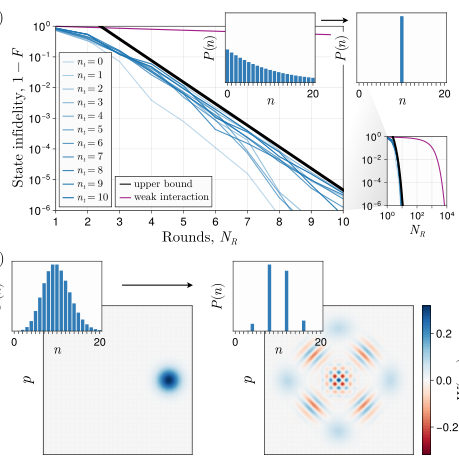
<figcaption class="paper-figure-caption"><b>Fig 4.</b> FIG. 4. Squeezing-mediated bosonic state preparation. (a) Fock state preparation infidelity in the strong interaction pro- tocol (see text) versus number of rounds of the bosonic state preparation sequence, NR, for target Fock states nt = 0 to 10, assuming an initial thermal oscillator state with ¯n = 10 (phonon number distribution shown in the inset). An expo- nential fit to the state infidelity bound is provided (black), in addition to the infidelity for nt = 0 in the weak interaction protocol (magenta and lower right panel). (b) Wigner func- tions and phonon number distributions for a coherent state prepared into the symmetric 4-component cat state.</figcaption>
</figure>
<figure class="paper-figure-card">
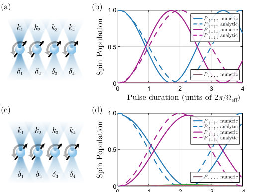
<figcaption class="paper-figure-caption"><b>Fig 5.</b> FIG. 5. Squeezing-mediated 4-body spin interactions. Schematics of individually addressed generalized squeezing in- teractions with (a) trisqueezing (k1 = 3) on ion 1, and dis- placements (k2 = k3 = k4 = 1) on ions 2 through 4, and (c) squeezing (k1 = k2 = 2) on ions 1 and 2, and displacements (k3 = k4 = 1) on ions 3 and 4. (b), (d) Spin population dy- namics under the engineered 4-body interactions (solid) and analytic ˆσxˆσxˆσxˆσx interaction (dashed).</figcaption>
</figure>

**Summary.** This paper details how generalized squeezing interactions can be harnessed to realize several key applications in hybrid spin-oscillator quantum processors. The research focuses on developing fast and high-fidelity methods for both discrete and continuous variable quantum computation and sensing. By leveraging the geometric phase inherent in these interactions, it establishes a robust theoretical framework for next-generation quantum hardware.

**Why it may be interesting.** It directly addresses advanced control techniques (generalized squeezing) in hybrid systems, providing concrete protocols for implementing complex quantum gates beyond standard pairwise interactions.

Detailed structure

**Main problem.** The work proposes four novel applications for utilizing spin-dependent generalized squeezing interactions to achieve fast, high-fidelity quantum computation and sensing.

**Main result.** These applications demonstrate that the geometric phase induced by generalized squeezing provides a foundation for advanced discrete- and continuous-variable quantum processing in hybrid platforms.

**Method.** The analysis involves deriving time evolution using the Magnus expansion applied to Hamiltonians describing spin-oscillator coupling, leading to engineered gates and interactions.

**Model / system.** The system is a hybrid spin-oscillator platform, modeled by an interaction Hamiltonian involving collective spin operators ($\hat{J}_{	heta,\phi}$) and bosonic ladder operators ($\hat{a}, \hat{a}^\dagger$).

**Key observables.** Gate fidelity, gate speedup ($S(k)$), Wigner function trajectories, and the effective Rabi frequency for N-body interactions.

**Important parameters / regimes.** The interaction order $k$ of the generalized squeezing, the initial Fock state occupation ($n_i$), and detunings ($\delta_j$) are key parameters.

**Assumptions / limitations.** Calculations rely on truncating the Magnus expansion (e.g., to second order), and the set of applications discussed is noted as non-exhaustive.

**Figures summary.** Figure 1 illustrates Wigner function trajectories comparing $k=1$ (displacement) and $k=2$ (squeezing) gates, alongside plots showing gate speedup versus initial Fock state occupation.

**Paper structure.** The paper systematically investigates four applications: geometric phase gates for two spins/one oscillator; genuine N-body spin interactions; oscillator thermometry via spin readout; and high-fidelity quantum state preparation of the oscillator.

Abstract

Generalized squeezing interactions are foundational to quantum optics, and have recently come under experimental control in hybrid spin-oscillator quantum processors [O. Băzăvan, et al., Nat. Phys. 22, 757 (2026); S. Saner, et al., Phys. Rev. X 16, 021049 (2026)]. These interactions open the door for new applications in the processing of discrete- and continuous-variable quantum information, four of which we propose and investigate in this work: geometric phase gates mediated by spin-dependent generalized squeezing acting on two spins and a common oscillator; genuine N-body spin interactions mediated by individually addressed spin-dependent generalized squeezing; oscillator thermometry via spin readout; and the preparation of high-fidelity quantum states of the oscillator via spin-dependent generalized squeezing and mid-circuit measurement. A unifying feature of these applications is the geometric phase induced by generalized squeezing interactions, which is nonlinear in the Fock occupation of the oscillator and the interaction order of the generalized squeezing. This work provides a foundation for fast, high-fidelity discrete- and continuous-variable quantum computation and sensing in the hybrid spin-oscillator platform via generalized squeezing.

[↑ back to top](#top)

### [Quantum annealers as programmable thermal machines](http://arxiv.org/abs/2608.04564v1)

**Authors:** Jakub Pawłowski, Tomasz Śmierzchalski, Fengping Jin, Bartłomiej Gardas, Sebastian Deffner, Zakaria Mzaouali  
**Type:** both · **Category:** statistical mechanics · **PDF:** <https://arxiv.org/pdf/2608.04564v1>  
**Analysis basis:** full PDF text, analyzed in chunks
**Topic relevance:** `non-equilibrium dynamics` **3/5** · `non-equilibrium universality` **2/5** · `Keldysh / 2PI / non-Gaussian methods` **1/5** · `analog quantum simulation` **1/5** · `correlated / nonlocal dissipation` **1/5** · `driven-dissipative phase transition` **1/5** · `entanglement & information structure` **1/5** · `methods for driven-dissipative` **1/5**

↔ Scroll figures horizontally

<figure class="paper-figure-card">
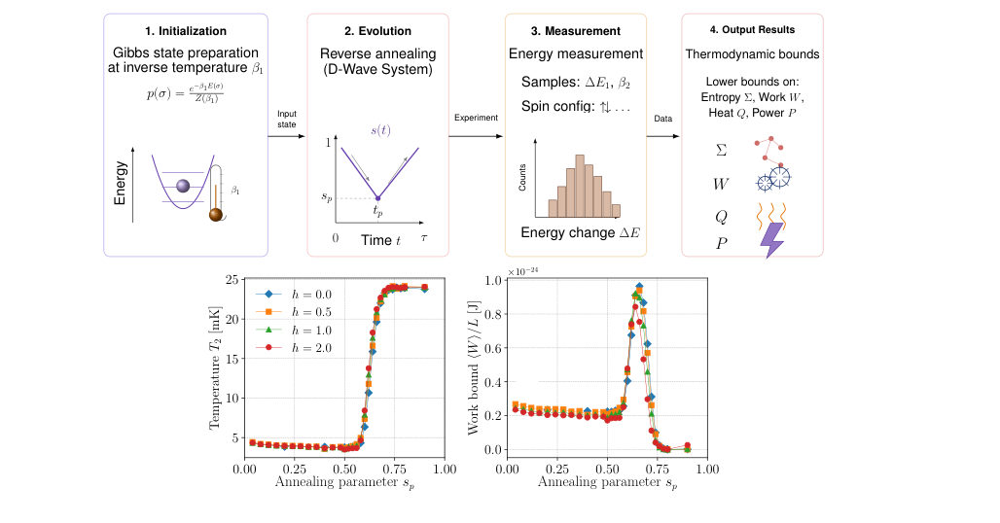
<figcaption class="paper-figure-caption"><b>Fig 1.</b> Fig. 1: Experimental workflow of the paper. A classical Gibbs state of the programmed Ising Hamil- tonian is prepared at unitless inverse temperature β1 = 1 and used as the input state for a reverse annealing schedule. The annealing parameter is ramped from s = 1 to a turning point sp and back to s = 1, so that the initial and final Hamiltonians are the same. The quantum processing unit readout therefore gives a two point energy change ∆E1 of the problem Hamiltonian. Repeating the cycle builds the distribution of ∆E1, from which we estimate an effective environment temperature T2 by pseudo-likelihood thermometry and evaluate fluctuation relation and thermodynamic uncertainty relation bounds...</figcaption>
</figure>
<figure class="paper-figure-card">
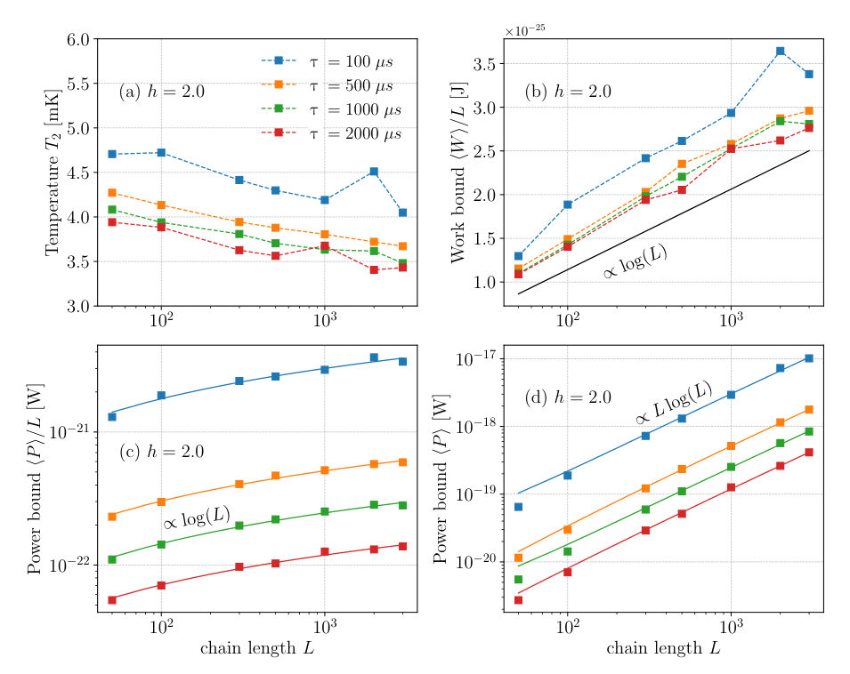
<figcaption class="paper-figure-caption"><b>Fig 2.</b> Fig. 2: Finite size scaling of thermodynamic bounds in a one dimensional chain. For random uniform chains with strong random fields, hi ∈[−2, 2], the reverse annealing turning point is fixed at sp = 0.35 and the chain length L is varied on the D-Wave Advantage6.4 (Pegasus) chip. Panel (a) shows the pseudo-likelihood estimate of the effective temperature T2 for annealing times τ = 100, 500, 1000 and 2000 µs. Panels (b) and (c) show the work and power bounds per spin, which grow slowly with L and are consistent with a logarithmic finite size enhancement over the range studied. Panel (d) shows the total power bound, which grows approximately as L log L when the per-spin contribution is summed...</figcaption>
</figure>
<figure class="paper-figure-card">
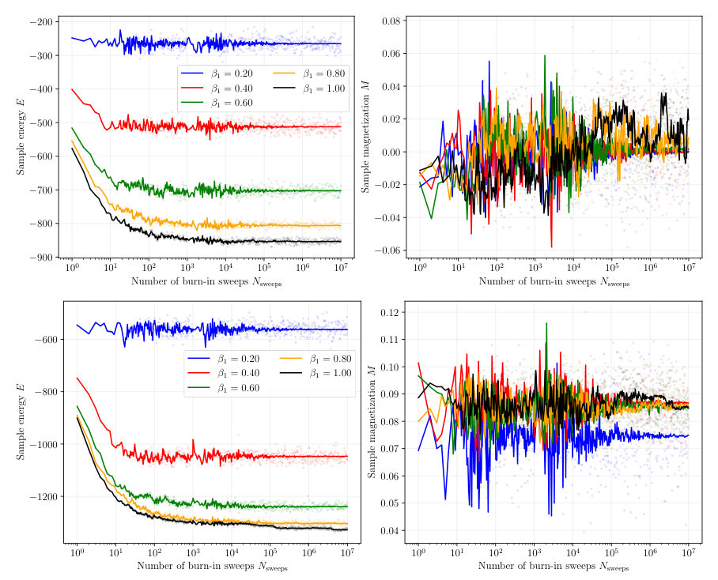
<figcaption class="paper-figure-caption"><b>Fig 3.</b> Fig. 7: Burn-in diagnostics for the Gibbs initial samples. Sample energy E and magnetization M are shown as functions of the number of burn-in sweeps for the RAU (upper row) and CBFM (lower row) Pegasus P6 instances. In both cases the energy reaches a plateau after an initial relaxation period. The RAU magnetization fluctuates around zero, while the CBFM magnetization remains finite because of the biased ferromagnetic structure of the instance. The plateau region is used to choose the burn-in length for the production samples.</figcaption>
</figure>

**Summary.** The paper develops a thermodynamic framework to analyze quantum annealers by treating them as closed thermal cycles. It uses fluctuation theorems to calculate energy exchange quantities like work and entropy production from measured energy changes. This allows researchers to diagnose the underlying physical process—whether it is net heating, cooling, or controlled work extraction—providing deeper insight than performance metrics alone.

**Why it may be interesting.** This work provides a rigorous connection between quantum computation performance metrics (like optimization success) and fundamental principles of non-equilibrium statistical mechanics, offering new diagnostics for open quantum systems.

Detailed structure

**Main problem.** The paper aims to characterize programmable quantum annealers as closed thermodynamic cycles to assess performance beyond simple solution quality or runtime metrics.

**Main result.** By applying fluctuation theorems, the authors derive lower bounds on entropy production, work, and heat exchange, revealing operational regimes (heater, refrigerator, etc.) that quantify energy flow during computation.

**Method.** The methodology involves treating the annealer as a thermodynamic system undergoing reverse annealing cycles, using initial/final Ising energies and effective temperature fits to calculate these thermodynamic bounds.

**Model / system.** The primary physical platform is the D-Wave quantum annealer (and Advantage hardware), modeled via an Ising Hamiltonian. The analysis applies to 1D chains and higher connectivity instances.

**Key observables.** Lower bounds on entropy production ($\Sigma$), Work ($W$), Heat ($Q$), Power ($P$), and the effective environment temperature ($T_2$).

**Important parameters / regimes.** Initial inverse temperature ($eta_1$), annealing parameter ($s_p$), cycle time ($	au$), and system size ($N$).

**Assumptions / limitations.** The analysis relies on fluctuation identities (like TURs) to derive bounds from limited measurements, and the extracted $T_2$ is an effective temperature of sampled degrees of freedom, not a direct hardware measurement.

**Figures summary.** Figures illustrate the experimental workflow using reverse annealing cycles; one shows finite size scaling of work/power bounds for 1D chains, another maps operating modes in the $(eta_1, s_p)$ plane, and others show thermodynamic scans varying initial temperature.

**Paper structure.** The paper establishes the thermodynamic framework by defining the cycle, applies this to measure energy exchange on D-Wave hardware across different annealing paths, classifies the operational regime based on input parameters ($eta_1, s_p$), and concludes with device-agnostic diagnostic tools.

Abstract

Programmable quantum annealers are used for optimization, probabilistic sampling, and simulation, but their performance is commonly reported without the energy exchanged during computation. Here we characterize the D-Wave quantum annealer as a closed thermodynamic cycle. From initial and final Ising energies and an effective temperature fitted to the output distribution, we obtain lower bounds on entropy production, environment energy exchange, work, and power. By varying the prepared distribution and the reverse annealing turning point, we map heater-, accelerator-, refrigerator-, and engine-compatible regimes in one dimensional chains and higher connectivity instances, and apply the same analysis to Advantage and Advantage2 hardware. For an encoded optimization problem, the measured processor energy change states whether final candidates improve or worsen the programmed objective on average. For sampling, the fitted temperature provides an operational measure of how strongly probability is concentrated among low energy configurations. The thermodynamic mode therefore adds information absent from solution quality or runtime alone: it distinguishes driven refinement, net heating, and heat pumping while quantifying their energetic consequences. This framework connects quantum optimization, probabilistic computing, statistical physics simulation, hardware diagnostics, and energy-aware assessment without assuming that a thermodynamic label alone determines computational performance.

[↑ back to top](#top)

### [Quantum Bayes Correlated Equilibrium and the Comparison of Quantum Information Structures in Games](http://arxiv.org/abs/2608.04973v1)

**Authors:** Furkan Sezer  
**Type:** theory · **Category:** other · **PDF:** <https://arxiv.org/pdf/2608.04973v1>  
**Analysis basis:** full PDF text, analyzed in chunks
**Topic relevance:** `quantum measurements` **3/5** · `entanglement & information structure` **2/5** · `measurement-induced transitions` **2/5** · `Keldysh / 2PI / non-Gaussian methods` **1/5** · `correlated / nonlocal dissipation` **1/5** · `driven-dissipative phase transition` **1/5** · `methods for driven-dissipative` **1/5**

↔ Scroll figures horizontally

<figure class="paper-figure-card">
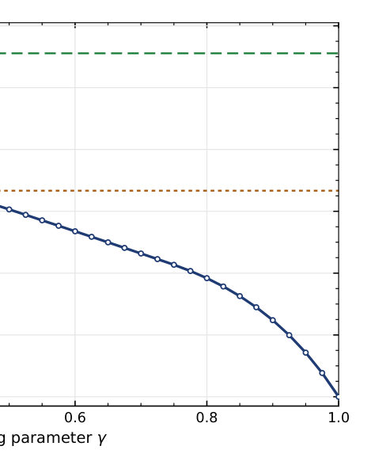
<figcaption class="paper-figure-caption"><b>Fig 1.</b> Figure 1. Maximum average welfare per player over QBCE(G, Qγ) along the de- polarizing chain of Proposition 10.1, each marker being the optimal value of a semi- definite program. Informativeness increases with γ, so the structures are ordered from least informative on the left to most informative on the right. The value is non-increasing, as Theorem 9.4 requires: more information admits fewer equilibrium outcomes and hence a lower best case. It equals 4/3, the maximum over BCE(G, S∅), for γ ≲0.33, where the obedience constraints are slack, and falls to 1 at γ = 1. The first-best value 14/9 is never attained, because joint investment in the bad state is not obedient</figcaption>
</figure>

**Summary.** This work quantizes the comparison of information structures by defining Quantum Bayes Correlated Equilibrium (QBCE). It shows that more detailed information, modeled via a parameter $\gamma$, systematically shrinks the set of possible equilibrium outcomes and lowers the maximum achievable welfare. The methodology relies on translating complex quantum constraints into computable semidefinite programming problems.

**Why it may be interesting.** While not directly about AMO systems, the mathematical tools—such as using operator inequalities (Loewner order) to constrain quantum decision processes—are highly relevant for modeling open quantum systems or measurement back-action in quantum control theory.

Detailed structure

**Main problem.** The paper builds a quantum analogue of comparing information structures used in games of incomplete information, aiming to quantify how much more informative one structure is compared to another.

**Main result.** It establishes that under quantum individual sufficiency, increasing the available information (via the mediator's observation) shrinks the set of possible Quantum Bayes Correlated Equilibrium outcomes and reduces the maximum attainable welfare in every game.

**Method.** The authors characterize obedience using a Loewner domination condition between operators on a player's subsystem, allowing the equilibrium set to be computed as a compact spectrahedron via semidefinite programming (SDP).

**Model / system.** The model is an extension of classical Bayesian games into quantum settings, where private information is encoded in subsystems and observed by a mediator. The analysis uses general quantum information structures defined by families of density operators.

**Key observables.** The equilibrium set (a non-empty compact spectrahedron), the maximum average welfare achievable over the QBCE set, and various comparison relations ($\preceq_{	ext{QIS}}$).

**Important parameters / regimes.** A depolarizing parameter $\gamma \in [0, 1]$ is used to interpolate between different information structures, controlling the amount of noise or information retained.

**Assumptions / limitations.** The analysis relies on defining quantum individual sufficiency and comparing structures via Loewner domination; exact equivalence with classical constraints holds only under specific conditions (e.g., simultaneous diagonalizability).

**Figures summary.** Figure 1 illustrates the maximum average welfare per player as a non-increasing function of the depolarizing parameter $\gamma$, showing plateaus and subsequent drops.

**Paper structure.** The paper develops the QBCE concept, proves the Loewner characterization for obedience, establishes that the equilibrium set is an SDP-computable spectrahedron, and finally proves the comparison theorem by analyzing how information structure parameters ($\gamma$) affect welfare maximization.

Abstract

Bergemann and Morris (2016) show that one information structure is more informative than another exactly when it induces a smaller set of Bayes correlated equilibrium outcomes in every game. We build the quantum analogue. An information structure becomes a family of density operators indexed by the payoff state, which the mediator observes. We show that obedience is equivalent to a Loewner domination between operators on one player's subsystem. The equilibrium set is then a nonempty compact spectrahedron computable by semidefinite programming, classical structures embed exactly, and under quantum individual sufficiency more information shrinks the equilibrium set in every game.

[↑ back to top](#top)

### [Residual Saturation under Pressure-Controlled Drainage](http://arxiv.org/abs/2608.04748v1)

**Authors:** Fernando Alonso-Marroquin, Hans J. Herrmann  
**Type:** theory · **Category:** statistical mechanics · **PDF:** <https://arxiv.org/pdf/2608.04748v1>  
**Analysis basis:** full PDF text, analyzed in chunks
**Topic relevance:** `non-equilibrium universality` **3/5** · `non-equilibrium dynamics` **2/5** · `Keldysh / 2PI / non-Gaussian methods` **1/5** · `analog quantum simulation` **1/5** · `correlated / nonlocal dissipation` **1/5** · `driven-dissipative phase transition` **1/5** · `entanglement & information structure` **1/5** · `methods for driven-dissipative` **1/5**

↔ Scroll figures horizontally

<figure class="paper-figure-card">
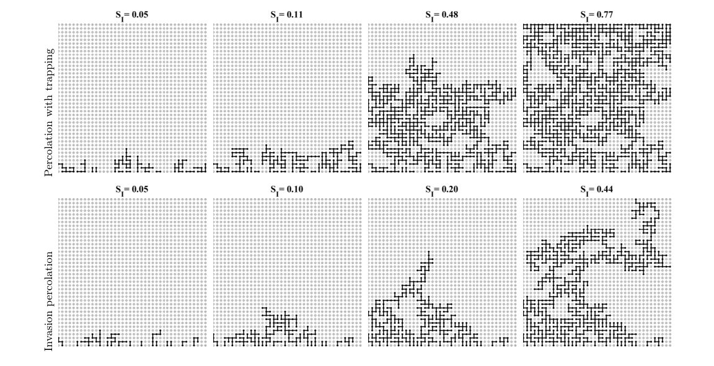
<figcaption class="paper-figure-caption"><b>Fig 1.</b> FIG. 1. Snapshots of invasion on the same random porous network at different saturation stages for bond percolation with trapping (BPT, top row) and invasion percolation (IP, bottom row). The bottom and top boundaries define the inlet and outlet nodes, while the left and right boundaries are impermeable no-flow boundaries, i.e., periodic boundary conditions are not used in the horizontal direction. The invaded-phase saturation SI is the portion of the network reached from the inlet. The final states (last column) show SI = 77% for BPT, due to trapping of defending-fluid regions disconnected from the outlet, and SI = 44% for IP, due to early breakthrough and bypassing by the ramified...</figcaption>
</figure>
<figure class="paper-figure-card">
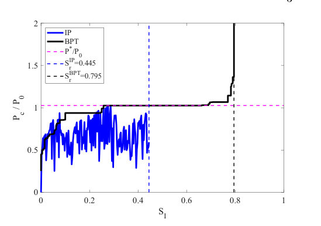
<figcaption class="paper-figure-caption"><b>Fig 2.</b> FIG. 2. Pressure–saturation curves for the square lattice of Fig. 1. black: bond percolation with trapping. Blue: invasion percolation. dashed horizontal line is the entry pressure. The dashed vertical lines indicate the final residual saturation for the trapped percolation model and invasion percolation.The p−increment is ∆p = 10−3.</figcaption>
</figure>
<figure class="paper-figure-card">
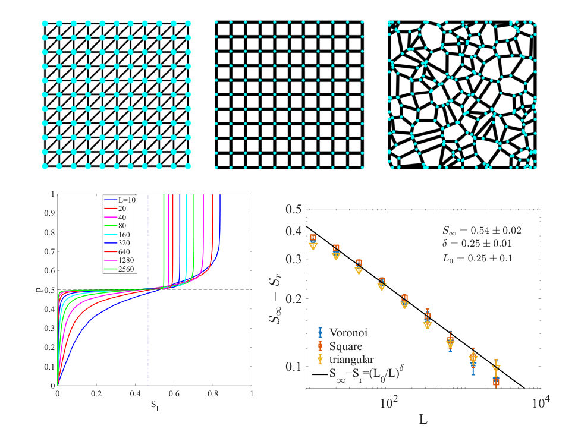
<figcaption class="paper-figure-caption"><b>Fig 3.</b> FIG. 3. Top: lattices used in the 2D analysis, from left to right: triangular, square, and Voronoi. Bottom left: bond occupancy versus invaded-phase saturation for square lattices of increasing size. The dashed lines indicate the classical bond-percolation threshold. The dotted line marks the infinite-system value SI,∞(1) = 1 −S∞≈0.46. Bottom right: residual saturation versus lattice size for triangular (triangles), square (squares), and Voronoi (stars) lattices. Here Sr(L) denotes the residual saturation for a system of size L, and S∞is its infinite-size limit value. The solid line is the fit of Eq. 7. The p−increment in BPT is ∆p = 10−3.</figcaption>
</figure>
<figure class="paper-figure-card">
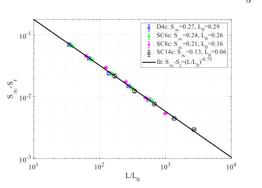
<figcaption class="paper-figure-caption"><b>Fig 4.</b> FIG. 4. Residual-saturation scaling in 3D pore-network lat- tices: S∞−Sr versus normalized system size L/L0 on log–log axes. Results are shown for the four lattices D4c, SC6c, SC8c, and SC14c, where the suffix “c” denotes periodic boundary conditions in the transverse directions (x and y), while the displacement direction is non-periodic. Symbols show ensem- ble means over 96 realizations at each L = 10, 20, 40, 80, 160, with error bars indicating the standard error. The solid line indicates the best-fit power law (L0/L)δ. The p−increment in BPT is ∆p = 10−3.</figcaption>
</figure>

**Summary.** This paper models liquid drainage through porous media by comparing two theoretical frameworks: standard invasion percolation (IP) and pressure-controlled drainage modeled as bond percolation with trapping (BPT). The key finding is that BPT predicts a finite residual saturation in the infinite limit, unlike IP. The work uses scaling laws to characterize how these differences manifest across various dimensions.

**Why it may be interesting.** While focused on fluid dynamics in porous media, the rigorous application of percolation theory, fractal geometry, and finite-size scaling laws connects to critical phenomena studied extensively in statistical mechanics, which shares mathematical tools with quantum many-body systems.

Detailed structure

**Main problem.** The study compares residual saturation under pressure-controlled drainage versus standard invasion percolation theory.

**Main result.** Pressure-controlled drainage leads to a finite, non-zero residual saturation in the infinite limit, contrasting with invasion percolation's prediction that the invaded phase saturation vanishes asymptotically.

**Method.** The process is modeled using bond percolation with trapping (BPT) on a pore-network graph and analyzed by comparing its results against standard invasion percolation (IP).

**Model / system.** The physical system is liquid invasion into porous media, modeled via a pore-network graph. The theory compares two drainage mechanisms: IP (local advancement) and BPT (pressure-controlled filling with trapping).

**Key observables.** Invasion-phase saturation ($S_I$), residual saturation ($S_r$), and finite-size scaling exponents ($\delta$).

**Important parameters / regimes.** Pore network size ($L$), dimensionality (2D vs 3D), and bond occupancy ($p$) related to capillary pressure.

**Assumptions / limitations.** The analysis relies on fitting power laws to determine asymptotic behavior, and pore-shape effects are noted as remaining important for quantitative comparison with experiments.

**Figures summary.** Figures compare BPT and IP saturation curves on lattices; one figure shows snapshots illustrating the difference in invaded regions; another details residual saturation scaling across different lattice sizes and dimensions.

**Paper structure.** The paper establishes the theoretical framework by formulating drainage as bond percolation with trapping, derives key results contrasting it with invasion percolation (especially regarding finite-size scaling), and analyzes dimensionality dependence through simulations on various lattices.

Abstract

Here, pressure-controlled drainage is formulated as bond percolation with trapping on the pore-network graph, establishing a direct connection between percolation theory and pressure--saturation relations. In two dimensions, the deviation of the residual saturation from its non-vanishing thermodynamic limit obeys a finite-size scaling law with exponent $δ\approx 0.25$, independent of microscopic details of the lattice. In three dimensions, finite-size corrections decay more rapidly ($δ\approx 0.75$), while the asymptotic residual saturation remains finite and depends on coordination number. This extends the standard invasion-percolation picture beyond the breakthrough state, where the invading cluster is fractal and the invaded-phase saturation vanishes in the infinite-size limit.

[↑ back to top](#top)

### [Experimental Kuramoto Platform](http://arxiv.org/abs/2608.04119v1)

**Authors:** Leandro Freitas, Victor H. S. Bittencourt, Débora D. Superbi, Wanderley C. Silva Junior, Arthur N. Montanari, Luis A. Aguirre  
**Type:** experiment · **Category:** disordered systems and neural networks · **PDF:** <https://arxiv.org/pdf/2608.04119v1>  
**Analysis basis:** full PDF text, analyzed in chunks
**Topic relevance:** `driven-dissipative phase transition` **3/5** · `non-equilibrium dynamics` **2/5** · `non-equilibrium universality` **2/5** · `Frenkel-Kontorova` **1/5** · `correlated / nonlocal dissipation` **1/5** · `methods for driven-dissipative` **1/5**

↔ Scroll figures horizontally

<figure class="paper-figure-card">
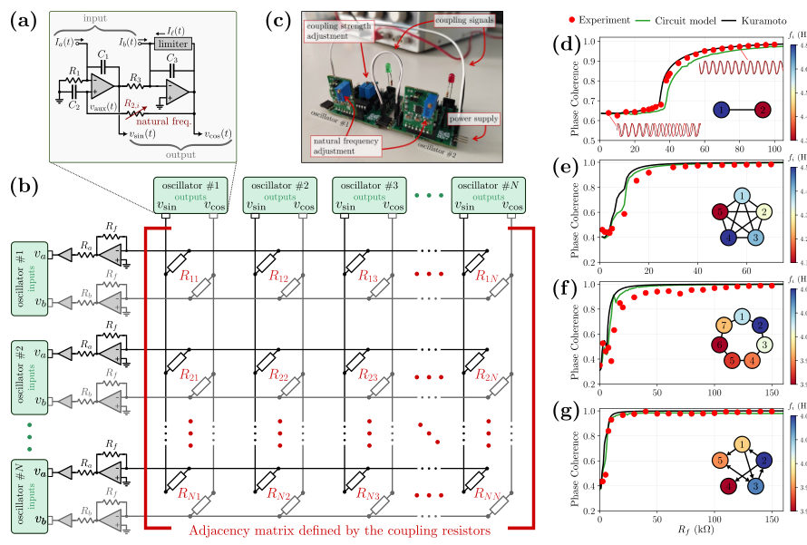
<figcaption class="paper-figure-caption"><b>Fig 1.</b> FIG. 1. Experimental platform of the Kuramoto model. (a) Circuit diagram of a quadrature oscillator [15] with two input (Ia, Ib) and two output (vsin, vcos) signals. The oscillator natural frequency ωi is tuned via the potentiometer R2,i. The complete circuit diagram is shown in SM [16], Fig. S1. (b) Coupling circuit implementing the adjacency matrix, with entries defined by the coupling resistors Rij. The resistors Rf control the global coupling strength K. (c) Printed circuit board (PCB) of a pair of coupled quadrature oscillator. (d–g) Experimental validation of the synchronization transition as a function of the coupling strength, shown for different network structures: (d) symmetric...</figcaption>
</figure>
<figure class="paper-figure-card">
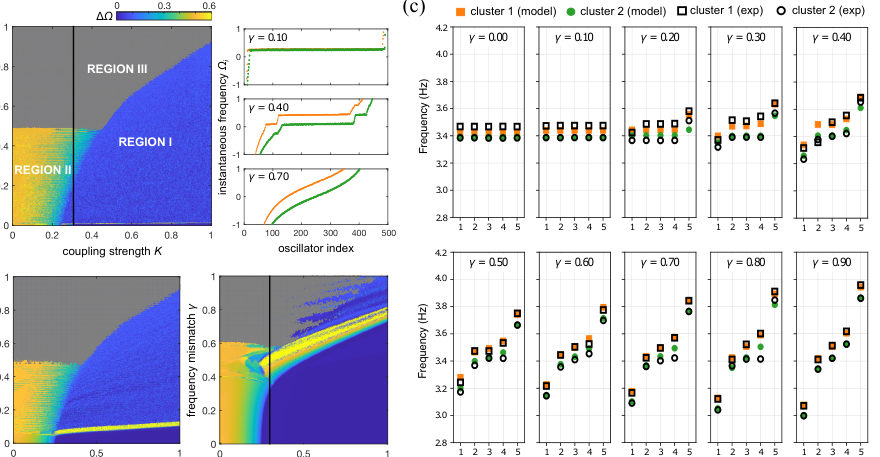
<figcaption class="paper-figure-caption"><b>Fig 2.</b> FIG. 2. Cluster synchronization in the experimental Kuramoto platform. (a) (K, γ)-phase diagram in a weakly coupled network of two clusters, each with M = 500 Kuramoto oscillators. Color bar represents the instantaneous frequency mismatch ∆Ωbetween the two clusters. Regions I, II, and III correspond respectively to global synchronization (blue region, where ∆Ω≈0), cluster synchronization (light blue to yellow region, where ∆Ω&gt; 0), and desynchronization (gray region). The right panels show the instantaneous frequencies Ωi of individual oscillators, color-coded by cluster, for representative values of γ and fixed K = 0.3. (b) (K, γ)-phase diagram for smaller cluster sizes: M = 50 (left) and M...</figcaption>
</figure>

**Summary.** The authors present an experimental platform built from electronic quadrature oscillators designed to model coupled oscillator systems governed by the Kuramoto model. By employing a novel non-diffusive coupling circuit, they successfully demonstrate that their hardware can accurately reproduce phase transitions and synchronization behaviors across both weak and strong coupling regimes. This offers a cost-effective tool for systematically validating complex theoretical models of collective dynamics.

**Why it may be interesting.** This work provides a tangible, low-cost hardware testbed for complex collective dynamics models (like Kuramoto), allowing experimental validation of theoretical predictions in parameter regimes previously inaccessible due to weak-coupling assumptions.

Detailed structure

**Main problem.** Connecting analytical results from the Kuramoto model, derived via phase reduction, to experimental data is challenging because many physical platforms violate the weak-coupling assumptions.

**Main result.** The proposed electronic platform successfully reproduces Kuramoto model dynamics for both weak and strong coupling regimes across various network topologies.

**Method.** The authors designed an experimental circuit using electronic quadrature oscillators coupled via a novel non-diffusive architecture to map oscillator dynamics onto the required sinusoidal phase coupling.

**Model / system.** The system uses electronic quadrature oscillators whose phase dynamics are engineered to mimic the Kuramoto model ($\dot{\phi}_i = \omega_i + K \sum A_{ij} \sin(\phi_j - \phi_i)$). The coupling is achieved using external currents in a non-diffusive circuit.

**Key observables.** Phase coherence, order parameter (R), and observation of phase transitions (global and cluster synchronization).

**Important parameters / regimes.** Coupling strength ($K$), network topology (e.g., ring, all-to-all, directed), frequency mismatch ($\Delta\Omega$).

**Assumptions / limitations.** The platform aims to achieve equivalence without relying on conventional weak-coupling phase-reduction assumptions; however, the initial coupling implementation is noted as being inherently diffusive.

**Figures summary.** Figures demonstrate validation of synchronization transitions for different topologies (symmetric, all-to-all, ring, directed) and illustrate the $(K, \gamma)$-phase diagram for cluster synchronization.

**Paper structure.** The paper introduces the physical challenge, details the quadrature oscillator platform and non-diffusive coupling circuit, demonstrates its ability to reproduce Kuramoto phase transitions across various regimes, and concludes by outlining future extensions like implementing signed networks or adaptive control.

Abstract

Phase reduction provides a principled relationship between high-dimensional oscillator dynamics and low-dimensional phase models such as the Kuramoto model. However, connecting analytical results derived from the Kuramoto framework to experimental data remains an open challenge, as many physical platforms violate the weak-coupling assumptions underlying standard phase reduction. Here, we present an experimental platform based on electronic quadrature oscillators whose phase dynamics are, under certain assumptions, equivalent to the Kuramoto model. Crucially, this equivalence is achieved for both weak and strong coupling through a non-diffusive coupling circuit, and the design approach supports arbitrary (weighted and directed) network topologies while preserving scalability and oscillation regularity. Across different coupling schemes, we demonstrate that the platform reliably reproduces phase transitions predicted by the Kuramoto model for both global and cluster synchronization. This cost-effective platform enables systematic experimental validation of analytical and numerical results for synchronization in complex networks.

[↑ back to top](#top)

### [Gibbs variational principles and Boltzmann irreversible theorem](http://arxiv.org/abs/2608.04129v1)

**Authors:** Mário J. de Oliveira, Silvio R. Salinas  
**Type:** theory · **Category:** statistical mechanics · **PDF:** <https://arxiv.org/pdf/2608.04129v1>  
**Analysis basis:** full PDF text, analyzed in chunks
**Topic relevance:** `non-equilibrium dynamics` **3/5** · `non-equilibrium universality` **2/5** · `Keldysh / 2PI / non-Gaussian methods` **1/5** · `analog quantum simulation` **1/5** · `correlated / nonlocal dissipation` **1/5** · `driven-dissipative phase transition` **1/5** · `methods for driven-dissipative` **1/5**

↔ Scroll figures horizontally

<figure class="paper-figure-card">
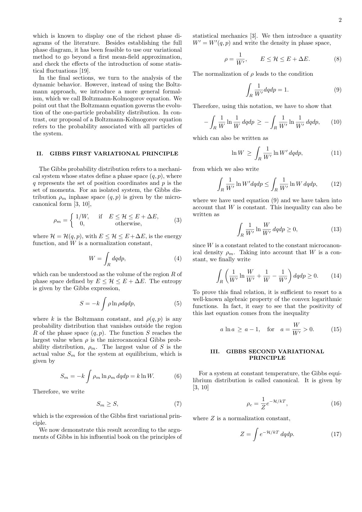
<figcaption class="paper-figure-caption"><b>Fig 1.</b> Low-resolution page preview, page 2</figcaption>
</figure>
<figure class="paper-figure-card">
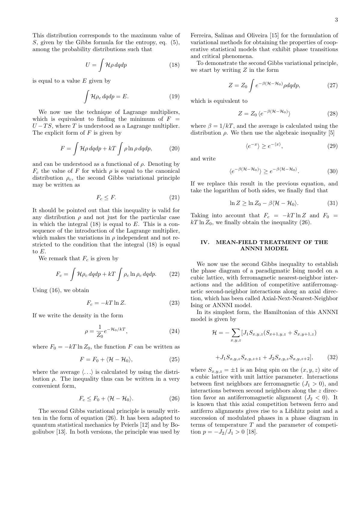
<figcaption class="paper-figure-caption"><b>Fig 2.</b> Low-resolution page preview, page 3</figcaption>
</figure>
<figure class="paper-figure-card">
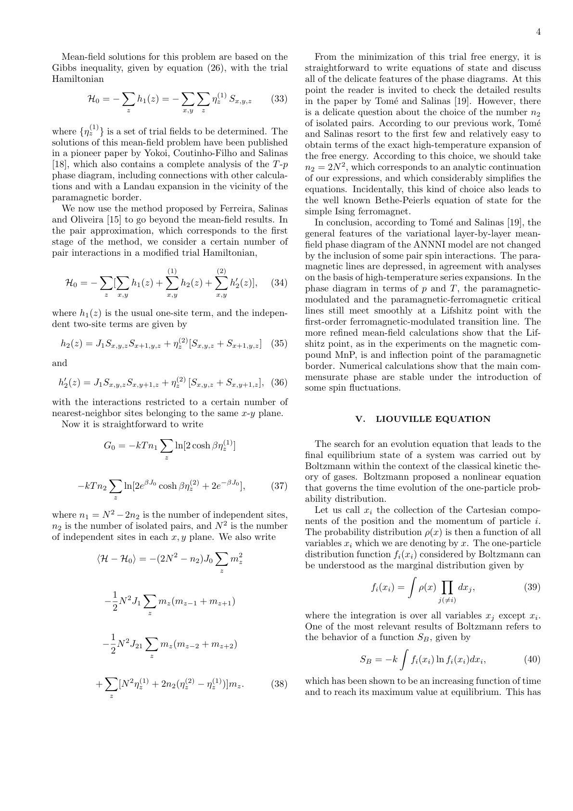
<figcaption class="paper-figure-caption"><b>Fig 3.</b> Low-resolution page preview, page 4</figcaption>
</figure>
<figure class="paper-figure-card">
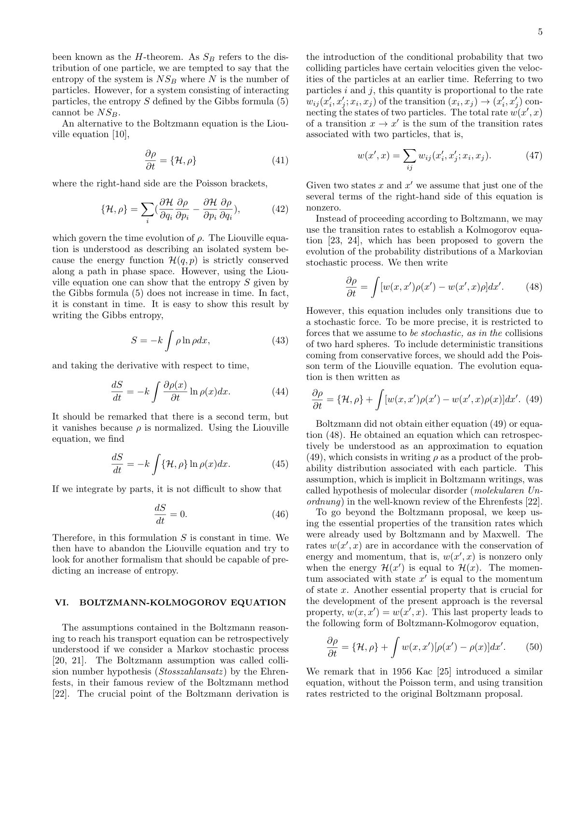
<figcaption class="paper-figure-caption"><b>Fig 4.</b> Low-resolution page preview, page 5</figcaption>
</figure>
<figure class="paper-figure-card">
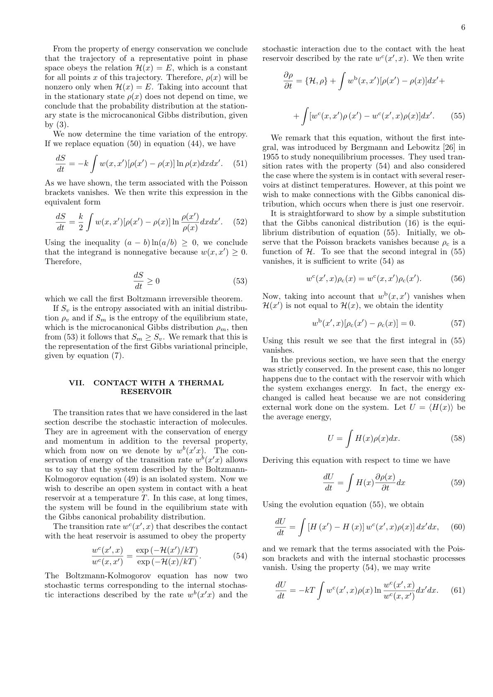
<figcaption class="paper-figure-caption"><b>Fig 5.</b> Low-resolution page preview, page 6</figcaption>
</figure>

**Summary.** This paper unifies concepts from equilibrium and non-equilibrium statistical mechanics by showing that the Gibbs variational principles are mathematically equivalent to the Boltzmann irreversible theorems. Using stochastic evolution equations, it derives bounds on entropy increase and free energy decrease for both isolated and open quantum/classical systems.

**Why it may be interesting.** This work provides a deep theoretical link between equilibrium statistical mechanics (variational principles) and non-equilibrium dynamics (irreversibility theorems), which is fundamental for understanding relaxation processes in complex quantum or classical systems.

Detailed structure

**Main problem.** The paper analyzes Gibbs variational principles for systems isolated or at constant temperature, aiming to connect these principles rigorously to the Boltzmann irreversible theorems.

**Main result.** It establishes that both the first (entropy increase) and second (free energy decrease) Boltzmann irreversible theorems are mathematically equivalent to the corresponding Gibbs variational inequalities ($S_m \ge S$ and $F_c \le F$).

**Method.** The analysis uses stochastic evolution equations, specifically a modified Boltzmann-Kolmogorov equation, alongside thermodynamic derivations involving free energy minimization.

**Model / system.** The primary model studied is the Axial-Next-Nearest-Neighbor Ising (ANNNI) model on a cubic lattice. The framework extends to general open systems interacting with thermal reservoirs.

**Key observables.** Entropy ($S$), Free Energy ($F = U - TS$), and the time evolution of these quantities ($\mathrm{d}S/\mathrm{d}t$ and $\mathrm{d}F/\mathrm{d}t$).

**Important parameters / regimes.** Interaction coupling constants ($J_1, J_2$) defining the ANNNI Hamiltonian; temperature $T$; and system volume/size.

**Assumptions / limitations.** The derivation of irreversible theorems relies on assuming specific forms for transition rates (detailed balance) and utilizing inequalities like Jensen's inequality.

**Figures summary.** Not specified, but the analysis involves deriving equations of state and phase diagrams for the ANNNI model using variational methods.

**Paper structure.** The paper progresses by first defining Gibbs principles for isolated/canonical systems, then introducing a generalized Boltzmann-Kolmogorov equation to describe time evolution. It subsequently derives the irreversible theorems ($\mathrm{d}S/\mathrm{d}t \ge 0$ and $\mathrm{d}F/\mathrm{d}t \le 0$) and finally proves their equivalence to the variational bounds.

Abstract

We analyze the Gibbs variational principles associated with the probability distributions of (i) an isolated system and (ii) a system at constant temperature. We give an example of using the Gibbs inequality to obtain the free energy and analyze the phase diagram of an Ising model with competing interactions. We also review the Boltzmann irreversible theorem, and show how it is connected to the Gibbs variational principles. This connection is established by using the Kolmogorov equation for the evolution of the probability distribution, which predicts a monotonic increase of entropy for an isolated system, and a decrease of the free energy for a system in contact with a thermal reservoir.

[↑ back to top](#top)

### [Heralded Non-Gaussian Squeezed-State Inputs for Parity-Detection SU(1,1) Interferometry](http://arxiv.org/abs/2608.04476v1)

**Authors:** Lifen Guo, Qingqian Kang, Teng Zhao, Cunjin Liu, Xin Su, Liyun Hu  
**Type:** theory · **Category:** other · **PDF:** <https://arxiv.org/pdf/2608.04476v1>  
**Analysis basis:** full PDF text, analyzed in chunks
**Topic relevance:** `quantum measurements` **3/5** · `interference shaping light` **2/5** · `measurement-induced transitions` **2/5** · `Keldysh / 2PI / non-Gaussian methods` **1/5** · `driven-dissipative phase transition` **1/5** · `entanglement & information structure` **1/5**

↔ Scroll figures horizontally

<figure class="paper-figure-card">
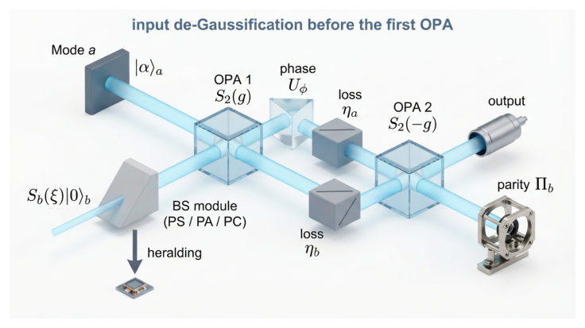
<figcaption class="paper-figure-caption"><b>Fig 1.</b> FIG. 1. SU(1,1) interferometer with input-side non-Gaussian state preparation. A coherent state enters mode a. The squeezed vacuum in mode b is mixed with ancillary mode c, prepared in a Fock state, in a heralded beam-splitter module. The choices (µ, ν) = (0, m), (m, 0), and (m, m) give m-photon subtraction, addition, and catalysis, respectively. The conditional product input enters the first optical parametric amplifier, acquires a phase shift in mode a, and is recombined by the inverse amplifier. Section IV introduces internal transmissions ηa and ηb before the output parity measurement on mode b.</figcaption>
</figure>
<figure class="paper-figure-card">
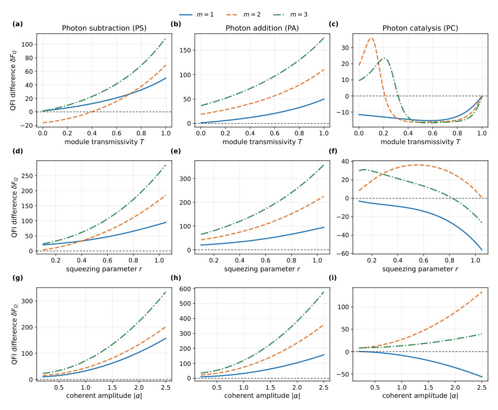
<figcaption class="paper-figure-caption"><b>Fig 2.</b> FIG. 2. Conditional QFI difference δF (j,m) Q = F (j,m) Q −F (G) Q for PS, PA, and PC at m = 1, 2, 3 and g = 0.75. The first row varies the module transmissivity T at r = 0.55 and |α| = 1.2. The second row varies r at |α| = 1.2; the third row varies |α| at r = 0.55. The last two rows use T = 0.93 for PS and PA and T = 0.10 for PC. Positive values denote a conditional QFI improvement. Color and line style jointly identify the operation order; heralding probability is not included.</figcaption>
</figure>
<figure class="paper-figure-card">
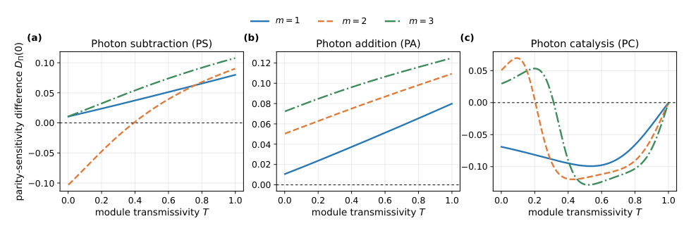
<figcaption class="paper-figure-caption"><b>Fig 3.</b> FIG. 3. Dark-point parity-sensitivity difference D(j,m) Π (0) = ∆ϕ(G) Π (0) −∆ϕ(j,m) Π (0) as a function of the heralding-module transmissivity for PS, PA, and PC at m = 1, 2, 3. Parameters are r = 0.55, |α| = 1.2, and g = 0.75. Positive values favor the conditional non-Gaussian probe. Color and line style jointly identify m = 1, 2, 3; panels are labeled (a)–(c).</figcaption>
</figure>
<figure class="paper-figure-card">
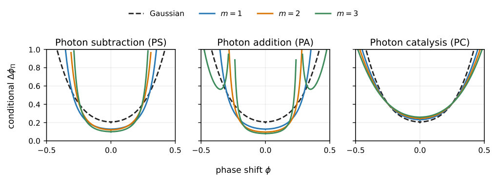
<figcaption class="paper-figure-caption"><b>Fig 4.</b> FIG. 4. Conditional ideal parity phase sensitivity in the local working window, evaluated from the single-mode kernel Pϕ. All curves are conditioned on a successful heralding event, so the heralding probability is not included. Parameters are r = 0.55, |α| = 1.2, g = 0.75, and T = 0.93.</figcaption>
</figure>
<figure class="paper-figure-card">
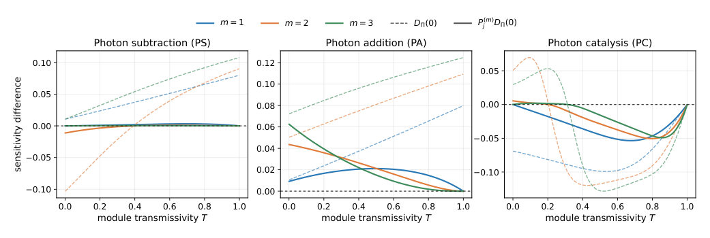
<figcaption class="paper-figure-caption"><b>Fig 5.</b> FIG. 5. Conditional dark-point sensitivity difference D(j,m) Π (0) (dashed curves) and its probability-weighted diagnostic eD(j,m) Π (0) = P (m) j D(j,m) Π (0) (solid curves) versus module transmissivity. Parameters are r = 0.55, |α| = 1.2, and g = 0.75. Weighting changes the magnitude, not the sign or zero crossings.</figcaption>
</figure>

**Summary.** This paper theoretically analyzes how non-Gaussian photon states generated via subtraction, addition, or catalysis can enhance phase estimation in an SU(1,1) interferometer. While these operations show promise under certain conditions, the authors conclude that for practical resource constraints, optimized Gaussian inputs still outperform them. The work establishes a critical boundary between theoretical quantum enhancement and experimentally achievable precision.

**Why it may be interesting.** This work provides a rigorous, quantitative boundary condition for quantum metrology, showing that theoretical potential (high local QFI) does not always translate into achievable precision when realistic measurement limitations (like parity detection or fixed resources) are imposed.

Detailed structure

**Main problem.** The paper compares the metrological advantage of using heralded non-Gaussian squeezed-state inputs (via photon subtraction, addition, or catalysis) versus standard Gaussian inputs in a parity-detection SU(1,1) interferometer for phase estimation.

**Main result.** While single-photon PS and PA improve conditional information at high transmissivity, under strict resource constraints, the optimized Gaussian benchmark remains superior to all tested non-Gaussian operations. Photon catalysis shows promise only in low-transmissivity regimes.

**Method.** The authors developed a unified finite-transmissivity map to calculate conditional moments and Quantum Fisher Information (QFI) for these non-Gaussian inputs within the interferometer framework.

**Model / system.** The system is an SU(1,1) interferometer where one mode receives a coherent state $|\alpha
angle$ and another receives a squeezed vacuum $|\xi
angle$. Non-Gaussian states are heralded by projecting ancillary modes using photon subtraction (PS), addition (PA), or catalysis (PC).

**Key observables.** Quantum Fisher Information (QFI) for phase estimation, conditional moments ($\langle \hat{O} 
angle^{(m)}_j$), and the dark-point parity observable.

**Important parameters / regimes.** Transmissivity $T$, squeezing parameter $r$, interferometer gain $g$, and the specific type of heralding operation (PS, PA, PC).

**Assumptions / limitations.** The conclusion is highly constrained by fixed preparation parameters, fixed gain, parity readout, and the exclusion of full joint optimization over all resource allocations.

**Figures summary.** Figure 1 illustrates the SU(1,1) interferometer setup incorporating the heralded non-Gaussian state generation module using a beam-splitter and ancillary mode projection.

**Paper structure.** The paper establishes the theoretical framework by deriving conditional operators for PS, PA, and PC. It then calculates the QFI based on these inputs, comparing them systematically against the Gaussian benchmark under various loss and resource constraints to draw conclusions about practical utility.

Abstract

Non-Gaussian operations can reshape the photon statistics of continuous-variable probes, but their metrological advantage is meaningful only when heralding probability and photon-number resources are counted consistently. We compare photon subtraction, photon addition, and photon catalysis as input-side heralding operations in a balanced SU(1,1) interferometer with parity detection. A unified finite-transmissivity map supplies closed conditional moments and the corresponding quantum Fisher information at arbitrary operation order; internal loss is absorbed into a single effective parity observable whose lossless limit recovers the ideal pulled-back measurement. At fixed preparation parameters, single-photon subtraction and addition improve the conditional phase information over the Gaussian reference across most of the high-transmissivity regime, while multi-photon catalysis opens useful low-transmissivity windows. However, when the coherent--squeezed allocation is independently optimized at fixed conditional-probe energy and fixed interferometer gain, the success-weighted Fisher information of all three non-Gaussian operations remains below the optimized Gaussian benchmark. This conclusion is subject to the tested constraints: single-photon operations, a coherent-plus-squeezed-vacuum Gaussian family, fixed gain, and parity readout. Photon catalysis separately generates a conditional branch with high local quantum Fisher information that dark-point parity extracts poorly, identifying a measurement mismatch rather than a state-preparation failure. The result draws a sharp boundary between conditional non-Gaussian enhancement and practically available precision under explicitly stated resource constraints.

[↑ back to top](#top)

### [Poisson-Compiled Quantum Singular Value Transformation for Power-Exponential Dissipation](http://arxiv.org/abs/2608.04263v1)

**Authors:** Chao Wang, Xi-Ning Zhuang, Menghan Dou, Zhao-Yun Chen, Guo-Ping Guo  
**Type:** theory · **Category:** quantum information and computing · **PDF:** <https://arxiv.org/pdf/2608.04263v1>  
**Analysis basis:** full PDF text, analyzed in chunks
**Topic relevance:** `methods for driven-dissipative` **3/5** · `non-equilibrium dynamics` **2/5** · `Keldysh / 2PI / non-Gaussian methods` **1/5** · `analog quantum simulation` **1/5** · `correlated / nonlocal dissipation` **1/5** · `driven-dissipative phase transition` **1/5** · `non-equilibrium universality` **1/5**

↔ Scroll figures horizontally

<figure class="paper-figure-card">
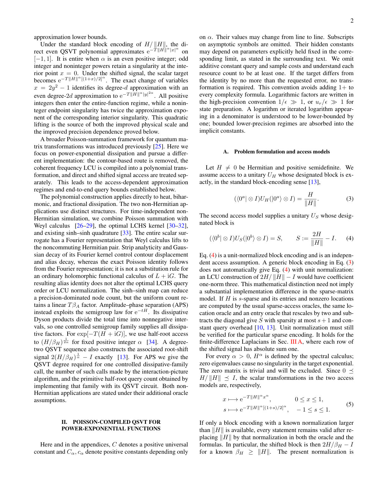
<figcaption class="paper-figure-caption"><b>Fig 1.</b> Low-resolution page preview, page 2</figcaption>
</figure>
<figure class="paper-figure-card">
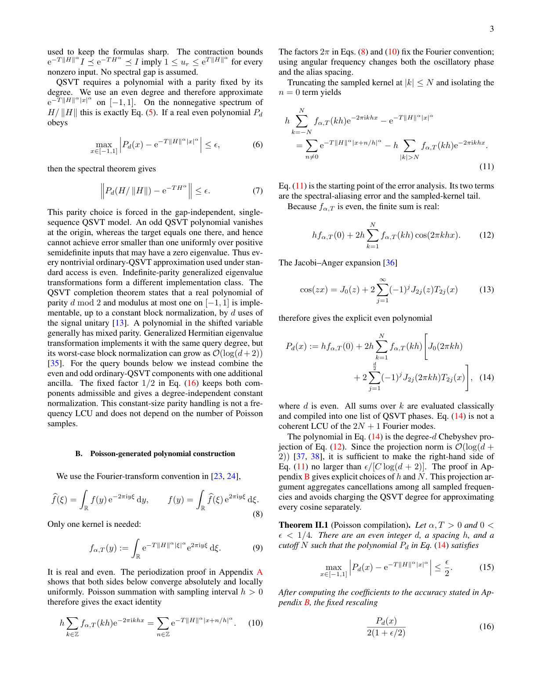
<figcaption class="paper-figure-caption"><b>Fig 2.</b> Low-resolution page preview, page 3</figcaption>
</figure>
<figure class="paper-figure-card">
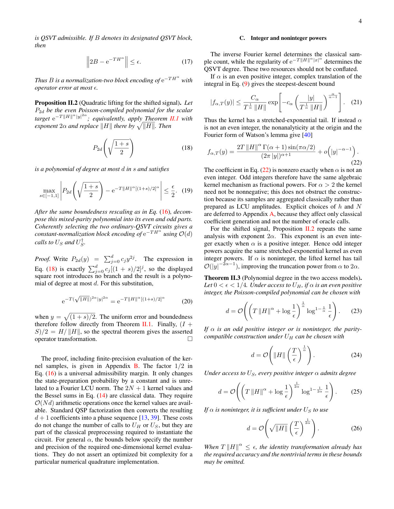
<figcaption class="paper-figure-caption"><b>Fig 3.</b> Low-resolution page preview, page 4</figcaption>
</figure>
<figure class="paper-figure-card">
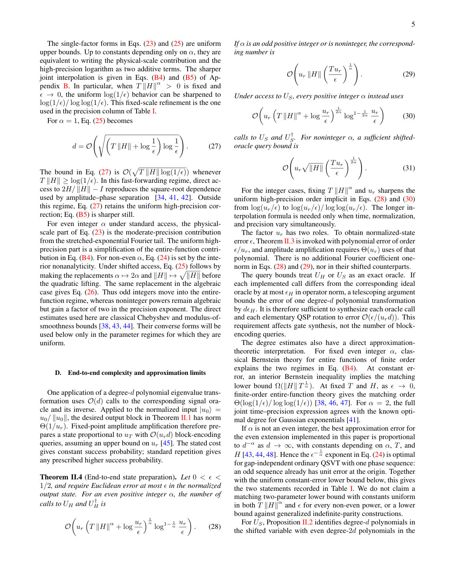
<figcaption class="paper-figure-caption"><b>Fig 4.</b> Low-resolution page preview, page 5</figcaption>
</figure>
<figure class="paper-figure-card">
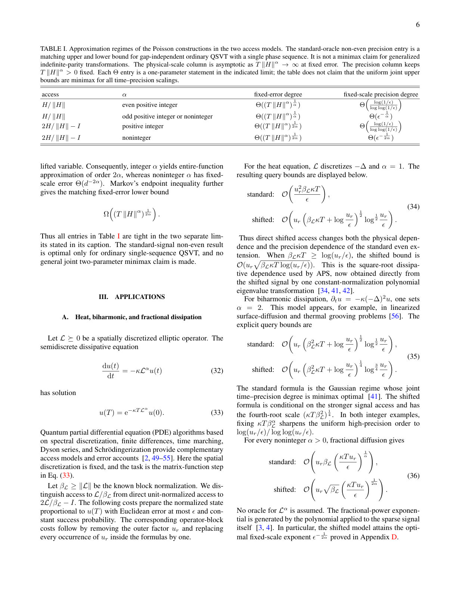
<figcaption class="paper-figure-caption"><b>Fig 5.</b> Low-resolution page preview, page 6</figcaption>
</figure>

**Summary.** This paper develops advanced quantum algorithms to efficiently simulate dissipative time evolution governed by $\exp(-T H^\alpha)$. It utilizes Poisson summation to transform the problem into a polynomial eigenvalue transformation within Quantum Signal Processing. The key breakthrough is showing that using a shifted signal encoding significantly improves the approximation error scaling for noninteger powers, leading to more resource-efficient simulation protocols.

**Why it may be interesting.** This work provides concrete algorithmic improvements (better error scaling) for simulating complex open quantum system dynamics ($\exp(-T H^\alpha)$) by optimizing the underlying quantum circuit structure, which is highly relevant for quantum simulation.

Detailed structure

**Main problem.** The paper addresses the quantum implementation of calculating the contraction $\exp(-T H^\alpha)$ for a positive semi-definite Hamiltonian $H$, which models dissipative dynamics.

**Main result.** By employing Poisson summation to construct polynomial eigenvalue transformations, they improve the error scaling for noninteger powers from $\Theta(d^{-\alpha})$ to $\Theta(d^{-2\alpha})$ using a shifted signal encoding.

**Method.** The core method involves Quantum Signal Processing (QSP) combined with Poisson Summation techniques to map the required function approximation into a polynomial eigenvalue transformation suitable for quantum circuits.

**Model / system.** The model is general dissipative dynamics governed by $u_T = e^{-T H^\alpha} u_0$, where $H$ is a Hermitian, positive semi-definite operator. Two access models are analyzed: the standard block encoding of $H/\|H\|$ and a unit-normalized shifted signal $2H/\|H\| - I$.

**Key observables.** The state preparation overhead ratio $u_r = \|u_0\| / \|u_T\|$ and the approximation error $\epsilon$ are key observables.

**Important parameters / regimes.** $T$ (time), $\alpha$ (power exponent), and the polynomial degree $d$ dictate resource scaling.

**Assumptions / limitations.** The analysis assumes classical compilation of Fourier samples into Chebyshev polynomials, and that specific structural assumptions (like unit normalization for the shifted signal) are met to improve convergence rates.

**Paper structure.** The paper builds from establishing the need for polynomial transformations via Poisson summation, comparing standard vs. shifted access models, deriving improved error bounds and degree requirements ($d$), and finally applying these techniques to controlled dissipative families using amplitude-phase separation.

Abstract

We study quantum implementations of the contraction $\exp(-T H^α)$ for $H=H^\dagger\succeq0$ and $α>0$. Poisson summation provides an exact target--alias--tail decomposition whose Fourier samples are compiled classically into a single Chebyshev polynomial, so the quantum circuit uses polynomial eigenvalue transformation rather than a frequency linear combination of unitaries. We compare block encodings of $H/\norm{H}$ and of the shifted signal $2H/\norm{H}-I$. Under ordinary single-sequence QSVT, parity forces the former to use an even extension, which is entire only for even positive integers. An exact quadratic lift for the shifted signal makes every positive integer entire and improves the fixed-scale approximation error for noninteger powers from $Θ(d^{-α})$ to $Θ(d^{-2α})$ within the stated access and parity classes. We derive matching degree bounds in the large-scale fixed-error and fixed-scale high-precision limits, including the output-normalization overhead $u_r$. Nearest-neighbor Laplacians give a unit-normalized shifted signal. We further establish a noncommutative Weyl--Poisson identity compatible with LCHS quadrature, and use the same polynomial construction to implement controlled dissipative families in amplitude--phase separation.

[↑ back to top](#top)

### [Resolving coupled transport in space and time from molecular fluctuations in confined fluids](http://arxiv.org/abs/2608.04920v1)

**Authors:** Thê Hoang Ngoc Minh, Ian C. Bourg  
**Type:** theory · **Category:** statistical mechanics · **PDF:** <https://arxiv.org/pdf/2608.04920v1>  
**Analysis basis:** full PDF text, analyzed in chunks
**Topic relevance:** `Keldysh / 2PI / non-Gaussian methods` **3/5** · `non-equilibrium dynamics` **2/5** · `Frenkel-Kontorova` **1/5** · `analog quantum simulation` **1/5** · `correlated / nonlocal dissipation` **1/5** · `methods for driven-dissipative` **1/5** · `non-equilibrium universality` **1/5**

↔ Scroll figures horizontally

<figure class="paper-figure-card">
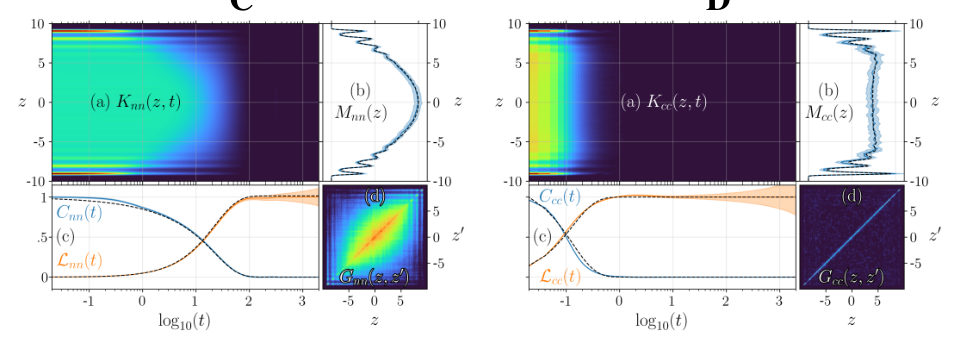
<figcaption class="paper-figure-caption"><b>Fig 1.</b> Figure 1: Hydrodynamic and charge transport emerging from molecular correlations. (A) Snapshot</figcaption>
</figure>
<figure class="paper-figure-card">

<figcaption class="paper-figure-caption"><b>Fig 2.</b> Figure 2: Off-diagonal fluid-charge kernels reveal interfacial electrokinetic coupling. (A) Schematic</figcaption>
</figure>
<figure class="paper-figure-card">
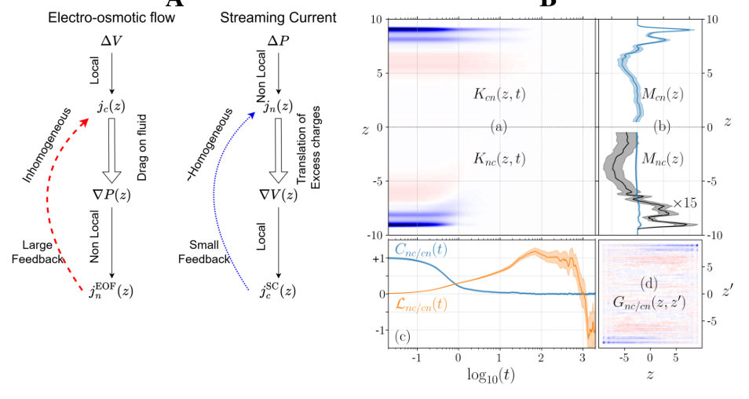
<figcaption class="paper-figure-caption"><b>Fig 3.</b> Fig. 1C,D, but the reciprocal particle–charge components are shown together. Colors in the space–time and</figcaption>
</figure>
<figure class="paper-figure-card">
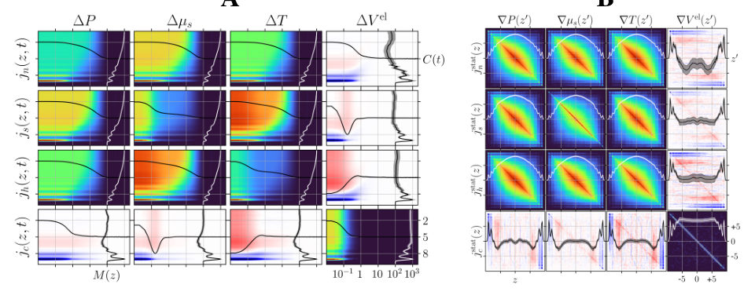
<figcaption class="paper-figure-caption"><b>Fig 4.</b> Figure 3: Spatio-temporal view of fluid–solute–heat–charge coupled transport in confined fluids.</figcaption>
</figure>

**Summary.** This work develops a sophisticated theoretical framework to calculate coupled transport phenomena in confined fluids by analyzing space-time correlations derived from molecular dynamics. By formulating the problem using an extended Onsager response matrix, the authors successfully distinguish between slow, nonlocal hydrodynamic modes and fast, localized ionic relaxation mechanisms. This provides crucial microscopic insights into how continuum theories break down at the nanoscale.

**Why it may be interesting.** While focused on classical fluid dynamics, the rigorous application of linear response theory to derive non-equilibrium transport coefficients from microscopic fluctuations mirrors techniques used in quantum many-body physics for calculating correlation functions and transport properties in mesoscopic systems.

Detailed structure

**Main problem.** The research aims to resolve coupled transport (particle, solute, heat, charge) in nanoconfined fluids by developing a framework that moves beyond continuum laws parameterized by bulk coefficients.

**Main result.** They demonstrate that hydrodynamic momentum transport is a long-lived nonlocal mode, while charge transport relaxes rapidly via localized ionic friction. The full space-time response kernel provides a microscopic basis for history-dependent transport laws.

**Method.** The coupled transport is formulated as a space–time-resolved Onsager response matrix, extracted from equilibrium molecular dynamics simulations using generalized Green-Kubo relations.

**Model / system.** The study uses a minimal model of a charged Lennard-Jones (LJ) fluid confined between two negatively-charged walls in a nanopore geometry. The analysis extends to coupling particle, solute, heat, and charge transport channels.

**Key observables.** Space–time response kernels ($R_{ab}(r, r', t)$), local–local responses ($G_{ab}$), off-diagonal electrokinetic couplings (Streaming Current, EOF), and the full 4x4 matrix of reduced response kernels.

**Important parameters / regimes.** Nanoscale confinement dimensions ($\sigma$), temperature ($k_B T$), and the time/space separation in correlation functions.

**Assumptions / limitations.** The approach assumes that physics can be described by a generalized Onsager framework, relying on linear response theory applied to equilibrium current correlations. The analysis also involves choosing appropriate flux bases (e.g., excess flux basis).

**Figures summary.** Figures illustrate the hierarchy of response functions from molecular dynamics simulations, showing snapshots of the charged fluid and detailed visualizations of the full 4x4 coupling matrix for different transport channels.

**Paper structure.** The paper establishes the generalized Onsager framework using equilibrium current correlations. It then analyzes specific couplings (hydrodynamic vs. charge) and explores how transforming to an 'excess flux basis' can suppress long-range hydrodynamic components, revealing underlying local relaxation mechanisms.

Abstract

Transport in fluids is generally reduced to continuum laws parametrized by bulk coefficients and effective interfacial parameters, such as viscosities, diffusivities, slip lengths, and interfacial resistances. This description becomes incomplete at the nanoscale, where spatial heterogeneity, molecular structure, and finite relaxation times are inseparable from the transport process. Here we formulate coupled transport in nanoconfined fluids as a space--time-resolved Onsager response matrix and extract it from equilibrium molecular dynamics simulations. Applied to a confined charged fluid, the framework resolves the nonlocal and transient pathways coupling particle, solute, heat, and charge transport. Momentum transport appears as a long-lived, nonlocal hydrodynamic mode, whereas charge transport relaxes rapidly through localized ionic friction. Off-diagonal responses reveal distinct projected dynamics, providing a microscopic basis for nonlocal, history-dependent transport laws.

[↑ back to top](#top)

### [Direct Evidence for Robust Bulk Band Gap Across the Charge Density Wave Transition in TiSe2](http://arxiv.org/abs/2608.05059v1)

**Authors:** Turgut Yilmaz, Anil Rajapitamahuni, Muhammad Awais Fiaz, Zhenxian Liu, Jerzy T. Sadowski, Abdullah Al-Mahboob, Asish K. Kundu, Shawna M. Hollen, Boris Sinkovic, Elio Vescovo  
**Type:** experiment · **Category:** strongly correlated electrons · **PDF:** <https://arxiv.org/pdf/2608.05059v1>  
**Analysis basis:** full PDF text, analyzed in chunks
**Topic relevance:** `Frenkel-Kontorova` **3/5** · `driven-dissipative phase transition` **2/5** · `Kondo & dissipative impurity` **1/5** · `analog quantum simulation` **1/5** · `non-equilibrium dynamics` **1/5**

↔ Scroll figures horizontally

<figure class="paper-figure-card">
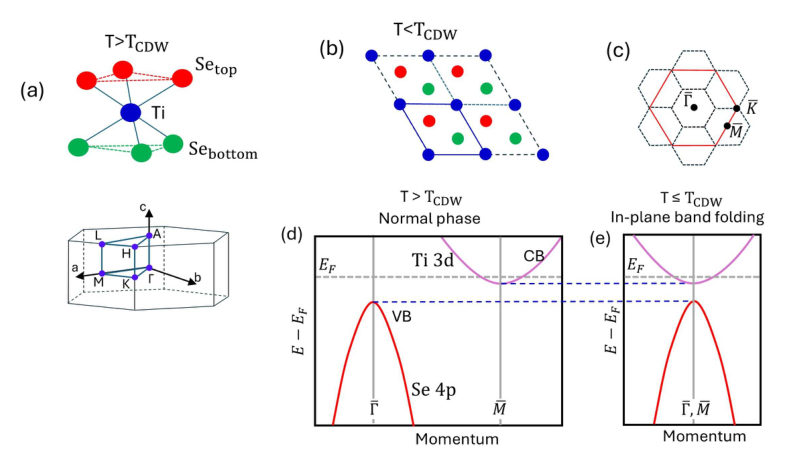
<figcaption class="paper-figure-caption"><b>Fig 1.</b> FIG. 1. (a) Crystal structure of TiSe2 in the normal phase (upper panel) and the three-dimensional Brillouin zone showing the high-symmetry points Γ, A, M, L, K, and H (lower panel). (b) In-plane 2a × 2a periodic lattice distortion in the CDW phase. (c) Brillouin zone of the normal phase (red hexagon) and the CDW superstructure (dashed black hexagons). (d) Schematic electronic band structure of the normal phase. (e) Electronic structure in the CDW phase between 160 K and TCDW. Blue lines connect panels (d) and (e) to indicate that the bulk band gap remains unchanged across TCDW.</figcaption>
</figure>
<figure class="paper-figure-card">
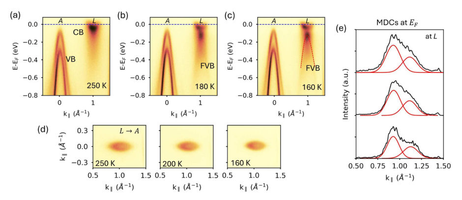
<figcaption class="paper-figure-caption"><b>Fig 2.</b> FIG. 2. (a–c) ARPES intensity maps along the A-L cut at various temperatures. Above TCDW (250 K), a dispersive valence band (VB) and a broad conduction band (CB) are observed. Between TCDW and 160 K, a folded valence band (FVB) emerges at the L-point (marked with red dashed parabola) while the CB remains largely unchanged. (d) Corresponding Fermi-surface maps around the L-point. Elliptical contours persist, even across the TCDW and down to 160 K. (e) Momentum-distribution curves (MDCs) at the Fermi level (EF ) extracted at the L-point from panels (d). Red curves represent Gaussian fits to the conduction-band spectral feature. The momentum position remains nearly unchanged across temperature.</figcaption>
</figure>
<figure class="paper-figure-card">
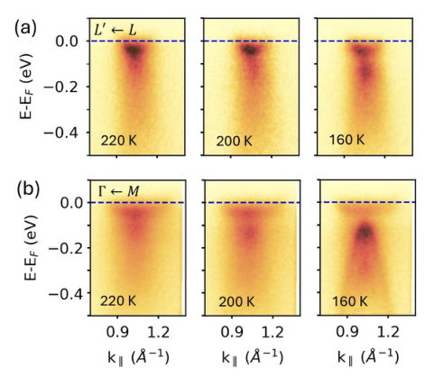
<figcaption class="paper-figure-caption"><b>Fig 3.</b> FIG. 3. (a,b) ARPES intensity maps measured with 119 eV linear vertical (LV) and 95 eV circular left (CL) polarized light, sensitive to the folded valence band (FVB) and conduc- tion band near the L-point and along the Γ-M, respectively.</figcaption>
</figure>
<figure class="paper-figure-card">
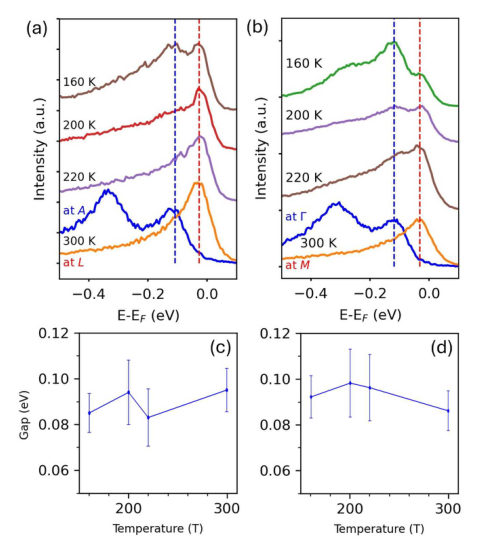
<figcaption class="paper-figure-caption"><b>Fig 4.</b> FIG. 4. (a,b) Energy-distribution curves (EDCs) at the L- and M-points obtained from Figure 3(a,b), respectively. Blue and red dashed lines mark the valence and conduction band, respectively. EDCs at room temperature are obtained with 119 eV and 95 eV linear vertical (LV) polarized lights. (c,d) Gap versus temperature plots obtained from (a,b), respec- tively. Peak positions are extracted from fits to the spectra, given in Supplementary Information Figure S3. Error bars represent the standard deviation of the fitted peak positions obtained from the EDC analysis.</figcaption>
</figure>

**Summary.** This experimental study used ARPES to investigate the nature of the Charge Density Wave transition in TiSe2. Contrary to expectations of an electronic gap opening, the researchers found that the bulk band gap remains robustly constant across the transition temperature. This strongly suggests the CDW is driven by a lattice reconstruction that folds existing bands rather than creating a new electronic gap.

**Why it may be interesting.** While focused on solid-state physics, understanding how lattice instabilities (like CDWs) interact with electronic structure without necessarily opening a gap provides insights into symmetry breaking mechanisms relevant to correlated electron systems and charge ordering phenomena.

Detailed structure

**Main problem.** The central question is whether the Charge Density Wave (CDW) transition in TiSe2 involves an electronic gap opening or if it is driven by lattice reconstruction.

**Main result.** The fundamental band gap size remains constant across the CDW transition temperature, indicating that the transition is governed by lattice symmetry breaking and band folding rather than a true electronic gap opening.

**Method.** High-resolution Angle-Resolved Photoemission Spectroscopy (ARPES) was used to directly track the temperature evolution of the bulk band edges.

**Model / system.** The study investigates TiSe2, a narrow-gap semiconductor known for its CDW transition at TCDW = 200 K. The analysis compares electronic structure measurements across the normal and CDW phases.

**Key observables.** Temperature evolution of the bulk band gap size; positions of conduction and valence band edges; spectral weight redistribution signatures (e.g., Folded Valence Band).

**Important parameters / regimes.** CDW transition temperature ($T_{	ext{CDW}} \approx 200	ext{ K}$); Temperature range studied ($300	ext{ K}$ down to $160	ext{ K}$); Gap magnitude ($\sim 85-100	ext{ meV}$).

**Assumptions / limitations.** The authors assume that their simultaneous measurement of both band edges in single EDCs eliminates methodological uncertainties present in previous gap measurements.

**Figures summary.** Figures show ARPES intensity maps and Fermi surface contours remaining nearly identical across the CDW transition, while other figures plot the measured bulk gap magnitude showing invariance with temperature.

**Paper structure.** The paper establishes the scientific debate surrounding the CDW mechanism. It then presents high-resolution ARPES data tracking band edges across $T_{	ext{CDW}}$, demonstrating constant gap size despite clear evidence of lattice-induced band folding signatures.

Abstract

The mechanism driving the charge density wave (CDW) transition in TiSe2 has been debated for decades, with proposals ranging from an excitonic insulator to a lattice-driven instability. A central question remains whether the transition involves an opening or enhancement of the bulk band gap. Using high-resolution angle-resolved photoemission spectroscopy, we directly track the temperature evolution of the bulk band edges across the CDW transition at TCDW = 200 K. Contrary to the expectation of a gap-opening transition, we find that the size of the fundamental band gap remains constant from the high-temperature normal phase down to 160 K. While the CDW induces clear band-folding signatures and spectral weight redistribution, the underlying band extrema are unperturbed. These results demonstrate that TiSe2 does not undergo a temperature-driven electronic gap opening. Instead, they support a scenario where the transition is governed by a lattice symmetry-breaking reconstruction that folds, but does not gap, the electronic structure of a pre-existing band insulator.

[↑ back to top](#top)

### [Quantum States Protection under Environmental Noise](http://arxiv.org/abs/2608.04822v1)

**Authors:** Kai Wang, Zhen-Yang Peng  
**Type:** theory · **Category:** quantum information and computing · **PDF:** <https://arxiv.org/pdf/2608.04822v1>  
**Analysis basis:** full PDF text, analyzed in chunks
**Topic relevance:** `quantum measurements` **3/5** · `measurement-induced transitions` **2/5** · `correlated / nonlocal dissipation` **1/5** · `driven-dissipative phase transition` **1/5** · `methods for driven-dissipative` **1/5**

↔ Scroll figures horizontally

<figure class="paper-figure-card">
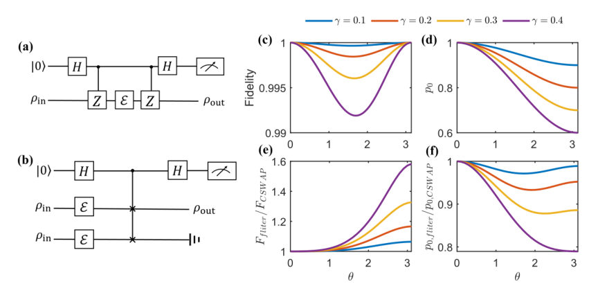
<figcaption class="paper-figure-caption"><b>Fig 1.</b> FIG. 1. (a) Sketch of the circuit for quantum state protection via a quantum filter under AD noise. (b) Circuit for the</figcaption>
</figure>
<figure class="paper-figure-card">
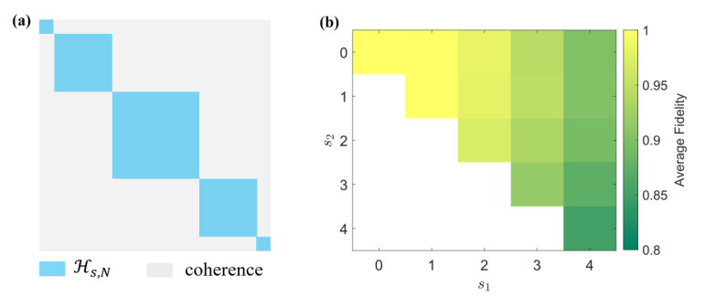
<figcaption class="paper-figure-caption"><b>Fig 2.</b> FIG. 2. (a) Sketch illustrating the decomposition of the Hilbert space for N = 4 qubits. The block-diagonal regions</figcaption>
</figure>
<figure class="paper-figure-card">
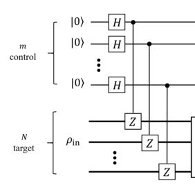
<figcaption class="paper-figure-caption"><b>Fig 3.</b> FIG. 3. A sketch of the filtration circuit with m control qubits.</figcaption>
</figure>
<figure class="paper-figure-card">
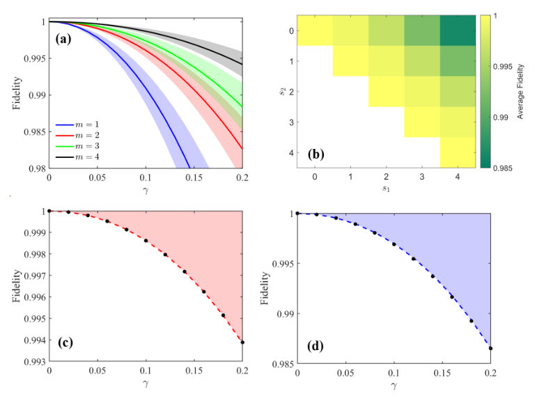
<figcaption class="paper-figure-caption"><b>Fig 4.</b> FIG. 4. (a) Average fidelity for the multi-control filtration circuit; the input states are sampled from the entire Hilbert</figcaption>
</figure>

**Summary.** This paper proposes the 'quantum filter' as a novel, resource-efficient method to protect quantum states from Amplitude Damping noise. By analyzing circuit structures using post-selection, the authors demonstrate that state protection fidelity depends critically on the input state's Hamming weight. The findings suggest that fixed-weight states can be perfectly protected, offering an improvement over existing methods without requiring full QEC overhead.

**Why it may be interesting.** This work provides a concrete, resource-efficient alternative to full Quantum Error Correction (QEC) codes for mitigating common noise channels like AD noise, which is highly relevant for superconducting and trapped-ion quantum computing platforms.

Detailed structure

**Main problem.** The primary challenge addressed is protecting fragile quantum states from irreversible energy relaxation caused by environmental noise, specifically Amplitude Damping (AD) noise.

**Main result.** The authors show that using a 'quantum filter' circuit structure allows for resource-efficient state protection; states with fixed quantum Hamming weights can be perfectly protected against AD noise.

**Method.** They introduce and systematically analyze the quantum filter, which utilizes post-selection on control qubit measurement outcomes to suppress noise effects in multi-qubit systems.

**Model / system.** The analysis is performed on general multi-qubit quantum information processing systems modeled by the Amplitude Damping (AD) channel. The protection scheme involves circuits with single- and multi-control qubits acting on target qubits.

**Key observables.** Fidelity ($F$), success probability, and the quantum Hamming weight ($s$) of the input state are key diagnostic tools.

**Important parameters / regimes.** The damping rate ($\gamma$) is crucial; performance depends heavily on $s$ relative to the total number of qubits $N$.

**Assumptions / limitations.** The analysis assumes that states within a fixed Hamming weight subspace $\mathcal{H}_{s,N}$ share the same achievable fidelity. The method avoids full quantum error correction overhead.

**Figures summary.** Figures illustrate circuit sketches comparing filtration to CSWAP performance, and plots show average fidelity vs. the number of control qubits ($m$) for various state types (e.g., bipartite superposition states).

**Paper structure.** The paper progresses from single-qubit analysis demonstrating filter superiority over standard gates, to general multi-body state analysis using Hamming weight classification, culminating in showing that increasing control qubits improves average fidelity.

Abstract

All realistic quantum systems are inevitably in contact with the environment. Suppressing theimpact of environmental noise is a critical challenge in cutting-edge quantum technologies. In thiswork, we introduce and systematically analyze a scheme for the protection of quantum states againstamplitude-damping (AD) noise based on the circuit structure called the quantum filter. Filtrationcircuits employing single- and multi-control qubits are examined, and their capability to enhance stateprotection fidelity while preserving a high success probability is discussed. Moreover, for many-bodyqubit states, those with a fixed quantum Hamming weight can be perfectly protected against ADnoise, whereas states with the largest Hamming weight difference set a lower bound on the achievableprotection fidelity. Our work provides a resource-efficient route for quantum state protection withoutrequiring full quantum error correction.

[↑ back to top](#top)

### [Universal linear manipulation via routing and projective measurements](http://arxiv.org/abs/2608.05003v1)

**Authors:** Alessio Baldazzi, Sonia Mazzucchi, Lorenzo Pavesi  
**Type:** theory · **Category:** quantum information and computing · **PDF:** <https://arxiv.org/pdf/2608.05003v1>  
**Analysis basis:** full PDF text, analyzed in chunks
**Topic relevance:** `quantum measurements` **3/5** · `interference shaping light` **2/5** · `analog quantum simulation` **1/5** · `measurement-induced transitions` **1/5** · `methods for driven-dissipative` **1/5**

↔ Scroll figures horizontally

<figure class="paper-figure-card">
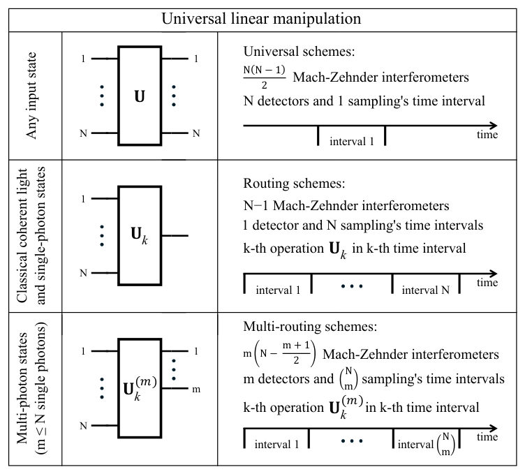
<figcaption class="paper-figure-caption"><b>Fig 1.</b> Figure 1: Different techniques to achieve universal linear manipulation. Each row of the table shows a method to implement the generic unitary transformation U. Each technique is tailored with respect to a class of input states, shown in the left column. In the first row, the universal schemes are based on MZI meshes with N(N + 1)/2 MZIs, and the operation associated with U is performed with N detectors in a single temporal interval. In the second row, routing schemes use N −1 MZIs and only one detector, but N temporal intervals are needed. In each time interval, a different operation Uk is executed to implement U. In the third row, multi-routing schemes for m single photons use m (N −(m +...</figcaption>
</figure>
<figure class="paper-figure-card">
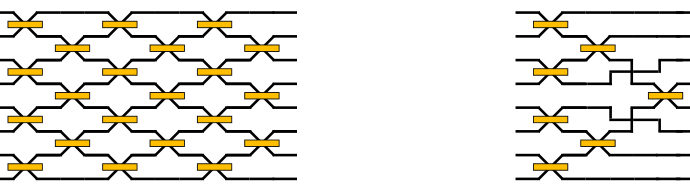
<figcaption class="paper-figure-caption"><b>Fig 2.</b> Figure 2: Different schemes of multiport interferometers with eight modes. The MZI is represented by the crossing lines with the yellow rectangle. (left column) Universal schemes: the Reck scheme [1] has a triangular mesh, while the Clements scheme [2] a rectangular mesh. For both universal meshes, the number of MZIs grows quadratically with the mode number: for eight modes, there are 28 MZIs. (right column) Non-universal schemes: the linear V-shaped and the tree meshes have the same number of MZIs, but they differ in the arrangement of the MZIs when the number of modes is greater than four. For both non-universal meshes, the number of MZIs grows linearly with the mode number: for eight...</figcaption>
</figure>
<figure class="paper-figure-card">
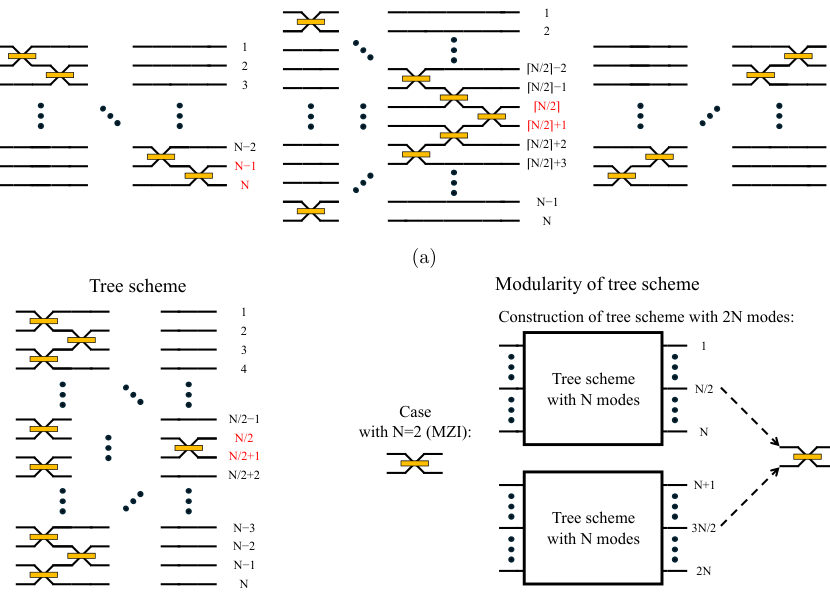
<figcaption class="paper-figure-caption"><b>Fig 3.</b> Figure 3: Multiport routers with N modes. The MZI is represented by the crossing lines with the yellow rectangle. The input enters from the left to the right, and only one particular input superposition is routed to the reference output by choosing the associated phase setting of the MZIs. Both schemes have N −1 MZIs for N modes. The red labels in the outputs are the possible reference output modes for each scheme. (a) Three examples of linear schemes. Among the linear multiport interferometers, the central configuration is denoted as the linear V-shaped scheme. Besides the ’V’ shape, there are diagonal shapes, but any other intermediate configuration is allowed. (b-left) The tree scheme...</figcaption>
</figure>
<figure class="paper-figure-card">
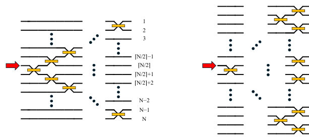
<figcaption class="paper-figure-caption"><b>Fig 4.</b> Figure 4: Multiport splitters with N modes. The linear V-shaped scheme, on the left, and the tree scheme, on the right, are possible configurations for generic splitters. The MZI is represented by the crossing lines with the yellow rectangle. The input is highlighted by the red arrows on the left of the schemes, i.e. on the middle mode |⌈N/2⌉⟩. By choosing the precise phase setting of the MZIs, it is possible to coherently and arbitrarily split classical coherent states and a single-photon state. Note that these schemes are just the mirrored version of the routing schemes reported in Fig. 3. Among linear schemes, we choose the linear V-shaped scheme because it is the most convenient for...</figcaption>
</figure>
<figure class="paper-figure-card">
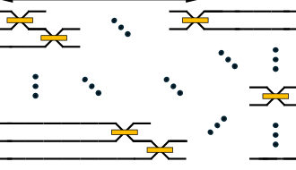
<figcaption class="paper-figure-caption"><b>Fig 5.</b> Figure 5: Multi-router with N modes for m input single photons. The MZI is represented by the crossing lines with the yellow rectangle. The input enters from the left to the right, and through N!/(m!(N −m!) phase settings of the MZIs it is possible to find the correct statistics of clicks by looking only at the reference output modes. The scheme has m (N −(m + 1)/2) MZIs for N modes. The red labels in the outputs give a possible set of reference output modes. Note that for m = 1 we recover the first linear scheme of Fig. 3(a). The multilinear scheme can be seen as a combination of m linear schemes, where the first has dimension N, the second N −1 and so on. Appendix G contains further...</figcaption>
</figure>

**Summary.** The paper introduces novel 'routing' and 'multi-routing' schemes to implement universal linear transformations in multiport interferometers. These methods drastically reduce the required physical components compared to established designs like Reck or Clements meshes. Furthermore, the authors demonstrate that these resource-efficient routing schemes maintain high fidelity even when subjected to realistic losses and phase noise.

**Why it may be interesting.** This work directly addresses photonic quantum computation by providing a highly efficient, resource-optimized blueprint for implementing complex unitary gates using fundamental optical elements (MZIs).

Detailed structure

**Main problem.** The core problem is implementing universal linear unitary transformations on $N$ photonic modes using minimal physical components.

**Main result.** Routing schemes can achieve universal linear manipulation with significantly fewer components (e.g., $N-1$ MZIs) compared to standard universal designs ($\mathcal{O}(N^2)$).

**Method.** The authors propose and analyze 'routing' and 'multi-routing' schemes that utilize projective measurements over time to realize the required unitary transformations.

**Model / system.** The system is a multiport interferometer with $N$ ports, modeled by unitary transformations ($U$) acting on classical coherent light or single photons. The fundamental building block is the Mach-Zehnder Interferometer (MZI).

**Key observables.** Fidelity and Trace Distance are used to quantify performance degradation due to losses; resource overheads (number of MZIs/detectors) are key comparative metrics.

**Important parameters / regimes.** The number of ports ($N$), the number of photons ($m$), loss rates, and phase noise levels are critical parameters analyzed for robustness.

**Assumptions / limitations.** The analysis compares schemes based on ideal unitary realization versus practical resource constraints; some sections assume measurement occurs after unitary manipulation.

**Figures summary.** Figures compare resource requirements (Reck vs. Linear/Tree meshes) and analyze performance degradation under random MZI loss or output coupling losses, showing routing schemes are more robust.

**Paper structure.** The paper first introduces the problem of universal transformation implementation, contrasts standard $\mathcal{O}(N^2)$ schemes with proposed linear/tree routing schemes ($\mathcal{O}(N)$), and finally tests the robustness of these resource-efficient schemes against realistic noise sources like loss.

Abstract

Multiport interferometers with $N$ ports are basic devices in both classical and quantum photonics. Ideally, they implement a linear unitary transformation between the input and output electric field vectors with $N$ components, each associated with a spatial mode of classical coherent light or a single photon. Standard designs for a fully reconfigurable universal multiport interferometer are given by the Reck or the Clements schemes. In this work, we introduce routing schemes to implement a generic unitary transformation on classical coherent light or single photons using linear or tree geometries via multiple projective measurements on a single detector with the minimum number of components. Then, we generalize this result to the case of any multi-photon state for scattershot boson sampling experiments with multi-routing schemes. Finally, we test the robustness of routing schemes compared to universal schemes with respect to losses and phase noise.

[↑ back to top](#top)

### [Coupling Does Not Reduce the Auxiliary-Mode Count for $1/|ω|$ Spectra in Passive Lindblad Networks](http://arxiv.org/abs/2608.04539v1)

**Authors:** Qing-Ao Xiang, Yan Liu, Xin-Yuan Yang, Ya-Ju Song  
**Type:** theory · **Category:** other · **PDF:** <https://arxiv.org/pdf/2608.04539v1>  
**Analysis basis:** full PDF text, analyzed in chunks
**Topic relevance:** `methods for driven-dissipative` **3/5** · `correlated / nonlocal dissipation` **2/5** · `Keldysh / 2PI / non-Gaussian methods` **1/5** · `driven-dissipative phase transition` **1/5**

↔ Scroll figures horizontally

<figure class="paper-figure-card">
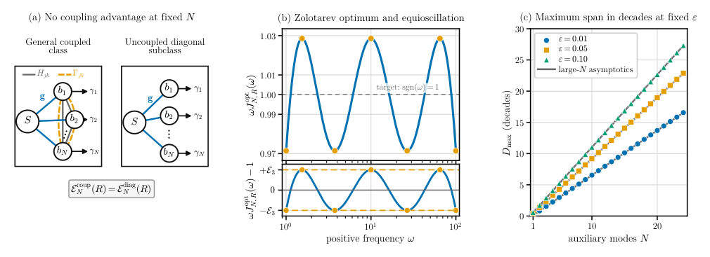
<figcaption class="paper-figure-caption"><b>Fig 1.</b> FIG. 1. No advantage from coupling at fixed mode budget and the resulting resource relations. (a) General coupled class versus uncoupled diagonal subclass; S denotes the system. Blue lines g couple the system to the auxiliary modes, gray lines Hjk denote coherent intermode coupling, orange dashed lines Γjk denote cross damping from collective dissipation, and black arrows denote individual damping rates γj, where j, k = 1, . . . , N. (b) For R = 102 and N = 3, ωJopt N,R(ω) equioscillates about sgn(ω) = 1 on the positive-frequency band. Orange dots mark alternation points at which the residual ωJopt N,R(ω) −1 alternately attains ±E3(102), where E3(102) = 0.02856, certifying minimax...</figcaption>
</figure>

**Summary.** The paper rigorously proves that for modeling $1/|\omega|$ spectra using a finite number of auxiliary bath modes, introducing coherent coupling between these modes provides no improvement in accuracy over simply using independent (uncoupled) damped modes. This establishes a fundamental lower bound on the minimum number of modes required to achieve a desired spectral fidelity.

**Why it may be interesting.** This work provides rigorous mathematical constraints on how complex quantum dissipation structures (like those found in cavity QED or open quantum dynamics) can model specific spectral features like $1/|\omega|$, showing that complexity does not grant spectral power beyond the fundamental limitations set by mode count.

Detailed structure

**Main problem.** The core problem is determining if adding coherent intermode coupling between auxiliary bath modes can reduce the spectral approximation error when modeling a $1/|\omega|$ spectrum using a finite number of Markovian Lindblad modes.

**Main result.** The authors prove that for passive, number-conserving Gaussian Lindblad networks approximating $1/|\omega|$, coherent intermode coupling offers no advantage over uncoupled diagonal structures. Consequently, the minimum required mode count is fixed by the spectral approximation theory, regardless of complex coupling terms.

**Method.** The analysis relies on mapping the spectral approximation problem to a classical Zolotarev rational function approximation problem for the sign function ($	ext{sgn}(\omega)$). The optimal error bounds are derived using techniques from approximation theory and elliptic functions.

**Model / system.** The system involves an open quantum system coupled to a passive, number-conserving Gaussian Lindblad auxiliary bath. The dynamics are characterized by the spectral density $J(\omega)$, which is approximated by a rational function whose poles correspond to the auxiliary modes.

**Key observables.** Spectral approximation error ($E$), minimum required mode count ($N_{\min}$), and maximum achievable dynamic range ($D_{\max}$).

**Important parameters / regimes.** Mode budget ($N$), spectral bandwidth/range ($R$), and target tolerance ($\epsilon$).

**Assumptions / limitations.** The result holds for passive, number-conserving Gaussian Lindblad auxiliary networks operating in a stationary vacuum state coupled via a single Hermitian bath operator.

**Figures summary.** Figures compare the structure of spectra from general coupled vs. uncoupled classes and illustrate the equioscillation property associated with the Zolotarev minimax optimum.

**Paper structure.** The paper establishes the spectral approximation problem, relates it to the Zolotarev theory for sign function approximation, proves the equivalence of error bounds between coupled and uncoupled systems, and finally derives scaling laws relating mode count to achievable dynamic range.

Abstract

Representing continuous environments by finitely many Markovian auxiliary modes is fundamental in non-Markovian open quantum systems, yet a critical question remains: at a fixed mode budget, can coherent intermode coupling reduce the spectral approximation error? We prove that intermode coupling offers no advantage when passive, number-conserving Gaussian Lindblad auxiliary networks approximate a $1/|ω|$ spectrum over a finite two-sided frequency band. For any mode budget $N$, the general coupled class and its uncoupled diagonal subclass share the same optimal error, which is exactly the degree-$2N$ Zolotarev error for sign approximation. This optimum is attainable by $N$ independent damped auxiliary modes at zero detuning. The result holds when the auxiliary network is in a stationary vacuum state, the system couples to it via a single Hermitian bath operator, and no white-noise feedthrough term is present. Consequently, although a general coupled network has $O(N^{2})$ real parameters, coherent intermode coupling, collective dissipation, and nonnormal structure cannot reduce the number of auxiliary modes required to reach a prescribed tolerance. This exact relation yields both the minimum mode count for a prescribed positive-frequency dynamic range and tolerance, and the maximum dynamic range attainable for a prescribed mode budget and tolerance.

[↑ back to top](#top)

### [Photon localization: a comparative study](http://arxiv.org/abs/2608.04134v1)

**Authors:** Laura M. Ferguson, Ricardo Rojas Castellano, Kayla Oltman, Joshua G. Fenwick, Rainer Dick  
**Type:** theory · **Category:** other · **PDF:** <https://arxiv.org/pdf/2608.04134v1>  
**Analysis basis:** full PDF text, analyzed in chunks
**Topic relevance:** `quantum measurements` **3/5** · `measurement-induced transitions` **2/5** · `methods for driven-dissipative` **1/5** · `non-equilibrium dynamics` **1/5**

↔ Scroll figures horizontally

<figure class="paper-figure-card">
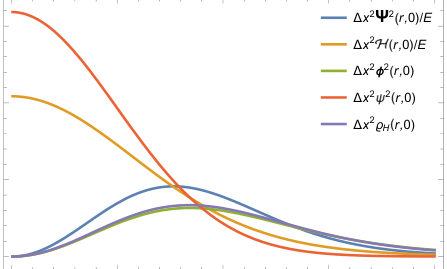
<figcaption class="paper-figure-caption"><b>Fig 1.</b> FIG. 1. The proposals |Ψ(x, t)|2/E, H(x, t)/E, |φ(x, t)|2, |ψ(x, t)|2 and ̺H(x, t) for t = 0.</figcaption>
</figure>
<figure class="paper-figure-card">
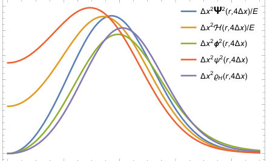
<figcaption class="paper-figure-caption"><b>Fig 2.</b> FIG. 2. The proposals |Ψ(x, t)|2/E, H(x, t)/E, |φ(x, t)|2, |ψ(x, t)|2 and ̺H(x, t) for ct = 4∆x.</figcaption>
</figure>
<figure class="paper-figure-card">
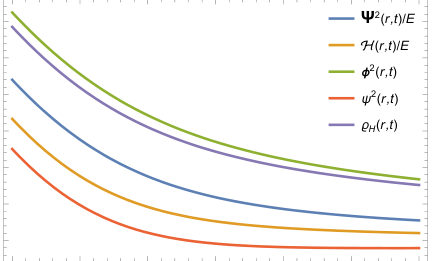
<figcaption class="paper-figure-caption"><b>Fig 3.</b> FIG. 5. The deviation ⟨r⟩−ct for the different proposed photon localization measures for 0 ≤ct ≤6∆x.</figcaption>
</figure>
<figure class="paper-figure-card">
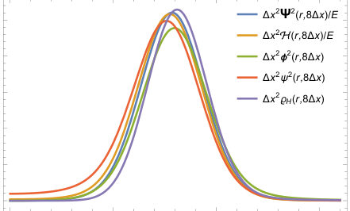
<figcaption class="paper-figure-caption"><b>Fig 4.</b> FIG. 3. The proposals |Ψ(x, t)|2/E, H(x, t)/E, |φ(x, t)|2, |ψ(x, t)|2 and ̺H(x, t) for ct = 8∆x.</figcaption>
</figure>
<figure class="paper-figure-card">
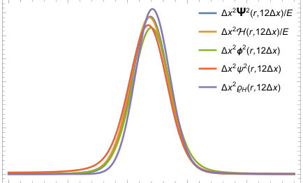
<figcaption class="paper-figure-caption"><b>Fig 5.</b> FIG. 4. The proposals |Ψ(x, t)|2/E, H(x, t)/E, |φ(x, t)|2, |ψ(x, t)|2 and ̺H(x, t) for ct = 12∆x.</figcaption>
</figure>

**Summary.** This paper critically compares several theoretical measures proposed for describing photon localization probability density. By analyzing these measures using both idealized Gaussian wave packets and a model detector based on ion traps, the authors argue that while multiple proposals exist, the Energy Wave Function and Hawton Density are the most physically consistent descriptions of local detection rates.

**Why it may be interesting.** This work directly addresses the fundamental ambiguity in defining quantum observables like position for photons, which is crucial for developing realistic models for quantum optical devices and detectors.

Detailed structure

**Main problem.** The study aims to determine the theoretically correct measure for defining the probability density of a single photon's position, especially when considering detection at subwavelength spatial resolution.

**Main result.** While multiple measures (Landau-Peierls, Energy Wave Function, Hawton Density) are proposed, they all show consistency with local detection rates derived from ion traps. The energy wave function and Hawton density are highlighted as the most promising candidates for describing photon localization.

**Method.** The authors compare several theoretical proposals for photon localization probability densities by analyzing their time evolution using a two-dimensional Gaussian single-photon wave packet in momentum space, alongside calculations based on scattering matrix elements from an ion trap detector model.

**Model / system.** The system models the propagation and detection of single-photon wave packets. The analysis uses theoretical constructs like the Landau-Peierls function and compares them to physical measurements simulated using a model detector consisting of ions in ion traps.

**Key observables.** Photon localization probability density ($
ho$), $\langle r 
angle - ct$ offset, scattering matrix elements ($S_{fi}$), and local detection probabilities.

**Important parameters / regimes.** Time evolution $t$, momentum-space width ($\Delta k$), and the geometry/coupling of the ion trap detector.

**Assumptions / limitations.** The analysis relies on comparing theoretical proposals against operational definitions derived from scattering matrix elements, which involves approximations like the dipole approximation and high-frequency limits in the detection model.

**Figures summary.** Figures illustrate the time evolution of five different localization measures for a Gaussian packet, showing their coalescence towards classical wavefronts at late times. They also plot the deviation $\langle r 
angle - ct$ over time for comparison.

**Paper structure.** The paper first establishes the operational problem using detector models (ion traps), linking detection rates to specific theoretical measures. It then performs a detailed comparative analysis of multiple localization proposals ($\varphi, \Psi, 
ho_H$, etc.) using Gaussian wave packets in momentum space to track their time evolution and convergence.

Abstract

We compare different measures for photon localization in terms of two-dimensional Gaussian wave packets. We find that all measures start to coalesce if the wave packet has evolved for times which are larger than a few times the inverse momentum-space width of the package. However, the Landau-Peierls wave function yields the largest positive offset <r>-ct>0 while the scalar Fourier transform of the wave packet yields the smallest offset and converges towards <r>-ct=0 fastest. We also discuss local detection of photons through a model detector consisting of ions in ion traps. The position-dependent detection probabilities are inferred from the scattering matrix. We find that the local detection probability for photons can be expressed in terms of three of the proposed localization measures, viz. the Landau-Peierls wave function, the energy wave function, and the Hawton density. Those three porposals also remain close throughout the time evolution of the single-photon wave packet.

[↑ back to top](#top)

### [Quantum-information fingerprints of partial dynamical symmetry in the interacting boson model](http://arxiv.org/abs/2608.04486v1)

**Authors:** Dhritimalya Roy  
**Type:** both · **Category:** quantum information and computing · **PDF:** <https://arxiv.org/pdf/2608.04486v1>  
**Analysis basis:** full PDF text, analyzed in chunks
**Topic relevance:** `entanglement & information structure` **3/5** · `analog quantum simulation` **1/5** · `methods for driven-dissipative` **1/5**

↔ Scroll figures horizontally

<figure class="paper-figure-card">
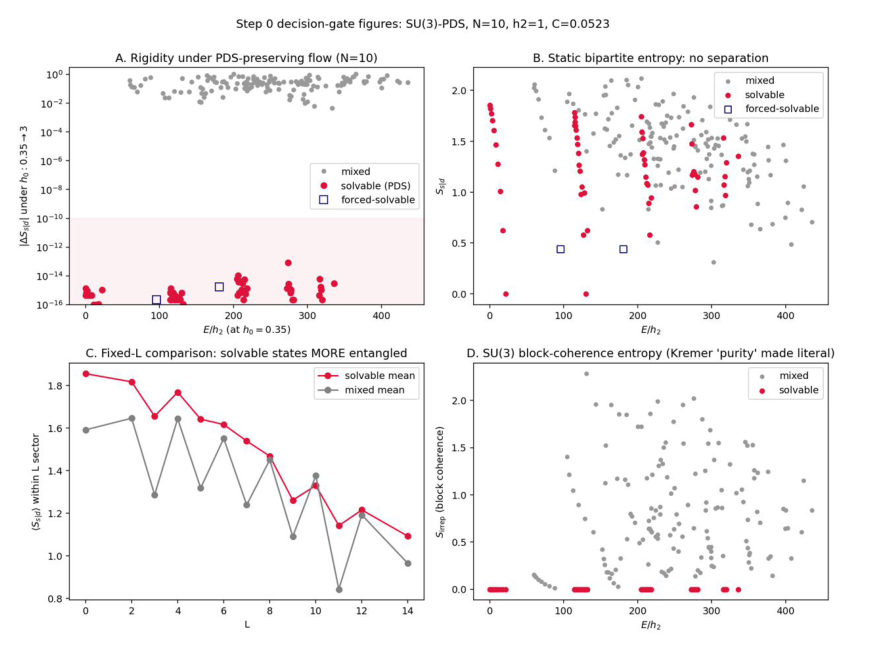
<figcaption class="paper-figure-caption"><b>Fig 1.</b> Figure 1: Decision gate at a stable SU(3)-PDS point (N = 10). The static magnitude of the s|d entanglement entropy does not separate solvable (exact-label) from mixed eigenstates: the distributions overlap, and within a fixed angular momentum the solvable states are in fact more entangled (a Simpson’s-paradox reversal). Entanglement magnitude alone is therefore not a PDS diagnostic.</figcaption>
</figure>
<figure class="paper-figure-card">
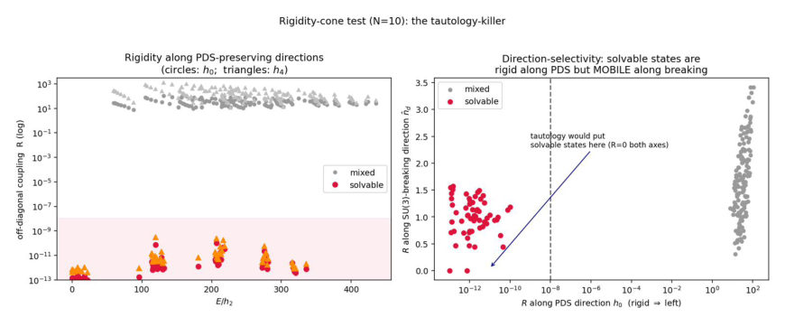
<figcaption class="paper-figure-caption"><b>Fig 2.</b> Figure 2: Cone rigidity at a stable SU(3)-PDS point (N = 10). The off-diagonal coupling RD = ∥Q D|ψ⟩∥measures the first-order response of each eigenstate to a deformation along direction D. Along the PDS-preserving directions h0 and h4 every solvable state is rigid to numerical zero (R ≲3 × 10−10, lower band) while every mixed state responds strongly (R ≳70, upper band); the separation is direction-selective, since along the SU(3)-breaking direction ˆnd the solvable states respond as much as the mixed ones (R ∼1, right). Rigidity is a property of the PDS-preserving operator cone, not of the states in isolation.</figcaption>
</figure>
<figure class="paper-figure-card">
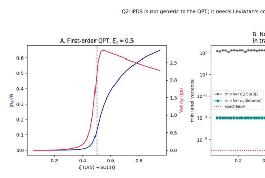
<figcaption class="paper-figure-caption"><b>Fig 3.</b> Figure 3: First-order critical point, ˆH(β0 = √</figcaption>
</figure>
<figure class="paper-figure-card">
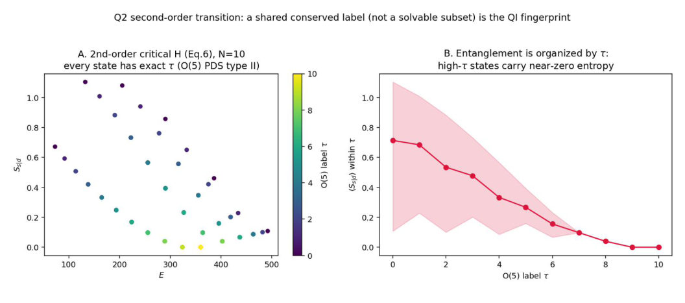
<figcaption class="paper-figure-caption"><b>Fig 4.</b> Figure 4: Second-order critical point, Eq. (6), N = 10 (type II). Every eigenstate carries an exact O(5) seniority: maxψ Var ˆC2[O(5)] = 2.7 × 10−11 over the whole spectrum (left). The s|d entanglement is graded monotonically by τ (right), ⟨S⟩= 0.71 at τ = 0 falling to 0.00 at τ = N: the entanglement lives in the low-seniority sector and high-seniority states are near-product. This seniority-graded ladder differs qualitatively from the first-order solvable-subset picture of Fig. 3.</figcaption>
</figure>
<figure class="paper-figure-card">
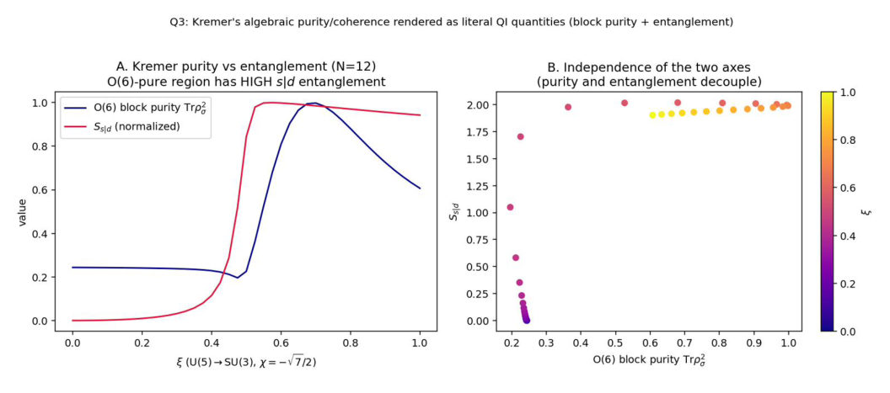
<figcaption class="paper-figure-caption"><b>Fig 5.</b> Figure 5: The purity/coherence bridge on Kremer et al.’s own states, N = 12. The O(6) block purity Trρ2 σ (left) and the bipartite s|d entanglement entropy (centre) are independent axes: the ground state becomes O(6)-pure (Trρ2 σ = 0.81–0.88) precisely where its s|d entanglement is maximal (right). The algebraic “purity” of the quasi-dynamical-symmetry literature and bipartite entanglement are logically independent QI quantities. Our O(6) machinery reproduces Kremer’s σ-fluctuation ∆σgs = 2.473 at the U(5) limit (their value 2.47) and the exactly sharp O(6) point.</figcaption>
</figure>

**Summary.** This work introduces the 'label variance' ($	ext{Var}\,\C[G]$) as a novel and robust quantum information diagnostic to detect Partial Dynamical Symmetry (PDS) in the Interacting Boson Model. It demonstrates that this structural measure successfully distinguishes between solvable and mixed eigenstates, unlike standard entanglement measures. The authors validate this method by encoding the model onto qubits, paving the way for its direct evaluation on near-term quantum hardware.

**Why it may be interesting.** The development of label variance as a measurable, structure-revealing quantum invariant provides a powerful tool for classifying complex many-body systems whose symmetries are only partially preserved in nature or theory.

Detailed structure

**Main problem.** The core problem is determining if Partial Dynamical Symmetry (PDS) possesses a purely structural signature within quantum eigenstates, independent of entanglement magnitude.

**Main result.** The label variance ($	ext{Var}\,\C[G]$) serves as this robust, fit-independent diagnostic, successfully separating solvable states (zero variance) from mixed states ($\mathcal{O}(N^2)$).

**Method.** The authors compare structural diagnostics like label variance against entanglement measures and test the method's feasibility by encoding the Hamiltonian onto a qubit register for variational state preparation.

**Model / system.** The analysis is based on the Interacting Boson Model (IBM) applied to even-even nuclei, specifically anchored in $^{168}	ext{Er}$. The model Hamiltonian supports various symmetry limits, including those exhibiting PDS.

**Key observables.** Label variance ($	ext{Var}\,\C[G]$), block-coherence entropy ($S_G$), and block impurity ($P_G$).

**Important parameters / regimes.** The total boson number $N$, and the Hamiltonian parameters defining critical points (e.g., $eta_0$ for first/second order transitions).

**Assumptions / limitations.** The primary assumption is that the label variance correctly captures the structural distinction between solvable and mixed spectral subsets, even when entanglement measures fail to do so.

**Figures summary.** Figures illustrate how label variance distinguishes solvable (rigid) from mixed states, and later show the successful application of VQE/VQD protocols on a qubit register to prepare these distinct eigenstates.

**Paper structure.** The paper first establishes the theoretical equivalence between vanishing variance, zero entropy, and unit purity for PDS. It then compares this structural diagnostic against entanglement measures using the IBM spectrum. Finally, it details the implementation by encoding the model onto qubits and preparing states variationally on a quantum device.

Abstract

Partial dynamical symmetry (PDS) is an algebraic structure in which a prescribed symmetry is neither exact nor completely broken: a subset of eigenstates keeps good quantum numbers and remains solvable while the rest of the spectrum mixes. PDS is currently identified from spectroscopic data, band-head energies, level systematics, and $B(E2)$ ratios. We ask whether it also has a purely structural signature in the eigenstates, and find that it does, though not in the magnitude of entanglement. The natural diagnostic is the variance of a symmetry Casimir, the label variance $\Var\,\C[G]$, which we show coincides with a block-coherence entropy and a block impurity: all three vanish exactly when a state carries a single irreducible-representation label. Resolved state by state, this quantity is zero on the solvable subset and of order $N^2$ on the mixed states, at stable symmetry points and at Leviatan's first- and second-order critical points, where it takes two distinct forms set by the order of the transition. The magnitude of bipartite entanglement, by contrast, does not separate solvable from mixed states and drifts even where the labels are exact. We anchor the analysis in $^{168}$Er, connect the block purity to the ``purity/coherence'' language of the quasi-dynamical-symmetry literature, and show the label variance is uncorrelated with multipartite entanglement and with magic. Finally we encode the model on a qubit register and prepare its solvable and mixed eigenstates variationally, as a step toward evaluating the diagnostic on a quantum device.

[↑ back to top](#top)

### [Equilibrium Thermodynamics of Non-Hermitian Dirac Fermions: Caloric and Magnetic Responses](http://arxiv.org/abs/2608.04369v1)

**Authors:** Francisco J. Peña, Bastian Castorene, Juan Pablo Esparza, Vladimir Juričić, Patricio Vargas  
**Type:** theory · **Category:** statistical mechanics · **PDF:** <https://arxiv.org/pdf/2608.04369v1>  
**Analysis basis:** full PDF text, analyzed in chunks
**Topic relevance:** `Keldysh / 2PI / non-Gaussian methods` **2/5** · `Kondo & dissipative impurity` **2/5** · `non-equilibrium dynamics` **2/5** · `analog quantum simulation` **1/5** · `correlated / nonlocal dissipation` **1/5** · `driven-dissipative phase transition` **1/5** · `methods for driven-dissipative` **1/5** · `non-equilibrium universality` **1/5**

↔ Scroll figures horizontally

<figure class="paper-figure-card">
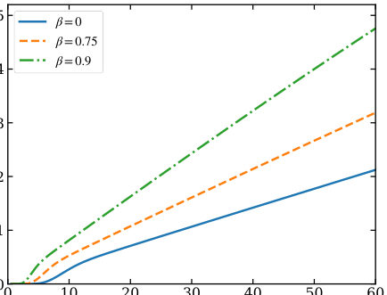
<figcaption class="paper-figure-caption"><b>Fig 1.</b> FIG. 1. Canonical heat capacity per electron at B = 1 T and PFF Nc = 75. Spectral compression shifts the Hermitian response toward lower temperatures. According to Eq. (46), all curves represent the same canonical function evaluated at the rescaled temperature T/λ.</figcaption>
</figure>
<figure class="paper-figure-card">
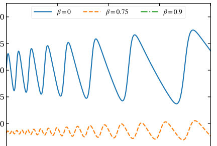
<figcaption class="paper-figure-caption"><b>Fig 2.</b> FIG. 3. Orbital magnetic moment per electron at T = 2 K and µ = 38 meV. Its field displacement and deformation- dependent amplitude follow mphys 0,+,β(B) = λ2mphys 0,+,0(Beff). The calculation excludes the regularized negative-energy Dirac-sea contribution.</figcaption>
</figure>
<figure class="paper-figure-card">
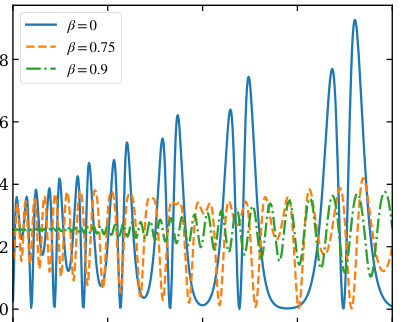
<figcaption class="paper-figure-caption"><b>Fig 3.</b> FIG. 2. Grand-canonical heat capacity per electron at T = 2 K and µ = 38 meV. Successive Landau-level crossings gen- erate oscillatory, thermally broadened structures. For an iso- lated level, the fixed-µ heat-capacity contribution vanishes at the crossing En,+(B, β) = µ and develops maxima on either side within the thermal window. The deformation- dependent field locations of these structures are controlled by Beff = (1 −β2)B through Eq. (47).</figcaption>
</figure>
<figure class="paper-figure-card">
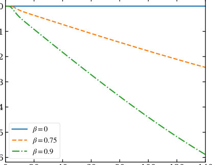
<figcaption class="paper-figure-caption"><b>Fig 4.</b> FIG. 4. Isothermal entropy change at fixed Nc = 75 and B = 1 T. Negative values of −∆S(Nc)/(NckB) correspond to entropy increase under spectral compression. The residual entropy of the fractionally filled ideal Landau level is common to both spectra and cancels from the difference.</figcaption>
</figure>
<figure class="paper-figure-card">
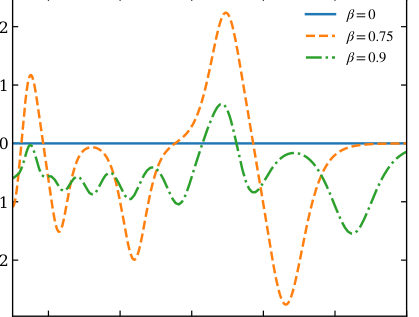
<figcaption class="paper-figure-caption"><b>Fig 5.</b> FIG. 5. Normalized fixed-µ entropy change at T = 5 K and µ = 38 meV. The sign reversals arise from the difference between the same Hermitian entropy curve evaluated at B and Beff.</figcaption>
</figure>

**Summary.** This paper develops a comprehensive thermodynamic framework for Non-Hermitian Dirac fermions in magnetic fields. It demonstrates that the system's thermodynamics can be simplified by mapping its spectrum onto an effective Hermitian model via spectral compression. This yields universal scaling relations for key responses like heat capacity and magnetization, providing a powerful tool for analyzing non-Hermitian quantum matter.

**Why it may be interesting.** The methodology of using spectral mapping derived from quasi-Hermiticity to simplify complex thermodynamic calculations is highly relevant for open quantum systems, as it provides a rigorous way to connect non-Hermitian physics results back to established Hermitian statistical mechanics.

Detailed structure

**Main problem.** The study establishes scaling relations governing the equilibrium thermodynamics, specifically caloric and magnetic responses, for non-Hermitian Dirac fermions subjected to a magnetic field.

**Main result.** The core finding is that spectral compression allows complex Non-Hermitian thermodynamic quantities (like chemical potential and heat capacity) to be mapped onto rescaled forms of their Hermitian counterparts using an effective magnetic field.

**Method.** The analysis employs similarity transformations to relate the quasi-Hermitian Hamiltonian to an effective Hermitian model, allowing the use of standard statistical mechanics techniques on the transformed spectrum.

**Model / system.** The system is modeled by real-spectrum Non-Hermitian (NH) Dirac fermions, often represented using graphene as a platform, and analyzed in the presence of a magnetic field. The Hamiltonian is quasi-Hermitian but maps to an effective Hermitian model with reduced velocity.

**Key observables.** Chemical potential ($\mu$), entropy ($S$), heat capacities, orbital magnetic response, and the grand partition function ($\Xi$).

**Important parameters / regimes.** The non-Hermiticity parameter $eta$ (where $|eta| < 1$), temperature ($T$), chemical potential ($\mu$), and applied magnetic field ($B$). Scaling factors like $\lambda = 1 / (1 - eta^2)$ are crucial.

**Assumptions / limitations.** Equilibrium is defined by thermalization with respect to the quasi-Hermitian Hamiltonian, and the analysis assumes that single-particle eigenvalues determine equilibrium quantities, which match those of the Hermitian model.

**Paper structure.** The paper develops the thermodynamic framework by first establishing the spectral mapping identity ($D_eta(E; B) = D_0(E; 	ext{Beff})$), then applying this to derive scaling relations for various observables under fixed projected filling factor (PFF) and fixed chemical potential ($\mu$).

Abstract

We establish scaling relations governing the equilibrium thermodynamics of real-spectrum non-Hermitian Dirac fermions in a magnetic field. Assuming thermalization with respect to the quasi-Hermitian Hamiltonian, a similarity transformation maps the system at the same applied field onto a Hermitian Dirac model with reduced velocity, while the Landau-level spectrum also admits a representation in terms of a reduced effective magnetic field. This structure yields scaling relations for the chemical potential, entropy, heat capacities, and orbital magnetic response in different thermodynamic ensembles. At fixed projected filling factor (PFF), the self-consistent chemical potential follows the compressed ladder of Landau levels, and the canonical thermodynamic functions are rescaled Hermitian responses. At fixed chemical potential, Landau-level crossings generate oscillatory caloric and magnetic responses governed by the same spectral compression. Quasistatic non-Hermitian deformation at fixed PFF further yields adiabatic temperature scaling. More broadly, these results establish a thermodynamic framework for real-spectrum non-Hermitian quantum matter and provide a starting point for incorporating the effects of interactions and disorder within the same formalism.

[↑ back to top](#top)

### [Two-dimensional Toda--Arnoldi correspondence: Holomorphic Krylov geometry and counterdiabatic transport](http://arxiv.org/abs/2608.04850v1)

**Authors:** Urei Miura  
**Type:** theory · **Category:** statistical mechanics · **PDF:** <https://arxiv.org/pdf/2608.04850v1>  
**Analysis basis:** full PDF text, analyzed in chunks
**Topic relevance:** `driven-dissipative phase transition` **2/5** · `non-equilibrium dynamics` **2/5** · `Keldysh / 2PI / non-Gaussian methods` **1/5** · `Kondo & dissipative impurity` **1/5** · `correlated / nonlocal dissipation` **1/5** · `entanglement & information structure` **1/5** · `methods for driven-dissipative` **1/5** · `non-equilibrium universality` **1/5**

↔ Scroll figures horizontally

<figure class="paper-figure-card">
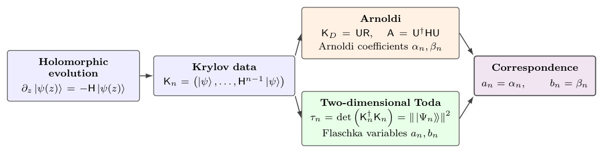
<figcaption class="paper-figure-caption"><b>Fig 1.</b> FIG. 1. Toda–Arnoldi correspondence obtained from holomorphic evolution through Krylov data. The Arnoldi coefficients αn, βn coincide, respectively, with the two-dimensional Toda variables an, bn wherever the Arnoldi method does not break down.</figcaption>
</figure>
<figure class="paper-figure-card">
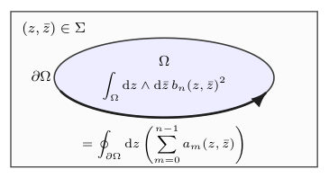
<figcaption class="paper-figure-caption"><b>Fig 2.</b> FIG. 2. Stokes–Gauss relation for a compact region Ωof the parameter surface Σ. If Ωis covered by a single local representative and ∂Ωis smooth, the area integral of b2 n equals the boundary integral of Pn−1 m=0 am. The arrow indicates the positive orientation of ∂Ω.</figcaption>
</figure>
<figure class="paper-figure-card">
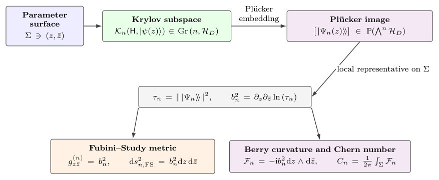
<figcaption class="paper-figure-caption"><b>Fig 3.</b> FIG. 3. Geometric quantities obtained from the holomorphic Krylov map. In the region where rank (Kn) = n, τn = ∥|Ψn⟩⟩∥2</figcaption>
</figure>
<figure class="paper-figure-card">
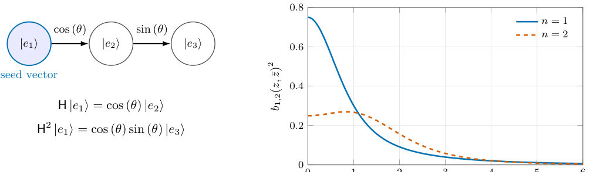
<figcaption class="paper-figure-caption"><b>Fig 4.</b> FIG. 4. Three-site non-Hermitian nonreciprocal model. (a) Directed Krylov chain generated by the seed vector |ψ(0)⟩= |e1⟩, with couplings cos (θ) and sin (θ). (b) Dependence of b1(z, ¯z)2 (blue solid line) and b2(z, ¯z)2 (orange dashed line) on |z| at θ = π/6, where dK = 3 [Eqs. (34) and (35)]. Both tend to zero as |z| →∞.</figcaption>
</figure>
<figure class="paper-figure-card">
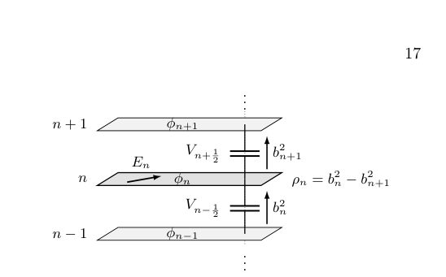
<figcaption class="paper-figure-caption"><b>Fig 5.</b> FIG. 5. Electrostatic analogy for the Toda lattice. Each layer is a copy of the parameter plane Σ with potential ϕm, and the arrow within layer n denotes the in-plane complex electric field En. An arrow between layers denotes the link polarization b2 m = exp  Vm−1</figcaption>
</figure>

**Summary.** This theoretical paper establishes a 'Toda–Arnoldi correspondence' showing that the evolution of non-Hermitian Hamiltonians, tracked via Arnoldi reduction, is governed by the mathematics of the two-dimensional Toda lattice. It provides deep insights into how geometric quantities such as the Berry curvature and Fubini–Study metric are encoded in the system's spectral coefficients.

**Why it may be interesting.** This work connects non-Hermitian quantum dynamics (relevant to open systems) directly to integrable systems theory (Toda lattice), providing powerful mathematical tools to analyze spectral flow and geometric invariants like the Chern number.

Detailed structure

**Main problem.** The paper establishes a deep mathematical correspondence between the dynamics generated by non-Hermitian Hamiltonians via Arnoldi reduction and the structure of the two-dimensional Toda lattice.

**Main result.** It proves that Krylov Gram determinants satisfy the $	au$-function relations of the 2D Toda lattice, linking geometric quantities like the Fubini–Study metric and Berry curvature to these integrable systems.

**Method.** The analysis combines concepts from numerical linear algebra (Arnoldi reduction), complex geometry (holomorphic deformations, Grassmannians), and soliton theory (Toda lattice $	au$-functions).

**Model / system.** The study concerns a fixed, finite-dimensional, generally non-Hermitian Hamiltonian $H$ whose evolution is tracked using holomorphic deformation of a cyclic state vector. The mathematical framework involves the Krylov subspace generated by this system.

**Key observables.** Krylov Gram determinants ($	au_n$), Arnoldi coefficients ($\alpha_n, eta_n$), Fubini–Study metric components ($b_n^2$), and Berry curvature.

**Important parameters / regimes.** The complex deformation parameter $z$ and the dimensionality of the Hamiltonian/subspace. The correspondence is restricted to cyclic states.

**Assumptions / limitations.** The analysis assumes a cyclic seed state vector and relies on the validity of the Arnoldi method, noting breakdowns when the Krylov dimension drops.

**Figures summary.** Figures illustrate the connection between holomorphic evolution $
ightarrow$ Krylov data $\leftrightarrow$ 2D Toda variables; they also show Stokes-Gauss relations linking area integrals (related to metric) to boundary integrals (related to coefficients).

**Paper structure.** The paper builds from defining the dynamics via holomorphic deformation and Krylov methods, establishing the correspondence with the 2D Toda lattice. It then explores geometric consequences like the Fubini-Study metric and Berry curvature, culminating in an electrostatic analogy for understanding these structures.

Abstract

Although Arnoldi reduction of a generally non-Hermitian Hamiltonian yields an upper Hessenberg matrix rather than the tridiagonal form of Hermitian Lanczos theory, we show that a closed Toda sector survives in its diagonal and subdiagonal coefficients. For a fixed finite-dimensional Hamiltonian and a cyclic state vector deformed holomorphically, the Krylov Gram determinants are $τ$ functions of the finite two-dimensional Toda lattice, whose Flaschka variables coincide exactly with these Arnoldi coefficients. The Toda dynamics therefore closes on this sector without determining the remaining upper Hessenberg entries. The subdiagonal part of the same sector also has a direct geometric meaning: the squared subdiagonal coefficients determine both the Fubini--Study metric and the Berry curvature of holomorphic Krylov subspaces, whereas the geometric quantities associated with subspaces lost at Arnoldi breakdown cease to be defined. Along a smooth real path in the cyclic region, the Arnoldi-frame connection further provides a Hermitian tridiagonal generator of exact isospectral transport. When added to the Arnoldi matrix, this generator cancels transitions between instantaneous eigenspaces and realizes counterdiabatic driving whenever the matrix is diagonalizable with a nondegenerate spectrum.

[↑ back to top](#top)

### [Quantum walker trapped by self-similarity of the Sierpiński carpet](http://arxiv.org/abs/2608.04844v1)

**Authors:** Tomasz Sowiński  
**Type:** theory · **Category:** disordered systems and neural networks · **PDF:** <https://arxiv.org/pdf/2608.04844v1>  
**Analysis basis:** full PDF text, analyzed in chunks
**Topic relevance:** `non-equilibrium dynamics` **2/5** · `analog quantum simulation` **1/5** · `driven-dissipative phase transition` **1/5** · `methods for driven-dissipative` **1/5** · `non-equilibrium universality` **1/5** · `scars & prethermalization` **1/5**

↔ Scroll figures horizontally

<figure class="paper-figure-card">
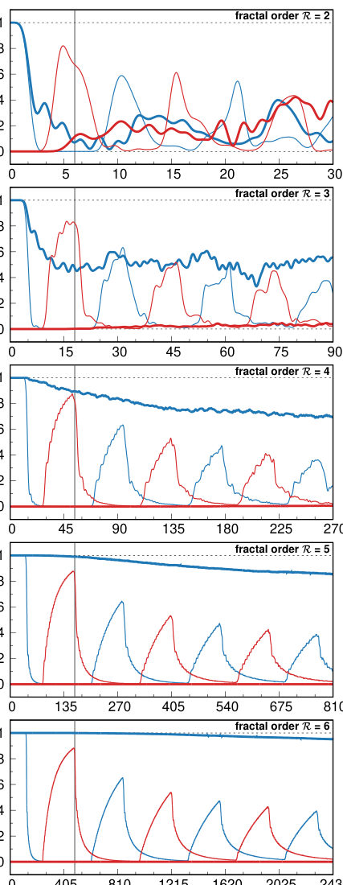
<figcaption class="paper-figure-caption"><b>Fig 1.</b> FIG. 2. Probability of finding the particle in the initial zone ZINI (blue) and the final zone ZFIN (red) zone of the lattice in the case of Sierpi´nski (thick) and uniform (thin) lattice. In all the cases particle is initially localised in the corner of the lattice be- longing to the initial zone. Clearly, for increasing fractal order R, the particle finds it increasingly difficult to reach the oppo- site zone of the lattice and remains trapped in the initial zone. Contrarily, for the uniform lattice, the particle reaches the op- posite zone in time proportional to the edge size of the lattice, TU ≈2ℏD/3J marked with a vertical grey line.</figcaption>
</figure>
<figure class="paper-figure-card">
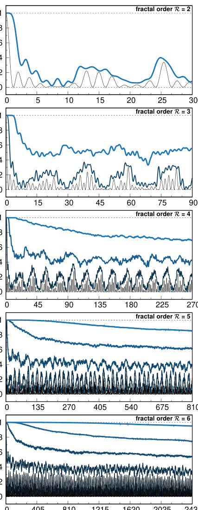
<figcaption class="paper-figure-caption"><b>Fig 2.</b> FIG. 3. Time evolution of the initial-zone probabilities SK(t) on the Sierpi´nski lattice, for the hierarchy of corner zones of increasing size 3K, K = 0, 1, . . . , R−1 (darker to lighter shades of blue), for the same fractal orders R = 2, . . . , 6 as in Fig. 2. The lightest curve in each panel, corresponding to K = R −1, coincides with the thick blue curve of Fig. 2.</figcaption>
</figure>
<figure class="paper-figure-card">
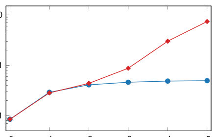
<figcaption class="paper-figure-caption"><b>Fig 3.</b> FIG. 4. Rescaled escape time TKJ/(ℏ3K) as a function of zone range K, for the uniform (blue) and the Sierpi´nski (red) lattice of fractal order R = 6. Note the significant difference in their dependence on zone range K.</figcaption>
</figure>

**Summary.** The paper investigates how quantum walkers behave on lattices with fractal geometry, specifically the Sierpiński carpet. It shows that compared to uniform lattices where particles spread ballistically, the fractal structure causes strong, self-similar trapping near the starting point. This highlights how geometric constraints alone can suppress quantum transport.

**Why it may be interesting.** This work provides a clean theoretical demonstration of how geometric constraints, even without explicit disorder potentials, can fundamentally alter quantum transport properties by creating hierarchical barriers that suppress long-range coherence.

Detailed structure

**Main problem.** The study compares quantum particle transport dynamics on a fractal lattice (Sierpiński carpet) against its counterpart on a uniform lattice of the same size.

**Main result.** While particles move ballistically on the uniform lattice, they become increasingly trapped near their starting point on the Sierpiński carpet as the fractal order increases.

**Method.** The dynamics are simulated by solving the time-dependent Schrödinger equation using numerical methods like Runge-Kutta, focusing on zone-integrated probabilities for comparison.

**Model / system.** A single quantum particle is modeled moving via nearest-neighbor tunneling on a square lattice structure that is iteratively modified into a Sierpiński carpet fractal. The dynamics are compared against the same system on a standard uniform lattice.

**Key observables.** Zone-integrated probabilities for finding the particle in the initial zone ($S(t)$) versus the opposite corner zone ($F(t)$).

**Important parameters / regimes.** Fractal order ($R$), lattice size, and time ($t$).

**Assumptions / limitations.** The analysis assumes continuous-time dynamics governed by nearest-neighbor tunneling only to sites belonging to the defined lattice structure.

**Figures summary.** Figures compare $S(t)$ and $F(t)$ for different fractal orders, showing confinement on the Sierpiński carpet versus ballistic spread on the uniform lattice. Other figures analyze the scaling of characteristic crossing times across various zone sizes ($K$).

**Paper structure.** The paper establishes the model by defining the dynamics on both lattices, presents key observables (zone-integrated probabilities), and then systematically compares the time evolution results to demonstrate the qualitative difference between ballistic transport and fractal trapping.

Abstract

We study the dynamics of a single quantum particle on a finite-size square lattice with a fractal structure resembling the Sierpiński carpet, and compare it to the dynamics on a uniform lattice of the same size. For a particle initially localized at a corner of the lattice, we monitor the probability of finding it near the initial and opposite corners using zone-integrated probabilities, allowing a consistent comparison across fractal orders. While on the uniform lattice the particle reaches the opposite corner ballistically, in a time proportional to the lattice size, on the Sierpiński lattice it becomes increasingly confined to the vicinity of its initial position. We show that this trapping builds up self-similarly across the whole hierarchy of corner zones of the lattice.

[↑ back to top](#top)

### [The rank and layer distributions in random recursive trees](http://arxiv.org/abs/2608.04303v1)

**Authors:** Huck Stepanyants, P. L. Krapivsky, Harrison Hartle, Dmitri Krioukov  
**Type:** theory · **Category:** statistical mechanics · **PDF:** <https://arxiv.org/pdf/2608.04303v1>  
**Analysis basis:** full PDF text, analyzed in chunks
**Topic relevance:** `non-equilibrium dynamics` **2/5** · `non-equilibrium universality` **2/5** · `Keldysh / 2PI / non-Gaussian methods` **1/5** · `driven-dissipative phase transition` **1/5** · `methods for driven-dissipative` **1/5**

↔ Scroll figures horizontally

<figure class="paper-figure-card">
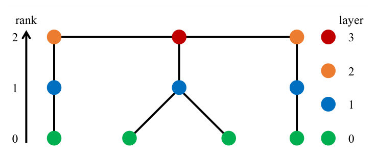
<figcaption class="paper-figure-caption"><b>Fig 1.</b> FIG. 1. Stratification of a tree with n = 10 nodes by rank and layer. The nodes are arranged vertically in the order of increasing rank (distance to nearest leaf) from 0 to 2. Node layer (number of rounds of leaf-removal to become a leaf) is indicated by color, from green, layer 0, to red, layer 3. In any tree, the rank and layer of leaves are both equal to 0, while the rank of their nonleaf neighbors is 1.</figcaption>
</figure>
<figure class="paper-figure-card">
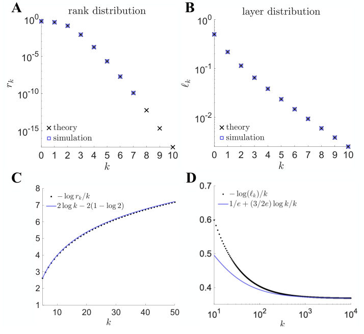
<figcaption class="paper-figure-caption"><b>Fig 2.</b> FIG. 2. (A) The numeric evaluation of the rank distribution values rk = ¯rk −¯rk+1 from Theorem 1 versus the corresponding empirical values averaged across 1.5 × 109 simulated RRTs of size n = 10, 000. (B) The numeric evaluation of the layer distribution values ℓk = ¯ℓk −¯ℓk+1 from Theorem 2 versus the corresponding empirical values for the same simulated RRTs as in (A). (C) The numeric evaluation of −log(rk)/k from Theorem 1 (the black dots) versus the large-k asymptotic of rk from Theorem 3 (the blue curve). (D) The numeric evaluation of −log(ℓk)/k from Theorem 2 (the black dots) versus the large-k asymptotic of ℓk from Conjecture 1 (the blue curve).</figcaption>
</figure>
<figure class="paper-figure-card">
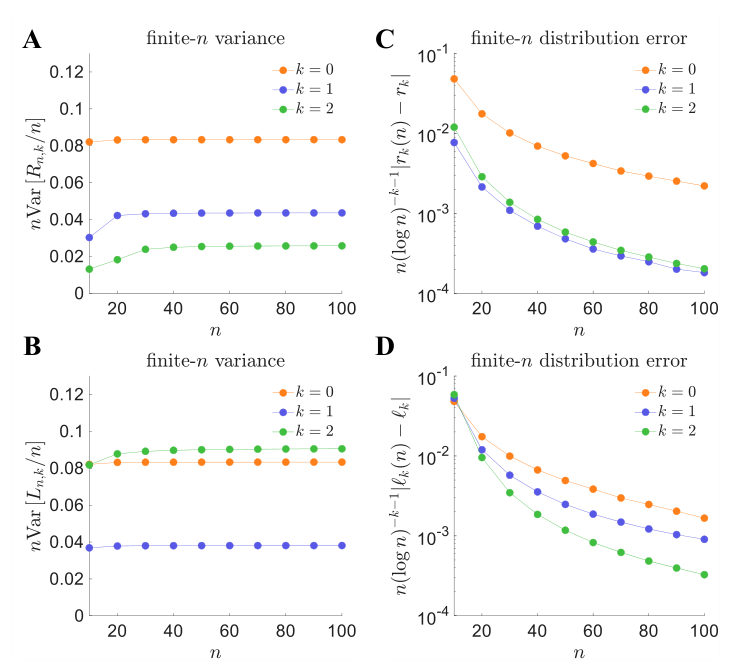
<figcaption class="paper-figure-caption"><b>Fig 3.</b> FIG. 3. (A, B) The variances of the rank and layer fractions rescaled by n, nVar [Rn,k/n] and nVar [Ln,k/n] (dots connected by lines), in 2 × 108 simulated RRTs for each value of n and k = 0, 1, 2, are upper bounded by constants in agreement with Theorem 5. (C, D) The differences between the expected rank and layer fractions rk(n) and ℓk(n) and their corresponding limits rescaled by n(log n)−k−1 (dots connected by lines) in the same RRTs as in (A, B) are upper bounded by constants in agreement with Theorem 6.</figcaption>
</figure>
<figure class="paper-figure-card">
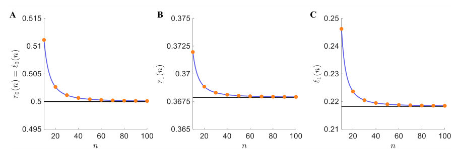
<figcaption class="paper-figure-caption"><b>Fig 4.</b> FIG. 4. The average fractions of leaves (A), nodes of rank 1 (B), and at layer 1 (C) across 2 × 108 simulated RRTs for each value of n (the orange dots) versus the corresponding expected fractions in Theorem 7 (the blue curves) and their n →∞limits in Corollary 2.1 (the black lines). For each simulation point, the uncertainty is smaller than the marker size.</figcaption>
</figure>
<figure class="paper-figure-card">
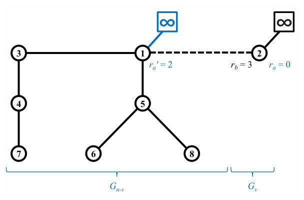
<figcaption class="paper-figure-caption"><b>Fig 5.</b> FIG. 5. Example of tree-splitting and anchoring in an RRT with n = 8 nodes. The anchor shown by the black boxed ∞is attached to node t = 2. The rank of t becomes rb = 3. Then the edge between t = 2 and its ancestor t′ = 1 is deleted, after which t′ is anchored as well. The rank of t is now ra = 0, while the rank of t′ is now r′ a = 2. The elements of the original tree are colored black, while changes resulting from this tree splitting process are colored blue. In the figure, the size of the split subtree Gv rooted at t = 2 is v = 1, corresponding to Case 1 in Sec. III B.</figcaption>
</figure>

**Summary.** This theoretical paper analyzes structural properties of Random Recursive Trees by defining 'rank' and 'layer' distributions. Using advanced mathematical techniques like recursive relations and traveling wave analysis, the authors derive precise asymptotic formulas showing that these distributions decay factorially (for rank) and geometrically (for layer). The work provides a powerful framework for analyzing network structure in complex systems.

**Why it may be interesting.** While focused on graph theory, the mathematical machinery—solving complex recursions, analyzing wavefront propagation via PDEs, and deriving precise asymptotic scaling laws—is highly relevant to non-equilibrium statistical mechanics problems involving pattern formation or relaxation dynamics in physical systems.

Detailed structure

**Main problem.** The primary goal is deriving exact recursive expressions and asymptotic distributions for two structural measures, 'rank' and 'layer', within Random Recursive Trees (RRTs).

**Main result.** The rank distribution decays factorially, while the layer distribution exhibits a geometric decay characterized by complex exponential forms involving constants like $1/e$.

**Method.** The authors employ recursive methods, tree-splitting techniques, and advanced asymptotic analysis, including solving differential equations using a traveling wave ansatz.

**Model / system.** The model is the Random Recursive Tree (RRT), a growing network structure where nodes are added sequentially by connecting to an existing node chosen uniformly at random. The analysis focuses on structural properties of this graph ensemble.

**Key observables.** Rank ($r_k$): distance to the closest leaf; Layer ($\ell_k$): number of leaf-stripping rounds required for a node to become a leaf. Also analyzed are their respective fractions and variances.

**Important parameters / regimes.** The size of the tree, $n$, is taken to infinity ($n 	o \infty$) for asymptotic results. The index $k$ (rank/layer) is also studied in the large-$k$ limit.

**Assumptions / limitations.** Key assumptions include the validity of the traveling wave ansatz and the assertion that $\ell_k \sim ar{\ell}_k$, which cannot be rigorously derived from the main asymptotic equations provided.

**Figures summary.** Figures illustrate the concepts of rank and layer on small trees, compare computed vs. simulated distributions for $r_k$ and $\ell_k$, and show convergence rates related to variances and wavefront growth.

**Paper structure.** The paper builds from deriving exact recursive expressions (Theorems 1 & 2) to establishing self-averaging properties (Theorem 5). It then tackles the asymptotic limits, using advanced differential equation techniques (Traveling Wave Ansatz) to derive the final exponential decay laws for $ar{\ell}_k$ and conjectures for $\ell_k$.

Abstract

The distribution of node depths in a network is crucial for analyzing network structure. Two measures, rank and layer, quantify how deep inside a network a node is. The rank is the node's distance to the closest leaf, a node of degree 1. The layer is the number of times all leaves must be stripped off for the node to become a leaf. We derive exact recursive expressions for the rank and layer distributions in random recursive trees. We show that the rank and layer distributions decay factorially and geometrically, respectively, and prove the self-averaging of the numbers of nodes with fixed rank or layer. Unlike previous studies, our approach does not depend on labels or a root node, providing a more versatile framework for analyzing rank and layer distributions in complex networks.

[↑ back to top](#top)

### [A fractional quantum Hall factory on quantum processors: constant-depth preparation of clustered non-Abelian states](http://arxiv.org/abs/2608.05140v1)

**Authors:** Cheng Xu, Ching Hua Lee, Hong-Hao Tu, Yang Zhang  
**Type:** both · **Category:** strongly correlated electrons · **PDF:** <https://arxiv.org/pdf/2608.05140v1>  
**Analysis basis:** full PDF text, analyzed in chunks
**Topic relevance:** `analog quantum simulation` **2/5** · `QC/QI experiment` **1/5** · `entanglement & information structure` **1/5** · `methods for driven-dissipative` **1/5** · `non-equilibrium dynamics` **1/5**

↔ Scroll figures horizontally

<figure class="paper-figure-card">
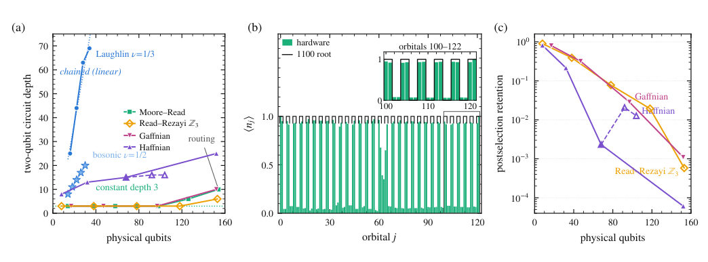
<figcaption class="paper-figure-caption"><b>Fig 1.</b> FIG. 1. The clustering dichotomy (linear vs. constant circuit depth) for state preparation across our FQH catalog. (a) Routed two-qubit depth after transpilation against qubit count for six families of FQH states we prepared: the two chained Laughlin recursions, the fermionic ν = 1/3 and the dual-rail bosonic ν = 1/2, both grow linearly, while the clustered Moore–Read (to 98 qubits), Read–Rezayi Z3 (to 118), and Gaffnian (to 97) hold constant depth three, and the Haffnian, whose squeeze runs two levels deep, sits at depth 8 to 16. Open dashed markers are the depth-16 ibm kingston registers that extend the Haffnian clean ladder to 104 qubits. Beyond roughly 120 qubits, heavy-hex routing...</figcaption>
</figure>
<figure class="paper-figure-card">
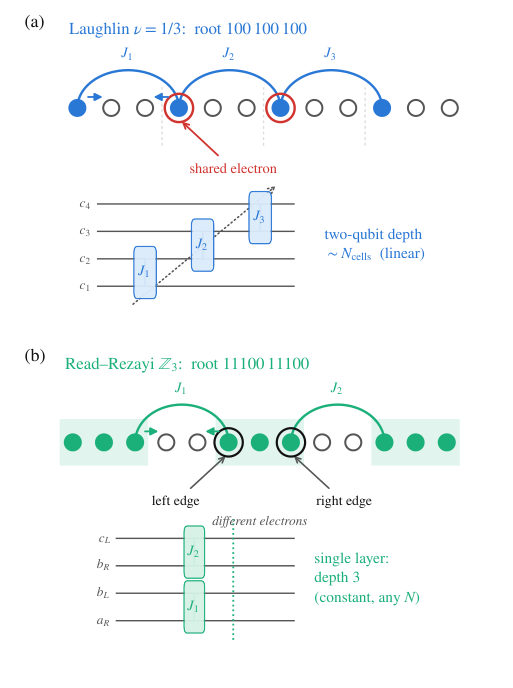
<figcaption class="paper-figure-caption"><b>Fig 2.</b> FIG. 2. How the 2-qubit gate depth scales depends cru- cially on the clustering properties of the FQH state to be prepared. (a) Laughlin ν = 1/3 (root 100 100 100): consecu- tive junction squeezes share an electron, so the flag rotations form a sequential chain and the depth grows with size. (b) Read–Rezayi Z3 (root 11100 11100): junctions couple disjoint electron pairs and fire in parallel at constant depth. The junc- tion squeezes Ji and their amplitudes are defined in Sec. II C [Eq. (2)], the flag-rotation circuits in the same subsection, and the four-family gallery with circuit sketches in Fig. S2 of the Appendix [55].</figcaption>
</figure>
<figure class="paper-figure-card">
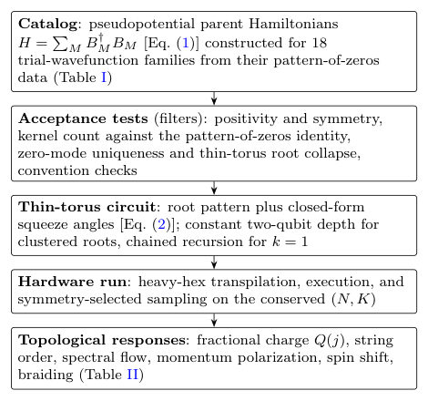
<figcaption class="paper-figure-caption"><b>Fig 3.</b> FIG. 3. Workflow of our FQH state construction and mea- surement (N: particle number; K: total momentum around the cylinder; the kernel count is the zero-mode degeneracy of Eq. (1)). Each family’s pattern-of-zeros data enters at the top box. We construct its parent Hamiltonian from that data and certify it back against the same data (kernel count against the (k, r)-admissibility count, thin-torus limit against the root pattern), and only the certified zero-mode kernel then supplies the circuit amplitudes, the acceptance certificates, the posts- election quantum numbers, and the response protocols.</figcaption>
</figure>
<figure class="paper-figure-card">
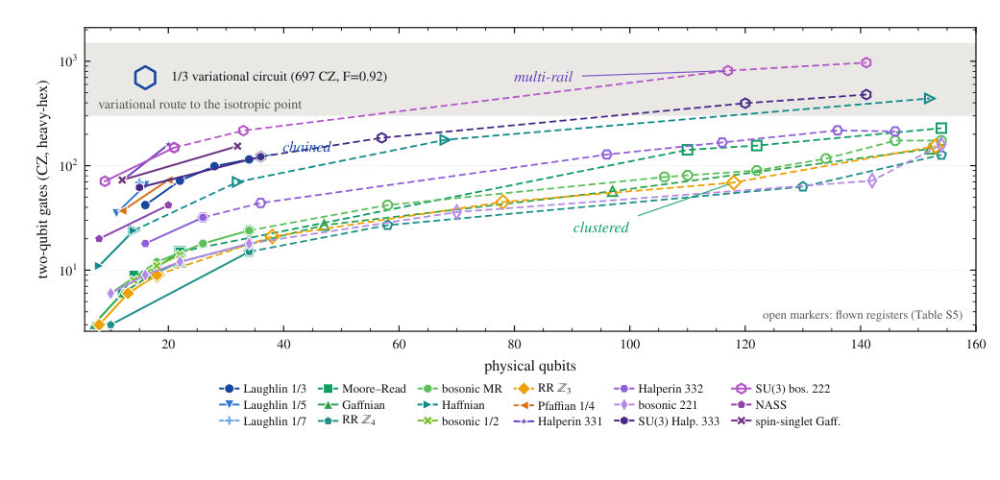
<figcaption class="paper-figure-caption"><b>Fig 4.</b> FIG. 4. Transpiled two-qubit cost against qubit count across the catalog. Filled markers are the exact-verification window, where every circuit carries an exact-diagonalization fidelity (Table I); open markers continue each family along its flown scaling ladder to chip scale, up to 154 qubits, at the routed depths listed in the footnotes of Table S5 of the Appendix [55]. Hue encodes the structural branch: chained Abelian (blues, shown over the verification window; their chip-scale depth scaling is in Fig. 1), clustered non-Abelian and non-unitary (greens and oranges), and multi-rail multicomponent (violets). The gray band is the variational route to the isotropic point (Sec. V).</figcaption>
</figure>
<figure class="paper-figure-card">
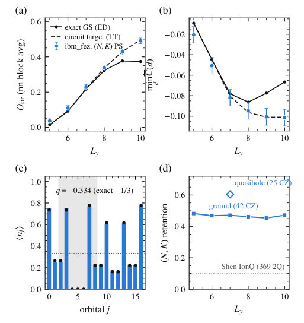
<figcaption class="paper-figure-caption"><b>Fig 5.</b> FIG. 5. Fixed-depth Ly sweep of the ν = 1/3 Laughlin state on ibm fez, 8192 shots per circuit, readout-mitigated and (N, K)-postselected. (a) String-order crossover. (b) Correlation-hole formation. (c) Quasihole domain wall and window charge. (d) Postselection retention. Error bars are bi- nomial shot noise 1/ p</figcaption>
</figure>

**Summary.** The paper presents a scalable method to simulate exotic Fractional Quantum Hall states on quantum processors. It demonstrates that non-Abelian clustered FQH states can be prepared with constant circuit depth, contrasting sharply with the linear depth required for simpler Abelian states. This establishes a powerful new route for studying topological matter beyond current hardware limitations.

**Why it may be interesting.** This work provides concrete quantum circuit blueprints for simulating highly complex, strongly correlated electron phenomena (FQH physics) that are otherwise inaccessible due to exponential resource scaling in traditional methods.

Detailed structure

**Main problem.** The core problem is developing a scalable method to prepare exotic Fractional Quantum Hall (FQH) states, particularly those exhibiting non-Abelian anyon statistics, on programmable quantum hardware.

**Main result.** Clustered non-Abelian FQH states can be prepared using parallel quantum circuits with a two-qubit depth independent of system size (constant depth), unlike the Abelian Laughlin state which requires linearly growing circuit depth.

**Method.** The authors use a systematic framework to catalog FQH states by constructing parent Hamiltonians from pattern-of-zeros data, translating these into quantum circuits for implementation on hardware like IBM Heron processors.

**Model / system.** The study focuses on FQH matter, modeling various states including the Abelian Laughlin state and non-Abelian Read–Rezayi $\mathbb{Z}_3$ and $\mathbb{Z}_4$ states. These are analyzed using thin-torus circuits derived from pseudopotential parent Hamiltonians.

**Key observables.** Fractional quasihole charges, non-Abelian braiding data (measured interferometrically), and circuit depth scaling.

**Important parameters / regimes.** System size (up to 156 qubits), two-qubit gate depth, and the clustering property of the state wavefunction.

**Assumptions / limitations.** The primary limitation at large scales is identified as per-qubit readout error rather than the gate count itself; constant depth relies on junction squeezes forming disjoint blocks.

**Figures summary.** Figures compare circuit depth scaling, illustrating the dichotomy between linear depth (Laughlin) and constant depth (clustered non-Abelian states) for various FQH models.

**Paper structure.** The paper progresses from establishing a systematic framework to cataloging states, demonstrating the circuit construction pipeline, comparing depth scalings based on clustering properties, and finally validating results by measuring topological observables like fractional charge and braiding data.

Abstract

Non-Abelian anyons arise as exotic excitations in fractional quantum Hall (FQH) matter and have proved very elusive to realize in conventional platforms. In this work, we show that on a programmable quantum hardware platform, the more exotic FQH excitations are the less costly ones to prepare: clustered non-Abelian FQH states admit parallel quantum preparation circuits whose two-qubit depth is independent of system size, while constructing the more common Abelian Laughlin state requires a sequential circuit chain with linear depth. The centerpiece of this work is our new systematic framework for cataloging possible FQH states and preparing them on quantum circuits at unprecedented scale and variety. Our prepared parafermionic Read--Rezayi $\mathbb{Z}_3$ state holds depth 3 from 8 to 118 qubits, and full root sampling extends to a 154-qubit, 104-electron Read--Rezayi $\mathbb{Z}_4$ state. In all, our demonstrated 18-family catalog of prepared FQH states extends to all 156 qubits of an IBM Heron processor, limited only by existing hardware scale. Measurements on the prepared states recover the expected fractional quasihole charges, with the charge estimator exact in every symmetry-selected shot for the clustered states, and braiding data of the non-Abelian $e/4$ quasihole measured via interferometric extensions. Our work establishes a scalable route to studying FQH physics on quantum processors and opens new avenues for preparing and probing non-Abelian topological matter far beyond the reach of conventional platforms.

[↑ back to top](#top)

### [Quantized topological invariant of symmetry-projected Gibbs states](http://arxiv.org/abs/2608.04350v1)

**Authors:** Weiguang Cao, Haruki Watanabe  
**Type:** theory · **Category:** statistical mechanics · **PDF:** <https://arxiv.org/pdf/2608.04350v1>  
**Analysis basis:** full PDF text, analyzed in chunks
**Topic relevance:** `analog quantum simulation` **2/5** · `Keldysh / 2PI / non-Gaussian methods` **1/5** · `driven-dissipative phase transition` **1/5** · `entanglement & information structure` **1/5** · `methods for driven-dissipative` **1/5**

↔ Scroll figures horizontally

<figure class="paper-figure-card">
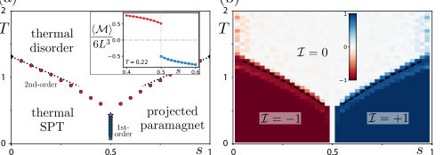
<figcaption class="paper-figure-caption"><b>Fig 1.</b> FIG. 1. (a) Finite-regulator estimates of the projected phase diagram. Red circles, blue squares, black diamonds, and the star denote the βµ = 4 arms, first-order wall, exact end- points, and wall endpoint; red bars are finite-size-scaling fit errors, and black dotted lines are the endpoint tangents in Eq. (19). Inset: stable-branch ⟨M⟩/(6L3) data at L = 12, βµ = 4, and T = 0.22, where M := ∂sH; red circles and blue squares denote deconfined- and confined-prepared runs. (b) The L = 8 conditional finite-size QMC proxy I8 for I, ob- tained from a positive worldsheet-sector splitting, conditional on the spatial-sheet suppression condition in Eq. (28). Red, blue, and white denote −1, +1, 0;...</figcaption>
</figure>

**Summary.** The authors study symmetry-projected Gibbs states in a 3D cluster model to characterize the resulting phase diagram. They introduce a quantized topological invariant, the flux-twisted membrane index, capable of distinguishing between topologically ordered, paramagnetically ordered, and disordered phases. The methodology combines theoretical analysis with advanced Quantum Monte Carlo simulations.

**Why it may be interesting.** This work provides concrete numerical evidence for how imposing global symmetries (via projection) can stabilize exotic quantum phases at non-zero temperatures, which is a key topic in modern condensed matter theory.

Detailed structure

**Main problem.** The study investigates how projecting Gibbs states onto symmetric sectors stabilizes topological phases at finite temperatures, aiming to determine if this projection induces a phase transition where none existed before.

**Main result.** A flux-twisted membrane index distinguishes three distinct phases (SPT, projected-paramagnetic, and disordered) with quantized values of $-1, +1,$ and $0$. The phase diagram exhibits continuous transitions and a self-dual first-order line.

**Method.** The analysis combines theoretical derivations involving partition function ratios and symmetry projectors with extensive Quantum Monte Carlo (QMC) simulations on 3D tori.

**Model / system.** The system is modeled using a three-dimensional cluster-model interpolation Hamiltonian $H(s)$ that smoothly transitions between a Symmetry-Protected Topological (SPT) state and a trivial paramagnet. The analysis focuses on the projected Gibbs states defined by specific symmetry projectors ($\mathcal{P}_{loc}$ or $\mathcal{P}_+$).

**Key observables.** Flux-twisted membrane index ($I$), free-energy splittings ($F_\Sigma(s, T)$), and tension diagnostics (spatial-sheet, winding-line, interface tensions).

**Important parameters / regimes.** The interpolation parameter $s \in [0, 1]$, temperature $T$, and lattice size $L$. Critical values include $T_{I} \approx 1.3133$ for the endpoint mapping.

**Assumptions / limitations.** Quantization away from specific limits requires positive spatial-sheet, winding-line, and interface tensions; theoretical derivations rely on assumptions about sector asymptotics (Hypothesis H).

**Figures summary.** Figure 1 illustrates the finite-regulator estimate of the projected phase diagram showing three distinct regions separated by continuous and first-order lines. Other figures detail the geometry involving noncontractible cycles.

**Paper structure.** The paper establishes the physical context via symmetry projection, derives a topological index ($I$), calculates this index using QMC on finite lattices, and maps out the resulting phase diagram structure across varying parameters $s$ and $T$.

Abstract

We study Gibbs states projected onto the symmetric sector of contractible one-form symmetries. In a three-dimensional cluster-model interpolation, this projection stabilizes symmetry-protected topological and projected-paramagnetic phases, both sharply distinct from thermal disorder. A flux-twisted membrane invariant distinguishes these three phases by the values $-1,+1,0$, respectively. These values are exact on the endpoint, self-dual, zero-temperature, and infinite-temperature lines; elsewhere their quantization requires positive spatial-sheet, winding-line, and interface tensions. Quantum Monte Carlo supports the quantization through tension diagnostics and direct finite-size estimates.

[↑ back to top](#top)

### [Solving Differential Equations Using Continuous-Variable Quantum Annealing](http://arxiv.org/abs/2608.04601v1)

**Authors:** Kazuki Miyanishi, Soshun Naito, Asuka Koura, Kazue Kudo, Toshiki Yamaji, Yuichiro Matsuzaki  
**Type:** theory · **Category:** quantum information and computing · **PDF:** <https://arxiv.org/pdf/2608.04601v1>  
**Analysis basis:** full PDF text, analyzed in chunks
**Topic relevance:** `analog quantum simulation` **2/5** · `Keldysh / 2PI / non-Gaussian methods` **1/5** · `correlated cavity matter` **1/5** · `methods for driven-dissipative` **1/5**

↔ Scroll figures horizontally

<figure class="paper-figure-card">
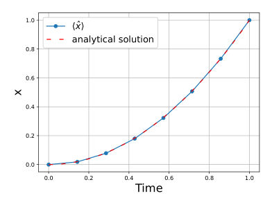
<figcaption class="paper-figure-caption"><b>Fig 1.</b> FIG. 1. Solution of Eq. (16). The horizontal axis represents τ, and the vertical axis represents x(τ). The numerical results obtained by continuous-variable QA are shown in blue, and the analytical solution is shown by the red dotted line. See Section IV A for the parameters used in the numerical calcu- lation.</figcaption>
</figure>
<figure class="paper-figure-card">
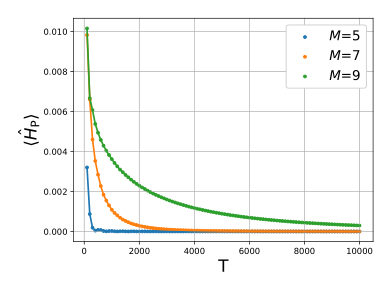
<figcaption class="paper-figure-caption"><b>Fig 2.</b> FIG. 2. Relationship between the expectation value of ˆHP (vertical axis) and the annealing time T (horizontal axis) when solving Eq. (16). As the number of divisions increases, the final expectation value of ˆHP remains farther from zero. Increasing the annealing time T makes the expectation value of ˆHP approach zero. See Section IV A for the parameters used in the numerical calculation.</figcaption>
</figure>
<figure class="paper-figure-card">
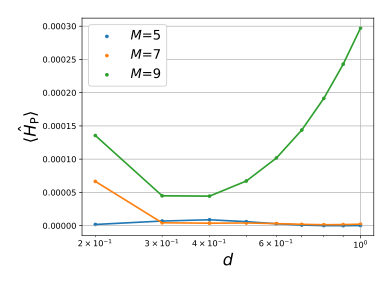
<figcaption class="paper-figure-caption"><b>Fig 3.</b> FIG. 3. Relationship between the expectation value of ˆHP (vertical axis) and the coefficient d of ˆHD (horizontal axis) when solving Eq. (16). Under conditions where annealing succeeds, the expectation value of ˆHP does not change greatly even when d is varied. See Section IV A for the parameters used in the numerical calculation.</figcaption>
</figure>
<figure class="paper-figure-card">
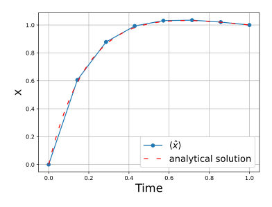
<figcaption class="paper-figure-caption"><b>Fig 4.</b> FIG. 4. Solution of Eq. (17). The horizontal axis represents τ, and the vertical axis represents x(τ). The numerical results obtained by continuous-variable QA are shown in blue, and the analytical solution is shown by the red dotted line. See Section IV A for the parameters used in the numerical calcu- lation.</figcaption>
</figure>
<figure class="paper-figure-card">

<figcaption class="paper-figure-caption"><b>Fig 5.</b> Figure 4 compares the solution obtained by the pro- posed method with the analytical solution x(τ) = 6 5(e−5−1)(e−5τ −1) −τ</figcaption>
</figure>

**Summary.** The authors propose a novel method to solve linear ordinary differential equations by reformulating the problem as a continuous-variable optimization task suitable for bosonic quantum annealing. By mapping this objective function onto a specific Hamiltonian, they demonstrate that their approach successfully reproduces known analytical solutions in numerical tests. This work offers a promising route to solving complex physical problems without resorting to variable discretization overhead.

**Why it may be interesting.** This work directly addresses how quantum computation can tackle continuous physical problems (like solving differential equations) using hardware platforms naturally suited for continuous variables (bosonic systems), bypassing major limitations of current qubit architectures.

Detailed structure

**Main problem.** The primary goal is to develop a quantum annealing approach capable of solving linear ordinary differential equations (ODEs) without the computational overhead associated with discretizing variables for qubit-based systems.

**Main result.** Numerical simulations successfully demonstrated that the proposed continuous-variable formulation can reproduce known analytical solutions for second-order linear ODEs, establishing a viable pathway for this application.

**Method.** The ODE solution is recast as a continuous-variable optimization problem whose objective function is then mapped onto a bosonic Hamiltonian suitable for continuous-variable quantum annealing (CVQA).

**Model / system.** The model utilizes bosonic systems, such as cavity modes, where each optimization variable is directly encoded in a bosonic mode. The formulation relies on approximating derivatives using central finite differences.

**Key observables.** The expectation value of the problem Hamiltonian, $\langle\langle \hat{H}_P 
angle
angle_M$, which must approach zero for the solution to be accurate.

**Important parameters / regimes.** Number of divisions ($M$), step size ($\Delta	au$), and annealing time ($T$).

**Assumptions / limitations.** The method assumes that the cost function derived from finite differences can be accurately represented in a quadratic form, $L(	heta) = 	heta^T Q	heta + r^T 	heta$.

**Figures summary.** Figures compare QA solutions against analytical solutions for specific ODEs and show that the expectation value of $\hat{H}_P$ decreases towards zero as the annealing time $T$ increases.

**Paper structure.** The paper first establishes the motivation by contrasting CVQA with qubit-based methods. It then details the mathematical formulation, mapping the discretized ODE into a quadratic cost function and subsequently deriving the bosonic Hamiltonian $\hat{H}_P$. Finally, it presents numerical simulations on specific second-order ODEs to validate the approach.

Abstract

Most existing quantum annealing approaches are formulated for qubit-based architectures. Consequently, applying them to continuous-variable optimization problems requires discretizing the variables, which can incur substantial qubit overhead. Continuous-variable quantum annealing based on bosonic systems has recently been proposed as an alternative framework, in which each optimization variable is directly encoded in a bosonic mode, such as a cavity mode. In this work, we develop a continuous-variable quantum annealing formulation for solving linear differential equations. By recasting the determination of the solution as a continuous-variable optimization problem, the differential equation can be mapped onto an objective function compatible with bosonic quantum annealing. Numerical simulations of second-order linear differential equations demonstrate that, under the conditions considered, the proposed formulation reproduces the corresponding analytical solutions. These results establish a potential route toward solving differential equations without the discretization overhead inherent in qubit-based implementations.

[↑ back to top](#top)

### [Magnetic-Field-Driven Dimensional Reduction in a Quantum Antiferromagnet](http://arxiv.org/abs/2608.04096v1)

**Authors:** Subhankar Khatua, Marcin Raczkowski, Jeroen van den Brink, Fakher F. Assaad  
**Type:** both · **Category:** strongly correlated electrons · **PDF:** <https://arxiv.org/pdf/2608.04096v1>  
**Analysis basis:** full PDF text, analyzed in chunks
**Topic relevance:** `analog quantum simulation` **2/5** · `Frenkel-Kontorova` **1/5** · `Keldysh / 2PI / non-Gaussian methods` **1/5**

↔ Scroll figures horizontally

<figure class="paper-figure-card">
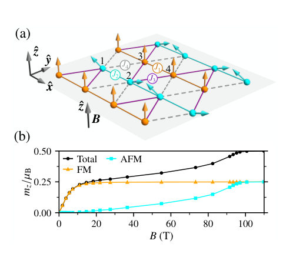
<figcaption class="paper-figure-caption"><b>Fig 1.</b> FIG. 1. (a) Schematic of the two-dimensional model for botal- lackite, consisting of alternating FM (𝐽1) and AFM (𝐽2) Heisenberg spin- 1</figcaption>
</figure>
<figure class="paper-figure-card">
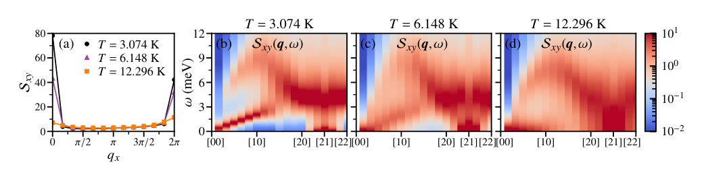
<figcaption class="paper-figure-caption"><b>Fig 2.</b> FIG. 2. (a) Static structure factor for various temperatures at zero magnetic field for a path (𝑞𝑥, 𝑞𝑦) = (0, 𝜋) →(2𝜋, 𝜋). (b)–(d): Dynamical structure factors for the same temperatures at zero magnetic field. 𝒒= [00] corresponds to the total spin. Since this is a conserved quantity, the dynamical structure factor exhibits a Dirac delta peak at 𝜔= 0. We thus leave [00] blank.</figcaption>
</figure>
<figure class="paper-figure-card">
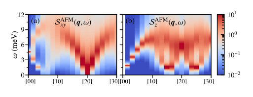
<figcaption class="paper-figure-caption"><b>Fig 3.</b> FIG. 3. Dynamical structure factors of the decoupled AFM chains (i.e., 𝐽3 = 0) at temperature 𝑇= 3.074 K and magnetic field 𝐵= 36.625 T. Since 𝑆𝑧 tot is a conserved quantity, we leave [00] blank similar to Fig. 2.</figcaption>
</figure>
<figure class="paper-figure-card">
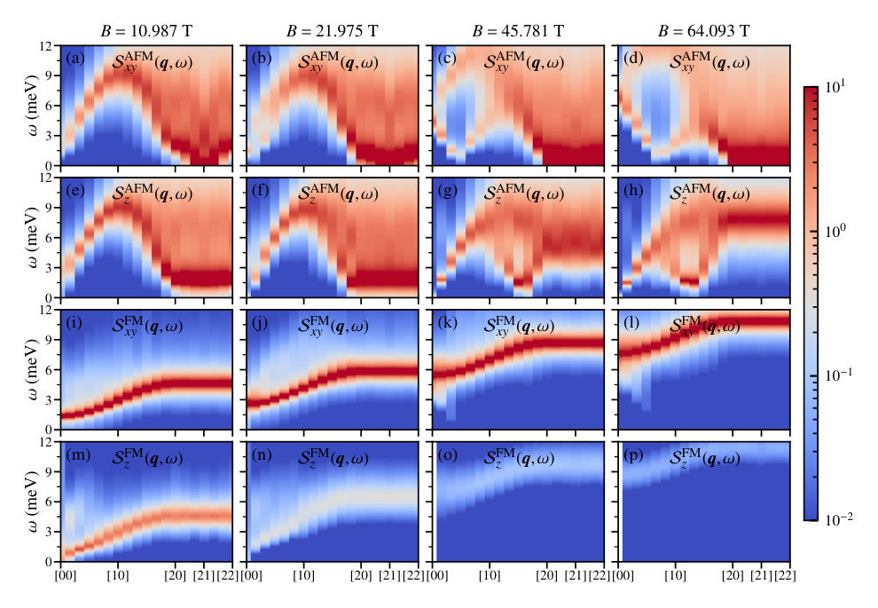
<figcaption class="paper-figure-caption"><b>Fig 4.</b> FIG. 4. Separate contributions from the FM and AFM chains to the dynamical structure factor at temperature 𝑇= 3.074K for various magnetic fields. We leave [00] blank in (o) and (p) as the corresponding imaginary-time correlation functions are within the error bars.</figcaption>
</figure>
<figure class="paper-figure-card">
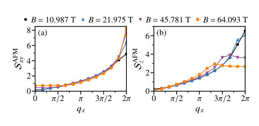
<figcaption class="paper-figure-caption"><b>Fig 5.</b> FIG. 5. Static structure factor of the AFM chains for a path (𝑞𝑥, 𝑞𝑦) = (0, 0) →(2𝜋, 0) for several magnetic fields at 𝑇= 3.074 K. (a) Transverse and (b) longitudinal parts.</figcaption>
</figure>

**Summary.** The paper demonstrates that applying a strong magnetic field can drive dimensional reduction in a 2D quantum antiferromagnet model. By analyzing the system's spin dynamics via QMC simulations, the authors show that interchain correlations are suppressed, causing the low-energy spectrum to map onto that of an isolated 1D Heisenberg chain.

**Why it may be interesting.** This work provides a clear example of tuning dimensionality in quantum magnets using external fields, offering measurable spectroscopic signatures (inelastic neutron scattering) for emergent low-dimensional physics.

Detailed structure

**Main problem.** The study investigates whether an external magnetic field can induce a dimensional reduction in a quasi-two-dimensional quantum antiferromagnet.

**Main result.** Beyond a critical magnetic field, the system's low-energy excitations are predicted to reduce to those of a one-dimensional AFM Heisenberg chain, exhibiting gapless incommensurate spinon fluctuations.

**Method.** The research employs Quantum Monte Carlo (QMC) simulations using Abrikosov fermions and compares results with analytical treatments like spin-wave theory and Bethe Ansatz analysis for limits.

**Model / system.** The model is a quasi-2D quantum magnet based on the mineral botallackite, featuring alternating ferromagnetic (FM) and antiferromagnetic (AFM) spin-1/2 Heisenberg chains coupled together. The Hamiltonian includes interchain couplings that are tuned by an external magnetic field.

**Key observables.** Total magnetization ($M$), dynamical structure factor ($S(\mathbf{Q}, \omega)$), static structure factor, and the evolution of spectral weight in these quantities as a function of $B$ and $T$.

**Important parameters / regimes.** The critical magnetic field ($B_c \approx 16	ext{ T}$), temperature ($T$), and the relative strengths of intra-chain vs. inter-chain couplings ($J_2 > J_1 > J_3$).

**Assumptions / limitations.** The model simplifies by omitting easy-axis anisotropy and Dzyaloshinskii-Moriya interactions, focusing on SU(2)-symmetric exchange terms.

**Figures summary.** Figures illustrate the magnetization curve vs. field (Fig. 1b), and show how the dynamical structure factor evolves from a 2D pattern to one characteristic of decoupled 1D chains at high fields (Figs. 2, 3, 4).

**Paper structure.** The paper progresses by first establishing the model and calculating magnetization curves; it then analyzes the spectral weight evolution using QMC simulations across varying magnetic fields, demonstrating the crossover to 1D behavior.

Abstract

Low dimensionality enhances quantum fluctuations, triggering novel states of quantum matter to emerge. In real materials, low dimensionality usually arises from spatially strongly anisotropic couplings. Here, we demonstrate a different mechanism: in two-dimensional systems with coupled alternating ferromagnetic (FM) and antiferromagnetic (AFM) spin-$1/2$ chains, an applied magnetic field may drive a dimensional reduction. Under magnetic field, the FM chains polarize and stiffen, suppressing the propagation of transverse AFM fluctuations from one chain to another, and effectively induce one-dimensional behavior at low energies. For a model describing botallackite, Cu$_2$(OH)$_3$Br, quantum Monte Carlo dynamics show that beyond a critical magnetic field, the low-energy spectrum reduces to that of a one-dimensional AFM Heisenberg spin-$1/2$ chain with field-dependent incommensurate two-spinon fluctuations, providing clear signatures for inelastic neutron scattering.

[↑ back to top](#top)

### [Guiding Compiler Optimizations for Neutral Atom Quantum Computers Through Visualizations](http://arxiv.org/abs/2608.04081v1)

**Authors:** Yannick Stade, Robert Wille  
**Type:** theory · **Category:** quantum information and computing · **PDF:** <https://arxiv.org/pdf/2608.04081v1>  
**Analysis basis:** full PDF text, analyzed in chunks
**Topic relevance:** `QC/QI experiment` **2/5** · `Rydberg arrays` **1/5**

↔ Scroll figures horizontally

<figure class="paper-figure-card">
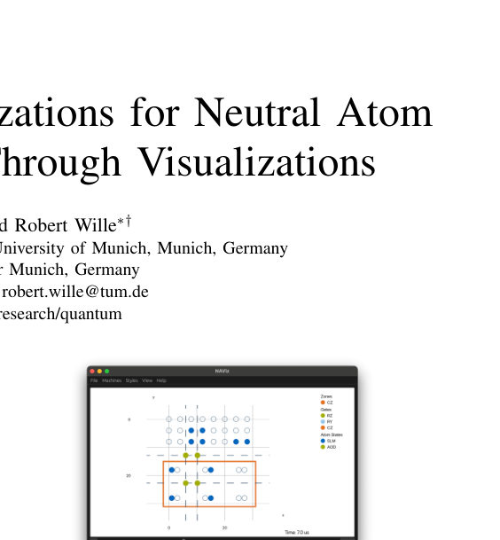
<figcaption class="paper-figure-caption"><b>Fig 1.</b> Figure 1. Screenshot of the visualization app NAViz while animating a quantum computation on an NA device.</figcaption>
</figure>
<figure class="paper-figure-card">
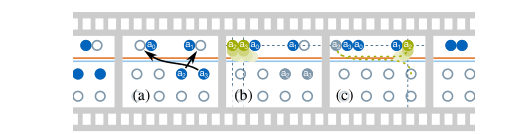
<figcaption class="paper-figure-caption"><b>Fig 2.</b> Figure 2. The black arrows in Fig. 2a indicate the desired rearrangement of two atoms. Figure 2b depicts the first movement and Fig. 2c the second. The dashed green line in Fig. 2c illustrates the distance traveled by atom a2.</figcaption>
</figure>

**Summary.** This paper tackles the challenge of compiling quantum circuits for large Neutral Atom quantum computers. The authors developed NAViz, a visualization tool, to analyze atom rearrangement strategies. By revealing hidden detours in relaxed movement protocols, they proposed and validated a hybrid compilation strategy that significantly improves performance.

**Why it may be interesting.** It directly addresses the practical engineering challenges of scaling quantum hardware by providing diagnostic tools that reveal subtle physical inefficiencies in compilation paths, which is crucial for theoretical modeling of complex quantum architectures.

Detailed structure

**Main problem.** The development of automated compilation tools is necessary for large-scale Neutral Atom (NA) quantum computers due to complex hardware trade-offs.

**Main result.** A novel hybrid routing strategy was derived that outperforms both strictly constrained and fully relaxed compilation methods by intelligently merging steps when overhead reduction is possible.

**Method.** The authors introduced NAViz, a real-time visualization tool, to empirically test and diagnose inefficiencies in existing quantum computation compilation strategies for NA devices.

**Model / system.** The system involves Neutral Atom (NA) quantum computers utilizing optical tweezers for qubit placement and rearrangement. Compilation requires managing physical constraints on atom movement (placement and routing).

**Key observables.** Rearrangement time (T) for various quantum benchmarks like graphstate or QFT.

**Important parameters / regimes.** The trade-off between strict vs. relaxed routing constraints, which govern relative order maintenance during atomic rearrangement.

**Assumptions / limitations.** Initially assumed that relaxing movement constraints would improve performance; visualization proved this assumption false by revealing physical detours.

**Figures summary.** Figure 1 shows NAViz visualizing computation steps (static/rearranging atoms). Figure 2 illustrates an inefficient detour path during relaxed routing. Table I compares rearrangement times for Strict, Relaxed, and Hybrid strategies.

**Paper structure.** The paper identifies the need for compilation tools, introduces NAViz to visualize NA computations, analyzes different routing constraints (strict vs. relaxed), diagnoses performance bottlenecks using visualization, and concludes by proposing and validating a superior hybrid strategy.

Abstract

The scale of Neutral Atom (NA) quantum computers requires automated compilation tools. Designing the required heuristic methods demands a deep understanding of complex hardware trade-offs, for which visualizations can provide crucial insights. This work introduces NAViz, the first publicly available app to visualize quantum computations on NA devices in real-time. A case study demonstrates how NAViz was instrumental in identifying and resolving inefficiencies in an existing compilation strategy, leading to a new, more performant one. The tool is available as part of the Munich Quantum Toolkit (MQT) at https://github.com/munich-quantum-toolkit/naviz.

[↑ back to top](#top)

### [Perfect Games in Dimension-Bounded Communication](http://arxiv.org/abs/2608.05092v1)

**Authors:** E. Zambrini Cruzeiro  
**Type:** theory · **Category:** quantum information and computing · **PDF:** <https://arxiv.org/pdf/2608.05092v1>  
**Analysis basis:** full PDF text, analyzed in chunks
**Topic relevance:** `entanglement & information structure` **2/5** · `quantum measurements` **1/5**

↔ Scroll figures horizontally

<figure class="paper-figure-card">
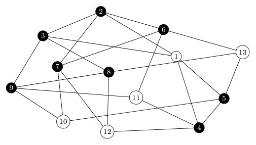
<figcaption class="paper-figure-caption"><b>Fig 1.</b> FIG. 1. An abstract drawing of the orthogonality graph G13. Vertex positions are chosen solely for readability and do not represent the coordinates of the rays in Eq. (39). Filled vertices form the tested set T8 = {2, 3, 4, 5, 6, 7, 8, 9}. Its five untested vertices form a maximum independent set, so T8 is a minimum vertex cover.</figcaption>
</figure>

**Summary.** This paper rigorously analyzes 'perfect games' in dimension-bounded quantum communication settings. It establishes that the ability to perfectly distinguish between quantum and classical strategies depends on comparing graph invariants like chromatic number ($\chi$) against a quantum measure ($\xi_C$). The work provides concrete examples showing genuine quantum advantage where $\xi_C < \chi$, connecting quantum physics directly to extremal combinatorics.

**Why it may be interesting.** It provides deep connections between fundamental concepts in quantum information theory (contextuality, state exclusion) and classical combinatorial optimization problems (graph coloring), which is highly relevant for understanding resource limitations in quantum communication protocols.

Detailed structure

**Main problem.** The paper investigates perfect prepare-and-measure (PM) games to establish structural relationships between quantum advantage, classical communication complexity, and graph theory invariants.

**Main result.** It provides a complete characterization for binary-output support games, showing that the existence of a perfect quantum strategy is equivalent to a condition involving the complex orthogonal rank ($\xi_C$), which can be strictly weaker than the chromatic number ($\chi$) required for classical realization.

**Method.** The analysis relies on translating physical constraints (perfect winning sets) into graph-theoretic problems, comparing bounds derived from quantum information theory (e.g., orthogonal representations) against classical combinatorial measures (like graph coloring).

**Model / system.** The model is the prepare-and-measure experiment involving Alice encoding an input $x$ into a system of dimension $d$, sending it to Bob for measurement based on $y$. The core mathematical structure analyzed is the conflict graph $\Gamma_G$ derived from the game's winning constraints.

**Key observables.** Chromatic number ($\chi$), complex orthogonal rank ($\xi_C$), classical upper bound ($SG,T$), and quantum values ($Q_d$).

**Important parameters / regimes.** The dimension $d$ of the quantum system (e.g., qubit $d=2$, qutrit $d=3$), and graph invariants like edge biclique-cover number.

**Assumptions / limitations.** The analysis focuses specifically on 'perfect' winning constraints, implying zero-error information theory requirements for both classical and quantum strategies.

**Figures summary.** Not specified in detail, but the notes reference tables summarizing perfect PM games with calculated values ($	ext{C}_3, 	ext{Q}_3, S$) and explicit colorings for graph deletions.

**Paper structure.** The paper proceeds by first defining the framework of support games and establishing necessary conditions (Proposition 1). It then presents the main characterization theorems linking quantum/classical existence to graph parameters ($\chi$ vs. $\xi_C$). Finally, it applies these results to complex examples like the 13-ray qutrit graph and nonbinary tasks like Torpedo loss.

Abstract

Perfect prepare-and-measure games exhibit an all-or-nothing quantum advantage: a quantum system of dimension $d$ satisfies every prescribed winning constraint, whereas a classical $d$-level message cannot. We establish two structural results for such forbidden-output support constraints. First, every binary-output support game reduces exactly to a conflict graph: perfect classical realization with a $d$-level message is equivalent to $d$-colorability, perfect $d$-dimensional quantum realization is equivalent to a $d$-dimensional orthogonal representation, and the minimum number of Bob inputs realizing a fixed conflict graph is its edge biclique-cover number. Second, for an arbitrary finite output alphabet, every perfect qubit strategy admits a perfect classical-bit realization. As a flagship application, the $13$-ray qutrit graph yields a compressed game $(X,Y,B)=(13,8,2)$ with $C_3=39<Q_3=S=40$, and eight Bob inputs are minimal among all binary-output realizations of that graph. Graph extensions demonstrate the mechanism in every dimension, while Torpedo and antidistinguishability games illustrate the genuinely nonbinary regime. These results connect exact communication, graph coloring, contextuality, state exclusion, and zero-error information theory.

[↑ back to top](#top)

### [Tilts from 2-Groups](http://arxiv.org/abs/2608.04248v1)

**Authors:** Sven Harder, Theodore Jacobson, Zhengdi Sun  
**Type:** theory · **Category:** other · **PDF:** <https://arxiv.org/pdf/2608.04248v1>  
**Analysis basis:** full PDF text, analyzed in chunks
**Topic relevance:** `Keldysh / 2PI / non-Gaussian methods` **1/5** · `analog quantum simulation` **1/5** · `correlated / nonlocal dissipation` **1/5** · `driven-dissipative phase transition` **1/5** · `entanglement & information structure` **1/5** · `methods for driven-dissipative` **1/5** · `non-equilibrium dynamics` **1/5** · `non-equilibrium universality` **1/5**

↔ Scroll figures horizontally

<figure class="paper-figure-card">
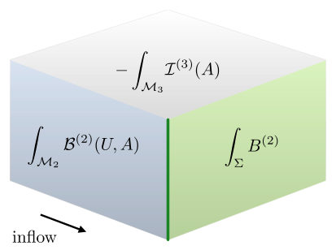
<figcaption class="paper-figure-caption"><b>Fig 1.</b> Figure 1: The anomalous transformation of a charged line operator on γ attached to a</figcaption>
</figure>
<figure class="paper-figure-card">
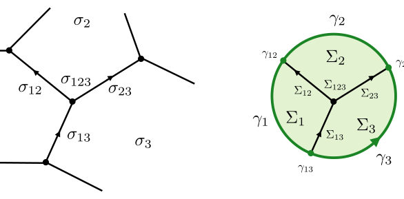
<figcaption class="paper-figure-caption"><b>Fig 2.</b> Figure 2: An example of a triple intersection of patches. The orientation of each region</figcaption>
</figure>
<figure class="paper-figure-card">
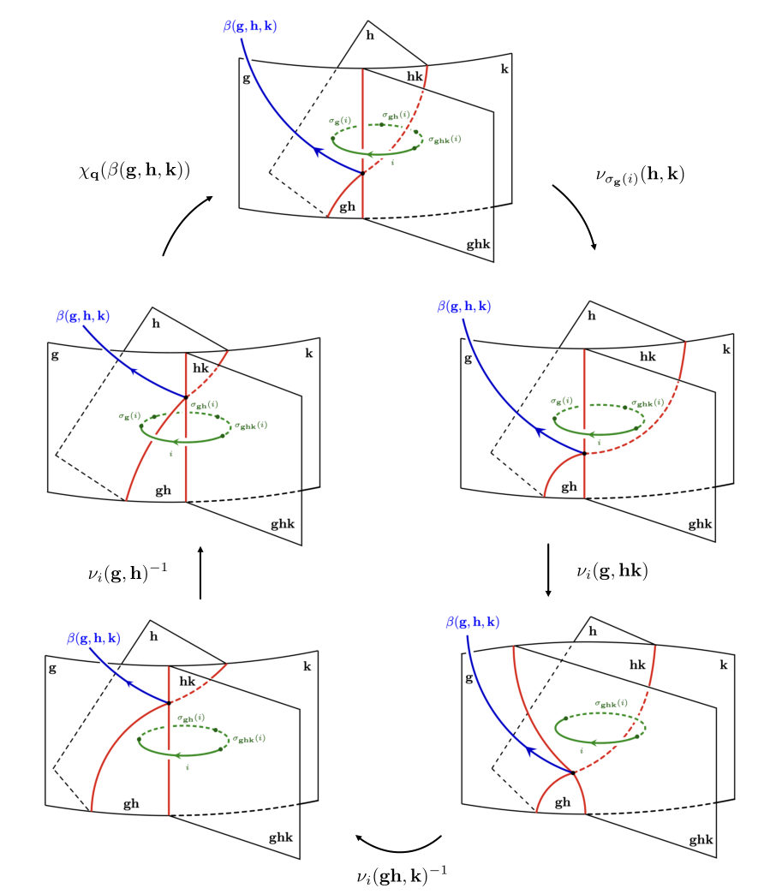
<figcaption class="paper-figure-caption"><b>Fig 3.</b> Figure 3: Derivation of the consistency condition (4.10) by the above topological manip-</figcaption>
</figure>

**Summary.** This theoretical paper investigates how 2-group global symmetries constrain line operators (defects) within Quantum Field Theories. The core finding is that these charged lines must explicitly break the system's primary symmetry, a constraint formalized by a 'family anomaly.' The authors use advanced mathematical tools like generalized anomaly inflow to prove this result across various types of symmetry groups.

**Why it may be interesting.** While highly abstract, the concepts of higher symmetries, topological defects, and anomaly matching are fundamental to understanding emergent order and stability in strongly interacting quantum systems, which has parallels with correlated electron physics.

Detailed structure

**Main problem.** The paper analyzes how global symmetries described by 2-groups constrain line operators (defects) charged under the 1-form subgroup of these symmetries.

**Main result.** It shows that such line operators generically break the underlying 0-form symmetry, leading to a family of defects whose existence is protected by a 'family anomaly' invariant under RG flow.

**Method.** The analysis employs advanced tools including the Wess-Zumino consistency condition, generalized anomaly inflow formalisms for defects, and differential cohomology techniques depending on whether the 2-group is continuous abelian, nonabelian, or discrete.

**Model / system.** The study applies to Quantum Field Theories (QFTs) possessing 2-group global symmetries, examining constraints in both continuous and discrete settings. The focus is on the interplay between bulk symmetry ($G(0)$) and defect structure ($A(1)$).

**Key observables.** Family anomaly (topological obstruction), tilt operator (linear response to broken symmetry), and constrained correlation functions (e.g., 3-point functions).

**Important parameters / regimes.** The nature of the 2-group (abelian, nonabelian, discrete) dictates which mathematical tools are required for the consistency checks.

**Assumptions / limitations.** The argument for symmetry breaking is presented as being 'completely kinematic,' meaning it holds regardless of whether the bulk theory is a CFT or if the symmetry is spontaneously broken.

**Paper structure.** The paper develops its argument by first establishing the general constraints using anomaly inflow, then detailing specific mathematical machinery for continuous abelian/nonabelian groups (differential cohomology), and finally addressing the discrete case via defect associativity.

Abstract

2-group global symmetries intertwine 0-form and 1-form symmetries in an interesting way. We analyze universal constraints on lines which are charged under the 1-form subgroup of a 2-group, and show that they generically break the 0-form symmetry explicitly. This gives rise to a family of line defects parameterized by the broken symmetry generators, whose existence is invariant under the renormalization group flow of the bulk-defect system. The symmetry breaking is enforced by a `family anomaly,' which is a topological obstruction to a symmetric defect. Our main tools are the Wess-Zumino consistency condition and a generalized anomaly inflow formalism for defects and boundaries. For nonabelian continuous 2-groups the family anomaly stems from a higher Berry connection on the moduli space of defects, and constrains response functions that probe the local action of the broken symmetry. In the continuous abelian case we apply differential cohomology to the 2-group background fields to uncover a subtle generalization of the Wess-Zumino condition, while in the discrete case we recast it in terms of the associativity of symmetry defects. We give numerous illustrative examples, computing when possible explicit forms of the tilt operator (which probes the linear response of the defect to the broken symmetry) and its higher analogs, which are crucial for matching the family anomaly. We also discuss universal features such as how symmetry violation by charged line defects is related to symmetry breaking hierarchies in the bulk, and highlight a number of subtle points including the distinction between simple and non-simple lines, and Postnikov class resolution.

[↑ back to top](#top)

### [Diffusive Speed Limits for U(1)-Covariant Quantum Error Correction](http://arxiv.org/abs/2608.04953v1)

**Authors:** Jianqi Sheng  
**Type:** theory · **Category:** quantum information and computing · **PDF:** <https://arxiv.org/pdf/2608.04953v1>  
**Analysis basis:** full PDF text, analyzed in chunks
**Topic relevance:** `correlated / nonlocal dissipation` **1/5** · `driven-dissipative phase transition` **1/5** · `entanglement & information structure` **1/5** · `methods for driven-dissipative` **1/5** · `non-equilibrium dynamics` **1/5**

↔ Scroll figures horizontally

<figure class="paper-figure-card">
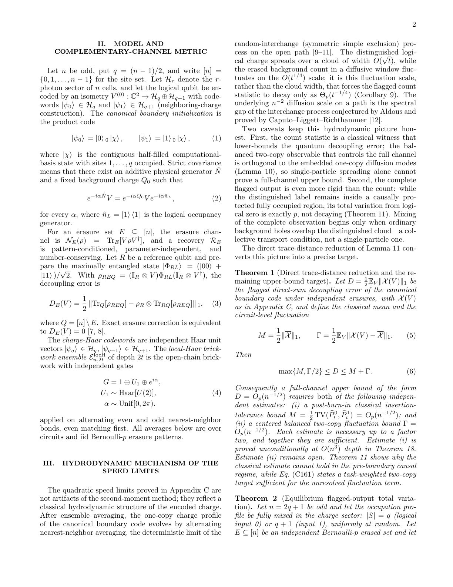
<figcaption class="paper-figure-caption"><b>Fig 1.</b> Low-resolution page preview, page 2</figcaption>
</figure>
<figure class="paper-figure-card">
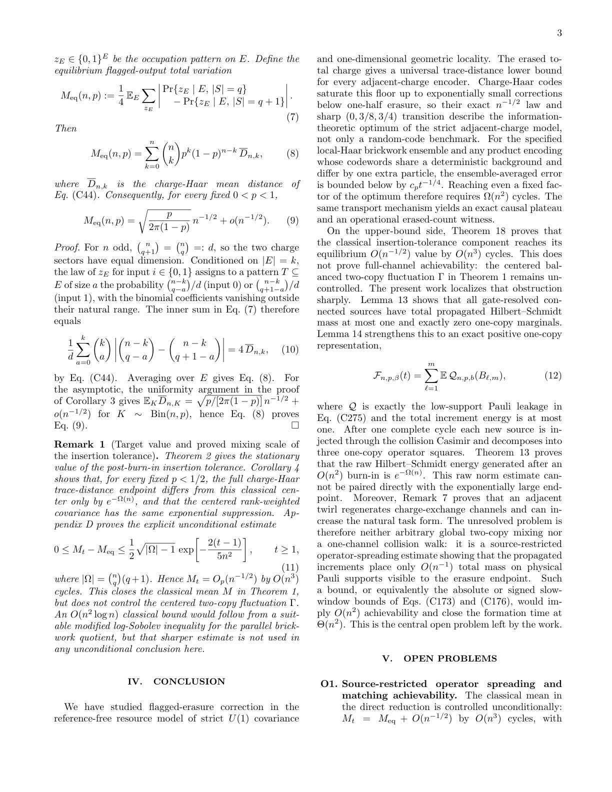
<figcaption class="paper-figure-caption"><b>Fig 2.</b> Low-resolution page preview, page 3</figcaption>
</figure>
<figure class="paper-figure-card">
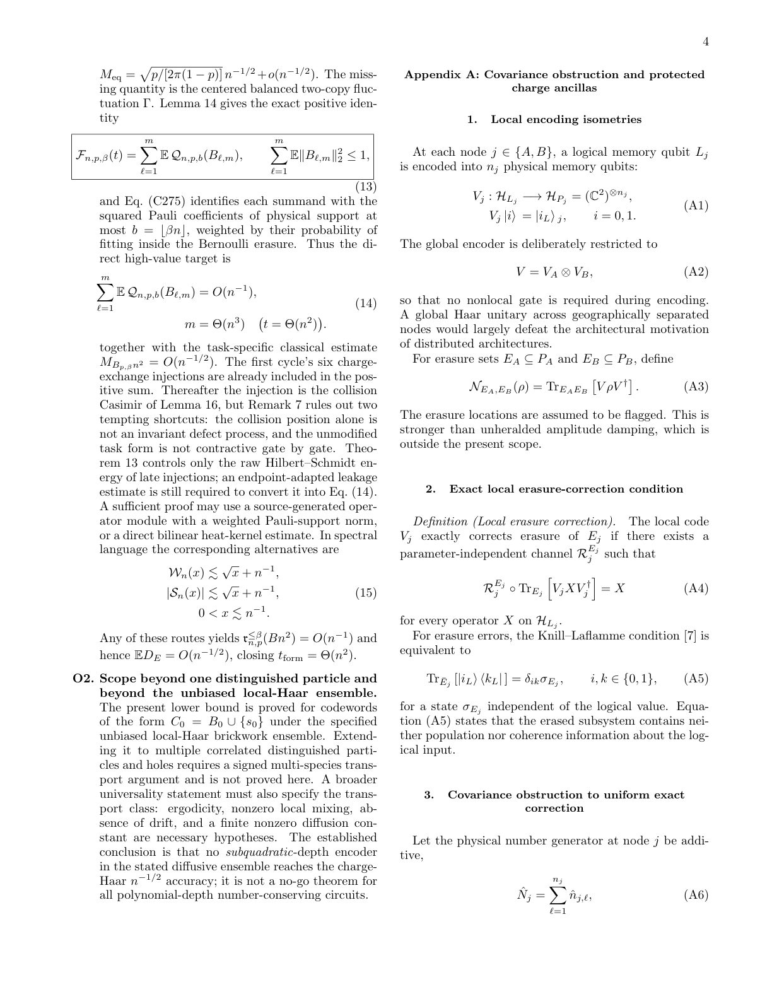
<figcaption class="paper-figure-caption"><b>Fig 3.</b> Low-resolution page preview, page 4</figcaption>
</figure>
<figure class="paper-figure-card">
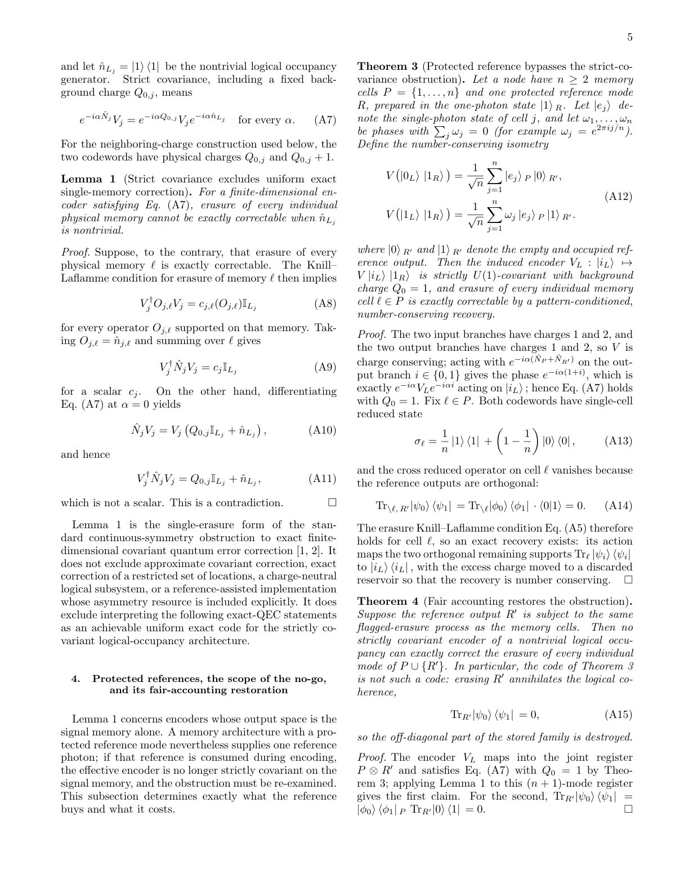
<figcaption class="paper-figure-caption"><b>Fig 4.</b> Low-resolution page preview, page 5</figcaption>
</figure>
<figure class="paper-figure-card">
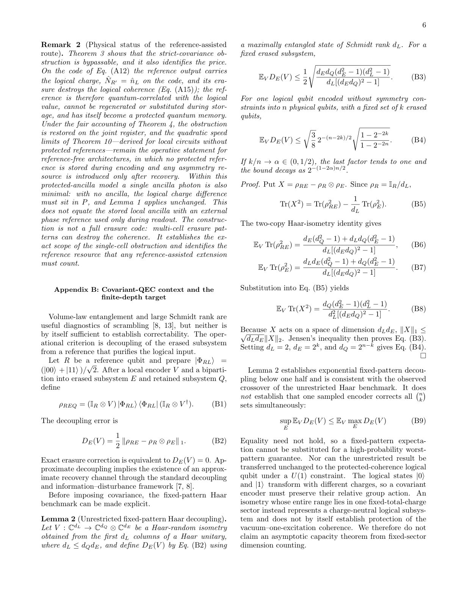
<figcaption class="paper-figure-caption"><b>Fig 5.</b> Low-resolution page preview, page 6</figcaption>
</figure>

**Summary.** This work establishes the theoretical speed limit for performing Quantum Error Correction codes under strict U(1) charge conservation. By analyzing error metrics using advanced mathematical techniques, the authors prove that diffusion processes impose a quadratic ($\Omega(n^2)$) lower bound on how fast these codes can be prepared. This identifies diffusion itself as the fundamental operational bottleneck in symmetry-constrained quantum information processing.

**Why it may be interesting.** It provides a deep connection between fundamental physical constraints (like charge conservation/U(1) symmetry) and computational resource limits (encoding time), which is crucial for designing scalable quantum memory architectures.

Detailed structure

**Main problem.** The research determines the fundamental diffusive speed limits governing U(1)-covariant Quantum Error Correction (QEC) when subjected to flagged erasures.

**Main result.** Diffusion of the logical charge enforces an $\Omega(n^2)$ lower bound on the encoding time for local number-conserving circuits, establishing diffusion as a key operational limit in symmetry-constrained quantum coding.

**Method.** The analysis combines exact complementary-channel geometry, charge-sector Haar analysis, and gate-resolved connected-moment expansions to derive rigorous bounds on error metrics.

**Model / system.** The system models one-dimensional arrays of nearest-neighbor coupled cells encoding a logical qubit under strict U(1) covariance. The study focuses on Charge-Haar codes and local brickwork ensembles.

**Key observables.** Decoupling Error ($DE(V)$), classical mean ($M_t$), centered two-copy fluctuation ($\Gamma$), and the total variation distance ($	ext{dTV}$).

**Important parameters / regimes.** The scaling laws are characterized by $n^{-1/2}$ for equilibrium error bounds, $\Omega(n^2)$ for time lower bounds, and $O(n^3)$ for classical mixing bounds.

**Assumptions / limitations.** Key assumptions include the strict adherence to U(1) covariance and the analysis being restricted initially to single-distinguished-particle classes or specific local ensembles.

**Paper structure.** The paper progresses by first establishing the information-theoretic optimum for charge-Haar codes, then deriving dynamical bounds using moment expansions, identifying diffusion as the bottleneck, and finally relating this to mixing times in random lattice processes.

Abstract

Fast preparation of quantum error-correcting codes is essential for scalable quantum memories, but geometric locality and $U(1)$ charge conservation impose an unavoidable transport constraint. We combine exact complementary-channel geometry, charge-sector Haar analysis, and a gate-resolved connected-moment expansion to study one-dimensional covariant encoders under flagged erasure. Charge-Haar codes attain the universal adjacent-charge lower bound up to exponentially small corrections, yielding an exact $n^{-1/2}$ extensive-erasure law and a sharp half-erasure transition. For local number-conserving brickwork circuits, diffusion of the logical charge enforces an $Ω(n^2)$ encoding-time lower bound; we also prove an $O(n^3)$ mixing bound for the classical component and reduce the remaining full-channel upper bound to a source-restricted low-support operator-spreading problem. These results identify diffusion as an operational limit on symmetry-constrained quantum coding and establish a route to its exact formation time.

[↑ back to top](#top)

### [Generalized comodule tube algebras for boundary and domain wall defects of (2+1)D topological order](http://arxiv.org/abs/2608.05071v1)

**Authors:** Zhian Jia, Sheng Tan  
**Type:** theory · **Category:** strongly correlated electrons · **PDF:** <https://arxiv.org/pdf/2608.05071v1>  
**Analysis basis:** full PDF text, analyzed in chunks
**Topic relevance:** `Keldysh / 2PI / non-Gaussian methods` **1/5** · `analog quantum simulation` **1/5** · `driven-dissipative phase transition` **1/5** · `methods for driven-dissipative` **1/5**

↔ Scroll figures horizontally

<figure class="paper-figure-card">
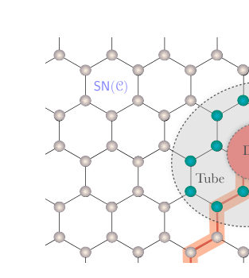
<figcaption class="paper-figure-caption"><b>Fig 1.</b> Figure 1. The point defect (disk region) connects two domain walls described by the C|D-bimodule categories M and N, with tube regions surrounding the defect.</figcaption>
</figure>
<figure class="paper-figure-card">
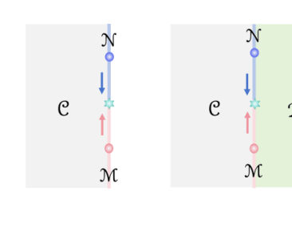
<figcaption class="paper-figure-caption"><b>Fig 2.</b> Figure 2. Defects corresponding to gapped boundaries, gapped domain walls, and multimodule domain walls. Fusion between defects, boundary charges, and domain wall charges occurs in one dimension, such that the direction of fusion plays a critical role.</figcaption>
</figure>
<figure class="paper-figure-card">
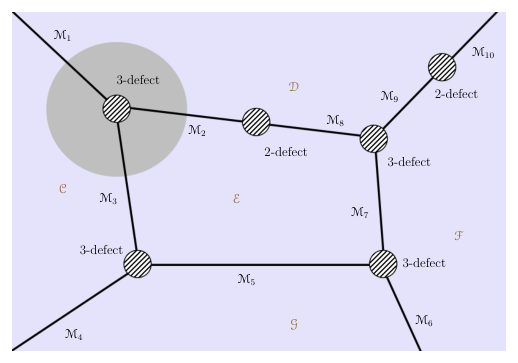
<figcaption class="paper-figure-caption"><b>Fig 3.</b> Figure 3. General configuration of defects in a two-dimensional topological phase. A codimension-2 N-defect may connect N codimension-1 defects. By considering the tube surrounding the N-defect, one obtains the associated multicomodule defect tube algebra.</figcaption>
</figure>
<figure class="paper-figure-card">
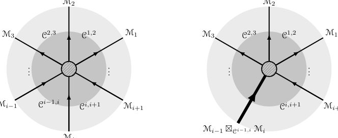
<figcaption class="paper-figure-caption"><b>Fig 4.</b> Figure 4. (a) Schematic representation of an N-defect. The central defect is attached to N domain walls labeled by bimodule categories Mi, arranged cyclically around the defect. The region between two adjacent domain walls Mi and Mi+1 is labeled by the fusion category Ci,i+1, with indices understood modulo N. (b) Fusion of two adjacent domain walls Mi−1 and Mi. Here Mi−1 carries a right Ci−1,i-module structure and Mi carries a left Ci−1,i-module structure, so the two domain walls can be fused along the intermediate fusion category Ci−1,i via Deligne tensor product, producing a Ci−2,i−1|Ci,i+1 domain wall Mi−1 ⊠Ci−1,i Mi.</figcaption>
</figure>

**Summary.** This paper develops an advanced algebraic formalism to characterize topological defects, such as domain walls, in 2D gapped quantum systems. It generalizes the concept of 'tube algebras' by showing that these defects are governed by comodule algebras rather than simple Hopf structures. This provides a powerful mathematical tool for classifying and understanding exotic excitations beyond simple point defects.

**Why it may be interesting.** This work provides a rigorous mathematical framework connecting abstract algebraic structures (comodule/multicomodule algebras) directly to physical concepts in condensed matter theory like topological order and defect physics, which is highly relevant for understanding emergent quantum phenomena.

Detailed structure

**Main problem.** The work generalizes the tube algebra framework from characterizing bulk topological excitations to describing codimension-2 defects, such as domain walls, in (2+1)D gapped phases.

**Main result.** These defects are characterized by a 'defect tube algebra,' which naturally possesses the structure of a comodule algebra over the weak Hopf tube algebra associated with the bulk topological order.

**Method.** The authors employ advanced algebraic techniques, specifically utilizing comodule algebras and multicomodule algebras to classify defect structures arising from Turaev-Viro-Barrett-Westbury TQFTs.

**Model / system.** The theory applies to topological phases in (2+1)D, particularly those modeled by Levin-Wen string-net models. The focus is on the algebraic description of defects connecting multiple bulk phases.

**Key observables.** The representations of the defect tube algebras are used to characterize the boundary and domain wall defects.

**Important parameters / regimes.** Codimension of the defect (2 for domain walls), number of adjacent phases ($N$), and the underlying unitary modular tensor category ($\mathcal{Z}(\mathcal{C})$).

**Assumptions / limitations.** The primary assumption is that defects are not fusion-closed, necessitating the use of a comodule structure rather than a simple coproduct.

**Figures summary.** Figure 1 illustrates how a point defect connects two domain walls described by bimodules $\mathcal{M}$ and $\mathcal{N}$, showing the surrounding tube regions.

**Paper structure.** The paper builds upon the known bulk theory (tube algebra as weak Hopf algebra) and extends it systematically to defects, defining the comodule structure for codimension-2 defects, and generalizing this to $N$-tuple and multicomodule algebras for higher defects.

Abstract

The tube algebra, which carries the structure of a $C^*$ weak Hopf algebra, is a fundamental tool for characterizing topological excitations in topological phases. In this work, we generalize the tube algebra framework to codimension-2 defects in $(2+1)$D gapped phases described by Turaev--Viro--Barrett--Westbury TQFTs, with particular emphasis on Levin--Wen string-net models. We show that such codimension-2 defects are described by a \emph{defect tube algebra}, which naturally carries the structure of a comodule algebra over the weak Hopf tube algebra associated with the topological excitations. Boundary and domain wall defects are then characterized by the representations of the corresponding boundary and domain wall defect tube algebras. In particular, a domain wall defect tube algebra can be regarded as a generalized Drinfeld double of the tube algebras associated with the two adjacent boundary defects. More generally, for a domain wall joining $N$ bulk phases, the associated domain wall defect tube algebra can be viewed as an $N$-tuple algebra. This perspective extends naturally to general $k$-defects, namely codimension-2 defects joining $k$ codimension-1 defects, for which the resulting generalized tube algebra carries the structure of a multicomodule algebra.

[↑ back to top](#top)

### [Representational separation between unitary and channel quantum generative models via shared classical randomness at shallow depth](http://arxiv.org/abs/2608.05110v1)

**Authors:** Arunava Majumder, Marius Krumm, Hendrik Poulsen Nautrup, Hans J. Briegel  
**Type:** theory · **Category:** quantum information and computing · **PDF:** <https://arxiv.org/pdf/2608.05110v1>  
**Analysis basis:** full PDF text, analyzed in chunks
**Topic relevance:** `driven-dissipative phase transition` **1/5** · `entanglement & information structure` **1/5** · `methods for driven-dissipative` **1/5**

↔ Scroll figures horizontally

<figure class="paper-figure-card">
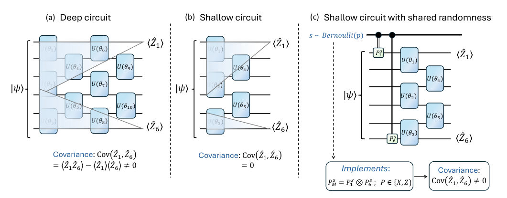
<figcaption class="paper-figure-caption"><b>Fig 1.</b> FIG. 1. Long-range correlations from shared classical randomness: For illustration, the figure shows a brickwall-type circuit on N = 6 qubits acting on an input state |ψ⟩, although the mechanism applies to any system size N ≥6. The shaded regions denote the backward light cones of the measured observables ˆZ1 and ˆZ6. (a) In a sufficiently deep (linear depth) local circuit, the two light cones overlap, allowing the circuit to generate a nonzero correlation, Cov( ˆZ1, ˆZ6) = ⟨ˆZ1 ˆZ6⟩−⟨ˆZ1⟩⟨ˆZ6⟩̸= 0. (b) For a shallow local circuit, the light cones remain disjoint. For a product input state, the corresponding expectation values factorize, and hence Cov( ˆZ1, ˆZ6) = 0 for all model...</figcaption>
</figure>
<figure class="paper-figure-card">
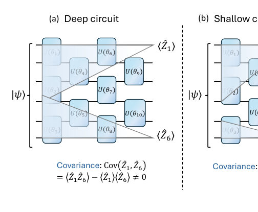
<figcaption class="paper-figure-caption"><b>Fig 2.</b> Fig. 1). For example, one brickwall layer may be written as</figcaption>
</figure>
<figure class="paper-figure-card">
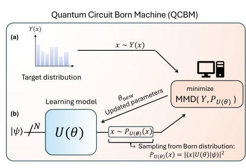
<figcaption class="paper-figure-caption"><b>Fig 3.</b> FIG. 2. Quantum circuit Born machines for quan- tum generative modeling: (a) Target distribution Y (x) (usually unknown), from which samples are given, x ∼Y . (b) The learning model applies a parametrized quantum cir- cuit U(θ) to a fixed input state |ψ⟩and measures the re- sulting state in the computational basis. Each circuit execu- tion produces a bit string sampled from the Born distribution x ∼PU(θ). Samples from the target and model distributions are used to evaluate the maximum mean discrepancy (MMD) loss between Y and PU(θ). Gradients are estimated using the parameter-shift rule, after which a classical optimizer up- dates θ 7→θnew. The updated parameters are returned to the quantum...</figcaption>
</figure>
<figure class="paper-figure-card">
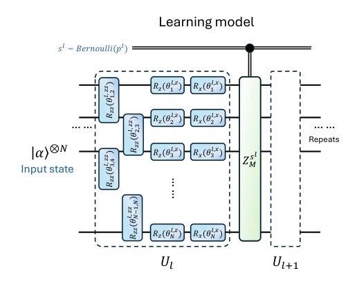
<figcaption class="paper-figure-caption"><b>Fig 4.</b> FIG. 3. Learning model with shared randomness: A depth-D one-dimensional nearest-neighbor circuit acts on the product input state |α⟩⊗N. Each parametrized layer Ul(θl) consists of nearest-neighbor Rzz rotations followed by local Rz and Rx rotations. Between layers Ul and Ul+1, a shared clas- sical bit sl ∼Bernoulli(pl) allows the stochastic Pauli string Zsl M to act on a subset M ⊆[1, N] of qubits, such that the lo- cal Z operations are either applied jointly or all omitted. Re- peating the layer structure generates the full depth-D learning model while the Pauli string shown here is inserted only at the designated slot l.</figcaption>
</figure>
<figure class="paper-figure-card">
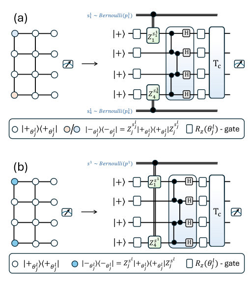
<figcaption class="paper-figure-caption"><b>Fig 5.</b> FIG. 4. Independent and shared randomness within MBQC: For illustration, we consider a 4 × 3 cluster state, where the first two columns are measured in the XY plane, and the final column forms the readout layer. The corre- sponding circuit representation contains parametrized Rz(θl j) rotations, nearest-neighbor CZ gates, and Hadamard gates. The colored boundary qubits indicate measurement-induced Z byproducts that are either corrected by feedforward or deliberately added through anti-correction, all other qubits are corrected with unit probability. (a) The two boundary qubits are corrected or anti-corrected independently. The corresponding circuit therefore contains independent byprod-</figcaption>
</figure>

**Summary.** The paper proves that incorporating shared classical randomness into shallow quantum generative models provides a provable and scalable advantage over purely unitary models. By generating long-range correlations measurable through covariance, the stochastic channel model can represent distributions unattainable by local unitaries at fixed depths. This has significant implications for understanding the limits of near-term quantum hardware.

**Why it may be interesting.** This work provides a concrete, quantifiable demonstration of how non-unitary classical control (shared randomness) can enhance the expressive power of quantum circuits beyond what is achievable by purely unitary evolution at limited depths, which has implications for near-term hardware constraints.

Detailed structure

**Main problem.** To determine if shared classical randomness can establish a strict, scalable representational separation between quantum generative models based on shallow local circuits and those augmented with this randomness.

**Main result.** Shared classical randomness is sufficient to establish a strict representational separation at shallow depth, allowing the generation of long-range correlations unattainable by purely unitary shallow-depth models.

**Method.** The authors compare the output distributions (via covariance measurements) generated by stochastic channel models versus their corresponding purely unitary counterparts. They use total variation distance bounds derived from these observables to prove the separation.

**Model / system.** The model uses Quantum Generative Models (QCBMs) based on shallow, bounded-connectivity quantum circuits acting on $N$ qubits. The key modification is augmenting the circuit with spatially separated local Pauli operations controlled by a single shared classical random bit.

**Key observables.** Covariance between measurements on distant qubits ($	ext{Cov}(\hat{Z}_1, \hat{Z}_6)$) and the Total Variation distance between the stochastic channel output and the unitary model output.

**Important parameters / regimes.** Shallow circuit depth (fixed), system size $N$, and the probability/control mechanism of the shared classical random bit ($s$).

**Assumptions / limitations.** The analysis assumes bounded connectivity for the local circuits and relies on specific structural properties of the quantum state evolution under stochastic Pauli operations.

**Figures summary.** Figure 1 illustrates that adding shared randomness allows generating non-zero long-range correlations ($	ext{Cov} 
eq 0$) in shallow circuits, which purely unitary models cannot achieve. Figure 7 shows this realization using Measurement-Based Quantum Computation (MBQC).

**Paper structure.** The paper establishes the problem by noting limitations of shallow unitaries; it then introduces shared classical randomness as a resource to augment the model; the core is the theoretical proof showing separation via correlation measurements ($	ext{Cov} 
eq 0$); finally, it demonstrates feasibility using MBQC and learning frameworks.

Abstract

Near-term quantum hardware limits circuit depth and often imposes geometrically local connectivity for quantum generative models, restricting the output distributions accessible to shallow unitary Born models. Introducing stochasticity into a unitary quantum Born model can improve the empirical generative performance of the resulting channel model and, for a restricted small-scale architecture, has been proven to represent a strictly larger family of distributions than its unitary counterpart. However, whether such randomness provides a provable separation at fixed shallow depth for arbitrarily large systems has remained open. Here, we show that shared classical randomness, a comparatively weak resource from entanglement theory, is sufficient to establish such a strict scalable representational separation over the corresponding shallow unitary Born model. More specifically, we augment bounded-connectivity shallow unitary circuits, followed by computational-basis measurements, with spatially separated local Pauli operations, whose joint application is controlled by a single classically sampled random bit. The resulting shallow-depth channel model generates long-range correlations in the classical output distribution that no purely unitary shallow-depth model with bounded connectivity can reproduce. For one-dimensional nearest-neighbour architectures, reproducing such distributions with a purely unitary model can require depth $Ω(N)$ in the worst case. We further show that measurement-based quantum computation (MBQC) provides a natural implementation of the required shared classical randomness through suitable adaptation of the random measurement outcomes. Numerical experiments on MBQC-based generative models support the analytical results.

[↑ back to top](#top)

### [Information locality of a quantum locally recoverable code](http://arxiv.org/abs/2608.04403v1)

**Authors:** Ryutaroh Matsumoto  
**Type:** theory · **Category:** quantum information and computing · **PDF:** <https://arxiv.org/pdf/2608.04403v1>  
**Analysis basis:** full PDF text, analyzed in chunks
**Topic relevance:** `entanglement & information structure` **1/5** · `quantum measurements` **1/5**

↔ Scroll figures horizontally

<figure class="paper-figure-card">
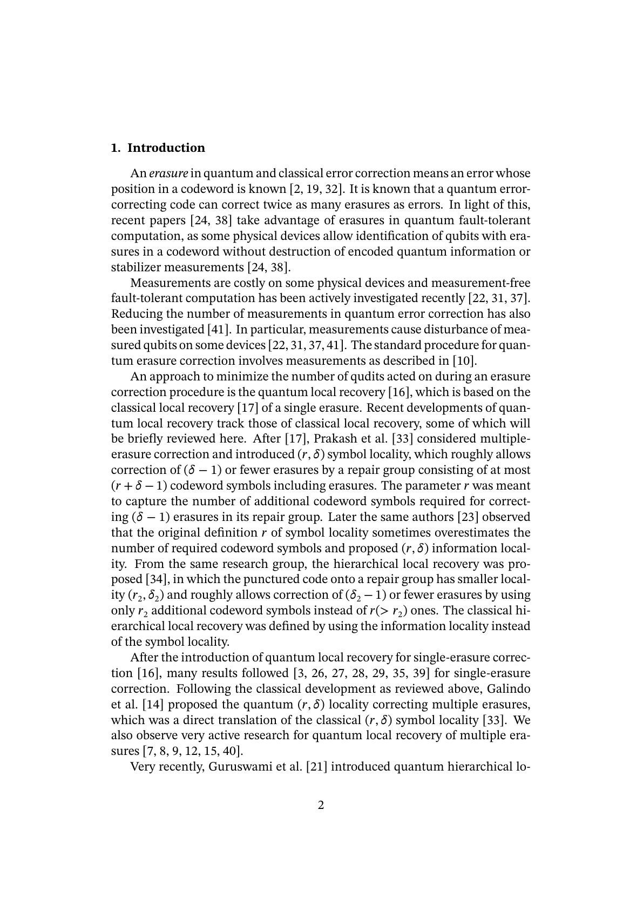
<figcaption class="paper-figure-caption"><b>Fig 1.</b> Low-resolution page preview, page 2</figcaption>
</figure>
<figure class="paper-figure-card">
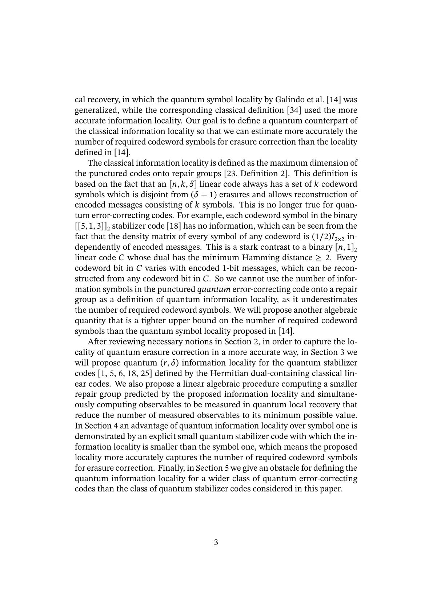
<figcaption class="paper-figure-caption"><b>Fig 2.</b> Low-resolution page preview, page 3</figcaption>
</figure>
<figure class="paper-figure-card">
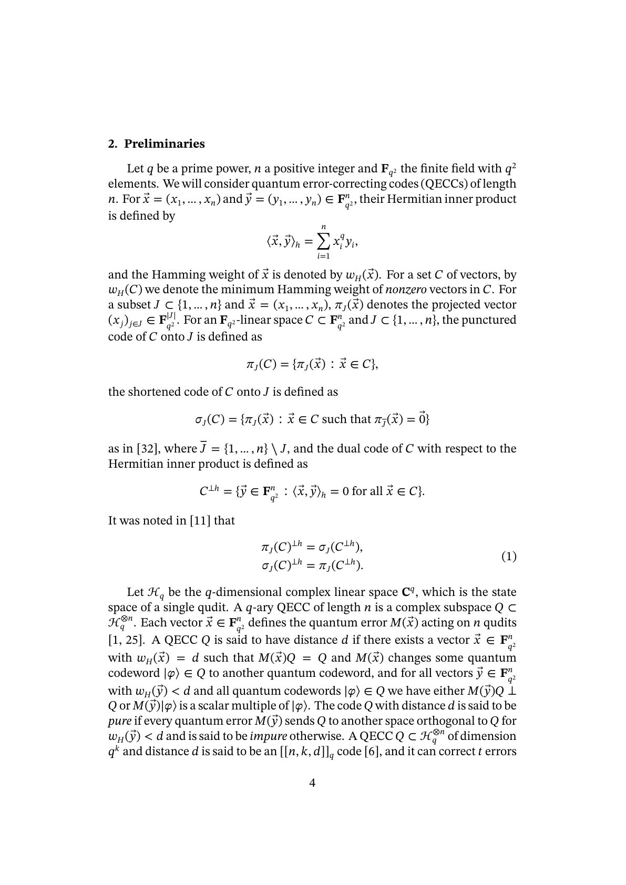
<figcaption class="paper-figure-caption"><b>Fig 3.</b> Low-resolution page preview, page 4</figcaption>
</figure>
<figure class="paper-figure-card">
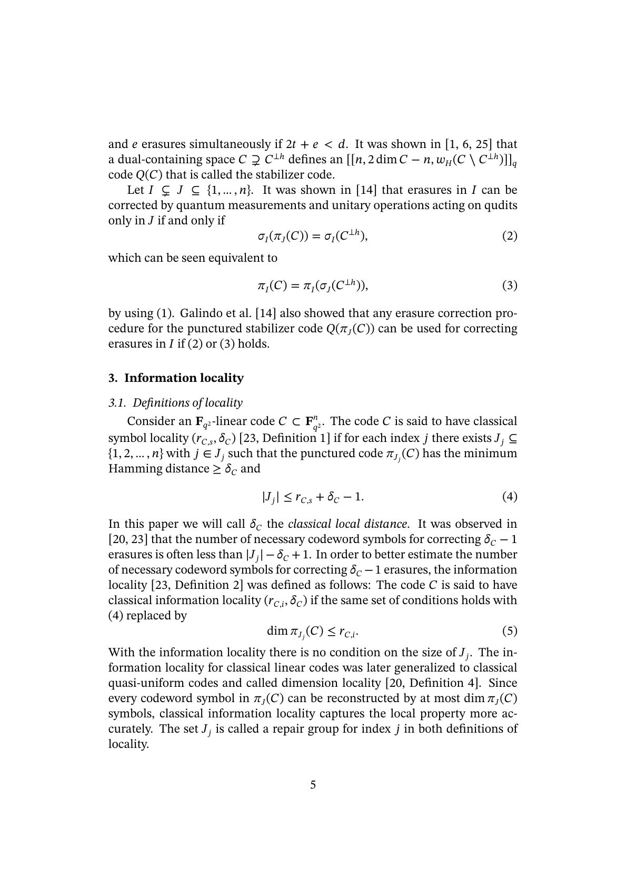
<figcaption class="paper-figure-caption"><b>Fig 4.</b> Low-resolution page preview, page 5</figcaption>
</figure>
<figure class="paper-figure-card">
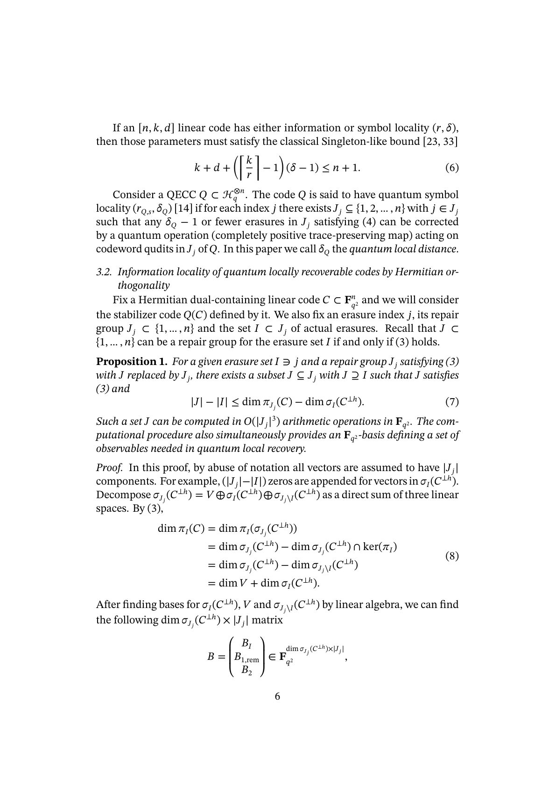
<figcaption class="paper-figure-caption"><b>Fig 5.</b> Low-resolution page preview, page 6</figcaption>
</figure>

**Summary.** This paper introduces a refined concept called 'information locality' for Quantum Error-Correcting Codes (QECCs) to improve upon existing overestimations of required resources for erasure correction. Using advanced linear algebra on code subspaces, the authors derive constructive methods and prove that their proposed measure yields tighter bounds than previous quantum locality definitions. This work is vital for designing efficient and resource-aware fault-tolerant quantum computation protocols.

**Why it may be interesting.** It advances the theoretical understanding of fault-tolerance in quantum computation by refining the metrics used to quantify local error correction capabilities, which is crucial for building scalable quantum hardware.

Detailed structure

**Main problem.** The paper aims to develop a quantum counterpart of 'information locality' for Quantum Error-Correcting Codes (QECCs) to provide a more accurate measure of the necessary codeword symbols required for erasure correction than existing methods.

**Main result.** The proposed information locality definition is shown to be superior to previous definitions by providing tighter bounds, although limitations exist when applying it to general QECCs beyond stabilizer codes.

**Method.** The authors use linear algebraic procedures involving punctured and shortened code constructions ($\pi_J(C)$ and $\sigma_J(C^{\perp} \otimes h)$) to derive and compare different locality parameters for quantum stabilizer codes.

**Model / system.** The study focuses on Quantum Error-Correcting Codes (QECCs), specifically stabilizer codes $Q(C)$, which are complex subspaces of the tensor product Hilbert space $\mathcal{H}^{\otimes n}_{\mathbb{C}_q}$. The analysis involves local measurements and recovery procedures.

**Key observables.** Locality parameters $(r, \delta)$; dimension of punctured/shortened codes ($\dim \pi_J(C)$); minimum Hamming weights ($w_H$); quantum local distance ($\delta_Q$).

**Important parameters / regimes.** Code length $n$, code dimension $k$; field size $q$; locality parameters $(r, \delta)$.

**Assumptions / limitations.** The analysis often relies on the structure of stabilizer codes and specific linear algebraic decompositions; limitations are noted when assuming general QECCs or when comparing classical vs. quantum settings.

**Paper structure.** The paper reviews classical locality definitions, proposes a quantum information locality based on punctured code dimensions, develops constructive proofs (Propositions 1 and 7) to compute the required repair group size, compares this new measure against symbol locality, and finally discusses limitations using counterexamples.

Abstract

A classical linear code $C$ of length $n$ is said to have symbol locality $(r, δ)$ if for any index $j$ there exists a repair group $J_j \subseteq \{1, \ldots, n\}$ with $j\in J_j$ and $|J_j| \leq r+δ-1$ such that any $δ-1$ or fewer erasures in $J_j$ can be corrected by using codeword symbols only in $J_j$. Later it turned out that this way of defining $r$ overestimates the number of necessary codeword symbols for multiple-erasure correction, and information locality was proposed to define $r$ as the dimension of the punctured code of $C$ onto $J_j$. Recently locality $(r,δ)$ was proposed for quantum error-correcting codes by following the original definition of symbol locality $(r, δ)$. We propose a quantum counterpart of the information locality for quantum stabilizer codes constructed by Hermitian orthogonality, and a linear algebraic procedure computing a smaller repair group predicted by the proposed information locality and simultaneously reducing the number of measured observables in decoding to its minimum possible value. Then we demonstrate that the previously proposed definition of quantum locality $(r,δ)$ has the same drawback of overestimating the number of necessary codeword symbols for erasure correction by providing an explicit example of a quantum stabilizer code. Finally, we will give another example of a quantum stabilizer code constructed by Euclidean orthogonality and two different linear codes, with which a natural translation of the classical information locality into the quantum setting underestimates the number of necessary codeword symbols for erasure correction.

[↑ back to top](#top)

### [Symbol-Oriented Quantum Communication via Temporal-Mode Multiplexing](http://arxiv.org/abs/2608.05038v1)

**Authors:** Ali Vahedi, Parsa Mahdavifar  
**Type:** theory · **Category:** quantum information and computing · **PDF:** <https://arxiv.org/pdf/2608.05038v1>  
**Analysis basis:** full PDF text, analyzed in chunks
**Topic relevance:** `entanglement & information structure` **1/5** · `quantum measurements` **1/5**

↔ Scroll figures horizontally

<figure class="paper-figure-card">
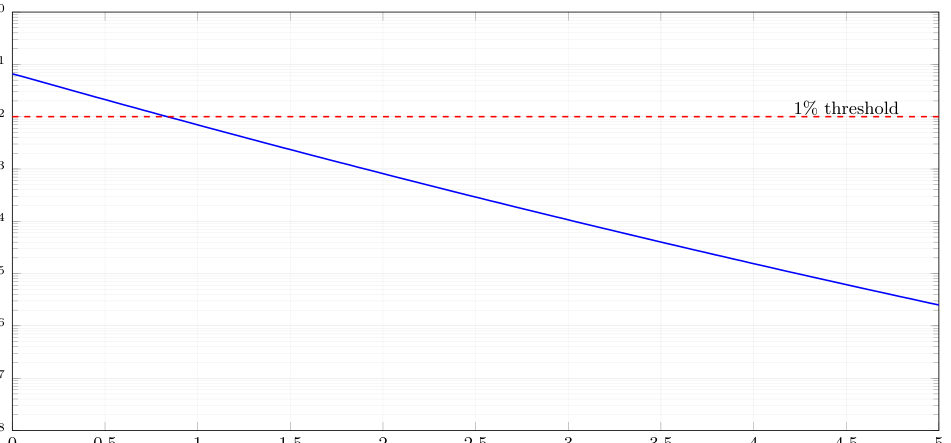
<figcaption class="paper-figure-caption"><b>Fig 1.</b> FIG. 1: Theoretical upper bound on full photon recovery probability Psuccess vs. fiber distance d for alphabet size N = 53 using Psuccess = ( 1</figcaption>
</figure>
<figure class="paper-figure-card">
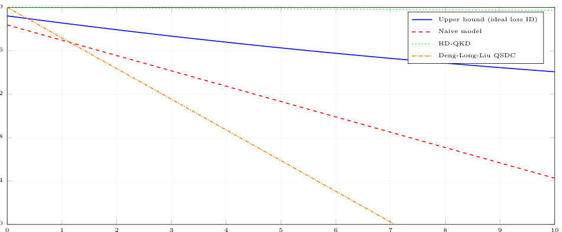
<figcaption class="paper-figure-caption"><b>Fig 2.</b> FIG. 2: Comparison of theoretical upper bound, naive model, HD-QKD, and Deng-Long-Liu QSDC for N = 53. The upper bound assumes perfect loss identification. Note that HD-QKD serves a different function (key distribution).</figcaption>
</figure>
<figure class="paper-figure-card">
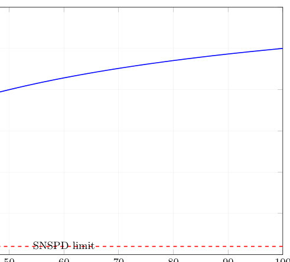
<figcaption class="paper-figure-caption"><b>Fig 3.</b> FIG. 3: Effective raw slot rate vs. alphabet size N for τs = 200 ps, τg = 100 ps, τdead = 10 ns.</figcaption>
</figure>

**Summary.** This paper introduces a novel quantum-assisted protocol for transmitting symbols by encoding them across multiple temporal modes using LM05 operations. It rigorously analyzes the security against collective eavesdropping attacks and quantifies performance limits based on physical constraints like fiber loss, timing jitter, and detector dead time. The work advances the theory of quantum direct communication but notes that practical implementation faces severe engineering hurdles.

**Why it may be interesting.** It provides a detailed theoretical framework for quantum communication protocols that leverage multiplexing in temporal modes, extending security analysis beyond simple single-channel assumptions to tackle collective attacks.

Detailed structure

**Main problem.** The paper develops a quantum-assisted classical communication protocol that encodes symbols from a finite alphabet onto temporal modes using the LM05 operation as a building block.

**Main result.** It derives theoretical upper bounds on the success probability for complete recovery and establishes an asymptotic collective-attack bound, showing the tensor product structure allows attacks beyond standard proofs.

**Method.** Security analysis involves deriving information leakage bounds using entropic uncertainty relations (EUR) applied to the full N-photon block, alongside analyzing classical ordering costs.

**Model / system.** The model uses temporal-mode multiplexing across N parallel channels, where each channel implements an LM05 operation. The message is split into an unordered quantum symbol set and a classical ordering permutation.

**Key observables.** Theoretical upper bound on success probability ($P_{	ext{success}}$), secret key rate ($r$), information leakage $I(PM; E)$, and timing misidentification probability ($P_{	ext{misID}}$).

**Important parameters / regimes.** Alphabet size (N=53), Quantum Bit Error Rate (QBER), Transmission efficiency ($\eta_T$), Fiber distance ($d$), and detector dead time ($	au_{	ext{dead}}$).

**Assumptions / limitations.** The analysis assumes perfect loss identification, uniform message distribution, ideal detectors, and that the classical ordering information must be encrypted for true QSDC.

**Figures summary.** Figure 1 shows the theoretical upper bound on $P_{	ext{success}}$ vs. fiber distance for N=53; other figures/tables relate to rate calculations based on jitter or detector dead time.

**Paper structure.** The paper analyzes the protocol's structure (quantum symbol set + classical permutation), derives security bounds against collective attacks, compares resource costs (QKD vs. classical keying), and finally assesses practical limitations imposed by timing jitter and detector dead time.

Abstract

We introduce and analyze a quantum-assisted classical communication protocol that encodes symbols from a finite alphabet onto temporal modes using the LM05 operation as a building block. The protocol applies a bit-flip gate independently to temporal slots corresponding to message symbols, yielding a tensor product of LM05 operations on parallel channels. This tensor product structure enables collective attacks not covered by standard LM05 security proofs. We derive a theoretical upper bound on the success probability for complete recovery under random guessing, accounting for the receiver's 50\% guessing ability on lost photons, and emphasize that this bound assumes perfect loss identification. We characterize the intended transmission, derive an asymptotic collective-attack bound for the symbol-set mode, and identify open challenges for composable security. The protocol is not a standalone Quantum Secure Direct Communication scheme, as the classical ordering information requires encryption. For a 53-symbol alphabet, the optimistic 1\% success bound occurs at about 0.8 kilometers under zero QBER and reduces to about 0.6 kilometers for QBER equals 0.01; practical constraints severely limit performance.

[↑ back to top](#top)

### [From Promise to Practice: Closing the Application Gap in Quantum Computing](http://arxiv.org/abs/2608.04936v1)

**Authors:** Nicole Holzmann  
**Type:** theory · **Category:** quantum information and computing · **PDF:** <https://arxiv.org/pdf/2608.04936v1>  
**Analysis basis:** full PDF text, analyzed in chunks
**Topic relevance:** `analog quantum simulation` **1/5**

↔ Scroll figures horizontally

<figure class="paper-figure-card">
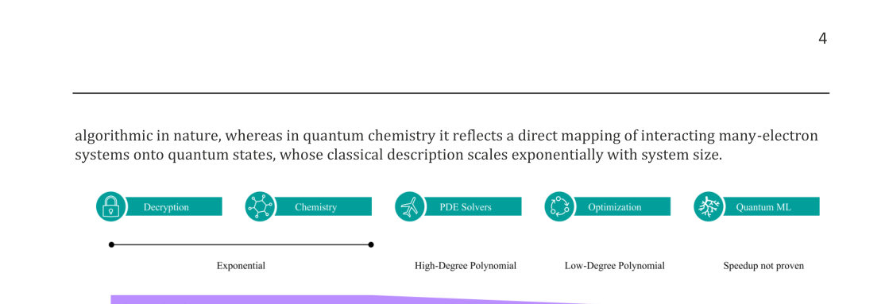
<figcaption class="paper-figure-caption"><b>Fig 1.</b> Figure 1: Spectrum of quantum algorithm speedup. Examples shown are representative rather than exhaustive.</figcaption>
</figure>
<figure class="paper-figure-card">
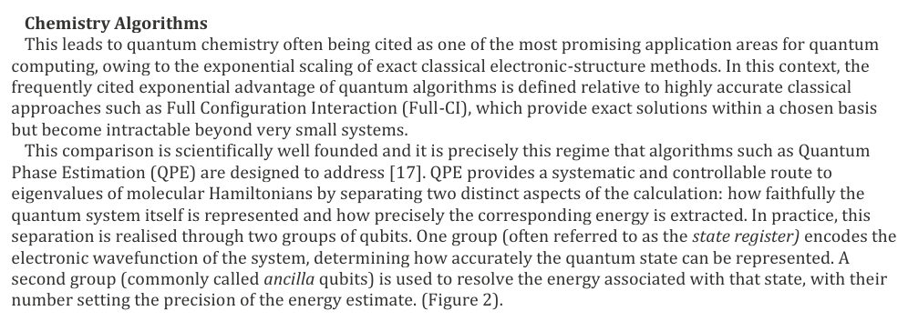
<figcaption class="paper-figure-caption"><b>Fig 2.</b> Figure 2: Quantum Phase Estimation algorithm, a simplified view, shown as one representative example.</figcaption>
</figure>
<figure class="paper-figure-card">
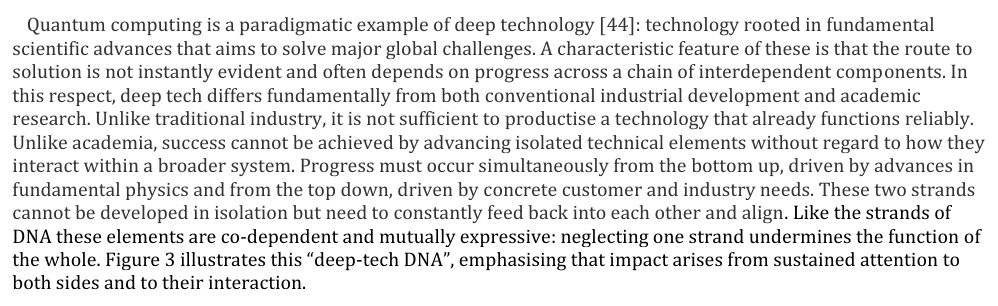
<figcaption class="paper-figure-caption"><b>Fig 3.</b> Figure 3: Deep Tech requires development from both sides: first principles and industry need. Some have therefore advocated an algorithm-first approach to application development [10] and this perspective has clear merit: quantum computing cannot address arbitrary problems and it is essential to remain grounded in what quantum algorithms are actually capable of computing. The mathematical foundations of quantum computing place strict constraints on what can and cannot be achieved and any engagement with industry problems must always remain grounded in these realities. However, when pursued in isolation, this approach risks developing in a vacuum, where technically elegant solutions emerge...</figcaption>
</figure>
<figure class="paper-figure-card">
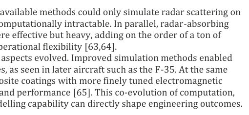
<figcaption class="paper-figure-caption"><b>Fig 4.</b> Figure 4: Co-evolution of computation, geometry and materials in stealth design.</figcaption>
</figure>

**Summary.** This perspective argues that quantum computing's progress requires equally developing both foundational algorithms (bottom-up) and direct links to industrial decision problems (top-down). The key challenge is building explicit interfaces that translate abstract quantum outputs into actionable, domain-relevant observables. This co-design approach is necessary for realizing transformative commercial value.

**Why it may be interesting.** It provides a high-level, strategic framework relevant to all theoretical quantum physicists by framing the necessary intersection between fundamental physics research and applied computational utility.

Detailed structure

**Main problem.** The primary challenge is closing the 'Application Gap' in quantum computing, moving from theoretical algorithmic speedups to demonstrable industrial impact driven by real-world needs.

**Main result.** Sustained progress requires treating bottom-up development (physics/hardware/algorithms) and top-down development (industrial needs) as equally primary and continuously coupled.

**Method.** The paper uses conceptual argument, analogy drawing from historical technological shifts (like classical computing), and analysis of required interfaces to bridge the gap.

**Model / system.** The focus is on the computational ecosystem surrounding quantum computation rather than a specific physical Hamiltonian. It discusses algorithmic paradigms applicable to various industrial problems.

**Key observables.** Industrial impact; the ability of a technology to measurably influence real decisions (e.g., go/no-go choices, design trade-offs).

**Important parameters / regimes.** Algorithmic tractability; the coupling between technical capabilities and domain context.

**Assumptions / limitations.** The success of quantum computing hinges on establishing organizational structures and interfaces to connect abstract quantum outputs to concrete industrial decision points.

**Figures summary.** Not specified in detail, but notes reference figures illustrating algorithm speedup spectra and simplified views of the Quantum Phase Estimation process.

**Paper structure.** The paper argues for a dual-viewpoint approach: coupling bottom-up algorithmic development with top-down industrial needs. It analyzes historical parallels to show how this coupling must be built explicitly through interfaces.

Abstract

Quantum computing is a deep technology whose progress cannot be driven effectively from one direction alone. While the field has developed a growing catalogue of mathematically grounded algorithmic speedups, industrial impact will depend just as much on starting from real industrial decision contexts and working downward to what must be computed, validated and integrated. In this Perspective, I argue that sustained progress requires treating these two directions: bottom-up development from physics, hardware and algorithms, and top-down development from industrial needs and constraints. Equally primary and continuously coupled. This dual-viewpoint is not a matter of balance for its own sake. Quantum computers cannot solve arbitrary problems, so engagement with industry must remain anchored in algorithmic tractability. Yet tractable computations are rarely valuable unless they connect to decision points in established workflows such as candidate selection in drug discovery or the design of a new aircraft shape with improved aerodynamics. I analyse how historical narratives and structural separations of expertise slowed the formation of this coupling and outline what it takes to build it: explicit interfaces between technical teams and domain context and intermediate layers that translate quantum outputs into decision-relevant observables without suffocating foundational innovation. Framed this way, quantum computing's opportunity is clearest where deep physical modelling meets high-value decisions. Provided the field co-designs both sides from the outset.

[↑ back to top](#top)

### [Imaginarity as a necessary resource for trainability in QAOA](http://arxiv.org/abs/2608.05093v1)

**Authors:** Syed Muhammad Ali Hassan, Kostas Blekos, Stefan Kühn, Nikos Kollas, Karl Jansen  
**Type:** theory · **Category:** quantum information and computing · **PDF:** <https://arxiv.org/pdf/2608.05093v1>  
**Analysis basis:** full PDF text, analyzed in chunks
**Topic relevance:** `Keldysh / 2PI / non-Gaussian methods` **1/5**

↔ Scroll figures horizontally

<figure class="paper-figure-card">
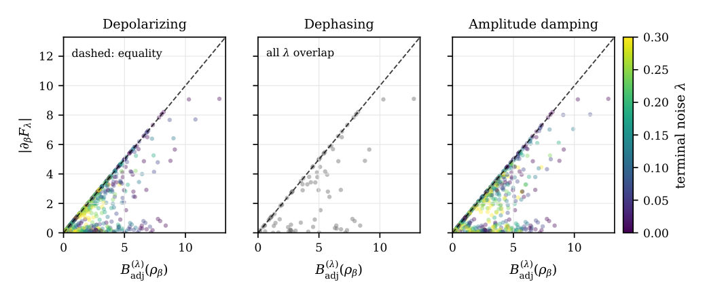
<figcaption class="paper-figure-caption"><b>Fig 1.</b> FIG. 1. Per-instance test of the terminal-noise adjoint-channel bound. Each point is one depth-p = 1 QAOA instance on an n = 6 random k-regular Max-Cut graph with k ∈{3, 4, 5} and one parameter pair (β, γ). The horizontal axis is the weighted bound B(λ) adj(ρβ) formed from the pre-channel state and the adjoint-propagated cost observable; the vertical axis is |∂βFλ|. Color denotes the terminal noise strength λ. The dashed diagonal marks saturation, and all points lie on or below it. Distance below the diagonal results from cancellations between signed mixer-edge contributions. For phase-flip noise, both axes are independent of λ, so the coincident points for the six noise strengths are...</figcaption>
</figure>
<figure class="paper-figure-card">
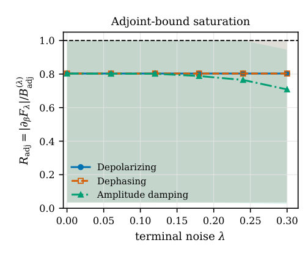
<figcaption class="paper-figure-caption"><b>Fig 2.</b> FIG. 2. Saturation of the rigorous adjoint-channel bound under terminal noise. The ensemble is the same as in Fig. 1; curves show medians and shaded regions show 10th–90th per- centiles. The dashed line at one is the rigorous upper limit whenever the denominator is nonzero. For depolarizing and phase-flip noise, the gradient and weighted bound have the same channel dependence, so Radj is independent of λ; the corresponding curves overlap. Amplitude damping changes the individual cost-difference weights nonuniformly, and the median saturation decreases at larger λ.</figcaption>
</figure>
<figure class="paper-figure-card">
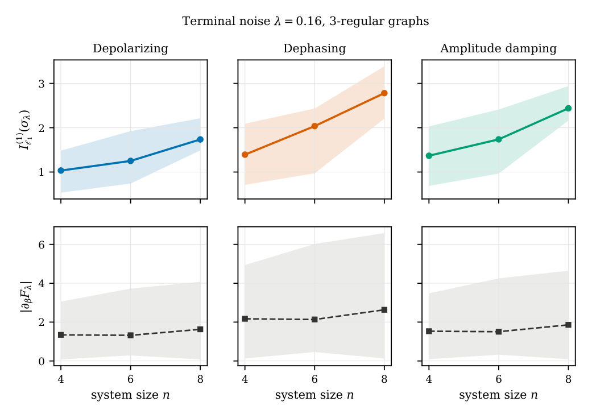
<figcaption class="paper-figure-caption"><b>Fig 3.</b> FIG. 3. Finite-size tracking of Hamming-one imaginarity and mixer-gradient magnitude at fixed terminal noise strength. The top row shows the ensemble median of I(1) ℓ1 (σλ) for 3-regular Max-Cut instances with n ∈{4, 6, 8} and λ = 0.16. The bottom row shows the corresponding median of |∂βFλ|. Shaded regions denote 10th–90th percentile bands over sampled graphs and parameters. This panel summarizes the finite samples; the adjoint-channel bound is tested in Fig. 1, and no asymptotic conclusion is drawn from the small ensemble.</figcaption>
</figure>
<figure class="paper-figure-card">
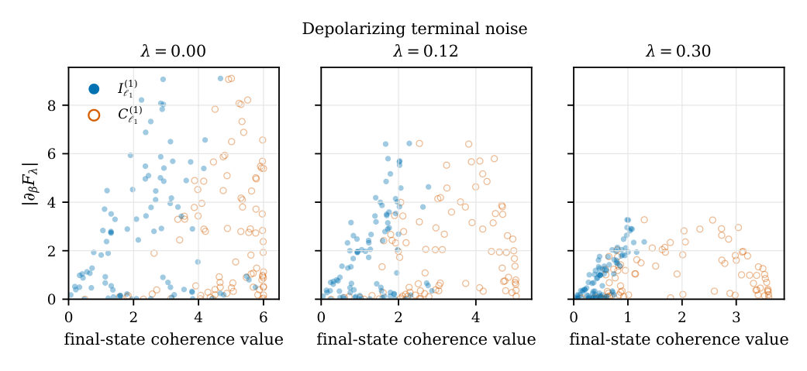
<figcaption class="paper-figure-caption"><b>Fig 4.</b> FIG. 4. Comparison of Hamming-one imaginarity and restricted ℓ1 coherence on the same terminal noisy states. The panels show depolarizing terminal noise at low, intermediate and high λ. Filled blue points use I(1) ℓ1 (σλ) on the horizontal axis. Open</figcaption>
</figure>

**Summary.** This paper establishes that imaginary coherences between computational basis states are a necessary resource for training parameters in QAOA. By deriving rigorous bounds using adjoint channels and testing them against Max-Cut simulations under various noise models, the authors quantify how quantum state structure dictates algorithmic trainability.

**Why it may be interesting.** This work provides deep theoretical insights into the practical limitations of variational quantum algorithms like QAOA, linking optimization convergence directly to fundamental quantum coherence properties (imaginarity).

Detailed structure

**Main problem.** The paper analyzes the necessary quantum resources required for a non-zero gradient when training parameters in the Quantum Approximate Optimization Algorithm (QAOA). It specifically investigates the role of imaginary coherences between candidate solutions.

**Main result.** Imaginarity, quantified by specific coherence measures, is shown to be a necessary but not sufficient condition for obtaining a non-zero gradient during QAOA optimization. The derived bounds successfully constrain the magnitude of the gradient across various noise models.

**Method.** The authors derive analytical upper bounds on the gradient using quantum calculus and the adjoint channel formalism, comparing these theoretical limits against numerical simulations in Max-Cut instances.

**Model / system.** The study focuses on QAOA applied to combinatorial optimization problems like Max-Cut. The system involves a cost Hamiltonian ($H_C$) and a transverse-field mixer ($H_B$), analyzed under various noise channels (phase-flip, amplitude damping, depolarizing).

**Key observables.** Imaginarity ($	ext{Im}(
ho_{zz'})$), restricted $\ell_1$ coherence ($\mathcal{C}^{(1)}$), and the gradient magnitude $|\partial_eta F_\lambda|$.

**Important parameters / regimes.** The QAOA parameters $(\gamma, eta)$, noise strength $\lambda$, and graph structure (e.g., 3-regular graphs).

**Assumptions / limitations.** The analysis relies on specific Hamiltonian structures (diagonal $H_C$) and the validity of adjoint channel bounds for different noise types.

**Figures summary.** Figures compare the calculated gradient magnitude against the theoretical adjoint-channel bound, showing agreement. Other figures track Hamming-one imaginarity ($I^{(1)}$) and coherence ($\mathcal{C}^{(1)}$) across varying noise strengths and graph structures.

**Paper structure.** The paper builds from establishing the general necessary condition (imaginarity) in the noiseless case to deriving bounds for terminal noise. It then extends this analysis by examining how different physical noise channels affect these bounds, culminating in numerical comparisons.

Abstract

The quantum approximate optimization algorithm (QAOA) tackles combinatorial problems by tuning a quantum circuit in a classical loop, often guided by gradients. We show that the gradient used to tune the circuit's final parameter is bounded by imaginarity, which weights phase relationships between candidate solutions by how strongly the circuit connects them and how differently the problem scores them. Imaginarity is necessary but not sufficient for a nonzero gradient. We extend the bound to three common noise models and compare it numerically with the gradient in Max-Cut simulations.

[↑ back to top](#top)

### [Observing the Quantum Compiler through Automatic Experiment Tracking for Qiskit](http://arxiv.org/abs/2608.05041v1)

**Authors:** Vlad Stirbu, Arianne Meijer van de Griend  
**Type:** both · **Category:** quantum information and computing · **PDF:** <https://arxiv.org/pdf/2608.05041v1>  
**Analysis basis:** full PDF text, analyzed in chunks
**Topic relevance:** `methods for driven-dissipative` **1/5**

↔ Scroll figures horizontally

<figure class="paper-figure-card">
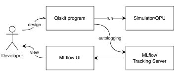
<figcaption class="paper-figure-caption"><b>Fig 1.</b> Fig. 1. System architecture</figcaption>
</figure>
<figure class="paper-figure-card">
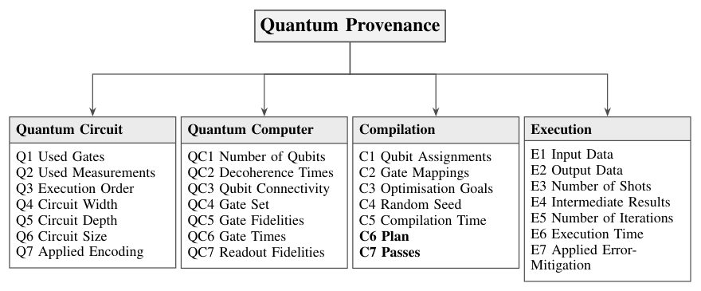
<figcaption class="paper-figure-caption"><b>Fig 2.</b> Fig. 2. Quantum provenance taxonomy capturing key metadata across the quantum computing stack, adapted from [2]. Items marked bold represent extensions added to support the compiler observability case.</figcaption>
</figure>
<figure class="paper-figure-card">
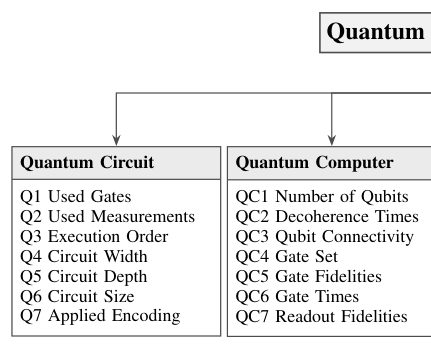
<figcaption class="paper-figure-caption"><b>Fig 3.</b> Fig. 3. Sample Qiskit program with compiler observability. Highlighted lines show changes needed to enable the functionality.</figcaption>
</figure>
<figure class="paper-figure-card">
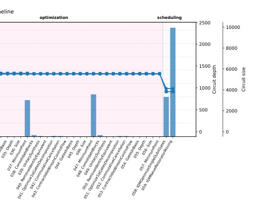
<figcaption class="paper-figure-caption"><b>Fig 4.</b> Fig. 4. Transpilation pass timeline rendering based on the information collected by Qiskit autologger</figcaption>
</figure>
<figure class="paper-figure-card">

<figcaption class="paper-figure-caption"><b>Fig 5.</b> Fig. 5. Visualizing experiment comparison metrics with MLflow UI</figcaption>
</figure>

**Summary.** This paper introduces an automated logging framework inspired by MLflow to track the entire provenance of quantum circuit compilation within Qiskit. By automatically capturing details from every transpilation pass and backend characteristic, it significantly improves compiler observability. This allows researchers to reproduce results and pinpoint exactly which optimization steps affect final circuit performance.

**Why it may be interesting.** While focused on software tools, understanding the transformation steps (passes) applied to quantum circuits is crucial for optimizing algorithms intended for near-term hardware, which has implications for resource estimation in AMO/QIP.

Detailed structure

**Main problem.** Understanding quantum compilation effectiveness requires visibility into the entire transpilation process, not just final circuit metrics.

**Main result.** The proposed autologging framework successfully captures comprehensive provenance data automatically, enabling reproducible evaluation of complex quantum compilation workflows.

**Method.** It implements an MLflow-inspired autologging framework for Qiskit that transparently instruments the transpilation and execution workflow to capture detailed compiler provenance.

**Model / system.** The focus is on abstract quantum circuits executed via Qiskit, targeting simulated or abstract backends (e.g., IQMFakeAphrodite) rather than specific physical hardware details.

**Key observables.** Transpilation stages, pass-level execution data (C7 Passes), backend characteristics, compiler configuration, circuit metric evolution, and overall provenance metadata (Q1-E7).

**Important parameters / regimes.** Optimization levels used during compilation (e.g., level 2 vs. level 3) are key parameters for comparison.

**Assumptions / limitations.** The framework assumes compatibility with the existing QProv provenance model and is designed to be extensible to other quantum SDKs like Qrisp and PennyLane.

**Figures summary.** Figures illustrate the system architecture (Developer $
ightarrow$ Qiskit $
ightarrow$ MLflow), the extended quantum provenance taxonomy, sample code usage, a transpilation pass timeline, and experiment comparison views in the MLflow UI.

**Paper structure.** The paper introduces the problem of compilation observability, details the MLflow-inspired autologging framework extending QProv, demonstrates its use with Qiskit, and shows how the collected data facilitates comparative analysis of different compilation runs.

Abstract

Understanding the effectiveness of quantum compilation techniques requires visibility into the entire transpilation process, not just the final circuit metrics. This demonstration presents an MLflow-inspired autologging framework for Qiskit that automatically captures compiler provenance, including transpilation stages, pass-level execution data, backend characteristics, compiler configuration, and execution results. The framework extends the QProv provenance model with compiler-specific information and stores the collected data in an MLflow Tracking Server for analysis and visualization. By eliminating manual instrumentation, the proposed approach improves compiler observability and supports reproducible evaluation of quantum compilation workflows.

[↑ back to top](#top)

### [Resource Estimation for Fault-Tolerant Quantum Programs](http://arxiv.org/abs/2608.04573v1)

**Authors:** Bonan Su, Yuan Feng, Li Zhou, Mingsheng Ying  
**Type:** theory · **Category:** quantum information and computing · **PDF:** <https://arxiv.org/pdf/2608.04573v1>  
**Analysis basis:** full PDF text, analyzed in chunks
**Topic relevance:** `methods for driven-dissipative` **1/5**

↔ Scroll figures horizontally

<figure class="paper-figure-card">
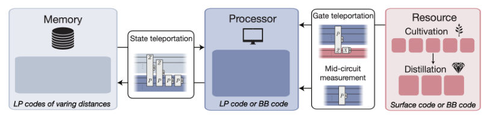
<figcaption class="paper-figure-caption"><b>Fig 1.</b> Fig. 1. Error-correction schemes assigned to different functional modules in an implementation of Shor’s algorithm, where LP, BB, and surface codes represent error-correction schemes. Adapted from Fig. 2b of [9].</figcaption>
</figure>
<figure class="paper-figure-card">
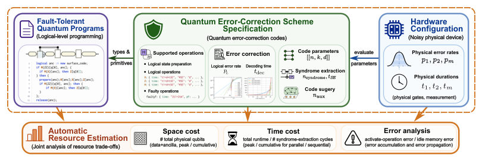
<figcaption class="paper-figure-caption"><b>Fig 2.</b> Fig. 2. Overall architecture of our resource estimation framework for fault-tolerant quantum programs.</figcaption>
</figure>
<figure class="paper-figure-card">
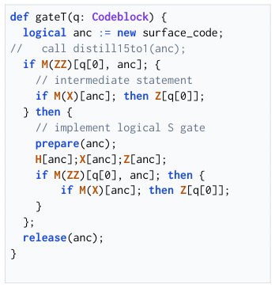
<figcaption class="paper-figure-caption"><b>Fig 3.</b> Fig. 5. Source code for the logical 𝑇gate, where the call to the distillation protocol for preparing the magic state is temporarily commented out.</figcaption>
</figure>
<figure class="paper-figure-card">
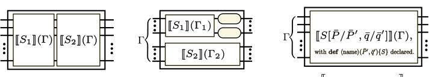
<figcaption class="paper-figure-caption"><b>Fig 4.</b> Fig. 8. Compilation of program statements into dynamic fault-tolerant circuits. Each horizontal wire denotes one codeblock. Yellow boxes ( ) denote repeated syndrome-extraction cycles; light blue boxes ( ) represent physical operations and measurements acting on physical qubits; and dark blue boxes ( ) mark components whose internal physical implementation is abstracted away and treated as a black box by the programming language, with cost and error behavior specified later in the error-correction scheme.</figcaption>
</figure>
<figure class="paper-figure-card">
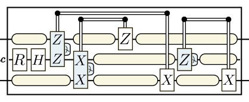
<figcaption class="paper-figure-caption"><b>Fig 5.</b> Fig. 9. Compiled circuit for the CNOT gate. Adjacent syndrome-extraction intervals are merged into longer yellow boxes. The symbol 𝑅denotes logical state preparation, and 𝐻, 𝑋, and 𝑍denote primitive logical gates.</figcaption>
</figure>

**Summary.** This paper addresses the critical challenge of accurately estimating resources for fault-tolerant quantum algorithms. The authors propose a novel programming language and a cross-layer framework that allows programmers to explicitly manage error correction while enabling joint analysis of resource trade-offs. This results in significantly more accurate and detailed resource estimates compared to existing black-box methods.

**Why it may be interesting.** While focused on quantum computation theory, the systematic approach to resource accounting across multiple abstraction layers is highly relevant for developing robust simulation tools or understanding hardware overheads in any complex physical system modeled by layered control structures.

Detailed structure

**Main problem.** Resource estimation for fault-tolerant quantum computation is difficult because existing tools either force programmers to handle low-level hardware details or abstract away error correction schemes, leading to inaccurate resource utilization estimates.

**Main result.** The proposed framework enables substantial resource savings and provides detailed, fine-grained, and accurate resource estimates by jointly analyzing the logical program and its associated error-correction schemes.

**Method.** The authors introduce a specialized quantum programming language and a cross-layer resource-estimation framework that allows programmers to define QEC schemes explicitly while enabling joint analysis across different abstraction layers.

**Model / system.** The work focuses on Fault-Tolerant Quantum Computation (FTQC), where logical qubits are encoded using physical qubits via Quantum Error-Correction Schemes ($\langle	ext{QEC}
angle$). The framework models the compilation and execution flow from high-level logic down to hardware configuration.

**Key observables.** Space cost (# total physical qubits), Time cost (total runtime / syndrome-extraction cycles), and error rates (e.g., activate-operation vs. idle memory error).

**Important parameters / regimes.** Code distances ($d_{data}, d_{anc}$), the underlying physical error rate ($p_{phy} = 3 	imes 10^{-3}$), and mean decoding latency.

**Assumptions / limitations.** The analysis requires a joint, cross-layer analysis of the program and QEC specifications, which is more complex than independent estimation methods. It also assumes that decoding latency can be utilized by inserting intermediate statements.

**Figures summary.** Figure 2 illustrates the overall architecture of the resource estimation framework across multiple layers (Logical $
ightarrow$ QEC Specification $
ightarrow$ Hardware). Other figures show code examples for logical gates like $T$-gates.

**Paper structure.** The paper introduces the problem limitations, presents the novel programming language and cross-layer framework, details the joint analysis methodology, evaluates it on practical large-scale algorithms, and concludes with resource savings demonstrations.

Abstract

Fault-tolerant quantum computation enables the deployment of practical quantum algorithms but incurs substantial overhead from error correction, making resource estimation a central concern. Beyond case-by-case analyses, existing quantum programming languages either require programmers to manipulate low-level hardware details, rendering fault-tolerant implementations cumbersome, or abstract away the underlying error-correction schemes, reducing the effectiveness of resource utilization and estimation.   To address these limitations while preserving programmability, we present a quantum programming language that enables efficient resource utilization, together with a resource-estimation framework for comprehensive resource analysis. Our framework features programmer-visible abstractions of error-correction schemes and cross-layer program-hardware analysis, allowing systematic exploration of resource trade-offs. We evaluate our approach on detailed fault-tolerant implementations of practical large-scale quantum algorithms, including components typically treated as black boxes in existing frameworks. The results demonstrate that our framework enables substantial resource savings while delivering detailed, fine-grained, and accurate resource estimates for fault-tolerant quantum programs.

[↑ back to top](#top)

### [Zero-Clustering Geometry in Realistic Fractional Quantum Hall Wave Functions](http://arxiv.org/abs/2608.04395v1)

**Authors:** Xin Wan, Ziang Wang, Zi-Xiang Hu, Zhao Liu  
**Type:** theory · **Category:** strongly correlated electrons · **PDF:** <https://arxiv.org/pdf/2608.04395v1>  
**Analysis basis:** full PDF text, analyzed in chunks
**Topic relevance:** `analog quantum simulation` **1/5**

↔ Scroll figures horizontally

<figure class="paper-figure-card">
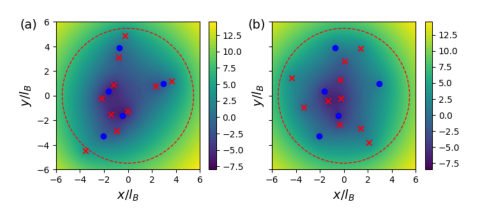
<figcaption class="paper-figure-caption"><b>Fig 1.</b> Figure 1. (a) Location of the ground-state wave function zeros of an N = 6 and ν = 1/3 system with Coulomb interaction. The positions of five electrons are fixed (blue dots), around which the ad- ditional 10 zeros (red crosses) appear in pairs. The background is the filled contour plot of the logarithm of the wave function amplitude with the five electron position fixed. (b) Similar plot for the ground state of Eq. (1) with λ = 1.4.</figcaption>
</figure>
<figure class="paper-figure-card">
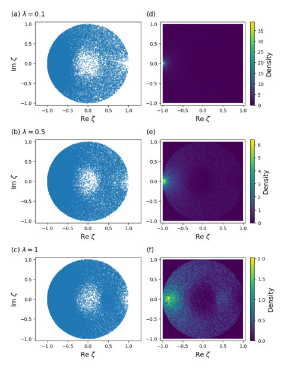
<figcaption class="paper-figure-caption"><b>Fig 2.</b> Figure 2. The scatter plot of ζ in 10,000 realizations of randomly fixed electron positions in the N = 6 and ν = 1/3 system. The mixture of V1 and Coulomb interactions is (a) λ = 0.1, (b) λ = 0.5, and (c) λ = 1, and the corresponding density maps are shown in (d)-(f), respectively.</figcaption>
</figure>
<figure class="paper-figure-card">
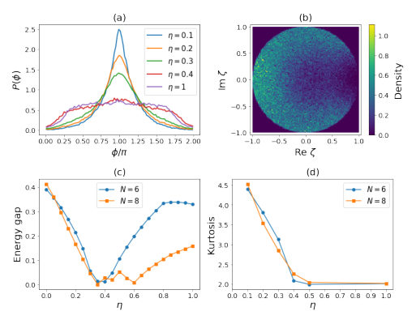
<figcaption class="paper-figure-caption"><b>Fig 3.</b> Figure 3. (a) The distribution of ζ’s argument ϕ at various η. (b) The density map of ζ at η = 0.4. (c) The ground-state energy gap versus η. (d) The kurtosis of P(ϕ) versus η. The system size is N = 6 electrons in (a) and (b).</figcaption>
</figure>
<figure class="paper-figure-card">
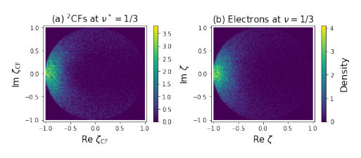
<figcaption class="paper-figure-caption"><b>Fig 4.</b> Figure 5. The density maps of ζ for (a) 2CFs at ν = 1/5 (ν∗= 1/3) and (b) electrons at ν = 1/3. The system size is N = 6 electrons on the torus.</figcaption>
</figure>
<figure class="paper-figure-card">
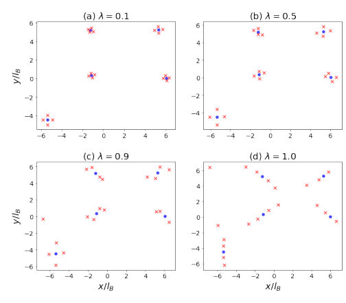
<figcaption class="paper-figure-caption"><b>Fig 5.</b> Figure 4. The evolution of electron positions (blue dots) and non- Pauli zeros (red crosses) with the increasing of λ at ν = 1/5 on the torus for a specific configuration of electrons. The system size is N = 6 electrons. In (d), electrons which are expected at one side of the sample may appear on the opposite side due to the periodic boundary conditions on the torus.</figcaption>
</figure>

**Summary.** This work develops the zero displacement ratio ($\zeta$) as a quantitative diagnostic tool to map out phase transitions in Fractional Quantum Hall systems by analyzing the geometry of wave function zeros. By comparing results from Laughlin models against realistic Coulomb interactions, the authors show that the zero structure collapses or shifts predictably when topological order is lost. The findings strongly support Composite Fermion descriptions over simpler crystal approximations for describing these correlated electron liquids.

**Why it may be interesting.** The use of geometric properties (zero clustering) to diagnose topological order is a powerful, non-local probe that complements standard energy gap or correlation function measurements. This methodology could be adapted to study other exotic quantum phases where local observables are insufficient.

Detailed structure

**Main problem.** The study aims to quantify how deviations from ideal model wave functions affect the topological properties of Fractional Quantum Hall (FQH) systems, particularly during phase transitions.

**Main result.** The zero displacement ratio ($\zeta$) serves as a diagnostic tool: its statistical behavior reveals the transition from Laughlin liquid order to charge-ordered or crystalline phases. Furthermore, Composite Fermion Fluid descriptions provide an improved description of $
u=1/5$ states compared to simple crystal embeddings.

**Method.** The analysis relies on calculating and analyzing the geometric distribution (density maps) of zeros in the ground state wave functions using a zero displacement ratio ($\zeta$) derived from nearest neighbor zeros. Overlap amplitudes are also used to compare different theoretical approximations.

**Model / system.** The system is strongly interacting electrons confined to the Lowest Landau Level, modeled at fractional fillings like $
u=1/3$ and $
u=1/5$. The Hamiltonian is varied by mixing terms between simple pseudopotentials ($V_1$) and full Coulomb interactions ($H_C$).

**Key observables.** Zero displacement ratio ($\zeta$), density distribution $P(\phi)$ of the zero argument, Kurtosis ($K$) of this distribution, Overlap Amplitude ($O$), and Pair Correlation Function ($g(r, R)$).

**Important parameters / regimes.** Filling fractions $
u=1/3$ and $
u=1/5$; mixing parameters ($\lambda$ or $\eta$); the ratio defining $\zeta$.

**Assumptions / limitations.** The analysis often relies on studying specific small-N systems ($N=3$) to extract general scaling laws, and approximations are made when constructing Composite Fermion states.

**Figures summary.** Figures illustrate the evolution of zero patterns (density maps) as interaction strength changes, showing shifts in $\zeta$ peaks. Other figures track order parameters like $P(\phi)$ and overlap amplitudes ($O$) versus tuning parameters ($\lambda$ or $\eta$).

**Paper structure.** The paper systematically analyzes the geometry of zeros for different FQH states ($
u=1/3$, $
u=1/5$), introducing the zero displacement ratio as a diagnostic. It then compares results from idealized Laughlin models against realistic Coulomb interactions, culminating in the development and testing of Composite Fermion Fluid descriptions.

Abstract

The clustering pattern of zeros in the ground state of a fractional quantum Hall system is a defining feature of its topological properties. We analyze the geometrical fluctuations of the zeros around individual electrons and propose to use the displacement ratio of the zeros to visualize and measure the distance of a realistic state to a model wave function. The distribution of the zero displacement ratio behaves like an order parameter in the transition from a Laughlin phase to a topologically trivial one. The statistical comparison between quantum Hall states belonging to different Jain sequences leads to a composite fermion fluid description of the $ν= 1/5$ ground state with long-range Coulomb interaction that agrees almost perfectly for as few as $3$-$5$ electrons, overcoming the long-standing difficulties of accommodating the competing liquid and crystal orders at short distances.

[↑ back to top](#top)

## Other papers (3)

*Papers from primary archives without highlighted authors or any topic match. Click to expand.*

Show other papers

### [Dynamical Lie Algebras Cannot Describe Shallow QAOA: Cragged Terrains, Barren Plateaus, and Empirical Hardness Models](http://arxiv.org/abs/2608.04252v1)

**Authors:** Harrison Copp, Charlton Li, Anžej Margeta-Cacace, Amy Qiao  
**Type:** both · **Category:** quantum information and computing · **PDF:** <https://arxiv.org/pdf/2608.04252v1>  
**Analysis basis:** full PDF text, analyzed in chunks

↔ Scroll figures horizontally

<figure class="paper-figure-card">
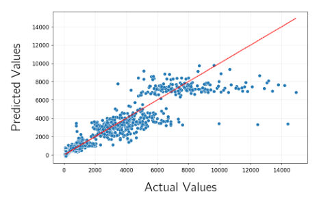
<figcaption class="paper-figure-caption"><b>Fig 1.</b> Figure 1. Performance of the graph convolutional neural net- work when training on N from 1 to 16 and predicting the number of calls to the quantum circuit on N from 19 to 20. The stratification into three general sections is possibly due to the presence of three distinct graph distributions in our data and the model categorizing its predictions to a signifi- cant degree based off this tricategorization.</figcaption>
</figure>
<figure class="paper-figure-card">
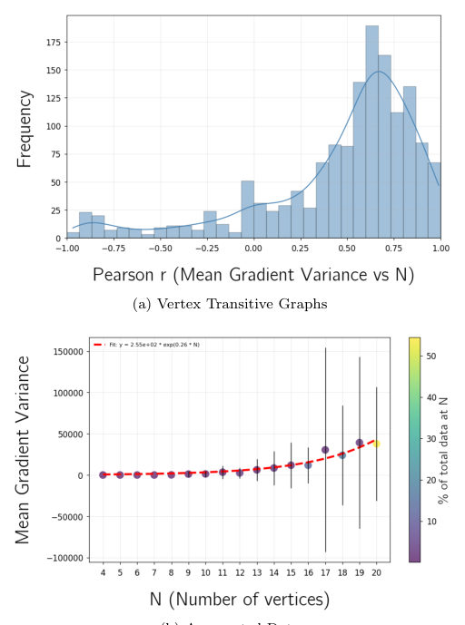
<figcaption class="paper-figure-caption"><b>Fig 2.</b> Figure 3. (a) Pearson r Distribution for Vertex Tran- sitive Graphs. Pearson correlation coefficients of the mean variance of gradients against N for each cluster of random graphs. We a similarly left-skewed distribution, indicating that vertex transitive graphs also exhibit widespread cragged terrain behavior. (b) Aggregated Vertex Transitive Data also is a Cragged Terrain. Plotting the mean variance of the gradients for each value of N for p ∈{1, 2, 3, 4}, we observe a positive exponential relationship with Pearson cor- relation coefficient r = 0.941. Although the error bars do not observe the same exponential relation as observed in the random graphs (see Figure IV B 1), we notice...</figcaption>
</figure>
<figure class="paper-figure-card">
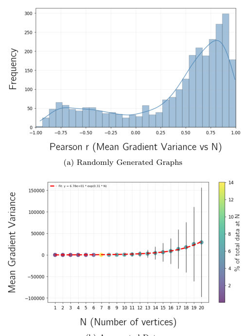
<figcaption class="paper-figure-caption"><b>Fig 3.</b> Figure 2. (a) Pearson r Distribution. Pearson correla- tion coefficients of the mean variance of gradients against N for each cluster of random graphs. The highly left-skewed distribution indicates widespread “cragged terrain” behavior. (b) Aggregated Data is a Cragged Terrain. Plotting the mean variance of the gradients for each value of N (each point and its error bars represent the average value and stan- dard deviation of the subset of the data at that value of N) for p ∈{1, 3, 5, 10}, we observe a positive exponential relationship with Pearson correlation coefficient r = 0.977. Curiously, the standard deviations at each N also had a positive exponential correlation, this time with a...</figcaption>
</figure>
<figure class="paper-figure-card">
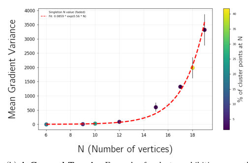
<figcaption class="paper-figure-caption"><b>Fig 4.</b> Figure 4. Example of barren plateau and cragged ter- rain cluster behaviors.</figcaption>
</figure>
<figure class="paper-figure-card">
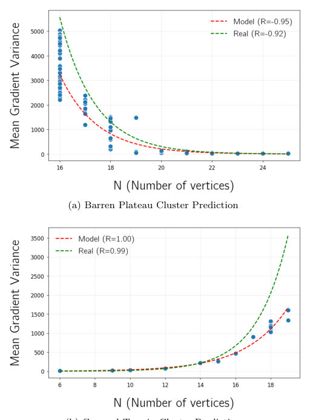
<figcaption class="paper-figure-caption"><b>Fig 5.</b> Figure 5. GCNN Predicts Barren Plateaus and Cragged Terrains. Example of the graph neural network predictions for a cluster of graphs exhibiting a barren plateau and cragged terrain. The clusters are the same as in Figures 4a and 4b: von Neumann entropy for p = 3 and edge density for p = 5, respectively. The red fit line is the fit for the model predictions, the green fit line is the original data fit, and the blue data points are predicted values.</figcaption>
</figure>

**Summary.** This work investigates the loss landscape of QAOA for MIS, finding that established theory based on Dynamical Lie Algebras fails in shallow circuits. Instead of barren plateaus, the landscapes exhibit 'cragged terrains' with polynomially increasing variance. The findings emphasize that empirical, data-driven models are necessary to characterize VQA hardness accurately.

**Why it may be interesting.** It provides a critical, empirically grounded challenge to highly abstract theoretical frameworks (like DLA) used to predict VQA performance, suggesting that practical limitations (shallow depth) invalidate deep mathematical assumptions.

Detailed structure

**Main problem.** To determine if theoretical predictions based on Dynamical Lie Algebras (DLA) accurately describe the loss landscape scaling of shallow Variational Quantum Algorithms (VQAs), specifically for QAOA applied to MIS.

**Main result.** The DLA theory fails in the shallow-circuit regime, as empirical studies show that 'cragged terrains' (polynomial variance increase) are common, contradicting the predicted exponential vanishing variances associated with 2-design assumptions.

**Method.** A combination of large-scale numerical simulations across thousands of graph instances and training Empirical Hardness Models (EHMs) to predict instance-wise landscape metrics.

**Model / system.** The study focuses on VQAs, particularly QAOA for the Maximum Independent Set (MIS) problem, using parametrized quantum circuits acting on an N-qubit Hilbert space. The theoretical framework involves analyzing the circuit ensemble's adherence to a 2-design property derived from DLA theory.

**Key observables.** Loss function variance ($	ext{Var}_{	heta}[\partial_\mu C(	heta)]$), Barren Plateau (BP) vs. Cragged Terrain scaling, and model prediction accuracy ($R^2$).

**Important parameters / regimes.** Circuit depth (shallow regime), system size ($N$), graph structure (random vs. vertex-transitive).

**Assumptions / limitations.** The DLA theory assumes the circuit ensemble forms an approximate 2-design, which is shown to be insufficient for shallow circuits; EHMs are trained on finite subsets of data.

**Figures summary.** Figures illustrate GCNN predictions for gradient variance across different scaling regimes (BP vs. cragged terrains) using metrics like von Neumann entropy and edge density.

**Paper structure.** The paper contrasts the theoretical DLA prediction (based on 2-design theory) with empirical results from QAOA-MIS, demonstrating where the theory breaks down in shallow circuits. It concludes by validating the utility of data-driven EHMs over asymptotic unitary design theories for this regime.

Abstract

The dynamical Lie algebraic (DLA) theory of variational quantum algorithms (VQAs) predicts commonplace exponentially vanishing loss and gradient variances for sufficiently deep parametrized circuits. In this work, we show that these predictions fail dramatically in the shallow-circuit (and particularly constant-depth) regime for the Quantum Approximate Optimization Algorithm (QAOA) applied to the maximum independent set (MIS) problem. In a large-scale numerical study across $\sim$23,000 problem instances, we find that barren plateaus are rare, while landscapes whose variances polynomially increase with system size---which we term "cragged terrains"---are common across graph families. This aggregate polynomial growth persists both for generic, low-symmetry random graphs and for highly symmetric vertex-transitive graphs, indicating that DLA-based variance predictions do not describe landscape scaling in this regime. As a stopgap alternative to the theory, we train empirical hardness models to predict instance-wise hardness metrics for QAOA-MIS. While these models generalize poorly, they nonetheless recover the correct landscape scaling class (barren plateau vs. cragged terrain) with high fidelity. Taken together, our results identify shallow QAOA for MIS as a prototypical setting in which asymptotic, unitary-design-centric predictions may be fundamentally insufficient to describe shallow variational quantum algorithms more broadly, emphasizing the need for more empirically-informed models of VQA loss landscapes.

[↑ back to top](#top)

### [Efficient Depth--Ancilla Tradeoffs for Hamming Weight Computation and Symmetric Boolean Functions](http://arxiv.org/abs/2608.04627v1)

**Authors:** Wei Zi, Pei Yuan, Junhong Nie, Shengyu Zhang  
**Type:** theory · **Category:** quantum information and computing · **PDF:** <https://arxiv.org/pdf/2608.04627v1>  
**Analysis basis:** full PDF text, analyzed in chunks

↔ Scroll figures horizontally

<figure class="paper-figure-card">
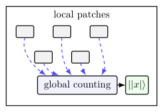
<figcaption class="paper-figure-caption"><b>Fig 1.</b> Figure 1: Overview of the constructions. Panel (a) shows the blocked reduction from Hamming weight computation to weighted counting. Panel (b) shows the dynamic weighted-counting primitive: fan-out prepares redundant Fourier phase states for S = P</figcaption>
</figure>
<figure class="paper-figure-card">
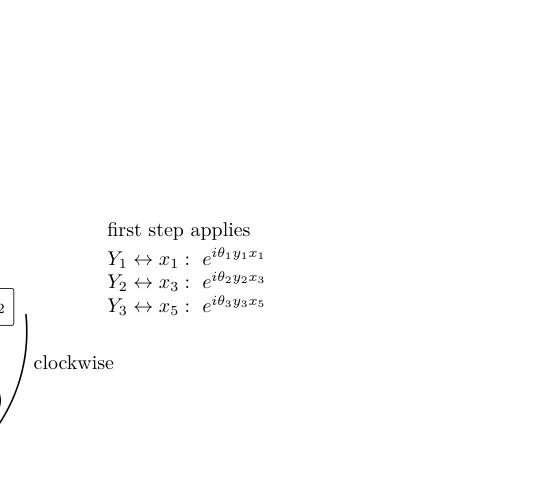
<figcaption class="paper-figure-caption"><b>Fig 2.</b> Figure 3: One elementary step of the cyclic-tour schedule for K = 3 and q = 2. The double arrows indicate the three disjoint control–data swaps performed in parallel. Before each swap, the corresponding controlled phase is applied.</figcaption>
</figure>
<figure class="paper-figure-card">
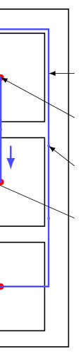
<figcaption class="paper-figure-caption"><b>Fig 3.</b> Figure 4: Layout for the multi-output phase gadget. The large patch is partitioned into K square subpatches. Each subpatch contains one root site. The corridor cycle passes through all roots. In each round, the control currently at a root first interacts with the interior data of that subpatch, and then moves along the corridor to the next root.</figcaption>
</figure>
<figure class="paper-figure-card">
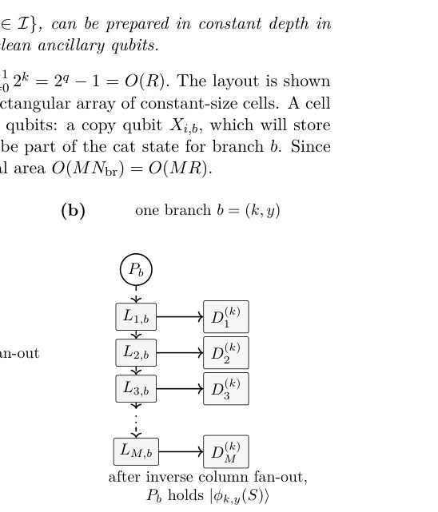
<figcaption class="paper-figure-caption"><b>Fig 4.</b> Figure 5: Two-dimensional weighted phase preparation. Panel (a) shows the M × Nbr rectangular layout. Row fan-out distributes each input bit zi to all branches, and column fan-out prepares one cat state for each branch root Pb. Each cell (i, b) contains a copy qubit Xi,b and a leaf qubit Li,b. Panel (b) shows one branch b = (k, y): the local gates D(k) i accumulate the weighted phase, and after inverse column fan-out the root qubit is left in the state |ϕk,y(S)⟩.</figcaption>
</figure>
<figure class="paper-figure-card">
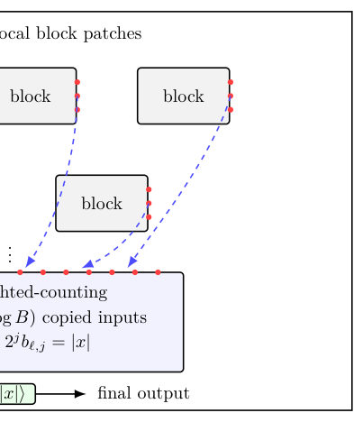
<figcaption class="paper-figure-caption"><b>Fig 5.</b> Figure 6: Schematic layout for Theorem 4.15. The two-dimensional grid contains L = ⌈n/B⌉disjoint local block patches and one global weighted-counting patch. Each local patch computes a block Hamming weight, and the corresponding bits bℓ,j are copied by constant-depth dynamic long-range CNOTs along the indicated dashed paths to input qubits of the global patch. The global patch then computes S = P ℓ,j 2jbℓ,j = |x| and writes the result to the final output register.</figcaption>
</figure>

**Summary.** This paper analyzes the resource trade-offs (depth vs. ancillas) for computing fundamental functions like Hamming weight in quantum circuits. By comparing standard and dynamic models under different connectivity constraints, they show how constant depth can be achieved using a polynomial number of ancillary qubits. This work is vital for understanding the practical limits of implementing complex quantum algorithms.

**Why it may be interesting.** While focused on abstract quantum circuits, achieving constant depth with polynomial ancillary overhead is crucial for designing scalable quantum algorithms that can run efficiently on near-term hardware architectures.

Detailed structure

**Main problem.** The paper investigates the optimal trade-offs between circuit depth and the number of ancillary qubits required to compute Hamming weight and general symmetric Boolean functions.

**Main result.** They establish that in dynamic quantum circuits, constant depth can be achieved for these computations, although this requires an ancillary qubit count scaling as $O(n^{1+\epsilon} 	ext{polylog } n)$.

**Method.** The authors employ circuit construction techniques by reducing the problem to weighted counting and applying analysis across different connectivity models (all-to-all vs. 2D) and circuit types (standard vs. dynamic).

**Model / system.** The study is purely theoretical, analyzing quantum circuits designed for specific computational tasks on abstract qubit architectures constrained by connectivity (all-to-all or 2D nearest-neighbor grid).

**Key observables.** Circuit Depth ($D$) and Ancilla Count ($	ext{Ancilla}$), relative to the input size $n$.

**Important parameters / regimes.** Connectivity model (All-to-all, 2D); Circuit Model (Standard vs. Dynamic); Input Size ($n$).

**Assumptions / limitations.** The analysis distinguishes between output register space and ancillary workspace; dynamic models rely on measurement-based fan-out and cat-state recovery.

**Figures summary.** Figures illustrate the high-level construction: a reduction to weighted counting, the dynamic weighted-counting primitive, and its implementation within a two-dimensional patch geometry.

**Paper structure.** The paper systematically analyzes the depth-ancilla tradeoffs for Hamming weight computation first, then generalizes these results to arbitrary symmetric Boolean functions across four settings (standard/dynamic $	imes$ all-to-all/2D).

Abstract

Hamming weight computation maps an $n$-bit input to the number of ones it contains. It is a basic subroutine in quantum computing, and the core building block for symmetric Boolean functions, whose value depends only on the Hamming weight of the input. Moreover, symmetric Boolean functions are among the most common primitives in quantum computing. Efficient circuits for both problems are therefore important for the efficiency of many quantum algorithms. We study the depth-ancilla tradeoffs of Hamming weight computation under two qubit connectivity models, all-to-all and two-dimensional nearest-neighbor square grid (2D), in both the standard and dynamic circuit models. In the standard all-to-all model, we obtain depth $O(\log n)$ with a sublinear number of ancillas. In the standard 2D model, we give a circuit of depth $O(\sqrt n)$ with $O(\log^2 n)$ ancillas, and a matching lower bound showing that $Θ(\sqrt n)$ is optimal. In both dynamic models, we obtain constant-depth circuits with $O(n^{1+\varepsilon}\operatorname{polylog}\,n)$ ancillary qubits for every fixed $\varepsilon>0$. All constructions give a smooth depth-ancilla tradeoff, and they also extend to arbitrary symmetric Boolean functions.

[↑ back to top](#top)

### [Impact of molecular orbital localization on quantum computational resources for Hamiltonian simulation: A benchmark study of hydrogen chain systems](http://arxiv.org/abs/2608.04481v1)

**Authors:** Kenji Sugisaki, Yuhei Tachi, Masayoshi Terabe, Hiroyuki Tezuka  
**Type:** theory · **Category:** quantum information and computing · **PDF:** <https://arxiv.org/pdf/2608.04481v1>  
**Analysis basis:** full PDF text, analyzed in chunks

↔ Scroll figures horizontally

<figure class="paper-figure-card">
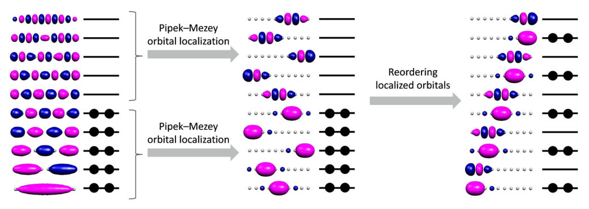
<figcaption class="paper-figure-caption"><b>Fig 1.</b> FIG. 1. Procedure of orbital localization, in the case of H10. Black circles represent the electron occupancies in the RHF wave function.</figcaption>
</figure>
<figure class="paper-figure-card">
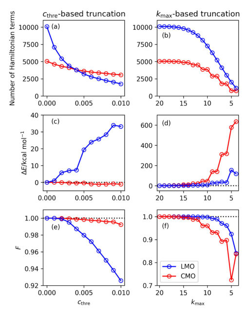
<figcaption class="paper-figure-caption"><b>Fig 2.</b> FIG. 2. Dependence of Hamiltonian truncation strategies (cthre-based (a, c, and e) and kmax-based (b, d, and f) ap- proaches) on the number of second-quantized Hamiltonian terms (a and b), ground-state energy error (c and d), and ground-state fidelity (e and f), in the H10 system.</figcaption>
</figure>
<figure class="paper-figure-card">
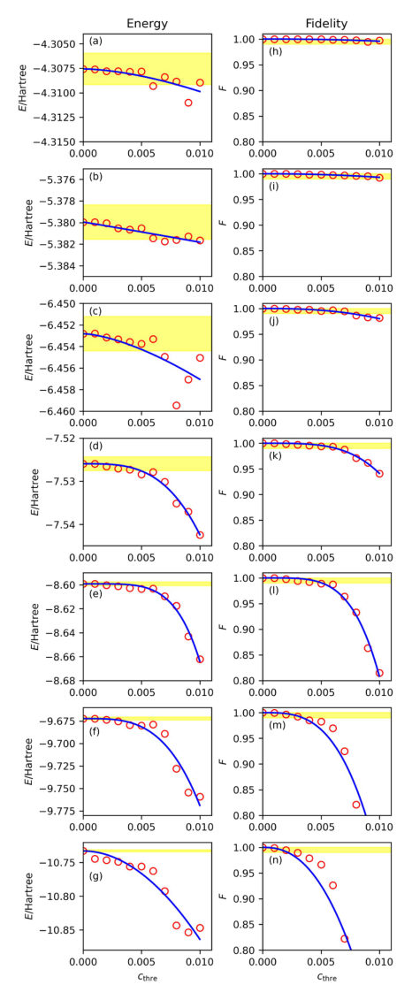
<figcaption class="paper-figure-caption"><b>Fig 3.</b> FIG. 3. Dependence of the threshold value (cthre) on the ground-state energy (a–g) and ground-state fidelity (h–n) for H8 (a and h), H10 (b and i), H12 (c and j), H14 (d and k), H16 (e and l), H18 (f and m), and H20 (g and n) in the CMO- based wave function expansion. Red open circles represent calculated energies and fidelities, and blue curves specify the fitted curve obtained using eqs (6) and (7) for energies and fidelities, respectively. The yellow shaded area represents the region where the energy error |∆E| ≤1.0 kcal mol−1 or the fidelity F ≥0.99.</figcaption>
</figure>
<figure class="paper-figure-card">
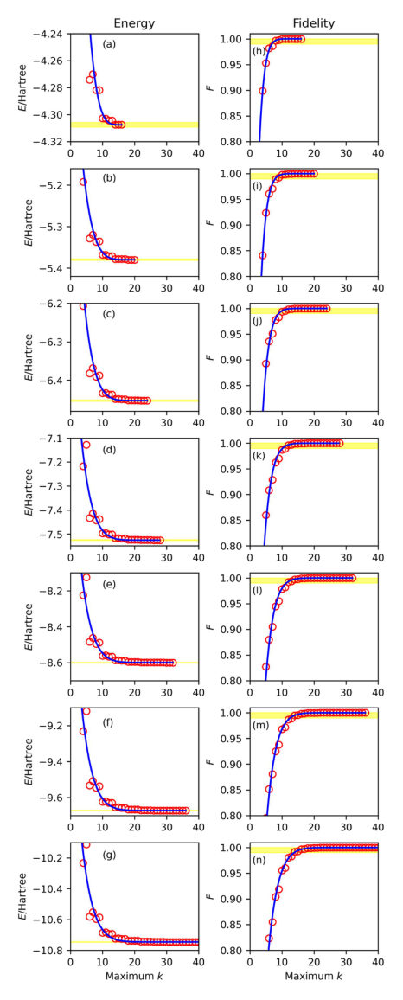
<figcaption class="paper-figure-caption"><b>Fig 4.</b> FIG. 4. Dependence of the maximum locality value (kmax) on the ground-state energy (a–g) and ground-state fidelity (h–n) for H8 (a and h), H10 (b and i), H12 (c and j), H14 (d and k), H16 (e and l), H18 (f and m), and H20 (g and n) in the LMO- based wave function expansion. Red open circles represent calculated energies and fidelities, and blue curves specify the fitted curve obtained using eqs (8) and (9) for energies and fidelities, respectively. The yellow shaded area represents the region where the energy error |∆E| ≤1.0 kcal mol−1 or the fidelity F ≥0.99.</figcaption>
</figure>
<figure class="paper-figure-card">
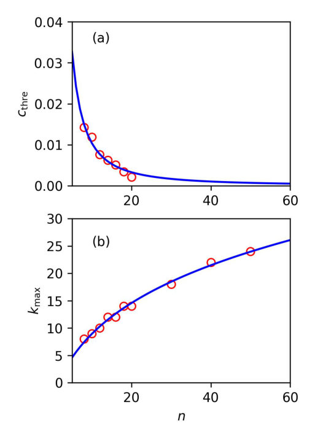
<figcaption class="paper-figure-caption"><b>Fig 5.</b> FIG. 5. Dependence of the threshold value required for F ≥0.99 on the number of hydrogen atoms n. Open red circles represent the threshold values obtained from the fit- ting functions in eqn (7) for the CMO basis, and the kmax values achieving F ≥0.99 in the LMO basis. The blue curves show the fitted functions, cthre = 1.3895n−2.0707 for the CMO basis and kmax = 1.8912(log n)1.8614. (a) Threshold value on the coefficient in the CMO-based wave function expansion. (b) Maximum locality value in the LMO-based wave function expansion.</figcaption>
</figure>

**Summary.** This study benchmarks Hamiltonian simulation resources for hydrogen chains using different molecular orbital bases and truncation methods. It finds that employing localized orbitals (LMOs) with locality-based truncation yields a dramatically better scaling of quantum gate requirements—polylogarithmic versus polynomial—compared to canonical molecular orbitals (CMOs). This provides critical guidance for designing efficient quantum algorithms for large-scale quantum chemistry.

**Why it may be interesting.** This work directly addresses resource estimation in quantum chemistry simulations, providing concrete guidelines on how basis set choice (localization) can fundamentally change the complexity scaling from polynomial to polylogarithmic, which is crucial for feasibility studies.

Detailed structure

**Main problem.** The study investigates how the choice of molecular orbital basis set (CMO vs. LMO) and Hamiltonian truncation strategy impacts the required quantum resources for simulating electronic structure via Trotter decomposition.

**Main result.** The analysis shows an exponential advantage for using localized orbitals (LMOs) combined with locality-based Hamiltonian truncation, leading to a polylogarithmic growth in gate count compared to the polynomial growth seen with canonical molecular orbitals (CMOs).

**Method.** The authors compare quantum resource estimation (quantum gate counts) derived from simulating hydrogen chains using first-order Trotter decomposition across different basis sets and truncation methods.

**Model / system.** The model is one-dimensional hydrogen chain systems ($	ext{H}_n$), analyzed by constructing a qubit Hamiltonian via the Jordan–Wigner transformation. The core comparison involves two orbital bases: Hartree–Fock canonical molecular orbitals (CMOs) and Pipek–Mezey localized molecular orbitals (LMOs).

**Key observables.** Number of quantum gates ($\#	ext{Clifford}(1q)$, $\#	ext{CNOT}$, $\#	ext{Rz}$), ground-state energy, and fidelity ($F$).

**Important parameters / regimes.** System size (up to $	ext{H}_{100}$), truncation thresholds ($	ext{c}_{	ext{thre}}$ or $k_{\max}$), and the bond dimension ($D$) for related DMRG convergence checks.

**Assumptions / limitations.** The analysis relies on first-order Trotter decomposition, and comparisons are made between truncated and full Hamiltonians to estimate resource scaling.

**Figures summary.** Figures illustrate the procedure of orbital localization (for $	ext{H}_{10}$) and show the distribution of rotational angles ($	ext{Rz}(	heta)$ gates) for larger chains ($	ext{H}_{50}$), comparing original vs. truncated Hamiltonians.

**Paper structure.** The paper systematically compares computational costs by first analyzing short chains (ground-state energy/fidelity) to determine optimal truncation thresholds, and then extrapolating these findings to estimate the scaling of quantum gate resources for very long chains ($	ext{H}_{100}$).

Abstract

We investigate how molecular orbitals used as the basis of wave function expansion and how operator coefficient-based and locality-based Hamiltonian truncation affects the computational cost of Trotter decomposition-based Hamiltonian simulation in one-dimensional hydrogen chain systems. The analysis is performed using both Hartree--Fock canonical molecular orbitals (CMOs) and Pipek--Mezey-based localized molecular orbitals (LMOs). For short hydrogen chains, we evaluate the ground-state energy and fidelity and find that, in the CMO-based wave function expansion, introducing a threshold on Hamiltonian coefficients is effective in reducing the gate cost while maintaining computational accuracy. In contrast, in the LMO-based wave function expansion, operator locality-based Hamiltonian truncation is found to be more effective. By fitting the relationship between the truncation threshold and the ground-state energies and fidelities with empirical formulas, we estimate the threshold values required to achieve high fidelity ($F \ge 0.99$) in the ground-state wave function. Using the estimated thresholds, we then perform quantum gate resource estimation for longer hydrogen chains up to H$_{100}$. The results suggest an exponential advantage of the LMO-based wave function expansion with Hamiltonian truncation: the number of quantum gates required for Hamiltonian simulation grows polynomially when the CMO-based wave function expansion with operator coefficient-based Hamiltonian truncation is adopted, whereas it grows polylogarithmically when the LMO-based wave function expansion is combined with operator locality-based Hamiltonian truncation. These results provide useful guidelines for choosing orbital representations and Hamiltonian truncation strategies in large-scale quantum chemical simulations.

[↑ back to top](#top)

## Secondary cond-mat archives

*Papers from cond-mat.mtrl-sci, mes-hall, other, soft, supr-con. These archives are de-prioritized — they appear at the end regardless of relevance score.*

### Relevant in secondary archives (11)

### [RKKY interaction as a probe of spin splitting and odd-parity nature in Floquet collinear magnets](http://arxiv.org/abs/2608.04969v1)

**Authors:** Hou-Jian Duan, Yong-Jia Wu, Xiaoliang Xiao, Ming-Xun Deng, Mou Yang, Rui-Qiang Wang  
**Type:** theory · **Category:** other · **PDF:** <https://arxiv.org/pdf/2608.04969v1>  
**Analysis basis:** full PDF text, analyzed in chunks
**Topic relevance:** 🔥 `exotic spin models in light-matter` **4/5** · 🔥 `non-equilibrium dynamics` **4/5** · `Keldysh / 2PI / non-Gaussian methods` **3/5** · `methods for driven-dissipative` **3/5** · `spintronics-quantum-optics interface` **3/5** · `analog quantum simulation` **2/5** · `driven-dissipative phase transition` **1/5** · `non-equilibrium universality` **1/5**

↔ Scroll figures horizontally

<figure class="paper-figure-card">
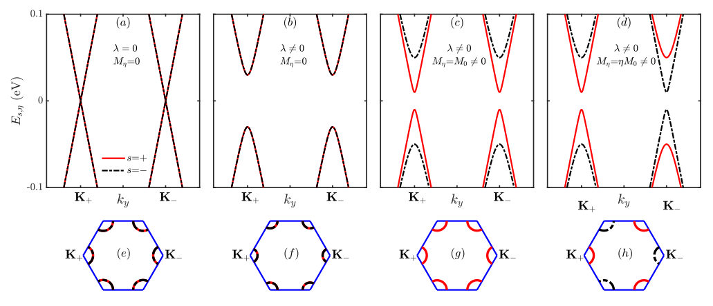
<figcaption class="paper-figure-caption"><b>Fig 1.</b> FIG. 1. ky-axis dispersion (a∼d) and Fermi surfaces at uF = 0.045 eV (e∼h) for different systems: (a,e) graphene (λ = 0, Mη = 0), (b,f) collinear AFM (λ , 0, Mη = 0), (c,g) USS-AFM (λ , 0, Mη = M0 , 0), and (d,h) collinear f -wave magnet (λ , 0, Mη , 0). The nonzero value of λ is taken as λ = 0.03t0, which is on the same order of magnitude as the parameters used in Ref. [67], corresponding to the antiferromagnetic exchange energy in the graphene-based honeycomb lattice. The nonzero value of M0 is set to M0 = 0.02t0, and we set t0 = 1 eV for convenience.</figcaption>
</figure>
<figure class="paper-figure-card">
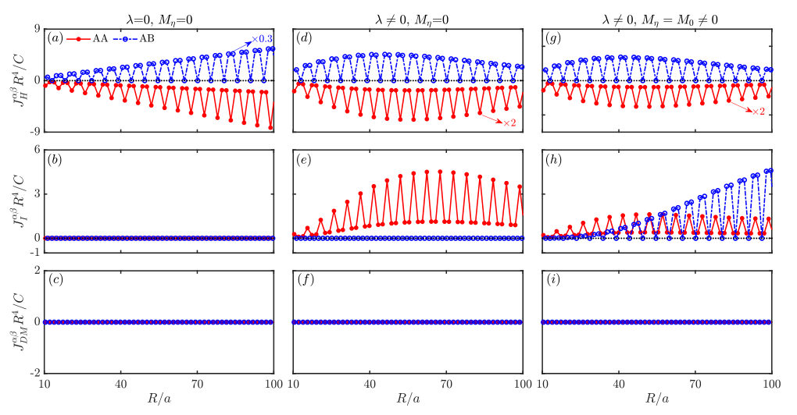
<figcaption class="paper-figure-caption"><b>Fig 2.</b> FIG. 2. RKKY components Jαβ i (i = H, I, DM) as a function of the impurity distance R for three baseline systems: (a∼c) graphene (λ = 0, Mη = 0), (d∼f) the collinear AFM (λ , 0, Mη = 0), and (g∼i) the USS-AFM (λ , 0, Mη = M0 , 0). Solid and open circles represent the RKKY interactions for impurities placed on the same and different sublattices, respectively. Here, C = J2 c/(2π) and uF = 0.</figcaption>
</figure>
<figure class="paper-figure-card">
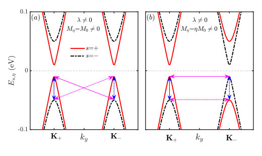
<figcaption class="paper-figure-caption"><b>Fig 3.</b> FIG. 5. ky-axis dispersion for (a) the USS-AFM (λ , 0, Mη = M0 , 0) and (b) the collinear f -wave magnet (λ , 0, Mη = ηM0 , 0). The blue arrows (solid and dashed) schematically represent the intraval- ley contribution, while the magenta ones (solid and dashed) schemat- ically denote the intervalley contribution.</figcaption>
</figure>
<figure class="paper-figure-card">
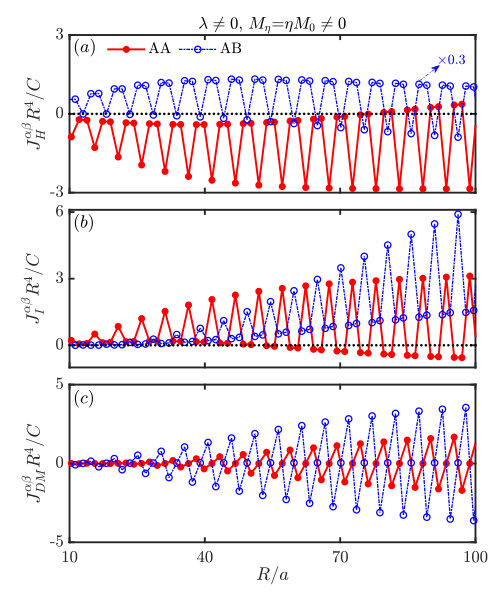
<figcaption class="paper-figure-caption"><b>Fig 4.</b> FIG. 3. RKKY components as a function of impurity distance in the collinear f -wave magnet (λ , 0, Mη = ηM0 , 0). Solid and open circles represent the RKKY interactions for impurities placed on the same and different sublattices, respectively.</figcaption>
</figure>
<figure class="paper-figure-card">
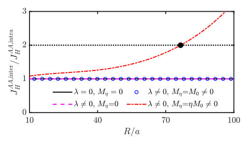
<figcaption class="paper-figure-caption"><b>Fig 5.</b> FIG. 4. Spatial dependence of the ratio JAA,inter H /JAA,intra H for different systems. The parameters for each system are indicated in the legend.</figcaption>
</figure>

**Summary.** The paper demonstrates that the Ruderman-Kittel-Kasuya-Yosida (RKKY) interaction can act as a universal probe for characterizing exotic, odd-parity magnets generated in antiferromagnets using Floquet engineering. By analyzing distinct magnetic signatures within the RKKY coupling—such as specific sign changes and symmetry constraints on the DM term—the authors provide a clear theoretical pathway to experimentally verify these complex quantum states.

**Why it may be interesting.** This work provides a powerful, symmetry-based theoretical diagnostic (RKKY) that links abstract concepts like odd-parity spin polarization and Floquet engineering to measurable magnetic responses accessible via techniques like STM spectroscopy.

Detailed structure

**Main problem.** The primary challenge is developing a method to detect both spin splitting and confirm the odd-parity nature of exotic magnets predicted to emerge in collinear antiferromagnets via Floquet engineering.

**Main result.** The RKKY interaction serves as a unified magnetic probe, yielding distinct signatures like magnetism reversals in Heisenberg/Ising terms and specific symmetries in the DM term that allow clear discrimination of these novel odd-parity magnets.

**Method.** The study utilizes theoretical calculations based on the Ruderman-Kittel-Kasuya-Yosida (RKKY) interaction, which is derived using Green's functions applied to effective Floquet Hamiltonians.

**Model / system.** The model focuses on collinear $f$-wave magnets realized in 2D collinear antiferromagnets on a honeycomb lattice, compared against baseline systems like graphene and standard AFMs. The physics is governed by an effective low-energy Floquet Hamiltonian.

**Key observables.** Distinct magnetic signals from the RKKY interaction: magnetism reversal in Heisenberg/Ising terms, sign alternation of the DM term, and confirmation of odd-parity symmetry ($\mathcal{J}^{	ext{DM}}(\mathbf{R}) = -\mathcal{J}^{	ext{DM}}(C_2^q\mathbf{R})$).

**Important parameters / regimes.** The analysis is performed in the high-frequency off-resonant regime of Floquet theory, and the results are shown to be general for $p$-wave magnets ($q=1$).

**Assumptions / limitations.** The approach assumes that the RKKY interaction can effectively probe the underlying spin polarization features generated by the Floquet driving.

**Figures summary.** Figure 1 illustrates band dispersions and Fermi surfaces for various magnetic systems (graphene, AFM, f-wave magnet). Figure 2 compares the calculated RKKY components ($J^H, J^I, J^{DM}$) versus impurity distance $R$ for different material types.

**Paper structure.** The paper establishes the theoretical framework using Floquet engineering to generate odd-parity magnets. It then introduces and applies the RKKY interaction as a diagnostic tool, systematically comparing its calculated components across various magnetic models to isolate the unique signatures of the target f-wave magnet.

Abstract

Odd-parity magnets were recently proposed to emerge in collinear antiferromagnets (AFMs) via Floquet engineering, with valley-dependent spin splitting underlying the odd-parity spin polarization. This proposal brings about two key challenges: detecting the spin splitting to verify the generation mechanism of these magnets, and identifying such polarization to confirm the odd-parity nature. Here, we show that the Ruderman-Kittel-Kasuya-Yosida (RKKY) interaction provides a unified magnetic probe for both tasks. Taking collinear $f$-wave magnets as a representative example, we find that the RKKY interaction yields distinct magnetic signals of the spin splitting---including a magnetism reversal in the Heisenberg/Ising terms and a sign alternation of the Dzyaloshinskii-Moriya (DM) term---that enable clear discrimination of collinear $f$-wave magnets from other related AFMs. Moreover, the DM term exhibits an $f$-wave shape with odd-parity symmetry, satisfying $J^{αβ}_{DM}(\mathbf{R}) = -J^{αβ}_{DM}(C_{2q}\mathbf{R})$ ($q=3$), which directly reflects the odd-parity spin polarization $S_z(\mathbf{k}) = -S_z(C_{2q}\mathbf{k})$ in momentum space. This behavior persists in $p$-wave magnets ($q=1$), demonstrating the generality of our approach. Our work establishes the RKKY interaction as a versatile probe for detecting band features of collinear odd-parity magnets, with predictions accessible to existing experimental techniques such as spin-polarized scanning tunneling spectroscopy.

[↑ back to top](#top)

### [Accessing Chern Numbers From Bloch Eigenstates Singularities](http://arxiv.org/abs/2608.04998v1)

**Authors:** Rajesh Asapanna, Rabih El Sokhen, Paolo Aceto, Patrick Popescu-Pampu, Martin Guillot, Jacqueline Bloch, Sylvain Ravets, Clément Hainaut, Alberto Amo, Pierre Delplace  
**Type:** both · **Category:** other · **PDF:** <https://arxiv.org/pdf/2608.04998v1>  
**Analysis basis:** full PDF text, analyzed in chunks
**Topic relevance:** 🔥 `analog quantum simulation` **4/5** · `quantum optics experiment` **3/5** · `non-equilibrium dynamics` **2/5** · `driven-dissipative phase transition` **1/5** · `interference shaping light` **1/5**

↔ Scroll figures horizontally

<figure class="paper-figure-card">
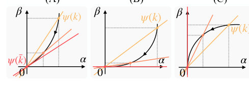
<figcaption class="paper-figure-caption"><b>Fig 1.</b> Figure 1. Trajectories (oriented black lines) of a vector state ψ(k) in C2 when k approaches a zero of ψ(k) at k = ¯k. The different straight lines represent the associated 1-dimensional complex vector space L(k) spanned by ψ(k), for different k along the tra- jectory. When approaching the zero, L(k →¯k) becomes tangent to the trajectory of ψ at 0 (red line), and may coincide with one coordinate axis (B,C). In that case, a local trivialization is ob- tained by projecting ψ onto that axis, as a projection onto the other (perpendicular) axis vanishes. (A) generic case: a projec- tion on either coordinate axis provides a local trivialization of the section.</figcaption>
</figure>
<figure class="paper-figure-card">
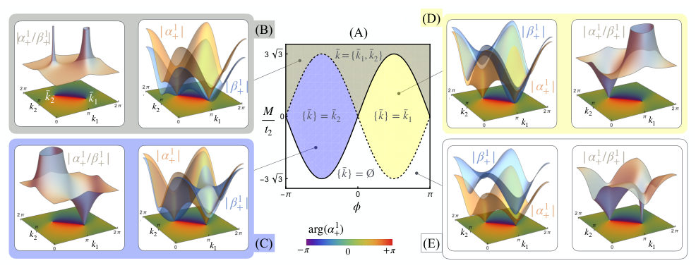
<figcaption class="paper-figure-caption"><b>Fig 2.</b> Figure 2. (A) Phase diagram of the Haldane model obtained from the two different methods. Each coloured domain is characterized by a number of zeros ¯kj of a section, here ψ1 +, or equivalently by the number of zeros ¯qj of the map µ1 + (not shown). The curved</figcaption>
</figure>
<figure class="paper-figure-card">
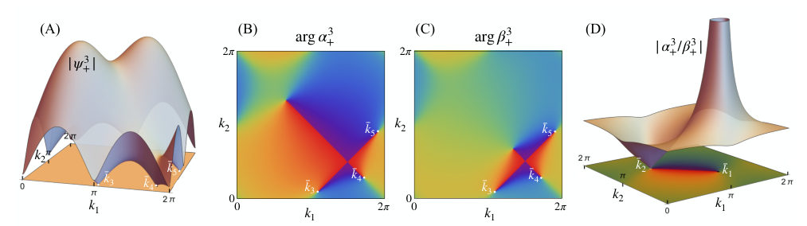
<figcaption class="paper-figure-caption"><b>Fig 3.</b> Figure 3. Zeros-section and tautological bundle methods applied to determine the Chern number in gauge 3 for the Haldane model (yellow domain of Fig. 2, C+ = −1). (A) The norm of the eigenvector ψ3 + in gauge 3 vanishes at three different points (¯k3, ¯k4, ¯k5) in BZ. (D) At those points, the limit α3 +/β3 + is finite, so any of argα3 + (B) or argβ3 + (C) can be chosen as a local trivialized section to determine the indices at those points. The color code for argα3 + and argβ3 + is the same as in Fig. 2</figcaption>
</figure>
<figure class="paper-figure-card">
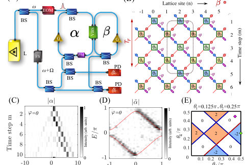
<figcaption class="paper-figure-caption"><b>Fig 4.</b> Figure 4. (A) Scheme of the double ring system with injection and reference laser L, beamsplitters BS, variable beamsplitter VBS, frequency shifter FS, phase modulator PM, Erbium doped amplifier G that compensates for losses and photodiode D. (B) Synthetic split-step lattice for the 4-step protocol. (C) Measured light intensity in the α ring in an example of step-evolution af- ter injection at a single site for a lattice model with θ1 = 0.125π, θ2 = 0.25π, θ3 = 0.5π and θ4 = 0.25π and ϕ = 0. (D) Measured band tomography as a function of quasimomenta k and ϕ for the θi parameters of (c). Analytic bands are overlayed in red. (E) Bulk topological phases according to the Chern number of the...</figcaption>
</figure>
<figure class="paper-figure-card">
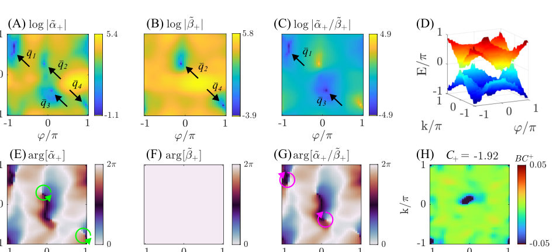
<figcaption class="paper-figure-caption"><b>Fig 5.</b> Figure 5. Upper-band eigenvectors in a topological lattice (C+ = −2). Splitting angles are θ1 = 0.125π, θ2 = 0.25π, θ3 = 0.5π, and θ4 = 0.25π. (A,B) Measured (unnormalized) amplitudes and (E,F) corresponding phases of the Floquet–Bloch eigenvectors on the two sublattices, | ˜α+〉and | ˜β+〉. (C) Amplitude ratio and (G) relative phase between components, ˜α+/ ˜β+. Arrows indicate zeros of the unnormalized eigenvectors. (D) Measured eigenvalues of the Floquet operator. (H) Berry curvature reconstructed from the measured eigenvectors, along with the integrated Chern number of the upper band.</figcaption>
</figure>

**Summary.** The paper introduces two robust theoretical methods to calculate the Chern number of Bloch bands by analyzing phase singularities directly within the eigenstates, rather than integrating the Berry curvature. These methods are successfully applied to a photonic lattice experiment, confirming that the resulting topological invariant is quantized and independent of gauge choice.

**Why it may be interesting.** This work provides an experimentally accessible route to topological invariants in condensed matter systems using only measurements of wavefunction phases/zeros, which is highly relevant for quantum optics and photonics research.

Detailed structure

**Main problem.** The paper proposes novel methods to directly calculate topological invariants, specifically Chern numbers, of Bloch bands by analyzing phase singularities (vorticities) in the eigenstates, bypassing traditional Berry curvature integration.

**Main result.** Two distinct methods—the 0-section method and the tautological bundle method—were successfully applied to demonstrate that the calculated Chern number is robustly quantized and independent of gauge choice, even when using experimental data from photonic lattices.

**Method.** The core methodology involves identifying zeros (singularities) in continuous sections of complex line bundles formed by Bloch eigenvectors. This leads to calculating topological indices or winding numbers at these zero points across the Brillouin zone torus.

**Model / system.** The theory is applied to two-dimensional insulators, demonstrated using a photonic lattice experiment simulating a quantum walk model governed by Floquet operators. The analysis uses concepts from Bloch band theory and complex geometry.

**Key observables.** Chern number ($C_n$), phase vorticities in eigenstates structure, local indices ($	ext{Ind}_{ar{k}_j}$), and winding numbers ($W_j[\sigma]$).

**Important parameters / regimes.** The system is characterized by parameters governing the photonic lattice or the Floquet Hamiltonian, leading to topological phases (e.g., $C^+ = -2$ vs. $C^+=0$).

**Assumptions / limitations.** For the 0-section method, it is crucial that the eigenvector does not vanish on the plaquette when using raw experimental data; for classical wave systems, non-normalization of eigenvectors is exploited.

**Figures summary.** Figures illustrate reconstructed eigenvectors ($	ilde{\alpha}^+, 	ilde{eta}^+$) in both topologically trivial ($C=0$) and topological ($C^+=-2$) regimes. They show the relationship between measured data, analytical reconstructions, and the resulting Chern number calculation via index summation.

**Paper structure.** The paper develops two theoretical methods (0-section and tautological bundle) for calculating $C_n$ from eigenstate zeros. It then applies these methods to a photonic lattice model derived from Floquet theory, demonstrating gauge invariance by comparing results across different gauges and calculation techniques.

Abstract

We propose two methods to extract the Chern numbers of the Bloch bands of a two dimensional insulator, and apply them to a photonic lattice experiment. These two methods require the knowledge of the complex-valued components of the Bloch eigenvectors, or their ratios. Unlike other tomography methods relying on the approximate reconstruction of the Berry curvature and its integration over the Brillouin zone, our methods boil down to the observation of phase vorticities in the eigensates structure. Those measurements, robust to experimental noise, yield exactly quantized values. One of the two methods exploits the non-normalization of the eigenmodes, making it particularly relevant for classical wave systems.

[↑ back to top](#top)

### [Higher-Order Extensions of Weakly Viscous Dysthe Theory and a Phase-Lag Model for Nonlinear Mean-Flow Damping](http://arxiv.org/abs/2608.04473v1)

**Authors:** C. M. Schober, A. Islas  
**Type:** theory · **Category:** other · **PDF:** <https://arxiv.org/pdf/2608.04473v1>  
**Analysis basis:** full PDF text, analyzed in chunks
**Topic relevance:** `correlated / nonlocal dissipation` **3/5** · `methods for driven-dissipative` **3/5** · `non-equilibrium dynamics` **3/5** · `Keldysh / 2PI / non-Gaussian methods` **2/5** · `driven-dissipative phase transition` **2/5** · `non-equilibrium universality` **2/5** · `Frenkel-Kontorova` **1/5** · `analog quantum simulation` **1/5** · `quantum measurements` **1/5**

↔ Scroll figures horizontally

<figure class="paper-figure-card">
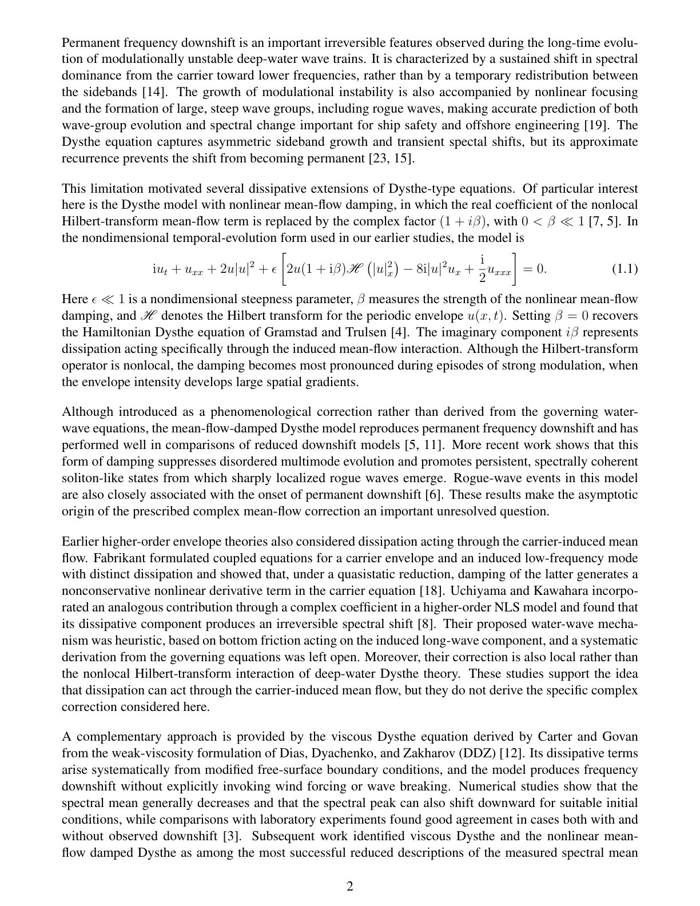
<figcaption class="paper-figure-caption"><b>Fig 1.</b> Low-resolution page preview, page 2</figcaption>
</figure>
<figure class="paper-figure-card">
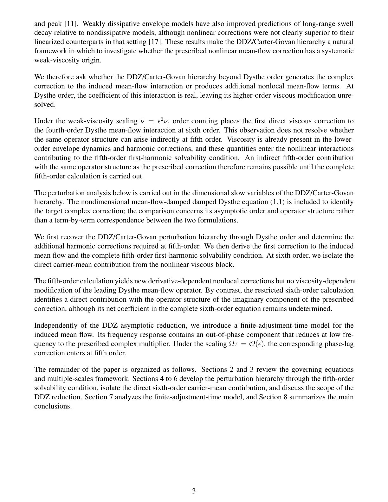
<figcaption class="paper-figure-caption"><b>Fig 2.</b> Low-resolution page preview, page 3</figcaption>
</figure>
<figure class="paper-figure-card">
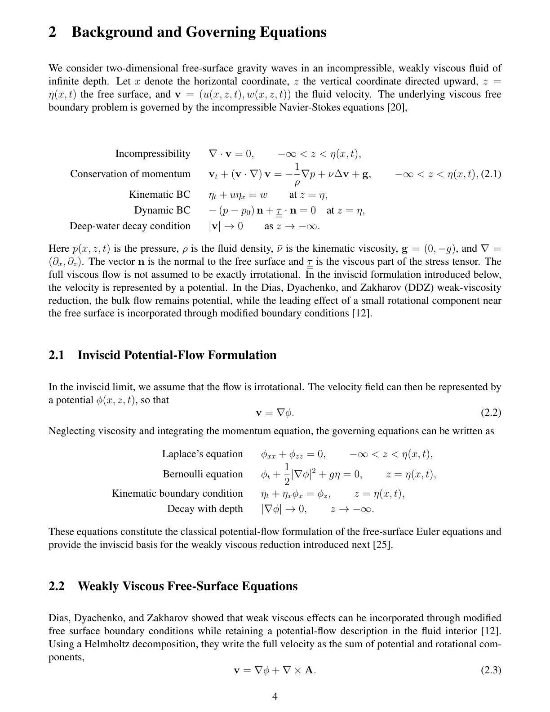
<figcaption class="paper-figure-caption"><b>Fig 3.</b> Low-resolution page preview, page 4</figcaption>
</figure>
<figure class="paper-figure-card">
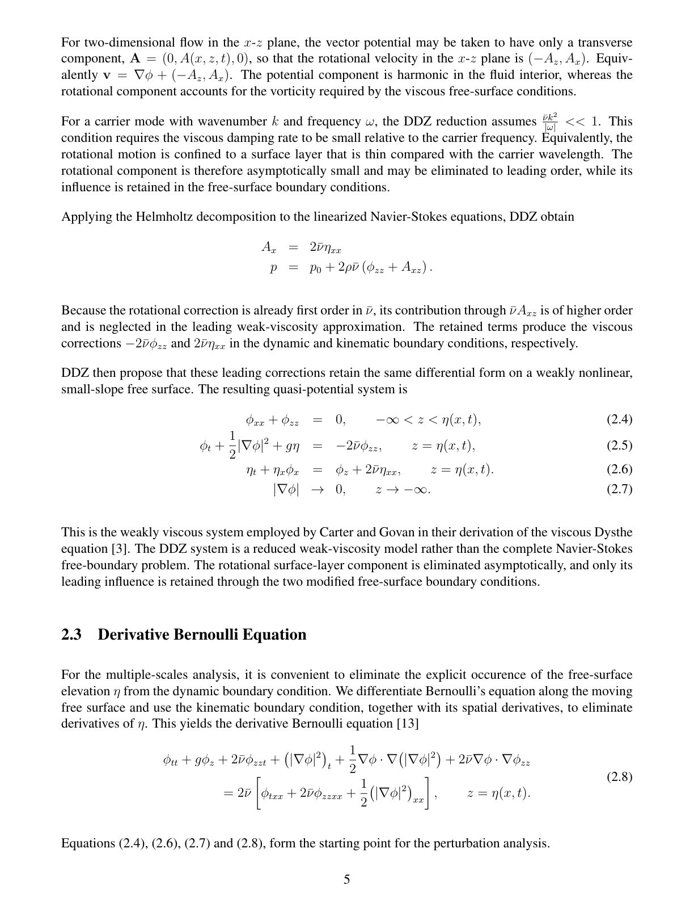
<figcaption class="paper-figure-caption"><b>Fig 4.</b> Low-resolution page preview, page 5</figcaption>
</figure>
<figure class="paper-figure-card">
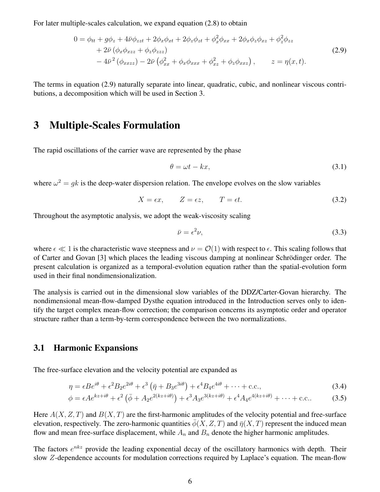
<figcaption class="paper-figure-caption"><b>Fig 5.</b> Low-resolution page preview, page 6</figcaption>
</figure>

**Summary.** This paper analyzes wave damping in weakly viscous deep-water waves by extending the Dysthe theory using multiple-scales analysis. The authors compare the results from this rigorous fluid dynamics framework against an independent phase-lag model for mean-flow interaction. They conclude that while higher orders reveal specific coupling terms, the predicted frequency-dependent damping correction arises naturally only in the simplified time-adjustment model, suggesting a gap between the two theoretical approaches.

**Why it may be interesting.** Although focused on fluid dynamics, the mathematical techniques—such as multi-scale analysis, deriving higher-order nonlinear evolution equations, and modeling delayed feedback via relaxation kernels—are highly relevant to open quantum systems where memory effects or non-Markovian damping are crucial.

Detailed structure

**Main problem.** The authors investigate extending weakly viscous Dysthe wave theory by determining if the standard weak-viscosity framework can systematically generate a complex multiplier associated with nonlinear mean-flow damping.

**Main result.** They show that while higher-order analysis reveals specific direct viscous contributions at sixth order, an independent finite-adjustment-time model predicts a phase-lag correction entering at fifth order, suggesting the systematic origin of this effect is not guaranteed by the standard weak-viscosity reduction.

**Method.** The work employs multiple-scales perturbation analysis on the Navier-Stokes equations, extending the Dias-Dyachenko-Zakharov (DDZ) framework, and independently utilizes a finite-adjustment-time model for mean-flow response.

**Model / system.** The system is two-dimensional free-surface gravity waves in an incompressible, weakly viscous fluid of infinite depth. The analysis builds upon the DDZ weak-viscosity reduction of the full Navier-Stokes equations.

**Key observables.** Nonlocal mean-flow interaction terms ($\mathcal{A}c_M$), the complex multiplier $(1 + ieta)$, and the effective frequency-dependent damping coefficient $eta_{	ext{eff}}(\Omega) = \Omega	au$.

**Important parameters / regimes.** Weak-viscosity scaling ($ar{
u} = \epsilon^2
u$) and the small parameter $\epsilon$ (wave steepness). The adjustment time $	au$ is a key parameter in the phase-lag model.

**Assumptions / limitations.** The DDZ reduction assumes potential flow supplemented by boundary condition modifications; the phase-lag model treats mean-flow relaxation as an independent, reduced dynamics problem.

**Paper structure.** The paper progresses from establishing the physical system and the leading Dysthe theory (DDZ reduction) to performing high-order perturbation analysis (fifth and sixth order solvability conditions), culminating in a comparison between these results and an independent, exact phase-lag model.

Abstract

We extend the Carter-Govan multiple-scales analysis of weakly viscous, narrowband deep-water wave packets beyond Dysthe order within the potential-flow reduction of Dias, Dyachenko, and Zakharov (DDZ). We seek to determine whether this framework generates the complex multiplier $(1 + iβ)$ used phenomenologically to modify the nonlocal Dysthe mean-flow interaction. Although order counting places a direct viscous carrier-mean interaction at sixth order, it does not exclude an indirect fifth-order contribution arising from viscosity dependent lower-order harmonics and nonlinear interactions. We therefore derive the first correction to the induced mean flow and the complete fifth-order first-harmonic solvability condition. The resulting nonlocal terms are derivative--dependent and contain no explicit viscosity, excluding the proposed indirect mechanism within the DDZ framework. At sixth order, a restricted calculation of the nonlinear viscous block isolates a direct carrier-mean contribution with the same operator structure as the imaginary component of the prescribed mean-flow correction. Independently, a finite-adjustment-time model yields an exact, frequency dependent mean-flow response. Its low-frequency expansion produces the multiplier $ 1 + iβ_{\mathrm{eff}}(Ω)$, with $β_{\mathrm{eff}}(Ω) =Ωτ.$ When $Ωτ= \mathcal O(ε)$, the resulting phase-lag correction enters at fifth order, one order beyond the leading Dysthe mean-flow interaction.

[↑ back to top](#top)

### [Microscopic theory of the field-induced instability of the vortex-free state in superconducting thin-film strips](http://arxiv.org/abs/2608.04508v1)

**Authors:** Takayuki Kubo  
**Type:** theory · **Category:** other · **PDF:** <https://arxiv.org/pdf/2608.04508v1>  
**Analysis basis:** full PDF text, analyzed in chunks
**Topic relevance:** `Keldysh / 2PI / non-Gaussian methods` **3/5** · `driven-dissipative phase transition` **3/5** · `non-equilibrium universality` **2/5** · `analog quantum simulation` **1/5** · `correlated / nonlocal dissipation` **1/5** · `methods for driven-dissipative` **1/5** · `non-equilibrium dynamics` **1/5**

↔ Scroll figures horizontally

<figure class="paper-figure-card">
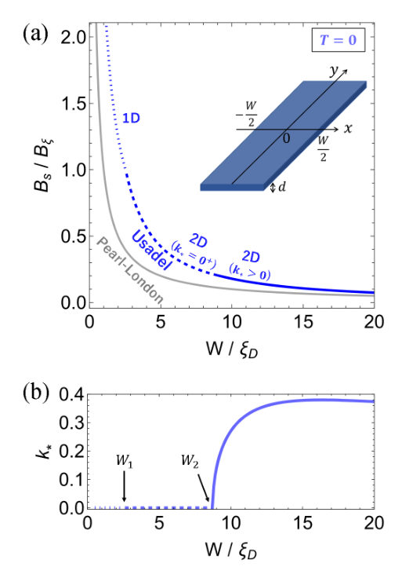
<figcaption class="paper-figure-caption"><b>Fig 1.</b> FIG. 1. (a) The instability field Bs as a function of the strip width W at T = 0. The dotted, dashed, and solid seg- ments indicate the regimes in which Bs is determined by the 1D, 2D long-wavelength, and finite-wave-number instabilities, respectively. The gray curve shows the naive Pearl–London result B(L) s /Bξ = 1/w, obtained by setting ξcut = ξD. The inset shows the strip geometry. (b) Critical longitudinal wave number in the 2D sector. The solid segment shows the finite- wave-number regime with k∗&gt; 0. The dashed segment at k∗= 0 denotes the long-wavelength limit k →0+ with u0 ̸= 0, whereas the dotted segment at zero indicates the 1D regime, in which no 2D wave number determines Bs.</figcaption>
</figure>
<figure class="paper-figure-card">
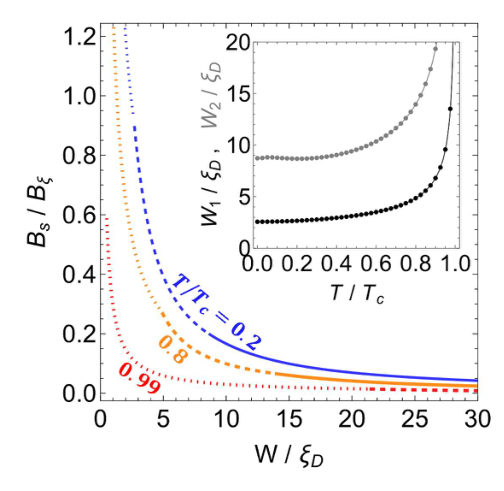
<figcaption class="paper-figure-caption"><b>Fig 2.</b> FIG. 2. The instability field Bs as a function of the strip width W for T/Tc = 0.2, 0.8, and 0.99. The dotted, dashed, and solid segments indicate the regimes in which Bs is deter- mined by the 1D, 2D long-wavelength, and 2D finite-wave- number instabilities, respectively. The inset shows the tem- perature dependence of the crossover widths w1 = W1/ξD and w2 = W2/ξD. The black and gray curves are fits to w1 and w2, respectively: w1(t) = (2.563 + 4.63t −0.125t2)/[(1 + 2.314t)√1 −t] and w2(t) = P[7t/(1 + 7t)]/√1 −t, where P(x) = 8.73 −1.45x + 10.60x2 −37.20x3 + 42.35x4 −18.46x5</figcaption>
</figure>
<figure class="paper-figure-card">
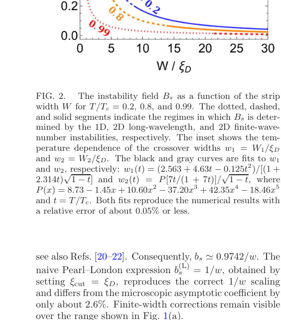
<figcaption class="paper-figure-caption"><b>Fig 3.</b> Figure 2 shows the width dependence of Bs at finite temperatures. Since ξD is temperature independent, the dimensionless width w = W/ξD of a given strip is fixed. Both crossover widths increase with temperature because the characteristic length scale of the superconducting re- sponse grows as T approaches Tc. Near Tc, this increase can be attributed to the divergence of ξGL(T ). The inset</figcaption>
</figure>

**Summary.** This paper develops a microscopic theory to accurately predict when a vortex-free superconducting thin film becomes unstable due to an applied magnetic field. By formulating the stability problem directly, it resolves ambiguities present in older models and maps out three distinct physical regimes based on the strip's width relative to characteristic lengths. The work is significant for understanding superconductivity in confined geometries.

**Why it may be interesting.** While focused on superconductivity, the rigorous stability analysis of a macroscopic quantum state (the superconducting order parameter) under external fields provides valuable techniques for analyzing phase transitions in complex many-body systems relevant to open quantum systems.

Detailed structure

**Main problem.** To microscopically determine the field-induced instability of the vortex-free state in superconducting thin-film strips, overcoming ambiguities found in older theories.

**Main result.** The theory establishes three distinct width regimes for instability: 1D instability, edge-selective 2D mode instability, and localized modes. It shows that for narrow strips, the classical Pearl–London picture fails qualitatively.

**Method.** Stability is analyzed by examining the quadratic variation of the Gibbs free energy functional using Usadel theory formalism, considering both 1D and 2D perturbations.

**Model / system.** The system modeled is a homogeneous dirty superconducting thin-film strip subjected to a perpendicular magnetic field. The analysis uses theoretical tools derived from superconductivity theory (Usadel equations).

**Key observables.** Instability field ($B_s$), critical wave number ($k^*$), and the order parameter amplitude.

**Important parameters / regimes.** Strip width ($W$), temperature ($T$), and magnetic field strength ($B$). The analysis identifies crossover widths $W_1(T)$ and $W_2(T)$.

**Assumptions / limitations.** The calculations assume a homogeneous strip, negligible self-field effects, and no applied transport current.

**Figures summary.** Figure 1 illustrates the width dependence of $B_s$ at $T=0$, marking the three instability regimes. Figure 2 shows how these critical fields change with temperature.

**Paper structure.** The paper develops the stability analysis by first considering 1D perturbations, then extending to 2D modes using Fourier decomposition for longitudinal wave numbers ($k$). The results are synthesized to define $B_s$ as the minimum instability field across all considered modes and regimes.

Abstract

In the Pearl--London theory, the edge-barrier-disappearance field of a superconducting thin-film strip depends on an arbitrary short-distance core cutoff because the vortex is treated as a point object. The theory does not determine the cutoff or how it depends on temperature $T$, and therefore cannot determine the $T$ dependence of the instability field. Here we formulate the microscopic stability problem directly for the vortex-free superconducting state. This removes the core-cutoff ambiguity and determines the instability field $B_s$ over the full temperature range and across all width regimes considered here. For a homogeneous dirty strip with negligible self-field, three width regimes occur. For $W<W_1(T)$, superconductivity disappears continuously into the normal state through a one-dimensional (1D) instability. For $W_1(T)<W<W_2(T)$, an edge-selective two-dimensional (2D) long-wavelength mode becomes unstable. For $W>W_2(T)$, the critical wave number is finite and the unstable mode is localized near an edge. In the wide-strip limit, $B_s\propto1/W$, recovering the Pearl--London scaling. In sufficiently narrow strips, however, the Pearl--London edge-barrier picture fails qualitatively.

[↑ back to top](#top)

### [Magnetic catalysis and Hall conductivity of excitonic insulators in a planar four-Fermi model](http://arxiv.org/abs/2608.04986v1)

**Authors:** William R. Tavares, Rudnei O. Ramos, Nei Lopes  
**Type:** theory · **Category:** strongly correlated electrons · **PDF:** <https://arxiv.org/pdf/2608.04986v1>  
**Analysis basis:** full PDF text, analyzed in chunks
**Topic relevance:** `Keldysh / 2PI / non-Gaussian methods` **3/5** · `analog quantum simulation` **2/5** · `correlated cavity matter` **1/5** · `driven-dissipative phase transition` **1/5** · `methods for driven-dissipative` **1/5**

↔ Scroll figures horizontally

<figure class="paper-figure-card">
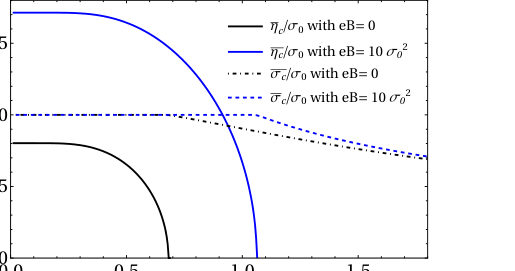
<figcaption class="paper-figure-caption"><b>Fig 1.</b> FIG. 1. Normalized EI condensate (solid curves) and scalar con- densate (dashed curves) as functions of temperature for 𝑒𝐵= 0 and 𝑒𝐵= 10𝜎2 0 , with 𝑀= 0.24𝜎0. The magnetic field enhances the EI gap and raises its continuous transition temperature. The scalar con- densate remains equal to 𝜎0 while ¯𝜂𝑐≠0 and becomes temperature dependent only in the non-EI phase.</figcaption>
</figure>
<figure class="paper-figure-card">

<figcaption class="paper-figure-caption"><b>Fig 2.</b> Figure 1 shows the temperature dependence of the two con- densates for 𝑀= 0.24𝜎0. At 𝐵= 0 and𝑇= 0, the equilibrium solution has ¯𝜂𝑐≃0.8𝜎0 and ¯𝜎𝑐= 𝜎0. The finite value of ¯𝜎𝑐should not be interpreted as an independent spontaneous transition in the present semiconductor regime, because the explicit mass parameter already breaks the corresponding chi- ral symmetry. The genuine EI order is identified by ¯𝜂𝑐≠0. As the temperature increases, the EI condensate decreases contin- uously and vanishes at</figcaption>
</figure>
<figure class="paper-figure-card">
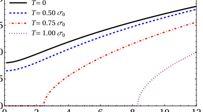
<figcaption class="paper-figure-caption"><b>Fig 3.</b> FIG. 3. Normalized EI condensate as a function of the perpendicular magnetic field for several temperatures, with 𝑀= 0.24𝜎0. The monotonic enhancement of ¯𝜂𝑐is the excitonic analogue of magnetic catalysis. At temperatures above the zero-field critical temperature, a sufficiently strong field induces the EI phase.</figcaption>
</figure>
<figure class="paper-figure-card">
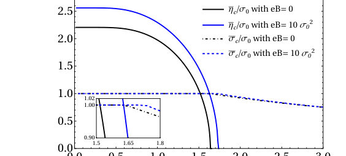
<figcaption class="paper-figure-caption"><b>Fig 4.</b> FIG. 2. Normalized EI condensate (solid curves) and scalar conden- sate (dashed curves) as functions of temperature for 𝑀= 0.15𝜎0, at 𝑒𝐵= 0 and 𝑒𝐵= 10𝜎2 0 . The smaller bare gap favors the EI phase, while the magnetic field further increases the condensate and its critical temperature. The inset enlarges the behavior of the scalar condensate near the EI transition.</figcaption>
</figure>
<figure class="paper-figure-card">
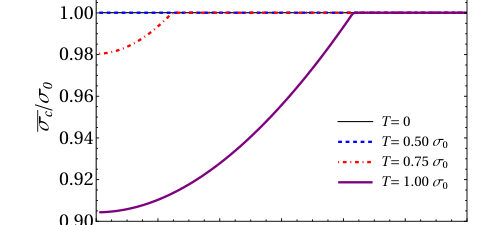
<figcaption class="paper-figure-caption"><b>Fig 5.</b> FIG. 4. Normalized scalar condensate as a function of the perpendic- ular magnetic field for several temperatures. In the EI phase, ¯𝜎𝑐= 𝜎0 and is independent of 𝐵. Above the zero-field EI transition, the scalar condensate initially exhibits magnetic catalysis; it becomes pinned to 𝜎0 when the field-induced EI condensate appears.</figcaption>
</figure>

**Summary.** This paper theoretically examines the effect of a magnetic field on an excitonic insulator phase using a four-Fermi model. It finds that the magnetic field enhances the excitonic order parameter, demonstrating a form of magnetic catalysis. Furthermore, it predicts characteristic changes in the Hall conductivity that serve as complementary signatures for detecting this type of electronic ordering.

**Why it may be interesting.** While focused on condensed matter theory, the study of emergent collective phases like excitonic insulators under external fields provides insights into many-body ground states that are relevant to strongly correlated systems.

Detailed structure

**Main problem.** The study investigates how a perpendicular magnetic field affects the excitonic insulator (EI) phase and its associated Hall conductivity in planar fermionic systems.

**Main result.** The magnetic field induces an 'excitonic realization of magnetic catalysis' by enhancing the EI condensate, while the Hall conductivity exhibits characteristic changes accompanying this ordering transition.

**Method.** The analysis employs the large-$N$ approximation within a mean-field framework to derive and minimize the thermodynamic potential for coupled scalar and excitonic condensates.

**Model / system.** The system is modeled using an extended planar four-Fermi model (extended Gross-Neveu model) describing electron-hole coherence interactions in the semiconductor regime. The Hamiltonian incorporates minimal coupling to a perpendicular magnetic field.

**Key observables.** EI condensate ($\eta_c$), critical temperature ($T_c$), Hall conductivity ($\sigma_{xy}$), and phase structure changes (e.g., tricritical point).

**Important parameters / regimes.** Perpendicular magnetic field ($B$), finite temperature ($T$), and chemical potential ($\mu$).

**Assumptions / limitations.** The analysis relies on the large-$N$ approximation and treats the system using a homogeneous saddle-point mean-field approach, neglecting collective phase fluctuations.

**Figures summary.** Not specified by notes; the text describes analyzing field dependence of condensates and Hall conductivity near transitions.

**Paper structure.** The paper systematically introduces the model (Section II), derives the thermodynamic potential in zero field, establishes gap equations for equilibrium condensates, and then extends this framework to incorporate a perpendicular magnetic field (Section III).

Abstract

We study the effects of a perpendicular magnetic field on the excitonic insulator (EI) phase in the semiconductor regime using an extended planar four-Fermi model. Within the large-$N$ approximation, we determine the coupled scalar and excitonic condensates at finite temperature, chemical potential, and magnetic field. The field enhances the EI condensate and raises its critical temperature, providing an excitonic realization of magnetic catalysis, while the scalar condensate remains constant throughout the EI phase. By contrast, the critical chemical potential depends nonmonotonically on the field because of the successive occupation of Landau levels. The magnetic field also shifts the mean-field tricritical point and enlarges the first-order region of the temperature--chemical-potential phase diagram. We further analyze the Hall conductivity and find that increasing the field reduces the number of plateaus and modifies the threshold for a finite Hall response. For the parameters considered, the emergence of the EI condensate is accompanied by a characteristic change in the Hall conductivity, including a field-dependent change of slope near a continuous transition. These results show that the combined phase structure and Hall response can provide complementary signatures of excitonic ordering in planar fermionic systems.

[↑ back to top](#top)

### [Large nonlinear Hall effect in strained moiré structures hosting high-pseudospin fermions](http://arxiv.org/abs/2608.04875v1)

**Authors:** Srijata Lahiri, Gourab Paul, Bilal Tanatar, Saurabh Basu  
**Type:** theory · **Category:** other · **PDF:** <https://arxiv.org/pdf/2608.04875v1>  
**Analysis basis:** full PDF text, analyzed in chunks
**Topic relevance:** `analog quantum simulation` **3/5** · `driven-dissipative phase transition` **2/5** · `Keldysh / 2PI / non-Gaussian methods` **1/5** · `spintronics-quantum-optics interface` **1/5**

↔ Scroll figures horizontally

<figure class="paper-figure-card">
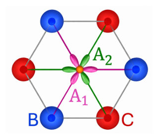
<figcaption class="paper-figure-caption"><b>Fig 1.</b> FIG. 1. Schematic illustration of the WM lattice. The NN hopping between the B and C orbitals is represented by gray bonds, whereas the NN hopping between the A1–B and A2–C orbitals is highlighted by pink and green bonds, respectively.</figcaption>
</figure>
<figure class="paper-figure-card">
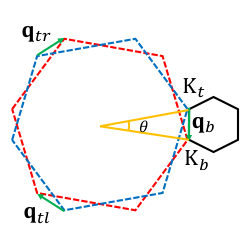
<figcaption class="paper-figure-caption"><b>Fig 2.</b> FIG. 2. Momentum space structure of twisted bilayer WM lattice. The dashed blue and red hexagons correspond to the Brillouin zones of the top and bottom WM lattice. The small black hexagon denotes the MBZ generated by the relative rotation θ between the two layers. The vectors qb, qtr, and qtl represent the three momentum transfer vectors that couple the electronic states between the two layers.</figcaption>
</figure>
<figure class="paper-figure-card">
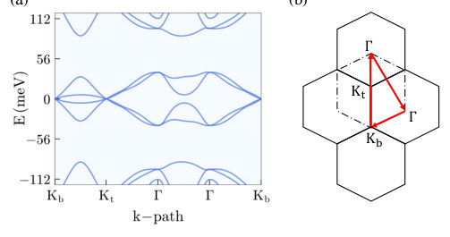
<figcaption class="paper-figure-caption"><b>Fig 3.</b> FIG. 3. (a) Band structure of the twisted bilayer WM lattice around K+ valley at a twist angle of θ = 1.40○in the chiral limit of the system. (b) High-symmetry path in the MBZ.</figcaption>
</figure>
<figure class="paper-figure-card">
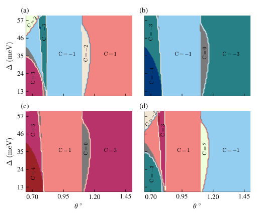
<figcaption class="paper-figure-caption"><b>Fig 4.</b> FIG. 5. Unstrained Chern phase diagrams corresponding to the four isolated nondegenerate subbands close to the charge neutrality. Panels (a)–(d) correspond to band indices n = 322, 323, 324, and 325, respectively, and illustrate the evolution of the Chern number as a function of onsite parameter ∆and twist angle θ.</figcaption>
</figure>
<figure class="paper-figure-card">
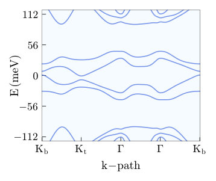
<figcaption class="paper-figure-caption"><b>Fig 5.</b> FIG. 4. Band structure of the twisted bilayer WM lattice around the K+ valley in the presence of an onsite mass (∆= 38 meV), calculated at a twist angle of θ = 1.40○in the chiral limit of the system along the high-symmetry path shown in Fig. 3(b).</figcaption>
</figure>

**Summary.** This paper theoretically investigates the nonlinear Hall effect in strained moiré watermill lattices containing high-pseudospin fermions. By introducing strain, the authors activate a Berry curvature dipole that drives a large, tunable nonlinear response. This work demonstrates how geometric properties of the lattice can be engineered to yield enhanced topological transport signatures.

**Why it may be interesting.** While focused on condensed matter topology, the concept of engineering geometric responses (like the BCD) through external fields (strain) mirrors control mechanisms used in quantum optics or AMO physics to tune system Hamiltonians and induce novel collective states.

Detailed structure

**Main problem.** The study investigates the linear and nonlinear Hall response, particularly focusing on how strain engineering can activate a finite Berry curvature dipole in moiré structures hosting high-pseudospin fermions.

**Main result.** The system exhibits a large nonlinear Hall effect whose magnitude substantially exceeds that of symmetry-broken transition metal dichalcogenides. The sign reversal of the Berry curvature dipole across topological phase boundaries creates characteristic 'butterfly like features'.

**Method.** Theoretical analysis using continuum models (Bistritzer-MacDonald formalism) to map out phase diagrams based on mass strength and twist angle, followed by incorporating strain effects.

**Model / system.** The model is a moiré watermill lattice (WM), treated as a four-band manifold hosting high-pseudospin fermions. The Hamiltonian incorporates intralayer hopping terms and interlayer coupling, which are then modified by an inversion symmetry breaking mass term ($\Delta$) and uniaxial strain ($\epsilon_p$).

**Key observables.** Nonlinear Hall response (NLHE), Chern numbers ($C$), Berry curvature dipole (BCD).

**Important parameters / regimes.** Twist angle ($	heta$), onsite mass strength ($\Delta$), and applied strain ($\epsilon_p$).

**Assumptions / limitations.** The analysis assumes only nearest-neighbor hopping processes are dominant, and the system is analyzed in the context of a four-band model.

**Figures summary.** Figure 1 schematically illustrates the WM lattice structure with its various hopping bonds. The paper analyzes phase diagrams showing Chern number evolution and BCD dependence on strain/mass.

**Paper structure.** The work proceeds by first establishing the low-energy physics of the moiré watermill lattice, mapping out topological phases via Chern numbers using mass terms. Subsequently, uniaxial strain is introduced to break residual symmetries, activating a finite Berry curvature dipole responsible for the nonlinear Hall response.

Abstract

We investigate the linear and nonlinear Hall response of a moiré \emph{watermill lattice}, in which stacking and twisting generate a four-band manifold near the Fermi level with suppressed group velocities at discrete magic angles. Including an inversion symmetry breaking onsite mass breaks the interlayer symmetry, opening a gap in this manifold and driving the system into a non-trivial bulk topological phase. We map the resulting phase diagram as a function of the strength of the mass and twist angle $θ$, revealing several sectors with high Chern numbers. We then introduce strain to break the residual $C_3$ symmetry of the lattice which activates a finite Berry curvature dipole and correspondingly, a nonlinear Hall response. The dipole reverses sign sharply across topological phase boundaries, producing butterfly like features when plotted against the relevant system parameters. Its magnitude substantially exceeds that reported for symmetry-broken transition metal dichalcogenides, consistent with the elevated Wilson-loop winding and enhanced quantum geometry associated with the lattice's pseudospin-$3/2$ character. We conclude by incorporating thermal effects on the Berry curvature dipole, asserting that it is an important tool for discerning topology at low temperatures.

[↑ back to top](#top)

### [Analysis of Nonlinear Phase Noise in Coherent Fiber-Optic Systems Based on Phase Shift Keying](http://arxiv.org/abs/2608.04221v1)

**Authors:** Shiva Kumar  
**Type:** theory · **Category:** other · **PDF:** <https://arxiv.org/pdf/2608.04221v1>  
**Analysis basis:** full PDF text, analyzed in chunks
**Topic relevance:** `Keldysh / 2PI / non-Gaussian methods` **2/5** · `methods for driven-dissipative` **2/5** · `analog quantum simulation` **1/5** · `correlated / nonlocal dissipation` **1/5** · `driven-dissipative phase transition` **1/5** · `interference shaping light` **1/5** · `non-equilibrium dynamics` **1/5**

↔ Scroll figures horizontally

<figure class="paper-figure-card">
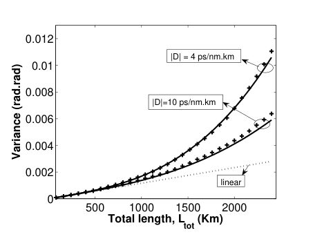
<figcaption class="paper-figure-caption"><b>Fig 1.</b> Fig. 1. Phase variance dependence on the total length of the transmission line. Peak launch power = 2 mW. Solid line and + marks show the analytical and numerical simulation results, respectively. The dotted line shows the analytical results when fiber nonlinearity is absent, which is independent of dispersion. DOF = 14 is used for analytical results.</figcaption>
</figure>
<figure class="paper-figure-card">
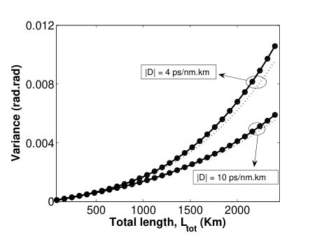
<figcaption class="paper-figure-caption"><b>Fig 2.</b> Fig. 2. Dependence of variance on the DOFs with a matched filter. Dotted line, circles, +, and solid line show the analytical results with DOF 2, 6, 10, and 14, respectively. Other parameters are same as that of Fig. 1.</figcaption>
</figure>
<figure class="paper-figure-card">
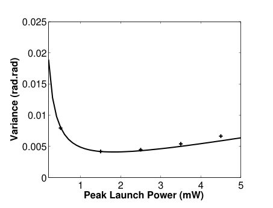
<figcaption class="paper-figure-caption"><b>Fig 3.</b> Fig. 4. Dependence of phase variance on peak launch power. Matched filter is used. Solid and + show the analytical and numerical simulation results, respectively. Ltot = 2400 km and |D| = 4 ps/nm · km. DOF = 14 is used for analytical results.</figcaption>
</figure>
<figure class="paper-figure-card">
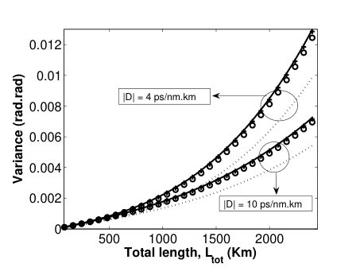
<figcaption class="paper-figure-caption"><b>Fig 4.</b> Fig. 3. Dependence of variance on the DOFs with a Gaussian filter with f0 = 42.38 GHz. Dotted line, circles, +, and solid line show the analytical results with DOF 2, 6, 10, and 14, respectively. Other parameters are same as that of Fig. 1.</figcaption>
</figure>
<figure class="paper-figure-card">
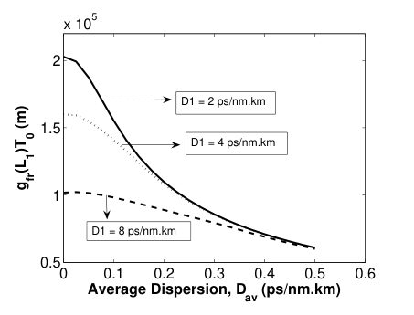
<figcaption class="paper-figure-caption"><b>Fig 5.</b> Fig. 5. Dependence of gfr(L1) on the average dispersion, Dav and the local dispersion, D1. Matched filter is used. Total transmission distance, Ltr (excluding pre- and post-compensation fiber) = 2400 km, peak power = 2 mW, location of the first inline amplifier, L1 = 0.5DavLtr/Dpre and DOF = 14.</figcaption>
</figure>

**Summary.** This paper develops advanced analytical techniques to quantify nonlinear phase noise in high-speed optical communication links. By expanding the noise field using Gauss-Hermite functions up to arbitrary degrees of freedom, it provides a more accurate model than previous works. The results yield an optimum launch power that minimizes overall signal degradation due to both linear and nonlinear effects.

**Why it may be interesting.** While focused on classical communication systems, the mathematical framework—using orthogonal function expansions (Gauss-Hermite) to model complex noise accumulation in a nonlinear wave equation—shares conceptual parallels with analyzing quantum noise or decoherence channels in open quantum systems.

Detailed structure

**Main problem.** The paper analyzes nonlinear phase noise accumulation in coherent fiber-optic communication systems utilizing Phase Shift Keying (PSK). It aims to provide accurate analytical expressions for the phase variance by accounting for higher-order noise modes.

**Main result.** The inclusion of arbitrary degrees of freedom (DOFs) significantly improves the accuracy over previous two-DOF models, and an optimum launch power can be derived by balancing linear and nonlinear noise contributions.

**Method.** The analysis uses a perturbation expansion approach on the Nonlinear Schrödinger equation, representing the noise field using Gauss-Hermite functions as an orthogonal basis set.

**Model / system.** The system is modeled as an amplified optical link governed by the NLS equation, where noise arises from Amplified Spontaneous Emission (ASE) at discrete amplifier locations. The analysis extends beyond simple two-DOF approximations to arbitrary DOFs.

**Key observables.** Phase variance ($\langle\delta\phi^2
angle$), optimum launch power ($P_{opt}$), and Bit Error Rate (BER).

**Important parameters / regimes.** Dispersion profile ($eta_2(z)$), nonlinear coefficient ($\gamma$), number of amplifiers ($N_a$), and the number of degrees of freedom (DOFs).

**Assumptions / limitations.** The analysis relies on a pseudo-linear regime where nonlinearity is treated as a first-order perturbation, and it assumes signal power is much greater than mean ASE power.

**Figures summary.** Figures illustrate the dependence of phase variance on the number of DOFs (matched vs. Gaussian filters) and show how variance changes with total length or launch power for specific dispersion parameters.

**Paper structure.** The paper develops analytical expressions by expanding the noise field using Gauss-Hermite functions, deriving formulas for the phase variance considering arbitrary DOFs, and finally determining the optimum launch power that minimizes this accumulated noise.

Abstract

Analytical expressions for the phase variance in a nonlinear fiber optic system based on phase-shift keying are developed. The Gauss-Hermite functions are used as the orthogonal basis to represent the noise field. Number of degrees of freedom (DOF) to accurately model the phase variance is estimated. The amplifier noise excites higher order Gauss-Hermite noise modes and the nonlinear mixing of a signal pulse and higher order Gauss-Hermite noise mode leads to new noise fields which enhance the nonlinear phase noise. The higher order noise modes propagate linearly and enhance the linear phase noise if the matched filter is not used at the receiver. Analytical expression for the optimum launch power is developed taking into account the linear and nonlinear phase noise.

[↑ back to top](#top)

### [High-speed time-series prediction using compact memristor circuits with adjustable dynamics](http://arxiv.org/abs/2608.04856v1)

**Authors:** Dániel Molnár, János Volk, Tímea Nóra Török, Zoltán Balogh, Nadia Jimenez Olalla, Miklós Csontos, Juerg Leuthold, András Halbritter  
**Type:** experiment · **Category:** disordered systems and neural networks · **PDF:** <https://arxiv.org/pdf/2608.04856v1>  
**Analysis basis:** full PDF text, analyzed in chunks
**Topic relevance:** `driven-dissipative phase transition` **2/5** · `analog quantum simulation` **1/5** · `correlated / nonlocal dissipation` **1/5** · `methods for driven-dissipative` **1/5** · `non-equilibrium dynamics` **1/5** · `non-equilibrium universality` **1/5** · `spintronics-quantum-optics interface` **1/5**

↔ Scroll figures horizontally

<figure class="paper-figure-card">
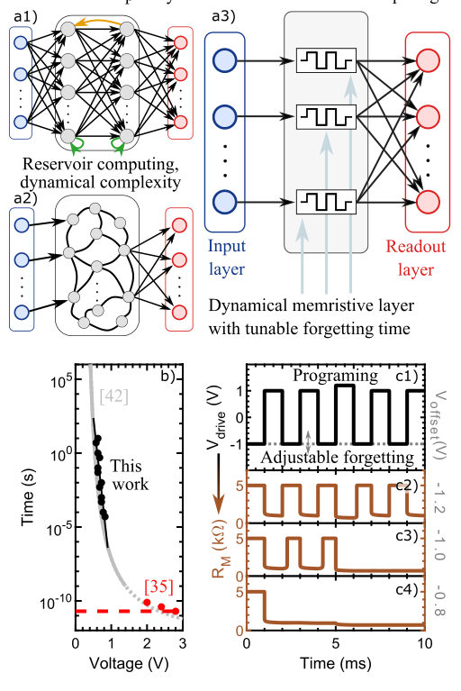
<figcaption class="paper-figure-caption"><b>Fig 1.</b> FIG. 1: The concept of our work. Instead of using complex neural networks with feedback connections (a1), or black-box-like dynamical reservoir computing layers (a2), we apply a compact memristive dynamical reservoir computing layer (a3) to perform time-series prediction tasks. A key feature of our approach is that we can tune the forgetting times of individual memristive chan- nels independently (gray arrows in a3). (b) The tunable forgetting times are enabled by the exponential dependence of the switching time on the applied voltage. The gray curve reproduces a trendline from the literature for Ta2O5 memristors,[42] spanning over 15 or- ders of magnitude in the time-domain, and further...</figcaption>
</figure>
<figure class="paper-figure-card">
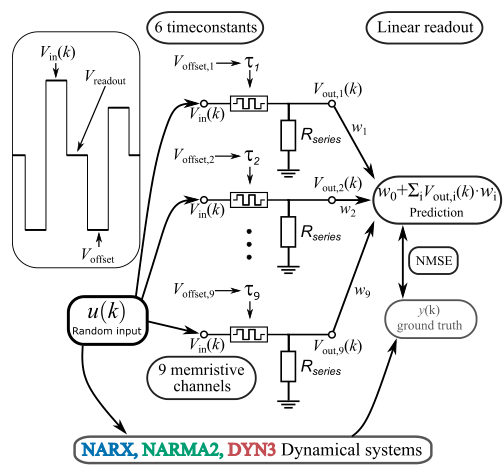
<figcaption class="paper-figure-caption"><b>Fig 2.</b> FIG. 2: Illustration of the time series prediction scheme. Three mathematical dynamical systems (NARX, NARMA2, DYN3) are tested as benchmark tasks, all producing an y(k) out- put stream in response to a random u(k) input. This random input stream is encoded in the amplitudes of the positive programming pulses (Vin,i(k)), which are fed to the inputs of the various mem- ristive channels, each consisting of one memristor and one resistor in series. Forgetting is achieved by negative offset pulses (Voffset,i), which are independent of k, but are different for the different chan- nels (i). The dynamical response of the of the memristors is read out as the Vout,i(k) voltage on the series...</figcaption>
</figure>
<figure class="paper-figure-card">
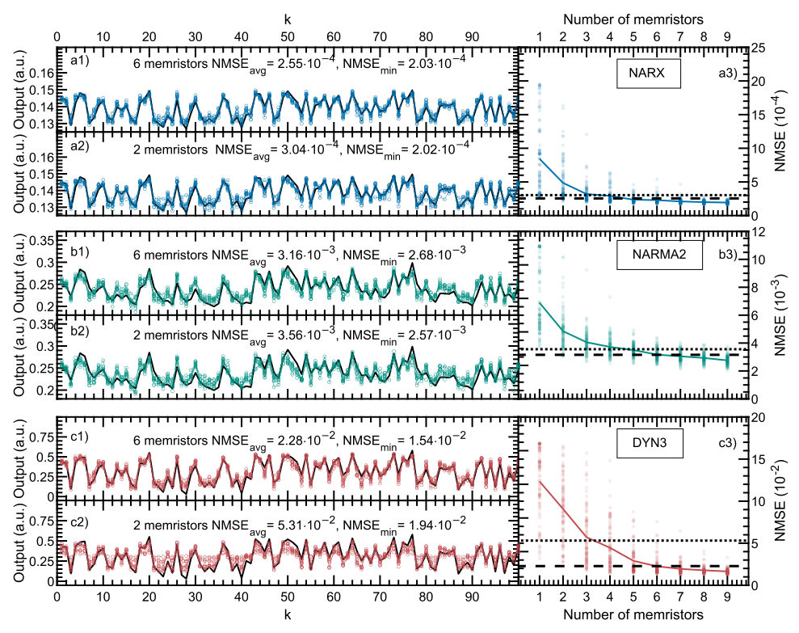
<figcaption class="paper-figure-caption"><b>Fig 3.</b> FIG. 3: The results of the time series prediction tasks using the NARX (a1,a2,a3), the NARMA2 (b1,b2,b3) and the DYN3 (c1,c2,c3) dynamical systems. In Approach I (a1,b1,c1) 6 memristive channels are applied, each using a different (but fixed) negative offset voltage for forgetting (-1 V, -1.1 V, -1.2 V, -1.3 V -1.4 V, -1.5 V). We assign different memristors, selected at random, to the six possible offset voltage levels listed above. The colored curves show the predicted output values for 10 different random selections of the 6 memristors, compared with the ground truth (y(k), black lines). The average and minimum NMSE values are shown above the curves. In this approach solely the wi weights...</figcaption>
</figure>
<figure class="paper-figure-card">
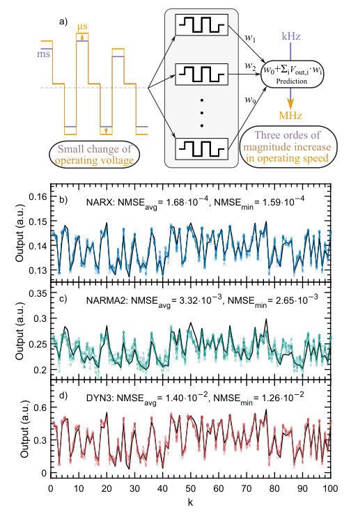
<figcaption class="paper-figure-caption"><b>Fig 4.</b> FIG. 4: Memristive time series prediction at MHz clock frequency. (a) The scheme of the frequency-speed-up. Whereas in Fig. 3 the programming, offset and readout pulses were 1 ms long (see the purple input stream on the left side), here 1 µs long pulse segments are applied (orange input stream on the left side). To speed up the programming and forgetting accordingly, the amplitudes of the programming and offset pulses are enhanced (see the difference between the orange and purple input streams). (b,c,d) The results of the time series prediction for the NARX (b), NARMA2 (c) and DYN3 (d) tasks using Approach II and 1 µs long driving pulse segments. The colored curves show the predicted out-...</figcaption>
</figure>

**Summary.** This work demonstrates using $	ext{Ta}_2	ext{O}_5$ memristor circuits as compact dynamic reservoirs for high-speed time-series prediction. By exploiting the voltage-dependent switching speed, the system achieves tunable forgetting dynamics and can operate across frequencies from kHz to MHz. This shows that memristors are excellent candidates for next-generation neuromorphic hardware capable of analyzing fast temporal signals.

**Why it may be interesting.** While focused on classical signal processing, the underlying physics involves non-linear device dynamics (memristors) whose state evolution is governed by external electrical fields, touching upon concepts relevant to open quantum systems modeling or complex memory elements in quantum computation architectures.

Detailed structure

**Main problem.** The research addresses high-speed time-series prediction by utilizing compact memristor circuits that exhibit adjustable dynamic behavior.

**Main result.** The configurable forgetting dynamics of the memristors enable high prediction accuracy using a small number of channels, and the operating frequency can be tuned across many orders of magnitude (kHz to MHz).

**Method.** Time-series prediction is benchmarked against complex dynamical systems (NARX, NARMA2, DYN3) by encoding inputs with positive pulses and controlling memory decay via adjustable negative offset voltages.

**Model / system.** The physical platform consists of Ta2O5 nonvolatile memristors configured as dynamic reservoir computing layers. The key mechanism exploited is the strongly voltage-dependent switching speed, which allows for tunable programming and forgetting times.

**Key observables.** Normalized Mean Squared Error (NMSE) used to quantify prediction accuracy; operating frequency ($	ext{kHz}$ to $	ext{MHz}$).

**Important parameters / regimes.** The number of memristive channels ($N$), the negative offset voltage ($	ext{V}_{	ext{offset}}$), and the input/readout voltages.

**Assumptions / limitations.** The approach relies on the 'time-voltage dilemma' inherent to memristors for achieving tunable forgetting dynamics.

**Figures summary.** Figures illustrate the concept of using memristors as dynamic reservoirs, detailing the pulsing scheme (programming vs. forgetting) and comparing prediction performance across three benchmark dynamical systems (NARX, NARMA2, DYN3).

**Paper structure.** The paper introduces the use of memristors for reservoir computing, details the physical mechanism enabling tunable dynamics via voltage pulses, benchmarks the system's performance on increasingly complex time-series tasks, and concludes by demonstrating high accuracy across wide frequency ranges.

Abstract

Ta$_2$O$_5$ nonvolatile memristors are used as compact, traceable, and well-controllable dynamic reservoir computing layers to perform time-series prediction tasks. The strongly voltage-dependent switching speed is utilized for information processing. It enables the configuration of tailorable programming and forgetting times in response to the positive and negative driving voltage pulses. Benchmarking this framework on time-series prediction problems reveals that the configurable forgetting dynamics enables a high prediction accuracy using a rather small number of memristive input channels. The training is based either on optimizing the output layer using linear regression with fixed forgetting times, or on optimizing the forgetting times as well. In the first case, six memristive channels, while in the second, only two memristive channels are used to demonstrate excellent prediction accuracy for the benchmark tasks. This scheme allows for the tunability of the operating frequency over many orders of magnitude: by adjusting the input voltage levels, the information processing speed of the same memristive dynamic layer can be increased from the kHz to the MHz range while maintaining excellent prediction accuracy. These findings demonstrate the merits of memristor based dynamic networks in the analysis, prediction and recovery of fast temporal signals, approaching telecommunication data rates.

[↑ back to top](#top)

### [Magnetic Field Reorganization of Electronic States in Moiré Bilayer Graphene](http://arxiv.org/abs/2608.04269v1)

**Authors:** Milan Sharma Mandigo-Stoba, William Wang, Jackson Kuklin, Jack Lichterman, Kenji Watanabe, Takashi Taniguchi, Qianhui Shi  
**Type:** both · **Category:** other · **PDF:** <https://arxiv.org/pdf/2608.04269v1>  
**Analysis basis:** full PDF text, analyzed in chunks
**Topic relevance:** `driven-dissipative phase transition` **2/5** · `non-equilibrium dynamics` **2/5** · `Keldysh / 2PI / non-Gaussian methods` **1/5** · `analog quantum simulation` **1/5** · `spintronics-quantum-optics interface` **1/5**

↔ Scroll figures horizontally

<figure class="paper-figure-card">
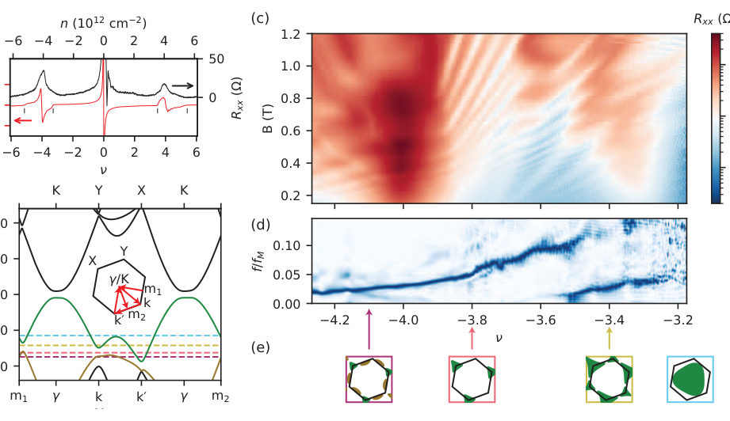
<figcaption class="paper-figure-caption"><b>Fig 1.</b> FIG. 1. (a) Left (right), in red (black), is antisymmetrized Hall (longitudinal) resistance at B = ±0.3 T (0 T) and D = 0 V nm−1. VHSs are marked by short black lines. (b) Calculated low energy band structure of moir´e BLG/hBN at θ = 0.864◦[20]. Inset: path through moir´e BZ, with fermi energies in (e) indicated by dashed lines. (c) Low field longitudinal resistance map around ν = −4 at D = −0.20 V nm−1. (d) Fourier transform of dRxx(1/B)/dB below 0.6 T, f/fM = f/(φ0nM). (e) FSs at ν = −4.1, −3.8, −3.4 and −2.5. FPs from the first (second) moir´e valence band are shown in green (dark yellow).</figcaption>
</figure>
<figure class="paper-figure-card">
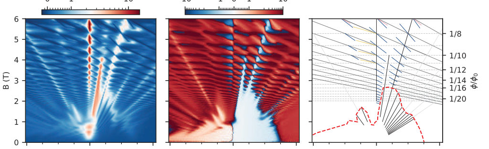
<figcaption class="paper-figure-caption"><b>Fig 2.</b> FIG. 2. (a) Symmetrized MR at n = −4.097 × 1012 cm−2 in black and background subtracted MR in red. Insets: schematic of low field orbits and high field MB orbits, with electron (hole) pockets in green (dark yellow), and MB orbits in yellow. (b) Symmetrized MR at n = −3.60 × 1012 cm−2. Insets: schematic of low field FS and high field valley-resolved FSs. (c) Symmetrized longitudinal resistance and (d) antisymmetrized Hall density map with D = −0.10 V nm−1, measured at 1.5 K. (e) Wannier diagram with moir´e LL gaps in black, their extension into the MB/magnetic Lifshitz transition regime in light gray, bilayer graphene LL gaps in dark gray and symmetry-broken Hofstadter states emerging from ν =...</figcaption>
</figure>
<figure class="paper-figure-card">
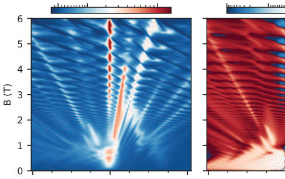
<figcaption class="paper-figure-caption"><b>Fig 3.</b> Figure 2 (b) shows MR versus magnetic field at ν = −3.52. Again, below 1 T low frequency QOs are ob- served, indicating a FP size of 0.124 nM, while above 1 T, high frequency QOs dominate, indicating a FP size of 0.88 nM. Near the VHS, intraband MB can also occur between the X and Y electron pockets, but the tunneling probability P ≤1/2, with equality at the VHS [9, 26]. Instead, the dominant effect is a valley-selective mag- netic Lifshitz transition, as OMMs with opposite sign in K and K′ split the VHS. At moderate fields, K and K′ host carriers of different type, causing nH to change and high frequency QOs to dominate. Indeed, transport</figcaption>
</figure>
<figure class="paper-figure-card">
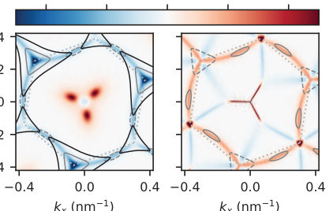
<figcaption class="paper-figure-caption"><b>Fig 4.</b> FIG. 3. Left (right) shows Berry curvature in the first (sec- ond) moir´e valence band in the K valley [20]. FSs at ν = −3.3 (−3.95) overlaid in black (gray). Solid lines indicate FPs in that band, dashed lines indicate FPs in the other band.</figcaption>
</figure>
<figure class="paper-figure-card">
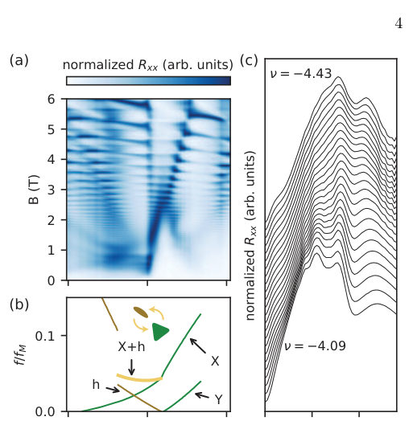
<figcaption class="paper-figure-caption"><b>Fig 5.</b> FIG. 4. (a) Symmetrized longitudinal resistance map around ν = −4 with D = −0.10 V nm−1, measured at 18 K. At each density, Rxx is divided by the maximum value of Rxx, to en- hance visibility of low field QOs. (b) Calculated QO frequen- cies for the various FPs. Inset shows the X electron and lobe hole pockets that make the X+h frequency. (c) Symmetrized longitudinal resistance line cuts for ν ∈[−4.08, −4.43], aver- aged over δν = 0.01 and offset for clarity. At each density, Rxx is divided by the maximum value of Rxx for B &lt; 1 T, to enhance visibility of low field QOs.</figcaption>
</figure>

**Summary.** This paper reveals that magnetic fields profoundly reorganize electronic states in moiré bilayer graphene by inducing phenomena like magnetic breakdown and Lifshitz transitions. The evolution is highly dependent on the valley index, offering a unified picture of how modest fields drive the system from simple semiclassical behavior toward complex Hofstadter physics.

**Why it may be interesting.** While focused on condensed matter transport, the study of field-induced topological changes (like Berry curvature hotspots driving MB) provides a rich example of how external fields can fundamentally alter quantum band topology, which has parallels in understanding engineered quantum states.

Detailed structure

**Main problem.** The study investigates how applying a magnetic field reorganizes the electronic states within moiré bilayer graphene, tracing the system's evolution from semiclassical transport toward the quantum Hofstadter regime.

**Main result.** Magnetic fields induce rich, valley-contrasting changes in orbital networks, manifesting as magnetic breakdown and Lifshitz transitions. Furthermore, interpocket scattering can produce persistent resistance oscillations even when conventional quantum oscillations are thermally washed out.

**Method.** The research combines transport measurements (measuring magnetoresistance and Hall density) with theoretical analysis of semiclassical orbits influenced by moiré potentials and Berry curvature effects.

**Model / system.** The physical platform is a moiré bilayer graphene/hBN heterostructure. The electronic structure is governed by the interplay between the underlying band structure, magnetic field quantization (leading to orbital magnetic moments), and moiré superlattice effects.

**Key observables.** Quantum oscillation frequencies, Hall density ($	ext{nH}$), longitudinal resistance ($R_{xx}$), and signatures of magnetic breakdown/Lifshitz transitions.

**Important parameters / regimes.** Magnetic field strength (1 T to 2 T), carrier density range, temperature, and the moiré filling factor ($
u$).

**Assumptions / limitations.** The analysis assumes that observed quantum oscillations can be decomposed into contributions from different Fermi pockets (electron vs. hole) and that magnetic breakdown/Lifshitz transitions are key mechanisms governing state reorganization.

**Figures summary.** Figures illustrate the evolution of transport properties ($R_{xx}$ and $R_{xy}$) across varying magnetic fields and carrier densities, detailing signatures of magnetic breakdown in K and K' valleys and mapping out low-field quantum oscillations from different pocket populations.

**Paper structure.** The paper progresses by first establishing the system's response at low fields, then detailing how moderate fields induce distinct valley-dependent transitions (MB/Lifshitz), and finally presenting evidence for interpocket scattering effects persisting to higher temperatures.

Abstract

Magnetic fields are widely used to diagnose quantum phases in two-dimensional systems through quantum oscillations or by tuning spin and valley polarizations, but magnetic fields can also reshape the underlying electronic structure. Here, using a bilayer graphene/hBN moiré system, we reveal a rich magnetic field induced evolution of the semiclassical orbit network, encompassing Lifshitz transitions, magnetic breakdown, and scattering between coexisting electron and hole pockets. At magnetic fields of 1 T to 2 T, quantum oscillation frequencies and the Hall density change markedly over a broad carrier density range, signaling magnetic breakdown and magnetic Lifshitz transitions. This evolution is valley contrasting: Berry curvature hot spots near the breakdown junctions enhance magnetic breakdown in the K valley while suppressing it in the K$^\prime$ valley, whereas valley-antisymmetric orbital magnetic moments split the corresponding Lifshitz transitions. The resulting valley-selective trajectories manifest at higher fields as valley-symmetry-breaking Hofstadter gaps. At elevated temperatures and low magnetic fields, scattering between coexisting electron and hole pockets produces nearly density-independent resistance oscillations whose frequency tracks the sum of their Fermi surface areas, persisting after conventional Onsager oscillations are thermally washed out. Our results provide a unified picture of how modest magnetic fields reorganize moiré electronic states as the system evolves from semiclassical transport toward the Hofstadter regime.

[↑ back to top](#top)

### [Structural and dynamical behavior of methane-water systems under nanoconfinement](http://arxiv.org/abs/2608.04637v1)

**Authors:** José Torres-Arenas, Ángel M. Fernández-Fernández, Martín Pérez-Rodríguez, Manuel M. Piñeiro  
**Type:** theory · **Category:** statistical mechanics · **PDF:** <https://arxiv.org/pdf/2608.04637v1>  
**Analysis basis:** full PDF text, analyzed in chunks
**Topic relevance:** `non-equilibrium dynamics` **2/5** · `Frenkel-Kontorova` **1/5** · `analog quantum simulation` **1/5** · `driven-dissipative phase transition` **1/5** · `methods for driven-dissipative` **1/5** · `non-equilibrium universality` **1/5**

↔ Scroll figures horizontally

<figure class="paper-figure-card">
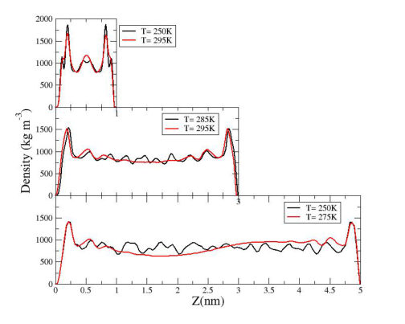
<figcaption class="paper-figure-caption"><b>Fig 1.</b> FIG. 1. Density profiles of water across the pore for representative pore sizes (1, 3, and 5 nm). Each panel shows the density variation along the confinement direction for two selected temperatures chosen to contrast regimes with and without pronounced structural ordering. In the 1 nm pore, where no three-dimensional ordering is observed at any temperature, the two most separated temperatures are shown. The profiles highlight the evolution of interfacial layering with pore size and temperature.</figcaption>
</figure>
<figure class="paper-figure-card">
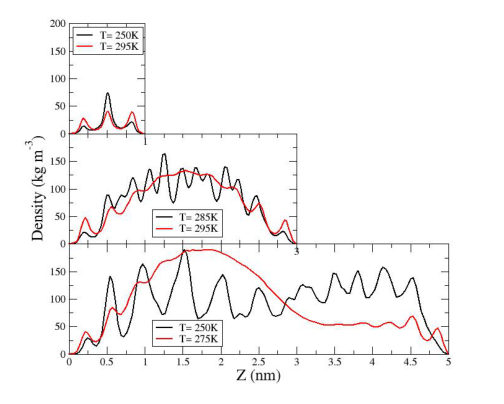
<figcaption class="paper-figure-caption"><b>Fig 2.</b> FIG. 2. Density profiles of methane across the pore for representative pore sizes (1, 3, and 5 nm). Each panel shows the density variation along the confinement direction for two selected temperatures chosen to contrast different structural regimes of the surrounding water. In the 1 nm pore, where no three-dimensional ordering is observed at any temperature, the two most separated temperatures are shown. The profiles illustrate how confinement-induced structuring of the host water affects methane interfacial localization and layering.</figcaption>
</figure>
<figure class="paper-figure-card">

<figcaption class="paper-figure-caption"><b>Fig 3.</b> Figure 1 shows the water density profiles across the pore for representative pore sizes of 1, 3, and 5 nm, highlight- ing the evolution of interfacial layering under confinement. In the 1 nm pore (top panel), the density displays two sym- metric interfacial maxima near the walls and a weaker cen-</figcaption>
</figure>
<figure class="paper-figure-card">
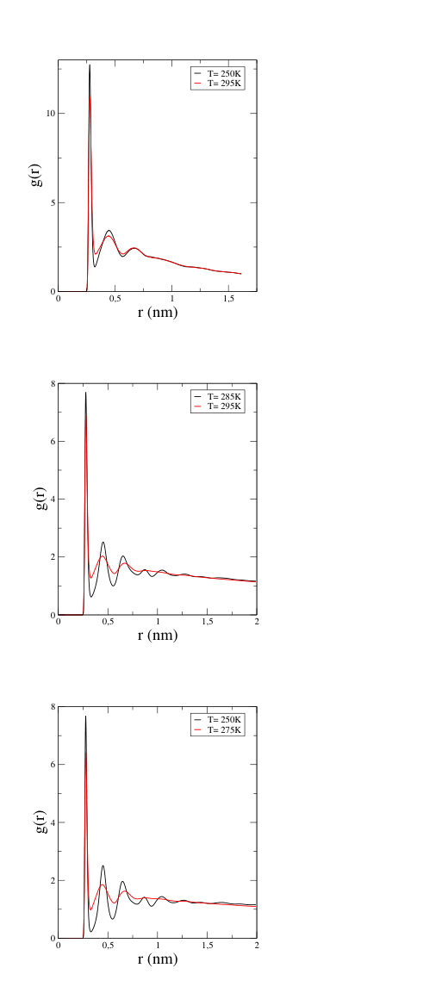
<figcaption class="paper-figure-caption"><b>Fig 4.</b> FIG. 3. Water–water radial distribution functions (RDFs) for repre- sentative pore sizes of 1 nm (top), 3 nm (middle), and 5 nm (bot- tom). Each panel compares two temperatures chosen to contrast structurally ordered and disordered regimes. For 1 nm, where no solid-like ordering is observed, the most extreme temperatures (250 and 295 K) are shown. The RDFs highlight the effect of confinement and temperature on local water structure.</figcaption>
</figure>
<figure class="paper-figure-card">
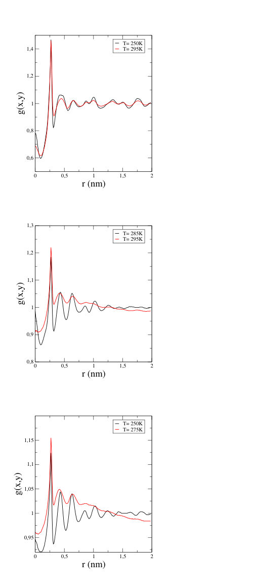
<figcaption class="paper-figure-caption"><b>Fig 5.</b> FIG. 4. Water-water radial distribution functions projected onto the xy plane for pore sizes of 1 nm (top), 3 nm (middle), and 5 nm (bot- tom). Two temperatures are shown in each panel to contrast ordered and disordered regimes. The projected RDFs highlight the lateral structural correlations induced by confinement within the pore.</figcaption>
</figure>

**Summary.** This work uses molecular dynamics simulations to map out how methane and water structure and move when squeezed into nanopores. The key finding is that structural organization doesn't simply increase or decrease with pore size; instead, a competition between local ordering and the inability to form full 3D structures defines critical length scales. This has implications for understanding gas hydrate stability in porous media.

**Why it may be interesting.** While focused on liquid-state physics, the concept of confinement-induced dimensional reduction, frustrated ordering, and identifying critical length scales where multiple physical behaviors peak is highly relevant for understanding quantum confinement effects in nanoscale materials or engineered quantum systems.

Detailed structure

**Main problem.** The study investigates how structural ordering and dynamic behavior of methane-water mixtures are altered when confined within nanopores.

**Main result.** Confinement leads to a non-monotonic competition between local structuring (maximizing at intermediate pores) and the suppression of extended 3D correlations, defining a characteristic length scale for maximum heterogeneity.

**Method.** Molecular dynamics simulations were employed using all-atom force fields to track structural metrics and transport properties across varying pore widths.

**Model / system.** The system models methane ($	ext{CH}_4$) and water ($	ext{H}_2	ext{O}$) confined within planar silica nanopores, simulating conditions relevant to hydrate formation.

**Key observables.** Radial distribution functions (RDFs), local order parameters ($F_{3}, F_{4}$), parallel and perpendicular diffusion coefficients ($D_{\parallel}, D_{\perp}$), and anomalous diffusion exponents ($\alpha$).

**Important parameters / regimes.** Pore widths ranging from 1 to 5 nm, temperatures between 250 K and 295 K.

**Assumptions / limitations.** The simulation conditions are assumed to fall within the methane hydrate stability zone for the force field used.

**Figures summary.** Figures show density profiles of water/methane across pore sizes; RDFs illustrate local structure; plots detail non-monotonic changes in diffusion coefficients and anomalous exponents ($\alpha$) with pore size.

**Paper structure.** The paper systematically analyzes structural evolution (using order parameters and RDFs) followed by a detailed investigation of anisotropic transport properties, correlating dynamical decoupling ($\Delta\alpha$) directly to the observed structural frustration regimes.

Abstract

We investigate the structural and dynamical behavior of methane water systems under nanoconfinement using molecular dynamics simulations across pore widths from 1 to 5 nm. Structural analysis reveals a strong and nonmonotonic dependence on confinement: while tetrahedral ordering partially recovers as confinement is reduced, cubic like order associated with clathrate precursors is maximized at intermediate pore sizes. Radial distribution functions show that three dimensional correlations are suppressed under strong confinement, whereas lateral ordering persists, indicating a reduction in the effective dimensionality of structural organization. Transport properties reflect the same structural competition. Parallel diffusion is nonmonotonic with pore size, while perpendicular motion is subdiffusive due to confinement induced trapping and heterogeneity. Methane exhibits stronger subdiffusion and remains dynamically coupled to the water matrix. A characteristic confinement length scale emerges at which structural ordering, dynamical heterogeneity, and solvent solute decoupling are simultaneously maximized. At strong confinement, three dimensional correlations are suppressed, leading to dimensional reduction, frustrated ordering, and inhibited nucleation.

[↑ back to top](#top)

### [CheMLFlow: An Open-Source Platform for Cheminformatics and Materials Informatics Applications](http://arxiv.org/abs/2608.04942v1)

**Authors:** Brendan Smith, Susana Lopez-Moreno, Eric Dolores-Cuenca, Sangil Kim, Jose L. Mendoza-Cortes, Nijamudheen Abdulrahiman  
**Type:** theory · **Category:** other · **PDF:** <https://arxiv.org/pdf/2608.04942v1>  
**Analysis basis:** full PDF text, analyzed in chunks
**Topic relevance:** `methods for driven-dissipative` **1/5**

↔ Scroll figures horizontally

<figure class="paper-figure-card">
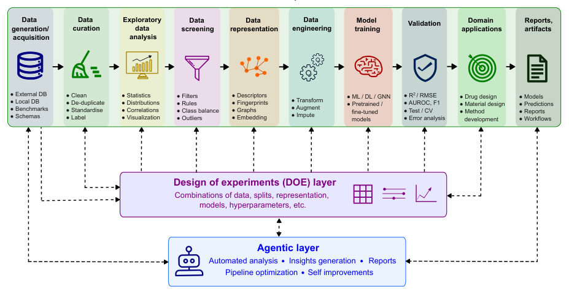
<figcaption class="paper-figure-caption"><b>Fig 1.</b> Figure 1. A schematic demonstrating three layers of CheMLFlow to construct workflows. (i) A core workflow</figcaption>
</figure>
<figure class="paper-figure-card">
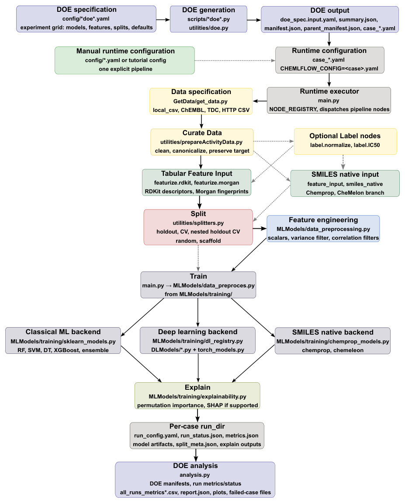
<figcaption class="paper-figure-caption"><b>Fig 2.</b> Figure 2. CheMLFlow tree structure presenting definitions of DOE guided high throughput runs of model</figcaption>
</figure>
<figure class="paper-figure-card">
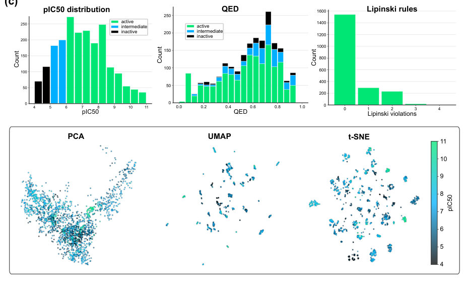
<figcaption class="paper-figure-caption"><b>Fig 3.</b> Figure 3. (a) Flowchart of a typical end-to-end workflow to train and predict bioactivity values</figcaption>
</figure>
<figure class="paper-figure-card">
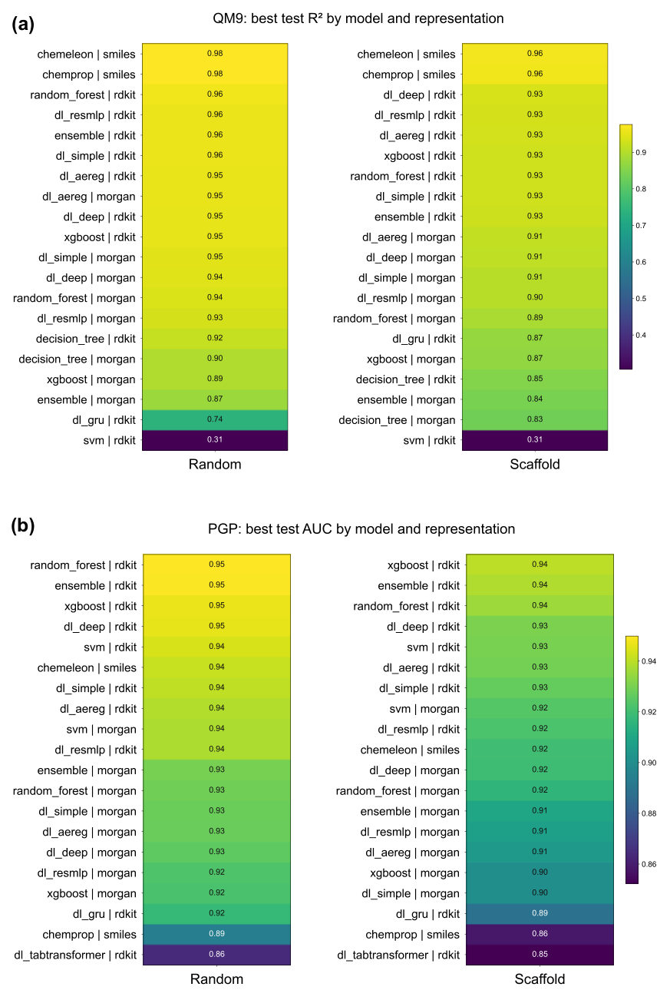
<figcaption class="paper-figure-caption"><b>Fig 4.</b> Figure 4. Performance of model combinations in predicting the (a) HOMO-LUMO gaps (regression task) and</figcaption>
</figure>
<figure class="paper-figure-card">
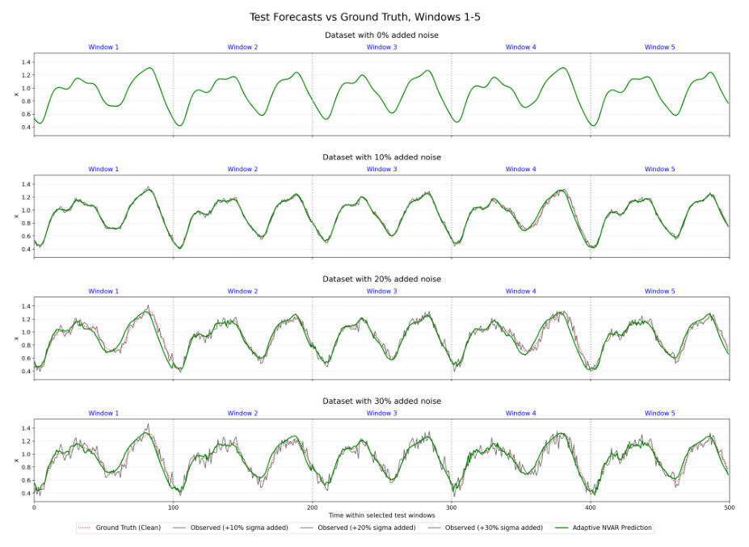
<figcaption class="paper-figure-caption"><b>Fig 5.</b> Figure 5. (a) Mackey-Glass dataset with chaotic parameter settings and different levels of additive Gaussian</figcaption>
</figure>

**Summary.** This paper introduces CheMLFlow, an open-source platform designed to solve the reproducibility crisis in scientific machine learning. It allows researchers to build end-to-end, automated pipelines for tasks like predicting material properties or bioactivity using molecular data. By standardizing workflows and supporting agentic experimentation, it significantly reduces manual orchestration overhead.

**Why it may be interesting.** While not focused on fundamental quantum physics, the platform's emphasis on structured, reproducible pipelines and agentic workflows is highly relevant for automating complex simulations or data analysis involving quantum chemistry calculations.

Detailed structure

**Main problem.** The core problem addressed is the bottleneck in scientific machine learning development, where researchers struggle to assemble reproducible, end-to-end pipelines for complex tasks.

**Main result.** CheMLFlow provides an open-source, modular platform that standardizes and automates the entire ML workflow—from data acquisition to final reporting—for cheminformatics and materials informatics applications.

**Method.** The authors introduce CheMLFlow, a configuration-driven framework using YAML/JSON files to orchestrate sequential or parallel computational nodes (e.g., featurization, training, validation).

**Model / system.** The platform is designed for molecular and material systems, enabling high-throughput screening and benchmarking across various ML models (e.g., Random Forest, Deep Learning) applied to tasks like bioactivity prediction.

**Key observables.** Model performance metrics ($	ext{R}^2$, $	ext{RMSE}$, $	ext{AUROC}$), standardized run artifacts, SHAP explanations, and structured reports.

**Important parameters / regimes.** The platform supports varying parameters through a Design of Experiments (DOE) layer, allowing systematic testing of different representations or model settings.

**Assumptions / limitations.** The primary assumption is that standardizing the workflow orchestration process will significantly reduce overhead and improve reproducibility across diverse scientific domains.

**Figures summary.** Figure 1 schematically shows the three layers of CheMLFlow (Core, DOE, Agentic). Figure 2 illustrates the YAML/JSON configuration structure. Figure 3 maps a typical bioactivity prediction workflow flowchart.

**Paper structure.** The paper describes the system architecture by detailing its modular components: data handling, feature engineering nodes, model backends, and the overarching control flow managed by the run configuration file, culminating in benchmarking results.

Abstract

CheMLFlow is an open-source platform for building and executing end-to-end, high-throughput, and agentic workflows for scientific and technological applications. CheMLFlow targets a common bottleneck in scientific machine learning development, where researchers often need to assemble data acquisition, curation, representation, model training, validation, screening, interpretation, and reporting into a reproducible pipeline, even when their primary research contribution concerns only one stage. CheMLFlow provides modular workflow components, ready-to-run reference pipelines, standardized artifacts, and evaluation outputs that reduce orchestration overhead and support benchmarking across methods and datasets. The platform is designed to be extensible, reproducible, and automation friendly, with pluggable representations and models, deterministic splits, explicit run artifacts, batch execution, and report generation. As scientific software increasingly moves toward agent assisted experimentation, CheMLFlow's configuration driven workflows and structured outputs also provide a practical interface for coding agents to help users construct experiments, inspect results, and summarize findings under human supervision. This article describes the system architecture, core workflows, and benchmarks that reach literature performance for quantum mechanical, physicochemical and bioactivity property prediction, and use cases involving time series datasets demonstrating applications beyond molecular chemistry datasets.

[↑ back to top](#top)

### Other secondary papers (2)

Show other secondary papers

### [In search of novel ductile superconductors](http://arxiv.org/abs/2608.04789v1)

**Authors:** Yiming Zhang, Samuel Poncé  
**Type:** theory · **Category:** other · **PDF:** <https://arxiv.org/pdf/2608.04789v1>  
**Analysis basis:** full PDF text, analyzed in chunks

↔ Scroll figures horizontally

<figure class="paper-figure-card">
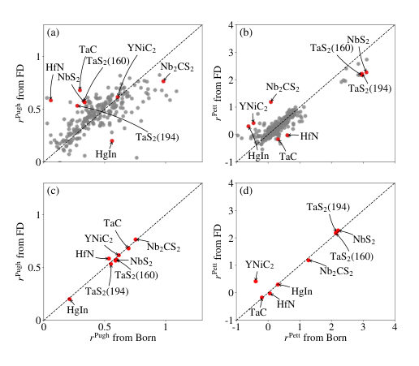
<figcaption class="paper-figure-caption"><b>Fig 1.</b> Figure 1: Comparison of (a) rPugh= G</figcaption>
</figure>
<figure class="paper-figure-card">
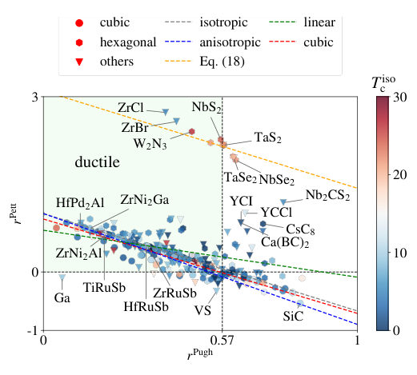
<figcaption class="paper-figure-caption"><b>Fig 2.</b> Figure 2: Correlation between rPugh and rPett. Ductile materials have rPugh &lt; 0.57 and rPett &gt; 0. The isotropic Migdal-Eliashberg superconductivity T iso c (K) is shown with color and the crystal structure family with symbols.</figcaption>
</figure>
<figure class="paper-figure-card">
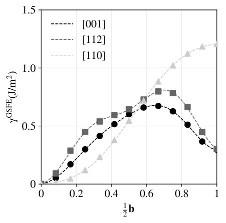
<figcaption class="paper-figure-caption"><b>Fig 3.</b> Figure 3: Generalized stacking fault energy γGSFE for the L21-type full- Heusler material HfPd2Al on the (1¯10) plane. The slip directions [110], [112], [001] are compared.</figcaption>
</figure>

**Summary.** This work systematically screens potential superconducting materials by calculating their fundamental mechanical properties using first-principles DFT. By developing quantitative indicators based on elastic constants and stacking fault energies, the authors successfully pinpointed several new compounds that are predicted to be both highly superconducting and mechanically ductile.

**Why it may be interesting.** While focused on condensed matter mechanics, the rigorous application of first-principles methods to link electronic/superconducting properties ($T_c$) with macroscopic mechanical stability (ductility) represents a powerful multi-physics approach relevant to designing novel quantum materials.

Detailed structure

**Main problem.** To assess the practical viability of novel superconducting materials by correlating their high critical temperatures ($T_c$) with their mechanical properties, specifically ductility.

**Main result.** The study identified several new candidates ($	ext{HfPd}_2	ext{Al}$, $	ext{TiRuSb}$, and $	ext{ZrNi}_2	ext{Ga}$) that simultaneously exhibit high $T_c$ and predicted structural ductility.

**Method.** First-principles calculations using DFT were employed in a high-throughput screening workflow to compute elastic constants, stacking fault energies, and various mechanical ratios.

**Model / system.** The research focuses on phonon-mediated superconductors selected from an experimentally synthesized database. The analysis involves modeling the bulk mechanical response (elastic tensors) and plastic deformation behavior of crystalline solids.

**Key observables.** Pugh’s ratio ($r_{	ext{Pugh}}$), Pettifor’s ratio ($r_{	ext{Pett}}$), Rice’s ratio, superconducting critical temperature ($T_c$), bulk/shear moduli, and generalized stacking fault energies ($\gamma$).

**Important parameters / regimes.** The ductility criteria are linked to $r_{	ext{Pugh}} \approx 0.57$ and the comparison between calculated ratios and their average values.

**Assumptions / limitations.** The analysis relies on DFT calculations, with initial discrepancies noted between Born expansion and finite-displacement methods, leading to a preference for the latter for high-throughput screening.

**Figures summary.** Figure 1 compares $r_{	ext{Pugh}}$ and $r_{	ext{Pett}}$ from different calculation methods; Figure 2 correlates these mechanical ratios against $	ext{T}_{	ext{iso}c}$ and crystal structure family.

**Paper structure.** The paper develops a workflow to calculate elastic tensors for 250 candidates, establishes diagnostic indicators ($r_{	ext{Pugh}}, r_{	ext{Pett}}$), refines these indicators by incorporating plasticity (Rice's ratio into $c^*$), and finally identifies specific materials meeting both high-$T_c$ and ductile criteria.

Abstract

We performed a first-principles high-throughput screening of the mechanical properties of phonon-mediated superconductors selected from the recent experimentally synthesized superconducting materials database PRX Energy 4, 033012 (2025). We developed the workflows that combine first-principles calculations of elastic constants and generalized stacking fault energies to assess the ductility of superconducting candidates. Starting from the 250 materials identified with promising superconducting critical temperatures, we computed their elastic tensors to evaluate bulk and shear moduli, Pugh's ratio, and Pettifor's ratio from first principles. To further characterize their plastic deformation behavior, we calculated the stacking fault energy and surface energy for selected materials and slip directions, allowing the estimation of Rice's ratio and ductility indicators. We found that several new materials simultaneously exhibit high-T$_c$ and ductility including HfPd$_2$Al, TiRuSb, and ZrNi$_2$Ga with predicted isotropic T$_c$= 6.80K, 12.88K, and 8.23K, respectively. This work offers a quantitative mapping of mechanical performance across a wide range of superconductors and provides a reference to identify new mechanically promising superconductors.

[↑ back to top](#top)

### [Nanomechanics of MXene flakes at gold interfaces](http://arxiv.org/abs/2608.04725v1)

**Authors:** Pierluigi Bilotto, Sabine Schwarz, Marko Piljevic, Iago Peters, Michael Stöger-Pollach, Carsten Gachot  
**Type:** experiment · **Category:** other · **PDF:** <https://arxiv.org/pdf/2608.04725v1>  
**Analysis basis:** full PDF text, analyzed in chunks

↔ Scroll figures horizontally

<figure class="paper-figure-card">
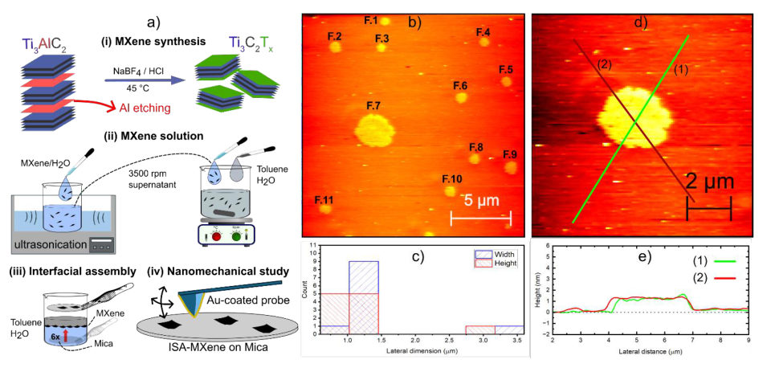
<figcaption class="paper-figure-caption"><b>Fig 1.</b> Figure 1: a) Preparation of interfacial self-assembled MXene (ISA-MXene) flakes on mica: (i) synthesis, (ii) dispersion, (iii) assembly, and (iv) AFM experimental setup. b-e) AFM topography of the ISA-MXene flakes on mica. b) Statistics on the flakes: 11 flakes (F) are counted, with values of height and width shown in panel c). The average width is about 1.2 µm. d) Zoom into F.7. e) Profile of the sections shown in panel d. The measured average thickness of the ISA-MXene flake is 1.24 ± 0.14 nm (green line) and 1.29 ± 0.06 nm (red line).</figcaption>
</figure>
<figure class="paper-figure-card">
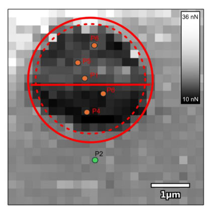
<figcaption class="paper-figure-caption"><b>Fig 2.</b> Figure 2: Adhesion Map (FM1) of a MXene flake on mica substrate measured in air. Six points are selected to perform further nanomechanical characterization.</figcaption>
</figure>
<figure class="paper-figure-card">
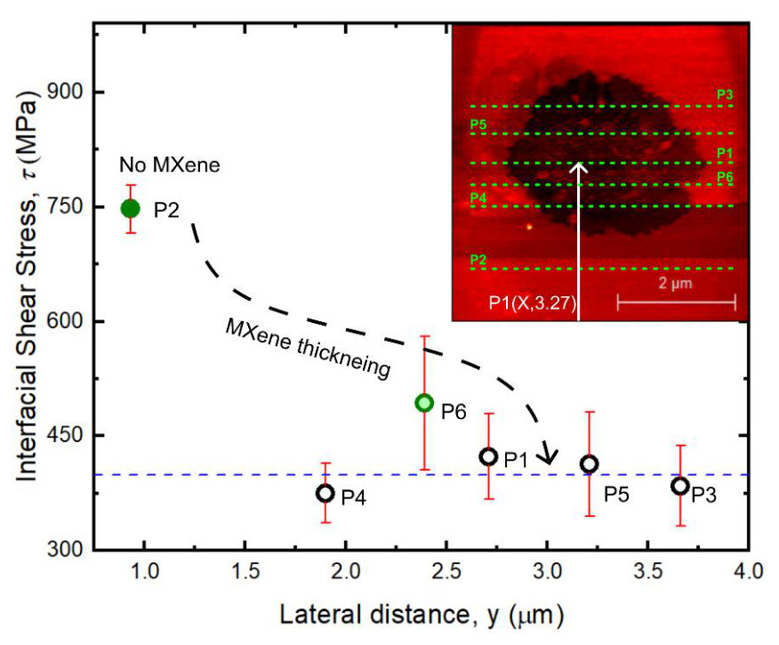
<figcaption class="paper-figure-caption"><b>Fig 3.</b> Figure 3: Evolution of the interfacial shear stress (τ) across an ISA-MXene flake parametrized by six points (P) and their lateral distance coordinate y. The location of the points and the flake are visualized in the friction map shown as inset. The full green point corresponds to an interaction with the mica substrate while, the open circles to a τ mediated by the MXene presence. The open light green point corresponds to a part of the flake highly damaged by nano wear. The blue dashed line indicates the weighted average value of τ across the ISA-MXene area.</figcaption>
</figure>
<figure class="paper-figure-card">
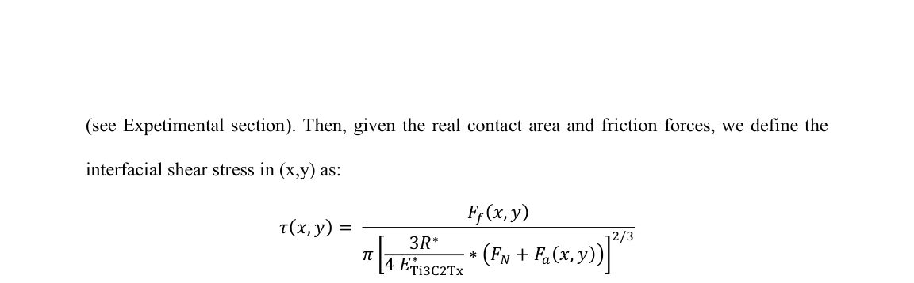
<figcaption class="paper-figure-caption"><b>Fig 4.</b> Figure 3 shows the spatial parametrization of 𝜏(𝑥, 𝑦) along the lateral distance y, revealing the</figcaption>
</figure>
<figure class="paper-figure-card">
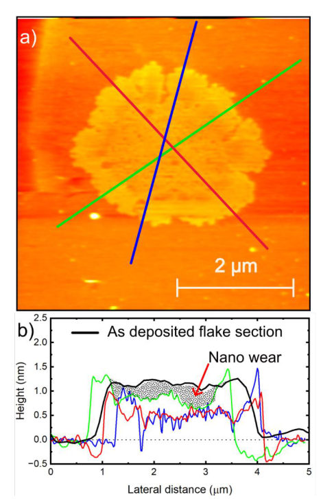
<figcaption class="paper-figure-caption"><b>Fig 5.</b> Figure 4: Topography of F.7 after the nanomechanical test. a) High resolution topography image and defined sections (blue, red, and green line). b) Line plot of the selected section. In black is one of the sections in Figure 1d used here as a reference. The dotted area shows a visualization of the nano-wear.</figcaption>
</figure>

**Summary.** This work experimentally investigates the mechanical interaction between MXene flakes and gold surfaces using advanced AFM techniques. The researchers quantified the interfacial shear stress as 399 MPa while confirming that the material maintains its crystalline structure even after undergoing nano-wear. These findings establish a foundation for utilizing MXenes in next-generation self-powering electronic devices.

**Why it may be interesting.** While primarily materials science, the quantitative measurement of interfacial stress ($	au$) under controlled nanoscale contact mechanics provides fundamental data on material interfaces relevant to energy transduction mechanisms studied in AMO physics (e.g., Casimir forces, surface interactions).

Detailed structure

**Main problem.** The study aims to characterize the nanomechanical compliance of MXene flakes against a metal-like interface, specifically determining the interfacial shear stress.

**Main result.** An interfacial shear stress of 399 MPa was measured for $	ext{Ti}_3	ext{C}_2	ext{T}_x$ on gold, and the material retained its crystallinity despite localized nano-wear.

**Method.** Atomic Force Microscopy (AFM), including force spectroscopy and force mapping, was used to measure adhesion forces and derive shear stress. TEM confirmed structural integrity post-testing.

**Model / system.** The physical system involves self-assembled $	ext{Ti}_3	ext{C}_2	ext{T}_x$ MXene flakes interacting with a gold probe tip, mimicking metal interfaces for energy harvesting applications.

**Key observables.** Interfacial shear stress ($	au$), adhesion force ($F_a$), nano-wear patterns, and retained crystallinity in tribofilms.

**Important parameters / regimes.** Interfacial shear stress of 399 MPa; flake dimensions (e.g., $\langle H 
angle = 1.25 \pm 0.61 	ext{ nm}$); adhesion forces ($\sim 10-30 	ext{ nN}$).

**Assumptions / limitations.** The results are highly dependent on the specific metal-MXene interface, and compacting MXenes compromises individual flake tribological behavior.

**Figures summary.** Figures show AFM topography (including long-term stability), adhesion maps comparing different areas, friction force vs. lateral distance profiles, and TEM/EELS confirming crystallinity and thickness.

**Paper structure.** The paper systematically uses AFM techniques to map forces and stresses at the MXene/Au interface, followed by structural characterization using TEM/EELS to validate mechanical testing results for applications in nanoelectronics.

Abstract

The demand for novel self-powering and sustainable electronics requires major efforts in identifying new advanced materials for nano-applications. MXene have gathered attention due to their electronic and mechanical properties, however, their nanomechanical compliance against a metal-like interface is still not clearly identified. In this work, we employ atomic force microscopy to characterize the nanomechanical properties of a self-assembled thin flake of titanium carbide MXene (Ti3C2Tx) against a gold probe. The investigation returns an interfacial shear stress of 399 MPa, and the observation of nano-wear localized in the center of the MXene flake. Nevertheless, MXene flakes retained their crystallinity in the tribofilms as confirmed by transmission electron microscopy and electron energy loss spectroscopy. The outcomes of this work set the basis for the use of Ti3C2Tx in novel nano harvesting systems involving metal interfaces (e.g., tribovoltaic nanogenerators) with large scope in nanoelectronics, wearable sensing, electric vehicles, and robotics.

[↑ back to top](#top)

