
# arxiv digest (quant-ph + cond-mat) — 2026-08-08

*115 papers · 42 relevant · 2 highlighted*

## 🔥 Most relevant (42)

*Every paper with at least one nonzero topic score, sorted by best-matching score. 🔥 marks scores ≥4/5. Click the title to jump to the full entry below; click [arXiv] to open the paper page. `(secondary)` marks papers from de-prioritized cond-mat archives.*

Show 42 relevant papers

- ⭐ [Multi-cavity strong coupling to an electron spin ensemble: spectral and dark-state signatures](#paper-2608.05765) [[arXiv]](http://arxiv.org/abs/2608.05765v1) — 🔥 `Tavis-Cummings & cavity-many-emitter` **5/5** · 🔥 `exotic spin models in light-matter` **4/5** · 🔥 `quantum optics experiment` **4/5** · 🔥 `spintronics-quantum-optics interface` **4/5** · `analog quantum simulation` **3/5** · `correlated / nonlocal dissipation` **3/5** · `correlated cavity matter` **3/5** · `driven-dissipative phase transition` **3/5** · `Kondo & dissipative impurity` **2/5** · `QC/QI experiment` **2/5** · `methods for driven-dissipative` **2/5** · `non-equilibrium dynamics` **2/5** · `quantum measurements` **2/5** · `Dicke superradiance` **1/5** · `Keldysh / 2PI / non-Gaussian methods` **1/5** · `entanglement & information structure` **1/5** · `interference shaping light` **1/5** · `measurement-induced transitions` **1/5** · `non-equilibrium universality` **1/5**
- [Dynamical phase transition in generalized Dicke model with strongly interacting trapped Rydberg ions](#paper-2608.05955) [[arXiv]](http://arxiv.org/abs/2608.05955v1) — 🔥 `driven-dissipative phase transition` **5/5** · 🔥 `Rydberg arrays` **4/5** · 🔥 `analog quantum simulation` **4/5** · 🔥 `methods for driven-dissipative` **4/5** · 🔥 `non-equilibrium dynamics` **4/5** · `correlated / nonlocal dissipation` **3/5** · `exotic spin models in light-matter` **3/5** · `non-equilibrium universality` **3/5** · `Dicke superradiance` **2/5** · `entanglement & information structure` **2/5** · `Keldysh / 2PI / non-Gaussian methods` **1/5** · `Tavis-Cummings & cavity-many-emitter` **1/5** · `correlated cavity matter` **1/5** · `scars & prethermalization` **1/5**
- [Theory of Measurement-Altered Criticality](#paper-2608.05289) [[arXiv]](http://arxiv.org/abs/2608.05289v1) — 🔥 `quantum measurements` **5/5** · 🔥 `measurement-induced transitions` **4/5** · `Keldysh / 2PI / non-Gaussian methods` **2/5** · `non-equilibrium universality` **2/5** · `analog quantum simulation` **1/5** · `correlated / nonlocal dissipation` **1/5** · `driven-dissipative phase transition` **1/5** · `entanglement & information structure` **1/5** · `methods for driven-dissipative` **1/5** · `non-equilibrium dynamics` **1/5**
- [What meter interference can tell us about the statistics of weak measurements](#paper-2608.05494) [[arXiv]](http://arxiv.org/abs/2608.05494v1) — 🔥 `quantum measurements` **5/5** · `measurement-induced transitions` **1/5**
- [Unidirectional Dark-to-Bright Rescue in Cavity-Coupled Quantum Transport](#paper-2608.05312) [[arXiv]](http://arxiv.org/abs/2608.05312v1) — 🔥 `analog quantum simulation` **4/5** · 🔥 `correlated / nonlocal dissipation` **4/5** · 🔥 `methods for driven-dissipative` **4/5** · `Tavis-Cummings & cavity-many-emitter` **3/5** · `correlated cavity matter` **3/5** · `driven-dissipative phase transition` **3/5** · `non-equilibrium dynamics` **3/5** · `non-equilibrium universality` **2/5** · `superradiant laser` **2/5** · `Dicke superradiance` **1/5** · `Keldysh / 2PI / non-Gaussian methods` **1/5** · `entanglement & information structure` **1/5**
- [Generating two-mechanical mode entangled cat states, and steady-state entanglement, in cavity optomechanics in the presence of dissipation](#paper-2608.05503) [[arXiv]](http://arxiv.org/abs/2608.05503v1) — 🔥 `correlated / nonlocal dissipation` **4/5** · 🔥 `entanglement & information structure` **4/5** · 🔥 `methods for driven-dissipative` **4/5** · `analog quantum simulation` **3/5** · `correlated cavity matter` **3/5** · `driven-dissipative phase transition` **3/5** · `non-equilibrium dynamics` **2/5** · `non-equilibrium universality` **2/5** · `Keldysh / 2PI / non-Gaussian methods` **1/5** · `Tavis-Cummings & cavity-many-emitter` **1/5**
- [Impact of Nonlinearities on Local Kinetic and Thermokinetic Uncertainty Relations in Bosonic Transport](#paper-2608.06303) [[arXiv]](http://arxiv.org/abs/2608.06303v1) — 🔥 `methods for driven-dissipative` **4/5** · 🔥 `non-equilibrium dynamics` **4/5** · `Keldysh / 2PI / non-Gaussian methods` **3/5** · `correlated / nonlocal dissipation` **3/5** · `driven-dissipative phase transition` **3/5** · `entanglement & information structure` **2/5** · `non-equilibrium universality` **2/5** · `quantum measurements` **2/5** · `Kondo & dissipative impurity` **1/5** · `analog quantum simulation` **1/5** · `measurement-induced transitions` **1/5** · `scars & prethermalization` **1/5**
- [Quantum transport in a non-Hermitian 1D synthetic lattice: from quantum Zeno reflection to near-perfect absorption](#paper-2608.06189) [[arXiv]](http://arxiv.org/abs/2608.06189v1) — 🔥 `analog quantum simulation` **4/5** · 🔥 `non-equilibrium dynamics` **4/5** · `correlated / nonlocal dissipation` **3/5** · `driven-dissipative phase transition` **3/5** · `methods for driven-dissipative` **3/5** · `Kondo & dissipative impurity` **2/5** · `non-equilibrium universality` **2/5** · `Frenkel-Kontorova` **1/5** · `Keldysh / 2PI / non-Gaussian methods` **1/5** · `entanglement & information structure` **1/5** · `quantum measurements` **1/5**
- [The Quantum Mechanics of Rare Events: From Quantum Walks to Stochastic Inflation](#paper-2608.06319) [[arXiv]](http://arxiv.org/abs/2608.06319v1) — 🔥 `measurement-induced transitions` **4/5** · `Keldysh / 2PI / non-Gaussian methods` **3/5** · `driven-dissipative phase transition` **3/5** · `correlated / nonlocal dissipation` **2/5** · `entanglement & information structure` **2/5** · `methods for driven-dissipative` **2/5** · `non-equilibrium dynamics` **2/5** · `non-equilibrium universality` **2/5** · `quantum measurements` **2/5** · `Kondo & dissipative impurity` **1/5** · `analog quantum simulation` **1/5** · `correlated cavity matter` **1/5**
- [A quantum framework for event graphs](#paper-2608.06058) [[arXiv]](http://arxiv.org/abs/2608.06058v1) — 🔥 `analog quantum simulation` **4/5** · 🔥 `exotic spin models in light-matter` **4/5** · `Keldysh / 2PI / non-Gaussian methods` **3/5** · `methods for driven-dissipative` **3/5** · `correlated / nonlocal dissipation` **2/5** · `driven-dissipative phase transition` **2/5** · `entanglement & information structure` **2/5** · `non-equilibrium dynamics` **2/5** · `Kondo & dissipative impurity` **1/5** · `non-equilibrium universality` **1/5**
- [An Effective String Theory Toolbox for Quantum Hall Interfaces III: Open Worldsheets, Endpoint Conditions, and Branes](#paper-2608.06100) [[arXiv]](http://arxiv.org/abs/2608.06100v1) — 🔥 `Keldysh / 2PI / non-Gaussian methods` **4/5** · `correlated / nonlocal dissipation` **3/5** · `driven-dissipative phase transition` **3/5** · `methods for driven-dissipative` **3/5** · `non-equilibrium dynamics` **3/5** · `Kondo & dissipative impurity` **2/5** · `non-equilibrium universality` **2/5** · `analog quantum simulation` **1/5** · `measurement-induced transitions` **1/5** · `quantum measurements` **1/5** · `spintronics-quantum-optics interface` **1/5**
- [Exponential Speedup of Entanglement Generation by Quantum Mpemba Effects](#paper-2608.05935) [[arXiv]](http://arxiv.org/abs/2608.05935v1) — 🔥 `correlated / nonlocal dissipation` **4/5** · 🔥 `entanglement & information structure` **4/5** · `driven-dissipative phase transition` **3/5** · `methods for driven-dissipative` **3/5** · `non-equilibrium dynamics` **3/5** · `Keldysh / 2PI / non-Gaussian methods` **2/5** · `non-equilibrium universality` **2/5** · `analog quantum simulation` **1/5** · `exotic spin models in light-matter` **1/5** · `scars & prethermalization` **1/5**
- [Kinetic Lifshitz invariants and dynamics of nonreciprocal fluctuations in superconductors](#paper-2608.05306) [[arXiv]](http://arxiv.org/abs/2608.05306v1) `(secondary)` — 🔥 `Keldysh / 2PI / non-Gaussian methods` **4/5** · `correlated / nonlocal dissipation` **3/5** · `driven-dissipative phase transition` **3/5** · `methods for driven-dissipative` **3/5** · `non-equilibrium dynamics` **3/5** · `non-equilibrium universality` **3/5** · `spintronics-quantum-optics interface` **2/5** · `Kondo & dissipative impurity` **1/5** · `exotic spin models in light-matter` **1/5**
- [Measurement-induced entanglement Hamiltonian](#paper-2608.06006) [[arXiv]](http://arxiv.org/abs/2608.06006v1) — 🔥 `entanglement & information structure` **4/5** · 🔥 `measurement-induced transitions` **4/5** · `quantum measurements` **3/5** · `Keldysh / 2PI / non-Gaussian methods` **2/5** · `driven-dissipative phase transition` **2/5** · `non-equilibrium universality` **2/5** · `Kondo & dissipative impurity` **1/5** · `analog quantum simulation` **1/5** · `correlated / nonlocal dissipation` **1/5** · `methods for driven-dissipative` **1/5** · `non-equilibrium dynamics` **1/5**
- [Morphology of frozen labyrinths from irreversible threshold dynamics](#paper-2608.05496) [[arXiv]](http://arxiv.org/abs/2608.05496v1) — 🔥 `non-equilibrium dynamics` **4/5** · `driven-dissipative phase transition` **3/5** · `methods for driven-dissipative` **3/5** · `non-equilibrium universality` **3/5** · `analog quantum simulation` **2/5** · `scars & prethermalization` **2/5** · `Frenkel-Kontorova` **1/5** · `Keldysh / 2PI / non-Gaussian methods` **1/5** · `correlated / nonlocal dissipation` **1/5** · `exotic spin models in light-matter` **1/5**
- [Dissipation-induced bulk and boundary criticality in the Haldane chain](#paper-2608.05984) [[arXiv]](http://arxiv.org/abs/2608.05984v1) — 🔥 `driven-dissipative phase transition` **4/5** · `correlated / nonlocal dissipation` **3/5** · `methods for driven-dissipative` **3/5** · `non-equilibrium universality` **3/5** · `non-equilibrium dynamics` **2/5** · `Frenkel-Kontorova` **1/5** · `Keldysh / 2PI / non-Gaussian methods` **1/5** · `Kondo & dissipative impurity` **1/5** · `analog quantum simulation` **1/5** · `exotic spin models in light-matter` **1/5**
- [Dynamic scaling behavior in the presence of a periodic magnetic driving across Ising continuous transitions](#paper-2608.05936) [[arXiv]](http://arxiv.org/abs/2608.05936v1) — 🔥 `non-equilibrium universality` **4/5** · `analog quantum simulation` **3/5** · `driven-dissipative phase transition` **3/5** · `methods for driven-dissipative` **3/5** · `non-equilibrium dynamics` **3/5** · `Frenkel-Kontorova` **1/5** · `Keldysh / 2PI / non-Gaussian methods` **1/5** · `correlated / nonlocal dissipation` **1/5** · `entanglement & information structure` **1/5**
- [Criteria for Feasible Monte Carlo Stochastic Simulations of Bosonic Markovian Open Quantum Dynamics](#paper-2608.06056) [[arXiv]](http://arxiv.org/abs/2608.06056v1) — 🔥 `methods for driven-dissipative` **4/5** · `Keldysh / 2PI / non-Gaussian methods` **3/5** · `driven-dissipative phase transition` **3/5** · `correlated / nonlocal dissipation` **2/5** · `non-equilibrium dynamics` **2/5** · `non-equilibrium universality` **2/5** · `analog quantum simulation` **1/5** · `quantum measurements` **1/5**
- [Field-Space Entanglement Dynamics Between Tunnel-Coupled Luttinger Liquids](#paper-2608.05968) [[arXiv]](http://arxiv.org/abs/2608.05968v1) — 🔥 `entanglement & information structure` **4/5** · 🔥 `non-equilibrium dynamics` **4/5** · `analog quantum simulation` **3/5** · `non-equilibrium universality` **3/5** · `Keldysh / 2PI / non-Gaussian methods` **1/5** · `correlated / nonlocal dissipation` **1/5** · `driven-dissipative phase transition` **1/5** · `methods for driven-dissipative` **1/5**
- [Large Spin-Wave Fluctuations Suppress Activity in Malthusian Flocks](#paper-2608.05805) [[arXiv]](http://arxiv.org/abs/2608.05805v1) — 🔥 `non-equilibrium universality` **4/5** · `Keldysh / 2PI / non-Gaussian methods` **3/5** · `driven-dissipative phase transition` **3/5** · `methods for driven-dissipative` **2/5** · `non-equilibrium dynamics` **2/5** · `Frenkel-Kontorova` **1/5** · `correlated / nonlocal dissipation` **1/5** · `exotic spin models in light-matter` **1/5**
- [Quantum Error Mitigation with Diffusion-Like Models](#paper-2608.05382) [[arXiv]](http://arxiv.org/abs/2608.05382v1) — 🔥 `quantum measurements` **4/5** · `measurement-induced transitions` **3/5** · `methods for driven-dissipative` **3/5** · `non-equilibrium dynamics` **2/5** · `Keldysh / 2PI / non-Gaussian methods` **1/5** · `correlated / nonlocal dissipation` **1/5** · `driven-dissipative phase transition` **1/5** · `entanglement & information structure` **1/5** · `non-equilibrium universality` **1/5**
- [Quantum fluctuation relations in first-detection processes](#paper-2608.06194) [[arXiv]](http://arxiv.org/abs/2608.06194v1) — 🔥 `measurement-induced transitions` **4/5** · `non-equilibrium dynamics` **3/5** · `quantum measurements` **3/5** · `non-equilibrium universality` **2/5** · `Keldysh / 2PI / non-Gaussian methods` **1/5** · `correlated / nonlocal dissipation` **1/5** · `driven-dissipative phase transition` **1/5** · `entanglement & information structure` **1/5** · `methods for driven-dissipative` **1/5**
- [Unconventional Scaling of Electric Hall Effect in Magnetic Weyl Semimetals](#paper-2608.06217) [[arXiv]](http://arxiv.org/abs/2608.06217v1) `(secondary)` — 🔥 `non-equilibrium universality` **4/5** · `analog quantum simulation` **3/5** · `driven-dissipative phase transition` **3/5** · `non-equilibrium dynamics` **3/5** · `spintronics-quantum-optics interface` **2/5** · `Keldysh / 2PI / non-Gaussian methods` **1/5** · `methods for driven-dissipative` **1/5**
- [Identifying slow relaxation in many-body quantum systems through state-graph geometry and state-graph heterogeneity](#paper-2608.05298) [[arXiv]](http://arxiv.org/abs/2608.05298v1) — 🔥 `non-equilibrium dynamics` **4/5** · `analog quantum simulation` **3/5** · `scars & prethermalization` **3/5** · `non-equilibrium universality` **2/5** · `correlated / nonlocal dissipation` **1/5** · `driven-dissipative phase transition` **1/5** · `entanglement & information structure` **1/5** · `methods for driven-dissipative` **1/5**
- [Vector Edge Solitons and Domain Walls in a Nonlinear Mechanical Topological Insulator](#paper-2608.06342) [[arXiv]](http://arxiv.org/abs/2608.06342v1) `(secondary)` — 🔥 `analog quantum simulation` **4/5** · `Frenkel-Kontorova` **3/5** · `non-equilibrium dynamics` **2/5** · `spintronics-quantum-optics interface` **2/5** · `correlated / nonlocal dissipation` **1/5** · `driven-dissipative phase transition` **1/5** · `exotic spin models in light-matter` **1/5** · `methods for driven-dissipative` **1/5** · `non-equilibrium universality` **1/5**
- [Anyon-Impurity Bound States in Quantum-Engineered Fractional Chern Insulators](#paper-2608.06233) [[arXiv]](http://arxiv.org/abs/2608.06233v1) — 🔥 `analog quantum simulation` **4/5** · `Kondo & dissipative impurity` **3/5** · `methods for driven-dissipative` **3/5** · `non-equilibrium dynamics` **2/5** · `Frenkel-Kontorova` **1/5** · `Keldysh / 2PI / non-Gaussian methods` **1/5** · `entanglement & information structure` **1/5**
- [Exponential logical-error reduction in quantum memories via optimal syndrome-measurement timing](#paper-2608.06242) [[arXiv]](http://arxiv.org/abs/2608.06242v1) — 🔥 `quantum measurements` **4/5** · `measurement-induced transitions` **3/5** · `methods for driven-dissipative` **3/5** · `non-equilibrium dynamics` **2/5** · `Keldysh / 2PI / non-Gaussian methods` **1/5** · `correlated / nonlocal dissipation` **1/5** · `driven-dissipative phase transition` **1/5**
- [Photon-nucleon entanglement in Compton scattering at low and high energies](#paper-2608.05330) [[arXiv]](http://arxiv.org/abs/2608.05330v1) — 🔥 `entanglement & information structure` **4/5** · `quantum measurements` **2/5** · `spintronics-quantum-optics interface` **2/5** · `Keldysh / 2PI / non-Gaussian methods` **1/5** · `analog quantum simulation` **1/5** · `correlated / nonlocal dissipation` **1/5** · `driven-dissipative phase transition` **1/5** · `exotic spin models in light-matter` **1/5** · `methods for driven-dissipative` **1/5** · `non-equilibrium dynamics` **1/5**
- [Resilient strange metal at an unconventional quantum critical point in $d=2$](#paper-2608.05988) [[arXiv]](http://arxiv.org/abs/2608.05988v1) — 🔥 `analog quantum simulation` **4/5** · `Keldysh / 2PI / non-Gaussian methods` **3/5** · `non-equilibrium universality` **3/5** · `driven-dissipative phase transition` **2/5** · `Kondo & dissipative impurity` **1/5** · `methods for driven-dissipative` **1/5** · `non-equilibrium dynamics` **1/5**
- [Hadamard sensing channel: deterministic artifact suppression for quantum sensors](#paper-2608.06119) [[arXiv]](http://arxiv.org/abs/2608.06119v1) — 🔥 `QC/QI experiment` **4/5** · `spintronics-quantum-optics interface` **3/5** · `quantum measurements` **2/5** · `Keldysh / 2PI / non-Gaussian methods` **1/5** · `correlated / nonlocal dissipation` **1/5** · `driven-dissipative phase transition` **1/5** · `exotic spin models in light-matter` **1/5** · `methods for driven-dissipative` **1/5**
- [X-Z Round Scheduling for the Surface Code with Defects under Biased Noise](#paper-2608.05518) [[arXiv]](http://arxiv.org/abs/2608.05518v1) — 🔥 `quantum measurements` **4/5** · `measurement-induced transitions` **3/5** · `QC/QI experiment` **2/5** · `correlated / nonlocal dissipation` **1/5** · `driven-dissipative phase transition` **1/5** · `methods for driven-dissipative` **1/5**
- [Abruptly autofocusing waves enter space-time](#paper-2608.05796) [[arXiv]](http://arxiv.org/abs/2608.05796v1) `(secondary)` — 🔥 `interference shaping light` **4/5** · `quantum optics experiment` **3/5** · `analog quantum simulation` **1/5** · `driven-dissipative phase transition` **1/5** · `methods for driven-dissipative` **1/5** · `non-equilibrium dynamics` **1/5**
- [Surviving correlations across a horizon: reflected entropy for bosonic fields in non-inertial frames and black hole spacetimes](#paper-2608.05473) [[arXiv]](http://arxiv.org/abs/2608.05473v1) — 🔥 `entanglement & information structure` **4/5** · `non-equilibrium dynamics` **2/5** · `Keldysh / 2PI / non-Gaussian methods` **1/5** · `correlated / nonlocal dissipation` **1/5** · `driven-dissipative phase transition` **1/5** · `methods for driven-dissipative` **1/5** · `non-equilibrium universality` **1/5**
- [The Locality Gap: A Thermodynamic Law for Objective Facts](#paper-2608.05753) [[arXiv]](http://arxiv.org/abs/2608.05753v1) — 🔥 `entanglement & information structure` **4/5** · `non-equilibrium dynamics` **2/5** · `Keldysh / 2PI / non-Gaussian methods` **1/5** · `correlated / nonlocal dissipation` **1/5** · `driven-dissipative phase transition` **1/5** · `methods for driven-dissipative` **1/5** · `non-equilibrium universality` **1/5**
- [Exact statistical transmutation of quantum mixtures on a ring](#paper-2608.05290) [[arXiv]](http://arxiv.org/abs/2608.05290v1) — 🔥 `analog quantum simulation` **4/5** · `non-equilibrium dynamics` **2/5** · `Keldysh / 2PI / non-Gaussian methods` **1/5** · `driven-dissipative phase transition` **1/5** · `entanglement & information structure` **1/5**
- [Breaking Memory Bottlenecks in Quantum Control Systems for More Precise Experiments and Higher Throughput Computing](#paper-2608.06318) [[arXiv]](http://arxiv.org/abs/2608.06318v1) — 🔥 `QC/QI experiment` **4/5** · `quantum measurements` **2/5** · `methods for driven-dissipative` **1/5** · `non-equilibrium dynamics` **1/5**
- [Entanglement Scaling and Full Counting Statistics in Excited States of Two-Dimensional Rotating Fermions](#paper-2608.05722) [[arXiv]](http://arxiv.org/abs/2608.05722v1) — 🔥 `entanglement & information structure` **4/5** · `analog quantum simulation` **1/5** · `non-equilibrium dynamics` **1/5**
- [Entangling power of neural networks](#paper-2608.05293) [[arXiv]](http://arxiv.org/abs/2608.05293v1) — 🔥 `entanglement & information structure` **4/5** · `methods for driven-dissipative` **1/5**
- [Global vs. Product Observables in Bipartite Quantum Systems: The Sharp Bound](#paper-2608.06235) [[arXiv]](http://arxiv.org/abs/2608.06235v1) — 🔥 `entanglement & information structure` **4/5** · `quantum measurements` **1/5**
- [Experimental demonstration of the Quantum Fourier Transform on up to 100 qubits using a convolutional compilation strategy](#paper-2608.05435) [[arXiv]](http://arxiv.org/abs/2608.05435v1) — 🔥 `QC/QI experiment` **4/5**
- [Relative entropy of entanglement of Haar random states](#paper-2608.05274) [[arXiv]](http://arxiv.org/abs/2608.05274v1) — 🔥 `entanglement & information structure` **4/5**
- [Symmetry-guided construction and exact certification of absolutely maximally entangled states](#paper-2608.05781) [[arXiv]](http://arxiv.org/abs/2608.05781v1) — 🔥 `entanglement & information structure` **4/5**

## ⭐ Highlighted (2)

*Papers by authors on your watch list. Click the title to jump to the full entry below; click [arXiv] to open the paper page.*

Show 2 highlighted papers

- ⭐ [Multi-cavity strong coupling to an electron spin ensemble: spectral and dark-state signatures](#paper-2608.05765) [[arXiv]](http://arxiv.org/abs/2608.05765v1) — F. Piazza
- ⭐ [Qutrit entanglement and joint multi-parameter estimation in an optical clock platform](#paper-2608.05426) [[arXiv]](http://arxiv.org/abs/2608.05426v1) — Immanuel Bloch

## All papers (91, sorted by relevance)

*Papers from quant-ph and your primary cond-mat archives (quant-gas, stat-mech, str-el, dis-nn). Highlighted papers (⭐) come first, then everything else sorted by topic-relevance score, highest first.*

### ⭐ [Multi-cavity strong coupling to an electron spin ensemble: spectral and dark-state signatures](http://arxiv.org/abs/2608.05765v1)

**Highlighted author(s):** F. Piazza  
**Authors:** P. Oehrl, B. Pérez González, A. Dunaev, M. Althammer, T. S. Parvini, F. Piazza, M. Benito, H. Huebl  
**Type:** both · **Category:** other · **PDF:** <https://arxiv.org/pdf/2608.05765v1>  
**Analysis basis:** full PDF text, analyzed in chunks
**Topic relevance:** 🔥 `Tavis-Cummings & cavity-many-emitter` **5/5** · 🔥 `exotic spin models in light-matter` **4/5** · 🔥 `quantum optics experiment` **4/5** · 🔥 `spintronics-quantum-optics interface` **4/5** · `analog quantum simulation` **3/5** · `correlated / nonlocal dissipation` **3/5** · `correlated cavity matter` **3/5** · `driven-dissipative phase transition` **3/5** · `Kondo & dissipative impurity` **2/5** · `QC/QI experiment` **2/5** · `methods for driven-dissipative` **2/5** · `non-equilibrium dynamics` **2/5** · `quantum measurements` **2/5** · `Dicke superradiance` **1/5** · `Keldysh / 2PI / non-Gaussian methods` **1/5** · `entanglement & information structure` **1/5** · `interference shaping light` **1/5** · `measurement-induced transitions` **1/5** · `non-equilibrium universality` **1/5**

📷 Fig 1

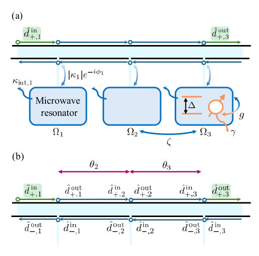 
Figure 1. Conceptual depiction of the setup. (a) The superconducting microwave circuit consists of three hanger- type, lumped-element resonators of frequencies Ω1, Ω2, Ω3, which are coupled to a common transmission line with cou- pling strengths |κi|e−iϕi. One of the resonators is strongly coupled, with coupling strength g, to the spin ensemble with resonance frequency ∆. We investigate the complex transmis- sion parameter S21 = ⟨ˆdout +,3⟩/ ⟨ˆdin +,1⟩in order to study multi- mode interference and dark-state formation. We also consider the dissipation rates κint,i and γ for the resonators and the spin ensemble, respectively. (b) Left and right propagation channel through the transmission...

📷 Fig 2

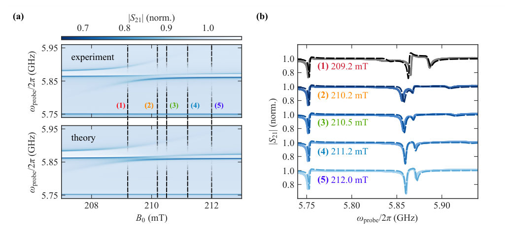 
Figure 2. Measured and modeled cwESR spectra. (a) Measured (upper panel) and simulated (lower panel) microwave absorption amplitude |S21| as a function of the applied magnetic field B0 and the probe frequency ωprobe. The modeled microwave absorption amplitude is based on Eq. 1 and the coupling rates summarized in Tab. I. Vertical lines (1)−(5) represent B0−fixed cuts represented in panel (b). (b) Comparison of the measured (solid line, light colored) and modeled (dashed line, dark colored) data showing the frequency-dependent microwave absorption amplitude for fixed magnetic fields.

📷 Fig 3

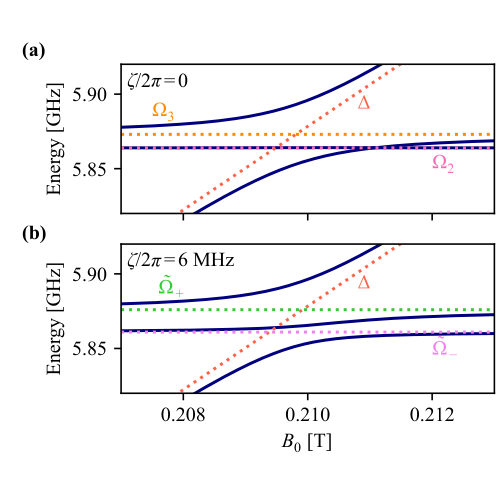 
Figure 3. Simulated energy spectrum for the tripartite system. Calculated energies of the effective three-component system formed by the spin ensemble and resonators 2 and 3, as a function of B0, for the fitted parameters in Table I, com- paring (a) ζ/2π = 0, (b) ζ/2π = 6 MHz. The dotted lines indicate the bare energies of the modes that are hybridizing: (a) ∆, Ω2, and Ω3, (b) ∆, ˜Ω+, and ˜Ω−.

📷 Fig 4

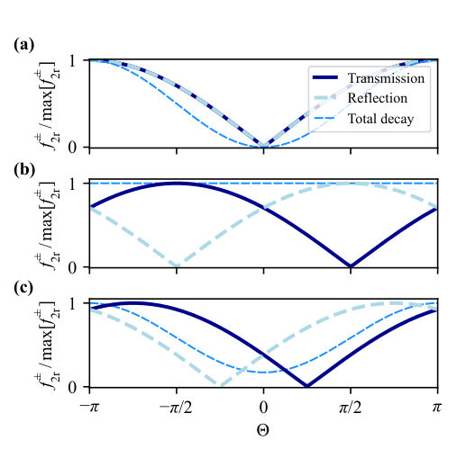 
Figure 4. Dark and directionally dark modes in the two-coupled-resonator system. Dark state condition f ± 2r/max[f ± 2r] for | ˜ψ+⟩, as a function of the propagation phase Θ, for complex κi = |κi|e−iϕi, and for both propagation chan- nels ˆL±. The diagnostic function F2r/max[F2r] is included. A bidirectional dark state appears for f ± 2r = 0. The system pa- rameters Ω2,3, ζ, and κ2,3, are chosen such that they satisfy Eq. (14). (a) The phases ϕ2 = 3π/2 and ϕ3 = −π/2 fulfill |ϕ3 −ϕ2| = 2π (l = 1), so a dark state to both p = ± appears at Θ = 0. (b) The phases ϕ2 = 3π/2 and ϕ3 = π/2, and (c) ϕ2 = 7π/4 and ϕ3 = π/4, are chosen such that the dark state condition happens at a different Θ for...

📷 Fig 5

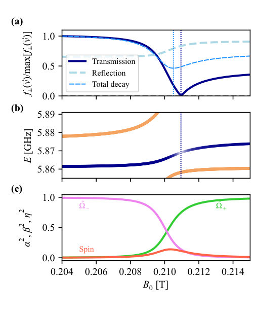 
Figure 5. Dark state in the tripartite system. (a) Dark state condition for the central eigenstate of the Hamil- tonian in Eq. (10), evaluated through f±(⃗v)/ max(f±(⃗v)), using the parameters ⃗v = (κ2, κ3, α, β, φ, θ) obtained from the fitting in Table I. The observed dark state is only dark to transmission. (b) Energy spectrum for the same fitting parameters. The opacity of the lines corresponds to the value of |f+(⃗v)|/ max(|f+(⃗v)|), which positions a dark state for the central branch at B0 ≈211 mT. (c) Composition of the cen- tral eigenstate of the system as a function of B0.

**Summary.** The paper investigates strong light-matter interactions in a complex hybrid system combining three superconducting microwave cavities and an electron spin ensemble. By modeling the system using input-output theory, the authors demonstrate that the multi-mode nature allows for the formation of dark states. These engineered dark states are crucial because they can protect quantum information stored in the spin ensemble by suppressing unwanted coupling to the surrounding environment.

**Why it may be interesting.** This work is highly relevant as it pushes the boundaries of cavity QED by integrating multiple coupled resonators with solid-state spins. The ability to engineer protected quantum states (dark states) via environmental coupling control is a key theme in modern open quantum systems research.

Detailed structure

**Main problem.** The research explores how controlled coupling of multiple superconducting microwave cavities to an electron spin ensemble can generate signatures of strong coupling and engineer dark states.

**Main result.** The study confirms the existence of a multi-mode strong-coupling regime and observes spectral dips indicative of dark state formation, which suppresses coupling to the measurement environment.

**Method.** The system is modeled using an input-output formalism derived from a complex Hamiltonian, with experimental verification through continuous wave electron spin resonance (cwESR) measurements.

**Model / system.** The physical platform is a hybrid microwave circuit comprising three superconducting resonators coupled together and interacting with a paramagnetic electron spin ensemble. The model incorporates terms for cavity-cavity, spin dynamics, spin-cavity coupling (Tavis-Cummings type), and coupling to the external transmission line.

**Key observables.** Complex microwave transmission $S_{21}$ as a function of probe frequency ($\omega_{	ext{probe}}$) and static magnetic field ($B_0$); Rabi splittings; suppressed absorption dips.

**Important parameters / regimes.** Resonator frequencies (e.g., 5.753 GHz, 5.864 GHz, 5.873 GHz); inter-cavity coupling ($\zeta_{23}/(2\pi) = 6.0 	ext{ MHz}$); Cooperativity parameters ($C_\pm$).

**Assumptions / limitations.** The analysis often assumes the single-excitation limit and neglects sub-ensemble distribution of spin resonance frequencies; some theoretical analyses assume point-like coupling to the transmission line.

**Figures summary.** Figure 1 conceptually shows the setup measuring $S_{21}$. Figure 2 compares measured vs. simulated microwave absorption amplitudes $|S_{21}|$ across varying magnetic fields, while Figure 8 and 9 analyze the theoretical conditions for dark state formation based on coupling parameters.

**Paper structure.** The paper progresses from defining the multi-cavity hybrid system Hamiltonian to applying the input-output formalism for spectral analysis. It details observations of field-independent modes, strong coupling splittings, and finally analyzes the specific conditions under which a stationary dark state can form by suppressing radiation into the measurement channel.

Abstract

Spin ensembles are considered as potential candidates for quantum memory and quantum enhanced sensing applications. Here, we explore the controlled coupling of multiple superconducting microwave cavities to a spin ensemble, which shows signatures of strong coupling and, due to the multi-mode character, the formation of dark states. In particular, the latter are of interest, as they provide a potential pathway to enhance memory times and enable protected storage of non-classical states in spin ensembles due to the suppressed coupling to the circuit environment. We model the spin multi-cavity hybrid to reproduce the spectra and extract characteristic coupling strengths using the input-output formalism.

[↑ back to top](#top)

### ⭐ [Qutrit entanglement and joint multi-parameter estimation in an optical clock platform](http://arxiv.org/abs/2608.05426v1)

**Highlighted author(s):** Immanuel Bloch  
**Authors:** Ohad Lib, Shuheng Liu, Maximilian Ammenwerth, Hendrik Timme, Shijia Sun, Qiongyi He, Marcus Huber, Giuseppe Vitagliano, Immanuel Bloch, Johannes Zeiher  
**Type:** experiment · **Category:** other · **PDF:** <https://arxiv.org/pdf/2608.05426v1>  
**Analysis basis:** full PDF text, analyzed in chunks
**Topic relevance:** `entanglement & information structure` **3/5** · `QC/QI experiment` **2/5** · `analog quantum simulation` **1/5** · `quantum measurements` **1/5** · `quantum optics experiment` **1/5**

📷 Fig 1

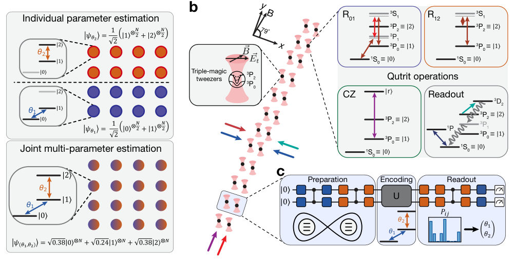 
FIG. 1. Qutrit entanglement and joint multi-parameter estimation. a Illustration of individual versus joint estimation of two parameters in an optical clock. In the case of individual estimation, the atoms are split into two groups, each being prepared in a different qubit entangled state to estimate one of the parameters. Alternatively, joint estimation uses qutrit encoding and entanglement across the entire array to estimate both parameters simultaneously. Our experiment is performed for qutrit entangled pairs, for which N = 2. b Experimental setup consisting of twelve pairs of 88Sr atoms, each encoding a magically trapped qutrit in the ground state and two clock states. Qutrit operations...

📷 Fig 2

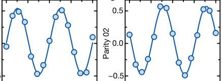 
FIG. 2. Genuine qutrit entanglement. a Circuit for creating and benchmarking a qutrit entangled state encoded in the energy levels of two atoms. A phase-scanned π/2 rota- tion (Rϕ) is added when measuring parity oscillations on the different transitions. The exact rotation angles are shown in the Supplementary Information. b State population measure- ment of the qutrit entangled state. c-e Parity oscillations on the |1⟩−|2⟩, |0⟩−|1⟩, |0⟩−|2⟩transitions. In e, the |0⟩−|2⟩π/2 pulse is performed using a π rotation on the |1⟩−|2⟩transition followed by a π/2 rotation on |0⟩−|1⟩. The fitted contrasts are C12 = 0.56(1), C01 = 0.51(1), and C02 = 0.52(2) (ideal contrast is C = 2

📷 Fig 3

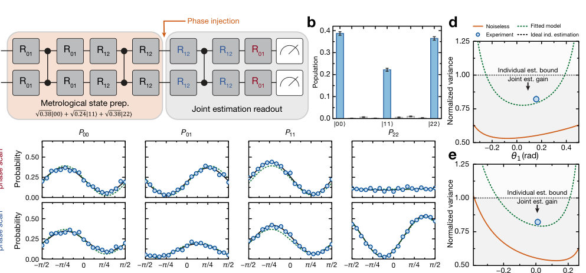 
FIG. 3. Joint parameter estimation. a Circuit for joint parameter estimation. The ideal, unbalanced, entangled metro- logical state is generated, followed by a noise-robust readout circuit to jointly estimate two injected phases (see Supplementary Information for rotation angles). b Population measurement showing the desired imbalance between the qutrit states. c A model allowing for joint phase estimation given probabilities of the nine measurement outcomes is established by scanning the phases of the R01 and R12 pulses in the readout circuit. The data points are fitted using a cosine-sine fit (black curve). A model taking into account separately measured decoherence in single-qutrit...

**Summary.** The paper demonstrates how to use genuine qutrit entanglement in an optical atomic clock platform to simultaneously estimate multiple physical parameters. By leveraging the higher dimensionality of the internal atomic states, they surpass the precision limits achievable by treating each parameter estimation independently. This work establishes key building blocks for quantum information science using neutral atoms.

**Why it may be interesting.** This work directly pushes the boundaries of quantum sensing by moving beyond qubit limitations into high-dimensional qudit systems using neutral atoms, which is a major focus area in AMO physics and quantum metrology.

Detailed structure

**Main problem.** The research addresses extending quantum metrology from single-parameter estimation (using qubits) to joint multi-parameter estimation using entangled multi-level qudits in an atomic clock platform.

**Main result.** They experimentally demonstrated genuine qutrit entanglement and achieved a joint estimation variance lower than the ideal individual two-level sensing threshold, showing this advantage persists under noise.

**Method.** The authors used controlled operations (like CZ gates) to generate high-dimensional entangled states in $^{88}	ext{Sr}$ atoms and then employed optimal metrological probes and readout circuits for joint phase estimation.

**Model / system.** The physical system is an optical clock platform using $^{88}	ext{Sr}$ atoms trapped in triple-magic optical tweezers. The internal energy levels form a qutrit ($\{|0
angle, |1
angle, |2
angle\}$), allowing for the encoding of higher-dimensional quantum information.

**Key observables.** Joint estimation variance ($Y_{	ext{joint}}$), entanglement fidelity ($F$), and comparison against individual two-level sensing thresholds.

**Important parameters / regimes.** The number of atoms ($N$), the injected phases ($	heta_1, 	heta_2$), and noise parameters (e.g., coherence factors $\eta$).

**Assumptions / limitations.** The fidelity calculation is not fully corrected for all state preparation and measurement errors; theoretical analysis often assumes specific noise models (depolarizing/dephasing).

**Figures summary.** Figures illustrate the experimental setup, demonstrate entanglement via population measurements ($P_{ii}$) and parity oscillations ($	ext{C}_{ij}$), and compare joint vs. individual estimation variances under ideal and noisy conditions.

**Paper structure.** The paper progresses from establishing the physical platform and generating qutrit entanglement to theoretically constructing optimal multi-parameter probes, experimentally realizing the joint estimation, and finally analyzing noise robustness across different theoretical limits.

Abstract

Quantum metrology harnesses entanglement to improve measurement precision beyond classical limits. While standard protocols rely on two-level qubits to estimate a single parameter, extending them to entangled multi-level qudits enables the optimal simultaneous estimation of multiple parameters within a single probe. However, generating such multi-level entanglement and harnessing it for joint multi-parameter estimation in atomic clocks has remained an outstanding challenge. Here, we experimentally demonstrate genuine qutrit entanglement and joint multi-parameter estimation in an optical clock platform. Leveraging control over the ground state and two fine-structure clock states of $^{88}\text{Sr}$ atoms trapped in triple-magic optical tweezers, we generate a maximally entangled two-qutrit state with a loss-postselected fidelity of F = 0.85(1), certifying genuine multi-level entanglement. Taking advantage of this high-dimensional entanglement, we theoretically construct and experimentally realize an optimal two-qutrit metrological probe state and noise-robust readout circuit to simultaneously estimate injected phases on two optical clock transitions. We observe a joint estimation variance below the ideal individual two-level sensing threshold, and show theoretically that this advantage persists at state-of-the-art atom numbers under circuit-level noise. These results demonstrate the key building blocks towards quantum information science with high-dimensional states encoded in the internal energy levels of neutral atoms.

[↑ back to top](#top)

### [Dynamical phase transition in generalized Dicke model with strongly interacting trapped Rydberg ions](http://arxiv.org/abs/2608.05955v1)

**Authors:** Manish Chaudhary, Rejish Nath, Weibin Li  
**Type:** theory · **Category:** other · **PDF:** <https://arxiv.org/pdf/2608.05955v1>  
**Analysis basis:** full PDF text, analyzed in chunks
**Topic relevance:** 🔥 `driven-dissipative phase transition` **5/5** · 🔥 `Rydberg arrays` **4/5** · 🔥 `analog quantum simulation` **4/5** · 🔥 `methods for driven-dissipative` **4/5** · 🔥 `non-equilibrium dynamics` **4/5** · `correlated / nonlocal dissipation` **3/5** · `exotic spin models in light-matter` **3/5** · `non-equilibrium universality` **3/5** · `Dicke superradiance` **2/5** · `entanglement & information structure` **2/5** · `Keldysh / 2PI / non-Gaussian methods` **1/5** · `Tavis-Cummings & cavity-many-emitter` **1/5** · `correlated cavity matter` **1/5** · `scars & prethermalization` **1/5**

📷 Fig 1

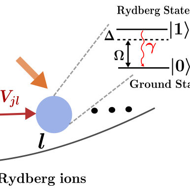 
Figure 1: Schematic illustration of the system of trapped Rydberg ions: A linear chain of N trapped Rydberg ions is modeled as an effective two-level system with ground state |0〉and excited Rydberg state |1〉. A standing-wave laser couples the spin states to the center-of-mass (COM) vibrational mode at a frequency ω. In the side panel, we represent the energy level diagram for the internal states which are coherently driven by a laser with Rabi frequency Ωand detuning ∆. The state |1〉decays to the ground state |0〉at a spontaneous decay rate γ.

📷 Fig 2

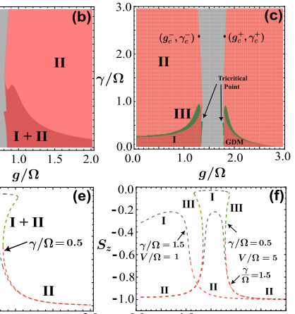 
Figure 2: Dynamical phase diagram for different controlling parameters (1) in the dissipative model: The MF phase diagram is obtained from the fixed-point analysis of Eq. (6) (a) as a function of the spin phonon coupling g/ω and Rabi frequency Ω/ω with no dissipation and no Rydberg ion interactions V = 0 (Dicke Model); (b) as a function of normalized parameters g/Ωand γ/Ωwith ion decay (3) (dissipative Dicke model); (c) as a function of normalized parameters g/Ωand γ/Ωwith ion interactions Vjl ̸= 0 (generalized dissipative Dicke model); (d)-(e) Corresponding variation of MF spin expectation value Sz as a function of g/Ωfor different cases similar to (a)-(c) respectively. For cases (b)-(f)...

📷 Fig 3

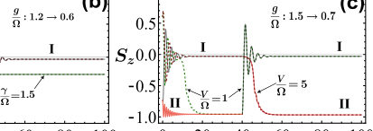 
Figure 3: Effect of quenching on the system dynamics for (a) simplest Dicke model with no Rydberg ion interactions V = 0, (b) dissipative Dicke model (3) for two different γ/Ω= 0.5,1.5 and (c) generalized Dicke model with ion interactions Vjl ̸= 0 at γ/Ω= 0.5. For all cases we choose N = 30 and ω = NΩ. The dis- tinct phases are marked with Roman letters. The different initial conditions are used for our calculation: (S0 x = 0,S0 y = 0.4,S0 z = 0.3) represented as dotted line and

📷 Fig 4

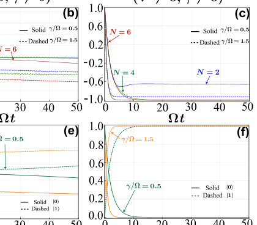 
Figure 4: Dynamics of dissipative model (3): (a)-(c) Exact time evolution of the density matrix, spin expectation values (15); (d)-(f) probability of occupancy of the ground and excited states (N = 6 used in (e),(f)) as a function of time t with no dissipation (V = 0,γ = 0), with dissipation (V = 0,γ ̸= 0) and with Rydberg interac- tions (V ̸= 0,γ ̸= 0) respectively for various system sizes. We choose g/Ω= 0.5 for all cases and V/Ω= 5.

📷 Fig 5

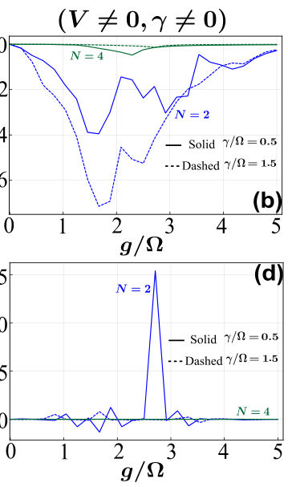 
Figure 5: Liouvillian spectrum: (a),(b) real part of the lowest nonzero Liouvillian eigenvalue Re[λ1]; (c),(d) imaginary part of the lowest nonzero Liouvillian eigen- value Im[λ1] as a function of the normalized spin-phonon coupling g/Ωin the ab- sence and presence of Rydberg interactions respectively for different system size N and dissipation strengths γ/Ω. The solid and dashed lines denote the dynamics for dissipation strengths γ/Ω= 0.5 and γ/Ω= 1.5 respectively. For (b),(d) cases we choose V/Ω= 5.

**Summary.** The paper analyzes dynamical phase transitions in a model of strongly interacting Rydberg ions coupled to phonons. Using mean-field theory and advanced quantum diagnostics like the Loschmidt echo, the authors map out complex phase diagrams influenced by ion interactions. The findings demonstrate that these interactions drastically alter both the equilibrium phases and the non-equilibrium relaxation dynamics of the system.

**Why it may be interesting.** This work is highly relevant as it combines trapped ion platforms (a key AMO system) with complex open quantum dynamics and many-body physics concepts like DPTs, making it a rich area for theoretical investigation in quantum optics.

Detailed structure

**Main problem.** The study investigates dynamical phase transitions (DPTs) occurring in a generalized dissipative Dicke model.

**Main result.** The analysis reveals that Rydberg ion interactions significantly modify the mean-field phase diagram, leading to distinct phases and the emergence of tricritical points. Furthermore, non-equilibrium dynamics exhibit signatures like slow relaxation near these transitions.

**Method.** The study employs a combination of Mean-Field (MF) analysis for steady states and quantum diagnostics like the Loschmidt echo and entropy growth for finite-size, non-equilibrium dynamics.

**Model / system.** The system is trapped Rydberg ions arranged in a linear array, coupled to external vibrational modes (phonons). The dynamics are governed by a Master equation incorporating Rabi coupling, spin-phonon interaction, laser driving, and dissipation.

**Key observables.** Spin average ($\langle \sigma_j 
angle$), phonon averages ($X, P$), Von Neumann entropy, Loschmidt echo, and steady-state polarization ($S_z$).

**Important parameters / regimes.** Rydberg interaction strength ($V_{jl}$), spin-phonon coupling ($g$), Rabi frequency ($\Omega$), dissipation rate ($\gamma$), and detuning ($\Delta$).

**Assumptions / limitations.** The analysis relies on Mean-Field approximations, including product approximations for coupled spin and bosonic operators.

**Figures summary.** Figure 1 schematically shows the ion chain setup. Figure 2 presents MF phase diagrams for different Dicke model regimes (closed, dissipative, generalized). Figure 3 illustrates system dynamics following parameter quenches.

**Paper structure.** The paper first establishes the Hamiltonian and Master equation governing the system. It then analyzes steady states using Mean-Field theory to map out the phase diagram, identifying critical points. Finally, it investigates non-equilibrium quantum dynamics using diagnostics like the Loschmidt echo to characterize relaxation pathways.

Abstract

We study dynamical phase transitions in the generalized dissipative Dicke model in an array of trapped Rydberg ions, where their density-density interactions compete with the collective spin-phonon coupling, laser driving and dissipation. This setting offers a versatile approach to study equilibrium as well as non-equilibrium many-body phenomena, as parameters, such as the Ising interaction, laser-ion and spin-phonon coupling can be tuned. Through analyzing the mean-field phase diagram, we find a variety of distinct phases and the emergence of a tricritical point that are sensitively dependent of the interaction between Rydberg ions. We then study the quantum dynamics for a finite system size and characterize parameter dependent dynamics using the spin average, entropy, and Loschmidt echo. Distinctive signatures of the dynamical phases, such as slow relaxation and metastability, arise near the phase transition. This analysis predicts rich quantum dynamics of the finite system that link to the non-equilibrium mean-field phases. Our study widens the exploration of collective and non-equilibrium phases in Dicke models, and reveals that the Rydberg ion interaction drastically affects the phase diagram and dynamics.

[↑ back to top](#top)

### [Theory of Measurement-Altered Criticality](http://arxiv.org/abs/2608.05289v1)

**Authors:** Kabir Khanna, Sara Murciano, Romain Vasseur  
**Type:** theory · **Category:** statistical mechanics · **PDF:** <https://arxiv.org/pdf/2608.05289v1>  
**Analysis basis:** full PDF text, analyzed in chunks
**Topic relevance:** 🔥 `quantum measurements` **5/5** · 🔥 `measurement-induced transitions` **4/5** · `Keldysh / 2PI / non-Gaussian methods` **2/5** · `non-equilibrium universality` **2/5** · `analog quantum simulation` **1/5** · `correlated / nonlocal dissipation` **1/5** · `driven-dissipative phase transition` **1/5** · `entanglement & information structure` **1/5** · `methods for driven-dissipative` **1/5** · `non-equilibrium dynamics` **1/5**

📷 Fig 1

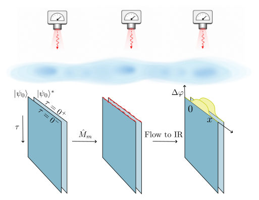 
FIG. 1. Setup. Top: Schematic illustration of a TLL (blue). Weak measurements are performed on the entire system as shown through the measurement apparatus (red). Bottom: Left: Path integral representation of the ground state den- sity matrix |ρ0⟩⟩= |ψ0⟩|ψ∗ 0⟩with the ket and bra defined on the slices τ = 0−and τ = 0+, respectively. Middle: The weak measurement induces a boundary perturbation (red). Right: The replica calculation shows that the averaged long- distance density and phase fluctuations are controlled by field fluctuations ∆φ corresponding to phase-slips between the points 0 and x in the infrared (IR).

📷 Fig 2

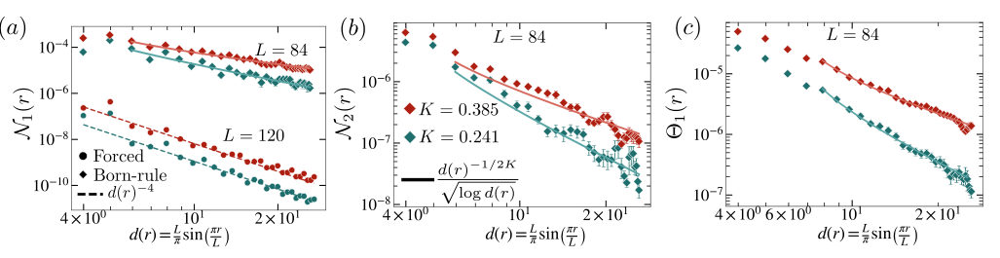 
FIG. 2. Scaling of measurement-altered correlation functions with chord length d(r) for measurement strength γ = 0.7. Green and red markers correspond to ground states with Luttinger parameters K = 0.241 and K = 0.385, re- spectively. We use P

📷 Fig 3

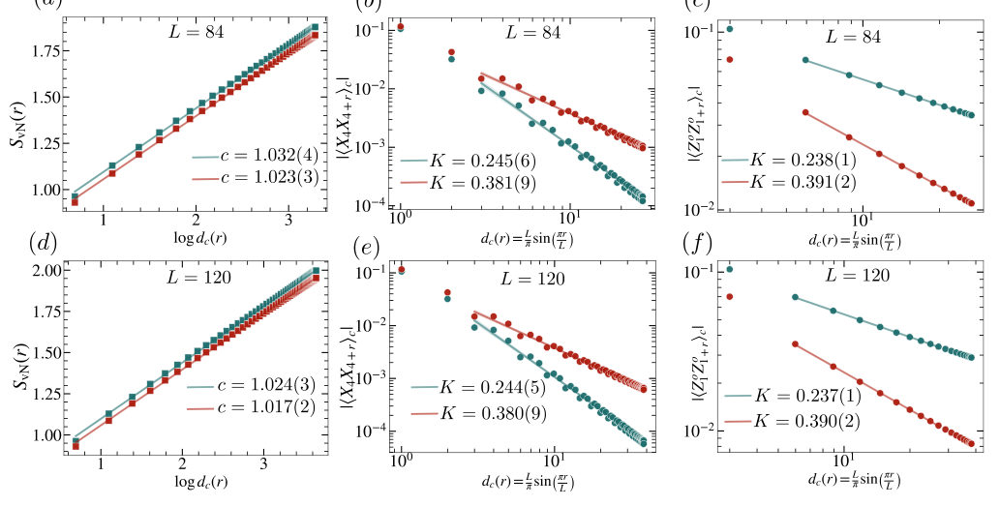 
FIG. 1: Extracting the central charge c and Luttinger parameter K. Green markers show data for the ground state at (U1, U2) = (10, 2.5), while red markers correspond to (U1, U2) = (10, 1.0). Fits are shown as solid lines of the corresponding color with reduced opacity. (a,d) Von Neumann entanglement entropy SvN(r) plotted against log dc(r) for L = 84 and L = 120, respectively. The central charge is inferred from the slope c/3 from Eq. (84). (b,e) Connected correlator |⟨X4X4+r⟩c| plotted against dc(r) and fitted to dc(r)−1/(2K) for L = 84 and L = 120, respectively. (c,f) Correlator ⟨Zo 1Zo 1+r⟩plotted against dc(r), and fitted to dc(r)−2K for L = 84 and L = 120, respectively.

📷 Fig 4

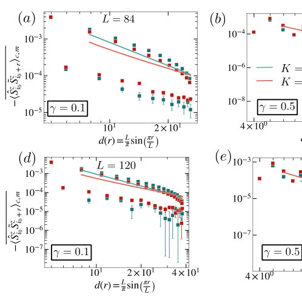 
FIG. 2: Scaling of measurement-averaged correlator −P

📷 Fig 5

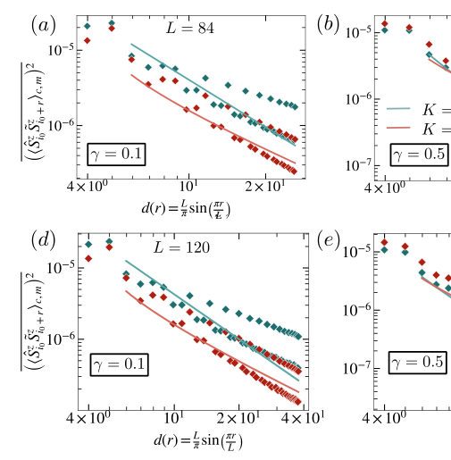 
FIG. 3: Scaling of measurement-averaged correlator P

**Summary.** This paper develops a theory detailing how local measurements perturb the critical behavior of gapless quantum matter like Tomonaga-Luttinger liquids. Using replica calculations, the authors show that this measurement-induced randomness causes correlation functions to decay with specific power laws featuring logarithmic corrections. This establishes a new regime of criticality beyond standard theoretical models.

**Why it may be interesting.** This work directly addresses the non-trivial interplay between quantum measurements and fundamental critical phenomena, providing a quantitative framework for how measurement backaction modifies universal properties in 1D systems.

Detailed structure

**Main problem.** The theory investigates how local measurements perturb and alter the universal long-range correlations of gapless quantum matter, specifically Tomonaga-Luttinger liquids.

**Main result.** Average correlators decay with universal power laws accompanied by logarithmic corrections when measurements are relevant, a signature distinct from both forced measurements and conventional critical scaling.

**Method.** The authors employ replica instanton calculations to handle the intrinsic randomness of measurement records, complementing this with matrix-product-state calculations for verification.

**Model / system.** The primary model is the Tomonaga-Luttinger liquid (TLL), a 1D quantum critical state described by a continuum field theory derived from lattice Hamiltonians. The analysis focuses on weakly monitoring these systems.

**Key observables.** Connected density and phase fluctuation correlators ($\langle\hat{n}(x)\hat{n}(0)
angle$, $\langle e^{i[	heta(x)-	heta(0)]} 
angle$), and the full multifractal spectrum of correlation moments.

**Important parameters / regimes.** The Luttinger parameter ($K$) dictates the algebraic decay, while the measurement strength ($\gamma$) controls the perturbation regime; the focus is on $K < 1/2$ where perturbations are relevant.

**Assumptions / limitations.** The analysis assumes the low-energy physics can be described by 1+1d Conformal Field Theories (CFTs) and utilizes the replica trick to average over measurement outcomes.

**Figures summary.** Figures compare theoretical predictions for density and phase correlators under weak measurements against those from forced measurements, illustrating the unique decay behavior induced by randomness.

**Paper structure.** The paper develops a general theory of measurement-altered criticality, applying it first to TLLs using replica methods to calculate Born-averaged observables. It contrasts these results with standard critical scaling and provides numerical support via MPS calculations.

Abstract

Local measurements can alter long-range correlations in gapless quantum matter. We propose a theory of weakly-monitored Tomonaga-Luttinger liquids, a broad class of quantum critical states in one dimension. In order to address the intrinsic randomness of the measurement record, we develop a replica instanton calculation to study Born-averaged observables. We find that when measurements are relevant, average correlators of density and phase fluctuations decay at long distances as universal power laws with logarithmic corrections, a feature we argue is peculiar to measurement-induced randomness. We characterize the full multifractal spectrum of moments of correlations functions, revealing broad, strongly non-gaussian fluctuations across the ensemble of post-measurement states. We support these analytic results with matrix-product-state calculations, and provide a general picture of measurement-altered criticality for ground states described by 1+1d conformal field theories. Our results establish that physical measurements alter critical quantum states in a manner that lies beyond both forced measurements and conventional critical scaling.

[↑ back to top](#top)

### [What meter interference can tell us about the statistics of weak measurements](http://arxiv.org/abs/2608.05494v1)

**Authors:** Holger F. Hofmann, Tomonori Matsushita, Masayoshi Isobe, Jonte R. Hance  
**Type:** theory · **Category:** other · **PDF:** <https://arxiv.org/pdf/2608.05494v1>  
**Analysis basis:** full PDF text, analyzed in chunks
**Topic relevance:** 🔥 `quantum measurements` **5/5** · `measurement-induced transitions` **1/5**

📷 Fig 1

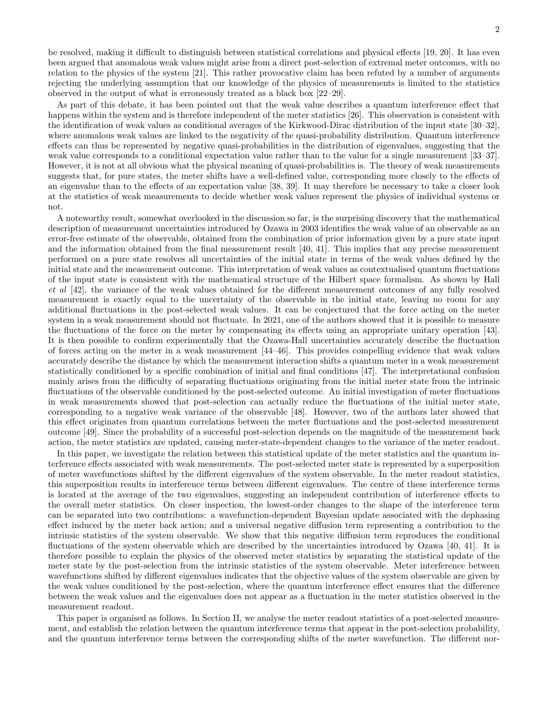 
Low-resolution page preview, page 2

📷 Fig 2

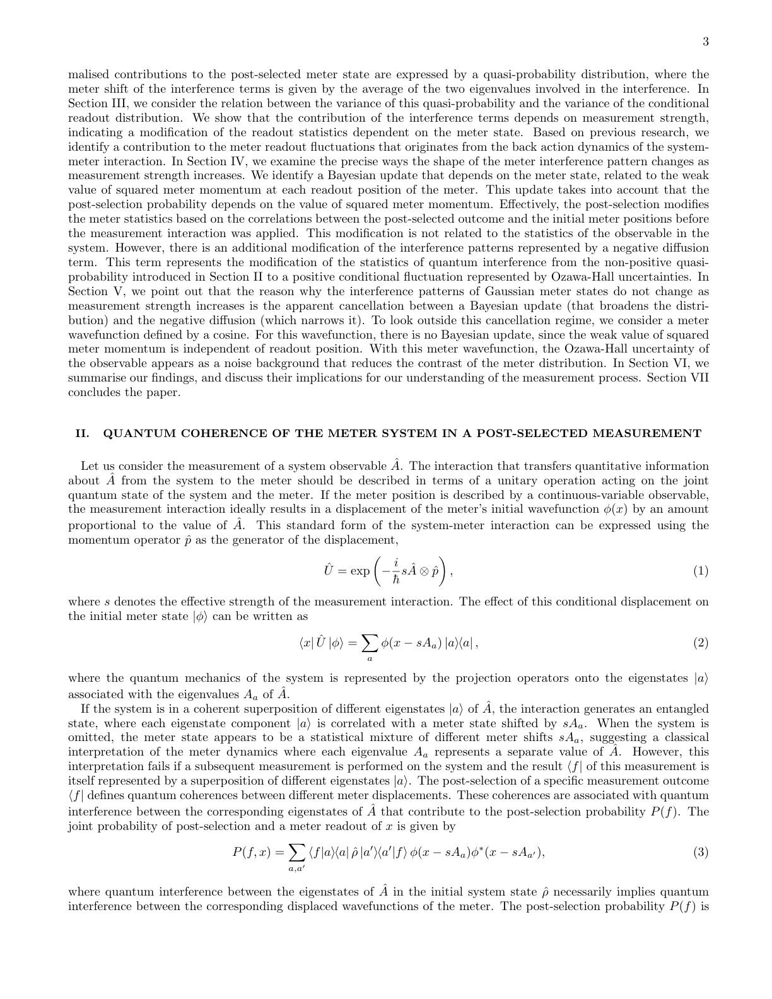 
Low-resolution page preview, page 3

📷 Fig 3

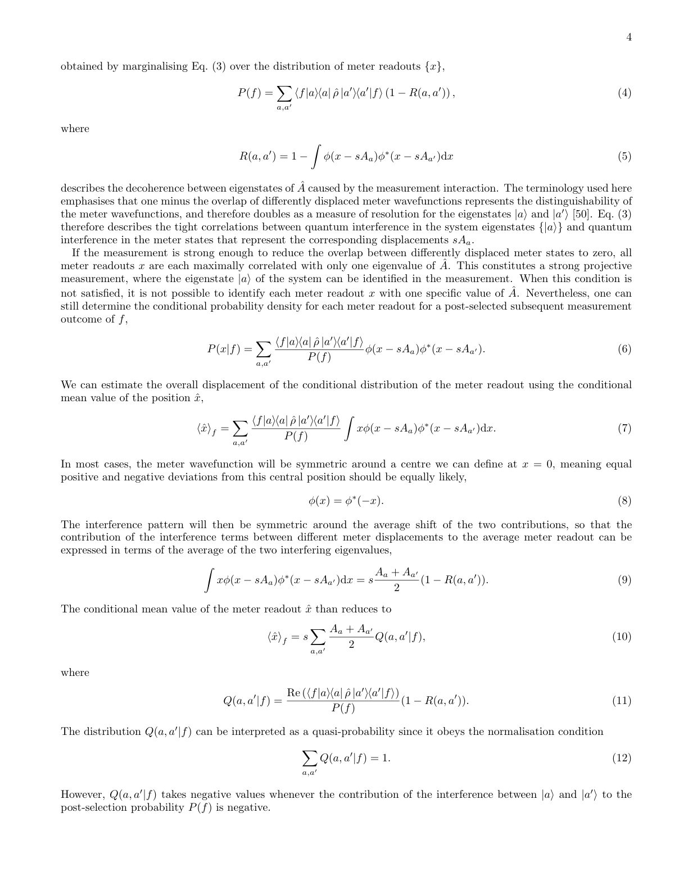 
Low-resolution page preview, page 4

📷 Fig 4

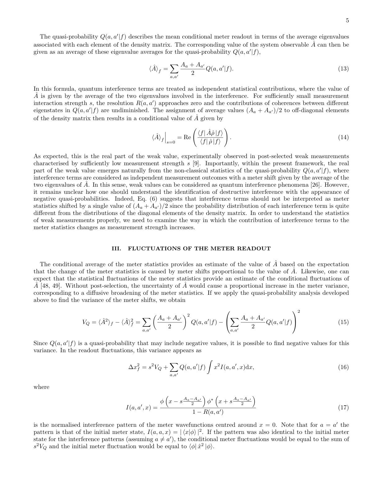 
Low-resolution page preview, page 5

📷 Fig 5

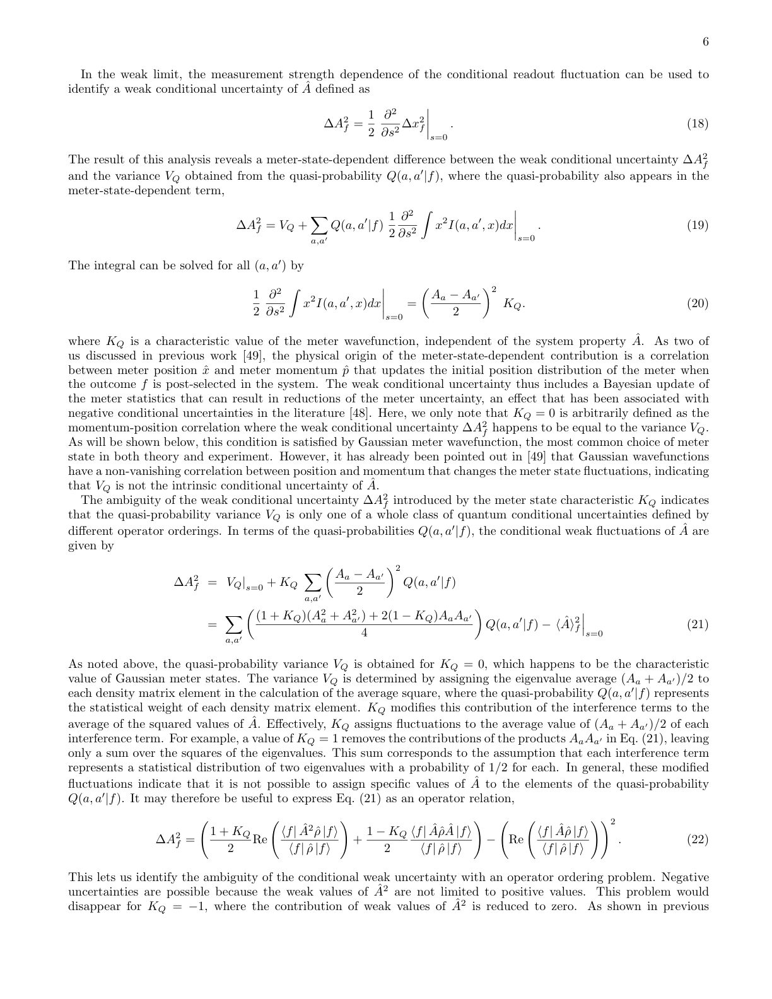 
Low-resolution page preview, page 6

**Summary.** This paper theoretically analyzes how interference patterns in the readout statistics of a meter used in a weak measurement can reveal information about the system's underlying quantum properties. By relating interference terms in the post-selection probability to fluctuations in the meter reading, the authors demonstrate that these statistical details allow for the objective determination of weak values. This provides a rigorous framework for interpreting measurements where standard assumptions about classical statistics break down.

**Why it may be interesting.** This work provides a deep theoretical understanding of measurement contextuality and weak measurements, which is highly relevant for quantum optics and open quantum systems where continuous monitoring or weak coupling is central to the physics.

Detailed structure

**Main problem.** The paper investigates how quantum interference effects, specifically those arising from meter readout statistics, can reveal fundamental details about weak measurements.

**Main result.** It establishes a universal relationship between quantum interference in the post-selection probability and the interference observed in the meter readout statistics. This analysis shows that these interference terms correct for measurement fluctuations, allowing objective values to be determined by weak values.

**Method.** The authors perform a careful theoretical analysis of the quantum dynamics of an interacting system (the observable) and a continuous variable meter during post-selection. They utilize quasi-probability distributions to track interference effects.

**Model / system.** The model involves a general weak measurement setup where a system observable $\hat{A}$ interacts unitarily with a meter whose position is continuously measured. The analysis focuses on the resulting joint probability distribution $P(f, x)$ after post-selection ($f$).

**Key observables.** Quantum interference in the post-selection probability; quantum interference in the meter readout statistics; weak values ($\langle A \rangle_w$); conditional fluctuations (e.g., Ozawa-Hall uncertainty).

**Important parameters / regimes.** Measurement strength ($s$), which dictates whether the measurement is weak or projective.

**Assumptions / limitations.** The analysis assumes that quantum interference effects are measurable in the meter readout statistics and that these statistics provide more information than just conditional averages.

**Paper structure.** The paper first establishes the general framework by analyzing the joint probability of post-selection and meter readout. It then details how interference terms modify both the average value and, crucially, the conditional fluctuations (variance) observed in the meter.

Abstract

It is widely assumed that the quantum fluctuations of the meter readout in a weak measurement make it impossible to identify the contributions originating from the individual values of the physical property observed in the measurement. Here, we show that a careful analysis of the quantum dynamics of the meter system allows us to identify a universal relation between quantum interference in the post-selection probability, and quantum interference in the statistics of the meter readout. The analysis reveals that quantum interference modifies the readout distribution of the meter in two ways, a diffusion term that identifies the appropriate operator ordering in the post-selected variance of the observed system property, and a wavefunction-dependent update of the initial meter statistics based on the effect of back action on the post-selection probability. Our results show that the statistical patterns described by meter interference provide important details about the physics of post-selection in weak measurements, allowing us to exclude the possibility of statistical artefacts in the experimental observation of weak values.

[↑ back to top](#top)

### [Unidirectional Dark-to-Bright Rescue in Cavity-Coupled Quantum Transport](http://arxiv.org/abs/2608.05312v1)

**Authors:** Jack Diab, Arpit Arora, Taylor L. Patti, Prineha Narang  
**Type:** theory · **Category:** other · **PDF:** <https://arxiv.org/pdf/2608.05312v1>  
**Analysis basis:** full PDF text, analyzed in chunks
**Topic relevance:** 🔥 `analog quantum simulation` **4/5** · 🔥 `correlated / nonlocal dissipation` **4/5** · 🔥 `methods for driven-dissipative` **4/5** · `Tavis-Cummings & cavity-many-emitter` **3/5** · `correlated cavity matter` **3/5** · `driven-dissipative phase transition` **3/5** · `non-equilibrium dynamics` **3/5** · `non-equilibrium universality` **2/5** · `superradiant laser` **2/5** · `Dicke superradiance` **1/5** · `Keldysh / 2PI / non-Gaussian methods` **1/5** · `entanglement & information structure` **1/5**

📷 Fig 1

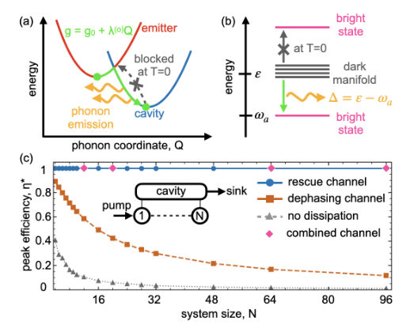 
FIG. 1. Unidirectional dark-to-bright rescue channel. (a) The non-Condon exchange between quantum emitter and phononic bath modifies the light-matter coupling making phonon emission and absorption causal with transitions in quantum system which opens a one-way energy dump for the quantum system via phonon emission. (b) This implies a po- laritonic pathway for relxation from dark manifold into bright state which is unidirectional due to vanishing cavity weight of dark states. (c) The rescue channel leads to transport in- dependent of system size shown here via the peak efficiency η∗vs. system size N (cavity drain, γrec and γdeph optimized per N); g = 1.5 meV, avergae over 15 disorder...

📷 Fig 2

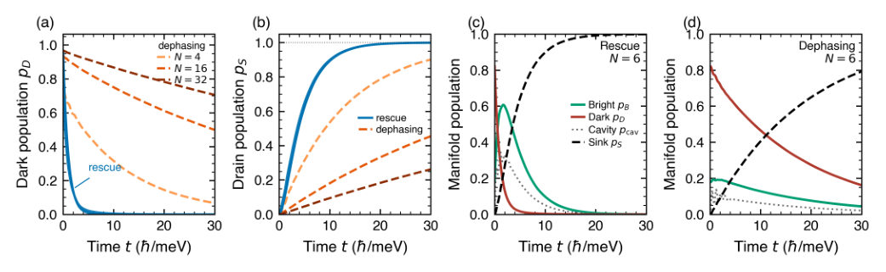 
FIG. 2. Cavity-drain transport dynamics at matched rates γrec = γdeph = 1.0 meV, g = 1.5 meV, δt = 0.5 meV, γlead = 0.5 meV; ensemble-averaged over 15 disorder realizations in (a),(b) and 20 in (c),(d). (a) Dark-manifold population and (b) cumulative drain population (transport efficiency η = pS) vs. time for system sizes N = 4, 16, 32: the rescue curves (blue, solid) collapse onto a single exponential with η →1 at every N, while dephasing (orange, dashed; darker with increasing N) leaves a long-lived dark plateau and a size-dependent efficiency deficit. (c),(d) Manifold-resolved populations at N = 6 under (c) pure rescue and (d) pure dephasing: bright pB (green), dark pD (red), cavity pcav...

📷 Fig 3

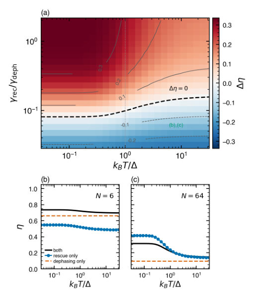 
FIG. 3. Rescue–dephasing competition at finite temperature. (a) Efficiency difference ∆η = ηrec −ηdeph vs kBT/∆and rate ratio γrec/γdeph for N = 6. The absorption rate γabs = e−∆/kBT γrec refills the dark manifold at finite T, degrading the unidirectional rescue. The crossover at kBT/∆∼1 is a clean detailed-balance signature, and shifts the ∆η = 0 boundary (black dashed) only weakly, from γrec/γdeph ≈0.08 to ≈0.16. (b),(c) Efficiency vs. temperature at γrec = 0.05 γdeph for (b) N = 6 and (c) N = 64: both channels active (black), rescue only (γdeph = 0, blue), and dephasing only (γrec = 0, orange dashed; T-independent). Raising N maps the temperature dependence of rescue channel on total...

**Summary.** The paper introduces a novel 'unidirectional rescue' mechanism for quantum energy transport in coupled emitter arrays trapped in dark states. This process utilizes non-Condon exciton-phonon coupling to create an irreversible escape route into the radiative channel. The key finding is that this rescue rate maintains near-unity efficiency independent of system size, significantly outperforming standard dephasing mechanisms.

**Why it may be interesting.** This work directly addresses open quantum systems dynamics in cavity QED, providing a concrete, engineered pathway to enhance energy transfer that circumvents fundamental limitations imposed by system geometry (size scaling).

Detailed structure

**Main problem.** The primary challenge addressed is overcoming energy trapping within optically dark states that form due to strong light-matter coupling in cavity arrays.

**Main result.** The authors demonstrate a unidirectional 'rescue' mechanism, mediated by non-Condon exciton-phonon coupling, which efficiently channels population out of the dark manifold into the radiative channel regardless of system size.

**Method.** The dynamics are modeled using a Lindblad master equation approach, comparing the rescue rate against standard dephasing mechanisms through detailed numerical simulations and theoretical analysis.

**Model / system.** The system is an array of coupled two-level emitters interacting with a single optical cavity (polaritonic system) and coupled to an exciton-phonon bath. The dynamics are governed by the Lindblad equation incorporating multiple dissipation channels.

**Key observables.** Transport efficiency ($\eta$), dark state decay rate, transient bright peak signature in photon emission, and size scaling of efficiency ($\eta$ vs $N$).

**Important parameters / regimes.** System size ($N$), temperature ($k_B T/\Delta$), coupling strengths (e.g., cavity-drain rates), and the ratio of rescue to dephasing rates.

**Assumptions / limitations.** The analysis relies on linear order system-bath coupling and the rotating-wave approximation, though unidirectionality is robustly shown even beyond these limits at T=0.

**Figures summary.** Figures compare dynamics under pure rescue versus pure dephasing, showing size-independent high efficiency for rescue while dephasing shows a size-dependent deficit. They also map the competition between rates as a function of temperature and rate ratios.

**Paper structure.** The paper establishes the problem (dark state trapping), introduces the unidirectional rescue mechanism via non-Condon coupling, provides quantitative evidence through size-scaling tests comparing rescue vs. dephasing efficiency, and concludes by discussing implications for quantum control.

Abstract

Strong light-matter coupling in optical microcavities can transport energy ballistically across an emitter array, but the same coupling buries most of the excitation in a manifold of dark states that grows with system size and traps energy outside the transport channel. We show that the off-diagonal (non-Condon) part of the exciton-phonon coupling opens a one-way escape route from this trap, driving population irreversibly from dark states into the radiative channel. This rate is fixed by a photonic-weight conservation law rather than by dark-bright overlap which evacuates the dark manifold at a rate independent of system size. The mechanism contributes to transport with near-complete efficiency with four signatures being single exponential dark state decay, a size scaling efficiency gap, distinct temperature behavior, and a resonance in the escape rate at vibrational bath modes. Beyond polariton transport, it recasts dark states from a parasitic loss channel into an engineered dissipative resource, with implications for light harvesting and dissipation based quantum control.

[↑ back to top](#top)

### [Generating two-mechanical mode entangled cat states, and steady-state entanglement, in cavity optomechanics in the presence of dissipation](http://arxiv.org/abs/2608.05503v1)

**Authors:** Sanket Das, Jason Twamley  
**Type:** theory · **Category:** other · **PDF:** <https://arxiv.org/pdf/2608.05503v1>  
**Analysis basis:** full PDF text, analyzed in chunks
**Topic relevance:** 🔥 `correlated / nonlocal dissipation` **4/5** · 🔥 `entanglement & information structure` **4/5** · 🔥 `methods for driven-dissipative` **4/5** · `analog quantum simulation` **3/5** · `correlated cavity matter` **3/5** · `driven-dissipative phase transition` **3/5** · `non-equilibrium dynamics` **2/5** · `non-equilibrium universality` **2/5** · `Keldysh / 2PI / non-Gaussian methods` **1/5** · `Tavis-Cummings & cavity-many-emitter` **1/5**

📷 Fig 1

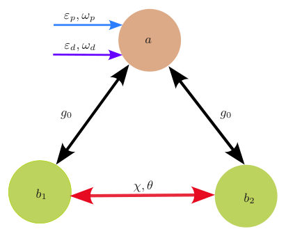 
FIG. 1. A schematic diagram of a cavity optomechanical sys- tem consists of a single cavity and two mechanical modes. The radiation pressure and phonon-hopping interactions are shown in black and red arrows, respectively. Single photon optomechanical coupling is g0, and the phonon-phonon inter- action is characterized by χ and θ. Cavity is driven by the pump field of amplitude and phase εp and ωp. Along with that, a coherent drive of amplitude εd and frequency ωd is also applied to the cavity.

📷 Fig 2

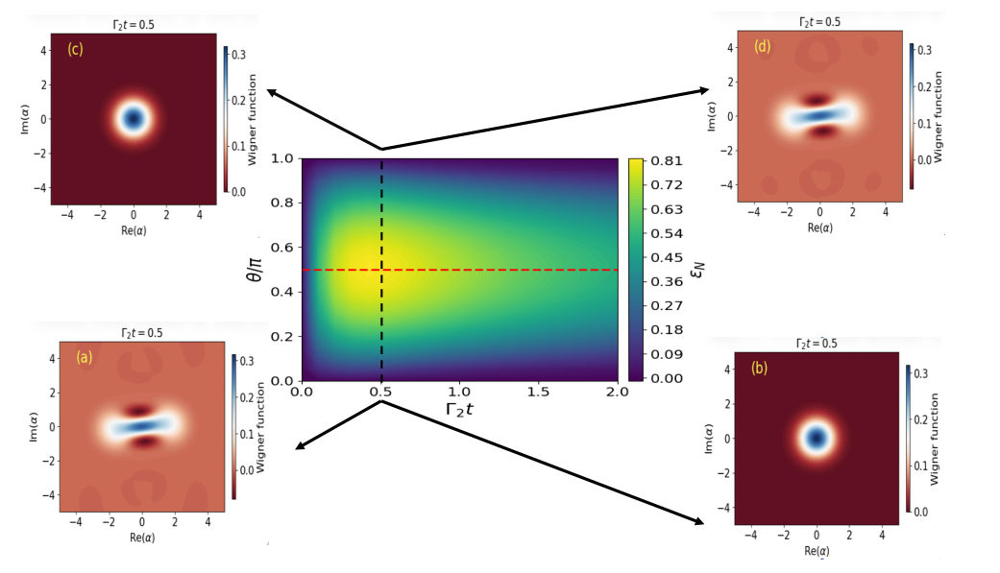 
FIG. 2. The central panel shows evolution of bipartite entanglement between the collective modes. The panels a(b) and c(d) depict the Wigner function of the bright(dark) mode when θ = 0 and π/2 at normalized time Γ2t = 0.5, respectively. We consider the degenerate mechanical modes with resonance frequency ωm/2π = 15 MHz and decay rate Γ/2π = 15 Hz, respectively. Thermal occupancy of each mechanical mode nb = 0. The exchange interaction between the two mechanical modes is characterized by the interaction amplitude χ/Γ2 = 10−2. The other parameters are ∆= −2ωm, γa/2π = 100 kHz, g0/2π = 1 MHz, ¯α = 0.02 and β = 1.6.

📷 Fig 3

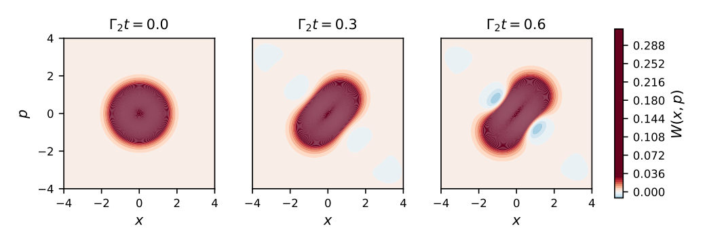 
FIG. 3. Temporal evolution of the conditional state of the bright mode. The phonon hopping interaction strength is charac- terized by χ/Γ2 = 0.01 and ϕ = π/2. All the other parameters are same as in Fig. 2.

📷 Fig 4

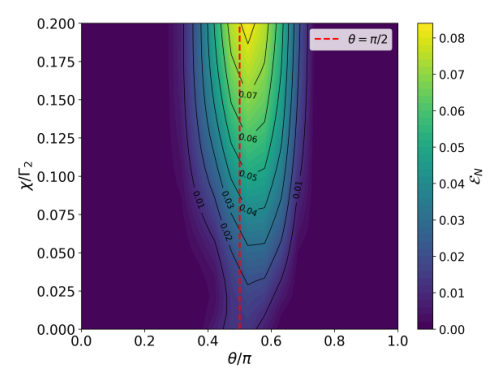 
FIG. 4. Steady-state bipartite entanglement between the col- lective modes as a function of χ and θ, when thermal excita- tion of each mechanical mode is 0.5. Red dashed line suggest θ = π/2. All the other parameters are the same as Fig. 2.

📷 Fig 5

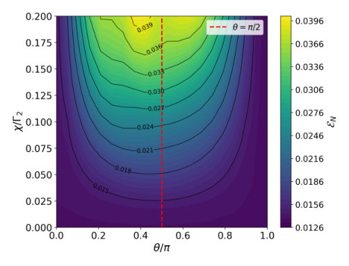 
FIG. 5. Steady-state bipartite entanglement between the bare mechanical modes as a function of χ and θ, when thermal excitation of each mechanical mode is 0.5. Red dashed line suggest θ = π/2. All the other parameters are the same as Fig. 2.

**Summary.** The paper demonstrates a method to generate highly entangled two-mode Schrödinger cat states in cavity optomechanics by carefully controlling the system's dissipation. By tuning the phase of an interaction term ($	heta$), researchers can maximize bipartite entanglement between mechanical modes, proving that engineered environmental coupling is a powerful tool for quantum state preparation.

**Why it may be interesting.** This work exemplifies advanced reservoir engineering by showing how controlled dissipation can stabilize non-Gaussian entangled states (cat states) in mechanical oscillators, a key area for quantum sensing and computation using macroscopic quantum systems.

Detailed structure

**Main problem.** The study investigates generating two-mechanical mode entangled Schrödinger cat states (SCS) and characterizing steady-state entanglement in a cavity optomechanical system subject to environmental dissipation.

**Main result.** The phase of the phonon-hopping interaction ($	heta$) can be tuned to control bipartite entanglement, achieving maximum entanglement at intermediate phases like $	heta=\pi/2$, even when considering thermal excitations.

**Method.** The analysis involves deriving an effective master equation for the mechanical modes via adiabatic elimination of the cavity field and quantifying entanglement using logarithmic negativity ($\mathcal{E}_N$).

**Model / system.** The system is a hybrid cavity optomechanical platform with one cavity mode coupled to two spectrally identical, interacting mechanical oscillators. The dynamics are governed by a master equation incorporating damping from both the cavity and mechanical baths.

**Key observables.** Bipartite entanglement (quantified by logarithmic negativity $\mathcal{E}_N$), Schrödinger cat state formation, and steady-state coherence ($c(t)$).

**Important parameters / regimes.** The phase of the phonon-hopping interaction ($	heta$), mechanical damping rates ($\Gamma$), cavity decay rate ($\gamma_a$), and coupling strengths ($g_0$).

**Assumptions / limitations.** Adiabatic elimination of the fast-decaying cavity mode is used, and some analytical approximations rely on weak phonon exchange interactions ($\chi \ll \Gamma_2$).

**Figures summary.** Figures illustrate the system components (Fig. 1), show bipartite entanglement vs. $	heta$ (maximized at $\pi/2$), and demonstrate temporal evolution of fidelity $F(t)$ confirming analytical accuracy limits.

**Paper structure.** The paper models the full Hamiltonian, derives a reduced master equation for mechanical modes using adiabatic elimination, analyzes the system in collective eigenmode bases ($	ext{D}\pm$), and finally calculates entanglement measures to show phase-dependent control over quantum states.

Abstract

We investigate a dissipation-engineering approach to produce a phase-dependent collective-mode Schrödinger cat state involving two modes. Our model features a single cavity mode that interacts with two spectrally identical mechanical oscillators. Both oscillators are coupled through a phase-dependent hopping interaction. We demonstrate that by adjusting the phase of the phonon-hopping interaction, one can control the bipartite entanglement of the phase-dependent two-mode cat state during its generation. Additionally, our study reveals that phonon interactions act as a tunable parameter, enabling the manipulation of steady-state entanglement between the bare mechanical modes, even in the presence of environmental effects and thermal excitations. Our scheme provides a feasible approach for the phase-dependent multi mode non-Gaussian states preparation.

[↑ back to top](#top)

### [Impact of Nonlinearities on Local Kinetic and Thermokinetic Uncertainty Relations in Bosonic Transport](http://arxiv.org/abs/2608.06303v1)

**Authors:** Didrik Palmqvist, Luca Magazzù, Milena Grifoni, Janine Splettstoesser  
**Type:** theory · **Category:** statistical mechanics · **PDF:** <https://arxiv.org/pdf/2608.06303v1>  
**Analysis basis:** full PDF text, analyzed in chunks
**Topic relevance:** 🔥 `methods for driven-dissipative` **4/5** · 🔥 `non-equilibrium dynamics` **4/5** · `Keldysh / 2PI / non-Gaussian methods` **3/5** · `correlated / nonlocal dissipation` **3/5** · `driven-dissipative phase transition` **3/5** · `entanglement & information structure` **2/5** · `non-equilibrium universality` **2/5** · `quantum measurements` **2/5** · `Kondo & dissipative impurity` **1/5** · `analog quantum simulation` **1/5** · `measurement-induced transitions` **1/5** · `scars & prethermalization` **1/5**

📷 Fig 1

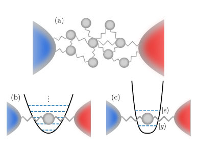 
Figure 1. (a) Sketch of a network of harmonic oscillators cou- pled to two bosonic reservoirs (or, equivalently, baths), where colors indicate possibly different temperatures. (b) Limit of a single harmonic oscillator connected to two reservoirs. (c) In the presence of strong nonlinearities, the central region is modeled by a two-level system—the nonequilibrium spin- boson model (NESB).

📷 Fig 2

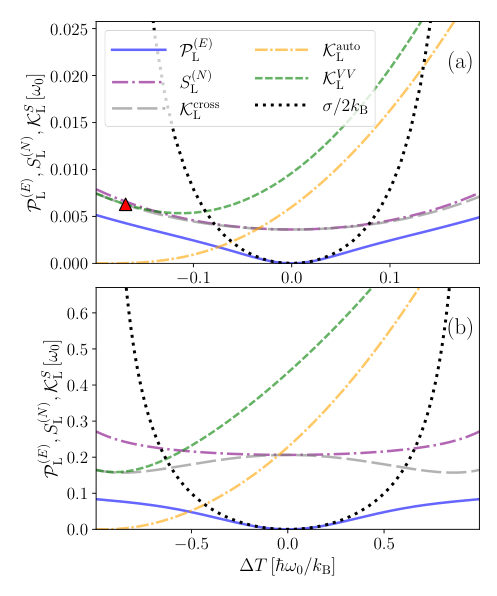 
Figure 2. Harmonic-oscillator system: Precision in energy current P(E) L , the current noise S(N) L , contributions to the correlator-based activity KV V L = Kcross L + Kauto L , and entropy production σ as functions of temperature bias ∆T. In (a) the average temperature is ¯T = 0.1ℏω0/kB and in (b) ¯T = ℏω0/kB. In both panels, the coupling strengths are set to gα = ω0 and the cutoff frequency ωc = 10ω0. The red triangle indicates one of the points appearing in Fig. 4.

📷 Fig 3

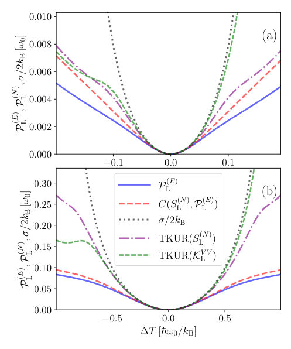 
Figure 3. Harmonic-oscillator system: Precision in en- ergy current P(E) L , TKURs using particle current noise and the correlator-based definition of activity to estimate single- particle transfer rates and entropy production σ as functions of temperature bias ∆T = TL −TR. In addition, the im- proved inference-bound on entropy production of (5) is shown. In panel (a) the average temperature ¯T = (TL + TR)/2 = 0.1ℏω0/kB and in panel (b) ¯T = ℏω0/kB. In both panels, the coupling strengths are set to gα = ω0 and the cutoff frequency ωc = 10ω0.

📷 Fig 4

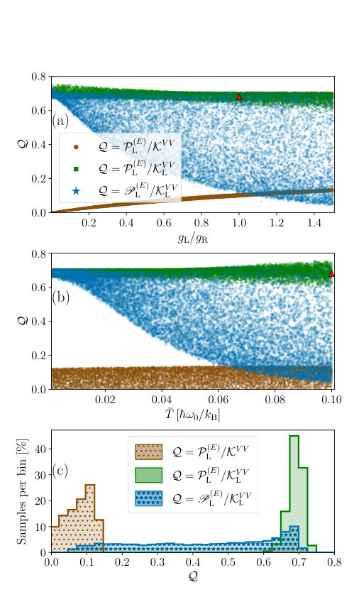 
Figure 4. Harmonic-oscillator system: Saturation of local KUR (Eq. (37a) green squares and histogram), S-KUR ((12) blue stars and histogram) and classical KUR (Eq. (37b) brown dots and histogram). We show the ratios between precision and bound as function of coupling asymmetry in panel (a) and as function of the average temperature in (b) where the remaining parameters are uniformly sampled (10000 points) with kB ¯T/(ℏω0) ∈[10−3, 10−1], ∆T/ ¯T ∈[−0.95, −0.7] and gL/gR ∈[10−3, 1.5] and ωc = 10ω0. Panel (c) shows the statistics of values obtained for the ratio between precision and bound. The red triangle indicates one of the points ap- pearing in Fig. 2.

📷 Fig 5

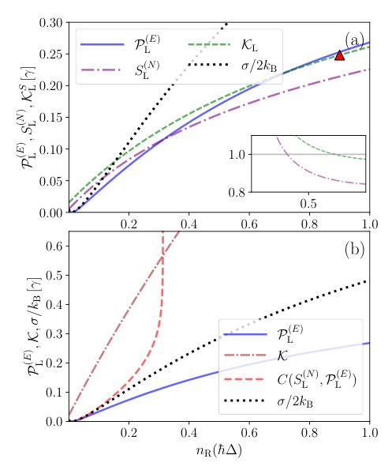 
Figure 5. NESB: Energy-current precision P(E) L , local activ- ity KL, particle current noise S(N) L , and (for reference) en- tropy production σ. Coupling strengths to the reservoirs are symmetric γL = γR = γ. Panel (a): right reservoir aver- age occupation nR(∆) is varied while the average occupation of the left reservoir is kept fixed at nL(∆) = 0.01. Panel (b): left reservoir average occupation nL(∆) is varied while the average occupation of the right reservoir is kept fixed at nR(∆) = 1. The insets display violations of local KUR and KUR-like bounds via the ratios KL/P(E) L (dashed green line) and S(N) L /P(E) L (dash-dotted purple line). The red triangle indicates a point appearing in...

**Summary.** This paper theoretically examines how interactions and nonlinearities impact fundamental uncertainty relations that bound the precision of measurements in bosonic quantum transport. By analyzing model systems like the spin-boson model, the authors show that while local bounds are tight for linear systems, nonlinearity can significantly alter or invalidate these established predictive limits.

**Why it may be interesting.** This is highly relevant as it bridges non-equilibrium thermodynamics (entropy production) with quantum transport theory, providing concrete predictions about measurement limitations in interacting nanoscale devices.

Detailed structure

**Main problem.** The study investigates how nonlinearities (interactions) affect the validity and predictive power of local kinetic and thermokinetic uncertainty relations governing bosonic transport.

**Main result.** The paper demonstrates that while linear systems allow for tight, locally defined precision bounds, these bounds are impacted or potentially broken when strong nonlinear interactions are present in the steady-state regime.

**Method.** The analysis employs theoretical tools including the Gorini–Kossakowski–Sudarshan–Lindblad (GKSL) master equation, Full Counting Statistics (FCS), and derivations of various activity measures to establish bounds.

**Model / system.** The work analyzes bosonic transport in two specific models: a harmonic oscillator network and the intrinsically nonlinear spin-boson model (NESB). The general framework involves an open quantum system coupled to Markovian baths.

**Key observables.** Precision $P(X) := (I(X))^2 / S(X)$, entropy production ($\sigma$), local/global activity measures, and current noise ($S(N)$).

**Important parameters / regimes.** The analysis focuses on the transition from linear to nonlinear regimes, and the dependence of bounds on the specific definition of 'activity'.

**Assumptions / limitations.** Approximations used include Born, Markov, and secular approximations when deriving correlator-based activity definitions.

**Figures summary.** Figure 1 sketches illustrate the physical setups: a harmonic oscillator network coupled to two reservoirs, the single oscillator limit, and the NESB model under strong nonlinearities.

**Paper structure.** The paper first reviews the theoretical framework of uncertainty relations in bosonic transport. It then develops multiple definitions for dynamical activity using Green's functions and correlators, showing their mathematical equivalence under approximations. Finally, it applies these tools to analyze how nonlinearity affects the derived local precision bounds in specific model systems.

Abstract

The precision of transport observables can be bounded by the entropy production and the activity of the transport process via kinetic and thermokinetic uncertainty relations. In linear bosonic systems, such uncertainty relations can provide tight bounds when the activity is replaced by a local activity of the measurement contact of interest---even in the strong-coupling regime. How much nonlinearities (or interactions) impact the validity and predictiveness of these local bounds and how much this impact depends on the concrete definition of activity are open questions that we address for two experimentally relevant model systems, a harmonic oscillator network and the intrinsically nonlinear spin-boson model. We thereby provide experimentally testable predictions on how nonlinearities impact or even break local kinetic and thermokinetic precision bounds.

[↑ back to top](#top)

### [Quantum transport in a non-Hermitian 1D synthetic lattice: from quantum Zeno reflection to near-perfect absorption](http://arxiv.org/abs/2608.06189v1)

**Authors:** Emmanuel. D. Mercado-Gutiérrez, W. Xu, E. Gvozdiovas, A. M. Piñeiro, Javier Argüello-Luengo, W. D. Phillips, Q. Zhou, I. B. Spielman  
**Type:** both · **Category:** quantum gases · **PDF:** <https://arxiv.org/pdf/2608.06189v1>  
**Analysis basis:** full PDF text, analyzed in chunks
**Topic relevance:** 🔥 `analog quantum simulation` **4/5** · 🔥 `non-equilibrium dynamics` **4/5** · `correlated / nonlocal dissipation` **3/5** · `driven-dissipative phase transition` **3/5** · `methods for driven-dissipative` **3/5** · `Kondo & dissipative impurity` **2/5** · `non-equilibrium universality` **2/5** · `Frenkel-Kontorova` **1/5** · `Keldysh / 2PI / non-Gaussian methods` **1/5** · `entanglement & information structure` **1/5** · `quantum measurements` **1/5**

📷 Fig 1

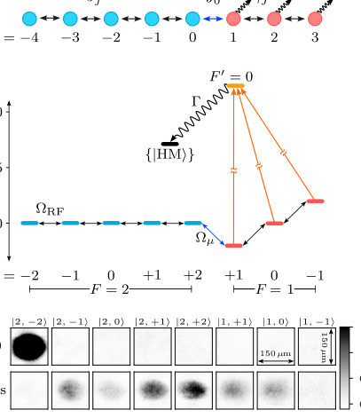 
FIG. 1. Synthetic lattice. (a) Finite chain with non- dissipative (blue, j ≤0) and dissipative (red, j &gt; 0) sub- chains. (b) Experimental realization with the F = 1 and F = 2 manifolds of 87Rb. Intra- and inter-manifold cou- plings are provided by RF and microwave magnetic fields with strengths ΩRF and Ωµ, respectively. The F = 1 ground states are optically coupled to the F ′ = 0 excited state; this decays, with rate Γ, to a range of outgoing momentum states {|HM⟩}. The potential landscape Vj results from rotating-frame detun- ings. (c) Column density associated with each state, measured after evolution times of t = 0 (top) and 650 µs (bottom), with ΩRF = 2π × 1.968(4) kHz, Ωµ =...

📷 Fig 2

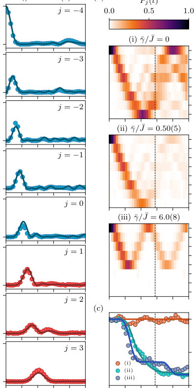 
FIG. 2. Dynamics. (a) Occupation probabilities Pj(t) for dissipative (red) and lossless (blue) sites with ¯γ/ ¯J = 0.50(5), J0/ ¯J = 1.083(2) and ¯J = 2π × 1.929(4) kHz. Circles (solid curves) denote experimental data (simulations). (b) Aggregated experimental data for three regimes: (i) explic- itly lossless [¯γ/ ¯J = 0], (ii) near-optimal absorption [¯γ/ ¯J = 0.50(5), identical to (a)], and (iii) quantum Zeno reflection [¯γ/ ¯J = 6.0(8)]. (c) Total probability PT(t) for each regime in (b). The black dashed line at t ¯J = 7.2 is the dimensionless time selected to measure the single-pass absorption A.

📷 Fig 3

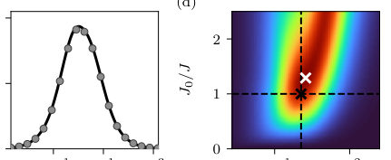 
FIG. 4. Extended lattice model. (a) Momentum-resolved absorption A(k) for γ/J = 1.14 (black) and γ/J = 50 (red), with J0/J = 1. (b) Numerical (circles) and analytical (curve) results for A∞as a function of J0/J at γ/J = 1.14; the inset shows the finite-chain A approaching A∞with increasing L. (c) A∞as a function of γ/J at J0/J = 1. (d) A∞as a function of γ/J and J0/J using the same color scale as in Fig. 3(d) with dashed lines indicating the cross sections in (c) and (d). The white cross marks the global maximum.

📷 Fig 4

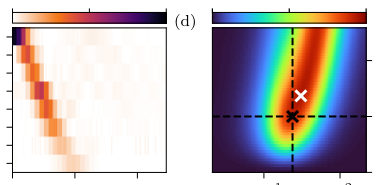 
FIG. 3. Near-perfect absorption. (a) Absorption A as a function of ¯γ/ ¯J with J0/ ¯J = 1.083(2). (b) Absorption as a function of J0/ ¯J at ¯γ = ¯γmax = 1.34(5) ¯J. (c) Wavepacket evolution at ¯γmax and J0,max = 1.32(7) ¯J found in (a) and (b). (d) Computed absorption as a function of ¯γ/ ¯J and J0/ ¯J with dashed lines indicating the cuts in (a) and (b). The white cross marks the global maximum.

**Summary.** The authors demonstrate the control of quantum transport by engineering dissipation in a synthetic lattice built from $^{87}	ext{Rb}$ BEC atoms. By tuning the loss rate relative to tunneling, they achieve near-perfect absorption at an optimum balance point, contrasting this with ballistic or Zeno reflection regimes. This establishes controlled dissipation as a powerful resource for tailoring quantum dynamics.

**Why it may be interesting.** This work provides a highly controllable platform (BECs) to engineer open quantum systems, making it directly relevant to research in open quantum dynamics, engineered dissipation, and non-Hermitian physics.

Detailed structure

**Main problem.** The study experimentally explores wavepacket absorption when impinging on a dissipative region within an engineered quantum system, aiming to control quantum transport by tuning dissipation.

**Main result.** Optimal energy absorption is achieved by carefully matching the tunneling strength and the dissipation rate, demonstrating a controllable transition between ballistic propagation, near-perfect absorption, and Zeno reflection.

**Method.** The research combines experimental measurements on an atomic BEC with numerical simulations using non-Hermitian tight-binding Hamiltonians to model wavepacket dynamics.

**Model / system.** The system is a 1D non-Hermitian synthetic lattice realized using the hyperfine manifold of a trapped $^{87}	ext{Rb}$ Bose-Einstein condensate. The lattice features an abrupt interface between dissipative and non-dissipative subchains.

**Key observables.** Absorption efficiency ($A$), occupation probabilities $P_j(t)$, and total probability $P_T(t)$.

**Important parameters / regimes.** Dissipation rate ($ar{\gamma}$), inter-chain tunneling strength ($J_0$), and the ratio $ar{\gamma}/ar{J}$.

**Assumptions / limitations.** The analysis relies on modeling the system with a non-Hermitian Hamiltonian, comparing measurements against numerical simulations.

**Figures summary.** Figures illustrate wavepacket occupation probabilities in three regimes (lossless, optimal absorption, Zeno reflection) and show parameter scans confirming that maximum absorption requires matching tunneling and dissipation.

**Paper structure.** The paper progresses from defining the physical system and Hamiltonian to presenting experimental observations across different dissipation regimes, followed by theoretical analysis using idealized semi-infinite models for confirmation.

Abstract

We experimentally explore the absorption of a propagating wavepacket impinging upon a dissipative region in an engineered quantum system. We employ a 1D non-Hermitian synthetic lattice with an abrupt interface between dissipative and non-dissipative subchains, using the states of the electronic ground-state hyperfine manifold in a $^{87}$Rb Bose-Einstein condensate as sites. By tuning the dissipation rate, we observe a progression from ballistic propagation, to near-perfect absorption, to quantum Zeno reflection. Guided by numerical simulations, we identify that optimal absorption occurs when tunneling and dissipation are properly matched, and find qualitative agreement with an idealized semi-infinite model across all dissipation regimes. Our results establish synthetic lattices as a versatile Quantum simulation platform for dissipation-engineered quantum transport and highlight controlled dissipation as a resource for tailoring quantum dynamics.

[↑ back to top](#top)

### [The Quantum Mechanics of Rare Events: From Quantum Walks to Stochastic Inflation](http://arxiv.org/abs/2608.06319v1)

**Authors:** Daniel Green, Kshitij Gupta, Akhil Premkumar  
**Type:** theory · **Category:** statistical mechanics · **PDF:** <https://arxiv.org/pdf/2608.06319v1>  
**Analysis basis:** full PDF text, analyzed in chunks
**Topic relevance:** 🔥 `measurement-induced transitions` **4/5** · `Keldysh / 2PI / non-Gaussian methods` **3/5** · `driven-dissipative phase transition` **3/5** · `correlated / nonlocal dissipation` **2/5** · `entanglement & information structure` **2/5** · `methods for driven-dissipative` **2/5** · `non-equilibrium dynamics` **2/5** · `non-equilibrium universality` **2/5** · `quantum measurements` **2/5** · `Kondo & dissipative impurity` **1/5** · `analog quantum simulation` **1/5** · `correlated cavity matter` **1/5**

📷 Fig 1

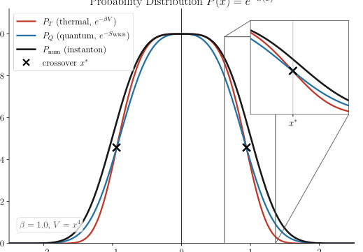 
Figure 1: Illustration of the relative contributions of classical random (thermal, red) and quantum mechanical (WKB, blue) contributions to the full probability distribution (numerical instanton, black) at large distances calculated. The calculation for all three curves are explained in Section 2.

📷 Fig 2

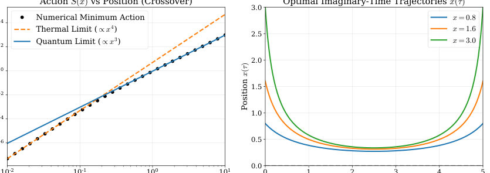 
Figure 2: Left: Numerically computed action for the quantum thermal instanton for various values of x (points), compared to the thermal and quantum scalings, S ∝x4 and x3 respectively. Right: The solutions for the instantons for different boundary conditions.

📷 Fig 3

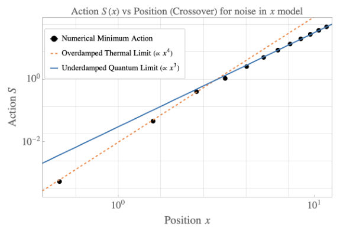 
Figure 3: Numerically computed action for the quantum noise in x instanton for various values of x (points), compared to the overdamped classical and free quantum scalings, S ∝x4 and x3

📷 Fig 4

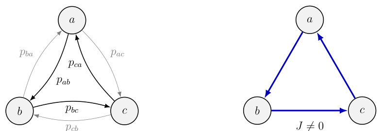 
Figure 4: A three-site lattice sustaining a nonequilibrium steady state (NESS). (Left) Individual transition rates to/from each site. Each bond has a dominant (thick) and a reverse (thin, gray) rate, with πapab ̸= πbpba and cyclically for (b, c) and (c, a). (Right) The resulting net circulation. Since πa, πb, πc are constant in time, this current is stationary: mass leaving a is exactly replen- ished via c →a, with no accumulation anywhere. This persistent circulation, despite a perfectly stationary density, is the source of housekeeping entropy production.

📷 Fig 5

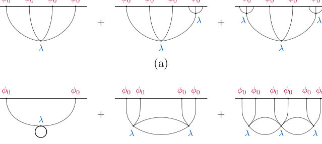 
Figure 5: Contributions to the wavefunction from (a) tree level and (b) loop-level Witten dia- grams. The tree level diagrams dominated when ϕ2 0λ ≫1 as the loop diagrams are suppressed by additional powers of λ for the same order in ϕ0. Figure adapted from [111].

**Summary.** This paper develops the theory of large deviations for quantum systems, which is crucial for understanding rare events in physics. It demonstrates that these fluctuations can be characterized by minimizing measurement-induced relative entropy across various models. The work applies this framework successfully to both condensed matter analogs (anharmonic oscillators) and fundamental cosmology problems like stochastic inflation.

**Why it may be interesting.** It bridges foundational statistical mechanics (large deviations) with modern open quantum systems dynamics and high-energy astrophysics (cosmology), providing tools applicable to non-equilibrium quantum processes.

Detailed structure

**Main problem.** The primary goal is to develop a practical theory of large deviations for quantum systems, addressing a major gap in understanding rare fluctuations relevant to statistical physics and cosmology.

**Main result.** The paper shows that dominant rare quantum fluctuations minimize the measurement-induced relative entropy, providing a thermodynamic description applicable from quantum walks to cosmological field evolution.

**Method.** The authors analyze open quantum systems using techniques involving quantum fidelity maximization and minimizing measurement-induced relative entropy, extending classical large deviation principles.

**Model / system.** Models include the anharmonic oscillator coupled to a bath, general quantum random walks, and long wavelength scalar fields evolving on a fixed de Sitter background in cosmology.

**Key observables.** Measurement-induced relative entropy, Quantum Fidelity ($\mathcal{F}$), rate function $I(\alpha)$, and the breakdown of KMS symmetry.

**Important parameters / regimes.** Temperature (thermal vs. quantum regimes), coupling constants ($\lambda$), and cosmological scale factors defining de Sitter space.

**Assumptions / limitations.** The analysis often assumes Gaussian noise for deriving diffusion equations, and it builds upon established large deviation theory from classical statistical mechanics.

**Figures summary.** Figure 1 illustrates the crossover between classical random (thermal), quantum mechanical (WKB), and numerical instanton contributions to the probability distribution $P(x)$ at large distances.

**Paper structure.** The paper progresses by first analyzing the anharmonic oscillator's transition from thermal to quantum behavior, then generalizing this using relative entropy minimization for abstract quantum walks, and finally applying these concepts to random walks arising in stochastic inflation/de Sitter cosmology.

Abstract

Rare fluctuations in physical systems depend on the detailed microphysics responsible for the fluctuations. In classical statistical systems, the large deviation principle has elucidated the role of semi-classics in describing this regime, and has simultaneously provided a the mathematical foundation of statistical mechanics. Large deviation theory for quantum system is considerably less developed. As all physical systems are fundamentally quantum mechanical, this leaves a major gap in our understanding of rare fluctuations relevant to statistical physics, cosmology, and more. In this paper, we develop the practical aspects of the theory of large deviations relevant for calculating rare events in physical systems from quantum walks to cosmology. We first analyze the case of the anharmonic oscillator coupled to a bath, showing explicitly how the system evolves from dominantly statistical (e.g. thermal) to quantum fluctuations. We then generalize these results, showing that the dominant rare fluctuations minimize the measurement-induced relative entropy. This perspective provides a thermodynamic description of a wide range of open quantum systems. We apply these results to random walks that arise in cosmology through stochastic inflation. We show that the evolution of the density matrix of long wavelength fields on a fixed de Sitter background breaks the KMS symmetry, giving rise to a stationary density matrix that does not respect detailed balance.

[↑ back to top](#top)

### [A quantum framework for event graphs](http://arxiv.org/abs/2608.06058v1)

**Authors:** R. P. Erickson  
**Type:** theory · **Category:** disordered systems and neural networks · **PDF:** <https://arxiv.org/pdf/2608.06058v1>  
**Analysis basis:** full PDF text, analyzed in chunks
**Topic relevance:** 🔥 `analog quantum simulation` **4/5** · 🔥 `exotic spin models in light-matter` **4/5** · `Keldysh / 2PI / non-Gaussian methods` **3/5** · `methods for driven-dissipative` **3/5** · `correlated / nonlocal dissipation` **2/5** · `driven-dissipative phase transition` **2/5** · `entanglement & information structure` **2/5** · `non-equilibrium dynamics` **2/5** · `Kondo & dissipative impurity` **1/5** · `non-equilibrium universality` **1/5**

📷 Fig 1

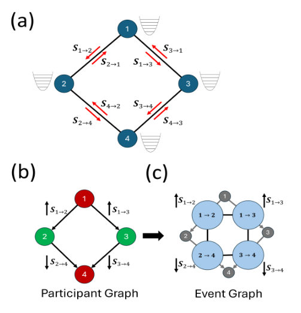 
FIG. 1. (a) A 4-node graph with QHO at each participant node and 2 Schwinger isospins of form Sj→k and Sk→j. The red arrows indicate edge direction. (b) Simple participant graph with 4 participant nodes and 2 event paths 1 →2 →4 and 1 →3 →4. (c) Line-graph transformation of (b) to event graph where event edges become nodes, participant nodes are shaded to indicate latency, and bidirectional edges connect event nodes that have participant nodes in common.

📷 Fig 2

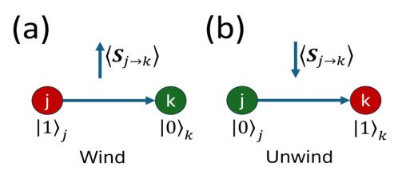 
FIG. 2. Reference graph examples of binary event archetypes, wind and unwind, expressed via states: (a) |1⟩j ⊗|0⟩k, corre- sponding to isospin up, and (b) |0⟩j ⊗|1⟩k, corresponding to isospin down.

**Summary.** This work proposes a novel quantum framework to analyze event graphs, treating them as physical systems governed by an XY-type spin Hamiltonian derived from Lattice Gauge Theory. It bridges abstract graph learning concepts with rigorous quantum mechanics by mapping latent participant states onto observable event isospins. The resulting model can be implemented using quantum-inspired graph transformer architectures for anomaly detection.

**Why it may be interesting.** The explicit connection between lattice gauge theory (a tool from condensed matter/high energy physics) and the structure of modern graph neural networks is highly relevant for theoretical physicists exploring quantum information applications in complex systems modeling.

Detailed structure

**Main problem.** The paper develops a quantum framework to analyze event graphs derived from classical datasets, specifically for anomaly detection.

**Main result.** It establishes a mathematical bridge between graph learning (event graphs) and quantum mechanics by formulating the dynamics using an XY-type spin model governed by a Lattice Gauge Theory Hamiltonian.

**Method.** The approach involves mapping participant graphs to event graphs via a line-graph transformation, assigning Quantum Harmonic Oscillators (QHOs), and then deriving an effective Hamiltonian structure suitable for graph neural network architectures.

**Model / system.** The system is modeled by a directed participant graph $G(V, E)$ whose edges generate Schwinger isospins. This leads to an event graph $	ilde{G}$ where dynamics are governed by a Kogut-Susskind Hamiltonian (KSH) acting on observable anomalous spins.

**Key observables.** The expectation value of the edge isospin $\langle S_{j	o k} 
angle$ reveals partial information about hidden participant states; the final classical score $s_\ell$ is read out from the reduced density operator $
ho^{(	ext{out})}_{\ell}$.

**Important parameters / regimes.** The truncation dimension $d=2$ (leading to Ising-like dynamics) and the coupling strengths $J_{l,l'}$ and local fields $h_\ell$ in the Hamiltonian are key parameters.

**Assumptions / limitations.** A primary assumption is the lowest nontrivial truncation of the local Hilbert space ($d=2$). Furthermore, practical implementations rely on approximating the global reduced state by preserving local coherence ($
ho^{(	ext{out})}_{\ell} \approx 
ho^{(L,M)}_{\ell}$).

**Figures summary.** Figure 1 illustrates the mapping from participant graphs to event graphs using QHOs and isospins. Figure 2 shows reference graph examples of binary event archetypes corresponding to specific isospin states.

**Paper structure.** The paper first defines the quantum structure on the participant graph (QHOs, Schwinger isospins). It then applies a line-graph transformation to define observable nodes/edges in the event graph. The dynamics are formulated via a U(1) LGT leading to an XY-type Hamiltonian. Finally, it details how this physical model can be realized and trained using quantum-inspired graph transformer architectures.

Abstract

Graph representations of discrete events provide a natural foundation for machine-learning models of anomaly detection, yet they also suggest a deeper quantum description in which graph structure gives rise to interacting quantum degrees of freedom. We develop a quantum framework based on a directed participant graph whose edges represent events connecting pairs of source and destination vertices. A line-graph transformation maps each event to a node of a bidirectional event graph, whose edges inherit relational information from the participant graph. Since event datasets are naturally organized as collections of event records, their raw attributes align directly with the nodes of the event graph. A quantum harmonic oscillator (QHO) is assigned to every node of the participant graph, with the collective Hilbert space of these QHOs providing a complete basis for representing quantum states. Every directed edge of the participant graph thereby acquires a Schwinger isospin arising from the two endpoint oscillators. Under the line-graph transformation, event-graph nodes correspond to observable isospins whose interactions through bidirectional edges provide a natural substrate for learning from event datasets, while the quantum states associated with the underlying participant nodes remain latent and inaccessible to direct observation. Within this framework we formulate a compact U(1) lattice gauge theory (LGT) on the event graph that leads to a Kogut-Susskind Hamiltonian (KSH) in the form of an XY-type spin model governing the dynamics of sparse anomalous-event isospins immersed in a bath of many nominal events. The proposed framework establishes a mathematical foundation for quantum-inspired graph-based anomaly detection and provides a principled bridge between graph learning, LGT, and quantum information.

[↑ back to top](#top)

### [An Effective String Theory Toolbox for Quantum Hall Interfaces III: Open Worldsheets, Endpoint Conditions, and Branes](http://arxiv.org/abs/2608.06100v1)

**Authors:** Ken K. W. Ma  
**Type:** theory · **Category:** strongly correlated electrons · **PDF:** <https://arxiv.org/pdf/2608.06100v1>  
**Analysis basis:** full PDF text, analyzed in chunks
**Topic relevance:** 🔥 `Keldysh / 2PI / non-Gaussian methods` **4/5** · `correlated / nonlocal dissipation` **3/5** · `driven-dissipative phase transition` **3/5** · `methods for driven-dissipative` **3/5** · `non-equilibrium dynamics` **3/5** · `Kondo & dissipative impurity` **2/5** · `non-equilibrium universality` **2/5** · `analog quantum simulation` **1/5** · `measurement-induced transitions` **1/5** · `quantum measurements` **1/5** · `spintronics-quantum-optics interface` **1/5**

📷 Fig 1

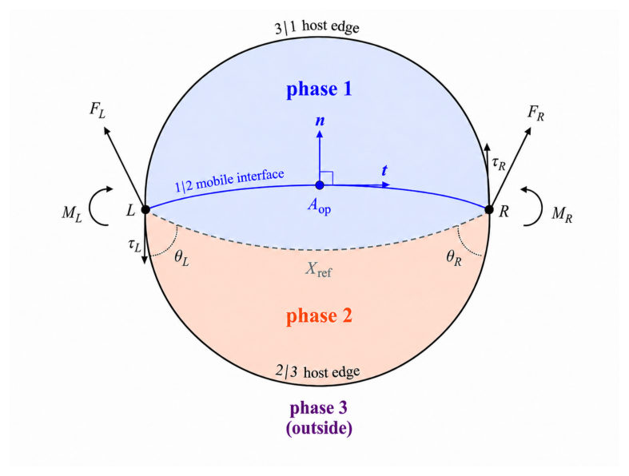 
FIG. 1. Schematic geometry of an open mobile QH interface. The blue 1|2 interface terminates at endpoints L and R on a circular support whose upper and lower arcs form the 3|1 and 2|3 host edges, respectively. The dashed curve Xref, together with the mobile segment and the support arcs, defines the capped relative area Aop. The vectors t and n are the unit tangent and normal of the mobile interface. The support tangents τL and τR are shown with a common counterclockwise orientation of the circular boundary, and therefore point downward at L and upward at R. The quantities Fa and Ma denote the transmitted endpoint force and bending moment. The dotted endpoint arcs indicate the contact-angle...

**Summary.** This paper develops an advanced string theory toolbox to handle the complex physics of mobile Quantum Hall (QH) interfaces that terminate at edges. It constructs a junction framework that rigorously enforces charge and anomaly conservation across these boundaries. The result provides a systematic, operational definition for QH branes and endpoint theories.

**Why it may be interesting.** This work provides a rigorous, field-theoretic approach to open quantum systems boundaries, which is highly relevant for understanding dissipation, coupling to leads, or interfaces in condensed matter systems like superconducting qubits or topological insulators.

Detailed structure

**Main problem.** The primary challenge is developing a consistent theoretical framework for determining the endpoint data required for a freely moving Quantum Hall (QH) interface that terminates on a physical or topological boundary.

**Main result.** The authors establish an open-worldsheet junction framework, showing that charge conservation and anomaly flow dictate that specific localized excitations, like a lone chiral Majorana, cannot terminate without satisfying complex continuity conditions.

**Method.** The work employs variational principles applied to the worldsheet action, developing specialized boundary functionals (like the capped relative-area functional) to enforce consistency across geometric, material, and topological sectors.

**Model / system.** The model is a mobile QH interface treated as an open worldsheet embedded in a background manifold. It incorporates concepts from string theory, chiral edge states, and topological order relevant to fractional quantum Hall physics.

**Key observables.** Endpoint force (F), bending moment (M), material charge ($Q_{mat}$), total charged-boson zero mode ($Q_{seg}$), and the scattering matrix $S_\gamma(\omega)$.

**Important parameters / regimes.** The filling factors ($
u$), topological sectors, geometric support curves, and coupling constants governing anomaly flow.

**Assumptions / limitations.** The analysis is restricted to fixed open segments; processes involving worldsheet splitting or joining are considered beyond the scope of this specific construction.

**Figures summary.** Figure 1 schematically illustrates the geometry of an open mobile QH interface terminating at endpoints L and R on a support curve, defining the capped relative area $A_{op}$.

**Paper structure.** The paper builds from establishing mechanical boundary terms via variational calculus to formulating the junction framework. It then details charge conservation laws, analyzes endpoint completion using topological sectors (open Wilson lines), and concludes with specific scattering analyses for Majorana junctions.

Abstract

A freely moving quantum Hall (QH) interface may end on a physical edge or topological boundary, but fixed-edge theory cannot determine what endpoint data make such a termination consistent. Here we formulate an open-worldsheet junction framework in which the embedding, material charge, anomaly flow, and topological boundary condition are organized together. The endpoint is specified by a geometric support and variational boundary data, together with condensable topological sectors and any outgoing channels required to absorb or continue the worldsheet flux. This construction extends the charge--shape relation to an interval and shows why a lone chiral Majorana cannot terminate on a finite-dimensional endpoint degree of freedom. It gives an operational definition of a QH brane and a systematic basis for endpoint and network theories of dynamical QH interfaces.

[↑ back to top](#top)

### [Exponential Speedup of Entanglement Generation by Quantum Mpemba Effects](http://arxiv.org/abs/2608.05935v1)

**Authors:** Sara M. Benjadi, Reinhold Egger, Igor Gornyi, Andrea Nava  
**Type:** theory · **Category:** statistical mechanics · **PDF:** <https://arxiv.org/pdf/2608.05935v1>  
**Analysis basis:** full PDF text, analyzed in chunks
**Topic relevance:** 🔥 `correlated / nonlocal dissipation` **4/5** · 🔥 `entanglement & information structure` **4/5** · `driven-dissipative phase transition` **3/5** · `methods for driven-dissipative` **3/5** · `non-equilibrium dynamics` **3/5** · `Keldysh / 2PI / non-Gaussian methods` **2/5** · `non-equilibrium universality` **2/5** · `analog quantum simulation` **1/5** · `exotic spin models in light-matter` **1/5** · `scars & prethermalization` **1/5**

📷 Fig 1

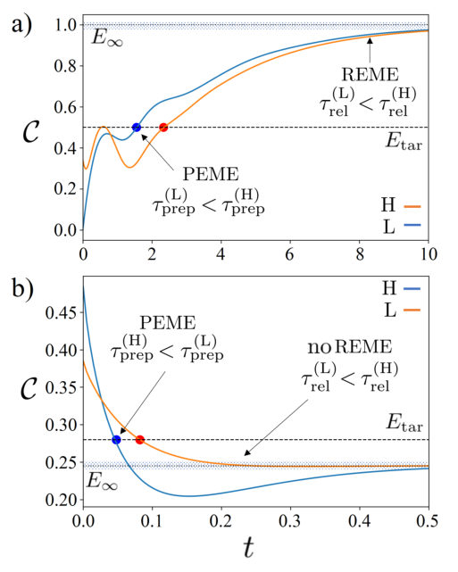 
FIG. 1. Entanglement MEs for the concurrence, E(ρ) = C(ρ), of the I2KM, see Eq. (7), with Jh = 1 and other parameters specified in the End Matter. The shown results were obtained by numerically solving Eq. (1). (a) Direct effect: Two weakly entangled initial states (L, H) evolve toward a highly entangled stationary state with C(∞) = E∞. The dotted region around E∞has the width 2Eth. Since C(L)(t) (blue curve) reaches and permanently surpasses the threshold Etar earlier than C(H)(t) (orange curve), the PEME occurs. We also observe the REME at long times. (b) Inverse effect: Two highly entangled initial states (H, L) approach a weakly entangled stationary state for t →∞. The inverse PEME is...

📷 Fig 2

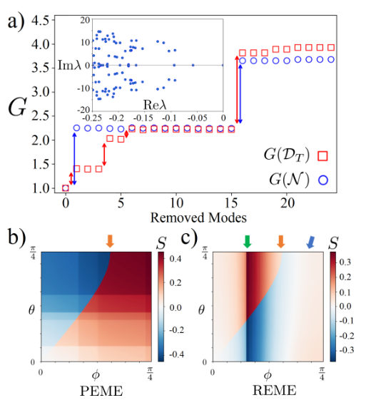 
FIG. 2. Results for the dissipative long-range Ising model with N = 6 sites, see Eq. (9), using E(ρ) = N(ρ) with a 3|3 bipartition. They are obtained from Eq. (1) for J = 1, α = 0.5, and hx = 5/6, using DT,th = 10−3, Nth = 10−5. (a) Relaxation time speedups G(DT ) and G(N), see Eq. (10), vs number of removed Lindbladian modes, for γ = 1/6. The inset shows the slow-mode part of the spectrum of L. (b) Normalized time difference S for the PEME, defined as in Eq. (10) but with τrel →τprep, shown as color-scale plot in the ϕ–θ plane. These angles parameterize the two initial states (11). The PEME corresponds to S &gt; 0. We use γ = 1/3 and Etar = 0.8. (c) Same as (b) but for the REME. In (b) and...

**Summary.** This paper explores 'quantum Mpemba effects' to show that entanglement generation and decay can be exponentially accelerated or slowed down. By analyzing the spectral properties of open quantum systems governed by Lindblad dynamics, the authors derive conditions for these speedups using specific entanglement measures. This work is significant for understanding non-equilibrium resource management in quantum technologies.

**Why it may be interesting.** It provides a powerful theoretical framework for understanding non-equilibrium dynamics in open quantum systems, showing how engineered dissipation can dramatically alter relaxation rates of key resources like entanglement.

Detailed structure

**Main problem.** The study investigates how quantum Mpemba effects can exponentially accelerate entanglement generation or slow down its decay in open quantum systems.

**Main result.** Exponential speedups are demonstrated by engineering the system's dynamics to suppress slow spectral modes, showing that these effects can arise independently of conventional mechanisms.

**Method.** The analysis uses spectral decomposition of the Lindblad master equation and compares entanglement evolution using different measures (e.g., Concurrence vs. Logarithmic Negativity).

**Model / system.** The theory is applied to open quantum systems evolving under a Lindblad master equation, with specific examples including the dissipative two-site Kitaev model and a long-range Ising chain.

**Key observables.** Entanglement measures (Concurrence, Logarithmic Negativity), preparation/relaxation times ($	au_{	ext{prep}}, 	au_{	ext{rel}}$), and spectral coefficients ($Z^{(N)}_k$).

**Important parameters / regimes.** Dissipation rates ($\gamma, \kappa$), coupling strengths ($\Delta$), and the choice of entanglement monotone.

**Assumptions / limitations.** The long-time dynamics are analyzed via spectral decomposition, assuming Fréchet differentiability for certain observables.

**Figures summary.** Figures illustrate mode visibility diagrams ($Z^{(N)}_k$) showing conditions for speedup, and time evolution plots comparing different entanglement measures under varying parameters.

**Paper structure.** The paper introduces two types of entanglement Mpemba effects (PEME and REME), derives the necessary spectral conditions using linear approximations, applies these concepts to specific models like the I2KM, and compares results across various entanglement monotones.

Abstract

Entanglement is a key resource for quantum technologies. We show that protocols employing quantum Mpemba effects allow one to exponentially accelerate the generation of entanglement, or to slow down the decay thereof. Two entanglement Mpemba effects with different operational meaning are introduced, focusing either on the task of rapidly generating a certain threshold value for entanglement or on achieving the asymptotic steady-state value. We show that entanglement Mpemba effects depend on the chosen entanglement measure. Using cluster elimination methods, many-body quantum systems also benefit from the exponential speedup of entanglement generation, as we demonstrate for a dissipative long-range Ising chain.

[↑ back to top](#top)

### [Measurement-induced entanglement Hamiltonian](http://arxiv.org/abs/2608.06006v1)

**Authors:** Viktor Eisler, Erik Tonni  
**Type:** theory · **Category:** statistical mechanics · **PDF:** <https://arxiv.org/pdf/2608.06006v1>  
**Analysis basis:** full PDF text, analyzed in chunks
**Topic relevance:** 🔥 `entanglement & information structure` **4/5** · 🔥 `measurement-induced transitions` **4/5** · `quantum measurements` **3/5** · `Keldysh / 2PI / non-Gaussian methods` **2/5** · `driven-dissipative phase transition` **2/5** · `non-equilibrium universality` **2/5** · `Kondo & dissipative impurity` **1/5** · `analog quantum simulation` **1/5** · `correlated / nonlocal dissipation` **1/5** · `methods for driven-dissipative` **1/5** · `non-equilibrium dynamics` **1/5**

📷 Fig 1

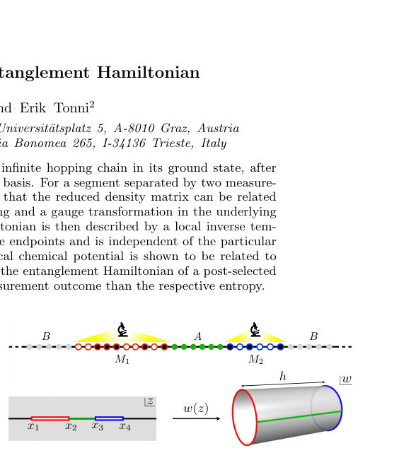 
FIG. 1. Measurement setup (top) and conformal map from the compactified complex plane with two slits to the cylinder (bottom). Filled and empty circles in the segments M1 and M2 represent the measurement outcomes 1 and 0 respectively.

📷 Fig 2

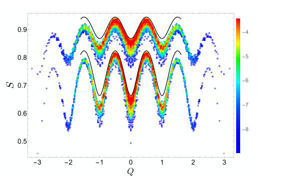 
FIG. 2. Entanglement entropy against induced charge for all the 22s possible measurement outcomes, with s = 7 and ℓ= 20 (top squares) as well as ℓ= 10 (bottom circles). The color code describes the corresponding Born probabilities on a logarithmic scale. The black solid lines show the CFT result, given by (3) and (4).

📷 Fig 3

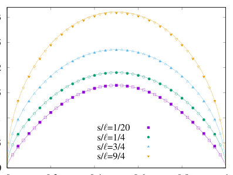 
FIG. 3. Inverse temperature profiles β(x) obtained from the continuum limit of the lattice EH, for various s and ℓ= 20 (filled symbols) as well as ℓ= 40 (empty symbols), with the ratio s/ℓkept fixed. The lines of matching color show the scaled CFT result (6).

📷 Fig 4

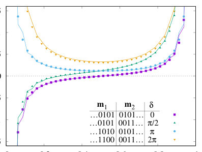 
FIG. 4. Chemical potential µm(x) obtained from the con- tinuum limit of the lattice EH, for various measurement out- comes m = m1 ∪m2 corresponding to different δ (symbols). The lines of matching color show the r.h.s. of Eq. (8), with the density evaluated as in (9) from the lattice data. The interval sizes are ℓ= 40 and s = 39 for δ ∈{0, π}, as well as s = 38 for δ ∈{π/2, 2π}.

📷 Fig 5

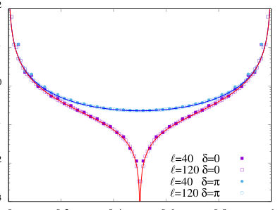 
FIG. 5. Scaled charge density for the measurement outcomes with δ = 0 and δ = π (see Fig. 4), for two different ℓ (filled/empty symbols) at fixed ratio s/ℓ= 39/40. The solid lines show the ansatz (9). The vertical scale is logarithmic.

**Summary.** This paper analyzes the entanglement Hamiltonian generated in a fermionic chain after partial measurements. By mapping the problem onto a thermal field theory using conformal mappings, the authors show that the EH encodes detailed information about the measurement outcome, which is richer than what can be obtained solely from the entropy. This establishes a strong link between quantum measurement processes and fundamental concepts of statistical mechanics.

**Why it may be interesting.** This work provides deep insights into how measurement backaction modifies entanglement structure, linking it rigorously to thermodynamic concepts like chemical potentials within the framework of CFT for free fermions.

Detailed structure

**Main problem.** The study investigates the entanglement Hamiltonian (EH) of an infinite hopping chain's ground state following partial projective measurements in the occupation basis.

**Main result.** The EH for post-selected states contains more outcome-specific information than the corresponding entropy, and its local description relates to a grand-canonical thermal system via conformal field theory techniques.

**Method.** The analysis employs Conformal Field Theory (CFT) methods, mapping the measurement process onto a path integral on a cylinder geometry derived from complex conformal mappings.

**Model / system.** The model is an infinite chain of non-interacting fermions governed by a simple hopping Hamiltonian. The system undergoes partial projective measurements in two disconnected segments.

**Key observables.** Entanglement Hamiltonian (EH), Entanglement Entropy ($S$), Induced Charge Density ($
ho(x)$), and Local Chemical Potential ($\mu_m(x)$).

**Important parameters / regimes.** The local inverse temperature $eta(x)$, the total induced charge $Q$, and parameters related to boundary phases ($\delta$).

**Assumptions / limitations.** The analysis relies on taking a continuum limit from lattice results and utilizing CFT descriptions for the reduced density matrix.

**Figures summary.** Figure 1 illustrates the measurement setup and the conformal map onto a cylinder. Figure 2 plots entanglement entropy versus induced charge, comparing numerical data against the theoretical CFT prediction $S(Q)$.

**Paper structure.** The paper proceeds by defining the physical system and measurements, deriving the reduced density matrix using CFT techniques (conformal mapping), establishing the relationship between the EH and a thermal grand-canonical state, and finally comparing the resulting entropy/chemical potential structure to lattice calculations.

Abstract

We study the entanglement Hamiltonian of an infinite hopping chain in its ground state, after partial projective measurements in the occupation basis. For a segment separated by two measurement regions from the rest of the chain, we show that the reduced density matrix can be related to a grand-canonical state via a conformal mapping and a gauge transformation in the underlying field-theory description. The entanglement Hamiltonian is then described by a local inverse temperature that vanishes as a square root around the endpoints and is independent of the particular measurement outcome. In sharp contrast, the local chemical potential is shown to be related to the induced charge density in the segment. Hence the entanglement Hamiltonian of a post-selected state contains much more information on the measurement outcome than the respective entropy.

[↑ back to top](#top)

### [Morphology of frozen labyrinths from irreversible threshold dynamics](http://arxiv.org/abs/2608.05496v1)

**Authors:** Daniel Richard Levy  
**Type:** theory · **Category:** statistical mechanics · **PDF:** <https://arxiv.org/pdf/2608.05496v1>  
**Analysis basis:** full PDF text, analyzed in chunks
**Topic relevance:** 🔥 `non-equilibrium dynamics` **4/5** · `driven-dissipative phase transition` **3/5** · `methods for driven-dissipative` **3/5** · `non-equilibrium universality` **3/5** · `analog quantum simulation` **2/5** · `scars & prethermalization` **2/5** · `Frenkel-Kontorova` **1/5** · `Keldysh / 2PI / non-Gaussian methods` **1/5** · `correlated / nonlocal dissipation` **1/5** · `exotic spin models in light-matter` **1/5**

📷 Fig 1

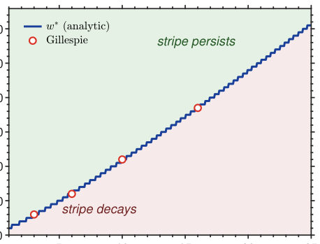 
FIG. 1. Critical stripe width. Solid curve: the exact thresh- old w∗(σ) below which the edge row of a width-w stripe of −1 spins in a +1 sea ceases to be eligible, from Eq. (5); w∗is integer valued, hence the staircase. Stripes with w ≥w∗are pinned and persist unchanged (shaded region above); nar- rower stripes erode from both edges to extinction (below). Circles: the threshold measured from the one-flip Gillespie dynamics at σ = 3, 6, 10, 16, coinciding with w∗in each case. The transition is sharp because erosion is self-reinforcing (re- moving a row lowers w and strengthens the eligibility con- dition), so a stripe either does not move at all or vanishes entirely.

📷 Fig 2

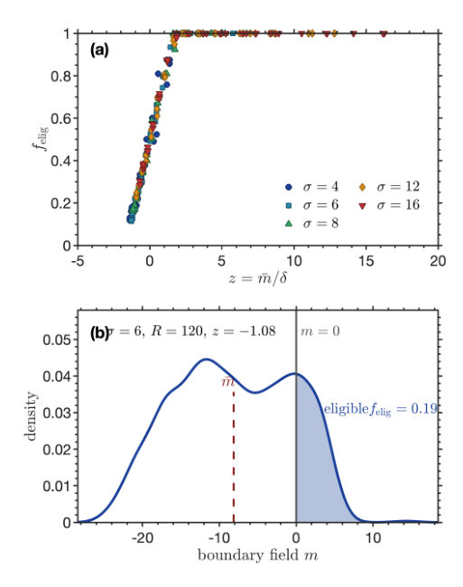 
FIG. 2. Curvature drive and universal mobility. (a) Fraction of the droplet boundary eligible to flip, versus z = ¯m/δ: the mean field on the boundary ring, measured in units of the spread of that field around the ring. Points span σ = 4–16 and radii from a few σ to 30σ and collapse onto a single monotone curve g(z), so the erosion rate is set by this one ratio rather than by σ and R separately. (b) The origin of the collapse: the measured distribution of the boundary field m(θ) for σ = 6, R = 120 (kernel density estimate over the ring and over sub- lattice placements of the disk center). A site flips only where m &gt; 0, so the eligible fraction is the shaded area, and z measures how far the...

📷 Fig 3

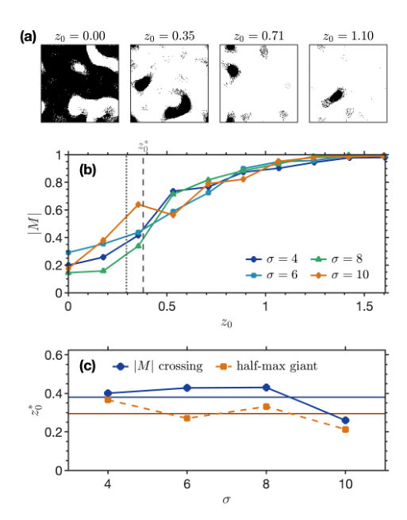 
FIG. 3. The composition window and its control by z0. (a) Frozen (steady state) configurations at σ = 4 across the win- dow, at increasing standardized bias z0 (values above each panel). Near z0 = 0 the state is a balanced labyrinth. As z0 grows the minority is progressively cascaded away, and by z0 ≈1.5 the state is near-consensus. (b) The final magne- tization |M| versus z0 for σ = 4, 6, 8, 10. Plotted against z0 the curves for different σ collapse, confirming that the ini- tial condition enters only through the standardized bias; z∗ 0 is marked under the two operational definitions. (c) The on- set z∗ 0 versus σ over σ ∈[4, 16], under both definitions, with per-σ crossing uncertainties...

📷 Fig 4

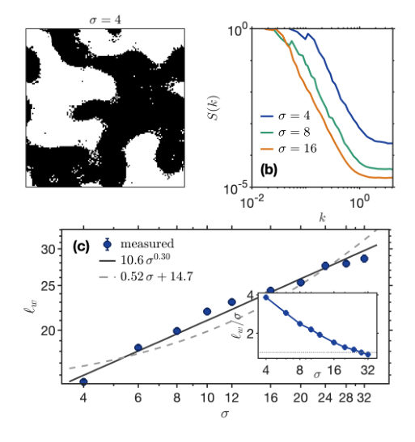 
FIG. 4. Frozen morphology at balance (p0 = 1 2). (a) An absorbing-state configuration at σ = 4: a bicontinu- ous labyrinth. (b) Radially averaged structure factor at σ = 4, 8, 16, each normalized to its maximum. The spectra decay monotonically with no finite-k peak: the purely posi- tive kernel selects no wavelength, and the pattern is arrested coarsening rather than a stationary patterned phase. (c) Fea- ture width ℓw = 1/w versus σ (log-log, 48 realizations per point at L = 40σ). A power law (ℓw ≈10.6 σ0.30, solid) de- scribes the data far better than an additive form (0.52 σ+14.7, dashed; rms residuals 0.65 versus 1.54), but no single power law fits within the statistical uncertainties:...

📷 Fig 5

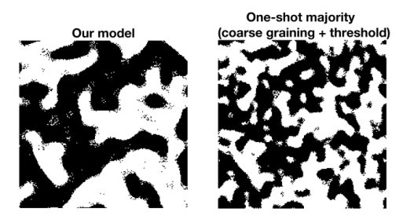 
FIG. 5. The frozen state of our one-flip model (left) and a single majority pass of the same initial condition (right), at σ = 4, p0 = 1 2. Both break the initial noise into two-phase structure at the interaction scale, but the dynamics does more than threshold the smoothed initial field once: it consolidates the majority pass’s smaller features into markedly fewer and larger domains, eroding minority pockets and pinching off thin necks.

**Summary.** This paper analyzes how making a local consensus rule irreversible changes pattern formation in a binary spin system. The key finding is that irreversibility arrests the system into stable, mixed labyrinth patterns characterized by 'frustrated' sites. This work provides a detailed comparison between reversible and irreversible relaxation dynamics on a lattice.

**Why it may be interesting.** While focused on classical statistical mechanics, the concept of irreversible dynamics leading to metastable, patterned states is highly relevant to understanding non-equilibrium phase transitions in complex systems, which has parallels in quantum quench dynamics or driven many-body systems.

Detailed structure

**Main problem.** The study investigates the fundamental differences between reversible and irreversible dynamics when a local imitation rule drives a binary field toward consensus or striped patterns.

**Main result.** Irreversibility causes the system to freeze into stable, balanced non-consensus labyrinth structures that would otherwise be eliminated by reversible relaxation. The resulting pattern is determined deterministically by initial conditions, with frustration marking the seams.

**Method.** The authors compare two dynamics: a standard reversible threshold process (related to mean curvature flow) against an irreversible 'one-flip' rule on a lattice.

**Model / system.** The model uses spins $s_i \in \{\pm 1\}$ on $\mathbb{Z}^2$ interacting via a Gaussian kernel. The dynamics involve local updates based on the weighted majority of neighbors, with the key distinction being that irreversible dynamics allow sites to flip at most once.

**Key observables.** Frustrated spins (sites unable to flip against their local field), pattern morphology (bicontinuous labyrinths), and agreement metrics comparing different update orders.

**Important parameters / regimes.** Interaction range ($\sigma$), initial spin composition ($p_0 \approx 1/2$), and the degree of irreversibility (the one-flip constraint).

**Assumptions / limitations.** The comparison hinges on the single difference: the irreversible 'one-flip' rule versus the reversible relaxation process.

**Figures summary.** Figures illustrate the contrast between consensus states (reversible) and frozen labyrinths (irreversible), showing frustrated sites marking collision seams, and demonstrating that healing these sites does not alter the coarse domain layout.

**Paper structure.** The paper first establishes the dynamics and compares reversible/irreversible outcomes. It then analyzes specific geometries like flat stripes and droplets using continuum approximations derived from the lattice model. Finally, it rigorously separates the deterministic placement of domain walls from the secondary role of update-order effects via frustration.

Abstract

Majority threshold dynamics, in which each agent adopts the dominant state in a weighted neighborhood, relaxes a binary field toward consensus or stripes. We study what happens when this rule is made irreversible: each agent, interacting through a Gaussian kernel on a lattice, may flip out of its local weighted minority at most once. The reversible form is threshold dynamics of Merriman-Bence-Osher type, an exactly solvable calibration in which interfaces move by mean curvature with closed-form lattice pinning and mobility. Irreversibility changes the outcome. From random initial conditions, the one-flip rule freezes balanced non-consensus labyrinths that reversible relaxation drives away. The patterned regime is a window of initial spin compositions around equal balance, narrowing as the interaction range grows, controlled by a standardized bias whose onset is independent of scale over a fourfold range. The frozen morphology is arrested coarsening: bicontinuous at balance, with a feature width that grows sublinearly and falls below the interaction range at large scales. We determine the mechanism by intervention. Fixing the initial condition while varying the update order shows that the coarse domain layout is deterministic, while the update order enters only in a secondary first-passage race that fine-tunes the wall positions the deterministic dynamics has already set. Those walls are marked by frustration: agents frozen against their own local field. This signature is identically absent from any reversible relaxation, is overwhelmingly interfacial, and carries almost none of the pattern's large-scale shape.

[↑ back to top](#top)

### [Dissipation-induced bulk and boundary criticality in the Haldane chain](http://arxiv.org/abs/2608.05984v1)

**Authors:** Zhenjiu Wang, Manuel Weber  
**Type:** theory · **Category:** other · **PDF:** <https://arxiv.org/pdf/2608.05984v1>  
**Analysis basis:** full PDF text, analyzed in chunks
**Topic relevance:** 🔥 `driven-dissipative phase transition` **4/5** · `correlated / nonlocal dissipation` **3/5** · `methods for driven-dissipative` **3/5** · `non-equilibrium universality` **3/5** · `non-equilibrium dynamics` **2/5** · `Frenkel-Kontorova` **1/5** · `Keldysh / 2PI / non-Gaussian methods` **1/5** · `Kondo & dissipative impurity` **1/5** · `analog quantum simulation` **1/5** · `exotic spin models in light-matter` **1/5**

📷 Fig 1

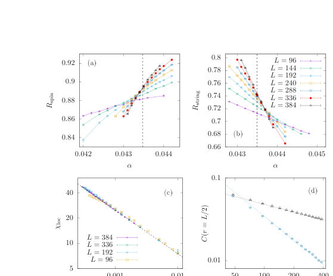 
FIG. 1. Bulk criticality of the Haldane chain. Correlation ratios calculated from the (a) spin and (b) string order pa- rameters as a function of α and for different systems sizes L. The dashed lines indicate our extrapolated critical couplings [51]. (c) Local susceptibility at α = αc as function of temper- ature for various L. (d) Spin and string correlation function at r = L/2 as a function of L. The dashed lines in (c) and (d) are power law fits to the asymptotic behavior [51].

📷 Fig 2

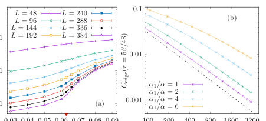 
FIG. 3. Boundary response of the dimerized chain. (a) Finite- size analysis of the edge local moment, χedge/β, as a function of α. The red triangle marks the bulk critical coupling αc. (b) Cedge(τ = 5β/48) at α = αc for different edge couplings α1/α. The black dashed line denotes the ϵ expansion result.

📷 Fig 3

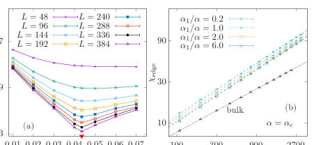 
FIG. 2. Boundary criticality of the Haldane chain. (a) Finite- size analysis of the edge local moment, χedge/β, as a function of α. The red triangle marks the bulk critical coupling αc. (b) χedge(β) at α = αc for different edge couplings α1/α. For comparison, we include the local susceptibility within the bulk. Dashed lines represent power-law fits.

**Summary.** This paper investigates how coupling a Haldane spin chain to an ohmic bath induces quantum phase transitions, focusing particularly on the resulting boundary physics. Using QMC simulations and scaling analysis, the authors show that the topological nature of the SPT ground state leads to unique boundary criticality distinct from non-topological transitions. The work provides a framework for controlling edge properties in dissipative many-body systems.

**Why it may be interesting.** This is highly relevant as it tackles non-equilibrium quantum dynamics in strongly correlated systems. The ability to tune boundary criticality via dissipation provides a powerful theoretical tool for understanding open quantum systems beyond simple equilibrium critical points.

Detailed structure

**Main problem.** The study investigates how dissipation influences both bulk and boundary critical behavior in quantum spin chains, specifically starting from a Symmetry-Protected Topological (SPT) phase.

**Main result.** The paper demonstrates that the topological edge modes exhibit a distinct boundary criticality compared to transitions out of trivial states. The analysis successfully extracts scaling dimensions for these boundary effects using QMC simulations and comparison with field theory expansions.

**Method.** The research employs large-scale Quantum Monte Carlo (QMC) simulations, finite-size scaling analysis, and comparisons with $\epsilon$ expansion results derived from dissipative quantum field theories.

**Model / system.** The primary system is the Haldane chain ($S=1$ spin chain), which is coupled to a dissipative ohmic bath. The study also analyzes related models like dimerized chains and the O(3)-symmetric nonlinear sigma model.

**Key observables.** Generalized string order parameter ($\Delta_{	ext{string}}$), bulk correlation ratios ($R_{	ext{spin}}(L)$), edge local moment susceptibility ($\chi_{	ext{edge}}/eta$), and various scaling dimensions ($\Delta_e$, $\eta_{\parallel}$).

**Important parameters / regimes.** Dissipation strength ($\alpha$), system size ($L$), and critical couplings ($\alpha_c$). The analysis compares results for the Haldane chain ($\delta=0$) versus trivial/dimerized states ($\delta=0.4$).

**Assumptions / limitations.** The analysis relies on mapping quantum dynamics to classical path integrals (for some models) and extrapolating finite-size data to infinite size using power laws.

**Figures summary.** Figures illustrate bulk criticality measurements via spin/string order parameters vs. dissipation strength ($\alpha$), and boundary criticality via edge local moment susceptibility ($\chi_{	ext{edge}}/eta$) vs. $\alpha$.

**Paper structure.** The work systematically compares the critical behavior of the Haldane chain (SPT) against a trivial state, analyzing both bulk exponents using correlation ratios and distinct boundary exponents derived from edge susceptibilities.

Abstract

We study the Haldane chain coupled to a dissipative ohmic bath. Using large-scale quantum Monte Carlo simulations, we identify a second-order quantum phase transition into an antiferromagnetic state with spontaneously broken SO(3) symmetry that is governed by an interacting fixed point with dynamical exponent $z\approx 2$. We derive a generalized string order parameter which indicates that the symmetry-protected topological ground state of the Haldane chain is stable for weak dissipation and develops a nontrivial scaling dimension at criticality. In particular, its topological edge modes display nontrivial boundary criticality that is distinct from an equivalent transition out of a trivial state; for the latter, we perform an accurate $ε$ expansion of a dissipative $φ^4$ theory with ordinary boundary conditions. Our setup realizes a spin impurity in a critical yet nonconformal antiferromagnet and paves the way for continuously tunable boundary criticality controlled by dissipation.

[↑ back to top](#top)

### [Dynamic scaling behavior in the presence of a periodic magnetic driving across Ising continuous transitions](http://arxiv.org/abs/2608.05936v1)

**Authors:** Andrea Pelissetto, Ettore Vicari  
**Type:** theory · **Category:** statistical mechanics · **PDF:** <https://arxiv.org/pdf/2608.05936v1>  
**Analysis basis:** full PDF text, analyzed in chunks
**Topic relevance:** 🔥 `non-equilibrium universality` **4/5** · `analog quantum simulation` **3/5** · `driven-dissipative phase transition` **3/5** · `methods for driven-dissipative` **3/5** · `non-equilibrium dynamics` **3/5** · `Frenkel-Kontorova` **1/5** · `Keldysh / 2PI / non-Gaussian methods` **1/5** · `correlated / nonlocal dissipation` **1/5** · `entanglement & information structure` **1/5**

📷 Fig 1

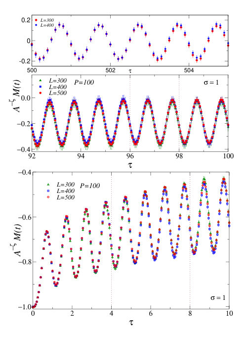 
FIG. 1: Time evolution of the rescaled magnetization A−ζM(t) for P = 100, σ = AP κ = 1, and several lattice sizes L. We show results for τ ≤10 (bottom), where the center of the oscillations clearly increases, for 92 ≤τ ≤100 (middle), where the center of the oscillations is still barely increasing, and finally for 500 ≤τ ≤505 (top), where the behavior is stationary, characterized by a vanishing average of the magnetization over one period. Note that the oscilla- tions are synchronized with the external field—their period is one in the variable τ—and that the amplitude Am does not apparently vary with τ. In the two lower panel we also added dotted vertical lines at integer values of τ,...

📷 Fig 2

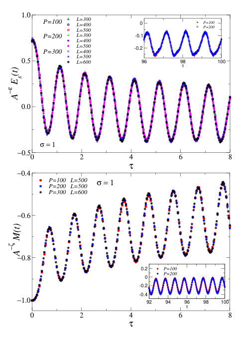 
FIG. 2: Dynamic scaling behavior of the magnetization (bot- tom) and of the subtracted bond-energy density (top), for σ = 1 and several values of P, and for τ ≤8. The size L is large enough that the data can be considered in the thermo- dynamic limit. In the insets we show the same quantities in time intervals around τ = 100 (using the data for the largest available lattices).

📷 Fig 3

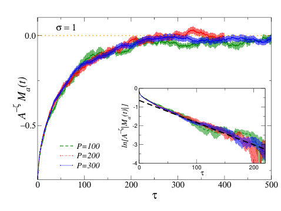 
FIG. 3: Period-averaged rescaled magnetization A−ζMa(t), for σ = 1, P = 100, 200, 300, in the thermodynamic limit. In the inset we use a semilogarithmic scale, to highlight the expo- nential approach to zero: the straight dashed line corresponds to a behavior proportional to exp(−τ/τs) with τs = 85.

📷 Fig 4

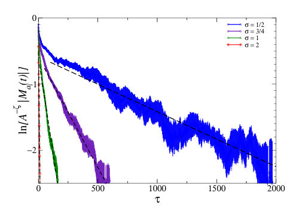 
FIG. 6: Period-averaged rescaled magnetization for several values of σ, in the thermodynamic limit. The dashed straight lines correspond to the exponential functions Ma = ae−t/τs that interpolate the data: we use τs = 6, 85, 300, 1200 for σ = 2, 1, 3/4, 1/2, respectively.

📷 Fig 5

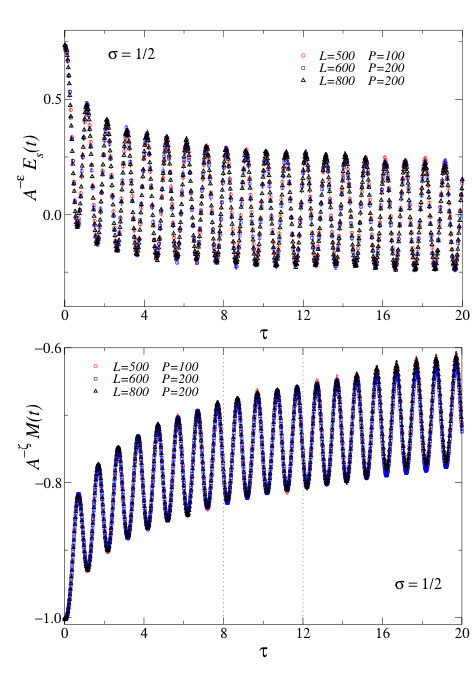 
FIG. 4: Dynamic scaling results for the magnetization (bot- tom) and for the bond-energy density (top) at fixed σ = AP κ = 1/2. In the lower panel we draw vertical dotted lines at some integer values of τ, corresponding to minima of the magnetic field, to highlight the phase delay of the oscillations of the magnetization.

**Summary.** This work analyzes how a periodically oscillating magnetic field drives the 2D Ising model across its continuous phase transition, revealing universal dynamic scaling laws. The key finding is that the system exhibits characteristic oscillatory behavior in its magnetization and energy density as time progresses relative to the driving period. This provides a theoretical framework for understanding non-equilibrium critical dynamics under external periodic forcing.

**Why it may be interesting.** While focused on classical statistical mechanics, the methodology of analyzing non-equilibrium dynamics driven by time-periodic fields is highly relevant to open quantum systems where external periodic drives (e.g., in cavity QED or cold atoms) are used to probe quantum critical points or drive coherent evolution.

Detailed structure

**Main problem.** The study investigates dynamic scaling behavior in classical ferromagnetic systems undergoing continuous phase transitions when subjected to a periodic external driving field.

**Main result.** Periodic driving induces a peculiar dynamic scaling characterized by oscillatory behavior around a smooth curve that approaches a large-time stationary state, confirming theoretical predictions for the universality class.

**Method.** The analysis employs dynamic finite-size scaling theory, generalizing it to incorporate time periodicity and analyzing the collapse of observables onto universal scaling functions.

**Model / system.** The primary model is the two-dimensional (2D) Ising model on a square lattice. The system dynamics are governed by purely relaxational dynamics (Model A) at the critical temperature, driven by $h(t)=-A \cos(2\pi t/P)$.

**Key observables.** Time-dependent magnetization ($M(t)$), subtracted bond-energy density ($E_s(t)$), and period-averaged rescaled quantities.

**Important parameters / regimes.** The scaling variables are $	au = t/P$ (normalized time) and $\sigma = A P^\kappa$, where $\kappa = y_h/z$. The analysis examines limits such as large-$	au$ and small-$\sigma$.

**Assumptions / limitations.** The theory assumes purely relaxational dynamics (Model A) and relies on the ability to reach the thermodynamic limit ($L 	o \infty$) for scaling predictions.

**Figures summary.** Figures demonstrate dynamic scaling collapse for both magnetization and energy density under periodic driving, showing distinct regimes from initial transients to large-time stationary oscillations.

**Paper structure.** The paper establishes the theoretical framework by generalizing finite-size scaling to include periodic driving. It then applies this theory to the 2D Ising model using numerical simulations to confirm the predicted dynamic scaling laws for magnetization and energy density, concluding with extensions to temperature driving protocols.

Abstract

We study the critical dynamics arising from a time-dependent periodic homogenous source coupled to the order-parameter field, which drives a classical ferromagnetic system across a continuous transition. For this purpose, we consider the paradigmatic two-dimensional (2D) Ising model in the presence of a periodic magnetic field $h(t)=-A\, \cos (2πt/P)$, evolving under a purely relaxational dynamics at the critical temperature. We show that the periodic driving gives rise to a peculiar dynamic scaling behavior in the thermodynamic limit, arising from a nontrivial interplay among the time $t$, the amplitude $A$ and period $P$ of $h(t)$. The relevant scaling variables are $τ=t/P$ and $σ=A P^κ$, with $κ= y_h/z$, where $y_h=(d+2-η)/2$ is the critical dimension of the magnetic field, and $z$ is dynamic exponent for the critical relaxational dynamics ($κ\approx 0.865$ for the 2D Ising model). The dynamic scaling behaviors of the magnetization and bond-energy density show an oscillatory behavior around a smooth curve which approaches a large-$τ$ stationary behavior. We also briefly discuss the dynamic behavior of an Ising system driven across the critical point by a periodic time-varying temperature at zero magnetic field.

[↑ back to top](#top)

### [Criteria for Feasible Monte Carlo Stochastic Simulations of Bosonic Markovian Open Quantum Dynamics](http://arxiv.org/abs/2608.06056v1)

**Authors:** Toma Yoneya, Kazuya Fujimoto, Yuki Kawaguchi  
**Type:** theory · **Category:** statistical mechanics · **PDF:** <https://arxiv.org/pdf/2608.06056v1>  
**Analysis basis:** full PDF text, analyzed in chunks
**Topic relevance:** 🔥 `methods for driven-dissipative` **4/5** · `Keldysh / 2PI / non-Gaussian methods` **3/5** · `driven-dissipative phase transition` **3/5** · `correlated / nonlocal dissipation` **2/5** · `non-equilibrium dynamics` **2/5** · `non-equilibrium universality` **2/5** · `analog quantum simulation` **1/5** · `quantum measurements` **1/5**

📷 Fig 1

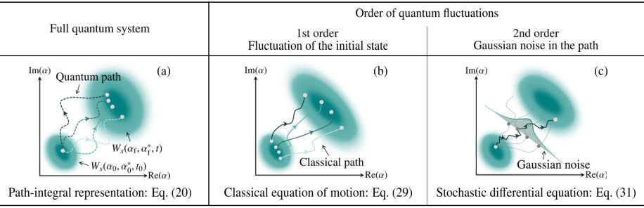 
Figure 1: Schematic images of (a) the path-integral representation (20) and (b)-(c) the approximations of the GKSL equation in phase space. (b) Within the first-order approximation, the GKSL equation is approximated into the generalized Liouville equation [63, 64], where each point distributed by the initial s-ordered quasiprobability distribution function Ws(⃗α0, ⃗α∗ 0, t0) follows the classical equation of motion, the equation of motion of the classical path. (c) The effects of the second order of the quantum fluctuations are incorporated into the classical path as Gaussian noises, where each point follows the stochastic differential equation. Here, the GKSL equation is approximated into the...

📷 Fig 2

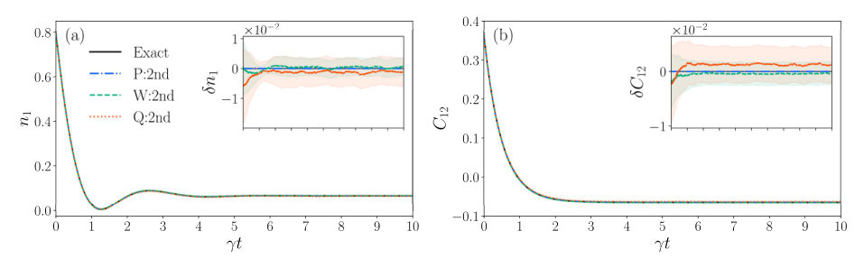 
Figure 2: Relaxation dynamics of a two-site system of non-interacting atoms obeying the GKSL equation (80) starting from the pure coherent state ˆρ(0) = |αI1, αI2⟩⟨αI1, αI2|, where αI1 = √NI1eiπ/8 and αI2 = √NI2eiπ/4 with NI1 = 8 and NI2 = 2. Shown are (a) the remaining fraction of atoms n1 at site m = 1 and (b) the correlation of atoms at different sites C12, which are defined by Eq. (79). In each panel, we compare the numerically exact result (Exact) obtained by solving Eqs. (82)–(84) and the ones of the second-order approximation using the Glauber-Sudarshan P (P:2nd), Wigner (W:2nd), and Husimi Q function (Q:2nd). We choose µ/(ℏγ) = 1 and J/(ℏγ) = 1, and take 1000 samples for the initial...

📷 Fig 3

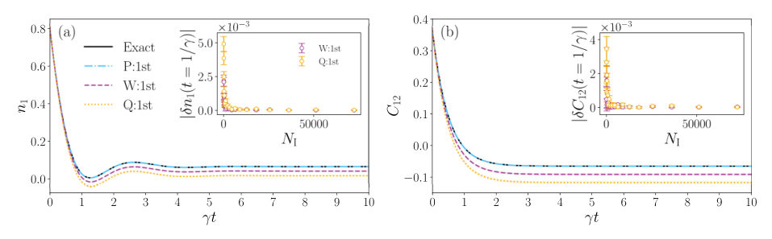 
Figure 3: Relaxation dynamics of a two-site system of non-interacting atoms obeying the GKSL equation (80), starting from the pure coher- ent state. The quantities, parameters and the notations are the same as in Fig. 2, except that the first-order approximation is applied using the Glauber-Sudarshan P (P:1st), Wigner (W:1st), and Husimi Q functions (Q:1st). The insets depict NI-dependence of the deviation between each approximation and the numerically exact result at γt = 1. When varying NI, the fractions of atoms at each site are fixed as NI1/NI = 0.8 and NI2/NI = 0.2 in the initial state.

📷 Fig 4

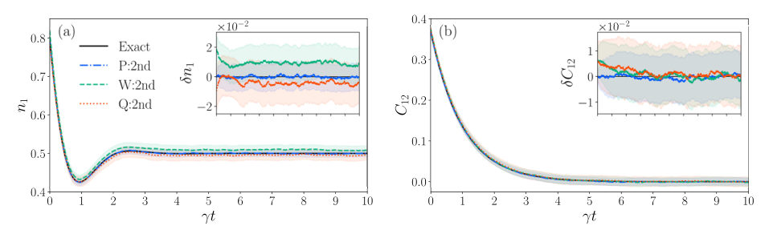 
Figure 4: Relaxation dynamics of a two-site system of non-interacting system with the symmetric incoherent hopping of atoms obeying the GKSL equation (87) starting from the pure coherent state. The quantities, parameters and the notations are same with the ones in Fig. 2. The insets depict the difference between the results of the second-order approximation and the numerically exact one.

📷 Fig 5

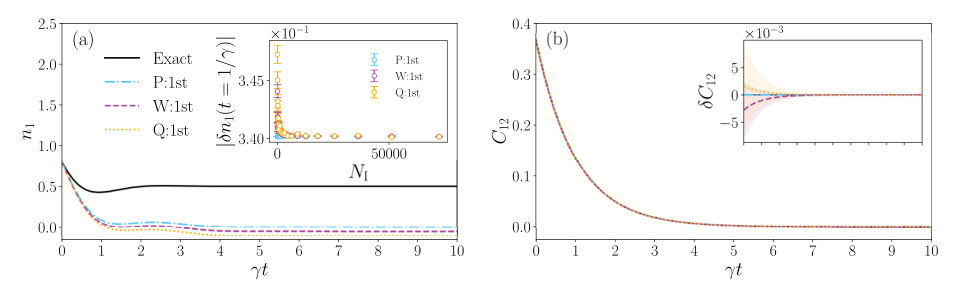 
Figure 5: Relaxation dynamics of a two-site system of non-interacting system with the symmetric incoherent hopping of atoms obeying the GKSL equation (87) starting from the pure coherent state. The quantities, parameters and the notations are same with the ones in Fig. 3. The inset of (a) depicts NI-dependence of the difference between the results of each approximation and the numerically exact one at time γt = 1, and the inset of (b) depicts the difference between the results of the first-order approximation and the numerically exact one.

**Summary.** This paper develops rigorous mathematical criteria to determine when stochastic Monte Carlo simulations can accurately model bosonic open quantum dynamics governed by the GKSL equation. By analyzing the positive semidefiniteness of the diffusion matrix derived from path integrals, the authors clarify the necessary conditions for these powerful simulation techniques to be both feasible and indispensable over mean-field approximations.

**Why it may be interesting.** This work provides crucial theoretical guidelines for computational physicists attempting to simulate complex open quantum systems, clarifying when simple mean-field or truncated Wigner approaches are insufficient.

Detailed structure

**Main problem.** The primary goal is establishing rigorous criteria for when Monte Carlo stochastic simulations are mathematically feasible and physically necessary for accurately modeling bosonic open quantum dynamics.

**Main result.** The authors derive sufficient conditions, starting from the path integral formulation, that guarantee the positive semidefiniteness of the diffusion matrix, thus validating the use of stochastic methods over mean-field approximations.

**Method.** The work combines path integral formulations with phase-space mapping using quasiprobability distributions (P, Wigner, Q functions) to derive and analyze corresponding Stochastic Differential Equations (SDEs).

**Model / system.** The system involves bosonic open quantum many-body dynamics governed by the Gorini–Kossakowski–Sudarshan–Lindblad (GKSL) equation. The analysis is performed in phase space, considering interactions and dissipation from an environment.

**Key observables.** Positive semidefiniteness of the diffusion matrix ($\mathbf{A} \succeq 0$), time evolution of quasiprobability functions ($W_s$), and quantum fluctuation terms.

**Important parameters / regimes.** The analysis focuses on the thermodynamic limit, high-occupancy limits, and the nature of the jump operators (e.g., quadratic vs. general).

**Assumptions / limitations.** The derivation relies on mapping the GKSL equation to a Fokker–Planck type description, which is only valid under specific conditions regarding higher-order quantum fluctuations.

**Paper structure.** The paper systematically moves from defining the problem (GKSL dynamics) to establishing the mathematical framework (phase-space mapping and path integrals), deriving necessary feasibility criteria for stochastic simulation, and finally analyzing specific limits where approximations break down.

Abstract

The Monte Carlo sampling of the stochastic differential equations (SDEs) based on the quasiprobability distribution function, such as the Glauber--Sudarshan P, Wigner, and Husimi Q functions provides a powerful framework for investigating bosonic open quantum many-body dynamics described by the Gorini--Kossakowski--Sudarshan--Lindblad (GKSL) equation, while considering the effects of quantum fluctuations beyond the mean-field approximation. However, the stochastic Monte Carlo simulation is possible only when the corresponding Fokker--Planck equation has a positive-semidefinite diffusion matrix, and the general conditions for the diffusion matrix to be positive semidefinite have remained unclear. In this work, starting from the path integral formulation, we first derive the sufficient conditions under which the diffusion matrix is positive semidefinite for an arbitrary Hamiltonian, jump operators, and choice of quasiprobability distribution functions. We also analytically derive the corresponding SDEs to be solved. We then investigate the dynamics of the GKSL equation in the thermodynamic limit and show that, depending on the form of the jump operators, the mean-field approximation may fail to describe the dynamics accurately, making stochastic Monte Carlo simulations indispensable. Furthermore, we derive the sufficient conditions under which the higher-order quantum fluctuation terms beyond the Fokker--Planck description vanish identically, even when the jump operators contain quadratic terms. Under these conditions, whenever the corresponding SDEs can be derived, the stochastic Monte Carlo simulation reproduces the exact dynamics. These results clarify the conditions under which the stochastic Monte Carlo simulations are both feasible and necessary for accurately describing the dynamics governed by the GKSL equation in phase space.

[↑ back to top](#top)

### [Field-Space Entanglement Dynamics Between Tunnel-Coupled Luttinger Liquids](http://arxiv.org/abs/2608.05968v1)

**Authors:** Léonce Dupays, Taufiq Murtadho, Bi Hong Tiang, Nelly H. Y. Ng, Paola Ruggiero  
**Type:** theory · **Category:** statistical mechanics · **PDF:** <https://arxiv.org/pdf/2608.05968v1>  
**Analysis basis:** full PDF text, analyzed in chunks
**Topic relevance:** 🔥 `entanglement & information structure` **4/5** · 🔥 `non-equilibrium dynamics` **4/5** · `analog quantum simulation` **3/5** · `non-equilibrium universality` **3/5** · `Keldysh / 2PI / non-Gaussian methods` **1/5** · `correlated / nonlocal dissipation` **1/5** · `driven-dissipative phase transition` **1/5** · `methods for driven-dissipative` **1/5**

📷 Fig 1

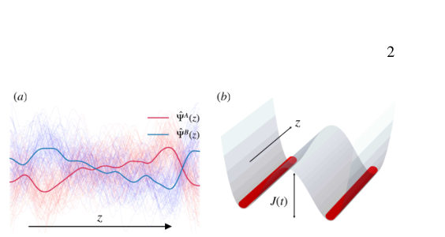 
FIG. 1. Schematic of the concept of field-space entanglement in 1D and its experimental implementation. (a) Two overlapping 1D quantum fields ˆΨA(z) and ˆΨB(z) interacting through a global time- dependent interaction strength J(t). (b) Field-space entanglement can be generated by trapping bosonic quantum fluids in a 1D elon- gated potential with a double-well transverse cross section.

📷 Fig 2

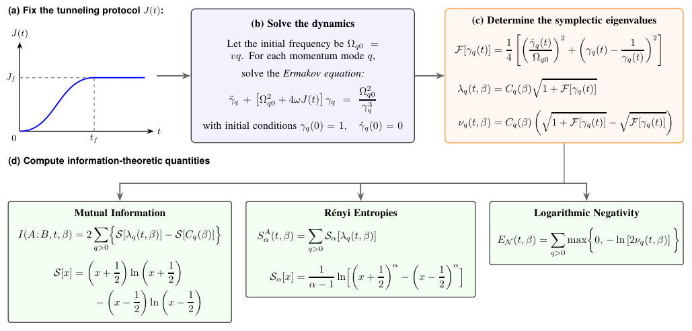 
FIG. 2. Summary of the general formalism. Two initially decoupled identical Luttinger liquids are specified by their Luttinger parameter K, speed of sound v, mean density n0 and length L. These parameters fix a Luttinger frequency scale ω = πn0v/K and discrete momenta q = Nπ/L with N ∈N. The formalism consists of four steps: (a) We choose a time-dependent tunneling protocol, i.e. a coupling function J(t) that generates entanglement/correlation between the two Luttinger liquids. (b) The protocol determines the mode-resolved Ermakov equation, whose solution is denoted by γq(t). (c) One constructs an intermediate composite function F[γq(t)], and computes the symplectic eigenvalues λq(t, β) and...

📷 Fig 3

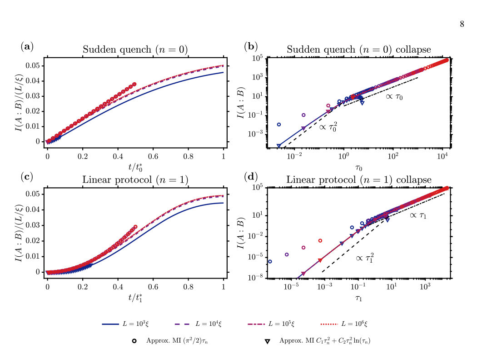 
FIG. 3. Comparison between approximate and exact numerical solution to the mutual information at early times and different system sizes. Solid lines denote the exact numerical MI computed from the numerical solution of Ermakov equation with Eq. (25). Triangle and circle markers represent the approximate MI in the limits τn ≪1 and τ ∗ n ≫τn ≫1, respectively, given by Eqs. (42) and (43). Colors indicate different system lengths. Panels (a) and (b) show results for a sudden quench (n = 0), with panel (a) showing the normalized MI as a function of time, and panel (b) the MI as a function of τ0. Panels (c) and (d) show results for a linear protocol (n = 1). We stop plotting triangle markers when...

📷 Fig 4

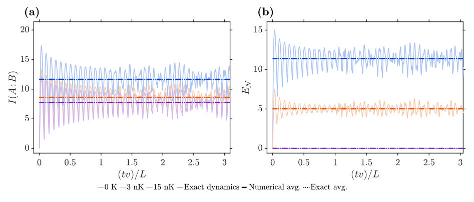 
FIG. 4. Comparison between (a) the mutual information and (b) the logarithmic negativity for a sudden quench at different temper- atures. The different colors correspond to the different temperatures: T = 0 K (plain blue), T = 3 nK (plain orange), and T = 15 nK (plain violet). The numerical time-average of the oscillatory curve is shown in dashed line for each temperature, and this is compared to the exact expressions of Table II in dotted line. We use the same plotting parameters as in Fig. 3, with a system length L = 400 ξ. The timescale L/v provides a useful reference time for finite-size effects, but the precise onset of the observed oscillations depends on the distribution of post-ramp...

📷 Fig 5

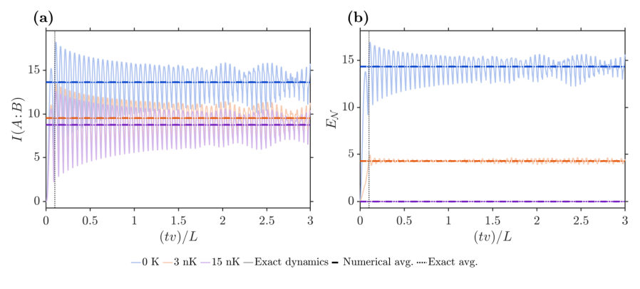 
FIG. 5. Time-evolution for the MI and the LN for a linear protocol. We consider the linear protocol of duration tf = 0.1L/v, described in Eq. (56). The dashed vertical line marks the time at which the protocol enters the saturation regime. Panel (a) displays the MI and panel (b) displays the LN for the linear protocol at zero (plain blue line) and finite temperatures (plain orange and violet lines). The exact time-averages for the MI and LN at zero and finite temperatures are displayed in colored dashed lines, and they correspond to the expressions given in Table III. They are compared to the numerical time-averaging over the interval tf to 10tf in dotted lines, which agree well with our...

**Summary.** This paper analyzes the field-space entanglement dynamics between two coupled Luttinger liquids subjected to a time-varying tunneling interaction. Using Gaussian approximations and solving the Ermakov equation for each momentum mode, the authors derive analytical expressions for key entanglement measures like logarithmic negativity. The results characterize how correlations build up over time, providing insights into non-equilibrium quantum information transfer.

**Why it may be interesting.** This work provides rigorous analytical tools for quantifying non-equilibrium quantum correlations in 1D systems, directly applicable to understanding entanglement generation in cold atom or superconducting circuit quenches.

Detailed structure

**Main problem.** The study focuses on how entanglement dynamics evolve between two extended quantum fields when a time-dependent tunneling interaction is activated across their entire length, contrasting with standard spatial bipartitions.

**Main result.** Analytical expressions for logarithmic negativity and mutual information are derived in the Gaussian approximation, showing that early-time entanglement growth exponents depend only on the first non-null derivative of the coupling protocol.

**Method.** The analysis employs a Gaussian approximation after transforming the Hamiltonian into symmetric and antisymmetric field sectors. Key results rely on solving the mode-dependent Ermakov equation for each momentum mode.

**Model / system.** The system consists of two gapless one-dimensional quantum many-body systems modeled by Luttinger liquid theory, coupled via a time-dependent tunneling interaction $J(t)$.

**Key observables.** Logarithmic negativity (LN), mutual information (MI), Rényi entropies ($S_\alpha$), and entanglement entropy.

**Important parameters / regimes.** Temperature ($eta$), coupling protocol function $J(t)$, and the time evolution regime (early-time, long-time average, adiabatic limit).

**Assumptions / limitations.** The analysis uses a Gaussian approximation for the interaction term and assumes initial states are thermal and factorized across the two fields.

**Figures summary.** Figure 1 schematically illustrates field-space entanglement generation via global coupling. Figure 2 summarizes the mathematical framework involving symplectic propagators and mode decomposition.

**Paper structure.** The paper progresses by establishing the model Hamiltonian, deriving the decoupled dynamics in terms of harmonic oscillators governed by the Ermakov equation, and then applying this formalism to calculate specific information-theoretic quantities (LN, MI) across various quench protocols and temperature regimes.

Abstract

Entanglement dynamics depend not only on how a quantum system is partitioned, but critically on how interactions across that partition are structured. For a spatial bipartition of a locally interacting system, entanglement is generated near the boundary and then propagates into the bulk. By contrast, when two extended quantum fields are coupled locally along their entire length, the interaction crosses the field-space partition everywhere, and this generates correlations throughout the system. Here, we study the entanglement dynamics between two gapless one-dimensional quantum many-body systems described by Luttinger liquid theory. The systems are initially decoupled and prepared at zero or finite temperature, after which a time-dependent tunneling interaction is activated uniformly along their length. Within a Gaussian approximation, we derive general analytical expressions for the logarithmic negativity, mutual information, and Rényi entropies under arbitrary coupling protocols. At zero temperature, entanglement displays an early-time power-law growth whose exponent is fixed solely by the first non-null derivative of the tunneling protocol. Once the coupling saturates, we obtain exact long-time averages of the information-theoretic quantities and characterise how the correlations scale with temperature and the final coupling strength. We also analyse how mutual information and logarithmic negativity approach the adiabatic limit for a very slow protocol with respect to intrinsic system timescale. This work extends the study of entanglement dynamics in nonequilibrium field theory to field-space partitions and mixed initial states.

[↑ back to top](#top)

### [Large Spin-Wave Fluctuations Suppress Activity in Malthusian Flocks](http://arxiv.org/abs/2608.05805v1)

**Authors:** Emir Sezik, Gunnar Pruessner  
**Type:** theory · **Category:** statistical mechanics · **PDF:** <https://arxiv.org/pdf/2608.05805v1>  
**Analysis basis:** full PDF text, analyzed in chunks
**Topic relevance:** 🔥 `non-equilibrium universality` **4/5** · `Keldysh / 2PI / non-Gaussian methods` **3/5** · `driven-dissipative phase transition` **3/5** · `methods for driven-dissipative` **2/5** · `non-equilibrium dynamics` **2/5** · `Frenkel-Kontorova` **1/5** · `correlated / nonlocal dissipation` **1/5** · `exotic spin models in light-matter` **1/5**

📷 Fig 1

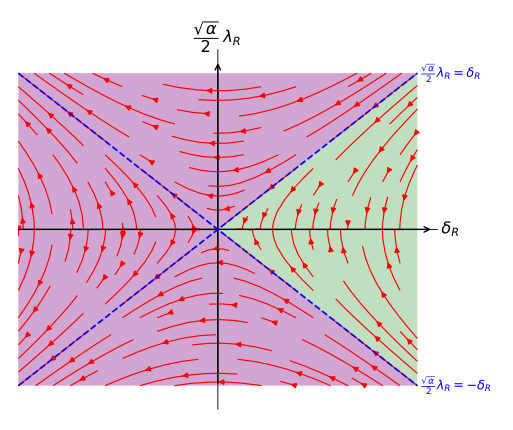 
Figure 1. RG flows Eq. (11) as µ ↓0 of the model near the Gaussian critical point λR = 0 = δR. The Malthusian and XY phases are indicated by purple and green, respectively. These phases are separated by a half-stable Gaussian fixed point, that is accessible only from δR &gt; 0 along the separatrix √α|λR|/2 = |δR|. The XY phase, λR = 0, is stable at large noise strengths Γ and small nonlinearity λ.

**Summary.** This paper investigates the complex phase diagram of Malthusian flocks using advanced field theory techniques. By analyzing spin-wave fluctuations via Renormalization Group flow, the authors identify a previously unknown XY-like phase transition driven by activity. The work provides quantitative scaling predictions for this active critical point.

**Why it may be interesting.** Although focused on active matter, the use of advanced techniques like BKT-like RG flows, symmetry analysis of Goldstone modes, and calculating universal scaling behavior makes it highly relevant to theoretical physicists studying non-equilibrium phase transitions in many-body systems.

Detailed structure

**Main problem.** To characterize the full phase structure of Malthusian flocks, identifying novel phases beyond those associated with long-range order.

**Main result.** The study identifies a novel phase where dynamics resemble the equilibrium XY Model, characterized by an interplay between activity and spin-wave fluctuations leading to RG flows similar to the BKT transition.

**Method.** The research employs field-theoretic Renormalization Group (RG) analysis on effective equations of motion derived from symmetry considerations for Goldstone modes.

**Model / system.** The system models two-dimensional Malthusian flocks, which are treated as a continuum limit spin system with vision-cone interactions. The dynamics are governed by an effective equation of motion for the angle field $\theta(x, t)$.

**Key observables.** Spin-correlation function $\langle \cos(	heta(r, t) - 	heta(0, 0))\rangle$, and renormalized couplings ($\lambda_R, \delta_R$).

**Important parameters / regimes.** Noise strength ($\Gamma$), Activity coupling constant ($\lambda$), Diffusivity ($D$), and the RG scale variable ($\ell$ or $\mu$).

**Assumptions / limitations.** The analysis relies on perturbative RG procedures and approximations for calculating loop corrections, particularly in the asymptotic limit where the system approaches a Gaussian fixed point.

**Figures summary.** Figure 1 illustrates the three physically distinct regions of the RG flow near the Gaussian critical point, separating the Malthusian and XY phases.

**Paper structure.** The paper progresses by first establishing the effective field theory for the Goldstone modes, then applying dimensional analysis and naive power counting. It proceeds through a detailed perturbative RG calculation to derive flow equations, culminating in asymptotic solutions for correlation functions near critical points.

Abstract

Novel phases, beyond long-range order in two dimensions, have continued to be discovered within flocking models, establishing flocking as one of the pivotal paradigms in active matter. However, much of the discussion around ``Malthusian'' (constant density) flocks, an analytically more tractable alternative to the Vicsek model, has centred around the scaling exponents governing the intermediate regime prior to the proliferation of asters, leaving open the question of what other phases the model might display. Here, we study the two-dimensional dynamics of Malthusian flocks and identify a previously unnoticed phase, where the dynamics is that of the equilibrium XY Model. By identifying the symmetries of the model, we derive the effective equations of motion for the Goldstone modes and analyse the spin-wave fluctuations. We identify a novel critical point separating two distinct phases and, using a perturbative RG procedure, determine the RG flows in its vicinity. This allows us to calculate the universal scaling behaviour at the critical point, along with its logarithmic corrections. The novel phase transition here is due to the interaction of activity and spin-waves, unlike the equilibrium counterpart, which undergoes a phase transition in effective degrees of freedom, namely vortices. Nevertheless, the RG flows are similar to those of the Berezinskii-Kosterlitz-Thouless transition, and we show that for sufficiently strong noise, the activity becomes irrelevant and the system crosses over to the equilibrium XY universality class.

[↑ back to top](#top)

### [Quantum Error Mitigation with Diffusion-Like Models](http://arxiv.org/abs/2608.05382v1)

**Authors:** Yuval Idan, Ofek Nourian, Elad Mentovich, Taylor L. Patti, Eliahu Cohen  
**Type:** theory · **Category:** quantum information and computing · **PDF:** <https://arxiv.org/pdf/2608.05382v1>  
**Analysis basis:** full PDF text, analyzed in chunks
**Topic relevance:** 🔥 `quantum measurements` **4/5** · `measurement-induced transitions` **3/5** · `methods for driven-dissipative` **3/5** · `non-equilibrium dynamics` **2/5** · `Keldysh / 2PI / non-Gaussian methods` **1/5** · `correlated / nonlocal dissipation` **1/5** · `driven-dissipative phase transition` **1/5** · `entanglement & information structure` **1/5** · `non-equilibrium universality` **1/5**

📷 Fig 1

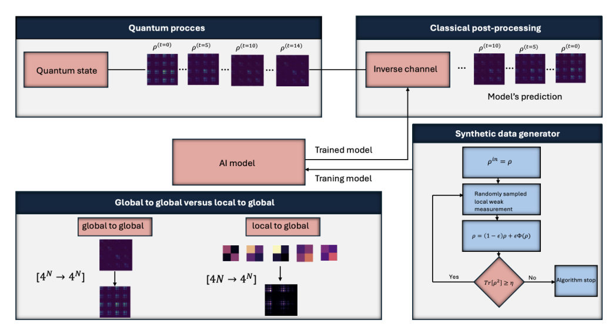 
FIG. 1: Schematic of the diffusion-like quantum-noise process and the AI-assisted inverse-channel reconstruction. An initial quantum state ρ0 is evolved through a sequence of weak-measurement-induced noisy channels, producing a trajectory of mixed states {ρt}T t=1. An AI model is trained to approximate the inverse channel and map each noisy intermediate state ρt back toward the original state ρ0. The upper panels show the forward noisy evolution and the reverse trajectory predicted by the trained model. The lower-left panel compares global-to-global reconstruction, in which the complete noisy N-qubit density matrix is provided, with local-to-global reconstruction, in which only the...

📷 Fig 2

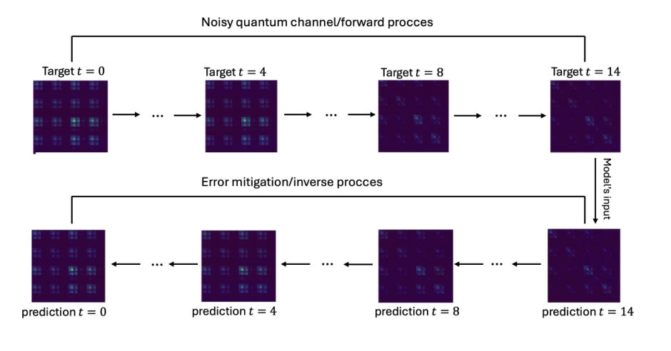 
FIG. 2: Example of the separable six-qubit denoising task. An input state evolves under a noisy quantum channel and is gradually degraded. The trained model receives the noisiest state, corresponding to the output of the noisy channel, and learns an effective inverse map that reconstructs the erased information. The reconstructed state achieves FGM &gt; 0.99 for a sequence length of 15 steps.

📷 Fig 3

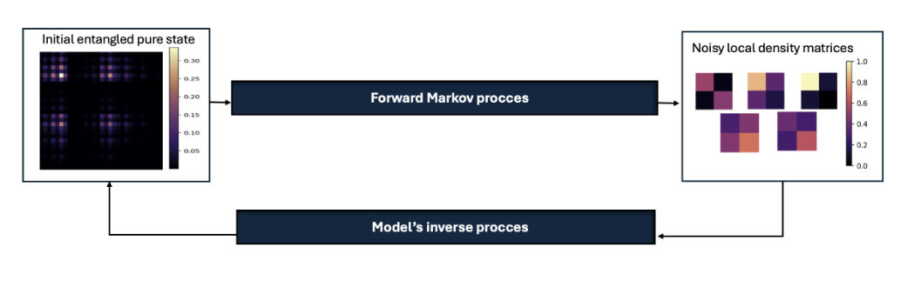 
FIG. 3: Example of the local-to-global inverse reconstruction task for a five-qubit quantum register, which constitutes the most challenging dataset considered in this work. The reconstruction is performed using the Vision Transformer model. The model receives as input the five single-qubit reduced density matrices obtained from the noisy global state and predicts the corresponding initial global density matrix.

📷 Fig 4

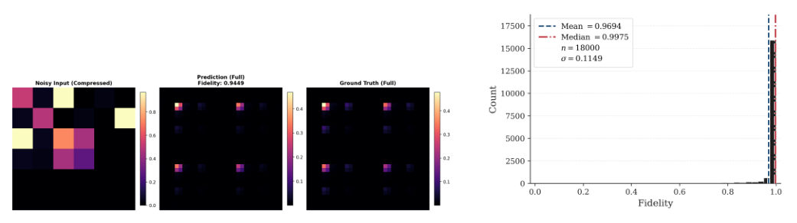 
FIG. 4: Configuration and local-to-global reconstruction results. (a) Example of a noisy local quantum-register input, together with the model prediction and the corresponding ground truth. The reconstructed state achieves FGM = 0.9449. (b) Reconstruction-FGM distribution on the held-out test set (n = 18,000 states). The mean and median fidelities are FGM = 0.9694 and eFGM = 0.9975, respectively, with standard deviation σ = 0.1149. Moreover, 91.6% of the states achieve FGM ≥0.95, while 80.0% achieve FGM ≥0.99. The model is trained on n = 5-qubit states generated with m = 4, ϵ = 0.1, and a target purity of 0.55. Each of the 15,000 generated states is expanded into a noisy trajectory of...

📷 Fig 5

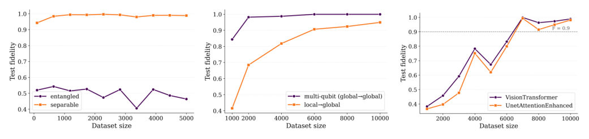 
FIG. 5: Test fidelity as a function of training-set size for different four-qubit reconstruction tasks and model architectures. (a) The same LSTM architecture trained on entangled states (full d × d density matrix, purple circles) versus separable product states (a collection of n single-qubit 2 × 2 matrices, orange squares), with ϵ = 0.1 and η = 0.55. The separable representation is learned almost perfectly from as few as 100 examples, whereas the fidelity for entangled states remains near 0.5 regardless of dataset size, highlighting the difficulty of learning genuinely entangled states. (b) The same ViT diffusion model trained to denoise the full 16 × 16 global density matrix directly...

**Summary.** The paper introduces an AI-assisted framework to mitigate quantum noise caused by environmental coupling, modeling the process as a diffusion-like trajectory. It trains neural networks on synthetic data from weak measurements to learn an effective inverse map that reconstructs the original quantum state from noisy observations. This offers a powerful hybrid classical-quantum approach for approximating non-unitary dynamics in noisy quantum systems.

**Why it may be interesting.** This work provides a concrete, machine learning-driven methodology for tackling open quantum system dynamics in noisy environments, which is crucial for scaling up near-term quantum hardware by mitigating coherence loss.

Detailed structure

**Main problem.** The paper addresses quantum error mitigation by developing an AI-assisted framework to estimate the initial state of a quantum system corrupted by decoherence.

**Main result.** They propose using machine learning models (like U-Nets and Transformers) trained on synthetic data from weak measurements to learn an effective, non-unitary denoising map that approximates the inverse noisy evolution channel.

**Method.** The core method involves training neural networks to map observed noisy density matrices ($
ho_t$) back to their estimated pre-noise state ($
ho_0$), mimicking classical diffusion model inversion techniques in a quantum context.

**Model / system.** The system is an arbitrary quantum state undergoing decoherence modeled by sequential local weak measurements, which generate a quantum diffusion process. The framework treats the noise as a sequence of non-unitary operations.

**Key observables.** Reconstructed initial density matrix ($
ho_0$), noisy intermediate states ($\{
ho_t\}$), and the fidelity of reconstruction across single and multi-qubit registers.

**Important parameters / regimes.** Measurement strength parameter ($\epsilon$) and the noise process parameters derived from Pauli basis measurements.

**Assumptions / limitations.** The inverse process is an approximation, not a strictly physical quantum channel; local measurement independence is assumed for global reconstruction; and post-processing filters are used to enforce density matrix constraints.

**Figures summary.** Figures schematically illustrate the forward noisy evolution via weak measurements and the AI model's role in approximating the reverse path from $\{
ho_t\}$ back to $
ho_0$, comparing global vs. local reconstruction capabilities.

**Paper structure.** The paper first introduces the physical problem of decoherence via weak measurements, then draws an analogy to classical diffusion models, details the training process using various ML architectures (LSTM, ViT, U-Net), and concludes with rigorous mathematical filtering techniques for ensuring output validity.

Abstract

Coupling between a quantum system and its environment causes decoherence by transferring information from the system to environmental degrees of freedom. When discretized in time, such interactions can be interpreted as sequences of weak measurements that provide an effective model of noisy quantum dynamics. Motivated by this picture, we propose an AI-assisted error-mitigation framework for quantum diffusion processes generated by sequential local weak measurements. The forward process progressively erases information from the input state through weak measurements performed in randomly selected Pauli bases, producing basis-dependent local dephasing and locally depolarizing dynamics on average. Machine-learning models are trained on exact synthetic density matrices to learn a channel- and distribution-specific denoising map and estimate the corresponding pre-noise state. We benchmark the approach on single-qubit states and separable and entangled multi-qubit registers. We also study distribution-dependent local-to-global reconstruction, in which local reduced density matrices are used to reconstruct the global state. This experimentally motivated setting relies on locally accessible information and is therefore compatible with noisy and distributed quantum systems. More broadly, the framework provides a hybrid classical-quantum approach for approximating non-unitary dynamics and mitigating coherence loss.

[↑ back to top](#top)

### [Quantum fluctuation relations in first-detection processes](http://arxiv.org/abs/2608.06194v1)

**Authors:** A. Imparato  
**Type:** theory · **Category:** statistical mechanics · **PDF:** <https://arxiv.org/pdf/2608.06194v1>  
**Analysis basis:** full PDF text, analyzed in chunks
**Topic relevance:** 🔥 `measurement-induced transitions` **4/5** · `non-equilibrium dynamics` **3/5** · `quantum measurements` **3/5** · `non-equilibrium universality` **2/5** · `Keldysh / 2PI / non-Gaussian methods` **1/5** · `correlated / nonlocal dissipation` **1/5** · `driven-dissipative phase transition` **1/5** · `entanglement & information structure` **1/5** · `methods for driven-dissipative` **1/5**

📷 Fig 1

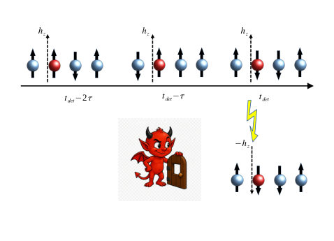 
FIG. 1. First detection information-to-work converter. The demon measures the z-component of the red spin alone with period τ. At time tdet the spin is found for the first time to be antialigned with the external field, and the field acting on the red spin is instantaneously changed by the demon to the value −hz. The operation results in a net extracted work 2hz

📷 Fig 2

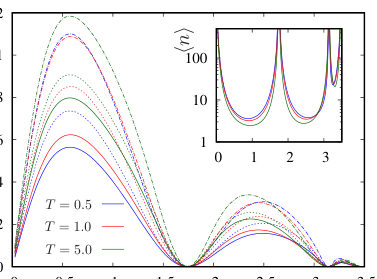 
FIG. 2. Full lines: average extracted work rate ˙wex (eq. (23)) as a function of the sampling interval τ for the two–spin model described in the text, and different values of the temperature. Dashed lines upper bound for the extracted work rate ˙wex

**Summary.** This theoretical paper develops generalized fluctuation relations for calculating work extracted from quantum devices that operate based on a first-detection trigger mechanism. It shows that these relations correct the standard Jarzynski equality by incorporating an entropic term related to the average detection time. The results establish fundamental, measurable limits on energy conversion in such measurement-driven quantum engines.

**Why it may be interesting.** This work extends fundamental theorems like the Jarzynski equality into the regime of measurement-induced quantum engines, providing new bounds on energy extraction that depend on the measurement protocol itself. This is highly relevant for understanding non-equilibrium thermodynamics in open quantum systems.

Detailed structure

**Main problem.** The paper derives quantum fluctuation relations characterizing the work extractable from a quantum device undergoing repeated projective measurements triggered by a first-detection event.

**Main result.** Two new fluctuation relations are established, correcting the standard Jarzynski equality with an entropic term dependent on the mean first-detection time. These relations provide fundamental limits on both total and extracted work.

**Method.** The derivation utilizes principles of quantum thermodynamics, applying Jensen's inequality to relate expectation values involving exponential functions of work, and employing time-reversal symmetry arguments.

**Model / system.** The model is a quantum device subjected to repeated projective measurements (a 'quantum first-detection information engine'). The analysis considers the general case where the system interacts with an external environment.

**Key observables.** Work extracted ($W_{	ext{ex}}$), total work exchanged ($W_{	ext{tot}}$), average first-detection time ($\langle n 
angle$), and survival probability ($S_\infty$).

**Important parameters / regimes.** Temperature ($eta$), measurement interval ($	au$), and the initial state $
ho_{in}$.

**Assumptions / limitations.** The analysis is based on the Two-Projective-Measurement (TPM) scheme, and certain normalization procedures are required if the survival probability $S_\infty[
ho_{in}] > 0$.

**Figures summary.** Figure 1 illustrates a 'First detection information-to-work converter' setup. Figure 2 compares extracted work ($\dot{w}_{	ext{ex}}$) against its upper bound derived from Jensen's inequality and first-detection mediated ergotropy.

**Paper structure.** The paper builds upon the standard Quantum Jarzynski Equality (QJE) by incorporating the non-Markovian effects of repeated measurements. It derives fluctuation relations for total work and extracted work, showing how these are modified by terms related to the mean first-detection time.

Abstract

We derive two quantum fluctuation relations for systems undergoing repeated projective measurements. These fluctuation relations characterize the work that can be extracted from a quantum device when a first-detection event triggers a mechanical operation leading to positive work production. The correction to the standard quantum Jarzynski equality depends logarithmically on the mean first-detection time for the time-reversed dynamics.   Application of Jensen's inequality leads to fundamental limits on both the total work involved in the repeated measurements and final mechanical operation, and the extracted work alone.   The general case of a device connected to an external environment is also considered.

[↑ back to top](#top)

### [Identifying slow relaxation in many-body quantum systems through state-graph geometry and state-graph heterogeneity](http://arxiv.org/abs/2608.05298v1)

**Authors:** Heiko Georg Menzler, Tom Ben-Ami  
**Type:** theory · **Category:** statistical mechanics · **PDF:** <https://arxiv.org/pdf/2608.05298v1>  
**Analysis basis:** full PDF text, analyzed in chunks
**Topic relevance:** 🔥 `non-equilibrium dynamics` **4/5** · `analog quantum simulation` **3/5** · `scars & prethermalization` **3/5** · `non-equilibrium universality` **2/5** · `correlated / nonlocal dissipation` **1/5** · `driven-dissipative phase transition` **1/5** · `entanglement & information structure` **1/5** · `methods for driven-dissipative` **1/5**

📷 Fig 1

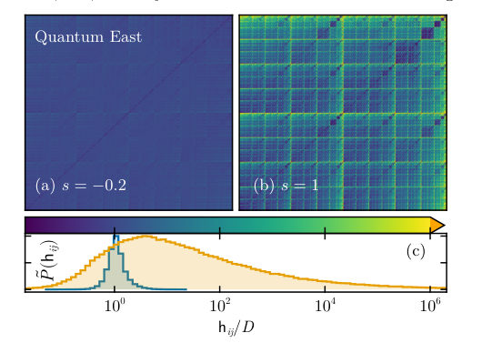 
Figure 1: Hitting matrix ˆh in the QEM with L = 10 (D = 210) in the (a) fast-dynamics (s = −0.2) and (b)

📷 Fig 2

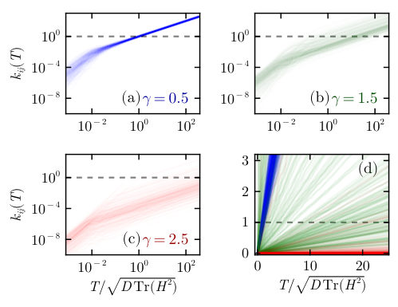 
Figure 2: Kernel function kij(T) for a representative state |i⟩and other states |j⟩in the computational basis in the RPM for (a) ergodic extended phase γ = 0.5, (b) non- ergodic extended phase γ = 1.5 and (c) localized phase γ = 2.5. (d) combines data from the three other subplots, showing linear behavior of kij(T) at large T. Horizontal dashed lines indicate a cutoff value C = 1.

📷 Fig 3

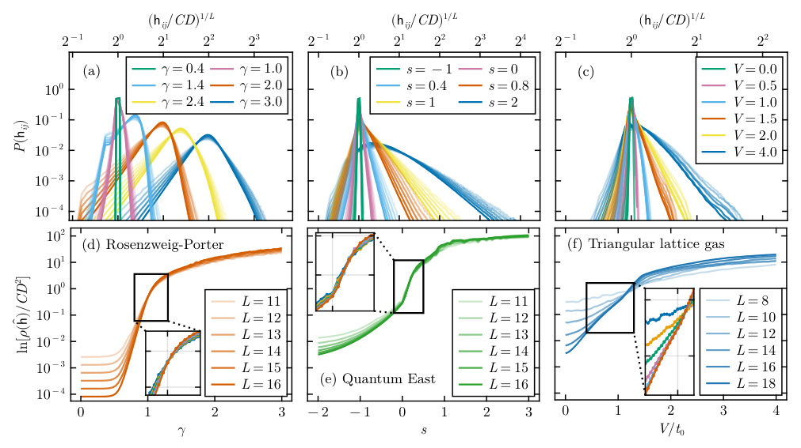 
Figure 3: Characterization of heterogeneous relaxation through ˆh. (a)-(c) Distribution of the hitting matrix elements hij across system parameters in the (a) RPM L = 10 –15, (b) QEM model L = 10 –15 and (c) the TLGM L = 14 –19 with N = ⌊L/2⌋, respectively. Lighter colors indicate smaller system sizes. The rescaling h1/L ij ensures that distributions have a comparable support across the investigated system sizes. (d)-(f) Spectral radius (largest eigenvalue) of the hitting matrix ρ(ˆh) against system parameters in the (d) RPM, (e) QEM and (f) TLGM for various system sizes. Insets show a zoom-in of the crossings. The logarithm of ρ(ˆh) is shown on a log-scale, making the visualization...

📷 Fig 4

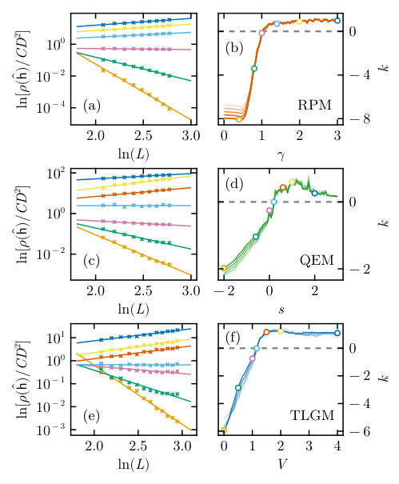 
Figure 4: Finite-size scaling analysis of ρ(ˆh) for the RPM [(a)-(b)], QEM [(c)-(d)], and TLGM [(e)-(f)]. The crossing point is determined from the finite-size scaling exponent. The exponent k is obtained from a linear fit in log-log space, as ln[ρ(ˆh)] ∝Lk. The left column [(a), (c), (e)] shows the log-log plots of ln[ρ(ˆh)] versus L together with the linear fits. The right column [(b), (d), (f)] shows k as a function of the tuning parameter. The dashed vertical line corresponds to k = 0 where ln[ρ(ˆh)] shows a flat scaling. Each marker color corresponds to a single tuning parameter value; the same color is used in the right column to show the finite-size fits. To assess the finite-size...

**Summary.** The paper develops a geometric framework using state graphs and hitting times to detect slow relaxation in many-body quantum systems. By analyzing the spectral radius of the graph's hitting matrix, the authors show that this metric acts as a sensitive indicator, sharply changing at the transition into slow dynamics across multiple model types.

**Why it may be interesting.** This work provides a powerful, unified graph-theoretic formalism to diagnose non-equilibrium dynamics in complex quantum systems, which is highly relevant for understanding thermalization and glassy behavior in AMO or condensed matter settings.

Detailed structure

**Main problem.** The research aims to identify and characterize slow relaxation dynamics in complex many-body quantum systems.

**Main result.** Slow dynamics are robustly identified by analyzing the geometry of the state graph, specifically through a sharp increase in the spectral radius of the hitting matrix at the transition point.

**Method.** The authors adapt tools from quantum random walks theory to construct and analyze the 'many-body state graph' using quantum hitting times derived from the unitary time-evolution operator.

**Model / system.** Three paradigmatic models are studied: the Rosenzweig-Porter model (RPM), the quantum East model (QEM), and the triangular lattice gas model (TLGM). The analysis is general for systems with discrete Hilbert spaces governed by a Hamiltonian H.

**Key observables.** Pairwise hitting times ($h_{ij}$), the kernel function $k_{ij}(T)$, and the spectral radius of the hitting matrix ($
ho(\hat{h})$).

**Important parameters / regimes.** Control parameters tuning the system across regimes, such as $\gamma$ in RPM or $s$ in QEM, which dictate the transition between fast and slow dynamics.

**Assumptions / limitations.** The analysis relies on constructing a state graph where nodes are basis states and using asymptotic limits of time-averaged quantities to characterize long-time behavior.

**Figures summary.** Figures illustrate how $
ho(\hat{h})$ changes across dynamical regimes, showing sharp increases at the onset of slow dynamics for QEM and RPM. Other figures show the evolution of $k_{ij}(T)$ over time T.

**Paper structure.** The paper introduces the state-graph formalism using quantum hitting times; it applies this framework to three distinct models (RPM, QEM, TLGM); it establishes that graph geometry metrics like $
ho(\hat{h})$ serve as universal indicators for slow relaxation transitions; and finally, it discusses the connection between these geometric measures and autocorrelation function decay.

Abstract

We adapt tools from the theory of quantum random walks to investigate slow relaxation dynamics through the many-body state graph. Specifically, we construct a probe of heterogeneity between basis states defined using hitting times derived from the unitary time-evolution operator. We find that the state-graph geometry, encoded by the pairwise hitting time of basis states, is a highly sensitive indicator of slow relaxation dynamics in a variety of systems. We study three paradigmatic models: the Rosenzweig-Porter model, the quantum East model, and the triangular lattice gas model, exhibiting a sudden onset of slow dynamics upon tuning of a control parameter. As a global characterization of the graph geometry, we analyze the spectral radius of the hitting matrix. We find that it increases sharply at the onset of slow dynamics, spanning many orders of magnitude, with a characteristic crossing point at the transition. Our work provides a geometric framework for describing and identifying phases with slow relaxation using a unified graph-theoretic formalism.

[↑ back to top](#top)

### [Anyon-Impurity Bound States in Quantum-Engineered Fractional Chern Insulators](http://arxiv.org/abs/2608.06233v1)

**Authors:** Botao Wang, Amit Vashisht, Felix A. Palm, Fabian Grusdt, Laurens Vanderstraeten, Nathan Goldman  
**Type:** theory · **Category:** strongly correlated electrons · **PDF:** <https://arxiv.org/pdf/2608.06233v1>  
**Analysis basis:** full PDF text, analyzed in chunks
**Topic relevance:** 🔥 `analog quantum simulation` **4/5** · `Kondo & dissipative impurity` **3/5** · `methods for driven-dissipative` **3/5** · `non-equilibrium dynamics` **2/5** · `Frenkel-Kontorova` **1/5** · `Keldysh / 2PI / non-Gaussian methods` **1/5** · `entanglement & information structure` **1/5**

📷 Fig 1

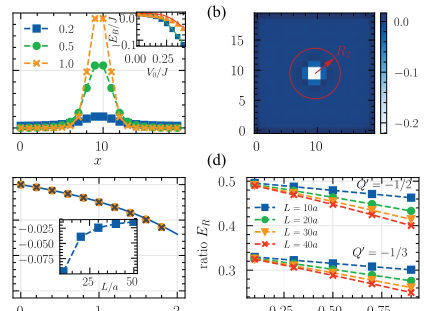 
FIG. 1. (a) The spatial density distribution of a single particle (along the center row) in finite system under peri- odic boundary condition with different trapping potentials V0/J = 0.2, 0.5 and 1.0. Inset: the binding energy E2D/J as a function of trap strength V0/J for different impurity hopping strength Jimp/J = 0.6 (squares) and Jimp/J = 1 (triangles). The solid lines represent the analytic results of Eq.(5) after the substitution mimp = ℏ2/2Jimpa2. The numerical results are associated with the Hamiltonian ˆH′ imp with R1 = 2a and system size 20 × 20 under periodic boundary condition. (b) The spatial density distribution in a Chern insulator with pin- ning potentials Vpin = 2J. (c)...

📷 Fig 2

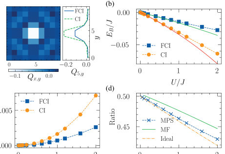 
FIG. 2. (a) Spatial distribution of the fractional charge Q = −1/2 in the ν = 1/2-FCI. Right: Charge density profiles along the central cut. The dashed line shows the corresponding integer-charge distribution in the CI. (b) Binding energy EB as a function of the impurity-host interaction strength U for the CI (orange dots) and FCI (blue squares). The green and red solid curves denote the corresponding mean-field results obtained from ˆH′′ imp. (c) The binding energy difference δEB = E′ B −EB as a function of interaction strength U. (d) Ratio of binding energies EB(ν = 1/2)/EB(ν = 1) as a function of U/J. The calculations are performed for N = 10 particles in the ν = 1/2 FCI and N = 21 free...

📷 Fig 3

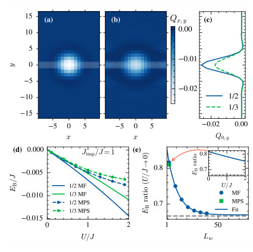 
FIG. 3. Spatial distribution of the fractional charge (a) Q = −1/2 and (b) Q = −1/3 associated with domain wall excitation using infinite MPS with circumference Lx = 19. (c) Charge density profiles along the central cut. (d) Bind- ing energy EB as a function of the impurity-host interac- tion strength U for ν = 1/2 and 1/3 within window size Lw = 3. (e) Ratio of binding energies at weak interaction limit (U/J = 0.01) as a function of the window size. Inset: Ratio of binding energies for window size Lw = 3 as a func- tion of U.

📷 Fig 4

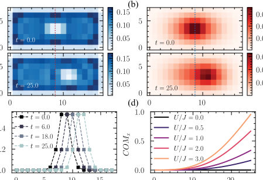 
FIG. 4. Spatial density distributions of (a) the host particles and (b) the impurity at evolution times tJ/ℏ= 0.0, 12.0 and 25.0 (from top to bottom) for U/J = 3.0. (c) Spatial profiles of the host pinning potentials along the row y = 3 at different times. (d) Center-of-mass of the impurity as a function of evolution time for different interaction strengths U.

📷 Fig 5

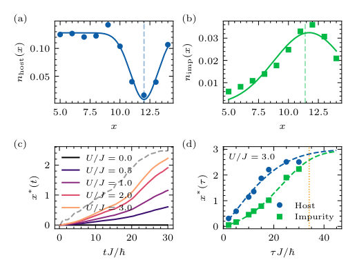 
FIG. 5. Spatial density distributions of (a) the host parti- cles and (b) the impurity along the central row y = 4 within the bulk for U = 3J and time t = 30ℏ/J. The solid lines show the corresponding (inverted) Gaussian fits. The vertical dashed lines indicate the positions of the minimum and max- imum, denoted by x∗. (c) Peak position of the impurity as a function of evolution time for different impurity–host inter- action strengths U. The dashed line denotes the position of the host-particle density minimum, which is independent of U. (d) Positions of the host-particle density minimum (blue dots) and the impurity density maximum (green squares) as a function of total dragging time τ for...

**Summary.** This paper theoretically investigates how mobile impurities bind to fractional quasihole excitations within Fractional Chern Insulators. By analyzing the binding energy of these anyon-impurity composites using advanced numerical techniques, the authors propose a robust method to experimentally measure the fractional charge inherent to the topological state. This establishes a pathway for controlled manipulation and braiding of exotic quasiparticles in quantum simulators.

**Why it may be interesting.** This work bridges topological physics (FCIs) with impurity physics, providing concrete, measurable signatures (binding energy ratios) that can be used to verify exotic fractional charge excitations in controllable quantum simulators.

Detailed structure

**Main problem.** The study investigates the formation, structure, and energetics of bound states between a mobile impurity and pinned quasihole excitations within Fractional Chern Insulators (FCIs). The ultimate goal is to establish controllable protocols for manipulating these anyonic composite objects.

**Main result.** The binding energy analysis provides a direct method to extract the fractional charge of the underlying quasihole. Furthermore, controlled transport of this composite object can be demonstrated by externally steering the pinning potential.

**Method.** The research combines analytical arguments with large-scale numerical simulations, utilizing techniques like Mean Field theory and Tensor Network methods (iMPS/DMRG) to analyze ground state energies in lattice models.

**Model / system.** The system is modeled using the interacting Harper–Hofstadter model deep in the FCI regime, applicable to quantum-engineered platforms. The Hamiltonian includes terms for host interactions ($\hat{H}_{	ext{host}}$), mobile impurity hopping ($\hat{H}_{	ext{imp}}$), and their coupling ($\hat{H}_U$).

**Key observables.** Binding energy ($E_B$), fractional charge of the quasihole ($Q'$), integrated charge response to pinning potentials, and the ratio of binding energies $E_R$.

**Important parameters / regimes.** Interaction strength ($U/J$), flux ($\phi$), filling fraction ($
u=1/2, 1/3$), and the strength of external pinning potentials ($V_h$).

**Assumptions / limitations.** The analysis often employs mean-field approximations for the impurity-host interaction term and relies on specific lattice models (Harper-Hofstadter) to represent the topological state.

**Figures summary.** Figures illustrate density distributions, binding energy dependence on trap strength/interaction, and how the ratio of binding energies approaches expected fractional charge values in both CI and FCI regimes.

**Paper structure.** The paper progresses from analyzing single-particle bound states in traps to modeling interacting systems using the Harper-Hofstadter model. It systematically calculates binding energies for integer vs. fractional charges, demonstrating how external potentials control the excitation state and enabling proposals for braiding protocols.

Abstract

Mobile impurities provide a powerful means of probing correlated and topological quantum matter, through their dressing by the surrounding medium and the practical probes granting access to the resulting composite object. Motivated by the recent observation of anyon-impurity composites in the solid state, as well as recent realizations of Laughlin-type states in engineered lattice systems, we investigate the formation of a bound state between a mobile impurity and a single pinned quasihole in the interacting Harper-Hofstadter model deep in the fractional Chern insulator regime. Combining analytical arguments with large-scale numerical simulations, we characterize the structure, energetics, and stability of hybrid anyon-impurity bound states, and show that their binding energy provides direct access to the fractional charge of the quasihole under conditions that we identify. We further demonstrate that the composite object can be coherently transported by externally steering the quasihole pinning potential. Our results establish a realistic pathway for controlled anyon-impurity manipulation in quantum-engineered platforms, enabling experimentally feasible protocols for braiding.

[↑ back to top](#top)

### [Exponential logical-error reduction in quantum memories via optimal syndrome-measurement timing](http://arxiv.org/abs/2608.06242v1)

**Authors:** Tobias Haug, Kishor Bharti, Leandro Aolita  
**Type:** theory · **Category:** quantum information and computing · **PDF:** <https://arxiv.org/pdf/2608.06242v1>  
**Analysis basis:** full PDF text, analyzed in chunks
**Topic relevance:** 🔥 `quantum measurements` **4/5** · `measurement-induced transitions` **3/5** · `methods for driven-dissipative` **3/5** · `non-equilibrium dynamics` **2/5** · `Keldysh / 2PI / non-Gaussian methods` **1/5** · `correlated / nonlocal dissipation` **1/5** · `driven-dissipative phase transition` **1/5**

📷 Fig 1

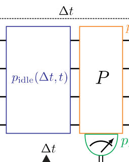 
FIG. 1. Optimal syndrome measurement timings in fault-tolerant quantum memories. For each syndrome- measurement round lasting physical time ∆t, faults occur due to finite qubit lifetime with probability pidle(∆t, t) that in- creases with ∆t. Syndrome measurements induce noise which is independent of ∆t, where faults in data qubits occur with probability pstab and read-out errors in the measuring device with probability pread. After the final syndrome measurement round, the decoder uses the space-time history of obtained syndromes to infer the best correction operation to recover the original logical state. We choose ∆t to optimally trade- off between errors due to syndrome measurement and...

📷 Fig 2

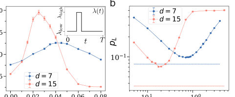 
FIG. 3. Adaptive syndrome measurement timing for dynamic noise. We consider burst noise (9) in a rotated sur- face codes with distance d. a) Improvement in logical error Γadapt of adaptive protocols over the best fixed-time protocol, plotted against burst detection threshold θ. We find maximal Γadapt ≈{1.26, 1.95} with ∆t⋆= {0.7, 0.175}. Inset shows typical burst idle noise rate λ(t) over time t. b) Total log- ical error pL of fixed-interval protocol against fixed-protocol time ∆t. Horizontal dashed lines indicate best adaptive pro- tocol with θ⋆= {0.045, 0.025}. As parameters, for d = 7 we have total time T = 2000, p = 0.015, λlow = 0.03, λhigh = 2, syndrome interval ∆thigh = 0.25 when...

📷 Fig 3

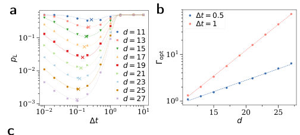 
FIG. 2. Quantum memory enhancement by optimal syndrome-measurement timing for static noise. We simulate the rotated surface code for different distances d un- der a phenomenological noise model with time-independent idle rate λ = 1, base noise scale p = 0.015, read-out error factor bread = 1 and total time T = 200. a) We show the total logical error pL obtained from the full simulation (dots) and from ansatz (5) (dashed lines) where we fitted A = 1.7 while parameters β = 2, g = 0.8 and pth = 0.029 are fixed. Crosses indicate optimal ∆t⋆(d). b) Advantage factor Γopt in pL at the optimal choice of distance-dependent syndrome in- terval ∆t⋆∝1/d over fixed interval ∆t, for two different ∆t’s....

📷 Fig 4

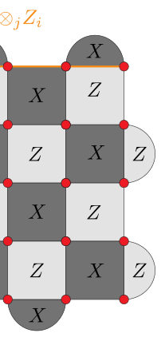 
FIG. 4. Rotated surface code for d = 5.

📷 Fig 5

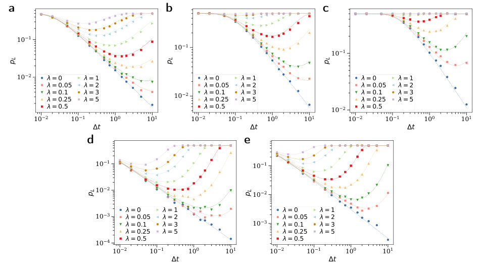 
FIG. 5. Total logical error rate pL after time T against syndrome interval ∆t for different constant idling noise λ. We show numerical simulation of phenomenological noise model of the rotated surface code under matching decoding (dots) and fitted ansatz of (5). We always fix ansatz parameters β = 2, g = 0.8 and pth = 0.029, while we fit A depending on p and d. For the plots, we show different distances d with a) d = 5, p = 0.005, T = 100 and A = 0.75. b) d = 7, p = 0.01, T = 200 and A = 1.0. c) d = 11, p = 0.015, T = 500 and A = 1.4. d) d = 15, p = 0.01, T = 1000 and A = 1.5. e) d = 21, p = 0.015, T = 1000 and A = 1.9. For all plots, we choose read-out noise coefficient bread = 1.

**Summary.** This paper proposes an optimal strategy for scheduling syndrome measurements in quantum error-correcting memory, treating the measurement interval as an optimizable control parameter rather than a fixed clock cycle. By deriving that the optimal interval scales inversely with code distance ($\Delta t^* \propto 1/d$), the authors show this leads to an exponential suppression of logical errors. Furthermore, they introduce an adaptive timing protocol that significantly outperforms static scheduling when noise is bursty.

**Why it may be interesting.** This work provides crucial theoretical guidance for designing next-generation quantum memories by moving beyond fixed operational cycles. The focus on optimizing the measurement schedule itself is a key area in open quantum systems and fault tolerance theory.

Detailed structure

**Main problem.** The primary challenge is optimizing the syndrome-measurement timing ($\Delta t$) in quantum error-correcting codes to minimize logical errors by balancing accumulating idling noise against measurement-induced faults.

**Main result.** Optimal scheduling requires setting the interval inversely proportional to the code distance ($\Delta t^* \propto 1/d$), which yields an exponential reduction in logical error rates compared to fixed-interval protocols. Adaptive strategies further improve performance, especially during noise bursts.

**Method.** The authors developed a phenomenological logical-noise model to analytically derive the optimal timing scaling and analyzed time-dependent noise using adaptive control theory.

**Model / system.** The work focuses on fault-tolerant quantum memories implemented via rotated surface codes. The error sources modeled include idling errors (exponentially dependent on $\Delta t$) and measurement faults (linearly dependent on measurement frequency).

**Key observables.** Logical error rate ($p_L$), optimal syndrome interval ($\Delta t^*$), relative suppression factor ($\Gamma_{	ext{opt}}$), and the time-dependent noise activity $\lambda(t)$.

**Important parameters / regimes.** Code distance ($d$), idling noise rate ($\lambda$), measurement fault probabilities ($p_{	ext{stab}}, p_{	ext{read}}$), and experimental parameters from Google's Willow device.

**Assumptions / limitations.** The analysis relies on a phenomenological logical-noise model, and the adaptive strategy assumes instantaneous knowledge of the time-dependent noise profile $\lambda(t)$.

**Figures summary.** Figures illustrate the trade-off between error sources vs. $\Delta t$, showing that $\Delta t \propto 1/d$ yields exponentially lower errors than constant intervals; other figures compare fixed vs. adaptive protocols for dynamic noise.

**Paper structure.** The paper first establishes the fundamental trade-off, derives the optimal scaling $\Delta t^* \propto 1/d$, and then extends this analysis to time-dependent noise using an adaptive control strategy, concluding with quantitative predictions based on current experimental hardware parameters.

Abstract

Syndrome-measurements timing is usually treated as a fixed clock cycle of a quantum error-correcting code. For quantum memories, however, the intra-measurement interval is itself an optimizable control parameter: measuring too rarely allows idling errors to accumulate, whereas measuring too often introduces measurement-induced faults. We propose a phenomenological logical-noise model for this trade-off and analytically show that the optimal syndrome-measurements interval scales inversely proportionally with the code distance and that this produces an exponential reduction of logical-error rates in the distance relative to constant-interval schedules. Furthermore, for time-dependent idling noise, we develop an adaptive timing strategy based on the measured syndrome activity that outperforms every fixed-interval protocol, with largest gains for short but strong noise bursts. Simulations of rotated surface-code memories with matching decoding validate the phenomenological model, the distance-dependent optimum, and the adaptive-strategy improvement. Moreover, with the experimental noise parameters reported by Google in Nature 638 (2025), our model predicts reductions in logical-error rates per unit time of up to $40\%$.

[↑ back to top](#top)

### [Photon-nucleon entanglement in Compton scattering at low and high energies](http://arxiv.org/abs/2608.05330v1)

**Authors:** Yoshitaka Hatta, Víctor Martínez-Fernández  
**Type:** theory · **Category:** other · **PDF:** <https://arxiv.org/pdf/2608.05330v1>  
**Analysis basis:** full PDF text, analyzed in chunks
**Topic relevance:** 🔥 `entanglement & information structure` **4/5** · `quantum measurements` **2/5** · `spintronics-quantum-optics interface` **2/5** · `Keldysh / 2PI / non-Gaussian methods` **1/5** · `analog quantum simulation` **1/5** · `correlated / nonlocal dissipation` **1/5** · `driven-dissipative phase transition` **1/5** · `exotic spin models in light-matter` **1/5** · `methods for driven-dissipative` **1/5** · `non-equilibrium dynamics` **1/5**

📷 Fig 1

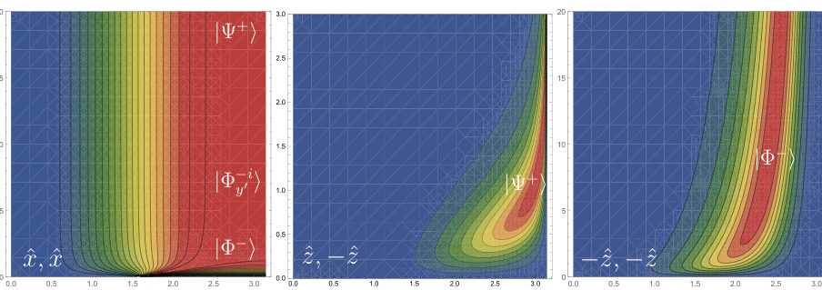 
FIG. 2: Contour plot of the minimum eigenvalue λmin in electron-target Compton scattering for three different polarization configurations. (⃗se,⃗sγ) = (ˆx, ˆx) (left), (⃗se,⃗sγ) = (ˆz, −ˆz) (middle) and (⃗se,⃗sγ) = (−ˆz, −ˆz) (right). µ = ω me is the rescaled photon energy. For better legibility, the middle plot shows a different range µ &lt; 3.

📷 Fig 2

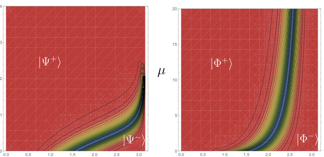 
FIG. 3: Minimal eigenvalue λmin of the states resulting from the Bell states |Ψ+⟩(left) and |Ψ−⟩(right) as the initial condition. Here and in the following, the color coding is the same as in Fig. 2.

📷 Fig 3

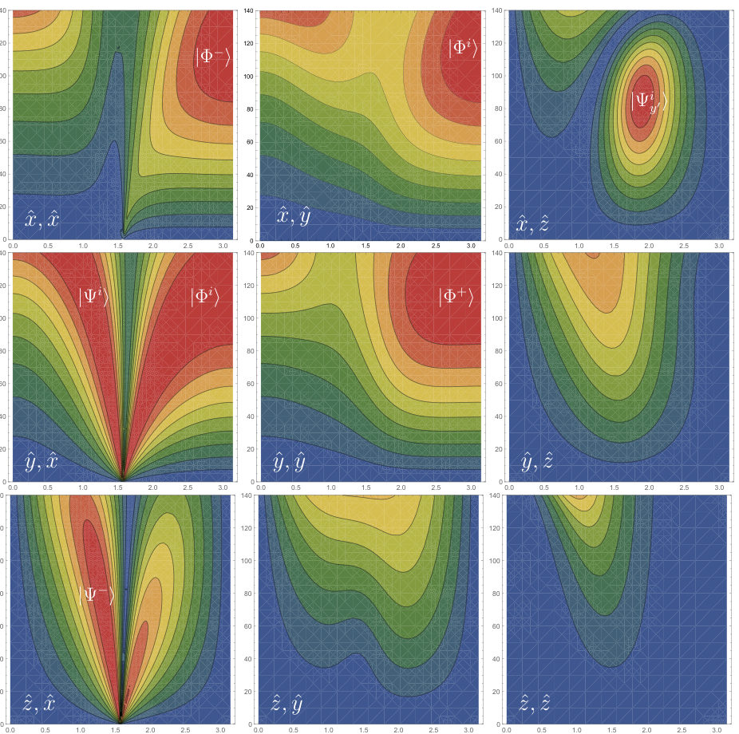 
FIG. 4: The lowest eigenvalue of the partially transposed density matrix ρT (⃗sN,⃗sγ) in the (θ, ω) plane (ω in units of MeV). The label ˆx, ˆx means ⃗sN = ˆx and ⃗sγ = ˆx, etc.

📷 Fig 4

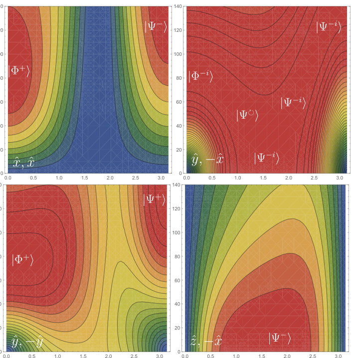 
FIG. 5: The same as Fig. 4, but for the neutron target. In the (ˆy, −ˆx) plot, we have increased the number of contours since the region of strong entanglement λmin &lt; −0.45 is broad.

📷 Fig 5

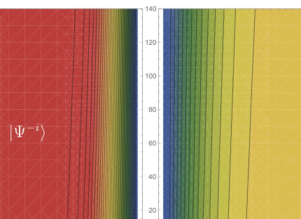 
FIG. 6: Same as the (ˆy, −ˆx) and (ˆy, −ˆy) plots in Fig. 5, except that the polarizabilities are set to zero αn E = βn M = 0 by hand.

**Summary.** This theoretical paper analyzes spin-spin entanglement in Compton scattering, treating the outgoing photon and nucleon as a two-qubit system. It develops formalisms using helicity amplitudes to calculate the entanglement measure ($\lambda_{\min}$), demonstrating that polarization is crucial for generating entanglement. The findings suggest this quantum diagnostic tool can map out detailed electromagnetic structure of nucleons.

**Why it may be interesting.** While focused on particle physics (QCD/Electromagnetism), the core methodology—quantifying entanglement via density matrices and partial transposition criteria ($\lambda_{\min}$)—is directly transferable to analyzing quantum correlations in complex many-body or open quantum systems studied in AMO physics.

Detailed structure

**Main problem.** The study investigates spin-spin entanglement generated in the final state photon-nucleon system during Compton scattering at both low and high energies.

**Main result.** The authors established a no-go theorem for unpolarized scattering with real amplitudes, but found that polarized scattering reveals rich patterns of maximally entangled Bell states, suggesting entanglement is a novel tool to probe nucleon electromagnetic properties.

**Method.** The analysis involves calculating the two-qubit spin density matrix ($
ho$) using helicity amplitudes derived from scattering cross-sections in different kinematic regimes (low/high energy).

**Model / system.** The physical system is Compton scattering off a spin-1/2 nucleon (proton or neutron), treated as an outgoing photon and nucleon two-qubit quantum state.

**Key observables.** Spin density matrix ($
ho$), minimum eigenvalue of the partially transposed density matrix ($\lambda_{\min}$), polarization vectors ($\vec{B}_N, \vec{B}_\gamma$), and correlation matrices ($C_{ab}$).

**Important parameters / regimes.** Photon energy ($\omega$) relative to pion mass ($m_\pi$); electric and magnetic polarizabilities ($\alpha_E, eta_M$); scattering angle ($	heta$).

**Assumptions / limitations.** The analysis relies on working in the Center-of-Mass (CM) frame; specific approximations are used for high energy via perturbative QCD/GPDs.

**Figures summary.** Figure 1 illustrates Compton scattering kinematics. Figure 2 shows contour plots of $\lambda_{\min}$ mapping entanglement strength across varying photon energy and scattering angle for electron-target scattering.

**Paper structure.** The paper progresses by first establishing the general formalism using helicity amplitudes to construct the density matrix, proving a no-go theorem in unpolarized cases, then detailing low-energy results sensitive to polarizabilities, and finally extending the framework to high-energy QCD calculations.

Abstract

We study spin-spin entanglement in the final state photon-nucleon system in Compton scattering, both at low energy below the pion threshold and at high energy in perturbative QCD to next-to-leading order. We first establish a no-go theorem showing that, for any spin-$\frac{1}{2}$ target, entanglement cannot be generated in unpolarized Compton scattering if the scattering amplitudes are real. We then consider polarized Compton scattering off the electron, the proton and the neutron. At low energy, we uncover a rich variety of maximally entangled Bell states and their unitary equivalents realized across different regions of the kinematic plane. Interestingly, the proton and neutron targets exhibit distinct patterns of entanglement. In the neutron case, the electric and magnetic polarizabilities dramatically influence the pattern and even the existence of entanglement. This suggests that entanglement can serve as a novel tool for investigating the detailed electromagnetic properties of the nucleons.

[↑ back to top](#top)

### [Resilient strange metal at an unconventional quantum critical point in $d=2$](http://arxiv.org/abs/2608.05988v1)

**Authors:** Jérôme Leblanc, A. -M. S. Tremblay  
**Type:** theory · **Category:** strongly correlated electrons · **PDF:** <https://arxiv.org/pdf/2608.05988v1>  
**Analysis basis:** full PDF text, analyzed in chunks
**Topic relevance:** 🔥 `analog quantum simulation` **4/5** · `Keldysh / 2PI / non-Gaussian methods` **3/5** · `non-equilibrium universality` **3/5** · `driven-dissipative phase transition` **2/5** · `Kondo & dissipative impurity` **1/5** · `methods for driven-dissipative` **1/5** · `non-equilibrium dynamics` **1/5**

📷 Fig 1

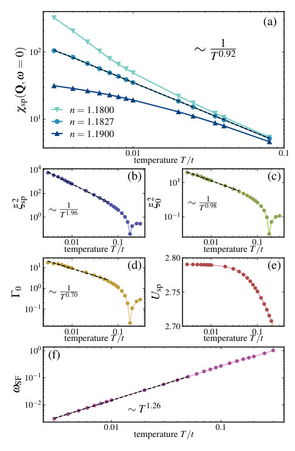 
FIG. 1. Temperature dependence of spin fluctuation-related quan- tities at the QCP (n = 1.1827, circles) for t′ = t′′ = 0, U = 6t and at Q = (π −ϵ, π). Black dashed lines are power law fits at low temperatures. The resulting exponents are indicated by the in- sets ∼T a. The estimated error on a are ±0.003 for (a), ±0.02 for (b-d) and ±0.01 for (f). (a) Maximum of spin susceptibility at zero frequency. (b) Squared spin correlation length. (c) Squared micro- scopic particle-hole coherence length scale. Obtained from the sec- ond derivative with respect to qx. (d) Landau damping constant. (e) Irreducible spin vertex. (f) Characteristic spin fluctuation frequency obtained from Γ0/ξ2 sp.

📷 Fig 2

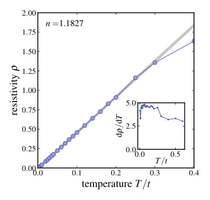 
FIG. 3. Temperature dependence of resistivity at the SDW QCP (n = 1.1827) for t′ = t′′ = 0, U = 6t. Blue dots are values of resistivity, and the gray line is a linear fit for T ≤0.2t. The inset shows the derivative with respect to temperature.

📷 Fig 3

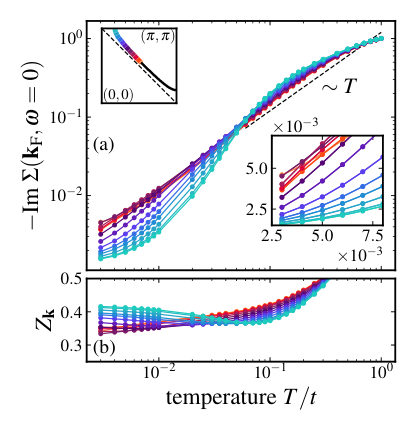 
FIG. 2. (a) Temperature dependence of the imaginary part of the self-energy along the Fermi surface at the QCP (n = 1.1827) for t′ = t′′ = 0, U = 6t. The dashed line is a guide to the eye. The inset in the upper-left corner displays the color code. The full black line is the maximum of the Fermi surface, while the diagonal dashed line is the AFM Brillouin zone. The inset on the lower right shows values at low temperature near the node. This inset has linear axes. (b) Temperature dependence of the single-particle weight along the Fermi surface for the same parameters. Color code in the inset of (a).

📷 Fig 4

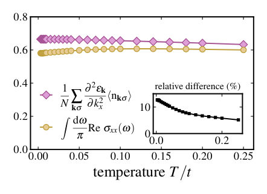 
FIG. 4. Comparison between the left-hand side (yellow circles) and right-hand side (pink diamonds) of Eq. (16), as a function of temperature, at the QCP (n = 1.1827) for t′ = t′′ = 0, U = 6t. The inset shows the absolute value of the relative difference between the two.

📷 Fig 5

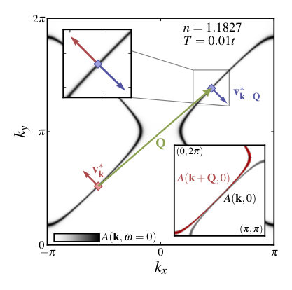 
FIG. 5. Zero-frequency spectral weight at the QCP (n = 1.1827) for t′ = t′′ = 0, U = 6t and T = 0.01t. The blue and red diamonds mark 2 points on the Fermi surface related by the incommensurate SDW wavevector Qi = (π, π −ϵ) (in green). The vectors at both points are the renormalized velocities evaluated at their respective points. The inset in the top left corner shows both velocities juxta- posed at the k + Qi point. The inset in the lower right corner shows the Fermi surface (black) and a Fermi surface translated by Qi (red).

**Summary.** This theoretical work predicts that strange metal behavior, characterized by linear temperature dependence of resistivity ($
ho \propto T$), persists at an unconventional quantum critical point in the 2D Hubbard model. Using advanced non-perturbative methods, the authors demonstrate this scaling occurs without requiring a simple linear-in-$T$ self-energy correction along the Fermi surface.

**Why it may be interesting.** While focused on strongly correlated electron systems, the failure of quasiparticle descriptions and the emergence of linear-T resistivity at a QCP are fundamental concepts relevant to non-Fermi liquid physics studied in AMO contexts (e.g., near Feshbach resonances or quantum critical points in ultracold atomic mixtures).

Detailed structure

**Main problem.** The study investigates strange metal behavior and its connection to unconventional quantum critical points (QCPs) in two dimensions where standard Fermi liquid theory breaks down.

**Main result.** The authors predict that resistivity scales linearly with temperature ($
ho \propto T$) at the QCP, even when the single-particle self-energy does not exhibit a simple linear-in-$T$ dependence along the Fermi surface.

**Method.** Non-perturbative calculations using an improved two-particle self-consistent approach (TPSC+) are employed to analyze correlation functions and transport properties.

**Model / system.** The system modeled is the two-dimensional Hubbard model on a square lattice with nearest-neighbor hopping, focusing on fillings near but above half-filling ($n>1$).

**Key observables.** Resistivity ($
ho$), single-particle self-energy ($\Sigma$), spin susceptibility ($\chi_{sp}$), and charge conductivity ($\sigma_{xx}$).

**Important parameters / regimes.** The analysis is performed near the QCP separating Fermi liquid and incommensurate SDW order, with key parameters including interaction strength $U$ relative to hopping $t$.

**Assumptions / limitations.** Assumptions include using the Ornstein-Zernicke form for $\chi_{sp}$ and prioritizing gauge invariance when calculating conductivity via current-current correlation functions.

**Figures summary.** Figures illustrate temperature dependencies of spin fluctuation quantities ($\chi_{sp}, \xi^2_{sp}$) showing power laws, confirmation of linear resistivity scaling at low T, and comparisons between theoretical expressions for the f-sum rule.

**Paper structure.** The paper develops by first establishing the physical context (strange metals near QCPs), then applying advanced many-body techniques (TPSC+) to calculate key susceptibilities and transport coefficients ($\sigma_{xx}$), ensuring gauge invariance throughout the analysis.

Abstract

Properties of the two-dimensional Hubbard model with nearest-neighbor hopping are under scrutiny in cold-atom experiments and diagrammatic quantum Monte Carlo. Given the controlled nature of these approaches, it is timely to make predictions about strange-metal behavior and its relation to quantum-critical properties. Even for interaction strengths below the Mott transition, several peculiarities occur at the quantum critical point separating Fermi liquid and incommensurate spin-density wave order. Here, we predict, using the non-perturbative improved two-particle self-consistent approach, that for correlation lengths ranging from about one to one hundred lattice spacings, Kohn anomalies on the underlying Fermi surface lead to unconventional critical exponents. The temperature dependence of the single-particle self-energy acquires strong momentum dependence along the Fermi surface with no clear evidence of Landau quasiparticles. Nevertheless, we observe strange-metal behavior, namely, resistivity that scales linearly with temperature as $T\rightarrow{0}$. Our work shows that a linear temperature dependence of resistivity arises without a linear-in-temperature self-energy along the Fermi surface, as is often assumed.

[↑ back to top](#top)

### [Hadamard sensing channel: deterministic artifact suppression for quantum sensors](http://arxiv.org/abs/2608.06119v1)

**Authors:** Weibin Ni, Lei Sun  
**Type:** theory · **Category:** other · **PDF:** <https://arxiv.org/pdf/2608.06119v1>  
**Analysis basis:** full PDF text, analyzed in chunks
**Topic relevance:** 🔥 `QC/QI experiment` **4/5** · `spintronics-quantum-optics interface` **3/5** · `quantum measurements` **2/5** · `Keldysh / 2PI / non-Gaussian methods` **1/5** · `correlated / nonlocal dissipation` **1/5** · `driven-dissipative phase transition` **1/5** · `exotic spin models in light-matter` **1/5** · `methods for driven-dissipative` **1/5**

📷 Fig 1

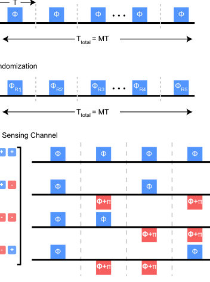 
FIG. 1. Schematic representations of various sequence mod- ulation protocols. Rectangles represent pulse units. (a) The standard periodic DD sequence, consisting of repeated blocks of pulse units with a constant reference phase. (b) The phase-randomized periodic DD sequence, where a ran- dom phase offset is added to each block to suppress spurious responses, necessitating extensive statistical averaging. (c) The proposed HSC protocol applied to the periodic DD se- quence. This panel illustrates the deterministic modulation across four distinct experimental runs, dictated by the rows of a 4-dimensional Sylvester-constructed Hadamard matrix (H4). Blue rectangles represent pulse units with no...

📷 Fig 2

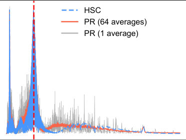 
FIG. 2. Simulated spectra for sensing a single nuclear spin us- ing 64 XY-8 cycles (512 pulses in total). Parameters: target frequency fac = ω0/(2π) = 2 MHz (highlight by red dashed line), coupling strength A⊥= 2π × 200 kHz, Rabi frequency ω1/(2π) = 20 MHz, and detuning ∆z = 1 MHz. (a) Standard XY-8 sequence without phase modulation, showing significant spurious responses. (b) Comparison of spectra between PR and the HSC. The HSC protocol inherently requires multi- ple sequence variations (M = 64). A single PR realization (Navg = 1) exhibits significant statistical variance and aver- aging PR over 64 runs (Navg = 64) effectively suppresses this variance.

📷 Fig 3

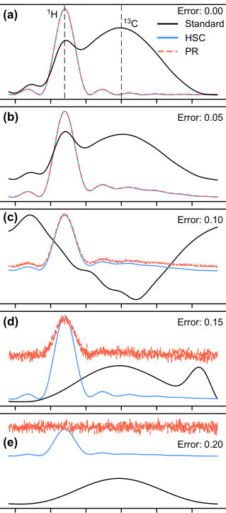 
FIG. 3. Simulated dual-species nuclear spin (1H and 13C) sensing spectra using M = 256 XY-8 cycles (yielding 2048 total π pulses). The external magnetic field is B = 45 mT, corresponding to Larmor frequencies ω0,1/(2π) = 1.92 MHz (1H) and ω0,2/(2π) = 0.48 MHz (13C). The hyperfine coupling components (A⊥, A∥) are 2π×(2, 1) kHz and 2π×(20, 10) kHz for 1H and 13C, respectively. The nominal π-pulse duration is set to 200 ns (ω1/(2π) = 2.5 MHz). Panels (a)–(e) compare the standard XY-8 sequence, PR, and HSC under increasing pulse error rates—comprising equal contributions from pulse amplitude and detuning errors, expressed as percentages of the nominal Rabi frequency ω1. The PR data is averaged...

**Summary.** This paper introduces the Hadamard Sensing Channel (HSC), a deterministic technique to suppress spurious signals that degrade quantum sensor readings due to imperfect microwave pulses. By leveraging the orthogonality of Hadamard matrices, HSC achieves signal cancellation superior to probabilistic methods like Phase Randomization. It offers a robust and hardware-efficient solution for high-fidelity nanoscale magnetometry.

**Why it may be interesting.** This work provides a mathematically exact and hardware-friendly protocol for mitigating systematic errors in quantum sensing measurements, which is crucial for advancing high-resolution magnetometry experiments involving open quantum systems.

Detailed structure

**Main problem.** Spurious responses generated by finite duration microwave pulses during dynamical decoupling sequences compromise quantum sensing fidelity in nanoscale systems.

**Main result.** The proposed Hadamard Sensing Channel (HSC) deterministically cancels these spurious signals using a finite set of orthogonal phase patterns, matching ideal suppression while being more robust than probabilistic methods.

**Method.** HSC employs a deterministic phase-design framework based on Hadamard matrices to average out unwanted signal components over a finite number of runs.

**Model / system.** The study models quantum sensors, specifically using Nitrogen-Vacancy (NV) centers in diamond for nanoscale nuclear magnetic resonance. The system evolution is governed by a Hamiltonian involving spin operators and time-dependent fields.

**Key observables.** Transition probability related to the sensor's remaining coherence ($\langle \hat{S}_x 
angle$) and the Fourier amplitude of spurious responses ($f_{\perp}$).

**Important parameters / regimes.** The number of runs, $M$, which dictates the suppression factor; control error parameters like pulse angle errors and detuning.

**Assumptions / limitations.** The core assumption is that exploiting the orthogonality of Hadamard matrices provides a sufficient basis for deterministic cancellation, even if it deviates from strict abelian group constructions.

**Figures summary.** Figure 1 schematically compares standard DD, phase-randomized DD, and the proposed HSC protocol, illustrating deterministic modulation across four runs dictated by $H_4$.

**Paper structure.** The paper first identifies spurious responses in DD sequences. It then contrasts existing methods (PR) with its novel HSC approach, deriving the suppression mechanism using Hadamard matrix properties, and finally validating performance through simulations comparing HSC against PR under realistic control errors.

Abstract

Dynamical decoupling sequences are essential for nanoscale quantum sensing, but the finite duration of microwave pulses generates spurious responses. While phase randomization (PR) protocol can suppress these artifacts, they rely on probabilistic averaging. This introduces an inherent statistical variance that demands excessive sequence lengths and stringent hardware capabilities for true random phase generation. Here, we propose Hadamard sensing channel (HSC), a deterministic phase-design framework based on Hadamard matrices. HSC completely eliminates the statistical variance of PR by exactly and deterministically canceling spurious signals using a finite set of orthogonal phase patterns. Simulations confirm that HSC matches the ideal suppression of PR but exhibits superior robustness against control errors. HSC offers a mathematically exact and hardware-friendly solution for reliable high-resolution nanoscale nuclear magnetic resonance.

[↑ back to top](#top)

### [X-Z Round Scheduling for the Surface Code with Defects under Biased Noise](http://arxiv.org/abs/2608.05518v1)

**Authors:** Lakshika Rathi, Pau Escofet, Joshua Viszlai, Margaret Martonosi  
**Type:** theory · **Category:** quantum information and computing · **PDF:** <https://arxiv.org/pdf/2608.05518v1>  
**Analysis basis:** full PDF text, analyzed in chunks
**Topic relevance:** 🔥 `quantum measurements` **4/5** · `measurement-induced transitions` **3/5** · `QC/QI experiment` **2/5** · `correlated / nonlocal dissipation` **1/5** · `driven-dissipative phase transition` **1/5** · `methods for driven-dissipative` **1/5**

📷 Fig 1

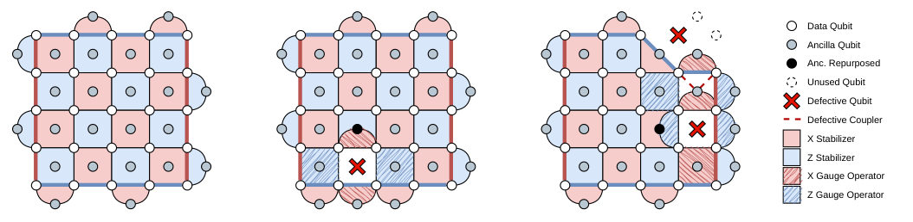 
Fig. 1. (left) Distance-5 rotated surface code with d2 data qubits and d2 −1 ancilla qubits which measure X- and Z-type stabilizers. (middle) Surface code under the presence of 1% defect rate, with a defective ancilla qubit, necessitating two super-stabilizers (one X, one Z) to obtain the syndrome. (right) Surface code under the presence of 2% defect rate, with one defective ancilla, one defective data qubit, and two defective couplers.

📷 Fig 2

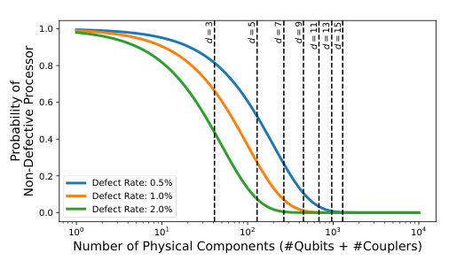 
Fig. 2. Probability of obtaining a non-defective processor as a function of the total number of components, for hardware defect rates of 0.5%, 1% and 2%. Vertical dashed lines mark the component counts corresponding to representative code distances.

📷 Fig 3

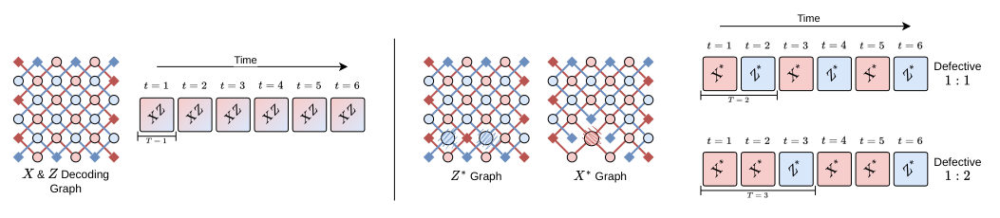 
Fig. 3. (left) The X &amp; Z decoding graph for the left patch depicted in Figure 1. Circular nodes represent bulk stabilizer nodes and diamond nodes represent boundary nodes. With no defects, both the X and the Z stabilizers are measured in every round. (right) The Z∗and X∗decoding graphs for the two alternating syndrome extraction rounds of the middle patch in Figure 1, where hatched nodes mark defective stabilizers. The non-defective X and Z stabilizers are measured in every round, while the X and Z super-stabilizers of the defective surface code are interleaved according to the scheduling ratio RX:RZ.

📷 Fig 4

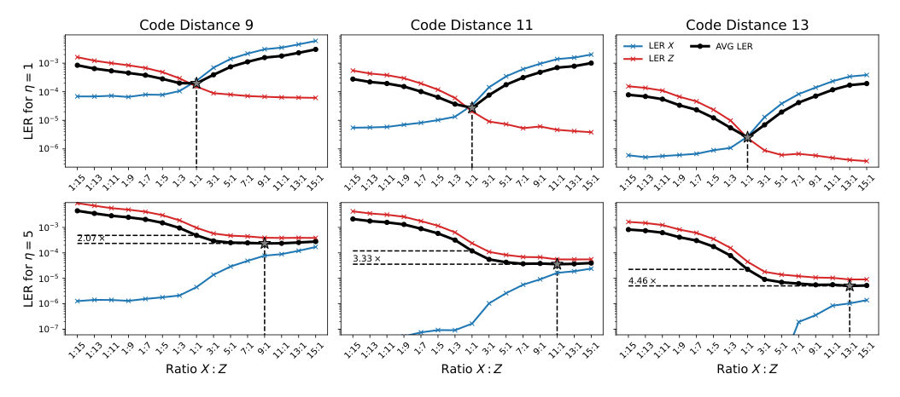 
Fig. 4. Logical error rate for defective systems (dr = 1%) for a logical qubit prepared in the X basis (blue) and the Z basis (red), across different scheduling ratios (RX:RZ), for code distances d ∈{9, 11, 13}. The solid black line shows the average of the two bases. Under symmetric noise (top row), the optimum schedule is RX:RZ = 1:1; under Z-biased noise (bottom row), it shifts towards larger RX.

📷 Fig 5

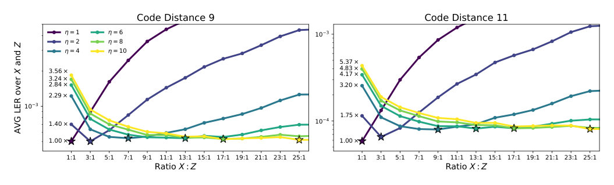 
Fig. 5. Average logical error rate as a function of the scheduling ratio R, for code distances 9 and 11 in systems with increasing bias from η = 1 to η = 10 (dr = 1%). The optimum schedule moves towards larger RX:RZ as η increases, and its improvement over RX:RZ = 1:1 grows with bias.

**Summary.** This paper analyzes the optimal timing ratio for performing X-type versus Z-type syndrome measurements in surface codes built on imperfect hardware. By tailoring this measurement schedule according to the underlying noise bias, the authors demonstrate substantial reductions in the logical error rate. This work provides a practical guide for quantum hardware manufacturers to maximize performance without exhaustive simulation.

**Why it may be interesting.** While focused on QEC theory, understanding how measurement scheduling mitigates correlated errors (like those induced by defects or crosstalk) provides insights into error management in complex quantum hardware architectures relevant to AMO platforms.

Detailed structure

**Main problem.** The study investigates optimizing the scheduling ratio between X-type and Z-type syndrome measurements in surface codes that are adapted to function despite hardware defects.

**Main result.** Optimal scheduling ratios, which depend on the noise bias, can significantly reduce the logical error rate by factors up to 8.46x compared to uniform scheduling, even when considering crosstalk effects.

**Method.** The authors use extensive numerical simulations based on a circuit-level noise model to characterize how varying the X:Z measurement round ratio impacts the overall logical error rate (LER).

**Model / system.** The physical system is the Surface Code, a leading candidate for Fault-Tolerant Quantum Computing. It is modeled as being implemented on hardware containing stochastic defects and operating under biased noise conditions.

**Key observables.** Logical Error Rate (LER), $	ext{LER}_X$, and $	ext{LER}_Z$.

**Important parameters / regimes.** Noise bias ($\eta = p_Z/p_X$), code distance ($d$), defect rate, and the X-to-Z scheduling ratio ($R_X:R_Z$).

**Assumptions / limitations.** The analysis assumes that defects necessitate alternating X/Z measurements (Snakes and Ladders framework) and focuses on the low-to-moderate bias regime.

**Figures summary.** Figures illustrate surface code patches with varying defect rates, show components like data qubits and defective couplers, and depict decoding graphs showing interleaved X and Z super-stabilizers based on the scheduling ratio.

**Paper structure.** The paper systematically investigates the optimal $X$-to-$Z$ check round-scheduling ratio under biased noise for defect-adapted surface codes. It develops methods to determine this optimum from calibration data, quantifies the LER reduction achieved by optimizing the schedule, and extends these findings to crosstalk-dominated architectures.

Abstract

Fault-tolerant Quantum Computing (FTQC) relies on Quantum Error Correction (QEC) codes that encode logical qubits across many physical qubits to detect and correct errors. The surface code is among the most widely studied codes due to its high error threshold, the existence of efficient decoders, and hardware-friendly properties: a planar, two-dimensional layout with nearest-neighbor connectivity. In practice, however, the fabrication of solid-state quantum processors introduces hardware defects, resulting in defective qubits and couplers that must be discarded. Adapting the surface code to these defects often requires measuring the $X$- and $Z$-type checks in separate rounds rather than simultaneously. In this work, we investigate the optimal $X$-to-$Z$ checks round-scheduling ratio under biased noise systems. Our results characterize how key architectural parameters, such as noise bias, code distance, and defect rate, impact the logical error rate. We provide insights into how to determine the optimal scheduling ratio directly from device calibration data, enabling manufacturers to maximize performance without extensive simulations. Our approach reduces the logical error rate by up to $4.25\times$ at a $1\%$ defect rate and up to $8.46\times$ at a $2\%$ defect rate for a distance-$13$ surface code under moderately biased noise. Furthermore, we demonstrate that the benefits of round-scheduling extend beyond the defective-hardware setting. In biased-noise architectures subject to CNOT crosstalk, separating $X$ and $Z$ measurement rounds yields up to $4.5\times$ reduction in logical error rate.

[↑ back to top](#top)

### [Surviving correlations across a horizon: reflected entropy for bosonic fields in non-inertial frames and black hole spacetimes](http://arxiv.org/abs/2608.05473v1)

**Authors:** Sayid Mondal  
**Type:** theory · **Category:** other · **PDF:** <https://arxiv.org/pdf/2608.05473v1>  
**Analysis basis:** full PDF text, analyzed in chunks
**Topic relevance:** 🔥 `entanglement & information structure` **4/5** · `non-equilibrium dynamics` **2/5** · `Keldysh / 2PI / non-Gaussian methods` **1/5** · `correlated / nonlocal dissipation` **1/5** · `driven-dissipative phase transition` **1/5** · `methods for driven-dissipative` **1/5** · `non-equilibrium universality` **1/5**

📷 Fig 1

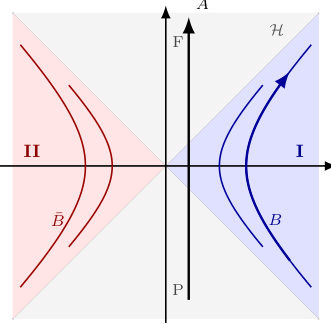 
FIG. 1: Minkowski spacetime in Rindler coordinates. The lightlike lines x = ±t form the Rindler horizon H, dividing space into the right (I) and left (II) wedges. A uniformly accelerated observer, Bob (B), follows a hyperbola x2 −t2 = const (blue) confined to region I; the causally disconnected region II defines anti-Bob ( ¯B). The observer Alice (A) is inertial. P and F denote the past and future Rindler wedges respectively.

📷 Fig 2

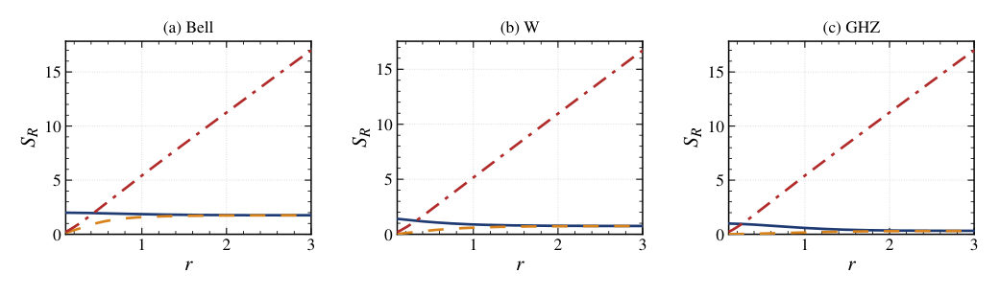 
FIG. 2: Reflected entropy of the three pairings as a function of the squeezing parameter r, for (a) the Bell, (b) the W and (c) the GHZ state, at α = 1/ √

📷 Fig 3

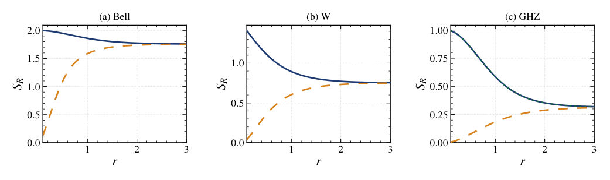 
FIG. 3: Saturation of the reflected entropy for the two Alice pairings a function of the squeezing parameter r, for (a) Bell, (b) W and (c) GHZ, with the same parameters as Fig. 2. The two curves are: SR(A : B) (solid blue) and SR(A : ¯B) (orange dashed).

📷 Fig 4

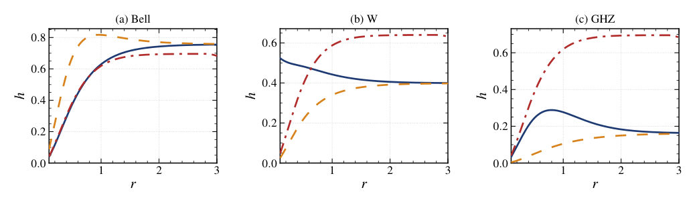 
FIG. 4: The Markov gap h for the three pairings as a function of r, for (a) Bell, (b) W and (c) GHZ, with the same parameters as Fig. 2. The three curves are: h(A:B) (blue solid), h(A: ¯B) (orange dashed), and h(B: ¯B) (red dot-dashed).

**Summary.** This paper analyzes residual quantum correlations in bosonic fields across spacetime horizons using reflected entropy. It demonstrates that while standard entanglement decays, a specific measure of correlation saturates to a non-zero floor, retaining classical structure. The findings are directly applicable to black hole physics, providing insights into information retention near event horizons.

**Why it may be interesting.** This work provides a sophisticated tool (reflected entropy) to quantify correlations that persist beyond simple entanglement measures in highly curved or accelerating spacetimes, which is crucial for understanding Hawking radiation and quantum information near horizons.

Detailed structure

**Main problem.** The study investigates how quantum correlations, measured by reflected entropy, survive across horizons or causal boundaries for bosonic fields in non-inertial frames and black hole spacetimes.

**Main result.** While standard entanglement vanishes asymptotically, the Alice–Bob reflected entropy saturates at a nonzero floor, indicating surviving classical correlation. Furthermore, the inter-wedge reflected entropy exhibits a unique linear divergence with the squeezing parameter for bosons, distinguishing it sharply from fermionic cases.

**Method.** The authors employ reflected entropy and the Markov gap as diagnostics, utilizing conserved charges to block-diagonalize reduced density matrices into solvable sectors.

**Model / system.** The analysis focuses on a free bosonic field quantized in Rindler coordinates (modeling acceleration) and extends these results to Schwarzschild black hole spacetimes. Key states analyzed include Bell, Werner (W), and GHZ tripartite states.

**Key observables.** Reflected Entropy ($S_R$), Markov Gap, saturation floors for correlation measures, and the divergence rate of inter-wedge entropy.

**Important parameters / regimes.** Acceleration parameter ($a$) leading to Unruh temperature $T=a/2\pi$, and the Bogoliubov squeezing parameter ($r$).

**Assumptions / limitations.** The analysis relies on identifying a conserved charge to reduce infinite-dimensional problems to finite sectors, and it uses single-mode approximations in some contexts.

**Figures summary.** Figures illustrate Minkowski spacetime mapped to Rindler coordinates, defining causally disconnected wedges separated by the horizon H. Tables summarize $	ext{SR}(A:B)$ across the Hawking spectrum ($\omega/T_H$) for different quantum states.

**Paper structure.** The paper establishes the physical problem using reflected entropy in non-inertial frames (Rindler space), develops the mathematical tools via conserved charges, calculates results for specific tripartite states (Bell, W, GHZ), and finally maps these findings directly to the black hole context.

Abstract

We study the reflected entropy and the Markov gap for modes of a free bosonic field shared by inertial observers (Alice, Charlie) and a uniformly accelerated one (Bob), for a bipartite Bell state and the tripartite Werner (W) and Greenberger--Horne--Zeilinger (GHZ) states. The bosonic Bogoliubov transformation spans an infinite-dimensional Fock space with an unbounded squeezing parameter unlike the fermionic case. By identifying a conserved charge, we block-diagonalize the reduced density matrices into exact two-dimensional sectors, yielding closed or semi-analytic forms for all three states. Although bosonic entanglement is known to vanish asymptotically, the Alice--Bob reflected entropy instead saturates at a nonzero saturation floor, retaining the surviving classical correlation, and converges to the value Alice shares with Bob's causally disconnected partner. Crucially, only the inter-wedge reflected entropy diverges, linearly in the squeezing parameter---the sharp distinction from the fermionic case, where it stays bounded---while the Markov gaps saturate. The construction transfers verbatim to a Schwarzschild black hole, where the saturation values become mass-independent constants.

[↑ back to top](#top)

### [The Locality Gap: A Thermodynamic Law for Objective Facts](http://arxiv.org/abs/2608.05753v1)

**Authors:** Maxim V. Churilov  
**Type:** theory · **Category:** statistical mechanics · **PDF:** <https://arxiv.org/pdf/2608.05753v1>  
**Analysis basis:** full PDF text, analyzed in chunks
**Topic relevance:** 🔥 `entanglement & information structure` **4/5** · `non-equilibrium dynamics` **2/5** · `Keldysh / 2PI / non-Gaussian methods` **1/5** · `correlated / nonlocal dissipation` **1/5** · `driven-dissipative phase transition` **1/5** · `methods for driven-dissipative` **1/5** · `non-equilibrium universality` **1/5**

📷 Fig 1

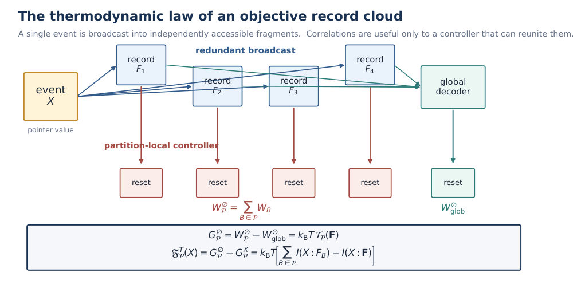 
FIG. 1. Operational setting. An event X is broadcast into a record cloud F = F1 · · · FR. A partition-local controller resets each allowed block independently, whereas a global controller first exploits cross-block correlations. Their work difference is the locality gap G∅ P. Repeating both tasks with X supplied as catalytic classical side information gives GX P ; the double difference is the thermodynamic factuality charge equation (1).

📷 Fig 2

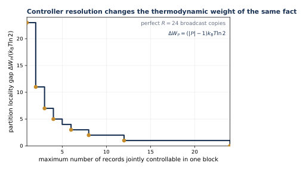 
FIG. 2. Controller-scale flow for 24 perfect records of one bit. If at most b records can be jointly processed, the minimum number of blocks is ⌈24/b⌉, and the locality gap is (⌈24/b⌉− 1)kBT ln 2.

📷 Fig 3

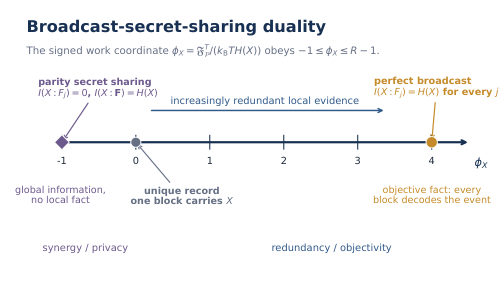 
FIG. 3. The normalized factuality charge distinguishes redun- dant evidence from synergistic encoding. For R = 5 blocks, perfect broadcast saturates ϕX = 4, unique storage gives 0, and parity secret sharing saturates −1.

📷 Fig 4

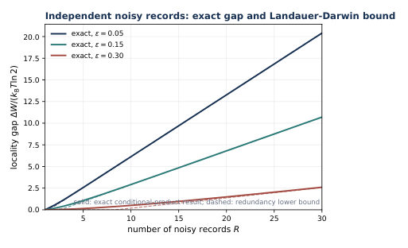 
FIG. 4. Exact factuality/locality gap for independent binary- symmetric records. Solid curves show equation (45); dashed curves show the lower bound obtained by replacing I(X:F1:R) with H(X) = ln 2.

📷 Fig 5

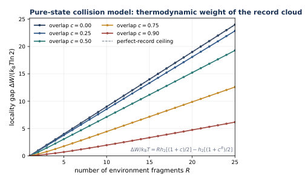 
FIG. 5. Exact source-loss charge for the pure-state collision model. The dashed ceiling is perfect one-bit broadcasting, (R −1)kBT ln 2.

**Summary.** This paper introduces the 'thermodynamic factuality charge' as a quantifiable resource associated with redundant environmental records in Quantum Darwinism. By analyzing the difference in minimum work required for local versus global erasure, it establishes that this charge measures how much information is redundantly encoded across accessible fragments. This provides a novel thermodynamic law connecting quantum correlations to physical constraints.

**Why it may be interesting.** It provides a rigorous thermodynamic measure for quantum redundancy that goes beyond simple entropy measures, linking fundamental concepts of quantum information (like correlations) directly to measurable work costs at finite temperature.

Detailed structure

**Main problem.** To establish a universal thermodynamic signature that quantifies 'factuality' or objective information content arising from redundant records in an environment, extending concepts from Quantum Darwinism.

**Main result.** The paper derives the 'thermodynamic factuality charge,' $\mathcal{F}_T^P$, which is proportional to $k_B T$ times a specific combination of mutual information terms. This charge quantifies the thermodynamic resource generated by redundant records under restricted control, ranging between bounds set by secret sharing and perfect broadcasting.

**Method.** The analysis uses work-extraction principles, comparing minimum work costs for local versus global erasure/resetting tasks on a 'record cloud' $F$. The core diagnostic is derived from differences in free energy or work ($\Delta W$), leading to information-theoretic expressions involving mutual information and entropy.

**Model / system.** The system models objective facts as a 'record cloud' $F$ resulting from an event $X$, which is partitioned into blocks $\mathcal{P}$. The framework applies concepts of quantum information theory (mutual information, total correlation) within a thermodynamic context involving work costs at temperature $T$.

**Key observables.** Thermodynamic factuality charge ($\mathcal{F}_T^P$), Locality Gap ($G_X^P$), Normalized thermodynamic record number ($	ilde{N}_P^X$).

**Important parameters / regimes.** $k_B T$ (thermal energy scale), $H(X)$ (source entropy), $|\mathcal{P}|$ (number of blocks).

**Assumptions / limitations.** The work identities are derived within a 'deliberately explicit reset model.' The theory does not modify quantum mechanics or posit objective collapse.

**Figures summary.** Figure 1 illustrates the operational setting by comparing work costs for partition-local vs. global resets ($G_\emptyset^P$) and source-assisted versions ($G_X^P$).

**Paper structure.** The paper progresses by defining the problem using work asymmetries (locality gap), deriving the central 'thermodynamic factuality charge' ($\mathcal{F}_T^P$), establishing its bounds based on information theory, and applying it to specific physical scenarios like perfect broadcasting.

Abstract

Objective facts in quantum Darwinism are values recorded redundantly in many independently accessible fragments of the environment. Redundancy does not create additional logical information, so its thermodynamic meaning has remained unclear. We show that it creates an exact work asymmetry between controllers with different access architectures. For a record cloud $F$ and a partition $\mathcal{P}$ into blocks that cannot be jointly controlled, the reversible isothermal erasure penalty relative to a global controller is $k_{\mathrm{B}}T$ times the partition total correlation. If the source event $X$ is supplied as catalytic classical side information, subtracting the corresponding penalty gives the source-loss law $\mathcal{F}_{\mathcal{P}}^{T}=k_{\mathrm{B}}T\left[\sum_{B\in\mathcal{P}}I(X{:}F_B)-I(X{:}F)\right]$. We call this the thermodynamic factuality charge. It ranges from $-k_{\mathrm{B}}T H(X)$ for perfect secret sharing to $(|\mathcal{P}|-1)k_{\mathrm{B}}T H(X)$ for perfect broadcast objectivity. Its normalized form defines a thermodynamic record number between $0$ and $|\mathcal{P}|$. We derive Landauer--Darwin bounds, endpoint-rigidity certificates, exact growth and partition-refinement laws, spectrum-broadcast saturation, and closed formulas for noisy classical and quantum collision models. The theory does not modify quantum mechanics or posit objective collapse; it identifies the thermodynamic resource generated by redundant records under restricted control.

[↑ back to top](#top)

### [Exact statistical transmutation of quantum mixtures on a ring](http://arxiv.org/abs/2608.05290v1)

**Authors:** Wayne J. Chetcuti, Nathan Goldman, Patrizia Vignolo, Anna Minguzzi  
**Type:** theory · **Category:** quantum gases · **PDF:** <https://arxiv.org/pdf/2608.05290v1>  
**Analysis basis:** full PDF text, analyzed in chunks
**Topic relevance:** 🔥 `analog quantum simulation` **4/5** · `non-equilibrium dynamics` **2/5** · `Keldysh / 2PI / non-Gaussian methods` **1/5** · `driven-dissipative phase transition` **1/5** · `entanglement & information structure` **1/5**

📷 Fig 1

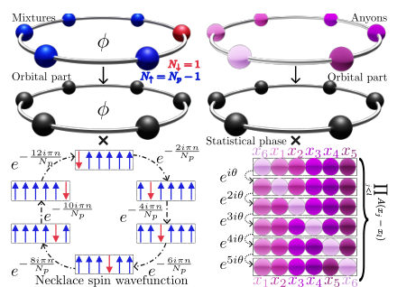 
FIG. 1. Scheme illustrating emerging anyonic exchange phases in single-impurity quantum mixtures. A repulsively interacting two-component mixture with Np = 6 particles pierced by an effective flux ϕ decouples into a spinless or- bital part and a necklace spin wavefunction. The latter is constructed from cyclic translations of the impurity, with the j-th configuration acquiring a phase e−i2πnj/Np. In the any- onic case, the same orbital structure is instead dressed by the statistical factor Q

📷 Fig 2

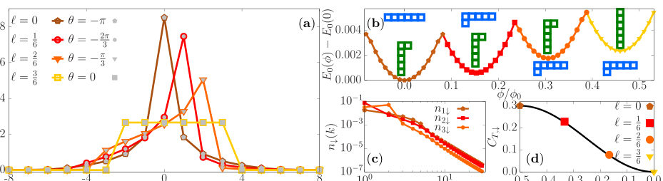 
FIG. 2. Momentum distributions of mixtures and anyons. (a) Impurity momentum distribution n↓(k) as a function of wavevector k, in units of 1/L and 2π/L respectively, for fermionic mixtures with Np = 6 particles on a ring of length L. The colored curves show the exact results obtained from Eq. (8) for different angular momenta ℓ, while the gray symbols denote the corresponding anyonic distributions at the indicated statistical angles θ, calculated from Eq. (7). (b) Ground-state energy E0(ϕ)−E0(0), in units of J, versus the flux ϕ/ϕ0 obtained by exact diagonalization of the Fermi–Hubbard model with U = 500J, where U is the on-site interaction and J is the hopping amplitude, together with the...

📷 Fig 3

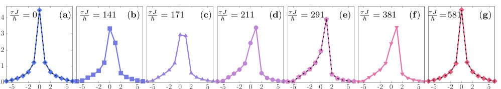 
FIG. 3. Dynamical anyonization. Time evolved momentum distribution n↓(k) in units of 1/L as a function of the wavevector k in units of 2π/L under the symmetry-breaking protocol, following a sudden quench of the flux from ϕ/ϕ0 =0 to ϕ/ϕ0 =1/12 at selected times τ. During the dynamics, the momentum distribution oscillates from the bosonic one (a) with angular momentum ℓ= 0 to the anyonic one (e) with ℓ= 1/6 , recovering its bosonized profile in (g). Intermediate times (b)-(d) and (f) depict hybridized contributions from both states. Black dotted lines are the ground-state momentum distributions profiles for ℓ= 0 in (a) and (g), and ℓ= 1/6 in (e). Results obtained from exact diagonalization of...

📷 Fig 4

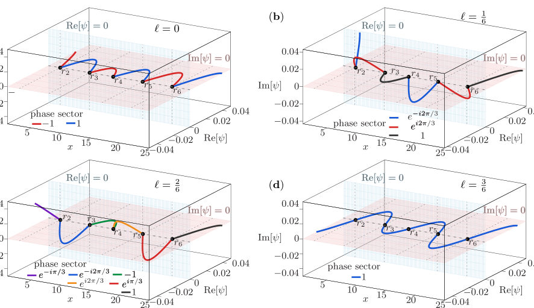 
FIG. 4. One-particle wavefunction for the impurity in the fermionic mixture. Real and imaginary parts of the one-particle wavefunction Ψ(x) plotted as functions of the impurity position x around the ring for different angular momenta per particle ℓ, with the Np−1 spin-up particle coordinates fixed to {r2, r3, r4, r5, r6} = {3, 8, 12, 17, 22}. The wavefunctions are obtained from Eq. (S.2) using the spin amplitudes in Eq. (S.3) for the Heisenberg eigenstate selected at each ℓ. Panels (a)-(d) correspond to (ℓ, n)=(0,3),(1/6,2), (2/6,1), and (3/6,0), respectively and hence to the Fermi-mapped statistical angles θ = −π, −2π/3, −π/3 and 0. Panels (a) and (d) display the bosonized and fermionized...

📷 Fig 5

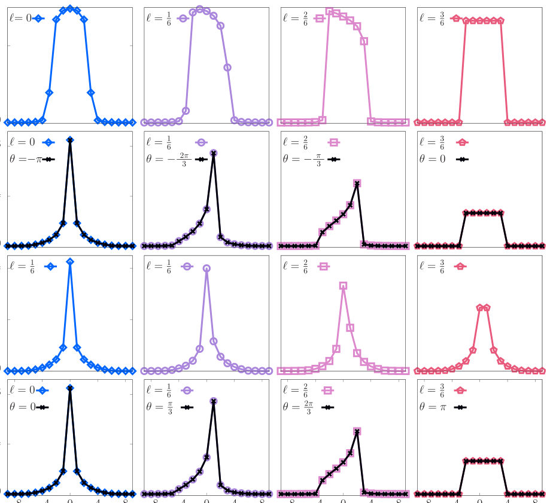 
FIG. 5. Anyonization of multi-component mixtures with an even particle number. Component-resolved momentum distributions n↑(k) and n↓(k), in units of 1/L, for a mixture of N↑= 5 spin-up and N↓= 1 spin-down particles. The wavevector k is expressed in units of 2π/L. The top two rows correspond to fermionic mixtures and the bottom two to bosonic mixtures; within each pair, the upper and lower rows show n↑(k) and n↓(k), respectively. From left to right, the columns correspond to angular momenta per particle ℓ= 0, 1/6, 2/6, and 3/6, calculated using Eq. (S.36). The black curves show the corresponding anyonic momentum distributions, obtained via Eq. (S.10) using the respective Fermi- or...

**Summary.** This paper theoretically proves that one-dimensional, strongly interacting quantum mixtures on a ring can exhibit exact anyonic exchange statistics. By analyzing the momentum distribution and energy response to an applied magnetic flux, the authors establish a direct link between spin/orbital degrees of freedom and fractionalized statistics. This work suggests a pathway for realizing and manipulating anyon states using ultracold atomic gases.

**Why it may be interesting.** This work provides concrete theoretical predictions—measurable via ultracold atoms—for observing fractional exchange statistics (anyonization) in controllable quantum gas setups by manipulating artificial gauge fields.

Detailed structure

**Main problem.** The study demonstrates the exact statistical transmutation of quantum mixtures on a ring, showing that their exchange statistics can be anyonic.

**Main result.** The wavefunction exhibits exact anyonic statistics upon particle exchange, and this signature is directly encoded in the momentum distribution tails and persistent current measurements.

**Method.** The analysis uses Bethe Ansatz techniques (necklace Ansatz) to construct wavefunctions for strongly repulsive mixtures and maps these results onto theoretical descriptions of hard-core anyons.

**Model / system.** The system models one-dimensional, strongly repulsive quantum mixtures confined to a ring threaded by an artificial gauge field. The Hamiltonian includes both orbital and spin degrees of freedom, allowing for the study of Fermi-Fermi and Bose-Bose analogues.

**Key observables.** Momentum distribution $n_\downarrow(k)$, energy spectrum $E_0(\phi)$ vs flux $\phi$, and persistent current $I(\phi)$.

**Important parameters / regimes.** Strongly repulsive limit, artificial gauge field flux ($\phi$), particle number parity ($N_p$).

**Assumptions / limitations.** The analysis relies on the strongly repulsive limit where spin and orbital degrees of freedom can be decoupled for exact solutions.

**Figures summary.** Figures illustrate wavefunction construction via necklaces; momentum distributions compare impurity results to anyonic predictions, showing characteristic tails; energy spectra show flux periodicity changes; and time-evolved simulations demonstrate coherent dynamics during a quench protocol.

**Paper structure.** The paper progresses from establishing the general model Hamiltonian and using the necklace Ansatz for exact solutions in the single-impurity limit. It then compares these results to theoretical anyon models, analyzing momentum distributions and energy spectra across different flux values before concluding with a dynamical quench protocol.

Abstract

One-dimensional strongly repulsive quantum mixtures exhibit non-trivial exchange statistics arising from the interplay between orbital and spin degrees of freedom. Using an exact solution, we demonstrate that in the single-impurity limit the wavefunction of Fermi-Fermi and Bose-Bose mixtures on a ring threaded by an artificial gauge field display exact anyonic statistics under exchange of the impurity with the majority particles. The resulting fractional exchange phase is fixed by the angular momentum sector selected through the applied flux. We find that the impurity momentum distribution coincide exactly with the anyonic one, independently of the bosonic or fermionic nature of the mixture, with the large-momentum tails encoding a direct signature of the anyonic statistical angle. Finally, we devise a quench protocol for reversible dynamical anyonization. Our results provide a path for realizing and manipulating anyonized states with ultracold atoms.

[↑ back to top](#top)

### [Breaking Memory Bottlenecks in Quantum Control Systems for More Precise Experiments and Higher Throughput Computing](http://arxiv.org/abs/2608.06318v1)

**Authors:** Yicheng Guang, Neel Vora, Yilun Xu, Yueqi Chen, Gang Huang  
**Type:** experiment · **Category:** quantum information and computing · **PDF:** <https://arxiv.org/pdf/2608.06318v1>  
**Analysis basis:** full PDF text, analyzed in chunks
**Topic relevance:** 🔥 `QC/QI experiment` **4/5** · `quantum measurements` **2/5** · `methods for driven-dissipative` **1/5** · `non-equilibrium dynamics` **1/5**

📷 Fig 1

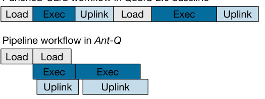 
Fig. 1: Ant-Q transforms the workflow of quantum control systems. In the pipeline workflow of Ant-Q, circuit loading, execution, and readout uplink are decoupled and overlapped in time. As a result, readout data can be uplinked shortly after execution begins.

📷 Fig 2

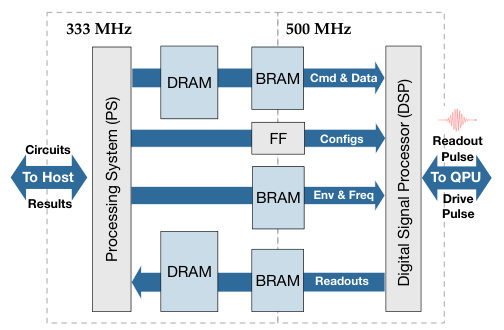 
Fig. 2: Design overview for Ant-Q.

📷 Fig 3

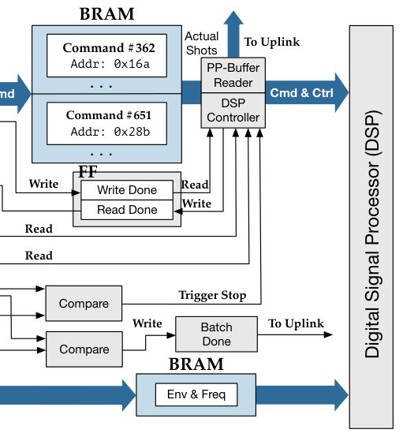 
Fig. 3: Design details for Ant-Q downlink part.

📷 Fig 4

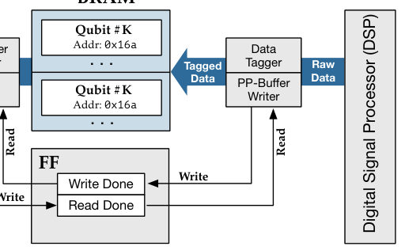 
Fig. 4: Design details for Ant-Q uplink part.

📷 Fig 5

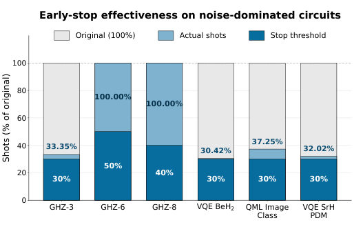 
Fig. 5: Early-stop effectiveness on the six noise-dominated circuits from Table 5. Each bar is normalized to the circuit’s original shot budget (100%, gray). The blue segment marks the stop threshold of the original shots, while the orange segment shows the actual number of shots executed after stop mechanism fired.

**Summary.** The paper introduces Ant-Q, a novel memory hierarchy designed for quantum control systems to overcome severe bottlenecks caused by limited on-chip memory and slow data transfer. By implementing a pipelined workflow that overlaps circuit loading with execution, Ant-Q significantly boosts system throughput and allows for the running of much deeper and more complex quantum experiments.

**Why it may be interesting.** This work directly addresses the classical control layer required to run complex quantum algorithms, which is crucial context for any theoretical physicist designing or simulating quantum hardware experiments.

Detailed structure

**Main problem.** The development of precise quantum experiments and high-throughput quantum computation is limited by a memory bottleneck within the classical quantum control system layer.

**Main result.** The proposed Ant-Q memory hierarchy design successfully transforms the inefficient 'punched-card' workflow into a pipelined architecture, reducing I/O overhead to near zero and enabling deep circuit execution.

**Method.** Ant-Q integrates DRAM with BRAM on the control board to create a pipeline that overlaps data loading, quantum circuit execution, and result readout, bypassing sequential bottlenecks.

**Model / system.** The work focuses on optimizing FPGA-based quantum control systems (like QubiC 3.0) which interface classical processing units with Quantum Processing Units (QPUs). The system architecture involves managing data flow between DRAM (large capacity) and BRAM (fast cache) on the Programmable Logic.

**Key observables.** Overhead reduction percentage relative to execution time, support for deep Randomized Benchmarking circuits, and overall batch throughput improvement.

**Important parameters / regimes.** BRAM capacity limits ($\le 2048$ commands), DRAM non-deterministic latency (refresh cycles), and the comparison between old vs. new system overheads.

**Assumptions / limitations.** The primary bottleneck is memory structure; future work plans include bypassing the PS-to-host link and implementing predictive preloading for cross-buffer jumps.

**Figures summary.** Figures illustrate the transformation from a sequential 'Punched-Card workflow' to an overlapped, pipelined workflow in Ant-Q, detailing data paths and buffer usage.

**Paper structure.** The paper identifies the memory bottleneck, proposes the Ant-Q memory hierarchy integrating DRAM/BRAM for pipelining, evaluates its performance using real-world circuits (RB), quantifies overhead reduction, and discusses future scaling limitations.

Abstract

As quantum computing continues to demonstrate promise and attract growing attention, there is an increasing need for more precise experiments to advance the development of quantum devices, as well as higher circuit throughput to validate more domain applications. However, this need is hindered by a memory bottleneck at the quantum control system layer, arising from limited on-chip BRAM capacity and the non-deterministic latency of DRAM. To break this bottleneck, we present Ant-Q, a memory hierarchy design that integrates DRAM with BRAM to support pipelined quantum circuit execution while ensuring deterministic inter-circuit timing. We evaluated Ant-Q using 26 real-world experimental and computing circuits. The results show that Ant-Q supports deep circuits for 1Q and 2Q Randomized Benchmarking and reduces the overhead of circuit loading and readout uplink relative to execution time from 22.90%-1417.05% to near zero. Ant-Q is being integrated into QubiC 3.0, with part of its functionalities already available.

[↑ back to top](#top)

### [Entanglement Scaling and Full Counting Statistics in Excited States of Two-Dimensional Rotating Fermions](http://arxiv.org/abs/2608.05722v1)

**Authors:** Priyangshu Goswami, Abhishek Dhar, Satya N. Majumdar, Anupam Kundu  
**Type:** theory · **Category:** statistical mechanics · **PDF:** <https://arxiv.org/pdf/2608.05722v1>  
**Analysis basis:** full PDF text, analyzed in chunks
**Topic relevance:** 🔥 `entanglement & information structure` **4/5** · `analog quantum simulation` **1/5** · `non-equilibrium dynamics` **1/5**

📷 Fig 1

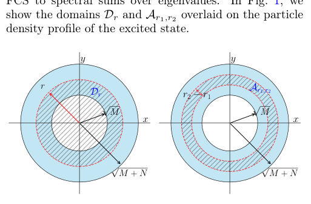 
FIG. 1. For the excited state Ψ(M,M+N) , the fermions are mostly confined uniformly in the blue coloured region where r ∈ √

📷 Fig 2

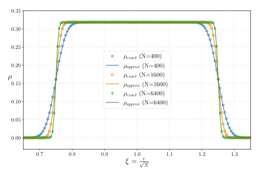 
FIG. 2. Radial density profile ρ(r) for excited states with µ = M/N = 9/16 and N = 400, 1600, 6400. Scatter points represent the exact expression in Eq. (19) while the solid lines represent the approximation in Eq. (24). The approximation reproduces the uniform bulk density and the edge behaviour quite well.

📷 Fig 3

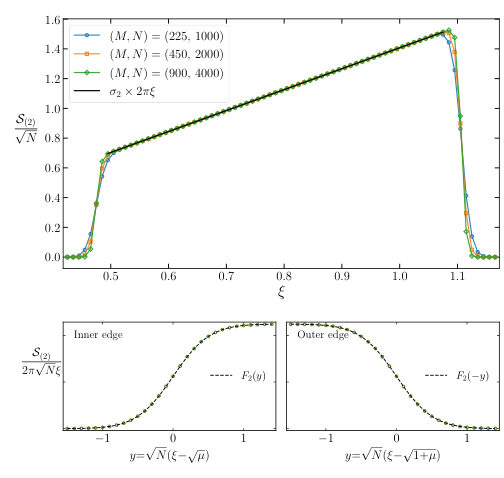 
FIG. 3. The upper panel shows the second Rényi entropy S(2) as a function of the rescaled radial coordinate ξ, for several values of (M, N) at fixed µ = 0.225. Linear growth in the bulk region is confirmed by a straight-line fit, with area-law coefficient σ2 = F2(∞) from Eq. (30). The lower panel com- pares the numerically computed ratio S(2) /(2π √

📷 Fig 4

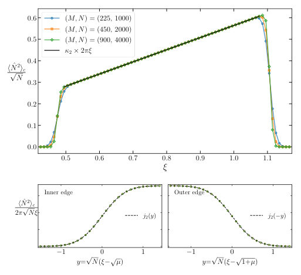 
FIG. 4. The upper panel shows the variance ⟨ˆ N 2⟩c as a func- tion of the rescaled radial coordinate ξ, for several values of (M, N) at fixed µ = 0.225. Linear growth in the bulk region is confirmed, with area-law coefficient κ2 = j2(∞) = 1 2π3/2 . The lower panel compares the numerically computed ratio ⟨ˆ N 2⟩c/(2π √

📷 Fig 5

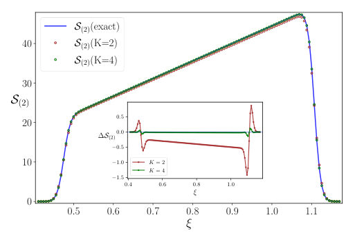 
FIG. 5. A comparison of the second Rényi entropy S(2), as a function of the rescaled radius ξ of the disc region (blue line) with cumulant expansions (Eq. (4)) truncated at orders K = 2 (brown circles) and K = 4 (green circles). The cumulant expansion shows satisfactory convergence to the exact result even at the lowest truncation order K = 2. The inset shows the difference S(2)(K)−S(2)(exact), confirming improvement with increasing K.

**Summary.** This work analytically computes the entanglement entropy and full counting statistics for non-interacting fermions in an excited state within a rotating 2D harmonic trap. The authors demonstrate that fundamental scaling laws, such as the area law, remain valid even for these highly excited states. Furthermore, they establish robust additive relations for both entropy and particle number cumulants when analyzing annular subsystems.

**Why it may be interesting.** It provides rigorous theoretical confirmation that fundamental scaling laws (like the area law) persist in complex excited states beyond the ground state, linking entanglement structure directly to particle number fluctuations in a controlled quantum setting.

Detailed structure

**Main problem.** The study investigates entanglement entropy (EE) and Full Counting Statistics (FCS) for excited states of fermions confined in a rotating trap, specifically testing the validity of area law scaling.

**Main result.** The area law scaling holds for EE even in these excited states, and both EE and particle number cumulants exhibit robust additive relations when calculated for an annular region.

**Method.** Analytical computation using the overlap matrix formalism, which relates EE and FCS to eigenvalues of correlation matrices derived from non-interacting fermion wavefunctions.

**Model / system.** Non-interacting spinless fermions confined in a two-dimensional harmonic trap rotating at an angular frequency $\Omega$. The system is analyzed for excited states constructed by filling consecutive single-particle energy levels (e.g., LLL sector).

**Key observables.** Rényi entanglement entropy ($S_q$), particle number cumulants ($\langle\hat{N}_D^p
angle_c$), and the centered cumulant generating function.

**Important parameters / regimes.** The angular frequency $\Omega$, the radius $r$ (for discs), and the width of the annulus; analysis is performed in limits where the system size ($M, N$) is large.

**Assumptions / limitations.** The fermions are non-interacting. Additivity for annular regions requires the width to be sufficiently large. The calculations often rely on asymptotic approximations derived from integral representations.

**Figures summary.** Figures illustrate density profiles and show scaling behavior of Rényi entropy ($S(2)/\sqrt{N}$) across different regimes (inner edge, bulk, outer edge) in rescaled coordinates $\xi$.

**Paper structure.** The paper progresses by first establishing the formalism for EE and FCS using correlation matrices. It then calculates these quantities for discs, confirming area law scaling. Subsequently, it extends the analysis to annular regions, demonstrating additive decomposition of both entropy and cumulants.

Abstract

We investigate the entanglement entropy of a class of $N$-particle excited state of fermions confined in a two-dimensional harmonic trap rotating at an angular frequency $Ω$. The excited state is constructed by filling a particular set of $N$ single-particle energy levels. We analytically compute the Rényi entropies of order $q$ in a disc of radius $r$ around the centre of the trap, and the cumulants corresponding to number fluctuations of fermions within the disc. We found that the area law scaling of entanglement entropy holds even for a class of excited states. We also verified the well-known series expansion of entanglement entropy in terms of the particle number cumulants for non-interacting fermions. We further derive the centered cumulant generating function, demonstrating that the associated probability distribution function in the disc has identical scaling properties, up to a variable shift, to the known ground-state result. Finally, we extend our result to an annular region, showing that both the Rényi entropy and particle number cumulants of the annulus decompose into sums of the corresponding quantities of the two bounding discs. These additive relations hold as long as the width of the annulus is sufficiently large.

[↑ back to top](#top)

### [Entangling power of neural networks](http://arxiv.org/abs/2608.05293v1)

**Authors:** Taige Wang, Nisarga Paul, Liang Fu  
**Type:** theory · **Category:** disordered systems and neural networks · **PDF:** <https://arxiv.org/pdf/2608.05293v1>  
**Analysis basis:** full PDF text, analyzed in chunks
**Topic relevance:** 🔥 `entanglement & information structure` **4/5** · `methods for driven-dissipative` **1/5**

📷 Fig 1

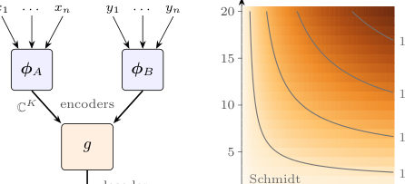 
FIG. 1. (Left) The general template for the neural encoder- decoder architecture: the bipartitioned input A|B is encoded by two encoders ϕA,B into a K-dimensional latent space and decoded, or recombined, by g(ϕA, ϕB). When g is simply a bilinear function, this coincides with the Schmidt decom- position for quantum wavefunctions. When g is nonlinear, the neural encoder-decoder architecture can be far more ex- pressive. We quantify this by the entangling power. (Right) Entangling power Ep(K) = K+p p  [Eq. (13)] as a function of latent width K and degree p for polynomial decoders (colour on a logarithmic scale). Along the dotted line p = 1 (labelled Schmidt for bilinear decoders) the...

📷 Fig 2

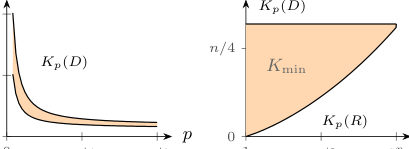 
FIG. 2. Polynomial sandwich bound (14) for D = 2n. (Left) At fixed Schmidt rank R = √

**Summary.** This paper introduces and quantifies the 'entangling power' of neural networks by analyzing polynomial decoders. It shows that this power, $E_p(K)$, grows combinatorially with latent dimension $K$ and decoder degree $p$. The results provide a powerful tool to bound the complexity of quantum correlations achievable through machine learning models.

**Why it may be interesting.** This work provides a rigorous mathematical framework for understanding how much quantum entanglement (a key resource in quantum information) can be encoded or simulated using classical machine learning architectures, which is vital for designing efficient quantum simulation models.

Detailed structure

**Main problem.** The paper addresses quantifying the complexity of correlations between subsystems when using neural network representations, moving beyond the limitations of traditional measures like Schmidt rank.

**Main result.** It establishes that the entangling power ($E$) of a polynomial decoder is exactly equal to the number of monomials $N_p(K) = inom{K+p}{p}$, demonstrating exponential entanglement generation with modest resources.

**Method.** The authors use theoretical bounds derived from linear algebra and polynomial theory, relating the rank of a function to the dimension of the space spanned by its polynomial components.

**Model / system.** The model involves representing a correlation function $f(x, y)$ via an encoder-decoder structure: $f(x, y) = g(\phi_A(x), \phi_B(y))$, where $g$ is restricted to be a polynomial of degree $p$.

**Key observables.** Entangling Power ($E$), Schmidt Rank ($R$), Latent Space Dimension ($K$), and Decoder Degree ($p$).

**Important parameters / regimes.** The relationship between the required minimum latent width ($K_{\min}$), the target rank ($R$), and the decoder degree ($p$) is central, with specific scaling laws provided for different regimes.

**Assumptions / limitations.** The analysis focuses specifically on polynomial decoders of a fixed maximum total degree $p$, contrasting this with general nonlinear decoders which require exponentially large complexity.

**Figures summary.** Figure 1 illustrates the general encoder-decoder template, comparing bilinear (Schmidt) vs. nonlinear decoding and plotting the entangling power $E_p(K)$. Figure 2 compares the required minimum latent width ($K_{\min}$) for a given Schmidt rank across different decoder degrees.

**Paper structure.** The paper introduces the problem of correlation complexity using NNs, derives the definition of entangling power based on polynomial decoders, establishes necessary and sufficient conditions relating rank to $N_p(K)$, and concludes with specific examples like the Bell state.

Abstract

Characterizing the complexity of correlations between subsystems is a fundamental task across information theory, machine learning, and science. In quantum physics, neural networks have found increasing application in learning wavefunctions. Here we introduce the entangling power of an encoder-decoder neural network, which quantifies its ability to generate entanglement between subsystems, dependent on a latent space dimension $K$ and the complexity class of the decoder. We exactly calculate this quantity for polynomial decoders of degree $p$ acting on a $K$-dimensional latent space. Our results establish the exponential entangling power of neural networks with modest resources. More broadly, our work provides a framework for analyzing correlations in machine learning that generalizes the notion of the Schmidt rank in entanglement theory.

[↑ back to top](#top)

### [Global vs. Product Observables in Bipartite Quantum Systems: The Sharp Bound](http://arxiv.org/abs/2608.06235v1)

**Authors:** Zhi Li, Xiaofei Shi  
**Type:** theory · **Category:** quantum information and computing · **PDF:** <https://arxiv.org/pdf/2608.06235v1>  
**Analysis basis:** full PDF text, analyzed in chunks
**Topic relevance:** 🔥 `entanglement & information structure` **4/5** · `quantum measurements` **1/5**

📷 Fig 1

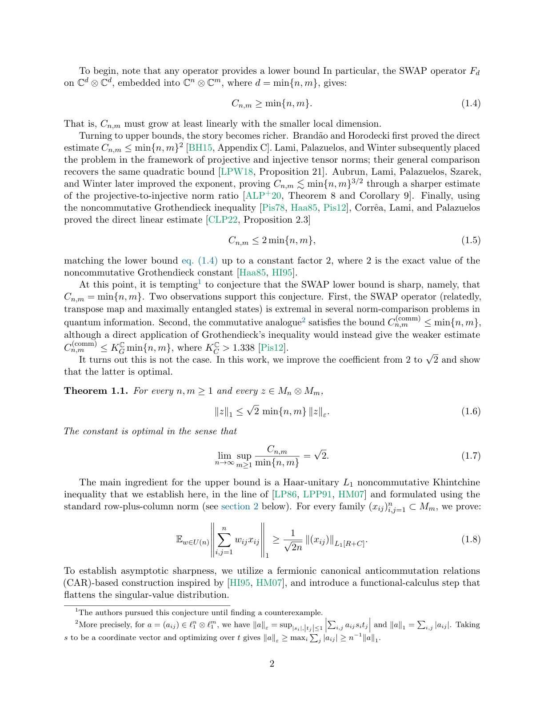 
Low-resolution page preview, page 2

📷 Fig 2

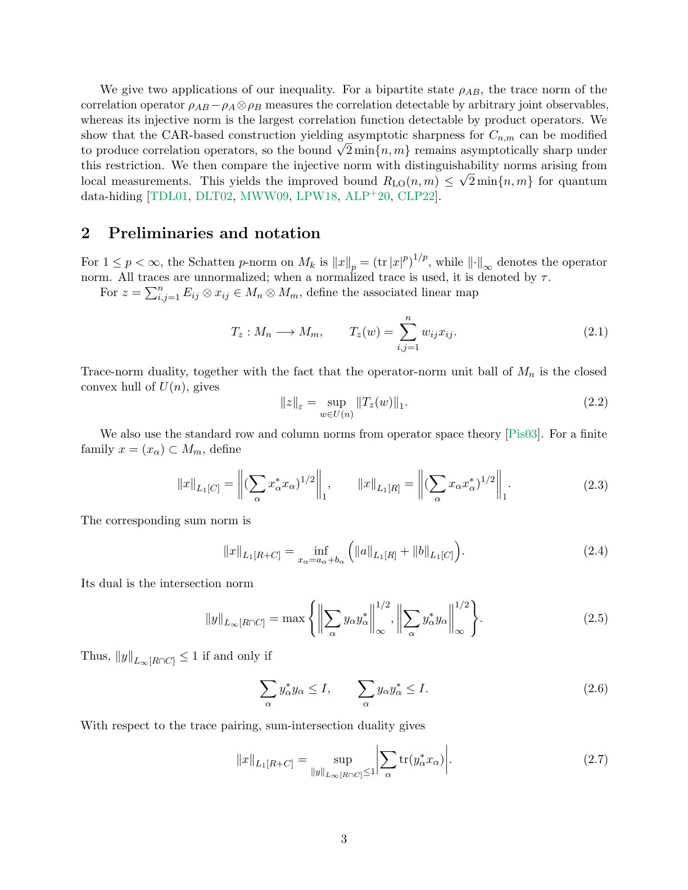 
Low-resolution page preview, page 3

📷 Fig 3

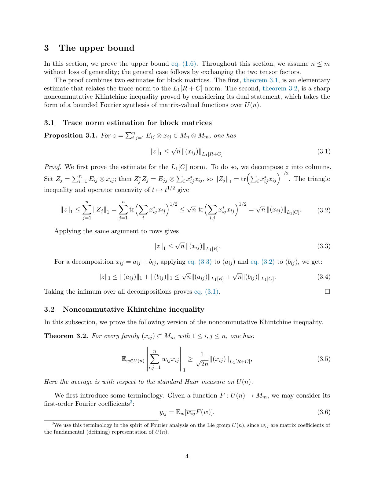 
Low-resolution page preview, page 4

📷 Fig 4

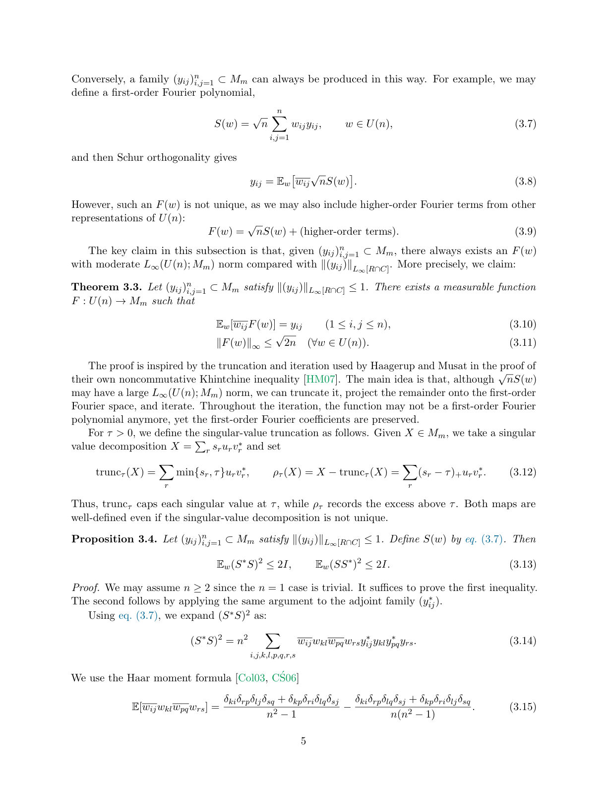 
Low-resolution page preview, page 5

📷 Fig 5

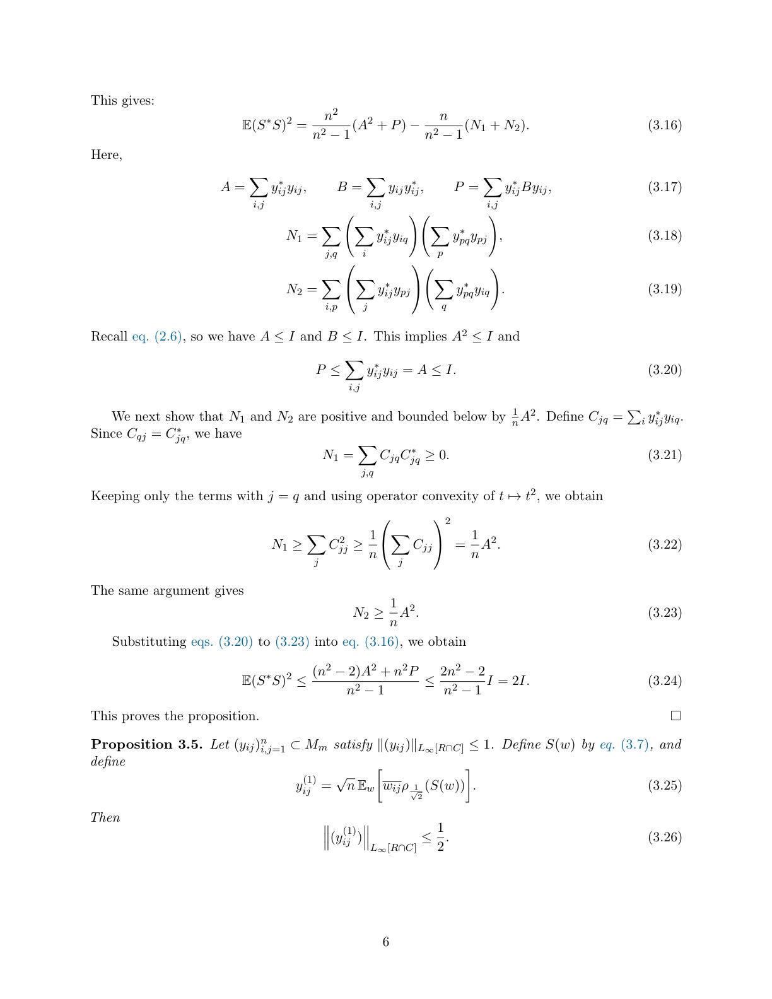 
Low-resolution page preview, page 6

**Summary.** This paper rigorously establishes a sharp universal bound ($\sqrt{2} \min\{n, m\}$) comparing the trace norm of an operator on a bipartite system to its injective tensor norm. This result has direct physical consequences, providing optimal bounds for quantifying the gap between global and local measures of quantum correlation and improving bounds for quantum data hiding protocols.

**Why it may be interesting.** This work provides fundamental mathematical tools (sharp constants relating different norms) that govern how local measurements constrain global properties in multipartite quantum systems, which is crucial for understanding entanglement quantification and resource theories.

Detailed structure

**Main problem.** The paper determines the sharp universal comparison between two norms ($\|z\|_1$ vs. $\|z\|_{\epsilon}$) used to probe bipartite quantum systems, quantifying the loss of information when restricting measurements from global observables to product (local) observables.

**Main result.** It proves that the ratio of these norms is bounded by $\sqrt{2} \min\{n, m\}$, establishing this constant as sharp for both general operators and correlation measures in quantum states.

**Method.** The proof relies on establishing an $L_1$ noncommutative Khintchine inequality using random coefficients derived from a Haar unitary matrix. Applications involve analyzing the gap between global and product correlation measures.

**Model / system.** The analysis focuses on operators $z \in M_n \otimes M_m$ acting on bipartite quantum systems, particularly in the context of characterizing correlations ($\Delta
ho = 
ho_{AB} - 
ho_A \otimes 
ho_B$) within quantum states.

**Key observables.** Trace norm ($\|z\|_1$), Injective tensor norm ($\|z\|_{\epsilon}$), Global correlation measure ($C_{	ext{glob}}(
ho)$), Product correlation measure ($C_{	ext{prod}}(
ho)$).

**Important parameters / regimes.** The dimensions $n$ and $m$, and the limiting constant $\sqrt{2}$.

**Assumptions / limitations.** The analysis often assumes $n \le m$ without loss of generality for the main theorems. The proof involves advanced tools from operator theory, including Haar moment formulas.

**Paper structure.** The paper first establishes the general norm inequality using Khintchine's inequality; it then applies this result to quantify the gap between global and product correlation measures for quantum states; finally, it extends these bounds to analyze data-hiding ratios.

Abstract

To probe a bipartite quantum system, one may use arbitrary global operators or restrict to product operators acting separately on the two subsystems. We determine the sharp universal comparison between the resulting norms. For every $z\in M_n\otimes M_m$, we prove $\|z\|_1\leq\sqrt{2}\min\{n,m\}\|z\|_\varepsilon$, where $\|\cdot\|_1$ is the trace norm and $\|\cdot\|_\varepsilon$ is the injective tensor norm associated with the trace norms on $M_n$ and $M_m$. To prove the upper bound, we establish an $L_1$ noncommutative Khintchine inequality whose random coefficients are the entries of a Haar unitary. We also show that the coefficient $\sqrt{2}$ is sharp. As applications, we show that the same sharp constant governs the gap between bipartite correlation measured in trace norm and that measured by a correlation function, and obtain an improved universal upper bound for quantum data hiding. The upper bound has also been formalized and machine-checked in Lean.

[↑ back to top](#top)

### [Experimental demonstration of the Quantum Fourier Transform on up to 100 qubits using a convolutional compilation strategy](http://arxiv.org/abs/2608.05435v1)

**Authors:** Paul Coote, Michael J. Biercuk, Yuval Baum  
**Type:** experiment · **Category:** quantum information and computing · **PDF:** <https://arxiv.org/pdf/2608.05435v1>  
**Analysis basis:** full PDF text, analyzed in chunks
**Topic relevance:** 🔥 `QC/QI experiment` **4/5**

📷 Fig 1

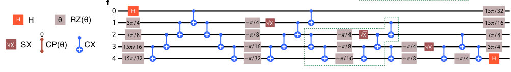 
FIG. 1. Derivation of the Low-CX QFT on an LNN topology. a. The textbook QFT algorithm for n = 5 qubits comprising layers of Hadamard and CP gates. b. A realization of a layer of CP gates using CX and RZ gates compiled to an LNN topology, adapted from [26]. Only the CX within the green dashed box are required for the QFT, since other CX cancel with adjacent layers. c. The Park/Ahn QFT for 5 qubits, requiring 26 CX gates. Each layer of d rotations requires 2d + 1 CX gates (green dashed box). d. The √

📷 Fig 2

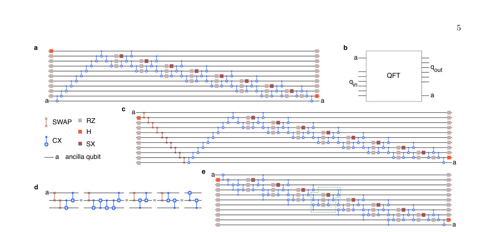 
FIG. 3. Derivation of the Convolutional AQFT. Single-qubit gate labels and angles are omitted for visual clarity. a. An AQFT for n = 10 qubits (d = 3 largest angles) based on Fig 2b, with an additional ancilla qubit wire a. b. Schematic of a linear-chain AQFT with an ancilla. The data qubits jointly undergo a bit shift of −1 along the linear chain during the QFT algorithm. c. Insertion of an initial SWAP sequence, which propagates the ancilla across the register. d. A chain of SWAPs and an ancilla in the |0 &gt; state reverses the sense of a linear chain of CX, as explained in the main text. e. The Convolutional AQFT. The circuit comprises a compact translation-invariant kernel gadget (green...

📷 Fig 3

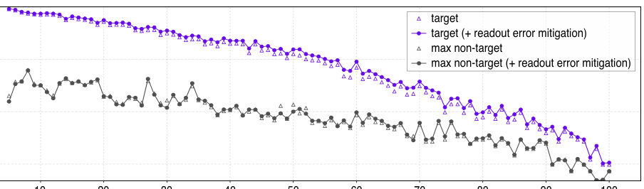 
FIG. 4. Convolutional QFT circuit success probability for circuit widths of 5 to 100 qubits. In each experiment, a periodic quantum state with a randomly selected frequency is passed into the convolutional QFT circuit, and the output measured. For all circuit sizes, the correct integer target frequency is the unique highest likelihood result in both the raw data and after the application of readout error mitigation (purple curve). The most prominent incorrect result for each circuit execution (gray curve) had lower observed likelihood compared to the correct target bitstring. Data were acquired on ibm boston with 4096 shots per circuit.

📷 Fig 4

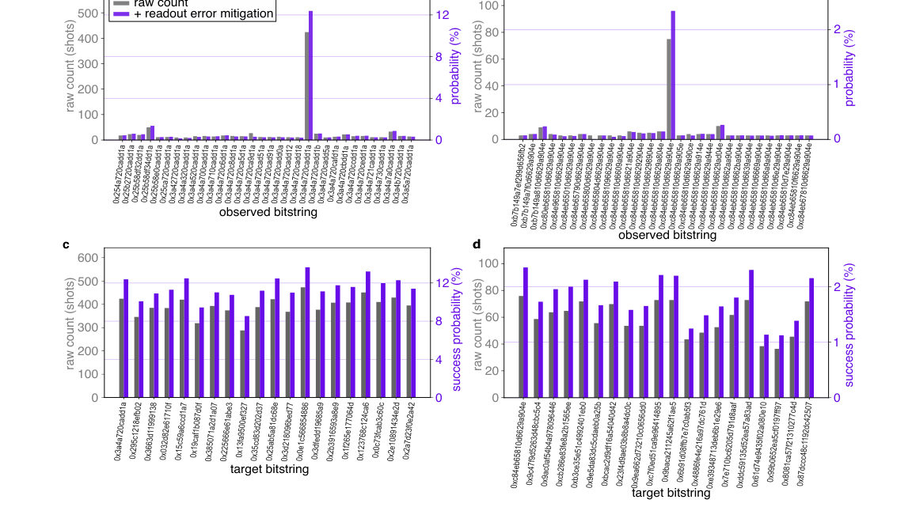 
FIG. 5. Experimental demonstration of the Convolutional QFT for 50 and 80 qubits. a., b. Raw data, and data after mitigation of readout misclassification error, for a circuit width of 50 (a) and 80 (b) qubits. At both circuit widths, the mode observed bitstring is the correct ideal result. For visual clarity, only bitstrings with raw count of at least 10 shots (a) and 3 shots (b) are included. Bitstring labels are expressed in hexadecimal format due to the large number of bits. c., d. Success probability (raw and readout-mitigated) for QFT circuits of size 50 (c) and 80 (d) qubits, each applied to 20 periodic quantum states with randomly selected frequencies. For all test circuits, the...

**Summary.** The paper presents an experimental demonstration of the Quantum Fourier Transform (QFT) on up to 100 qubits using superconducting hardware. The key contribution is the 'Convolutional QFT' compilation strategy, which efficiently maps the circuit onto a linear nearest neighbor topology while minimizing gate count and depth. This work sets a new record for large-scale quantum algorithm execution fidelity.

**Why it may be interesting.** This work directly addresses hardware constraints by providing a highly optimized, scalable quantum algorithm implementation for a fundamental subroutine like QFT, which is crucial for realizing complex quantum simulations or computations in AMO physics.

Detailed structure

**Main problem.** Developing an efficient compilation strategy for the Quantum Fourier Transform (QFT) subroutine on quantum hardware with limited qubit connectivity.

**Main result.** The authors achieved the largest experimental QFT demonstrated to date, successfully running up to 100 qubits while maintaining a distinguishable output state above background noise.

**Method.** They introduced and experimentally validated the 'Convolutional QFT,' a novel compilation strategy that maps the QFT onto a linear nearest neighbor (LNN) topology using compact kernel gadgets.

**Model / system.** The experiments were performed on the IBM Quantum Platform, targeting superconducting qubits with an LNN connectivity constraint. The core computation is the QFT circuit itself.

**Key observables.** Process fidelity ($\hat{F}$), success probability of measuring the correct target bitstring, and resource counts (CX gates).

**Important parameters / regimes.** Qubit count ($n$) up to 100; process fidelities measured at $n=50$ (11.4%) and $n=80$ (1.8%).

**Assumptions / limitations.** The reported fidelity is for the unitary QFT alone, after readout error mitigation, and does not account for classical post-processing of near-target states.

**Figures summary.** Figures demonstrate the comparison between various QFT compilation strategies (e.g., Park/Ahn vs. Convolutional) regarding CX gate count and depth, alongside success probability plots showing scalability up to 100 qubits.

**Paper structure.** The paper first introduces the need for efficient LNN compilation, details the derivation of the convolutional strategy using circuit identities, presents quantitative comparisons of resource requirements (Table I), and concludes with experimental validation on the IBM Quantum Platform showing high-qubit fidelity.

Abstract

We present and experimentally validate the `Convolutional QFT': a constructive compilation strategy for the Quantum Fourier Transform (QFT) subroutine on a linear nearest neighbor (LNN) qubit topology. We first introduce a novel strategy that compiles the $n$-qubit QFT onto an LNN topology using only $n^2 - n$ $CX$ gates, matching requirements of a direct compilation on an all-to-all architecture. We then derive the convolutional variant used in our experiments, which requires an additional two $CX$ gates in total, and is realized via a compact, translation-invariant kernel circuit gadget that traverses a quantum register. We demonstrate the power of the convolutional compilation strategy on the IBM Quantum Platform by executing QFT benchmarking circuits. We measure a process fidelity of 11.4% at 50 qubits, and 1.8% at 80 qubits. The correct output state remains clearly distinguishable above background noise up to 100 qubits. These results constitute the largest experimental QFT demonstrated on any quantum computing hardware to date.

[↑ back to top](#top)

### [Relative entropy of entanglement of Haar random states](http://arxiv.org/abs/2608.05274v1)

**Authors:** Takato Mori, Beni Yoshida  
**Type:** theory · **Category:** quantum information and computing · **PDF:** <https://arxiv.org/pdf/2608.05274v1>  
**Analysis basis:** full PDF text, analyzed in chunks
**Topic relevance:** 🔥 `entanglement & information structure` **4/5**

📷 Fig 1

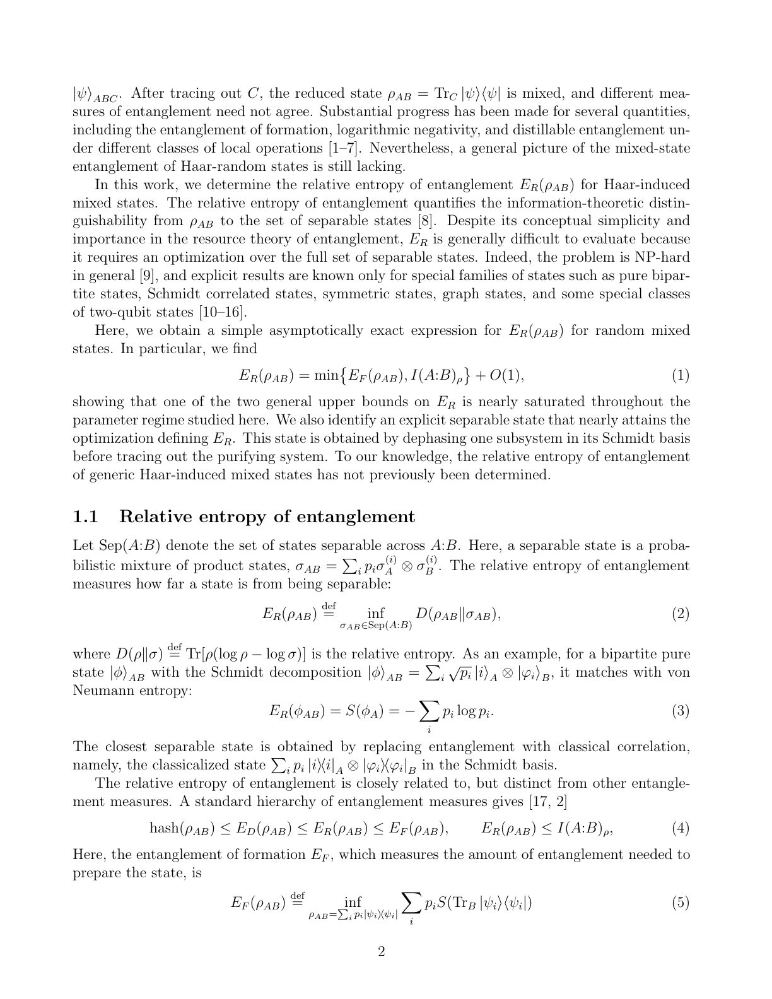 
Low-resolution page preview, page 2

📷 Fig 2

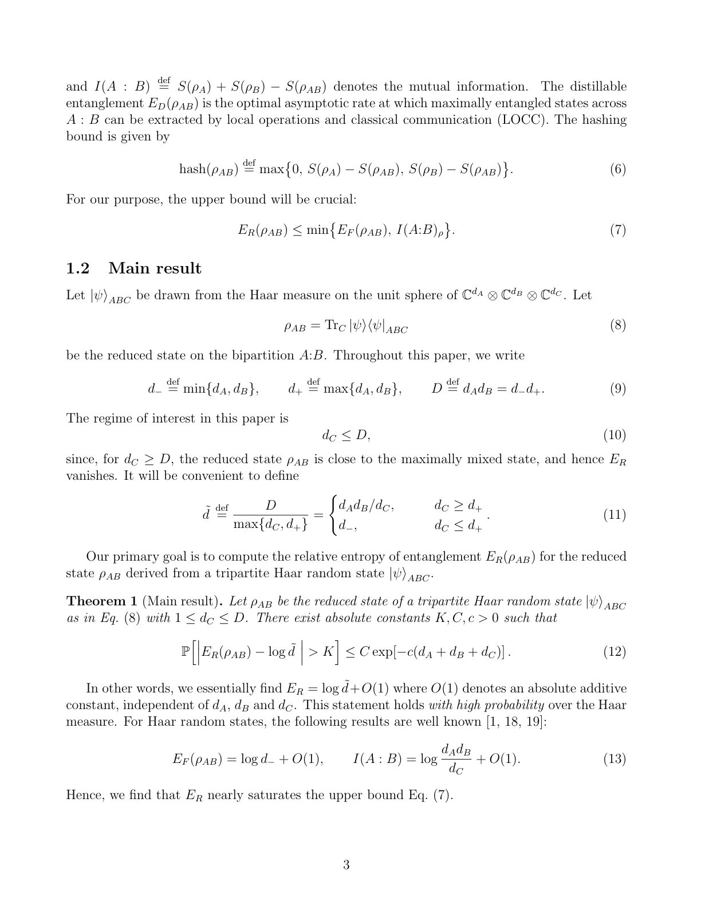 
Low-resolution page preview, page 3

📷 Fig 3

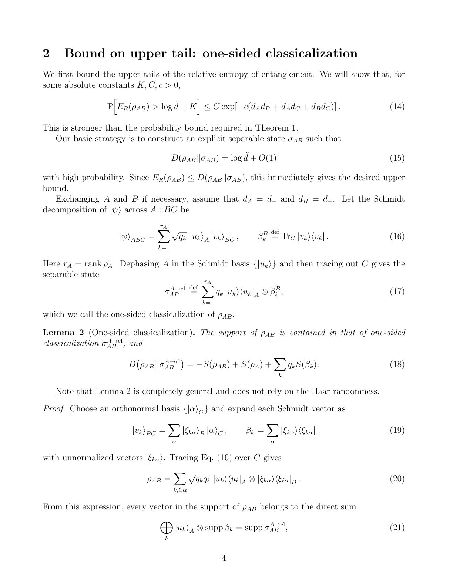 
Low-resolution page preview, page 4

📷 Fig 4

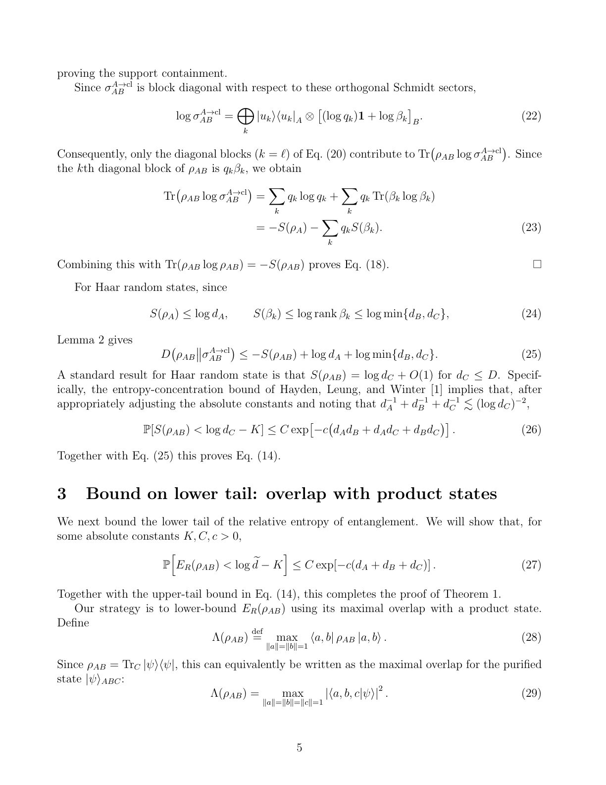 
Low-resolution page preview, page 5

📷 Fig 5

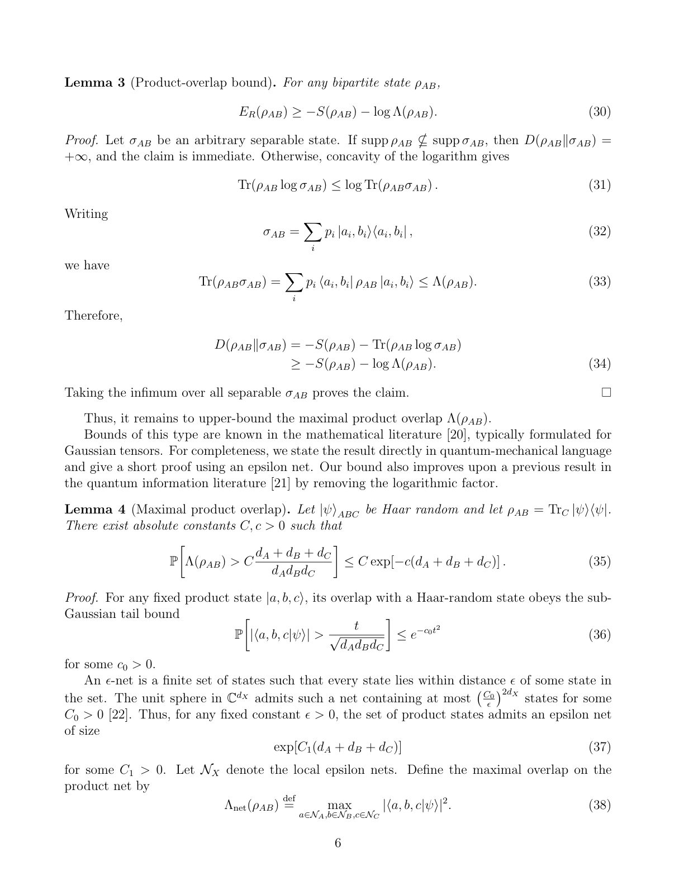 
Low-resolution page preview, page 6

**Summary.** The paper calculates the relative entropy of entanglement for a bipartite state obtained by tracing out one subsystem from a tripartite Haar-random pure state. It proves that this entanglement measure scales logarithmically with the system dimensions, showing it closely matches other key entanglement measures like the mutual information. The methodology relies on sophisticated bounding techniques involving classicalization and product overlap estimates.

**Why it may be interesting.** This work provides rigorous quantitative estimates for entanglement measures in highly random quantum states, which is fundamental for understanding resource theories in quantum information processing.

Detailed structure

**Main problem.** The primary goal is determining the relative entropy of entanglement ($	ext{ER}$) for a bipartite mixed state $
ho_{AB}$ derived from tracing out one subsystem (C) of a tripartite Haar-random pure state $|\psi
angle_{ABC}$.

**Main result.** The relative entropy of entanglement scales as $\log 	ilde{d} + O(1)$, where $	ilde{d} = \max\{d_C, d_+\}$, indicating that it nearly saturates the minimum of the entanglement of formation and mutual information.

**Method.** The calculation uses bounding techniques involving an upper bound derived from one-sided classicalization (Schmidt dephasing) and a lower bound established via maximal product overlap ($\Lambda(
ho_{AB})$).

**Model / system.** The model is a tripartite quantum system governed by a Haar random pure state $|\psi
angle_{ABC}$, leading to the reduced mixed state $
ho_{AB} = 	ext{Tr}_C |\psi
angle\langle\psi|_{ABC}$.

**Key observables.** Relative entropy of entanglement ($	ext{ER}(
ho_{AB})$), Entanglement of Formation ($	ext{EF}(
ho_{AB})$), Mutual Information ($I(A:B)$), and the maximal product overlap $\Lambda(
ho_{AB})$.

**Important parameters / regimes.** The dimensions of the subsystems $d_A, d_B, d_C$, particularly in regimes where $d_C \le D = \min\{d_A, d_B\}$.

**Assumptions / limitations.** The results are stated to hold with high probability over the Haar measure. The upper bound is achieved by an explicit separable state obtained via one-sided Schmidt dephasing.

**Paper structure.** The paper proceeds by establishing bounds on $	ext{ER}(
ho_{AB})$ using both classicalization techniques (upper bound) and maximal product overlap arguments (lower bound), culminating in the main theorem relating these quantities to system dimensions.

Abstract

We determine the relative entropy of entanglement of a bipartite mixed state $ρ_{AB}$ obtained by tracing out one subsystem of a tripartite Haar-random pure state $|ψ\rangle_{ABC}$, finding $E_R(ρ_{AB})=\log\frac{d_Ad_B}{\max(d_A,d_B,d_C)}+O(1)$. Equivalently, the relative entropy of entanglement nearly saturates the smaller of the entanglement of formation $E_F(ρ_{AB})$ and the mutual information $I(A:B)$. The upper bound is achieved by an explicit separable state obtained through one-sided Schmidt dephasing, which is therefore approximately closest.

[↑ back to top](#top)

### [Symmetry-guided construction and exact certification of absolutely maximally entangled states](http://arxiv.org/abs/2608.05781v1)

**Authors:** Samuel Bevins, Yunus Bidav  
**Type:** theory · **Category:** quantum information and computing · **PDF:** <https://arxiv.org/pdf/2608.05781v1>  
**Analysis basis:** full PDF text, analyzed in chunks
**Topic relevance:** 🔥 `entanglement & information structure` **4/5**

📷 Fig 1

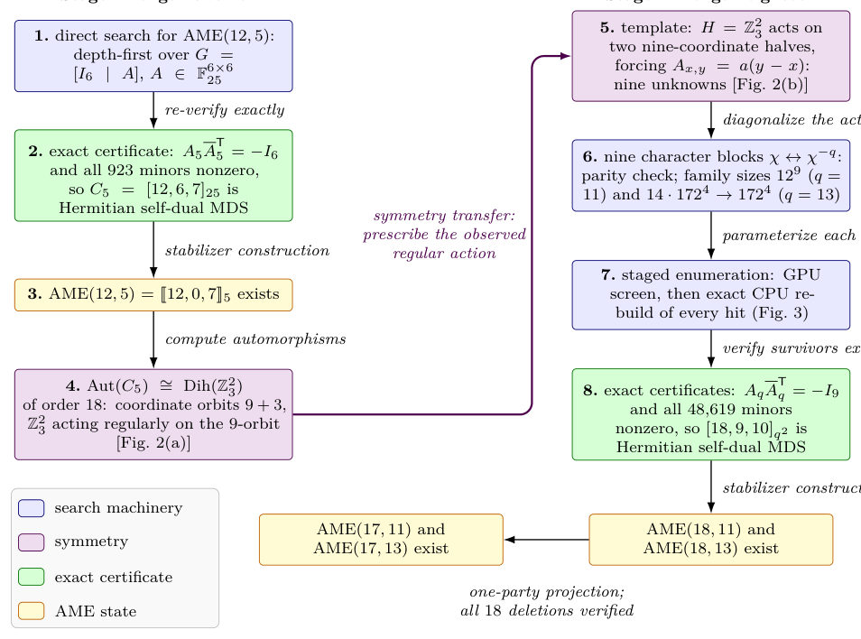 
FIG. 1. Two-stage search and certification pipeline. Steps 1–4: the length-twelve search without prescribed coordinate symmetry, its exact certificate, the resulting state, and the automorphism orbits of C5. Steps 5–8: that orbit structure is imposed as the Z2 3-invariant length-eighteen template, which is resolved into character blocks, enumerated, and certified exactly. The bottom row lists the resulting states.

📷 Fig 2

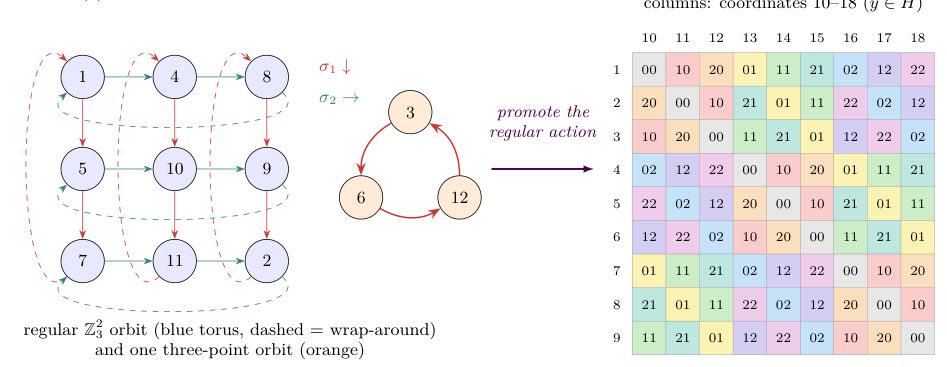 
FIG. 2. The geometry behind the symmetry transfer (steps 4 and 5 of Fig. 1). (a) What the automorphism computation found: the twelve coordinates of C5 split into a nine-point orbit forming a Z2 3 torus, on which the order-three translations act regularly (σ1 down the columns, σ2 along the rows; dashed arrows wrap around), and a three-point orbit (orange) carrying the action through the quotient Z3. (b) What prescribing that action buys at length eighteen: imposing the same translations on both nine-coordinate halves of [I9 | A] forces the group-circulant form Ax,y = a(y −x). Rows are the first-half coordinates 1–9, columns the second-half coordinates 10–18 (both identified with H = Z2 3 in...

📷 Fig 3

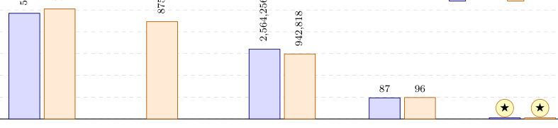 
FIG. 3. Candidate counts at the stages of the two eighteen-party searches, grouped by stage on a shared logarithmic axis: blue bars q = 11, orange bars q = 13. The norm-one quotient [Eq. (21)] was applied only at q = 13; the archived scan intervals are those of Table II, and the final bars are the published kernels of Eqs. (30) and (32).

📷 Fig 4

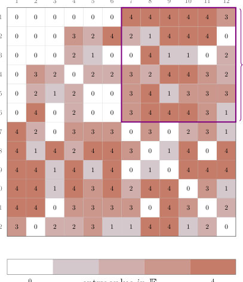 
FIG. 4. The graph matrix eΘ12 ∈F12×12 5 with diagonal phase terms set to zero; color encodes the entry value. The violet frame marks one of the 462 balanced cut submatrices, eΘ[S, Sc] for S = {1, . . . , 6}: by Lemma 2, the AME property is the statement that every such 6 × 6 submatrix is nonsingular over F5.

📷 Fig 5

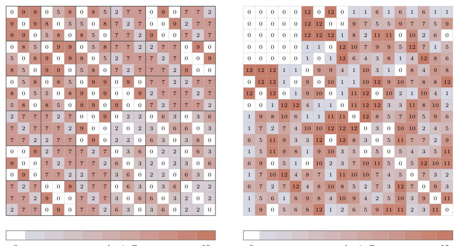 
FIG. 5. The eighteen-vertex graph matrices, with diagonal phase terms set to zero as described in the text; color encodes the entry value (color bars below each panel). (a) eΘ(11) 18 : 3 × 3 circulant blocks (heavy grid lines) remain after local-Clifford reduction. (b) eΘ(13) 18 : the reduction does not preserve the block pattern.

**Summary.** This paper constructs and rigorously certifies several Absolutely Maximally Entangled (AME) quantum states by linking them to specific Hermitian self-dual Maximum Distance Separable (MDS) codes. The methodology combines systematic computational searches with advanced algebraic tools like character decomposition to ensure the mathematical exactness of the results. It advances the theoretical understanding of highly entangled quantum resources.

**Why it may be interesting.** This work provides deep connections between abstract algebra (coding theory over finite fields) and fundamental quantum information concepts like entanglement measures, which is highly relevant for theoretical quantum computation research.

Detailed structure

**Main problem.** The primary goal is the construction and exact certification of Absolutely Maximally Entangled (AME) quantum states.

**Main result.** The authors explicitly construct and certify several AME states, including $	ext{AME}(12, 5)$, $	ext{AME}(18, 11)$, and $	ext{AME}(18, 13)$, using specific Hermitian self-dual Maximum Distance Separable (MDS) codes.

**Method.** The methods involve advanced techniques from coding theory, specifically utilizing systematic searches combined with imposing symmetry constraints ($\mathbb{Z}_3$ action) and employing character decomposition of group algebras for rigorous verification.

**Model / system.** The physical system is defined by quantum states represented as graph states derived from Hermitian self-dual codes over finite fields $\mathbb{F}_{q^2}$. The state space is $(\mathbb{C}^q)^{\otimes n}$.

**Key observables.** AME parameters, such as the code dimensions $[n, k, d]$ (e.g., $[12, 6, 7]_{25}$), and graph-state cut-rank computations.

**Important parameters / regimes.** The field size $q$ (e.g., 5, 11, 13) and the number of parties $n$ are critical parameters defining the state structure.

**Assumptions / limitations.** The analysis relies on establishing exact mathematical conditions for self-duality and MDS properties via field arithmetic and complete square-minor enumeration; limitations exist regarding whether the found solutions represent all possible codes in their class.

**Figures summary.** Figures illustrate the two-stage search pipeline, geometric constraints imposed by symmetry (e.g., group-circulant forms), and summaries of existence maps for AME states across various parameters.

**Paper structure.** The paper follows a structure moving from defining the problem (AME states via MDS codes) to developing sophisticated algebraic tools (symmetry imposition, character decomposition) used in a systematic search pipeline to yield explicit constructions and rigorous certifications for specific parameter sets.

Abstract

We construct Hermitian self-dual maximum-distance-separable codes with parameters $[12,6,7]_{25}$, $[18,9,10]_{121}$, and $[18,9,10]_{169}$. Through the nonbinary stabilizer construction these codes define $\text{AME}(12,5)$, $\text{AME}(18,11)$, and $AMD(18,13)$ states, and one-party projection gives $\text{AME}(17,11)$ and $\text{AME}(17,13)$. The $[12,6,7]_{25}$ code, which is not monomially equivalent to a generalized Reed-Solomon code, is obtained by a systematic search without prescribed coordinate symmetry; its monomial-semilinear automorphism group acts with a regular $\mathbb{Z}_3^2$ orbit on nine coordinates. Imposing that action on two nine-coordinate orbits reduces the length-eighteen search to a nine-element group algebra kernel, whose Hermitian character decomposition splits the invariant self-duality constraints into independent blocks with exact family counts; a norm-one coordinate scaling removes a factor $q+1=14$ at $q=13$. Hermitian self-duality and the MDS property are certified by exact field arithmetic and complete square-minor enumeration. Graph-state cut-rank computations, including all single-vertex deletions of the length-eighteen graphs, provide additional exact checks.

[↑ back to top](#top)

### [Master equation for systems interacting with linearized gravity](http://arxiv.org/abs/2608.06121v1)

**Authors:** Oliviero Angeli, Anirudh Gundhi, Angelo Bassi  
**Type:** theory · **Category:** other · **PDF:** <https://arxiv.org/pdf/2608.06121v1>  
**Analysis basis:** full PDF text, analyzed in chunks
**Topic relevance:** `correlated / nonlocal dissipation` **3/5** · `methods for driven-dissipative` **3/5** · `non-equilibrium dynamics` **3/5** · `Keldysh / 2PI / non-Gaussian methods` **2/5** · `driven-dissipative phase transition` **2/5** · `entanglement & information structure` **1/5** · `non-equilibrium universality` **1/5** · `quantum measurements` **1/5**

📷 Fig 1

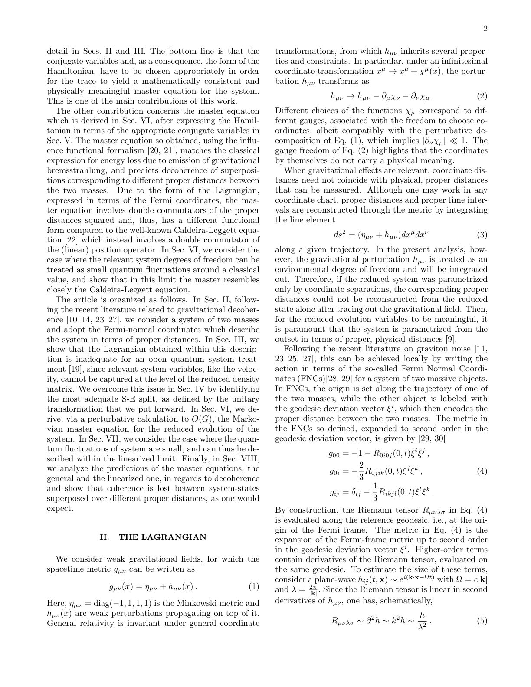 
Low-resolution page preview, page 2

📷 Fig 2

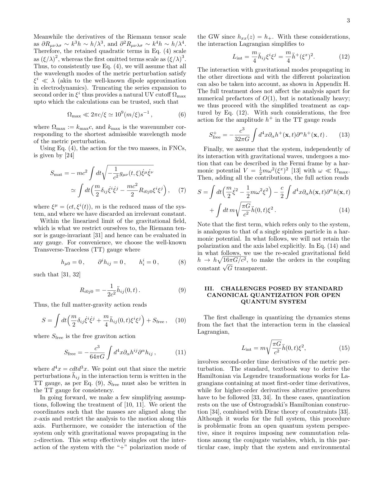 
Low-resolution page preview, page 3

📷 Fig 3

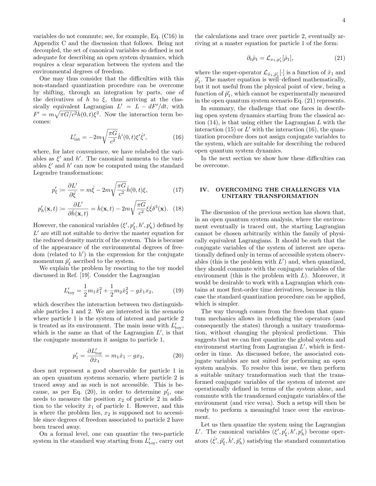 
Low-resolution page preview, page 4

📷 Fig 4

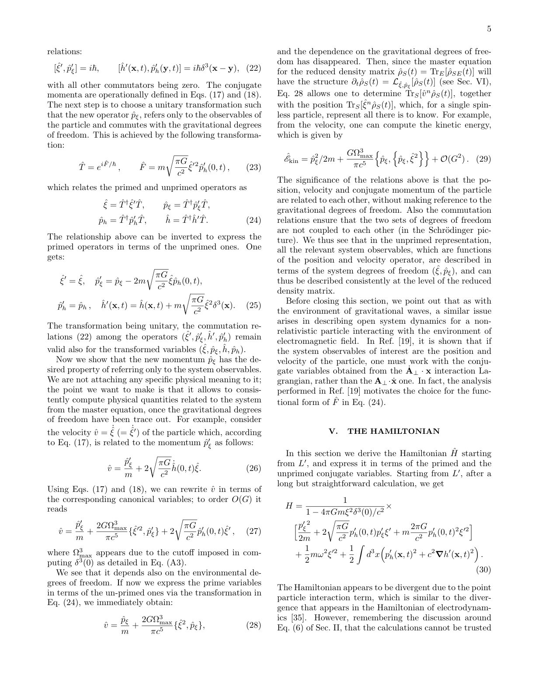 
Low-resolution page preview, page 5

📷 Fig 5

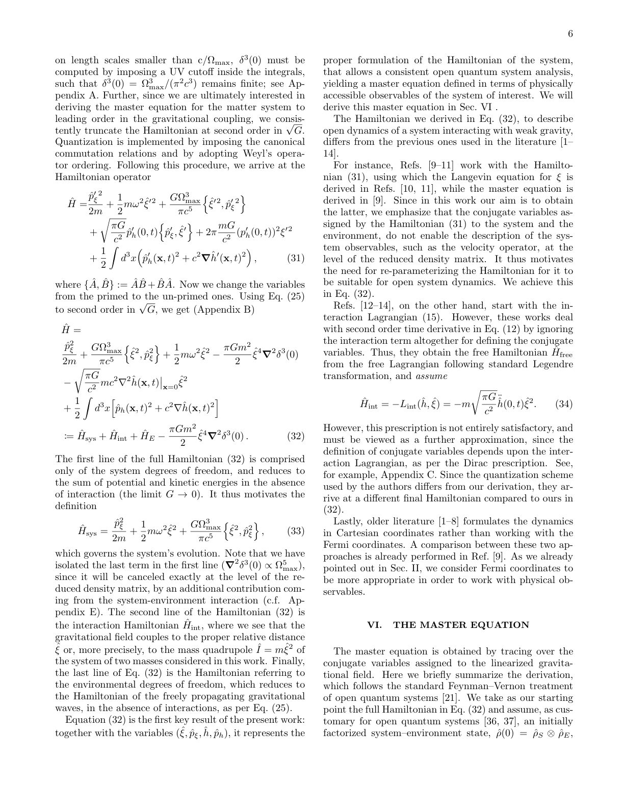 
Low-resolution page preview, page 6

**Summary.** This paper develops a theoretical framework to describe how a mechanical system loses energy and decoheres when coupled to the environment of linearized gravitational waves. By deriving a master equation using specialized unitary transformations, the authors successfully reproduce known classical results for energy loss while predicting quantum decoherence effects.

**Why it may be interesting.** This work is highly relevant as it applies open quantum system techniques (master equations, decoherence) to fundamental physics problems involving gravity, providing a rigorous framework for quantifying dissipation due to gravitational radiation.

Detailed structure

**Main problem.** The paper investigates the open quantum dynamics of a system (two masses) interacting with an environment composed of linearized gravitational waves.

**Main result.** A master equation is derived whose dissipative sector correctly reproduces classical energy loss due to gravitational-wave emission, and the dynamics reduce to a Caldeira-Leggett type equation in the small fluctuation limit.

**Method.** The authors employ unitary transformations to achieve a physically meaningful system-environment decomposition before deriving the master equation perturbatively in the weak field limit of linearized gravity.

**Model / system.** The model is a two-mass system whose dynamics are coupled to metric perturbations ($h_{\mu
u}$) representing gravitational waves. The analysis focuses on the observable proper distance between the masses and uses techniques from open quantum systems theory.

**Key observables.** Proper distance, energy $\langle\hat{E}
angle$, decoherence rate, two-point correlation function $\alpha_{	ext{full}}^T (t, t')$.

**Important parameters / regimes.** Gravitational coupling constant $G$, baseline length $l_0$, environmental cutoff $\Omega_{	ext{max}}$, and temperature $T$ in thermalization analysis.

**Assumptions / limitations.** The weak field limit ($g_{\mu
u} = \eta_{\mu
u} + h_{\mu
u}$), the small quantum fluctuation approximation ($\xi_i \ll \lambda$), and the use of a unitary transformation to define system observables are key assumptions.

**Figures summary.** Not specified in detail, but the notes reference equations for energy evolution (F2, F3, F4, F5) and correlation functions (H10, H16).

**Paper structure.** The paper progresses from identifying the failure of standard canonical quantization methods to deriving a unitary transformation, obtaining the master equation, analyzing energy loss/thermalization in the semiclassical limit, and finally calculating the two-point function for comparison.

Abstract

We investigate the open quantum dynamics of a system of two masses interacting with an environment of linearized gravitational waves. We formulate the analysis in terms of the observable proper distance between the two masses, and show that the canonical variables obtained from the standard Lagrangian, expressed in terms of the Fermi normal coordinates, are not suitable for an effective description of the system. We resolve this issue through a unitary transformation that provides a physically meaningful system--environment decomposition and derive the master equation to leading order in $G$. Its dissipative sector reproduces the classical energy loss due to gravitational-wave emission, while the noisy contributions suppress coherences between states with different mass quadrupole, or effectively, different proper separations. In the regime where the proper distance can be described by considering small quantum fluctuations around an average distance $l_0$, the dynamics reduces to a Caldeira--Leggett-type equation, with a decoherence rate dependent on the baseline length $l_0$.

[↑ back to top](#top)

### [Quantum information loss](http://arxiv.org/abs/2608.05535v1)

**Authors:** James Fullwood, Wu-zhong Guo, Boyu Yang  
**Type:** theory · **Category:** quantum information and computing · **PDF:** <https://arxiv.org/pdf/2608.05535v1>  
**Analysis basis:** full PDF text, analyzed in chunks
**Topic relevance:** `entanglement & information structure` **3/5** · `quantum measurements` **3/5** · `correlated / nonlocal dissipation` **2/5** · `non-equilibrium dynamics` **2/5** · `Keldysh / 2PI / non-Gaussian methods` **1/5** · `driven-dissipative phase transition` **1/5** · `measurement-induced transitions` **1/5** · `methods for driven-dissipative` **1/5** · `non-equilibrium universality` **1/5**

📷 Fig 1

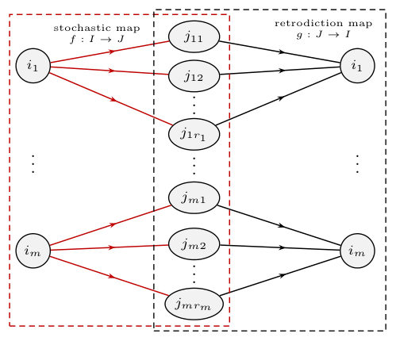 
FIG. 1. When K = 0, the stochastic map f : I →J corresponding to the classical labels of Bob’s measurement outcomes given Alice’s inputs admits a left inverse g : J →I, which we refer to as a perfect retrodiction map.

📷 Fig 2

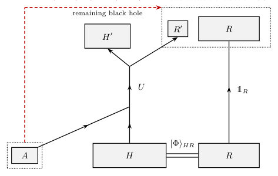 
FIG. 2. Schematic of the Hayden–Preskill model of black hole evaporation, which is modeled as a quantum channel EU,s : L(HA) →L(HRR′). In our formulation, no auxiliary reference system for Alice is required for the recovery of in- formation from the Hawking radiation.

**Summary.** The paper develops a novel intrinsic measure of information loss for general quantum channels operating under a prepare-evolve-measure framework. It proves that zero information loss is equivalent to the channel possessing 'universal pristineness,' which mathematically guarantees perfect state recovery, mirroring the conditions required by Quantum Error Correction theory. This provides a powerful, purely channel-theoretic tool to analyze phenomena like black hole evaporation.

**Why it may be interesting.** This work provides a fundamental, operational measure of information degradation in open quantum systems, linking concepts from quantum error correction directly to physical processes like Hawking radiation.

Detailed structure

**Main problem.** To introduce a rigorous, intrinsic measure of information loss for any quantum process modeled by a prepare-evolve-measure (PEM) scenario.

**Main result.** The vanishing of this intrinsic information loss is shown to be equivalent to the channel satisfying 'universal pristineness,' which in turn is mathematically equivalent to the necessary and sufficient conditions for perfect state recovery (Quantum Error Correction).

**Method.** The authors define information loss using conditional entropy over the PEM framework, deriving key equivalences between zero information loss, the existence of a perfect retrodiction map, and specific channel properties.

**Model / system.** The analysis uses general quantum channels ($\mathcal{E}$) acting on an input state $
ho$, modeled by Alice preparing an ensemble and Bob performing a POVM measurement. A key application is to the Hayden-Preskill model describing black hole evaporation.

**Key observables.** Intrinsic Information Loss ($K(
ho, E)$), Universal Pristineness, Root Fidelity ($	ext{Fr}$), Perfect Retrodiction Map ($g$).

**Important parameters / regimes.** The code subspace $\mathcal{H}_{	ext{code}}$, the state $
ho$, and the channel $\mathcal{E}$.

**Assumptions / limitations.** The framework assumes a process modeled by the PEM scenario, and later proofs rely on established theorems like the Knill-Laflamme conditions.

**Figures summary.** Not specified in detail, but figures illustrate the relationship between stochastic maps, retrodiction maps, and error-free communication.

**Paper structure.** The paper builds from defining $K$ via entropy differences to establishing its equivalence with perfect retrodiction ($K=0 \iff g$ exists), then generalizing this to prove that zero loss implies universal pristineness, culminating in the application to black hole evaporation.

Abstract

We introduce a measure of information loss for any quantum process that may be modeled by a prepare-evolve-measure scenario: Alice prepares an ensemble of states that gets sent via a quantum channel to Bob, who then measures the output. As a quantum channel models open system dynamics, our measure of information loss quantifies Bob's inability to retrodict with certainty which state Alice sent through the channel. By minimizing this measure over all possible pure state ensemble decompositions of a fixed state $ρ$, and over all POVMs on the output of a channel $\mathcal{E}$, we arrive at an intrinsic notion of information loss for any state-channel pair $(ρ,\mathcal{E})$. We show that the vanishing of information loss with respect to all states supported on a fixed codespace $\mathcal{H}_{\text{code}}$ is equivalent to a condition we term \emph{universal pristineness}, which ensures that orthogonal pure states in $\mathcal{H}_{\text{code}}$ get sent via the channel $\mathcal{E}$ to possibly mixed states whose supports are orthogonal. Moreover, we prove universal pristineness is equivalent to the Knill-Laflamme conditions in quantum error correction, which are necessary and sufficient for the existence of a perfect recovery channel for all states supported on $\mathcal{H}_{\text{code}}$. As an application, we apply our framework to the Hayden-Preskill model of black hole evaporation, demonstrating that the evaporation channel becomes asymptotically universally pristine, thereby providing a purely channel-theoretic formulation of Page-time information retrieval.

[↑ back to top](#top)

### [Transverse quantum-state characterization of programmable electron optics](http://arxiv.org/abs/2608.05749v1)

**Authors:** Shengbo You, Paolo Rosi, Enzo Rotunno, Alberto Roncaglia, Luca Belsito, Amir H. Tavabi, Rafal E. Dunin-Borkowski, Vincenzo Grillo, Philipp M. Pelz  
**Type:** experiment · **Category:** other · **PDF:** <https://arxiv.org/pdf/2608.05749v1>  
**Analysis basis:** full PDF text, analyzed in chunks
**Topic relevance:** `methods for driven-dissipative` **3/5** · `quantum measurements` **3/5** · `entanglement & information structure` **2/5** · `interference shaping light` **2/5** · `measurement-induced transitions` **2/5** · `Keldysh / 2PI / non-Gaussian methods` **1/5** · `driven-dissipative phase transition` **1/5** · `quantum optics experiment` **1/5**

📷 Fig 1

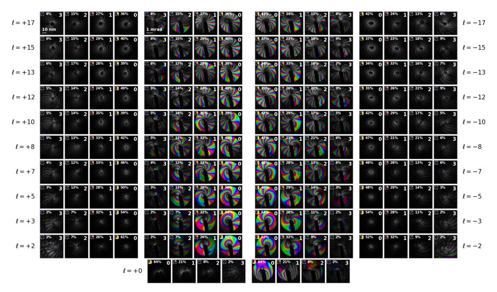 
FIG. 1. First four reconstructed probe modes of the MEMS vortex probe across the charge series (one dataset per programmed charge). To keep the figure compact, opposite charges of equal magnitude share a row (|ℓ| = 17…1), with the single ℓ= 0 dataset centred in the final row. Each row is mirror-symmetric about its centre: from left to right it shows the real-space and aperture-plane modes of +ℓ, then the aperture-plane and real-space modes of −ℓ, so the two aperture-plane blocks meet at the centre and the real-space blocks sit on the outer edges beside their charge labels. The +ℓ (left) blocks are drawn with the mode order reversed (3 →0) so that mode 0 of both charges meets at the centre...

📷 Fig 2

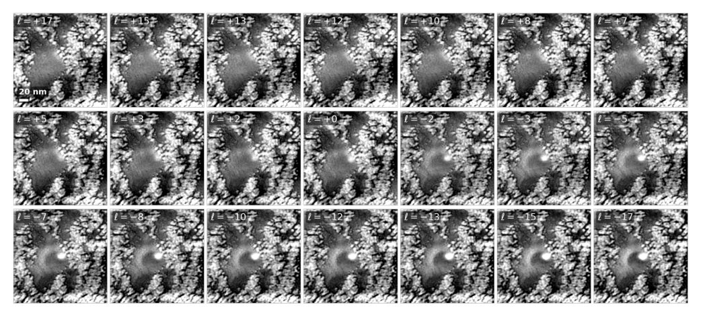 
FIG. 2. Reconstructed object phase across the charge series (one dataset per programmed charge; panels are labelled by the fit-predicted mean OAM (ℓ= 1.68 ℓprog), ℓ= +17… −17). Each panel is the ptychographic object phase after (i) subtracting a least-squares quadratic phase surface (linear ramp plus parabola, fitted on the crop-surviving interior), (ii) de-rotating by the 1.84° STEM scan rotation used in the reconstruction, and (iii) cropping half a probe width (≈32 nm) from every margin to discard the low-coverage border on a common display scale ([0.42, 0.47] rad, shared across all s); the reconstructions are quantitatively consistent across the charge series — the mean pairwise...

📷 Fig 3

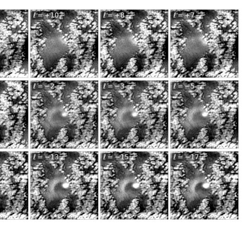 
Fig. 4 shows the resulting spectra across the charge series. The spectral ridge tracks the applied bias monot­ onically (panel a), and the power in the dominant OAM channel ranges from ≈0.20 (at ℓ= 0, whose round beam spreads over many OAM channels) to ≈0.42. Referenced to the differential chopstick bias, the delivered ensemble- mean OAM is linear in voltage, ⟨𝑙⟩= (16.8 ± 0.1 ℏ/V)𝑉+ (0.6 ± 0.1 ℏ) (𝑅2 = 0.999; Fig. 4 c). Ptychography thus provides an in-situ voltage-to-mean-OAM calibration of this device–microscope–detector configuration: each volt of differential bias delivers ≈16.8 ℏ of ensemble-mean orbital angular momentum. (𝑅2 measures linearity, not calibration accuracy; the quoted...

📷 Fig 4

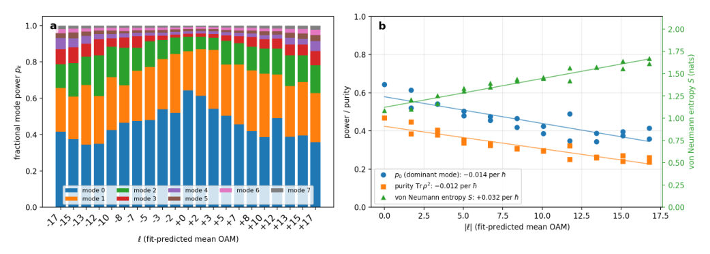 
FIG. 3. Probe mode powers versus the fit-predicted mean OAM for the contiguous acquisition series (one dataset per charge; the abscissa is ℓ= 1.68 × ℓprog, the fitted slope of Fig. 4, rather than each scan’s reconstructed mean OAM). (a) Fractional mode powers 𝑝𝑘 of the eight physical probe modes (the weakest “junk” absorber mode discarded; see Sec. D.), sorted by charge. (b) Dominant-mode power 𝑝0 and purity Tr 𝜌2 = ∑𝑘𝑝2

📷 Fig 5

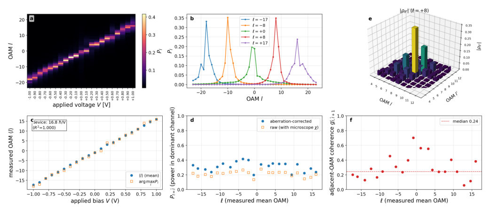 
FIG. 4. Virtual OAM sorting of the reconstructed probes, obtained by projecting the reconstructed mutual-coherence operator onto the OAM basis over all coherent modes (per-dataset sorting axis and virtual aberration refinement; see Methods, Eq. (9)). (a) OAM population spectra 𝑃𝑙 across the charge series, with the applied electrode bias 𝑉 on the abscissa. (b) Representative spectra. (c) Device calibration: the mean ⟨𝑙⟩ and dominant (arg max𝑙𝑃𝑙) measured OAM versus the applied electrode bias 𝑉; the fitted slope gives the device gain ≈16.8ℎ/𝑉 (slope standard error ±0.1ℎ/𝑉; 𝑅2 = 0.999). (d) Power in the dominant channel versus the measured mean OAM. (e) OAM density matrix |𝜌𝑙𝑙′| for a...

**Summary.** The researchers characterized the quantum state of electron beams generated by programmable electrostatic phase plates using mixed-state ptychography. They found that the delivered beam is significantly mixed, contradicting idealized assumptions used in current imaging proposals. This work provides essential, quantitative measurements of beam purity and coherence for next-generation electron optics.

**Why it may be interesting.** This work provides a crucial quantum characterization of an electron source used in advanced imaging, directly addressing the necessary input parameters (purity/coherence) that theoretical models often assume but fail to quantify experimentally.

Detailed structure

**Main problem.** The core problem is that proposals for advanced electron microscopy techniques rely on assuming the delivered electron wave is pure and fully coherent, a property that has never been quantitatively measured.

**Main result.** The study successfully reconstructed the transverse density matrix of an electrostatic spiral phase plate, revealing that the delivered beam is substantially mixed, with purity dropping significantly as the applied bias increases.

**Method.** Mixed-state ptychography was employed using standard 4D STEM scans to reconstruct the full transverse density matrix ($
ho$) for various programmed charge states.

**Model / system.** The physical system is a microelectromechanical electrostatic spiral phase plate (SPP) used to generate and control electron vortex beams with tunable Orbital Angular Momentum (OAM). The analysis models the beam state using its density matrix formalism.

**Key observables.** Transverse density matrix ($
ho$), purity ($	ext{Tr} 
ho^2$), von Neumann entropy ($S$), mode powers, and spatial coherence as functions of applied bias/charge.

**Important parameters / regimes.** The measured purity drops from $\approx 0.47$ to $\approx 0.24$ with increasing bias; the reconstructed OAM ($\langle\ell
angle$) scales linearly with voltage.

**Assumptions / limitations.** The primary limitation is that current diagnostics only measure diagonal elements or assume pure states, and the reconstruction technique itself relies on specific modeling assumptions regarding coherence transfer.

**Figures summary.** Figures show reconstructed probe modes in real space (annular intensity) and aperture plane (azimuthal winding); spectra track mode power, purity, and entropy as a function of programmed charge; one figure shows the linear calibration of mean OAM vs. voltage.

**Paper structure.** The paper first establishes the gap by noting unmeasured beam purity. It then details the mixed-state ptychography method applied to the SPP. Results quantify the state mixing and coherence for multiple vortex states, concluding with implications for dose efficiency improvements.

Abstract

Programmable electron optics -- electronically controlled phase plates -- underpin proposals from dose-efficient phase imaging to shaped-electron X-ray sources, nearly all assuming a pure, fully coherent delivered wave whose purity has never been measured. Here we reconstruct the transverse density matrix of a microelectromechanical electrostatic spiral phase plate by mixed-state ptychography, from one four-dimensional STEM scan per state and without added hardware. The delivered beam is substantially mixed: its purity falls from approximately 0.47 to approximately 0.24 as the applied bias grows, inconsistent with a fixed lateral source-blur model, while the real-space coherence width stays near 1 nm. The same scans calibrate the device in situ, allow virtual orbital-angular-momentum sorting and, through a partial-coherence-aware transfer theory, indicate that purifying the output could improve dose efficiency roughly threefold. One acquisition thus becomes a quantum-state acceptance test for programmable electron optics, supplying the purity and coherence that emerging phase-plate and diffractive-imaging schemes assume but leave unquantified.

[↑ back to top](#top)

### [An Effective String Theory Toolbox for Quantum Hall Interfaces II: Majorana Fermions on Fluctuating Moore-Read Worldsheets](http://arxiv.org/abs/2608.06098v1)

**Authors:** Ken K. W. Ma  
**Type:** theory · **Category:** strongly correlated electrons · **PDF:** <https://arxiv.org/pdf/2608.06098v1>  
**Analysis basis:** full PDF text, analyzed in chunks
**Topic relevance:** `Keldysh / 2PI / non-Gaussian methods` **3/5** · `driven-dissipative phase transition` **2/5** · `methods for driven-dissipative` **2/5** · `non-equilibrium universality` **2/5** · `Kondo & dissipative impurity` **1/5** · `analog quantum simulation` **1/5** · `correlated / nonlocal dissipation` **1/5** · `correlated cavity matter` **1/5** · `non-equilibrium dynamics` **1/5**

📷 Fig 1

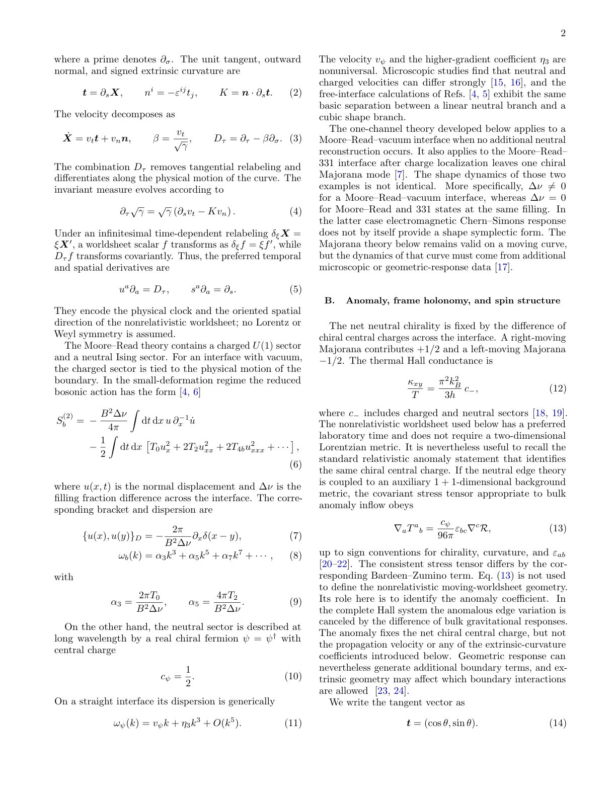 
Low-resolution page preview, page 2

📷 Fig 2

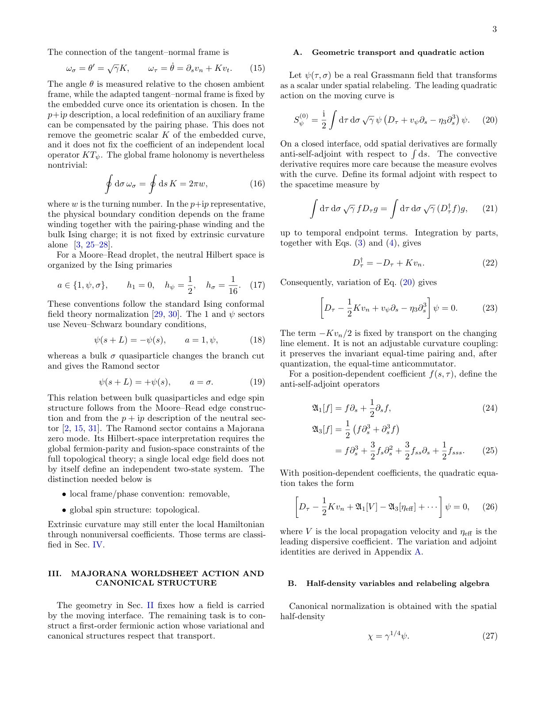 
Low-resolution page preview, page 3

📷 Fig 3

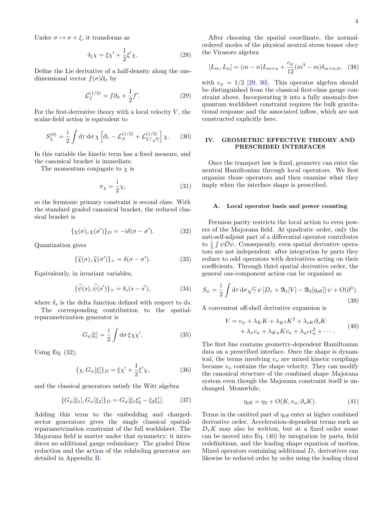 
Low-resolution page preview, page 4

📷 Fig 4

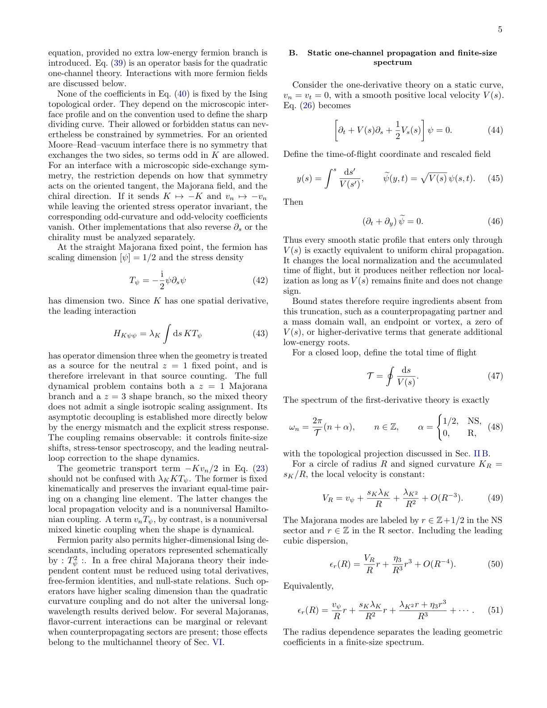 
Low-resolution page preview, page 5

📷 Fig 5

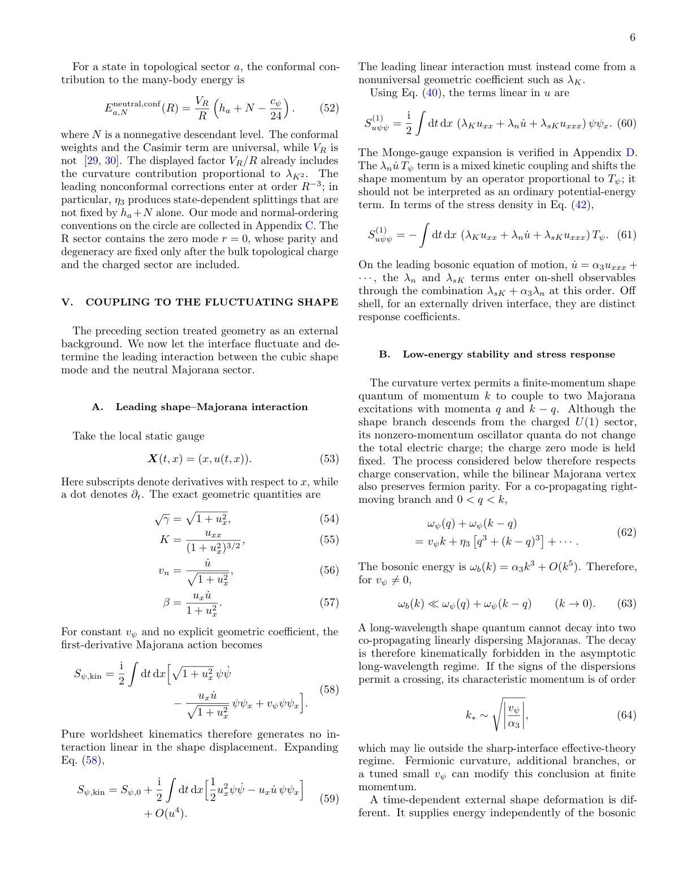 
Low-resolution page preview, page 6

**Summary.** This paper develops an advanced, geometrically invariant effective string theory toolbox for Majorana fermions residing at fluctuating quantum Hall interfaces. It successfully derives the low-energy dynamics by treating the interface's movement and curvature explicitly within the fermionic action. The resulting framework is crucial for building comprehensive theories of dynamical non-Abelian edge physics.

**Why it may be interesting.** This work provides a powerful effective field theory toolkit for describing boundary physics in strongly correlated electron systems (like FQHE states), which is highly relevant to understanding exotic edge modes beyond simple Luttinger liquid descriptions.

Detailed structure

**Main problem.** The primary goal is constructing a spatially reparametrization-invariant effective theory for chiral Majorana fermions residing on an interface whose geometry fluctuates freely.

**Main result.** The framework successfully separates universal kinematic transport laws from microscopic couplings, identifying the Majorana stress tensor as the mediator between neutral and geometric dynamics.

**Method.** The authors employ worldsheet formulations, variational principles, and canonical quantization using half-density variables to derive the effective action for the fermionic sector coupled to geometry fluctuations.

**Model / system.** The system models a quantum Hall interface derived from the Moore-Read (Pfaffian) state, focusing on the dynamics of its neutral chiral Majorana mode ($\psi$) as the boundary bends and moves nonrelativistically.

**Key observables.** Majorana stress tensor, universal half-density transport law, linear dispersion relation $\omega_\psi(k) = v_\psi k + \eta_3 k^3$, and energy contributions from curvature ($K$).

**Important parameters / regimes.** Curvature ($K$), shape velocity ($v_n$), local propagation velocity ($V$), and the effective coupling coefficients derived from microscopic physics.

**Assumptions / limitations.** The analysis assumes a nonrelativistic worldsheet, that fixed-edge theory is insufficient, and initially focuses on a single-channel description (Moore–Read–vacuum).

**Paper structure.** The paper builds from identifying the inadequacy of fixed-edge theories to constructing the invariant action using half-density variables, deriving equations of motion involving curvature and velocity, and finally separating universal topological contributions from geometry-dependent couplings.

Abstract

A Moore--Read interface carries a chiral Majorana mode on a boundary whose geometry may itself fluctuate. Fixed-edge theory does not determine how this neutral mode should be transported when the interface bends and moves, or how its dynamics couples to the fluctuating shape. Here we construct a spatially reparametrization-invariant Majorana theory on the nonrelativistic worldsheet of a freely moving interface. The changing line element fixes a universal half-density transport law, while additional curvature- and velocity-dependent couplings remain controlled by microscopic interface physics. The resulting framework identifies the Majorana stress tensor as the mediator between neutral and geometric dynamics and provides the neutral sector needed for effective theories of dynamical non-Abelian quantum Hall interfaces.

[↑ back to top](#top)

### [Collective search-and-capture under competing assignment policies](http://arxiv.org/abs/2608.06084v1)

**Authors:** Néstor Sepúlveda  
**Type:** theory · **Category:** statistical mechanics · **PDF:** <https://arxiv.org/pdf/2608.06084v1>  
**Analysis basis:** full PDF text, analyzed in chunks
**Topic relevance:** `non-equilibrium dynamics` **3/5** · `driven-dissipative phase transition` **2/5** · `non-equilibrium universality` **2/5** · `Frenkel-Kontorova` **1/5** · `Keldysh / 2PI / non-Gaussian methods` **1/5** · `analog quantum simulation` **1/5** · `correlated / nonlocal dissipation` **1/5** · `entanglement & information structure` **1/5** · `methods for driven-dissipative` **1/5**

📷 Fig 1

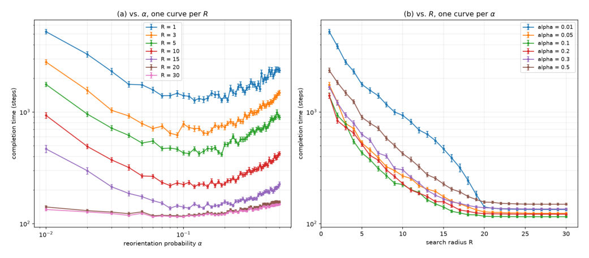 
FIG. 1. Completion time over a representative subset of the full 50 × 30 (α, R) grid (mean ± SEM over 100 replicas; L = 40; the complete grid, with all sampled R and α and with s.d. error bars, is given in the Supplemental Material). (a) Tc versus reorientation probability α, one curve per search radius R. (b) Tc versus R, one curve per α. The curves flatten as R approaches the largest possible periodic minimum-image separation, L/ √

📷 Fig 2

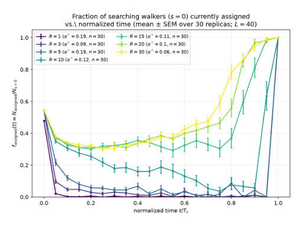 
FIG. 2. Fraction of searching walkers currently assigned to a target, fassigned(t), versus normalized time t/Tc (mean ± SEM over 30 replicas; each realization is linearly interpolated onto a common t/Tc grid before averaging). At small R, most re- maining walkers spend nearly the whole process in free explo- ration; at large R, assignment remains substantial throughout the dynamics. The final rise toward unity is partly an arti- fact of conditioning on Tc itself and of the small, shrinking number of still-searching walkers as t →Tc (Sec. S5.1 of the Supplemental Material), and should not be read as a sharp collective transition.

📷 Fig 3

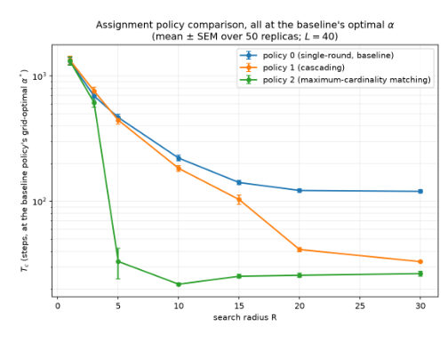 
FIG. 3. Near-optimal completion time for the baseline single- round, cascading, and maximum-cardinality assignment poli- cies (mean ± SEM over 50 replicas; L = 40). The two greedy policies (single-round and cascading) agree at very small R; maximum-cardinality matching diverges from both already at moderate R.

📷 Fig 4

 
Figure 3 shows that at R ≤5, the baseline and cas- cading policies agree within uncertainty. From R ≈10 onward, cascading reassignment becomes significantly faster, reducing Tc to roughly one third of the baseline value by R = 20–30. This effect persists when each policy is evaluated at its own optimal α and across larger lat- tices. The Supplemental Material gives the correspond- ing speedup factor, T baseline c /T policy c , directly against R for both alternative policies. Maximum-cardinality matching produces an even

**Summary.** This paper analyzes a lattice model of active search-and-capture where mobile walkers compete for immobile targets. The core finding is that optimizing the assignment policy—specifically using maximum-cardinality matching—is a more powerful control parameter for reducing capture time than adjusting walker movement persistence. This highlights how coordination in resource allocation dictates the system's extreme-time behavior.

**Why it may be interesting.** While not directly quantum, the study models complex non-equilibrium dynamics involving resource competition and state transitions, which shares conceptual parallels with modeling energy landscapes or information flow in open quantum systems.

Detailed structure

**Main problem.** The study investigates collective search-and-capture dynamics on a lattice, focusing on how different assignment policies affect the overall completion time ($T_c$).

**Main result.** The assignment policy can control $T_c$ more strongly than walker persistence ($\alpha$), with maximum-cardinality matching providing significant speedups over greedy approaches.

**Method.** The authors use a minimal lattice model simulation approach, comparing baseline single-round assignment against cascading reassignment and maximum-cardinality matching algorithms.

**Model / system.** The system is a minimal lattice model on a periodic square lattice containing mobile walkers and immobile targets. Capture occurs via an irreversible, finite-range, mutually exclusive assignment rule.

**Key observables.** Completion Time ($T_c$), $T_{50\%}$, $T_{90\%}$, and the instantaneous fraction of assigned walkers ($f_{	ext{assigned}}(t)$).

**Important parameters / regimes.** Walkers' reorientation rate ($\alpha$) and search radius ($R$).

**Assumptions / limitations.** The analysis focuses on extreme-value statistics, where $T_c$ is governed by the late-time tail of the capture process.

**Figures summary.** Figures show non-monotonic dependence of $T_c$ on $\alpha$ and plateauing behavior with increasing $R$. Figure 3 compares near-optimal completion times for different assignment policies.

**Paper structure.** The paper establishes the model dynamics, analyzes the effect of walker persistence ($\alpha$) on $T_c$, and then systematically compares three distinct assignment policies (single-round, cascading, max-cardinality matching) to quantify their impact on the extreme capture time.

Abstract

We study a minimal lattice model of active search-and-capture in which persistent random walkers locate and irreversibly capture immobile targets through a finite-range, mutually exclusive assignment rule. We measure the collective completion time $T_c$ as a function of the walkers' reorientation rate $α$ and the search radius $R$. The dependence $T_c(α)$ is non-monotonic, with a minimum at intermediate persistence whose depth decreases as $R$ grows. Capture kinetics show that $T_c$ is not a typical capture time but is governed by the extreme, late-time tail of the capture process, while the bulk of targets are captured much earlier; this tail is controlled mainly by the free-exploration phase rather than by the final directed approach. We then compare the baseline single-round assignment rule with cascading reassignment and with maximum-cardinality matching on a candidate graph. The two greedy policies (single-round and cascading) agree at very small $R$, whereas maximum-cardinality matching already produces a strong speedup at moderate $R$: improved matching reduces $T_c$ by factors of several at large $R$, and by more than an order of magnitude at moderate $R$. Thus, in this collective, depletion-coupled search problem, the assignment policy can control the capture time more strongly than the walkers' persistence.

[↑ back to top](#top)

### [Error-detected surgery on Iceberg codes](http://arxiv.org/abs/2608.06187v1)

**Authors:** Andrea Di Fini, Samuel Crew, Laura Pecorari, Guido Pupillo  
**Type:** theory · **Category:** quantum information and computing · **PDF:** <https://arxiv.org/pdf/2608.06187v1>  
**Analysis basis:** full PDF text, analyzed in chunks
**Topic relevance:** `analog quantum simulation` **3/5** · `quantum measurements` **3/5** · `measurement-induced transitions` **2/5** · `correlated / nonlocal dissipation` **1/5** · `driven-dissipative phase transition` **1/5** · `entanglement & information structure` **1/5** · `methods for driven-dissipative` **1/5** · `non-equilibrium dynamics` **1/5**

📷 Fig 1

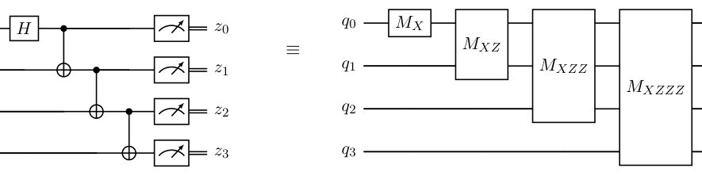 
Figure 1: Pauli-based compilation of the four-qubit GHZ example. The Clifford circuit (a) compiles to the sequence of Pauli-product measurements (b), with outcomes (m0, . . . , m3) re- producing the readout bits up to a Pauli frame correction.

📷 Fig 2

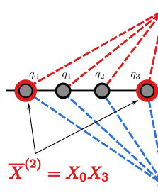 
Figure 2: A physical layout of the [[2N, 2N −2, 2]] Iceberg code qubits.

📷 Fig 3

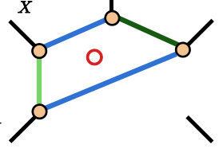 
Figure 3: The auxiliary graph Γ for the weight-four seed XXZZII of the [[6, 4, 2]] Iceberg code. The six data qubits are drawn as outward spokes of a hexagon, with the support of the seed labelled by Pauli type and the two unsupported qubits in grey. Gauge qubits live on the edges of Γ (blue and green): the path along the hexagon is closed into a four-cycle by a chord. Gauss-law checks Gv sit at the pink vertices and the flux check B on the enclosed face (red). The dressings of the two global checks are marked in green: WZ = sZ τ Z e0 (light green) and WX = sX τ Z e2 (dark green).

📷 Fig 4

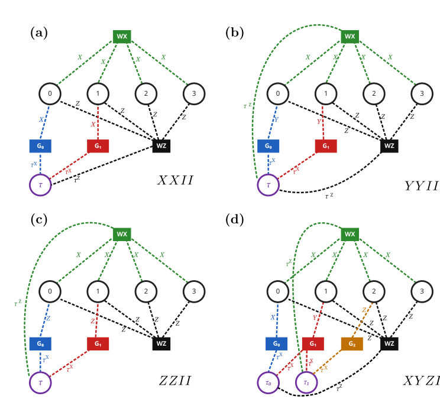 
Figure 4: The panels depict the stabiliser structure of the merged [[4, 2, 2]] Iceberg code for different seed operators. The black circles represent the four physical data qubits, and the purple circles represent the gauge qubits. The green ancilla WX measures the X-type stabiliser, the black ancilla WZ measures the Z-type stabiliser, and the colored ancillas Gv0, Gv1 and Gv2 are the Gauss-law checks at each support vertex.

📷 Fig 5

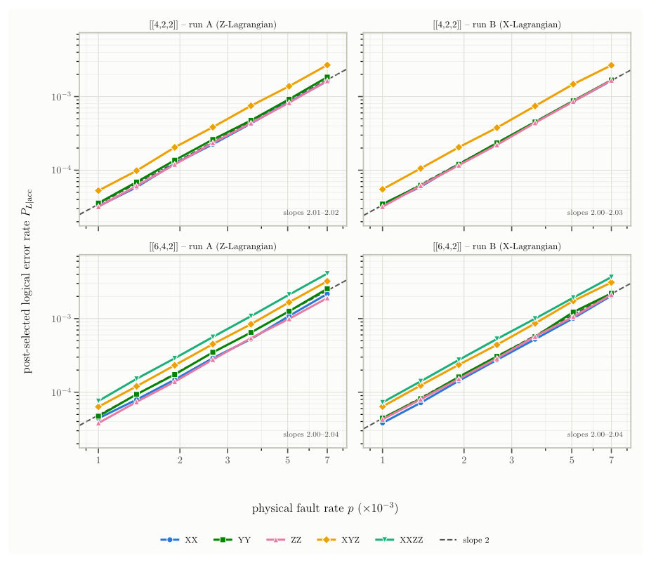 
Figure 5: Post-selected logical error rate for the [[4, 2, 2]] (top) and [[6, 4, 2]] (bottom) seed gadgets, run A (left) and run B (right). Error bars are smaller than the marker size.

**Summary.** This paper presents a method called 'code surgery' to perform measurements of logical Pauli operators in fault-tolerant quantum computation using Iceberg codes. By viewing measurement as gauging a global symmetry, the authors construct explicit gadgets that are proven to be fault-detecting via simulation. This makes it a highly relevant theoretical roadmap for building complex quantum computations on next-generation hardware.

**Why it may be interesting.** This work directly bridges abstract quantum error correction theory (gauging symmetries) with concrete, near-term physical implementations on platforms like neutral atoms that support long-range connectivity.

Detailed structure

**Main problem.** The primary goal is to develop a fault-tolerant method for measuring logical Pauli products within quantum error-correcting codes.

**Main result.** The authors successfully construct explicit, fault-detecting surgery gadgets for the high-rate Iceberg codes, showing that measurement can be achieved by gauging global symmetries of the code Hamiltonian.

**Method.** The technique involves 'code surgery,' which treats logical measurements as gauging a global symmetry. This is formalized by adjoining auxiliary qubits to make the operator local, followed by a reverse deformation process.

**Model / system.** The focus is on the Iceberg codes $	ext{[[2N, 2N-2, 2]]}$ and their associated Hamiltonians. The theoretical framework utilizes concepts from lattice gauge theory applied to quantum error correction.

**Key observables.** Fault detection requires suppressing the post-selected logical error rate by $O(p^2)$ relative to the physical error probability $p$. Key observables include the probability distribution $	ext{Pr}[\mu]$ of measurement outcomes.

**Important parameters / regimes.** The code parameters are $[[2N, 2N-2, 2]]$, and the construction depends on classifying logical Pauli operators into orbits under the permutation automorphism group $S_{2N}$.

**Assumptions / limitations.** The gadgets require reconfigurable long-range connectivity for physical implementation. The analysis relies on mapping measurements to algebraic structures defined by boundary and cycle spaces over $\mathbb{F}_2$.

**Figures summary.** Figure 1 illustrates the Pauli-based compilation of a GHZ gate using measurement sequences, while Figure 2 shows the physical layout structure for the Iceberg code.

**Paper structure.** The paper first introduces the concept via a small warm-up example (four spins), then generalizes this to the Iceberg codes by classifying logical operators into orbits. It details the gauging procedure and concludes with circuit simulations confirming fault detection.

Abstract

We construct explicit error-detecting surgery gadgets---small systems of auxiliary qubits and checks---for the high-rate Iceberg codes $[[2N,2N-2,2]]$, to perform fault-detected measurements of logical Pauli products. The construction follows the perspective of surgery as the gauging of a logical operator, regarded as a symmetry of the code. We give a complete classification of logical Pauli operators under the permutation automorphism group of the Iceberg code, reducing the construction to one gadget per orbit, and we verify with circuit-level simulations that the gadgets are fault-detecting, with the expected post-selected logical error rate. The gadgets require reconfigurable long-range connectivity, available on platforms such as neutral-atom arrays, making an error-detected demonstration of Pauli-based computation a natural near-term experiment. The paper doubles as a self-contained introduction to gauging and code surgery, developed alongside a simple worked example.

[↑ back to top](#top)

### [Strongly Enhanced Charge-Density Waves and Correlated Insulating State in Atomically Thin 1$T$-TaS$_2$](http://arxiv.org/abs/2608.05532v1)

**Authors:** Gan Liu, Yulu Liu, Qiling Luo, Zhentao Huang, Kenji Watanabe, Takashi Taniguchi, Meiyu Wang, Jinsheng Wen, Yi Lu, Xiaoxiang Xi  
**Type:** both · **Category:** strongly correlated electrons · **PDF:** <https://arxiv.org/pdf/2608.05532v1>  
**Analysis basis:** full PDF text, analyzed in chunks
**Topic relevance:** `analog quantum simulation` **3/5** · `Frenkel-Kontorova` **2/5** · `Keldysh / 2PI / non-Gaussian methods` **1/5** · `Kondo & dissipative impurity` **1/5** · `driven-dissipative phase transition` **1/5** · `entanglement & information structure` **1/5** · `methods for driven-dissipative` **1/5** · `non-equilibrium dynamics` **1/5** · `non-equilibrium universality` **1/5**

📷 Fig 1

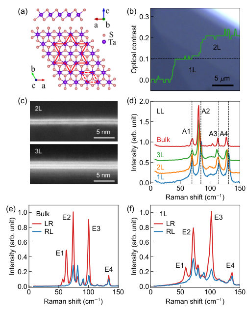 
FIG. 1. (a) Crystal structure of monolayer 1T-TaS2. The dotted lines mark the unit cell of the undistorted 1T struc- ture. The hexagram highlights the SD pattern in the CCDW phase. (b) Optical micrograph of exfoliated flakes on PDMS, with the solid line showing the red-channel optical contrast along the dotted line. (c) Cross-sectional STEM images show- ing bilayer (upper panel) and trilayer (lower panel) 1T-TaS2 encapsulated by h-BN. (d) Thickness-dependent Raman spec- tra in the LL configuration at 10 K, vertically offset for clar- ity. The main Ag phonons (A1–A4) are indicated, with the monolayer frequencies marked by dashed lines. (e)–(f) Ra- man spectra in the LR and RL configurations...

📷 Fig 2

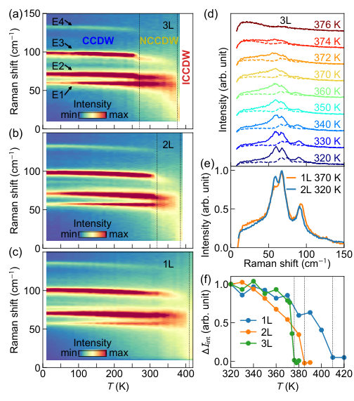 
FIG. 2. (a–c) Temperature-dependent Raman intensity maps for 1–3 layer samples measured in the LR configuration. (d) Raman spectra of the trilayer sample in the LR (solid) and RL (dotted) channels at selected temperatures. (e) Compari- son of Raman spectra for monolayer and bilayer samples. (f) Temperature dependence of the integrated differential spec- tra, normalized to the 320 K value. Vertical dashed lines indicate transition temperatures.

📷 Fig 3

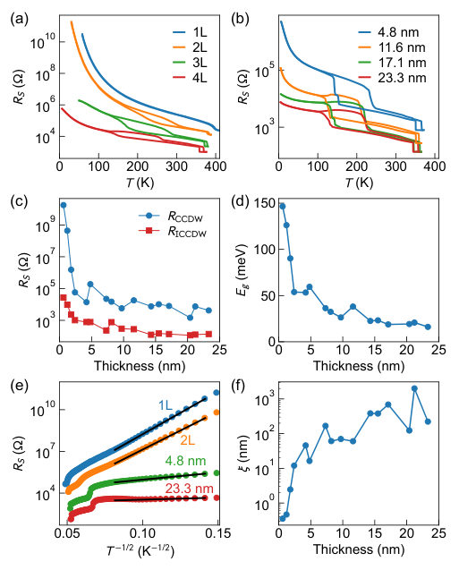 
FIG. 3. (a–b) Temperature-dependent sheet resistance for 1–4 layer samples (a) and thicker samples (b). (c) Thickness- dependent sheet resistance in the CCDW (60 K) and ICCDW phases. (d) Activation gap Eg as a function of thickness. (e) Rs vs. T −1/2 (with a logarithmic y-axis) for samples of vary- ing thickness. Symbols are experimental data and solid lines are linear fits. (f) Thickness dependence of the localization length.

📷 Fig 4

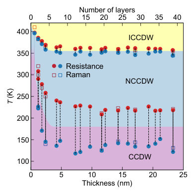 
FIG. 4. Temperature-thickness phase diagram from trans- port and Raman measurements. Critical temperatures for the NCCDW-CCDW and ICCDW-NCCDW transitions dur- ing cooling and warming are connected by dashed lines.

📷 Fig 5

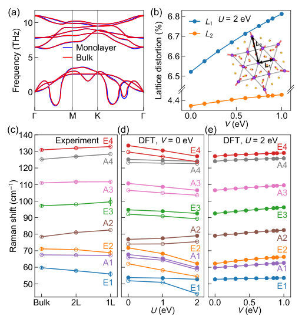 
FIG. 5. (a) Phonon dispersions of monolayer and bulk 1T- TaS2 in the pristine phase (U = V = 0). (b) Lattice distortion versus V at fixed U = 2 eV, quantified by the relative changes of the nearest- and next-nearest-neighbor Ta-Ta distances, L1 and L2, with respect to the average bond lengths. The distor- tion parameters are defined as (a−L1)/a and (a−L2/ √

**Summary.** This work examines how reducing the thickness of $1T$-TaS$_2$ enhances charge-density-wave order and drives the material into a strongly correlated insulating state. By combining Raman spectroscopy and transport measurements, the authors show that reduced screening strengthens electron correlations, fundamentally altering the electronic ground state in two dimensions. This provides pathways for engineering novel correlated phases.

**Why it may be interesting.** While focused on solid-state physics, the strong correlation effects, phase transitions driven by dimensionality reduction, and localization phenomena are central themes in many-body physics relevant to quantum simulation platforms.

Detailed structure

**Main problem.** The study investigates how charge-density-wave (CDW) transitions and correlated insulating states behave in atomically thin $1T$-TaS$_2$ as a function of thickness.

**Main result.** Reducing the thickness enhances CDW order due to strengthened Coulomb interactions from reduced out-of-plane screening, leading to increased transition temperatures and strong carrier localization.

**Method.** The research combines temperature-dependent Raman spectroscopy and electrical transport measurements with theoretical calculations (DFT) to probe electronic structure changes.

**Model / system.** The physical system is atomically thin $1T$-TaS$_2$, a layered transition-metal dichalcogenide known for its CDW formation, which drives metal-insulator transitions. The analysis focuses on the interplay between electron correlation and interlayer coupling.

**Key observables.** CDW phases (IC-CDW, NC-CDW, CCDW), transition temperatures ($T_{CDW}$), sheet resistance, carrier localization length ($\xi$), and phonon modes.

**Important parameters / regimes.** Thickness (down to monolayer limit), Coulomb interaction strength ($U$ and $V$), and temperature.

**Assumptions / limitations.** The enhanced CDW is attributed to strengthened nonlocal Coulomb interactions due to reduced out-of-plane screening; interlayer coupling is crucial for the first-order nature of certain transitions.

**Figures summary.** Figures show thickness-dependent Raman spectra confirming CDW phases persist down to monolayer, and transport measurements illustrating orders-of-magnitude increases in resistance and sharp decreases in localization length with decreasing thickness.

**Paper structure.** The paper systematically presents experimental evidence (Raman/Transport) showing thickness dependence of CDW transitions, followed by theoretical interpretation linking these changes to enhanced Coulomb interactions and screening effects.

Abstract

We investigate thickness-dependent charge-density-wave (CDW) transitions in 1$T$-TaS$_2$ using temperature-dependent Raman spectroscopy and electrical transport. Raman measurements show that the incommensurate, nearly commensurate, and commensurate CDW phases persist down to the monolayer limit. As the thickness is reduced, the transition temperatures increase, accompanied by an orders-of-magnitude rise in sheet resistance and a sharp reduction in the carrier localization length. The first-order hysteretic CCDW-NCCDW transition is uniquely absent in the monolayer. Calculations suggest that the enhanced CDW in thin layers originates from strengthened Coulomb interactions due to reduced out-of-plane screening, particularly in the nonlocal component. These findings highlight the cooperative roles of electron correlation, electron-phonon interaction, and interlayer coupling in shaping the ground state and transition dynamics of atomically thin 1$T$-TaS$_2$, opening pathways for engineering correlated phases in two-dimensional CDW systems.

[↑ back to top](#top)

### [Neural Flux Attachment: From Bose Condensates to Chiral Topological Matter](http://arxiv.org/abs/2608.06168v1)

**Authors:** Rudik Badalyan, Khachatur G. Nazaryan, Tigran A. Sedrakyan  
**Type:** theory · **Category:** disordered systems and neural networks · **PDF:** <https://arxiv.org/pdf/2608.06168v1>  
**Analysis basis:** full PDF text, analyzed in chunks
**Topic relevance:** `analog quantum simulation` **3/5** · `methods for driven-dissipative` **3/5** · `Keldysh / 2PI / non-Gaussian methods` **1/5** · `driven-dissipative phase transition` **1/5** · `entanglement & information structure` **1/5** · `exotic spin models in light-matter` **1/5** · `non-equilibrium dynamics` **1/5**

📷 Fig 1

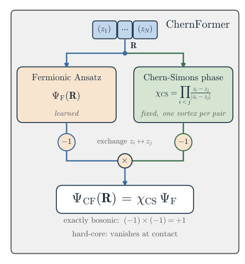 
FIG. 1. Neural flux attachment in ChernFormer. A trainable Fermionic Backbone is antisymmetric under particle exchange, while the fixed pairwise Chern–Simons factor is also antisym- metric and has unit magnitude. Their product is therefore exactly bosonic and has the same probability density as the fermionic backend. For a smooth finite backend, antisymmetry also enforces a contact zero, giving a hard-core bosonic archi- tecture while leaving the long-distance order and remaining many-body phase trainable.

📷 Fig 2

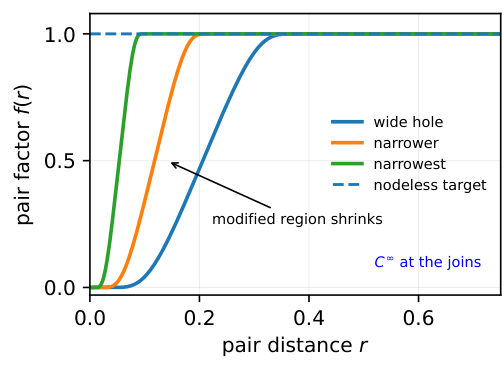 
FIG. 2. A shrinking contact hole using C∞(the set of smooth, infinitely differentiable functions) pair factors. Each curve is zero in a small core and equals the nodeless target beyond the healing distance ϵ, with smooth joins. The piecewise logarithmic profile used for the bound is an H1 proof device and can be mollified with arbitrarily small changes in L2 and gradient norm; a smooth neural backend need not reproduce a cusp.

📷 Fig 3

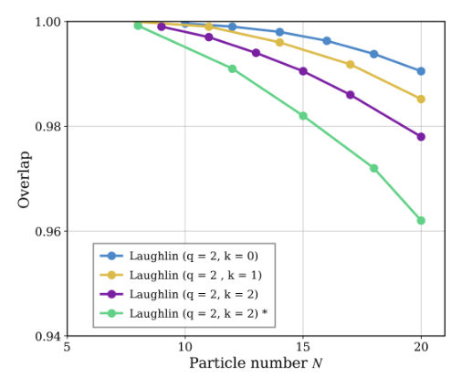 
FIG. 3. Normalized overlap between the target Kalmeyer– Laughlin state and ChernFormer. Here q = 2 and k = p. The overlap is approximately 0.990 for p = 0 at N = 20. Figure 4 gives the corresponding N = 20 amplitude and phase results for p = 1, 2. The green starred curve is the squared-PsiFormer ansatz Ψsq = [ΨF]2 for p = 2 and lies below ChernFormer at the common sizes.

📷 Fig 4

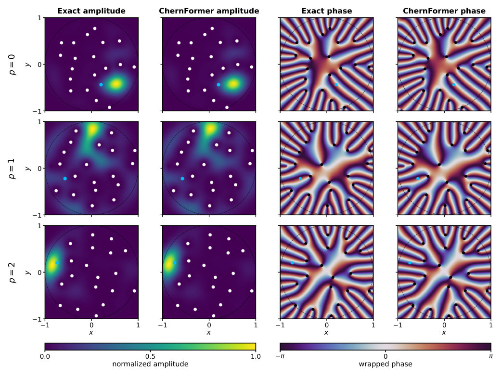 
FIG. 4. Amplitude and phase maps for the N = 20 Kalmeyer–Laughlin edge tower. Rows show the three edge indices p = 0, 1, and 2. Columns compare exact and ChernFormer amplitudes and phases. Fixed particles generate local charge-two Laughlin vortices, while the p = 1 and p = 2 rows add a collective zero with one and two units of winding. Amplitudes are normalized separately in each panel. The phase is wrapped from −π to π.

**Summary.** The paper introduces ChernFormer, a novel neural network architecture designed to represent bosonic wave functions by combining a fermionic backbone with a fixed topological phase factor. This structure allows the network to simultaneously capture both conventional condensate behavior and complex chiral topological order. It demonstrates that this single variational language is powerful enough to accurately model these distinct quantum phases.

**Why it may be interesting.** This work bridges advanced concepts from topology (Chern-Simons theory, winding numbers) directly into modern machine learning architectures, providing a powerful new toolset for simulating strongly correlated quantum phases that are difficult to model classically or with standard neural network ansatze.

Detailed structure

**Main problem.** The core problem is determining if a single, unified neural network architecture can accurately represent diverse physical phases in bosonic quantum matter, ranging from simple Bose condensates to complex chiral topological liquids.

**Main result.** The proposed ChernFormer successfully provides one variational language capable of approximating both conventional bosonic order and the distinct characteristics of chiral topological matter by explicitly incorporating a fixed Chern-Simons phase.

**Method.** The authors introduce ChernFormer, which combines a trainable fermionic backbone (enforcing anti-symmetry) with a fixed Chern-Simons phase factor. This product is engineered to be exactly bosonic while allowing the network to learn correlations and topology separately.

**Model / system.** The study focuses on bosonic matter in two dimensions, testing its ability to represent states like the Bose-Einstein condensate, the Kalmeyer–Laughlin ground state, and fractional Chern insulators exhibiting chiral edge modes.

**Key observables.** Overlap curves with known exact states, independent amplitude and phase maps revealing local/collective vortices, and the global winding number characterizing topological sectors.

**Important parameters / regimes.** Particle number (N), system size (plane geometry), and the fixed Chern-Simons flux attachment parameter.

**Assumptions / limitations.** The architecture assumes that bosonic wave functions can be mapped to an equivalent fermionic representation via a fixed, non-trainable topological phase factor. Convergence proofs rely on specific regularization schemes for density matrices.

**Figures summary.** Figures illustrate the concept of a 'shrinking contact hole' in smooth finite ChernFormer models when particles approach each other, showing how the function vanishes smoothly while approaching a nodeless condensate limit.

**Paper structure.** The paper develops the mathematical framework by defining the bosonic-equivalent fermionic ansatz (ChernFormer), proving its equivalence to learning on the inverse-transmuted target state. It then validates this structure by testing it against known topological states and analyzing convergence properties for macroscopic observables like the condensate fraction.

Abstract

Can one neural wave function describe both a Bose condensate and a chiral topological liquid? We introduce ChernFormer, which combines a fermionic transformer with a fixed Chern-Simons phase that attaches one statistical vortex to every particle pair. Each factor changes sign under exchange, so their product is exactly bosonic. The fixed phase changes statistics but not probability, making every bosonic learning problem equivalent to a fermionic one with the same approximation error and overlap. With enough capacity, ChernFormer can approximate any normalizable bosonic wave function on the plane at fixed particle number. A finite, smooth network still vanishes when particles meet, yet this contact hole can shrink while the wave function and condensate fraction approach those of a nodeless condensate. Following the needle-in-a-haystack target-reconstruction benchmark introduced in \cite{NazaryanGaggioliTengFu2025}, we test ChernFormer on the Kalmeyer--Laughlin ground state and its first two chiral edge states. The overlap curves stay close to unity through their largest sampled sizes, while independent amplitude and phase maps at $N=20$ for all three states recover both local Laughlin vortices and the collective edge vortex. By contrast, a continuous, nonzero product of identical particle-wise factors misses these elementary edge sectors. ChernFormer therefore provides one variational language for conventional bosonic order and chiral topological matter.

[↑ back to top](#top)

### [Nonlinear Compton scattering in a quantized pump field](http://arxiv.org/abs/2608.06289v1)

**Authors:** Kenan Qu  
**Type:** theory · **Category:** other · **PDF:** <https://arxiv.org/pdf/2608.06289v1>  
**Analysis basis:** full PDF text, analyzed in chunks
**Topic relevance:** `Keldysh / 2PI / non-Gaussian methods` **3/5** · `methods for driven-dissipative` **3/5** · `non-equilibrium dynamics` **2/5** · `correlated / nonlocal dissipation` **1/5** · `driven-dissipative phase transition` **1/5** · `interference shaping light` **1/5**

📷 Fig 1

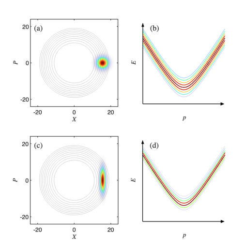 
FIG. 1. Phase-space visualization of quantum-Volkov pump states (left) and the pump-dressed ladder (right). The top and bottom rows show circularly and linearly polarized (CP and LP) pump dressing, respectively.

📷 Fig 2

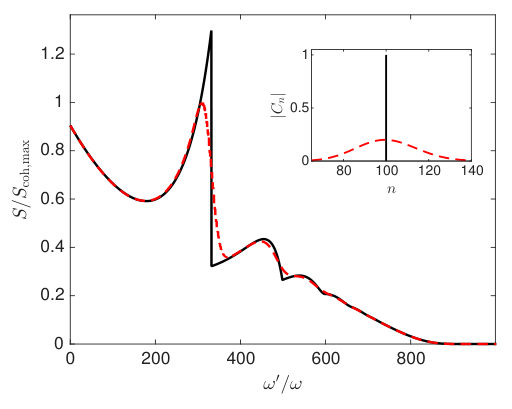 
FIG. 2. Normalized nonlinear Compton spectra driven by a CP Fock-state pump |n0⟩= |100⟩(black) and a coherent- state pump (red dashed) with mean photon number ¯n = 100. The inset shows the photon-number distribution of each pump state.

📷 Fig 3

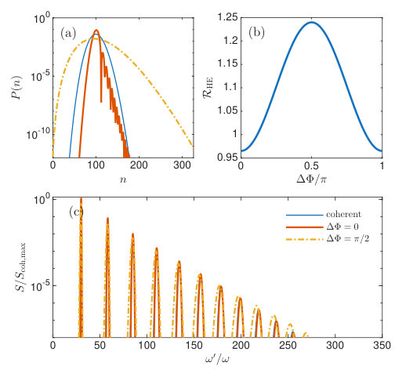 
FIG. 3. (a) Photon-number distributions Pn = |Cn|2 for different pump states. (b) Relative high-energy yield RHE, integrated over ω′/ω &gt; 100, versus the relative squeezing angle ∆Φ. (c) Normalized emission spectra per solid angle.

**Summary.** This paper presents a fully quantized theory of Nonlinear Compton Scattering, moving beyond classical treatments by incorporating pump depletion and quantum correlations. By using exact quantum states, the authors predict unique spectral features like sharp cutoffs and show how squeezing the input light fundamentally alters the high-energy photon emission spectrum.

**Why it may be interesting.** This work is highly relevant to open quantum systems and quantum optics as it provides a rigorous framework for calculating nonlinear processes where the driving field itself must be treated quantum mechanically, going beyond standard semi-classical approximations.

Detailed structure

**Main problem.** The paper develops a fully quantized theory for Nonlinear Compton Scattering (NLC) driven by an intense, single-mode quantum pump field.

**Main result.** It shows that retaining full quantization effects leads to observable features like discrete photon-transfer edges and spectral cutoffs, which are absent in classical or semi-classical treatments.

**Method.** The theory employs a Furry picture split, utilizing exact quantum-Volkov states derived from the Hamiltonian, and analyzing results via Wigner-function weighted averages.

**Model / system.** The system models a relativistic electron scattering off an intense electromagnetic plane wave (pump field) while emitting photons into a continuum radiation field. The formalism handles pump depletion and final-state correlations explicitly.

**Key observables.** Discrete photon-transfer edges, terminal spectral cutoff, high-energy emission yield (RHE), and the dependence of these on squeezing angles ($\Delta\Phi$).

**Important parameters / regimes.** Pump depletion level, squeezing angle ($\Delta\Phi$), polarization type (circular vs. linear), and the ratio of emitted to pump photons.

**Assumptions / limitations.** The analysis often relies on the undepleted-pump approximation for certain calculations, though the full theory addresses depletion; it assumes a single monochromatic plane wave mode.

**Figures summary.** Figures illustrate phase-space representations (Wigner function) and show how the photon number distribution ($P_n$) and high-energy yield ($	ext{RHE}$) change depending on whether the pump is coherent or squeezed, particularly showing spectral redistribution based on $\Delta\Phi$.

**Paper structure.** The paper builds from defining the full quantized Hamiltonian in the Furry picture to deriving quantum-Volkov states for different polarizations. It then compares results derived from exact state evolution against approximations like the Wigner function average, culminating in analyzing spectral features based on pump squeezing.

Abstract

We develop a fully quantized theory of nonlinear Compton scattering driven by a single-mode quantum field. Exact quantum-Volkov states retain pump depletion, back-action, and final-state correlations through displaced or squeezed-displaced Fock-state ladders. A finite Fock-state pump produces discrete photon-transfer edges and a terminal spectral cutoff. In the bright, weakly depleted regime, the exact theory reduces to a Wigner-function weighted-average of scattering probabilities evaluated at fixed complex field amplitudes, with ordinary and generalized Bessel functions describing the harmonic structure for circular and linear polarization, respectively. For squeezed coherent light, the squeezing angle controls the high-energy emission through photon-number fluctuations.

[↑ back to top](#top)

### [Transparent boundary conditions for the spatially discrete Schrödinger equation: Reflectionless quantum transport in 1D lattices](http://arxiv.org/abs/2608.05338v1)

**Authors:** Mashrab E. Akramov, Jambul R. Yusupov, Matthias Ehrhardt, Davron U. Matrasulov  
**Type:** theory · **Category:** other · **PDF:** <https://arxiv.org/pdf/2608.05338v1>  
**Analysis basis:** full PDF text, analyzed in chunks
**Topic relevance:** `methods for driven-dissipative` **3/5** · `driven-dissipative phase transition` **2/5** · `non-equilibrium dynamics` **2/5** · `Frenkel-Kontorova` **1/5** · `Keldysh / 2PI / non-Gaussian methods` **1/5** · `analog quantum simulation` **1/5** · `correlated / nonlocal dissipation` **1/5**

📷 Fig 1

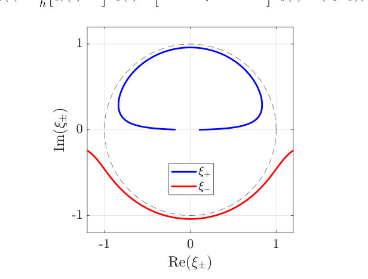 
FIG. 1: Trajectories of ξ±(s) in the complex plane for h = 0.2. The blue curve (ξ+) lies inside the unit circle, while the red curve (ξ−) lies outside, confirming that the plus sign in Eq. (11) is the physically admissible root satisfying the decay condition |ξ+| ≤1.

📷 Fig 2

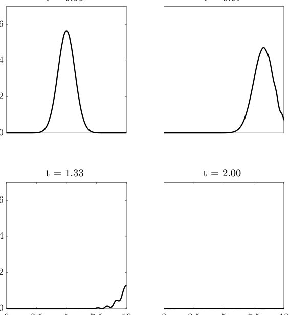 
FIG. 2: Snapshots of |Ψj(t)|2 at t = 0, 0.67, 1.33, 2.00. The Gaussian wave packet propagates to the right and leaves the computational domain through the transparent boundary without being reflected back.

📷 Fig 3

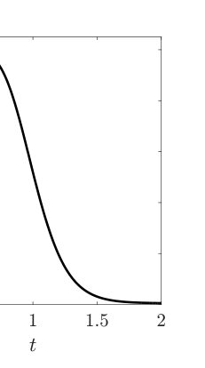 
FIG. 3: Time evolution of the discrete norm in Eq. (36).

**Summary.** This paper constructs exact transparent boundary conditions (TBCs) for the spatially discrete Schrödinger equation modeling 1D quantum lattices. By utilizing Laplace transforms and solving the characteristic equation, the authors derive a convolution-type TBC that ensures reflectionless quantum transport. The method is validated numerically to show perfect wave packet exit without spurious backscattering.

**Why it may be interesting.** This work provides a highly rigorous and mathematically exact framework for absorbing boundaries in discrete quantum systems, which is crucial for simulating open quantum systems or wave propagation in engineered lattices without artificial reflections.

Detailed structure

**Main problem.** The primary goal is to develop mathematically exact transparent boundary conditions (TBCs) for simulating quantum wave propagation on finite, discrete lattices.

**Main result.** The derived TBCs successfully eliminate spurious backscattering and preserve reflectionless transport of a Gaussian wave packet exiting the computational domain in numerical tests.

**Method.** The authors derive the TBC by analytically solving the spatially discrete Schrödinger equation using Laplace transforms and matching boundary conditions (Dirichlet-to-Neumann map).

**Model / system.** The model is a one-dimensional quantum lattice governed by the time-continuous, spatially discrete Schrödinger equation. The method rigorously checks consistency with its continuous counterpart in the continuum limit.

**Key observables.** The decay of the discrete norm M(t) over time, which should monotonically decrease to zero as the wave packet exits the domain.

**Important parameters / regimes.** The lattice spacing parameter (h), and the boundary index J defining the finite computational domain.

**Assumptions / limitations.** The derivation relies on using an exact analytical solution for the discrete Schrödinger equation, providing a mathematical advantage over methods that approximate continuous boundaries.

**Figures summary.** Figure 1 shows complex plane trajectories confirming the physical admissibility of the derived root $\xi_+(s)$. Figure 2 and 3 show numerical verification of stable propagation and monotonic decay of the wave packet norm, respectively.

**Paper structure.** The paper follows a theoretical derivation path: first establishing the problem setup via the discrete Schrödinger equation; then applying Laplace transforms to derive the TBC in the frequency domain; subsequently performing inverse Laplace transforms using Bessel functions to obtain the time-domain condition; finally, implementing and testing this condition numerically with standard solvers.

Abstract

We construct exact transparent boundary conditions (TBCs) for a time-continuous, spatially discrete Schrödinger equation that models a one-dimensional quantum lattice. Using a recently developed exact solution for the discrete system, we derive the Dirichlet-to-Neumann maps analytically via Laplace transforms. This yields a convolution-type boundary condition governed by Bessel functions. We rigorously demonstrate the consistency of this discrete formulation with its continuous counterpart in the continuum limit. Additionally, we present an efficient time-discretization scheme based on the trapezoidal rule for practical implementation. Numerical experiments using a Crank-Nicolson solver verify that our proposed TBCs eliminate spurious backscattering entirely and preserve reflectionless propagation of a Gaussian wave packet exiting the computational domain

[↑ back to top](#top)

### [Approximate Quantum Error Correction at Chiral Topological Edges](http://arxiv.org/abs/2608.06258v1)

**Authors:** Yuntai Song, Zejun Liu, Zhencheng Wang, Jong Yeon Lee, Bowen Shi  
**Type:** theory · **Category:** quantum information and computing · **PDF:** <https://arxiv.org/pdf/2608.06258v1>  
**Analysis basis:** full PDF text, analyzed in chunks
**Topic relevance:** `entanglement & information structure` **3/5** · `Keldysh / 2PI / non-Gaussian methods` **1/5** · `analog quantum simulation` **1/5** · `correlated / nonlocal dissipation` **1/5** · `driven-dissipative phase transition` **1/5** · `methods for driven-dissipative` **1/5** · `non-equilibrium dynamics` **1/5** · `non-equilibrium universality` **1/5**

📷 Fig 1

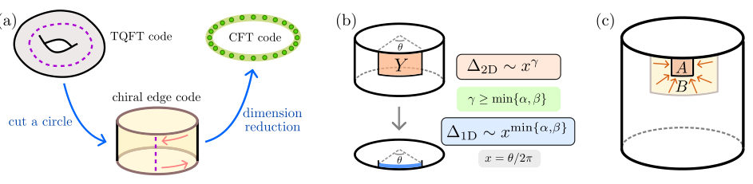 
FIG. 1. Summary of the main results. (a) Relation between three many-body routes to quantum memory. The chiral edge code proposed here (Def. 4) interpolates between a TQFT code and a CFT code: it inherits topological protection from the gapped bulk and CFT-like local distinguishability from the gapless edge. (b) Coherent information loss (Def. 2) for 2D chiral edge code and 1D CFT code counterpart. As a main result, we show that the 2D chiral edge code is at least as robust as the dimensionally reduced counterpart under local erasure, with strict enhancement in representative examples (Prop. 8 and Sec. VI). (c) A local erasure on region A near the edge can be recovered using a channel...

📷 Fig 2

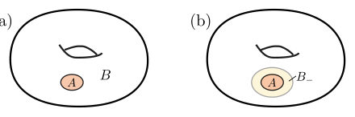 
FIG. 3. Local decoherence of TQFT code can be fully re- covered. The physical system Q is a torus. A is a local disk B = Q \ A. The region B−⊂B is an annulus surrounding A, and thus AB−is a local disk that thickens A by a few correlation lengths.

📷 Fig 3

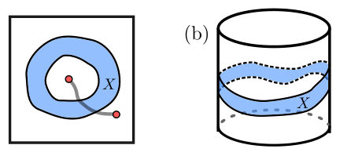 
FIG. 4. Anyon charges detected by an annulus surrounding it, using the information convex set. (a) An annulus embedded in a disk. One should picture an anyon, or, more generally, a localized cluster of excitations with total topological charge a ∈A sitting inside the disk enclosed by annulus of X. (b) The same intuition works for a noncontractible annulus on the cylinder. The annulus X itself contains no anyon core.

📷 Fig 4

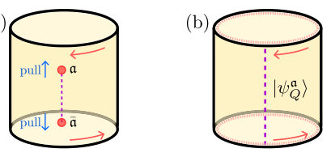 
FIG. 5. Prepare a state in the code subspace of the chiral edge code. |ψa Q⟩is the short-hand notation for |a, ϕI a(L), ϕI ¯a(R)⟩of Eq. (21). The cylinder should be sufficiently wide that its height is much greater than the bulk correlation length. (a) Create an anyon pair (a, ¯a) in the bulk and pull the anyons towards the opposite edges. (b) Spread the edge excitation uniformly on the edge and extremize the energy to obtain a certain primary state.

📷 Fig 5

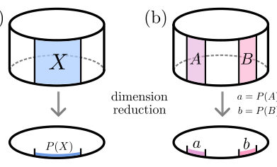 
FIG. 6. Dimensional reduction. It relates the chiral topo- logical order on a cylinder and a certain RCFT on a circle. (a) A full column X is projected to an interval P(X). (b) Two full columns, A and B, are projected onto disjoint intervals a and b. We shall encounter regions of the cylinder that cannot be associated with the dimensional reduction; see Fig. 7.

**Summary.** This paper introduces and analyzes approximate quantum error correction codes realized by the chiral edges of 2D topologically ordered phases. By quantifying information loss using coherent information, the authors demonstrate that these 2D edge codes are highly robust, surpassing their simpler 1D CFT counterparts in resisting local errors. This advances the understanding of how topological protection can be harnessed for practical quantum computation.

**Why it may be interesting.** This work provides concrete theoretical tools to assess error resilience in exotic quantum states found at boundaries of topological materials, linking bulk topology directly to information processing capabilities.

Detailed structure

**Main problem.** The goal is to develop and characterize Approximate Quantum Error Correction (AQEC) codes that leverage the inherent robustness of gapped topological phases while incorporating the flexibility provided by gapless edge conformal field theories.

**Main result.** The 2D chiral edge code was shown to be at least as robust against local erasures as its dimensionally reduced 1D CFT counterpart, exhibiting a quantifiable power-law scaling for information loss.

**Method.** The analysis involves studying coherent-information loss under local erasure and deriving an exact relationship between this loss and relative entropy, reducing the problem to universal properties of the edge theory.

**Model / system.** The study focuses on chiral edges arising from two-dimensional topologically ordered phases. These systems combine a gapped topological bulk with gapless edge conformal field theories (CFTs).

**Key observables.** Coherent-information loss ($\Delta(A; V)$), which quantifies logical information leaked to the erased region, and associated power-law scaling exponents.

**Important parameters / regimes.** The size of the erased region ($x$), the gap structure (gapped bulk vs. gapless edge), and the type of erasure (local).

**Assumptions / limitations.** Key assumptions include dimensional reduction relating 2D diagnostics to 1D CFT properties, and relying on topological-sector orthogonality for mathematical simplification.

**Figures summary.** Figure 1 summarizes results comparing coherent information loss between the 2D chiral edge code and the 1D CFT code; Figure 2 illustrates the definition of $\Delta(A; V)$ in terms of system regions.

**Paper structure.** The paper progresses by establishing the physical model (chiral edges), developing the diagnostic tool ($\Delta$ via relative entropy), deriving scaling laws, proving the robustness hierarchy ($\gamma \geq \alpha$), and finally constructing a power-law recovery map for Abelian subspaces.

Abstract

Topologically ordered phases naturally realize quantum error correction through nonlocal encoding of quantum information. More recently, conformal field theories have been shown to realize approximate quantum error-correcting codes, but such constructions generally require fine tuning to criticality. Here we introduce a family of approximate quantum error-correcting codes realized by the chiral edges of two-dimensional topologically ordered phases. The proposed encoding combines the robustness of a gapped topological bulk with the flexibility of gapless edge conformal field theories. To characterize its robustness, we study coherent-information loss under local erasure. We derive an exact expression relating coherent-information loss to relative entropy, reducing the recoverability problem to universal properties of the edge theory. This leads to power-law scaling of coherent-information loss with the size of the erased region. We further show that, for geometrically local erasures near one edge, the two-dimensional chiral edge code is at least as robust as the dimensionally reduced CFT code, and is strictly more robust in several representative examples. For Abelian code subspaces, we further construct a power-law-range recovery map supported on the erased region together with a power-law-range buffer; this recovery map depends only on the code subspace, not on the unknown encoded state. We provide numerical calculations for lattice realizations of compact free boson and Ising CFT examples that support the theoretical predictions of the power-law exponents.

[↑ back to top](#top)

### [Provably Efficient Self-Calibrating Quantum Fault Tolerance](http://arxiv.org/abs/2608.05686v1)

**Authors:** Weiyuan Gong, Hong-Ye Hu  
**Type:** theory · **Category:** quantum information and computing · **PDF:** <https://arxiv.org/pdf/2608.05686v1>  
**Analysis basis:** full PDF text, analyzed in chunks
**Topic relevance:** `methods for driven-dissipative` **3/5** · `quantum measurements` **3/5** · `measurement-induced transitions` **2/5** · `Keldysh / 2PI / non-Gaussian methods` **1/5** · `driven-dissipative phase transition` **1/5**

📷 Fig 1

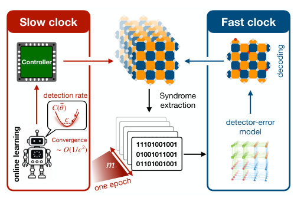 
Figure 1. Self-calibration during quantum error correction. The syndrome stream plays a dual role: detector events are decoded to protect the logical state and are simultaneously used as a feedback signal to update drifting analog control parameters. The resulting closed loop allows calibration to proceed without interrupting the fault-tolerant computation.

📷 Fig 2

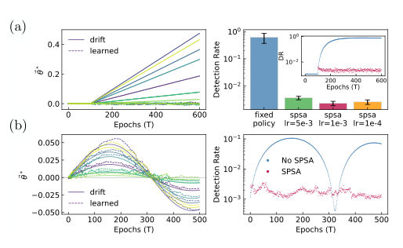 
Figure 3. Tracking continuously drifting analog controls. (a) Slowly varying linear drifts. Solid curves denote the drifting optimal controls, while dashed curves show the controls learned from syn- drome measurements. The detector-event rate remains low through- out the computation under online calibration. (b) Sinusoidal con- trol drifts. Syndrome-guided SPSA continuously tracks the time- dependent optimum and suppresses the accumulation of calibration errors, validating the online tracking guarantee of Theorem 3. In both simulations, we choose a constant learning rate η = 0.005.

📷 Fig 3

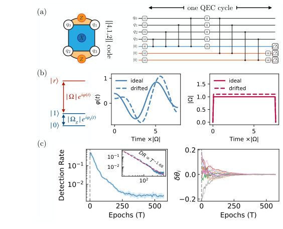 
Figure 2. Pulse-level validation of provably efficient self- calibration. (a) The [[4, 1, 2]] quantum detection code and one cycle of syndrome extraction. (b) Pulse-level neutral-atom control model. Native controlled-Z gates are implemented by optimized laser ampli- tude |Ω| and phase φ(t); dashed curves illustrate representative con- trol drifts. (c) Following an initial displacement of the analog con- trols, syndrome-guided SPSA continuously restores the calibrated operating point. The detector-event rate decreases throughout the calibration procedure (left), while all control parameters converge toward their calibrated values (right), validating Theorem 2. In this simulation, we choose a...

📷 Fig 4

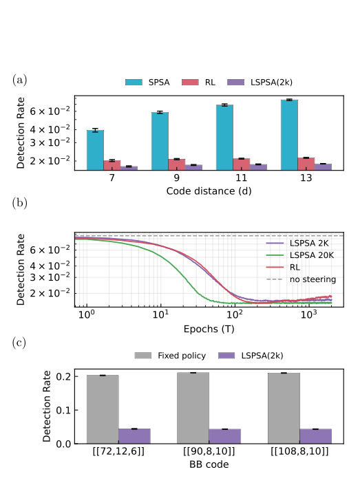 
Figure 4. Scalable self-calibration for quantum LDPC codes. (a) Detector-event rate after calibration for rotated sur- face codes of increasing code distance. Conventional SPSA ex- hibits the predicted degradation with code distance, whereas locality- aware SPSA (LSPSA) remains essentially independent of system size and achieves performance comparable to or better than the reinforcement-learning (RL) controller. (b) Representative conver- gence curves. Increasing the number of syndrome measurements accelerates SPSA by reducing statistical noise. LSPSA rapidly con- verges to a stable low detector-event rate, while the RL controller exhibits a small increase after convergence because of...

📷 Fig 5

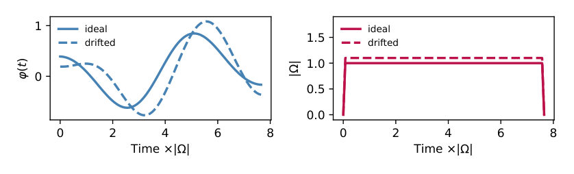 
Figure 5. Native controlled-Z gates are implemented by optimized laser amplitude |Ω| and phase φ(t) shown as solid lines and dashed curves illustrate representative typical control drifts.

**Summary.** This paper introduces a theoretical framework for self-calibrating quantum fault tolerance, solving the practical problem of continuous control parameter drift. By proving that syndrome measurements yield a locally strongly convex objective function, they enable efficient online optimization to stabilize hardware while simultaneously protecting encoded quantum information. This establishes a provably efficient paradigm for future large-scale quantum computation.

**Why it may be interesting.** It provides a concrete, mathematically rigorous pathway to maintaining high fidelity in long-running quantum computations by integrating hardware calibration directly into the error correction cycle itself.

Detailed structure

**Main problem.** The core challenge is developing a theoretically rigorous framework for self-calibrating quantum fault tolerance, allowing continuous hardware stabilization without interrupting computation.

**Main result.** Self-calibrating fault tolerance is established as a provably efficient paradigm where syndrome measurements simultaneously protect logical information and stabilize the underlying hardware.

**Method.** The authors establish that the detector-event rate defines a locally strongly convex surrogate objective, enabling efficient online optimization using only syndrome measurements collected during normal error correction.

**Model / system.** The work applies to quantum processors controlled by analog parameters (e.g., pulse amplitudes) undergoing environmental drift, utilizing Quantum Error Correction (QEC) codes like LDPC codes for simulation validation.

**Key observables.** Detection rate ($C(\vec{	heta})$), which serves as the surrogate objective function for calibration; convergence rates $O(1/\epsilon^2)$.

**Important parameters / regimes.** Time-independent and time-dependent drift rates ($\epsilon$); code distance (independence proven for LDPC codes).

**Assumptions / limitations.** The analysis assumes that the detector signal defines a locally restoring optimization landscape, and convergence relies on the local strong convexity of the objective function.

**Figures summary.** Figure 1 illustrates the closed loop: Syndrome stream $
ightarrow$ Decoding (protects logic) AND Feedback Signal $
ightarrow$ Update drifting analog control parameters (Calibration).

**Paper structure.** The paper builds a theoretical framework by proving local strong convexity of the detector-event rate, deriving convergence guarantees for both time-independent and time-dependent drifts using online convex optimization, and validating these results with pulse-level simulations.

Abstract

Quantum error correction protects logical information only when every physical operation remains below the fault-tolerance threshold, a condition that must be maintained continuously rather than only at the initial calibration. In practice, however, analog control parameters inevitably drift because of environmental fluctuations. As future fault-tolerant quantum computations are expected to run for days or even months, interrupting computation for repeated recalibration becomes fundamentally impractical. A promising alternative is to integrate calibration directly into computation by repurposing syndrome measurements as a calibration signal (Sivak et al, Nature 2026), but whether such self-calibration can be achieved with provable efficiency remains an open question. Here we establish a theoretical framework for self-calibrating quantum fault tolerance. We prove that, for a broad class of control-induced errors, the detection rate defines a locally strongly convex surrogate objective for analog calibration with high probability. This geometric property enables efficient online optimization using only syndrome measurements collected during normal error correction. We prove convergence to an $\varepsilon$ detection rate within $O(1/\varepsilon^2)$ epochs for time-independent drifts and also establish guarantees for time-dependent drifts. We further show that the convergence rate is independent of the code distance for quantum low-density parity-check (LDPC) codes. Pulse-level simulations of neutral-atom arrays and large-scale circuit-level Clifford simulations confirm these theoretical predictions. Our results establish self-calibrating fault tolerance as a provably efficient paradigm in which the same syndrome measurements simultaneously protect logical information and stabilize the underlying hardware.

[↑ back to top](#top)

### [A Universal Control Budget for First-Passage Kinetics](http://arxiv.org/abs/2608.06368v1)

**Authors:** Shiling Liang, Ruicheng Bao  
**Type:** theory · **Category:** statistical mechanics · **PDF:** <https://arxiv.org/pdf/2608.06368v1>  
**Analysis basis:** full PDF text, analyzed in chunks
**Topic relevance:** `non-equilibrium universality` **3/5** · `non-equilibrium dynamics` **2/5** · `Keldysh / 2PI / non-Gaussian methods` **1/5** · `correlated / nonlocal dissipation` **1/5** · `driven-dissipative phase transition` **1/5** · `methods for driven-dissipative` **1/5**

📷 Fig 1

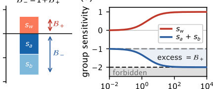 
FIG. 1. The two response laws and the conserved budget. (a) Minimal completion problem: a chain from source A through an intermediate M to absorbing target B, with forward edges (blue) and a backward edge (red). (b) Each productive (blue) edge’s sensitivity measures how rate-limiting it is: a sigmoid in the log-rate approaching the unit bound only as that edge becomes the bottleneck; the delaying (red) edge carries the complementary stored-budget. All sensitivities sum to −1. (c) The conserved budget: signed sensitivities stack into a speeding budget B−and a delaying budget B+ differing by exactly one, B−= 1 + B+. (d) Coordinated control beats the single-edge bound: scaling both forward...

📷 Fig 2

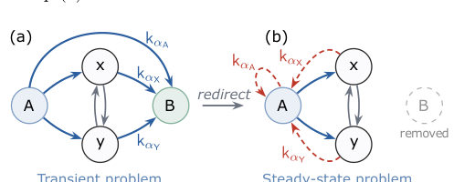 
FIG. 2. Redirection maps first passage to a stationary current. (a) Transient problem: trajectories run from the source A until absorption at B. (b) Redirected graph: each absorption channel α is sent back to the source A at the same rate and B is removed, so completions recycle and the stationary rate of redirected absorption is the recycled current.

📷 Fig 3

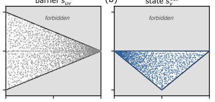 
FIG. 3. Barrier and state controls keep the unit bound. Sensitivity of one multi-rate control per panel, on a common ordinate, for randomly generated completion networks. Shaded regions are forbidden. (a) Barrier control s↔ uv against the traversal ratio ρuv with the envelope of Eq. (10). (b) State control sout v against the total sensitivity P

📷 Fig 4

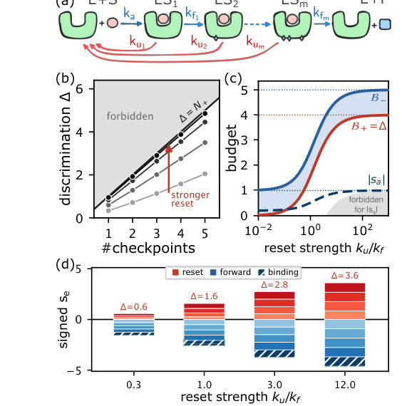 
FIG. 4. Proofreading spends the budget. (a) Binding– reset chain; the wrong substrate has faster resets, kW ui = f kR ui. (b) Discrimination capacity is capped by the checkpoint count, ∆≤N+ = m (grey forbidden). The four curves are reset strengths ku/kf = 1, 3, 10, 40, light to dark, the darkest running just under the cap. (c) The cost identity at m = 4: the speeding budget B−and the delaying budget B+ = ∆rise together with a fixed unit gap B−= 1 + ∆. The binding-edge sensitivity |sa|, the dependence on substrate concentration, is squeezed toward its unit ceiling as ∆approaches the cap; the grey region beneath it is what Eq. (16) excludes along this sweep. (d) The budget bar across reset...

**Summary.** The paper derives a 'Universal Control Budget' that constrains how the mean first-passage time of any Markov process can be controlled by changing reaction rates. It shows that speeding up completion via some reactions must be compensated by slowing down others, establishing fundamental limits on kinetic control mechanisms like molecular discrimination.

**Why it may be interesting.** This work provides a powerful mathematical constraint on non-equilibrium dynamics, which is highly relevant for understanding rate control in complex biological or chemical systems modeled by master equations.

Detailed structure

**Main problem.** To establish a general, universal constraint—a 'control budget'—governing how the mean first-passage time (MFPT) of any finite Markov chain responds to changes in its microscopic reaction rates.

**Main result.** The sensitivities of the MFPT with respect to individual rates are governed by two laws: a local unit bound ($|s_e| \le 1$) and a global summation rule ($\sum s_e = -1$), forming a conserved control budget that dictates how rate changes must be compensated.

**Method.** The analysis maps the transient first-passage problem to an equivalent steady-state current, allowing the application of established response theory for Markov jump processes to derive sensitivity identities and bounds.

**Model / system.** The model is a continuous-time Markov jump process on a finite state space with a source state (A) and an absorbing target state (B). Applications include kinetic proofreading mechanisms like T-cell antigen recognition.

**Key observables.** Mean First-Passage Time ($	au_{A	o B}$), Rate Sensitivities ($s_e$), Speeding/Delaying Budgets ($\mathbf{B}_+, \mathbf{B}_-$), and Discrimination Gain ($\Delta$).

**Important parameters / regimes.** The checkpoint count, substrate concentration sensitivity, and the ratio of forward to reset rates in proofreading.

**Assumptions / limitations.** The system is modeled as a finite Markov chain with positive rates; the analysis relies on mapping $	au_{A	o B}$ to the reciprocal of a stationary current ($	ilde{j}_{A	o B}$).

**Figures summary.** Figures illustrate the two response laws (local bound and global sum) using simple chains, demonstrate the mathematical 'redirection' from transient to steady-state currents, and show budget spending in kinetic proofreading.

**Paper structure.** The paper develops the general sensitivity framework by deriving the local and global summation rules. It then applies this budget concept to specific physical scenarios, notably analyzing how discrimination gain ($\Delta$) in kinetic proofreading is constrained by these universal bounds.

Abstract

The first-passage time is the natural observable of reaction completion, yet how its mean responds to a rate change has lacked a general constraint. We show that the logarithmic sensitivity of the mean first-passage time of any finite Markov chain to any rate is bounded by one in magnitude, and that these sensitivities sum to -1. Together the two laws form a conserved control budget: speeding completion through some transitions must be paid for by others, and a coordinated change shifts the completion time only as far as the budget allows. Raising an activation barrier or shifting the depth of a well moves many rates at once, yet neither can shift the completion time further than a single rate could. The budget caps kinetic-proofreading discrimination at the checkpoint count, and prices it in sensitivity to substrate concentration.

[↑ back to top](#top)

### [Geometry-Only CSL/DP Ratios and the Nonuniqueness of Decoherence Kernels](http://arxiv.org/abs/2608.05972v1)

**Authors:** Randy Davila, Gerard J. Milburn  
**Type:** theory · **Category:** other · **PDF:** <https://arxiv.org/pdf/2608.05972v1>  
**Analysis basis:** full PDF text, analyzed in chunks
**Topic relevance:** `correlated / nonlocal dissipation` **3/5** · `methods for driven-dissipative` **2/5** · `quantum measurements` **2/5** · `Keldysh / 2PI / non-Gaussian methods` **1/5** · `driven-dissipative phase transition` **1/5**

📷 Fig 1

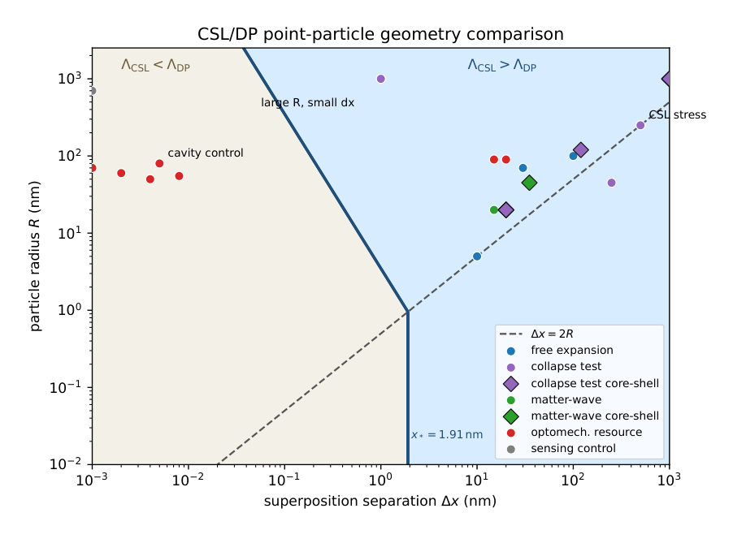 
FIG. 1. Point-particle geometry diagram for the GRW reference parameters. The blue region

📷 Fig 2

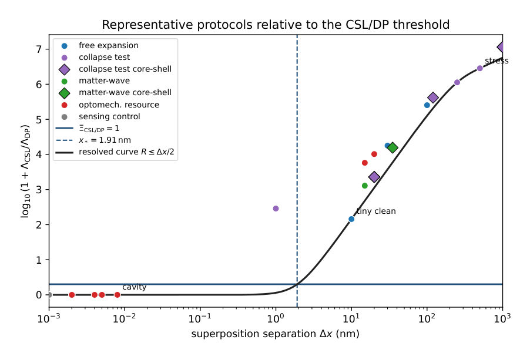 
FIG. 2. The point-particle ratio ΞCSL/DP for the illustrative protocol set. The horizontal line

📷 Fig 3

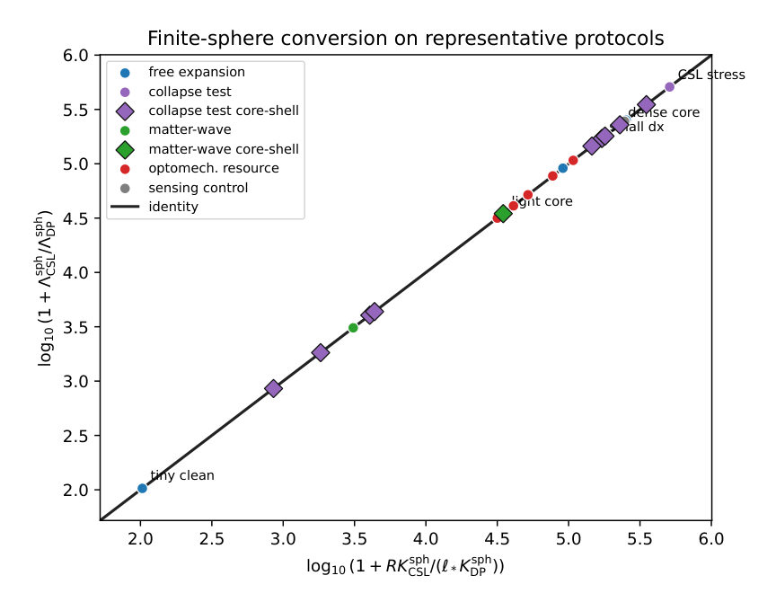 
FIG. 3. Numerical evaluation of the finite spherical-profile identity for the illustrative protocol

📷 Fig 4

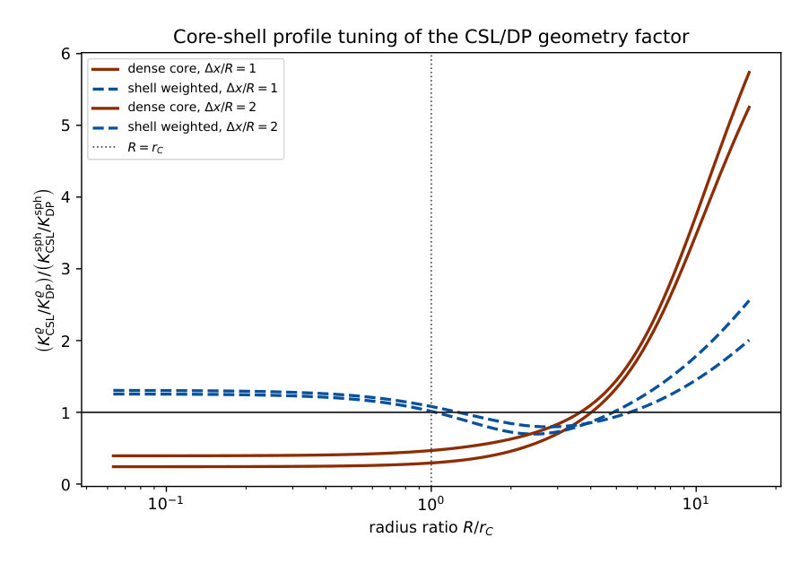 
FIG. 4. Core-shell tuning of the spherical CSL/DP geometry factor. The plotted quantity is

**Summary.** This paper theoretically compares the decoherence predictions of Continuous Spontaneous Localization (CSL) and Diósi–Penrose (DP) theories using massive particle superpositions. The key finding is that the ratio between their respective exponents simplifies to a geometry-only factor, independent of mass or time. This provides a powerful framework for designing experiments capable of distinguishing between these fundamental models of quantum gravity effects.

**Why it may be interesting.** This work provides rigorous theoretical tools to compare competing objective collapse models (CSL vs DP) by reducing their comparison to purely geometric ratios, which is crucial for designing future high-precision quantum experiments in AMO physics.

Detailed structure

**Main problem.** The paper compares two theoretical predictions for decoherence—Continuous Spontaneous Localization (CSL) and Diósi–Penrose (DP)—by analyzing the ratio of their respective contrast-loss exponents.

**Main result.** The ratio of these exponents ($\Xi_{	ext{CSL/DP}}$) is found to be independent of particle mass and interrogation time, depending only on geometric factors derived from the superposition separation and particle shape.

**Method.** The authors use theoretical derivations involving master equations, random-unitary realizations, and Fourier analysis applied to finite spherical density profiles to establish conversion theorems between the two decoherence models.

**Model / system.** The study focuses on idealized levitated protocols creating spatial superpositions of massive test particles, modeled using point-particle approximations and generalized to rigid spherically symmetric bodies with arbitrary mass profiles.

**Key observables.** The dimensionless ratio $\Xi_{	ext{CSL/DP}}$ (the ratio of CSL and DP exponents), the resolved-superposition crossover distance ($x^*$), and the profile amplification factor $A_{\varrho}$.

**Important parameters / regimes.** Branch separation ($\Delta x$), particle radius ($R$), interrogation time ($	au$), CSL localization length ($r_C$), and the geometry factor derived from mass distribution.

**Assumptions / limitations.** The analysis assumes that ensemble visibility loss is equivalent to decoherence, but cautions that this does not prove objective collapse because pure states remain pure conditioned on the full kick record.

**Figures summary.** Figures numerically evaluate the identity relating CSL and DP derived exponents for various protocols and plot how the ratio changes based on geometry factors for different mass profiles.

**Paper structure.** The paper progresses by first establishing the point-particle case, proving the random-unitary realization of CSL. It then generalizes this to finite spherical bodies using Fourier analysis to derive a universal conversion theorem for the exponent ratio, concluding with discussions on experimental observability and limitations.

Abstract

We study idealized levitated protocols that create spatial superpositions of massive test particles. For each protocol, we compare the dimensionless contrast-loss exponent of mass-proportional continuous spontaneous localization (CSL) with the Diósi--Penrose (DP) self-energy exponent $E_Gτ/\hbar$. We first prove that the point-particle CSL separation kernel has an exact random-unitary realization: Gaussian momentum kicks arriving at Poisson-distributed times produce the same unconditional decay of spatial coherence, although a pure state conditioned on the complete kick record remains pure. The separation kernel alone therefore specifies an operational decoherence law, not the occurrence of objective collapse. We then show that the ratio of the CSL and DP exponents is independent of particle mass and interrogation time. In the point-particle model it depends only on branch separation and an effective distance; for the standard GRW reference parameters, its resolved-superposition crossover is $x_*\approx1.91\,\mathrm{nm}$. For rigid spherical bodies with an arbitrary normalized radial mass profile, total mass, overall density scale, and interrogation time again cancel, leaving a dimensionless geometry factor. The results distinguish three requirements for a decisive experiment: detectable absolute effects, a controlled comparison of CSL and DP scales, and observables capable of discriminating physically different dynamics that share the same ensemble decoherence kernel.

[↑ back to top](#top)

### [Landscape of incompressible crystals of hard-core bosons on the square-kagome lattice](http://arxiv.org/abs/2608.05927v1)

**Authors:** Pratyay Ghosh  
**Type:** both · **Category:** strongly correlated electrons · **PDF:** <https://arxiv.org/pdf/2608.05927v1>  
**Analysis basis:** full PDF text, analyzed in chunks
**Topic relevance:** `Keldysh / 2PI / non-Gaussian methods` **3/5** · `analog quantum simulation` **2/5** · `methods for driven-dissipative` **2/5** · `exotic spin models in light-matter` **1/5** · `non-equilibrium dynamics` **1/5**

📷 Fig 1

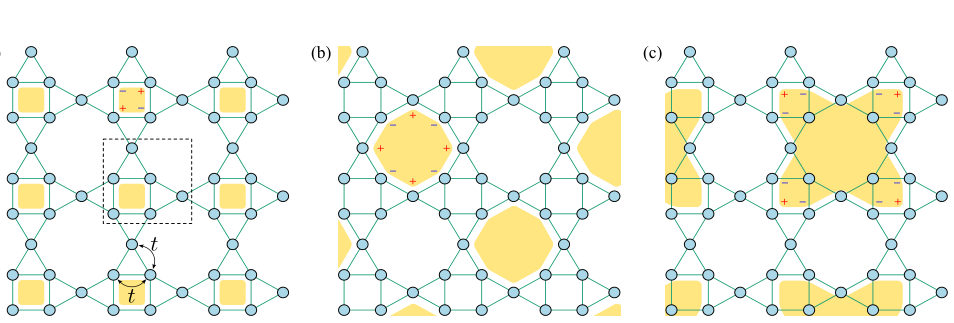 
FIG. 1. Compact localized states and approximate localized structures on the square-kagome lattice. (a) Square-kagome lattice with nearest-neighbor hopping (or exchange) amplitude t. The dashed rectangle denotes the six-site unit cell. The yellow shaded squares indicate the elementary square trapping cells hosting compact localized states (CLS). The sign structure of the elementary square CLS wave function is indicated by red (+) and blue (−) symbols, representing the relative phases of the amplitudes. (b) Elementary octagon CLS. The alternating sign structure leads to destructive interference that confines the magnon within the octagonal plaquette. (c) Localized state on a 20-site cluster...

📷 Fig 2

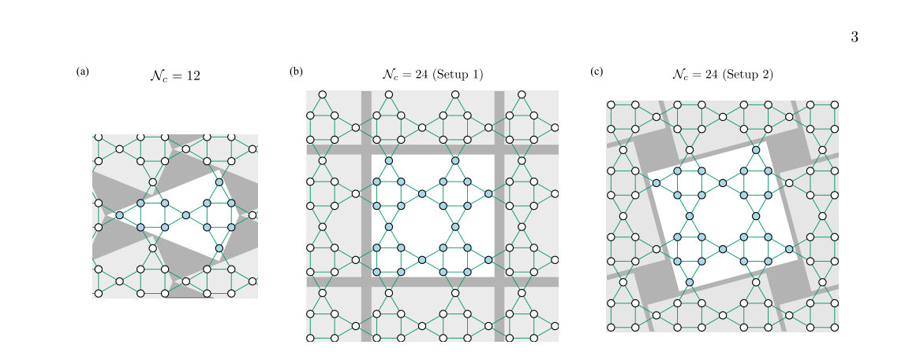 
FIG. 2. Cluster geometries used in the hierarchical mean-field calculations. (a) The 12-site cluster, which represents the smallest cluster considered in this work. (b) The 24-site cluster (Setup 1), chosen to accommodate the different localized structures discussed in the text. (c) The alternative 24-site cluster (Setup 2), which contains the same number of sites as Setup 1 but preserves the fourfold rotational symmetry around the centers of the octagonal plaquettes.

📷 Fig 3

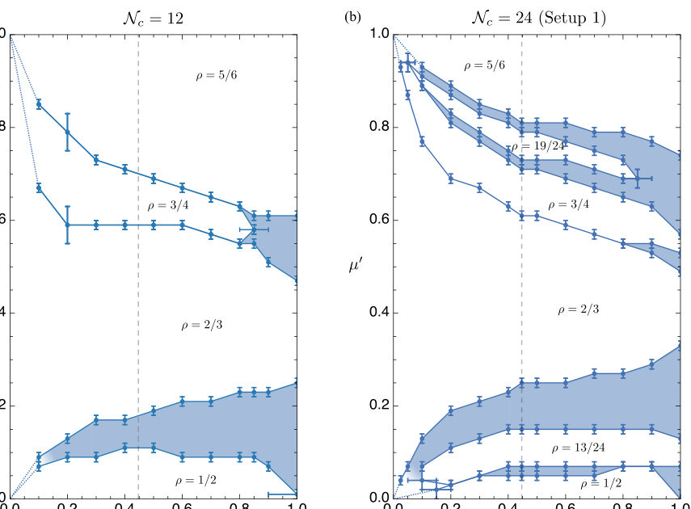 
FIG. 3. Ground-state phase diagrams obtained from cluster mean-field theory. (a) Phase diagram obtained using the 12-site cluster. The blue regions denote compressible phases with continuously varying density, while the other regions correspond to incompressible phases. The incompressible plateaus appear at ρ = 1/2, 2/3, 3/4, and 5/6. (b) Phase diagram obtained using the 24-site cluster (Setup 1). The overall phase diagram is in qualitative agreement with the 12-site result, while the enlarged cluster stabilizes additional incompressible phases at ρ = 13/24 and ρ = 19/24.

📷 Fig 4

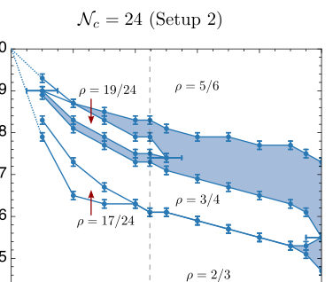 
FIG. 4. Comparison of the phase diagram obtained using the alternative 24-site cluster (Setup 2) and the corresponding local observables. (a) Upper part of the phase diagram (µ′ ≥0.4) calculated using Setup 2. The lower-density region is qualitatively identical to the result obtained from Setup 1 and is not shown. Compared with Setup 1, the ρ = 19/24 incompressible phase becomes smaller, while an additional incompressible phase emerges at ρ = 17/24, located between the ρ = 2/3 and ρ = 3/4 plateaus. (b) Spatial distribution of the local density ni = ⟨a† iai⟩and the hopping expectation value Bij = ⟨a† iaj + H.c.⟩for the corresponding insulating states. The color scale represents the local...

📷 Fig 5

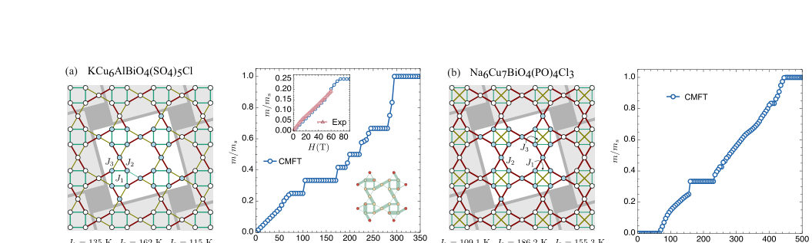 
FIG. 5. Magnetic properties of square-kagome compounds. (a) Exchange network and calculated magnetization curve of KCu6AlBiO4(SO4)5Cl using the 24-site Setup 2. The calculated results show good agreement with available experimental data, reproducing the observed m/ms = 1/3 and 2/3 plateaus and predicting additional plateau structures, with the lowest-field plateau appearing at m/ms = 1/4. The inset shows the local density and hopping expectation values of the m/ms = 1/4 plateau. (b) Exchange network and calculated magnetization curve of Na6Cu7BiO4(PO)4Cl3. The system exhibits plateaus at m/ms = 1/3 and 5/6, with a shoulder near m/ms = 2/3.

**Summary.** This work explores the complex ground state structure of hard-core bosons on the square-kagome lattice using an advanced hierarchical mean-field theory. By systematically enlarging the variational cluster, the authors uncover a hierarchy of previously unknown incompressible phases, including a robust $\rho=3/4$ state. These theoretical findings are validated by predicting additional magnetization plateaus in real superconducting materials.

**Why it may be interesting.** The use of a highly correlated lattice model (SKL) combined with advanced mean-field techniques to predict novel quantum phases and compare them directly against experimental magnetic measurements makes this highly relevant for condensed matter theorists studying strongly interacting quantum magnets.

Detailed structure

**Main problem.** The study investigates the complex landscape of incompressible crystal states supported by hard-core bosons on the square-kagome lattice (SKL), aiming to find phases beyond those predicted by simple unit-cell descriptions.

**Main result.** By employing hierarchical mean-field theory with larger variational clusters, the authors discovered additional robust incompressible phases, notably at density $\rho=3/4$, which map to half-magnetization plateaus in related spin models.

**Method.** The primary method is Hierarchical Mean-Field Theory (HMFT), which systematically increases the size of the variational cluster beyond conventional limits to capture richer correlation effects.

**Model / system.** The system is a hard-core boson model on the SKL, mathematically mapped onto an effective spin-$1/2$ XXZ model via the Matsubara-Matsuda transformation. The analysis involves comparing theoretical predictions with magnetization data from real cuprate compounds.

**Key observables.** Incompressible crystal densities ($\rho$), magnetization plateaus ($m/m_s$), and local particle densities ($n_i$).

**Important parameters / regimes.** Boson hopping ($t$), interaction strength ($V$), chemical potential ($\mu$), and the size of the variational cluster (12-site up to 24-site).

**Assumptions / limitations.** The analysis relies on mapping the bosonic system to a spin model, and the HMFT approach approximates inter-cluster correlations while treating intra-cluster physics exactly.

**Figures summary.** Figures illustrate the geometries of compact localized states (CLS) and show phase diagrams derived from calculations using 12-site and 24-site clusters, mapping out incompressible regions.

**Paper structure.** The paper first introduces the model and HMFT. It then demonstrates that increasing cluster size reveals new incompressible phases beyond the conventional two known phases ($\rho=5/6$ and $\rho=2/3$). Finally, it applies this framework to predict magnetization plateaus in specific, experimentally relevant superconducting compounds.

Abstract

We investigate a hard-core boson model on the square-kagome lattice using hierarchical mean-field theory beyond the conventional unit-cell description. We show that the conventional description of the square-kagome lattice based on its smallest unit cell does not fully capture the hierarchy of incompressible states supported by the lattice, but only captures the two compact-localized-state-based phases at densities $5/6$ and $2/3$. Within our approach, we reproduce these previously established phases and uncover additional incompressible states enabled by enlarging the variational cluster. Among these, the $ρ=3/4$ phase is found to be particularly robust, which, through the Matsubara-Matsuda mapping, corresponds to a half-magnetization plateau in the spin-$1/2$ XXZ model. We further apply our approach to two experimentally relevant square-kagome compounds using exchange parameters obtained from first-principles calculations. The calculated magnetization processes are in good agreement with available experimental results and predict additional plateau structures in these materials.

[↑ back to top](#top)

### [QBism on Locality and Nonlocality](http://arxiv.org/abs/2608.05368v1)

**Authors:** John B. DeBrota, Christopher A. Fuchs, Rüdiger Schack  
**Type:** theory · **Category:** other · **PDF:** <https://arxiv.org/pdf/2608.05368v1>  
**Analysis basis:** full PDF text, analyzed in chunks
**Topic relevance:** `quantum measurements` **3/5** · `measurement-induced transitions` **2/5** · `Keldysh / 2PI / non-Gaussian methods` **1/5** · `correlated / nonlocal dissipation` **1/5** · `driven-dissipative phase transition` **1/5** · `entanglement & information structure` **1/5**

📷 Fig 1

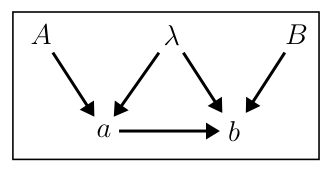 
Figure 2: The probabilistic constraints on Alice’s beliefs as they arise in QBism under the assump- tion of locality.

📷 Fig 2

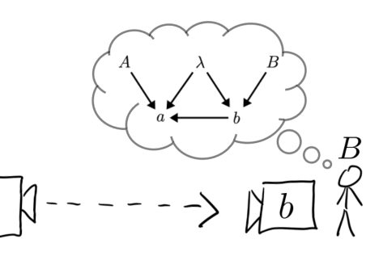 
Figure 3: The full experimental scenario with each agents’ personal causal diagram.

**Summary.** This paper tackles the foundational challenge of reconciling QBism's personalist view of quantum mechanics with modern physics results suggesting that objective spacetime coordinates may not exist. The authors argue that locality must therefore be understood as an individual agent's causal structure and pattern of belief updates, allowing QM to remain local even when global spacetime assumptions fail.

**Why it may be interesting.** While not directly about AMO systems, its deep dive into the foundations of quantum theory's relationship with spacetime is crucial for any theoretical physicist considering quantum gravity or open system dynamics where background independence is paramount.

Detailed structure

**Main problem.** The paper addresses how QBism, a personalist interpretation of quantum mechanics, can maintain a purely local understanding despite recent theorems suggesting that distinct observers' measurement outcomes cannot be embedded in a single spacetime.

**Main result.** QBism maintains locality by grounding it not in shared objective spacetimes, but in the individual agent's causal structure and sequence of personal judgments (epistemic localization).

**Method.** The authors use conceptual analysis, comparing QBism's tenets against established theorems (like Pienaar's) and analyzing the implications of rejecting the 'Absoluteness of Observed Events.'

**Model / system.** The system is Quantum Mechanics analyzed through the philosophical lens of QBism. The model involves considering multiple independent agents (observers) interacting with quantum systems.

**Key observables.** Quantum correlations, CHSH quantity bound, and adherence to relativistic locality constraints on an agent's beliefs.

**Important parameters / regimes.** The distinction between objective spacetime reality versus the subjective structure of individual experience/belief updates.

**Assumptions / limitations.** The core assumption is that quantum theory describes decision-making processes (Bayesian updating) for an individual, and locality must be preserved at this personal level.

**Figures summary.** Figures illustrate probabilistic constraints on an agent's beliefs under locality in QBism and depict the full experimental scenario using each agent's personal causal diagram.

**Paper structure.** The paper progresses by first identifying the conflict posed by modern theorems regarding spacetime embedding, then arguing that QBism must redefine locality as fundamentally epistemic (agent-specific), and finally showing how this preserves relativistic constraints.

Abstract

Recently Pienaar (2026), building on work of Cavalcanti (2021), has shown that QBism cannot always assume distinct observers' quantum-measurement outcomes---say, of Wigner and his friend---are embedded in a single spacetime. This follows from QBism's rejection of the `Absoluteness of Observed Events' assumption in the Bong et al. no-go theorem. Thus, QBism has no choice but to treat the notion of spacetime every bit as personalistic as it treats quantum states and quantum measurement outcomes. In a way, this is not a surprise to QBists, as they have taken the notion of `personalist spacetimes' to be the ansatz most compatible with their other views since at least 2009. But it does enjoin us to finally make crystal clear the sense in which QBism is a purely local interpretation of quantum mechanics despite this new theorem and despite quantum theory's age-old violation of Bell's inequalities. With the extra clarity we also hope to poise QBism for a distinctly new way to approach issues at the interface of quantum theory and gravity.

[↑ back to top](#top)

### [Correlated topological-polarization surface states in the narrow-gap insulator FeSb2](http://arxiv.org/abs/2608.05887v1)

**Authors:** Takahiro Iwagaki, Hideki Matsuoka, Ginta Hoshino, Kanata Watanabe, Shungo Aoyagi, Shunsuke Kitou, Yuiga Nakamura, Motoaki Hirayama, Takashi Koretsune, Naoya Kanazawa  
**Type:** both · **Category:** strongly correlated electrons · **PDF:** <https://arxiv.org/pdf/2608.05887v1>  
**Analysis basis:** full PDF text, analyzed in chunks
**Topic relevance:** `spintronics-quantum-optics interface` **3/5** · `Kondo & dissipative impurity` **1/5** · `analog quantum simulation` **1/5** · `exotic spin models in light-matter` **1/5** · `non-equilibrium dynamics` **1/5**

📷 Fig 1

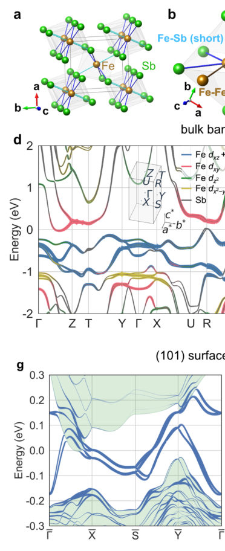 
Fig. 1 | Bulk and surface electronic states of FeSb2 from first-principles calculations.

📷 Fig 2

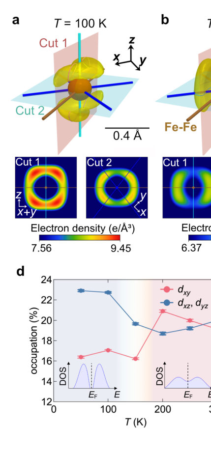 
Fig. 2 | Direct observation of the correlation-driven orbital reconstruction in FeSb2.

📷 Fig 3

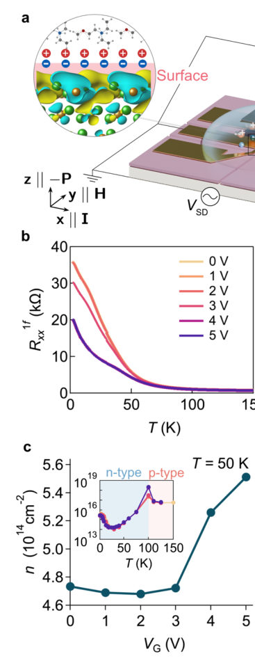 
Fig. 3 | Detection of the polar surface states by nonreciprocal transport in an EDLT device.

📷 Fig 4

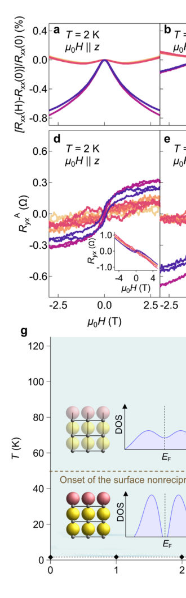 
Fig. 4 | Gate-induced surface magnetic transition.

**Summary.** This work investigates how strong electron correlations can stabilize topological polarization in the narrow-gap insulator $	ext{FeSb}_2$. By combining DFT+DMFT calculations with transport measurements, the authors prove that polar surface states emerge due to bulk orbital reconstruction. This establishes a powerful design principle for engineering correlated topological materials.

**Why it may be interesting.** The explicit link drawn between correlation effects (orbital reconstruction) and topological properties (polar surface states) provides a concrete design principle for realizing exotic quantum phases in strongly correlated materials, which is highly relevant to modern condensed matter theory.

Detailed structure

**Main problem.** The research aims to unite strong electron correlations and band topology, which are typically limited by conflicting elemental requirements in material design.

**Main result.** They demonstrate that $	ext{FeSb}_2$ hosts metallic polar surface states whose existence is governed by the bulk's strong electronic correlations. Furthermore, they show these states can be tuned into ferromagnetic or altermagnetic phases via electrostatic gating.

**Method.** The study combines first-principles calculations (DFT+DMFT) with advanced experimental techniques including X-ray diffraction and electrical transport measurements on EDLT devices.

**Model / system.** The physical system is epitaxial thin films of the narrow-gap insulator $	ext{FeSb}_2$. The theoretical framework incorporates modeling strong correlations via DMFT to predict orbital reconstruction and topological polarization effects.

**Key observables.** Nonreciprocal surface transport response, Anomalous Hall Effect (AHE) hysteresis, temperature-dependent Valence Electron Density (VED) maps showing orbital reconstruction, and gate-tunable magnetic transitions.

**Important parameters / regimes.** Temperature ($100 	ext{ K}$ to $300 	ext{ K}$), Gate Voltage ($V_G$), Magnetic Field ($H$).

**Assumptions / limitations.** The analysis assumes that the observed nonreciprocal transport and magnetic transitions are directly linked to the correlation-driven reconstruction of the bulk $	ext{Fe}$ $3d$ orbital occupation.

**Figures summary.** Figures illustrate crystal structure, temperature-dependent VED/orbital occupations (showing reconstruction), nonreciprocal conductance measurements confirming surface polarization, and phase diagrams mapping gate-induced magnetic transitions.

**Paper structure.** The paper progresses by first establishing the theoretical framework of topological polarization in correlated systems. It then presents experimental evidence using X-ray diffraction to map orbital changes with temperature, followed by transport measurements that confirm nonreciprocity linked to these bulk changes, and finally mapping out gate-induced magnetic phase transitions.

Abstract

Strong electron correlations and band topology each generate rich quantum phases, but conflicting elemental requirements have largely kept them apart. Topological polarization offers a route to unite them, producing polar surface states from bonding charge without spin-orbit coupling and thereby extending band topology to correlated 3d transition-metal compounds. Here we demonstrate that epitaxial thin films of the narrow-gap insulator FeSb2 host metallic polar surface states of topological-polarization origin, governed by the strong correlations of the bulk. Nonreciprocal surface transport emerges only below the onset temperature of a correlation-driven reconstruction of the bulk Fe 3d orbital occupation, providing direct evidence of bulk-edge correspondence in a correlated topological system. Moreover, electrostatic gating drives this correlated surface across a quantum phase transition into a ferromagnetic or possibly altermagnetic state. Our results establish topological polarization as a design principle for correlated topological phases in a broad range of materials.

[↑ back to top](#top)

### [Learning to Rank Tensor Network Contraction Plans for GPU-Accelerated Quantum Circuit Simulation](http://arxiv.org/abs/2608.05819v1)

**Authors:** Alfred M. Pastor, Maribel Castillo, Jose M. Badia  
**Type:** theory · **Category:** numerical methods · **PDF:** <https://arxiv.org/pdf/2608.05819v1>  
**Analysis basis:** full PDF text, analyzed in chunks
**Topic relevance:** `methods for driven-dissipative` **3/5** · `analog quantum simulation` **2/5** · `entanglement & information structure` **1/5** · `non-equilibrium dynamics` **1/5**

📷 Fig 1

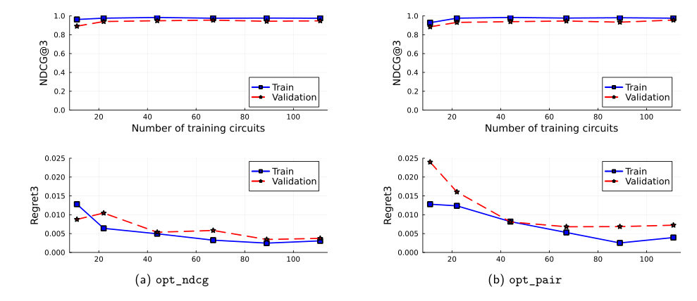 
Figure 1: Learning curves for the two optimized models. Each subfigure reports training and validation NDCG@3 (top) and Regret3 (bottom) as a function of the number of training circuit groups.

**Summary.** This paper proposes using a Learning to Rank framework to automatically select optimal contraction plans for accelerating quantum circuit simulation on GPUs. By training gradient-boosted models on structural features of the contraction plan, they achieve better performance predictions than existing heuristics. This offers a practical ML tool to manage the computational bottleneck associated with large-scale tensor network calculations.

**Why it may be interesting.** While focused on quantum circuits, the methodology—using ML to optimize complex computational workflows based on hardware constraints—is highly relevant for simulating many-body physics problems that rely on tensor network contractions (like DMRG or PEPS simulations).

Detailed structure

**Main problem.** The core problem is selecting an efficient contraction plan for tensor network simulations of quantum circuits to minimize execution time on GPUs.

**Main result.** Learning-to-Rank models, particularly those trained with listwise objectives, successfully identify better contraction plans than random or heuristic baselines across different circuit families and GPU architectures.

**Method.** The authors formulate the plan selection as a Learning to Rank (LTR) task, training gradient-boosted rankers using structural features derived from pairwise contractions.

**Model / system.** The system involves simulating quantum circuits via Tensor Network (TN) contraction. The computational cost depends critically on the sequence of pairwise contractions (the plan), which is optimized for GPU execution characteristics like parallelism and memory traffic.

**Key observables.** Execution time measured on GPUs; ranking metrics include Top-1, Top-3 rate, regret, and win rate.

**Important parameters / regimes.** Contraction structural features such as bottleneck exponent ($c_{max}$), output size ($\pi$), reduction depth ($k$), and contraction geometry ($d$).

**Assumptions / limitations.** The performance is strongly dependent on the target hardware (GPU architecture); the feature set aims to be portable across different software stacks.

**Figures summary.** Not specified by notes, but figures likely compare learned rankings against baselines and show stability/shift analysis across GPU architectures.

**Paper structure.** The paper introduces the problem of plan selection for TN contraction on GPUs. It details representing plans via structural features and applying LTR (XGBoost) with listwise objectives. Results demonstrate improved ranking quality, followed by an analysis of backend shift robustness.

Abstract

Classical simulation remains essential for developing and validating quantum algorithms, but its cost grows rapidly with circuit size. Tensor-network contraction can reduce this cost by exploiting circuit structure, although its efficiency depends strongly on the chosen contraction plan. On GPUs, plans with similar theoretical complexity may perform very differently because execution also depends on parallelism, reduction structure, memory traffic, and contraction geometry. We present a learning-to-rank framework for selecting efficient contraction plans before executing them. Each plan is represented by structural features derived directly from its sequence of pairwise contractions, and gradient-boosted rankers are trained from GPU measurements using listwise and pairwise objectives. We evaluate the resulting models on diverse circuit families, using separate in-distribution and circuit-family-shift test sets, and compare them with random and MinFill-based baselines. The learned rankers generally identify better plans, with the listwise model providing the strongest overall decision quality. We also study backend shift by comparing empirical plan orderings on two GPU architectures and evaluating the source-trained models on the second device without retraining. The rankings remain substantially, though not perfectly, stable across GPUs, and the models retain useful decision quality. These results support Learning to Rank as a practical way to reduce contraction-plan search, while showing that performance remains partly backend dependent.

[↑ back to top](#top)

### [A Unified Framework for Sample Complexity of Structured Quantum State Tomography under Noisy Observations](http://arxiv.org/abs/2608.05526v1)

**Authors:** Zhen Qin  
**Type:** theory · **Category:** quantum information and computing · **PDF:** <https://arxiv.org/pdf/2608.05526v1>  
**Analysis basis:** full PDF text, analyzed in chunks
**Topic relevance:** `quantum measurements` **3/5** · `entanglement & information structure` **1/5** · `measurement-induced transitions` **1/5** · `methods for driven-dissipative` **1/5**

📷 Fig 1

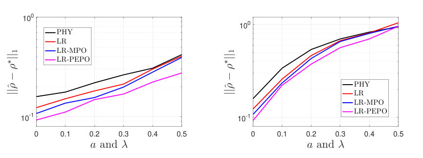 
Figure 1: Trace-norm reconstruction error for the thermal state under different values of a and λ: (a) noise-aware QST, (b) noise-unaware QST.

📷 Fig 2

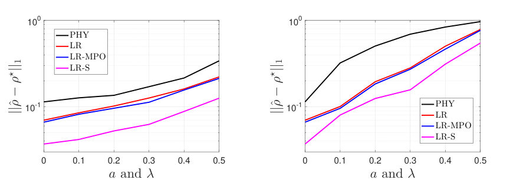 
Figure 2: Trace-norm reconstruction error for the GHZ state under different values of a and λ: (a) noise-aware QST, (b) noise-unaware QST.

**Summary.** This paper presents a unified theoretical framework to determine the sample complexity required for Quantum State Tomography (QST) when measurements are noisy. It analyzes structured state classes like MPSs and PEPSs, deriving explicit error bounds that quantify the performance gap between estimators that account for noise versus those that ignore it. This work is vital for understanding the fundamental limits of quantum characterization in realistic experimental settings.

**Why it may be interesting.** It provides rigorous mathematical tools to quantify how much experimental data is needed to reconstruct quantum states accurately when real-world imperfections (noise) are present, which is crucial for designing practical quantum hardware characterization protocols.

Detailed structure

**Main problem.** The paper develops a unified theoretical framework to analyze the sample complexity of structured Quantum State Tomography (QST) when measurements are corrupted by various noise sources.

**Main result.** It derives non-asymptotic trace-norm recovery guarantees for two estimators: one that explicitly accounts for calibrated noise, and another 'noise-unaware' estimator which suffers from a persistent deterministic bias term.

**Method.** The analysis uses covering-number techniques to characterize the intrinsic complexity of various structured quantum state classes (like MPSs or low-rank states) under noisy observation models.

**Model / system.** The system involves characterizing unknown quantum states $
ho$ for $n$-qudit systems, which are assumed to belong to specific structured classes such as Matrix Product States (MPSs), Projected Entangled-Pair States (PEPSs), or low-rank approximations thereof.

**Key observables.** Trace-norm recovery error ($\|b_
ho - 
ho^\star\|_1$), sample complexity, and the dependence of these metrics on noise levels.

**Important parameters / regimes.** Noise strengths ($\lambda$ for state preparation, $a$ for measurement), system size ($n$), and the structural complexity parameters (e.g., rank $r$).

**Assumptions / limitations.** The framework assumes physical consistency by applying to structured models like LR-MPOs/PEPOs, and it explicitly models noise using depolarizing channels.

**Paper structure.** The paper establishes the general problem of QST complexity under noise, develops a unified theoretical framework based on covering numbers for various state structures, and derives explicit non-asymptotic bounds by comparing noise-aware versus noise-unaware estimation strategies.

Abstract

Quantum state tomography (QST) has attracted considerable attention due to its fundamental role in quantum information processing. In this paper, we develop a unified theoretical framework for analyzing the sample complexity of structured QST under noisy observations arising from state preparation noise, measurement noise, and finite-shot statistical noise. The proposed framework applies to a broad family of structured quantum-state classes, including general mixed states, sparse states, low-rank states, matrix product states (MPSs), matrix product operators (MPOs), projected entangled-pair states (PEPSs), and projected entangled-pair operators (PEPOs), while further introducing physically consistent structured models---including low-rank and sparse states, low-rank MPOs (LR-MPOs), and low-rank PEPOs (LR-PEPOs)---that simultaneously exploit low-dimensional structures and preserve the physical constraint. Within this framework, we derive unified non-asymptotic sample complexity guarantees for two constrained least-squares estimators under noisy observations: a noise-aware estimator that incorporates the calibrated noise model and a noise-unaware estimator based on the ideal Born measurement model. For the noise-aware estimator, we derive unified trace-norm recovery guarantees that explicitly characterize the dependence of the sample complexity on three fundamental quantities: the complexity of the underlying structured state class, the complexity of the measurement ensemble, and the state preparation and measurement noise levels. For the noise-unaware estimator, we establish a unified non-asymptotic recovery guarantee consisting of a statistical error term and an additional deterministic bias term arising from the mismatch between the assumed reconstruction model and the noisy observation process.

[↑ back to top](#top)

### [Dimension-Free Polylogarithmic Quantum Shadow Tomography from Sequential Pretty-Good Measurements](http://arxiv.org/abs/2608.06345v1)

**Authors:** Fernando Granha Jeronimo, Qizhao Huang, Lenny Liu  
**Type:** theory · **Category:** quantum information and computing · **PDF:** <https://arxiv.org/pdf/2608.06345v1>  
**Analysis basis:** full PDF text, analyzed in chunks
**Topic relevance:** `quantum measurements` **3/5** · `entanglement & information structure` **1/5** · `measurement-induced transitions` **1/5** · `methods for driven-dissipative` **1/5**

📷 Fig 1

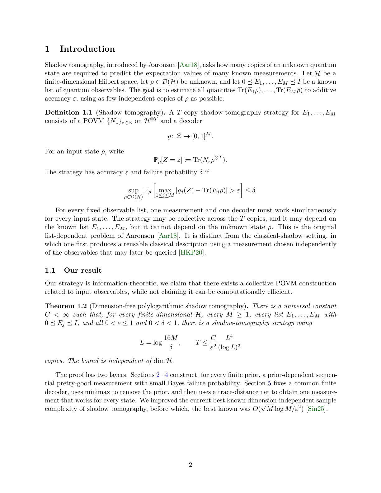 
Low-resolution page preview, page 2

📷 Fig 2

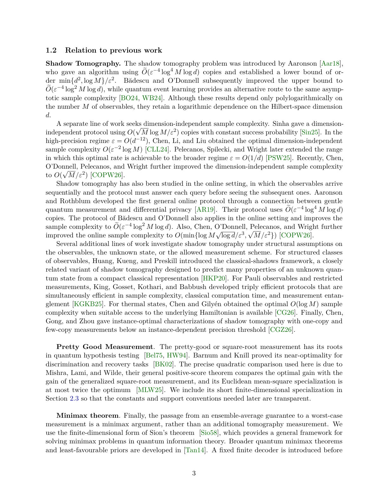 
Low-resolution page preview, page 3

📷 Fig 3

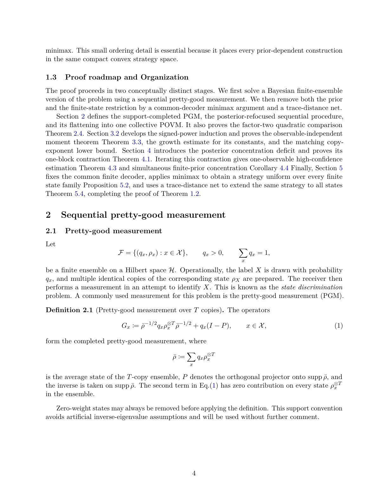 
Low-resolution page preview, page 4

📷 Fig 4

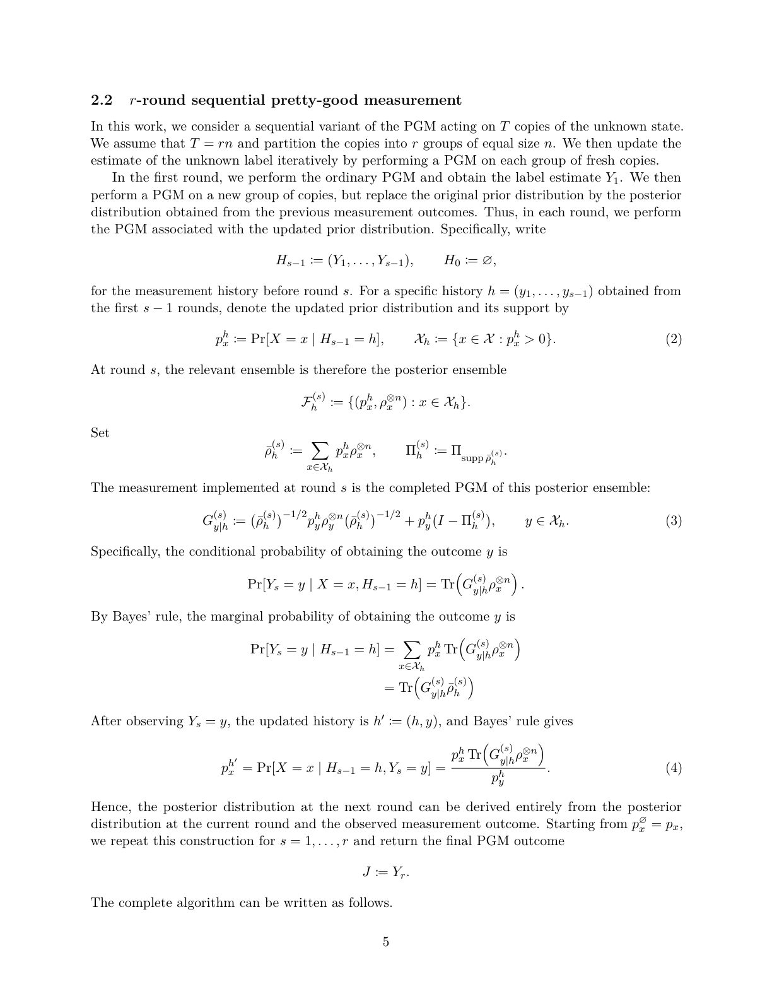 
Low-resolution page preview, page 5

📷 Fig 5

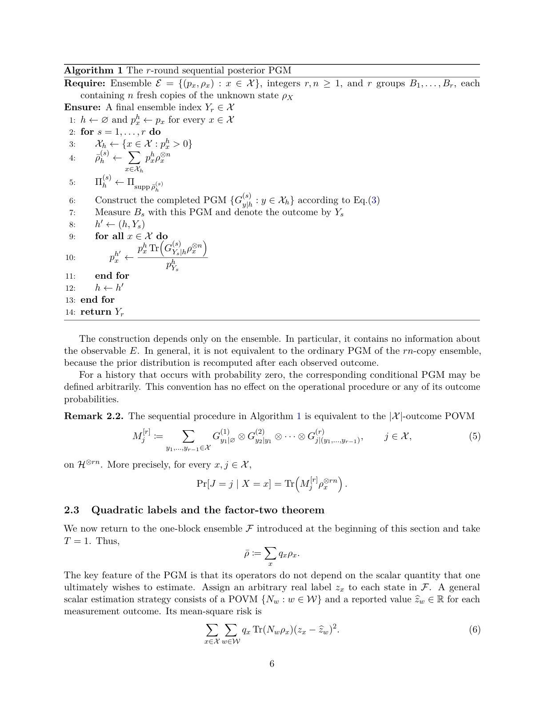 
Low-resolution page preview, page 6

**Summary.** This paper presents a novel quantum protocol for shadow tomography that estimates expectation values of many observables from limited measurements. It achieves a sample complexity bound that scales only polylogarithmically with the number of observables and crucially ignores the dimension of the state. This resolves an open question in quantum information theory by providing a highly efficient, dimension-free estimation technique.

**Why it may be interesting.** This work provides a significant theoretical advance in quantum estimation theory by achieving dimension-independent bounds for shadow tomography, which is fundamental for characterizing unknown quantum resources.

Detailed structure

**Main problem.** The goal is to estimate all expectation values of a set of observables for an unknown quantum state using measurements on multiple copies, known as shadow tomography.

**Main result.** The authors developed a protocol achieving sample complexity that is polylogarithmic in the number of observables and crucially independent of the dimension of the quantum state.

**Method.** The approach involves reducing the problem to a finite-ensemble estimation via minimax arguments, followed by developing an iterative measurement strategy using sequential pretty-good measurements (PGMs) with posterior updates.

**Model / system.** The system is an unknown $d$-dimensional quantum state $
ho$ on a Hilbert space. The process involves performing multiple copies of measurements corresponding to known observables $\{E_i\}$.

**Key observables.** Expectation values $\{	ext{Tr}(
ho E_i)\}_{i=1}^M$, the measurement outcomes from sequential PGMs, and the estimated state $\hat{
ho}$.

**Important parameters / regimes.** Accuracy ($\epsilon$), failure probability ($\delta$), number of observables ($M$), and the dimension of the state ($d$).

**Assumptions / limitations.** The analysis relies on extending results from finite-state estimation to the full continuous state space using a trace-distance net.

**Paper structure.** The paper first tackles the problem for a finite ensemble, developing an r-round sequential PGM with posterior updates. It then uses minimax arguments and trace-distance nets to lift this result from a finite set of states to the entire quantum state space.

Abstract

\textit{Shadow tomography} is a fundamental problem in quantum information theory. Given multiple copies of an unknown $d$-dimensional quantum state $ρ$ and a known collection of observables ${E_1,\ldots,E_m}$, the goal is to estimate all expectation values $\{\Tr(ρE_i)\}_{i=1}^m$ to additive accuracy $\varepsilon$ with probability at least $1-δ$.   An elusive open question from the seminal shadow tomography work of Aaronson (STOC'18) is whether this task admits a dimension-independent sample complexity with only polylogarithmic dependence on $m$, as suggested by the best-known lower bounds. In this work, we give a quantum protocol for shadow tomography with sample complexity \[ O\left( \frac{1}{\varepsilon^2} \frac{(\log (m/δ))^4} {(\log\log (m/δ))^3} \right), \] which is polylogarithmic in the number of observables and independent of the dimension of the unknown state thereby answering Aaronson's original question while also providing an exponential improvement in the prior best dimension independent sample complexity of shadow tomography from Sinha (STOC'25).   Our approach first reduces the general shadow-tomography problem to a finite-ensemble estimation problem via a minimax argument. We then develop an observable-independent protocol that repeatedly applies the pretty-good measurement and updates the priori distribution over the finite ensemble according to the measurement outcomes. A refined tail analysis of the resulting estimation error yields simultaneous accuracy guarantees for all observables.

[↑ back to top](#top)

### [How Much Reconstruction Does Quantum Machine Learning Need? Late Fusion of Independently Trained Quantum Subcircuits](http://arxiv.org/abs/2608.05595v1)

**Authors:** Prabhjot Singh, Adel N. Toosi, Rajkumar Buyya  
**Type:** both · **Category:** quantum information and computing · **PDF:** <https://arxiv.org/pdf/2608.05595v1>  
**Analysis basis:** full PDF text, analyzed in chunks
**Topic relevance:** `entanglement & information structure` **3/5** · `QC/QI experiment` **1/5** · `methods for driven-dissipative` **1/5** · `non-equilibrium dynamics` **1/5**

📷 Fig 1

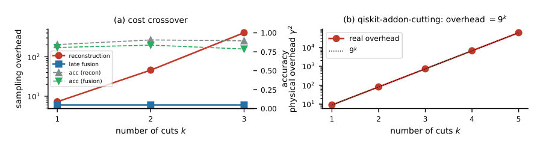 
Figure 1: (a) Cost crossover on the controlled simulator: reconstruction overhead (red) grows exponentially with the number of cuts while late fusion (blue) stays flat; reconstruction accuracy (gray dashed) tracks the ideal circuit, frozen fusion (green dashed) trails by 0.04–0.11 (see text). (b) The same wall through the real qiskit-addon-cutting library: measured physical overhead is exactly 9k (dotted), with reconstruction matching exact expectations to shot noise.

📷 Fig 2

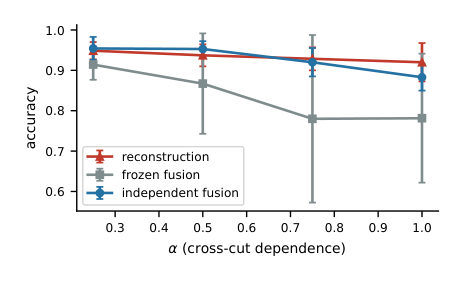 
Figure 2: Independent training (circles) matches reconstruc- tion (triangles) across the cross-cut sweep, closing the resid- ual gap left by frozen fusion (squares).

📷 Fig 3

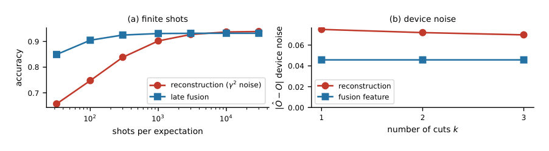 
Figure 3: Noise robustness. (a) Under finite shots, late fusion (blue) is more accurate than reconstruction (red), which pays a γ2 variance penalty. (b) Under device noise, reconstruction’s error stays above a depth-matched fusion feature’s (1.6× here; 6× under a real IBM calibration), which is independent of the cut count.

📷 Fig 4

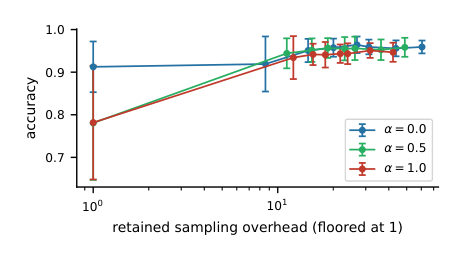 
Figure 4: Q-dial accuracy/cost frontier (mean±std, 10 seeds): accuracy saturates well before full reconstruction, so most of the γ2k overhead yields little additional accuracy; low-cost fluctuations are within seed noise.

📷 Fig 5

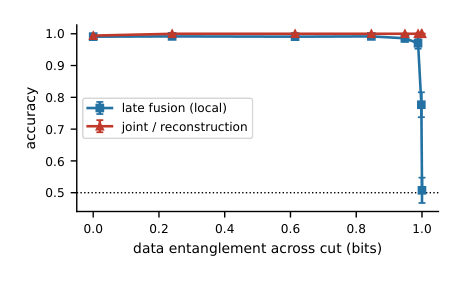 
Figure 5: Quantum-necessity regime: as data entanglement across the cut grows, late fusion (local measurements) col- lapses to chance while joint/reconstruction readout stays at or near perfect (≥0.994).

**Summary.** This paper addresses the scalability bottleneck in running large Quantum Neural Networks by proposing 'late fusion' as a replacement for computationally expensive full state reconstruction. By training subcircuits independently and combining outputs classically, they achieve comparable accuracy at exponentially lower cost. This provides an efficient, noise-robust alternative for implementing complex quantum algorithms on near-term devices.

**Why it may be interesting.** While focused on QML, the methodology of characterizing resource requirements using entanglement diagnostics ($S_A$) and establishing theoretical bounds for information recovery has implications for understanding correlations in complex quantum many-body systems.

Detailed structure

**Main problem.** The primary challenge is mitigating the exponential computational overhead associated with 'reconstruction' when running large Quantum Neural Networks (QNNs) via circuit cutting on limited quantum hardware.

**Main result.** Late fusion, which uses a small classical head to combine independently trained subcircuit outputs, matches full reconstruction accuracy at exponentially lower cost and shows improved noise robustness.

**Method.** The authors propose replacing complex quasiprobability reconstruction with late fusion—a linear-cost combination inspired by multimodal learning—and introduce a 'quantumness dial' $Q$ to characterize the trade-off.

**Model / system.** The work analyzes variational quantum circuits (QNNs) partitioned into independent subcircuits ('circuit cutting') for machine learning tasks. The comparison is between full reconstruction of expectation values and classical combination of local marginal outputs.

**Key observables.** Accuracy gap between late fusion and full reconstruction, computational cost scaling ($\gamma^{2k}$ vs. constant), and the cut-entanglement diagnostic $S_A$.

**Important parameters / regimes.** The quantumness dial $Q \in [0, 1]$ controls the interpolation between pure fusion ($Q=0$) and full reconstruction ($Q=1$).

**Assumptions / limitations.** The authors do not claim a universal quantum advantage over classical ML; the value proposition is conditional on task structure. They rely on simulating scales where exact reference data is available.

**Figures summary.** Figures compare cost scaling (exponential growth for reconstruction vs. flat late fusion) and show performance tracking across various datasets using different readout strategies.

**Paper structure.** The paper systematically compares multiple readout strategies (reconstruction, partial reconstruction via $Q$, late fusion) by analyzing their computational costs and empirical accuracy on standard benchmarks, culminating in diagnostic tools to pinpoint when fusion is sufficient.

Abstract

Circuit cutting lets a large quantum neural network (QNN) run as independent subcircuits on small devices, but rebuilding its outputs by reconstruction carries a classical sampling overhead exponential in the number of cuts - the dominant runtime cost in prior work. We ask whether, for machine-learning tasks, this step is necessary, and replace it with late fusion: each subcircuit is trained and measured independently, and a small classical head combines their outputs - a linear-cost, decision-level combination borrowed from multimodal learning. To characterize the trade-off we introduce a quantumness dial $Q$, a tunable reconstruction budget interpolating from pure fusion to full reconstruction, and a cut-entanglement diagnostic that indicates how much reconstruction a task needs (Spearman $ρ=0.59$ over $104$ runs). Across synthetic and standard datasets, independently trained late fusion matches full reconstruction accuracy within $0.04$ at every point of the controlled sweep and on every classical benchmark, at exponentially lower cost; it is also markedly more robust to shot and device noise. Controlled entangled-data experiments locate the boundary where fusion must fail. We do not claim advantage over classical machine learning - consistent with recent benchmarking, quantum offers no accuracy edge on these datasets. Late fusion is thus an efficient, noise-robust, self-characterizing alternative to reconstruction for circuit-cutting QML.

[↑ back to top](#top)

### [Improved regret bounds for structured online learning of quantum states](http://arxiv.org/abs/2608.05740v1)

**Authors:** Akshay Bansal, Jiahui Liu  
**Type:** theory · **Category:** quantum information and computing · **PDF:** <https://arxiv.org/pdf/2608.05740v1>  
**Analysis basis:** full PDF text, analyzed in chunks
**Topic relevance:** `quantum measurements` **3/5** · `entanglement & information structure` **1/5** · `measurement-induced transitions` **1/5** · `methods for driven-dissipative` **1/5**

📷 Fig 1

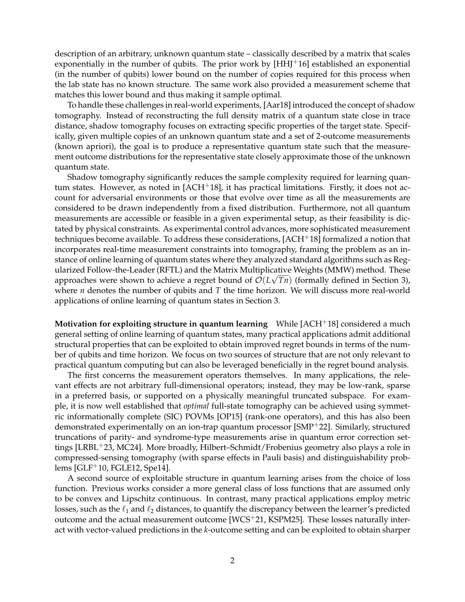 
Low-resolution page preview, page 2

📷 Fig 2

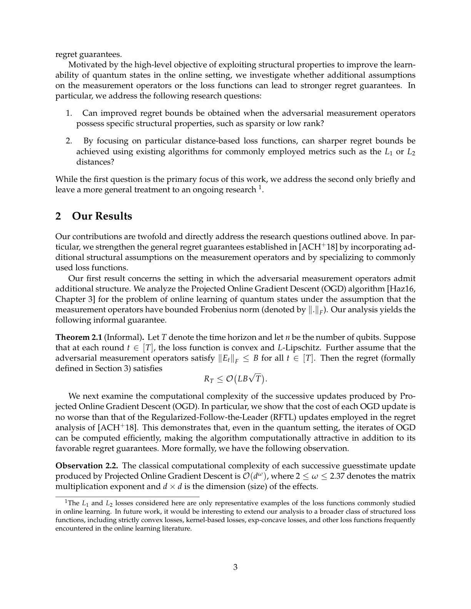 
Low-resolution page preview, page 3

📷 Fig 3

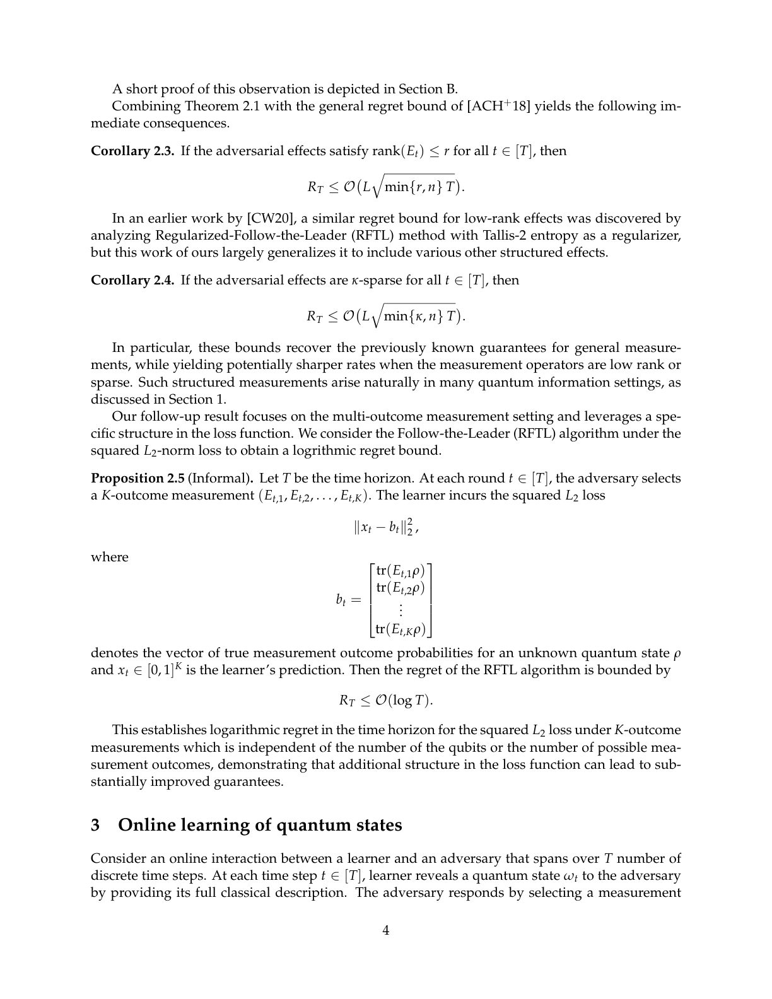 
Low-resolution page preview, page 4

📷 Fig 4

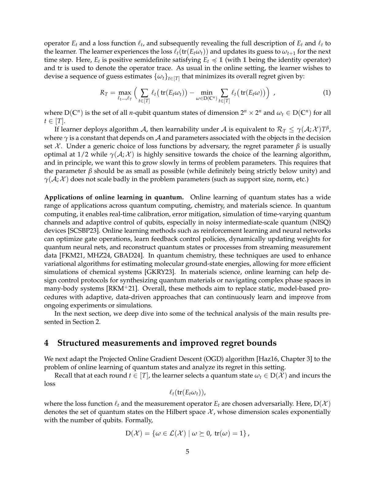 
Low-resolution page preview, page 5

📷 Fig 5

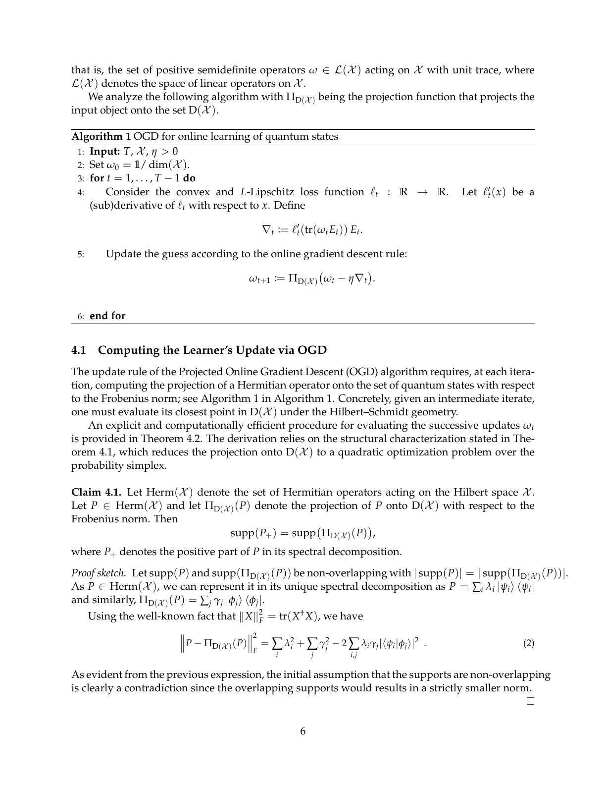 
Low-resolution page preview, page 6

**Summary.** This paper tackles the challenge of online quantum state tomography by analyzing how structural assumptions on measurements can drastically improve learning guarantees. Using advanced online optimization techniques like OGD, the authors derive regret bounds that depend on intrinsic properties (like rank) rather than the exponential Hilbert space dimension. The results show that under favorable conditions, the learnability of quantum states is significantly enhanced.

**Why it may be interesting.** This work directly addresses the practical limitations of quantum state characterization by providing theoretically rigorous methods to achieve high accuracy with limited measurement data, which is crucial for building scalable quantum devices.

Detailed structure

**Main problem.** The core problem is improving the regret bounds for online quantum state tomography, which is necessary because full state reconstruction is infeasible at scale.

**Main result.** By exploiting structural assumptions on measurements (like bounded Frobenius norm or low rank), the achievable regret bounds are significantly improved compared to general settings. Furthermore, using squared L2 loss in multi-outcome measurements yields a logarithmic regret bound independent of system size.

**Method.** The authors employ online learning frameworks, primarily Projected Online Gradient Descent (OGD) and Regularized Follow-the-Leader (RFTL), adapted for the constraints of quantum state space projection.

**Model / system.** The model involves estimating an unknown quantum state $
ho$ over time $T$ using sequential measurements. The process is framed as an online learning task where the learner minimizes regret against an adversarial measurement sequence.

**Key observables.** Regret ($R_T$), which measures performance relative to the best fixed quantum state in hindsight, and the predicted measurement outcomes.

**Important parameters / regimes.** The structural properties of the measurements, such as bounded Frobenius norm ($\|E_t\|_F \le B$), low rank ($	ext{rank}(E_t) \le r$), or $\kappa$-sparsity.

**Assumptions / limitations.** The analysis relies heavily on assuming specific structural constraints (low rank/sparsity) for the adversarial measurement operators, and assumes convexity and Lipschitz continuity of the loss function.

**Paper structure.** The paper establishes the general online learning framework using OGD, derives bounds based on structural assumptions (Frobenius norm, rank), and presents a complementary result showing logarithmic regret for multi-outcome measurements under squared L2 loss.

Abstract

Quantum state tomography is fundamental to quantum information processing but becomes infeasible at scale due to the exponential growth of the state space. Shadow tomography alleviates this challenge by focusing on predicting measurement outcomes rather than reconstructing the full state. Its online variant models adaptive and potentially adversarial measurement scenarios, where a learner sequentially predicts outcomes while competing with the best fixed quantum state in hindsight.   We show that exploiting additional structure in the measurements leads to significantly stronger regret guarantees. In particular, under the assumption that the adversarial measurements have bounded Frobenius norm, we analyze Projected Online Gradient Descent and derive regret bounds that depend on intrinsic structural properties, such as rank or sparsity, rather than the ambient Hilbert space dimension. As a complementary result, we show that one can achieve logarithmic regret, independent of both the number of qubits and measurement outcomes, for multi-outcome measurements under squared $L_2$ loss. These results demonstrate that incorporating realistic structural assumptions can substantially enhance the learnability of quantum states in online environments.

[↑ back to top](#top)

### [Nitrogen Vacancy Centers in Hexagonal Diamond Exhibit Long Coherence Times](http://arxiv.org/abs/2608.05320v1)

**Authors:** Gabriel Kumar, Siyuan Chen, Victor Wen-zhe Yu, Giulia Galli  
**Type:** theory · **Category:** quantum information and computing · **PDF:** <https://arxiv.org/pdf/2608.05320v1>  
**Analysis basis:** full PDF text, analyzed in chunks
**Topic relevance:** `spintronics-quantum-optics interface` **3/5** · `QC/QI experiment` **2/5** · `Keldysh / 2PI / non-Gaussian methods` **1/5**

📷 Fig 1

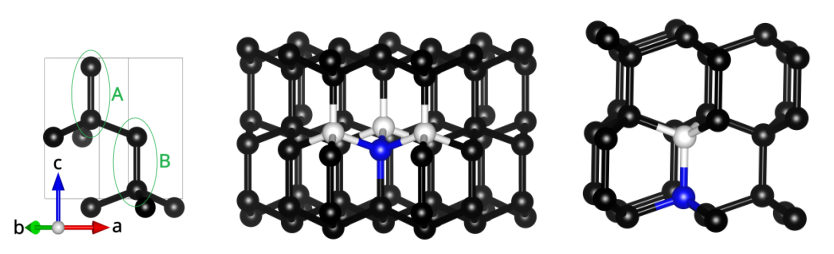 
FIG. 1: Crystal structure of hexagonal diamond (lonsdaleite), with point group P63/mmc. (Left) The 4-atom unit cell, with experimental lattice parameters a = 2.51 Å and c = 4.12 Å, compared to a = 2.517 Å and c = 6.166 Å for cubic diamond when represented in a hexagonal lattice. The two pairs of carbon atoms aligned along the c-axis are labeled A and B. (Middle) The AB configuration of the NV center with the NV axis aligned along the bond connecting A and B. The three symmetry-equivalent orientations are shown. (Right) The AA configuration of the NV center with the NV axis aligned along a bond within A or B. Carbon, nitrogen, and vacancy sites are shown as black, blue, and white spheres,...

📷 Fig 2

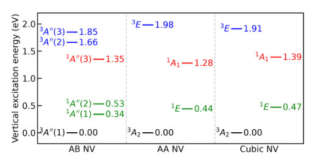 
FIG. 2: Vertical excitation energies of NV centers in lonsdaleite and cubic diamond computed with the quantum defect embedding theory (QDET) (see text). The many-body states are labeled according to the irreducible representations of the defect point groups (Cs and C3v for AB and AA NV, respectively). States in the AA and cubic NVs with the same color have the same symmetry character. For the AB NV, the colors are the same as those of the corresponding states in the AA NV from which they split as the symmetry is reduced.

📷 Fig 3

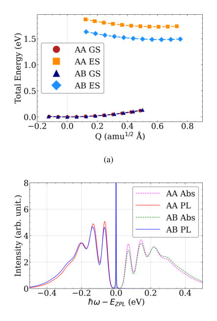 
FIG. 3: (a) Configuration-coordinate diagrams obtained from ∆SCF calculations for the NV AA and AB configurations, showing the interpolation between the ground- (zero of energy) and excited-state geometries. (b) Simulated photoluminescence (PL) and absorption (Abs) spectra at T = 5 K, computed using the zero-phonon line and phonon modes extracted from the configuration-coordinate diagrams. The x-axis shows the energy shift relative to the ZPL energies of 1.48 and 1.73 eV for the AB and AA configurations, respectively. The fitting parameters are the same as those used for the NV center in cubic diamond18.

📷 Fig 4

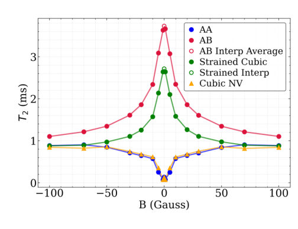 
FIG. 4: Computed coherence time T2 as a function of the applied magnetic field for the AA and AB configurations in hexagonal diamond (lonsdaleite), the NV center in cubic diamond, and the NV center in cubic diamond with a 3% tensile strain applied along an N-C bond. For the AB configuration and the strained cubic diamond NV, the B = 0 data point is estimated by averaging the left- and right-biased linear and quadratic interpolations.

**Summary.** The authors theoretically investigate NV centers in hexagonal diamond (lonsdaleite) to find better spin qubit candidates than those in cubic diamond. They found that a specific, symmetry-reduced configuration (AB) significantly enhances the coherence time ($T_2$) by leveraging its unique zero-field splitting properties. This establishes lonsdaleite as a promising material for quantum information science applications.

**Why it may be interesting.** This work directly addresses hardware platforms for solid-state qubits by predicting enhanced coherence times based on crystal symmetry, which is crucial knowledge for designing robust quantum memory elements.

Detailed structure

**Main problem.** To investigate Nitrogen Vacancy (NV) centers in hexagonal diamond (lonsdaleite) as potential spin qubits with enhanced coherence times compared to cubic diamond counterparts.

**Main result.** The AB configuration of the NV center in lonsdaleite exhibits an approximate fourfold enhancement of the Hahn-echo coherence time ($T_2$) at zero magnetic field due to a finite transverse zero-field splitting.

**Method.** First-principles calculations (DFT) combined with advanced quantum defect theory methods (QDET, gCCE) were used to model electronic structure and spin coherence times.

**Model / system.** The study models negatively charged NV centers ($	ext{NV}^-$) in two configurations (AA and AB) within the hexagonal diamond polymorph lonsdaleite, comparing them against the established cubic-diamond NV center.

**Key observables.** Hahn-echo coherence time ($T_2$), Zero-Field Splitting (ZFS) tensor components ($D$ and $E$), Photoluminescence spectra, and Debye-Waller factors.

**Important parameters / regimes.** Zero magnetic field ($	ext{B}=0$), specific lattice configurations (AA vs. AB), and the magnitude of the enhancement factor (approximate fourfold).

**Assumptions / limitations.** The study assumes that symmetry-broken centers in lonsdaleite are viable candidates, though calculating intersystem crossing rates for full optical cycle efficiency was beyond scope.

**Figures summary.** Figures compare crystal structures and defect configurations; one figure shows energy splittings due to symmetry reduction (AB case); another compares PL/Abs spectra for AA and AB configurations.

**Paper structure.** The paper systematically analyzes the electronic structure, coherence properties, and optical signatures of NV centers in lonsdaleite. It contrasts two specific defect symmetries (AA vs. AB) against the cubic standard to pinpoint the optimal configuration for quantum applications.

Abstract

We show that negatively charged nitrogen-vacancy (NV) centers in the hexagonal diamond polymorph lonsdaleite offer a route to spin qubits with enhanced coherence relative to their cubic-diamond counterparts. Using first-principles calculations, we examine two distinct defect configurations, AA, with the same symmetry as in cubic diamond and AB, with reduced symmetry. We find that the AB configuration of the NV center exhibits a finite transverse zero-field splitting, giving rise to an approximate fourfold enhancement of the Hahn-echo coherence time $T_2$ at zero magnetic field. The AA configuration, by contrast, closely reproduces the electronic structure and coherence properties of the cubic NV center. We further characterize the many-body electronic structure, vertical excitation energies, and photoluminescence spectra of both configurations, providing spectral fingerprints for their experimental identification. Our results establish symmetry-broken NV centers in lonsdaleite as promising candidates for quantum sensing and information science applications.

[↑ back to top](#top)

### [Maximally entangled states are not complete for pseudo-telepathy](http://arxiv.org/abs/2608.05378v1)

**Authors:** Olivier Lalonde  
**Type:** theory · **Category:** quantum information and computing · **PDF:** <https://arxiv.org/pdf/2608.05378v1>  
**Analysis basis:** full PDF text, analyzed in chunks
**Topic relevance:** `entanglement & information structure` **3/5** · `Keldysh / 2PI / non-Gaussian methods` **1/5**

📷 Fig 1

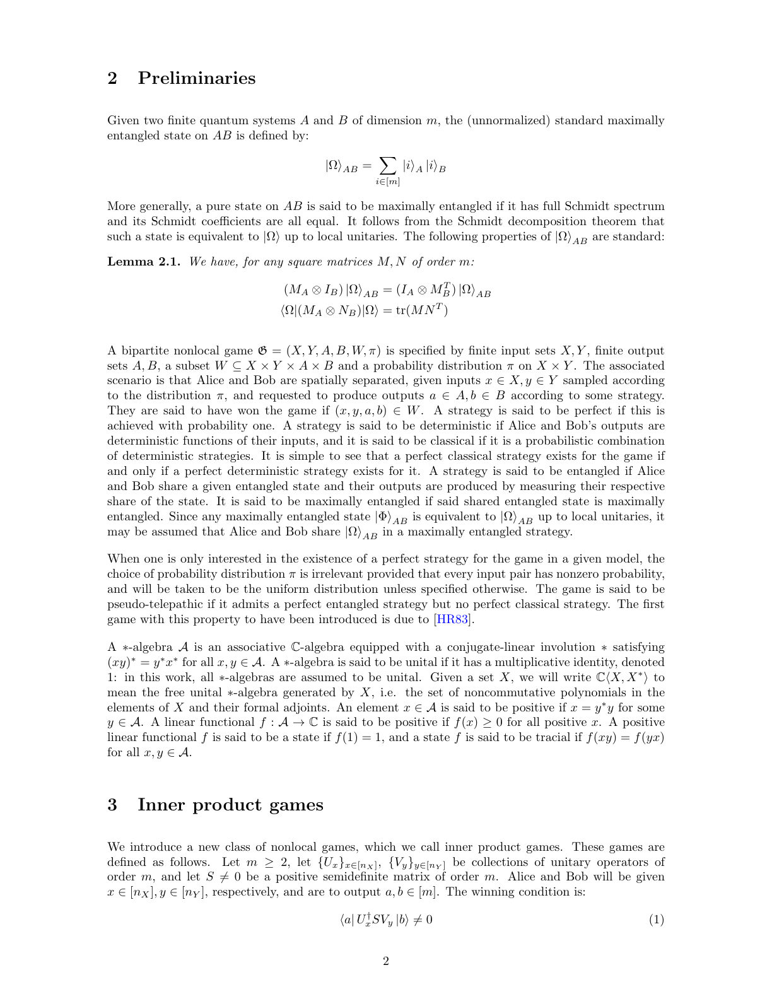 
Low-resolution page preview, page 2

📷 Fig 2

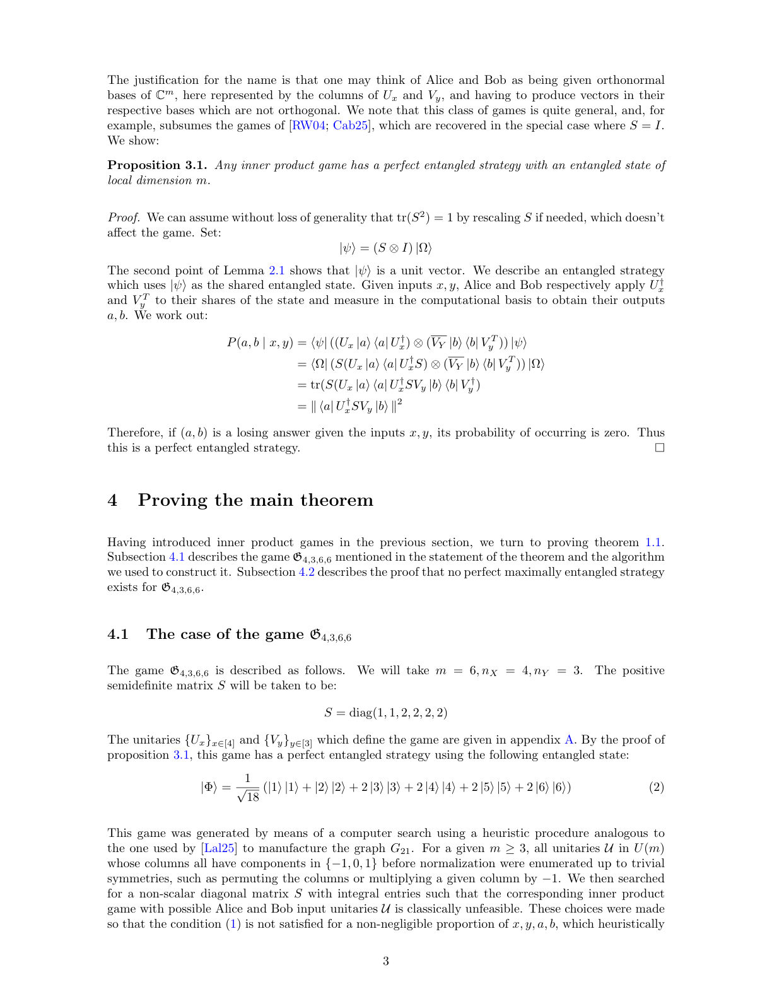 
Low-resolution page preview, page 3

📷 Fig 3

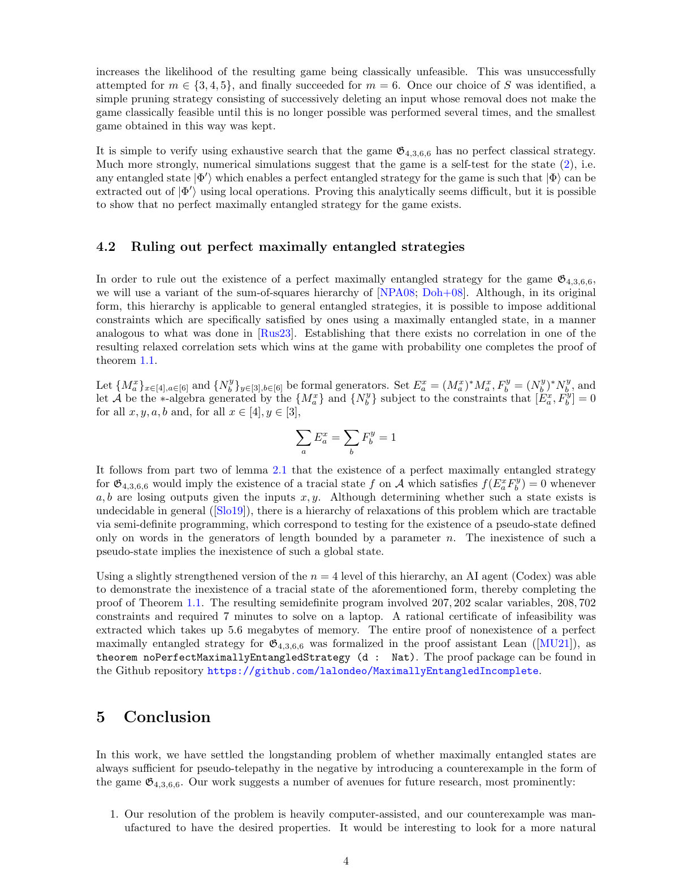 
Low-resolution page preview, page 4

📷 Fig 4

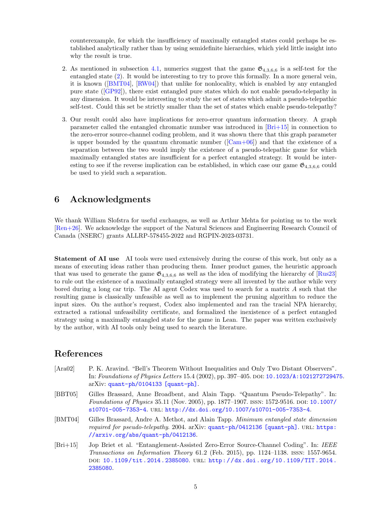 
Low-resolution page preview, page 5

📷 Fig 5

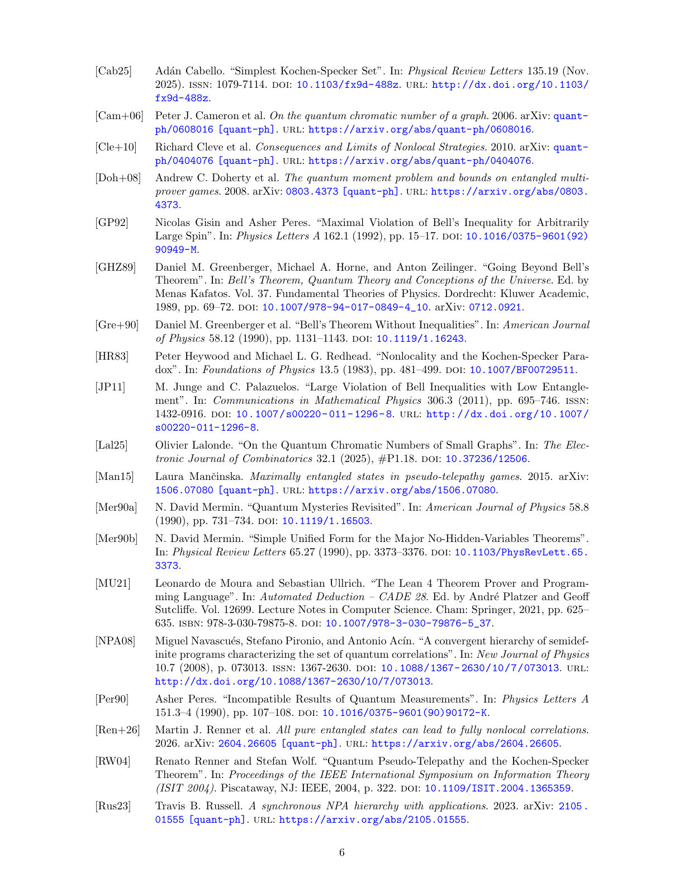 
Low-resolution page preview, page 6

**Summary.** This paper addresses an open problem in quantum nonlocality concerning whether maximally entangled states are sufficient for all pseudo-telepathic games. The authors construct a specific counterexample game, $G_{4,3,6,6}$, and rigorously prove that this game requires entanglement beyond what is provided by any maximally entangled state. This settles the long-standing question negatively.

**Why it may be interesting.** This work pushes the boundaries of understanding quantum correlations by providing a concrete counterexample in nonlocal games, which has deep implications for characterizing genuine multipartite entanglement beyond simple state characterizations.

Detailed structure

**Main problem.** The central question is whether maximally entangled quantum states are sufficient (complete) to guarantee a perfect strategy for every bipartite pseudo-telepathic nonlocal game.

**Main result.** The authors provide a counterexample, $G_{4,3,6,6}$, demonstrating that maximal entanglement is not always sufficient for such games, settling the open question negatively.

**Method.** The proof involves constructing an inner product game and using advanced mathematical techniques, including the NPA hierarchy relaxation solved via SDP, to show the non-existence of a perfect maximally entangled strategy.

**Model / system.** The study uses bipartite nonlocal games, specifically a newly defined class called 'inner product games,' involving input/output sets of sizes 4, 3, and 6 respectively. The analysis is based on quantum correlation measures derived from unitary operators.

**Key observables.** The existence or non-existence of a perfect strategy (probability one) using either an entangled state or a maximally entangled state for the game $G_{4,3,6,6}$.

**Important parameters / regimes.** Input set sizes (4 and 3), output set size (6), and the specific unitaries defining the inner product games.

**Assumptions / limitations.** The proof relies on solving a complex SDP derived from assuming the existence of such a state, which is computationally intensive and formalized in Lean.

**Paper structure.** The paper introduces the problem context regarding completeness for pseudo-telepathy, constructs the specific counterexample game $G_{4,3,6,6}$ (an inner product game), and then proceeds through mathematical machinery (NPA hierarchy/SDP) to prove that no perfect maximally entangled strategy exists.

Abstract

One of the longstanding open problems in quantum nonlocality is to determine if maximally entangled states are complete for bipartite pseudo-telepathic games: namely, if every nonlocal game which admits a perfect entangled strategy admits such a strategy which uses a maximally entangled state. We exhibit a counterexample to this in the form of a bipartite nonlocal game with input sets of size 4 and 3 and output sets both of size 6. This game is part of a new class of nonlocal games, which we call inner product games, which could be of independent interest.

[↑ back to top](#top)

### [An Effective String Theory Toolbox for Quantum Hall Interfaces I: Worldsheet Kinematics and Constraint Structure](http://arxiv.org/abs/2608.06097v1)

**Authors:** Ken K. W. Ma  
**Type:** theory · **Category:** strongly correlated electrons · **PDF:** <https://arxiv.org/pdf/2608.06097v1>  
**Analysis basis:** full PDF text, analyzed in chunks
**Topic relevance:** `Keldysh / 2PI / non-Gaussian methods` **2/5** · `non-equilibrium dynamics` **2/5** · `analog quantum simulation` **1/5** · `correlated / nonlocal dissipation` **1/5** · `driven-dissipative phase transition` **1/5** · `methods for driven-dissipative` **1/5** · `non-equilibrium universality` **1/5**

📷 Fig 1

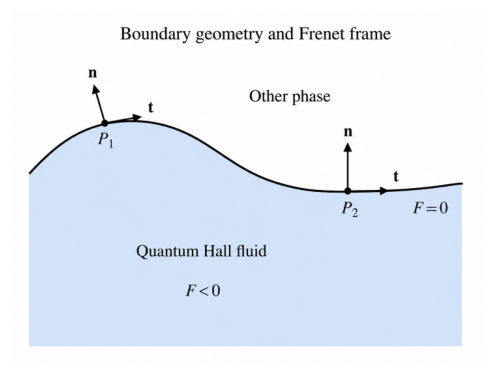 
FIG. 1. Frenet frame and level-set description of a quantum Hall interface. The solid curve is the level set F = 0, the QH fluid occupies F &lt; 0, and n points from the QH phase toward the other phase.

📷 Fig 2

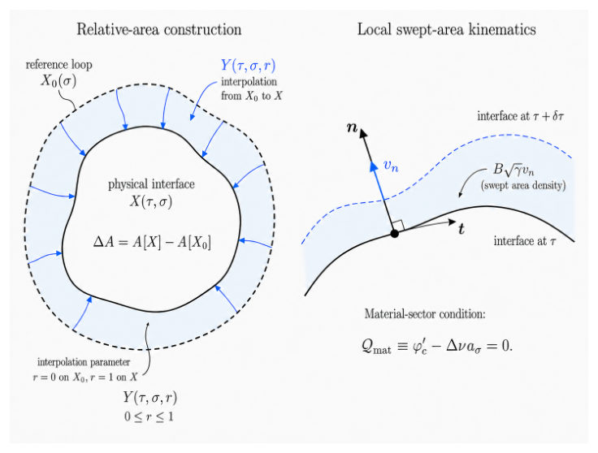 
FIG. 2. Relative-area construction and local swept-area kinematics. Left: a fixed material reference loop X0(σ) is connected to the physical interface X(τ, σ) by a smooth interpolation Y (τ, σ, r), defining the relative magnetic-area density aσ. Right: normal motion sweeps magnetic area at the local rate B√γ vn, leading in the material sector to Qmat ≡φ′ c −∆ν aσ = 0. The local density depends on the chosen material pairing and interpolation, whereas its integral gives the signed relative magnetic area B[A[X] −A[X0]].

📷 Fig 3

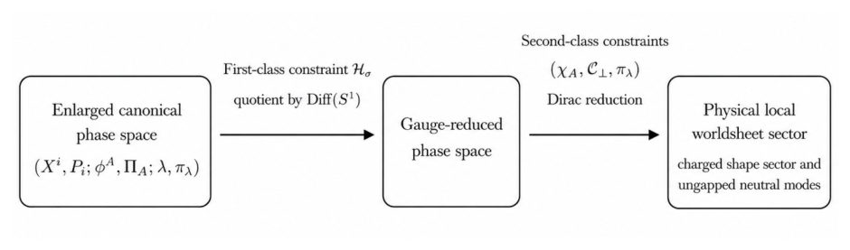 
FIG. 3. Two-stage local canonical reduction. The first-class constraint Hσ generates spatial relabeling and is removed by quotienting by Diff+(S1). About a straight equilibrium interface with ∆ν ̸= 0, the nonzero modes of (χA, C⊥, πλ) form a second-class system and are eliminated through the Dirac bracket. After fixing the nonpropagating conserved profiles retained by the auxiliary completion, the resulting local worldsheet sector contains the charged shape sector together with any neutral modes not gapped by allowed interface interactions.

**Summary.** This work develops an effective field theory toolbox for understanding dynamically moving quantum Hall interfaces. It rigorously links the interface's geometric motion to its electrical charge transport using a worldsheet formalism derived from Chern-Simons theory. The resulting framework cleanly separates universal topological kinematics from material-dependent physics.

**Why it may be interesting.** While focused on QH physics, the development of a general worldsheet formalism for constrained boundary dynamics is highly relevant to modeling interfaces in other strongly correlated systems or topological materials where geometry dictates charge transport.

Detailed structure

**Main problem.** The paper addresses the challenge of formulating an effective, geometrically consistent theory for quantum Hall (QH) interfaces where interface motion is coupled to charge dynamics.

**Main result.** A systematic framework is derived that separates the universal Hall kinematics of the moving interface from its microscopic geometric and neutral energy contributions.

**Method.** The authors employ a worldsheet description, starting from the two-sided Chern-Simons response and introducing a relative-area construction to derive an equal-time constraint linking charge transport to interface shape.

**Model / system.** The system models Abelian quantum Hall interfaces separating incompressible phases. The analysis uses concepts from topological field theory (Chern-Simons action) applied to the geometry of the moving boundary.

**Key observables.** Normal charge current ($\mathbf{J} \cdot \mathbf{n}$), interface velocity ($v_n$), relative magnetic-area density ($a_\sigma$), and geometric energy terms.

**Important parameters / regimes.** Filling fraction difference ($\Delta
u = 
u_1 - 
u_2$) and the background magnetic field strength (implied by Chern-Simons coupling).

**Assumptions / limitations.** The analysis is restricted to the electromagnetic Chern–Simons response in a flat sample, excluding terms like Wen–Zee or gravitational corrections.

**Figures summary.** Figure 1 illustrates the Frenet frame and level-set description used for analyzing the QH interface geometry.

**Paper structure.** The paper progresses by establishing the kinematic constraints from the Chern-Simons response, deriving an equal-time constraint via relative area construction, and finally separating the resulting dynamics into universal Hall kinematics and microscopic geometric terms.

Abstract

A freely moving quantum Hall interface is fundamentally different from an ordinary edge fixed by an external confining potential. Since a normal displacement changes the areas occupied by the adjacent incompressible phases, the interface geometry and charge dynamics cannot be treated as independent degrees of freedom. We formulate this problem for interfaces between Abelian quantum Hall phases using a spatially reparametrization-invariant worldsheet description, in which tangential motion is a relabeling of the interface while normal motion is physical. Starting from the two-sided Chern--Simons response, we derive the relation between normal charge transport and interface motion. We then introduce a relative-area construction, defined with respect to a material reference curve, that converts this velocity relation into an equal-time constraint linking the charged boundary sector to the interface shape. Combined with the folded $K$-matrix current algebra, this identifies the universal Hall kinematics of the moving interface while leaving its geometric energy and neutral dynamics dependent on microscopic interface physics. The resulting framework provides a systematic basis for effective theories of dynamical quantum Hall interfaces.

[↑ back to top](#top)

### [Finite Quantum Histories: Holonomy Spectra, Minimal Clocks, and Exact Clock-Change Covariance](http://arxiv.org/abs/2608.05748v1)

**Authors:** Maxim V. Churilov  
**Type:** theory · **Category:** other · **PDF:** <https://arxiv.org/pdf/2608.05748v1>  
**Analysis basis:** full PDF text, analyzed in chunks
**Topic relevance:** `non-equilibrium dynamics` **2/5** · `Keldysh / 2PI / non-Gaussian methods` **1/5** · `analog quantum simulation` **1/5** · `correlated / nonlocal dissipation` **1/5** · `driven-dissipative phase transition` **1/5** · `entanglement & information structure` **1/5** · `methods for driven-dissipative` **1/5** · `non-equilibrium universality` **1/5**

📷 Fig 1

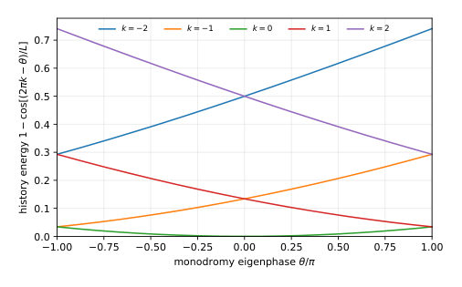 
FIG. 1. Lowest spectral branches for a cyclic history of length L = 12. A monodromy eigenphase shifts the clock momentum. Zero energy occurs only at a fixed monodromy vector; a small nonzero eigenphase produces a precisely controlled frustration energy.

**Summary.** This theoretical paper develops an exact formalism for analyzing finite-time quantum histories governed by cyclical unitary evolution. It shows that key physical observables like the spectral gap depend only on the global monodromy operator, not the individual steps. Furthermore, it rigorously classifies the symmetries (clock changes) that preserve the underlying information structure of the history.

**Why it may be interesting.** This work provides a highly rigorous mathematical framework for understanding how global constraints (like cyclic boundary conditions or total evolution) dictate local observable properties in quantum systems, which is relevant to open system dynamics and measurement theory.

Detailed structure

**Main problem.** The paper solves the problem of characterizing cyclic quantum histories defined by arbitrary time-dependent unitary steps, removing restrictive assumptions about the order of individual steps.

**Main result.** It establishes that spectral properties (gap, trace) are determined solely by the monodromy operator's eigenphases, and it rigorously classifies exact symmetries (clock changes) preserving the history code structure.

**Method.** The analysis employs spectral theory applied to a cyclic history Hamiltonian, relating observables like the spectrum and heat trace to the gauge-invariant properties of the total monodromy operator $M$.

**Model / system.** The system models quantum evolution over a finite cycle time $L$, governed by a propagation Hamiltonian derived from sequential unitary steps $U_t$ acting on a finite-dimensional Hilbert space.

**Key observables.** Monodromy operator ($M$), spectral gap ($\Delta(U)$), history code ($	ext{K}_0$), and the predictive quotient of event alphabets.

**Important parameters / regimes.** Cycle length $L$, monodromy eigenphases $	heta_a$, estimation error bounds ($\epsilon, \delta$).

**Assumptions / limitations.** The analysis assumes finite-dimensional unitary steps and focuses on 'sharp' (unitary) clock changes; it distinguishes these from general basis rotations.

**Figures summary.** Figure 1 illustrates the lowest spectral branches for $L=12$, demonstrating how a nonzero monodromy phase shifts the clock momentum and controls the frustration energy relative to zero energy.

**Paper structure.** The paper proceeds by first analyzing the Hamiltonian structure via the monodromy operator, then deriving closed forms for spectral quantities (gap, trace), followed by characterizing operational equivalence classes of clocks, and finally classifying the symmetries that preserve the history code.

Abstract

We solve cyclic finite-dimensional quantum histories for arbitrary time-dependent unitary steps, without assuming that one step has finite order. The propagation Hamiltonian is a unitary connection Laplacian on a cycle; its complete gauge invariant is the monodromy $M=U_{L-1}\cdots U_0$. Its spectrum is $λ_{a,k}=1-\cos((2πk-θ_a)/L)$, where $e^{iθ_a}\in\mathrm{spec}(M)$. Thus the exact history sector is isomorphic to $\mathrm{Fix}(M)$, while frustration, the gap above a nonempty zero-energy sector, the determinant, and the finite-temperature trace are obtained in closed form. Ordinary spectral data recover the multiset of monodromy phase cosines but not phase orientation; low energy certifies proximity to an exact relational history. We then define the predictive quotient of a sharp finite clock relative to an accessible operator system as the unique coarsest event alphabet preserving all conditional statistics on a history sector. A finite-error theorem shows that threshold clustering recovers this quotient when the minimum diamond separation of inequivalent event channels exceeds four times the estimation error, and proves an optimal record-count bound. With full matrix access and homogeneous step $U$, the minimal number of clock events is the projective order of $U$. We distinguish the normalizer of the clock algebra from transformations preserving the coherent history code and classify oriented exact sharp clock changes by $U(r)\times\mathbb{Z}_L$ on a rank-$r$ history sector; without orientation the cyclic factor becomes dihedral. Reversible changes of full-information clock fibers are necessarily unitary, so irreversible coarse-graining is not exact clock covariance. Minimal realizations of a complete history Gram kernel are uniquely unitarily equivalent, with a finite-data Procrustes bound. Independent finite-matrix code verifies the main results.

[↑ back to top](#top)

### [Multi-State Geometry of Density Matrices and Rectification Sum Rules](http://arxiv.org/abs/2608.06326v1)

**Authors:** Barry Bradlyn  
**Type:** theory · **Category:** other · **PDF:** <https://arxiv.org/pdf/2608.06326v1>  
**Analysis basis:** full PDF text, analyzed in chunks
**Topic relevance:** `non-equilibrium dynamics` **2/5** · `Keldysh / 2PI / non-Gaussian methods` **1/5** · `analog quantum simulation` **1/5** · `correlated / nonlocal dissipation` **1/5** · `driven-dissipative phase transition` **1/5** · `methods for driven-dissipative` **1/5** · `non-equilibrium universality` **1/5**

📷 Fig 1

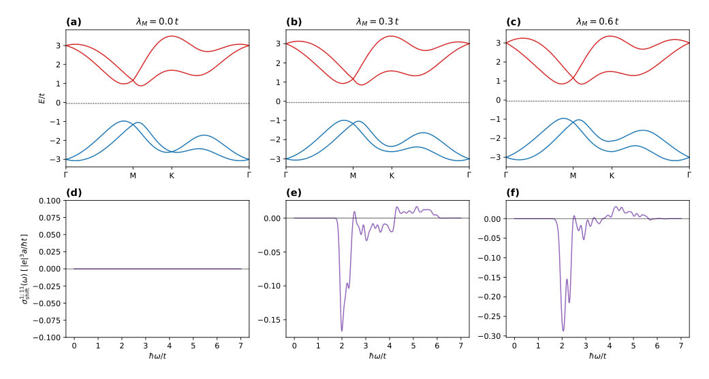 
FIG. 2. Band structure [(a)–(c)] and shift conductivity σ1;11 shift(ω) [(d)–(f), in units of |e|3a/ℏt with a the lattice constant] of the generalized Kane-Mele model Eq. (130) at m = 0. Energy spectra are shown along the path Γ–M–K–Γ in the BZ, for mirror-breaking strengths λM = 0, 0.3t, 0.6t (λSO = 0.5t, λR = 0.3t, half filling). The two occupied (blue) and two unoccupied (red) bands remain gapped at half filling for all λM shown. The shift conductivity is symmetry-forbidden at λM = 0 as seen in (d), and increases in magnitude as λM increases [(e), (f)]. Here and in Fig. 3, tensor components are taken along the normalized reciprocal lattice directions per Eq. (132).

📷 Fig 2

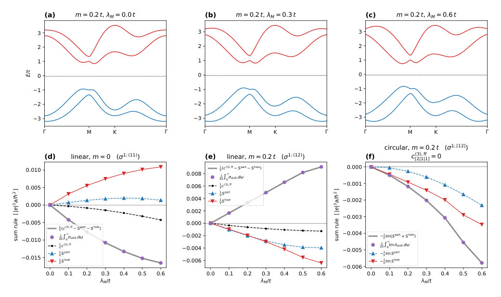 
FIG. 3. The geometric sum rule Eq. (129) evaluated for the generalized Kane-Mele model as a function of mirror-breaking strength λM (all sum-rule curves in units of |e|3a/ℏ2, with a the lattice constant). (a)–(c) show the spectrum of the model in the presence of a time-reversal symmetry breaking Zeeman field (m = 0.2t). (d)–(f) show the corresponding frequency-integrated shift conductivity 1 2π R ∞ 0 dω σshift [points, evaluated by summing the line weights in Eq. (105)] together with the cumulant density 1 V c(3),ff and the multi-state geometric contributions 1 V Spart and 1 V Shole. The cumulant density was computed using Eq. (C28), while the components of the complex distortion tensor...

**Summary.** This paper establishes a multi-state geometric framework using the cQAC tensor to analyze quantum state manifolds. It derives a general sum rule connecting the second-order DC rectification response of insulators to fundamental quantities like the ground state third cumulant and a complex distortion tensor. This provides a powerful, geometry-based tool for understanding nonlinear transport in interacting many-body systems.

**Why it may be interesting.** It provides a powerful geometric tool (cQAC tensor) to constrain measurable transport properties (rectification/currents) in complex many-body systems, linking geometry directly to non-equilibrium response.

Detailed structure

**Main problem.** To develop a theory of multi-state geometry for density matrices and use it to derive general sum rules for second-order rectification response in quantum materials.

**Main result.** A zero-temperature sum rule is derived relating the frequency-integrated DC rectification response to the ground state third cumulant minus a complex distortion tensor, generalizing known single-particle results to many-body systems.

**Method.** The authors introduce the cQAC tensor, a quantum generalization of the Amari-Chentsov tensor, and use time-dependent perturbation theory on thermal density matrices to establish geometric connections.

**Model / system.** The work applies to general many-body systems, extending beyond clean, noninteracting zero-temperature limits. Specific applications include insulators modeled by a generalized Kane-Mele model.

**Key observables.** Second-order DC rectification response, ground state third cumulant, complex distortion tensor, shift current, and nonlinear Hall currents.

**Important parameters / regimes.** Zero temperature (T=0) is the primary focus for deriving exact sum rules; low-temperature measurements are discussed in relation to gap corrections.

**Assumptions / limitations.** The theory aims to generalize beyond assumptions of clean, noninteracting systems, but derivations rely on perturbation theory and specific geometric formalisms like the QAC tensor.

**Figures summary.** Not specified by notes; however, numerical verification is mentioned using a generalized Kane-Mele model.

**Paper structure.** The paper develops the multi-state geometry framework via the cQAC tensor, derives the general zero-temperature sum rule for rectification response, specializes this rule to currents like the shift current, and finally discusses the temperature dependence of the result.

Abstract

The geometry of quantum states has emerged as a key ingredient in understanding the linear and nonlinear responses of quantum materials. To date, however, the connection between geometry and nonlinear response is best understood for clean, noninteracting systems at zero temperature. In this work, we develop a theory of multi-state geometry for density matrices and use it to derive sum rules for second-order rectification, making no assumptions about the strength of disorder or interactions. We first show that perturbation theory for thermal density matrices gives rise to two dual information-theoretic connections and an almost complex structure. We introduce a complex, quantum generalization of the Amari-Chentsov tensor of classical information theory, the cQAC tensor, which captures the multi-state geometry of the perturbed density matrix. We derive a zero-temperature sum rule for the frequency-integrated DC rectification response of an insulator as a difference between a ground state third cumulant and the complex distortion tensor, a multi-state geometric quantity built from the cQAC tensor. This generalizes known single-particle sum rules for the shift and nonlinear Hall currents to many-body systems and general perturbations. Specializing to the shift current, we resolve the geometric contribution for multiband insulators into particle-like and hole-like terms. We verify the sum rule numerically in a generalized Kane-Mele model, finding that the geometric contribution can dominate the integrated response. Finally, we show that although the splitting of the sum rule into cumulant and geometric contributions does not survive at nonzero temperature, the measured sum rule for insulators differs from its zero-temperature form by corrections exponentially small in the gap, allowing low-temperature rectification measurements to probe the multi-state geometry of insulators.

[↑ back to top](#top)

### [Towards fault-tolerance with universal phase-error-transparent gates for high-spin cat codes](http://arxiv.org/abs/2608.05992v1)

**Authors:** Kelvin Onggadinata, Si Yan Koh, Arghya Maity, Kuan Eng Johnson Goh, Bent Weber, Kay Jin Lim, Hui Khoon Ng, Teck Seng Koh  
**Type:** theory · **Category:** quantum information and computing · **PDF:** <https://arxiv.org/pdf/2608.05992v1>  
**Analysis basis:** full PDF text, analyzed in chunks
**Topic relevance:** `QC/QI experiment` **2/5** · `quantum measurements` **2/5** · `exotic spin models in light-matter` **1/5** · `measurement-induced transitions` **1/5** · `spintronics-quantum-optics interface` **1/5**

📷 Fig 1

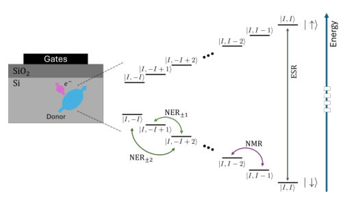 
FIG. 1: Diagram of the donor and electron system in sil- icon and their energy levels. The eigenstates |s⟩⊗|I, mI⟩ are split into two branches with electron spin s =↓(s =↑) corresponding to the lower (upper) branch. Electron spin resonance (ESR) controls inter-branch transitions, while transitions between nuclear spin levels within each branch can be controlled with resonant magnetic fields (NMR). The quadrupole interaction enables transitions via electric fields on resonance with nuclear spacings of ∆mI = ±1 and ∆mI = ±2 (NER±1, NER±2).

📷 Fig 2

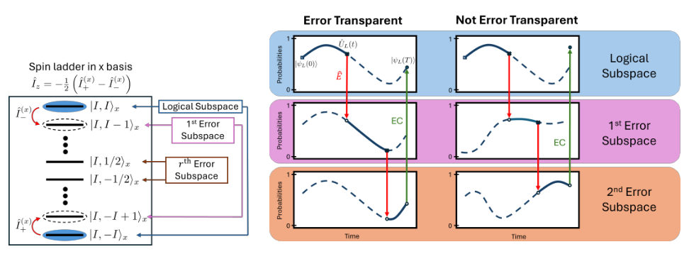 
FIG. 2: (a) Dephasing errors act as spin ladder operations in the {|I, mI⟩x} basis, with each |mI| forming the support state for the logical subspace and error subspaces. (b) Conceptual illustration of error-transparent (ET) and non-ET operations. The red arrow illustrates the action of an error operator causing jumps from error subspaces of lower rank to higher ones. ET operations preserve the intended trajectories/evolutions in the logical subspace in each of the error subspaces. Performing error correction (represented by green arrow) at any time then brings the transformed state in the error subspaces to the appropriate state in the logical subspace.

📷 Fig 3

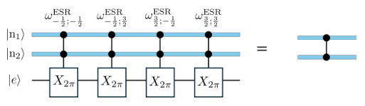 
FIG. 3: Error-transparent implementation of logical CZ gate for I = 3/2. A sequence of four consecutive ESR- based 2π rotations applied on the electron ancilla pro- duces a geometric phase conditional on the support states of the |1L⟩state, resulting in an ET CZ gate. Each thick blue line corresponds to a high-spin donor (d-level sys- tem) with state labels |nk⟩, k = 1, 2, while the thin black line corresponds to the electron system with state label |e⟩. The ESR frequencies are denoted by ωESR mI,m′ I with mI, m′ I being the conditional spin states on n1, n2, re- spectively.

📷 Fig 4

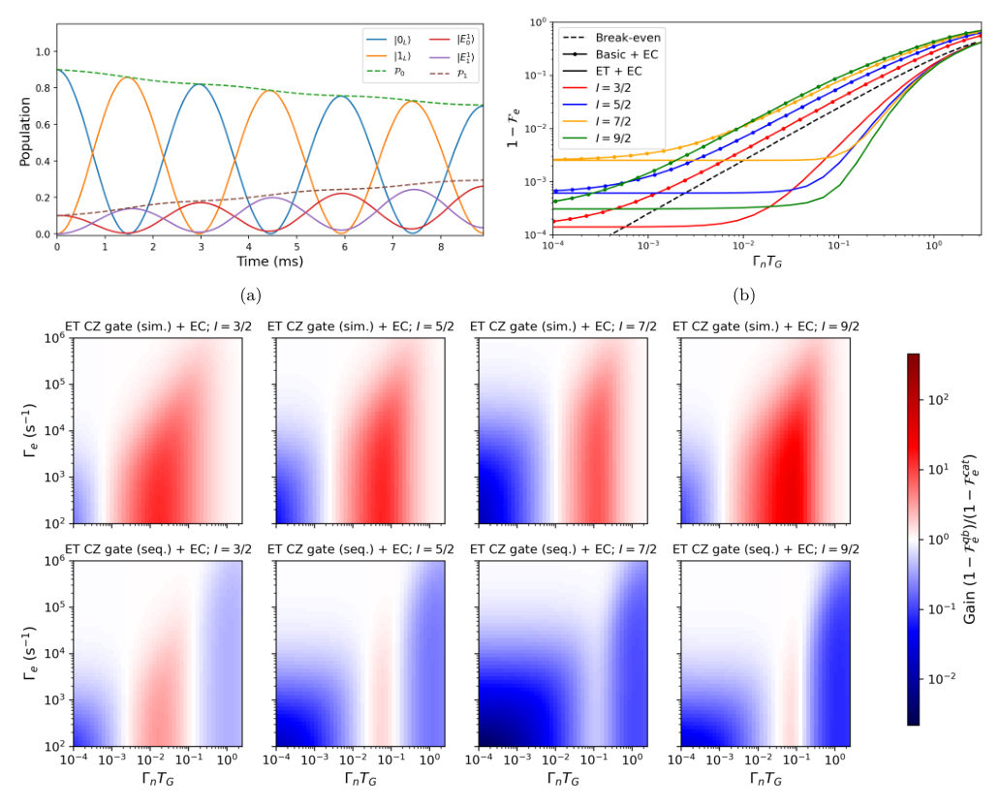 
FIG. 4: Evolution and numerical performances of ET gates. (a) State evolution under an ET X gate rotation with initial state |ψ0⟩= √

📷 Fig 5

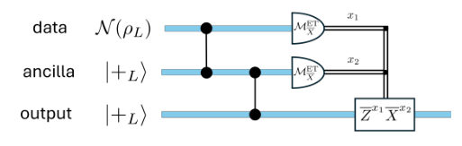 
FIG. 5: Knill error correction (Knill-EC) circuit based on teleportation. All the rails of the circuit are assumed to be the same high-spin system (denoted with blue thick lines) that is encoded in spin cat-x code. The data rail contains a noisy logical state represented by the error channel N acting on ρL, while the ancilla and output rail are initialized in the logical dual state |+L⟩. The re- maining circuit components consists of ET version of CZ gates, logical dual basis measurements, and appropriate Pauli gates depending on the measurement outcomes.

**Summary.** This paper develops the theory required to achieve fault-tolerant quantum computing using high-dimensional nuclear spins encoded in a spin cat code. The core contribution is the construction of universal logical gates that are 'Error-Transparent' (ET) to phase errors, ensuring that operational noise remains correctable by subsequent Quantum Error Correction steps. This provides a concrete path toward scalable quantum computation in solid-state systems.

**Why it may be interesting.** This work provides a highly detailed theoretical roadmap for realizing fault-tolerant quantum computation in solid-state spin qubits, directly addressing the critical issue of noise resilience in physical implementations.

Detailed structure

**Main problem.** The primary challenge is constructing quantum gates for high-dimensional nuclear spin systems that are fault-tolerant against phase errors, which dominate noise in donor-in-silicon architectures.

**Main result.** The authors construct a universal set of Error-Transparent (ET) logical gates and demonstrate that ET operations are crucial for achieving optimal error correction capacity necessary for full fault-tolerant quantum computation.

**Method.** The work involves theoretical construction of gate sets, formalizing the Error Transparency criterion ($\left[\hat{\mathcal{E}}_j, \hat{H}(t)
ight]|\psi_L
angle= 0$), and analyzing the fault tolerance of measurement and error correction gadgets.

**Model / system.** The system utilizes high-dimensional nuclear spins (e.g., in donor atoms in silicon) encoded into a spin cat code, which provides intrinsic robustness against phase errors. Control is achieved via ESR and NMR/NER driving fields.

**Key observables.** Error propagation paths, fault counts ($t(I), t(A), t(O)$), logical gate fidelity relative to ET vs non-ET gates, and measurement POVM operators (CAN, DUAL).

**Important parameters / regimes.** The code distance $p = 2r + 1$ and the error order $r$, which dictates the maximum correctable error weight.

**Assumptions / limitations.** Errors are primarily modeled as dephasing errors ($\hat{I}_z$), and the analysis relies on constructing gates that satisfy the ET criterion for fault tolerance across all components (gates, measurement, correction).

**Figures summary.** Figures illustrate energy level diagrams showing ESR/NMR control; one figure contrasts ET vs non-ET operations; another details the implementation of a logical CZ gate using multiple conditioned pulses.

**Paper structure.** The paper develops from establishing the physical platform and error model, to constructing the universal set of ET gates (including $Z(	heta)$ and $CZ$), and finally proving fault tolerance for measurement and error correction circuits based on these ET operations.

Abstract

High-dimensional nuclear spins offer a hardware-efficient route to quantum error correction (QEC), with the spin cat code providing intrinsic robustness against phase errors -- the dominant noise channel in donor-in-silicon architectures. However, realizing the full potential of this encoding requires gate operations that preserve its error-correcting properties. In this work, we construct a universal logical gate set that is error-transparent (ET) to phase errors, and discuss its practical implementations and challenges. The ET gates ensure that phase errors occurring stochastically during gate operations are propagated in a systematically traceable manner and remain correctable in a subsequent QEC step. Among the universal gate set constructed, we identify the logical $X$ gate as the primary challenge and discuss potential realization schemes. In addition, to fully leverage the spin cat code's advantage over an unencoded qubit, multi-tone microwave driving of the logical $CZ$ gate is essential. Our simulations show that ET gates significantly outperform non-ET gates and may be necessary to surpass the break-even point. We further show how logical measurement and recovery can be constructed from ET operations, and explain why state-preparation cannot be made ET. In particular, ET measurement in the computational basis is realizable via spin parity measurement, and that error correction circuits constructed from ET operations achieve optimal error correction capacity. Our work charts a concrete path toward full fault-tolerant quantum computation with high-dimensional nuclear spin systems.

[↑ back to top](#top)

### [Beyond Electrons: Radiative Thermal Computing and Neural Networks at the Near-Field Limit](http://arxiv.org/abs/2608.06203v1)

**Authors:** Hexiang Zhang, Mauro Antezza, Yi Zheng  
**Type:** theory · **Category:** disordered systems and neural networks · **PDF:** <https://arxiv.org/pdf/2608.06203v1>  
**Analysis basis:** full PDF text, analyzed in chunks
**Topic relevance:** `non-equilibrium dynamics` **2/5** · `correlated / nonlocal dissipation` **1/5** · `driven-dissipative phase transition` **1/5** · `methods for driven-dissipative` **1/5** · `non-equilibrium universality` **1/5**

📷 Fig 1

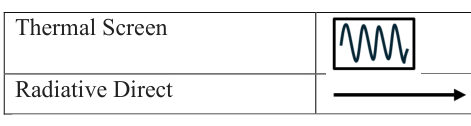 
Fig. 2: Scheme of 4-model combined T-CNN.

**Summary.** This paper proposes using near-field radiative heat exchange to build functional neural networks without any electrical circuits. By employing phase-change materials in diodes and transistors, they create a Thermal CNN (T-CNN) for pattern recognition and a T-RNN for memory. This establishes a new, energy-conserving computing paradigm where temperature gradients act as the carriers of information.

**Why it may be interesting.** This work provides a novel platform where thermal dynamics, phase transitions, and non-equilibrium heat transfer govern information processing, offering insights into energy-efficient computation far removed from traditional electronic models.

Detailed structure

**Main problem.** The primary goal is to develop a non-electronic, contactless computing paradigm for artificial neural networks by replacing electrical charge carriers with heat transfer.

**Main result.** The authors successfully establish the first radiative realization of thermal deep learning, demonstrating that temperature fields can carry intelligence to perform complex computations.

**Method.** They model the network using near-field radiative coupling between components like diodes and transistors made from phase-change materials (PCMs).

**Model / system.** The system is a programmable Near-Field Radiative Thermal Network (NRTNN) comprising T-CNN for spatial processing and T-RNN for temporal memory. It relies on near-field photon tunneling between nanoscale surfaces, utilizing the temperature-dependent emissivity of PCMs like VO2 and GST.

**Key observables.** Heat flux ($\mathbf{h}$), radiative coupling coefficients (synaptic weights), and logic states $\{+1, 0, -1\}$ (Absorbing, Neutral, Releasing).

**Important parameters / regimes.** Gate temperature distributions ($T_G$), PCM relaxation time ($	au_s$), and the amplification factor ($\alpha$).

**Assumptions / limitations.** The computation is modeled entirely through near-field radiative heat exchange, assuming that thermal behavior can be accurately mapped onto a neural network structure.

**Figures summary.** Figure 1 illustrates the basic units: radiative thermal diodes (rectification) and transistors (gating). Later figures detail the T-CNN/T-RNN structures incorporating temporal recurrence via hysteretic emissivity.

**Paper structure.** The paper systematically builds from fundamental components (diodes, transistors) to complex architectures. It first details the spatial processing (T-CNN), then extends this to include time dependence and memory (T-RNN), culminating in a detailed derivation of the total loss function $\mathcal{J}$ for training.

Abstract

We propose and analyze a programmable near-field radiative thermal network that emulates convolutional and recurrent operations through heat exchange. By integrating radiative thermal diodes and transistors composed of phase-change materials such as VO2 and GST, we construct two fundamental architectures: the Thermal Convolutional Neural Network (T-CNN) and the Thermal Recurrent Neural Network (T-RNN). The T-CNN executes spatial pattern recognition via temperature-dependent emissivity modulation, where each gate acts as a tunable radiative filter that amplifies or suppresses localized heat flux. The system is externally programmable via gate temperature distributions in VO2/GST, enabling weighted summation and nonlinear activation; hysteretic transitions provide state dependent responses that can be harnessed for memory. The T-RNN extends this functionality temporally, embedding radiative feedback and hysteretic phase transitions to realize memory and sequential inference. Together, these systems exhibit tri-state logic behavior, radiative gain, and non-volatile thermal storage, key attributes of physical learning. Each logical node operates without charge carriers or electrical circuits, relying solely on near-field photon tunneling between nanoscale surfaces. The resulting framework enables direct implementation of convolution, memory retention, and feedback learning within a contactless, energy-conserving platform. This study establishes the first radiative realization of thermal deep learning, revealing a new computing paradigm where temperature fields function as carriers of intelligence, uniting heat transfer, memory, and adaptive inference in a single non-electronic system.

[↑ back to top](#top)

### [Large anomalous shifts of potassium-39 Feshbach resonances](http://arxiv.org/abs/2608.05512v1)

**Authors:** Ali Zaheer, Mohammed Bouras, Krzysztof Giergiel, Rudolf Grimm, Andrei Sidorov, Peter Hannaford  
**Type:** experiment · **Category:** other · **PDF:** <https://arxiv.org/pdf/2608.05512v1>  
**Analysis basis:** full PDF text, analyzed in chunks
**Topic relevance:** `analog quantum simulation` **2/5** · `Keldysh / 2PI / non-Gaussian methods` **1/5** · `driven-dissipative phase transition` **1/5** · `methods for driven-dissipative` **1/5** · `quantum optics experiment` **1/5**

📷 Fig 1

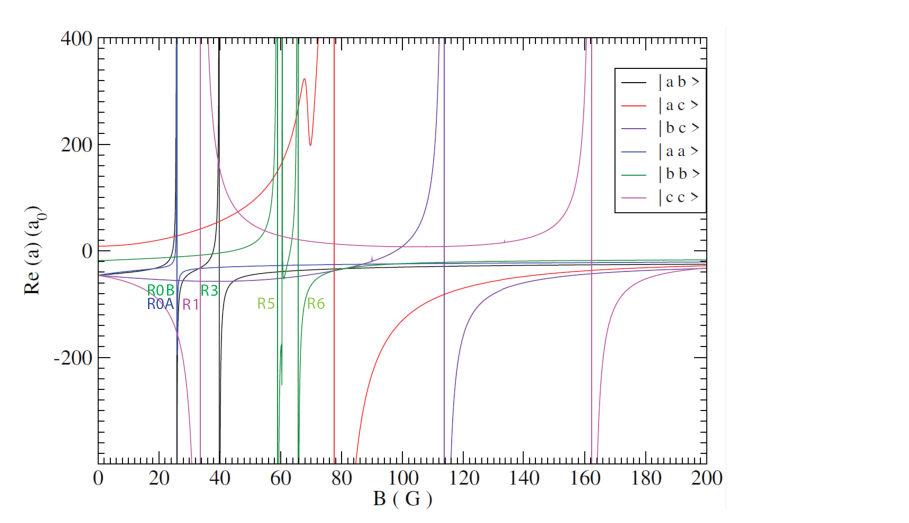 
FIG. 1. Calculated 39K F=1 s-wave and d-wave Feshbach resonances up to 200 G [42] . The spin channels {aa}, etc, are defined in the caption to Table I. The resonances studied in this work are labeled R0A, R0B, R1, R3, R5, and R6 (Table I).

📷 Fig 2

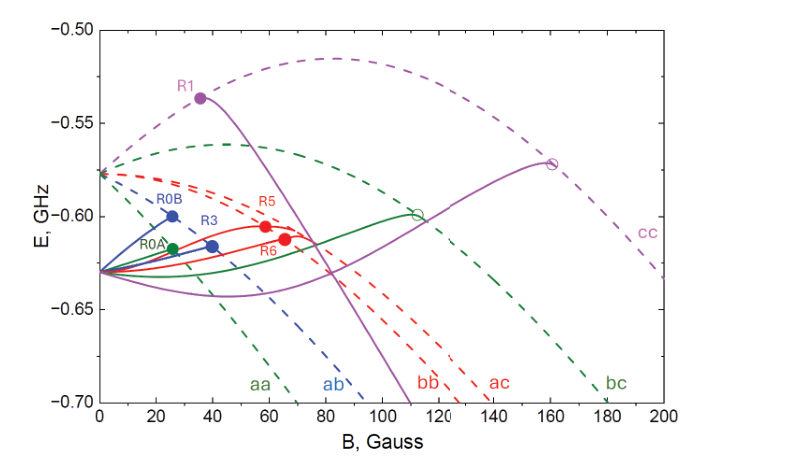 
FIG. 2. Calculated partial molecular and atom-pair Zeeman energy-level diagram leading to F=1 s-wave Feshbach resonances at 25.9 G (R0A and R0B), 33.6 G (R1), 39.9 G (R3), 58.8 G (R5), 65.6 G (R6), 77.8 G, 113.9 G and 162.3 G [42], where the energy of atom-pair states (dashed lines) equals the energy of bound molecular states (solid lines) and the magnetic quantum numbers mF 1 + mF 2 = M. The molecular Zeeman states are (S, I, f, M) = (1, 3, 3, +2) [dark green], (1, 1, 1, +1) [blue], (1, 3, 3, +1) [blue], (1, 1, 1, 0) [red], (1, 3, 3, 0) [red], (1, 3, 3, -1) [light green], (1, 1, 2, -2) [purple, 33.6 G resonance], (1, 1, 2, -2) [purple, 162.3 G resonance]. The (1, 3, 3, M) and (1, 1, 1, M)...

📷 Fig 3

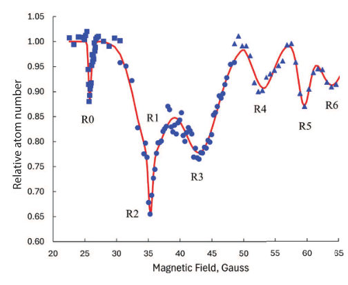 
FIG. 3. Scan of the Feshbach atom-loss resonances up to 65 G for a 39K unpolarized-spin sample at a temperature of 16 µK and ODT trap depth of 46 µK. The blue squares, circles and triangles represent data taken on different days. The solid line represents a multi-Gaussian fit. The labels are defined in Table I.

📷 Fig 4

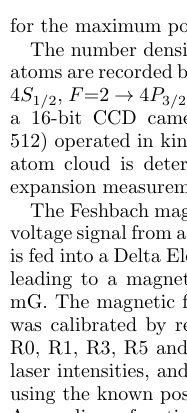 
Figure 3 shows an example scan of the Feshbach atom- loss resonances up to 65 G for an unpolarized-spin sample at a temperature of 16 µK and trap depth of 46 µK. The narrow resonance labeled R0 is the well-known 25.9 G resonance listed in Table I. The dip labeled R1 and R2, near 35 G, is a superposition of two resonances (Fig. 4): a broad resonance (1/e half-width ≈3.8 G), which we designate R1, and a narrow resonance (≈0.5 G), which we designate R2. The broader resonance R1 shifts to lower magnetic fields with decreasing ODT laser power, approaching 33.4 G as the power approaches zero, and the amplitude increases from 16% at 10 W ODT laser power up to 36% at 1 W. This resonance is identified...

📷 Fig 5

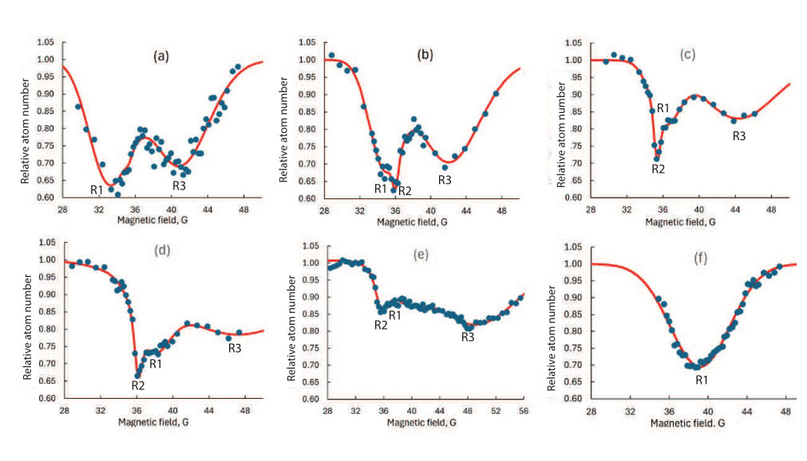 
FIG. 4. (a)-(e) Scans of the R1, R2 and R3 Feshbach atom-loss resonances for an unpolarized-spin sample and a range of ODT powers and atom cloud temperatures: (a) 1.1 W, 6 µK; (b) 2.3 W, 10 µK; (c) 7.1 W, 20 µK; (d) 9.8 W, 25 µK; (e) 12 W, 30 µK. (f) Scan of the R1 resonance on a spin-polarized |1, −1⟩sample, 15 W, 34 µK. Solid lines represent multi-Gaussian fits to the recorded profiles of the resonances.

**Summary.** The researchers observed unusually large anomalous shifts in specific Feshbach resonances of potassium-39 atoms trapped by an optical dipole trap. They determined these shifts arise from a substantial differential ac Stark shift, pointing to molecular polarizabilities four to seven times larger than expected. This finding highlights the sensitivity of resonance spectroscopy to near-resonant laser coupling with underlying molecular transitions.

**Why it may be interesting.** This work provides a highly sensitive probe into the dynamic polarizabilities of weakly bound molecules, revealing strong coupling mechanisms that deviate significantly from simple predictions based on atomic polarizabilities. This is crucial for high-precision quantum control using optical traps.

Detailed structure

**Main problem.** The study reports observing large anomalous shifts of specific Feshbach resonances in potassium-39 atoms confined within an optical dipole trap.

**Main result.** These large shifts are attributed to unexpectedly large dynamic polarizabilities of the weakly bound Feshbach molecules, which are significantly larger than previously expected for such systems.

**Method.** The shift is measured by tracking the resonance position as a function of the optical trap depth and temperature, relating this shift to differential ac Stark effects.

**Model / system.** The system involves ultracold potassium-39 atoms interacting via Feshbach resonances in an optical dipole trap (ODT). Theoretical models use coupled-channel scattering approaches involving singlet and triplet molecular potentials.

**Key observables.** Anomalous resonance shifts (up to +7.5 G), the dependence of these shifts on ODT depth, and the extracted dynamic polarizabilities ($\alpha_{mol}$).

**Important parameters / regimes.** Potassium-39 ($^{39}	ext{K}$), Feshbach resonances at 33.6 G and 39.9 G, trapping laser wavelength (1063.9 nm), temperatures up to $\sim 35 \mu	ext{K}$.

**Assumptions / limitations.** The analysis assumes a spherically symmetric 3D-Gaussian trapping potential and uses thermal averaging over the trap depth.

**Figures summary.** Figures show calculated resonance positions, Zeeman energy level curves for molecular states, and plots detailing how the measured shift depends on the ODT trap depth and temperature.

**Paper structure.** The paper first reports the observation of large shifts, then analyzes the dependence on trapping parameters to isolate the source (differential ac Stark shift), and finally attributes this effect to a near-coincidence between the laser frequency and a molecular transition.

Abstract

We report the observation of large anomalous shifts, up to +7.5 G, of the positions of the 33.6 G and 39.9 G Feshbach resonances in potassium-39 atoms confined in a 1063.9 nm optical dipole trap (ODT) at temperatures up to around 35 μK and trap depths up to about 136 μK. When the atom cloud is cooled to lower temperatures, by reducing the trap depth of the ODT, the shifts decrease proportionally with trap depth and approach zero at zero depth. We show that the large observed shifts originate from a large differential ac Stark shift between the incoming pair of potassium-39 atoms and the weakly bound Feshbach molecule, which in turn originates from an unexpectedly large dynamic polarizability of the Feshbach molecule. The polarizabilities of the Feshbach molecules extracted from the measured shifts of the 33.6 G and 39.9 G resonances are about four to seven times the sum of the polarizabilities of the two incoming potassium-39 atoms, that is, about four to seven times larger than the usual polarizability of weakly bound Feshbach molecules. The large polarizabilities of the Feshbach molecules are attributed to a near-coincidence between the frequency of the 1063.9 nm ODT laser and the frequency of a molecular transition from the last vibrational level of the lowest triplet a3Σ+u potential to a vibrational level of the excited b3Σ+g potential. Other potassium-39 Feshbach resonances we have studied exhibit a zero or very small shift, corresponding to molecular polarizabilities close to the sum of the polarizabilities of the two incoming potassium-39 atoms.

[↑ back to top](#top)

### [Self-dual $S_3$ gauge theory in 2+1d: lattice model and topological phase transitions](http://arxiv.org/abs/2608.05294v1)

**Authors:** Da-Chuan Lu, Chong Wang, Ashvin Vishwanath  
**Type:** theory · **Category:** statistical mechanics · **PDF:** <https://arxiv.org/pdf/2608.05294v1>  
**Analysis basis:** full PDF text, analyzed in chunks
**Topic relevance:** `analog quantum simulation` **2/5** · `Keldysh / 2PI / non-Gaussian methods` **1/5** · `driven-dissipative phase transition` **1/5** · `entanglement & information structure` **1/5** · `methods for driven-dissipative` **1/5**

📷 Fig 1

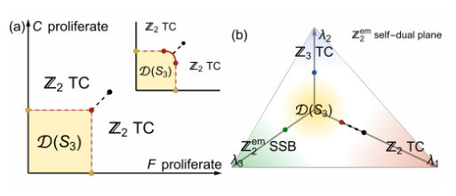 
FIG. 1. Phase diagrams of D(S3). (a) Schematic (C, F) plane for independent proliferation of the non-Abelian chargeon C and fluxon F, analogous to the e-m proliferation diagram of the Z2 toric code. The D(S3) phase near the origin is bordered by two Z2 TC phases connected by Higgs-confinement conti- nuity. Yellow dots denote 3d 3-state Potts∗transitions, while the red dot is the Zem 2 -symmetric multicritical point studied here. Along the self-dual line, a possible first-order line with Zem 2 SSB terminates at a 3d Ising point. The inset shows an alternative scenario where the Zem 2 -odd perturbation is irrel- evant, broadening the multicritical point into a critical line bounded by the red...

📷 Fig 2

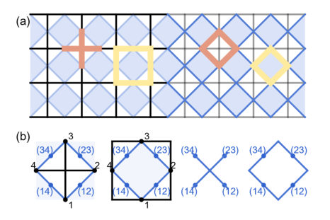 
FIG. 2. (a) Lattice structure. Qutrits reside on the black links, and qubits on the blue links, primitive cell of blue lat- tice has half the area. Left: the quantum-double convention, with star (red) and plaquette (yellow) operators. Right: the equivalent Wen-plaquette convention, with unfilled and filled diamond plaquettes. (b) Stabilizer definitions. From left to right: qutrit plaquette Bp and star Av, whose Pauli powers on links 1–4 depend on the qubit states (ij) on the adjacent blue links; qubit plaquette Bp and star Av, each acting on the four qubit links of the blue lattice.

**Summary.** This paper constructs and analyzes a lattice model for the $S_3$ quantum double gauge theory, generalizing known self-dual $\mathbb{Z}_2$ systems. By employing three independent theoretical methods, the authors map out the phase diagram, predicting critical edge states described by the Ising CFT and identifying multiple distinct gapped phases in the bulk.

**Why it may be interesting.** This work provides a rigorous theoretical framework for understanding how topological order breaks down in non-Abelian gauge theories, connecting lattice models directly to continuum CFT descriptions.

Detailed structure

**Main problem.** The research aims to generalize the concept of electric-magnetic self-duality from $\mathbb{Z}_2$ gauge theories to non-Abelian systems, specifically analyzing phase transitions in $S_3$ quantum double models.

**Main result.** The model exhibits a gapless critical edge state described by the tetracritical Ising CFT, and the bulk undergoes three independent gapped phase transitions driven by bosonic perturbations.

**Method.** The authors employ multiple complementary theoretical approaches: category-theoretic anyon condensation, microscopic lattice Hamiltonians analysis, and Chern-Simons-Higgs (CSH) theory to characterize the phase diagram.

**Model / system.** The system is a lattice model for the $S_3$ quantum double $\mathcal{D}(S_3)$ on a tensor product Hilbert space. It generalizes the self-dual $\mathbb{Z}_2$ gauge theory and is constructed to be sign-problem-free.

**Key observables.** The existence of gapless critical edge states, the nature of the three distinct gapped phases in the bulk, and the realization of the $\mathbb{Z}_2$ anyon-permutation symmetry.

**Important parameters / regimes.** Coupling constants ($\lambda_1, \lambda_2, \lambda_3$) governing bosonic perturbations; lattice size for numerical checks.

**Assumptions / limitations.** The proposal introduces a 'minimal-condensation principle,' assuming that proliferating a bosonic anyon generically drives condensation of a minimal condensable algebra.

**Figures summary.** Figure 1 schematically shows the phase diagram for $D(S_3)$ and its dependence on three perturbation parameters $(\lambda_1, \lambda_2, \lambda_3)$. Table I details critical boundaries and neighboring gapped phases.

**Paper structure.** The paper develops a unified picture by analyzing transitions using three independent methods (anyon condensation, lattice Hamiltonians, CSH theory). It establishes the minimal-condensation principle and extends the model to infinite families of dihedral quantum doubles $\mathcal{D}(D_{2n})$.

Abstract

Electric-magnetic self-duality of the $\mathbb{Z}_2$ gauge theory, realized microscopically as a half-lattice-translation exchanging electric charge and magnetic flux, has been an influential example of a duality symmetry with an exact lattice realization. We construct the first non-Abelian generalization of this construction: a lattice model of the $S_3$ quantum double $\mathcal{D}(S_3)$ on a tensor product Hilbert space in which the $\mathbb{Z}^{\mathrm{em}}_2$ anyon-permutation symmetry, exchanging the non-Abelian chargeon $C$ and fluxon $F$, is realized via lattice translation. Consequently we find that the zigzag boundary termination of the model realizes, without fine-tuning, a gapless critical edge state described by the tetracritical Ising CFT. The bulk admits three independent $\mathbb{Z}_2^{\mathrm{em}}$-preserving bosonic perturbations, driving $\mathcal{D}(S_3)$ into distinct gapped phases. We analyze these transitions by three independent methods: category-theoretic anyon condensation, microscopic lattice Hamiltonians, and Chern-Simons-Higgs theory, which all agree, yielding a unified picture. These examples motivate a minimal-condensation principle: proliferating a bosonic anyon generically drives condensation of a minimal condensable algebra containing it, with symmetry-related condensates appearing as degenerate vacua that spontaneously break the anyon-permutation symmetry. Our model construction extends to an infinite family of self-dual dihedral quantum doubles $\mathcal{D}(D_{2n})$. Notably, each model is sign-problem-free, opening the door to large-scale numerical exploration of the phases of non-Abelian Chern-Simons-Higgs theories.

[↑ back to top](#top)

### [Thermodynamic statistics of given names in USA and France](http://arxiv.org/abs/2608.06048v1)

**Authors:** Klaus M. Frahm, Dima L. Shepelyansky  
**Type:** theory · **Category:** statistical mechanics · **PDF:** <https://arxiv.org/pdf/2608.06048v1>  
**Analysis basis:** full PDF text, analyzed in chunks
**Topic relevance:** `non-equilibrium dynamics` **2/5** · `non-equilibrium universality` **2/5** · `Keldysh / 2PI / non-Gaussian methods` **1/5** · `driven-dissipative phase transition` **1/5**

📷 Fig 1

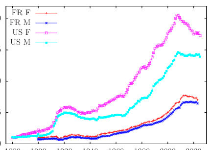 
FIG. 1: Year dependence of the number of given names in the data sets of [3, 4] for the four cases of FR and US, both for female (F) and male (M) names. See also Appendix Fig. A1, where normalized values of this number with respect to the year 1960 are shown.

📷 Fig 2

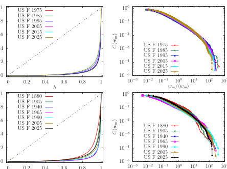 
FIG. 2: Left: US female name Lorenz curves for the 6 years 1975, 1985, 1995, 2005, 2015, 2025 (top) and the 7 years 1880, 1905, 1940, 1965, 1990, 2005, 2025 (bot- tom). The x-axis corresponds to the cumulated fraction of households/names (h) and the y-axis to the cumulated fraction of wealth/name frequency (w). The dashed black line corresponds to the line of perfect equipartition w = h. The Gini coefficients for the years 1975 to 2025 (1880 to 2025) are G = 0.93, 0.934, 0.925, 0.911, 0.903, 0.894 (G = 0.854, 0.895, 0.938, 0.939, 0.931, 0.911, 0.894). Right: Pareto curves C(wm) for the same data where C(wm) represents the fraction of names with a name frequency larger than wm (analogous to...

📷 Fig 3

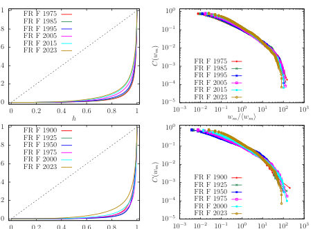 
FIG. 3: FR female name Lorenz and Pareto curves for the 6 years 1975, 1985, 1995, 2005, 2015, 2023 (top) and the 6 years 1990, 1925, 1950, 1975, 2000, 2023 (bottom) in the same style as Fig. 2. The Gini coefficients for the years 1975 to 2023 (1900 to 2023) are G = 0.931, 0.925, 0.916, 0.898, 0.877, 0.866 (G = 0.923, 0.934, 0.934, 0.931, 0.914, 0.866) and the values of ⟨wm⟩= ws are ⟨wm⟩= 130, 103, 80.5, 56.9, 43.8, 39.1 (⟨wm⟩= 237, 221, 265, 130, 71.6, 39.1). See also Appendix Fig. A3 for the case of FR male names.

📷 Fig 4

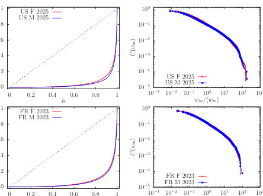 
FIG. 4: Comparison of Lorenz curves (left panels) and Pareto curves (right panels) between female names (red curves) and male names (blue curves). Top (bottom) panels correspond to data of US 2025 (FR 2023). See also Appendix Fig. A4 for the cases of US 1880 and FR 1990.

📷 Fig 5

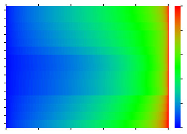 
FIG. 6: Density color plot of Lorenz curves for US F for the years 1880 to 2020 (in steps of 10 years) obtained from the RJE model with optimal values of a and ε. The x-axis cor- responds to the cumulated fraction of households/names (h) and the y-axis to year. For a better visibility of small wealth values the numbers of the colorbar correspond to the quantity w1/4 where w is the cumulated fraction of wealth/name fre- quency. For all cases, the average curve distance between the real data and optimal RJE Lorenz curves is below 5 × 10−3. This applies also to Appendix Fig. A8, where a similar den- sity plot for FR F and the years 1900 to 2020 is shown.

**Summary.** This paper treats the popularity distribution of given names in the USA and France as a physical system analogous to wealth inequality. By applying tools from statistical mechanics—specifically Rayleigh-Jeans thermalization theory—the authors demonstrate that name frequencies exhibit remarkable long-term stability. This suggests that naming preferences follow universal, quantifiable thermodynamic laws.

**Why it may be interesting.** Although applied to sociology, the reliance on established concepts like RJ condensation and entropy conservation provides a novel, non-standard application of statistical physics principles to complex empirical time series.

Detailed structure

**Main problem.** The study analyzes the long-term statistical distributions of given names in the USA and France, treating name popularity as an analogue to wealth distribution.

**Main result.** The name frequency distributions exhibit remarkable stability over more than a century, suggesting they are governed by universal physical principles like Rayleigh-Jeans (RJ) thermalization and condensation.

**Method.** The authors apply concepts from statistical mechanics used in analyzing wealth inequality, such as the Lorenz curve, Gini coefficient, and Pareto distribution, to historical name data.

**Model / system.** The system is an analogy: given name frequency ($f_m$) is mapped onto wealth ($w_m$), and the underlying dynamics are modeled using concepts derived from energy conservation in physical systems (RJ thermalization).

**Key observables.** Lorenz curves, Gini coefficient (stable range of 0.85-0.95), Pareto distribution parameters, and Pearson correlator coefficients ($
ho$).

**Important parameters / regimes.** Time scale exceeding 100 years; the RJ model parameters ($T, \mu$ or $a, \epsilon$).

**Assumptions / limitations.** The core assumption is that name frequency distributions can be accurately modeled using thermodynamic analogies derived from wealth inequality analysis.

**Figures summary.** Figures show Lorenz and Pareto curves for US/FR names across various years, demonstrating high Gini coefficients and stability. Correlator plots (Fig. 9) track year-to-year correlations.

**Paper structure.** The paper establishes the analogy between name frequency and wealth distribution, applies statistical tools (Lorenz/Gini), models the dynamics using RJ thermalization theory, and validates this model by fitting parameters to historical data from both countries.

Abstract

Using official government data sets of USA and France we analyze the occurrence/frequency/popularity distributions of given names on a time scale of more than 100 years. These distributions are characterized through the Lorenz and Pareto curves broadly used in the analysis of wealth inequality in the world. These curves remain stable during the considered time period with the Gini coefficient remaining in the narrow range 0.85-0.95. As for the case of wealth inequality, we show that the distributions of names are well described by the Rayleigh-Jeans (RJ) thermalization and condensation phenomenon well studied in various physical systems. The RJ thermalization results from two integrals of motion being analogous to energy and probability norm conservation in physical systems with energy states corresponding to popularity levels of names. Time correlations between names are also determined showing their stability until the middle of the twentieth century and a significant change after that.

[↑ back to top](#top)

### [Time-Dependent Hamiltonian Simulation with Optimal Query Complexity](http://arxiv.org/abs/2608.06094v1)

**Authors:** Boyang Chen, Minbo Gao, Xinzhao Wang, Shuo Zhou  
**Type:** theory · **Category:** quantum information and computing · **PDF:** <https://arxiv.org/pdf/2608.06094v1>  
**Analysis basis:** full PDF text, analyzed in chunks
**Topic relevance:** `analog quantum simulation` **2/5** · `entanglement & information structure` **1/5** · `methods for driven-dissipative` **1/5** · `non-equilibrium dynamics` **1/5**

📷 Fig 1

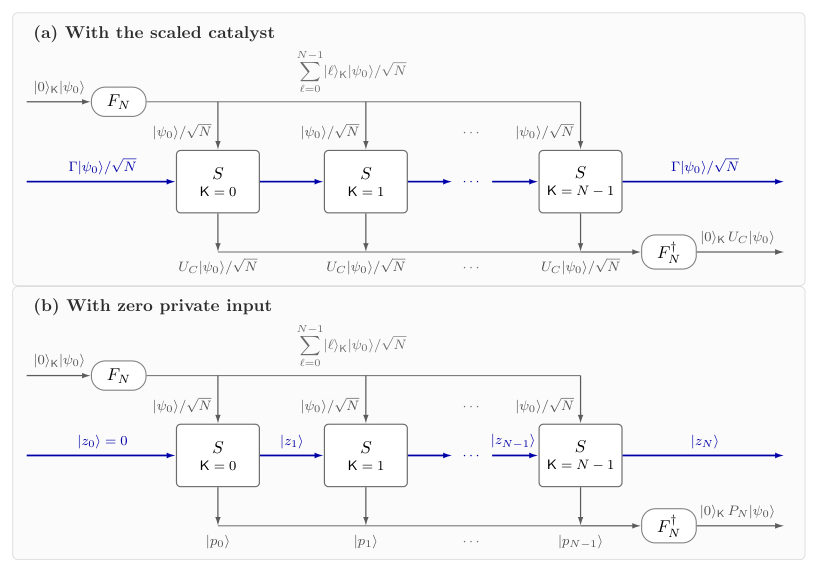 
Figure 1: State flow for finite reuse. In panel (a), the same scaled catalyst is reused and the public outputs recombine into UC|ψ0⟩. Panel (b) starts at |z0⟩= 0; |zℓ⟩and |pℓ⟩are the private input and public output of call ℓ. After F † N, the K = 0 public component is PN|ψ0⟩. Gray and blue lines denote public and private components, respectively.

**Summary.** This paper presents a query-optimal algorithm for simulating general time-dependent quantum Hamiltonians using the HAM-T model. By utilizing advanced transducer techniques and error analysis involving weighted circuit combinations, they achieve a complexity that matches theoretical lower bounds. This is significant because it proves that modeling time dependence does not incur an asymptotic overhead in terms of required queries.

**Why it may be interesting.** This work provides state-of-the-art results on quantum simulation complexity, directly impacting how efficiently we can model time evolution in complex physical systems using limited query access models.

Detailed structure

**Main problem.** Determining the optimal query complexity for simulating a general time-dependent Hamiltonian $H(t)$ over a finite time interval $[0, T]$.

**Main result.** The authors achieve an algorithm with query complexity matching the known lower bound, demonstrating that general time dependence does not introduce asymptotic overhead compared to time-independent cases.

**Method.** They employ a novel one-query transducer framework combined with a weighted combination of reuse circuits to ensure factorial decay in simulation error.

**Model / system.** The system is governed by quantum dynamics dictated by $H(t)$, and the target operation is the time-ordered propagator $U_H(T)$. The analysis is conducted within the time-indexed block-encoding-access model (HAM-T).

**Key observables.** Query complexity, simulation error ($\epsilon$), and the evolution time scale ($\alpha T$).

**Important parameters / regimes.** Lipschitz constant ($eta$) of $H(t)$, total time $T$, and desired precision $\epsilon$.

**Assumptions / limitations.** The Hamiltonian $H(t)$ is assumed to be Lipschitz continuous, and the analysis operates in the worst-case black-box query complexity setting.

**Figures summary.** Figure 1 illustrates state flow for finite reuse, showing recombination with a scaled catalyst ($\Gamma|\psi_0
angle/\sqrt{N}$) versus zero private input, demonstrating error control.

**Paper structure.** The work progresses by first establishing the optimal query complexity using a transducer framework, then refining the error analysis through weighted combinations of reuse circuits to achieve factorial precision decay. Later sections explore continuous-time analogues and subspace constructions for theoretical completeness.

Abstract

We give a query-optimal algorithm for simulating a general $n$-qubit time-dependent Hamiltonian $H(t)$ on $[0,T]$, assuming that $H$ is Lipschitz continuous and $\|H(t)\|\leqα$. In the standard $\mathrm{HAM\mbox{-}T}$ access model, the algorithm approximates the time-ordered propagator $U_H(T)$ to error $\varepsilon$ using $$ O\left(   αT+\frac{\log(1/\varepsilon)}   {\log(e+\log(1/\varepsilon)/(αT))}   \right) $$ $\mathrm{HAM\mbox{-}T}$ queries. This matches the known query lower bound for time-independent Hamiltonians, showing that time dependence incurs no asymptotic query overhead.   Our method first constructs a one-query transducer that, given an auxiliary state, implements an approximation to $U_H(T)$ and returns the state unchanged. A weighted combination of circuits that apply the transducer different numbers of times makes the error caused by omitting this state decay factorially, yielding the stated optimal precision dependence. For time-independent Hamiltonians, the same method also gives a query-optimal alternative to qubitization.

[↑ back to top](#top)

### [Quantum Amplitude Estimation for Travel Time Estimation in Stochastic Vehicle Routing Problems](http://arxiv.org/abs/2608.06145v1)

**Authors:** Xingyue Wang, Monika Filipovska  
**Type:** both · **Category:** quantum information and computing · **PDF:** <https://arxiv.org/pdf/2608.06145v1>  
**Analysis basis:** full PDF text, analyzed in chunks
**Topic relevance:** `QC/QI experiment` **2/5** · `methods for driven-dissipative` **1/5** · `non-equilibrium dynamics` **1/5**

📷 Fig 1

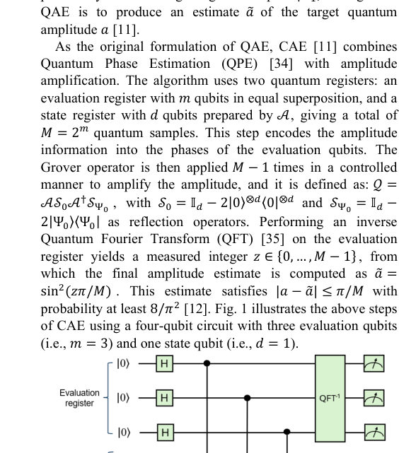 
Fig. 1. A four-qubit toy CAE circuit with a three-qubit evaluation register and a one-qubit state register.

📷 Fig 2

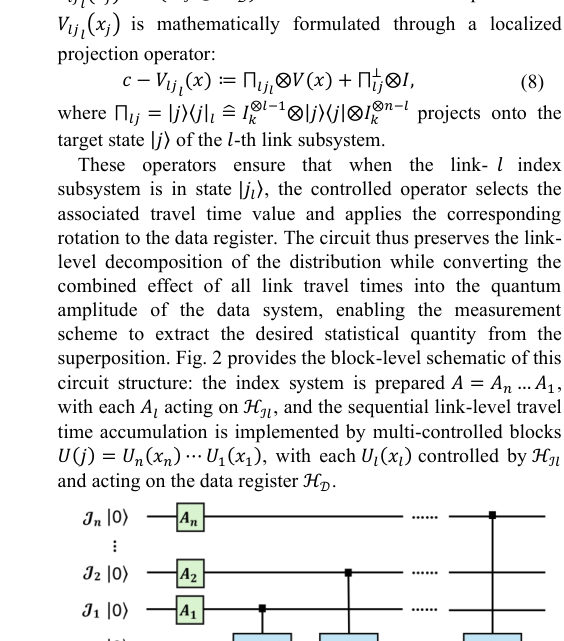 
Fig. 2. Circuit design for QAE-based path expected travel time estimation.

📷 Fig 3

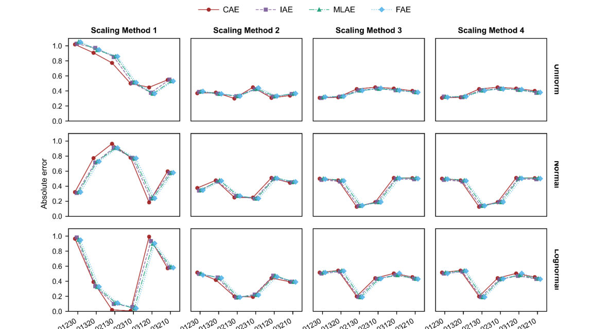 
Fig. 3. Absolute errors of the four QAE methods at rotation-angle range [0, 𝜋] under three travel time distributions.

📷 Fig 4

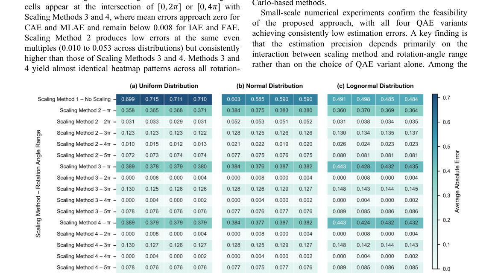 
Fig. 4. Heatmaps of mean absolute error under uniform, normal, and lognormal travel time distributions.

**Summary.** This paper applies Quantum Amplitude Estimation (QAE) to estimate expected travel times in stochastic vehicle routing problems, offering a theoretical quadratic speed-up over classical Monte Carlo methods. By encoding the entire probability space into a quantum superposition, it provides a powerful tool for hybrid quantum-classical optimization frameworks in intelligent transportation systems.

**Why it may be interesting.** While focused on optimization/transportation, the core technique—using quantum amplitude estimation for expectation value calculation—is a direct application of advanced quantum algorithms relevant to simulating complex physical systems or calculating expectation values in open quantum systems.

Detailed structure

**Main problem.** The core challenge is accurately estimating expected path travel times within Stochastic Vehicle Routing Problems (VRP) in complex transportation networks.

**Main result.** Quantum Amplitude Estimation (QAE) provides a theoretical quadratic speed-up over classical Monte Carlo simulation for this estimation task, with the Iterative AE variant showing stable performance.

**Method.** The study proposes using QAE to encode all feasible travel time realizations into a quantum superposition state, avoiding sampling and prior distribution assumptions.

**Model / system.** The problem is modeled on Stochastic Transportation Networks (STNs) represented as directed graphs with discrete random link travel times. The implementation uses IBM's Qiskit framework.

**Key observables.** Estimation accuracy, Mean Absolute Error (MAE), and the performance comparison across four QAE variants (CAE, IAE, MLAE, FAE).

**Important parameters / regimes.** The choice of rotation-angle range ($	ext{[0, 2\pi]}$ vs $	ext{[0, \pi]}$) and scaling method significantly impacts estimation accuracy.

**Assumptions / limitations.** The work focuses only on the expectation-estimation subproblem; it does not solve the global combinatorial VRP. The results are currently limited by NISQ device noise.

**Figures summary.** Figures illustrate circuit structures (e.g., 4-qubit toy CAE circuit) and heatmaps showing mean absolute error across various scaling ranges and rotation-angle ranges for different distributions.

**Paper structure.** The paper first establishes the computational bottleneck of classical VRP solving in STNs, then details the QAE methodology to estimate expected travel times, compares four specific QAE variants, and finally analyzes parameter sensitivity (scaling/rotation angle) using experimental results on a small-scale network.

Abstract

Solving the Vehicle Routing Problem (VRP) in Stochastic Transportation Networks (STNs), a core task in Intelligent Transportation Systems (ITS), introduces estimation challenges for stochastic path travel times and the resulting VRP objective function. These challenges have typically been addressed through computationally expensive sampling-based techniques such as Monte Carlo simulation, whose performance depends on sample size, the sampling strategy, and the underlying travel time distributions. To address these issues, this study proposes and validates a quantum computing technique, Quantum Amplitude Estimation (QAE) for path-level travel time estimation in STNs. Without relying on sampling or prior assumptions of the travel time distribution, the proposed framework encodes all feasible travel time realizations into a quantum superposition, enabling a theoretical quadratic speed-up over Monte Carlo simulation. Four QAE variants are implemented in IBM's Qiskit framework, namely Canonical AE (CAE), Iterative AE (IAE), Maximum Likelihood AE (MLAE), and Faster AE (FAE), together with four rotation-angle scaling strategies for handling different discrete travel time distributions. Experiments on a small-scale STN show that the choice of scaling method and rotation-angle range significantly affects estimation accuracy, while the four QAE variants produce comparable estimates across all tested conditions, with IAE exhibiting the most stable overall performance. The results provide practical guidance on parameter selection for future hybrid quantum-classical optimization frameworks in ITS applications.

[↑ back to top](#top)

### [Quantum One-Way Functions and Related Cryptographic Primitives](http://arxiv.org/abs/2608.05754v1)

**Authors:** Georgios M. Nikolopoulos  
**Type:** theory · **Category:** quantum information and computing · **PDF:** <https://arxiv.org/pdf/2608.05754v1>  
**Analysis basis:** full PDF text, analyzed in chunks
**Topic relevance:** `entanglement & information structure` **2/5** · `quantum measurements` **2/5**

📷 Fig 1

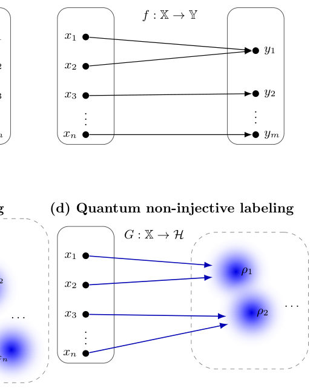 
Figure 1. Schematic comparison of injective and non-injective mappings in the classical and quantum settings. In the quantum case, the shaded regions represent states with finite operational overlap; distinct labels may therefore correspond to distinct, but nonorthogonal states.

**Summary.** This paper provides a detailed review of quantum cryptographic primitives beyond simple key distribution, aiming to establish quantum analogues for classical one-way functions. It compares different theoretical constructs—such as QOWFs and pseudorandom states—by analyzing their security under various computational and information-theoretic models. The work is crucial for advancing the field toward practical, physically secure quantum cryptography.

**Why it may be interesting.** While highly theoretical, the discussion of state distinguishability (as seen in Chunk 3's analysis of phase averaging) touches upon fundamental concepts of quantum measurement and state preparation that are central to understanding noise resilience in any physical implementation.

Detailed structure

**Main problem.** The paper reviews quantum cryptographic primitives beyond Quantum Key Distribution, focusing on finding quantum analogues to classical one-way functions.

**Main result.** It compares various primitives like QOWFs, OWSGs, and PRSGs, clarifying their conceptual relationships while emphasizing the need for physical realizability in security proofs.

**Method.** The approach is a comprehensive review comparing computational vs. information-theoretic notions of quantum one-wayness using established principles from quantum information theory.

**Model / system.** The discussion centers on abstract quantum states and their manipulation (e.g., encoding classical bits into quantum states) rather than a specific physical Hamiltonian or experimental setup.

**Key observables.** Security assumptions, physical realizability, robustness to noise, and the distinguishability between different ensembles of quantum states.

**Important parameters / regimes.** The dimension of the Hilbert space ($d$), error probability in measurements, and the amount of extractable classical information ($	ext{I}_{	ext{acc}}$).

**Assumptions / limitations.** It distinguishes its focus on primitives relying fundamentally on quantum state properties from post-quantum cryptography based on classical hardness assumptions.

**Figures summary.** The notes mention that relationships between various cryptographic primitives are summarized in Table 1, though the table content is not provided.

**Paper structure.** The paper reviews QOWFs and related primitives (OWSGs, PRSGs) by comparing them to classical OWFs, discussing both computational and information-theoretic security models, and concluding with open problems.

Abstract

Quantum cryptographic primitives beyond key distribution remain a less well understood area of research. In classical cryptography, one-way functions underpin nearly all standard cryptographic protocols, motivating the search for meaningful quantum analogues and for a clear understanding of the physical and computational mechanisms that could enforce one-wayness. In this article, we review quantum one-way functions and a range of closely related quantum-state primitives, including one-way state generators, pseudorandom quantum states, and efficiently indistinguishable pairs of states. We discuss both computational and information-theoretic notions of quantum one-wayness, emphasizing the different adversarial models and security assumptions that underlie these constructions. We compare and contrast the various proposed primitives, and clarify their conceptual relationships. Particular emphasis is placed on questions of physical realizability, experimental feasibility, and robustness to noise. Finally, we outline open problems and future directions toward the development of practical quantum cryptographic primitives beyond key distribution, and the emergence of a broader quantum-cryptographic ecosystem.

[↑ back to top](#top)

### [Transport coefficients in hard-sphere fluids: thermodynamic versus kinetic descriptions](http://arxiv.org/abs/2608.06143v1)

**Authors:** Miguel Hoyuelos  
**Type:** theory · **Category:** statistical mechanics · **PDF:** <https://arxiv.org/pdf/2608.06143v1>  
**Analysis basis:** full PDF text, analyzed in chunks
**Topic relevance:** `non-equilibrium dynamics` **2/5** · `Keldysh / 2PI / non-Gaussian methods` **1/5** · `non-equilibrium universality` **1/5**

📷 Fig 1

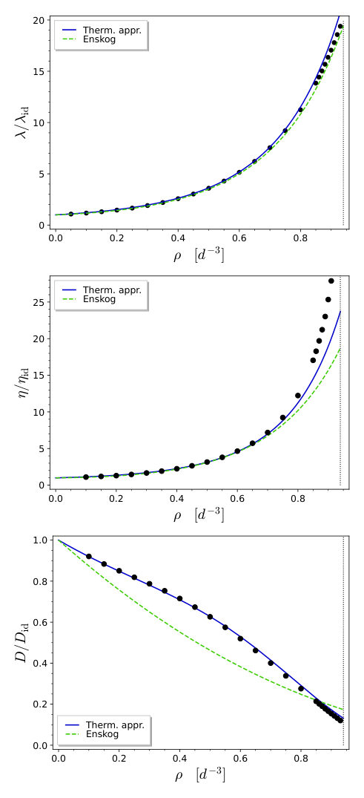 
FIG. 1. Transport coefficients over their ideal value against particle density, ρ (units d−3, with d

📷 Fig 2

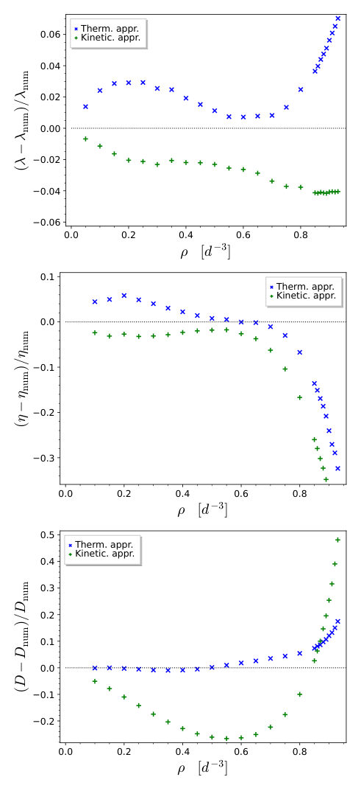 
FIG. 2. Relative error of theoretical transport coefficients, relative to numerical values, against

**Summary.** This paper develops and validates a purely thermodynamic theory for calculating transport coefficients in hard-sphere fluids. By relating these dynamic quantities to static, measurable thermodynamic properties, the authors show that their predictions for conductivity, viscosity, and self-diffusion significantly outperform traditional kinetic theories like Enskog's model. This work demonstrates the feasibility of describing complex fluid dynamics using only equilibrium statistical mechanics.

**Why it may be interesting.** While focused on classical fluids, the methodology—linking dynamic transport properties directly to equilibrium thermodynamics via generalized fluctuation relations—is a powerful theoretical tool applicable to many-body quantum systems where such connections are sought.

Detailed structure

**Main problem.** The primary goal is to develop a purely thermodynamic framework capable of predicting transport coefficients for hard-sphere fluids, thereby comparing its accuracy against established kinetic theories.

**Main result.** The theory successfully predicts compact expressions for thermal conductivity, viscosity, and self-diffusion that quantitatively reproduce simulation data, significantly improving upon Enskog kinetic theory predictions for self-diffusion.

**Method.** The approach generalizes the Onsager matrix formalism to relate transport coefficients ($\sigma$) to equilibrium thermodynamic properties via scaling relations derived from density variables.

**Model / system.** The system studied is a hard-sphere fluid, analyzed using concepts from statistical mechanics and fluctuation-dissipation theorems. The analysis involves deriving relationships between real and ideal systems through generalized density variables.

**Key observables.** Transport coefficients: thermal conductivity ($\lambda$), viscosity ($\eta$), and self-diffusion coefficient ($D$).

**Important parameters / regimes.** Density ($
ho$), temperature ($T$), and the thermodynamic factor $\Gamma = rac{
ho}{T} (rac{\partial\mu}{\partial
ho})_T$. The comparison is made across various density regimes.

**Assumptions / limitations.** Key assumptions include applying the Onsager matrix formalism, assuming local thermal equilibrium, and making approximations regarding constant-pressure conditions for certain derivations.

**Figures summary.** Figures compare $\lambda$, $\eta$, and $D$ vs. density ($
ho$) between thermodynamic predictions and Enskog kinetic theory against numerical data points; a second figure shows the relative error of these coefficients versus density.

**Paper structure.** The paper develops the framework by first introducing the general Onsager matrix, then deriving specific ratios for $\lambda$, $\eta$, and $D$ using scaling arguments based on thermodynamic variables. It concludes with quantitative comparisons against simulation data across different densities.

Abstract

A thermodynamic theory for transport coefficients in hard-sphere fluids is developed from a general expression for the Onsager matrix. The theory predicts the ratio $σ/σ_{\rm id}$, where $σ$ is a transport coefficient and $σ_{\rm id}$ denotes its dilute-gas value. This ratio depends exclusively on equilibrium thermodynamic properties and can therefore be computed directly from the equation of state. Compact expressions are obtained for the thermal conductivity, viscosity, and self-diffusion coefficient. These expressions quantitatively reproduce simulation data over almost the entire fluid range and, in the case of self-diffusion, significantly improve upon the predictions of Enskog kinetic theory. The results demonstrate that transport coefficients can be accurately described within a purely thermodynamic framework.

[↑ back to top](#top)

### [Bell nonlocality from twisted statistics](http://arxiv.org/abs/2608.06359v1)

**Authors:** Ivana Đorđ ević, Jovan Potrebić, Aleksandra Gočanin, Dragoljub Gočanin  
**Type:** theory · **Category:** quantum information and computing · **PDF:** <https://arxiv.org/pdf/2608.06359v1>  
**Analysis basis:** full PDF text, analyzed in chunks
**Topic relevance:** `entanglement & information structure` **2/5** · `Keldysh / 2PI / non-Gaussian methods` **1/5**

📷 Fig 1

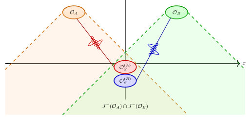 
FIG. 1. A schematic representation of the relativistic Bell protocol. Alice and Bob reside in their space-like separated laboratories OA and OB, respectively. The source coupled to the dressed quantum field generates excitations in time- ordered preparation regions O(B) S and O(B) S belonging to the common causal past of OA and OB. The excitations are ar- ranged to propagate towards OB and OA, respectively. Each signal is a single-particle excitation in a state of quantum su- perposition of two orthogonal wave-packets.

**Summary.** This work explores how noncommutative spacetime geometry, modeled by 'twisted statistics' in a free scalar field, can generate genuine Bell nonlocality. By analyzing the resulting two-particle state correlations, the authors show that measuring violations of the CHSH inequality serves as an operational signature for the underlying NC structure. This bridges quantum gravity phenomenology with fundamental tests of quantum foundations.

**Why it may be interesting.** It connects fundamental concepts of spacetime geometry (noncommutativity) directly to quantum information resources (Bell nonlocality), offering a novel theoretical tool for probing physics beyond standard QFT assumptions.

Detailed structure

**Main problem.** Investigating whether Bell nonlocality can emerge from a quantum field theory structure modified by noncommutative (NC) spacetime geometry through 'twisted statistics.'

**Main result.** The violation of the CHSH Bell inequality ($S > 2$) is predicted, providing an operational probe for the underlying NC structure encoded in the multiparticle sector.

**Method.** The analysis uses a relativistic Bell protocol setup involving two spacelike-separated laboratories and calculates the CHSH parameter based on state preparation governed by twisted statistics.

**Model / system.** A free real quantum scalar field propagating on the noncommutative Moyal plane. The deformation is introduced via twisted multiparticle statistics, which modifies the exchange symmetry of creation/annihilation operators.

**Key observables.** Violation of the CHSH Bell inequality ($S_	heta$), and the non-local phase $\chi_	heta$ governing the entanglement.

**Important parameters / regimes.** The noncommutative parameter $	heta$, which controls the magnitude of the violation; the momentum separations ($\Delta p, \Delta q$).

**Assumptions / limitations.** The state preparation is assumed to be local and causal, involving sequential pulses from a source in the common causal past.

**Figures summary.** Figure 1 schematically illustrates the relativistic Bell protocol setup used for testing nonlocality.

**Paper structure.** The paper develops the theory by first introducing the NC deformation via twisted statistics (modifying the coproduct/exchange symmetry), then applying this to a two-particle state preparation in a spacelike separated Bell test, and finally calculating the resulting CHSH violation.

Abstract

We investigate Bell correlations for a free real quantum scalar field on the noncommutative Moyal plane. Although the free field dynamics and the one-particle sector remain unchanged, the deformation enters through twisted multiparticle statistics and its Fock-space dressing representation. A classical external source coupled locally to the twist-dressed quantum field prepares coherent superpositions of momentum-pair configurations propagating toward two spacelike-separated laboratories. The momentum-dependent twist phases are generally nonfactorizable and generate entanglement between the corresponding wave-packet modes. We show that suitable local mode measurements lead to a violation of the CHSH Bell inequality. The resulting correlations provide an operational probe of the noncommutative structure encoded in the multiparticle sector of the quantum field.

[↑ back to top](#top)

### [Robust logarithmic lower bound on shared-resource cost for $f$-routing](http://arxiv.org/abs/2608.05775v1)

**Authors:** Kevin Bogner  
**Type:** theory · **Category:** quantum information and computing · **PDF:** <https://arxiv.org/pdf/2608.05775v1>  
**Analysis basis:** full PDF text, analyzed in chunks
**Topic relevance:** `entanglement & information structure` **2/5** · `Keldysh / 2PI / non-Gaussian methods` **1/5**

📷 Fig 1

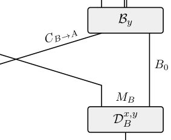 
Figure 1. One round of f-routing. Time runs downward. Alice receives x and the qubit Q, Bob receives y, and they share the state ρLR prepared before the inputs arrive. Double lines carry the classical inputs. Alice applies Ax to QL, keeps A0, and sends the message CA→B. Bob applies By to R, keeps B0, and sends CB→A. The messages cross simultaneously. If f(x, y) = 0, Alice applies Dx,y A to MA = A0CB→A and outputs the qubit. If f(x, y) = 1, Bob applies Dx,y B to MB = B0CA→B.

**Summary.** This paper establishes a strong logarithmic lower bound on the shared quantum resource cost required for $f$-routing in one round. By analyzing the protocol's success using advanced tools like state differences and matrix rank bounds, it proves that the required resource dimension scales as $\Omega(n/\log n)$. The result is significant because it quantifies fundamental limitations in distributed quantum computation protocols.

**Why it may be interesting.** This work provides a rigorous quantum information-theoretic lower bound on communication complexity, which is fundamental to understanding the limits of distributed quantum computation and secure multi-party tasks.

Detailed structure

**Main problem.** The paper determines a robust logarithmic lower bound on the shared-resource cost required for performing $f$-routing in a one-round quantum communication protocol.

**Main result.** For the inner product modulo 2 function, the shared resource dimension must satisfy $	ext{Edim}(
ho_{LR}) \ge \log_2 n - \log_2 \log_2 n - O(1)$.

**Method.** The proof involves converting protocol correctness into rank bounds for matrices derived from quantum state differences (e.g., using the SLD quadratic form) and applying techniques like Fourier expansion and sign-rank analysis.

**Model / system.** The model is a one-round $f$-routing task where Alice and Bob share an arbitrary mixed state $
ho_{LR}$ and exchange messages based on inputs ($x, y$) and an unknown qubit. The cost is measured by the logarithm of the smaller marginal support dimension.

**Key observables.** The primary observables are the trace-norm difference ($\|
ho_0^{x,y} - 
ho_1^{x,y}\|_1$) and the SLD quadratic form $\chi(x, y)$, which quantify how much the protocol's success depends on the shared state.

**Important parameters / regimes.** The key parameters are $n$ (the length of the input strings) and $d = \min\{	ext{rank } 
ho_L, 	ext{rank } 
ho_R\}$, which dictates the resource cost $	ext{Edim}(
ho_{LR})$.

**Assumptions / limitations.** The analysis assumes a worst-case error bound of at most 0.09 in both routing cases and relies on approximating complex rank bounds using techniques like Chebyshev polynomials.

**Figures summary.** Figure 1 illustrates the general flow of the one-round $f$-routing protocol, showing the initial shared state preparation followed by simultaneous message exchange.

**Paper structure.** The paper develops its argument by first establishing necessary conditions via information-disturbance tradeoffs (Chunk 2), then refining these bounds using matrix rank analysis and Fourier expansions (Chunk 3), culminating in the specific lower bound for $f$-routing with $	ext{IP}_n \pmod{2}$ (Chunk 1 & 3).

Abstract

In one-round $f$-routing, Alice receives an $n$-bit string and an unknown qubit, while Bob receives another $n$-bit string. They exchange one simultaneous message each, and the value of $f$ determines which party must recover the qubit. Message lengths, local systems, and local operations are unrestricted. We charge only $E_{\dim}(ρ_{LR})=\log_2\min\{\operatorname{rank}ρ_L,\operatorname{rank}ρ_R\}$, the logarithm of the smaller marginal support dimension of the shared state prepared before the inputs arrive. The state may be arbitrary and mixed. For the inner product modulo $2$, we prove that every protocol with worst-case error at most $0.09$ in both routing cases, measured in the full, unhalved diamond norm, satisfies $d\log_2(2d)=Ω(n)$ for $d=\min\{\operatorname{rank}ρ_L,\operatorname{rank}ρ_R\}$. Thus $d=Ω(n/\log n)$ and $E_{\dim}(ρ_{LR})\ge\log_2 n-\log_2\log_2 n-O(1)$. The closest earlier growing Schmidt-rank lower bound for an explicit routing function assumes zero error in one routing case. Our proof converts correctness into a matrix whose entries have a constant gap between the two routing cases. It approximates this matrix by one whose rank depends on $d$, but not on the dimensions of messages or local systems. A sign-rank lower bound for the matrix of the inner product modulo $2$ completes the argument. A lower bound polynomial in $n$ on $E_{\dim}$ remains open.

[↑ back to top](#top)

### [Cluster-State Witnesses of Finite-Speed Hidden Influences](http://arxiv.org/abs/2608.05271v1)

**Authors:** Weikang Li, Mengyao Hu, Dong-Ling Deng, Valerio Scarani  
**Type:** theory · **Category:** quantum information and computing · **PDF:** <https://arxiv.org/pdf/2608.05271v1>  
**Analysis basis:** full PDF text, analyzed in chunks
**Topic relevance:** `entanglement & information structure` **2/5**

📷 Fig 1

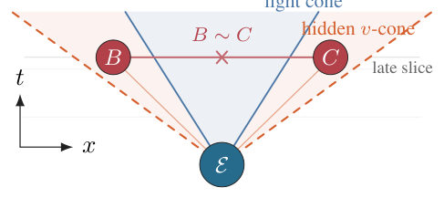 
FIG. 1. Finite-speed causality geometry. The blue solid lines de- note the ordinary light cone, whereas the orange dashed lines de- note the wider hidden v-cone associated with a finite influence speed v &gt; c in the preferred frame. The set E denotes the early side, whose measurement event(s) may influence both late parties B and C through the hidden influence. The late events are arranged out- side each other’s hidden v-cones, denoted by B ∼C, so no hidden influence can propagate between them during a run. Consequently, conditioned on every non-null input–output event on E, the BC dis- tribution must be Bell-local.

📷 Fig 2

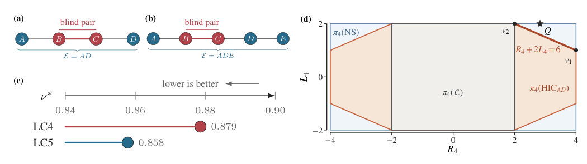 
FIG. 2. Linear-cluster witnesses, visibility, and illustrative HIC projection. (a) LC4 uses the four-qubit chain with early side E = AD and blind late pair B, C. (b) LC5 appends E, giving E = ADE with the same blind pair. The BC link in each panel denotes a graph-state edge, not a causal connection; no witness term contains both B and C. (c) Ideal white-noise visibility, given by the ratio of the HIC bound to the quantum value SQ, with lower values indicating greater noise tolerance. (d) LC4 projection π4(P) := (R4(P), L4(P)). The fully Bell-local set L, hidden-influence set HICAD, and no-signaling set NS project to the inner square, intermediate octagon, and outer rectangle, respectively....

**Summary.** The paper develops novel witnesses based on linear cluster states to test theories involving hidden influences that travel at a finite speed. By formulating this constraint as a polytope separation problem, the authors derive specific four- and five-qubit inequalities that violate these hypothetical models if measured values exceed theoretical bounds. This establishes cluster graph states as powerful resources for testing causality.

**Why it may be interesting.** This work provides concrete, experimentally friendly quantum resources (linear cluster states) for testing fundamental assumptions about causality in physics beyond standard Bell tests, which is highly relevant to foundational quantum information theory.

Detailed structure

**Main problem.** To formulate a testable constraint for hidden influences that propagate at a finite speed, extending beyond standard Bell tests.

**Main result.** The authors derive new four- and five-partite witnesses using linear cluster states that certify bounds on these finite-speed hidden influence models.

**Method.** The problem is formulated as a projected-polytope separation problem for cluster-state correlations, utilizing linear programming to find facet-defining inequalities.

**Model / system.** The model considers hidden influences propagating at a finite speed (v) in a preferred frame, leading to constraints on multipartite spacetime arrangements. The quantum resource used is the linear cluster state ($|	ext{LC4}
angle$ and $|	ext{LC5}
angle$).

**Key observables.** Witness values $S_4$ and $S_5$, HIC bounds ($\le 6$ and $\le 10$), and ideal white-noise visibilities ($
u^*$).

**Important parameters / regimes.** Finite speed $v$, number of parties (four or five qubits), and the specific structure of the cluster graph state.

**Assumptions / limitations.** The analysis assumes measurement independence, no postselection, and that the exposed faces are facets of the projected hidden-influence polytopes.

**Figures summary.** Figures illustrate the finite-speed causality geometry (v-cone vs. light cone) and show projections of the full polytope onto lower-dimensional spaces defined by the witnesses.

**Paper structure.** The paper progresses from defining the physical constraint (HIC) to formulating it as a polytope separation problem, deriving specific cluster-state witnesses ($S_4, S_5$), proving their facet status using optimization techniques, and calculating quantitative bounds and visibilities.

Abstract

Bell experiments rule out local common-cause explanations of quantum correlations, yet they do not exclude hidden influences that travel faster than light while still having a finite speed in a preferred frame. Multipartite spacetime arrangements turn this possibility into a constraint: two late parties that are outside each other's hidden-influence cones must remain Bell-local once the earlier events are fixed. Here, we formulate this constraint as a projected-polytope separation problem for cluster-state correlations, using only marginal data containing at most one late party. From linear cluster states, we construct a four-qubit witness with the bound $S_4\le 6$ and quantum value $4+2\sqrt2$, and a five-qubit witness with $S_5\le 10$ and quantum value $6+4\sqrt2$. We certify that the exposed faces are facets of the corresponding projected hidden-influence polytopes. These results identify linear-cluster graph states as certifiable and experimentally friendly resources for finite-speed hidden-influence tests.

[↑ back to top](#top)

### [Local Spin Excitations Mediate Quasiparticle Breakdown in the Orbital-Selective Mott Phase](http://arxiv.org/abs/2608.05556v1)

**Authors:** Yuekun Niu, Yu Ni, Jia-Ming Wang, Zhong-Yi Lu, Yun Song, Shiping Feng  
**Type:** theory · **Category:** strongly correlated electrons · **PDF:** <https://arxiv.org/pdf/2608.05556v1>  
**Analysis basis:** full PDF text, analyzed in chunks
**Topic relevance:** `Keldysh / 2PI / non-Gaussian methods` **1/5** · `Kondo & dissipative impurity` **1/5** · `analog quantum simulation` **1/5** · `exotic spin models in light-matter` **1/5** · `spintronics-quantum-optics interface` **1/5**

📷 Fig 1

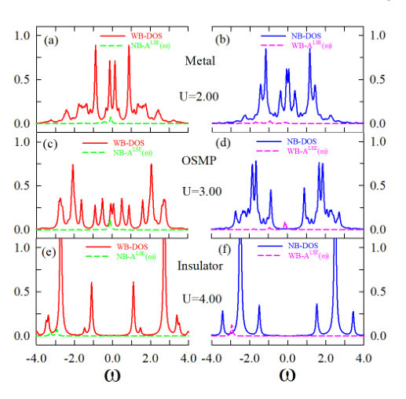 
FIG. 2. Evolution of the LSE spectra across the Mott tran- sition. Left column: the LSE spectrum of NB (green dashed lines) superimposed on the DOS of WB (red solid lines); Right column: the LSE spectrum of WB (pink dashed lines) super- imposed on DOS of NB (blue solid lines). (a) and (b) Metallic phase at U = 2.00; (c) and (d) OSMP at U = 3.00; (e) and (f) Insulating phase at U = 4.00. The model parameters are J = U/4 and R = 0.5. The LSE spectral weight shifts to the Fermi level only in the OSMP, signaling the emergence of the interorbital coupling.

📷 Fig 2

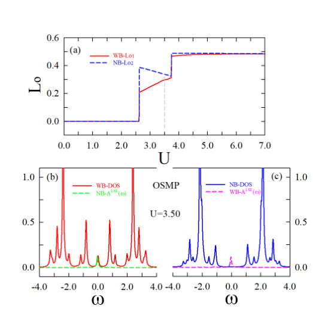 
FIG. 1. LSEs in OSMP: (a) The LTQF of the WB (red solid line) and NB (blue dotted line) are plotted against Coulomb interaction U. The Mott critical point of WB is Uc1 = 3.74, while that of NB is Uc2 = 2.62; (b) DOS (red solid line) of WB and the LSE spectrum Alse(ω) (green dotted line) of NB at U = 3.50 (inside the OSMP); (c) The DOS (blue solid line) of NB and the LSE spectrum (pink dotted line) of WB at the same U. The model parameters are J = U/4 and R = 0.5. The LSE peaks at the Fermi level in the NB Mott gap provide a low-energy channel for interorbital charge fluctuations.

📷 Fig 3

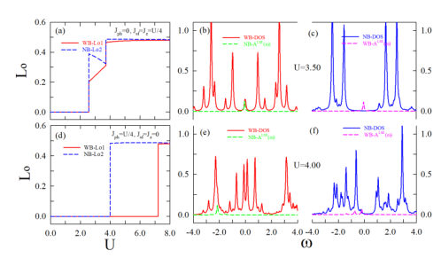 
FIG. 3. Role of Hund’s coupling components in generating LSEs. (a)-(c) Results for Jph = 0 and Jsf = Jz = U/4. (a) LTQF versus U showing non-half-integer values in the OSMP (Uc1 = 3.74, Uc2 = 2.58); (b) LSE spectrum of the NB (green dashed) and DOS of the WB (red solid); (c) LSE spectrum of the WB (pink dashed) and DOS of the NB (blue solid); (d)-(f) Results for Jph = U/4 and Jsf = Jz = 0. (d) LTQF versus U showing exact Lo1 = 0 and Lo2 = 0.5 in the OSMP (Uc1 = 7.21, Uc2 = 4.00); (e) and (f) Complete absence of LSE spectra, confirming the conventional decoupled OSMP. All results are obtained for R = 0.5. The comparison demon- strates that Jsf and Jz are essential for generating LSEs and...

📷 Fig 4

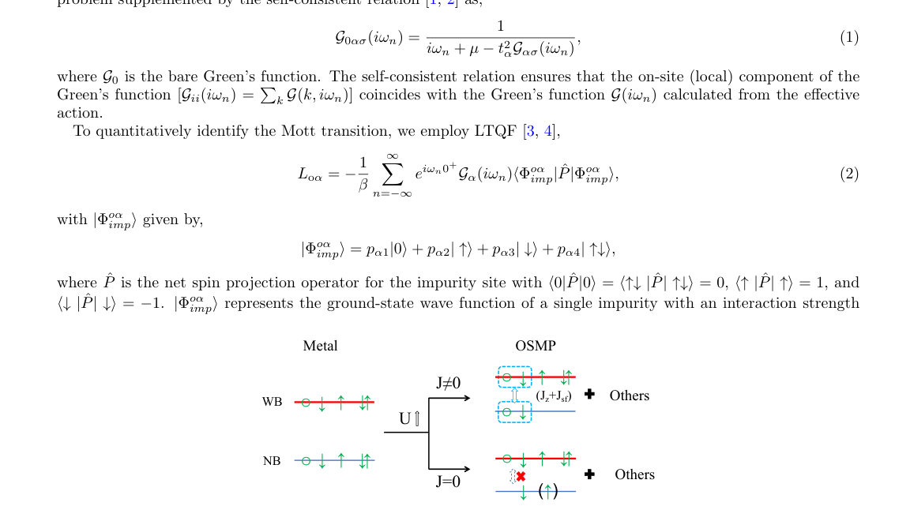 
FIG. 1. Schematic diagram of LSE bound states. WB is represented by a thicker red line and NB by a thinner blue line. The dashed box encloses the LSE bound state. The “others” in the figure correspond to other potential low-energy excited states.

📷 Fig 5

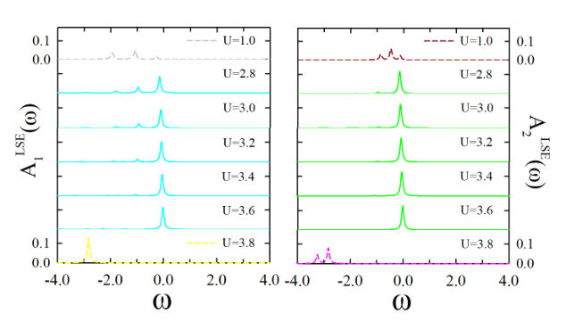 
FIG. 2. Effect of the Coulomb interaction U for the excitation spectrum of LSE ALSE α (ω) in different phases. The metal phase for U = 1.0 (gray and brown dashed lines), OSMP for U = 2.80, 3.00, 3.20, 3.40, 3.60 (cyan and green solid lines), the insulating phase for U = 3.80 (yellow and pink dashed lines), where the spectrum has been normalized by summation. The model parameters are J = U/4 and R = 0.5.

**Summary.** This theoretical work investigates why quasiparticles break down in the Orbital-Selective Mott Phase (OSMP) using DMFT on a two-band Hubbard model. The key finding is that this breakdown is driven by Local Spin Excitations (LSEs), which are generated by specific components of Hund's coupling. Removing these LSE pathways restores coherent, well-defined quasiparticle behavior.

**Why it may be interesting.** The concept of LSE-mediated dynamic coupling provides a concrete, microscopic mechanism for correlated electron phenomena like quasiparticle breakdown, which is highly relevant to understanding strongly interacting quantum materials.

Detailed structure

**Main problem.** The study aims to uncover the microscopic mechanism responsible for quasiparticle breakdown observed in the Orbital-Selective Mott Phase (OSMP), moving beyond simple models of decoupled orbitals.

**Main result.** The authors identify that electronic coupling mediated by Local Spin Excitations (LSEs)—specifically those generated by the spin-flip and Ising components of Hund's coupling—is the fundamental mechanism driving this quasiparticle breakdown in the OSMP.

**Method.** Dynamical Mean-Field Theory (DMFT) is employed to analyze the two-band Hubbard model, calculating spectral functions and correlation metrics across different interaction regimes.

**Model / system.** The system is modeled using a two-band Hubbard Hamiltonian on a Bethe lattice. The interactions include Coulomb repulsion ($U$) and Hund's coupling terms ($J_{sf}, J_z$), which are varied to isolate their physical roles.

**Key observables.** Local Spin Excitations (LSE) spectral function ($	ext{ALSE}(\omega)$), Local Two-Qubit Fidelity (LTQF), and the orbital Density of States ($
ho_\alpha(\omega)$).

**Important parameters / regimes.** The critical parameters are the interaction strengths ($U, J_{sf}, J_z$) and the system's filling level, particularly focusing on the OSMP regime.

**Assumptions / limitations.** The analysis utilizes DMFT applied to an effective single-impurity model; some derivations rely on Hartree-Fock approximations for analytical insight.

**Figures summary.** Figures illustrate the evolution of the LSE spectrum across different interaction strengths, showing a sharp weight transfer to the Fermi level only within the OSMP regime. LTQF values are used to diagnose deviations from ideal metallic or insulating states.

**Paper structure.** The paper establishes the physical problem (OSMP breakdown), develops theoretical tools (DMFT, LSE definition), calculates observables across varying Hund's coupling components, and concludes by linking the observed spectral weight transfer directly to LSE mediation.

Abstract

The orbital-selective Mott phase (OSMP) is commonly described as a coexistence of localized and itinerant electrons within effectively decoupled orbitals, but emerging evidence for quasiparticle breakdown points to physics beyond this picture, whose microscopic origin remains unknown. Using dynamical mean-field theory for the two-band Hubbard model, we show that the spin-flip and Ising-type components of Hund's coupling generate local spin excitations (LSEs). These LSEs couple electrons between different orbitals, renormalize quasiparticle lifetimes and binding energies, and thereby destroy well-defined quasiparticles in the OSMP. Removing these two components of Hund's coupling restores coherent quasiparticle behavior and fully decouples the charge dynamics of the two bands. Our results therefore identify electronic coupling to LSEs as the fundamental mechanism driving quasiparticle breakdown within the OSMP.

[↑ back to top](#top)

### [Next Generation of Ultra-Coarse-Graining: Self-Consistent Inference of Critical Internal States](http://arxiv.org/abs/2608.05388v1)

**Authors:** Weizhi Xue, Xiao Shuai, Gregory A. Voth  
**Type:** theory · **Category:** statistical mechanics · **PDF:** <https://arxiv.org/pdf/2608.05388v1>  
**Analysis basis:** full PDF text, analyzed in chunks
**Topic relevance:** `Keldysh / 2PI / non-Gaussian methods` **1/5** · `analog quantum simulation` **1/5** · `correlated / nonlocal dissipation` **1/5** · `driven-dissipative phase transition` **1/5** · `methods for driven-dissipative` **1/5**

📷 Fig 1

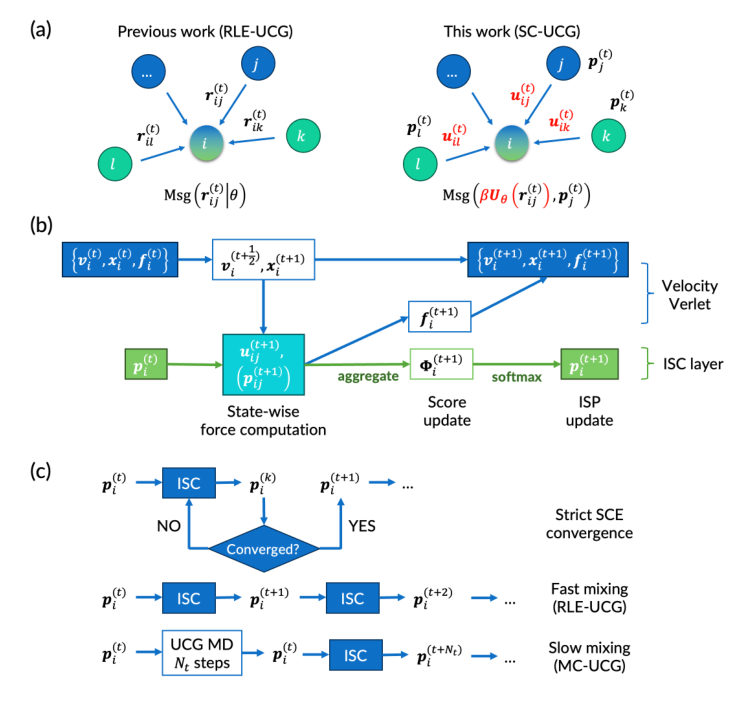 
FIG. 1. Overview of SC-UCG simulation. (a) Message construction in SC-UCG compared with RLE- UCG. RLE-UCG directly uses purely geometric edge attributes {𝑟!=} for message passing, while SC-UCG

📷 Fig 2

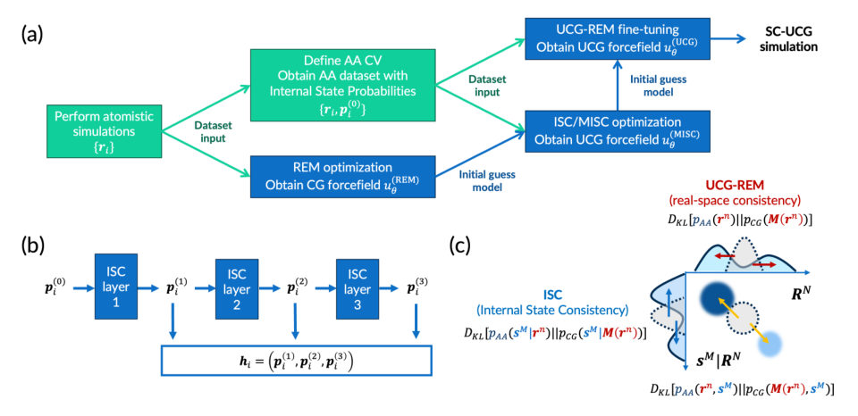 
FIG. 2. Overview of SC-UCG training methodology. (a) Flowchart for the SC-UCG workflow for constructing an SC-UCG forcefield. Green boxes and arrows denote data construction steps and input direction; blue boxes and arrow denote model optimization. (b) Multilayer Internal State Consistency (MISC) training by concatenating outputs from different layers. (c) UCG-REM fine-tuning and ISC can be understood in terms of optimizing marginal and conditional distributions, respectively, of the joint distribution in the real space and the internal state space.

📷 Fig 3

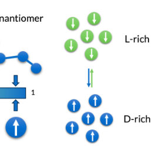 
FIG. 3. Illustration of the chiral transition system as application.

📷 Fig 4

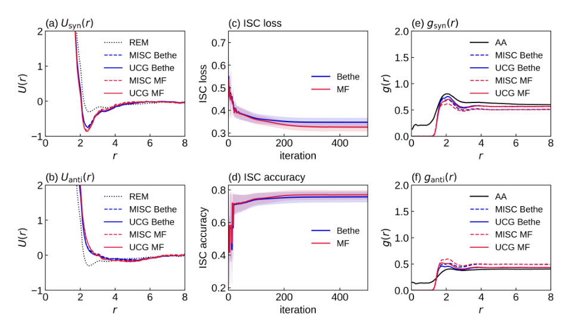 
FIG. 4. Forcefields, internal state classification, and state-wise distribution during SC-UCG training. (a)-(b) Learned (a) homochiral (D-D and L-L) and (b) heterochiral (D-L) CG interaction 𝑈xyd after REM phase, MISC training phase (Iteration 400), and UCG-REM fine-tuning phase (Iteration 40), respectively. Inference layers were varied between mean-field (MF) and Bethe. (c) MISC loss, averaged by frame, during MISC training phase. The shaded regions represent (d) Internal state prediction accuracy during MISC training phase. (e) Internal-state-specific radial distribution function (ISS-RDF) for homochiral pairs (D-D

📷 Fig 5

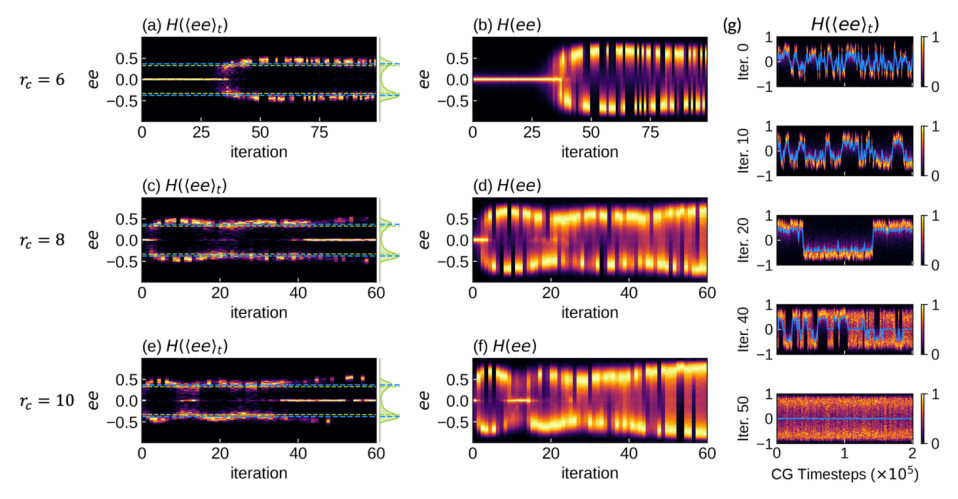 
FIG. 5. Emergence of collective chiral transitions during UCG-REM fine-tuning. (a) Time histograms for the system average of enantiomer excess, 𝐻(〈𝑒𝑒〉G), through UCG-REM iterations, starting from the MISC forcefield. The histogram densities were normalized with 𝑝MkN = 1 (yellow) and 𝑝M!$ = 0 (black). The histograms were stacked horizontally to reflect per-iteration changes. The green dashed lines represent the time-averaged absolute value (symmetrized for better comparison) of enantiomer excess in the all-atom ensemble 〈𝑒𝑒〉zz . The blue dashed lines represent the most probable 〈𝑒𝑒〉 value in the symmetrized histogram from the all-atom data, |𝑒𝑒|[,zz. The green histograms on the right...

**Summary.** This work introduces Self-Consistent Ultra-Coarse-Graining (SC-UCG) to improve molecular simulations by accurately handling complex internal states. It bypasses the need for manually defined collective variables by deriving state probabilities self-consistently using graph neural networks trained via relative entropy minimization. This allows for robust simulation of phase transitions in systems like biomolecular tetramers.

**Why it may be interesting.** The self-consistent treatment of discrete 'internal states' within a continuum framework is highly relevant for modeling quantum or near-quantum degrees of freedom in condensed matter systems where simple mean-field approximations fail.

Detailed structure

**Main problem.** The primary challenge is overcoming information loss during coarse-graining (CG) that prevents accurate sampling of complex, multistate phenomena in molecular dynamics simulations.

**Main result.** The proposed Self-Consistent UCG (SC-UCG) method successfully captures collective switching of internal states and accurately reproduces phase transitions even when trained on data from a single temperature.

**Method.** It introduces SC-UCG, which self-consistently infers internal state probabilities using graph message passing derived from minimizing relative entropy. The training utilizes the Multilayer Internal State Consistency (MISC) framework via graph backpropagation.

**Model / system.** The method is applied to a model tetramer system exhibiting a second-order symmetry-breaking phase transition between supercritical racemic and subcritical D/L-rich fluid phases.

**Key observables.** Internal state probabilities, collective switching events, and the order parameter characterizing the phase transition.

**Important parameters / regimes.** Temperature (T), coupling strengths derived from UCG interactions, and the structure of the internal states.

**Assumptions / limitations.** The core approximation is that the system can be modeled as a mixed ensemble where internal state probabilities are determined self-consistently without relying on pre-defined collective variables (CVs).

**Figures summary.** Not specified in the notes, but the application demonstrates capturing phase transitions and state switching.

**Paper structure.** The paper builds from foundational bottom-up CG theory to introduce SC-UCG as an advancement over RLE approximations. It details the variational derivation leading to a message-passing form (ISC layer) for internal state inference, followed by training via MISC and application to phase transition simulations.

Abstract

Bottom-up coarse-graining expands the length and time scales accessible to molecular dynamics (MD) simulations, but information loss can hinder accurate representation of multistate phenomena in complex biomolecular dynamics. Ultra-Coarse-Graining (UCG) projects discrete "quantum-like" extended degrees of freedom, or "internal states," onto coarse-grained (CG) molecules, extending CG model expressiveness. The rapid-local-equilibrium (RLE) approximation in UCG depends on user-defined collective variables (CVs, e.g., local density) and neglects correlations between internal states within and between CG molecules. We present Self-Consistent UCG (SC-UCG), which uses the underlying UCG interactions directly to assign internal states without designing CVs in the CG ensemble. During simulation, internal state probabilities are determined self-consistently through graph message passing. We enhance the RLE Hamiltonian with the Bethe approximation and AI-based inference to represent explicit correlations between UCG beads. For force-field training, we develop Multilayer Internal State Consistency (MISC), a machine-learning method derived from relative entropy minimization that avoids iterative sampling of intermediate force fields. We apply SC-UCG to a tetramer exhibiting a second-order symmetry-breaking phase transition from a supercritical racemic fluid to subcritical D-rich and L-rich fluids. SC-UCG captures collective switching of internal states in the subcritical region and recapitulates the phase transition across temperatures, despite being trained on a single-temperature dataset.

[↑ back to top](#top)

### [A platform for nuclear symmetry-violation searches with laser-coolable molecules carrying spinful nuclei](http://arxiv.org/abs/2608.06138v1)

**Authors:** Tatsam Garg, Jakob Weiß, Tesse Tiemens, Charly Beulenkamp, Andreas Schindewolf, Tim Langen  
**Type:** both · **Category:** other · **PDF:** <https://arxiv.org/pdf/2608.06138v1>  
**Analysis basis:** full PDF text, analyzed in chunks
**Topic relevance:** `interference shaping light` **1/5** · `quantum measurements` **1/5** · `quantum optics experiment` **1/5** · `spintronics-quantum-optics interface` **1/5**

📷 Fig 1

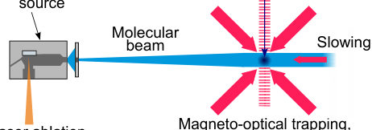 
FIG. 1. Schematic of the proposed experimental apparatus to measure nuclear-spin-dependent parity violation. The ap- paratus implements the toolbox developed in Secs. III–VI. Molecules are created by laser ablation in a cryogenic buffer- gas source. The resulting molecular beam is slowed and subse- quently captured in a magneto-optical trap (MOT), with pink arrows indicating the corresponding laser beams. From there, the molecules are optically pumped into a suitable science state, loaded into a movable optical lattice, and transported into the interaction region. Here, a stable magnet Zeeman- tunes the opposite-parity science states ψ± to near degener- acy with a magnetic field B,...

📷 Fig 2

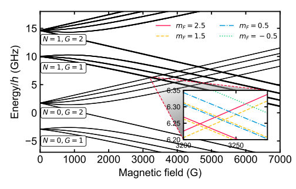 
FIG. 2. Structure of 137BaF in a magnetic field. Levels be- longing to the N = 0 and N = 1 rotational states undergo crossings between 3000 and 6000 G. A total of 192 individ- ual crossings occur, which are organized in 16 clusters. As shown in the inset, each cluster contains 12 individual cross- ings, each associated with individual hyperfine levels mF . The representative science crossing examined in detail in this work is between the mF = 5/2 levels at approximately 3215 G, de- noted by the solid pink line in the inset. The remaining state labels are introduced in the main text.

📷 Fig 3

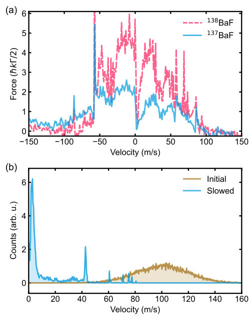 
FIG. 3. Bichromatic forces as a tool for efficient slowing and velocity compression. (a) Simulated bichromatic forces in 137BaF (blue solid line) and 138BaF (pink dashed line) as a function of particle velocity for a bichromatic detuning of δBC = ±2π × 200 MHz, laser intensity IBC ≈26 W/cm2 per frequency component per direction, and bichromatic phase ϕBC = π/2. While the overall force magnitude is reduced in the odd isotopologue 137BaF, it still significantly exceeds the maximum scattering force ¯hkΓ/2 achievable in an equivalent idealized two-level system with linewidth Γ and wavelength λ = 2π/k over a wide range of velocities. In particular, it is orders of magnitude higher than...

📷 Fig 4

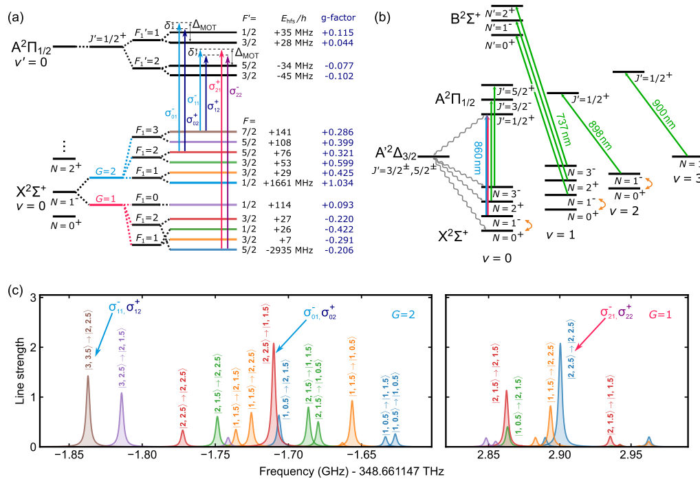 
FIG. 4. Triple conveyor-belt MOT scheme for cooling and trapping of 137BaF. (a) Three pairs of oppositely circular polarized frequency components (handedness of polarization denoted by the superscript) address three dominant transitions with a global blue detuning ∆MOT and two-photon detuning δ between frequency components within each pair. For a total laser intensity, Itot, the intensity is split between [σ01, σ02, σ11, σ12, σ21, σ22] components as [0.2, 0.2, 0.15, 0.15, 0.15, 0.15] × Itot. The hyperfine energy shifts Ehfs relative to the respective rotational levels and the effective g-factors for the linear-Zeeman-effect regime are given for each hyperfine level F. (b) The realization of...

📷 Fig 5

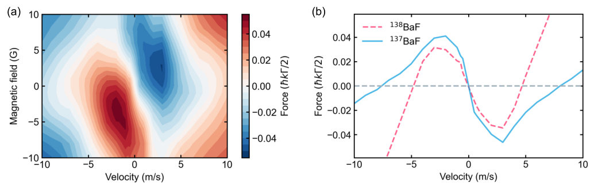 
FIG. 5. Results of the MOT simulations using the triple conveyor-belt scheme proposed in Fig. 4. (a) We show the simulated radial force over varying on-axis particle velocity and magnetic-field strength in the three-dimensional conveyor-belt MOT of 137BaF. The simulation uses Itot = 0.4 W/cm2 per laser beam direction, single-photon detuning ∆MOT = +2π × 10 MHz, and two-photon detuning δ = 2π × 3 MHz. (b) Slice of the cooling force at the MOT center. Results for 137BaF (blue solid line) are compared with those for 138BaF (pink dashed line) simulated with the experimental parameters from the directly loaded MOT experiment in Ref. [51], with Itot = 0.2 W/cm2 per laser beam direction, in ratio...

**Summary.** This paper introduces a general, high-precision experimental platform for searching for nuclear symmetry violations using laser-cooled molecules containing spinful nuclei. By leveraging techniques like Zeeman tuning near state crossings, the authors project sensitivities significantly beyond current limits. This work provides both the theoretical framework and the practical roadmap for next-generation searches for physics beyond the Standard Model in molecular systems.

**Why it may be interesting.** This work represents a sophisticated integration of quantum optics (laser cooling/trapping) with fundamental physics searches. The detailed theoretical modeling of complex molecular Hamiltonians to predict optimal measurement points is highly relevant to advanced AMO research.

Detailed structure

**Main problem.** The primary goal is searching for new physics by measuring nuclear P- and CP-violating effects, such as NSD-PV, in molecular systems.

**Main result.** The authors propose a comprehensive experimental toolbox achieving projected sensitivities two orders of magnitude better than current molecular beam methods, applicable to various spinful molecules.

**Method.** The method involves using external magnetic fields (Zeeman tuning) to bring opposite-parity molecular states into near-degeneracy, enhancing the measurement sensitivity via an interrogation technique like Stark-interferometry.

**Model / system.** The system is laser-coolable diatomic molecules carrying spinful nuclei (e.g., ${}^{137}	ext{BaF}$). The theoretical framework involves detailed calculations of molecular Hamiltonians incorporating rotational, hyperfine, and Zeeman interactions in Hund's case ($\alphaeta S$).

**Key observables.** The key observable is the mixing element $ar{W}$ (or matrix element $	ilde{C}$) derived from parity-violating couplings, measured via an asymmetry $A$ proportional to $1/\Delta$.

**Important parameters / regimes.** Key parameters include the magnetic field strength ($B$), the energy detuning ($\Delta$), and molecular constants like the permanent electric dipole moment (e.g., 3.17 Debye for BaF).

**Assumptions / limitations.** Major assumptions include neglecting contributions from weak electric fields in certain Hamiltonians and assuming that the dominant uncertainty source is the control over the energy detuning $\Delta$.

**Figures summary.** Figure 1 schematically shows the entire experimental apparatus, from laser ablation to MOT capture. Figure 2 details the state structure of ${}^{137}	ext{BaF}$ in a magnetic field, illustrating relevant state crossings.

**Paper structure.** The paper progresses by first establishing the general physical platform and required techniques (cooling, trapping). It then applies these methods to benchmark measurements like NSD-PV using specific molecular species (${}^{137}	ext{BaF}$), detailing Hamiltonian derivations and identifying precise magnetic field locations for maximal sensitivity.

Abstract

Cold heavy molecules are promising systems for exploring nuclear $\mathcal{P}$- and $\mathcal{CP}$-violating phenomena in search of new physics beyond the Standard Model. However, most proposed experimental strategies and their early realizations to date have been limited to proof-of-principle molecular species with effectively spin-zero nuclei that are not sensitive to nuclear symmetry-violating phenomena. Here, we introduce a comprehensive experimental toolbox that integrates cooling, trapping, coherent state manipulation, and a complete precision-measurement protocol that is applicable to molecules carrying relevant nuclear spins. Using ${}^{137}$Ba${}^{19}$F and nuclear-spin-dependent parity violation (NSD-PV) as representative species and benchmark application, respectively, our approach achieves a projected statistical sensitivity roughly two orders of magnitude beyond comparable molecular beams by combining techniques already demonstrated individually in current experiments. This level of precision could provide realistic experimental access not only to the enhanced NSD-PV signals arising from the heavy ${}^{137}$Ba nucleus within this molecule but also to the contributions from the lighter ${}^{19}$F nucleus, bringing direct benchmarks of nuclear \textit{ab initio} theory within reach. We further identify a candidate magic wavelength as a route to second-scale rotational coherence in future experiments. The techniques developed here can be transferred to measurements of nuclear Schiff and magnetic quadrupole moments in molecules containing deformed nuclei, establishing a general platform for laboratory searches for nuclear symmetry violations.

[↑ back to top](#top)

### [Dual-Faraday-laser-pumped cesium beam clock with $7.7\times 10^{-13}/\sqrtτ$ frequency stability](http://arxiv.org/abs/2608.06169v1)

**Authors:** Xiaomin Qin, Suyang Wei, Haijun Chen, Yufei Yan, Qiang Wei, Hangbo Shi, Zhiyang Wang, Zheng Xiao, Zijie Liu, Tiantian Shi, Jingbiao Chen  
**Type:** experiment · **Category:** other · **PDF:** <https://arxiv.org/pdf/2608.06169v1>  
**Analysis basis:** full PDF text, analyzed in chunks
**Topic relevance:** `interference shaping light` **1/5** · `quantum measurements` **1/5** · `quantum optics experiment` **1/5** · `superradiant laser` **1/5**

📷 Fig 1

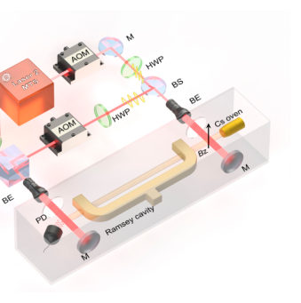 
Fig. 1. (a) The 133Cs D2 energy-level structure and schematic diagram illustrating atom population distribution in the ground state 𝐹= 3 under single-Faraday-laser-pumping (SFP) and dual-Faraday-laser-pumping (DFP) scheme. (b) Experimental schematic of the compact DFP Cs clock. Laser 1 and Laser 2 are atom-referenced Faraday lasers stabilized via modulation transfer spectroscopy (MTS) to the 𝐹= 4 →𝐹′ = 5 and 𝐹= 3 →𝐹′ = 2 cycling transitions, respectively. The grey region represents the sealed cesium beam tube. The black arrow represents the direction of magnetic field produced by the Helmholtz coils. Pump 1 and Pump 2 polarizations are set to 𝜎and 𝜋, respectively, as indicated by the yellow...

📷 Fig 2

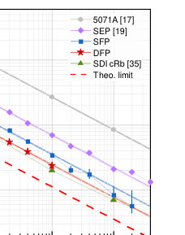 
Fig. 4. (a) Summary of reported compact Cs clock frequency stabilities with differ- ent laser-pumping architectures, including single-laser-diode pumping (SLDP, green hexagons) [42–52], single-ECDL pumping (SEP, purple diamonds) [18,19,43], single- Faraday-laser-pumping (SFP, blue squares) [20], as well as the DFP (red stars) scheme demonstrated in this work. (b) The frequency stability of Cs beam clocks under different pumping schemes, theoretical stability calculated under DFP (red dotted line), the performance of commercial Cs beam clock 5071A [17] and commercial cold Rb atomic clock SDI cRb-clock [35].

📷 Fig 3

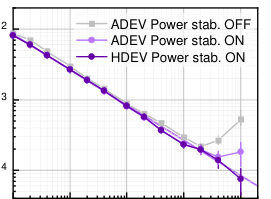 
Fig. 5. (a)–(c) Linear-fit slopes of fractional frequency shift versus the probe, Pump 1 and Pump 2 power are −2.6 × 10−12/mW, −9.2 × 10−12/mW and −3.8 × 10−11/mW, respectively. (d) The relative power stability of Laser 1 measured before (grey squares) and after (purple circles) laser power stabilization. (e) The long-term frequency stability of DFP Cs beam clock evaluated from Allan deviation (ADEV) and Hadamard deviation (HDEV).

**Summary.** The authors present a compact Dual-Faraday-laser-pumped (DFP) Cesium beam clock designed to achieve superior frequency stability for portable timing systems. By integrating advanced laser stabilization techniques like Modulation Transfer Spectroscopy with Faraday filtering, they successfully suppressed noise sources inherent in previous designs. This results in record short-term stability of $7.7	imes 10^{-13}/\sqrt{	au}$, advancing the state-of-the-art for field-deployable atomic clocks.

**Why it may be interesting.** This work represents a significant engineering achievement in precision measurement using atomic physics principles. The successful suppression of laser noise to reach $10^{-13}/\sqrt{	au}$ stability is highly relevant for quantum sensing and metrology applications that require robust field operation.

Detailed structure

**Main problem.** The primary goal is improving the short-term frequency stability of compact Cesium (Cs) beam clocks for use in field-deployable timing systems, overcoming limitations imposed by laser noise.

**Main result.** The developed Dual-Faraday-laser-pumped (DFP) Cs clock achieved a fractional Allan deviation of $7.7	imes 10^{-13}/\sqrt{	au}$, pushing stability into the highly desirable $10^{-13}/\sqrt{	au}$ regime.

**Method.** The technique involves using two lasers stabilized via Modulation Transfer Spectroscopy (MTS) and employing an intracavity Faraday anomalous dispersion optical filter (FADOF) for inherent resonance alignment.

**Model / system.** The system is a compact Cs beam clock utilizing two distinct laser pumping transitions ($	ext{F}=4 	o 	ext{F}'=5$ and $	ext{F}=3 	o 	ext{F}'=2$). It relies on low-frequency-noise, atom-referenced lasers stabilized through complex optical feedback loops.

**Key observables.** Clock SNR (46,365 in 1 Hz), fractional Allan deviation ($7.7	imes 10^{-13}/\sqrt{	au}$), and Hadamard deviation ($7.7	imes 10^{-15}$ at 10,000 s).

**Important parameters / regimes.** Lorentzian linewidth of 2.12 kHz; stability improvement from $1.1 	imes 10^{-12}/\sqrt{	au}$ (SFP) to $7.7 	imes 10^{-13}/\sqrt{	au}$ (DFP).

**Assumptions / limitations.** The primary limitation addressed is the conversion of laser frequency noise into fluorescence noise in standard two-laser pumping schemes.

**Figures summary.** Figures illustrate the energy level diagrams for single vs. dual Faraday pumping, the experimental schematic of the DFP clock setup, and plots detailing stability measurements (ADEV/HDEV) versus averaging time ($	au$).

**Paper structure.** The paper details the physical system components, describes the advanced stabilization techniques (MTS, FADOF), presents quantitative performance metrics comparing different pumping schemes, and concludes with future optimization paths.

Abstract

Compact cesium beam clocks are major frequency references for deployable timing systems. However, further improvement of their short-term frequency stability is limited by the clock signal-to-noise ratio (SNR). Although two-laser optical pumping can increase the effective atomic utilization, the achievable clock SNR has long been limited by laser-induced frequency-to-amplitude noise conversion. Here, we demonstrate a compact dual-Faraday-laser-pumped (DFP) Cs beam clock enabled by a low-frequency-noise atom-referenced laser architecture. The intracavity Faraday anomalous dispersion optical filter provides inherent alignment to the Cs D$_2$ resonances, while modulation transfer spectroscopy offers suppressed frequency noise and drift. The resulting laser system supports robust turnkey operation with a Lorentzian linewidth of 2.12 kHz. The DFP Cs clock achieves a clock SNR of 46,365 in a 1-Hz bandwidth and a fractional Allan deviation of $7.7\times 10^{-13}/\sqrtτ$ , with Hadamard deviation reaching $7.7\times 10^{-15}$ at 10,000 s. This work pushes the fractional frequency stability of a compact Cs beam clock into the $10^{-13}/\sqrtτ$ regime, providing a pathway toward high-performance Cs frequency references for field-deployable precision timing, navigation, and synchronization.

[↑ back to top](#top)

### [Fundamental limits of parameter estimation with heralded optical non-Gaussian states generated from Gaussian resources](http://arxiv.org/abs/2608.06239v1)

**Authors:** Shohei Kiryu, Kazufumi Tanji, Yoshihiro Ueda, Kosuke Fukui, Masahiro Takeoka  
**Type:** theory · **Category:** quantum information and computing · **PDF:** <https://arxiv.org/pdf/2608.06239v1>  
**Analysis basis:** full PDF text, analyzed in chunks
**Topic relevance:** `entanglement & information structure` **1/5** · `interference shaping light` **1/5** · `quantum measurements` **1/5**

📷 Fig 1

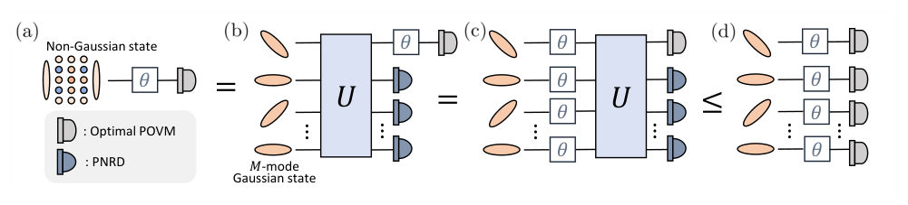 
Figure 1: (a) Quantum sensing with a non-Gaussian state and (b) heralded non-Gaussian states. (c) Equivalent circuit with (b) with respect to the QFI. (d) Quantum sensing with Gaussian states. U is a linear optical unitary operation.

📷 Fig 2

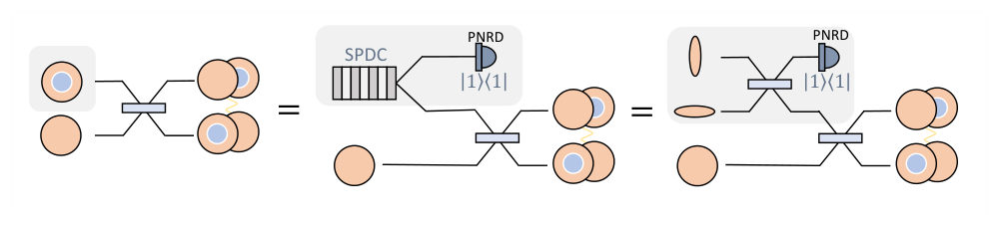 
Figure 2: Optical setup to generate single-photon entangled states. The input single photons are heralded from two-mode squeezed vacuum states produced via spontaneous parametric down-conversion. The entire optical circuit can also be decomposed into an equivalent interferometric system. This system consists of two squeezed vacuum states and a half beam splitter.

**Summary.** This theoretical paper analyzes the fundamental limits of phase estimation using heralded non-Gaussian states generated from Gaussian resources in optical systems. By defining an Effective Quantum Fisher Information (EQFI) that weights by success probability, the authors prove that this resource cannot surpass the QFI limit set by the original deterministic Gaussian input state. This highlights the critical importance of accounting for generation efficiency in quantum metrology.

**Why it may be interesting.** This work provides a rigorous resource-counting benchmark for quantum sensing, showing that mere non-Gaussianity is insufficient for advantage if generation probabilities are ignored in linear optics settings.

Detailed structure

**Main problem.** The paper investigates whether using heralded, probabilistic non-Gaussian quantum states offers a genuine metrological advantage over deterministic Gaussian states for single-parameter phase estimation.

**Main result.** It is proven that the Effective Quantum Fisher Information (EQFI) of the heralded non-Gaussian states cannot exceed the Quantum Fisher Information (QFI) achievable with the original Gaussian input state, when resource cost (success probability) is accounted for.

**Method.** The authors define and calculate the EQFI as a success-probability-weighted average of the conditional QFI over all possible detection outcomes from photon number resolving detectors.

**Model / system.** The analysis uses passive linear optical circuits acting on Gaussian input states (like squeezed vacuum) to generate heralded non-Gaussian states, with phase estimation performed by applying a global phase rotation operator.

**Key observables.** Quantum Fisher Information (QFI), Effective Quantum Fisher Information (EQFI), Success Probability ($P(n_B)$).

**Important parameters / regimes.** The comparison is between $	ext{EQFI}$ and the input $	ext{QFI}$, particularly in regimes involving photon number conservation.

**Assumptions / limitations.** The analysis assumes linear phase estimation using passive linear optics, and crucially incorporates the success probability of the heralding process into the performance metric.

**Figures summary.** Figures illustrate quantum sensing schemes comparing non-Gaussian vs. Gaussian states, showing how the probabilistic nature (heralding) is mapped to an effective measurement strategy.

**Paper structure.** The paper establishes a formal mapping between heralded state preparation and postselection after parameter encoding. It then derives the EQFI metric and proves the upper bound ($	ext{EQFI} \le 	ext{QFI}_{	ext{input}}$), using commutation relations to justify this result.

Abstract

Non-Gaussian states can exhibit large quantum Fisher information (QFI) in quantum sensing. In optical systems, however, its generation is often probabilistic via the boson-sampling type conditional operation and thus its generation rate is limited. This probabilistic generation of non-Gaussian resource should be taken into account for evaluation of the sensing performance. Then a natural question arising is whether the use of heralded probabilistic non-Gaussian states is better than that of the original deterministic Gaussian states for quantum sensing. In this paper, we answer to this question for single-parameter phase-estimation. By using photon-number conservation in passive linear optical systems, we show that heralded state preparation before parameter encoding can be mapped to a postselection problem after parameter encoding for phase estimation. This mapping allows the success probability of heralding to be included naturally in the metrological performance. We introduce an effective quantum Fisher information (EQFI), defined as the success-probability-weighted QFI of the heralded outputs, and prove that it cannot exceed the QFI of the original Gaussian inputs. The result highlights the importance of resource counting in quantum sensing toward better understanding of the resource efficient advantage of optical quantum sensing.

[↑ back to top](#top)

### [Phonon spectral functions of low-density polaron metals](http://arxiv.org/abs/2608.06357v1)

**Authors:** Luis Walther, Alberto Nocera, Mona Berciu  
**Type:** theory · **Category:** strongly correlated electrons · **PDF:** <https://arxiv.org/pdf/2608.06357v1>  
**Analysis basis:** full PDF text, analyzed in chunks
**Topic relevance:** `Frenkel-Kontorova` **1/5** · `Keldysh / 2PI / non-Gaussian methods` **1/5** · `methods for driven-dissipative` **1/5**

📷 Fig 1

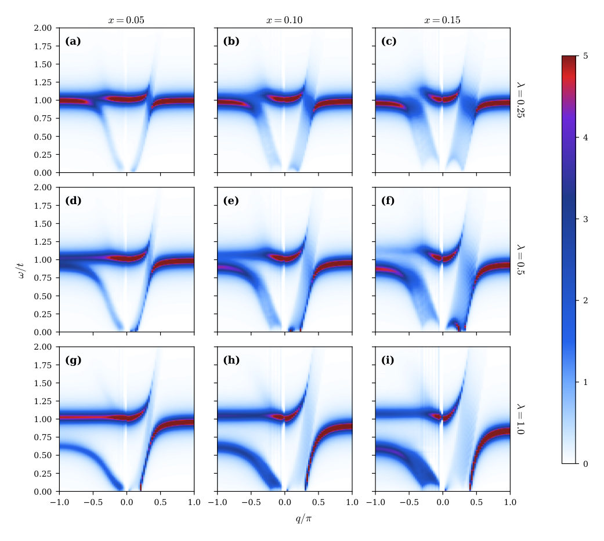 
Figure 1. Phonon spectral function B(q, ω) for x = 0.05 (left column), x = 0.10 (middle column) and x = 0.15 (right column) at λ = 0.25 (top row), λ = 0.5 (middle row) and λ = 1 (bottom row). In each panel, the left half (q &lt; 0) shows the DMRG results while the right half (q &gt; 0) shows results obtained from RPA, i.e. keeping only the lowest order polarization loop of Eq. (11). In all cases t = 1, Ω= 1, η = 0.05.

📷 Fig 2

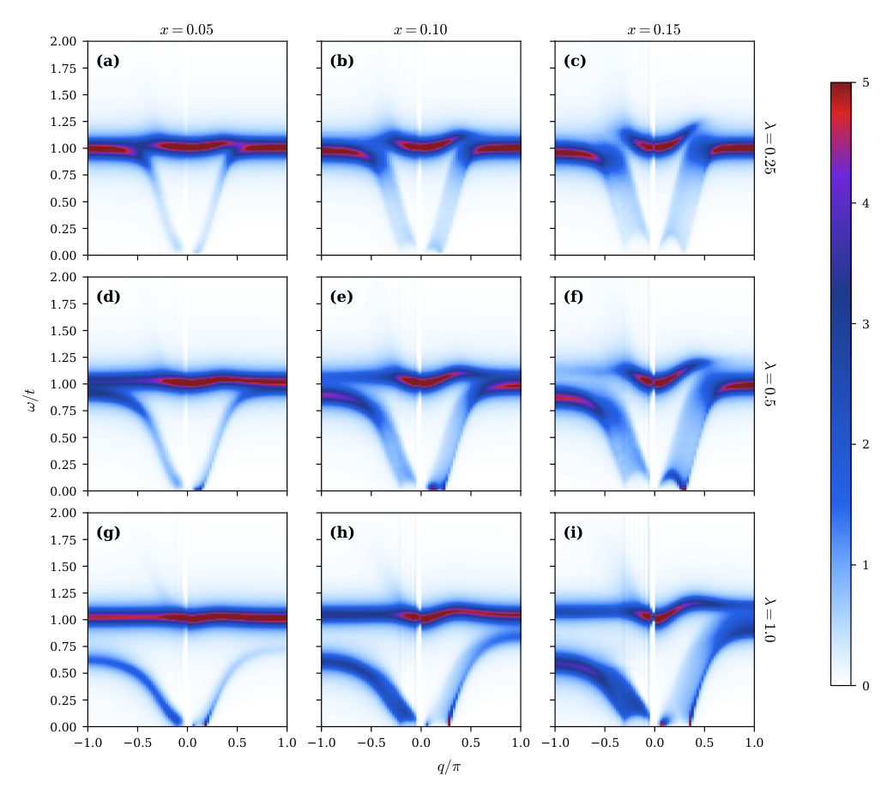 
Figure 2. Phonon spectral function B(q, ω) for x = 0.05 (left column), x = 0.10 (middle column) and x = 0.15 (right column) at λ = 0.25 (top row), λ = 0.5 (middle row) and λ = 1 (bottom row). In each panel, the left half (q &lt; 0) shows the DMRG results while the right half (q &gt; 0) shows results obtained from dressed RPA of Eq. (15), see text for more details. In all cases t = 1, Ω= 1, η = 0.05.

📷 Fig 3

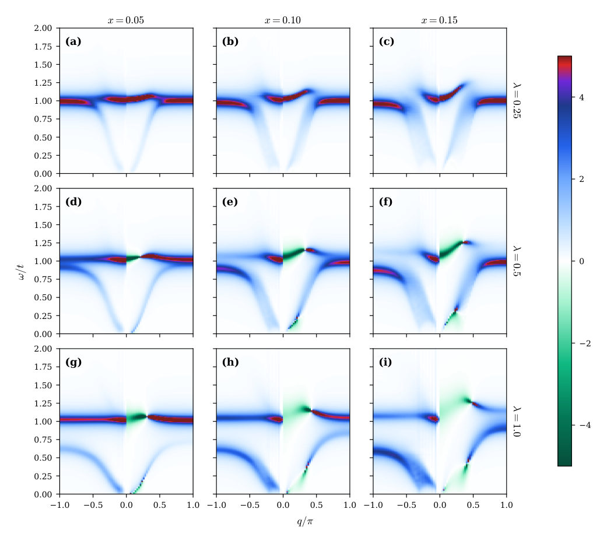 
Figure 3. Phonon spectral function B(q, ω) for x = 0.05 (left column), x = 0.10 (middle column) and x = 0.15 (right column) at λ = 0.25 (top row), λ = 0.5 (middle row) and λ = 1 (bottom row). In each panel, the left half (q &lt; 0) shows the DMRG results while the right half (q &gt; 0) shows results obtained from the polarization that also includes the first vertex correction, see text for more details. In all cases t = 1, Ω= 1, η = 0.05.

**Summary.** This work calculates the phonon spectral function for low-density polaron metals using DMRG. The results demonstrate that the spectral weight shifts significantly across energy scales, contradicting predictions based on the Migdal limit's $2k_F$ kink. The study proposes a 'dressed RPA' as an effective approximation while cautioning about the pitfalls of inconsistent diagrammatic expansions.

**Why it may be interesting.** While focused on lattice models, the study of spectral weight renormalization due to coupling (electron-phonon interaction) is a core concept in understanding emergent collective excitations relevant to strongly correlated systems and superconductivity.

Detailed structure

**Main problem.** The study aims to compute the phonon spectral function of low-density polaron metals, contrasting these results with predictions from established theoretical limits like the Migdal limit.

**Main result.** The calculated spectra show significant phonon weight transfer both below and above the bare phonon energy, crucially lacking the $2k_F$ kink signature expected in standard Kohn anomaly phenomenology.

**Method.** The primary calculation uses Density Matrix Renormalization Group (DMRG), supplemented by theoretical comparisons using the Random Phase Approximation (RPA) and a 'dressed RPA' scheme.

**Model / system.** The system modeled is a one-dimensional spinless Holstein model doped with a low but finite carrier concentration ($x \le 0.15$), describing polaron metals interacting via electron-phonon coupling ($\lambda$).

**Key observables.** Phonon spectral function, $B(q, \omega) = -rac{1}{\pi} 	ext{Im} D_R(q, \omega)$.

**Important parameters / regimes.** Low carrier concentration ($x \le 0.15$), electron-phonon coupling ($\lambda$), and the bare phonon energy ($\Omega$).

**Assumptions / limitations.** The 'dressed RPA' is proposed as an efficient approximation, but including lowest-order vertex corrections leads to unphysical negative spectral weight, signaling necessary consistent non-perturbative treatment of dressings.

**Figures summary.** Figures compare DMRG results (for $q<0$) against polarization calculations using RPA and dressed RPA variants (for $q>0$), illustrating the transfer of phonon weight across different energy regimes.

**Paper structure.** The paper establishes the physical problem by comparing low-density polaron behavior to known limits. It presents DMRG results, contrasts them with lowest-order RPA predictions, develops an improved 'dressed RPA' scheme, and concludes by discussing the limitations imposed by vertex corrections.

Abstract

We use the density matrix renormalization group (DMRG) to compute the phonon spectral function of a one-dimensional spinless Holstein model doped with a low but finite carrier concentration, $x \leq 0.15$, as a function of the electron-phonon coupling $λ$. To the best of our knowledge, these are the first such results in this regime, complementing extensive prior work at the single-polaron level ($x\to 0$). We find that significant phonon spectral weight is transferred both below, all the way down to $ω=0$, and above the bare phonon energy $Ω$, in stark contrast with the Kohn-anomaly phenomenology expected in the Migdal limit, where weight remains centered near $Ω$ with a kink at $q=2k_F$. No signature of this $2k_F$ kink appears in our results. This behavior is captured qualitatively by the Random Phase Approximation (RPA), and semi-quantitatively, at negligible extra computational cost, by a ``dressed RPA'' scheme in which the electron addition propagator is renormalized using the Momentum Average (MA) approximation for the low-density electron-polaron. By contrast, adding the lowest-order vertex correction to this dressed scheme produces unphysical negative spectral weight, signaling that vertex and propagator dressings must be treated consistently once the propagators are dressed nonperturbatively. Our results provide an efficient approximation for the phonon spectral functions of low-density polaron metals, a regime relevant to weakly doped insulators.

[↑ back to top](#top)

### [Superfluid helium](http://arxiv.org/abs/2608.05354v1)

**Authors:** Charles Radin  
**Type:** theory · **Category:** statistical mechanics · **PDF:** <https://arxiv.org/pdf/2608.05354v1>  
**Analysis basis:** full PDF text, analyzed in chunks
**Topic relevance:** `Keldysh / 2PI / non-Gaussian methods` **1/5** · `driven-dissipative phase transition` **1/5** · `entanglement & information structure` **1/5**

📷 Fig 1

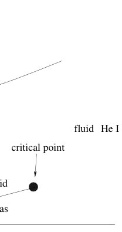 
Figure 1. Highly simplified Pressure-Temperature phase diagram of 4He, showing the normal fluid (He I), the superfluid (He II), and the critical point within the fluid He I.

📷 Fig 2

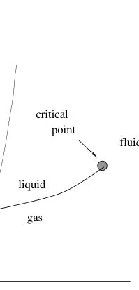 
Figure 2. Highly simplified Pressure-Temperature phase diagram of carbon dioxide, emphasizing gas-liquid coexistence between the triple point and criti- cal point. It also shows the solid/fluid transition, the other curve going through the triple point.

📷 Fig 3

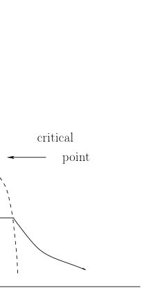 
Figure 3. One isotherm (dark curve) of the highly simplified Pressure- Volume-Temperature equation of state of carbon dioxide, the range of co- existence indicated by the dashed curve.

📷 Fig 4

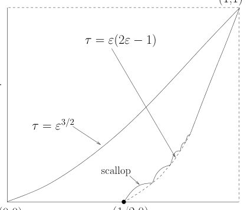 
Figure 4. Razborov triangle, showing the possible values of edge and triangle densities.

📷 Fig 5

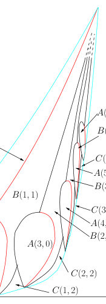 
Figure 5. Conjectured phases (2017) in the edge/triangle model

**Summary.** This theoretical paper models the liquid-superfluid phase transition in helium using an abstract toy model based on dense random graphs. By employing the mathematical formalism of graphons in the infinite system limit, the authors demonstrate how a difference in symmetry can naturally define an order parameter distinguishing the two distinct phases.

**Why it may be interesting.** While focused on classical statistical mechanics, the use of advanced tools like graphons and infinite system limits to define symmetry-breaking order parameters is mathematically sophisticated and relevant to understanding emergent order in complex many-body systems.

Detailed structure

**Main problem.** The primary goal is modeling the phase transition between normal liquid ($	ext{He I}$) and superfluid ($	ext{He II}$) helium-4, focusing on developing a theoretical framework to identify an order parameter.

**Main result.** The authors propose using graph theory in the infinite system limit to show how symmetry differences can define an order parameter distinguishing the two distinct phases.

**Method.** The analysis relies heavily on constructing and analyzing 'toy models' based on dense random graphs, utilizing the mathematical formalism of graphons derived from Lovász et al. [42].

**Model / system.** The system is superfluid helium-4 ($	ext{He}$), modeled abstractly using an edge/triangle graph model defined on $n$ vertices. The analysis maps this to constraints on edge density ($\epsilon$) and triangle density ($	au$).

**Key observables.** Order parameter, entropy (in the infinite system limit), thermal conductivity, and viscosity.

**Important parameters / regimes.** Edge density ($\epsilon$), triangle density ($	au$), and the transition point between $	ext{He I}$ and $	ext{He II}$.

**Assumptions / limitations.** The model is a 'toy model' whose formalism (infinite system limits) is not guaranteed to apply to all physical transitions, especially the fluid/solid one.

**Figures summary.** Figures illustrate simplified P-T phase diagrams for ${}^4	ext{He}$ and $	ext{CO}_2$, and later show the structure of possible phases in the edge/triangle model (e.g., regions A(2,0), B(1,1), F(1,1)) represented by graphons.

**Paper structure.** The paper progresses from establishing the physical problem ($	ext{He I}/	ext{He II}$ transition) to introducing a mathematical analogy using random graphs and their infinite limits (graphons). It then uses this framework to derive structural differences that serve as order parameters for the superfluid phase.

Abstract

We are interested in modelling superfluid helium-4, the common isotope of helium, of atomic number 4. We present a mathematically solvable toy model of the phase transition between the normal liquid and superfluid phases and use it to show how an order parameter might be obtained for the superfluid.

[↑ back to top](#top)

### [Machine learning for sample-based quantum diagonalization: generative configuration recovery and the classical-simulability frontier](http://arxiv.org/abs/2608.05314v1)

**Authors:** Nicolás Bonilla Vargas  
**Type:** theory · **Category:** strongly correlated electrons · **PDF:** <https://arxiv.org/pdf/2608.05314v1>  
**Analysis basis:** full PDF text, analyzed in chunks
**Topic relevance:** `analog quantum simulation` **1/5** · `correlated cavity matter` **1/5**

📷 Fig 1

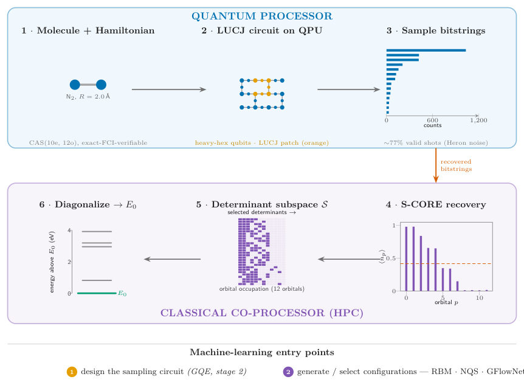 
Figure 1. The sample-based quantum diagonalization workflow, with real data at every stage (N2, CAS(10e,12o), exact-FCI-verifiable). A shallow LUCJ circuit on the quantum processor (orbital rotations U(θ) interleaved with diagonal-Coulomb Jastrow gates) is sampled in the computational basis; here 77% of shots survive particle-number post-selection at Heron-calibrated noise. The classical co-processor repairs the broken samples by occupation-weighted S-CORE, assembles the recovered determinants into a subspace S (each row of panel 5 is one selected configuration’s orbital occupation), and diagonalizes the projected Hamiltonian, whose energy is a variational upper bound converging to the...

📷 Fig 2

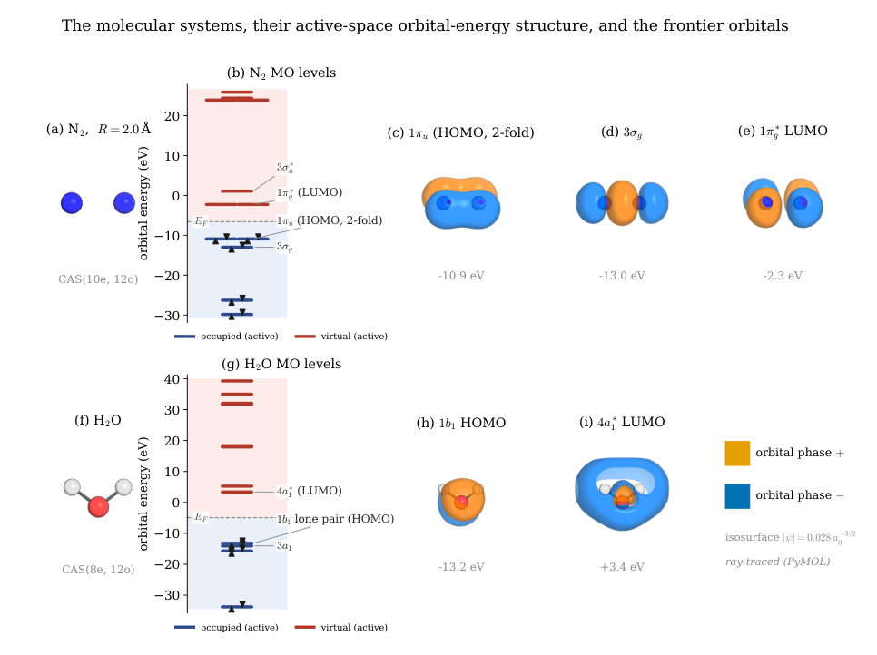 
Figure 2. The molecular systems, their active-space orbital-energy structure, and the frontier orbitals. (a,f) Ray-traced ball-and-stick geometries of stretched N2 (R = 2.0 Å, CAS(10e,12o)) and H2O (CAS(8e,12o)). (b,g) Molecular-orbital energy-level diagrams (restricted Hartree–Fock, eV): occupied active levels (blue) carry their two electrons as up/down arrows, virtual active levels are red, the shaded band is the complete active space, and EF marks the HOMO–LUMO midpoint; the deep 1s core is frozen and off-scale. (c–e) Ray-traced (PyMOL) isosurfaces of the N2 frontier orbitals — the two-fold-degenerate 1πu HOMO (−10.9 eV; note the axis-containing nodal plane of π symmetry), the...

📷 Fig 3

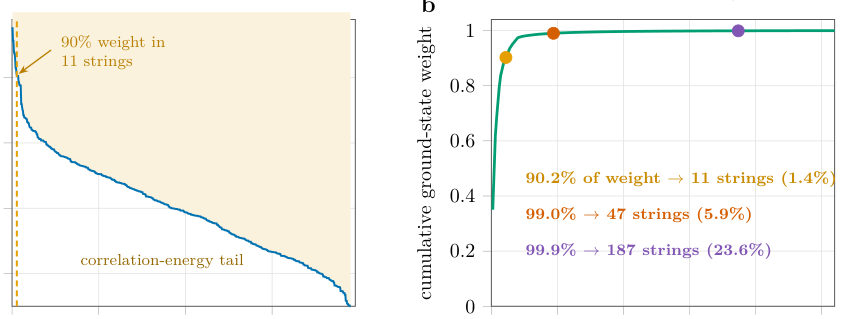 
Figure 3. The coupon-collector bottleneck, computed exactly. N2 CAS(10e,12o), from the exact FCI wavefunction. Left: the marginal single-spin-string weight wα(i) = P

📷 Fig 4

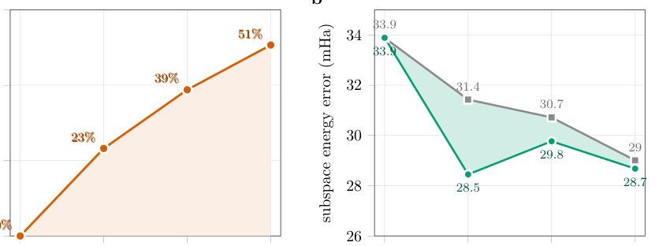 
Figure 4. Configuration recovery under backend-calibrated noise (FakeTorino / Heron r1 rates; asymmetric readout + depolarizing). Left: the fraction of particle-number-valid shots collapses as the noise scale grows. Right: at fixed dimension D = 120, S-CORE recovery (green) lowers the subspace energy error relative to discarding the invalid shots (grey) — most at moderate noise (∼3 mHa at 1×, shrinking to ∼0.3 mHa at 3×) — while the raw curve (grey) drifts steadily downward and the recovered curve (green) drops sharply then stays low as noise broadens Hilbert-space exploration, both consistent with the “noise can help” effect. Note the recovered subspace stays well above chemical accuracy...

📷 Fig 5

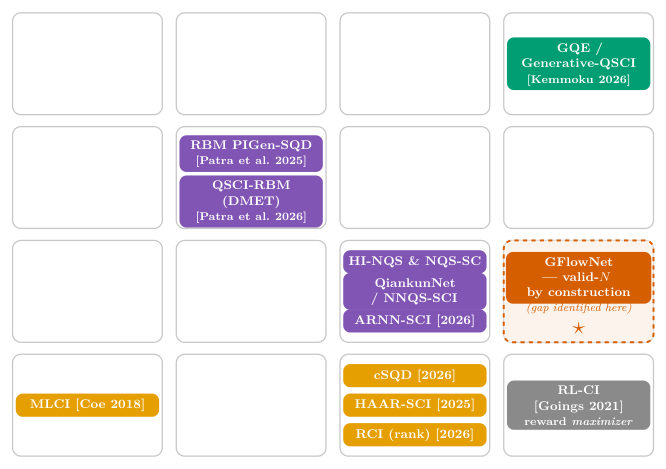 
Figure 5. A taxonomy of machine-learning methods for determinant and subspace selection in SQD, organized by the object each method generates (rows) and the importance signal it exploits (columns). Generative models (purple) learn a distribution over determinants; discriminative models (orange) classify or rank them; circuit-design methods (green) learn the sampler itself. The reward-driven column (right) is occupied only by the reinforcement-learning maximizer RL-CI [Goings 2021] (grey); the reward-proportional flow cell (dashed) that diverse tail discovery calls for is the methodological whitespace this review identifies — a generative-flow network that constructs valid-N determinants in...

**Summary.** This paper critically reviews Sample-based Quantum Diagonalization (SQD) for electronic structure, arguing that current implementations do not demonstrate a clear quantum advantage over state-of-the-art classical selected configuration interaction methods. It establishes rigorous benchmarking standards and suggests that true quantum utility may only be found in specific regimes, such as robustness to noise or learning from quantum experiments.

**Why it may be interesting.** It directly addresses the computational bottleneck in strongly correlated electron physics by evaluating the practical utility and theoretical limits of hybrid quantum-classical algorithms like SQD against established methods (like DMRG or advanced CI).

Detailed structure

**Main problem.** The central problem is accurately determining the ground-state energy of a many-electron Hamiltonian, which is computationally intractable due to the exponential growth of the full configuration interaction (FCI) space.

**Main result.** The authors report that strong classical selected CI methods match or beat quantum-sampled subspaces in published comparisons, and they establish a regime map defining where a true quantum advantage might exist.

**Method.** The paper critically reviews Sample-based Quantum Diagonalization (SQD) and proposes rigorous benchmarking standards to test the limits of quantum sampling versus established classical correlated electron techniques.

**Model / system.** The focus is on many-electron systems governed by the electronic Hamiltonian, typically studied in chemistry using active spaces defined by orbital occupations. The methods compare QSCI/SQD against classical sCI approaches.

**Key observables.** Ground-state energy ($E_0$), determinant importance distribution, and configuration count required for a given accuracy.

**Important parameters / regimes.** The multireference character of the electronic state is highlighted as a potential coordinate distinguishing quantum advantage regimes.

**Assumptions / limitations.** The primary assumption being tested is whether the sampling process inherent in SQD can overcome the combinatorial explosion better than classical selection heuristics, which is shown to be false under current comparisons.

**Figures summary.** Not specified (The notes describe the workflow and results rather than specific figure contents).

**Paper structure.** The paper critically reviews the existing ecosystem of ML-enhanced quantum samplers, confronts the central question of quantum vs. classical performance using negative results, proposes a benchmarking standard/regime map, and tests this map with FCI-exact experiments.

Abstract

Sample-based quantum diagonalization (SQD), equivalently quantum-selected configuration interaction (QSCI), has in two years become a pragmatic centre of gravity of pre-fault-tolerant quantum chemistry: a quantum processor samples electronic configurations, and the many-electron Hamiltonian is diagonalized classically in the resulting determinant subspace. Its accuracy is set entirely by which configurations enter that subspace, a selection problem for machine learning made acute by a coupon-collector bottleneck. We critically review the ecosystem of generative and learned selectors, organizing it by the object each method generates and the importance signal it exploits, and expose one conspicuous gap: a reward-proportional generative-flow-network proposer built for tail discovery. We then confront the field's central question -- whether the quantum sampler beats classical selected configuration interaction -- and report a carefully scoped negative: across published same-active-space comparisons, strong classical selected CI matches or beats the quantum-sampled subspace, and the flagship single-layer circuits now admit polynomial-time classical energy estimation. We distil a benchmarking standard and turn the negative into a regime map, then test it with FCI-exact experiments that confirm one prediction and refute another: the cheap prior's rank correlation with the exact weights declines with multireference character (a usable coordinate), but a controlled single-molecule noise sweep shows the one generative advantage we find, robustness to valid-shot starvation, to be generic rather than the multireference-specific effect a confounded contrast first suggested. Finally, we flag learning from quantum experiments, whose classical sample-complexity lower bound is an unconditional theorem, as the one adjacent frontier where a quantum advantage is provable but not yet bridged to chemistry.

[↑ back to top](#top)

### [Partition Functions of Hermitian and PT-Symmetric Oscillators from Integrable Models](http://arxiv.org/abs/2608.06047v1)

**Authors:** Hongfei Shu, Jingjing Yang  
**Type:** theory · **Category:** statistical mechanics · **PDF:** <https://arxiv.org/pdf/2608.06047v1>  
**Analysis basis:** full PDF text, analyzed in chunks
**Topic relevance:** `Keldysh / 2PI / non-Gaussian methods` **1/5** · `driven-dissipative phase transition` **1/5**

📷 Fig 1

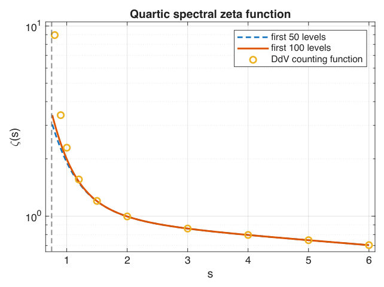 
Figure 1: Quartic spectral zeta function from the DdV counting function compared with partial sums

**Summary.** This paper develops a novel theoretical framework to calculate the partition function and spectral zeta function for anharmonic oscillators, including both standard Hermitian and PT-symmetric cases. It achieves this by establishing a direct link between these quantum spectral functions and solutions derived from integrable models via contour integration techniques. This provides powerful analytical tools for studying thermal properties in complex quantum systems.

**Why it may be interesting.** The rigorous connection established between spectral properties (thermodynamics) and the mathematical structure of integrable systems provides powerful new tools for calculating quantum observables in complex potentials.

Detailed structure

**Main problem.** The primary goal is developing a direct mathematical bridge connecting quantum spectral functions (like partition functions and spectral zeta functions) to solutions derived from integrable models.

**Main result.** The authors successfully express the thermal partition function and spectral zeta function for both Hermitian and PT-symmetric oscillators using contour integrals involving the counting function derived from the integrable model's equations.

**Method.** The methodology relies on the ODE/IM correspondence, utilizing the Destri–de Vega equation to find the quantization condition $a(E)$, which then parameterizes the required contour integrals for thermodynamic quantities.

**Model / system.** The study analyzes homogeneous anharmonic oscillators, specifically Hermitian ($V(x) = x^{2M}$) and PT-symmetric potentials. The analysis extends these techniques to calculate thermal properties across different symmetry classes.

**Key observables.** Partition function $Z(eta)$, Spectral zeta function $\zeta_H(s)$ (and $\zeta_{PT}^H(s)$), Ground state energy ($E_0$).

**Important parameters / regimes.** Inverse temperature ($eta$), Oscillator exponent ($M > 1$), and the spectral parameter $s$.

**Assumptions / limitations.** The analysis assumes the applicability of the ODE/IM correspondence and relies on asymptotic expansions (WKB) for high-temperature regimes.

**Figures summary.** Tables compare calculated values of the ground state energy ($E_0$) and spectral zeta function ($\zeta(s)$) against established literature results, demonstrating consistency across different methods.

**Paper structure.** The paper develops the formulation for Hermitian oscillators first, deriving contour integral representations for $Z(eta)$. It then extends this framework to PT-symmetric systems, requiring careful selection of Stokes sectors and yielding analogous integral forms for $Z_{PT}(eta)$ and $\zeta_{PT}^H(s)$.

Abstract

We develop an ODE/IM-based formulation for the thermal partition function and the spectral zeta function of the homogeneous Hermitian and PT-symmetric oscillators. For both classes of systems, the quantization condition can be expressed using the counting function $a(E)$, which can be solved via the Destri-de Vega equation of the integrable model. We then express the partition function and spectral zeta function as contour integrals involving the counting function, thereby providing a direct bridge between quantum spectral functions and integrable models.

[↑ back to top](#top)

### [Quantum channel learning with limited parallel access](http://arxiv.org/abs/2608.05307v1)

**Authors:** Mahadevan Subramanian, Hyukgun Kwon, Liang Jiang  
**Type:** theory · **Category:** quantum information and computing · **PDF:** <https://arxiv.org/pdf/2608.05307v1>  
**Analysis basis:** full PDF text, analyzed in chunks
**Topic relevance:** `entanglement & information structure` **1/5** · `quantum measurements` **1/5**

📷 Fig 1

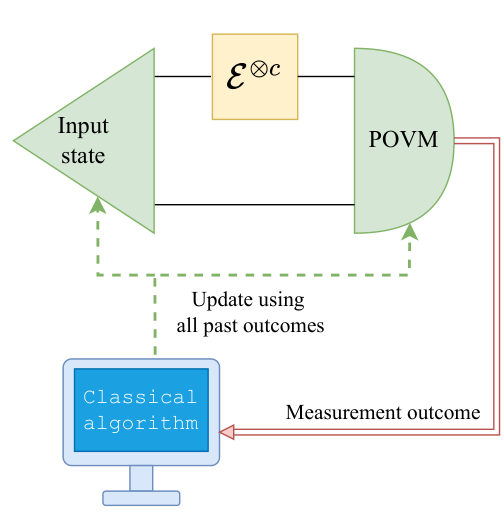 
FIG. 1: Representation of a learning protocol that uses c-copies of an unknown channel E which is probed by an input state and then measured with the assistance of ancillas. It is assumed that there are multiple steps of such a protocol where the measurement outcomes of all past steps are then used to update the input state and POVM for the next round. The processing is naturally done by a classical algorithm and since we are interested in the fundamental of sample complexity of channel usage, we assume unbounded classical memory and accurate control of the input states and POVMs. To study the case of complex-conjugate channels we can alternatively substitute (E ⊗E∗)⊗c in place of the...

📷 Fig 2

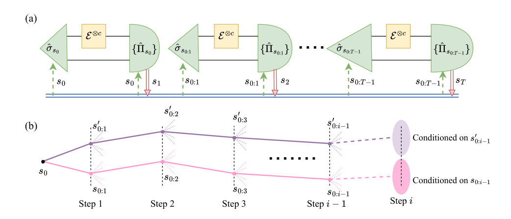 
FIG. 2: (a) Depiction of c-copy protocols as defined in Def. III.1. Each learning step allows for ancilla assistance and adaptive state preparation and measurements. Each measurement {ˆΠs0:t} is assumed to be an arbitrary POVM. The learning protocol is initialized with the classical memory with value s0 which is appended with each measurement outcome to finally get the vector s0:T at the end of the learning protocol. This classical information is then processed to construct an appropriate description of the channel. (b) An example of two paths s0:i and s′ 0:i of the measurement outcomes where it can be noted that outcome si (s′ i) is distributed as per a measure that is dependent on the...

📷 Fig 3

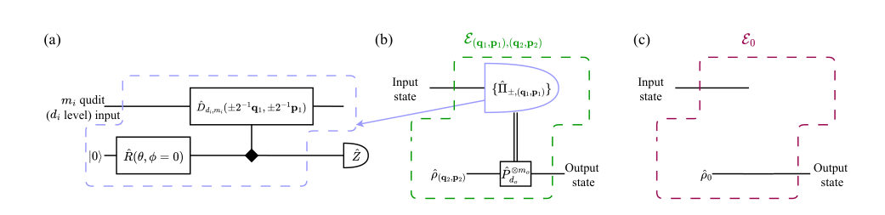 
FIG. 3: (a) Circuit to implement the two-outcome POVM {ˆΠ±,(q1,p1)} in Eq. (32) where R(θ, ϕ) is a qubit rotation (we set θ = π/4 to obtain the exact POVM) and the controlled displacement operation performs ˆDd,m(±2−1q, 2−1p) conditioned on if the qubit is in the |+⟩or |−⟩state (eigenstates of Pauli ˆX) and the two POVM outcomes correspond to the two outcomes of the ˆZ basis measurement. (b) Construction for the parameterized channel E(q1,p1),(q2,p2) (Eq. (32)) for (q1, p1) ∈Fm d × Fm d \{0, 0} and (q2, p2) ∈Fm′ d′ × Fm′ d′ \{0, 0} realized using the described POVM where the readout classically controls a parity operation to prepare either ˆρ+,(q2,p2) or ˆρ−,(q2,p2). (c) The channel E0 is a...

📷 Fig 4

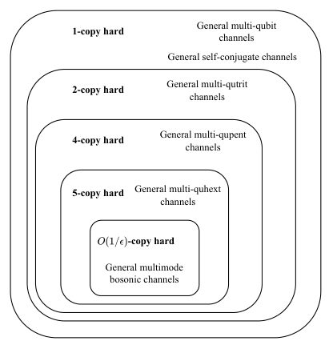 
FIG. 4: Visual representation of learning hierarchy over the set of all channels with the same input and output Hilbert spaces. By “hard” we refer to sample complexity that scales exponentially in the system size (i.e. number of qudits or modes). We note that multi-qubit channels [23] and self-conjugate channels (Thm.s IV.4, IV.5) are 1-copy hard, but aren’t 2-copy hard. Similarly we have results for multi-qudit channels being d −1-copy hard, but not d-copy hard (Thm. IV.2) for any prime d which we depict for the cases of d = 3 and 5 in the above figure (namely qutrits, qupents). Further we discuss that d −1-copy hard that are not d-copy hard can be realized for square-free d so we depict...

📷 Fig 5

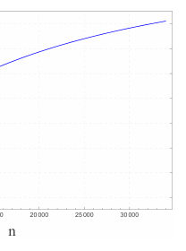 
FIG. 5: Manual verification for lemma B.7 for the range 8 ≤n ≤34000.

**Summary.** This theoretical work establishes fundamental limits on how much data (sample complexity) is needed to characterize an unknown quantum channel. By analyzing qudit and bosonic systems, the authors show that accessing both the channel $\mathcal{E}$ and its complex conjugate $\mathcal{E}^*$ simultaneously provides a significant advantage over simply having multiple copies of $\mathcal{E}$. This work defines a resource hierarchy for quantum process learning.

**Why it may be interesting.** It provides rigorous resource quantification for quantum process tomography, showing that simply having multiple copies of a channel is insufficient without complementary information (like conjugate access) to achieve efficient learning scaling.

Detailed structure

**Main problem.** The paper derives sample-complexity lower bounds for estimating entries of transfer matrices or functions that characterize unknown quantum channels under limited parallel access resources.

**Main result.** Efficient learning requires specific resource access, such as simultaneous access to the channel and its complex conjugate ($\mathcal{E} \otimes \mathcal{E}^*$), establishing a hierarchy of required quantum information resources for characterization.

**Method.** The analysis uses techniques from quantum estimation theory, deriving lower bounds by comparing the distinguishability of states/channels under different resource constraints (e.g., $c$-copy access vs. conjugate access).

**Model / system.** The study considers quantum channels acting on qudit systems and multi-mode bosonic systems, characterizing them via Heisenberg–Weyl transfer matrices or characteristic-function transfer functions derived from the Choi state.

**Key observables.** Transfer matrix/function entries, sample complexity bounds ($\epsilon^{-k}$ scaling), and distinguishability measures like the diamond distance.

**Important parameters / regimes.** Accuracy $\epsilon$, success probability $1-\delta$, number of copies $c$, and local dimension $d$ (for qudits).

**Assumptions / limitations.** The analysis assumes the learner has control over input states and ancillary assistance, allowing for strong lower bounds on required resources.

**Figures summary.** Figure 1 illustrates a general learning protocol using c-copies of an unknown channel E. Table I summarizes lower bounds across different resource models (c copies vs. conjugate access).

**Paper structure.** The paper progresses by first establishing the mathematical framework for characterizing channels on qudits and bosons, then deriving complexity bounds based on limited parallel access ($c$ copies), and finally comparing these bounds against optimal protocols using complex-conjugate access.

Abstract

Quantum channels can characterized by their action on an orthogonal operator basis, where these operators are related to observable properties of the quantum system. For qudit and multimode bosonic systems, this is encoded respectively in the Heisenberg--Weyl transfer matrix estimated from the Choi state, and in the characteristic-function transfer function estimated from the Choi state generated by probing with a two-mode squeezed vacuum state. We derive sample-complexity bounds for estimating entries of these transfer matrix/function to additive accuracy $ε$ with success probability $\geq1-δ$, under different resources: access to the complex-conjugate channel $\mathcal{E}^*$ and/or simultaneous access to $c$ copies of the channel. In all settings, the learner uses parallel channel calls with adaptively chosen, ancilla-assisted input states and measurements. Absolute values of transfer-matrix entries can be learned efficiently with simultaneous access to $\mathcal{E}$ and $\mathcal{E}^*$, with tight scaling $ε^{-4}$. Without conjugate access, any $c<d$ copies are insufficient for efficient learning, requiring sample complexity exponential in the number of ($d$-level) qudits $n$ (for prime $d$). Efficiency is recovered at $c=d$, with tight scaling $ε^{-2d}$. For bosonic systems, exponential sample complexity persists for all $c=O(1/ε)$. Although the task is learning a particular state, these bounds carry stronger implications than standard state-learning bounds since the learner controls the inputs and ancillary assistance. This establishes a hierarchy of channel-learning resources: self-complex-conjugate channels require two-copy ancilla-assisted access for efficient learning, while for every square-free $d$, some channels require $d$-copy access. As a corollary, we bounds tighter lower bounds for state learning with limited multi-copy access.

[↑ back to top](#top)

### [Computing Shear Viscosities from Molecular Dynamics Simulation: Comparing the OrthoBoXY Approach with the Green-Kubo Method](http://arxiv.org/abs/2608.05845v1)

**Authors:** Marcel Brandt, Ralf Ludwig, Dietmar Paschek  
**Type:** theory · **Category:** statistical mechanics · **PDF:** <https://arxiv.org/pdf/2608.05845v1>  
**Analysis basis:** full PDF text, analyzed in chunks
**Topic relevance:** `non-equilibrium dynamics` **1/5**

📷 Fig 1

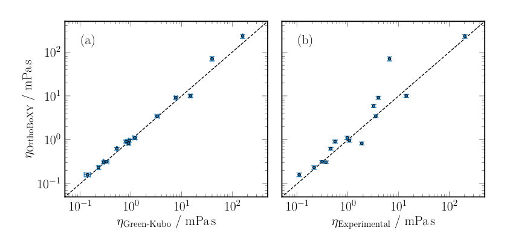 
FIG. 1. Comparison of OrthoBoXY viscosities with (a) Green-Kubo viscosities and (b) experimental viscosities from literature. For details on the data, see Table II.

📷 Fig 2

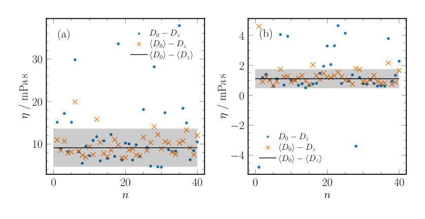 
FIG. 2. Viscosities of (a) phenol and (b) pyridine for the nth simulation block calculated via variant A (blue circles), variant B (orange crosses) and variant C (black line). Note that variant C gives only one value and is displayed with its standard deviation (shaded region).

📷 Fig 3

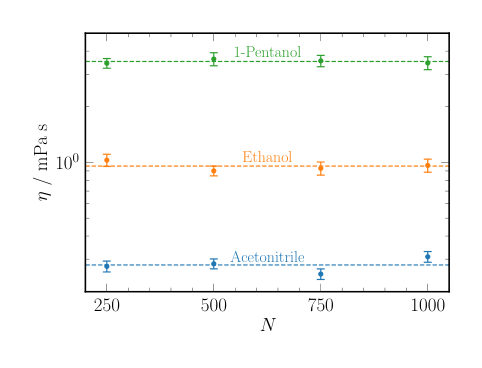 
FIG. 3. Viscosities of acetonitrile (blue), ethanol (orange) and 1-pentanol (green) for system sizes of 250, 500, 750 and 1000 molecules. The dashed lines represent the averages.

📷 Fig 4

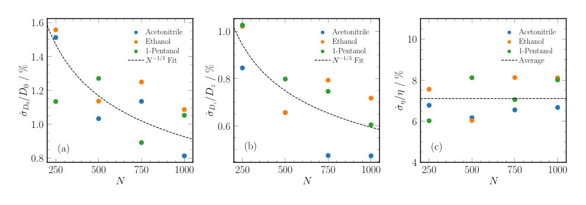 
FIG. 4. Relative standard errors of (a) D0, (b) DPBC,zz and (c) η computed for varying system sizes. The data are shown as a function of the number of molecules N in the system.

📷 Fig 5

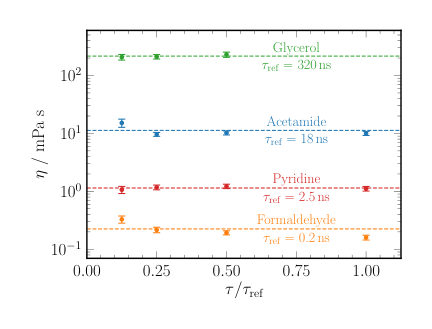 
FIG. 5. Viscosities of acetamide (blue), formaldehyde (or- ange), glycerol (green) and pyridine (red) with simulation block lengths scaled by factors of 1, 1

**Summary.** This work compares two methods for calculating liquid shear viscosity from MD simulations, confirming strong agreement between them. The authors demonstrate that the results are robust against finite size effects and propose practical guidelines for scaling simulation parameters ($\tau_{\text{block}}$) to achieve massive computational savings without losing numerical accuracy.

**Why it may be interesting.** While focused on classical liquids, the rigorous statistical analysis of error propagation and the development of scaling rules (like adjusting $\tau_{\text{block}}$ by $1/8$ or $1/4$) are highly relevant to optimizing resource-intensive simulations in quantum many-body systems.

Detailed structure

**Main problem.** The paper addresses the accurate computation of shear viscosities ($\eta$) for molecular liquids using Molecular Dynamics (MD) simulations, comparing two established theoretical approaches.

**Main result.** Both the OrthoBoXY and Green-Kubo methods yield highly consistent results across a wide range of liquid viscosities. Furthermore, the study provides significant computational recommendations to reduce simulation time without sacrificing accuracy.

**Method.** The viscosity is calculated using MD simulations in the NVT ensemble, comparing the stress tensor autocorrelation function (Green-Kubo) against an approach derived from self-diffusion coefficients (OrthoBoXY).

**Model / system.** The study investigates 15 neat molecular liquids modeled using the OPLS force field. The analysis covers systems ranging across three orders of magnitude in viscosity.

**Key observables.** Shear viscosity ($\eta$), self-diffusion coefficients ($D_0$, $D_{PBC,ii}$), and their associated standard errors.

**Important parameters / regimes.** System size (down to 250 molecules), simulation block length ($	au_{	ext{block}}$), and temperature/density conditions for the liquids.

**Assumptions / limitations.** The OrthoBoXY approach relies on a specific geometric relationship involving box lengths, and statistical robustness is achieved by using Variant C averaging method.

**Figures summary.** Figures illustrate the agreement between different viscosity calculation methods (OrthoBoXY vs. Green-Kubo) and show how error estimates are independent of system size due to compensation effects.

**Paper structure.** The paper first introduces the problem and compares the two main computational methods. It then analyzes the dependence on system size, confirming robustness down to small systems. Finally, it proposes detailed, quantitative refinements for setting the simulation block length ($	au_{	ext{block}}$) based on liquid viscosity.

Abstract

We calculated shear viscosities of 15 neat molecular liquids from equilibrium molecular dynamics (MD) simulations using the OrthoBoXY approach and compare them to viscosities calculated via the Green-Kubo method. Data from both methods agree very well. Here, we show how to avoid pitfalls while computing the OrthoBoXY-data to obtain optimal results. From simulations of multiple system sizes, we could verify that the viscosity of molecular liquids is not influenced by finite size effects down to systems as small as 250 molecules. Moreover, we demonstrate that also the standard error of the viscosity is nearly independent of the system size. This is shown to be a consequence of a compensation effect of an increasing accuracy of the self-diffusion coefficients with increasing systems-size and the system-size dependent weighting according to the OrthoBoXY-equation. As a consequence, we suggest that it is preferable to run simulations of smaller systems with longer simulation times rather than larger systems with shorter simulation runs. In addition, we discuss a refinement of the recently introduced "recipe" for OrthoBoXY simulations block-lengths $τ_\mathrm{block}$. Based on data from simulations with varying run-lengths, we suggest the following modification: for highly viscous systems, the value of $τ_\mathrm{block}$ might safely be scaled by a factor of $1/8$, significantly reducing the computational resources needed. For less viscous systems, the value of $τ_\mathrm{block}$ might safely be scaled by a factor of $1/4$. For systems with high fluidity, the value of $τ_\mathrm{block}$ should not be scaled down in order to achieve reliable results. When using a smaller system size of 250 molecules, these refinements are leading up to a 24-fold reduction in computational cost compared to the previous recommended set-up without sacrificing numerical accuracy.

[↑ back to top](#top)

### [Interferometric Quantum Polynomial Chaos Expansion as a Generative Model for Calorimeter Shower Simulation](http://arxiv.org/abs/2608.05405v1)

**Authors:** Jamal Slim, Saverio Monaco, Florian Rehm, Dirk Kruecker, Frank Gaede, Kerstin Borras  
**Type:** theory · **Category:** numerical methods · **PDF:** <https://arxiv.org/pdf/2608.05405v1>  
**Analysis basis:** full PDF text, analyzed in chunks
**Topic relevance:** `methods for driven-dissipative` **1/5**

📷 Fig 1

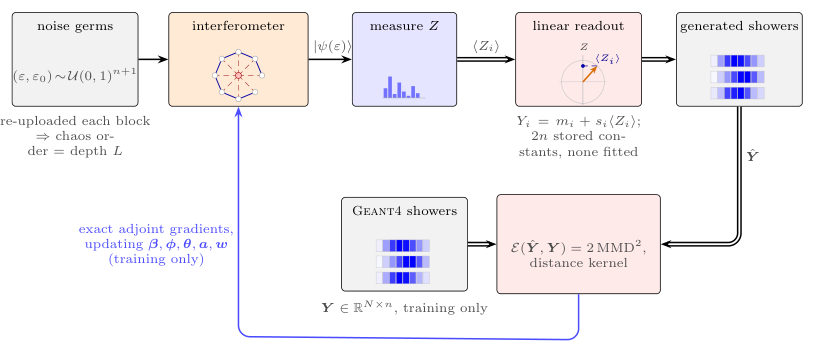 
FIG. 1: QPCE drawn as it executes. The upper row is the entire deployed model. Germs enter the interferometer, one measurement setting yields ⟨Zi⟩, and the fixed affine readout returns a shower. Grey marks data, orange the quantum circuit, blue the measurement and red the unit conversion. The interferometer icon is the actual coupler graph drawn on a ring layout, in which the solid edges are the seven-edge path (the ring is left open, |E| = 7, native to the heavy-hex lattice with zero SWAPs), each edge carrying one trainable phase per block, and the dashed chords are the one shared germ wire ε0, read by every qubit with a trainable amplitude at zero two-qubit cost. Re-uploading the germs at...

📷 Fig 2

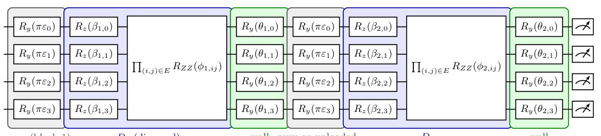 
FIG. 2: QPCE interferometer, drawn for n = 4, L = 2 with unit germ amplitudes for legibility. In the deployed model each germ gate is Ry(π(wiεi + aiε0)), Eq. (3). The germ encodings open every block, each germ wire therefore enters L rotation angles, and ⟨Zi⟩is a trigonometric chaos expansion of exact degree L in each wire (Eq. (5)). Trainable Rz(β) and RZZ(ϕ) form the diagonal blocks Dℓ. The walls Ry(θℓ,i) are trainable. All RZZ within a block commute, so the coupler block is one multi-wire diagonal gate that schedules in χ′(G) parallel layers (Sec. III D). Setting all ϕℓ,ij = 0 and freezing ε0 makes the circuit a tensor product of single-qubit unitaries, each driven only by its own germ,...

📷 Fig 3

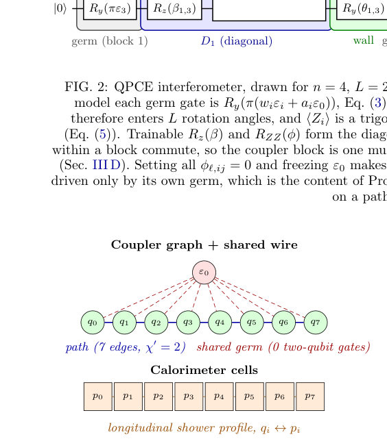 
FIG. 3: Deployed coupler graph and the one-to-one map from qubits to cells. Solid lines mark the eight-qubit path, |E| = 7, native to the heavy-hex lattice with zero routing SWAPs. Each edge carries one trainable phase per block, L|E| = 42 coupler phases in total, and the commuting block schedules in χ′ = 2 parallel layers. The dashed line marks the shared germ wire ε0, read by every qubit with trainable amplitude ai at zero two-qubit cost, carrying the rank-one global mode of the data (Sec. III C 5). Removing the couplers and freezing ε0 makes the generated cells exactly independent (Proposition 1). Removing the couplers with ε0 free isolates the shared-latent channel. The dense C8(1, 2)...

📷 Fig 4

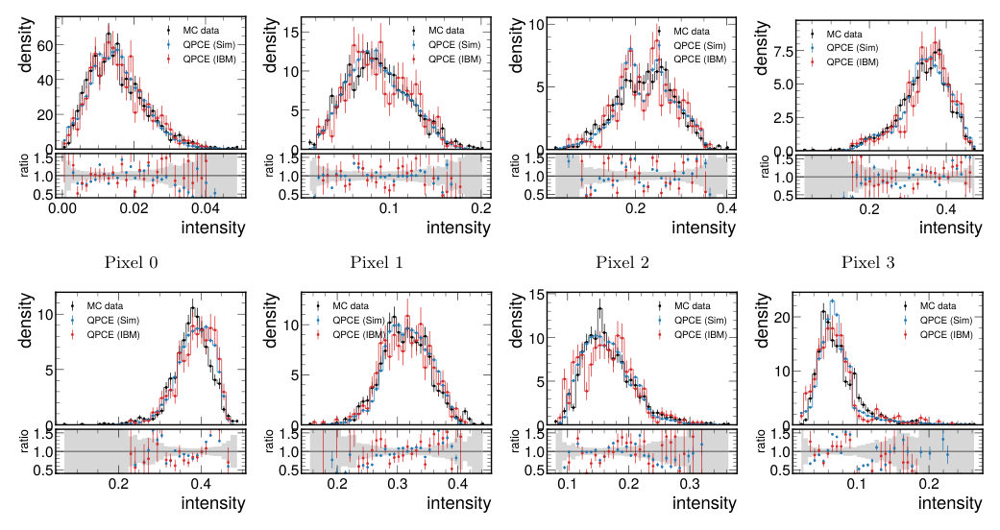 
FIG. 4: Marginal intensity distributions for the eight calorimeter cells. Geant4 reference (black points, ±1σ multinomial errors), noiseless simulation of the deployed circuit (step), and ibm fez (points), 500 showers at 1152 shots. These marginals are produced by the circuit through the linear readout, so the panels are direct device tests. The readout-confusion unfolding and the gain absorbed by the calibration in Sec. VI B affect these panels and provably nothing in Figs. 6 and 7. Ratio-panel and error conventions as in Appendix A.

📷 Fig 5

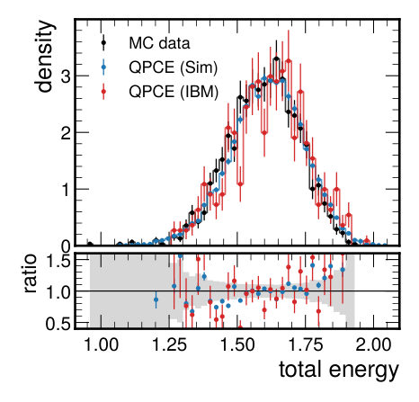 
FIG. 5: Total deposited energy E = P

**Summary.** This paper introduces an Interferometric Quantum Polynomial Chaos Expansion (QPCE) as a novel generative model for simulating particle calorimeter showers. By encoding the simulation into a quantum circuit, it leverages the depth of the circuit rather than classical coefficients to capture complex statistical dependencies. This approach allows the model to reproduce subtle structural features of real detector data that are inaccessible to standard classical generative models.

**Why it may be interesting.** While focused on HEP, the core methodology—using quantum circuits to encode complex statistical dependencies (chaos expansion) for generative modeling—is highly relevant to simulating non-equilibrium dynamics or complex many-body states where classical sampling fails.

Detailed structure

**Main problem.** The primary goal is developing a fast, accurate generative model for simulating high-energy physics calorimeter showers, which are computationally intensive using traditional methods.

**Main result.** The proposed Interferometric Quantum Polynomial Chaos Expansion (QPCE) successfully models the complex dependence structure of shower data, reproducing non-trivial structural properties like tail asymmetry that classical models cannot capture.

**Method.** It employs a quantum circuit as a generative model, where randomness enters via rotation angles. The training involves minimizing an energy distance between generated and target distributions using adjoint gradients.

**Model / system.** The system is the simulation of particle showers in calorimeters. The model is the QPCE, which uses a single quantum circuit whose depth dictates the order of the chaos expansion for latent variables.

**Key observables.** Tail asymmetry ($\lambda_L - \lambda_U$), mean absolute correlation $|
ho_S|$, and structural properties like rank statistics ($D$).

**Important parameters / regimes.** Circuit depth ($L$) acts as the truncation order; training uses L-BFGS optimization.

**Assumptions / limitations.** The method assumes that the circuit structure itself can encode complex, non-classical correlations necessary for accurate simulation.

**Figures summary.** Figures compare structural correlation measures (Spearman rank) and tail behavior ($\Lambda$) between Geant4 data, QPCE simulations, and actual hardware measurements.

**Paper structure.** The paper introduces the QPCE framework by contrasting it with classical PCE. It details the circuit ansatz, describes the training/generation/verification pipeline, presents results showing structural fidelity on both simulated and physical hardware, and concludes by discussing the model's inherent advantages in attribution.

Abstract

We present the quantum polynomial chaos expansion, a generative algorithm in which a single circuit is the entire model, and we use it to learn calorimeter images. In a classical chaos expansion the randomness is the input and the coefficients are fitted. Here the randomness is still the only input, entering the circuit as rotation angles and re-uploaded at every block, so that each measured observable is a chaos expansion of the latent variables whose order equals the circuit depth, and what is fitted are the gate angles themselves. Expressivity therefore grows with depth rather than with classical coefficients, correlations between outputs arise only from entangling gates, and a single latent wire read by all qubits carries the collective mode of the data. Nothing fitted stands between the circuit and the sample, so switching the entanglers off is a setting of the model itself and provably yields independent outputs, and attribution of the learned correlations to individual gates becomes a measurement. Choosing between two measurement bases shot by shot sharpens attribution into certification, and the trained model violates the Bell bound obeyed by every classical generative model with local response, whatever its size. We train the model on Geant4 shower data, execute the identical circuit on a superconducting processor with its accuracy loss predicted in advance, prove a no-go theorem for the tail dependence of every smooth generator read out through expectation values, and identify the circuit primitive that removes this limit.

[↑ back to top](#top)

### [Warm-Starting MaxCut Relaxation via Low-Depth Quantum Approximate Optimization Algorithm](http://arxiv.org/abs/2608.06212v1)

**Authors:** Bao G. Bach, Ilya Safro, Filip B. Maciejewski  
**Type:** theory · **Category:** disordered systems and neural networks · **PDF:** <https://arxiv.org/pdf/2608.06212v1>  
**Analysis basis:** full PDF text, analyzed in chunks
**Topic relevance:** `exotic spin models in light-matter` **1/5**

📷 Fig 1

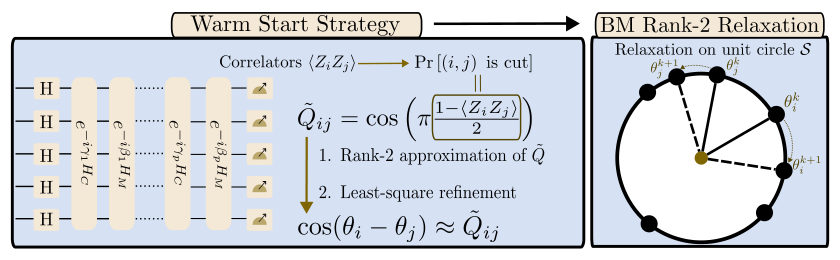 
Fig. 1. Warm Start Framework for Burer-Monteiro rank-two relaxation using QAOA correlators ⟨ZiZj⟩. The corresponding marginal distributions of the probability of edge (i, j) being cut are then mapped via a Goemans-Williamson-inspired trigonometric function to ˜Q. We then find the closest rank-2 correlation matrix via projecting onto the two largest positive eigenvalues of ˜Q, followed by least-squares error optimization. The resulting matrix is then interpreted as encoding the angles θ that are used as the initial point for Burer-Monteiro rank-two relaxation.

📷 Fig 2

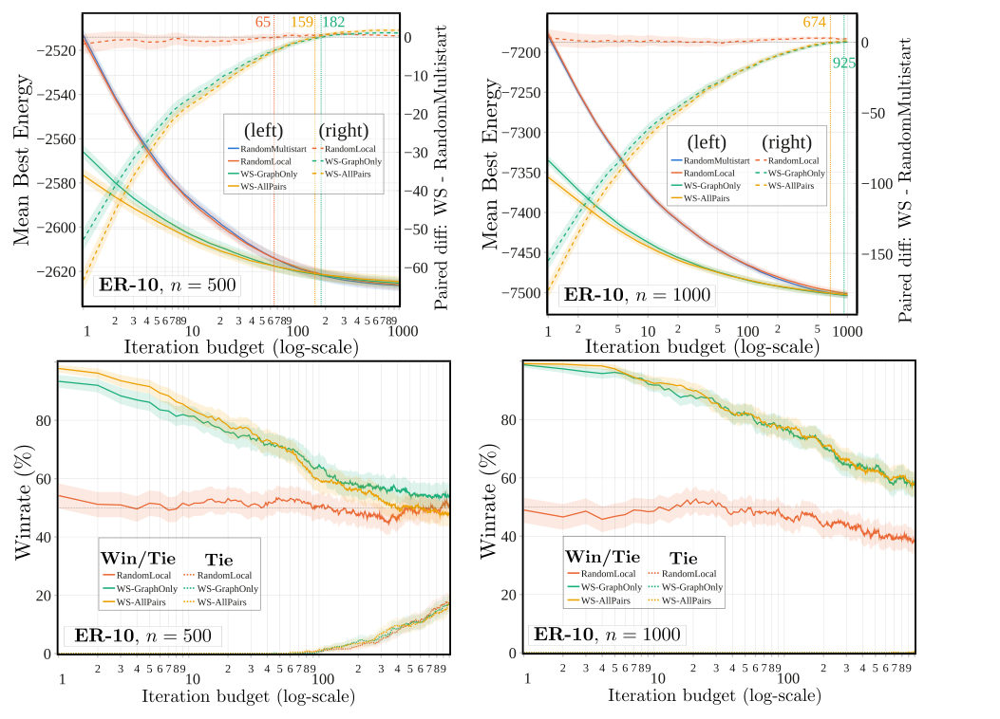 
Fig. 2. The top plots show the best-found energy (left y-axis, solid lines) and paired energy differences (right y-axis, dashed lines) between the given solver (WS with QAOA or reference RandomLocal) and the Random MultiStart baseline as a function of iteration budget, for the ER-10 ensemble with n = 500 (left column) and n = 1000 (right column). The dotted vertical lines (with annotated iterations) correspond to the crossover point where mean stops being ahead of the baseline. The bottom plots show the WinRate – the estimate of the probability that the given solver performs at least as well as the baseline at fixed iteration budget (solid lines); this is augmented with relevant tie...

📷 Fig 3

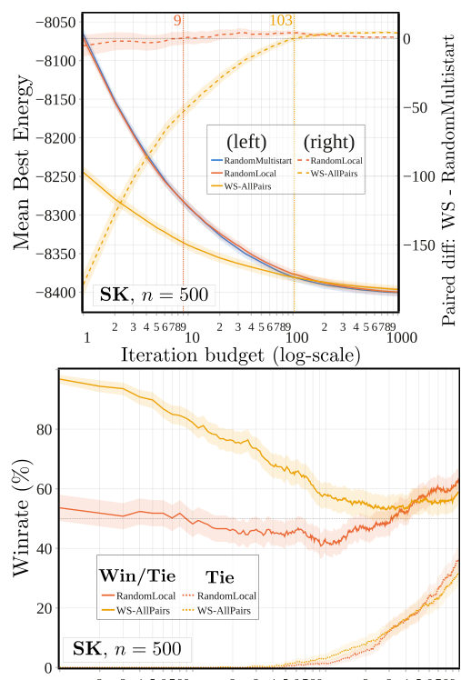 
Fig. 3. Numerical results between different approaches with representation as in Figure. 2, for SK instances.

**Summary.** This work proposes using local correlators from the QAOA algorithm to 'warm-start' the Burer-Monteiro relaxation for solving the MaxCut problem. The results show this quantum-informed initialization provides a significant speedup, quickly reaching high-quality solutions compared to random starts. However, it highlights an exploitation/exploration tradeoff, suggesting that while quantum assistance is useful for rapid initial progress, exhaustive classical search might still yield marginally better final results.

**Why it may be interesting.** It demonstrates a concrete pathway for near-term quantum utility by showing how limited quantum circuit outputs can provide valuable structural guidance to classical optimization solvers tackling hard combinatorial problems like MaxCut.

Detailed structure

**Main problem.** The paper aims to improve classical optimization heuristics for the MaxCut problem by incorporating structural information derived from quantum computation.

**Main result.** A warm-start initialization using QAOA local correlators provides a significant early advantage in finding high-quality solutions quickly, though random multi-start methods can eventually surpass it with sufficient computational budget.

**Method.** The authors propose a hybrid strategy where low-depth QAOA outputs (local correlators $\langle Z_i Z_j 
angle$) are used to initialize the Burer-Monteiro rank-two relaxation solver for MaxCut, which is then compared against random initialization strategies.

**Model / system.** The problem studied is the weighted MAXCUT problem on a graph $G(V, E)$, formulated as an Ising model ($\mathcal{H}_C$). Benchmarks include random Erdős–Rényi (ER-10) graphs and Sherrington-Kirkpatrick (SK) spin glass models.

**Key observables.** Best found energy, paired difference in best energy vs. baseline, WinRate (probability of matching or exceeding baseline performance).

**Important parameters / regimes.** Graph size ($n=500$ and $n=1000$), QAOA depth parameter ($p=1$).

**Assumptions / limitations.** The comparison is limited to the BM refinement stage, not an end-to-end quantum advantage; the warm-start relies on mapping low-depth correlators to initial parameters.

**Figures summary.** Figure 2 shows performance vs. iteration budget for ER-10 graphs ($n=500, 1000$), illustrating WS's early lead and MultiStart's eventual crossover. Figure 3 presents similar results for the SK model.

**Paper structure.** The paper details deriving QAOA correlators to initialize BM relaxation, compares this warm-start approach against random multi-starts on ER and SK ensembles across varying iteration budgets, and analyzes the resulting exploitation/exploration tradeoff.

Abstract

Quantum optimization has attracted growing interest as quantum hardware continues to improve, yet state-of-the-art classical solvers remain a formidable benchmark for practical utility. Rather than seeking a fully quantum replacement for classical optimization, we propose a hybrid strategy that uses quantum information to enhance leading classical heuristics. Specifically, we introduce a warm-start method based on local correlators obtained from the Quantum Approximate Optimization Algorithm (QAOA), and use this information to initialize the Burer-Monteiro (BM) rank-two relaxation. We demonstrate numerically that, compared to a random, multi-start initialization baseline (a standard strategy used for BM), this quantum-informed initialization offers a significant head start, i.e., high-quality solutions with very small number of iterations, for two problem classes -- random Erdős Rényi graphs with edge density of $10\%$ (ER-10) and fully-connected Sherrington Kirkpatrick (SK) spin glass models, at $n=500$ and $n=1000$ qubits. At the same time, given enough iterations, the random baseline often eventually catches up and slightly outperforms the warm-start strategy on average, an effect visibly stronger for $n=500$ than for $n=1000$. The results demonstrate an exploitation/exploration tradeoff of using WS to quickly arrive at very good solutions vs exploring slightly better solutions with a larger iterations budget via a standard strategy. Our results highlight how low-depth quantum circuits can provide useful structural information for classical optimization and suggest a promising route toward near-term quantum utility through quantum-assisted initialization.

[↑ back to top](#top)

## Other papers (11)

*Papers from primary archives without highlighted authors or any topic match. Click to expand.*

Show other papers

### [A Scale-Invariant Theory of the Universe](http://arxiv.org/abs/2608.05929v1)

**Authors:** Julian Barbour, Maria I. R. Lourenço  
**Type:** theory · **Category:** other · **PDF:** <https://arxiv.org/pdf/2608.05929v1>  
**Analysis basis:** full PDF text, analyzed in chunks

📷 Fig 1

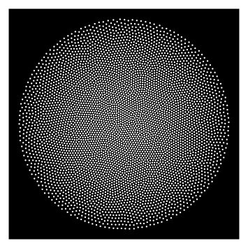 
Figure 1: Two planar central configurations of 5,000 equal-mass particles. The configuration on the left lies at, or very close to, the absolute minimum of the variety, with V=0.585701. The configuration on the right corresponds to a higher critical point, with V=0.595574.

**Summary.** This paper proposes a radical ontological shift by eliminating absolute concepts like time and space using Leibniz's principle of sufficient reason. It develops the 'variety' ($V$) as a fundamental, scale-invariant measure of structure within gravitational N-body systems. The core argument suggests that physical evolution is better described by changes in this internal structural complexity rather than external temporal passage.

**Why it may be interesting.** While not directly about quantum information or AMO systems, its focus on relational ontology and deriving physical laws from intrinsic symmetries (like scale invariance) echoes foundational questions in quantum gravity and emergent spacetime theories relevant to advanced theoretical physics.

Detailed structure

**Main problem.** The central goal is to eliminate absolute structures (like absolute time, position, and scale) from physics by adopting a relational ontology guided by Leibniz's principle of sufficient reason.

**Main result.** This leads to a formulation based on scale-invariant ratios, using the 'variety' ($V$) as a central measure of structure that unifies previously distinct solutions in Newtonian gravity.

**Method.** The authors apply relational principles (like PSR) to reduce physical descriptions to dimensionless ratios, focusing on critical points of a defined structural variety $V$.

**Model / system.** The analysis is initially applied to the gravitational N-body problem under Newtonian gravity but proposes general principles applicable to General Relativity and quantum mechanics.

**Key observables.** The 'variety' ($V$), which measures structure via ratios of characteristic lengths ($\ell_{rms} / \ell_{mhl}$), and the derived quantity representing structural 'age', $a(s)$.

**Important parameters / regimes.** Dimensionless ratios, total energy ($E=0$), zero angular momentum ($L=0$), and the number of particles ($N$).

**Assumptions / limitations.** The universe is treated as a closed system necessitating scale-invariant descriptions; the program assumes that removing absolute structures enriches physical theories.

**Figures summary.** Figures illustrate planar central configurations for N-body systems, showing points near the minimum variety value ($a=0$) and those at higher critical points representing different structural states.

**Paper structure.** The paper progresses by first establishing the need to eliminate absolute structures (Newtonian context), then developing the mathematical tool of the scale-invariant 'variety' $V$ using N-body dynamics, and finally arguing for the interpretation of time/evolution based on increasing structure ($a(s)$) rather than external time.

Abstract

Modern physics has achieved extraordinary empirical success while retaining much of the absolute, unobservable structure introduced by Newton, largely without questioning its necessity. We investigate how far this structure can be eliminated by adopting a relational ontology guided by Leibniz's principle of sufficient reason. Removing absolute position, orientation, time and, finally, scale leads naturally to a formulation of the gravitational $N$-body problem where only dimensionless ratios are physically meaningful. Within this framework, the scale-invariant variety $V$ becomes a central quantity, providing a measure of structure, a natural ordering of shapes, and an emergent gravitational arrow of time. We argue that the resulting formulation unifies classes of Newtonian solutions previously regarded as distinct, uncovering a possible new symmetry, suggests a notion of explanation based on timeless spatial correlations rather than temporal evolution, and points towards a more economical ontology. Although developed in the context of Newtonian gravity, the principles proposed here may also offer a new perspective on general relativity and quantum mechanics.

[↑ back to top](#top)

### [Balanced Routing for Symmetric Quantum Circuits](http://arxiv.org/abs/2608.06072v1)

**Authors:** Samuel Punch  
**Type:** theory · **Category:** quantum information and computing · **PDF:** <https://arxiv.org/pdf/2608.06072v1>  
**Analysis basis:** full PDF text, analyzed in chunks

📷 Fig 1

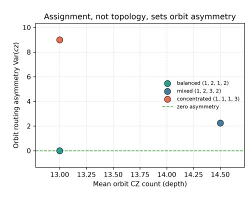 
FIG. 1. The assignment sets the imbalance at fixed depth. Each point is one way of assigning a four-part ring to the same straight path. The balanced assignment (1, 2, 1, 2) has zero spread; the concentrated assignment (1, 1, 1, 3) has the worst spread (9.0 on Qiskit 2.5.1; 12 on older versions). Both sit at the same average depth (13 two-qubit gates) and iden- tical transpiled circuit depth—only the spread differs. In the axis labels, “orbit” denotes a ring role, so “orbit routing asym- metry” is the per-role spread reported as Spread in Table I.

📷 Fig 2

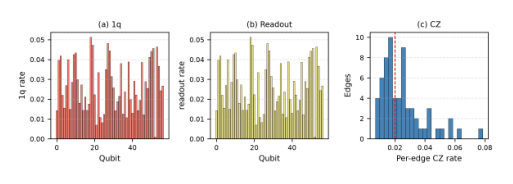 
FIG. 3. The simulated error field (IBM Heron): single-qubit error rates, readout error rates, and the spread of two-qubit gate error across the chip’s links.

📷 Fig 3

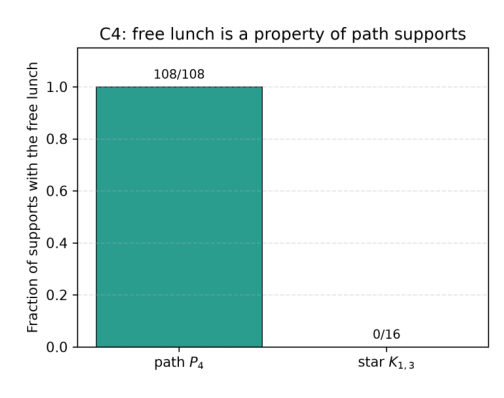 
FIG. 2. Why 16 patches fail. Connected four-qubit patches on heavy-hex come in only two shapes: straight paths and stars. All 108 path patches admit a balanced, cost-free assignment; none of the 16 star patches do. The free lunch is a property of path-shaped patches. (In the figure, “support” is used for a patch.)

📷 Fig 4

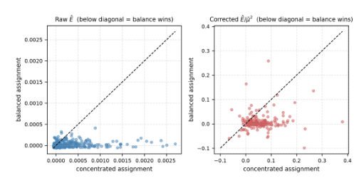 
FIG. 4. Balanced versus concentrated on the same path, un- der realistic noise. Each point is one path; points below the diagonal mean the balanced assignment did better. Left: raw symmetry-breaking. Right: the decoherence-corrected ver- sion. The balanced assignment wins on the large majority of paths.

**Summary.** This paper addresses how mapping symmetric quantum circuits onto fixed hardware topologies causes symmetry-breaking due to uneven routing costs. The authors prove that if the physical patch geometry allows it, this imbalance can be eliminated cost-free by making specific compiler assignments. This suggests that optimizing for balanced resource distribution is a crucial, often overlooked, objective in quantum compilation.

**Why it may be interesting.** It provides concrete, actionable guidelines for quantum compiler design by shifting focus from minimizing total depth to ensuring equitable resource distribution across symmetric components of the circuit.

Detailed structure

**Main problem.** Mapping quantum circuits with inherent symmetries onto physical hardware restricts connectivity introduces 'routing overhead' that breaks theoretical symmetry due to unequal error accumulation across identical logical roles.

**Main result.** When patch geometry permits, achieving a perfectly balanced distribution of routing costs is possible without increasing circuit depth, suggesting this imbalance is primarily a compiler optimization choice rather than an unavoidable hardware limitation.

**Method.** The authors combine theoretical analysis (exhaustive search on lattice patches) with quantitative simulation using realistic noise models to measure symmetry-breaking metrics.

**Model / system.** The study analyzes quantum circuits requiring cyclic symmetries (e.g., four-part or six-part rings) mapped onto a 57-qubit 'heavy-hex' lattice structure.

**Key observables.** Routing Imbalance (measured as variance/spread of per-role measurements), Decoherence-corrected symmetry-breaking reduction ($\hat{E}$ and $\mathcal{E}_{	ext{rel}}$).

**Important parameters / regimes.** The size and shape of the physical qubit patch (e.g., path vs. star-shaped) relative to the required circuit symmetry.

**Assumptions / limitations.** The analysis assumes that compiler optimization should prioritize even cost distribution over simply minimizing average depth, especially when geometry allows for balance.

**Figures summary.** Figures illustrate the difference between balanced (zero spread) and concentrated assignments on paths, and show simulated error distributions demonstrating significant reduction in symmetry-breaking via balancing.

**Paper structure.** The paper establishes the problem of symmetry breaking due to routing overhead, develops a two-level model distinguishing shape constraints from assignment choices, proves topological constraints using exhaustive search for specific ring structures, and validates findings through noise simulations.

Abstract

Mapping quantum programs to restricted physical chips requires SWAP operations, incurring depth and error penalties. In symmetric programs, this routing overhead breaks theoretical symmetry because identical logical roles experience unequal shuffling. While often attributed to hardware topology alone, we show this is a two-level phenomenon. A qubit patch's shape dictates if it can host a balanced assignment. When balance is possible, the actual imbalance is set by the logical-to-physical assignment, meaning a balanced assignment can distribute routing costs perfectly evenly at no extra depth. Through exhaustive search on a 57-qubit "heavy-hex" lattice, we prove these topological constraints. For a four-part ring, 108 of 124 connected patches admit a cost-free balanced assignment, with the 16 exceptions being star-shaped. For a six-part ring, cost-free balance is impossible on compact patches. For a fully connected four-part symmetry, balance is structurally impossible at any depth. Simulations using realistic error rates show that, relative to the worst-case concentrated assignment, balanced assignments reduce symmetry-breaking by 92.7% (95% CI [+89.8%, +95.3%]) for the raw metric and 87.0% (95% CI [+79.6%, +94.1%]) for the decoherence-corrected measure (p = 2.45 x 10^-32). Substrate error heterogeneity accounts for at most 10.8% of this effect. Notably, switching to the compiler's highest generic optimization level did not yield a statistically significant change in routing imbalance, highlighting the need for targeted symmetry-aware passes. When patch geometry permits, routing imbalance is a compiler choice rather than a hardware limitation. Thus, symmetry-aware assignment should be a primary objective for compiler optimization and chip design.

[↑ back to top](#top)

### [Beyond transversality: structure of Clifford circuits for CSS codes](http://arxiv.org/abs/2608.05688v1)

**Authors:** Victor V. Albert  
**Type:** theory · **Category:** quantum information and computing · **PDF:** <https://arxiv.org/pdf/2608.05688v1>  
**Analysis basis:** full PDF text, analyzed in chunks

📷 Fig 1

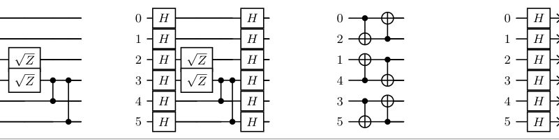 
FIG. 1. Four Clifford gate families of a CSS code. The first five rows list the name, symplectic embedding, code- preserving condition, physical gates, and circuit realization [the right-hand sides of Eqs. (4), (6), (8), and (9)] of each family. The control–target sequence cm →tm of a CNOT network is read off a Gaussian elimination of K, one CNOT per row addition, giving the factorization of K shown in the embedding row. The bottom row depicts circuits that realize the families on the doubly-even self-dual [[6, 2, 2]] code CX=CZ= span{111100, 110011}, with symplectic logical basis LX=LZ={100101, 010101}. (a) √

📷 Fig 2

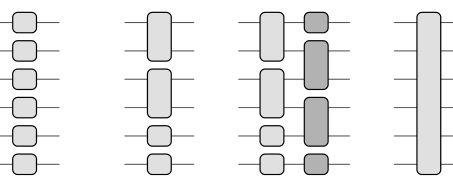 
FIG. 2. Gate groups and their generating sets. (a) A transversal circuit, consisting of a single-qubit gate on each of the six qubits in this sketch. Code-preserving circuits of this shape form the transversal group N ∅. (b) A depth-one two- local layer on a fixed matching M of the qubits; each brick is a generic Clifford gate on a pair of M or on an unmatched qubit. The code-preserving layers on M form the group N M. (c) A stack of two depth-one layers on different matchings. Stacks of code-preserving layers over arbitrary matchings generate the two-fold transversal group N 2fold. (d) A depth-one six- local layer. Every circuit can be compressed into this shape, and the code-preserving...

📷 Fig 3

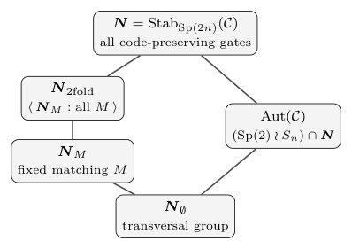 
FIG. 3. Gate-group inclusion. All groups are taken mod- ulo Pauli operators and lie inside N, the group of code- preserving Cliffords. Lines are subgroup inclusions, read up- ward; the two chains meet at the transversal group N ∅of Section IV. Every inclusion drawn is strict in general, and the groups N 2fold and Aut(C) are incomparable. Allowing for qubit permutations to compensate non-code-preserving transversal gates gives the automorphism group Aut(C). The transversal and automorphism groups carry no entangling two-local gates, while the group of all matchings includes gates for all possible matchings M. Some permutations can- not be expressed as layers of code-preserving two-local...

**Summary.** This paper rigorously characterizes the algebraic structure of Clifford circuits that can preserve the encoding properties of CSS quantum error-correcting codes. By decomposing these circuits into fundamental diagonal and CNOT layers, the authors determine which specific codes allow their logical operations to be generated by relatively simple 'two-fold transversal' gates. This is crucial for designing efficient, fault-tolerant quantum computation protocols.

**Why it may be interesting.** This work provides deep structural insights into the gate sets required for fault-tolerant quantum computation, which underpins many theoretical models of quantum information processing relevant to AMO physics platforms like trapped ions or superconducting qubits.

Detailed structure

**Main problem.** The paper characterizes the structure of Clifford circuits necessary for implementing fault-tolerant logical operations within Calderbank–Shor–Steane (CSS) quantum error-correcting codes.

**Main result.** It establishes that code-preserving circuits decompose into products of diagonal gates, and it identifies 78 CSS codes whose full logical Clifford group is generated by two-fold transversal circuits.

**Method.** The authors use algebraic methods involving symplectic geometry to analyze the constraints imposed on circuit blocks (Z-diagonal, X-diagonal, CNOT) required for code preservation.

**Model / system.** The study focuses on CSS quantum error-correcting codes, which are analyzed using a symplectic formalism where Pauli operators are represented by labels $(x|z)$. The circuits implement logical gates acting on these encoded qubits.

**Key observables.** The size and structure of the logical Clifford group generated by specific circuit families (e.g., two-fold transversal group).

**Important parameters / regimes.** Code parameters such as distance (3, 4, 5, etc.) and rate ($2/5$, $3/4$, etc.).

**Assumptions / limitations.** The analysis assumes the relevance of Clifford circuits for fault tolerance and relies on decomposing general code-preserving maps into specific product structures.

**Figures summary.** Figure 1 illustrates four key Clifford gate families (Z-diagonal, X-diagonal, CNOT, partial duality) for a CSS code. Figure 2 schematically details the generating sets for different gate groups ($\mathcal{N}_{\emptyset}$, $\mathcal{N}_M$, $\mathcal{N}_{2	ext{fold}}$, $\mathcal{N}$).

**Paper structure.** The paper proceeds by characterizing four distinct families of circuits (code-preserving, transversal, etc.), deriving their normal forms using algebraic constraints, and finally applying these results to enumerate specific CSS codes whose logical group structure is determined.

Abstract

We characterize four groups of Clifford circuits for Calderbank--Shor--Steane (CSS) codes that are relevant to fault-tolerant logical operations. First, we show that every code-preserving Clifford circuit is a product of Z-diagonal circuits, composed of S and CZ gates, and their X-basis analogues. Second, we define the two-fold transversal group, generated by depth-one two-local code-preserving circuits, and show that each of its elements can be expressed as a product of layers consisting of either Z-diagonal, X-diagonal, or CNOT gates. As a corollary, every transversal gate is a product of three transversal diagonal circuits; for connected non-self-dual codes, two such circuits suffice.   We further show that every code-preserving automorphism circuit, consisting of single-qubit Clifford gates and permutations, has a normal form comprising a Hadamard layer, a permutation, and two diagonal circuits. We also define a two-fold automorphism group, in which a depth-one two-local circuit may be code-preserving up to a permutation, and show that its logical image can be larger than that of the two-fold transversal group.   For 136 CSS codes, we provide explicit generators and determine the logical image of the two-fold transversal group. We find 78 codes whose full logical Clifford group is generated by two-fold-transversal circuits, including codes of distances 3, 4, 5, 6, 8, and 12, with respective rates $2/5$, $3/4$, $1/9$, $1/5$, $2/5$, and $3/56$. We construct three families of CSS codes from bipartite grids, cut-complements, and quadrics, many of which realize the full logical Clifford group in this way. More generally, the induced logical group can be large even when it is not full logical Clifford group: it has order at least $460\,800$ for the gross code and roughly $10^{26}$ for a clustered-cyclic code.

[↑ back to top](#top)

### [Diversity in Coded TE-QKD Channels: Achieving Infinite Diversity out of Finite System Resources](http://arxiv.org/abs/2608.05432v1)

**Authors:** Shaikha S. Al-Qahtani, Siyao Li, Joseph J. Boutros  
**Type:** theory · **Category:** quantum information and computing · **PDF:** <https://arxiv.org/pdf/2608.05432v1>  
**Analysis basis:** full PDF text, analyzed in chunks

📷 Fig 1

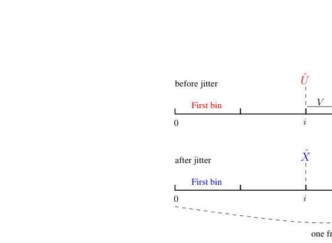 
Fig. 1. The frame structure on Alice’s side showing the photon position before and after detection jitter noise.

📷 Fig 2

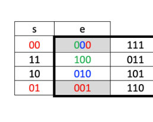 
Fig. 2. Slepian table of the binary repetition [3, 1, 3]2 code (within the bold frame) and the syndrome on the left.

📷 Fig 3

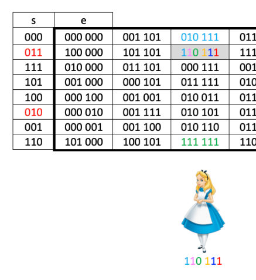 
Fig. 3. Slepian table of the shortened Hamming code [6, 3, 3]2 (within the bold frame) and the syndrome on the left.

📷 Fig 4

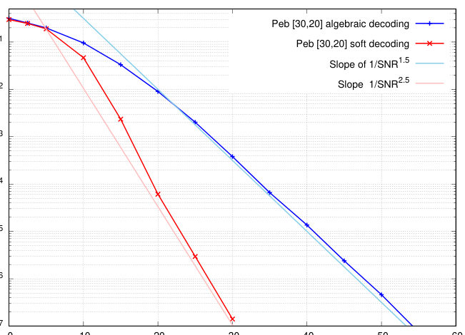 
Fig. 4. Hard-decision (algebraic) versus soft-decision of a binary shortened [30, 20, t = 2] BCH code, N = 8 bins per frame.

📷 Fig 5

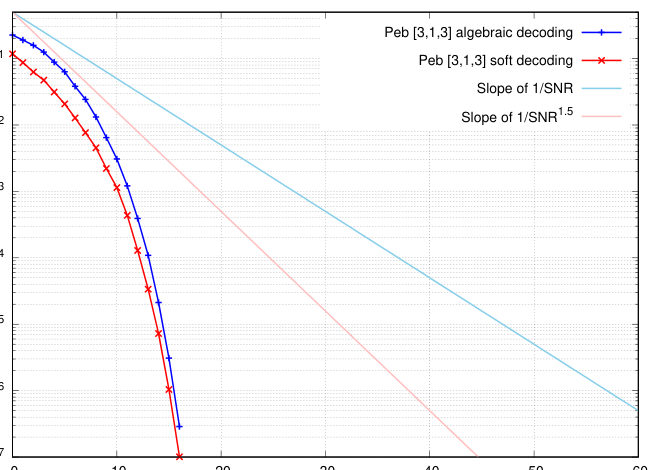 
Fig. 5. Hard-decision (algebraic) versus soft-decision of a 3-fold repetition binary [3, 1, 3] code, N = 8 bins per frame.

**Summary.** This paper theoretically analyzes error correction in Time-Entanglement Quantum Key Distribution (TE-QKD) to determine conditions for high reliability. It establishes that by using specific error-correcting codes and soft decoding techniques, the system can achieve 'infinite diversity' despite having a physically finite channel diversity. This result is significant because it demonstrates a coding advantage unmatched in classical communication theory.

**Why it may be interesting.** It provides a novel theoretical result showing how coding theory can fundamentally alter the asymptotic performance limits of quantum communication channels, achieving an infinite diversity gain unattainable in classical fading models.

Detailed structure

**Main problem.** The core problem is establishing the conditions under which an error-correcting code can achieve infinite diversity order in Time-Entanglement Quantum Key Distribution (TE-QKD) reconciliation.

**Main result.** The paper proves that for soft-decision decoding, infinite diversity is achieved if and only if the underlying code possesses the Maximal Finite Diversity (MFD) deficient property. This behavior is unique compared to classical fading channels.

**Method.** The analysis involves deriving necessary and sufficient conditions using asymptotic limits of error probabilities ($P_e$) with respect to the Signal-to-Noise Ratio ($\gamma$), comparing algebraic vs. soft decoding approaches.

**Model / system.** The system is TE-QKD, where raw key bits are encoded across time bins affected by Gaussian noise modeling detector timing jitter. The analysis uses coded error-correcting codes (e.g., Golay, BCH) to process this noisy quantum channel output.

**Key observables.** Diversity Order ($d$), Reconciliation Error Probability ($P_e(\gamma)$), and the Maximal Finite Diversity (MFD) property.

**Important parameters / regimes.** Signal-to-Noise Ratio ($\gamma$), number of photons per codeword, and the decoding radius.

**Assumptions / limitations.** The model assumes independent photon-pair realizations and memoryless detector jitters across channel uses. The analysis focuses on high SNR asymptotic behavior.

**Figures summary.** Figure 1 illustrates the frame structure in TE-QKD, showing the physical positions of photons before and after being corrupted by detection jitter noise.

**Paper structure.** The paper first defines the diversity order based on error probability decay. It then analyzes two decoding regimes: bounded-distance algebraic decoding (deriving necessary/sufficient conditions) and soft-decision decoding (introducing and utilizing the MFD property).

Abstract

We establish conditions and give proofs on how an error-correcting code can attain infinite diversity in a time-entanglement quantum key distribution (TE-QKD) reconciliation. The shocking result, never encountered in the literature on coding and communication theory, is that a decoder exhibits an infinite diversity order while the channel has finite diversity and the code has a relatively short finite length.   This paper studies the diversity order of coded TE-QKD reconciliation, defined by the asymptotic slope of the error probability at high signal-to-noise ratio. For bounded-distance algebraic decoding, we derive a necessary and sufficient condition in terms of the number of photons per codeword and the decoding radius.   For soft-decision decoding, we introduce the maximal finite diversity (MFD) property and prove that infinite diversity is achieved if and only if the code is MFD deficient. The infinite diversity in TE-QKD has no counterpart in classical fading channels, where decoding can only multiply a finite diversity order by a finite factor.   Examples of short codes based on Golay, Reed-Solomon, Bose-Chaudhuri-Hocquenghem (BCH), and Reed-Muller codes validate the analysis and illustrate how the TE-QKD system parameters and the relatively short code parameters affect the achievable diversity for both hard and soft information reconciliation.

[↑ back to top](#top)

### [Feasibility-Preserving Quantum Search for Constrained Transportation Routing](http://arxiv.org/abs/2608.05394v1)

**Authors:** Dahye Kim, Monika Filipovska  
**Type:** theory · **Category:** quantum information and computing · **PDF:** <https://arxiv.org/pdf/2608.05394v1>  
**Analysis basis:** full PDF text, analyzed in chunks

📷 Fig 1

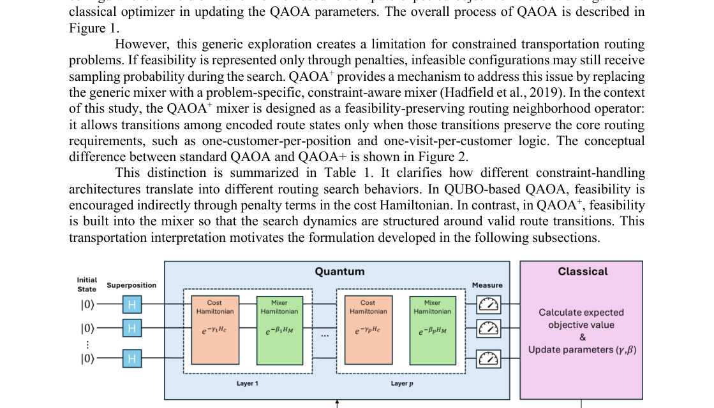 
Figure 1 Schematic structure of the Quantum Approximate Optimization Algorithm (QAOA), illustrating the alternating application of the cost Hamiltonian and mixer Hamiltonian across multiple circuit layers, with parameters optimized through a classical outer loop

📷 Fig 2

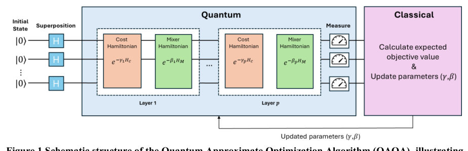 
Figure 2 Conceptual comparison of Mixer Operations in standard QAOA and QAOA+. In standard QAOA (left), the generic mixer explores the entire solution space, connecting both feasible (black) and infeasible (white) states. In QAOA+ (right), a constraint-preserving mixer restricts transitions to feasible subspace.

📷 Fig 3

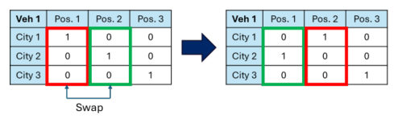 
Figure 3 Illustration of the two components of the constraint-preserving mixer: intra-vehicle swap (left) and inter-vehicle swap (right).

📷 Fig 4

 
Figure 4 Convergence behavior of the QUBO-based QAOA, penalty-free QAOA+, and Hybrid QAOA+ formulations of the TSP

📷 Fig 5

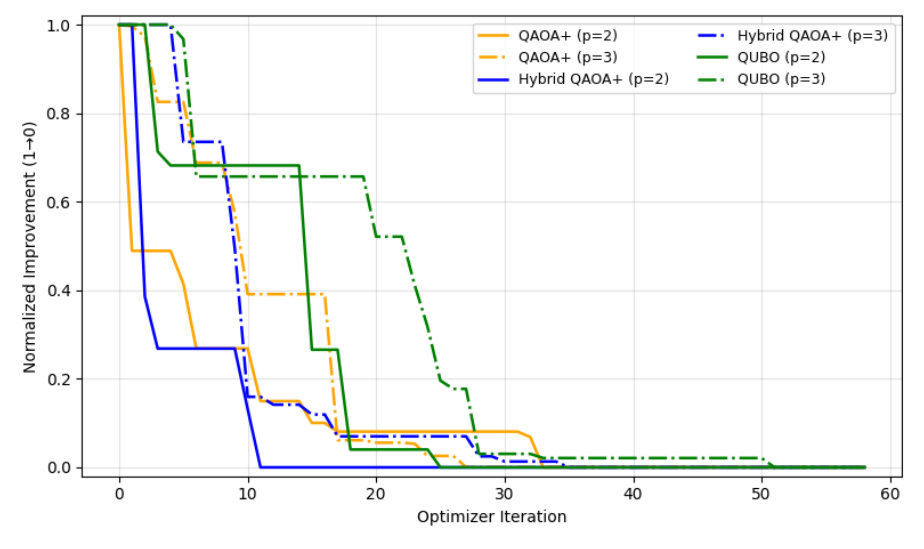 
Figure 5 Convergence behavior of the QUBO-based QAOA, penalty-free QAOA+, and Hybrid QAOA+ formulations of the VRP

**Summary.** This paper addresses the challenge of applying quantum computation to highly constrained routing problems like TSP and VRP. It introduces a novel QAOA+ framework that enforces route feasibility directly into the quantum mixer operator, moving beyond relying on penalty terms. The results demonstrate that structurally enforcing constraints during search leads to significantly better sampling behavior than traditional methods.

**Why it may be interesting.** It provides a concrete example of how structural constraints from classical combinatorial optimization can be mapped into quantum circuit design principles (the mixer operator) to guide the search space, which is relevant for designing algorithms for complex physical simulations or constrained state preparation in quantum systems.

Detailed structure

**Main problem.** Developing a quantum search method for constrained transportation routing problems (like TSP/VRP) that inherently preserves feasibility during the quantum search process.

**Main result.** The proposed constraint-aware QAOA+ framework, which embeds feasibility logic into the mixer operator, shows superior convergence and probability concentration on feasible routes compared to standard penalty-based QUBO approaches.

**Method.** The authors compare three architectures: penalty-based QUBO-QAOA, a penalty-free QAOA+ using a custom feasibility-preserving mixer (quantum neighborhood analogue), and a hybrid approach.

**Model / system.** The model is the constrained transportation routing problem (TSP/VRP). The quantum implementation uses the Quantum Alternating Operator Ansatz ($	ext{QAOA+}$) structure, where constraints are enforced via structural modifications to the mixing operator rather than just penalty terms in the cost Hamiltonian.

**Key observables.** Feasibility preservation, sampling efficiency, convergence behavior, and probability concentration over low-cost feasible routes.

**Important parameters / regimes.** The choice of constraint-handling architecture (penalty vs. mixer enforcement) is the key variable tested across small TSP/VRP instances.

**Assumptions / limitations.** Computational experiments are limited to controlled small-instance studies on a classical quantum simulator, and results should not be extrapolated to large-scale quantum advantage claims.

**Paper structure.** The paper reviews the limitations of standard QUBO encodings for routing problems, proposes the QAOA+ framework with a custom mixer, compares three constraint architectures (penalty-based, penalty-free mixer, hybrid), and analyzes results on small TSP/VRP instances.

Abstract

Transportation routing problems such as the Traveling Salesperson Problem (TSP) and the Vehicle Routing Problem (VRP) are characterized by strict feasibility requirements involving customer assignment and visit rules, route sequencing, and depot-return logic alongside cost minimization. Most quantum routing formulations adopt Quadratic Unconstrained Binary Optimization (QUBO) encodings, where feasibility is incorporated indirectly via penalty terms in the cost Hamiltonian. While convenient for standard implementations of the Quantum Approximate Optimization Algorithm (QAOA), QUBO encodings allow the quantum search dynamics to allocate substantial probability to infeasible route configurations. This study develops a transportation-grounded constraint-aware Quantum Alternating Operator Ansatz (QAOA+) framework that embeds feasibility-preserving logic directly into the search operator. We introduce a custom mixer that functions as a quantum analogue of feasibility-preserving routing neighborhoods, using column-wise swap moves, it restricts evolution to feasible configurations while enabling structured exploration of valid routes. We compare three constraint-handling architectures: penalty-based QUBO QAOA, penalty free QAOA+ with the feasibility-preserving mixer, and a Hybrid QAOA+ combining mixer based feasibility with and penalty guidance. Results on small TSP and VRP instances show that constraint-handling architecture strongly influences feasible-route sampling, convergence behavior, and probability concentration over low-cost feasible routes. These findings position constraint-aware quantum search as a methodological extension of transportation routing search approaches, where feasibility is enforced through admissible quantum transitions rather than post-hoc penalties.

[↑ back to top](#top)

### [QSCI-CMP: Quantum-Selected Configuration Interaction with Chemically Motivated Preselection](http://arxiv.org/abs/2608.05766v1)

**Authors:** Masahiko Kamoshita, Kosuke Mitarai  
**Type:** theory · **Category:** strongly correlated electrons · **PDF:** <https://arxiv.org/pdf/2608.05766v1>  
**Analysis basis:** full PDF text, analyzed in chunks

📷 Fig 1

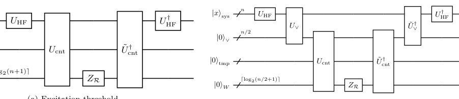 
FIG. 1. Block-level circuits for ˆOT at the two threshold preselections. In both cases the reference shift UHF forms z = x ⊕xHF, a single population-count network Ucnt writes the relevant integer onto an ancilla register, the phase flip ZR flips the sign of the states inside the threshold, and the computation is uncomputed by measurement-based erasure at no T-gate cost (indicated by the tilde). (a) For an excitation threshold, Ucnt counts the n bits of z into the Hamming weight W = 2e. (b) For a hierarchy threshold, a layer U∨first forms the n/2 pairwise ORs z2p ∨z2p+1, which Ucnt counts into 2h. Each variant uses a single population count and costs 4n + O(log n) T gates.

📷 Fig 2

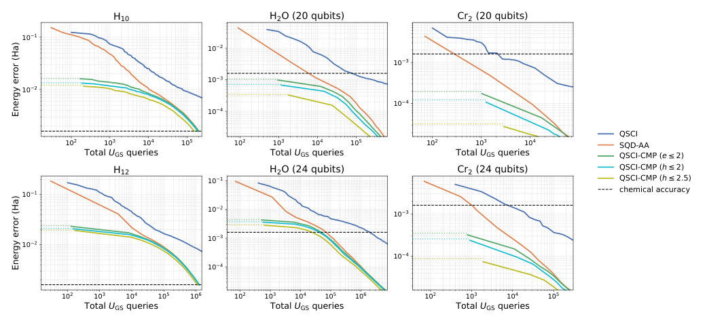 
FIG. 2. Energy error versus the cumulative number of queries to the state-preparation unitary UGS, comparing direct QSCI, SQD-AA, and QSCI-CMP at three choices of preselection (e ≤2, h ≤2, h ≤2.5) for all six systems. Top row: the 20-qubit systems H10, H2O (10e, 10o), and Cr2 (10e, 10o). Bottom row: the 24-qubit systems H12, H2O (10e, 12o), and Cr2 (12e, 12o). The dashed line marks chemical accuracy (1.6 mHa, relative to the in-active-space reference). Colored dotted segments mark the zero-query initial accuracy of each QSCI-CMP variant, obtained by classically diagonalizing T (R) alone; direct QSCI and SQD-AA have no such point, as they cannot identify important configurations prior to...

📷 Fig 3

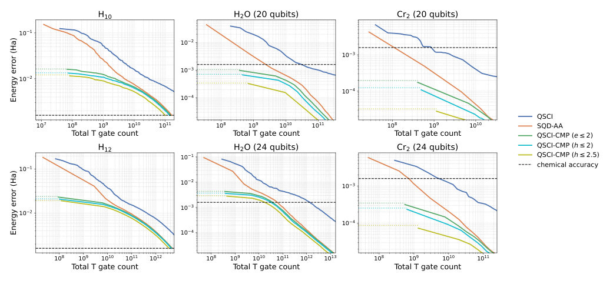 
FIG. 3. Same as Fig. 2 but against the cumulative T-gate count, combining the state-preparation cost at L = No layers (Sec. IV A) and the oracle cost of each method; for direct QSCI, which uses no amplification, only the state-preparation cost enters.

📷 Fig 4

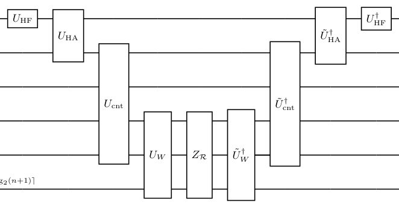 
FIG. 4. Block-level circuit for the general-preselection oracle ˆOT . The half-adder layer UHA of Eq. (A8) writes the sum bits {sp} and carry bits {cp} onto |0⟩s,c. The out-of-place counting networks Ucnt of Eq. (A1), built from the full adders of Ref. [29], use the workspace |0⟩tmp to sum the n/2 bits of each group and write Ws = P

**Summary.** The paper introduces QSCI-CMP, an advanced hybrid quantum-classical algorithm designed to calculate molecular ground states more efficiently than existing methods. It achieves this by using chemical knowledge—specifically excitation level and seniority number—to preselect basis states classically. This significantly reduces the required quantum resources (query count and gate count) for achieving chemical accuracy.

**Why it may be interesting.** This work directly addresses computational bottlenecks in quantum chemistry simulations, providing a concrete algorithmic improvement for simulating strongly correlated electron systems that are central to materials science.

Detailed structure

**Main problem.** Developing an efficient quantum algorithm for molecular ground-state calculations by improving upon existing methods like Quantum-Selected Configuration Interaction (QSCI).

**Main result.** The proposed QSCI-CMP method reduces the query count and gate count required compared to SQD-AA by up to 68% and 72% respectively for 24-qubit systems.

**Method.** It hybridizes quantum sampling with classical preselection by fixing 'chemically trivial' basis states based on structural properties (excitation level, seniority number) before running amplitude amplification.

**Model / system.** The system is molecular electronic structure calculation, involving the ground-state energy and eigenvectors of an electronic Hamiltonian ($\hat{H}$), mapped onto qubits using a Slater determinant representation relative to a Hartree–Fock reference state.

**Key observables.** Ground-state energy, query count, gate count (T-gate count), excitation level ($e(x)$), and seniority number ($\Omega(x)$).

**Important parameters / regimes.** The size of the chemically trivial subspace is a tunable parameter that can shift work from quantum sampling to classical diagonalization.

**Assumptions / limitations.** Previous methods suffer from measurement bottlenecks (QSCI) or gate counts growing with measured states (SQD-AA); QSCI-CMP assumes chemical knowledge allows preselection of important basis states.

**Figures summary.** Figures detail block-level quantum circuits for the oracle $\hat{O}_T$, showing components like reference shifts, population count, and phase flips used to enforce constraints on excitation energy and seniority number.

**Paper structure.** The paper introduces QSCI-CMP as an improvement over SQD-AA by incorporating chemical knowledge. It details how this knowledge is encoded into the oracle via structural quantities (e.g., $h(x)$) and provides numerical demonstrations showing significant resource reductions compared to baseline methods.

Abstract

We present QSCI-CMP, a quantum-classical hybrid algorithm for molecular ground-state calculations that reduces both the query count and the gate count of sample-based quantum diagonalization with amplitude amplification (SQD-AA). SQD-AA mitigates the measurement bottleneck of quantum-selected configuration interaction (QSCI) by amplifying the basis states that have not yet been measured. Its oracle, however, specifies the measured states by listing them one by one, so its gate count grows with the number of collected states. Moreover, the quantum resources are spent even on states whose importance is evident from chemical knowledge, such as low-order excitations from the Hartree-Fock reference, which could be collected classically at the outset. We therefore propose to fix such chemically trivial states in advance, include them in the diagonalization subspace from the start, and exclude them from the amplification target, using a low-cost oracle that recognizes them through the excitation level and the seniority number of each basis state. We numerically demonstrate that QSCI-CMP reduces the query count and the gate count required to reach chemical accuracy by up to approximately 68% and 72% relative to SQD-AA for 24-qubit systems. The chemically trivial subspace is freely tunable within the classical computational budget. A larger subspace shifts more work onto the classical solver and increases the reduction in quantum cost, and when it captures the ground state sufficiently well, no quantum sampling is needed at all. We also point out that a query-optimal iteration count known from the analysis of quantum search further reduces the query count of both methods by approximately 12%.

[↑ back to top](#top)

### [Quantum error correction with global control](http://arxiv.org/abs/2608.05821v1)

**Authors:** Roberto Menta, Lindsay Bassman Oftelie, Ashkan Abedi, Francesco Cioni, Marco Polini, Seth Lloyd, Francesco Caravelli, Vittorio Giovannetti  
**Type:** theory · **Category:** quantum information and computing · **PDF:** <https://arxiv.org/pdf/2608.05821v1>  
**Analysis basis:** full PDF text, analyzed in chunks

📷 Fig 1

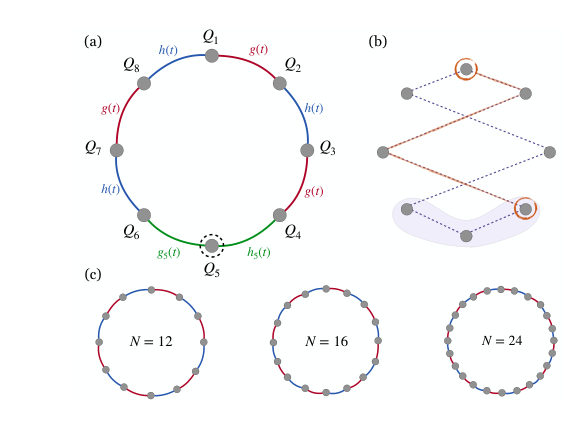 
FIG. 1. Globally controlled quantum architecture with zero qubit overhead. (a) The architecture possesses a ring topology with N (even) computational qubits Qi (gray circles), here N = 8, arranged on a circle with XY nearest-neighbor couplings. Red (blue) links denote the global coupling g(t) [h(t)], acting uniformly on the odd (even) bonds; even- and odd-indexed qubits are addressed by two separate global drives. Green links denote the two locally controlled couplings g¯i(t) and h¯i(t) on the bonds adjacent to the single lo- cally addressable site ¯i (dashed circle; ¯i = 5 in the figure), where single-qubit gates are also applied. Computational two-qubit gates are performed on these two...

📷 Fig 2

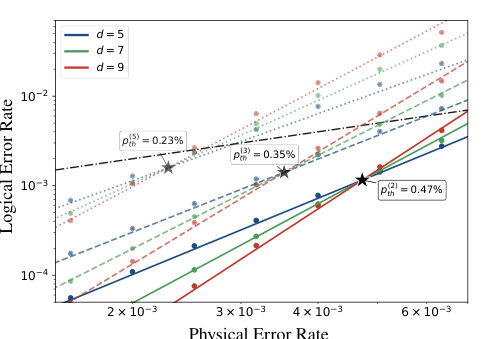 
FIG. 2. Logical error rate versus physical error rate for the cyclic code executed on the globally-controlled ring architecture, for code distances d = 5 (blue), d = 7 (green), and d = 9 (red), using enough measurement sites for M = 5 (dotted curves), M = 3 (dashed curves), and M = 2 (solid curves) rounds of measurement (see Ta- ble I). Circles represent data obtained from Monte Carlo simulations under the phenomenological noise model, while lines are fit to guide the eye. The mutual crossing point within each set of code distances gives the QEC threshold p(M) th , demarcated with a star. The dashed- dotted black line marks break-even (logical error rate equal to physical error rate).

**Summary.** This paper introduces a novel, globally-controlled architecture for quantum computing that solves the qubit overhead problem in Quantum Error Correction (QEC). By using global driving fields on a ring of qubits, it enables syndrome extraction circuits entirely with global gates. This approach yields significantly higher theoretical QEC thresholds compared to previous local control schemes.

**Why it may be interesting.** This work provides a theoretical blueprint for scaling quantum computation by fundamentally changing how error correction is implemented—by making all qubits computational and globally addressable—which has implications for superconducting circuit design.

Detailed structure

**Main problem.** The primary challenge is achieving fault tolerance in quantum computation by overcoming hardware scaling bottlenecks, specifically addressing the 'wiring problem' associated with conventional local control architectures.

**Main result.** The authors propose a globally-controlled architecture that implements Quantum Error Correction (QEC) with zero auxiliary qubit overhead and achieves QEC thresholds significantly higher than previous estimates.

**Method.** They utilize global driving fields to implement programmable pairwise exchange operations, enabling syndrome extraction circuits using only global gates for cyclic stabilizer codes.

**Model / system.** The model is a homogeneous ring of N computational qubits coupled via nearest-neighbor interactions. Control is achieved through time-dependent Hamiltonian engineering that allows information routing and gate operations globally.

**Key observables.** QEC Threshold ($p_{th}$), Logical Error Rate, Qubit Overhead (aiming for zero).

**Important parameters / regimes.** Code distance ($d$), Number of qubits ($N$), Global coupling strengths ($h(t), g(t)$).

**Assumptions / limitations.** The model assumes the ability to selectively activate desired interactions using global detuning, and that syndrome measurement can be sequentially performed despite the global nature of the gates.

**Figures summary.** Figures illustrate the ring topology with global couplings, connectivity graphs showing universal computation paths, and performance plots comparing achievable QEC thresholds against physical error rates.

**Paper structure.** The paper develops the architecture by first establishing global control to bypass wiring limits. It then details the implementation of cyclic stabilizer codes for syndrome extraction using only global gates, culminating in threshold calculations and discussions on improving performance via local measurement sites.

Abstract

Reaching fault tolerance means scaling qubit counts by orders of magnitude, a jump that conventional superconducting architectures cannot sustain without solving the so-called `wiring problem'. Global control sidesteps this bottleneck, but implementing quantum error correction (QEC) on previously proposed global architectures incurs extremely steep overhead costs, due to the need for separate correction procedures for the computational and auxiliary qubits that comprise the global device. We resolve this by introducing the first globally-controlled architecture with zero qubit overhead. Every physical qubit is a computational qubit, and thus, every qubit is protected under a single error correcting scheme. We identify a class of cyclic stabilizer codes realizable through global iSWAP and single-qubit gates, yielding QEC thresholds nearly seven orders of magnitude larger than previous estimates for globally-controlled arrays. We further show these thresholds improve systematically as the global architecture is augmented with a limited amount of local measurement sites, demonstrating a trade-off between wiring simplicity and fault-tolerant performance.

[↑ back to top](#top)

### [Scalable Circuit Cutting: A Framework for Combined Gate and Wire Cuts Using Gate Groups](http://arxiv.org/abs/2608.05287v1)

**Authors:** Fiona Jiali Fröhler, Yannick Stade, Christian Ufrecht, Daniel D. Scherer, Robert Wille  
**Type:** theory · **Category:** quantum information and computing · **PDF:** <https://arxiv.org/pdf/2608.05287v1>  
**Analysis basis:** full PDF text, analyzed in chunks

📷 Fig 1

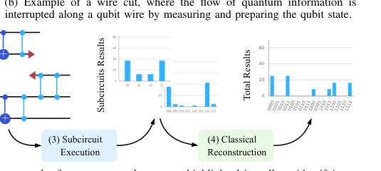 
Figure 1. Different kinds of quantum circuit cuts and the circuit cutting workflow.

📷 Fig 2

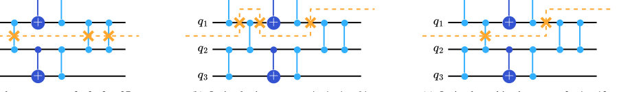 
Figure 2. Example illustrating the advantage of combined cutting. While pure gate or wire cuts may be optimal within their own categories, a unified strategy can identify mixed solutions that significantly reduce total sampling overhead.

📷 Fig 3

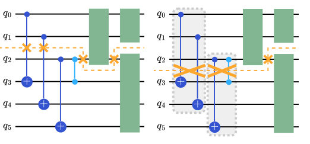 
Figure 4. Example of combined gate, wire, and joint cuts.

📷 Fig 4

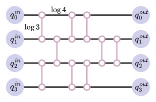 
Figure 6. Mapping circuit in Fig. 2 to a circuit topology graph to find gate and wire cuts.

📷 Fig 5

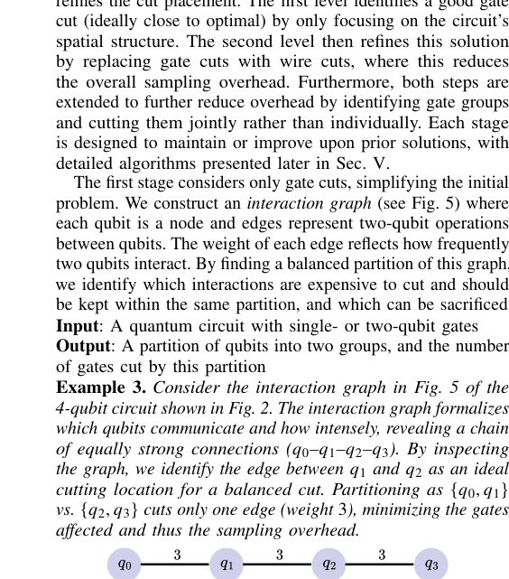 
Figure 5. Mapping circuit in Fig. 2 to an interaction graph to find gate cuts.

**Summary.** This work presents a unified framework to solve quantum circuit cutting by jointly optimizing gate and wire cuts. It models the problem using an augmented graph structure and applies advanced graph partitioning heuristics to minimize exponentially growing sampling overheads. This allows for the efficient decomposition of large circuits into smaller, executable pieces on limited quantum hardware.

**Why it may be interesting.** While focused on quantum computation theory, the underlying methodology—graph partitioning to optimize resource constraints (qubits/overhead)—is highly relevant for designing complex quantum simulations or mapping algorithms onto realistic hardware architectures.

Detailed structure

**Main problem.** The core challenge is minimizing the exponentially growing sampling overhead associated with circuit cutting, which is necessary to execute large quantum circuits on hardware limited by qubit count.

**Main result.** The proposed unified framework significantly reduces total sampling overhead compared to optimizing gate or wire cuts in isolation by jointly considering gate groups alongside both types of cuts.

**Method.** It formulates the problem as a scalable graph partitioning task, utilizing an augmented Circuit Topology Graph and applying modified Karmarkar-Karp (KL) heuristics.

**Model / system.** The model is based on quantum circuits ($C$) composed of qubits ($Q$) and two-qubit gates. The system is constrained by hardware limitations ($	ext{qmax}$), requiring partitioning into independent subcircuits.

**Key observables.** Sampling Overhead ($\mathcal{S}$), which must be minimized; also diagnostic feedback on circuit suitability for cutting.

**Important parameters / regimes.** The number of qubits, the maximum allowed qubits per subcircuit ($	ext{qmax}$), and various sampling overhead constants ($\kappa$).

**Assumptions / limitations.** Existing approaches often treat gate and wire cuts independently, missing opportunities for optimal joint decomposition. The problem is NP-hard.

**Figures summary.** Figures illustrate the workflow of circuit cutting (Input $
ightarrow$ Cut Placement $
ightarrow$ Subcircuit Execution); they compare sampling overheads for gate-only vs. wire-only vs. combined optimal cuts; and show examples of how joint cutting reduces overhead significantly.

**Paper structure.** The paper introduces a unified framework that combines gate and wire cutting into a single partitioning strategy, leveraging joint cutting via novel gate grouping techniques, and solves this by formulating the problem as a scalable graph partitioning task.

Abstract

Quantum circuit cutting enables the execution of large circuits on devices with a limited number of qubits by partitioning circuits into independent subcircuits. However, this introduces a sampling overhead, which grows exponentially with the number of cuts, rendering the choice of cut placements critical for practical circuit cutting. Determining optimal cut placements remains computationally challenging, particularly as circuits grow in size. Additionally, existing circuit cutting approaches typically treat gate and wire cuts independently. Those combining both cutting approaches, however, do not take advantage of joint cutting, i.e., identifying common gate groups and cutting them jointly for a reduced overhead. This work presents a unified framework that combines gate and wire cutting within a single partitioning strategy, enabling more efficient circuit decompositions. Moreover, our approach incorporates joint cutting via a novel gate grouping technique, further reducing sampling overhead. By formulating the cut placement problem as a scalable graph partitioning task, our method efficiently identifies near-optimal cut placements for large circuits, also providing diagnostic feedback on whether circuits are suitable for cutting.

[↑ back to top](#top)

### [School network reorganization under educational and spatial constraints using classical and quantum optimization](http://arxiv.org/abs/2608.05427v1)

**Authors:** Alessia Ciacco, Luigi Di Puglia Pugliese, Francesca Guerriero  
**Type:** both · **Category:** other · **PDF:** <https://arxiv.org/pdf/2608.05427v1>  
**Analysis basis:** full PDF text, analyzed in chunks

📷 Fig 1

 
Figure 1: Schematic representation of the main institutional configurations of the Italian school system, including educational levels and organizational structure.

**Summary.** This paper proposes an advanced mathematical framework using Integer Linear Programming to solve the complex problem of reorganizing public school networks. It applies this model to real Italian data, comparing classical computational results against those obtained from hybrid quantum optimization environments. The work establishes a robust decision-support tool for sustainable and equitable resource allocation in educational infrastructure.

**Why it may be interesting.** While the core problem is civil engineering/operations research, the explicit reformulation into a constrained quadratic model and subsequent testing on Quantum Annealing environments makes it relevant for demonstrating near-term applications of quantum computation to complex combinatorial optimization problems.

Detailed structure

**Main problem.** The paper addresses the strategic planning problem of school network reorganization, aiming to efficiently allocate public resources while balancing demographic trends, accessibility, and educational requirements.

**Main result.** The proposed optimization framework effectively identifies optimal aggregation plans for real-world regions like Calabria, demonstrating its potential as a robust decision-support tool for equitable infrastructure planning.

**Method.** It develops an Integer Linear Programming (ILP) formulation that is also reformulated as a constrained quadratic model, allowing it to be implemented and tested within a hybrid quantum optimization environment alongside classical solvers.

**Model / system.** The system modeled is the public school network of a region (e.g., Calabria), which must be partitioned into optimal clusters based on complex constraints including travel time, capacity, and administrative compatibility.

**Key observables.** Optimal aggregation plans, objective function values ($z_C$ vs $z_Q$), structural indicators ($	ext{CZ}, 	ext{KR}, 	ext{RC}$, etc.), and solution times for various policy scenarios.

**Important parameters / regimes.** Policy configurations (64 tested), maximum execution time limits ($T_{IC}^{max} = 1200 	ext{ s}$), and integration of multiple constraints like territorial criticality and accessibility.

**Assumptions / limitations.** The methodology assumes that the problem can be accurately modeled by integrating geographical, administrative, and educational criteria into a single optimization framework; quantum performance is noted as potentially limited by current hardware capabilities.

**Figures summary.** The notes reference tables comparing classical vs. quantum objective values and solution times across policy configurations for the Calabria case study.

**Paper structure.** The paper systematically reviews related literature on facility planning, details its novel ILP/quadratic formulation integrating multiple constraints, applies this framework to a real-world Italian case study (Calabria), and compares classical optimization results with preliminary quantum annealing results.

Abstract

School network reorganization is a strategic planning problem that requires balancing demographic trends, territorial accessibility, educational requirements, and institutional constraints while ensuring an efficient allocation of public resources. This paper proposes an optimization framework for school dimensioning decisions based on a novel Integer Linear Programming formulation integrating geographical, administrative, and educational criteria. A synthetic benchmark generator is introduced to evaluate the scalability and computational performance of the model on artificial instances, while a real-world case study involving the complete public school network of the Calabria region (Italy) is conducted using actual institutional, territorial, and demographic data. The proposed approach effectively identifies optimal aggregation plans under different policy scenarios while preserving the structural characteristics of the educational system. Furthermore, the model is reformulated as a constrained quadratic model and implemented within a hybrid quantum optimization environment, demonstrating its compatibility with emerging quantum technologies. The results highlight the robustness of the proposed methodology and its potential as a decision-support tool for sustainable and equitable school network planning.

[↑ back to top](#top)

### [The Hidden Subgroup Problem in Semidirect Products and Quasi-Hamiltonian Groups](http://arxiv.org/abs/2608.05321v1)

**Authors:** Mauro E. S. Morales  
**Type:** theory · **Category:** quantum information and computing · **PDF:** <https://arxiv.org/pdf/2608.05321v1>  
**Analysis basis:** full PDF text, analyzed in chunks

📷 Fig 1

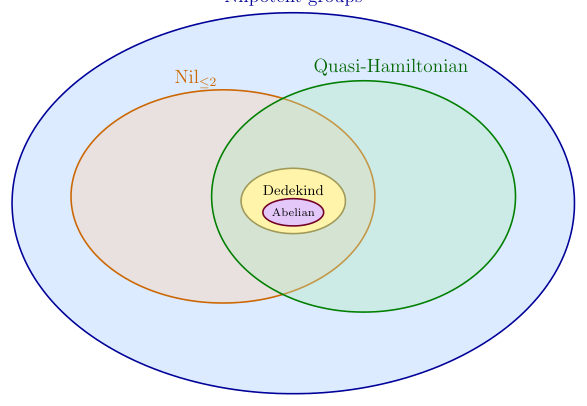 
Figure 1: Schematic inclusion relations among several classes of groups. The class Nil≤2 includes the groups of nilpotency class ≤2. For these groups, the algorithm of [15] solves the HSP efficiently. The nilpotency class of quasi-Hamiltonian groups is not bounded by a constant and therefore these two classes are incomparable (see Appendix A). Both classes contain the finite Dedekind groups, in which every subgroup is normal. Note that the dihedral group DN is nilpotent if and only if N is a power of two.

**Summary.** This paper develops polynomial-time quantum algorithms for solving the Hidden Subgroup Problem (HSP) in specific classes of non-Abelian finite groups, including semidirect products and quasi-Hamiltonian groups. It achieves this by exploiting deep structural properties of these groups and refining quantum measurement techniques like the block measurement protocol. The research advances the theoretical understanding of what computational problems can be efficiently solved on a quantum computer using group structure knowledge.

**Why it may be interesting.** This work pushes the boundaries of quantum complexity theory by extending known quantum algorithms beyond simple Abelian structures to complex, structured non-Abelian groups relevant in abstract algebra.

Detailed structure

**Main problem.** The paper addresses the Hidden Subgroup Problem (HSP) for non-Abelian finite groups, which is significantly harder than the Abelian case.

**Main result.** Polynomial-time quantum algorithms are provided for two structured families of non-Abelian groups: semidirect products $A 
times_{\varphi} \mathbb{Z}_{p^k}$ and quasi-Hamiltonian groups.

**Method.** The methods involve adapting techniques from Abelian HSP solvers, utilizing structural properties like modular subgroup lattices (for quasi-Hamiltonian groups), and employing advanced quantum measurement protocols like the block measurement technique.

**Model / system.** The theoretical model is abstract group theory applied to quantum computation; no specific physical Hamiltonian or lattice system is described. The focus is on solving a computational problem defined over finite groups $G$.

**Key observables.** Success probability of the quantum algorithm, which must be shown to be high enough (e.g., $\geq rac{\phi(N)}{N} 2^{mt} p$) for polynomial time complexity.

**Important parameters / regimes.** Group structure parameters such as $p$ (prime), $k$, and the exponent of the Abelian factor, $	ext{Exp}(A)$. Efficiency depends on conditions like $	ext{Exp}(A)/p = 	ext{polylog}(|G|)$.

**Assumptions / limitations.** The algorithms rely on specific structural assumptions about the groups (e.g., quasi-Hamiltonian structure, or $A$ having bounded generator rank) and assume black-box access to group operations.

**Figures summary.** Figure 1 schematically illustrates the inclusion relationship between various group classes: Nilpotent $\le 2$, Quasi-Hamiltonian, Dedekind, and Abelian groups.

**Paper structure.** The paper progresses by first establishing the context of HSP difficulty in non-Abelian settings. It then details algorithms for semidirect products (Theorem A/B), followed by a dedicated treatment for quasi-Hamiltonian groups (Theorem C). The latter sections involve deep analysis of quantum measurement protocols (PGM) and structural comparisons with other group families.

Abstract

Several early quantum algorithms, including Simon's algorithm and Shor's period-finding are instances of the hidden subgroup problem (HSP) over finite abelian groups. No polynomial-time quantum algorithm is known for the HSP over arbitrary non-abelian finite groups. The non-Abelian case is of particular interest because some instances, such as the dihedral and symmetric group HSPs, are connected to lattice problems and graph isomorphism, respectively.   In this work, we give polynomial-time quantum algorithms for two further families containing non-Abelian groups. First, we consider groups of the form $G=A\rtimes_{\varphi} \mathbb{Z}_{p^k}$, with $A$ finite Abelian, $p$ prime, $k\in \mathbb{N}$ and the action of $\mathbb Z_{p^k}$ is generated by the scalar automorphism $a\mapstoμa$, for some $μ\in\mathbb Z_{\operatorname{Exp}(A)}^\times$, where $\mathrm{Exp}(A)$ is the exponent of $A$. Our algorithm is efficient when $A$ has bounded generator rank and $\mathrm{Exp}(A)/p=\mathrm{polylog}(|G|)$. This includes the case $A=\mathbb{Z}_N$ for $N\in\mathbb{N}$ and $k=1$, studied by Bacon, Childs and van Dam (FOCS 2005), and $A=\mathbb{Z}_{q^r}$ with $q$ prime and $r\in \mathbb{N}$ studied by van Dam and Dey (TQC 2014). Second, we give a polynomial-time quantum algorithm for finite quasi-Hamiltonian groups under a mild assumption on the input structure. Quasi-Hamiltonian groups are finite nilpotent groups with modular subgroup lattice, or equivalently the finite groups in which every subgroup is permutable. As far as we know, this is the first quantum algorithm to exploit the modularity of the subgroup lattice for solving the HSP. This extends, under the aforementioned structured input assumption, the quantum algorithm for Dedekind groups given by Hallgren, Russell, and Ta-Shma (SIAM J. Comput. 32, 2003).

[↑ back to top](#top)

### [Time-Reversal Selection Rules for Quantum Error Correction](http://arxiv.org/abs/2608.06304v1)

**Authors:** Eric Kubischta, Ian Teixeira  
**Type:** theory · **Category:** quantum information and computing · **PDF:** <https://arxiv.org/pdf/2608.06304v1>  
**Analysis basis:** full PDF text, analyzed in chunks

📷 Fig 1

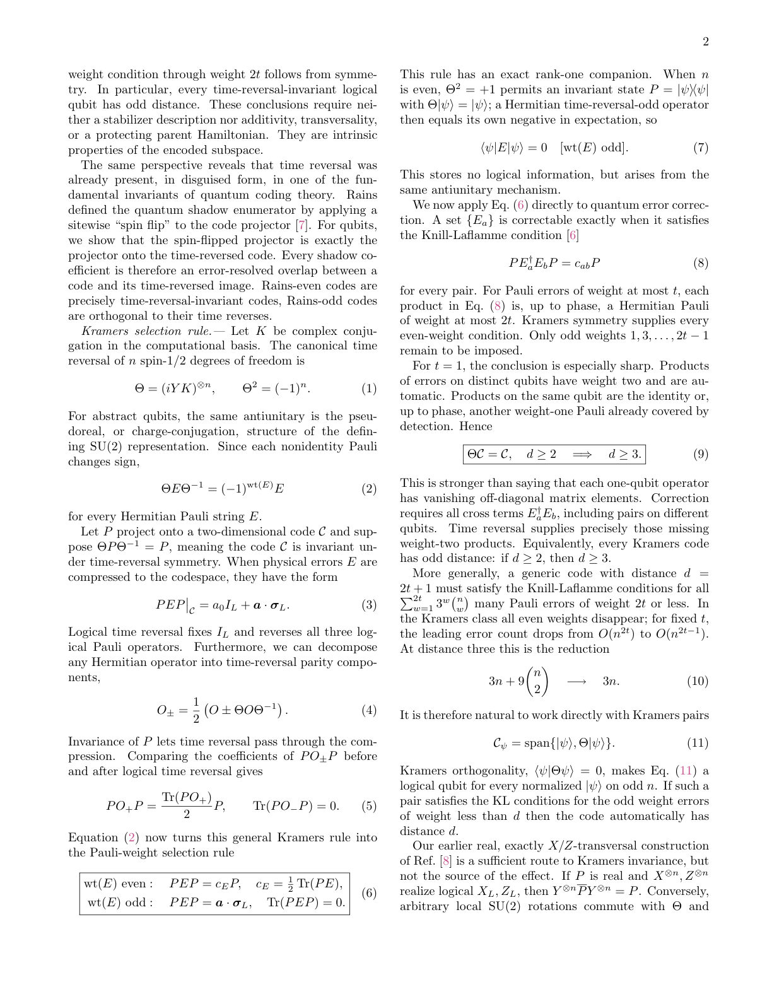 
Low-resolution page preview, page 2

📷 Fig 2

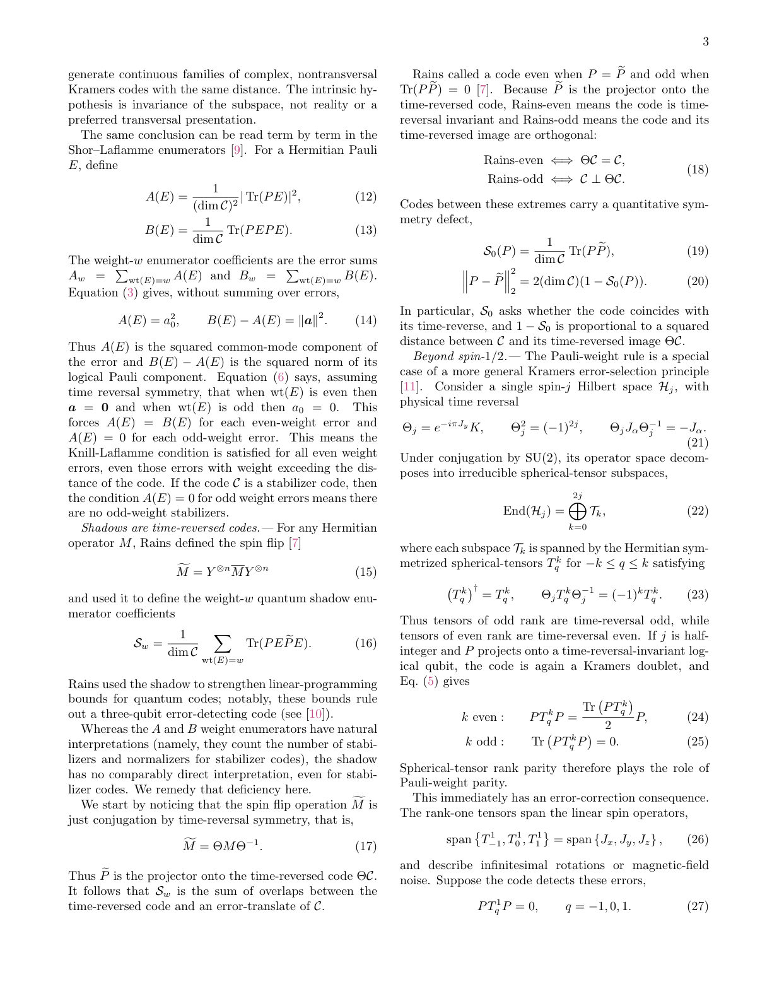 
Low-resolution page preview, page 3

📷 Fig 3

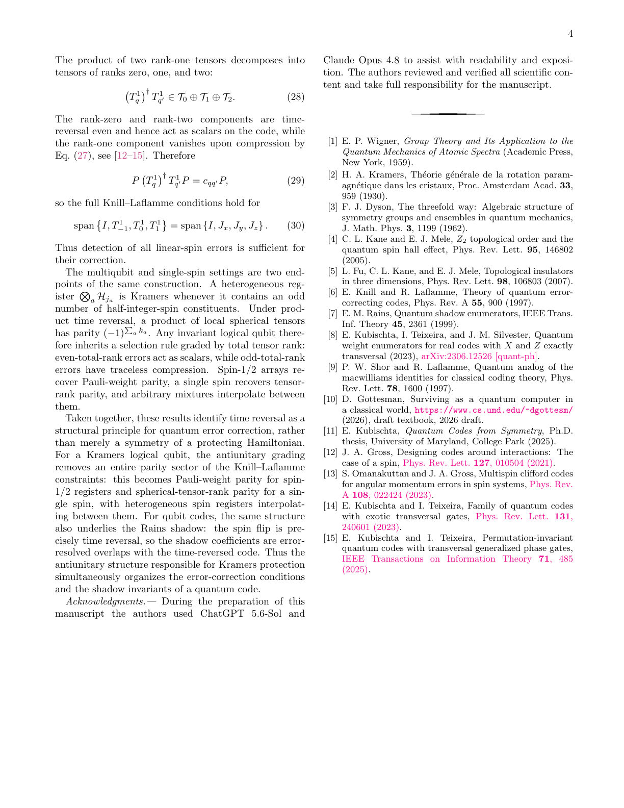 
Low-resolution page preview, page 4

**Summary.** This work applies time-reversal symmetry to the theory of quantum error correction, showing that this symmetry imposes strong selection rules on the underlying error algebra. These rules automatically satisfy many necessary conditions for fault tolerance, simplifying the requirements for reliable quantum computation. The framework unifies concepts from spectral protection (Kramers pairs) and algebraic constraints (Knill-Laflamme conditions).

**Why it may be interesting.** It provides a deep structural constraint on quantum codes derived from fundamental symmetries, which is relevant for designing robust quantum memories or computation protocols in physical systems exhibiting time-reversal symmetry.

Detailed structure

**Main problem.** The paper investigates how applying time-reversal symmetry ($\Theta$) imposes structural selection rules on quantum error correction (QEC) codes.

**Main result.** Time-reversal invariance forces all even-weight Pauli operators to act as scalars, automatically satisfying the even-weight Knill–Laflamme conditions and simplifying error detection requirements.

**Method.** The authors use the antiunitary time-reversal operator $\Theta$ to derive parity selection rules for Pauli strings and reinterpret Rains' shadow enumerator through this symmetry.

**Model / system.** The analysis is performed on quantum codes defined over spin-1/2 particles (qubits) and generalizes to multi-spin systems. The focus is on the time-reversal invariance of the code subspace itself.

**Key observables.** Kramers degeneracy, Pauli weight parity, Knill–Laflamme conditions satisfaction, and coefficients of the Rains shadow enumerator ($S_w$).

**Important parameters / regimes.** The degree of error correction distance ($d$) and the number of spins ($n$).

**Assumptions / limitations.** The analysis assumes working with spin-1/2 particles and relies on the antiunitary nature of time reversal ($\Theta$).

**Paper structure.** The paper establishes the link between spectral protection (Kramers degeneracy) and algebraic error protection by applying $\Theta$ to QEC codes, deriving selection rules, and reinterpreting shadow invariants.

Abstract

We apply time-reversal symmetry to quantum codes and show that it imposes parity selection rules on the physical error algebra. A time-reversal-invariant logical qubit on an odd number of spins is a Kramers doublet, forcing every even-weight Pauli to act as a scalar. Consequently, all even-weight Knill--Laflamme conditions hold automatically, so single-qubit error detection implies correction. We then reinterpret the Rains shadow enumerator through time reversal: each coefficient is a sum of error-resolved overlaps between a code and its time-reversed image.

[↑ back to top](#top)

## Secondary cond-mat archives

*Papers from  mes-hall, other, soft, supr-con. These archives are de-prioritized — they appear at the end regardless of relevance score.*

### Relevant in secondary archives (13)

### [Kinetic Lifshitz invariants and dynamics of nonreciprocal fluctuations in superconductors](http://arxiv.org/abs/2608.05306v1)

**Authors:** Tony Liu, Joaquim Telles de Miranda, Daniel Shaffer, Alex Levchenko  
**Type:** theory · **Category:** statistical mechanics · **PDF:** <https://arxiv.org/pdf/2608.05306v1>  
**Analysis basis:** full PDF text, analyzed in chunks
**Topic relevance:** 🔥 `Keldysh / 2PI / non-Gaussian methods` **4/5** · `correlated / nonlocal dissipation` **3/5** · `driven-dissipative phase transition` **3/5** · `methods for driven-dissipative` **3/5** · `non-equilibrium dynamics` **3/5** · `non-equilibrium universality` **3/5** · `spintronics-quantum-optics interface` **2/5** · `Kondo & dissipative impurity` **1/5** · `exotic spin models in light-matter` **1/5**

📷 Fig 1

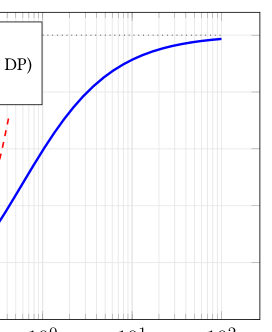 
Figure 2: Disorder crossover of the helical modulation vector, Eq. (35). For weak Dyakonov-Perel re- laxation (g ≪1) the helix is suppressed, q0 ∝(αRpF )2τ αRh/Tv2 F ; for g ≫1 it saturates at the universal, disorder-independent value q0 = 4αRh/v2 F . The same function (and its derivatives) controls the crossover of every entry of Table 1.

**Summary.** This work develops a generalized time-dependent Ginzburg-Landau theory for disordered, noncentrosymmetric superconductors using the Keldysh formalism. It determines that nonreciprocal Lifshitz invariants appear in both the free energy and the dynamic fluctuation terms. The results unify conflicting theoretical predictions by introducing a single crossover function controlling the system's response to disorder.

**Why it may be interesting.** The rigorous application of fluctuation-dissipation theorems and symmetry principles (Onsager reciprocity) to derive non-equilibrium dynamics in a superconducting context provides advanced tools for understanding dissipation beyond simple mean-field treatments.

Detailed structure

**Main problem.** The study derives a generalized time-dependent Ginzburg-Landau theory for disordered noncentrosymmetric superconductors, focusing on the appearance of Lifshitz-type nonreciprocal couplings in the quantum (Keldysh) sector.

**Main result.** The kinetic Lifshitz invariants are governed by a single crossover kernel dependent on the ratio of the spin-relaxation rate to temperature, reconciling previous conflicting results for magnetoelectric couplings.

**Method.** The theory is derived from the Keldysh nonlinear sigma model and utilizes principles like the Fluctuation-Dissipation Theorem (FDT) and Onsager reciprocity to determine dynamics.

**Model / system.** The minimal model is a disordered noncentrosymmetric superconductor realized via a two-dimensional electron gas with Rashba spin-orbit coupling and an in-plane Zeeman field. The analysis uses the Keldysh formalism to construct the effective action.

**Key observables.** Superconducting diode efficiency, fluctuation-induced magnetochiral anisotropy, relaxation rate of fluctuations ($\mathbf{q}$ dependence), and Langevin noise power (which acquire $\mathbf{q}$-odd and $B$-field odd terms).

**Important parameters / regimes.** The ratio of the Dyakonov-Perel spin-relaxation rate ($\Gamma_t$) to temperature ($T$), which dictates the crossover between weak-relaxation and relaxation-dominated regimes.

**Assumptions / limitations.** The analysis is performed in the diffusive regime and relies on gauge covariance arguments within the Keldysh formalism.

**Paper structure.** The paper establishes the general context of Lifshitz invariants, applies this to superconductors using the Keldysh NLSM, derives the full dynamical theory (TDGL equation), and computes specific nonreciprocal couplings in various limits defined by $\Gamma_t/T$.

Abstract

We derive the generalized time-dependent Ginzburg-Landau theory of a disordered noncentrosymmetric superconductor from the Keldysh nonlinear sigma model, using a two-dimensional electron gas with Rashba spin-orbit coupling and an in-plane Zeeman field as a minimal model. On the thermodynamic side we construct the Lifshitz invariants of the free energy, the linear and cubic gradient terms and the momentum-odd part of the quartic vertex, and trace their dependence on disorder. These couplings are governed by a single closed-form kernel controlled by the ratio of the Dyakonov-Perel spin-relaxation rate to temperature, interpolating between the weak-relaxation regime, where the invariants are suppressed, and the relaxation-dominated regime, where the helical modulation of the order parameter saturates at a universal, disorder-independent value. This crossover reconciles conflicting results for the magnetoelectric couplings of dirty Rashba superconductors. Because the theory is formulated on the Keldysh contour, it also determines the dissipative dynamics: the relaxation rate of a fluctuation with pair momentum $\mathbf{q}$, and hence, by the fluctuation-dissipation theorem, the Langevin noise power, acquires a term odd in $\mathbf{q}$ and odd in the magnetic field. The structure of this kinetic Lifshitz invariant is dictated by Onsager reciprocity: friction and noise renormalize in lockstep, so equal-time fluctuations remain Gibbsian while the dynamics are nonreciprocal. As applications we compute the superconducting diode efficiency near $T_c$, where the cubic invariant competes with the quartic vertex and with even higher-gradient terms rendered odd by the helical shift, reversing the sign of the diode coefficient, and the fluctuation-induced magnetochiral anisotropy above $T_c$, where the current-resolved nonreciprocal resistance forms a plateau across the Gaussian regime.

[↑ back to top](#top)

### [Unconventional Scaling of Electric Hall Effect in Magnetic Weyl Semimetals](http://arxiv.org/abs/2608.06217v1)

**Authors:** Chaoxi Cui, Yilin Han, Run-Wu Zhang, Zhi-Ming Yu, Yugui Yao  
**Type:** theory · **Category:** other · **PDF:** <https://arxiv.org/pdf/2608.06217v1>  
**Analysis basis:** full PDF text, analyzed in chunks
**Topic relevance:** 🔥 `non-equilibrium universality` **4/5** · `analog quantum simulation` **3/5** · `driven-dissipative phase transition` **3/5** · `non-equilibrium dynamics` **3/5** · `spintronics-quantum-optics interface` **2/5** · `Keldysh / 2PI / non-Gaussian methods` **1/5** · `methods for driven-dissipative` **1/5**

📷 Fig 1

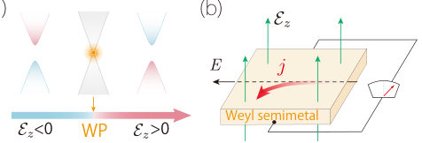 
FIG. 1. (a) Ez-driven topological phase transition, where a 2D WP appearing at Ez = 0 marks the gap-closing critical point between two gapped phases. (b) Setup for electric-field sensing via the EHE in a 2D Weyl semimetal: an out-of-plane electric field Ez is directly read out via a Hall signal j induced by Ez.

📷 Fig 2

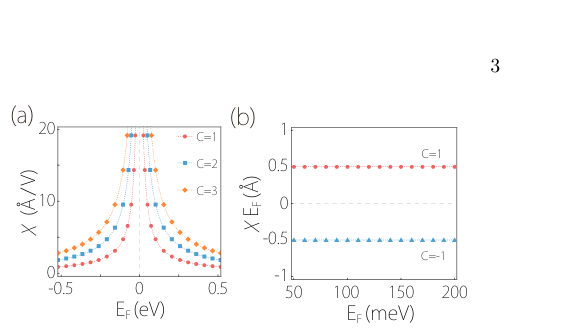 
FIG. 2. EHE response at zero temperature. (a) χ(0) xy for WPs with topological charges C = 1, 2, and 3. (b) χ(0) xy EF for WPs with C = ±1. χ(0) xy , which scales with E−1 F , is independent of the details of the WPs, but depends on the global topological charge C. Here we set α = 1 ˚A.

📷 Fig 3

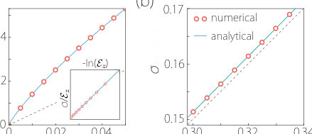 
FIG. 3. EHE response σ(T ) xy at finite temperature. (a) Log- arithmically corrected scaling in the weak-Ez limit. The in- set plots σ(T ) xy /Ez as a function of −ln(Ez), where the loga- rithmically corrected scaling is manifested as a linear rela- tion with a finite slope. (b) Linear behavior of σ(T ) xy in the low-temperature limit. In both panels, the red open circles and blue solid curves denote the finite-temperature numeri- cal and analytic results, respectively, while the gray dashed curves show the corresponding zero-temperature results. We set C = 1, EF = 10 meV, and α = 1 ˚A, with kBT = 5 meV for (a) and kBT = 0.5 meV for (b).

**Summary.** This work theoretically analyzes the Electric Hall Effect in magnetic Weyl Semimetals, revealing unique scaling behaviors dictated by topology. The key findings include universal $E_F^{-1}$ scaling at zero temperature and a logarithmically corrected scaling at finite temperatures. This suggests a robust, all-electric mechanism for sensing weak electric fields.

**Why it may be interesting.** While focused on condensed matter topology, the concept of field-induced topological transitions and universal scaling laws are highly relevant in understanding quantum transport phenomena that can be modeled using effective Hamiltonians common in AMO physics (e.g., superconducting qubits or cavity QED systems exhibiting topological phases).

Detailed structure

**Main problem.** The study investigates the unconventional scaling laws governing the Electric Hall Effect (EHE) in 2D magnetic Weyl Semimetals (WSMs). The goal is to understand how topology dictates this response, especially under weak electric fields.

**Main result.** The EHE exhibits universal scaling at zero temperature ($\chi_{xy} \propto E_F^{-1}$) and an unconventional logarithmically corrected scaling at finite temperature ($\sigma_{xy} \propto E_z \ln(1/|E_z|)$).

**Method.** Theoretical derivation using the Kubo formula, Berry curvature calculations, and detailed scaling analysis involving momentum-to-parameter space mappings.

**Model / system.** The system is modeled as 2D magnetic Weyl semimetals hosting doubly degenerate nodal points. The physics is captured by a two-band Hamiltonian subjected to an out-of-plane electric field ($E_z$) which acts as a mass term, inducing topological phase transitions.

**Key observables.** Electric Hall conductivity ($\sigma_{xy}$) and the intrinsic EHE coefficient ($\chi_{xy}$), both dependent on $E_F$ and $E_z$.

**Important parameters / regimes.** Fermi energy ($E_F$), out-of-plane electric field strength ($E_z$), and the global topological charge ($C$) of the Weyl points.

**Assumptions / limitations.** The analysis relies on a two-band model approximation near the nodal points, and specific mathematical mappings between momentum space and parameter space are utilized for integration.

**Figures summary.** Figures illustrate the $E_z$-driven topological phase transition (gap closing) and compare numerical/analytical results showing the characteristic logarithmic scaling of $\sigma_{xy}(T)$ versus field strength.

**Paper structure.** The paper systematically derives the EHE coefficient ($\chi_{xy}$) at zero temperature using Berry curvature methods, then extends this analysis to finite temperatures by incorporating thermal effects into the conductivity calculation, revealing the unconventional scaling laws.

Abstract

Electric Hall Effect (EHE), a unique phenomenon in two-dimensional (2D) magnetic systems, refers to the generation of Hall current by an out-of-plane electric field $\Ez$. Here, we demonstrate that for 2D magnetic Weyl semimetals that host doubly degenerate nodal points, the EHE features multiple unconventional scaling laws. At zero temperature, the EHE exhibits a topological $E_F^{-1}$ Fermi-energy scaling. Remarkably, the prefactor of the scaling is determined by the global topological charge of the point without any dependence on the local parameters of the system, leading to a universal and significant enhancement of Hall response in any species of Weyl points as the Fermi energy approaches the Weyl point. This significant response enables a weak electric field to be directly converted into a measurable Hall signal. Surprisingly, this enhanced Hall response is not diminished by temperature, but evolves into an unconventional logarithmically corrected scaling at finite temperature $σ_{xy}\propto\Ez\ln(1/|\Ez|)$ for weak $\Ez$, still yielding a divergent electric-field susceptibility. Thus, our work not only unveils intriguing scaling laws resulting from the interaction between magnetism and topology, but also suggests a novel scaling-enhanced and temperature-robust mechanism that may enable weak electric-field sensing through a practical and all-electric route.

[↑ back to top](#top)

### [Vector Edge Solitons and Domain Walls in a Nonlinear Mechanical Topological Insulator](http://arxiv.org/abs/2608.06342v1)

**Authors:** David D. J. M. Snee, Yi-Ping Ma  
**Type:** theory · **Category:** other · **PDF:** <https://arxiv.org/pdf/2608.06342v1>  
**Analysis basis:** full PDF text, analyzed in chunks
**Topic relevance:** 🔥 `analog quantum simulation` **4/5** · `Frenkel-Kontorova` **3/5** · `non-equilibrium dynamics` **2/5** · `spintronics-quantum-optics interface` **2/5** · `correlated / nonlocal dissipation` **1/5** · `driven-dissipative phase transition` **1/5** · `exotic spin models in light-matter` **1/5** · `methods for driven-dissipative` **1/5** · `non-equilibrium universality` **1/5**

📷 Fig 1

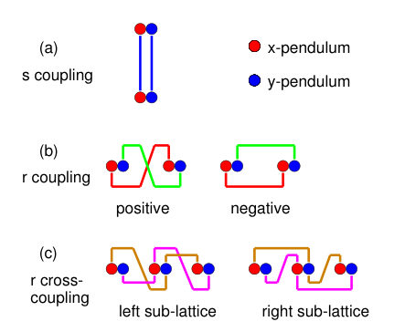 
FIG. 1. (Color online) Schematic view of the connections be- tween neighboring pendula in the 2D MTI. The r-direction is horizontal, the s-direction is vertical, and all pendula swing in the s-direction. (a) Simple springs connecting x–x and y–y pendula in the s-direction. (b) Complex springs connecting x–x and y–y pendula in the r-direction. (c) Complex springs connecting x–y pendula in the r-direction. Here, a complex spring with two springs and one lever arm realizes a nega- tive coupling, while a complex spring with three springs and two lever arms realizes a positive coupling; see Ref. [29] for a physical depiction. If the magnetic flux Φ changes sign, then the r cross-couplings in...

📷 Fig 2

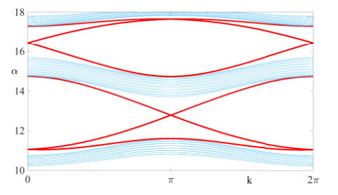 
FIG. 2. (Color online) The dispersion relation α(k) obtained from numerical solutions of the eigenvalue problem in Eq. (9). The bulk and edge spectra are shown in blue and red respec- tively. This dispersion relation does not change when the magnetic flux Φ changes sign.

📷 Fig 3

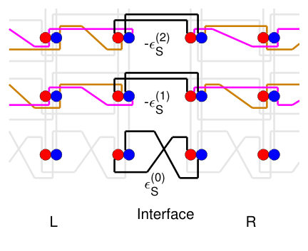 
FIG. 3. (Color online) MTI with two topological sectors. The two sub-lattices are connected by an interface. As in Fig. 1, red (blue) points represent x (y) pendula, the r-direction is horizontal, and the s-direction is vertical. Bottom row rep- resents (x(0) r,S, y(0) r,S) sites, middle row (x(1) r,S, y(1) r,S), and top row

📷 Fig 4

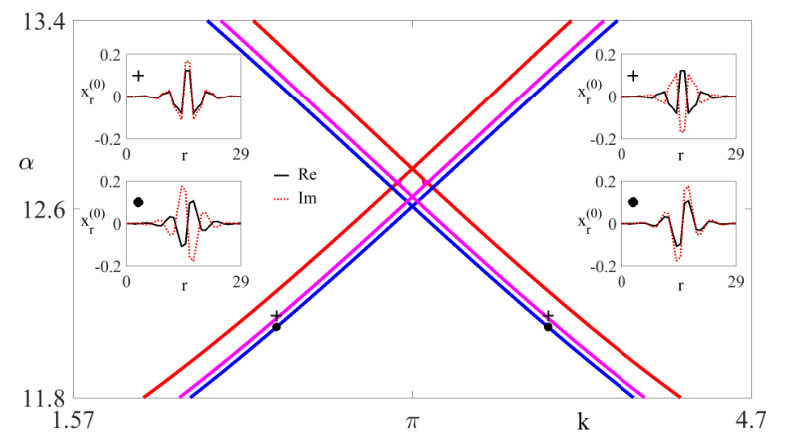 
FIG. 4. (Color online) The dispersion relation in the lower band gap with crossing point at k = π as in Fig. 2 but with interface couplings included. The dispersion relation of the two edge states near the vacuum, i.e., on the left edge of the left sub-lattice and on the right edge of the right sub-lattice, is shown in red. The dispersion relation of the interface states is shown in blue for the odd states and magenta for the even states. The two interface states at a generic k and their Kramers partners at 2π −k are marked by ‘+’ and ‘o’, and the x(0) components of the corresponding eigenvectors are plotted in the sub-panels.

📷 Fig 5

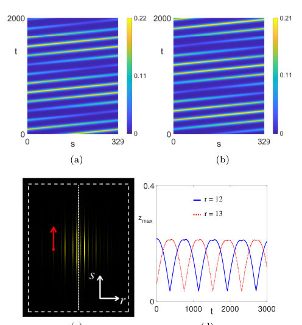 
FIG. 5. (Color online) BB edge soliton propagating along the interface of the MTI with two topological sectors. The lattice size is Nr × Ns = 26 × 330. (a,b) Space-time plots of the interface sites at r = 12 and r = 13 respectively. (c) 2D snapshot showing the initial condition for the BB edge soliton. White-dashed lines are the lattice boundaries, white-dotted line is the interface between the two sub-lattices, and the red arrow indicates the propagation direction. (d) Maximum amplitude vs time for the r = 12 and r = 13 sites.

**Summary.** This paper models nonlinear waves in a 2D mechanical topological insulator using coupled nonlinear Schrödinger equations. It predicts the existence and properties of various vector edge solitons and domain walls, which are topologically protected. The findings suggest that these systems can be engineered for advanced functionalities like collision-based computing.

**Why it may be interesting.** This work bridges nonlinear wave physics, topological materials, and mechanical systems. The emergence of robust, controllable soliton dynamics in a physical, non-electronic platform like pendulums is highly relevant for developing novel quantum or classical information processing devices.

Detailed structure

**Main problem.** The research investigates nonlinear edge waves and domain walls within a two-dimensional mechanical topological insulator (MTI). The goal is to characterize the complex soliton dynamics arising from this system.

**Main result.** The study predicts the existence of various vector edge solitons, including bright-bright and dark-dark types, which are topologically protected when carrier frequencies lie within a band gap. These solitons exhibit potential for energy transfer during collisions, suggesting applications in information processing.

**Method.** The analysis involves deriving a one-dimensional two-component coupled nonlinear Schrödinger (CNLS) equation from the underlying mechanical lattice dynamics. Soliton solutions are found by analyzing this continuum model and exploring continuation techniques.

**Model / system.** The physical system is a 2D MTI built using pendulums with on-site cubic nonlinearity, connected by linear springs to realize the quantum spin Hall effect. The dynamics are modeled via coupled nonlinear equations of motion that reduce to the CNLS equation for edge modes.

**Key observables.** Bright-bright (BB) and dark-dark edge solitons, domain walls, energy transfer during soliton collisions, and topological protection confirmed by passing through defects.

**Important parameters / regimes.** The system depends on parameters defining the cubic nonlinearity ($\sigma$), coupling strengths ($f$), and the quasi-momentum space structure that allows for Equal Group Velocity (EGV) points.

**Assumptions / limitations.** The analysis relies on deriving a continuum approximation (CNLS equation) from the discrete lattice model, assuming near degeneracy in the linear spectrum to facilitate this reduction.

**Figures summary.** Not specified by notes; however, the text implies figures illustrate the schematic connections of pendula, the dispersion relation showing EGV points, and visualizations of the resulting solitons/domain walls.

**Paper structure.** The paper is structured logically: reviewing the MTI design (Section II), deriving and analyzing the CNLS equation solutions (Section III), designing the platform and studying propagation (Sections IV & V), exploring BB solitons via defects and collisions (Sections VI & VII), and concluding with future work (Section VIII).

Abstract

We report nonlinear edge waves in a 2D mechanical topological insulator. A bulk lattice consists of pendulums with on-site cubic nonlinearity connected by linear springs realizing quantum spin Hall effect. We show that the nonlinear interaction between two edge modes with equal group velocities (EGV) is described by a 1D two-component coupled nonlinear Schrödinger (CNLS) equation. On the interface separating two bulk lattices with opposite spin Chern numbers, we construct linear springs such that the dispersion relation exhibits EGV points with favorable CNLS coefficients. Thus, we realize nonlinear edge waves propagating along the interface, including bright-bright (BB) edge solitons for focusing CNLS coefficients, and dark-dark edge solitons, edge domain walls, and dark-bright edge solitons for defocusing CNLS coefficients. In terms of the site amplitudes, these solutions resemble bright and dark breathers. These solutions should be topologically protected when both carrier frequencies lie within a band gap, which we explicitly show by passing BB edge solitons through compact defects on the interface. We also show energy transfer in BB edge soliton collisions with potential application to collision-based computing. Generally, vector edge solitons exhibit a large parameter space for soliton collisions, which endows mechanical devices with greater potential for information processing and other functionalities.

[↑ back to top](#top)

### [Abruptly autofocusing waves enter space-time](http://arxiv.org/abs/2608.05796v1)

**Authors:** Nikolaos K. Efremidis, Demetrios N. Christodoulides  
**Type:** both · **Category:** other · **PDF:** <https://arxiv.org/pdf/2608.05796v1>  
**Analysis basis:** full PDF text, analyzed in chunks
**Topic relevance:** 🔥 `interference shaping light` **4/5** · `quantum optics experiment` **3/5** · `analog quantum simulation` **1/5** · `driven-dissipative phase transition` **1/5** · `methods for driven-dissipative` **1/5** · `non-equilibrium dynamics` **1/5**

📷 Fig 1

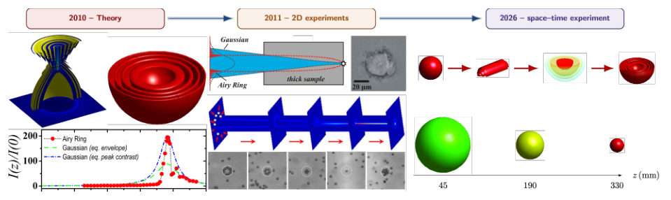 
Figure 1: Timeline of abruptly autofocusing waves. In 2010 circular and spherical abruptly autofocusing waves were theoretically predicted [2]. These optical waves maintain a low peak intensity during most of their propagation, before increasing rapidly by orders of magnitude near the focus. In 2011, circular abruptly autofocusing waves were experimentally observed and used to create localized ablation spots [6], as well as to transport and manipulate microparticles [7]. Recent advances in spatiotemporal wavepacket synthesis have now enabled the experimental realization of the spherical counterpart, bringing abruptly autofocusing waves into the full space- time domain [13]. Panels adapted...

**Summary.** This paper reports on the generation and characterization of 'abruptly autofocusing waves,' which concentrate optical energy suddenly at a specific point rather than gradually like Gaussian beams. By experimentally realizing spherical Airy wavepackets in the full space-time domain, the authors demonstrate a method for achieving highly localized light delivery. This breakthrough opens new avenues for ultrafast structured light applications in photonics and material science.

**Why it may be interesting.** This work is highly relevant to quantum optics and open quantum systems as it deals with engineered light fields capable of extreme spatial/temporal confinement. The underlying physics involves nonlinear wave propagation and structured light control, which has parallels in cavity QED or advanced photonic implementations.

Detailed structure

**Main problem.** The research focuses on understanding and utilizing 'abruptly autofocusing waves' due to their ability to deliver optical energy with high precision at a prescribed focus, contrasting them with conventional Gaussian focusing.

**Main result.** The authors successfully demonstrated the experimental realization of spherical Airy wavepackets in the full space-time domain, achieving a tightly focused beam with significantly higher contrast than an equivalent Gaussian beam.

**Method.** The experiment involved generating a 2D space-time Airy precursor using a spatiotemporal hologram and extending this field into spherical geometry via log-polar optical transformation combined with spectral phase control.

**Model / system.** The system involves light propagation governed by the wave equation, specifically utilizing Airy profiles in both two-dimensional (circular) and full three-dimensional space-time geometries. These waves are compared against standard Gaussian focusing profiles.

**Key observables.** High-contrast intensity surge at a prescribed focus; comparison of peak intensity to Gaussian beams; ability to achieve tight energy localization.

**Important parameters / regimes.** The geometry (2D vs 3D space-time); the contrast ratio relative to Gaussian beams; spectral bandwidth and aperture limitations.

**Assumptions / limitations.** Current experimental implementations are limited by pixelated spatial light modulators, finite apertures, and approximations introduced by log-polar mapping requiring careful compensation.

**Figures summary.** Figure 1 illustrates the historical progression of these waves: from theoretical prediction (2010) to circular wave observation (2011), culminating in the recent experimental realization of the full space-time spherical counterpart [13].

**Paper structure.** The paper appears structured around establishing the physical phenomenon, reviewing the evolution of its study (from 2D to 3D), detailing the complex experimental methodology required for 3D generation, and concluding with applications and future directions.

Abstract

Whereas conventional Gaussian focusing gradually concentrates optical energy around the focal plane, abruptly autofocusing waves maintain a low peak intensity over most of their evolution before undergoing a sudden, high-contrast intensity surge at a prescribed focus. Since their introduction in 2010, their two-dimensional spatial realizations have enabled applications ranging from particle manipulation and material processing to terahertz generation and nonlinear optics. The recent work of Cao et al. marks the transition from (2+1)-dimensional spatial autofocusing to the full space-time domain through the experimental synthesis of spherical Airy wavepackets. This advance opens new opportunities for ultrafast structured light, tightly localized energy delivery, and nonlinear photonics.

[↑ back to top](#top)

### [Intra-unit-cell resolved intertwining of multi-$Q$ charge and spin textures in an itinerant skyrmion magnet](http://arxiv.org/abs/2608.05528v1)

**Authors:** Christopher J. Butler, Katsuki Nihongi, Haruto Yoshimochi, Nguyen Duy Khanh, Rina Takagi, Tetsuo Hanaguri, Shinichiro Seki  
**Type:** both · **Category:** strongly correlated electrons · **PDF:** <https://arxiv.org/pdf/2608.05528v1>  
**Analysis basis:** full PDF text, analyzed in chunks
**Topic relevance:** `exotic spin models in light-matter` **3/5** · `spintronics-quantum-optics interface` **3/5** · `analog quantum simulation` **2/5** · `driven-dissipative phase transition` **2/5** · `Keldysh / 2PI / non-Gaussian methods` **1/5** · `Kondo & dissipative impurity` **1/5** · `entanglement & information structure` **1/5** · `methods for driven-dissipative` **1/5** · `non-equilibrium dynamics` **1/5** · `non-equilibrium universality` **1/5**

📷 Fig 1

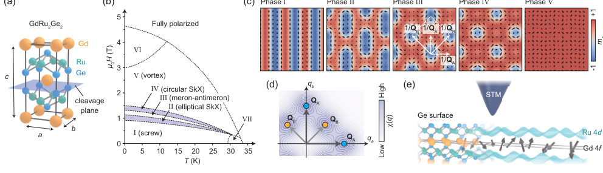 
FIG. 1. Non-collinear magnetism in GdRu2Ge2. (a) Depiction of the crystal structure with a cleavage plane indicated and, (b) a sketch of the magnetic phase diagram reported by Yoshimochi et al. [30]. (c) For magnetic phases I–V, the proposed spin textures on the Gd square lattice, inferred using resonant x-ray scattering and magnetization measurements [30]. (d) Sketch of the bare magnetic susceptibility χ(q) showing maxima at QA(A′) and QB(B′). (e) Illustration of the rationale for this investigation: The layered structure of GdRu2Ge2 can be thought of as interleaved Gd magnetic layers and Ru-Ge conduction layers through which magnetic interactions are mediated. The itinerant electronic...

📷 Fig 2

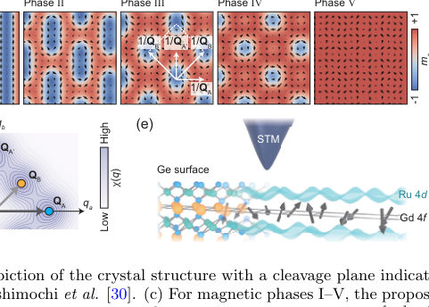 
Figure 3 gives only a snapshot of the LDOS patterns seen in each magnetic phase. Next, in order to track changes in the patterns as a function of H and resolve the magnetic phase transitions, we conduct further imaging of L(r, V ) in the smaller field-of-view shown in Fig. 2(d).

📷 Fig 3

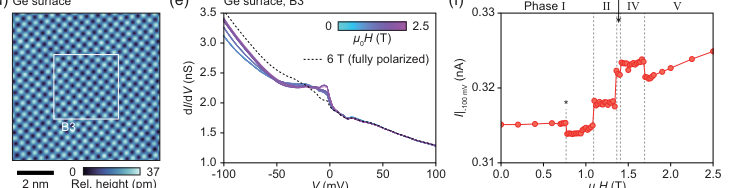 
FIG. 2. STM at the cleaved surfaces of GdRu2Ge2. (a) Topography at the Ge-terminated surface and, (b), at the Gd-terminated surface (Vset = 100 mV, Iset = 200 pA). The Ge surface shows a sparse covering of atoms and clusters while the Gd surface shows a roughly corresponding density of atomic scale pits, and it is reasonable that the atoms and clusters on the Ge surface are Gd pulled from the opposing surface during cleavage. Both images are displayed with a shared color scale. (c) Tunneling conductance curves averaged over the boxed regions labeled as B1 and B2 in (a) and (b) respectively (Vset = 100 mV, Iset = 200 pA, Vmod = 2.5 mV, µ0H = 0 T). (d) A higher resolution topographic image of...

📷 Fig 4

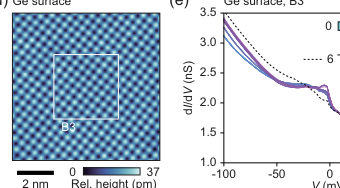 
Figure 4(a) shows L(r, V = −100 mV) images extracted from a series acquired in increments of 20 mT through- out the range µ0H = 0.7 to 1.8 T. From Fig. 4(a) we see that although the patterns in Phases II, III and IV have supercells of roughly the same size, their intra-supercell motifs are clearly distinct. An essential characteristic of multi-Q patterns is that their q-space description must include not only the amplitudes of the constituent mod- ulations [as in Fig. 3(b)], but also the modulations’ re- spective phases, or more precisely the relations among their phases. Acquiring this information using an ordi- nary FFT runs into technical obstacles, so instead we use a non-uniform...

📷 Fig 5

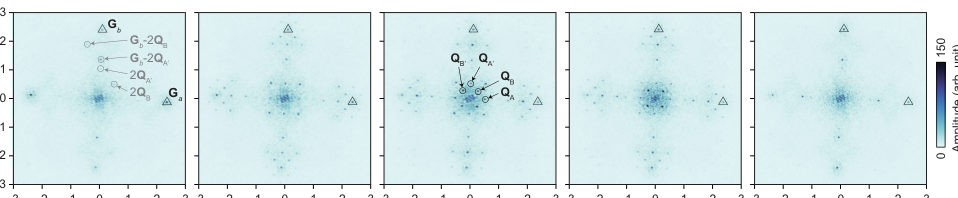 
FIG. 3. Magnetic field-dependence of periodic modulations in the LDOS at the Ge surface. (a) Normalized conductance images, L(r, V = −100 mV), acquired for each of the magnetic phases I–V, at the indicated magnetic fields and in the same field-of-view as for Fig. 2(a) (Vset = −100 mV, Iset = 200 pA, Vmod = 5 mV). (b) Fast Fourier transforms, F [L(r, V = −100 mV)], obtained from the images in (a) after masking out the cleavage debris (see Supplementary Information Sec. I). Bragg peaks are marked with black triangles. In the image for Phase III we mark the prominent Fourier components associated with magnetic modulations QA(A′) and QB(B′) [recall Fig. 1(d)]. In the image for Phase I we also...

**Summary.** This work uses STM to probe the electronic structure of a skyrmion magnet across multiple magnetic phases. It establishes that the observed charge modulations (LDOS) are not arbitrary but are microscopically dictated by the local alignment of neighboring spins. This provides crucial evidence for the intimate, intertwined relationship between spin and orbital degrees-of-freedom in itinerant magnets.

**Why it may be interesting.** While focused on magnetism, the detailed mapping of charge (LDOS) modulation driven by magnetic order touches upon concepts relevant to emergent quantum phenomena in correlated electron systems, which share mathematical frameworks with many-body physics studied in AMO or strongly correlated contexts.

Detailed structure

**Main problem.** The study aims to elucidate the microscopic mechanisms stabilizing non-collinear magnetism and establish the direct relationship between multi-$Q$ charge modulations (LDOS) and spin textures in itinerant skyrmion magnets.

**Main result.** The analysis demonstrates a tight correlation where the alignment of nearest-neighbor Gd spins dictates the local density-of-states (LDOS) patterns observed in the Ru 4d orbitals, providing a microscopic view of charge-spin intertwining.

**Method.** The research combines Scanning Tunneling Microscopy (STM) measurements to map LDOS modulations with theoretical modeling that relates these electronic textures to underlying spin structures via bond-centered dot products.

**Model / system.** The system is the compound GdRu2Ge2, which exhibits multiple magnetic phases including skyrmion crystal states. The physics involves itinerant electrons mediating interactions between localized Gd 4f spins and delocalized Ru 4d orbitals.

**Key observables.** Periodic LDOS patterns observed via STM (analyzed by FFT), wavevectors ($Q_A, Q_B$), scalar chirality ($	ext{nsc}(\mathbf{r})$), and the topological index ($N_{sk}$).

**Important parameters / regimes.** Temperature/Magnetic Field sweeps across five magnetic phases; energy bias voltage range for LDOS mapping.

**Assumptions / limitations.** The primary assumption is that the electronic modulations (LDOS) are directly governed by local spin-spin interactions ($\langle \mathbf{S}_{i,j} \cdot \mathbf{S}_{i+1,j} 
angle$) via a Non-Collinear Magneto-Resistance effect.

**Figures summary.** Figures show STM images and their Fourier transforms confirming superstructures related to magnetic wavevectors in different phases; energy dependence plots detail how the LDOS pattern changes with bias voltage, revealing phase inversions.

**Paper structure.** The paper progresses by first characterizing multiple magnetic phases using STM/FFT analysis (identifying multi-$Q$ patterns), then developing a theoretical model linking these patterns to spin-spin dot products ($\mathbf{W}(\mathbf{r})$), and finally confirming the correlation between local spin alignment and measured electronic modulations.

Abstract

The mechanisms stabilizing non-collinear magnetism in centrosymmetric crystals remain unclear, but likely involve spin-spin interactions mediated by itinerant electrons, such as the RKKY interaction. Finite-$Q$ magnetic order may then be accompanied by electronic modulations that are observable using a scanning tunneling microscope. In five successive magnetic phases of GdRu$_{2}$Ge$_{2}$, including two nano-scale skyrmion crystal phases, we show that multi-$Q$ magnetism among Gd 4$f$ spins entails a corresponding multi-$Q$ texture among the Ru 4$d$ orbitals that contribute itinerant electron bands. With atomically-resolved images of each electronic texture's motif, and a simple numerical modeling scheme drawing on the underlying spin structures, we infer their key relationship: The alignment between nearest-neighbor Gd spins tightly correlates with the local density-of-states of the Ru 4$d$ orbitals on the two bond-centered sublattices of the Gd square net. These analyses offer a microscopic view of the atomic-scale intertwining of charge and spin degrees-of-freedom in non-collinear itinerant magnets.

[↑ back to top](#top)

### [Geometric closure of classical nucleation theory for magnetic-field-controlled nanoparticle size across magnetic classes](http://arxiv.org/abs/2608.06220v1)

**Authors:** Yazeed Tawalbeh, Mauro Fernandes Pereira  
**Type:** theory · **Category:** statistical mechanics · **PDF:** <https://arxiv.org/pdf/2608.06220v1>  
**Analysis basis:** full PDF text, analyzed in chunks
**Topic relevance:** `Keldysh / 2PI / non-Gaussian methods` **3/5** · `spintronics-quantum-optics interface` **3/5** · `driven-dissipative phase transition` **2/5** · `methods for driven-dissipative` **2/5** · `analog quantum simulation` **1/5** · `correlated / nonlocal dissipation` **1/5** · `exotic spin models in light-matter` **1/5** · `non-equilibrium dynamics` **1/5** · `non-equilibrium universality` **1/5**

📷 Fig 1

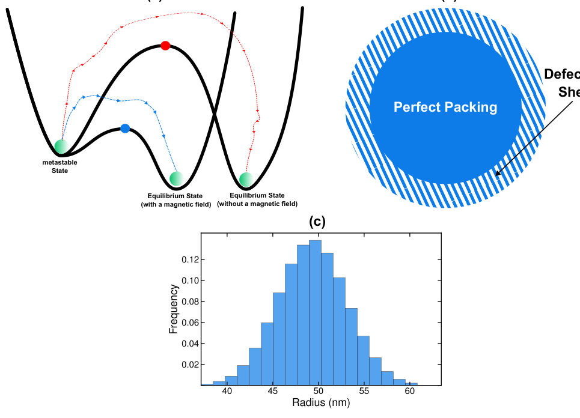 
Figure 1. (a) Schematic illustration of the magnetic-field effect on the free-energy landscape. The thin red and blue curves are guide lines representing the free-energy barrier along the nucleation coordinate. The red curve corresponds to the absence of a magnetic field, while the blue curve corresponds to the presence of a magnetic field, illustrating that the applied field lowers the barrier associated with critical-nucleus formation. (b) Sphere-packing representation of a NP used in this work. (c) Model-generated size distribution for Ni NPs used in GaN nanowire growth27 at the highest applied field in that dataset, B = 0.818 T, chosen to illustrate the predicted distribution under the...

📷 Fig 2

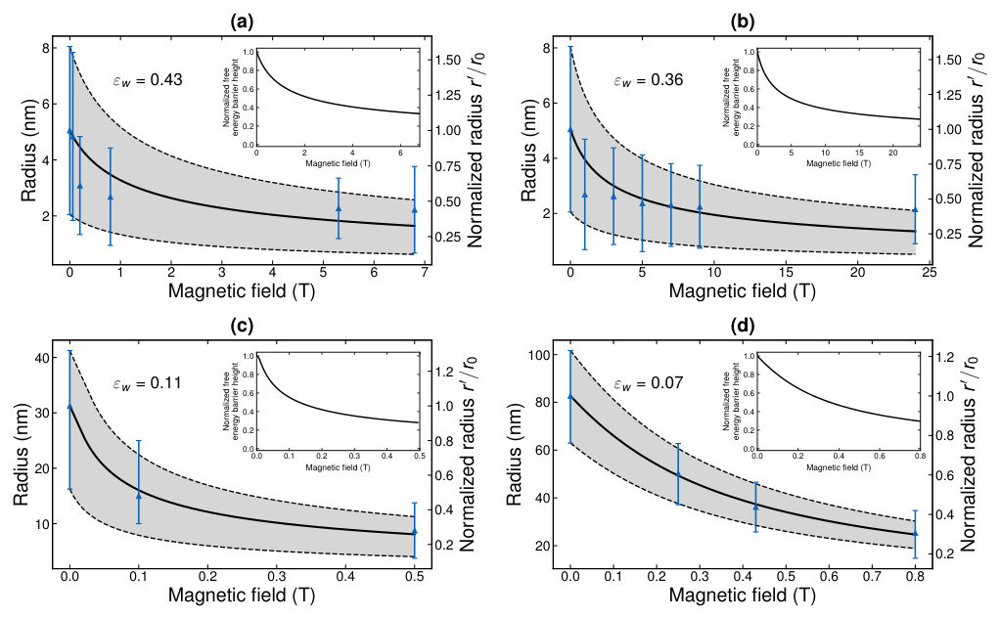 
Figure 2. The radius–field relation for Magnetite NPs22 in (a) the gradient configuration and (b) the homogeneous configuration, and for Nickel NPs used in the synthesis of (c) carbon nanofibers26 and (d) GaN nanowires27. The blue markers are experimental points; the bars represent the size distribution width, not to be confused with measurement errors. The black line represents the solution of Eq.(3) for x(B = 0) = x0, the dashed lines are the solutions at the experimental bounds. The shaded region represents the possible sizes generated by the theory, and the insets showcase the effect of the magnetic field on the free-energy barrier height. The distribution-width-normalized RMS...

📷 Fig 3

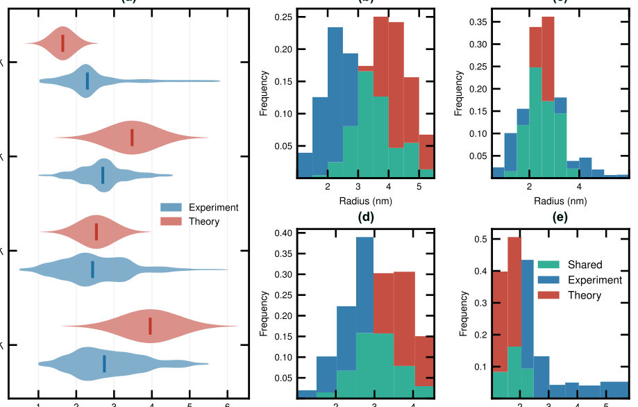 
Figure 3. (a) A violin plot comparing the experimental and theoretical size distributions of magnetite NPs22 at selected magnetic-field values. The blue distributions correspond to the experimental data, while the red distributions correspond to the model-generated distributions. The vertical bars indicate the central radius of each distribution. In the homogeneous-field configuration, the theory predicts the field-induced shift toward smaller radii as the field increases from 1 T to 5 T. Panel (b) shows the homogeneous 1 T case, where the theoretical distribution is shifted toward larger radii than the experimental distribution but retains partial overlap with the experimental range. Panel...

📷 Fig 4

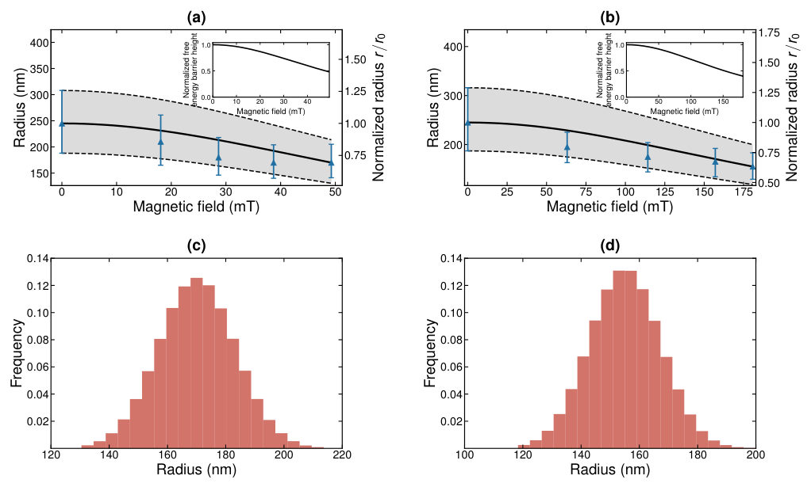 
Figure 4. The radius-field relation for Silver NPs24 in the (a) parallel and (b) perpendicular configurations. Panels (c) and (d) show the theoretical size distributions at the last experimental point in the parallel and perpendicular configurations, respectively. The blue markers are experimental points, the black line represents the solution of Eq. (4) for x(B = 0) = x0, the dashed lines are the solutions at the experimental bounds. The shaded region represents the possible sizes predicted by the theory and the insets showcase the effect of the magnetic field on the free energy barrier height.

📷 Fig 5

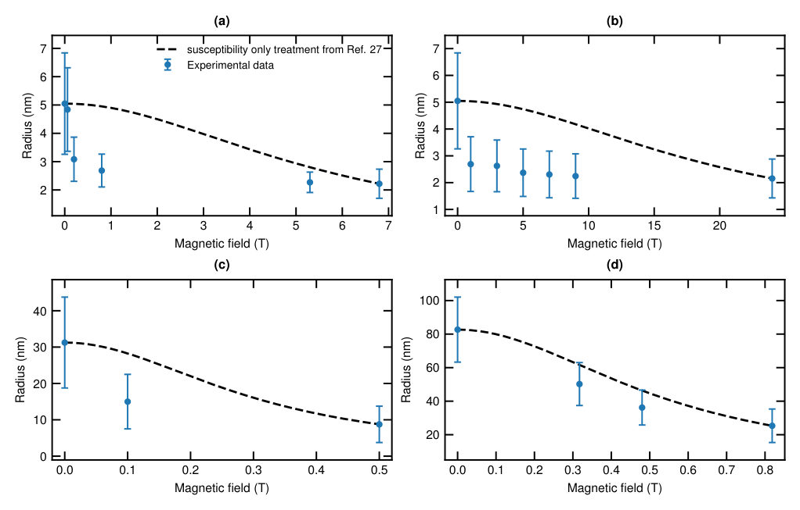 
Figure 5. Comparison between the susceptibility-only limiting equation and experimental radius-field data for (a) magnetite NPs in the gradient configuration, (b) magnetite NPs in the homogeneous configuration, (c) Ni NPs used for carbon nanofiber growth, and (d) Ni NPs used for GaN nanowire growth. The dashed black curves show the reduced analytical model obtained from Eq. (4), while the blue markers show experimental data. The mismatch shows that the limiting equation is not sufficient for magnetic NP systems.

**Summary.** This paper develops a geometrically closed thermodynamic theory to model how external magnetic fields control nanoparticle size during synthesis. By reformulating classical nucleation theory using a sphere-packing approach, the authors create a unified formalism applicable across different magnetic material types. The resulting framework accurately predicts both the reduction of mean particle size and the narrowing of size distributions with increasing field strength.

**Why it may be interesting.** While focused on classical nucleation, the rigorous thermodynamic formulation and the development of an analytical framework to handle complex field dependencies provide valuable methodological tools applicable to non-equilibrium phase transitions in quantum systems.

Detailed structure

**Main problem.** The central challenge is developing a unified, computationally efficient theory to control nanoparticle size during synthesis using external magnetic fields.

**Main result.** The authors establish a geometrically closed thermodynamic framework that successfully unifies the description of nucleation across superparamagnetic, paramagnetic, and diamagnetic systems.

**Method.** They reformulate classical nucleation theory by introducing a sphere-packing representation to link discrete atomic structure to continuum free-energy contributions, yielding a field-driven evolution equation for the critical nucleus size.

**Model / system.** The model describes nanoparticle formation where the total free energy ($\Delta F$) is decomposed into surface, bulk driving, induced magnetization, and permanent moment terms. The system spans various magnetic classes (superparamagnetic to diamagnetic).

**Key observables.** Mean particle size ($r$) and the narrowing of the size distribution as a function of applied magnetic field ($B$).

**Important parameters / regimes.** Magnetic susceptibility ($\chi_m$), chemical potential difference ($\Delta\mu$), surface free energy ($\gamma$), and the applied magnetic field strength ($B$).

**Assumptions / limitations.** The theory assumes a specific structure (core + defective shell) for calculating atomic counts, and it treats the permanent moment by assigning it to one effective collective NP moment.

**Figures summary.** Figures illustrate how an applied magnetic field lowers the free-energy barrier for nucleation and show model-generated size distributions confirming predicted size reduction with increasing field.

**Paper structure.** The paper introduces the geometrically closed thermodynamic framework, derives the field-driven evolution equation for the critical nucleus size, solves this equation for different magnetic limits (including a susceptibility-only limit), and validates the results by comparing predictions against experimental data for various magnetic materials.

Abstract

Controlling nanoparticle size during synthesis remains a central challenge in nanoscience, particularly in systems where external magnetic fields are used as continuous control parameters. Existing descriptions of magnetic-field-assisted nucleation are typically material-specific or rely on computationally intensive atomistic methods. Here, we reformulate classical nucleation theory as a geometrically closed thermodynamic framework by introducing a sphere-packing representation of atomic assembly. This construction establishes a direct link between discrete atomic structure and continuum free-energy contributions under applied magnetic fields, yielding a field-driven evolution equation for the critical nucleus size. The resulting theory provides a unified description of nanoparticle nucleation across superparamagnetic, paramagnetic, and diamagnetic systems within a single formalism. It quantitatively reproduces previously unresolved experimental observations for magnetite and nickel nanoparticles, namely the systematic reduction of mean particle size and narrowing of size distributions with increasing magnetic field. In the diamagnetic limit, the framework recovers our earlier analytical susceptibility-based description of silver nanoparticles, in which the field-dependent critical radius is governed by the induced-magnetization contribution to the nucleation free energy. Beyond modeling the reduction of mean particle size with increasing magnetic field, the framework reveals that the narrowing of size distributions emerges naturally from the curvature of the field-modified free-energy landscape. These results establish magnetic-field-assisted nucleation as a geometrically constrained thermodynamic process, providing a computationally efficient route for controlling nanoparticle size across distinct magnetic material classes.

[↑ back to top](#top)

### [Impact of spin-orbit coupling on electron correlation corrections to the density of states in anisotropic conductors](http://arxiv.org/abs/2608.05622v1)

**Authors:** Bahruz Suleymanli, B. Tanatar  
**Type:** theory · **Category:** strongly correlated electrons · **PDF:** <https://arxiv.org/pdf/2608.05622v1>  
**Analysis basis:** full PDF text, analyzed in chunks
**Topic relevance:** `Keldysh / 2PI / non-Gaussian methods` **3/5** · `spintronics-quantum-optics interface` **3/5** · `Kondo & dissipative impurity` **1/5** · `methods for driven-dissipative` **1/5**

📷 Fig 1

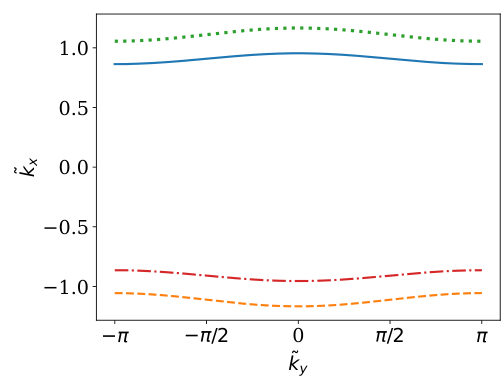 
FIG. 1. Fermi surface for a strongly anisotropic 2D band. Here ˜kx = kx/kF and ˜ky = dky are dimensionless momenta; parameters used are 2ty/ (kF vF ) = 0.05 and p

📷 Fig 2

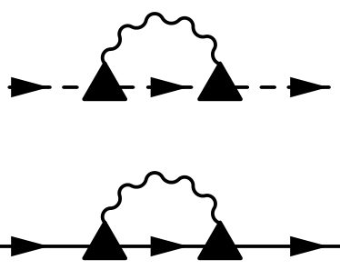 
FIG. 2. Exchange diagrams in the diffusion channel that con- tribute to Σs in the first order of the e – e interaction. Dashed (a) and solid (b) arrowed lines represent the bare Green’s functions for the s = +1 and s = −1 bands, respectively. The wavy line denotes the dynamically screened Coulomb inter- action Vs(q, iωm), while the filled triangles indicate the im- purity ladders θs(q, iωm) corresponding to multiple impurity scatterings at the density vertices.

📷 Fig 3

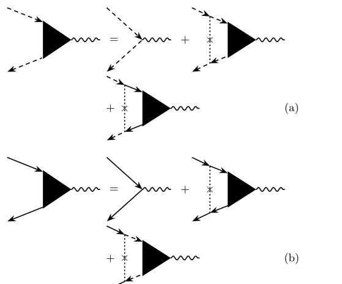 
FIG. 3. Ladder approximation for calculating impurity ver- tices.

📷 Fig 4

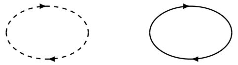 
FIG. 4. Elementary bubbles.

📷 Fig 5

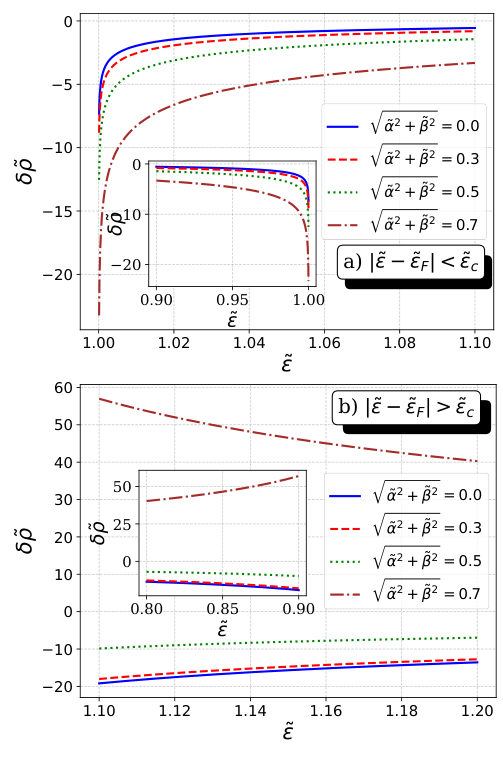 
FIG. 5. Effects of Rashba and Dresselhaus SOCs on the interaction-induced correction to the density of states in strongly anisotropic 2D systems. (a) The |ε−εF | &lt; εc regime, plotted using Eq. (34). (b) The |ε −εF | &gt; εc regime, plotted using Eq. (41). Here, the following dimensionless quantities are used: ˜ε = ετ, ˜εF,c = εF,cτ, δ˜ρ(˜ε) = δρ(˜ε)vF d, ˜α = α/vF , and ˜β = β/vF . The Fermi energy and the critical energy are chosen as εF = 1/τ and εc = 1/(10τ). All curves are plotted in the strictly zero-temperature limit (T = 0) to isolate the pure energy dependence of the anomalies.

**Summary.** This theoretical work calculates how electron-electron interactions modify the density of states in highly anisotropic 2D conductors subjected to spin-orbit coupling. The key finding is that SOC dramatically alters the energy dependence of this correlation correction, leading to a sign reversal at critical strengths. This provides a distinct spectroscopic tool for characterizing SOC effects beyond standard Altshuler-Aronov physics.

**Why it may be interesting.** While focused on electron correlation, the strong anisotropy, low dimensionality, and explicit inclusion of SOC make it relevant to understanding quantum transport in mesoscopic systems where spin-orbit coupling dictates orbital/spin texture effects.

Detailed structure

**Main problem.** The study investigates Altshuler-Aronov type interaction corrections to the single-particle Density of States (DOS) in a strongly anisotropic 2D conductor.

**Main result.** The DOS anomaly exhibits distinct dimensional crossovers (2D log dip vs. quasi-1D $\sqrt{\cdot}$ singularity), and SOC can induce a sign reversal of this correction, providing a unique spectroscopic signature.

**Method.** Calculations are performed in Matsubara space using diagrammatic techniques to compute the exchange contribution in the diffusion channel, incorporating dynamically screened Coulomb interactions.

**Model / system.** The system is a strongly anisotropic 2D electron gas with an open Fermi surface and weak disorder. It includes coexisting Rashba and Dresselhaus spin-orbit couplings (SOCs) constrained to the longitudinal direction.

**Key observables.** The DOS anomaly ($\delta
ho(\epsilon, T)$), which shows logarithmic dips near $\epsilon_F$ and square-root singularities further away.

**Important parameters / regimes.** Transverse coupling scale ($\varepsilon_c$), SOC strength, disorder scattering rates, and the energy relative to the Fermi level ($|\epsilon - \epsilon_F|$).

**Assumptions / limitations.** The analysis assumes a weak-disorder diffusive regime ($k_F l \gg 1$) and utilizes approximations like the Random Phase Approximation (RPA) for screening.

**Figures summary.** Figure 1 illustrates the four warped lines forming the Fermi surface. Figure 7 shows the SOC dependence of the DOS anomaly, and Figure 9 details the complex frequency integration contours used in the calculation.

**Paper structure.** The paper builds by first defining the physical model (anisotropic conductors with SOC), then detailing the theoretical framework using Matsubara sums and diagrammatic techniques to calculate the self-energy corrections, culminating in an analysis of the resulting DOS anomaly's energy dependence and critical behavior.

Abstract

We study Altshuler-Aronov-type interaction corrections to the single-particle density of states (DOS) in a strongly anisotropic 2D conductor with an open Fermi surface (FS) and weak disorder, in the presence of coexisting Rashba and Dresselhaus spin-orbit couplings (SOCs) constrained to the longitudinal direction. The low-energy band consists of two warped sheets weakly tunnel-coupled transversely; SOC splits the sheets into helicity branches with a fixed spin axis. Working in a Matsubara space, we compute the exchange contribution in the diffusion channel with dynamically screened Coulomb interaction and an impurity ladder. The resulting DOS anomaly exhibits a dimensional crossover governed by the transverse coupling scale $\varepsilon_c$. Close to the Fermi level ($|\varepsilon-\varepsilon_F|<\varepsilon_c$), the system behaves two-dimensionally, featuring a logarithmic DOS dip whose magnitude is enhanced by intrinsic SOCs. Further from the Fermi level ($|\varepsilon-\varepsilon_F|\!>\!\varepsilon_c$), the system behaves quasi-one-dimensionally, featuring a sharper square-root singularity whose amplitude is remarkably enhanced by the SOCs. Notably, we identify a critical SOC strength at which these spin-orbit effects exactly cancel the electron-correlation correction, perfectly restoring the unperturbed density of states. Furthermore, increasing the SOC beyond this critical point inverts the sign of the anomaly entirely, yielding a positive DOS correction. This sign reversal fundamentally alters the energy dependence, such that at energies beyond $\varepsilon_F + \varepsilon_c$, the positive correction decays to smaller values as energy increases, opposite to the standard negative correction. This contrasting trend provides a distinct spectroscopic signature of SOC-modulated correlation effects.

[↑ back to top](#top)

### [Annular Majorana mode in a superconducting topological insulator](http://arxiv.org/abs/2608.05632v1)

**Authors:** Shengshan Qin, Chi Wu, Lun-hui Hu, Tiantian Zhang, Jiangping Hu  
**Type:** theory · **Category:** other · **PDF:** <https://arxiv.org/pdf/2608.05632v1>  
**Analysis basis:** full PDF text, analyzed in chunks
**Topic relevance:** `analog quantum simulation` **2/5** · `driven-dissipative phase transition` **2/5** · `Keldysh / 2PI / non-Gaussian methods` **1/5** · `Kondo & dissipative impurity` **1/5** · `methods for driven-dissipative` **1/5** · `non-equilibrium dynamics` **1/5**

📷 Fig 1

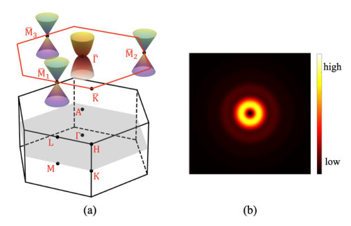 
FIG. 1. (color online) Annular Majorana mode can be realized in the superconducting vortices in topological insulators with 3-fold or 6-fold rotational symmetry. (a) sketches the two conditions for the surface states supporting the annular Majorana mode, i.e. one single nonlinear Dirac cone located at the ¯Γ point or three linear Dirac cones at the three ¯M points in the (001) surface BZ. (b) illustrates the real- space wave function profiles for the annular Majorana mode.

📷 Fig 2

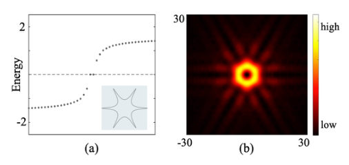 
FIG. 2. (color online) (a) shows the low-energy superconducting vortex bound states in the subspace with lz mod 6 = 0, correspond- ing to the nonlinear surface Dirac cone depicted by hsur f in Eq.(1). The inset illustrates the Fermi surface utilized in the simulations. (b) presents the wave function profiles for the zero-energy mode in (a). In the calculations, the parameters are set to be ˜M = 0, ˜A = 50, ˜B = 45, ∆0 = 1.5, µ = 2 and ξ = 10.

📷 Fig 3

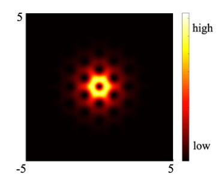 
FIG. 3. (color online) The wave function profiles for the MZM |γ(r)|2 in the superconducting vortex in the condition with three lin- ear surface Dirac cones at the ¯M points. The figure is plotted based on the analytic result in Eq.(9). In the numerical simulation, we take a simple case ∆(r) = ∆0 and set ∆0/ ˜ A = 0.8.

📷 Fig 4

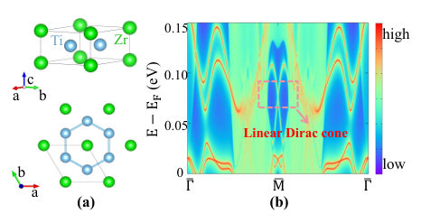 
FIG. 5. (color online) (a) depicts the crystal structure of ZrTi2. (b) shows the surface states of ZrTi2 on the (001) surface, where the surface is terminated at the layer composed of the Ti atoms, showing a linear Dirac cone located at each ¯M point.

📷 Fig 5

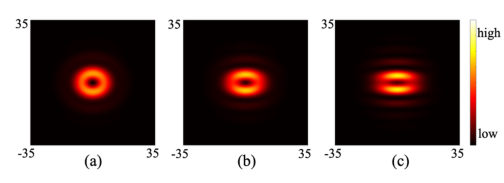 
FIG. 4. (color online) (a)∼(c) show the wave function profiles for the annular Majorana mode for the nonlinear Dirac surface states hsur f in Eq.(1) in the presence of the nematic perturbation hnem in Eq.(10). The figures share the same color bar. In the calculations, we set the nematic perturbations to be ˜D = 2 in (a), ˜D = 5 in (b) and ˜D = 8 in (c). The other parameters are chosen as ˜M = 0, ˜A = 50, ∆0 = 1.5, µ = 2 and ξ = 10.

**Summary.** This work theoretically predicts the existence of an annular Majorana mode within superconducting vortices hosted on topological insulators. The stability of this unique, ring-shaped zero-energy state is linked to specific crystalline symmetries and a total surface state winding number of three. It provides concrete predictions for candidate materials like $\text{ZrTi}_2$ where such exotic topological superconductivity can be realized.

**Why it may be interesting.** The prediction of a robust, geometrically defined zero-energy state (the ring shape) offers a clear, measurable signature that could be sought in advanced STM experiments on superconducting topological materials, connecting topology to observable quantum phenomena.

Detailed structure

**Main problem.** The paper predicts a novel, stable Majorana zero-energy mode characterized by a ring shape (annular) within superconducting vortices in topological insulators.

**Main result.** This annular Majorana mode is stabilized by the rotational symmetry and winding number 3 of the surface states, existing either from a nonlinear Dirac cone at $\bar{\Gamma}$ or three linear cones at $\bar{M}$.

**Method.** The analysis involves solving the Bogoliubov-de Gennes (BdG) Hamiltonian for superconducting vortices and performing symmetry analysis on the resulting bound states.

**Model / system.** The system is a topological insulator surface state made superconducting, specifically requiring 3-fold or 6-fold rotational symmetry. The model considers two cases: a single nonlinear Dirac cone at $\bar{\Gamma}$ or three linear Dirac cones at $\bar{M}$.

**Key observables.** The primary observable is the real-space wave function profile, which is predicted to be ring-shaped (annular), contrasting with exponentially decaying modes.

**Important parameters / regimes.** Rotational symmetry ($3$-fold or $6$-fold); winding number of 3; superconducting gap $\Delta$; and momentum scattering terms ($	ilde{A}, 	ilde{B}$).

**Assumptions / limitations.** The initial analysis assumes the adiabatically reachable condition where a specific coupling term ($	ilde{B}$) is zero, although stability is shown even when finite.

**Figures summary.** Figures illustrate the two physical conditions supporting the annular MZM and show the resulting ring-like wave function profile in real space for the nonlinear Dirac cone case.

**Paper structure.** The paper first establishes the theoretical framework by identifying the necessary symmetry conditions (winding number 3) leading to the annular mode. It then analyzes the two distinct physical scenarios ($\bar{\Gamma}$ vs $\bar{M}$) using effective Hamiltonians and concludes with predictions for candidate materials.

Abstract

When the surface states of a topological insulator becomes superconducting, topological superconductivity can be obtained, and each vortex on the surface can host one single Majorana zero-energy mode which is usually a wave packet decaying exponentially off the vortex core. Here, we predict stable Majorana zero-energy mode whose wave function is ring-shape, dubbed as annular Majorana mode, in the superconducting vortex in topological insulators respecting $3$-fold or $6$-fold rotational symmetry. Such topological insulators are featured with a single nonlinear Dirac cone located at $\barΓ$ or three linear Dirac cones at $\bar{\text{M}}$ in the surface Brillouin zone. The annular Majorana mode originates from the effective chiral $f$-wave superconductivity on the nonlinear Dirac cone in the former case and the interference of the effective chiral $p$-wave superconductivity on the three linear Dirac cones in the latter. In both cases, the annular Majorana mode is stabilized by the rotational symmetry and the winding number $3$ carried by the surface states. Candidate materials supporting the annular Majorana mode are predicted. Our work provides new insights into the topological superconductivity in superconducting topological insulators.

[↑ back to top](#top)

### [Noise-driven pseudovorticity multipoles in self-focusing beams with quintic saturation](http://arxiv.org/abs/2608.06045v1)

**Authors:** Chengbo Zhang, Xiaohui Gao  
**Type:** theory · **Category:** other · **PDF:** <https://arxiv.org/pdf/2608.06045v1>  
**Analysis basis:** full PDF text, analyzed in chunks
**Topic relevance:** `non-equilibrium dynamics` **2/5** · `correlated / nonlocal dissipation` **1/5** · `driven-dissipative phase transition` **1/5** · `interference shaping light` **1/5** · `methods for driven-dissipative` **1/5** · `non-equilibrium universality` **1/5**

📷 Fig 1

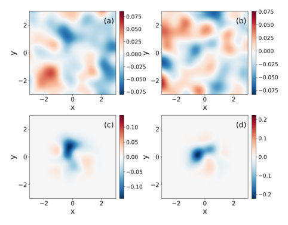 
FIG. 1. Initial simulation conditions with thermal noise cor- relation length σ = 20∆x and RMS amplitude 0.02. (a), (b) Thermal noise field η(x, y) for random seeds 0 and 1, respec- tively. (c), (d) Corresponding initial noisy component ψ0ηA for seeds 0 and 1, respectively.

📷 Fig 2

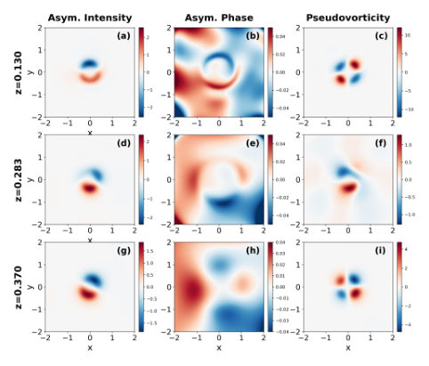 
FIG. 3. Snapshots at focus (z = 0.13), mid-focus (z = 0.283), and second focus (z = 0.37) (rows). Columns: asymmetric intensity (left), asymmetric phase (middle), pseudovorticity (right).

📷 Fig 3

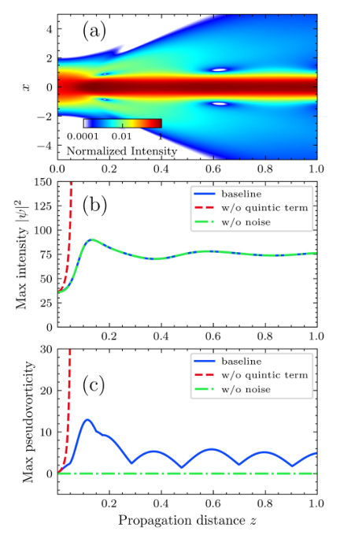 
FIG. 2. Amplitude noise results (σ = 20∆x, RMS 0.02, seed 0). (a) Transverse intensity profile |ψ(x, y = 0)|2 versus z. (b) Maximum intensity and (c) maximum pseudovortic- ity as functions of z. Blue solid: cubic-quintic with noise; red dashed: pure cubic with noise; green dash-dotted: cubic- quintic without noise.

📷 Fig 4

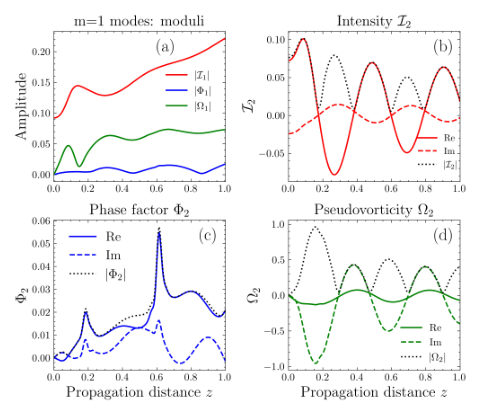 
FIG. 4. (a) Moduli of dipole (m = 1) components. (b)–(d) Real (solid), imaginary (dashed), and modulus (dotted) of quadrupole (m = 2) components for intensity, phase factor, and pseudovorticity.

📷 Fig 5

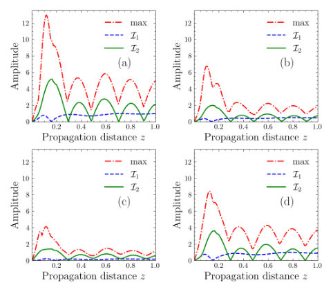 
FIG. 5. Dipole, quadrupole, and peak pseudovorticity versus z for seeds 1–4 (panels (a)–(d)) with amplitude noise σ = 20∆x, RMS 0.02.

**Summary.** The research analyzes the generation of pseudovorticity—a measure of local rotational flow—in self-focusing beams subjected to thermal amplitude and phase noise. By using a cubic-quintic nonlinear model, the authors demonstrate that quintic saturation prevents collapse, trapping noise into persistent, oscillating multipoles. This suggests a novel mechanism for controlling optical torque through careful 'noise engineering'.

**Why it may be interesting.** This work bridges nonlinear wave physics with stochastic processes, showing how engineered noise can stabilize or control complex topological features like pseudovorticity in optical systems, relevant for advanced quantum optics applications.

Detailed structure

**Main problem.** The study investigates how amplitude and phase noise affect pseudovorticity generation in self-focusing Gaussian beams.

**Main result.** Quintic saturation arrests collapse, allowing persistent, oscillating multipolar pseudovorticity patterns to form, suggesting noise can control local optical torque.

**Method.** Numerical simulations using the split-step Fourier method on a 2D grid are employed to solve the cubic-quintic nonlinear Schrödinger equation.

**Model / system.** The system models self-focusing beam dynamics governed by the (2+1)-dimensional cubic-quintic Nonlinear Schrödinger Equation. Noise is introduced via Gaussian white noise added to both amplitude and phase components of the field.

**Key observables.** Pseudovorticity ($\omega$), asymmetric intensity residue, angular modal coefficients ($m=1$ dipole, $m=2$ quadrupole) for intensity, phase, and pseudovorticity.

**Important parameters / regimes.** Noise correlation length ($\sigma$), nonlinearity saturation parameter ($\epsilon$), and propagation distance ($z$).

**Assumptions / limitations.** The analysis relies on the paraxial scalar approximation; the pure cubic case's late-time collapse behavior was limited by spatial resolution.

**Figures summary.** Figures compare intensity, pseudovorticity evolution for noisy vs. clean beams (Fig. 2); Fig. 3 shows spatial snapshots of asymmetric fields and $\omega$; Figs. 4-7 quantify the mode competition dynamics between dipole and quadrupole components under varying noise statistics.

**Paper structure.** The paper establishes the model, defines pseudovorticity, simulates the evolution under noise, analyzes the persistence and oscillation of multipoles using modal decomposition (dipole/quadrupole), and concludes by linking input noise statistics to controllable optical torque.

Abstract

We investigate pseudovorticity generation in Gaussian beams undergoing self-focusing under amplitude and phase noise, using the cubic-quintic nonlinear Schrödinger equation. Pseudovorticity, defined as the curl of the optical momentum flux, characterizes local rotational flow in the absence of phase singularities. Our numerical simulations show that thermal amplitude and phase noise induce a multipolar pseudovorticity pattern. Unlike the pure cubic case, where noise asymmetries are radiated away during collapse, the quintic saturation arrests collapse and traps the noise in the resulting soliton. Hence, pseudovorticity multipoles persist, oscillating at the focusing-refocusing period. These results suggest a potential pathway for controlling local optical torque through noise engineering.

[↑ back to top](#top)

### [Tuning the Optoelectronics of Mixed-Semiconductors through the interplay of Quantum confinement and Stoichiometry Engineering](http://arxiv.org/abs/2608.05890v1)

**Authors:** Kanha Ram Khator, Anupam Manna, Amlandeep Nayak, Pravat Nayek, Prasenjit Mal, Satyaprasad P Senanayak  
**Type:** experiment · **Category:** other · **PDF:** <https://arxiv.org/pdf/2608.05890v1>  
**Analysis basis:** full PDF text, analyzed in chunks
**Topic relevance:** `non-equilibrium dynamics` **2/5** · `analog quantum simulation` **1/5** · `correlated / nonlocal dissipation` **1/5** · `driven-dissipative phase transition` **1/5** · `methods for driven-dissipative` **1/5** · `non-equilibrium universality` **1/5**

📷 Fig 1

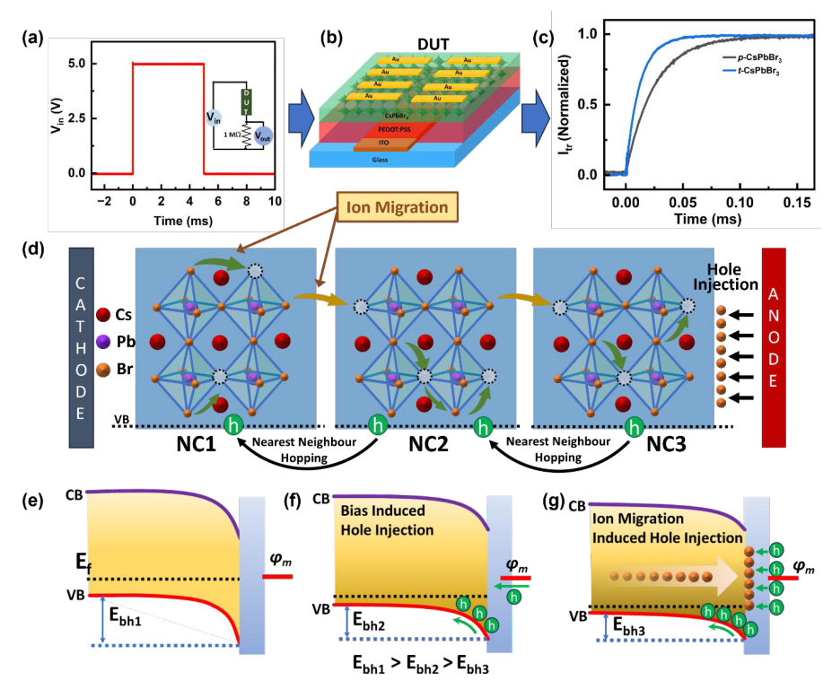 
Figure 1. (a) Input square pulse for the transient current measurements, Inset shows the electrical circuit utilized for the measurement. (b) Schematic illustration of the device structure. (c) Representative Transient current density versus time graph corresponding to the input square pulse. (d) Representation of nearest neighbor hopping and ion migration through a NC array. (e) Band bending due to Ef - anode work function alignment. Ebh1 represents the energy barrier for hole injection (f) upon biasing, holes are injected through the anode, and Ebh1 decreases to a value of Ebh2. (g) Br- accumulates at the anode interface due to ion migration, which enhances hole injection, further...

📷 Fig 2

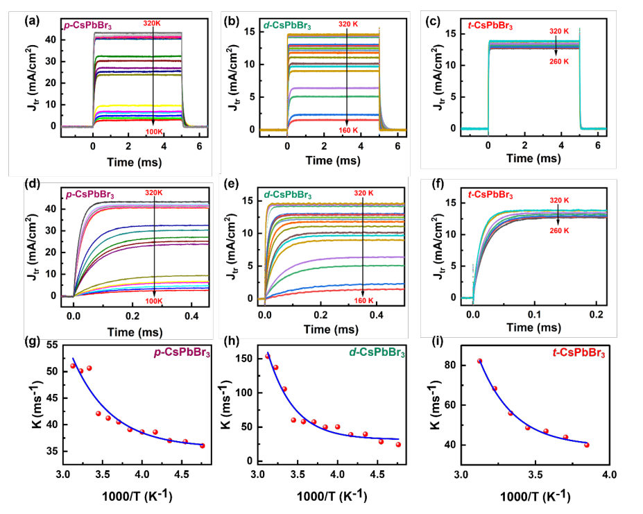 
Figure 2. Temperature-dependent transient current measurement for (a) p-CsPbBr3 (b) d- CsPbBr3 (c) t-CsPbBr3 NCs. (d, e, f) Zoomed in plots highlighting the exponential rise resulting from the intermixing of ion migration and hole transport. K versus 1000/T plot for (g) p-CsPbBr3 (h) d-CsPbBr3 (i) t-CsPbBr3. Symbols are experimentally obtained time constant values, and the solid blue lines indicate the Arrhenius law fit.

📷 Fig 3

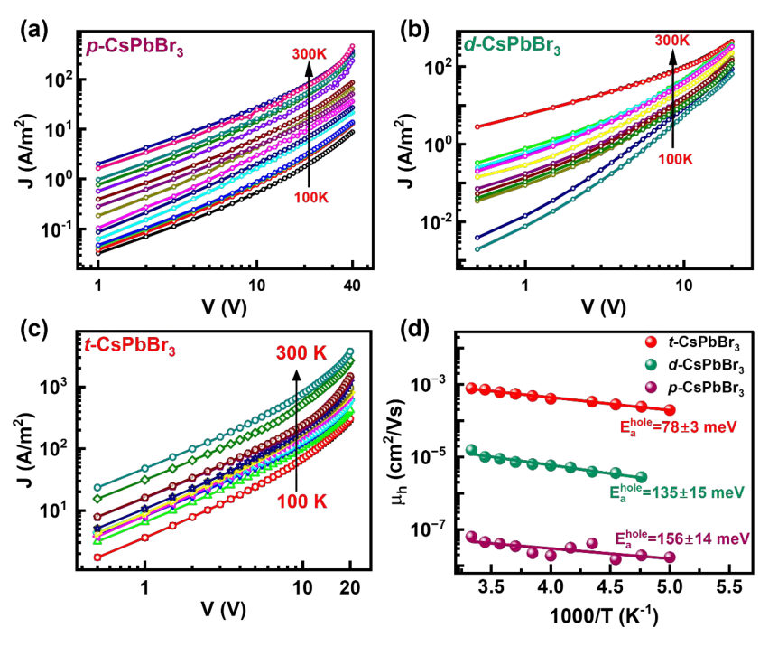 
Figure 3. Temperature-dependent J-V characteristics for (a) p-CsPbBr3 (b) d-CsPbBr3 (c) t- CsPbBr3 NCs. (d) Semi-log plots of µh Versus 1/T for all the NCs along with the respective activation energies.

📷 Fig 4

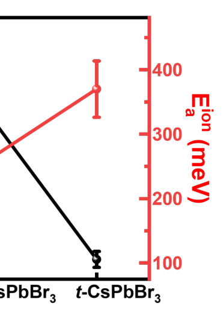 
Figure 4. Comparison of 𝐸𝑎ℎ𝑜𝑙𝑒 and 𝐸𝑎𝑖𝑜𝑛 across all the studied NCs.

**Summary.** This work investigates how nanocrystal size and stoichiometry affect charge transport in $	ext{CsPbBr}_3$ perovskite semiconductors. By decoupling electronic and ionic contributions using transient measurements, the authors show that smaller NCs exhibit superior charge transport properties. This demonstrates that controlled synthesis can optimize device performance by managing both quantum confinement effects and defect-related ion migration.

**Why it may be interesting.** While focused on solid-state optoelectronics, the detailed separation of fast electronic hopping from slower, thermally activated ionic drift provides a model for understanding coupled charge carrier dynamics in complex interfaces, relevant to open quantum systems modeling.

Detailed structure

**Main problem.** The study aims to comprehensively understand size-dependent charge transport by decoupling ionic and electronic transport dynamics in mixed-semiconductor nanocrystals.

**Main result.** Contrary to popular belief, the smallest $	ext{CsPbBr}_3$ NCs exhibit superior charge transport characteristics, evidenced by lower hole activation energy and higher ion migration barriers.

**Method.** The research utilized transient current measurements and space charge limited current (SCLC) analysis on thin films of varying sizes to probe coupled electronic and ionic dynamics.

**Model / system.** The physical system is all-inorganic cesium lead bromide ($	ext{CsPbBr}_3$) nanocrystals synthesized via controlled precursor chemistry, allowing systematic tuning of size and stoichiometry across different phases (p-, t-, d-).

**Key observables.** Time-of-flight mobility ($\mu_{	ext{TOF}}$), hole activation energy ($E_{a	ext{hole}}$), ion migration activation energy ($E_{a	ext{ion}}$), and characteristic time constants ($	au_c$).

**Important parameters / regimes.** NC size (5.6 nm to 11.3 nm), precursor chemistry, quantum confinement regime, and temperature dependence.

**Assumptions / limitations.** The analysis relies on fitting transport data to Arrhenius laws for temperature dependence and using SCLC formalism for high-field electronic measurements.

**Figures summary.** Figures illustrate the measurement setup for transient current pulses, show temperature-dependent transient currents across different NC phases, and present $J$-$V$ characteristics used to determine activation energies for both holes and ions.

**Paper structure.** The paper systematically investigates transport by first establishing the mixed-transport nature using transient measurements, then quantifying electronic mobility via SCLC, and finally characterizing ion dynamics through temperature-dependent analysis to correlate size/stoichiometry with optimal charge transport.

Abstract

All-inorganic cesium lead bromide (CsPbBr3) nanocrystals (NCs) have established themselves as an emerging semiconductor for next-generation optoelectronic technologies due to their unique combination of properties, such as near unity photoluminescence quantum yields, narrow color pure emission, and exceptional defect tolerance. Although size-dependent optical signatures of these NCs are well reported, the complexity of mixed ionic-electronic transport remains largely unexplored. In this study, we provide a comprehensive analysis of size-dependent charge transport by decoupling ionic and electronic transport dynamics through carefully designed transient current and space charge limited current measurements. By employing NCs of different sizes ranging from 5.6 nm to 11.3 nm in thin films, we provide a comprehensive understanding of quantum confinement effects and related synthetic chemistry. Contrary to popular beliefs of quantum confinement and band gap broadening, our results demonstrate that the smallest NCs exhibit the most efficient transport characteristics, evidenced by the lowest activation energy (hole activation energy = 78 meV) for hole transport and the highest barrier for vacancy-mediated ion migration (ion activation energy = 370 meV). This work paves a way forward for perovskite-based efficient quantum devices, by demonstrating that moving into a strong quantum confinement regime, a superior charge transport can be facilitated, when supported by carefully tailored stoichiometry.

[↑ back to top](#top)

### [One-dimensional Dirac modes in the core of a pentagonal topological crystalline insulator nanowire](http://arxiv.org/abs/2608.05908v1)

**Authors:** Saeed Samadi, Rafał Rechciński, Marta A. Chabowska, Ryszard Buczko  
**Type:** theory · **Category:** other · **PDF:** <https://arxiv.org/pdf/2608.05908v1>  
**Analysis basis:** full PDF text, analyzed in chunks
**Topic relevance:** `analog quantum simulation` **1/5** · `driven-dissipative phase transition` **1/5** · `methods for driven-dissipative` **1/5**

📷 Fig 1

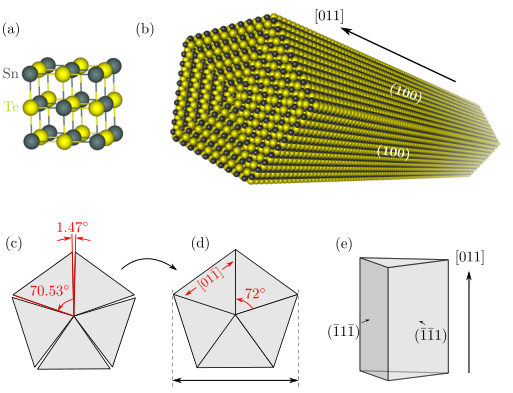 
FIG. 1. Geometry of the pentagonal IV–VI NW. (a) Rocksalt crys- tal structure. (b) Fivefold-twinned NW grown along the [011] di- rection, composed of five wedge-shaped rocksalt domains separated by radial {111} TPs and terminated by five {100} outer facets. The TPs are either all cationic or all anionic and meet along the NW axis. (c) Cross section formed from undistorted domain wedges, for which the crystallographic angle between neighboring {111} planes is 70.53◦, leaving an angular deficit of 1.47◦per domain. (d) Reg- ular pentagonal cross section obtained by deforming each wedge to an opening angle of 72◦. (e) Side view of one trigonal-prismatic domain.

📷 Fig 2

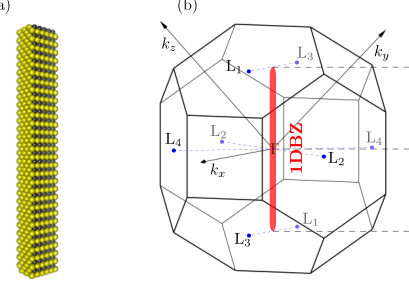 
FIG. 2. Reciprocal-space geometry of the pentagonal NW. (a) Perspective view of one trigonal-prismatic domain along the NW growth direction. (b) Three-dimensional fcc Brillouin zone and the one-dimensional Brillouin zone associated with translation along [011]. For each domain, the four bulk L points project pairwise onto Γ at the center and Z at the boundary of the one-dimensional Brillouin zone. The five rotated domains share the same axial Bril- louin zone.

📷 Fig 3

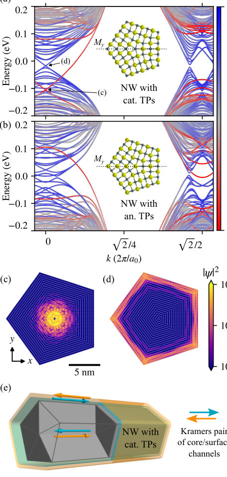 
FIG. 3. Band structures and wave-function localization in pentagonal SnTe NWs. Panels (a) and (b) show the spectra of 14 nm-thick (20-ring) NWs with cationic and anionic TPs, respectively; the inset schematics illustrate the corresponding three-ring structures for clarity. Red and blue color intensi- ties indicate wave-function weight near the core and the outer surface. In panel (b), a local onsite-energy shift of 40 meV is applied to orbitals within 1 nm of the NW axis to move a topologically trivial core-localized subband away from the small surface gap; the unshifted spectrum is not shown. Pan- els (c) and (d) show the probability densities of the core- and surface-localized states...

📷 Fig 4

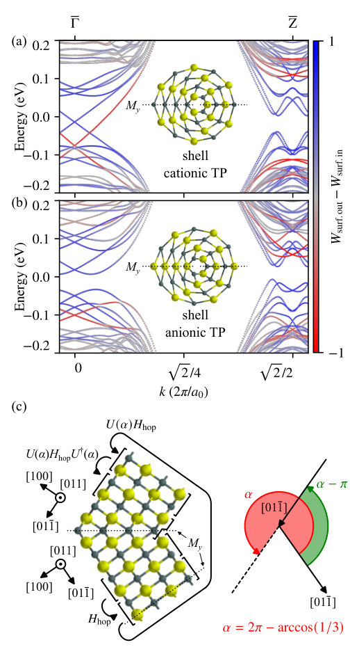 
FIG. 4. Band structures of cylindrical SnTe shells containing a single (a) cationic and (b) anionic TP. The calculated shells are 18 atomic layers thick and contain 40 atoms around the outer circumference. Red and blue color intensities indicate wave-function weight near the inner and outer surfaces, re- spectively. The inset schematics show four-layer shells with 12 atoms around the outer circumference; the twisted peri- odic boundary is represented by bending each shell into its closed form to make the common My mirror plane explicit. Panel (c) illustrates the construction of the twisted boundary condition using a four-layer shell with 14 atoms around the outer circumference.

📷 Fig 5

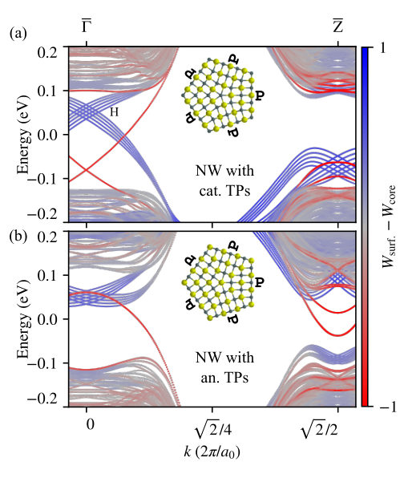 
FIG. 5. Band structures of pentagonal SnTe NWs after apply- ing time-reversal-preserving perturbations to the outermost atomic layers. Panels (a) and (b) correspond to NWs with cationic and anionic TPs, respectively. The inset schematics indicate the perturbed surface regions, with P denoting per- turbations that break the vertical My mirror symmetries of the NW in the surface region.

**Summary.** This work theoretically examines pentagonal topological crystalline insulator nanowires, predicting the existence of two spatially separated helical Dirac crossings—one localized in the core and one on the outer surface. These crossings appear only when the twin planes are cationic and the bulk band structure is inverted. The findings establish these specific nanowire geometries as a promising platform for realizing distinct boundary-bound topological states.

**Why it may be interesting.** While focused on solid-state topology, the concept of spatially separated boundary modes (core vs. surface) is analogous to engineered quantum systems where confinement dictates distinct physical behaviors at different spatial locations.

Detailed structure

**Main problem.** The study investigates the electronic band topology of pentagonal topological crystalline insulator (TCI) nanowires, aiming to identify spatially separated helical Dirac crossings.

**Main result.** When the twin planes are cationic and bulk band inversion occurs, two distinct helical Dirac crossings—one at the core and one on the outer surface—are predicted. This establishes these structures as an accessible platform for realizing such separated topological channels.

**Method.** The research employs tight-binding (TB) calculations, supplemented by low-energy k·p theory, to model the electronic band structure of the nanowires.

**Model / system.** The system is a pentagonal IV–VI semiconductor nanowire (e.g., SnTe-class), characterized by five radial {111} twin planes meeting at the axis. The analysis compares results based on whether these twin planes are cationic or anionic.

**Key observables.** Electronic band structure, presence/absence of Dirac crossings, and wave function localization (core vs. surface).

**Important parameters / regimes.** Cationic vs. anionic composition of the twin planes; nanowire thickness ($\ge 50$ nm for predictions); bulk band inversion.

**Assumptions / limitations.** The calculations neglect axial strain from transverse deformation and use idealized core structures, which may not reflect true relaxation states.

**Figures summary.** Figures illustrate band structures showing the emergence of core/surface Dirac crossings (Fig. 3) and demonstrate that these crossings can arise even when considering only a single cationic twin plane shell (Fig. 4).

**Paper structure.** The paper progresses by first establishing the theoretical framework using TB models, then analyzing the spectral consequences based on the sublattice composition of the twin planes, and finally discussing structural stability via binding energy calculations.

Abstract

We investigate the electronic band topology of recently fabricated pentagonal IV-VI semiconductor nanowires, which contain five radial $\{111\}$ twin planes meeting at the nanowire axis. Tight-binding calculations show that, when the bulk band structure is inverted and the twin planes in the nanowire are cationic, the spectrum contains two spatially separated helical Dirac crossings near $\overlineΓ$: one localized at the core and the other at the outer surface. When the twin planes are anionic, the corresponding spectra remain gapped. The crossings originate from the hybridization of five helical channels associated with the twin-plane edges, whose odd number leaves one Kramers pair near the nanowire axis and the other at the outer boundary. Realistic multiorbital calculations for $\mathrm{Pb}_{0.4}\mathrm{Sn}_{0.6}\mathrm{Te}$ predict well-developed core and surface modes at nanowire thicknesses of approximately 50~nm and above. These results establish pentagonal SnTe-class nanowires as an experimentally accessible realization of spatially separated helical channels bound to the axial defect and the outer boundary.

[↑ back to top](#top)

### [Topological Charge-Transfer Excitons](http://arxiv.org/abs/2608.05308v1)

**Authors:** Huiyuan Zheng, Kaijie Yang, Ting Cao, Di Xiao  
**Type:** theory · **Category:** strongly correlated electrons · **PDF:** <https://arxiv.org/pdf/2608.05308v1>  
**Analysis basis:** full PDF text, analyzed in chunks
**Topic relevance:** `analog quantum simulation` **1/5** · `correlated cavity matter` **1/5** · `driven-dissipative phase transition` **1/5**

📷 Fig 1

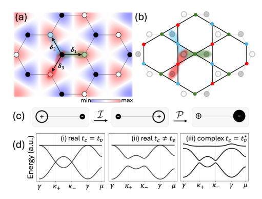 
FIG. 1. (a) Schematic electron-hole distribution, with the electron (hole) denoted by a black (hollow) dot. δj=1,2,3 are the three relative coordinates of the electron-hole pair. The background color represents the trapping potential V (r). (b) Schematic Kagome lattice of CT excitons. Green, blue, and red denote the three inequivalent orbitals. The marker at each bond center is a schematic label for the symmetry cen- ter of the corresponding electron–hole bond configuration. (c) Schematic CT exciton under a PI transformation. The elec- tron (hole) is denoted by a solid (hollow) circle with nega- tive (positive) charge. We use different circle sizes to illus- trate asymmetric electronic...

📷 Fig 2

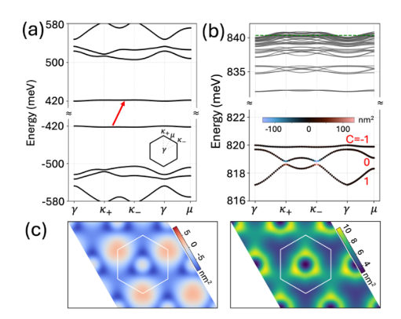 
FIG. 2. (a) Single-particle dispersion from Hamiltonian (2). The red arrow denotes excitation from the valence band to the conduction band. The calculation uses a 5 nm lattice constant, an intrinsic gap ∆g = 1eV, and a Fermi veloc- ity vF = 3.3 × 105m/s. (b) Exciton dispersion showing the lowest 50 BSE bands. The colors of the three lowest bands encode the exciton Berry curvature, with their Chern num- bers marked in red. The green dashed line marks the single- particle gap. (c) Momentum-space distributions of the exci- ton Berry curvature (left) and quantum metric trace (right) for the exciton flat (third lowest) band in (b). The white hon- eycomb outlines the BZ.

📷 Fig 3

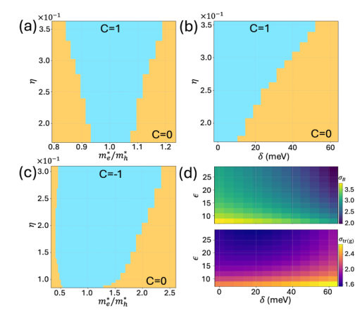 
FIG. 3. (a) Topological phase diagram of the lowest exciton band as a function of the mass asymmetry m∗ e/m∗ h and flux η. (b) Topological phase diagram of the lowest exciton band as a function of the potential difference δ = 6∆| cos(φ)| and flux η. (c) Topological phase diagram of the exciton flat band as a function of the mass asymmetry m∗ e/m∗ h and flux η. (d) Standard deviations of the exciton Berry curvature (upper) and quantum metric trace (lower) of the exciton flat band as a function of the potential difference δ and dielectric constant ϵ.

📷 Fig 4

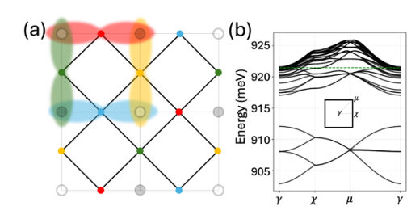 
FIG. 4. (a) Schematic depleted-Lieb lattice of CT excitons formed from a square lattice of electrons (solid dots) and holes (hollow dots). (b) BSE spectrum of the lowest 50 exciton bands for the model in (a). The green dashed line marks the single-particle gap.

**Summary.** This work demonstrates that the internal structure of charge-transfer excitons can intrinsically generate topological band structures. By modeling these excitons on a Kagome lattice derived from off-site orbitals, the authors show that breaking time-reversal symmetry induces a robust topological flat band. This establishes a general theoretical pathway for engineering exotic correlated bosonic phases in condensed matter systems.

**Why it may be interesting.** The concept of emergent topology in composite bound states, like excitons, provides an alternative route to realizing topological phases compared to engineering topology directly into single-particle bands, which is highly relevant for designing novel quantum materials and light-matter interactions.

Detailed structure

**Main problem.** To establish a microscopic origin for exciton topology arising from the internal structure of bound states, specifically using charge-transfer (CT) excitons where electron and hole are laterally separated.

**Main result.** The emergent multi-orbital manifold supports a topological exciton flat band upon time-reversal symmetry breaking, even when the constituent electron and hole bands are topologically trivial.

**Method.** Solving the Bethe-Salpeter equation (BSE) and analyzing the system's response to various symmetries ($	ext{T}$, $	ext{PI}$).

**Model / system.** The study uses CT excitons in a honeycomb lattice, which form an intrinsic manifold of symmetry-related off-site composite orbitals that mimic a Kagome lattice structure.

**Key observables.** Exciton band structure, topological nature (Chern numbers) of the resulting flat band, and exciton quantum geometry (Berry curvature).

**Important parameters / regimes.** Hopping amplitudes ($t_c, t_v$), potential strength ($\Delta$), mass asymmetry ($m_e^*/m_h^*$), and symmetry breaking parameters ($\eta$).

**Assumptions / limitations.** The analysis relies on the exciton structure arising from off-site orbitals rather than constituent bands; approximations include neglecting exchange interaction initially.

**Figures summary.** Figures illustrate schematic electron-hole distributions, the resulting Kagome lattice of CT excitons, and the calculated band dispersions under various symmetry breaking conditions.

**Paper structure.** The paper progresses from defining the physical problem (CT exciton topology) to deriving an effective Hamiltonian on a Kagome manifold. It then uses continuum models and BSE calculations to analyze how $	ext{T}$ and $	ext{PI}$ symmetry breaking dictates the topological properties of the resulting flat band.

Abstract

Excitons possess internal structure absent from single-particle Bloch particles, allowing their band topology to emerge from the bound-state structure rather than being inherited from their constituents. This raises the question of how the internal structure of a bound state can provide a microscopic origin of exciton topology. Here we show that the real-space embedding of charge-transfer excitons can generate an intrinsic manifold of symmetry-related off-site composite orbitals whose coupling supports topological exciton bands. Lateral electron-hole separation embeds the localized exciton on the bond connecting its constituent sites rather than on either site. We demonstrate this mechanism in a honeycomb lattice, where three bond-centered charge-transfer exciton orbitals form a Kagome lattice. By solving the Bethe-Salpeter equation, we show that this emergent multi-orbital manifold supports a topological exciton flat band upon time-reversal symmetry breaking, even when the electron and hole bands are topologically trivial. The resulting band exhibits nearly uniformly distributed quantum geometry, favorable for interaction-driven bosonic states. Our results establish a general route toward topological bands of localized composite bound states and unconventional strongly correlated bosonic phases.

[↑ back to top](#top)

### [Interface Engineering of Helium Confinement in Argon-Preplated MCM-41 Nanopores](http://arxiv.org/abs/2608.05603v1)

**Authors:** Rahul Soni, Nathan S. Nichols, Sutirtha Paul, Garfield Warren, Paul Sokol, Adrian Del Maestro  
**Type:** both · **Category:** statistical mechanics · **PDF:** <https://arxiv.org/pdf/2608.05603v1>  
**Analysis basis:** full PDF text, analyzed in chunks
**Topic relevance:** `methods for driven-dissipative` **1/5**

📷 Fig 1

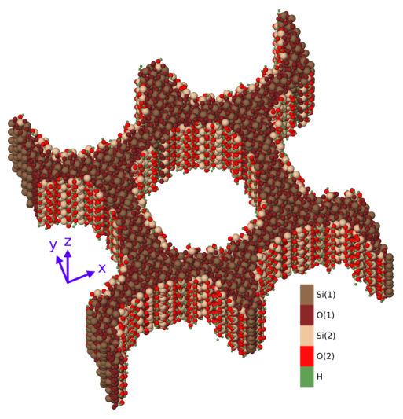 
FIG. 1. Perspective view of the atomistic MCM-41 supercell used in this work composed of 2 × 1 × 5 primitive cells form- ing a nearly cylindrical pore extended along the z-direction. The legend indicates the different atom types in the MCM-41 structure (see text for discussion).

📷 Fig 2

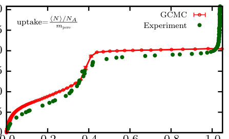 
FIG. 2. Adsorption isotherm of argon inside a MCM-41 nanopore measured via experiment at T = 90 K compared with grand canonical Monte Carlo. Pressures have been scaled to the monolayer filling inflection point and we find P0 = 2.6 bar.

📷 Fig 3

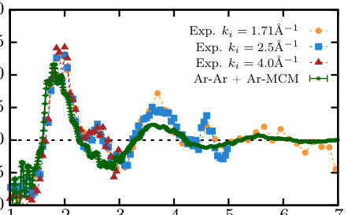 
FIG. 5. Static structure factor obtained from powder av- eraged Debye formula (in green). The experimental data is obtained from neutron scattering measurements for different incident wavevectors ki = 1.71, 2.5, and 4.0 ˚A −1

📷 Fig 4

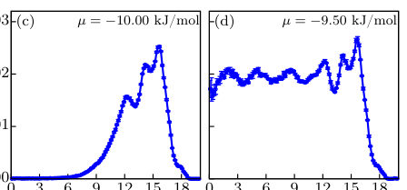 
FIG. 3. The radial density profile of argon inside the MCM- 41 pore at four different chemical potentials corresponding to scaled pressures P/P0 = [0.0015, 0.0453, 0.3148, 0.6140]. Panel (a) is in the low-coverage regime, where argon pref- erentially adsorbs in the crevasses of the MCM wall. Panel (b) shows the formation of a well-defined monolayer regime. Panel (c) corresponds to the multilayer adsorption regime prior to the sharp adsorption jump. Panel (d) is taken just beyond the jump and shows that the pore has become essen- tially filled with bulk-like argon.

📷 Fig 5

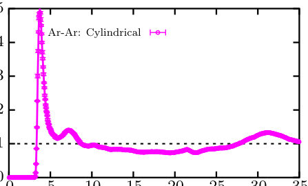 
FIG. 4. Cylinder corrected Ar-Ar pair correlation function g(r) for the adsorbed monolayer. The sharp first peak depicts the nearest neighbor correlations within the monolayer, the weaker second peak demonstrates the second nearest neighbor correlations, whereas the broader peak at r ≃31.3 ˚A reflects the diametric correlations across the cylindrical pore.

**Summary.** This work demonstrates that atomic preplating of MCM-41 nanopores with argon can systematically engineer the pore's internal surface chemistry. By combining extensive simulation techniques (GCMC, MD) with experimental data analysis, the authors derive a smooth, quantifiable confinement potential for helium atoms. This provides crucial microscopic input for theoretical studies of quantum fluids in porous media.

**Why it may be interesting.** It provides a rigorous, atomistically derived microscopic potential for quantum fluids in confined geometries, directly validating continuum models used in advanced quantum simulations.

Detailed structure

**Main problem.** The study aims to understand how modifying mesopore interfaces via preplating affects the microscopic confinement potential experienced by adsorbed quantum fluids like helium.

**Main result.** Preplating MCM-41 with argon modifies the pore interface, resulting in a smooth radial confinement potential that can be accurately described by continuum models for confined helium.

**Method.** The research combines grand-canonical Monte Carlo simulations of argon adsorption, low-temperature molecular dynamics, and helium test-particle insertion calculations.

**Model / system.** The physical system is MCM-41 mesoporous silica nanopores. Interactions are modeled using Lennard-Jones potentials, and the confinement potential for He is derived by simulating Ar adsorption first.

**Key observables.** Helium adsorption minimum location (annular region), radial confinement potential $U(r)$, argon adsorption isotherms, and structure factors $S(q)$.

**Important parameters / regimes.** Simulation temperatures ($90 	ext{ K}$, $4 	ext{ K}$), chemical potentials ($\mu$), pore radius ($	ext{R}_{	ext{pore}} = 20 \mathring{	ext{A}}$).

**Assumptions / limitations.** The primary assumption is that the argon preplating screens enough roughness to allow the confinement potential to be approximated by a smooth, continuum cylindrical model.

**Figures summary.** Figures compare simulated and experimental adsorption isotherms for argon; other figures detail structural profiles (density/pair-correlation) and derivatives used to determine monolayer completion points.

**Paper structure.** The paper follows a progression from characterizing the Ar adsorption process (GCMC, structure factor), determining interface modification details (occupancy curves, $\mu_{	ext{mono}}$), and finally applying these results to calculate and validate the He confinement potential using test-particle insertion and Gaussian Process regression.

Abstract

Atomic-scale modification of mesopore interfaces provides a route to tune the confinement experienced by adsorbed fluids, but how a specific interface preparation translates into the resulting microscopic confinement potential remains unclear. Here, we show that preplating MCM-41 with an argon monolayer modifies the effective pore interface by occupying strongly attractive regions of the heterogeneous silica surface and screening its atomic-scale corrugation. Grand-canonical Monte Carlo simulations of argon adsorption, low-temperature molecular dynamics, and helium test-particle insertion are combined with adsorption isotherms and neutron-scattering measurements to characterize the preplated pore at the atomic scale. Helium test-particle insertion calculations show that the modified interface shifts the helium adsorption minimum to an annular region inside the pore and produces a confinement landscape dominated by a smooth radial component. The resulting radial confinement potential can be described by a continuum cylindrical model, providing microscopic support for the effective potential used in earlier quantum Monte Carlo studies. Residual corrugation persists over multiple spatial scales and is accurately captured by a Gaussian process surrogate. These results demonstrate how atomic preplating can tailor nanopore confinement and provide an experimentally constrained microscopic potential for predictive studies of confined quantum fluids.

[↑ back to top](#top)
