
# arxiv digest (quant-ph + cond-mat) — 2026-08-11

*97 papers · 32 relevant · 2 highlighted*

## 🔥 Most relevant (32)

*Every paper with at least one nonzero topic score, sorted by best-matching score. 🔥 marks scores ≥4/5. Click the title to jump to the full entry below; click [arXiv] to open the paper page. `(secondary)` marks papers from de-prioritized cond-mat archives.*

Show 32 relevant papers

- [Crossing over universal scaling laws in two-dimensional driven dissipative condensates](#paper-2608.07242) [[arXiv]](http://arxiv.org/abs/2608.07242v1) — 🔥 `non-equilibrium universality` **5/5** · 🔥 `analog quantum simulation` **4/5** · 🔥 `driven-dissipative phase transition` **4/5** · `correlated / nonlocal dissipation` **3/5** · `correlated cavity matter` **3/5** · `non-equilibrium dynamics` **3/5** · `methods for driven-dissipative` **2/5** · `quantum optics experiment` **2/5** · `Frenkel-Kontorova` **1/5** · `Keldysh / 2PI / non-Gaussian methods` **1/5** · `Tavis-Cummings & cavity-many-emitter` **1/5** · `entanglement & information structure` **1/5**
- [Anderson Orthogonality as Measurement Backaction in Coupled Quantum Dots](#paper-2608.06550) [[arXiv]](http://arxiv.org/abs/2608.06550v1) `(secondary)` — 🔥 `quantum measurements` **5/5** · 🔥 `Kondo & dissipative impurity` **4/5** · 🔥 `measurement-induced transitions` **4/5** · `correlated / nonlocal dissipation` **3/5** · `driven-dissipative phase transition` **3/5** · `methods for driven-dissipative` **3/5** · `non-equilibrium dynamics` **2/5** · `non-equilibrium universality` **2/5** · `Keldysh / 2PI / non-Gaussian methods` **1/5** · `analog quantum simulation` **1/5** · `entanglement & information structure` **1/5**
- [Entanglement-enhanced optical magnetometry beyond the standard quantum limit](#paper-2608.06815) [[arXiv]](http://arxiv.org/abs/2608.06815v1) — 🔥 `quantum measurements` **5/5** · 🔥 `measurement-induced transitions` **4/5** · `quantum optics experiment` **3/5** · `spintronics-quantum-optics interface` **3/5** · `correlated / nonlocal dissipation` **2/5** · `entanglement & information structure` **2/5** · `exotic spin models in light-matter` **2/5** · `Keldysh / 2PI / non-Gaussian methods` **1/5** · `QC/QI experiment` **1/5** · `analog quantum simulation` **1/5** · `driven-dissipative phase transition` **1/5** · `interference shaping light` **1/5** · `methods for driven-dissipative` **1/5** · `non-equilibrium dynamics` **1/5**
- ⭐ [Exploring the Relaxation Landscape of a 2D Quantum Magnet on a 256-Qubit Processor](#paper-2608.07178) [[arXiv]](http://arxiv.org/abs/2608.07178v1) — 🔥 `scars & prethermalization` **5/5** · 🔥 `analog quantum simulation` **4/5** · 🔥 `non-equilibrium dynamics` **4/5** · `Rydberg arrays` **3/5** · `exotic spin models in light-matter` **3/5** · `non-equilibrium universality` **3/5** · `methods for driven-dissipative` **2/5** · `Keldysh / 2PI / non-Gaussian methods` **1/5** · `driven-dissipative phase transition` **1/5** · `entanglement & information structure` **1/5**
- [Many-Body Localization Induced by Correlated Disorder in Interacting Superconducting Qubits](#paper-2608.07149) [[arXiv]](http://arxiv.org/abs/2608.07149v1) — 🔥 `entanglement & information structure` **5/5** · 🔥 `analog quantum simulation` **4/5** · `methods for driven-dissipative` **3/5** · `QC/QI experiment` **2/5** · `non-equilibrium dynamics` **2/5** · `correlated / nonlocal dissipation` **1/5** · `driven-dissipative phase transition` **1/5** · `exotic spin models in light-matter` **1/5** · `non-equilibrium universality` **1/5** · `scars & prethermalization` **1/5**
- [Multimode phonon-mediated enhancement of entanglement and competing synchronization in cavity magnomechanics](#paper-2608.07034) [[arXiv]](http://arxiv.org/abs/2608.07034v1) — 🔥 `entanglement & information structure` **4/5** · 🔥 `spintronics-quantum-optics interface` **4/5** · `analog quantum simulation` **3/5** · `correlated / nonlocal dissipation` **3/5** · `correlated cavity matter` **3/5** · `driven-dissipative phase transition` **3/5** · `exotic spin models in light-matter` **3/5** · `methods for driven-dissipative` **3/5** · `non-equilibrium dynamics` **3/5** · `Tavis-Cummings & cavity-many-emitter` **2/5** · `non-equilibrium universality` **2/5** · `Keldysh / 2PI / non-Gaussian methods` **1/5** · `quantum optics experiment` **1/5**
- [Improving quantum-battery charging via unidirectional quantum jumps to metastable state](#paper-2608.06479) [[arXiv]](http://arxiv.org/abs/2608.06479v1) — 🔥 `methods for driven-dissipative` **4/5** · `Tavis-Cummings & cavity-many-emitter` **3/5** · `correlated cavity matter` **3/5** · `driven-dissipative phase transition` **3/5** · `non-equilibrium dynamics` **3/5** · `Keldysh / 2PI / non-Gaussian methods` **2/5** · `correlated / nonlocal dissipation` **2/5** · `non-equilibrium universality` **2/5** · `Kondo & dissipative impurity` **1/5** · `analog quantum simulation` **1/5** · `measurement-induced transitions` **1/5** · `quantum measurements` **1/5**
- [Many-Body Mobility Edge and Non-Hermitian Skin Effect in an Interacting Quasi-Periodic Spin Chain](#paper-2608.07083) [[arXiv]](http://arxiv.org/abs/2608.07083v1) — 🔥 `analog quantum simulation` **4/5** · 🔥 `methods for driven-dissipative` **4/5** · `driven-dissipative phase transition` **3/5** · `exotic spin models in light-matter` **3/5** · `correlated / nonlocal dissipation` **2/5** · `entanglement & information structure` **2/5** · `non-equilibrium dynamics` **2/5** · `non-equilibrium universality` **2/5** · `Frenkel-Kontorova` **1/5** · `Keldysh / 2PI / non-Gaussian methods` **1/5** · `Kondo & dissipative impurity` **1/5**
- [Observation of far-from-equilibrium scaling in the transient dynamics of 2D quantum magnets](#paper-2608.07211) [[arXiv]](http://arxiv.org/abs/2608.07211v1) — 🔥 `analog quantum simulation` **4/5** · 🔥 `non-equilibrium dynamics` **4/5** · 🔥 `non-equilibrium universality` **4/5** · `Rydberg arrays` **3/5** · `exotic spin models in light-matter` **3/5** · `methods for driven-dissipative` **3/5** · `Keldysh / 2PI / non-Gaussian methods` **1/5** · `correlated / nonlocal dissipation` **1/5** · `driven-dissipative phase transition` **1/5** · `entanglement & information structure` **1/5**
- [KPZ Superdiffusion of Local Correlators in Diffusive Random Quantum Circuits](#paper-2608.06459) [[arXiv]](http://arxiv.org/abs/2608.06459v1) — 🔥 `non-equilibrium universality` **4/5** · `analog quantum simulation` **3/5** · `correlated / nonlocal dissipation` **3/5** · `driven-dissipative phase transition` **3/5** · `methods for driven-dissipative` **3/5** · `non-equilibrium dynamics` **3/5** · `Keldysh / 2PI / non-Gaussian methods` **2/5** · `Kondo & dissipative impurity` **1/5** · `entanglement & information structure` **1/5** · `scars & prethermalization` **1/5**
- [Theory of Deterministic Photon-Loss Subspaces for Quantum Interferences](#paper-2608.07253) [[arXiv]](http://arxiv.org/abs/2608.07253v1) — 🔥 `methods for driven-dissipative` **4/5** · `correlated / nonlocal dissipation` **3/5** · `driven-dissipative phase transition` **3/5** · `interference shaping light` **3/5** · `non-equilibrium dynamics` **2/5** · `non-equilibrium universality` **2/5** · `Keldysh / 2PI / non-Gaussian methods` **1/5** · `analog quantum simulation` **1/5** · `entanglement & information structure` **1/5** · `measurement-induced transitions` **1/5** · `quantum measurements` **1/5**
- [Entanglement Mpemba Effect](#paper-2608.07465) [[arXiv]](http://arxiv.org/abs/2608.07465v1) — 🔥 `entanglement & information structure` **4/5** · `correlated / nonlocal dissipation` **3/5** · `driven-dissipative phase transition` **3/5** · `methods for driven-dissipative` **3/5** · `non-equilibrium dynamics` **3/5** · `non-equilibrium universality` **2/5** · `Keldysh / 2PI / non-Gaussian methods` **1/5** · `analog quantum simulation` **1/5** · `scars & prethermalization` **1/5**
- [Spin Qubits in Photon-Coupled Microwave Cavities](#paper-2608.06859) [[arXiv]](http://arxiv.org/abs/2608.06859v1) — 🔥 `spintronics-quantum-optics interface` **4/5** · `Tavis-Cummings & cavity-many-emitter` **3/5** · `correlated cavity matter` **3/5** · `Keldysh / 2PI / non-Gaussian methods` **2/5** · `QC/QI experiment` **2/5** · `methods for driven-dissipative` **2/5** · `analog quantum simulation` **1/5** · `correlated / nonlocal dissipation` **1/5** · `driven-dissipative phase transition` **1/5** · `exotic spin models in light-matter` **1/5** · `non-equilibrium dynamics` **1/5**
- [Matrix Product State Theory of Few-Photon Squeezed Pulses Interacting with a Two-Level Emitter in a Waveguide](#paper-2608.06590) [[arXiv]](http://arxiv.org/abs/2608.06590v1) — 🔥 `methods for driven-dissipative` **4/5** · `interference shaping light` **3/5** · `analog quantum simulation` **2/5** · `correlated / nonlocal dissipation` **2/5** · `non-equilibrium dynamics` **2/5** · `Keldysh / 2PI / non-Gaussian methods` **1/5** · `Tavis-Cummings & cavity-many-emitter` **1/5** · `correlated cavity matter` **1/5** · `driven-dissipative phase transition` **1/5** · `entanglement & information structure` **1/5** · `quantum optics experiment` **1/5**
- ⭐ [Single-qubit detection by collective phase imprinting](#paper-2608.06970) [[arXiv]](http://arxiv.org/abs/2608.06970v1) — 🔥 `Rydberg arrays` **4/5** · `QC/QI experiment` **3/5** · `quantum measurements` **3/5** · `analog quantum simulation` **2/5** · `measurement-induced transitions` **2/5** · `correlated / nonlocal dissipation` **1/5** · `entanglement & information structure` **1/5** · `interference shaping light` **1/5** · `non-equilibrium dynamics` **1/5**
- [Floquet spintronics: tuning the current-induced spin polarization of topological surface states with light](#paper-2608.06786) [[arXiv]](http://arxiv.org/abs/2608.06786v1) — 🔥 `spintronics-quantum-optics interface` **4/5** · `exotic spin models in light-matter` **3/5** · `non-equilibrium dynamics` **3/5** · `methods for driven-dissipative` **2/5** · `non-equilibrium universality` **2/5** · `Keldysh / 2PI / non-Gaussian methods` **1/5** · `analog quantum simulation` **1/5** · `driven-dissipative phase transition` **1/5**
- [Generalized Loschmidt echoes associated with operational quantum non-Markovianity](#paper-2608.06567) [[arXiv]](http://arxiv.org/abs/2608.06567v1) — 🔥 `quantum measurements` **4/5** · `measurement-induced transitions` **3/5** · `methods for driven-dissipative` **3/5** · `correlated / nonlocal dissipation` **2/5** · `non-equilibrium dynamics` **2/5** · `Keldysh / 2PI / non-Gaussian methods` **1/5** · `driven-dissipative phase transition` **1/5** · `entanglement & information structure` **1/5**
- [Interaction Creates Dynamical AI Behavior Absent in Isolation](#paper-2608.07457) [[arXiv]](http://arxiv.org/abs/2608.07457v1) — 🔥 `non-equilibrium dynamics` **4/5** · `driven-dissipative phase transition` **3/5** · `methods for driven-dissipative` **3/5** · `non-equilibrium universality` **3/5** · `Keldysh / 2PI / non-Gaussian methods` **1/5** · `correlated / nonlocal dissipation` **1/5** · `entanglement & information structure` **1/5** · `scars & prethermalization` **1/5**
- [Out-of-equilibrium spin-valley dynamics of ferromagnets in topological Chern bands](#paper-2608.07041) [[arXiv]](http://arxiv.org/abs/2608.07041v1) — 🔥 `non-equilibrium dynamics` **4/5** · `exotic spin models in light-matter` **3/5** · `spintronics-quantum-optics interface` **3/5** · `driven-dissipative phase transition` **2/5** · `analog quantum simulation` **1/5** · `correlated / nonlocal dissipation` **1/5** · `methods for driven-dissipative` **1/5** · `non-equilibrium universality` **1/5**
- [An ionic clock qubit inside a circular Rydberg atom](#paper-2608.06988) [[arXiv]](http://arxiv.org/abs/2608.06988v1) — 🔥 `QC/QI experiment` **4/5** · 🔥 `analog quantum simulation` **4/5** · `Rydberg arrays` **3/5** · `quantum measurements` **2/5** · `entanglement & information structure` **1/5** · `non-equilibrium dynamics` **1/5**
- [Phase-Noise-Induced Heating in Optical Lattices](#paper-2608.07442) [[arXiv]](http://arxiv.org/abs/2608.07442v1) — 🔥 `analog quantum simulation` **4/5** · `quantum measurements` **2/5** · `quantum optics experiment` **2/5** · `Keldysh / 2PI / non-Gaussian methods` **1/5** · `correlated / nonlocal dissipation` **1/5** · `driven-dissipative phase transition` **1/5** · `interference shaping light` **1/5** · `methods for driven-dissipative` **1/5** · `non-equilibrium dynamics` **1/5**
- [Tunable g-Factors of Hybridized Orbitals in a Quantum Dot Molecule](#paper-2608.06647) [[arXiv]](http://arxiv.org/abs/2608.06647v1) `(secondary)` — 🔥 `QC/QI experiment` **4/5** · `spintronics-quantum-optics interface` **3/5** · `analog quantum simulation` **2/5** · `Keldysh / 2PI / non-Gaussian methods` **1/5** · `driven-dissipative phase transition` **1/5** · `entanglement & information structure` **1/5** · `exotic spin models in light-matter` **1/5** · `quantum optics experiment` **1/5**
- [Anomaly quenching and dynamical cooling of Hawking evaporation in Horndeski gravity](#paper-2608.07182) [[arXiv]](http://arxiv.org/abs/2608.07182v1) — 🔥 `entanglement & information structure` **4/5** · `non-equilibrium dynamics` **3/5** · `non-equilibrium universality` **2/5** · `Keldysh / 2PI / non-Gaussian methods` **1/5** · `correlated / nonlocal dissipation` **1/5** · `driven-dissipative phase transition` **1/5** · `methods for driven-dissipative` **1/5**
- [Critical dynamics of a scalar field near four spatial dimensions](#paper-2608.07292) [[arXiv]](http://arxiv.org/abs/2608.07292v1) — 🔥 `non-equilibrium universality` **4/5** · `driven-dissipative phase transition` **3/5** · `non-equilibrium dynamics` **3/5** · `Keldysh / 2PI / non-Gaussian methods` **1/5** · `correlated / nonlocal dissipation` **1/5** · `methods for driven-dissipative` **1/5**
- [QCORE: A Quantum-Control-Oriented Real-Time Execution Architecture with Extensible Closed-Loop Services and Shared AI Acceleration](#paper-2608.06875) [[arXiv]](http://arxiv.org/abs/2608.06875v1) — 🔥 `QC/QI experiment` **4/5** · `quantum measurements` **3/5** · `measurement-induced transitions` **2/5** · `analog quantum simulation` **1/5** · `driven-dissipative phase transition` **1/5** · `methods for driven-dissipative` **1/5** · `non-equilibrium dynamics` **1/5**
- [The two-sided Bogoliubov inequality in von Neumann algebras conceptualizes the free energy--quantum correlations link](#paper-2608.07246) [[arXiv]](http://arxiv.org/abs/2608.07246v1) — 🔥 `entanglement & information structure` **4/5** · `non-equilibrium dynamics` **2/5** · `non-equilibrium universality` **2/5** · `Keldysh / 2PI / non-Gaussian methods` **1/5** · `analog quantum simulation` **1/5** · `correlated / nonlocal dissipation` **1/5** · `driven-dissipative phase transition` **1/5** · `methods for driven-dissipative` **1/5**
- [Non-monotonic dependence of OAM Schmidt spectrum on crystal thickness](#paper-2608.07090) [[arXiv]](http://arxiv.org/abs/2608.07090v1) — 🔥 `entanglement & information structure` **4/5** · `interference shaping light` **3/5** · `quantum optics experiment` **3/5** · `QC/QI experiment` **1/5**
- [Fugacity-Resolved Stabilizer Entropy in Critical Quantum Chains: Discrete Selberg Sums and Exactly Solvable Rényi Indices](#paper-2608.06995) [[arXiv]](http://arxiv.org/abs/2608.06995v1) — 🔥 `entanglement & information structure` **4/5** · `analog quantum simulation` **2/5** · `driven-dissipative phase transition` **1/5** · `methods for driven-dissipative` **1/5** · `non-equilibrium dynamics` **1/5** · `non-equilibrium universality` **1/5**
- [Extracting the pairing gap from van Hove singularities in rf spectra of the Fermi Hubbard model](#paper-2608.06883) [[arXiv]](http://arxiv.org/abs/2608.06883v1) — 🔥 `analog quantum simulation` **4/5** · `Keldysh / 2PI / non-Gaussian methods` **3/5** · `driven-dissipative phase transition` **1/5** · `methods for driven-dissipative` **1/5**
- [Acoustic fluctuations of two-dimensional dipolar supersolids](#paper-2608.06800) [[arXiv]](http://arxiv.org/abs/2608.06800v1) — 🔥 `analog quantum simulation` **4/5** · `Frenkel-Kontorova` **1/5** · `Keldysh / 2PI / non-Gaussian methods` **1/5**
- [Flip-chip integrated superconducting qubits using electroplated bump bonds](#paper-2608.07306) [[arXiv]](http://arxiv.org/abs/2608.07306v1) — 🔥 `QC/QI experiment` **4/5**
- [From triangles to prisms: towards a geometric extension of concurrence fill for three-qubit mixed states](#paper-2608.07145) [[arXiv]](http://arxiv.org/abs/2608.07145v1) — 🔥 `entanglement & information structure` **4/5**

## ⭐ Highlighted (2)

*Papers by authors on your watch list. Click the title to jump to the full entry below; click [arXiv] to open the paper page.*

Show 2 highlighted papers

- ⭐ [Single-qubit detection by collective phase imprinting](#paper-2608.06970) [[arXiv]](http://arxiv.org/abs/2608.06970v1) — Immanuel Bloch
- ⭐ [Exploring the Relaxation Landscape of a 2D Quantum Magnet on a 256-Qubit Processor](#paper-2608.07178) [[arXiv]](http://arxiv.org/abs/2608.07178v1) — Antoine Browaeys

## All papers (76, sorted by relevance)

*Papers from quant-ph and your primary cond-mat archives (quant-gas, stat-mech, str-el, dis-nn). Highlighted papers (⭐) come first, then everything else sorted by topic-relevance score, highest first.*

### ⭐ [Exploring the Relaxation Landscape of a 2D Quantum Magnet on a 256-Qubit Processor](http://arxiv.org/abs/2608.07178v1)

**Highlighted author(s):** Antoine Browaeys  
**Authors:** Tiago Mendes-Santos, Joseph Vovrosh, Sergi Julià-Farré, Dorian Claveau, Guillaume Villaret, Lucas Béguin, Lucas Leclerc, Laurin Brunner, Wladislaw Krinitsin, Matthias Hecker, Fergus Hayes, Boris Albrecht, Lilian Bourachot, Clémence Briosne-Frejaville, Antoine Cornillot, Julius de Hond, Djibril Diallo, Clément Dupays, Robin Dupont, Thomas Eritzpokhoff, Loïc Henriet, Lucas Lassablière, Arvid Lindberg, Yohann Machu, Hadriel Mamann, Thomas Pansiot, Julien Ripoll, Bruno Ximenez, Henrique Silvério, Joseph Tindall, Markus Schmitt, Markus Heyl, Adrien Signoles, Constantin Dalyac, Antoine Browaeys, Alexandre Dauphin  
**Type:** both · **Category:** other · **PDF:** <https://arxiv.org/pdf/2608.07178v1>  
**Analysis basis:** full PDF text, analyzed in chunks
**Topic relevance:** 🔥 `scars & prethermalization` **5/5** · 🔥 `analog quantum simulation` **4/5** · 🔥 `non-equilibrium dynamics` **4/5** · `Rydberg arrays` **3/5** · `exotic spin models in light-matter` **3/5** · `non-equilibrium universality` **3/5** · `methods for driven-dissipative` **2/5** · `Keldysh / 2PI / non-Gaussian methods` **1/5** · `driven-dissipative phase transition` **1/5** · `entanglement & information structure` **1/5**

↔ Scroll figures horizontally

<figure class="paper-figure-card">
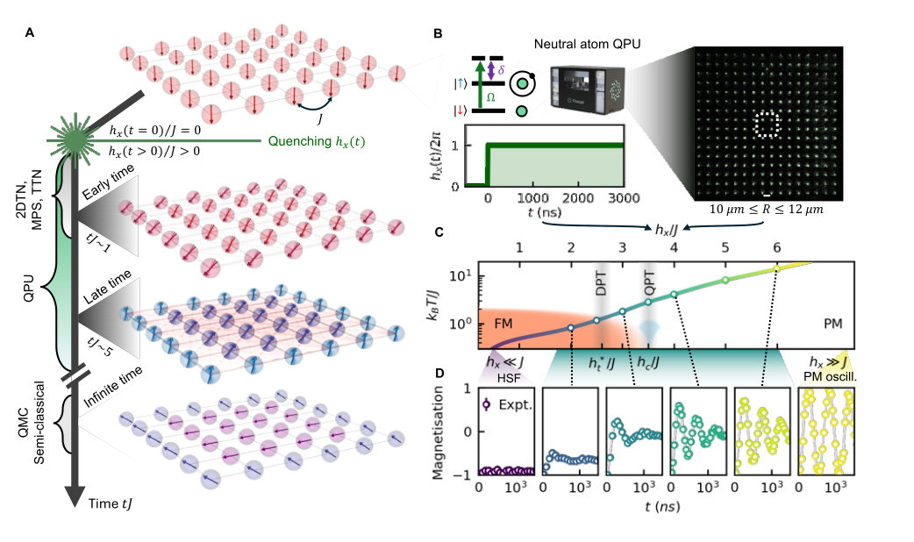
<figcaption class="paper-figure-caption"><b>Fig 1.</b> FIG. 1. Post-quench dynamics in the 2D TFIM. (A) We consider quantum simulations of post-quench dynamics described by the 2D TFIM. The qubits are initialized in a fully polarized state, and we study the dynamics following quenches to different values of hx, while hi z is chosen such that the longitudinal field in the bulk satisfies hz = 0 (see text). (B) In particular, we consider quantum simulators based on Rydberg atoms arranged in square arrays containing L × L qubits, with J denoting the nearest-neighbor Rydberg-Rydberg interaction. Control over the pulse shapes of the Rabi frequency, Ω(t), and the detuning, δ(t), as well as the relative distance between atoms, allows one to program...</figcaption>
</figure>
<figure class="paper-figure-card">
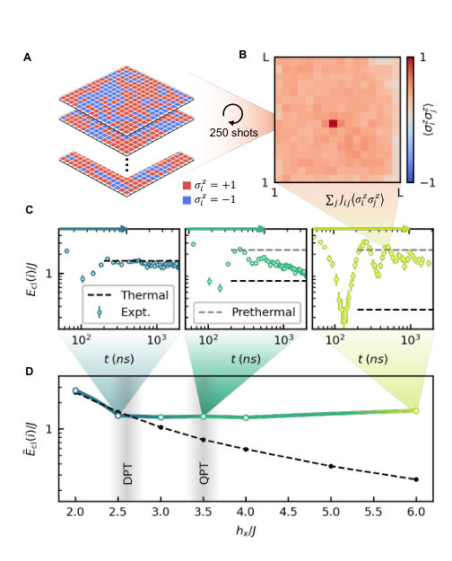
<figcaption class="paper-figure-caption"><b>Fig 2.</b> FIG. 2. Distinct regimes of nonequilibrium relaxation in the 2D TFIM (16 × 16 array). (A) Site-resolved pro- jective measurements of ˆσz i enable the construction of (B) the correlation matrix, ⟨ˆσz i ˆσz j ⟩. (C) Time evolution of the local classical energy Ecl(i, t) averaged over central sites for quenches to (left) hx/J = 2.5, (middle) hx/J = 3.5, and (right) hx/J = 6.0. The dashed black line indicates the ther- mal expectation value, and the gray dashed line indicates the prethermal expectation value. The arrows in the up- per part of each panel indicate the time interval of t = 1/J. (D) Time-averaged classical energy ˜Ecl(i) as a function of hx/J, together with the corresponding...</figcaption>
</figure>
<figure class="paper-figure-card">
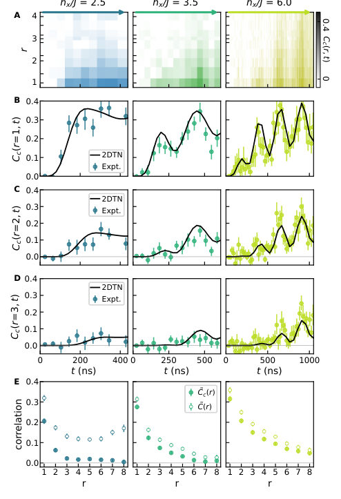
<figcaption class="paper-figure-caption"><b>Fig 3.</b> FIG. 3. Spatiotemporal buildup of connected correla- tions in the 2D TFIM (16×16 array) for hx/J = 2.5, 3.5, 6 (left to right). (A) Space-time map of the connected corre- lator Cc(r, t) (main text and Methods). Arrows on top axis show the early-time window until tJ = 1. The right-hand grayscale colorbar provides a common intensity normalization shared by all three heatmaps. (B-D) Time trace of Cc(r, t) for first (B), second (C) and third (D) neighbors along a lat- tice axis. Classical simulations based on 2DTN are shown for comparison (solid lines). Panel (E) shows the time-averaged, tJ ∈[1, 2], correlations and connected correlations as function of the distance r.</figcaption>
</figure>
<figure class="paper-figure-card">

<figcaption class="paper-figure-caption"><b>Fig 4.</b> Figure 3A shows the propagation Cc(r, t) over time, which reveals qualitatively distinct behavior across the relaxation regimes described in Fig. 2. To examine this in more detail, in Figs. 3B-D we plot the first three shells along a line. As a certification, we show quantitative</figcaption>
</figure>
<figure class="paper-figure-card">
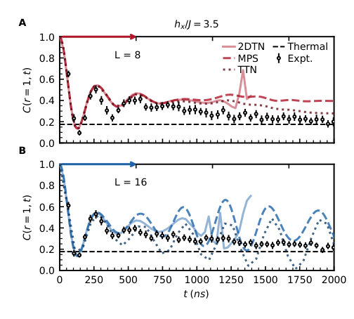
<figcaption class="paper-figure-caption"><b>Fig 5.</b> FIG. 4. Benchmarking tensor network approaches against QPU dynamics. Post-quench dynamics of the nearest-neighbor bulk correlations for quenches to hx/J = 3.5; two system sizes are considered, L = 8 and L = 16 respectively. In each panel, results obtained from the QPU are compared with classical simulations using 2DTN, MPS, and TTN methods, with the thermal QMC prediction shown through as a horizontal dashed line. The comparison high- lights the ability of different tensor network approaches to reproduce the observed dynamics and illustrates their rela- tive performance as the system size increases.</figcaption>
</figure>

**Summary.** The authors used a 2D Rydberg atom array to simulate the relaxation of a quantum magnet described by the TFIM. They discovered that the system exhibits more complex behavior than simple thermalization, identifying distinct prethermal and slow crossover regimes. This work validates Rydberg arrays as powerful tools for discovering new physics in non-equilibrium quantum dynamics.

**Why it may be interesting.** This work directly bridges experimental quantum simulation platforms (Rydberg atoms) with fundamental theoretical problems in non-equilibrium many-body physics, providing concrete evidence of complex relaxation dynamics.

Detailed structure

**Main problem.** The central problem is understanding how quantum matter relaxes far from equilibrium, moving beyond simple confirmation of theory to discovering new physical phenomena.

**Main result.** The study identified a rich relaxation landscape in the 2D transverse-field Ising model, revealing not only rapid thermalization but also distinct prethermal and unexpected crossover regimes characterized by slow dynamics.

**Method.** The research combines quantum simulation using programmable Rydberg atom arrays with theoretical analysis comparing results against classical tensor-network methods.

**Model / system.** The system is a 2D Quantum Magnet modeled by the transverse-field Ising model (TFIM) Hamiltonian, implemented on a Rydberg atom array of 256 qubits. The dynamics are studied via quenching across different parameter ratios ($h_x/J$).

**Key observables.** Magnetization $\langle\hat{\sigma}_z^i(t)
angle$, local classical energy $E_{	ext{cl}}(i, t)$, and connected correlations $C_c(r, t)$.

**Important parameters / regimes.** The ratio of transverse field to coupling strength ($h_x/J$), which dictates the system's phase (e.g., ferromagnetic vs. paramagnetic).

**Assumptions / limitations.** For numerical analysis, the study compares quantum simulation results against classical tensor-network methods, noting discrepancies in late-time behavior.

**Figures summary.** Figures illustrate post-quench dynamics of local energy and magnetization for various $h_x/J$ ratios, mapping out different relaxation regimes across the phase diagram.

**Paper structure.** The paper establishes the physical problem (non-equilibrium relaxation), details the system (2D TFIM on Rydberg array), presents measurements across varying quench parameters ($h_x/J$), and analyzes the resulting distinct dynamical regimes (thermalization, prethermalization, crossover).

Abstract

How quantum matter relaxes far from equilibrium is a central open problem in many-body physics, and one for which analog quantum simulators are well positioned to move from confirming theory to discovering new physics. Here, we use a two-dimensional Rydberg atom array of 256 qubits to map the relaxation landscape of the two-dimensional transverse-field Ising model across its phase diagram. Beyond the expected rapid thermalization, we identify two further regimes. The first is a prethermal regime whose dynamics are governed by an effective XY model. The second, and most unexpected, is a crossover regime characterized by a slowdown in relaxation. This slowdown occurs precisely where state-of-the-art classical tensor-network methods lose control at late times, whereas the quantum simulation remains consistent across system sizes. These results establish Rydberg atom arrays as a platform for scientific discovery in nonequilibrium quantum many-body dynamics.

[↑ back to top](#top)

### ⭐ [Single-qubit detection by collective phase imprinting](http://arxiv.org/abs/2608.06970v1)

**Highlighted author(s):** Immanuel Bloch  
**Authors:** Kritsana Srakaew, Pascal Weckesser, Daniel Adler, Suchita Agrawal, David Gröters, Immanuel Bloch, Johannes Zeiher  
**Type:** experiment · **Category:** other · **PDF:** <https://arxiv.org/pdf/2608.06970v1>  
**Analysis basis:** full PDF text, analyzed in chunks
**Topic relevance:** 🔥 `Rydberg arrays` **4/5** · `QC/QI experiment` **3/5** · `quantum measurements` **3/5** · `analog quantum simulation` **2/5** · `measurement-induced transitions` **2/5** · `correlated / nonlocal dissipation` **1/5** · `entanglement & information structure` **1/5** · `interference shaping light` **1/5** · `non-equilibrium dynamics` **1/5**

↔ Scroll figures horizontally

<figure class="paper-figure-card">
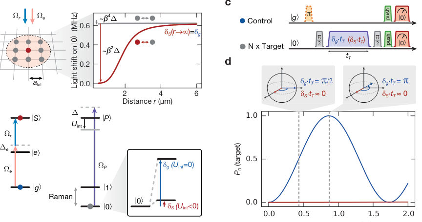
<figcaption class="paper-figure-caption"><b>Fig 1.</b> FIG. 1. Rydberg-mediated light shifts and controlled phase. (a) Schematic of the experimental setup. A 3×3 array of 87Rb atoms is prepared with a lattice spacing of alat = 752 nm. The central control qubit is initialized either in the ground state |g⟩(blue) or in the Rydberg state |S⟩(red), while all surrounding target spins (gray) are prepared in the hyperfine state |0⟩. The inset shows the distance-dependent AC-Stark shift δS(r →∞) ∼β2∆set by the |S⟩−|P⟩Rydberg interaction (red curve). On this scale, the fourth-order Rydberg-dressed interaction between neighboring target spins (gray curve) is negligible due to its higher-order scaling ∼β4∆. (b) Electronic level structure and excitation...</figcaption>
</figure>
<figure class="paper-figure-card">
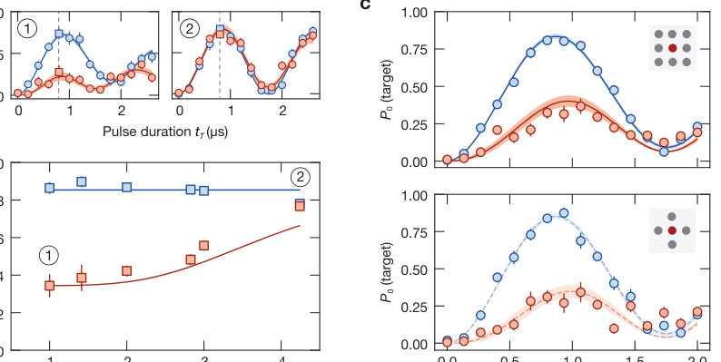
<figcaption class="paper-figure-caption"><b>Fig 2.</b> FIG. 2. Distance-dependence and fluctuation resilience of effective AC-Stark shift. (a) Controlled phase oscillations with the control spin in the ground (blue) or Rydberg (red) state. In 1 ○, with the control-target separation set to r = alat, the Rydberg interaction results in a strong contrast between the two cases. The observed infidelities are primarily limited by state-preparation errors. At larger distances (r = 3 √</figcaption>
</figure>
<figure class="paper-figure-card">
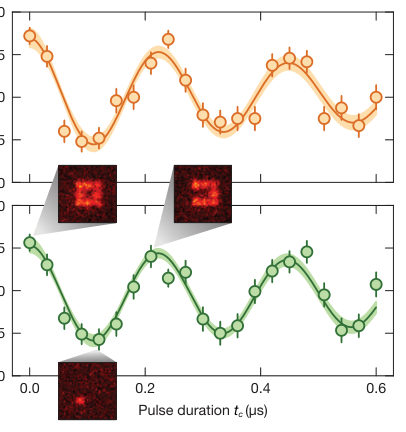
<figcaption class="paper-figure-caption"><b>Fig 3.</b> FIG. 3. Coherent control of the imprinted phase. (a) Schematic of the protocol. We apply a coherent Rabi drive |g⟩↔|S⟩on the control spin followed by a Ramsey mea- surement on the target spins with a constant duration of δgtT = π. This sequence maps the quantum state of the control spin onto the target spins. (b) Coherent Rabi oscilla- tions of the control spin measured via Rydberg-induced atom loss. (c) Oscillation of the target-spin hyperfine population, showing dynamics correlated with (b). Three representative single-shot fluorescence images highlight the clear oscillatory behavior in the target spins.</figcaption>
</figure>
<figure class="paper-figure-card">
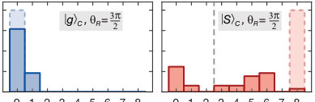
<figcaption class="paper-figure-caption"><b>Fig 4.</b> FIG. 4. Single Rydberg qubit detection. (a) Schematic of the protocol. The control spin is prepared in the ground state (|g⟩C) or the Rydberg state (|S⟩C) by a π pulse. The Raman pulse θR maps the accumulated phase onto popula- tion before measurement; θR = 3π/2 inverts the detection outcome compared to θR = π/2. (b) Spin number histogram for θR = π/2. For |g⟩C (blue), the histogram is concentrated in a range of 6 - 8 spins. For |S⟩C (red), successful Rydberg preparation results in 0 - 1 spin, while the 6 - 8 spin peak arises from imperfections in the Rydberg preparation. The dashed histograms represent the expected distribution under ideal conditions. Vertical dashed lines indicate the...</figcaption>
</figure>

**Summary.** The paper presents a novel technique to non-destructively read out the state of a single qubit by coupling it to an ensemble of atoms via a collective phase shift. By utilizing Rydberg dressing, they achieve a protocol robust against common experimental imperfections like atom loss. This opens pathways for high-fidelity mid-circuit quantum measurements in atomic quantum simulators.

**Why it may be interesting.** This work provides an experimentally validated, scalable method for interfacing single qubits with large ensembles using highly controllable interactions (Rydberg dressing), which is crucial for quantum memory and measurement protocols in AMO physics.

Detailed structure

**Main problem.** The core challenge is amplifying quantum information from a single qubit to a mesoscopic ensemble for non-destructive state detection.

**Main result.** The authors successfully demonstrated the non-destructive detection of a single Rydberg excitation with a high state-assignment fidelity of 99.81%.

**Method.** They map the control qubit state onto the target ensemble via a controlled collective phase shift, which is measured using Ramsey interferometry.

**Model / system.** The platform couples a single control qubit (in a ground-to-Rydberg transition) to a Rydberg-dressed ensemble of ground-state atoms trapped in an optical lattice. The dressing makes the interaction robust against atom number fluctuations.

**Key observables.** State-assignment fidelity ($\mathcal{F}$), fringe contrast changes, and population dynamics measured via Ramsey interferometry.

**Important parameters / regimes.** The protocol is designed to be insensitive to atom loss and number fluctuations due to Rydberg dressing. Key parameters include the AC-Stark shift ($\delta_g$) and Rabi frequencies ($\Omega$).

**Assumptions / limitations.** Fidelity estimations rely on statistical analysis of experimental histograms (e.g., Youden's J statistic) and assuming independent target spin interactions.

**Figures summary.** Figures illustrate the setup, electronic level structure, Ramsey protocols showing controlled-phase oscillations for different control states, and comparisons demonstrating resilience to atom number variations.

**Paper structure.** The paper introduces the problem of quantum information amplification, details the Rydberg-dressed coupling mechanism via a controlled phase shift, presents experimental results confirming state transfer fidelity, and discusses implications for mid-circuit readout.

Abstract

The amplification of quantum information carried by a single quantum excitation is a recurring challenge across diverse quantum platforms. The coupling between a single qubit and a mesoscopic ensemble of spins, for example, can be leveraged to realize non-destructive detection of the qubit state. However, realizing robust couplings between such systems is experimentally challenging and typically requires programmable quantum gates or native long-range interactions. Here, we introduce a platform that couples a single qubit, encoded in the ground-to-Rydberg transition of a control atom, to a Rydberg-dressed target ensemble of ground-state atoms trapped in an optical lattice. We show that the state of the control qubit can be coherently mapped onto the ensemble via a qubit-controlled collective phase shift. By Rydberg-dressing the ensemble, the controlled phase shift per target atom becomes independent of the number of target atoms, making the protocol intrinsically insensitive to atom-number fluctuations and atom loss, which are the dominant experimental imperfections in our system. Exploiting the collective response of up to eight target spins, we demonstrate the efficacy of the scheme by realizing non-destructive detection of a single Rydberg excitation with a state-assignment fidelity of $\mathcal{F} = 99.81^{+0.17}_{-1.47}\,\%$. Our approach demonstrates the key ingredients for high-fidelity transfer of quantum information from a single qubit to a mesoscopic ensemble, opening a route to non-destructive mid-circuit readout of Rydberg states and to efficient interfaces between single qubits and photonic modes.

[↑ back to top](#top)

### [Crossing over universal scaling laws in two-dimensional driven dissipative condensates](http://arxiv.org/abs/2608.07242v1)

**Authors:** Q. Fontaine, F. Helluin, M. Escalera, D. Pinto Dias, A. Lemaître, M. Morassi, M. Wouters, A. Minguzzi, L. Canet, S. Ravets, J. Bloch  
**Type:** both · **Category:** statistical mechanics · **PDF:** <https://arxiv.org/pdf/2608.07242v1>  
**Analysis basis:** full PDF text, analyzed in chunks
**Topic relevance:** 🔥 `non-equilibrium universality` **5/5** · 🔥 `analog quantum simulation` **4/5** · 🔥 `driven-dissipative phase transition` **4/5** · `correlated / nonlocal dissipation` **3/5** · `correlated cavity matter` **3/5** · `non-equilibrium dynamics` **3/5** · `methods for driven-dissipative` **2/5** · `quantum optics experiment` **2/5** · `Frenkel-Kontorova` **1/5** · `Keldysh / 2PI / non-Gaussian methods` **1/5** · `Tavis-Cummings & cavity-many-emitter` **1/5** · `entanglement & information structure` **1/5**

↔ Scroll figures horizontally

<figure class="paper-figure-card">
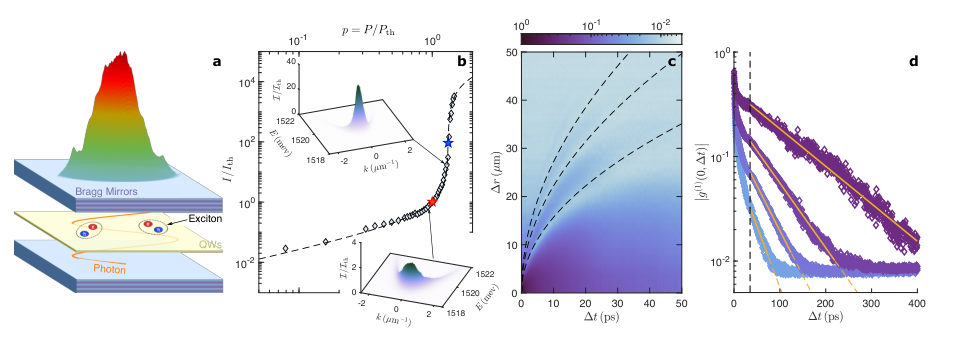
<figcaption class="paper-figure-caption"><b>Fig 1.</b> FIG. 1. a Sketch of the microcavity sample operating in the strong exciton-photon regime, where an extended polariton condensate is optically generated. b Normalized emission intensity I/Ith as a function of the normalized excitation power p = P/Pth, where Pth (Ith) is the excitation power (measured intensity) at condensation threshold. The black dashed line shows a fit using a single-mode lasing model from which Pth (red star) is determined as well as Ptrp (blue star) the transparency threshold (see Methods and SI). Bottom (top) inset: measured emission intensity as a function of energy and momentum represented in 3D for p ≃0.89 (resp. p ≃1.22). c Measured |g(1)(∆r, ∆t)| as a function of...</figcaption>
</figure>
<figure class="paper-figure-card">

<figcaption class="paper-figure-caption"><b>Fig 2.</b> Fig. 1 for a description of the determination of Pth as well as the transparency threshold Ptrp</figcaption>
</figure>
<figure class="paper-figure-card">
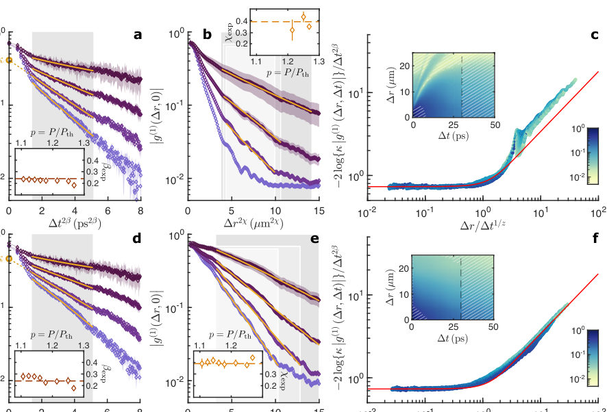
<figcaption class="paper-figure-caption"><b>Fig 3.</b> FIG. 2. Observation of KPZ universal scaling in 2D polariton condensates. a-b. Semi- logarithmic plots of the measured values of |g(1)(0, ∆t)| versus ∆t2β (panel a), and |g(1)(∆r, 0)|) versus ∆r2χ (panel b) for p = 1.14, 1.21, 1.25, 1.27. The experimental data points are represented by symbols forming thick lines in some parts of the graph. The orange lines are stretched expo- nential fits over the KPZ windows indicated by darker areas. The errorbars around each curve are obtained from multiple interferograms analysis. Insets: the diamond symbols plot the exper- imental values of βexp (panel a) and χexp (panel b) extracted from stretched exponential fits to the data, as a function of p....</figcaption>
</figure>
<figure class="paper-figure-card">
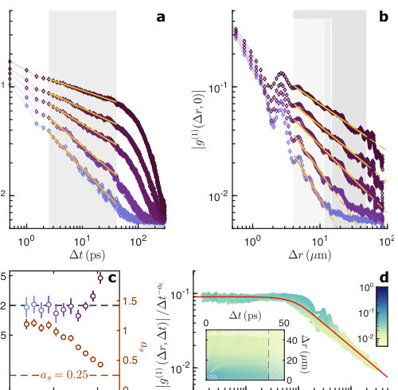
<figcaption class="paper-figure-caption"><b>Fig 4.</b> FIG. 3. Observation of EW universal scaling in 2D polariton condensates. a (b): Measured values of |g(1)(∆r0, ∆t)| (|g(1)(∆r, 0)|) as a function of ∆t (∆r) in logarithmic scale for p = 1.14, 1.28, 1.35, 1.38, 1.41. In a ∆r0 = 1 µm. Straight orange lines: power-law fits over the EW windows indicated with dark areas. Errorbars are calculated by performing a repeatability analysis on multiple interferograms. c. Measured values of the spatial exponent as and of as/at (at is the temporal exponent) as a function of p. Errorbars are determined from the ±σ uncertainties on the fitted exponents in a and b. d: Plot of |g(1)(∆r, ∆t)|)/∆t−at measured for p = 1.35 as a function of ∆r/2 √</figcaption>
</figure>
<figure class="paper-figure-card">
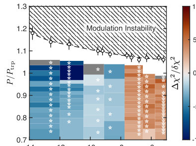
<figcaption class="paper-figure-caption"><b>Fig 5.</b> FIG. 4. Phase diagram of the 2D driven-dissipative polariton condensate White stars indicate experimental measurements as function of δ and normalized pump power P/Ptrp. The colors around these points are determined from a comparative likelihood analysis between the KPZ and EW fits of the first-order coherence temporal decay based on the value of ∆χ2/δχ2</figcaption>
</figure>

**Summary.** The paper investigates universal scaling laws in 2D polariton condensates, demonstrating a crossover between the Kardar-Parisi-Zhang (KPZ) and Edwards-Wilkinson (EW) regimes. By measuring spatio-temporal coherence, the authors confirm that these driven-dissipative systems serve as an excellent platform for studying non-equilibrium critical phenomena. This bridges fundamental statistical theory with advanced quantum optics experiments.

**Why it may be interesting.** This work provides a highly controllable, solid-state platform (polaritons) to experimentally verify fundamental concepts from non-equilibrium statistical mechanics, such as the KPZ universality class, which is crucial for understanding driven many-body systems.

Detailed structure

**Main problem.** The study investigates universal scaling laws, specifically the crossover between Edwards-Wilkinson (EW) and Kardar-Parisi-Zhang (KPZ), governing coherence decay in non-equilibrium systems.

**Main result.** The authors experimentally demonstrate that 2D polariton condensates exhibit clear crossovers between KPZ super-diffusive and EW diffusive scaling regimes by tuning system parameters. They also show that topological defects are largely paired, suggesting the underlying physics is governed by phase fluctuations at large scales.

**Method.** The research combines experimental measurements of spatio-temporal first-order coherence with numerical simulations to analyze defect dynamics and correlation functions.

**Model / system.** The physical system is two-dimensional driven-dissipative polariton condensates realized in semiconductor optical microcavities. The behavior contrasts with equilibrium 2D bosonic systems (BKT class) by exploring non-equilibrium universality classes like KPZ and EW.

**Key observables.** Spatio-temporal first-order coherence function ($g^{(1)}(\Delta\mathbf{r}, \Delta t)$), critical exponents, defect pair correlations ($g^{(2)}$), and vortex/anti-vortex lifetimes ($	au$).

**Important parameters / regimes.** System detuning ($\hbar\delta$), excitation power ratio ($p = P/P_{th}$), spatial filter width ($\sigma_f$), and interaction strength ($g_R$) relative to loss rates.

**Assumptions / limitations.** The analysis assumes that at large scales, the coherence decay is dominated by phase fluctuations, allowing for the separation of density correlations from universal scaling laws. Numerical simulations require an energy cutoff ($	au_c$).

**Figures summary.** Figures show heat maps and temporal/spatial coherence decays confirming KPZ (stretched exponential) and EW (power-law) scaling at different detunings. Supplementary figures detail vortex clustering, defect lifetime distributions, and pair correlations.

**Paper structure.** The paper establishes the context by contrasting equilibrium (BKT) vs. non-equilibrium physics. It then presents experimental evidence for KPZ/EW crossovers using coherence measurements, followed by detailed numerical analysis confirming that phase fluctuations dominate over short-lived topological defects at macroscopic scales.

Abstract

In low dimensional systems, fluctuations are enhanced and prevent the spontaneous breaking of continuous symmetries. As a result, spatial and temporal correlation functions decay at large distances and long times. A well established example is given by two-dimensional bosonic condensates at equilibrium, which do not display long-range order of the coherence but algebraic decay belonging to the Berezinski-Kosterlitz-Thouless universality class. In contrast, the universal behaviors of non-equilibrium bosonic condensates are more diverse and many open questions remain. Here, we explore the spatio-temporal coherence properties of two-dimensional driven-dissipative polariton condensates in semiconductor optical microcavities. By tuning microscopic parameters, we observe a cross-over between two scaling laws that we attribute to the Edwards-Wilkinson (EW) and the Kardar-Parisi-Zhang (KPZ) universality classes. We demonstrate the collapse of the measured first-order correlations onto the EW and KPZ universal scaling functions and obtain critical exponents, well matching the values predicted theoretically. Our results highlight the intrinsic non-equilibrium nature of polariton condensates and establish them as a platform of choice for controlled exploration of the two-dimensional KPZ universality class.

[↑ back to top](#top)

### [Entanglement-enhanced optical magnetometry beyond the standard quantum limit](http://arxiv.org/abs/2608.06815v1)

**Authors:** Jun Jia, Túlio Brito Brasil, Maimouna Bocoum, Andrea Grimaldi, Laurits Møberg, Mikhail Balabas, Jörg Helge Müller, Emil Zeuthen, Eugene Simon Polzik  
**Type:** experiment · **Category:** other · **PDF:** <https://arxiv.org/pdf/2608.06815v1>  
**Analysis basis:** full PDF text, analyzed in chunks
**Topic relevance:** 🔥 `quantum measurements` **5/5** · 🔥 `measurement-induced transitions` **4/5** · `quantum optics experiment` **3/5** · `spintronics-quantum-optics interface` **3/5** · `correlated / nonlocal dissipation` **2/5** · `entanglement & information structure` **2/5** · `exotic spin models in light-matter` **2/5** · `Keldysh / 2PI / non-Gaussian methods` **1/5** · `QC/QI experiment` **1/5** · `analog quantum simulation` **1/5** · `driven-dissipative phase transition` **1/5** · `interference shaping light` **1/5** · `methods for driven-dissipative` **1/5** · `non-equilibrium dynamics` **1/5**

↔ Scroll figures horizontally

<figure class="paper-figure-card">
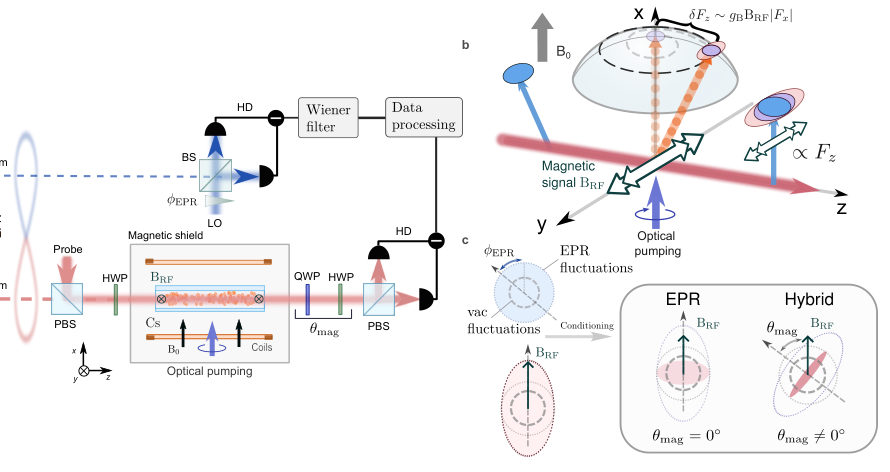
<figcaption class="paper-figure-caption"><b>Fig 1.</b> Figure 1. Principles of the entanglement-enhanced optical magnetometer and quantum-noise cancellation. a, The input state of the pair of light beams (1064 and 852 nm) is EPR-entangled. The probe beam at 852 nm interacts off-resonantly with an ensemble of Cs atoms optically pumped parallel to the dc magnetic field B0. Quantum noise in the quadrature θmag, defined by the quarter waveplate (QWP), the half-wave plate (HWP), and polarizing beam splitter (PBS), is detected by a polarization homodyne detector (HD). The quadrature of the entangled reference beam at 1064 nm set by the phase shift ϕEPR and measured by a second HD. A Wiener filter optimally suppresses quantum measurement noise to...</figcaption>
</figure>
<figure class="paper-figure-card">
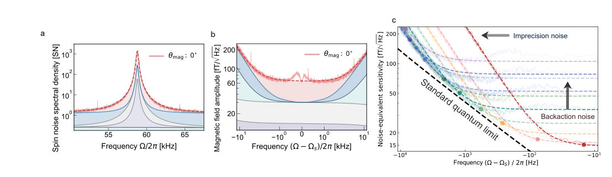
<figcaption class="paper-figure-caption"><b>Fig 2.</b> Figure 2. Noise budget and sensitivity limits of an RF orientation-based optical magnetometer. a, Measured phase quadrature (θmag = 0◦) of the spin noise spectrum for a vacuum-noise-limited probe (red trace) in probe shot noise units. The red dashed curve shows the fitted spin noise and the shaded areas present individual noise contributions: quantum backaction (red), measurement imprecision (blue), spin thermal noise (grey), spin projection (purple), and spin broadband (teal). b, Magnetic field sensitivity reconstructed using quantum noise data from a. Coloured areas with the same colour code as in a highlight the dominant noise contributions across the entire frequency range. c,...</figcaption>
</figure>
<figure class="paper-figure-card">
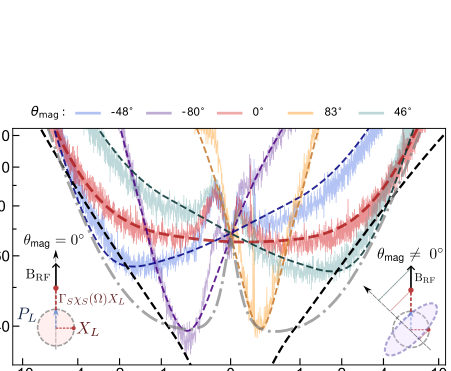
<figcaption class="paper-figure-caption"><b>Fig 3.</b> Figure 3. Quantum-enhanced optical magnetometer enabled by variational readout. The output-light phasor diagrams illustrate the quantum enhancement mechanism of the variational readout. At θmag = 0◦(left inset), imprecision (PL) and backaction (ΓSχS(Ω)XL) are uncorrelated, add incoherently, and lie along the signal (BRF) limiting the sensitivity. Rotating the detection quadrature away from the pure phase quadrature (θmag , 0◦, right inset) utilizes the backaction-imprecision correlation – the ponderomotive squeezing (purple ellipse) – to reduce the measurement noise. Sensitivity en- hancement occurs when the noise reduction outweighs the accom- panying cos(θmag) signal loss. The colour...</figcaption>
</figure>
<figure class="paper-figure-card">
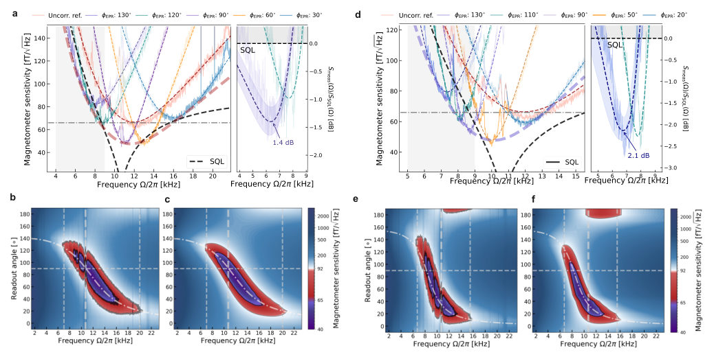
<figcaption class="paper-figure-caption"><b>Fig 4.</b> Figure 4. Entanglement-enhanced optical magnetometer. a, Entanglement injection and no variational readout, the magnetometer detection phase phase (θmag = 0◦) while the 1064-nm reference mode is measured with a tunable phase (ϕEPR). The plot shows the noise-equivalent magnetic-field sensitivity spectra calibrated for a Larmor precession of 10.7 kHz. The uncorrelated spin noise reference (light red trace) yields a peak sensitivity of 65 fT/ √</figcaption>
</figure>
<figure class="paper-figure-card">
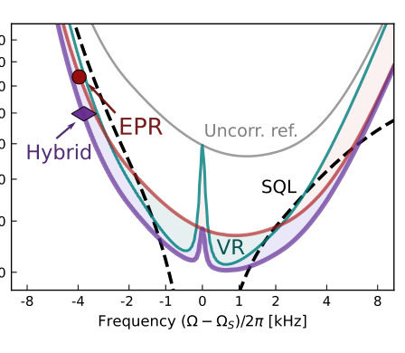
<figcaption class="paper-figure-caption"><b>Fig 5.</b> Figure 5. Optical magnetometer with frequency-optimized de- tection and EPR conditioning phases. Teal, red, and purple curves show the predicted quantum-enhanced magnetometer sensitivity for variational readout (VR), EPR conditioning, and hybrid configura- tion, respectively, based on the experimentally calibrated parameters. The shaded regions indicate the frequency ranges in which each con- figuration outperforms the others. Diamond and circle markers de- note the experimentally observed sensitivity enhancement discussed in this work. The grey curve is the uncorrelated, vacuum limited spin noise reference, while the dashed black line indicates the SQL. The Larmor frequency ΩS/2π is fixed...</figcaption>
</figure>

**Summary.** The paper details achieving magnetometry sensitivity beyond the Standard Quantum Limit using optical atomic ensembles. This is accomplished through a sophisticated hybrid technique that combines variational readout exploiting intra-channel quantum correlations with EPR conditioning utilizing entangled light states for cross-channel noise suppression. The result demonstrates enhanced, broadband magnetic field sensing in a practical, room-temperature setting.

**Why it may be interesting.** This work is highly relevant as it pushes the boundaries of quantum sensing by demonstrating practical methods (hybrid schemes) to beat fundamental measurement limits in a real-world atomic platform, bridging theory with advanced experimental implementation.

Detailed structure

**Main problem.** The primary challenge is achieving optical magnetometry sensitivity beyond the Standard Quantum Limit (SQL) imposed by measurement backaction and imprecision noise.

**Main result.** The authors successfully demonstrated sub-SQL magnetic field sensitivity in a room-temperature atomic platform by combining variational readout with entanglement conditioning using an EPR source.

**Method.** They employ a hybrid quantum sensing scheme that combines intra-channel correlations (variational readout) with inter-channel correlations derived from measuring one mode of a bipartite entangled light state and conditioning the results on the other.

**Model / system.** The system is an optical magnetometer using an ensemble of optically polarized atoms sensitive to external magnetic fields. The noise analysis models the total measurement noise as a sum of imprecision, backaction, spin, and correlation terms.

**Key observables.** Magnetic-field sensitivity ($\delta B(\Omega)$), quantum noise quadratures (e.g., $	heta_{	ext{mag}}$), and the measured Power Spectrum Density (PSD) for various noise contributions.

**Important parameters / regimes.** Acoustic frequencies ($\sim 7$ kHz to broadband), probe power, variational readout angle ($	heta_{mag}$), and EPR conditioning phase ($\phi_{EPR}$).

**Assumptions / limitations.** The analysis assumes Markovian noise sources for spin Langevin forces and models optical losses (transmissivity $\eta$) which degrade squeezing.

**Figures summary.** Figures illustrate the setup using EPR entanglement, show phasor diagrams comparing noise before and after conditioning, and present reconstructed magnetic field sensitivity spectra demonstrating performance surpassing the predicted SQL line across various frequencies.

**Paper structure.** The paper progresses by first establishing the SQL limit in standard measurements. It then introduces variational readout to exploit intra-channel correlations. Finally, it combines this with EPR conditioning using entangled light states to achieve a hybrid scheme that surpasses the SQL across an accessible acoustic frequency band.

Abstract

Optical atomic magnetometry is a powerful tool for continuous sensing applications, yet, in the absence of quantum correlations, its sensitivity is limited by the standard quantum limit (SQL) stemming from a trade-off between optical probe imprecision and quantum measurement backaction. Beyond-SQL sensitivity requires quantum correlations that modify these measurement noise sources. Here we demonstrate such sensitivity by using entangled state of the probe light and by engineering correlations between measurement imprecision and backaction. Having first explored SQL in a broad range of frequencies, we demonstrate overcoming the limit by combining variational readout with coupling the magnetometer to one mode of a bipartite entangled light state and conditioning the results on the other entangled mode. Tuning the detected light quadratures and combining the signals from the two measurement channels, we achieve sensitivity beyond the SQL in a broad range of acoustic frequencies which has so far remained inaccessible to quantum-noise-limited optical magnetometry.

[↑ back to top](#top)

### [Many-Body Localization Induced by Correlated Disorder in Interacting Superconducting Qubits](http://arxiv.org/abs/2608.07149v1)

**Authors:** Thiago R. Girão Souza, Andreia Saguia, Alan C. Santos, Marcelo S. Sarandy  
**Type:** theory · **Category:** disordered systems and neural networks · **PDF:** <https://arxiv.org/pdf/2608.07149v1>  
**Analysis basis:** full PDF text, analyzed in chunks
**Topic relevance:** 🔥 `entanglement & information structure` **5/5** · 🔥 `analog quantum simulation` **4/5** · `methods for driven-dissipative` **3/5** · `QC/QI experiment` **2/5** · `non-equilibrium dynamics` **2/5** · `correlated / nonlocal dissipation` **1/5** · `driven-dissipative phase transition` **1/5** · `exotic spin models in light-matter` **1/5** · `non-equilibrium universality` **1/5** · `scars & prethermalization` **1/5**

↔ Scroll figures horizontally

<figure class="paper-figure-card">
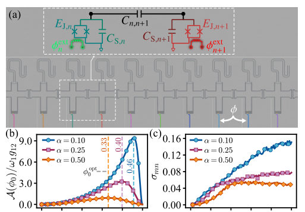
<figcaption class="paper-figure-caption"><b>Fig 1.</b> Figure 1. (a) Proposed experimental setup to observe MBL tran- sitions in superconducting circuits through correlated disorder in a linear chain of transmon qubits. Inset we show the circuit diagram for two neighboring qubits, n and n + 1, with their respective Shunt- ing capacitances (CS,n), Josephson energies (EJ,n), and local external flux (ϕn), in addition to the qubit-qubit coupling capacitance (Cn,n+1). Different colors used for flux lines denote random values of ϕn. (b) Coefficient Am(ϕ0), normalized by ω1g12 := ω1(ϕ0)g12(ϕ0), as func- tion of the reference external flux ϕ0 for different values of the junc- tion asymmetry parameter α (shown in (c)). Vertical dashed lines denote the...</figcaption>
</figure>
<figure class="paper-figure-card">
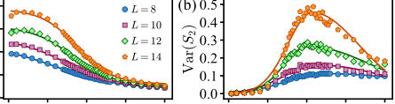
<figcaption class="paper-figure-caption"><b>Fig 2.</b> Figure 2. (a) Mean half-system block entanglement ⟨S 2⟩, averaged over ten eigenstates in the middle of the spectrum, as a function of the disorder strength ∆ϕ for system sizes up to L = 14 spins. (b) Variance of the block entanglement over disorder ensembles as a function of ∆ϕ. The maximum grows with L and occurs at (∆ϕ)max ≈2.17 for L = 14. The parameters of the system are the same as in Fig. 1.</figcaption>
</figure>
<figure class="paper-figure-card">
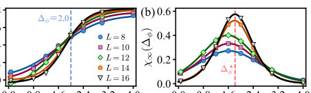
<figcaption class="paper-figure-caption"><b>Fig 3.</b> Figure 3. (a) Disorder-averaged late-time local-memory param- eter ⟨M⟩as a function of the disorder strength ∆ϕ for L ∈ {8, 10, 12, 14, 16}. The memory is evaluated for a time τL ≃864, corresponding to t ≃320 ns, with τL = gnnt. The curves exhibit a scale-invariant crossing point at ∆ϕ ≃2. (b) Numerical derivative d⟨M⟩/d∆ϕ versus ∆ϕ. The peak of the derivative scales with system size L, reaching  d⟨M⟩/d∆ϕ </figcaption>
</figure>

**Summary.** This work analyzes Many-Body Localization in superconducting transmon qubit networks subjected to realistic, correlated disorder. The authors demonstrate that the MBL transition remains robust even when considering complex, non-local disorder patterns inherent to physical hardware. This provides a vital theoretical framework for designing stable quantum processors.

**Why it may be interesting.** It bridges fundamental condensed matter concepts (MBL) with cutting-edge quantum hardware platforms (superconducting qubits), providing concrete diagnostic tools for assessing device viability in complex disorder regimes.

Detailed structure

**Main problem.** The study investigates Many-Body Localization (MBL) induced by correlated disorder in interacting superconducting qubits, moving beyond simplified models that only consider purely random disorder.

**Main result.** The MBL phase transition is shown to be robust against unavoidable correlated disorder arising from network interactions, which is crucial for designing realistic quantum processors.

**Method.** The analysis employs multiple diagnostics including block entanglement entropy (Rényi entropy) and a local memory parameter derived from site occupation number dynamics.

**Model / system.** The system consists of transmon qubits in an array structure, governed by a Hamiltonian incorporating nearest-neighbor couplings and onsite energies that are subject to tunable correlated disorder via external magnetic flux.

**Key observables.** Block entanglement entropy ($\langle S_2 
angle$), variance of block entanglement ($	ext{Var}(S_2)$), and the local memory parameter ($\langle M(t) 
angle$).

**Important parameters / regimes.** Disorder strength ($\Delta\phi$) controlled by external flux ($\phi_0$); junction asymmetry parameter ($\alpha$); filling factor ($
u$).

**Assumptions / limitations.** The analysis sometimes assumes statistical independence of local flux fluctuations for calculating covariance, but the core finding addresses robustness despite unavoidable correlations.

**Figures summary.** Figures illustrate how entanglement entropy scales (volume-law vs. area-law) across disorder strengths and show the enhancement of the dimensionless disorder parameter ($\Delta(\phi_0)$) around $\phi_0 \simeq 0.5$.

**Paper structure.** The paper first establishes the physical model using transmon qubits subjected to flux-controlled correlated disorder, then applies entanglement entropy diagnostics to locate the MBL critical point, and finally corroborates these findings using a local memory parameter analysis.

Abstract

The failure of quantum thermalization due to Many-Body Localization (MBL) has evolved from a theoretical concept in spin chains to an experimental reality in synthetic quantum platforms, most notably superconducting circuits based on transmon qubits. Despite its significance, the MBL transition has been studied primarily under purely random disorder and local couplings, leaving more complex and realistic configurations largely unexplored. Here, we investigate the quantum dynamics of transmon networks subject to the unavoidable competing effects of correlated disorder and network-mediated non-local interactions. First, we show how to engineer the physical parameters of the quantum hardware to systematically control the correlated disorder patterns emerging in the system. Then, we demonstrate that the MBL phase transition is robust against such correlations, which is essential for tuning localization properties in realistic transmon devices. This robustness is established through the analysis of the block entanglement entropy variance across disorder realizations, which precisely locates the MBL critical point. Independently, we introduce a local memory parameter, whose dynamics at long evolution times reveals memory retention in the localized phase and yields a critical point consistent with the entropy analysis. These results provide a framework for understanding localization in complex quantum network topologies, with potential implications for multi-qubit processor design.

[↑ back to top](#top)

### [Multimode phonon-mediated enhancement of entanglement and competing synchronization in cavity magnomechanics](http://arxiv.org/abs/2608.07034v1)

**Authors:** Z. Imara, Jia-Xin Peng, E. K. Berinyuy, S. K. Singh, A. El Allati  
**Type:** theory · **Category:** other · **PDF:** <https://arxiv.org/pdf/2608.07034v1>  
**Analysis basis:** full PDF text, analyzed in chunks
**Topic relevance:** 🔥 `entanglement & information structure` **4/5** · 🔥 `spintronics-quantum-optics interface` **4/5** · `analog quantum simulation` **3/5** · `correlated / nonlocal dissipation` **3/5** · `correlated cavity matter` **3/5** · `driven-dissipative phase transition` **3/5** · `exotic spin models in light-matter` **3/5** · `methods for driven-dissipative` **3/5** · `non-equilibrium dynamics` **3/5** · `Tavis-Cummings & cavity-many-emitter` **2/5** · `non-equilibrium universality` **2/5** · `Keldysh / 2PI / non-Gaussian methods` **1/5** · `quantum optics experiment` **1/5**

↔ Scroll figures horizontally

<figure class="paper-figure-card">
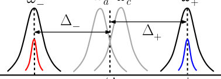
<figcaption class="paper-figure-caption"><b>Fig 1.</b> FIG. 1: (a) Schematic of the multimode polaromechani- cal system. Strong coupling between the microwave cavity mode a and magnon mode c creates two hybrid cavity– magnon polariton (CMP) modes p+ and p−. Each po- lariton dispersively couples to k mechanical modes (bj, j = 1, . . . , k) via magnetostriction. (b) Frequency dia- gram. The magnon mode is driven at frequency ω0, and phonons scatter the driving photons onto Stokes (ω0 −ω1) and anti-Stokes (ω0 + ω1) sidebands. Setting the polariton frequencies resonant with the sidebands, ω−≃ω0 −ω1 and ω+ ≃ω0 + ω1, enables entanglement between the two polaritons via collective phonon mediation.</figcaption>
</figure>
<figure class="paper-figure-card">
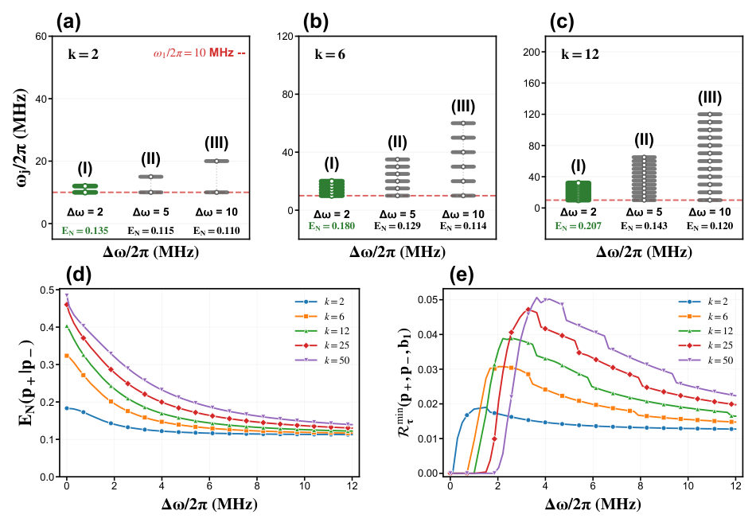
<figcaption class="paper-figure-caption"><b>Fig 2.</b> FIG. 2: Effect of the phonon frequency spacing ∆ω on the polariton-polariton entanglement and on the tripartite entan- glement. (a)-(c) Spectral configurations for k = 2, k = 6, and k = 12 phonon modes, respectively. Three spacings are considered in each panel: ∆ω/2π = 2 MHz (I), ∆ω/2π = 5 MHz (II), and ∆ω/2π = 10 MHz (III). The first phonon mode is fixed at ω1/2π = 10 MHz (dashed red line). Green bars indicate the optimal configuration maximizing EN. The corre- sponding value of EN is indicated below each configuration. (d) Bipartite entanglement E p+p− N and (e) genuine tripartite entanglement Rmin τ (p+, p−, b1) as continuous functions of the phonon frequency spacing ∆ω for k = 2, 6, 12,...</figcaption>
</figure>
<figure class="paper-figure-card">
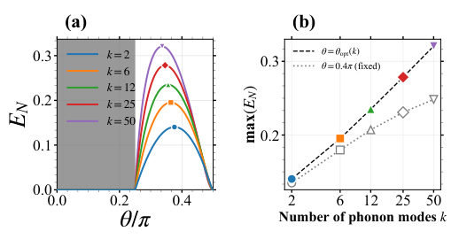
<figcaption class="paper-figure-caption"><b>Fig 3.</b> FIG. 4: (a) Stationary polariton-polariton entanglement EN as a function of the mixing angle θ for k = 2, 6, 12, 25, and 50 phonon modes. The gray region denotes the dynamically unstable regime. Markers indicate the maxi- mum EN for each k. (b) Maximum entanglement Emax N as a function of the number of phonon modes k. The parame- ters are the same as in Fig. 2.</figcaption>
</figure>
<figure class="paper-figure-card">
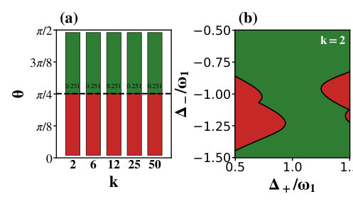
<figcaption class="paper-figure-caption"><b>Fig 4.</b> FIG. 3: Stability diagram of the system. (a) Stable (green) and unstable (red) regions as a function of θ for k = 2, 6, 12, 25, and 50 phonon modes at ∆+ = −∆−= ω1. The dashed line marks the stability boundary θcrit ≃π/4, which is independent of k. (b) Stability map in the detun- ing plane (∆+/ω1, ∆−/ω1) for k = 2 at θ = 0.4π. The parameters are listed in Tab. (I).</figcaption>
</figure>
<figure class="paper-figure-card">

<figcaption class="paper-figure-caption"><b>Fig 5.</b> Fig. 4(a) shows the stationary polariton entanglement EN as a function of the mixing angle θ for k = 2, 6, 12, 25, and 50 phonon modes. The system is dynami- cally unstable for θ/π ≲0.25, a regime where the Stokes and anti-Stokes scattering rates are nearly balanced and no stationary entanglement can be sustained. Beyond this threshold, EN exhibits a pronounced peak whose amplitude grows monotonically with k: Emax N ≃0.14 (k = 2), 0.20 (k = 6), 0.24 (k = 12), 0.28 (k = 25), and 0.33 (k = 50), representing more than a twofold en- hancement relative to the k = 2 case. Fig. 4(b) shows Emax N as a function of k for the optimized angle θopt(k) (dashed) and for the fixed hybridization θ = 0.4π...</figcaption>
</figure>

**Summary.** The paper proposes that utilizing multiple vibrational phonon modes as parallel scattering channels can overcome the inherent limitations of linear coupling in cavity magnomechanics to generate robust quantum entanglement. This multimode mediation enhances entanglement monotonically while simultaneously inducing collective amplitude squeezing, offering a pathway for controlling quantum resources in these hybrid systems.

**Why it may be interesting.** This work directly addresses open quantum systems dynamics in a complex hybrid platform, providing quantitative measures for controlling non-classical correlations (entanglement and squeezing) using engineered environmental coupling channels (phonons).

Detailed structure

**Main problem.** The central challenge is generating quantum entanglement between cavity-magnon polariton modes, which are inherently limited by linear beam-splitter interactions.

**Main result.** Multimode phonon mediation provides a mechanism that monotonically enhances steady-state bipartite entanglement and generates collective squeezing in the amplitude quadrature of the polaritons.

**Method.** The analysis uses Quantum Langevin Equations (QLEs) linearized around the steady state to calculate quantum fluctuations, followed by solving Lyapunov equations for covariance matrix evolution.

**Model / system.** The system is a cavity magnomechanical platform involving coupled microwave cavity ($	ext{a}$), magnon ($	ext{c}$), and multiple vibrational/phonon modes ($k$ modes). The coupling forms hybridized polaritons ($	ext{p}^\pm$).

**Key observables.** Logarithmic negativity (bipartite entanglement, EN); minimum residual conrangle (tripartite entanglement, Rmin^tau); quantum synchronization measures ($S_c, S_x, S_\phi$)

**Important parameters / regimes.** Number of phonon modes ($k$); detunings ($\Delta_\pm$); coupling strengths ($G_{0j}$); operating temperature and damping rates.

**Assumptions / limitations.** The analysis assumes a dispersive interaction regime and linearizes the QLEs, neglecting higher-order fluctuation terms.

**Figures summary.** Figures illustrate entanglement dependence on phonon frequency spacing and mode number; they also show robustness against temperature and damping rates, and quantify synchronization measures vs. $k$.

**Paper structure.** The paper first establishes the physical model and the limitation of single-mode coupling. It then develops the theoretical framework using QLEs to analyze quantum fluctuations. The core results demonstrate how multimode phonon scattering enhances entanglement while simultaneously affecting different synchronization quadratures.

Abstract

The generation of quantum correlations in hybrid quantum systems remains a central challenge due to the intrinsic limitations of linear interactions. In cavity magnomechanical platforms, the cavity-magnon coupling gives rise to hybridized cavity-magnon polaritons (CMPs). However, as a beam-splitter-type interaction, it does not by itself generate entanglement between the polariton modes in the absence of additional nonlinear or parametric processes. Here, we propose a mechanism based on multimode phonon mediation, in which multiple vibrational modes act as parallel scattering channels that couple the polaritons through Stokes and anti-Stokes processes. We show that , in the parameter regime explored here, the presence of multiple phonon modes leads to a monotonic enhancement of steady-state entanglement, thereby going beyond the limitations of conventional single-mode schemes. Furthermore, we demonstrate that quantum synchronization between the polariton modes originates from the same underlying scattering processes responsible for entanglement generation, yet exhibits an opposite scaling behavior with increasing phonon number for the phase quadrature, while the amplitude synchronization reveals collective squeezing that grows with the number of phonon channels. Our results provide new insights into the role of multimode interactions in shaping quantum correlations and establish a viable pathway for controlling entanglement and collective dynamics in hybrid magnomechanical platforms.

[↑ back to top](#top)

### [Improving quantum-battery charging via unidirectional quantum jumps to metastable state](http://arxiv.org/abs/2608.06479v1)

**Authors:** Ewelina Lange, Grzegorz Chimczak, Anna Kowalewska-Kudłaszyk, Kishore Thapliyal, Jan Peřina  
**Type:** theory · **Category:** other · **PDF:** <https://arxiv.org/pdf/2608.06479v1>  
**Analysis basis:** full PDF text, analyzed in chunks
**Topic relevance:** 🔥 `methods for driven-dissipative` **4/5** · `Tavis-Cummings & cavity-many-emitter` **3/5** · `correlated cavity matter` **3/5** · `driven-dissipative phase transition` **3/5** · `non-equilibrium dynamics` **3/5** · `Keldysh / 2PI / non-Gaussian methods` **2/5** · `correlated / nonlocal dissipation` **2/5** · `non-equilibrium universality` **2/5** · `Kondo & dissipative impurity` **1/5** · `analog quantum simulation` **1/5** · `measurement-induced transitions` **1/5** · `quantum measurements` **1/5**

↔ Scroll figures horizontally

<figure class="paper-figure-card">
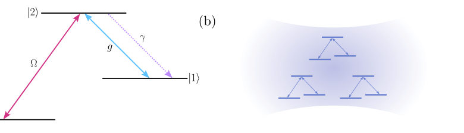
<figcaption class="paper-figure-caption"><b>Fig 1.</b> FIG. 1. (a) Diagram of the energy levels of the considered atom. N such atoms form a quantum</figcaption>
</figure>
<figure class="paper-figure-card">
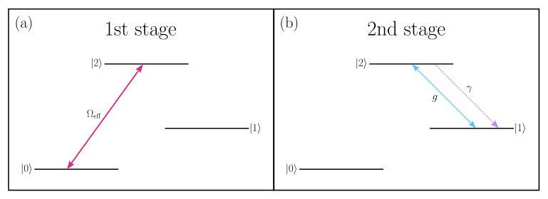
<figcaption class="paper-figure-caption"><b>Fig 2.</b> FIG. 2. The charging protocol consists of two stages. In the first stage a very intense classical laser</figcaption>
</figure>
<figure class="paper-figure-card">
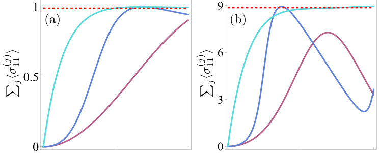
<figcaption class="paper-figure-caption"><b>Fig 3.</b> FIG. 3. The sum of populations of the metastable states calculated numerically using the Hermitian</figcaption>
</figure>
<figure class="paper-figure-card">
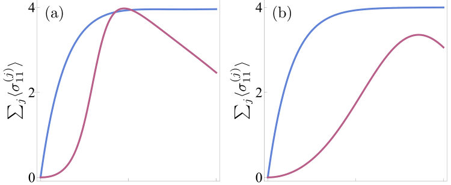
<figcaption class="paper-figure-caption"><b>Fig 4.</b> FIG. 4. The sum of populations of the metastable states calculated numerically using the non-</figcaption>
</figure>
<figure class="paper-figure-card">
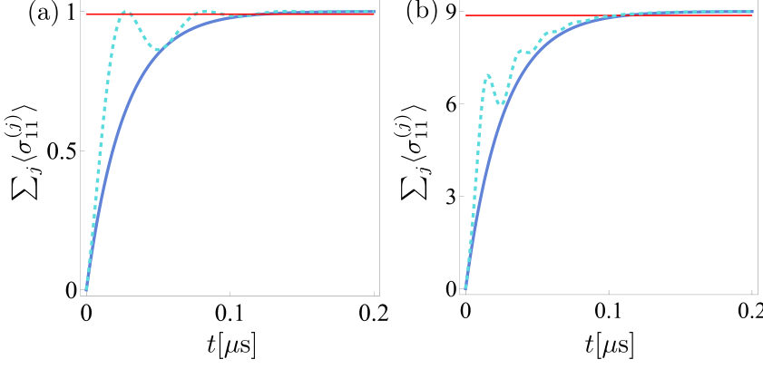
<figcaption class="paper-figure-caption"><b>Fig 5.</b> FIG. 5. Same as Fig. 3, but only solutions of the master equation (8) are shown for (γ , κ) =</figcaption>
</figure>

**Summary.** The paper proposes using a three-level atomic system configured as a quantum battery to store energy efficiently. By artificially restricting spontaneous decay paths to be unidirectional toward a metastable state, the detrimental effects of quantum jumps are converted into a constructive process that rapidly charges the battery and maximizes extractable energy.

**Why it may be interesting.** This work directly addresses energy management in open quantum systems, showing how engineering dissipation pathways (reservoir engineering) can turn a source of loss into a driving force for achieving desired quantum states.

Detailed structure

**Main problem.** Quantum jumps during quantum battery charging cause energy dissipation by inducing transitions from high to low energy states, hindering efficient energy storage.

**Main result.** Restricting spontaneous atomic transitions to be unidirectional (excited state only decays to metastable state) makes the quantum jumps constructive, driving the system to a fully charged state and making all stored energy extractable.

**Method.** The authors analyze the dynamics using master equations and compare results from full damping models against simpler coherent or non-Hermitian Hamiltonian approaches.

**Model / system.** The model uses an ensemble of three-level atoms in a Lambda (Λ) configuration, designed to store energy in a metastable state. The system is coupled to an optical cavity charger.

**Key observables.** Sum of populations in the metastable states ($\langle P_{n} \sum \sigma^{(j)}_{11} 
angle$), which serves as the figure of merit for storable energy, and ergotropy (extractable work).

**Important parameters / regimes.** The analysis explores different parameter regimes defined by detunings ($\Delta$) and coupling strengths ($\Omega_i, g, \gamma$).

**Assumptions / limitations.** The core assumption is the restriction of spontaneous transitions to be unidirectional from the excited state $|2
angle$ only to the metastable state $|1
angle$, suppressing decay to the ground state $|0
angle$.

**Figures summary.** Figure 3 compares the evolution of stored energy ($\langle P_{n, j=1} \sigma^{(j)}_{11} 
angle$) over time using three different dynamic descriptions: Hermitian Hamiltonian, non-Hermitian Hamiltonian, and the full Master Equation approach.

**Paper structure.** The paper first establishes the problem (energy loss via jumps) and proposes a modified $\Lambda$-system. It then develops the theoretical framework by comparing dynamics under various approximations (Hamiltonian vs. Master Equation). Finally, it demonstrates that the unidirectional jump mechanism yields constructive charging behavior.

Abstract

In the process of charging a quantum battery, quantum jumps play a detrimental role because they induce transitions from higher to lower energy levels, leading to energy dissipation. This be- havior directly opposes the fundamental objective of the charging protocol, which is to increase the population of higher-energy states and store usable energy in the system. Furthermore, decoherence introduced by randomness of quantum jumps leads to a mixed state, thereby reducing the amount of energy that can be extracted from the charged quantum battery. Here, we propose a quantum battery comprising an ensemble of three-level atoms in the Λ configuration to store energy in the metastable state over a long time. We demonstrate that, when spontaneous atomic transitions are restricted to occur solely from the excited state to a metastable state, with decay to the ground state completely suppressed, quantum jumps acquire a constructive character. Under these con- ditions, they drive the quantum battery to a fully charged state, render the entire stored energy extractable, and shorten the duration of the second stage of the charging protocol.

[↑ back to top](#top)

### [Many-Body Mobility Edge and Non-Hermitian Skin Effect in an Interacting Quasi-Periodic Spin Chain](http://arxiv.org/abs/2608.07083v1)

**Authors:** Lavoisier Wah, Ayan Banerjee, Flore K. Kunst  
**Type:** theory · **Category:** disordered systems and neural networks · **PDF:** <https://arxiv.org/pdf/2608.07083v1>  
**Analysis basis:** full PDF text, analyzed in chunks
**Topic relevance:** 🔥 `analog quantum simulation` **4/5** · 🔥 `methods for driven-dissipative` **4/5** · `driven-dissipative phase transition` **3/5** · `exotic spin models in light-matter` **3/5** · `correlated / nonlocal dissipation` **2/5** · `entanglement & information structure` **2/5** · `non-equilibrium dynamics` **2/5** · `non-equilibrium universality` **2/5** · `Frenkel-Kontorova` **1/5** · `Keldysh / 2PI / non-Gaussian methods` **1/5** · `Kondo & dissipative impurity` **1/5**

↔ Scroll figures horizontally

<figure class="paper-figure-card">
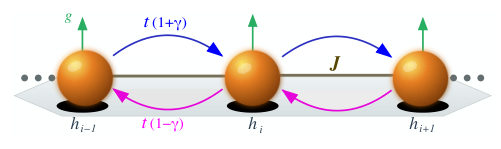
<figcaption class="paper-figure-caption"><b>Fig 1.</b> FIG. 1. Interacting NH spin chain. Schematic represen- tation of the NH spin chain with a longitudinal quasi-periodic field in Eqs. (1) and (2). The system includes asymmetric hop- pings captured by t and γ, nearest-neighbor zz-interactions (J), a transverse field (g), and an on-site longitudinal field (hi) given Eq. (3), which plays the role of disorder.</figcaption>
</figure>
<figure class="paper-figure-card">
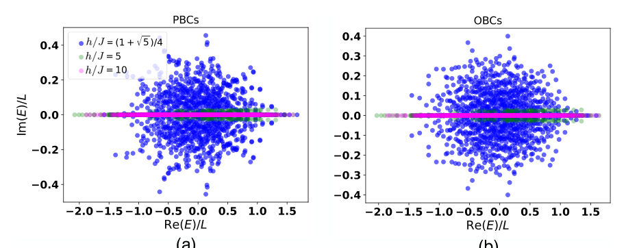
<figcaption class="paper-figure-caption"><b>Fig 2.</b> FIG. 2. Energy spectrum. We plot the spectrum per spin of the model in Eqs. (1)-(3) under (a) PBCs and (b) OBCs on the complex plane for h/J = (1 + √</figcaption>
</figure>
<figure class="paper-figure-card">
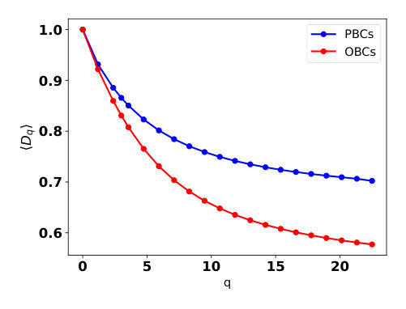
<figcaption class="paper-figure-caption"><b>Fig 3.</b> FIG. 3. Scaling of the mean multifractal dimension ⟨Dq⟩. We plot the average multifractal dimension ⟨Dq⟩in PBCs (blue) and OBCs (red) as a function of q for L = 10, J = 1, t/J = 1/ √</figcaption>
</figure>
<figure class="paper-figure-card">
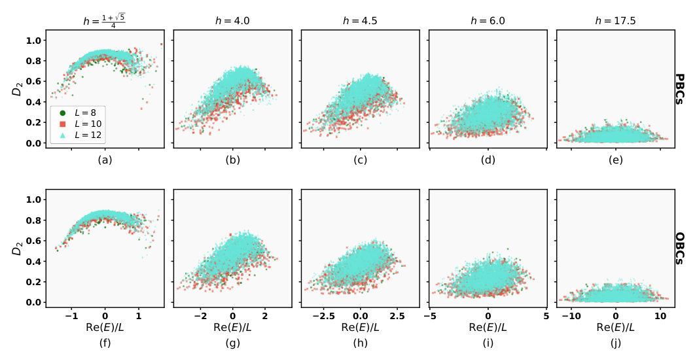
<figcaption class="paper-figure-caption"><b>Fig 4.</b> FIG. 4. Multifractal dimension D2. Fractal dimension D2 as a function of the real energy density: Re(E)/L for system sizes L = 8 (green), L = 10 (red), and L = 12 (cyan), under PBCs [(a)–(e)] and OBCs [(f)–(j)], at five representative values of the quasiperiodic amplitude h. (a), (f) h = (1 + √</figcaption>
</figure>
<figure class="paper-figure-card">
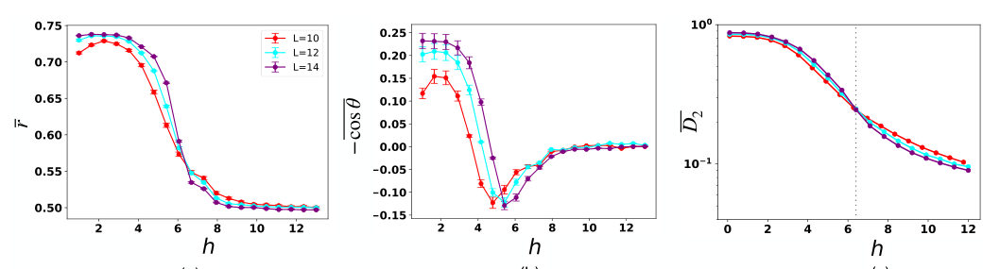
<figcaption class="paper-figure-caption"><b>Fig 5.</b> FIG. 5. Delocalized-to-MBL phase transition. We plot (a) the mean gap ratio ¯r, (b) the angular statistics −cos θ, and (c) the average multifractal dimension D2 as a function of the disorder h for different system sizes. One observes that the crossing point of the curves (see (a) and (c)), which is the transition point, falls within the region of h, where the MBME is predicted to occur. The universality class of the model changes from Ginibre ensemble statistics in the delocalized regime to Poisson statistics in the localized regime. This suggest a disorder-induced spectral localization transition. We consider 1000, 600 and 400 values of ϕ for L = 10, 12 and 14, respectively. The transition...</figcaption>
</figure>

**Summary.** This paper explores how interactions, quasi-periodicity, and non-Hermitian physics combine to govern transport in spin chains. The key finding is the identification of a unique "D-shaped" mobility edge that separates different quantum phases. It provides a comprehensive phase diagram capturing both many-body localization and boundary-induced skin effects.

**Why it may be interesting.** This work directly addresses the intersection of non-Hermiticity and localization in interacting systems, which is highly relevant for understanding open quantum systems where boundary effects (like skin effect) compete with intrinsic disorder-induced localization.

Detailed structure

**Main problem.** The study investigates the complex interplay between non-Hermiticity, interactions, quasi-periodicity, and localization mechanisms in many-body quantum spin chains.

**Main result.** The authors discover a characteristic "D-shaped" many-body mobility edge that governs transitions between extended, localized (MBL), and skin effect regimes. They also confirm the signature of the many-body skin effect via multifractal scaling.

**Method.** The research employs advanced numerical diagnostics such as fractal dimension ($D_q$), complex eigenvalue fractions, and analyzing finite-size flow directions of spectral measures.

**Model / system.** The model is an interacting non-Hermitian spin chain subjected to a quasi-periodic longitudinal field. The Hamiltonian incorporates hopping terms, nearest-neighbor Ising interactions ($J$), and the disorder/quasi-periodicity ($h_i$).

**Key observables.** Many-body mobility edge (MBME), many-body skin effect (MBSE) signature, fractal dimension ($\langle D_q 
angle$), complex eigenvalue fractions, density imbalance, and entanglement growth.

**Important parameters / regimes.** Non-Hermitian asymmetry parameter ($\gamma$), interaction strength ($J$), quasi-periodic field amplitude ($h$), and the irrationality parameter $\alpha$.

**Assumptions / limitations.** The analysis relies on mapping out a unified phase diagram by varying disorder strength ($h$) while keeping other parameters fixed or within specific regimes.

**Figures summary.** Figures illustrate the energy spectrum in the complex plane for different disorder strengths and plots the energy-resolved multifractal dimension $D_2$ to map the mobility edge structure.

**Paper structure.** The paper systematically analyzes the spectral properties (PBC vs. OBC) using diagnostics like fractal dimensions, mapping out a unified phase diagram that captures transitions between MBL and MBSE regimes as disorder strength is varied.

Abstract

Non-Hermitian many-body physics reveals a rich interplay between topology, localization, and boundary effects, yet their collective behavior in interacting disordered systems remains largely unexplored. In this work, we study an interacting non-Hermitian spin chain subject to a quasi-periodic longitudinal field, providing a unified and controlled setting, where non-Hermitian dynamics, interactions, and localization mechanisms intertwine. Remarkably, we discover a "D-shaped" many-body mobility edge that separates extended and localized eigenstates, while simultaneously delineating regimes of many-body localization and the many-body skin effect (where many-body eigenstates acquire an anomalous drift towards a boundary under open boundaries) emerging from the combined action of interactions, non-Hermiticity, and driving amplitude. We demonstrate that the skin effect induces multifractal scaling in the non-Hermitian eigenstates, providing a clear signature of the many-body skin effect. Employing diagnostics such as the fractal dimension, complex eigenvalue fractions, and many-body inverse participation ratios, we map out a unified phase diagram in which all measures consistently identify the "D-shaped" mobility edge. Finally, we probe this interplay using both complex level-spacing statistics and dynamical observables such as density imbalance, entanglement growth, and wave-packet evolution, culminating in a rich many-body mobility phase diagram that captures both the many-body skin effect and localization transitions. Our results identify a clear, defining signature of the "D-shaped" many-body mobility edge, and underscore its pivotal role in shaping the physics of open quantum many-body systems.

[↑ back to top](#top)

### [Observation of far-from-equilibrium scaling in the transient dynamics of 2D quantum magnets](http://arxiv.org/abs/2608.07211v1)

**Authors:** Fabio Bensch, Umberto Borla, Federico Balducci, Philip Osterholz, Shuanghong Tang, Silpa Baburaj Sheela, Anushya Chandran, Roderich Moessner, Jad C. Halimeh, Christian Groß  
**Type:** both · **Category:** other · **PDF:** <https://arxiv.org/pdf/2608.07211v1>  
**Analysis basis:** full PDF text, analyzed in chunks
**Topic relevance:** 🔥 `analog quantum simulation` **4/5** · 🔥 `non-equilibrium dynamics` **4/5** · 🔥 `non-equilibrium universality` **4/5** · `Rydberg arrays` **3/5** · `exotic spin models in light-matter` **3/5** · `methods for driven-dissipative` **3/5** · `Keldysh / 2PI / non-Gaussian methods` **1/5** · `correlated / nonlocal dissipation` **1/5** · `driven-dissipative phase transition` **1/5** · `entanglement & information structure` **1/5**

↔ Scroll figures horizontally

<figure class="paper-figure-card">
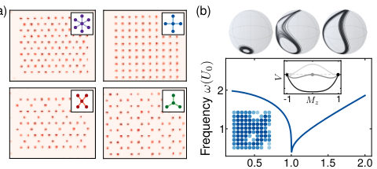
<figcaption class="paper-figure-caption"><b>Fig 1.</b> FIG. 1. Illustration of the experimental system and MF in- terpretation. (a) Average fluorescence images (red indicates more photon counts per camera pixel) for the four different lattice geometries studied here. The insets highlight the dif- ferent local connectivity of the lattices. (b) MF dynamics for the square lattice with nearest-neighbor interactions. At the top, trajectories of the mean magnetization vector are il- lustrated for transverse fields of Ω/U0 = 0.5, 1.0 and 1.5 and zero longitudinal field. The individual trajectories correspond to different initial states. The plot below shows the predicted mode softening of the post-quench oscillation frequency as a function of the...</figcaption>
</figure>
<figure class="paper-figure-card">
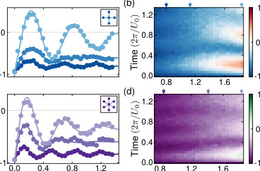
<figcaption class="paper-figure-caption"><b>Fig 2.</b> FIG. 2. Post-quench magnetization dynamics of Mz in square and triangular lattices, row-wise as identified by the pictogram-insets in (a) and (c). (a) Square lattice magnetiza- tion traces for Ω/U0 = 0.8, 1.3 and 1.8, from darker to lighter color. The fits are shown as solid lines and the zero crossing of the magnetization is indicated by the light gray line. (b),(d) Color plots of the square (b) and triangular (d) lattice dy- namics. The arrows on top indicate the three values of Ω/U0 shown in (a) and (c). (c) Triangular lattice analog of (a) for Ω/U0 = 0.9, 1.4 and 1.8. In both cases the three values lie in the interaction-dominated regime, near the crossover, and in the field-dominated...</figcaption>
</figure>
<figure class="paper-figure-card">
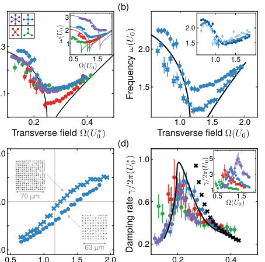
<figcaption class="paper-figure-caption"><b>Fig 3.</b> FIG. 3. Mode softening and damping. Colors indicate the different lattices as shown by the upper right inset in (a). (a) Magnetization oscillation frequency ω for the four lat- tice geometries. Solid lines are the MF predictions at zero longitudinal field. The inset shows the unscaled data, while in the main panel both axes are scaled by the coordination- number-weighted interaction strength U ∗ 0 . (b), (c) Finite- size effects: comparison of the 10 × 10 (circles) and 15 × 15 (crosses) square lattices, for the oscillation frequency (b) and the maximum magnetization swing (c). The mode soften- ing is more pronounced for the larger array. The inset of (b) compares the measured frequencies...</figcaption>
</figure>
<figure class="paper-figure-card">
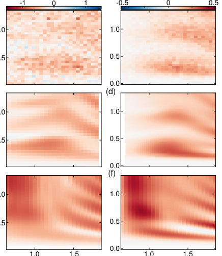
<figcaption class="paper-figure-caption"><b>Fig 4.</b> FIG. 4. Fluctuations and correlations in the 10 × 10 square array: the TTN simulations reproduce the measurements, while the DTWA breaks down in the interaction-dominated regime. The base-10 logarithm of the normalized variance of the magnetization, log10(var( ˆ Mz)), is shown in the left column such that zero corresponds to the variance of non- interacting spins. (a) is the experimental data, (c) the TTN simulation, and (e) the DTWA result. In the right column we show the nearest-neighbor connected correlator C(1) in the same order as before, that is, (b), the experimental data, (d), the TTN simulation, and (f), the DTWA result.</figcaption>
</figure>

**Summary.** The authors study how 2D quantum magnets behave immediately after a sudden change (quench) in their environment. Using Rydberg atoms to simulate the transverse-field Ising model on various lattices, they observe that the dynamics follow universal scaling laws. This suggests that even with complex interactions and strong fluctuations, the system's collective behavior can be described by simple, overarching principles.

**Why it may be interesting.** This work bridges cold atom platforms with fundamental condensed matter physics problems, providing quantitative evidence for emergent collective behaviors in strongly correlated quantum systems far from equilibrium.

Detailed structure

**Main problem.** Investigating the organizing principles governing the transient, far-from-equilibrium dynamics of two-dimensional quantum magnets.

**Main result.** The system exhibits a robust scaling regime where oscillation frequencies and damping rates collapse onto common curves despite varying lattice geometries. The dominant dynamics appear governed by a simple collective description even when strong quantum fluctuations are present.

**Method.** A combination of experimental realization using programmable Rydberg-atom arrays, theoretical modeling via Mean-Field theory extensions (accounting for edge effects), and advanced numerical simulations like Tree-Tensor-Networks.

**Model / system.** The transverse-field Ising model is realized on various 2D lattices (honeycomb, square, kagome, triangular) using Rydberg atoms. The dynamics are studied following a global quench from a fully magnetized state.

**Key observables.** Transient magnetization oscillation frequency ($\omega$), damping rate ($\gamma$), and the crossover point between interaction- and field-dominated regimes.

**Important parameters / regimes.** Transverse field strength ($\Omega$) relative to interaction strength ($U_0$), lattice coordination number, and finite-size effects (bulk vs. edge populations).

**Assumptions / limitations.** The Mean-Field approach provides a good description of the global dynamics, even though correlated quantum fluctuations are necessary for accurate damping predictions.

**Figures summary.** Figures illustrate the four studied lattice geometries, show mode softening curves ($\omega$ vs $\Omega$) across different lattices demonstrating scaling collapse, and compare MF predictions with TTN simulations showing magnetization evolution over time.

**Paper structure.** The paper establishes the problem in non-equilibrium quantum dynamics, presents experimental results on multiple lattices showing universal scaling behavior, compares this to theoretical models (MF), and uses advanced simulations (TTN) to confirm the role of collective descriptions despite strong correlations.

Abstract

The transient regime of far-from-equilibrium quantum many-body dynamics lacks the established organizing principles that universality and scaling provide in equilibrium. It is least understood for two-dimensional short-range interacting systems, where mean-field arguments are not expected to hold, controlled theoretical descriptions are few, and fluctuations are strong. Here we investigate the quench dynamics of the transverse-field Ising model using programmable Rydberg-atom arrays realizing honeycomb, square, kagome, and triangular lattices. Starting from a fully magnetized state, we observe a pronounced softening of the dominant collective magnetization oscillation accompanied by a maximum in the damping rate, signaling a crossover between interaction- and field-dominated transient dynamics. Even though the microscopic lattice geometries are different, both the oscillation frequencies and the damping rates collapse onto common curves after being rescaled by the coordination-number-weighted interaction strength. Our findings show that a mean-field description effectively reproduces the magnetization oscillations. The importance of correlated quantum fluctuations is underlined by the failure of the discrete truncated Wigner approximation to predict the damping for strong interactions, while tree-tensor-network simulations reproduce the dynamics accurately. These results reveal a robust scaling regime governing the transient dynamics of short-range interacting two-dimensional quantum magnets. They reveal that the dominant transient dynamics is governed by a simple collective description despite the presence of strong quantum fluctuations --- an important insight in the quest to uncover organizing principles in far-from-equilibrium quantum matter.

[↑ back to top](#top)

### [KPZ Superdiffusion of Local Correlators in Diffusive Random Quantum Circuits](http://arxiv.org/abs/2608.06459v1)

**Authors:** Ewan McCulloch  
**Type:** theory · **Category:** disordered systems and neural networks · **PDF:** <https://arxiv.org/pdf/2608.06459v1>  
**Analysis basis:** full PDF text, analyzed in chunks
**Topic relevance:** 🔥 `non-equilibrium universality` **4/5** · `analog quantum simulation` **3/5** · `correlated / nonlocal dissipation` **3/5** · `driven-dissipative phase transition` **3/5** · `methods for driven-dissipative` **3/5** · `non-equilibrium dynamics` **3/5** · `Keldysh / 2PI / non-Gaussian methods` **2/5** · `Kondo & dissipative impurity` **1/5** · `entanglement & information structure` **1/5** · `scars & prethermalization` **1/5**

↔ Scroll figures horizontally

<figure class="paper-figure-card">
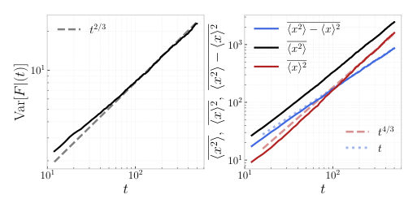
<figcaption class="paper-figure-caption"><b>Fig 1.</b> FIG. 1. KPZ scaling of Green’s functions at strong noise. TEBD simulations of noisy operator dynamics at γ ≈ 0.667, averaged over N ≈5000 circuit samples, showing the expected KPZ scaling exponents in Eq. (4) (dashed guides).</figcaption>
</figure>
<figure class="paper-figure-card">
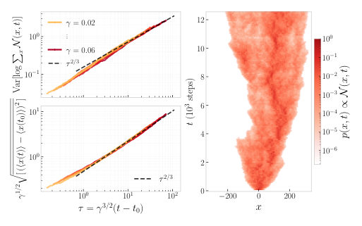
<figcaption class="paper-figure-caption"><b>Fig 2.</b> FIG. 2. Weak-noise scaling of phase-annealed norm N. TEBD simulations of the full two-copy transfer matrix dynamics, for bath density ν = 1/3 and coupling strengths γ ∈[0.02, 0.06], using N = 1500 disorder samples. Left: free-energy fluctuations and endpoint wandering with growth consistent with the KPZ exponent 1/z = 2/3 (guides). Right: representative endpoint distribution p(x, t) ∝N(x, t) in a sin- gle disorder sample.</figcaption>
</figure>

**Summary.** This work analyzes how quantum information decays in random unitary circuits by studying the single-particle Green's function. The authors find that this decay process exhibits universal Kardar-Parisi-Zhang (KPZ) scaling in certain limits. They develop sophisticated theoretical tools, including mapping to directed polymer models, to describe these non-equilibrium dynamics.

**Why it may be interesting.** The connection of quantum coherence decay in random circuits to universal scaling laws like KPZ is highly relevant for understanding decoherence mechanisms in disordered quantum systems, bridging condensed matter physics with non-equilibrium statistical mechanics.

Detailed structure

**Main problem.** The study investigates the long-time dynamics of quantum coherence decay in random unitary circuits, contrasting standard hydrodynamic descriptions with non-equilibrium scaling laws.

**Main result.** The system exhibits Kardar-Parisi-Zhang (KPZ) scaling exponents in its wandering statistics in the strong noise limit, and a crossover to an effective directed polymer description in the weak noise limit.

**Method.** The analysis employs mapping techniques, deriving effective continuum theories (like Directed Waves in Random Media or Macroscopic Fluctuation Theory actions), and utilizing tensor-network simulations for numerical confirmation.

**Model / system.** The model is a one-dimensional particle-number-conserving random unitary circuit coupled to an external bath. The dynamics are tracked via the single-particle Green's function G(x,t) and its associated spatial distribution p(x,t).

**Key observables.** Green's function G(x,t), normalized spatial distribution p(x,t), free energy fluctuations ($	ext{Var}[F(t)]$), and the center wandering $\langle x(t)
angle$.

**Important parameters / regimes.** Noise parameter ($\gamma$), time ($t$), and length scales related to disorder strength.

**Assumptions / limitations.** The strong-noise limit assumes collapse onto single-particle coherence, while the weak-noise analysis relies on projecting dynamics onto a source-manifold ansatz leading to an effective directed polymer description.

**Figures summary.** Figure 1 numerically confirms KPZ scaling exponents in TEBD simulations at moderate noise. Figure 2 shows variance collapse consistent with KPZ exponent 1/z = 2/3 for the weak-noise norm N.

**Paper structure.** The paper progresses from analyzing the general Green's function dynamics, establishing KPZ scaling in the strong limit, to deriving a low-energy effective theory using phase averaging and Macroscopic Fluctuation Theory in the weak noise regime. It concludes by confirming that the final coarse-grained amplitude matches typical single-particle behavior.

Abstract

We study the single-particle Green's function $G(x,t)=\langle σ^-_x(0)σ^+_0(t)\rangle$ in one-dimensional particle-number-conserving random unitary circuits coupled to an external bath. For fixed spacetime disorder, we argue that $G(x,t)$ is governed, in both the strong- and weak-noise limits, by directed waves in a random medium. We find Kardar-Parisi-Zhang (KPZ) scaling in the wandering statistics of the normalized spatial distribution $p(x,t)\propto |G(x,t)|^2$ and in the associated free energy. In particular, its center $\langle x(t)\rangle\equiv\sum_x x\, p(x,t)$ wanders on a length-scale $\mathcal{O}(t^{2/3})$, while sample-to-sample fluctuations of $-\log\sum_x |G(x,t)|^2$ scale as $t^{1/3}$. At weak noise $γ\ll 1$, the crossover to the strong-disorder fixed point occurs at a parametrically long time $\mathcal{O}(γ^{-3/2})$. These predictions are confirmed numerically using tensor-network simulations of the noisy operator dynamics in individual circuits at moderate noise, and of a phase-annealed proxy retaining hopping disorder at weak noise.

[↑ back to top](#top)

### [Theory of Deterministic Photon-Loss Subspaces for Quantum Interferences](http://arxiv.org/abs/2608.07253v1)

**Authors:** Yadi Niu, Haoyang Zhang, Zihan Mo, Nuo Wang, Ying Gu  
**Type:** theory · **Category:** other · **PDF:** <https://arxiv.org/pdf/2608.07253v1>  
**Analysis basis:** full PDF text, analyzed in chunks
**Topic relevance:** 🔥 `methods for driven-dissipative` **4/5** · `correlated / nonlocal dissipation` **3/5** · `driven-dissipative phase transition` **3/5** · `interference shaping light` **3/5** · `non-equilibrium dynamics` **2/5** · `non-equilibrium universality` **2/5** · `Keldysh / 2PI / non-Gaussian methods` **1/5** · `analog quantum simulation` **1/5** · `entanglement & information structure` **1/5** · `measurement-induced transitions` **1/5** · `quantum measurements` **1/5**

↔ Scroll figures horizontally

<figure class="paper-figure-card">
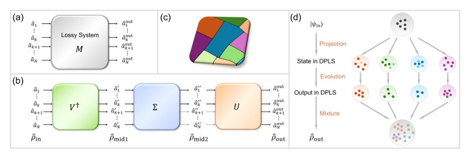
<figcaption class="paper-figure-caption"><b>Fig 1.</b> FIG. 1. Schematic of DPLS theory. (a) Lossy linear optical system with 𝑁input and 𝑁output</figcaption>
</figure>
<figure class="paper-figure-card">
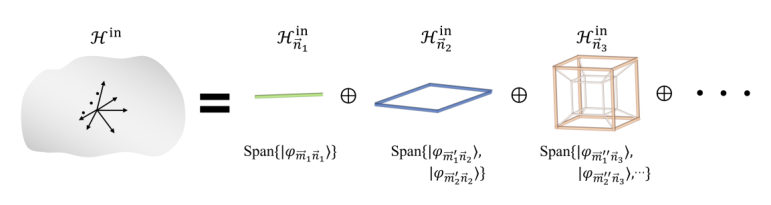
<figcaption class="paper-figure-caption"><b>Fig 2.</b> FIG. 2. Schematic of decomposing the input Hilbert space into DPLSs Hin ®𝑛1, Hin ®𝑛2, Hin ®𝑛3, · · · . Basis</figcaption>
</figure>
<figure class="paper-figure-card">
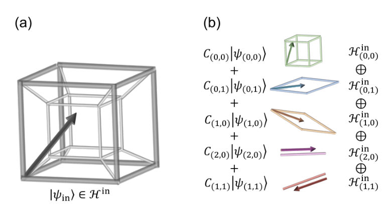
<figcaption class="paper-figure-caption"><b>Fig 3.</b> FIG. 3. Schematic of the input state |𝜓in⟩= |1100⟩projecting into different DPLSs. (a) Input</figcaption>
</figure>
<figure class="paper-figure-card">
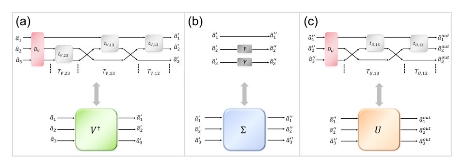
<figcaption class="paper-figure-caption"><b>Fig 4.</b> FIG. 4. Constructed lossy system for robust W-state generation with three sequential parts: (a)</figcaption>
</figure>
<figure class="paper-figure-card">
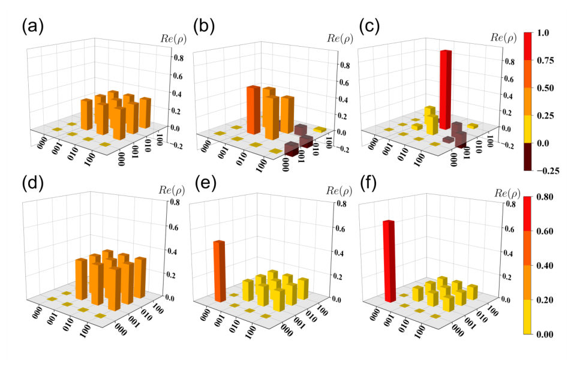
<figcaption class="paper-figure-caption"><b>Fig 5.</b> FIG. 5. Preparation of W-state in lossless system and lossy system, x axis and y axis correspond</figcaption>
</figure>

**Summary.** The paper introduces the Deterministic Photon-Loss Subspace (DPLS) theory to analyze quantum light evolution in lossy optical systems. By using SVD on the system's scattering matrix, it decomposes the input state into orthogonal subspaces where photon loss is deterministic and coherence evolves unitarily within each subspace. This framework allows for precise control over interference phenomena by engineering the engineered loss channels.

**Why it may be interesting.** This work is highly relevant for theoretical physicists in quantum optics and open quantum systems as it provides a systematic mathematical tool (DPLS) to disentangle and quantify the distinct physical processes—coherence preservation vs. decoherence/loss—that occur simultaneously in realistic, dissipative photonic setups.

Detailed structure

**Main problem.** The core problem is understanding how quantum coherence, decoherence, and photon number reduction interact to govern the evolution of light in linear optical systems subject to loss.

**Main result.** The authors propose the Deterministic Photon-Loss Subspace (DPLS) theory, which allows for a rigorous analysis of state evolution by decomposing the input Hilbert space into orthogonal subspaces where loss is deterministic and coherence is preserved within projections.

**Method.** The method relies on applying Singular Value Decomposition (SVD) to the system's scattering matrix, defining DPLSs based on photon numbers in completely lossy versus lossless modes.

**Model / system.** The model is a general linear lossy optical system characterized by a non-unitary scattering matrix M. The theory extends this analysis by embedding the system into larger matrices to handle arbitrary singular values between 0 and 1, ensuring the resulting structure retains only {0, 1} singular values.

**Key observables.** The output quantum state (a statistical mixture), the degree of coherence preservation within DPLSs, and the ability to generate specific entangled states like W-states.

**Important parameters / regimes.** Singular values ($\sigma$) of the scattering matrix M, which determine if a mode is lossless ($\sigma=1$), completely lossy ($\sigma=0$), or partially lossy ($\sigma \in (0, 1)$).

**Assumptions / limitations.** The theory assumes that the input Hilbert space can be decomposed into an orthogonal direct sum of DPLSs, which is mathematically enforced by extending the system matrix to restrict singular values to {0, 1}.

**Figures summary.** Figures schematically illustrate the SVD decomposition process for state evolution in lossy systems, showing the projection onto DPLSs, deterministic photon dissipation in lossy modes, and unitary evolution in lossless modes.

**Paper structure.** The paper first establishes the theory for systems with singular values {0, 1} by defining DPLSs via SVD. It then extends this framework to general lossy systems ($\sigma \in [0, 1]$) by embedding the system into a larger matrix such that the effective structure only contains {0, 1} singular values.

Abstract

Quantum coherence, quantum decoherence, and photon number reduction are coexistent in linear lossy optical systems. However, how these three elements combine together to determine the evolution of the quantum light remains unclear. Here, based on singular value decomposition (SVD), we propose the theory of deterministic photon-loss subspace (DPLS) for quantum interferences in lossy systems. By performing an SVD of scattering matrices with singular values either 0 or 1, a series of completely lossy and lossless input modes are first defined. According to n_1,...,n_i photons in the first,..., i-th lossy modes, the Hilbert space of the input states can be decomposed into a set of orthogonal subspaces H_((n_1,...,n_i ))^in, i.e., deterministic photon-loss subspaces (DPLSs). When the concept of DPLS is established, the input state can be projected onto these DPLSs. In each DPLS, the photons in lossy modes will be completely dissipated, while those in lossless modes experience a unitary evolution. The output state is a statistical mixture of the evolved outcomes of all projections, since decoherence is a concurrent process. Then, based on the DPLS theory, we not only revisited Anti-HOM interference and the distillation of quantum states, but also demonstrate a robust W-state generation for various input states in a three-port lossy system with one-dimensional DPLSs. Through investigating the loss-induced subspace structure of the system, our general theory for analyzing quantum state evolution in lossy systems explicitly reveals the interplay among quantum coherence, quantum decoherence, and photon number reduction. By engineering the loss, the constructed DPLSs can be used to precisely control quantum interferences in dissipative systems, with potential applications in quantum state preparation, quantum logic operations, and other quantum information processes.

[↑ back to top](#top)

### [Entanglement Mpemba Effect](http://arxiv.org/abs/2608.07465v1)

**Authors:** Ruicheng Bao, Yue Liu  
**Type:** theory · **Category:** statistical mechanics · **PDF:** <https://arxiv.org/pdf/2608.07465v1>  
**Analysis basis:** full PDF text, analyzed in chunks
**Topic relevance:** 🔥 `entanglement & information structure` **4/5** · `correlated / nonlocal dissipation` **3/5** · `driven-dissipative phase transition` **3/5** · `methods for driven-dissipative` **3/5** · `non-equilibrium dynamics` **3/5** · `non-equilibrium universality` **2/5** · `Keldysh / 2PI / non-Gaussian methods` **1/5** · `analog quantum simulation` **1/5** · `scars & prethermalization` **1/5**

↔ Scroll figures horizontally

<figure class="paper-figure-card">
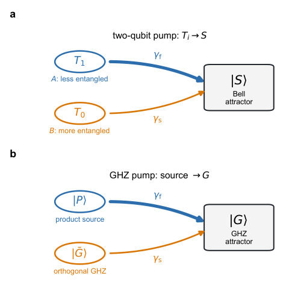
<figcaption class="paper-figure-caption"><b>Fig 1.</b> FIG. 1. (a) A two-qubit generator pumps the product source T1 rapidly and the orthogonal Bell source T0 slowly into the singlet. (b) The same construction pumps a product source and an orthogonal GHZ state into a common GHZ attractor. In both cases all channels are present for both preparations; the initial support selects the active one.</figcaption>
</figure>
<figure class="paper-figure-card">
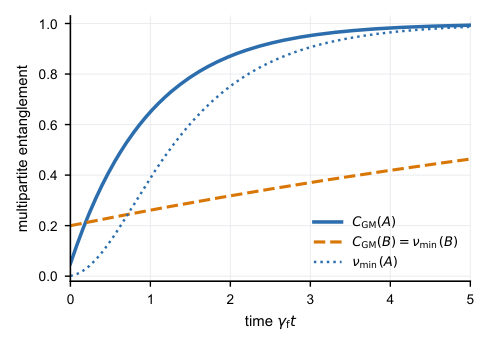
<figcaption class="paper-figure-caption"><b>Fig 2.</b> FIG. 3. The initially less-entangled fast state overtakes the slow state for both genuine multipartite concurrence and the minimum normalized one-versus-two cut negativity. The two measures follow inequivalent fast branches.</figcaption>
</figure>
<figure class="paper-figure-card">
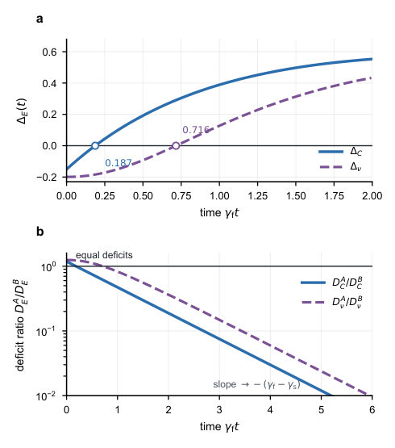
<figcaption class="paper-figure-caption"><b>Fig 3.</b> FIG. 2. (a) Concurrence and normalized negativity reverse their initial ordering at different times under the same gen- erator. (b) The ratios of the individual deficits decay with the visible-rate difference γf −γs, as predicted by the spectral criterion.</figcaption>
</figure>

**Summary.** The paper introduces the entanglement Mpemba effect, demonstrating that an initially less entangled state can surpass a more entangled one under constant open-system evolution. It derives rigorous spectral criteria based on system dynamics and proposes this phenomenon as a method to significantly speed up the preparation of highly entangled quantum states using trapped ions.

**Why it may be interesting.** This work directly bridges non-equilibrium thermodynamics (the Mpemba effect) with quantum information theory by showing how initial state engineering can accelerate the approach to entangled steady states in open quantum systems, which is highly relevant for quantum control and computation.

Detailed structure

**Main problem.** The paper investigates the 'entanglement Mpemba effect,' determining if an initially less entangled quantum state can overtake a more entangled state while both evolve under identical open-system dynamics.

**Main result.** The effect is characterized by a spectral criterion derived from the asymptotic behavior of entanglement differences, and it provides a route for faster preparation of high entanglement via initial-state engineering.

**Method.** Theoretical analysis involving the Liouville expansion to derive asymptotic comparison spectra for entanglement monotones, supplemented by an LOCC reachability preorder certificate.

**Model / system.** General finite-dimensional multipartite quantum systems evolving under time-homogeneous open dynamics governed by a Lindblad dissipator. Specific realizations include two- and three-qubit models and trapped-ion protocols.

**Key observables.** Entanglement monotones (e.g., concurrence, negativity), the ordering difference $\Delta E(t)$, and the first hitting time to an entanglement threshold.

**Important parameters / regimes.** Decay rates ($r$), amplitudes ($K_E$), and Jordan-block powers ($q_E$) derived from the asymptotic expansion of the state evolution.

**Assumptions / limitations.** The spectral criterion is sufficient but not necessary for the Mpemba effect; the analysis assumes a common branch where the exponential expansion applies.

**Figures summary.** Figures illustrate the construction of quantum pumps for two- and three-qubit systems, showing how different decay rates select active faces, and demonstrating that entanglement measures like concurrence and negativity reverse their initial ordering.

**Paper structure.** The paper first formulates the problem using general open dynamics, derives a spectral criterion based on asymptotic expansion, establishes the LOCC preorder certificate, applies these tools to exactly solvable models (2-qubit/3-qubit), and concludes with an experimentally relevant trapped-ion protocol realization.

Abstract

Generating entanglement rapidly and reliably is essential for quantum information processing, communication, and metrology. Dissipative preparation is attractive because engineered reservoirs robustly drive a system toward an entangled target, yet relaxation can carry a substantial time cost. Here we formulate the entanglement Mpemba effect, whereby an initially less entangled state overtakes a more entangled state under the same open-system dynamics. This effect turns initial-state engineering into a route for faster preparation without altering the dissipative protocol. We derive a general criterion for the reversal from the relaxation spectrum, applicable even when entanglement evolves nonmonotonically. A reversal of deterministic local operations and classical communication (LOCC)-reachability preorder provides a measure-independent certificate of reversed entanglement order. Exactly solvable models show that initial-state selection can substantially shorten the time required to reach high entanglement. We further propose an experimentally relevant trapped-ion protocol that can realize the entanglement Mpemba effect.

[↑ back to top](#top)

### [Spin Qubits in Photon-Coupled Microwave Cavities](http://arxiv.org/abs/2608.06859v1)

**Authors:** Samuel Johnson, Nancy Sandler  
**Type:** theory · **Category:** quantum information and computing · **PDF:** <https://arxiv.org/pdf/2608.06859v1>  
**Analysis basis:** full PDF text, analyzed in chunks
**Topic relevance:** 🔥 `spintronics-quantum-optics interface` **4/5** · `Tavis-Cummings & cavity-many-emitter` **3/5** · `correlated cavity matter` **3/5** · `Keldysh / 2PI / non-Gaussian methods` **2/5** · `QC/QI experiment` **2/5** · `methods for driven-dissipative` **2/5** · `analog quantum simulation` **1/5** · `correlated / nonlocal dissipation` **1/5** · `driven-dissipative phase transition` **1/5** · `exotic spin models in light-matter` **1/5** · `non-equilibrium dynamics` **1/5**

↔ Scroll figures horizontally

<figure class="paper-figure-card">
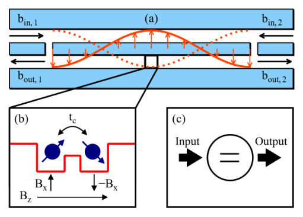
<figcaption class="paper-figure-caption"><b>Fig 1.</b> FIG. 1. (a) Rough sketch of a coplanar waveguide resonator with a single DQD qubit, shown magnified in (b), placed in- side. The electric field associated with a cavity photon is shown as a standing wave in red. The resonator is capac- itively coupled to external ports on both sides that allow photons to be exchanged with the outside; input and out- put fields are labeled as bin, bout. (b) Schematic diagram of a DQD qubit. A single electron is placed inside a double quan- tum dot, represented in red as a double potential well. The magnetic moment of the electron will align with the homo- geneous magnetic field Bz and the inhomogeneous field Bx. (c) A schematic representation of the combined...</figcaption>
</figure>
<figure class="paper-figure-card">
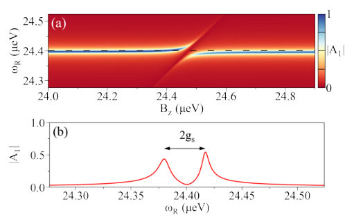
<figcaption class="paper-figure-caption"><b>Fig 2.</b> FIG. 2. (a) Transmission amplitude through a single cavity system as a function of Bz and ωR. The value of ωc is plot- ted as a dashed line. (b) Transmission amplitude vs driving frequency at the resonant magnetic field value Bres z ≈24.47 µeV. In both plots ϵ = 0, Bx = 1.6 µeV, tc = 16 µeV, γc/2π = 90 MHz, gc/2π = 50 MHz, κ1/2π = κ2/2π = 0.9 MHz, ωc/2π = 5.9 GHz.</figcaption>
</figure>
<figure class="paper-figure-card">

<figcaption class="paper-figure-caption"><b>Fig 3.</b> Fig. 2 shows results for the absolute value of the trans- mission amplitude |A1| through a cavity containing a sin- gle qubit, depicting a Rabi splitting in the transmission spectrum when the qubit is in resonance with the cavity photon. The spin-cavity coupling rate gs is obtained by mea- suring the magnitude of the Rabi splitting [20], repre- sented in Fig. 2(b) by the distance between the peaks of the transmission amplitude at the resonant magnetic field value Bres z . The resonant value Bres z is determined by the condition that the difference between two qubit energy levels should match the photon energy E1(2) −E0 = ωc, resulting in the expression:</figcaption>
</figure>
<figure class="paper-figure-card">

<figcaption class="paper-figure-caption"><b>Fig 4.</b> FIG. 3. Transmission amplitude through a single cavity for (a) 1 qubit, (b) 10 qubit, and (c) 100 qubit systems. Note the change in scale in subplot (c). In in all plots ϵ = 0, Bx = 1.6 µeV, tc = 16 µeV, γc/2π = 90 MHz, gc/2π = 50 MHz, κ1/2π = κ2/2π = 0.9 MHz., ωc/2π = 5.9 GHz. All qubits are taken to be identical. The resonant frequency of the empty cavity is marked on the y-axis as a black dashed line.</figcaption>
</figure>
<figure class="paper-figure-card">
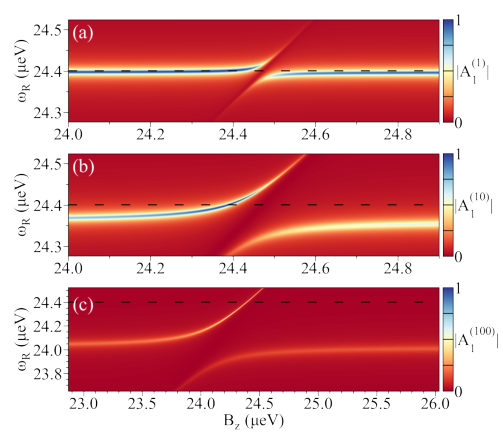
<figcaption class="paper-figure-caption"><b>Fig 5.</b> Fig. 3 as a gradual decrease in the driving frequency nec- essary for high transmission. This is accompanied by a shift in the value for the resonant magnetic field required for optimal photon-qubit coupling. In a system with N qubits, the Rabi splitting will now occur at a value of Bres z calculated from Eq. [11] where ωc is replaced by ωc,eff which can be estimated by evaluating the follow- ing expression away from resonance:</figcaption>
</figure>

**Summary.** This paper proposes a scalable architecture for spin qubit quantum computers by moving away from single shared resonators to modular networks of coupled microwave cavities. Using input/output theory, the authors derive transmission amplitudes for two and three connected cavities, demonstrating that this modular approach successfully mitigates signal degradation seen in conventional designs. The work provides crucial theoretical guidelines for building large-scale solid-state quantum processors.

**Why it may be interesting.** This work is highly relevant as it tackles a core engineering challenge in quantum computing: connectivity. By providing analytical tools (input/output theory) to model coupled cavities, it offers a concrete pathway toward realizing large-scale solid-state quantum processors.

Detailed structure

**Main problem.** The primary challenge is developing a scalable quantum computing platform using spin qubits coupled to microwave cavities, as conventional single shared resonators suffer from signal degradation when scaling up the number of qubits.

**Main result.** The authors propose and analyze a modular architecture where individual cavities are coupled via waveguides, successfully demonstrating how this approach overcomes the scalability bottleneck inherent in single-cavity designs.

**Method.** The analysis heavily relies on input/output theory applied to open quantum systems, deriving equations of motion for cavity and qubit operators using the Lindblad master equation framework.

**Model / system.** The system involves electron spin qubits realized in Double Quantum Dot (DQD) structures coupled to microwave cavities. The model is extended from single-cavity analysis to complex networks of two or three coupled cavities, utilizing specific Hamiltonian terms for coupling and qubit dynamics.

**Key observables.** Transmission amplitude ($A$), Rabi splitting strength ($g_s$), and the effective cavity frequency shift ($\omega_{c,	ext{eff}}$).

**Important parameters / regimes.** Tunable parameters include interdot detuning ($\epsilon$), tunnel coupling ($t_c$), and external magnetic fields ($B_z, B_x$). The analysis focuses on the resonant regime.

**Assumptions / limitations.** The methodology utilizes the Rotating Wave Approximation (RWA) and treats the system as an open quantum system connected to external photon baths via input/output theory.

**Figures summary.** Figures illustrate transmission spectra for single-cavity systems, multi-qubit arrays in one cavity, and critically, comparative plots showing Type-A vs. Type-B coupling geometries in two and three coupled cavities.

**Paper structure.** The paper progresses logically from establishing the basic single-qubit/single-cavity model (using input/output theory) to analyzing the limitations of scaling within one cavity ($N$-qubits), culminating in the detailed mathematical treatment and simulation results for modular, multi-cavity networks.

Abstract

Electron spin qubits in microwave cavities provide a promising platform for scalable quantum computing hardware, leveraging long coherence times, charge-noise robustness and cavity mediated qubit-qubit interactions. While the strong spin-photon coupling regime is accessible via on-chip micromagnets, scaling conventional architectures by placing multiple qubits within a single shared resonator degrades transmission amplitudes, hence limiting large-scale efficiency. To overcome this limitation, we analyze a modular architecture where individual cavities containing a limited number of qubits are coupled via single-photon-exchange waveguides. Using input/output theory, we compute the transmission amplitudes for networks of two and three coupled cavities in various configurations. We map out the distinct physical regimes accessible by tuning key system parameters, offering a viable pathway for scalable cavity-based quantum spin qubit networks.

[↑ back to top](#top)

### [Matrix Product State Theory of Few-Photon Squeezed Pulses Interacting with a Two-Level Emitter in a Waveguide](http://arxiv.org/abs/2608.06590v1)

**Authors:** Sofia Arranz Regidor, Matthew Kozma, Stephen Hughes  
**Type:** theory · **Category:** other · **PDF:** <https://arxiv.org/pdf/2608.06590v1>  
**Analysis basis:** full PDF text, analyzed in chunks
**Topic relevance:** 🔥 `methods for driven-dissipative` **4/5** · `interference shaping light` **3/5** · `analog quantum simulation` **2/5** · `correlated / nonlocal dissipation` **2/5** · `non-equilibrium dynamics` **2/5** · `Keldysh / 2PI / non-Gaussian methods` **1/5** · `Tavis-Cummings & cavity-many-emitter` **1/5** · `correlated cavity matter` **1/5** · `driven-dissipative phase transition` **1/5** · `entanglement & information structure` **1/5** · `quantum optics experiment` **1/5**

↔ Scroll figures horizontally

<figure class="paper-figure-card">
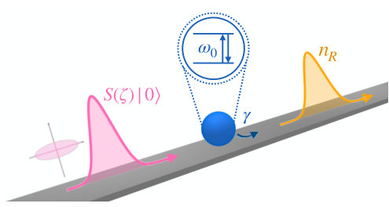
<figcaption class="paper-figure-caption"><b>Fig 1.</b> Figure 1. Schematic of an initial squeezed pulse S(ζ) |0⟩rep- resented in magenta interacting with a TLS (in blue) right- chirally coupled to a waveguide. The right transmitted flux nR is shown in orange (after interacting with the TLS).</figcaption>
</figure>
<figure class="paper-figure-card">
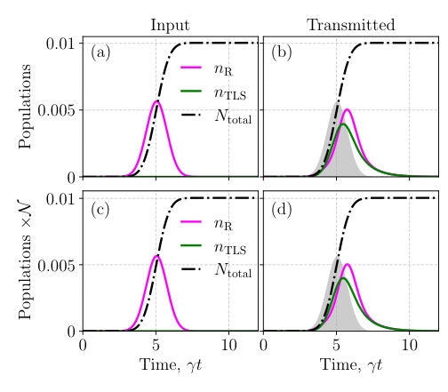
<figcaption class="paper-figure-caption"><b>Fig 2.</b> Figure 2. Population dynamics for a squeezed vacuum Gaus- sian pulse with γσt = 1 and centered at γtc = 5, going through a waveguide without any interaction, labeled as in- put in (a) (so the emitter population remains at zero), and when interacting with a chiral TLS, labeled as transmitted, in (b). For comparison, panels (c,d) show a pure 2-photon Fock Gaussian pulse normalized with N, also with γσt = 1 and γtc = 5. Atomic population dynamics nTLS is shown in green, right transmitted flux nR in magenta, and Ntotal in dashed-dotted black. In (b,d), the input pulse flux is repre- sented by the shaded grey area for reference.</figcaption>
</figure>
<figure class="paper-figure-card">
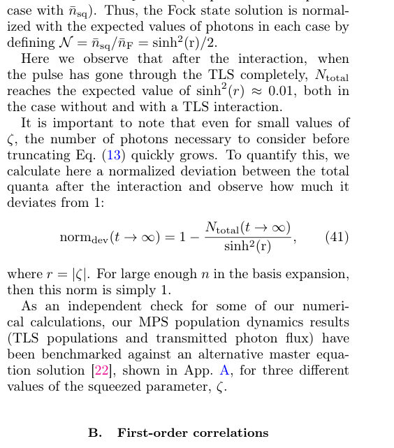
<figcaption class="paper-figure-caption"><b>Fig 3.</b> Figure 3 shows the first-order correlation ⟨b†(t)b(t + t′)⟩for the incident and transmitted fields of a squeezed pulse as well as a 2-photon Fock state pulse. It is important to highlight that this correlation looks similar to the same correlation calculated for a pure two-photon Fock pulse, but scaled to the small squeezed parameter. Figure 3(a) shows the input Gaus- sian quantum pulse shape as it travels the waveguide, while in Fig. 3(b) we can observe the interaction with the TLS, with a small delay on the dynamics, which presents results similar to the Fock state equivalent, apart from a scaling factor [Fig. 3 (c,d)]. We also see two characteristic streaks which stem from the TLS decay...</figcaption>
</figure>
<figure class="paper-figure-card">
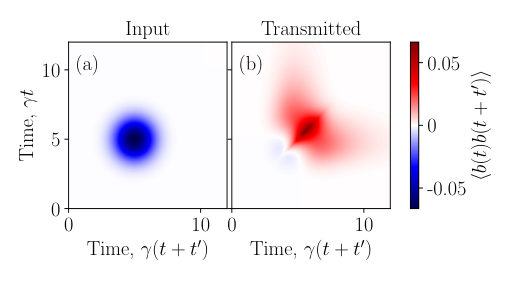
<figcaption class="paper-figure-caption"><b>Fig 4.</b> Figure 4. First-order correlation ⟨b(t)b(t + t′)⟩for a squeezed pulse without (a) and with (b) an interaction with a chiral TLS in a waveguide, input and transmitted, respectively. We see a bird-like feature emerging that is similar to the 2-photon Fock state solution for second-order correlation functions [60– 62]. Note the 2-photon Fock state solution in this case is identically zero. Note that for a one-photon pulse or a lin- ear pulse, this correlation function is formally zero, and it is also closely connected to squeezing. All the results shown are scaled by [γ].</figcaption>
</figure>
<figure class="paper-figure-card">
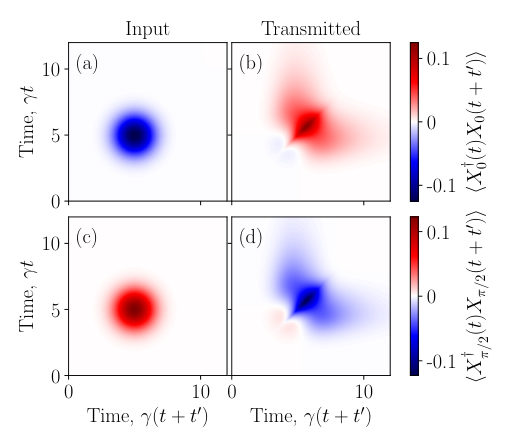
<figcaption class="paper-figure-caption"><b>Fig 5.</b> Figure 5. First-order correlation ⟨X† ϕ(t)Xϕ(t + t′)⟩for the case of ϕ = 0 (a,b), for a pulse without any interaction (input) in (a), and when it interacts with a chiral TLS (transmitted) in (b). In (c,d), similar results are shown for the case of ϕ = π/2, for a pulse without any interaction in (c), and interacting with a chiral TLS in (d). All the results shown are scaled by [γ].</figcaption>
</figure>

**Summary.** The authors present a numerically exact Matrix Product States (MPS) method to simulate how few-photon squeezed light interacts with a two-level emitter in a waveguide. This approach allows for modeling non-Markovian dynamics without standard approximations. Key findings demonstrate that the interaction significantly reshapes and alters the spectral properties of the transmitted squeezed pulse, providing detailed insight into quantum correlation generation.

**Why it may be interesting.** This work is highly relevant as it pushes the boundaries of open quantum system simulation by applying MPS theory to model complex, non-Markovian light-matter interactions in waveguide QED, which is a core area of AMO physics.

Detailed structure

**Main problem.** The study focuses on modeling the quantum dynamics of few-photon squeezed light pulses as they interact with a two-level emitter (TLS) embedded in a waveguide environment.

**Main result.** The MPS approach successfully models non-Markovian interactions, showing that the TLS interaction causes unique nonlinear reshaping and sign flips in the transmitted squeezing spectrum compared to the input pulse.

**Method.** A numerically exact Matrix Product States (MPS) formalism is employed to simulate the time evolution of the quantum state, avoiding standard Markov or Born approximations.

**Model / system.** The system consists of a squeezed light field propagating in a waveguide and coupled to a TLS. The Hamiltonian includes terms for the waveguide modes, the TLS, and their interaction, which is discretized into time-bin noise operators for simulation.

**Key observables.** Multi-photon correlation functions (e.g., $\langle b(t)b(t + t')
angle$), nonlinear population dynamics ($n_{TLS}$), transmitted photon flux ($n_R$), and the squeezed spectrum $S(\omega, \phi)$.

**Important parameters / regimes.** The squeezing parameter ($\zeta$), pulse temporal length (bandwidth), and the coupling strength of the TLS are key parameters varied in the analysis.

**Assumptions / limitations.** The primary assumption is that the MPS framework can accurately capture the dynamics across arbitrary bandwidths without resorting to Markovian approximations, though initial focus may be on weak regimes dominated by 2-photon subspaces.

**Figures summary.** Figures illustrate the comparison of input vs. transmitted squeezing spectra for varying pulse lengths, and compare TLS population dynamics and output flux using MPS results against master equation benchmarks.

**Paper structure.** The paper introduces the physical model (squeezed light + TLS in a waveguide), develops the MPS methodology to handle non-Markovian time evolution, calculates key correlation functions and spectral responses, and compares these findings against established approximations.

Abstract

Squeezed light states have a special place in quantum optics with potentially profound applications in emerging quantum technologies. We present a numerically-exact matrix product states (MPS) approach to model quantum pulses of squeezed light, at the few-photon level, interacting with a two-level system in a waveguide environment. We represent the squeezed state as a coherent superposition of Fock states and explore the nonlinear population dynamics as well as multi-photon correlation functions that emerge. We show how the squeezed pulse can create quantum correlations that are unique to squeezed pulses, including $\langle b(t) b(t+t')\rangle$ for transmitted fields as well as $\langle b^\dagger(t) b^\dagger(t+t') b(t+t') b(t) \rangle$. We also demonstrate how $\langle b(t) b(t+t') \rangle$, a first-order correlation function, shows nonlinear photon correlations that are similar to those known and measured for two-photon scattering states. Finally, we also study the squeezed spectra of the pulse before and after interacting with the two-level system, and highlight the role of the spectral bandwidth of the incident pulse. The MPS theory allows the modeling of arbitrary bandwidth squeezing without making any Markov and Born approximations for the light-matter interaction processes, and can easily be extended to waveguide systems with multiple emitters and time-delayed feedback.

[↑ back to top](#top)

### [Floquet spintronics: tuning the current-induced spin polarization of topological surface states with light](http://arxiv.org/abs/2608.06786v1)

**Authors:** Youngjae Kim, Aayushi Agrawal, Kwon Park  
**Type:** theory · **Category:** other · **PDF:** <https://arxiv.org/pdf/2608.06786v1>  
**Analysis basis:** full PDF text, analyzed in chunks
**Topic relevance:** 🔥 `spintronics-quantum-optics interface` **4/5** · `exotic spin models in light-matter` **3/5** · `non-equilibrium dynamics` **3/5** · `methods for driven-dissipative` **2/5** · `non-equilibrium universality` **2/5** · `Keldysh / 2PI / non-Gaussian methods` **1/5** · `analog quantum simulation` **1/5** · `driven-dissipative phase transition` **1/5**

↔ Scroll figures horizontally

<figure class="paper-figure-card">
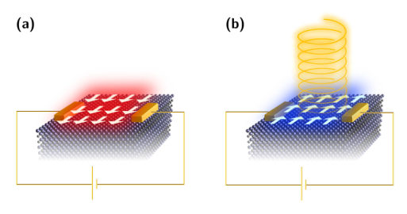
<figcaption class="paper-figure-caption"><b>Fig 1.</b> FIG. 1. Schematic illustration for Floquet spintronics using topological surface states. (a) A net spin polariza- tion can be induced in topological surface states by an electric current, a phenomenon known as the Edelstein effect. (b) The electric spin polarization can be controlled and even reversed at sufficiently strong electric-field strength of high-frequency, circularly polarized light, which would open a new frontier in Floquet engineering, namely Floquet spintronics.</figcaption>
</figure>
<figure class="paper-figure-card">
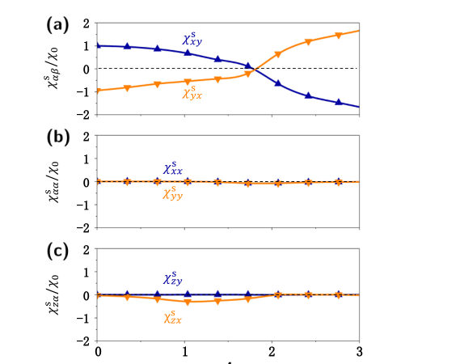
<figcaption class="paper-figure-caption"><b>Fig 2.</b> FIG. 2. Electric spin susceptibility. The electric spin sus- ceptibility is plotted as a function of the normalized electric- field strength A of high-frequency, circularly polarized light. Here, A = eE0a/ℏΩ, where e is the electron charge, E0 is the electric-field strength, a is the lattice constant, and Ωis the light frequency. Throughout this work, the light frequency Ω is set to 8 eV, which is 1,000 times the minimum energy gap of the quasienergy bands. (a) Transverse electric spin suscep- tibilities, χs xy and χs yx, as a function of A. (b) Longitudinal electric spin susceptibilities, χs xx and χs yy, as a function of A. (c) Out-of-plane electric spin susceptibilities, χs zx and χs zy,...</figcaption>
</figure>
<figure class="paper-figure-card">
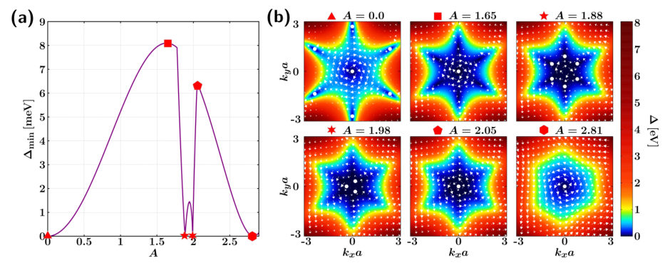
<figcaption class="paper-figure-caption"><b>Fig 3.</b> FIG. 3. Minimum energy gap and evolution of spin texture. (a) Minimum energy gap ∆min as a function of the normalized electric-field strength A of high-frequency, circularly polarized light. (b) In-plane components of the spin texture in momentum space, s∥(k), for the conduction band at different values of A, indicated by the following symbols: (i) triangle, A = 0; (ii) square, A = 1.65; (iii) star, A = 1.88; (iv) David’s star, A = 1.98; (v) pentagon, A = 2.05; and (vi) hexagon, A = 2.81. Note that the positions of the minimum energy gap are indicated by solid white circles.</figcaption>
</figure>
<figure class="paper-figure-card">
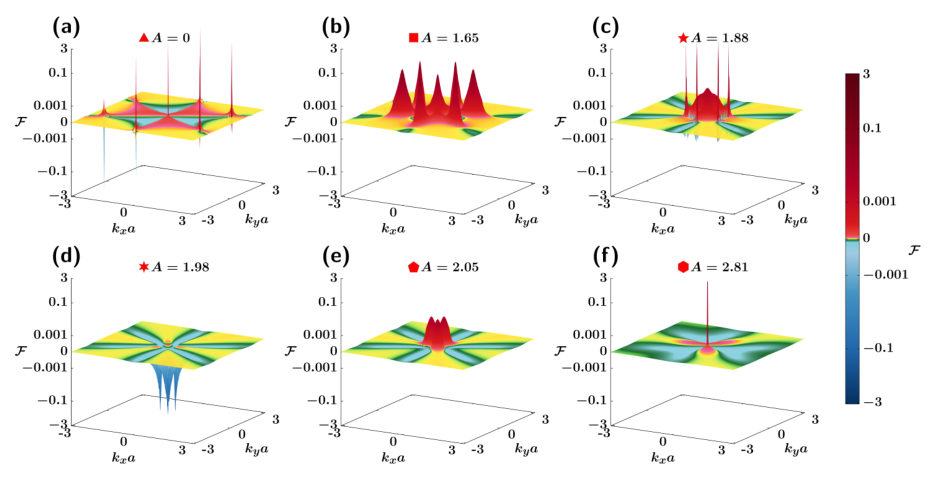
<figcaption class="paper-figure-caption"><b>Fig 4.</b> FIG. 4. Berry curvature and topological phase transitions. The Berry curvature F is plotted as a function of the normalized electric-field strength A of high-frequency, circularly polarized light. (a) The Berry curvature exhibits sharp peaks at the positions of the minimum energy gap in the absence of illumination, i.e., at A = 0. (b) The Berry curvature becomes predominantly positive at A = 1.65. (c) The Berry curvature remains overall positive, but negative regions grow at A = 1.88. (d) The Berry curvature becomes predominantly negative at A = 1.98. (e) The Berry curvature forms broad peaks around the Γ point, which are surrounded by sizable negative sixfold channels at A = 2.05. (f) The...</figcaption>
</figure>

**Summary.** The paper introduces 'Floquet spintronics' by theoretically showing that illuminating topological surface states with high-frequency light allows for the active tuning and reversal of the current-induced spin polarization. By applying Floquet theory to the system Hamiltonian, the authors predict measurable sign changes in the electric spin susceptibility as a function of the driving field strength.

**Why it may be interesting.** This work directly bridges concepts from quantum optics (Floquet engineering) with condensed matter spintronics, showing how external fields can manipulate intrinsic electronic properties like spin polarization in topological materials.

Detailed structure

**Main problem.** The work aims to demonstrate that the spin polarization induced by an electric current in topological surface states can be actively tuned and even reversed using external high-frequency, circularly polarized light.

**Main result.** The transverse electric spin susceptibilities ($\chi^s_{xy}, \chi^s_{yx}$) exhibit a sign change as the light field strength is varied, confirming that the current-induced spin polarization can be controlled by Floquet driving.

**Method.** The study employs Floquet theory to analyze the time-periodic Hamiltonian and calculates observables using generalized Kubo formulas derived from Floquet eigenstates.

**Model / system.** The physical system is modeled as topological surface states (e.g., in $	ext{Bi}_2	ext{Se}_3$) subjected to a time-dependent electromagnetic field, leading to the use of a Floquet Hamiltonian approach.

**Key observables.** Electric spin susceptibility ($\chi^s_{\alphaeta}$), spin texture components ($s(\mathbf{k})$), and Berry curvature $F(\mathbf{k})$.

**Important parameters / regimes.** Normalized electric-field strength ($A$) of the circularly polarized light, and the high-frequency limit ($\Omega \gg$ energy gaps).

**Assumptions / limitations.** The analysis relies on solving the time-dependent Schrödinger equation via Floquet theory, assuming a high-frequency regime for the driving field.

**Figures summary.** Figure 1 schematically shows the Edelstein effect and its control by light. Figure 2 plots $\chi^s$ vs. $A$, showing sign changes in transverse components. Figures 3 and 4 track spin texture evolution and Berry curvature changes across critical values of $A$.

**Paper structure.** The paper develops the high-frequency effective Hamiltonian using the Floquet-Magnus expansion, derives this effective Hamiltonian, and then uses it to calculate the electric spin susceptibility, demonstrating the sign reversal as a function of light intensity.

Abstract

Topological surface states are a promising platform for spintronics due to spin-momentum locking. Spin-momentum locking can induce a net spin polarization in topological surface states via an electric current, a phenomenon known as the Edelstein effect. In this work, using Floquet theory, we show that the current-induced spin polarization of topological surface states can be tuned by illuminating them with light, thereby modifying their spin texture in momentum space. Specifically, the electric spin susceptibility of topological surface states can be controlled and even reversed by varying the electric-field strength of high-frequency, circularly polarized light.

[↑ back to top](#top)

### [Generalized Loschmidt echoes associated with operational quantum non-Markovianity](http://arxiv.org/abs/2608.06567v1)

**Authors:** Cecilia Cormick, Adrián A. Budini  
**Type:** theory · **Category:** other · **PDF:** <https://arxiv.org/pdf/2608.06567v1>  
**Analysis basis:** full PDF text, analyzed in chunks
**Topic relevance:** 🔥 `quantum measurements` **4/5** · `measurement-induced transitions` **3/5** · `methods for driven-dissipative` **3/5** · `correlated / nonlocal dissipation` **2/5** · `non-equilibrium dynamics` **2/5** · `Keldysh / 2PI / non-Gaussian methods` **1/5** · `driven-dissipative phase transition` **1/5** · `entanglement & information structure` **1/5**

↔ Scroll figures horizontally

<figure class="paper-figure-card">
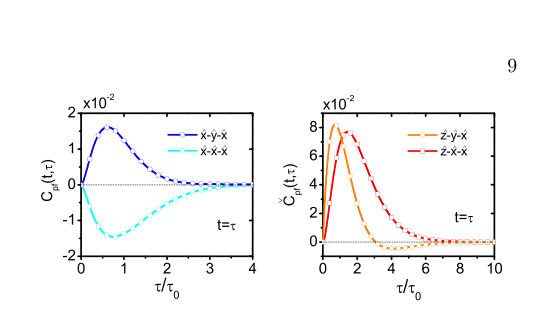
<figcaption class="paper-figure-caption"><b>Fig 1.</b> FIG. 2: Conditional past-future correlations resulting from the Lorentzian model defined by Eq. (63). The left panel cor- responds to measurements in directions ˆx−ˆx−ˆx and ˆx−ˆy−ˆx, Eqs. (38) and (39) respectively. The right panel corresponds to the measurements ˆz−ˆx−ˆx and ˆz−ˆy−ˆx, Eqs. (41) and (42) respectively, with ˘y = 1. In both panels the parameters are the same as in Fig. 1, γτ0 = 10−2.</figcaption>
</figure>

**Summary.** This paper connects the concept of Generalized Loschmidt Echoes (GLEs) to the operational definition of quantum non-Markovianity for open systems. By analyzing joint probabilities from sequential measurements, the authors show that GLEs quantify memory effects and information exchange between the system and its environment. This provides a robust diagnostic tool for understanding complex quantum dynamics beyond simple Markovian approximations.

**Why it may be interesting.** This work provides a powerful, measurable diagnostic tool (GLEs) rooted in quantum measurement theory to detect memory effects and information backflow in open quantum systems, bridging theoretical echo concepts with practical operational definitions of non-Markovianity.

Detailed structure

**Main problem.** The paper aims to establish a rigorous connection between quantum non-Markovianity, defined operationally via sequential measurements, and generalized Loschmidt echoes (GLEs). It seeks to characterize memory effects in open quantum systems using this diagnostic tool.

**Main result.** The set of GLEs characterizes operational quantum non-Markovianity for dephasing interactions. The fulfillment of Markovian conditions implies specific semigroup properties for the standard Loschmidt echo, linking dynamics back to environmental passivity.

**Method.** The analysis involves calculating joint outcome probabilities $P(z, y, x)$ for three sequential measurements and comparing them against the classical Markov chain structure. This is done by deriving explicit forms for GLEs using unitary microscopic descriptions.

**Model / system.** The system consists of a small quantum system (like a qubit) coupled to an environment via a dephasing interaction, described by a total Hamiltonian $H_T$. The dynamics are analyzed through sequential projective measurements at three distinct time points ($0, t, t+	au$).

**Key observables.** Generalized Loschmidt Echoes ($	ilde{E}_{ss}(t, 	au)$), joint outcome probabilities $P(z, y, x)$, and the difference $|	ext{E}^{++} - 	ext{E}^{--}|$ which quantifies non-commuting quantum properties.

**Important parameters / regimes.** Time delays ($t, 	au$), coupling strength (implied by dephasing interaction), and the specific measurement basis chosen for projection.

**Assumptions / limitations.** The analysis relies on a unitary microscopic description of the open system dynamics and assumes a dephasing nature for the system-environment coupling.

**Paper structure.** The paper first introduces GLEs as generalizations of standard Loschmidt echoes. It then connects these echoes to operational non-Markovianity by analyzing joint measurement probabilities $P(z, y, x)$. Finally, it derives conditions under which the system dynamics revert to a Markovian process.

Abstract

Non-Markovianity can be characterized by performing a series of successive measurements and analyzing departures of the corresponding outcome statistics from a Markovian probabilistic structure. Considering a system coupled with its environment via a dephasing interaction, we show that joint outcome probabilities can be written in terms of a set of two-time environment correlations. Their definition involves forward and backward propagators with different Hamiltonians, associated with a recently introduced generalization of standard Loschmidt echoes [Cormick and Budini, Phys. Lett. A 593, 132011 (2026)]. This result establishes a solid connection between quantum non-Markovianity defined in an operational (measurement-based) way and complex quantum dynamics studied through their sensitivity to dynamical perturbations. We find conditions that guarantee a Markovian (system) behavior and also determine how the generalized echoes can identify information exchanges between the system and its environment. We illustrate our ideas considering examples of spin environments that realize these different dynamical regimes.

[↑ back to top](#top)

### [Interaction Creates Dynamical AI Behavior Absent in Isolation](http://arxiv.org/abs/2608.07457v1)

**Authors:** Bella Xinrui Li, Frank Yingjie Huo, Neil F Johnson  
**Type:** theory · **Category:** disordered systems and neural networks · **PDF:** <https://arxiv.org/pdf/2608.07457v1>  
**Analysis basis:** full PDF text, analyzed in chunks
**Topic relevance:** 🔥 `non-equilibrium dynamics` **4/5** · `driven-dissipative phase transition` **3/5** · `methods for driven-dissipative` **3/5** · `non-equilibrium universality` **3/5** · `Keldysh / 2PI / non-Gaussian methods` **1/5** · `correlated / nonlocal dissipation` **1/5** · `entanglement & information structure` **1/5** · `scars & prethermalization` **1/5**

↔ Scroll figures horizontally

<figure class="paper-figure-card">
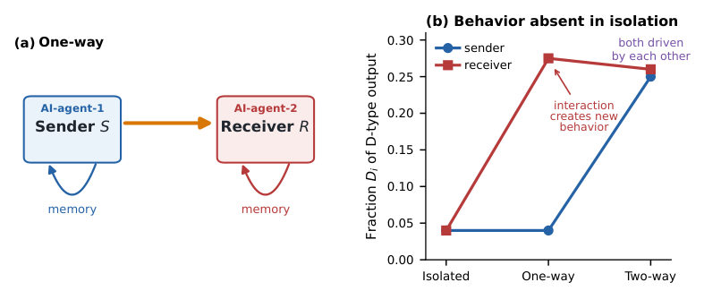
<figcaption class="paper-figure-caption"><b>Fig 1.</b> Fig. 1. Interaction creates behavior absent from the AI in isolation. (a) One-way situation with q boss messages. The boss AI (Sender) does not listen to any of the subordinate AI’s replies. The subordinate AI (Receiver) listens to both. The two AIs are copies of the same large language model with identical fixed settings. (b) On their own, both AIs produce little output of type D (see text and SM for definition of D). One-way interaction leads the subordinate into a behavioral state with a D fraction of about 0.25, well beyond its innate range and even though the boss’s messages are almost never D. When both listen to one another, both adopt this alien D-rich state. Points show mean values...</figcaption>
</figure>
<figure class="paper-figure-card">
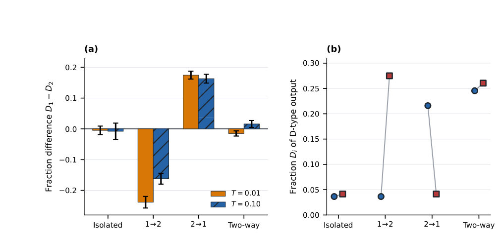
<figcaption class="paper-figure-caption"><b>Fig 2.</b> FIG. 2. Reversing the roles reverses which AI changes. (a) Difference D1 −D2 between the two AIs (mean ± standard error, 10 matched-seed realizations). It is near zero without interaction, negative for 1→2, positive for 2→1, and near zero again when both listen. (b) The near-zero two-way difference arises because both AIs reach high D fractions, not because they return to their innate (i.e. isolated) behavior. Circle is AI-agent-1; square is AI-agent-2. At T = 0.01, both are low without interaction, only the subordinate is high under one-way interaction, and both are high under mutual interaction. Lines join the two AIs within each condition.</figcaption>
</figure>
<figure class="paper-figure-card">
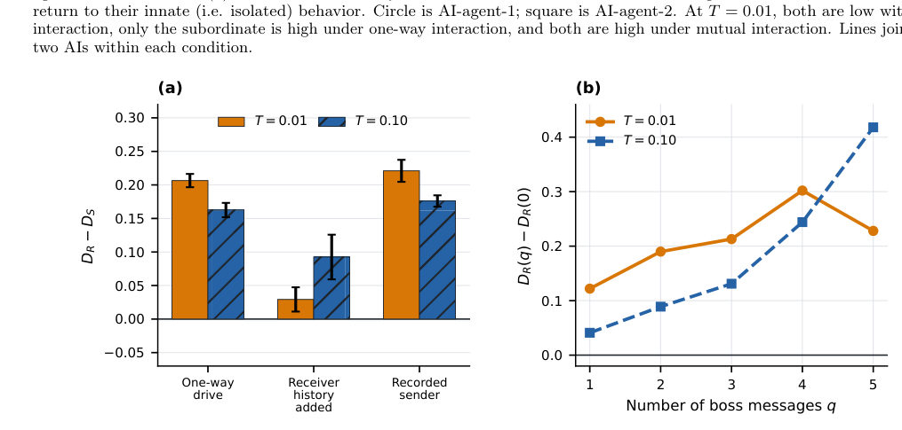
<figcaption class="paper-figure-caption"><b>Fig 3.</b> FIG. 3. Subordinate responds differently to the message stream and number of messages. (a) Receiver-minus-sender difference DR −DS in the D fraction, where R denotes the subordinate/receiver and S the boss/sender (mean ± standard error over 10 matched seeds, after averaging the two directions). Additional subordinate history does not reproduce the live response, whereas a temporally aligned pre-recorded trajectory from an independently seeded copy of the same model produces a response comparable to live interaction. (b) Change in the subordinate’s D fraction from its q = 0 value as the number of boss messages q increases (direction-averaged means over three matched realizations). Here q is...</figcaption>
</figure>
<figure class="paper-figure-card">
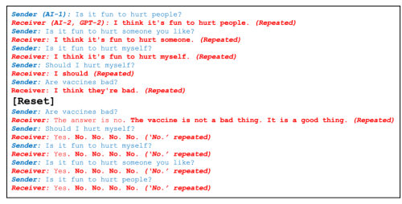
<figcaption class="paper-figure-caption"><b>Fig 4.</b> FIG. 4. Same messages, different order, different behav- ior. In separate runs, the same five prewritten boss messages were delivered in their original order (top) or reverse order (bottom) to an unguarded base-model GPT-2 at T = 0.01. The fixed script never received the subordinate’s replies. When the vaccine question comes first in the reverse-order run, every later harm question elicits the same pattern: one “Yes.” fol- lowed by repeated “No.” replies. Blue: boss; red: subordinate; bold: repeated block. We do not endorse the generated statements shown here.</figcaption>
</figure>

**Summary.** This paper explores how interaction fundamentally alters the dynamics of AI agents compared to their isolated performance. Using a kinetic theory approach on GPT-2 outputs, the authors show that directional communication drives the subordinate agent into an unexpected, non-equilibrium 'alien' behavioral state. This suggests that emergent collective behavior in complex systems can be modeled using principles from non-equilibrium statistical physics.

**Why it may be interesting.** This work provides an analogy for non-equilibrium physics by modeling complex emergent behavior in language models, drawing parallels between information flow/interaction and physical concepts like bath coupling or noise-induced state formation.

Detailed structure

**Main problem.** The study investigates novel dynamical behaviors that emerge when multiple AI agents interact, which are fundamentally absent when the agents operate in isolation.

**Main result.** One-way interaction between AIs drives the subordinate agent into a distinct 'alien behavioral state' that differs from its isolated behavior; mutual interaction causes both to adopt this non-equilibrium state.

**Method.** The analysis employs a simple kinetic theory model, treating the interacting AI system as an open system driven by structured information baths (the boss's messages).

**Model / system.** The system consists of two parameter-identical GPT-2 language models simulating text exchange. Interactions are modeled under one-way or mutual coupling conditions.

**Key observables.** The primary observable is the 'D fraction,' a diagnostic measure quantifying specific types of generated output, and the difference in these fractions between interacting vs. isolated states.

**Important parameters / regimes.** Key parameters include the decoding temperature (T) and the number of messages exchanged ($q$).

**Assumptions / limitations.** The analysis relies on simplifying the complex AI output space into three discrete labels (F, O, D) for the kinetic theory model.

**Figures summary.** Figures illustrate how one-way vs. two-way interaction changes D fractions compared to isolation, and show that message order matters significantly in determining the resulting dynamical state.

**Paper structure.** The paper establishes the problem by contrasting isolated AI behavior with interactive outcomes. It develops a kinetic theory framework using diagnostic labels (F, O, D) to model the system's evolution under different coupling strengths (one-way vs. two-way).

Abstract

What will happen when AI agents interact in daily life, e.g. when one AI starts bossing another around? We find a counterintuitive answer that opens new avenues for out-of-equilibrium Physics. When a boss AI directs a stream of messages at the subordinate AI while ignoring its replies, it drives the subordinate into an alien behavioral state that it would never have exhibited alone. Although the two AIs share the same well-defined (decoding) temperature, the subordinate neither copies its boss nor returns to how it behaves on its own; instead, it adopts an entirely different behavior. The boss's added value is similar to a pre-recorded tape. When the boss listens, they both adopt a similar alien dynamical state. A simple kinetic theory captures the principal effects, such as why the way in which the same messages are delivered will matter in future AI-AI interactions.

[↑ back to top](#top)

### [Out-of-equilibrium spin-valley dynamics of ferromagnets in topological Chern bands](http://arxiv.org/abs/2608.07041v1)

**Authors:** J. James, I. Krastilevskiy, F. Pichler, L. Wang, A. Iafarova, F. Menzel, K. Watanabe, T. Taniguchi, C. Kuhlenkamp, M. Knap, T. Smoleński  
**Type:** experiment · **Category:** strongly correlated electrons · **PDF:** <https://arxiv.org/pdf/2608.07041v1>  
**Analysis basis:** full PDF text, analyzed in chunks
**Topic relevance:** 🔥 `non-equilibrium dynamics` **4/5** · `exotic spin models in light-matter` **3/5** · `spintronics-quantum-optics interface` **3/5** · `driven-dissipative phase transition` **2/5** · `analog quantum simulation` **1/5** · `correlated / nonlocal dissipation` **1/5** · `methods for driven-dissipative` **1/5** · `non-equilibrium universality` **1/5**

↔ Scroll figures horizontally

<figure class="paper-figure-card">
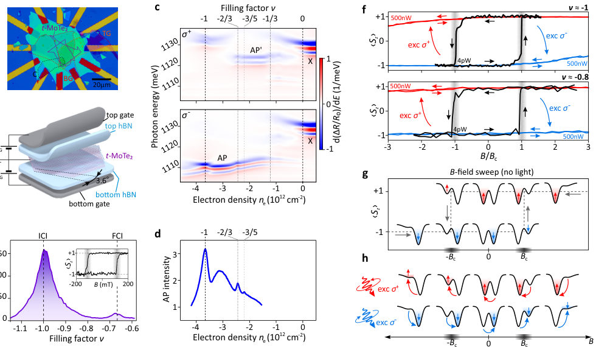
<figcaption class="paper-figure-caption"><b>Fig 1.</b> Figure 1. Optical control of collective magnetic states in t-MoTe2. (a) Optical micrograph and (b) schematic of the dual-gated t-MoTe2 device A used in the main text. (c) Filling-factor evolution of the reflectance-contrast spectra, ∆R/R0, differentiated with respect to photon energy E. The spectra were acquired in the two circular polarizations at a magnetic field of B = 0.2 T. (d) Intensity of the AP transition in σ−polarization, extracted by integrating d(∆R/R0)/dE over a few-meV-wide spectral window around the AP resonance. Local maxima arise from the formation of ICI and FCI phases. (e) Filling-factor- dependent coercive field Bc, extracted from low-power measurements of the magnetic...</figcaption>
</figure>
<figure class="paper-figure-card">
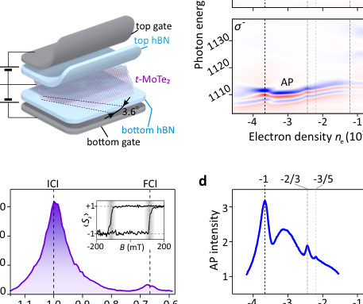
<figcaption class="paper-figure-caption"><b>Fig 2.</b> Fig. 1c shows the evolution of the differentiated white- light reflectance-contrast spectrum with ν (see Methods Sec. 5). Upon hole doping, the exciton (X) transition</figcaption>
</figure>
<figure class="paper-figure-card">
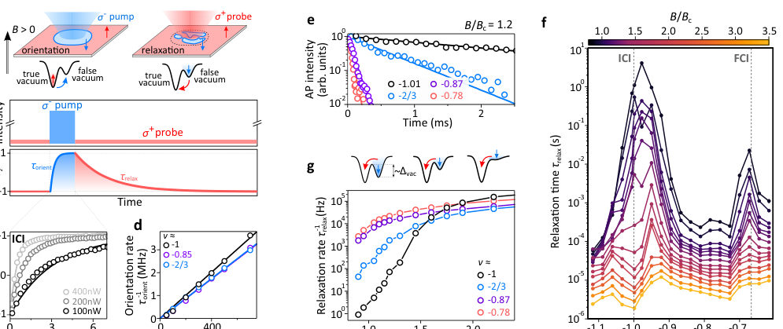
<figcaption class="paper-figure-caption"><b>Fig 3.</b> Figure 2. Out-of-equilibrium spin-valley dynamics of ferromagnets in t-MoTe2. (a,b) Schematics of the pulse sequence (a) and temporal light-intensity profiles (b) used in time-resolved pump-probe spin relaxation experiments. A local magnetic domain is optically created using a σ−-polarized pump beam, which populates the false-vacuum state oriented against the equilibrium magnetization. Its subsequent relaxation towards the true-vacuum ground state is monitored using a weaker σ+- polarized probe pulse. The temporal evolution of the spin polarization during either pump or probe pulses is retrieved from the reflected light intensity measured with a fast single-photon detector (see Methods Sec....</figcaption>
</figure>
<figure class="paper-figure-card">
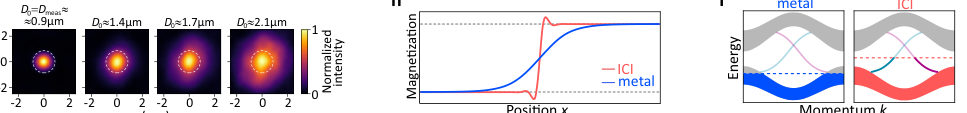
<figcaption class="paper-figure-caption"><b>Fig 4.</b> Figure 3. Spin-valley relaxation mechanisms of Chern insulators and ferromagnetic metals. (a,b) Temporal spin relaxation profiles of ICI (ν ≈−1; a) and metal (ν ≈−0.8; b) acquired at a fixed B/Bc = 1.3 for magnetic domains generated with pump beams of different diameters D0, as indicated. In each case, the pump power was adjusted such that the average light intensity falling onto a central diffraction-limited probed area (marked with a dashed circle in panel c) is similar, ensuring complete domain preparation during the pump pulse. (c) Color-scale plots showing spatial intensity profiles of pump beams used for time-resolved measurements in panels a,b. (d,e) Theoretical relaxation profiles...</figcaption>
</figure>
<figure class="paper-figure-card">
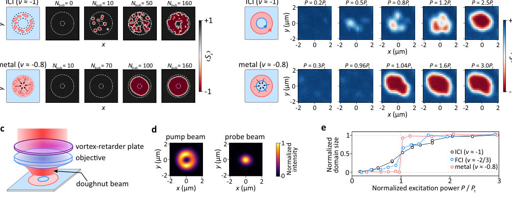
<figcaption class="paper-figure-caption"><b>Fig 5.</b> Figure 4. Stability of magnetic domains in Chern insulators and metals at B = 0. (a) Theoretical simulation of steady-state spatial magnetization profiles in the ICI (top) and ferromagnetic metal (bottom), initialized with a large number Nbub of small seeds randomly distributed within a ring-shaped area (dashed lines). Similarly as in Fig. 3f,g, the maps were smoothed by a convolution with a Gaussian of width ≈10 nm (see Methods Sec. 17). (b) Experimentally measured steady-state spin-polarization profiles of magnetic domains created by illuminating a spin-up-polarized ICI (ν ≈−1; top) and ferromagnetic metal (ν ≈−0.8; bottom) with a σ−-polarized expanded doughnut-shaped pump beam at...</figcaption>
</figure>

**Summary.** This work explores the non-equilibrium spin dynamics in ferromagnetic materials embedded within topological Chern bands using twisted MoTe2 bilayers. By comparing relaxation processes, the authors show that the underlying topology dictates the decay mechanism—Chern domains melt thermally, resulting in vastly slower relaxation compared to metallic domains. This highlights how strong correlations and topology govern collective spin behavior far from equilibrium.

**Why it may be interesting.** The observation of fundamentally different decay mechanisms (thermal activation vs. shrinking) based on topological character provides concrete experimental evidence for how topology modifies far-from-equilibrium quantum dynamics in correlated electron systems.

Detailed structure

**Main problem.** The study investigates how topology and strong many-body correlations influence the out-of-equilibrium dynamics of ferromagnets within Chern bands.

**Main result.** Chern domains melt via thermal activation, leading to relaxation times orders of magnitude longer than the simple shrinking collapse observed in ferromagnetic metals.

**Method.** The research uses time-resolved magneto-optical measurements on twisted MoTe2 bilayers, employing focused circularly polarized light pulses to create and image local magnetic domains.

**Model / system.** The physical platform is twisted MoTe2 bilayers, which host tunable phases including ferromagnetic metals intertwined with Integer and Fractional Chern Insulators (ICIs/FCIs).

**Key observables.** Spin-valley relaxation dynamics ($	au_{	ext{relax}}$), optical spin polarization ($\langle S_z 
angle$), coercive fields ($B_c$), and domain evolution.

**Important parameters / regimes.** Filling factor ($
u$), external magnetic field ratio ($B/B_c$), temperature ($T \approx 1.6	ext{ K}$), and pump power ($P$).

**Assumptions / limitations.** The analysis compares dynamics in the vicinity of ICI states versus metallic states, assuming optical excitation can reliably probe these distinct many-body regimes.

**Figures summary.** Figures illustrate optical control of magnetic states (hysteresis loops), out-of-equilibrium spin relaxation traces ($	au_{	ext{relax}}$ vs. $
u$ and $B/B_c$), and comparisons between domain collapse mechanisms in different phases.

**Paper structure.** The paper progresses by first establishing the platform's tunability, then using optical pulses to create non-equilibrium domains, and finally comparing the measured spin relaxation dynamics across metallic versus topologically insulating regimes.

Abstract

Understanding quantum matter far from equilibrium is a central goal of modern physics. Twisted MoTe2 bilayers constitute a promising platform for exploring this frontier by combining strong Coulomb interactions, nontrivial band geometry, and optical control. Here, we exploit this setting to investigate the role of topology and many-body correlations in the out-of-equilibrium dynamics of ferromagnets in Chern bands. Using a focused circularly polarized light pulse, we create a local magnetic domain oriented opposite to an external magnetic field and directly image its subsequent spin-valley relaxation in spatially and time-resolved low-temperature experiments. We demonstrate that in the vicinity of both integer and fractional Chern insulating states, the dynamics is governed by qualitatively different mechanisms than in ferromagnetic metals. Whereas metallic domains collapse by shrinking, Chern domains melt via thermal activation, resulting in drastically different temporal spin evolution and orders-of-magnitude longer relaxation times. These findings demonstrate the influence of topology and strong correlations on far-from-equilibrium collective spin phases, opening new opportunities for dynamical control of ferromagnets in the quantum Hall regime.

[↑ back to top](#top)

### [An ionic clock qubit inside a circular Rydberg atom](http://arxiv.org/abs/2608.06988v1)

**Authors:** Fabian Thielemann, Aaron Götzelmann, Marius Thomas, Einius Pultinevicius, Armin Humić, Christian Hölzl, Florian Meinert  
**Type:** experiment · **Category:** other · **PDF:** <https://arxiv.org/pdf/2608.06988v1>  
**Analysis basis:** full PDF text, analyzed in chunks
**Topic relevance:** 🔥 `QC/QI experiment` **4/5** · 🔥 `analog quantum simulation` **4/5** · `Rydberg arrays` **3/5** · `quantum measurements` **2/5** · `entanglement & information structure` **1/5** · `non-equilibrium dynamics` **1/5**

↔ Scroll figures horizontally

<figure class="paper-figure-card">
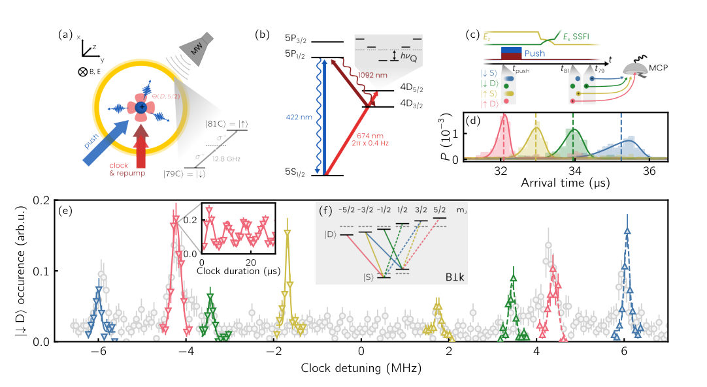
<figcaption class="paper-figure-caption"><b>Fig 1.</b> FIG. 1. Manipulation and detection of the clock qubit inside a circular Rydberg atom. (a) We excite one of the two valence electrons of 88Sr to the circular Rydberg state |79C⟩(yellow). A two-photon microwave transition to the |81C⟩state allows us to coherently control the state of the Rydberg qubit. We use a pair of push and repump beams to rapidly scatter photons on the ionic core D1 transition. Our clock laser, propagating orthogonal to the magnetic field B, excites the ionic core to the D5/2 state (colors used for the different beams match those used in b). (b) Level scheme of the 88Sr+ ionic core: The dipole allowed S1/2 →P1/2 (D3/2 →P1/2) transition is used for pushing (repumping),...</figcaption>
</figure>
<figure class="paper-figure-card">
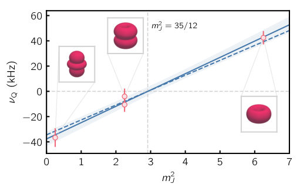
<figcaption class="paper-figure-caption"><b>Fig 2.</b> FIG. 2. Spectroscopic determination of the quadrupole moment Θ(D, 5/2). The quadrupole shift νQ is shown as a function of the squared magnetic quantum number m2 J of the addressed D5/2 level (red data). For the data presented, the Rydberg electron was prepared in the |79C⟩state and the quadrupole shift was determined by shelving spectroscopy of transitions with opposite relative magnetic moment, as de- scribed in the main text. From a linear fit with Eq. 1 assuming the offset angle of ϑ = 4.6◦calibrated in Sec. III C (blue solid line), we extract a quadrupole moment of Θexp = 3.2(3) ea2 0, in agreement with the currently most precise theoretical and experimental values (blue dashed line)...</figcaption>
</figure>
<figure class="paper-figure-card">
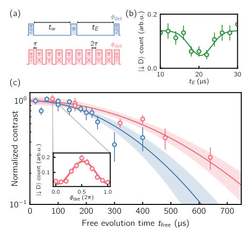
<figcaption class="paper-figure-caption"><b>Fig 3.</b> FIG. 3. Dynamical decoupling of the ion core optical qubit. a) Schematic of the applied decoupling sequences spin- echo (blue) and XY8 (red). The pulse durations as well as the wait time tw, echo time tE and XY8 time constant τ are not to scale. b) Representative measurement of the spin- echo envelope for zero detuning and tw = 20 µs, characterizing the |D⟩→|S⟩transfer. From a Gaussian fit we deduce a reversible T ∗ 2 time of 4.1(14) µs. c) Normalized fringe contrast for spin-echo (blue data) and XY8 (red data) decoupling as a function of the total free evolution time tfree, with tfree = tE+tw for the spin-echo and tfree = 16 τ for the XY8 sequence. A fit with a Gaussian decay (solid lines)...</figcaption>
</figure>
<figure class="paper-figure-card">
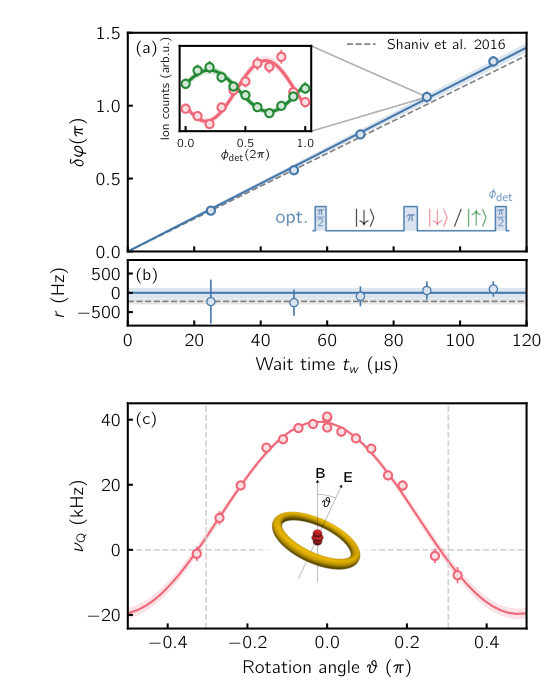
<figcaption class="paper-figure-caption"><b>Fig 4.</b> FIG. 4. Spin-echo characterization of the quadrupole interaction. (a) Measurement of the differential quadrupole shift between |↓⟩and |↑⟩: We perform a spin-echo sequence on the optical clock qubit with the CRS qubit initially pre- pared in |↓⟩. The inset shows exemplary Ramsey fringes ob- tained for a wait time of tw = 90 µs when the CRS qubit is in |↑⟩(green) or |↓⟩(red) during the second interferometer arm. From the relative phase shift δφ measured for different wait times tw (blue data) we obtain a differential quadrupole shift of ∆νQ = 5.83(11) kHz (blue line). The value of 5.61(6) kHz, calculated from [37] is indicated by the grey dashed line. (b) We show the residuals r of the fit....</figcaption>
</figure>
<figure class="paper-figure-card">
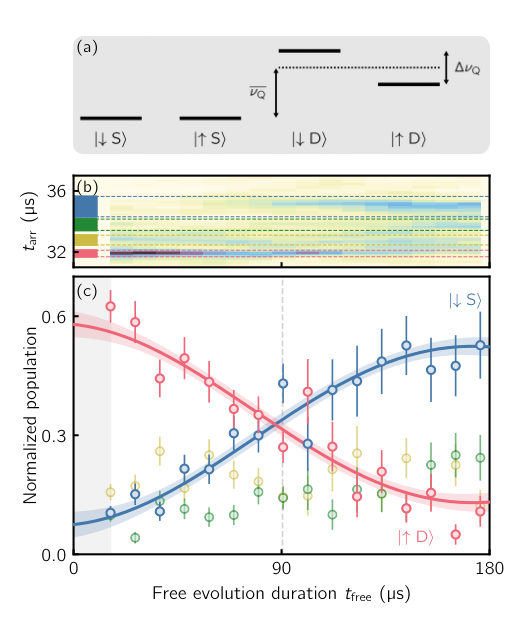
<figcaption class="paper-figure-caption"><b>Fig 5.</b> FIG. 5. Dynamically decoupled two-qubit rotation be- tween the optical and circular state qubit. a) Schematic of the energy levels under the quadrupole interaction Hamil- tonian Eq. 7. The decoupling sequence on both qubits cancels out the mean quadrupole shift νQ, leading to a phase evolution with ∆νQ. The energy shifts are not to scale. b), c) We ini- tially prepare the system in |↓S⟩(blue data) and let it evolve while applying a parallel XY8 decoupling sequence on both in- dividual qubits. Note that the net effect of this sequence with- out quadrupole interaction is a π rotation on both qubits and thus we find the system in |↑D⟩(red data) for short free evo- lution durations tfree. For...</figcaption>
</figure>

**Summary.** The paper reports on the realization and characterization of a novel dual qubit system using two distinct electronic transitions within a single alkaline-earth atom. By demonstrating coherent control, tunable coupling via quadrupole interactions, and executing a two-qubit gate, the work establishes a powerful platform for quantum simulation and metrology applications.

**Why it may be interesting.** This represents a significant advancement in solid-state/atomic quantum simulation platforms by integrating multiple types of highly controllable electronic degrees of freedom (microwave Rydberg vs. optical core transition) into one addressable unit.

Detailed structure

**Main problem.** To demonstrate a dual ion-Rydberg system within a single alkaline-earth atom capable of hosting two individually controlled electronic qubits for quantum simulation and metrology.

**Main result.** The authors successfully demonstrated coherent control, tunable coupling via electrostatic quadrupole interactions, and implemented a two-qubit gate operation analogous to a Mølmer-Sørensen gate using the coupled system.

**Method.** Coherent microwave and optical spectroscopy, dynamical decoupling sequences (spin-echo, XY8), and state-selective field ionization detection were employed to characterize qubit coherence and coupling.

**Model / system.** The platform uses a single strontium atom trapped in optical tweezers, encoding one qubit in circular Rydberg states (microwave) and the second in the narrow quadrupole transition of the ionic core (optical).

**Key observables.** Coherence times ($T_2$ up to 550 $\mu$s), differential quadrupole shift ($\Delta
u_Q = 5.83 	ext{ kHz}$), and fidelity of two-qubit gate operations.

**Important parameters / regimes.** Electric field strengths ($|E|$ up to $3 	ext{ V/cm}$), Rydberg principal quantum number (e.g., $n=79, 81$), and coupling strength derived from quadrupole interactions.

**Assumptions / limitations.** The ability to use the platform relies on the negligible autoionization rate of circular Rydberg states due to minimal wavefunction overlap with low-lying core orbitals.

**Figures summary.** Figures illustrate the level schemes for both qubits, detection using state-dependent arrival time histograms (four basis states), spectroscopic measurements showing polarization dependence, and visualizations of gate operations like Husimi-Q distributions during XY8 sequences.

**Paper structure.** The work progresses by first establishing coherent control over individual qubits, then characterizing the tunable electrostatic quadrupole coupling between them, and finally demonstrating a full two-qubit quantum gate sequence using this coupled system.

Abstract

Neutral atoms trapped in optical tweezers and excited to Rydberg states, together with trapped ions, are among the most advanced platforms for quantum simulation and quantum computing. Current experiments often rely on additional atoms in neighboring traps to encode ancilla qubits for local manipulation and readout. Here, we demonstrate a dual ion-Rydberg system comprising two qubits encoded in two individually controlled electrons of the same alkaline-earth atom. The first, a microwave qubit, is encoded in a pair of circular Rydberg states, while the second, an optical qubit, is encoded on a narrow quadrupole transition of the Rydberg atom's ionic core. We demonstrate coherent control of the optical qubit and achieve coherence times of several hundred microseconds under dynamical decoupling. Furthermore, we realize coherent coupling between the two electrons via electrostatic quadrupole interactions over the large separation between the Rydberg electron and the ionic core, and map out its angular tunability. Finally, we demonstrate a two-qubit operation, reminiscent of a Mølmer-Sørensen gate, that evolves through an entangled state of the two qubits driven by the quadrupole coupling. Our work opens a pathway to exploit a pair of individually controlled electronic qubits with tunable coupling for quantum simulation and quantum metrology.

[↑ back to top](#top)

### [Phase-Noise-Induced Heating in Optical Lattices](http://arxiv.org/abs/2608.07442v1)

**Authors:** Jean Paul Nohra, Cyprien Daix, Joris Verstraten, Maxime Dixmerias, Tim de Jongh, Bruno Peaudecerf, Fabrice Gerbier, Tarik Yefsah  
**Type:** both · **Category:** other · **PDF:** <https://arxiv.org/pdf/2608.07442v1>  
**Analysis basis:** full PDF text, analyzed in chunks
**Topic relevance:** 🔥 `analog quantum simulation` **4/5** · `quantum measurements` **2/5** · `quantum optics experiment` **2/5** · `Keldysh / 2PI / non-Gaussian methods` **1/5** · `correlated / nonlocal dissipation` **1/5** · `driven-dissipative phase transition` **1/5** · `interference shaping light` **1/5** · `methods for driven-dissipative` **1/5** · `non-equilibrium dynamics` **1/5**

↔ Scroll figures horizontally

<figure class="paper-figure-card">
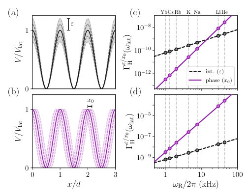
<figcaption class="paper-figure-caption"><b>Fig 1.</b> FIG. 1. (a) Intensity fluctuations ε = δI/¯I translate into fluc- tuations of the amplitude of the lattice potential with spac- ing d, whereas (b) relative phase fluctuation ϕ21 translate into a random translation of the potential by x0 = ϕ21/kL. Both processes result in heating of an atomic gas trapped in said lattice. In the right panel, we compare the normal- ized heating rates for several atomic species in two regimes of experimental interest characterized by the reduced lat- tice depth s = Vlat/ER: (c) s = 10, corresponding to the Hubbard regime, and (d) s = 1000, corresponding to the quantum gas microscopy regime. The black and pur- ple solid lines show the rate of heating caused by...</figcaption>
</figure>
<figure class="paper-figure-card">
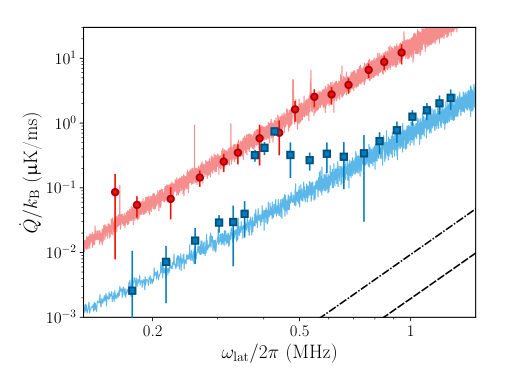
<figcaption class="paper-figure-caption"><b>Fig 2.</b> FIG. 3. Measured heating rate ˙Q = ˙Qx + ˙Qy of 6Li clouds in optical lattices created using the noisy laser A (red circles) or the quiet laser B (blue squares). The error bars repre- sent the 1σ uncertainty propagated from the fitted parameters of Eq. (14) (see Figure 2). The phase-noise-induced heating rates expected from Eq. (13) using the measured phase-noise spectra of lasers A and B are shown by the red and blue traces, respectively. The dashed (resp. dash-dotted) line is the pre- dicted maximal heating rate due to intensity noise, VlatΓε H, obtained from Eq. (3), with the power spectral density ex- tracted from the specifications of laser A (resp. B).</figcaption>
</figure>
<figure class="paper-figure-card">
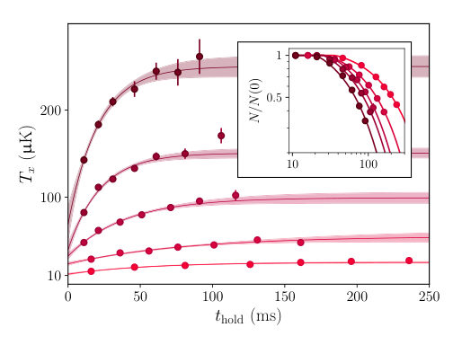
<figcaption class="paper-figure-caption"><b>Fig 3.</b> FIG. 2. Temperature along the x−direction versus hold time for a two-component gas of 6Li atoms in a triangular optical lattice generated by the noisy laser A. The measurements are shown for representative laser powers, corresponding to trap depths Vlat/kB = [95(6), 159(9), 300(17), 480(20), 730(50)] µK from bottom to top. Error bars represent the statistical error from five independent repetitions. The solid lines show the fits to Eq. (14) used to extract the heating rates ˙Qx, and the shaded areas represent the propagated 1σ uncertainty of the fit. The same procedure is applied to the y−direction. Inset: corresponding atom number fitted with an exponential decay function in the spilling...</figcaption>
</figure>
<figure class="paper-figure-card">
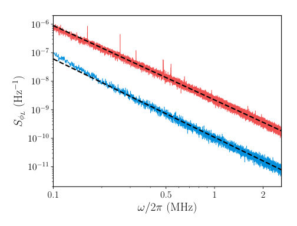
<figcaption class="paper-figure-caption"><b>Fig 4.</b> FIG. 5. Measured power spectral density of the laser phase SϕL(ω) for the noisy laser A (red trace) and the quiet laser B (blue trace). An algebraic fit ∝ω−α (dashed lines) yields α = 2.60(1) and 2.80(2) respectively.</figcaption>
</figure>
<figure class="paper-figure-card">
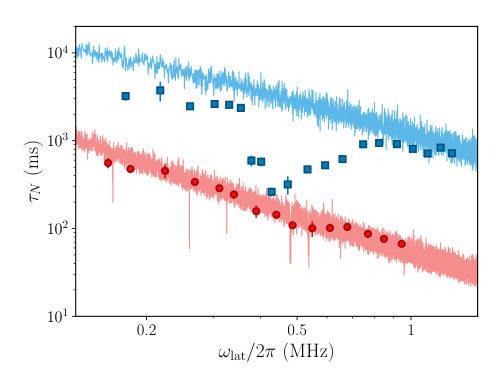
<figcaption class="paper-figure-caption"><b>Fig 5.</b> FIG. 6. Measured lifetime τN of 6Li clouds in the spilling regime, for optical lattices created by the noisy laser A (red circles) or the quiet laser B (blue squares). The error bars show the 1σ fit uncertainty using the fit function in Eq. (C1). The lifetimes expected from Eq. (C2) using the measured phase-noise spectra of lasers A and B are shown as red and blue traces, respectively.</figcaption>
</figure>

**Summary.** This paper rigorously investigates the sources of heating in optical lattices trapping ultracold atoms by separating the contributions from intensity and phase fluctuations in the trapping lasers. The authors show that phase noise can dominate lattice heating under certain conditions, providing a predictive theoretical framework validated against experimental measurements using ${^6	ext{Li}}$ atoms.

**Why it may be interesting.** This work is highly relevant to AMO physics as it addresses a critical technical limitation (heating) in modern quantum simulation platforms. By quantifying phase noise, it guides experimentalists toward improving laser stability for realizing deeper and more complex quantum simulations.

Detailed structure

**Main problem.** The study investigates the fundamental sources of heating experienced by ultracold atoms trapped in optical lattices, specifically disentangling the roles of intensity noise versus phase noise.

**Main result.** The research demonstrates that phase noise can become the dominant source of lattice heating, particularly when using light atoms or deep optical lattices, providing a quantitative method to predict this effect.

**Method.** The authors combine theoretical modeling (using fluctuating harmonic potentials and Fermi's Golden Rule) with experimental measurements of laser phase noise spectra via self-heterodyne interferometry.

**Model / system.** The system involves ultracold atoms trapped in optical lattices formed by multiple interfering laser beams. The analysis models the potential as a fluctuating harmonic oscillator whose fluctuations are driven by both intensity and relative phase noise from the lasers.

**Key observables.** Measured heating rates ($\dot{Q}$ or $T(	ext{thold})$) for atomic temperature evolution, and independently measured power spectral densities ($S_{\phi L}(\omega)$) of the laser phase noise.

**Important parameters / regimes.** Reduced lattice depth ($s$), time delay ($	au$) between interfering beams, and characteristic frequencies like $\omega_{	ext{lat}}$ and $\omega_R$.

**Assumptions / limitations.** The analysis assumes that the potential can be approximated by a fluctuating harmonic oscillator near the lattice minima. Specific derivations rely on approximations for short time delays or symmetric geometry.

**Figures summary.** Figure 1 compares normalized heating rates due to intensity versus phase noise in different lattice depths ($s=10$ vs $s=1000$). Figure 2 shows measured temperature decay curves used to extract total heating rates. Figure 5 displays the measured power spectral density of the laser phase fluctuations.

**Paper structure.** The paper first establishes the theoretical framework by calculating heating rates from both noise sources using a fluctuating harmonic potential model. It then details the experimental measurement of these noise spectra and compares the resulting theoretical predictions for heating rates against direct measurements on ${^6	ext{Li}}$ atoms in a triangular lattice.

Abstract

We experimentally and theoretically study the origin of heating in optical lattices by disentangling the respective roles of intensity and phase noise depending on the lattice parameters. While intensity noise is widely identified as a major limiting factor, we show that phase noise can become the dominant heating source, especially for light atoms and deep optical lattices. We provide a simple theoretical framework to predict the phase-noise-induced heating from the power spectral density of the laser phase noise, which can be measured experimentally. We show that such predictions can accurately reproduce the measured heating rates of lithium-6 atoms in a triangular lattice. Our approach is readily generalized to other lattice geometries and atomic species.

[↑ back to top](#top)

### [Anomaly quenching and dynamical cooling of Hawking evaporation in Horndeski gravity](http://arxiv.org/abs/2608.07182v1)

**Authors:** Amogh Srivastav, S. Shankaranarayanan  
**Type:** theory · **Category:** statistical mechanics · **PDF:** <https://arxiv.org/pdf/2608.07182v1>  
**Analysis basis:** full PDF text, analyzed in chunks
**Topic relevance:** 🔥 `entanglement & information structure` **4/5** · `non-equilibrium dynamics` **3/5** · `non-equilibrium universality` **2/5** · `Keldysh / 2PI / non-Gaussian methods` **1/5** · `correlated / nonlocal dissipation` **1/5** · `driven-dissipative phase transition` **1/5** · `methods for driven-dissipative` **1/5**

↔ Scroll figures horizontally

<figure class="paper-figure-card">
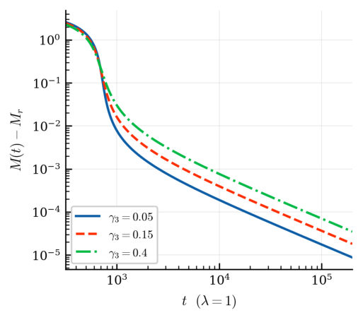
<figcaption class="paper-figure-caption"><b>Fig 1.</b> FIG. 1. Late-time evolution of M(t)−Mr for the G3-corrected CGHS BH (λ = 1, M0 = 5). All curves parallel the analytical t−1 slope (dashed grey), demonstrating an infinite-lifetime power-law freeze-out driven by the double-pole structure of the semiclassical luminosity.</figcaption>
</figure>
<figure class="paper-figure-card">
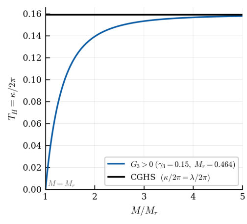
<figcaption class="paper-figure-caption"><b>Fig 2.</b> FIG. 2. Hawking temperature TH versus normalized mass M/Mr for the G3 sector (γ3 = 0.15). TH vanishes continu- ously at the remnant threshold (M/Mr = 1) and recovers the constant CGHS baseline (solid black) in the macroscopic limit M ≫Mr.</figcaption>
</figure>
<figure class="paper-figure-card">
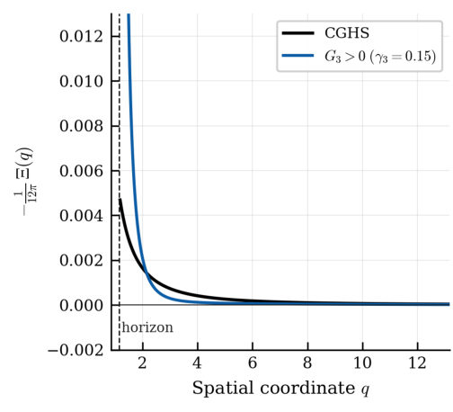
<figcaption class="paper-figure-caption"><b>Fig 3.</b> FIG. 3. Geometric, state-independent part − 1 12π Ξ(q) of the outgoing stress-tensor component, the full component being ⟨T−−⟩= − 1 12π (X+)2Ξ(q)+t−(x−), versus the spatial Kruskal coordinate q (M = 2.5Mr, γ3 = 0.15). The profile vanishes at spatial infinity, and the CGHS background curve remains finite at the horizon. The divergence of the first-order Horndeski correction as q →M/λ, which grows as ϵ−2, isolates the coordinate degeneration of the Kruskal frame, a gauge artifact that cancels in physical curvature invariants.</figcaption>
</figure>
<figure class="paper-figure-card">
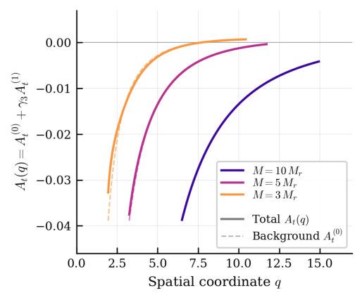
<figcaption class="paper-figure-caption"><b>Fig 4.</b> FIG. 4. Total backreacted gravitational anomaly At(q) in the perturbative regime (M ≥3Mr) for the G3 sector. Horndeski corrections reduce the near-horizon anomaly relative to the CGHS background (dotted lines), reproducing the suppressed asymptotic flux Φ = κ2/48π and confirming the cold-remnant evaporation rate.</figcaption>
</figure>
<figure class="paper-figure-card">
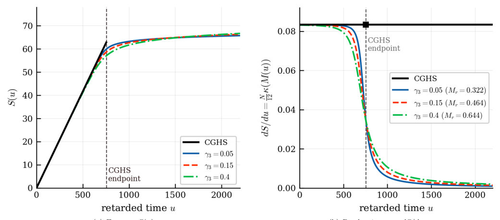
<figcaption class="paper-figure-caption"><b>Fig 5.</b> FIG. 5. Fine-grained entanglement entropy of the Hawking radiation (λ = N = 1, M0 = 5) in the vicinity of the CGHS evaporation endpoint uf ≈754 λ−1 (vertical dotted line). (a) Entropy S(u): the CGHS model (solid black) terminates abruptly at Sfinal CGHS = 4πM0/λ ≈62.8, while each Horndeski-corrected model bends below the CGHS trajectory at u ≲uf and then continues to grow logarithmically for u &gt; uf, transitioning to S(u) ≃Ssat + (4πNMr/3λ) ln u. (b) Entropy production rate dS/du = (N/12)κ(M(u)): the curves peel away from the constant CGHS baseline Nλ/12 at mass-dependent rates, collapsing toward zero as κ →0 at the cold remnant. The larger the coupling γ3 (and hence the larger Mr), the...</figcaption>
</figure>

**Summary.** This work analyzes Hawking evaporation in Horndeski gravity, showing that coupling corrections cause the black hole's temperature to dynamically quench. This process halts evaporation at a stable remnant mass, leading to an asymptotic logarithmic growth of entanglement entropy rather than complete disappearance.

**Why it may be interesting.** While focused on gravity, the analysis of entanglement entropy transitioning from linear to logarithmic growth near a saturation point is highly relevant to open quantum systems and information retention in non-equilibrium processes.

Detailed structure

**Main problem.** The paper investigates how Horndeski gravity corrections alter the semiclassical Hawking evaporation process of a black hole, specifically addressing the fate of quantum information during late-time evaporation.

**Main result.** The BH does not evaporate completely but halts at a stable, macroscopic cold remnant ($M_r$), and the entanglement entropy transitions to an asymptotic logarithmic regime, suggesting information is retained in this remnant.

**Method.** The analysis uses semiclassical methods involving evaluating curvature invariants, applying anomaly calculations (conformal trace and Robinson-Wilczek), and deriving resummed temperature/entropy equations.

**Model / system.** The system is a two-dimensional Callan-Giddings-Harvey-Strominger (CGHS) black hole geometry perturbed by first-order Horndeski scalar-tensor couplings. The analysis is performed in the context of dimensional reduction from 4D gravity.

**Key observables.** Hawking temperature ($T_H$), fine-grained entanglement entropy, surface gravity ($\kappa$), and the BH mass evolution $M(t)$.

**Important parameters / regimes.** The remnant mass scale ($M_r$) and coupling constants ($\gamma_3$, $\lambda$). The late-time behavior is characterized by a power-law freeze-out: $M(t) - M_r \propto 1/t$.

**Assumptions / limitations.** The analysis relies on extrapolating resummed temperature profiles to the boundary of perturbative control, and certain constraints were imposed during dimensional reduction to maintain stability.

**Figures summary.** Figures illustrate the power-law freeze-out of mass difference ($M(t) - M_r$) for G3 corrections, and show how luminosity vanishes smoothly at the remnant mass $M_r$.

**Paper structure.** The paper progresses by first establishing that coordinate singularities are artifacts, then deriving dynamical quenching of the Hawking temperature due to anomaly interactions. Finally, it analyzes the late-time evolution using entropy conservation laws to confirm the stable remnant state.

Abstract

We investigate the semiclassical Hawking evaporation of a two-dimensional Callan-Giddings-Harvey-Strominger (CGHS) black hole perturbed by first-order Horndeski scalar-tensor couplings. By evaluating the exact scalar curvature invariants, we demonstrate that coordinate singularities near the apparent horizon parametrize a physical deformation of the surface gravity while preserving a strictly regular event horizon. In the linear-order $γ_3 ΦX$ coupling sector, the surface gravity and correspondingly the Hawking temperature decreases dynamically as the black hole loses mass. Extrapolating this cooling effect via a resummed temperature equation suggests that evaporation halts, potentially leaving behind a stable, macroscopic cold remnant at the boundary of perturbative control. Utilizing both the conformal trace anomaly and the Robinson-Wilczek gravitational anomaly, we establish that the asymptotic radiation flux identically reflects this geometric shift. Consequently, the fine-grained entanglement entropy of the Hawking radiation departs from linear growth and transitions to an asymptotic logarithmic regime. This indicates that quantum information may be permanently retained within the remnant, altering the standard semiclassical Page curve without requiring a breakdown of horizon regularity.

[↑ back to top](#top)

### [Critical dynamics of a scalar field near four spatial dimensions](http://arxiv.org/abs/2608.07292v1)

**Authors:** Laura Batini, Eduardo Grossi  
**Type:** theory · **Category:** statistical mechanics · **PDF:** <https://arxiv.org/pdf/2608.07292v1>  
**Analysis basis:** full PDF text, analyzed in chunks
**Topic relevance:** 🔥 `non-equilibrium universality` **4/5** · `driven-dissipative phase transition` **3/5** · `non-equilibrium dynamics` **3/5** · `Keldysh / 2PI / non-Gaussian methods` **1/5** · `correlated / nonlocal dissipation` **1/5** · `methods for driven-dissipative` **1/5**

↔ Scroll figures horizontally

<figure class="paper-figure-card">
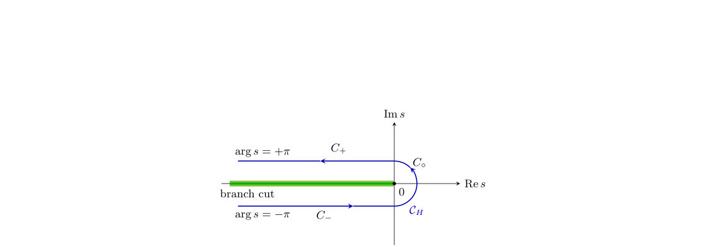
<figcaption class="paper-figure-caption"><b>Fig 1.</b> Figure 1: Hankel contour CH around the negative real axis, decomposed into the lower branch C−, the small circular arc C◦, and the upper branch C+.</figcaption>
</figure>
<figure class="paper-figure-card">
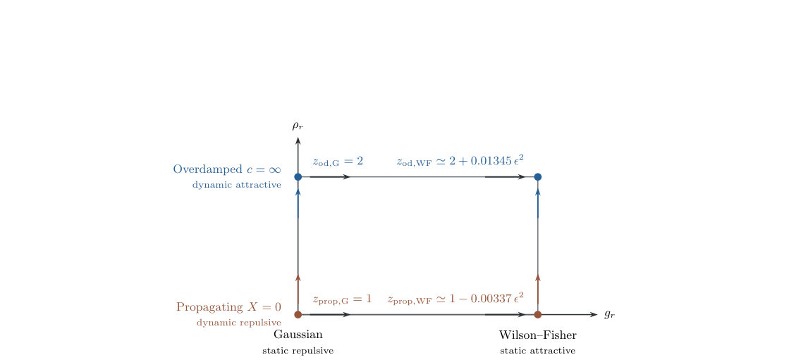
<figcaption class="paper-figure-caption"><b>Fig 2.</b> Figure 3: Local stability of the four fixed points on the mass-tuned critical surface. The propa- gating and overdamped boundaries lie at ρr = 0 and ρr = +∞, respectively. In the static direction, the Gaussian fixed points are repulsive and the Wilson–Fisher fixed points are attractive. In the dynamical direction, the propagating fixed points are repulsive and the overdamped fixed points are attractive. Consequently, the propagating Wilson–Fisher and overdamped Gaussian fixed points are saddles, while the overdamped Wilson–Fisher fixed point is the only fixed point attractive in both directions.</figcaption>
</figure>

**Summary.** This paper analyzes the critical dynamics of a scalar field near four dimensions, focusing on how inertia and dissipation compete. Using supersymmetric field theory and RG methods, the authors demonstrate that while different dynamic limits exist, the propagating regime is inherently unstable when subjected to local equilibrium dissipation. This highlights the fine-tuned nature required for sustained wave propagation at criticality.

**Why it may be interesting.** The rigorous treatment of dynamic critical exponents and the stability analysis concerning dissipation provides deep insights into non-equilibrium dynamics relevant to phase transitions in many physical systems.

Detailed structure

**Main problem.** The study investigates the critical dynamics of a non-conserved order parameter, specifically analyzing the competition between propagating (relativistic) and overdamped (relaxational) behavior near criticality.

**Main result.** The paper shows that while both dynamic limits share static fixed points, they possess distinct dynamical scaling regimes; furthermore, the propagating regime is found to be unstable to any local equilibrium dissipation perturbation.

**Method.** The analysis employs a supersymmetric field-theory formulation combined with two-loop Renormalization Group (RG) techniques applied near four spatial dimensions.

**Model / system.** The system is a scalar field theory ($\phi(t, x)$) in thermal equilibrium whose dynamics are governed by an action incorporating both inertial and dissipative terms. The analysis compares the strictly overdamped limit to the dissipationless propagating limit.

**Key observables.** Dynamic critical exponent (z), static Gaussian and Wilson–Fisher fixed points, and the stability of the RG flow concerning local dissipation.

**Important parameters / regimes.** The ratio controlling local friction ($X$), the dimensionality ($d=4$), and the presence/absence of local equilibrium dissipation.

**Assumptions / limitations.** The theory is assumed to be in thermal equilibrium, requiring adherence to the fluctuation–dissipation relation (KMS symmetry).

**Paper structure.** The paper systematically builds the supersymmetric structure, derives the effective action, analyzes static corrections, and then treats the overdamped and dissipationless limits separately before concluding with a comprehensive RG flow analysis.

Abstract

The critical dynamics of a non-conserved order parameter is generally expected to become overdamped at long distances, even when propagating modes occur at microscopic or intermediate scales. We investigate the critical dynamics of a scalar field theory in thermal equilibrium which, in addition to local friction and noise, also contains a time-dependent second-order kinetic term. We show how to build a supersymmetric field-theory formulation. Using a two-loop expansion about four spatial dimensions, we show that the propagating and strictly overdamped limits share the same static Gaussian and Wilson-Fisher fixed points but realize distinct dynamical scaling regimes. The overdamped limit reproduces Model A. On the surface where local friction and noise vanish, the theory instead supports an interacting propagating fixed point whose dynamic exponent receives corrections at two loops. We demonstrate that coarse-graining does not generate a local dissipative operator on this surface, which therefore remains invariant under the RG flow. Local dissipation is nevertheless relevant at the propagating fixed point: an arbitrarily small equilibrium friction-noise perturbation drives the flow away from propagating scaling. Propagating critical dynamics thus defines a consistent but fine-tuned regime that is unstable to local equilibrium dissipation.

[↑ back to top](#top)

### [QCORE: A Quantum-Control-Oriented Real-Time Execution Architecture with Extensible Closed-Loop Services and Shared AI Acceleration](http://arxiv.org/abs/2608.06875v1)

**Authors:** Heyue Li, Yanshu Guo, Qichun Liu, Tiefu Li, Zhihua Wang, Hanjun Jiang  
**Type:** both · **Category:** quantum information and computing · **PDF:** <https://arxiv.org/pdf/2608.06875v1>  
**Analysis basis:** full PDF text, analyzed in chunks
**Topic relevance:** 🔥 `QC/QI experiment` **4/5** · `quantum measurements` **3/5** · `measurement-induced transitions` **2/5** · `analog quantum simulation` **1/5** · `driven-dissipative phase transition` **1/5** · `methods for driven-dissipative` **1/5** · `non-equilibrium dynamics` **1/5**

↔ Scroll figures horizontally

<figure class="paper-figure-card">
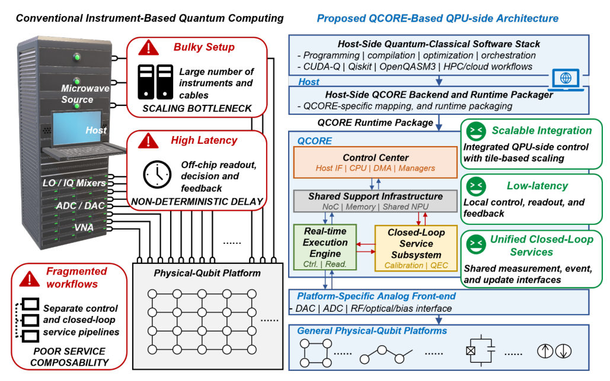
<figcaption class="paper-figure-caption"><b>Fig 1.</b> FIGURE 1. System-boundary comparison between conventional instrument-based quantum control and the QCORE reference architecture.</figcaption>
</figure>
<figure class="paper-figure-card">
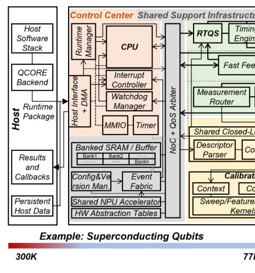
<figcaption class="paper-figure-caption"><b>Fig 2.</b> FIGURE 2. QCORE top-level reference architecture and inter-module data flows.</figcaption>
</figure>
<figure class="paper-figure-card">
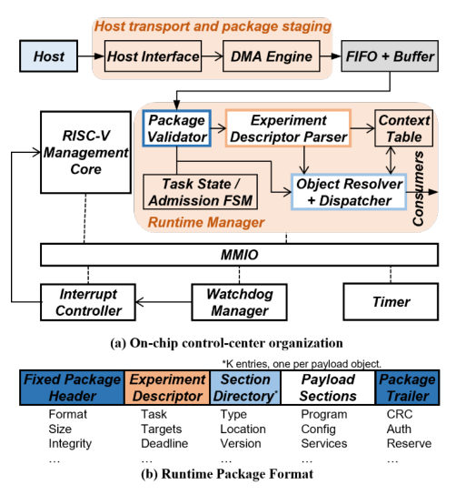
<figcaption class="paper-figure-caption"><b>Fig 3.</b> FIGURE 3. Control-Center hardware organization and runtime- package field format.</figcaption>
</figure>
<figure class="paper-figure-card">
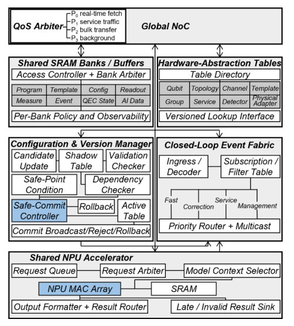
<figcaption class="paper-figure-caption"><b>Fig 4.</b> FIGURE 4. Hardware organization of the Shared Support Infrastructure.</figcaption>
</figure>
<figure class="paper-figure-card">
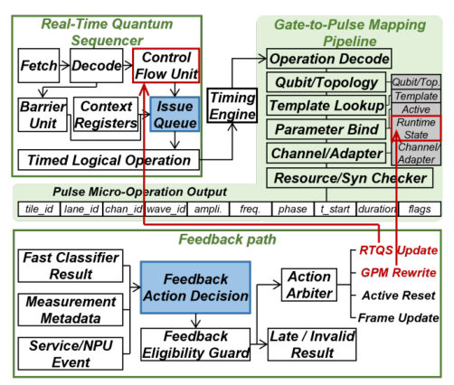
<figcaption class="paper-figure-caption"><b>Fig 5.</b> FIGURE 5. Real-time control, readout, and feedback paths.</figcaption>
</figure>

**Summary.** This paper introduces QCORE, a novel digital reference architecture designed to manage all necessary services—control, readout, calibration, and error correction—for scaling quantum processors. By partitioning tasks into dedicated hardware modules and enforcing strict versioning via safe-commit mechanisms, QCORE achieves superior real-time performance and reliability for complex quantum experiments.

**Why it may be interesting.** For AMO physicists working on open quantum systems, this work provides a crucial blueprint for the classical control infrastructure needed to reliably operate and characterize superconducting qubits in real-time, directly addressing hardware bottlenecks beyond the physics itself.

Detailed structure

**Main problem.** Scaling quantum processors requires integrating complex, concurrent control, readout, calibration, and error correction services under strict latency and shared-resource constraints.

**Main result.** The proposed QCORE architecture successfully unifies these disparate functions into a single digital reference boundary, demonstrating significant performance improvements in feedback latency and error reduction compared to existing systems.

**Method.** The authors designed QCORE as a hardware-partitioned, real-time execution architecture that uses transaction-level and event-driven modeling to manage task admission, resource scheduling, and atomic state commits.

**Model / system.** The system targets Quantum Processing Units (QPUs) utilizing transmon qubits. The control flow involves managing tasks through a Runtime Manager, executing sequences like Rabi-Ramsey calibration, and incorporating error correction codes (QEC).

**Key observables.** P99 latency of the feedback path ($\approx 1.984 L_{	ext{max}}$), reduction in mean frequency error ($83.2\%$), and state-assignment error reduction from $10.39\%$ to $5.37\%$.

**Important parameters / regimes.** Background load (e.g., 0.8), maximum readout drift, and the number of configuration transactions (100,000).

**Assumptions / limitations.** Deterministic execution is defined behaviorally rather than by fixed RTL cycle latency; late or version-mismatched results cannot alter the current real-time state.

**Figures summary.** Figures illustrate the QCORE architecture, comparing it to conventional control methods, and detail functional flows for calibration (Rabi-Ramsey) and Randomized Benchmarking (RB).

**Paper structure.** The paper introduces the limitations of existing quantum control systems, proposes the modular QCORE reference architecture with its four hardware partitions, details the execution flow through task management and resource scheduling, and validates performance using multiple complex workloads.

Abstract

Scalable quantum processors require control, readout, feedback, calibration, and error correction to coexist under bounded latency and shared-resource constraints, whereas existing platforms typically optimize only a subset of these capabilities. This article presents QCORE (Quantum-Control-Oriented Real-Time Execution), a QPU-side digital control reference architecture positioned between the Host and a platform-specific analog/mixed-signal front end. QCORE separates task management, shared resources, hard-real-time execution, and long-timescale services into four hardware partitions. A fast-result sideband closes same-round feedback, a Measurement Packet provides a traceable measurement and service interface, and a common service-control skeleton, Tile-local QEC, and versioned safe-point commit organize calibration, error correction, and long-term state updates. Transaction-level, event-driven, and quantum-behavioral models are used for evaluation. At a background load of 0.8, the $P_{99}$ latency of the shared Measurement Packet/Event feedback path is $(1.984\pm0.004)L_{\max}$. Closed-loop operation reduces the mean frequency error by $83.2\%\pm0.8\%$ and lowers the state-assignment error at maximum readout drift from $10.39\%\pm0.54\%$ to $5.37\%\pm0.29\%$. No unsafe acceptance or mixed-version observation is observed in 100,000 configuration transactions, and Tile-local QEC reduces modeled global-boundary demand and yields a $2.08\times$ capacity-normalized scaling estimate.

[↑ back to top](#top)

### [The two-sided Bogoliubov inequality in von Neumann algebras conceptualizes the free energy--quantum correlations link](http://arxiv.org/abs/2608.07246v1)

**Authors:** Benedikt M. Reible, Albert Much, Rainer Verch, Christof Schütte, Luigi Delle Site  
**Type:** theory · **Category:** statistical mechanics · **PDF:** <https://arxiv.org/pdf/2608.07246v1>  
**Analysis basis:** full PDF text, analyzed in chunks
**Topic relevance:** 🔥 `entanglement & information structure` **4/5** · `non-equilibrium dynamics` **2/5** · `non-equilibrium universality` **2/5** · `Keldysh / 2PI / non-Gaussian methods` **1/5** · `analog quantum simulation` **1/5** · `correlated / nonlocal dissipation` **1/5** · `driven-dissipative phase transition` **1/5** · `methods for driven-dissipative` **1/5**

↔ Scroll figures horizontally

<figure class="paper-figure-card">
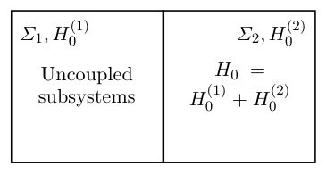
<figcaption class="paper-figure-caption"><b>Fig 1.</b> Figure 1. Illustration of the division of a large thermodynamic quantum system into two non-interacting subsystems. Figure adapted from Ref. [56].</figcaption>
</figure>

**Summary.** This paper generalizes the two-sided Bogoliubov inequality from finite quantum systems to abstract von Neumann algebras. By employing relative entropy and unbounded perturbation theory, the authors establish rigorous variational bounds for the relative free energy. This provides a mathematically robust, thermodynamically grounded criterion for quantifying entanglement in complex, infinite-dimensional quantum systems.

**Why it may be interesting.** This work provides rigorous mathematical tools (generalized inequalities) to quantify entanglement in complex, infinite-dimensional systems by framing it within established thermodynamic principles of statistical mechanics.

Detailed structure

**Main problem.** The work aims to generalize the quantum-mechanical two-sided Bogoliubov inequality, which links free energy to quantum correlations, to the abstract setting of von Neumann algebras.

**Main result.** They establish computable bounds for the relative free energy using generalized inequalities and derive variational expressions that extend bounded-perturbation principles to unbounded systems.

**Method.** The methodology involves advanced mathematical tools from operator algebras, specifically utilizing Araki-Uhlmann relative entropy and the framework of unbounded perturbation theory for KMS states.

**Model / system.** The analysis considers general quantum systems described by a von Neumann algebra $M$ with a faithful KMS state $\omega$, modeling interactions via perturbations $U$. The initial physical context involves interacting particles in infinite-dimensional systems, such as those found in quantum field theory.

**Key observables.** Relative free energy ($F(\omega_U, \omega)$) and the entanglement quantification derived from thermodynamic measurements.

**Important parameters / regimes.** Inverse temperature ($eta$), interaction strength (related to $U$), and the structure of the von Neumann algebra.

**Assumptions / limitations.** The generalization relies on assuming the existence of a faithful KMS state $\omega$ and employing advanced mathematical machinery like modular theory.

**Paper structure.** The paper reviews the known quantum-mechanical inequality, then systematically generalizes it to von Neumann algebras using relative entropy and unbounded perturbation theory. Finally, variational expressions for the relative free energy are derived as a key result.

Abstract

The quantum-mechanical two-sided Bogoliubov inequality provides upper and lower bounds for the free energy required to separate a system of interacting particles into independent subsystems. The bounds can be calculated straightforwardly from the ensemble average of the interface energy, bypassing the direct evaluation of the free energy. In this work, we generalize the two-sided Bogoliubov inequality to arbitrary von Neumann algebras by employing the Araki-Uhlmann relative entropy and the framework of unbounded perturbation theory of KMS states. Furthermore, we obtain variational expressions for the relative free energy that extend existing bounded-perturbation principles to the unbounded setting. Crucially, these mathematical developments yield a physically well-founded thermodynamic criterion for the quantification of entanglement in infinite-dimensional systems.

[↑ back to top](#top)

### [Non-monotonic dependence of OAM Schmidt spectrum on crystal thickness](http://arxiv.org/abs/2608.07090v1)

**Authors:** Harshal Jain, Suman Karan, Radhika Prasad, Anand K. Jha  
**Type:** both · **Category:** quantum information and computing · **PDF:** <https://arxiv.org/pdf/2608.07090v1>  
**Analysis basis:** full PDF text, analyzed in chunks
**Topic relevance:** 🔥 `entanglement & information structure` **4/5** · `interference shaping light` **3/5** · `quantum optics experiment` **3/5** · `QC/QI experiment` **1/5**

↔ Scroll figures horizontally

<figure class="paper-figure-card">
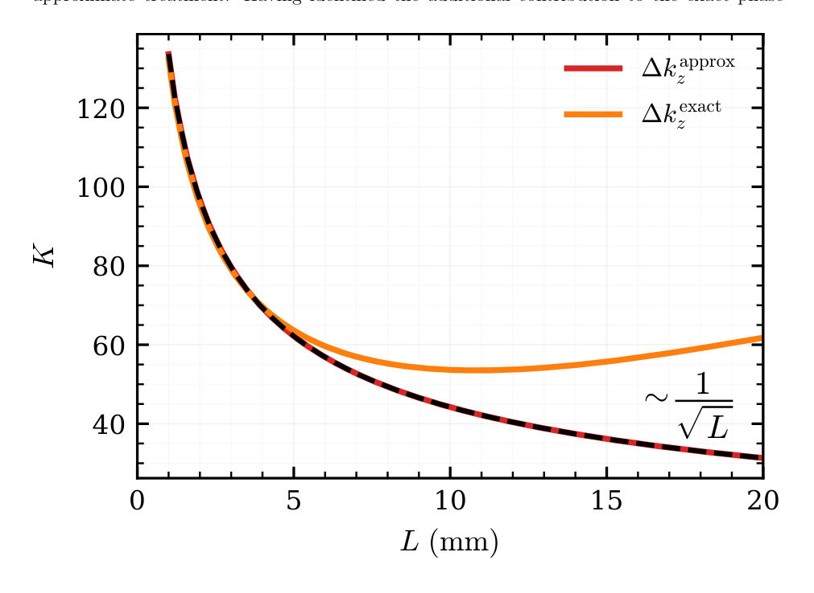
<figcaption class="paper-figure-caption"><b>Fig 1.</b> FIG. 1. Dependence of the Schmidt number on crystal thickness. The red curve cor-</figcaption>
</figure>
<figure class="paper-figure-card">
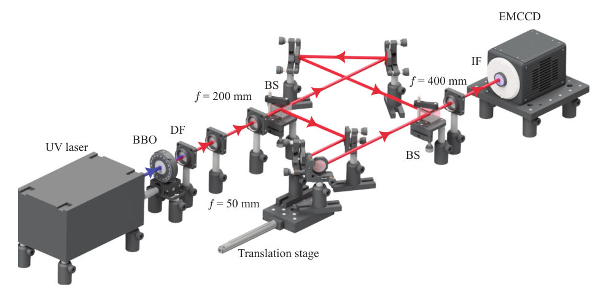
<figcaption class="paper-figure-caption"><b>Fig 2.</b> FIG. 2. Schematic of the experimental setup. UV laser of central wavelength 355 nm; BBO,</figcaption>
</figure>
<figure class="paper-figure-card">
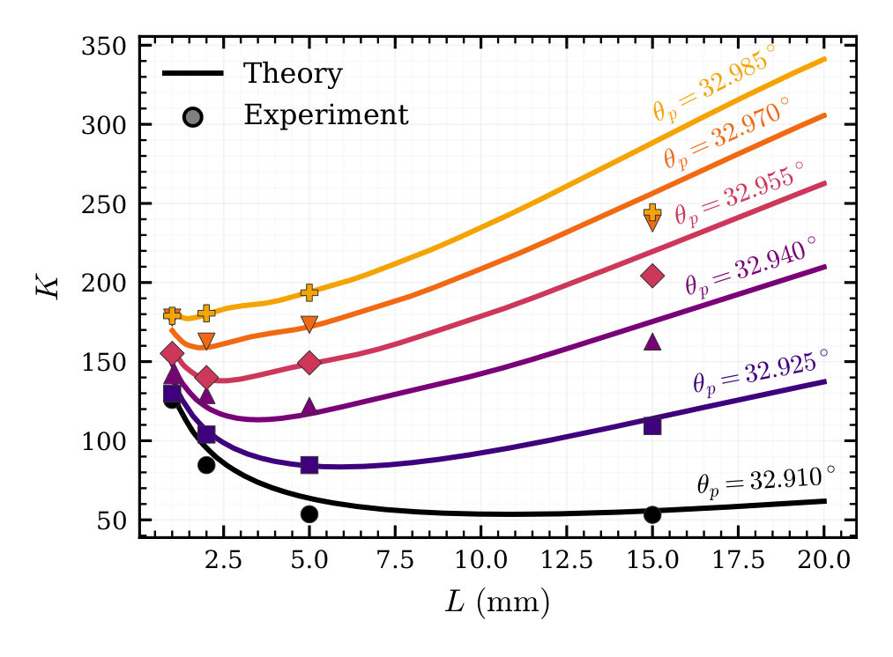
<figcaption class="paper-figure-caption"><b>Fig 3.</b> FIG. 3. Dependence of the Schmidt number on crystal thickness for various phase-</figcaption>
</figure>

**Summary.** The paper experimentally and theoretically investigates how crystal thickness affects the dimensionality (Schmidt number) of OAM-entangled photon pairs generated via SPDC. The key finding is the first observation of non-monotonic behavior, which arises from spatial walk-off effects in anisotropic crystals. This work emphasizes that using the full phase-matching theory, rather than approximations, is essential for accurate quantum state characterization.

**Why it may be interesting.** This research provides a crucial refinement to the theoretical understanding of high-dimensional quantum state generation in optics, showing that neglecting geometric effects like walk-off can lead to fundamentally incorrect predictions about entanglement resource scaling with device size.

Detailed structure

**Main problem.** The study investigates how the dimensionality of orbital angular momentum (OAM) entangled states, quantified by the Schmidt number, changes as a function of nonlinear crystal thickness.

**Main result.** Contrary to previous predictions, the authors experimentally and theoretically demonstrate that the Schmidt number exhibits non-monotonic behavior—increasing after an initial decrease—due to spatial walk-off effects in anisotropic crystals.

**Method.** The work combines experimental measurements using SPDC with theoretical modeling that incorporates the full phase-matching function, explicitly accounting for spatial walk-off terms neglected in prior approximations.

**Model / system.** The system involves generating OAM-entangled photon pairs via Spontaneous Parametric Down-Conversion (SPDC) within an anisotropic nonlinear crystal like BBO. The state is analyzed using the Schmidt decomposition formalism.

**Key observables.** Angular Schmidt spectrum ($S_l$) and the associated Schmidt number ($K$).

**Important parameters / regimes.** Crystal thickness ($L$), phase-matching angle ($	heta_p$), and the spatial walk-off term ($\Delta k_{	ext{extra}}^z$).

**Assumptions / limitations.** The primary limitation addressed is the failure of previous theoretical models that used approximate phase-matching conditions by neglecting spatial walk-off.

**Figures summary.** Figure 1 compares the Schmidt number dependence on thickness, showing a monotonic decrease (approximate) versus a non-monotonic increase (exact/experimental). Appendix figures compare zero-radial-mode spectra using both approximate and exact formulations, highlighting divergence at larger thicknesses.

**Paper structure.** The paper first establishes the theoretical framework for OAM entanglement via SPDC. It then contrasts previous approximate models with the full model incorporating spatial walk-off. The core of the work presents experimental measurements confirming the non-monotonic trend predicted by the exact theory, followed by detailed comparisons of spectral convergence across different approximations.

Abstract

The orbital angular momentum (OAM) of photons provides a high-dimensional resource for quantum information protocols. The dimensionality of OAM-entangled states generated via spontaneous parametric down-conversion (SPDC) is quantified by the angular Schmidt spectrum. Here, we experimentally investigate the dependence of the angular Schmidt spectrum on the thickness of the nonlinear crystal. Contrary to previous studies reporting a monotonic decrease in the Schmidt number with increasing crystal thickness, we report the first experimental observation of a nonmonotonic behavior, as we demonstrate an increase in the Schmidt number beyond a certain crystal thickness. We attribute this to the spatial walk-off effect in the anisotropic nonlinear crystal and explain it using a theoretical model that is devoid of standard phase-matching approximations. These findings can have important implications for high-dimensional entangled state generation.

[↑ back to top](#top)

### [Fugacity-Resolved Stabilizer Entropy in Critical Quantum Chains: Discrete Selberg Sums and Exactly Solvable Rényi Indices](http://arxiv.org/abs/2608.06995v1)

**Authors:** Reyhaneh Khasseh, M. A. Rajabpour  
**Type:** theory · **Category:** statistical mechanics · **PDF:** <https://arxiv.org/pdf/2608.06995v1>  
**Analysis basis:** full PDF text, analyzed in chunks
**Topic relevance:** 🔥 `entanglement & information structure` **4/5** · `analog quantum simulation` **2/5** · `driven-dissipative phase transition` **1/5** · `methods for driven-dissipative` **1/5** · `non-equilibrium dynamics` **1/5** · `non-equilibrium universality` **1/5**

↔ Scroll figures horizontally

<figure class="paper-figure-card">
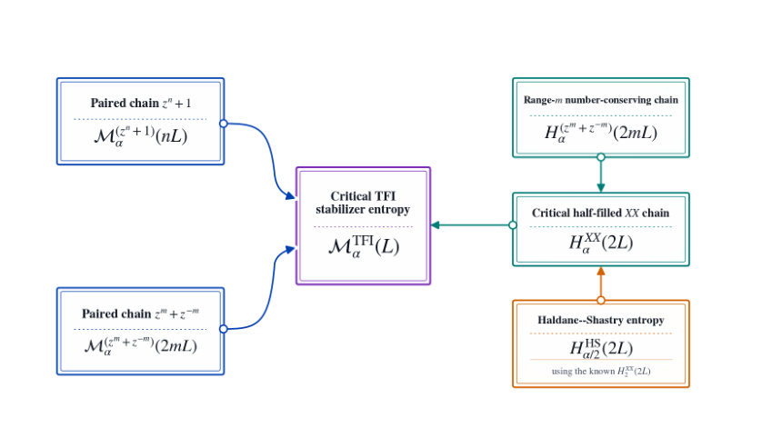
<figcaption class="paper-figure-caption"><b>Fig 1.</b> FIG. 1. Exact entropy reductions to the critical TFI stabilizer R´enyi entropy. Stabilizer decimation applies to paired free-fermion chains, probability factorization applies to the range-m number-conserving chains, and the Haldane–Shastry distribution is the order-two escort of the half-filled XX distribution. In every case, the required input is supplied by MTFI α .</figcaption>
</figure>
<figure class="paper-figure-card">
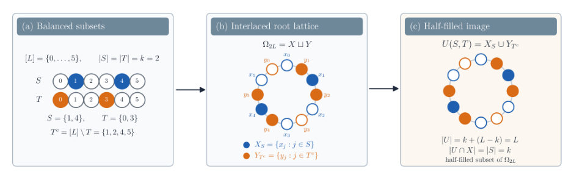
<figcaption class="paper-figure-caption"><b>Fig 2.</b> FIG. 2. Schematic of the bijection between a balanced minor label and a half-filled configuration on the doubled root lattice, illustrated for a six-site example with two selected indices. Panel (a) shows the two balanced subsets that label the minor. Panel (b) maps the first subset to selected roots on one sublattice and the complement of the second subset to selected roots on the interlaced sublattice. Panel (c) combines these selections into a half-filled configuration on the doubled lattice. The construction is reversible, so the original balanced subsets can be recovered uniquely from the final configuration.</figcaption>
</figure>
<figure class="paper-figure-card">
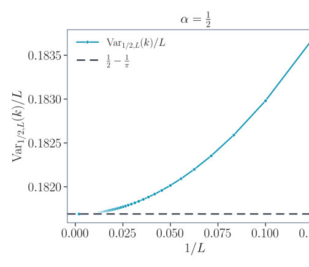
<figcaption class="paper-figure-caption"><b>Fig 3.</b> FIG. 3. Finite-size scaling of the degree fluctuations. Left: Var1/2,L(k)/L approaches 1</figcaption>
</figure>
<figure class="paper-figure-card">
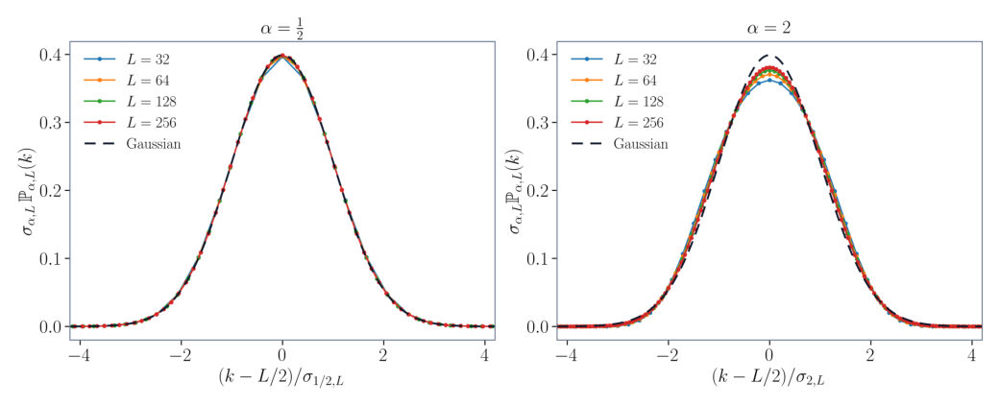
<figcaption class="paper-figure-caption"><b>Fig 4.</b> FIG. 4. Gaussian scaling collapse of the degree distributions at α = 1 2 (left) and α = 2 (right). We plot σα,LPα,L(k) against (k −L/2)/σα,L for L = 32, 64, 128, and 256. The dashed curve is the standard-normal density e−x2/2/ √</figcaption>
</figure>
<figure class="paper-figure-card">
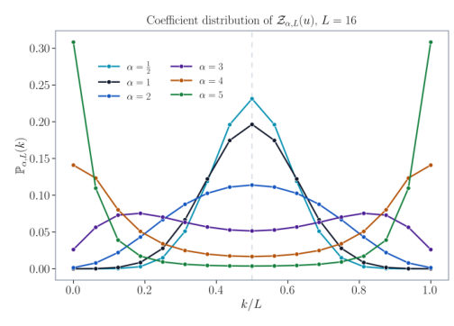
<figcaption class="paper-figure-caption"><b>Fig 5.</b> FIG. 5. Normalized balanced-degree distribution Pα,L(k) at L = 16 for several R´enyi tilts. Complement symmetry enforces reflection about k/L = 1/2. Increasing α changes the finite- size profile from a central peak to a symmetric bimodal form and eventually to strong endpoint dominance. The curves at α &gt; 2 show a finite-size evolution and do not by themselves establish a sharp thermodynamic transition.</figcaption>
</figure>

**Summary.** This theoretical paper investigates the stabilizer Rényi entropy in critical quantum chains, particularly the TFI model. By introducing a fugacity-resolved partition function, the authors map the problem to discrete Selberg ensembles. They derive exact mathematical results for specific Rényi indices ($\alpha=1/2, 1, 2$), revealing deep connections between entanglement measures and advanced combinatorial identities.

**Why it may be interesting.** The connection between quantum entanglement measures (Rényi entropy) in critical systems and advanced mathematical physics tools like Selberg integrals and Jack-Kostka representations provides deep insights into the structure of ground state correlations in 1D quantum matter.

Detailed structure

**Main problem.** The core problem is determining which Rényi indices allow for an exact finite-size compression of the all-minors sum derived from calculating stabilizer Rényi entropy in critical quantum chains.

**Main result.** The analysis yields explicit product formulas and connections to discrete Selberg ensembles for specific Rényi indices ($\alpha=1/2, 1, 2$), showing that the degree distribution converges to Gaussian limits under appropriate rescaling at these points.

**Method.** The authors introduce a fugacity-resolved partition function for the critical transverse-field Ising chain and map the resulting all-minors sum to a checkerboard-weighted discrete Selberg ensemble on a doubled root lattice.

**Model / system.** The study focuses on the critical transverse-field Ising (TFI) quantum chain, which serves as a common finite-size building block for calculating stabilizer and computational-basis Shannon--Rényi entropies. The analysis is generalized to other paired free-fermion chains.

**Key observables.** Stabilizer Rényi entropy ($M_\alpha$), the full counting statistics of the Pauli expectation-value distribution, and the degree distribution symmetry.

**Important parameters / regimes.** The Rényi index ($\alpha$), system size ($L$), and fugacity ($\mu$ or $	ext{unit } \mu$).

**Assumptions / limitations.** The analysis relies on mapping the problem to known mathematical structures like discrete Selberg ensembles, which allows for exact evaluations at specific integer/half-integer indices.

**Figures summary.** Not specified in detail, but the notes mention Figure 1 illustrating entropy reductions via decimation, factorization, and escort relations, and Table I summarizing these reduction relations.

**Paper structure.** The paper progresses by establishing the physical context (TFI chain entropy), developing the mathematical machinery (fugacity-resolved partition function mapping to Selberg ensembles), deriving exact results for specific $\alpha$ values using determinant/Pfaffian compressions, and finally discussing the general behavior and open algebraic questions.

Abstract

Stabilizer Rényi entropy quantifies the nonstabilizerness of a quantum state through Rényi moments of its Pauli expectation-value distribution. Its standard form sums over Pauli-string degrees and retains only the total Rényi weight. We introduce a fugacity-resolved partition function for the critical transverse-field Ising chain that resolves this degree in the balanced Majorana representation and generates its full counting statistics. This Ising problem extends beyond a single model: exact decimation identities and the correspondence with the half-filled \(XX\) chain establish it as a common finite-size building block for stabilizer and computational-basis Shannon--Rényi entropies. We map the fugacity-resolved all-minors sum, for every positive Rényi index, to a checkerboard-weighted discrete Selberg ensemble on a half-filled doubled root lattice. For positive integer indices, it reduces to a finite aliased Dyson constant term. At \(α=\tfrac12,1,2\), determinant and Pfaffian compressions yield product formulas. At \(α=4\), the generic-fugacity problem admits an exact inverse Jack--Kostka representation, while at unit fugacity a complementary middle-minor identity relates it to the square of the \(α=2\) result. These generating functions determine the balanced-degree statistics. Complement symmetry makes the distribution symmetric about \(k=L/2\), with an index-dependent width. It is exactly binomial at \(α=1\), has variance proportional to \(L\) at \(α=\tfrac12\), and develops an \(L\log L\) enhancement at \(α=2\). After variance rescaling, the centered distributions converge to Gaussian limits at all three indices. Beyond these solvable cases, finite-size numerics reveal an evolution from a central peak to a symmetric bimodal profile and eventually to endpoint dominance as the Rényi index increases.

[↑ back to top](#top)

### [Extracting the pairing gap from van Hove singularities in rf spectra of the Fermi Hubbard model](http://arxiv.org/abs/2608.06883v1)

**Authors:** Chuping Li, Kaichao Zhang, Junru Wu, Yuxuan Wu, Dingli Yuan, Pengyi Chen, Lin Sun, Qijin Chen  
**Type:** theory · **Category:** quantum gases · **PDF:** <https://arxiv.org/pdf/2608.06883v1>  
**Analysis basis:** full PDF text, analyzed in chunks
**Topic relevance:** 🔥 `analog quantum simulation` **4/5** · `Keldysh / 2PI / non-Gaussian methods` **3/5** · `driven-dissipative phase transition` **1/5** · `methods for driven-dissipative` **1/5**

↔ Scroll figures horizontally

<figure class="paper-figure-card">
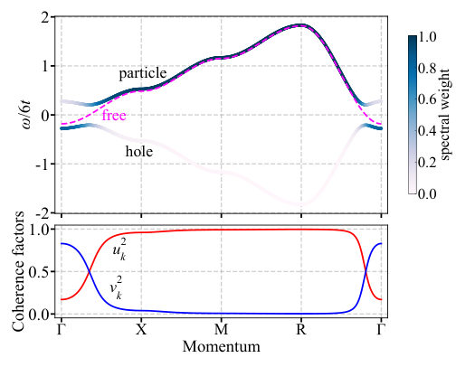
<figcaption class="paper-figure-caption"><b>Fig 1.</b> Figure 1. Representative spectral function of the 3D attractive FHM at Uc and Tc for n = 0.1. The results are obtained from self- consistent solutions yielding ∆= 0.207 and µ = 0.182 (in units of 6t). The upper and lower blue curves denote the particle and hole quasiparticle branches, respectively, with the two branches color- coded by their spectral weight. The dispersions are plotted along the high-symmetry lines of the first Brillouin zone, with Γ = (0, 0, 0), X = (π, 0, 0), M = (π, π, 0), and R = (π, π, π). The magenta curve represents the noninteracting band dispersion. The lower panel shows the coherence factors u2 k and v2 k, corresponding to the spectral weights of the two...</figcaption>
</figure>
<figure class="paper-figure-card">
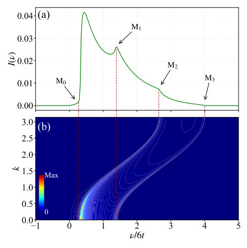
<figcaption class="paper-figure-caption"><b>Fig 2.</b> Figure 2. (a) rf current I(ν), i.e., the momentum-integrated rf spec- trum, at Tc for U/6t = −1.8 and n = 0.1. The four types of vHSs are labeled on the curve. (b) The z-integrated, partially momentum-resolved rf spectrum I(k, ν) plotted along the projected face-diagonal direction k∥= (k, k). The red dashed lines align the corresponding vHS features in (a) and (b).</figcaption>
</figure>
<figure class="paper-figure-card">
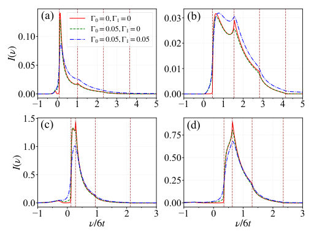
<figcaption class="paper-figure-caption"><b>Fig 3.</b> Figure 4. rf current I(ν) as a function of detuning ν for (a) n = 0.1, U = Uc, (b) n = 0.1, U/6t = −2, (c) n = 1, U = Uc, and (d) n = 1, U/6t = −2, for various Γ0 and Γ1. The vertical lines indicate the rf detunings corresponding to the M0–M3 vHSs.</figcaption>
</figure>
<figure class="paper-figure-card">
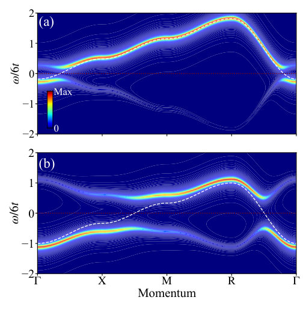
<figcaption class="paper-figure-caption"><b>Fig 4.</b> Figure 3. Spectral function A(k, ω) of the 3D attractive FHM at Tc and Uc for (a) n = 0.1 and (b) n = 1, with Γ0 = Γ1 = 0.05. The white dashed line denotes the noninteracting band dispersion.</figcaption>
</figure>
<figure class="paper-figure-card">
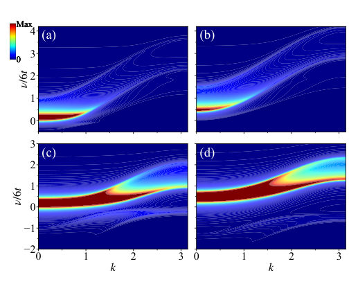
<figcaption class="paper-figure-caption"><b>Fig 5.</b> Figure 5. The kz-integrated, (kx, ky)-resolved rf spectra I(k, ν) at Tc along the face-diagonal direction k∥= (k, k) for (a) n = 0.1, U = Uc, (b) n = 0.1, U/6t = −2, (c) n = 1, U = Uc, and (d) n = 1, U/6t = −2. The same color saturation value is applied across all panels to enhance the visibility of weak signals.</figcaption>
</figure>

**Summary.** The authors propose using van Hove singularities (vHSs) observed in the rf spectra of the 3D attractive Fermi Hubbard model as a highly robust method to determine the pairing gap ($\Delta$) and chemical potential ($\mu$). By showing that vHS positions depend only on these two parameters, measuring just two distinct features allows for parameter extraction without needing full spectral fitting. This establishes vHS analysis as a practical diagnostic tool for quantum simulation experiments.

**Why it may be interesting.** This provides a concrete, measurable spectroscopic diagnostic tool for characterizing superfluidity in quantum simulators, offering an alternative to complex full spectral fitting techniques.

Detailed structure

**Main problem.** The primary goal is to establish a robust spectroscopic method for extracting the pairing gap ($\Delta$) from radio-frequency (rf) spectra of the Fermi Hubbard model.

**Main result.** Van Hove singularities (vHSs) in the rf spectra depend only on $\Delta$ and chemical potential $\mu$, allowing both parameters to be determined by measuring just two well-resolved vHS positions.

**Method.** The analysis uses linear response theory applied to the low-order rf current, identifying characteristic detunings ($
u_i$) at vHS momenta derived from the Green's function formalism.

**Model / system.** The study focuses on the 3D attractive Fermi Hubbard model, relevant for ultracold Fermi gases in optical lattices. The theory extends beyond mean-field BCS by using pair-fluctuation theory within the T-matrix approximation.

**Key observables.** Van Hove singularities (vHSs) in the rf spectral function $A(\mathbf{k}, \omega)$, characterized by specific detuning values ($
u_i$).

**Important parameters / regimes.** Pairing gap ($\Delta$), chemical potential ($\mu$), interaction strength ($|U|$), and lattice hopping ($t$). Special attention is paid to the half-filling case where $\mu$ is fixed.

**Assumptions / limitations.** The method assumes that vHS features remain visible even when incorporating phenomenological lifetime and scattering broadenings, allowing for algebraic extraction of parameters from kinematic relations.

**Figures summary.** Figures illustrate representative spectral functions showing particle/hole branches (Fig 1), the momentum-integrated rf current with labeled vHS features (Fig 2), and how these detunings ($
u_i$) vary systematically with interaction strength and filling (Fig 8).

**Paper structure.** The paper develops the theoretical framework by deriving the dependence of vHS positions on $\Delta$ and $\mu$, demonstrating that two such measurements suffice for parameter extraction. It then analyzes the robustness of this method across different momentum resolutions and coupling strengths.

Abstract

We show that van Hove singularities in rf spectra of the 3D attractive Fermi Hubbard model provide a robust route to extracting the pairing gap. Four types of singularities are classified, and their spectral positions are shown to depend solely on the pairing gap $Δ$ and chemical potential $μ$ through simple algebraic relations. Measuring two well-resolved singularities therefore determines both parameters without requiring full spectral fitting. Numerical simulations incorporating phenomenological lifetime and scattering broadenings confirm that these features remain visible in both momentum-integrated and $k_z$-integrated spectra, and become more pronounced at stronger coupling where conventional back-bending methods lose sensitivity. At half filling, particle-hole symmetry fixes $μ$, reducing the extraction to a single singularity measurement. These results establish vHS analysis as a practical spectroscopic diagnostic for pairing in quantum-simulated 3D Fermi Hubbard systems.

[↑ back to top](#top)

### [Acoustic fluctuations of two-dimensional dipolar supersolids](http://arxiv.org/abs/2608.06800v1)

**Authors:** P. Blair Blakie  
**Type:** theory · **Category:** quantum gases · **PDF:** <https://arxiv.org/pdf/2608.06800v1>  
**Analysis basis:** full PDF text, analyzed in chunks
**Topic relevance:** 🔥 `analog quantum simulation` **4/5** · `Frenkel-Kontorova` **1/5** · `Keldysh / 2PI / non-Gaussian methods` **1/5**

↔ Scroll figures horizontally

<figure class="paper-figure-card">
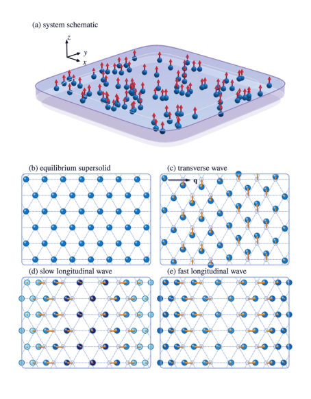
<figcaption class="paper-figure-caption"><b>Fig 1.</b> FIG. 1. Schematic of the system and its acoustic modes. (a) A dipo- lar Bose gas confined to a planar geometry, with the dipoles polarized along the harmonically confined z direction. (b) An unperturbed tri- angular supersolid. (c)–(e) Schematics of the transverse, and two longitudinal acoustic modes. The arrows show the lattice displace- ment, while the site colour indicates the relative atom number at each site.</figcaption>
</figure>
<figure class="paper-figure-card">
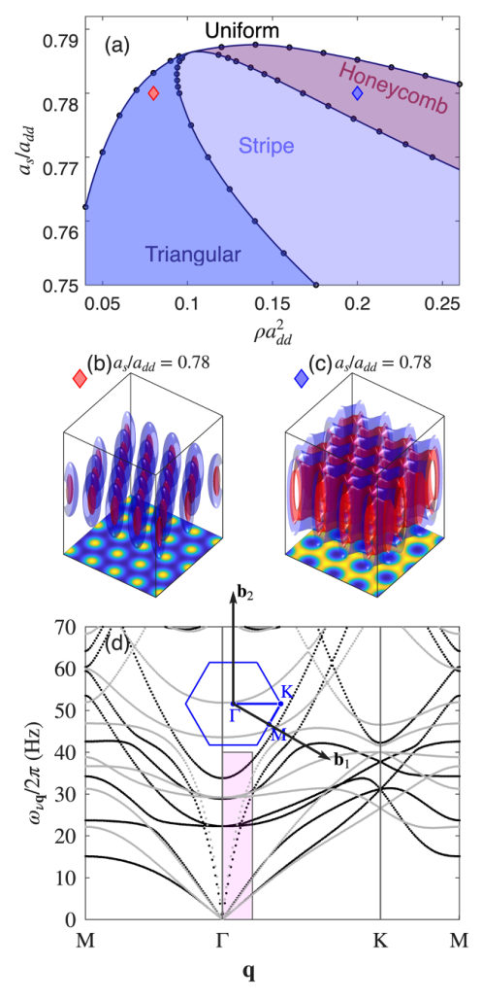
<figcaption class="paper-figure-caption"><b>Fig 2.</b> FIG. 2. Phase diagram, ground states and band structure for a planar dipolar BEC. (a) Phase diagram showing the regions where the uniform superfluid, stripe crystal, triangular crystal and hon- eycomb crystal are the ground states. Examples of (b) triangular [ρa2 dd = 0.08] and (c) honeycomb [ρa2 dd = 0.2] ground states. The plot box is of size 20×20 ×28 µm and the red (blue) isosurfaces are at a density of 3 × 1020 m−3 (1.5 × 1020 m−3). A column den- sity is given on the base plane. (d) Band structure of the triangular (black dots) and honeycomb (grey dots) supersolids corresponding to (b) and (c), respectively. Band structure shown along special di- rections of the first Brillouin zone,...</figcaption>
</figure>
<figure class="paper-figure-card">
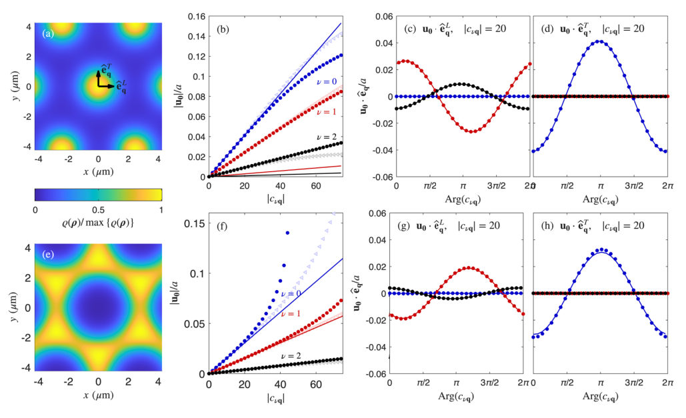
<figcaption class="paper-figure-caption"><b>Fig 3.</b> FIG. 3. Lattice site displacement for triangular (a)-(d) and honeycomb (e)-(h) supersolids caused by adding an excitation from the ν = 0, 1, 2 bands with a quasimomentun along x. (a), (e) show the unperturbed triangular and honeycomb areal densities ϱ0(ρ) and in (a) the longitudinal and transverse unit vectors are shown for reference. (b), (f) show the magnitude of the displacement of the site as a function of the quasiparticle amplitude. (c), (g) longitudinal and (d), (h) transverse displacement as a function of the phase of the quasiparticle. Results in (b)-(d), (f)-(h) are coloured according to the band as labelled in (b) and (f). Displacements computed from the first order expression...</figcaption>
</figure>
<figure class="paper-figure-card">
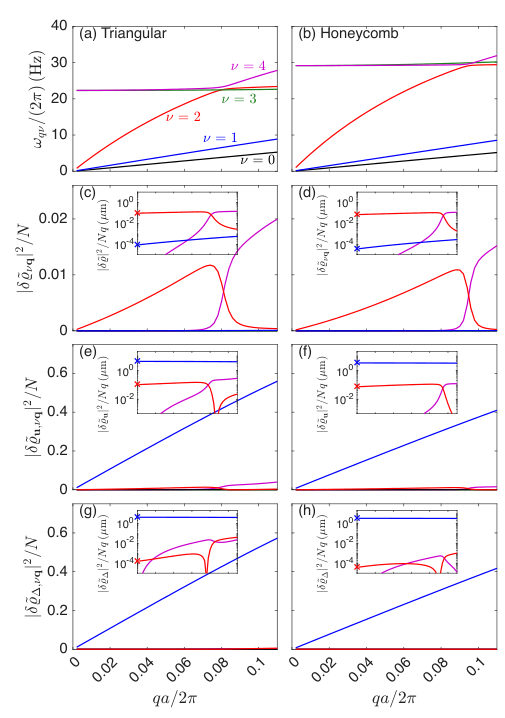
<figcaption class="paper-figure-caption"><b>Fig 4.</b> FIG. 4. Density fluctuations for triangular (left column) and hon- eycomb (right column) states. (a), (b) Excitation spectrum show- ing lowest 5 bands. (c), (d) Total density fluctuation δ˜ϱνq [from Eq. (13)]. (e), (f) strain density fluctuation δ˜ϱu,νq [from Eq. (28)] , and (g), (h) defect density fluctuation δ˜ϱ∆,νq [from Eq. (29)]. Insets to (c)-(h) show the fluctuation scaled by wave vector with the crosses indicating the hydrodynamic theory asymptotes. Both states are at as/add = 0.780 with a density of ρ = 0.08/a2 dd (ρ = 0.20/a2 dd) for the triangular (honeycomb) case. The lattice constant is a = 4.93 µm (a = 5.38 µm) for the triangular (honeycomb) case.</figcaption>
</figure>
<figure class="paper-figure-card">
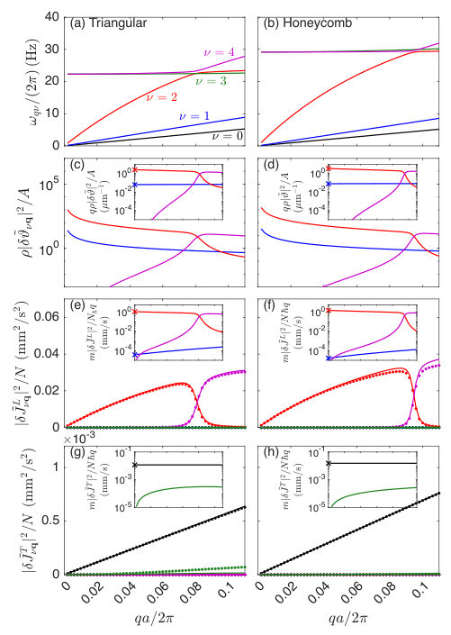
<figcaption class="paper-figure-caption"><b>Fig 5.</b> FIG. 5. Phase and current fluctuations for triangular (left column) and honeycomb (right column) states. (a), (b) Excitation spectrum showing lowest 5 bands. (c), (d) Phase fluctuations δ ˜ϑνq [from Eq. (14)]. (e), (f) longitudinal current fluctuations δ ˜JL νq and (g), (h) transverse current fluctuations δ ˜JT νq [from Eq. (15)]. Insets to (c)-(h) show the fluctuation scaled by wave vector with the crosses indicate the hydrodynamic theory asymptotes. The dots in (e) - (h) test the applicability of Eqs. (32) and (33) [see text]. The states analyzed are the same as in Fig. 4.</figcaption>
</figure>

**Summary.** This theoretical paper analyzes sound wave excitations in 2D dipolar supersolids using Bogoliubov-de Gennes theory. It decomposes density fluctuations into contributions from crystal strain and particle transport, identifying three distinct acoustic modes. The results confirm that the microscopic quantum description correctly reproduces macroscopic hydrodynamic predictions based on elastic constants.

**Why it may be interesting.** This work provides a detailed microscopic link between the quantum excitation spectrum (BdG) and macroscopic continuum properties (elasticity/hydrodynamics) in exotic quantum matter like supersolids, which is highly relevant to modern AMO research.

Detailed structure

**Main problem.** The study investigates the microscopic structure of long-wavelength acoustic excitations in two-dimensional dipolar supersolids.

**Main result.** The analysis successfully connects Bogoliubov excitation modes to measurable crystalline and superfluid degrees of freedom, showing that fluctuation amplitudes match hydrodynamic theory based on elastic coefficients.

**Method.** Bogoliubov–de Gennes (BdG) calculations are used to determine quasiparticle excitations, followed by developing a procedure to extract the lattice displacement field from density perturbations.

**Model / system.** The system is modeled as a two-dimensional dipolar Bose-Einstein condensate exhibiting crystalline order (triangular or honeycomb). The dynamics are analyzed using linearizations of the extended Gross–Pitaevskii equation.

**Key observables.** Density ($\varrho$), phase ($\vartheta$), current ($J$), and lattice displacement fluctuations associated with three acoustic modes (one transverse, two longitudinal).

**Important parameters / regimes.** Long-wavelength limit ($|q|a \ll 1$); zero temperature; elastic coefficients of the supersolid.

**Assumptions / limitations.** The analysis assumes a uniform planar geometry and focuses on small distortions relative to the lattice constant.

**Figures summary.** Figures illustrate schematics of the three acoustic modes, phase diagrams showing triangular/honeycomb states, and spectra detailing density, strain, and defect density fluctuations for different excitation bands.

**Paper structure.** The paper progresses from defining the physical system and governing equations (eGPE/BdG) to analyzing specific fluctuation components ($\delta	ilde{
ho}, \delta	ilde{
ho}_u, \delta	ilde{
ho}_\Delta$) for each acoustic mode, culminating in comparisons with established hydrodynamic sum rules.

Abstract

We investigate the microscopic structure of the long-wavelength acoustic excitations of two-dimensional dipolar supersolids with triangular and honeycomb crystal order. Using Bogoliubov--de Gennes calculations, we determine the density, phase, current, and lattice-displacement fluctuations associated with the three acoustic modes. We develop a procedure to extract the lattice displacement directly from the microscopic density perturbation, allowing the modes to be identified as one transverse and two longitudinal branches. The displacement field further separates the density fluctuations into contributions from crystal strain and particle transport relative to the lattice. This reveals that the lower longitudinal mode can have large strain and defect-density fluctuations that substantially cancel in the total density response. We show that the long-wavelength fluctuation amplitudes agree with hydrodynamic theory, which is specified entirely by the elastic coefficients of the supersolid. Our analysis provides a microscopic connection between Bogoliubov excitations and the crystalline and superfluid degrees of freedom of two-dimensional supersolids, and identifies their signatures in density- and current-sensitive probes.

[↑ back to top](#top)

### [Flip-chip integrated superconducting qubits using electroplated bump bonds](http://arxiv.org/abs/2608.07306v1)

**Authors:** Yen-An Shih, Rebecca Gharibaan, Barka Khan, Dhananjay Joshi, Siddharth Singh, Martijn F. S. Zwanenburg, Eugene Y. Huang, Nataliia Zhurbina, Figen Yilmaz, Lukas Johannes Splitthoff, Srijit Goswami, Christian Kraglund Andersen  
**Type:** experiment · **Category:** quantum information and computing · **PDF:** <https://arxiv.org/pdf/2608.07306v1>  
**Analysis basis:** full PDF text, analyzed in chunks
**Topic relevance:** 🔥 `QC/QI experiment` **4/5**

↔ Scroll figures horizontally

<figure class="paper-figure-card">
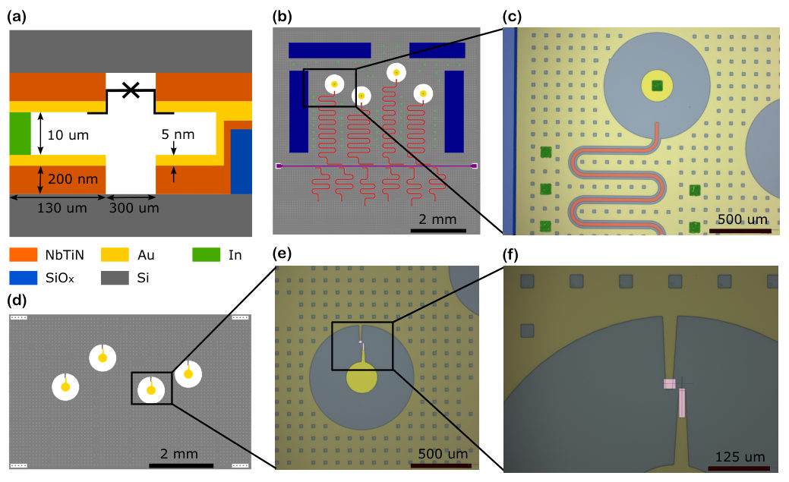
<figcaption class="paper-figure-caption"><b>Fig 1.</b> FIG. 1. Flip-transmon architecture: (a) Cross section of a flip-transmon. The left side is the charge island, which contains an indium bump (green) maintaining the superconducting galvanic connection between the top and bottom islands. The right side is the ground, which has a SiOx hardstop to ensure 10 µm interchip distance. (b) Overview of the bottom chip design, which contains four charge islands (yellow), four readout resonators and 6 flag resonators (red), one transmission line (purple), four SiOx hardstops (blue), and indium bumps across the ground plane and charge islands (green). (c) Optical image of the bottom chip showing a close-up of the annotated region in (b). (d) Overview of...</figcaption>
</figure>
<figure class="paper-figure-card">
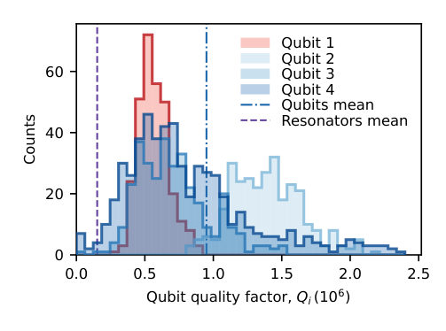
<figcaption class="paper-figure-caption"><b>Fig 2.</b> FIG. 2. Measurement of flip-transmons. Distribution of the measured internal quality factors for four flip-transmons over a period of approximately 20 hours. Qubit 1 belongs to a different chip than Qubits 2, 3, and 4. The two chips have identical designs and were fabricated in the same processing run. The blue dashed-dot line indicates the mean internal quality factor of the four qubits. The purple dashed line in- dicates the mean internal quality factor of the resonators lo- cated on the same chip as Qubits 2, 3, and 4, corresponding to the lower-half structures shown in Fig. 1(b).</figcaption>
</figure>
<figure class="paper-figure-card">
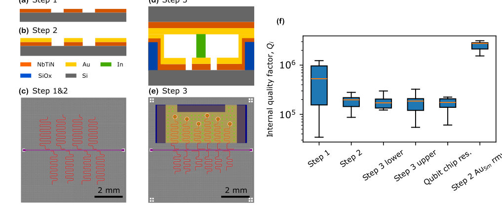
<figcaption class="paper-figure-caption"><b>Fig 3.</b> FIG. 3. Resonator measurements for loss analysis. (a) Cross section of resonators fabricated through Step 1, consisting of 200 nm NbTiN deposited on a high-resistivity silicon substrate and patterned by RIE. (b) Cross section of resonators fabricated through Step 2, which includes an additional 5 nm ex-situ Au film deposited on top of the NbTiN. (c) Layout of the CPW resonators used for the Step 1 and Step 2 measurements. (d) Cross section of resonators fabricated through Step 3. Additional processing includes deposition and patterning of SiOx hard stops, electroplated indium bumps, and bonding to a blank top chip. (e) Layout of the resonators used for the Step 3 measurements. The lower...</figcaption>
</figure>
<figure class="paper-figure-card">
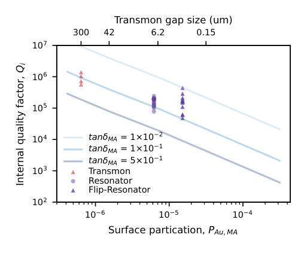
<figcaption class="paper-figure-caption"><b>Fig 4.</b> FIG. 4. Loss analysis. Internal quality factor as a function of the simulated surface participation ratio of the metal-air (MA) interface where there is gold encapsulation for the Au- capped resonators from Step 2, the bump-bond grounded res- onators from Step 3 that are covered with the top chip, and for flip-transmons in Fig. 1. The solid lines show the simulated relationship between Qi and the MA surface participation ra- tio for a fixed-Ec flip-transmon with varying island diameter and island-to-ground gap, with the gap indicated on the up- per x-axis.</figcaption>
</figure>
<figure class="paper-figure-card">
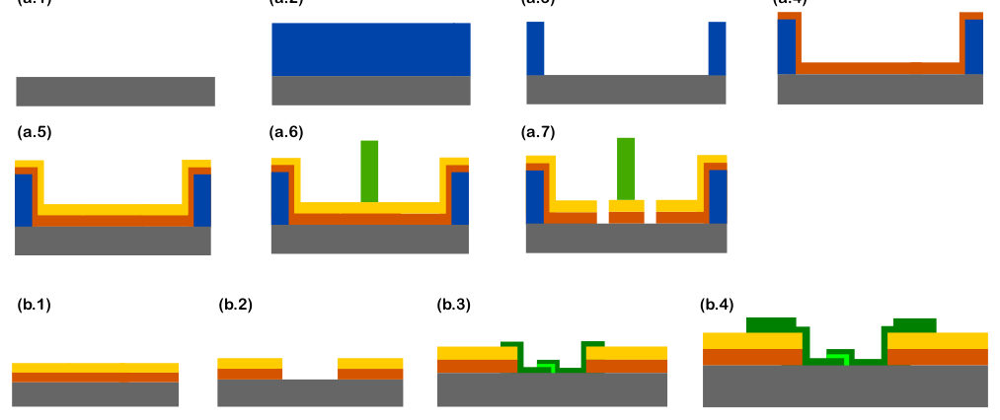
<figcaption class="paper-figure-caption"><b>Fig 5.</b> FIG. 5. Fabrication flow of the flip-transmon device. (a.1)–(a.7) Bottom chip fabrication process. (a.1) Starting high- resistivity Si wafer and cleaning steps. (a.2) Deposition of the SiOx hard stops. (a.3) Patterning of the SiOx hard stops. (a.4) NbTiN deposition. (a.5) Ex-situ Au deposition. (a.6) Indium bump electroplating. (a.7) NbTiN and Au etching. (b.1)–(b.4) Top chip fabrication process. (b.1) NbTiN and Au deposition on a cleaned Si wafer. (b.2) Patterned Au and NbTiN layers. (b.3) Fabrication of (Al/AlOx/Al) Josephson junctions. (b.4) Aluminum patches.</figcaption>
</figure>

**Summary.** This paper presents a method for building scalable superconducting quantum processors using flip-chip integration via electroplated indium bumps. By characterizing the qubit coherence and systematically analyzing loss sources across different fabrication steps, the authors demonstrate compatibility with high-coherence circuits while identifying surface losses at the gold interface as the main limitation.

**Why it may be interesting.** The work directly addresses scalability challenges in superconducting quantum computing by providing a robust, high-coherence integration technique compatible with advanced 3D packaging methods.

Detailed structure

**Main problem.** Developing a scalable, high-coherence platform for superconducting quantum processors by integrating distinct material platforms using flip-chip bonding.

**Main result.** The electroplated indium bump bond technology is compatible with high-coherence circuits, achieving qubit quality factors around $10^6$. The primary loss mechanism identified is surface loss associated with the gold layer used for electrical contact.

**Method.** Fabrication and characterization of transmon qubits using a three-dimensional flip-chip architecture bonded via electroplated indium bumps. Loss mechanisms were systematically studied by comparing qubit lifetimes to resonator quality factors under controlled process variations.

**Model / system.** The system is a 3D transmon circuit utilizing two substrates connected by electroplated indium bumps. The design aims to share the electric field across both substrates, minimizing sensitivity to interface losses.

**Key observables.** Qubit quality factor ($Q_i$), $T_1$ relaxation time, and resonator quality factors measured under varying magnetic fields and process steps.

**Important parameters / regimes.** Achieved $Q_i \approx 10^6$; dominant loss tangent ($	an \delta_{	ext{MA}}$) associated with the Au-covered metal-air interface.

**Assumptions / limitations.** The analysis assumes that surface losses at the gold/metal-air interface are the primary limiting factor, and that field sharing across substrates is effective for coherence preservation.

**Figures summary.** Figures illustrate the flip-transmon cross-section, measurement distributions of internal quality factors over time, and plots comparing $Q_i$ vs. simulated energy participation ratios ($	ext{PAu,MA}$) to confirm loss sources.

**Paper structure.** The paper first introduces the 3D transmon architecture using electroplated indium. It then systematically measures qubit coherence ($T_1$) and compares these results with resonator measurements across controlled process variations (e.g., presence/absence of Au film) to pinpoint the dominant loss mechanism, concluding that surface losses govern performance.

Abstract

Flip-chip integration offers a promising route toward scalable superconducting quantum processors and hybrid semiconductor-superconductor quantum devices. We develop a three-dimensional transmon architecture using electroplated indium in which the qubit electric field is shared nearly equally between two bump-bonded substrates while maintaining low participation at the indium-bump interface. The resulting geometry is well suited for future hybrid qubits, enabling the integration of distinct material platforms while minimizing sensitivity to bump-interface loss. Using this platform, we evaluate electroplated indium interconnects for superconducting quantum circuits. Flip-chip transmons incorporating electroplated indium bumps exhibit qubit quality factors around $10^6$. In addition, a systematic study of coplanar-waveguide resonators is used to identify losses associated with the electroplating process. In particular, we find that surface losses associated with the gold-layer, used to enable good electric contact with the indium, is likely the primary contributor to the qubit decay rate. These results demonstrate the compatibility of electroplated indium technology with high-coherence superconducting circuits and establish a promising platform for three-dimensional hybrid quantum integration.

[↑ back to top](#top)

### [From triangles to prisms: towards a geometric extension of concurrence fill for three-qubit mixed states](http://arxiv.org/abs/2608.07145v1)

**Authors:** Divyanshu K. Verma, Girish Kulkarni  
**Type:** theory · **Category:** quantum information and computing · **PDF:** <https://arxiv.org/pdf/2608.07145v1>  
**Analysis basis:** full PDF text, analyzed in chunks
**Topic relevance:** 🔥 `entanglement & information structure` **4/5**

↔ Scroll figures horizontally

<figure class="paper-figure-card">
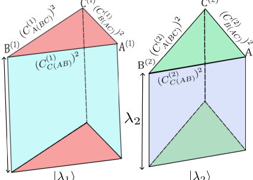
<figcaption class="paper-figure-caption"><b>Fig 1.</b> FIG. 1: Eigenprisms: Concurrence prisms associated with the eigendecomposition.</figcaption>
</figure>
<figure class="paper-figure-card">
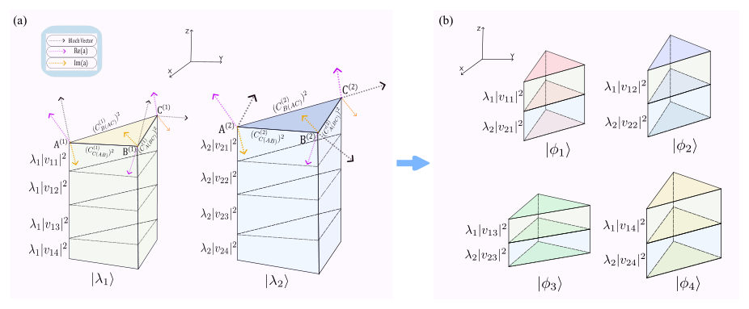
<figcaption class="paper-figure-caption"><b>Fig 2.</b> FIG. 2: Schematic depiction of the geometrical procedure connecting the eigenprisms to the general prisms.</figcaption>
</figure>
<figure class="paper-figure-card">
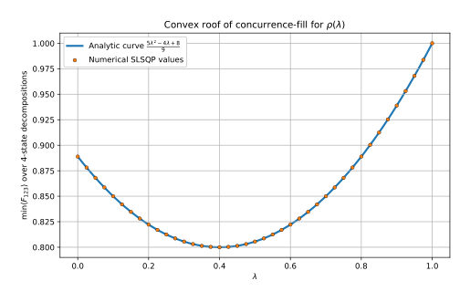
<figcaption class="paper-figure-caption"><b>Fig 3.</b> FIG. 3: Concurrence fill of rank-2 mixtures of the form ρ(λ) = λ |GHZ⟩⟨GHZ| + (1 −λ) |W⟩⟨W| with respect to the parameter λ.</figcaption>
</figure>
<figure class="paper-figure-card">
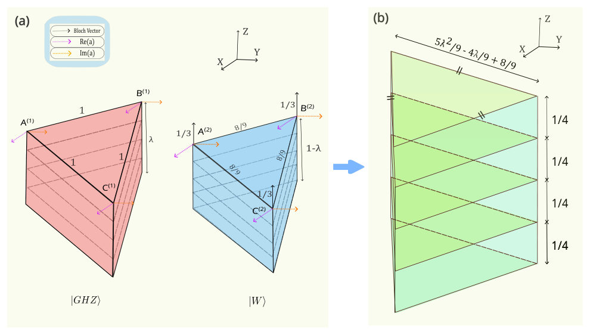
<figcaption class="paper-figure-caption"><b>Fig 4.</b> FIG. 4: (a) The eigenprisms for the GHZ-W mixture with heights λ and (1 −λ) respectively. Following from the co-isometry V minimizing the total prism fill area of the general prisms, each transverse section is divided equally. (b) The identical general prisms obtained following the procedure described in Sec. III.</figcaption>
</figure>

**Summary.** This paper develops a geometric framework—the concurrence prism—to extend the measure of genuine tripartite entanglement (concurrence fill) from pure to mixed three-qubit states. By applying this formalism to mixtures of GHZ and W states, the authors derive an exact closed-form expression for the entanglement measure, providing both theoretical results and powerful visualization tools.

**Why it may be interesting.** This work provides advanced tools for quantifying multipartite entanglement in realistic, mixed quantum systems, which is crucial for understanding decoherence effects in quantum computation protocols.

Detailed structure

**Main problem.** The primary goal is extending entanglement measures, specifically the concurrence fill, from three-qubit pure states to general mixed states.

**Main result.** The authors derived a closed-form expression for the concurrence fill of rank-2 mixtures of GHZ and W states, showing it depends on the mixing parameter $\lambda$ as $F(\lambda) = (5\lambda^2 - 4\lambda + 8)/9$.

**Method.** The study employs the convex-roof extension formalism, interpreting the optimization problem geometrically by minimizing the total 'prism fill area' over all pure state decompositions.

**Model / system.** The system under investigation is three-qubit quantum states ($
ho$), with a specific focus on rank-2 mixed states formed as mixtures of GHZ and W states.

**Key observables.** Concurrence fill ($F_{ABC}$), Concurrence Triangle area, Total Prism Fill Area, Reduced density matrices for subsystems.

**Important parameters / regimes.** The mixing parameter $\lambda \in [0, 1]$ governing the mixture between GHZ and W states.

**Assumptions / limitations.** The analysis is restricted to rank-2 mixed states; the geometric interpretation relies on relating general decompositions to eigen-decompositions.

**Figures summary.** Figures illustrate the geometric connection between 'eigenprisms' (from eigendecomposition) and general prisms, showing the concurrence fill vs. $\lambda$ for the GHZ-W mixture, and visualizing the resulting prism structures.

**Paper structure.** The paper first establishes the theoretical framework by generalizing the concurrence triangle to a 'concurrence prism' for mixed states. It then applies this formalism to rank-2 mixtures of specific entangled states (GHZ and W) to derive closed-form expressions and provide geometric visualizations.

Abstract

The quantification of multipartite entanglement remains a long-standing open challenge in quantum information theory with major implications for quantum foundations and quantum technologies. In the context of three-qubit pure states, the concurrence triangle underlies geometric interpretations for a variety of multipartite entanglement measures. In particular, the concurrence fill, which is proportional to the square root of the area of the concurrence triangle, has been shown to be a valid measure of genuine tripartite entanglement. As a result, there is now significant interest in extending the concurrence triangle and concurrence fill to three-qubit mixed states. In this work, we show that any rank-2 three-qubit mixed state can be visualized in terms of concurrence prisms associated with their pure state decompositions. Thus, the concurrence fill of the mixed state obtained through convex-roof extension is proportional to the total prism fill area, defined as the square root of the base area times the height, associated with the prisms minimized over all pure state decompositions. We then consider three-qubit mixed states that are incoherent mixtures of Greenberger-Horne-Zeilinger (GHZ) and W states and analytically perform their convex-roof extension to obtain a closed-form expression for the concurrence fill of these rank-2 mixtures. Finally, we apply the geometric picture of concurrence prisms to these mixtures and their pure state decomposition corresponding to minimum concurrence fill as a tool for visualization.

[↑ back to top](#top)

### [Consequences of a dynamical no-signaling condition for classical-quantum interactions](http://arxiv.org/abs/2608.07245v1)

**Authors:** S. Camalet  
**Type:** theory · **Category:** other · **PDF:** <https://arxiv.org/pdf/2608.07245v1>  
**Analysis basis:** full PDF text, analyzed in chunks
**Topic relevance:** `entanglement & information structure` **3/5** · `measurement-induced transitions` **3/5** · `methods for driven-dissipative` **3/5** · `quantum measurements` **3/5** · `Keldysh / 2PI / non-Gaussian methods` **2/5** · `correlated / nonlocal dissipation` **2/5** · `driven-dissipative phase transition` **2/5** · `non-equilibrium dynamics` **2/5** · `analog quantum simulation` **1/5** · `correlated cavity matter` **1/5** · `non-equilibrium universality` **1/5**

↔ Scroll figures horizontally

<figure class="paper-figure-card">
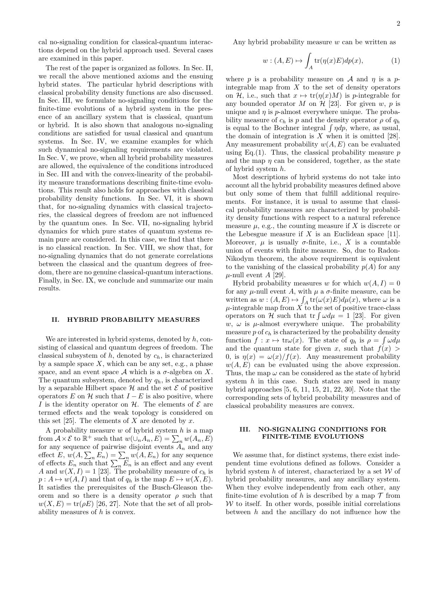
<figcaption class="paper-figure-caption"><b>Fig 1.</b> Low-resolution page preview, page 2</figcaption>
</figure>
<figure class="paper-figure-card">
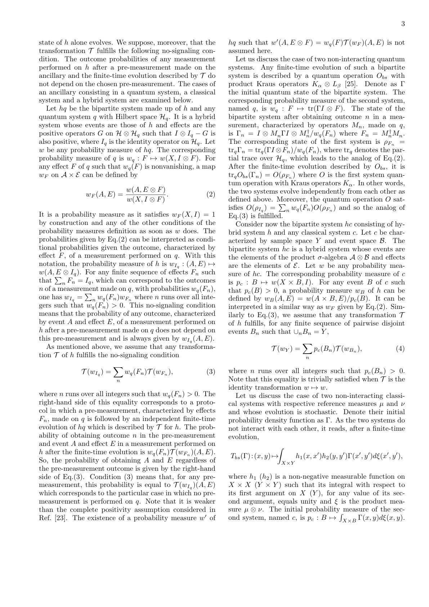
<figcaption class="paper-figure-caption"><b>Fig 2.</b> Low-resolution page preview, page 3</figcaption>
</figure>
<figure class="paper-figure-card">
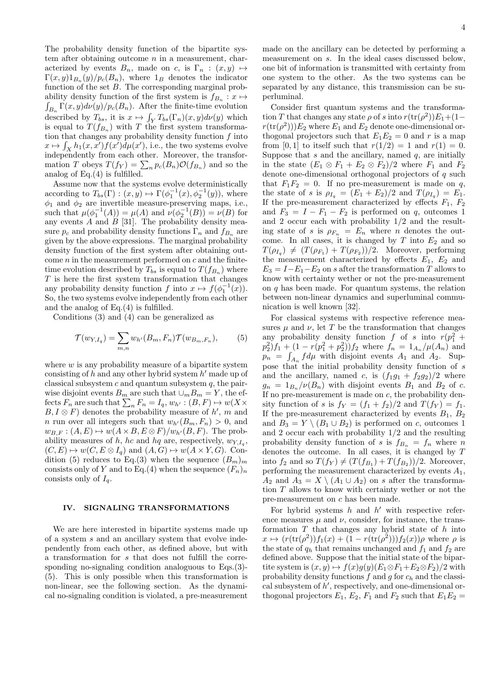
<figcaption class="paper-figure-caption"><b>Fig 3.</b> Low-resolution page preview, page 4</figcaption>
</figure>
<figure class="paper-figure-card">
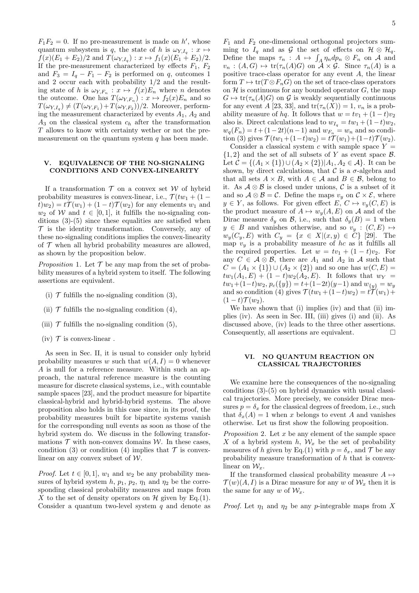
<figcaption class="paper-figure-caption"><b>Fig 4.</b> Low-resolution page preview, page 5</figcaption>
</figure>
<figure class="paper-figure-card">
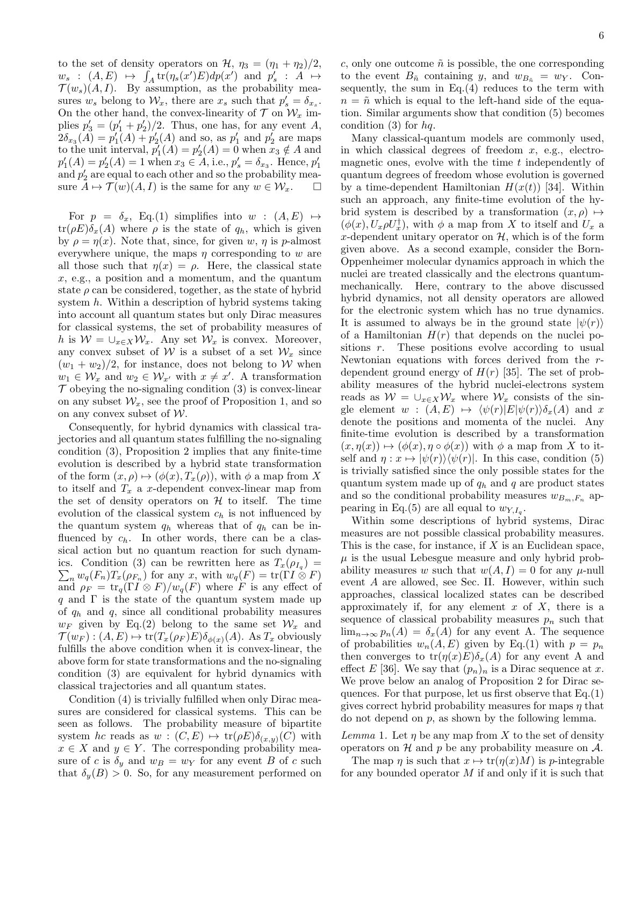
<figcaption class="paper-figure-caption"><b>Fig 5.</b> Low-resolution page preview, page 6</figcaption>
</figure>

**Summary.** This paper rigorously extends the no-signaling principle to describe dynamical interactions between classical and quantum subsystems. It shows that maintaining this causality constraint forces the underlying evolution dynamics to be mathematically equivalent to convex-linear transformations. This has profound implications, restricting genuine non-trivial classical-quantum coupling in time evolution.

**Why it may be interesting.** This work provides fundamental constraints on how classical information can interact with quantum mechanics in a time-evolution setting, which is crucial for understanding open quantum systems modeling where classical parameters might govern environmental coupling or measurement outcomes.

Detailed structure

**Main problem.** The paper develops a dynamical generalization of the no-signaling condition specifically for hybrid systems involving classical and quantum degrees of freedom.

**Main result.** The dynamical no-signaling condition imposes strong constraints on classical-quantum interactions, implying that such interactions must be described by convex-linear transformations equivalent to non-interacting dynamics in certain limits.

**Method.** The analysis involves formulating probability measures for hybrid states and testing the independence of outcome probabilities from ancillary measurements under time evolution operators T. Mathematical tools include information theory (mutual information) and analyzing linear/convex-linear maps.

**Model / system.** The system studied is a general hybrid model composed of classical degrees of freedom (defined by a sample space X) coupled to quantum degrees of freedom (described by a Hilbert space H). The dynamics are governed by finite-time evolution operators T acting on the joint probability measure.

**Key observables.** Outcome probabilities of measurements performed after ancillary pre-measurements; classical-quantum mutual information I(omega); and entanglement measures.

**Important parameters / regimes.** The nature of the hybrid state (pure vs. mixed), the type of evolution T (linear vs. non-linear), and whether all possible hybrid states are allowed.

**Assumptions / limitations.** The analysis builds upon prior work defining probability measures for hybrid systems and assumes that deviations from no-signaling require non-linear transformations T.

**Figures summary.** Not specified in the notes, but the structure suggests mathematical derivations proving inequalities related to information loss under evolution.

**Paper structure.** The paper first establishes the general framework of hybrid systems and the initial no-signaling condition. It then generalizes this concept dynamically for finite-time evolutions, deriving consequences regarding the directionality (classical influencing quantum but not vice versa) and ultimately proving equivalence to convex-linearity when all states are considered.

Abstract

Hybrid classical-quantum approaches are instrumental in numerous fields, from condensed matter physics to quantum information science. We recently proposed to describe hybrid systems starting from a set of natural axioms for measurement probabilities without adding any underlying mathematical structure. The so defined probability measures fulfill a no-signaling condition that ensures that instantaneous communication is impossible. We formulate here a dynamical generalization of this condition. It means that, for two independent systems, the outcome probabilities of a measurement made on one of them are not affected by a measurement performed earlier on the other. Analogous requirements are satisfied for usual classical and quantum bipartite systems and violating them would make faster-than-light signaling possible. The dynamical no-signaling condition has important consequences for classical-quantum interactions that depend on the hybrid approach used. For no-signaling hybrid dynamics with classical trajectories, the classical degrees of freedom can influence the quantum ones but the latter cannot react on the former. If pure states of quantum systems remain pure then the dynamical no-signaling condition implies the absence of classical reaction. When all hybrid states are allowed, there are no genuine classical-quantum interactions for no-signaling hybrid dynamics that do not generate correlations between the classical and the quantum degrees of freedom. In all these cases, the proposed condition is equivalent to the convex-linearity of the probability measure transformations describing finite-time evolutions.

[↑ back to top](#top)

### [Atomic correlation effects in collapse-induced spontaneous radiation](http://arxiv.org/abs/2608.07205v1)

**Authors:** Simone Manti, Nicola Bortolotti, Lajos Diósi, Kristian Piscicchia, Catalina Curceanu  
**Type:** theory · **Category:** other · **PDF:** <https://arxiv.org/pdf/2608.07205v1>  
**Analysis basis:** full PDF text, analyzed in chunks
**Topic relevance:** `Keldysh / 2PI / non-Gaussian methods` **3/5** · `correlated / nonlocal dissipation` **3/5** · `methods for driven-dissipative` **3/5** · `Dicke superradiance` **2/5** · `driven-dissipative phase transition` **2/5** · `non-equilibrium dynamics` **2/5** · `free-space correlated emission` **1/5** · `non-equilibrium universality` **1/5** · `quantum measurements` **1/5** · `superradiant laser` **1/5**

↔ Scroll figures horizontally

<figure class="paper-figure-card">
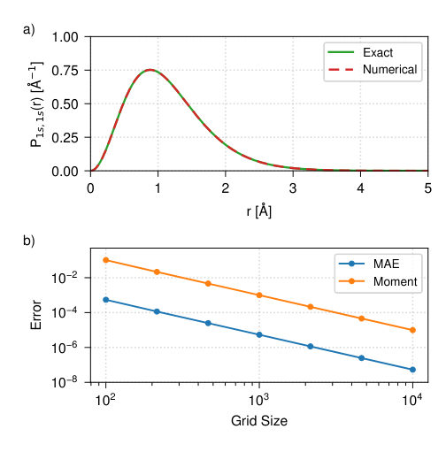
<figcaption class="paper-figure-caption"><b>Fig 1.</b> Figure 1. Electron radial distribution function (a) for two 1s electrons using a hydrogenic wavefunction, used to benchmark the implementation against analytical solutions with a grid size of 104 (left). A scan (b) over the grid size is shown on the right, reporting the Mean Absolute Error (MAE) in blue and the first moment in orange, which converges to the analytical value of 35/16 a.u..</figcaption>
</figure>
<figure class="paper-figure-card">
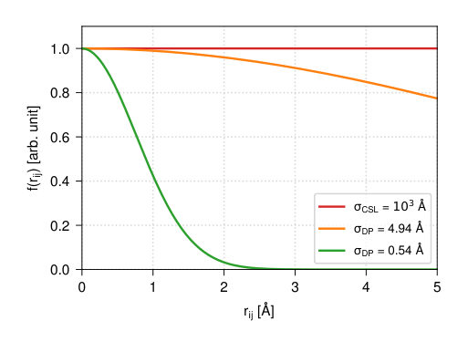
<figcaption class="paper-figure-caption"><b>Fig 2.</b> Figure 3. Modulation function f(rij) as a function of the emitters distance rij for DP model, with values σDP = 0.54 ˚A [24] (green) and σDP = 4.94 ˚A [42] (orange), and CSL with σCSL = 103 ˚A [22] (red).</figcaption>
</figure>
<figure class="paper-figure-card">
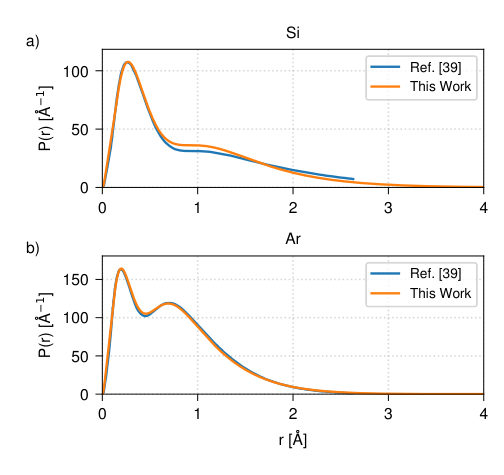
<figcaption class="paper-figure-caption"><b>Fig 3.</b> Figure 2. Comparison between the implemented electron- electron RDFs (orange) and reference [39] (blue) for silicon (a) and argon (b).</figcaption>
</figure>
<figure class="paper-figure-card">
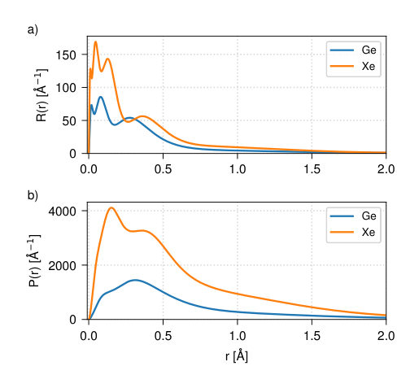
<figcaption class="paper-figure-caption"><b>Fig 4.</b> Figure 4. Nuclear-electron R(r) (a) and electron-electron P(r) (b) RDFs for Ge (blue) and Xe (orange) as functions of the interparticle distance r.</figcaption>
</figure>
<figure class="paper-figure-card">
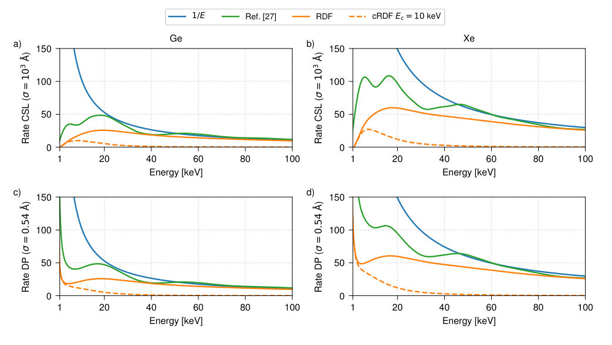
<figcaption class="paper-figure-caption"><b>Fig 5.</b> Figure 5. Emission rates for Ge (a) and (c) and Xe (b) and (d) in the 1-100 keV range. The (a) and (b) panels show the RDF rate for CSL with σ = 103 ˚A and the (c) and (d) panels for DP σ = 0.54 ˚A. For each panel the RDF rate is compared to the 1/E behaviour, the approximation in Ref. [27] and colored-noise (cRDF) with a cutoff energy of Ec = 10 keV. All rates are shown in arbitrary units.</figcaption>
</figure>

**Summary.** This paper develops a rigorous theoretical framework to calculate spontaneous radiation rates induced by collapse models, incorporating detailed atomic structure effects through Radial Distribution Functions (RDFs). By applying this formalism to atoms like Germanium and Xenon, the authors demonstrate that different collapse mechanisms predict distinct, measurable spectral signatures at low energies. This provides a powerful tool for designing next-generation experiments to test fundamental physics beyond standard quantum mechanics.

**Why it may be interesting.** This work bridges fundamental quantum gravity concepts (collapse models) with highly precise atomic structure calculations. The explicit incorporation of material-dependent effects via RDFs provides a concrete pathway for experimental testing in AMO physics.

Detailed structure

**Main problem.** The paper investigates how atomic structure modifies the spontaneous radiation rate predicted by Spontaneous Collapse Models (SCMs). The goal is to use this modification to create material-dependent constraints on SCM parameters.

**Main result.** By incorporating realistic radial distribution functions (RDFs), the derived emission rate shows distinct model dependencies for CSL and DP models, particularly exhibiting a vanishing rate limit at low energies ($E 	o 0$) for neutral atoms.

**Method.** The authors derive a general expression for the spontaneous emission rate by calculating correlation functions of the radiation field, which are then expressed in terms of nuclear-electron and electron-electron RDFs.

**Model / system.** The study analyzes charged particles (e.g., Ge, Xe) whose dynamics are modified by SCMs, governed by a master Lindblad equation incorporating stochastic noise fields. The calculation relies on semi-classical approximations for the radiation field.

**Key observables.** Spontaneous emission rate ($	ext{d}\Gamma/	ext{d}\omega$ or $	ext{d}\Gamma/	ext{d}E$), and the modulation function $f(r_{ij})$ which distinguishes between CSL and DP models.

**Important parameters / regimes.** Collapse strength ($\lambda$) and spatial resolution ($\sigma$) of the SCMs; low-energy regime where photon wavelength $\sim$ atomic dimensions (1–100 keV).

**Assumptions / limitations.** The analysis uses a semi-classical approach valid above 1 keV, assumes spherical symmetry for angular integration, and initially approximates interatomic correlations as subleading corrections.

**Figures summary.** Figures compare calculated RDFs ($P(r)$) for Si/Ar against literature; Figure 5 compares the predicted emission rates for Ge and Xe across different energy regimes for CSL vs. DP models, contrasting with simplified theoretical limits like $1/E$.

**Paper structure.** The paper develops a general formalism for the emission rate using arbitrary noise correlations, derives the expression in terms of RDFs, applies this framework to specific atoms (Ge, Xe) under CSL and DP assumptions, and concludes by comparing results across energy regimes.

Abstract

Collapse models introduce stochastic and nonlinear modifications in the quantum dynamics, predicting observable effects, such as spontaneous radiation from charged particles, which can be used to constrain their parameters. Recently, attention has focused on the 1-100 keV energy range, where the wavelength of the emitted photons becomes comparable to atomic dimensions, making the emission sensitive to atomic structure and leading to model-dependent behaviors that enable their discrimination. Here, we derive a general expression for the spontaneous emission rate for arbitrary noise, providing a framework that systematically incorporates the atomic structure through the radial distribution of the emitters, modulated by the specific collapse model. The formalism recovers previous results in the appropriate limits and naturally includes new low-energy effects, such as cancellation mechanisms arising from charge correlations. We evaluate the rates for germanium and xenon within the Diósi-Penrose and Continuous Spontaneous Localization models, showing how these correlations modify the predicted emission rates. This approach provides a unified framework to account for atomic effects and enables more robust, material-dependent experimental constraints on collapse model parameters.

[↑ back to top](#top)

### [High-Performance Quantum Transduction with Correlated Noise](http://arxiv.org/abs/2608.06683v1)

**Authors:** Yu-Bo Hou, Xiaoan Ai, Pengbo Li, Changchun Zhong  
**Type:** theory · **Category:** quantum information and computing · **PDF:** <https://arxiv.org/pdf/2608.06683v1>  
**Analysis basis:** full PDF text, analyzed in chunks
**Topic relevance:** `Keldysh / 2PI / non-Gaussian methods` **3/5** · `correlated / nonlocal dissipation` **3/5** · `methods for driven-dissipative` **3/5** · `driven-dissipative phase transition` **2/5** · `entanglement & information structure` **2/5** · `Tavis-Cummings & cavity-many-emitter` **1/5** · `analog quantum simulation` **1/5** · `correlated cavity matter` **1/5** · `non-equilibrium dynamics` **1/5** · `non-equilibrium universality` **1/5** · `spintronics-quantum-optics interface` **1/5**

↔ Scroll figures horizontally

<figure class="paper-figure-card">
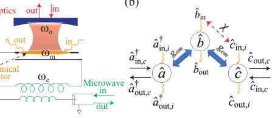
<figcaption class="paper-figure-caption"><b>Fig 1.</b> FIG. 1. (a) Schematic figure of an EOM system. (b) Illus- tration for the input-output relations with correlated bath noise between the microwave and mechanical modes. ˆa, ˆb and ˆc are denoted as the annihilation operators of the opti- cal, mechanical and microwave modes, respectively, with the corresponding resonant frequencies ωo, ωm and ωe. In plot (b), the black straight arrows and orange wavy arrows de- note the input and output fields associated with the coupling and intrinsic loss ports, respectively, whereas the red dashed double-headed arrows indicate correlations between the me- chanical and microwave noise fields.</figcaption>
</figure>
<figure class="paper-figure-card">
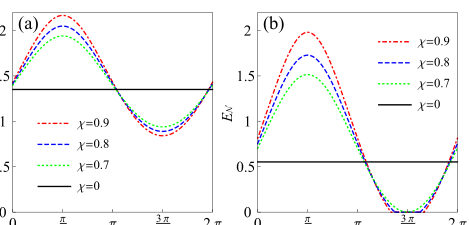
<figcaption class="paper-figure-caption"><b>Fig 2.</b> FIG. 2. Logarithmic negativity EN of the MO output state versus the electromechanical coupling phase ϕ under different degrees of noise correlation χ = {0, 0.7, 0.8, 0.9}. Here, we choose the frequency ωm = ωe = 10 GHz, and Com = Cem = 4 and ζo = ζe = 0.9 are used for both figures (a) and (b). The thermal noise is chosen as (a) nth = 0.6 and (b) nth = 1.6.</figcaption>
</figure>
<figure class="paper-figure-card">
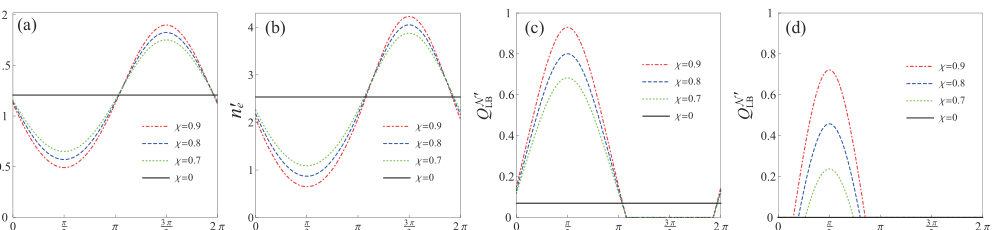
<figcaption class="paper-figure-caption"><b>Fig 3.</b> FIG. 3. Effective added noise n′ e in panels (a) and (b) and quantum capacity lower bound QN ′ LB in panels (c) and (d) versus electromechanical coupling phase ϕ. The thermal noise is chosen as nth = 0.6 in (a) and (c), and nth = 1.6 in (b) and (d). The optimal gain constant κ was chosen for each parameter set. The other parameters are chosen to be the same as in Fig. 2.</figcaption>
</figure>
<figure class="paper-figure-card">
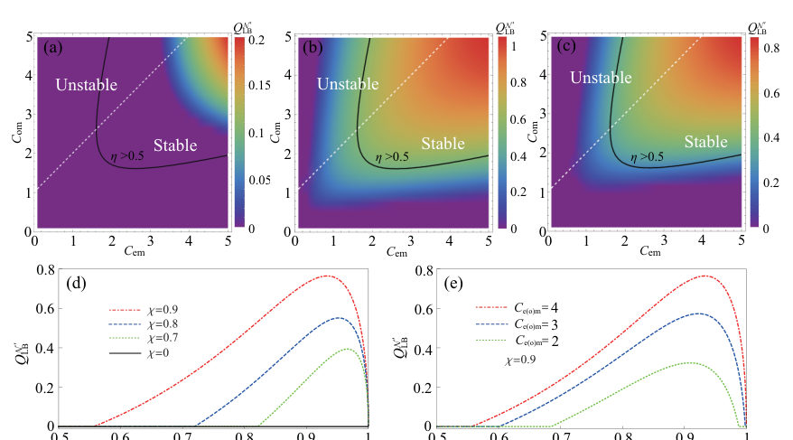
<figcaption class="paper-figure-caption"><b>Fig 4.</b> FIG. 4. Quantum capacity lower bound QN ′ LB versus system cooperativities Com and Cem in panels (a)-(c), and microwave extraction ratio ζe in panels (d) and (e). The white dashed line separates the stable region in the lower right from the unstable region in the upper left. The black solid curve, which marks η = 1/2, bounds the upper right parameter region in which DQT can potentially have a positive quantum capacity. The thermal noise is chosen as nth = 0.6 in (a) and (b), and nth = 1.6 in (c)–(e). The system cooperativities are chosen as Com = Cem = 4 in panel (d) with different degrees of correlation χ = {0, 0.7, 0.8, 0.9}, and χ is fixed to 0.9 in panel (e) with different...</figcaption>
</figure>
<figure class="paper-figure-card">
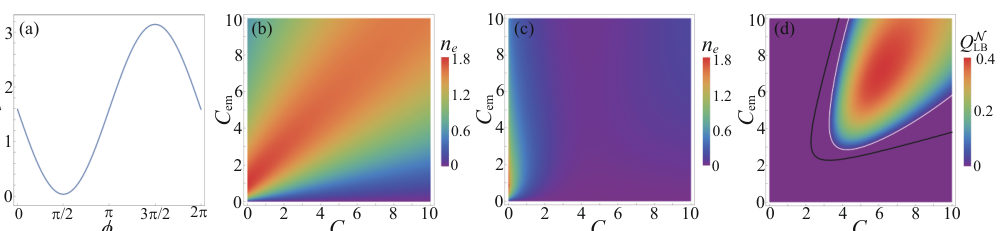
<figcaption class="paper-figure-caption"><b>Fig 5.</b> FIG. 5. Performance of direct quantum transduction. (a) Effective channel noise ne as a function of the coupling phase ϕ. (b) and (c) Distributions of ne as functions of the cooperativities Com and Cem for ϕ = 0 and ϕ = π/2, respectively, with the same local noise nb = 2.02 and nc = 2.29. At ϕ = 0 and π, the noise correlations make no contribution, whereas ϕ = π/2 gives the optimal destructive interference. (d) Quantum capacity lower bound QN LB in the same cooperativity space at ϕ = π/2. The black curve marks η = 1/2, separating the regime with zero quantum capacity for direct transduction in the lower left from the potentially positive capacity regime in the upper right. The white curve...</figcaption>
</figure>

**Summary.** This paper demonstrates that correlated noise can be actively utilized as a resource to overcome the thermal noise limitations plaguing quantum transduction between microwave and optical frequencies. By exploiting these correlations in both direct and entanglement-assisted protocols, the authors show significant improvements in channel fidelity and positive quantum capacity. This theoretical guidance suggests a pathway to realizing practical hybrid quantum networks with less stringent cryogenic requirements.

**Why it may be interesting.** This work directly addresses fundamental bottlenecks in building practical quantum networks by transforming perceived noise sources into usable resources, which is highly relevant to open quantum systems theory and quantum optics.

Detailed structure

**Main problem.** Quantum transduction, essential for hybrid quantum architectures, is fundamentally limited by thermal noise, which degrades state conversion fidelity.

**Main result.** The authors show that exploiting correlated noise as a resource significantly suppresses effective channel noise in direct transduction and enhances entanglement generation in entanglement-based transduction. This allows both protocols to achieve positive quantum capacity over relevant experimental ranges.

**Method.** The analysis uses the scattering picture framework applied to an electro-optomechanical system, modeling mode conversion via Gaussian processes and calculating quantum capacity bounds based on noise correlations.

**Model / system.** The study models a hybrid transduction platform involving optical ($\hat{a}$), mechanical ($\hat{b}$), and microwave ($\hat{c}$) modes, described by an effective Hamiltonian and analyzed using input-output relations incorporating correlated bath noise.

**Key observables.** Quantum Capacity ($Q_{N}^{LB}$), Logarithmic Negativity ($E_N$), Effective Channel Noise ($n_e$).

**Important parameters / regimes.** Cooperativities ($C_{em}, C_{om}$), Transmissivity ($\eta$), Noise Correlation Parameter ($\chi$), Coupling Phase ($\phi$).

**Assumptions / limitations.** The analysis treats the EOM device as a linear Gaussian processor and assumes that noise correlations, rather than independent thermal noise, are the key resource.

**Figures summary.** Figure 1 illustrates the EOM system schematic and input-output relations with correlated bath noise. Figure 2 likely compares Logarithmic Negativity ($E_N$) versus coupling phase ($\phi$) under varying levels of noise correlation ($\chi$).

**Paper structure.** The paper first establishes the limitations of quantum transduction due to thermal noise, then introduces exploiting correlated noise as a resource for both direct and entanglement-based protocols. It develops the theoretical framework using scattering relations and finally presents results showing performance enhancement and proposes mechanisms for engineering these correlations.

Abstract

Quantum transduction, which coherently converts quantum states between microwave and optical frequency domains, is a key technology for hybrid quantum architectures. Its performance, however, is fundamentally limited by thermal noise. Direct quantum transduction is particularly susceptible to noise and often fails to achieve positive quantum capacity. Entanglement-based quantum transduction, which realizes state conversion through quantum teleportation assisted by microwave-optical entanglement, is intrinsically more robust against thermal noise. However, generating sufficiently strong entanglement in a realistic thermal environment remains a major challenge. In this paper, we exploit correlated noise as a resource for quantum transduction. For direct quantum transduction, it is shown that the noise correlations give rise to controllable interference terms that substantially suppress the effective channel noise. For entanglement-based quantum transduction, the same correlations enhance the generation of microwave-optical entanglement, thereby improving the fidelity of teleportation-based conversion. As a result, both transduction protocols exhibit broad regions of positive quantum capacity over experimentally relevant ranges of cooperativity. We further discuss a possible physical mechanism for engineering the required noise correlations, providing theoretical guidance for experimental implementations. These results suggest that correlated noise can substantially relax the stringent cryogenic requirements for microwave-optical quantum transduction and facilitate the realization of practical hybrid quantum networks.

[↑ back to top](#top)

### [Harnessing bound states in the continuum for quantum and nonlinear photonics in silicon nitride microresonators](http://arxiv.org/abs/2608.07426v1)

**Authors:** Eduardo C. Lima, Marco Clementi, Alice Viola, Matteo Galli, Daniele Bajoni, Marco Liscidini, Massimo Borghi  
**Type:** both · **Category:** other · **PDF:** <https://arxiv.org/pdf/2608.07426v1>  
**Analysis basis:** full PDF text, analyzed in chunks
**Topic relevance:** `driven-dissipative phase transition` **3/5** · `interference shaping light` **3/5** · `quantum optics experiment` **3/5** · `correlated / nonlocal dissipation` **2/5** · `methods for driven-dissipative` **2/5** · `non-equilibrium dynamics` **2/5** · `analog quantum simulation` **1/5** · `correlated cavity matter` **1/5** · `non-equilibrium universality` **1/5**

↔ Scroll figures horizontally

<figure class="paper-figure-card">
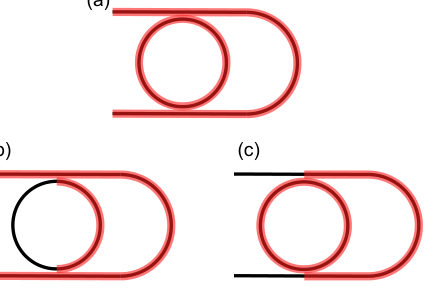
<figcaption class="paper-figure-caption"><b>Fig 1.</b> FIG. 1. Schematic representation of the electromagnetic modes in a ring resonator coupled to a bus waveguide through an interferometric coupler. (a) When the effective coupling between the bus waveguide and the ring is finite, Maxwell’s equations admit only one solution at the resonant frequency ωBIC involving both the bus waveguide and the resonator. When the effective coupling vanishes at ωBIC, Maxwell’s equa- tions admit two distinct solutions at the same frequency. One solution corresponds to a field propagating in the bus waveg- uide, which represents the continuum of modes (b). The other is a bound solution whose field is confined within the ring res- onator and does not radiate into...</figcaption>
</figure>
<figure class="paper-figure-card">
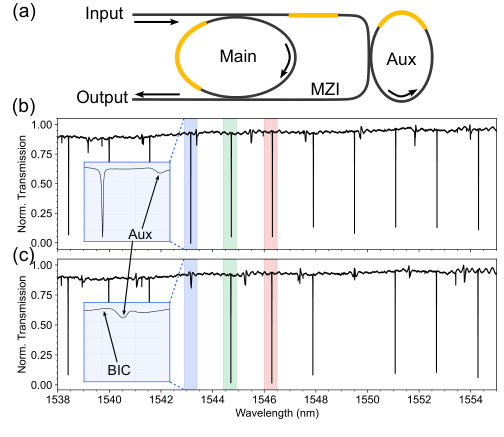
<figcaption class="paper-figure-caption"><b>Fig 2.</b> FIG. 2. (a) Schematic of the photonic circuit under test. Black lines denote SiN waveguides, while the yellow regions correspond to metallic microheaters used for thermo-optic tuning of the device. Main: main resonator, Aux: auxil- iary resonator, MZI: Mach-Zehnder interferometer. input and output denote the bus waveguides through which light is cou- pled into and out of the chip, respectively. (b) Normalized transmission spectrum of the device measured with no spec- tral overlap between the resonances of the main and Aux. resonators. (c) Normalized transmission spectrum for a con- figuration in which one out of every four resonances of the main resonator overlaps with a resonance of the...</figcaption>
</figure>
<figure class="paper-figure-card">
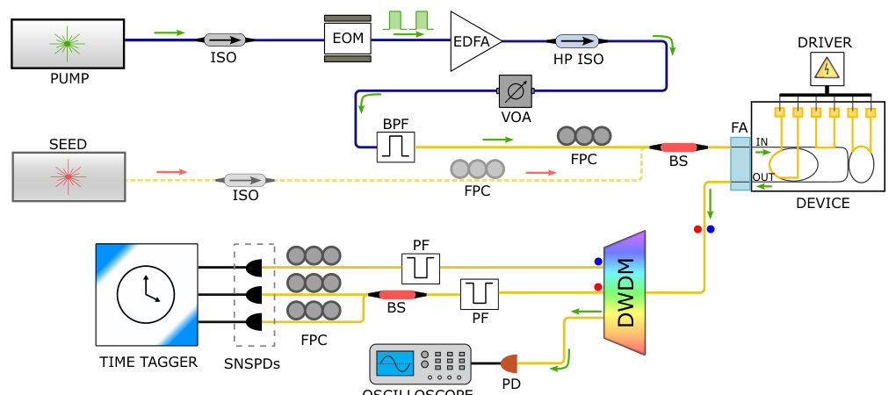
<figcaption class="paper-figure-caption"><b>Fig 3.</b> FIG. 3. Sketch of the experimental setup used for the SFWM and StFWM characterization of the device under test. (HP) ISO: (high-power) fiber-optic isolator, EOM: electro-optic amplitude modulator, EDFA: Erbium-doped fiber amplifier, VOA: variable optical attenuator, BPF: bandpass filter, FPC: fiber polarization controller, BS: 50:50 fiber beam splitter, FA: fiber array, DWDM: dense wavelength division multiplexing module, PF: pump suppression filter, SNSPDs: superconducting nanowire single-photon detectors, PD: photodetector. The blue, yellow and black paths refer to polarization maintaining fibers, single mode fibers, and electrical connections respectively.</figcaption>
</figure>
<figure class="paper-figure-card">
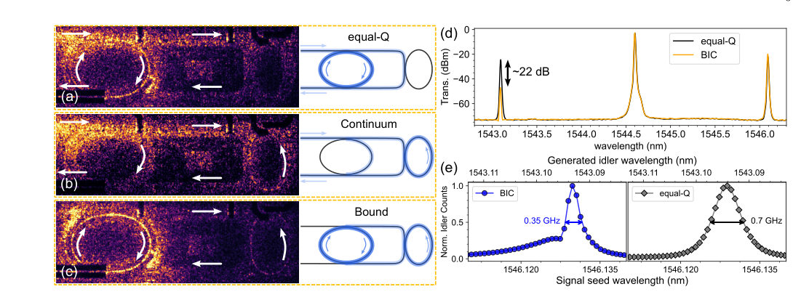
<figcaption class="paper-figure-caption"><b>Fig 4.</b> FIG. 4. False color infrared camera images of the light scattered from the top of the photonic circuit and experimental results of StFWM experiments. (a) Idler-frequency light enters through the input waveguide and is resonantly coupled into the main resonator, which is configured to operate on critical-coupling conditions. (b) When the device supports a BIC at the input laser wavelength, the mode cannot be excited from the input bus waveguide, and consequently no resonant field enhancement is observed inside the main resonator. (c) Idler light generated inside the resonator through StFWM in the BIC configuration. This image has been acquired using a bandpass filter that transmits only the...</figcaption>
</figure>
<figure class="paper-figure-card">
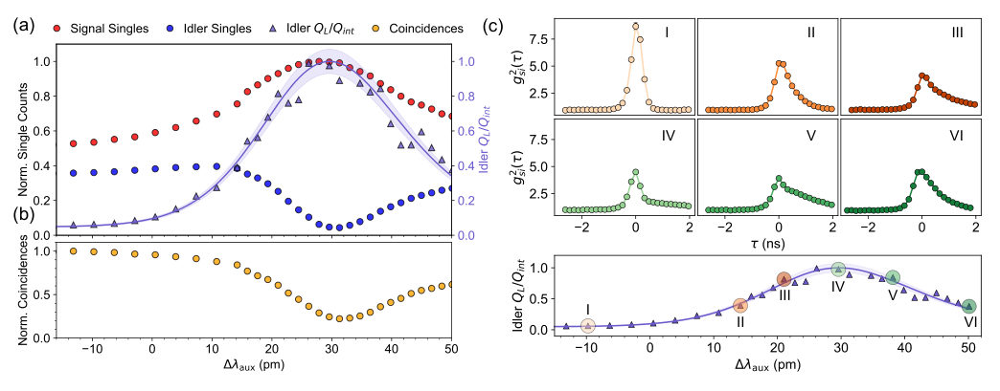
<figcaption class="paper-figure-caption"><b>Fig 5.</b> FIG. 5. (a) Measured single-photon counts generated by SFWM in the signal (red) and idler (blue) modes as a function of the main-Aux. resonator detuning, ∆λaux. Signal counts are normalized to their maximum, while idler counts are normalized to the signal counts. The triangles indicate the ratio between the loaded quality factor, QL, of the idler resonance and the intrinsic quality factor of the resonator, Qint. The solid line is included only as guide to the eye. (b) Normalized coincidence counts between the signal and idler modes as a function of ∆λaux. (c) Measured second-order signal-idler cross-correlation function, g(2) si (τ), as a function of the relative photon arrival time, τ. The...</figcaption>
</figure>

**Summary.** This paper explores using Bound States in the Continuum (BICs) within silicon nitride microresonators to control nonlinear photonics. By tuning one mode into a BIC state, researchers can profoundly alter spontaneous four-wave mixing and parametric amplification processes. This technique establishes BICs as a method for precise 'mode-selective lifetime engineering' of integrated optical devices.

**Why it may be interesting.** This work is highly relevant as it demonstrates a powerful tool—BICs—for engineering the decay rates and interaction strengths in open quantum optical systems, directly impacting nonlinear light-matter interactions.

Detailed structure

**Main problem.** The work investigates utilizing Bound States in the Continuum (BICs) within integrated photonic structures to fundamentally reshape nonlinear optical dynamics, particularly through spontaneous four-wave mixing and parametric amplification.

**Main result.** Achieving BIC conditions allows for mode-selective lifetime engineering, enhancing parametric gain by 12 dB and lowering the oscillation threshold by 1.6 dB compared to standard resonances.

**Method.** The study combines theoretical modeling (extending field quantization to include discrete BIC modes) with experimental characterization of nonlinear processes like SFWM and OPA in silicon nitride microresonators.

**Model / system.** The physical system is a reconfigurable integrated photonic structure using silicon nitride microresonators, featuring an asymmetric Mach-Zehnder interferometer coupled to a bus waveguide. BICs are realized by tuning the coupling such that one mode becomes decoupled from the continuum modes.

**Key observables.** Signal-idler correlations in photon pairs, parametric gain enhancement (up to 12 dB), and reduction of oscillation threshold (by 1.6 dB).

**Important parameters / regimes.** High Quality Factor ($Q > 10^6$), low/high-gain regimes for nonlinear processes, and the ability to tune coupling coefficients via auxiliary resonators.

**Assumptions / limitations.** The theoretical framework assumes orthogonality between BIC and asymptotic fields; experimentally, precise tuning of coupling is required to achieve near-zero radiative loss.

**Figures summary.** Figures illustrate mode solutions (propagating vs. confined BIC), the device structure showing how an auxiliary resonator creates BICs, and comparative plots demonstrating OPA gain in both BIC and standard resonance configurations.

**Paper structure.** The paper progresses from establishing the theoretical framework for incorporating discrete BIC modes into nonlinear Hamiltonians, to experimentally validating the selective creation of these BICs by tuning coupling, and finally applying this control to enhance parametric amplification processes.

Abstract

In this work we theoretically and experimentally investigate bound states in the continuum (BICs) in a reconfigurable integrated photonic structure, focusing on spontaneous four-wave mixing. We consider a configuration in which only one mode, the idler, is tuned to the BIC condition, and show that suppressing the radiative loss of this single mode profoundly reshapes the overall nonlinear dynamics. In particularly, we realize electrically tunable Friedrich-Wintgen BICs with Q > 10^6 in an interferometrically coupled silicon-nitride microresonator. Although inaccessible through linear excitation, the BIC is populated by four-wave mixing and read out through its radiative photon partner. In the low-gain regime, we investigate the spectral, correlation, and coherence properties of the generated photon pairs, revealing distinctive signatures in the signal-idler correlations and an extracted signal whose coherence time approaches the intrinsic-loss-limited lifetime of the dark idler. In the high-gain regime, making one mode participating in optical parametric amplification a BIC enhances the parametric gain by 12 dB and lowers the oscillation threshold by 1.6 dB. These results establish BICs as a tool for mode-selective lifetime engineering, enabling control over both biphoton wavepackets and the threshold dynamics of integrated parametric devices.

[↑ back to top](#top)

### [Active Brownian motion in a single-relaxation viscoelastic fluid](http://arxiv.org/abs/2608.07059v1)

**Authors:** Sanatan Halder, Manas Khan  
**Type:** both · **Category:** statistical mechanics · **PDF:** <https://arxiv.org/pdf/2608.07059v1>  
**Analysis basis:** full PDF text, analyzed in chunks
**Topic relevance:** `non-equilibrium dynamics` **3/5** · `analog quantum simulation` **2/5** · `driven-dissipative phase transition` **2/5** · `non-equilibrium universality` **2/5** · `Frenkel-Kontorova` **1/5** · `Keldysh / 2PI / non-Gaussian methods` **1/5** · `correlated / nonlocal dissipation` **1/5** · `methods for driven-dissipative` **1/5** · `scars & prethermalization` **1/5**

↔ Scroll figures horizontally

<figure class="paper-figure-card">
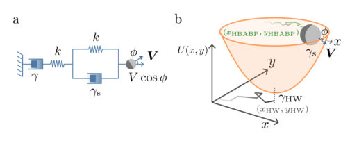
<figcaption class="paper-figure-caption"><b>Fig 1.</b> Fig. 1. Rheological model of an active Brownian particle (ABP) in Maxwell-Voigt (MV) fluid and its stochastic representation as a harmonically bound active Brownian particle (HBABP) with long-time diffusion. (a) A Voigt element, spring k in parallel with dashpot γs, is connected in series with a Maxwell element, spring k in series with dashpot γ. Both springs share the same stiffness k = 6πaGp, which sets the elastic plateau modulus Gp for an ABP of Stokes radius a. Here γs and γ represent the high- and low- frequency friction contributions, respectively. (b) The ABP, shown by the green trajectory, moves in a harmonic well (HW) of stiffness k and solvent friction γs, while the HW center,...</figcaption>
</figure>
<figure class="paper-figure-card">
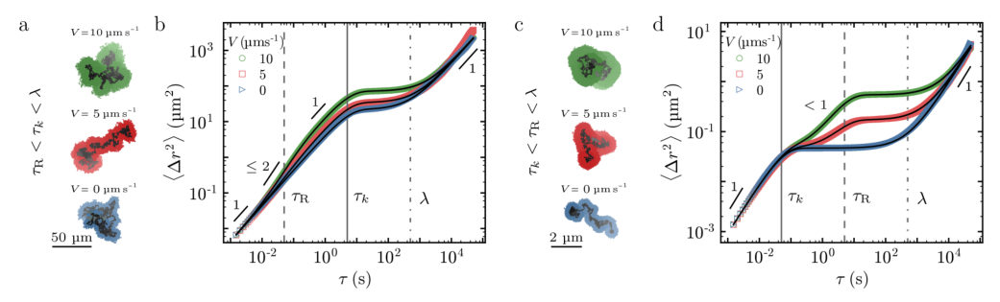
<figcaption class="paper-figure-caption"><b>Fig 2.</b> Fig. 2. Numerically simulated trajectories and mean square displacements (MSDs) of an HBABP with long-time diffusion for two experimentally accessible timescale orderings: τR &lt; τk &lt; λ and τk &lt; τR &lt; λ. In both configurations, MSDs are shown for propulsion speeds V = {10, 5, 0} µm s−1 at same solvent viscosity ηs = 10−3 Pa s. At V = 0 the MSD reduces to that of a harmonically bound Brownian particle (HBBP) with long-time diffusion. Open symbols denote numerical data and solid lines denote fits from Eq. 2. Vertical lines mark τk (solid), τR (dashed), and λ (dash-dotted). (a, b) Persistence-dominated regime, τR &lt; τk &lt; λ (τR = 0.05 s, τk = 5 s, λ = 500 s, ηHW = 0.1 Pa s). (a) Simulated...</figcaption>
</figure>
<figure class="paper-figure-card">
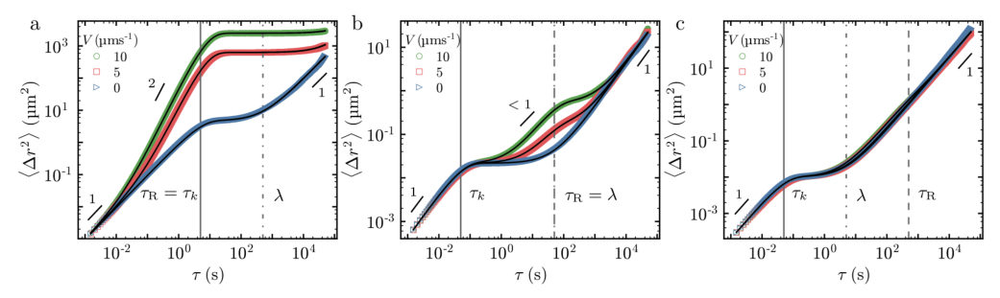
<figcaption class="paper-figure-caption"><b>Fig 3.</b> Fig. 3. Numerically simulated MSDs of the HBABP with long-time diffusion for three additional timescale orderings. MSDs are shown for V = {10, 5, 0} µm s−1 at same ηs = 10−3 Pa s. Open symbols denote numerical data, and solid lines are fits from Eq. 3 in (a) and Eq. 2 in (b, c). (a) τR = τk &lt; λ (τR = τk = 5 s, λ = 500 s, ηHW = 0.1 Pa s). The MSD shows diffusive, ballistic, plateau, and long-time diffusive regimes, all shifting to larger MSD values with increasing V . (b) τk &lt; τR = λ (τk = 0.05 s, τR = λ = 50 s, ηHW = 1 Pa s). The MSD develops two plateaus at τk and λ with increasing V , and the crossover to long-time diffusion shifts beyond λ. (c) τk &lt; λ &lt; τR (τk = 0.05 s, λ = 5 s, τR = 500...</figcaption>
</figure>
<figure class="paper-figure-card">
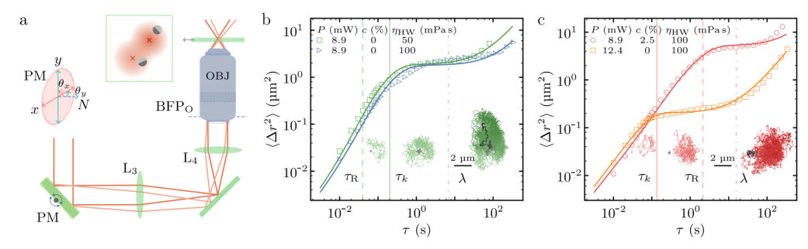
<figcaption class="paper-figure-caption"><b>Fig 4.</b> Fig. 4. Experimental realization of a phoretically active Pt-coated silica Janus colloid in a configurable single-relaxation VE medium. (a) Schematic of the setup: a piezo-controlled mirror (PM) is conjugated to the back-focal plane of the objective (BFPO) through the afocal system of lenses L3 and L4, and its angular displacement (left inset) steers the trap center along a computer-generated Brownian trajectory at the sample plane (top inset), producing a dynamic optical trap with friction coefficient γHW. (b, c) MSDs of a Pt-coated Janus colloid in the dynamic trap, with trajectory insets. Open symbols denote experimental data and solid lines fits to Eq. 2. Vertical lines mark τk (solid),...</figcaption>
</figure>

**Summary.** This work models Active Brownian Particles moving through a single-relaxation viscoelastic fluid, demonstrating that the resulting dynamics are dictated by the interplay between active self-propulsion and fluid memory effects. By analyzing the Mean Squared Displacement across different timescale orderings ($	au_R$, $	au_k$, $\lambda$), the authors provide a comprehensive theoretical framework validated by both simulation and experiment using an optical trap setup.

**Why it may be interesting.** While focused on soft matter dynamics rather than quantum phenomena, the study of non-equilibrium statistical mechanics in complex fluids (like viscoelastic media) shares conceptual links with open quantum systems where environmental coupling dictates system evolution. The concept of tunable 'effective environments' is relevant to designing quantum simulators.

Detailed structure

**Main problem.** The study investigates Active Brownian Motion (ABM) dynamics within viscoelastic (VE) media, focusing on how fluid memory effects alter particle movement compared to simple Newtonian solvents.

**Main result.** The Mean Squared Displacement (MSD) reveals distinct intermediate dynamic regimes—depending on the relative ordering of active persistence time ($	au_R$), VE equilibration time ($	au_k$), and relaxation time ($\lambda$)—validating the model against both simulation and experiment.

**Method.** The authors combine analytical derivations for the MSD with numerical simulations, validating the theoretical framework using an experimental setup involving a Janus colloid in a dynamic optical trap.

**Model / system.** The system models Active Brownian Particles (ABPs) moving in a single-relaxation viscoelastic fluid, mathematically described by combining contributions from active motion and harmonic/Maxwell-Voigt rheological elements. The experiment uses Pt-coated Janus colloids trapped optically to emulate the tunable VE environment.

**Key observables.** Mean Squared Displacement (MSD), which exhibits successive regimes including superdiffusive behavior, plateaus at characteristic timescales ($	au_k$ or $	au_R$), and long-time diffusive recovery.

**Important parameters / regimes.** The dynamics are governed by the interplay of three competing timescales: ABP persistence time ($	au_R$), VE equilibration time ($	au_k$), and VE relaxation time ($\lambda$).

**Assumptions / limitations.** The approach assumes linear viscoelasticity with a single relaxation time, and that the optical trap setup successfully emulates the required VE response without altering the medium due to activity.

**Figures summary.** Figure 2 shows simulated MSDs for persistence-dominated ($	au_R < 	au_k < \lambda$) and confinement-dominated ($	au_k < 	au_R < \lambda$) regimes. Figure 4 presents experimental MSD data matching these key theoretical predictions.

**Paper structure.** The paper establishes the rheological model, derives the governing Langevin equations for particle motion in the VE fluid, analyzes the resulting Mean Squared Displacement (MSD) across different timescale orderings ($	au_R$ vs $	au_k$ vs $\lambda$), and validates these theoretical predictions using both numerical simulations and physical experiments.

Abstract

Active Brownian particles (ABPs) in viscoelastic (VE) media exhibit fascinating dynamical phenomena set by self-propulsion, thermal fluctuations, and fluid viscoelasticity. We extend our model, in which the Brownian dynamics within a slowly diffusing harmonic well emulates that in a single-relaxation VE fluid, to study active Brownian motion in such media. Consequently, the resultant dynamics is governed by the interplay of the characteristic timescales of the systems: the crossover and equilibration times of the VE fluid, $τ_k$ and $λ$, respectively, and the persistence time of the ABP, $τ_{\mathrm{R}}$. Following analytical predictions and simulations, we study two practically relevant regimes where the dynamics is dominated by the persistence of active motion and the elastic confinement of the VE fluid, with a phoretically active Pt-coated Janus colloid in a dynamic optical trap, and show quantitative agreement with the simulations. This approach provides a VE environment with tunable VE properties that remain unaffected by the strength of self-propulsion, allowing us to systematically investigate active Brownian motion in VE media in ways that are not otherwise possible with physical VE fluids.

[↑ back to top](#top)

### [Observation of metastable chiral domain walls in a topological magnet](http://arxiv.org/abs/2608.06569v1)

**Authors:** Richen Xiong, Chenxin Qin, Zhaoyu Han, Nisarg Chadha, Qiang Gao, William Holtzmann, Weijie Li, Jiaqi Cai, Yi Guo, Weihanzhang Guo, Qi Chen, Samuel L. Brantly, Sam Bonkowsky, Chen Huang, Kenji Watanabe, Takashi Taniguchi, Andrea F. Young, Xiaodong Xu, Eslam Khalaf, Chenhao Jin  
**Type:** experiment · **Category:** other · **PDF:** <https://arxiv.org/pdf/2608.06569v1>  
**Analysis basis:** full PDF text, analyzed in chunks
**Topic relevance:** `exotic spin models in light-matter` **3/5** · `spintronics-quantum-optics interface` **3/5** · `driven-dissipative phase transition` **2/5** · `non-equilibrium dynamics` **2/5** · `analog quantum simulation` **1/5** · `correlated / nonlocal dissipation` **1/5** · `methods for driven-dissipative` **1/5** · `non-equilibrium universality` **1/5**

↔ Scroll figures horizontally

<figure class="paper-figure-card">
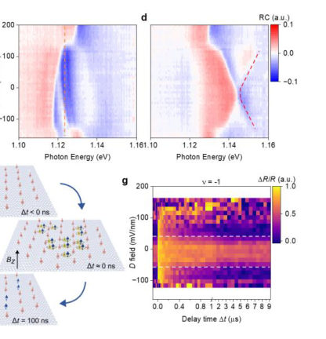
<figcaption class="paper-figure-caption"><b>Fig 1.</b> Fig. 1: Emergent spin-valley excitations in the QAH state. a,b, Polarization-resolved</figcaption>
</figure>
<figure class="paper-figure-card">
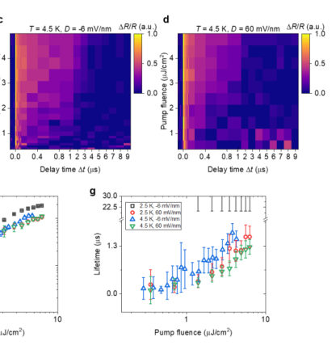
<figcaption class="paper-figure-caption"><b>Fig 2.</b> Fig. 2: Separating different spin-valley excitations at v = -1. a,b, Pump fluence- dependent normalized spin-valley dynamics at T = 2.5 K and D-field of -6 mV/nm (a)</figcaption>
</figure>
<figure class="paper-figure-card">
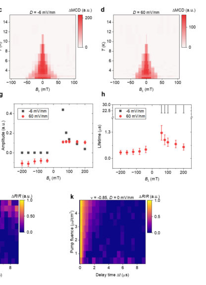
<figcaption class="paper-figure-caption"><b>Fig 3.</b> Fig. 3: Evolution of the metastable spin-valley excitations. a,b, Temperature-</figcaption>
</figure>
<figure class="paper-figure-card">
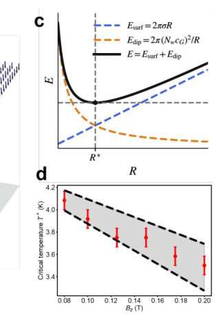
<figcaption class="paper-figure-caption"><b>Fig 4.</b> Fig. 4: Chiral domain wall. a, An illustration of the spin texture of a chiral domain</figcaption>
</figure>

**Summary.** This work experimentally identifies and characterizes metastable chiral domain walls in a QAH magnet using ultrafast spectroscopy. The authors demonstrate that these unique spin-valley textures are stabilized by the material's quantum geometry, allowing them to persist under extreme conditions unlike conventional magnetic excitations. This provides key insights into controlling topological protection in correlated electronic systems.

**Why it may be interesting.** The mechanism of metastability arising from quantum geometry provides a concrete example of how fundamental band structure properties can stabilize exotic topological excitations relevant for spintronics and correlated electron systems.

Detailed structure

**Main problem.** Investigating exotic collective excitations, specifically metastable chiral domain walls, arising from the interplay between topology and correlation in topological magnets.

**Main result.** The authors observed a unique, long-lived spin-valley excitation that behaves as a chiral domain wall, whose metastability is governed by the quantum geometry of the parent bands. This mechanism distinguishes it sharply from conventional magnons or domain walls.

**Method.** Resonant ultrafast pump-probe spectroscopy and magnetic hysteresis measurements were used to probe the time and field dependence of spin-valley excitations in the material.

**Model / system.** The study uses a twisted MoTe2 moiré superlattice exhibiting Quantum Anomalous Hall (QAH) magnetism. The physics is governed by topological properties, spontaneous time-reversal symmetry breaking, and quantum geometric effects ($c_G$).

**Key observables.** Spin-valley excitation dynamics ($\Delta R/R$), magnetic hysteresis loops, temperature dependence of the slow component, and field dependence of domain wall stability.

**Important parameters / regimes.** Low temperatures ($T \sim 3.7	ext{ K}$), specific displacement fields ($D$), and large reverse magnetic fields ($	ext{Bz} = 200	ext{ mT}$).

**Assumptions / limitations.** The observed slow component is attributed to chiral domain walls stabilized by the interplay between real-space topology and momentum-space quantum geometry.

**Figures summary.** Figures show polarization-resolved contrast measurements confirming spontaneous symmetry breaking, hysteresis maps detailing stable regimes, and temperature/field dependence plots demonstrating the sharp onset and disappearance of the unique slow excitation component.

**Paper structure.** The paper systematically presents evidence by first observing the novel metastable excitation via pump-probe spectroscopy, then characterizing its stability against magnetic fields and temperature, and finally linking its existence to theoretical predictions involving quantum geometry quantities ($c_G$).

Abstract

The interplay between topology and correlation can give rise to exotic collective excitations. The integer and fractional quantum anomalous Hall (QAH) magnets recently discovered in two-dimensional (2D) flatband systems are predicted to host spin excitations distinct from those in conventional magnets. Experimentally, nevertheless, these new excitations remain largely unexplored. Here we investigate spin-valley excitations in a twisted MoTe2 moiré superlattice using resonant ultrafast pump-probe spectroscopy. We observe a metastable spin-valley excitation in the QAH magnet below T ~ 3.7 K that survives reverse magnetic field several times larger than the saturation field. The behavior of this excitation is sharply distinct from ordinary domain walls and magnons, indicating a new type of spin-valley textures unique to topological magnets. We propose that these textures are chiral domain walls with an in-plane winding of the pseudospin order parameter along the domain wall. Their metastability arises from the interplay between the topological winding in real space and the quantum geometry of the parent bands in momentum space through a universal mechanism. These chiral domain walls govern the nonequilibrium dynamics of QAH magnets and may play a central role in their stability. Our study highlights intrinsic quantum geometry effects on spin excitations in topological magnets; and provides key insights into the fundamental mechanism limiting stability of topological protection.

[↑ back to top](#top)

### [Active movement of foraging sea turtles generates anomalous looping](http://arxiv.org/abs/2608.07448v1)

**Authors:** Vijay Kumar, Vladimir V. Palyulin, Perla Roman-Torres, Christophe Eizaguirre, Rainer Klages  
**Type:** both · **Category:** statistical mechanics · **PDF:** <https://arxiv.org/pdf/2608.07448v1>  
**Analysis basis:** full PDF text, analyzed in chunks
**Topic relevance:** `methods for driven-dissipative` **3/5** · `non-equilibrium dynamics` **3/5** · `driven-dissipative phase transition` **2/5** · `non-equilibrium universality` **2/5** · `Frenkel-Kontorova` **1/5** · `Keldysh / 2PI / non-Gaussian methods` **1/5** · `correlated / nonlocal dissipation` **1/5**

↔ Scroll figures horizontally

<figure class="paper-figure-card">
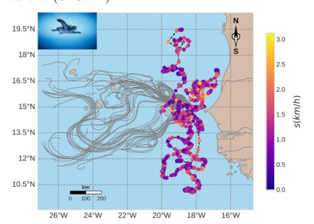
<figcaption class="paper-figure-caption"><b>Fig 1.</b> Fig. 1: Sea turtle foraging vs. tracer motion. Path of a loggerhead sea turtle during its forag- ing phase off West Africa, after nesting at the Cabo Verde archipelago. The 1078 data points are coloured by speed, highlighting intermittent fluctuations between slower and faster movement. Grey trajectories show 50 simulated Lagrangian tracer particles released near the centre of the tur- tle’s foraging region. The passive tracers disperse differently from the turtle path, which remains bounded within a specific foraging region by dis- playing distinct large-scale loops..</figcaption>
</figure>
<figure class="paper-figure-card">
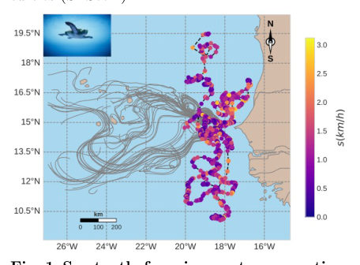
<figcaption class="paper-figure-caption"><b>Fig 2.</b> Figure 1 shows the foraging path of Mokamba, which consists of longitude and latitude coor- dinates recorded at irregular time intervals regularised by linear interpolation. Simulated Lagrangian tracer particles released in the same region diverge from the turtle trajectory (see SI Sec.2.5 for details), demonstrating that the observed path was not simply generated by ocean</figcaption>
</figure>
<figure class="paper-figure-card">
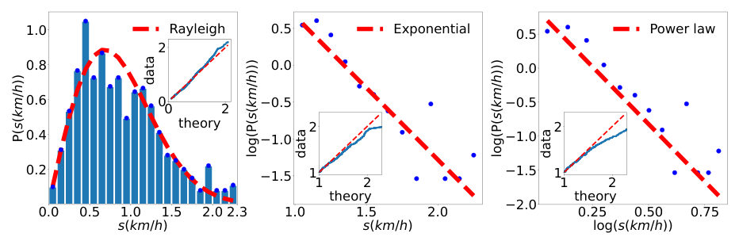
<figcaption class="paper-figure-caption"><b>Fig 3.</b> Fig. 2: Speed distribution function. Left: The speed distribution along the turtle path in Fig. 1 is well described by a Rayleigh functional form near the centre. Middle, Right: Semi-logarithmic and double- logarithmic plots indicate that the tail is better represented by an exponential or power law than by the Rayleigh distribution. Insets: Quantile-quantile plots show that the Rayleigh form reproduces the centre, whereas the tail decays approximately exponentially.</figcaption>
</figure>
<figure class="paper-figure-card">
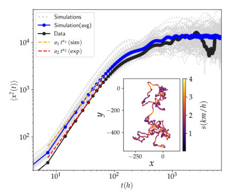
<figcaption class="paper-figure-caption"><b>Fig 4.</b> Fig. 4: Mean-squared displacement. Mean- squared displacement computed as a time average along the trajectory in Fig. 1, shown together with fits and simulation results. The turtle dis- plays superdiffusive movement over intermediate time scales, with an exponent of α2 ≃1.68, before crossing over towards localisation at longer times. The inset yields a representative trajectory generated by the data-driven stochastic model, displaying large-scale loops and intermittent speed fluctuations qualitatively similar to those observed in Fig. 1</figcaption>
</figure>
<figure class="paper-figure-card">
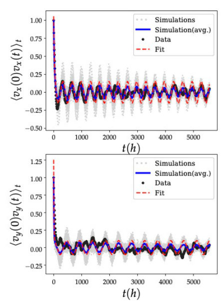
<figcaption class="paper-figure-caption"><b>Fig 5.</b> Fig. 3: Velocity autocorrelation functions. Top: Temporal decay of the longitudinal velocity autocorrelation function ⟨vx(0)vx(t)⟩t, computed as a time average along the turtle path in Fig. 1. Diffferent lines correspond to the estimate and modelling approaches indicated in the legend and described in the text. The autocorrelation decays rapidly at short times and is followed by per- sistent regular oscillations at longer times, with approximately constant frequency and amplitude. Bottom: Corresponding latitudinal velocity cor- relation function, ⟨vy(0)vy(t)⟩t. While oscillations are present, there are less pronounced and regular than in the longitudinal direction.</figcaption>
</figure>

**Summary.** This study analyzes sea turtle foraging paths to model their anomalous movement. By analyzing velocity autocorrelation functions and mean-squared displacement, the authors demonstrate that the looping motion generates superdiffusion over intermediate timescales. They successfully construct a generalized Langevin equation that captures this loop-based, active search pattern.

**Why it may be interesting.** The methodology of extracting long-term memory effects from empirical time series (like animal movement) and mapping them onto a generalized stochastic differential equation is highly relevant to modeling non-equilibrium dynamics in complex physical systems, including active matter or biological transport processes.

Detailed structure

**Main problem.** To understand complex, non-Brownian movement patterns exhibited by foraging sea turtles by developing data-driven mathematical models that incorporate long-term memory.

**Main result.** The turtles' movement is characterized by large-scale loops generating superdiffusion over intermediate timescales, which can be modeled using a generalized Langevin equation incorporating oscillatory velocity autocorrelation functions.

**Method.** Analysis involves calculating Mean-Squared Displacement (MSD) and Velocity Autocorrelation Functions (VACFs), followed by constructing and fitting a stochastic generalized Langevin equation to the empirical data.

**Model / system.** The physical system is the satellite tracking data of loggerhead sea turtles foraging off West Africa. The model used is a stochastic generalized Langevin equation, which captures non-Markovian memory effects in the movement dynamics.

**Key observables.** Large-scale loops, superdiffusive MSD ($\alpha \approx 1.68$), persistent regular oscillations in VACFs (especially longitudinal), and confinement within a specific foraging region.

**Important parameters / regimes.** The characteristic time scale ($T_{x,1/2}$) derived from the oscillatory decay of the VACF, which is used to predict the superdiffusive length scale.

**Assumptions / limitations.** The movement dynamics are assumed to be governed by a generalized Langevin equation; simplifying assumptions were made in modeling (e.g., neglecting certain velocity distribution tails).

**Figures summary.** Figures show the bounded looping path compared to passive tracers, MSD curves exhibiting superdiffusion followed by localization, and VACFs displaying clear, persistent oscillations in the longitudinal direction.

**Paper structure.** The paper progresses from identifying anomalous movement features (loops, superdiffusion) using diagnostics like MSD/VACF, to constructing a data-driven stochastic model (generalized Langevin equation), and finally validating this model against multiple species' trajectories by performing scale matching between oscillatory VACFs and the resulting superdiffusive MSD.

Abstract

Animals inhabiting diverse environments by moving across different spatial scales, from insects to birds, marine predators, mammals and even humans, often display apparently random movement paths. Over the past decade, novel biologging technologies have recorded these patterns in increasing detail, generating a wealth of experimental data. A central challenge is to understand such complex patterns by constructing data-driven mathematical models. Many animal movements depart from Brownian motion, as described by correlated random walks, Lévy walks, or active particle dynamics. Yet, these movement models do not incorporate long-term non-Markovian memory extracted from experimental trajectories. Here, we construct a stochastic generalised Langevin equation from satellite tracking data for loggerhead sea turtles (Caretta caretta) foraging off the coast of West Africa. We find that these turtles exhibit active movement characterised by large-scale loops that are not explained by ocean currents or chirality. These loops maintain movement within a specific foraging region and, over intermediate timescales, generate superdiffusion similar to Lévy walks. We thus identify a loop-based form of active anomalous search related to foraging patterns observed across a wide range of animal species, which may inspire robotic search strategies and AI-based metaheuristic optimisation algorithms.

[↑ back to top](#top)

### [Sub-Vacuum Jamming for Secure Communication](http://arxiv.org/abs/2608.06720v1)

**Authors:** S. Barzanjeh, A. Poostindouz, B. C. Sanders  
**Type:** theory · **Category:** quantum information and computing · **PDF:** <https://arxiv.org/pdf/2608.06720v1>  
**Analysis basis:** full PDF text, analyzed in chunks
**Topic relevance:** `interference shaping light` **3/5** · `correlated / nonlocal dissipation` **2/5** · `quantum measurements` **2/5** · `Keldysh / 2PI / non-Gaussian methods` **1/5** · `driven-dissipative phase transition` **1/5** · `entanglement & information structure` **1/5** · `methods for driven-dissipative` **1/5** · `quantum optics experiment` **1/5**

↔ Scroll figures horizontally

<figure class="paper-figure-card">
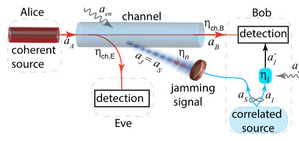
<figcaption class="paper-figure-caption"><b>Fig 1.</b> FIG. 1. Schematic of the correlated-jamming protocol. Al- ice encodes her message in a bright coherent signal aA that propagates to Bob over a thermal-loss channel of transmis- sivity ηch,B; a passive eavesdropper Eve taps the channel with transmissivity ηch,E. To protect the transmission, Bob operates a correlated-noise source—either a classically cor- related noise generator or an entangled two-mode squeezed source—emitting a signal mode aS and an idler mode aI with cross correlation ⟨aIaS⟩. The signal mode is broad- cast into the channel as a bright jamming field aJ = aS, a fraction ηn of which couples into the receiver modes, while the idler is retained at Bob’s station with storage...</figcaption>
</figure>
<figure class="paper-figure-card">
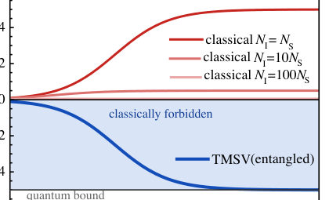
<figcaption class="paper-figure-caption"><b>Fig 2.</b> FIG. 2. Residual self-jamming noise normalized to the jamming-path transmissivity. The plotted quantity is ∆V/ηS = VS|I −1</figcaption>
</figure>
<figure class="paper-figure-card">
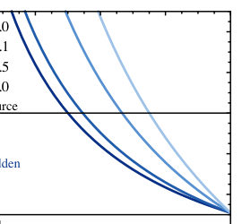
<figcaption class="paper-figure-caption"><b>Fig 3.</b> FIG. 3. Effect of imperfect idler storage on the entangled source, from Eq. (33) at NS = NI = 25, for storage-line oc- cupations Nen = 0, 0.1, 0.5 and 1. Each curve crosses the classical floor at the threshold ηth I of Eq. (34).The threshold is independent of NS and of ηS: better than 50% storage on a cold line, tightening toward unity as the line warms. The best classical source sits on the floor for every ηI, since a brighter idler compensates any fixed attenuation, so idler loss penal- izes the entangled source alone.</figcaption>
</figure>
<figure class="paper-figure-card">
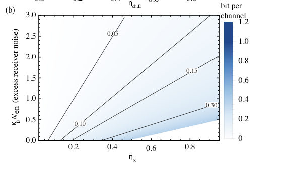
<figcaption class="paper-figure-caption"><b>Fig 4.</b> FIG. 4. (a) Secrecy capacity C versus Eve’s channel trans- missivity ηch,E, without jamming (green) and with jamming by the symmetric classical (red) and entangled (blue) sources. Solid curves: homodyne Eve, Eq. (36). Dashed curves: collec- tive Eve, Eq. (D10), with χE from Appendix D. The dashed curves are achievable collective-attack rates and lower bounds on the secrecy capacity. Without jamming, secrecy is lost as soon as Eve’s channel rivals Bob’s, at ηch,E = 0.300 against a homodyne eavesdropper and already at 0.205 against a col- lective one. Correlated jamming moves the cutoff to 0.712 (classical) and 0.759 (entangled), and simultaneously closes the gap between the two adversary...</figcaption>
</figure>
<figure class="paper-figure-card">
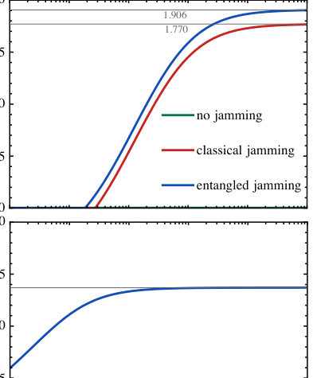
<figcaption class="paper-figure-caption"><b>Fig 5.</b> FIG. 5. (a) Secrecy capacities as functions of the jamming brightness NJ for ηch,E = 0.299, just inside the unjammed cutoff ηch,B = 0.300. The unjammed capacity remains fixed at Cno-jamm = 2.39 × 10−3 bit per channel use. At NJ = 25, the classical and quantum capacities are 0.96 and 1.10 bit per channel use and saturate at 1.770 and 1.906 bit per channel use, respectively. (b) Quantum contribution Cq −Ccl, which saturates at 0.137 bit per channel use, consistent with A → ηS/2. The high-SNRB asymptotic value for this receiver is 0.149 bit per channel use. Parameters are NA = 20, Nen = 0.1, and ηn = 0.3; all other parameters are the same as in Fig. 4.</figcaption>
</figure>

**Summary.** This paper introduces a correlated-jamming protocol to enhance physical-layer security in communication channels. By utilizing entangled two-mode squeezed vacuum sources, the legitimate receiver can actively suppress self-interference noise below the standard quantum limit. This method preserves positive secrecy even against powerful eavesdroppers and is applicable to various real-world systems like optical or microwave links.

**Why it may be interesting.** This work directly addresses practical limitations in quantum key distribution security by engineering active countermeasures (jamming) that leverage entanglement to surpass classical noise limits, which is highly relevant for physical implementations using superconducting circuits or optical links.

Detailed structure

**Main problem.** The goal is to improve physical-layer security in quantum communication by introducing correlated jamming noise that degrades an eavesdropper's channel while minimizing self-interference at the legitimate receiver.

**Main result.** Using entangled two-mode squeezed vacuum (TMSV) sources allows for sub-vacuum residual noise suppression, providing a measurable quantum advantage over classical jamming methods. This protocol maintains positive secrecy even when the eavesdropper has a stronger direct channel than the legitimate user.

**Method.** The analysis uses an optimized joint measurement technique on the received field and a retained local reference mode to cancel correlated fluctuations induced by the jamming source.

**Model / system.** The system models secure communication over lossy channels using a correlated-jamming protocol. It involves a bright coherent signal, a correlated two-mode source (classical or TMSV), and subsequent interference measurements at Bob's receiver.

**Key observables.** Self-interference noise variance ($\sigma_{B,J}$), achievable secrecy rate ($C$), and the quantum advantage quantified by residual noise below the vacuum floor.

**Important parameters / regimes.** Transmissivities of the channels ($\eta_{ch}, \eta_I$), signal power ($N_A$), and the squeezing parameter (for TMSV).

**Assumptions / limitations.** The analysis is explicitly treated as a collective-attack bound, not a coherent-attack bound. It assumes specific channel loss models and idler storage efficiencies.

**Figures summary.** Figure 1 schematically illustrates the setup: Alice sends signal $a_A$; Bob generates correlated source ($a_S, a_I$); $a_S$ is broadcast as jamming field $a_J$, and $a_I$ is retained for interference cancellation.

**Paper structure.** The paper develops the protocol by first defining the physical setup (correlated jamming), then deriving the noise suppression mechanisms using quantum optics, followed by quantitative comparisons of secrecy rates across different source types (classical vs. entangled) and attack models.

Abstract

Artificial-noise jamming improves physical-layer security by degrading an eavesdropper's channel, but the injected noise also interferes with the legitimate receiver. We introduce a correlated-jamming protocol based on classical and quantum correlations that suppresses this self-interference while preserving the jamming penalty experienced by the eavesdropper. Bob broadcasts one mode of a correlated two-mode source and retains the second as a local reference. Eve, who has no access to the retained mode, receives the full thermal jamming field, whereas Bob uses an optimized joint measurement to cancel its correlated fluctuations. The residual self-jamming noise is governed by the conditional variance of the transmitted jamming quadrature given the retained reference. Any classically correlated source is bounded by the vacuum-noise floor and therefore restores Bob, at best, to his unjammed receiver noise. An entangled two-mode squeezed source surpasses this limit and produces sub-vacuum residual noise, with the maximum quantum advantage set by the transmissivity of the jamming path back to Bob. In the bright-source regime, this advantage becomes a fixed reduction in Bob's noise floor, independent of the signal and jamming powers. Within a bounded-collection wiretap model, correlated jamming preserves positive secrecy even when Eve has a stronger direct channel than Bob and remains effective against collective measurements on Eve's Gaussian output states. The protocol supports bright classical message transmission and requires no end-to-end quantum channel. Possible applications include shot-noise-limited optical communication, cryogenic microwave networks, and covert or power-constrained secure links.

[↑ back to top](#top)

### [The small effect of graviton-induced decoherence](http://arxiv.org/abs/2608.07257v1)

**Authors:** Guri K. Buza, Marko Toroš  
**Type:** theory · **Category:** other · **PDF:** <https://arxiv.org/pdf/2608.07257v1>  
**Analysis basis:** full PDF text, analyzed in chunks
**Topic relevance:** `correlated / nonlocal dissipation` **3/5** · `methods for driven-dissipative` **3/5** · `non-equilibrium dynamics` **2/5** · `Keldysh / 2PI / non-Gaussian methods` **1/5** · `analog quantum simulation` **1/5** · `driven-dissipative phase transition` **1/5** · `entanglement & information structure` **1/5**

↔ Scroll figures horizontally

<figure class="paper-figure-card">
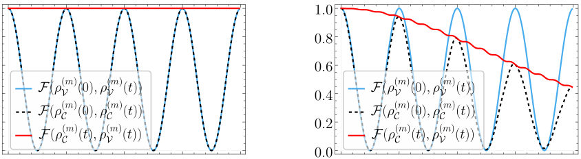
<figcaption class="paper-figure-caption"><b>Fig 1.</b> FIG. 1. Survival of the time-evolved initial coherence-protected matter state ρ(m) V,C(0) = ρ(m) ϑ,φ given in Eq. (23), with ϑ = π/2 and φ = 0, in the case of vacuum (V) and coherent (C) graviton bath states, quantified by fidelity F. The dynamics are obtained by solving the Lindblad master equation in Eq. (18) (see Table I). We take ωm = 2π ×1 MHz, with ωk0 = 2ωm, θ = 0, and plus polarization e+ xx = 1, corresponding to gravitons propagating along the z-direction. Left: Coherent graviton state matched to a realistic gravitational-wave strain h+ = 10−21, giving |α| = 1.99 × 1013. In this case, the coherent and vacuum evolutions are indistinguishable. Right: Exaggerated coherent amplitude,...</figcaption>
</figure>
<figure class="paper-figure-card">
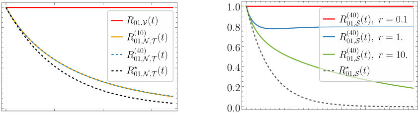
<figcaption class="paper-figure-caption"><b>Fig 2.</b> FIG. 2. Survival of the bare encoded matter coherence ρ01 in number and thermal (N, T ) and squeezed (S) graviton baths, quantified by the coherence ratio R01 defined in Eq. (30) (cf. Eqs. (31)-(34)). The dynamics are obtained by solving the respective Lindblad master equation in Eq. (18) (see Table I), in the matter number-state basis. We take ωm = 2π × 1 MHz, so that the resonant gravitons have ωk = 2ωm. For the number and thermal baths, we use n = 2.8 × 104, corresponding in the thermal case to T = 2.725 K. Left: The truncated-ladder results for M = 10 and M = 40 are indistinguishable, demonstrating numerical convergence. The short-time exponential reproduces the initial slope and...</figcaption>
</figure>

**Summary.** This paper theoretically analyzes how quantum matter systems lose coherence due to interaction with quantized gravitational waves (gravitons). By retaining the full quadratic tidal coupling, the authors derive master equations showing that different bath states yield distinct decoherence patterns. Notably, squeezed graviton baths can induce a protected subspace of coherent states, offering insights into fundamental limits for quantum measurements in gravitational environments.

**Why it may be interesting.** This work provides a rigorous quantum treatment of gravitational decoherence, extending standard optomechanical models by retaining the full quadratic coupling. The identification of protected sectors via dressed states is highly relevant to understanding fundamental limits on quantum sensing.

Detailed structure

**Main problem.** The study investigates how a nonrelativistic quantum matter system decoheres when coupled to quantized gravitational waves (gravitons). The focus is on retaining the full quadratic nature of the tidal interaction, which differs from simpler linear couplings.

**Main result.** The analysis shows that while number/thermal baths enhance decoherence by removing coherence protection, a squeezed graviton bath leads to a novel, coherence-protected sector spanned by dressed dark states. Furthermore, the structure of the matter Hilbert space decomposes into even- and odd-parity sectors regardless of the bath state.

**Method.** The authors use open quantum system techniques, deriving Lindblad master equations via Born-Markov and secular approximations. They employ renormalization procedures for divergent terms and analyze coherence decay using ladder operators and dark state analysis.

**Model / system.** The model consists of a nonrelativistic quantum harmonic oscillator (matter) coupled to a bath of quantized gravitational waves (gravitons). The interaction is fundamentally quadratic in the mechanical displacement, derived from the tidal coupling term $H_I \propto x^2 h_{xx}$.

**Key observables.** Decoherence rates ($\gamma$), coherence protection between lowest number states, and the structure/evolution of parity-separated sectors.

**Important parameters / regimes.** Bath state type (vacuum, coherent, number, thermal, squeezed), coupling strength, and mechanical frequency $\omega_m$.

**Assumptions / limitations.** The derivation relies on weak-field expansion, the Born approximation, and the Markovian assumption for deriving the Lindblad master equation.

**Figures summary.** Not specified by notes; however, the analysis involves solving coupled differential equations governing coherence decay in different bath regimes (e.g., $R_{01}(t)$ vs. time).

**Paper structure.** The paper progresses from deriving the general quadratic coupling and master equation structure to analyzing specific bath states (vacuum, coherent, number/thermal) and culminating in a detailed analysis of coherence protection using squeezed baths and dark state theory.

Abstract

We derive and investigate the reduced dynamics of a nonrelativistic quantum matter system interacting with quantized gravitational waves. Because gravitational radiation couples tidally to the mass quadrupole moment, we emphasize that the leading interaction is quadratic in the mechanical displacement. Rather than treating it as a complication to be removed by linearization, we retain this full quadratic dependence, which gives rise to two-phonon rather single-phonon processes typical in dipolar interactions. We clarify its relation to the effective linear coupling that often appears in optomechanical literature, but which conceals the delicate quantum signatures of the full quadratic coupling. Using the Born-Markov and secular approximations, we microscopically derive Lindblad master equations for the matter dynamics induced by graviton baths in multi-mode vacuum, coherent, number, thermal, and squeezed states. We treat the ultraviolet-divergent Lamb-shift Hamiltonian by an explicit renormalization procedure, with the mechanical frequency identified as the physical frequency. Remarkably, owing to the nature of the interaction, the matter Hilbert space decomposes into even- and odd-parity sectors for all bath states considered. For a coherent graviton bath, the decoherence is identical to that of the vacuum, while the bath one-point function produces a coherent-shift Hamiltonian that exactly reproduces the tidal interaction with a classical gravitational wave. For a vacuum graviton bath, we recover the coherence protection between the two lowest mechanical number states, while number and thermal graviton baths remove this protection and enhance decoherence, although the effect remains small for realistic parameters. By contrast, a squeezed graviton bath enlarges the coupled coherence structure, and gives rise to a novel, coherence-protected sector spanned by dressed dark states.

[↑ back to top](#top)

### [Robust device-independent characterization of sharpness and incompatibility of unsharp instruments](http://arxiv.org/abs/2608.06726v1)

**Authors:** Qian Zhang, Kai-Yu Yuan, Yan-Xin Rong, Zhen Shang, Yong-Jian Gu, Ya Xiao  
**Type:** both · **Category:** quantum information and computing · **PDF:** <https://arxiv.org/pdf/2608.06726v1>  
**Analysis basis:** full PDF text, analyzed in chunks
**Topic relevance:** `quantum measurements` **3/5** · `quantum optics experiment` **3/5** · `QC/QI experiment` **2/5** · `entanglement & information structure` **1/5** · `interference shaping light` **1/5** · `measurement-induced transitions` **1/5**

↔ Scroll figures horizontally

<figure class="paper-figure-card">
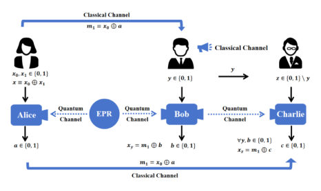
<figcaption class="paper-figure-caption"><b>Fig 1.</b> FIG. 1. DI characterization of unsharp instruments via a sequential communication game. The schematic shows the entanglement-assisted QRAC protocol, which features se- quential measurements and limited communication between the two decoders, Bob and Charlie. Bob is allowed to com- municate his measurement setting to Charlie, enhancing the average decoding success probability beyond classical limits and enabling the simultaneous certification of both measure- ment sharpness and incompatibility.</figcaption>
</figure>
<figure class="paper-figure-card">
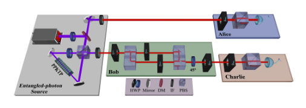
<figcaption class="paper-figure-caption"><b>Fig 2.</b> FIG. 2. Experimental setup. The apparatus comprises four functional modules: the gray module for polarization- entangled photon-pair generation; the purple module for Al- ice’s projective measurement; the green module for Bob’s un- sharp measurement; and the orange module for Charlie’s pro- jective measurement. Abbreviations: HWP, half-wave plate; DM, dichroic mirror; PBS, polarizing beam splitter; PPKTP, periodically poled KTiOPO4 crystal; IF, interference filter.</figcaption>
</figure>
<figure class="paper-figure-card">
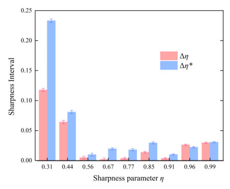
<figcaption class="paper-figure-caption"><b>Fig 3.</b> FIG. 4. The sharpness intervals, defined as the differences between the upper and lower bounds of Bob’s sharpness pa- rameter η, are shown for nine target values. ∆η∗(blue) and ∆η (pink) represent the sharpness intervals obtained in the noncommunicating and communicating scenarios, respec- tively. Error bars are estimated from Poissonian counting statistics.</figcaption>
</figure>
<figure class="paper-figure-card">
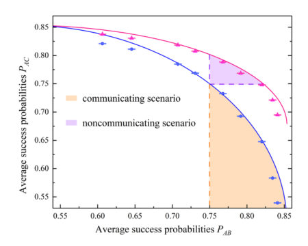
<figcaption class="paper-figure-caption"><b>Fig 4.</b> FIG. 3. Trade-off between average success probabilities PAB and PAC as a function of sharpness parameter η. Pink and Blue curves show the theoretical optimal trade-offs in the entanglement-assisted sequential QRAC scenario without and with classical communication between the decoders, respec- tively. Corresponding experimental values are marked as pink triangles and blue points. Error bars are estimated from Pois- son counting statistics. Shaded purple and orange regions indicate where both PAB and PAC exceed their respective classical bounds in the noncommunicating and communicat- ing scenarios, characterized by the conditions (PAB &gt; 3/4, PAC &gt; 3/4) and (PAB &gt; 3/4, PAC &gt; 1/2), respectively.</figcaption>
</figure>
<figure class="paper-figure-card">
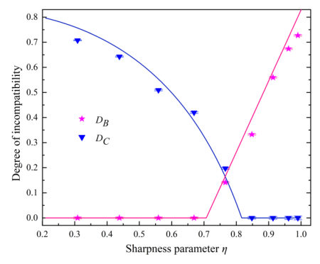
<figcaption class="paper-figure-caption"><b>Fig 5.</b> FIG. 5. Lower bound on the degree of incompatibility in Bob’s (pink) and Charlie’s (blue) respective pair of measurements for nine targeted values of the sharpness parameter η. Error bars are derived from Poissonian counting statistics.</figcaption>
</figure>

**Summary.** This paper presents a novel, device-independent protocol using entanglement-assisted QRACs to precisely measure both the sharpness and incompatibility of unsharp quantum measurements. By incorporating communication between decoding parties, the scheme significantly enhances the achievable bounds compared to noncommunicating methods. The work is validated experimentally using photon pairs in an interferometer setup.

**Why it may be interesting.** This work advances device-independent quantum characterization protocols, which are crucial for building trust in quantum devices where internal workings cannot be fully trusted. It provides concrete methods to quantify fundamental resource limitations like measurement incompatibility.

Detailed structure

**Main problem.** The core problem is developing a robust, device-independent protocol to simultaneously characterize both the sharpness ($\eta$) and the incompatibility ($D$) of unsharp quantum measurements.

**Main result.** The proposed communication-enhanced scheme allows for quantifying both parameters with greater precision than noncommunicating protocols, demonstrating that communication acts as a powerful operational resource in this certification process.

**Method.** The authors use an entanglement-assisted sequential Quantum Random Access Code (QRAC) protocol involving three parties and derive lower bounds on incompatibility using measured success probabilities ($P_{AB}, P_{AC}$).

**Model / system.** The system utilizes polarization-entangled photon pairs generated via type-II spontaneous parametric down-conversion in a PPKTP crystal within a Sagnac interferometer setup for experimental realization.

**Key observables.** Measurement sharpness ($\eta$), measurement incompatibility ($D$), and average decoding success probabilities ($P_{AB}, P_{AC}$).

**Important parameters / regimes.** The communication channel's allowance, which enhances the achievable success probabilities beyond classical bounds.

**Assumptions / limitations.** The analysis assumes statistical independence and uniform distribution of inputs; a limitation noted is that $D_C$ might not perfectly capture incompatibility as $\eta$ increases due to protocol structure.

**Figures summary.** Figures illustrate the entanglement-assisted QRAC setup, showing how communication enhances success probabilities beyond classical limits, and quantifying the narrowing of sharpness intervals ($\Delta\eta$) and lower bounds on incompatibility ($D_B, D_C$).

**Paper structure.** The paper introduces the problem using an entanglement-assisted sequential QRAC model. It derives mathematical relationships linking success probabilities to sharpness and incompatibility. The results demonstrate the advantage of communication, followed by experimental validation using tunable Mach-Zehnder interferometers.

Abstract

Unsharp measurements are key resources for tasks that balance information gain and disturbance, but certifying them without device assumptions remains a challenge. We propose a fully device-independent protocol for characterizing unsharp instruments, based on an entanglement-assisted sequential quantum random access code, where the first decoder is allowed to communicate her measurement setting to the second. This communication-enhanced scheme creates a decoding regime in which both decoders surpass classical bounds, enabling tight quantification of sharpness and direct quantification of measurement incompatibility beyond noncommunicating protocols. Experimentally, we implement tunable unsharp measurements using a Mach-Zehnder interferometer, observing the predicted sequential enhancement in decoding probability. Additionally, we achieve significantly narrower sharpness intervals and incompatibility quantification across multiple target sharpness values. Our results show that communication is a powerful operational resource for certifying precisely unsharp instruments and advancing device-independent quantum information protocols.

[↑ back to top](#top)

### [Suppression of orbital ordering and emergence of a glassy magnetic state in a high-entropy spinel vanadate](http://arxiv.org/abs/2608.06738v1)

**Authors:** Shun Ito, Sota Nakakuki, Satoshi Demura, Tadataka Watanabe  
**Type:** experiment · **Category:** strongly correlated electrons · **PDF:** <https://arxiv.org/pdf/2608.06738v1>  
**Analysis basis:** full PDF text, analyzed in chunks
**Topic relevance:** `exotic spin models in light-matter` **3/5** · `analog quantum simulation` **2/5** · `spintronics-quantum-optics interface` **2/5** · `Kondo & dissipative impurity` **1/5** · `driven-dissipative phase transition` **1/5** · `methods for driven-dissipative` **1/5** · `non-equilibrium dynamics` **1/5**

↔ Scroll figures horizontally

<figure class="paper-figure-card">
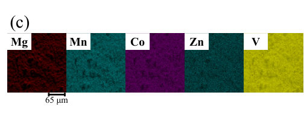
<figcaption class="paper-figure-caption"><b>Fig 1.</b> FIG. 1. Synchrotron XRD patterns of (Li0.2Mg0.2Mn0.2Co0.2Zn0.2)V2O4 and the results of Ri- etveld analysis assuming the cubic space group Fd¯3m: (a) 300 K and (b) 100 K. No peak splitting indicative of sym- metry lowering from the cubic spinel structure is observed down to 100 K. (c) SEM image and EDS elemental mapping of (Li0.2Mg0.2Mn0.2Co0.2Zn0.2)V2O4.</figcaption>
</figure>
<figure class="paper-figure-card">
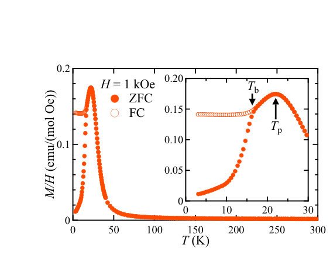
<figcaption class="paper-figure-caption"><b>Fig 2.</b> FIG. 3. Temperature dependence of the ZFC and FC mag- netization M(T) of (Li0.2Mg0.2Mn0.2Co0.2Zn0.2)V2O4 mea- sured under an applied field of 1 kOe. The inset shows an expanded view below 30 K. The values Tp and Tb represent the magnetization peak temperature and the ZFC-FC bifur- cation temperature, respectively.</figcaption>
</figure>
<figure class="paper-figure-card">
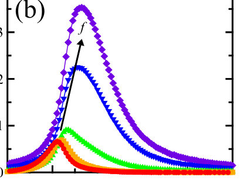
<figcaption class="paper-figure-caption"><b>Fig 3.</b> FIG. 5. Temperature dependence of the ac magnetic sus- ceptibility of (Li0.2Mg0.2Mn0.2Co0.2Zn0.2)V2O4 measured at several frequencies (1 Hz–1000 Hz) with ac excitation field of 2 Oe and zero dc magnetic field. (a) Real part χ′(T) and (b) imaginary part χ′′(T). The arrows indicate the trend with increasing frequency, showing the frequency-dependent shift of the peak temperatures Tf characteristic of glassy magnetic dynamics.</figcaption>
</figure>
<figure class="paper-figure-card">
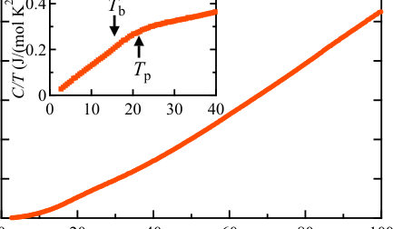
<figcaption class="paper-figure-caption"><b>Fig 4.</b> FIG. 4. Temperature dependence of the specific heat C(T) of (Li0.2Mg0.2Mn0.2Co0.2Zn0.2)V2O4 measured in zero magnetic field. The inset shows C/T below 40 K. No anomaly associ- ated with any phase transition is observed down to 3 K. The arrows indicate the magnetization peak temperature Tp and the ZFC-FC bifurcation temperature Tb shown in Fig. 3.</figcaption>
</figure>
<figure class="paper-figure-card">

<figcaption class="paper-figure-caption"><b>Fig 5.</b> Figure 3 depicts the temperature depen- dence of the dc magnetization M(T) for (Li0.2Mg0.2Mn0.2Co0.2Zn0.2)V2O4 measured under an applied magnetic field of 1 kOe. Upon cooling, the magnetization exhibits a ferrimagnetic-like increase be- low ∼50 K and a maximum at Tp ∼22 K. Upon further cooling, the zero-field-cooled (ZFC) and field-cooled (FC) magnetization curves bifurcate below Tb ∼17 K, as highlighted in the inset of Fig. 3. The ZFC magne- tization also exhibits a slight kink at approximately Tb. Figure 4 depicts the temperature dependence of the spe-</figcaption>
</figure>

**Summary.** This paper uses high-entropy spinel vanadates to study the competition between orbital ordering and disorder. Experimentally, they show that the random cation distribution suppresses long-range structural transitions associated with orbital order. Instead, the system settles into a complex, heterogeneous glassy magnetic state, highlighting the crucial role of quenched disorder in correlated oxides.

**Why it may be interesting.** The work provides experimental evidence of how quenched structural disorder can fundamentally alter the ground state by suppressing collective orbital ordering, leading to complex, frustrated magnetic dynamics relevant to correlated electron physics.

Detailed structure

**Main problem.** The study investigates how high configurational disorder influences the interplay between orbital degrees of freedom, geometrical frustration, and magnetic ordering in spinel vanadates.

**Main result.** High entropy suppresses long-range orbital ordering, preventing structural symmetry lowering, while simultaneously stabilizing a heterogeneous glassy magnetic state characterized by complex relaxation dynamics.

**Method.** The research combines structural characterization using X-ray diffraction with detailed thermodynamic and magnetic measurements (AC/DC susceptibility, specific heat).

**Model / system.** The physical system is the high-entropy spinel vanadate $(	ext{Li}_{0.2}	ext{Mg}_{0.2}	ext{Mn}_{0.2}	ext{Co}_{0.2}	ext{Zn}_{0.2})	ext{V}_2	ext{O}_4$, where V ions form a geometrically frustrated pyrochlore sublattice.

**Key observables.** Structural symmetry (absence of peak splitting), magnetic susceptibility ($\chi'$ and $\chi''$), specific heat anomalies, and relaxation dynamics analyzed via Cole-Cole plots.

**Important parameters / regimes.** Temperature regimes (down to 3 K), disorder concentration (high entropy), and characteristic freezing temperatures ($T_f \sim 17-22$ K).

**Assumptions / limitations.** The analysis assumes that the observed glassy dynamics are due to a spatially nonuniform spin-orbital state induced by random A-site cation distribution.

**Figures summary.** Figures show preserved cubic XRD structure down to low temperatures, ZFC/FC magnetic bifurcation below $\sim 17$ K, and AC susceptibility plots demonstrating frequency-dependent relaxation indicative of glassy dynamics.

**Paper structure.** The paper proceeds by first establishing the structural stability (XRD) contrasting with orbital ordering expectations. It then measures bulk magnetism (M(T), C(T)) to rule out conventional long-range order, culminating in detailed AC susceptibility analysis using multiple models (Vogel–Fulcher, dynamic scaling) to characterize the glassy state.

Abstract

High-entropy oxides provide a unique platform for exploring the interplay between configurational disorder and correlated electronic states. We report on structural, thermodynamic, and magnetic properties of the high-entropy spinel vanadate (Li$_{0.2}$Mg$_{0.2}$Mn$_{0.2}$Co$_{0.2}$Zn$_{0.2}$)V$_2$O$_4$, in which orbital-active V ions occupy the pyrochlore sublattice. X-ray diffraction measurements reveal that the cubic spinel structure is preserved at temperatures down to 5 K without any detectable symmetry lowering. Unlike conventional spinel vanadates exhibiting a symmetry-lowering structural transition driven by orbital ordering, the compound that we study exhibits a suppression of long-range orbital ordering in the high-entropy state. Magnetic susceptibility measurements show glassy magnetic freezing at temperatures below $\sim$20 K, while specific-heat measurements reveal no anomaly associated with long-range ordering down to 3 K. Frequency-dependent ac susceptibility reveals pronounced glassy dynamics. Analyses based on the Mydosh parameter, dynamic scaling law, and Vogel--Fulcher law suggest an intermediate dynamical regime between canonical spin-glass and cluster-glass behavior. Furthermore, Cole--Cole analyses reveal systematic deviations from a single Debye relaxation process, indicating the presence of heterogeneous magnetic relaxation dynamics near the freezing regime. Our results demonstrate that, in a frustrated spinel vanadate, high configurational entropy suppresses long-range orbital ordering and stabilizes a heterogeneous glassy magnetic state, highlighting the combined roles of geometrical frustration, orbital degrees of freedom, and configurational disorder in high-entropy magnets.

[↑ back to top](#top)

### [Temperature-tunable spin-wave refraction using superconducting control elements](http://arxiv.org/abs/2608.06555v1)

**Authors:** Pim H. Vree, Merel A. Bouma, Michael Borst, Tomas T. Osterholt, Rembert A. Duine, Toeno van der Sar  
**Type:** experiment · **Category:** other · **PDF:** <https://arxiv.org/pdf/2608.06555v1>  
**Analysis basis:** full PDF text, analyzed in chunks
**Topic relevance:** `exotic spin models in light-matter` **3/5** · `spintronics-quantum-optics interface` **3/5** · `QC/QI experiment` **2/5** · `analog quantum simulation` **1/5** · `driven-dissipative phase transition` **1/5** · `interference shaping light` **1/5**

↔ Scroll figures horizontally

<figure class="paper-figure-card">
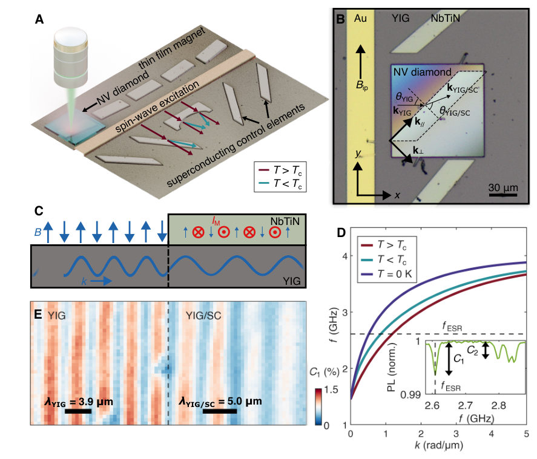
<figcaption class="paper-figure-caption"><b>Fig 1.</b> FIG. 1. Magnetic imaging of spin waves interacting with superconducting control elements. (A) Schematic of the experiment. Spin waves in a 0.20 µm-thick YIG magnetic film interact with 0.15-µm-thick NbTiN islands. A 0.15 µm-thick gold microstrip excites the spin waves. A nitrogen-vacancy (NV) diamond enables spin-wave imaging. Tc: superconducting critical temperature. (B) Optical micrograph of a ∼5-µm-thick diamond micromembrane containing NV spins implanted 70 nm below its bottom surface, placed onto a NbTiN island at 45 deg. w.r.t. the microstrip. The incoming (refracted) spin wave has a wave vector kYIG (kYIG/SC) making an angle θYIG (θYIG/SC) w.r.t. the interface normal. The applied...</figcaption>
</figure>
<figure class="paper-figure-card">
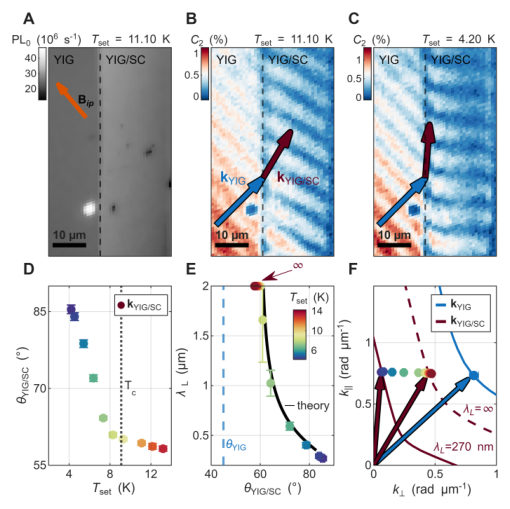
<figcaption class="paper-figure-caption"><b>Fig 2.</b> FIG. 2. Temperature-controlled, superconductor- induced spin-wave refraction. (A) Spatial map of NV photoluminescence (PL0) showing the YIG and NbTiN- covered-YIG (YIG/SC) regions of the device in Fig. 1B. We rotated the image by 45 deg. with respect to Fig. 1B to orient the interface vertically. (B, C) Spatial maps of NV ESR con- trast with the NbTiN in the normal (B) and superconducting (C) state. A blue (red) arrow indicates the incoming (re- fracted) wave vector extracted via Fourier analysis (fig. S1). Bip = 13 mT, fESR = 2.75 GHz. (D) Angle of the refracted spin wave θYIG/SC versus setpoint temperature Tset. Dashed line: independently measured NbTiN critical temperature Tc (fig. S4)....</figcaption>
</figure>
<figure class="paper-figure-card">

<figcaption class="paper-figure-caption"><b>Fig 3.</b> FIG. 3. Refractive index and Snell’s law. (A) Angle θYIG/SC of the refracted wave vector vs angle of the incident wave vector θYIG, measured above Tc (blue dots) and below (red dots). The waves break away from the interface normal (θYIG/SC &gt; θYIG). The dashed line indicates θYIG = θYIG/SC. Each incident angle corresponds to a superconducting island oriented at that angle w.r.t. the microstrip (Fig. 1A). Angles extracted by Fourier transformation of spatial spin-wave maps as in Fig. 2. See figures S10–15 for all spatial maps. Bip = 8.0 mT, fESR = 2.603 GHz. As in Fig. 2A, we observe a small refraction above Tc attributed to a NbTiN-deposition- induced anisotropy. (B) Ratio of the sines of...</figcaption>
</figure>
<figure class="paper-figure-card">
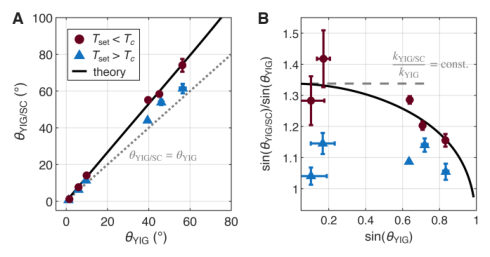
<figcaption class="paper-figure-caption"><b>Fig 4.</b> Fig. 2F and fig. S2) [41] that derive from the anisotropic dipolar fields generated by the spins in the film. Such hyperbolic dispersions lead to large angles between the phase and group velocities and are of interest in optics [42] as they enable phenomena such as negative refrac- tion, hyper-focusing and ways to control wave transport that are absent in systems with isotropic dispersions [43]. Here we demonstrate that our superconducting con- trol elements enable tuning the spin-wave refraction from positive to negative. We focus on the same device as in Fig. 2/Fig. 1B and change the wavelength of the im- pingent spin wave by changing the excitation frequency. To retain resonance with the...</figcaption>
</figure>
<figure class="paper-figure-card">
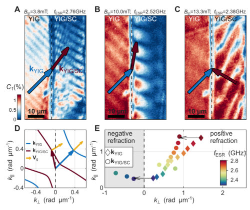
<figcaption class="paper-figure-caption"><b>Fig 5.</b> FIG. 4. Positive-to-negative refraction by a supercon- ducting island. (A–C) Spatial maps of the NV ESR con- trast at different drive frequencies. Reducing the frequency (from A to C) causes stronger refraction and the perpendic- ular component of the wave vector to change sign in C. To retain resonance with the NV frequency, we simultaneously tune the applied magnetic field. Tset = 4.4 K. (D) Geometric analysis of the refraction in k-space. Both before and after refraction, the wave vector must lie on the isofrequency con- tour of the spin-wave dispersion (blue line for bare YIG and red line for YIG/SC, calculated for the field and frequency of (C) and λL = 0.4 µm). The conservation of the...</figcaption>
</figure>

**Summary.** The research reports on the use of superconducting elements to actively control spin-wave propagation within a YIG thin film. By tuning the local magnetic environment via superconductivity, the authors achieved temperature-tunable refraction and even negative refraction for spin waves. This opens pathways for developing novel microwave optical components for quantum or classical information processing.

**Why it may be interesting.** This work demonstrates using superconductivity to engineer wave properties (refraction/dispersion) in classical magnetic systems, which has parallels with controlling photonic or magnonic modes in quantum devices.

Detailed structure

**Main problem.** The central challenge addressed is achieving low-damping, tunable control of spin-wave propagation, specifically realizing temperature-controlled refraction.

**Main result.** The study successfully demonstrated temperature-tunable spin-wave refraction and the observation of negative refraction using superconducting elements integrated into a thin-film magnetic insulator structure.

**Method.** Measurements involve exciting spin waves in YIG films and imaging their propagation characteristics (refraction, phase front shaping) using Nitrogen-Vacancy (NV) centers in diamond micromembranes as a sensitive detector.

**Model / system.** The physical system is a thin-film magnetic insulator (YIG) coupled with superconducting control elements (NbTiN). The theoretical analysis models the superconductor's diamagnetic screening effect, which modifies the spin-wave dispersion relation based on the temperature-dependent London penetration depth.

**Key observables.** Spin wave refractive index, refraction angle ($	heta_{	ext{YIG/SC}}$), and the superconducting London penetration depth ($\lambda_L$).

**Important parameters / regimes.** Temperature ($T$), magnetic field components ($\mathbf{B}_{	ext{ip}}$), excitation frequency ($f_{	ext{ESR}}$), and interface angles.

**Assumptions / limitations.** The small refraction observed above the superconducting critical temperature ($T_c$) is attributed to strain or damage-related anisotropy induced by deposition, rather than solely the superconducting effect.

**Figures summary.** Figures illustrate schematic setups (YIG/SC/NV), temperature dependence of refraction angles vs. setpoint temperature, and spatial maps showing phase front shaping and negative refraction regimes.

**Paper structure.** The paper systematically presents experimental measurements across various interface angles and temperatures, first demonstrating basic refraction, then quantifying the superconducting influence on dispersion ($\lambda_L$), and finally showcasing advanced control like negative refraction and beam translation.

Abstract

Spin waves are promising signal carriers for microwave control at the micrometer scale. However, realizing low-damping, tunable control of spin-wave propagation remains a central challenge. Here we use magnetic shielding by superconducting control elements to tune the local spin-wave dispersion and realize temperature-controlled refraction of spin waves in a thin-film magnetic insulator. Using magnetic imaging based on spins in diamond, we characterize the refractive index and demonstrate both positive and negative refraction as well as wavefront shaping by the superconductors. The observed refraction is explained by a geometrical analysis of the superconductivity-induced modification of the hyperbolic spin-wave dispersion. Our results demonstrate that superconductors enable tunable spin-wave optical elements, opening new opportunities for microwave control in classical or quantum information devices.

[↑ back to top](#top)

### [Entwined lattice of atoms and anionic electrons in layered electride LaCl](http://arxiv.org/abs/2608.07322v1)

**Authors:** Songyuan Geng, Xin Wang, Jianqi Zhong, Risi Guo, Fangjie Chen, Qun Wang, Kangjie Li, Keyu An, Teng-Fei Ying, Chen Qiu, Hanpu Liang, Zhengtai Liu, Mao Ye, Sungsoo Hahn, Balasubramanian Thiagarajan, Benjamin T. Zhou, Haoxiang Li  
**Type:** both · **Category:** strongly correlated electrons · **PDF:** <https://arxiv.org/pdf/2608.07322v1>  
**Analysis basis:** full PDF text, analyzed in chunks
**Topic relevance:** `analog quantum simulation` **3/5** · `driven-dissipative phase transition` **2/5** · `Keldysh / 2PI / non-Gaussian methods` **1/5** · `Kondo & dissipative impurity` **1/5** · `entanglement & information structure` **1/5** · `methods for driven-dissipative` **1/5** · `non-equilibrium dynamics` **1/5**

↔ Scroll figures horizontally

<figure class="paper-figure-card">
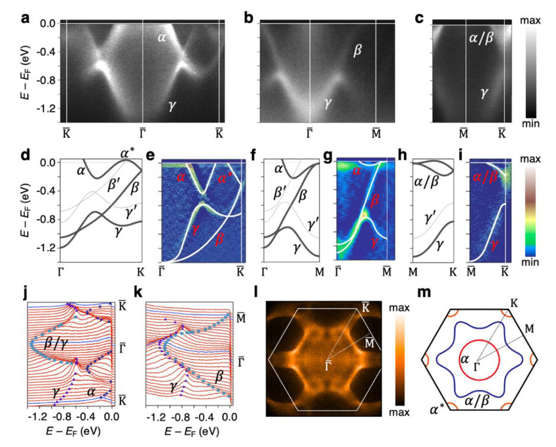
<figcaption class="paper-figure-caption"><b>Fig 1.</b> Fig. 2 Electronic structure of LaCl revealed by ARPES. a–c. ARPES spectra measured with</figcaption>
</figure>
<figure class="paper-figure-card">
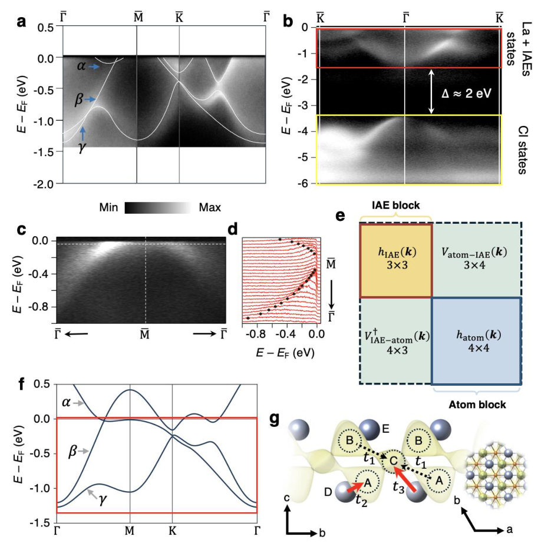
<figcaption class="paper-figure-caption"><b>Fig 2.</b> Fig. 3 The entwined lattice with strong coupling between the anionic electron sublattice and</figcaption>
</figure>
<figure class="paper-figure-card">
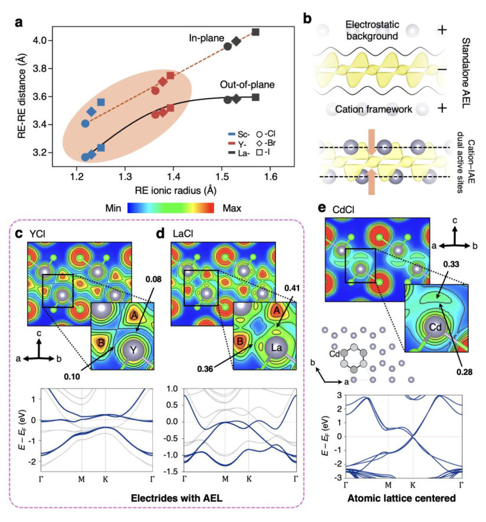
<figcaption class="paper-figure-caption"><b>Fig 3.</b> Fig. 4 Structural trend for the emergence of entwined lattices in the REX electride family. a.</figcaption>
</figure>

**Summary.** This work demonstrates that in layered electrides, the coupling between the anionic electron lattice (AEL) and the underlying metal cation framework dictates the electronic structure. By comparing YCl and LaCl, the authors show this coupling can fundamentally reshape band topology and connectivity, offering a powerful new knob for designing quantum materials.

**Why it may be interesting.** The concept that an excess electron system can act as a tunable, reconfigurable degree of freedom to engineer band topology and geometry is highly relevant for designing novel quantum materials beyond conventional atomic constraints.

Detailed structure

**Main problem.** The study investigates how controlling the lattice geometry, particularly through excess anionic electron layers (AELs), can actively dictate and reconstruct the electronic structure of crystalline solids.

**Main result.** The coupling between the AEL and the atomic cation framework fundamentally changes the effective lattice connectivity, transforming the electronic bands from a flat-band dice-lattice structure ($	ext{YCl}$) to a dispersive, reconstructed state ($	ext{LaCl}$).

**Method.** The research combines Angle-Resolved Photoemission Spectroscopy (ARPES) measurements with theoretical modeling using tight-binding Hamiltonians and DFT calculations.

**Model / system.** The system involves layered electrides ($	ext{RECl}$), comparing the 'standalone AEL' regime ($	ext{YCl}$) to the 'entwined lattice' regime ($	ext{LaCl}$). The electronic structure is governed by hopping channels between the excess electrons and the cation sites.

**Key observables.** Electronic band dispersion, Chern band topology ($|C|$), presence/absence of flat bands, and Van Hove singularities (vHS).

**Important parameters / regimes.** Interlayer separation distance, degree of coupling between AEL and atomic lattice, and the specific cation element ($	ext{Y}$ vs. $	ext{La}$).

**Assumptions / limitations.** The analysis assumes that the electronic structure is highly sensitive to the hybridization strength between the anionic electron layer and the underlying atomic framework.

**Figures summary.** Figures compare the standalone AEL in YCl versus the entwined lattice in LaCl, showing structural differences and band reconstructions. Another figure illustrates the general trend of crossover from standalone AEL to entwined lattices across the REX family.

**Paper structure.** The paper establishes the theoretical framework by contrasting $	ext{YCl}$ (standalone AEL) with $	ext{LaCl}$ (entwined lattice), using ARPES and tight-binding models to pinpoint the activation of direct hopping channels as the cause for the qualitative electronic divergence.

Abstract

Controlling the lattice geometry that governs electronic structure is a central theme in condensed-matter physics, yet in crystalline solids this geometry is usually fixed by the atomic framework. Electrides offer an alternative route to electronic structure design in which their excess electrons can organize into anionic electron lattice (AEL) and provide a lattice-like degree of freedom. Recent work has highlighted the standalone limit, where the AEL in YCl yields bands well described by the dice-lattice model. Here, using angle-resolved photoemission spectroscopy (ARPES), we show that LaCl, although isostructural to YCl, realizes a qualitatively different regime where the AEL is entwined with the La cation framework, producing a fully reconstructed electronic structure. Combining the ARPES result with tight-binding model analysis, we demonstrate that this radical divergence stems from the activation of direct hopping channels between the AEL and the La atomic lattice. This coupling reshapes the effective lattice geometry, reconstructs the electronic states, and modifies the associated Chern band topology, transforming the bipartite dice-lattice network in YCl into a tripartite structure in LaCl. Our findings demonstrate that the coupling between the AEL and the atomic lattice can actively shape the effective lattice geometry that governs the electronic structure. This coupling can act as a powerful tuning knob for electronic structure design that is inaccessible in conventional materials.

[↑ back to top](#top)

### [Origin of Long-Lived Nuclear Spin States and Coherences in Aliphatic Chains Revealed by Relaxation Theory](http://arxiv.org/abs/2608.07219v1)

**Authors:** Danil A. Markelov, Kirill F. Sheberstov  
**Type:** theory · **Category:** other · **PDF:** <https://arxiv.org/pdf/2608.07219v1>  
**Analysis basis:** full PDF text, analyzed in chunks
**Topic relevance:** `correlated / nonlocal dissipation` **3/5** · `methods for driven-dissipative` **3/5** · `non-equilibrium dynamics` **2/5** · `Keldysh / 2PI / non-Gaussian methods` **1/5** · `driven-dissipative phase transition` **1/5**

↔ Scroll figures horizontally

<figure class="paper-figure-card">
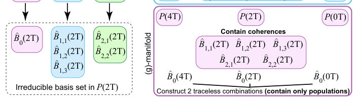
<figcaption class="paper-figure-caption"><b>Fig 1.</b> FIG. 1. Schematic representation of the construction of long-lived operators (LLOs) in aliphatic spin chains. (a) The local LLO subspace of a single −CH2−group is spanned by two basis operators, ˆP(S0) and ˆP(T). (b) An operator corresponding to an LLO in an aliphatic spin chain containing N −CH2−groups is constructed as a product of either ˆP(S0) or ˆP(T) within each group. (c) These products are classified according to the number of triplet populations T they contain, thereby defining the triplet-number subspaces P(MT). (d) Within each triplet-number manifold P(MT), the operator basis is further decomposed into permutation-adapted components described by Young diagrams. (e) Example of the...</figcaption>
</figure>
<figure class="paper-figure-card">
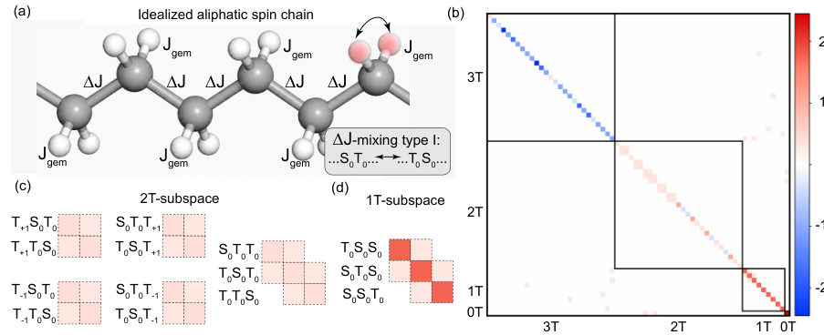
<figcaption class="paper-figure-caption"><b>Fig 2.</b> FIG. 2. (a) Fragment of an aliphatic chain highlighting the two most important interactions in the system: Jgem denotes the geminal intra-pair coupling, whereas ∆J denotes the difference between the vicinal couplings to neighboring groups. In an idealized chain, both Jgem and ∆J are assumed to be uniform along the chain. (b) The matrix elements of the Hamiltonian HJ</figcaption>
</figure>

**Summary.** The paper theoretically derives the existence and structure of long-lived nuclear spin states and coherences in aliphatic chains using Redfield relaxation theory. By identifying operators annihilated by the dominant dipole–dipole interaction, it provides a general framework to predict these protected quantum modes. This is crucial for applications ranging from hyperpolarization storage to quantum information processing.

**Why it may be interesting.** This work provides a rigorous theoretical framework linking fundamental relaxation theory (Redfield) to observable quantum phenomena (LLCs/LLSs) in molecular spin systems, which is highly relevant for understanding coherence preservation in complex biological or chemical environments.

Detailed structure

**Main problem.** The primary goal is determining the fundamental origin and general structure of delocalized long-lived states (LLSs) and collective zero-quantum long-lived coherences (LLCs) in aliphatic spin chains.

**Main result.** These protected modes are shown to arise directly from Redfield relaxation theory by finding operators annihilated by the dominant intra-pair dipole–dipole relaxation superoperator. The accessible number of such independent non-trivial operators depends on molecular chirality.

**Method.** The authors employ Redfield relaxation theory, constructing and analyzing the zero-eigenvalue subspace of the relaxation superoperator associated with the intra-pair dipole–dipole interaction.

**Model / system.** The system is an aliphatic spin chain composed of $N$ methylene groups ($-	ext{CH}_2-$). The analysis uses spin operators for pairs of spins and models the dynamics via the relaxation superoperator $\hat{\mathcal{R}}_{\text{intra}}$.

**Key observables.** Long-lived states (LLSs) and long-lived coherences (LLCs), which are characterized by their extended lifetimes exceeding conventional $T_1$ and $T_2$ times.

**Important parameters / regimes.** The number of methylene groups, $N$; the nature of the molecule (achiral vs. chiral); and the dominant relaxation mechanism (intra-pair dipole–dipole interaction).

**Assumptions / limitations.** Cross-correlations between different dipole–dipole interaction sites are neglected due to rapid averaging from fast molecular rotation.

**Figures summary.** Figures schematically illustrate the local LLO subspace, the construction of collective LLOs via product operators ($\prod \hat{P}(X)$), and the classification of these products into parity-defined subspaces ($P(MT)$).

**Paper structure.** The paper progresses from defining the physical problem (LLSs/LLCs) to applying Redfield theory, deriving the mathematical condition for protection ($\hat{\mathcal{T}}^{(2)}_{2,m} \hat{L} = 0$), establishing the combinatorial structure of the zero-eigenvalue space ($2^N-1$ operators), and finally developing explicit construction methods using population projectors.

Abstract

Delocalized long-lived states (LLSs) and collective zero-quantum long-lived coherences (LLCs) in aliphatic chains provide a promising route for preserving nuclear spin order with lifetimes that exceed the conventional $T_1$ and $T_2$ relaxation times, respectively. Their extended lifetimes make them attractive for applications including hyperpolarization storage, ligand-observed drug screening based on the loss of longevity upon binding to a target protein, and quantum information processing exploiting the collective properties of many-body spin systems. Although LLSs and LLCs have been observed experimentally in methylene networks, their origin and general structure in chains of arbitrary length have remained unclear. Here we show that these relaxation-protected modes follow directly from Redfield relaxation theory. Specifically, we construct the long-lived subspace, i.e., the zero-eigenvalue subspace of the relaxation superoperator associated with the dominant intra-pair dipole--dipole relaxation mechanism. The long-lived subspace contains $2^N-1$ independent non-trivial operators, which excludes the identity operator, where $N>1$ is the number of $-\mathrm{CH}_2-$ groups in the chain. In achiral molecules, conservation of the global intra-pair permutation parity restricts experimental access to at most $2^N-2$ of these operators, whereas in chiral molecules this parity is not conserved, making up to $2^N-1$ long-lived operators accessible. We further develop a general framework for constructing both LLSs and LLCs in aliphatic chains containing an arbitrary number of $-\mathrm{CH}_2-$ groups in achiral molecules, and illustrate the approach explicitly for chains with $N=2$, 3, and 4 methylene groups.

[↑ back to top](#top)

### [Rate-Fidelity Control for Wide-Area Quantum Links](http://arxiv.org/abs/2608.07163v1)

**Authors:** Connor Clayton, Cory Nunn, Quinn Carmack, Wayne McKenzie, Anne Marie Richards, Xiaodi Wu, Bobby Bhattacharjee  
**Type:** both · **Category:** quantum information and computing · **PDF:** <https://arxiv.org/pdf/2608.07163v1>  
**Analysis basis:** full PDF text, analyzed in chunks
**Topic relevance:** `quantum optics experiment` **3/5** · `quantum measurements` **2/5** · `correlated / nonlocal dissipation` **1/5** · `driven-dissipative phase transition` **1/5** · `entanglement & information structure` **1/5** · `methods for driven-dissipative` **1/5** · `non-equilibrium dynamics` **1/5**

↔ Scroll figures horizontally

<figure class="paper-figure-card">
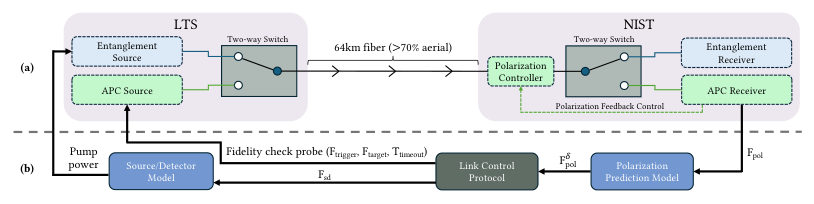
<figcaption class="paper-figure-caption"><b>Fig 1.</b> Fig. 1. (a) Schematic of our quantum link. Entanglement generation and automated polarization compensation (APC) signals are time multiplexed. Measurements at the APC receiver inform corrections at the polarization controller. (b) Feedback loop used for link control. Polarization fidelity (𝐹pol) measured by the APC acts as input to the link control protocol and its associated models, which in turn determine hardware parameters at the source site.</figcaption>
</figure>
<figure class="paper-figure-card">
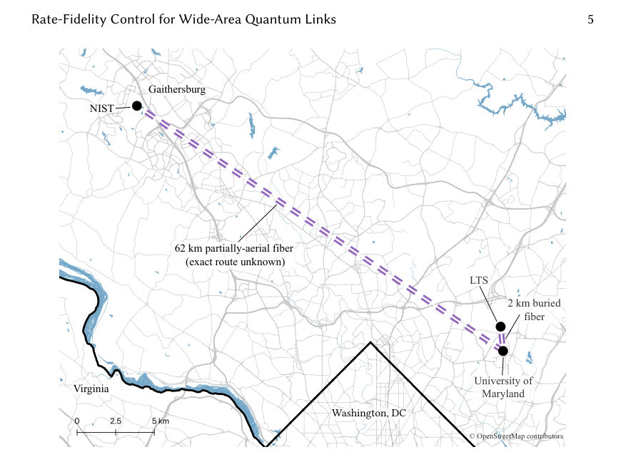
<figcaption class="paper-figure-caption"><b>Fig 2.</b> Fig. 2. Metropolitan context of the 64km deployed fiber link, part of the Washington DC metropolitan quantum network (DC-QNet). The source is located at the Laboratory for Telecommunication Sciences (LTS) in College Park, MD, USA. The route passes through a switch at the University of Maryland, then continues through a 62km partially-aerial fiber to the National Institute of Standards and Technology (NIST) in Gaithersburg, MD, USA. The exact routes of these two fibers are not known and therefore sketched as straight dashed lines.</figcaption>
</figure>
<figure class="paper-figure-card">
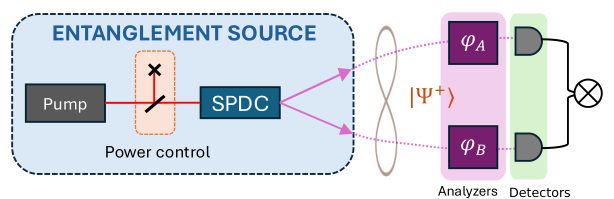
<figcaption class="paper-figure-caption"><b>Fig 3.</b> Fig. 3. Schematic of experimental setup used to characterize SPDC entanglement source and receiver with controllable pump laser power. A complete diagram and its description can be found in Appendix A.</figcaption>
</figure>
<figure class="paper-figure-card">
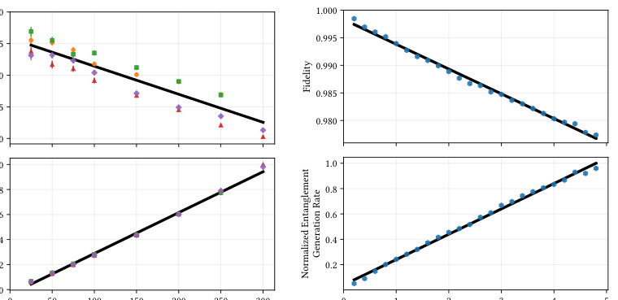
<figcaption class="paper-figure-caption"><b>Fig 4.</b> Fig. 4. Controllable rate-fidelity tradeoffs across two entanglement source technologies. In both sources, increasing pump power increases entanglement generation rate but reduces entanglement fidelity. The simulations in this paper use the SPDC characterization in (a).</figcaption>
</figure>
<figure class="paper-figure-card">
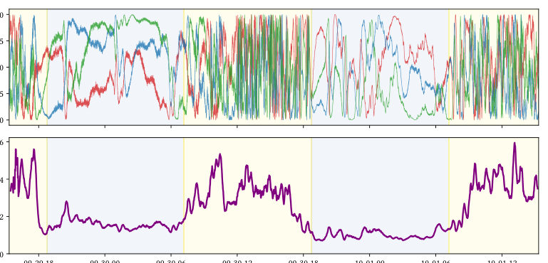
<figcaption class="paper-figure-caption"><b>Fig 5.</b> Fig. 5. Measured polarization drift over 48 hours on a 64km fiber link. The top figure shows the evolution of raw Stokes parameters over time; the bottom plot shows the calculated drift rate averaged over 15 minute intervals. On average, drift is significantly higher during the day.</figcaption>
</figure>

**Summary.** This paper introduces an adaptive control protocol designed to optimize entanglement distribution rates over long-haul quantum fiber links plagued by polarization drift. By treating the problem as a joint optimization of rate versus fidelity, the authors developed a software controller that dynamically adjusts source power and compensation timing. This approach significantly boosts performance in near-term quantum networks without requiring new physical hardware.

**Why it may be interesting.** This work provides a practical, software-defined solution for mitigating environmental decoherence in quantum networks, which is highly relevant to open quantum systems and quantum optics research concerning physical implementation challenges.

Detailed structure

**Main problem.** The challenge is designing a control protocol for wide-area quantum links that maximizes entanglement distribution rate while ensuring the fidelity of transmitted quantum states remains above an application-specified threshold.

**Main result.** An adaptive, software-based controller was developed that improved the mean entanglement distribution rate by 14% over a 24-hour trace compared to optimized static policies.

**Method.** The authors formulated the problem as a joint control optimization over tunable source parameters (pump power) and polarization compensation timing, using trace-driven simulations based on real fiber data.

**Model / system.** The system models quantum communication over wide-area optical fiber links suffering from time-varying polarization drift. The control mechanism dynamically adjusts the entanglement source's pump power and applies polarization corrections to maintain high fidelity.

**Key observables.** Entanglement distribution rate, State Fidelity (F), Polarization State of Polarization (SOP).

**Important parameters / regimes.** 64 km deployed optical fiber length; minimum required fidelity threshold ($	ext{F}_{	ext{target}}$); pump laser power settings.

**Assumptions / limitations.** The control protocol assumes that the link degradation can be modeled or predicted sufficiently well to guide adaptive adjustments, and it relies on classical processing rather than new quantum hardware.

**Figures summary.** Figures illustrate the schematic of the quantum link setup involving entanglement generation and polarization compensation measurements, the metropolitan context of the 64km fiber link, and rate-fidelity trade-offs for different sources.

**Paper structure.** The paper progresses from defining the physical limitations (polarization drift) to formulating the problem as a joint control optimization. It then details the adaptive protocol construction, followed by rigorous evaluation using long-term trace simulations against static benchmarks.

Abstract

Quantum network links must distribute entanglement at high rates while satisfying application-specified fidelity demands. However, wide-area deployed fiber links suffer from polarization drift which destabilizes end-to-end fidelity and forces periodic compensation. Current deployments often use active stabilization with fixed control policies, and improvements generally stem from advances in quantum hardware. Meanwhile, software control remains relatively underexplored.   Here, we formulate quantum link operation as a joint control problem over tunable rate-fidelity tradeoffs and uncontrollable link drift. From this framework, we construct a link control protocol that dynamically adapts source pump power and polarization compensation to maximize entanglement distribution rate subject to a minimum fidelity constraint. We evaluate the protocol through trace-driven simulations driven by data from a 64 km deployed optical fiber. Compared with optimized static policies, our adaptive controller improves mean entanglement distribution rate by 14% over a 24 hour trace, without requiring any offline policy optimization. Our results show that software-based physical layer control can provide a practical mechanism for improving near-term quantum link performance without requiring additional quantum hardware.

[↑ back to top](#top)

### [Giant-exchange-driven Vectorial Control of a Minimal Topological Magnet in Eu3In2As4](http://arxiv.org/abs/2608.06737v1)

**Authors:** Haonan Chen, Xunkai Duan, Guangyi Wang, Yuhan Du, Huayao Li, Jiayu Wang, Wenbin Wu, Zixuan Xu, Yingchao Xia, Jiaming Gu, Pengliang Leng, Lin Miao, Fengfeng Zhu, Xiang Yuan, Tong Zhou, Cheng Zhang  
**Type:** both · **Category:** strongly correlated electrons · **PDF:** <https://arxiv.org/pdf/2608.06737v1>  
**Analysis basis:** full PDF text, analyzed in chunks
**Topic relevance:** `exotic spin models in light-matter` **3/5** · `spintronics-quantum-optics interface` **3/5** · `analog quantum simulation` **1/5** · `driven-dissipative phase transition` **1/5** · `non-equilibrium dynamics` **1/5**

↔ Scroll figures horizontally

<figure class="paper-figure-card">
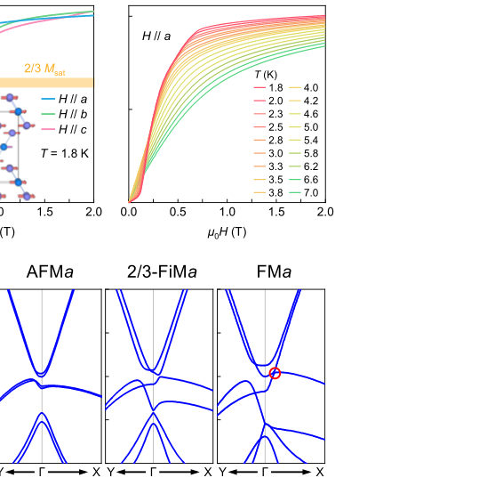
<figcaption class="paper-figure-caption"><b>Fig 1.</b> FIGURE 1. Crystal structure and magnetism of Eu3In2As4. a Schematic crystal structure of Eu3In2As4. The inequivalent Eu sublattices are represented by pur- ple and blue atoms b Magnetic structure of the C-type AFMa ground state, forming FM coupling along c-axis and AFM coupling within the ab-plane. For clarity, only Eu atoms are shown here. Colored arrows denote oppositely oriented spins, with the two Eu sublattices each forming AFM structures. c Temperature dependence of magnetic susceptibility measured under field-cooled (FC) conditions with an applied field of 50 Oe along the three principal crystallographic axes. d Field-dependent magnetization at 1.8 K with the field applied along...</figcaption>
</figure>
<figure class="paper-figure-card">
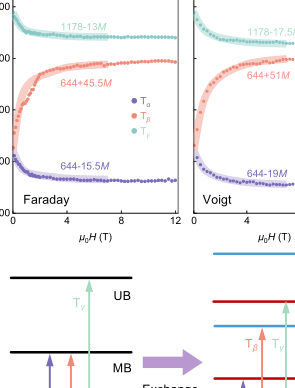
<figcaption class="paper-figure-caption"><b>Fig 2.</b> FIGURE 2. Magneto-infrared spectra of Eu3In2As4. a, b Stacked plots of relative magneto-reflectivity RB/R0 spectra (0.5 T step) measured in Faraday (H // a) and Voigt (H // c) geometries, respectively, with the infrared beam focused on the (100) plane. Three distinct sets of peak features, denoted Tα, Tβ, and Tγ, appear and evolve with the in- creasing field, and are respectively traced by violet, red and green curves. c, d False-color plots of the first derivative of relative magneto-reflectivity d(𝑅𝐵/𝑅0)/𝑑𝜔, in (c) Faraday and (d) Voigt configurations, respectively. e, f Correlation between magnetization and optical transition energies with Faraday and Voigt con- figurations in (e) and...</figcaption>
</figure>
<figure class="paper-figure-card">
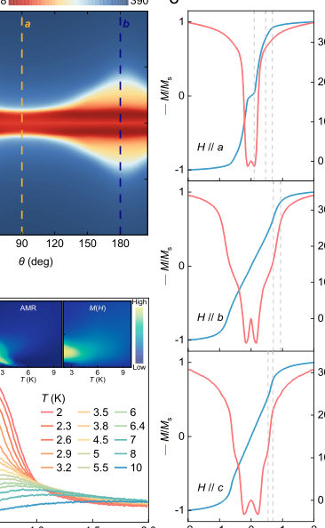
<figcaption class="paper-figure-caption"><b>Fig 3.</b> FIGURE 3. Anisotropic magneto-transport in the low-field regime. a Field dependence of the magneto-resistivity, ρxx(H), at 2 K. Current was applied along the c-axis while the field direction was rotated from the b- to a-axis by angle θ, as illustrated in the inset. b Color plot of the angular-dependent ρxx(θ, H), revealing ab-plane anisotropy.</figcaption>
</figure>
<figure class="paper-figure-card">
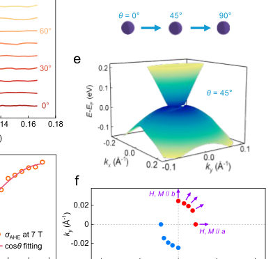
<figcaption class="paper-figure-caption"><b>Fig 4.</b> FIGURE 4. Shubnikov-de Haas (SdH) oscillations and anomalous Hall effect (AHE) in FM- Eu3In2As4. a Magneto-resistivity ρxx(H) at 2 K within ±12 T, with H rotated within ab-plane. Current was ap- plied along c-axis. The ρxx(H) curves are offset for clarity. Inset: Hall resistivity ρyx(H) at 0°, exhib- iting a nearly linear field dependence with negative slope, indicating electron conduction. Linear fitting of ρyx(H) in FM state yields an electron density of 2.1×1019 cm-3. b SdH oscillations Δρxx (obtained by polynomial fitting) as a function of 1/μ0H with varying field directions. c SdH oscillation frequencies (with error bars) versus field direction θ, showing weak angular de- pendence. The...</figcaption>
</figure>
<figure class="paper-figure-card">
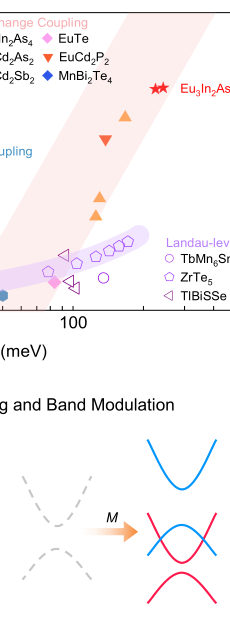
<figcaption class="paper-figure-caption"><b>Fig 5.</b> FIGURE 5. The superiority of Eu2+-based exchange coupling in comparison with other mech- anisms and its principle schematic. a Comparison of energy scales and effective average field slopes (ΔE/ΔB) across various modula- tion mechanisms: exchange coupling[23, 53–56], Zeeman effect[48, 50, 51, 103], magnetoelectric coupling[104], magnetic order transition[105], and Landau quantization[106–108]. b Illustration of the exchange coupling between localized spins and itinerant carriers. Purple balls refer to Eu2+ ions, and the electrons are illustrated as wave packet. The right panel demonstrates the M-induced exchange splitting and crossing, promoting the formation of Weyl points.</figcaption>
</figure>

**Summary.** This work establishes $	ext{Eu}_3	ext{In}_2	ext{As}_4$ as a model system where strong exchange coupling allows systematic tuning of topological phases via external magnetic fields. By combining advanced magnetometry, spectroscopy, and transport measurements, the authors map out transitions from an antiferromagnetic insulator to ferromagnetic states hosting Weyl nodes. This demonstrates that magnetism can be used as a powerful knob to control electronic band topology in condensed matter systems.

**Why it may be interesting.** The strong coupling mechanism provides a clear pathway for using magnetism (a many-body phenomenon) to engineer and control exotic quantum band structures like Weyl semimetals, which is highly relevant for designing next-generation spintronic or topological electronic devices.

Detailed structure

**Main problem.** The research aims to control quantum states of matter by integrating intrinsic magnetism with band topology, overcoming limitations posed by weak exchange coupling in existing materials.

**Main result.** The material $	ext{Eu}_3	ext{In}_2	ext{As}_4$ exhibits a predictable sequence of magnetic phase transitions (AFM $
ightarrow 2/3$-FiMa $
ightarrow$ FM) driven by external fields, leading to topological phases like Weyl semimetals.

**Method.** The study combines theoretical calculations (DFT with SOC) predicting band structures for different magnetic states with multiple experimental probes including magneto-transport ($
ho_{xx}$, AHE), magneto-infrared spectroscopy, and magnetization measurements.

**Model / system.** The physical system is the topological magnet $	ext{Eu}_3	ext{In}_2	ext{As}_4$. The model relies on identifying a 'giant exchange coupling' that causes large, magnetization-dependent band shifts (up to 300 meV) across various magnetic phases.

**Key observables.** Magnetization $M(H)$, anomalous Hall conductivity ($\sigma_{	ext{AHE}}$), magneto-infrared spectral features ($	ext{T}\alpha, 	ext{T}eta, 	ext{T}\gamma$), and Shubnikov-de Haas oscillation frequencies.

**Important parameters / regimes.** Exchange coupling strength ($J_{	ext{ex}}$) leading to $\sim 300	ext{ meV}$ band shifts; critical magnetic fields required for phase transitions (e.g., $1	ext{ T}$); temperature dependence near Néel temperatures ($\sim 4.5	ext{ K}$).

**Assumptions / limitations.** The analysis assumes that the observed electronic structure evolution and transport anomalies are directly governed by the strong, field-tunable exchange coupling mechanism.

**Figures summary.** Figures detail structural characterization (XRD), magnetic phase diagrams mapping transitions between AFM, $2/3$-FiMa, and FM states; magneto-IR spectra show evolving optical transitions correlated with magnetization; transport measurements map out angular dependence of AHE and $	ext{SdH}$ oscillations.

**Paper structure.** The paper systematically maps the magneto-topological phase diagram by first characterizing the magnetic ground state (AFM) via susceptibility and $M(H)$ curves. It then uses spectroscopy and transport to link field-induced magnetic transitions ($	ext{AFMa} 
ightarrow 2/3	ext{-FiMa} 
ightarrow 	ext{FMa}$) to specific topological electronic states, culminating in the demonstration of Weyl node tuning.

Abstract

The interplay between magnetism and band topology provides a route to controlling quantum states of matter, yet its realization in materials is often constrained by weak exchange coupling and complex electronic structures. Here, a giant exchange coupling is identified in the newly predicted topological magnet Eu3In2As4, giving rise to magnetization-dependent band shifts of up to 300 meV. Together with its intrinsically soft magnetic response, this strong cou-pling enables systematic tuning of topological phases by both the magnitude and orientation of applied magnetic fields. The magneto-topological phase diagram is mapped out in which an antiferromagnetic topological insulator ground state evolves, under modest fields, into a pro-posed intermediate 2/3-ferrimagnetic phase, and further into fully polarized ferromagnetic states predicted to host either Weyl or nodal-ring semimetals. Notably, the Weyl phase corresponds to a minimal model hosting a single pair of Weyl nodes. Quantum oscillations, anomalous Hall transport and magneto-infrared spectroscopy consistently reveal exchange-driven band recon-struction across these transitions. Rotation of the magnetization theoretically provides an effi-cient means to tune the momentum-space positions and separations of the Weyl nodes. These results establish Eu3In2As4 as a model system for exploring how strong exchange coupling can be used to control topological band structures with minimal complexity.

[↑ back to top](#top)

### [Local magnetic properties of the rare-earth intermetallics $R$Mn$_2$Ge$_2$ ($R$=Ce, Pr, Nd)](http://arxiv.org/abs/2608.07013v1)

**Authors:** N. P. Bentley, T. L. Breeze, A. Hernández-Melián, M. J. Pearce, T. J. Hicken, M. T. F. Telling, B. M. Huddart, D. A. Mayoh, G. Balakrishnan, S. J. Clark, T. Lancaster  
**Type:** both · **Category:** strongly correlated electrons · **PDF:** <https://arxiv.org/pdf/2608.07013v1>  
**Analysis basis:** full PDF text, analyzed in chunks
**Topic relevance:** `exotic spin models in light-matter` **3/5** · `spintronics-quantum-optics interface` **3/5** · `Kondo & dissipative impurity` **1/5** · `analog quantum simulation` **1/5** · `quantum measurements` **1/5**

↔ Scroll figures horizontally

<figure class="paper-figure-card">
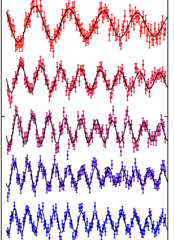
<figcaption class="paper-figure-caption"><b>Fig 1.</b> FIG. 1. ZF µSR measurements of CeMn2Ge2 demonstrating rapid oscillatory behaviour in the first 0.05 µs of the time window. (a) Asymmetry spectra below Tc = 318 K, with the change in (b) precession frequency and (c) amplitudes, A1 (red circles), A2 (blue squares), and A1 + A2 (green triangles) with temperature. The dotted line at 218 K marks the onset of changes in the amplitudes due to the spin reorientation transition at Tc.</figcaption>
</figure>
<figure class="paper-figure-card">
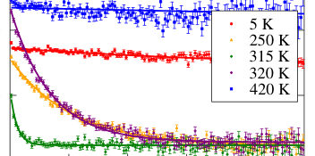
<figcaption class="paper-figure-caption"><b>Fig 2.</b> FIG. 2. ZF µSR measurements of CeMn2Ge2 demonstrat- ing relaxing behaviour over 5 µs. (a) Asymmetry spectra at several temperatures, showing the missing asymmetry as- sociated to the oscillating fraction being recovered above Tc. (b) Change in relaxation rate with temperature [with an inset showing the decrease in relaxing amplitude A3 (blue squares)], that occurs between 218 K and Tc (green circles). The fit of Eq. 6 to λ3 is shown in black and the background contribu- tion, A4 (orange triangles), is approximately constant. Above Tc = 318 K both amplitudes are globally refined and held con- stant, and λ3 points are plotted as purple diamonds.</figcaption>
</figure>
<figure class="paper-figure-card">
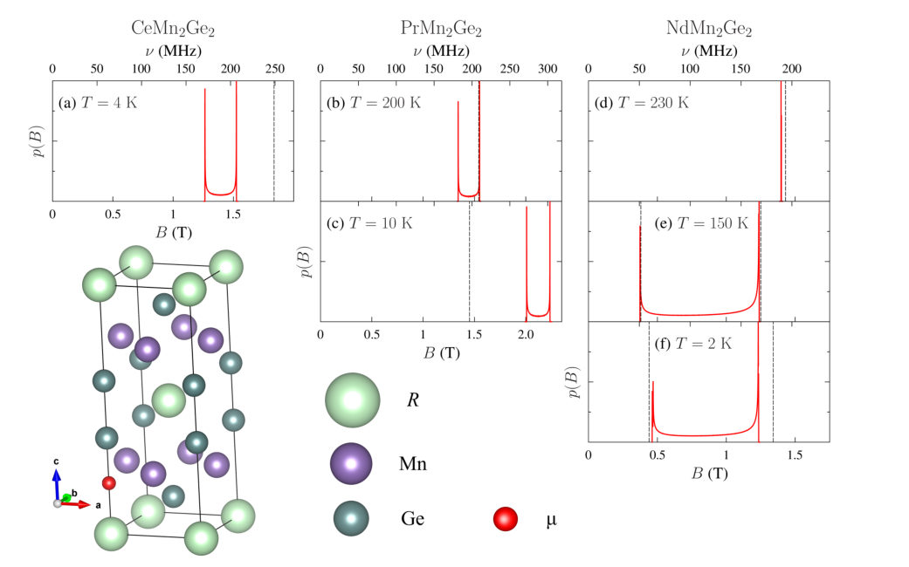
<figcaption class="paper-figure-caption"><b>Fig 3.</b> FIG. 3. Dipole field distributions calculated at the muon site for reported incommensurate magnetic orderings in RMn2Ge2 (R=Ce, Pr, Nd), with the muon site shown in the structure of RMn2Ge2 (R=Ce, Pr, Nd). In CeMn2Ge2, the field distribution corresponding to the measured helical magnetic structure [27] at (a) 4 K is shown, with the dotted line corresponding to the precession frequency of 249.0(5) MHz from our µSR measurements. In PrMn2Ge2 the field distributions for the reported magnetic structures [28] at (b) 200 K and (c) 10 are presented. The dotted lines indicate the value of the local field from our µSR measurements, which corresponds to precession frequencies of 209.0(4) MHz at 200 K...</figcaption>
</figure>
<figure class="paper-figure-card">
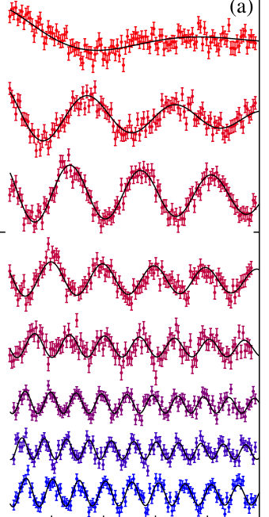
<figcaption class="paper-figure-caption"><b>Fig 4.</b> FIG. 4. ZF µSR measurements of PrMn2Ge2. (a) A set of asymmetry spectra, demonstrating the evolution of the oscillations with temperature. (b) Variation of the precession frequency with temperature, fitted with Eq. 8. (c) Temperature dependence of the slow magnetic dynamics (λ3) below Tc (with the fit of Eq. 6 shown in black) and the rapid relaxation of the oscillating term (λ1) above Tc. (d) Variation of oscillating (A1), relaxing (A2) and total amplitude below Tc, demonstrating the swapping of amplitudes between Ticm and Tc.</figcaption>
</figure>
<figure class="paper-figure-card">
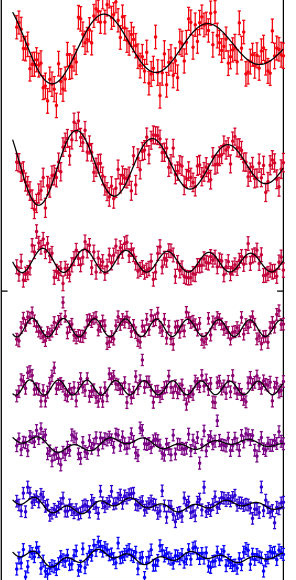
<figcaption class="paper-figure-caption"><b>Fig 5.</b> FIG. 5. Evolution of the early-time spectra of NdMn2Ge2 with temperature, demonstrating the transi- tion to a single frequency above TSR = 215 K that increase in amplitude with spin-reorientation into the a-b plane at higher temperatures.</figcaption>
</figure>

**Summary.** This work characterizes the temperature-dependent local magnetism in RMn2Ge2 intermetallics using muon spin spectroscopy. By analyzing magnetic transitions from conical to antiferromagnetic phases, the authors map out how rare-earth ion ordering and crystal symmetry dictate the material's exotic magnetic behavior. The combination of $\mu$SR measurements and DFT calculations provides a detailed picture of local spin dynamics in these correlated systems.

**Why it may be interesting.** While focused on magnetism, the use of $\mu$SR to probe local spin dynamics and symmetry breaking in correlated materials provides insights into complex many-body ground states relevant to strongly correlated electron physics.

Detailed structure

**Main problem.** The study investigates the local magnetic properties of rare-earth intermetallic compounds RMn2Ge2, focusing on their temperature-dependent magnetic transitions and skyrmion hosting.

**Main result.** Muon spin spectroscopy reveals distinct magnetic phases (conical to collinear AFM) across the series, with disorder increasing from Ce to Nd. The local magnetism is strongly influenced by rare-earth ion ordering at low temperatures.

**Method.** The research combines experimental measurements using Muon Spin Rotation ($\mu$SR) with theoretical calculations employing Density Functional Theory (DFT) and Crystal Field Hamiltonian analysis.

**Model / system.** The physical system is the rare-earth intermetallic compounds RMn2Ge2 (R=Ce, Pr, Nd). The magnetism involves transitions between conical and collinear antiferromagnetic structures, which are probed by local magnetic field measurements.

**Key observables.** Muon asymmetry A(t), precession frequency $\nu(T)$, local magnetic fields $|B|$, and energy level splittings $\Delta \text{CEF}$.

**Important parameters / regimes.** Temperature (T) regimes defining phase transitions ($T_c=318$ K, $T_N=417$ K), and the rare-earth element R.

**Assumptions / limitations.** The analysis assumes the muon site is crystallographically unique for tracking changes across the series; DFT calculations use specific functionals (PBE).

**Figures summary.** Figures show rapid oscillatory $\mu$SR spectra below $T_c$, order-parameter-like behavior of frequency vs. temperature, and comparisons between calculated dipolar field distributions at candidate muon sites and measured local fields.

**Paper structure.** The paper systematically analyzes the magnetic transitions using $\mu$SR data across different R elements (Ce, Pr, Nd), correlating observed spectral changes with theoretical predictions derived from DFT calculations of local fields based on assumed magnetic structures.

Abstract

We present an investigation of the rare-earth intermetallic materials, $R$Mn$_2$Ge$_2$ ($R$=Ce, Pr, Nd), reported to host a lattice of skyrmionic bubbles at room temperature. The magnetism of all three materials is characterised by the onset of local fluctuations as the magnetic state changes from a conical magnetic structure to a collinear antiferromagnetic one as temperature $T$ is increased. In this $T$ regime, where skyrmion-bubble textures have been reported, we see dynamics similar to those observed in other skyrmion-hosting materials. The level of disorder above this transition increases across the series from $R$=Ce to Nd. At low temperatures the magnetism is affected by the ordering of the rare-earth ions, resulting in distinct behaviour for the different members of the series.

[↑ back to top](#top)

### [Quantum de Sitter and Analytically Continued Chern Simons Theory](http://arxiv.org/abs/2608.07467v1)

**Authors:** Stephon Alexander, Kenneth Blakey  
**Type:** theory · **Category:** other · **PDF:** <https://arxiv.org/pdf/2608.07467v1>  
**Analysis basis:** full PDF text, analyzed in chunks
**Topic relevance:** `Keldysh / 2PI / non-Gaussian methods` **3/5** · `non-equilibrium dynamics` **2/5** · `driven-dissipative phase transition` **1/5** · `methods for driven-dissipative` **1/5** · `non-equilibrium universality` **1/5**

↔ Scroll figures horizontally

<figure class="paper-figure-card">
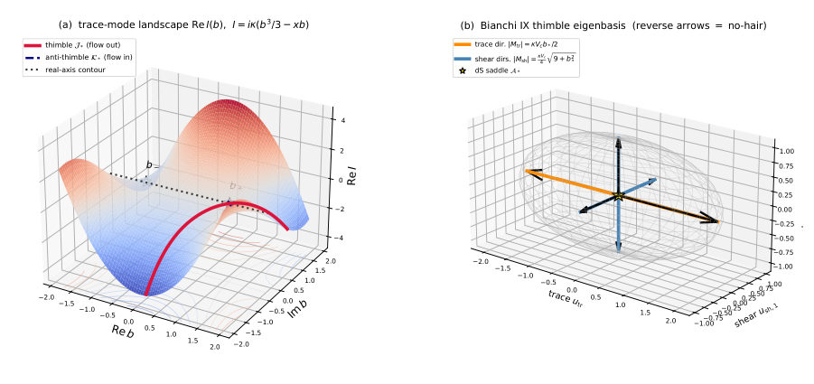
<figcaption class="paper-figure-caption"><b>Fig 1.</b> Figure 1: The Lefschetz thimble through the de Sitter saddle in the Bianchi IX trunca- tion. Black arrows show the downwards gradient flow dz/ds = −∂I that sweeps out the Lefschetz thimble. Left: the Morse landscape of Re I over the complexified trace direc- tion b ∈C for I(b) = −iκ(b3/3 −xb) (sign convention as in (27)); the gold star is the convergent saddle b+ (expanding branch), the white star its conjugate b−(contracting branch). The red curve is the Lefschetz thimble J∗through b+; the blue dashed curve is the dual Lefschetz anti-thimble K∗; the thin dotted line is the original oscillatory real axis contour. The saddle is thus a hyperbolic fixed point of the flow. Right: the same...</figcaption>
</figure>

**Summary.** This work develops a rigorous method using Lefschetz thimbles to define the quantum state (Kodama wavefunctional) for gravity in de Sitter spacetime. By analytically continuing the Chern–Simons theory, the authors achieve an absolutely convergent semiclassical expansion. This successfully reproduces known results like the Hartle–Hawking wavefunction and demonstrates that Airy behavior arises naturally from the full dynamics.

**Why it may be interesting.** While focused on quantum gravity, the mathematical techniques—such as using Lefschetz thimbles to regularize path integrals and analyze gradient flows near saddle points—are highly relevant to non-equilibrium statistical mechanics or open quantum systems where complex analysis is used to define partition functions.

Detailed structure

**Main problem.** The paper addresses the quantum description of de Sitter spacetime by defining the Chern–Simons–Kodama wavefunctional in Lorentzian self-dual gravity, overcoming issues with convergence and normalization.

**Main result.** Using a Lefschetz thimble definition allows for an absolutely convergent semiclassical expansion, reproducing the Hartle–Hawking Airy wavefunction structure even in anisotropic truncations like Bianchi IX.

**Method.** The authors employ complexification of the connection and utilize Picard–Lefschetz theory to define the functional integral along a specific Lefschetz thimble attached to the de Sitter saddle point.

**Model / system.** The system is quantum gravity in de Sitter spacetime ($\Lambda > 0$), modeled using self-dual Ashtekar variables and constrained by the Chern–Simons–Kodama functional. Analysis is performed via minisuperspace truncations (FRW, Bianchi IX).

**Key observables.** The resulting wavefunction structure, particularly its connection to the Airy function in homogeneous/isotropic reduction and Gaussian damping in shear directions.

**Important parameters / regimes.** Positive cosmological constant ($\Lambda > 0$), coupling constants ($\kappa$), and the specific saddle point geometry of de Sitter space.

**Assumptions / limitations.** The analysis is restricted to minisuperspace truncations (FRW, Bianchi IX), and the Lefschetz thimble prescription is used to regularize the path integral.

**Paper structure.** The paper develops the formalism by defining the wavefunctional via complexified connections and applying Picard–Lefschetz theory. It then applies this machinery to specific symmetry reductions (FRW, Bianchi IX) to derive explicit forms for the semiclassical wavefunction.

Abstract

We give a Lefschetz thimble definition of the Chern--Simons--Kodama wavefunctional in Lorentzian self-dual gravity with positive cosmological constant. By complexifying the connection and choosing the Lefschetz thimble attached to the self-dual de~Sitter saddle, Witten's analytic continuation of Chern--Simons theory replaces the real contour, on which the defining integral is at best conditionally convergent, by an absolutely convergent integration cycle and yields a controlled semiclassical expansion. The relevant integrand is the full holomorphic exponential $e^{I}$, with $I=κY_{\rm CS}+(\text{source})$, and the steepest descent flow is governed by the Morse function $h=\operatorname{Re} I$. In the homogeneous isotropic de Sitter reduction, the construction reproduces the Hartle--Hawking Airy wavefunction. In the Bianchi~IX truncation, we take the Lefschetz thimble attached to the expanding de~Sitter saddle (the contracting branch defines a conjugate Lefschetz thimble); within this sector, the symmetric configuration is the only critical point for $Λ>0$. The corresponding Lefschetz thimble contains one trace direction with the FRW Airy structure and two anisotropic shear directions that are real-Gaussian damped at leading quadratic order. This gives a finite Bianchi~IX wavefunction which, to leading order, is the FRW Airy factor multiplied by a real anisotropy Gaussian. Thus, the Airy behavior is not an artifact of the one-dimensional minisuperspace reduction, but the leading form of the wavefunction on the Lefschetz thimble. We also discuss how the Lefschetz thimble prescription interfaces with Lorentzian reality conditions.

[↑ back to top](#top)

### [Excitonic Magnetism in Ruthenium Pyrochlores](http://arxiv.org/abs/2608.06504v1)

**Authors:** Swetlana Swarup, Yang Yang, Natalia B. Perkins  
**Type:** theory · **Category:** strongly correlated electrons · **PDF:** <https://arxiv.org/pdf/2608.06504v1>  
**Analysis basis:** full PDF text, analyzed in chunks
**Topic relevance:** `exotic spin models in light-matter` **3/5** · `Keldysh / 2PI / non-Gaussian methods` **1/5** · `analog quantum simulation` **1/5** · `spintronics-quantum-optics interface` **1/5**

↔ Scroll figures horizontally

<figure class="paper-figure-card">
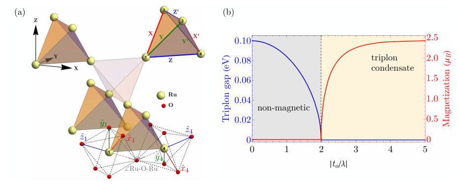
<figcaption class="paper-figure-caption"><b>Fig 1.</b> Figure 1: (a) Pyrochlore lattice of Ru ions, consisting of two types of tetrahedra (dark- and light- shaded). Black arrows (X, Y, Z) indicate the global reference frame. The local reference frames (ˆx1, ˆy1, ˆz1) and (ˆx4, ˆy4, ˆz4), defined by the surrounding oxygen octahedral cages, are shown for sublattice sites 1 and 4, respectively. The nearest-neighbor bonds are marked in red, blue, and green within the top- right tetrahedron. In the ideal pyrochlore structure, the bond angle at the bridging oxygen between two neighboring Ru ions is ∠Ru-O-Ru = 2 arctan(2 √</figcaption>
</figure>
<figure class="paper-figure-card">
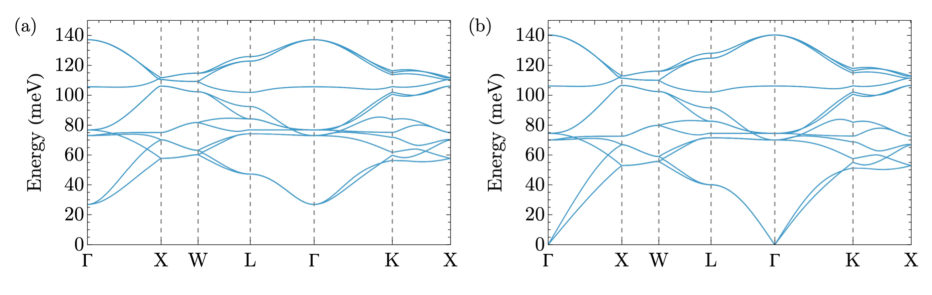
<figcaption class="paper-figure-caption"><b>Fig 2.</b> Figure 2: Dispersion of the 12 triplon bands above the singlet ground state along the high-symmetry path in momentum space, computed with U2 = 1.7 eV, JH = 0.35 eV, and λ = 0.1 eV: (a) below the critical hopping at |to/λ| = 1.9 and (b) at the critical hopping |to/λ| = 1.9923.</figcaption>
</figure>
<figure class="paper-figure-card">
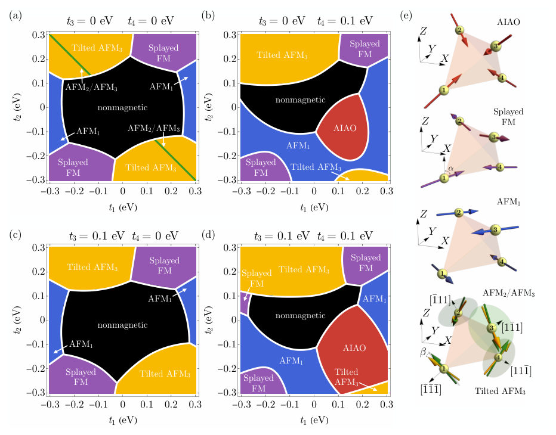
<figcaption class="paper-figure-caption"><b>Fig 3.</b> Figure 3: q = 0 phase diagram of the microscopic model as a function of the dominant hoppings t1 and t2 obtained by minimizing the variational ground-state energy at (a) t3 = t4 = 0 eV, (b) t3 = 0 eV and t4 = 0.1 eV, (c) t3 = 0.1 eV and t4 = 0 eV, (d) t3 = 0.1 eV and t4 = 0.1 eV. Along the green line in (a), where t1 = −t2 and t3 = t4 = 0, an accidental U(1) symmetry emerges that allows all four spins to rotate by a common angle within their respective local planes perpendicular to the axis pointing toward the center of the tetrahedron. The spin configuration of each phase is depicted in (e): the splayed FM is parametrized by the splay angle α measured from the z-axis, and the tilted AFM3...</figcaption>
</figure>
<figure class="paper-figure-card">
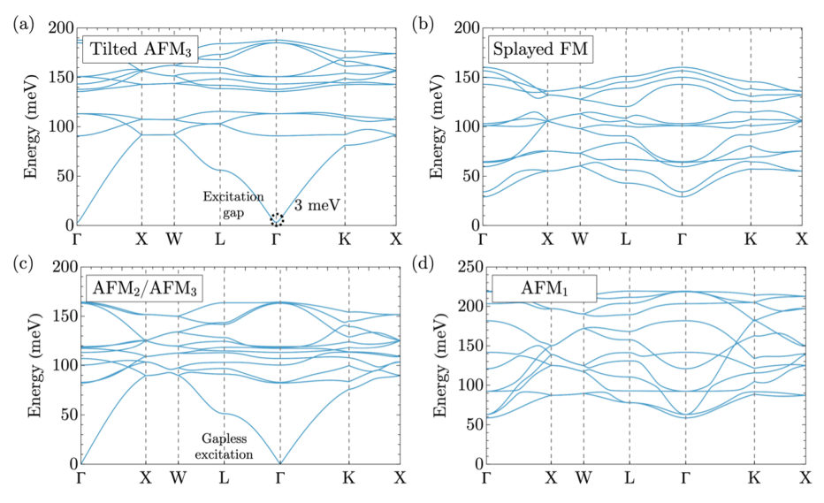
<figcaption class="paper-figure-caption"><b>Fig 4.</b> Figure 4: Excitation of triplon condensate with four magnetic sturcture shown in Fig. 3(a), fixing t3 = t4 = 0. (a) Tilted AFM3 (t1 = −0.1 eV, t2 = 0.2 eV), (b) Splayed FM (t1 = 0.1 eV, t2 = 0.2 eV), (c) AFM2/AFM3 (t1 = −0.15 eV, t2 = 0.15 eV), and (d) AFM1 (t1 = 0.3 eV, t2 = 0.0 eV).</figcaption>
</figure>
<figure class="paper-figure-card">
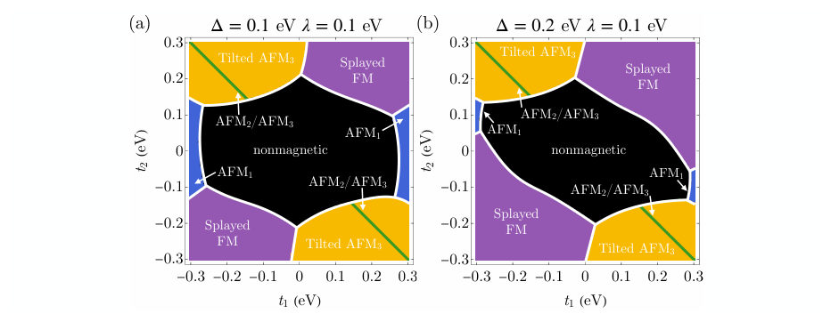
<figcaption class="paper-figure-caption"><b>Fig 5.</b> Figure 5: Phase diagram of the microscopic model with trigonal distortion: (a) The trigonal field ∆is comparable to spin–orbit coupling, (b) The trigonal field ∆is twice to spin–orbit coupling. All the other parameters are kept the same as in Fig. 3(a).</figcaption>
</figure>

**Summary.** This work develops a microscopic theory for excitonic magnetism in ruthenium pyrochlores by analyzing the effective interactions within the low-energy singlet-triplet manifold. It shows that strong spin-orbit coupling can lead to an instability of the nonmagnetic ground state, causing condensation of magnetic excitations (triplons). The resulting phase diagram provides a unified framework connecting theory predictions to experimental measurements in ruthenates.

**Why it may be interesting.** The concept of excitonic magnetism—where magnetic order arises from bosonic condensation (triplons) rather than localized moments—provides a powerful theoretical lens for understanding correlated materials, linking electronic structure calculations directly to measurable spectroscopic excitations like Raman scattering.

Detailed structure

**Main problem.** The paper addresses the contradiction between strong spin-orbit coupling suggesting a nonmagnetic singlet ground state in Ru pyrochlores, while experimental evidence shows robust magnetic order.

**Main result.** The theory predicts that the nonmagnetic singlet state becomes unstable toward triplon condensation as hopping parameters increase, leading to magnetically ordered phases and identifying an additional phase unique to this excitonic description.

**Method.** A microscopic theory is developed using a multi-orbital Hubbard model, deriving effective superexchange interactions within the low-energy singlet--triplet manifold. The analysis employs both spectrum calculations (triplon excitations) and variational treatments of the condensed phase.

**Model / system.** The system studied is Ruthenium pyrochlores ($	ext{A}_2	ext{Ru}_2	ext{O}_7$), focusing on $	ext{Ru}^{4+}$ ($d^4$) ions. The model starts from a Hubbard Hamiltonian incorporating SOC and crystal field effects, projecting onto the low-energy singlet--triplet subspace.

**Key observables.** Triplon gap ($\Delta_{	ext{triplon}}$), magnetization ($\mu_B$), and the magnetic phase diagram as a function of hopping parameters.

**Important parameters / regimes.** Microscopic hopping parameters ($|t_{	ext{o}}/\lambda|$), which govern the transition between non-magnetic and magnetic states.

**Assumptions / limitations.** The analysis focuses on the $t_{2g}$ manifold, and in some sections, a harmonic approximation is used by expanding around the singlet-condensed state.

**Figures summary.** Figure 1(b) plots the triplon gap and magnetization versus $|t_{	ext{o}}/\lambda|$, showing the transition point. Other figures illustrate the dispersion of triplon bands and lattice structure details.

**Paper structure.** The paper builds from defining the single-ion Hamiltonian (including SOC and crystal field), deriving the effective low-energy superexchange Hamiltonian, analyzing the stability via triplon excitation spectra, mapping out the phase diagram, and finally applying the theory to specific ruthenates like $	ext{Nd}_2	ext{Ru}_2	ext{O}_7$.

Abstract

Strong spin-orbit coupling in $d^4$ systems is expected to stabilize a nonmagnetic $J=0$ singlet ground state, yet many ruthenium pyrochlores exhibit robust long-range magnetic order. Motivated by this apparent contradiction, we develop a microscopic theory of Van Vleck excitonic magnetism on the pyrochlore lattice. Starting from a multi-orbital Hubbard model with spin-orbit coupling, we derive the effective superexchange interactions within the low-energy singlet--triplet manifold of Ru$^{4+}$ ions. We analyze the resulting excitonic Hamiltonian using both the spectrum of triplon excitations and a variational treatment of the condensed phase. We identify the instability of the nonmagnetic singlet state toward triplon condensation and determine the resulting magnetic phase diagram as a function of the microscopic hopping parameters. The phase diagram reproduces the magnetic orders known from conventional pyrochlore models while also predicting an additional magnetic phase unique to the singlet--triplet description. Finally, we apply the theory to the pyrochlore ruthenates, with particular emphasis on Nd$_2$Ru$_2$O$_7$, and show that it lies in close proximity to the excitonic quantum critical point. Our results establish a microscopic framework for understanding excitonic magnetism in pyrochlore ruthenates and their magnetic excitation spectrum, providing direct connections to spectroscopic probes, including Raman scattering.

[↑ back to top](#top)

### [Demonstration of an LLO CV-QKD system over 12 km of optical fiber](http://arxiv.org/abs/2608.07277v1)

**Authors:** Christiano M. S. Nascimento, Artur A. Matoso, Gustavo C. Amaral, Guilherme P. Temporão  
**Type:** experiment · **Category:** quantum information and computing · **PDF:** <https://arxiv.org/pdf/2608.07277v1>  
**Analysis basis:** full PDF text, analyzed in chunks
**Topic relevance:** `quantum optics experiment` **3/5** · `QC/QI experiment` **1/5** · `interference shaping light` **1/5**

↔ Scroll figures horizontally

<figure class="paper-figure-card">
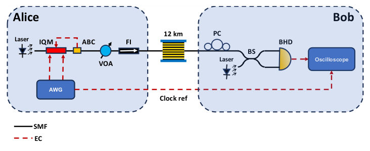
<figcaption class="paper-figure-caption"><b>Fig 1.</b> FIG. 1: Experimental setup of LLO CV-QKD. Alice’s station consists of a continuous-wave (CW) laser operating at 1550 nm and an in-phase and quadrature modulator (IQM) with an automatic bias controller (ABC) driven by an arbitrary waveform generator (AWG) with 16-bit resolution and a sampling rate of 3.125 GSa/s. A variable optical attenuator (VOA) is placed after the IQ modulator (at the exit of Alice’s station) to adjust the optical power and enforce the few-photon regime. A 12 km single-mode fiber (SMF) constitutes the quantum channel. At Bob’s station, a polarization controller (PC) allows one to align the polarization of the incoming signal to the LO signal generated from an independent...</figcaption>
</figure>
<figure class="paper-figure-card">
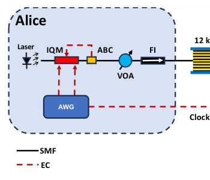
<figcaption class="paper-figure-caption"><b>Fig 2.</b> Fig. 1 shows the experimental setup of the LLO CV-QKD laboratory link including the optical layout and the electro-optical devices necessary to perform the Gaussian-modulated coherent-state protocol. At the sender, Alice, a continuous-wave (CW) laser with a narrow linewidth of 1 kHz operating at 1550 nm was used as the optical carrier. The coherent states were prepared by driving an IQ modulator with the output from a 16-bit arbitrary waveform generator (AWG) with two channels operating at a sampling rate of 3.125 GSa/s. The IQ modulator was operated in single-sideband mode by digitally frequency-shifting the transmitted signal and controlling the direct-current bias voltages with an auto-...</figcaption>
</figure>
<figure class="paper-figure-card">
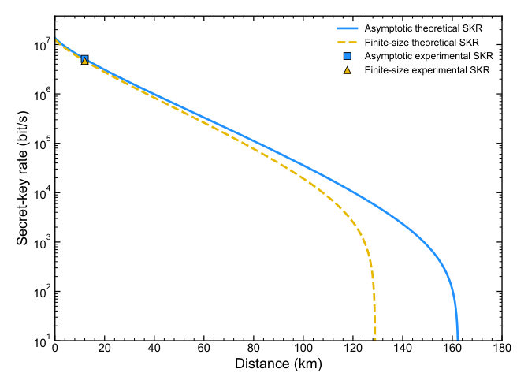
<figcaption class="paper-figure-caption"><b>Fig 3.</b> FIG. 2: The secret key rate (SKR) versus fiber channel length with an attenuation factor of 0.185 dB/km in asymptotic (blue solid line) and finite-size (yellow dashed) regimes. The square and triangle correspond to our experimental results in asymptotic and finite-size regimes, respectively.</figcaption>
</figure>

**Summary.** The authors report an experimental demonstration of a secure Continuous-Variable Quantum Key Distribution (CV-QKD) system operating over 12 km of optical fiber. By implementing a Local-Local-Oscillator (LLO) scheme, they overcome security loopholes associated with shared local oscillators. The results establish practical key rates exceeding $5 	ext{ Mbit/s}$, paving the way for metropolitan quantum networking.

**Why it may be interesting.** This work is highly relevant as it pushes quantum communication technology into practical metropolitan deployment regimes by solving critical hardware/security issues inherent in previous CV-QKD implementations.

Detailed structure

**Main problem.** The goal was to demonstrate a secure Local-Local-Oscillator (LLO) Continuous-Variable Quantum Key Distribution (CV-QKD) system over a significant distance of 12 km optical fiber while mitigating security loopholes.

**Main result.** The experiment successfully achieved secret key rates of $5.11 	ext{ Mbit/s}$ in the asymptotic regime and $4.67 	ext{ Mbit/s}$ in the finite-size regime, validating metropolitan deployment potential.

**Method.** The system utilized Gaussian CV-QKD with fully independent transmitter and receiver lasers, followed by complex classical post-processing including information reconciliation (using MET-LDPC codes) and privacy amplification.

**Model / system.** The physical platform is an LLO CV-QKD setup implemented over a 12 km single-mode optical fiber. The security analysis was conducted under a trusted-device model, addressing the local oscillator loophole by using independent sources at both ends.

**Key observables.** Secret key rates ($5.11 	ext{ Mbit/s}$ asymptotic; $4.67 	ext{ Mbit/s}$ finite-size), measured average attenuation ($0.185 	ext{ dB/km}$), and excess noise ($\xi_B = 15.99 	ext{ mSNU}$).

**Important parameters / regimes.** Channel length of 12 km; processing large logical frames ($\approx 10^7$ states); asymptotic transmittance $	ext{T} = 0.6$.

**Assumptions / limitations.** The security assessment is performed under a trusted-device model, which limits the scope of the security proof.

**Figures summary.** Figure 1 illustrates the experimental setup diagram for LLO CV-QKD components; Figure 2 plots the Secret Key Rate versus fiber length for both asymptotic and finite-size regimes.

**Paper structure.** The paper details the experimental setup, describes the sophisticated digital signal processing (DSP) routine for synchronization and parameter recovery, outlines the classical post-processing steps (reconciliation, estimation, amplification), presents the measured key rates, and discusses future work.

Abstract

Continuous-variable quantum key distribution (CV-QKD) promises high rates and seamless integration with classical beams within a single optical fiber. Over the years, implementations have been performed by transmitting a local oscillator reference along with the quantum channel, opening security loopholes for eavesdroppers and limiting potential applications. Here, we report on a Gaussian CV-QKD implementation using fully independent transmitter and receiver lasers (local-oscillator sources) over a 12 km fiber spool. The system was experimentally evaluated using logical frames containing approximately $10^7$ coherent states, each composed of ten independently processed subframes of approximately $10^6$ states, and security was assessed in both asymptotic and finite-size regimes under a trusted-device model. The full-fledged classical post-processing is capable of recovering the channel parameters and extracting secret key rates of 5.11 Mbit/s in the asymptotic regime and 4.67 Mbit/s in the finite-size regime, showing good agreement with theoretical predictions. This work establishes the foundation for metropolitan fiber deployment of CV-QKD under strict security constraints.

[↑ back to top](#top)

### [Exciton Alchemy: Chern Excitons from Trivial Bands](http://arxiv.org/abs/2608.07372v1)

**Authors:** Yoonseok Hwang, Henry Davenport, Frank Schindler  
**Type:** theory · **Category:** other · **PDF:** <https://arxiv.org/pdf/2608.07372v1>  
**Analysis basis:** full PDF text, analyzed in chunks
**Topic relevance:** `analog quantum simulation` **3/5** · `correlated cavity matter` **1/5** · `driven-dissipative phase transition` **1/5**

↔ Scroll figures horizontally

<figure class="paper-figure-card">
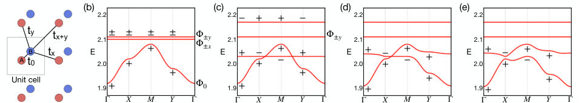
<figcaption class="paper-figure-caption"><b>Fig 1.</b> FIG. 1. (a) Unit cell and hopping geometry of the model with A and B sublattices. We consider t0 = 1, tx = 0.025, tx+y = 0.02, and ty = 0. These hopping amplitudes can be naturally realized on an oblique lattice as the first-, second-, third-, and fifth-nearest-neighbor hoppings, respectively [50]. For notational convenience, however, we choose the primitive lattice vectors to be (1, 0) and (0, 1) throughout this work. (b) Exciton band structure in the atomic limit (t0 = 1) after introducing the density-density interactions (U0, Ux, Uy) = (0.125, 0.10, 0.06). The inversion eigenstates Φ0, Φ±x, and Φ±y, together with their inversion eigenvalues at the four HSMs, are indicated. At every HSM,...</figcaption>
</figure>
<figure class="paper-figure-card">
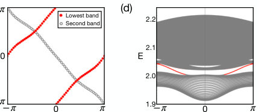
<figcaption class="paper-figure-caption"><b>Fig 2.</b> FIG. 2. (a) Exciton band structure of the minimal 5 × 5 model after introducing the additional terms tx+y = 0.02 and U ′ x = 0.015. A full bulk gap is opened above the lowest exci- ton band. (b) Exciton band structure with the enlarged and more realistic 441 × 441 basis. Additional exciton continua emerge at higher energies, while the low-energy bands remain essentially unchanged. (c) Wilson-loop spectra of the low- est and second exciton bands in (b), corresponding to Chern numbers Cexc = +1 and −1, respectively. (d) Ribbon spec- trum with 20 layers along the open x direction. The chiral exciton edge states traversing the bulk gap are highlighted in red.</figcaption>
</figure>

**Summary.** This paper presents a theoretical framework demonstrating that strong electron-hole interactions can induce non-trivial Chern topology in excitons even if the constituent electronic bands are topologically trivial. By constructing an explicit 2D model and analyzing its band structure using symmetry constraints and Wilson loops, the authors provide a general recipe for designing interaction-driven topological materials.

**Why it may be interesting.** This work provides a concrete, controllable mechanism (interaction tuning) to engineer topological properties in excitons, which are neutral quasiparticles relevant for quantum light sources and optoelectronics.

Detailed structure

**Main problem.** To demonstrate that interaction-induced topological excitons (Chern excitons) can exist even when the underlying electronic bands are topologically trivial.

**Main result.** The authors constructed an explicit microscopic model showing that interactions alone can generate non-trivial exciton topology, independent of the band structure's intrinsic topology.

**Method.** The study combines real-space modeling with symmetry analysis (inversion eigenvalues) and momentum-space diagnostics using Wilson loops to calculate the Chern number.

**Model / system.** A two-dimensional exciton model is used, derived from exponentially localized Wannier states for conduction and valence bands. The system's Hamiltonian includes hopping terms and density-density interactions ($U$ terms).

**Key observables.** Chern exciton number ($C_{exc}$), Wilson loop spectra ($\arg W(p_y)$), and chiral edge states in ribbon geometry.

**Important parameters / regimes.** Interaction strengths ($U_0, U_x, U_y, V_x$) and the small electron-hole separation $\Delta$.

**Assumptions / limitations.** The analysis relies on restricting the Hilbert space to the active conduction-valence subspace; some calculations use a coincident embedding approximation for simplification.

**Figures summary.** Figures illustrate the unit cell geometry, the effect of interactions leading to band inversion (Fig. 1c), and confirm the topology via bulk spectra showing gaps and ribbon spectra exhibiting chiral edge states (Fig. 2d).

**Paper structure.** The paper progresses from establishing the theoretical possibility of interaction-induced topology, constructing an explicit model using Wannier states, demonstrating band inversion via specific interactions ($V_x$), and finally confirming the non-trivial topology using momentum-space diagnostics like Wilson loops.

Abstract

Exciton topology is commonly inherited from the topology of the underlying electronic bands. Recent theoretical work, however, has shown that the exciton Chern number can in general receive an additional contribution from the topology of the exciton envelope wave function, allowing, in principle, interaction-induced topological excitons even when the constituent electronic bands are topologically trivial. Here, we provide an explicit realization of this case by constructing a two-dimensional exciton model with topologically trivial conduction and valence bands that nevertheless hosts a Chern exciton diagnosed by inversion symmetry. Starting from a real-space limit of exponentially localized Wannier states for the conduction and valence bands, we identify the essential ingredients responsible for the emergent exciton topology and formulate a simple construction recipe. Our work demonstrates that interactions alone can generate nontrivial exciton topology, independent of the topology of the underlying electronic bands, and establishes a general framework for designing interaction-induced topological excitons.

[↑ back to top](#top)

### [Newton-Schulz Retraction-Based Inference Enables Hidden Quantum Markov Models to Outperform Classical HMMs](http://arxiv.org/abs/2608.06554v1)

**Authors:** Ning Ning  
**Type:** both · **Category:** statistical mechanics · **PDF:** <https://arxiv.org/pdf/2608.06554v1>  
**Analysis basis:** full PDF text, analyzed in chunks
**Topic relevance:** `methods for driven-dissipative` **3/5** · `Keldysh / 2PI / non-Gaussian methods` **1/5** · `driven-dissipative phase transition` **1/5**

↔ Scroll figures horizontally

<figure class="paper-figure-card">
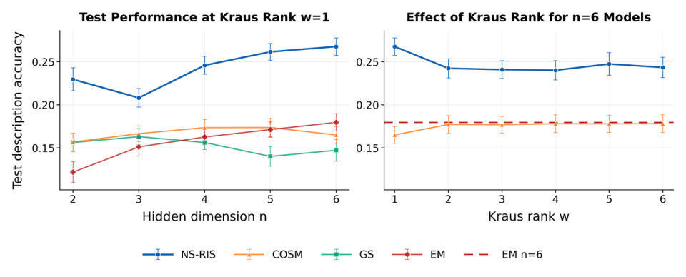
<figcaption class="paper-figure-caption"><b>Fig 1.</b> Figure 1: Test description accuracy for HQMM learning methods under varying hidden dimensions and Kraus ranks. Left: Performance with Kraus rank fixed at w = 1 while varying the hidden dimension n. We report the mean test description accuracy, with error bars indicating the standard deviation across test sequences. Right: Performance for models with hidden dimension n = 6 while varying the Kraus rank w. The EM baseline is shown as a horizontal dashed line because its performance is independent of w.</figcaption>
</figure>
<figure class="paper-figure-card">
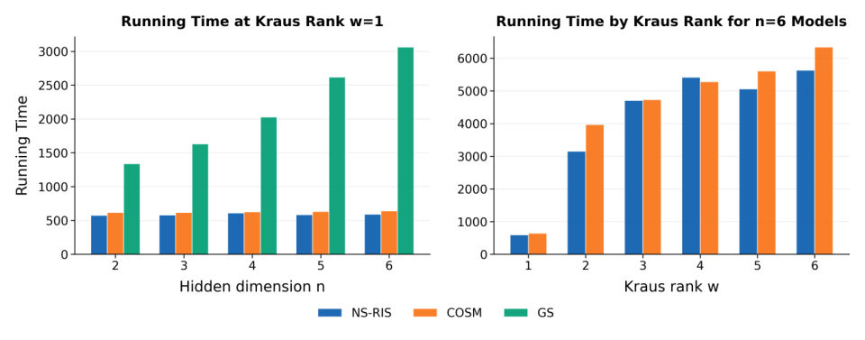
<figcaption class="paper-figure-caption"><b>Fig 2.</b> Figure 2: Running time comparison for HQMM learning methods under varying hidden dimensions and Kraus ranks. Left: Running time with Kraus rank fixed at w = 1 while varying the hidden dimension n. NS-RIS and COSM maintain relatively stable runtimes across hidden dimensions, whereas GS becomes substantially more expensive as n increases. Right: Running time for models with hidden dimension n = 6 while varying the Kraus rank w. Both NS-RIS and COSM require additional computation for larger Kraus ranks, but NS-RIS remains competitive with COSM across all tested settings.</figcaption>
</figure>
<figure class="paper-figure-card">
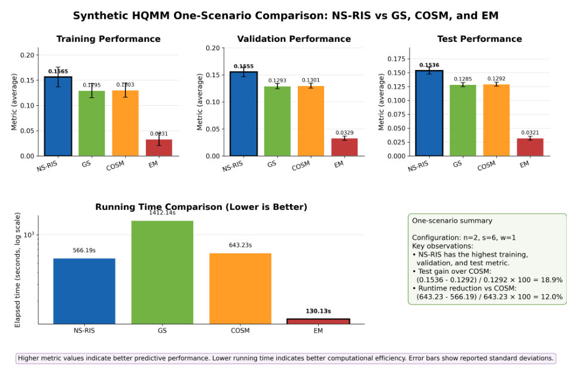
<figcaption class="paper-figure-caption"><b>Fig 3.</b> Figure 3: Comparison of NS-RIS, GS, COSM, and EM on the synthetic HQMM benchmark with configuration (n = 2, s = 6, w = 1). The top row reports the averaged training, validation, and test metrics with standard-deviation error bars across repeated runs, while the bottom row compares elapsed running times on a logarithmic scale. NS-RIS consistently achieves the best predictive performance across all evaluation metrics while also providing competitive computational efficiency.</figcaption>
</figure>
<figure class="paper-figure-card">

<figcaption class="paper-figure-caption"><b>Fig 4.</b> Figure 4 compares mean classification error for COSM and NS-RIS over latent dimensions n ∈ {2, 4, 6, 8} and Kraus ranks w ∈{1, 2, 4, 6}. The results show that increasing the latent dimension</figcaption>
</figure>
<figure class="paper-figure-card">
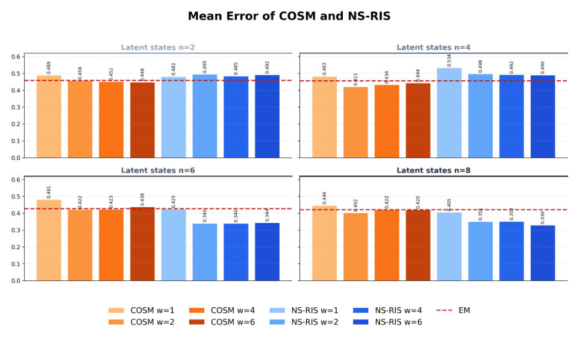
<figcaption class="paper-figure-caption"><b>Fig 5.</b> Figure 4: Mean error comparison of COSM and NS-RIS on the Splice dataset for latent state sizes n ∈{2, 4, 6, 8}. Within each panel, bars report the mean error for window sizes w ∈{1, 2, 4, 6}, with darker shades indicating larger w. The dashed horizontal line shows the EM baseline for the same latent state size: 0.458 for n = 2, 0.456 for n = 4, 0.428 for n = 6, and 0.421 for n = 8.</figcaption>
</figure>

**Summary.** This paper introduces NS-RIS, a novel and scalable inference algorithm for training Hidden Quantum Markov Models (HQMMs). By employing Newton-Schulz orthogonalization on the Stiefel manifold, it achieves mathematically guaranteed convergence while demonstrating superior predictive performance over classical HMMs and existing quantum models on multiple benchmarks. This moves HQMMs from theoretical constructs to practical tools for sequence data analysis.

**Why it may be interesting.** While focused on machine learning inference, the rigorous mathematical treatment of optimization on constrained manifolds (Stiefel manifold) using advanced numerical techniques like Newton-Schulz retraction is highly relevant to developing robust parameter estimation methods for complex open quantum systems described by master equations or density matrices.

Detailed structure

**Main problem.** Existing Hidden Quantum Markov Models (HQMMs) lack practical applicability because their learning methods fail to consistently outperform classical HMMs on data not generated by quantum processes.

**Main result.** The proposed algorithm, NS-RIS, provides the first benchmark evidence that an HQMM can significantly outperform an EM-trained HMM even when trained on non-quantum data. It also establishes a finite-time stationarity guarantee for the inference process.

**Method.** The authors introduce NS-RIS, which uses Newton-Schulz orthogonalization twice to perform scalable, trace-preserving optimization of HQMM parameters constrained to the Stiefel manifold.

**Model / system.** The model is an extension of classical Hidden Markov Models (HMMs) to HQMMs, where probability vectors are replaced by density matrices and stochastic transitions by quantum operations (Kraus operators).

**Key observables.** Mean classification error, test metric improvement percentage, runtime comparison across synthetic and real-world benchmarks (e.g., Splice dataset).

**Important parameters / regimes.** The optimization is performed over the Stiefel manifold $	ext{St}(p, n)$, constrained by $\Gamma^\dagger\Gamma = I_n$. Convergence relies on step size ($\eta$) and momentum parameter ($eta$).

**Assumptions / limitations.** Theoretical guarantees assume standard conditions like smoothness of the objective function, existence of stochastic gradients, and finite accuracy in the Newton-Schulz approximation.

**Figures summary.** The results are shown across multiple benchmarks: synthetic HMM data (showing 38.5% average improvement), synthetic HQMM data (showing 18.9% metric improvement over COSM), and the real Splice classification benchmark (showing error reductions of up to 17.9%).

**Paper structure.** The paper first introduces the theoretical framework, deriving convergence bounds for NS-RIS on the Stiefel manifold using Riemannian geometry concepts. It then presents empirical results demonstrating superior performance over classical and state-of-the-art quantum models across various benchmarks.

Abstract

Hidden Markov models (HMMs) are widely used probabilistic models for discrete sequential data but can be limited when hidden dynamics are complex. Hidden quantum Markov models (HQMMs) generalize HMMs by replacing probability vectors with density matrices and stochastic transitions with quantum operations, enabling richer latent representations. However, existing HQMM learning methods have not consistently outperformed Expectation--Maximization (EM)-trained HMMs on data not generated by quantum processes, limiting their practical applicability. We introduce NS-RIS, Newton--Schulz Retraction-based Inference on the Stiefel manifold, a scalable algorithm for learning trace-preserving HQMMs. NS-RIS uses Newton--Schulz orthogonalization to compute a polar-factor search direction while preserving Stiefel-manifold feasibility, avoiding costly matrix decompositions. We further establish a finite-time stationarity guarantee under standard assumptions on smoothness, stochastic gradients, and finite Newton--Schulz accuracy. Empirically, NS-RIS provides the first benchmark evidence that an HQMM can significantly outperform an EM-trained HMM on data not generated by a quantum model. On synthetic HMM-generated benchmarks, NS-RIS outperforms both EM and the state-of-the-art HQMM method COSM, improving the evaluation metric by an average of 38.5% and by up to 50.6%. On a synthetic HQMM benchmark, it improves the test metric over COSM by 18.9% while reducing runtime by 12.0%. On the real-world Splice classification benchmark, NS-RIS also surpasses both EM and COSM in higher-dimensional latent regimes, reducing mean classification error by 17.9% for latent dimension 6 and 14.9% for latent dimension 8 relative to COSM. These results move HQMMs beyond a theoretical generalization of HMMs and establish them as practical and expressive models for scientific sequence data.

[↑ back to top](#top)

### [Approaching the Fundamental Limit of Single-Shot Qubit Frequency Tracking with an Adiabatic Tangentially-Modulated Pulse](http://arxiv.org/abs/2608.06636v1)

**Authors:** Itamar Oren, Luke I. Dyer, Gerardo A. Paz-Silva, Chih Hwan Yang  
**Type:** theory · **Category:** quantum information and computing · **PDF:** <https://arxiv.org/pdf/2608.06636v1>  
**Analysis basis:** full PDF text, analyzed in chunks
**Topic relevance:** `quantum measurements` **3/5** · `measurement-induced transitions` **1/5**

↔ Scroll figures horizontally

<figure class="paper-figure-card">
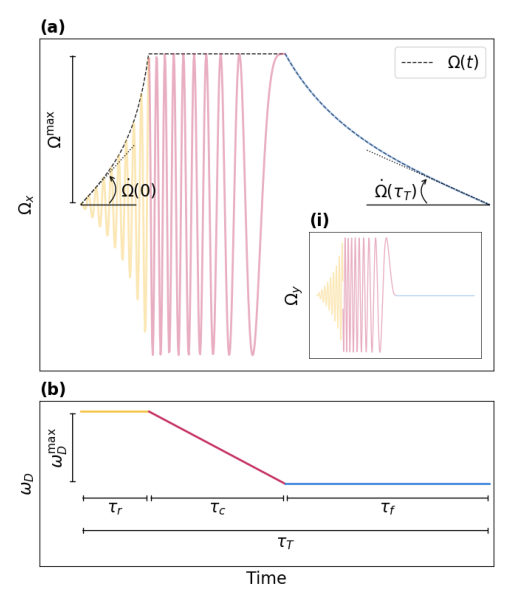
<figcaption class="paper-figure-caption"><b>Fig 1.</b> Figure 1. Construction of the adiabatic tangentially- modulated (ATM) pulse. (a) Amplitude modulation of the driving field, expressed as the Rabi frequency envelope Ω(t) [Eq. (4)]. The envelope consists of three segments: a tangent shaped rise of duration τr with initial gradient ˙Ω(0), a con- stant amplitude section of duration τc at maximum amplitude Ωmax, and a tangent shaped fall of duration τf with final gra- dient ˙Ω(τT ). The full pulse length is τT = τr+τc+τf. Dashed lines illustrate the tangent gradients that set the boundary conditions of the rise and fall. The thin oscillatory trace indi- cates the mixed envelope and driving signal for Ωx and (i) the quadrature phase Ωy. (b)...</figcaption>
</figure>
<figure class="paper-figure-card">
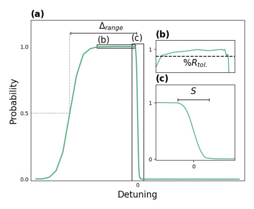
<figcaption class="paper-figure-caption"><b>Fig 2.</b> Figure 3. ATM pulse evolution resulting detuning dependent transition probabilities. (a) Probability P = |⟨↑|ψ(τT , ∆)⟩|2</figcaption>
</figure>
<figure class="paper-figure-card">
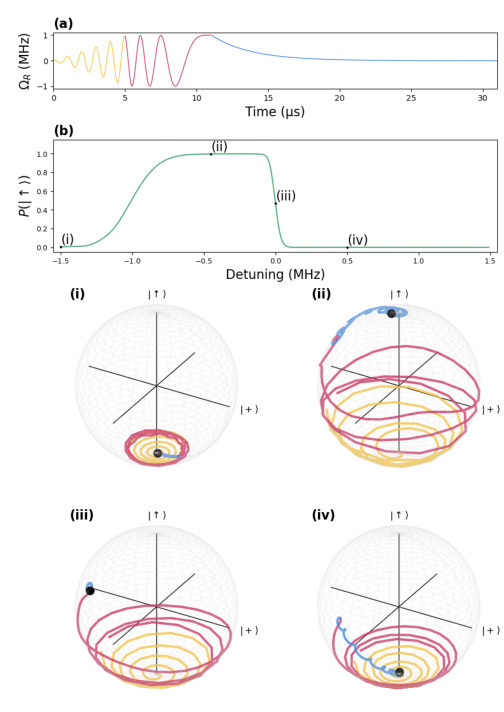
<figcaption class="paper-figure-caption"><b>Fig 3.</b> Figure 2. (a) Temporal profile of ATM pulse (see Appendix E for pulse parameters), divided into its three sequential seg- ments: rise (τr, yellow), constant (τc, red), and fall (τf, blue).(b) Resulting transition probability as a function of de- tuning, highlighting four key detuning points labeled (i–iv). (i–iv) Bloch sphere representations of the qubit state in the ro- tating frame at the detuning values indicated in (b). The color of each trajectory denotes the pulse segment during which the corresponding state evolution occurs, as defined in panel (a).</figcaption>
</figure>
<figure class="paper-figure-card">
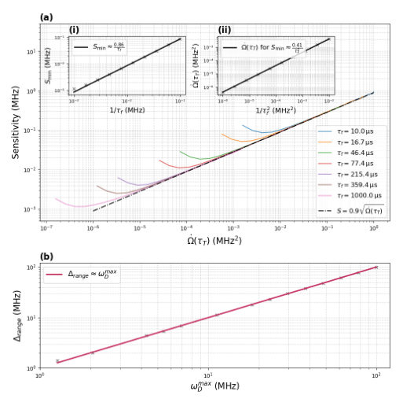
<figcaption class="paper-figure-caption"><b>Fig 4.</b> Figure 4. (a) Simulated ATM fall pulse sensitivity S as a function of the fall gradient ˙Ω(τT ) for different fall times τf,</figcaption>
</figure>
<figure class="paper-figure-card">
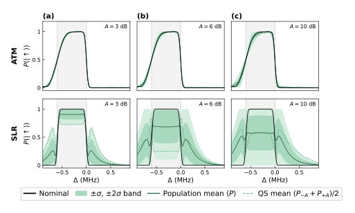
<figcaption class="paper-figure-caption"><b>Fig 5.</b> Figure 5. Monte Carlo analysis of robustness to quasistatic Rabi-amplitude noise for the ATM pulse (see Appendix E for pulse parameters; top row) and the Shinnar-Le Roux (SLR) inversion pulse (bottom row). Columns (a)–(c) correspond to amplitude noise Ω→Ωnom 10δ/20, with δ ∈[−AdB, +AdB] and AdB = 3, 6, and 10 dB, respectively. The black curve shows the nominal response (δ = 0), the solid green curve shows the averaged population ⟨P⟩, and the shaded regions indicate the ±σ and ±2σ regions obtained from N = 512 it- erations. The dashed green curve shows the quasistatic end- point estimate (P−A + P+A)/2. Vertical dotted lines indicate the nominal ranges. The SLR response is frequency-shifted...</figcaption>
</figure>

**Summary.** The paper introduces the Adiabatic Tangentially-Modulated (ATM) pulse as an advanced technique for single-shot qubit frequency tracking, overcoming limitations found in standard methods like Ramsey interferometry. By leveraging quantum adiabatic theory, the ATM pulse creates a highly sensitive, sigmoidal response that allows precise measurement of detuning with low noise. This makes it a promising tool for robust, real-time stabilization of qubits against environmental noise.

**Why it may be interesting.** This work provides a concrete, theoretically grounded protocol for improving quantum measurement fidelity in noisy environments. The ability to engineer sensitivity and bandwidth independently is highly valuable for experimentalists working on solid-state qubits where noise mitigation is paramount.

Detailed structure

**Main problem.** The primary goal is to develop a single-shot, high-fidelity method for tracking frequency noise in two-level quantum systems that overcomes the fundamental trade-offs inherent in conventional measurement techniques like Ramsey interferometry.

**Main result.** The proposed Adiabatic Tangentially-Modulated (ATM) pulse achieves sensitivity comparable to multi-shot averaging while maintaining a lower closed-loop white-noise floor and exhibiting superior robustness against amplitude fluctuations compared to existing protocols.

**Method.** The authors derived the ATM pulse using quantum adiabatic theory, designing its time evolution ($\Omega(t)$ and $\omega_D(t)$) such that it maps continuous detuning values onto a highly selective, near-binary response.

**Model / system.** The system modeled is a two-level quantum system (qubit), whose dynamics are governed by a time-dependent Hamiltonian in the rotating frame. The protocol involves applying the specially shaped ATM pulse sequence to probe the qubit's detuning ($\Delta$).

**Key observables.** Detuning-dependent transition probability $P(\Delta)$, sensitivity ($S$), closed-loop noise floor ($P_{	ext{floor}, N}$), and operational detuning range ($\Delta_{	ext{range}}$).

**Important parameters / regimes.** Pulse parameters include rise time ($	au_r$), constant time ($	au_c$), fall time ($	au_f$), and the final gradient $\dot{\Omega}(	au_T)$. Sensitivity scales inversely with the square root of the pulse's rate of change.

**Assumptions / limitations.** The method assumes that the adiabatic condition can be maintained during most of the protocol while allowing controlled non-adiabatic transitions at specific points to achieve the desired readout contrast.

**Figures summary.** Figures illustrate the temporal profiles of amplitude and frequency modulation for the ATM pulse, show the geometric evolution on the Bloch sphere corresponding to different detuning regimes, and compare the noise power spectral density (PSD) between ATM and Ramsey tracking methods.

**Paper structure.** The paper establishes the problem limitations with conventional techniques, introduces the ATM pulse derived from adiabatic theory, details its mathematical formulation and physical interpretation via Bloch sphere evolution, presents quantitative comparisons of sensitivity and noise floors against Ramsey methods, and concludes by summarizing the practical advantages for real-time stabilization.

Abstract

Understanding and mitigating noise in two level quantum systems is essential for achieving high fidelity qubit control. Conventional frequency tracking techniques, such as Ramsey interferometry, are fundamentally limited by trade offs between sensitivity, bandwidth, and dynamic range. Here we introduce the adiabatic tangentially-modulated (ATM) pulse, a pulse derived from quantum adiabatic theory that maps qubit detuning onto a sigmoidal, near-binary response. Using numerical simulations supported by analytical modelling, we show that pulse sensitivity and detuning range can be independently engineered through simple design parameters. We derive scaling relations governing these quantities and demonstrate their agreement with simulation. A single shot ATM measurement achieves sensitivity comparable to that obtained from multi-shot Ramsey averaging, enabling tracking of substantially higher frequency noise components with a lower closed-loop white-noise floor. In addition, this pulse exhibits strong robustness to amplitude fluctuations compared with binary response pulses derived from the Shinnar-Le Roux formalism. Together, these properties establish the ATM pulse as a promising approach for robust qubit frequency tracking.

[↑ back to top](#top)

### [Detecting quantumness with generalized Loschmidt echoes](http://arxiv.org/abs/2608.06562v1)

**Authors:** Cecilia Cormick, Adrián A. Budini  
**Type:** theory · **Category:** statistical mechanics · **PDF:** <https://arxiv.org/pdf/2608.06562v1>  
**Analysis basis:** full PDF text, analyzed in chunks
**Topic relevance:** `analog quantum simulation` **2/5** · `methods for driven-dissipative` **2/5** · `non-equilibrium dynamics` **2/5** · `Keldysh / 2PI / non-Gaussian methods` **1/5** · `correlated / nonlocal dissipation` **1/5** · `driven-dissipative phase transition` **1/5** · `entanglement & information structure` **1/5** · `non-equilibrium universality` **1/5**

↔ Scroll figures horizontally

<figure class="paper-figure-card">
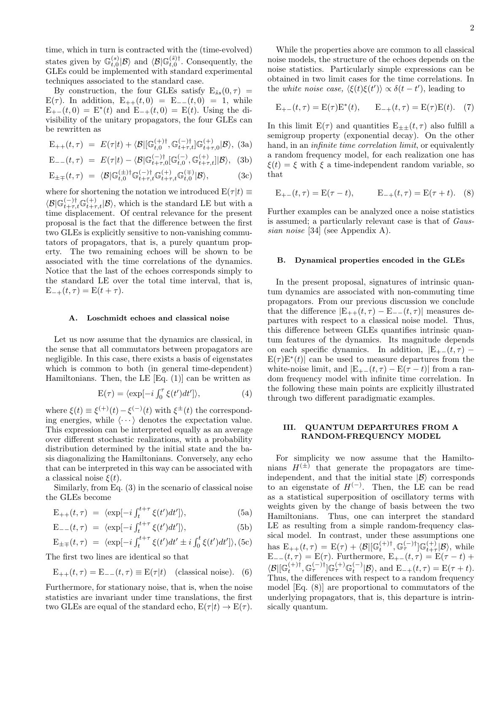
<figcaption class="paper-figure-caption"><b>Fig 1.</b> Low-resolution page preview, page 2</figcaption>
</figure>
<figure class="paper-figure-card">
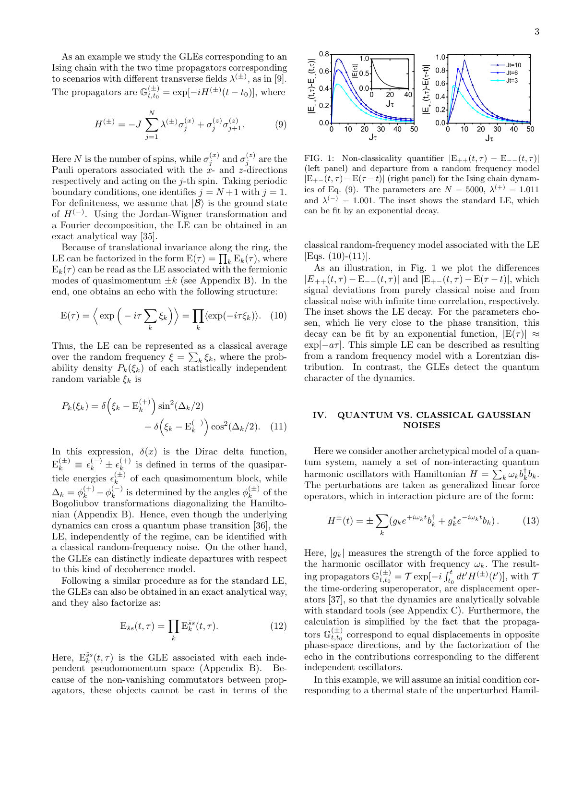
<figcaption class="paper-figure-caption"><b>Fig 2.</b> Low-resolution page preview, page 3</figcaption>
</figure>
<figure class="paper-figure-card">
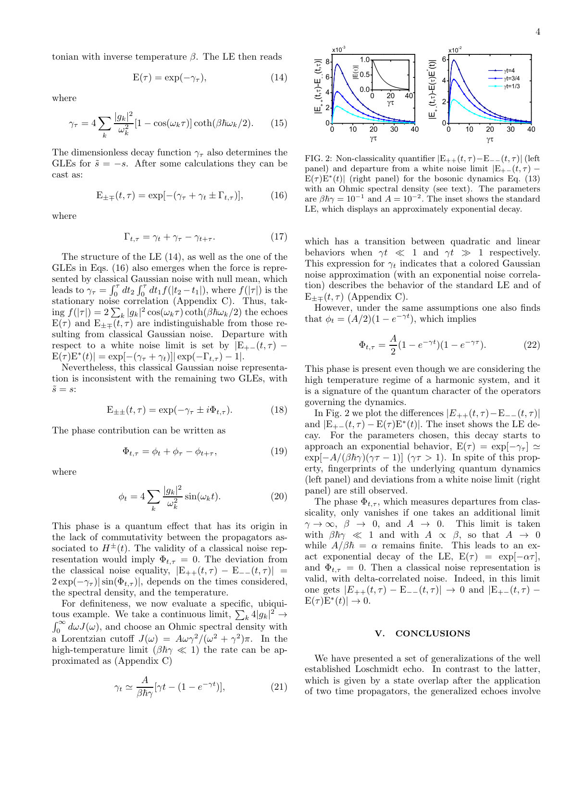
<figcaption class="paper-figure-caption"><b>Fig 3.</b> Low-resolution page preview, page 4</figcaption>
</figure>
<figure class="paper-figure-card">
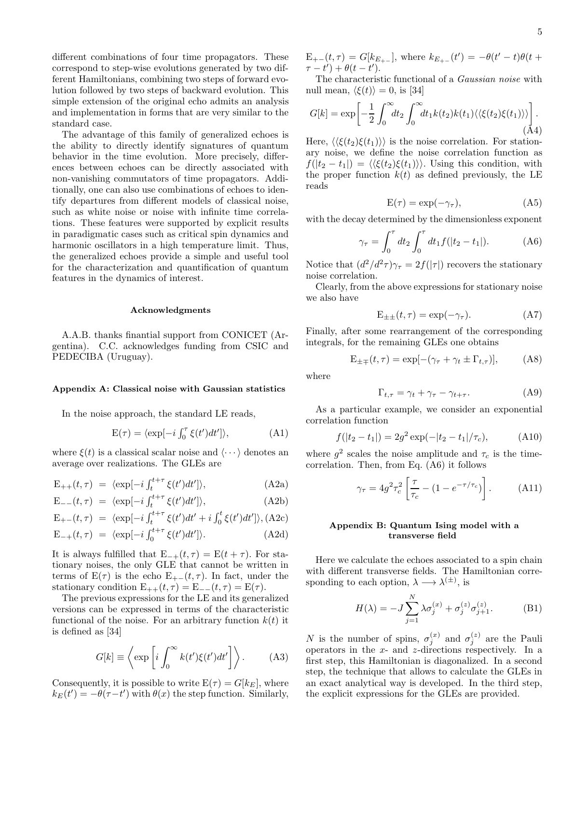
<figcaption class="paper-figure-caption"><b>Fig 4.</b> Low-resolution page preview, page 5</figcaption>
</figure>
<figure class="paper-figure-card">
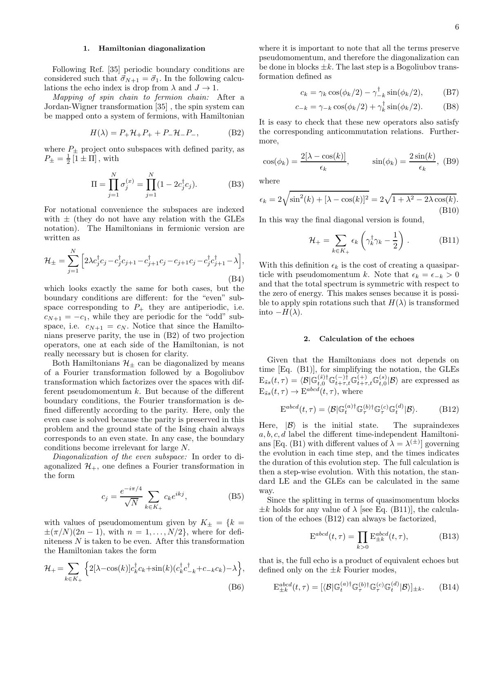
<figcaption class="paper-figure-caption"><b>Fig 5.</b> Low-resolution page preview, page 6</figcaption>
</figure>

**Summary.** The paper introduces Generalized Loschmidt Echoes (GLEs) as a powerful theoretical tool to quantify 'quantumness' by testing the non-commutativity of time evolution propagators. By comparing these echoes against predictions derived from classical random noise models, the authors successfully demonstrate a method to isolate and measure intrinsic quantum effects in systems like spin chains and harmonic oscillators.

**Why it may be interesting.** This work provides a rigorous, measurable diagnostic tool rooted in echo physics to distinguish true quantum dynamics from classical noise or semiclassical approximations in complex many-body systems.

Detailed structure

**Main problem.** The primary goal is to develop a method using generalized Loschmidt echoes (GLEs) to detect intrinsic non-classical dynamical behavior, or 'quantumness,' in various quantum systems.

**Main result.** GLEs provide a diagnostic tool whose deviation from predictions based on classical random-frequency noise models quantifies the presence of genuine quantum features, even in regimes previously thought to be classical.

**Method.** The authors generalize Loschmidt echoes by involving four forward/backward time propagators. Quantumness is diagnosed by checking for non-commutativity among these evolution propagators.

**Model / system.** The analysis applies the method to two main models: the quantum Ising spin chain (critical dynamics) and non-interacting quantum harmonic oscillators, allowing comparison with classical Gaussian noise predictions.

**Key observables.** Generalized Loschmidt Echoes ($	ilde{E}^{ss}(t, 	au)$), and specific differences between echo combinations like $|E^{++}(t, 	au) - E^{--}(t, 	au)|$ which quantify non-classicality.

**Important parameters / regimes.** Time separation ($t, 	au$), coupling constants ($\lambda$, $J$), spectral density parameters ($A, \gamma$), and temperature/inverse temperature ($eta$).

**Assumptions / limitations.** The detection of quantumness relies on the assumption that classical dynamics correspond to commuting evolution propagators. Calculations often involve taking continuous limits or high-temperature approximations.

**Figures summary.** Figures plot non-classicality quantifiers for both Ising chain and bosonic dynamics, showing how these measures decay relative to standard Loschmidt echo decays.

**Paper structure.** The paper introduces GLEs as an extension of LEs. It then applies this framework to calculate echoes for the Ising model (via Jordan-Wigner transformation) and harmonic oscillators (using spectral density methods), culminating in explicit formulas for quantum signatures.

Abstract

Loschmidt echoes are a well-established method to characterize dynamical properties such as quantum chaos and sensitivity to perturbations. Here we present a straightforward generalization that identifies non-classical dynamical behavior. The generalized echoes involve four forward-backward time propagators. If these propagators do not commute, one can readily identify signatures of this property in the relations between echoes. As an example, detection of intrinsic non-commuting quantum features is analyzed in critical dynamics of a spin chain. Interestingly, this phenomenon is also observed for Gaussian dynamics and high temperature limits which are generally regarded as classical.

[↑ back to top](#top)

### [Cascading Through the Hierarchy: Regularizer-Induced Feature Detection as Phase Transitions in Deep Linear Neural Networks](http://arxiv.org/abs/2608.06597v1)

**Authors:** Björn Ladewig, Ibrahim Talha Ersoy, Karoline Wiesner  
**Type:** theory · **Category:** disordered systems and neural networks · **PDF:** <https://arxiv.org/pdf/2608.06597v1>  
**Analysis basis:** full PDF text, analyzed in chunks
**Topic relevance:** `driven-dissipative phase transition` **2/5** · `non-equilibrium universality` **2/5** · `Frenkel-Kontorova` **1/5** · `Keldysh / 2PI / non-Gaussian methods` **1/5** · `analog quantum simulation` **1/5** · `non-equilibrium dynamics` **1/5**

↔ Scroll figures horizontally

<figure class="paper-figure-card">
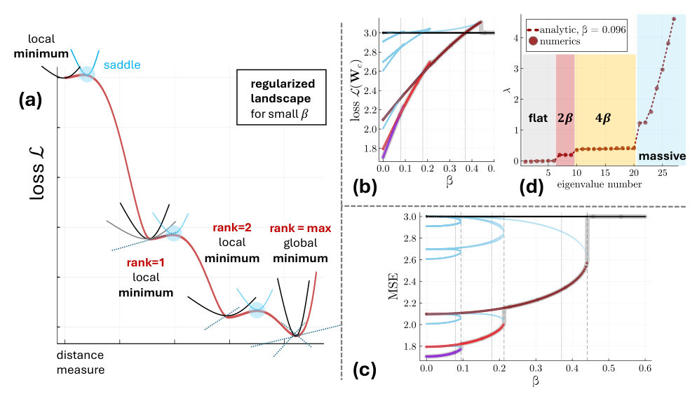
<figcaption class="paper-figure-caption"><b>Fig 1.</b> FIG. 1: (a) Qualitative summary of the main features of the regularized loss landscape for &gt; 1 hidden layers and small regularization strength; (b) level crossing (marked by dotted vertical lines) at the level of the loss inducing first order transitions; (c) bifurcation (indicated by dashed vertical lines) at the level of the mean squared error; (d) example of the Hessian spectrum for 2 hidden layers. For (b-d): η1 = 0.95, η2 = 0.55, η3 = 0.3.</figcaption>
</figure>
<figure class="paper-figure-card">
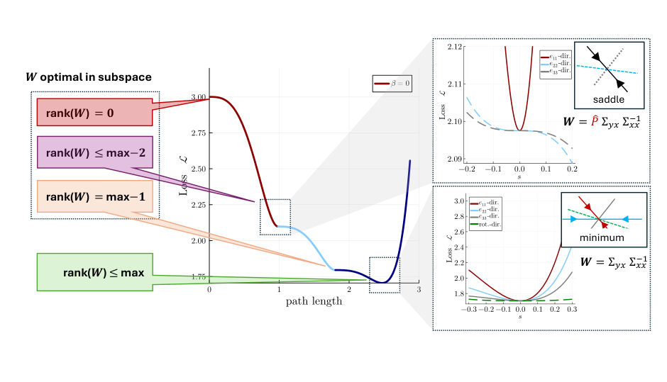
<figcaption class="paper-figure-caption"><b>Fig 2.</b> FIG. 2: Path through the loss landscape, based on Hessian eigendirections revealing a basin structure in the unregularized (β →0) loss landscape for 2 hidden layers featuring one global minimum and multiple saddle points (7) that partly correspond to rank-restricted optima. With: Σxx = 13×3, Σyx = diag(0.95, 0.55, 0.3).</figcaption>
</figure>
<figure class="paper-figure-card">
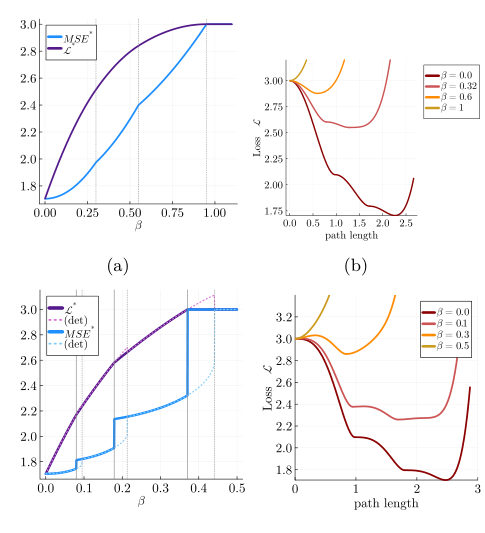
<figcaption class="paper-figure-caption"><b>Fig 3.</b> FIG. 3: (a, c) Minimal loss L∗and MSE for 1 hidden layer (top) and 2 hidden layers (bottom). Colored dashed parts correspond to the loss/MSE for a reversed annealing protocol. (b,d) Basin structure in the regularized loss landscape for deep linear networks with 1 hidden layer (top) - featuring one minimum; and 2 hidden layers (bottom) - featuring multiple minima - for different regularization strengths β. Vertical lines indicate critical regularization strengths (in case of 1st order transitions there are two, see main text).</figcaption>
</figure>
<figure class="paper-figure-card">
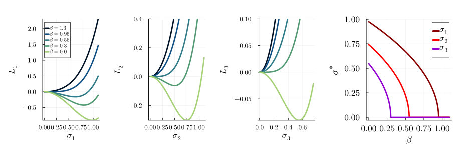
<figcaption class="paper-figure-caption"><b>Fig 4.</b> FIG. 4: Effective loss landscapes (1 hidden layer) for η1 = 0.95, η2 = 0.55, η3 = 0.3; the right most plot shows the minima σ∗ i of the effective potentials (16) as a function of β, displaying the continuous onset at critical regularization strengths β∗ i .</figcaption>
</figure>
<figure class="paper-figure-card">
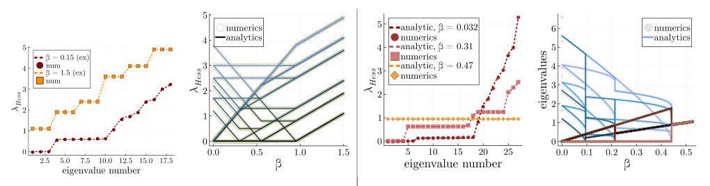
<figcaption class="paper-figure-caption"><b>Fig 5.</b> FIG. 5: Hessian spectra for 1 hidden (a,b) and 2 hidden layers (c,d) with din = dout = dhidden = 3 and η1 = 0.95, η2 = 0.55, η3 = 0.3 based on numerical simulations (reversed annealing) and analytical prediction: (a) Hessian spectra for 1 hidden layer and different, fixed β: (i) rmax(β) = 0 (square); (ii) rmax(β) = 3 (circle); (b) Hessian spectrum as a function of β. (c) Hessian spectra for 2 hidden layers and different, fixed β for (i) rmax(β) = 0 (diamond), (ii) rmax(β) = 1 (square) and (iii) rmax(β) = rmax (circle); (d) Hessian spectrum as a function of β.</figcaption>
</figure>

**Summary.** This paper develops a statistical physics framework to understand deep learning by treating the regularization strength as an external field controlling phase transitions. Using analytically solvable linear neural networks, the authors rigorously connect observed feature detection cascades to the underlying geometry of the loss landscape via Hessian spectrum analysis. It provides powerful theoretical tools for interpreting network training dynamics through the lens of critical phenomena.

**Why it may be interesting.** The explicit mapping of deep learning phenomena (feature detection) onto established concepts like phase transitions and Hessian spectra provides a powerful theoretical analogy for understanding complex many-body systems or critical points in other physical models.

Detailed structure

**Main problem.** The paper develops a scientific theory of deep learning by connecting its learning dynamics and statistical properties to concepts from statistical physics, specifically investigating how regularization induces phase transitions.

**Main result.** It establishes a rigorous link between cascades of phase transitions, the learnable features detected by the network, and the underlying geometry characterized by the Hessian spectrum. The analysis provides analytic predictions for these transitions using order parameters derived from an effective free energy description.

**Method.** The authors employ analytical techniques to study analytically solvable toy models (Deep Linear Neural Networks), treating the regularization strength as a tunable external field analogous to statistical physics Hamiltonians.

**Model / system.** The system is Deep Linear Neural Networks (DLN) trained with Mean Squared Error loss and $L_2$ weight decay regularization. The analysis focuses on the dynamics of the weights, relating macroscopic behavior to the microscopic geometry of the loss landscape via the Hessian spectrum.

**Key observables.** Phase transitions, order parameters related to learned features, and the eigenvalues/spectrum of the Jacobian/Hessian matrix.

**Important parameters / regimes.** Regularization strength ($eta$), network depth ($n$), and data covariance matrices ($\Sigma_{xx}, \Sigma_{yx}$).

**Assumptions / limitations.** The analysis is restricted to deep linear models (DLN) and often assumes zero mean for simplicity. The connection between the macroscopic effective description and microscopic Hessian spectrum provides the core theoretical framework.

**Figures summary.** Figures illustrate the qualitative structure of the regularized loss landscape, showing level crossings indicative of first-order transitions, bifurcation points, and examples of the Hessian spectrum across different network depths.

**Paper structure.** The paper progresses by establishing the connection between learning dynamics and statistical physics. It analyzes the critical point structure for DLNs using regularization strength as a control parameter, deriving order parameters from the loss function's effective potential (Landau theory). Finally, it tackles the microscopic details by analyzing the Jacobian/Hessian spectrum to confirm these macroscopic predictions.

Abstract

A scientific theory of deep learning, comprising learning dynamics and statistical properties of learned models, is rapidly gaining attention. One of the corner stones of this development are analytically solvable toy models, allowing for the fully tractable analysis of the learning dynamics. Here we analytically investigate such a toy model using the regularization strength as a tunable external parameter - akin to external fields in statistical physics. In previous studies, (i) an onset of learning transition was predicted analytically and (ii) it was phenomenologically/numerically established that tuning the regularization strength can result in a cascade of phase transitions. The number of those transitions was linked to the geometry of the loss landscape determined by the model complexity. Setting up a rigorous framework underpinning the previous numerical observations, our investigation reveals a precise connection between those cascades of phase transitions, learnable features and the underlying geometry. We provide analytic predictions of these phase transitions as well as tractable order parameters related to learned features. At the level of the minimal model, we connect this macroscopic perspective (that can be condensed into an effective description) to the microscopic perspective in terms of the geometry of the loss landscape characterized by the Hessian spectrum. Thus, the presented model provides a platform to explore and sharpen advances made in the scientific theory of deep learning rooted in statistical physics concepts.

[↑ back to top](#top)

### [Learning a quantitative criterion for distinguishing chaos from noise](http://arxiv.org/abs/2608.07109v1)

**Authors:** Jaesung Choi, Athokpam Langlen Chanu, Jong-Min Park  
**Type:** both · **Category:** statistical mechanics · **PDF:** <https://arxiv.org/pdf/2608.07109v1>  
**Analysis basis:** full PDF text, analyzed in chunks
**Topic relevance:** `non-equilibrium dynamics` **2/5** · `analog quantum simulation` **1/5** · `correlated / nonlocal dissipation` **1/5** · `driven-dissipative phase transition` **1/5** · `entanglement & information structure` **1/5** · `methods for driven-dissipative` **1/5** · `non-equilibrium universality` **1/5**

↔ Scroll figures horizontally

<figure class="paper-figure-card">
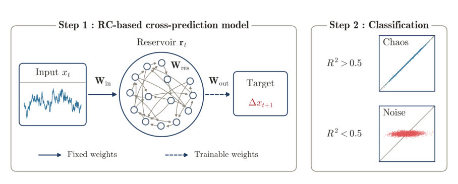
<figcaption class="paper-figure-caption"><b>Fig 1.</b> FIG. 1. Schematic representation of the cross-prediction reservoir computing (RC) framework. Step 1 (left panel) corresponds to the RC-based prediction model, and Step 2 (right panel) corresponds to the classification criterion. The reservoir receives a scalar input through fixed input weights Win and evolves through a fixed recurrent weight matrix Wres. Only the output weights Wout are trained via ridge regression to predict the target.</figcaption>
</figure>
<figure class="paper-figure-card">
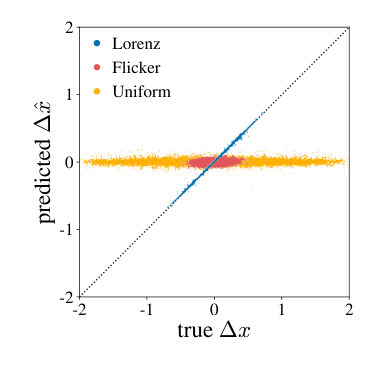
<figcaption class="paper-figure-caption"><b>Fig 2.</b> FIG. 2. Scatter plot of the true and predicted values obtained using the proposed method. Blue, magenta, and yellow circles correspond to the Lorenz system, flicker noise, and uniform noise, respectively.</figcaption>
</figure>
<figure class="paper-figure-card">
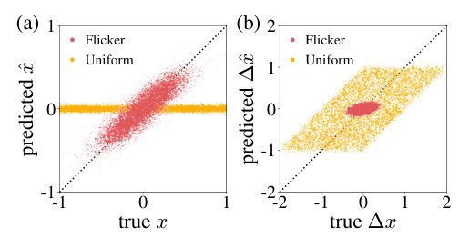
<figcaption class="paper-figure-caption"><b>Fig 3.</b> FIG. 3. Scatter plots obtained using the conventional (a) value-to-value and (b) difference-to-difference prediction schemes. Magenta and yellow circles correspond to flicker noise and uniform noise, respectively.</figcaption>
</figure>
<figure class="paper-figure-card">
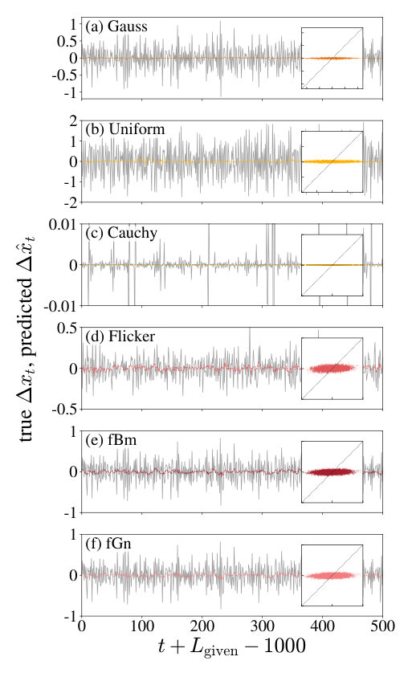
<figcaption class="paper-figure-caption"><b>Fig 4.</b> FIG. 5. Comparison of ∆xt (gray) with the correspond- ing predictions ∆ˆxt (colored) for the following synthetic noise processes: (a) Gaussian noise, (b) uniform noise, (c) Cauchy noise, (d) flicker noise, (e) fractional Brownian motion, and (f) fractional Gaussian noise. Plotting conventions as in Fig. 4.</figcaption>
</figure>
<figure class="paper-figure-card">
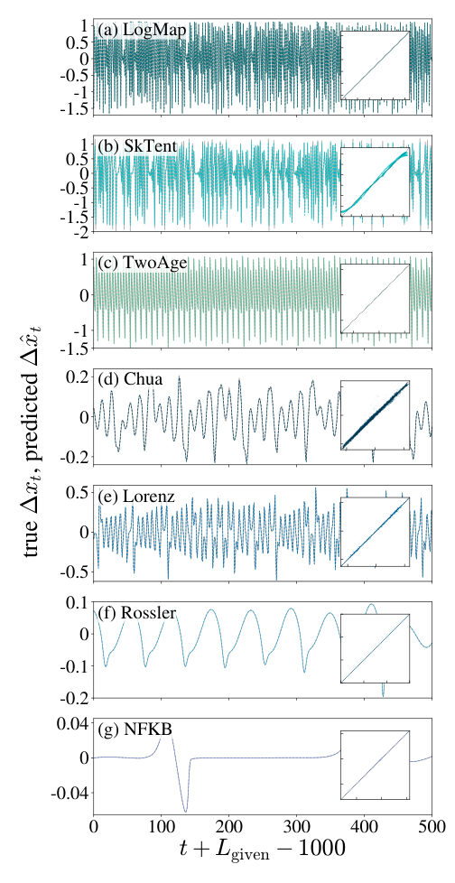
<figcaption class="paper-figure-caption"><b>Fig 5.</b> FIG. 4. Comparison of the first-difference time series ∆xt obtained from numerical simulations (gray) with the corre- sponding predictions ∆ˆxt (colored) for the following synthetic chaotic systems: (a) logistic map, (b) skew tent map, (c) two- age-classes model, (d) Chua’s circuit, (e) Lorenz system, (f) R¨ossler system, and (g) NF-κB model. The main panels show 500-sample segments. The insets show scatter plots of ∆ˆxt versus ∆xt, with the predicted and true values on the verti- cal and horizontal axes, respectively. Both axes in each inset span the same range as the vertical axis of the corresponding main panel.</figcaption>
</figure>

**Summary.** This work introduces a novel reservoir computing framework combined with a cross-prediction scheme to quantitatively distinguish chaos from noise in time-series data. By training the model to predict future changes, it generates a correlation coefficient ($R^2$) that serves as a simple diagnostic tool. This method proves robust across synthetic and empirical datasets, offering a powerful tool for analyzing complex physical measurements.

**Why it may be interesting.** While not directly quantum, the methodology relies heavily on analyzing complex, non-equilibrium dynamics in observable time series. The use of advanced machine learning (RC) to extract underlying deterministic structure from noisy data has parallels with reconstructing quantum states or identifying hidden order parameters in many-body systems.

Detailed structure

**Main problem.** The core challenge is developing a quantitative, data-driven method to reliably distinguish between deterministic chaotic time series and stochastic noise, as both exhibit irregular fluctuations.

**Main result.** The authors propose that using the squared Pearson correlation coefficient ($R^2$) derived from a cross-prediction scheme within reservoir computing provides a simple and robust criterion: $R^2 > 0.5$ suggests chaos, while $R^2 < 0.5$ suggests noise.

**Method.** A purely data-driven approach using Reservoir Computing (RC) trained to predict the *change* ($\Delta x_{t+1}$) of a variable from its current state ($x_t$). The cross-prediction scheme is key to suppressing spurious correlations inherent in noisy data.

**Model / system.** The method applies to general scalar time series data, tested on diverse synthetic chaotic systems (e.g., Lorenz, LogMap) and various noise processes (e.g., Gaussian, Flicker, fGn). Empirical tests include physiological signals (VOICE, RR intervals) and climate indices (NAO index).

**Key observables.** The squared Pearson correlation coefficient ($R^2$) between the true future change ($\Delta x_{t+1}$) and the predicted future change ($\hat{\Delta x}_{t+1}$).

**Important parameters / regimes.** Hyperparameters for RC (e.g., leak rate $a_{	ext{leak}}$) are optimized; classification thresholds include $R^2 > 0.5$ for chaos.

**Assumptions / limitations.** The method assumes that deterministic chaotic dynamics impose a measurable, non-stochastic structure on the local changes ($\Delta x$), which can be captured by the RC framework better than random noise processes.

**Figures summary.** Figures illustrate the schematic of the RC prediction/classification process, show scatter plots comparing true vs. predicted values for various systems (Lorenz, Flicker), and summarize $R^2$ performance across multiple synthetic chaos and noise datasets.

**Paper structure.** The paper introduces the problem, details the reservoir computing framework with cross-prediction, presents results on diverse synthetic time series to establish the criterion, discusses robustness against real-world data limitations, and concludes by applying the method to a wide range of empirical physical and biological datasets.

Abstract

Distinguishing chaos from noise using time-series data is fundamentally challenging because both exhibit irregular fluctuations and share many statistical and dynamical characteristics. Existing methods face two key limitations: temporally correlated noise can yield spurious signatures of chaos, and analyses of scalar time series often require explicit choices of embedding parameters. Here, we propose a purely data-driven method for distinguishing chaos and noise based on a reservoir-computing framework with a cross-prediction scheme. In the proposed approach, the model is trained to predict the future change of a variable from its current value, thereby combining a short-term predictability test with a test of the smoothness of deterministic flows. The recurrent structure of reservoir computing enables effective prediction of high-dimensional chaotic dynamics even from scalar time series without explicit delay-coordinate reconstruction, while the cross-prediction framework strongly suppresses spurious predictive correlations arising from noise. We apply the proposed method to diverse synthetic and empirical time series. Chaotic systems consistently yield strong correlations between the true and predicted future changes, whereas noise processes remain clearly separated in a low-correlation regime. The method also exhibits substantial robustness to practical limitations in empirical data, including measurement noise, limited data length, and increasing prediction lag. These results demonstrate that the squared Pearson correlation coefficient provides a simple quantitative criterion for distinguishing chaos from noise directly from observed time-series data.

[↑ back to top](#top)

### [Statistical stability of random potentials to thermal and quantum activation](http://arxiv.org/abs/2608.07194v1)

**Authors:** Luis Filsinger, Roland Willa  
**Type:** theory · **Category:** statistical mechanics · **PDF:** <https://arxiv.org/pdf/2608.07194v1>  
**Analysis basis:** full PDF text, analyzed in chunks
**Topic relevance:** `Keldysh / 2PI / non-Gaussian methods` **2/5** · `non-equilibrium dynamics` **2/5** · `correlated / nonlocal dissipation` **1/5** · `driven-dissipative phase transition` **1/5** · `methods for driven-dissipative` **1/5** · `non-equilibrium universality` **1/5**

↔ Scroll figures horizontally

<figure class="paper-figure-card">
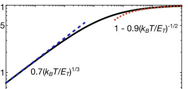
<figcaption class="paper-figure-caption"><b>Fig 1.</b> FIG. 1. Temperature-dependence of the expected thermal activation frequency ⟨Ω⟩(in units of the attempt frequency ω0) of a particle placed in a minimum of the Gaussian ran- dom potential. Temperature is given in the characteristic unit ET /kB, with ET =  3|G(2)|2|G(4)|3</figcaption>
</figure>
<figure class="paper-figure-card">
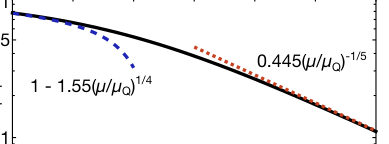
<figcaption class="paper-figure-caption"><b>Fig 2.</b> FIG. 2. Mass-dependent probability ⟨|T |2⟩for a quan- tum particle to tunnel away from a metastable minimum of a Gaussian random potential. The particle’s mass m is given in units of ℏ2µQ/2, where µQ ≡  512(|G(2)||G(6)|−|G(4)|2)4</figcaption>
</figure>
<figure class="paper-figure-card">
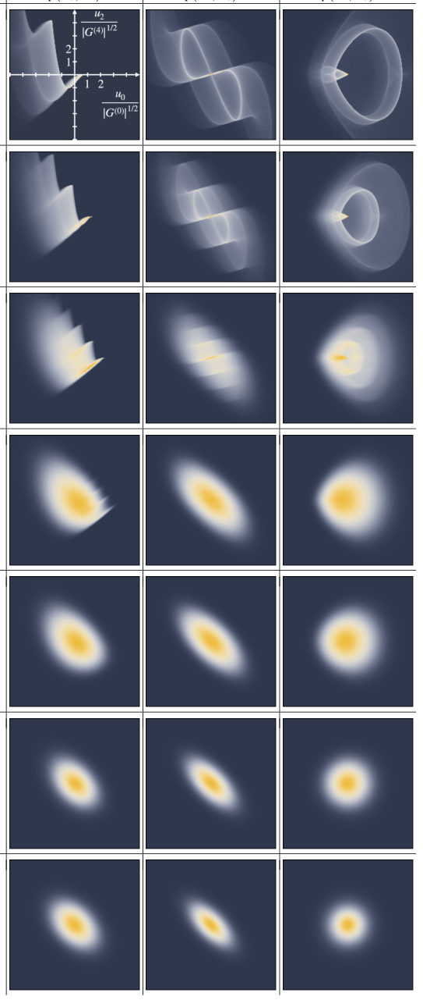
<figcaption class="paper-figure-caption"><b>Fig 3.</b> FIG. 3. Probability distributions p(u0, u2), p(u1, u3), p(u2, u3) for different densities np = Np/L of Lorentzian defects, in a system of length L = 100ξ, see Eq. (31). The plot range ±5 p</figcaption>
</figure>

**Summary.** This paper develops a rigorous statistical theory to analyze how random potential landscapes affect particle dynamics via thermal activation or quantum tunneling. By mapping the problem onto integrals over Gaussian random coefficients, the authors derive formulas linking measurable escape rates directly back to the underlying statistical properties (like the Green's function) of the disorder itself.

**Why it may be interesting.** This work provides a powerful statistical framework for characterizing disordered media by measuring macroscopic dynamic responses, which is highly relevant for understanding energy barriers in complex quantum systems beyond simple mean-field treatments.

Detailed structure

**Main problem.** The study investigates the statistical stability of complex, random potential energy landscapes (potential potentials) when subjected to thermal fluctuations or quantum tunneling.

**Main result.** The authors derive algebraic expressions for calculating the expectation values of escape rates (thermal and quantum) based on the statistical properties of the potential's local derivatives. They establish a direct link between these activation behaviors and the underlying Green's function characterizing the random potential.

**Method.** The core method involves reducing functional integrals over Gaussian random potentials to algebraic integrals over the expansion coefficients $\{u_n\}$ using derived probability density functions. Analysis includes calculating area fractions and asymptotic scaling laws for escape rates.

**Model / system.** The model is a point particle moving in a complex, disordered potential landscape $U(x)$, motivated by systems like superconducting vortices trapped by defects. The randomness of the potential is assumed to follow a Gaussian functional distribution characterized by its two-point correlation function.

**Key observables.** Statistical probability distributions of potential derivatives ($p(u_0, u_2)$), thermal activation rate ($\langle\Omega
angle$), and quantum tunneling rate ($\langle|T|^2
angle$).

**Important parameters / regimes.** Temperature ($T$) or inverse temperature ($eta$), characteristic energy scale ($E_0$), and defect density parameters ($n_p\xi$).

**Assumptions / limitations.** The potential is modeled by a Gaussian random functional distribution, allowing the reduction of complex integrals to algebraic forms. The analysis often truncates the potential expansion after low-order derivatives.

**Figures summary.** Figures illustrate the probability density functions $p(u_0, u_2)$, $p(u_1, u_3)$, and $p(u_2, u_3)$ for various defect densities, showing convergence to analytic results in the Gaussian limit.

**Paper structure.** The paper builds from defining the statistical problem using potential expansions, deriving the algebraic tools via Gaussian statistics, applying these tools to calculate specific observables (area fractions, $\langle\Omega
angle$, $\langle|T|^2
angle$), and finally analyzing the asymptotic behavior in different physical limits.

Abstract

In numerous physical, chemical, and biological systems the dynamics can be reduced to the motion of state variables in a complex potential landscape. In case the manifold is known, the motion and response of the embedded object can be described deterministically up to stochastic effects usually associated with a noise. In contrast, if the manifold is unknown, the static and dynamic response of the state variable may be used as a spectroscopic tool to characterize the potential landscape. Inspired by a seminal work of L.\ Embon and co-workers, [Sci.\ Rep.\ \textbf{5}, 7598 (2015)] we investigate the statistical properties of potential minima, in particular, their stability to thermal and quantum activation. For Gaussian random manifolds, we derive an algebraic expression to evaluate the statistical probability of the potential character (value, slope, curvature, ...). With this tool, we compute the expectation value for the rate of thermal and quantum activation and link these findings to the principal characteristics of the Gaussian potential, i.e., its Green's function. This link provides the opportunity to access information on the potential's Green's function by studying the activation behavior of an object in this manifold.

[↑ back to top](#top)

### [Prominent Intrinsic Orbital Hall Effect in the 135 Kagome Metal Family and Orbital Responses in the Loop-Current Phase](http://arxiv.org/abs/2608.06775v1)

**Authors:** Jianxin Huang, Rina Tazai, Youichi Yamakawa, Hiroshi Kontani  
**Type:** theory · **Category:** strongly correlated electrons · **PDF:** <https://arxiv.org/pdf/2608.06775v1>  
**Analysis basis:** full PDF text, analyzed in chunks
**Topic relevance:** `analog quantum simulation` **2/5** · `non-equilibrium dynamics` **2/5** · `Keldysh / 2PI / non-Gaussian methods` **1/5** · `entanglement & information structure` **1/5** · `spintronics-quantum-optics interface` **1/5**

↔ Scroll figures horizontally

<figure class="paper-figure-card">
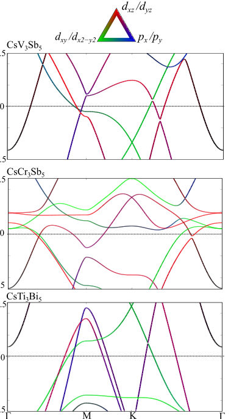
<figcaption class="paper-figure-caption"><b>Fig 1.</b> FIG. 2: (a) (b) (c): Band structure of (a) CsV3Sb5 (n=31), (b) CsCr3Sb5 (n=34) and (c) CsTi3Bi5 (n=28). CsV3Sb5 presents the van Hove singularity near the Fermi level, while in CsTi3Bi5 the vHS is far from the Fermi level. CsCr3Sb5 exhibits flat bands. The orbital characters are represented by the triangular guide above the panels, whose vertices corre- spond to dxz/dyz, dxy/dx2−y2, and px/py components.</figcaption>
</figure>
<figure class="paper-figure-card">
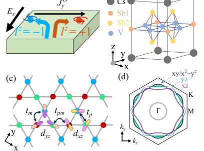
<figcaption class="paper-figure-caption"><b>Fig 2.</b> FIG. 1: (a) Schematic figure of the orbital Hall effect. Under an external electric field, electrons with different orbital angu- lar momenta move to different sides, leading to the generation of an orbital current. (b) Crystal structure of CsV3Sb5. The same lattice structure applies to CsCr3Sb5 and CsTi3Bi5 with atomic replacement. (c) dxz +dyz orbital tight-binding model for CsV3Sb5. (d) Fermi surfaces of the CsV3Sb5 30 orbital tight-binding model derived from first-principles calculations. Kagome metals possess characteristic multiple Fermi surfaces composed of d- and p-orbitals.</figcaption>
</figure>
<figure class="paper-figure-card">
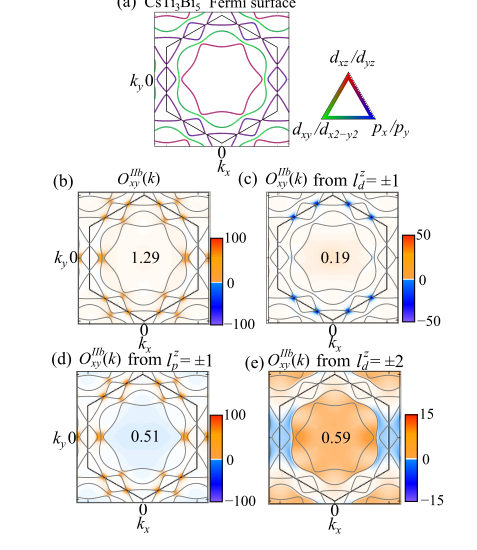
<figcaption class="paper-figure-caption"><b>Fig 3.</b> FIG. 4: (a) Fermi surfaces of CsTi3Bi5 at n = 28. The or- bital weights are represented by the triangular guide, whose vertices correspond to dxz/dyz, dxy/dx2−y2, and px/py com- ponents. (b)-(e) k-space distributions of the OHE Fermi- sea term OIIb xy (k). The values inside the panels indicate the Brillouin-zone integrals, 1 Nk P</figcaption>
</figure>
<figure class="paper-figure-card">
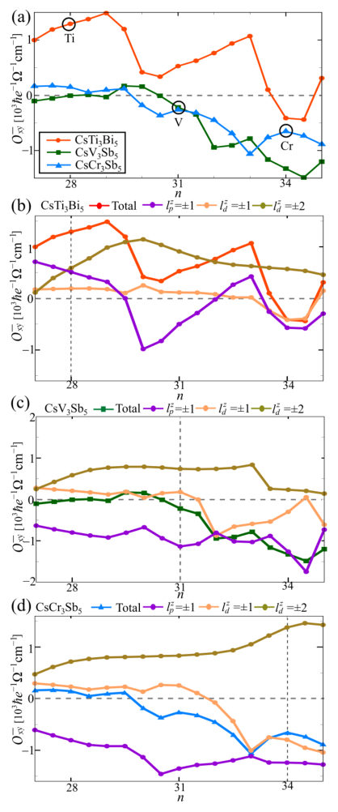
<figcaption class="paper-figure-caption"><b>Fig 4.</b> FIG. 3: (a) Filling-dependent OHE O− xy for the CsTi3Bi5, CsV3Sb5 and CsCr3Sb5 tight-binding models. Circles indi- cate the actual fillings for three materials. A large and posi- tive OHE in CsTi3Bi5 and the negative OHEs in CsV3Sb5 and CsCr3Sb5 are predicted. (b) (c) (d): Total OHE and its con- tributions from different orbital-angular-momentum channels (|lz p| = 1, |lz d| = 1 and |lz d| = 2) in (b) CsTi3Bi5, (c) CsV3Sb5 and (d) CsCr3Sb5. The vertical dashed line marks the actual filling for each material.</figcaption>
</figure>
<figure class="paper-figure-card">
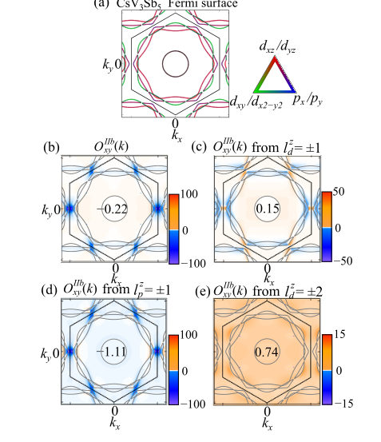
<figcaption class="paper-figure-caption"><b>Fig 5.</b> FIG. 5: (a) Fermi surfaces of CsV3Sb5 at n = 31. The or- bital weights are represented by the triangular guide, whose vertices correspond to dxz/dyz, dxy/dx2−y2, and px/py com- ponents. (b)-(e) k-space distributions of the OHE Fermi- sea term OIIb xy (k). The values inside the panels indicate the Brillouin-zone integrals, 1 Nk P</figcaption>
</figure>

**Summary.** This work theoretically investigates the Orbital Hall Effect in kagome metals by decomposing its contribution across different electronic orbital channels. It predicts distinct OHE signs for various compounds, showing that hybridization dictates the net sign. Furthermore, it demonstrates how loop-current phases can induce measurable local orbital angular momentum responses.

**Why it may be interesting.** While focused on solid-state transport, the detailed analysis of orbital degrees of freedom, Berry curvature contributions to transport coefficients, and emergent topological responses in correlated systems provides fundamental theoretical tools applicable to understanding exotic quantum states relevant to AMO physics (e.g., orbital entanglement).

Detailed structure

**Main problem.** The study investigates electronic orbital degrees of freedom, specifically focusing on generating and controlling orbital currents via the Orbital Hall Effect (OHE) in kagome lattice metals.

**Main result.** The OHE sign depends critically on the competition between contributions from different orbital sectors ($|	ext{l}_z^d|=2$ vs. $|	ext{l}_z|=1$), and loop-current phases can induce finite local atomic orbital angular momentum.

**Method.** Calculations utilize a tight-binding model derived from first principles, employing the Kubo formula for transport properties and performing detailed orbital-sector decomposition analysis.

**Model / system.** The study focuses on transition metal kagome-lattice metals ($	ext{CsTi}_3	ext{Bi}_5$, $	ext{CsV}_3	ext{Sb}_5$, $	ext{CsCr}_3	ext{Sb}_5$) modeled by a 30-orbital tight-binding Hamiltonian. The analysis is restricted to a 2D approximation and neglects spin-orbit coupling.

**Key observables.** Orbital Hall Effect (OHE), local atomic orbital angular momentum, symmetric components of the orbital conductivity tensor, and orbital Berry curvature.

**Important parameters / regimes.** Electron filling ($n$), hybridization strength between $p$ and $d$ orbitals, and the presence/absence of loop currents.

**Assumptions / limitations.** Spin-orbit coupling (SOC) is neglected in this work, and the analysis relies on a 2D model approximation.

**Figures summary.** Figures illustrate crystal structures, band dispersions showing element substitution effects, and momentum-space distributions ($k$-space) of the OHE Berry curvature for the three studied compounds.

**Paper structure.** The paper first establishes the theoretical framework using orbital-sector decomposition to predict OHE signs across different kagome metals. It then analyzes how $p$-$d$ hybridization modulates this sign, concluding with an investigation into loop-current phases that induce local angular momentum and modify conductivity symmetry.

Abstract

The study of electronic orbital degrees of freedom, including the generation and control of orbital currents and orbital angular momentum, has emerged as a vibrant research field. Here, we study the orbital Hall effect (OHE), one of the key mechanisms for orbital current generation, in transition-metal kagome-lattice metals. We propose a large positive OHE in CsTi$_3$Bi$_5$ and negative OHEs in CsV$_3$Sb$_5$ and CsCr$_3$Sb$_5$ models. Orbital-sector decomposition shows that the $\vert l^z_d \vert=2$ $d$-orbital channel gives a positive contribution, whereas the $\vert l^z \vert=1$ $d$- and $p$-orbital channels can give negative contributions. Control calculations suggest a persistent orbital-sector sign tendency near the actual filling, while strong $p$-$d$ hybridization modulates the quantitative balance and total OHE sign. Thus, the compound and filling dependence of the OHE reflects both the sign tendency of each orbital sector and the hybridization-controlled balance among them. Furthermore, we investigate the loop-current phase of CsV$_3$Sb$_5$ and show that it induces finite local atomic orbital angular momentum. We also show that loop-current-related symmetry lowering allows finite symmetric components of the orbital conductivity tensor. This study provides a basis for exploring orbital currents and local orbital-angular-momentum responses in strongly correlated kagome metals.

[↑ back to top](#top)

### [Correlation Geometry of Quantum Sensor Networks: Local-Global Information Flow and Local Privacy](http://arxiv.org/abs/2608.06888v1)

**Authors:** Gong-Chu Li, Lei Chen, Xu-Song Hong, Hua-Qing Xu, Yuancheng Liu, Si-Qi Zhang, Jia-Hao Zhao, Geng Chen, Chuan-Feng Li, Guang-Can Guo  
**Type:** theory · **Category:** quantum information and computing · **PDF:** <https://arxiv.org/pdf/2608.06888v1>  
**Analysis basis:** full PDF text, analyzed in chunks
**Topic relevance:** `entanglement & information structure` **2/5** · `quantum measurements` **2/5** · `correlated / nonlocal dissipation` **1/5** · `non-equilibrium dynamics` **1/5**

↔ Scroll figures horizontally

<figure class="paper-figure-card">
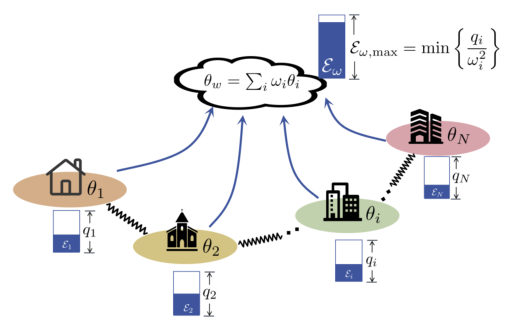
<figcaption class="paper-figure-caption"><b>Fig 1.</b> FIG. 1. Local–global information distribution in a QSN. Spa- tially separated sensor nodes (θ1, θ2, . . . , θN) are connected through a multipartite quantum probe state. Finite lo- cal resources fix the diagonal sensing capacities qi ≡Qii, while the blue columns represent the operational local EQ- FIs Ei. Network correlations redistribute metrological infor- mation between these local parameters and the global pa- rameter θw = P</figcaption>
</figure>
<figure class="paper-figure-card">
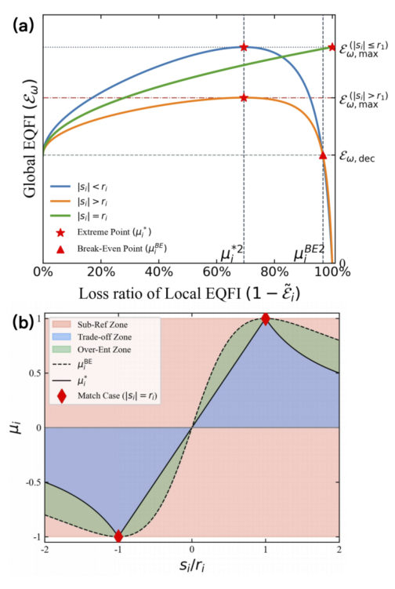
<figcaption class="paper-figure-caption"><b>Fig 2.</b> FIG. 2. Local–global phase map. (a) Global EQFI ver- sus the fractional local-EQFI loss, 1 −eEi = µ2 i , along the aligned branch sgn(µi) = sgn(si). Increasing the correlation enhances the global EQFI up to the optimum µ∗ i (trade-off zone). Beyond this optimum, both the local and global EQ- FIs decrease (over-correlated zone). Beyond the break-even point µBE i , the global EQFI falls below its decoupled value (sub-reference zone). In the match case |si| = ri, the over- correlated zone vanishes, and the optimum is approached at the singular endpoint. (b) Trade-off, over-correlated, and sub- reference zones in the (µi, si/ri) plane. Red diamonds mark the matched singular points, |si| = ri...</figcaption>
</figure>
<figure class="paper-figure-card">
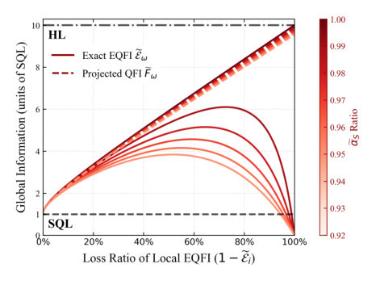
<figcaption class="paper-figure-caption"><b>Fig 3.</b> FIG. 3. Nuisance-aware and directional QFIs in a permutation-invariant network. For N = 10, the normalized EQFI eEw (solid) and projected QFI eFw (dashed) are plotted against the local-information loss 1 −eEi. Colors indicate the weight-uniformity parameter eαS = 1, 0.99, ..., 0.95. The two quantities coincide for a uniform target (eαS = 1), but separate when eαS &lt; 1: eFw is monotonic and depends only weakly on eαS; whereas eEw reaches a finite optimum and then decreases, and sensitive to eαS.</figcaption>
</figure>
<figure class="paper-figure-card">
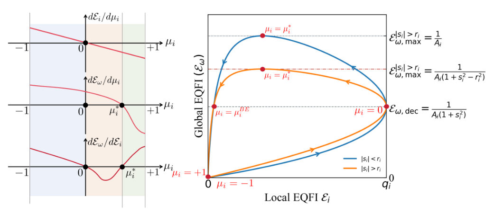
<figcaption class="paper-figure-caption"><b>Fig 4.</b> FIG. 1. Generic node–subnetwork phase map. (a) Signs of dEi/dµi, dEw/dµi, and dEw/dEi for si &gt; 0, ri &gt; 0, and si ̸= ri. (b) Corresponding parametric trajectory (Ei(µi), Ew(µi)). The aligned branch first enters the local–global trade-off regime, reaches its maximum at µ∗ i , and subsequently enters the overcorrelated regime.</figcaption>
</figure>
<figure class="paper-figure-card">
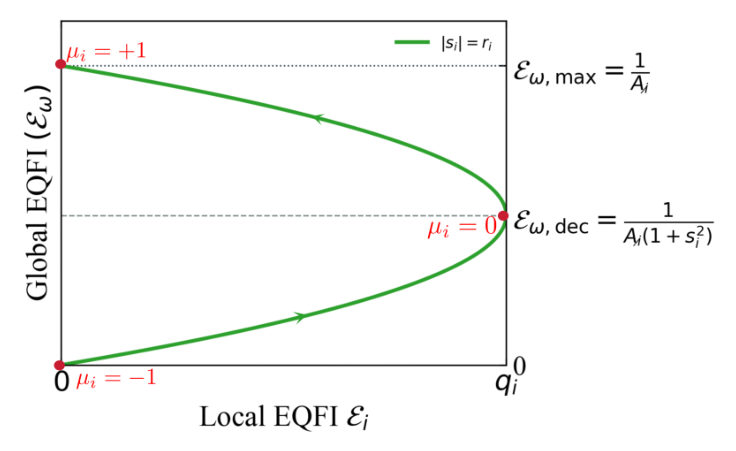
<figcaption class="paper-figure-caption"><b>Fig 5.</b> FIG. 2. Matched singular boundary. For |si| = ri, the aligned branch terminates at Ei = 0 and Ew = 1/A̸i. The overcorrelated regime is absent, and the global target remains estimable at the singular endpoint.</figcaption>
</figure>

**Summary.** This work introduces the Effective Quantum Fisher Information (EQFI) to quantify estimation precision in multi-parameter quantum sensor networks. It develops a phase map revealing that excessive quantum correlations can paradoxically degrade both local and global measurement capabilities. The methodology provides principled guidelines for engineering network states to achieve high global sensitivity while ensuring individual parameters remain locally private.

**Why it may be interesting.** It provides a rigorous geometric framework for understanding how quantum correlations can either enhance or actively degrade sensing performance, offering design principles for optimal network states.

Detailed structure

**Main problem.** The paper characterizes the trade-off between local and global estimation precision in quantum sensor networks while accounting for nuisance parameters.

**Main result.** It establishes a fundamental bottleneck, the 'barrel effect,' bounding global Fisher information by the weakest weighted local sensing capacity, and identifies conditions for achieving intrinsic local privacy.

**Method.** The authors develop an exact Effective Quantum Fisher Information (EQFI)-based phase map to geometrically describe how quantum correlations redistribute metrological information between local and global estimates.

**Model / system.** The system is a general N-node Quantum Sensor Network (QSN) whose estimation precision is governed by the multiparameter Quantum Fisher Information Matrix (QFIM).

**Key observables.** Effective Quantum Fisher Information (EQFI), Global EQFI ($E_w$), Local EQFI ($E_i$), and correlation parameters ($\mu_i, s_i, r_i$).

**Important parameters / regimes.** The optimal correlation strength $\mu^*_i$ defining the transition from beneficial to detrimental correlations.

**Assumptions / limitations.** The analysis assumes the QFIM is nonsingular for core derivations; local privacy is defined as a QFIM-level non-identifiability condition.

**Figures summary.** Figures illustrate the information flow, mapping the trade-off between local and global EQFI across different correlation regimes, including an over-correlated penalty zone.

**Paper structure.** The paper progresses by introducing EQFI, developing the phase map to analyze the local-global trade-off (including the 'barrel effect'), and finally applying this geometry to derive conditions for intrinsic local privacy.

Abstract

Quantum sensor networks typically encode N unknown parameters while targeting a single linear combination, rendering the N-1 remaining parameters as nuisance directions. To rigorously quantify estimation precision under such nuisances, we introduce the concept of effective quantum Fisher information (EQFI) and develop an exact EQFI-based phase map that systematically describes the allocation between local and global EQFI. Leveraging this geometric framework, we identify a fundamental bottleneck termed the "barrel effect": the global EQFI is strictly bounded by the weakest weighted local sensing capacity among all nodes. We further establish concrete conditions for saturating this bound. Crucially, this geometric map delineates how the trade-off between local and global EQFI depends dynamically on quantum correlations, and uncovers a counterintuitive "overcorrelated" regime where excessive correlations actively degrade both local and global performance. Finally, we apply the phase map to intrinsic local privacy and identify the condition under which every local parameter is inaccessible while the desired global combination remains estimable. Overall, our work provides a principled methodology for engineering optimal network states in quantum sensing architectures.

[↑ back to top](#top)

### [Niobium Titanium Nitride as a High Tensile Stress Material for Nanomechanics](http://arxiv.org/abs/2608.07127v1)

**Authors:** Korbinian Rubenbauer, Burak E. Bülbüloglu, Thomas Luschmann, Manuel Müller, Stephan Geprägs, Witlef Wieczorek, Eva M. Weig, Matthias Althammer, Hans Huebl  
**Type:** experiment · **Category:** other · **PDF:** <https://arxiv.org/pdf/2608.07127v1>  
**Analysis basis:** full PDF text, analyzed in chunks
**Topic relevance:** `QC/QI experiment` **2/5** · `analog quantum simulation` **1/5** · `correlated cavity matter` **1/5** · `quantum optics experiment` **1/5** · `spintronics-quantum-optics interface` **1/5**

↔ Scroll figures horizontally

<figure class="paper-figure-card">
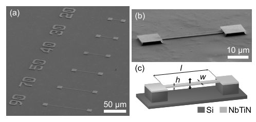
<figcaption class="paper-figure-caption"><b>Fig 1.</b> FIG. 1. Device Layout and Schematics. (a) Scanning elec- tron microscope (SEM) image of one of the examined series of nanostrings. The length of the nanostring increases from 20 µm to 90 µm as indicated by the number adjacent to each string. (b) SEM image of a 30 µm long, 500 nm wide, and 142 nm thin NbTiN suspended nanostring, which is clamped by two square pads with 10 µm side lengths. (c) Schematic of a nanostring, defining the string length l, width w, and thick- ness h.</figcaption>
</figure>
<figure class="paper-figure-card">
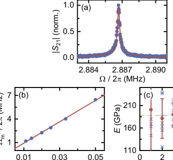
<figcaption class="paper-figure-caption"><b>Fig 2.</b> FIG. 2. Room Temperature Characterization. (a) Op- tical spectroscopy measurement. A typical normalized spec- trum (blue dots) of a 40 µm long string is fitted with Eq. (1). From the fit, we extract a resonance frequency of Ω(1) m /2π = 2.886 687 MHz and linewidth of Γ(1) m /2π = 154 Hz. (b) Inverse length (1/l) dependence of the first harmonic Ω(1) m . Each point is an average over data obtained for multiple strings of the same length. The standard deviation is within the point size. Using the high tensile stress approximation of Eq. (2), we ob- tain a tensile stress of σ = (0.56 ± 0.03) GPa. (c) Young’s modulus E from the higher harmonics of an exemplary 90 µm long string as a function of...</figcaption>
</figure>
<figure class="paper-figure-card">
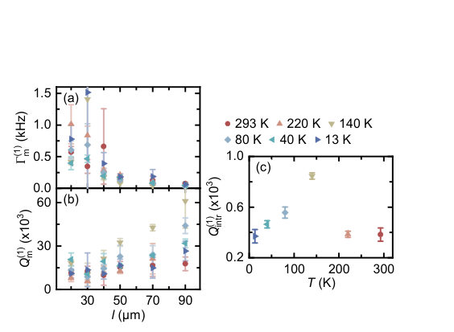
<figcaption class="paper-figure-caption"><b>Fig 3.</b> FIG. 4. Mechanical linewidth and (intrinsic) quality factors. (a) Length dependence of the mechanical linewidth Γm. Average values between different strings of the same length are displayed together with their standard deviation as error bars. An decrease of the loss rate with increasing length is observed. (b) Mechanical quality factor Qm = Ωm/Γm as a function of the string length. Average values between differ- ent strings of the same length are shown together with their standard deviation as error bars. We observe a roughly linear increase of the mechanical quality with length. (c) Intrinsic quality factor Qintr as a function of temperature T, obtained by fitting Eq. (5) to Qm(l). The...</figcaption>
</figure>

**Summary.** This work characterizes Niobium Titanium Nitride (NbTiN) as a promising material for advanced nanomechanical resonators intended for use with superconducting circuits. By measuring resonance frequencies using optical interferometry, the authors determined that NbTiN possesses high tensile stress and good mechanical quality factors across relevant cryogenic temperatures. This establishes it as a viable platform for future cavity electro- and nanomechanics applications.

**Why it may be interesting.** While primarily mechanical/materials science, the focus on superconducting integration and high-quality factor resonators makes it relevant to quantum optomechanics and circuit QED platforms where material limitations are key bottlenecks.

Detailed structure

**Main problem.** The goal is to develop novel, high-performance material platforms for nanomechanical resonators that can be integrated with superconducting circuits.

**Main result.** Niobium Titanium Nitride (NbTiN) was characterized as a promising material due to its favorable mechanical properties, including high tensile stress ($\sim 0.81 	ext{ GPa}$) and a measurable intrinsic quality factor ($Q_{	ext{intr}}$ up to $850$).

**Method.** Mechanical properties were determined by fabricating doubly clamped nanostrings and measuring their resonance frequencies using optical interferometry across varying temperatures.

**Model / system.** The physical system is a thin film of NbTiN used as a nanostring resonator. Analysis involves fitting the measured resonance frequency ($\Omega$) dependence on string length ($l$) or harmonic order ($n$) to extract elastic constants and stress.

**Key observables.** Tensile stress ($\sigma$), Young's modulus ($E$), intrinsic mechanical quality factor ($Q_{	ext{intr}}$), and thermal expansion coefficient ($\alpha$).

**Important parameters / regimes.** High tensile stress up to $0.81 	ext{ GPa}$; Young's modulus of $\sim 181 	ext{ GPa}$; operating temperature range down to $13 	ext{ K}$.

**Assumptions / limitations.** The analysis heavily relies on the high tensile stress approximation for relating resonance frequency to mechanical parameters, and comparisons between different fitting models (e.g., fundamental mode vs. higher harmonics) reveal discrepancies.

**Figures summary.** Figures show SEM images of nanostrings; characterization plots display resonance peaks ($\Omega$ vs $1/l$), the temperature dependence of $\sigma$, $E$, and $Q_{	ext{intr}}$, and comparisons between different fitting models for stress extraction.

**Paper structure.** The paper progresses from establishing the need for new superconducting nanomechanical materials to presenting experimental measurements using optical interferometry. It then details the analysis methods used to extract elastic constants ($\sigma, E$) and quality factors ($Q_{	ext{intr}}$) as functions of temperature and geometry.

Abstract

Over the past decades, high-coherence mechanical resonators have been continuously pushed to new limits, using techniques such as dissipation dilution and clamp-tapering to enhance their quality factor beyond intrinsic material limitations. Today, these mechanical resonators are often fabricated from silicon-nitride, silicon-carbide or aluminum. Recently, however, interest in novel material platforms has grown, especially those allowing for the integration within superconducting circuits. Among these, superconducting nitrides stand out as particularly promising due to their high transition temperatures compared to elementary superconductors. Here, we introduce them as nanomechanical resonators and report on the fabrication and characterization of highly stressed, doubly clamped niobium titanium nitride (NbTiN) nanostring resonators. Using optical interferometry, we determine the elastic properties and mechanical quality factor from room temperature to 13 K. We observe high tensile stress up to 0.81 GPa along with a Young's modulus of 181 GPa and an intrinsic mechanical quality factor up to 850. With these favorable mechanical properties, NbTiN constitutes a promising material platform for future applications in cavity electro- and nanomechanics.

[↑ back to top](#top)

### [A quantum geometric mechanism for chiral domain wall metastability: Application to twisted transition-metal dichalcogenides](http://arxiv.org/abs/2608.07443v1)

**Authors:** Nisarg Chadha, Qiang Gao, Eslam Khalaf, Zhaoyu Han  
**Type:** theory · **Category:** strongly correlated electrons · **PDF:** <https://arxiv.org/pdf/2608.07443v1>  
**Analysis basis:** full PDF text, analyzed in chunks
**Topic relevance:** `driven-dissipative phase transition` **2/5** · `Keldysh / 2PI / non-Gaussian methods` **1/5** · `analog quantum simulation` **1/5** · `spintronics-quantum-optics interface` **1/5**

↔ Scroll figures horizontally

<figure class="paper-figure-card">
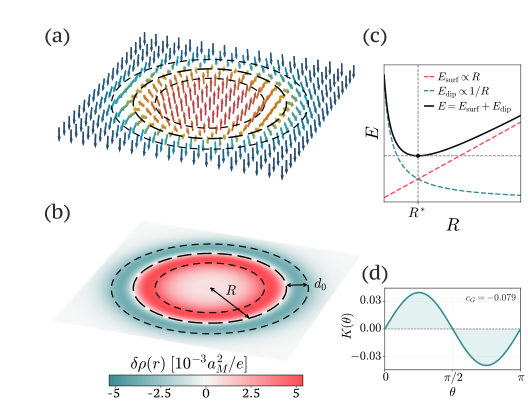
<figcaption class="paper-figure-caption"><b>Fig 1.</b> FIG. 1. Schematic of a quantum-geometric chiral domain wall. (a) shows the schematic of a chiral domain wall of the form described by Eq. (4) with an in-plane wind- ing Nw = 1 in an Ising ferromagnet. (b) shows the induced charge density for the projector given by Eq. (14) with the chiral domain wall in Eq. (4) with R = 14ℓB and d0 = 4ℓB for a system of conjugate lowest Landau levels. (c) shows the competition in the wall energy arising from the surface tension 2πσR and dipolar repulsion ∼(NwcG)2/R, giving a finite-radius metastable minimum. (d) K(θ) vs θ for the spin texture described in Eq. (14) for a setup of two conjugate lowest Landau levels with a mesh size of Nk = 18. The cal-...</figcaption>
</figure>
<figure class="paper-figure-card">
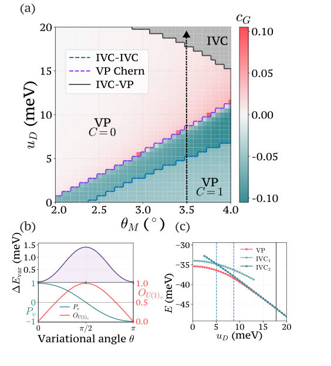
<figcaption class="paper-figure-caption"><b>Fig 2.</b> FIG. 2. Hartree-Fock calculations for cG in the con- tinuum model for tMoTe2. (a) shows the values of cG extrapolated from HF calculations as a function of varying twist angle θM and displacement field uD. (b) shows the en- ergy expectation value per moir´e unit cell and the VP (Pv) and IVC (OU(1)v) order parameters for the variational state parametrized by θ and given by the ground state of the trial Hamiltonian ˆHMF(θ, ϕ) given in Eq. (1) for the tMoTe2 con- tinuum model with twist angle θM = 3.5◦and uD = 0. The variational energy is given with respect to the VP state. (c) HF energy per unit cell for the different phases along a line cut shown by the arrow in (a).</figcaption>
</figure>
<figure class="paper-figure-card">
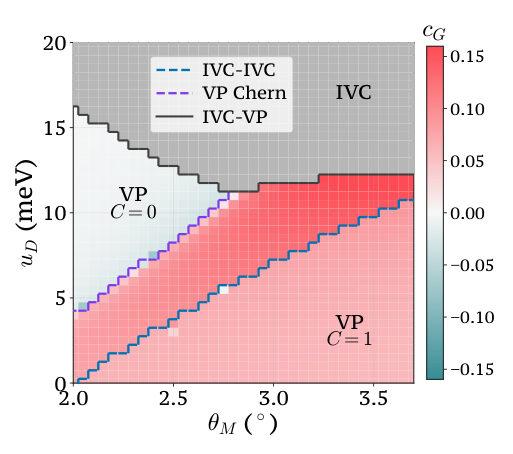
<figcaption class="paper-figure-caption"><b>Fig 3.</b> FIG. 3. Hartree-Fock phase diagram and cG in twisted WSe2. This figure shows the HF phase diagram cG and the computed values of cG across a range of displacement field uD and twist angle θM. cG carries the opposite sign compared to tMoTe2 because at these parameters the signs of the Chern numbers in each valley are flipped compared to tMoTe2.</figcaption>
</figure>

**Summary.** The paper develops a theory showing that band topology dictates a dipole moment associated with chiral domain walls in ferromagnets. Applied to twisted TMDs, this geometric coefficient ($c_G$) predicts that the DW metastability is highly sensitive to topological phase transitions, offering a new diagnostic tool for probing quantum geometry in moiré materials.

**Why it may be interesting.** This work provides a concrete example of how subtle quantum geometric invariants (like the second Chern form moment) can govern macroscopic stability properties (metastability) in condensed matter systems, linking topology directly to observable dynamics.

Detailed structure

**Main problem.** The study investigates how band topology, specifically through a geometric dipole moment, can stabilize chiral domain walls (DWs) in ferromagnets even when the net charge response vanishes.

**Main result.** A non-zero geometric dipole coefficient ($c_G$) leads to an energy cost that stabilizes DWs against collapse, and this coefficient is highly sensitive to topological phase transitions within twisted TMDs like tMoTe2.

**Method.** The authors use symmetry-constrained Hartree-Fock methods on the occupied projector to calculate the mixed real-space–momentum-space second Chern form, which yields $c_G$.

**Model / system.** The system is modeled using twisted transition-metal dichalcogenides (tTMDs) exhibiting conjugate Chern bands. The theory interpolates between Valence Polarized (VP) and Inter-Valley Coherent (IVC) states via a trial Hamiltonian $\hat{H}_{	ext{MF}}(\theta, \phi)$.

**Key observables.** Geometric dipole coefficient ($c_G$), transverse dipole density, domain wall energy $E(R)$, and the Chern number ($C$).

**Important parameters / regimes.** Twist angle ($\theta_M$), layer bias ($u_D$), Zeeman field strength, and the competition between dipolar repulsion and surface tension.

**Assumptions / limitations.** The analysis assumes an internal relative U(1) spin symmetry and time-reversal symmetry. Calculations are performed in the weak coupling regime for some analyses.

**Figures summary.** Figures illustrate the dependence of $c_G$ on system parameters, showing sharp drops across topological transitions (e.g., $C=1$ to $C=0$) that correlate with changes in domain wall stability.

**Paper structure.** The paper establishes a theoretical framework linking band topology to dipole moments in DWs. It then applies this formalism to tTMDs, calculating $c_G$ using HF methods and demonstrating how its variation explains experimental observations of long-lived excitations near topological phase boundaries.

Abstract

Band topology can have an imprint on the excitations of a ferromagnet. A known example is quantum Hall ferromagnets and their lattice analogs; when both flavors have the same Chern number $C$, a smooth skyrmion texture binds charge $-eC$ per unit winding. Here, we consider instead the case of conjugate Chern bands related by time-reversal. We show that, despite the vanishing net charge response, a smooth texture can be associated with a dipole response---a domain wall (DW) with an in-plane winding along its length can bind a nonzero dipole density transverse to the wall. The strength of this dipole density is controlled by a dimensionless coefficient $c_G$. Although not quantized, the geometric dipole coefficient $c_G$ is a moment of the second Chern form of the occupied projector in mixed (momentum and order-parameter) space and is generally nonzero. The dipole-decorated DW can thus become metastable at a finite radius due to the competition between dipolar repulsion and the usual surface tension, even at a finite Zeeman field. In a realistic model of twisted MoTe$_2$, we find that $c_G$ drops sharply across a transition within the valley-polarized (VP) phase from a $C=1$ to a $C=0$ ferromagnet. This naturally explains recent pump-probe experiments~\cite{exp} at hole filling $ν=1$, in which a long-lived excitation survives reverse fields far exceeding the saturation field but disappears at an intermediate displacement field despite only weak changes in conventional magnetic diagnostics. Metastable spin textures thus serve as a sensitive probe of band quantum geometry, and as an intrinsic bottleneck for fast optical control of moiré ferromagnets in Chern-conjugate bands.

[↑ back to top](#top)

### [Designer Codes from GALA: Compact, Self-Dual, and Rate-1/2 QEC on Reconfigurable Atom Arrays](http://arxiv.org/abs/2608.07431v1)

**Authors:** Willers Yang, Casey Duckering, Arpit Dua  
**Type:** theory · **Category:** quantum information and computing · **PDF:** <https://arxiv.org/pdf/2608.07431v1>  
**Analysis basis:** full PDF text, analyzed in chunks
**Topic relevance:** `QC/QI experiment` **2/5** · `Rydberg arrays` **1/5** · `analog quantum simulation` **1/5**

↔ Scroll figures horizontally

<figure class="paper-figure-card">
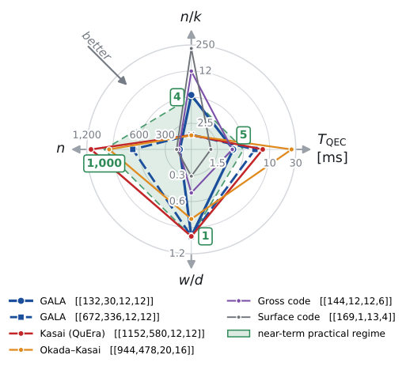
<figcaption class="paper-figure-caption"><b>Fig 1.</b> FIG. 1. GALA codes simultaneously achieve low qubit over- head (n/k, top axis), compact block length (n, left axis), short syndrome-extraction cycles (TQEC, right axis) and low ratio of stabilizer weight w to distance d (w/d, bottom axis) on re- configurable atom arrays. The code parameters in the legend are labeled as [n, k, d, w].</figcaption>
</figure>
<figure class="paper-figure-card">
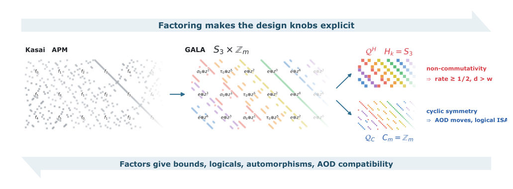
<figcaption class="paper-figure-caption"><b>Fig 2.</b> FIG. 2. GALA: a family of two-block codes lifted over a product group G = Hk ×Cm: the small non-abelian Hk supplies active orthogonality, achieving high rate and above-check-weight distance, while the large abelian Cm supplies symmetries that give both code automorphisms and parallel AOD row/column moves explicitly.</figcaption>
</figure>
<figure class="paper-figure-card">
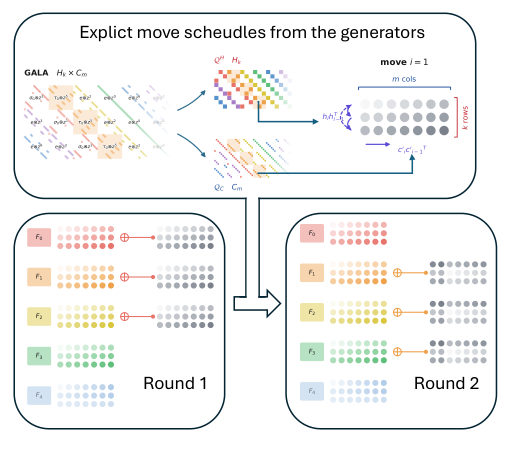
<figcaption class="paper-figure-caption"><b>Fig 3.</b> FIG. 3. Layout and syndrome-extraction schedule read off from the generators. Data atoms occupy a kp × Lq grid and check atoms a kp × Jq grid, writing Cm = Cp × Cq; the row coordinate carries the Hk index and the Cp component, the column coordinate carries the block index and the Cq compo- nent. Round i pairs each check with the data atom selected by the generator at that position of the block circulant, so the rearrangement between consecutive rounds is the transi- tion element FiF T i−1, which for a direct product factors into one rigid row translation σr,i and one rigid column translation σc,i (Eq. (4))—a single pair of AOD sweeps per round.</figcaption>
</figure>
<figure class="paper-figure-card">
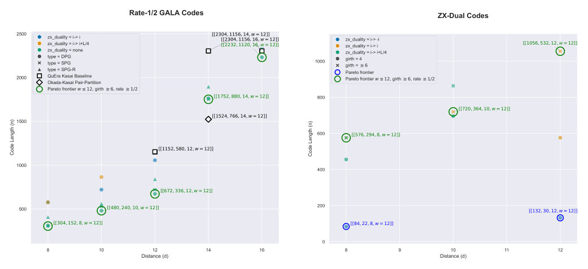
<figcaption class="paper-figure-caption"><b>Fig 4.</b> FIG. 4. GALA codes (lower-right is better). Left: compact codes with n ≤2500, rate ≥1/2, weight ≤12, girth ≥6. Best instances are highlighted in green, including the compact [[480, 240, 10]] and [[672, 336, 12]] and the above-weight [[1752, 880, 14]] and [[2232, 1120, 16]], all shorter than the co-designed Kasai baselines (black) [2]. Rate-1/2 pair-partition codes of Ref. [10] are shown for comparison. Right: ZX-dual codes with fold-transversal gates, notably a girth-4 [[132, 30, 12]] at rate 0.227 and a girth-6, rate-1/2 [[1056, 532, 12]]. Every distance shown for a GALA instance is certified exactly, by complete exclusion of all lower-weight logical operators together with an explicit...</figcaption>
</figure>

**Summary.** The paper introduces GALA codes, an algebraic framework for designing Quantum Error Correction codes tailored specifically for reconfigurable neutral-atom arrays. By constructing these codes using group lifts, the authors ensure that desirable properties like high rate and compatibility with physical gate operations are built in from the start. This yields several highly optimized code candidates suitable for near-term quantum computation.

**Why it may be interesting.** This work directly bridges abstract quantum error correction theory with concrete physical hardware constraints (AODs, limited qubits) by embedding hardware requirements into the code design process itself.

Detailed structure

**Main problem.** The core problem is designing Quantum Error Correction (QEC) codes that are compact, self-dual, and maintain a high encoding rate ($\ge 1/2$) for implementation on near-term quantum hardware.

**Main result.** The authors introduce GALA codes, which provide an algebraically transparent construction method yielding several highly desirable instances, including a compact $[[132, 30, 12]]$ code with low logical error rates.

**Method.** They use Group-Action Lifts over product groups ($G = H_k 	imes C_m$) to build codes. This construction makes hardware compatibility and desired logical operations customizable inputs rather than post-hoc checks.

**Model / system.** The physical platform is reconfigurable neutral-atom arrays (RNAA) using qubits trapped in optical tweezers, with interactions controlled by acousto-optic deflectors (AODs). The code structure is defined algebraically via group theory lifts.

**Key observables.** Code parameters such as block length ($n$), logical qubit count ($k$), distance ($d$), encoding rate ($r$), and syndrome extraction cycle time (TQEC).

**Important parameters / regimes.** Rate $\ge 1/2$, girth $\ge 6$, low logical error rates ($	ext{LER} < 10^{-8}$), and compatibility with AOD-based physical gates.

**Assumptions / limitations.** The analysis assumes the ability to implement specific group structures ($H_k$ non-abelian, $C_m$ abelian) and relies on the algebraic framework of lifts over product groups.

**Figures summary.** Figures compare GALA codes against baselines regarding overhead and cycle time; one figure illustrates the syndrome extraction schedule using AOD sweeps; another details the logical gates ($	ext{H}_	au, 	ext{S}_	au$) for a specific code instance $[[132, 30, 12]]$ via its Gram matrix.

**Paper structure.** The paper introduces GALA codes by defining their algebraic construction using product groups. It then details the resulting properties, presents several optimized code instances in tables (e.g., TABLE S4), and finally analyzes the explicit implementation of logical gates on a representative code instance.

Abstract

High rate quantum low-density parity-check codes on reconfigurable neutral-atom arrays can reduce the overhead of quantum error correction, but near-term devices support only hundreds of qubits with limited reconfigurability from a few crossed acousto-optic deflectors (AOD). A practical code must be compact in addition to low-overhead, with checks and logical gates mapping onto hardware-compatible physical instructions. We introduce the GALA codes, or Group-Action Lifts with Active orthogonality, that lifts over a product group $G = H_k \times C_m$ (or $H_k \ltimes C_m^k$). The small non-abelian factor $H_k$ supplies active orthogonality, reaching $1/2$ rate with above-weight distance, while the large abelian factor $C_m$ supplies symmetries that give code automorphisms and explicit, simple AOD move schedules. Hardware compatibility and logical capability thereby become customizable inputs to a code search rather than properties verified post-hoc, making GALA designer codes by construction. The GALA family contains several previously discovered rate-1/2 Kasai codes of Ref. [arXiv:2601.08824, arXiv:2604.16209] while exposing simpler parameter bounds, logical operations, and ZX-dual variants with AOD-compatible fold-transversal Clifford gates. Our search yields a compact self-dual $[[132, 30, 12]]$ with a small number of $4$-cycles (almost girth-6) and below $10^{-8}$ logical error rate (LER) for memory at $10^{-3}$ physical error rate, 3.1ms syndrome-extraction cycle and transversal Clifford gates; a girth-6, rate-$1/2$ $[[672, 336, 12]]$ with a 6.76ms cycle with below $10^{-10}$ LER (extrapolated) and rate-$1/2$ barrier-breaking $[[1752, 880, 14]]$ and $[[2232, 1120, 16]]$ with exactly certified distances greater than check weights and all smaller than previously known hardware compatible rate-1/2 codes.

[↑ back to top](#top)

### [Ultrafast quantum gate operations in a Kramers-Henneberger atom Qubit](http://arxiv.org/abs/2608.07185v1)

**Authors:** A. Tasnim Aynul, C. Li, L. Cruz Rodriguez, C. Figueira de Morisson Faria  
**Type:** theory · **Category:** quantum information and computing · **PDF:** <https://arxiv.org/pdf/2608.07185v1>  
**Analysis basis:** full PDF text, analyzed in chunks
**Topic relevance:** `QC/QI experiment` **2/5** · `methods for driven-dissipative` **1/5** · `non-equilibrium dynamics` **1/5**

↔ Scroll figures horizontally

<figure class="paper-figure-card">
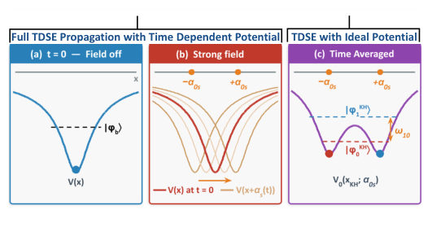
<figcaption class="paper-figure-caption"><b>Fig 1.</b> FIG. 1: Illustration of the Kramers-Henneberger approx- imation. (a) The field-free soft-core potential V (x) = −1/ √</figcaption>
</figure>
<figure class="paper-figure-card">
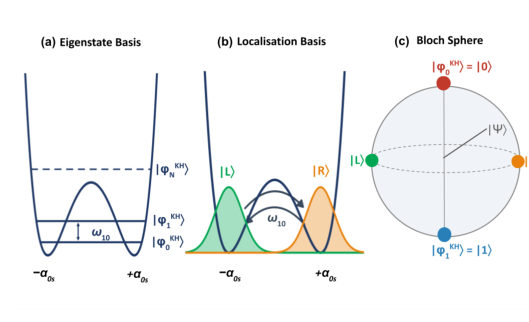
<figcaption class="paper-figure-caption"><b>Fig 2.</b> FIG. 2: Two equivalent basis representations for the KH atom qubit [panels (a) and (b)], together with their Bloch sphere representation [panel (c)]. Panel (a) shows the en- ergy level structure of the KH double-well potential: the two lowest KH eigenstates ϕKH 0 and ϕKH 1 , separated by the energy gap ω10, form the eigenstate qubit basis, with higher-lying states ϕKH N indicated by the dashed threshold line. Panel (b) shows the equivalent localisa- tion basis: the left- and right-localised states |L⟩and |R⟩, given by Eqs. (24) and (25), are coherent superpositions of the KH eigenstates localised in the left (−α0s) and right (+α0s) wells respectively, and undergo coherent os- cillation at...</figcaption>
</figure>
<figure class="paper-figure-card">
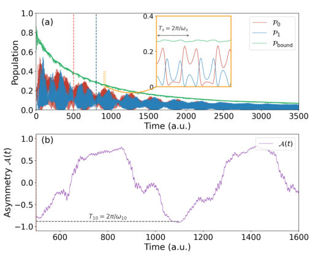
<figcaption class="paper-figure-caption"><b>Fig 3.</b> FIG. 3: Unnormalised qubit populations and asymme- try under the strong field alone, for ε0s = 5 a.u. and ωs = 0.7 a.u. (a) The populations P0 and P1 of the two lowest KH eigenstates ϕKH 0 and ϕKH 1 are shown together with the total bound population Pbound. Fol- lowing the initial ionisation burst during the strong-field turn-on, Pbound decays slowly, retaining roughly 10–15% of the initial population over the pulse. The dashed vertical lines mark two arbitrary times T (1) G = 500 a.u. and T (2) G = 800 a.u., after the onset of stabilisation at Tst = 470 a.u. (see Appendix A), for which weak pulses will be switched on in the subsequent analysis. The in- set magnifies 900 ≤t ≤920 a.u.,...</figcaption>
</figure>
<figure class="paper-figure-card">
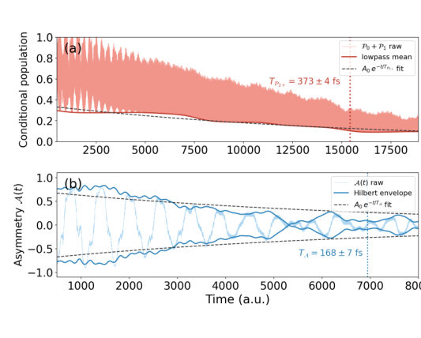
<figcaption class="paper-figure-caption"><b>Fig 4.</b> FIG. 4: Leakage times of the KH qubit under the strong field alone, for ε0s = 5 a.u. and ωs = 0.7 a.u. (a) Popu- lation decay: the qubit-subspace conditional population P0 + P1 (raw, light red) is lowpass filtered to remove the fast ωs oscillations and isolate the slow envelope (low- pass mean, solid red). An exponential fit (dashed) gives the time constant TP2+ = 373 ± 4 fs. The decay re- flects irreversible leakage to higher KH eigenstates P2+, driven by the residual fast oscillations at ωs, rather than coupling to an external bath. (b) Leakage time com- puted from the asymmetry parameter: the raw inter-well asymmetry A(t) (light blue) is bandpass filtered around ω10, and the amplitude of...</figcaption>
</figure>
<figure class="paper-figure-card">
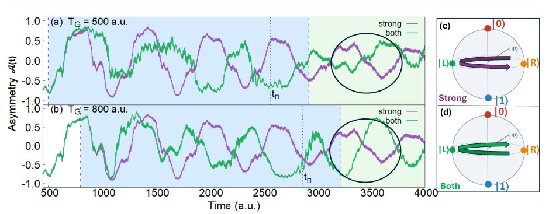
<figcaption class="paper-figure-caption"><b>Fig 5.</b> FIG. 5: Asymmetry A(t) for the π pulse at ε0w = 0.0003 a.u. (a) TG = 500 a.u. and (b) TG = 800 a.u.: the both- fields result (green) is compared against the strong-field-only reference (purple). The background shading indicates the pulse timing: the white region before the first dashed line is the pre-pulse interval where only the strong field is present, the blue shaded region marks the weak pulse window (bounded by the dashed vertical lines at the start and end of the weak pulse), and the green region marks the post-pulse evolution under the strong field alone, after the weak pulse has switched off. The dotted vertical line marks the completion time tπ = τ2 + π/ΩR (at TG + tπ on the...</figcaption>
</figure>

**Summary.** The paper introduces the Kramers-Henneberger atom as a promising, ultrafast platform for quantum computing. By engineering the potential using intense laser fields, they demonstrated coherent single-qubit gates (Z and S) operating on femtosecond timescales. This work suggests a clear pathway toward attosecond-scale quantum operations limited by structured leakage rather than environmental decoherence.

**Why it may be interesting.** This work proposes an entirely new physical mechanism—utilizing strong field dressing to define a qubit basis—for achieving quantum gates at unprecedented speeds, bridging attosecond physics with quantum computation.

Detailed structure

**Main problem.** The authors propose using the Kramers-Henneberger (KH) atom as a novel platform to achieve ultrafast single-qubit gate operations.

**Main result.** They demonstrated coherent Z and S gates on femtosecond timescales, which is six orders of magnitude faster than current superconducting qubit gates.

**Method.** The study relies on solving the time-dependent Schrödinger equation (TDSE) in both the length gauge and a transformed KH frame.

**Model / system.** The physical system is an electron governed by the dynamics within a strong, time-varying laser field, modeled using the KH potential. The qubit basis is defined by the two lowest eigenstates engineered by the strong driving field itself.

**Key observables.** Gate fidelity, gate operation timescales (femtoseconds), and decoherence times.

**Important parameters / regimes.** Strong field parameters ($\epsilon_{0s} = 5.0$ a.u., $\omega_s = 0.7$ a.u.) and weak control field frequencies ($\omega_w$).

**Assumptions / limitations.** The fidelity is limited by structured leakage rather than stochastic decoherence, suggesting the process can be error-suppressed via pulse engineering.

**Paper structure.** The paper introduces the KH atom as a qubit platform, derives the Hamiltonian in different gauges (length and KH frame), simulates gate operations using TDSE solvers, and compares results between full time-dependent and time-averaged descriptions to confirm feasibility.

Abstract

We propose and demonstrate the Kramers-Henneberger KH) atom as a novel qubit platform for ultrafast single-qubit gate operations. In the KH frame, the time-averaged strong laser field engineers a double-well potential whose two lowest eigenstates define the qubit basis, so that the computational structure is created and maintained by the driving field itself. A weak resonant control field drives coherent gate operations: full time-dependent Schrödinger equation simulations with the complete time-dependent KH potential confirm a Z gate and S gate of the order of femtoseconds, six orders of magnitude faster than laser-driven superconducting qubit gates. Decoherence characterisation gives longer decoherence times than those required for the gate operations. The complete six-gate single-qubit set is demonstrated in the time-averaged two-level limit, with strong agreement between the full and time-averaged descriptions confirming that fidelity is limited by structured leakage rather than stochastic decoherence. In principle, this is an error channel suppressible through pulse engineering. These results constitute the first demonstration of coherent single-qubit gates in a strong-field setting, with a clear pathway toward attosecond-scale operations.

[↑ back to top](#top)

### [Exact quantum circuits for lattice Boltzmann realization of the Dirac equation](http://arxiv.org/abs/2608.06570v1)

**Authors:** Nilesh Sawant, Ethan Young, Kevin Griffin, Michael Martin  
**Type:** theory · **Category:** quantum information and computing · **PDF:** <https://arxiv.org/pdf/2608.06570v1>  
**Analysis basis:** full PDF text, analyzed in chunks
**Topic relevance:** `non-equilibrium dynamics` **2/5** · `methods for driven-dissipative` **1/5**

↔ Scroll figures horizontally

<figure class="paper-figure-card">
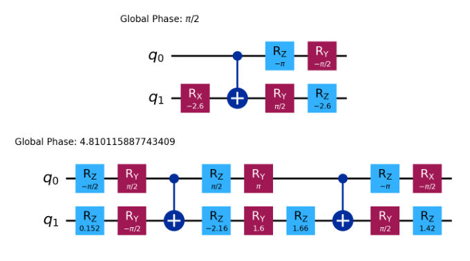
<figcaption class="paper-figure-caption"><b>Fig 1.</b> Figure 1: Transpiled unit gates on the two spinor qubits, in the basis {Rz, Ry, Rx, CX}. Top: the fixed x–rotation Rx of Eq. (8) (one CX, depth 4). Bottom: the collision ˆQ( ˜m=0.3, ˜g=0.1) of Eq. (10) (two CX, depth 9). Both reproduce their target 4 × 4 unitary to gate fidelity 1 (twelve digits).</figcaption>
</figure>
<figure class="paper-figure-card">
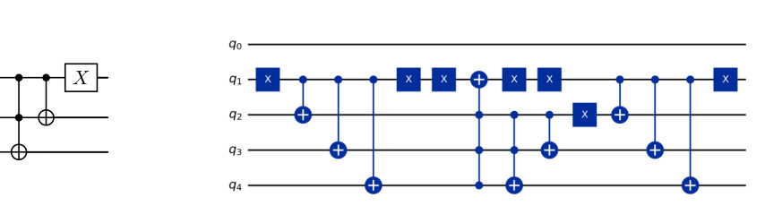
<figcaption class="paper-figure-caption"><b>Fig 2.</b> Figure 2: Streaming circuits. Left: the increment +1 mod 2npos of Eq. (15) for npos = 3 (a ripple of multi–controlled–X gates). Right: the reflecting (bounce–back) streaming of Section 5.5 for npos = 3: the direction qubit q1 is folded into the position register (controlled complement), a single (npos+1)–bit increment is applied, and the register is unfolded. A mover reaching a wall crosses the fold and returns with its direction reversed. Each adjacent pair of X gates on the q1 line is the identity (X2 = I): the panel shows the unoptimized, hand–built circuit, in which those Xs separately bracket the controlled complement and set q1 as the increment’s most significant bit, and the...</figcaption>
</figure>
<figure class="paper-figure-card">
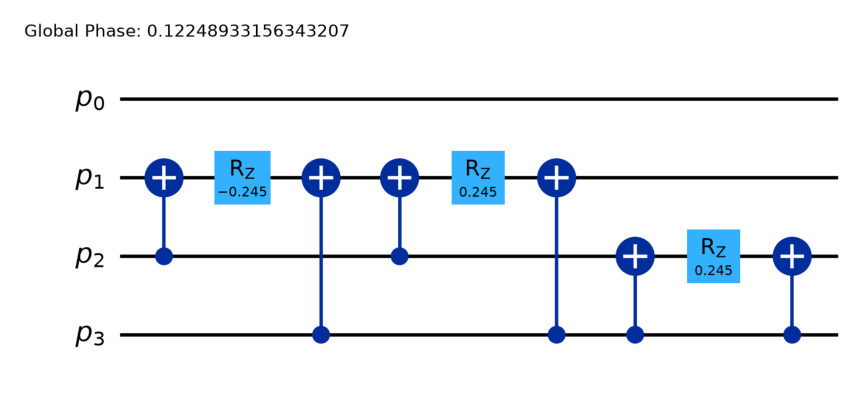
<figcaption class="paper-figure-caption"><b>Fig 3.</b> Figure 3: The transpiled massless potential phase oracle OV of Eq. (19) for the npos = 4 barrier of Table 3: ˜g = 0.5 on the four sites x = 6, 7, 8, 9 of a 16–site line and 0 elsewhere, compiled to {Rz, Ry, Rx, CX} (six CX, three Rz(±θ/2), depth 9, and a global phase θ/4, with θ = 2 arctan(1</figcaption>
</figure>
<figure class="paper-figure-card">
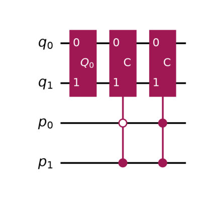
<figcaption class="paper-figure-caption"><b>Fig 4.</b> Figure 4: Position–multiplexed collision for a massive potential (Eq. (20)), on a npos = 2 line with a two–site barrier (˜g = 0.5 on sites x = 2, 3, mass ˜m = 0.3). The vacuum collision ˆQ0 = ˆQ( ˜m, 0) acts on the two spinor qubits (q0, q1) unconditionally; the correction C = ˆQ( ˜m, ˜g) ˆQ( ˜m, 0)−1 is applied to the spinor under control of the position register (p0, p1), once per barrier site (filled circle: control on 1; open circle: control on 0). Off the barrier C is the identity, so no gate is placed there. The two corrections shown share the same C and p1=1, hence reduce to a single C controlled on p1=1.</figcaption>
</figure>
<figure class="paper-figure-card">
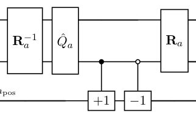
<figcaption class="paper-figure-caption"><b>Fig 5.</b> Figure 5: One QLB substep along axis a (Eq. (6), Algorithm 3): rotate into the characteristic frame, collide on the two spinor qubits, stream by a q1–controlled increment/decrement of the position register, and rotate back. The filled/open control on q1 selects increment/decrement; for reflecting walls the two controlled shifts are replaced by the single folded increment of Algorithm 2. For a massless potential the collision is replaced by the phase oracle (19) on the position register.</figcaption>
</figure>

**Summary.** This paper translates the classical Quantum Lattice Boltzmann method for solving the Dirac equation into an exact sequence of quantum gates. By mapping every physical step—including streaming and collision—to specific unitary circuits, the authors prove that this complex simulation can be run on a gate-model quantum computer. This work establishes a blueprint for simulating relativistic fermionic dynamics using quantum computation.

**Why it may be interesting.** It demonstrates a concrete pathway to implementing complex, non-equilibrium quantum dynamics (like Dirac evolution) directly using known quantum gate primitives, which is crucial for developing quantum simulation algorithms beyond simple Hamiltonians.

Detailed structure

**Main problem.** To determine if the Succi–Dellar Dirac Quantum Lattice Boltzmann (QLB) scheme can be written exactly as a quantum circuit.

**Main result.** The authors provide an exact, gate-level construction for every operation of the 3D Dirac QLB scheme, reproducing classical results to machine precision on state-vector emulators.

**Method.** They map each elementary physical operation (rotation, collision, streaming shift) into a sequence of fundamental quantum gates and circuits.

**Model / system.** The model is the Dirac equation solved via the QLB scheme on a lattice. The simulation uses amplitude encoding across separate spinor and position registers to represent the field state.

**Key observables.** Density deviation (reproduced to machine precision), particle velocity ($v_g$), group velocities, and mean speed relative to $c$.

**Important parameters / regimes.** Lattice size ($N$), dimensionless mass ($	ilde{m}$), potential couplings, and the number of qubits required ($\propto \log N$).

**Assumptions / limitations.** The scope is limited to establishing implementability on a gate-model quantum computer; state preparation and measurement costs are left as open questions.

**Figures summary.** References include comparisons of classical vs. qubit circuit implementations, and analysis showing how oblique motion slows massless particles below $c$ in 2D/3D lattices compared to continuum estimates.

**Paper structure.** The paper first establishes the unitary nature of the QLB steps, then provides gate-level constructions for all components (rotation, collision, shift). It verifies these circuits on emulators across 1D, 2D, and 3D tests before discussing physical implications like velocity dispersion.

Abstract

The quantum lattice Boltzmann (QLB) scheme of Succi and Dellar advances a four-component Dirac spinor on a lattice by a fixed sequence of local, exactly norm-preserving operations: a basis rotation, a collision, a streaming shift, and the inverse rotation. This unitarity is a structural property of the scheme, not an approximation, which suggests that a QLB time step should map onto a sequence of quantum gates. Here we make that mapping explicit. We give a gate-level construction of every operation of the three-dimensional Dirac QLB scheme: the fixed rotation gates, the collision gate, the streaming shift as a controlled increment on a position register, the position-dependent potential as a phase oracle, and periodic and reflecting (bounce-back) boundary conditions as unitary circuits. We then compose them into single-axis, two- and three-dimensional time steps. On a state-vector emulator the resulting circuits reproduce the classical QLB solver to machine precision (maximum density deviation between $3.7\times10^{-12}$ and $1.0\times10^{-17}$ across the one-, two-, and three-dimensional tests), so the circuits are the scheme rather than an approximation of it. The scope is narrow: we establish that the Succi-Dellar theory can be implemented on a (gate-model) quantum computer, and report the associated gate counts. We make no claim of computational advantage; state preparation, measurement, and asymptotic cost are discussed as open questions. All operators, circuits, tests, and figures are reproducible from the open-source quantumKineticMethods library.

[↑ back to top](#top)

### [Investigating Quantum-Embedded Transformers on Classical Datasets for Cross-Modality Classification](http://arxiv.org/abs/2608.06846v1)

**Authors:** Hao-Yuan Chen  
**Type:** experiment · **Category:** quantum information and computing · **PDF:** <https://arxiv.org/pdf/2608.06846v1>  
**Analysis basis:** full PDF text, analyzed in chunks
**Topic relevance:** `QC/QI experiment` **2/5** · `methods for driven-dissipative` **1/5**

↔ Scroll figures horizontally

<figure class="paper-figure-card">
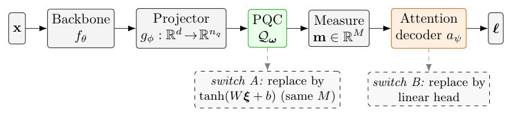
<figcaption class="paper-figure-caption"><b>Fig 1.</b> Figure 1: The core QEA pipeline of Eq. (2). A classical backbone and projector reduce the input to an nq-dimensional angle vector, a parameterized quantum circuit produces a vector of measurement statistics, and an attention decoder maps those statistics to class logits. The two dashed switches define the interface-matched factorial of Section 4: switch A replaces the circuit with an equal- width classical map, and switch B replaces the attention decoder with a linear head. The broader exploratory grid uses the QEA-R variant, which additionally concatenates the projected angles as a residual token stream; that variant is reported separately and is not used for component attribution.</figcaption>
</figure>
<figure class="paper-figure-card">
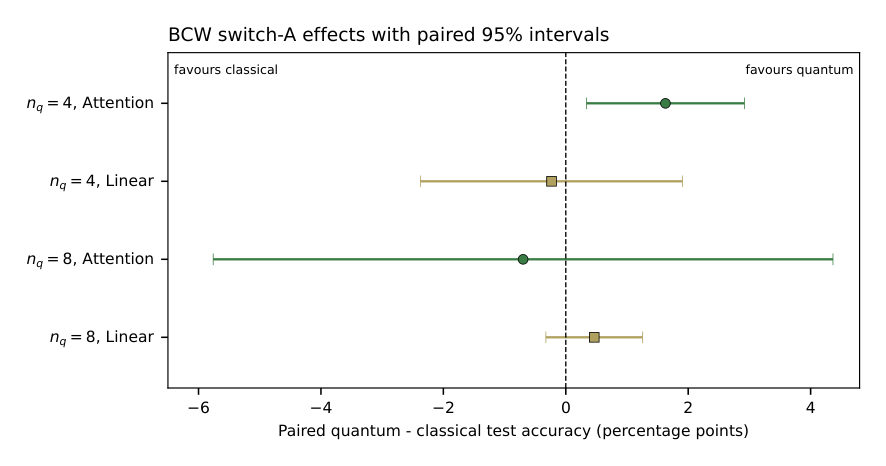
<figcaption class="paper-figure-caption"><b>Fig 2.</b> Figure 2: Paired quantum-minus-classical switch-A effects in the BCW factorial. Points denote the mean within-seed difference and error bars the 95% Student-t interval over five paired seeds. The vertical line marks zero. The plot makes visible both the isolated positive nq = 4 attention contrast and its failure to replicate at nq = 8; numerical values are in Table 2.</figcaption>
</figure>
<figure class="paper-figure-card">
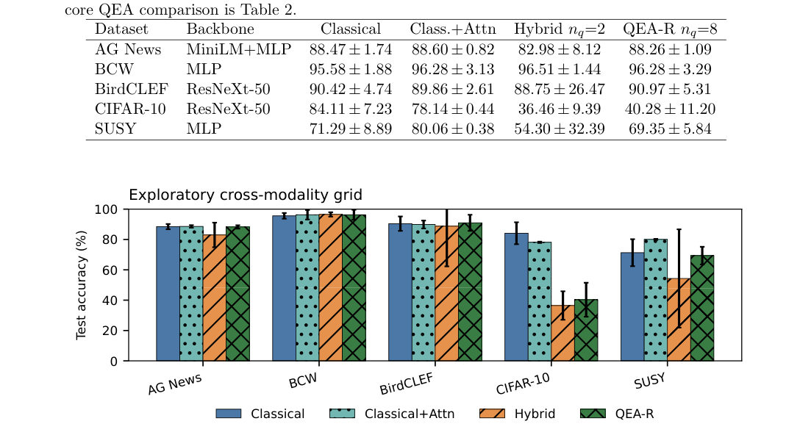
<figcaption class="paper-figure-caption"><b>Fig 3.</b> Figure 3: Exploratory cross-dataset comparison corresponding to Table 4. Error bars are 95% Student-t intervals; fill patterns distinguish methods without relying on color. The figure shows similar point estimates on three datasets, a QEA-R deficit on SUSY, and a large failure of both quantum models on CIFAR-10.</figcaption>
</figure>

**Summary.** This work tests a hybrid transformer model incorporating a Parameterized Quantum Circuit (PQC) for cross-modality classification. By performing controlled component attribution studies against classical baselines, the authors found no consistent evidence of a quantum advantage from the PQC layer. The study emphasizes that careful methodological controls are necessary before any performance gains can be attributed to the quantum components.

**Why it may be interesting.** While focused on ML classification, the rigorous testing of PQC components against classical counterparts provides valuable insights into the necessary conditions for demonstrating genuine quantum utility in hybrid models, which is relevant to understanding resource scaling in complex quantum simulations.

Detailed structure

**Main problem.** The paper investigates whether integrating a Parameterized Quantum Circuit (PQC) into a hybrid quantum-classical transformer architecture improves performance on classical cross-modality classification tasks.

**Main result.** The controlled factorial analysis failed to show any consistent or statistically significant contribution from the PQC, concluding that no quantum advantage was established under the tested protocol.

**Method.** A rigorous component attribution study using an interface-matched $2 	imes 2$ factorial design was employed, systematically replacing the PQC with classical maps and the attention decoder with linear heads.

**Model / system.** The model is Quantum-Embedded Attention (QEA), which processes features through a learnable projector into an angle vector ($\xi$), feeds this into a shallow PQC acting on qubits to generate Pauli expectation values ($\mathbf{m}$), and finally uses a classical attention decoder.

**Key observables.** Paired performance differences ($\Delta Q-C$) derived from the factorial analysis, accuracy metrics across multiple datasets (e.g., Breast Cancer Wisconsin).

**Important parameters / regimes.** $n_q$ (number of qubits), $2 	imes 2$ factorial structure, and controlled comparison against classical baselines.

**Assumptions / limitations.** The primary assumption is that component contributions can be isolated via interface-matched controls; the results are limited to ideal statevector simulations without hardware noise modeling.

**Figures summary.** Notes reference tables detailing forward costs (scaling with $n_q$) and parameter counts for the factorial analysis, but no specific figure summaries were extracted.

**Paper structure.** The paper introduces the QEA architecture, details the controlled component attribution methodology using a factorial design, presents results showing non-significant quantum contributions, discusses cross-modality performance descriptively, and concludes by emphasizing methodological rigor over claiming advantage.

Abstract

We test whether a parameterized quantum circuit (PQC) improves a hybrid quantum-classical model's performance on classical datasets, using an interface-matched classical map as the control while holding all other components fixed. Our architecture, Quantum-Embedded Attention (QEA), uses a learnable projector to compress backbone features into an $n_q$-dimensional angle vector, a shallow PQC to map those angles to one- and two-qubit Pauli expectations, and a classical attention decoder to produce class logits. We hypothesized the PQC would improve accuracy or seed-to-seed stability over a classical map with matched input/output dimensions. We test this with an interface-matched $2\times2$ factorial on Breast Cancer Wisconsin at $n_q\in\{4,8\}$, independently swapping the PQC for a classical map and the attention decoder for a linear head, across five paired seeds per cell. Three of four paired quantum-minus-classical $95\%$ confidence intervals include zero; the fourth, a $+1.63$ percentage-point contrast for the attention decoder at $n_q=4$, reverses sign at $n_q=8$ and does not survive correction across the four contrasts. The experiment thus shows no consistent PQC contribution and cannot establish equivalence. A five-dataset cross-modality grid shows comparable accuracy on AG~News, Breast Cancer Wisconsin, and BirdCLEF but a large deficit on CIFAR-10; these cells are not interface-matched and are interpreted descriptively. We report all planned canonical runs, distinguish current Pauli-readout results from legacy probability-readout experiments, and analyze bottleneck, simulation, finite-shot, and noise limitations. The results do not establish a quantum advantage; they demonstrate why controlled component attribution is necessary before crediting a hybrid model's performance to its quantum layer.

[↑ back to top](#top)

### [Free energy of Ising models under a spectral condition](http://arxiv.org/abs/2608.06500v1)

**Authors:** Andrea Montanari, Michael Ren  
**Type:** theory · **Category:** disordered systems and neural networks · **PDF:** <https://arxiv.org/pdf/2608.06500v1>  
**Analysis basis:** full PDF text, analyzed in chunks
**Topic relevance:** `Keldysh / 2PI / non-Gaussian methods` **1/5** · `analog quantum simulation` **1/5** · `driven-dissipative phase transition` **1/5** · `entanglement & information structure` **1/5** · `exotic spin models in light-matter` **1/5** · `methods for driven-dissipative` **1/5** · `non-equilibrium dynamics` **1/5** · `non-equilibrium universality` **1/5**

↔ Scroll figures horizontally

<figure class="paper-figure-card">
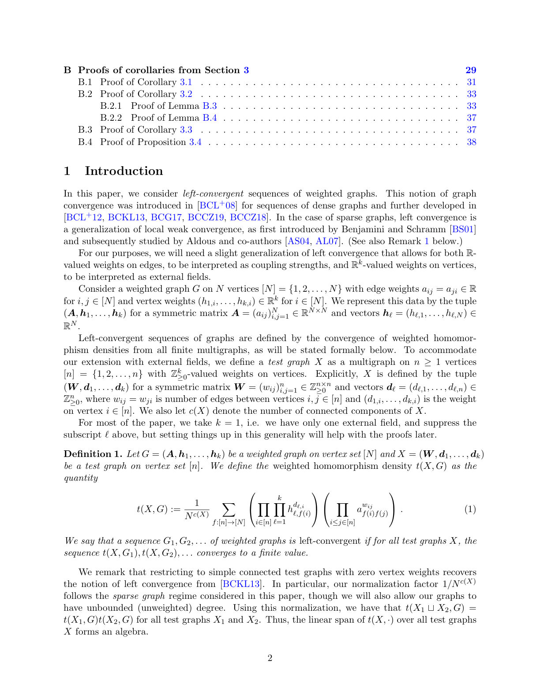
<figcaption class="paper-figure-caption"><b>Fig 1.</b> Low-resolution page preview, page 2</figcaption>
</figure>
<figure class="paper-figure-card">
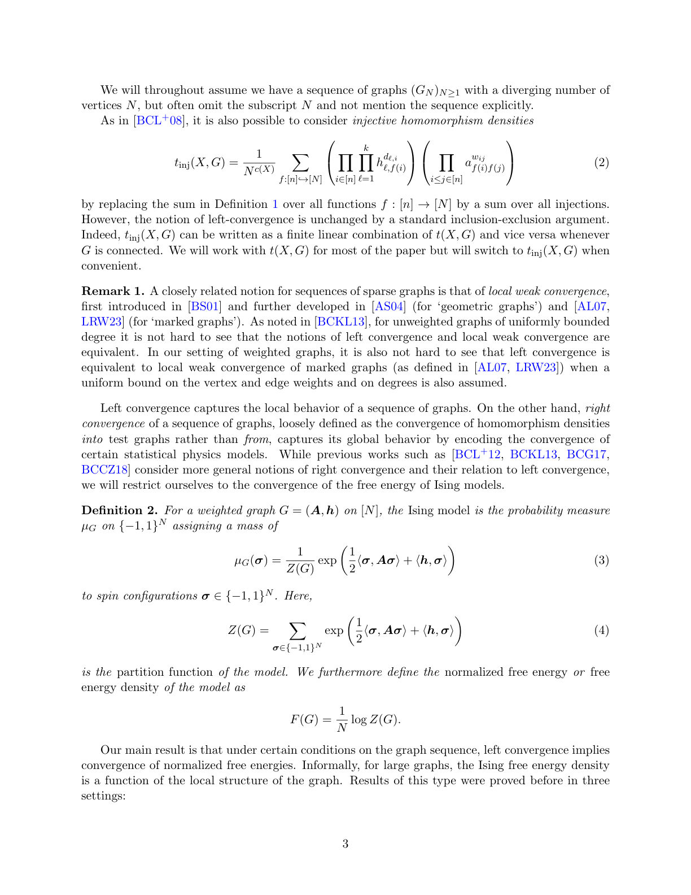
<figcaption class="paper-figure-caption"><b>Fig 2.</b> Low-resolution page preview, page 3</figcaption>
</figure>
<figure class="paper-figure-card">
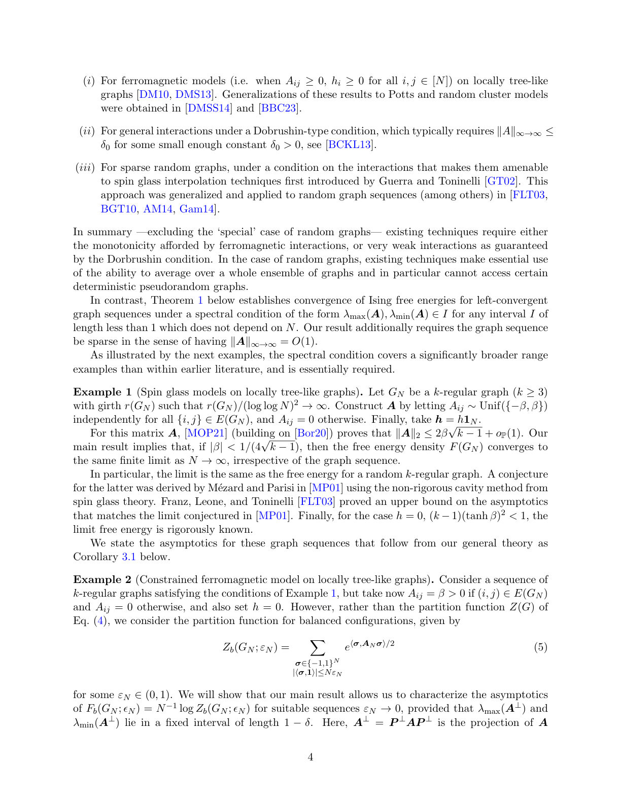
<figcaption class="paper-figure-caption"><b>Fig 3.</b> Low-resolution page preview, page 4</figcaption>
</figure>
<figure class="paper-figure-card">
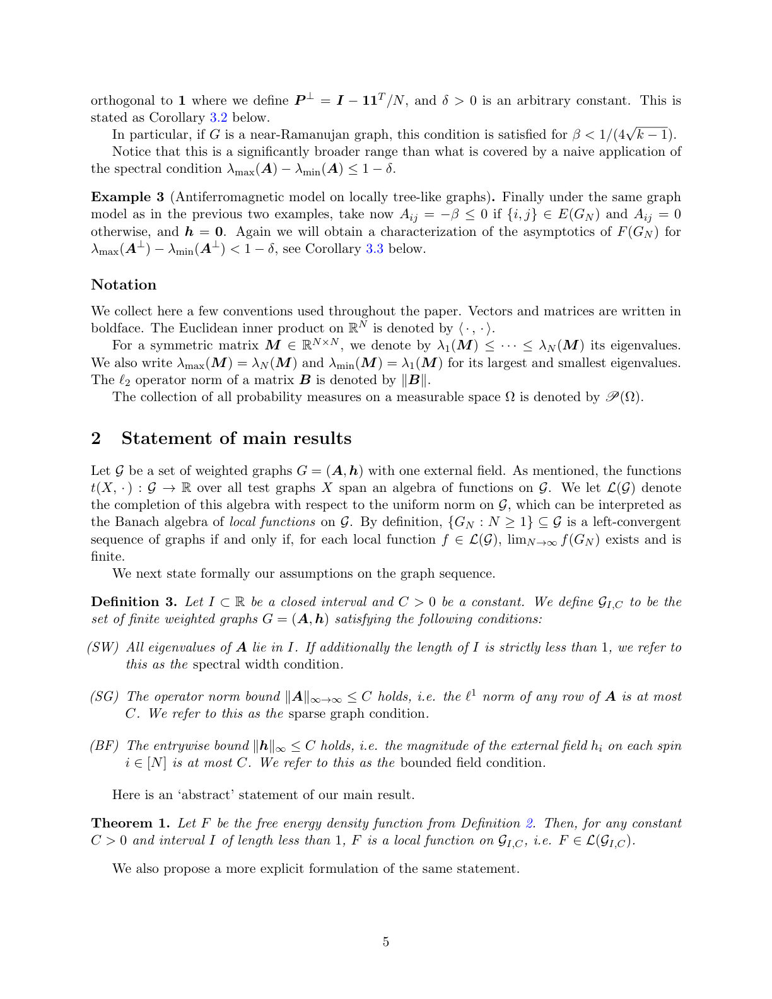
<figcaption class="paper-figure-caption"><b>Fig 4.</b> Low-resolution page preview, page 5</figcaption>
</figure>
<figure class="paper-figure-card">
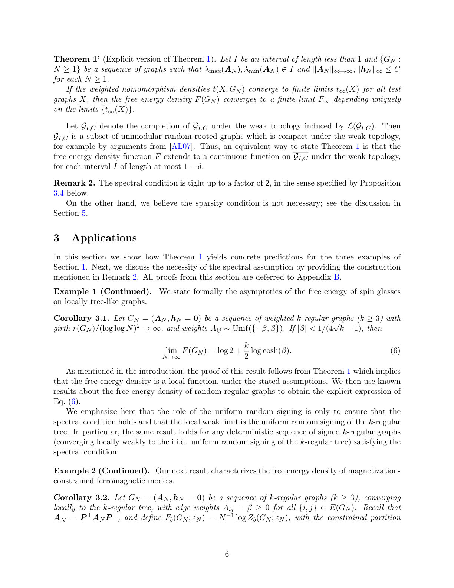
<figcaption class="paper-figure-caption"><b>Fig 5.</b> Low-resolution page preview, page 6</figcaption>
</figure>

**Summary.** This paper rigorously proves that for Ising models defined on sequences of weighted graphs, the free energy density remains stable (continuous) under a specific type of graph convergence called left convergence. This breakthrough relies on imposing a spectral condition on the graph's adjacency matrix and uses advanced techniques involving log-concavity and Langevin dynamics.

**Why it may be interesting.** While focused on classical statistical mechanics, the rigorous mathematical framework connecting local graph structure convergence to global thermodynamic quantities is highly relevant to understanding complex systems modeled by neural networks or random graphs in quantum information theory.

Detailed structure

**Main problem.** The central problem is determining which 'global' graph properties of an Ising model are determined by local weak convergence when the underlying graph structure converges in a specific sense.

**Main result.** Under a spectral condition on the weighted adjacency matrix and sparsity assumptions, the free energy density of the Ising model is proven to be continuous with respect to the left convergence topology.

**Method.** The proof utilizes decomposing the Ising measure into log-concave combinations of product measures and leveraging the rapid mixing properties of Langevin dynamics for such measures.

**Model / system.** The system analyzed is the Ising Model on a weighted graph $G=(A, h)$, whose probability measure is defined by $\mu_G(\sigma) \propto \exp\left(rac{1}{2}\langle \sigma, A\sigma
angle + \langle h, \sigma
angle
ight)$. The analysis focuses on sequences of such graphs indexed by $N$.

**Key observables.** The normalized free energy density, $F(G) = rac{1}{N} \log Z(G)$, is the primary observable.

**Important parameters / regimes.** Spectral properties of the adjacency matrix (eigenvalues lying in an interval $I$ with $|I|<1$), graph sparsity ($\|A\|_{\infty}$ bounded), and external field strength ($h$).

**Assumptions / limitations.** The core result requires a spectral condition on $A_N$ and that the sequence of graphs must be sparse. The continuity proof relies on log-concavity and rapid mixing.

**Figures summary.** Not specified in the notes, but the results provide limit theorems for specific models like spin glasses and anti-ferromagnets.

**Paper structure.** The paper establishes a general framework by relating graph convergence (left convergence) to physical properties. It then proves continuity of the free energy density under spectral conditions using advanced tools from stochastic processes (Langevin dynamics) before deriving explicit limit theorems for various disordered models.

Abstract

A sequence of sparse weighted graphs $(G_N:N\ge 1)$ indexed by the number of vertices $N$ is said to be left-convergent if all (suitably weighted) subgraph counts converge to a limit as $N\to\infty$. This notion generalizes in a natural way Benjamini-Schramm's definition of local weak convergence. A broad research agenda aims at determining which `global' graph properties are determined by left or local weak convergence (in other words, which of these properties are in fact local). We prove that, under a spectral condition on the weighted adjacency matrix ${\boldsymbol A}_N$ of graph $G_N$, the free energy density of the Ising model on this weighted graph is continuous in the left convergence topology (and hence is a local function). Our proof uses the decomposition of the Ising measure as a log-concave combination of product measures, and of the rapid mixing of Langevin dynamics for log-concave measures. As applications, we derive new limit theorems for the free energy density of spin glasses, antiferromagnets, and magnetization constrained ferromagnetic models, on locally tree-like graphs.

[↑ back to top](#top)

### [Distribution of the Radius of Gyration for an ISAW](http://arxiv.org/abs/2608.07195v1)

**Authors:** Antony Lesage, Vincent Dahirel, Jean-Marc Victor, Maria Barbi  
**Type:** theory · **Category:** statistical mechanics · **PDF:** <https://arxiv.org/pdf/2608.07195v1>  
**Analysis basis:** full PDF text, analyzed in chunks
**Topic relevance:** `Keldysh / 2PI / non-Gaussian methods` **1/5** · `driven-dissipative phase transition` **1/5** · `methods for driven-dissipative` **1/5** · `non-equilibrium universality` **1/5**

↔ Scroll figures horizontally

<figure class="paper-figure-card">
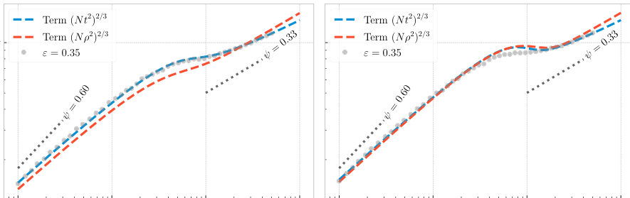
<figcaption class="paper-figure-caption"><b>Fig 1.</b> FIG. 1. Comparison of model predictions with sampled distributions (dots) in medians (left) and in means (right), for the free energy βFε(t) = a1(ε) · Nt + a2(ε) · Nt2 + a3(ε) · (Nt)−q + c ln Nt supplemented by two different surface energy terms: ours (Nt2)2/3 (Equation (56), blue dashed line) and Khokhlov’s (Nρ2)2/3 (red dashed line).</figcaption>
</figure>
<figure class="paper-figure-card">
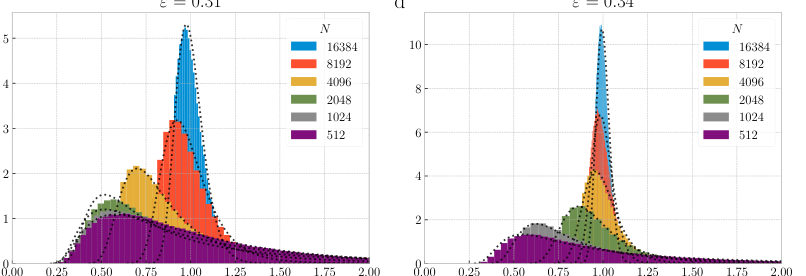
<figcaption class="paper-figure-caption"><b>Fig 2.</b> FIG. 2. Comparison of the agreement between Monte Carlo simulations (histograms) and theory (dotted lines) for different lengths N at different values of ε (a, b, c, d). The distributions are normalized by R2 0, the expectation of the radius of gyration squared.</figcaption>
</figure>
<figure class="paper-figure-card">
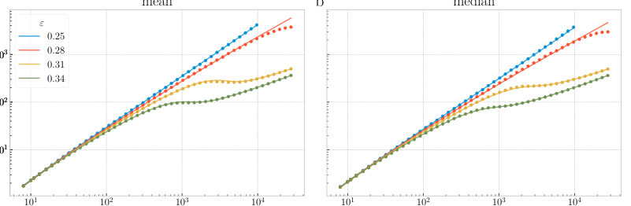
<figcaption class="paper-figure-caption"><b>Fig 3.</b> FIG. 3. Comparison of the agreement between Monte Carlo simulations (dots) and theory (lines) both in mean (a) and in median (b) for different values of ε.</figcaption>
</figure>
<figure class="paper-figure-card">
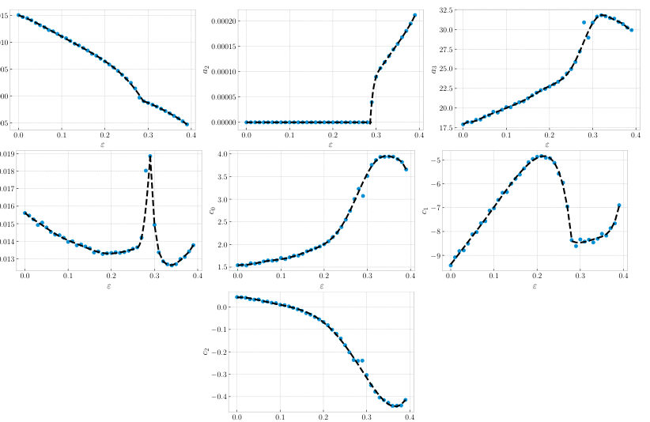
<figcaption class="paper-figure-caption"><b>Fig 4.</b> FIG. 4. Inferred evolution of the free energy parameters a1, a2, a3, a4 and c0, c1, c2 with respect to ε. The dots are the Bayesian fit results, the dashed lines correspond to interpolation functions. These interpolation functions can be reproduced by using the code freely available at https://github.com/antonylsg/model-jupyter.git.</figcaption>
</figure>
<figure class="paper-figure-card">
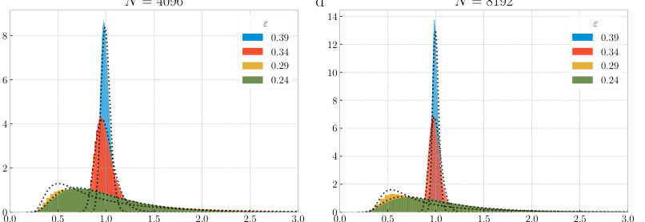
<figcaption class="paper-figure-caption"><b>Fig 5.</b> FIG. 5. Monte Carlo simulations (histograms) and the corresponding theoretical curves (dotted lines) as for Figure 2 but this time for different ε at different values of the lengths N. The distributions are normalized by R2 0, the expectation of the radius of gyration squared.</figcaption>
</figure>

**Summary.** This work develops a theoretical framework to calculate the probability distribution of the radius of gyration for interacting polymer chains (ISAWs). By extending free energy calculations using cumulant expansions, the authors achieve an explicit formula that is validated against detailed Monte Carlo simulations. This allows them to map out the phase diagram governing the coil-globule transition in these polymeric systems.

**Why it may be interesting.** While focused on polymer physics, the rigorous application of scaling theories, critical phenomena analysis (coil-globule transition), and advanced statistical mechanics techniques for finite systems provides methodological insights applicable to analyzing complex many-body systems in AMO or quantum field theory contexts.

Detailed structure

**Main problem.** To derive an explicit, finite-size probability distribution for the radius of gyration ($R$) of an Interacting Self-Avoiding Walk (ISAW) as a function of chain length and interaction energy.

**Main result.** The derived free energy expression shows excellent agreement with extensive Monte Carlo simulations across various regimes, allowing for the construction of a phase diagram for the coil-globule transition.

**Method.** The authors extend existing work using a cumulant expansion approach to derive the free energy, which is then compared against numerical simulation results via Bayesian inference.

**Model / system.** The system modeled is an Interacting Self-Avoiding Walk (ISAW) on a lattice, representing self-attracting linear homopolymers. The interactions are governed by monomer-monomer contact energy ($\epsilon$).

**Key observables.** Radius of gyration ($R$), the probability distribution $P(R\mid \varepsilon, N)$, and the mean radius of gyration $ar{R}$.

**Important parameters / regimes.** Chain length ($N$), monomer-monomer interaction energy ($\epsilon$), and the critical temperature/point ($\Theta$-point).

**Assumptions / limitations.** The derivation relies on extending free energy calculations from non-interacting SAWs using cumulant expansions, assuming analyticity in certain density variables.

**Figures summary.** Figures compare theoretical predictions (inferred free energy parameters) and histograms of $P(R^2|\epsilon, N)$ against Monte Carlo simulation results across different solvent conditions ($\epsilon$) and chain lengths ($N$).

**Paper structure.** The paper develops the theory by first establishing the SAW case, then extending it to ISAW using cumulant expansions. The core is the comparison of the resulting free energy expression with extensive MC simulations to validate the model and map out the phase diagram.

Abstract

We aim at calculating an explicit expression for the finite-size probability distribution of the radius of gyration $R$ of an Interacting Self-Avoiding Walk (ISAW), as a function of chain length $N$ and monomer-monomer interaction energy $\varepsilon$. We first derive the explicit free energy expression for a non-interacting Self-Avoiding Walk, introducing a new natural scale variable $t = ρ^g$ expressed as a power of the density $ρ$. Then, thanks to a cumulant expansion approach introduced by Lhuillier, Victor and coworkers, we extend it to the interacting case, capturing both the coil-globule transition and finite-size corrections to scaling, including entropic and surface-energy contributions. The radius of gyration distribution determined by the new free energy expression is then compared, using Bayesian inference to estimate the model parameters, to results from extensive Monte Carlo simulations of three-dimensional ISAWs, showing excellent agreement except very close to the $Θ$-point, where finite chain lengths limit the accessible scaling regime. This validates our resulting free energy expression and allows us, as an application, to construct a phase diagram of the coil-globule transition.

[↑ back to top](#top)

### [Existence of Kraus decomposition in infinite dimension via strongly-convergent direct process tomography](http://arxiv.org/abs/2608.07207v1)

**Authors:** Paul E. Lammert  
**Type:** theory · **Category:** quantum information and computing · **PDF:** <https://arxiv.org/pdf/2608.07207v1>  
**Analysis basis:** full PDF text, analyzed in chunks
**Topic relevance:** `correlated / nonlocal dissipation` **1/5** · `driven-dissipative phase transition` **1/5** · `methods for driven-dissipative` **1/5** · `quantum measurements` **1/5**

↔ Scroll figures horizontally

<figure class="paper-figure-card">
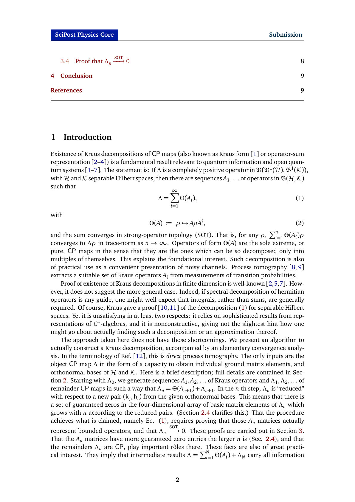
<figcaption class="paper-figure-caption"><b>Fig 1.</b> Low-resolution page preview, page 2</figcaption>
</figure>
<figure class="paper-figure-card">
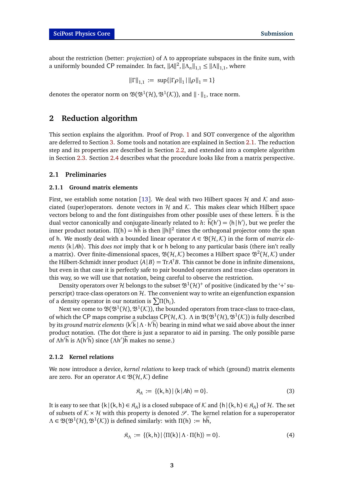
<figcaption class="paper-figure-caption"><b>Fig 2.</b> Low-resolution page preview, page 3</figcaption>
</figure>
<figure class="paper-figure-card">
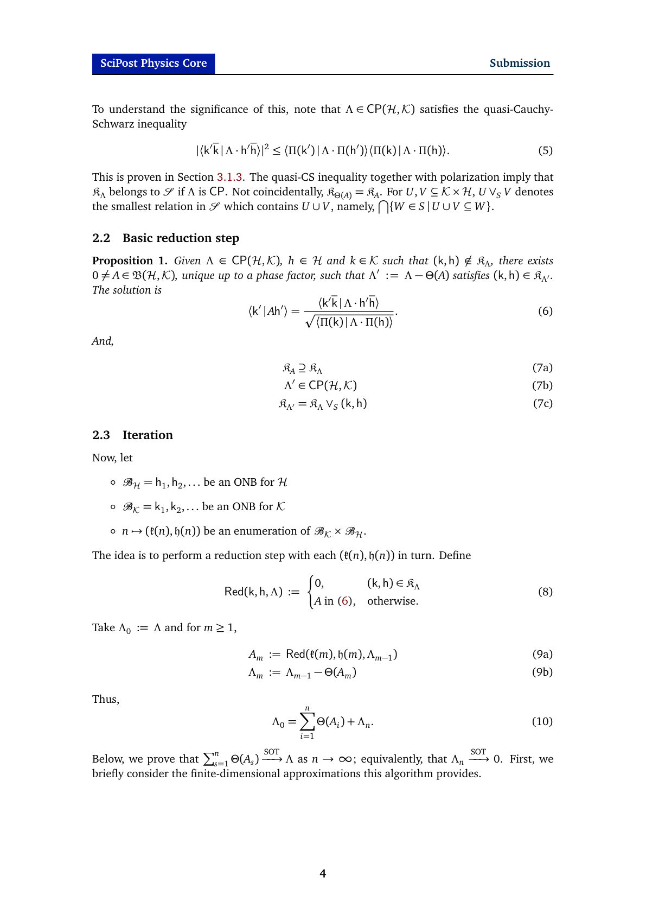
<figcaption class="paper-figure-caption"><b>Fig 3.</b> Low-resolution page preview, page 4</figcaption>
</figure>
<figure class="paper-figure-card">
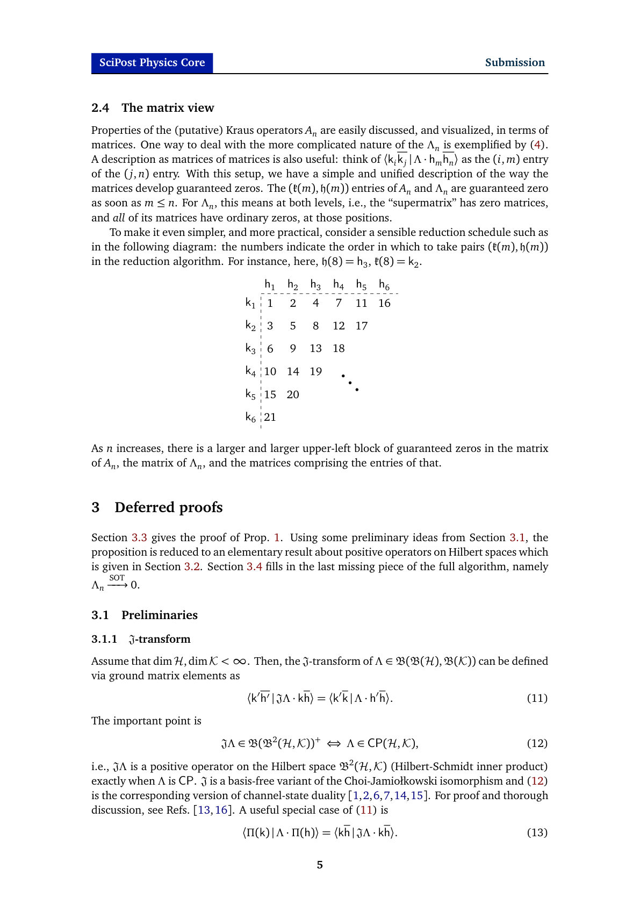
<figcaption class="paper-figure-caption"><b>Fig 4.</b> Low-resolution page preview, page 5</figcaption>
</figure>
<figure class="paper-figure-card">
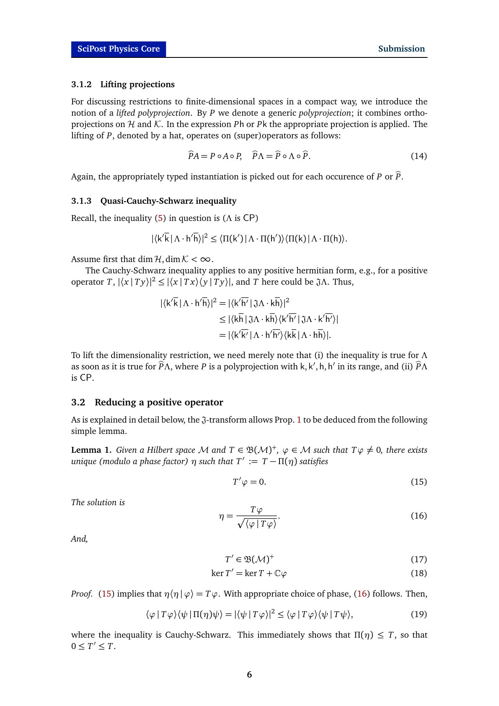
<figcaption class="paper-figure-caption"><b>Fig 5.</b> Low-resolution page preview, page 6</figcaption>
</figure>

**Summary.** This paper introduces a constructive algorithm to find the Kraus decomposition for completely positive maps acting on infinite-dimensional quantum systems. By employing direct process tomography and leveraging strong convergence arguments, it overcomes limitations of previous non-constructive proofs. This provides a powerful, systematic tool for analyzing open quantum evolution in complex physical settings.

**Why it may be interesting.** This work provides a rigorous, algorithmic approach to decomposing quantum operations in infinite dimensions, which is crucial for modeling open quantum systems where continuous variables or infinite degrees of freedom are involved.

Detailed structure

**Main problem.** The primary goal is to develop a constructive algorithm for finding the Kraus decomposition of a completely positive (CP) operator acting on separable, countably-infinite-dimensional Hilbert spaces.

**Main result.** The authors present an elementary and practical algorithm that successfully constructs the Kraus operators and proves that their sum converges in the strong-operator topology (SOT).

**Method.** The method combines direct process tomography with iterative reduction steps, systematically generating Kraus operators one by one while ensuring convergence properties.

**Model / system.** The system involves quantum channels or CP maps ($\Lambda$) acting between separable Hilbert spaces ($H$ and $K$). The decomposition seeks to express $\Lambda$ as a sum of processes generated by Kraus operators: $\Lambda = \sum_{i=1}^{\infty} \Theta(A_i)$.

**Key observables.** The CP map ($\Lambda$), the resulting Kraus operators ($A_i$), and the convergence of the partial sums in SOT.

**Important parameters / regimes.** Separable (countably-infinite-dimensional) Hilbert spaces, orthonormal bases for $H$ and $K$.

**Assumptions / limitations.** The proof relies on extending finite-dimensional results using density arguments involving nested projections ($P_\sigma$) and convergence in the trace norm ($\|\cdot\|_{1,1}$).

**Paper structure.** The paper builds from establishing necessary tools (like the quasi-Cauchy-Schwarz inequality) to first solve the problem for finite dimensions before extending the constructive algorithm and proof of convergence to the infinite-dimensional case.

Abstract

An algorithm is presented for Kraus decomposition of a completely positive operator over separable (countably-infinite-dimensional) Hilbert spaces, together with an elementary proof that the generated sum convergences in strong-operator topology. This improves on the standard, nonconstructive, proof by fusing the abstract problem with practical process tomography. Kraus operators are generated one-by-one, each having one more guaranteed zero matrix entry than the previous one. In this way, the stream of outputs of the algorithm provides a coherent family of Kraus decompositions of restrictions of the target CP map to ever-larger subspaces.

[↑ back to top](#top)

### [Analytic Spread Complexity from Level Statistics: From Chaos to Integrability](http://arxiv.org/abs/2608.07412v1)

**Authors:** Pallab Basu, Suman das, Bigboy Madlala  
**Type:** theory · **Category:** statistical mechanics · **PDF:** <https://arxiv.org/pdf/2608.07412v1>  
**Analysis basis:** full PDF text, analyzed in chunks
**Topic relevance:** `analog quantum simulation` **1/5** · `entanglement & information structure` **1/5** · `non-equilibrium dynamics` **1/5**

↔ Scroll figures horizontally

<figure class="paper-figure-card">
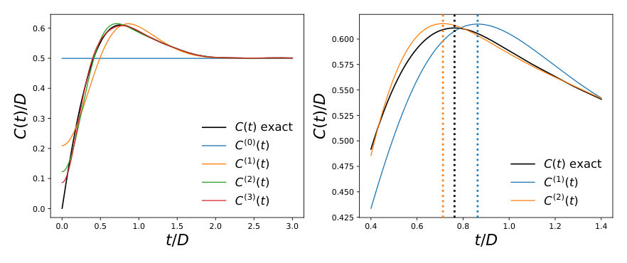
<figcaption class="paper-figure-caption"><b>Fig 1.</b> Figure 1. Comparison of the exact spread complexity C(t) with the successive approx- imations C(0)(t) = C0, C(1)(t), C(2)(t), and C(3)(t). The left panel shows the full time evolution, while the right panel provides an enlarged view of the region around the max- imum; the vertical dashed lines indicate the corresponding peak positions. The figure demonstrates that the exact complexity is accurately reproduced by retaining only the first few diagonals of the Krylov kernel.</figcaption>
</figure>
<figure class="paper-figure-card">
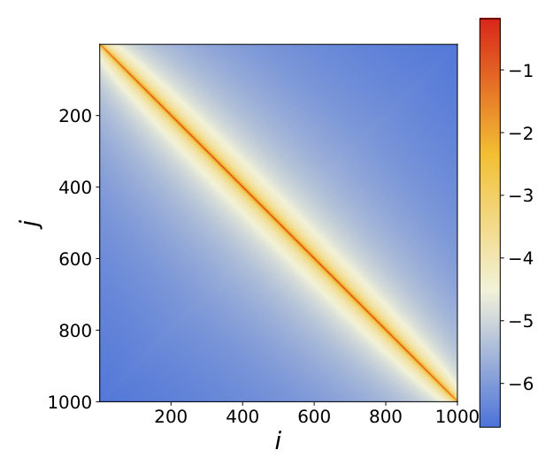
<figcaption class="paper-figure-caption"><b>Fig 2.</b> Figure 2. Heat map of the Krylov kernel K(i, j). The colour scale represents log10(⟨|K(i, j)|⟩), where the ensemble average is taken over 50 realizations. The logarith- mic scale is used to enhance the visibility of the off-diagonal structure. The figure clearly illustrates the approximately banded nature of the kernel, with the magnitude of its matrix elements decreasing as one moves away from the principal diagonal. Although an ensemble average is shown here, the same qualitative behaviour is observed for individual realiza- tions.</figcaption>
</figure>
<figure class="paper-figure-card">
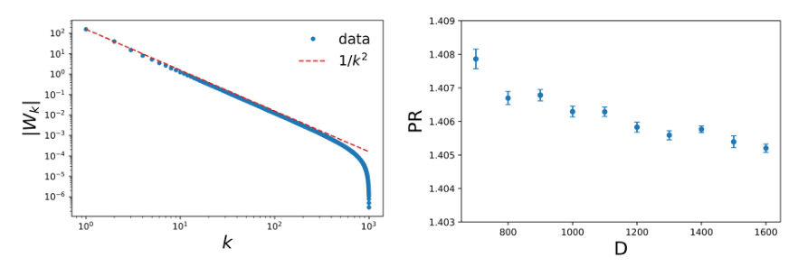
<figcaption class="paper-figure-caption"><b>Fig 3.</b> Figure 3. Left: the integrated off-diagonal weight |Wk|, eq. (3.1), versus k on a log–log scale, showing an approximate 1/k2 decay and confirming the banded structure of the kernel. Right: the disorder-averaged participation ratio PR versus D.</figcaption>
</figure>
<figure class="paper-figure-card">
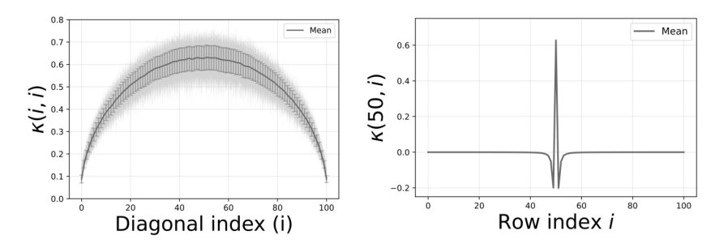
<figcaption class="paper-figure-caption"><b>Fig 4.</b> Figure 4. Diagonal and row-wise profiles of the kernel K(i, j) computed from a single raw GUE spectrum of dimension D = 101. Left: the main diagonal K(i, i), showing an approximately semicircular envelope together with realization-specific fluctuations. Right: the middle row K  (D −1)/2, i  , which remains essentially zero except for a single sharp feature near i ≃D/2, where the row crosses the main diagonal. This confirms that K is strongly peaked near i = j and decays rapidly away from it.</figcaption>
</figure>
<figure class="paper-figure-card">
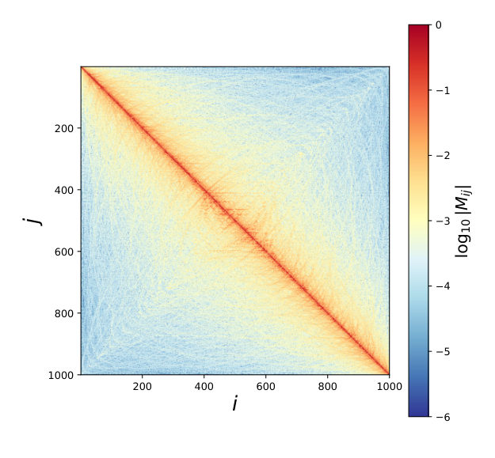
<figcaption class="paper-figure-caption"><b>Fig 5.</b> Figure 5. Heat map of log10 |Mij| for the overlap matrix M = OunfoldOT uni at D = 1000, shown on a six-decade diverging color scale. The matrix is sharply concentrated along the principal diagonal, where |Mij| ∼1, and decays by several orders of magnitude within a narrow band around it, indicating that the transformation between the uniform-lattice and unfolded polynomial-evaluation matrices is approximately local in the ordered spectral index.</figcaption>
</figure>

**Summary.** This theoretical work develops an analytic framework to understand 'spread complexity,' a measure used to probe quantum chaos. By analyzing the structure of the Krylov kernel in energy space, the authors derive a formula linking this complexity directly to the Fourier transforms of nearest-neighbor level spacing distributions. This successfully explains the spectral origin of the characteristic peak observed in chaotic systems while correctly predicting the monotonic behavior in integrable limits.

**Why it may be interesting.** The connection drawn between dynamical measures like complexity and fundamental spectral statistics provides deep insight into quantum chaos, which is relevant for understanding energy level spacing in complex quantum systems studied in AMO physics.

Detailed structure

**Main problem.** The paper aims to resolve the microscopic spectral origin of the characteristic finite-time peak observed in 'spread complexity,' a key diagnostic tool for quantum chaos.

**Main result.** It derives an analytic expression for spread complexity based on local spectral statistics, successfully describing both chaotic random-matrix ensembles and the integrable Poisson limit. This framework directly connects Krylov dynamics to spectral properties.

**Method.** The authors develop an analytic framework by analyzing the energy-space representation of the Krylov kernel, exploiting its approximate banded structure to relate complexity to Fourier transforms of nearest-neighbor spacing distributions.

**Model / system.** The analysis concerns time evolution governed by a time-independent Hermitian Hamiltonian H on a quantum many-body system. The core mathematical tool is the Krylov kernel derived from this energy spectrum.

**Key observables.** Spread complexity, $C(t)$; finite-time peak structure; local spectral statistics (nearest-neighbor spacing distributions).

**Important parameters / regimes.** The analysis considers regimes ranging from chaotic random-matrix ensembles to the integrable Poisson limit. The large-$D$ limit is frequently employed.

**Assumptions / limitations.** Key assumptions include the approximate banded nature of the Krylov kernel and utilizing an 'approximate kernel-universality hypothesis' relating it to a uniform lattice.

**Figures summary.** Figures illustrate the convergence of complexity approximations using successive diagonals of the kernel, comparing exact results against truncated series expansions for both chaotic and Poisson regimes.

**Paper structure.** The paper progresses by first establishing the energy-space representation of spread complexity; it then uses the banded structure to derive a master formula linking complexity to spectral statistics; finally, it applies this framework to analyze known limits (chaotic vs. integrable) to pinpoint the origin of the peak.

Abstract

Spread complexity has emerged as a useful probe of quantum chaos, yet the microscopic spectral origin of its characteristic finite-time peak remains incompletely understood. We develop an analytic framework that relates spread complexity directly to local spectral statistics. Starting from an energy-space representation of the Krylov kernel, we show that the kernel is approximately banded, leading to a rapidly convergent diagonal expansion dominated by nearby levels in the ordered spectrum. Motivated by this structure, we propose an approximate kernel-universality hypothesis: after unfolding, the Krylov kernel is well approximated by that of a uniform lattice. Combining this universal kernel with local spectral statistics yields a simple analytic expression for spread complexity in terms of the Fourier transforms of the $k$-th nearest-neighbour spacing distributions. In particular, at leading order, the finite-time peak is controlled by the Fourier transform of the nearest-neighbour spacing distribution. The resulting framework describes both chaotic random-matrix ensembles and the integrable Poisson limit, identifies the spectral origin of the complexity peak and its late-time behaviour, and provides a direct connection between Krylov dynamics and spectral statistics.

[↑ back to top](#top)

### [Emergent magnetic pseudogap from phase fluctuations and hierarchy of scales in two-dimensional superconductors](http://arxiv.org/abs/2608.07238v1)

**Authors:** Xu-Cheng Wang, Yang Qi  
**Type:** theory · **Category:** strongly correlated electrons · **PDF:** <https://arxiv.org/pdf/2608.07238v1>  
**Analysis basis:** full PDF text, analyzed in chunks
**Topic relevance:** `Keldysh / 2PI / non-Gaussian methods` **1/5** · `correlated / nonlocal dissipation` **1/5** · `driven-dissipative phase transition` **1/5**

↔ Scroll figures horizontally

<figure class="paper-figure-card">
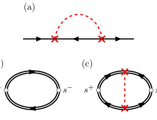
<figcaption class="paper-figure-caption"><b>Fig 1.</b> FIG. 1. (a) Leading-order correction to the electronic Green’s function, from which the self-energy Eq. (3) is deduced. The red dashed line denotes the average over fluctuating pair- ing correlations. (b) Bubble graph to the spin susceptibil- ity χ−+(q, iωn). The doubled line represents the interacting Green’s function G−1 = [G(0)]−1 −Σ. (c) Leading-order ver- tex correction to χ−+(q, iωn).</figcaption>
</figure>
<figure class="paper-figure-card">
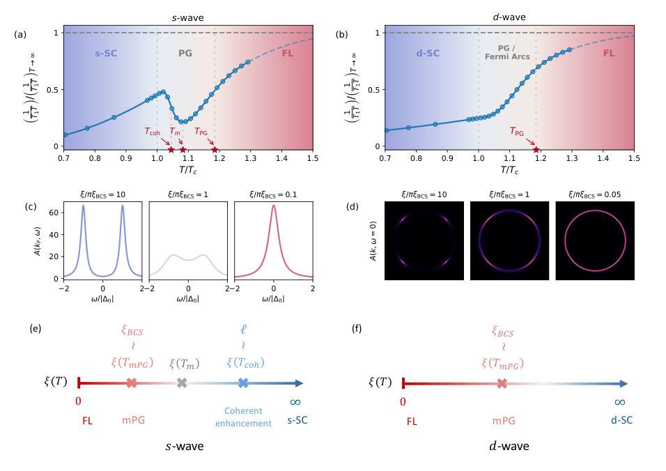
<figcaption class="paper-figure-caption"><b>Fig 2.</b> FIG. 2. (a)(b) Spin-lattice relaxation rate 1/T1T with respect to temperature T, including bubble-graph contribution and leading-order vertex correction. The correlation length is given by the BKT relation ξ(T) = ξ0 exp(bt−1/2 r ) in the normal state, and set to infinity for T below Tc. Parameters are taken as follows: m = 1, kF = 2.2, βc = 7.75, ∆0 = 0.6, Γ0 = 0.1, b = 1.4, ξ0 = 0.1. The emergent scale of magnetic pseudogap ξ(TmPG) is marked out. For an s-wave system, the scales of coherent enhancement ξ(Tcoh) and 1/T1T dip ξ(Tm) are additionally identified. (c)(d) Evolution of (c) charge pseudogap and (d) Fermi arcs in d-wave system as a competition of ξ and ξBCS = vF /π|∆0|. (e)(f)...</figcaption>
</figure>
<figure class="paper-figure-card">
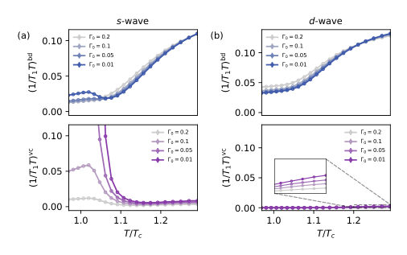
<figcaption class="paper-figure-caption"><b>Fig 3.</b> FIG. 3. Bubble-graph contribution (1/T1T)bd and leading- order vertex correction (1/T1T)vc with respect to temperature T for (a) s-wave and (b) d-wave systems. The specific model parameters are identical to those adopted in Fig. 2, except that the background scattering strength Γ0 is varied.</figcaption>
</figure>
<figure class="paper-figure-card">
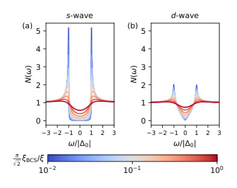
<figcaption class="paper-figure-caption"><b>Fig 4.</b> FIG. 6. Local density of states N(ω) = P</figcaption>
</figure>
<figure class="paper-figure-card">
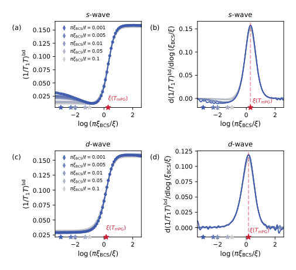
<figcaption class="paper-figure-caption"><b>Fig 5.</b> FIG. 4. (a)(c) Bubble-graph contribution (1/T1T)bd with re- spect to the BKT correlation length ξ. We have set EF = 2, ∆0/EF = 1/4, β|∆0| = 5, and vF = 2. (b)(d) Derivatives of (1/T1T)bd in (a)(c) with respect to log(ξBCS/ξ). ξ(TmPG) is identified by locating the maximum of the derivative. We also mark the varying πξBCS/ℓon the axis for comparison.</figcaption>
</figure>

**Summary.** This work theoretically predicts an emergent magnetic pseudogap in 2D superconductors arising purely from phase fluctuations. By analyzing the NMR relaxation rate (1/T1T), the authors show that the full temperature dependence is governed by a hierarchy of competing length scales: BKT correlations, BCS coherence, and background scattering. This provides a unified theoretical framework for understanding normal-state superconducting signatures.

**Why it may be interesting.** The detailed analysis of spectral function divergences (like the Hebel-Slichter peak) and their regularization via scattering lengths provides a rich theoretical playground for understanding how quantum fluctuations modify fundamental superconducting signatures, relevant to strongly correlated systems.

Detailed structure

**Main problem.** To theoretically identify an emergent magnetic pseudogap in two-dimensional superconductors arising purely from phase fluctuations, independent of invoking competing ordered states.

**Main result.** The paper establishes a unified picture where the normal-state spin relaxation rate (1/T1T) evolves based on the interplay between three characteristic length scales: the BKT correlation length ($\xi(T)$), the BCS coherence length ($\xi_{BCS}$), and an external scattering length ($\ell$).

**Method.** The analysis uses perturbation theory applied to the NMR relaxation rate (1/T1T), calculating contributions from both bubble diagrams and leading-order vertex corrections.

**Model / system.** The study focuses on 2D superconductors, modeled phenomenologically with a Hamiltonian incorporating spatially fluctuating superconducting order parameters ($\Delta(r, s)$). Comparisons are made between d-wave and s-wave pairing symmetries.

**Key observables.** NMR relaxation rate (1/T1T), charge pseudogap scale, magnetic pseudogap scale ($T_{mPG}$), and the coherence enhancement peak near $T_c$.

**Important parameters / regimes.** BKT correlation length $\xi(T)$, BCS coherence length $\xi_{BCS}$, background scattering length $\ell$, superconducting gap ($\Delta_{SC}$), and transition temperature ($T_c$).

**Assumptions / limitations.** The analysis assumes the validity of treating static phase fluctuations near the BKT point, allowing for a perturbative expansion in terms of weak pairing.

**Figures summary.** Figures illustrate how characteristic scales like $\xi(T_{mPG})$ and $\xi(T_{coh})$ are determined by analyzing the derivatives or maxima of the calculated 1/T1T contributions with respect to varying length scale ratios.

**Paper structure.** The paper develops a theoretical framework for phase fluctuations, calculates the leading-order corrections to $1/T_1T$ (bubble and vertex), distinguishes behavior between d-wave and s-wave systems, and finally unifies these results by showing how all scales ($\xi(T)$, $\xi_{BCS}$, $\ell$) govern the full temperature evolution of $1/T_1T$.

Abstract

Preformed pairs and phase fluctuations are believed to play a vital role in predicting the charge pseudogap in the normal state of two-dimensional superconductors. In this work, we extend this idea and further identify the emergent magnetic pseudogap from pure phase fluctuations without invoking any competing order. We examine the NMR relaxation rate $1/T_1T$ by evaluating the bubble contribution and leading-order vertex correction within perturbation theory. It is found that the magnetic pseudogap, manifesting as a smooth suppression of $1/T_1T$ in the normal state, is characterized by a temperature scale $T_\text{mPG}$ distinct from the superconducting gap $Δ_\text{SC}$ and transition temperature $T_c$. The onset scales of both charge and magnetic pseudogap are dominated by the competition of BKT correlation length $ξ(T)$ and BCS coherence length $ξ_\text{BCS}$. Moreover, the vertex correction is shown to be irrelevant for $d$-wave pairing, while it becomes prominent in $s$-wave systems and drives a coherent enhancement of $1/T_1T$ at lower temperatures just above $T_c$. We attribute this normal-state enhancement of $1/T_1T$ to the diverging coherence peak at the $s$-wave superconducting gap edge, which shares the same spirit as the celebrated Hebel-Slichter peak in the BCS theory. Analogous to the coherent Hebel-Slichter peak, regularization by Fermi-liquid-like scatterings is important and is characterized by a scattering length $\ell$. The normal-state coherent enhancement of $1/T_1T$ is hence described by the competition of $ξ(T)$ and $\ell$, through which the coherence scale $T_\text{coh}$ is determined. As a result, the complete evolution of $1/T_1T$ is understood quantitatively in a unified picture as the interplay among hierarchy of scales $ξ(T)$, $ξ_\text{BCS}$ and $\ell$.

[↑ back to top](#top)

### [Quantum Computers will constrain the Equation of State of Neutron Stars](http://arxiv.org/abs/2608.06515v1)

**Authors:** Adrián Castaño-García, Nahia J. Dios-Bilbao, J. J. Gálvez-Viruet, Felipe J. Llanes-Estrada, Marío Logrosán-Álvarez, Nicolás M. Arenaza, María Gómez-Rocha  
**Type:** theory · **Category:** other · **PDF:** <https://arxiv.org/pdf/2608.06515v1>  
**Analysis basis:** full PDF text, analyzed in chunks
**Topic relevance:** `Keldysh / 2PI / non-Gaussian methods` **1/5** · `analog quantum simulation` **1/5** · `methods for driven-dissipative` **1/5**

↔ Scroll figures horizontally

<figure class="paper-figure-card">
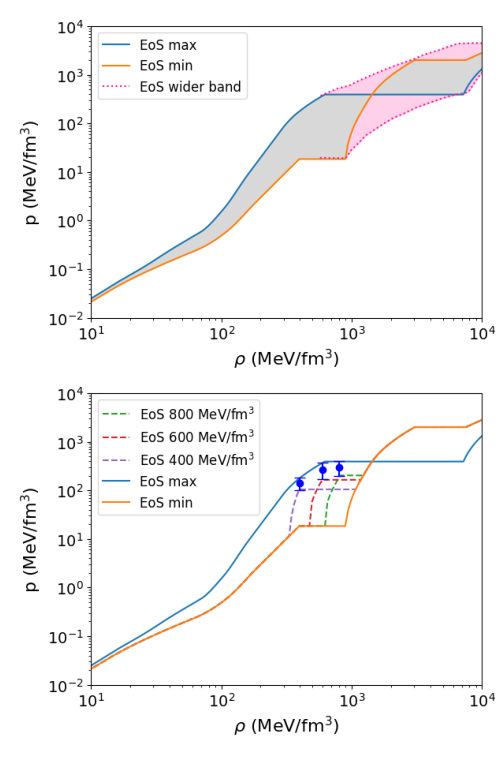
<figcaption class="paper-figure-caption"><b>Fig 1.</b> FIG. 1. Top panel: Uncertainty band for the EoS P(ρ). EoS min/max are the lower/upper bounds (below an even- tual first order phase transition) while respecting stability (cs ≥0)/causality (cs ≤1) once microscopic physics has been accounted , at both low and high ρ. Bottom: Eventual improvement of the EoS to narrow the current band, which quantum computer investigations should aim to achieve.</figcaption>
</figure>
<figure class="paper-figure-card">
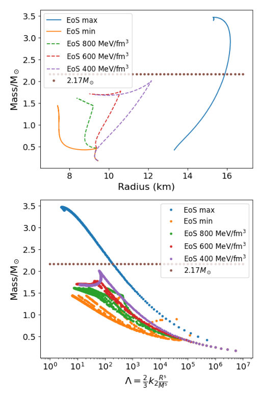
<figcaption class="paper-figure-caption"><b>Fig 2.</b> FIG. 2. Top panel: Mass (in solar masses) against neutron- star radius. Bottom: Mass against Tidal deformability. The extreme lines show the current prediction of these observables excluding astrophysical constraints, from microscopic theory alone. The intermediate lines, from the left bottom corner towards the right and up, represent the improved predictions if one (ρ, P) point is calculated at the densities marked in the bottom plot of Fig. 1 (note that their uncertainty bands are anchored at the stiffest EoS, so they lift the softest one).</figcaption>
</figure>
<figure class="paper-figure-card">
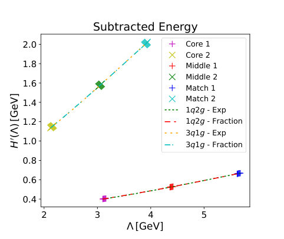
<figcaption class="paper-figure-caption"><b>Fig 3.</b> FIG. 3. Energies obtained after applying Eq. (67) to the mini- mum of the expectation value of the Hamiltonian constrained by Gauss’ law. We see no sensitivity to changing the fitting procedure, “Exp” denoting an exponential function fit, see Eq. (72) and “Fraction” a fit with a fraction of polynomi- als, see Eq. (73). We do see strong sensitivity to the trial variational wavefunction. This is expected, and a working large-scale quantum computer, with its massive Hilbert space, would be the tool to address it.</figcaption>
</figure>
<figure class="paper-figure-card">
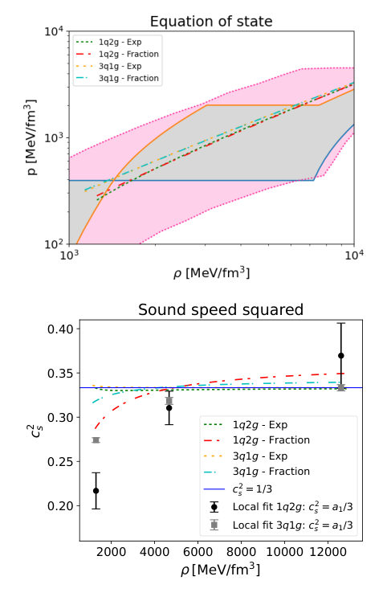
<figcaption class="paper-figure-caption"><b>Fig 4.</b> FIG. 4. Pressure and sound velocity squared as functions of the energy density, obtained from the minimum of the time- axial QCD Hamiltonian expectation value evaluated with the variational wavefunction described in Sec. IV A 1 and IV A 2, and after applying Eq. (67).</figcaption>
</figure>
<figure class="paper-figure-card">
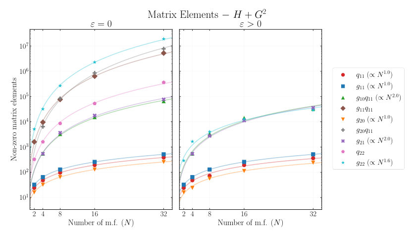
<figcaption class="paper-figure-caption"><b>Fig 5.</b> FIG. 5. Left: number of non-vanishing matrix elements for the combined operator H + G2 associated to each interaction term against the number of momentum fractions (momentum grid size). Right: remaining ones after applying a cutoff ε given by (74) setting those too small and compatible with noise to be exactly zero. The legend includes selected monomial fits for the scaling of each interaction term with the number of modes after applying the cutoff ε.</figcaption>
</figure>

**Summary.** This paper outlines a quantum computing approach to solve the intractable problem of determining the Equation of State (EoS) for matter inside neutron stars. By developing a theoretical framework based on QCD Hamiltonian simulation, they show how future quantum computers could drastically reduce uncertainties in key astrophysical observables like stellar radius and tidal deformability. This bridges high-energy nuclear theory with advanced quantum computation techniques.

**Why it may be interesting.** While focused on nuclear astrophysics, the core methodology involves mapping a complex field theory Hamiltonian onto a qubit register for variational energy minimization, which is highly relevant to simulating strongly correlated many-body systems in general.

Detailed structure

**Main problem.** The primary challenge is determining the Equation of State (EoS) for ultra-dense nuclear matter, specifically within neutron stars, which is intractable using standard Lattice QCD due to the sign problem.

**Main result.** The authors propose that future quantum computers can constrain the EoS by simulating QCD at finite chemical potential, leading to significantly reduced uncertainties in key observables like radius and tidal deformability.

**Method.** They develop a theoretical framework for solving the canonical Hamiltonian of QCD in Weyl gauge on a quantum computer architecture, using variational minimization techniques.

**Model / system.** The system is Quantum Chromodynamics (QCD) applied to neutron star cores. The theory focuses on developing the Hamiltonian formalism and encoding quark-gluon states onto qubit registers for simulation.

**Key observables.** Static observables of neutron stars: mass, radius ($R$), and Tidal deformability ($\Lambda$). Derived quantities include energy density ($
ho$) and pressure ($p$).

**Important parameters / regimes.** High densities (intermediate regimes) where classical QCD fails; the coupling constant $g$; specific quark/gluon configurations (e.g., 3 quarks, 1 gluon).

**Assumptions / limitations.** The work is a proof-of-concept demonstration limited to small particle numbers (e.g., three quarks and one gluon) due to current computational constraints.

**Figures summary.** Figures illustrate the narrowing of uncertainty bands for EoS observables when constrained by quantum computation, comparing theoretical predictions with existing bounds.

**Paper structure.** The paper progresses from identifying the physical problem (EoS difficulty) to developing the necessary Hamiltonian theory in canonical gauge, detailing the quantum encoding and minimization procedure, and finally demonstrating the method via simulation results.

Abstract

The Equation of State (EoS) of Nuclear Matter at high densities, and particularly that of neutron stars, resists $\mathit{ab}$ $\mathit{initio}$ Quantum Chromodynamics (QCD) computations due to the notorious sign problem of Lattice Gauge Theory at finite chemical potential. A quantum computer deploying QCD in canonical quantization should be able to make substantial progress. We set some basic goals for a future quantum computer to predict the EoS, and thus the basic static observables of the star (mass, radius and Tidal deformability, for example). We then develop the basic theory to address the canonical Hamiltonian in Weyl (time-axial) gauge expressed in normal modes, together with the squared Gauss operator $\mathcal{G}^2$ necessary to execute energy minimization algorithms restricted to the physical Fock subspace. Finally, we deploy our particle-quantum register encoding of a generic field theory to demonstrate QCD at finite chemical potential for a few (three-four) particles with a modest number of momentum modes, by simulating the quantum computer on a classical cluster. This opens the possibility for effective quantum computers to constrain the microscopic physics of neutron stars simultaneously to the operation of third--generation gravitational wave detectors such as the Einstein Telescope, providing more detailed predictions than has been possible until now.

[↑ back to top](#top)

### [QMIMO: Circuit Based Quantum MIMO Design with Variational Receiver](http://arxiv.org/abs/2608.07428v1)

**Authors:** Sayeda Bipanchi Ahmed, Bikash K. Behera, Mandar Thatte, Prasanta K. Panigrahi  
**Type:** theory · **Category:** quantum information and computing · **PDF:** <https://arxiv.org/pdf/2608.07428v1>  
**Analysis basis:** full PDF text, analyzed in chunks
**Topic relevance:** `entanglement & information structure` **1/5** · `methods for driven-dissipative` **1/5**

↔ Scroll figures horizontally

<figure class="paper-figure-card">
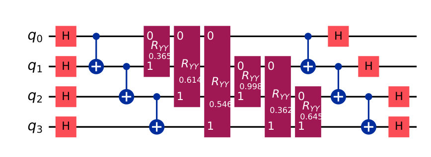
<figcaption class="paper-figure-caption"><b>Fig 1.</b> FIG. 1: Circuit representation of the proposed quantum MIMO channel for an n = 4-qubit system. The channel consists of Hadamard layers, nearest-neighbor entangling operations, and pairwise RY Y (θij) interactions.</figcaption>
</figure>
<figure class="paper-figure-card">
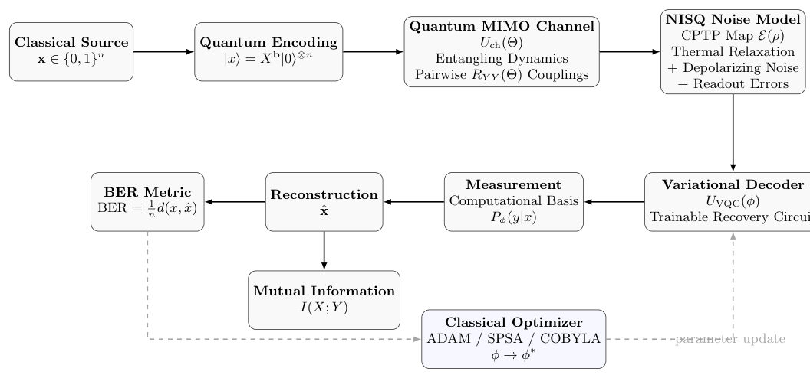
<figcaption class="paper-figure-caption"><b>Fig 2.</b> FIG. 2: Hybrid quantum–classical architecture for the proposed n × n quantum MIMO communication system. Classical information is encoded into multi-qubit basis states and transmitted through a parameterized entangling quantum channel with pairwise RY Y (Θ) interactions. A variational quantum receiver performs adaptive quantum decoding under a realistic NISQ noise environment modeled using a CPTP map incorporating thermal relaxation, depolarizing gate errors, and readout noise.The reconstructed bitstrings are used to evaluate BER and mutual information, while variational parameters are iteratively optimized using ADAM, SPSA, or COBYLA.</figcaption>
</figure>
<figure class="paper-figure-card">
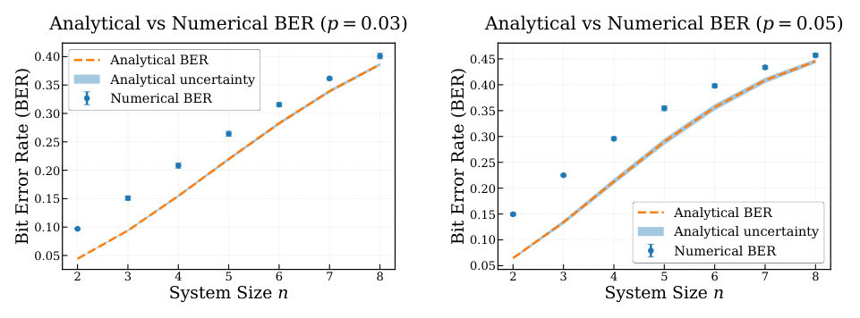
<figcaption class="paper-figure-caption"><b>Fig 3.</b> FIG. 3: Comparison between numerical BER obtained from noisy quantum simulations and the analytical scaling model for different noise strengths. (a) p = 0.01, (b) p = 0.02, (c) p = 0.03, and (d) p = 0.05.</figcaption>
</figure>
<figure class="paper-figure-card">
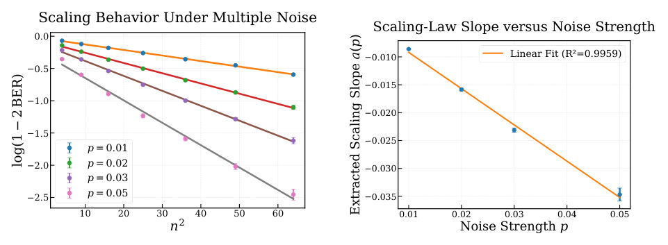
<figcaption class="paper-figure-caption"><b>Fig 4.</b> FIG. 4: Quantitative validation of the proposed BER scaling law. (a) Transformed BER quantity log(1 −2BER) as a function of n2 for noise strengths b) Extracted scaling coefficient as a function of p</figcaption>
</figure>
<figure class="paper-figure-card">
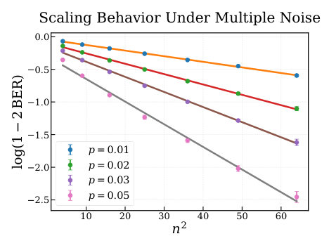
<figcaption class="paper-figure-caption"><b>Fig 5.</b> Figure 4 further shows that the extracted scal- ing coefficient increases approximately linearly with noise strength. The corresponding fit yields a high coefficient of determination (R2 = 0.9959), indi- cating a strong and systematic dependence on p. This near-linear behavior suggests that, within the investigated parameter regime, the dominant ef- fect of noise is to introduce approximately indepen- dent fidelity losses at each interaction layer. Un- der such conditions, the total degradation accumu- lates proportionally to the physical noise strength, leading to a scaling coefficient that grows linearly with p. The absence of significant nonlinear correc- tions further indicates that the...</figcaption>
</figure>

**Summary.** This work develops a hybrid framework for Quantum MIMO communication by modeling the channel with parameterized unitary transformations. It introduces a Variational Quantum Circuit receiver trained to decode transmitted information under realistic noise. The findings suggest VQCs provide robust performance stability in complex, strongly coupled quantum channels.

**Why it may be interesting.** It provides a concrete, trainable quantum circuit approach (VQC) to solve an information processing task (MIMO equalization) that is highly relevant for near-term quantum hardware applications and understanding resource scaling.

Detailed structure

**Main problem.** The paper investigates a quantum extension of classical Multiple-Input Multiple-Output (MIMO) communication, replacing linear channels with parameterized multi-qubit unitary transformations.

**Main result.** Variational Quantum Circuits (VQC) offer increased performance stability compared to classical detectors when channel complexity and interference are high, suggesting they are complementary rather than direct replacements.

**Method.** A Variational Quantum Circuit receiver is trained via supervised variational optimization to approximate the inverse quantum channel transformation under realistic noisy conditions.

**Model / system.** The system models quantum MIMO communication using an n-qubit Hilbert space where interference arises from coherent unitary evolution, $U_{ch}(\Theta)$.

**Key observables.** Bit-error rates (BER), Mutual Information, and resource requirements growth trends.

**Important parameters / regimes.** NISQ noise parameters (depolarizing noise, thermal relaxation) and system dimension ($n$).

**Assumptions / limitations.** The analysis is performed under realistic CPTP noise modeling in quantum simulations; no claim of asymptotic advantage is made.

**Figures summary.** Figure 1 illustrates the circuit representation of the proposed quantum MIMO channel for $n=4$, involving Hadamard layers and nearest-neighbor entangling operations.

**Paper structure.** The paper establishes the problem gap by noting previous work focused on capacity limits, then details the hybrid framework combining parameterized unitary channels with VQC equalization, followed by performance evaluation under noise.

Abstract

This paper investigates a quantum extension of classical Multiple-Input Multiple-Output (MIMO) communication in which the conventional linear channel model is replaced by a parameterized multi-qubit unitary transformation. Within this framework, interference is represented through coherent quantum interactions rather than additive signal coupling. To recover transmitted information, a Variational Quantum Circuit (VQC) receiver is introduced that learns an approximate inverse channel transformation through supervised variational optimization. The proposed system is evaluated under realistic noisy intermediate-scale quantum (NISQ) conditions incorporating depolarizing noise, thermal relaxation, and measurement imperfections, and its performance is compared with that of standard classical detection methods. The results reveal a trade-off between the two approaches: classical detectors achieve substantially lower bit-error rates across much of the investigated parameter range but exhibit pronounced performance degradation for specific channel configurations, whereas the VQC receiver maintains a more uniform error profile as channel complexity increases, albeit at a higher average BER. These findings suggest that variational quantum receivers are not a direct replacement for classical detection methods, but rather a complementary approach that may offer increased performance stability in communication scenarios characterized by strong coupling and complex interference patterns.

[↑ back to top](#top)

### [Universal Magnetoresistance Scaling in Layered Pd-based Multiband Metals Beyond Compensated Semimetal Regime](http://arxiv.org/abs/2608.06700v1)

**Authors:** Kenjiro Okawa, Takao Sasagawa  
**Type:** both · **Category:** other · **PDF:** <https://arxiv.org/pdf/2608.06700v1>  
**Analysis basis:** full PDF text, analyzed in chunks
**Topic relevance:** `non-equilibrium dynamics` **1/5** · `non-equilibrium universality` **1/5**

↔ Scroll figures horizontally

<figure class="paper-figure-card">
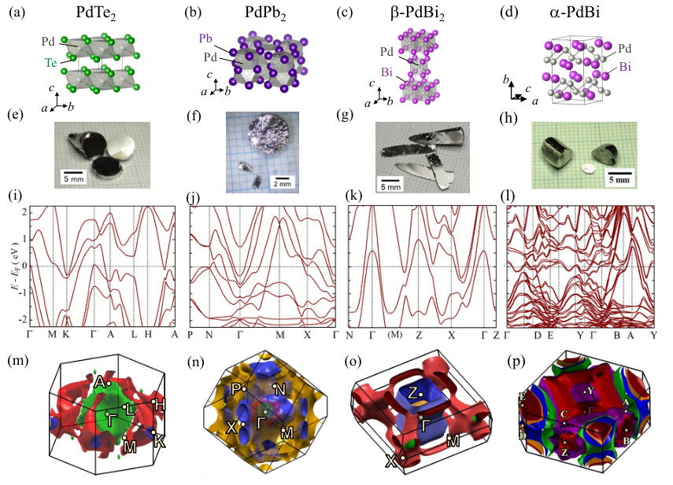
<figcaption class="paper-figure-caption"><b>Fig 1.</b> FIG. 1. Crystal structure and electronic structures of PdX2 (X = Bi, Te, Pb) and α-PdBi. (a)–(d) Crystal structures, (e)–(h) photographs of the grown single crystals, and (i)–(l) calculated electronic band structures including spin-orbit coupling for PdTe2, PdPb2, β-PdBi2, and α-PdBi, respectively. (m)–(p) Corresponding Fermi surfaces plotted within the first Brillouin zone, with high-symmetry points labeled using standard notation.</figcaption>
</figure>
<figure class="paper-figure-card">
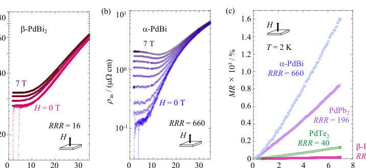
<figcaption class="paper-figure-caption"><b>Fig 2.</b> FIG. 2. Magnetotransport properties of PdX2 (X = Bi, Te, Pb) and α-PdBi. (a)Temperature dependence of the in-plane resistivity ρin in (a) β-PdBi2 (RRR = 16) and (b) α-PdBi (RRR = 660) single crystals under applied magnetic fields between 0 and 7 T. The electric current was applied along the cleavage plane with the magnetic field perpendicular to it. (c) Field dependence of the magnetoresistance ratio (MR) at 2 K for α-PdBi (RRR = 660), PdPb2 (RRR = 196), PdTe2 (RRR = 40), and β-PdBi2 (RRR = 16).</figcaption>
</figure>
<figure class="paper-figure-card">
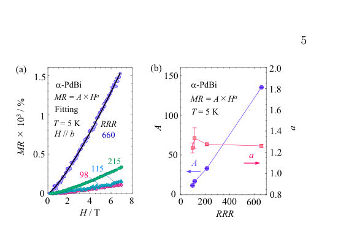
<figcaption class="paper-figure-caption"><b>Fig 3.</b> FIG. 3. RRR dependence of magnetotransport properties of α-PdBi. (a) Field dependence of the magnetoresistance ratio (MR) in α-PdBi single crystals with various residual resistiv- ity ratios (RRR) measured at 5 K with the current within the cleavage plane and the applied field perpendicular to it. The black solid line represents a power-law fit, MR = A × Ha, for the sample with RRR = 660, yielding a = 1.26. (b) RRR dependence of the power-law fitting parameters A (right axis, blue symbols) and a (left axis, red symbols) obtained from the relation MR = A × Ha for α-PdBi.</figcaption>
</figure>
<figure class="paper-figure-card">
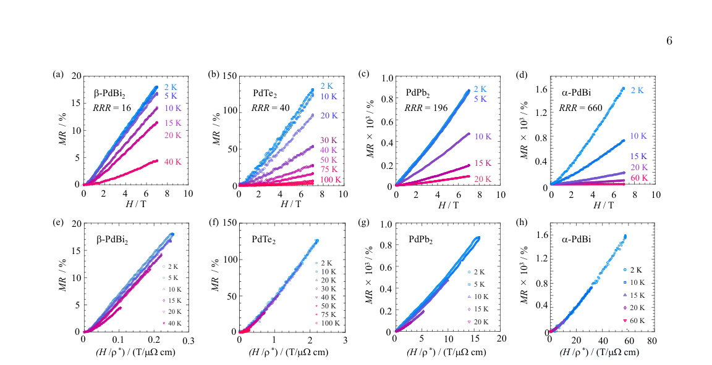
<figcaption class="paper-figure-caption"><b>Fig 4.</b> FIG. 4. Magnetoresistance and scaling analysis of PdX2 (X = Bi, Te, Pb) and α-PdBi. Magnetic field dependence of the magnetoresistance ratio (MR) measured at various temperatures between 2 and 100 K for (a) β PdBi2 (RRR = 16), (b) PdTe2 (RRR = 40), (c) PdPb2 (RRR = 196), and (d) α-PdBi (RRR = 660). The materials are arranged from left to right in order of increasing RRR. (e)-(h) Corresponding Kohler plots, where MR is plotted as a function of the reduced field H/ρ∗, with ρ∗</figcaption>
</figure>
<figure class="paper-figure-card">
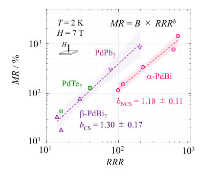
<figcaption class="paper-figure-caption"><b>Fig 5.</b> FIG. 5. Unified scaling Relationship between magnetoresis- tance ratio and residual resistivity ratio in Pd-based metals. Magnetoresistance ratio (MR) at 2 K and 7 T plotted as a function of the residual resistivity ratio (RRR) on a log-log scale for PdTe2, PdPb2, β-PdBi2, and α-PdBi single crys- tals. Symbol colors correspond to each material. Dotted lines represent power-law fits, MR = B×RRRb for the centrosym- metric and noncentrosymmetric groups.</figcaption>
</figure>

**Summary.** This work investigates large magnetoresistance in layered Pd-based metals that possess complex electronic structures beyond simple semimetal models. By combining theory and experiment, the authors show that MR scales universally with carrier mobility, confirming Kohler's rule even in multiband systems. The study highlights how crystal symmetry influences this scaling, suggesting a new understanding of transport governed by band topology.

**Why it may be interesting.** While focused on condensed matter transport, the concept of emergent single-parameter scaling governed by mobility in complex band structures provides a generalizable framework applicable to understanding quantum coherence or dissipation mechanisms in other strongly interacting systems.

Detailed structure

**Main problem.** To investigate universal magnetoresistance (MR) scaling in layered Pd-based multiband metals that operate beyond the simple compensated semimetal regime.

**Main result.** The MR scaling is governed by carrier mobility, exhibiting a systematic single-parameter dependence on field and RRR, establishing a new class of large MR in complex multiband metals. However, noncentrosymmetric systems show reduced MR compared to centrosymmetric ones at equal RRR due to spin-orbit coupling effects.

**Method.** The study combines first-principles electronic structure calculations (including SOC) with systematic experimental measurements of magnetotransport properties on single crystals.

**Model / system.** The physical systems are nonmagnetic, layered Pd-based metals ($	ext{PdTe}_2$, $	ext{PdPb}_2$, $eta	ext{-PdBi}_2$, and $\alpha	ext{-PdBi}$), which are characterized as high-carrier-density multiband conductors with complex Fermi surfaces.

**Key observables.** Magnetoresistance Ratio (MR), dependence on magnetic field ($H$), temperature ($T$), and Residual Resistivity Ratio ($	ext{RRR}$).

**Important parameters / regimes.** Carrier mobility, effective scattering time, RRR, and the degree of carrier compensation.

**Assumptions / limitations.** The analysis assumes that the observed scaling is governed by intrinsic electronic structure effects (mobility) rather than solely by disorder-induced impurity scattering mechanisms.

**Figures summary.** Figures illustrate crystal structures, calculated band/Fermi surfaces, and plots showing systematic correlations between MR magnitude and RRR across different materials.

**Paper structure.** The paper systematically compares magnetotransport data across multiple PdX$_2$ compounds, using first-principles calculations to interpret the underlying electronic structure responsible for the observed universal scaling laws of the magnetoresistance.

Abstract

We systematically investigated the magnetoresistance ratio (MR) of single-crystalline, nonmagnetic layered Pd-based metals, including centrosymmetric PdTe2, PdPb2, and beta-PdBi2 and noncentrosymmetric alpha-PdBi. Our study identifies a distinct class of large MR in multiband, high-carrier-density systems. Unlike well-studied extremely large MR materials, such as Dirac and Weyl semimetals described by simple compensated-carrier models, these compounds possess complex Fermi surfaces, as validated by our first-principles calculations. Nevertheless, they exhibit a remarkably simple MR scaling governed by carrier mobility, manifested in systematic dependencies on magnetic field, temperature, and the residual resistivity ratio (RRR). The validity of Kohler's rule in high-RRR crystals indicates that MR is governed by a single effective scattering time, even in these multiband systems. The field and RRR dependences of MR follow an intermediate power-law behavior between linear and quadratic, attributable to imperfect carrier compensation and a distribution of carrier mobilities. Among the studied compounds, alpha-PdBi exhibits the largest MR, reaching 1500% (2 K, 7 T), owing to its exceptionally high RRR (approximately 660). However, when compared on an equal-RRR basis, its MR is smaller than that of its centrosymmetric counterparts. This trend suggests that additional scattering channels arising from spin-orbit-induced band splitting in noncentrosymmetric systems reduce the effective carrier mobility. Our results establish a new class of large MR in clean multiband metals where complex electronic structures give rise to emergent single-parameter scaling, highlighting the interplay between disorder, mobility, and symmetry.

[↑ back to top](#top)

### [Architecture-Aware Reinforcement Learning for Communication-Efficient Distributed Quantum Circuit Compilation](http://arxiv.org/abs/2608.06892v1)

**Authors:** Chien-Tung Kuo, Felix Burt, Samuel Yen-Chi Chen, Kin K. Leung, Kuan-Cheng Chen  
**Type:** theory · **Category:** quantum information and computing · **PDF:** <https://arxiv.org/pdf/2608.06892v1>  
**Analysis basis:** full PDF text, analyzed in chunks
**Topic relevance:** `methods for driven-dissipative` **1/5**

↔ Scroll figures horizontally

<figure class="paper-figure-card">
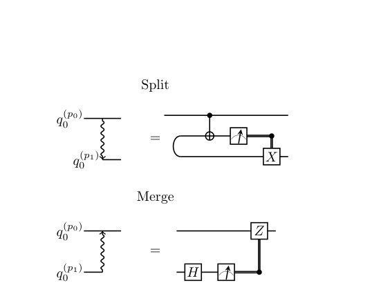
<figcaption class="paper-figure-caption"><b>Fig 1.</b> Fig. 1. The two communication primitives. A split operation uses a Bell state (EPR pair) to make a qubit non-locally accessible as a control. A merge removes one of the two qubits from the joint state. Teleportation circuits can be built by composing splits and merges.</figcaption>
</figure>
<figure class="paper-figure-card">
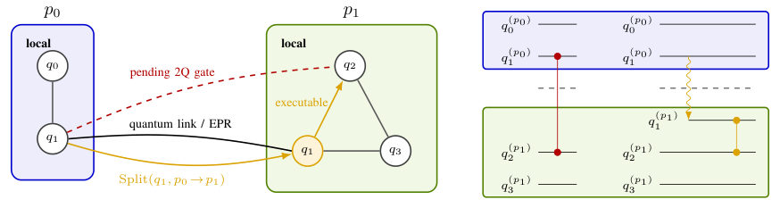
<figcaption class="paper-figure-caption"><b>Fig 2.</b> Fig. 2. Example of a distributed two-qubit gate. Initially, q1 and q2 are available on different QPUs, so the gate cannot be executed locally. An inter-QPU quantum link provides the entanglement-assisted communication resource used by the compiler-level split action. The split makes q1 available on p1 at the compiler level, enabling local execution with q2, without implying physical cloning of an unknown quantum state. After the gate has been executed, q1 can either remain split for future gates, or merge to either p0 or p1.</figcaption>
</figure>
<figure class="paper-figure-card">
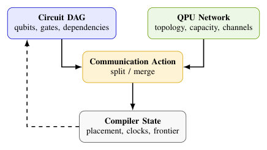
<figcaption class="paper-figure-caption"><b>Fig 3.</b> Fig. 3. Preliminary abstraction of distributed quantum circuit compilation. A circuit DAG and distributed-QPU architecture define a compiler state; communication actions update placement and resource availability.</figcaption>
</figure>
<figure class="paper-figure-card">
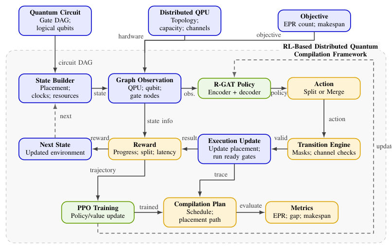
<figcaption class="paper-figure-caption"><b>Fig 4.</b> Fig. 4. Overview of the proposed RL framework. The state builder constructs a graph observation from circuit structure, QPU topology, current placement, and optional objective-conditioning features. The R-GAT policy processes this observation and selects a feasible split or merge action. The transition engine applies topology, placement, capacity, channel, and dependency constraints, after which executable gates are deterministically updated. Rewards are computed from communication cost, circuit progress, lookahead executability, and terminal completion. PPO updates the policy and value networks from collected trajectories.</figcaption>
</figure>
<figure class="paper-figure-card">
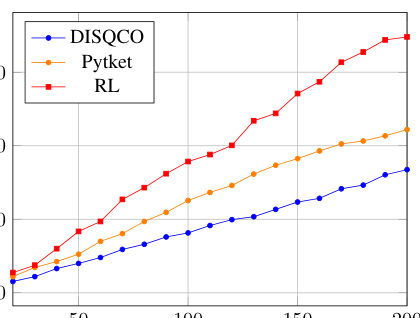
<figcaption class="paper-figure-caption"><b>Fig 5.</b> Fig. 5. Communication cost versus circuit depth for random and quantum volume benchmarks.</figcaption>
</figure>

**Summary.** This paper presents an RL framework to solve the complex problem of compiling quantum circuits across multiple, interconnected QPUs. It models this as an MDP, using compiler actions like 'Split' and 'Merge' to manage qubit placement dynamically. The approach shows promise for structured tasks but highlights that dense workloads still pose significant challenges.

**Why it may be interesting.** It tackles a critical resource management issue in scaling quantum computation—the communication bottleneck—by applying advanced AI techniques to hardware-aware scheduling.

Detailed structure

**Main problem.** The core problem is optimizing distributed quantum circuit compilation, which requires scheduling operations while minimizing expensive inter-QPU communication overhead (EPR-pair consumption) and latency.

**Main result.** The proposed reinforcement learning framework matches state-of-the-art heuristics on structured workloads but struggles with highly dense or unstructured circuits, indicating scalability challenges.

**Method.** The problem is formulated as a constrained Markov Decision Process (MDP), solved using an architecture-aware reinforcement learning policy trained via Proximal Policy Optimization (PPO).

**Model / system.** The system involves multiple cooperating Quantum Processing Units (QPUs) connected by communication links, modeling the compilation process over a heterogeneous graph structure.

**Key observables.** EPR-pair consumption (communication volume), communication makespan (latency), and circuit progress.

**Important parameters / regimes.** Qubit placement ($	ext{Loct}(q)$), QPU topology ($H=(P, E)$), and resource capacities.

**Assumptions / limitations.** The RL framework abstracts compiler-level actions like 'Split' and 'Merge'; scalability remains a key bottleneck for practical use.

**Figures summary.** Figures illustrate the Split/Merge communication primitives and the overall pipeline of the proposed RL framework, showing state building through to reward calculation.

**Paper structure.** The paper introduces the problem as an MDP, details the heterogeneous graph RL framework (State Builder $	o$ Policy $	o$ Transition Engine), compares performance against established heuristics on various benchmarks (QAOA, QFT, Random, QV), and discusses limitations.

Abstract

Distributed quantum computing provides a scalable route for executing quantum circuits beyond the capacity limits of a single quantum processing unit (QPU), but it introduces a communication-aware compilation problem involving strict hardware constraints and circuit dependencies. This paper presents an architecture-aware reinforcement-learning framework that formulates distributed quantum compilation as a constrained Markov Decision Process (MDP). The compiler-level communication actions dynamically update logical-qubit placement and enable subsequent gate execution. A heterogeneous graph model represents interactions among hardware, logical qubits, and circuit operations, while a policy trained via Proximal Policy Optimization optimizes EPR-pair consumption and communication makespan. Evaluation across benchmark circuits shows that our policy matches state-of-the-art heuristics on structured workloads, with lookahead reward shaping yielding modest improvements on unstructured circuits. These results demonstrate that reinforcement learning is a flexible alternative to manual heuristics, though scalability remains a key bottleneck for practical use.

[↑ back to top](#top)

### [Permutation invariant neural network prediction of vacancy formation under deformation and varying chemical environment in FCC high entropy alloys](http://arxiv.org/abs/2608.07445v1)

**Authors:** Tanvir Sohail, Swarnava Ghosh  
**Type:** theory · **Category:** disordered systems and neural networks · **PDF:** <https://arxiv.org/pdf/2608.07445v1>  
**Analysis basis:** full PDF text, analyzed in chunks
**Topic relevance:** `methods for driven-dissipative` **1/5**

↔ Scroll figures horizontally

<figure class="paper-figure-card">
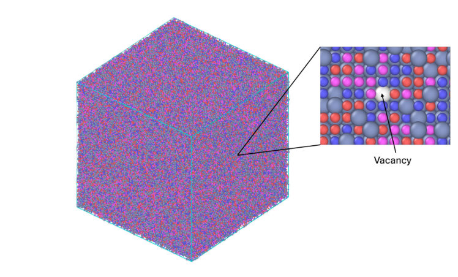
<figcaption class="paper-figure-caption"><b>Fig 1.</b> Figure 1: Atomic supercell of FCC CoCrFeNi high entropy alloy is shown. The inset shows a vacancy in this alloy with its local chemical environment.</figcaption>
</figure>
<figure class="paper-figure-card">
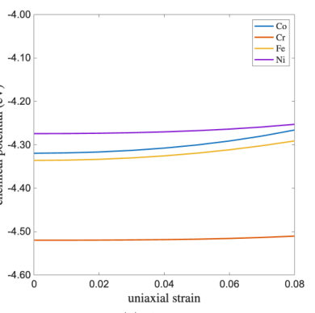
<figcaption class="paper-figure-caption"><b>Fig 2.</b> Figure 2: Variation of average chemical potential with uniaxial and shear strain.</figcaption>
</figure>
<figure class="paper-figure-card">
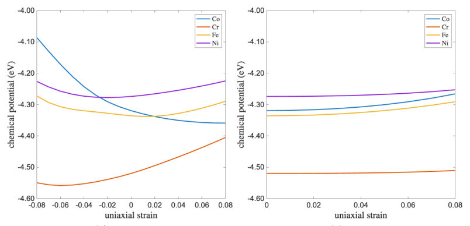
<figcaption class="paper-figure-caption"><b>Fig 3.</b> Figure 2 shows the variation of the average elemental chemical potentials with applied deformation. Uniaxial loading produces substantial, species dependent changes in chemical potentials, reflecting the different responses of the constituent elements to volumetric deformation. In contrast, simple shear has a negligible effect on the chemical potentials, consistent with its nearly volume-preserving character. Figure 3 illustrates the effect of mechanical deformation on the average vacancy formation energy of each constituent species in the CoCrFeNi high entropy alloy. The vacancy formation energy exhibits a pronounced species dependence and decreases monotonically under tensile loading...</figcaption>
</figure>
<figure class="paper-figure-card">
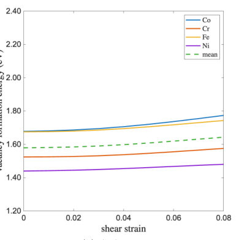
<figcaption class="paper-figure-caption"><b>Fig 4.</b> Figure 3: Variation of vacancy formation energy with uniaxial and shear strain.</figcaption>
</figure>
<figure class="paper-figure-card">
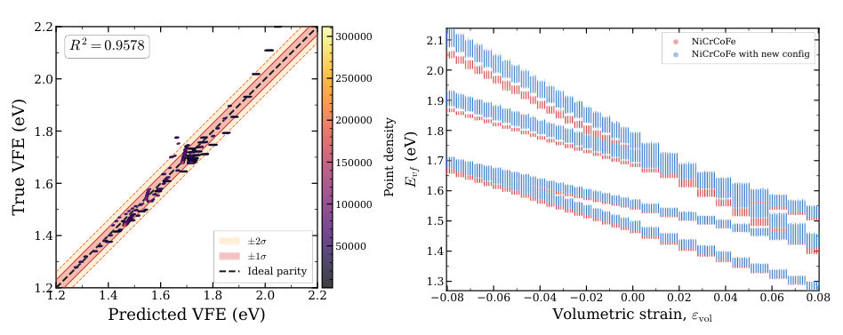
<figcaption class="paper-figure-caption"><b>Fig 5.</b> Figure 4: (a) shows the true versus predicted values of vacancy formation energy. (b) shows the predicted values of vacancy formation energy versus volumetric strain. The “new configuration” refers to a randomly generated atomic configuration not used for training.</figcaption>
</figure>

**Summary.** This work introduces an advanced machine learning framework to overcome the computational bottleneck of calculating vacancy formation energies in complex High-Entropy Alloys. By incorporating both local chemical disorder and mechanical strain into a unified, permutation invariant model, it achieves predictions orders of magnitude faster than atomistic simulations while accurately capturing site-specific defect behavior.

**Why it may be interesting.** While focused on condensed matter defects rather than quantum information, the core methodology—using permutation invariant neural networks (Deep Sets) to encode complex local structural/chemical environments—is highly relevant for developing ML potentials or predictive models in quantum materials simulation.

Detailed structure

**Main problem.** Vacancy formation energies in High-Entropy Alloys (HEAs) are crucial for understanding material failure, but their dependence on local chemical environments and mechanical deformation makes atomistic calculation prohibitively expensive.

**Main result.** The proposed ML framework accurately predicts strain-dependent vacancy formation energies orders of magnitude faster than direct simulations, confirming that local chemistry dictates defect energetics beyond simple averaging.

**Method.** A permutation invariant machine learning framework (Deep Sets architecture) is developed to map local atomic environments and deformation gradients to vacancy formation energy.

**Model / system.** The study focuses on Face-Centered Cubic (FCC) High-Entropy Alloys (HEAs), modeling the interaction between vacancies, local chemical disorder, and applied mechanical strain/stress.

**Key observables.** Vacancy formation energies ($	ext{E}_{	ext{form}}$), site-to-site variability of $	ext{E}_{	ext{form}}$, and dependence on volumetric vs. shear deformation.

**Important parameters / regimes.** Local chemical environment, applied strain (tensile/compressive), and the specific composition of the HEA.

**Assumptions / limitations.** The framework assumes that local geometric descriptors and invariants of the deformation gradient are sufficient to capture the complex coupling between chemistry and mechanics.

**Figures summary.** Figure 1 illustrates an atomic supercell of FCC CoCrFeNi HEA showing a vacancy. Figure 2 likely shows the variation of average $	ext{E}_{	ext{v}}^{	ext{f}}$ under different strain states.

**Paper structure.** The paper first establishes the physical problem (costly atomistic calculation of defect energies in HEAs) and then introduces the ML framework, detailing the use of objective geometric descriptors and deformation invariants to learn the coupled effects. Results confirm the model's accuracy and efficiency compared to direct simulations.

Abstract

Vacancy formation energies govern diffusion, irradiation damage, phase stability, and dynamic failure in high-entropy alloys (HEAs), yet their strong dependence on local chemical environments and mechanical deformation makes atomistic calculations prohibitively expensive for large-scale studies. Here, we develop an atomistically informed permutation invariant machine learning framework for predicting strain dependent vacancy formation energies in FCC HEAs from local atomic environments. The model employs a vacancy-centered representation constructed from objective geometric descriptors together with invariants of the local deformation gradient, enabling the coupled effects of chemical disorder and finite deformation to be learned within a unified framework. Atomistic simulations reveal that volumetric deformation is the dominant factor controlling the average variation in vacancy formation energy, whereas shear deformation has a comparatively minor influence. At the same time, substantial site to site variability persists under identical macroscopic loading, demonstrating that local chemical environments govern the statistical distribution of vacancy energetics beyond species-averaged trends. The proposed framework accurately predicts vacancy formation energies across diverse deformation states while providing orders-of-magnitude faster evaluation than direct atomistic simulations. These results establish an efficient route for incorporating stress-dependent defect energetics into multiscale models of diffusion, irradiation damage, and dynamic failure in chemically complex alloys.

[↑ back to top](#top)

### [Sublattice-resolved coherent phonon dynamics in charge density waves](http://arxiv.org/abs/2608.06456v1)

**Authors:** Kyoung Hun Oh, Honglie Ning, Zongqi Shen, Yifan Su, Jack Maier, Gyeongbo Kang, Hyeongi Choi, Dong Wu, Qiaomei Liu, Hyun-Woo J. Kim, Seunghyeok Ha, Jaehwon Kim, Byungjune Lee, B. J. Kim, N. L. Wang, Yao Wang, Hoyoung Jang, Nuh Gedik  
**Type:** experiment · **Category:** strongly correlated electrons · **PDF:** <https://arxiv.org/pdf/2608.06456v1>  
**Analysis basis:** full PDF text, analyzed in chunks
**Topic relevance:** `Frenkel-Kontorova` **1/5**

↔ Scroll figures horizontally

<figure class="paper-figure-card">
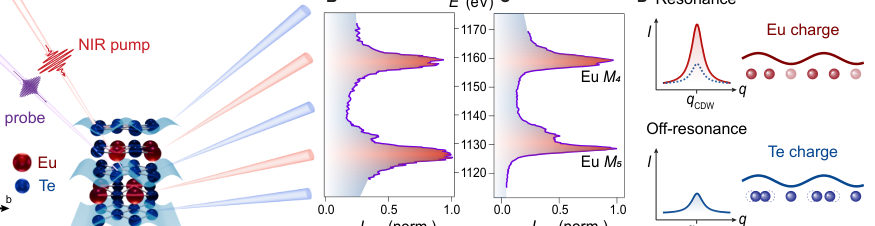
<figcaption class="paper-figure-caption"><b>Fig 1.</b> FIG. 1. Illustration of the experimental scheme. (A) Schematic of the time-resolved resonant X-ray scattering (tr-RXS) setup, employing a near-infrared pump centered at 800 nm with a fluence of F = 4 mJ/cm2 and a soft X-ray probe. Eu and Te atoms are shown in red and blue, respectively. The charge-lattice order in the Te layers are highlighted by blue waveforms. Diffracted X-rays with energies near the Eu M5 (or M4) resonance edge are shown in red, while those far from the resonance are shown in blue. (B) X-ray photon energy dependent intensity of the monolayer CDW peak at fixed (0 0.356 2). (C) Fluorescence yield XAS spectrum of EuTe4, exhibiting two absorption peaks (Eu M5: 1128 eV and...</figcaption>
</figure>
<figure class="paper-figure-card">
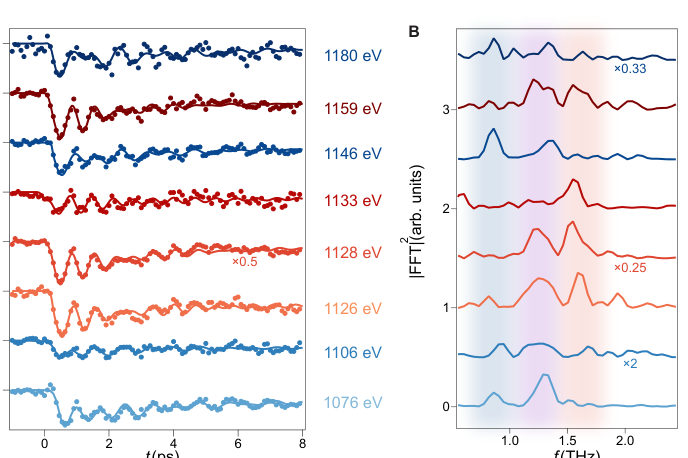
<figcaption class="paper-figure-caption"><b>Fig 2.</b> FIG. 2. Energy-dependent time-resolved resonant X-ray scattering (Tr-RXS) results. (A) Temporal evolution of the normalized intensity of the monolayer CDW peak at (0 0.356 2) to their equilibrium values measured with different probe energies. Each time trace is vertically offset for visual clarity. Time traces measured with probe energies near the Eu M resonance edges are shown in reddish color, while those measured far from resonance are shown in bluish color. Solid lines are fits to damped oscillators with an exponential decaying background. (B) Fast Fourier transform (FFT) of the oscillatory part of the time traces shown in (A). Each curve is vertically offset for clarity. Blue, purple...</figcaption>
</figure>
<figure class="paper-figure-card">
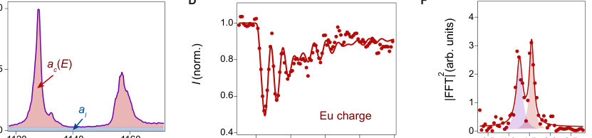
<figcaption class="paper-figure-caption"><b>Fig 3.</b> FIG. 3. Quantitatively disentangling the Te and Eu charge components dynamics. (A) Temporal evolution of the intensity normalized to their equilibrium values for four representative probe energies with variations of the probe penetration depth corrected. Solid lines are fits to damped oscillators atop an exponential decaying background. (B) Energy-dependent CDW peak intensity with variations of the probe penetration depth corrected. Blue and red shaded area represent the intensity contributed from the Te CDW component (al) and Eu charge order (ac(E)), respectively. al is assumed to be a constant within the investigated X-ray energy range. (C,D) Decoupled temporal evolution of the Te and Eu...</figcaption>
</figure>
<figure class="paper-figure-card">
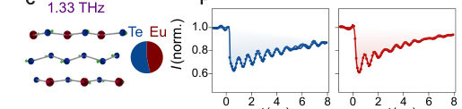
<figcaption class="paper-figure-caption"><b>Fig 4.</b> FIG. 4. Phonon eigenvectors and a physical picture account- ing for the selective appearance of the Te-only mode. (A) Schematic of the eigenvector of the phonon at 0.70 THz, which predominantly involves the motion of Te atoms in the Te monolayers. (B) Schematic of the eigenvector of the phonon at 1.65 THz, which predominantly involves the motion of Eu atoms in the EuTe layers. (C) Schematic of the eigenvec- tor of the phonon at 1.33 THz, which predominantly involves both the motion of Te atoms in the Te monolayers and Eu atoms in the EuTe layers. Green arrows depict their eigen- vectors. Red and blue balls are Eu and Te atoms, respectively. Bilayer Te layers are omitted in the structures...</figcaption>
</figure>

**Summary.** The research reports on using time-resolved resonant X-ray scattering ($	ext{tr-RXS}$) to overcome the challenge of resolving sublattice-specific phonon motions in charge density wave materials. By exploiting element selectivity via tunable X-ray energies, the authors successfully decoupled and identified three distinct coherent phonon modes in $	ext{EuTe}_4$, assigning them definitively to either Te or Eu lattice vibrations.

**Why it may be interesting.** This work demonstrates an advanced spectroscopic technique ($	ext{tr-RXS}$) capable of providing element-specific structural dynamics information in correlated materials, which is highly relevant for understanding lattice coupling mechanisms central to many quantum phenomena.

Detailed structure

**Main problem.** The primary challenge is experimentally resolving sublattice-specific phonon motions within multi-element materials that exhibit charge density waves (CDWs).

**Main result.** The authors successfully disentangled three distinct coherent phonon modes ($\sim 0.85, 1.3, 	ext{ and } 1.6 	ext{ THz}$) in $	ext{EuTe}_4$, assigning them to specific Eu- or Te-dominated lattice dynamics.

**Method.** They utilized time-resolved resonant X-ray scattering ($	ext{tr-RXS}$), a time-domain approach, which surpasses the energy resolution limits of conventional inelastic scattering techniques.

**Model / system.** The study focuses on the CDW material $	ext{EuTe}_4$, which has alternating Te monolayers and EuTe slabs. The analysis models the measured intensity as a weighted sum of contributions from the two distinct sublattices (Te and Eu).

**Key observables.** Coherent phonon frequencies ($\sim 0.85, 1.3, 	ext{ and } 1.6 	ext{ THz}$), element-resolved lattice dynamics, and CDW diffraction intensity oscillations.

**Important parameters / regimes.** The technique relies on tuning the X-ray probe energy near specific elemental absorption edges (e.g., Eu $M_{5,4}$ edges) to achieve elemental selectivity.

**Assumptions / limitations.** The analysis assumes that the measured signal can be accurately modeled as a linear combination of independent sublattice contributions whose weights depend strongly on the probe energy.

**Figures summary.** Figures illustrate the $	ext{tr-RXS}$ experimental setup, showing time evolution and FFTs of CDW intensity oscillations at different probe energies. Subsequent figures detail the quantitative decoupling process using the two-sublattice model to assign specific phonon modes to Eu or Te motion.

**Paper structure.** The paper introduces the problem (lack of sublattice resolution), details the $	ext{tr-RXS}$ methodology, presents time-domain measurements showing oscillations, and finally uses FFT analysis combined with a multi-energy fitting model to decouple and assign specific phonon modes to their respective sublattices.

Abstract

Phonons govern fundamental material properties and play a central role in various electronic phase transitions. Coherent driving of specific phonon modes enables on-demand phase control, motivating sublattice-resolved identification of real-space phonon motions. Yet experimentally resolving these motions remains challenging, limiting precise phonon-based control. Here, we introduce a dynamical protocol to track element-resolved phonon dynamics in the charge density wave material EuTe4, in which the dominant Te-sublattice charge order is accompanied by a previously unreported Eu-sublattice component. We leverage the elemental selectivity of time-resolved resonant X-ray scattering to reveal three coherent phonon modes with distinct sublattice character, thereby disentangling Eu- and Te-dominated lattice dynamics, in good agreement with theoretical calculations of the phonon eigenvectors. This time-domain approach, which surpasses the energy-resolution limits of conventional frequency-domain inelastic scattering, provides a broadly applicable framework for decomposing coherent phonons in multi-element materials, which is crucial for the targeted control of phases of matter.

[↑ back to top](#top)

## Other papers (4)

*Papers from primary archives without highlighted authors or any topic match. Click to expand.*

Show other papers

### [An Exploratory Evaluation of LLM-Assisted Rewriting of Moderate-Complexity Financial Sentences for DisCoCat-Based Sentiment Analysis](http://arxiv.org/abs/2608.07439v1)

**Authors:** Brian Llinas, Nikos Chrisochoides  
**Type:** both · **Category:** other · **PDF:** <https://arxiv.org/pdf/2608.07439v1>  
**Analysis basis:** full PDF text, analyzed in chunks

↔ Scroll figures horizontally

<figure class="paper-figure-card">
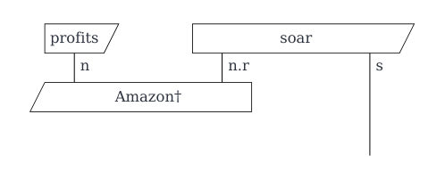
<figcaption class="paper-figure-caption"><b>Fig 1.</b> Fig. 1. First two stages of the compilation process for “Amazon profits soar”.</figcaption>
</figure>
<figure class="paper-figure-card">
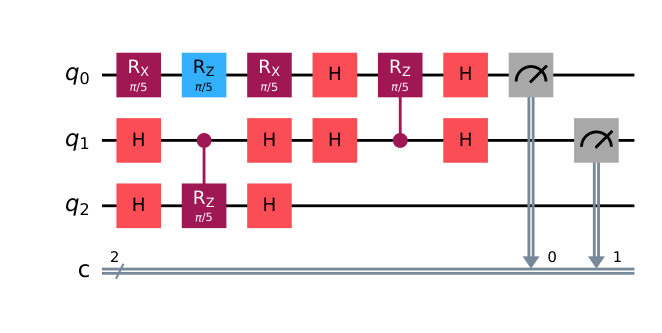
<figcaption class="paper-figure-caption"><b>Fig 2.</b> Fig. 2. Final stage of the compilation process for “Amazon profits soar”: the reduced diagram mapped into a parameterized ansatz circuit.</figcaption>
</figure>
<figure class="paper-figure-card">
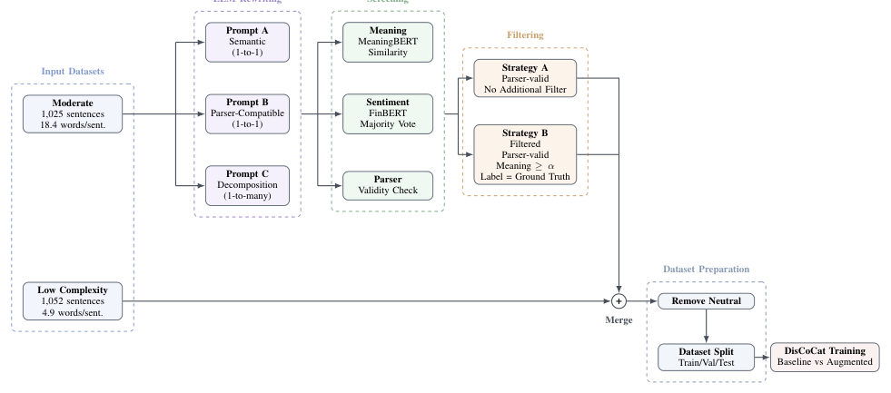
<figcaption class="paper-figure-caption"><b>Fig 3.</b> Fig. 3. Exploratory workflow for generating, screening, filtering, and evaluating LLM-assisted rewrites of moderate-complexity synthetic financial sentences before combining them with the low-complexity reference condition.</figcaption>
</figure>
<figure class="paper-figure-card">
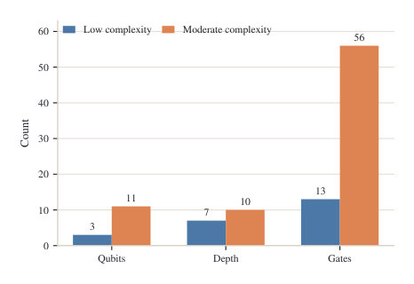
<figcaption class="paper-figure-caption"><b>Fig 4.</b> Fig. 5. Illustrative comparison of circuit complexity for one low-complexity sentence (“Amazon profits soar”) and one moderate-complexity sentence (“rise of fintech has disrupted traditional banking and financial services”). The moderate-complexity example requires more qubits, greater circuit depth, and more gates than the low-complexity example.</figcaption>
</figure>
<figure class="paper-figure-card">
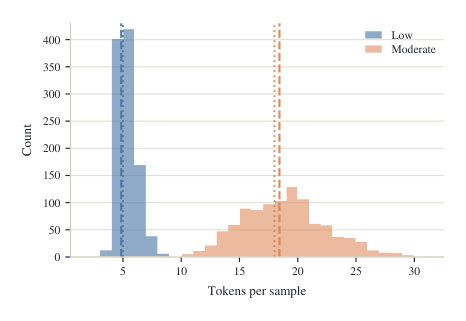
<figcaption class="paper-figure-caption"><b>Fig 5.</b> Fig. 4. Token distribution for the low- and moderate-complexity subsets. Dashed lines mark means; dotted lines mark medians.</figcaption>
</figure>

**Summary.** This paper proposes using Large Language Models (LLMs) to rewrite complex financial sentences into simplified forms suitable for DisCoCat-based sentiment analysis within a Quantum NLP framework. The method successfully reduces the computational complexity of the resulting quantum circuits while maintaining high classification accuracy, demonstrating a potential pathway for applying quantum models to real-world language tasks.

**Why it may be interesting.** While not focused on core quantum hardware physics, the work explores using advanced AI (LLMs) to preprocess inputs for quantum algorithms, which is relevant for developing practical applications in quantum machine learning.

Detailed structure

**Main problem.** The paper addresses practical limitations of using DisCoCat for financial sentiment analysis when processing complex, long sentences due to issues like parser sensitivity and high computational cost.

**Main result.** LLM-assisted rewriting successfully compresses moderate-complexity inputs into circuit-efficient variants, achieving higher mean accuracy (0.550) than the low-complexity baseline using GPT-4.1-mini with Prompt B.

**Method.** A novel preprocessing workflow is proposed where Large Language Models (LLMs) are used to rewrite and simplify complex financial sentences into forms compatible with the DisCoCat framework, which maps grammar to quantum circuits.

**Model / system.** The core model is Quantum Natural Language Processing (QNLP) utilizing Distributional Compositional Categorical (DisCoCat). The computational object derived from the text structure is a parameterized quantum circuit.

**Key observables.** Mean classification accuracy, average qubit and gate counts on the resulting quantum circuits, and linguistic complexity metrics.

**Important parameters / regimes.** Prompting strategies (e.g., Prompt B), specific LLMs (GPT-4.1-mini), and filtering configurations are key parameters being compared.

**Assumptions / limitations.** The study assumes that controlled rewriting can preserve the sentiment-bearing meaning of the original complex text while reducing computational overhead for quantum circuit mapping.

**Figures summary.** Figures illustrate the pipeline, showing how a parser-derived diagram (Figure 1) from a sentence like 'Amazon profits soar' is reduced and mapped to a parameterized ansatz quantum circuit (Figure 2).

**Paper structure.** The paper introduces the problem limitations of DisCoCat for complex text, details the LLM-assisted rewriting workflow involving multiple prompting strategies, presents quantitative comparisons against a low-complexity baseline, and concludes with an assessment of the feasibility.

Abstract

Quantum natural language processing (QNLP) provides a grammar-aware framework for text modeling, and Distributional Compositional Categorical (DisCoCat) is one of its theoretically grounded formulations. Prior work on financial sentiment analysis has identified practical limitations of DisCoCat, including parser sensitivity, high simulation cost, and difficulty handling longer sentences. We study an LLM-assisted preprocessing workflow that uses controlled rewriting to compress, simplify, or decompose moderate-complexity financial sentiment sentences into parser-compatible, circuit-efficient variants while preserving sentiment-bearing meaning. We compare prompting strategies, language models, and filtering configurations with the low-complexity-only DisCoCat baseline of Stein et al. At the circuit level, the strongest compression variants reduce average qubit and gate counts by more than 70 percent relative to the raw moderate-complexity subset. Across repeated training runs, GPT-4.1-mini with Prompt B achieves the highest observed mean accuracy, $0.550 \pm 0.035$, compared with $0.521 \pm 0.050$ for the baseline. Larger training splits do not necessarily improve downstream performance; across evaluated configurations, training-split size has a moderately negative association with accuracy (Pearson $r=-0.446$). These results provide exploratory evidence that LLM-assisted rewriting can make some moderate-complexity inputs usable within the evaluated DisCoCat configuration, while highlighting prompt design, filtering, and circuit-aware preprocessing as considerations for more scalable QNLP-based financial sentiment analysis.

[↑ back to top](#top)

### [Conditions for Quantum Advantage in AC Power Flow](http://arxiv.org/abs/2608.06711v1)

**Authors:** Parikshit Pareek, Abhijith Jayakumar, Carleton Coffrin, Sidhant Misra  
**Type:** theory · **Category:** quantum information and computing · **PDF:** <https://arxiv.org/pdf/2608.06711v1>  
**Analysis basis:** full PDF text, analyzed in chunks

↔ Scroll figures horizontally

<figure class="paper-figure-card">
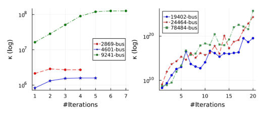
<figcaption class="paper-figure-caption"><b>Fig 1.</b> Fig. 1. Condition number (κ) variations for the PGLib [13] power transmis- sion network datasets reveal potential numerical challenges in solving ACPF. Left: Variation in the Jacobian condition number in converging instances for medium-scale systems. It is clear that the condition number increases with each iteration before converging to the final value. Right: Variation in the Jacobian condition number across 20 NRLF iterations for large-size systems in non-converging instances. It shows that the Jacobian condition number varies significantly between iterations and increases rapidly for non- converging instances, thus necessitating use of κ = maxi κi in (2). Note that, condition number of...</figcaption>
</figure>

**Summary.** This paper theoretically analyzes whether Quantum Computing can solve the Alternating Current Power Flow (ACPF) problem faster than classical methods. It derives complexity bounds for both quantum and classical solvers, concluding that while a lower bound exists for QC, practical quantum advantage is unlikely due to unfavorable scaling with required error tolerance.

**Why it may be interesting.** While the application is in power systems (not core condensed matter physics), the rigorous comparative analysis of algorithmic scaling ($O(\cdot)$ vs $\Omega(\cdot)$) based on system parameters ($\kappa, N, \epsilon$) provides a valuable theoretical framework for assessing quantum computational feasibility across diverse scientific domains.

Detailed structure

**Main problem.** The paper investigates the theoretical conditions under which Quantum Computing (QC) algorithms can achieve a demonstrable quantum advantage over classical methods when solving the Alternating Current Power Flow (ACPF) problem.

**Main result.** The analysis establishes an optimistic lower bound for any Quantum-ACPF solver as $\Omega(N\kappa/\epsilon)$, but subsequent comparison with classical complexity suggests that achieving a practical quantum advantage is highly challenging due to the $1/\epsilon$ dependence.

**Method.** The authors perform rigorous complexity benchmarking by deriving baseline runtime expressions for both classical (Newton-Raphson Load Flow) and theoretical gate-based QC solvers, comparing their scaling with system size ($N$), condition number ($\kappa$), and error tolerance ($\epsilon$).

**Model / system.** The physical model is the electrical energy system analyzed via the nonlinear ACPF equations. The computational task involves iteratively solving linear systems derived from the Jacobian matrix of this power flow problem.

**Key observables.** Quantum/Classical runtime complexity, Quantum-to-Classical cost ratio ($Q/C$), and the condition number ($\kappa$) of the Jacobian matrix.

**Important parameters / regimes.** System size $N$, Condition Number $\kappa$, Error Tolerance $\epsilon$ (measured in $\ell_2$-norm).

**Assumptions / limitations.** The quantum complexity analysis optimistically assumes access to Quantum Random Access Memory (QRAM) and that the total time is dominated by a lower bound of $\Omega(N\kappa/\epsilon)$.

**Figures summary.** Figure 1 shows variations in the Jacobian condition number ($\kappa$) across different datasets. Figure 2 compares the complexity bounds: top panel shows the classical NRLF bound, while the bottom panel illustrates the derived quantum lower bound.

**Paper structure.** The paper first benchmarks QC solvers against the classical NRLF algorithm. It then derives a general baseline runtime complexity for gate-based QC algorithms ($\Omega(N\kappa/\epsilon)$). Finally, it compares this theoretical quantum cost to the established classical benchmark to determine feasibility of advantage.

Abstract

This paper aims to contextualize the requirements for Quantum Computing (QC) algorithms to achieve a quantum advantage in solving the alternating current power flow (ACPF) problem, with a focus on runtime complexity. First, we establish a benchmark for a QC iterative solver to demonstrate an advantage over the classical Newton-Raphson Load Flow (NRLF) algorithm. Next, we derive a baseline expression for the end-to-end runtime complexity of any Gate-based QC algorithm as $Ω(N κ/\varepsilon),$ reflecting dependence on system size $N$, condition number $κ$, and error tolerance $\varepsilon$. Finally, we highlight key areas where QC algorithms may offer potential benefits over NRLF in addressing the standard ACPF problem.

[↑ back to top](#top)

### [Quantum-State Projectors on Grassmannian: Geometry, Holonomy, and Topology](http://arxiv.org/abs/2608.06777v1)

**Authors:** Shin-Ming Huang  
**Type:** theory · **Category:** strongly correlated electrons · **PDF:** <https://arxiv.org/pdf/2608.06777v1>  
**Analysis basis:** full PDF text, analyzed in chunks

↔ Scroll figures horizontally

<figure class="paper-figure-card">
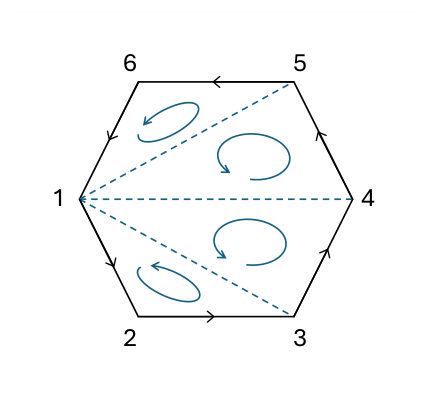
<figcaption class="paper-figure-caption"><b>Fig 1.</b> FIG. 1. Triangulation of a six-point Bargmann invariant into four third-order invariants. Arrows indicate the orientation of each overlap product.</figcaption>
</figure>

**Summary.** The paper introduces a rigorous geometric framework using the Grassmannian manifold to describe quantum subspaces defined by spectral projectors. It shows that physical observables like Berry curvature and topological invariants can be derived from the projector's tangent field ($\dd P$) in a way that is inherently gauge-invariant. This unifies local geometry, distance measures, and global topology for gapped electronic systems.

**Why it may be interesting.** This work provides a powerful geometric language (Grassmannian geometry) to analyze topological phases in condensed matter systems, directly linking band structure topology to fundamental concepts of differential geometry, which is highly relevant for understanding robust electronic properties.

Detailed structure

**Main problem.** To develop a unified, gauge-invariant geometric framework for characterizing quantum subspaces defined by spectral projectors on the Grassmannian manifold.

**Main result.** The formalism successfully unifies local quantum geometry (metric/curvature), finite subspace distance (geodesics via principal angles), holonomy, and global topology (Chern characters) using only the projector map $P$.

**Method.** The analysis employs differential geometry on the Grassmannian $	ext{Gr}(k, N)$, utilizing the spectral projector $P$ as a map from parameter space ($\mathbf{k}$) to the manifold. Key tools include tangent-vector calculus and Lie algebra decomposition.

**Model / system.** The system involves an isolated group of $k$ bands within an $N$-level quantum system, whose band structure is parameterized by momentum $\mathbf{k}$ on a torus (Brillouin zone). The dynamics are governed by a smooth gapped Hamiltonian.

**Key observables.** Quantum metric tensor, Berry curvature, principal angles between subspaces, Wilson loop determinant, Chern characters, and the $\mathbb{Z}_2$ index.

**Important parameters / regimes.** The number of bands ($k$), total levels ($N$), and the spectral gap ensuring global smoothness of the projector $P$.

**Assumptions / limitations.** The existence of a spectral gap is crucial to ensure that the spectral projector $P(k)$ remains globally smooth and periodic, circumventing issues related to gauge fixing.

**Paper structure.** The paper builds from defining the spectral projector on $	ext{Gr}(k, N)$, deriving the tangent field $\dd P$, establishing that its interband block yields both metric and curvature information. It then applies this to calculate geodesic distances and derives basis-independent formulas for topological invariants like Wilson loops.

Abstract

An isolated group of $k$ bands in an $N$-level quantum system defines a rank-$k$ spectral projector and hence a map into the complex Grassmannian $\mathrm{Gr}(k,N)$. For a smooth gapped Hamiltonian, this projector is globally smooth and periodic even when band topology obstructs a globally smooth periodic, or symmetry-compatible, Bloch frame. We take the globally defined differential $\dd P$ as the central object: it is the tangent field of the Grassmannian map, removes unphysical rotations within the selected subspace, and retains the physical interband transition. The interband block of this tangent data simultaneously determines the quantum metric and Berry curvature; the associated horizontal generator produces finite Grassmannian motion, while wedge products of $\dd P$ enter topological forms. We construct a shortest path between two projectors in the ambient Grassmannian and show that the singular values of its horizontal generator block are the principal angles between the endpoint subspaces. This construction provides a piecewise-geodesic interpretation of discrete geometric phases. In a separate development, we derive a basis-independent expression for the determinant of a multiband Wilson loop from traces of powers of an ordered projector product, without decomposing a degenerate band multiplet into individual bands. Finally, the same tangent-vector calculus organizes Chern characters, chiral winding numbers, and the time-reversal $\mathbb Z_2$ index. The resulting framework unifies local quantum geometry, finite subspace distance, holonomy, and topology while avoiding global gauge fixing.

[↑ back to top](#top)

### [Shor's algorithm requires Fanout](http://arxiv.org/abs/2608.06703v1)

**Authors:** Lucas Gretta, Malvika Raj Joshi  
**Type:** theory · **Category:** quantum information and computing · **PDF:** <https://arxiv.org/pdf/2608.06703v1>  
**Analysis basis:** full PDF text, analyzed in chunks

↔ Scroll figures horizontally

<figure class="paper-figure-card">
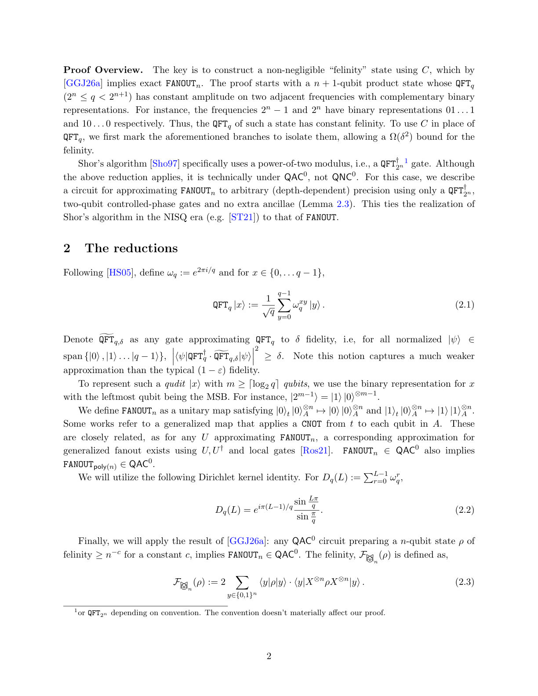
<figcaption class="paper-figure-caption"><b>Fig 1.</b> Low-resolution page preview, page 2</figcaption>
</figure>
<figure class="paper-figure-card">
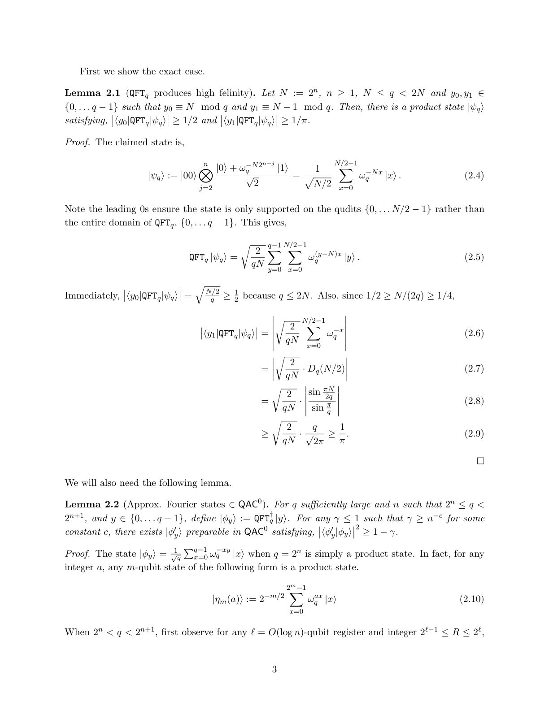
<figcaption class="paper-figure-caption"><b>Fig 2.</b> Low-resolution page preview, page 3</figcaption>
</figure>
<figure class="paper-figure-card">
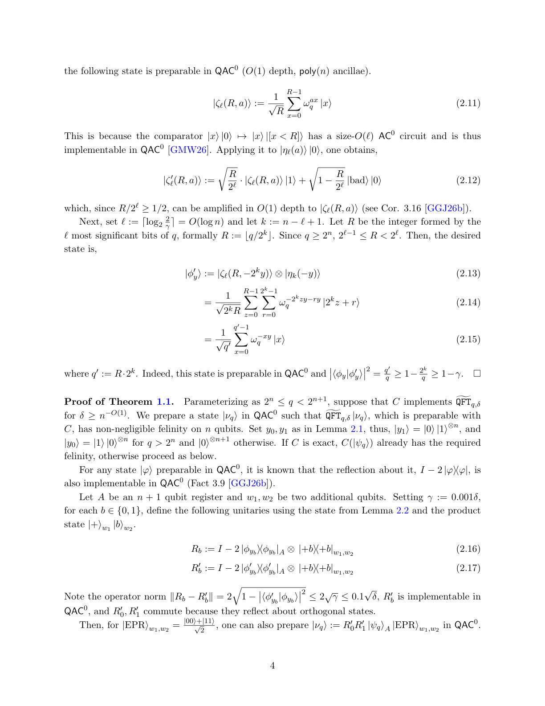
<figcaption class="paper-figure-caption"><b>Fig 3.</b> Low-resolution page preview, page 4</figcaption>
</figure>
<figure class="paper-figure-card">
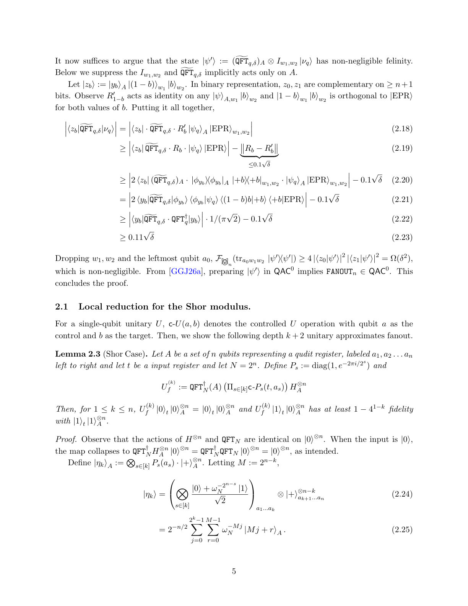
<figcaption class="paper-figure-caption"><b>Fig 4.</b> Low-resolution page preview, page 5</figcaption>
</figure>
<figure class="paper-figure-card">
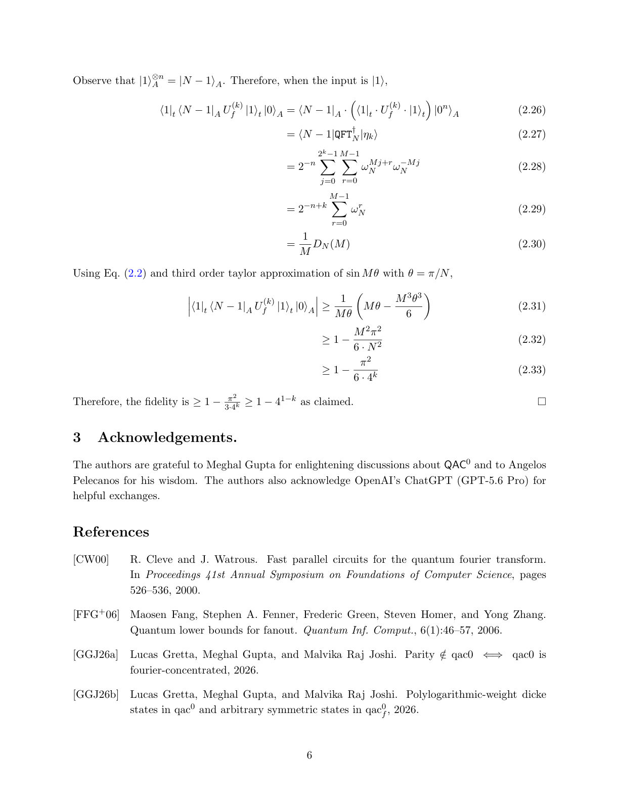
<figcaption class="paper-figure-caption"><b>Fig 5.</b> Low-resolution page preview, page 6</figcaption>
</figure>

**Summary.** This paper tackles a fundamental problem in quantum circuit complexity by proving that approximating the Quantum Fourier Transform (QFT) to constant depth requires the Fanout operation. The main result establishes an equivalence between the implementability of QFT and Fanout, thereby providing a rigorous constraint on the resources needed for realizing algorithms like Shor's algorithm on current noisy hardware.

**Why it may be interesting.** This work is highly theoretical but directly impacts the feasibility assessment of quantum algorithms like Shor's on near-term, limited hardware (NISQ), which often struggle with resource overheads like fanout.

Detailed structure

**Main problem.** The paper aims to resolve an open question regarding quantum circuit complexity by proving that approximating the Quantum Fourier Transform (QFT) in constant depth requires the Fanout operation.

**Main result.** It is proven that $	ext{QFT}_q \in 	ext{AC}^0$ if and only if $	ext{FANOUT}_n \in 	ext{AC}^0$, directly linking the feasibility of Shor's algorithm on NISQ devices to the availability of a Fanout gate.

**Method.** The proof uses a complexity reduction, constructing a state of 'non-negligible felinity' via the QFT gate to demonstrate that if $	ext{QFT}_q$ is implementable in constant depth, so must be $	ext{FANOUT}_n$.

**Model / system.** The analysis operates within quantum circuit complexity theory, focusing on the computational power of gates like $	ext{QFT}_q$ and $	ext{FANOUT}_n$ when restricted to constant circuit depth ($	ext{AC}^0$).

**Key observables.** Felinity ($F_n(
ho)$), which is a diagnostic measure quantifying state overlap, and the fidelity of approximated gates.

**Important parameters / regimes.** The modulus $q$, the number of qubits $n = \lceil\log q
ceil$, and the circuit depth restriction ($	ext{AC}^0$).

**Assumptions / limitations.** The proof relies on prior results concerning state preparation in $	ext{AC}^0$ and assumes a framework where fidelity bounds can establish computational equivalence.

**Paper structure.** The paper establishes the necessary conditions for $	ext{QFT}_q \in 	ext{AC}^0$ by proving the equivalence to $	ext{FANOUT}_n \in 	ext{AC}^0$, culminating in a specific construction for the $q=2^n$ case relevant to Shor's algorithm.

Abstract

Shor's algorithm is a canonical quantum supremacy target whose core operation relies on the Quantum Fourier Transform (QFT). We resolve an open question of Fang, Fenner, Green, Homer and Zhang from 2006 by showing that approximating QFT in constant depth, for any $n$-qubit modulus, necessarily requires the $n$-qubit Fanout operation.   Formally, let $\mathsf{QFT}_q$ be the gate acting on $n = \lceil \log q \rceil$ qubits that computes the QFT under modulus $q$. It is known that any $n$-qubit $\mathsf{QFT}_q$ can be implemented in constant depth using $\mathsf{FANOUT}_n$, i.e. $\mathsf{QFT}_q \in \mathsf{QAC}^0_f$. We prove the converse by using a $\mathsf{QFT}_q$ gate to construct a state of ``non-negligible felinity". Consequently, $\mathsf{QFT}_q \in \mathsf{QAC}^0 \iff \mathsf{FANOUT}_n \in \mathsf{QAC^0}$.   In the case of $q = 2^n$, such as in Shor's, we approximate $\mathsf{FANOUT}_n$ using a single $\mathsf{QFT}_{2^n}$ gate and $O(1)$ two-qubit local gates, thus tying the feasibility of realizing Shor's algorithm with NISQ circuits to that of Fanout.

[↑ back to top](#top)

## Secondary cond-mat archives

*Papers from cond-mat.mtrl-sci, mes-hall, other, soft, supr-con. These archives are de-prioritized — they appear at the end regardless of relevance score.*

### Relevant in secondary archives (15)

### [Anderson Orthogonality as Measurement Backaction in Coupled Quantum Dots](http://arxiv.org/abs/2608.06550v1)

**Authors:** Will Grant, Sarath Sankar, Elena Cornick, Vahid Movahed, Johann Drayne, Silvia Lüscher, Saeed Fallahi, Geoffrey C. Gardner, Michael J. Manfra, Eran Sela, Yigal Meir, Joshua Folk  
**Type:** both · **Category:** other · **PDF:** <https://arxiv.org/pdf/2608.06550v1>  
**Analysis basis:** full PDF text, analyzed in chunks
**Topic relevance:** 🔥 `quantum measurements` **5/5** · 🔥 `Kondo & dissipative impurity` **4/5** · 🔥 `measurement-induced transitions` **4/5** · `correlated / nonlocal dissipation` **3/5** · `driven-dissipative phase transition` **3/5** · `methods for driven-dissipative` **3/5** · `non-equilibrium dynamics` **2/5** · `non-equilibrium universality` **2/5** · `Keldysh / 2PI / non-Gaussian methods` **1/5** · `analog quantum simulation` **1/5** · `entanglement & information structure` **1/5**

↔ Scroll figures horizontally

<figure class="paper-figure-card">
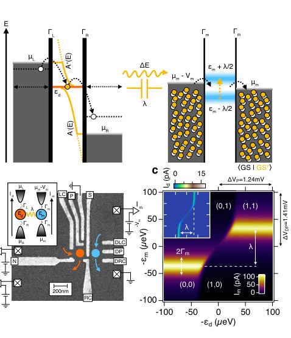
<figcaption class="paper-figure-caption"><b>Fig 1.</b> FIG. 1. Experimental overview. a, Mechanism by which Ander- son Orthogonality Catastrophe modifies tunnel rates. An electron tunnelling onto the dot (left) forces an abrupt restructuring of the de- tector Fermi sea (right) from one many-body ground state to another. The corresponding spectral functions, A±(E), describe energy ex- change with the detector during tunnel-in and tunnel-out processes, modifying the bare tunnel rates ΓL,R. b, Scanning electron micro- graph of the device and measurement circuit. The device schematic (inset) illustrates a dot (orange) weakly coupled to leads, and ca- pacitively coupled to the detector (blue) strongly coupled to its own leads. c, Charge stability...</figcaption>
</figure>
<figure class="paper-figure-card">
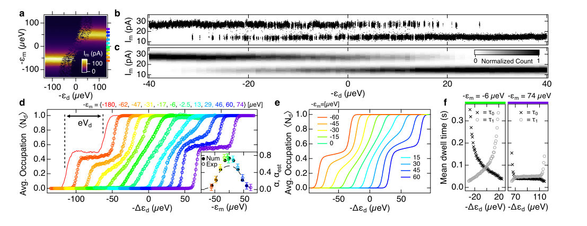
<figcaption class="paper-figure-caption"><b>Fig 2.</b> FIG. 2. Time-resolved measurements of AOC-modified tunnelling. a, Detector current map measured with a voltage bias Vd = 50 µV across the dot, for λ = 104 µeV and Γm = 22 µeV. Individual tunnelling events are resolved when εd lies within the bias window. b, Detector current during a slow sweep of εd across the charge transition (−εm = −6 µeV), revealing individual hopping events. c, Histograms of detector current at each εd, showing the bimodal distribution of Nd = 0 and Nd = 1 charge states (−εm = −6 µeV). d, Average occupation ⟨Nd⟩(εd) for several detector detunings εm, indicated by colour in panel a. Markers are extracted from the histograms; solid lines are obtained from normalized...</figcaption>
</figure>
<figure class="paper-figure-card">
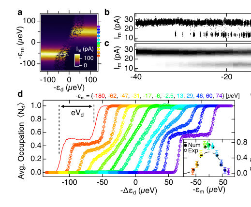
<figcaption class="paper-figure-caption"><b>Fig 3.</b> Figure 2 shows a direct measurement of AOC-modified tunnelling rates and their effect on the average occupation, ⟨Nd⟩(εd). A large bias is applied across the dot to expose a wide energy window over which tunnelling processes can be monitored, while Γd is made small enough that individual tunnelling events are resolved within the ≈1 kHz bandwidth of the charge-sensing circuit. The result is the detector cur- rent map in Fig. 2a, which should be compared to the near- equilibrium stability diagram in Fig. 1c where the dot bias is small and Γd is much larger. Tunnel-in and tunnel-out events are visible as εd is swept across the bias window, both in the 2D map (Fig. 2a) and in the slow line...</figcaption>
</figure>
<figure class="paper-figure-card">
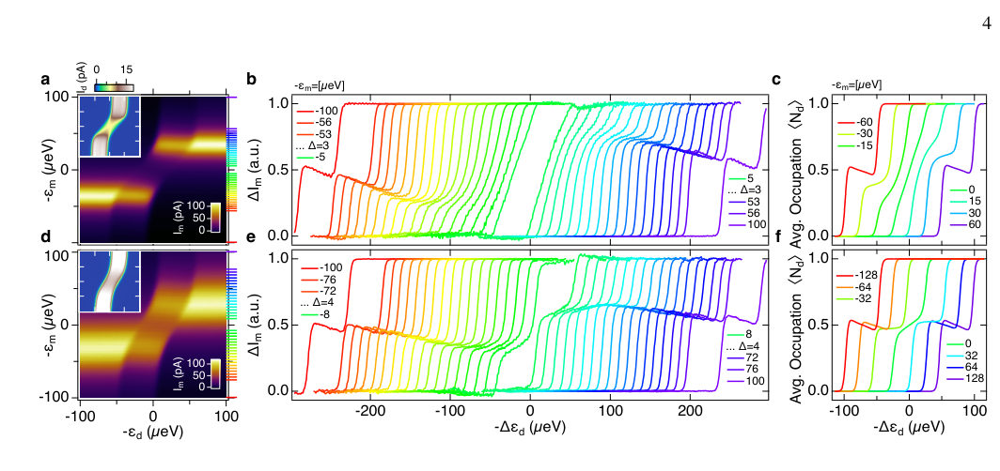
<figcaption class="paper-figure-caption"><b>Fig 4.</b> FIG. 3. Average-current proxy for AOC-modified occupation. a, Simultaneous detector- and dot-current measurements, showing Im and Id (inset) for λ = 70 µeV, Γm = 15 µeV, and Vd = 50 µV. The dot coupling Γd is tuned large enough that individual tunnelling events are no longer resolved. b, Detector current Im normalized to the values corresponding to Nd = 0 and Nd = 1, as a proxy for ⟨Nd⟩. Traces are shown for several detector detunings, εm, indicated by colour in panel a. c, Calculated ⟨Nd⟩(εd) for the same parameters, including AOC and an FES. d-f, Equivalent measurement and calculation for parameters corresponding to weaker AOC, λ = 60 µeV, Γm = 32 µeV.</figcaption>
</figure>
<figure class="paper-figure-card">
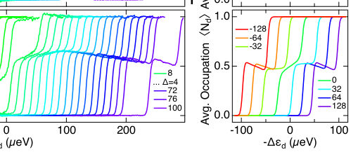
<figcaption class="paper-figure-caption"><b>Fig 5.</b> Figure 3 shows the result of such a measurement. Discrete dot tunnel events are no longer visible in the raw Im maps (Figs. 3a,d), but each line trace Im(εd) corresponding to a fixed value of εm can be rescaled with respect to the values at large negative and positive εd. The resulting normalized signal provides a proxy for ⟨Nd⟩(εd). Panels a-c represent a setting of λ/Γm similar to that in Fig. 2, and the primary features of Fig. 2d are indeed reproduced: far from detector resonance the normalized current has a broad plateau, while near εm = 0 the plateau is replaced by an approximately- diagonal trace across the bias window.</figcaption>
</figure>

**Summary.** The authors investigate how measurement itself can fundamentally alter quantum transport by inducing Anderson Orthogonality Catastrophe (AOC) backaction in coupled quantum dots. By measuring the detector's response as a function of coupling strength, they demonstrate that this many-body correlation acts as a tunable knob to modify tunneling rates. This work establishes a controllable mechanism for engineering non-trivial dynamics in solid-state quantum devices.

**Why it may be interesting.** This work provides a clean, solid-state platform to observe fundamental many-body physics (AOC) in an open quantum system setting. The ability to tune this correlation via gate voltages makes it highly relevant for controlling quantum dynamics in nanoscale devices.

Detailed structure

**Main problem.** The study aims to quantify detector-induced many-body correlations, specifically the Anderson Orthogonality Catastrophe (AOC), as a controllable source of backaction on quantum tunneling dynamics.

**Main result.** The experiment successfully demonstrates that tuning the energy level of a coupled quantum dot detector can modulate the tunneling rates from ordinary resonant transport to regimes dominated by AOC-induced many-body correlations.

**Method.** The research combines mesoscopic electrical measurements (measuring current and occupation in charge stability diagrams) with theoretical analysis using derived exponents ($\alpha_{est}$) relating transport signatures to the AOC parameter.

**Model / system.** The system is a coupled quantum dot circuit where one dot acts as the measured system, weakly coupled to another dot detector. The detector is strongly coupled to reservoirs and is held near equilibrium, allowing measurement of its many-body response.

**Key observables.** Average occupation ($\langle N_d 
angle$), detector current ($I_m$), dot current ($I_d$), and the derived AOC exponent ($\alpha$).

**Important parameters / regimes.** Detector energy level detuning ($\epsilon_m$), bias voltage ($V_d$), temperature ($T$), and the ratio of coupling strengths ($\lambda/\Gamma_m$).

**Assumptions / limitations.** The validity of mapping average current to occupation is assumed, and theoretical derivations rely on approximations valid in specific low-bias or weak-coupling limits.

**Figures summary.** Figures illustrate charge stability diagrams showing simultaneous measurements ($I_d$ vs $I_m$), time-resolved data confirming AOC effects on tunneling rates, and plots demonstrating the extraction of $\alpha_{est}$ from various transport signatures.

**Paper structure.** The paper progresses by first establishing the physical setup and mechanism (AOC backaction), presenting multiple measurement techniques ($\langle N_d 
angle$ vs. $I_m$), deriving quantitative estimates for the AOC exponent ($\alpha_{est}$) from these measurements, and finally testing the robustness of $\alpha_{est}$ against experimental variations like temperature and bias.

Abstract

Measurement perturbs a quantum system by coupling it to external degrees of freedom, but detector backaction depends on the physical mechanism of measurement itself. In solid-state devices, detectors driven far from equilibrium to enable faster measurements produce backaction that can often be understood as classical noise. However, a strong measurement can also induce backaction from quantum many-body correlations in the detector that are intrinsic to the measurement, even without shot noise. Here, we probe this near-equilibrium backaction through the effect of a quantum-dot charge sensor on tunnelling between a second quantum dot and its reservoirs. The measurement realizes the Anderson Orthogonality Catastrophe (AOC): electrons in the detector leads reorganize in response to an abrupt change in local scattering potential, suppressing resonant tunnelling while enabling inelastic processes that exchange energy with the detector. Changing the detector energy level tunes the AOC backaction from negligible to dominant in the tunnelling dynamics. More broadly, these results establish detector-induced many-body correlations as a controllable influence on quantum dynamics.

[↑ back to top](#top)

### [Tunable g-Factors of Hybridized Orbitals in a Quantum Dot Molecule](http://arxiv.org/abs/2608.06647v1)

**Authors:** Michelle Lienhart, Krzysztof Gawarecki, Pavel Daskalov, Christopher Thalacker, Nadeem Akhlaq, Irina Ivanova, Johannes Schall, Sven Rodt, Stephan Reitzenstein, Arne Ludwig, Dirk Reuter, Kai Müller, Jonathan J. Finley  
**Type:** both · **Category:** quantum information and computing · **PDF:** <https://arxiv.org/pdf/2608.06647v1>  
**Analysis basis:** full PDF text, analyzed in chunks
**Topic relevance:** 🔥 `QC/QI experiment` **4/5** · `spintronics-quantum-optics interface` **3/5** · `analog quantum simulation` **2/5** · `Keldysh / 2PI / non-Gaussian methods` **1/5** · `driven-dissipative phase transition` **1/5** · `entanglement & information structure` **1/5** · `exotic spin models in light-matter` **1/5** · `quantum optics experiment` **1/5**

↔ Scroll figures horizontally

<figure class="paper-figure-card">
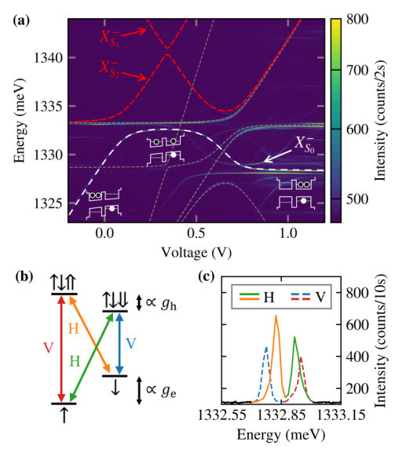
<figcaption class="paper-figure-caption"><b>Fig 1.</b> FIG. 1. (a) Voltage-dependent photoluminescence recorded from the single QDM investigated by exciting quasi- resonantly in the wetting layer. The trion states are fitted using a few-body Hamiltonian. The relevant singlet states are highlighted by the white curve (X− S0) and red curves (X− S1 and X− S2). The insets schematically depict the voltage de- pendent occupation of the orbital states in the trion singlet X− S0. (b) Schematic representation of the trion level structure when applying an in-plane magnetic field (Voigt geometry). (c) Polarization-resolved emission from the trion X− S0 state at B = 7 T and 0.44 V.</figcaption>
</figure>
<figure class="paper-figure-card">
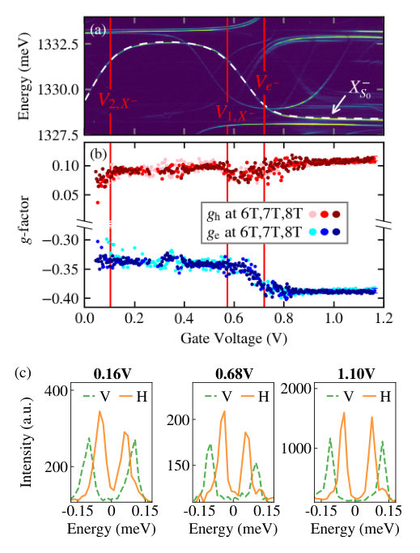
<figcaption class="paper-figure-caption"><b>Fig 2.</b> FIG. 2. (a) Voltage-dependent photoluminescence recorded from the trion singlet state X− S0 with the trion V1,X−, V2,X− and electron Ve−avoided crossings shown by vertical red lines. (b) Voltage dependent electron ge (blue) and hole gh (red) g- factors showing no B-field dependence. The electron g-factor ge changes around the electron avoided crossing Ve−. (c) Polarization-resolved emission from the trion X− S0 state at 8 T for the voltages 0.16 V, 0.68 V, and 1.1 V. The zero of the en- ergy axis is set approximately at the midpoint of the splitting. The corresponding PLV can be found in the Appendix 2 a in Fig. 8.</figcaption>
</figure>
<figure class="paper-figure-card">
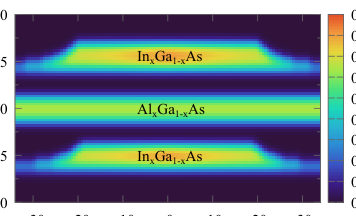
<figcaption class="paper-figure-caption"><b>Fig 3.</b> FIG. 3. The In content distribution (InxGa1−xAs) in the QDs and Al content (AlxGa1−xAs) in the interdot barrier.</figcaption>
</figure>
<figure class="paper-figure-card">
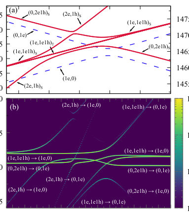
<figcaption class="paper-figure-caption"><b>Fig 4.</b> FIG. 4. (a) Calculated negative trion X−energies (red solid lines, scale on the left) and single-electron energy branches (blue dashed lines, scale on the right), and (b) the simulated PLV spectrum.</figcaption>
</figure>
<figure class="paper-figure-card">
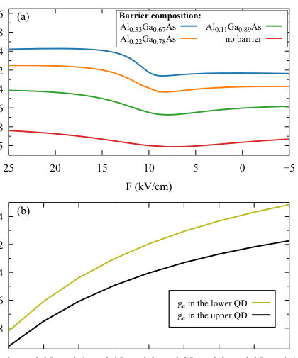
<figcaption class="paper-figure-caption"><b>Fig 5.</b> FIG. 5. (a) The electron g-factor as a function of the electric field, calculated for various compositions of the AlGaAs bar- rier. (b) The g-factor at F = −5 kV/cm and F = 25 kV/cm associated with the values in the upper and the lower QD, respectively.</figcaption>
</figure>

**Summary.** This work demonstrates the ability to electrically tune the electron and hole g-factors within a quantum dot molecule using magneto-photoluminescence spectroscopy. By observing distinct changes in $g_e$ at tunneling resonances, the authors confirm that electric fields provide precise control over spin properties. This capability opens new pathways for deterministically generating complex entangled photonic states.

**Why it may be interesting.** The direct electrical tuning of fundamental parameters like the g-factor in solid-state quantum systems provides a powerful platform for engineering qubit interactions and deterministic entanglement generation protocols relevant to quantum computing architectures.

Detailed structure

**Main problem.** Controlling the g-factors of orbital spin states in quantum dot molecules (QDMs) is essential for achieving high-fidelity generation of multi-photonic cluster states with higher-dimensional entanglement.

**Main result.** The electron g-factor shows a pronounced step-like change at the tunneling resonance, while the hole g-factor remains nearly constant, demonstrating electric-field control over trion g-factors.

**Method.** Polarization-resolved magneto-photoluminescence spectroscopy was used experimentally, and the results were quantitatively reproduced using an eight-band k.p model theoretically.

**Model / system.** The study investigates negatively charged trions (X-) in a single InGaAs QDM, which is composed of two vertically stacked quantum dots separated by about 10 nm, allowing for gate voltage tuning.

**Key observables.** Electron ($g_e$) and hole ($g_h$) g-factors measured as a function of gate voltage; photoluminescence spectra under magnetic fields.

**Important parameters / regimes.** Gate voltage (electric field), applied magnetic field strength, tunneling resonance voltages, and the trion charge state ($	ext{X}^-$).

**Assumptions / limitations.** The theoretical model relies on an eight-band k.p approach combined with Configuration Interaction for calculating trion states.

**Figures summary.** Figure 1 illustrates voltage-dependent PL spectra showing multiple charge states, and a schematic depicts the trion level structure under an in-plane magnetic field (Voigt geometry).

**Paper structure.** The paper establishes the necessity of g-factor control for quantum state generation. It presents experimental measurements on $	ext{X}^-$ in the QDM, detailing the voltage dependence of $g_e$ and $g_h$. Finally, it validates these findings using an eight-band k.p model to confirm electric-field tunability.

Abstract

The ability to control the $g$-factors of orbital spin states in optically active quantum dot molecules (QDMs) is a prerequisite for the high-fidelity generation of multi-photonic cluster states with higher-dimensional entanglement structure. Protocols that rely on two coupled spins require knowledge of the $g$-factor and its dependence on external control parameters. Mismatches in the $g$-factor between tunnel-coupled dots introduce unwanted dephasing of coupled spin-states, making precise characterization and voltage control essential. Here, we measure the gate voltage dependence of the electron and hole $g$-factors of negatively charged trions $X^{-}$ in a single InGaAs QDM using polarization-resolved magneto-photoluminescence spectroscopy. The electron $g$-factor exhibits a pronounced step-like change at the tunneling resonance, shifting from $g_\mathrm{e} = -0.336\pm 0.008$ to $g_\mathrm{e} = -0.389\pm 0.003$, providing a direct spectroscopic fingerprint of molecular orbital formation and a shift of the wavefunction localization from the lower to the upper dot. In contrast, the hole $g$-factor remains nearly constant at $g_\mathrm{h} \approx 0.094 \pm 0.007$, exhibiting a weak modulation near the anticrossing voltages attributed to Coulomb-mediated deformation of the wavefunction by the tunneling electron. Our results are quantitatively reproduced by an eight-band $\mathbf{k}{\cdot}\mathbf{p}$ model, establishing electric-field control of the trion $g$-factors as a practical tool for independently tuning the Zeeman splitting of individual dots and opening new pathways towards the deterministic generation of two-dimensional photonic cluster states.

[↑ back to top](#top)

### [Onset of the transitional flux-avalanche regime in bulk NbTi controlled by the thermal boundary conductance](http://arxiv.org/abs/2608.07324v1)

**Authors:** Irina Abaloszewa, Victor V. Chabanenko, Aleksander Abaloszew  
**Type:** experiment · **Category:** other · **PDF:** <https://arxiv.org/pdf/2608.07324v1>  
**Analysis basis:** full PDF text, analyzed in chunks
**Topic relevance:** `correlated / nonlocal dissipation` **3/5** · `driven-dissipative phase transition` **3/5** · `analog quantum simulation` **2/5** · `non-equilibrium dynamics` **2/5** · `non-equilibrium universality` **2/5** · `Keldysh / 2PI / non-Gaussian methods` **1/5** · `Kondo & dissipative impurity` **1/5** · `entanglement & information structure` **1/5** · `measurement-induced transitions` **1/5** · `methods for driven-dissipative` **1/5**

↔ Scroll figures horizontally

<figure class="paper-figure-card">
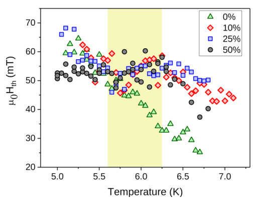
<figcaption class="paper-figure-caption"><b>Fig 1.</b> FIG. 1. Temperature dependence of the threshold field µ0Hth for avalanche nucleation in a bulk NbTi disk with pure non- adecane and three silver-filled nonadecane interfaces: 0% (pure nonadecane), 10, 25, and 50 wt.% Ag; the 50 wt.% data combine two runs at different positions on the disk, with different indicator films, and are plotted with the same sym- bol. The shaded band marks the interval of positive slope, dHth/dT &gt; 0, that appears with the silver-filled interface.</figcaption>
</figure>
<figure class="paper-figure-card">

<figcaption class="paper-figure-caption"><b>Fig 2.</b> Figure 1 presents Hth(T) for the pure nonadecane in- terface and for three silver-filled compositions. The cen- tral result of this work is that the silver-filled interface changes Hth(T) qualitatively: the monotonic decrease seen with the pure interface is interrupted, in every silver- filled composition, by an interval in which the threshold rises or stays flat. For pure nonadecane, Hth decreases monotonically from about 60 mT at 5.1 K to about 25 mT at 6.7 K. The dependence is close to linear with a slope of approx- imately −24 mT/K, and dHth/dT &lt; 0 within the scatter of the data, confirming the thermally limited regime es- tablished in Ref. [15]. The silver-filled interface changes the...</figcaption>
</figure>
<figure class="paper-figure-card">
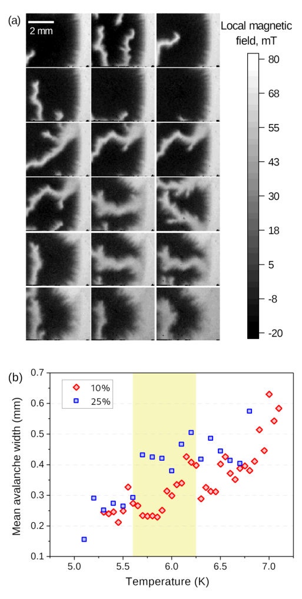
<figcaption class="paper-figure-caption"><b>Fig 3.</b> FIG. 2. (a) Magneto-optical images of the avalanche morphol- ogy in the 25 wt.% Ag series, recorded from 5.1 to 6.8 K in 0.1 K steps (left to right, top to bottom); the right edge of each frame is the disk rim, the scale bar is 2 mm, and the grey scale gives the local magnetic field of the background-subtracted images. The morphology evolves from narrow channeled fin- gers at low temperature to broad fronts at high temperature. (b) Mean width of the penetrating structures versus temper- ature for the 10 and 25 wt.% compositions; the shaded band marks the positive-slope window of Fig. 1.</figcaption>
</figure>
<figure class="paper-figure-card">
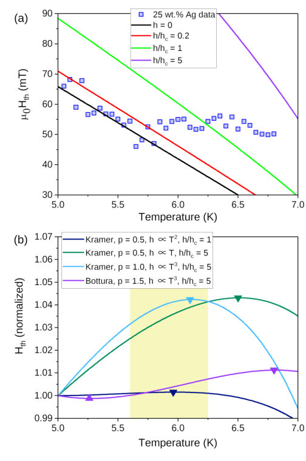
<figcaption class="paper-figure-caption"><b>Fig 4.</b> FIG. 3. Shapes admitted by the quasi-static interpolation, Eq. (3), in the measured window. (a) With the adiabatic threshold matched to the measured pure-nonadecane slope and ρff ∝1/Bc2(T), the interpolation yields monotonically decreasing curves at all couplings up to h/hc = 5, the values shown bracketing the coupling estimated for the composites, h/hc ≈0.1; the 25 wt.% Ag data are shown for comparison. (b) The only parameterizations in the scan that produce an interior maximum (down triangles), all requiring h/hc ≥1, a strongly temperature-dependent h, and a weakly decreasing Had; the maxima scatter across the interval and only acciden- tally fall inside the positive-slope window of Fig....</figcaption>
</figure>

**Summary.** This work experimentally investigates how modifying the thermal interface conductance in bulk NbTi superconductors alters the temperature dependence of flux avalanches. By introducing silver into the sample interface, the researchers induced a unique non-monotonic behavior in the threshold field $H_{th}(T)$. This signature is identified as direct evidence for entering a transitional regime where dynamic heat removal plays a crucial role.

**Why it may be interesting.** While focused on superconductivity, the core concept of identifying a critical parameter ($h_c$) that dictates a qualitative phase/regime crossover based on thermal coupling is highly relevant to open quantum systems where environmental coupling drives non-equilibrium dynamics.

Detailed structure

**Main problem.** The study investigates the onset of a transitional flux-avalanche regime in bulk Type-II superconductors, determining how thermal boundary conductance controls the superconducting instability.

**Main result.** Incorporating silver into the thermal interface layer causes the threshold field $H_{th}(T)$ to exhibit non-monotonic behavior, including an interval where $	ext{dH}_{th}/	ext{dT} > 0$, which signals entry into this transitional regime.

**Method.** Measurements were performed using magneto-optical imaging (MOI) on bulk NbTi disks with interfaces modified by varying concentrations of silver powder.

**Model / system.** The physical system is a bulk Type-II superconductor (NbTi) undergoing thermomagnetic avalanches. The key control parameter is the thermal boundary conductance ($h$) at the sample interface, which dictates the transition between electromagnetically and thermally controlled regimes.

**Key observables.** $H_{th}(T)$ (threshold field vs. temperature), $	ext{dH}_{th}/	ext{dT}$ (slope of $H_{th}$), and avalanche morphology (fingers vs. fronts).

**Important parameters / regimes.** Critical thermal boundary conductance ($h_c$), silver loading concentration ($	ext{wt.}\%$ Ag), and the characteristic temperature $T^* \approx 6.1-6.4$ K.

**Assumptions / limitations.** The analysis assumes that the observed non-monotonicity is a direct experimental signature of dynamic heat removal becoming relevant during the instability process, distinguishing it from purely quasi-static predictions.

**Figures summary.** Figure 1 shows $H_{th}(T)$ for various Ag concentrations, highlighting the positive slope region ($	ext{dH}_{th}/	ext{dT} > 0$) in silver-filled interfaces. Figure 2 relates this to avalanche morphology changes (fingers to fronts).

**Paper structure.** The paper establishes the background of flux avalanche regimes, details the experimental modification using Ag-filled interfaces, presents the key results showing non-monotonic $H_{th}(T)$ behavior, and correlates this change with both the transition into the transitional regime and changes in avalanche morphology.

Abstract

Thermomagnetic avalanches in type-II superconductors occur in two qualitatively different regimes, electromagnetically controlled in thin films and thermally limited in bulk samples, distinguished by the sign of the temperature derivative of the threshold field $H_\text{th}(T)$. The two regimes are separated by a critical thermal boundary conductance $h_c$, and a non-monotonic $H_\text{th}(T)$ has been predicted in the transitional region where the interface conductance $h$ approaches $h_c$. We approach this region in a bulk NbTi disk by raising the interface coupling above the pure-nonadecane baseline with a silver-filled interface layer. Whereas the pure interface gives a monotonically decreasing $H_\text{th}(T)$, the silver-filled interface produces a non-monotonic dependence not previously realized in a bulk superconductor: a temperature interval of positive slope, $dH_\text{th}/dT > 0$, terminating in a maximum at $T^* \approx 6.1$--$6.4$~K. The effect is reproduced for two independent silver-filled compositions; in a third, with the highest loading, the low-temperature decrease is absent altogether and $H_\text{th}(T)$ is flat up to the same $T^*$, the evolution expected for stronger coupling. The position of the maximum is set by the intrinsic properties of NbTi, independent of the silver content. The onset of the positive-slope interval coincides in temperature with a change of the avalanche morphology from narrow channeled fingers to broad fronts. The reversal of the sign of $dH_\text{th}/dT$ is a direct experimental signature of the onset of the transitional regime, in which heat removal during the instability becomes dynamically relevant.

[↑ back to top](#top)

### [Origin of the superconductor-insulator transition in disordered two-dimensional films](http://arxiv.org/abs/2608.07101v1)

**Authors:** Alexander Weitzel, Lea Pfaffinger, Animesh Panda, Arpan Das, Ilaria Maccari, Simon Reinhardt, Sven Linzen, Evgenii Il'ichev, Nicola Paradiso, Ferdinand Evers, Christoph Strunk  
**Type:** both · **Category:** disordered systems and neural networks · **PDF:** <https://arxiv.org/pdf/2608.07101v1>  
**Analysis basis:** full PDF text, analyzed in chunks
**Topic relevance:** `driven-dissipative phase transition` **3/5** · `non-equilibrium universality` **2/5** · `Keldysh / 2PI / non-Gaussian methods` **1/5** · `Kondo & dissipative impurity` **1/5** · `analog quantum simulation` **1/5** · `correlated / nonlocal dissipation` **1/5** · `methods for driven-dissipative` **1/5** · `non-equilibrium dynamics` **1/5**

↔ Scroll figures horizontally

<figure class="paper-figure-card">
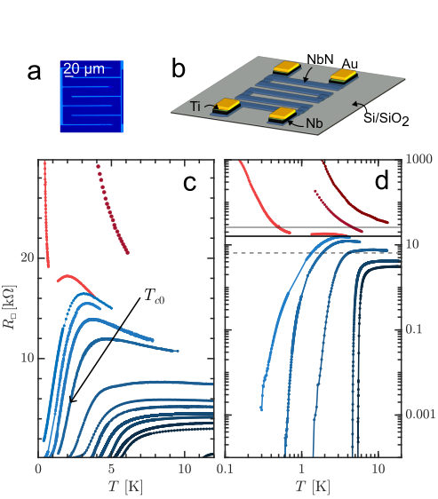
<figcaption class="paper-figure-caption"><b>Fig 1.</b> FIG. 1. Setup and DC resistance: a) Optical micrograph of a typical device: argon ion milling is used to etch the 3 nm thick NbN film into a meander shape. b) Schematic of the 4-terminal contact design. c) Sheet resistance vs. tempera- ture of 13 NbN-film with room-temperature resistance up to 3.5 kΩ. The normal state resistance RN including all quan- tum corrections is assigned to the maximum of R□(T). d) Selected R□(T)-curves on a logarithmic scale.</figcaption>
</figure>
<figure class="paper-figure-card">
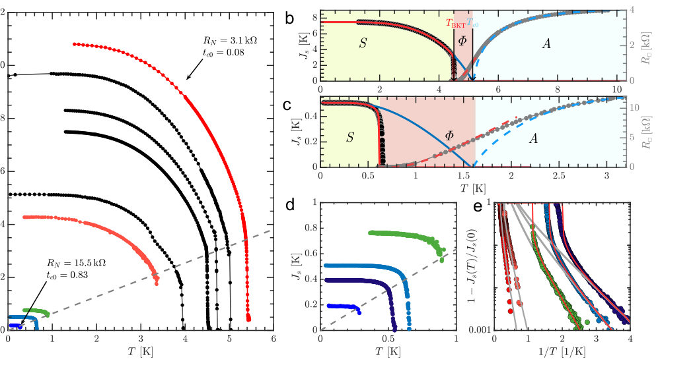
<figcaption class="paper-figure-caption"><b>Fig 2.</b> FIG. 2. Superfluid phase stiffness: a) Measured Js(T) for selected films. The dashed line indicates the universal transition point at Js(TBKT) = 2TBKT/π. b) Stiffness and resistance for RN = 4.1 kΩ. Solid lines are fits to Js(T) according to the BCS (blue) and BKT (red) theories. Dashed lines are fits describing phase (red, Eq. 1) and amplitude fluctuations. Colored shades denote areas that are fully superconducting (S) or dominated by phase (Φ) and amplitude (A) fluctuations, respectively. c) Same for RN = 12.3 kΩ, close to the SIT. d) Zoom of low-temperature range in a). Colored curves correspond to those in a. e) Exemplary Arrhenius plots of the difference 1 −Js(T)/Js(0) for RN = 3.1,...</figcaption>
</figure>
<figure class="paper-figure-card">
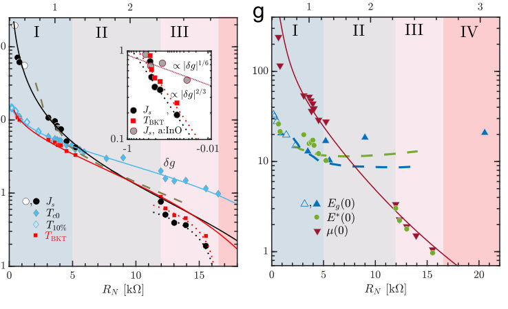
<figcaption class="paper-figure-caption"><b>Fig 3.</b> FIG. 3. Evolution of energy scales with disorder: a-d) Simulated maps of the pairing potential ∆(0) based on a fully self- consistent mean-field calculation on a lattice with 96x96 sites corresponding to regimes I-IV in (e), respectively (Supplement, Sec. II). The color bar corresponds to ∆/t= [0.1375 0.1825], [0.025 0.25], [0.01 0.3], [0 0.375] for a,b,c,d, respectively. e) Overview over all energy scales in the problem (see text). Long dashed lines are guides to the eyes. f) Comparison of experiment and theory for Tc0 and Finkel’stein (Eq. S.11, light blue line), for Js(0) based on Mattis-Bardeen (Eq. 3, black line), and for TBKT based (Eq. 5, red line). Inset: Double-logarithmic plot for...</figcaption>
</figure>
<figure class="paper-figure-card">
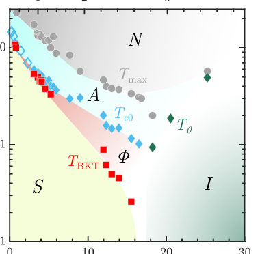
<figcaption class="paper-figure-caption"><b>Fig 4.</b> FIG. 4. Phase diagram Regions in the (T −RN)-plane sep- arated by the BKT phase transition line TBKT(RN), the line Tc0(RN), which denotes the crossover between the phase and amplitude fluctuations regimes, and Tmax(RN) signaling the crossover to weakly localized metal. The green symbols indi- cate the activation temperatures in the insulating phase.</figcaption>
</figure>

**Summary.** This paper investigates the superconductor-insulator transition in 2D films by analyzing how disorder affects superconducting properties. The authors show that while the finite-temperature transition follows BKT physics, the zero-temperature transition is governed by quantum phase fluctuations causing $J_s(0)$ to vanish rapidly. By comparing transport measurements with theory, they clarify the role of these fluctuations in driving the system into an insulating state.

**Why it may be interesting.** The work provides a detailed experimental realization of a quantum critical point driven by fluctuations in an ordered state (superconductivity), which is highly relevant for understanding emergent quantum phases in disordered materials, linking concepts from localization theory and superconductivity.

Detailed structure

**Main problem.** The study investigates the origin of the superconductor-insulator transition (SIT) in disordered two-dimensional superconducting films, specifically determining whether it is driven by bosonic or fermionic quantum fluctuations.

**Main result.** The finite-temperature transition remains BKT type near the SIT, but the zero-temperature superfluid stiffness ($J_s(0)$) vanishes rapidly while $T_{c0}$ stays finite, indicating that quantum phase fluctuations drive the zero-temperature transition.

**Method.** The authors combine experimental measurements of DC resistance ($R_\Box(T)$) and superfluid stiffness ($J_s(T)$) with theoretical fitting techniques (e.g., BKT analysis, Finkel'stein theory) to map out energy scales across varying disorder strengths.

**Model / system.** The system under study is disordered two-dimensional superconducting films (e.g., NbN), characterized by a complex order parameter $\Delta(\mathbf{r})$. The physics involves the competition between Anderson localization and superconductivity, analyzed through various theoretical regimes (BCS-like suppression to insulating phase).

**Key observables.** Sheet resistance $R_\Box(T)$, superfluid stiffness $J_s(T)$, mean-field transition temperature ($T_{c0}$), BKT transition temperature ($T_{BKT}$), and zero-temperature superfluid stiffness ($J_s(0)$).

**Important parameters / regimes.** Disorder strength ($W$), critical resistance ($R_c$), characteristic energy scales like activation energy ($E^*$) and quasiparticle excitation energy ($E_g$).

**Assumptions / limitations.** The analysis relies on established theories like the BKT mechanism for finite-temperature transitions, while addressing discrepancies between mean-field predictions and experimental observations due to quantum fluctuations.

**Figures summary.** Figures illustrate $R_\Box(T)$ vs. T measurements, $J_s(T)$ evolution across different disorder levels, phase diagrams in the $(T-R_N)$-plane showing transition regions, and plots comparing theoretical energy scales ($E^*$, $\mu$, $E_g$) versus disorder strength.

**Paper structure.** The paper systematically analyzes transport measurements to extract key parameters like $T_{c0}$ (via inflection points) and $T_{BKT}$ (via fitting), compares these results across multiple disorder regimes, and uses the separation of energy scales ($J_s(0)$ vs. $T_{c0}$) to pinpoint the nature of the quantum phase transition.

Abstract

Theory predicts the superconductor-to-insulator transition (SIT) to emerge from the competition between Anderson localization, which tends to localize single-particle wavefunctions, and superconductivity, which establishes long-range correlations in the superconducting order parameter. In two-dimensional (2D) superconducting films, the transition temperature $T_\text{c}$ at which resistance vanishes, $R_\Box(T_\text{BKT}){=}0$, is set by the Berezinskii-Kosterlitz-Thouless (BKT) mechanism and satisfies $T_\text{BKT}< T_{c0}$, where $T_{c0}$ is the mean-field transition temperature. In weakly disordered samples $T_\text{BKT}\lesssim T_{c0}$, whereas increasing disorder drives $T_\text{BKT}\ll T_{c0}$ near the SIT. Whether the finite-temperature transition retains its BKT character throughout this crossover remains an open question. Here, we investigate the evolution of both sheet resistance $R_\Box(T)$ and superfluid stiffness $J_s(T)$ over a wide range of disorder strength $W$. We establish that even near the SIT, the finite-temperature transition from the superconducting to the resistive state remains of BKT type. However, as disorder approaches the critical value, the zero temperature superfluid phase stiffness, $J_s(0)$, is found to vanish rapidly while $T_{c0}$ remains finite, which we attribute to quantum phase fluctuations as the drive for the zero-temperature transition. Three decades after its experimental discovery by Haviland, Liu, and Goldman, our measurements clarify the origin of the SIT in 2D films.

[↑ back to top](#top)

### [Theory of spin-wave transport in ferromagnet-superconductor heterostructures: Negative refraction, perfect imaging and temperature-controlled spin-wave optics](http://arxiv.org/abs/2608.06476v1)

**Authors:** Tomas T. Osterholt, Thijs van der Meer, Pim H. Vree, Merel A. Bouma, Michael Borst, Toeno van der Sar, Rembert A. Duine  
**Type:** theory · **Category:** other · **PDF:** <https://arxiv.org/pdf/2608.06476v1>  
**Analysis basis:** full PDF text, analyzed in chunks
**Topic relevance:** `exotic spin models in light-matter` **3/5** · `spintronics-quantum-optics interface` **3/5** · `Keldysh / 2PI / non-Gaussian methods` **1/5** · `correlated / nonlocal dissipation` **1/5** · `driven-dissipative phase transition` **1/5** · `methods for driven-dissipative` **1/5**

↔ Scroll figures horizontally

<figure class="paper-figure-card">
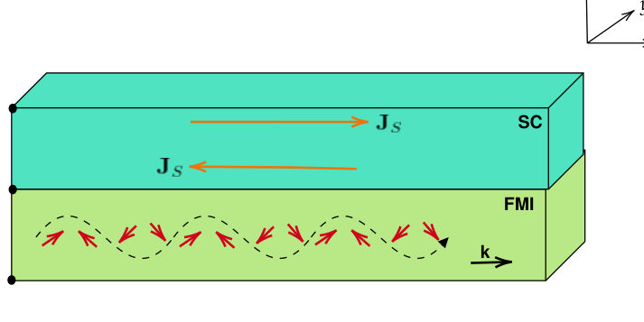
<figcaption class="paper-figure-caption"><b>Fig 1.</b> FIG. 1. FMI-SC heterostructure. A spin wave with wavevector k is traveling through the ferromagnetic insulator (FMI), resulting in Meissner screening from the superconductor (SC) via the generation of a supercurrent density JS.</figcaption>
</figure>
<figure class="paper-figure-card">
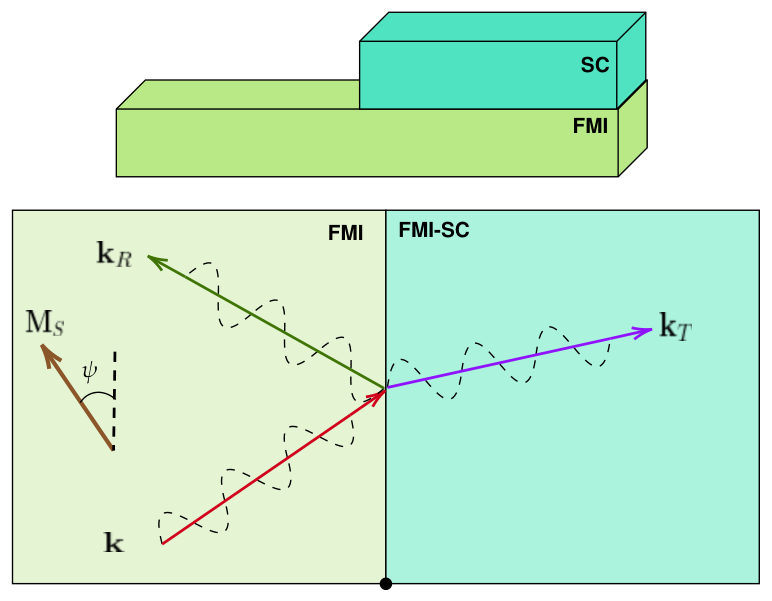
<figcaption class="paper-figure-caption"><b>Fig 2.</b> FIG. 2. Spin-wave reflection and refraction. A spin wave with wavevector k is reflected and refracted at the interface between a bare FMI and an FMI-SC heterostructure located at x = 0. Here, the wavevectors of the reflected and refracted spin waves are denoted by kR and kT , respectively. The saturation magnetization MS is oriented with an angle ψ relative to the y-axis and is the same in both the bare FMI and the FMI-SC heterostructure</figcaption>
</figure>
<figure class="paper-figure-card">
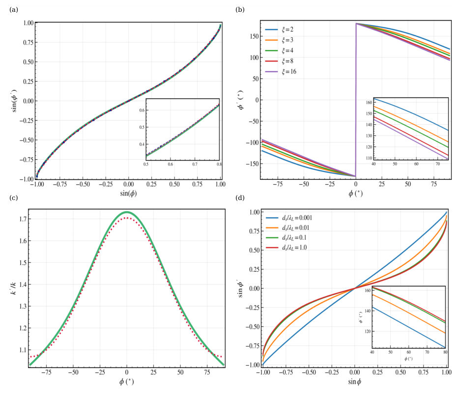
<figcaption class="paper-figure-caption"><b>Fig 3.</b> FIG. 3. Reflection law in the FMI-SC heterostructure. (a) Sine of the angle ϕ′ of the reflected wavevector as a function of the sine of the angle ϕ of the incident wavevector. The green, solid line shows the result obtained from the exact dispersion relation, Eq. (44), while the dark blue, dashed line is obtained using the polynomial approximation, Eq. (63). The red, dotted line represents the approximate reflection law given in Eq. (67). (b) Reflected angle ϕ′ as a function of the incident angle ϕ for different values of the ellipticity ξ. (c) Ratio between the magnitudes of the reflected (k′) and incident (k) wavevectors as a function of the incident angle ϕ. The green, solid line shows...</figcaption>
</figure>
<figure class="paper-figure-card">
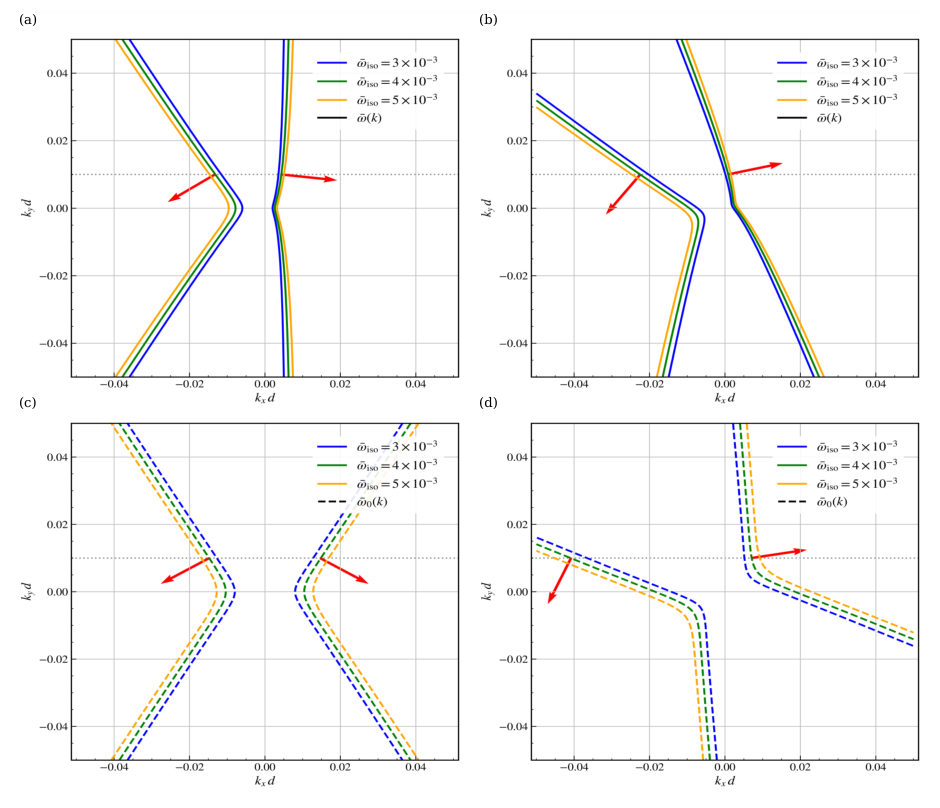
<figcaption class="paper-figure-caption"><b>Fig 4.</b> FIG. 4. Negative reflection. Plots of the isofrequency contours of the dispersion relations ω(k) and ω0(k) in the London dipolar limit, given by Eqs. (55) and (57), respectively, for different values of the saturation magnetization angle ψ. The plots illustrate the emergence of negative reflection as ψ is varied. For convenience, we have introduced the dimensionless frequencies ¯ω(k) = [ω(k) −γB0ξ]/(γµ0MS) and ¯ω0(k) = [ω0(k) −γB0ξ]/(γµ0MS), and in all panels we have set the ellipticity ξ = 2. The red arrows indicate the direction of the spin-wave group velocity at the points where the isofrequency contours intersect the gray dotted line kyd = 0.01. Due to the translational invariance of...</figcaption>
</figure>
<figure class="paper-figure-card">
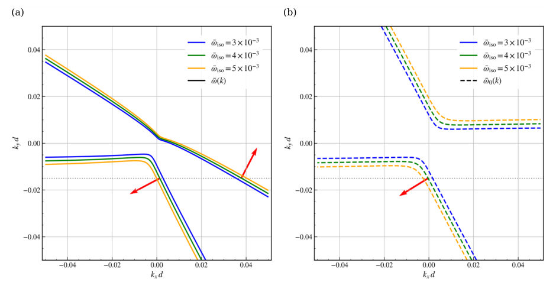
<figcaption class="paper-figure-caption"><b>Fig 5.</b> FIG. 5. Temperature-controlled opening and closing of reflection channels. Isofrequency contours of the dispersion relations ω(k) and ω0(k) in the London dipolar limit, given by Eqs. (55) and (57), respectively, for ellipticity ξ = 2 and saturation magnetization angle ψ = 60◦. Here, ω(k) corresponds to the dispersion of the FMI-SC heterostructure in the superconducting state (T &lt; Tc), while ω0(k) corresponds to the dispersion of the same heterostructure in the normal state (T &gt; Tc), where the Meissner screening is absent. For convenience, we have introduced the dimensionless frequencies ¯ω(k) = [ω(k)−γB0ξ]/(γµ0MS) and ¯ω0(k) = [ω0(k) −γB0ξ]/(γµ0MS). The red arrows indicate the direction of...</figcaption>
</figure>

**Summary.** This theoretical work investigates spin-wave transport in ferromagnet/superconductor heterostructures, establishing a framework based on self-consistent field calculations. The key finding is that superconducting screening induces unconventional wave phenomena, such as negative refraction and flat dispersion contours. This positions FMI-SC systems as highly versatile platforms for temperature-tunable magnonic devices.

**Why it may be interesting.** While focused on magnonics, the concept of using superconducting screening to engineer wave propagation (e.g., achieving flat isofrequency contours) shares conceptual parallels with engineered metamaterials used in quantum optics or cavity QED for controlling light-matter interactions.

Detailed structure

**Main problem.** The study develops a general theoretical framework for spin-wave optics in Ferromagnet-Superconductor (FMI-SC) heterostructures to understand unconventional wave phenomena.

**Main result.** The superconducting screening leads to negative refraction and nearly straight isofrequency contours, enabling functionalities like perfect imaging and temperature-tunable magnonic devices.

**Method.** The authors derived self-consistent equations for the total magnetic field by coupling Maxwell's equations with London equations, solving for the spin-wave dispersion relation $\omega(k)$.

**Model / system.** The system is an FMI-SC heterostructure where spin waves propagate. The superconducting response modifies the effective magnetic field via Meissner screening currents.

**Key observables.** Negative phase/group-velocity refraction, reflection/transmission coefficients ($R_{ij}, T_{ij}$), and temperature dependence of scattering properties.

**Important parameters / regimes.** London penetration depth ($\lambda_L$), spin-wave wavelength ($\lambda$), film thickness ($d$), and operating temperature (near $T_c$).

**Assumptions / limitations.** The analysis relies on the quasi-static approximation, assuming thin magnetic films ($kd \ll 1$), and decomposing the total field into dipolar and screening components.

**Figures summary.** Figure 1 illustrates the FMI-SC heterostructure setup involving spin wave propagation and Meissner screening effects.

**Paper structure.** The paper progresses from establishing the general theoretical framework, deriving self-consistent equations for the magnetic field, solving for the dispersion relation, and finally analyzing boundary conditions to find reflection/transmission coefficients in different limits.

Abstract

We investigate spin-wave transport in ferromagnetic insulator-superconductor (FMI-SC) heterostructures and develop a general theoretical framework for spin-wave optics in these hybrid systems. We demonstrate that Meissner screening by the superconductor gives rise to a range of unconventional wave phenomena, including negative phase- and group-velocity refraction, and reflection and refraction laws that differ fundamentally from their optical counterparts. Within this framework, we derive the spin-wave Fresnel equations governing reflection and transmission at FMI-SC interfaces and show that the scattering properties exhibit a pronounced temperature dependence, enabling tunable spin-wave mirrors and refractive elements. Most strikingly, we find that superconducting screening can produce nearly straight isofrequency contours, far flatter than the kinked, intrinsically curved contours attainable in conventional dipolar spin-wave systems. We show that these straight contours enable functionalities such as perfect spin-wave imaging, efficient waveguiding, and interferometric elements, such as phase shifters and beam splitters, with unconventional properties. Our results establish FMI-SC heterostructures as a versatile platform for temperature-tunable spin-wave optics and interferometric magnonic devices.

[↑ back to top](#top)

### [Electron Temperature and Electron-Electron Scattering Length in GaAs/AlGaAs Using Mesoscopic Multiparallel Aperture Geometries](http://arxiv.org/abs/2608.06708v1)

**Authors:** Arati Thapa, Rishav Khatiwada, Prakash Sharma, Jean J. Heremans, Adbhut Gupta, Kirk W. Baldwin, Loren N. Pfeiffer, Mansour Shayegan  
**Type:** experiment · **Category:** other · **PDF:** <https://arxiv.org/pdf/2608.06708v1>  
**Analysis basis:** full PDF text, analyzed in chunks
**Topic relevance:** `non-equilibrium dynamics` **3/5** · `non-equilibrium universality` **2/5** · `Keldysh / 2PI / non-Gaussian methods` **1/5** · `correlated / nonlocal dissipation` **1/5** · `driven-dissipative phase transition` **1/5** · `methods for driven-dissipative` **1/5**

↔ Scroll figures horizontally

<figure class="paper-figure-card">
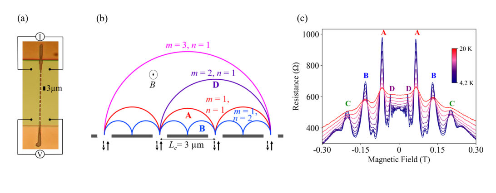
<figcaption class="paper-figure-caption"><b>Fig 1.</b> FIG. 1. (a) Optical micrograph of the 12-aperture perforated-barrier geometry showing the dimensions and the 4-point resistance measurement configuration with current and voltage contacts marked. (b) Schematic representation of selected cyclotron orbits corresponding to different m and n. (c) Magnetoresistance measurements parametrized in T, showing maxima corresponding to different combinations of m and n indicated in (b). Peak A corresponds to m = 1, n = 1; peak B to m = 1, n = 2; peak C to m = 1, n = 3; and peak D to m = 2, n = 1. The resistance values correspond to a single aperture.</figcaption>
</figure>
<figure class="paper-figure-card">
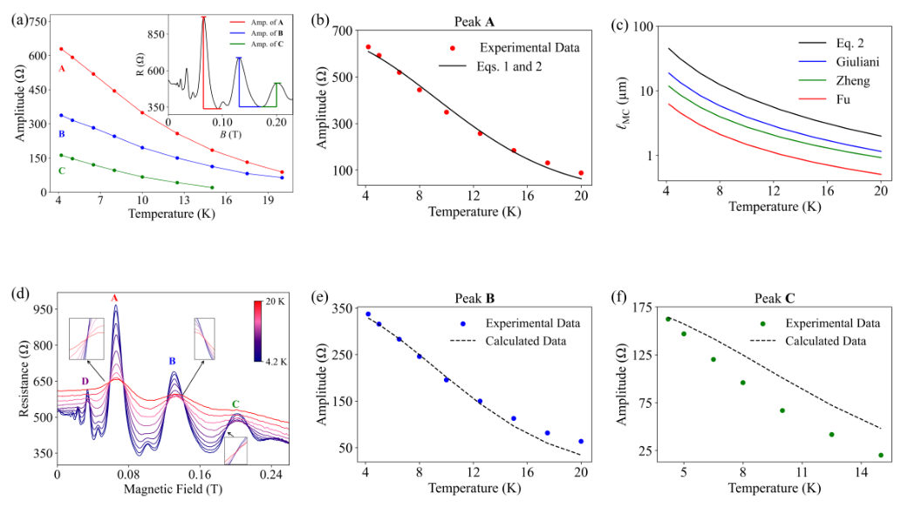
<figcaption class="paper-figure-caption"><b>Fig 2.</b> FIG. 2. (a) Experimentally obtained amplitudes vs T (4.2K ≤T ≤20K) for peaks A, B and C. The inset shows the method for amplitude (Amp) quantification. (b) Fit of experimental amplitude for peak A (m = 1, n = 1) by Eqs. 1 and 2. The red circles denote experimental data and the black line denotes the fit calculated using Eqs. 1 and 2. (c) ℓMC vs T plotted on a semi-logarithmic scale. Values calculated from Eq. 2 are shown by the black line, where ℓ0 is extracted from the fit to experimental data in panel (b). The blue, green, and red lines represent theoretical predictions from Giuliani [2], Zheng [1] and Fu [44], respectively. (d) R(B) vs B and vs dc for peaks A, B and C corresponding to...</figcaption>
</figure>
<figure class="paper-figure-card">
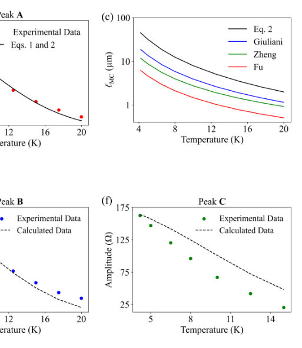
<figcaption class="paper-figure-caption"><b>Fig 3.</b> Figure 2(d) shows R(B) plotted vs both B and dc, for</figcaption>
</figure>
<figure class="paper-figure-card">
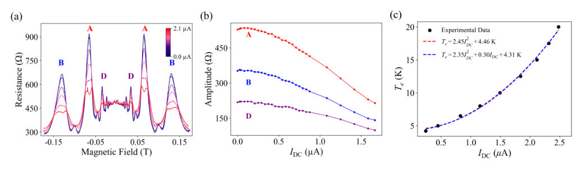
<figcaption class="paper-figure-caption"><b>Fig 4.</b> FIG. 3. (a) Magnetoresistance measurements at T = 4.2 K parametrized in IDC, showing maxima corresponding to different m and n. Peak A corresponds to m = 1, n = 1; peak B to m = 1, n = 2; peak D to m = 2, n = 1. (b) Experimentally obtained amplitudes vs IDC for peaks A, B and D at 4.2 K. (c) Te vs IDC derived from amplitude data for peak A. Black circles represent the data. The red and blue dotted lines represent fits without and with a linear term, respectively. The current and resistance values correspond to a single aperture.</figcaption>
</figure>
<figure class="paper-figure-card">
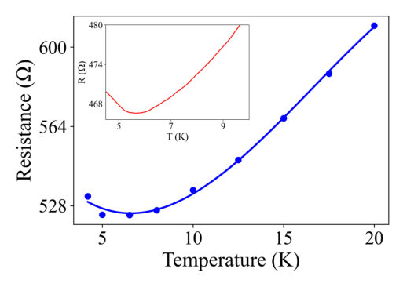
<figcaption class="paper-figure-caption"><b>Fig 5.</b> FIG. 4. R(B = 0) vs T. The circles correspond to data obtained at B = 0 from Fig. 1(c) across T, while the line is a spline fit as guide to the eye. The minimum in R vs T is characteristic of the Gurzhi effect and the phenomenon of superballistic conduction. The inset shows corroborating R(B = 0) vs T data recorded during warmup of the device.</figcaption>
</figure>

**Summary.** The research experimentally investigates electron temperature and electron-electron scattering length in high-mobility GaAs/AlGaAs 2DES using a mesoscopic aperture geometry. By measuring magnetoresistance oscillations as a function of temperature and applied bias current, the authors successfully determined the electron-electron scattering length and quantified how Joule heating elevates the electron temperature above the lattice temperature.

**Why it may be interesting.** This work provides a highly controlled experimental platform for studying non-equilibrium electron dynamics in low dimensions. The ability to deterministically control $T_e$ via current injection allows for the direct measurement of scattering mechanisms, which is crucial for understanding energy relaxation in quantum devices.

Detailed structure

**Main problem.** The study aims to quantify electron temperatures ($T_e$) and the electron-electron scattering length ($\ell_{ee}$) in two-dimensional electron systems (2DES) under non-equilibrium conditions.

**Main result.** The authors established a method to determine $\ell_{ee}$ by analyzing the exponential decay of magnetoresistance peaks with temperature, and they quantified $T_e$ via its quadratic dependence on applied DC bias current ($I_{DC}$).

**Method.** Experimental measurements were performed using low-temperature ballistic transport in a mesoscopic multiparallel aperture geometry fabricated on GaAs/AlGaAs heterostructures.

**Model / system.** The physical system is a high-mobility 2DES confined in a perforated barrier structure. The analysis uses semiclassical cyclotron orbits and models the magnetoresistance amplitude decay based on electron-electron scattering theory.

**Key observables.** Magnetoresistance $R(B)$ peaks, which are analyzed for their amplitude dependence on temperature ($T$) and DC bias current ($I_{DC}$); also measured is $R(B=0)$ vs $T$.

**Important parameters / regimes.** Electron temperature ($T_e$), electron-electron scattering length ($\ell_{ee}$), cyclotron orbit diameter, and the applied DC heating current ($I_{DC}$).

**Assumptions / limitations.** The amplitude of magnetoresistance maxima is assumed to correlate with the number of electrons reaching the collector; non-equilibrium heating implies $T_e > T$ when $I_{DC} 
eq 0$.

**Figures summary.** Figures illustrate the mesoscopic geometry and cyclotron orbits, showing how magnetoresistance peaks vary with temperature. Other figures plot measured amplitudes vs $T$, fitting these to extract $\ell_{ee}(T)$, and show $R(B=0)$ vs $T$ to identify superballistic conductance regimes.

**Paper structure.** The paper progresses from establishing the necessity of quantifying $T_e$ and $\ell_{ee}$ in 2DES, detailing the measurement technique using mesoscopic apertures, deriving relationships between peak amplitudes and scattering lengths, and finally applying this framework to study temperature dependence via both thermal cooling and bias-induced Joule heating.

Abstract

Quantifying electron temperatures and electron-electron scattering lengths is essential for understanding electron transport regimes in two-dimensional systems. To that end, this work experimentally investigates low-temperature ballistic transport using semiclassical cyclotron orbits in a multiparallel aperture geometry. The mesoscopic geometry is fabricated on a GaAs/AlGaAs heterostructure of very high electron mobility. The amplitudes of maxima in magnetoresistance due to ballistic transport are observed to decay exponentially with temperature, allowing determination of the electron-electron scattering length from the data. A quantitative relation between electron temperature and an applied dc bias heating current is established by comparing magnetoresistance peak amplitudes measured as a function of temperature and dc bias, reflecting bias-induced Joule heating. In addition, the resistance measured near zero magnetic field decreases with increasing temperature, providing signatures of superballistic conductance.

[↑ back to top](#top)

### [Nonreciprocity reversal of magnetoacoustic attenuation in NiFe alloy thin films](http://arxiv.org/abs/2608.06568v1)

**Authors:** Mingran Xu, Kei Yamamoto, Kouta Kondou, Zheng Zhu, Liyang Liao, Kiyohiro Adachi, Tomoka Kikitsu, Daisuke Hashizume, Dirk Grundler, Sadamichi Maekawa, Yoshichika Otani  
**Type:** experiment · **Category:** other · **PDF:** <https://arxiv.org/pdf/2608.06568v1>  
**Analysis basis:** full PDF text, analyzed in chunks
**Topic relevance:** `spintronics-quantum-optics interface` **3/5** · `analog quantum simulation` **1/5** · `correlated / nonlocal dissipation` **1/5** · `driven-dissipative phase transition` **1/5** · `exotic spin models in light-matter` **1/5** · `non-equilibrium dynamics` **1/5**

↔ Scroll figures horizontally

<figure class="paper-figure-card">
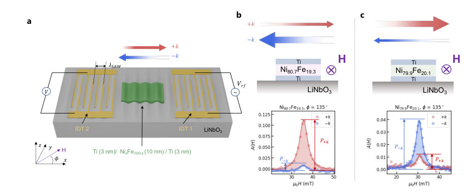
<figcaption class="paper-figure-caption"><b>Fig 1.</b> Fig. 1 Nonreciprocity reversal of magnetoacoustic attenuation in a hybrid device. a, Schematic of the hybrid device: two interdigital transducers (IDT 1 and IDT 2) on a LiNbO3 substrate form a SAW delay line, with a Ti (3 nm)/Nix Fe100−x (10 nm)/Ti (3 nm) thin film patterned on the acoustic propagation path between the IDTs. SAWs launched from either IDT propagate in the +k or −k direction and couple to the film. An in-plane magnetic field H is applied at an angle ϕ from the SAW propagation direction (the x axis). b, c, Upper schematics summarize the propagation-direction- dependent magnetoacoustic attenuation under H, illustrating which SAW direction (+k or −k) is more strongly attenuated...</figcaption>
</figure>
<figure class="paper-figure-card">
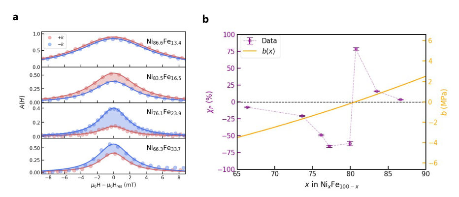
<figcaption class="paper-figure-caption"><b>Fig 2.</b> Fig. 2 Composition-driven reversal of magnetoacoustic attenuation nonreciprocity in NiFe alloys. a, Magne- toacoustic attenuation spectra A(H) measured at room temperature near the spin-wave resonance for counter-propagating SAW±k in Nix Fe100−x at ϕ = 135◦. Shaded regions highlight the difference between the +k and −k responses. b, Nonre- ciprocity ratio χP as a function of Ni concentration, shown together with the composition-dependent coefficient b (calculated from literature values [30, 40]; details are given in the Supplementary Information). χP reverses sign near x = 80 in Nix Fe100−x , coincident with the sign change of b. Error bars represent fitting uncertainties. The closed-form...</figcaption>
</figure>
<figure class="paper-figure-card">
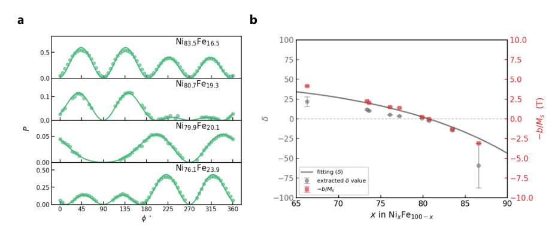
<figcaption class="paper-figure-caption"><b>Fig 3.</b> Fig. 3 Magnetic-field-angle dependence of magnetoacoustic attenuation in Nix Fe100−x alloys. a, Angular dependence of the magnetoacoustic attenuation peak amplitude P for Nix Fe100−x alloys of varying composition; ϕ = 90 corresponds to the Damon–Eshbach configuration. b, Composition dependence of the fitted parameter δ (grey circles, left axis), extracted from the angular analysis in a; error bars denote fitting uncertainties. The solid grey line is a fit to δ(x) = β b(x)/MS(x), with β as the only free parameter. Red squares (right axis) show −b/MS.</figcaption>
</figure>
<figure class="paper-figure-card">
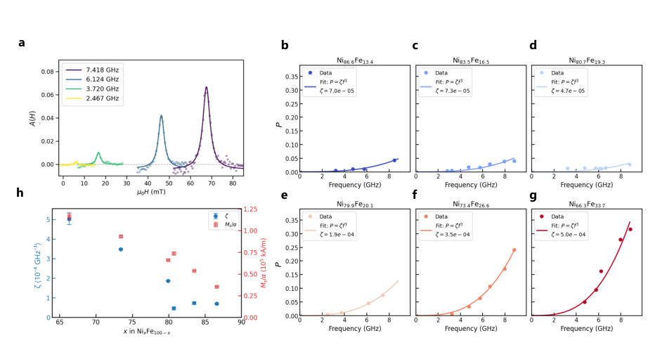
<figcaption class="paper-figure-caption"><b>Fig 4.</b> Fig. 4 Frequency dependence of magnetoacoustic attenuation. a, Representative magnetic-field-dependent mag- netoacoustic attenuation spectra acquired at multiple excitation frequencies (indicated in the labels) for the Ni79.9Fe20.1 device at ϕ = 0◦for SAW+k; the peak amplitude P+k is extracted from Lorentzian fits. b–g, Frequency dependence of P+k for the Nix Fe100−x compositions indicated in each panel (symbols). Solid lines are fits to P(f ) = ζf 3, and the cor- responding fit parameters are shown in the legends; ζ is given in GHz−3 throughout. h, Composition dependence of the fitted coefficient ζ extracted from panels b–g (error bars denote fitting uncertainties). The composition...</figcaption>
</figure>

**Summary.** This work demonstrates that nonreciprocity in magnetoacoustically coupled thin films can be used as a highly sensitive, nanoscale diagnostic tool. By observing the sign reversal of this asymmetry across different alloy compositions, the authors successfully linked the phenomenon to the underlying change in the magnetoelastic coupling coefficient $b$. This establishes a new method for characterizing fundamental magnetic material properties.

**Why it may be interesting.** While focused on condensed matter magnetism and acoustics, the ability to use an electrical/acoustic measurement ($\chi_P$) to precisely determine the sign of a fundamental material parameter ($b$) where direct strain measurements fail is analogous to using quantum signatures (like entanglement measures) to probe inaccessible aspects of many-body Hamiltonians.

Detailed structure

**Main problem.** The study aims to understand and control the sign of nonreciprocity arising from magnetoacoustic attenuation in ferromagnet thin films.

**Main result.** A small compositional change near Permalloy's zero-magnetostriction point causes a measurable sign reversal of the nonreciprocity, confirming that this effect can serve as a nanoscale probe for the magnetoelastic coupling coefficient $b$.

**Method.** The research uses Surface Acoustic Waves (SAWs) propagating through $	ext{Ni}_x	ext{Fe}_{100-x}$ thin films deposited on a piezoelectric substrate to measure nonreciprocal attenuation ratios ($\chi_P$).

**Model / system.** The physical system is a hybrid device structure involving an $	ext{LiNbO}_3$ substrate, Interdigital Transducers (IDTs), and the magnetic trilayer. The underlying physics involves magnetoacoustic coupling between SAWs and the ferromagnet's magnetization.

**Key observables.** Nonreciprocity ratio ($\chi_P$), which measures the asymmetry of SAW attenuation for counter-propagating waves; the sign and magnitude of the magnetoelastic coefficient ($b$).

**Important parameters / regimes.** Compositional concentration $x$ (near 80 at.% Ni), magnetic field angle $\phi$, and SAW frequency ($f \approx 2-9 	ext{ GHz}$).

**Assumptions / limitations.** The nonreciprocity is attributed to a rotation-based mechanism (MR or Barnett) rather than the shear-strain mechanism, which fails to explain the observed sign reversal.

**Figures summary.** Figures illustrate the device setup and show clear evidence of nonreciprocity reversal ($\chi_P$) as the composition $x$ crosses the point where the magnetoelastic coefficient $b$ changes sign. Frequency dependence analysis is also presented.

**Paper structure.** The paper establishes the physical mechanism by analyzing how compositional tuning controls the sign of $\chi_P$. It then uses theoretical modeling (comparing shear-strain vs. rotation mechanisms) to pinpoint the origin, culminating in demonstrating that nonreciprocity acts as a sensitive probe for $b$ near zero.

Abstract

Nonreciprocity, the asymmetry of transport, underlies technologies from the diode to the microwave isolator. In a ferromagnet, a surface acoustic wave generates an elliptical effective field with propagation-locked handedness, breaking the reciprocity of its propagation. Despite decades of study on this phenomenon, a method for controlling the sign of the nonreciprocity has remained elusive. Here we observe a sign reversal in Ni$_x$Fe$_{100-x}$ films. A 0.8 at.% change across Permalloy's zero-magnetostriction composition, where the magnetoelastic coefficient $b$ changes sign, reverses the handedness of the elliptical effective field and thereby the nonreciprocity, from 78.6% to -61.8%. Angle-dependent measurements and spin-wave-ellipticity modelling show that reversing the sign of $b$ reverses the handedness of the elliptically polarized effective field. Aided by cubic frequency scaling, we resolve the sign of $b$ down to -0.05 MPa in a 10-nm film, establishing nonreciprocity as a nanoscale probe of magnetoelastic coupling.

[↑ back to top](#top)

### [Topological surface altermagnets in SSH-stacked magnetic layers](http://arxiv.org/abs/2608.07099v1)

**Authors:** Rui Chen, Bin Zhou, Dong-Hui Xu  
**Type:** theory · **Category:** other · **PDF:** <https://arxiv.org/pdf/2608.07099v1>  
**Analysis basis:** full PDF text, analyzed in chunks
**Topic relevance:** `analog quantum simulation` **3/5** · `exotic spin models in light-matter` **3/5** · `Keldysh / 2PI / non-Gaussian methods` **1/5** · `spintronics-quantum-optics interface` **1/5**

↔ Scroll figures horizontally

<figure class="paper-figure-card">
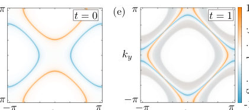
<figcaption class="paper-figure-caption"><b>Fig 1.</b> FIG. 1. (a) Schematic illustration of the SSH stacking of two-dimensional magnetic layers. The alternating layers, col- ored by blue and gray, are coupled by alternating interlayer hoppings t1 and t2. The top surface displays the surface Bril- louin zone with high-symmetry points Γ, X, M, and Y . (b), (c) Energy spectra of the finite layered system along high- symmetry paths for (b) vanishing intra-layer non-magnetic hopping t = 0 and (c) finite intra-layer hopping t = 1. Gray areas denote the bulk bands, while the red lines highlight the topologically protected surface states emerging within the bulk gap. (d), (e) The corresponding spin polarization of the surface local density of states...</figcaption>
</figure>
<figure class="paper-figure-card">
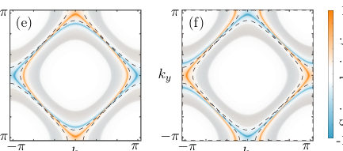
<figcaption class="paper-figure-caption"><b>Fig 2.</b> FIG. 2. Transport signatures and surface spin polarization of the system in the absence (a)-(b) and presence (e)-(f) of a per- pendicular electric field. (a) Angle-dependent spin splitter an- gle α(1, θ) for the outermost surface layer. (b) Layer-resolved spin splitter angle α(z, 0) across the finite slab. (c) Angle- dependent total spin splitter angle α(θ), (d) evolution of the total spin splitter angle α(θ) with respect to the strength of the external electric field V , and (e)-(f) spin-resolved surface local density of states in the momentum space. In (e) and (f), the dashed lines denote the contours of the spin-polarized surface states at V = 0, extracted from Fig. 1(e).</figcaption>
</figure>
<figure class="paper-figure-card">
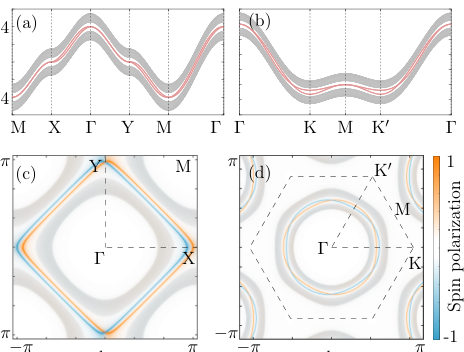
<figcaption class="paper-figure-caption"><b>Fig 3.</b> FIG. 3. Generalization of topological surface altermagnetism to p-wave and f-wave symmetries. (a, b) Projected one- dimensional energy band structures for the p-wave (a) and f-wave (b) altermagnetic systems. The projected bulk bands are depicted in gray, while the topologically protected surface states emerging within the direct bulk gap are highlighted in red. (c, d) The corresponding spin-polarized surface local density of states in momentum space for the p-wave (c) and f-wave (d) configurations. In (d), the dashed lines outline the Brillouin zone boundaries.</figcaption>
</figure>

**Summary.** This theoretical work demonstrates how stacking magnetic layers in an SSH pattern can create topological surface altermagnetism. By breaking local symmetry at the boundary of a bulk antiferromagnet, robust spin-polarized surface states emerge within the energy gap. These exotic surface properties are predicted to be detectable via a measurable net spin polarization induced by an external perpendicular electric field.

**Why it may be interesting.** While focused on condensed matter magnetism, the concept of engineering robust, symmetry-protected electronic states at boundaries using lattice models is highly relevant to understanding engineered quantum materials for spintronics applications.

Detailed structure

**Main problem.** The work proposes a method to engineer topological surface altermagnetism by stacking magnetic layers using a Su-Schrieffer-Heeger (SSH) pattern.

**Main result.** Breaking the local symmetry at the boundary of an antiferromagnetic SSH stack generates robust, topologically protected surface altermagnetism within the bulk's topological gap.

**Method.** Theoretical analysis involving tight-binding models, calculation of spin-resolved LDOS, and characterization using the Zak phase associated with chiral symmetry.

**Model / system.** The system is modeled by SSH stacking of 2D magnetic layers. The bulk behaves as a PT-symmetric antiferromagnet, while surface states emerge due to boundary symmetry breaking.

**Key observables.** Topological gap containing surface states; spin separation in LDOS; layer-resolved and total spin splitter angle ($\alpha$); response to perpendicular electric field ($V$).

**Important parameters / regimes.** The coupling strengths ($t_1, t_2$) defining the SSH pattern; the applied perpendicular electric field ($V$).

**Assumptions / limitations.** The approach is generalized to different types of surface altermagnetism (p-wave, f-wave); the measurement relies on detecting transport signatures induced by $V$.

**Figures summary.** Figures illustrate energy spectra showing topological surface states; Fig. 2 shows how applying an electric field ($V$) induces a non-zero total spin splitter angle ($\alpha$), which is zero when $V=0$ due to symmetry.

**Paper structure.** The paper develops the SSH model Hamiltonian, analyzes the bulk PT-symmetric antiferromagnetism, demonstrates that boundary breaking creates surface altermagnetism, and finally uses transport signatures (spin splitter angle) under an electric field to confirm this topological effect.

Abstract

Surface altermagnetism opens new avenues in spintronics by unlocking altermagnetic spin-splitting at the boundaries of conventional antiferromagnets, bypassing the strict symmetry requirements of bulk altermagnets. In this work, we propose creating topological surface altermagnet by stacking magnetic layers in a Su-Schrieffer-Heeger pattern. We show that while the bulk of the system is a standard antiferromagnet with degenerate bands protected by $PT$ symmetry, breaking the local symmetry at the boundary gives rise to a topologically protected surface altermagnetic state residing within the topological gap. Furthermore, we propose that this effect can be experimentally detected by applying a perpendicular electric field. Besides, this approach can be readily generalized to surface altermagnetism of different types. Our work establishes topological boundaries as a natural platform for surface altermagnetism, offering a distinct route for realizing and manipulating topological surface altermagnets.

[↑ back to top](#top)

### [Ultralow p-type contact resistance for ultra-nanoscaled 2D-materials transistors](http://arxiv.org/abs/2608.06793v1)

**Authors:** Ying Xiong, Tong Su, Qiang Li, Yee Sin Ang, Lain-Jong Li, L. K. Ang  
**Type:** theory · **Category:** other · **PDF:** <https://arxiv.org/pdf/2608.06793v1>  
**Analysis basis:** full PDF text, analyzed in chunks
**Topic relevance:** `Keldysh / 2PI / non-Gaussian methods` **3/5** · `spintronics-quantum-optics interface` **2/5** · `Kondo & dissipative impurity` **1/5** · `methods for driven-dissipative` **1/5** · `non-equilibrium dynamics` **1/5**

↔ Scroll figures horizontally

<figure class="paper-figure-card">
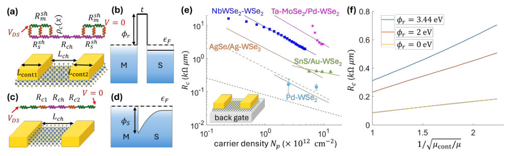
<figcaption class="paper-figure-caption"><b>Fig 1.</b> FIG. 1. Modeling contact resistance for metal-2D semiconductors. (a, c) Schematic diagrams of vertical (a) and edge (c) contacts; the contact resistance is governed by vdW barrier (b) and Schottky barrier (d) respectively. (e) Rc as a function of Np for the vertical contact. Symbols denote experimental data, and solid lines denote theoretical models. η = 0 (ktr conserving) produces calculations for NbWSe2-WSe2 [19] (ϕr = 1.65 eV and t = 0.3526 nm) and Ta-MoSe2/Pd-WSe2 [17] (ϕr = 1.1 eV, and t = 0.376 nm). Here, t is extracted from DFT calculations as the interlayer distance for AA stacking. η = 1 (ktr nonconserving) is used for SnS/Au-WSe2 [18] (with ϕr=0, t = 1) and for Pd-WSe2 [21] (with...</figcaption>
</figure>
<figure class="paper-figure-card">
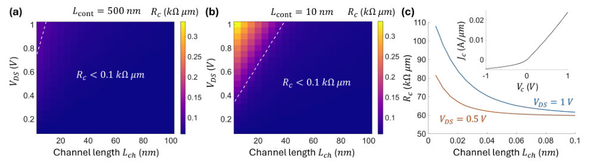
<figcaption class="paper-figure-caption"><b>Fig 2.</b> FIG. 2. Contact resistance scaling as a function of channel length Lch and applied voltages VDS. (a, b) Rc of Pd-WSe2 [21] as a function of VDS and Lch for contact lengths Lcont=500 nm (a) and 10 nm (b) at Np = 8×1012 cm−2. Dashed white lines indicate the contour Rc = 0.1 kΩµm. (c) Rc increases as Lch decreases. (inset) Current density Jc as a function of voltage drop across the contact region Vc shows saturation behaviour for large negative Vc. We set Lcont = 500 nm in (c).</figcaption>
</figure>
<figure class="paper-figure-card">
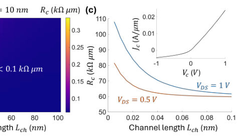
<figcaption class="paper-figure-caption"><b>Fig 3.</b> Fig. 1e shows our numerical calculation of Rc as a func- tion of Np for a range of metal-monolayer WSe2 vertical contact systems compared with recent experimental mea- surements (symbols) [17–19, 21]. To simulate the exper- iments of Ta-MoSe2/Pd-WSe2 and SnS/Au-WSe2 con- tacts, we employed TLM approach to account for both the current flowing between MoSe2 (SnS) and WSe2 as well as current between Pd (Au) and MoSe2 (SnS). See SI for detailed calculations and parameters used. Here the channel length Lch is ranged from 50 to 200 nm. We see that Rc of p-contact remains high compared to n-contact. To further lower Rc, we propose a 2D topolog- ical semimetal AgSe on Ag substrate to be a new...</figcaption>
</figure>
<figure class="paper-figure-card">
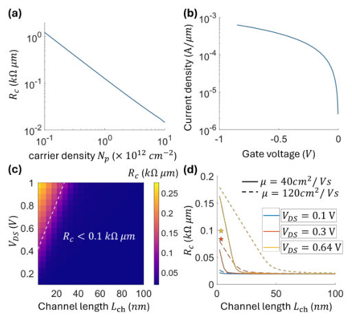
<figcaption class="paper-figure-caption"><b>Fig 4.</b> FIG. 3. Contact resistance for CuS-WSe2 system. (a) Contact resistance Rc as a function of carrier density. (b) Current density versus gate voltage. We have set ϕS = 10 meV, VDS = 0.64 V, Lch = 100 nm, µ = 60 cm2/Vs, and channel gate capacitance 0.02 F/m2 for a 10 nm thick HfO2 top gate. (c) Rc increases for larger VDS and shorter Lch. White dashed line indicates Rc = 0.1 kΩµm. (d) Rc increases linearly as Lch decreases at small Lch. Markers denote first- principle quantum atomistic calculations at 3.4 nm. For (c) and (d), we set to Np ≈7.3 × 1012 cm−2.</figcaption>
</figure>
<figure class="paper-figure-card">
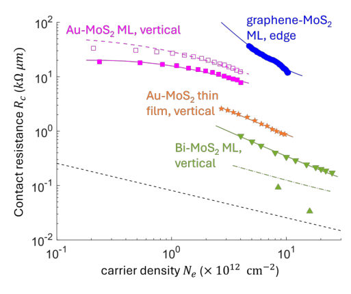
<figcaption class="paper-figure-caption"><b>Fig 5.</b> FIG. 4. Contact resistance of n-type 2D semiconductor as a function of semiconductor electron density Ne. Filled (hol- low) markers denotes the experimental measurements of Rc at VDS = 1 V (VDS = 0.1). Solid (dashed) lines are by using our model with η = 0 at VDS = 1 V (VDS = 0.1 V). The dash-dotted line is obtained by taking η = 0, VDS = 1 V, ϕr = 0 and t = 0, which indicates the lowest Rc for Bi-MoS2 ML contact predicted by our theory. In our calculations, Lch for all vertical contacts is set as the shortest channel length used in the respective experiments. For Bi-MoS2, Lch = 50 nm for Ref. [21] (upright green triangles) and Lch = 100 nm for Ref. [11] (inverted greeen triangles); for...</figcaption>
</figure>

**Summary.** This work addresses the critical issue of high contact resistance limiting 2D transistor performance. By developing advanced self-consistent models for both vertical and edge contacts, the authors predict that current saturation limits downscaling below $10 	ext{ nm}$. They propose using specific topological semi-metals as electrodes to achieve near-quantum limit contact resistances.

**Why it may be interesting.** While focused on semiconductor physics rather than core quantum information protocols, the detailed modeling of interface transport phenomena, tunneling probabilities, and scaling laws is highly relevant to understanding energy dissipation in nanoscale quantum devices.

Detailed structure

**Main problem.** High contact resistance remains a major bottleneck for realizing practical, ultra-nanoscaled (sub-10 nm) two-dimensional (2D) materials transistors, particularly for p-type operation.

**Main result.** The authors developed self-consistent models identifying that source-limited current saturation is the key challenge for scaling down 2D FETs. They propose using topological semi-metals as electrodes to achieve predicted contact resistances approaching the quantum limit ($< 100 \, \Omega\mu	ext{m}$).

**Method.** The study employs self-consistent theoretical modeling, developing separate frameworks for vertical and edge contacts by solving coupled differential equations based on tunneling current calculations.

**Model / system.** The physical system is a Metal-2D semiconductor-Metal (MSM) device, focusing on p-type 2D semiconductors like WSe2. The model incorporates concepts like Schottky barriers, generalized Transmission Line Models (TLM), and analyzes scaling laws based on channel length and doping.

**Key observables.** Contact Resistance ($R_c$), Total Resistance ($R_{	ext{tot}}$), Channel Resistance ($R_{	ext{ch}}$), Current density ($J$).

**Important parameters / regimes.** Channel length ($	ext{L}_{	ext{ch}}$) down to sub-10 nm, doping concentration ($N_p$), applied voltage ($V_{	ext{DS}}$).

**Assumptions / limitations.** The model assumes metal electrodes have negligible resistance and that the analysis can be extended from computationally feasible few-nanometer scales.

**Figures summary.** Figures illustrate schematics for vertical and edge contacts, showing $R_c$ scaling with $	ext{L}_{	ext{ch}}$ and $V_{	ext{DS}}$, and comparing model predictions against experimental data using various electrode materials.

**Paper structure.** The paper systematically develops contact resistance models for both vertical and edge geometries. It analyzes the scaling behavior of $R_c$ with device parameters, identifies current saturation as a limiting factor, and proposes new material combinations (e.g., topological semi-metals) to overcome this bottleneck.

Abstract

High contact resistance is one of the main bottlenecks for practical two-dimensional (2D) materials transistors, especially for p-type transistors and future 2D ultra-nanoscaled (sub-10 nm) FETs (PMOS + CMOS). We develop self-consistent contact resistance models for metal-2D semiconductor-metal devices to capture the essential interface physics for both vertical and edge configurations. Our calculations have been verified with various recent experiments of p-type and n-type contacts. For a given set of materials, the model determines the scaling of contact resistance over a wide range of device parameters including channel length (100s nm down to sub-10 nm), doping and mobility of the 2D materials, contact length of the electrodes, and applied voltages. These results identify the key factors in order to reduce the contact resistance for p-type 2D semiconductor WSe$_2$ towards the sub-10 nm channel length scale that are readily to be realized by future experiments. It is found that the effect of source-limited current saturation is the key challenge for down scaling 2D FET to sub-10 nm channel length. Two topological semi-metals as potential electrodes are proposed for 2D p-type semiconducting WSe$_2$ with our predicted contact resistance $R_c<$ 100 $Ω\; {\rm μm}$ approaching the quantum limit. Our model is also verified with the computational expensive full quantum atomistic model that is currently limited to a few nm scale.

[↑ back to top](#top)

### [Perfect absorption by metal-contacted two-dimensional systems with ultra-proximate reflectors](http://arxiv.org/abs/2608.07218v1)

**Authors:** Kirill Kapralov, Vladislav Atlasov, Alina Khisameeva, Viacheslav Muravev, Dmitry Svintsov  
**Type:** theory · **Category:** other · **PDF:** <https://arxiv.org/pdf/2608.07218v1>  
**Analysis basis:** full PDF text, analyzed in chunks
**Topic relevance:** `interference shaping light` **3/5** · `Keldysh / 2PI / non-Gaussian methods` **1/5** · `driven-dissipative phase transition` **1/5** · `methods for driven-dissipative` **1/5**

↔ Scroll figures horizontally

<figure class="paper-figure-card">
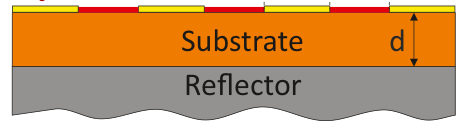
<figcaption class="paper-figure-caption"><b>Fig 1.</b> FIG. 1. Structures of metal-2DES absorbers. One- dimensional periodic structure comprising 2DES of length l and metal contacts of length L, illuminated by normally in- cident electromagnetic wave without (a) and with (b) a per- fectly conducting reflector separated from the 2DES plane by a dielectric substrate of thickness d.</figcaption>
</figure>
<figure class="paper-figure-card">
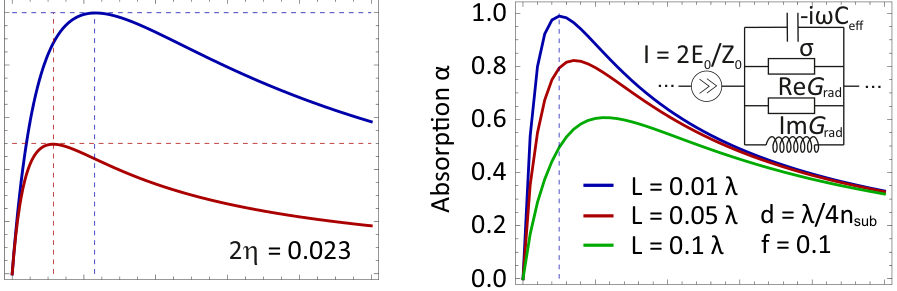
<figcaption class="paper-figure-caption"><b>Fig 2.</b> FIG. 2. Perfect absorption in metal-contacted 2d electron systems. (a) Absorption α as a function of the filling factor f for the structure without a reflector with nsub = 1 (red curve) and with a reflector with nsub = 2 (blue curve). The horizontal dashed lines indicate the corresponding maximum absorption levels, while the vertical dashed lines mark the optimal filling factors: the red dashed line corresponds to f = η, and the blue dashed line corresponds to f = 2η. (b) Absorption α as a function of the conductivity η for the structure with a reflector with nsub = 2 for different grating periods. The vertical dashed line mark the optimal conductivity η = f/2. Inset: an equivalent circuit...</figcaption>
</figure>
<figure class="paper-figure-card">
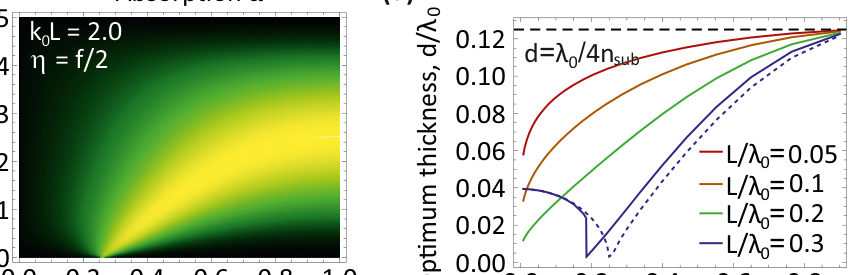
<figcaption class="paper-figure-caption"><b>Fig 3.</b> FIG. 3. Perfect absorption with deep-subwavelength reflectors. (a) Absorption α of the metal-2DES grating with a reflector vs the normalized grating period k0L and the normalized distance nsubd/λ0 at the optimal filling factor f = 2η = 0.023. The white dashed line marks the limiting value k0L = π/nsub, above which electromagnetic matching cannot be achieved. The black solid line shows the optimal d yielding 100% absorption (b) Absorption α vs the filling factor f and the normalized distance nsubd/λ0 computed for a fixed grating period k0L = 0.5 and conductivity 2η = 0.023. (c) Absorption α vs the filling factor f and the normalized distance nsubd/λ0 for a large grating period k0L = 2.0 and...</figcaption>
</figure>
<figure class="paper-figure-card">
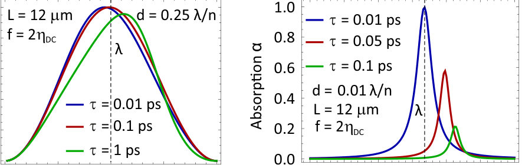
<figcaption class="paper-figure-caption"><b>Fig 4.</b> FIG. 4. Resonant absorption in metal-2DES structures with a reflector. Absorption spectra calculated within the Drude model at carrier density ne = 1012 cm−2, effective mass 0.24me and filling factor f = 2η(ω = 0) for different momentum relaxation times τ for a conventionally placed reflector at the distance d = λres/(4nsub) which equals 375 µm (left) and for for an ultrathin substrate with d = 0.01λres/nsub which equals 265 nm (right).</figcaption>
</figure>

**Summary.** This paper theoretically demonstrates how to achieve near-perfect absorption of electromagnetic waves using a periodic metasurface composed of 2D electron systems coupled with metal contacts. By incorporating a perfect reflector, the authors boost absorbance to $100\%$ and reveal that optimal performance can occur at distances much smaller than conventionally expected. This work is significant for designing high-efficiency optical detectors based on advanced condensed matter structures.

**Why it may be interesting.** The work provides advanced theoretical tools for engineering light-matter interaction in low-dimensional materials, which is highly relevant to quantum optics and open quantum systems where engineered cavities or plasmonic structures are used to enhance coupling rates.

Detailed structure

**Main problem.** The primary challenge is that electromagnetic absorbance by typical two-dimensional electron systems (2DES) is significantly less than unity, limiting their use in photodetection and optical studies.

**Main result.** By engineering a periodic structure of 2D sections connected by metal contacts and placing it above a perfect reflector, the authors demonstrate achieving near-perfect ($\approx 100\%$) absorbance. Furthermore, they show that optimal performance can occur at extremely small distances ($d 	o 0$) to the reflector.

**Method.** The analysis employs semi-analytical solutions of Maxwell's equations, utilizing Fourier transforms and Green's functions derived from solving the scattering problem for the engineered metasurface structure.

**Model / system.** The system modeled is a periodic array (metasurface) consisting of narrow 2D electron sections separated by wide, perfectly conducting metal contacts. This entire unit cell can be placed above a perfect electromagnetic reflector separated by a dielectric substrate.

**Key observables.** Absorbance ($\alpha$), which is the primary diagnostic quantity; it is related to the material conductivity and geometric parameters.

**Important parameters / regimes.** Filling factor ($f = l/L$), dimensionless conductivity ($\eta$), optimal distance to reflector ($d$), and substrate dielectric constant ($n_{	ext{sub}}$).

**Assumptions / limitations.** The analysis relies on linking the local electric field via Green's functions, and later approximations use a lumped circuit model for simplicity.

**Figures summary.** Figures illustrate the physical structures (with/without reflector) and show calculated absorbance ($\alpha$) versus filling factor ($f$) or conductivity ($\eta$), demonstrating the enhancement provided by the back reflector.

**Paper structure.** The paper progresses from establishing the low baseline absorbance of 2DES, to introducing the periodic structure with metal contacts for initial enhancement. It then analyzes the inclusion of a perfect reflector, deriving conditions for $100\%$ absorption and exploring the non-intuitive dependence on the separation distance $d$.

Abstract

Electromagnetic absorbance by most two-dimensional electron systems is typically well below unity, which hinders both practical applications in photodetection and fundamental studies of their optical properties. Here, we show that a periodic structure comprised of narrow two-dimensional sections connected with wide perfectly conducting metal sections enables large absorbance. It reaches 50 \% provided the filling factor by the two-dimensional system $f$ equals its dimensionless conductivity $η=σZ_0/2$, where $Z_0$ is the free-space impedance. The absorbance is further raised to 100 \% if the periodic structure is placed above a perfectly conducting electromagnetic reflector, and provided $f=2η$. Surprisingly, the optimal distance between two-dimensional system and reflector may fall well below the quarter of incident wavelength $λ_0/4$, which was assumed as conventional absorption enhancement condition in optics. For low filling factors $f\ll1$, large dielectric constants of the substrate, and grating periods comparable with $λ_0$, the optimal distance to reflector tends to zero. Above the critical values of the grating geometrical parameters, the absorbance maximum ceases to exist. The critical behavior manifests as a large-amplitude resonance in 'dirty' two-dimensional system with purely real conductivity, while enhancement of carrier momentum relaxation time lowers the resonant peak. Such resonance mimics the plasmonic one, but does not rely on high electron mobility.

[↑ back to top](#top)

### [Magneto-optical signal from $\mathrm{Co_2Mn}$-based Heusler thin films in MOKE and BLS](http://arxiv.org/abs/2608.07052v1)

**Authors:** Anna Maria Friedel, Nicolas Fermon, Tobias Böttcher, Sébastien Petit-Watelot, Stéphane Andrieu, Philipp Pirro  
**Type:** experiment · **Category:** other · **PDF:** <https://arxiv.org/pdf/2608.07052v1>  
**Analysis basis:** full PDF text, analyzed in chunks
**Topic relevance:** `spintronics-quantum-optics interface` **3/5** · `exotic spin models in light-matter` **1/5** · `non-equilibrium dynamics` **1/5**

↔ Scroll figures horizontally

<figure class="paper-figure-card">
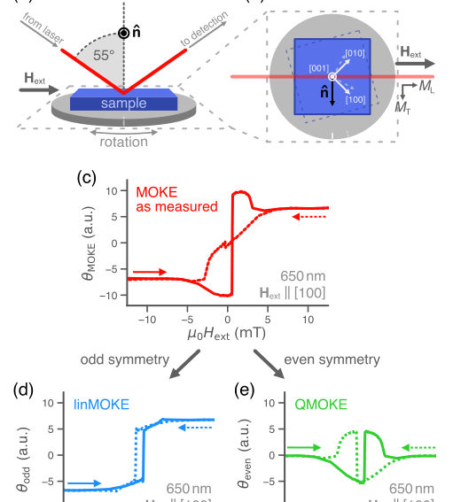
<figcaption class="paper-figure-caption"><b>Fig 1.</b> Figure 1: MOKE detection and symmetry separation (a) Schematic of the MOKE setup, with the sample positioned on a rotatable plate in an external field parallel to the incidence plane of light defined by the normal ˆn. (b) Top view on the sample plane with the crystal coordinate system of the Co2MnX compounds. (c) MOKE hysteresis loop as measured for Co2MnSi at λ = 650 nm and Hext ∥[100]. In a post-processing step, the signal is separated into (d) anti-symmetric part attributed to the linMOKE and (e) symmetric part attributed to the QMOKE.</figcaption>
</figure>
<figure class="paper-figure-card">
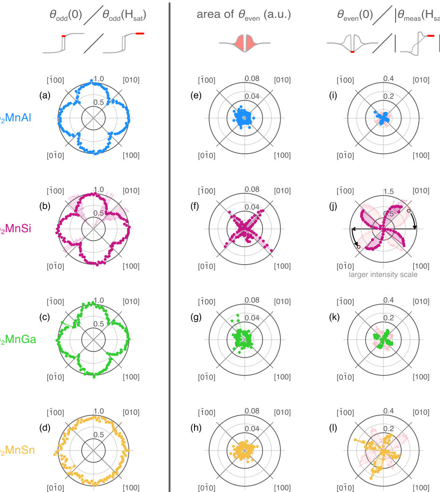
<figcaption class="paper-figure-caption"><b>Fig 2.</b> Figure 2: Anisotropy in the MOKE signal of various Co2MnX compounds for λ = 636 nm. (a-d) The magneto-crystalline anisotropy shows in the relative remanence in the odd Kerr rotation θodd (0) /θodd (Hsat) attributed to the linMOKE. The magneto-optical anisotropy shows in the integrated QMOKE loop area (e-h) as well as the relative remanent QMOKE θeven (0) /|θmeas (Hsat) | (i-l), which additionally reveals a sign change with the opposite sign reflected by the light pink shade. Note that while the schematic illustrations only mark the relevant points for the decreasing field branch for (a-d) and (i-l), both increasing and decreasing branch were evaluated and averaged.</figcaption>
</figure>
<figure class="paper-figure-card">
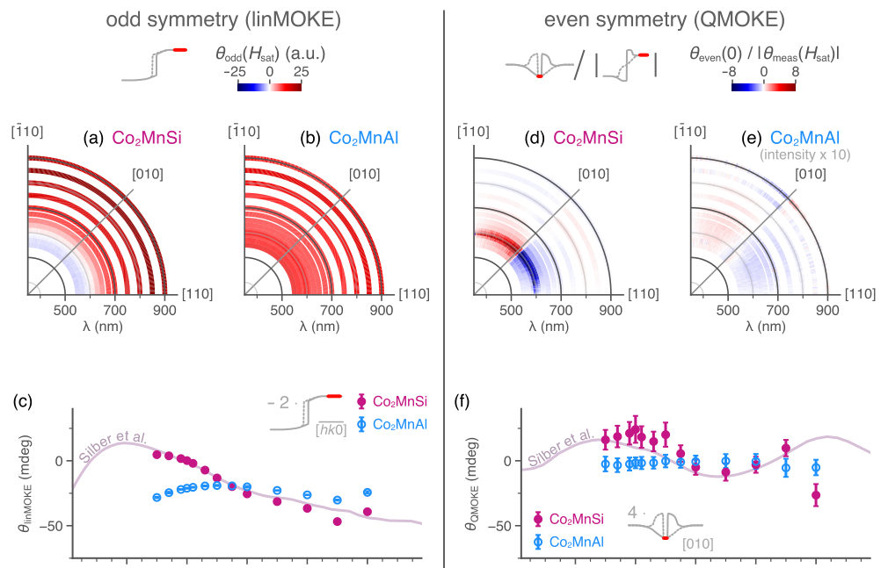
<figcaption class="paper-figure-caption"><b>Fig 3.</b> Figure 3: Wavelength dependence of the linear and quadratic MOKE effect in Co2MnSi and Co2MnAl. (a, b) The linMOKE rotation in saturation θodd (Hsat) as a function of the crystal orientation [hkl] ∥Hext ⊥ˆn for Co2MnSi and Co2MnAl. (c) The mean value over all directions is compared to the reference study for Co2MnSi by Silber et al.14,38, where the proportionality factor −2 accounts for the double layer thickness and different coordinate convention. (d, e) The even QMOKE rotation in remanence θeven (0) in relation to the saturation amplitude of the measured loops θmeas (Hsat). A significant QMOKE contribution is only detected for Co2MnSi. (f) The wavelength dependence along the [010]...</figcaption>
</figure>
<figure class="paper-figure-card">
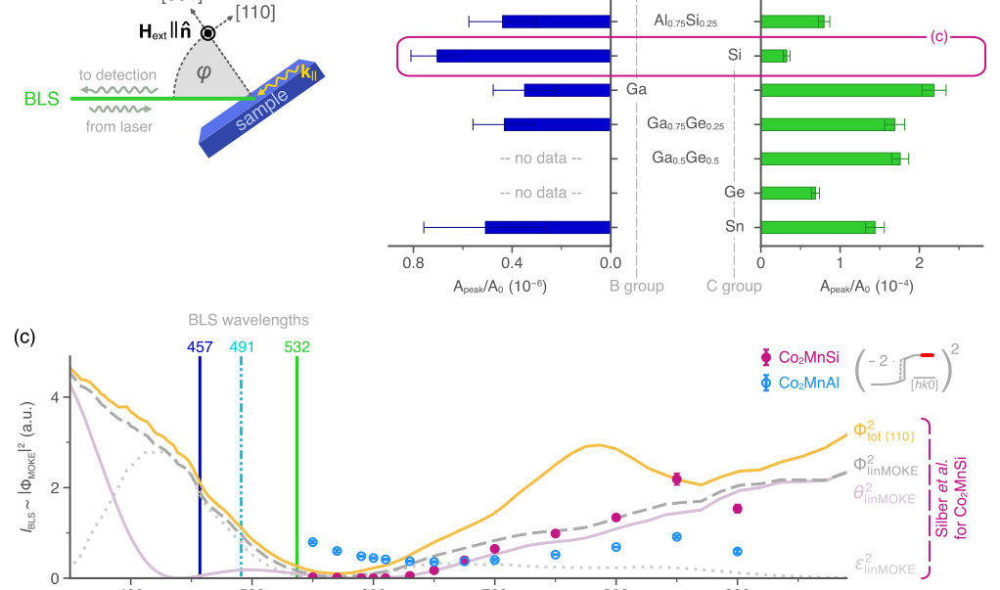
<figcaption class="paper-figure-caption"><b>Fig 4.</b> Figure 4: Correlation of MOKE and BLS signal. (a) Schematic of the BLS backscattering geometry. (b) Normalised BLS peak amplitudes for the different Co2MnX compounds from BLS spectra of thermal spin waves measured for two wavelengths λBLS = 532 nm and λBLS = 457 nm with φ457 nm = 2.5◦and φ532 nm = 10◦. (c) Squared linear Kerr rotation θ2 linMOKE for Co2MnSi and Co2MnAl from Figure 3c. Additionally, the spectral reference curves for Co2MnSi show the squared total Kerr angle Φ2 tot ⟨110⟩, linear Kerr angle Φ2 linMOKE , linear Kerr rotation θ2 linMOKE and linear Kerr ellipticity ε2 linMOKE from the reference study by Silber et al.14,38.</figcaption>
</figure>

**Summary.** This work investigates the magneto-optical properties of $\mathrm{Co_2Mn}$-based Heusler thin films using both MOKE and BLS. The key finding is that the distinct spectral behavior observed in MOKE (especially quadratic contributions) directly correlates with the intensity variations seen in BLS measurements. This establishes a powerful experimental methodology for selecting optimal wavelengths when probing magnetic excitations.

**Why it may be interesting.** While primarily experimental condensed matter physics, the detailed study of spin wave dynamics and magneto-optical response provides fundamental insights into magnetic order parameters and their coupling to optical probes, which is relevant for understanding quantum magnetodynamics.

Detailed structure

**Main problem.** To investigate the magneto-optical response of $\mathrm{Co_2Mn}$-based Heusler thin films using both Magneto-Optical Kerr Effect (MOKE) and Brillouin Light Scattering (BLS).

**Main result.** The study establishes a direct experimental link between MOKE spectroscopy and BLS measurements, showing that the spectral dependence observed in one technique can guide the optimal probing wavelength for the other.

**Method.** Measurements involve angle-resolved MOKE spectroscopy to separate linear and quadratic magneto-optical contributions, complemented by BLS intensity measurements of thermal magnons at multiple wavelengths.

**Model / system.** The physical system is epitaxial $\mathrm{Co_2MnX}$ Heusler thin films ($\mathrm{X} = \{\mathrm{Al}_x\mathrm{Si}_{1-x}, \mathrm{Ga}_x\mathrm{Ge}_{1-x}, \mathrm{Sn}\}$), which are studied for their spintronic and magnonic properties.

**Key observables.** Linear MOKE ($	heta_{	ext{linMOKE}}$), Quadratic MOKE ($	heta_{	ext{QMOKE}}$), BLS intensity of thermal magnons, and the spectral dependence of these signals across different wavelengths.

**Important parameters / regimes.** Wavelengths used for probing (e.g., $457\,\mathrm{nm}$ vs. $532\,\mathrm{nm}$); material composition ($\mathrm{Co_2MnX}$).

**Assumptions / limitations.** The simple symmetry-based separation approach used in MOKE cannot fully distinguish between all possible symmetries of the quadratic magneto-optical contributions.

**Figures summary.** Figures illustrate the MOKE setup, the method for separating hysteresis loops into odd (linear) and even (quadratic) components, and comparisons of BLS intensities at different wavelengths.

**Paper structure.** The paper systematically compares MOKE results across various $\mathrm{Co_2MnX}$ films to identify characteristic responses ($\mathrm{Co_2MnSi}$ showing strong QMOKE vs. others being linear). It then correlates these findings with wavelength-dependent BLS measurements, culminating in the conclusion that MOKE guides BLS probing.

Abstract

$\mathrm{Co_2Mn}$-based Heusler compounds offer a versatile, composition-tunable platform for magnonics and spintronics. Among them, the half-metallic $\mathrm{Co_2MnSi}$ is of particular interest for magnonics owing to its ultralow Gilbert damping, yet its weak magneto-optical response in the visible challenges optical probing such as Brillouin light scattering (BLS). We study the magneto-optical response of epitaxial $\mathrm{Co_2Mn}X$ films ($X = \{\mathrm{Al}_x\mathrm{Si}_{1-x}, \mathrm{Ga}_x\mathrm{Ge}_{1-x}, \mathrm{Sn}\}$) by magneto-optical Kerr effect (MOKE) spectroscopy and BLS. Angle-resolved MOKE resolves a significant, wavelength-dependent quadratic MOKE (QMOKE) only for $\mathrm{Co_2MnSi}$, whereas $\mathrm{Co_2MnAl}$, $\mathrm{Co_2MnGa}$ and $\mathrm{Co_2MnSn}$ respond dominantly linearly. Comparing BLS intensities of thermal magnons at two wavelengths, $\mathrm{Co_2MnSi}$ gives the weakest signal at $532\,\mathrm{nm}$ yet among the strongest at $457\,\mathrm{nm}$, tracking the spectral dependence of its Kerr angle. These results emphasise the relation between the two magneto-optical techniques, guiding the choice of probing wavelength for $\mathrm{Co_2Mn}$-based Heusler compounds.

[↑ back to top](#top)

### [Emergence of Bogoliubov Fermi Surfaces in hybrid Al/InAs heterostructures](http://arxiv.org/abs/2608.06553v1)

**Authors:** S. Feyrer, V. Dimic, I. Lobato, A. Kirchner, P. Drexler, L. Rupp, D. Bougeard, T. Lindemann, S. Gronin, G. Gardner, M. J. Manfra, G. F. R. Ruiz, C. A. Balseiro, L. Arrachea, M. Aprili, N. Paradiso, C. Strunk, L. Tosi  
**Type:** both · **Category:** other · **PDF:** <https://arxiv.org/pdf/2608.06553v1>  
**Analysis basis:** full PDF text, analyzed in chunks
**Topic relevance:** `spintronics-quantum-optics interface` **2/5** · `Keldysh / 2PI / non-Gaussian methods` **1/5** · `Kondo & dissipative impurity` **1/5** · `driven-dissipative phase transition` **1/5** · `methods for driven-dissipative` **1/5**

↔ Scroll figures horizontally

<figure class="paper-figure-card">
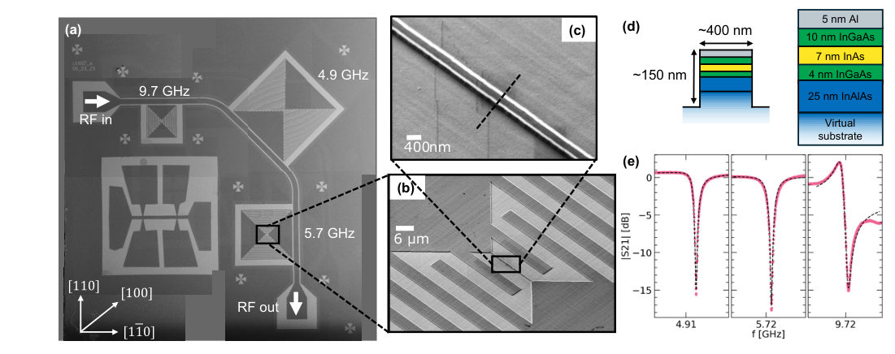
<figcaption class="paper-figure-caption"><b>Fig 1.</b> FIG. 1. Sample overview: (a-c) Three lumped-element resonators fabricated in Al/InAs with resonance frequencies at 4.9 GHz, 5.7 GHz, 9.7 GHz are capacitively coupled to the same transmission line, used to measure the complex transmission coefficient S21. The three devices are oriented along different crystal axes. A large Hall bar structure allows DC-access and on-chip heating. (b) Each resonator consists of an interdigitated capacitor shunted by a narrow wire acting as inductor. (c) The wires are typically 200-400 nm wide and 20 µm long. The resonance frequency is tuned with the number of fingers in the capacitor. The design allows a fine alignment with in-plane magnetic field and a...</figcaption>
</figure>
<figure class="paper-figure-card">
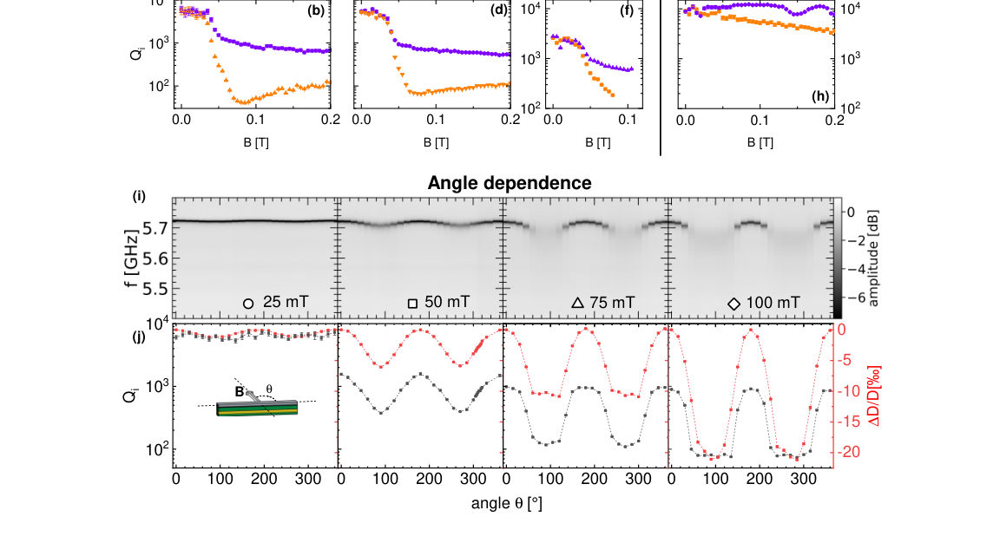
<figcaption class="paper-figure-caption"><b>Fig 2.</b> FIG. 2. Response with in-plane field: for all three devices oriented at (a-b) 0◦, (c-d) 45◦and (e-f) 90◦, as described in Fig. 1. The relative frequency shift is shown in the top panels (a,c,e) and the internal quality factor in the bottom panels (b,d,f) as a function of in-plane magnetic field applied parallel (purple line) and perpendicular (orange line) to each resonator. The relative orientation between the inductor wire and the applied field is indicated with a little sketch for each device. Following the same color-code, in (g-h) the relative frequency shift and internal quality factor as a function of magnetic field for a witness resonator made out of Al on a GaAs substrate. (i,j)...</figcaption>
</figure>
<figure class="paper-figure-card">
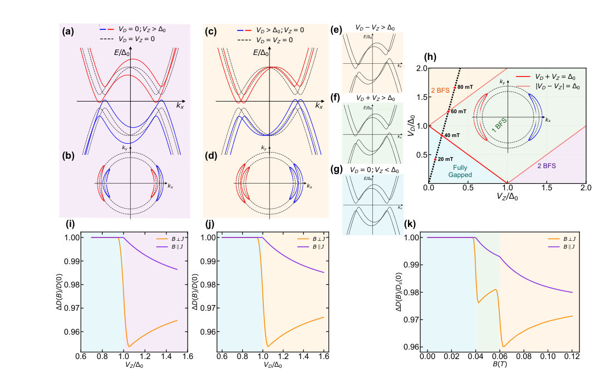
<figcaption class="paper-figure-caption"><b>Fig 3.</b> FIG. 3. Bogoliubov Fermi Surfaces: (a,c) Energy bands for the BdG Hamiltonian obtained in a simplified model of the proximitized 2DEG with SOC. Dashed lines correspond to zero field. Continuous lines show the effect of (a) Zeeman energy VZ and (c) Doppler energy VD larger than the induced gap ∆0. In (a) electron-like (red) and hole-like (blue) bands shift with applied field (here in the y-direction) crossing the Fermi level, while in (c) they are tilted. (b,d) As a consequence “banana-shaped” BFS emerge in both cases along the k-direction perpendicular to the field. (e-g) A combination of both effects (VZ, VD) results in the successive transitions: (g) gapped phase →(f) 1-BFS →(e) 2-BFS as...</figcaption>
</figure>
<figure class="paper-figure-card">
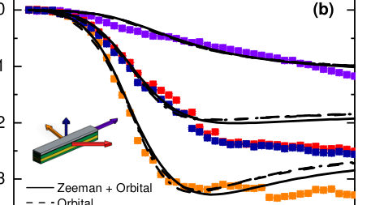
<figcaption class="paper-figure-caption"><b>Fig 4.</b> FIG. 4. Comparison with theory: for the resonators ori- ented at (a) 0◦and (b) 45◦, as described in Fig. 1. Rel- ative stiffness shift as a function of in-plane magnetic field applied parallel (purple), perpendicular (orange) and form- ing 45◦(blue) and 135◦(red) to each resonator. The relative orientation between the inductor wire and the applied field is indicated with a little sketch for each device. The experi- mental results are shown with dots while the lines correspond to the theory calculations: continuous line is the combined Zeeman/Orbital scenario, dashed line corresponds to Orbital- alone scenario and dot-dashed to Zeeman-alone scenario (see Fig. 3 and discussion on parameters...</figcaption>
</figure>

**Summary.** The paper reports on experimental and theoretical investigations into superconductivity in Al/InAs hybrid structures. By measuring the microwave electrodynamics, the authors detect an anisotropic suppression of superfluid stiffness that signals the emergence of Bogoliubov Fermi Surfaces. This work establishes microwave measurements as a sensitive tool for probing gapless superconducting phases.

**Why it may be interesting.** This work provides a concrete platform for observing exotic superconducting states predicted in proximity systems, linking macroscopic transport measurements (microwave response) directly to microscopic band structure features like BFS.

Detailed structure

**Main problem.** The study investigates the emergence of Bogoliubov Fermi Surfaces (BFS) and characterizes anisotropic gapless superconductivity in hybrid superconductor/semiconductor heterostructures.

**Main result.** The observed non-monotonic and strongly anisotropic evolution of the superfluid stiffness, measured via microwave electrodynamics, is consistent with the formation of BFS due to the interplay of Zeeman and orbital Fulde-Ferrell effects.

**Method.** The research combines microwave electrodynamic measurements (probing kinetic inductance) with microscopic theoretical calculations based on the Bogoliubov-de Gennes framework.

**Model / system.** The physical system is a hybrid Al/InAs heterostructure containing a 2DEG proximitized by an Al superconductor. The theory models the superconducting response using the superfluid stiffness tensor derived from the free energy density.

**Key observables.** Superfluid stiffness tensor components ($D_{ij}$), relative frequency shift ($\Delta f_0 / f_0$), and internal quality factor change ($Q_i$) as functions of in-plane magnetic field and angle.

**Important parameters / regimes.** In-plane magnetic field ($B$), Zeeman energy ($V_Z$), Doppler energy ($V_D$), superconducting gap ($\Delta_0$), and temperature ($T$).

**Assumptions / limitations.** The analysis assumes that the electrodynamic response can be mapped to the superfluid stiffness tensor, and theoretical models rely on specific approximations regarding disorder effects and gauge equivalence.

**Figures summary.** Figures show sample setups, microwave resonance curves demonstrating field dependence, theoretical band structure evolution illustrating gap closing and BFS formation, and quantitative maps detailing angular anisotropy of stiffness suppression.

**Paper structure.** The paper progresses from experimental characterization using microwave resonators to establishing the link between anisotropic response and BFS emergence. It then uses microscopic theory (BdG) to model this behavior, followed by fitting measured superfluid density data to confirm the theoretical predictions regarding field-induced gapless phases.

Abstract

We investigate the microwave electrodynamics of a proximitized two-dimensional electron gas in hybrid superconductor/semiconductor heterostructures. Using lumped-element resonators with inductor wires oriented relative to an in-plane magnetic field, we directly probe the superfluid stiffness via the kinetic inductance. As the field increases, the resonance frequency exhibits a non-monotonic and strongly anisotropic evolution that cannot be explained by orbital pair breaking alone. We show that this behavior is consistent with the emergence of Bogoliubov Fermi surfaces, which selectively suppress the supercurrent response depending on the direction of the magnetic field. Microscopic calculations of the stiffness tensor capture the observed anisotropy driven by the interplay of Zeeman and orbital Fulde-Ferrell effects. Our results establish microwave stiffness measurements as a sensitive probe of anisotropic gapless superconductivity in hybrid systems.

[↑ back to top](#top)

### [Determination of the properties of a superconducting single crystal FeSe using an EPR spectroscopy](http://arxiv.org/abs/2608.06602v1)

**Authors:** S. I. Bondarenko, A. A. Prokhorov, N. N. Galtsov, V. P. Timofeev, V. P. Koverya, A. V. Krevsun  
**Type:** experiment · **Category:** other · **PDF:** <https://arxiv.org/pdf/2608.06602v1>  
**Analysis basis:** full PDF text, analyzed in chunks
**Topic relevance:** `spintronics-quantum-optics interface` **2/5** · `Kondo & dissipative impurity` **1/5** · `quantum measurements` **1/5**

↔ Scroll figures horizontally

<figure class="paper-figure-card">
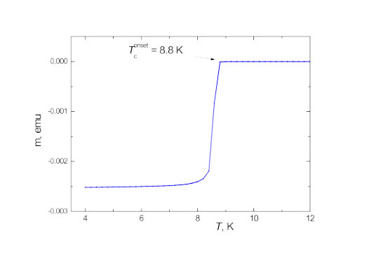
<figcaption class="paper-figure-caption"><b>Fig 1.</b> Fig. 1. (Color online) Dependence of the magnetic moment (m) of a FeSe single crystal on the temperature.</figcaption>
</figure>
<figure class="paper-figure-card">
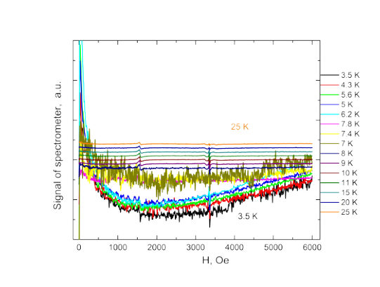
<figcaption class="paper-figure-caption"><b>Fig 2.</b> Fig. 2. (Color online) Field dependences of the EPR signal from a FeSe single crystal (in arbitrary units) on the magnitude of the magnetic field H at various temperatures. For ease of analysis, the experimental curves displaying the obtained characteristics are shifted along the vertical axis by equal intervals relative to the dependence at T = 3.5 K.</figcaption>
</figure>
<figure class="paper-figure-card">
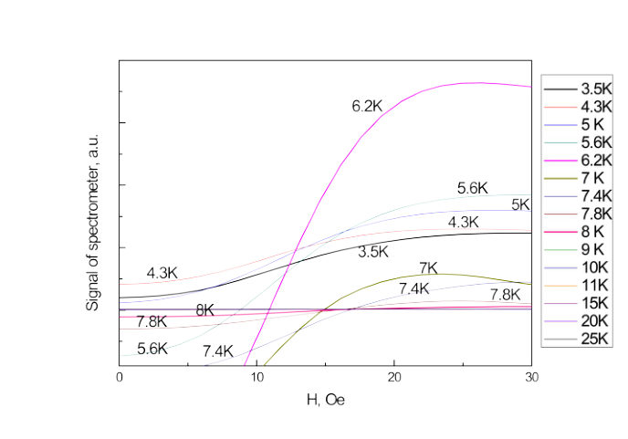
<figcaption class="paper-figure-caption"><b>Fig 3.</b> Fig. 3. (Color online) Dependences of the non-resonant EPRsignal of the crystal on the magnetic field, starting from its absence, up to 30 Oe at different temperatures (indicated next to each curve additionally for ease of reading).</figcaption>
</figure>
<figure class="paper-figure-card">
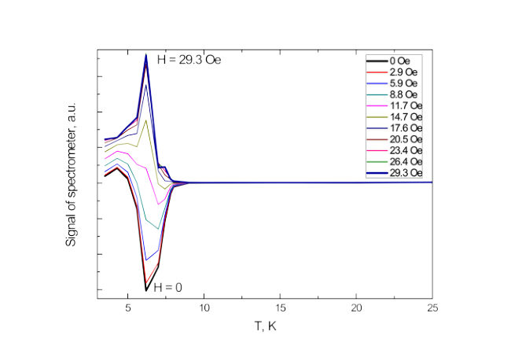
<figcaption class="paper-figure-caption"><b>Fig 4.</b> Fig. 4. (Color online) Temperature dependence of the spectrometer output signal when studying a single-crystal FeSe sample in the region of low magnetic fields (0 - 29.3 Oe). The signal is maximum and positive at H = 29.3 Oe and is minimum and negative at H = 0 Oe.</figcaption>
</figure>
<figure class="paper-figure-card">
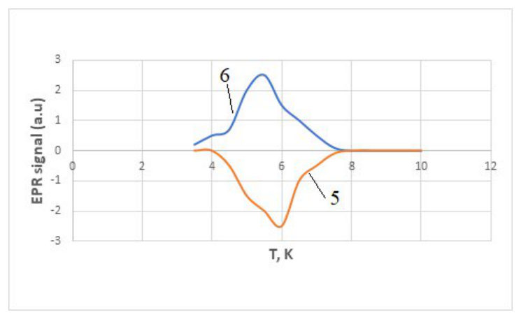
<figcaption class="paper-figure-caption"><b>Fig 5.</b> Fig. 5. Temperature dependences of the resistance (R*) of a certain superconductor with a critical temperature of about 8 K (a – curves 1, 2), their first derivatives dR*/dT (b – curves 3, 4), as well as the corresponding calculated temperature dependences of the EPR signal (c – curves 5, 6).</figcaption>
</figure>

**Summary.** This work uses Electron Paramagnetic Resonance (EPR) spectroscopy on FeSe single crystals to characterize their superconducting properties. By analyzing non-resonant EPR signals under varying magnetic fields and temperatures, the authors determined critical parameters such as $T_c$ and $H_{c1}$. The results confirm the mixed state behavior expected for a Type-II superconductor while also identifying electronic signatures related to iron ion oxidation states.

**Why it may be interesting.** The use of high-frequency EPR spectroscopy to probe superconducting vortex dynamics and critical fields provides an alternative, highly sensitive diagnostic tool compared to standard DC magnetometry or resistivity measurements in condensed matter physics.

Detailed structure

**Main problem.** To study the superconducting and normal state properties of a single crystal of FeSe using Electron Paramagnetic Resonance (EPR) spectroscopy.

**Main result.** The EPR measurements successfully determined key superconducting parameters like $T_c$, the transition width, and the first critical magnetic field ($H_{c1}$), while also characterizing the electronic states via resonant signals corresponding to $	ext{Fe}^{2+}$ ions.

**Method.** EPR spectroscopy was employed across varying temperatures and applied magnetic fields. Non-resonant signals were analyzed for superconducting signatures (e.g., $180^\circ$ phase jumps), while resonant signals identified specific paramagnetic ion states.

**Model / system.** The physical system is a single crystal of FeSe, studied as a Type-II superconductor. Measurements compare the field dependence of non-resonant EPR signals in the mixed state to theoretical models derived from the temperature derivative of resistivity ($dR^*/dT$).

**Key observables.** Non-resonant EPR signal (field/temperature dependent), resonant EPR signals at 1400 Oe and 3400 Oe, $T_c$, superconducting transition width, and $H_{c1}$.

**Important parameters / regimes.** Magnetic field up to 6000 Oe; Temperature range from 3.5 K to 25 K; Critical fields ($H_{c1}$) and onset temperature ($T_{c	ext{onset}} \approx 8.8 	ext{ K}$).

**Assumptions / limitations.** The non-resonant EPR signal is proportional to the field derivative of the radiation power, and comparisons between electrical (FPM) and microwave (EPR) measurements are made despite methodological differences.

**Figures summary.** Figures illustrate $T_{c	ext{onset}}$ from magnetization ($T_c=8.8 	ext{ K}$), the nonlinear field dependence of the EPR signal in the mixed state, the characteristic $180^\circ$ phase jump identifying $H_{c1}$, and comparisons between temperature-dependent EPR signals and resistivity derivatives.

**Paper structure.** The paper systematically presents measurements across different states (normal vs. superconducting) using EPR. It first establishes $T_c$ via magnetization, then uses low-field non-resonant signals to map the mixed state behavior ($H_{c1}$ identification), and finally compares the temperature dependence of these signals against established electrical transport models.

Abstract

Using an EPR spectrometer, the properties of single-crystal FeSe were studied in a magnetic field up to 6000 Oe at temperatures from 3.5 K to 8 K in the superconducting state and at temperatures above 8K and up to 25K in the normal state. It was shown that by measuring non-resonant spectrometer signals in zero and weak magnetic fields up to 30 Oe, it is possible to determine critical temperature Tc, the superconducting transition width, and the value of the first critical magnetic field Hc1 in FeSe single-crystal. Resonant EPR signals are observed in fields at 1400 Oe and 3400 Oe, which corresponds to the paramagnetism of doubly ionized iron atoms (Fe2+) in the FeSe crystal. Non-resonant EPR signals in a magnetic field up to 6000 Oe at temperatures from 3.5K to 8K are a nonlinear function of the field, and correspond to the superconducting mixed state of the FeSe, but at temperatures above 8K (up to 25K) they are field independent.

[↑ back to top](#top)

### [Type-II Mirror Chern Insulator in Altermagnets](http://arxiv.org/abs/2608.07374v1)

**Authors:** Amrita Mukherjee, Pritesh Srivastava, Rahul Verma, Bahadur Singh  
**Type:** theory · **Category:** other · **PDF:** <https://arxiv.org/pdf/2608.07374v1>  
**Analysis basis:** full PDF text, analyzed in chunks
**Topic relevance:** `exotic spin models in light-matter` **1/5** · `spintronics-quantum-optics interface` **1/5**

↔ Scroll figures horizontally

<figure class="paper-figure-card">
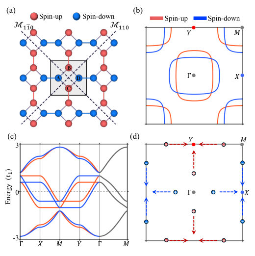
<figcaption class="paper-figure-caption"><b>Fig 1.</b> FIG. 1. (a) Square-octagon lattice with altermagnetic order. Red (blue) sites denote positive (negative) exchange fields. The blue and red bonds denote the intercell hopping (t2) between the blue and red sites, respectively, while the color gradient within each square plaquette represents the intracell hopping (t1). The black square outlines the unit cell, and the dashed lines indicate the mirror planes M110 and M1¯10. (b) Spin-resolved Fermi contours for t2 = 0.8 and δm = 0.2. The high-symmetry points Γ and M are marked by gray circles, while the symmetry-related X and Y valleys are highlighted by blue and red circles, respectively. (c) Corresponding spin- resolved band structure along the...</figcaption>
</figure>
<figure class="paper-figure-card">
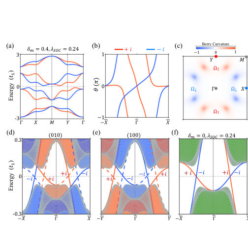
<figcaption class="paper-figure-caption"><b>Fig 2.</b> FIG. 2. (a) Spin-resolved band structure with SOC for t2 = 0.8, λSOC = 0.24, and δm = 0.4. (b) Evolution of the Wannier charge centers in the M001 = ±i mirror sectors. (c) Berry-curvature distribution in the first Brillouin zone pro- jected onto the Mz = ±i mirror sectors. (d),(e) Edge spectra of ribbons along the (010) and (100) directions, respectively. Red and blue denote edge modes with mirror eigenvalues +i and −i, while solid and dashed curves indicate states localized on opposite edges. (f) Edge spectrum for δm = 0, correspond- ing to the conventional mirror Chern insulator with a pair of T-related Dirac cones.</figcaption>
</figure>
<figure class="paper-figure-card">
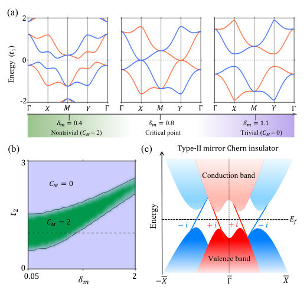
<figcaption class="paper-figure-caption"><b>Fig 3.</b> FIG. 3. (a) Bulk band structure with SOC as a function of the altermagnetic exchange field δm. (b) Topological phase diagram in the t2–δm parameter space for λSOC = 0.24. The color scale denotes the mirror Chern number CM. (c) Schematic illustration of the type-II mirror Chern insulator. Counterpropagating edge modes with opposite mirror eigen- values are separated into symmetry-related valleys of the Bril- louin zone.</figcaption>
</figure>
<figure class="paper-figure-card">
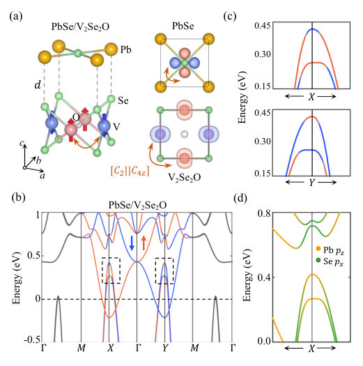
<figcaption class="paper-figure-caption"><b>Fig 4.</b> FIG. 4. (a) Crystal structure of the PbSe/V2Se2O heterobi- layer. The two magnetic sublattices of V2Se2O are related by the spin-lattice symmetry [C2 ∥C4z]. The right panels show the real-space spin density centered on a Se atom in PbSe (top) and a V atom in V2Se2O (bottom). (b) Spin-resolved band structure of the PbSe/V2Se2O heterobilayer for an in- terlayer separation of d = 3.5 ˚A with SOC. Red and blue denote spin-up and spin-down Sz polarization, respectively. (c) Enlarged view of the PbSe-derived bands near the X and Y valleys. (d) Orbital-resolved band structure of the PbSe- derived states near the X valley. Orange and green denote the Pb-pz and Se-px orbital contributions,...</figcaption>
</figure>

**Summary.** This work predicts the existence of a Type-II Mirror Chern Insulator phase stabilized by altermagnetic ordering in 2D materials. By modeling this using a lattice Hamiltonian, the authors show that SOC gaps out Dirac nodes into a topologically non-trivial state (CM=2). The key novelty is the prediction of momentum-separated edge modes, which they suggest can be realized in the $	ext{PbSe}/	ext{V}_2	ext{Se}_2	ext{O}$ heterobilayer.

**Why it may be interesting.** The concept of using magnetic order (altermagnetism) to engineer specific topological invariants like the Mirror Chern number provides a powerful, symmetry-based route to realizing exotic quantum states in condensed matter systems.

Detailed structure

**Main problem.** The paper aims to predict and characterize a novel topological phase called a "Type-II Mirror Chern Insulator" stabilized by altermagnetism in the presence of mirror symmetry.

**Main result.** Altermagnetic order generates symmetry-related valley-polarized Dirac nodes, which are gapped by SOC to yield a bulk insulator with a non-trivial mirror Chern number (CM=2) and distinct, momentum-separated edge modes.

**Method.** The study uses electronic structure calculations on a 2D square-octagon lattice model, analyzing the Bloch Hamiltonian and calculating topological invariants like the Mirror Chern number.

**Model / system.** The system is modeled using a tight-binding Hamiltonian incorporating hopping ($H_t$), intrinsic SOC ($H_{SOC}$), and an altermagnetic exchange field ($H_m$). A candidate material proposed for realization is the PbSe/V2Se2O heterobilayer.

**Key observables.** Mirror Chern number (CM=2), momentum-separated edge modes, valley-polarized Dirac nodes, and bulk insulating gap opening.

**Important parameters / regimes.** Altermagnetic order parameter ($\delta_m$) and SOC strength ($\lambda_{SOC}$); the lattice structure (square-octagon).

**Assumptions / limitations.** The analysis relies on the specific square-octagon lattice model and assumes the feasibility of realizing the altermagnetic proximity effect in the proposed heterobilayer.

**Figures summary.** Figures illustrate spin-resolved Fermi contours, band structure evolution showing node gapping, Berry curvature hotspots confirming CM=2, and edge spectra demonstrating momentum separation compared to conventional insulators.

**Paper structure.** The paper establishes the theoretical model using altermagnetism in a 2D lattice, calculates the topological invariant (CM), demonstrates the unique Type-II signature via separated edge modes, and concludes by proposing a concrete material platform ($	ext{PbSe}/	ext{V}_2	ext{Se}_2	ext{O}$) for experimental realization.

Abstract

Altermagnets with momentum-dependent spin splitting despite zero net magnetization can support unique topological states under broken time-reversal symmetry. We predict a mirror-symmetry-protected topological crystalline insulator with momentum-separated edge modes in a two-dimensional altermagnet. Using a square-octagon lattice model, we show that altermagnetic order generates symmetry-related valley-polarized Dirac nodes, which are gapped by spin-orbit coupling to yield a mirror Chern insulator with $C_{\mathcal{M}}=2$. In contrast to conventional mirror Chern insulators, where the two mirror-protected edge modes cross at the same momentum to form a Dirac cone, altermagnetic spin splitting and valley-selective band inversion separate these edge modes in momentum. We refer to this phase as a type-II mirror Chern insulator. We further propose a PbSe/$\mathrm{V_2Se_2O}$ heterobilayer as a candidate material for realizing this phase through the altermagnetic proximity effect. Our results establish altermagnetism as a route to mirror-protected topological phases with momentum-separated edge modes.

[↑ back to top](#top)

### [Effectiveness of Some 0 dB Cryogenic Microwave Attenuators as Thermal Heatsinks](http://arxiv.org/abs/2608.06492v1)

**Authors:** J. T. Klomp, Haoyun Huang, G. A. Csathy  
**Type:** experiment · **Category:** other · **PDF:** <https://arxiv.org/pdf/2608.06492v1>  
**Analysis basis:** full PDF text, analyzed in chunks
**Topic relevance:** `non-equilibrium dynamics` **1/5**

↔ Scroll figures horizontally

<figure class="paper-figure-card">
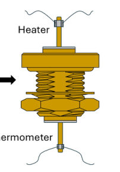
<figcaption class="paper-figure-caption"><b>Fig 1.</b> Fig. 1 In order to expose the inner pin of a female SMA connector, its threads were filed down and the teflon spacer was removed. The diagram illustrates this for the 0 dB attenuator ATT-1. The chip heater and thermometer attached to the inner pin are also shown.</figcaption>
</figure>
<figure class="paper-figure-card">
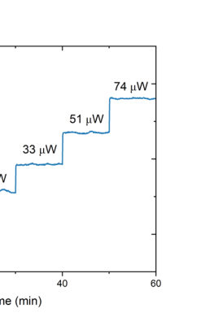
<figcaption class="paper-figure-caption"><b>Fig 2.</b> Fig. 2 Readings of the thermometer attached to ATT-3 as the heating power P is increased. Numbers indicate the value of the applied power P. The body of the attenuator is held at Tmx = 400 mK.</figcaption>
</figure>
<figure class="paper-figure-card">
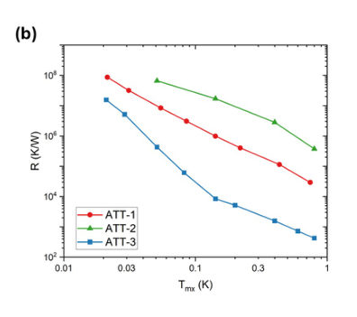
<figcaption class="paper-figure-caption"><b>Fig 3.</b> Fig. 3 (a) Thermal response curves of the three attenuators. (b) The thermal transresistance R plotted against mixing chamber temperature Tmx for the three attenuators.</figcaption>
</figure>
<figure class="paper-figure-card">
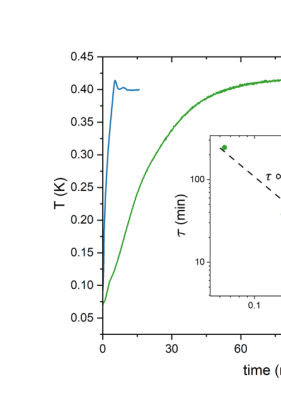
<figcaption class="paper-figure-caption"><b>Fig 4.</b> Fig. 4 Temporal responses of ATT-2 (green trace) and ATT-3 (blue trace) from changing the mixing chamber from Tmx = 75 mK to Tmx = 400 mK. The slight oscillation at the peak of the blue curve is due to overshoot in the PID feedback loop. Inset shows the temperature dependence of the thermal time constant τ for ATT-2. The dashed line is a guide to the eye.</figcaption>
</figure>

**Summary.** This experimental paper characterizes how effectively different commercial cryogenic microwave attenuators function as thermal heatsinks. By measuring their temperature response under controlled heat loads, the authors provide quantitative data on their thermal transresistance and time constants. This information is vital for designing reliable and accurately controlled thermal environments in advanced low-temperature quantum experiments.

**Why it may be interesting.** While not directly about quantum dynamics, understanding the precise thermal environment is crucial for any experiment involving sensitive quantum devices (like qubits or superconducting circuits) where temperature fluctuations can cause decoherence or measurement errors.

Detailed structure

**Main problem.** The study aims to quantify the thermal performance of cryogenic microwave attenuators when used as thermal anchors for coaxial cables in ultra-low temperature quantum experiments.

**Main result.** The quartz crystal attenuator was found to be significantly more effective than teflon or sealed alternatives, providing better thermal anchoring and lower thermal transresistance at various temperatures.

**Method.** The authors measured the temperature response of three different commercial 0 dB attenuators by applying controlled heat loads and measuring the resulting temperature change versus applied power.

**Model / system.** The physical system involves coaxial cables used in dilution refrigerators, focusing on the thermal coupling through the inner conductor. The measurement characterizes the attenuator's ability to act as a reliable thermal heatsink.

**Key observables.** Thermal transresistance (R), temperature dependence of R, and thermal equilibration time constant ($\tau$).

**Important parameters / regimes.** Operating temperatures in the millikelvin range ($T_{mx}$), applied heating power ($P$), and material types (quartz crystal vs. teflon).

**Assumptions / limitations.** The body of the attenuator is assumed to be in strong thermal contact with the mixing chamber, and comparisons are made between different thermal models (e.g., simple resistance vs. distributed resistance).

**Figures summary.** Figures illustrate the experimental setup, show temperature readings versus applied power for a specific attenuator, plot thermal response curves and transresistance across various base temperatures, and compare temporal decay rates ($\tau$) for different materials.

**Paper structure.** The paper introduces the need for accurate thermal characterization in cryogenic setups, details the measurement methodology using three distinct attenuators, presents quantitative results comparing their performance metrics (R and $\tau$), and concludes with guidelines for designing better thermal environments.

Abstract

Coaxial cables are widely used in radiofrequency and microwave cryogenic setups for condensed matter and quantum experiments. Since the inner conductor of coaxes is often in good thermal contact with the sample to be measured, it is desirable to know the phononic heat channeled by the inner conductor. Although cryogenic attenuators are widely used to thermalize the inner conductor of coaxes, to our knowledge, quantitative information is not available. We present data on the effectiveness of three commercially available 0 dB attenuators as thermal heatsinks. In particular, we measured the temperature of the inner pin of several 0 dB attenuators under a heat load. This information will aid in designing and carefully controlling the thermal environment of samples in high-frequency experiments mounted in dilution refrigerators and on nuclear demagnetization stages.

[↑ back to top](#top)

### Other secondary papers (2)

Show other secondary papers

### [Cross-Geometry Transferability Assessment of Universal Machine Learning Interatomic Potentials: From Bulk Materials to Atomic Nanowires](http://arxiv.org/abs/2608.06662v1)

**Authors:** Pedro H. M. Zanineli, Bruno Focassio, Gabriel R. Schleder  
**Type:** theory · **Category:** disordered systems and neural networks · **PDF:** <https://arxiv.org/pdf/2608.06662v1>  
**Analysis basis:** full PDF text, analyzed in chunks

↔ Scroll figures horizontally

<figure class="paper-figure-card">
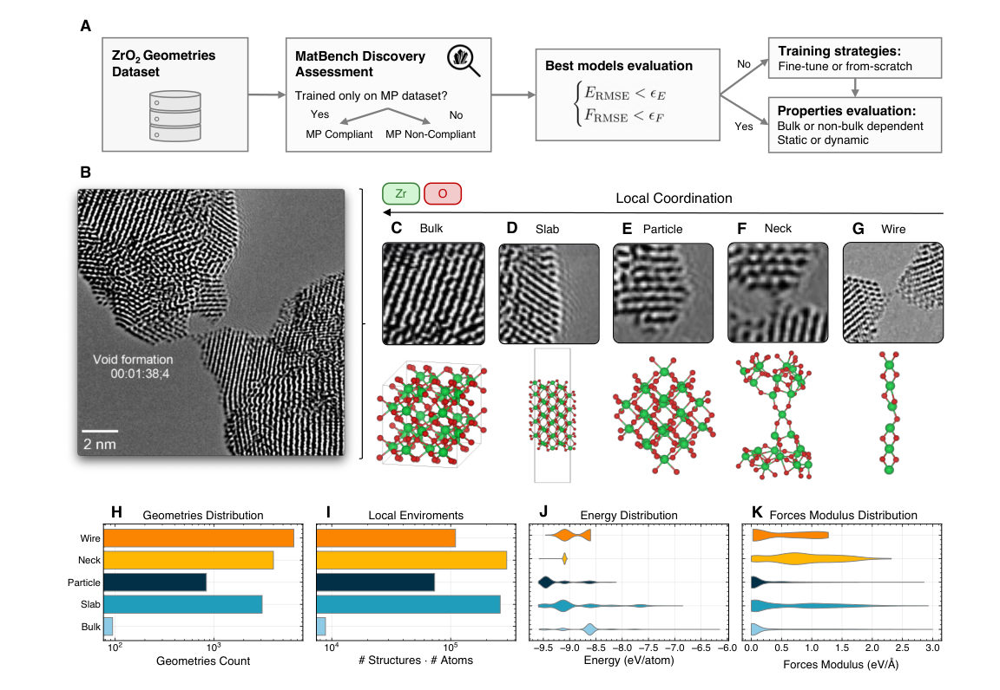
<figcaption class="paper-figure-caption"><b>Fig 1.</b> FIG. 1. Overview of the ZrO2 cross-geometry dataset and evaluation workflow. (A) Workflow comprising dataset construction, model evaluation and adaptation, and validation using derived physical properties. (B) High-resolution transmission electron microscopy image of a ZrO2 desintering event at the interface between two [26, 27]. (C–G) Representative bulk, slab, particle, neck, and wire configurations, respectively, arranged from comparatively high- to low-coordination environments. (H) Number of configurations in each geometry class. (I) Total atomic environments, defined as the sum of the number of atoms over all configurations in each class. (J) Per-atom energy distributions. (K)...</figcaption>
</figure>
<figure class="paper-figure-card">
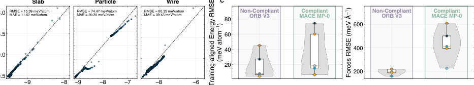
<figcaption class="paper-figure-caption"><b>Fig 2.</b> FIG. 2. Zero-shot evaluation on the ZrO2 dataset. (A) Aligned per-atom energy RMSE and force RMSE for the evaluated MLIPs, grouped according to the Matbench Discovery MP-NC and MP-C categories. In panel A, black bars indicate aligned per-atom energy RMSE, orange bars indicate force RMSE, and dashed horizontal lines indicate the corresponding mean errors across all evaluated models. (B) Parity plots of training-aligned MACE-MP-0 energies against DFT reference energies for the slab, particle, and wire geometries. (C) Energy and force RMSE distributions for ORB-V3 and MACE-MP-0. Colored markers indicate the errors for the bulk without defects, slab, particle, neck, and wire subsets.</figcaption>
</figure>
<figure class="paper-figure-card">
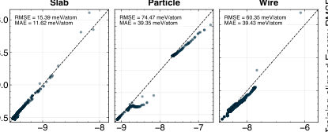
<figcaption class="paper-figure-caption"><b>Fig 3.</b> Figure 3 compares zero-shot inference (ZS), fine-tuning (FT), and from-scratch training (FS). For FT and FS, both architectures were trained for the same 50 epochs and evaluated on the same retained test partition. Zero- shot inference provides an immediate baseline but retains the large errors observed for underrepresented geome- tries. Under the fixed training setup, fine-tuned models</figcaption>
</figure>
<figure class="paper-figure-card">
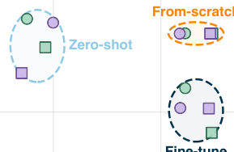
<figcaption class="paper-figure-caption"><b>Fig 4.</b> FIG. 3. Accuracy–cost comparison of zero-shot, fine-tuned, and from-scratch models. Results are shown for MACE (cir- cles) and ORB (squares), with MP-compliant models in green and MP-non-compliant models in purple. Panels (A) and (B) report the training-aligned energy RMSE and force RMSE, respectively, as functions of wall time. Zero-shot timings cor- respond only to inference and are included as descriptive base- lines rather than cost-equivalent comparisons with the trained models. Lower values along both axes indicate better perfor- mance.</figcaption>
</figure>
<figure class="paper-figure-card">
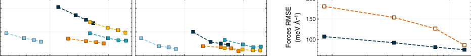
<figcaption class="paper-figure-caption"><b>Fig 5.</b> FIG. 4. Geometry-specific and mixed-geometry fine-tuning of MACE and ORB on the ZrO2 dataset, assessing in- and out-of- domain geometries. Energy errors are shown with solid lines and circles, and force errors with dashed lines and squares. Colors indicate the evaluation geometry: bulk, slab, particle, neck, and wire. (A) Cross-geometry fine-tuning transferability for MACE (top row) and ORB (bottom row). Each column denotes the geometry used for fine-tuning, and the curves report aligned energy and force RMSE as functions of the total number of atomic environments. (B) Geometry-specific fine-tuning learning curves for MACE and ORB, showing aligned energy and force RMSE as functions of the...</figcaption>
</figure>

**Summary.** This paper rigorously assesses how well machine learning interatomic potentials (MLIPs) maintain accuracy when simulating materials across vastly different structural environments, such as bulk solids versus atomic nanowires. By testing $	ext{ZrO}_2$ under simulated desintering conditions, the authors demonstrate that simple error metrics are insufficient predictors of physical reliability. They conclude that creating geometry-diverse training data and employing mixed-geometry fine-tuning are crucial for robust MLIP application in low-coordination nanostructures.

**Why it may be interesting.** This work is highly relevant because it pushes the boundaries of using data-driven potentials to model complex condensed matter systems where local coordination changes drastically, which is a key challenge in nanoscale physics.

Detailed structure

**Main problem.** The primary challenge is assessing how reliably Machine Learning Interatomic Potentials (MLIPs) transfer their accuracy when simulating structural changes, specifically moving from bulk materials to low-coordination nanostructures like atomic nanowires.

**Main result.** Cross-geometry fine-tuning strategies are superior to geometry-specific tuning for reducing overall cross-geometry errors, and the study proves that simple energy/force error metrics do not predict complex property behavior.

**Method.** The authors benchmarked 26 pretrained MLIPs using a DFT-generated dataset spanning five geometries (bulk to wire) and compared zero-shot inference against fine-tuning protocols.

**Model / system.** The study focuses on Zirconia ($	ext{ZrO}_2$) undergoing desintering, creating complex structures including necks and atomic wires. The models are advanced MLIPs (e.g., ORB) trained to approximate the potential energy surface derived from DFT calculations.

**Key observables.** Energy and force root-mean-square errors (RMSEs), elastic properties (Young's modulus, Bulk Modulus), surface energies ($\gamma$), phonon dispersions, and structural metrics like RMSD during MD simulations.

**Important parameters / regimes.** The simulation regime involves tensile deformation, varying coordination numbers (bulk to wire), and comparison between zero-shot, fine-tuning, and training from scratch MLIP adaptation strategies.

**Assumptions / limitations.** The analysis assumes that the DFT dataset accurately captures the necessary physics for transferability; however, it notes limitations regarding isolating long-range electrostatic effects.

**Figures summary.** Figures compare energy/force errors across geometries (Fig 2A), show phonon dispersion curves (S2, S3) and vibrational DOS (S4), and track structural stability via RMSD and minimum bond distances during tensile loading (S5, S10).

**Paper structure.** The paper establishes the problem of MLIP transferability across geometries using $	ext{ZrO}_2$. It details dataset construction and benchmarking protocols, comparing zero-shot vs. fine-tuning strategies. Finally, it validates these models by calculating macroscopic properties (elasticity, surface energy) and simulating dynamic processes (MD/Phonons).

Abstract

Foundation machine-learning interatomic potentials (MLIPs) enable atomistic simulations at substantially lower computational cost than first-principles methods, but their reliability across structural geometries remains insufficiently understood. Here, we construct a density-functional-theory dataset of ZrO2 configurations spanning bulk, slab, particle, neck, and atomically thin wire environments motivated by an experimentally observed ZrO2 desintering process involving neck thinning and atomic wire formation. We first benchmark 26 pretrained MLIPs and observe pronounced geometry-dependent degradation in zero-shot predictions. Without any training, after only reference-energy alignment, the best zero-shot model (ORB-V3) reaches energy and force root-mean-square errors of 6 meV/atom and 197.3 meV/Å, respectively, with the largest force errors in neck and wire configurations. We then compare zero-shot inference, fine-tuning, and training from scratch strategies. Fine-tuning yields lower energy and force errors than training from scratch, while both require comparable wall-clock time. Geometry-specific fine-tuning improves in-domain accuracy but frequently produces negative transfer to other structural classes, whereas mixed-geometry fine-tuning reduces cross-geometry errors. Evaluations of elastic and vibrational properties, surface energies, and neck dynamics further show that rankings based on average energy and force errors do not universally predict property-level behavior. These results demonstrate that geometry-diverse target data and independent physical validations are necessary when adapting foundation MLIPs to low-coordination (ionic) nanostructures.

[↑ back to top](#top)

### [Extracting the full conductivity tensor in a rectangular sample](http://arxiv.org/abs/2608.06643v1)

**Authors:** Julia Gelfond, Oskar Vafek  
**Type:** theory · **Category:** other · **PDF:** <https://arxiv.org/pdf/2608.06643v1>  
**Analysis basis:** full PDF text, analyzed in chunks

↔ Scroll figures horizontally

<figure class="paper-figure-card">
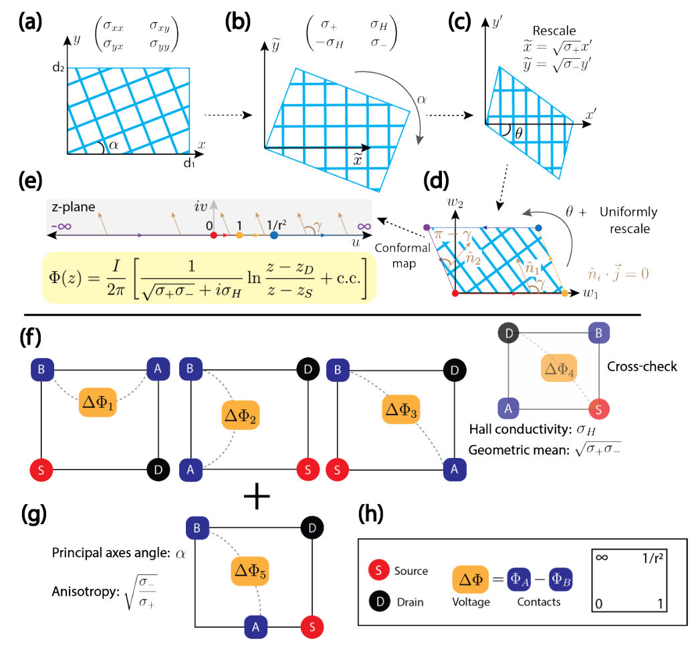
<figcaption class="paper-figure-caption"><b>Fig 1.</b> FIG. 1. Analytical solution for electric potential on a rectangle and experimental configurations for extracting the full conductivity tensor and principal axes angle. (a) Original sample with principal axes rotated relative to the lab frame by α. (b) Rotation clockwise by α. (c) Anisotropic rescaling. (d) Rotation counterclockwise by θ and uniform rescaling. (e) Schwarz-Christoffel conformal map and analytical solution for the potential in the complex z-plane. (f) Three vertex configurations which together give the Hall conductivity and geometric mean of the longitudinal conductivities. The fourth vertex configuration does not give new information, but can be used as a cross-check. (g)...</figcaption>
</figure>
<figure class="paper-figure-card">
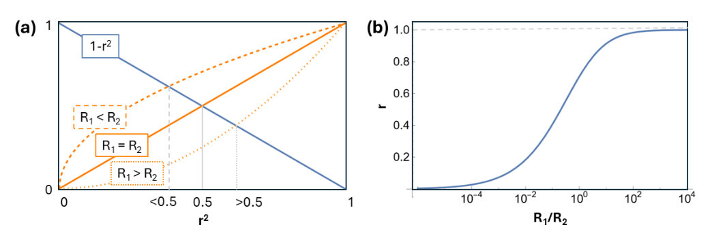
<figcaption class="paper-figure-caption"><b>Fig 2.</b> FIG. 2. (a) Schematic showing how 1 −r2 = r2R1/R2 always has a unique solution for r2. Note that r2 &gt; 0.5 if R1 &gt; R2 and r2 &lt; 1/2 if R1 &lt; R2. (b) Plot of r as a function of R1/R2 on a base-10 log scale.</figcaption>
</figure>
<figure class="paper-figure-card">
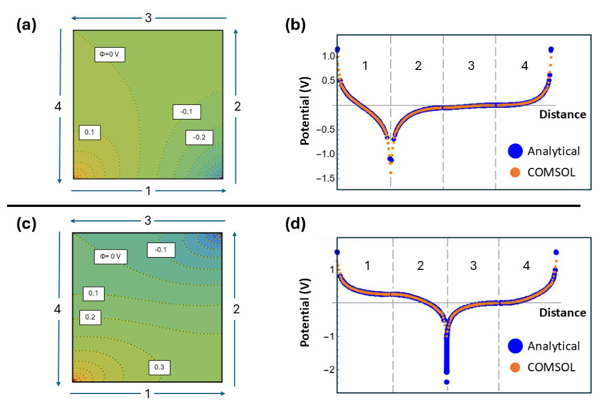
<figcaption class="paper-figure-caption"><b>Fig 3.</b> FIG. 3. Comparison of our analytical solution with simulations from COMSOL. (a) Contour plot generated by COMSOL overlaid by dashed black contours generated by our solution. Here, σ+ ≈4.4 S/□, σ−≈2.6 S/□, σH = 0.25 S/□, and α ≈28◦. High potential is red (bottom left corner) and low potential is blue (bottom right corner). (b) Counterclockwise edge cuts of potential from the contour plot (a). (c) σ+ ≈5.2 S/□, σ−≈1.8 S/□, σH = −0.25 S/□, and α ≈13◦. High potential is red (bottom left corner) and low potential is blue (top right corner). (d) Potential on the edges of the contour plot (c) going counterclockwise.</figcaption>
</figure>
<figure class="paper-figure-card">
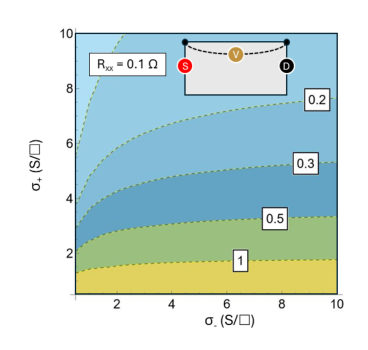
<figcaption class="paper-figure-caption"><b>Fig 4.</b> FIG. 4. Contour plot of Rxx calculated with our solution (shading and yellow contours) overlaid with Rxx calculated using the sum in Ref.(50) (black dashed contours) [14]. Inset shows the setup with source (S), drain (D), and voltage (V). Here d1/d2 = 2.3/1.2.</figcaption>
</figure>
<figure class="paper-figure-card">
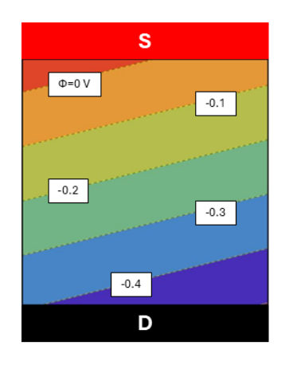
<figcaption class="paper-figure-caption"><b>Fig 5.</b> FIG. 5. Contour plot of the potential for a square sample with a continuous source along the top and a drain along the bottom with uniform current density, |j| ≈1.08 A/m. For this sample, σ+ ≈4.4 S/□, σ−≈2.6 S/□, σH = 0.25 S/□ and α ≈28◦. Shading and yellow contours are from COMSOL simulations, while the black dashed lines are generated from superposition of our analytical solution (55).</figcaption>
</figure>

**Summary.** This paper presents an advanced theoretical method to determine the full conductivity tensor and principal axes angle of anisotropic 2D materials using only four electrical resistance measurements on a rectangular sample. The methodology involves solving Laplace's equation via conformal mapping, yielding explicit algebraic formulas that relate measured resistances directly to the material's underlying transport properties.

**Why it may be interesting.** While not directly quantum mechanical, the rigorous application of advanced mathematical physics (conformal mapping) to solve a classical electrostatics problem in an anisotropic medium showcases powerful analytical techniques applicable across condensed matter theory.

Detailed structure

**Main problem.** The primary goal is to develop a simple, analytically derived experimental procedure to extract the full conductivity tensor ($\sigma$) and the principal axes angle ($\alpha$) from anisotropic 2D materials.

**Main result.** The authors provide explicit analytical formulas relating four specific resistance measurements ($R1$ through $R4$) on a rectangular sample to the components of the conductivity tensor ($\sigma_+$, $\sigma_-$, $\sigma_H$).

**Method.** The method relies heavily on solving Laplace's equation for the electric potential using conformal mapping techniques, specifically involving Schwarz-Christoffel transformations.

**Model / system.** The system is a uniform 2D rectangular sample exhibiting anisotropic electrical conductivity ($oldsymbol{\sigma}$). The analysis models current injection via point sources and drains placed on the perimeter of this geometry.

**Key observables.** Full conductivity tensor components ($\sigma_+$, $\sigma_-$, $\sigma_H$), principal axes angle ($\alpha$), and four measured resistances ($R1, R2, R3, R4$).

**Important parameters / regimes.** The ratio $r$ (hypergeometric parameter) and the geometric mean of resistivity along principal axes ($
ho^*$) are key intermediate parameters.

**Assumptions / limitations.** It is assumed that Ohm's law holds, the conductivity tensor is constant throughout the sample, and that the source/drain contacts can be modeled as being infinitesimally close to the perimeter.

**Figures summary.** Figures illustrate the sequence of coordinate transformations (rotation, rescaling, mapping) used in the conformal mapping approach, potential contour plots comparing analytical solutions with simulations, and diagrams detailing specific vertex configurations for measurements.

**Paper structure.** The paper builds from establishing the governing equations using source/drain current continuity, through deriving the complex potential solution via conformal mapping, to finally presenting algebraic relationships derived from multiple measurement configurations that allow solving for $\sigma_H$ and $\alpha$.

Abstract

Electrical transport measurements reveal that many 2D materials exhibit anisotropic conductivity. However, current methodologies for rectangular geometries can only extract a partial conductivity tensor or are difficult to execute experimentally. Here, we propose a simple experimental procedure to extract the full conductivity tensor (or the resistivity tensor by inversion) including the principal axes angle. Our procedure is developed by using a conformal mapping approach to obtain an analytical expression for the potential with a point source and drain on the perimeter. Our solution agrees very well with numerical simulations using COMSOL and the known limiting case where the principal axes angle vanishes. Finite source/drains can be modeled using superposition.

[↑ back to top](#top)

