
# arxiv digest (quant-ph + cond-mat) — 2026-08-12

*208 papers · 47 relevant · 5 highlighted*

## 🔥 Most relevant (47)

*Every paper with at least one nonzero topic score, sorted by best-matching score. 🔥 marks scores ≥4/5. Click the title to jump to the full entry below; click [arXiv] to open the paper page. `(secondary)` marks papers from de-prioritized cond-mat archives.*

Show 47 relevant papers

- ⭐ [Tensor network methods for non-perturbative dynamics of open quantum systems](#paper-2608.09850) [[arXiv]](http://arxiv.org/abs/2608.09850v1) — 🔥 `methods for driven-dissipative` **5/5** · `Keldysh / 2PI / non-Gaussian methods` **3/5** · `correlated / nonlocal dissipation` **3/5** · `driven-dissipative phase transition` **2/5** · `analog quantum simulation` **1/5** · `non-equilibrium universality` **1/5** · `quantum measurements` **1/5**
- [Probing intermittent polariton vortex dynamics with two-point correlations](#paper-2608.07748) [[arXiv]](http://arxiv.org/abs/2608.07748v1) `(secondary)` — 🔥 `analog quantum simulation` **4/5** · 🔥 `driven-dissipative phase transition` **4/5** · `methods for driven-dissipative` **3/5** · `non-equilibrium universality` **3/5** · `quantum optics experiment` **3/5** · `Keldysh / 2PI / non-Gaussian methods` **2/5** · `Tavis-Cummings & cavity-many-emitter` **2/5** · `quantum measurements` **2/5** · `Full counting statistics` **1/5** · `correlated / nonlocal dissipation` **1/5** · `scars & prethermalization` **1/5**
- [Hyperbolic exciton-plasmon polaritons in MoS$_2$/MoOCl$_2$ van der Waals heterostructures](#paper-2608.08923) [[arXiv]](http://arxiv.org/abs/2608.08923v1) `(secondary)` — 🔥 `analog quantum simulation` **4/5** · 🔥 `methods for driven-dissipative` **4/5** · `Tavis-Cummings & cavity-many-emitter` **3/5** · `driven-dissipative phase transition` **3/5** · `interference shaping light` **3/5** · `Keldysh / 2PI / non-Gaussian methods` **2/5** · `correlated / nonlocal dissipation` **2/5** · `quantum measurements` **2/5** · `non-equilibrium universality` **1/5**
- [Nonequilibrium dynamics of doped Chern ferromagnets: a case study for false vacuum decay](#paper-2608.08937) [[arXiv]](http://arxiv.org/abs/2608.08937v1) — 🔥 `analog quantum simulation` **4/5** · 🔥 `driven-dissipative phase transition` **4/5** · `correlated / nonlocal dissipation` **3/5** · `methods for driven-dissipative` **3/5** · `non-equilibrium universality` **3/5** · `quantum measurements` **2/5** · `scars & prethermalization` **2/5** · `Frenkel-Kontorova` **1/5** · `Keldysh / 2PI / non-Gaussian methods` **1/5** · `quantum optics experiment` **1/5**
- [Degenerate four-wave mixing in a CPT-symmetric coupler with intermodal dispersion](#paper-2608.08628) [[arXiv]](http://arxiv.org/abs/2608.08628v1) `(secondary)` — 🔥 `driven-dissipative phase transition` **4/5** · 🔥 `methods for driven-dissipative` **4/5** · `Keldysh / 2PI / non-Gaussian methods` **3/5** · `correlated / nonlocal dissipation` **3/5** · `interference shaping light` **3/5** · `non-equilibrium universality` **2/5** · `analog quantum simulation` **1/5** · `scars & prethermalization` **1/5**
- [Dynamical quantum phase transitions in a hybrid quantum dot system with superconducting and ferromagnetic leads](#paper-2608.07744) [[arXiv]](http://arxiv.org/abs/2608.07744v1) `(secondary)` — 🔥 `methods for driven-dissipative` **4/5** · 🔥 `non-equilibrium universality` **4/5** · `Keldysh / 2PI / non-Gaussian methods` **3/5** · `driven-dissipative phase transition` **3/5** · `quantum measurements` **2/5** · `analog quantum simulation` **1/5** · `correlated / nonlocal dissipation` **1/5** · `scars & prethermalization` **1/5**
- [Low-frequency output fluctuations in an open exclusion process with particle pausing](#paper-2608.08074) [[arXiv]](http://arxiv.org/abs/2608.08074v1) — 🔥 `Full counting statistics` **4/5** · `driven-dissipative phase transition` **3/5** · `methods for driven-dissipative` **3/5** · `Keldysh / 2PI / non-Gaussian methods` **2/5** · `non-equilibrium universality` **2/5** · `quantum measurements` **2/5** · `analog quantum simulation` **1/5** · `correlated / nonlocal dissipation` **1/5** · `scars & prethermalization` **1/5**
- [Persistence probability based dynamics and phase diagrams in biased q-voter models](#paper-2608.08324) [[arXiv]](http://arxiv.org/abs/2608.08324v1) — 🔥 `non-equilibrium universality` **4/5** · `driven-dissipative phase transition` **3/5** · `methods for driven-dissipative` **3/5** · `Keldysh / 2PI / non-Gaussian methods` **2/5** · `analog quantum simulation` **2/5** · `correlated / nonlocal dissipation` **2/5** · `quantum measurements` **2/5** · `scars & prethermalization` **1/5**
- [State Preparation Protocols for Entangled States via Open Quantum Walks](#paper-2608.07695) [[arXiv]](http://arxiv.org/abs/2608.07695v1) — 🔥 `quantum measurements` **4/5** · `correlated / nonlocal dissipation` **3/5** · `driven-dissipative phase transition` **3/5** · `methods for driven-dissipative` **3/5** · `Dicke superradiance` **2/5** · `Keldysh / 2PI / non-Gaussian methods` **1/5** · `analog quantum simulation` **1/5** · `non-equilibrium universality` **1/5** · `superradiant laser` **1/5**
- [Quantum Formulation of Chiral Vortical Effect in Weyl Semi-metals](#paper-2608.08269) [[arXiv]](http://arxiv.org/abs/2608.08269v1) — 🔥 `non-equilibrium universality` **4/5** · `Keldysh / 2PI / non-Gaussian methods` **3/5** · `driven-dissipative phase transition` **3/5** · `methods for driven-dissipative` **3/5** · `scars & prethermalization` **2/5** · `analog quantum simulation` **1/5** · `correlated / nonlocal dissipation` **1/5** · `quantum measurements` **1/5**
- [Anomalous temperature dependence of polaron mobility in a nonlinear double-well potential: unbiased X-propagator approach](#paper-2608.09883) [[arXiv]](http://arxiv.org/abs/2608.09883v1) — 🔥 `Keldysh / 2PI / non-Gaussian methods` **4/5** · `driven-dissipative phase transition` **3/5** · `methods for driven-dissipative` **3/5** · `Frenkel-Kontorova` **2/5** · `non-equilibrium universality` **2/5** · `correlated / nonlocal dissipation` **1/5** · `quantum measurements` **1/5** · `scars & prethermalization` **1/5**
- [Biorthogonal-only Floquet Dynamical Quantum Phase Transitions](#paper-2608.07882) [[arXiv]](http://arxiv.org/abs/2608.07882v1) — 🔥 `driven-dissipative phase transition` **4/5** · `analog quantum simulation` **3/5** · `methods for driven-dissipative` **3/5** · `non-equilibrium universality` **3/5** · `correlated / nonlocal dissipation` **2/5** · `Frenkel-Kontorova` **1/5** · `Keldysh / 2PI / non-Gaussian methods` **1/5**
- [Coherent Control of Domain-Wall Transport in an Ultracold Bose Gas](#paper-2608.07840) [[arXiv]](http://arxiv.org/abs/2608.07840v1) — 🔥 `analog quantum simulation` **4/5** · `methods for driven-dissipative` **3/5** · `non-equilibrium universality` **3/5** · `driven-dissipative phase transition` **2/5** · `quantum measurements` **2/5** · `Frenkel-Kontorova` **1/5** · `Keldysh / 2PI / non-Gaussian methods` **1/5** · `correlated / nonlocal dissipation` **1/5**
- [Collective-dissipation-induced dark and metastable-like states for enhanced quantum battery performance](#paper-2608.09693) [[arXiv]](http://arxiv.org/abs/2608.09693v1) — 🔥 `correlated / nonlocal dissipation` **4/5** · `driven-dissipative phase transition` **3/5** · `methods for driven-dissipative` **3/5** · `analog quantum simulation` **2/5** · `non-equilibrium universality` **2/5** · `Tavis-Cummings & cavity-many-emitter` **1/5** · `quantum measurements` **1/5** · `scars & prethermalization` **1/5**
- [Flavor--Kinetic Entanglement Production from Decay and Scattering at Finite Density](#paper-2608.07995) [[arXiv]](http://arxiv.org/abs/2608.07995v1) — 🔥 `Keldysh / 2PI / non-Gaussian methods` **4/5** · `driven-dissipative phase transition` **3/5** · `methods for driven-dissipative` **3/5** · `non-equilibrium universality` **3/5** · `quantum measurements` **2/5** · `correlated / nonlocal dissipation` **1/5** · `scars & prethermalization` **1/5**
- ⭐ [Fluctuation-based evidence for number--phase dynamics in a frustrated orbital superfluid](#paper-2608.08124) [[arXiv]](http://arxiv.org/abs/2608.08124v1) — 🔥 `Full counting statistics` **4/5** · 🔥 `analog quantum simulation` **4/5** · `quantum measurements` **3/5** · `driven-dissipative phase transition` **2/5** · `Keldysh / 2PI / non-Gaussian methods` **1/5** · `correlated / nonlocal dissipation` **1/5** · `methods for driven-dissipative` **1/5** · `non-equilibrium universality` **1/5**
- [Millisecond optical coherence and strong collective coupling in an integrated telecom rare-earth photonic platform](#paper-2608.08221) [[arXiv]](http://arxiv.org/abs/2608.08221v1) — 🔥 `QC/QI experiment` **4/5** · `quantum optics experiment` **3/5** · `analog quantum simulation` **2/5** · `correlated / nonlocal dissipation` **2/5** · `quantum measurements` **2/5** · `Tavis-Cummings & cavity-many-emitter` **1/5** · `driven-dissipative phase transition` **1/5** · `interference shaping light` **1/5** · `methods for driven-dissipative` **1/5**
- [Nonisospectral Integrability and Exact Current Fluctuations in the Two-Dimensional SSEP](#paper-2608.08480) [[arXiv]](http://arxiv.org/abs/2608.08480v1) — 🔥 `Full counting statistics` **4/5** · `non-equilibrium universality` **3/5** · `Keldysh / 2PI / non-Gaussian methods` **2/5** · `driven-dissipative phase transition` **2/5** · `methods for driven-dissipative` **2/5** · `analog quantum simulation` **1/5** · `correlated / nonlocal dissipation` **1/5** · `quantum measurements` **1/5** · `scars & prethermalization` **1/5**
- [Re-entrant parity-time phase transitions in locally coupled ring resonators](#paper-2608.08613) [[arXiv]](http://arxiv.org/abs/2608.08613v1) `(secondary)` — 🔥 `driven-dissipative phase transition` **4/5** · `correlated / nonlocal dissipation` **3/5** · `methods for driven-dissipative` **3/5** · `interference shaping light` **2/5** · `non-equilibrium universality` **2/5** · `Keldysh / 2PI / non-Gaussian methods` **1/5** · `analog quantum simulation` **1/5** · `quantum measurements` **1/5**
- [Momentum-Selective Electron and Spin Dynamics under Ultrafast Photoexcitation](#paper-2608.08104) [[arXiv]](http://arxiv.org/abs/2608.08104v1) — 🔥 `Keldysh / 2PI / non-Gaussian methods` **4/5** · `methods for driven-dissipative` **3/5** · `non-equilibrium universality` **3/5** · `analog quantum simulation` **2/5** · `driven-dissipative phase transition` **2/5** · `correlated / nonlocal dissipation` **1/5** · `scars & prethermalization` **1/5**
- [Noisy Braiding of Majorana Modes: A Comparison of Nanowire Trijunction and Quantum-Dot-Assisted Architectures](#paper-2608.09416) [[arXiv]](http://arxiv.org/abs/2608.09416v1) `(secondary)` — 🔥 `methods for driven-dissipative` **4/5** · `Keldysh / 2PI / non-Gaussian methods` **3/5** · `analog quantum simulation` **3/5** · `correlated / nonlocal dissipation` **2/5** · `quantum measurements` **2/5** · `QC/QI experiment` **1/5** · `driven-dissipative phase transition` **1/5**
- [Conditional non-Hermitian acceleration of multiphoton atomic transitions](#paper-2608.09562) [[arXiv]](http://arxiv.org/abs/2608.09562v1) — 🔥 `quantum measurements` **4/5** · `methods for driven-dissipative` **3/5** · `Tavis-Cummings & cavity-many-emitter` **2/5** · `driven-dissipative phase transition` **2/5** · `Keldysh / 2PI / non-Gaussian methods` **1/5** · `analog quantum simulation` **1/5** · `correlated / nonlocal dissipation` **1/5** · `non-equilibrium universality` **1/5**
- [Interaction between Rydberg Excitons in Cuprous Oxide Revealed through Resonant Second Harmonic Generation](#paper-2608.08705) [[arXiv]](http://arxiv.org/abs/2608.08705v1) — 🔥 `analog quantum simulation` **4/5** · `interference shaping light` **3/5** · `quantum measurements` **2/5** · `quantum optics experiment` **2/5** · `Keldysh / 2PI / non-Gaussian methods` **1/5** · `Rydberg arrays` **1/5** · `driven-dissipative phase transition` **1/5** · `methods for driven-dissipative` **1/5**
- [Quantum-classical crossover in noisy monitored oscillators](#paper-2608.08267) [[arXiv]](http://arxiv.org/abs/2608.08267v1) — 🔥 `quantum measurements` **4/5** · `driven-dissipative phase transition` **3/5** · `methods for driven-dissipative` **3/5** · `non-equilibrium universality` **2/5** · `Full counting statistics` **1/5** · `correlated / nonlocal dissipation` **1/5** · `scars & prethermalization` **1/5**
- [Evidence for Counterfactual Violation of Local Conservation Laws in Quantum Events](#paper-2608.09205) [[arXiv]](http://arxiv.org/abs/2608.09205v1) — 🔥 `quantum optics experiment` **4/5** · `interference shaping light` **3/5** · `quantum measurements` **2/5** · `Full counting statistics` **1/5** · `analog quantum simulation` **1/5** · `correlated / nonlocal dissipation` **1/5** · `methods for driven-dissipative` **1/5**
- [A high-performance quantum pulse gate in thin-film lithium niobate](#paper-2608.09346) [[arXiv]](http://arxiv.org/abs/2608.09346v1) — 🔥 `QC/QI experiment` **4/5** · `quantum optics experiment` **3/5** · `quantum measurements` **2/5** · `analog quantum simulation` **1/5** · `driven-dissipative phase transition` **1/5** · `interference shaping light` **1/5**
- [A Shared Observation Shields Collective Fluctuations while Preserving Local Independence](#paper-2608.08358) [[arXiv]](http://arxiv.org/abs/2608.08358v1) — 🔥 `quantum measurements` **4/5** · `methods for driven-dissipative` **3/5** · `driven-dissipative phase transition` **2/5** · `Keldysh / 2PI / non-Gaussian methods` **1/5** · `correlated / nonlocal dissipation` **1/5** · `non-equilibrium universality` **1/5**
- [Bell nonlocality with directly generated telecom-band spin-photon entanglement](#paper-2608.08109) [[arXiv]](http://arxiv.org/abs/2608.08109v1) — 🔥 `QC/QI experiment` **4/5** · `quantum optics experiment` **3/5** · `Tavis-Cummings & cavity-many-emitter` **2/5** · `analog quantum simulation` **1/5** · `correlated / nonlocal dissipation` **1/5** · `quantum measurements` **1/5**
- [State preparation via measurement and feedback: pushing relations, state structures, and non-invertible symmetries](#paper-2608.08821) [[arXiv]](http://arxiv.org/abs/2608.08821v1) — 🔥 `quantum measurements` **4/5** · `methods for driven-dissipative` **3/5** · `driven-dissipative phase transition` **2/5** · `analog quantum simulation` **1/5** · `correlated / nonlocal dissipation` **1/5** · `non-equilibrium universality` **1/5**
- [Compound beams for direct experimental comparison of quantum operations](#paper-2608.09518) [[arXiv]](http://arxiv.org/abs/2608.09518v1) — 🔥 `Full counting statistics` **4/5** · `quantum optics experiment` **3/5** · `quantum measurements` **2/5** · `QC/QI experiment` **1/5** · `interference shaping light` **1/5**
- ⭐ [A Quantum Coherence Microscope in the Hubbard Regime](#paper-2608.09924) [[arXiv]](http://arxiv.org/abs/2608.09924v1) — 🔥 `analog quantum simulation` **4/5** · `quantum measurements` **3/5** · `driven-dissipative phase transition` **1/5** · `interference shaping light` **1/5** · `methods for driven-dissipative` **1/5**
- [All-electrical Coherent Control of a Single Rare-earth Spin Qubit](#paper-2608.07929) [[arXiv]](http://arxiv.org/abs/2608.07929v1) — 🔥 `QC/QI experiment` **4/5** · `analog quantum simulation` **2/5** · `quantum measurements` **2/5** · `correlated / nonlocal dissipation` **1/5** · `methods for driven-dissipative` **1/5**
- [Quantum Relaxometry Under Continuous Wave Excitation](#paper-2608.07697) [[arXiv]](http://arxiv.org/abs/2608.07697v1) — 🔥 `QC/QI experiment` **4/5** · `quantum measurements` **3/5** · `driven-dissipative phase transition` **1/5** · `methods for driven-dissipative` **1/5** · `quantum optics experiment` **1/5**
- [Hamiltonian spectra in quantum computers through the generalized eigenvalue method](#paper-2608.08181) [[arXiv]](http://arxiv.org/abs/2608.08181v1) — 🔥 `QC/QI experiment` **4/5** · `analog quantum simulation` **3/5** · `Keldysh / 2PI / non-Gaussian methods` **1/5** · `quantum measurements` **1/5**
- ⭐ [Jaynes--Cummings dynamics of fermionic heteronuclear dimers in the Mott regime](#paper-2608.09224) [[arXiv]](http://arxiv.org/abs/2608.09224v1) — 🔥 `analog quantum simulation` **4/5** · `Tavis-Cummings & cavity-many-emitter` **3/5** · `correlated / nonlocal dissipation` **1/5** · `quantum measurements` **1/5**
- [Quantum tribology: acceleration-induced Stokes friction and Magnus force in correlated Bose fluids](#paper-2608.07912) [[arXiv]](http://arxiv.org/abs/2608.07912v1) — 🔥 `analog quantum simulation` **4/5** · `correlated / nonlocal dissipation` **2/5** · `Frenkel-Kontorova` **1/5** · `Keldysh / 2PI / non-Gaussian methods` **1/5** · `methods for driven-dissipative` **1/5**
- [Stable three-dimensional solitons in spin-orbit-coupled atomic-molecular condensates](#paper-2608.07939) [[arXiv]](http://arxiv.org/abs/2608.07939v1) — 🔥 `analog quantum simulation` **4/5** · `Keldysh / 2PI / non-Gaussian methods` **2/5** · `driven-dissipative phase transition` **1/5** · `methods for driven-dissipative` **1/5**
- [Bose-Einstein condensates with Raman-induced spin-orbit coupling : An overview](#paper-2608.08121) [[arXiv]](http://arxiv.org/abs/2608.08121v1) — 🔥 `analog quantum simulation` **4/5** · `Keldysh / 2PI / non-Gaussian methods` **1/5** · `driven-dissipative phase transition` **1/5**
- [Knot your average qutrit: Measurement-induced entanglement splitting and the cabling dictionary for GHZ and W States](#paper-2608.09076) [[arXiv]](http://arxiv.org/abs/2608.09076v1) — 🔥 `quantum measurements` **4/5** · `Full counting statistics` **1/5** · `correlated / nonlocal dissipation` **1/5**
- [Time-Reversal-Invariant Altermagnetic Acoustic Crystals](#paper-2608.08827) [[arXiv]](http://arxiv.org/abs/2608.08827v1) `(secondary)` — 🔥 `analog quantum simulation` **4/5** · `Frenkel-Kontorova` **1/5** · `interference shaping light` **1/5**
- [Elementary magnons and interacting multi-magnon quasiparticles in the effective spin-$\frac{1}{2}$ kagome-staircase magnet Co$_{3}$V$_{2}$O$_{8}$](#paper-2608.08587) [[arXiv]](http://arxiv.org/abs/2608.08587v1) — 🔥 `analog quantum simulation` **4/5** · `Keldysh / 2PI / non-Gaussian methods` **1/5**
- [Ground-state phase diagram and route to supersolidity in a two-component extended Bose-Hubbard model](#paper-2608.08738) [[arXiv]](http://arxiv.org/abs/2608.08738v1) — 🔥 `analog quantum simulation` **4/5** · `methods for driven-dissipative` **1/5**
- [A Heterogeneous Distributed Architecture for Quantum Simulation](#paper-2608.09215) [[arXiv]](http://arxiv.org/abs/2608.09215v1) — 🔥 `analog quantum simulation` **4/5**
- [Buried germanium quantum well proximitised by magnetic field-resilient superconducting platinum iridium germanosilicide](#paper-2608.09611) [[arXiv]](http://arxiv.org/abs/2608.09611v1) `(secondary)` — 🔥 `QC/QI experiment` **4/5**
- [Crystalline Group-IV Josephson Junction](#paper-2608.08500) [[arXiv]](http://arxiv.org/abs/2608.08500v1) `(secondary)` — 🔥 `QC/QI experiment` **4/5**
- [Fermionic Lattice Supersolidity in the Attractive Three-Color Fermi-Hubbard Model](#paper-2608.08178) [[arXiv]](http://arxiv.org/abs/2608.08178v1) — 🔥 `analog quantum simulation` **4/5**
- [Tunable Multiband Geometry and Fractional Phases in Higher Vortexable Systems](#paper-2608.09911) [[arXiv]](http://arxiv.org/abs/2608.09911v1) — 🔥 `analog quantum simulation` **4/5**

## ⭐ Highlighted (5)

*Papers by authors on your watch list. Click the title to jump to the full entry below; click [arXiv] to open the paper page.*

Show 5 highlighted papers

- ⭐ [Preparing approximate $N$-fold cat states with the phase space instruction set](#paper-2608.07696) [[arXiv]](http://arxiv.org/abs/2608.07696v1) — Andrew Lucas
- ⭐ [Tensor network methods for non-perturbative dynamics of open quantum systems](#paper-2608.09850) [[arXiv]](http://arxiv.org/abs/2608.09850v1) — Jonathan Keeling
- ⭐ [Fluctuation-based evidence for number--phase dynamics in a frustrated orbital superfluid](#paper-2608.08124) [[arXiv]](http://arxiv.org/abs/2608.08124v1) — Andreas Hemmerich
- ⭐ [A Quantum Coherence Microscope in the Hubbard Regime](#paper-2608.09924) [[arXiv]](http://arxiv.org/abs/2608.09924v1) — Markus Greiner
- ⭐ [Jaynes--Cummings dynamics of fermionic heteronuclear dimers in the Mott regime](#paper-2608.09224) [[arXiv]](http://arxiv.org/abs/2608.09224v1) — R. J. Lewis-Swan

## All papers (161, sorted by relevance)

*Papers from quant-ph and your primary cond-mat archives (quant-gas, stat-mech, str-el, dis-nn). Highlighted papers (⭐) come first, then everything else sorted by topic-relevance score, highest first.*

### ⭐ [Tensor network methods for non-perturbative dynamics of open quantum systems](http://arxiv.org/abs/2608.09850v1)

**Highlighted author(s):** Jonathan Keeling  
**Authors:** Thibaut Lacroix, Adam Burgess, Nicola Lorenzoni, Julian Wiercinski, Kian Damezin, James Lim, Dario Tamascelli, Alex W. Chin, Moritz Cygorek, Brendon W. Lovett, Jonathan Keeling, Susana F. Huelga, Martin B. Plenio, Erik M. Gauger  
**Type:** theory · **Category:** numerical methods · **PDF:** <https://arxiv.org/pdf/2608.09850v1>  
**Analysis basis:** full PDF text, analyzed in chunks
**Topic relevance:** 🔥 `methods for driven-dissipative` **5/5** · `Keldysh / 2PI / non-Gaussian methods` **3/5** · `correlated / nonlocal dissipation` **3/5** · `driven-dissipative phase transition` **2/5** · `analog quantum simulation` **1/5** · `non-equilibrium universality` **1/5** · `quantum measurements` **1/5**

📷 Fig 1

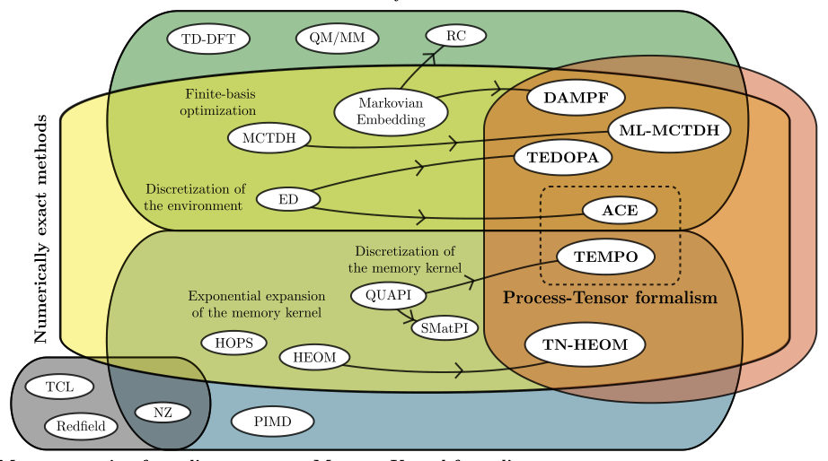 
FIG. 1 A classification of numerical methods for open quantum system dynamics. A Venn diagram illustrating the categorization of numerical tools for open quantum system dynamics is shown. The groups are defined according to the underlying formalism of each method, such as those based on an explicit representation of the environment or on memory kernel-based approaches, which include path integral representations. Methodologies that employ a tensor network formalism, as well as those identified as numerically exact, are also indicated.

📷 Fig 2

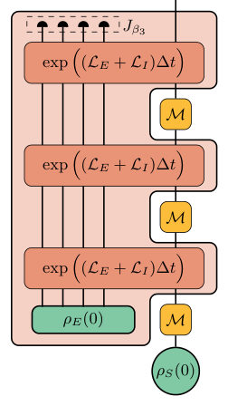 
FIG. 2 Three time-step evolution of a system in the initial state ρS(0) under the influence of an environment initially in the state ρE(0). The free system evolution is given by the superoperator M = exp(LS∆t) and the red-shaded area I(α3,α′ 3)...(α0,α′ 0) encompasses the free evolution of the envi- ronment as well as its interaction with the system. The su- peroperator Jβ3 is a partial trace over the final environmental degrees of freedom. The superoperator I is the so-called pro- cess tensor of the environment; in the continuous time limit, it corresponds to the Feynman-Vernon influence functional.

📷 Fig 3

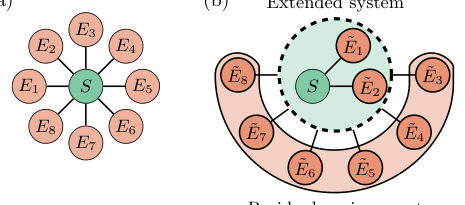 
FIG. 3 (a) An open system is interacting with—possibly infi- nite or continuous—environmental degrees of freedom. (b) The boundary between the ‘system’ and the environment (dashed black line) is redefined to incorporate some ‘relevant’ environmental degrees of freedom and the system of interest S within an extended system which couples to the ‘residual’ en- vironmental degrees of freedom. Under some conditions, this residual environment can be traced out to obtain a GKSL master equation for the extended system. Such a situation corresponds to a Markovian embedding of the extended sys- tem.

📷 Fig 4

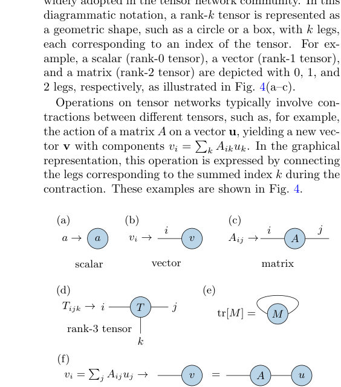 
FIG. 4 (a) A scalar is a rank-0 tensor which is represented by a plain geometrical shape. (b) A vector is a rank-1 tensor; thus it is represented by a geometrical shape with one leg. (c) A matrix has two indices; thus its representation has two legs. (d) A rank-3 tensor is an object with 3 indices; its representation thus has three legs. (e) The trace of a n × n- matrix M is depicted by contracting the two legs of the matrix together. (f) The matrix-vector multiplication ⃗v = A⃗u, where A is a n × m-matrix and ⃗u is a m-dimensional vector and ⃗v is a n-dimensional vector.

📷 Fig 5

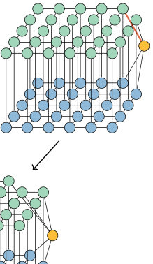 
FIG. 5 First two steps of the contraction of a pair of two- dimensional tensor networks. The red bond represents the bond under contraction. The number of indices of the result- ing yellow tensor grows rapidly after each contraction, result- ing in a computational bottleneck of two-dimensional TN.

**Summary.** This review surveys state-of-the-art methods for simulating open quantum system dynamics beyond simple approximations. It highlights that tensor networks offer a crucial, numerically exact framework to manage the exponential complexity arising from environmental memory effects. The paper provides a comprehensive guide to these advanced computational tools.

**Why it may be interesting.** This is highly relevant as it directly addresses advanced techniques (Tensor Networks) for simulating complex quantum systems (Open Quantum Systems) that are central to modern AMO physics and quantum optics research.

Detailed structure

**Main problem.** The primary challenge is accurately simulating open quantum system dynamics when non-Markovian effects are present, as standard perturbative or Markovian approaches fail due to exponential memory kernel scaling.

**Main result.** Tensor networks provide a powerful and systematically improvable formalism that enables the formulation of numerically exact methods for describing these complex, non-perturbative dynamics.

**Method.** The paper reviews various tensor network based techniques (like HEOM implementations) designed to handle the full time evolution by parameterizing quantum states efficiently, thereby overcoming exponential Hilbert space growth.

**Model / system.** The focus is on open quantum systems described by a total Hamiltonian H = Hs + He + Hi, where the system S interacts with a large environment E (e.g., photonic modes or phonons).

**Key observables.** System reduced density matrix rho_S(t), non-Markovian memory effects.

**Important parameters / regimes.** Coupling strength, environmental correlation time scales, and convergence parameters for the tensor network contractions.

**Assumptions / limitations.** The methods aim to be numerically exact by controlling errors through systematic parameter refinement, moving beyond uncontrolled approximations inherent in mean-field or simple perturbative treatments.

**Figures summary.** Figure 1 is noted as a Venn diagram classifying numerical tools based on their underlying formalism (e.g., memory kernel vs. explicit environment representation).

**Paper structure.** The review establishes the computational difficulty of non-Markovian OQS dynamics, contrasts Markovian/perturbative methods with the need for exact treatments, and then systematically presents tensor network approaches as the unifying, powerful toolbox.

Abstract

The description of open quantum system dynamics beyond the perturbative treatment (usually associated with Markovian master equations) is a computationally challenging task due to the unfavorable exponential scaling of memory kernels. Developed over recent decades in the context of quantum information and condensed matter, tensor networks provide both a new formalism and a toolbox for overcoming previous computational bottlenecks. This framework enables the formulation of non-perturbative, numerically exact methods for describing the dynamics of open quantum systems to controllable numerical accuracy. In this review, we present these methods and discuss their commonalities and differences to paint a comprehensive view of the field.

[↑ back to top](#top)

### ⭐ [Fluctuation-based evidence for number--phase dynamics in a frustrated orbital superfluid](http://arxiv.org/abs/2608.08124v1)

**Highlighted author(s):** Andreas Hemmerich  
**Authors:** Rui-Lang Zeng, Zi-Yao Zhang, Ling-Na Wu, Cong-Jie Zhang, Da-Gang Xia, Andreas Hemmerich, Xiao-Qiong Wang, Zhi-Fang Xu  
**Type:** both · **Category:** quantum gases · **PDF:** <https://arxiv.org/pdf/2608.08124v1>  
**Analysis basis:** full PDF text, analyzed in chunks
**Topic relevance:** 🔥 `Full counting statistics` **4/5** · 🔥 `analog quantum simulation` **4/5** · `quantum measurements` **3/5** · `driven-dissipative phase transition` **2/5** · `Keldysh / 2PI / non-Gaussian methods` **1/5** · `correlated / nonlocal dissipation` **1/5** · `methods for driven-dissipative` **1/5** · `non-equilibrium universality` **1/5**

📷 Fig 1

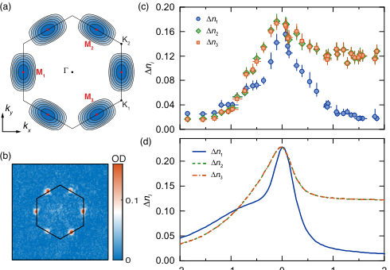 
FIG. 1. (a) Schematic p-orbital band structure of the tri- angular lattice, with three minima at the M points labeled M1, M2 and M3. The bias ∆E tunes the energy of M1 rel- ative to M2 and M3; negative (positive) ∆E lowers (raises) M1. (b) Representative time-of-flight image after dissipative preparation, showing sharp Bragg peaks at the three M val- leys. Hexagons in (a) and (b) mark the first Brillouin zone. (c) Measured root-mean-square fluctuations of the normal- ized valley populations, ∆ni, as a function of ∆E. Horizontal error bars denote the uncertainty in ∆E; vertical error bars are obtained from bootstrap resampling. (d) Canonical three- mode calculation of ∆ni for T/N = 0.04 nK,...

📷 Fig 2

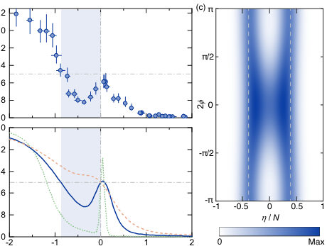 
FIG. 2. (a) Correlation coefficient C23 between the two minority valleys as a function of ∆E. The vertical and hor- izontal dash-dotted lines mark ∆E = 0 and the symmetric three-valley reference value C23 = −0.5, respectively. The shaded region indicates the anomalous regime with C23 &lt; −0.5. (b) Canonical three-mode calculations of C23 for dif- ferent effective thermodynamic ratios T/N. The thick blue curve corresponds to the experimentally constrained value T/N = 0.04 nK, while the dotted green and dashed orange curves correspond to T/N = 0.01 nK and 0.08 nK, respec- tively. (c) Husimi Q distribution from the canonical three- mode calculation at ∆E = −0.35 nK and T/N = 0.04 nK, near the...

📷 Fig 3

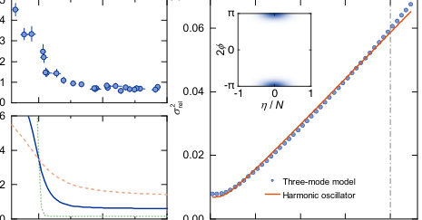 
FIG. 4. (a) Measured normalized relative variance σ2 rel as a function of ∆E. Its rapid decay and weakly varying plateau indicate confinement of relative-population fluctua- tions in the selected two-valley stripe phase. (b) Canoni- cal three-mode calculations of σ2 rel for different effective ther- modynamic ratios T/N. The thick blue, dotted green and dashed orange curves correspond to T/N = 0.04 nK, 0.01 nK and 0.08 nK, respectively. (c) Temperature dependence of σ2 rel at ∆E = 3 nK. Blue circles show the canonical three- mode results, and the orange curve shows the harmonic- oscillator fit derived from the phase-rigid expansion. The gray dash-dotted line marks the experimentally...

**Summary.** The paper investigates number-phase dynamics in a frustrated orbital superfluid realized with ultracold atoms. By measuring mode-resolved population fluctuations, the authors distinguish between two distinct physical mechanisms: barrier softening due to quantum thermal effects in one regime, and phase rigidity leading to harmonic confinement in another. This establishes fluctuation measurements as a powerful diagnostic tool for understanding complex interacting quantum fluids.

**Why it may be interesting.** This work provides a detailed experimental roadmap for using fluctuation measurements to probe complex quantum many-body physics in ultracold atomic systems, linking measurable noise statistics directly to underlying Hamiltonian symmetries and dynamics.

Detailed structure

**Main problem.** The study aims to reveal how fluctuations are organized among competing orders in frustrated quantum matter, as static order parameters fail to capture the full dynamics.

**Main result.** The research demonstrates that number-phase dynamics manifest differently depending on bias: phase scrambling softens barriers in minority-valley regimes, while phase rigidity induces harmonic confinement in stripe phases.

**Method.** The authors measure mode-resolved shot-to-shot population fluctuations and compare these experimental data against effective canonical models derived from a three-mode Hamiltonian.

**Model / system.** The system is an ultracold gas of atoms loaded into the $p$-orbital band of a 2D triangular optical lattice, realizing a minimal three-valley superfluid. The dynamics are governed by an effective three-mode Hamiltonian including bias and pair-tunneling terms.

**Key observables.** Mode-resolved shot-to-shot population fluctuations ($\Delta n_i$), correlation coefficients ($C_{23}$), normalized relative variance ($\sigma^2_{	ext{rel}}$), and the total collective susceptibility $(\Delta n)^2$.

**Important parameters / regimes.** Tunable valley bias ($\Delta E$), temperature/density ratio ($T/N$), and comparison between quantum zero-point motion and thermal limits.

**Assumptions / limitations.** The analysis relies on mapping the dynamics onto an effective canonical model, using harmonic expansions around phase-locked minima in certain regimes, and acknowledging limitations due to finite-time relaxation or spatial averaging.

**Figures summary.** Figures illustrate $\Delta n_i$ vs. bias showing non-monotonic behavior; $C_{23}$ shows dips indicating binary competition; $(\Delta n)^2$ peaks at degeneracy; and the final figure compares measured relative variance ($\sigma^2_{	ext{rel}}$) to harmonic oscillator fits in the stripe phase.

**Paper structure.** The paper systematically analyzes fluctuation signatures across different bias regimes: first, showing how fluctuations reveal hidden number-phase back-action; second, quantifying correlations ($C_{23}$) and susceptibility $(\Delta n)^2$; finally, contrasting barrier softening (negative bias) with phase rigidity/harmonic confinement (positive bias).

Abstract

Frustrated quantum matter can host intertwined orders rooted in symmetry-related low-energy landscapes, yet static order parameters alone do not reveal how fluctuations are organized among competing configurations. Here we measure mode-resolved shot-to-shot population fluctuations in a $p$-orbital triangular-lattice superfluid with a tunable bias among three valleys. We observe a bias-tuned evolution from enhanced, anticorrelated fluctuations of two minority valleys toward strong confinement of relative-population fluctuations in a selected two-valley stripe phase. The dominant fluctuation structure is captured by an effective canonical model that includes interactions among the condensed modes, supporting a quasi-equilibrium description of the coherent three-valley condensate. Together, the data and model reveal a quantum--thermal regime shaped by pair-tunneling-induced number--phase dynamics, in which relative-phase scrambling softens effective barriers in the minority-valley regime, while phase rigidity gives rise to macroscopic harmonic confinement in the stripe phase. Our results establish mode-resolved fluctuation measurements as a probe of hidden number--phase back-action in frustrated quantum fluids.

[↑ back to top](#top)

### ⭐ [A Quantum Coherence Microscope in the Hubbard Regime](http://arxiv.org/abs/2608.09924v1)

**Highlighted author(s):** Markus Greiner  
**Authors:** Lin Su, Michal Szurek, Alec Douglas, Ceren B. Dag, Markus Greiner  
**Type:** experiment · **Category:** other · **PDF:** <https://arxiv.org/pdf/2608.09924v1>  
**Analysis basis:** full PDF text, analyzed in chunks
**Topic relevance:** 🔥 `analog quantum simulation` **4/5** · `quantum measurements` **3/5** · `driven-dissipative phase transition` **1/5** · `interference shaping light` **1/5** · `methods for driven-dissipative` **1/5**

📷 Fig 1

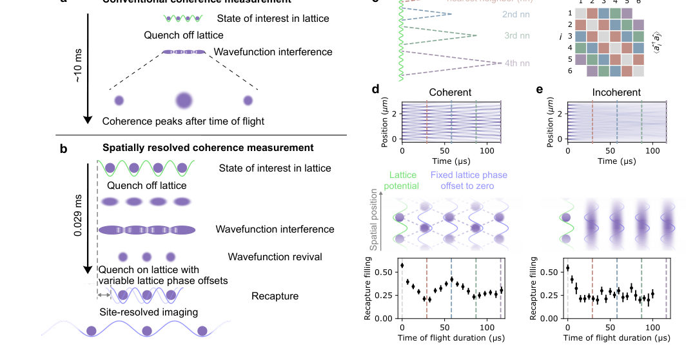 
FIG. 1. Short time of flight (ToF) with lattice recapture enables spatially resolved coherence measurements with wavefunction revivals. a, In a conventional probe of lattice coherence, the lattice (green) is abruptly turned off, and the atoms expand freely for ∼10 ms, producing interference peaks whose sharpness reflects the coherence averaged over the entire system. b, To achieve spatial resolution, with the vertical lattice still on, the atoms undergo a short free-space ToF at integer multiples of half the Talbot time, TT/2 = 29 µs, which is determined by the lattice spacing and atomic mass. The atoms are then recaptured in a phase-tunable lattice (blue) with the original (green) lattice...

📷 Fig 2

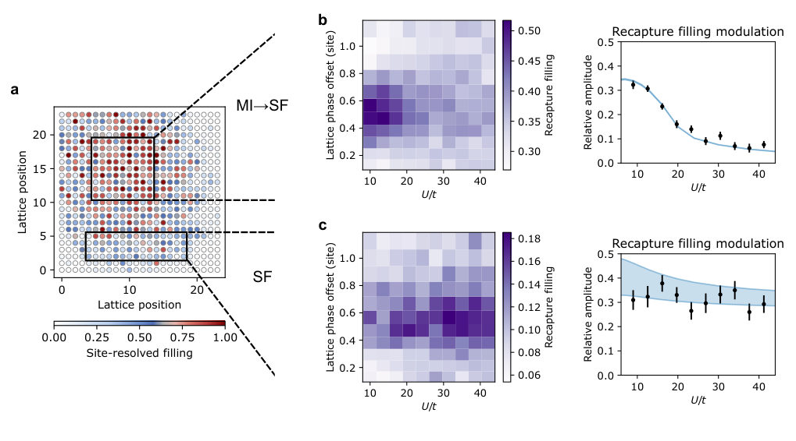 
FIG. 2. Spatially resolving the superfluid to Mott insulator transition in a harmonically confined atomic cloud. Without chemical potential engineering, a harmonically trapped atomic cloud in a lattice naturally exhibits different phases across the system. Using the quantum coherence microscope, we measure near-single-site resolved coherence. a, With standard quantum gas microscopy, site-resolved images averaged over 77 shots show higher filling in the center and lower filling near the edges due to harmonic confinement with small U/t. We analyze two regions of interest: the center (roughly unit filling) and the edge (roughly one-third filling). b, In the center region, the recapture filling...

📷 Fig 3

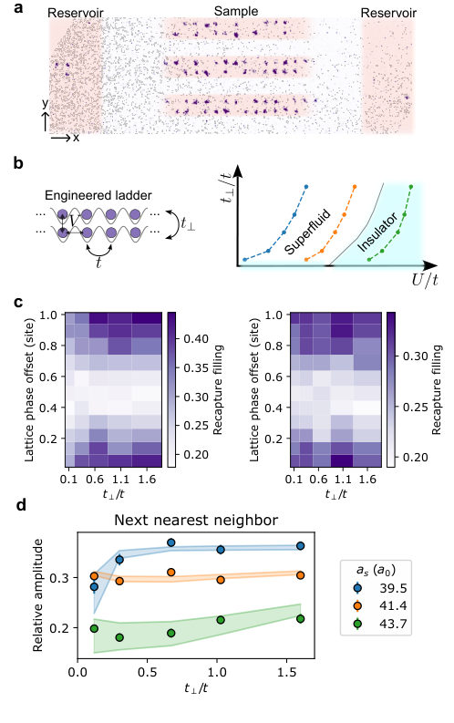 
FIG. 3. Probing coherence beyond nearest neighbors to explore the extended Bose-Hubbard model on a ladder geometry. a, In the experiment, we define distinct sample and reservoir regions, highlighted in red and over- laid on a single-shot image. We employ a quantum coher- ence microscope capable of spatially resolved coherence mea- surements to study the sample region only. b, We study a two-leg ladder system of soft-core bosons. As we couple the chains via tunneling t⊥, the insulating phases, indicated by light-blue shading, are predicted to transition to a superfluid phase. The gray superfluid-insulator boundary is computed with density matrix renormalization group (SM). The three colored...

📷 Fig 4

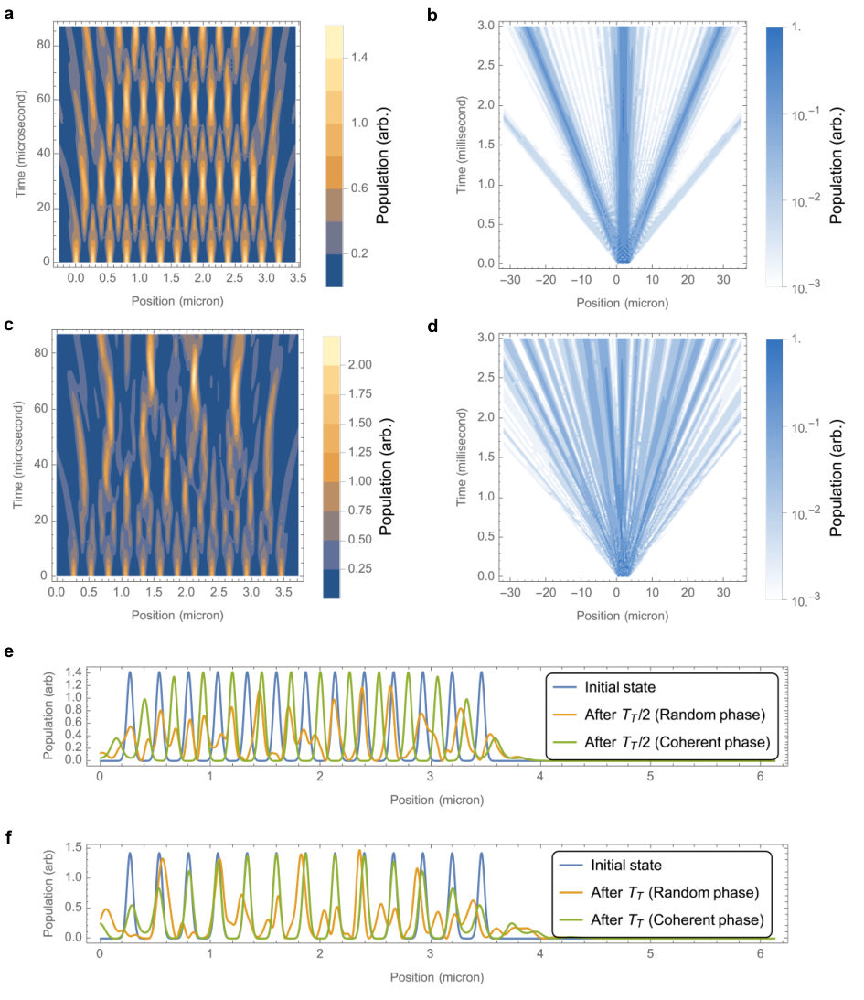 
FIG. 4. Talbot effect. Matter-wave Talbot revivals complement ToF coherence-peak measurements by distinguishing states with coherent and incoherent phase relationships between neighboring sites. Time-evolution simulation results are shown here assuming a lattice depth of 25 recoil energies. Panels a and b assume all sites have the same phase, whereas panels c and d show one realization of independent random phases uniformly distributed across the lattice sites. Panel e shows horizontal cuts through panels a and c at times t = 0 and t = TT/2 = 29µs. Panel f shows horizontal cuts of a and c at times t = 0 and t = TT = 58µs.

📷 Fig 5

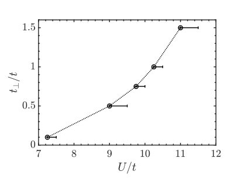 
FIG. 5. Phase transition between Mott insulator and superfluid in coupled 1D chains. Large-system DMRG simulations identify the phase transition.

**Summary.** The paper presents a novel 'quantum coherence microscope' using the Talbot effect applied to ultracold atoms in optical lattices. This technique maps hard-to-measure off-diagonal quantum correlations onto measurable site-resolved density modulations. It successfully applies this method to characterize fundamental physics, such as mapping out the superfluid-Mott transition locally and measuring long-range coherence.

**Why it may be interesting.** This work provides a powerful, non-destructive experimental tool for accessing higher-order quantum correlations that are typically difficult to measure directly, bridging the gap between density measurements and full coherence mapping in cold atom simulators.

Detailed structure

**Main problem.** The primary challenge is achieving spatially resolved measurements of off-diagonal quantum correlations (coherence) beyond simple local density measurements in interacting many-body systems.

**Main result.** The authors successfully demonstrated a technique to map these elusive off-diagonal coherence signals onto measurable site-resolved density modulations, enabling the local probing of phase transitions like the superfluid-Mott transition.

**Method.** They introduce a 'quantum coherence microscope' that utilizes controlled time evolution (Talbot effect) followed by a phase-tunable recapture process to convert coherence information into density contrast signals.

**Model / system.** The experiment uses ultracold atoms trapped in a three-dimensional optical lattice, simulating the Bose-Hubbard model. The system is studied across various regimes, including near the superfluid-Mott transition and on engineered ladder geometries.

**Key observables.** Normalized single-particle density matrix elements ($g^{(1)}_{i,j}$), which encode coherence; measured relative modulation amplitude ($R$) of the recapture filling.

**Important parameters / regimes.** Interaction strength to tunneling ratio ($U/t$), interchain tunneling ($t_\perp$), and lattice separation ($r$).

**Assumptions / limitations.** The measurement relies on assuming that the relative modulation amplitude $R$ is independent of various system parameters (separation, filling, time) within the explored regime.

**Figures summary.** Figure 1 illustrates the technique using Talbot evolution to show revival patterns corresponding to different coherence ranges. Figure 2 demonstrates spatially resolving the SF-MI transition by measuring the recapture modulation in central versus edge regions. Figure 3 probes coherence on a ladder geometry as a function of interchain tunneling.

**Paper structure.** The paper introduces the fundamental limitation (measuring off-diagonal correlations), details the novel Talbot-based measurement technique, and then applies this method to study specific physical phenomena like the SF-MI transition in trapped systems and correlation decay on engineered lattices.

Abstract

Quantum coherence underlies collective quantum phenomena and emerging quantum technologies. Quantum gas microscopes have transformed quantum simulation by providing projective snapshots of many-body states with single-atom resolution, but spatially resolved measurements of off-diagonal correlations have remained elusive. Here, using the Talbot effect, we introduce a quantum coherence microscope that maps off-diagonal correlations onto site-resolved density signals with near-single-site resolution. We use this technique to locally probe the superfluid-Mott transition in a layer of a three-dimensional optical lattice and to measure coherence beyond nearest neighbors in an engineered potential landscape. By mapping off-diagonal correlations onto density signals through controlled Talbot evolution, this work opens new possibilities for accessing observables beyond the density basis through tailored matter-wave evolution and recapture.

[↑ back to top](#top)

### ⭐ [Jaynes--Cummings dynamics of fermionic heteronuclear dimers in the Mott regime](http://arxiv.org/abs/2608.09224v1)

**Highlighted author(s):** R. J. Lewis-Swan  
**Authors:** R. J. Lewis-Swan, K. V. Kheruntsyan  
**Type:** theory · **Category:** other · **PDF:** <https://arxiv.org/pdf/2608.09224v1>  
**Analysis basis:** full PDF text, analyzed in chunks
**Topic relevance:** 🔥 `analog quantum simulation` **4/5** · `Tavis-Cummings & cavity-many-emitter` **3/5** · `correlated / nonlocal dissipation` **1/5** · `quantum measurements` **1/5**

📷 Fig 1

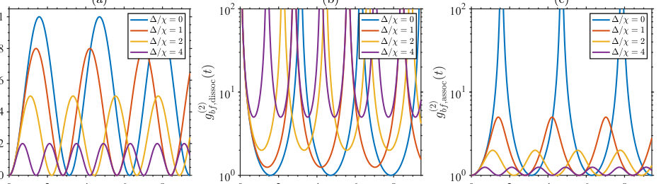 
FIG. 1. Coherent conversion and correlation dynamics in the N = 1 Jaynes–Cummings doublet. (a) Conversion probability P1(t) for several detunings ∆/χ. Detuning reduces the maximum conversion probability while increasing the generalized Rabi frequency. (b) Normalized boson–fermion atom correlation g(2) bf,dissoc(t) = 1/P1(t) in dissociation, showing the strong

**Summary.** This theoretical paper models the coherent conversion between fermionic molecules and free atoms coupled to a bosonic matter wave field in an optical lattice Mott regime. By mapping the system dynamics onto the Jaynes--Cummings Hamiltonian, the authors derive exact solutions demonstrating bosonically enhanced coupling ($\propto \sqrt{N}$). This provides a powerful, solvable platform for studying atom-molecule chemistry using ultracold quantum gases.

**Why it may be interesting.** This work provides a direct, exactly solvable matter-wave realization of fundamental quantum optics physics (Jaynes--Cummings) using ultracold atoms in optical lattices. The confirmation of bosonic enhancement ($\sqrt{N}$) is crucial for understanding coherent processes in many-body systems.

Detailed structure

**Main problem.** The paper addresses the coherent association and dissociation dynamics of fermionic heteronuclear dimers within a deep-lattice Mott regime.

**Main result.** It shows that the local dynamics map exactly to the Jaynes--Cummings Hamiltonian, yielding bosonically enhanced coupling ($\propto \sqrt{N}$) and providing exact analytic solutions for conversion probabilities.

**Method.** The methodology involves deriving an onsite three-component atom--molecule Hamiltonian and restricting the analysis to a fixed-number sector that allows mapping to the standard Jaynes--Cummings form.

**Model / system.** The system models fermionic heteronuclear dimers (molecules and free atoms) coupled to bosonic matter waves in optical lattices. The dynamics are analyzed by mapping the local Hamiltonian onto an effective two-level system interacting with a quantized oscillator field.

**Key observables.** Molecular dissociation probability ($P_N(t)$), atom-pair association probability, and site-dependent boson–fermion correlation functions ($g^{(2)}_{bf}$).

**Important parameters / regimes.** Detuning ($\Delta$), coupling strength ($\chi$), and the conserved number of bosonic atoms ($N$). The resonance condition is $\omega_m = \omega_f + \omega_b$.

**Assumptions / limitations.** The model assumes an idealized limit where onsite interactions are treated perturbatively (renormalizing detuning) but do not alter the fundamental solvable structure or the coupling scaling ($\chi\sqrt{N}$).

**Figures summary.** Not specified, but the notes detail derived analytical expressions for population dynamics and correlation functions based on the Rabi frequency $\Omega_N$.

**Paper structure.** The paper establishes the physical model (onsite Hamiltonian), derives the mapping to the Jaynes--Cummings form in specific fixed-number sectors ($N_{	ext{tot},f}=1$), solves the resulting dynamics analytically, and discusses extensions including onsite interactions.

Abstract

We formulate and exactly solve a model for coherent association and dissociation of fermionic heteronuclear dimers in the deep-lattice Mott regime. Starting from the onsite three-component atom--molecule Hamiltonian, we show how the single-site model maps to the paradigmatic Jaynes--Cummings Hamiltonian from quantum optics. In this mapping, the fermionic molecular/free-atom sector forms an effective two-level system, while the bosonic atomic mode plays the role of the oscillator degree of freedom. We fix the conserved number of fermionic constituent atoms to one but allow an arbitrary conserved number $N$ of bosonic constituent atoms. The accessible doublet is then $|e,N-1\rangle\leftrightarrow|g,N\rangle$, and the coherent conversion coupling is bosonically enhanced to $χ\sqrt{N}$. Exact analytic expressions are derived for molecular dissociation, atom-pair association, mode populations, and boson--fermion correlation dynamics. The model provides a transparent matter-wave realization of Jaynes--Cummings physics in a heteronuclear Bose--Fermi system and an exactly solvable setting for understanding coherent atom--molecule conversion and bosonic enhancement in lattice systems.

[↑ back to top](#top)

### ⭐ [Preparing approximate $N$-fold cat states with the phase space instruction set](http://arxiv.org/abs/2608.07696v1)

**Highlighted author(s):** Andrew Lucas  
**Authors:** Shuyan Zhou, Andrew Lucas  
**Type:** theory · **Category:** quantum information and computing · **PDF:** <https://arxiv.org/pdf/2608.07696v1>  
**Analysis basis:** full PDF text, analyzed in chunks
**Topic relevance:** `quantum measurements` **1/5**

📷 Fig 1

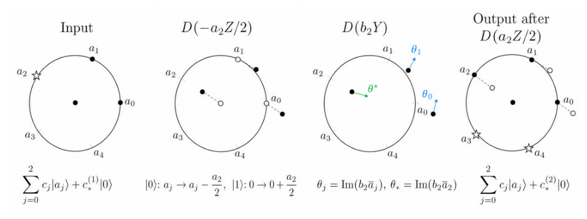 
Figure 1: One step in the N = 5 cat-state protocol, illustrated in phase space. From left to right: (i) the conditional displacement D(−a2Z/2), which shifts the already-prepared peaks on the |0⟩ branch by −a2/2 and the lower-branch vacuum component by +a2/2; (ii) the Y-controlled displacement D(b2Y ), which generates the phase responses θ0, θ1, and θ∗; (iii) the qubit rotation eiθ2Y , which rotates the common ancilla direction to the computational basis; and (iv) the final conditional displacement D(a2Z/2), which returns the state to the original circle while adding the new coherent component a2. Filled dots denote already occupied coherent components, stars denote new or future target...

📷 Fig 2

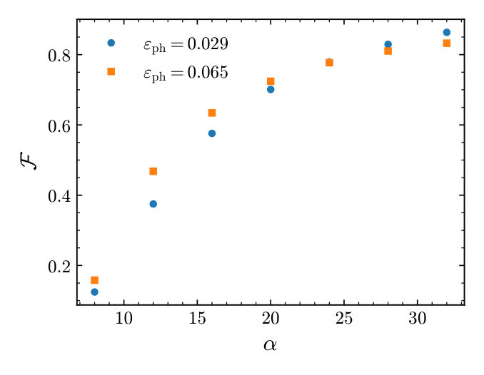 
Figure 2: Fidelity obtained directly from the protocol as a function of the cat radius α. The two curves correspond to two different choices of the Diophantine condition, labelled by εph = 0.029 and εph = 0.065. In both cases, the fidelity increases as α becomes larger.

📷 Fig 3

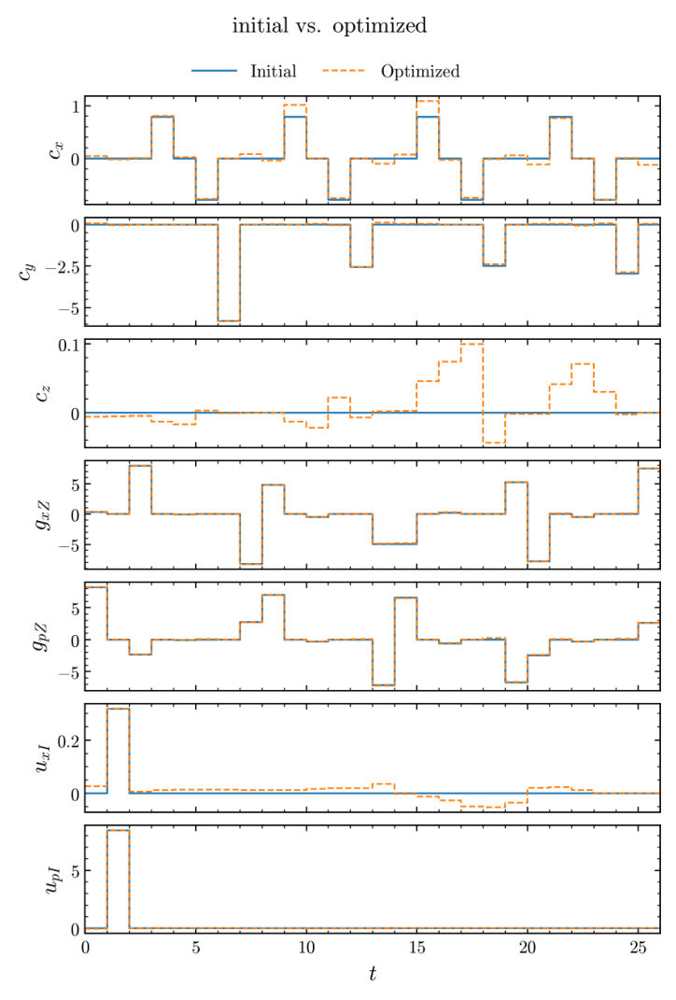 
Figure 3: Initial pulse obtained by translating the optimized coherent-branch gate sequence, shown as solid blue curves, and the pulse after 80 GRAPE iterations, shown as dashed orange curves. The results are for the five-component cat state with α = 12.

📷 Fig 4

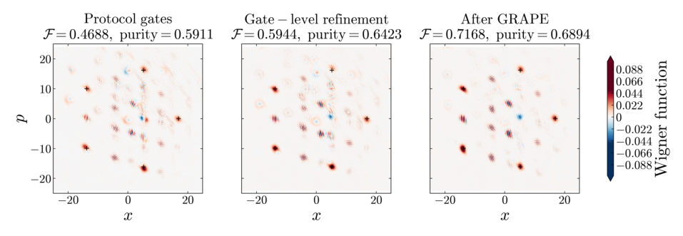 
Figure 4: Reduced oscillator Wigner functions for the preparation of the five-component cat state at α = 12. From left to right: the output of the unoptimized analytic protocol, the result after gate-level refinement, and the result after pulse-level GRAPE optimization. The corresponding fidelities are F = 0.4688, F = 0.5944, and F = 0.7168, while the oscillator purities are Tr(ρ2 osc) = 0.5911, 0.6423, and 0.6894, respectively. Black crosses indicate the target coherent-state locations. All panels use the same phase-space range and color scale.

📷 Fig 5

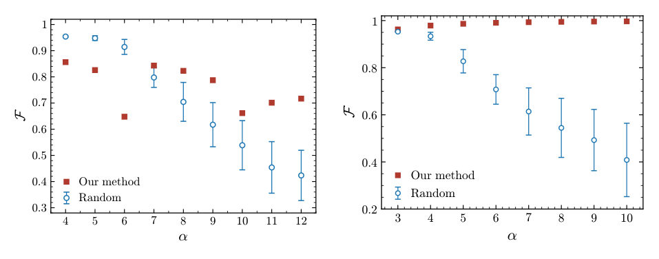 
Figure 5: Comparison between direct GRAPE optimization from 20 random pulses vs. the protocol-seeded pipeline. Both pulse-level calculations use the same number of time slots, pulse duration, seven control channels, amplitude bounds and the same 80-iteration GRAPE budget. The protocol-seeded pipeline additionally includes a coherent-branch gate-level optimization, so the total optimization budgets are not identical. The comparison is therefore between two complete optimization pipelines. The error bars show the full range across the twenty random initializations. Left: N = 5. Right: N = 3.

**Summary.** The paper analyzes the resource cost of preparing approximate $N$-fold Schrödinger cat states using a phase space instruction set. It proves that the required circuit depth scales with Euler's totient function $\varphi(N)$, which is significantly harder than previously assumed. This result shows that the chosen universal gate set is surprisingly inefficient for this simple state family.

**Why it may be interesting.** This work provides a sharp theoretical example demonstrating that even simple-looking quantum states can require exponentially deep circuits relative to naive estimates when restricted to specific universal gate sets, highlighting fundamental limitations in quantum computation models.

Detailed structure

**Main problem.** The research determines the minimum circuit depth required to approximate a highly structured, $N$-fold rotationally invariant Schrödinger cat state using a specific continuous-variable universal gate set.

**Main result.** It establishes a lower bound on the circuit depth of $\Omega(\varphi(N))$ and provides an asymptotically optimal protocol saturating this bound for prime $N$.

**Method.** The analysis combines quantum information theory with number theory, utilizing properties of cyclotomic polynomials to derive necessary conditions for state preparation.

**Model / system.** The system involves a single bosonic mode coupled to ancillary qubits, operating in the continuous-variable regime. The target state is $|\alpha_N
angle$, characterized by $N$ peaks arranged on a circle in phase space.

**Key observables.** Fidelity of preparation ($1 - |\langle \alpha_N | U | 0 
angle|^2$), circuit depth, and total gate resource cost ($	ext{trun}$).

**Important parameters / regimes.** $N$ (number of cat state peaks), $\varphi(N)$ (Euler's totient function), $|\alpha|$ (displacement magnitude).

**Assumptions / limitations.** The analysis relies on linear independence arguments over the rationals ($\mathbb{Q}$) and assumes that certain error terms can be bounded by controlling phase alignment.

**Figures summary.** Not specified in detail, but the notes reference explicit protocols for $N=5$ and $N=3$, and general resource cost bounds (e.g., Equation A.117).

**Paper structure.** The paper proceeds by defining the setup using the phase space instruction set, proving the $\Omega(\varphi(N))$ hardness bound via number theory arguments, providing an explicit protocol for prime $N$, and finally discussing resource cost bounds for generalized cat states.

Abstract

The phase space instruction set is a continuous-variable universal gate set involving single-qubit rotations and qubit-dependent displacements on a single boson. Using these gates, we prove that a circuit depth $\mathrmΩ(\varphi(N))$ is necessary to approximately prepare a large $N$-fold rotationally invariant Schrödinger cat state; here $\varphi(N) \gtrsim N/\log\log N$ is the Euler totient function. A protocol saturating this asymptotic bound on circuit depth is obtained for every prime number $N$. This protocol has an asymptotically optimal runtime, when the gates are generated by Hamiltonian evolution. Our results provide a sharp example where a universal gate set is surprisingly inefficient at preparing a simple family of states, and further imply that converting bosonic circuits between different universal gate sets can be extremely inefficient.

[↑ back to top](#top)

### [Nonequilibrium dynamics of doped Chern ferromagnets: a case study for false vacuum decay](http://arxiv.org/abs/2608.08937v1)

**Authors:** Kilian Kuhlbrodt, Olivier Huber, Oliver Breach, Weijie Li, Xiaodong Xu, Kenji Watanabe, Takashi Taniguchi, Martin Kroner, Siddharth A. Parameswaran, Atac Imamoglu  
**Type:** experiment · **Category:** strongly correlated electrons · **PDF:** <https://arxiv.org/pdf/2608.08937v1>  
**Analysis basis:** full PDF text, analyzed in chunks
**Topic relevance:** 🔥 `analog quantum simulation` **4/5** · 🔥 `driven-dissipative phase transition` **4/5** · `correlated / nonlocal dissipation` **3/5** · `methods for driven-dissipative` **3/5** · `non-equilibrium universality` **3/5** · `quantum measurements` **2/5** · `scars & prethermalization` **2/5** · `Frenkel-Kontorova` **1/5** · `Keldysh / 2PI / non-Gaussian methods` **1/5** · `quantum optics experiment` **1/5**

📷 Fig 1

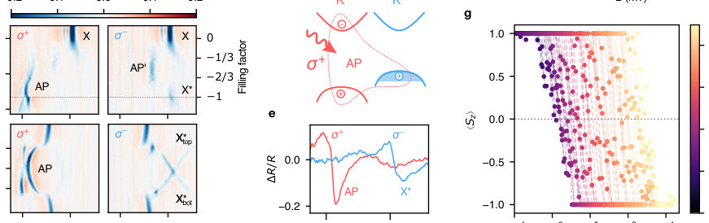 
Figure 1. Optical spin orientation in t-MoTe2 bilayers. (a) Schematic of the device and underlying moir´e superlattice. The heterostructure comprises a 3.5◦-twisted MoTe2 homobilayer encapsulated in hexagonal boron-nitride (hBN) with transparent few-layer graphene gates. (b) Optical micrograph of the device. (c) Differentiated reflectance contrast spectra d(∆R/R0)/dE resolved by circular polarization as a function of ν at fixed D ≈0 (top panel) and a function of D at fixed ν ≈−1 (bottom panel) taken at B = −20 mT. (d) Schematic of the spin-selective attractive interaction between an optically-generated exciton in the K+ valley and a K−valley hole. (e) Circular-polarization-resolved...

📷 Fig 2

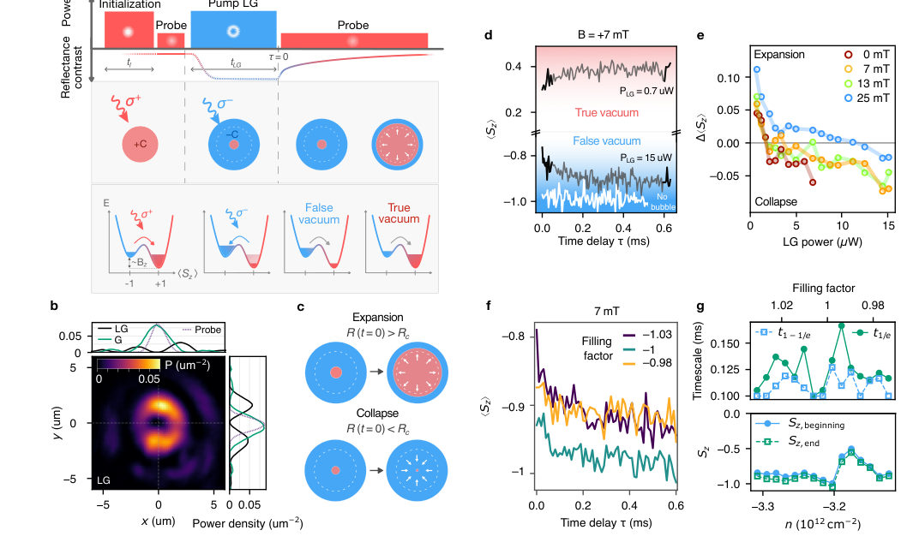 
Figure 2. Collapse and expansion of an optically-generated true vacuum bubble. (a) Schematic of the pump-probe sequence. The system is initialized into a spin-up true vacuum state via a Gaussian pump pulse (10 ms, 1.5 µW). After a weak Gaussian probe (300 µs, &lt; 2 nW) establishes the baseline reflectivity, an oppositely polarized Laguerre-Gauss (LG) pulse with variable power and duration, drives the surrounding region into false vacuum. A final weak Gaussian (detection area indicated by the white dotted circle) monitors the subsequent evolution. (b) CCD image of the reflected LG beam, alongside x- and y-axis cross-sectional profiles of the LG pump, Gaussian pump, and effective probe spots....

📷 Fig 3

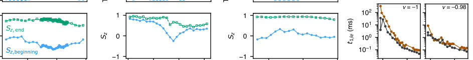 
Figure 3. Filling and magnetic-field dependence of false vacuum decay above the coercive field. (a-c) Seeded dynamics following GT V →LGF V preparation: a ∼1 µW, 1 ms Gaussian pulse initializes the true vacuum, followed by a 15 µW, 10 µs LG pulse preparing the surrounding false vacuum. Top panels show representative polarization traces. The center bottom panels show the characteristic times t1−1/e and t1/e where 1 −1/e and 1/e, respectively, of the polarization change has occurred. Bottom panels show the polarization immediately after preparation and at the end of the dynamics, respectively. Pronounced lifetime maxima occur near the integer Chern-insulating state at 100 mT (a) and the...

**Summary.** This experimental work explores false vacuum decay in doped Chern ferromagnets using moiré quantum materials. By optically creating and monitoring expanding/collapsing 'vacuum bubbles,' the authors show that the decay rate is extremely sensitive to doping levels near topological insulator fillings. This highlights how correlated electron physics, governed by topology, dictates non-equilibrium stability.

**Why it may be interesting.** The connection between topological invariants (Chern numbers) and non-equilibrium dynamics like vacuum decay provides a rich playground for open quantum systems theory, suggesting that topology can stabilize or destabilize metastable states in engineered solid-state platforms.

Detailed structure

**Main problem.** The study investigates the underlying dynamics of metastable false vacuum decay, a process relevant across physics from cosmology to magnetism.

**Main result.** False vacuum decay is dramatically slowed down at commensurate filling factors near Chern insulator states when external magnetic fields are comparable to the coercive field. The decay dynamics are highly sensitive to the precise doping level around these topological states.

**Method.** The researchers employed an optical pump-probe scheme using circularly polarized Laguerre-Gauss beams to deterministically create and monitor a true vacuum bubble embedded within a metastable ferromagnetic state.

**Model / system.** The system is realized in doped Chern ferromagnets, specifically utilizing twisted molybdenum ditelluride (t-MoTe2) moiré quantum materials. These materials exhibit spin-valley polarized Stoner-like ferromagnetic states with non-zero Chern numbers.

**Key observables.** Spin-valley polarization ($\langle S_z 
angle$), domain wall dynamics, bubble collapse/expansion kinetics, and the decay timescale of magnetization.

**Important parameters / regimes.** Filling factor ($
u$) near Integer (ICI) and Fractional Chern Insulator (FCI) states; external magnetic field ($B$) relative to the coercive field ($B_c$); pump power controlling initial bubble size.

**Assumptions / limitations.** The study assumes that optical pumping can deterministically control the initial radius of the domain bubble, analogous to STED microscopy.

**Figures summary.** Figures illustrate the device setup and spectroscopic measurements; key figures show time-resolved spin polarization decay curves demonstrating lifetime maxima near specific filling factors ($
u$) and magnetic fields ($B$), comparing seeded vs. unseeded dynamics.

**Paper structure.** The paper progresses by establishing the physical platform (t-MoTe2) and measurement techniques, then systematically analyzing the bubble dynamics across different external magnetic field regimes ($B \ll B_c$, $B \approx B_c$, $B \gg B_c$) to map out the dependence of decay rates on doping ($
u$).

Abstract

Even though metastable false vacuum decay is ubiquitous in physics, its underlying dynamics are still not well understood. Dissipative state preparation in moiré quantum materials provides an exceptional setting for exploring this physics since it allows the possibility of generating exotic quantum states that are not the ground state of the system Hamiltonian. Motivated by recent experiments demonstrating steady-state optical orientation of the spin-valley degree of freedom of holes, here we investigate dynamics of itinerant and Chern ferromagnets in the presence of an opposing magnetic field. Optical pumping using a circularly polarized Laguerre-Gauss beam allows us to deterministically prepare a true vacuum bubble embedded inside a metastable state. Depending on its initial size controlled by the pump power, we observe that the bubble collapses or expands due to an interplay between domain wall and bulk dynamics. For external magnetic fields comparable to the coercive field of ferromagnetism, we observe up to two-orders-of-magnitude prolongation of the spin polarization decay time at commensurate fillings corresponding to integer and fractional Chern insulator states. Our experiments reveal that the nonequilibrium dynamics of the ferromagnetic domains is substantially more sensitive to the precise filling factor around Chern insulator states than standard transport or optical measurements.

[↑ back to top](#top)

### [Low-frequency output fluctuations in an open exclusion process with particle pausing](http://arxiv.org/abs/2608.08074v1)

**Authors:** Quentin Thommen  
**Type:** theory · **Category:** statistical mechanics · **PDF:** <https://arxiv.org/pdf/2608.08074v1>  
**Analysis basis:** full PDF text, analyzed in chunks
**Topic relevance:** 🔥 `Full counting statistics` **4/5** · `driven-dissipative phase transition` **3/5** · `methods for driven-dissipative` **3/5** · `Keldysh / 2PI / non-Gaussian methods` **2/5** · `non-equilibrium universality` **2/5** · `quantum measurements` **2/5** · `analog quantum simulation` **1/5** · `correlated / nonlocal dissipation` **1/5** · `scars & prethermalization` **1/5**

📷 Fig 1

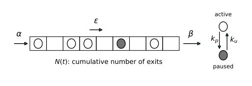 
FIG. 1. Open pausing TASEP. Active particles hop with rate ϵ subject to exclusion, enter and leave the paused state with rates kp and ku, enter with rate α, and exit with rate β. N(t) denotes the cumulative number of exit events.

📷 Fig 2

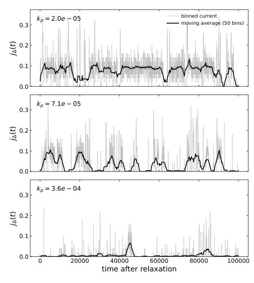 
FIG. 2. Event-resolved output time series for L = 100, ku = 10−3, α = 0.1, and β = ϵ = 1, in three representa- tive pausing regimes. The three panels use identical time and current scales. The black curve is a moving average included only as a visual guide.

📷 Fig 3

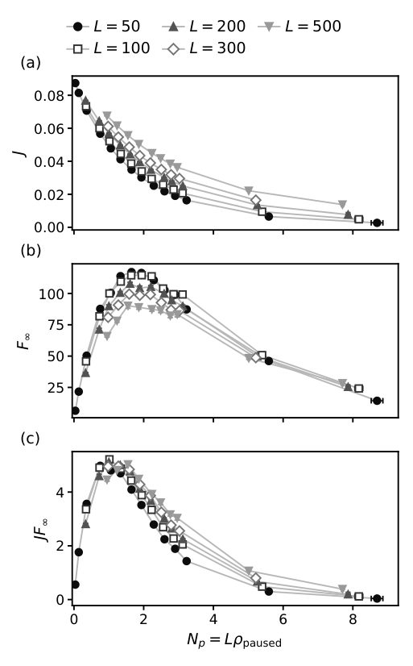 
FIG. 4. Mean output and low-frequency fluctuations orga- nized by the measured paused population. (a) Stationary current J. (b) Fitted long-window Fano plateau F∞, which measures fluctuations relative to the mean output and peaks near Np ≃1.5–2. (c) Absolute long-window fluctuation rate JF∞= limTw→∞Var[Nw]/Tw. Its pronounced nonmono- tonicity shows that the maximum in relative noise is not generated solely by division by a decreasing current. The maximum of JF∞occurs at a somewhat smaller paused pop- ulation, of order unity, and its peak amplitude varies only weakly with lattice length over the simulated range.

📷 Fig 4

 
FIG. 3. Window-dependent Fano factor for representative L = 100 simulations: (a) frequent pauses, (b) the noise- maximum regime, and (c) rare pauses. Symbols show sim- ulation results and lines are fits to Eq. (8). The interme- diate paused population produces the largest low-frequency plateau.

📷 Fig 5

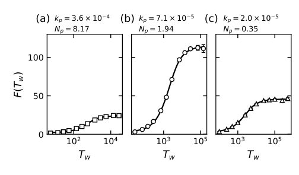 
Figure 4 separates the mean output, the relative low- frequency noise, and the corresponding absolute fluctua- tion rate at the reference initiation rate α = 0.1. The sta- tionary current decreases throughout the scan, whereas F∞rises sharply, peaks near Np ≃1.5–2, and then falls.

**Summary.** The paper analyzes particle transport in an open exclusion process modified by reversible pausing, finding that the low-frequency output noise peaks sharply when the average number of paused particles is near unity. This demonstrates that fluctuations are governed by slow internal dynamics (defects/jams) rather than just the mean flow rate, providing a quantitative measure for intermittent behavior.

**Why it may be interesting.** This work provides a detailed, non-equilibrium statistical mechanics framework for understanding how internal state fluctuations (pausing/jamming) can dominate transport observables like noise, even when mean flow rates are smoothly varying. This concept of 'slow defect kinetics' is highly relevant to open quantum systems.

Detailed structure

**Main problem.** The study characterizes low-frequency output fluctuations (noise) in an open exclusion process when particles undergo reversible pausing, revealing a finite-size regime distinct from mean current behavior.

**Main result.** The noise exhibits a pronounced maximum when the mean number of paused particles ($N_p$) is of order unity ($\approx 1.5-2$), while the mean throughput continuously decreases with increasing $N_p$.

**Method.** Analysis involves using event-counting statistics, calculating window-dependent Fano factors, and employing minimal constant-birth/linear-death approximations to model the slow dynamics.

**Model / system.** The system is an open Totally Asymmetric Simple Exclusion Process (TASEP) where particles can reversibly switch between active and paused states. The dynamics are governed by hopping rates ($\epsilon$) and pausing/unpausing rates ($k_p, k_u$).

**Key observables.** Window-dependent Fano factor $F(T_w)$, mean current $J$, mean paused population $N_p$, and structural observables like the largest particle cluster size $	ext{C}_{\max}$.

**Important parameters / regimes.** The critical regime is characterized by $N_p \simeq 1.5-2$ and a scaling of the maximum pausing rate $k_{\max p} \propto L^{-1}$.

**Assumptions / limitations.** Key approximations include treating the pause dynamics via an auxiliary Poisson process and separating structural fluctuations from kinetic ones.

**Figures summary.** Figures illustrate the Fano factor peaking at specific paused populations, showing how low-frequency noise is organized by $N_p$ rather than just the mean current.

**Paper structure.** The paper progresses from defining the physical model and key diagnostics (Fano factor) to deriving theoretical scaling laws based on slow variables ($N_p$), culminating in identifying the specific order-one regime responsible for noise maximization.

Abstract

Slow internal states reshape both the mean throughput and the temporal organization of a driven lattice gas. Exit-counting statistics reveal this effect in a finite open totally asymmetric simple exclusion process whose particles reversibly switch between active and paused states. Increasing pausing lowers the mean current smoothly, whereas the long-window Fano factor is strongly nonmonotonic. At the reference boundary rates, the maximum remains near a measured mean paused population \(N_p=Lρ_{\rm paused}\simeq1.5\)--\(2\) across lattice lengths L=50-500, while the corresponding pausing rate scales as \(k_p^{\rm max}\propto L^{-1}\). A minimal constant-birth, linear-death approximation translates an order-one collective crossover into this finite-size displacement and gives \(N_p^\star\simeq1.50\) in the independent-pause, strong-blocking limit. The simulations delimit this approximation: the pause number is overdispersed, and at fixed \(N_p\), slower unpausing increases both the correlation time and the noise amplitude. Residence-time and structural analyses further separate the relevant slow variables. The pause-free versus pause-containing residence-time scale tracks the fitted output-correlation time, whereas the noise amplitude follows fluctuations, rather than the mean size, of the largest particle cluster. Low-frequency output noise therefore identifies an intermittent finite-size regime shaped jointly by slow-defect kinetics and traffic-jam reorganization.

[↑ back to top](#top)

### [Persistence probability based dynamics and phase diagrams in biased q-voter models](http://arxiv.org/abs/2608.08324v1)

**Authors:** Amit Pradhan, Pratik Mullick, Parongama Sen  
**Type:** theory · **Category:** statistical mechanics · **PDF:** <https://arxiv.org/pdf/2608.08324v1>  
**Analysis basis:** full PDF text, analyzed in chunks
**Topic relevance:** 🔥 `non-equilibrium universality` **4/5** · `driven-dissipative phase transition` **3/5** · `methods for driven-dissipative` **3/5** · `Keldysh / 2PI / non-Gaussian methods` **2/5** · `analog quantum simulation` **2/5** · `correlated / nonlocal dissipation` **2/5** · `quantum measurements` **2/5** · `scars & prethermalization` **1/5**

📷 Fig 1

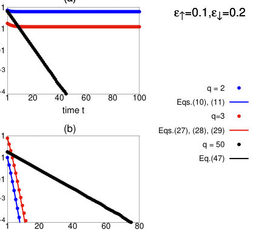 
FIG. 1: Time evolution of the persistence probabilities (a) P+(t) and (b) P−(t) for q = 2, 3 and q = 50 for the DMSS model [see Sec. II]. Solid circles denote simulation data, while solid lines represent analytical calculations from the mean field theory: Eqs. (10) and (11) for q = 2, Eqs. (27), (28) and (29) for q = 3 and Eq. (47) in the q →∞limit, which is well approximated by q = 50 in simulations. Results are shown for bias parameters ϵ↑= 0.1 and ϵ↓= 0.2 and initial condition c0 = 0.8.

📷 Fig 2

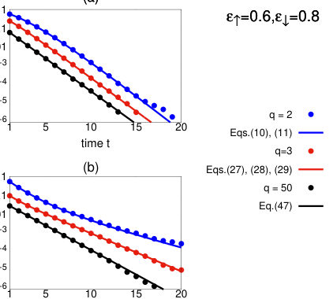 
FIG. 2: Time evolution of the persistence probabilities (a) P+(t) and (b) P−(t) for q = 2, 3 and q = 50 for the DMSS model [see Sec. II]. Solid circles denote simulation data, while solid lines represent analytical calculations from the mean field theory: Eqs. (10) and (11) for q = 2, Eqs. (27), (28) and (29) for q = 3 and Eq. (47) in the q →∞limit, which is well approximated by q = 50 in simulations. Results are shown for bias parameters ϵ↑= 0.6 and ϵ↓= 0.8 and initial condition c0 = 0.8.

📷 Fig 3

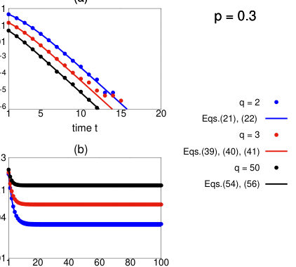 
FIG. 3: Time evolution of the persistence probabilities (a) P+(t) and (b) P−(t) for q = 2, 3 and q = 50 for the MS model [see Sec. II]. Solid circles denote simulation data, while solid lines represent analytical calculations from the mean field the- ory: Eqs. (21) and (22) for q = 2, Eqs. (39), (40), (41) for q = 3 and Eqs. (54) and (56) in the q →∞limit, which is well approximated by q = 50 in simulations. Results are shown for bias parameter p = 0.3 and initial condition c0 = 0.7.

📷 Fig 4

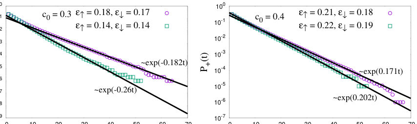 
FIG. 4: Persistence probability P+(t) is plotted as a function of time for the DMSS model in different phases of the phase diagram for q = 3 and q = 5. The phase nomenclature follows Ref. [19]. The parameters (ϵ↑, ϵ↓, c0) are chosen such that the system reaches the positive consensus state in phases A and C, while it evolves to a non-consensus state in the remaining phases. Symbols denote Monte Carlo simulation results, and solid lines represents the analytical predictions whenever available. The persistence saturates in the consensus phases and decays exponentially in the non-consensus phases.

📷 Fig 5

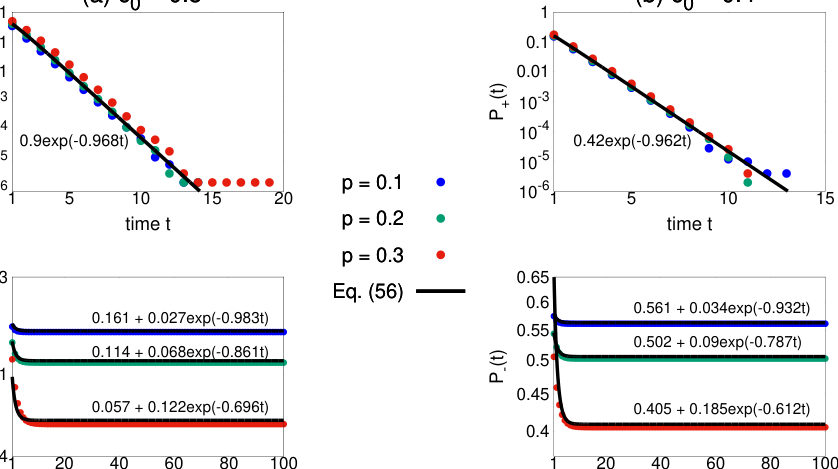 
FIG. 5: Persistence probabilities P+(t) and P−(t) for the MS model with q = 50, shown on a log-linear scale. (a) c0 = 0.8; (b) c0 = 0.4. The results are shown for p = 0.1, 0.2, and 0.3. The simulation data are in excellent agreement with the analytical expressions given by Eq. (56). For all values of p, the decay of P+(t) is well described by a universal exponential form, P+(t) ∼e−λt, with nearly identical decay rates λ ≃0.968 for c0 = 0.8 and λ ≃0.962 for c0 = 0.4, indicating that the decay rate is essentially independent of both p and the initial condition c0. In contrast, P−(t) is well fitted by the form α + βe−γt, with the fitting parameters depending on both p and the initial condition...

**Summary.** This work analyzes persistence probability in biased $q$-voter models using mean-field theory. The authors derive analytical solutions for the time evolution of consensus maintenance probabilities, linking these asymptotic behaviors directly to the stable fixed points characterizing the system's phase diagram. It provides a rigorous mathematical framework for understanding opinion dynamics far from equilibrium.

**Why it may be interesting.** While focused on opinion dynamics, the mathematical framework—analyzing non-equilibrium steady states and decay rates in interacting particle systems—is highly relevant to understanding relaxation dynamics in complex quantum many-body systems or open quantum systems far from equilibrium.

Detailed structure

**Main problem.** The study focuses on quantifying persistence probability—the likelihood that agents maintain their initial opinion over time—within biased $q$-voter models.

**Main result.** The paper derives general formalisms and specific closed-form solutions for the persistence probabilities, showing a strong correlation between these asymptotic values and the fixed points of the underlying dynamical systems.

**Method.** The analysis employs mean-field theory combined with deriving rate equations for the persistence probabilities using the chain rule. Results are validated through Monte Carlo simulations.

**Model / system.** Two nonlinear $q$-voter models (DMSS and MS) with binary opinions ($S=\pm 1$) on a fully connected network. Dynamics are governed by biased choices when the local panel is non-unanimous.

**Key observables.** Persistence probabilities for positive and negative opinions, $P_+(t)$ and $P_-(t)$; saturation values $P_{\pm}(t 	o \infty)$.

**Important parameters / regimes.** $q$ (voter parameter), $\epsilon_\uparrow, \epsilon_\downarrow$ (bias parameters for DMSS), and $p$ (bias parameter for MS).

**Assumptions / limitations.** The mean-field theory is assumed to be reliable due to the fully connected network structure. Closed-form solutions are limited to specific values of $q$ ($q=2, 3$) or the infinite limit.

**Figures summary.** Figures show time evolution plots comparing simulation data to analytical theory for $P_{\pm}(t)$ (e.g., for $q=2, 3$), and heatmaps illustrate how saturation values vary across parameter space $(\epsilon_\uparrow, \epsilon_\downarrow)$.

**Paper structure.** The paper first establishes the general formalism using rate equations derived via the chain rule. It then provides explicit solutions for specific cases ($q=2, 3$) for both models, followed by a detailed analysis of phase diagrams based on asymptotic behavior.

Abstract

Persistence probability in opinion dynamics models estimates the tendency of the agents not to change their initial opinion till the present time. Here we consider two nonlinear q-voter models with binary opinions, where the dynamics are governed by a biased choice when the q panel is not unanimous. The models are studied for different parameter ranges corresponding to the known stationary states. Mean field theory and numerical simulations are used to compute the persistence probability for the two types of opinion separately. The long time behavior in general is either a saturation or a decay that can be approximated by an exponential form, depending on the chosen parameters. Based on this, phase diagrams in the parameter space are presented for both the models. The regions in the phase diagrams indicate a strong correlation with the behavior of fixed points in the corresponding models, which is non-trivial as far as the persistence probability is concerned.

[↑ back to top](#top)

### [State Preparation Protocols for Entangled States via Open Quantum Walks](http://arxiv.org/abs/2608.07695v1)

**Authors:** Pedro Linck, Nadja K. Bernardes  
**Type:** theory · **Category:** quantum information and computing · **PDF:** <https://arxiv.org/pdf/2608.07695v1>  
**Analysis basis:** full PDF text, analyzed in chunks
**Topic relevance:** 🔥 `quantum measurements` **4/5** · `correlated / nonlocal dissipation` **3/5** · `driven-dissipative phase transition` **3/5** · `methods for driven-dissipative` **3/5** · `Dicke superradiance` **2/5** · `Keldysh / 2PI / non-Gaussian methods` **1/5** · `analog quantum simulation` **1/5** · `non-equilibrium universality` **1/5** · `superradiant laser` **1/5**

📷 Fig 1

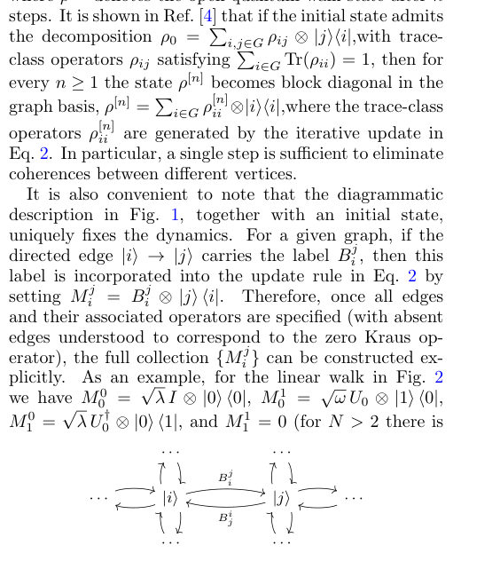 
FIG. 1: An arbitrary open quantum walk can be represented by this visual diagram. If there is an omitted edge in a particular diagram, this means that the corresponding operator Bj i is zero. Figure extracted from Ref. [6].

📷 Fig 2

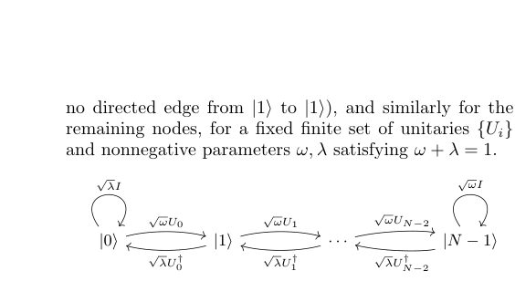 
FIG. 2: The diagram corresponding to the linear OQW model. Each Ui is a unitary operator, and ω, λ ≥0 are such that ω + λ = 1. Figure extracted from Ref. [6].

📷 Fig 3

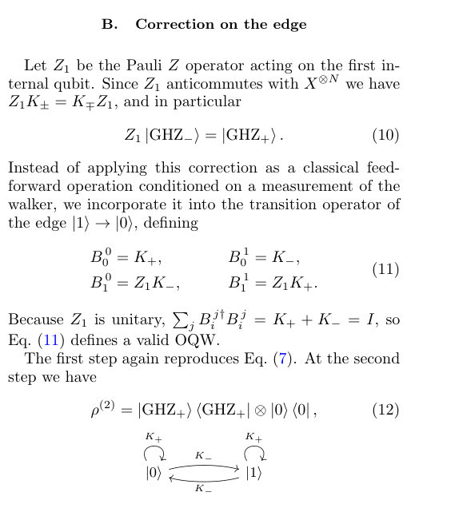 
FIG. 3: Two-node OQW for preparing GHZ-type states. The operator K+ keeps the walker at the same node, while K−transfers it to the other node.

📷 Fig 4

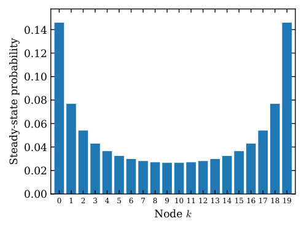 
FIG. 5: Plot of the steady-state probability in the preparation of Dicke states as a function of the position in the graph for N = 20.

📷 Fig 5

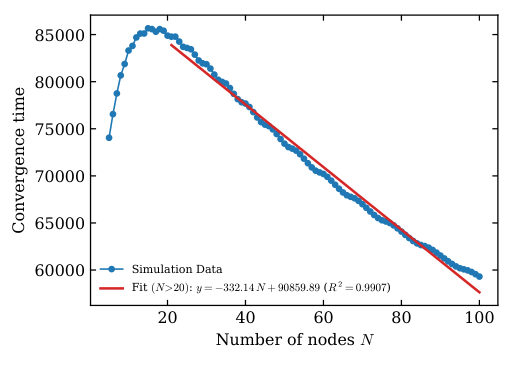 
FIG. 7: Total variation and Hellinger metrics to determine the convergence time as a function of the number N of nodes in the OQW for A = 200, p = 0.7.

**Summary.** The paper introduces Open Quantum Walks (OQWs) as a powerful tool for designing protocols to prepare entangled states like Dicke and GHZ states. By coupling graph dynamics to internal qubits via engineered dissipation, it achieves deterministic preparation schemes even under imperfect measurements. This framework unifies quantum trajectory simulation with structured graph models.

**Why it may be interesting.** This work provides a physically transparent and general graphical framework (OQW) to analyze state preparation protocols, bridging concepts from open quantum systems theory with structured quantum information tasks like generating multipartite entanglement.

Detailed structure

**Main problem.** The paper develops protocols for preparing specific entangled quantum states (Dicke, W, GHZ) using the framework of Open Quantum Walks (OQWs). It aims to provide a general method applicable when state preparation relies on nonunitary dynamics.

**Main result.** Protocols are successfully constructed for Dicke and GHZ states; specifically, an OQW prepares an ensemble of Dicke states, and a two-node protocol deterministically generates GHZ states without requiring direct measurement of the walker's position.

**Method.** The core method involves modeling dissipation and state evolution using Open Quantum Walks, which reformulates quantum trajectories via Kraus operators derived from engineered environmental coupling. Convergence rates are analyzed using spectral gap calculations.

**Model / system.** The model is an OQW that couples transitions on a graph (the walker's position) to internal degrees of freedom representing the entangled state qubits. Specific topologies include ring-shaped graphs for Dicke states and simple two-node graphs for GHZ states.

**Key observables.** Fidelity ($F$) of prepared states, steady-state probabilities ($\pi_k$), and the spectral gap ($\Delta(\eta)$) governing convergence rates.

**Important parameters / regimes.** The degree of measurement sharpness ($\eta$), system size ($N$), and parameters related to dissipation/coupling strengths ($p, A$).

**Assumptions / limitations.** The analysis often assumes weak measurements or specific coupling structures (e.g., deriving operators from Lindblad forms). The method is shown to embed quantum trajectories but is not claimed to be a computational speedup.

**Figures summary.** Figures illustrate the general OQW structure on graphs, show diagrams for linear and ring-shaped models, and detail the mathematical setup using transition operators derived from jump/Lindblad operators.

**Paper structure.** The paper introduces the OQW framework for state preparation, details specific protocols for Dicke states (using a ring graph) and GHZ states (using a two-node graph), analyzes convergence rates under measurement imperfections ($\eta$), and concludes by showing the natural embedding of quantum trajectories into this walk structure.

Abstract

Open quantum walks couple transitions on a graph to quantum operations on an internal degree of freedom. We use this structure to formulate protocols for quantum state preparation with nonunitary Kraus operators. We construct a ring-shaped OQW preparing an ensemble of Dicke states, with W states appearing as the single-excitation case, from which any individual Dicke state is recovered by postselecting the walker position; its convergence is governed by the spectral gap of the underlying Markov chain, for which we obtain a closed-form approximate expression. For GHZ states we present a two-node protocol using Kraus operators built from projective measurements that prepares them deterministically without requiring a measurement of the walker, and analyze how unsharp measurements affect the results and the convergence of the walk. We also show that the quantum trajectories method embeds naturally in the OQW framework as a graph-structured collision model.

[↑ back to top](#top)

### [Quantum Formulation of Chiral Vortical Effect in Weyl Semi-metals](http://arxiv.org/abs/2608.08269v1)

**Authors:** B. Q. Song  
**Type:** theory · **Category:** statistical mechanics · **PDF:** <https://arxiv.org/pdf/2608.08269v1>  
**Analysis basis:** full PDF text, analyzed in chunks
**Topic relevance:** 🔥 `non-equilibrium universality` **4/5** · `Keldysh / 2PI / non-Gaussian methods` **3/5** · `driven-dissipative phase transition` **3/5** · `methods for driven-dissipative` **3/5** · `scars & prethermalization` **2/5** · `analog quantum simulation` **1/5** · `correlated / nonlocal dissipation` **1/5** · `quantum measurements` **1/5**

📷 Fig 1

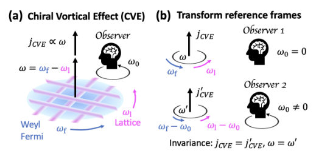 
FIG. 1. (color online): (a) A current jCVE induced by relative rotations between lattice ωl and chiral fermion ωf. (b) The jz and ω are invariant with ω0, while ωl and ωf are variant.

📷 Fig 2

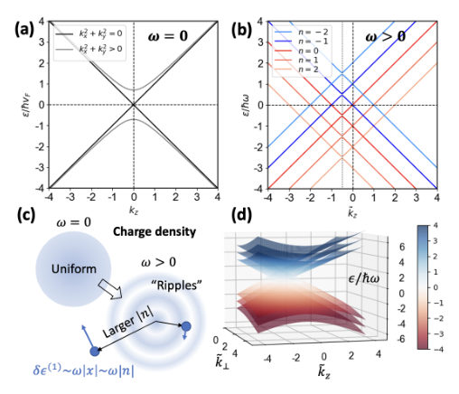 
FIG. 2. (color online): Spectra for (a) H0 (ω = 0) and (b) H (ω &gt; 0). Rotation shifts spectrum along ˜kz := vF kz

📷 Fig 3

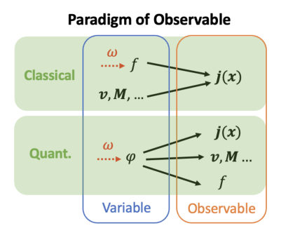 
FIG. 3. (color online): Causality under classical and quantum protocols, where the ω-dependence enters via f or φ, respec- tively. In quantum theory, variables f, v, M, etc. become observables that are mutually hinged by a common φ.

📷 Fig 4

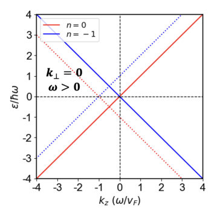 
FIG. 4. (color online): For k⊥= 0 eigenstates of H, the quan- tum number n may only take 0 or −1, leading to ⟨Jz⟩= ±1/2 solely contributed by spin. The void states (non-existing) are dotted lines.

📷 Fig 5

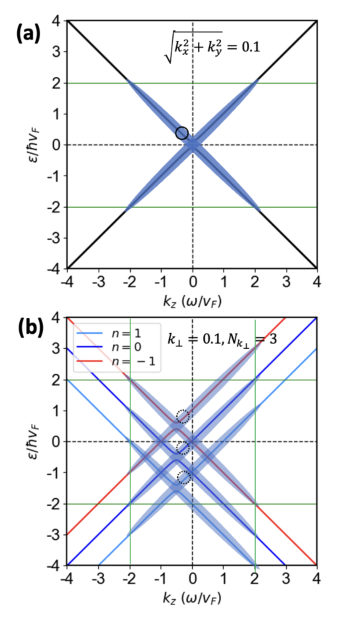 
FIG. 5. (color online): (a) An initial distribution and (b) its resulting distribution after rotation. The evolution of a single state (for a particular s and kz) is shown in where veloci- ties have reversed (the circles). The Nk⊥= 3 is selected for demonstration; in general, it splits into Nk⊥equal-weighted branches.

**Summary.** This work pioneers a fully quantum description of the Chiral Vortical Effect (CVE) using Weyl semimetals. By solving for microscopic wavefunctions rather than relying on semiclassical distributions, the authors prove that CVE is fundamentally a non-equilibrium process. This provides a powerful tool to detect genuine quantum transport phenomena in materials.

**Why it may be interesting.** While focused on condensed matter transport, the core methodology involves non-equilibrium dynamics, Floquet theory, and the rigorous comparison between quantum evolution and classical/statistical approximations, which are central themes in open quantum systems.

Detailed structure

**Main problem.** To develop a fully quantum formulation for the Chiral Vortical Effect (CVE), moving beyond existing semiclassical descriptions.

**Main result.** The CVE distribution is shown to be over a ground-state-free Floquet spectrum, confirming it as a non-equilibrium phenomenon distinct from thermal equilibrium. The theory also predicts novel quantum effects when semi-classical approximations fail.

**Method.** The authors solve the exact evolution of microscopic spinful wavefunctions using a time-dependent Hamiltonian approach and compare results against established semiclassical kinetic theories.

**Model / system.** The study uses Weyl semimetals as an experimentally accessible platform. The system is modeled by a non-relativistic quantum Hamiltonian incorporating chiral fermion dynamics and an axial rotation term ($\hat{V}$).

**Key observables.** Axial current ($j_z$), energy spectrum ($\epsilon$), and the quantum distribution function ($\hat{f}_{CVE}$)

**Important parameters / regimes.** Rotation frequency ($\omega$), Fermi velocity ($v_F$), Chemical potential ($\mu$), System size ($R$)

**Assumptions / limitations.** The semiclassical approximation is only valid under three strict conditions: slow rotation, high chemical potential, and isotropic symmetry.

**Figures summary.** Figure 2 compares the energy spectra for the non-rotating case ($\omega=0$) versus the rotating case ($H$), showing Floquet-type spectral features.

**Paper structure.** The paper progresses from establishing the need for a quantum formulation, deriving the Hamiltonian respecting physical symmetries (like observer rotation invariance), calculating observables using wavefunctions in Hilbert space, and finally comparing these results to known semi-classical limits.

Abstract

The chiral vortical effect (CVE) is the generation of an axial current in a rotating Weyl fermion; its description is presently based on semiclassical frameworks. In this work, we develop a fully quantum formulation for CVE, solving the exact evolution of microscopic spinful wavefunctions, which enables a bottom-up quantitative test of semi-classical theories and postulated distributions $f_{\text{CVE}}$ in different reference frames. Notably, it shows that $f_{\text{CVE}}$ is over a ground-state-free Floquet spectrum, qualitatively distinct from a thermal equilibrium distribution (i.e., fermi form $f_F$), underscoring CVE as a non-equilibrium phenomenon, distinguished from other chiral transports. The $f_F$ only approximately holds when three conditions are simultaneously fulfilled: (1) slow rotation $ωR/v_F\ll 1$, (2) high chemical potential $μ/(\hbar v_F R)\gg 1$, (3) isotropic symmetry, where $R$ is the size, $v_F$ is fermi velocity. In these conditions, the theory recovers established semiclassical results, including the current-response coefficients and the magnetization contribution; otherwise, it uncovers quantum phenomena such as ``void states", deviation from the semiclassical formula $j_{\text{CVE}} \sim μ^2$, a $v_F$-independent charge pumping. The theory is based on semimetals, providing more experimentally accessible detection than fundamental Weyl particles.

[↑ back to top](#top)

### [Anomalous temperature dependence of polaron mobility in a nonlinear double-well potential: unbiased X-propagator approach](http://arxiv.org/abs/2608.09883v1)

**Authors:** Stefano Ragni, Osor S. Barišić, Naoto Nagaosa, Andrey S. Mishchenko  
**Type:** theory · **Category:** strongly correlated electrons · **PDF:** <https://arxiv.org/pdf/2608.09883v1>  
**Analysis basis:** full PDF text, analyzed in chunks
**Topic relevance:** 🔥 `Keldysh / 2PI / non-Gaussian methods` **4/5** · `driven-dissipative phase transition` **3/5** · `methods for driven-dissipative` **3/5** · `Frenkel-Kontorova` **2/5** · `non-equilibrium universality` **2/5** · `correlated / nonlocal dissipation` **1/5** · `quantum measurements` **1/5** · `scars & prethermalization` **1/5**

📷 Fig 1

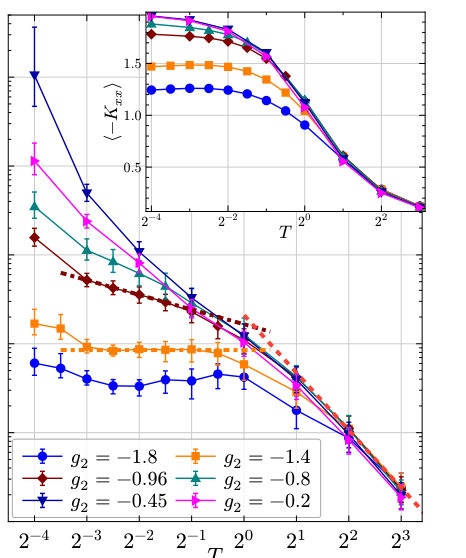 
FIG. 1. Temperature dependence of the static mobility µ and kinetic energy ⟨−Kxx⟩(inset) for g4 = 0.1, Ω= 0.25, and different quadratic coupling constants. The dash-dotted brown (orange) line highlights the middle-temperature trend for g2 = −0.96 (g2 = −1.4), while the dashed bright red line highlights the high-temperature trend shared by all couplings. The error bars in the inset are smaller than the dot size.

📷 Fig 2

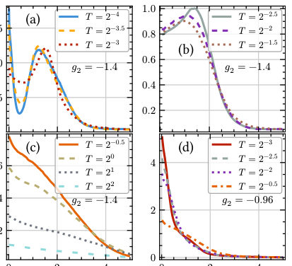 
FIG. 2. Optical conductivity spectra at various temperatures for g2 = −1.4 (a,b,c) and g2 = −0.96 (d). g4 = 0.1 in all plots.

📷 Fig 3

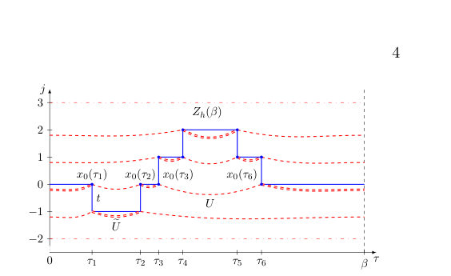 
FIG. 4. A representative configuration generated by the algo- rithm. The horizontal axis denotes the imaginary times τ of the hopping events, while the vertical axis labels the lattice sites j. Events are represented as blue points, and they are as- sociated with an oscillator displacement xj(τa). The electron trajectory is shown as a solid blue line, where vertical lines represent hoppings t between sites ∆j. The time propagation of oscillators is depicted in red: a single dashed line corre- sponds to an unoccupied site propagator U, a double dashed line to an occupied site propagator eU.

📷 Fig 4

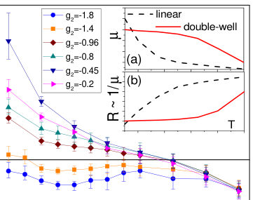 
FIG. 3. Temperature dependence of the mean free path λMFP in units of lattice spacing a for different quadratic coupling constants g2. Inset: schematic temperature dependence of the mobility and resistivity for the linear (dashed line) and double-well (solid line) models.

**Summary.** The authors develop an advanced X-propagator method to study polaron mobility in materials modeled by a double-well potential. They demonstrate that this nonlinear coupling mechanism correctly predicts the anomalous concave temperature dependence of mobility observed in polar oxides like SrTiO3. This supports the idea that anharmonic lattice dynamics are key to understanding transport anomalies beyond simple linear models.

**Why it may be interesting.** This work provides a detailed theoretical framework for understanding anomalous transport phenomena in polar materials by incorporating strong anharmonicity via nonlinear coupling terms, which is crucial for modeling soft modes in condensed matter systems.

Detailed structure

**Main problem.** To theoretically explain the anomalous temperature dependence of polaron mobility observed in dilute polar metals, such as SrTiO3.

**Main result.** The model successfully reproduces an anomalous concave temperature dependence for mobility and predicts spectral weight redistribution upon coupling to a nonlinear lattice potential.

**Method.** Development and application of an unbiased X-propagator method to calculate finite-temperature optical conductivity and dc mobility for arbitrary electron-phonon interactions.

**Model / system.** The system is modeled as a polaron coupled to a double-well lattice potential, which serves as a minimal model for strongly anharmonic polar materials relevant to oxides like SrTiO3.

**Key observables.** Static dc mobility (μ), optical conductivity $\sigma(\omega)$, and mean free path ($\lambda_{	ext{MFP}}$).

**Important parameters / regimes.** Coupling strength parameters ($g_2$), temperature regimes (low, moderate, high T), and the violation of the Mott-Ioffe-Regel limit.

**Assumptions / limitations.** The use of a double-well potential to capture anharmonicity, and the extension of zero-temperature formalisms via the X-propagator method to finite temperatures.

**Figures summary.** Figures illustrate $\mu$ vs. T showing three distinct regimes (confinement, barrier competition, high T), spectral weight redistribution in $\sigma(\omega)$ across these regimes, and comparisons between linear and nonlinear coupling models.

**Paper structure.** The paper develops the X-propagator method, applies it to the double-well model, analyzes the resulting temperature dependence of mobility ($\mu(T)$) across distinct physical regimes, and compares findings against experimental observations in SrTiO3.

Abstract

We develop an unbiased X-propagator method for calculating finite-temperature optical conductivity $σ(ω)$ and dc mobility $μ$ for arbitrary nonlinear electron-phonon interaction. We apply it to a polaron coupled to a double-well lattice potential, a minimal model for strongly anharmonic polar materials. At moderate coupling, the mobility exhibits three temperature regimes associated with confinement within one well, thermal competition with the barrier, and barrier-insensitive high-temperature dynamics. This sequence produces a concave temperature dependence of the mobility that is absent in conventional linear-coupling polaron models. At strong coupling, the mobility becomes nonmonotonic, and its temperature evolution is reflected in a characteristic redistribution of optical spectral weight. For parameters relevant to SrTiO$_3$, our results qualitatively reproduce both the anomalous concave mobility and the onset of violation of the Mott-Ioffe-Regel limit, thereby supporting nonlinear coupling to a soft anharmonic lattice mode as a microscopic mechanism for anomalous transport in dilute polar metals.

[↑ back to top](#top)

### [Biorthogonal-only Floquet Dynamical Quantum Phase Transitions](http://arxiv.org/abs/2608.07882v1)

**Authors:** Jiangrong Wen, Qidong Yuan, Zi-Xiang Hu, Jian-Jun Dong  
**Type:** theory · **Category:** statistical mechanics · **PDF:** <https://arxiv.org/pdf/2608.07882v1>  
**Analysis basis:** full PDF text, analyzed in chunks
**Topic relevance:** 🔥 `driven-dissipative phase transition` **4/5** · `analog quantum simulation` **3/5** · `methods for driven-dissipative` **3/5** · `non-equilibrium universality` **3/5** · `correlated / nonlocal dissipation` **2/5** · `Frenkel-Kontorova` **1/5** · `Keldysh / 2PI / non-Gaussian methods` **1/5**

📷 Fig 1

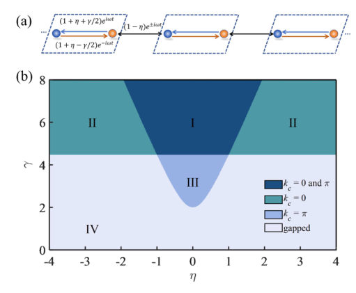 
Figure 1. (a) Schematic of the periodically driven non-Hermitian SSH chain, with the dashed box indicates a unit cell. (b) Four spec- tral regimes of HF (k) in the (η, γ) parameter plane, separated by exceptional lines corresponding to kc = 0 and kc = π. Region I is real-part gapless at both kc = 0 and kc = π; Regions II and III are real-part gapless only at kc = 0 and kc = π, respectively; Region IV exhibits a finite real-part energy gap across the entire Brillouin zone.

📷 Fig 2

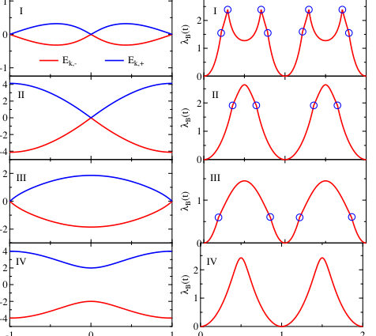 
Figure 2. (a) Real parts of the dispersions Re Ek,± in Regions I– IV. (b) Corresponding biorthogonal Loschmidt rates λB(t). Circles mark the critical points. The parameters are (η, γ) = (0.85, 4.75), (2.5, 6), (0.2, 2.5), and (2.0, 2.0) for Regions I–IV, respectively.

📷 Fig 3

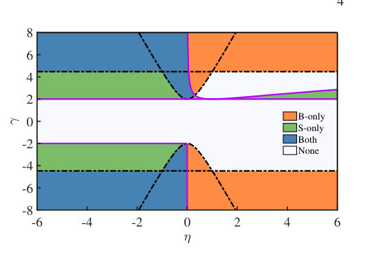 
Figure 4. Global Floquet-DQPT diagram for the biorthogonal and self-normal formulations in the (η, γ) plane. The four regimes, B- only, Both, S-only, and None, indicate whether a Floquet DQPT oc- curs only in the biorthogonal formulation, in both formulations, only in the self-normal formulation, or in neither formulation, respec- tively. The black dashed curves mark the exceptional lines, which coincide with the onset boundaries of biorthogonal Floquet DQPTs. The purple solid curves mark the self-normal DQPT boundaries de- termined by Eq. (14).

📷 Fig 4

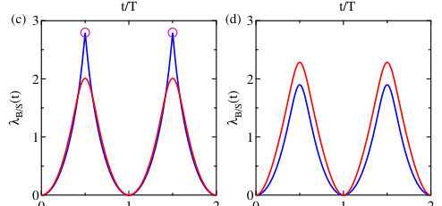 
Figure 3. Representative comparisons of the biorthogonal and self- normal Loschmidt rates for the same Hamiltonian parameters, initial state, and time evolution. Circles mark the corresponding critical points. (a) Biorthogonal-only: λB(t) develops nonanalytic cusps, whereas λS(t) remains smooth. (b) Both: both rates exhibit nonana- lyticities. (c) Self-normal-only: nonanalyticities occur only in λS(t). (d) Neither: both rates remain analytic. The parameters (η, γ) are (0.5, 5.5), (−0.15, 2.6), (−1.5, 2.5), and (2.0, 4.4) for (a)–(d), re- spectively.

**Summary.** The paper investigates Dynamical Quantum Phase Transitions (DQPTs) in a driven non-Hermitian SSH chain by comparing two mathematical formulations: biorthogonal and self-normal. The key finding is that these two approaches are not equivalent, revealing a regime where only the biorthogonal method predicts a transition. This establishes a crucial theoretical distinction for understanding non-equilibrium physics in open quantum systems.

**Why it may be interesting.** This work directly addresses non-equilibrium quantum dynamics in open/non-Hermitian systems, which are highly relevant for understanding dissipation, gain, and topological properties in modern AMO platforms like photonics or superconducting circuits.

Detailed structure

**Main problem.** To fundamentally distinguish between Dynamical Quantum Phase Transitions (DQPTs) identified using biorthogonal versus self-normal inner products in non-Hermitian systems.

**Main result.** The authors demonstrate a finite regime where only the biorthogonal formulation predicts a DQPT, showing that the choice of overlap structure dictates the existence of dynamical criticality. This establishes a fundamental distinction between the two types of transitions.

**Method.** Theoretical analysis using the Loschmidt echo formalism applied to a periodically driven non-Hermitian SSH chain, comparing the rates derived from biorthogonal and self-normal inner products.

**Model / system.** The study uses an exactly solvable, periodically driven non-Hermitian Su-Schrieffer-Heeger (SSH) chain model. The dynamics are analyzed via its effective Floquet Hamiltonian in momentum space.

**Key observables.** Biorthogonal and self-normal Loschmidt echo rates ($\lambda_B(t)$ and $\lambda_S(t)$), which exhibit nonanalyticities signaling a DQPT.

**Important parameters / regimes.** Dimerization ($\eta$) and intracell nonreciprocity ($\gamma$), which define the parameter space for the transition regimes.

**Assumptions / limitations.** The analysis is performed on an exactly solvable model (SSH chain) using specific time-evolution parameters ($\hbar=1, \omega=2$).

**Figures summary.** Figure 1 schematically shows spectral regimes separated by exceptional lines in the parameter space $(\eta, \gamma)$. Figure 3 illustrates the comparison of $\lambda_B(t)$ and $\lambda_S(t)$ across different spectral conditions.

**Paper structure.** The paper first introduces the problem of DQPTs in non-Hermitian systems. It then develops the mathematical framework using both biorthogonal and self-normal Loschmidt echoes for the SSH chain. The core is the comparison, leading to the identification of the Biorthogonal-only regime and a discussion of the differing temporal structures of critical times.

Abstract

Non-Hermitian dynamical quantum phase transitions (DQPTs) are intrinsically sensitive to the choice of inner product under nonunitary time evolution. Although the biorthogonal formulation based on associated states provides a normalized Loschmidt echo with a probabilistic interpretation, previous studies have found biorthogonal and self-normal DQPTs to occur in the same parameter regimes, suggesting that the two forms of dynamical criticality are concomitant. Here we demonstrate that this is not the case. In an exactly solvable periodically driven non-Hermitian Su-Schrieffer-Heeger chain, we uncover a finite biorthogonal-only Floquet DQPT regime, where the biorthogonal Loschmidt rate becomes nonanalytic while the self-normal Loschmidt rate remains smooth. The critical conditions are obtained analytically, showing that the onset of biorthogonal Floquet DQPTs is locked to the exceptional lines of the effective Floquet Hamiltonian, whereas self-normal criticality has no corresponding spectral boundary. Moreover, for each critical momentum, the biorthogonal DQPT exhibits a pair of critical times within every driving period, whereas the self-normal DQPT exhibits only one. Our results establish a fundamental distinction between biorthogonal and self-normal DQPTs, thereby opening a route toward new nonequilibrium quantum phenomena in non-Hermitian systems.

[↑ back to top](#top)

### [Coherent Control of Domain-Wall Transport in an Ultracold Bose Gas](http://arxiv.org/abs/2608.07840v1)

**Authors:** O. Farion, M. Pourzand, J. M. McGuirk  
**Type:** both · **Category:** quantum gases · **PDF:** <https://arxiv.org/pdf/2608.07840v1>  
**Analysis basis:** full PDF text, analyzed in chunks
**Topic relevance:** 🔥 `analog quantum simulation` **4/5** · `methods for driven-dissipative` **3/5** · `non-equilibrium universality` **3/5** · `driven-dissipative phase transition` **2/5** · `quantum measurements` **2/5** · `Frenkel-Kontorova` **1/5** · `Keldysh / 2PI / non-Gaussian methods` **1/5** · `correlated / nonlocal dissipation` **1/5**

📷 Fig 1

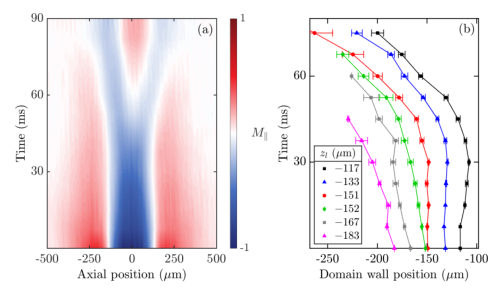 
Figure 1. (a) Spatiotemporal evolution of radially averaged longitudinal magnetization M∥(z, t) exhibiting domain wall movement. Data is averaged over 3 measurements at each time and interpolated between time steps δt = 7.5 ms. (b) Do- main wall trajectories extracted from M∥(z, t) using a thresh- old method, for a range of initial domain wall positions zl.

📷 Fig 2

 
Fig. 1(b). The initial domain-wall position determines the size of the domains and thus the overall spin bal- ance in the system. When the initial population is sig- nificantly imbalanced between the two states, transport driven by the diffusive motion of atoms dominates and domain walls drift rapidly from their initial position with a direction determined by the population imbalance, as seen in the left-most trajectories. More complex spin- current dynamics arise when spin textures have nearly equal initial spin population (N1 ≈N2), corresponding to |zi| ≈135 µm. In this regime, domain walls typically move slowly at first, before accelerating at later times. This behavior is in line with...

📷 Fig 3

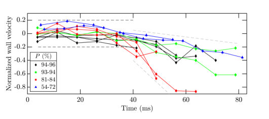 
Figure 3. Domain wall velocity dynamics for various ini- tial conditions, normalized by the thermal velocity vt. At short times, motion is slowed by stabilizing exchange colli- sions. Later, motion is dominated by diffusive pressure and the wall velocity increases. The time scales of the regimes of motion can be tuned via the initial coherence in the domain wall.

📷 Fig 4

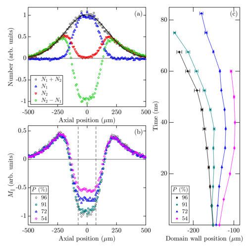 
Figure 2. (a) Initial populations of state |1⟩and |2⟩. The sum is a Gaussian given by the harmonic trap parameters, and their difference is M∥. (b) Initial M∥(z) profiles prepared with various rotated middle domain orientations. Dashed vertical lines indicate the region in which P is calculated, zl + λl/2 &lt; z &lt; zr −λr/2. (c) Domain wall trajectories corresponding to domain orientations shown in (b). Rotated domains (smaller P) lead to larger spin current imbalances, increasing inward motion at short time.

📷 Fig 5

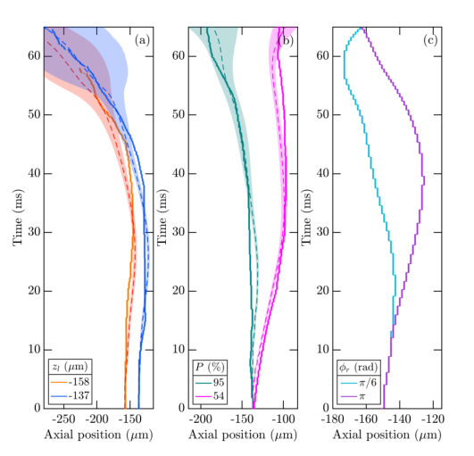 
Figure 4. Comparison of typical measured trajectories (solid lines) and simulated trajectories (dashed lines), using experi- mentally determined initial parameters. Shaded regions show simulation uncertainty. Simulations confirm that (a) domain wall motion is similar for a range of initial wall positions, but (b) that altering domain polarization leads to qualitatively distinct dynamics. (c) Comparison of simulated left domain wall trajectories with identical initializations, except for dif- ferent transverse spin textures initialized in the right wall.

**Summary.** The authors demonstrate precise, tunable control over the movement of magnetic domain walls within a Bose gas by engineering the system's spin coherence and phase structure. They show that manipulating initial polarization can reverse or accelerate wall motion, confirming that coherence acts as a powerful tool for programming spin transport in atomtronic devices.

**Why it may be interesting.** This work directly applies concepts from non-equilibrium many-body physics (like domain wall dynamics) to an ultracold atomic platform, providing concrete experimental evidence for programming spin transport using coherence—a key area in AMO and quantum simulation.

Detailed structure

**Main problem.** The central challenge is demonstrating and controlling domain-wall transport, which act as carriers of spin information, using coherence and phase engineering in an ultracold gas.

**Main result.** Tunable control over domain-wall motion—including reversal and acceleration—is achieved by manipulating the spin current imbalance through polarization rotation. The dynamics exhibit a crossover between exchange-stabilized and diffusion-dominated regimes.

**Method.** The study combines experimental measurements (absorption imaging, Ramsey spectroscopy) to track magnetization profiles with numerical solutions of a quantum Boltzmann equation to model the underlying physics.

**Model / system.** The system is a weakly interacting nondegenerate ultracold Bose gas ($	ext{}^{87}	ext{Rb}$) trapped in 1D, forming a pseudo-spin-1/2 texture between two hyperfine ground states. The dynamics are modeled using a quantum Boltzmann equation for the magnetization density.

**Key observables.** Domain wall trajectories, longitudinal magnetization ($M_{\parallel}$), transverse spin magnitude and phase ($\phi$), and domain wall velocity ($v_{dw}$).

**Important parameters / regimes.** Polarization rotation ($P$), transverse phase gradients ($\partial z\phi$), and the balance between exchange-stabilized and diffusion-dominated regimes.

**Assumptions / limitations.** The analysis initially focused on domains with negative initial positions, and extremely small domain wall widths were avoided due to the Castaing instability.

**Figures summary.** Figures illustrate the spatiotemporal evolution of magnetization profiles, showing how polarization rotation controls trajectories (including reversals), and map out the crossover in domain-wall velocity between slow/exchange-stabilized and fast/diffusive regimes.

**Paper structure.** The paper establishes the physical platform and problem, details measurement techniques for spin textures, presents results demonstrating control via coherence and phase engineering, models the dynamics using a quantum Boltzmann equation, and concludes by establishing the utility of this method for atomtronic systems.

Abstract

Domain walls are carriers of spin transport whose controlled manipulation underlies a wide range of spintronic and information-processing technologies. Here we demonstrate tunable domain-wall transport in a weakly interacting nondegenerate ultracold Bose gas. We initialize a three-domain pseudo-spin-1/2 texture and observe spontaneous propagation of long-lived domain walls driven by exchange-mediated spin currents. By varying the orientation of the spin domains, we control the balance of spin currents across the walls and thereby tune their trajectories, including reversals of the initial direction of motion. Measurements reveal a crossover from an exchange-stabilized regime, in which coherent spin-exchange collisions suppress wall motion, to a diffusion-dominated regime characterized by rapid transport at thermal velocities. Numerical solutions of a quantum Boltzmann equation reproduce the observed dynamics and identify transverse phase gradients as an important control parameter governing domain-wall propagation. These results establish coherence and phase engineering as tools for programming spin transport in ultracold gases and provide a route toward controllable domain-wall dynamics in atomtronic systems.

[↑ back to top](#top)

### [Collective-dissipation-induced dark and metastable-like states for enhanced quantum battery performance](http://arxiv.org/abs/2608.09693v1)

**Authors:** Achraf Khoudiri, Asghar Ullah, Abderrahim El Allati, Özgür E. Müstecaplıoğlu  
**Type:** theory · **Category:** statistical mechanics · **PDF:** <https://arxiv.org/pdf/2608.09693v1>  
**Analysis basis:** full PDF text, analyzed in chunks
**Topic relevance:** 🔥 `correlated / nonlocal dissipation` **4/5** · `driven-dissipative phase transition` **3/5** · `methods for driven-dissipative` **3/5** · `analog quantum simulation` **2/5** · `non-equilibrium universality` **2/5** · `Tavis-Cummings & cavity-many-emitter` **1/5** · `quantum measurements` **1/5** · `scars & prethermalization` **1/5**

📷 Fig 1

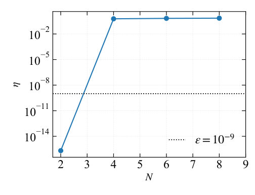 
FIG. 1. Normalized Hamiltonian leakage parameter η as a function of the number of qubits N. The dotted line indicates the invariance tolerance ε = 10−9. Similar behavior is obtained for both the FM (J = 1) and AFM (J = −1) cases.

📷 Fig 2

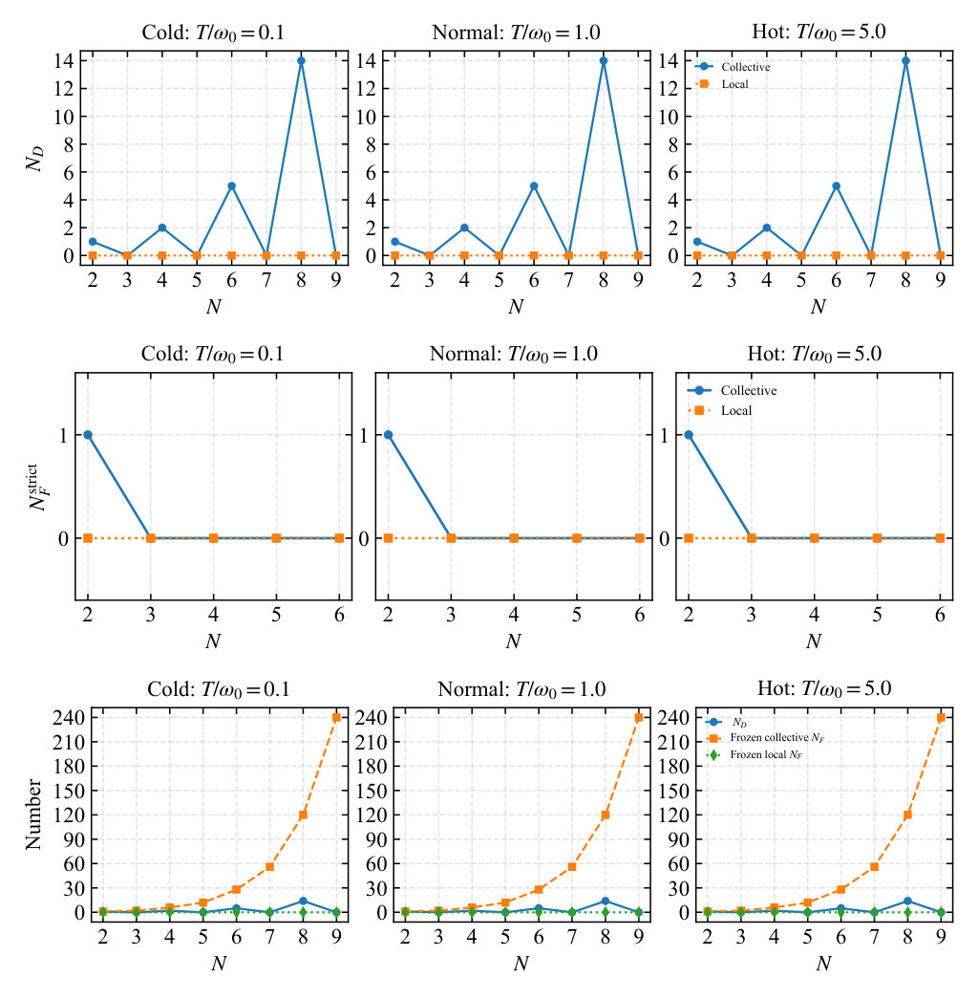 
FIG. 2. Top panel: Number of dark states ND as a function of the number of qubits N for three bath-temperature regimes: cold bath (T/ω0 = 0.1), normal bath (T/ω0 = 1), and hot bath (T/ω0 = 5), respectively, for collective and local dissipation. We set J = 1 and B = 0.1. Middle panel: Number of strict frozen states Nstrict F as a function of the number of qubits N for the same three bath-temperature regimes, for collective and local dissipation. We set J = 1 and h = 0.1. Bottom panel: Number of frozen states NF and dark states ND as a function of the number of qubits N for the same three bath-temperature regimes, for collective and local dissipation. We set J = 1 and h = 0.1.

📷 Fig 3

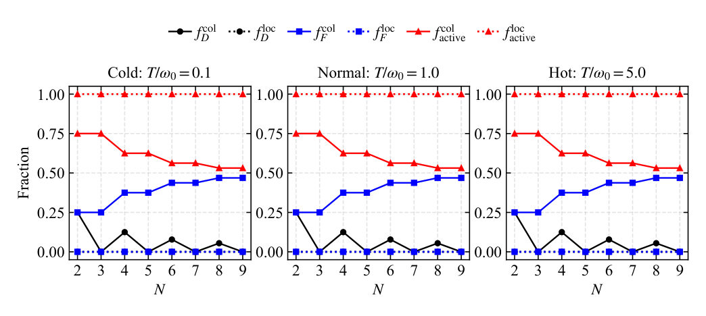 
FIG. 3. Fractions f loc(col) D(F) of frozen and dark states and the active-state fraction f loc(col) active as functions of the number of qubits N for three bath-temperature scenarios: cold bath (T/ω0 = 0.1), normal bath (T/ω0 = 1), and hot bath (T/ω0 = 5), respectively, for collective and local dissipation. We set J = 1 and h = 0.1.

📷 Fig 4

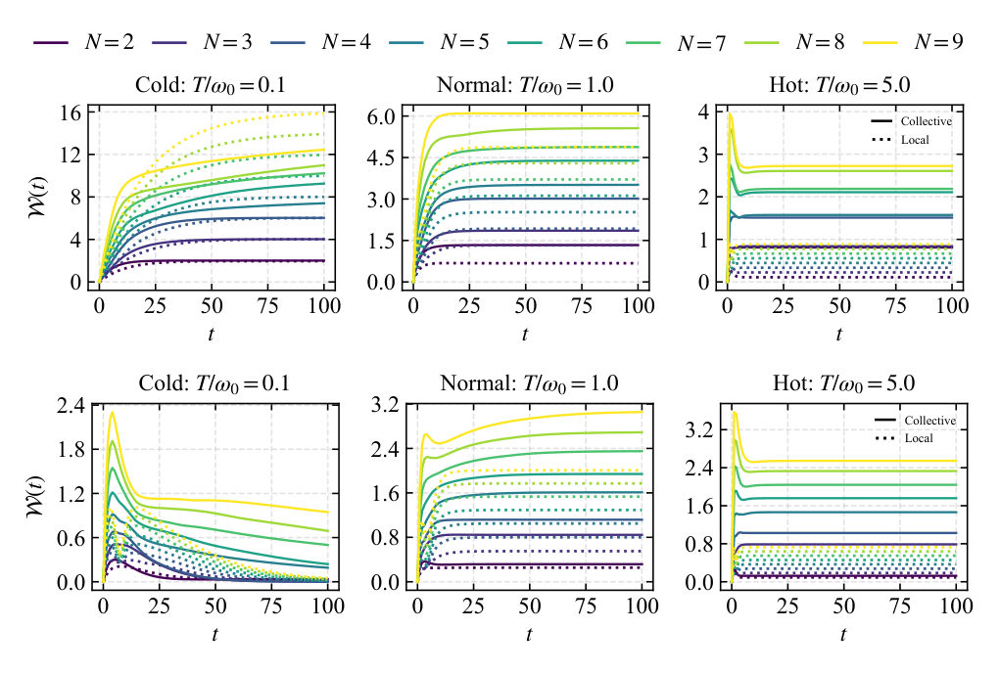 
FIG. 4. Dynamics of the ergotropy W(ρ(t)) as a function of time t and the number of qubits N for three bath-temperature scenarios: cold bath (T/ω0 = 0.1), normal bath (T/ω0 = 1), and hot bath (T/ω0 = 5), respectively, for collective and local dissipation. The top panel corresponds to AFM coupling (J = −1), while the bottom panel corresponds to FM coupling (J = 1). The solid red curves correspond to collective interactions, while the dotted blue curves correspond to local interactions with the bath. The remaining parameters are set to h = 0.1, γ = 0.09, and ω0 = 2h.

📷 Fig 5

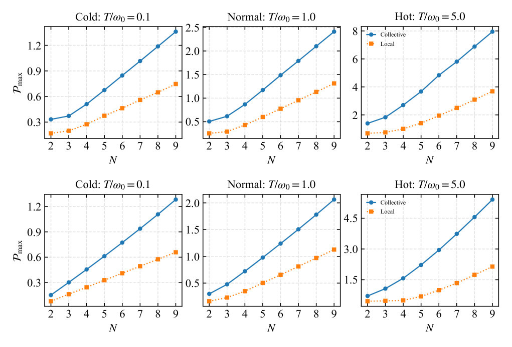 
FIG. 5. Maximal charging power Pmax as a function of the number of qubits N for three bath-temperature scenarios: cold bath (T/ω0 = 0.1), normal bath (T/ω0 = 1), and hot bath (T/ω0 = 5), respectively, for collective and local dissipation. The top panel corresponds to AFM coupling (J = −1), while the bottom panel corresponds to FM coupling (J = 1). The solid red curves correspond to collective interactions, while the dotted blue curves correspond to local interactions with the bath. The remaining parameters are set to h = 0.1, γ = 0.09, and ω0 = 2h.

**Summary.** This paper explores how engineered dissipation can optimize the performance of quantum batteries modeled by the Ising chain. By comparing local versus collective environmental coupling, the authors demonstrate that collective dissipation creates symmetry-protected dark and metastable states. These protected subspaces significantly enhance extractable work (ergotropy), with the antiferromagnetic phase showing superior energy harvesting capabilities.

**Why it may be interesting.** This work directly addresses non-equilibrium thermodynamics in many-body systems, providing concrete mechanisms (dark/frozen states) to enhance energy storage capacity beyond simple thermal considerations, which is highly relevant to open quantum system dynamics.

Detailed structure

**Main problem.** The study investigates how symmetry-protected dark states and metastable frozen states influence the autonomous charging dynamics and overall performance of open quantum batteries.

**Main result.** Collective dissipation is shown to enhance ergotropy and charging power by generating an extended protected Hilbert space; specifically, the antiferromagnetic configuration yields considerably larger extractable work compared to the ferromagnetic phase.

**Method.** The analysis involves comparing local versus collective dissipation effects on a quantum battery modeled by the transverse-field Ising Hamiltonian using the GKSL master equation framework.

**Model / system.** The system is an open quantum battery described by the transverse-field Ising model, $	ext{H}_B$, evolving under a master equation incorporating both local and collective dissipation mechanisms.

**Key observables.** Ergotropy (extractable work), charging power, multiplicity of dark states (following Catalan sequence for even N), and active Hilbert-space fraction.

**Important parameters / regimes.** System size ($N$), temperature ($T$), magnetic phase (Ferromagnetic/Antiferromagnetic).

**Assumptions / limitations.** The dynamics are treated under the Markovian approximation, and finite-resource effects are neglected.

**Figures summary.** Figures compare energy level time evolution and ergotropy over time for collective versus local dissipation in both AFM and FM regimes, highlighting enhanced work extraction with collective coupling.

**Paper structure.** The paper systematically compares the dynamics under local vs. collective dissipation, derives the multiplicity of dark states analytically, quantifies performance using ergotropy, and concludes by establishing protected sectors as key optimization resources for quantum batteries.

Abstract

We investigate the role of symmetry-protected dark states and metastable-like frozen states in the autonomous charging dynamics of open quantum batteries described by a transverse-field Ising model. By comparing local and collective dissipation over a range of system sizes, temperatures, and magnetic phases, we demonstrate that collective dissipation generates symmetry-protected dark states together with a much larger set of frozen (metastable) states, forming an extended protected Hilbert space. We derive the multiplicity of the collective dark sector analytically, showing that it follows the Catalan sequence for even system sizes, while such states are absent for odd sizes. Our results show that collective dissipation can enhance ergotropy and charging power, with its advantage depending on temperature, magnetic phase, and system size. While the number of dark and frozen states is identical in the ferromagnetic and antiferromagnetic phases, the achievable ergotropy differs substantially because of the different spectral locations of these protected states. In particular, the antiferromagnetic configuration exhibits considerably larger extractable work owing to the favorable positioning of the protected subspaces within the many-body energy spectrum. Finally, we analyze the active Hilbert-space fraction and show that metastable protection provides an effective mechanism for suppressing dissipative losses while preserving efficient charging pathways. These results establish the dark-state and frozen-state sectors as key resources for optimizing the performance of open quantum batteries through engineered dissipation.

[↑ back to top](#top)

### [Flavor--Kinetic Entanglement Production from Decay and Scattering at Finite Density](http://arxiv.org/abs/2608.07995v1)

**Authors:** Zekun Li, Jia Liu, Xiao-Ping Wang, Jing-Jun Zhang  
**Type:** theory · **Category:** statistical mechanics · **PDF:** <https://arxiv.org/pdf/2608.07995v1>  
**Analysis basis:** full PDF text, analyzed in chunks
**Topic relevance:** 🔥 `Keldysh / 2PI / non-Gaussian methods` **4/5** · `driven-dissipative phase transition` **3/5** · `methods for driven-dissipative` **3/5** · `non-equilibrium universality` **3/5** · `quantum measurements` **2/5** · `correlated / nonlocal dissipation` **1/5** · `scars & prethermalization` **1/5**

📷 Fig 1

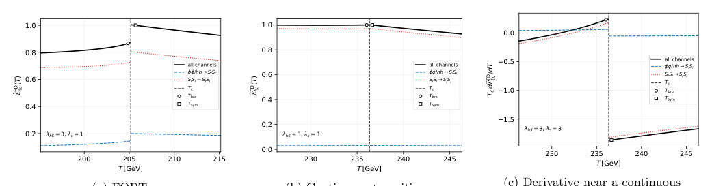 
FIG. 1. Benchmark finite-density flavor–kinetic entanglement entropy. Panel (a) shows the first-order benchmark, where bEfk(T) jumps across Tc. Panel (b) shows the continuous benchmark, where bEfk(T) itself remains continuous. Panel (c) shows the corresponding nonanalytic behavior in the first temperature derivative. Dashed and dotted curves are channel-family components of the same entanglement-entropy sum, not independent entropy definitions.

📷 Fig 2

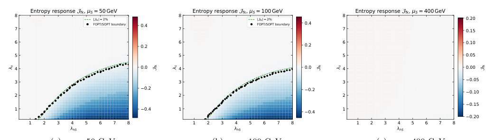 
FIG. 2. Parameter scans of the signed dimensionless jump Jfk. Panels (a) and (b) show light-singlet scans for µS = 50 GeV and 100 GeV. The color maps show Jfk = bEfk(Tbro) −1, and green dashed contours mark |Jfk| = 0.02 when that level lies in the plotted range. Black markers denote the independently computed boundary between first-order and continuous transitions from the finite-temperature effective potential. Panel (c) shows the heavy-singlet slice for µS = 400 GeV. There the potential scan finds no FOPT region in the plotted domain, and the signed jump Jfk remains close to zero throughout.

**Summary.** This work develops a method to calculate flavor–kinetic entanglement entropy in dense, thermal media by adapting tools from scattering theory. This entanglement measure is shown to be directly proportional to collision rates derived from kinetic equations. Crucially, this diagnostic tool can characterize phase transitions—both first-order and continuous—in a manner distinct from traditional thermodynamic order parameters.

**Why it may be interesting.** It provides a concrete link between quantum information measures (entanglement) and macroscopic thermodynamic/kinetic properties (phase transitions), offering a new type of order parameter for non-equilibrium systems.

Detailed structure

**Main problem.** The research aims to extend quantum information tools, specifically entanglement entropy, from vacuum processes to finite-density, non-equilibrium environments like the early universe.

**Main result.** The flavor–kinetic entanglement entropy serves as a novel collision-based diagnostic tool capable of detecting phase transitions by exhibiting distinct discontinuities or nonanalytic temperature derivatives.

**Method.** The authors relate the entanglement entropy to an occupation-weighted collision probability derived from the directed reaction-density kernel used in kinetic theory (Boltzmann equation).

**Model / system.** The framework is applied to general particle decay and scattering processes, using a specific flavor–kinetic bipartition of the Hilbert space. A proof-of-principle application uses an O(N) singlet-scalar extended model.

**Key observables.** Flavor–Kinetic Entanglement Entropy ($E_{fk}$), collision probabilities, and reaction density kernels ($\Gamma$).

**Important parameters / regimes.** Finite particle density, temperature (T), coupling constants, and the characteristic time scales of scattering/decay processes.

**Assumptions / limitations.** The analysis relies on tracing over kinematic degrees of freedom to obtain the leading entanglement entropy, and it assumes an incoherent kinetic ensemble for the background state.

**Paper structure.** The paper builds from extending the scattering-entanglement dictionary to finite density by defining the flavor–kinetic bipartition. It derives $E_{fk}$ in terms of collision probabilities, applies this diagnostic tool to an O(N) model, and analyzes how the resulting entropy signals phase transitions.

Abstract

We extend the scattering-entanglement dictionary to finite-density environments by investigating the flavor--kinetic bipartition of the Hilbert space. We show that tracing over kinematic degrees of freedom maps the total branch-changing transition probability directly onto the leading flavor--kinetic linear entanglement entropy. At finite density, the vacuum branch-changing probability is replaced by an occupation-weighted collision probability, built from the same directed reaction-density kernel that enters the integrated Boltzmann equation. The resulting observable is the bath-averaged flavor--kinetic entanglement entropy of a pair sampled from the medium. As a proof of principle, this framework is applied to an $O(N)$ singlet-scalar extended model to probe thermal phase transitions. In the examples studied, the resulting entanglement entropy serves as a collision-based phase-transition-type diagnostic, exhibiting a finite discontinuity across a first-order phase transition and a nonanalytic temperature derivative for continuous transitions. These examples suggest a novel way to characterize thermal phase structures, distinct from traditional thermodynamic order parameters.

[↑ back to top](#top)

### [Millisecond optical coherence and strong collective coupling in an integrated telecom rare-earth photonic platform](http://arxiv.org/abs/2608.08221v1)

**Authors:** Kah Jen Wo, Pavel A. Dmitriev, Karthik Dasigi, Fumiya Hanamura, Steven Touzard  
**Type:** experiment · **Category:** quantum information and computing · **PDF:** <https://arxiv.org/pdf/2608.08221v1>  
**Analysis basis:** full PDF text, analyzed in chunks
**Topic relevance:** 🔥 `QC/QI experiment` **4/5** · `quantum optics experiment` **3/5** · `analog quantum simulation` **2/5** · `correlated / nonlocal dissipation` **2/5** · `quantum measurements` **2/5** · `Tavis-Cummings & cavity-many-emitter` **1/5** · `driven-dissipative phase transition` **1/5** · `interference shaping light` **1/5** · `methods for driven-dissipative` **1/5**

📷 Fig 1

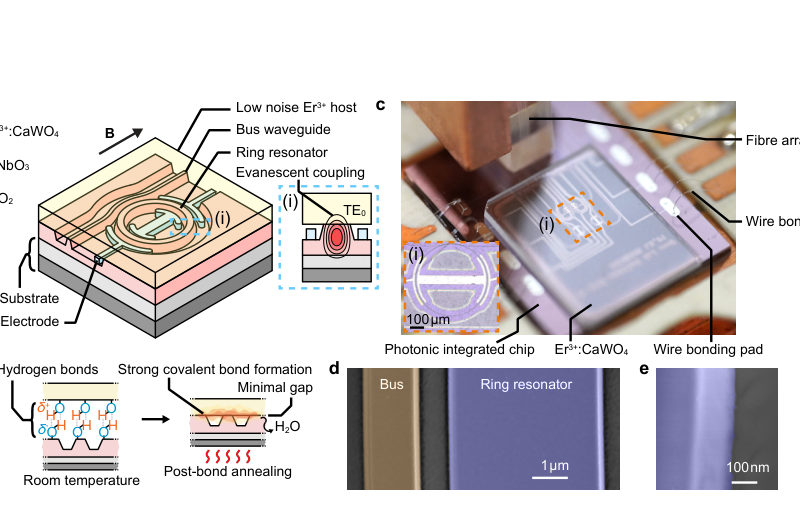 
FIG. 1. Heterogeneously integrated photonic platform for strong light-matter coupling. a, Schematic of the heterogeneously integrated platform. The photonic platform is thin-film lithium niobate (TFLN), with the SiO2 and Si layers forming its substrate. An external magnetic field B is applied in the plane of the chip. A bus waveguide couples light in and out of the ring resonator via a pulley coupler, while aluminium electrodes enable electro-optic tuning of the ring resonator. Inset: cross-section of the ring resonator with its single-mode profile evanescently coupling to the Er3+ ions in the bonded CaWO4. b, Schematic of the direct bonding procedure. At room temperature, hydrogen bonds...

📷 Fig 2

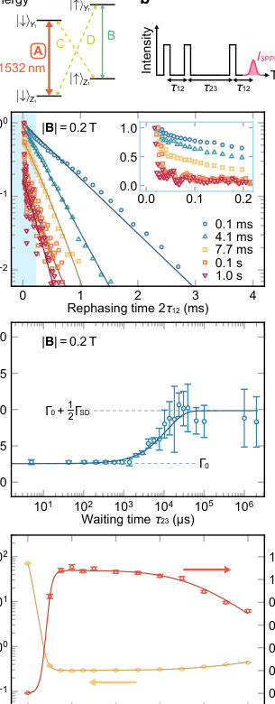 
FIG. 2. Spectral diffusion and coherence of Er3+ ions. a, Er3+

📷 Fig 3

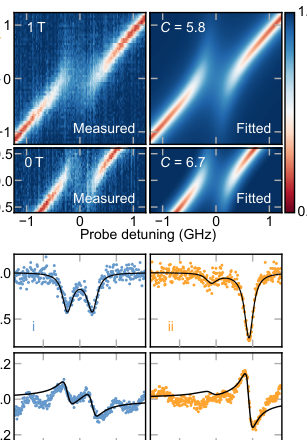 
FIG. 3. Strong collective light-matter coupling. a, Normalised transmission spectrum of the ring resonator as it is electro-optically tuned across the 𝑍1↔𝑌1 transition (transition A at finite field). An avoided crossing is resolved at both |B| = 1T (top; 𝐶= 5.8 ± 0.8) and |B| = 0T (bottom; 𝐶= 6.7 ± 0.4). The measured transmission spectra are fitted to a coupled resonator–ensemble model assuming a Lorentzian inhomogeneous broadening profile (see Suppl). b, Trans- mitted power (top) and phase response (bottom) when ring resonator is on resonance (i; left) or detuned (ii; right) relative to transition A, at |B| = 1T. Markers: measured data; solid lines: fit. The power and phase response were...

📷 Fig 4

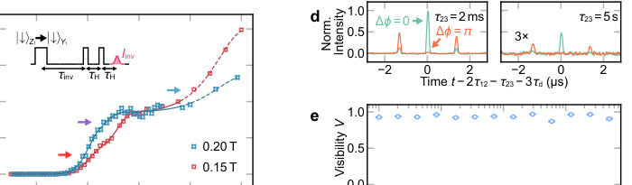 
FIG. 4. Optical phase storage. a, Decay mechanisms of Er3+ ions populated in the |↓⟩𝑌1 state following optical excitation. b, Inversion- recovery echo intensity 𝐼inv as a function of waiting time 𝜏inv between the first pulse (see inset for sequence) and the subsequent Hahn echo sequence with time 𝜏H at different fields (markers). The echo intensities are normalised to their common plateau at 𝑇1,𝑇Z &lt; 𝜏inv &lt; 𝑇W. Lines: fit to a triple exponential 𝐼inv ∝[1 −(𝑝1 exp (−𝜏inv/𝑇1) + 𝑝Z exp (−𝜏inv/𝑇Z) + 𝑝W exp (−(𝜏inv/𝑇W)1/2))]2, from which 𝑇1, 𝑇Z, and 𝑇W are extracted. The dashed line section indicates estimate for the ultra long-lived states. Arrows indicate the echo features corresponding to each...

**Summary.** The researchers engineered a novel photonic platform by bonding an optimized $	ext{Er}^{3+}:	ext{CaWO}_4$ crystal onto a tunable lithium niobate resonator. They achieved millisecond optical coherence and strong light-matter coupling, while also demonstrating long-term quantum phase storage mediated by host nuclear spins. This integration proves a scalable architecture for future telecom quantum networks.

**Why it may be interesting.** This work directly addresses key engineering challenges in solid-state quantum memory by integrating high-coherence rare-earth systems into scalable photonic circuits for quantum networking applications.

Detailed structure

**Main problem.** Developing scalable quantum network nodes requires combining strong light-matter coupling, long coherence times, and in situ spectral control at telecom wavelengths.

**Main result.** The integrated device successfully demonstrates strong collective coupling, millisecond optical coherence, and tunable spectral properties, establishing a viable route for scalable telecom quantum networks.

**Method.** The study uses three-pulse photon echo (3PPE) techniques to measure coherence and spectral diffusion, alongside electro-optic tuning measurements to characterize light-matter interaction strength.

**Model / system.** The platform is a heterogeneously integrated system combining an optimized $	ext{Er}^{3+}:	ext{CaWO}_4$ crystal with a high-$	ext{Q}$, electro-optically tuneable thin-film lithium niobate (TFLN) microring resonator.

**Key observables.** Effective homogeneous linewidth ($\Gamma_{	ext{eff}}$), spectral diffusion rate ($\Gamma_{SD}$), collective cooperativity ($C$), and optical phase storage visibility ($V$).

**Important parameters / regimes.** Coherence time ($T_	ext{M}$) of $1.10 \pm 0.13	ext{ms}$; strong coupling constant $C=6.7 \pm 0.4$; phase storage time up to $5$ seconds.

**Assumptions / limitations.** The success relies on the optimized $	ext{Er}^{3+}:	ext{CaWO}_4$ host providing a weakly magnetic environment and well-defined sites, overcoming limitations of previous doping methods.

**Figures summary.** Figures illustrate the schematic of the integrated platform, coherence measurements using 3PPE showing linewidth evolution, and transmission spectra demonstrating avoided crossings related to strong coupling.

**Paper structure.** The paper details the necessity for advanced quantum nodes, presents the novel heterogeneously integrated platform, reports quantitative measurements of coherence (linewidth/diffusion), demonstrates strong coupling via tuning, and finally showcases long-lived phase storage using nuclear spins.

Abstract

Long-range quantum network nodes require the combination of strong light-matter coupling, long coherence times and in situ spectral control at telecom wavelengths. The coherence of erbium in integrated devices is held back by its hosts, which do not simultaneously provide the weakly magnetic nuclear-spin environment and the well-defined substitutional sites found in coherence-optimised bulk crystals. Here we bring such an optimised crystal onto a photonic chip, by bonding an Er${^{3+}}$:CaWO${_{4}}$ host without an adhesive interlayer to a high-${Q}$ electro-optically tuneable thin-film lithium niobate microring resonator. At an effective temperature of ${75}$ mK and a field of only ${0.2}$ T, the bonded ensemble retains an effective homogeneous linewidth of ${289\pm34}$ Hz (${T_\text{M}=1.10\pm0.13}$ ms), with spectral diffusion proceeding at ${86\pm18}$ Hz and saturating at ${1.5\pm0.2}$ kHz. Electro-optically tuning the resonator through the erbium optical transition resolves an avoided crossing with a collective cooperativity of ${C=6.7\pm0.4}$. Exploiting superhyperfine coupling to the host's ${^{183}}$W nuclear spins, we store and retrieve optical phase information over ${5}$ s with a visibility of ${0.935\pm0.015}$. Strong collective coupling, millisecond coherence and in situ spectral tuning in a single device thus establish heterogeneous integration leveraging coherence-optimised hosts as a route to scalable telecom quantum networks.

[↑ back to top](#top)

### [Nonisospectral Integrability and Exact Current Fluctuations in the Two-Dimensional SSEP](http://arxiv.org/abs/2608.08480v1)

**Authors:** Tingfei Li  
**Type:** theory · **Category:** statistical mechanics · **PDF:** <https://arxiv.org/pdf/2608.08480v1>  
**Analysis basis:** full PDF text, analyzed in chunks
**Topic relevance:** 🔥 `Full counting statistics` **4/5** · `non-equilibrium universality` **3/5** · `Keldysh / 2PI / non-Gaussian methods` **2/5** · `driven-dissipative phase transition` **2/5** · `methods for driven-dissipative` **2/5** · `analog quantum simulation` **1/5** · `correlated / nonlocal dissipation` **1/5** · `quantum measurements` **1/5** · `scars & prethermalization` **1/5**

📷 Fig 1

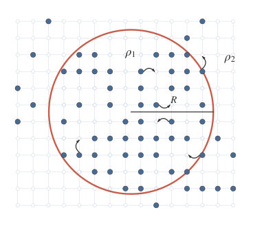 
FIG. 1. Radial counting geometry for the two-dimensional SSEP. A disk BR of radius R separates Bernoulli densities ρ1 and ρ2. Its boundary is passive: particles may cross it repeatedly in either direction, while QT = NB(0) −NB(T) measures the net outward transfer over time T.

📷 Fig 2

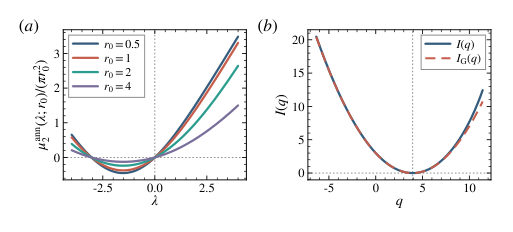 
FIG. 2. Full counting statistics for ρ1 = 0.7 and ρ2 = 0.1. (a) Area-normalized SCGF µann 2 (λ; r0)/(πr2 0) for r0 = 0.5, 1, 2, 4. (b) Exact rate function I(q) at r0 = 2 compared with the Gaussian approximation IG(q) = (q −¯q)2/[2µ′′ 2(0)], with ¯q = µ′ 2(0).

📷 Fig 3

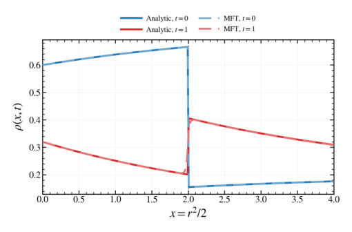 
FIG. 3. Analytic endpoint-density reconstruction versus the direct iterative MFT solution for r0 = 2 and (ρ1, ρ2, λ) = (0.5, 0.2, 1). The curves show ρ(x, 0) and ρ(x, 1); solid lines are analytic and dashed lines are numerical.

**Summary.** This paper calculates the large-deviation statistics for particle currents in a 2D SSEP confined by a curved boundary. It achieves this by mapping the complex problem onto an integrable, nonisospectral formulation on the half-line. The result provides a closed-form expression for the SCGF, advancing the theoretical understanding of current fluctuations in low-dimensional interacting particle systems.

**Why it may be interesting.** While focused on classical statistical mechanics, the use of advanced integrable methods (Lax pairs, scattering transforms) to solve non-equilibrium fluctuation problems is highly relevant to open quantum systems where such mathematical tools are often employed for correlation functions.

Detailed structure

**Main problem.** The study determines the annealed full counting statistics (large deviations) of conserved currents in a two-dimensional system with a finite, curved boundary.

**Main result.** A closed expression for the scaled cumulant generating function (SCGF) and associated current large-deviation statistics is obtained using nonisospectral methods.

**Method.** The approach combines Large Deviation Theory/Macroscopic Fluctuation Theory with techniques from integrable systems, specifically mapping the problem to a nonisospectral formulation solvable via scattering construction and scalar factorization.

**Model / system.** The physical system is the two-dimensional Symmetric Simple Exclusion Process (SSEP) on Z^2. The setup involves an initial density difference ($
ho_1$ inside a disk of radius $R$, $
ho_2$ outside), with the observable being the net particle number decrease across the boundary.

**Key observables.** The scaled cumulant generating function (SCGF), $\mu_{	ext{ann}}^2(\lambda; r_0)$, and the current fluctuations.

**Important parameters / regimes.** Initial densities ($
ho_1, 
ho_2$), disk radius ($R$), and the large deviation parameter ($\lambda$).

**Assumptions / limitations.** The derivation relies on exploiting convexity of the MFT action and rotational averaging to reduce the problem to a radial form; it is not a direct extension of 1D step current solutions.

**Figures summary.** Figure 1 illustrates the geometry (disk separating $
ho_1$ and $
ho_2$) for counting fluctuations. Figure 2 compares the calculated SCGF against Gaussian approximations for various boundary conditions ($r_0$).

**Paper structure.** The paper proceeds by formulating the problem within MFT, exploiting symmetry to achieve a radial reduction, mapping this to a nonisospectral half-line problem solvable via scattering theory and scalar factorization techniques.

Abstract

We study annealed current fluctuations in the two-dimensional symmetric simple exclusion process across a circular passive counting boundary. The initial density is $ρ_1$ inside a disk of radius $R$ and $ρ_2$ outside, and the observable is the net decrease of the particle number in the disk over a finite time. Using convexity of the macroscopic fluctuation theory action and rotational averaging, we show that the minimizer of the full two-dimensional variational problem may be chosen radially symmetric. For the resulting radial problem, a suitable change of variables leads to a nonisospectral formulation on the half-line. Combining the associated scattering construction with a scalar factorization, we obtain a closed expression for the scaled cumulant generating function and hence the annealed large-deviation statistics of the current.

[↑ back to top](#top)

### [Momentum-Selective Electron and Spin Dynamics under Ultrafast Photoexcitation](http://arxiv.org/abs/2608.08104v1)

**Authors:** Gusein Bedirkhanov, Nagamalleswararao Dasari, Alexander I. Lichtenstein, Evgeny A. Stepanov  
**Type:** theory · **Category:** strongly correlated electrons · **PDF:** <https://arxiv.org/pdf/2608.08104v1>  
**Analysis basis:** full PDF text, analyzed in chunks
**Topic relevance:** 🔥 `Keldysh / 2PI / non-Gaussian methods` **4/5** · `methods for driven-dissipative` **3/5** · `non-equilibrium universality` **3/5** · `analog quantum simulation` **2/5** · `driven-dissipative phase transition` **2/5** · `correlated / nonlocal dissipation` **1/5** · `scars & prethermalization` **1/5**

📷 Fig 1

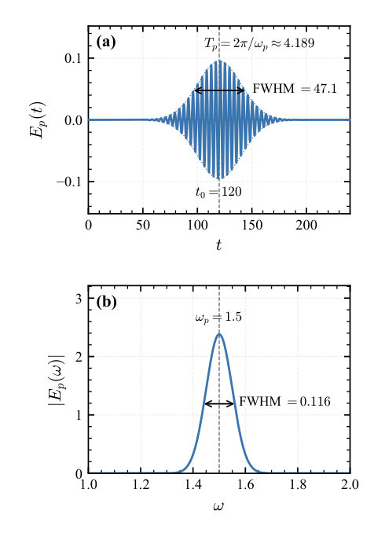 
FIG. 1. Pump pulse used for the interaction strength U = 1.5. (a) Time-domain electric field Ep(t) with Gaussian envelope. (b) Magnitude of the Fourier spectrum, showing a narrow frequency distribution centered at the resonant carrier fre- quency ωp = U = 1.5. The pulse has amplitude E0 = 0.095 and is centered at t0 = 120, with a temporal full width at half maximum (FWHM) of 47.1 and a corresponding spectral FWHM of 0.116. All quantities are given in units of the half- bandwidth.

📷 Fig 2

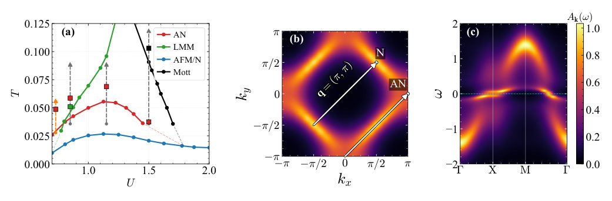 
FIG. 2. Equilibrium properties of the two-dimensional Hubbard model. (a) Equilibrium phase diagram in the U–T plane adopted from Ref. [40]. The red line denotes the antinodal pseudogap crossover (AN), the blue line the antiferromagnetic (N´eel) transition (AFM/N), and the black line the Mott transition. Dashed segments indicate extrapolated phase boundaries. The green line (LMM) marks the onset of local magnetic moment formation, determined in this work from the dynamical criterion introduced in Sec. III D. Vertical dashed arrows show the transient heating trajectories investigated in this work at U = 0.73, 0.85, 1.15, and 1.5. Filled squares along the trajectories indicate characteristic...

📷 Fig 3

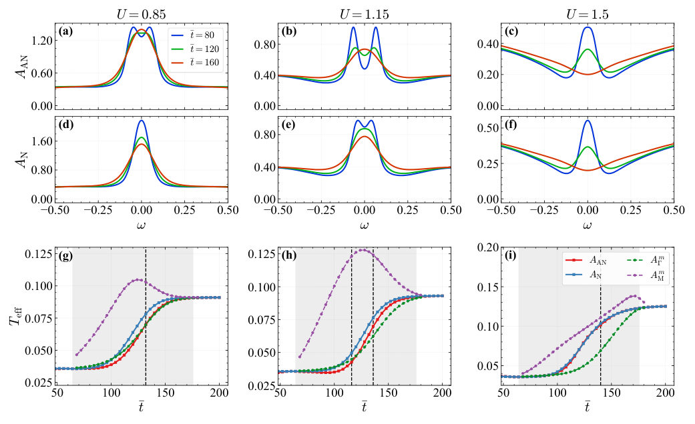 
FIG. 3. Momentum-resolved spectral functions and effective temperatures during the pump excitation, one column per in- teraction strength. Top row (a)–(c): antinodal spectral function AAN(ω) at probe times ¯t, evaluated at AN = (π, 0). Middle row (d)–(f): nodal spectral function AN(ω), evaluated at N = (π/2, π/2). Bottom row (g)–(i): effective temperature Teff(¯t) extracted at the antinodal point AAN (red) and nodal point AN (blue), together with the magnon effective temperatures A(m) Γ (green) and A(m) M (purple), evaluated at Γ = (0, 0) and M = (π, π), respectively. For U = 0.85 and 1.15, the vertical dashed lines mark the gap closing at the antinodal and/or nodal points; for U = 1.5 they...

📷 Fig 4

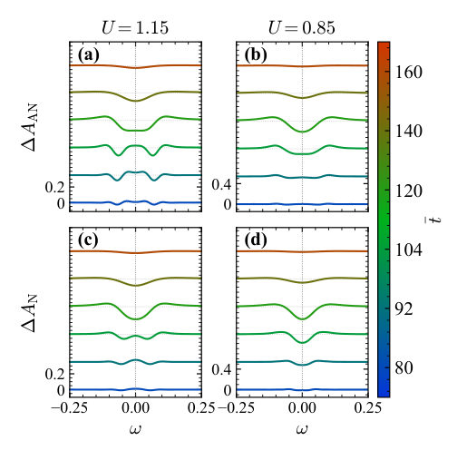 
FIG. 4. Nonthermal contribution to the transient spec- tral function, ∆Ak(¯t, ω) = Ak(¯t, ω) −Aeq k (Teff(¯t), ω), for the weakly correlated metal (U = 1.15, left column) and the cor- related metal (U = 0.85, right column), at the antinodal mo- mentum AN = (π, 0) (top row, ∆AAN) and nodal momen- tum N = (π/2, π/2) (bottom row, ∆AN). The comparison is made with equilibrium spectra calculated at the same T loc eff (¯t) extracted from the nonequilibrium local spectral function Aloc(¯t, ω). Curves are offset vertically and colored by probe time ¯t (color bar), covering the pulse window. Energies are in units of the half-bandwidth.

📷 Fig 5

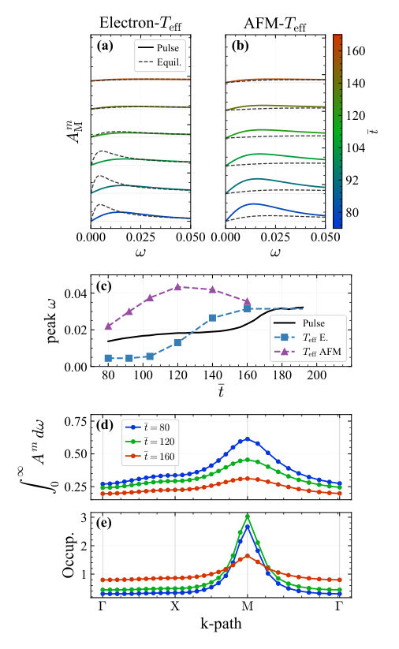 
FIG. 5. Nonthermal heating and redistribution of the AFM magnon spectral weight for U = 1.15. (a,b) Nonequilib- rium spectral function of magnetic excitations Am M(ω) at M = (π, π) during the pulse (solid, colored by time ¯t) com- pared with equilibrium references (dashed) evaluated at the instantaneous (a) average electronic and (b) AFM mode ef- fective temperatures. Successive times are offset vertically for clarity. (c) Evolution of the magnon peak position. The nonequilibrium result (Pulse, black) is compared with equilibrium peak positions evaluated at the average elec- tronic (Teff E.) and AFM magnonic (Teff AFM) tempera- tures. (d) Momentum-resolved available magnetic spectral...

**Summary.** This paper develops a sophisticated real-time many-body theory to model how electrons and spins behave immediately after being excited by intense light in correlated materials. It successfully predicts momentum-dependent electronic heating anisotropies and details the complex, nonthermal dynamics of magnetic fluctuations. The work establishes a unified picture for interpreting advanced pump-probe experiments across both charge and spin sectors.

**Why it may be interesting.** This research provides advanced theoretical tools (D-GW) for simulating non-equilibrium quantum dynamics, which is highly relevant for understanding ultrafast response in strongly correlated materials that are often studied using pump-probe spectroscopy techniques.

Detailed structure

**Main problem.** To develop a unified microscopic theoretical framework for understanding momentum-selective ultrafast electronic and magnetic dynamics in correlated quantum materials following photoexcitation.

**Main result.** The study predicts transient nodal–antinodal anisotropy in electronic heating, explains the origin of in-gap states via nonthermal spectral-weight transfer, and characterizes the quench-like excitation of antiferromagnetic fluctuations.

**Method.** The authors employ a real-time many-body framework, specifically the real-time dual GW (D-GW) method, to track non-equilibrium dynamics.

**Model / system.** The primary model is the Hubbard model on a square lattice, describing correlated electron systems. The analysis extends to studying local spin and charge susceptibilities in dimer models as well.

**Key observables.** Momentum-selective electronic response (Nodal vs. Antinodal), electronic heating anisotropy, nonthermal spectral-weight transfer, AFM mode dynamics, and real-time local spin susceptibility.

**Important parameters / regimes.** $U$ (local repulsion) varied in $[0.5, 1.5]$, ultrafast photoexcitation pulse parameters, and temperature ($T=0$ vs $T>0$).

**Assumptions / limitations.** The D-GW method is used to consistently capture the interplay between strong local correlations and nonlocal collective fluctuations in real time.

**Figures summary.** Figures illustrate the time-domain electric field and momentum-resolved spectral functions, showing the nodal–antinodal dichotomy in equilibrium and tracking dynamic changes upon photoexcitation.

**Paper structure.** The work establishes the need for a unified theory, applies D-GW to analyze electronic response (N vs AN), extends this analysis to collective magnetic excitations ($	ext{AFM}$ fluctuations), and concludes by linking these findings to local moment formation via spin susceptibility.

Abstract

Recent advances in time-resolved spectroscopies have enabled direct access to the momentum-selective nonequilibrium dynamics of correlated quantum materials, revealing a strongly momentum-dependent response of electrons and collective excitations. Interpreting these observations requires a real-time theoretical framework that consistently captures the interplay between strong local electronic correlations and nonlocal collective fluctuations, a capability that remains beyond state-of-the-art nonequilibrium approaches. Using a recently developed real-time many-body framework, we resolve the momentum-selective ultrafast dynamics of a photoexcited correlated electron system. We predict a transient nodal-antinodal anisotropy in electronic heating, providing a microscopic explanation for the momentum-dependent response debated in time-resolved photoemission and Raman experiments, and identify the nonthermal spectral-weight transfer responsible for the transient antinodal in-gap states observed in ultrafast photoemission. We further uncover a momentum-selective magnetic response, in which antiferromagnetic fluctuations undergo a strongly nonthermal, quench-like excitation far above the electronic temperature while preserving their correlation length, before relaxing through a momentum-space magnon cascade toward lower-momentum modes. Finally, by tracking the real-time local spin susceptibility, we identify a dynamical, experimentally accessible signature of local-moment formation and its photoinduced melting. Our results establish a unified microscopic picture of ultrafast electronic and magnetic dynamics, providing a framework for interpreting momentum-resolved pump-probe experiments.

[↑ back to top](#top)

### [Conditional non-Hermitian acceleration of multiphoton atomic transitions](http://arxiv.org/abs/2608.09562v1)

**Authors:** Marcos V. S. de Paula, Alexandre P. Costa, A. V. Dodonov  
**Type:** theory · **Category:** other · **PDF:** <https://arxiv.org/pdf/2608.09562v1>  
**Analysis basis:** full PDF text, analyzed in chunks
**Topic relevance:** 🔥 `quantum measurements` **4/5** · `methods for driven-dissipative` **3/5** · `Tavis-Cummings & cavity-many-emitter` **2/5** · `driven-dissipative phase transition` **2/5** · `Keldysh / 2PI / non-Gaussian methods` **1/5** · `analog quantum simulation` **1/5** · `correlated / nonlocal dissipation` **1/5** · `non-equilibrium universality` **1/5**

📷 Fig 1

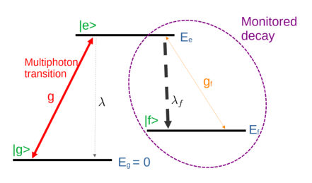 
Figure 1: Level scheme of the monitored Λ-atom. The resonant odd- multiphoton transition couples |g⟩and |e⟩, while the auxiliary state |f⟩is popu- lated through a weak dispersive interaction and the monitored decay |e⟩→|f⟩. The conditioned dynamics is obtained by postselecting trajectories in which no quantum jump associated with this incoherent decay channel occurs.

📷 Fig 2

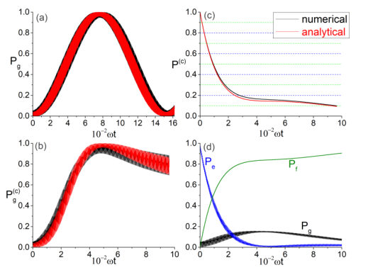 
Figure 2: Semiclassical Rabi model at the three-photon resonance. (a) Ground- state population for the initial state |e⟩under Hermitian evolution; the black and red curves are the numerical and analytical results, respectively. (b) Ground- state population in the conditioned no-jump dynamics. The first analytical and numerical transfer maxima occur at essentially the same time and earlier than in panel (a). (c) Probability of no jump during the interval [0, t). (d) Atomic pop- ulations in the unconditioned dissipative evolution generated by the complete master equation (solved numerically).

📷 Fig 3

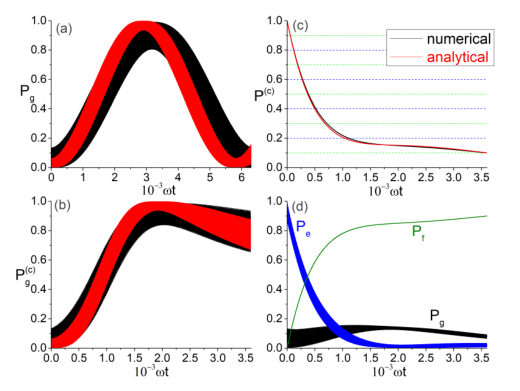 
Figure 3: Same quantities as in Fig. 2, but for the five-photon resonance. The horizontal axis spans a longer time interval because the five-photon transition is intrinsically slower, even though a larger coupling strength is used.

📷 Fig 4

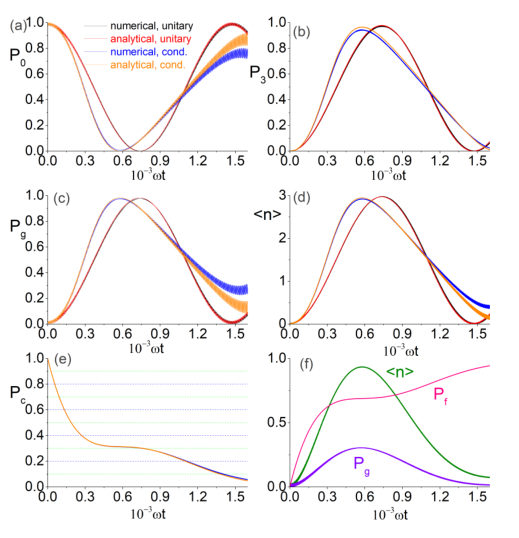 
Figure 4: Quantum Rabi model at the three-photon resonance. (a) Population of the vacuum Fock state |0⟩: numerical Hermitian dynamics (black), analytical Hermitian dynamics (red), numerical conditioned dynamics (blue), and analyt- ical conditioned dynamics (orange). (b) Population of the Fock state |3⟩. (c) Atomic ground-state population Pg. (d) Mean photon number. (e) Probability of no jump during [0, t). (f) Atomic populations and mean photon number in the unconditioned dissipative evolution generated by the complete master equation.

📷 Fig 5

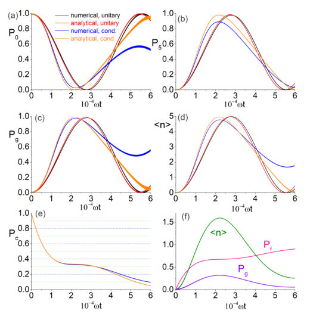 
Figure 5: Same quantities as in Fig. 4, but at the five-photon resonance. Panel (b) shows the population of the Fock state |5⟩.

**Summary.** The research demonstrates that continuous monitoring of an auxiliary decay channel can significantly accelerate slow multiphoton transitions in three-level atoms. By deriving effective non-Hermitian Hamiltonians and applying perturbation theory, the authors show this acceleration is achieved only within the measured (no-jump) ensemble, leading to a quantifiable speedup compared to standard dissipative evolution.

**Why it may be interesting.** This work directly addresses open quantum systems by showing how measurement backaction (monitoring) can be harnessed as a resource to engineer faster state transfer rates in cavity QED or atomic physics settings, while quantifying the associated speed-success trade-off.

Detailed structure

**Main problem.** The paper investigates how continuous monitoring of a dissipative channel can accelerate otherwise slow multiphoton atomic transitions.

**Main result.** Conditioning the evolution on no photon emission accelerates the transition rate, achieving an enhancement factor approaching $\pi/2$ (a ~57% increase) compared to the unconditioned dynamics.

**Method.** The authors use Floquet theory and Brillouin–Wigner projection-operator perturbation methods to derive effective non-Hermitian Hamiltonians for both semiclassical and quantum Rabi models.

**Model / system.** The system is a three-level atom in a $\Lambda$ configuration driven by a classical field. The dynamics are analyzed using a conditioned master equation derived from the full dissipative evolution, leading to an effective non-Hermitian Hamiltonian.

**Key observables.** Effective population-transfer rate (inverse time for first complete transfer), probability of successful postselection ($P_c$), and the enhancement factor of the transition rate.

**Important parameters / regimes.** Odd-multiphoton resonance conditions ($\Omega \approx (2K+1)\omega$); coupling strengths ($g, g_f$) and decay rates ($\lambda$).

**Assumptions / limitations.** The analysis relies on approximations such as neglecting weak unmonitored dissipation channels and the nonresonant auxiliary level $|f
angle$ during analytical derivations.

**Figures summary.** Figures compare semiclassical and full quantum Rabi model dynamics for three-photon and five-photon resonances, contrasting conditioned (no-jump) evolution with unconditional dissipative evolution regarding populations and transfer rates.

**Paper structure.** The paper establishes the non-Hermitian dynamics via continuous monitoring, then applies perturbation theory to derive effective two-state Hamiltonians. Finally, it compares analytical solutions derived from these models against direct numerical integration for both semiclassical and full quantum regimes.

Abstract

Continuous monitoring can convert a dissipative channel into a resource for accelerating otherwise slow multiphoton transitions. We consider a three-level atom in a $Λ$ configuration and condition the evolution on the absence of photon emission through an auxiliary monitored decay channel. The resulting no-jump dynamics is governed by a non-Hermitian Rabi-type Hamiltonian. Using Floquet theory and Brillouin--Wigner projection-operator perturbation method, we derive effective two-state descriptions of odd-multiphoton resonances in the semiclassical and quantum Rabi models. The effective population-transfer rate, defined as the inverse of the time required for the first complete transfer between the atomic states, is maximized at an exceptional point, where its enhancement factor approaches $π/2$, corresponding to an approximately $57\%$ increase over the Hermitian value. Numerical results for three- and five-photon resonances closely reproduce the analytical transition times and yield non-negligible postselection probabilities. By contrast, the complete unconditioned dissipative evolution does not exhibit the same population-transfer enhancement. These results demonstrate a speed--success trade-off for measurement-conditioned multiphoton state transfer.

[↑ back to top](#top)

### [Interaction between Rydberg Excitons in Cuprous Oxide Revealed through Resonant Second Harmonic Generation](http://arxiv.org/abs/2608.08705v1)

**Authors:** Andreas Farenbruch, Henje Stolz, Peter Grünwald, Dirk Semkat, Nikita Siverin, Dmitri R. Yakovlev, Dietmar Fröhlich, Manfred Bayer  
**Type:** both · **Category:** other · **PDF:** <https://arxiv.org/pdf/2608.08705v1>  
**Analysis basis:** full PDF text, analyzed in chunks
**Topic relevance:** 🔥 `analog quantum simulation` **4/5** · `interference shaping light` **3/5** · `quantum measurements` **2/5** · `quantum optics experiment` **2/5** · `Keldysh / 2PI / non-Gaussian methods` **1/5** · `Rydberg arrays` **1/5** · `driven-dissipative phase transition` **1/5** · `methods for driven-dissipative` **1/5**

📷 Fig 1

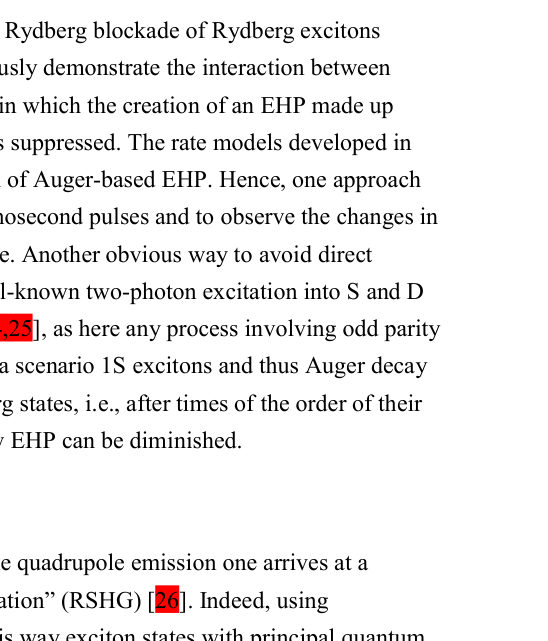 
Fig. 1: Energy scheme of the important optical and relaxation processes in Cu2O in a two-particle picture. O designates the crystal ground state, the parabolas the energy dispersion of the yellow 1S exciton (1S, black), the yellow band continuum (Y, yellow) and the blue/violet continuum (B\V, blue), the corresponding

📷 Fig 2

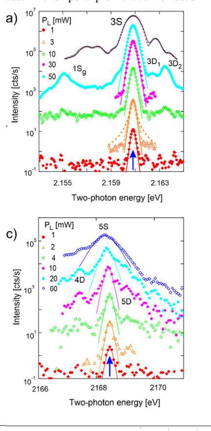 
Fig. 2: SHG spectra (i.e., emitted light intensity vs. photon energy after subtraction of the dark

📷 Fig 3

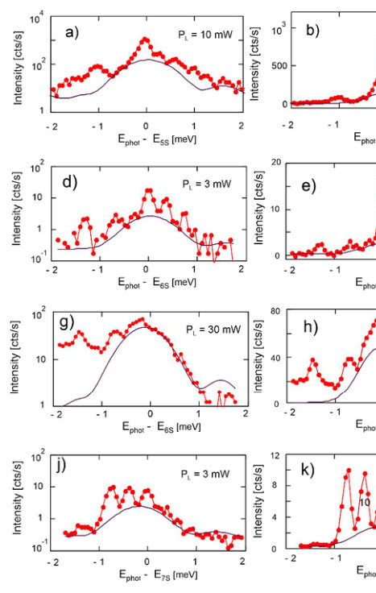 
Fig. 3: Decomposition of spectra into the nonresonant and resonant contributions. The first

📷 Fig 4

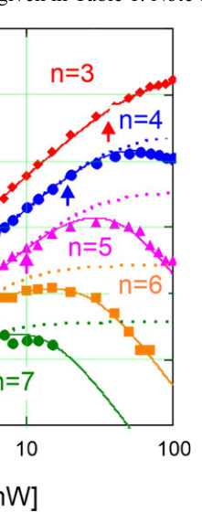 
Fig. 4: Power dependence of the resonant contribution for nS=3 (red diamonds and lines),

📷 Fig 5

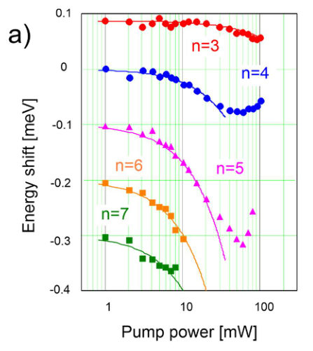 
Fig. 6: Overview of the spectral shifts and widths obtained by fitting the “pure” exciton SHG

**Summary.** The research experimentally investigates interacting Rydberg excitons in cuprous oxide using resonant second harmonic generation spectroscopy under high laser intensities. By developing a semi-classical theory, the authors quantify exciton-exciton interactions and find that their scaling behavior deviates significantly from predictions based on atomic van der Waals forces. This suggests fundamental physical differences between excitonic and atomic many-body dynamics in solid-state materials.

**Why it may be interesting.** This work bridges solid-state physics (excitons in semiconductors) with atomic physics concepts (Rydberg blockade), using advanced nonlinear optics techniques. The comparison between exciton and atom interactions is a key topic in AMO physics, especially concerning many-body effects in condensed matter systems.

Detailed structure

**Main problem.** To investigate the interaction between Rydberg excitons in cuprous oxide ($	ext{Cu}_2	ext{O}$) and determine if their interactions fundamentally differ from those predicted by atomic van der Waals theory.

**Main result.** The observed scaling of exciton-exciton interaction results with principal quantum number is significantly different from state-of-the-art atomic models, suggesting fundamental differences between excitons and isolated atoms.

**Method.** The study combines experimental measurements using Resonant Second Harmonic Generation (RSHG) spectroscopy with the development of a semi-classical theoretical model to quantify exciton interactions.

**Model / system.** The system is Rydberg excitons in cuprous oxide ($	ext{Cu}_2	ext{O}$). The theory models these excitons as interacting bosons governed by a distance-dependent potential, leading to saturation effects described by a 'Rydberg' blockade mechanism.

**Key observables.** Spectral shifts and broadening of SHG lines with pump intensity; power dependence of spectral intensities (scaling with $P^2$ at low power, saturating/reducing at high power); quantitative exciton-exciton interaction strength derived from two-photon absorption measurements.

**Important parameters / regimes.** Peak laser intensity up to $10 	ext{ GW}/	ext{cm}^2$; principal quantum number ($n$) of the excitons; characteristic energy scales ($	ext{meV}$ range); density $\sim 3 	imes 10^{21} 	ext{ m}^{-3}$.

**Assumptions / limitations.** The SHG process is assumed to be fully coherent. The analysis often requires separating resonant contributions from nonresonant backgrounds, and high-power effects are modeled via additional decay channels (e.g., EHP formation).

**Figures summary.** Figures illustrate power-dependent spectral changes (shifts/broadening) for various $nS$ lines; one figure decomposes the total SHG spectrum into resonant and nonresonant parts across different pump powers.

**Paper structure.** The paper progresses by first detailing the experimental setup using RSHG to probe exciton interactions. It then presents a semi-classical theory incorporating bosonic interaction potentials, followed by quantitative analysis comparing measured power dependencies against theoretical predictions derived from two-photon absorption and plasma effects.

Abstract

We report experimental and theoretical investigations of interacting excitons of the yellow series in cuprous oxide (Cu$_2$O) with principal quantum numbers up to by means of second harmonic generation (SHG). Using picosecond pulsed laser excitation up to 10 GW/cm$^2$ peak intensity we observe a pronounced change of the spectra with increasing pump laser intensity: an energetic shift to lower absolute energies and a spectral broadening. The absolute intensities of the spectral lines scale for low powers with the square of the pump power, but saturates at higher powers. At still higher powers the SHG intensity is actually reduced. To explain these results quantitively, we developed a semi-classical theory of resonant SHG where the process of SHG is fully coherent. The excitons are assumed to be bosons interacting by a distance dependent potential giving rise to both the changes in spectral line shape and the saturation by a $\it{Rydberg}$ blockade. The concomitant measurement of two-photon absorption allows to derive quantitative values for the exciton-exciton interaction. While the results agree in order of magnitude with those calculated by state-of-the art atomic-like van der Waals interaction theory, the scaling with principle quantum number is quite different. As a possible screening by an electron-hole plasma created by three-photon absorption into blue and violet band states could be ruled out, our results point toward fundamental differences between excitons and atoms.

[↑ back to top](#top)

### [Quantum-classical crossover in noisy monitored oscillators](http://arxiv.org/abs/2608.08267v1)

**Authors:** Joseph M. Ryan, Simon Gorbaty, Stephen W. Teitsworth, Crystal Noel  
**Type:** theory · **Category:** other · **PDF:** <https://arxiv.org/pdf/2608.08267v1>  
**Analysis basis:** full PDF text, analyzed in chunks
**Topic relevance:** 🔥 `quantum measurements` **4/5** · `driven-dissipative phase transition` **3/5** · `methods for driven-dissipative` **3/5** · `non-equilibrium universality` **2/5** · `Full counting statistics` **1/5** · `correlated / nonlocal dissipation` **1/5** · `scars & prethermalization` **1/5**

📷 Fig 1

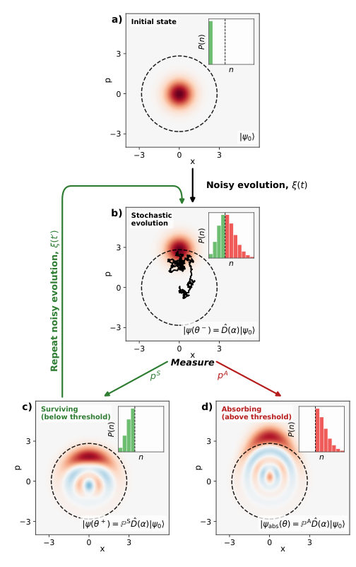 
FIG. 1. Illustration of a single trajectory of the first-passage process generated using a Monte Carlo wavefunction method. The Wigner function W(x, p) of the wavefunction at each stage is shown. (a) Starting in the ground state |0⟩, the noise ξ(t) randomly displaces the wavefunction for a dura- tion θ, producing the state (b), after which time the energy- barrier measurement with threshold NB is performed (here with NB = 4). The measurement truncates the wavefunction, as shown in the histogram of occupation probabilities. The two possible postmeasurement states (c) and (d) are shown. The process repeats until an absorbing outcome is obtained.

📷 Fig 2

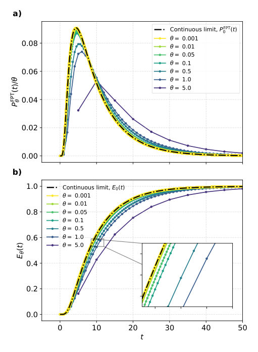 
FIG. 3. (a) First-passage-time distributions and (b) cumula- tive escape probability distributions for NB = 10 , N0 = 0 and various θ. For finite-θ, these are discrete distributions defined on the grid t = mθ, with m = 1, 2, . . .. We also show the infinitely frequent measurement limit densities P FPT 0 (t) and E0(t).

📷 Fig 3

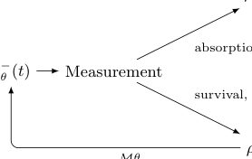 
FIG. 2. Schematic of the repeated measurement protocol in the ensemble picture. The initial state ρi evolves under the master equation propagator eMθ to the premeasurement state ρ− θ (t = θ). A measurement then produces either a survival outcome, with probability P S θ (t = θ), leaving the system in the postmeasurement state ρ+ θ (t = θ), or an absorption out- come, with probability P A θ (t = θ), leading to ρabs(t = θ). In this case, the process stops. Following a survival outcome, the postmeasurement state is propagated for another interval θ, and the cycle repeats.

📷 Fig 4

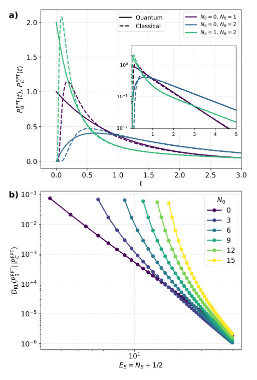 
FIG. 4. (a) Continuous-time quantum (solid lines) and clas- sical (dashed lines) FPTDs for a given starting energy E0 = (N0 + 1/2) and threshold energy EB = (NB + 1/2). (b) Kull- back–Leibler divergence DKL(P FPT 0 ||P FPT C ) between quantum and classical FPTDs for different initial and threshold ener- gies. The points corresponding to NB −N0 = 1 are omitted as the classical density essentially vanishes at zero time, and so the KL integrand is logarithmically divergent.

📷 Fig 5

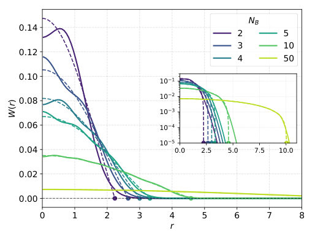 
FIG. 6. The radial profiles of the rotationally symmetric Wigner function W(r = p

**Summary.** This paper analyzes how monitoring an open quantum oscillator affects its escape time statistics, comparing quantum predictions against classical expectations. By using both density matrix and trajectory methods, the authors show that while measurement protocols can generate nonclassical states, the deviation from classical behavior diminishes as the energy threshold increases. It provides a theoretical framework for understanding quantum-to-classical crossovers in monitored systems.

**Why it may be interesting.** This work directly addresses open quantum systems dynamics under measurement backaction, a core topic in modern AMO physics. The connection between measurement statistics (FPTD) and the emergence of nonclassical resources is highly relevant for quantum control and sensing.

Detailed structure

**Main problem.** The study investigates the first-passage time statistics for open quantum systems undergoing continuous monitoring, focusing on the crossover between quantum and classical behavior.

**Main result.** Projective measurements cause significant deviations in first-passage times at low energy thresholds compared to classical predictions, but these differences diminish as the threshold increases. The analysis provides a framework to generate nonclassical states via measurement protocols.

**Method.** The authors employ both ensemble-averaged density matrix dynamics and trajectory-resolved stochastic pure-state dynamics to model the system evolution under repeated projective measurements.

**Model / system.** The physical model is a harmonic oscillator driven by classical additive noise, which serves as an open quantum system. The dynamics are governed by master equations incorporating stroboscopic projective measurements at intervals $\theta$.

**Key observables.** First-passage time distribution (FPTD), nonclassical signatures like persistent Wigner negativity, and the Kullback–Leibler divergence quantifying the quantum-classical difference.

**Important parameters / regimes.** The measurement threshold energy ($E_B$ or $N_B$), the measurement interval ($\theta$), and the initial state energy level ($N_0$).

**Assumptions / limitations.** The analysis assumes measurements are fast relative to the measurement interval $\theta$, and it explores the limit of infinitely frequent measurements ($\theta \to 0$) for continuous-time results.

**Figures summary.** Figures illustrate single trajectories, schematic protocols detailing master equation propagation, calculated continuous limits for FPTDs compared to classical counterparts, and plots showing non-Gaussianity evolution over time.

**Paper structure.** The paper progresses by first defining the problem using a harmonic oscillator model, developing both density matrix and trajectory approaches, deriving analytical solutions for the continuous quantum FPTD (using Laguerre polynomials), comparing these results to classical stochastic averages, and finally analyzing non-Gaussianity and Wigner function signatures across different energy regimes.

Abstract

The quantum first-passage problem involves stochastic trajectories conditioned on measurement outcomes. The timing statistics of such trajectories remain largely unexplored in open quantum systems. Here, we investigate the first-passage time to an energy threshold for a ubiquitous model: a harmonic oscillator driven by classical additive noise. We find that projective measurements and energy quantization lead to substantial differences between the quantum and classical first-passage-time distributions at low thresholds, while these differences gradually diminish as the threshold energy increases. We treat the problem using both ensemble-averaged conditioned density-matrix dynamics and trajectory-resolved stochastic pure-state dynamics. The two descriptions yield indistinguishable timing statistics. Quantization effects appear in the ensemble-level phase-space distributions of the surviving states and vanish at larger threshold energies. Individual trajectories reveal emergent quantum signatures from the repeated measurements, such as persistent Wigner negativity. Our results provide a framework for using first-passage processes to create measurement-induced nonclassical resource states and to study the quantum-classical crossover of monitored systems.

[↑ back to top](#top)

### [Evidence for Counterfactual Violation of Local Conservation Laws in Quantum Events](http://arxiv.org/abs/2608.09205v1)

**Authors:** Patrick Cameron, Francesco Di Colandrea, Filippo Cardano, Lorenzo Marrucci  
**Type:** experiment · **Category:** other · **PDF:** <https://arxiv.org/pdf/2608.09205v1>  
**Analysis basis:** full PDF text, analyzed in chunks
**Topic relevance:** 🔥 `quantum optics experiment` **4/5** · `interference shaping light` **3/5** · `quantum measurements` **2/5** · `Full counting statistics` **1/5** · `analog quantum simulation` **1/5** · `correlated / nonlocal dissipation` **1/5** · `methods for driven-dissipative` **1/5**

📷 Fig 1

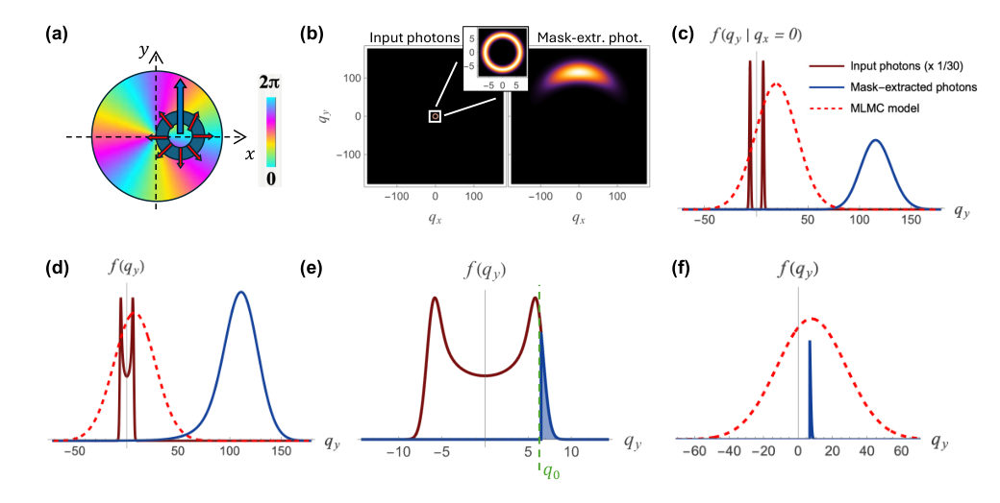 
FIG. 1. Concept of the momentum non-conservation experiment and an idealized case. (a) A mask is used to extract photons from a small spatial region of the input vortex wavefunction, close to the vortex core. The extracted photons exhibit a large “superkick” momentum in the direction of the local phase gradient (large blue vertical arrow), superimposed on random momentum kicks due to the mask (smaller red arrows). All momentum scales are in units of ℏ/w0. (b)-(d) show the calculated photon behavior for an input vortex charge ℓ= 20 and a Gaussian extraction mask with wM = 0.05w0 centered at xM = dM = 0.03w0. (b) Two-dimensional (2D) normalized momentum distributions for the input photons...

📷 Fig 2

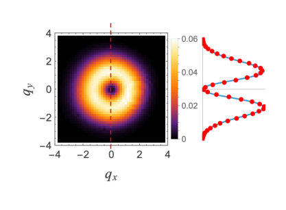 
FIG. 2. Input LG mode used for our experiments, with vor- tex charge ℓ= 1. Experimental normalized two-dimensional momentum distribution (that is, spatial distribution in the fo- cal plane of an imaging lens) obtained in the photon-counting regime. Momentum units are ℏ/w0. Brightness is propor- tional to the photon counts per pixel. The side panel shows the vertical cut through the vortex for qx = 0: the red dots are data (the error bars are smaller than the symbols) and the blue curve is theory. No fitting parameters are used.

📷 Fig 3

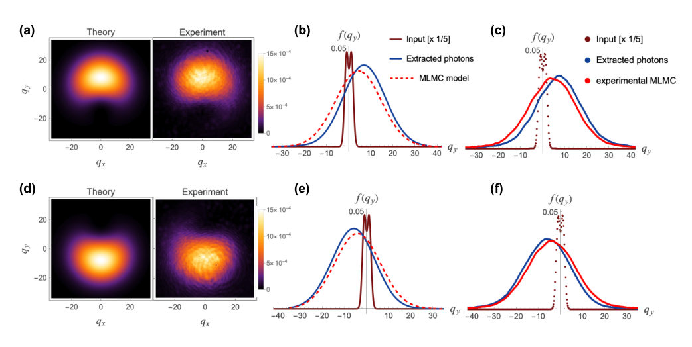 
FIG. 3. Main experimental results, providing evidence for a violation of local momentum conservation. The input vortex has charge ℓ= 1, and the extraction mask has nominal values wM = 0.1w0 and dM = 0.1w0, corresponding to a mask transmission probability Ptr = 2.7 × 10−4. All momentum scales are in units of ℏ/w0. (a) Theoretical (left) and measured (right) 2D normalized momentum distributions of photons transmitted by the mask, showing the “superkick” average momentum ¯qT y &gt; 0. (b) Computed marginal distributions of qy for the input photons (brown solid line, divided by 5 for visibility), the MLMC null hypothesis (red dashed line), and the mask-extracted photons (blue solid line). No...

📷 Fig 4

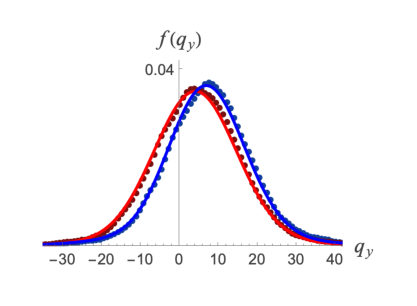 
FIG. 4. Comparison of the experimental momentum distri- butions shown in Fig. 3(c) with a model that also includes a small broadening effect attributed to optical apodization by finite-diameter imaging optics in intermediate propagation planes downstream of the mask. The data are downsampled for visual clarity. The two parameters of this model (see Ap- pendix D) are obtained by fitting the data. The blue dots and line represent the mask-transmitted photons; the red dots and line represent the MLMC model. Error bars are smaller than the symbols.

📷 Fig 5

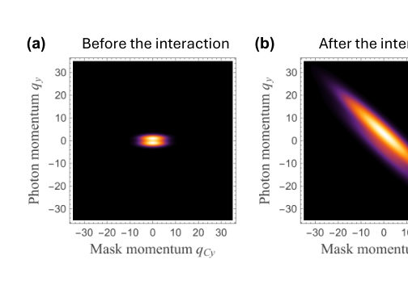 
FIG. 5. Analysis of the qy momentum balance in the mask-photon interaction, for wM

**Summary.** The research experimentally investigates whether individual quantum events can violate local conservation laws, using photons extracted from optical vortices. By measuring the transverse momentum of these selected photons, the authors demonstrate a statistically significant 'superkick' exceeding theoretical bounds derived from local momentum conservation. This suggests a new form of quantum nonlocality observable without relying on entanglement.

**Why it may be interesting.** This work directly probes fundamental symmetries (conservation laws) at the single-event quantum level in an optical setting, providing a novel platform to test foundational physics beyond standard entanglement measures.

Detailed structure

**Main problem.** The paper aims to provide experimental evidence for a potential violation of local conservation laws, specifically momentum, during individual quantum events.

**Main result.** The measurement shows that the mean transverse momentum of extracted photons statistically exceeds the bound predicted by assuming local momentum conservation, suggesting a distinct form of quantum nonlocality.

**Method.** Photons are extracted from a superoscillatory region near an optical vortex core using a small transmission mask and their resulting momentum distribution is analyzed.

**Model / system.** The physical system involves photons propagating in Laguerre-Gauss (LG) modes, where the extraction process creates a non-classical momentum signature termed 'superkick'.

**Key observables.** Mean transverse momentum ($ar{q}_{Ty}$), excess count rate of high-momentum photons, and comparison between measured distributions and theoretical bounds.

**Important parameters / regimes.** The analysis relies on the properties of superoscillations, the mask transmission probability ($P_{tr}$), and the input vortex parameters ($\ell=1$).

**Assumptions / limitations.** Key assumptions include that the violation is counterfactual (postselection) and does not conflict with relativistic causality; experimental analyses must account for optical apodization and pedestal effects.

**Figures summary.** Figures illustrate the concept of momentum extraction from a vortex core, comparing input, extracted, and theoretically bounded momentum distributions. Later figures detail marginal $q_y$ distributions showing agreement/discrepancy based on modeling artifacts like apodization.

**Paper structure.** The paper progresses from establishing the theoretical basis (APR's work on superoscillations) to detailing the experimental setup using optical vortices, performing rigorous data processing (hot pixel correction, pedestal subtraction), and finally presenting statistical tests showing violation of local momentum conservation bounds.

Abstract

Physical conservation laws, such as those of energy and momentum, are generally believed to hold exactly and locally in spacetime, including in quantum phenomena. Yet Aharonov, Popescu, and Rohrlich (APR) recently argued, on the basis of a thought experiment, that individual quantum events, unlike ensemble averages, may occasionally violate local conservation laws. Their argument relies on the wave phenomenon known as "superoscillations", which APR themselves discovered more than 30 years ago. Here we provide experimental evidence for such a violation. We extract photons from a small superoscillatory region near the core of an optical vortex and show that their mean transverse momentum is statistically incompatible with a general bound implied by local momentum conservation. The derivation of this bound requires only the theoretically well-supported assumption that the extraction mechanism does not alter the photons' mean transverse momentum. We also detect photons with high transverse momentum at a rate significantly exceeding that predicted by a model assuming local momentum conservation. Because this violation can be established only counterfactually and through postselection, it does not conflict with relativistic causality. Our results may represent the first example of a distinct form of quantum nonlocality that does not explicitly rely on entanglement.

[↑ back to top](#top)

### [A high-performance quantum pulse gate in thin-film lithium niobate](http://arxiv.org/abs/2608.09346v1)

**Authors:** Silia Babel, Alejandra Alarcón, Laura Serino, Christian Golla, Laura Bollmers, Sebastian Lengeling, Jiayu Yang, Bernhard Reineke, Christof Eigner, Benjamin Brecht, Marko Lončar, Laura Padberg, Christine Silberhorn  
**Type:** experiment · **Category:** quantum information and computing · **PDF:** <https://arxiv.org/pdf/2608.09346v1>  
**Analysis basis:** full PDF text, analyzed in chunks
**Topic relevance:** 🔥 `QC/QI experiment` **4/5** · `quantum optics experiment` **3/5** · `quantum measurements` **2/5** · `analog quantum simulation` **1/5** · `driven-dissipative phase transition` **1/5** · `interference shaping light` **1/5**

📷 Fig 1

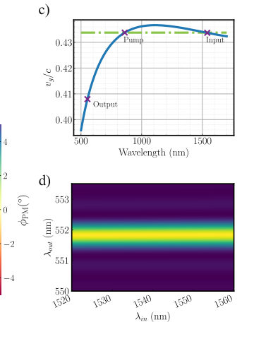 
Fig. 1. Simulation for finding a suitable waveguide geometry for a TFLN QPG. a) Waveguide geometry in TFLN with the important parameters. b) The heat map shows the phase matching angle 𝜙PM for different top widths 𝑤and etching depths ℎ. From these simulations we choose the geometry marked with the red rectangle. c) Group velocity as function of the wavelength for the chosen geometry. We mark the output, pump and input signal. The horizontal line shows that this geometry yields group velocity matching between input signal and pump. d) Simulated phase matching intensity |Φ(𝜆in, 𝜆out)|2. Due to group velocity matching the phase matching is oriented horizontally.

📷 Fig 2

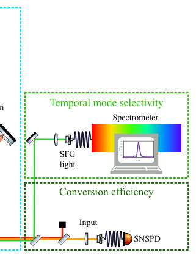 
Fig. 2. Sketch of the experimental setup for benchmarking the TFLN QPG. The input signal and pump TMs are shaped using a commercial and a home-built waveshaper, respectively. Both fields are coupled to the sample and the generated green output light is measured with a single-photon sensitive spectrometer while the transmitted input signal photons are counted with superconducting nanowire single photon detectors. BS: beam splitter, 𝜆

📷 Fig 3

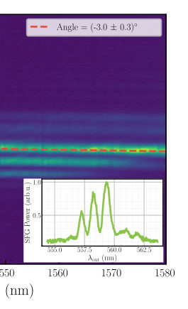 
Fig. 3. Map of the phase matching intensity |Φ(𝜆in, 𝜆out)|2. The angle of the phase matching function evaluates to 𝜙PM = (−3.0 ± 0.3)◦, thus verifying operation close to perfect group velocity matching. The inset shows a cut through the phase matching intensity at 𝜆in = 1550 nm. The two prominent side lobes to the left of the main peak are likely caused by fabrication imperfections and will be spectrally filtered during further measurements.

📷 Fig 4

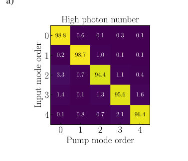 
Fig. 4. Temporal-mode selectivity plots for a) high and b) low input signal photon numbers. The numbers are the percentage of converted counts of a specific input signal TM for different pump TMs. The average temporal-mode selectivity for high photon numbers of around 3 · 104 per pulse is (96.8 ± 1.7)%, while it slightly reduces to (91.7±3.1)% for an average photon number of one per pulse, likely due to measurement noise.

📷 Fig 5

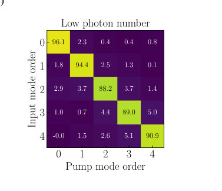 
Figure 4 a) shows the results for pump and input powers of 2.0 mW and 0.3 µW (corresponding to around 3 · 104 photons per input pulse) in front of the waveguide, respectively. The dominant diagonal means that conversion primarily takes place when the input TM matches the target TM of the TFLN QPG and we obtain a high average temporal-mode selectivity of ¯𝑆= (96.8 ± 1.7)% over all target TMs. Next, we reduce the input photon number to, on average, one photon per pulse to demonstrate single photon operation. This step is crucial in QPG benchmarking because pump-induced noise can inhibit single-photon operation [49] and would show up as a steep drop in ¯𝑆. The results of this measurement,...

**Summary.** The paper reports on the successful demonstration of a high-performance Quantum Pulse Gate using thin-film lithium niobate. By engineering the waveguide geometry, they overcame previous limitations in efficiency and spectral flexibility. The resulting device shows state-of-the-art performance, establishing TFLN as an ideal platform for practical photonic quantum technologies.

**Why it may be interesting.** This work directly addresses hardware realization in quantum optics by demonstrating a scalable, high-efficiency component (QPG) crucial for building integrated photonic quantum circuits, which is highly relevant to quantum information processing architectures.

Detailed structure

**Main problem.** The primary goal is to develop a high-performance Quantum Pulse Gate (QPG) for photonic quantum technologies, overcoming limitations in efficiency and operational flexibility.

**Main result.** The authors demonstrated a QPG in thin-film lithium niobate with an average temporal-mode selectivity of $(96.8 \pm 1.7)\%$ and achieved a normalized conversion efficiency estimate three orders of magnitude higher than previous devices.

**Method.** The work combines numerical simulations (using Lumerical) to design the waveguide geometry for optimal phase matching, followed by experimental measurements using single-photon detectors to characterize selectivity and conversion efficiency.

**Model / system.** The physical platform is thin-film lithium niobate (TFLN), which enables a highly efficient type-0 Sum-Frequency Generation (SFG) process. The QPG relies on engineering waveguide dispersion to achieve group-velocity matching between input and pump fields.

**Key observables.** Temporal-mode selectivity ($ar{S}$), internal conversion efficiency ($\eta$), and normalized conversion efficiency ($\eta_{	ext{norm}}$).

**Important parameters / regimes.** High nonlinearity ($d_{33} = 27 	ext{ pm/V}$ in TFLN), specific waveguide dimensions ($w=1 \mu	ext{m}, h=500 	ext{ nm}$), and operating wavelengths ($\lambda_{	ext{in}} = 1540 	ext{ nm}$, $\lambda_p = 860 	ext{ nm}$).

**Assumptions / limitations.** The reported normalized conversion efficiency is a conservative lower bound due to uncorrected coupling estimates; the analysis assumes successful dispersion engineering compensates for material limitations.

**Figures summary.** Figures illustrate the simulation setup, phase matching intensity maps showing optimal geometry selection, and plots comparing measured internal conversion efficiency versus pump power against theoretical fits.

**Paper structure.** The paper progresses from identifying the need for high-performance QPGs to detailing the TFLN platform's advantages. It covers design simulations (geometry optimization), experimental setup description, measurement of selectivity, and finally, quantitative characterization of the record-breaking conversion efficiency.

Abstract

In this work, we demonstrate a quantum pulse gate (QPG) in thin-film lithium niobate. QPGs enable the selective manipulation and detection of temporal modes of quantum light and form the basis of numerous applications in photonic quantum technologies. To date, their widespread adaption is held back by two main limitations: restricted wavelength and polarization combinations of the involved fields and low normalized conversion efficiencies. We overcome these limitations through developing a QPG in thin-film lithium niobate. We design a waveguide geometry that provides the required dispersion properties for a highly efficient type-0 sum-frequency generation.We verify our design through mapping of the phase matching intensity, and demonstrate high-quality QPG operation by measuring a temporal-mode selectivity of (96.8$\pm$1.7)% on par with existing QPGs. Thanks to the strong confinement in thin-film lithium niobate, we succeed in demonstrating an internal conversion efficiency of (89.6$\pm$0.1)% for a pump power of only 20mW in front of our sample. This yields a lower-bound estimate for the normalized conversion efficiency of (1810$\pm$10)$\mathrm{W}^{-1}\mathrm{cm}^{-2}$, three orders of magnitude higher than in previous QPGs. Our results establish thin-film lithium niobate as ideal platform for high-performance QPGs and are a major step towards practical QPGs for photonic quantum technologies.

[↑ back to top](#top)

### [A Shared Observation Shields Collective Fluctuations while Preserving Local Independence](http://arxiv.org/abs/2608.08358v1)

**Authors:** Hu Cang  
**Type:** theory · **Category:** statistical mechanics · **PDF:** <https://arxiv.org/pdf/2608.08358v1>  
**Analysis basis:** full PDF text, analyzed in chunks
**Topic relevance:** 🔥 `quantum measurements` **4/5** · `methods for driven-dissipative` **3/5** · `driven-dissipative phase transition` **2/5** · `Keldysh / 2PI / non-Gaussian methods` **1/5** · `correlated / nonlocal dissipation` **1/5** · `non-equilibrium universality` **1/5**

📷 Fig 1

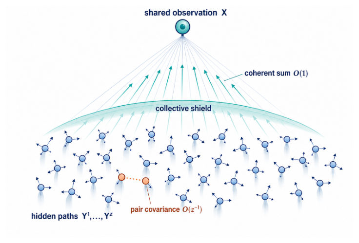 
FIG. 1. One shared output constrains a whole population. The diagram is schematic and has no coordinate axes. In the tagged-particle reading, X is the measured tracer trajectory and the hidden paths Y 1, . . . , Y z are its caging neighbors. At fixed history the paths retain only O(z−1) pair covariance, but their coherent sum remains O(1). Conditioning on the endogenous observation X compresses that source-visible collective direction, represented by the translucent shield.

📷 Fig 2

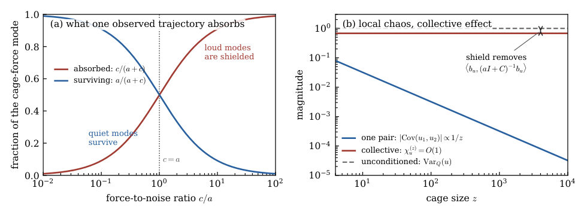 
FIG. 2. A shared output selectively absorbs collective motion. (a) An eigenmode of one-path variance c splits into an absorbed share c/(a+c) and a surviving share a/(a+c) as its force-to-noise ratio c/a grows. (b) At fixed history, a tagged pair decorrelates as 1/z with the cage size z, the number of neighbors driving the record, while the normalized population sum retains the order-one shield ⟨bu, (aI + C)−1bu⟩. The dashed line shows the unconditioned collective scale.

📷 Fig 3

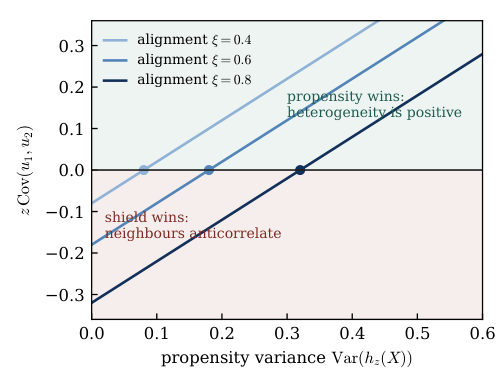 
FIG. 3. Two sources set the sign of the cross-particle response. The shared-output shield produces anticorrelation below each line; history-to-history propensity variance produces positive correlation above it. Curves are labeled by the alignment ξ ∈[0, 1], the normalized overlap between the observable’s force coupling bu and the observed collective mode, for which the scalar shield is EδX = ξ2 Var(u) c/(a + c). The crossing implements Eq. (11) without an adjustable sign convention.

📷 Fig 4

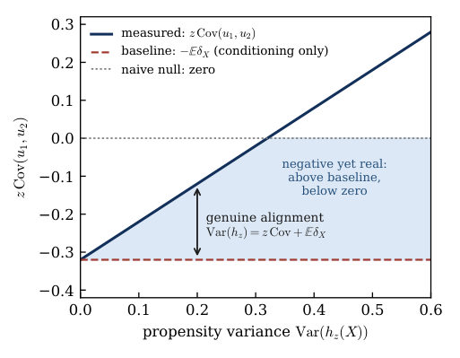 
FIG. 4. Reading a susceptibility against the correct baseline. The conditioning-only reference for the cross-particle response is the negative baseline −EδX (dashed), not zero (dotted). Genuine alignment is the excess of the measurement over the baseline, Var(hz) = z Cov(u1, u2) + EδX (arrow). In the shaded band a measurement is negative yet sits above the baseline, so it still contains positive genuine alignment that a comparison with zero would miss. Parameters as in Figs. 2 and 3: Var(u) = 1, c/a = 1, ξ = 0.8, so EδX = 0.32.

**Summary.** This theoretical work quantifies how measuring a collective property, such as the trajectory of one particle, constrains the entire system's underlying dynamics near a glass transition. It proves that this constraint introduces a predictable baseline suppression (the Schur shield) to fluctuations. Therefore, any measured deviation in cooperative behavior must be interpreted relative to this calculated baseline, providing a rigorous method for extracting true collective signals.

**Why it may be interesting.** The rigorous mathematical framework connecting path conditioning (a concept relevant to quantum measurement theory) directly to measurable thermodynamic quantities like susceptibility provides a powerful tool for interpreting complex many-body dynamics observed in experiments.

Detailed structure

**Main problem.** The paper investigates how conditioning on a shared, collective observation (like a tagged particle's trajectory) modifies the underlying dynamics and fluctuations of a system approaching a glass transition.

**Main result.** Conditioning introduces a calculable, nonpositive baseline correction (the Schur shield) to the measured four-point susceptibility ($\chi_4$), meaning the true cooperative signal must be measured as an excess over this baseline rather than relative to zero.

**Method.** The analysis employs Girsanov path transformations and stochastic process theory applied to a guiding Brownian model, allowing for exact computation of conditional joint laws.

**Model / system.** The system models a liquid near its glass transition, characterized by heterogeneous dynamics. The core mechanism involves the influence of $z$ neighboring particles (the 'cage') on a single tagged particle whose motion generates the shared observation record.

**Key observables.** Four-point susceptibility ($\chi_4$), covariance operators ($C$, $D$), and the Schur shield ($D - C$).

**Important parameters / regimes.** The number of neighbors, $z$; the time window $[0, T]$; and the relative magnitude of local pair correlations versus collective sums.

**Assumptions / limitations.** The results are nonasymptotic and dimension-free at a fixed observation window; extending to bulk $\chi_4$ across different tagged stars is noted as an open problem.

**Figures summary.** Figure 1 schematically illustrates how one shared output constrains the population, represented by a translucent shield compressing the source-visible collective direction. Figure 2 details how eigenmode variances split upon conditioning.

**Paper structure.** The paper develops the theory using Girsanov transformations to derive the penalty term and the Schur shield for the conditional law. It then analyzes pair correlations and compares local vs. collective observer sums, culminating in a physical interpretation of $\chi_4$ as an excess over the calculated baseline.

Abstract

As a liquid approaches its glass transition, its dynamics turns heterogeneous: mobile and immobile regions coexist, and the four-point susceptibility $χ_4$ that quantifies this heterogeneity grows sharply. Interpreting that growth is subtle, because the collective signals experiments record, such as a tagged particle's trajectory, an overlap function, or a mean field, are generated by the same particles they describe. Here we compute exactly what conditioning on such a shared record does to the population that produced it, for a broad class of stochastically observed systems; the guiding example is a tagged particle and the cage of $z$ neighbors that drives its force history. Using a Girsanov path transformation, we prove that the conditioning multiplies the independent joint law of the $z$ trajectories by exactly one term: a centered-square penalty along the single collective direction the record can see. Any fixed pair of particles stays nearly independent, with covariance falling as $O(z^{-1})$ and mutual information as $O(z^{-2})$, the property known as propagation of chaos, yet the $z(z-1)$ weak pair correlations add coherently into a finite suppression of collective fluctuations, the Schur shield $D - C = -C^2(aI + C)^{-1} \preceq 0$. An exactly solvable Brownian model calibrates the construction. The physical consequence is a calculable baseline for dynamical heterogeneity: conditioning itself contributes a computable, nonpositive amount to the susceptibility of a conditioned ensemble, so the genuine cooperative signal is the excess of the measured $χ_4$ over this baseline rather than over zero, a comparison that existing simulation data can already perform.

[↑ back to top](#top)

### [Bell nonlocality with directly generated telecom-band spin-photon entanglement](http://arxiv.org/abs/2608.08109v1)

**Authors:** Dong-Yu Huang, Jian Wang, Xiao-Long Zhou, Ze-Min Shen, Si-Jian He, Qi-Yang Huang, Yi-Jia Liu, Yu-Shu Chen, Quan Jiang, Chuan-Feng Li, Guang-Can Guo  
**Type:** experiment · **Category:** quantum information and computing · **PDF:** <https://arxiv.org/pdf/2608.08109v1>  
**Analysis basis:** full PDF text, analyzed in chunks
**Topic relevance:** 🔥 `QC/QI experiment` **4/5** · `quantum optics experiment` **3/5** · `Tavis-Cummings & cavity-many-emitter` **2/5** · `analog quantum simulation` **1/5** · `correlated / nonlocal dissipation` **1/5** · `quantum measurements` **1/5**

📷 Fig 1

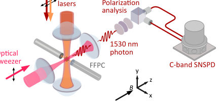 
FIG. 1. Schematic diagram of the experimental setup. An optical tweezer traps the atom at the center of the FFPC. A magnetic field of 170 mG is applied along the z direction as a quantization axis. The emitted telecom photons are collected by one of the aspherical lenses placed along the quantization axis. For entanglement characterization, they are directed through a subsequent polarization analysis module and are detected by a two-channel superconducting nanowire single photon detector (SNSPD). The spectral filtering setup of the photons is omitted for clarity.

📷 Fig 2

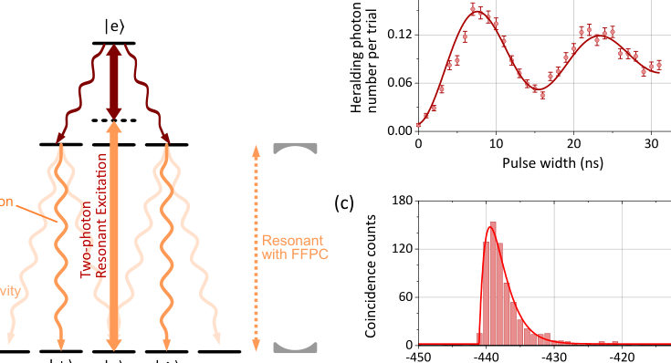 
FIG. 2. (a) Protocol for entanglement generation between a single 87Rb atom and a C-band photon. Not all the Zeeman states are shown. (b) Rabi oscillation from |g⟩to |e⟩. The relative population of |e⟩is indicated by the detection of 780 nm heralding photons. A Rabi frequency of 61 MHz is extracted. (c) Two-photon coincidences between the 1530 nm telecom photons and the 780 nm heralding photons over a 10-hour experimental run. The horizontal axis shows the arrival time difference between the 780 nm photon and the 1530 nm detection event, with the large offset arising from the propagation delay of the 1530 nm signal through the long fiber and coaxial cable to the SNSPD located in another...

📷 Fig 3

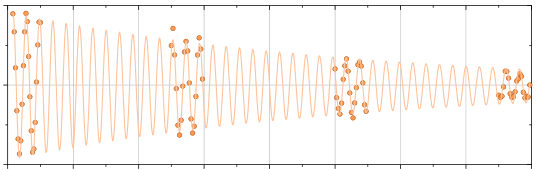 
FIG. 3. (a) State-selective transfer scheme of atomic qubit measurement. For a laser configuration with the polarization of Ω2 expressed as c↓|σ+⟩+ c↑|σ−⟩, only the superposition state |ψ⟩:= c↓|↓⟩+ c↑|↑⟩is coupled to |D⟩, while its orthogonal opponent |ψ∗⟩remains unaffected. Particularly, when c↓= 0, i.e. the polarization of the laser field Ω2 is σ−, the configuration leads to the measurement of eigenstates {|↑⟩, |↓⟩}. Not all the Zeeman states are shown in the diagram. (b) Rabi oscillation between |←⟩:= (|↓⟩+ |↑⟩)/ √

📷 Fig 4

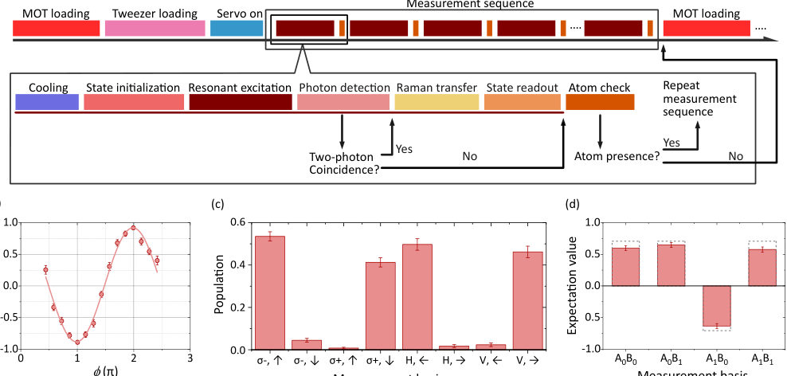 
FIG. 4. (a) Experimental time sequence for characterizing the generated spin–photon entanglement. The main sequence begins with a 500-µs laser cooling and 40-µs state initialization. The atom is then excited to |e⟩and an FPGA controller starts to record two-photon coincidence. Once a coincidence event occurs, the atom is measured by Raman transfer and cavity-assisted fluorescence readout. Each run is ended with a fluorescence check of the presence of the atom, whose loss ends the main sequence and starts MOT loading again. (b) Nonclassical parity oscillation of the entangled state. The measurement basis of the photon is set to be the linear polarization, while the atomic basis is varied by...

**Summary.** The research demonstrates the direct generation of spin-photon entanglement in the telecom C-band using a single Rubidium atom coupled to an optical cavity. By achieving high fidelity and violating a Bell inequality, the authors successfully verified quantum nonlocality, paving the way for scalable, long-distance quantum communication networks.

**Why it may be interesting.** This work directly addresses a major bottleneck in quantum networking: generating high-fidelity entangled qubits at telecom wavelengths using solid-state or atomic emitters, providing a crucial building block for distributed quantum information protocols.

Detailed structure

**Main problem.** The primary challenge is verifying quantum nonlocality using entanglement distributed via photons, which necessitates operating in the low-loss telecom C-band for long-distance quantum networks.

**Main result.** The authors successfully generated spin-photon entanglement with fidelity exceeding 91.4% and verified Bell nonlocality by observing a violation of the CHSH inequality ($2.455(77) > 2$).

**Method.** They utilized a cavity-assisted protocol involving resonant excitation in a single Rubidium atom to directly emit telecom C-band photons entangled with the atomic spin state.

**Model / system.** The system uses a single $^{87}	ext{Rb}$ atom trapped within a fiber-based Fabry-Pérot micro-cavity. The entanglement is generated via a cascaded dipole transition, coupling the atomic spin qubit to the emitted telecom photon.

**Key observables.** Bell state fidelity (> 91.4%), Bell inequality violation ($S > 2$), and coincidence counts between 1530 nm and 780 nm photons.

**Important parameters / regimes.** Telecom C-band (1530 nm), Rubidium transition wavelengths, Rabi frequencies ($\Omega_{ge} \approx 60 	ext{ MHz}$), and the CHSH parameter value.

**Assumptions / limitations.** The overall heralded detection efficiency for the telecom photon is limited by various optical losses in the collection path.

**Figures summary.** Figures illustrate the experimental setup (trapping, cavities, multiple laser sources) and time-domain measurements showing coincidence counts between the entangled photons and heralming signals.

**Paper structure.** The paper details the complex engineering required for atomic trapping and state preparation (MOT $
ightarrow$ optical tweezer), followed by the specific protocol for two-photon excitation to generate entanglement, culminating in Bell test measurements.

Abstract

Quantum nonlocality, typically revealed through entanglement distribution across quantum networks, is a cornerstone of quantum information science. Long-distance distribution of entanglement requires the information carrier, i.e. flying photons, to operate in the minimum-loss telecom band of optical fiber. While extensive efforts have been devoted to the direct generation of entanglement between C-band telecom photons and various stationary spins, the verification of quantum nonlocality remains an outstanding challenge. Here, utilizing a dipole transition in rubidium atoms with a wavelength of 1530 nm and a cavity-assisted protocol, we achieve resonant excitation and direct emission of C-band telecom photons from a single atom, generating spin-photon entanglement with a measured Bell state fidelity exceeding 91.4%. We then verify Bell nonlocality by observing a Bell inequality violation of 2.455(77) > 2 using this high-quality entangled pair. These results extend the wavelength of a single-atom quantum emitter to the telecom C-band, achieving sufficiently high-fidelity spin-photon entanglement to finally verify Bell nonlocality. This work thereby provides a promising building block for a large-scale atom-based quantum network capable of distributed quantum metrology and long-distance quantum communication.

[↑ back to top](#top)

### [State preparation via measurement and feedback: pushing relations, state structures, and non-invertible symmetries](http://arxiv.org/abs/2608.08821v1)

**Authors:** Yabo Li, Aditi Mitra, Tsung-Cheng Lu  
**Type:** theory · **Category:** quantum information and computing · **PDF:** <https://arxiv.org/pdf/2608.08821v1>  
**Analysis basis:** full PDF text, analyzed in chunks
**Topic relevance:** 🔥 `quantum measurements` **4/5** · `methods for driven-dissipative` **3/5** · `driven-dissipative phase transition` **2/5** · `analog quantum simulation` **1/5** · `correlated / nonlocal dissipation` **1/5** · `non-equilibrium universality` **1/5**

📷 Fig 1

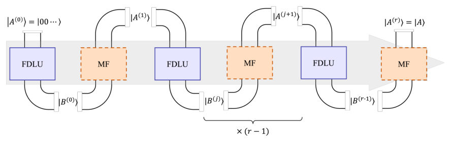 
FIG. 1. Sequential preparation of the target state |A⟩from |00 · · ·⟩using circuits with local measurements and feedback corrections. In the sequence, |B(j)⟩is prepared from |A(j)⟩using FDLU, and |A(j+1)⟩is prepared from |B(j)⟩using a single round of local measurements and feedback corrections.

📷 Fig 2

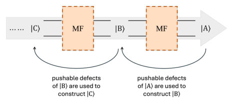 
FIG. 2. The preparation scheme we propose for the target state |A⟩, in which we perform a sequence of MF circuits on a certain initial FDLU-preparable state, generating a sequence of states {· · · , |C⟩, |B⟩, |A⟩}. The construction of the state sequence from the target state |A⟩is in reverse order: the pushable defects of |A⟩are used to construct |B⟩; the pushable defects of |B⟩are used to construct |C⟩, etc. As discussed in the main text, certain rounds of MF circuits can be replaced by an FDLU circuit, which suggests that this scheme includes the general circuit architecture shown in Fig. 1.

📷 Fig 3

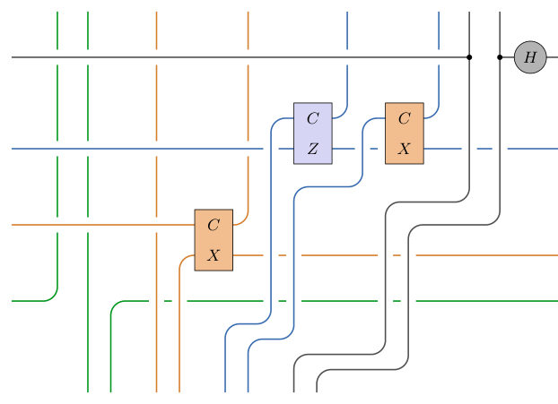 
FIG. 3. When the virtual space is decomposed into four subspaces, respectively exhibiting pushing relations in class RIRI (green), RIRX (orange), RZRX (blue), and RILI (black), the MPS |A⟩is prepared from a product of multi-qudit states |ψΛ⟩ using a composition of parallel KW and KT dualities shown in this figure, up to transversal unitary circuit. The state structure for the RILI subspace is derived in Appendix E.

**Summary.** The paper introduces 'pushable defects' as a novel diagnostic tool to systematically classify quantum states preparable via Measurement and Feedback circuits on MPS. It shows that these defect relations dictate the necessary preparation circuit depth and reveals an intrinsic link between this process and non-invertible symmetries in condensed matter physics.

**Why it may be interesting.** This work provides a powerful algebraic tool (defect analysis) to characterize the computational power of measurement-based quantum computation protocols in 1D systems, linking it directly to fundamental concepts like symmetry protection.

Detailed structure

**Main problem.** The primary goal is developing a systematic theoretical framework to characterize quantum states preparable using Measurement and Feedback (MF) circuits, extending beyond existing protocols.

**Main result.** The authors establish that 'pushable defects' and their associated 'pushing relations' provide a unifying principle for classifying finite-depth MF-preparable states. This classification reveals deep connections between state preparation and non-invertible symmetries.

**Method.** The methodology involves analyzing one-dimensional quantum systems using Matrix Product States (MPS) formalism, defining 'pushable defects' as virtual-bond operators that can be pushed through the tensor structure at the cost of a physical feedback unitary.

**Model / system.** The model focuses on 1D quantum systems described by MPS. The preparation process alternates between local unitary operations (FDLU) and measurement/feedback rounds, analyzed via defect propagation in virtual bond spaces.

**Key observables.** Pushable defects, pushing relations, the rank of the transfer matrix ($T_{\mathcal{A}}$), and the associated symmetry operators (e.g., Tambara-Yamagami duality).

**Important parameters / regimes.** The number of measurement/feedback rounds required for preparation; coupling constants ($\lambda_i$) parameterizing the state structure.

**Assumptions / limitations.** The analysis assumes that unwanted measurement outcomes can be compensated by feedback operations without requiring post-selection, and it builds upon characterizing defects in virtual spaces.

**Figures summary.** Figure 1 illustrates the sequential preparation of a target state using alternating FDLU and MF circuits; other figures likely detail defect propagation or symmetry relations.

**Paper structure.** The paper systematically develops the concept of pushable defects, first establishing conditions for single-round preparation (relating to FDLU states), then generalizing this iteratively for arbitrary depth, and finally connecting these structural constraints to underlying non-invertible symmetries.

Abstract

Quantum circuits with measurements and unitary feedback (MF) can prepare long-range entangled states in constant depth, but a systematic construction of the MF preparation circuit for a given target state remains underexplored. We develop such a scheme for one-dimensional states, based on the notion of pushable defects: virtual-bond operators of a matrix product state that can be pushed through the tensor at the price of a physical feedback unitary. We show that the set of pushable defects, together with their pushing relations classifies finite-depth MF-preparable states and dictates their preparation circuits. To each class of the target state $|A\rangle$, we associate a state $|B\rangle$ from which $|A\rangle$ can be prepared using a 1-round MF circuit; in particular, $|A\rangle$ is preparable from a product state using a circuit with 1 round of MF whenever $|B\rangle$ is preparable by a finite-depth local unitary (FDLU) circuit. For a general target state, the scheme is obtained by iterating this procedure until the associated state is FDLU-preparable. For open-boundary matrix product states, the scheme is complete: it constructs a preparation circuit whenever finite-depth MF preparation with left-conditioned feedback corrections is possible. Pushable defects and pushing relations thus emerge as a unifying principle for quantum state preparation via measurements and feedback. This characterization further reveals an intrinsic connection between MF circuits and non-invertible symmetries: states with certain classes of pushing relations are related to a product state by Tambara-Yamagami duality operators, or by continuous cosine symmetry operators with fusion rules $L_α L_{α'} = L_{α+α'} + L_{α-α'}$, together with their generalizations up to (not necessarily transversal) gates.

[↑ back to top](#top)

### [Compound beams for direct experimental comparison of quantum operations](http://arxiv.org/abs/2608.09518v1)

**Authors:** Kishore Thapliyal, Jan Perina, Pavel Pavlicek, Antonin Cernoch  
**Type:** experiment · **Category:** quantum information and computing · **PDF:** <https://arxiv.org/pdf/2608.09518v1>  
**Analysis basis:** full PDF text, analyzed in chunks
**Topic relevance:** 🔥 `Full counting statistics` **4/5** · `quantum optics experiment` **3/5** · `quantum measurements` **2/5** · `QC/QI experiment` **1/5** · `interference shaping light` **1/5**

📷 Fig 1

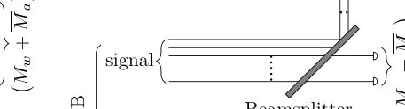 
Figure 1. (a) Experimental setup involving nonlinear crystal LiIO3 as the source of photon pairs with the signal and idler photons propagating along different directions and synchronously detected by two APDs Ds and Di; F - frequency filter; L1, L2, L3 - lenses, MMF - multi-mode fiber. Schematic diagrams for PA and PS in a TWB are shown in (b) and (c), respectively, using the synchronized signal and idler channels. Whereas real PA requires an auxiliary TWBa and post-selection, PS is realized on the signal beam by inserting a beam splitter with transmissivity T effectively realized by specific grouping of detection windows in the signal channel: Mw, ¯ Ma, and ¯ Ms give in turn the number of...

📷 Fig 2

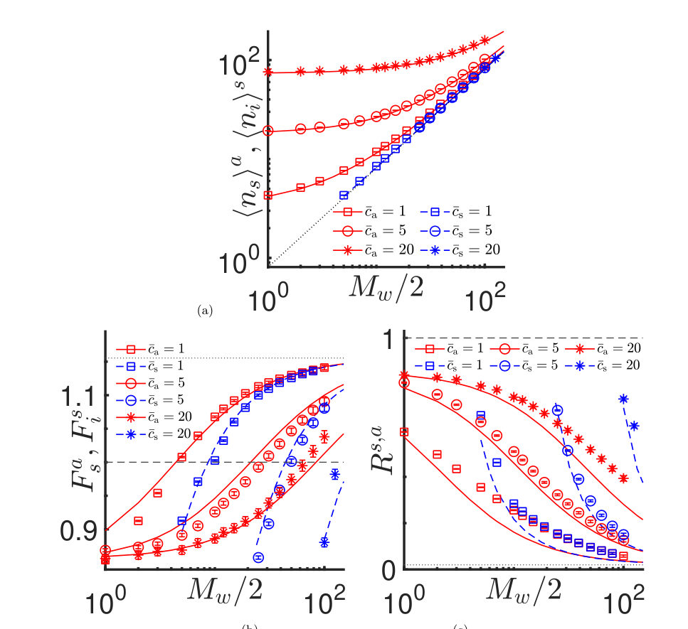 
Figure 2. (a) Mean photon numbers ⟨ns⟩a [⟨ni⟩s] and (b) Fano factors F a s [F s i ] of the signal [idler] beam and (c) noise-reduction parameter Ra [Rs] for signal PATWB [PSTWB] as they depend on the number Mw of concatenated windows in the original TWB; logarithmic scale is used for Mw/2. PA [PS] states are shown by red smooth [blue dashed] curves for 1 (□), 5 (◦), and 20 (∗) added [subtracted] photons. Solid [dashed] curves originate in the Gaussian model while experimental data are plotted as isolated symbols with error bars (smaller than the symbols). Dotted lines give the values of the original TWB. The quantum-classical border (F = R = 1) is shown by dashed black horizontal lines in...

📷 Fig 3

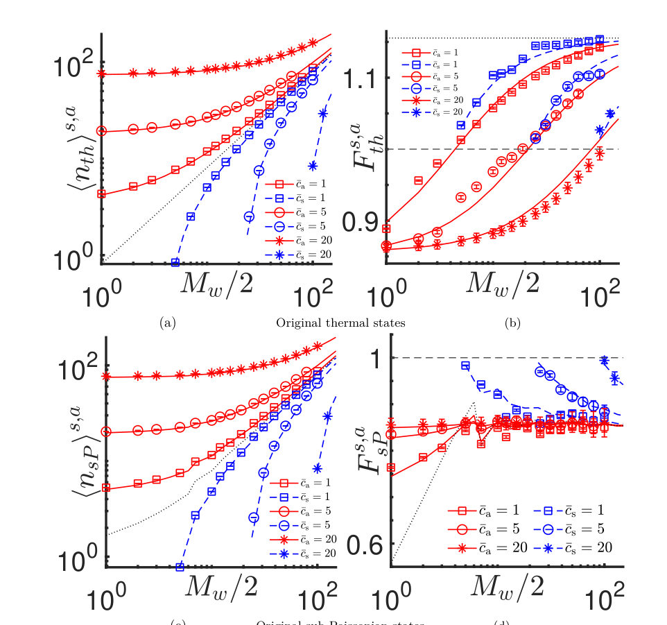 
Figure 3. (a) [(c)] Mean photon number ⟨n⟩s,a th [⟨n⟩s,a sP ] and (b) [(d)] Fano factor F s,a th [F s,a sP ] in PSTS and PATS [PSSPS and PASPS] as they depend on the number of concatenated windows Mw in the original TS [SPS]; logarithmic scale is used for Mw/2. Dotted curves correspond to the original TS and SPS. More details are given in the caption to Fig. 2.

📷 Fig 4

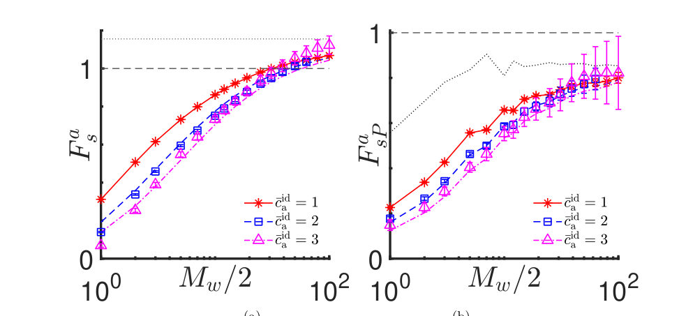 
Figure 4. (a) [(b)] Fano factor F a th ≡F a s [F a sP] for ideal-PA in TS [SPS] as it depends on the number Mw of concatenated windows for 1 (red ∗), 2 (blue □), and 3 (magenta ∆) ideally-added photons; logarithmic scale is used for Mw/2. Curves originate in the Gaussian model while experimental data are plotted as isolated symbols with error bars. The black dotted curves characterize the original TS and SPS. The quantum-classical border F = 1 is shown by dashed black horizontal line.

📷 Fig 5

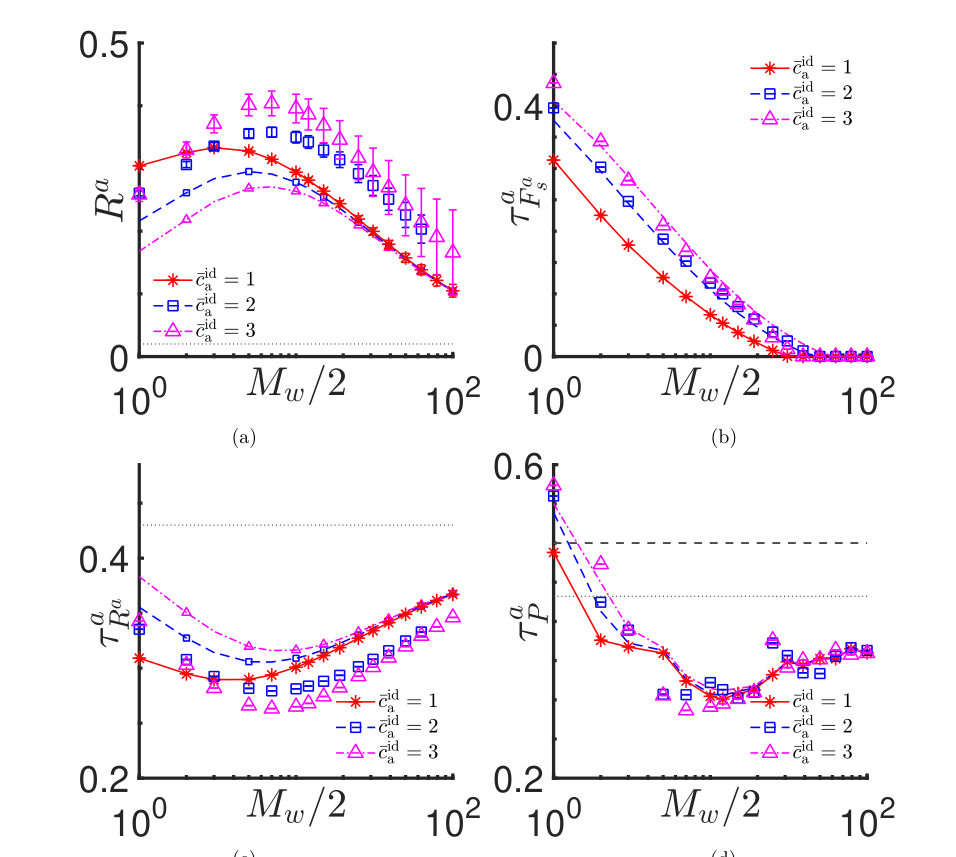 
Figure 5. (a) Noise-reduction parameter Ra, and nonclassicality depths (b) τ a F a s , (c) τ a Ra, and (d) τ a P as they depend on the number Mw of concatenated windows for 1 (red ∗), 2 (blue □), and 3 (magenta ∆) photons ideally added into TWBs; logarithmic scale is used for Mw/2. Curves [in (a,c) marked by symbols] originate in the Gaussian model while experimental data are plotted as isolated symbols with error bars. The black dotted lines characterize the original TWBs. The Gaussian border τ = 0.5 in (d) is indicated by dashed black horizontal line. In (b,c,d) relative errors are smaller than 10% for smaller Mw and 20% for larger Mw.

**Summary.** This paper presents an experimental framework using 'compound beams' derived from twin photon sources to compare the effects of photon addition and subtraction on various multi-mode quantum states. It quantitatively determines that the optimal operation depends critically on the initial state type, providing crucial guidelines for designing future quantum optical experiments.

**Why it may be interesting.** This work directly addresses experimental feasibility in quantum optics by providing a unified platform to test fundamental non-Gaussian operations (PA/PS) necessary for advanced quantum protocols like metrology and communication.

Detailed structure

**Main problem.** The study aims to provide a direct experimental comparison of quantum operations, specifically photon addition (PA) and photon subtraction (PS), when applied to various nonclassical multi-mode states.

**Main result.** Photon addition is generally advantageous over photon subtraction for thermal and sub-Poissonian beams, while photon subtraction outperforms it for twin beams. The work also demonstrates near-ideal experimental photon addition using temporal correlations in compound twin beams.

**Method.** The comparison is achieved by generating 'compound beams' from weak twin beams and analyzing the resulting photocount histograms after applying PA or PS operations.

**Model / system.** The physical platform utilizes compound beams constructed from simple blocks detected simultaneously, derived from Type-I parametric down-conversion in a LiIO3 crystal. The analysis covers multi-mode thermal, sub-Poissonian, and twin beam states.

**Key observables.** Nonclassicality (assessed via Fano factor $F < 1$), quantum correlations ($R < 1$), photocount histograms $f(c_s, c_i; M_w)$, and nonclassicality depth $	au$.

**Important parameters / regimes.** Varying intensities over two orders of magnitude, and the ability to add/subtract up to twenty photocounts.

**Assumptions / limitations.** The comparison is made possible by using compound beams, which overcome the limitation of requiring different sources for different quantum operations. The analysis relies on modeling complex distributions via photocount histograms.

**Figures summary.** Figures illustrate the experimental setup using LiIO3 and schematic diagrams detailing the implementation of PA and PS on twin beams; Figure 2 compares nonclassicality (F) and correlations (R) for PA vs. PS.

**Paper structure.** The paper builds from establishing the need for a fair comparison platform, details the construction of compound beams and the measurement techniques using photocount histograms, and finally presents comparative results showing the optimal operation (PA vs. PS) depending on the initial quantum state type.

Abstract

Compound beams composed of simple experimental blocks (detected in simultaneous detection windows) that form specific quantum-correlated structures are suggested for simulating the properties of different quantum operations used for creating highly nonclassical and entangled multi-mode states needed in quantum communication, metrology, and information protocols. Qualitative and quantitative comparison of multi-photon addition and subtraction in compound multi-mode thermal as well as sub-Poissonian beams and multi-mode twin beams with their intensities extending over two orders in magnitude is provided. Adding and subtracting up to twenty photocounts, optimal conditions for the generation of experimental nonclassical states are identified. In general, photon addition is identified as advantageous over photon subtraction for the multi-mode thermal and sub-Poissonian beams: It induces (enhances) the nonclassicality in the former (latter) state. Contrary to this, photon subtraction outperforms photon addition in the multi-mode twin beams. Moreover, exploiting temporal photon-pair correlations in compound twin beams when post-selecting, nearly ideal experimental photon(s) addition is demonstrated.

[↑ back to top](#top)

### [All-electrical Coherent Control of a Single Rare-earth Spin Qubit](http://arxiv.org/abs/2608.07929v1)

**Authors:** Yaowu Liu, Dasom Choi, Stefano Reale, Jeongmin Oh, Seorhin Choi, Lei Fang, We-hyo Soe, Arzhang Ardavan, Andreas J. Heinrich, Soo-hyon Phark, Fabio Donati  
**Type:** experiment · **Category:** quantum information and computing · **PDF:** <https://arxiv.org/pdf/2608.07929v1>  
**Analysis basis:** full PDF text, analyzed in chunks
**Topic relevance:** 🔥 `QC/QI experiment` **4/5** · `analog quantum simulation` **2/5** · `quantum measurements` **2/5** · `correlated / nonlocal dissipation` **1/5** · `methods for driven-dissipative` **1/5**

📷 Fig 1

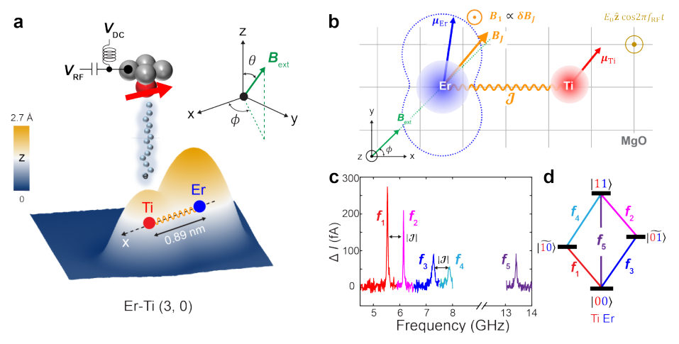 
FIG. 1. Schematics and ESR spectrum of an Er-Ti pair. a, Schematic and three-dimensional

📷 Fig 2

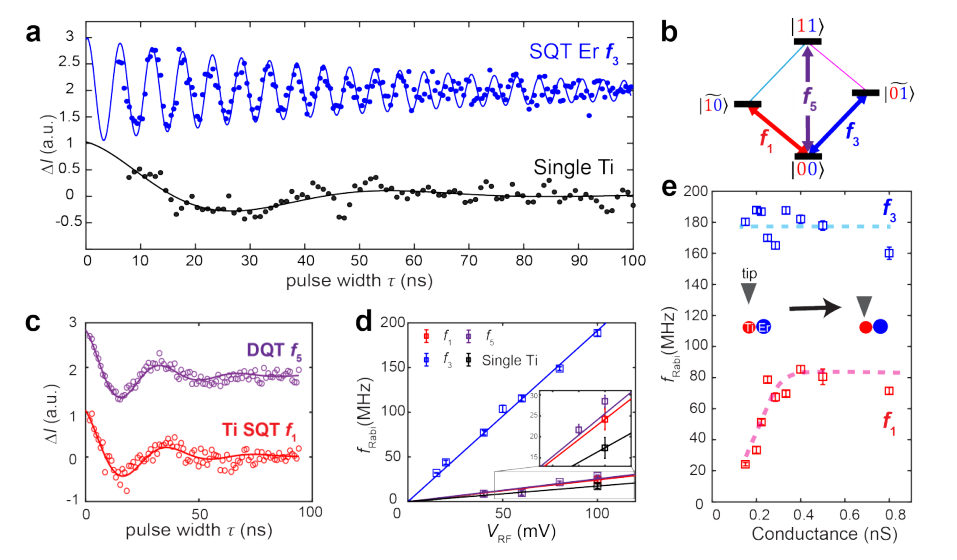 
FIG. 2. Coherent control of the Er spin. a, Rabi oscillations of the f3 transition (fres = 7.28

📷 Fig 3

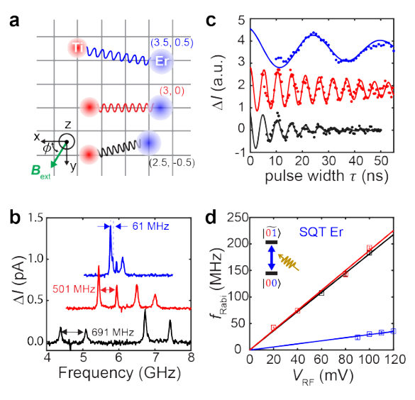 
FIG. 3. Pair engineering. a, Schematics for three different pairs. The gray grid represents the

📷 Fig 4

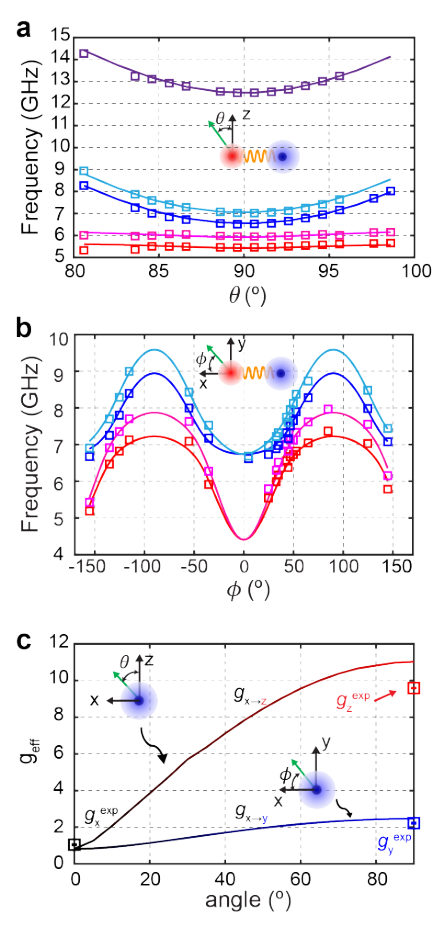 
FIG. 4. Magnetic anisotropy of the Er-Ti (3, 0) pair. a, ESR transition energy as a function

📷 Fig 5

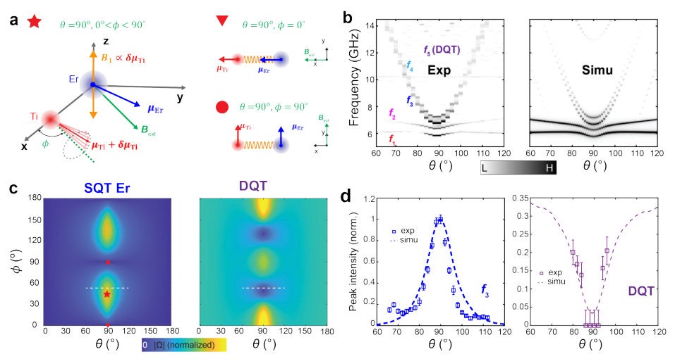 
FIG. 5. Coherent control mechanism. a, Schematics of coherent control mechanism for special

**Summary.** The paper reports on achieving all-electrical coherent control of a single rare-earth spin qubit using an Er-Ti pair system. By utilizing the anisotropy in the spin-spin exchange coupling, they achieved record high Rabi frequencies (near GHz) for the Er spin transition. This work opens a new route for ultrafast local control of challenging solid-state quantum systems.

**Why it may be interesting.** This work directly addresses the physical realization of solid-state qubits by providing an electrical pathway (via anisotropic exchange) to manipulate highly shielded spins, which is crucial for scalable quantum computing architectures.

Detailed structure

**Main problem.** The primary challenge is achieving all-electrical coherent control of single rare-earth (Er) spin qubits due to the strong shielding of their 4f electrons.

**Main result.** The authors demonstrated all-electrical coherent control, achieving near-gigahertz Rabi frequencies for the Er spin transition—a ten-fold improvement over previous records. This establishes anisotropic exchange as a general resource for ultrafast control in solid-state quantum devices.

**Method.** Scanning tunneling microscopy (STM)-based electron spin resonance (ESR) spectroscopy combined with three-dimensional magnetic-field control was used to map resonance and Rabi frequencies.

**Model / system.** The system involves an Er-Ti spin pair adsorbed on a surface, modeled by a spin Hamiltonian incorporating exchange and dipolar interactions. The coherent drive is achieved by electrically modulating the anisotropic Er-Ti coupling.

**Key observables.** Resonance and Rabi frequencies for various transitions ($f_1$ to $f_5$), anisotropy in the Er g-tensor and Er-Ti exchange interaction, and the dependence of these on external magnetic field angles ($	heta$).

**Important parameters / regimes.** Near-gigahertz Rabi frequencies; linear scaling of Rabi frequencies with applied RF voltage ($V_{RF}$); anisotropic coupling strength $J$.

**Assumptions / limitations.** The mechanism relies on transducing electrical excitations into an effective transverse driving field ($B_1$) via the anisotropic exchange interaction.

**Figures summary.** Figures show ESR transitions and Rabi oscillations confirming high efficiency on the Er spin, comparing results across different atomic separations/orientations, and mapping angular dependencies of these frequencies.

**Paper structure.** The work progresses from demonstrating basic all-electrical control to detailed characterization using Hamiltonian modeling. It maps out anisotropies in g-tensors and exchange coupling, culminating in a general mechanism for ultrafast spin manipulation via anisotropic exchange modulation.

Abstract

Electrical control of single spin qubits is a major frontier for nanoscale, high-speed, and scalable quantum devices. Yet, extending it to highly shielded rare-earth 4f electrons remains an experimental challenge across solid-state platforms. Here we demonstrate all-electrical coherent control of a single Er electron spin, which is exchange-coupled to a nearby Ti atom. Scanning tunneling microscopy-based electron spin resonance with three-dimensional magnetic-field control enables comprehensive mapping of the resonance and Rabi frequencies, revealing pronounced anisotropies in both the Er g-tensor and the Er-Ti exchange interaction. The electrical modulation of the anisotropic Er-Ti coupling results in an efficient drive of the Er spin, allowing us to achieve near-gigahertz Rabi frequencies - a ten-fold improvement over the present record for rare-earth spin qubits. By establishing anisotropic exchange as a general resource for electrically accessing shielded rare-earth spins, our results open a new route to ultrafast and local control of rare-earth spins in solid-state quantum devices.

[↑ back to top](#top)

### [Quantum Relaxometry Under Continuous Wave Excitation](http://arxiv.org/abs/2608.07697v1)

**Authors:** Vladimir Verkhovlyuk, Chayma Bouchair, Oleg A. Anisimov, Anton Pershin, Adam Gali  
**Type:** experiment · **Category:** other · **PDF:** <https://arxiv.org/pdf/2608.07697v1>  
**Analysis basis:** full PDF text, analyzed in chunks
**Topic relevance:** 🔥 `QC/QI experiment` **4/5** · `quantum measurements` **3/5** · `driven-dissipative phase transition` **1/5** · `methods for driven-dissipative` **1/5** · `quantum optics experiment` **1/5**

📷 Fig 1

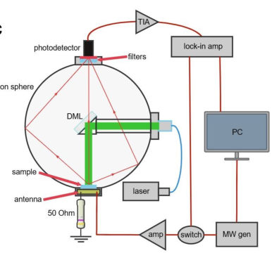 
Fig. 1 A typical measurement protocol for the IN3x3 sample measured at -10 dBm MW power and a laser intensity of 0.3 W/cm2: (a) the cw-ODMR spectrum; (b) the X and Y components of the lock-in signal recorded at 2874 MHz as a function of the modulation frequency fm. The solid lines correspond to the fitting using equations (4) with Teff = 3.2 ms. (c) Scheme of cw-ODMR setup.

📷 Fig 2

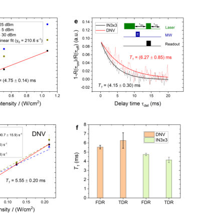 
Fig. 2 Results of the T1 measurements in bulk samples. Dependence of the effective time Teff on the microwave radiation power at different laser intensities I for IN3x3 (a) and DNV (b) samples. Dependence of the effective rate 1/Teff on the laser intensity at different microwave power Pmw for IN3x3 (c) and DNV (d) samples. The time T1 is calculated based on linear approximations to zero laser power, shown by solid red lines. (e) Results of T1 measurement for IN3x3 (black) and DNV (red) samples using TDR protocol (inset). (f) Comparison between FDR and TDR measurement methods for IN3x3 and DNV samples. All errors here and throughout were determined based on fitting using analytical...

📷 Fig 3

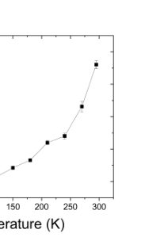 
Fig. 3 Temperature dependence of the relaxation rate measured by the FDR method in the DNV sample.

📷 Fig 4

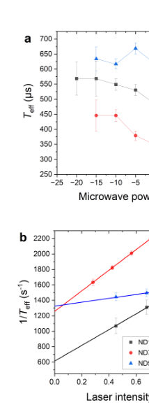 
Fig. 4 (a) Dependence of the effective time Teff on the microwave radiation power for different sizes of nanodiamonds. (b) Dependence of the effective rate 1/Teff on the laser intensity for different sizes of nanodiamonds. The T1 time is calculated based on linear approximations to zero laser power, shown by solid lines.

📷 Fig 5

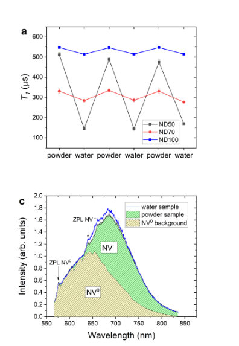 
Fig. 5 (a) Results of comparative measurements of T1 time for aqueous and dry samples of three types of nanodiamonds. (b) Simulated fraction of stable NV−centers in spherical nanodiamonds as a function of particle size. Solid curves show the fraction of NV−in water and powder (UHV), calculated using a purely geometrical model that accounts for near-surface instability as the ratio of stable- to-total volume. The indicated instability depths were obtained based on density functional theory calculations [30]. Dashed curves represent intermediate cases corresponding to variable experimental conditions. (c) Photoluminescence spectra for ND50 (in water and powder) aligned with the NV0

**Summary.** The authors introduce a novel continuous-wave (CW) technique to measure the spin-lattice relaxation time ($T_1$) of $	ext{NV}^-$ centers in diamond. By analyzing the frequency response of the ODMR signal, they overcome the temporal limitations of traditional pulsed methods. This CW approach allows for highly efficient and quantitative $T_1$ measurements across a wide range of timescales, making it ideal for nanoscale quantum sensing applications.

**Why it may be interesting.** This work provides a robust, non-invasive spectroscopic tool for characterizing spin relaxation in solid-state quantum memories, which is crucial for developing practical quantum sensors and computing elements based on NV centers.

Detailed structure

**Main problem.** Conventional pulsed quantum relaxometry protocols for measuring spin-lattice relaxation time (T1) are limited in temporal range and technically challenging for nanoscale systems.

**Main result.** A continuous-wave (CW) frequency domain protocol was introduced that efficiently measures T1 over a vast dynamic range (60 $\mu$s to 200 ms), proving superior to pulsed methods, especially for nanodiamonds.

**Method.** The technique uses optically detected magnetic resonance (ODMR) with low-frequency microwave amplitude modulation and lock-in detection to extract the effective time constant ($T_{	ext{eff}}$) in the frequency domain.

**Model / system.** The system utilizes Nitrogen-Vacancy ($	ext{NV}^-$) centers in diamond as solid-state spin qubits. The dynamics are modeled using Bloch equations, relating the measured frequency response to the intrinsic relaxation time $T_1$.

**Key observables.** Complex frequency response ($X$ and $Y$ components), effective time constant ($T_{	ext{eff}}$), and the intrinsic spin-lattice relaxation time ($T_1$).

**Important parameters / regimes.** Microwave power ($P_{	ext{MW}}$), laser intensity ($I$), temperature, and modulation frequency ($f_m$).

**Assumptions / limitations.** The response is approximated by a first-order low-pass filter in the low-frequency limit; linearity assumptions are made when extrapolating to zero drive power.

**Figures summary.** Figures illustrate the ODMR spectrum, the lock-in detection procedure using modulation frequency sweeps ($f_m$), and plots showing $T_{	ext{eff}}$ dependence on microwave/laser powers used to extract $T_1$.

**Paper structure.** The paper contrasts the limitations of time-domain pulsed protocols with the proposed continuous-wave, frequency-domain approach. It details the mathematical derivation linking the measured response function to $T_1$ and validates this method by comparing results across different diamond samples (bulk vs. nanodiamonds) under varying conditions.

Abstract

Quantum relaxometry is one of the most successful applications of nitrogen-vacancy (NV) centers in diamond and, more broadly, solid-state spin qubits, enabling ultrasensitive detection of magnetic noise and paramagnetic species via measurements of the spin-lattice relaxation time $T_1$. Conventional pulsed protocols, however, probe $T_1$ efficiently only over a limited temporal range, which restricts the scope and throughput of the technique. Here we introduce a continuous-wave quantum relaxometry protocol that operates in the frequency domain. By measuring the frequency response of the optically detected magnetic resonance signal under low-frequency microwave amplitude modulation, we extract $T_1$ from the characteristic response time of the spin system. The method enables efficient $T_1$ measurements spanning more than three orders of magnitude -- directly demonstrated from 60 $μ$s to 200 ms in our experiments -- across a broad temperature range and under substantial ensemble inhomogeneity. We further show that this protocol enables quantitative relaxometry-based sensing in nanodiamonds, achieving a substantial speed-up over the pulsed methods and offering a practical approach to optimizing nanodiamond size for enhanced sensitivity.

[↑ back to top](#top)

### [Hamiltonian spectra in quantum computers through the generalized eigenvalue method](http://arxiv.org/abs/2608.08181v1)

**Authors:** Valery Simonyan, Greg Ridgway, Paulo Bedaque  
**Type:** both · **Category:** quantum information and computing · **PDF:** <https://arxiv.org/pdf/2608.08181v1>  
**Analysis basis:** full PDF text, analyzed in chunks
**Topic relevance:** 🔥 `QC/QI experiment` **4/5** · `analog quantum simulation` **3/5** · `Keldysh / 2PI / non-Gaussian methods` **1/5** · `quantum measurements` **1/5**

📷 Fig 1

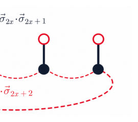 
FIG. 1: Visualization of the Hamiltonian in Eq. 17.

📷 Fig 2

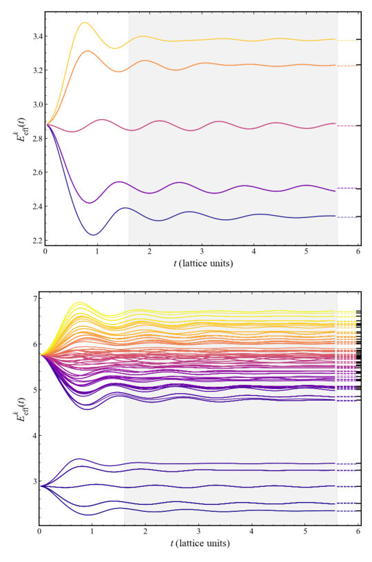 
FIG. 2: Eigenvalues i

📷 Fig 3

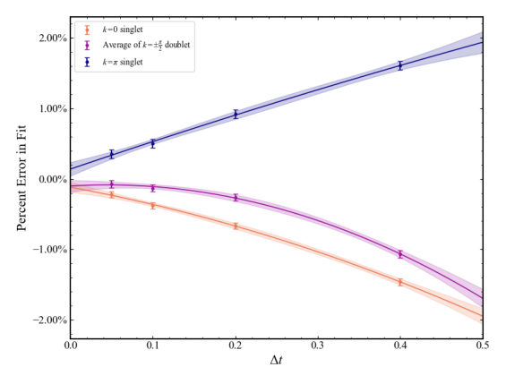 
FIG. 3: Relative difference between extracted low-lying l = 0, m = 0 energy levels and exact ones. Here we use L = 4, the operator set 1, and T = 5.6. The bands show a quadratic fit and the bands indicate a one σ statistical (not systematic) error. At any finite ∆t the lowest energy state (k = π) is systematically high while the highest energy state (k = 0) is systematically low, leading to a narrowing of energy ranges. The two middle states (k = ±π/2) are degenerate and so we only plot their average. The extrapolation to ∆t →0 is consistent with the exact solution.

📷 Fig 4

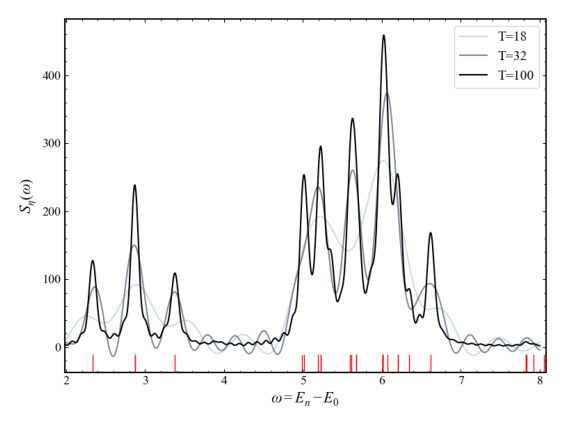 
FIG. 4: The convergence of the discrete Fourier transform method from Eq. 13 for L = 4. We use an exponential damping factor of η = 0.05, as defined in Eq. 12. We picked this value of η to just barely smooth out the ringing artifacts of the T = 100 curves. The red ticks indicate the exact energy levels. Even at T = 100 several peaks are not resolved.

📷 Fig 5

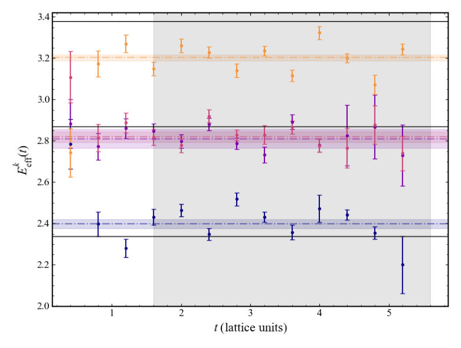 
FIG. 5: Result of run on IonQ’s Forte Enterprise quantum computer using the smallest (set 1) of operators, L = 4, T = 5.6 and Trotter step ∆t = 0.4. Error bars reflect only the statistical errors from the finite number of shots (2048) and the bands show the 1 Σ uncertainty error in the fit to a constant. The exact energy levels are solid black lines. We can resolve the different energy levels and see the expected degeneracy.

**Summary.** The paper presents a novel technique utilizing the Generalized Eigenvalue Problem (GEVP) to extract energy spectra from real-time correlators measured on quantum computers. By applying this method to the fuzzy $\sigma$-model, the authors demonstrate that GEVP is highly efficient and accurate for determining low-lying energy levels compared to alternative spectral determination methods. This work advances quantum simulation capabilities for complex many-body physics.

**Why it may be interesting.** This work directly addresses spectroscopy in strongly correlated systems using near-term quantum hardware, providing a pathway to study dynamics where traditional Euclidean lattice field theory faces the sign problem.

Detailed structure

**Main problem.** The core problem is extracting the energy spectrum (eigenvalues) of a quantum system's Hamiltonian, which is crucial for determining physical properties like masses or binding energies.

**Main result.** The proposed Generalized Eigenvalue Problem (GEVP) method successfully resolves low-lying energy levels in agreement with exact diagonalization and proves substantially more efficient than Fourier transform methods on quantum hardware.

**Method.** The authors adapt the GEVP, traditionally used for Euclidean correlators, to extract real-time energy eigenvalues directly from time evolution correlators measured on quantum computers.

**Model / system.** The method is tested using the fuzzy $\sigma$-model, which discretizes the $1+1$ dimensional O(3) $\sigma$-model and is implemented on a lattice structure simulated via quantum hardware (IonQ Forte-Enterprise).

**Key observables.** Energy eigenvalues ($E$), real-time correlators ($C_{ij}(t)$), and the comparison between GEVP results and exact diagonalization.

**Important parameters / regimes.** Lattice size ($L=4$ or $L=8$), time extent ($T_{\max}$), Trotter step ($\Delta t$), and coupling constants ($g$).

**Assumptions / limitations.** The method assumes that the approximation of perfect operators with a finite set is sufficient, and it is advantageous in NISQ regimes where long time extents are limited.

**Figures summary.** Figures compare GEVP extraction results against exact solutions for small lattices ($L=4$), showing agreement within error bars; one figure compares GEVP vs. Fourier transform methods regarding required time extent.

**Paper structure.** The paper introduces the physical problem (Hamiltonian spectrum), details the proposed quantum measurement protocol using GEVP on real-time correlators, validates it by comparing results against exact diagonalization for a specific model (fuzzy $\sigma$-model), and discusses its advantages over classical/alternative methods.

Abstract

Quantum computers can generate real-time correlators of field theories. By adapting the generalized eigenvalue problem to these correlators, energy eigenvalues can be extracted directly. The method is tested using both classical simulations and quantum hardware, successfully resolving several low-lying energy levels in agreement with exact diagonalization. Comparison with an alternative spectrum determination based on the Fourier transform of correlators shows that the proposed approach is substantially more efficient.

[↑ back to top](#top)

### [Quantum tribology: acceleration-induced Stokes friction and Magnus force in correlated Bose fluids](http://arxiv.org/abs/2608.07912v1)

**Authors:** V. M. Kovalev, A. N. Osipov, I. G. Savenko  
**Type:** theory · **Category:** quantum gases · **PDF:** <https://arxiv.org/pdf/2608.07912v1>  
**Analysis basis:** full PDF text, analyzed in chunks
**Topic relevance:** 🔥 `analog quantum simulation` **4/5** · `correlated / nonlocal dissipation` **2/5** · `Frenkel-Kontorova` **1/5** · `Keldysh / 2PI / non-Gaussian methods` **1/5** · `methods for driven-dissipative` **1/5**

📷 Fig 1

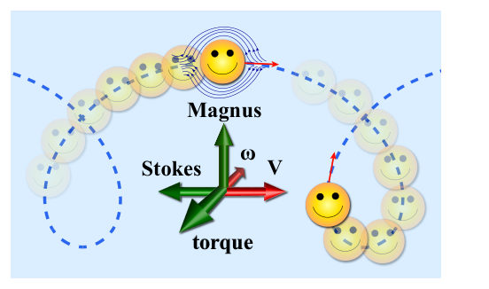 
FIG. 1. System schematic: an impurity particle undergoes composite translational and orbital motion within a two- dimensional Bose-Einstein condensate. This dynamics gives rise to both longitudinal (Stokes) and transverse (Magnus) forces, alongside a back-action friction torque exerted by the condensate on the moving impurity.

📷 Fig 2

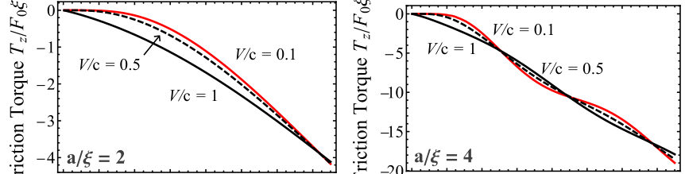 
FIG. 2. Behavior of the Stokes friction force and torque: generalization of the Landau criterion to non-inertial motion. (a) Normalized friction force FS/F0 and (b) torque Tz/F0ξ as functions of the dimensionless impurity velocity V/c for different ratios of the rotation amplitude to the healing length: a/ξ = 4 (red solid), 0.5 (black dashed), and 2 (black solid). The latter corresponds to ωa ≪c, where the rotation is small, and the Landau criterion V &gt; c for the friction force is largely satisfied. Vertical dashed lines indicate the critical resonant velocity thresholds corresponding to the angular harmonics n = 0, 1, 2, 3. The corresponding critical velocities are Vc = c, Vc ≈1.58c, Vc...

📷 Fig 3

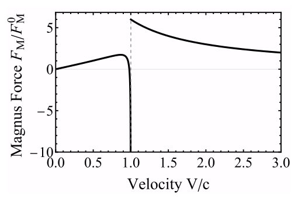 
FIG. 3. Normalized anomalous transverse force FM/F 0 M as a function of dimensionless translational velocity V/c. Here, F 0 M = U 3 0 πa2k10 0 nc/(96m2cω3).

📷 Fig 4

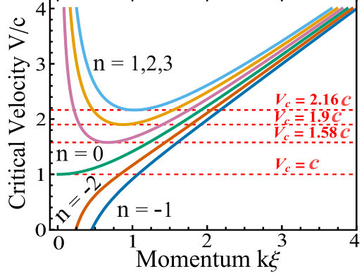 
FIG. 1. Normalized critical resonant velocity V/c as a function of momentum k for various angular harmonics n given by Eq. (9). Solid curves represent the kinematic resonance conditions for the excitation of specific modes (n = −2, −1, 0, 1, 2, 3). Horizontal red dashed lines indicate the absolute minimum velocity thresholds Vc required to trigger the n ≥0 harmonics. These resonance thresholds correspond to Vc = c, Vc ≈1.58c, Vc ≈1.9c, and Vc ≈2.16c. The curves are evaluated for the fixed parameters a/ξ = 2 and ωξ/c = 0.25, same as for Fig. 2 from the main text.

📷 Fig 5

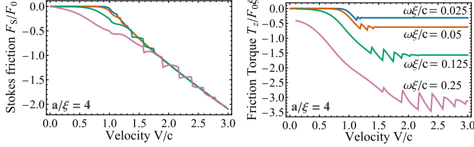 
FIG. 2. (a, c) Normalized Stoke’s friction force FS/F0, and (b, d) torque Tz/F0ξ as functions of the dimensionless velocity V/c. The panels are grouped by the ratio of the healing length and the rotation amplitude, with the upper panels (a, b) evaluated at a/ξ = 2 and the lower panels (c, d) evaluated at a/ξ = 4. The solid curves correspond to different normalized rotation frequencies ωξ/c, which are indicated in the figure. The force normalization constant is F0 = ncU 2 0 /mc2ξ3.

**Summary.** This paper develops a comprehensive theory for quantum tribology in Bose fluids subjected to acceleration. It shows that centripetal acceleration modifies the expected drag force, allowing dissipation below classical thresholds. Furthermore, it predicts a unique, non-dissipative transverse Magnus-like force arising from the fluid's nonlinearity and trajectory asymmetry.

**Why it may be interesting.** This work directly connects concepts of non-inertial dynamics (acceleration) with many-body quantum phenomena (quantum friction and topological response), providing testable predictions for ultracold atomic systems.

Detailed structure

**Main problem.** The study establishes a theoretical framework for quantum tribology, investigating how non-inertial (accelerated) motion modifies the principles of quantum friction in Bose fluids.

**Main result.** The work predicts finite drag forces even below the classical Landau critical velocity due to acceleration, and reveals a novel, non-dissipative anomalous transverse force analogous to the Magnus effect.

**Method.** The analysis employs linear and quadratic response theory applied to the Gross-Pitaevskii equation (GPE) to calculate density perturbations and associated forces.

**Model / system.** The system modeled is a weakly interacting Bose condensate, treated as a quantum fluid. The dynamics are governed by the nonlinear GPE, considering an impurity particle undergoing composite translation and rotation.

**Key observables.** Longitudinal Stokes Friction force (F_S), induced torque (T), and anomalous transverse Magnus-like force (F_M).

**Important parameters / regimes.** Subsonic vs. supersonic regimes; rotational frequency ($\omega$) and translational velocity ($V$); the ratio of particle speed to sound speed ($V/c$).

**Assumptions / limitations.** The analysis relies on linear response theory for first-order density corrections, though higher-order terms are used to derive F_M.

**Figures summary.** Figures illustrate normalized friction force and torque vs. V/c showing resonant thresholds; another figure shows the anomalous transverse force (F_M) dependence on V/c, highlighting a jump at V/c=1.

**Paper structure.** The paper develops the theory by first addressing linear response for drag forces, then incorporating higher-order nonlinearities to derive the non-dissipative anomalous transverse force. The structure moves from general principles to specific mathematical derivations in different regimes.

Abstract

The Landau criterion, a cornerstone of quantum fluid dynamics, dictates that dissipation is forbidden for uniform motion below a critical velocity. Yet, the fundamental question of how acceleration reshapes the principles of quantum friction has remained open since Landau and Pitaevskii's seminal works. Here, we establish a theoretical framework for the quantum tribology of non-inertial motion, describing a probe particle undergoing composite translation and rotation within a weakly interacting Bose condensate. Using the nonlinear Gross-Pitaevskii equation, we show that centripetal acceleration fundamentally modifies the energy-momentum constraints on elementary excitations. This leads to a finite drag force in the subsonic regime of the probe particle motion, and a characteristic quantum stick-slip behaviour in the deeply supersonic regime -- a direct generalization of the classical Landau-Pitaevskii picture. Beyond this dissipative response, we uncover a fundamentally distinct mechanism: the nonlinearity of the quantum fluid, combined with the broken symmetry of the trajectory, gives rise to a non-dissipative anomalous transverse force. This quantum Magnus-like response, emerging from the second-order density perturbation, performs no work and is rooted in the geometric asymmetry of the dynamically induced flow. Our findings lay the foundation for a universal program in quantum tribology of accelerated motion, establishing a direct and experimentally testable connection among non-inertial dynamics, nonlinear response, and topological symmetry breaking across platforms ranging from ultracold atoms and exciton-polariton condensates to cosmological analog systems.

[↑ back to top](#top)

### [Stable three-dimensional solitons in spin-orbit-coupled atomic-molecular condensates](http://arxiv.org/abs/2608.07939v1)

**Authors:** Chao Kong, Jinqing Li, Guihua Chen, Guilong Li, Zhaopin Chen, Haiming Deng, Boris A. Malomed, Yongyao Li  
**Type:** theory · **Category:** quantum gases · **PDF:** <https://arxiv.org/pdf/2608.07939v1>  
**Analysis basis:** full PDF text, analyzed in chunks
**Topic relevance:** 🔥 `analog quantum simulation` **4/5** · `Keldysh / 2PI / non-Gaussian methods` **2/5** · `driven-dissipative phase transition` **1/5** · `methods for driven-dissipative` **1/5**

📷 Fig 1

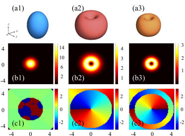 
FIG. 1: A stable semi-vortex (SV) soliton with parameters (N, α) = (200, 0). Panels (a1), (b1), and (c1) display, sev- erally, the isosurface plot of the 3D density |φ1(x, y, z)|2, 2D density distribution |φ1(x, y)|2 in the z = 0 plane, and the cor- responding phase pattern. Panels (a2), (b2), (c2) and (a3), (b3), (c3) display, repsectively, the same for components φ2 and ψ. The angular momentum of this mode is Mz = 66.2.

📷 Fig 2

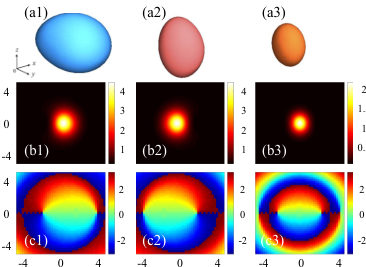 
FIG. 2: A stable soliton of the MM type for (N, α) = (100, 0) and Mz = 0. The meaning of panels is the same as in Fig. 1.

📷 Fig 3

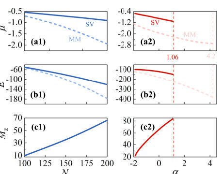 
FIG. 4: The dependence of the soliton chemical potential µ, energy E and angular momentum Mz on the particle number N [panels (a1-c1), with α = 0], and on detuning α [panels (a2- c2), with N = 200]. The solid and dashed curves represent the 3D SV and MM solitons, respectively. The solitons do not exists above the critical value of the detuning, α &gt; αc.

**Summary.** This paper theoretically investigates stable three-dimensional soliton formation in spin-orbit-coupled atomic-molecular Bose-Einstein condensates. By modeling the system with coupled mean-field equations and analyzing specific mixed-mode and semi-vortex configurations, the authors demonstrate that SOC coupling stabilizes these structures. This work is significant because it provides a robust mechanism for realizing stable vortex solitons using quadratic nonlinearity in quantum gas systems.

**Why it may be interesting.** This work is highly relevant as it extends the study of nonlinear wave phenomena into the realm of ultracold atomic gases. The stabilization mechanism provided by SOC coupling for 3D solitons, especially achieving a large vortex norm share, offers new theoretical pathways for controlling complex quantum matter waves.

Detailed structure

**Main problem.** The research aims to elucidate a mechanism for creating stable three-dimensional (3D) solitons within spin-orbit-coupled (SOC) atomic-molecular Bose-Einstein condensates (BECs).

**Main result.** Stable 3D solitons, specifically Semi-Vortex (SV) and Mixed-Mode (MM) types, are demonstrated to exist in this SOC scheme, providing a method for realizing stable vortex solitons with quadratic nonlinearity.

**Method.** The analysis uses the imaginary-time integration method on coupled Gross-Pitaevskii equations (GPEs), employing approximations like the cascading-limit approximation for strong detuning.

**Model / system.** The system models an atomic-molecular BEC governed by mean-field equations incorporating quadratic three-wave interactions and SOC applied to the atomic components. The dynamics are described by coupled GPEs for the atomic ($\varphi_1, \varphi_2$) and molecular ($\psi$) fields.

**Key observables.** Topological charge (unit circulation in $\varphi_2$), vortex norm share ($F_v > 50\%$ of total norm), chemical potential ($\mu$), Energy ($E$), and Angular Momentum ($M_z$).

**Important parameters / regimes.** The control parameters are the particle number ($N$) and the mismatch parameter ($\alpha$); stability is mapped in the $(N, \alpha)$ plane.

**Assumptions / limitations.** Key assumptions include applying planar (effectively 2D) SOC to the atomic component and utilizing the cascading-limit approximation for strong detuning.

**Figures summary.** Figures illustrate stable soliton structures (SV and MM) via density isosurfaces, map out stability regions in the $(N, \alpha)$ plane, and plot conserved quantities like $\mu, E,$ and $M_z$ versus particle number or detuning.

**Paper structure.** The paper establishes the governing coupled GPEs for the SOC-BEC. It then analyzes specific soliton ansätze (SV and MM) using numerical methods, mapping out their existence regions in parameter space and confirming stability through analysis of conserved quantities and vortex component dominance.

Abstract

We elaborate a mechanism for the creation of stable three-dimensional (3D) solitons in spin-orbit-coupled (SOC) atomic-molecular Bose-Einstein condensate, modeled by the mean-field equations with the quadratic three-wave interaction, characterized by mismatch $α$. The planar (effectively two-dimensional) SOC is applied to the soliton's atomic component, structuring it as a mixed mode (MM) or semi-vortex (SV). The molecular component of the SV soliton is shaped as a 3D vortex, while the molecular component in the MM soliton is an MM too. The solitons exist up to a critical value of $α$. The system demonstrates a relatively large norm share of the vortex components, exceeding $50\%$ of the total norm, which is an essential feature of SOC-supported solitons. This is scheme for realizing stable vortex solitons in free space with the quadratic nonlinearity.

[↑ back to top](#top)

### [Bose-Einstein condensates with Raman-induced spin-orbit coupling : An overview](http://arxiv.org/abs/2608.08121v1)

**Authors:** Giovanni Italo Martone  
**Type:** theory · **Category:** quantum gases · **PDF:** <https://arxiv.org/pdf/2608.08121v1>  
**Analysis basis:** full PDF text, analyzed in chunks
**Topic relevance:** 🔥 `analog quantum simulation` **4/5** · `Keldysh / 2PI / non-Gaussian methods` **1/5** · `driven-dissipative phase transition` **1/5**

📷 Fig 1

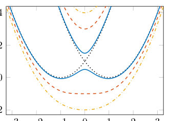 
Fig. 1: Lower and upper branch of the single-particle spec- trum (2) with δR = 0 as functions of momentum and for ℏΩR/ER = 1.0 (blue solid line), 4.0 (red dashed line) and 6.0 (yellow dash-dotted line). The black dotted line shows the dis- persion at zero Raman coupling ΩR.

📷 Fig 2

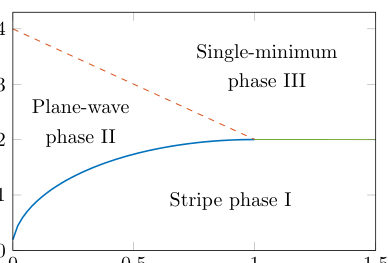 
Fig. 2: Phase diagram of a spin-orbit-coupled Bose-Einstein condensate as a function of the average density ¯n and the Ra- man coupling ΩR. Solid (dashed) lines correspond to transi- tions of first (second) order. Adapted from [25].

📷 Fig 3

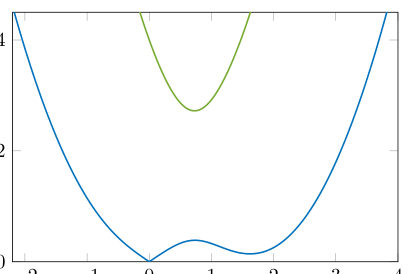 
Fig. 3: Lower (blue) and upper (green) branch of the excitation spectrum on top of the PW phase with negative momentum. Notice the phonon and roton structures in the lower branch. Adapted from [25].

📷 Fig 4

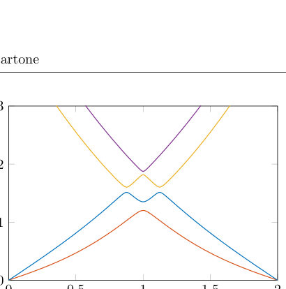 
Fig. 4: Lower-frequency part of the excitation spectrum in the stripe phase, revealing the phonon-like behavior exhibited by the two lowest bands at small qx. Adapted from [38] under the terms of the Creative Commons Attribution 4.0 International License.

**Summary.** This review surveys Bose-Einstein condensates with Raman-induced spin-orbit coupling, detailing how SOC modifies the system's equilibrium states. The work identifies three key phases—Stripe, Plane-Wave, and Single-Minimum—and outlines the phase transitions between them using mean-field theory. It is crucial for understanding superfluidity in spinor quantum gases.

**Why it may be interesting.** It provides a comprehensive overview of how engineered spin-orbit coupling fundamentally alters the ground state structure (supersolid stripe phase) and dynamic excitations of BECs, which is central to modern AMO physics research.

Detailed structure

**Main problem.** Reviewing the advances and future research directions concerning Bose-Einstein condensates (BECs) subjected to Raman-induced spin-orbit coupling (SOC).

**Main result.** The system exhibits distinct quantum phases—Stripe, Plane-Wave (PW), and Single-Minimum (SM)—whose transitions are controlled by tuning parameters like the Raman coupling strength ($\Omega_R$).

**Method.** Theoretical analysis using the Gross-Pitaevskii mean-field approach to minimize the total energy functional.

**Model / system.** The system is a BEC of ultra-cold atoms (e.g., $^{87}	ext{Rb}$) described by an effective spin-1/2 Hamiltonian incorporating SOC induced by Raman lasers. The dynamics are governed by a modified Gross-Pitaevskii equation.

**Key observables.** Density modulations (stripes), superfluid density ($
ho_s$), magnetic susceptibility ($\chi_M$), and the excitation spectrum (Bogoliubov modes).

**Important parameters / regimes.** Raman coupling strength ($\Omega_R$), interaction strengths ($g_{dd}, g_{ss}$), and average density ($ar{n}$).

**Assumptions / limitations.** The analysis often assumes equal intraspecies couplings ($g_{ds}=0$) and vanishing detuning ($\delta_R=0$). The system is treated in the mean-field limit.

**Figures summary.** Figures illustrate the single-particle spectrum, showing double-minimum structures, and depict the phase diagram mapping out the Stripe (I), Plane-Wave (II), and Single-Minimum (III) phases.

**Paper structure.** The paper reviews the theoretical framework starting from the single-particle Hamiltonian, derives the many-body mean-field energy functional, analyzes the resulting three distinct quantum phases based on parameter tuning, and discusses diagnostic tools like excitation spectra and susceptibility divergence.

Abstract

Since their first realization more than a decade ago spin-orbit-coupled Bose-Einstein condensates have been the subject of intense theoretical and experimental investigations. Spin-orbit coupling deeply modifies the equilibrium properties of the condensate, giving rise to novel configurations such as a supersolid stripe phase and a phase-separated plane-wave state. At the level of dynamics, both the frequency and the nature of the collective modes are significantly affected by the coupling with the spin degree of freedom. Here we review some of the most relevant advances in the field and provide our perspective on possible future research directions.

[↑ back to top](#top)

### [Knot your average qutrit: Measurement-induced entanglement splitting and the cabling dictionary for GHZ and W States](http://arxiv.org/abs/2608.09076v1)

**Authors:** Sougata Bhattacharyya, Sovik Roy  
**Type:** theory · **Category:** quantum information and computing · **PDF:** <https://arxiv.org/pdf/2608.09076v1>  
**Analysis basis:** full PDF text, analyzed in chunks
**Topic relevance:** 🔥 `quantum measurements` **4/5** · `Full counting statistics` **1/5** · `correlated / nonlocal dissipation` **1/5**

📷 Fig 1

 
Figure 1: The two qubit-level link types behind Aravind’s correspondence. (a) The Borromean Rings: no two rings are linked on their own, but cutting any one still frees the other two completely. (b) The 3-Hopf Ring: each ring is linked to its neighbor, so cutting one ring still leaves the other two linked to each other.

📷 Fig 2

 
Figure 2: Each ring from Figure 1 is now drawn as a cable of n = d −1 = 2 parallel strands, one extra strand for the one extra level a qutrit has over a qubit. How many of these strands stay linked after a measurement cut is what tells the link types apart at the qutrit level.

📷 Fig 3

 
Figure 3: The R = 2 case: one strand of the cable stays linked between the two remaining rings, while the other is cut and plays no further part. Only one of the two strands is doing any topological work here, exactly what partial cabling means.

📷 Fig 4

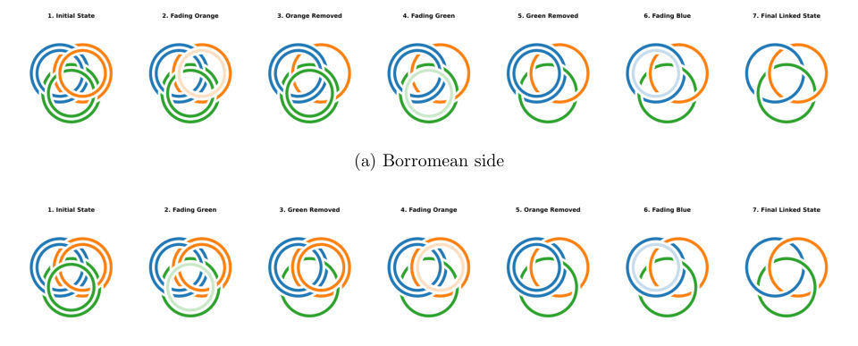 
Figure 4: How Fig. 3 actually comes about: starting from the fully cabled tangle, one strand after another loosens and fades out, until only a single strand is left holding each pair of rings together. The rings are still genuinely linked one connecting strand is enough for that but now only one strand is doing the work, with its former partner hanging loose. This is the R = 2, partial-cabling case, shown as it is built rather than as a finished picture.

📷 Fig 5

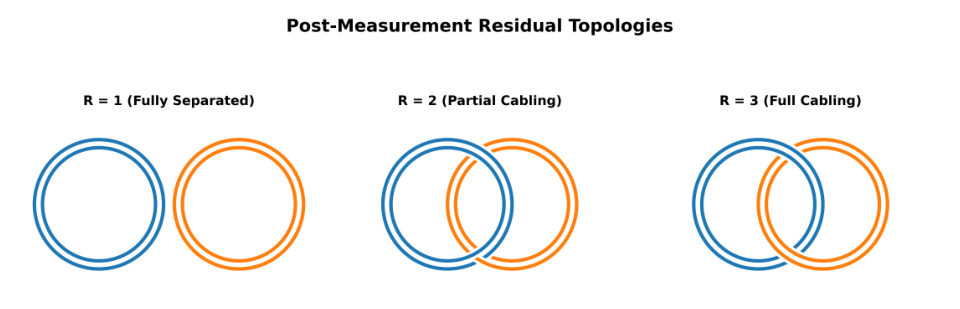 
Figure 5: The full dictionary in one picture: the number of strands still linked between the two remaining rings exactly matches the Schmidt rank R left behind after measurement, fully separated for R = 1, one strand linked for R = 2, both strands linked for R = 3.

**Summary.** This theoretical paper analyzes how multipartite entanglement in qutrit systems splits after single-particle measurements, extending topological concepts from qubits. The authors find that the structural classification must shift from GHZ vs. W to a repeated-index versus all-different-index structure. They demonstrate this by calculating Schmidt ranks under CB and MUBs, showing robust behavior for certain states.

**Why it may be interesting.** This work provides a rigorous mathematical framework for understanding how entanglement robustness changes with increasing local dimension ($d>2$), offering insights into multipartite correlations beyond simple qubit models relevant to quantum communication protocols.

Detailed structure

**Main problem.** The study aims to extend the topological characterization of multipartite entanglement, traditionally classified by GHZ vs. W states for qubits, to qutrits ($d=3$). It specifically investigates how this entanglement structure changes after a single-particle measurement.

**Main result.** The relevant structural classification for qutrit entanglement splitting is not GHZ versus W class, but rather the distinction between repeated-index and all-different-index bag structures. Furthermore, measuring the maximally entangled $|	ext{W}\{0,1,2\}
angle$ state in an MUB forces the residual pair into a state of maximum Schmidt rank ($R=3$).

**Method.** The authors extend Aravind's topological correspondence using a 'two-strand cabling extension' to model entanglement splitting. They calculate exact eigenvalues and Schmidt ranks by analyzing the reduced density matrix after measurement in both Computational Basis (CB) and Mutually Unbiased Bases (MUBs).

**Model / system.** The system involves tripartite quantum states realized using qutrits ($\{0, 1, 2\}$ basis), focusing on GHZ-type and W-class states. The analysis is performed in the context of entanglement splitting under projective measurements.

**Key observables.** Residual Schmidt Rank ($R$), which can take values $\{1, 2, 3\}$; measurement probabilities $p(A)$; eigenvalues $\{\lambda_i\}$ of the reduced density matrix $
ho_{BC}$.

**Important parameters / regimes.** The dimension $d=3$ (qutrits); the structure of the bases used for measurement (CB vs. MUBs).

**Assumptions / limitations.** The 'two-strand cabling dictionary' is explicitly treated as a labeling convention constructed to reproduce the independently computed Schmidt rank, rather than being derived purely from topological link invariants.

**Figures summary.** References are made to tables summarizing entanglement splitting patterns for various W-state families under CB and MUB measurements, showing distinct ranks based on state structure.

**Paper structure.** The paper first establishes the need to generalize Aravind's model from qubits to qutrits using a cabling extension. It then analyzes $	ext{|GHZ}_3
angle$ and various W-states under CB and MUB measurements, culminating in the structural finding that index structure (repeated vs. all-different) is the key discriminator.

Abstract

Multipartite entanglement is conventionally classified by state families viz. family of GHZ and W class of states, with each family expected to behave differently under measurement. We show that, at least for the question of how entanglement splits after a single-particle measurement, this is not the division that matters for qutrits. Extending the Aravind's correspondence (which models entanglement as topological linking, and projective measurement as physically cutting a ring from an interlinked configuration\cite{aravind1997}) from qubits to qutrits, we derive the complete measurement-induced entanglement splitting of the GHZ type qutrit state i.e |GHZ_3> and of the full family of symmetric W class qutrit states, six two same - one different states i.e |{W_{p,p,q}^{sym}}> and one all - different state i.e. |W_{0,1,2}>, under both the computational basis (CB) and the mutually unbiased bases (MUBs), obtaining exact eigenvalues and Schmidt ranks for every outcome in every case. We see that the |W_{0,1,2}> state behaves similarly as |GHZ_3> state, a single, outcome-independent residual rank in each basis, while the |{W_{p,p,q}^{sym}> states alone show probability-weighted, outcome-dependent behaviour. The relevant structural line is therefore repeated-index versus all-different-index bag structure, not GHZ class versus $W$ class. We express this classification using a \textit{two-strand cabling} extension of Aravind's \textit{ring-and-link} picture. This is needed because the qutrit residual Schmidt rank (R) takes three values, R belonging to {1,2,3}, rather than the qubit binary (i.e. R belonging to {1,2}). We are explicit throughout that this cabling dictionary is a labeling convention built to reproduce an independently computed Schmidt rank, not a topological invariant derived from the link diagrams themselves, and we discuss what would be needed to close that gap

[↑ back to top](#top)

### [Elementary magnons and interacting multi-magnon quasiparticles in the effective spin-$\frac{1}{2}$ kagome-staircase magnet Co$_{3}$V$_{2}$O$_{8}$](http://arxiv.org/abs/2608.08587v1)

**Authors:** Yuan Xiao, Jiajun Mo, Zhenmeng Jiang, Haoyang Leng, Otkur Omar, Yanjun Li, Fengyi Song, Jianjun Ying, Shang Gao  
**Type:** both · **Category:** strongly correlated electrons · **PDF:** <https://arxiv.org/pdf/2608.08587v1>  
**Analysis basis:** full PDF text, analyzed in chunks
**Topic relevance:** 🔥 `analog quantum simulation` **4/5** · `Keldysh / 2PI / non-Gaussian methods` **1/5**

📷 Fig 1

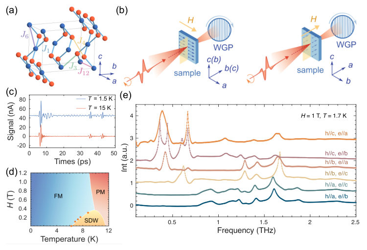 
FIG. 1. (a) The kagome staircase lattice formed by the Co2+ ions in CVO, where the cross-tie and spine sites are shown in blue and red, respectively. The exchange paths for the couplings considered in our modeling are indicated. (b) The TDTS experimental setup in the Voigt geometry and Faraday geometry. WGP represents the wire-grid polarizer. (c) Representative zero-field time-domain terahertz signals measured at 1.5 K in the FM state (blue) and 15 K in the PM state (red). (d) Phase diagram of Co3V2O8 for H ∥a, adapted from Ref. [24], where FM, PM, and SDW represent the ferromagnetic, paramagnetic, and spin density wave, respectively. The transition points between the FM and SDW phases as...

📷 Fig 2

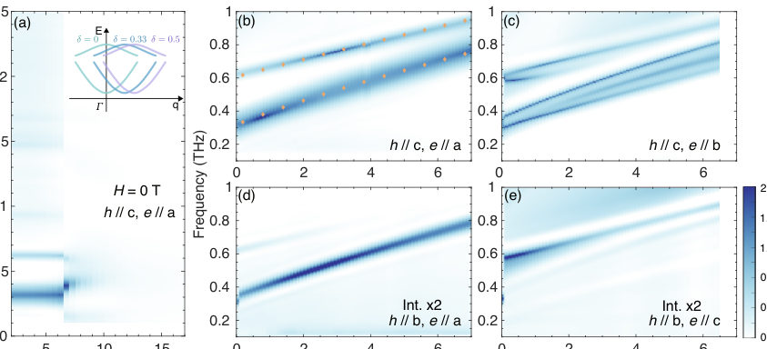 
FIG. 2. (a) Temperature dependence of the terahertz spectra measured with the polarization configuration of h ∥a, e ∥c in zero field. A clear transition form the ferromagnetic phase to the SDW phase is observed near 6 K, followed by the gradual diminishing of the magnetic signal at higher temperatures. Inset schematically depicts the contrasting evolution of the high and low energy excitations at the Γ point as δ increases from 1

📷 Fig 3

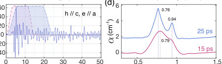 
FIG. 3. (a) Time-domain signals for the h ∥c, e ∥b con- figuration measured in a field of 7 T. (b) The corresponding frequency-domain spectra obtained after applying time win- dows of 15 and 25 ps. (c,d) Similar time- and frequency- domain spectra for the h ∥c, e ∥a configuration measured in a field of 7 T.

📷 Fig 4

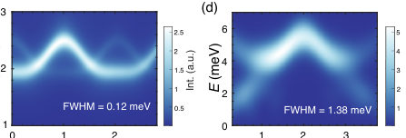 
FIG. 4. (a-d) Calculated inelastic neutron-scattering spec- tra along the (a) [0 K 0], (b) [1 K 0], (c) [H 1.5 0], and (d) [0 0 L] reciprocal-space cuts based on the fitted effec- tive spin-1/2 exchange model. The calculated spectra were convolved by a Gaussian function with full-width-at-half- maximum (FHWM) indicated in each panel.

📷 Fig 5

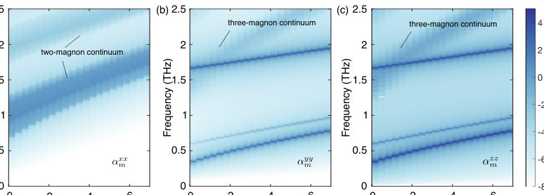 
FIG. 5. (a-c) Calculated field-dependent magnetic-dipole absorption coefficients (a) αxx m , (b) αyy m , and (c) αzz m for THz magnetic fields oriented along the a, b, and c axes, respectively. For better visibility of the weak magnon excitations, the intensity is plotted on a logarithmic scale. Multi-magnon continua are indicated in each panel.

**Summary.** This paper investigates the magnetic excitations in Co3V2O8 using terahertz spectroscopy. By fitting low-energy one-magnon modes to an effective spin-1/2 Hamiltonian derived from combined experimental data, the authors successfully identify higher-energy features as interacting multi-magnon quasiparticles. This work demonstrates how strong exchange anisotropy stabilizes these complex excitations beyond simple non-interacting models.

**Why it may be interesting.** The work provides a detailed experimental and theoretical framework for understanding collective excitations in frustrated magnets, which is highly relevant to modeling strongly correlated quantum materials where magnon interactions are key.

Detailed structure

**Main problem.** The study aims to characterize the magnetic excitation spectrum of the kagome-staircase magnet Co3V2O8, specifically distinguishing between elementary one-magnon modes and interacting multi-magnon quasiparticles.

**Main result.** High-energy excitations observed via terahertz spectroscopy are identified as sharp, interacting multi-magnon quasiparticles stabilized by strong exchange anisotropy, which cannot be explained by non-interacting models.

**Method.** The research combines high-resolution time-domain terahertz spectroscopy (TDTS) measurements with theoretical modeling based on an effective spin-1/2 anisotropic-exchange Hamiltonian derived from fitting both TDTS and inelastic neutron scattering data.

**Model / system.** The physical system is the three-dimensional kagome-staircase compound Co3V2O8. The analysis utilizes an effective spin-1/2 model with strong anisotropic exchange interactions to describe the magnetic excitations.

**Key observables.** Polarization-resolved low-energy one-magnon modes, and high-energy sharp branches exhibiting field slopes two to four times those of single magnons, along with evidence of avoided crossings (hybridization).

**Important parameters / regimes.** Temperature (T), external magnetic field (B), exchange coupling constants (J1, J3, J4, J6), and the effective spin-1/2 Hamiltonian parameters.

**Assumptions / limitations.** The low-energy dynamics can be effectively described by a spin-1/2 model; the analysis combines zone-center TDTS data with momentum-dependent INS data for comprehensive fitting.

**Figures summary.** Figures illustrate the lattice structure, experimental setups (TDTS), phase diagrams showing magnetic transitions (FM, SDW), and frequency spectra revealing both single-magnon and multi-magnon responses across varying fields and temperatures.

**Paper structure.** The paper first establishes the material's magnetic phases and uses TDTS to map low-energy one-magnon modes. It then fits these data alongside INS results to determine an effective Hamiltonian. Finally, it analyzes high-energy features, identifying them as interacting multi-magnon quasiparticles through evidence of hybridization.

Abstract

The excitation spectrum of an anisotropic magnet provides a direct link between its microscopic Hamiltonian and interaction-driven quasiparticles. Here we use high-resolution time-domain terahertz spectroscopy to map the magnetic excitations of the three-dimensional kagome-staircase compound Co$_{3}$V$_{2}$O$_{8}$ as functions of temperature and magnetic field. At low energies, polarization-resolved spectra identify magnetic-dipole-active one-magnon modes and track their evolution across the ferromagnetic and spin-density-wave phases. Combining their field dependence with previously reported inelastic-neutron-scattering dispersions, we determine an effective spin-$\frac{1}{2}$ Hamiltonian with strongly anisotropic exchange that quantitatively reproduces the one-magnon spectrum. This model provides a noninteracting benchmark for the high-energy response, where we observe sharp branches with field slopes that are two to four times those of the one-magnon modes, together with anticrossings between branches of different magnon numbers. Their sharpness, polarization dependence, and departure from the calculated multi-magnon continua identify them as interacting multi-magnon quasiparticles that can be stabilized by strong exchange anisotropy.

[↑ back to top](#top)

### [Ground-state phase diagram and route to supersolidity in a two-component extended Bose-Hubbard model](http://arxiv.org/abs/2608.08738v1)

**Authors:** Xuexin Qiu, Ning Bian, Yang Liu, Saisai He, Z. Y. Xie, Hong-Gang Luo, Jize Zhao  
**Type:** theory · **Category:** quantum gases · **PDF:** <https://arxiv.org/pdf/2608.08738v1>  
**Analysis basis:** full PDF text, analyzed in chunks
**Topic relevance:** 🔥 `analog quantum simulation` **4/5** · `methods for driven-dissipative` **1/5**

📷 Fig 1

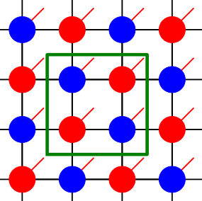 
FIG. 1. Schematic illustration of the iPEPS ansatz used in this work. The circles denote local tensors on the square lattice. Blue and red indicate different sublattices, red legs denote physical indices, black legs denote virtual indices, and the green square highlights a 2 × 2 unit cell.

📷 Fig 2

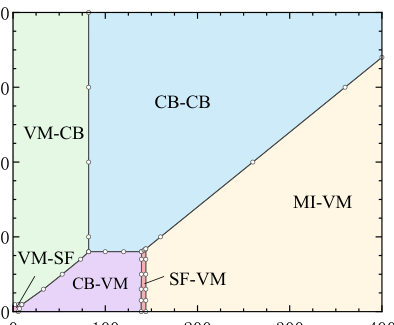 
FIG. 2. Ground-state phase diagram for the parameter set identified in the experiment [23], obtained by TN method with D = 4. Open circles denote the transition points with the error bar smaller than the symbol size; solid lines are guides to the eye.

📷 Fig 3

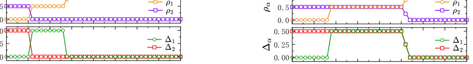 
FIG. 3. Order parameters ψ1, ψ2, ρ1, ρ2, ∆1 and ∆2 for the experimental parameter set are plotted as functions of µ1 for (a) µ2 = 50 and (b) µ2 = 200. The discontinuities in the order parameters indicate the phase transitions are all first order. Data are obtained with D = 4.

📷 Fig 4

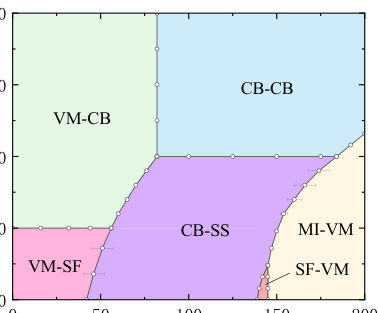 
FIG. 4. Ground-state phase diagram after tuning the param- eter t2 = 35, obtained by TN method with D = 4. Open circles denote the transition points; solid lines are guides to the eye. The error bars are ±2 if not plotted explicitly.

📷 Fig 5

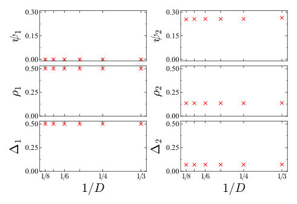 
FIG. 6. 1/D dependence (D=3–8) of the order parameters at the representative point (µ1 = 120, µ2 = 50) in the CB-SS phase.

**Summary.** The authors mapped the ground-state phase diagram for a two-component Bose-Hubbard model simulating dipolar excitons. They found that while the natural experimental regime suppresses supersolidity, by carefully enhancing the hopping of one component, they theoretically predicted and confirmed the emergence of a stable orbital-selective supersolid phase.

**Why it may be interesting.** This work directly addresses the realization of exotic quantum phases like supersolidity in controllable platforms (dipolar excitons), providing concrete theoretical guidance on tuning parameters to achieve desired many-body states.

Detailed structure

**Main problem.** The study investigates the ground-state phase diagram of a two-component extended Bose-Hubbard model to determine if a supersolid (SS) phase can be realized.

**Main result.** In the original experimental regime, no SS phase was found due to strong interactions suppressing superfluidity; however, tuning hopping in one component revealed a robust orbital-selective supersolid (CB-SS) phase.

**Method.** The ground-state properties were calculated using the infinite projected entangled-pair states (iPEPS) ansatz and analyzed with CTMRG methods.

**Model / system.** The system is modeled by a two-component extended Bose-Hubbard Hamiltonian, motivated by dipolar excitons confined in an artificial square lattice.

**Key observables.** Average density ($
ho_\alpha$), density-modulation order parameter ($\Delta_\alpha$), and condensate order parameter ($\psi_\alpha$).

**Important parameters / regimes.** Hopping parameters ($t_1, t_2$) and on-site/interaction repulsion terms ($U, V$); the tuning of $t_2$ is crucial for observing SS.

**Assumptions / limitations.** Components are treated as hard-core bosons due to large interaction strengths; calculations use iPEPS ansatz and finite unit-cell extrapolations.

**Figures summary.** Figures show the phase diagram in both the original (no SS) and tuned (SS present) regimes, illustrating the evolution of order parameters across different phases like CB-VM and CB-SS.

**Paper structure.** The paper first maps out the zero-temperature phase structure for the experimental parameters, establishing the absence of supersolidity. It then systematically tunes a hopping parameter to stabilize and confirm the existence of an orbital-selective supersolid phase using rigorous numerical checks.

Abstract

We investigate the ground-state phase diagram of a two-component extended Bose-Hubbard model recently realized with dipolar excitons, using the projected entangled-pair states. For the experimentally relevant parameter regime, checkerboard, Mott-insulating, superfluid, and vacuum phases are identified. These phases exhibit orbital-selective character, wherein the two components occupy different quantum states, but we find no evidence for a supersolid phase. The absence of supersolidity is attributed to the strongly interaction-dominated microscopic energy scales, which severely restrict the superfluid regime. Guided by the supersolid mechanism, we further explore a nearby parameter regime with enhanced hopping of one component and identify an orbital-selective supersolid phase. Further finite bond-dimension and unit-cell analyses establish the robustness of this phase. Our results clarify the zero-temperature phase structure of the dipolar-exciton platform and provide a possible route toward realizing supersolidity in this setting.

[↑ back to top](#top)

### [A Heterogeneous Distributed Architecture for Quantum Simulation](http://arxiv.org/abs/2608.09215v1)

**Authors:** John Stack, Sitong Liu, Abhinav Anand, Inder Monga, Yuan Liu, Erhan Saglamyurek, Pedro L. S. Lopes, Frank Mueller, Katherine Klymko  
**Type:** theory · **Category:** quantum information and computing · **PDF:** <https://arxiv.org/pdf/2608.09215v1>  
**Analysis basis:** full PDF text, analyzed in chunks
**Topic relevance:** 🔥 `analog quantum simulation` **4/5**

📷 Fig 1

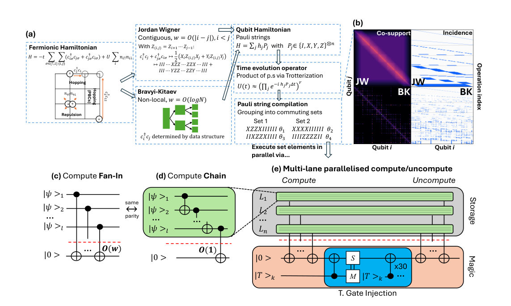 
Fig. 1: Simulation workflow, Pauli-string structure and device implementation. (a) Simulation workflow. (b) Co-support and incidence matrices for the Jordan–Wigner (JW, top) and Bravyi–Kitaev (BK, bottom) transformations on a 7 × 7 Fermi- Hubbard Hamiltonian. The co-support matrices indicate the probability that qubits i and j both occur in the support of a Pauli string. The incidence matrices indicate which qubits occur in the support of each Pauli string. (c) A method of computing parity that is suboptimal on distributed devices, requiring O(w) non-local CNOTs for a Pauli string of weight w. (d) A communication-efficient method of computing parity. For each lane on which a Pauli string...

📷 Fig 2

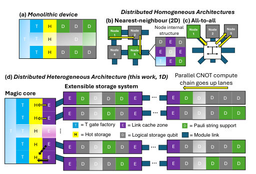 
Fig. 2: Quantum architectures. Gradient coloring represents design space for sizing. (a) Monolithic device with column(s) of T factories (T), hot-storage zones (H), connected via ebits (E) to data (D) / cold storage qubits. (b-c) Distributed ho- mogeneous architectures. Yellow lines indicate node-to-node interactions required to implement distributed Pauli strings. Example internal homogeneous node structure shown. (d) Dis- tributed heterogeneous architecture. Yellow and cross-hatched yellow arrows at the Magic core indicate inter- and intra-string parallelism respectively. Note that while nodes are shown as squares or 1D rectangles, this is just illustrative. We model nodes as rectangles...

📷 Fig 3

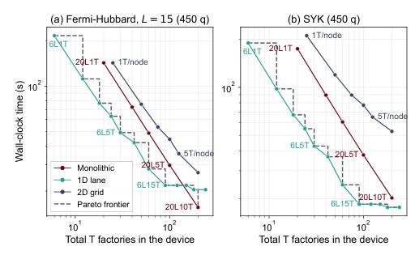 
Fig. 3: Wall-clock time against total T factory count Pareto plot. (a-b) 450-qubit simulations at 1ms O(d) Bell state generation rates. The data shown in these plots correspond to the Bravyi–Kitaev (BK) transformation.

📷 Fig 4

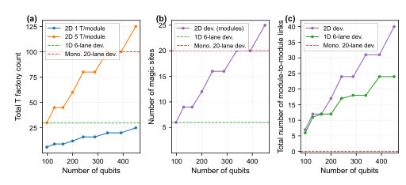 
Fig. 4: Number of T factories, magic sites and distributed connections. (a) Total number of T factories across different distributed quantum computing architectures as problem size increases. (b) Total number of magic sites for each architec- ture. For the 1D and monolithic architectures, this remains fixed and is equal to the number of storage lanes. For the 2D architecture, it is equal to the number of modules and therefore increases with problem size. (c) Total number of distributed connections for different architectures against qubit count.

📷 Fig 5

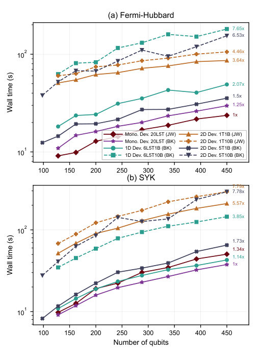 
Fig. 5: Performance of the architecture and its scaling against problem size. (a-b) The performance of the device on an L × L grid Fermi-Hubbard simulation task with N = 2L2

**Summary.** The paper introduces a specialized, heterogeneous quantum computer architecture designed to efficiently simulate fermionic systems like the Fermi-Hubbard model. By separating computation into a magic core and dedicated cold storage lanes, it significantly reduces communication bottlenecks compared to uniform distributed designs. This makes simulating complex, non-local interactions on large qubit counts more feasible.

**Why it may be interesting.** This work directly addresses the hardware bottleneck for simulating strongly correlated quantum matter by proposing a resource-aware architectural solution that minimizes communication overheads inherent in large-scale fault tolerance.

Detailed structure

**Main problem.** The primary challenge is scaling fault-tolerant quantum computation for simulating complex physical systems while minimizing overheads associated with communication, routing, and resource duplication in distributed architectures.

**Main result.** A novel heterogeneous distributed architecture, connecting a magic core to specialized cold-storage lanes, was shown to be significantly faster (up to 2x) than homogeneous alternatives for large-scale fermionic simulations.

**Method.** The authors propose an architectural design that separates active computation from long-term storage and evaluates its performance using Trotterization applied to Pauli strings derived from fermionic Hamiltonians.

**Model / system.** The work focuses on simulating quantum dynamics using the Fermi–Hubbard model and the sparse Sachdev–Ye–Kitaev (SYK) model, requiring mappings of fermionic operators to Pauli string representations via JW or BK transformations.

**Key observables.** Wall-clock time comparison between heterogeneous vs. homogeneous architectures; scaling of Pauli string weight ($O(N)$ vs $O(\log N)$); and the efficiency gain factor ($\sim 2	imes$ speedup).

**Important parameters / regimes.** System size up to 450 logical qubits; T-state factory count; lattice geometry (for Fermi-Hubbard); and target error rates for fault tolerance.

**Assumptions / limitations.** The analysis assumes that the overheads in traditional distributed architectures are dominated by slow Bell pair communication, making architectural specialization crucial.

**Figures summary.** Figures illustrate the simulation workflow, comparing co-support matrices for JW vs. BK encodings, and detailing the proposed heterogeneous architecture structure versus homogeneous alternatives.

**Paper structure.** The paper introduces the problem of scaling fault tolerance, details the physical models (Fermi-Hubbard/SYK) and their Pauli string representations, proposes the novel heterogeneous architecture, and concludes with performance evaluations comparing it against existing distributed paradigms.

Abstract

Architectural specialization and distribution can help scale fault-tolerant quantum computers, but may also introduce substantial overheads from communication, routing, and resource duplication. We introduce a heterogeneous distributed architecture in which a magic core is connected to an extensible storage system composed of one-dimensional lanes of specialized cold-storage nodes. The storage system supports parallel random access to Pauli string parities. This organization is particularly well suited to fermionic quantum simulation, enabling parallel execution of the highly non-local Pauli strings arising from these systems. We evaluate the architecture on fault-tolerant simulations of the dynamics of the Fermi-Hubbard and sparse Sachdev-Ye-Kitaev (SYK) models on systems of up to 450 logical qubits. These workloads exhibit complementary communication structures: Fermi-Hubbard produces a spectrum of interactions from local to non-local shaped by lattice geometry, whereas sparse SYK produces highly non-local and overlapping Pauli operators. For a Trotter step of a 450-logical-qubit Fermi-Hubbard workload, a six-lane system with 30 T-state factories is within approximately $1.4\times$ the wall-clock time of a homogeneous distributed architecture with 4 times as many T-state factories and substantially greater connectivity and sites for injecting magic. For matched T-factory counts, our architecture is $\sim 2\times$ faster.

[↑ back to top](#top)

### [Fermionic Lattice Supersolidity in the Attractive Three-Color Fermi-Hubbard Model](http://arxiv.org/abs/2608.08178v1)

**Authors:** Xiang Li, Yu Wang  
**Type:** theory · **Category:** other · **PDF:** <https://arxiv.org/pdf/2608.08178v1>  
**Analysis basis:** full PDF text, analyzed in chunks
**Topic relevance:** 🔥 `analog quantum simulation` **4/5**

📷 Fig 1

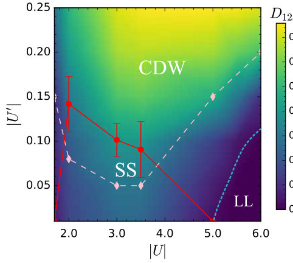 
FIG. 1. Phase diagram of the half-filled three-color Hubbard model on a square lattice at the temperature of T = 1/12. The color scale indicates the magnitude of the CDW order parameter D123. The supersolid (SS) phase is enclosed by the red data points with error bars. The blue dotted curve represents the D123 = 0.03 contour, inside which a liquid-like (LL) phase exists. The pink dotted curve marks the crossover from 12-CDW to 123-CDW.

📷 Fig 2

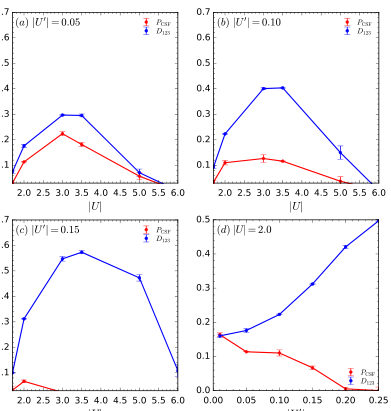 
FIG. 2. Interplay between CDW and CSF orders at half- filling. (a)–(c) CSF (PCSF) and CDW (D123) order param- eters as a function of interaction strength |U| for couplings (a) |U ′| = 0.05, (b) |U ′| = 0.10, and (c) |U ′| = 0.15. (d) De- pendence of PCSF and D123 on |U ′| at fixed |U| = 2.0. Here, U is the coupling between colors 1 and 2, and U ′ is the cou- pling between color 3 and colors 1 &amp; 2. The temperature is T = 1/12.

📷 Fig 3

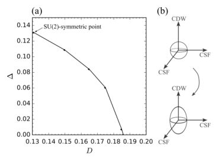 
FIG. 3. (a) The mean-field CSF order ∆as a fuction of mean- field CDW order D at T = 1/12 and |U| = 2.0. (b) Schematic illustration of the lifting of the CDW-CSF degeneracy, result- ing in an easy-axis anisotropy.

📷 Fig 4

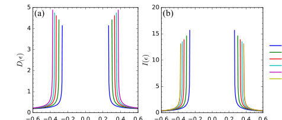 
FIG. 4. (a) Normalized density of states D(ǫ) and (b) energy- resolved pairing kernel I(ǫ) as a function of ǫ at T = 1/12, |U| = 2.0 and different values of mean-field CDW order D.

📷 Fig 5

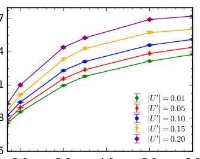 
FIG. 5. The triple occupancy P3 as a function of |U| at dif- ferent values of |U ′| at T = 1/12. The lattice size is L = 12.

**Summary.** The paper theoretically investigates supersolid states in the three-color Fermi-Hubbard model using DQMC simulations. It demonstrates that a stable supersolid phase emerges from the interplay between two strongly interacting colors and a weakly coupled third color. This offers an experimentally accessible platform for realizing and studying coexisting crystalline and superfluid orders in ultracold fermions.

**Why it may be interesting.** This work directly addresses exotic quantum phases (supersolids) in systems relevant to ultracold atoms trapped in optical lattices, providing detailed theoretical predictions for experimental detection using color/spin degrees of freedom.

Detailed structure

**Main problem.** The study investigates the emergence and characteristics of a lattice Fermi supersolid state in an attractive three-color Fermi-Hubbard model.

**Main result.** A stable Fermi supersolid phase, characterized by the coexistence of charge-density-wave (CDW) and color-superfluid (CSF) orders, is found due to weak coupling between two interacting colors and a third weakly coupled environment.

**Method.** The research employs Determinant Quantum Monte Carlo (DQMC) simulations alongside mean-field theory calculations for analyzing order parameters and phase boundaries.

**Model / system.** The system is the attractive three-color Fermi-Hubbard model realized on a square optical lattice, studied at half-filling. The Hamiltonian includes color-dependent attractions ($U_{\alphaeta} < 0$).

**Key observables.** Charge Density Wave (CDW) Order Parameter ($D_{123}$), Color-Superfluid (CSF) Correlation Ratio ($R_{CSF}$), and the CSF order parameter ($P_{CSF}$).

**Important parameters / regimes.** Interaction strengths $|U|$ and $|U'|$, quantum degenerate temperature ($T=1/12$), and lattice size dependence ($1/L$).

**Assumptions / limitations.** The analysis relies on DQMC simulations for finite-size scaling and mean-field theory by tracing out one color to simplify the Hamiltonian.

**Figures summary.** Figures illustrate phase diagrams showing the SS region, plot order parameters vs. interaction strengths, and show finite-size extrapolations of CDW and CSF orders against $1/L$.

**Paper structure.** The paper progresses from defining the physical model and key observables to performing DQMC simulations to map out the phase diagram, followed by mean-field analysis to understand the competition between CDW and CSF orders.

Abstract

The recent experimental realization of the half-filled three-color Fermi-Hubbard model on a square optical lattice provides a novel platform for exploring exotic states of matter beyond conventional SU(2) systems. In this Letter, we investigate the three-color Fermi-Hubbard model with color-dependent attractive interactions using determinant quantum Monte Carlo simulations. We find that, at quantum degenerate temperatures, a lattice Fermi supersolid state emerges from the interplay between a moderately-to-strongly interacting two-color subsystem and a weakly coupled third-color environment. This supersolid state, characterized by the coexistence of charge-density-wave and color-superfluid orders, is highly promising for experimental detection with current techniques. Our results demonstrate that the attractive three-color Fermi-Hubbard model on a square optical lattice offers an experimentally accessible system for exploring the supersolidity of ultracold lattice fermions, requiring only a simple lattice geometry and easily tunable onsite interactions.

[↑ back to top](#top)

### [Tunable Multiband Geometry and Fractional Phases in Higher Vortexable Systems](http://arxiv.org/abs/2608.09911v1)

**Authors:** Xiaohan Wan, Siddhartha Sarkar, Ting Cao, Mark Rudner, Di Xiao, Kai Sun  
**Type:** theory · **Category:** strongly correlated electrons · **PDF:** <https://arxiv.org/pdf/2608.09911v1>  
**Analysis basis:** full PDF text, analyzed in chunks
**Topic relevance:** 🔥 `analog quantum simulation` **4/5**

📷 Fig 1

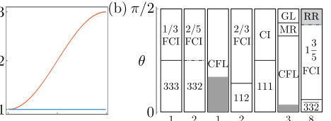 
FIG. 1. Phase diagram of a moiré system with higher vortex- able flat bands. (a) Averaged ratio between the trace of the quantum metric and the Berry curvature as a function of θ, which parameterizes the interlayer tunneling strength. The blue and red curves correspond respectively to the LLL-type vortexable band (band 1, ˜Ψk,1) and the first vortexable band (band 2, ˜Ψk,2). (b) Phase diagram as a function of filling fraction ν and interlayer tunneling θ. The filling fraction is defined such that ν = 2 corresponds to completely filling the two bands polarized on one sublattice. The ground states at different θ and ν are labeled as follows: p/q FCI denotes a fractional Chern insulator...

📷 Fig 2

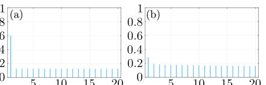 
FIG. 3. Normalized eigenvalues of the exciton correlation matrix at ν = 1, 1/3 for the Sz = 0 ground state at k = 0. (a) ν = 1 and θ = 0, with eigenvalues normalized by Ne/2 = 6. (b) ν = 1/3 and θ = 0, normalized by Ne/2 = 2.

📷 Fig 3

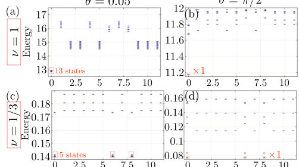 
FIG. 2. Many-body spectra at fillings ν = 1 [(a),(b)] and ν = 1/3 [(c),(d)] for different values of the interlayer tunnel- ing parameter θ, with the ground states marked by red boxes. The average many-body Chern number of each ground state equals the filling fraction ν. (a) At θ = 0.05, there are 13 quasidegenerate ground states, consistent with a Halperin- 111 state (exciton insulator). (b) At θ = π/2, there is a single ground state, adiabatically connected to a Chern insu- lator. (c) At θ = 0.05, there are five quasidegenerate ground states in each of the three center of mass momentum sectors k = 0, 6, 8, giving a total of fifteen states, consistent with a Halperin-333 state (fractional...

📷 Fig 4

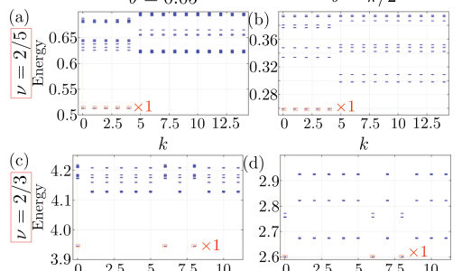 
FIG. 4. Many-body spectra at ν = 2/5 [(a),(b)] and ν = 2/3 [(c),(d)] for θ = 0.05 and θ = π/2.

📷 Fig 5

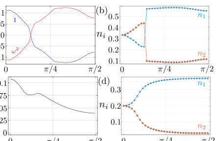 
FIG. 5. Quantum-geometry-driven phase transition at ν = 2/3 [(a),(b)] and crossover at ν = 2/5 [(c),(d)]. (a) Calibrated energies of the ground state and first excited state at k = 0 as functions of θ; the average of the two energies is subtracted. A many-body level crossing occurs near θ = 0.4, where the C3 eigenvalue of the ground state at k = 0 changes from ω2

**Summary.** This work develops the theory of higher vortexable moiré systems, treating them as multiband platforms rather than single-band models. By systematically varying the wave function geometry via interlayer coupling, the authors demonstrate a continuous tuning pathway between numerous correlated topological phases at zero magnetic field. This establishes quantum geometry as a fundamental control parameter for realizing exotic fractional states.

**Why it may be interesting.** The concept of quantum geometry itself being a direct tuning knob for accessing different correlated topological states is highly relevant to understanding tunable Hamiltonians in AMO systems, such as those realized with optical lattices or superconducting circuits.

Detailed structure

**Main problem.** To explore tunable multiband geometry and fractional phases in higher vortexable systems, moving beyond the single-band approximation common in previous studies.

**Main result.** The full multiband treatment reveals a cascade of topological phases connected by transitions driven solely by changes in quantum geometry at zero magnetic field.

**Method.** Systematic exact-diagonalization studies were performed on many-body phases, retaining the full flat-band Hilbert space rather than projecting onto a single band.

**Model / system.** The system utilizes higher vortexable moiré systems, which are generalized lattice structures supporting multiple degenerate flat bands. The physics is governed by coupling between layers/bands via an operator D, allowing for continuous tuning of the wave function geometry.

**Key observables.** Fractional filling ($
u$), topological phases (Moore-Read, Read-Rezayi), quantum metric ratios, and many-body gaps in the Projected Energy Spectrum (PES).

**Important parameters / regimes.** The interlayer hybridization strength, parameterized by an angle $	heta$, acts as the primary tuning parameter for quantum geometry.

**Assumptions / limitations.** Previous studies often focused on single-band projections, which is insufficient because interband mixing and residual interactions are crucial for stabilizing non-Abelian order.

**Figures summary.** Figures illustrate the evolution of geometric quantities (like the ratio between quantum metric trace and Berry curvature) as a function of $	heta$, and phase diagrams mapping out various Abelian and non-Abelian fractional states across different fillings.

**Paper structure.** The paper first establishes the theoretical framework using higher vortexability to define tunable multiband structures. It then performs systematic ED calculations, showing how varying the geometry parameter ($	heta$) drives transitions between distinct topological phases (e.g., Halperin vs. Laughlin/MR states).

Abstract

Higher vortexability is often viewed as a route to topological flat bands with higher-Landau-level-like quantum geometry. Here we emphasize a complementary perspective: it provides a tunable multiband structure in which wave function geometry can be varied continuously while the band dispersion, degeneracy, and topology remain fixed. We perform systematic exact-diagonalization studies of many-body phases in fractionally filled higher vortexable moiré systems, retaining the full flat-band Hilbert space rather than projecting onto a single band. The multiband treatment reveals a cascade of Abelian and non-Abelian phases at zero magnetic field, including integer and fractional exciton insulators, Abelian fractional Chern insulators, Moore-Read and Read-Rezayi states. At fixed filling, different phases are connected through transitions or crossovers driven solely by changes in wave function geometry, highlighting quantum geometry itself as a direct tuning parameter between competing topological states. At fillings associated with Moore-Read and Read-Rezayi states, our calculations show that interband mixing shifts the optimal quantum geometry regime without suppressing non-Abelian topological order under screened Coulomb interaction. Our results establish higher vortexable moiré bands as a tunable platform for exploring geometry-driven multiband topological phases at zero magnetic field.

[↑ back to top](#top)

### [Optimization of the Repumping Parameters for a Sodium Laser Guide Star Magnetometer](http://arxiv.org/abs/2608.08983v1)

**Authors:** Yucheng Yang, Chunyang Lei, Kai Guo, Shuai Wang  
**Type:** theory · **Category:** other · **PDF:** <https://arxiv.org/pdf/2608.08983v1>  
**Analysis basis:** full PDF text, analyzed in chunks
**Topic relevance:** `driven-dissipative phase transition` **3/5** · `methods for driven-dissipative` **3/5** · `analog quantum simulation` **2/5** · `correlated / nonlocal dissipation` **2/5** · `quantum measurements` **2/5** · `Keldysh / 2PI / non-Gaussian methods` **1/5** · `Tavis-Cummings & cavity-many-emitter` **1/5** · `non-equilibrium universality` **1/5**

📷 Fig 1

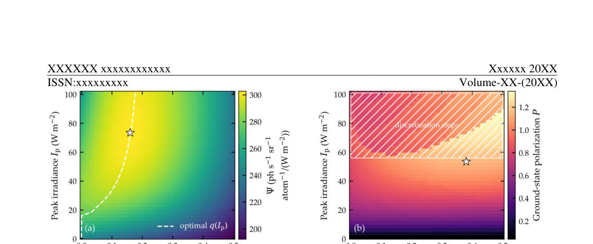 
Fig. 1 Repump fraction against peak irradiance at dc = 0.2. (a) Specific return flux Ψ; the dashed line traces the flux-optimal fraction and the star marks the maximum at q = 0.16, Ip = 73.5 W/m2. (b) Ground-state polarization P; the hatched band marks the discretization-step region from which no value is read (Section 2), and the star marks the largest smooth-region value, P = 1.151 at q = 0.38.

📷 Fig 2

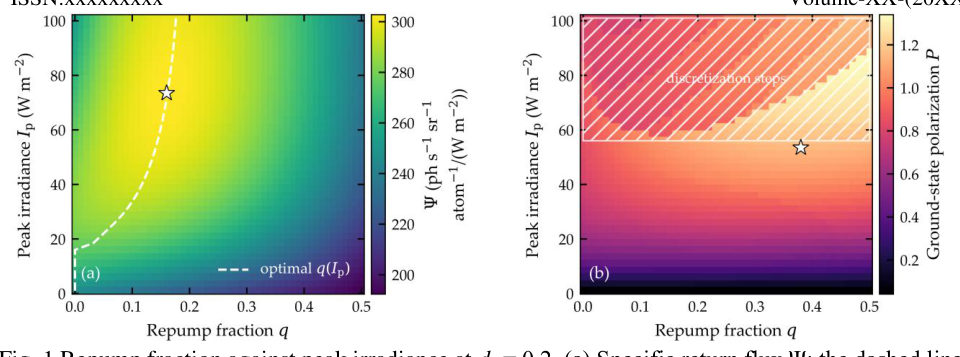 
Fig. 2 The two candidate rules, tested on the flux ridge of Fig. 1a. (a) Flux-optimal repump fraction against peak irradiance: zero below Ip ≈ 16 W/m2, then rising toward the asymptote κ (dotted) of Eq. (1). (b) Optimal repump irradiance qoptIp: nearly linear growth. Neither a constant fraction nor a constant power describes the same ridge.

📷 Fig 3

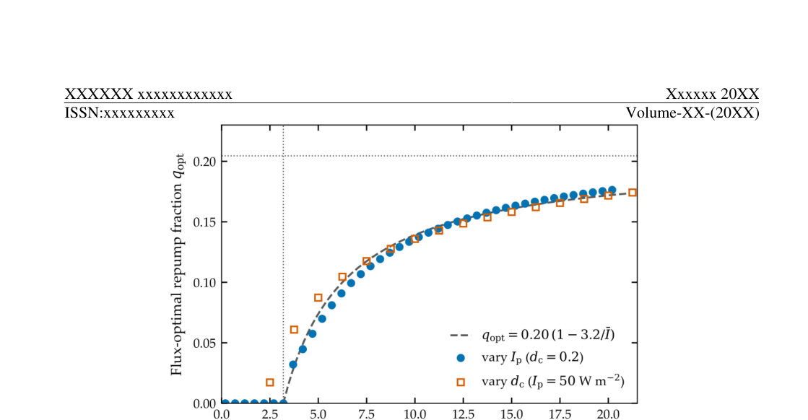 
Fig. 3 The flux-optimal repump fraction collapses onto the mean irradiance. Circles: optima from varying Ip at dc = 0.2; open squares: optima from varying dc at Ip = 50 W/m2; dashed: Eq. (1) fitted jointly (κ = 0.20, Īth = 3.2 W/m2, R2 = 0.99). The two scans reach a given Ī through different variables, so their falling on one curve identifies the controlling quantity.

📷 Fig 4

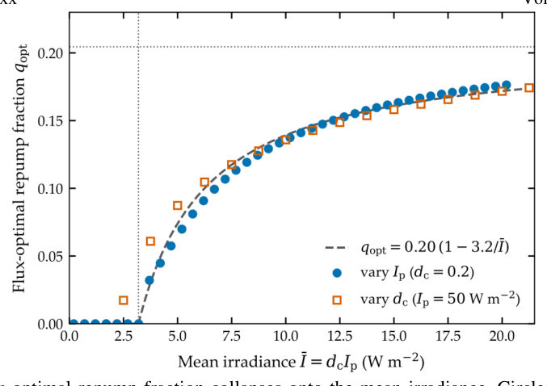 
Fig. 3 tests Eq. (1) against two independent data sets—the optima obtained by varying the peak irradiance at fixed duty cycle and those obtained by varying the duty cycle at fixed peak irradiance— which probe Ī through different factors and collapse onto one curve. A joint fit gives κ = 0.20 and Īth = 3.2 W/m2 with R2 = 0.99 and an rms residual of 0.006 in q over the 68 points; fitted separately the two scans give κ = 0.208 and 0.200, Īth = 3.37 and 2.86 W/m2, reproducing the asymptotic fraction to 4% and the threshold to 18%. The collapse carries the conclusion: the mean irradiance—not the peak irradiance or the duty cycle separately—sets the repump requirement.

📷 Fig 5

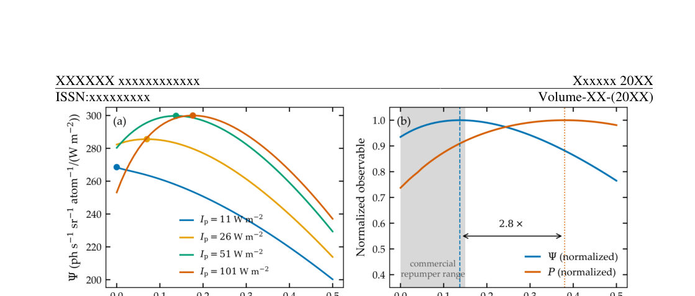 
Fig. 4 Repump fraction at the operating point. (a) Flux against q at four peak irradiances; circles mark the maxima, which move to larger q with irradiance. (b) Flux and polarization at Ip = 51 W/m2, each normalized to its own maximum: the flux peaks at q = 0.137 (dashed), the polarization at q = 0.380 (dotted), a factor 2.8 apart. The shaded band is the 0–15% repumping range of commercial guide star lasers [18], which contains the flux optimum but not the polarization optimum.

**Summary.** The authors simulated the operation of a sodium laser guide star magnetometer by optimizing the repumping light fraction relative to the main pumping beam. They found that while flux optimization follows predictable scaling laws, achieving maximum measurement precision requires a repump ratio significantly higher than what current commercial lasers can provide.

**Why it may be interesting.** This work provides a detailed quantum optics simulation of an advanced sensing platform. The use of density matrices to model complex atomic interactions (Larmor precession, spin-damping) in a non-equilibrium setting is highly relevant to open quantum systems and quantum sensing theory.

Detailed structure

**Main problem.** The primary goal is optimizing the repumping light fraction (q) used in a Sodium Laser Guide Star Magnetometer to maximize measurement precision by balancing competing requirements from fluorescence flux and ground-state polarization.

**Main result.** The optimal repump fraction required for high polarization significantly exceeds the range provided by current commercial guide star lasers, suggesting hardware limitations are key to improving magnetometer sensitivity.

**Method.** Density-matrix simulations were employed over multiple modulation periods to model atomic evolution under various laser parameters and optimize the repumping ratio.

**Model / system.** The system models a sodium mesospheric magnetometry setup using the full D2 line (24 Zeeman sublevels). The simulation incorporates optical excitation, spontaneous decay, Larmor precession, spin-damping, and velocity-changing collisions.

**Key observables.** Return flux ($\Psi$), ground-state spin polarization ($P$), repump fraction ($q$), and peak irradiance ($I_p$).

**Important parameters / regimes.** The optimal parameters are governed by a threshold law relating the optimal $q$ to the mean total irradiance $ar{I} = d_c I_p$.

**Assumptions / limitations.** The simulations report five-period transient values, not steady-state limits. The polarization readout is restricted to the most strongly driven velocity group.

**Figures summary.** Figures illustrate that while flux optimization follows a curve dependent on mean irradiance ($ar{I}$), the required optimal $q$ for high polarization remains outside the operational range of commercial lasers.

**Paper structure.** The paper analyzes the trade-off between maximizing signal flux (minimizing noise) and maximizing resonance contrast (polarization). It derives empirical scaling laws for the flux optimum, compares these to the polarization optimum, and concludes by identifying hardware limitations based on the required repump fraction.

Abstract

A sodium laser guide star operated as a mesospheric magnetometer modulates a 589 nm laser at the local Larmor frequency and usually diverts a fraction of its power to a repumping light that recovers atoms lost to the dark ground state.The polarization, read out for the most strongly driven velocity group, calls for 2.8 times the flux optimal fraction, and a shot noise figure of merit combining the two observables for 2 times, beyond the range commercial guide star lasers provide.

[↑ back to top](#top)

### [Probing Non-equilibrium baths: Frequency-Resolved Thermometry and Quantum Heat Current Turnover](http://arxiv.org/abs/2608.09461v1)

**Authors:** Akhil Bhartiya, Tobias Kramer, David Gelbwaser-Klimovsky  
**Type:** theory · **Category:** statistical mechanics · **PDF:** <https://arxiv.org/pdf/2608.09461v1>  
**Analysis basis:** full PDF text, analyzed in chunks
**Topic relevance:** `driven-dissipative phase transition` **3/5** · `methods for driven-dissipative` **3/5** · `Keldysh / 2PI / non-Gaussian methods` **2/5** · `non-equilibrium universality` **2/5** · `quantum measurements` **2/5** · `analog quantum simulation` **1/5** · `correlated / nonlocal dissipation` **1/5** · `scars & prethermalization` **1/5**

📷 Fig 1

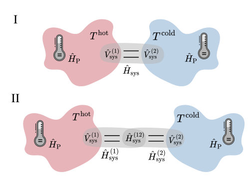 
FIG. 1. Schematic of (I) the non-equilibrium spin-boson model and (II) model of two interacting qubits coupled to separate heat baths. Baths in both models are probed with two level thermometers.

📷 Fig 2

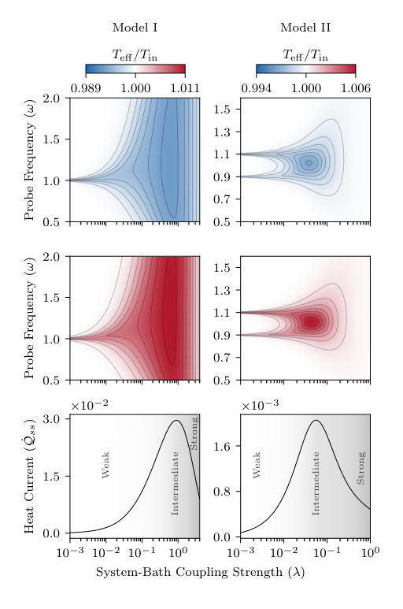 
FIG. 2. Units: ¯h = kB = 1. Left column: Model I (non-equilibrium spin-boson) with system transition frequency ω0 = 1. Right col- umn: Model II (two interacting qubits) with individual frequencies ω(1) 0 = ω(2) 0 = 1 and inter-qubit coupling J12 = 0.1. In both models, the two independent reservoirs have Drude–Lorentz spectral density (γhot = γcold = 1 for Model I; γhot = γcold = 5 for Model II) at ini- tial temperatures T hot in = 3 and T cold in = 2 and λhot = λcold = λ. The embedded two-level thermometers are coupled weakly with coupling strength η = 10−8. The first two rows show Teff(ω,λ) normalized by the respective initial bath temperature Tin (top: hot bath; sec- ond: cold bath)....

📷 Fig 3

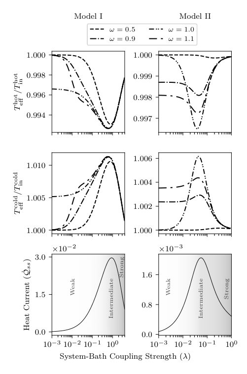 
FIG. 3. Effective temperature as a function of coupling strength (λ) for representative probe frequencies ω (sliced from data in Fig. 2).

**Summary.** The paper introduces a frequency-selective thermometric protocol to probe the thermal state of heat baths driving a system into a Non-Equilibrium Steady State (NESS). By measuring spectral dispersion using a tunable two-level probe, researchers can directly quantify how far the bath deviates from equilibrium. This technique successfully explains the characteristic 'turnover effect' observed in quantum heat current as coupling strength changes.

**Why it may be interesting.** This work provides a powerful diagnostic tool—frequency-resolved thermometry—to move beyond just measuring heat current and instead diagnose *how* the bath is non-equilibrium, which is crucial for understanding energy flow in complex quantum devices.

Detailed structure

**Main problem.** The primary goal is to characterize the internal thermal state of heat baths that sustain a Non-Equilibrium Steady State (NESS) during quantum heat transport.

**Main result.** Spectral dispersion in a frequency-resolved effective temperature spectrum serves as a direct, quantitative witness for the non-equilibrium nature of the coupled heat baths.

**Method.** The authors introduce a novel frequency-selective thermometric protocol using a tunable two-level probe to extract an effective temperature spectrum from the system's steady-state response.

**Model / system.** The study analyzes quantum heat transport in systems modeled by coupling to multiple bosonic baths (Caldeira-Leggett framework). Demonstrative models include the Non-Equilibrium Spin-Boson model and a two-qubit system.

**Key observables.** Frequency-resolved effective temperature spectrum $T_{	ext{eff}}(\omega)$, steady-state heat current ($\dot{Q}_{ss}$), and spectral dispersion of $T_{	ext{eff}}$.

**Important parameters / regimes.** System-bath coupling strength ($\lambda$), probe frequency ($\omega$), and the transition between weak, intermediate, and strong coupling regimes.

**Assumptions / limitations.** The analysis relies on the Hierarchical Equations of Motion (HEOM) formalism, which requires truncating an infinite hierarchy at a finite tier $N$.

**Figures summary.** Figures illustrate how $T_{	ext{eff}}/T_{in}$ and $\dot{Q}_{ss}$ change across weak, intermediate, and strong coupling regimes, with spectral dispersion being maximal in the intermediate regime.

**Paper structure.** The paper first establishes the problem of non-equilibrium bath characterization. It then details the theoretical framework using HEOM and introduces the thermometric probe protocol. Finally, it applies this to specific models (NESB, two-qubit) to map out the coupling regimes and interpret the resulting spectral signatures.

Abstract

Quantum heat transport for non-equilibrium steady state (NESS) exhibits a characteristic turnover effect, where the heat current reaches a maximum and subsequently declines as system-bath coupling increases. Although numerically exact methods can simulate this non-monotonic behavior, they offer limited information on the thermal state of the heat baths. Here, we introduce a frequency-selective thermometric protocol to probe the baths sustaining an NESS. By extracting a frequency-resolved effective temperature spectrum using a tunable two-level probe, we demonstrate that spectral dispersion serves as a direct witness for the non-equilibrium state of the heat baths. To demonstrate the protocol, we applied the hierarchical equations of motion to spin-boson and two-qubit models, though any exact method can be used. For both models, the turnover effect can be explained by how the thermal state of the heat baths evolves as the system-bath coupling strength increases.

[↑ back to top](#top)

### [Universal entropic occupation statistics in disordered bosonic resonators](http://arxiv.org/abs/2608.09007v1)

**Authors:** Orest Bucicovschi, David A. Meyer  
**Type:** theory · **Category:** statistical mechanics · **PDF:** <https://arxiv.org/pdf/2608.09007v1>  
**Analysis basis:** full PDF text, analyzed in chunks
**Topic relevance:** `analog quantum simulation` **3/5** · `non-equilibrium universality` **3/5** · `Full counting statistics` **2/5** · `Keldysh / 2PI / non-Gaussian methods` **2/5** · `correlated / nonlocal dissipation` **2/5** · `Tavis-Cummings & cavity-many-emitter` **1/5** · `driven-dissipative phase transition` **1/5** · `methods for driven-dissipative` **1/5**

📷 Fig 1

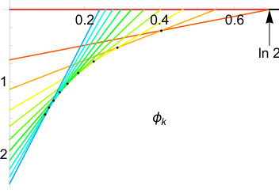 
FIG. 1. Dominant total occupation from the occupation-sector grand potentials of a two-mode cell. Below the horizontal axis, the straight lines are ϕk = kx −ln(k + 1), with x = βϵ and k = 0, . . . , 10; black dots mark successive crossings of the lower envelope. Above the axis, the same abscissa carries the staircase K(x). The ordinate is split: it denotes K above zero and ϕk = βΦk below zero. The K = 0 plateau lies on the horizontal axis for x &gt; ln 2.

📷 Fig 2

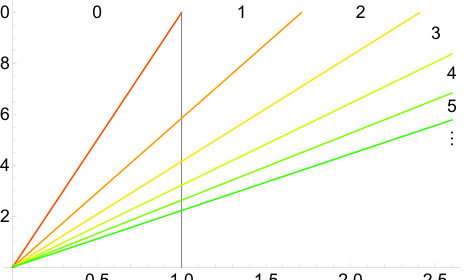 
FIG. 2. Temperature and disorder dependence of the dominant occupation number. (Left) Conditional active-cell distributions on a logarithmic scale. The reference distribution is p(2) k , obtained exactly for uniform disorder at every 0 &lt; τ ≤1 and shown in blue. The red and purple points show the probability distributions for a representative nonuniform detuning density ρ(ϵ) = (1 + 4ϵ/∆)/(3∆) at temperatures τ = 1 and τ = 1/4, respectively, approaching p(2) k as T →0. (Right) Dominant- occupation-number sector map for a uniform detuning band, in u = ϵ/∆and τ = T/T∗. The colored lines uk(τ) = τbk/ ln 2 separate sectors K = k −1 and K = k, labeled by the black numerals 0, 1, 2, 3, 4, 5, . . .....

**Summary.** This theoretical paper analyzes the occupation statistics in arrays of disordered bosonic resonators coupled to a thermal reservoir. It derives an entropic staircase governing the most probable total occupations and establishes that for two modes, the low-temperature limit follows the Gauss–Kuzmin distribution. This links photonic thermodynamics directly to fundamental concepts in number theory.

**Why it may be interesting.** This work provides a deep connection between bosonic statistics (photonic systems) and number theory (Gauss–Kuzmin), offering universal statistical laws applicable to disordered quantum optical systems.

Detailed structure

**Main problem.** The paper investigates the universal occupation statistics arising when multiple bosonic resonators sample a distribution of chemical-potential offsets (detunings) from a common reservoir.

**Main result.** For two modes, the low-temperature limit yields the Gauss–Kuzmin distribution, linking photonic thermodynamics to metric number theory. Furthermore, for uniform disorder, this law remains exact up to a finite temperature $T^*$.

**Method.** The analysis involves minimizing an entropic potential $\phi_k(x)$ derived from bosonic state counting and analyzing conditional probability ratios in the grand-canonical ensemble.

**Model / system.** The system consists of programmable microcavities supporting bosonic resonators, modeled as multiple independent cells coupled to a large reservoir at fixed temperature $T$ and chemical potential $\mu$. The key variable is the detuning $\epsilon_i = E_i - \mu$.

**Key observables.** Most-probable total occupations ($K(x)$), conditional occupation probabilities ($p^{(q)}_k$), and the active cell fraction $A(T)$.

**Important parameters / regimes.** Temperature $T$, chemical potential $\mu$, detuning density $
ho(\epsilon)$, and the dimensionless variable $x = eta\epsilon$.

**Assumptions / limitations.** The analysis relies on the grand-canonical ensemble description, assuming that finite-reservoir effects are negligible for small total occupations.

**Figures summary.** Not specified in the notes provided.

**Paper structure.** The paper develops the theory by first establishing the entropic staircase via potential minimization. It then derives the conditional law for two modes, identifying the Gauss–Kuzmin distribution in the low-temperature limit and analyzing its exactness under uniform disorder.

Abstract

Programmable microcavities support grand-canonical photon gases. We show that bosonic state counting creates an entropic staircase of most-probable total occupations. For detuning density continuous and nonzero at the chemical-potential threshold, the active-cell fraction is asymptotically linear at low temperature and the conditional law has a universal limit; for uniform disorder the law is exact over a finite temperature interval. For two modes it is the Gauss--Kuzmin distribution, linking photonic thermodynamics and metric number theory. We outline finite-array and dye-microcavity tests.

[↑ back to top](#top)

### [Energetic Cost of Temporal Information Processing in Quantum Reservoirs](http://arxiv.org/abs/2608.08279v1)

**Authors:** Gabriele Cenedese, Gonzalo Manzano, Gian Luca Giorgi, Roberta Zambrini  
**Type:** theory · **Category:** disordered systems and neural networks · **PDF:** <https://arxiv.org/pdf/2608.08279v1>  
**Analysis basis:** full PDF text, analyzed in chunks
**Topic relevance:** `driven-dissipative phase transition` **3/5** · `methods for driven-dissipative` **3/5** · `Keldysh / 2PI / non-Gaussian methods` **2/5** · `non-equilibrium universality` **2/5** · `analog quantum simulation` **1/5** · `correlated / nonlocal dissipation` **1/5** · `quantum measurements` **1/5** · `scars & prethermalization` **1/5**

📷 Fig 1

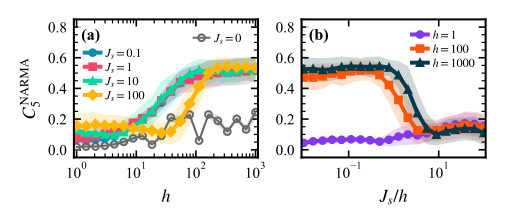 
FIG. 3. Same as Fig. 1(c,d) for the fifth-order NARMA capac- ity, CNARMA 5 . The switching work follows Fig. 1(a,b), differing only by the input rescaling used for the NARMA benchmark.

📷 Fig 2

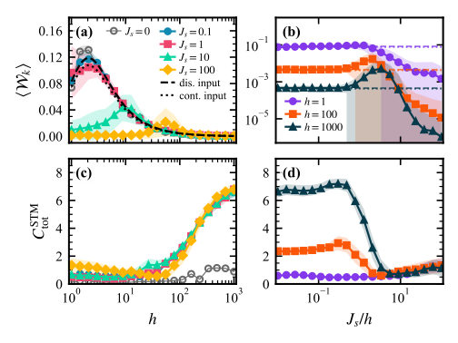 
FIG. 1. Average work and STM performance. (a,b) ⟨Wk⟩as a function of h for different Js and of Js/h for different h, respectively, numerical results are additionally averaged over independent couplings realizations. (c,d) Total STM capacity, CSTM tot , as a function of h for different Js and of Js/h for different h, respectively. Dashed lines in panels (a) and (b) show the analytical prediction of ⟨Wk⟩for discretized inputs. The dotted line in panel (a) corresponds to the continuous- input limit as in Eq. 8. Shaded regions indicate one standard deviation over 100 independent realizations of the random couplings and input sequences. Here and in the following we set kB = 1 and ℏ= 1 and we fix...

📷 Fig 3

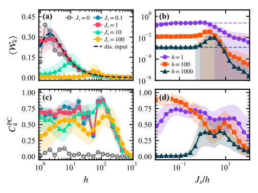 
FIG. 2. Same as Fig. 1 for the fourth-order PC capacity, CPC 4 .

📷 Fig 4

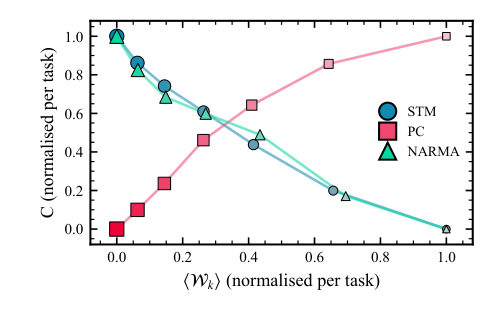 
FIG. 4. Normalized task capacity versus normalized aver- age switching work per input for the STM, fourth-order PC, and fifth-order NARMA tasks, obtained by varying h from 102 to 103. For each task, both the capacity and the aver- age switching work are independently rescaled to the interval [0, 1]. Circles, squares, and triangles denote the STM, PC, and NARMA tasks, respectively; marker size and color satu- ration increase with h.

📷 Fig 5

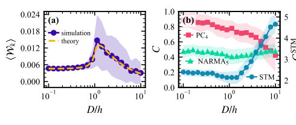 
FIG. 7. (a) Average switching work as a function of the dis- order strength D/h. The dashed line shows the analytical prediction of Eq. (8). (b) Average STM, fourth-order PC, and fifth-order NARMA capacities as a function of D/h.

**Summary.** This paper analyzes the energetic cost of temporal data processing in Quantum Reservoir Computing using an interacting spin reservoir model. It shows that information encoding is characterized by a measurable switching work ($	ext{W}_k$), which can be analytically derived under weak coupling assumptions. The findings reveal a crucial separation between energy expenditure and computational capability, offering guidelines for designing energy-efficient quantum machine learning systems.

**Why it may be interesting.** This work directly connects fundamental concepts from open quantum systems (work extraction, dissipation) to modern machine learning paradigms (reservoir computing), providing physical constraints on energy-efficient computation.

Detailed structure

**Main problem.** The study aims to understand the physical principles governing the energetic cost associated with temporal information processing in Quantum Reservoir Computing (QRC). Specifically, it seeks to clarify when energy efficiency aligns with computational performance.

**Main result.** The work done during input encoding is identified as the switching work ($	ext{W}_k$), which is governed by local reservoir unit responses. This leads to an anti-correlation between energetic cost and performance for different types of tasks (linear vs. nonlinear).

**Method.** The authors derive analytical expressions for the average switching work using weak-interaction approximations within the framework of the GKLS master equation.

**Model / system.** The system is an interacting spin reservoir composed of $N$ spin-1/2 particles, governed by a Hamiltonian including local fields and pairwise interactions. Dynamics are described by the GKLS master equation, analyzed in the weak interacting regime.

**Key observables.** Switching Work ($	ext{W}_k$), Heat ($	ext{Q}_k$), Computational Capacity ($C$), and thermodynamic quantities like entropy production ($\Sigma_k$).

**Important parameters / regimes.** Interaction strength ($J_{ij}$), local field amplitude ($a_k$), disorder strength ($D$), and the ratio $J_s/h$.

**Assumptions / limitations.** The analysis relies on the weak interacting regime approximation, assuming a piecewise-constant driving protocol for work calculation.

**Figures summary.** Figures illustrate how switching work ($\langle W_k 
angle$) and computational capacity vary with input amplitude ($h$) and interaction strength ($J_s/h$) for different tasks (STM, PC).

**Paper structure.** The paper develops the theory by first establishing the Hamiltonian and dynamics, then deriving analytical expressions for $	ext{W}_k$ in the weak coupling limit. It subsequently applies these results to benchmark tasks, demonstrating the separation of encoding work from information processing mechanisms.

Abstract

Quantum reservoir computing offers a promising route toward energy-efficient machine learning by processing temporal information with minimal training overhead. Yet, the physical principles linking its energetic cost to computational performance remain largely unexplored. Here we show that, in an interacting spin reservoir, information encoding and information processing are governed by distinct physical mechanisms. In the weak interacting regime, we derive an analytical expression for the average (switching) work, showing that the energetic cost of encoding new inputs is determined by the local response of the reservoir units. In contrast, interactions primarily redistribute the encoded information, generating memory and nonlinear features while only weakly affecting the work. This separation produces opposite correlations between energetic cost and performance for representative linear and nonlinear benchmark tasks. Our results identify the switching work as the energetic signature of information encoding and clarify when energetic efficiency and computational performance are compatible.

[↑ back to top](#top)

### [Light-Stabilized Metastable Electronic State in NiO with Enhanced Orbital Hybridization2](http://arxiv.org/abs/2608.08842v1)

**Authors:** Thomas C. Rossi, Fabio G. Santomauro, Lars Mewes, Janina Löffler, Dominik Kinschel, Giacomo Rossi, Mario Gutiérrez, Oliviero Cannelli, Boris V. Sorokin, Jochen Rittmann, Jakob Kel, James Budarz, Anna Wach, Adam H. Clark, Emiliano Dal Molin, Maged F. Bekheet, Albert Gili, Sebastian Praetz, Daniel Grötzsch, Delphine Cabaret, Renske M. van der Veen, Majed Chergui  
**Type:** both · **Category:** strongly correlated electrons · **PDF:** <https://arxiv.org/pdf/2608.08842v1>  
**Analysis basis:** full PDF text, analyzed in chunks
**Topic relevance:** `methods for driven-dissipative` **3/5** · `non-equilibrium universality` **3/5** · `Keldysh / 2PI / non-Gaussian methods` **2/5** · `driven-dissipative phase transition` **2/5** · `quantum measurements` **2/5** · `correlated / nonlocal dissipation` **1/5** · `scars & prethermalization` **1/5**

📷 Fig 1

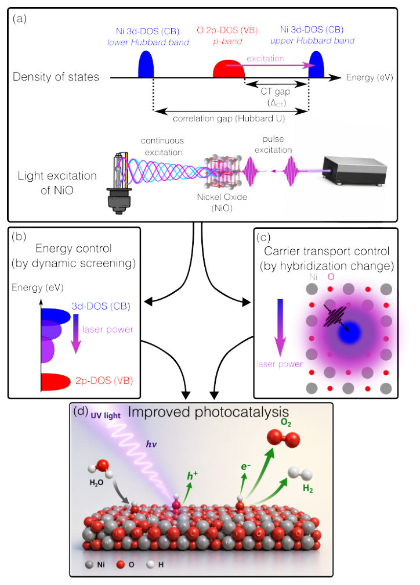 
Figure 1: Photoinduced changes in the electronic structure of correlated oxides can lead to

📷 Fig 2

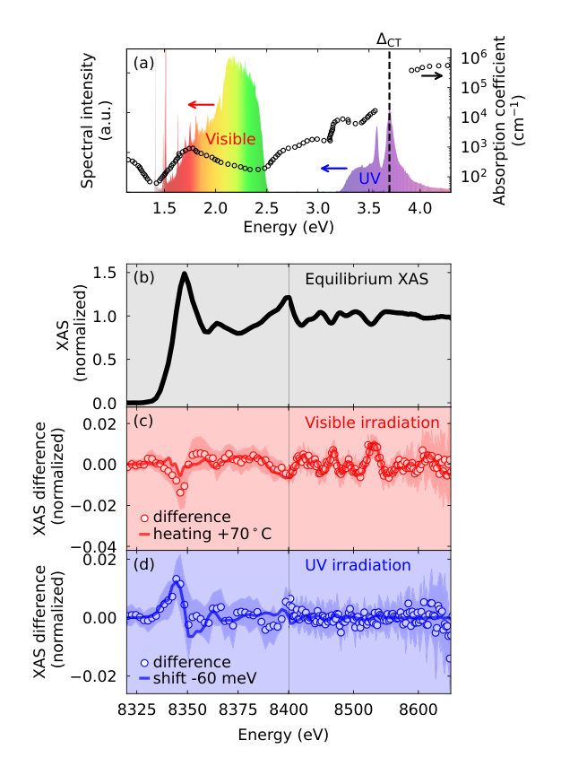 
Figure 2: Long-lived electronic excited state in NiO under continuous ultraviolet irradiation.

📷 Fig 3

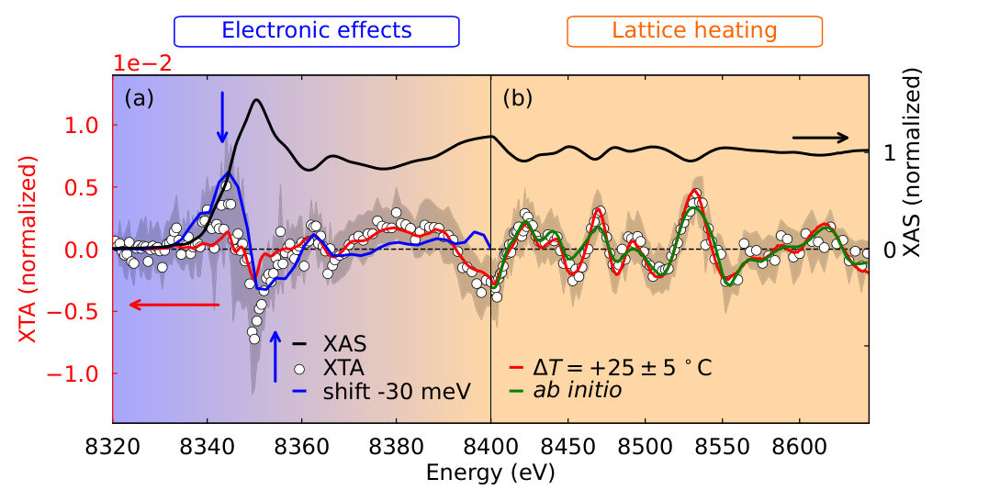 
Figure 3: Overlapping electronic and heating effects in the photoexcited state of NiO

📷 Fig 4

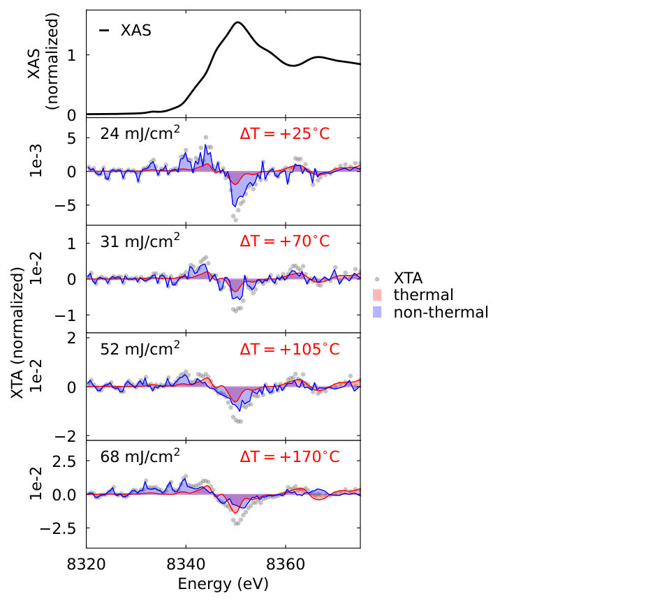 
Figure 4: Spectral signature of a non-thermal state in photoexcited NiO near the absorption

📷 Fig 5

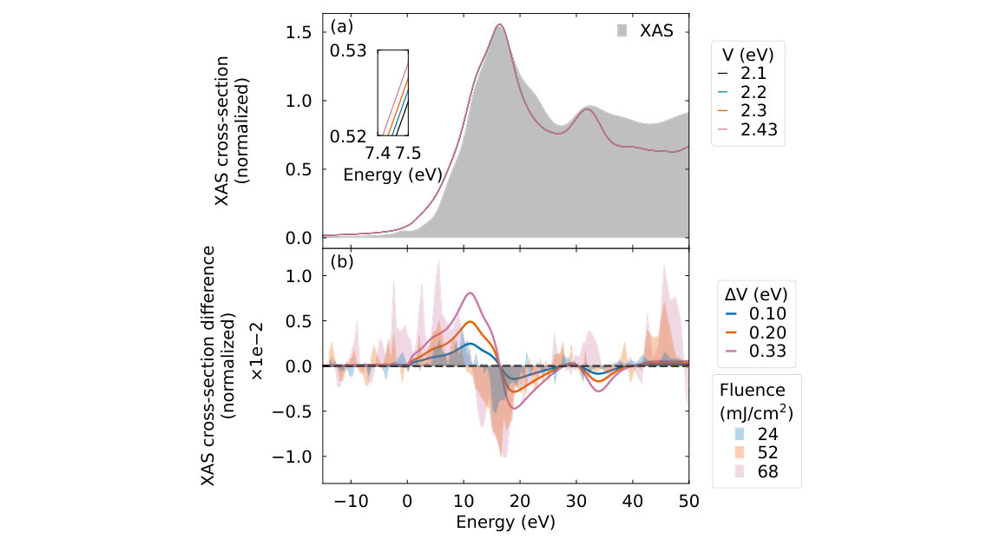 
Figure 5: Red shift of the XAS spectrum in the excited state interpreted as increase in

**Summary.** The authors demonstrate that light can dynamically tune the electronic structure of NiO by inducing a metastable state with enhanced orbital hybridization. By comparing spectroscopic signatures under high-density pulsed versus low-density continuous UV excitation, they prove this effect is not merely thermal. This establishes 'photoinduced screening' as a powerful mechanism for designing next-generation optoelectronic materials.

**Why it may be interesting.** This work is highly relevant as it uses ultrafast spectroscopy and advanced computational methods to probe non-equilibrium, strongly correlated states in solids, which is a key area for understanding charge transfer dynamics in quantum materials.

Detailed structure

**Main problem.** The study aims to develop methods for dynamically controlling electron-electron interactions and metal-ligand hybridization in correlated oxides using light, moving beyond static doping techniques.

**Main result.** Photoexcitation of NiO creates a long-lived metastable state characterized by enhanced orbital hybridization, which can be stabilized without significant lattice heating via continuous UV irradiation.

**Method.** The research combines in situ X-ray Absorption Spectroscopy (XAS) measurements under both pulsed and continuous UV excitation with first-principles DFT+U+V calculations to model the electronic response.

**Model / system.** The physical system is Nickel Oxide (NiO), a prototypical transparent semiconductor used as a hole-transport material. The theoretical framework involves modeling correlated electron behavior using DFT+$U+V$ to account for on-site and intersite Coulomb interactions.

**Key observables.** Enhanced Ni 3d–O 2p orbital hybridization, spectral shifts (red shift), carrier densities ($\sim 10^{13}$ to $10^{20} 	ext{ cm}^{-3}$), and state lifetimes ($\sim 600 	ext{ ps}$).

**Important parameters / regimes.** The study compares responses under high-density pulsed excitation versus low-density continuous UV irradiation, allowing the separation of thermal vs. electronic effects.

**Assumptions / limitations.** A central challenge addressed is disentangling intrinsic electronic changes from lattice heating; the analysis assumes that photoinduced screening can be isolated as a primary mechanism for tuning correlations.

**Figures summary.** Figures compare difference XAS spectra under visible (lattice-heating dominated) vs. UV excitation (electronic shift observed), and show time-resolved XTA data confirming persistent electronic shifts under continuous low-density pumping.

**Paper structure.** The paper progresses by first establishing the feasibility of light control via spectroscopy, then distinguishing between thermal and purely electronic responses using different excitation regimes (pulsed vs. continuous UV), and finally providing theoretical grounding through DFT+$U+V$ calculations to attribute spectral changes to photoinduced screening.

Abstract

Light-driven control of electronic structure in correlated metal oxides offers new opportunities for optimizing materials used in photovoltaic and photoelectrochemical technologies. We show that photoexcitation of NiO, a prototypical transparent semiconductor and hole-transport material, across its charge-transfer gap produces a long-lived metastable state with enhanced Ni 3d-O 2p orbital hybridization. We characterize this state using Ni K-edge X-ray absorption spectroscopy, which probes how structural and electronic changes affect the unoccupied p density of states during continuous and pulsed ultraviolet excitation. Under pulsed excitation, high carrier densities of approximately 10^20 per cubic centimeter generate a state with a lifetime of approximately 600 picoseconds, in which enhanced hybridization coexists with lattice heating. By contrast, continuous ultraviolet irradiation at much lower carrier densities of approximately 10^13 per cubic centimeter stabilizes a similar electronic state with negligible lattice heating, demonstrating that its formation is not solely thermally driven. First-principles DFT+U+V calculations attribute the spectral changes to stronger Ni 3d-O 2p hybridization, which alters the unoccupied Ni 4p states probed by dipole-allowed K-edge transitions. We attribute this change to the dynamic screening of on-site electronic correlations following photoexcitation, which redistributes the charge density. Because orbital hybridization governs carrier transport and charge-transfer energetics, our results identify photoinduced screening as a mechanism for dynamically tuning correlated oxides and suggest new design principles for optoelectronic materials.

[↑ back to top](#top)

### [Squeezing for dispersive readout of NV magnetometer](http://arxiv.org/abs/2608.09212v1)

**Authors:** A. M. Kozodaev, S. M. Drofa, P. G. Vilyuzhanina, A. Chernyavskiy, N. I. Salangin, A. N. Smolyaninov, S. Ya. Kilin, I. S. Cojocaru, S. V. Bolshedvorskii, V. V. Soshenko, F. Y. Khalili, A. V. Akimov  
**Type:** theory · **Category:** other · **PDF:** <https://arxiv.org/pdf/2608.09212v1>  
**Analysis basis:** full PDF text, analyzed in chunks
**Topic relevance:** `methods for driven-dissipative` **3/5** · `quantum optics experiment` **3/5** · `QC/QI experiment` **2/5** · `quantum measurements` **2/5** · `Keldysh / 2PI / non-Gaussian methods` **1/5** · `Tavis-Cummings & cavity-many-emitter` **1/5** · `driven-dissipative phase transition` **1/5** · `interference shaping light` **1/5**

📷 Fig 1

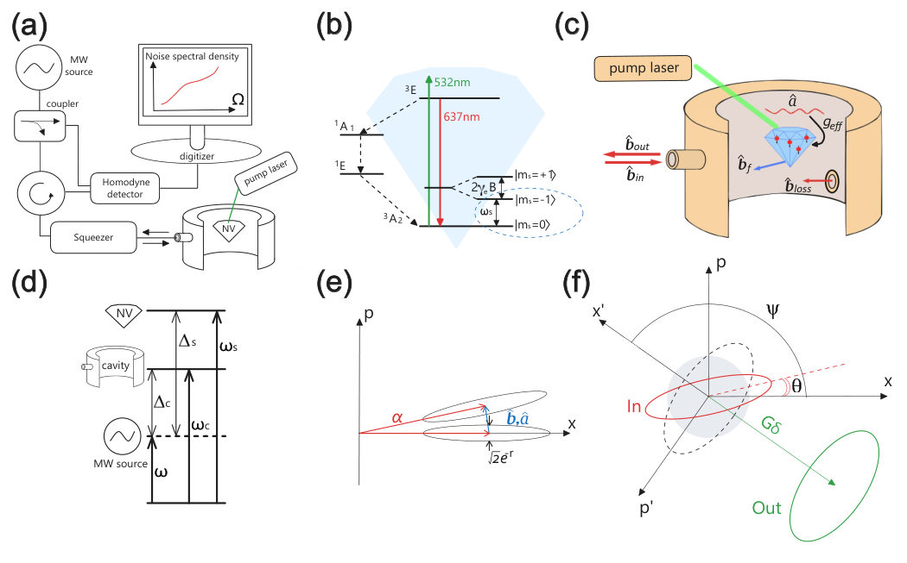 
Figure 1: a) Scheme of the experiment. The external MW field passes through the squeeze element. The signal reflected from the cavity falls on the homodyne detector. As a result, we get the noise spectral density. b) NV center in diamond principal level scheme. The two-level system selected for magnetometry encircled by blue dot-dashed line; c) Cavity scheme. ˆbin,ˆbout - input/output quantum noise of MW field; ˆbloss-thermal noise of the cavity; ˆbf- NV spin noise; geff-coupling coefficient; a-cavity mode operator d) Principal scheme of the frequencies used; e) Idea of separation of classical offset field and quantum signal, which is assumed much smaller then classical; f) Parameters of...

📷 Fig 2

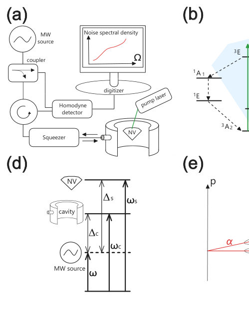 
Figure 1d:

📷 Fig 3

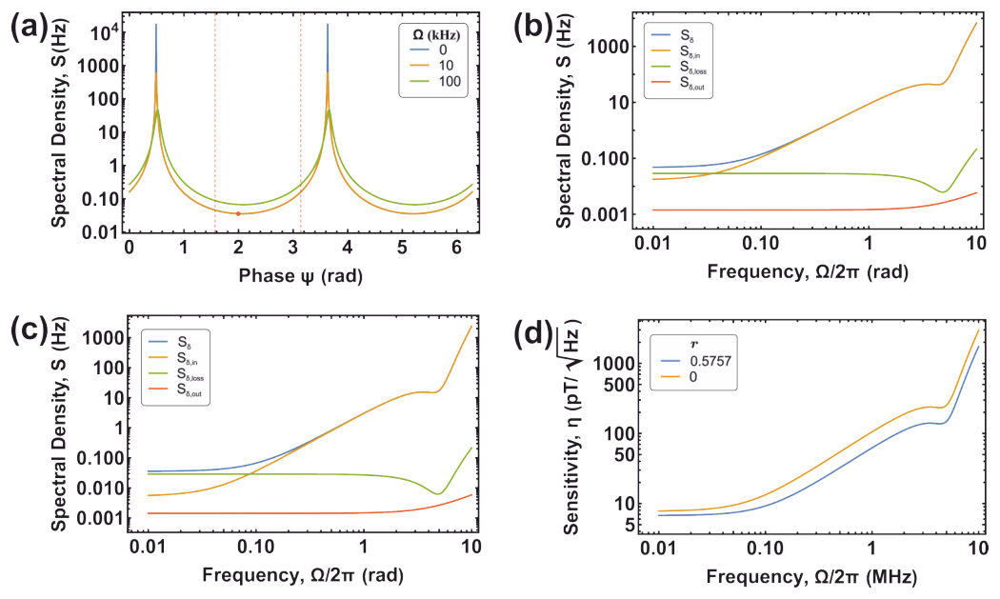 
Figure 2: a) Dependence of spectral density on ψ for different Ωat θopt ≈1.35rad at room temperature (T=293K). The red marker on the picture indicates the minimum at Ω= 0. The simulation parameters are summarized in Table 1: ∆c = 0, ∆s = 2π×5MHz, Q = 2×104, k1 = 0.8k, the number of photons in the cavity N = 6.2×1015, the number of NV centers Nq = 9×1014, ensemble coupling coefficient geff = 2π×0.12 MHz (see Appendix D), squeeze parameter r = 0 (no squeeze); b,c) Contribution of individual components to the spectral density, b - no squeeze, c - squeeze of 5 dB; d) Sensitivity with 5 dB squeezing (blue) and without squeezing (orange).

📷 Fig 4

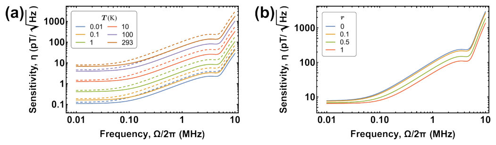 
Figure 3: a) Sensitivity versus temperature. Solid curves correspond to 5 dB squeezing (r=0.5757), dashed curves to no squeezing. Data are shown for T = 0.01, 0.1, 1, 10, 100, and 293 K.; b) Room-temperature (T=293 K) sensitivity for various squeezing parameters r. Other modeling parameters correspond to the fig.2 and summarized in Table 1.

**Summary.** The paper theoretically analyzes the noise limitations of microwave dispersive readout magnetometers based on NV centers. By incorporating quantum squeezing into the probing field, the authors derive methods to suppress measurement noise below the standard shot-noise limit. This demonstrates a pathway to significantly enhance magnetometer sensitivity even under realistic room-temperature operating conditions.

**Why it may be interesting.** This work provides a detailed quantum noise analysis for solid-state magnetometry, directly applying advanced concepts like squeezing to overcome fundamental measurement limits in a highly relevant platform (NV centers).

Detailed structure

**Main problem.** To improve the sensitivity of Nitrogen Vacancy (NV) magnetometer readout by utilizing quantum squeezing in the probing microwave field, especially for dispersive readout schemes that avoid optical detection.

**Main result.** Squeezing the input microwave field allows for a reduction in the minimum total noise spectral density below the standard shot-noise limit, improving device performance even at room temperature.

**Method.** The analysis uses quantum Langevin equations solved in the frequency domain to derive the output field operator and subsequently calculate the noise spectral density by optimizing detection angles.

**Model / system.** The system involves NV centers (modeled as an effective Two-Level System) coupled dispersively to a microwave cavity. The dynamics are governed by linearized Langevin equations incorporating input, loss, and spin noise sources.

**Key observables.** Noise spectral density $S_\delta(\Omega)$, minimum detectable magnetic field ($\eta$), and the output homodyne signal $\hat{b}_\psi^{	ext{out}}(\Omega)$.

**Important parameters / regimes.** Cavity quality factor ($Q$), input power ($P_{	ext{in}}$), effective coupling rate ($g_{eff}$), and squeezing angle ($	heta$).

**Assumptions / limitations.** The analysis relies on the Markov approximation, linearization of Langevin equations, and assumes negligible interaction between different NV centers for initial derivations.

**Figures summary.** Figure 1 illustrates the experimental scheme and input/output quantum noise components; Figure 1(f) shows how the output field can be squeezed.

**Paper structure.** The paper progresses from defining the Hamiltonian and Langevin equations to solving them in the frequency domain, deriving the full output field expression, calculating the noise spectral density by optimizing detection angles ($	heta$ and $\psi$), and finally analyzing the scaling of sensitivity with NV concentration and cavity parameters.

Abstract

Nitrogen vacancy centers in diamond have established themselves as good sensing element for various type of sensors. In particular magnetometers based on diamond impurities are quickly developing and are already on the market. Yet, optical readout in these systems complicates system design. Recently schemes of dispersive readout of nitrogen vacancy spin state using high finesse dielectric cavities for microwave field were proposed, which do not use the optical readout scheme. However, only shot noise based estimates were so far done for sensitivity of these devices. Here we provide detailed analysis of various practically relevant noise and loss sources for such a system. Furthermore, we consider the possibility of using the squeezing quantum state of the probing microwave field and show it allows to improve the device performance even at room temperature.

[↑ back to top](#top)

### [Anharmonic dephasing in the electron-phonon interaction](http://arxiv.org/abs/2608.09039v1)

**Authors:** Mingran Kong, Bartomeu Monserrat  
**Type:** theory · **Category:** other · **PDF:** <https://arxiv.org/pdf/2608.09039v1>  
**Analysis basis:** full PDF text, analyzed in chunks
**Topic relevance:** `Keldysh / 2PI / non-Gaussian methods` **3/5** · `correlated / nonlocal dissipation` **2/5** · `methods for driven-dissipative` **2/5** · `quantum measurements` **2/5** · `analog quantum simulation` **1/5** · `driven-dissipative phase transition` **1/5** · `non-equilibrium universality` **1/5** · `scars & prethermalization` **1/5**

📷 Fig 1

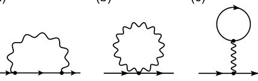 
FIG. 1. Electron-phonon coupling Feynman diagrams within second-order perturbation theory. (a) Fan-Migdal diagram with two first-order electron-phonon coupling vertices; (b) Debye-Waller diagram with one second-order electron-phonon coupling vertex; (c) tadpole diagram with two first-order electron-phonon coupling vertices.

📷 Fig 2

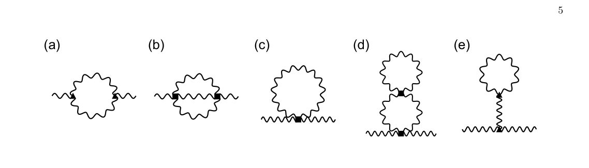 
FIG. 2. Feynman diagrams for phonon-phonon interactions. (a) Second-order bubble diagram driven by three-phonon coupling; (b) second-order bubble diagram driven by four-phonon coupling; (c) first-order loop diagram driven by four-phonon coupling; (d) second-order loop diagram driven by four-phonon coupling; (e) second-order tadpole diagram driven by three- phonon coupling.

📷 Fig 3

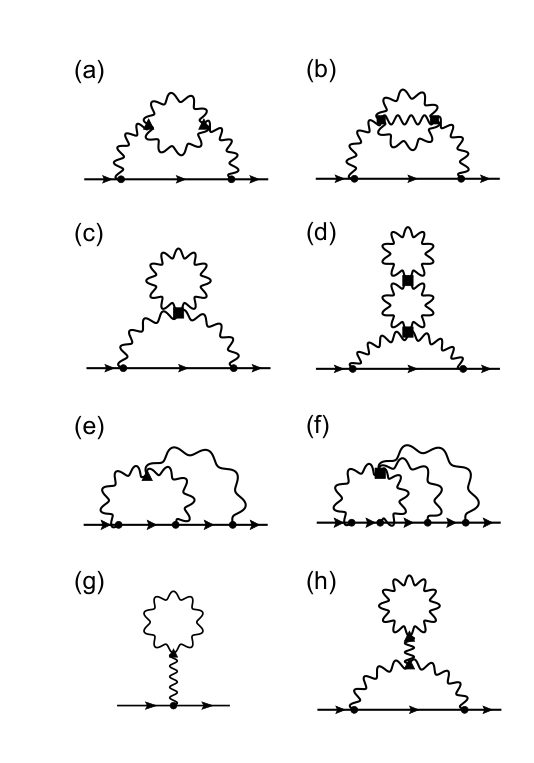 
FIG. 3. Low-order Feynman diagrams combining electron- phonon coupling and phonon-phonon coupling. Each row cor- responds to a correction with a specific physical meaning: the first row with (a) and (b) describes the three-phonon and four-phonon bubble diagrams; the second row with (c) and (d) describes the two lowest-order four-phonon loop diagrams modifying the phonon line in the Fan-Midgal self-energy; the third row, panels (e) and (f), shows the vertex corrections to the electron-phonon self-energy mediated by three-phonon and four-phonon interactions, respectively; panels (g) and (h) correspond to the three-phonon tadpole diagram contribu- tions to the electron-phonon coupling -...

📷 Fig 4

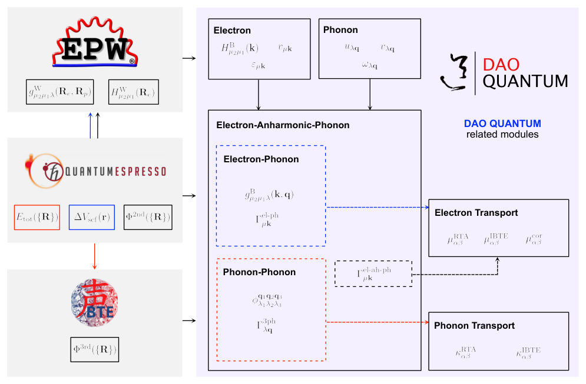 
FIG. 5. Workflow for the first principles implementation of the electron-phonon and electron-anharmonic-phonon calculations. The blue box contains the quantities associated with electron-phonon coupling, the red box contains the quantities associated with phonon-phonon coupling, and the black color contains the quantities associated with electron-anharmonic-phonon coupling.

📷 Fig 5

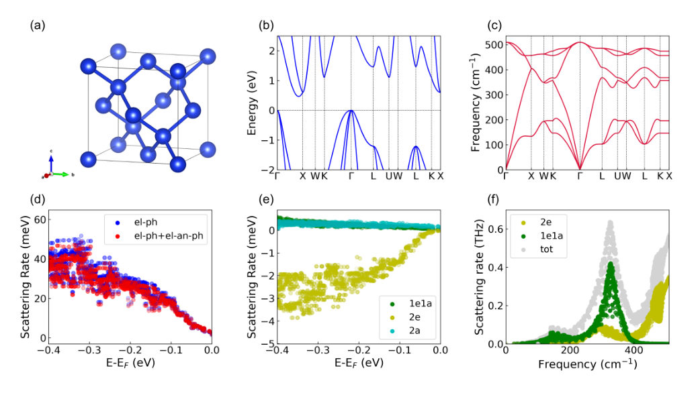 
FIG. 6. Silicon results, including (a) crystal structure; (b) electron band structure; (c) phonon dispersion; (d) electron- phonon scattering rates in blue and electron-phonon plus electron-anharmonic-phonon scattering rates in red at 300 K; (e) process-resolved electron-anharmonic-phonon correction versus electron energy; (f) process-resolved three-phonon scattering rates versus phonon frequencies.

**Summary.** This work develops a theoretical framework to calculate electron-phonon scattering rates by explicitly including phonon dephasing caused by anharmonic lattice vibrations. By extending standard many-body perturbation theory, the authors show that finite phonon lifetimes significantly impact electronic transport properties in materials like Si and PbTe.

**Why it may be interesting.** While focused on condensed matter, the treatment of finite lifetimes and complex many-body self-energies shares mathematical parallels with open quantum system dynamics where environmental coupling (like phonons) leads to decoherence and energy renormalization.

Detailed structure

**Main problem.** The primary goal is to accurately calculate electron-phonon coupling scattering rates by incorporating the effects of finite phonon lifetimes arising from anharmonic three-phonon interactions.

**Main result.** The study derives a new expression for these scattering rates and establishes that accounting for finite phonon lifetimes is crucial for an accurate evaluation of electron-phonon coupling in various materials.

**Method.** The authors use advanced many-body perturbation theory, extending standard self-energy calculations (like Fan-Migdal) to include anharmonic corrections via three-phonon diagrams.

**Model / system.** The system is the electron-phonon interaction within crystalline solids (e.g., Si, PbTe). The theoretical framework involves coupling Hamiltonians ($\hat{H}_0 + \hat{V}_{ep} + \hat{V}_{pp}$) and calculating self-energies using Matsubara Green's functions.

**Key observables.** Electron-phonon scattering rates, electronic state lifetimes (imaginary part of the electron self-energy), and phonon spectral function renormalization.

**Important parameters / regimes.** The relative timescales between phonon-phonon interaction ($	au_{ph-ph}$) and electron-phonon interaction ($	au_{e-ph}$); temperature ($T$).

**Assumptions / limitations.** Conventional calculations often assume $	au_{ph-ph} \gg 	au_{e-ph}$, which the work aims to correct for when timescales become comparable.

**Figures summary.** Figures illustrate Feynman diagrams (Fan-Migdal, Debye-Waller) and show convergence plots of calculated scattering rates as computational grid sizes increase for materials like PbTe.

**Paper structure.** The paper systematically builds the theory: first establishing the Hamiltonian, then deriving the standard electron self-energy ($\Sigma_{FM}$), followed by incorporating the phonon self-energy ($\Pi$) from anharmonic interactions, and finally presenting calculations of scattering rates using these combined effects.

Abstract

Electron-phonon coupling has been a central topic in condensed matter physics for decades, and firstprinciples methods have demonstrated remarkable success in quantitatively capturing its role in a wide variety of physical phenomena and materials. Conventional calculations of electron-phonon coupling typically assume that phonons have infinite lifetimes, but phonons can exhibit finite lifetimes due to anharmonic phonon-phonon interactions. In this work, we derive an expression for the electron-phonon coupling scattering rates including the effects of anharmonic three-phonon interactions, which lead to phonon dephasing and finite phonon lifetimes. We also describe a first-principles implementation of this anharmonic electron-phonon coupling which can be seamlessly integrated within existing workflows for the evaluation of electron-phonon and phonon-phonon coupling interactions. Finally, we present calculations of electron-phonon scattering rates including phonon dephasing in a range of materials, and discuss the different microscopic mechanisms by which anharmonic phonons influence electron-phonon coupling. This study establishes the importance of finite phonon lifetimes in the evaluation of electron-phonon coupling, and provides a platform to explore these effects in a wide range of materials and phenomena.

[↑ back to top](#top)

### [Clustered Attractor Manifolds and Dynamical Condensation in Self-Attention](http://arxiv.org/abs/2608.08922v1)

**Authors:** Qucheng Gao, Zuyi Yang, Xiao Chen  
**Type:** theory · **Category:** disordered systems and neural networks · **PDF:** <https://arxiv.org/pdf/2608.08922v1>  
**Analysis basis:** full PDF text, analyzed in chunks
**Topic relevance:** `driven-dissipative phase transition` **3/5** · `non-equilibrium universality` **3/5** · `Keldysh / 2PI / non-Gaussian methods` **2/5** · `methods for driven-dissipative` **2/5** · `analog quantum simulation` **1/5** · `correlated / nonlocal dissipation` **1/5** · `scars & prethermalization` **1/5**

📷 Fig 1

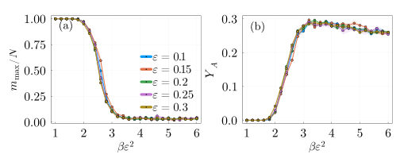 
FIG. 1. Noise-induced fragmentation of a macroscopic cluster for N = 4096 at observation time T = N. (a) Largest-cluster fraction mmax/N. (b) Mean attention IPR YA. Results for five noise amplitudes are plotted against the effective sharp- ness α = βϵ2 and collapse onto a common curve. Shaded regions indicate the standard error of the mean across random realizations.

📷 Fig 2

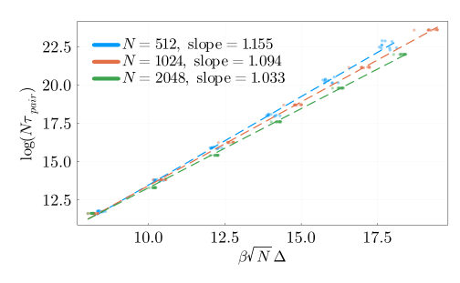 
FIG. 2. Scaling of the coarsening time for random pair clusters. The N tokens are initialized as N/2 aligned pairs, with independently distributed random pair directions. Here qpr(t) denotes the overlap between pair-center directions p and r, and ∆= 1 −maxp&lt;r qpr(0) is the initial minimum pair gap. We define τpair as the first time at which minp&lt;r qpr(t) ≥qcon, with qcon = 1 −10−4. Results for N = 512, 1024, and 2048 collapse when log(Nτpair) is plotted against β √

📷 Fig 3

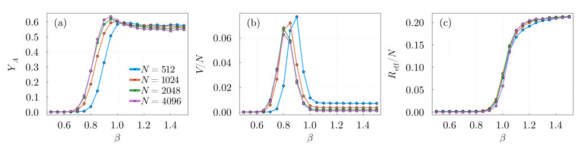 
FIG. 3. Dynamical accessibility from normalized Gaussian initial conditions with T = N. (a) The late-time attention IPR YA shows the onset of attention condensation. (b) The intermediate peak in V/N signals a macroscopic spread of overlaps and the formation of a macroscopic cluster inside the condensation phase. (c) The effective rank Reff/N becomes finite only at larger β, where the macroscopic cluster is replaced by extensive microscopic fragmentation.

📷 Fig 4

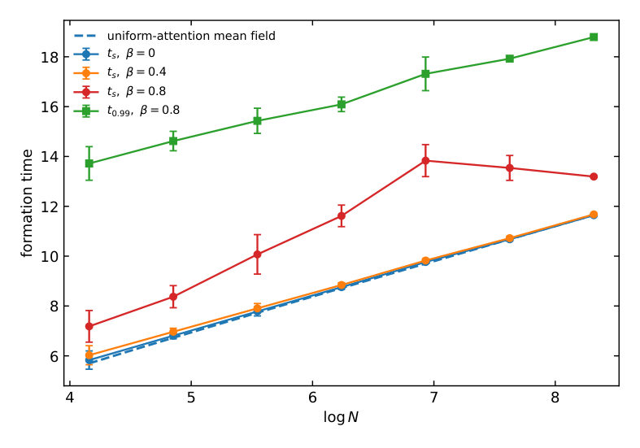 
FIG. 1. Formation times from Gaussian random initial states. For β = 0 and β = 0.4, we characterize the formation time by ts = inf{t : s(t) ≥1/2}, where s(t) = N −1 P

📷 Fig 5

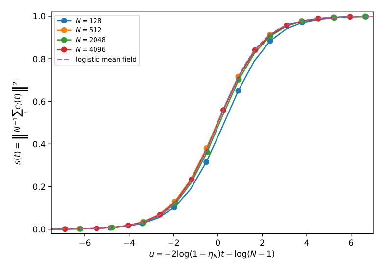 
FIG. 2. Logistic collapse of the polarization dynamics at β = 0.4. Results for sizes up to N = 4096 closely follow the uniform-attention scaling function s(u) = (1 + e−u)−1.

**Summary.** This paper analyzes self-attention mechanisms by mapping them onto a statistical mechanics model to understand their dynamic attractors. It identifies that attention condensation occurs above a critical sharpness threshold ($eta$), leading to stable, clustered fixed points characterized by an overlap gap. The work provides theoretical insights into how information processing in Transformers transitions between diffuse and highly structured collective states.

**Why it may be interesting.** The framework connects concepts from condensed matter physics (phase transitions, order parameters) directly to the dynamics of large-scale neural network models, offering insights into emergent collective behavior in deep learning architectures.

Detailed structure

**Main problem.** The study investigates the attractor structure, stability, and phase transitions of self-attention dynamics within Transformer layers by treating token interactions as a statistical mechanics problem.

**Main result.** The system exhibits a dynamical attention-condensation transition above a finite threshold in attention sharpness ($eta$), leading to stable clustered fixed points characterized by an overlap gap ($\Delta > 0$).

**Method.** The analysis employs mean-field approximations, studies the dynamics in the thermodynamic limit ($d \sim N 	o \infty$), and analyzes scaling laws for various observables.

**Model / system.** The model is minimal normalized self-attention dynamics applied to $N$ token vectors $\mathbf{x}_i(t)$, governed by an iterative update rule dependent on the attention matrix derived from overlaps. The system transitions between diffuse, macroscopic clustered, and fragmented states.

**Key observables.** Overlap Gap ($\Delta_a$), Attention Inverse Participation Ratios ($Y_A$, $V/N$), Effective Rank ($	ext{Reff}/N$), Largest Cluster Size ($m_{\max}/N$).

**Important parameters / regimes.** Attention sharpness ($eta$), System size ($N$), Overlap gap ($\Delta$), Time ($t$).

**Assumptions / limitations.** The analysis relies heavily on taking the thermodynamic limit ($d \sim N 	o \infty$) for stability proofs, and uses mean-field approximations.

**Figures summary.** Figures illustrate noise-induced fragmentation scaling with $\alpha = eta\epsilon^2$, map out three dynamical regimes (diffuse, condensed, fragmented) vs. $eta$, and show time evolution plateaus at $T=N$ for Gaussian initializations.

**Paper structure.** The paper progresses by defining the self-attention dynamics as a statistical mechanics problem, identifying key diagnostics like the overlap gap, analyzing the transition from diffuse to clustered states via condensation thresholds, and finally characterizing the stability and time evolution of these different attractor regimes.

Abstract

Transformer layers generate state-dependent interaction networks: token representations determine the attention matrix, which in turn updates the representations. We study this feedback in a minimal normalized self-attention dynamics and identify the overlap gap as the central quantity governing its attractor structure in the thermodynamic limit. When tokens form internally aligned clusters and their similarity to members of the same cluster exceeds that to every other cluster by a nonvanishing amount, inter-cluster attention is exponentially suppressed as the dimension increases. This mechanism produces a high-dimensional manifold of clustered fixed points, ranging from a few macroscopic clusters to extensive microscopic fragmentation, and also controls their stability against perturbations. Starting from an unstructured Gaussian state, we find that clustered states nucleate from the diffuse background only above a finite threshold in attention sharpness, giving rise to a dynamical attention-condensation transition.

[↑ back to top](#top)

### [Dissipation-engineered dual-charger quantum batteries](http://arxiv.org/abs/2608.08619v1)

**Authors:** Yi-jia Yang, Yu-qiang Liu, Zheng Liu, Zhi-Hao Ma, Ming-Xing Luo, Chang-shui Yu  
**Type:** theory · **Category:** statistical mechanics · **PDF:** <https://arxiv.org/pdf/2608.08619v1>  
**Analysis basis:** full PDF text, analyzed in chunks
**Topic relevance:** `driven-dissipative phase transition` **3/5** · `methods for driven-dissipative` **3/5** · `non-equilibrium universality` **2/5** · `Keldysh / 2PI / non-Gaussian methods` **1/5** · `analog quantum simulation` **1/5** · `correlated / nonlocal dissipation` **1/5** · `quantum measurements` **1/5** · `scars & prethermalization` **1/5**

📷 Fig 1

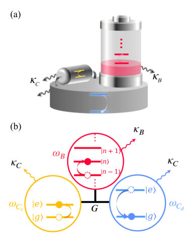 
FIG. 1. Schematic dual-charger quantum battery (DQB). (a) System setup. A multilevel battery B with level spacing ωB is coupled to two detuned two-level chargers: a driver Cd with frequency ωCd and a cache Cc with frequency ωCc. Each subsystem is connected to an independent thermal reservoir with temperatures TCc &lt; TB &lt; TCd and dissipation rates κCc = κCd ≡κC and κB. (b) Effective three-body interac- tion. Under the resonance condition ωCd = ωCc + ωB, the interaction HCcCdB(t) couples |g, e, n−1⟩and |e, g, n⟩. In the forward process, one driver excitation is converted into one battery excitation and one cache excitation. Parameters are inspired by recent superconducting-circuit experiments...

📷 Fig 2

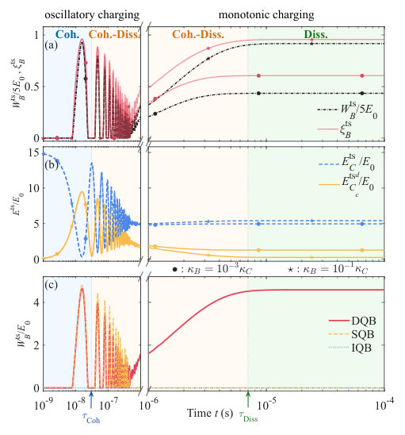 
FIG. 2. Transient charging dynamics of a two-level DQB. (a) Battery ergotropy W ts B and stored-energy utilization ξts B. (b) Transient stored energies of the driver Cd and cache Cc for two dissipation ratios, κB = 10−3κC and κB = 10−1κC. (c) Comparison between the DQB, a single-charger quantum battery (SQB), and an independent-charger quantum battery (IQB) under the same autonomous dissipative setting. The left time window shows oscillatory charging dominated by co- herent exchange, while the right time window shows mono- tonic charging stabilized by dissipation. The shaded regions mark the coherence-dominated (Coh.), coherence–dissipation (Coh.–Diss.), and dissipation-dominated (Diss.)...

📷 Fig 3

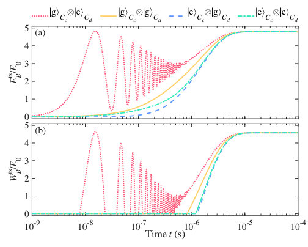 
FIG. 3. Dependence on the initial charger preparation. Time evolution of (a) stored battery energy EB(t) and (b) ergotropy WB(t) for four initial charger states, with the battery initially in |0⟩B. The preparation |g⟩Cc ⊗|e⟩Cd matches the forward three-body transition and gives the strongest coherent onset, while all initial states relax to the same dissipatively stabilized steady state.

📷 Fig 4

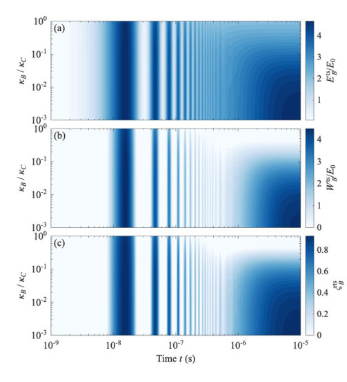 
FIG. 4. Dependence on the dissipation ratio. Time evolu- tion of (a) stored battery energy EB(t), (b) ergotropy WB(t), and (c) stored-energy utilization ξB(t) for different dissipa- tion ratios κB/κC, with fixed driver-cache temperature bias. Smaller κB/κC suppresses direct battery relaxation and sta- bilizes larger steady-state ergotropy.

📷 Fig 5

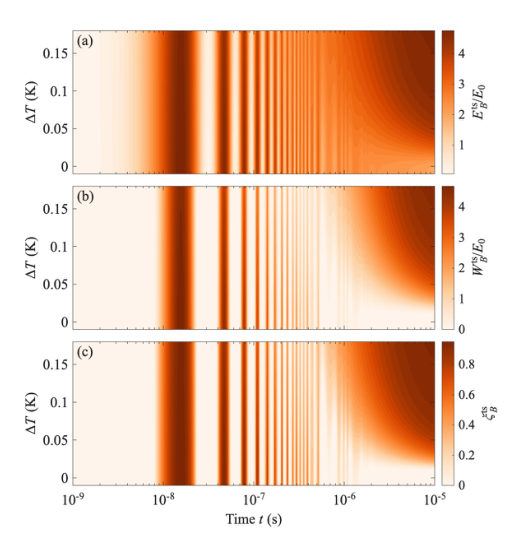 
FIG. 5. Dependence on the driver-cache temperature bias. Time evolution of (a) stored battery energy EB(t), (b) er- gotropy WB(t), and (c) stored-energy utilization ξB(t) for dif- ferent temperature biases ∆T = TCd −TCc, with fixed dissipa- tion ratio κB/κC. A positive driver-cache bias favors the for- ward charger-assisted transition and stabilizes a population- inverted battery state.

**Summary.** The paper introduces a novel dual-charger quantum battery architecture where controlled dissipation from thermal reservoirs is actively used as a resource. By coupling the battery to hot and cold reservoirs, the authors stabilize a non-equilibrium steady state that prevents energy backflow. This method proves dissipation engineering is a robust strategy for achieving stable and scalable quantum energy storage.

**Why it may be interesting.** This work directly addresses non-equilibrium thermodynamics in quantum systems, providing a concrete mechanism (dissipation engineering) to achieve stable energy storage beyond simple coherent charging protocols, which is highly relevant for AMO physics and open quantum system dynamics.

Detailed structure

**Main problem.** The central challenge is stabilizing useful stored energy in a quantum battery while suppressing detrimental coherent energy backflow.

**Main result.** The authors demonstrate that engineering dissipation via coupled hot/cold reservoirs stabilizes a population-inverted, non-equilibrium steady state with finite ergotropy for scalable quantum energy storage.

**Method.** The analysis uses open-system dynamics described by a Born–Markov–secular master equation to model the interaction between the battery and two reservoir-coupled chargers.

**Model / system.** The system is a dual-charger quantum battery (DQB) consisting of an N-level battery coupled to a low-frequency cache and a high-frequency driver, all interacting with thermal reservoirs.

**Key observables.** Stored energy ($E_B$), ergotropy ($W_B$, extractable work), stored-energy utilization ($\xi_B$), and the stationary heat current ($\dot{Q}_{	ext{ss}}$).

**Important parameters / regimes.** The relative coupling rates ($\kappa_\mu$) and the temperature bias ($\Delta T = T_{C_d} - T_{C_c}$) are key parameters for optimizing performance.

**Assumptions / limitations.** Assumes weak system–reservoir coupling, short reservoir correlation times (Markov limit), and utilizes a dispersive regime approximation when deriving effective interactions.

**Figures summary.** Figures illustrate the comparison of charging dynamics between DQB, SQB, and IQB; show time evolution dependence on initial states for DQB; and demonstrate optimization by varying dissipation ratios or temperature bias.

**Paper structure.** The paper first establishes the physical model and Hamiltonian, derives the master equation describing open-system dynamics, analyzes steady-state properties using reservoir engineering principles, and concludes by showing scalability metrics like linear scaling of energy with battery levels.

Abstract

Suppressing coherent energy backflow while maintaining extractable energy in a stable nonequilibrium state remains a central challenge for quantum energy storage. Here, we introduce a reservoir-engineered dual-charger quantum battery architecture, in which nonequilibrium dissipation is exploited as a control resource to stabilize useful stored energy. A hot-reservoir-coupled driver supplies excitations, while a cold-reservoir-coupled cache biases the resonant three-body transition toward charging and suppresses the dressed-state coherences responsible for energy backflow. This mechanism establishes a population-inverted steady state with finite ergotropy and converts reversible charger--battery exchange into persistent energy storage. For uniformly spaced multilevel batteries, we show that the stored energy and ergotropy scale approximately linearly with the number of accessible levels, while the stored-energy utilization approaches unity. The accompanying stationary heat current provides a thermodynamic signature of the charging regime. Our results demonstrate dissipation engineering as a strategy for achieving stable and scalable quantum energy storage beyond transient coherent charging protocols.

[↑ back to top](#top)

### [Emergent Non-Markovian Nonlinear Qubit From Collective Spin Interactions](http://arxiv.org/abs/2608.07723v1)

**Authors:** Gregory T. Carroll, Michael R. Geller, Andre Erpenbeck  
**Type:** theory · **Category:** quantum information and computing · **PDF:** <https://arxiv.org/pdf/2608.07723v1>  
**Analysis basis:** full PDF text, analyzed in chunks
**Topic relevance:** `analog quantum simulation` **3/5** · `correlated / nonlocal dissipation` **3/5** · `quantum measurements` **2/5** · `Keldysh / 2PI / non-Gaussian methods` **1/5** · `Tavis-Cummings & cavity-many-emitter` **1/5** · `driven-dissipative phase transition` **1/5** · `methods for driven-dissipative` **1/5** · `non-equilibrium universality` **1/5**

📷 Fig 1

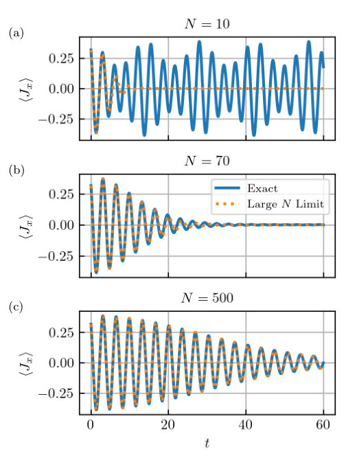 
FIG. 1. Normalized expectation value of the x component of the angular momentum operator, ⟨Jx⟩/(N/2), as a func- tion of time for different system sizes, N = 10, 70, and 500. The solid lines show the exact finite N result obtained from Eq. (14), while the dashed lines correspond to the large N approximation given in Eq. (42).

📷 Fig 2

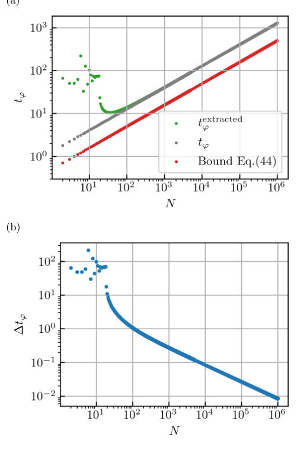 
FIG. 2. Decoherence timescale as a function of system size N. The analytical prediction tφ from Eq. (43) is com- pared with the decoherence timescale extracted from the ex- act finite N numerical data, textracted φ . (a) Extracted de- coherence timescale together with the large N prediction from Eq. (43) and the corresponding lower bound for the decoherence timescale. (b) Absolute deviation between the analytical prediction and the numerically extracted value, ∆tφ = |tφ −textracted φ |.

📷 Fig 3

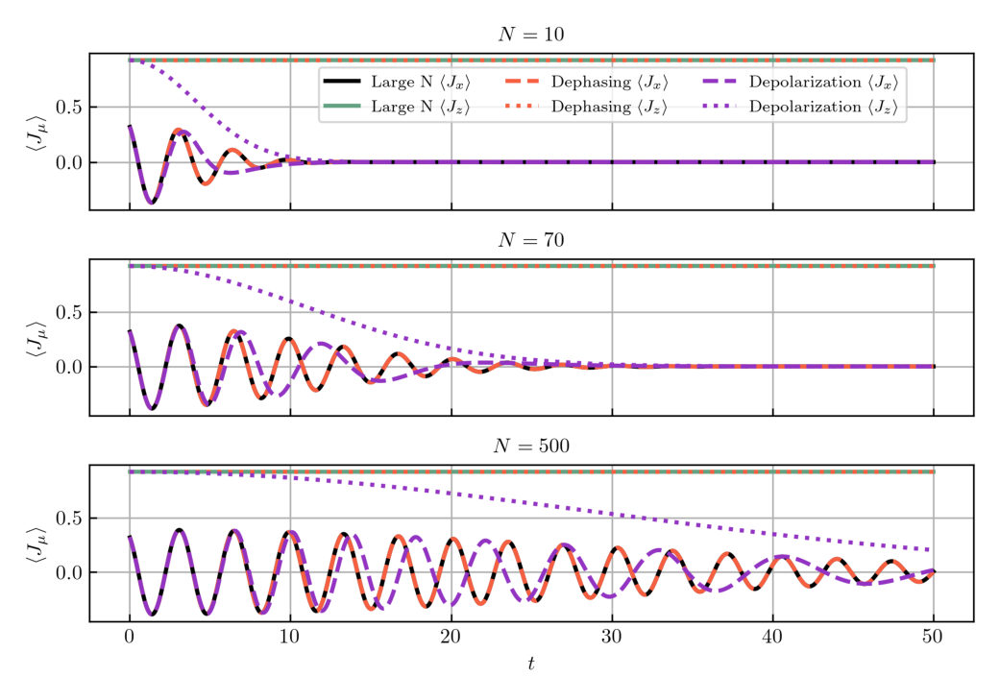 
FIG. 3. Normalized collective-spin expectation values ⟨Jµ⟩/(N/2) for µ ∈{x, z} as functions of time for N = 10, 70, and 500. The solid black curves show the large-N result from Eq. (42). The orange and purple curves correspond to numerical solutions of the effective non-Markovian master equations with dephasing (Eq. 46) and isotropic depolarization (Eq. 47), respectively.

**Summary.** The paper demonstrates that collective spin interactions within a closed many-body system can effectively mimic coupling to an environment, generating non-Markovian dephasing. By analyzing finite-size corrections to the mean-field limit, the authors derive an effective open-system description for the reduced qubit dynamics. This provides a powerful theoretical tool linking fundamental quantum dynamics to noise characterization in quantum information.

**Why it may be interesting.** This work provides a rare microscopic derivation of non-Markovian noise—a key challenge in quantum computing hardware characterization—directly from the Hamiltonian dynamics of an isolated system.

Detailed structure

**Main problem.** The study investigates how an effective non-Markovian quantum channel can emerge intrinsically from a closed, interacting many-body system, bypassing the need for explicit environmental coupling.

**Main result.** Finite-size corrections to the large-$N$ mean-field limit of the collective spin model generate an emergent non-Markovian dephasing process characterized by Gaussian coherence decay with a timescale proportional to $\sqrt{N}$.

**Method.** The authors derive this effect by analyzing the double large-$N$ limit ($\chi = g/N$) and calculating the leading finite-$N$ corrections using Maclaurin series expansions of time-evolution functions.

**Model / system.** The system is modeled using the Kitagawa-Ueda one-axis twisting model, $H=\chi J_z^2$, which describes collective spin dynamics. The analysis reduces the complex many-body problem to an effective nonlinear qubit description.

**Key observables.** Bloch vector coherence decay (Gaussian form), magnetization $\langle\vec{J}
angle$, and the characteristic dephasing timescale $t_\phi$.

**Important parameters / regimes.** The system size $N$ is crucial, as the non-Markovian effects become apparent in finite-$N$ corrections; the scaling limit involves $\chi \propto 1/N$.

**Assumptions / limitations.** The analysis assumes that the leading finite-$N$ corrections can be accurately captured by a Maclaurin series expansion of the time evolution function.

**Figures summary.** Figures compare exact finite-$N$ simulations against large-$N$ approximations, demonstrating the emergence of non-Markovian decay and showing that pure dephasing successfully models the dynamics better than isotropic depolarization.

**Paper structure.** The paper establishes the physical model (KU Hamiltonian), identifies the necessary scaling limit ($\chi=g/N$), derives the leading finite-$N$ corrections to the mean-field theory, and then validates this resulting non-Markovian dephasing channel against exact numerical simulations.

Abstract

Open-system descriptions are typically introduced by coupling a quantum system to an external environment. Here we show that a closed interacting many-body system can itself generate a controlled non-Markovian quantum channel acting on a reduced nonlinear qubit through finite-size corrections to a nonlinear mean-field limit. We demonstrate this using the Kitagawa-Ueda one-axis twisting model, $H=χJ_z^2$, a paradigmatic model of collective spin dynamics, spin squeezing, and two-component Bose-Einstein condensates. Although the large-$N$ regime of this model has been extensively studied, the conventional fixed-$χ$ scaling does not yield a nontrivial dynamical large-$N$ limit. In this paper, we investigate a complementary large-$N$ formulation obtained from the double limit $N\rightarrow\infty$ and $χ\rightarrow O(g/N)$, where $g$ is a coupling constant. We derive the leading finite-$N$ corrections to this limit and show that they correspond to an emergent non-Markovian dephasing process, producing a Gaussian decay of the Bloch-vector coherence with characteristic timescale $t_\varphi\geq\sqrt{N}/(2g)$. Exact finite-$N$ calculations demonstrate that this effective open-system description becomes quantitatively accurate for systems containing on the order of one hundred qubits. The resulting framework provides a microscopic realization of non-Markovian dephasing generated intrinsically by a closed many-body system and enables efficient simulation of collective quantum dynamics beyond unitary mean-field theory. These results link the long-studied phenomenon of phase diffusion in atomic ensembles and Bose-Einstein condensates to the growing effort to characterize non-Markovian, beyond-Lindblad noise in quantum computing hardware, providing a rare case in which such a noise channel is derived from microscopic dynamics rather than fit phenomenologically.

[↑ back to top](#top)

### [Out-of-equilibrium inhomogeneous XX chains: Exact results and the hydrodynamic limit](http://arxiv.org/abs/2608.08205v1)

**Authors:** Vincenzo Alba, Federico Rottoli  
**Type:** theory · **Category:** statistical mechanics · **PDF:** <https://arxiv.org/pdf/2608.08205v1>  
**Analysis basis:** full PDF text, analyzed in chunks
**Topic relevance:** `methods for driven-dissipative` **3/5** · `non-equilibrium universality` **3/5** · `Keldysh / 2PI / non-Gaussian methods` **2/5** · `driven-dissipative phase transition` **2/5** · `Frenkel-Kontorova` **1/5** · `analog quantum simulation` **1/5** · `scars & prethermalization` **1/5**

📷 Fig 1

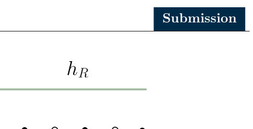 
Figure 1: Setup employed in this work. We consider the inhomogeneous tight-binding chain with two different magnetic fields (chemical potentials) hL and hR in the two semi- infinite halves of the chain. We consider unitary dynamics from several initial states. The figure shows the inhomogeneous N´eel state in which the right-half of the chain is prepared in the N´eel state and the left part is in the fermionic vacuum state.

📷 Fig 2

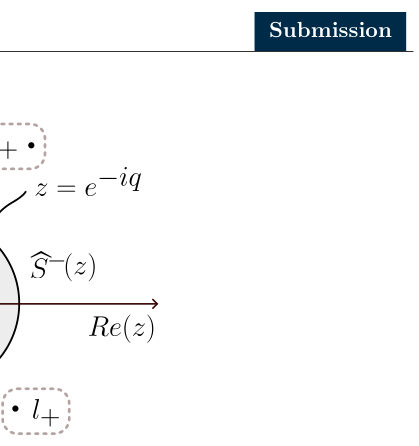 
Figure 2: Riemann-Hilbert problem bS+(z) = f(z)bS−(z)+g(z) (cf. (37)) for the functions bS±(z) = bS± k,q, on the unit circle C with z = e−iq. The functions f(z) and g(z) are defined in (37). We denote with l± and r± the zeros and the poles of f(z), respectively.

📷 Fig 3

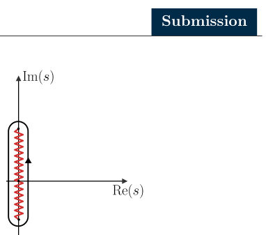 
Figure 3: (Left) Contour employed to compute the inverse Laplace transform in (52). The wiggly vertical line is a branch cut, and γ is a positive real part to avoid singularities. (Right) The contour in the left panel is deformed to wrap around the branch cut.

📷 Fig 4

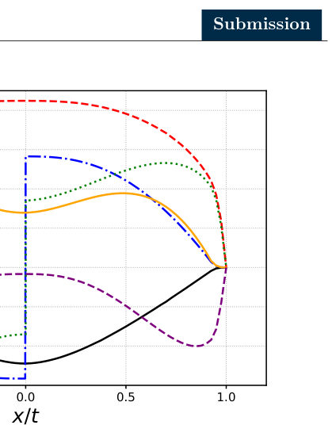 
Figure 4: Dynamics of the two-point correlation functions Gxy(t) for y = x + j, with j = 1, 2, 3. We show both the real and imaginary parts of the correlator versus x/t. The curves are the analytical predictions obtained in Section 4 in the hydrodynamic limit x, t →∞with fixed x/t. We focus on the inhomogeneous XX chain with hL = 1 and hR = 1/3. The results are for the quench from the initial state (25), in which the right- part of the chain is prepared in the N´eel state and the left in the vacuum state.

📷 Fig 5

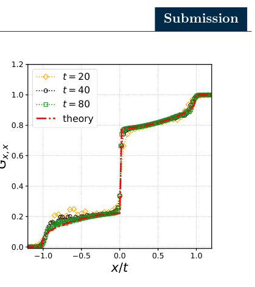 
Figure 5: Dynamics of the fermion density after the quenches from the state (25) (left panel) and (24) (right panel) in the inhomogeneous XX chain with hL = 1 and hR = 1/3. The symbols are exact numerical data obtained by solving the system (17) for several times. The dashed-dotted line is the analytic result in the hydrodynamic limit. The results are for the XX chain with hL = 1 and hR = 1/3.

**Summary.** This paper derives exact analytical solutions for the out-of-equilibrium dynamics of an inhomogeneous XX chain following a quantum quench. By mapping the problem to a Riemann-Hilbert formulation, the authors provide explicit formulas for correlation functions, especially in the asymptotic hydrodynamic limit. This advances the theoretical understanding of non-equilibrium transport in structured quantum many-body systems.

**Why it may be interesting.** This work provides rigorous analytical tools (RHP) to calculate non-equilibrium observables like correlations across interfaces, which is crucial for understanding energy/information transport in structured quantum materials.

Detailed structure

**Main problem.** The study focuses on determining the exact out-of-equilibrium dynamics of fermionic correlation functions following a quantum quench in an inhomogeneous XX chain.

**Main result.** Exact analytic expressions for two-point correlation functions are derived using Riemann-Hilbert methods, yielding explicit formulas in the hydrodynamic limit that match numerical simulations.

**Method.** The problem is mapped to a Riemann-Hilbert problem on the unit circle via Fourier and Laplace transforms, allowing for an exact analytical solution of the fermionic correlation function.

**Model / system.** The system is the XX chain subjected to a step-like magnetic field, which maps to an inhomogeneous tight-binding chain described by a quadratic fermionic Hamiltonian. The dynamics are studied after quenching from various initial product states.

**Key observables.** Two-point fermionic correlation function Gxy(t), reflection (R) and transmission (T) amplitudes across the inhomogeneity.

**Important parameters / regimes.** The hydrodynamic limit ($x, y, t 	o \infty$ with fixed ratios); magnetic field strengths ($h_L, h_R$).

**Assumptions / limitations.** For the dynamics, the solution relies on factorizing the correlation matrix and solving the resulting integral equation via RHP techniques.

**Figures summary.** Figures illustrate the setup of the inhomogeneous chain and show numerical data for the fermionic correlator |Gxy| compared against the derived hydrodynamic limit result.

**Paper structure.** The paper proceeds by first analyzing single-particle scattering to find transmission/reflection coefficients, then deriving the dynamics of the correlation matrix using linear equations of motion, solving this via a Riemann-Hilbert problem, and finally presenting results in both finite time and the asymptotic hydrodynamic limit.

Abstract

We study the out-of-equilibrium dynamics in the XX chain with step-like magnetic field, which maps to an inhomogeneous tight-binding chain after Jordan-Wigner transformation. We obtain exact analytic expressions for the fermionic two-point correlation function after a quantum quench from several initial product states, both homogeneous and inhomogeneous ones. This is achieved by using a combination of Fourier and Laplace transforms, which al low us to map the problem to a standard Riemann-Hilbert problem on the unit circle. For arbitrary positions and times the correlators are not expressed in terms of elementary functions. However, in the hydrodynamic limit $x,y,t\to\infty$ with fixed ratios, we provide explicit formulas that depend only on the effective transmission coefficient across the origin. We benchmark our analytic predictions against exact numerical simulations and find excellent agreement in the hydrodynamic limit, apart from finite-time corrections.

[↑ back to top](#top)

### [Pseudo-Distributions: Thermodynamic Geometry and an Empirical Application](http://arxiv.org/abs/2608.09297v1)

**Authors:** Negin Bayrami, Hosein Mohammadzadeh, Hamzeh Agahi, Hossein Mehri-Dehnavi, Zahra Ebadi  
**Type:** both · **Category:** statistical mechanics · **PDF:** <https://arxiv.org/pdf/2608.09297v1>  
**Analysis basis:** full PDF text, analyzed in chunks
**Topic relevance:** `non-equilibrium universality` **3/5** · `Keldysh / 2PI / non-Gaussian methods` **2/5** · `driven-dissipative phase transition` **2/5** · `methods for driven-dissipative` **2/5** · `analog quantum simulation` **1/5** · `correlated / nonlocal dissipation` **1/5** · `quantum measurements` **1/5** · `scars & prethermalization` **1/5**

📷 Fig 1

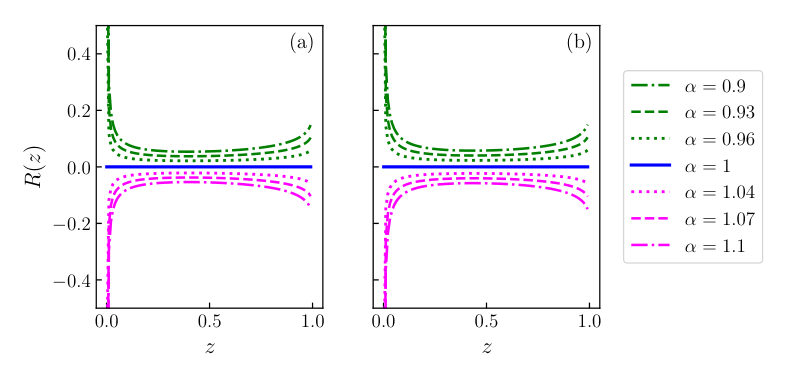 
FIG. 1: Thermodynamic scalar curvature R(z) as a function of the fugacity z for different values of the pseudo-generalization parameter α. Panel (a) corresponds to the pseudo-generalized exponential model obtained directly from the PDF, while panel (b) represents the model constructed by pseudo-generalizing the CDF. In both cases, α &lt; 1 leads to positive curvature, α &gt; 1 results in negative curvature, and the classical exponential limit α = 1 yields vanishing curvature.

📷 Fig 2

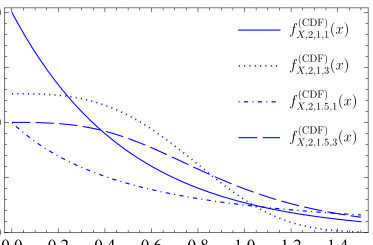 
FIG. 3: Graphs of f (CDF) X,λ,q,α (x) for λ = 2 and some different values of q and α.

📷 Fig 3

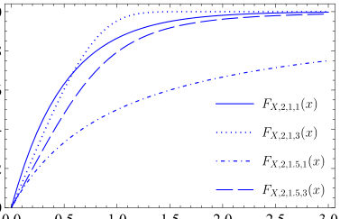 
FIG. 2: Graphs of FX,λ,q,α (x) for λ = 2 and some different values of q and α.

📷 Fig 4

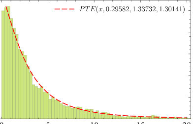 
FIG. 5: The distribution of absolute difference of WTI crude oil, from its last 100 days moving average. The histogram obtained from WTI crude oil daily price in period of 1986/01/02 to 2017/07/03.

📷 Fig 5

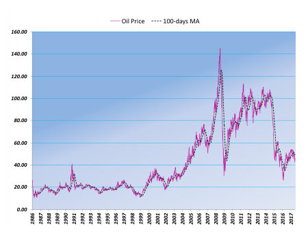 
FIG. 4: The WTI crude oil, Oklahoma, dollars per barrel, daily price (full curve), and its 100 days moving average (dashed curve), in period 1986/01/02 - 2017/07/03.

**Summary.** This work introduces a novel pseudo-analytic framework based on g-calculus to generalize statistical distributions beyond standard nonextensive models. It analyzes the thermodynamic geometry associated with these new distributions and demonstrates their superior ability to model heavy-tailed fluctuations observed in real-world financial data like oil prices.

**Why it may be interesting.** While the application is finance, the underlying mathematical tools—generalized entropy frameworks and geometric analysis of equilibrium states—are highly relevant for characterizing complex, non-equilibrium dynamics in many-body quantum systems.

Detailed structure

**Main problem.** The paper develops a pseudo-analytic framework using g-calculus to construct generalized statistical distributions, aiming to systematically extend nonextensive statistical mechanics.

**Main result.** The proposed pseudo-distributions provide a superior fit for analyzing heavy-tailed fluctuations in financial data (WTI oil prices) and reveal that the thermodynamic scalar curvature is governed by the generator deformation parameter at leading order.

**Method.** Methods include developing g-calculus structures, calculating thermodynamic geometry using the Ruppeiner metric, and performing empirical model comparison using information criteria (AIC/BIC).

**Model / system.** The theoretical framework applies to general statistical ensembles, tested both by analyzing ideal gas thermodynamics in D dimensions and empirically by fitting absolute deviations of WTI crude oil prices.

**Key observables.** Thermodynamic scalar curvature ($R$), goodness-of-fit metrics (AIC/BIC), and the distribution function itself.

**Important parameters / regimes.** Generator deformation parameter ($\alpha$), nonextensivity parameter ($q$), and the fugacity parameter ($z$).

**Assumptions / limitations.** The framework assumes $g$-calculus is applicable via a monotone generator function, and analyses often rely on perturbative expansions around classical limits.

**Figures summary.** Figure 4 shows WTI oil price fluctuations vs. moving average; Figure 5 plots the fitted pseudo-nonextensive Tsallis distribution to the absolute deviation of WTI prices from its moving average.

**Paper structure.** The paper progresses by introducing g-calculus, generalizing distributions at PDF/CDF levels, investigating thermodynamic geometry via curvature calculations, and concluding with empirical applications to financial time series data.

Abstract

We develop a consistent pseudo-analytic framework based on $g$-calculus for constructing deformed statistical distributions. By mapping standard algebraic operations through a monotone generator function, we systematically derive the associated pseudo-logarithmic and pseudo-exponential structures. Applying this formalism, we introduce a new family of pseudo-distributions that generalizes nonextensive statistical mechanics at both the probability density and cumulative distribution levels, recovering classical and standard nonextensive statistics as limiting cases. We investigate the thermodynamic geometry of the proposed models using the Ruppeiner metric on the equilibrium manifold. A perturbative analysis around the classical limit reveals that, to leading order, the thermodynamic scalar curvature is governed solely by the generator deformation parameter, while the nonextensivity parameter remains decoupled. To evaluate the empirical robustness of the framework, we apply the model to analyze the absolute deviations of daily West Texas Intermediate crude oil prices from their hundred-day moving average. Model comparison based on information criteria demonstrates that the proposed pseudo-distributions provide a superior description of these high-frequency financial fluctuations and their heavy-tailed characteristics compared to standard benchmarks. These results suggest that $g$-calculus offers a flexible and physically grounded mathematical tool for generating deformed statistics and analyzing their geometric properties.

[↑ back to top](#top)

### [State Diagnostics of Complexity in Open Quantum Systems](http://arxiv.org/abs/2608.09705v1)

**Authors:** Komal Sah, Fabio Anza, Alexandra M. Jurgens, James P. Crutchfield  
**Type:** theory · **Category:** statistical mechanics · **PDF:** <https://arxiv.org/pdf/2608.09705v1>  
**Analysis basis:** full PDF text, analyzed in chunks
**Topic relevance:** `driven-dissipative phase transition` **3/5** · `methods for driven-dissipative` **3/5** · `correlated / nonlocal dissipation` **2/5** · `quantum measurements` **2/5** · `Keldysh / 2PI / non-Gaussian methods` **1/5** · `analog quantum simulation` **1/5** · `non-equilibrium universality` **1/5**

📷 Fig 1

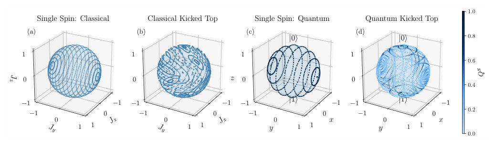 
Figure 1: From periodic motion to interaction-induced complexity. (a) Classical single-spin precession (κ = 0). (b) Classical kicked top (κ &gt; 0) showing trajectory deformation. (c) Closed single-spin quantum evolution with periodic motion on CP 1. (d) Quantum kicked top, where interactions deform this periodic motion into an ensemble spreading over CP 1.

📷 Fig 2

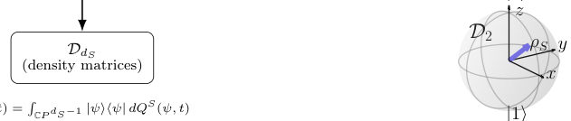 
Figure 2: Left: Relation between pure states, GQS, and density matrices. Right: For a single-qubit subsystem, interactions with different environment sizes (LE = 2, 3, 4, dE = 2LE) produce distinct ensembles on CP 1 with the same reduced density matrix ρS, showing that ρS does not capture the geometric structure induced by environment conditioning.

📷 Fig 3

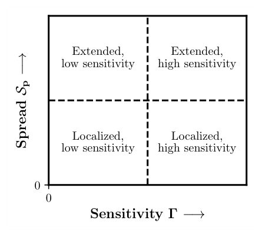 
Figure 3: Schematic classification of subsystem dynamics in the nonnegative-Γ regime using the pair (Γ, Sp). Increasing Γ indicates greater sensitivity to initial states, while increasing Sp indicates broader long-time exploration of state space. The four quadrants distinguish localized low-sensitivity, extended low-sensitivity, localized high-sensitivity, and extended high-sensitivity dynamics.

📷 Fig 4

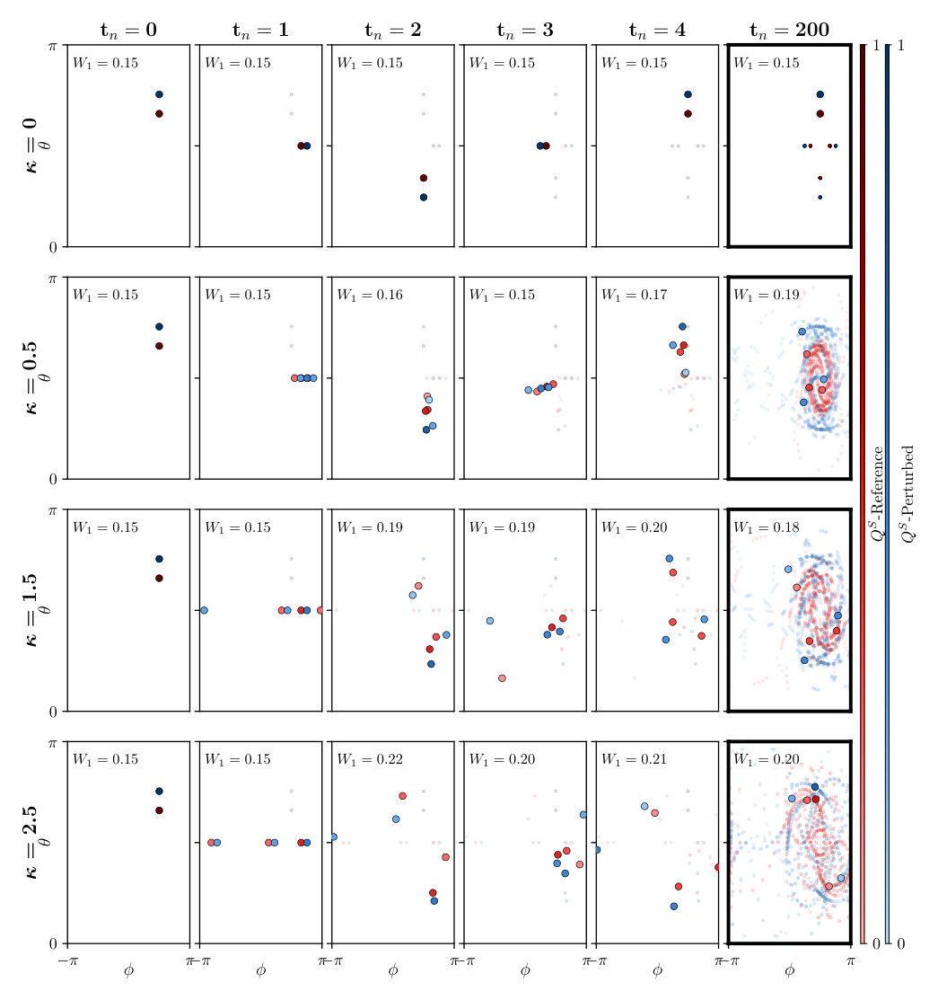 
Figure 4: Evolution of two neighboring geometric quantum states in the three-qubit quantum kicked top. Columns show environment-conditioned ensembles (GQSs) on CP 1 after tn = 0, 1, 2, 3, 4, and 200 Floquet kicks, while rows correspond to interaction strengths κ. The separation W1(tn) = dF S is preserved for noninteracting dynamics (κ = 0). For κ &gt; 0, W1(tn) varies in time, indicating loss of invariance as the ensembles deform and spread across state space, with stronger effects at larger κ.

📷 Fig 5

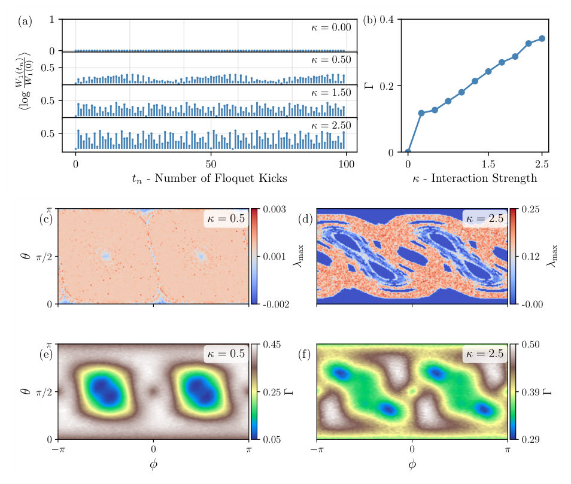 
Figure 5: Distinguishability growth and phase-space structure in the three-qubit kicked top. (a) Time evolution of the average relative distance between perturbed and unperturbed GQSs for increasing kick strength κ, starting from a spin-coherent state at (θ, ϕ) = (π/2 + 0.5, π/2). (b) Corresponding distinguishability measure Γ as a function of κ. (c,d) Classical maximal Lyapunov exponent λmax over initial conditions (θ, ϕ) for κ = 0.5 and 2.5. (e,f) Quantum distinguishability measure Γ evaluated over spin-coherent product states for the same interaction strengths. Increasing κ enhances both λmax in the classical case and the distinguishability growth Γ in the quantum case. The classical and...

**Summary.** The paper develops a geometric framework using Geometric Quantum States (GQS) to diagnose complexity in open quantum systems. By introducing Wasserstein distance and State-Space Coverage Index, it quantifies how interactions reshape the underlying pure-state geometry. The diagnostics successfully characterize enhanced sensitivity and broader exploration in models like the kicked top, highlighting fundamental roles for system parity.

**Why it may be interesting.** This work provides a powerful geometric toolkit—moving beyond simple entanglement measures—to quantify dynamical complexity in open systems by analyzing how probability mass evolves on the state space manifold.

Detailed structure

**Main problem.** The study focuses on quantifying how complexity emerges in finite-size quantum systems as their dynamics transition from coherent, closed evolution to interacting, effectively open behavior.

**Main result.** Both a distinguishability measure (Wasserstein distance) and a State-Space Coverage Index increase with interaction strength, revealing geometric signatures of dynamical complexity. Parity symmetry dictates that integer-spin systems often show greater sensitivity than half-integer-spin systems.

**Method.** The authors employ a Geometric Quantum State (GQS) framework, representing mixed states as probability measures on the complex projective Hilbert space to track ensemble geometry lost in standard density matrix descriptions.

**Model / system.** The analysis uses open quantum systems modeled by partitioning the total Hilbert space into a system (S) and an environment (E). The diagnostics are applied specifically to the quantum kicked top model, varying interaction strength ($\kappa$) and system size ($L$).

**Key observables.** Distinguishability measure (Wasserstein distance $W_p$), State-Space Coverage Index (SSCI), and geometric measures derived from GQSs.

**Important parameters / regimes.** Interaction strength ($\kappa$), environment size, and parity symmetry of the system spin ($L$).

**Assumptions / limitations.** The primary assumption is that using GQSs—probability measures on $	ext{CP}^{d_S-1}$—is necessary to preserve ensemble structure, as standard density matrices lose this geometric information.

**Figures summary.** Figures illustrate the transition from simple periodic motion ($\kappa=0$) to complex spreading with increasing interaction strength. They also compare dynamics for different parity systems and show how $\Gamma$ and $S_1$ quantify sensitivity and coverage in phase space.

**Paper structure.** The paper first establishes the need for GQSs over density matrices, then introduces two complementary diagnostics (Wasserstein distance and SSCI) to geometrically characterize complexity. Finally, these tools are applied to the quantum kicked top model to analyze the role of interaction strength and spin parity.

Abstract

We study the emergence of complexity in finite-size quantum systems as their dynamics transition from closed and coherent evolution to interacting and effectively open behavior. Using a state-based geometric framework, we represent mixed quantum states as probability measures on complex projective Hilbert space. This representation allows us to track how interactions reshape the underlying pure-state geometry. We introduce two complementary diagnostics: a distinguishability measure, based on the Wasserstein distance between probability-measure representations of mixed states, that quantifies sensitivity to initial states, and a state-space coverage index that measures long-time exploration of the subsystem state space. These diagnostics provide a geometric perspective on the emergence and evolution of quantum dynamical complexity. When applied to the quantum kicked top, both diagnostics generally increase with interaction strength. Their dependence on environment size is structured by parity symmetry, with integer-spin systems often exhibiting greater sensitivity and state-space coverage than half-integer-spin systems. These results highlight finite-size quantum effects and provide a geometric approach to quantifying dynamical complexity deep in the quantum regime

[↑ back to top](#top)

### [A non-Markovian approach to spin-phonon coherence and the breakdown of the Markovian approximation](http://arxiv.org/abs/2608.09455v1)

**Authors:** Mohamed Belhassen, Tim Schröder, Gregor Pieplow  
**Type:** theory · **Category:** quantum information and computing · **PDF:** <https://arxiv.org/pdf/2608.09455v1>  
**Analysis basis:** full PDF text, analyzed in chunks
**Topic relevance:** `methods for driven-dissipative` **3/5** · `Keldysh / 2PI / non-Gaussian methods` **2/5** · `QC/QI experiment` **2/5** · `driven-dissipative phase transition` **2/5** · `analog quantum simulation` **1/5** · `correlated / nonlocal dissipation` **1/5** · `quantum measurements` **1/5**

📷 Fig 1

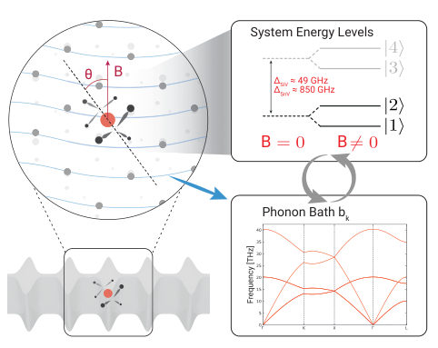 
Figure 1: Group IV vacancy in a sawfish resonator [10]. bk’s are the phonon bath modes, with dispersion relation in bulk diamond plotted in the lower right inset, inter- acting with the color center energy levels described in the Hamiltonian Eq. (1). The magnetic field B is ap- plied with an angle θ with respect to the color center symmetry axis and splits the orbital spin degeneracy.

📷 Fig 2

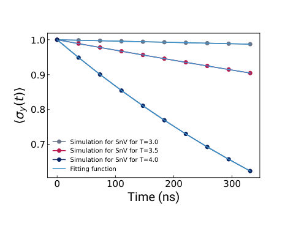 
Figure 2: Expectation value ⟨σy(t)⟩for SnV with orbital splitting ∆≈903 GHz with fitting function Eq. (25)

📷 Fig 3

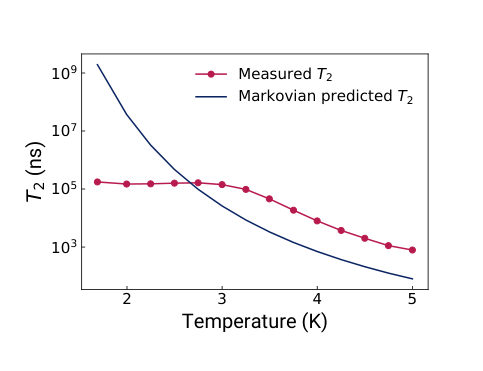 
Figure 3: Coherence time T2 for SnV with Hahn-echo as a function of Temperature compared to experiments. Data reported in [18] based on [19]

📷 Fig 4

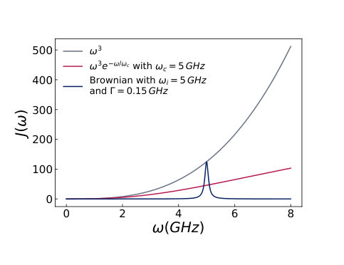 
Figure 4: Regularized spectral density. Exponential reg- ularization with bath cutoff frequency ωc = 5 GHz and Brownian spectral density with distribution linewidth Γ = 0.15 GHz

📷 Fig 5

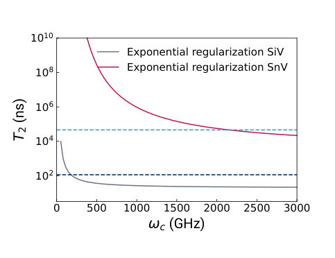 
Figure 5: Coherence time T2 of SiV and SnV as a func- tion of wc compared to experiments. For SiV, mea- sured at T = 3.6 K and orbital splitting ≈50 GHz [23]. For SnV, measured at T ≈3.5 K and orbital splitting ∆≈903 GHz [19]. The dash lines are the experiment measurement for SiV T2 = 114.19 ns and SnV T2 = 46 µs

**Summary.** This paper investigates how lattice vibrations (phonons) cause electronic spin decoherence in diamond color centers used as quantum bits. The authors demonstrate that standard Markovian approximations fail because they ignore the system's memory of past interactions with the bath. By employing non-Markovian techniques, they accurately model coherence times that match experimental observations.

**Why it may be interesting.** This work is highly relevant for AMO physicists working on open quantum systems because it provides a detailed, physically motivated case study demonstrating the necessity of retaining memory effects (non-Markovian dynamics) when modeling solid-state qubits interacting with vibrational baths.

Detailed structure

**Main problem.** The study addresses phonon-induced electronic spin decoherence, specifically investigating when and why standard Markovian approximations fail to accurately predict qubit coherence times.

**Main result.** Non-Markovian treatments are necessary to capture the system's memory effects, leading to predicted coherence times that align much better with experimental measurements than the simpler Markovian models.

**Method.** The authors employ advanced open quantum system techniques, comparing results derived from non-Markovian projection operators (NZ/TCL) against the standard Born-Markov approximation.

**Model / system.** The physical platform is electronic spin qubits realized in Group-IV vacancies ($	ext{G4V}$) within diamond. The dynamics are governed by a spin-phonon interaction Hamiltonian ($H_{SB}$), which couples the qubit spin to the phonon bath modes.

**Key observables.** Qubit coherence times ($T_2$) and the influence of the static magnetic field orientation ($	heta$).

**Important parameters / regimes.** Phonon spectral density $J(\omega)$, temperature, and the memory time scale ($\Gamma$).

**Assumptions / limitations.** The analysis critically compares approximations: assuming weak coupling (Born) and rapid bath decay (Markovian). The non-Markovian approach explicitly accounts for system-bath memory effects.

**Figures summary.** Figures compare simulated coherence dynamics $\langle\sigma_y(t)
angle$ using different theoretical models (e.g., Markovian vs. TCL) against experimental fits, highlighting discrepancies.

**Paper structure.** The paper progresses by first establishing the physical model and Hamiltonian, then systematically comparing the mathematical frameworks—moving from non-Markovian projection operators to the simplified Lindblad form—to diagnose where approximations break down.

Abstract

Qubit coherence is an essential figure of merit for quantum information processing applications such as quantum computing, or quantum repeaters. Understanding the coherence properties of the underlying physical qubits that facilitate such applications is therefore are often limited by coupling to lattice phonons, which in turn constrains operation temperature. Here we study phonon induced electronic spin decoherence in group-IV vacancy centers in diamond. We begin by modeling the spin-phonon interaction and then employ the widely used Born-Markov approximation, highlighting its inconsistencies in this setting and its deviations from experimental observations. To close the gap between theoretical predictions and experimental results, we relax certain approximations, investigate their contributions to the predicted coherence times, and identify the dominant sources of discrepancy. We further demonstrate that experimentally measured electronic spin coherence dynamics are consistently captured within a non-Markovian framework, and we show how the magnetic field orientation influences the qubit coherence time.

[↑ back to top](#top)

### [Entanglement and non-local magic in a non-unitarily deformed non-Hermitian bipartite system](http://arxiv.org/abs/2608.08346v1)

**Authors:** Chen-Huan Wu  
**Type:** theory · **Category:** quantum information and computing · **PDF:** <https://arxiv.org/pdf/2608.08346v1>  
**Analysis basis:** full PDF text, analyzed in chunks
**Topic relevance:** `correlated / nonlocal dissipation` **3/5** · `methods for driven-dissipative` **3/5** · `Keldysh / 2PI / non-Gaussian methods` **2/5** · `driven-dissipative phase transition` **2/5** · `non-equilibrium universality` **1/5** · `quantum measurements` **1/5**

📷 Fig 1

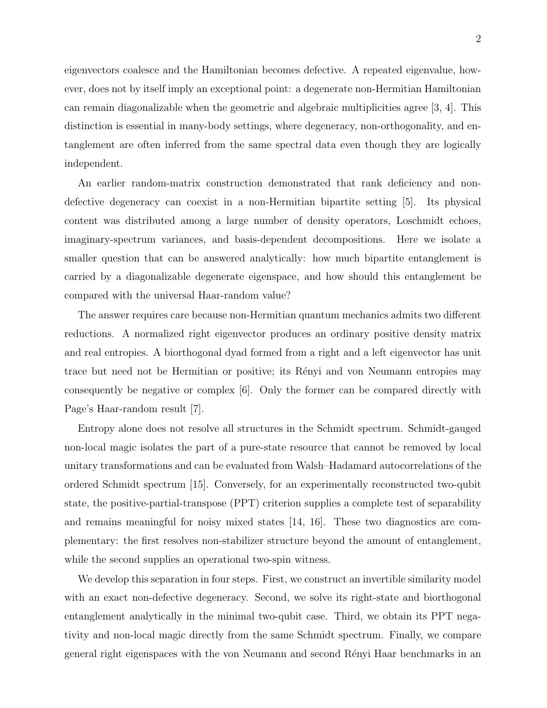 
Low-resolution page preview, page 2

📷 Fig 2

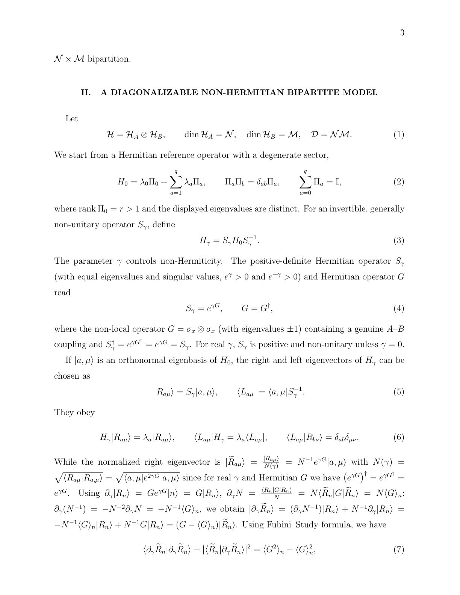 
Low-resolution page preview, page 3

📷 Fig 3

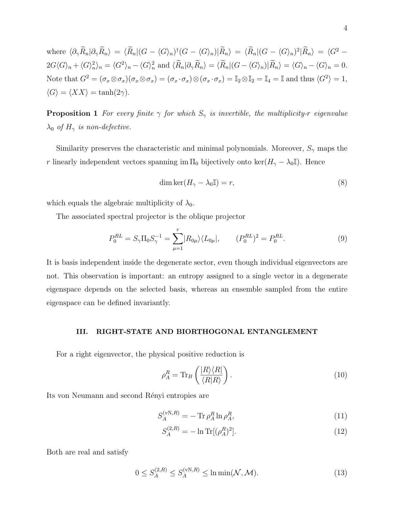 
Low-resolution page preview, page 4

📷 Fig 4

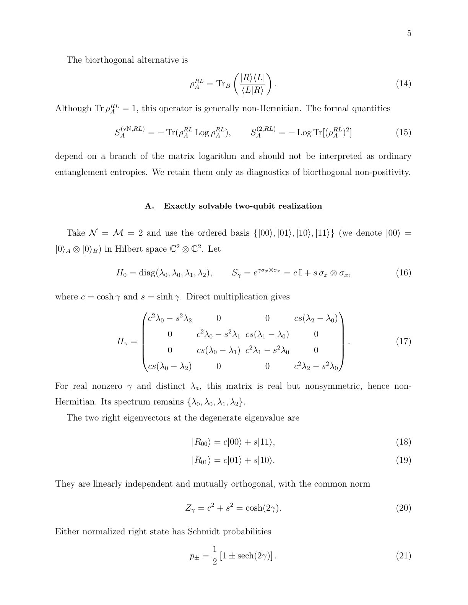 
Low-resolution page preview, page 5

📷 Fig 5

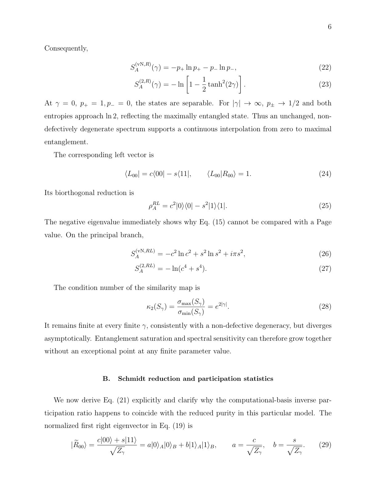 
Low-resolution page preview, page 6

**Summary.** This paper develops a method to distinguish entanglement from spectral degeneracy in non-Hermitian bipartite systems using a deformed Hamiltonian model. By tracking various correlation measures like entropy and 'non-local magic' as the system is driven, it shows that these quantum resources evolve independently of the underlying eigenvalue structure. This offers powerful diagnostic tools for characterizing complex open quantum dynamics.

**Why it may be interesting.** This work provides a sophisticated theoretical framework for analyzing quantum correlations in non-Hermitian settings, which is crucial for understanding open quantum systems and PT-symmetric physics where standard Hermitian tools fail.

Detailed structure

**Main problem.** The paper aims to rigorously separate the concepts of degeneracy (eigenvalue structure) from entanglement in non-Hermitian quantum systems, where these notions are often conflated.

**Main result.** It demonstrates that for a specific bipartite model, entanglement grows monotonically with the non-Hermiticity parameter while a measure called 'non-local magic' peaks at an intermediate coupling strength.

**Method.** The analysis involves constructing a non-unitary deformation of a Hermitian Hamiltonian and applying various quantum information diagnostics like positive right-state reduced density matrix entropy, PPT negativity, and Schmidt-gauged non-local magic.

**Model / system.** The system is a compact bipartite model derived from an initial degenerate Hermitian operator $H_0$, which is then deformed by an invertible non-unitary similarity map to yield the non-Hermitian Hamiltonian $H_\gamma$. The analysis focuses on its two-qubit realization.

**Key observables.** Positive right-state reduced density matrix entropy ($
ho^R_A$), Partial Transpose (PPT) negativity, Schmidt-gauged non-local magic, Page entropy, and Haar-averaged purity.

**Important parameters / regimes.** The non-Hermiticity deformation parameter $\gamma$, which controls the evolution from product states to maximally entangled states.

**Assumptions / limitations.** The analysis assumes the existence of an invertible similarity map $S_\gamma$ and carefully distinguishes between entanglement derived from the positive right-state density matrix versus the potentially complex biorthogonal reduction.

**Paper structure.** The paper first introduces the model to separate degeneracy and entanglement, then analyzes the two-qubit case using Schmidt decomposition to derive explicit formulas for various correlation measures. It concludes by comparing these results with general diagnostics like Page entropy in larger systems.

Abstract

Non-Hermitian degeneracies are usually discussed through spectral coalescence, whereas entanglement is a property of eigenvectors and need not be fixed by the eigenvalues alone. We formulate a compact bipartite model that separates these two notions. A Hermitian operator with a degenerate eigenspace is transformed by an invertible non-unitary similarity map. The resulting Hamiltonian is non-Hermitian and retains a non-defective degeneracy at every finite value of the non-Hermiticity parameter. For an exactly solvable two-qubit realization, the right eigenstates evolve continuously from product states to maximally entangled states although the spectrum is unchanged. We distinguish the positive right-state reduced density matrix from the generally non-positive biorthogonal reduction, for which entropy may become complex. The same two-qubit solution gives a closed partial-transpose negativity and a Schmidt-gauged non-local magic. Entanglement grows monotonically with the non-Hermiticity parameter, whereas the non-local magic vanishes for both the product and maximally entangled limits and is largest at an intermediate coupling. In larger bipartite spaces, the Page entropy and Haar-averaged purity provide reference values for eigenstate typicality. These diagnostics separate non-defective degeneracy, exceptional-point sensitivity, Haar-typical entanglement, and non-stabilizer correlations without relying on a proliferation of basis-dependent spectral quantities.

[↑ back to top](#top)

### [From Nonlinear Stochastic Differential Equations to Quantum Channels: The Kolmogorov--Lindblad Mapping](http://arxiv.org/abs/2608.09903v1)

**Authors:** Hsuan-Cheng Wu, Xiantao Li  
**Type:** theory · **Category:** other · **PDF:** <https://arxiv.org/pdf/2608.09903v1>  
**Analysis basis:** full PDF text, analyzed in chunks
**Topic relevance:** `Keldysh / 2PI / non-Gaussian methods` **3/5** · `methods for driven-dissipative` **3/5** · `correlated / nonlocal dissipation` **2/5** · `quantum measurements` **2/5** · `analog quantum simulation` **1/5** · `driven-dissipative phase transition` **1/5**

📷 Fig 1

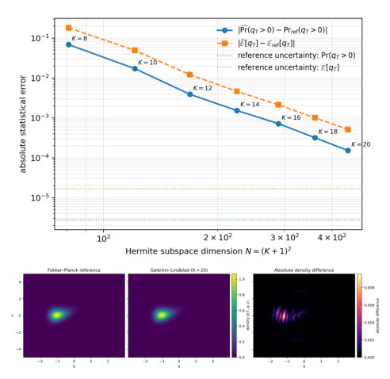 
FIG. 1. Localized left-well Langevin experiment at T = 1. The upper panel shows the absolute errors in P(qT &gt; 0) and E[qT ] versus the Hermite-space dimension N = (K + 1)2 and the dotted lines show the estimated Fokker–Planck reference uncertainties. The lower panel compares the 2562 Fokker– Planck density with the diagonal of the K = 20 Galerkin– Lindblad solution and shows their pointwise absolute differ- ence. The probability remains concentrated in the left well at this short time, but the small right-well transition probability is accurately recovered.

📷 Fig 2

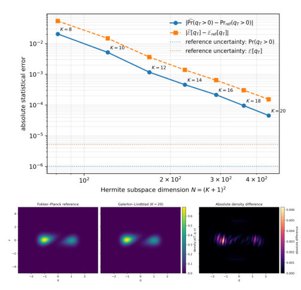 
FIG. 2. Biased bimodal Langevin experiment at T = 1. The upper panel shows convergence of the right-well prob- ability and mean position. The lower panel compares the finest Fokker–Planck density with the K = 20 Galerkin– Lindblad diagonal. The two bright spots correspond to the metastable wells at q = ±1. Their unequal intensities reflect the 0.65/0.35 initial mixture, and both are reproduced by the finite-dimensional Lindblad evolution.

📷 Fig 3

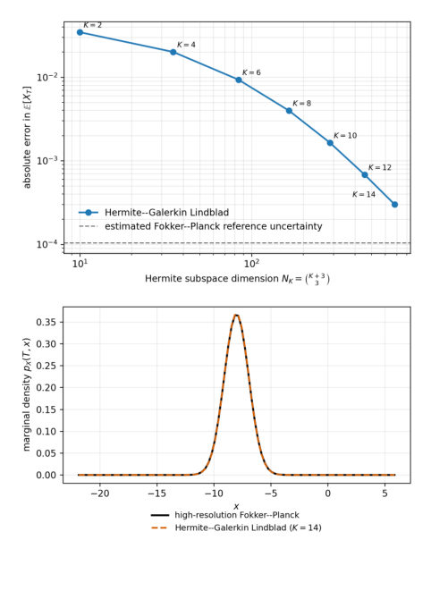 
FIG. 3. Noisy Lorenz–63 experiment at T = 0.05. Upper: absolute error in E[XT ] versus the dimension N = K+3 3  of the total-degree Hermite space. Lower: the X-marginal from the 963 Fokker–Planck calculation and the K = 14 Galerkin– Lindblad approximation. The horizontal line in the upper panel is the estimated uncertainty of the extrapolated Fokker– Planck reference.

**Summary.** The paper introduces the Kolmogorov--Lindblad Mapping (KLM), an exact mathematical procedure that translates the statistical evolution of nonlinear Stochastic Differential Equations into the formalism of quantum channels. By evolving the probability law's half-density and averaging over noise realizations, it shows that classical diffusion appears as quantum decoherence within a Lindblad master equation framework.

**Why it may be interesting.** This work provides a powerful theoretical bridge connecting classical stochastic processes (SDEs) directly to quantum open system dynamics (Lindblad form), offering a unified computational footing for modeling complex physical systems in both domains.

Detailed structure

**Main problem.** The core problem is developing a mathematically rigorous mapping (Kolmogorov--Lindblad Mapping, KLM) to translate nonlinear Stochastic Differential Equations (SDEs) into the language of quantum channels.

**Main result.** KLM provides an exact framework showing that statistical observables from general nonlinear SDEs can be represented as quantum expectations evolving under a Lindblad master equation.

**Method.** The method involves mapping the probability law via its half-density, which evolves according to a Stochastic Schrödinger Equation (SPDE) for each realization. Averaging these pure state evolutions yields the final Lindblad evolution.

**Model / system.** The paper addresses general nonlinear SDEs, exemplified by molecular dynamics or noisy Lorenz-63 systems. The quantum representation is formulated using density operators ($\Gamma(t)$) evolving under a Lindblad equation.

**Key observables.** Statistical observables (expectations of functions $\phi$), event probabilities, and two-time correlations are mapped to trace expectations ($	ext{Tr}[\dots]$).

**Important parameters / regimes.** The convergence rate of the Galerkin projection is governed by time ($t$) and the regularity ($s$) of the solution.

**Assumptions / limitations.** Key assumptions include the existence of a global $C^1$ stochastic flow, sufficient far-field decay for the SDEs, and the use of a structure-preserving Galerkin projection to truncate the continuum dynamics.

**Figures summary.** Not specified in the notes; however, numerical experiments validate the projected Lindblad evolution against independent Fokker–Planck calculations for specific systems like double-well Langevin dynamics.

**Paper structure.** The paper establishes semigroup identities and generator relations using functional analysis tools. It then develops the KLM by evolving the half-density via an SPDE, averaging it to derive the Lindblad equation, and finally applying a Galerkin projection with error analysis to show convergence rates for observables.

Abstract

Nonlinear stochastic differential equations (SDEs) underlie molecular modeling and drug discovery, quantitative finance, stochastic learning, and uncertainty quantification. Their expectations, event probabilities, and time correlations are therefore natural targets for quantum computation, but nonlinear drift and averaging over noise realizations obstruct a direct quantum representation. We develop an exact \emph{Kolmogorov--Lindblad mapping} (KLM) at the level of the probability law, encoded natively as a trace-one quantum density operator. For each Brownian realization, the pathwise density admits a half-density whose evolution is a stochastic Schrödinger equation. Averaging the associated pure states yields a Lindblad equation for $Γ(t)$ whose diagonal kernel is exactly the Fokker--Planck density, $p(t,x)=Γ(t;x,x)$, with classical diffusion represented by decoherence through Hermitian jump operators. Statistical observables become quantum expectations without the unknown time-dependent normalization introduced by direct amplitude encoding of the density, and classical two-time correlations admit an exact quantum regression formula. A structure-preserving Galerkin projection retains the Lindblad form at finite dimension, placing classical SDEs and open quantum dynamics on the same quantum-native computational footing. Numerical experiments for double-well Langevin dynamics and noisy Lorenz--63 exhibit rapid convergence of statistical observables. KLM thus provides a mathematically controlled path from general nonlinear stochastic dynamics to quantum channels, while isolating function approximation and coherent operator access as the remaining determinants of algorithmic efficiency.

[↑ back to top](#top)

### [Gravitational Casimir-Polder interaction in a thermal bath](http://arxiv.org/abs/2608.08128v1)

**Authors:** Shijing Cheng, Tianxin Wang, Zili Zhang  
**Type:** theory · **Category:** other · **PDF:** <https://arxiv.org/pdf/2608.08128v1>  
**Analysis basis:** full PDF text, analyzed in chunks
**Topic relevance:** `Keldysh / 2PI / non-Gaussian methods` **3/5** · `methods for driven-dissipative` **3/5** · `driven-dissipative phase transition` **2/5** · `non-equilibrium universality` **2/5** · `correlated / nonlocal dissipation` **1/5** · `quantum measurements` **1/5**

📷 Fig 1

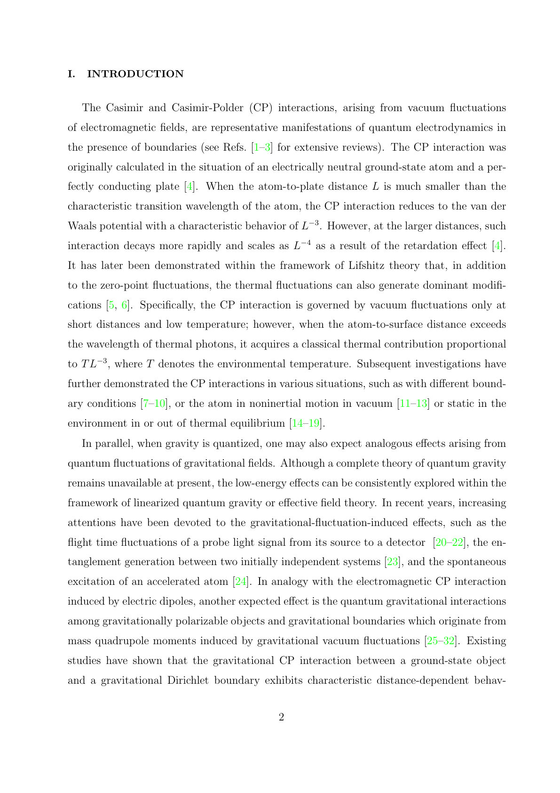 
Low-resolution page preview, page 2

📷 Fig 2

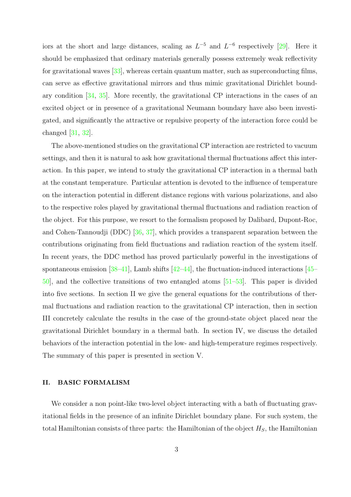 
Low-resolution page preview, page 3

📷 Fig 3

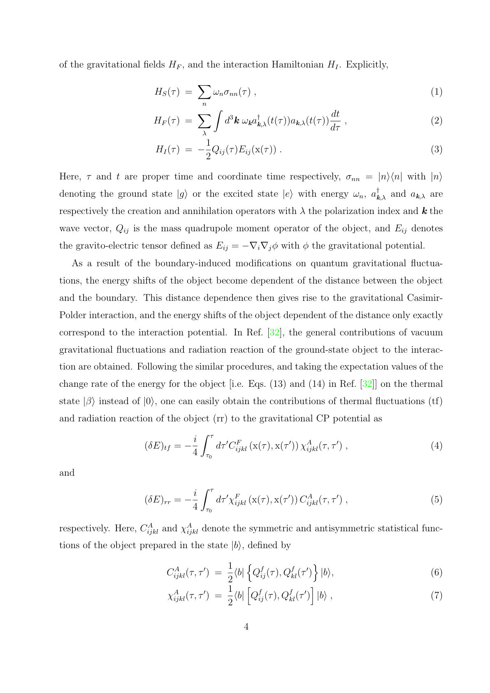 
Low-resolution page preview, page 4

📷 Fig 4

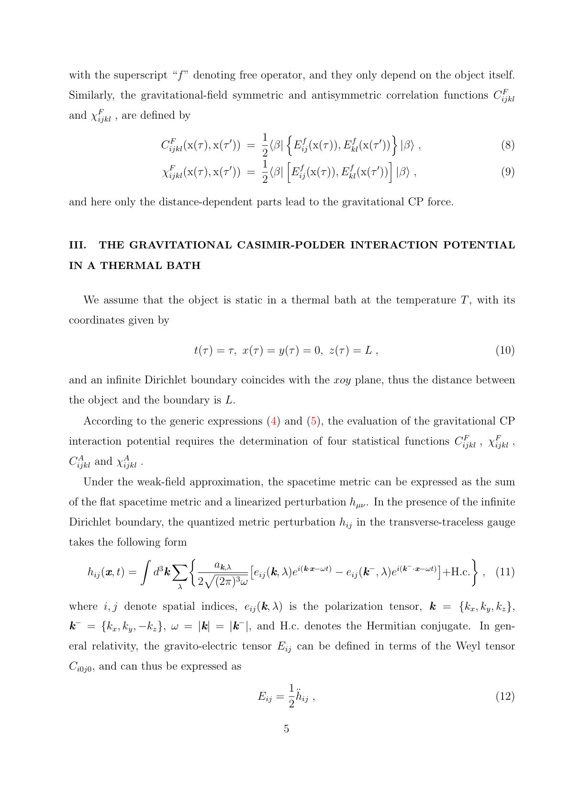 
Low-resolution page preview, page 5

📷 Fig 5

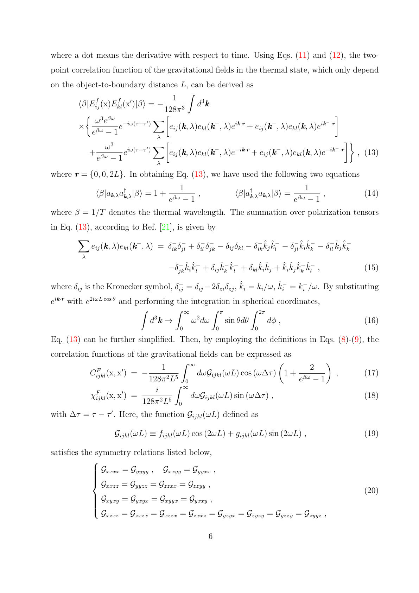 
Low-resolution page preview, page 6

**Summary.** This paper theoretically examines the gravitational Casimir-Polder interaction in a thermal bath by separating contributions from thermal fluctuations and radiation reaction. It reveals that temperature significantly modifies the force's behavior, leading to novel distance scalings and even switching between attraction and repulsion depending on polarization. The findings establish thermal gravitons as a key control mechanism for quantum gravitational forces.

**Why it may be interesting.** This work extends Casimir physics into the realm of quantum gravity and thermal environments, showing how environmental factors (temperature) can fundamentally alter the nature (sign, scaling) of fundamental vacuum interactions.

Detailed structure

**Main problem.** The study investigates the gravitational Casimir-Polder (CP) interaction between a gravitationally polarizable two-level object and an infinite boundary placed in a thermal bath.

**Main result.** Novel behaviors emerge at high temperatures, including non-trivial scaling laws ($TL^{-1}$) and surprisingly attractive forces depending on polarization and distance. Thermal gravitons act as an active control mechanism for these quantum gravitational interactions.

**Method.** The interaction potential is calculated by separating contributions from thermal fluctuations (tf) and radiation reaction (rr), utilizing the DDC formalism and two-point correlation functions in a thermal state.

**Model / system.** The system models a two-level object interacting with fluctuating gravitational fields near a Dirichlet boundary, analyzed using weak-field approximations for metric perturbations.

**Key observables.** Interaction Potential ($\delta E$), force magnitude and sign (attractive/repulsive).

**Important parameters / regimes.** Object-to-boundary distance ($L$), characteristic transition wavelength ($\lambda$), thermal wavelength of gravitons ($eta=1/T$).

**Assumptions / limitations.** The object is assumed static, and the analysis relies on separating contributions into $	ext{tf}$ and $	ext{rr}$ components across various limiting regimes (low vs. high temperature).

**Figures summary.** Not specified.

**Paper structure.** The paper analyzes the total potential by splitting it into temperature-dependent ($	ext{tf}$) and radiation reaction ($	ext{rr}$) parts, examining specific distance/temperature regimes to reveal novel scaling laws and force behaviors.

Abstract

We have investigated, by separating the contributions from thermal fluctuations (tf) and the radiation reaction (rr), the gravitational Casimir-Polder interaction between a gravitationally polarizable two-level object and an infinite gravitational Dirichlet boundary in a thermal bath at a temperature $T$. The results indicate that the rr-contribution to the interaction potential is independent of the temperature, whereas the tf-contribution is generally governed by a nontrivial interplay between the thermal corrections and the polarization effect. Here, the object-to-boundary distance, the characteristic transition wavelength of the object and the thermal wavelength of gravitons are denoted by $L$, $λ$ and $β$, respectively. In contrast to the vacuum case, where the interaction potential scales as $L^{-5}$ for $L\llλ$ and $L^{-6}$ for $L\ggλ$, corresponding to an always repulsive force, qualitatively new behaviors emerge at high temperatures. Particularly, when $\sqrt[4]{βλ^3}\ll L\llλ$ and the object is polarizable within the plane perpendicular to the boundary, a novel scaling of $TL^{-1}$ arises; when $\sqrt{βλ}\ll L\llλ$ and the object is polarizable along the vertical-to-boundary axis, the interaction force becomes surprisingly attractive. At extremely high temperatures and large distances, i.e. when $β\ll λ\ll L$, the potential oscillates with the distance $L$ and thus an attractive or repulsive and even vanishing force can be resulted, depending on the exact values of $L$. Our work demonstrates that thermal gravitons can act as an active control mechanism for quantum gravitational interactions, and temperature, polarization configuration, and object-to-boundary distance jointly determine the magnitude, scaling law, and even the attractive or repulsive nature of the interaction force.

[↑ back to top](#top)

### [Perturbation Theory for Time-dependent Singular Quantum Systems](http://arxiv.org/abs/2608.08108v1)

**Authors:** Kaya Güven Akbaş, Fatih Erman, O. Teoman Turgut  
**Type:** theory · **Category:** other · **PDF:** <https://arxiv.org/pdf/2608.08108v1>  
**Analysis basis:** full PDF text, analyzed in chunks
**Topic relevance:** `Keldysh / 2PI / non-Gaussian methods` **3/5** · `analog quantum simulation` **2/5** · `correlated / nonlocal dissipation` **2/5** · `quantum measurements` **2/5** · `Tavis-Cummings & cavity-many-emitter` **1/5** · `driven-dissipative phase transition` **1/5** · `methods for driven-dissipative` **1/5**

📷 Fig 1

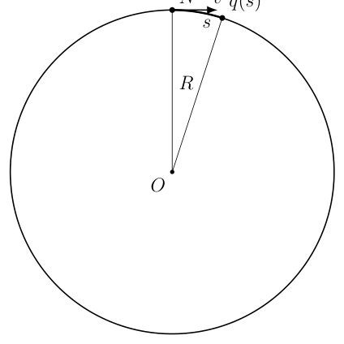 
Figure 1: Cross-sectional illustration of the support point q(s) moving from the north pole N along a great circle on S2 R.

**Summary.** This paper constructs a sophisticated perturbative theory to handle quantum systems perturbed by singular point interactions whose parameters evolve in time. By using renormalization group techniques and spectral expansions, the authors derive systematic formulas for energy shifts and transition probabilities. This framework is crucial for accurately modeling dynamic processes involving localized coupling strengths in quantum physics.

**Why it may be interesting.** This work provides advanced mathematical tools for handling non-standard Hamiltonians (singular potentials) in time evolution problems, which is highly relevant for modeling interactions in cold atoms or cavity QED where localized coupling strengths change dynamically.

Detailed structure

**Main problem.** The paper develops a rigorous perturbative framework for analyzing time-dependent quantum systems involving singular point interactions.

**Main result.** It successfully derives first- and second-order corrections to energy poles, projection operators, and transition amplitudes when the interaction is time-dependent or moves spatially.

**Method.** The method relies on expanding the non-autonomous Hamiltonian in the spectral basis of the static point-interaction problem, utilizing renormalized Green's functions derived via heat-kernel regularization for dimensions 2D/3D.

**Model / system.** The core model involves singular perturbations ($\delta$-interactions) applied to systems with purely discrete spectra, such as particles on compact manifolds or harmonic oscillators. Time dependence is introduced either by varying the coupling strength or by moving the interaction support point.

**Key observables.** Pole shifts (energy corrections $\Delta_k^{(n)}(t)$), projection corrections, and time-dependent transition amplitudes ($c_m(t)$).

**Important parameters / regimes.** The renormalization scale parameter ($\mu$ or $M$), the displacement magnitude ($\epsilon$), and the frequency/time dependence of the perturbation.

**Assumptions / limitations.** The unperturbed Hamiltonian must possess a purely discrete spectrum, and the analysis assumes non-degenerate eigenvalues for simplicity in deriving pole structures.

**Paper structure.** The paper first establishes the static renormalization theory using heat kernels. It then extends this to time dependence by treating the varying scale parameter $\mu(t)$ as a perturbation, leading to iterative calculations of energy shifts and transition amplitudes up to second order.

Abstract

We develop a perturbative framework for time-dependent point interactions in quantum systems with purely discrete unperturbed spectrum. In two and three dimensions the point interaction is described through the renormalized resolvent obtained from heat-kernel regularization, while in one dimension the diagonal Green function is finite and no renormalization is required. Time dependence is introduced either through the interaction parameter or through the motion of the support point. In both cases we expand the non-autonomous Hamiltonian in the spectral basis of the corresponding static point-interaction problem and derive the first- and second-order pole shifts, projection corrections, and transition amplitudes. The method is illustrated by explicit examples: point interactions with time-dependent coupling, harmonic oscillators perturbed by moving point interactions, and a particle on a sphere with a moving interaction center. We also discuss the one-dimensional harmonic oscillator with a moving delta potential, showing that in the non-renormalized case the present formulation reduces to the standard time-dependent perturbation theory.

[↑ back to top](#top)

### [Reliability-Safety Trade-off in AI Distillation: A Renormalization-Group Approach](http://arxiv.org/abs/2608.08572v1)

**Authors:** Y. M. Du, Miao-Miao Yi, Tan-Ji Zhou, C. P. Sun  
**Type:** theory · **Category:** statistical mechanics · **PDF:** <https://arxiv.org/pdf/2608.08572v1>  
**Analysis basis:** full PDF text, analyzed in chunks
**Topic relevance:** `Keldysh / 2PI / non-Gaussian methods` **3/5** · `methods for driven-dissipative` **3/5** · `driven-dissipative phase transition` **2/5** · `non-equilibrium universality` **2/5** · `correlated / nonlocal dissipation` **1/5** · `quantum measurements` **1/5**

📷 Fig 1

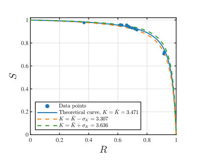 
FIG. 1. S–R plot of the data measured for the “model without contrast training” in Ref. [43] under different answer–refusal thresholds. The data are extracted from Fig. 2 of Ref. [43] (see Table S2 in the Supplemental Material) and converted into the corresponding reliability R and safety S according to the definitions in this work. The solid line represents the reliability–safety trade-off curve with the averaged HDC ¯K = 3.471 obtained from all data points. The two dashed lines represent the trade-off curves with K = ¯K ±σK, where σK = 0.164 is the standard deviation of the HDC extracted from different experimental points.

📷 Fig 2

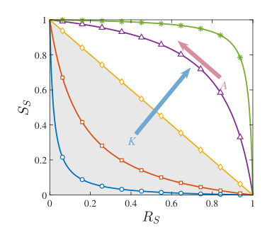 
FIG. 2. Reliability–safety trade-off curves for different ef- fective HDC values Keff: Keff= −4 (blue circles), −2 (red squares), 0 (yellow diamonds), 2 (purple upward triangles), and 4 (green star). The gray shaded region corresponds to Keff&lt; 0, or equivalently R + S &lt; 1, and is bounded by the Keff= 0 line. The light-blue and light-pink arrows indicate the directions of increasing Keffand Aeff, respectively.

📷 Fig 3

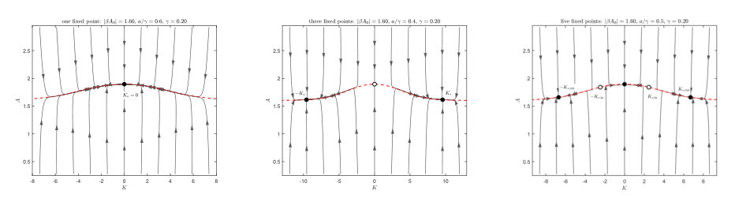 
FIG. 3. RG flows for the three regimes: (a) regime I (b) regime II (c) regime III. The black and white dots denote the stable and unstable fixed points, respectively. The arrows represent the direction of the flows. The red dash curve shows the stable condition in A direction dA/dl = 0.

📷 Fig 4

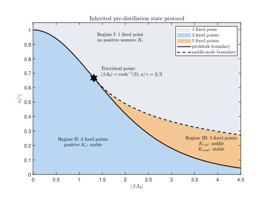 
FIG. 4. RG fixed-point bifurcation diagram for multigen- erational distillation. The gray, blue, and orange regions denote Regimes I, II, and III, containing one, three, and five distinct fixed points, respectively. In Regime III, the central fixed point and the outer pair are stable, whereas the inner pair consists of saddles. The solid curve is the pitchfork bifurcation line a/γ = sech2(βA0/2). The dashed curve is the saddle-node bifurcation line obtained from the maximum of the nonzero fixed-point branch. The black star marks the codimension-two tricritical bifurcation point (|βA0|, a/γ) = (arcosh 2, 2/3).

**Summary.** This work models knowledge distillation as a physical process governed by statistical mechanics principles. By treating behavioral biases as thermodynamic quantities, the authors derive an RG flow describing how reliability and safety trade-offs evolve across multiple training generations. The key finding is that this evolution exhibits predictable phase transitions, suggesting fundamental limits on what can be learned or transferred between AI models.

**Why it may be interesting.** The application of established concepts from statistical mechanics (RG theory, free energy landscapes) to abstract AI behavior provides a powerful theoretical framework for understanding emergent properties in complex learned systems.

Detailed structure

**Main problem.** The paper investigates the reliability-safety trade-off inherent in AI knowledge distillation, treating this behavioral inheritance as a physical process.

**Main result.** A Renormalization Group (RG) approach models the multi-generational transfer of biases, predicting a tricritical structure governing how the hazard discrimination capability evolves or saturates.

**Method.** The authors employ coarse-graining techniques from statistical mechanics to map distillation dynamics onto an RG flow, analyzing fixed points and bifurcations in parameter space.

**Model / system.** The system is modeled using a binary state representation (answer/refusal) within a Boltzmann machine framework. The teacher's influence acts as an effective field reshaping the student's free-energy landscape.

**Key observables.** Reliability ($R$), Safety ($S$), and the Hazard Discrimination Capability ($K$) which relates them via $	ext{logit}(R) + 	ext{logit}(S) = K$.

**Important parameters / regimes.** The RG flow is governed by parameters related to alignment strength ($\gamma$) and initial biases, leading to regimes characterized by fixed points (e.g., $K=0$ or non-zero stable values).

**Assumptions / limitations.** The analysis relies on a two-state (binary) model for coarse-graining inputs/outputs and utilizes the weak-alignment limit ($\gamma \ll 1$) to derive continuous flow equations.

**Figures summary.** Figures illustrate $S–R$ trade-off curves modified by teacher bias contrast, and subsequent figures detail the RG flows showing fixed points across different regimes (I, II, III) separated by a tricritical point.

**Paper structure.** The paper first establishes the basic statistical mechanics model for the trade-off. It then develops the multi-generational dynamics using an RG framework, deriving flow equations for $K$ and $A$. Finally, it analyzes the resulting phase diagram structure, identifying critical thresholds and scaling laws near the tricritical point.

Abstract

Knowledge distillation transfers more than task competence: it also transmits response propensities, refusal policies, error boundaries, and latent safety biases. We formulate this behavioral inheritance as a coarse-graining model grounded in statistical mechanics, in which the student's answer and refusal decisions define two macrostates, while the teacher induces an effective field that reshapes the student's free-energy landscape. The model yields a reliability-safety trade-off relation controlled by a single parameter K, which we term the hazard discrimination capability. The predicted trade-off is consistent with refusal-token data [arXiv: 2412.06748]. In knowledge distillation, a teacher with strong hazard discrimination improves the student's attainable reliability and safety, whereas poor discrimination limits the attainable trade-off. Repeated distillation acts as an iterated renormalization-group-like transformation, under which K follows a flow across generations. The flow exhibits a tricritical structure separating regimes of K loss, stable transmission, and threshold-dependent inheritance, and yields testable scaling predictions for multigenerational distillation.

[↑ back to top](#top)

### [Quantum sensing composite excitations in an anisotropic ferromagnet via a qubit](http://arxiv.org/abs/2608.09463v1)

**Authors:** Amey S. Rodge, Tarek Moussa, Akashdeep Kamra, Bashab Dey  
**Type:** theory · **Category:** other · **PDF:** <https://arxiv.org/pdf/2608.09463v1>  
**Analysis basis:** full PDF text, analyzed in chunks
**Topic relevance:** `analog quantum simulation` **3/5** · `quantum measurements` **3/5** · `Tavis-Cummings & cavity-many-emitter` **2/5** · `QC/QI experiment` **1/5** · `driven-dissipative phase transition` **1/5** · `methods for driven-dissipative` **1/5**

📷 Fig 1

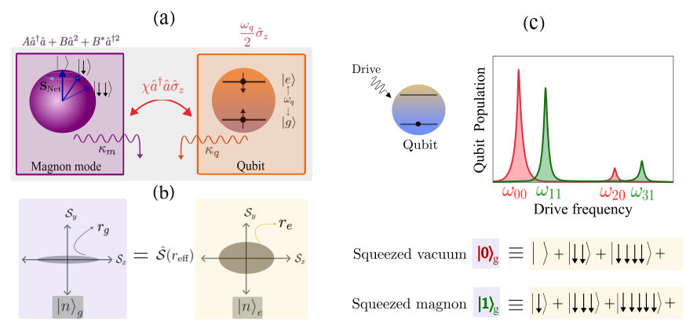 
FIG. 1. (a) Schematic depiction of the system. The noneigenmode magnon (left) with annihilation operator ˆa, having a term B ˆa2 + B∗ˆa†2

📷 Fig 2

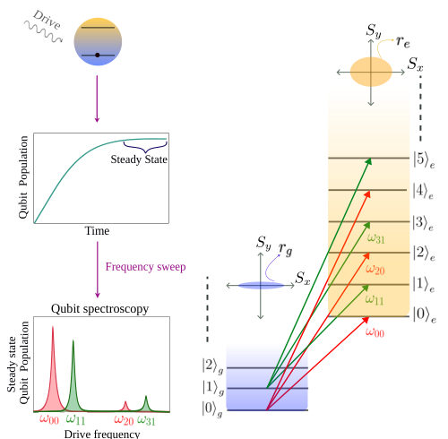 
FIG. 2. (a) Simulation protocol of the qubit spectroscopy. The qubit is driven by an external microwave field with amplitude Ωd and frequency ωd and is allowed to evolve until the steady state is reached. Sweeping ωd yields peaks at resonant frequencies cor- responding to transitions between squeezed-magnon levels in the ground and excited states of the qubit. (b) Illustration of the system eigenstates and the transitions between them. Transitions from |0⟩g to |0⟩e ,|2⟩e ,... (red arrows) produce the corresponding red peaks at ωd = ω00,ω20,...; analogous transitions from |1⟩g to |1⟩e ,|3⟩e ,... (green arrows) yield green peaks at ωd = ω11,ω31,.... The set of peaks emerging due to transition...

📷 Fig 3

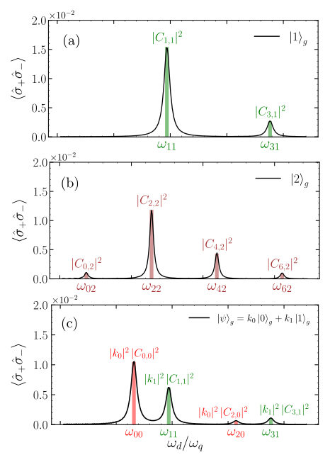 
FIG. 3. Steady state qubit occupation as a function of fre- quency of the drive for detecting different squeezed-magnon ex- cited states. The black curve refers to the qubit occupation while the colored bars represent the analytical values of magnon num- ber statistics calculated using Eqs. (5), (6) and (8). (a) Detec- tion of squeezed-magnon single-excitation |1⟩g. Peaks appear at frequencies ω11 and ω31 with heights proportional to the analyti- cal probabilities |C1,1(reff)|2 and |C3,1(reff)|2, respectively. (b) De- tection of squeezed-magnon double-excitation |2⟩g. Peaks appear at frequencies ω02, ω22, ω4,2, ω6,2 with heights proportional to the analytically calculated probabilities...

📷 Fig 4

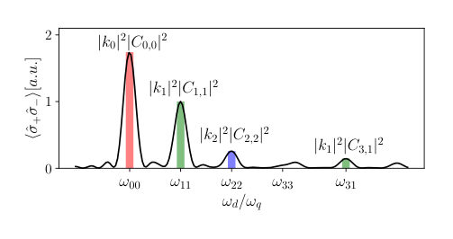 
FIG. 4. Qubit excitation as a function of the qubit drive frequency for the sensing of a coherent superposition of squeezed magnons gener- ated by external driving of the magnon mode. The spectroscopic peak heights are consistent with the expected theoretical results and still resolve the magnonic distribution. This validates the effective- ness of the sensing protocol for a deterministically prepared squeezed magnon state. In addition, it also demonstrates that the qubit spec- troscopy can detect a superposition of multiple squeezed magnon number states |0⟩g ,|1⟩g, |2⟩g ,... and driving the magnonic mode does not compromise the sensing by the qubit. The parameters used in the simulation...

📷 Fig 5

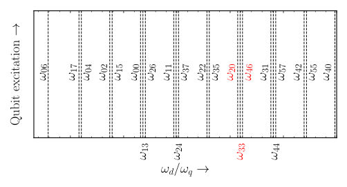 
FIG. 5. Resonant transition frequencies ωmn (vertical dashed lines) across the full drive-frequency sweep ωd/ωq, where ωmn denotes the transition |n⟩g→|m⟩e. The clustering of distinct ωmn values at higher manifolds leads to spectral crowding and overlapping resonances. Transitions highlighted in red mark near-degenerate lines that hinder resolving superposed squeezed magnon states whose components in- volve these frequencies. This issue arises while detecting the coher- ently driven squeezed magnon state [Fig. 4] as the peaks around ω33 could not be resolved.

**Summary.** The paper theoretically establishes qubit spectroscopy as a powerful tool to probe the complex, nonclassical superpositions present in magnon excitations within anisotropic ferromagnets. By analyzing the resonant peaks in the qubit's response, researchers can map out the underlying quantum state structure of the magnons. However, the study highlights critical limitations regarding spectral resolution and thermal noise that must be overcome for practical implementation.

**Why it may be interesting.** This work bridges quantum information concepts (qubit spectroscopy) with condensed matter physics (magnonics), providing a concrete theoretical roadmap for using superconducting qubits as highly sensitive probes for exotic many-body quantum states in magnetic materials.

Detailed structure

**Main problem.** The goal is to develop a theoretical protocol using qubit spectroscopy to detect and characterize quantum superpositions underlying nonclassical magnon excitations in anisotropic ferromagnets.

**Main result.** Qubit spectroscopy can successfully resolve these intrinsic magnonic superpositions, but the technique suffers from spectral crowding and poor resolution when probing highly complex or finite-temperature excited states.

**Method.** The method involves coupling a superconducting qubit dispersively to the magnon mode and measuring the resulting shifts in the qubit's frequency as a function of the driving field.

**Model / system.** The system is an anisotropic ferromagnet hosting magnons, modeled by a spin Hamiltonian leading to squeezed magnon excitations. The dynamics are analyzed using coupled quantum mechanical models involving the qubit and the bosonic magnon mode.

**Key observables.** Resonant peaks in the qubit spectrum ($\omega_{mn}$), whose heights are proportional to the squared overlap coefficients of the underlying magnon number state superpositions.

**Important parameters / regimes.** Magnon decay rate ($\kappa_m$), qubit decay rate ($\kappa_q$), and temperature ($T$).

**Assumptions / limitations.** The protocol is fundamentally limited by spectral crowding when many transitions are close, and finite temperatures significantly degrade the measurement fidelity.

**Figures summary.** Figures illustrate the simulation of the qubit excitation spectrum as a function of driving frequency, showing multiple peaks corresponding to different magnon transition channels ($\omega_{mn}$), and demonstrating peak broadening/mismatch at non-zero temperature.

**Paper structure.** The paper develops the theoretical framework for coupling the qubit to the squeezed magnons, derives the spectroscopic signatures from the resulting Hamiltonian, analyzes the feasibility of probing various superposition states, and concludes by detailing limitations related to spectral resolution and thermal effects.

Abstract

Ordered magnets harbor intrinsically squeezed ground states and magnonic excitations characterized by entanglement between spins and nonclassical magnon number composition. A pathway to detecting the superpositions of noneigenmode magnon number states underlying these nonclassical magnetic ground states has recently been demonstrated by utilizing a qubit coupled to the magnon mode via a direct dispersive interaction. Here, we theoretically develop this qubit spectroscopy further delineating the capabilities and limitations of this qubit spectroscopy for sensing the quantum superpositions that underlie the excited states. We demonstrate that the spectroscopy lends itself naturally to unraveling the superpositions that underlie the various quantized squeezed-magnon number states. However, excited states comprising superpositions of multiple squeezed Fock states become increasingly hard due to the large number of possible transitions, and resulting peaks, in the qubit spectroscopy thereby requiring qubits with narrower linewidths. Along the same lines, we theoretically demonstrate the qubit spectroscopy of a low amplitude coherent squeezed-magnon state analyzing the tradeoff between frequency crowding due to multiple transitions and peak linewidths. Our work lays the groundwork and design equations for deploying high-quality qubits towards sensing the composite nature of spin excitations in magnetic systems.

[↑ back to top](#top)

### [Quantum-Device Simulation of Optical Decoherence of Hole-Spin Qubits in Self-Assembled Quantum Dots](http://arxiv.org/abs/2608.08475v1)

**Authors:** Jyun-Jie Jiang, Pericles Philippopoulos, Félix Beaudoin, Hong Guo  
**Type:** theory · **Category:** quantum information and computing · **PDF:** <https://arxiv.org/pdf/2608.08475v1>  
**Analysis basis:** full PDF text, analyzed in chunks
**Topic relevance:** `methods for driven-dissipative` **3/5** · `QC/QI experiment` **2/5** · `driven-dissipative phase transition` **2/5** · `Keldysh / 2PI / non-Gaussian methods` **1/5** · `analog quantum simulation` **1/5** · `correlated / nonlocal dissipation` **1/5** · `quantum measurements` **1/5**

📷 Fig 1

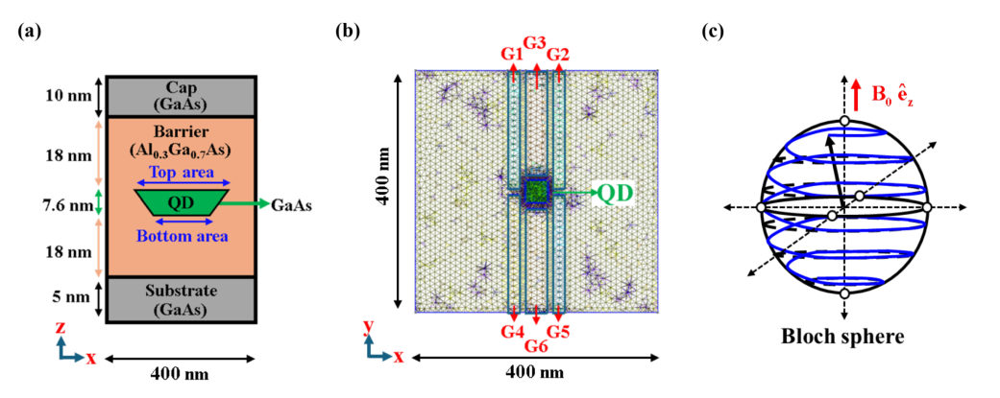 
FIG. 1. (a) Side view of the truncated-pyramidal GaAs SAQD with top and bottom areas of 1253 nm2 and 400 nm2, respectively, following the experimental device of Ref. [10]. (b) Top view of the GaAs SAQD with six metal gates labeled G1–G6, which are used to tune the energy levels of the SAQD and drive EDSR when an oscillating voltage is applied to gate G6. (c) Rabi oscillations of the spin qubit on the Bloch sphere, where B = (0, 0, B0) is a uniform and static external magnetic field.

📷 Fig 2

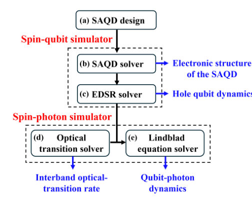 
FIG. 2. The modeling workflow consists of a spin-qubit simu- lator and a spin–photon simulator. In the spin-qubit simula- tor, QTCAD is used to (a) define the SAQD structure and de- vice geometry, (b) solve the single-particle Schr¨odinger equa- tion using the finite-element method, and (c) simulate EDSR- driven spin dynamics. In the spin–photon simulator, (d) in- terband optical-transition rates are calculated using Fermi’s golden rule, and (e) the optically perturbed spin dynamics are determined by solving the Lindblad master equation. Out- puts from each step are shown in blue.

📷 Fig 3

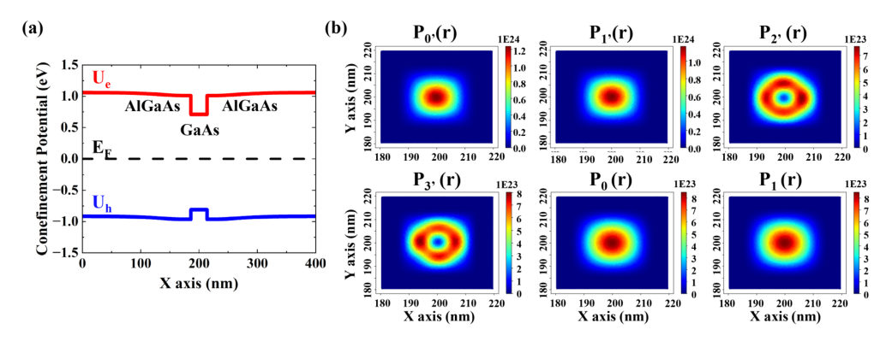 
FIG. 3. Results of the SAQD solver [box (b) of Fig. 2]. For this system [Figs. 1(a) and 1(b)], the device parameters are listed in Table I, a gate voltage of −140 mV is applied to the top gates G1–G6, and B0 is set to 2 T. (a) The calculated electron and hole confinement potentials, Ue and Uh together with the Fermi level EF , along the x axis through the center of the Al0.3Ga0.7As/GaAs/Al0.3Ga0.7As device structure. (b) The calculated probability densities of the four lowest-energy hole states Pn′(r) = |Ψn′(r)|2 (n′ = 0′, 1′, 2′, 3′) and the two lowest-energy electron states Pn(r) = |Ψn(r)|2 (n = 0, 1) with units of m−3. The calculated eigenenergies of these states are listed in Table II.

📷 Fig 4

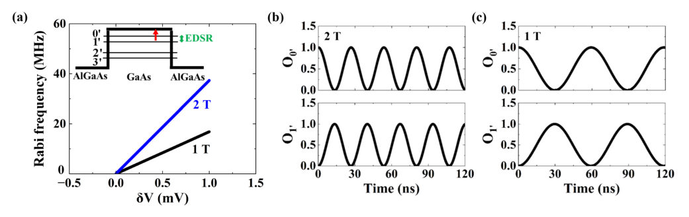 
FIG. 4. Results of the EDSR solver [box (c) in Fig. 2]. For this system [Figs. 1(a) and 1(b)], the device parameters are listed in Table I. A dc bias of −140 mV is applied to all the top gates G1–G6 and an additional ac voltage δV cos(ωt) is applied to gate G6 to drive EDSR with 0 ≤δV ≤1 mV. (a) Hole-qubit Rabi frequency versus the ac driving amplitude δV , with B0 = 1 T (black) and B0 = 2 T (blue). The inset in panel (a) schematically shows the lowest-energy hole states where the two-level system for the spin qubit is indicated by EDSR (green). (b,c) Rabi oscillations of the occupation probabilities at B0 = 2 T and B0 = 1 T, respectively.

📷 Fig 5

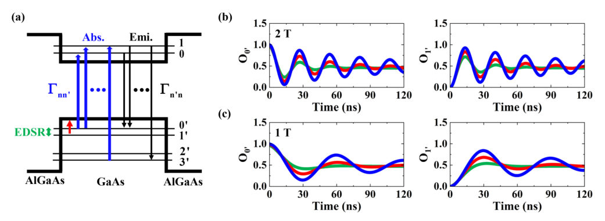 
FIG. 5. (a) Schematic showing the optical transitions (upward and downward arrows). The qubit is initialized in |0′⟩and manipulated via EDSR while the SAQD simultaneously interacts with external electromagnetic radiation near the interband transition energy. The calculated qubit-state occupation probabilities for (b) B0 = 2 T and (c) B0 = 1 T under LED powers of 0.3, 0.75, and 1.5 mW, shown in blue, red, and green, respectively.

**Summary.** This paper presents a comprehensive simulation framework to model how optical excitation causes decoherence in hole-spin qubits within semiconductor quantum dots. By integrating device geometry, spin control dynamics, and open-system master equations, the authors quantify the detrimental effect of illumination power on qubit coherence times. The results emphasize that optimizing solid-state quantum devices requires simultaneous consideration of material structure, electrical driving fields, and optical environment.

**Why it may be interesting.** This work is highly relevant as it tackles the critical issue of environmental coupling (optical noise) limiting coherence times in solid-state quantum memories. The systematic co-optimization requirement highlights practical engineering challenges for building functional spin-photon interfaces.

Detailed structure

**Main problem.** The study investigates how interband optical excitation causes decoherence in hole-spin qubits implemented within semiconductor self-assembled quantum dots (SAQDs). The goal is to understand the interplay between spin control, photon interaction, and material geometry.

**Main result.** Increasing external illumination power significantly shortens the Rabi oscillation decay time from 90.3 ns to 17.5 ns in a GaAs SAQD. Furthermore, geometric changes can inadvertently enhance decoherence by increasing spectral overlap with the excitation source.

**Method.** The authors developed a unified quantum-device simulation workflow that integrates electronic structure calculations (FEM), coherent spin control dynamics (EDSR via von Neumann equation), and open-system evolution using the Lindblad master equation.

**Model / system.** The physical system is a gated GaAs SAQD hosting hole-spin qubits. The model incorporates multiband Luttinger–Kohn–Foreman theory for hole states, EDSR for spin manipulation, and treats optical coupling via Fermi's golden rule within the Lindblad framework.

**Key observables.** Hole-spin Rabi frequency (e.g., 37.3 MHz), Rabi-oscillation decay time ($	ext{T}_2$), and photon-induced damping rate.

**Important parameters / regimes.** External magnetic field ($B_0=2$ T), optical power range (0.3 to 1.5 mW), and excitation wavelength (centered at 790 nm).

**Assumptions / limitations.** The approach relies on the envelope-function approximation, and for optical coupling, an independent-particle approximation is used for interband transitions.

**Figures summary.** Figure 1 illustrates the SAQD structure and Rabi oscillations on the Bloch sphere. Figure 2 details the comprehensive modeling workflow connecting spin-qubit simulation (QTCAD/EDSR) with spin-photon dynamics (Lindblad master equation).

**Paper structure.** The paper establishes the necessity of integrating multiple physical domains—geometry, electronic structure, spin control, and open system dynamics—into a single predictive workflow to accurately model optical decoherence in semiconductor qubits.

Abstract

Spin-photon interfaces are essential for communications between distant spin qubits in quantum technologies, but the interband optical excitation can also damp electrically driven hole-spin Rabi oscillations in semiconductor self-assembled quantum dots (SAQDs). We report a device-level modeling workflow that integrates realistic SAQD geometry and multiband electronic-structure analysis with models of electrically driven spin control, interband optical transitions, and open-system dynamics. This workflow enables device-level estimation of Rabi-oscillation damping arising from repeated interband absorption-emission cycles. As an example, for a gated GaAs SAQD subjected to a uniform magnetic field $B_0$ along the growth direction of the SAQD, we predict the Rabi frequency of the hole spin qubit and its damping under external illumination. At $B_0=2$ T, the calculations yield a hole-spin Rabi frequency of 37.3 MHz. When the electrically driven SAQD is illuminated by a broadband LED centered at a wavelength of 790 nm, increasing the optical power from 0.3 to 1.5 mW shortens the Rabi-oscillation decay time from 90.3 to 17.5 ns. Increasing the SAQD height reduces the electron-hole overlap and thus the emission rate, but the resulting redshift moves the interband transitions into stronger spectral overlap with the LED spectrum, thereby increasing the rate of repeated absorption-emission cycles and enhancing photon-induced Rabi-oscillation damping. The results show that geometry, spin-control conditions, and illumination spectrum should be co-optimized in semiconductor spin-photon devices.

[↑ back to top](#top)

### [Retained hidden excess generates memory in price-limited markets](http://arxiv.org/abs/2608.08625v1)

**Authors:** Debraj Das  
**Type:** theory · **Category:** statistical mechanics · **PDF:** <https://arxiv.org/pdf/2608.08625v1>  
**Analysis basis:** full PDF text, analyzed in chunks
**Topic relevance:** `non-equilibrium universality` **3/5** · `driven-dissipative phase transition` **2/5** · `Frenkel-Kontorova` **1/5** · `analog quantum simulation` **1/5** · `correlated / nonlocal dissipation` **1/5** · `methods for driven-dissipative` **1/5** · `quantum measurements` **1/5** · `scars & prethermalization` **1/5**

📷 Fig 1

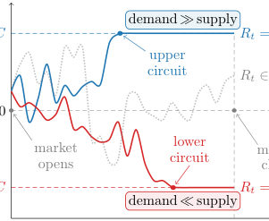 
FIG. 1. Possible intraday evolution of the running return rt(τ) under a symmetric return band with limits at ±C. The realized daily return is the closing value Rt = rt(τclose). A limit close records Rt = ±C but does not reveal the magni- tude of the underlying excess demand or supply. Note that the discrete-time quantity Rt does not resolve the intermedi- ate intraday path; the model instead maps the state directly from one market close to the next.

📷 Fig 2

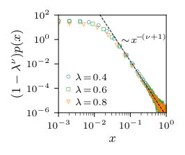 
FIG. 2. Positive-tail collapse of the stationary latent den- sity p(x) confirming the amplitude renormalization (6) with C = 0.1 and ν = 3.5. Symbols are obtained from stationary trajectories of length 1010 generated by numerical simulations using Student’s t driving shocks with degrees of freedom ν and scale parameter sϵ = 0.01 [see Appendix B].

📷 Fig 3

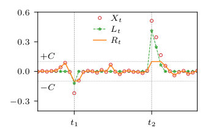 
FIG. 3. Representative discrete-time trajectory of the latent return Xt, realized return Rt, and hidden excess Lt = Xt−Rt. The large negative shock at t1 produces a short-lived lower- limit close, whereas the large positive shock at t2 generates a persistent hidden excess and consecutive upper-limit closes. Horizontal dotted lines mark the return limits ±C, vertical dashed lines mark the shock times, and connecting lines are guides to the eye.

📷 Fig 4

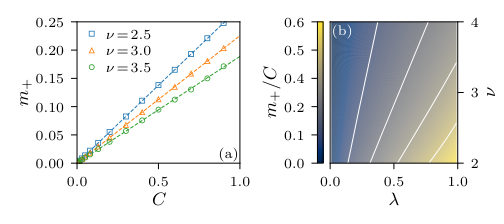 
FIG. 4. (a) Post-upper-limit-close response m+ as a function of the return-limit magnitude C for λ = 0.5; dashed lines denote the analytical result (28). Symbols are obtained from stationary trajectories of length 1010 generated by numerical simulations using Student’s t driving shocks with degrees of freedom ν and scale parameter sϵ = 0.01 [see Appendix B]. (b) Limiting normalized response m+/C in the (λ, ν) plane obtained from Eq. (28).

📷 Fig 5

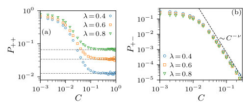 
FIG. 5. (a) Same-limit persistence probability P++(C) and (b) opposite-limit reversal probability P+−(C) as functions of the return-limit magnitude C for ν = 3.5. Symbols are ob- tained from stationary trajectories of length 1010 generated by numerical simulations using Student’s t driving shocks with ν degrees of freedom and scale parameter sϵ = 0.01 [see Ap- pendix B]. The horizontal dashed lines in (a) show the wide- band limit in Eq. (32), while the dashed line in (b) shows the C−ν decay predicted by Eq. (33).

**Summary.** This paper models financial returns subject to exchange price limits, treating the resulting 'hidden excess' as a latent variable that carries over time. By analyzing this memory mechanism using stochastic processes, it predicts how limit hits influence subsequent market behavior, showing persistent directional bias proportional to the band width.

**Why it may be interesting.** While applied to finance, the core mathematical structure—modeling memory generation via unobserved state variables constrained by boundaries—is analogous to studying non-equilibrium dynamics or boundary effects in physical systems like charge transport or particle confinement.

Detailed structure

**Main problem.** The study investigates how an unobserved 'hidden excess' generated by clipping extreme fluctuations (price limits) in financial markets generates memory in subsequent price movements, even when the underlying driving shocks are independent.

**Main result.** In the wide-band limit, a limit close leads to a next-day mean return of the same sign that grows proportionally to the band width, and the probability of hitting the same limit again approaches a finite value.

**Method.** The analysis employs a minimal stochastic latent-state model, deriving analytical results for stationary dynamics and performing asymptotic analyses in the wide-band limit.

**Model / system.** The system models daily stock returns constrained by exchange-imposed symmetric price bands $[-C, C]$. The memory is introduced via a retention mechanism where a fraction of the unobserved excess from clipping is carried forward to influence the next day's latent return.

**Key observables.** Next-day mean return sign/magnitude, persistence probability (same limit hit), and reversal probability (opposite limit hit).

**Important parameters / regimes.** Band width ($C$), retention coefficient ($\lambda$), and the tail index ($
u$) of the driving shocks.

**Assumptions / limitations.** The model assumes a latent-state process where the hidden excess is retained, and it utilizes the single-dominant-shock description in the wide-band limit.

**Figures summary.** Figures illustrate information loss at limit closes (Fig 1), the renormalization of the stationary latent density amplitude due to retention (Fig 2), and representative trajectories showing persistent excess leading to consecutive limit closes (Fig 3).

**Paper structure.** The paper develops a stochastic latent-state model for price-limited returns, analyzes its stationary dynamics under heavy tails, derives asymptotic results in the wide-band limit, and validates these predictions using simulations and empirical data from global indices.

Abstract

The daily return of a stock is often restricted to an exchange-imposed band to curb extreme fluctuations. Any attempted price movement beyond this band is clipped, leaving an unobserved excess. We introduce a minimal stochastic latent-state model in which a fraction of this hidden excess is retained for the next day. This retention generates memory, even though the daily stochastic driving shocks are independent. For symmetric driving shocks with regularly varying tails, the stationary latent return preserves the tail index of the noise, but has an enhanced tail amplitude. In the wide-band limit, a close of the daily return at either limit of the band admits a single-dominant-shock description. We show that after such an event, the mean return on the following day has the same sign and grows proportionally to the band width, while the probability of reaching the same limit again approaches a finite value. Reaching the opposite band limit on the following day requires a second extreme shock of opposite sign and is power-law suppressed. Simulations support these analytical predictions. Empirical data from stocks subject to daily price limits are qualitatively consistent with the predicted same-sign response and its increase across wider price bands.

[↑ back to top](#top)

### [Spread of Entanglement in Generalized Kicked Ising Chain](http://arxiv.org/abs/2608.09695v1)

**Authors:** Tanay Pathak, Hiromi Ebisu, Tomaž Prosen  
**Type:** theory · **Category:** statistical mechanics · **PDF:** <https://arxiv.org/pdf/2608.09695v1>  
**Analysis basis:** full PDF text, analyzed in chunks
**Topic relevance:** `non-equilibrium universality` **3/5** · `analog quantum simulation` **2/5** · `driven-dissipative phase transition` **2/5** · `Keldysh / 2PI / non-Gaussian methods` **1/5** · `correlated / nonlocal dissipation` **1/5** · `methods for driven-dissipative` **1/5** · `scars & prethermalization` **1/5**

📷 Fig 1

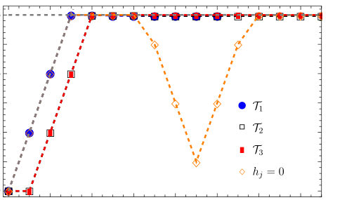 
FIG. 1. Spread of entanglement for q = 3 KPM with L = 18, Eq. (11). We consider the initial states as the three type of solvable states T1, T2 and T3. Also shown is the results for T1 state but with hj = 0. The results for T2 and T3 states are delayed by one period.

📷 Fig 2

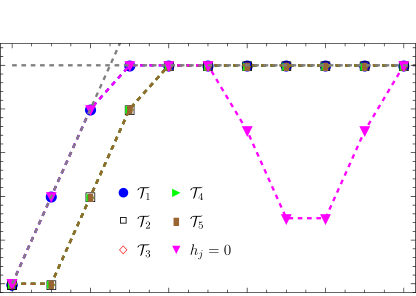 
FIG. 2. Time evolution of von Neumann entanglement en- tropy for q = 4 model for a subsystem of N = 5 qudits in a system of L = 15 qudits KPM. The initial states are three type of solvable state T1, T2 and T3. Also shown is the results for T1 state but with hj = 0. The results for T2 and T3 states are delayed by one period.

📷 Fig 3

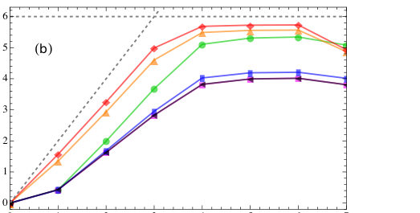 
FIG. 4. Time evolution of von Neumann entanglement en- tropy for q = 3 model for a subsystem of N = 6 qutrits in a system of L = 18 qutrits KPM. The initial states are generic, |ψθ,χ,ϕ1,ϕ2⟩,and the corresponding parameter values are shown in the plots. (a)For hj = 1 (b)For hj = 0 which corresponds to integrable model.

📷 Fig 4

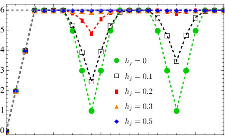 
FIG. 3. Time evolution of von Neumann entanglement en- tropy for q = 3 model for a subsystem of N = 6 qutrits in a system of L = 18 qutrits KPM. For all the cases the initial state is of T1 type and we take different values for the longi- tudinal field.

📷 Fig 5

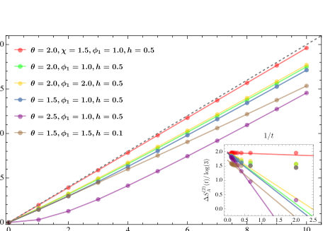 
FIG. 5. Time evolution of Renyi-2 entanglement entropy for KPM with q = 3 in thermodynamic limit. The initial states are generic, |ψθ,χ,ϕ1,ϕ2⟩, and the corresponding parameter values are shown in the plots. We take θ = χ and ϕ1 = ϕ2 unless stated otherwise. The inset shows the instantaneous slope ∆S(α) A (t −1/2)[c.f. Eq. (93)], as a function of 1/t. The linear fit is obtained using values for t ≥5.

**Summary.** This paper analyzes the dynamics of entanglement spread in an extended kicked Ising chain model, generalizing it from qubits to higher local dimensions. The core finding is that exact analytical solutions (dual-unitary points) are restricted to low dimensions ($q \le 4$). For solvable cases, the theory predicts linear growth of entanglement entropy until saturation at these special points.

**Why it may be interesting.** It provides a rigorous theoretical framework for understanding quantum chaos and thermalization dynamics in extended lattice models by linking spectral properties (dual-unitarity) to entanglement scaling laws.

Detailed structure

**Main problem.** The study investigates how entanglement spreads over time in a generalized kicked Ising chain, extending the model beyond standard qubits to higher local dimensions.

**Main result.** Dual-unitary points, which allow for exact analytical solutions, only exist for local dimensions $q \le 4$, failing for $q \ge 5$ due to constraints on matrix elements. For solvable cases like $q=3$, entanglement entropy grows linearly with time at the dual-unitary point.

**Method.** The analysis employs the transfer matrix method and a replica trick adapted for higher dimensions, alongside deriving specific conditions (Equation 30) that must be met for duality.

**Model / system.** The system is the Generalized Kicked Ising Chain (KIM), which models quantum dynamics under periodic driving. It generalizes from qubits ($q=2$) to systems with local dimension $q>2$, corresponding to kicked Potts-type models for $q=3$.

**Key observables.** Entanglement entropy (Rényi and von Neumann); the existence of 'dual-unitary' points.

**Important parameters / regimes.** Local dimension ($q$), kicking strength ($b$), time ($t$).

**Assumptions / limitations.** The analysis assumes that specific matrix element conditions must hold for dual-unitarity, which leads to contradictions for $q \ge 5$. For large $q$, summation is approximated by integration.

**Figures summary.** Not specified in the notes; mentions Table I showing calculated values of $b$ for small $q$.

**Paper structure.** The paper progresses from defining the generalized model and identifying the dual-unitarity condition via matrix elements, to proving its existence/non-existence based on $q$, and finally deriving exact expressions for entanglement growth in solvable cases.

Abstract

We investigate the dynamics of entanglement in a generalized version of the kicked Ising chain, extending the model from the standard qubit case (local dimension $q=2$) to higher local dimensions ($q > 2$). We identify the existence of ''dual-unitary'' points where the model's space-time duality allows for exact analytical solutions. Our analysis reveals that while a few unique dual-unitary points exist analytically for systems with local dimensions $q=3$ and $q=4$, such points do not exist for $q \ge 5$ due to the lack of a unique kicking strength that satisfies the required matrix element conditions. Utilizing the transfer matrix method and a replica trick specifically adapted for higher dimensions, we derive exact expressions for the growth of entanglement entropy in the $q=3$ (kicked Potts-type) model starting from a class of solvable initial states. Our results demonstrate that at the dual-unitary point, both Rényi and von Neumann entanglement entropies grow linearly with time until reaching a maximum value determined by the subsystem size.

[↑ back to top](#top)

### [Turning angle analysis reveals hidden anisotropies in the anomalous diffusion of molecules in live cells](http://arxiv.org/abs/2608.07975v1)

**Authors:** Michał Balcerek, Adrian Pacheco-Pozo, Agnieszka Wyłomańska, Diego Krapf  
**Type:** both · **Category:** statistical mechanics · **PDF:** <https://arxiv.org/pdf/2608.07975v1>  
**Analysis basis:** full PDF text, analyzed in chunks
**Topic relevance:** `quantum measurements` **3/5** · `driven-dissipative phase transition` **2/5** · `methods for driven-dissipative` **2/5** · `non-equilibrium universality` **2/5** · `correlated / nonlocal dissipation` **1/5** · `scars & prethermalization` **1/5**

📷 Fig 1

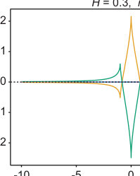 
FIG. 1: Cross-covariance functions Cxy(h) of the increments of anisotropic 2D-FBM. The process has a subdiffusive Hurst exponent H = 0.3, anisotropy ratio r = 0.5, and D1 = 0.5. Four cases are shown: the process where the two components along x and y are independent (ϕ = 0), after the trajectories are rotated by ϕ = 60◦and ϕ = 135◦, and when each trajectory undergoes a random rotation with a uniformly distributed orientation (dotted line).

📷 Fig 2

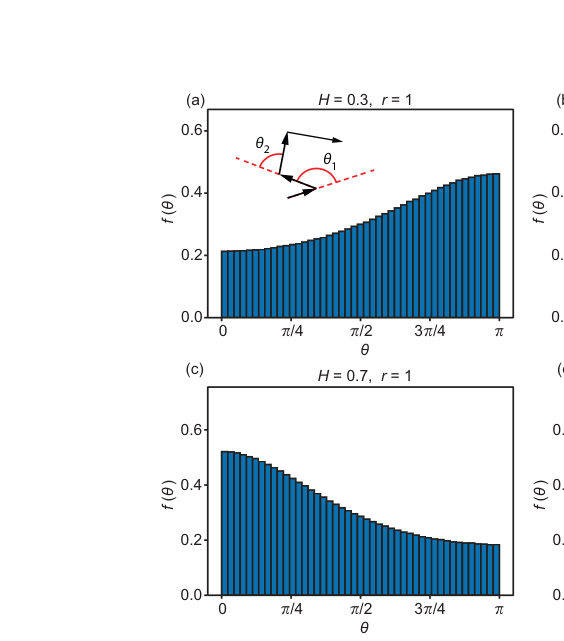 
FIG. 2: Distribution of turning angles in simulated 2D-FBM trajectories. (a) Isotropic subdiffusive FBM, H = 0.3,r = 1. The inset illustrates the definition of turning angles θ. (b) Anisotropic subdiffusive FBM, H = 0.3,r = 0.2. (c) Isotropic superdiffusive FBM, H = 0.7,r = 1. (d) Anisotropic superdiffusive FBM, H = 0.7,r = 0.2.

📷 Fig 3

 
FIG. 3: Experimental trajectories in live cells. (a) Sample trajectories of quantum dots in the cytoplasm of HeLa cells, CD4 receptors, and Nav1.6 channels on the membrane of hippocampal neurons. Low- and high-mobility states identified using the local convex-hull method are shown in blue and yellow, respectively. (b–d) TA-MSD for the corresponding states and datasets. The dashed lines indicate linear scaling with lag time. (e–j) Ensemble cross-covariance functions of normalized increments for the high- and low-mobility states of the three experimental systems.

📷 Fig 4

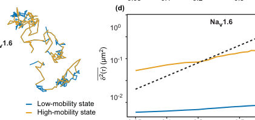 
FIG. 4: Distributions of turning angle in experimental data. Probability density functions of the turning angles for (a) quantum dots, (b) CD4 receptors, and (c) Nav1.6 channels. The distributions are shown separately for the low- and high-mobility states.

📷 Fig 5

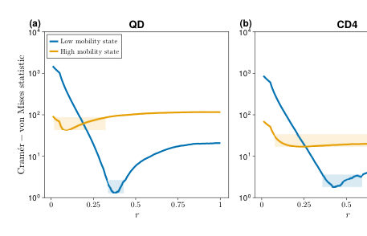 
FIG. 5: Cramér–von Mises distance between the experimental turning-angle distributions and the corresponding simulated look-up tables. The distance is presented as a function of the anisotropy ratio r = D2/D1 for (a) quantum dots, (b) CD4 receptors, and (c) Nav1.6 channels. Results are shown for the low-mobility and high-mobility states. The shaded regions indicate the uncertainty ranges defined by values of r for which the Cramér–von Mises statistic does not exceed twice its minimum value.

**Summary.** This work introduces turning-angle analysis as a powerful, rotationally invariant technique to detect hidden spatial anisotropies in the anomalous diffusion of molecules inside living cells. By modeling motion with 2D Fractional Brownian Motion, the authors show that analyzing the distribution of molecular turning angles allows for the robust quantification of directional biases ($r$), overcoming limitations posed by noisy or randomly oriented experimental trajectories.

**Why it may be interesting.** While focused on biophysics, the methodology—using intrinsic geometric invariants (turning angles) to extract directional information from noisy, randomly oriented measurements—is highly relevant to analyzing complex dynamics in non-equilibrium statistical mechanics systems where global symmetries are broken locally.

Detailed structure

**Main problem.** The primary challenge is uncovering hidden spatial anisotropies in the anomalous diffusion of molecules within live cells, which is difficult because measured trajectories are often short, noisy, and randomly oriented.

**Main result.** Turning-angle analysis successfully reveals hidden anisotropic features in molecular motion (e.g., quantum dots, membrane proteins), demonstrating that this approach is robust even when conventional methods fail due to random environmental orientations.

**Method.** The authors utilize turning-angle statistics—a rotationally invariant diagnostic tool—applied to 2D Fractional Brownian Motion models to quantify the degree and direction of anisotropy in diffusion processes.

**Model / system.** The study analyzes molecular motion within complex biological environments, using single-particle tracking data from quantum dots in HeLa cells and membrane proteins in hippocampal neurons. The underlying physics is modeled by anisotropic 2D Fractional Brownian Motion (FBM).

**Key observables.** Turning angle distribution $f(\theta)$, the anisotropy ratio ($r = D_2/D_1$), and statistical distance metrics like Cramér–von Mises (CvM) distance.

**Important parameters / regimes.** Anomalous diffusion exponent ($\alpha$) and Hurst exponent ($H$); the anisotropy ratio $r$; random rotation angle $\Phi$.

**Assumptions / limitations.** The analysis assumes that averaging over random orientations ($\Phi \sim U(0, 2\pi)$) causes certain cross-correlations to vanish, allowing turning angles to isolate intrinsic directional biases.

**Figures summary.** Figures illustrate how cross-covariance functions are affected by rotation and show the dependence of turning angle distributions on anisotropy ($r$) and diffusion regime (sub/superdiffusive FBM). Supplementary figures detail the workflow for estimating $r$ using multiple statistical distance measures.

**Paper structure.** The paper first establishes the limitations of conventional methods, then introduces the turning-angle analysis based on 2D-FBM modeling. It details the mathematical framework for anisotropic processes under rotation and concludes by applying this robust method to analyze experimental single-particle tracking data to quantify anisotropy.

Abstract

Molecular motion within living cells provides a window into the physical principles underlying intracellular organization and transport. Yet a fundamental limitation remains: measured trajectories are often short, noisy, and randomly oriented, rendering spatial anisotropies inaccessible to conventional analyses. We show that turning-angle statistics provide a robust approach for uncovering anisotropies in anomalous diffusion. Using a two-dimensional anisotropic fractional Brownian motion model with random orientations, we show theoretically and through simulations that turning-angle distributions preserve signatures of anisotropy. We apply this approach to single-particle tracking data, including quantum dots in the cytoplasm of HeLa cells and membrane proteins in hippocampal neurons. Turning angles reveal hidden anisotropies in the motion of quantum dots and Nav 1.6 channels, and in specific dynamical states of glycoprotein CD4. These results establish turning-angle analysis as a powerful strategy for detecting organization in complex environments and reveal that anisotropic anomalous diffusion is an overlooked feature of intracellular dynamics.

[↑ back to top](#top)

### [Gate-based emulation of boson sampling using photonic qubits](http://arxiv.org/abs/2608.09509v1)

**Authors:** Aastha P. Zalone, S. P. Dinesh, C. M. Chandrashekar  
**Type:** both · **Category:** quantum information and computing · **PDF:** <https://arxiv.org/pdf/2608.09509v1>  
**Analysis basis:** full PDF text, analyzed in chunks
**Topic relevance:** `interference shaping light` **3/5** · `analog quantum simulation` **2/5** · `Full counting statistics` **1/5** · `QC/QI experiment` **1/5** · `methods for driven-dissipative` **1/5** · `quantum measurements` **1/5** · `quantum optics experiment` **1/5**

📷 Fig 1

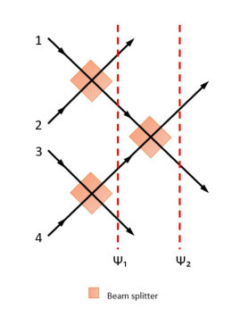 
FIG. 5: Schematic representation of the four-mode linear optical interferometer composed of three balanced beam splitters. The first interferometric stage consists of beam splitters B12 and B34 acting on modes (1, 2) and (3, 4), respectively, producing the intermediate state |ψ1⟩. The second stage comprises beam splitter B23 acting on the central modes (2, 3), resulting in the final output state |ψ2⟩.

📷 Fig 2

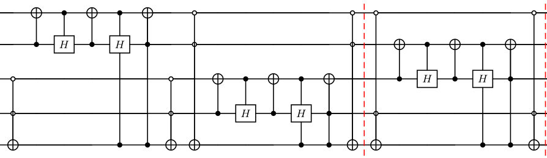 
FIG. 6: Generalized input-independent quantum circuit corresponding to the four-mode two-photon interferometer. Each optical beam splitter is replaced by the encoded two-photon beam-splitter unit derived in Sec. IV. Ancilla-assisted spectator-mode identification activates the local transformation only within the corresponding two-photon interference subspace. The circuit reproduces the complete four-mode evolution for all physical input states in the encoded Hilbert space.

📷 Fig 3

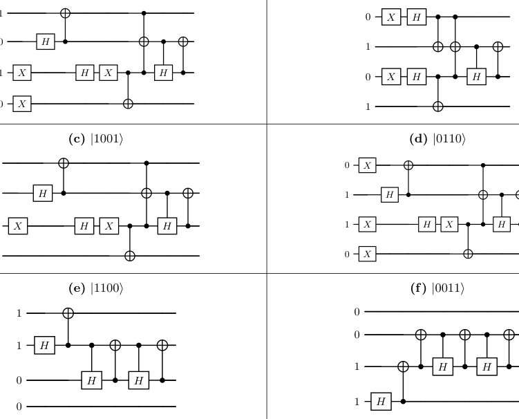 
FIG. 7: Optimized quantum circuits corresponding to the six input states of the four-mode interferometer. Qubits q0, q1, and q3 represent path qubits, whereas q2 represents the polarization qubit. Here, H and X denote the Hadamard and Pauli-X gates, respectively.

📷 Fig 4

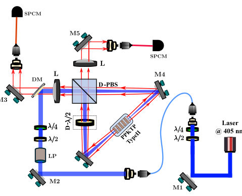 
FIG. 8: Schematic of the experimental setup for heralded single-photon generation. The remaining optical arrangement constitutes a standard type-II Sagnac interferometer. λ/2, half-wave plates; λ/4, quarter-wave plates; LP, linear polarizer; L, lens of focal length 20 cm; M1–M5, mirrors; D-PBS, dual-wavelength polarizing beam splitter; DM, dichroic mirror; PPKTP, periodically poled potassium titanyl phosphate crystal; FC, fibre couplers; SPCM, single-photon counting modules. The blue thick line indicates the 405 nm pump laser, while the red lines indicate the down-converted photons at 810 nm.

📷 Fig 5

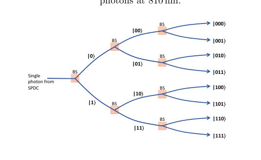 
FIG. 9: Three-layered balanced beam-splitter network mapping a single photon in eight spatial modes onto the computational basis states |000⟩–|111⟩of three path-encoded qubits. Each binary label records the sequence of path choices through the network.

**Summary.** This paper presents a comprehensive method to simulate boson sampling, a key problem in quantum computation, using only universal gate-based photonic qubits. The authors overcome the fundamental mismatch between bosonic Fock states and qubit representations by developing an ancilla-assisted encoding scheme. This allows for the systematic construction of circuits representing arbitrary linear optical interferometers.

**Why it may be interesting.** This work provides a concrete, algorithmic blueprint for simulating complex bosonic quantum phenomena—which are often difficult to model classically due to the permanent calculation—on near-term gate-based hardware architectures.

Detailed structure

**Main problem.** The primary goal is developing a scalable quantum-circuit framework to simulate boson sampling, which arises from multiphoton interference in linear optics, on universal gate-based quantum computers.

**Main result.** The authors successfully translate the Fock-space dynamics of bosonic interferometers into an equivalent, systematic sequence of elementary qubit gates, demonstrated for a four-mode system.

**Method.** They derive circuit implementations by encoding multi-qubit bosonic states onto qubits and generalizing beam splitter transformations using repeating quantum-circuit units acting within specific local interference subspaces.

**Model / system.** The model is boson sampling realized via linear-optical interferometers. The simulation maps the physics from the natural Fock basis to a universal qubit computational basis, requiring an ancilla-assisted encoding for generalization.

**Key observables.** Transition probabilities $P(\mathbf{n} 	o \mathbf{s})$ and the permanent of submatrices of the interferometer unitary ($	ext{Perm}(U_{\mathbf{s},\mathbf{n}})$).

**Important parameters / regimes.** The required qubit count scales linearly with the number of modes ($N+1$ qubits for $N$ modes in some contexts); the complexity is related to the permanent calculation.

**Assumptions / limitations.** The core assumption is that a systematic mapping exists to represent all linear-optical transformations using standard quantum gates, even when bridging the gap between Fock and qubit bases.

**Figures summary.** Figures illustrate the circuit representation of beam splitters in single-photon, two-photon, and unified Hilbert spaces. A schematic shows the structure of an $N$-mode interferometer built from these repeating units.

**Paper structure.** The paper progresses by first analyzing the fundamental building block (beam splitter) for low photon numbers (single/two-photon sectors), unifying this into a general circuit unit, and finally generalizing this unit to construct arbitrary multi-mode interferometers using scalable encoding schemes.

Abstract

Boson sampling arising from multiphoton interference in linear-optical networks is a prominent non-universal model for quantum computation. Here, by encoding the multi-qubit state to bosonic Fock state, we present a scalable quantum-circuit framework for simulating boson sampling on a universal quantum computing platform. Beginning with balanced beam-splitter transformations on the single- and two-photon sectors, we derive equivalent quantum-circuit implementations and unify them within a common Hilbert-space representation using an ancilla-assisted encoding. This construction is then generalized to arbitrary interferometers by replacing each optical beam splitter with a repeating quantum-circuit unit that selectively acts only within the relevant local interference subspace, requiring $N+1$ qubits for a two-photon $N$-mode interferometer and a linear-overhead subspace-identification procedure. Using this framework, gate-based quantum circuit for a four-mode boson-sampling circuit is developed and experimentally implemented on a four-qubit gate-based photonic qubit system. The qubit framework for emulating boson sampling of $n-$photons in $m-$mode will be useful to solve a broad class of sampling complexity problem on a gate-based quantum computers.

[↑ back to top](#top)

### [Gradient-based optimization of non-Abelian fractional quantum states in patterned superlattices](http://arxiv.org/abs/2608.09245v1)

**Authors:** Yifei Guan, Lichen Yu, Zizhuang Liu, Xin Lu, Jianpeng Liu  
**Type:** theory · **Category:** strongly correlated electrons · **PDF:** <https://arxiv.org/pdf/2608.09245v1>  
**Analysis basis:** full PDF text, analyzed in chunks
**Topic relevance:** `analog quantum simulation` **3/5** · `methods for driven-dissipative` **3/5** · `quantum measurements` **2/5** · `Keldysh / 2PI / non-Gaussian methods` **1/5** · `driven-dissipative phase transition` **1/5**

📷 Fig 1

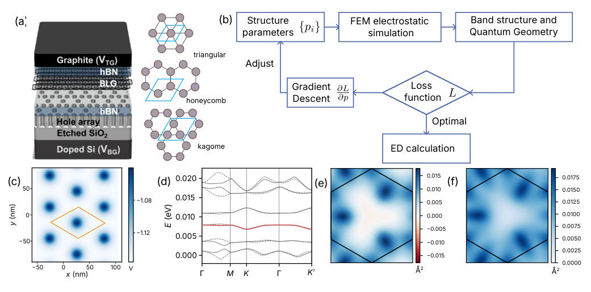 
FIG. 1. (a) The left panel shows the superlattice device: bilayer graphene is encapsulated by thin hBN layers. A periodically etched SiO2 substrate provides a periodic modulation of the vertical electric potential drop between the top and bottom gates. The right panel shows schematic diagrams of the superlattices with triangular, honeycomb, and kagome patterns. (b) Illustration of the optimization workflow: the gradient of the loss function with respect to the structural parameters {pi} is calculated using finite differences. Each iteration involves an FEM simulation of the electrostatic potential and a solution of the electronic structure using a realistic continuum model of BLG to...

📷 Fig 2

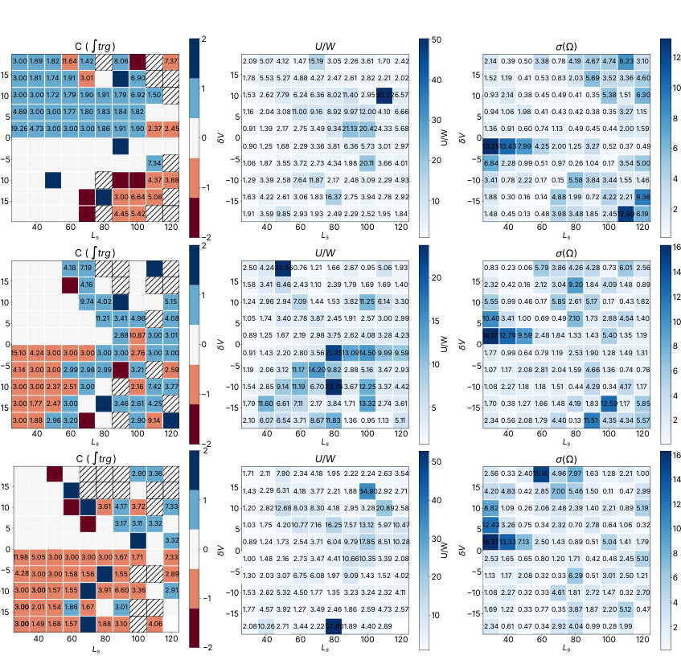 
FIG. 2. Single-particle phase diagrams of the gradient-optimized superlattice structures for (a) triangular, (b) honeycomb, and (c) kagome patterned superlattices in the parameter space spanned by the superlattice constant Ls and gate-voltage difference δV . The color coding of the subfigures in the first column indicates the Chern numbers of the highest valence bands in the K valley, while the number at each parameter point gives the numerical value of R

📷 Fig 3

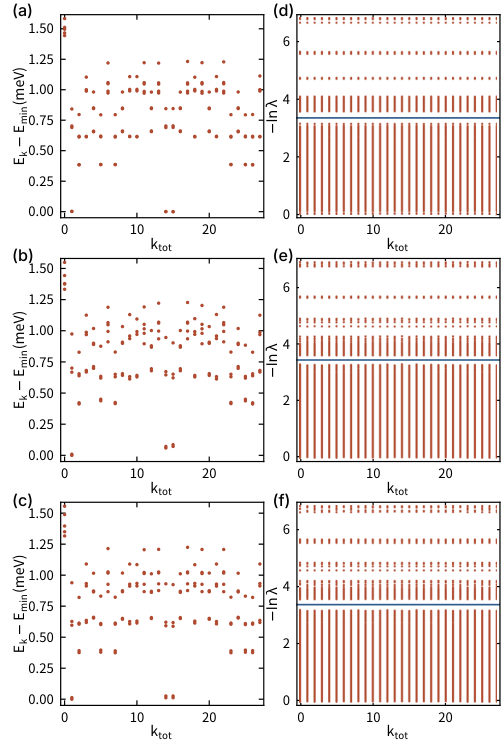 
FIG. 3. The many-body spectrum and PES of the Moore- Read FCI phase, calculated with Nk = 28, Ne = 14. (a)-(c) show the energy spectra for (a) triangular superlattice with Ls = 50nm, δV = 14V; (b) honeycomb superlattice with Ls = 40nm, δV = −14V; and (c) kagome superlattice with Ls = 50nm, δV = −12V. (d)-(f) present the corresponding PES calculated by a partition NA = 4, NB = 10 of the 14 electrons.

📷 Fig 4

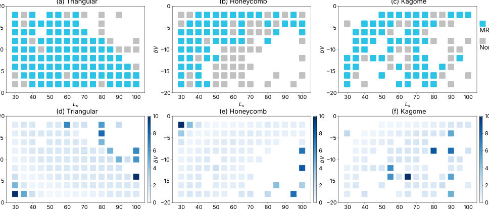 
FIG. 4. Many-body phase diagrams of the HVB at 1/2 filling in the (Ls, δV ) parameter space for (a) triangular, (b) honeycomb, and (c) kagome patterned superlattices coupled to bilayer graphene. Moore-Read FCI states are colored light blue, the gray blocks denote many-body states that are not Moore-Read FCIs, and the white regions indicate parameter points at which the Chern number of the HVB is not ±1 and the many-body ground state was therefore not calculated. (d)–(f) show the converged values of the loss function defined in Eq. (2) for the triangular, honeycomb, and kagome superlattices, respectively.

**Summary.** The paper presents a novel, computationally intensive workflow to engineer non-Abelian Fractional Chern Insulator states in patterned superlattices on bilayer graphene. By using gradient descent to optimize structural parameters based on desired topological band geometry, the authors successfully demonstrated the realization of these exotic correlated phases across multiple lattice types.

**Why it may be interesting.** This work provides a concrete, device-level inverse design methodology for engineering exotic topological phases. The combination of continuum modeling, optimization theory (gradient descent), and many-body physics makes it highly relevant for theorists studying engineered quantum matter systems.

Detailed structure

**Main problem.** The primary challenge addressed is realizing non-Abelian Fractional Chern Insulator (FCI) states, moving beyond the typically observed Abelian FCI states in moiré heterostructures.

**Main result.** The authors established an experimentally feasible framework by developing a gradient-optimization workflow that successfully designs patterned superlattices to host robust non-Abelian FCI states across multiple lattice geometries.

**Method.** A gradient-descent algorithm is employed, coupling Finite-Element Method (FEM) simulations for electrostatics with continuum k.p model calculations to optimize structural parameters based on a loss function targeting specific quantum geometric properties.

**Model / system.** The system involves bilayer graphene coupled to patterned dielectric superlattices (triangular, honeycomb, kagome). The electronic structure is modeled using the k.p Hamiltonian modified by a superlattice potential, and many-body physics is analyzed via Exact Diagonalization (ED) at half filling.

**Key observables.** Chern number ($C=\pm 1$), quantum metric ($	ext{tr } g(\mathbf{k})$), Berry curvature standard deviation ($\sigma(\Omega)$), and the Particle Entanglement Spectrum (PES).

**Important parameters / regimes.** Superlattice structural parameters like hole radius ($
ho_{hole}$) and depth ($h_{hole}$); filling fraction $
u=1/2$; ratio of Coulomb interaction energy to bandwidth ($U/W$).

**Assumptions / limitations.** The optimization relies on the loss function penalizing deviations from ideal quantum geometry, implicitly assuming that suppressing Berry curvature fluctuations is sufficient to maintain a flat band.

**Figures summary.** Figures illustrate the device setup and the gradient-descent workflow. Results show optimized potential profiles, band structures confirming $|C|=1$ flat bands, and PES calculations demonstrating signatures of the Moore-Read FCI phase in the ground state manifold.

**Paper structure.** The paper first introduces the physical platform (patterned superlattices on BLG) and the goal (non-Abelian FCI). It details a gradient-optimization workflow using FEM/k.p models to tune structural parameters $\{p_i\}$ by minimizing a loss function $L$. Finally, it applies this optimized structure to perform ED calculations to confirm the emergence of the Moore-Read state.

Abstract

The realization of fractional Chern insulator (FCI) states in moiré heterostructures has attracted intense interest in the study of correlated states emerging from topological flat bands. So far, most experimentally realized FCI states may be interpreted as lattice analogues of fractional quantum Hall (FQH) states hosting Abelian anyonic excitations. Realizing non-Abelian FCI states is an important challenge in the field. Patterned dielectric superlattices provide a versatile platform for engineering topological flat bands. Such systems offer substantial structural flexibility and tunability, because their lattice patterns, periods, and other structural parameters can all be designed and fabricated. Here we propose to realize non-Abelian FCI states in patterned dielectric superlattices coupled to bilayer graphene. Specifically, we provide a realistic workflow based on a gradient-descent algorithm to design non-Abelian fractional states in bilayer graphene superlattices. The experimentally relevant structural parameters of the superlattices are gradient-optimized to favor a flat Chern band with quantum-geometric properties reminiscent of those of the first excited Landau level. Exact diagonalization calculations at 1/2 filling of the optimized flat Chern band naturally yield non-Abelian FCI states. We apply this workflow to triangular, honeycomb, and kagome patterned superlattices and find robust non-Abelian FCI states over a large region of the parameter space spanned by the superlattice constant and vertical potential drop. Our work thus establishes an experimentally feasible framework for exploring non-Abelian FCIs in realistic patterned-superlattice devices. It also demonstrates the potential of device-level inverse design to engineer correlated topological matter beyond the Abelian paradigm.

[↑ back to top](#top)

### [Point-gap topology in amorphous non-Hermitian quantum systems](http://arxiv.org/abs/2608.08687v1)

**Authors:** Xue-Min Yang, Deng-Feng Li, Jian Li, Jia-Ji Zhu, Li Li, Qiu-Chi Chen, Xin-Qi Xu, Hao-Peng Zhang, Hong Wu  
**Type:** theory · **Category:** disordered systems and neural networks · **PDF:** <https://arxiv.org/pdf/2608.08687v1>  
**Analysis basis:** full PDF text, analyzed in chunks
**Topic relevance:** `analog quantum simulation` **3/5** · `methods for driven-dissipative` **3/5** · `driven-dissipative phase transition` **2/5** · `correlated / nonlocal dissipation` **1/5** · `quantum measurements` **1/5**

📷 Fig 1

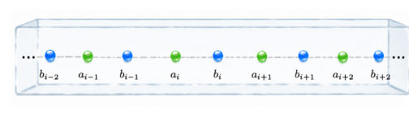 
FIG. 1. Schematics of the amorphous model on a chain.

📷 Fig 2

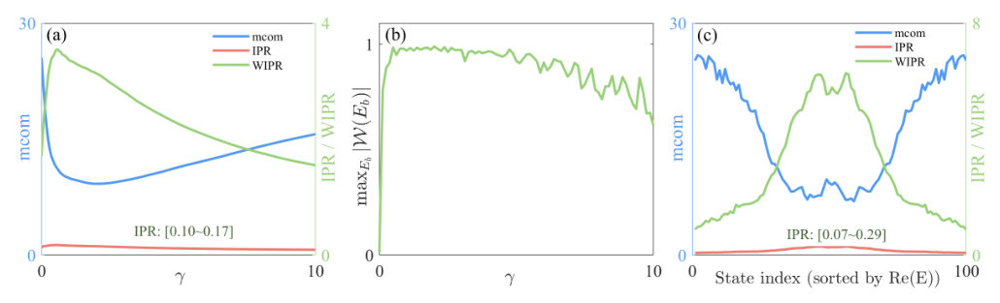 
FIG. 2. Characterization of the non-Hermitian skin effect via IPR, WIPR, mcom, and the real-space winding number for the amorphous chain (t = 1). (a) Disorder-averaged mcom, IPR, and WIPR as functions of γ ∈[0, 10] for L = 50 unit cells. (b) Maximum absolute value of the real-space spectral winding number maxEb |W(Eb)| as a function of γ for L = 50 unit cells, averaged over 50 disorder realizations per γ point, with Eb scanned over Re(Eb) ∈[−5, 5] and Im(Eb) ∈[−(γ + 1), γ + 1]. (c) Disorder-averaged mcom, IPR, and WIPR versus the state index (sorted by Re(E)) at fixed γ = 0.2 for L = 50 unit cells.

📷 Fig 3

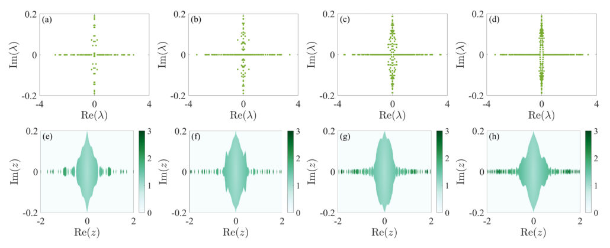 
FIG. 3. Eigenvalue spectra and pseudospectra of the 1D non-Hermitian amorphous chain defined by Eq. (1) for increasing system sizes with independent disorder realization. (a)–(d) Eigenvalues λ in the complex plane for systems with L = 50, 100, 150, and 200 unit cells, respectively. The hopping parameters are tij = t e−|xi−xj|/2 with t = 1, γ = 0.2, and random positions xi ∈[0, 2L] subject to a minimum spacing dmin = 0.05. (e)–(h) Corresponding ε-pseudospectra with ε = 10−2, where each dot marks z ∈C satisfying smin(zI −H) &lt; ε, sampled on a grid Re(z), Im(z) ∈[−2, 2] with spacing 0.005.

📷 Fig 4

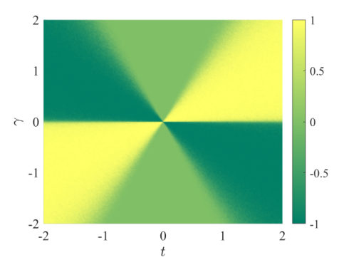 
FIG. 5. Topological phase diagram of the 1D non-Hermitian amorphous chain in the (t, γ) plane, obtained from the real- space SVD winding number V(0). The system has L = 50 unit cells with random positions xi ∈[0, 100] and minimum spacing dmin = 0.05. The result is averaged over 100 indepen- dent disorder realizations for all (t, γ) points on a 200 × 200 grid spanning t, γ ∈[−2, 2]. The color encodes the winding number V(0).

📷 Fig 5

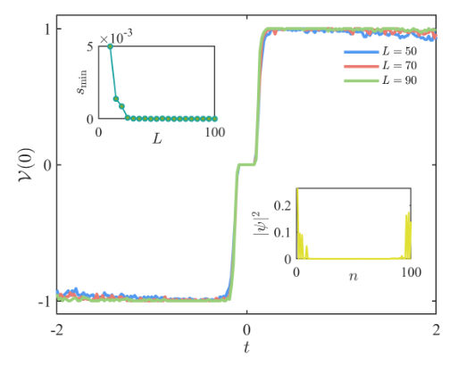 
FIG. 4. Winding number V(0) of the amorphous chain as a function of the hopping amplitude t for different numbers of unit cells L = 50, 70, 90, computed via the SVD-based invari- ant [Eq. (11)] with γ = 0.2, averaged over 1000 disorder real- izations. Lower-right inset: spatial distribution |ψ|2= |vn|2 of the zero-mode singular vector at t = −1.5. Upper-left inset: the smallest singular value as a function of L at t = −1.5.

**Summary.** This work addresses the instability of energy spectra in amorphous non-Hermitian quantum systems when searching for topological edge states. The authors overcome this by introducing a novel diagnostic tool based on the Singular Value Decomposition (SVD) of the Hamiltonian. This SVD approach yields a robust, real-space topological invariant that successfully characterizes point-gap topology and redefines how the Non-Hermitian Skin Effect is understood in disordered settings.

**Why it may be interesting.** The development of a singular value based, disorder-robust diagnostic tool for topology is highly valuable for AMO physics, as it provides a reliable way to characterize topological phases in realistic, disordered experimental setups (e.g., cold atoms or photonic lattices).

Detailed structure

**Main problem.** Identifying stable topological edge states in amorphous non-Hermitian quantum systems is challenging because the energy spectrum is highly sensitive to perturbations, system size, and boundary conditions.

**Main result.** The authors establish a robust correspondence between stable zero-mode singular states and mid-gap states by constructing a real-space topological invariant using Singular Value Decomposition (SVD).

**Method.** They utilize the SVD of the Hamiltonian to construct a real-space topological invariant, which is shown to be robust against perturbations, unlike traditional eigenvalue-based methods.

**Model / system.** The study focuses on one-dimensional amorphous non-Hermitian quantum systems modeled by a lattice with randomly distributed sites and governed by a specific hopping Hamiltonian incorporating nonreciprocal terms ($\gamma$).

**Key observables.** Mean Center of Mass (mcom), Weighted Inverse Participation Ratio (WIPR), and the real-space topological invariant $V(E_b)$ derived from singular values.

**Important parameters / regimes.** Nonreciprocal hopping strength ($\gamma$), system size ($L$), and reference energy ($E_b$).

**Assumptions / limitations.** The analysis relies on establishing a correspondence between stable zero-mode singular states in the thermodynamic limit and observable mid-gap topological features.

**Figures summary.** Figures illustrate spectral instability using pseudospectra, show how mcom and WIPR signal the Non-Hermitian Skin Effect (NHSE) as $\gamma$ changes, and map out quantized topological phase boundaries using $V(E_b)$.

**Paper structure.** The paper first diagnoses the failure of traditional methods due to spectral instability in amorphous systems. It then introduces the SVD-based framework to define a robust real-space topological invariant ($V(E_b)$) that successfully predicts point-gap topology and redefines the non-Hermitian skin effect.

Abstract

Recent studies have revealed that not only does the correspondence between spectral winding numbers and skin modes break down in non-Hermitian systems, but the energy spectrum itself is highly sensitive to generic perturbations, system size, and boundary conditions. In amorphous non-Hermitian systems, where the positions of lattice sites are uncertain, the spectral instability becomes even more severe, making it difficult to identify stable topological edge states from the eigenvalue spectrum alone. To overcome this challenge, we introduce a correspondence between stable zero-mode singular states and mid-gap states of the energy spectrum in the thermodynamic limit. Because the singular value spectrum is highly robust against small perturbations and variation in size, topological edge states can be reliably probed via singular values even in finite-sized systems. Based on the singular-value decomposition of the Hamiltonian, we construct a topological invariant in real space to characterize the associated topologically protected edge states. Our approach provides a general strategy for exploring point-gap topology in real space and redefine the non-Hermitian skin effect from a new perspective.

[↑ back to top](#top)

### [Autoregressive Projective Quantum Monte Carlo: From a Hermitian to a Non-Hermitian Perspective](http://arxiv.org/abs/2608.09496v1)

**Authors:** Lavoisier Wah, Remmy Zen, Flore K. Kunst  
**Type:** theory · **Category:** numerical methods · **PDF:** <https://arxiv.org/pdf/2608.09496v1>  
**Analysis basis:** full PDF text, analyzed in chunks
**Topic relevance:** `methods for driven-dissipative` **3/5** · `analog quantum simulation` **2/5** · `quantum measurements` **2/5** · `Keldysh / 2PI / non-Gaussian methods` **1/5** · `driven-dissipative phase transition` **1/5**

📷 Fig 1

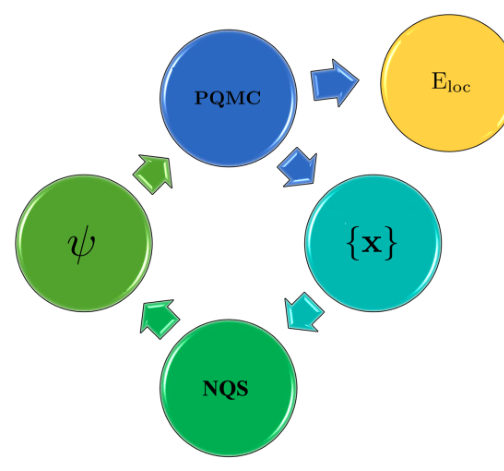 
Figure 1: PQMC guided by an NQS. We represent a simplified schematic plot of the PQMC guided by an NQS. Here, the NQS uses the set of walkers {x} from the PQMC to train an ansatz ψ, which should be a “good” approximation of the target ground state. This ansatz is then used to guide the PQMC simulation and to compute the local energies Eloc. The ground state energy is obtained by averaging these local energies.

📷 Fig 2

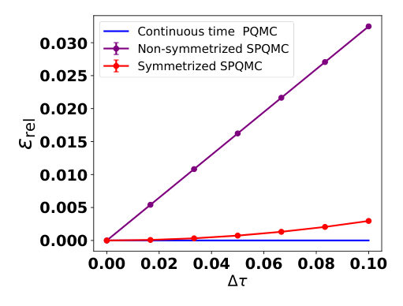 
Figure 2: Bias due to time step. The relative error εrel is plotted against the imaginary time step ∆τ for the continuous-time PQMC (blue), symmetrized SPQMC (red), and non-symmetrized SPQMC (purple). The simulation is performed for Nw = 103 walkers, and N = 20 spins. For continuous-time PQMC, a blue line is provided to guide the eye, as fitting is not meaningful in this case. The symmetrized SPQMC curve is fitted with a quadratic function ax2, with optimal parameter a = 0.285(7), and the non-symmetrized SPQMC curve is fitted with a linear function ax, with optimal parameter a = 0.263(5). The Hermitian Ising chain in Eq. (9) is considered.

📷 Fig 3

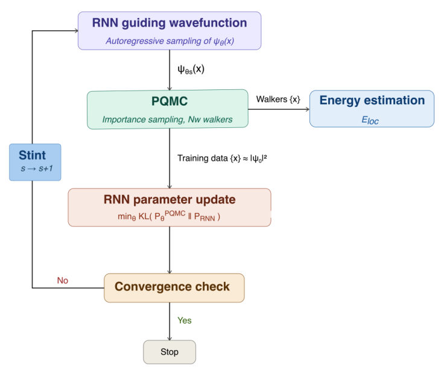 
Figure 3: Autoregressive PQMC. We show a schematic plot of self-learning PQMC guided by an RNN. θ are the RNN parameters.

📷 Fig 4

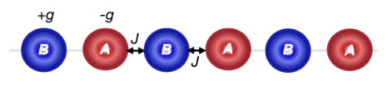 
Figure 4: Hermitian 1D Ising chain with alternating magnetic field. A (red) and B (blue) represent the sublattices in which spin-1/2 particles occupy the odd and even positions, respectively. The transverse field +g (−g) is applied to the B (A) sublattices. Nearest-neighbor coupling J is considered.

📷 Fig 5

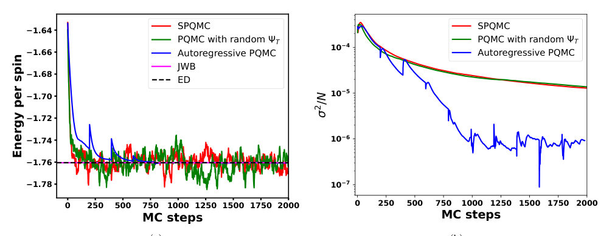 
Figure 5: Autoregressive PQMC vs SPQMC and ED. We plot (a) the energy per spin with SPQMC (red), and PQMC using a random ψT (green) for ∆τ = 10−2, g = 1.6, Nw = 2 × 104, MCs = 2 × 103, and the projection time ∆τp = MCs × ∆τ = 20. The energy per spin obtained using autoregressive PQMC guided by the RNN ansatz is shown in blue for the same parameters with the number of stints Ns = 10, number of MC iterations per stint Ni = 200, number of training steps per stint Nt = 103, and number of samples used to train the RNN ns = 7 × 102. Results are benchmarked against ED (black dashed) and the analytical result (purple) obtained via the Jordan–Wigner–Bogoliubov (JWB) method. (b) The energy variance...

**Summary.** This paper presents an autoregressive Projective Quantum Monte Carlo (PQMC) method that integrates Recurrent Neural Networks (RNNs) to guide stochastic sampling. This novel approach significantly enhances the accuracy of finding quantum ground states compared to previous methods, proving effective for both standard and non-Hermitian Hamiltonians.

**Why it may be interesting.** The development of neural network guided quantum simulations provides a powerful, scalable tool to tackle complex many-body ground state problems where exact diagonalization is impossible.

Detailed structure

**Main problem.** Accurately determining the ground-state properties of quantum many-body systems by solving the Schrödinger equation.

**Main result.** The autoregressive PQMC framework significantly improves accuracy over standard unguided PQMC and variational RNN ansätze, achieving lower energies and higher fidelity for both Hermitian and non-Hermitian Hamiltonians.

**Method.** It introduces an autoregressive projective quantum Monte Carlo (PQMC) method that uses Recurrent Neural Networks (RNNs) to guide the stochastic imaginary-time evolution of the system's wavefunction.

**Model / system.** The work applies to general quantum many-body systems, benchmarked on models like the 1D transverse-field Ising model. The Hamiltonian can be Hermitian or non-Hermitian.

**Key observables.** Ground-state energy, local energies (E_loc), and fidelity.

**Important parameters / regimes.** Imaginary time step ($\Delta	au$), system size ($N$), and the guiding wavefunction parameters ($	heta$).

**Assumptions / limitations.** The method relies on importance sampling to guide the simulation; for non-Hermitian systems, specific techniques like gauge rotation are mentioned but not universally applicable.

**Figures summary.** Figure 1 schematically shows PQMC guided by an NQS. Figure 12 compares autoregressive PQMC against variational RNN and SPQMC for the Hermitian Ising chain, showing superior accuracy for the former. Appendix F compares AR-PQMC to VMC/PQMC results.

**Paper structure.** The paper establishes the challenge of ground state calculation, details the mathematical framework of PQMC, introduces the autoregressive guidance using RNNs, benchmarks this method against existing techniques (VMC, standard PQMC), and validates its performance on specific models (e.g., TFIM) for both Hermitian and non-Hermitian cases.

Abstract

Accurately determining the ground-state properties of quantum many-body systems remains a central challenge. In this work, we introduce an autoregressive projective quantum Monte Carlo (PQMC) framework that leverages recurrent neural networks (RNNs) to guide the stochastic dynamics. By incorporating autoregressive sampling into PQMC, we demonstrate substantial improvements in accuracy compared to standard unguided PQMC, while retaining polynomial computational cost. We benchmark our approach against conventional variational RNN ansätze and find that the autoregressive PQMC consistently achieves lower energies and higher fidelity, regardless of system size or whether the Hamiltonian is Hermitian or non-Hermitian. Our results highlight the versatility and power of neural-guided PQMC methods, paving the way for promising scalable simulations of low-energy states in complex quantum many-body systems.

[↑ back to top](#top)

### [Denoising Diffusion Monte Carlo Electron Densities with Physically Informed Variance Stabilization: From Fourier Filters to 3D UNETs](http://arxiv.org/abs/2608.08152v1)

**Authors:** Kenneth O. Berard, Brenda Rubenstein, Jaron T. Krogel  
**Type:** theory · **Category:** numerical methods · **PDF:** <https://arxiv.org/pdf/2608.08152v1>  
**Analysis basis:** full PDF text, analyzed in chunks
**Topic relevance:** `methods for driven-dissipative` **3/5** · `driven-dissipative phase transition` **2/5** · `Keldysh / 2PI / non-Gaussian methods` **1/5** · `analog quantum simulation` **1/5** · `correlated / nonlocal dissipation` **1/5** · `quantum measurements` **1/5**

📷 Fig 1

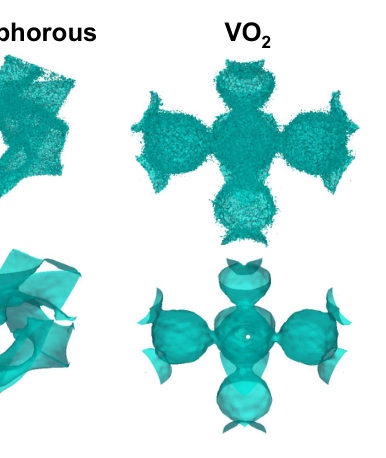 
FIG. 1: Denoised isosurfaces of low-sample DMC electron densities for diamond, blue phosphorus, and VO2. The top row displays the raw, highly noisy DMC densities, while the bottom row shows the smooth, physically coherent isosurfaces recovered using the 3D UNET.

📷 Fig 2

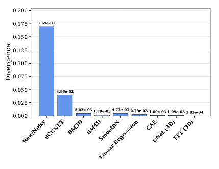 
FIG. 3: Direct JSD comparison for different image-based and volumetric denoising models evaluated against the diamond VMC reference density.

📷 Fig 3

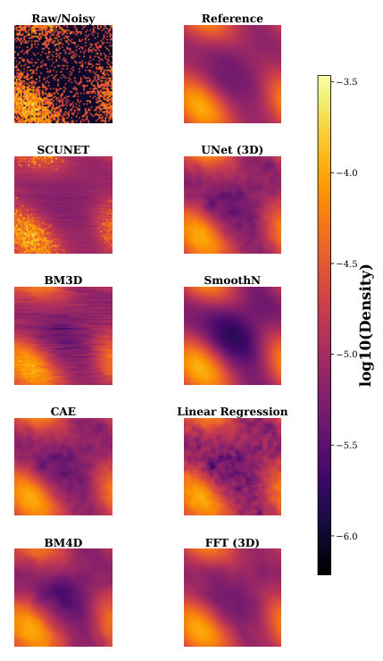 
FIG. 2: Visual comparison of a cross-sectional plane (z = 32) of the diamond electron density profile denoised using various 1D, 2D image-based, and 3D volumetric methods. The comparison highlights structural anomalies, such as horizontal striping and low-density blurring, present in slice-by-slice 2D models compared to volumetric models.

📷 Fig 4

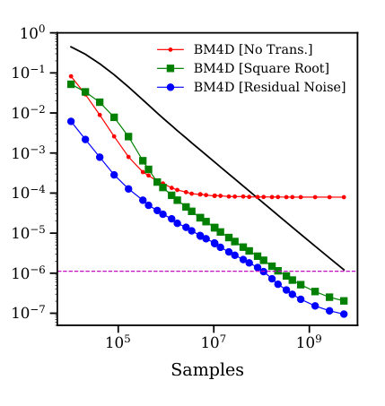 
FIG. 4: Divergence of the denoised densities generated using BM4D with different density transformations relative to the reference. The denoising quality improves as one progresses from no transform (“value”) to square root and residual signal regularized noise. (Left) Bare divergences against the reference. At high sampling, the apparent effectiveness of the denoising wanes (sqrt and residual noise transforms). The horizontal dashed line demarcates the theoretical divergence floor when the high sampling reference is compared against the true noise-free density. (Right) Similar to the left panel, but now with the asymptotic correction applied to approximate the divergence of a denoised...

📷 Fig 5

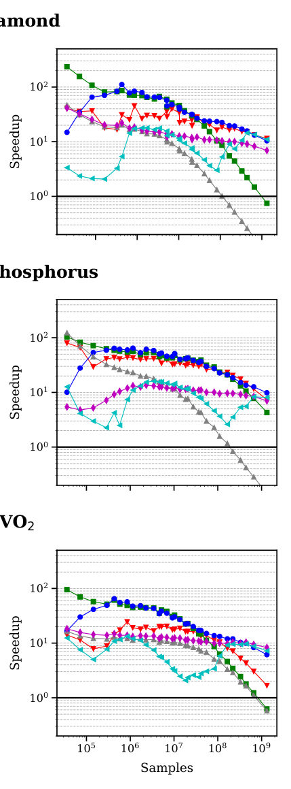 
FIG. 5: Divergences (left) and speedup (right) of denoised densities produced using hyper-tuned denoisers of each class on diamond (top), blue phosphorus (middle), and r-VO2 (bottom). The horizontal dashed line is the divergence between the DFT density and the high-sampled reference, marking a threshold for densities achieving a “useful” noise reduction. Several denoisers display non-uniform noise reduction/increase across materials and input noise levels (sample counts). Multiple denoisers show distinctly different speedup behavior in the low and high sampling limits, with SmoothN and BM4D showing the greatest consistency.

**Summary.** This work addresses the critical issue of statistical noise in benchmark-quality electron densities generated by Diffusion Monte Carlo (DMC). By applying physically informed variance stabilization and comparing advanced 3D deep learning models against classical methods, the authors demonstrate that denoising can drastically reduce computational costs while preserving fine physical details. This provides a powerful new tool for making high-accuracy quantum simulations practical for routine applications.

**Why it may be interesting.** While focused on quantum chemistry, the core methodology—developing robust ML/numerical pipelines to extract high-fidelity physical observables from inherently noisy, high-dimensional simulation data—is highly relevant for any field involving complex, stochastic simulations like AMO or open quantum systems modeling.

Detailed structure

**Main problem.** The primary challenge is mitigating substantial statistical noise present in real-space electron densities obtained from high-accuracy Diffusion Monte Carlo (DMC) simulations.

**Main result.** Specialized denoising techniques, particularly those employing variance stabilization and 3D UNETs, can reduce the required computational cost of DMC simulations by a factor of 10 to 100 times while maintaining physical accuracy.

**Method.** The authors compare various machine learning and mathematical denoising approaches (Fourier transforms, regression, 3D UNETs) applied after transforming the noisy data using physically informed variance stabilization techniques derived from DFT priors.

**Model / system.** The study focuses on electron densities $\rho(\mathbf{r})$ for condensed matter systems like carbon diamond, blue phosphorus, and rutile VO2. These are volumetric histograms representing the joint coordinate distribution $P(\mathbf{R})$.

**Key observables.** Electron densities ($\rho$), Jensen-Shannon Divergence (JSD) used as a fidelity metric, and computational speedup factors.

**Important parameters / regimes.** Noise levels (high vs. low), sampling counts ($N_{mc}$), and the choice of variance stabilization transformation (e.g., square root or residual).

**Assumptions / limitations.** The analysis relies on approximating the noise structure using transformations that map the problem to a more stable, homoscedastic noise regime; it assumes DFT provides a sufficiently accurate physical prior.

**Figures summary.** Figures illustrate raw noisy DMC isosurfaces versus smooth, physically coherent denoised isosurfaces for various materials. Other figures compare divergence metrics and computational speedups across different methods and sample sizes.

**Paper structure.** The paper systematically introduces the problem of noisy QMC densities, details the mathematical necessity of variance stabilization (using DFT as a guide), compares multiple denoising algorithms (FFT, regression, UNETs) based on information-theoretic divergence metrics, and quantifies the resulting computational speedups.

Abstract

Obtaining accurate electron densities is important for the fundamental description of molecular and condensed matter systems, as well as for the development of next-generation density functionals. Diffusion Monte Carlo (DMC), in particular, is known to produce benchmark-quality data; however, the predicted real-space electron densities contain substantial amounts of statistical noise. In this work, we study denoising approaches for DMC densities, judged on the basis of the information-theoretic Jensen-Shannon divergence. The denoising is facilitated by an approximate heteroscedastic to homoscedastic transformation leveraging the density functional theory density as a physical prior. We systematically compare a range of denoising techniques-including Fourier transform, regression, and 3D UNETs-on materials showing a wide range of density variations: carbon diamond, blue phosphorus, and rutile VO2. Our results indicate that simple flattened machine learning models and 2D image-based models introduce line artifacts and struggle to capture the full spatial correlation. In contrast, when using variance stabilization, regression methods outperform all others in both the high and low- noise limits across all materials considered. The best denoisers reduce the required cost of density-generating DMC simulations by 10-100x, providing a promising route forward for application in noise-sensitive tasks such as DFT functional inversion.

[↑ back to top](#top)

### [Microscopic QED origin of spin entanglement](http://arxiv.org/abs/2608.09670v1)

**Authors:** Moslem Zarei  
**Type:** theory · **Category:** quantum information and computing · **PDF:** <https://arxiv.org/pdf/2608.09670v1>  
**Analysis basis:** full PDF text, analyzed in chunks
**Topic relevance:** `analog quantum simulation` **3/5** · `Keldysh / 2PI / non-Gaussian methods` **2/5** · `methods for driven-dissipative` **2/5** · `correlated / nonlocal dissipation` **1/5** · `quantum measurements` **1/5**

📷 Fig 1

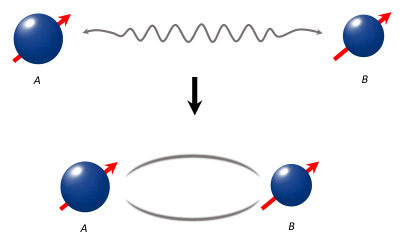 
FIG. 1. The illustration of photon mediated spin-spin interaction between two localized fermionic qubits. Spin A and spin B are separated by a distance R . The wavy line represents the exchange of a virtual photon that mediates an effective interaction between the spins.

📷 Fig 2

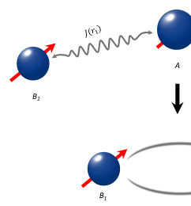 
FIG. 3. The illustration of photon mediated spin-spin interaction between three localized fermionic qubits.

**Summary.** This paper derives the effective spin Hamiltonian governing entanglement generation between localized fermionic qubits by integrating out virtual photon fields from QED. The resulting interactions are dipolar and anisotropic, allowing for the calculation of entanglement measures like negativity over time. It provides a rigorous theoretical framework connecting fundamental field theory to quantum information dynamics.

**Why it may be interesting.** This work provides a fundamental microscopic derivation for engineered quantum interactions (like dipole-dipole couplings) that are essential building blocks for quantum computation protocols, linking high-energy physics (QED) directly to quantum information dynamics.

Detailed structure

**Main problem.** The study aims to derive effective spin Hamiltonians governing entanglement generation from fundamental microscopic Quantum Electrodynamics (QED) scattering processes.

**Main result.** The derived effective interaction is dipolar, leading to an XXZ-type Hamiltonian for two qubits and complex multi-body interactions for three or more spins. The system can generate bipartite and multipartite entanglement, reaching maximum negativity values.

**Method.** The methodology involves integrating out photon/mediator fields from the full QED Lagrangian to obtain a low-energy effective spin interaction Hamiltonian ($\hat{H}_{	ext{eff}}$). Time evolution is then analyzed using the von Neumann or Quantum Boltzmann Equation formalism.

**Model / system.** The model consists of localized fermionic spins (qubits) interacting via virtual photon exchange. The analysis progresses from two qubits to three-body systems, yielding effective spin-spin coupling terms that decay with distance ($R^{-3}$ or $R^{-4}$).

**Key observables.** Entanglement negativity ($N(t)$), which quantifies bipartite correlations; the time evolution of the density matrix $
ho(t)$.

**Important parameters / regimes.** Coupling strength ($\Gamma_{	ext{SS}}(R)$), spatial separation ($R$), and system size ($N$). The nonrelativistic limit is crucial.

**Assumptions / limitations.** The analysis relies heavily on the Born-Markov approximation, treating the mediator fields as unentangled, and taking the nonrelativistic limit for propagators.

**Figures summary.** Figures illustrate the photon-mediated spin-spin interaction between two qubits and the Feynman diagram structure for three-body QED interactions involving multiple mediators.

**Paper structure.** The paper systematically derives effective Hamiltonians by integrating out field degrees of freedom, first addressing the two-qubit case to find dipolar coupling, then extending the formalism to three or more spins using multi-photon exchange diagrams and master equations.

Abstract

We study effective spin interactions arising from quantum electrodynamics (QED) scattering between localized fermionic spins. By integrating out photon and mediator fields, the dynamics reduce to an effective spin Hamiltonian.   For two qubits in the nonrelativistic regime, the resulting interaction takes a tensor dipolar form with an asymptotic decay proportional to \(R^{-3}\). We obtain analytical expressions for the entanglement negativity, highlighting its dependence on coupling strength and spatial configuration.   We then examine a setup in which two bath spins interact via a sequential exchange with an intermediate fermionic mediator. At the perturbative order considered, the mediator remains unentangled and induces an effective bath--bath interaction with stronger spatial suppression than in the photon-mediated case.   Extending the construction to an \(N\)-spin setting yields an effective interaction network mediated by virtual exchange processes, which can support the generation of multipartite entanglement across the system.

[↑ back to top](#top)

### [Phonon-assisted transport and hole-phonon coupling in GaAs double quantum dots](http://arxiv.org/abs/2608.09116v1)

**Authors:** Jin Leng, Wei-Zhu Liao, Hao-Tian Jiang, Di Liu, Bao-Chuan Wang, Gang Cao, Hai-Ou Li, Guo-Ping Guo  
**Type:** both · **Category:** other · **PDF:** <https://arxiv.org/pdf/2608.09116v1>  
**Analysis basis:** full PDF text, analyzed in chunks
**Topic relevance:** `methods for driven-dissipative` **3/5** · `driven-dissipative phase transition` **2/5** · `Keldysh / 2PI / non-Gaussian methods` **1/5** · `correlated / nonlocal dissipation` **1/5** · `quantum measurements` **1/5**

📷 Fig 1

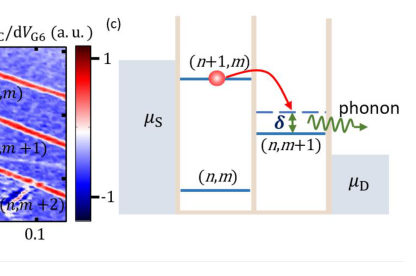 
Fig. 1. (a) Scanning electron microscope image of the confining gates fabricated on

📷 Fig 2

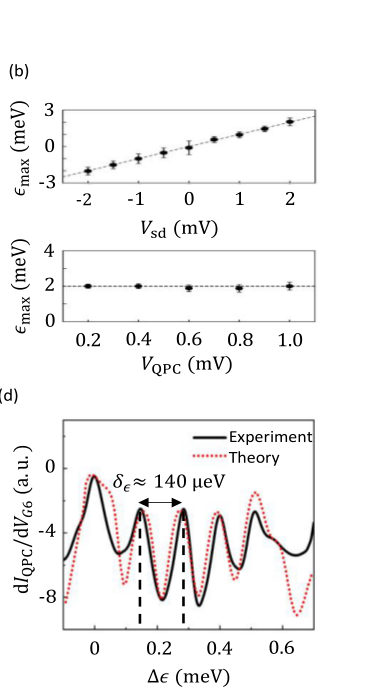 
Fig. 2. (a) The investigated regions near the (𝑛+ 1, 𝑚)–(𝑛, 𝑚+ 1) charge state under

📷 Fig 3

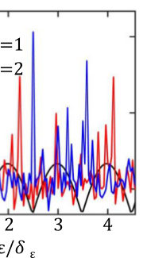 
Fig. 3. By taking eigenfunctions of a simple harmonic-oscillator potential with different

**Summary.** This paper investigates hole-phonon coupling in GaAs double quantum dots by observing characteristic oscillatory patterns in the charge stability diagram. The authors theoretically model these oscillations as arising from phonon emission during inelastic interdot tunneling, confirming that the effect is highly dependent on the symmetry of the confined wave functions.

**Why it may be interesting.** This work provides concrete evidence of coherent electron-phonon coupling effects in nanoscale devices, which is crucial for understanding decoherence mechanisms and designing energy-selective quantum transport elements.

Detailed structure

**Main problem.** The study investigates the role of hole-phonon interactions and phonon-assisted transport mechanisms within semiconductor double quantum dots (DQD). The goal is to understand how these coupling effects manifest in charge transport measurements.

**Main result.** Pronounced oscillatory stripe patterns observed in the charge stability diagram are directly attributed to inelastic interdot tunneling accompanied by spontaneous phonon emission. These oscillations require specific symmetry conditions on the hole wave functions to be visible.

**Method.** The research combines experimental measurement of the charge stability diagram with theoretical modeling using a master equation approach that incorporates piezoelectric hole-phonon coupling.

**Model / system.** The physical system is a gate-defined GaAs DQD coupled to a QPC sensor, operating on a 2D hole gas. The theory models dynamics via a master equation incorporating elastic tunneling and phonon-hole interaction terms derived from the Hamiltonian.

**Key observables.** Oscillatory stripe patterns in the charge stability diagram; the oscillation periodicity ($\delta\epsilon = 140 \mu	ext{eV}$); and the dependence of pattern visibility on source-drain bias ($V_{sd}$).

**Important parameters / regimes.** Low temperature ($\approx 20$ mK); finite source-drain bias ($V_{sd}$); piezoelectric coupling strength; interdot distance ($d$).

**Assumptions / limitations.** The process is modeled as inelastic tunneling with spontaneous phonon emission, and the theoretical analysis assumes single-particle Gaussian wave functions.

**Figures summary.** Figures show SEM images of the DQD/QPC structure, detailed views of the oscillatory stripe patterns in the charge stability diagram, and plots illustrating how the maximum voltage range ($\epsilon_{	ext{max}}$) depends on $V_{sd}$ but not $V_{QPC}$.

**Paper structure.** The paper presents experimental observations of oscillations in the charging diagram, followed by a theoretical derivation using a master equation to model phonon emission rates and reproduce the observed oscillatory periodicity.

Abstract

Hole-phonon interactions play an important role in transport and decoherence processes in semiconductor quantum dots. Here we investigate hole-phonon coupling in a gate-defined GaAs double quantum dot integrated with a quantum point contact charge sensor. Under finite source-drain bias, pronounced oscillatory stripe patterns appear near specific charge transition regions in the charge stability diagram. We attribute these oscillations to phonon emission during inelastic interdot tunneling. A theoretical model including piezoelectric hole-phonon coupling reproduces the observed patterns. Furthermore, our analysis shows that the oscillations emerge only in particular charge configurations. Our results provide direct insight into phonon-assisted transport and coherent hole-phonon interactions in semiconductor quantum dots.

[↑ back to top](#top)

### [Sampling Free Energy Landscapes of Ionic Colloidal Crystal Systems using Machine-Learned Proxy Collective Variables](http://arxiv.org/abs/2608.09714v1)

**Authors:** Michael S. Chen, Stefano Sacanna, Glen M. Hocky  
**Type:** theory · **Category:** statistical mechanics · **PDF:** <https://arxiv.org/pdf/2608.09714v1>  
**Analysis basis:** full PDF text, analyzed in chunks
**Topic relevance:** `methods for driven-dissipative` **3/5** · `quantum measurements` **2/5** · `Keldysh / 2PI / non-Gaussian methods` **1/5** · `analog quantum simulation` **1/5** · `driven-dissipative phase transition` **1/5**

📷 Fig 1

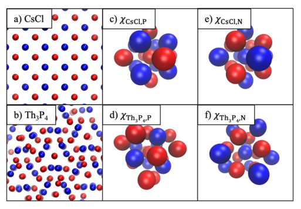 
FIG. 1. Energy-minimized structures for CsCl-like (a) and Th3P4-like (b) colloidal crystals viewed from an orthographic perspective and with the particle diameters set to 50% of their actual values. The system consists of both positive (red) and negative (blue) colloidal particles with diameters of 170 and 210 nm, respectively. Reference local environments χCsCl,P and χTh3P4,P around the positive particles are depicted in (c) and (d) while the reference local environments χCsCl,N and χTh3P4,N around the negative particles are depicted in (e) and (f).

📷 Fig 2

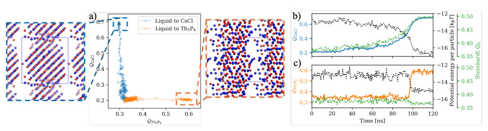 
FIG. 2. a) Our CVs, QCsCl and QTh3P4, over the course of an unbiased MD simulation starting from a disordered liquid that crystallized into CsCl (blue) where surface potentials of the negative and positive particles were -40 and +53 mV, respectively, and another simulation that resulted in a Th3P4 crystal when using surface potentials of -53 and +40 mV. The CVs resolve the crystalline phases from each other and from the disordered phases. b+c) Time traces of the system’s QCsCl and QTh3P4 (blue and orange) track with the potential energy (black) during unbiased MD simulations along with the Steinhardt-Nelson Q6 OP for comparison (green).

📷 Fig 3

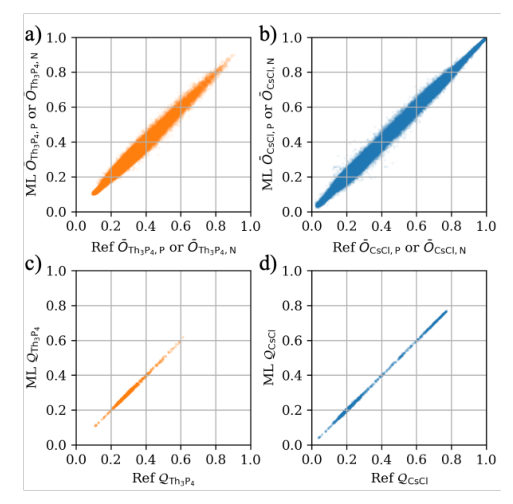 
FIG. 3. The accuracy of predictions obtained from our ML models trained on reference particle-specific order parameters (OPs) gauging how similar their local environment is com- pared to that of Th3P4-like (a) and CsCl-like (b) crystals. Our CVs (c+d) are the configuration average of our OPs and the values obtained from our ML models are well correlated with the reference values. The correlation plots show the ML predicted values as compared to the reference values as eval- uated on our 1135 configuration validation set.

📷 Fig 4

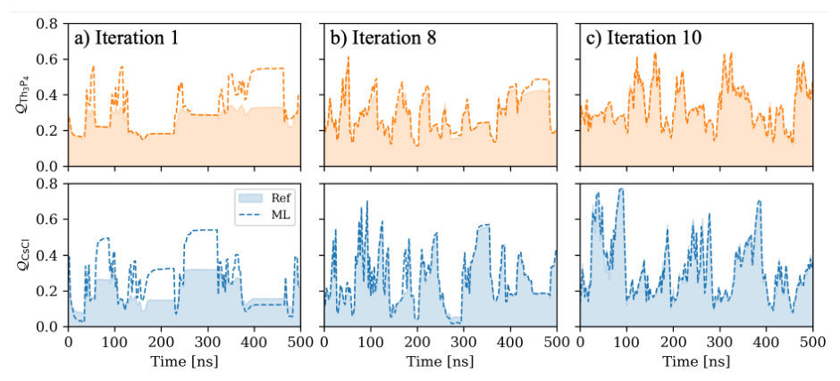 
FIG. 4. Time traces of QCsCl and QTh3P4 over the course of a metadynamics simulation performed at iterations 1, 8, and 10 of our active learning protocol for constructing the dataset where the ML predicted CVs used to drive the metadynamics simulation are shown as dashed lines and the reference values for the CVs are represented by the shaded area. (a) Our ML model of both QCsCl and QTh3P4 trained to the initial dataset displays large errors. By iteration 8 our ML model for QCsCl is accurate but our model for QTh3P4 still displays errors at higher values, however both models accurately predict the CVs by iteration 10.

📷 Fig 5

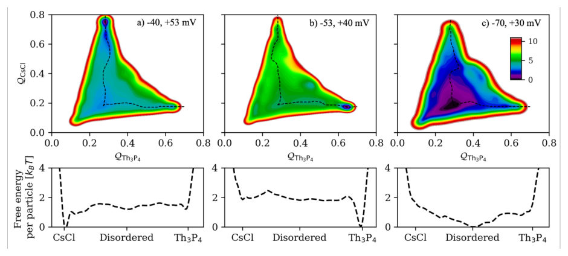 
FIG. 5. 2D free energy surfaces obtained from our metadynamics simulations employing our ML models of QCsCl and QTh3P4 when varying the surface potentials of the negative and positive particles showing how CsCl and Th3P4 crystals can be thermodynamically favored under different conditions. Dashed lines show minimum free energy paths along the surface, with 1D free energies shown in the lower panels. In all 3 cases the negative particle has a diameter of 210 nm and the positive particle has a diameter of 170 nm. (a) When the surface potentials for negative and positive particles are -40 and +53 mV (-40,+53 mV), respectively, then CsCl-like crystals are favored. (b) When we flip things to...

**Summary.** This work addresses the challenge of mapping the free energy landscape in ionic colloidal crystals by using machine learning. The authors developed SE(3)-equivariant transformer networks to create computationally cheap proxies for complex structural descriptors. This allows them to precisely predict how tuning external parameters, like surface potentials, can steer the system toward a desired metastable crystal structure.

**Why it may be interesting.** While focused on classical soft matter, the methodology—using equivariant ML models to parameterize complex, high-dimensional order parameters for enhanced sampling—is highly relevant to developing efficient simulation tools for quantum many-body systems where calculating accurate local correlation functions is challenging.

Detailed structure

**Main problem.** The primary goal is to accurately quantify the free energy landscape of self-assembled ionic colloidal crystal systems to enable rational control over the resulting crystalline structure.

**Main result.** The authors successfully used machine-learned proxy collective variables to compute relative free energies, demonstrating that tuning surface potentials can thermodynamically favor one metastable crystal structure (e.g., CsCl vs. Th3P4) over another.

**Method.** They employed Metadynamics simulations driven by SE(3)-equivariant transformer networks trained as machine-learned proxies for complex local environment order parameters.

**Model / system.** The system consists of ionic colloids (positive and negative charges) forming crystal structures. The interactions are governed by electrostatic potentials derived from DLVO theory and polymer brush repulsion models.

**Key observables.** Relative free energies ($\Delta G$) between different crystalline phases, quantified using global collective variables like $	ext{Q}_{	ext{CsCl}}$ and $	ext{Q}_{	ext{Th3P4}}$.

**Important parameters / regimes.** Surface potentials (e.g., $(-40:+53)$ mV vs. $(-53:+40)$ mV), temperature ($T=300$ K), and particle sizes.

**Assumptions / limitations.** Standard crystalline order parameters fail for exotic structures, necessitating the use of computationally expensive local environment descriptors which are then approximated by the ML proxy model.

**Figures summary.** Figures illustrate the successful differentiation between crystal phases using CVs, showing how varying surface potentials shifts the minimum free energy path on the 2D free energy surfaces (FIG. 5).

**Paper structure.** The paper establishes the need for accurate free energy sampling in colloidal systems; it introduces local environment descriptors as superior but costly alternatives to standard order parameters; the core contribution is developing and training an SE(3)-equivariant transformer network to serve as an efficient, differentiable proxy for these CVs; finally, they apply this method to map out structure-dependent free energy landscapes.

Abstract

Charged colloids coated with a polymer brush can be designed to preferentially self-assemble into different crystal structures by varying easy-to-tune experimental conditions. For a given set of conditions, we have observed in experiments and simulations a distribution of thermodynamically (meta)stable self-assembled crystal structures. Properly quantifying the free energy landscape of these colloidal systems is essential for rationally choosing conditions to preferentially target particular crystal structures. For some of the structures we have formed, standard crystalline order parameters are not able to differentiate between crystals or between crystals and amorphous aggregates. We show that local environment similarity descriptors are able to distinguish the relevant metastable states, but are too expensive for use in biased MD simulations. Here, we adopt an approach from machine-learned interaction potentials showing that SE(3)-equivariant transformer networks can serve as an efficient-to-evaluate machine-learned proxy. As a result, we can compute the relative free energies of accessible colloidal structures as a function of different experimentally-relevant physical knobs that can steer our system between two observed crystal types. As an example application, we then show how changing surface potentials of positive and negative colloids while maintaining the same attractive energy can shift which crystal structure is favored.

[↑ back to top](#top)

### [Time Dilation and center of Mass Normalization in the Page-Wootters Formalism](http://arxiv.org/abs/2608.09601v1)

**Authors:** Juan Sebastian Ardenghi  
**Type:** theory · **Category:** other · **PDF:** <https://arxiv.org/pdf/2608.09601v1>  
**Analysis basis:** full PDF text, analyzed in chunks
**Topic relevance:** `quantum measurements` **3/5** · `interference shaping light` **2/5** · `Keldysh / 2PI / non-Gaussian methods` **1/5** · `analog quantum simulation` **1/5** · `correlated / nonlocal dissipation` **1/5**

📷 Fig 1

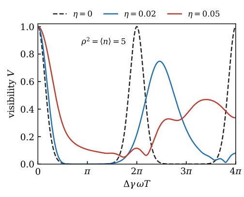 
FIG. 1. Interferometric visibility V of a coherent-state oscil- lator clock (mean excitation ρ2 = ⟨n⟩= 5) versus the dimen- sionless time ∆γ ωT. The dashed curve (η = 0) is the stan- dard time-dilation result, which is periodic and fully revives at ∆γ ωT = 2π. The solid curves include the normalization factor Ω(Hr), whose quadratic-in-energy term (Eq. (43)) sup- presses and shifts the revivals. For clarity, η = ℏω/Mc2 is set to illustrative values far larger than any atomic-clock value (η ∼10−8), for which the two curves would be indistinguish- able on this scale; the enhanced regime corresponds to the large coherent-internal-energy scenario discussed in the text.

**Summary.** This paper analyzes relativistic effects on composite quantum clocks using the Page-Wootters formalism, treating time as a quantum variable. It demonstrates that internal energy back-reaction modifies the center-of-mass evolution into a non-local equation. The key finding is a measurable correction to interferometric visibility that depends quadratically on the absolute internal energy distribution.

**Why it may be interesting.** This work provides a rigorous theoretical framework connecting fundamental quantum gravity concepts (relativity/time dilation) with observable phenomena in high-precision AMO experiments like atomic clocks. The prediction of non-local dynamics and specific energy-dependent corrections is highly relevant to modern quantum metrology.

Detailed structure

**Main problem.** The work investigates how relativistic effects, specifically time dilation, manifest when treating a composite quantum clock using the Page-Wootters relational formalism.

**Main result.** It shows that the back-reaction of internal energy on the center-of-mass motion leads to non-local dynamics in the conditioned Schrödinger equation. This results in an interferometric visibility correction quadratic in the internal energy, dependent on the absolute energy distribution rather than just energy gaps.

**Method.** The authors apply the Page-Wootters mechanism to a composite system Hamiltonian, deriving conditioned evolution equations and analyzing the resulting non-local dynamics via operator-valued normalization factors.

**Model / system.** The model is a composite quantum clock with distinct internal (clock) and center-of-mass degrees of freedom. The analysis uses Hamiltonians structured for separation into these two parts, applicable to systems like atoms or coupled oscillators.

**Key observables.** Interferometric visibility; the non-local nature of the conditioned center-of-mass dynamics; the quadratic correction term in visibility dependent on internal energy distribution.

**Important parameters / regimes.** Compton time ($\hbar/Mc^2$); mean internal energies ($E_{int}$); transition frequencies ($\Delta\epsilon$).

**Assumptions / limitations.** The analysis relies on approximations, including treating the total Hamiltonian by separating center-of-mass and internal parts, and using low-energy expansions for relativistic factors.

**Figures summary.** Figure 1 illustrates interferometric visibility decay for a coherent oscillator clock, comparing standard time dilation results (dashed line) against those incorporating the $\Omega(H_r)$ correction (solid lines).

**Paper structure.** The paper develops the formalism by first establishing the general Hamiltonian structure in the Page-Wootters framework. It then derives the non-local evolution equation for the center-of-mass sector due to internal energy back-reaction, culminating in predictions for measurable corrections in interferometry.

Abstract

In this work, we study the emergence of relativistic effects in a composite quantum clock within the Page-Wootters relational formulation of quantum mechanics. We consider a system with internal and center-of-mass degrees of freedom and analyze the conditioned evolution of the center-of-mass relative to the internal system treated as an internal clock. We show that the internal sector exhibits an effective time dilation. Retaining the full mass-energy structure of the composite particle, a back-reaction of the internal energy on the center-of-mass sector appears through an operator-valued normalization factor. As a direct consequence of the back-reaction, the conditioned center-of-mass dynamics is governed by a Schroodinger equation that is non-local in the clock time, with an effective temporal non-locality of the order of the Compton time of the composite system. Applying the formalism to a center-of-mass momentum superposition, we find that the interferometric visibility acquires a correction that is quadratic in the internal energy, and therefore depends on the absolute distribution of clock energies rather than only on the energy gaps that control the standard time-dilation dephasing. Although this correction is parametrically small, it is a generic feature of relativistic composite clocks and can, in principle, be isolated through a differential visibility measurement comparing clocks with equal transition frequency but different mean internal energies.

[↑ back to top](#top)

### [Autonomous Lindblad Realizability of Nonunitary Linear Dynamics with a Carleman Lattice Boltzmann Application](http://arxiv.org/abs/2608.09808v1)

**Authors:** Muhammad Idrees Khan  
**Type:** theory · **Category:** other · **PDF:** <https://arxiv.org/pdf/2608.09808v1>  
**Analysis basis:** full PDF text, analyzed in chunks
**Topic relevance:** `methods for driven-dissipative` **3/5** · `driven-dissipative phase transition` **2/5** · `correlated / nonlocal dissipation` **1/5** · `quantum measurements` **1/5**

📷 Fig 1

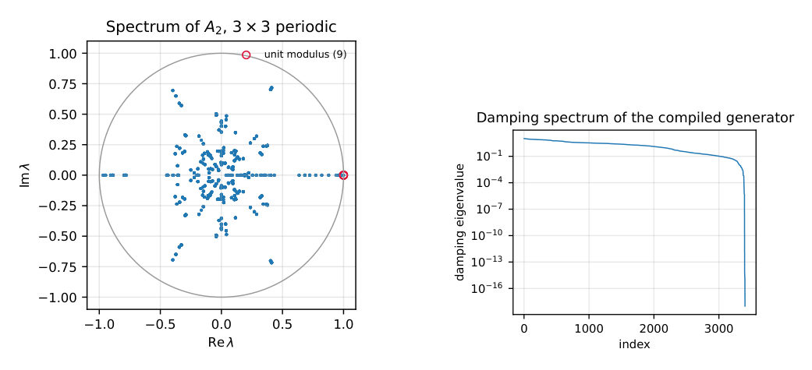 
FIG. 1. Left: spectrum of the global endpoint A2 on the 3 × 3 periodic lattice against the unit circle. The 9 unit-modulus eigenvalues are neutral Carleman modes, including conserved modes and degree-two product modes, and are all semisimple, which is what makes the endpoint power bounded. The right panel shows the eigenvalues of the damping matrix Γ of the compiled generator, which are nonnegative up to floating-point roundoff. The neutral directions correspond to the unit-modulus eigenvalues shown in the left panel.

📷 Fig 2

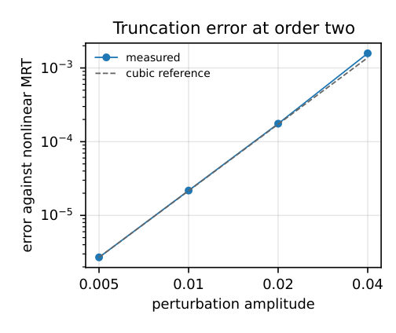 
FIG. 2. Truncation error against the nonlinear reference after 10 timesteps, with a cubic reference line. The measured slope follows the cubic prediction, consistent with the leading truncation error arising from omitted degree-three terms rather than from the GKSL realization.

**Summary.** The paper develops a general criterion proving that any finite linear dynamic endpoint can be realized as an autonomous Lindblad evolution if the endpoint is invertible and power bounded. This theory is rigorously applied to the Lattice Boltzmann Method, successfully mapping its complex, dissipative timestep into a time-independent quantum master equation form.

**Why it may be interesting.** This work provides a powerful bridge between classical computational physics (like Lattice Boltzmann) and rigorous open quantum system descriptions, offering a concrete method to treat dissipative nonunitary dynamics quantum mechanically without resorting to measurement postulates.

Detailed structure

**Main problem.** The central problem is establishing a general, necessary, and sufficient criterion for realizing finite linear dynamics (endpoints) derived from classical systems as an autonomous Gorini–Kossakowski–Sudarshan–Lindblad (GKSL) evolution in open quantum systems.

**Main result.** A finite real linear endpoint matrix A admits such an autonomous GKSL realization if and only if A is invertible and power bounded. This criterion was successfully applied to the D2Q9 Lattice Boltzmann Method timestep.

**Method.** The authors combine Carleman linearization (to map nonlinear dynamics to a linear endpoint) with open quantum system theory, constructing the required Hamiltonian and Lindblad operators based on the properties of this endpoint matrix.

**Model / system.** The study models nonunitary linear dynamics derived from classical fluid simulations, specifically applying the framework to the D2Q9 multiple-relaxation-time Lattice Boltzmann (LB) collision and streaming timestep.

**Key observables.** Invertibility and power boundedness of the endpoint matrix A; residual errors in physical identities (e.g., Kraus completeness); comparison between decoded quantum state and classical trajectory over time steps.

**Important parameters / regimes.** The lattice structure (D2Q9), relaxation times ($	au_
u$), and the order of truncation used in the Carleman lifting ($K$).

**Assumptions / limitations.** The construction assumes that the dynamics can be accurately captured by a finite-dimensional linear endpoint derived from polynomial expansion, and it avoids postselection inherent to unitary embeddings.

**Figures summary.** Figures illustrate the spectrum of the global endpoint matrix and plot the measured truncation error against time steps, demonstrating expected cubic scaling consistent with the order of approximation.

**Paper structure.** The paper first introduces the general mathematical framework (Theorem 4) linking GKSL realizability to endpoint properties. It then applies this theory by analyzing the D2Q9 LBM timestep, showing how collision and streaming are compiled into a single admissible endpoint for autonomous quantum evolution.

Abstract

Carleman lifting converts nonlinear polynomial dynamics into finite linear systems, but the resulting truncations are generally nonunitary and need not correspond to physical quantum evolution. We prove that a finite linear endpoint admits an autonomous Gorini--Kossakowski--Sudarshan--Lindblad (GKSL) realization on vacuum coherences if and only if it is invertible and power bounded. The construction is explicit and realizes the nonunitary map directly as open-system dynamics, with no endpoint postselection and with one encoding and one decoding over repeated timesteps. We apply the result to the complete D2Q9 multiple-relaxation-time lattice Boltzmann (LB) timestep by compiling collision and periodic streaming into a single Carleman endpoint. The resulting GKSL evolution reproduces the classical Carleman trajectory over multiple timesteps, while the remaining discrepancy from nonlinear LB dynamics is the expected Carleman truncation error. The result establishes a general criterion for autonomous open-quantum realization of finite nonunitary dynamics, with Carleman--LB dynamics as a concrete example.

[↑ back to top](#top)

### [Cell Natural Orbitals in Interacting Topological Bands](http://arxiv.org/abs/2608.09932v1)

**Authors:** Nishchhal Verma, Harshitra Mahalingam, Daniel Muñoz-Segovia, Raquel Queiroz  
**Type:** theory · **Category:** strongly correlated electrons · **PDF:** <https://arxiv.org/pdf/2608.09932v1>  
**Analysis basis:** full PDF text, analyzed in chunks
**Topic relevance:** `methods for driven-dissipative` **3/5** · `analog quantum simulation` **2/5** · `Keldysh / 2PI / non-Gaussian methods` **1/5** · `quantum measurements` **1/5**

📷 Fig 1

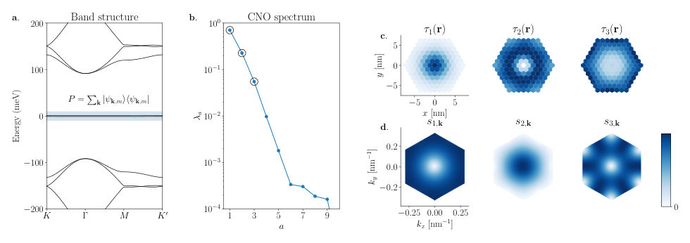 
FIG. 1. Cell Natural Orbitals. a. Band structure of twisted bilayer graphene in the chiral limit with twist angle θ = 1.07◦. There are two flat bands related by chiral symmetry. We select one of them to construct the low-energy projector P. b. CNO spectrum obtained from the unit-cell reduced density matrix defined in Eq. (1). The spectrum decays exponentially, hinting that only a few orbitals are required to efficiently capture the charge density within the unit cell. c. The first three CNOs with dominant occupation in real space. The AA site is at the center of the unit cell while AB and BA sites form the corners. The dominant CNO is centered at the AA site in the moir´e unit cell,...

📷 Fig 2

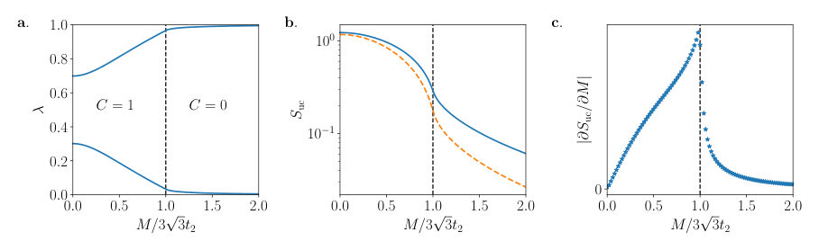 
FIG. 2. Unit-cell entanglement across the Haldane model phase transition. (a) CNO eigenvalues λ± vs staggered potential M/t at fixed flux ϕ = π/2. (b) Unit-cell entanglement entropy Scell showing finite entanglement in the topological phase (M &lt; 3 √

📷 Fig 3

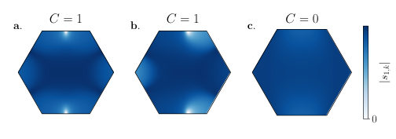 
FIG. 3. Topologically protected zeros in the Haldane model. Magnitude of the leading CNO envelope |s1,k| in (a)-(b) the topological phase and (c) the trivial phase. In the topological phase s1,k vanishes at a point in the Brillouin zone, reflecting the obstruction to a single localized orbital. The location of the zero depends on parameters (see Appendix C), but the existence is a topological property. There are no zeros in the trivial phase.

📷 Fig 4

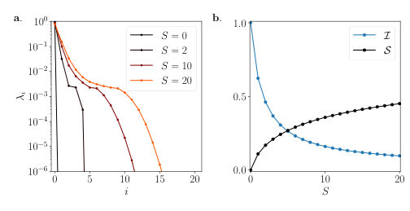 
FIG. 4. Complexity measures for the multifold fermion model. Continuum model Hk = kxσx+kyσy+(k2/2M+1)σz in the (2S+1)-dimensional representation of SU(2), analyzing the top band. (a) Occupation spectrum for increasing spin S, showing growth in the number of significant modes. (b) IPR I decreases as more modes contribute; Shannon entropy S increases as spectral weight spreads. The model interpolates from the single-orbital limit (S = 0: I = 1, S = 0) to the ideal-band regime (S →∞: I →0, S →1), with the number of significantly occupied modes growing with S. Momentum cutoff ΛK ≫M held fixed.

📷 Fig 5

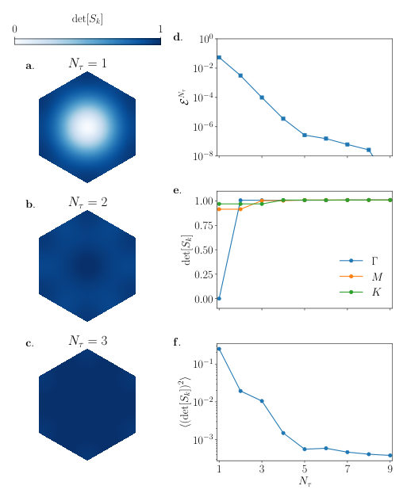 
FIG. 5. Gram matrix in chiral TBG. Determinant of the Gram matrix Sk, Eq. (21), over the moir´e Brillouin zone for truncations Nτ = 1–3 (top panels), for the TBG flat band at the magic angle in the chiral limit. For Nτ = 1 the ma- trix is singular at the topological zero at Γ; the zero is lifted for Nτ ≥2. The bottom panel shows the truncation error E(Nτ ) = P

**Summary.** This work introduces Cell Natural Orbitals (CNOs) as a powerful tool to bridge momentum-space band theory and real-space correlation physics in topological materials. By decomposing interaction form factors using CNOs, it establishes a systematic hierarchy for treating interactions, allowing researchers to control computational complexity by separating dominant, dynamically coupled channels from weaker, mean-field treatable ones.

**Why it may be interesting.** The concept of using natural orbitals derived from a reduced density matrix to systematically truncate the Hilbert space is highly relevant for modeling strongly correlated systems where exact diagonalization is impossible, providing an orbital basis tailored to the underlying band structure topology.

Detailed structure

**Main problem.** The paper addresses the challenge of representing interactions in topological bands when standard methods fail due to the non-local nature imposed by band topology.

**Main result.** Cell Natural Orbitals (CNOs) provide a geometry-informed framework that systematically decomposes projected interactions, revealing an intrinsic hierarchy useful for controlled many-body calculations.

**Method.** The core method involves singular-value decomposition of band-projected density form factors to define CNOs, which are the eigenstates of the unit-cell reduced one-particle density matrix.

**Model / system.** The analysis is applied to interacting topological materials, specifically using magic-angle twisted bilayer graphene in the chiral limit as a concrete example. The formalism is general for systems exhibiting band topology.

**Key observables.** CNO occupations (eigenvalues of the reduced density matrix), unit-cell entanglement entropy ($S_{	ext{cell}}$), and the spectral function $A(k, \omega)$.

**Important parameters / regimes.** The relative strength hierarchy between dominant and subdominant CNO channels; momentum dependence in the CNO envelope function.

**Assumptions / limitations.** The analysis relies on a geometry-based truncation scheme derived from SVD, and subsequent calculations often employ approximations like the Hubbard-I or Rank-1 approximation for self-energy calculations.

**Figures summary.** Figures illustrate band structures alongside CNO spectra showing exponential decay, real-space distributions of dominant CNOs (e.g., at AA sites), and evidence of topologically protected zeros in the leading CNO envelope function.

**Paper structure.** The paper progresses from establishing the theoretical necessity of CNOs to quantify orbital complexity, demonstrating their utility via entanglement measures ($S_{	ext{cell}}$) in topological phases, and finally applying this framework to calculate self-energies ($\Sigma$) for interacting systems, showing how approximations affect gap closing.

Abstract

Topological bands exhibit obstruction to exponentially localized and symmetric Wannier functions, challenging the standard paradigm of representing projected interactions in terms of local orbitals with finite range. To faithfully capture the form factors and quantum geometry of topological bands we introduce a singular-value decomposition of the band-projected density form factors, enabling a geometry-based truncation scheme of the Hilbert space, exposing an intrinsic hierarchy on band-projected interactions that is determined by the underlying wavefunctions. This decomposition is most naturally described in terms of Cell Natural Orbitals (CNOs), as the eigenstates of the unit-cell reduced one-particle density matrix, whose occupation provide a measure of the minimal orbital complexity required to faithfully represent the band wavefunctions overlaps. The CNO decomposition identifies systematically the minimal number of local orbitals needed to reproduce short-ranged interactions while resolving the hierarchy of interaction strengths across CNO channels. Applied to magic-angle twisted bilayer graphene in the chiral limit, we find that the dominant CNO is centered at the AA site, resembling the $f$-fermion of the heavy-fermion model. The subdominant CNO channels carry progressively weaker interaction matrix elements, allowing them to be treated at the static mean-field level, while the dominant channel requires a dynamical self-energy. The formalism illustrates how variations of charge density within the unit cell generate momentum dependence in the CNO envelope function and, consequently, dispersion in the single-particle spectral function. More broadly, our results establish CNOs as a geometry-informed bridge between band topology and real-space correlations, providing a systematic framework for analyzing interactions and emergent phases in quantum materials.

[↑ back to top](#top)

### [DA-CASE: reusable measurements for adaptive quantum subspaces](http://arxiv.org/abs/2608.08739v1)

**Authors:** Ginanjar Utama, Hermawan Kresno Dipojono  
**Type:** theory · **Category:** numerical methods · **PDF:** <https://arxiv.org/pdf/2608.08739v1>  
**Analysis basis:** full PDF text, analyzed in chunks
**Topic relevance:** `quantum measurements` **3/5** · `analog quantum simulation` **2/5** · `Keldysh / 2PI / non-Gaussian methods` **1/5** · `methods for driven-dissipative` **1/5**

📷 Fig 1

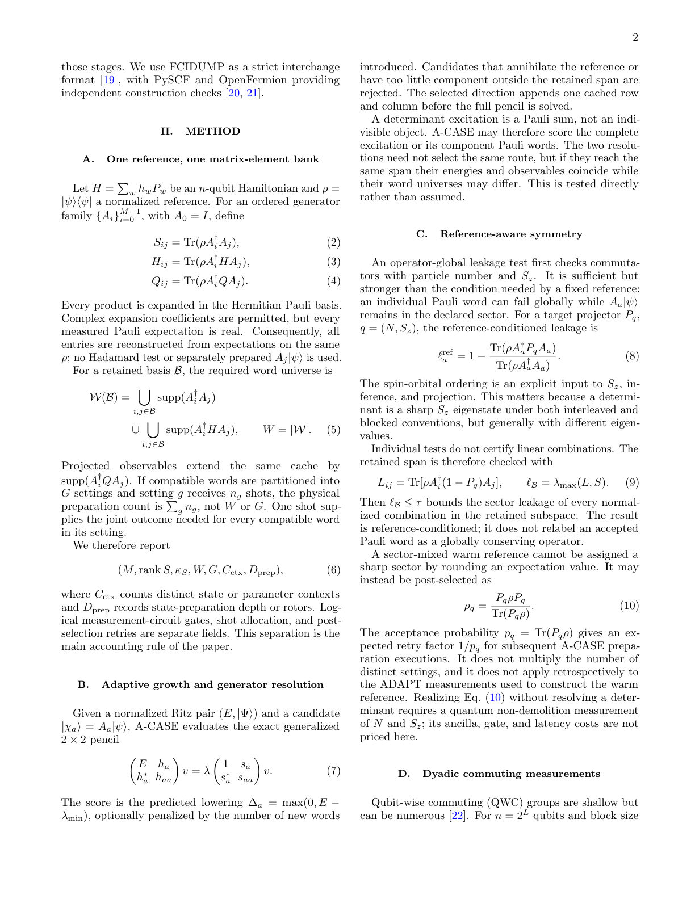 
Low-resolution page preview, page 2

📷 Fig 2

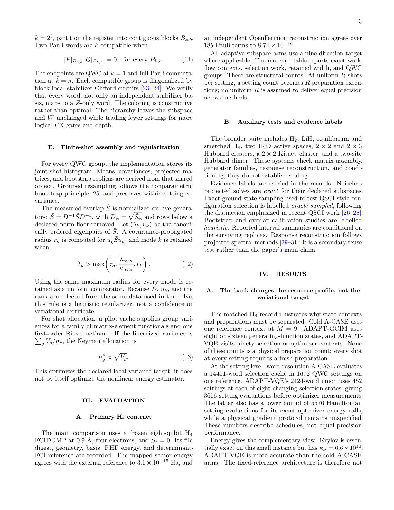 
Low-resolution page preview, page 3

📷 Fig 3

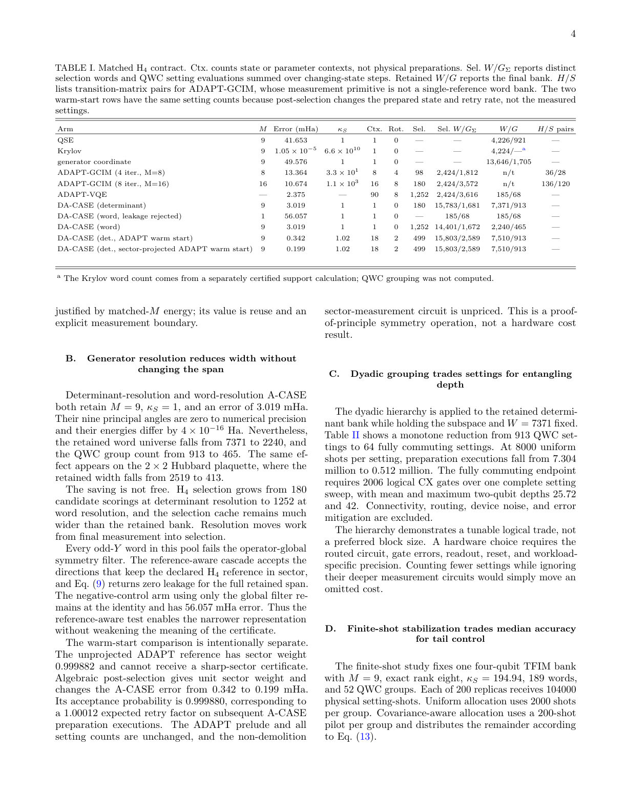 
Low-resolution page preview, page 4

📷 Fig 4

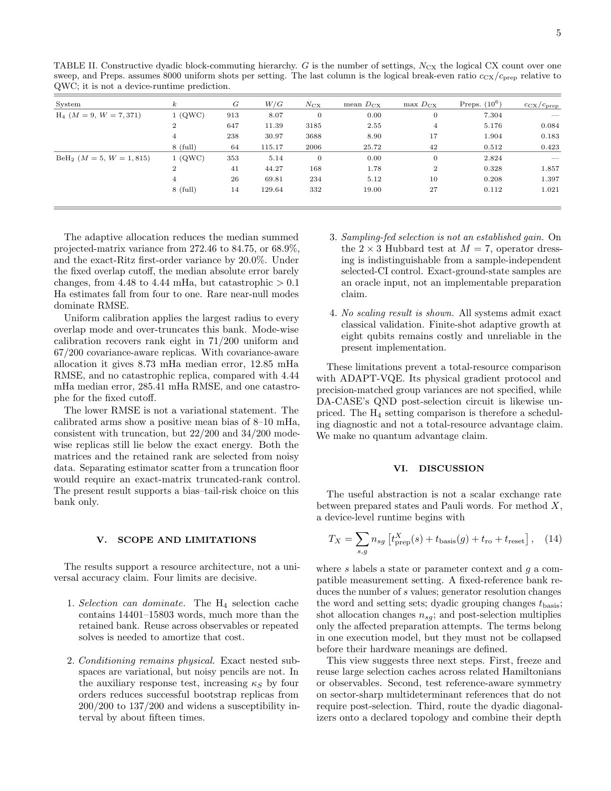 
Low-resolution page preview, page 5

📷 Fig 5

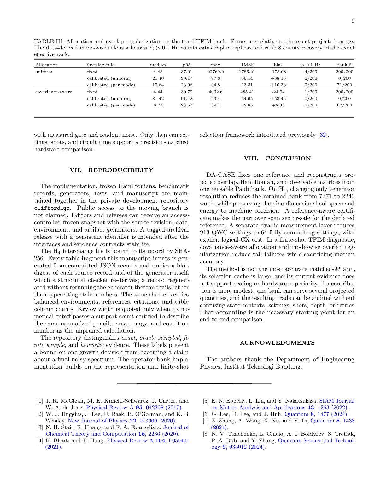 
Low-resolution page preview, page 6

**Summary.** This paper introduces DA-CASE, an efficient measurement architecture that calculates quantum subspaces using only measurements from a single reference state. It demonstrates this by showing that fewer Pauli words are needed to achieve the same accuracy on $	ext{H}_4$ compared to previous methods. The work provides a detailed resource ledger for benchmarking different simulation techniques.

**Why it may be interesting.** For AMO physicists working on molecular dynamics or quantum chemistry simulations, this work offers a rigorous framework for auditing the computational resources required to achieve high accuracy in variational quantum eigensolver (VQE) type calculations. The explicit resource ledger is highly valuable.

Detailed structure

**Main problem.** The core challenge is efficiently diagonalizing quantum subspaces by managing the measurement overhead associated with finite-shot measurements, which can amplify errors near the null space of the basis matrix.

**Main result.** The DA-CASE method demonstrates that using a single reference state allows for reconstructing necessary matrices from one cached set of Pauli expectations, significantly reducing the required measurement bank size compared to methods requiring multiple prepared basis states.

**Method.** DA-CASE (Dyadic Adaptive Clifford-Algebra Subspace Eigensolver) reconstructs overlap, Hamiltonian, and observable matrices using only Pauli expectation values measured on a single reference state $|\psi
angle$. It employs techniques like dyadic commuting hierarchies and covariance-aware shot allocation to optimize resource usage.

**Model / system.** The method is tested primarily on the frozen eight-qubit H4 Hamiltonian ($	ext{H}_4$), with auxiliary tests covering molecular systems like $	ext{H}_2$, LiH, stretched $	ext{H}_4$, and $	ext{H}_2	ext{O}$ active spaces.

**Key observables.** Subspace energy eigenvalues ($E$), Pauli expectation values ($	ext{Tr}(
ho \mathbf{A}_i^\dagger \mathbf{A}_j)$), retained Pauli word count (e.g., 7371 vs 2240), projected-matrix variance, and RMSE.

**Important parameters / regimes.** Number of qubits (up to eight), number of basis states/generators, measurement settings ($G$), shot allocations, and context counts ($	ext{Ctx.}$)

**Assumptions / limitations.** The reported results are small-instance exact and Monte Carlo diagnostics; the authors explicitly state this is not a hardware demonstration or quantum advantage claim.

**Figures summary.** The notes reference comparisons in Tables I and II showing resource usage across different methods (ADAPT-VQE vs DA-CASE) for H4, and Table III comparing allocation rules on the TFIM bank regarding RMSE and variance reduction.

**Paper structure.** The paper introduces DA-CASE as a single-reference measurement architecture. It details its components: matrix reconstruction from cached Pauli expectations, adaptive growth using pencil evaluation, symmetry testing, and resource optimization via dyadic grouping and covariance-aware shot allocation. Results are presented by comparing performance metrics across various resolutions on $	ext{H}_4$.

Abstract

Quantum subspace methods are often compared by basis dimension or energyerror, although their dominant experimental costs arise from different statepreparations, measurement settings, and shot allocations. We present theDyadic Adaptive Clifford-Algebra Subspace Eigensolver (DA-CASE), whose basisstates are virtual directions $A_i|ψ\rangle$ generated from one reference.Overlap, Hamiltonian, and observable matrices are reconstructed from onecached set of Pauli expectations on that reference. The method thereforetrades multiple prepared basis states for a potentially wide measurement bank.We make that trade explicit on a frozen eight-qubit H$_4$ Hamiltonian. Twogenerator resolutions reach the same nine-dimensional subspace and the sameenergy to machine precision, while the retained bank changes from 7371 to 2240Pauli words. A reference-conditioned symmetry test certifies the narrower spanwithout asserting that its individual Pauli words conserve the sector asabstract operators. Independently, a dyadic commuting hierarchy reduces thedeterminant bank from 913 qubit-wise-commuting settings to 64 fully commutingsettings, while exposing the added logical-CX cost. In a separate four-qubitfinite-shot diagnostic, covariance-aware allocation reduces theprojected-matrix variance target by 68.9%. Mode-wise overlap regularizationremoves the observed catastrophic energy estimates and lowers RMSE, butdoubles the median error relative to a fixed cutoff. These are small-instanceexact and Monte Carlo results, not a hardware demonstration, scaling result,or quantum advantage claim. The contribution is a single-referencemeasurement architecture and a resource ledger that keeps contexts, settings,shots, circuit depth, and post-selection retries in their proper units.

[↑ back to top](#top)

### [Symmetry Constraints Regularize Neural Quantum State Learning](http://arxiv.org/abs/2608.08798v1)

**Authors:** Turbasu Chatterjee, Manas Sajjan, Songbo Xie, Elliott Love, Vinit Singh, Bojko N. Bakalov, Sabre Kais  
**Type:** theory · **Category:** numerical methods · **PDF:** <https://arxiv.org/pdf/2608.08798v1>  
**Analysis basis:** full PDF text, analyzed in chunks
**Topic relevance:** `analog quantum simulation` **3/5** · `methods for driven-dissipative` **3/5** · `quantum measurements` **1/5**

📷 Fig 1

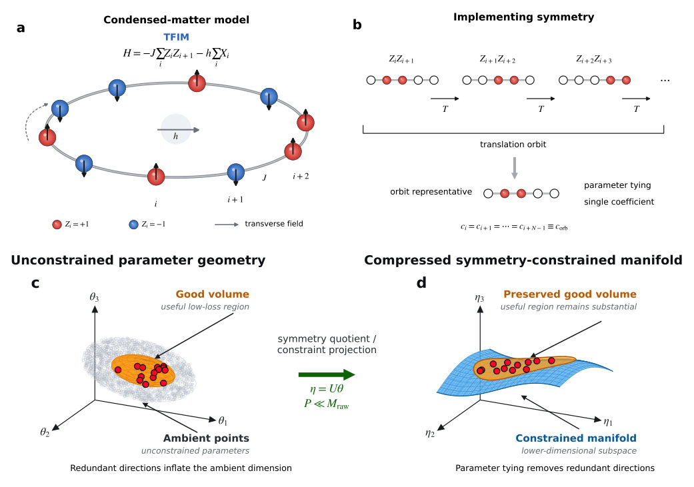 
FIG. 1. Symmetry compresses the neural-quantum-state parameter manifold while preserving its useful region. a, Periodic transverse-field Ising model (TFIM), H = −J P

📷 Fig 2

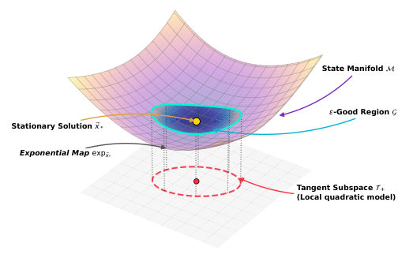 
FIG. 2. Parameter landscape and local solution density. The curved upper surface represents the physical state mani- fold M, hosting the ϵ-good parameter basin Gϵ(⃗x∗) (cyan re- gion) centered around the stationary solution ⃗x∗(gold marker). The flat plane below represents the tangent subspace T+, which acts as the local quadratic model of the landscape. The Fubini-Study exponential map exp⃗x∗(represented by the vertical dashed projection lines) maps the boundary of the quadratic basin in T+ (dashed pink ellipse) onto the physical manifold, defining the local volume V FS good,+(⃗x∗; ϵ) derived in Theorem 1. This coordinate-free framework quotients out ex- act parameter redundancies and...

📷 Fig 3

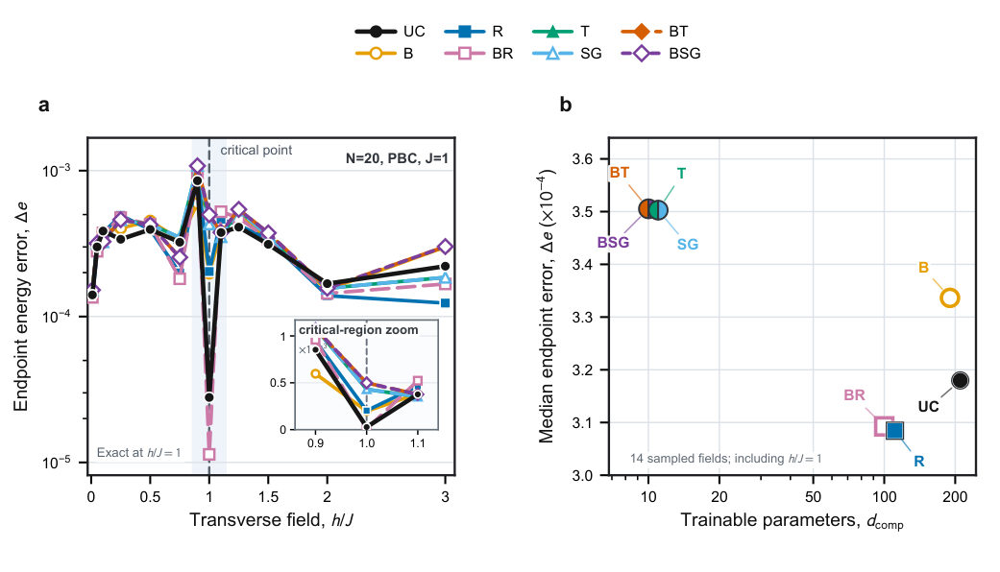 
FIG. 3. Symmetry compression preserves TFIM variational accuracy. a, Endpoint energy-density error ∆e = |EVMC −Eref|/N for the 1D TFIM (N = 20, J = 1, kmax = 2). Each marker is the endpoint error of an independently optimized VMC run at a fixed transverse field h and symmetry constraint. Lines are guides to the eye across the sweep, not optimization trajectories. The dashed vertical line marks the exact critical point hc/J = 1 of the one-dimensional TFIM [66]. b, Sweep-level accuracy-compression summary. The horizontal axis indicates the number of trainable parameters after symmetry compilation (dcomp), and the vertical axis is the median endpoint error over the field sweep....

📷 Fig 4

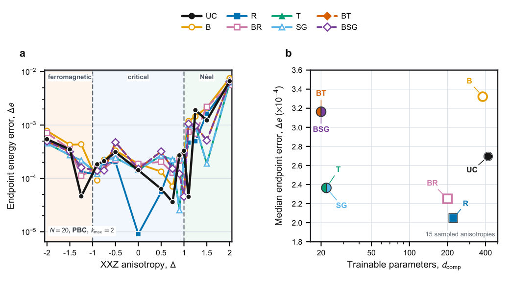 
FIG. 4. Symmetry compression preserves XXZ variational accuracy across the anisotropy sweep. a, Endpoint energy-density error ∆e = |EVMC −Eref|/N for the 1D XXZ benchmark (N = 20, J = 1, kmax = 2) as a function of anisotropy ∆. Dashed vertical lines mark the standard reference anisotropies ∆= ±1. b, Sweep-level accuracy-compression summary, sharing the axes and symmetry labels of Fig. 3. As in the TFIM benchmark, aggressive translation-based compression tightly matches the unconstrained median error. Labels: UC (unconstrained); B (bitflip); R (reflection); BR (bitflip + reflection); T (translations); SG (space group); BT (bitflip + translations); BSG (bitflip + space group).

📷 Fig 5

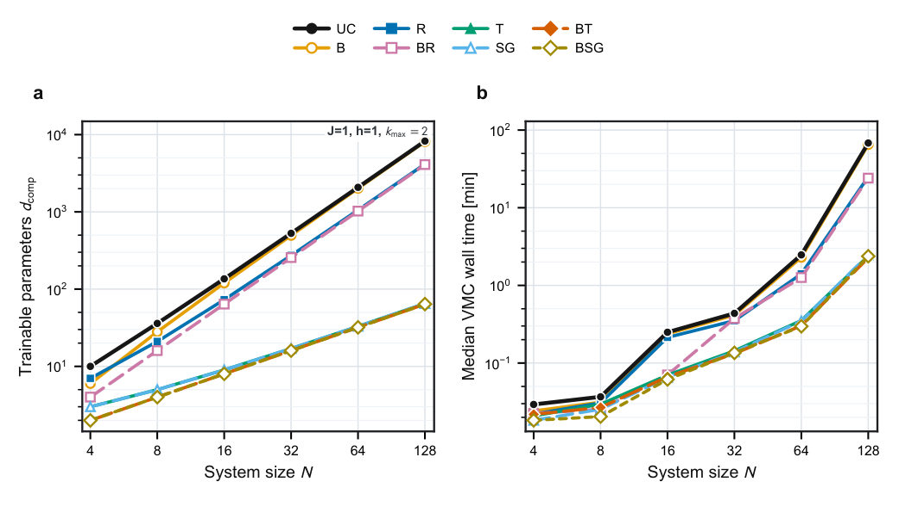 
FIG. 5. Scaling of the symmetry-compiled learner. a, Number of trainable parameters as a function of system size. b, VMC training wall time measured by the internal wall-clock timer around the optimization loop. Spatial symmetry constraints explicitly reduce the two-body learner from quadratic parameter growth to orbit-count growth, generating corresponding speedups in optimization runtime. Labels: UC (unconstrained); B (bitflip); R (reflection); BR (bitflip + reflection); T (translations); SG (space group); BT (bitflip + translations); BSG (bitflip + space group).

**Summary.** This paper shows that incorporating known Hamiltonian symmetries directly into Neural Quantum State parameterizations acts as a powerful geometric regularizer. By structurally collapsing redundant parameters using techniques like null-space projection, it drastically reduces model size and training time for systems like TFIM chains. This method concentrates the NQS expressive power onto physically relevant low-energy states.

**Why it may be interesting.** For AMO physicists working with complex Hamiltonians (like those describing trapped ions or molecular interactions), this provides a systematic, mathematically rigorous way to reduce the dimensionality of variational ansatzes derived from symmetries inherent in the physical Hamiltonian.

Detailed structure

**Main problem.** Neural Quantum States (NQS) suffer from optimization bottlenecks due to redundant parameters and poorly conditioned energy landscapes.

**Main result.** Embedding Hamiltonian symmetries directly into the parameterization structurally collapses the trainable parameter space, significantly reducing model size and training cost without sacrificing ground-state accuracy.

**Method.** The authors introduce a geometric metric based on the Jacobian and Hessian of the optimization landscape to quantify how symmetry constraints regularize the search space by eliminating redundant degrees of freedom.

**Model / system.** The work analyzes NQS parameterized for many-body wavefunctions, tested specifically on the Transverse-Field Ising (TFIM) and XXZ spin chains using a Boltzmann-family ansatz.

**Key observables.** Geometric metrics including the Jacobian/Hessian analysis, active Fubini–Study dimension, local good volume fraction ($	ext{fg}_{	ext{good}}$), and parameter count reduction.

**Important parameters / regimes.** System size (N), Hamiltonian parameters ($J=h=1$), and various symmetry constraints (e.g., translations, reflections, bitflip parity).

**Assumptions / limitations.** The analysis assumes that structural constraint imposition via null-space projection accurately captures the physically relevant subspace of the variational manifold.

**Figures summary.** Figures illustrate how symmetry reduction quotients redundant directions in parameter space while preserving the volume of accurate solutions; consistency checks confirm this compression across multiple geometric proxies.

**Paper structure.** The paper first establishes the problem of NQS optimization bottlenecks, then details the method of embedding symmetries by constraining parameters via global constraint matrices. It rigorously analyzes the geometry using various rank and volume estimators before concluding that symmetry compilation is a robust regularization technique.

Abstract

Neural quantum states (NQS) offer highly expressive variational wavefunctions, but their optimization is frequently bottlenecked by redundant parameters and poorly conditioned landscapes. We demonstrate that embedding Hamiltonian symmetries directly into the variational parameterization geometrically regularizes this learning problem. For Boltzmann-family NQS, we enforce symmetries by tying local Pauli-$Z$ generators along physical geometric orbits, analytically collapsing the trainable coefficient space prior to optimization. To quantify the resulting optimization geometry, we introduce a geometric metric built on the Jacobian and Hessian of the optimization landscape. This framework evaluates the fraction of the physically accessible state space that corresponds to high-quality, low-energy solutions. Evaluating our approach on transverse-field Ising (TFIM) and XXZ spin chains shows that symmetry compilation excises the vast majority of parameters while maintaining ground-state accuracy within the resolution of the reported benchmarks. In large TFIM systems, strong spatial constraints compress thousands of parameters down to tens, delivering substantial runtime accelerations. Our geometric diagnostics indicate that symmetry produces a more favorable target-aware geometry by concentrating the reachable state space around low-energy solutions while retaining broad target basins. Together, our results indicate that symmetry compilation concentrates the expressive power of NQS on states relevant to the target problem, thereby reducing model size and training cost without sacrificing accuracy.

[↑ back to top](#top)

### [An accelerator-based source of high-intensity quantum-entangled annihilation gamma photons](http://arxiv.org/abs/2608.09454v1)

**Authors:** Riad Suleiman  
**Type:** both · **Category:** other · **PDF:** <https://arxiv.org/pdf/2608.09454v1>  
**Analysis basis:** full PDF text, analyzed in chunks
**Topic relevance:** `quantum optics experiment` **3/5** · `quantum measurements` **2/5** · `interference shaping light` **1/5**

📷 Fig 1

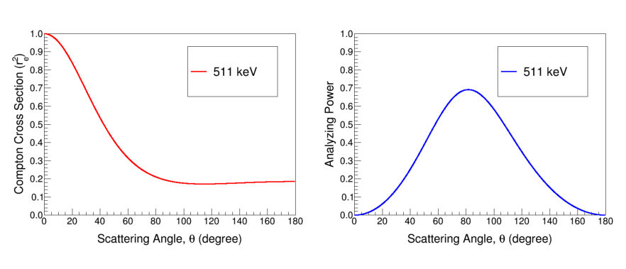 
Figure 3: The unpolarized differential Compton scattering cross section (left) and the corresponding Compton-scattering analyzing power (right) for 511 keV gamma rays. Here, 𝑟𝑒= 2.82 × 10−15 m de- notes the classical electron radius.

📷 Fig 2

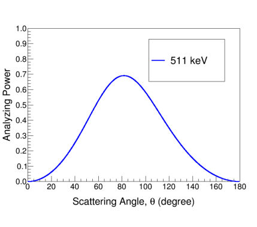 
Figure 4: Schematic layout of the double Compton polarime- ter. Entangled 511 keV gamma photons are detected by two op- posing Compton polarimeters, enabling measurement of polar- ization dependent scattering cor- relations and tests of quantum entanglement.

**Summary.** This paper proposes an accelerator-based source capable of generating extremely high fluxes of quantum-entangled 511 keV gamma photons via positron annihilation. By leveraging tunable beam parameters, the source allows for unprecedented characterization of entanglement using advanced Compton polarimetry techniques. This platform is crucial for fundamental physics research and validating next-generation quantum imaging concepts.

**Why it may be interesting.** While focused on high-energy photons rather than typical AMO systems, the rigorous methodology for characterizing quantum correlations (entanglement witnesses) using controlled sources is highly relevant to open quantum system research and quantum optics.

Detailed structure

**Main problem.** The primary goal is developing a high-intensity, accelerator-based source of quantum-entangled 511 keV gamma-ray pairs to enable precision studies of entanglement beyond the limitations of conventional radioactive sources.

**Main result.** The proposed system offers orders-of-magnitude higher photon flux and tunable parameters compared to traditional sources, enabling systematic investigation of quantum correlations in high-energy photons.

**Method.** Entanglement is characterized using Compton polarimetry techniques (single and double setups) applied to the annihilation gamma pairs generated by polarized positron beams.

**Model / system.** The physical system is an accelerator source utilizing a proposed Jefferson Lab positron facility to generate highly controlled, high-current, polarized positron beams that undergo electron-positron annihilation into entangled 511 keV gamma photons.

**Key observables.** Entanglement Witness (R), polarization correlations between the two emitted photons, and coincidence selection performance in imaging applications.

**Important parameters / regimes.** Gamma Photon Energy: 511 keV; Beam Control: Polarization, intensity, and precise time structure (MHz repetition rates).

**Assumptions / limitations.** The source is a high-intensity research platform for validating quantum effects; future medical PET devices will still rely on conventional radioactive isotopes.

**Figures summary.** Figures illustrate the source concept using positron beams, the setup for single Compton polarimetry, and the double Compton polarimeter used to measure polarization correlations. Tables detail expected beam parameters and entanglement witness values.

**Paper structure.** The paper introduces the need for a superior entangled photon source, details the accelerator-based design leveraging Jefferson Lab capabilities, describes the measurement techniques (Compton polarimetry), discusses potential applications in fundamental physics and imaging, and concludes with future development directions.

Abstract

We present the concept and development of a novel accelerator-based source of high-intensity quantum-entangled 511 keV gamma-ray pairs produced through positron-electron annihilation. The source leverages the unique capabilities of the proposed Jefferson Lab positron facility to generate polarized, high-current positron beams with a well-defined time structure. These beams enable the production of entangled annihilation photons at intensities far exceeding those available from conventional radioactive sources. The resulting gamma-ray pairs can be characterized using Compton polarimetry techniques, providing a powerful platform for precision studies of quantum entanglement. The combination of high intensity, controllable polarization, and precise timing also opens new opportunities in medical imaging, materials science, quantum information science, and spintronics. Compared with traditional radioactive sources, the proposed system offers orders-of-magnitude higher photon flux, tunable beam parameters, and unprecedented control of the annihilation process. We discuss the source design, methods for entanglement characterization, potential applications, and future development directions.

[↑ back to top](#top)

### [Preserving Heisenberg-Limited Metrological Information during Storage via Correlated-Noise Correction](http://arxiv.org/abs/2608.08130v1)

**Authors:** Hang Xu, Xue-Ke Song, Jingzheng Huang, Tailong Xiao, Guihua Zeng  
**Type:** theory · **Category:** quantum information and computing · **PDF:** <https://arxiv.org/pdf/2608.08130v1>  
**Analysis basis:** full PDF text, analyzed in chunks
**Topic relevance:** `correlated / nonlocal dissipation` **3/5** · `quantum measurements` **3/5**

📷 Fig 1

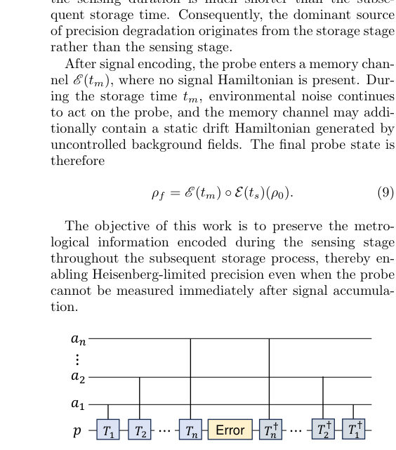 
FIG. 1. General framework of the correlated-noise correc- tion (CNC) protocol. Before the memory stage, each auxil- iary qubit is entangled with the probe through a two-body gate Ti. During the memory process, probe errors are co- herently correlated with the corresponding auxiliary qubits. After storage, the inverse gates T † i transform the accumulated probe errors into measurable auxiliary syndromes, which are extracted by measuring the auxiliary qubits. The probe itself is never measured during the memory process.

📷 Fig 2

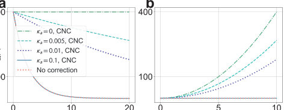 
FIG. 2. Performance of the CNC protocol for a single- qubit probe subject to dephasing noise during the memory stage. (a) QFI as a function of the memory time tm for a fixed sensing time ts = 10, where different curves correspond to different dephasing rates of the auxiliary qubit. (b) QFI as a function of the sensing time ts for a fixed memory time tm = 20. The black dashed line denotes the ideal noiseless result.

📷 Fig 3

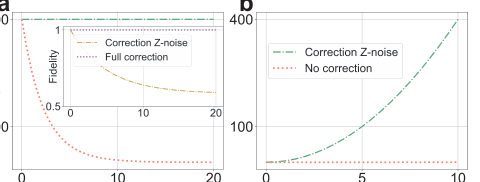 
FIG. 3. Performance of the CNC protocol for a memory channel containing simultaneous bit-flip and dephasing noise. (a) QFI versus the memory time tm for a fixed sensing time ts = 10. The inset shows the fidelity between the stored probe state and the corresponding noiseless state. (b) QFI versus the sensing time ts for a fixed memory time tm = 20. Results obtained by correcting only the dephasing noise are compared with those obtained by correcting both noise channels and with the ideal noiseless case.

📷 Fig 4

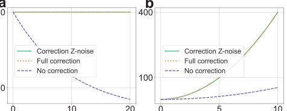 
FIG. 4. Performance of the CNC protocol for amplitude- damping noise during the memory stage. (a) QFI as a func- tion of the memory time tm for a fixed sensing time ts = 10. (b) QFI as a function of the sensing time ts for a fixed mem- ory time tm = 20. The corrected protocol is compared with the uncorrected protocol and the ideal noiseless limit.

📷 Fig 5

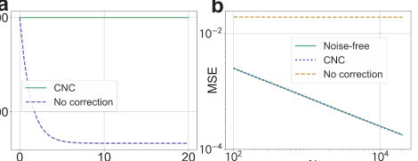 
FIG. 5. Two-qubit CNC for a single sensing-storage cycle with local dephasing noise during the memory stage. (a) QFI as a function of memory time for a fixed sensing duration. (b) MSE as a function of the number of measurement shots after the storage stage. The CNC protocol is compared with the uncorrected and noise-free cases.

**Summary.** The paper introduces Correlated-Noise Correction (CNC), a novel protocol designed to protect high-precision metrological information stored in noisy quantum memories. By entangling the probe with auxiliary qubits, environmental errors are mapped into measurable syndromes that can be read out post-storage. This framework proves vital for building practical quantum sensors capable of operating over extended periods.

**Why it may be interesting.** This work directly addresses the practical limitations of quantum metrology in real-world settings where measurement cannot be instantaneous, providing a robust theoretical tool for memory management in quantum sensing architectures.

Detailed structure

**Main problem.** The primary challenge is preserving Heisenberg-limited metrological information encoded during a sensing stage when the quantum probe must be stored in a noisy environment before subsequent measurements or operations.

**Main result.** A Correlated-Noise Correction (CNC) protocol was proposed that protects the Quantum Fisher Information (QFI) against various noise types during storage without requiring full state recovery unless further processing is needed.

**Method.** The CNC protocol correlates memory errors on the probe with auxiliary qubits using fixed two-body entangling gates, converting environmental decoherence into measurable syndromes extracted only after the storage period.

**Model / system.** The model involves a quantum probe undergoing sensing followed by storage in a noisy channel. The framework is generalized from single-qubit to multi-qubit systems and applies to various noise types like dephasing, bit-flip, and amplitude damping.

**Key observables.** Quantum Fisher Information (QFI), which serves as the figure of merit for sensing precision; Mean-Square Estimation Error (MSE).

**Important parameters / regimes.** Storage time ($t_m$), sensing time ($t_s$), noise types (dephasing, bit-flip, amplitude damping).

**Assumptions / limitations.** The sensing stage is assumed to be protected by existing QEC or that the storage time is much longer than the sensing time; full state recovery is only necessary if the probe is reused for subsequent signal accumulation.

**Figures summary.** Figures illustrate the general CNC framework (entanglement gates before and inverse gates after memory), showing QFI preservation under dephasing noise, comparison of QFI vs. storage time, and demonstration of continuous QFI accumulation over multiple sensing-storage rounds.

**Paper structure.** The paper introduces the problem gap in existing error correction methods, proposes the CNC protocol by correlating errors with auxiliary qubits, demonstrates its efficacy for various noise channels (single/multi-qubit), and concludes by distinguishing between QFI preservation and full state recovery requirements.

Abstract

Quantum error correction has become an indispensable tool for restoring Heisenberg-limited precision in noisy quantum metrology. Existing protocols, however, almost exclusively focus on correcting noise during the signal-encoding stage and implicitly assume that the probe is measured immediately after sensing. In many quantum information processing tasks, the encoded probe must instead be stored before subsequent quantum operations, during which environmental noise can significantly degrade the accumulated metrological information. Here, we propose a correlated-noise correction (CNC) protocol for protecting quantum probes during the storage stage. By correlating probe errors with auxiliary qubits through fixed two-body entangling gates, memory errors are converted into measurable syndromes that are extracted only once after storage. We show that the protocol naturally extends from single-qubit to multi-qubit probes and protects the stored quantum Fisher information against dephasing, bit-flip, and amplitude-damping noise. Furthermore, we demonstrate that preserving the quantum Fisher information does not necessarily require restoring the entire quantum state when the probe is measured immediately after storage, whereas full state recovery becomes essential for subsequent rounds of quantum signal processing. Our results establish correlated-noise correction as a practical framework for protecting metrological information during quantum memory and provide a useful building block for sensing-enabled quantum information processing.

[↑ back to top](#top)

### [Quantum discord of Ganssian states in an expanding universe](http://arxiv.org/abs/2608.08603v1)

**Authors:** Siwei Li, Xiaofen Huang  
**Type:** theory · **Category:** quantum information and computing · **PDF:** <https://arxiv.org/pdf/2608.08603v1>  
**Analysis basis:** full PDF text, analyzed in chunks
**Topic relevance:** `Keldysh / 2PI / non-Gaussian methods` **3/5** · `correlated / nonlocal dissipation` **1/5** · `methods for driven-dissipative` **1/5** · `quantum measurements` **1/5**

📷 Fig 1

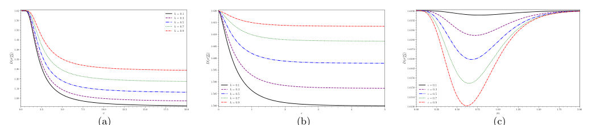 
FIG. 1. Quantum discord D(σout AB) between modes A and B as a function of the expansion rate υ, the expansion volume ϵ, and the mass m, respectively, for different momenta k, with fixed parameters m = ϵ = s = 1.

📷 Fig 2

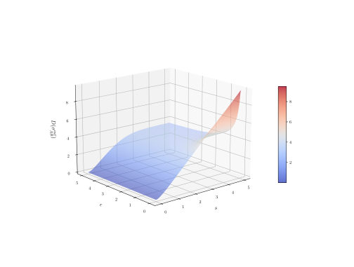 
FIG. 2. Quantum discord D(σout AB) between modes A and B as a function of the expansion volume ϵ and the squeezing parameter s, with fixed parameters k

📷 Fig 3

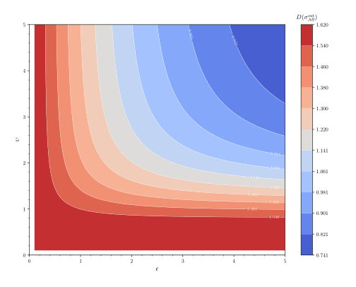 
FIG. 3. Quantum discord D(σout AB) between modes A and B as a function of the expansion volume ϵ and the expansion rate υ, with fixed parameters k

📷 Fig 4

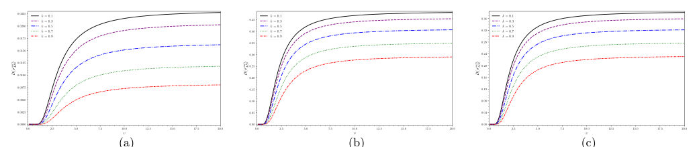 
FIG. 4. Panels (a), (b), and (c) show the quantum discord D(σout ¯ A ¯ B), D(σout A ¯ B), and D(σout A ¯ A) for the ¯A- ¯B, A- ¯B, and A- ¯A mode pairs, respectively, as a function of the expansion rate υ for different momenta k, with fixed parameters m = ϵ = s = 1.

📷 Fig 5

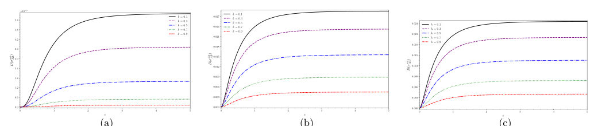 
FIG. 5. Panels (a), (b), and (c) show the quantum discord D(σout ¯ A ¯ B), D(σout A ¯ B), and D(σout A ¯ A) for the ¯A- ¯B, A- ¯B, and A- ¯A mode pairs, respectively, as a function of the expansion volume ϵ for different momenta k, with fixed parameters m = υ = s = 1.

**Summary.** This paper analyzes the redistribution of continuous-variable quantum discord for bosonic fields propagating in an expanding universe. Using Gaussian state formalism, the authors find that cosmic expansion causes initial quantum correlations to decay while simultaneously inducing new ones across different mode pairs. The results highlight that the sensitivity is higher with respect to the expansion rate and suggest optimal particle parameters for cosmological measurements.

**Why it may be interesting.** This work provides a concrete theoretical framework linking fundamental concepts of quantum information (discord) to cosmology (expanding spacetime), which is highly relevant for understanding quantum correlations in early universe physics or gravitational wave detection.

Detailed structure

**Main problem.** The study investigates how continuous-variable quantum discord, a measure of quantum correlations, is redistributed when bosonic fields evolve within the context of an expanding universe.

**Main result.** Quantum discord shows stronger sensitivity to the expansion rate than the volume, and cosmic expansion causes an initial decay of local discord while inducing new correlations, largest between cross-observer pairs.

**Method.** The analysis uses Bogoliubov transformations on a real scalar field in a Robertson-Walker spacetime to model the evolution into two-mode Gaussian states. Quantum discord is calculated using covariance matrices for these Gaussian states.

**Model / system.** The system models bosonic fields propagating in a 1+1 dimensional expanding spacetime characterized by scale factors dependent on expansion rate ($
u$) and volume ($\epsilon$). The dynamics are treated via the Klein-Gordon equation, leading to two-mode squeezed vacuum states.

**Key observables.** Quantum discord $D(\sigma)$ for various mode pairs (e.g., cross-observer vs. same-observer bosonic-antibosonic pairs).

**Important parameters / regimes.** Expansion rate ($
u$), expansion volume ($\epsilon$), momentum ($k$), and particle mass ($m$).

**Assumptions / limitations.** The system is modeled as a two-mode Gaussian state, and the analysis relies on the framework of continuous-variable quantum discord.

**Figures summary.** Figures illustrate how different mode pairs' quantum discord varies with expansion rate ($
u$), volume ($\epsilon$), mass ($m$), and squeezing parameter ($s$). Specifically, $D(\sigma_{out}^{Aar{B}})$ is shown to be the largest induced correlation.

**Paper structure.** The paper establishes the physical model in an expanding spacetime using Bogoliubov transformations. It then calculates quantum discord for various mode pairs by tracing out anti-modes from the full covariance matrix, systematically analyzing dependencies on cosmological parameters ($
u, \epsilon$) and particle properties ($m, k$).

Abstract

We investigate the redistribution of continuous-variable quantum discord within the framework of an expanding universe. We find that quantum discord exhibits stronger sensitivity to the spacetime expansion rate than to the expansion volume. As both the expansion rate and expansion volume increase, the initial quantum discord shared by the two bosonic modes decays, while quantum discord is induced in additional mode pairs by the underlying spacetime expansion, signaling a global redistribution of quantum correlations across the system. Specifically, the induced discord is largest for cross-observer bosonic-antibosonic pairs, followed by same-observer bosonic-antibosonic pairs, and smallest for the pair of antibosonic modes. Furthermore, our quantum discord analysis demonstrates that particles with lower momentum and optimal mass serve as more favorable candidates for extracting information about the expanding universe. This work substantially enriches the theoretical framework of quantum discord in expanding spacetimes, and provides new perspectives as well as a solid theoretical foundation for further investigations.

[↑ back to top](#top)

### [Quantum geometric localization length and localization criticality in an ideally flat Chern band](http://arxiv.org/abs/2608.08042v1)

**Authors:** Xu-Cheng Wang, Yang Qi  
**Type:** theory · **Category:** disordered systems and neural networks · **PDF:** <https://arxiv.org/pdf/2608.08042v1>  
**Analysis basis:** full PDF text, analyzed in chunks
**Topic relevance:** `non-equilibrium universality` **3/5** · `analog quantum simulation` **1/5** · `driven-dissipative phase transition` **1/5** · `methods for driven-dissipative` **1/5**

📷 Fig 1

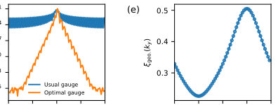 
FIG. 1. (a) Schematic plot of Eq. (2) that ideally flat Chern band with larger quantum geometric length experi- ences weaker localization. We denote the bare disorder po- tential V as the grey peaks and valleys randomly distributed among the atoms. The optimal Wannier spread is a quan- tum geometric quantity, and the effective disorder potential eV can be regarded as an average of bare potentials within the wave packet characterized by the Wannier spread. (b)-(e) π- flux model with √

📷 Fig 2

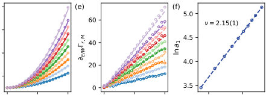 
FIG. 2. (a) Localization length λM with white-noise disor- ders and √

📷 Fig 3

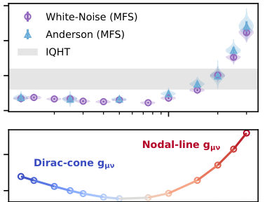 
FIG. 3. (a) Critical exponent ν for varied t2/t1, extracted through MFS. The distributions of ν, i.e. the shadowed vi- olins, are estimated from bootstrap resampling. The grey ribbon indicates the reported range of IQHT critical expo- nent, νIQHT = 2.3 ∼2.6, as discussed in the main text. (b) Evolution of quantum geometric length for varied t2/t1.

📷 Fig 4

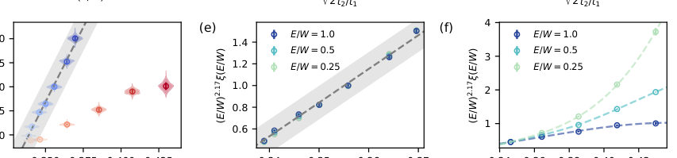 
FIG. 4. Localization length ξ = ξ0(E/W)−ν. (a) Collapsed Γr,M as a function of M(E/W)ν. The grey ribbon marks the range of data used for the linear fitting to estimate ξ0. (b) Fitted slope of the collapse function Γr. (c) ΓM(0) for the largest accessible system size M at each t2/t1. (d)-(f) Localization length ξ(E/W) versus momentum-averaged quantum geometric length ⟨ξgeo.(ky)⟩ky. Localization lengths at varied energies, scaled by an energy-dependent factor (E/W)2.17, are shown for the (e) universal and (f) non-universal regime of critical exponent.

**Summary.** The paper proposes that the localization length in flat Chern bands is fundamentally governed by the system's intrinsic quantum geometry. Using transfer matrix methods on a maximally localized Wannier basis, the authors demonstrate a critical crossover between universal and non-universal scaling regimes as the band's quantum metric is tuned. This offers a geometric perspective on disorder-induced localization in topological matter.

**Why it may be interesting.** This work provides a novel quantum geometric framework for understanding localization transitions in topological systems like Chern insulators, offering insights applicable to disordered quantum Hall systems or moiré superlattices where geometry plays a key role.

Detailed structure

**Main problem.** The study investigates how quantum geometry dictates the localization length and critical scaling behavior within an isolated, ideally flat Chern band.

**Main result.** The research finds a crossover in localization criticality from a universal regime (Dirac fixed point) to a non-universal one by tuning the system's quantum metric. The localization length is shown to exhibit a linear dependence on the intrinsic quantum geometric length in the universal limit.

**Method.** Transfer matrix calculations are employed using a maximally localized hybrid Wannier basis, combined with finite-size scaling analysis and Lyapunov exponent methods for determining critical exponents.

**Model / system.** The model is an isolated, ideally flat Chern band derived from a $\pi$-flux model on a square lattice, subjected to weak, local disorder. The analysis relies heavily on the properties of the maximally localized Wannier basis.

**Key observables.** Localization length ($\xi(E)$), critical exponent ($
u$), and the quantum geometric length ($\xi_{	ext{geo.}}$).

**Important parameters / regimes.** The ratio of hopping strengths ($t_2/t_1$) which controls the quantum metric, and the strength of disorder.

**Assumptions / limitations.** The system is treated as having an isolated, ideally flat Chern band, and calculations are restricted to the weak-disorder regime.

**Figures summary.** Figures illustrate the dependence of localization on $\xi_{	ext{geo.}}$, show comparisons between different basis sets (Wannier vs. normal), and present data for finite-size scaling analysis used to extract critical exponents ($
u$) across varying disorder strengths.

**Paper structure.** The paper develops the formalism by defining the maximally localized Wannier basis, applying transfer matrix methods using this basis, calculating Lyapunov exponents/localization lengths, and finally performing finite-size scaling analyses to map out the crossover between universal and non-universal critical regimes.

Abstract

We propose that the localization length in an isolated, ideally flat Chern band is set by quantum geometry. We explore the corresponding localization transition and its critical scaling by applying transfer matrix calculations in the maximally localized hybrid Wannier basis, whose spatial spread is exactly characterized by a quantum geometric length. Remarkably, upon tuning the quantum metric of the Chern band, we observe a crossover from a universal regime controlled by the Dirac fixed point to a non-universal regime with continuously varying critical exponents. Within the universal regime, the localization length exhibits a pronounced linear dependence on the quantum geometric length, supporting its quantum geometric nature. These findings provide a novel quantum geometric perspective on the localization in quantum Hall systems such as twisted moiré superlattices, and shed new light on the long-standing controversy over the criticality of the integer quantum Hall transition.

[↑ back to top](#top)

### [A Universal Entanglement Witness Generator](http://arxiv.org/abs/2608.07806v1)

**Authors:** Aiden R. Rosebush, Alexander C. B. Greenwood, Andi Shahaj, Li Qian  
**Type:** both · **Category:** quantum information and computing · **PDF:** <https://arxiv.org/pdf/2608.07806v1>  
**Analysis basis:** full PDF text, analyzed in chunks
**Topic relevance:** `quantum measurements` **3/5** · `QC/QI experiment` **1/5** · `methods for driven-dissipative` **1/5**

📷 Fig 1

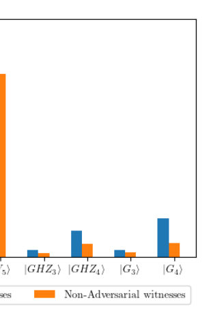 
FIG. 1. Runtimes, in seconds, of adversarial vs non-adversarial methods.

📷 Fig 2

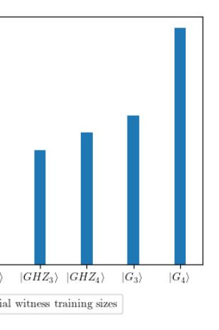 
FIG. 2. Number of separable training states of adversarial qubit witnesses.

📷 Fig 3

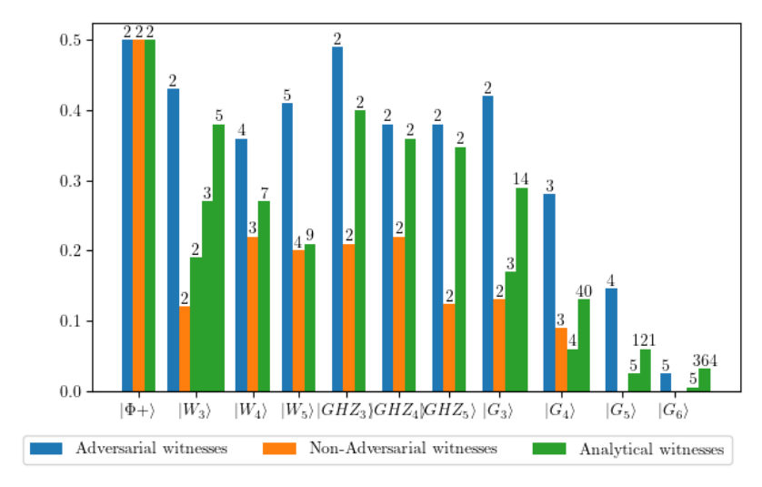 
FIG. 3. Noise tolerances of analytic and generated qubit witnesses. The number of measurement settings for each witnesss is indicated above each bar. Each group of bars are shown above the label indicating the target state.

📷 Fig 4

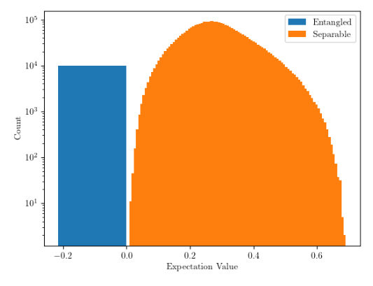 
FIG. 4. Histogram of expectation values of test data for a 3 qubit W state witness with 2 measurement settings generated with our adversarial training method. Shown are the counts of 3 million separable test states (in orange) Werner states based on the target W state up to the maximum noise tolerance of the witness (in blue). Notice the separable states have only positive expectation values, meeting the definition of an entanglement witness. Here we use 100 bins for each type of state, with a binsize of about 0.007.

📷 Fig 5

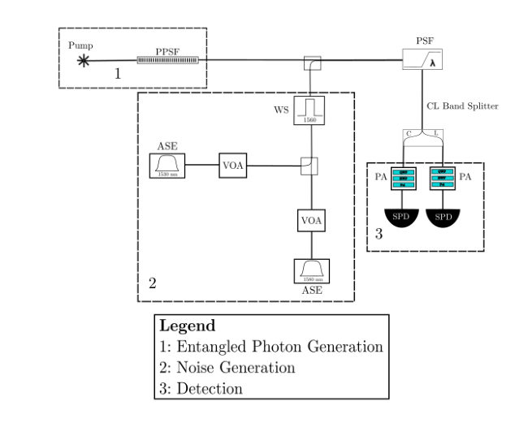 
FIG. 5. Experimental set up for (1) creating the noisy bipartite entangled photonic state (box 1); (2) adding noise to the entangled state (box 2); and (3) local projective measurements on each photon (box 3). We then combined the signal and the noise with a 50/50 splitter, put the total signal through a Pump Suppression Filter (PSF) before separating the C and L band components for measurement. We used Polarization Analyzers (PAs) consisting of a quarter waveplate, and a half waveplate to project the photons onto the polarizer before the single photon detectors.

**Summary.** This paper introduces a universal machine-learning framework to generate highly robust entanglement witnesses for multipartite qubit and qudit systems. By optimizing witness construction using adversarial training, it overcomes limitations in measurement efficiency and noise tolerance compared to prior methods. This tool is vital for experimentally verifying genuine quantum entanglement across diverse physical platforms.

**Why it may be interesting.** This work provides a powerful, automated tool for certifying entanglement in complex quantum systems, which is crucial for validating experimental results across various platforms (photonic/superconducting).

Detailed structure

**Main problem.** The challenge is constructing entanglement witnesses that are simultaneously noise-robust, measurement-economical, and applicable to complex systems beyond simple qubits.

**Main result.** The authors propose a general machine-learning pipeline that generates superior entanglement witnesses with greater noise tolerance using fewer local measurements than existing methods.

**Method.** A novel ML approach trains an entanglement witness by optimizing for noise tolerance via gradient descent and adversarial training, requiring only user-specified local measurement settings.

**Model / system.** The method is general, applicable to multipartite qubit and qudit systems (d-level systems), including non-stabilizer states. It tests on various structured states like Bell, GHZ, W, and hypergraph states.

**Key observables.** Entanglement witnesses ($W$), noise tolerance parameter ($p$), expectation values ($\langle W 
angle$).

**Important parameters / regimes.** Number of qudits ($N$), dimension ($d$), user-specified number of measurement settings ($M$).

**Assumptions / limitations.** The method assumes that the required training set size becomes independent of system size under adversarial training, and it aims to surpass existing methods' limitations regarding setting count.

**Figures summary.** Not specified (Notes mention testing on various state types rather than describing figure content).

**Paper structure.** The paper first establishes the need for robust witnesses, then details the ML framework involving prototype witness generation ($W_0$), refinement via differential programming to find $
ho_s$, and finally strengthening it with adversarial training.

Abstract

Entanglement witnesses are essential for certifying entanglement, yet constructing ones that are both noise-robust and economical in measurement settings remains challenging - particularly beyond qubits and for non-stabilizer ("magic") states. We present a machine-learning method that, given a target state and a user-specified number of measurement settings, generates an entanglement witness optimized for noise tolerance in the neighborhood of that state, requiring only local measurements. The approach is fully general, applying to multipartite qubit and qudit systems alike, including non-stabilizer states. For N qudits of dimension d, we train on the fully-separable eigenstates of each qudit's SU(d) generators to find a prototype witness, then tune the witness's bias term via gradient descent to maximize noise tolerance. Adversarial training further strengthens the witnesses, delivering greater noise tolerance with even fewer settings; critically, under this scheme the required training-set size becomes independent of system size. We package the entire pipeline as an automated script that, in every case we tested, produces witnesses surpassing all existing methods in noise tolerance and/or number of measurement settings. We demonstrate the method on Bell, GHZ, W, and hypergraph states, along with a range of qudit states, spanning 2-6 qubits, bipartite qudits up to d=10, and tripartite qutrits. Our witnesses achieve perfect accuracy across both physical experimental test states and large numerical sets of separable mixed states-including 30 million test states for a 3-qubit W-state witness and 10 million for a 4-qubit hypergraph-state witness-and we experimentally confirm the noise tolerance of Bell- and hypergraph state witnesses on both photonic and superconducting platforms, respectively.

[↑ back to top](#top)

### [Breaking the Curse of Dimensionality in Quantum PDE Solvers via Gevrey Regularity](http://arxiv.org/abs/2608.07893v1)

**Authors:** Pooya Ronagh, Mariia Sobchuk, Xiaoran Li, Arsalan Motamedi, Grecia Castelazo, Ala Shayeghi  
**Type:** theory · **Category:** quantum information and computing · **PDF:** <https://arxiv.org/pdf/2608.07893v1>  
**Analysis basis:** full PDF text, analyzed in chunks
**Topic relevance:** `analog quantum simulation` **3/5** · `Keldysh / 2PI / non-Gaussian methods` **1/5** · `quantum measurements` **1/5**

📷 Fig 1

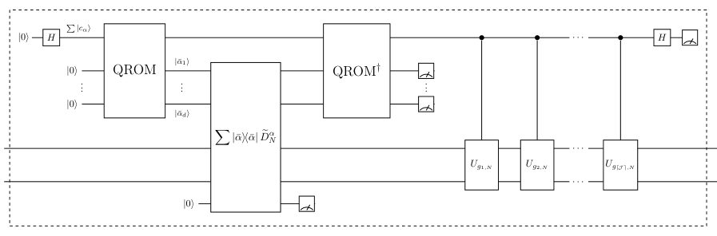 
FIG. 1. The circuit for implementing the operator LN using the LCU in (38). The circuit for implementing the unitary P |¯α⟩⟨¯α| eDα N is shown in Fig. 2.

📷 Fig 2

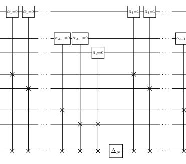 
FIG. 2. The circuit for the block encoding of P

📷 Fig 3

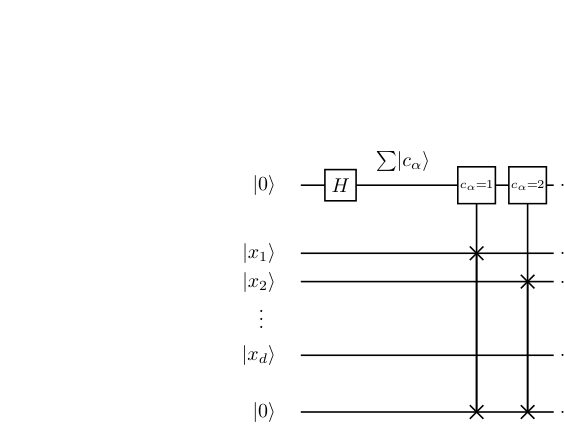 
FIG. 3. The circuit for the block encoding of the Laplacian operator.

📷 Fig 4

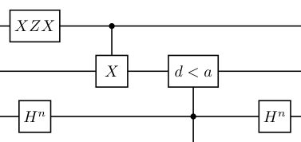 
FIG. 4. Circuit for ∆N, combining the block-encodings of Fig. 5 via the ctrl register: a controlled bit flip attaches the optional X gate distinguishing U+ from U−, an additional single-qubit gate on ctrl supplies the −1 phase attached to the D−branch, and the shared comparator C&lt; then acts on anc and data exactly as in Figs. 5a and 5b.

📷 Fig 5

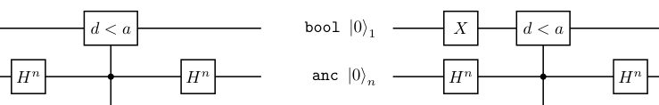 
FIG. 5. Block-encodings of D−(a) and D+ (b) (Proposition C.1). In both circuits a uniform superposition over anc is compared against data using C&lt;, and the comparison bit is written onto bool; the two are identical except that, in (b), an X gate is applied to bool before the comparator, flipping which branch is selected.

**Summary.** This paper develops a theoretical framework showing that by leveraging the mathematical concept of Gevrey regularity, one can efficiently solve high-dimensional linear Partial Differential Equations (PDEs) on a quantum computer. This approach overcomes classical scaling limitations and provides a pathway to achieving polynomial quantum speedups for simulating complex many-body systems in condensed matter physics.

**Why it may be interesting.** This work directly addresses how mathematical properties (smoothness) dictate the feasibility and scaling of quantum computation for fundamental physics problems like electronic structure calculations. The explicit link between Gevrey classes and polynomial speedup is highly relevant to designing practical quantum algorithms for condensed matter theory.

Detailed structure

**Main problem.** The core problem is overcoming the 'Curse of Dimensionality' when using quantum algorithms to solve high-precision Partial Differential Equations (PDEs).

**Main result.** The authors establish a framework showing that utilizing Gevrey regularity allows for efficient, polynomial-degree quantum speedups in solving linear PDEs at varying target precisions.

**Method.** They connect function smoothness (via the Gevrey hierarchy) to the cost of preparing high-precision Fourier-basis amplitude encodings and apply this to solve discretized linear PDE systems using QLSA techniques.

**Model / system.** The methods are applied to general linear PDEs, including those arising in many-body quantum simulations (like the Sternheimer equation derived from DFT) for probing atomistic systems.

**Key observables.** Linear response observables such as density response ($\delta
ho$), induced potentials ($\delta V_H$, $\delta V_{xc}$), and general correlation functions.

**Important parameters / regimes.** Target precision ($\epsilon$), Gevrey smoothness parameter ($s$), cutoff mode ($N$), and the dimensionality of the problem ($d$).

**Assumptions / limitations.** The analysis relies heavily on assuming $s$-Gevrey regularity for the solutions to guarantee polynomial scaling in dimension, and it requires using a closure approximation when extending to higher-order correlation functions.

**Figures summary.** Table I compares classical vs. quantum complexity bounds for solving PDEs; Table II relates quantum hardness to function smoothness classes via Fourier coefficient decay rates.

**Paper structure.** The paper first establishes the theoretical link between Gevrey regularity and quantum encoding costs, then specializes this framework to solve general linear PDEs using Fourier methods, and finally applies this machinery to build a hierarchy of many-body simulation pipelines for atomistic systems.

Abstract

We connect different degrees of smoothness of real-valued periodic functions to the cost of preparing their high-precision Fourier-basis amplitude encodings as quantum states. Our central observation is that the Gevrey hierarchy, which stratifies the space between smooth and analytic functions, provides a natural class for high-precision quantum algorithms. We then specialize to solving general linear partial differential equations (PDEs), showing how our Fourier methods do so efficiently at varying target precisions on a quantum computer. This also demonstrates how our framework enables passage from query-complexity results to explicit elementary gate counts. As an application, we introduce a hierarchy of many-body quantum simulation pipelines that harness these high-precision algorithms to probe the linear response of atomistic systems in first quantization. Each level of the hierarchy unlocks a further polynomial-degree quantum speedup, yielding a gradual improvement in simulation efficiency as quantum computers scale.

[↑ back to top](#top)

### [Effective one-body interactions due to the presence of a liquid-vapor interface](http://arxiv.org/abs/2608.09375v1)

**Authors:** Melih Gül, Roland Roth  
**Type:** theory · **Category:** statistical mechanics · **PDF:** <https://arxiv.org/pdf/2608.09375v1>  
**Analysis basis:** full PDF text, analyzed in chunks
**Topic relevance:** `Keldysh / 2PI / non-Gaussian methods` **3/5** · `methods for driven-dissipative` **1/5** · `quantum measurements` **1/5**

📷 Fig 1

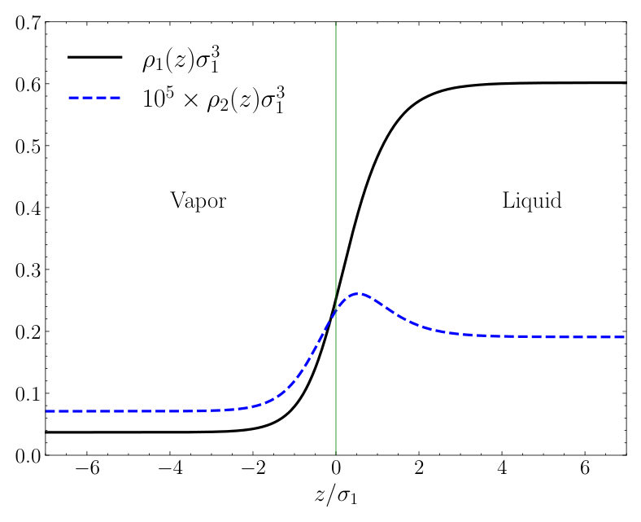 
Figure 1: Liquid-vapor phase separation of the SW binary mixture with corresponding interface (green vertical line) located at z = 0 and density profiles of the first component (black solid) and the second component (dashed blue) which we magnified for visualization. The SW parameters of the second component are chosen to be βε2 = 0.6 and λ2 = 1.5 with σ2/σ1 = 1.

📷 Fig 2

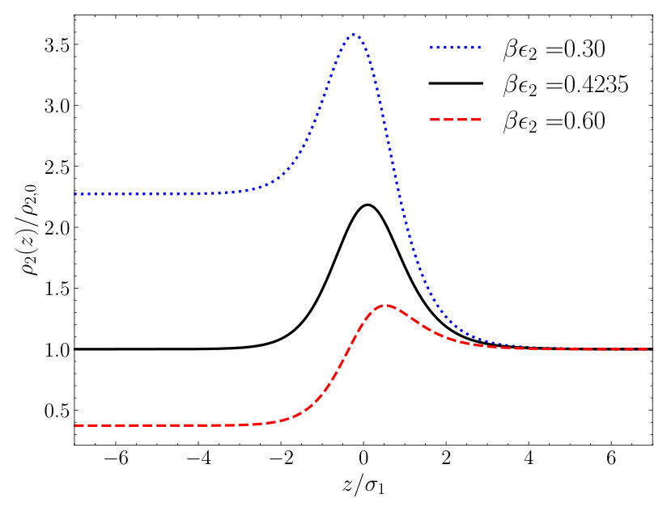 
Figure 2: Normalized density profile ρ2(z)/ρ2,0 of the second component at the interface z = 0 for three energies ε2 with range λ2 = 1.5 and size ratio σ2/σ1 = 1. For reasons of clarity we do not show the density profile of the solvent. The lowest value of ε2 corresponds to the case of (slightly) solvophobic nano particles, that prefer the vapor phase, while the highest value of ε2 corresponds to case of (slightly) solvophilic nano particles, which prefer the liquid phase. In the case in between neither the liquid nor the vapor phase is prefered by the nano particles.

📷 Fig 3

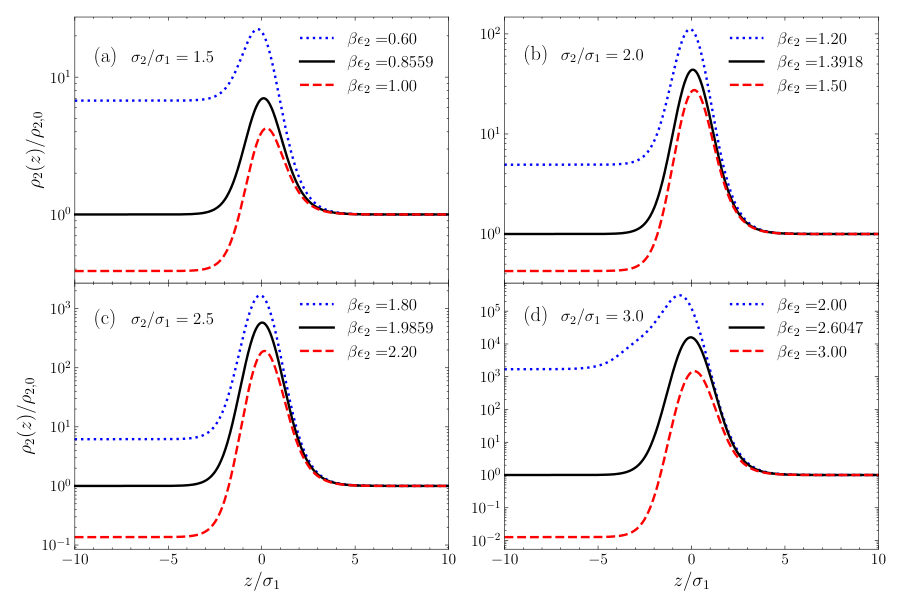 
Figure 3: Normalized density profiles ρ2(z)/ρ2,0 for several size ratios σ2/σ1 = 1.5, 2.0, 2.5, 3.0 and energies ε2 slightly below (dotted blue) and above (dashed red) the sym- metric solutions (solid black). By increasing the size ratio the adsorption at the interface be- comes stronger and enhances the density by several orders of magnitude. Note the logarithmic scaling of the ordinates.

📷 Fig 4

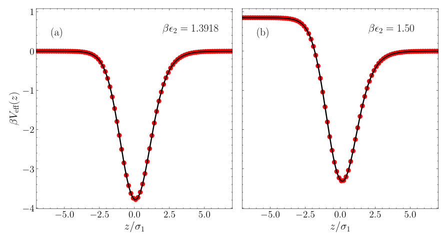 
Figure 4: Effective potential Veff(z) near the interface at z = 0 once obtained via Eq.(35) (red dots) and Eq.(36) (solid black) of the asymmetric mixture σ2/σ1 = 2 evaluated for the symmet- ric case βε2 = 1.3918 (a) and the case βε2 = 1.50 (b) where the nano particles prefer the liquid. The agreement between both routes is very good.

**Summary.** This paper uses Density Functional Theory to model a binary mixture near a liquid-vapor interface. It calculates the effective interaction potential acting on dissolved nanoparticles, demonstrating strong attraction to the interface using two consistent theoretical approaches. The work advances understanding of interfacial thermodynamics in soft matter systems.

**Why it may be interesting.** While focused on classical fluids, the rigorous application of advanced statistical mechanics tools like FMT and the Widom theorem to inhomogeneous systems provides methodological insights applicable to quantum many-body problems involving interfaces or confinement.

Detailed structure

**Main problem.** The study investigates the effective one-body interaction experienced by a dilute component (nano particles) due to the presence of a liquid-vapor interface formed by the solvent.

**Main result.** The calculated effective interaction strongly attracts nano particles to the liquid-vapor interface, and this result is confirmed using two independent theoretical routes.

**Method.** Classical Density Functional Theory (cDFT) is employed, utilizing novel perturbation theory contributions inspired by Fundamental Measure Theory (FMT).

**Model / system.** The system modeled is an additive binary square-well mixture containing a solvent undergoing phase separation and dissolved nano particles. The analysis focuses on the density profiles near the planar free interface.

**Key observables.** Effective one-body interaction potential ($V_{	ext{eff}}(z)$), density profiles ($
ho_1(z)$, $
ho_2(z)$), and interfacial surface tension ($\gamma_{s21}$).

**Important parameters / regimes.** Dilute limit of nano particle concentration ($
ho_{	ext{nano}} 	o 0$), solvent-particle interaction strength ($eta\epsilon_2$).

**Assumptions / limitations.** The analysis relies on the square-well potential model and assumes the neglect of two- and higher order terms in certain theoretical mappings.

**Figures summary.** Figure 4 illustrates the excellent agreement between the effective potential calculated via density profiles versus that derived from Widom's insertion theorem for different interaction strengths.

**Paper structure.** The paper introduces DFT for the model system, discusses bulk considerations and phase equilibrium, and then details the calculation of the effective interaction using both direct profile analysis and the Widom insertion theorem.

Abstract

In this study we investigate the behavior of additive binary square-well mixtures within the framework of classical density functional theory. By leveraging on the geometrical structure of the square-well interaction, we propose a novel form of the perturbation theory contribution to the density functional in terms of weighted densities, inspired by fundamental measure theory. We apply this functional in order to study the effective one-body interaction due to the liquid-vapor interface of the solvent acting on a dilute component of dissolved nano particles. The effective one-body interaction attracts the nano particles strongly to the interface. We show that this effective interaction potential can be calculated either from the density profiles of the full mixture, at low but non-vanishing concentrations of the nano particles, or by employing the Widom insertion theorem in the dilute limit of vanishing density of nano particles. Both routes display excellent agreement.

[↑ back to top](#top)

### [Quantum Decision Theory for Displacement Detection with Finite-Energy GKP States](http://arxiv.org/abs/2608.08051v1)

**Authors:** Seid Koudia, Symeon Chatzinotas  
**Type:** theory · **Category:** quantum information and computing · **PDF:** <https://arxiv.org/pdf/2608.08051v1>  
**Analysis basis:** full PDF text, analyzed in chunks
**Topic relevance:** `quantum measurements` **3/5** · `Keldysh / 2PI / non-Gaussian methods` **1/5** · `correlated / nonlocal dissipation` **1/5**

📷 Fig 1

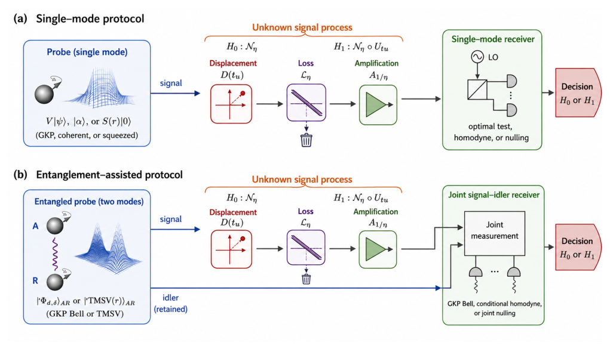 
FIG. 1. Binary displacement-discrimination schemes. (a) Single-mode protocol with a receiver acting only on the signal mode. (b) Entanglement-assisted protocol in which the signal traverses the unknown process, the idler is retained locally, and both modes are measured jointly.

📷 Fig 2

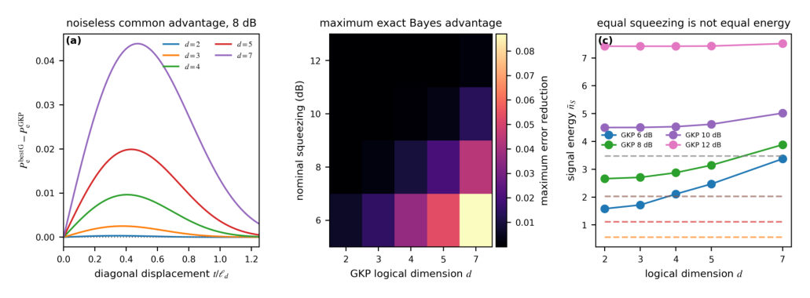 
FIG. 2. Exact noiseless equal-squeezing comparison. (a) Common Bayesian advantage ∆pure B at 8 dB for d = 2, 3, 4, 5, 7 along the diagonal phase-space direction. Positive values mean that the finite-energy GKP Bell probe outperforms the coherent, aligned squeezed-vacuum, and twin-beam probes simultaneously. (b) Maximum advantage over 0 ≤t/ℓd ≤1.25 as a function of logical dimension and nominal squeezing. (c) Code-averaged GKP signal energy (solid curves) and Gaussian signal energy sinh2 r at the same nominal squeezing (dashed horizontal curves). The comparison is performed at equal squeezing, not equal energy.

📷 Fig 3

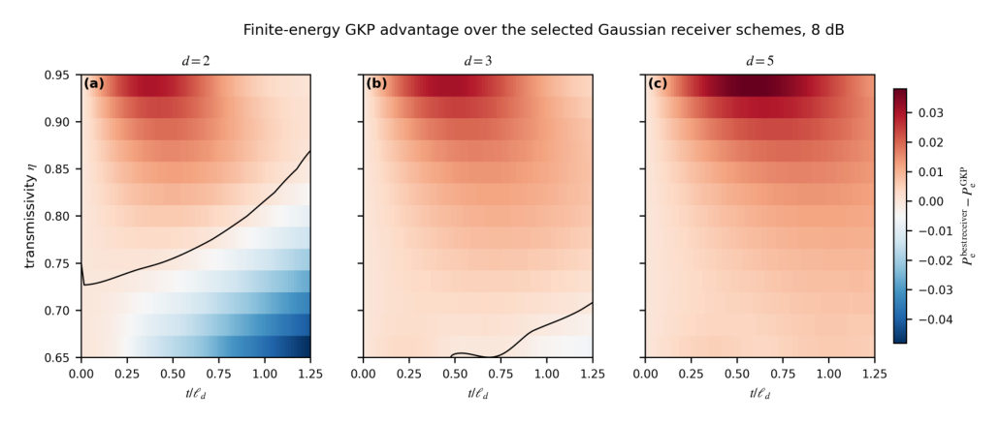 
FIG. 3. Finite-energy Bayesian comparison after loss and post-amplification at 8 dB. The color represents ∆rec B from Eq. (64); red denotes a lower GKP Helstrom error than every selected Gaussian receiver, blue denotes the opposite, and the black curves mark equality. The Gaussian receiver set comprises coherent- and squeezed-state homodyne detection, twin-beam conditional homodyne detection, and the three inverse-preparation vacuum-or-not receivers.

📷 Fig 4

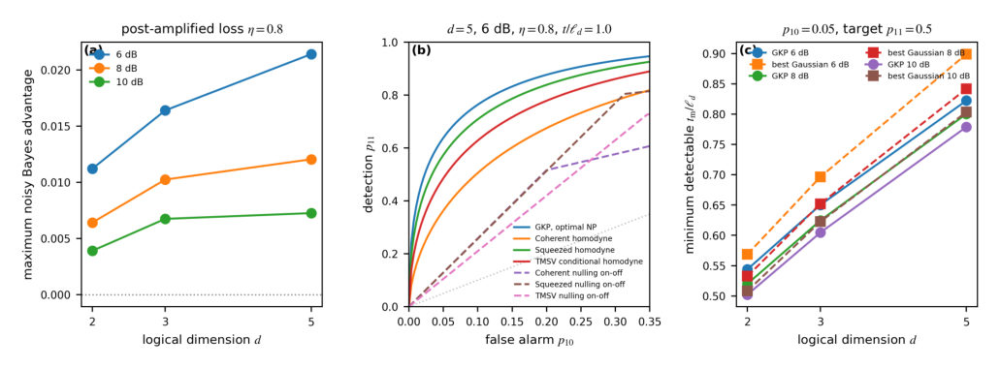 
FIG. 4. Selected-receiver Bayesian and Neyman–Pearson comparison. (a) Maximum noisy Bayesian advantage at η = 0.8 versus logical dimension for 6, 8, and 10 dB. (b) Complete ROC at d = 5, 6 dB, η = 0.8, and t/ℓ5 = 1. Solid curves show the optimal GKP test and the Gaussian quadrature receivers; dashed curves show the inverse-preparation vacuum-or-not receivers. (c) First-crossing minimum detectable displacement at p10 = 0.05 and target p11 = 1/2. The Gaussian benchmark is the best of the six displayed receiver schemes at each squeezing.

📷 Fig 5

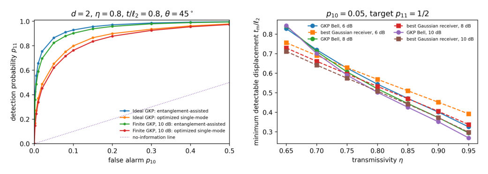 
FIG. 5. Finite-energy Neyman–Pearson performance under post-amplified loss. (a) Receiver-operating characteristics for an oblique displacement with d = 2, η = 0.8, and t/ℓ2 = 0.8, comparing the ideal GKP limit with the finite-energy entanglement- assisted and optimized single-mode GKP protocols. Finite squeezing degrades the discrimination relative to the ideal-code limit while preserving the separation between the two protocols. (b) First-crossing minimum detectable displacement as a function of channel transmissivity for the finite-energy entanglement-assisted GKP protocol at equal nominal squeezing. The false-alarm probability is p10 = 0.05 and the target detection probability is p11 =...

**Summary.** This paper establishes a rigorous decision-theoretic framework to detect phase-space displacements using finite-energy GKP states. It derives optimal detection metrics by comparing GKP performance against standard Gaussian probes under realistic loss and amplification noise channels. The key finding is that GKP encoding offers superior sensing capabilities in specific noisy regimes compared to purely Gaussian approaches.

**Why it may be interesting.** This work directly addresses quantum metrology limits by analyzing non-Gaussian probes (GKP states) in realistic noisy environments (lossy channels), which is crucial for practical quantum sensing applications beyond the ideal vacuum case.

Detailed structure

**Main problem.** The paper develops a quantum-decision-theoretic framework to determine if an unknown phase-space displacement has occurred using finite-energy Gottesman-Kitaev-Preskill (GKP) probes.

**Main result.** Under lossy and finite-squeezing regimes, GKP probes can achieve lower Bayesian error probabilities and detect smaller displacements compared to optimized Gaussian receivers.

**Method.** The authors employ quantum decision theory metrics (Bayesian minimum-error probability and Neyman-Pearson ROC) applied to bosonic systems undergoing displacement channels.

**Model / system.** The system models a single bosonic mode subjected to unknown phase-space displacements, analyzed using finite-energy GKP states as probes. The analysis incorporates realistic noise channels like pure loss followed by quantum-limited amplification.

**Key observables.** Bayesian error probability ($P_e^\star$), Neyman-Pearson receiver operating characteristic ($p_{11}(p_{10})$), and the minimum detectable displacement.

**Important parameters / regimes.** Finite squeezing level, logical dimension ($d$), channel transmissivity ($\eta$), and amplification gain ($G$).

**Assumptions / limitations.** The analysis treats pure loss followed by quantum-limited amplification as an effective Gaussian random-displacement channel; entanglement does not surpass the single-mode optimum in noiseless pure states.

**Figures summary.** Figure 5 compares ROC curves and minimum detectable displacement thresholds for GKP vs. Gaussian protocols under varying transmissivity, showing performance advantages for GKP in specific regimes.

**Paper structure.** The paper establishes the decision theory framework, derives optimal metrics using characteristic functions, models loss/amplification channels, analyzes single-mode versus entanglement-assisted GKP sensing, and concludes with numerical comparisons against Gaussian benchmarks.

Abstract

We develop a quantum-decision-theoretic framework for detecting phase-space displacements with finite-energy, $d$-level Gottesman-Kitaev-Preskill (GKP) probes. For single-mode and entanglement-assisted architectures, we derive the Bayesian minimum-error probability, the optimal Neyman-Pearson receiver-operating characteristic, and the corresponding minimum detectable displacement. Finite-energy effects are treated through exact theta-series displacement kernels, while pure loss followed by quantum-limited amplification is mapped to an effective Gaussian random-displacement channel. Entanglement removes preparation-dependent blind directions and preserves both logical displacement labels, although it does not surpass the pointwise optimized single-mode strategy in the noiseless pure-state setting. We benchmark the resulting protocols against coherent-state, direction-matched squeezed-vacuum, and twin-beam schemes at equal nominal squeezing. Numerical results identify finite-squeezing and lossy regimes in which GKP probes achieve both a lower Bayesian error and a smaller minimum detectable perturbation than the selected Gaussian receivers.

[↑ back to top](#top)

### [Quantum uncertainty in a macroscopic domain](http://arxiv.org/abs/2608.09262v1)

**Authors:** Othman Q. Malhas, Bacim Alali  
**Type:** theory · **Category:** other · **PDF:** <https://arxiv.org/pdf/2608.09262v1>  
**Analysis basis:** full PDF text, analyzed in chunks
**Topic relevance:** `quantum measurements` **3/5** · `analog quantum simulation` **1/5** · `correlated / nonlocal dissipation` **1/5**

📷 Fig 1

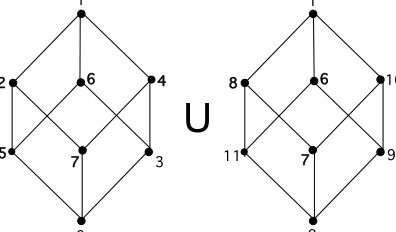 
Figure 1: The Hasse diagram V12, shown on the left, is an orthocomplemented lattice obtained by gluing the Boolean algebras B1 and B2 along their common Boolean subalgebra {0, 1, 6, 7}. With the component family specified in (3), it is also a partial Boolean algebra.

📷 Fig 2

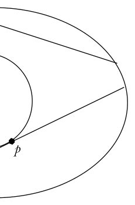 
Figure 3: A schematic representation of models and pre-frames. The set U of initial formulæ is depicted as a disc, the chords represent pre-frames, and the solid discs represent models. A model meets each pre-frame in at most one point, i.e. in at most one initial formula (Lemma 10.4).

📷 Fig 3

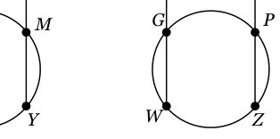 
Figure 5: The configuration Σ, a 3 × 3 array of modules mij.

**Summary.** This work develops a model-theoretic framework using partial Boolean algebras to mathematically encode concepts of quantum uncertainty. By analyzing the structure of these algebras, the authors show how classical logical consistency can yield analogues of measurement back-action and contextuality. It provides an abstract structural understanding of quantum constraints rooted in propositional logic.

**Why it may be interesting.** It offers a highly abstract, logic-based approach to contextuality and quantum constraints, which could provide novel mathematical tools for understanding non-classical correlations without invoking Hilbert space formalism directly.

Detailed structure

**Main problem.** The paper aims to formulate quantum-like uncertainty using purely classical model-theoretic tools, specifically by representing partial Boolean algebras.

**Main result.** It establishes that certain structural properties (KS-colourability) of these abstract algebras correspond to physical constraints like the destruction of sharpness upon measurement back-action.

**Method.** The authors develop a framework mapping propositional logic theories onto partial Boolean algebras, using model theory to define concepts analogous to quantum compatibility and uncertainty.

**Model / system.** The system is an abstract mathematical model based on partial Boolean algebras derived from the core of consistent theories in classical propositional logic. These structures are then mapped analogously to propositions associated with physical observables.

**Key observables.** KS-colourability, sharpness (number of locally admissible atomic outcomes), and the structure of the underlying partial Boolean algebra.

**Important parameters / regimes.** The dimension of the partial Boolean algebra (e.g., 12-vertex vs. 140-vertex) dictates whether certain structural properties hold.

**Assumptions / limitations.** The framework assumes that quantum uncertainty can be captured by analyzing the organization and compatibility structure of propositions within a classical logical setting, rather than requiring nonclassical deduction itself.

**Figures summary.** Figures illustrate the Hasse diagram of small partial Boolean algebras (like $V_{12}$) formed by gluing together smaller Boolean components.

**Paper structure.** The paper progresses from defining the model-theoretic representation of partial Boolean algebras, to characterizing uncertainty via KS-colourability and measurement back-action in finite examples, concluding with connections to state support sets and limitations regarding probability assignment.

Abstract

We develop a classical model-theoretic representation of partial Boolean algebras and use it to formulate quantum-like uncertainty without abandoning classical propositional logic. Given a surjection from the initial formulæ of a propositional language onto a partial Boolean algebra $(\mathcal V,Π)$, we construct a consistent theory $\mathcal T_g$ whose core---the ordered set of equivalence classes of initial formulæ---is isomorphic to $(\mathcal V,Π)$. Its models are characterized as upward-closed clusters, yielding a model-theoretic formulation of KS-colourability: an $n$-dimensional partial Boolean algebra is KS-colourable exactly when the induced theory has a model meeting every pre-frame in one primitive formula.   For finite-spectrum observables, uncertainty is defined by the number of locally admissible atomic outcomes. Dispersion-free models are characterized by the singleton pre-frame condition. With an additional measurement-update postulate, a finite example shows how measurement of an incompatible observable can destroy sharpness, providing a model-theoretic form of back-action. A $12$-vertex partial Boolean algebra is KS-colourable, whereas a rigorously constructed $140$-vertex, four-dimensional partial Boolean algebra is not, as shown by a parity argument; its incidence structure is isomorphic to the Peres $24$-ray, $24$-basis configuration in $\mathbb R^4$. Macroscopic interpretations show that these phenomena arise from the organization of propositions and models rather than from nonclassical deduction. Finally, we relate certain models to the probability-one propositions of pure states and density operators, while emphasizing that such certainty models do not determine the full quantum state.

[↑ back to top](#top)

### [Sub-Rayleigh Imaging of Unequal-Intensity Sources: Near-Quantum-Limit Multiparameter Estimation](http://arxiv.org/abs/2608.07868v1)

**Authors:** Y. Batuhan Yilmaz, Kent A. G. Bonsma-Fisher, Muhammad Mohid, Noah Lupu-Gladstein, Arthur O. T. Pang, Aephraim M. Steinberg  
**Type:** both · **Category:** other · **PDF:** <https://arxiv.org/pdf/2608.07868v1>  
**Analysis basis:** full PDF text, analyzed in chunks
**Topic relevance:** `quantum measurements` **3/5** · `interference shaping light` **1/5** · `quantum optics experiment` **1/5**

📷 Fig 1

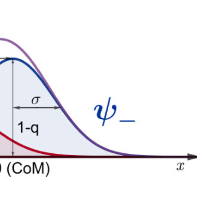 
Fig. 1. Illustration of the PSF of the two sources with separation 𝛿and relative intensity 𝑞in the image plane (red and blue) and the PSF of the two sources combined (purple). The axis is centered on the combined PSF’s center of mass (CoM).

📷 Fig 2

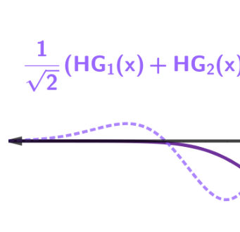 
Fig. 2. Illustrations and the comparison of the ideal (HG1(𝑥) + HG2(𝑥))/ √

📷 Fig 3

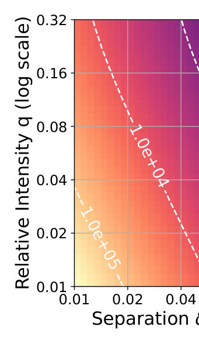 
Fig. 3. Ratio of the CRBs for 𝛿with DI and SPLICE in a log-log contour plot. The advantage of SPLICE grows as 𝛿and 𝑞get smaller.

📷 Fig 4

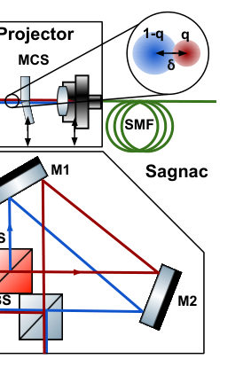 
Fig. 4. The experimental setup. The spatial profile of the two sources is illustrated on the top right. The Sagnac configuration prepares the two beams with unequal intensities and the fiber collimator with microscope cover slips (MCS) applies the projectors 𝜙±(𝑥). We use the polarization degree of freedom of light to control the relative intensity. The quarter-wave plate (QWP) and half-wave plate (HWP) sets the polarization. The polarizing beamsplitter (PBS) at the beginning of the interferometer splits the horizontal and the vertical portions of the light, and the non-polarizing beamsplitter recombines the two beams. The distance between two beams is controlled by the mirror M1 mounted on...

📷 Fig 5

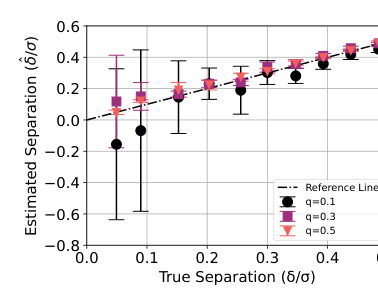 
Fig. 5. Estimated values vs. the true values of the parameters. Different colors are the results for different relative intensities. The separation values are normalized by the width of the Gaussian PSF 𝜎= 397 µm. The reference lines show the true values of the parameters. Each point is the average of 10 trials. Each estimate uses on average 320,000 single photon detections. The error bars represent the standard deviation of the 10 trials of each setting.

**Summary.** This paper presents a method called SPLICE to overcome diffraction limitations when measuring two closely spaced light sources with unequal intensities. By adapting super-resolution localization techniques and using quantum information theory bounds, the authors demonstrate that their approach significantly improves the accuracy of estimating both separation and intensity compared to standard direct imaging methods. This work advances the field by achieving near-quantum-limit precision in complex multiparameter optical estimation.

**Why it may be interesting.** This work is highly relevant to quantum optics and open quantum systems as it pushes measurement techniques beyond classical limits by exploiting quantum correlations in parameter estimation, which has implications for sensing and imaging.

Detailed structure

**Main problem.** The core problem is overcoming the diffraction limit (Rayleigh criterion) in optical imaging to simultaneously estimate both the separation ($\delta$) and relative intensity ($q$) of two spatially unresolved, unequal-intensity light sources.

**Main result.** The proposed SPLICE method significantly outperforms Direct Imaging (DI), achieving an estimation precision that approaches the quantum limit with up to a sixfold improvement over DI in tested regimes.

**Method.** The authors adapt Super-Resolved Position Localization by Inversion of Coherence along an Edge (SPLICE) technique, employing quantum parameter estimation theory based on Fisher Information matrices derived from measured photon counts.

**Model / system.** The system involves two incoherent light sources whose combined field is imaged. The analysis models the state as a statistical mixture and uses projectors onto specific spatial modes (Hermite-Gauss functions) to extract information about $\delta$ and $q$.

**Key observables.** Root Mean Squared Error (RMSE) for estimated separation ($\hat{\delta}$) and relative intensity ($\hat{q}$); Quantum Cramér-Rao Bound (QCRB).

**Important parameters / regimes.** Separation ($\delta$), relative intensity ($q$), beam radius ($\sigma$), quantum limit bounds, and cross-talk parameter ($\epsilon$).

**Assumptions / limitations.** The analysis assumes single-photon detection dominates, the center of mass is known, and theoretical bounds rely on asymptotic unbiasedness (large photon number).

**Figures summary.** Figures compare estimated vs. true values for $\delta$ and $q$, showing SPLICE's superior performance relative to DI; one figure plots the ratio of CRBs demonstrating SPLICE's growing advantage as separation decreases.

**Paper structure.** The paper establishes the limitations of classical imaging, introduces the theoretical framework using quantum Fisher Information matrices (CRB), details the adaptation of SPLICE for multiparameter estimation, and concludes with experimental validation showing performance approaching the quantum limit.

Abstract

In optical imaging, diffraction strongly degrades the performance of conventional intensity-based estimation once the separation between two sources is below the Rayleigh-Abbe limit. Recent developments showed that this limitation can be surpassed using spatial-mode demultiplexing (SPADE), and this was demonstrated in several experiments for two equal-intensity spots of unknown separation. When there are multiple unknown parameters, as in the case of several unequal sources with unknown intensities and unknown separation, cross-talk among the parameters makes the multi-parameter estimation problem significantly more challenging. In this paper, we adapt super-resolved position localization by inversion of coherence along an edge (SPLICE) to estimate both the separation and relative intensity of two incoherent sources simultaneously. We demonstrate a clear advantage over direct imaging (DI), achieving a root mean squared error (RMSE) approximately $50 \%$ larger than the quantum limit and a sixfold improvement over DI within the range of parameters we tested. This improvement can be even greater for smaller separations and larger intensity imbalances when crosstalk is suppressed.

[↑ back to top](#top)

### [Effect of Strong Field Space-time Features on Vacuum Pair](http://arxiv.org/abs/2608.08464v1)

**Authors:** B. An, N. S. Lin, C. K. Li, M. Jiang, Y. J. Li  
**Type:** theory · **Category:** other · **PDF:** <https://arxiv.org/pdf/2608.08464v1>  
**Analysis basis:** full PDF text, analyzed in chunks
**Topic relevance:** `Keldysh / 2PI / non-Gaussian methods` **3/5** · `methods for driven-dissipative` **1/5**

📷 Fig 1

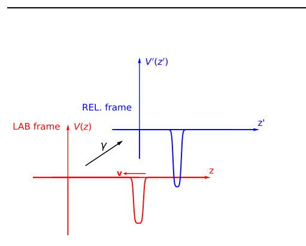 
Fig. 1 Schematic picture of the relativistic moving potential well. The potential well moves at a constant velocity along positive direction of the z-axis in the laboratory frame.

📷 Fig 2

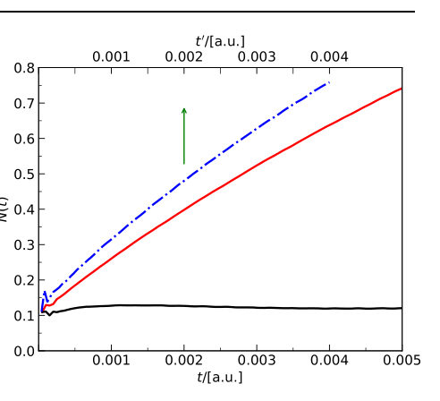 
Fig. 2 Number of created pairs as a function of time. The black solid line represents a rest potential well in the labora- tory frame (V = 2.4c2, W = 1/c, D = 4/c, v0 = 0), the red solid line represents a relativistic moving potential well in the laboratory frame (V = 2.4c2, W = 1/c, D = 4/c, v0 = 0.6c). The blue dash-dot line represents a rest potential well in the relative frame (V ′ = 3c2, W ′ = 1.25/c, D′ = 5/c, t′ = 0.004, v ′ = 0).

📷 Fig 3

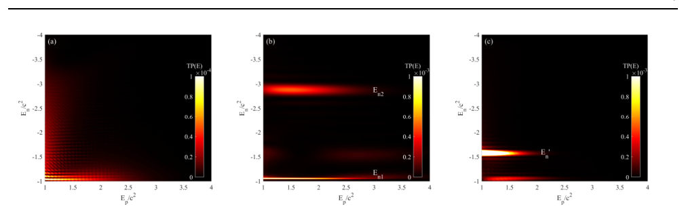 
Fig. 3 The tunneling probability of electron. The colorbar represents the particle tunneling probability. (a) The rest potential well in the laboratory frame, (b) The relativistic moving potential well in the laboratory frame, (c) The rest potential well in the relative frame. Note that the colorbar scale in (a) is one order of magnitude lower than the others. The parameters are the same as those in Fig. 2.

📷 Fig 4

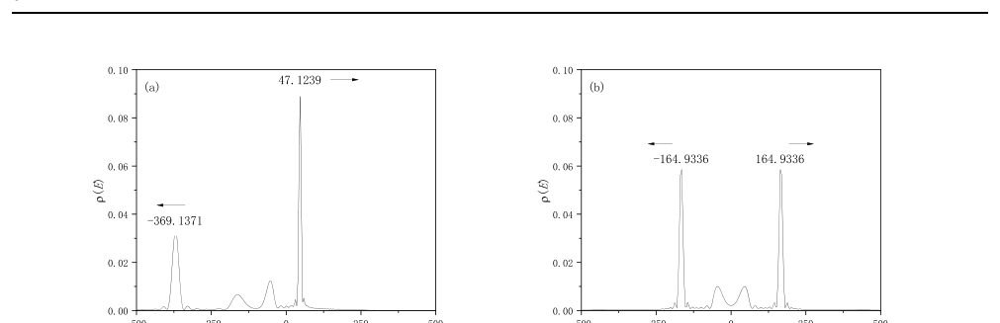 
Fig. 4 The momentum spectra of the created positrons. (a) The relativistic moving potential well in the laboratory frame, (b) The rest potential well in the relative frame. Arrows indicate the propagation directions of positrons. The parameters are the same as those in Fig. 2.

📷 Fig 5

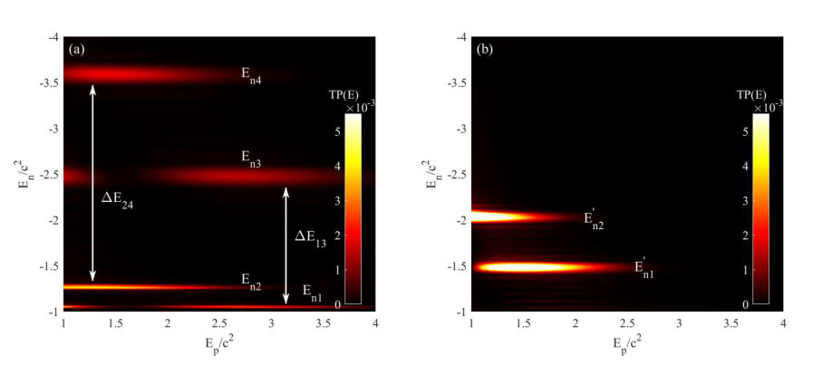 
Fig. 5 The tunneling probability of electron. The colorbar represents the particle tunneling probability. (a) The relativistic moving potential well in the laboratory frame (V = 2.8c2, W = 0.7/c, D = 4/c, v0 = 0.55c, t = 0.005). (b) The rest potential well in the relative frame(V ′ = 3.35c2, W ′ = 0.84/c, D′ = 4.79/c, v ′ = 0, t′ = 0.0042).

**Summary.** This paper uses Computational Quantum Field Theory (CQFT) to study electron-positron pair creation induced by strong, time-varying electromagnetic fields. The core finding is that the relativistic motion of the field source modifies vacuum physics, significantly lowering the required laser intensity threshold for pair production. By analyzing frame dependence via Lorentz transformations, the authors establish a comprehensive framework linking spacetime geometry directly to quantum vacuum decay.

**Why it may be interesting.** This work is highly relevant as it applies advanced quantum field theory techniques to understand non-perturbative QED phenomena. The explicit focus on relativistic kinematics and frame dependence provides a deep insight into how spacetime geometry influences fundamental vacuum processes, which has parallels in analyzing extreme astrophysical environments or high-energy particle collisions.

Detailed structure

**Main problem.** The study investigates how strong, time-dependent space-time features affect the vacuum pair production rate of electron-positron pairs.

**Main result.** The spatiotemporal modulation provided by a relativistically moving potential well significantly reduces the laser intensity threshold required for pair creation. This reduction is fundamentally linked to the Lorentz transformation of four-momentum, reshaping vacuum excitation pathways in phase space.

**Method.** The research employs Computational Quantum Field Theory (CQFT) alongside semi-analytical methods like the Instantaneous Resonance Field Method (IRFM). These techniques are used to solve the time-dependent Dirac equation for pair production probabilities.

**Model / system.** The system models electron-positron pair creation in a strong external field, specifically using a potential well $V(z, t)$ that moves relativistically. The dynamics are governed by the Dirac equation, and comparisons are made between results obtained in the laboratory frame and a moving reference frame via Lorentz transformations.

**Key observables.** Total number of created pairs ($N_{e}, N_{p}$), tunneling probability ($\langle E_p | 	ext{En} 
angle^2$), momentum spectra of positrons ($P_z$), and the energy Full Width at Half Maximum (FWHM) of bound states.

**Important parameters / regimes.** Laser intensity, relative velocity ($v_0$), Lorentz factor ($\gamma$), and characteristic potential parameters ($V_0, D, W$).

**Assumptions / limitations.** The analysis assumes that the observed pair creation enhancement is due to relativistic phase-space reconfiguration governed by Lorentz transformations, rather than just increased field strength.

**Figures summary.** Figures illustrate the time evolution of pair numbers for rest vs. relativistic motion in both frames; they also show momentum spectra and tunneling probabilities derived from bound state analysis across different reference frames.

**Paper structure.** The paper progresses by first establishing the CQFT framework to model pair creation in a moving potential well. It then compares results between the Lab frame and the Relativistic frame using Lorentz transformations, analyzing how bound state properties (energies, FWHM) transform, culminating in the conclusion about threshold reduction.

Abstract

The relativistic dynamics of bound states across inertial reference frames are investigated using the computational quantum field theory (CQFT). The results reveal that the spatiotemporal properties of bound states within a given potential well are strictly frame-dependent. Crucially, this spatiotemporal modulation of the external field enables a reduction in the laser intensity threshold required for vacuum electron-positron pair creation. Analytical and numerical calculations demonstrate that this threshold reduction originates from the Lorentz transformation of the four-momentum, which reshapes the vacuum excitation pathways in phase space. By developing CQFT, we establish a comprehensive framework in which relativistic effects intrinsically govern the quantum vacuum decay process

[↑ back to top](#top)

### [Layer-Locked Chiral Topological Superconductivity](http://arxiv.org/abs/2608.08843v1)

**Authors:** Yijie Mo, Zhongbo Yan  
**Type:** theory · **Category:** other · **PDF:** <https://arxiv.org/pdf/2608.08843v1>  
**Analysis basis:** full PDF text, analyzed in chunks
**Topic relevance:** `analog quantum simulation` **3/5** · `Keldysh / 2PI / non-Gaussian methods` **1/5**

📷 Fig 1

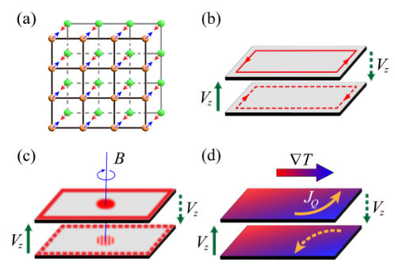 
FIG. 1. Schematics of the (a) lattice structure and antiferromagnetic order, (b) layer-locked CMESs, (c) layer-locked vortex-core MZMs, and (d) layer-locked thermal Hall effect. In (b)–(d), the dashed pat- terns indicate a switch of the locking layer upon reversal of the gate voltage.

📷 Fig 2

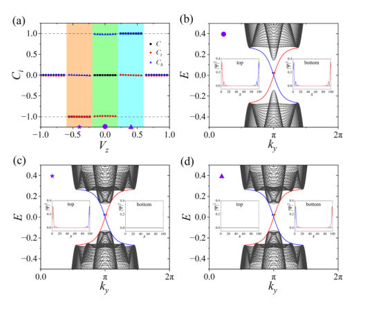 
FIG. 2. (a) Total Chern number (C) and layer-resolved Chern num- bers (Ct, Cb) as a function of Vz. The white, yellow, green, and cyan regions correspond to the trivial, top-layer-locking, bilayer-locking, and bottom-layer-locking phases, respectively. (b)-(d) Energy spec- tra for a ribbon geometry with open (periodic) boundary conditions in the x(y) direction, for Vz = 0, −0.4, and 0.4, respectively. The midgap edge-state spectrum is doubly degenerate in (b), whereas no such degeneracy appears in (c) or (d). Insets show the layer-resolved probability density profiles of the upper-moving (red) and lower- moving (blue) CMESs on the two x-normal edges (with Nx = 100). Common parameters are t...

📷 Fig 3

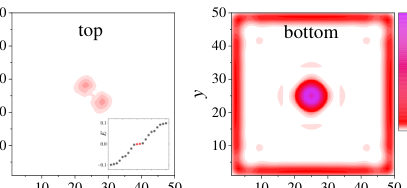 
FIG. 3. Layer-resolved probability density profiles of MZMs un- der open boundary conditions in both the x and y directions (Nx = Ny = 50), with a single vortex placed at (x, y) = (25, 25). Panels (a)–(c) correspond to Vz = 0, −0.4, and 0.4, respectively. Insets show a few eigenenergies closest to E = 0. Common parameters are t = 1, µ = 3.8, η = 0.5, λso = 0.5, Mz = 0.5, ∆= 0.3, and ξ = 2.

📷 Fig 4

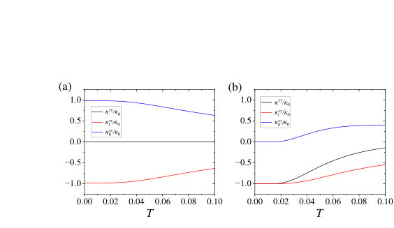 
FIG. 4. Layer-resolved thermal Hall coefficients as functions of tem- perature. The solid black, red, and blue lines represent the total, top-layer, and bottom-layer thermal Hall coefficients, respectively. Panels (a) and (b) correspond to Vz = 0 and −0.4, respectively. Common parameters are: t = 1, µ = 3.8, η = 0.5, λso = 0.5, Mz = 0.5, and ∆= 0.3.

**Summary.** The paper proposes a universal mechanism to realize layer-locked chiral topological superconductivity in bilayer antiferromagnets. By tuning an external gate voltage, the system can be driven into three distinct topological phases, each characterized by unique layer-resolved Chern numbers. These theoretical predictions are strongly correlated with observable signatures like confined Majorana edge states and quantized thermal Hall responses.

**Why it may be interesting.** This work provides a concrete, tunable platform for realizing exotic topological superconductivity using engineered symmetries in layered materials, which is highly relevant to understanding emergent quantum phenomena in condensed matter systems.

Detailed structure

**Main problem.** The research aims to uncover a universal mechanism for realizing layer-locked topological phases, specifically focusing on chiral topological superconductivity (CTSC) in bilayer antiferromagnetic systems.

**Main result.** Three distinct, gate-tunable topological superconducting phases were identified, characterized by unique layer-resolved Chern numbers ($C_t, C_b$) and corresponding physical signatures like edge states and thermal Hall responses.

**Method.** The study uses the Bogoliubov-de Gennes (BdG) Hamiltonian to model the system and characterizes topology using layer-resolved Chern numbers calculated from the Berry curvature.

**Model / system.** A minimal bilayer antiferromagnetic system with s-wave pairing is modeled, featuring nonsymmorphic symmetries that enforce specific hopping vanishing conditions. The Hamiltonian includes terms for hopping, spin-orbit coupling, magnetic fields, and superconducting pairing ($\Delta$).

**Key observables.** Layer-resolved Chern numbers ($C_t, C_b$), layer-locked chiral Majorana edge states (CMESs), vortex-core Majorana zero modes (MZMs), and the thermal Hall response ($\kappa_{xy}^z$).

**Important parameters / regimes.** Gate voltage tuning of the staggered potential ($V_z$) is crucial for transitioning between the three distinct topological phases.

**Assumptions / limitations.** The layer-resolved Chern number is noted not to be a genuine topological invariant, and the model relies on specific symmetry constraints (nonsymmorphic symmetries).

**Figures summary.** Figures illustrate the dependence of $C, C_t, C_b$ on $V_z$, show layer-resolved probability density profiles for MZMs under vortices in different locking phases, and confirm the quantization of the thermal Hall coefficient ($\kappa_{xy}^z = C\kappa_0$).

**Paper structure.** The paper establishes the theoretical framework using the BdG Hamiltonian, derives the mechanism based on symmetry constraints, identifies three distinct topological superconducting regimes by tuning $V_z$, and validates these findings through multiple measurable physical diagnostics (edge states, vortices, thermal response).

Abstract

We uncover a universal mechanism for realizing layer-locked topological phases. Guided by it, we investigate the realization of layer-locked chiral topological superconductivity-the superconducting analogue of the quantum anomalous layer Hall effect-in a nonsymmorphic bilayer antiferromagnetic system with s-wave pairing. We identify three distinct gate-tunable topological phases and establish a direct correspondence between the nearly quantized layer-resolved Chern numbers and the layer-locking behavior of chiral Majorana edge states, vortex-core Majorana zero modes, and nearly quantized thermal Hall responses.

[↑ back to top](#top)

### [Promise and Challenges of Distimation](http://arxiv.org/abs/2608.08745v1)

**Authors:** Joshua Carlo A. Casapao, Ananda G. Maity, Naphan Benchasattabuse, Michal Hajdušek, Akihito Soeda, Rodney Van Meter, David Elkouss  
**Type:** theory · **Category:** quantum information and computing · **PDF:** <https://arxiv.org/pdf/2608.08745v1>  
**Analysis basis:** full PDF text, analyzed in chunks
**Topic relevance:** `quantum measurements` **3/5** · `methods for driven-dissipative` **1/5**

📷 Fig 1

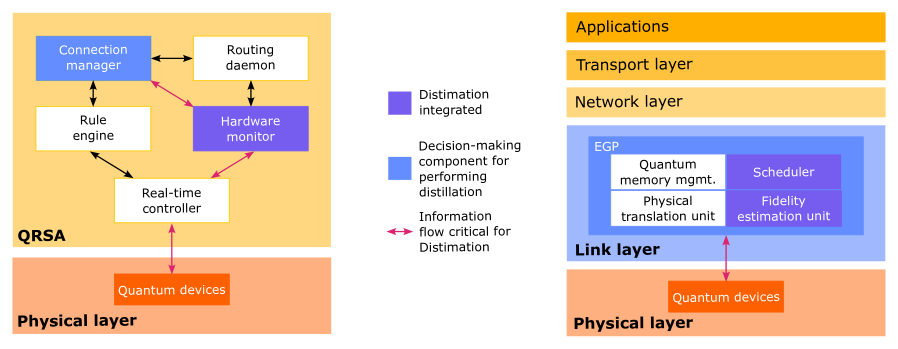 
Fig. 1. Incorporating distimation within the quantum network stacks proposed by (a) Satoh et al. [14] and (b) Dahlberg et al. [1]. (a) In the Quantum Repeater Software Architecture (QRSA) model, the responsibilities of the software are separated into five components (as discussed in the text). If distimation is integrated into the hardware monitor (shown in purple), the hardware monitor plays a larger role as both a data sink and an estimation unit. Information about the distillation statistics is relayed from the quantum devices (acting as the quantum network interface cards) to the hardware monitor (shown by red arrows). Moreover, information about the distillation model, contained in the...

📷 Fig 2

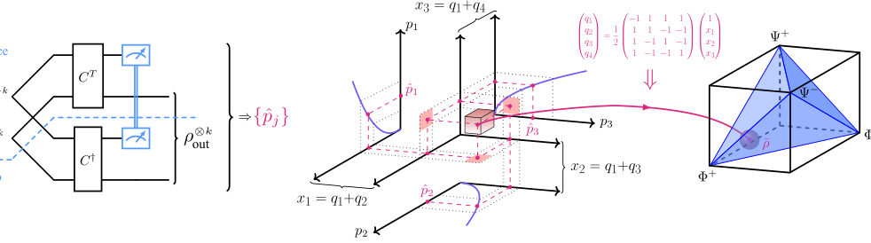 
Fig. 2. Abstract structure of a distimation protocol. (a) General bilocal Clifford distillation protocols [7]. Two parties share n copies of an entangled state. They apply a multi-qubit Clifford gate and its conjugate. They then measure n −k copies, share the outcomes over a classical communication channel, and keep the state depending on the coincidence pattern of the outcomes. The empirical distributions of outcomes {ˆpj} exhibit strong concentration around the true underlying distribution, converging towards it at an exponential rate as the number of repetitions of the distillation protocol increases. These are described by the pertinent concentration inequalities relevant to distimation...

📷 Fig 3

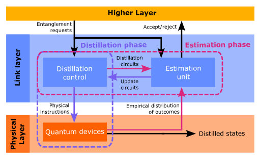 
Fig. 3. High-level schematic of the role of distimation in a quantum network. Higher layers send entanglement requests to lower layers, specifying explicit quality requirements such as latency and entanglement fidelity. The distillation control mechanism at the link layer determines the amount of distillation necessary to ensure entanglement quality, that is, to meet the latency and fidelity requirements. During the distillation phase, instructions to perform distillation are sent by the link layer to the quantum hardware platform (physical layer). In the estimation phase, information about the distillation circuits, together with the empirical distribution of outcomes (i.e., the syndrome...

📷 Fig 4

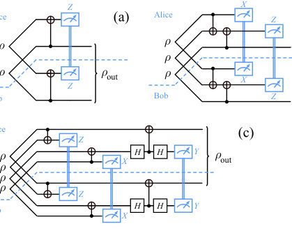 
Fig. 4. Bilocal Clifford entanglement distillation protocols studied for disti- mation. (a) The 2-to-1 BBPSSW protocol [5]. (b) The 3-to-1 double selection protocol [6], with computational and Hadamard measurement settings. (c) A 4-to-1 entanglement distillation protocol [11], with three distinct measurement settings. The blue solid lines represent the classical communication channels between the two users. In all protocols, a successful distillation is heralded if corresponding marginal measurement outcomes coincide.

📷 Fig 5

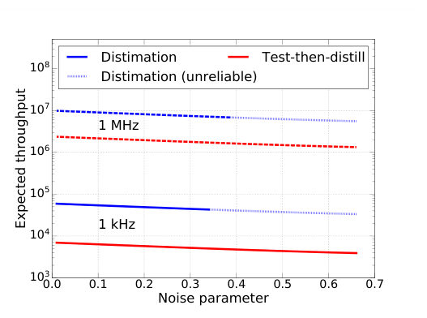 
Fig. 5. The expected throughput of distilled states using one round of the BBPSSW protocol with input isotropic states. Here, we fix the estimation’s accuracy and failure probability. We set both strategies to be active for 120 and 20 seconds, given the generation rates of 1 kHz (solid red/blue lines) and 1 MHz (dashed red/blue lines), respectively. In both the kilohertz (estimation error and failure probability of estimation equal to 10−2) and megahertz (estimation error and failure probability of estimation equal to 10−3) cases, there is a quantitative advantage in expected throughput when the distimation approach is used. However, the estimate obtained from distimation can be unreliable...

**Summary.** This paper introduces 'distimation,' a novel protocol that merges state estimation with entanglement distillation in quantum networks. By reusing classical syndrome data from the purification process, it eliminates redundant testing stages required by older protocols. This results in significantly lower resource consumption and reduced latency, making quantum networking more feasible for current hardware limitations.

**Why it may be interesting.** It provides a blueprint for optimizing quantum network protocols by merging two distinct functional layers (estimation and purification) into one efficient physical process, which is crucial for near-term hardware deployment.

Detailed structure

**Main problem.** Traditional quantum network protocols require separate, resource-intensive steps for state estimation (quality checking) and entanglement distillation.

**Main result.** Distimation merges these two processes by extracting necessary state estimation data directly from the classical syndromes generated during entanglement distillation, significantly reducing required raw entangled pairs and latency.

**Method.** The core method is to eliminate the dedicated 'test-then-distill' stage by treating syndrome measurements as dual-purpose: simultaneously purifying entanglement and characterizing the underlying channel noise.

**Model / system.** The work models quantum network stacks, focusing on establishing high-fidelity entanglement between nodes using raw entangled pairs (e.g., Bell pairs) generated over noisy links.

**Key observables.** Expected throughput of distilled Bell pairs; characterization of Bell-diagonal coefficients ($q_i$); fidelity and Pauli error probability estimates.

**Important parameters / regimes.** Noise parameter ($\epsilon$); raw entanglement generation rate (e.g., 1 kHz or 1 MHz); target accuracy and failure probability.

**Assumptions / limitations.** Assumes that local noise processes are dominant and well-characterized; assumes the viability of distillation protocols; requires hardware capable of buffering pairs within coherence times.

**Figures summary.** Figures illustrate the integration of distimation into quantum network stack models (QRSA, Dahlberg et al.'s), showing the flow from distillation to estimation, and comparing throughput vs. noise for different regimes.

**Paper structure.** The paper surveys the principles by contrasting the traditional 'test-then-distill' pipeline with the integrated distimation approach, quantifies resource gains using throughput calculations across various noise models, and outlines a research roadmap addressing hardware limitations and generalization challenges.

Abstract

Estimating the quality of raw entangled states and distilling high-fidelity entanglement traditionally require two separate link-layer protocols in a quantum network stack, each consuming its own share of fragile entangled pairs. The recently introduced distimation concept merges these two protocols by directly extracting state estimation data from the classical syndromes generated during entanglement distillation. By removing the dedicated "test-then-distill'' stage, distimation lowers the number of raw entangled pairs required to operate the network, reduces latency, and streamlines the network control plane. The paradigm is especially attractive for near-term hardware platforms, where entanglement generation remains a severe bottleneck. Alongside these promises, distimation introduces new engineering challenges, ranging from accurate local-device modeling to protocols for tracking time-varying sources. This article surveys the core principles of distimation, quantifies expected gains for realistic architectures, and outlines a research roadmap toward making distimation a standard building block in future quantum networks.

[↑ back to top](#top)

### [Quantum Chinese Remainder Clock](http://arxiv.org/abs/2608.07938v1)

**Authors:** Ivri Nagar, Alioscia Hamma, Mikel Palmero, Matthew Radzihovsky, Shouzhuo Yang, Seth Lloyd  
**Type:** theory · **Category:** other · **PDF:** <https://arxiv.org/pdf/2608.07938v1>  
**Analysis basis:** full PDF text, analyzed in chunks
**Topic relevance:** `quantum measurements` **3/5** · `analog quantum simulation` **1/5**

📷 Fig 1

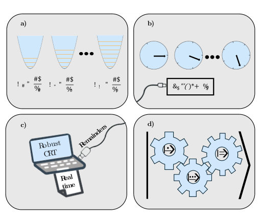 
FIG. 1. Schematic of the proposed protocol. a) State prepa- ration: We prepare n truncated harmonic oscillators, with coprime periods, in the optimal initial states for phase esti- mation. b) Measuring the time t: We perform the optimal Heisenberg-limited measurement of phase on each oscillator, to find the remainder of t by each period. c) Chinese re- mainder theorem reconstruction: From the remainders, we recover t, using a robust algorithm to overcome potential ex- perimental errors. d) Extended dynamical range: This idea is reminiscent of the structure of the Maya Long Count Cal- endar. With enough periods (denoted by Maya numerals in kets in the figure), we can extend the dynamical...

📷 Fig 2

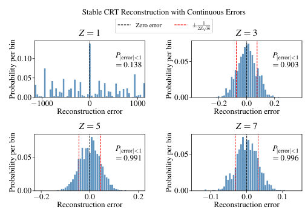 
FIG. 2. Reconstruction errors for the proposed protocol with {xj} = {2, 3, 5, 7, 11} and Z ∈{1, 3, 5, 7}, for N = 1000 trial times chosen uniformly at random from [0, 2310) [15]. For Z = 1 (no error correction), the error is distributed across the entire range, while for larger Z the distribution is peaked around 0 with uncertainty 1 2Z√m (red dashed lines) – e.g. Z = 5 is sufficient to ensure error less than 1 in 99% of cases.

**Summary.** This paper proposes a novel 'Quantum Chinese Remainder Clock' that uses multiple independent quantum oscillators to measure time over an extended range $Q = \prod x_j$. It achieves Heisenberg-limited precision by combining optimal phase measurements with the mathematical framework of the CRT. This represents a significant theoretical advancement for building high-precision, multi-scale quantum sensors.

**Why it may be interesting.** This work directly applies advanced quantum metrology techniques (Holevo measurements) to build a complex, multi-scale measurement device. The combination of number theory (CRT) with quantum estimation theory is highly relevant for developing next-generation quantum sensors using atomic or cavity QED platforms.

Detailed structure

**Main problem.** The core problem is extending the measurement range of quantum clocks or interferometers beyond the period of individual constituent oscillators by leveraging the mathematical structure of the Chinese Remainder Theorem (CRT).

**Main result.** The authors provide an optimal protocol achieving Heisenberg-limited precision for time estimation up to a product scale $Q = \prod x_j$, while also introducing fault-tolerant post-processing for error resilience.

**Method.** The method involves using the Holevo covariant measurement on multiple, pairwise coprime oscillators to estimate individual time remainders ($t \pmod{x_j}$), which are then combined via CRT inversion.

**Model / system.** The system is modeled as a 'quantum-mechanical CRT clock' composed of $m$ independent quantum oscillators (e.g., atoms/trapped ions) whose evolution is governed by distinct Hamiltonians $H_j$.

**Key observables.** The primary observables are the phase states $|\varphi
angle_j$ and the estimated time remainders $	ilde{t}_j$, which are used to reconstruct the total elapsed time $t$.

**Important parameters / regimes.** Key parameters include the coprime periods $\{x_j\}$, the truncation scale multiplier $Z$, and the resulting uncertainty scaling $\Delta t \propto 1/(2Z\sqrt{m})$.

**Assumptions / limitations.** The protocol assumes that errors manifest primarily as incorrectly rounded remainders, allowing for a robust post-processing step based on CRT inversion.

**Figures summary.** Figure 1 schematically illustrates the process: state preparation in optimal states, Heisenberg-limited phase measurement on each oscillator, and final time reconstruction using a robust CRT algorithm. Figure 2 shows the reconstruction error decreasing sharply as the truncation scale $Z$ increases.

**Paper structure.** The paper first establishes the physical model using multiple oscillators and then details the measurement protocol: optimal state preparation, performing Holevo covariant measurements to get remainders, applying a specialized rounding/correction procedure, and finally reconstructing the total time via CRT inversion.

Abstract

The Chinese remainder theorem is used in metrology for extending the range of quantum clocks/radar/interferometry, where the phase of a signal is known relative to a set of oscillators with different periods. This paper investigates the performance of a quantum-mechanical Chinese remainder clock, consisting of atoms/oscillators with pairwise coprime periods. We provide the optimal initial state and the optimal Heisenberg-limited quantum measurements for measuring time up to the product of the periods. We introduce a novel fault-tolerant post-processing protocol that allows reconstruction of the correct time even in the presence of errors in the remainders.

[↑ back to top](#top)

### [Quantum Gouy phase singularities in a propagating biphoton state](http://arxiv.org/abs/2608.08962v1)

**Authors:** Takumi Jinushi, Hirokazu Kobayashi  
**Type:** theory · **Category:** other · **PDF:** <https://arxiv.org/pdf/2608.08962v1>  
**Analysis basis:** full PDF text, analyzed in chunks
**Topic relevance:** `interference shaping light` **3/5** · `quantum optics experiment` **1/5**

📷 Fig 1

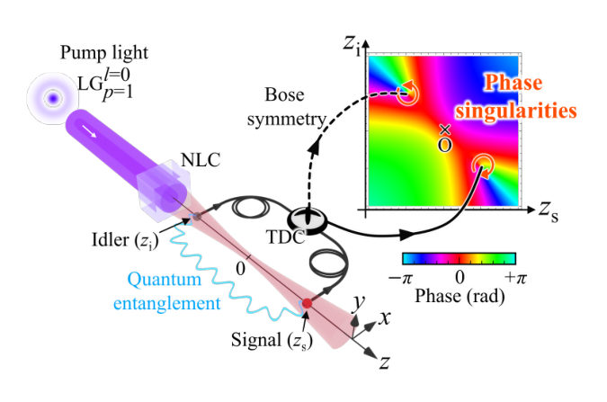 
Figure 1: Conceptual diagram for observing Gouy-phase-induced NPSs in a propagating biphoton state. An LG pump beam with higher-order radial mode incident on a nonlinear crystal (NLC) generates spatially entangled signal and idler photons through SPDC. The photons propagate along the z direction and are detected after distances zs and zi, respectively. Although unequal propagation distances lead to a relative arrival-time delay, photon pairs within the coincidence time window are selected by the time-to-digital converter (TDC). These pairs are used to evaluate the biphoton amplitude and phase in the longitudinal propagation space (zs, zi), where the quantum Gouy phase produces the NPSs.

📷 Fig 2

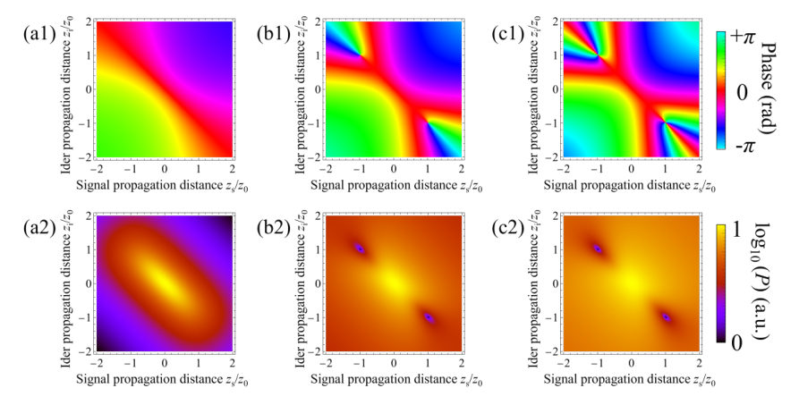 
Figure 2: Two-dimensional quantum Gouy phase and probability-density distributions on the biphoton optical axes for different LG pump modes: (a) LGl=0 p=0, (b) LG0 1, and (c) LG0 2. The upper panels show the phase distributions, and the lower panels show the corresponding probability-density distributions. For the fundamental Gaussian pump LG0 0, no phase singularities appear. For higher-order radial pump modes LG0 1 and LG0 2, NPSs appear symmetrically at z = ±z0, namely at z+ = 0 and z−= ±z0, where the probability density simultaneously vanishes. The magnitudes of their topological charges coincide with the radial mode number p of the pump field.

📷 Fig 3

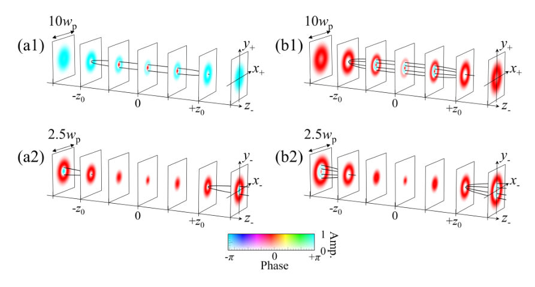 
Figure 3: Propagation dynamics of the biphoton wavefunction in the transverse coordinates r± = (x±, y±) and the numerically calculated trajectories of its zeros for the pump modes (a) LG0 1 and (b) LG0 2. The upper and lower panels show the complex-amplitude distributions in the r+ and r−planes, respectively. For the LG0 1 pump mode, a single ring-shaped zero moves toward the optical axis during propagation along z−, collapses onto the axis at the NPS positions z−= ±z0, and is then transferred from the r+ plane to the r− plane. For the LG0 2 pump mode, two ring-shaped zeros undergo the same process, reflecting the radial mode number p of the pump field.

📷 Fig 4

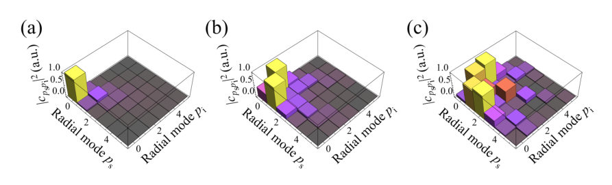 
Figure 4: Radial-mode decomposition |cps,pi|2 obtained from the LG-mode expansion of the biphoton wave- function for the pump modes (a) LGl=0 p=0, (b) LG0 1, and (c) LG0 2. For the fundamental Gaussian pump in (a), the distribution is concentrated mainly at (ps, pi) = (0, 0). In contrast, for the higher-order radial pump modes in (b) and (c), substantial weights appear in symmetric off-diagonal mode pairs, in which one photon occupies the fundamental radial mode and the other occupies a higher-order radial mode. In particular, the LG0 1 pump produces pronounced peaks at (ps, pi) = (1, 0) and (0, 1), whereas the LG0 2 pump produces strong contributions at (1, 0), (0, 1), (2, 0), and (0, 2).

📷 Fig 5

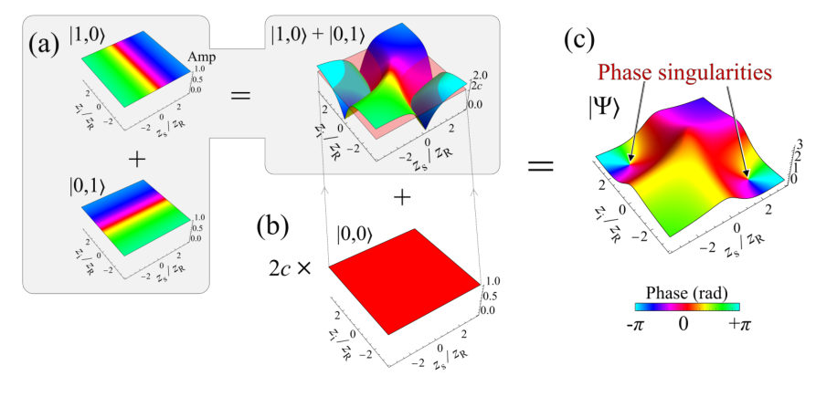 
Figure 5: The biphoton wavefunction in the two-dimensional longitudinal plane is illustrated for the minimal radial-mode set (p0, p1, p2) = (0, 1, 0), corresponding to the superposition {|0, 0⟩, |1, 0⟩, |0, 1⟩}. For clarity, the mode-independent common complex amplitude is omitted. The surface height represents the magnitude of the wavefunction, while the color denotes its phase. (a) The constituent states |1, 0⟩and |0, 1⟩exhibit Gouy-phase variations along the zs and zi directions, respectively. Their superposition, |1, 0⟩+|0, 1⟩, produces a complex field that is symmetric about the z+ axis and contains two curved nodal lines. (b) A fundamental radial-mode component |0, 0⟩, which carries...

**Summary.** This paper demonstrates that the quantum Gouy phase induces nonlocal phase singularities (NPSs) in the joint wavefunction of entangled photon pairs propagating over different distances. By analyzing SPDC sources pumped by Laguerre-Gaussian beams, the authors show these NPSs are characterized by quantized topological charges related to the pump's radial mode number. This extends singular optics concepts from transverse space into longitudinal propagation dynamics.

**Why it may be interesting.** This work bridges concepts from singular optics (Gouy phase) into quantum entanglement dynamics, providing a novel framework for characterizing topological structures in non-local quantum states.

Detailed structure

**Main problem.** The study investigates the generation and properties of nonlocal phase singularities (NPSs) within the joint wavefunction of entangled photon pairs.

**Main result.** Quantum Gouy phases generate NPSs in the longitudinal propagation space $(z_s, z_i)$ when photons propagate over different distances. The topological charge magnitude is quantized by the pump's radial mode number $p$.

**Method.** The analysis uses wavefunction transformations from momentum to position space and applies concepts from singular optics, specifically analyzing destructive interference between spatial-mode components.

**Model / system.** The system models entangled biphoton states generated via Spontaneous Parametric Down-Conversion (SPDC) pumped by a Laguerre–Gaussian beam. The analysis focuses on the joint longitudinal propagation space $(z_s, z_i)$.

**Key observables.** Nonlocal phase singularities (NPSs), isolated intensity nulls with quantized phase winding, and the topological charge $\Gamma$.

**Important parameters / regimes.** Pump radial mode number $p$, Rayleigh ranges of pump/phase-matching functions ($z_{Rp}, z_{R^-}$), and propagation distances ($z_s, z_i$).

**Assumptions / limitations.** The analysis assumes CW pumping and utilizes approximations for the phase-matching function ($	ilde{\Phi}$). For isolated NPSs, a non-separable spatial-mode superposition is required.

**Figures summary.** Figures illustrate the generation of NPS zeros in the $(z_s, z_i)$ plane using different pump modes ($p=0$ vs $p>0$), and show vortex filament collapse onto the optical axis at specific longitudinal positions $\pm z_0$.

**Paper structure.** The paper progresses from establishing the nonlocal nature of NPS generation in $(z_s, z_i)$ space using LG pumps, to calculating the precise topological charge based on radial modes, and finally generalizing the analysis by examining multi-component superpositions and counterpropagating regimes.

Abstract

Phase singularities are topological defects around which the phase winds by an integer multiple of $2π$. In entangled multiphoton states, they can emerge nonlocally in the joint wavefunction rather than in the field of either subsystem alone. Here we show that the quantum Gouy phase generates nonlocal phase singularities (NPSs) in the two-dimensional longitudinal propagation space of entangled photon pairs. We consider photon pairs produced via spontaneous parametric down-conversion pumped by a Laguerre--Gaussian beam, with the signal and idler photons propagating independently over different longitudinal distances. The accumulated radial-mode-dependent Gouy phases induce destructive interference among biphoton spatial-mode components, producing isolated intensity nulls with quantized phase winding. For a pump with radial mode number $p$, the NPS topological charges have magnitude $p$, whereas their propagation positions and charge signs are governed by the Rayleigh ranges of the pump and phase-matching functions. We further identify the radial-mode structure required for their formation, showing that separable biphoton states cannot support isolated longitudinal NPSs. Our results extend nonlocal singular optics from transverse spatial correlations to longitudinal propagation dynamics and establish propagation distance as a coordinate space for topological structures in entangled photon pairs.

[↑ back to top](#top)

### [Spin Polarization of a Two-Dimensional Electron Liquid](http://arxiv.org/abs/2608.09533v1)

**Authors:** G. A. Nikolaev, M. E. Sergeev, I. V. Kukushkin, A. V. Shchepetilnikov  
**Type:** experiment · **Category:** strongly correlated electrons · **PDF:** <https://arxiv.org/pdf/2608.09533v1>  
**Analysis basis:** full PDF text, analyzed in chunks
**Topic relevance:** `quantum measurements` **3/5** · `Keldysh / 2PI / non-Gaussian methods` **1/5**

📷 Fig 1

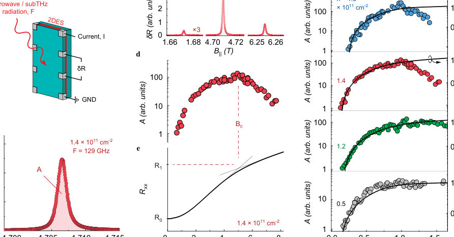 
FIG. 1. Electrical detection of electron spin resonance in a two-dimensional electron liquid. a Schematic of the experimental configuration for broadband electrically detected ESR. Microwave or sub-terahertz radiation induces a resonant change in the longitudinal resistance, δR, which is detected electrically. b Representative ESR resonance measured at F = 129 GHz for the sample with electron density n = 1.4 × 1011 cm−2. The shaded area defines the integrated ESR intensity used throughout this work to minimize the influence of inhomogeneous line broadening. c ESR spectra measured at three excitation frequencies, corresponding to different resonance magnetic fields. The resonance intensity...

📷 Fig 2

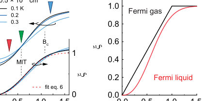 
FIG. 2. Longitudinal resistance as a quantitative mea- sure of spin polarization. a Temperature dependence of the ESR amplitude normalized by the spin polarization at B∥/Bc = 0.3, 0.5, and 1.2 (excitation frequencies of 10, 15, and 37 GHz, respectively) for the sample with n = 0.5 × 1011 cm−2. The magnetic field B∥= 0.5Bc coincides with the metal–insulator transition, where dRxx/dT = 0. The persis- tence of nearly identical temperature dependences at all three fields demonstrates that the ESR signal is governed by the spin sensitivity of the resistance rather than by resonant heat- ing. The black curve shows ∆R ∝Rxx(0.2Bc, T)−Rxx(0, T), in agreement with Eqs. (4) and (5). b Longitudinal...

📷 Fig 3

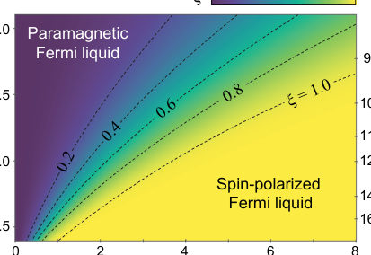 
FIG. 3. Spin-polarization map of the electron liquid. Spin polarization reconstructed from magnetotransport using Eq. (8) is shown as a function of parallel magnetic field and electron density. The color scale represents the spin polariza- tion ξ(B, n), dashed contours denote constant polarization. The diagram visualizes the continuous evolution of the elec- tron liquid from a partially spin-polarized paramagnetic Fermi liquid to a fully spin-polarized Fermi liquid. The right axis shows the corresponding interaction parameter (dimension- less Wigner-Seitz radius) rs ≡1 (√πnaB), where effective Bohr radius aB = e2m∗/(4πε0ε¯h2).

**Summary.** The research demonstrates an experimental technique to quantify the spin polarization of a 2DES by analyzing its longitudinal resistance ($\delta R$) via electrically detected ESR. By establishing a parameter-free link between $\delta R$ and spin polarization, the authors successfully map the magnetic state of the electron liquid across varying densities and fields. This method offers a powerful tool for studying strongly correlated electronic phases.

**Why it may be interesting.** This work provides a powerful, non-invasive method to probe fundamental quantum properties (spin state) in condensed matter systems using only transport measurements, which is highly relevant for understanding correlated electron physics beyond simple band theory.

Detailed structure

**Main problem.** To establish a direct quantitative relationship between the longitudinal resistance ($\delta R$) of a strongly correlated two-dimensional electron system (2DES) and its equilibrium spin polarization ($\xi$).

**Main result.** The study successfully established a parameter-free relation showing that $\xi$ can be quantitatively reconstructed solely from magnetotransport measurements, reproducing the known temperature and magnetic field dependence of ESR signals.

**Method.** Measurements combine electrical detection of Electron Spin Resonance (ESR) with standard magnetotransport measurements on high-mobility 2DESs. The key technique involves deriving relationships by assuming the signal change is governed by $\partial R / \partial \xi$.

**Model / system.** The physical system is a Two-Dimensional Electron Liquid (2DES), studied in ZnO/MgZnO heterostructures, which exhibits strong electron correlations and spin polarization effects.

**Key observables.** Longitudinal Resistance ($\delta R$), ESR amplitude ($A(B, T)$), Spin Polarization ($\xi$), Critical Field ($B_c$).

**Important parameters / regimes.** Carrier densities ($n = 0.5 - 1.8 	imes 10^{11} 	ext{ cm}^{-2}$), Magnetic field ($B$), Temperature ($T$).

**Assumptions / limitations.** The analysis assumes that the ESR signal is dominated by changes in spin polarization ($\partial R / \partial \xi$) rather than resonant heating, and that orbital coupling effects can be minimized or accounted for.

**Figures summary.** Figures illustrate the setup comparing $\delta R$ vs $B_{||}$ at various frequencies; they show the increase of ESR amplitude as polarization approaches saturation ($B_{||}/B_c \simeq 1$), and present reconstructed spin-polarization maps ($\xi(B, n)$).

**Paper structure.** The paper proceeds by first establishing the experimental setup using ESR detection. It then develops theoretical relationships linking $\delta R$ to $\xi$, ruling out alternative mechanisms like resonant heating. Finally, it applies these relations to map the spin polarization across different carrier densities and magnetic fields.

Abstract

We show experimentally that the longitudinal resistance of a strongly correlated two-dimensional electron system provides a direct quantitative measure of its spin polarization. Using electrically detected electron spin resonance as an independent calibration of the spin state, we establish a parameter-free relation between magnetotransport and spin polarization, enabling spin polarization to be reconstructed from transport measurements alone. The extracted spin polarization quantitatively explains the magnetic field and temperature dependence of the electrically detected spin-resonance signal and allows the magnetic state of the electron liquid to be mapped over a broad range of carrier densities and magnetic fields.

[↑ back to top](#top)

### [The Case for the Everett Multiverse](http://arxiv.org/abs/2608.07706v1)

**Authors:** David Wallace  
**Type:** theory · **Category:** other · **PDF:** <https://arxiv.org/pdf/2608.07706v1>  
**Analysis basis:** full PDF text, analyzed in chunks
**Topic relevance:** `quantum measurements` **3/5** · `interference shaping light` **1/5**

📷 Fig 1

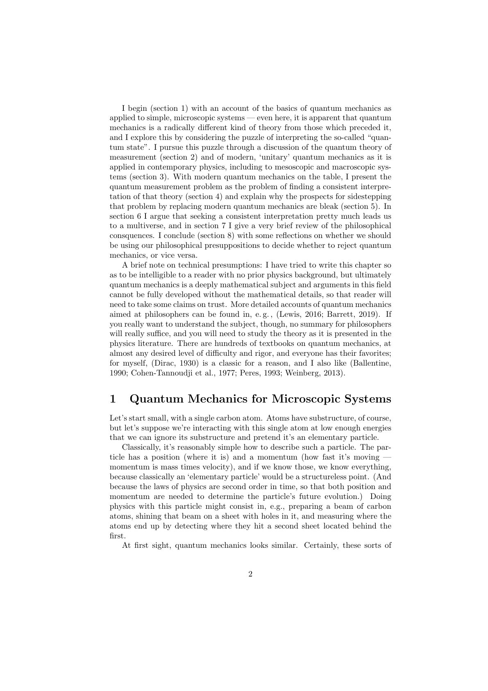 
Low-resolution page preview, page 2

📷 Fig 2

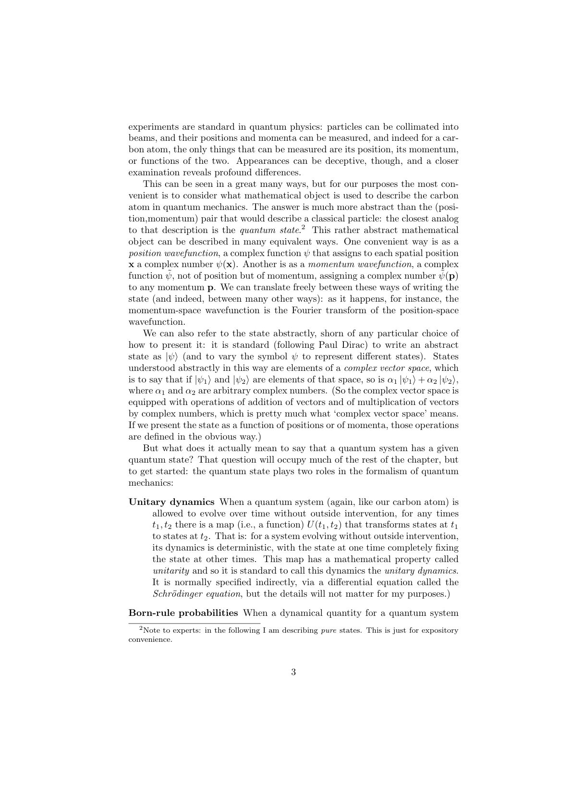 
Low-resolution page preview, page 3

📷 Fig 3

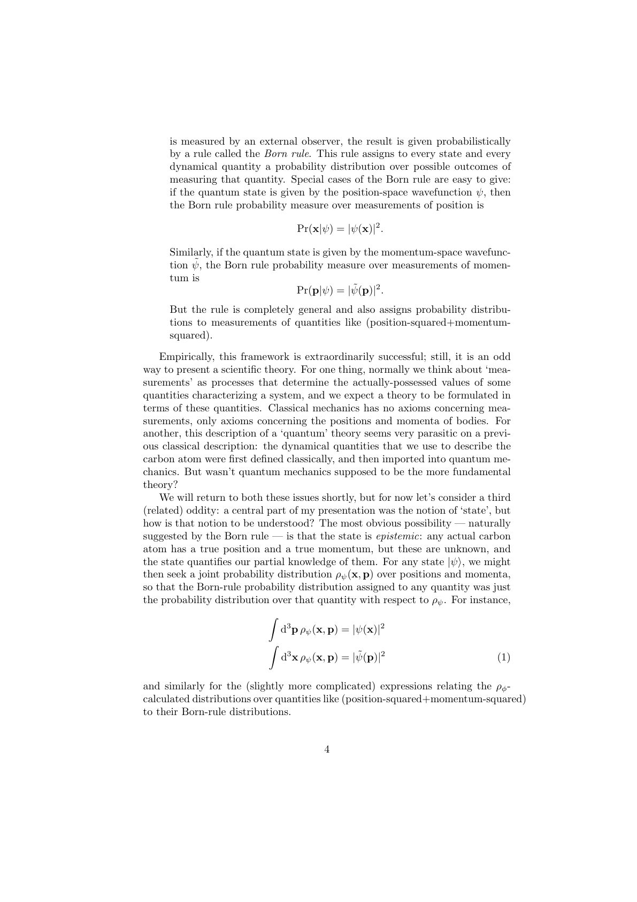 
Low-resolution page preview, page 4

📷 Fig 4

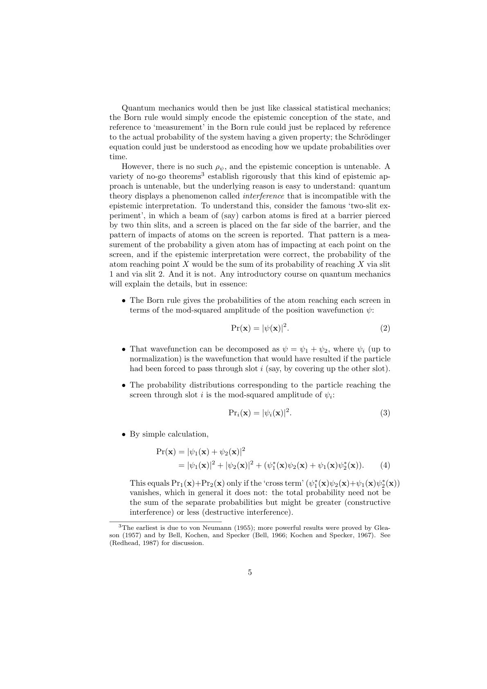 
Low-resolution page preview, page 5

📷 Fig 5

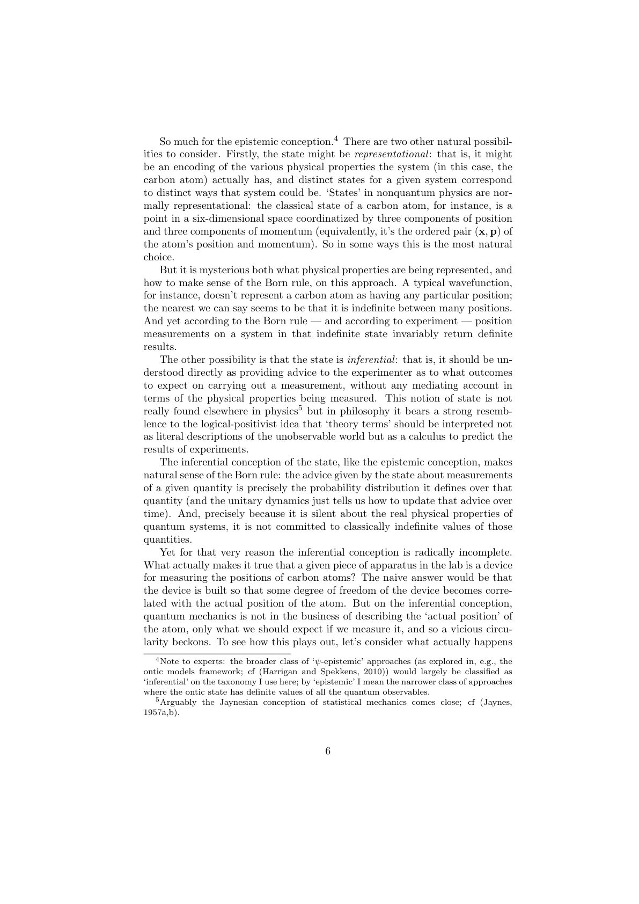 
Low-resolution page preview, page 6

**Summary.** This paper argues that quantum mechanics must be understood through the Many-Worlds (Everettian) framework because other interpretations fail to explain key experimental results like interference. It uses conceptual analysis, particularly referencing the two-slit experiment, to show that treating the state vector merely as 'knowledge' is inconsistent with QM's mathematical structure.

**Why it may be interesting.** While highly philosophical, its rigorous critique of measurement processes and the necessity of unitary evolution is foundational for any theoretical physicist working on open quantum systems or decoherence models.

Detailed structure

**Main problem.** The central issue is resolving the quantum measurement problem by determining the correct interpretational status of quantum mechanics (QM). The author argues that standard interpretations fail to account for QM's full empirical content.

**Main result.** The paper strongly advocates for the Everettian Many-Worlds interpretation as necessary because alternative epistemic or inferential views are contradicted by phenomena like quantum interference. It suggests objective probabilities might emerge from amplitude moduli in the decoherent limit.

**Method.** The analysis uses conceptual comparison, contrasting the mathematical formalism of QM (unitary evolution and Born rule) against classical expectations and philosophical interpretations.

**Model / system.** The primary diagnostic tool is the two-slit experiment using carbon atoms. The underlying model is standard quantum mechanics, focusing on the state vector $|\psi
angle$ evolving unitarily.

**Key observables.** Interference patterns (demonstrating non-additive probability sums), and objective probabilities derived from amplitude moduli in the decoherent limit.

**Important parameters / regimes.** The scale dependence of the 'branch count' is noted as a key, unstable parameter; otherwise, the focus is on the mathematical structure itself.

**Assumptions / limitations.** It assumes the validity of unitary quantum dynamics and critiques interpretations that rely on assuming prior metaphysical or epistemic constraints on physics.

**Paper structure.** The paper progresses by first establishing the conflict between QM formalism and classical intuition (Chunk 1). It then uses the two-slit experiment to invalidate the purely epistemic view (Chunk 2). Finally, it explores the ontological implications of the Everettian framework, discussing emergent concepts like space and probability in the multiverse context (Chunk 3).

Abstract

I give a non-technical presentation of the argument that quantum mechanics, in the form in which it is currently used, needs to be understood in many-worlds (Everettian) terms; the alternatives that have been discussed are at present not able to reproduce the full empirical content of the theory.   This is a draft of a chapter for the forthcoming \emph{Blackwell Companion to Philosophy and the Multiverse (Klaas Kraay and Daniel Rubio, eds.) }

[↑ back to top](#top)

### [Implicit Differentiation for Measurement-Efficient Bilevel Quantum-Classical Optimization](http://arxiv.org/abs/2608.07717v1)

**Authors:** Tobias Rohe, Markus Baumann, Federico Harjes Ruiloba, Maximilian Zorn, Jonas Stein, Claudia Linnhoff-Popien  
**Type:** theory · **Category:** quantum information and computing · **PDF:** <https://arxiv.org/pdf/2608.07717v1>  
**Analysis basis:** full PDF text, analyzed in chunks
**Topic relevance:** `quantum measurements` **3/5**

📷 Fig 1

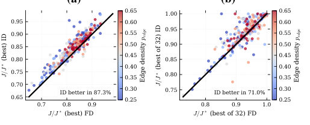 
Fig. 2: Bilevel optimization diagnostics for the periodic 1D family showing per-instance comparisons between CR-ID and central finite-difference value probing (FD) under a matched evaluation budget B = 1830. Each point corresponds to one problem instance (N = 300), with color indicating the edge density pedge. The black diagonal denotes equal performance. Points above the diagonal indicate instances where ID outper- forms FD. (a) Best-so-far normalized expectation value J/J∗

📷 Fig 2

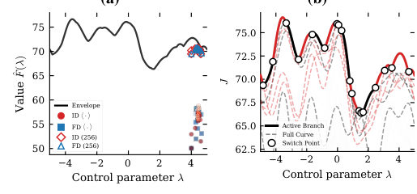 
Fig. 1: Bilevel optimization diagnostics VQE on periodic family. (a) Classical envelope ˆF ∗(λ) with visited outer iterates overlaid (representative instance). (b) Active-branch structure across λ; switch points mark changes of the optimal bitstring.

📷 Fig 3

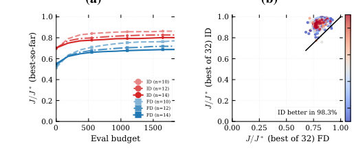 
Fig. 3: Budget efficiency in the multi-dimensional (λ) setting under a matched evaluation budget. Here, the outer variable is edge-wise, i.e., λ ∈R|E| assigns one control parameter λe per edge. (a) Best-so-far normalized objec- tive J/J∗versus cumulative energy evaluations. (b) Budget- matched best-of-S readout J/J∗across instances in the multi- dimensional setting, comparing ID and FD.

📷 Fig 4

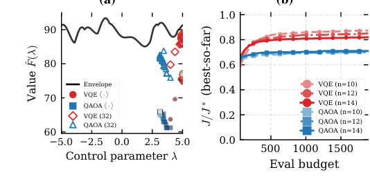 
Fig. 4: VQE versus QAOA under a matched objective- evaluation budget. (a) Representative instance: classical en- velope bF(λ) (black) with the outer iterates {λt} visited by VQE (red) and QAOA (blue); filled markers show expecta- tion estimates and open markers indicate best-of-S readout (S = 32). (b) Median best-so-far normalized objective J/J∗

**Summary.** This work tackles bilevel optimization in quantum computing where the problem Hamiltonian changes based on an outer control parameter. The authors introduce Correlator-Reuse Implicit Differentiation (CR-ID) to calculate necessary outer gradients without incurring massive measurement overheads. CR-ID demonstrates significant, systematic performance gains over standard finite-difference approaches across various benchmark problems.

**Why it may be interesting.** It provides a concrete algorithmic improvement for optimizing complex quantum circuits whose cost landscape is tuned by external classical parameters, which is crucial for real-world quantum machine learning applications.

Detailed structure

**Main problem.** The paper addresses efficiently solving bilevel quantum-classical optimization problems where the cost function coefficients depend on tunable external parameters.

**Main result.** A novel technique, Correlator-Reuse Implicit Differentiation (CR-ID), significantly improves budget-normalized efficiency over finite-difference methods by reusing existing quantum measurements to estimate outer gradients.

**Method.** It adapts the envelope theorem from classical optimization to quantum circuits, allowing outer gradient calculation by reweighting correlators measured during the inner VQA energy estimation step.

**Model / system.** The model uses Variational Quantum Algorithms (VQAs) like VQE and QAOA to minimize an expectation value derived from a parametric diagonal cost Hamiltonian, often applied to Max-Cut problems.

**Key observables.** Budget efficiency (AUCB), best-so-far normalized expectation value ($J/J^*$), and tail hit-rate ($p_{good}$).

**Important parameters / regimes.** The outer control parameter $\lambda$, which dictates the cost Hamiltonian coefficients $w_e(\lambda)$, tested across linear, quadratic, and periodic families.

**Assumptions / limitations.** The method assumes that the inner optimization converges to a stationary point where the envelope theorem can be applied; it also relies on white-box knowledge of weight sensitivities $rac{d w_e(\lambda)}{d\lambda}$.

**Figures summary.** Figures compare CR-ID vs. Finite Difference methods showing superior budget efficiency in both 1D and multi-dimensional settings, while also comparing VQE's consistent performance advantage over QAOA.

**Paper structure.** The paper introduces the bilevel optimization structure, develops the CR-ID technique based on the envelope theorem, validates it against finite differences using various parameter families, and compares its performance across different quantum algorithms (VQE vs. QAOA).

Abstract

Quantum optimization has shown promising results for quadratic unconstrained binary optimization (QUBO) problems. Real-world applications, however, often involve polynomial coefficients that depend on tunable external factors - such as demand forecasts or risk preferences - giving rise to bilevel optimization structures. We show how variational quantum algorithms (VQAs) can efficiently handle such parametric problems, making three contributions. First, we propose a bilevel optimization model for diagonal cost Hamiltonians where coefficients depend on a tunable outer parameter: an outer loop adjusts this parameter - reshaping the cost landscape - while an inner VQA optimizes circuit variables. Second, since derivative-free probing methods incur a multiplicative overhead when each outer evaluation requires a complete inner solve, we develop correlator-reuse implicit differentiation (CR-ID), which obtains outer gradients by reusing quantum measurements already collected during inner energy estimation, requiring essentially no additional circuit executions. Experiments across three coefficient families show that CR-ID consistently improves budget-normalized efficiency by ~4\% in 1D and over 14\% in multi-dimensional settings, showing a significant performance advantage compared to finite-difference methods. Third, we show that this property is architecture-dependent: VQE admits exact reuse gradients, whereas QAOA introduces a state-dependent term that creates a cost-bias trade-off.

[↑ back to top](#top)

### [Levitated Milligram-scale Ferromagnetic Magnetometer at Room Temperature](http://arxiv.org/abs/2608.08544v1)

**Authors:** Yuanji Sheng, Kenan Tian, Rui Li, Yiming Chen, Dingjiang Long, Siwen Chen, Peiran Yin  
**Type:** experiment · **Category:** other · **PDF:** <https://arxiv.org/pdf/2608.08544v1>  
**Analysis basis:** full PDF text, analyzed in chunks
**Topic relevance:** `quantum measurements` **3/5**

📷 Fig 1

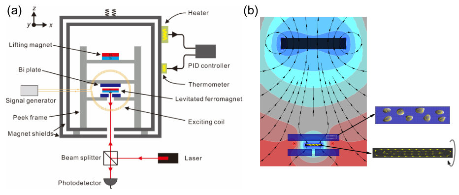 
FIG. 1. (Color online) Schematic of the diamagnetically levitated ferromagnet system. (a) An elongated rectangular hard ferromagnet is levitated by a lifting magnet and a pair of Bi plates, placed on a PEEK frame. The Bi plates made of bismuth nanoparticles and cetyl alcohol serves as a diamagnetic unit, providing a stable potential well for the levitated ferromagnet. Two layers of ferrite magnetic shield outside the PEEK frame are used to shield external magnetic field noises and suppress eddy currents generated in metallic conductors. The thermometer and heater fixed on the ferrite magnetic shields are used to stabilize the environment temperature via a PID controller. A pair of...

📷 Fig 2

 
FIG. 2. The frequency and mechanical dissipation of the levitated ferromagnets. (a) The PSD of levitated ferromag- net’s rotation angle. A continuous measurement of total time 7200 s is divided into 6 equal segments to derive the aver- aged PSD. Peak 1 and Peak 2 correspond to the rotational modes around the y-axis and x-axis, with resonant frequencies of 28.126 Hz and 153.001 Hz, respectively. (b) The ringdown measurements of the x-axis rotational mode. Blue and red dots depict the oscillator’s energy decay under high and low pressure, respectively. Blue and red lines show the exponen- tial decay fitted curve, revealing decay times of 36.2 s and 324.3 s for the high- and low-pressure...

📷 Fig 3

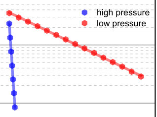 
Figure 2(b) displays ringdown measurements of x-axis rotational energy decay at different pressures. At a pres- sure of 8.6 × 10−2 mbar (denoted as high pressure), the measured decay time constant is 36.2 s, consistent with the Lorentzian-fitted mechanical dissipation γlow/2π in Fig. 2(a). At this high pressure, the mechanical dissi- pation are dominated by the background gas. Reducing pressure to 6.4 × 10−5 mbar (denoted as low pressure) yields a limiting decay constant of 324.3 s, corresponding to γhigh/2π = 0.49 mHz, Q = 3.1 × 105. This dissipation rate is verified to be pressure-independent.

📷 Fig 4

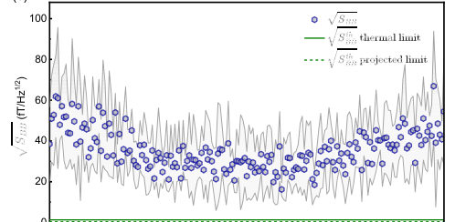 
FIG. 3. Experiment Results. (a) The measured response curve of Vdiff,Y to the y-directional displacement of the re- flected light spot. The response curve has good linearity in the range of ±0.2 mm(R2 = 0.998). (b) The measured PSD of the levitated ferromagnet’s angular displacement. Data points represent averages from six 1200-s measurement seg- ments. Red points denote the response to the off-resonance magnetic drive. (c) Magnetic sensitivity of the levitated fer- romagnet determined by the measured angular displacement. The blue points represent the averaged magnetic sensitiv- ity and gray shaded band indicates the standard deviations. The solid and dashed green curves indicate the...

**Summary.** The research demonstrates a room-temperature magnetometer using a levitated ferromagnet achieving 23 fT/sqrt(Hz) sensitivity. By carefully controlling dissipation mechanisms like eddy currents and hysteresis loss, the system establishes a high-performance sensor for detecting weak magnetic fields in applications ranging from biomedicine to fundamental physics searches.

**Why it may be interesting.** This work bridges classical mechanical sensing with quantum-limited noise analysis, providing an experimental platform for ultra-sensitive measurements relevant to fundamental physics searches beyond standard models.

Detailed structure

**Main problem.** Developing ultrasensitive magnetic field sensors by utilizing levitated ferromagnetic oscillators at room temperature for applications like biomagnetic detection and beyond-standard-model force searches.

**Main result.** The authors achieved a magnetic sensitivity of 23 fT/sqrt(Hz) at the 100 Hz level, matching state-of-the-art cryogenic systems.

**Method.** Magnetic field sensitivity was calibrated using direct optical rotation angle measurement and applied periodic magnetic field excitation on a levitated system.

**Model / system.** The platform is a milligram-scale diamagnetically levitated ferromagnet suspended in an environment stabilized by PID control. Its motion dynamics are governed by the equation I d^2(theta)/dt^2 + I*gamma*d(theta)/dt + I*omega_0^2 * theta = tau_signal + tau_noise.

**Key observables.** Magnetic field sensitivity (S_BB), angular displacement PSD, and mechanical damping rates ($\gamma$).

**Important parameters / regimes.** Room temperature operation; 23 fT/sqrt(Hz) sensitivity; resonant frequency near 153 Hz.

**Assumptions / limitations.** Future enhancements rely on further suppression of vibration noises and magnetic hysteresis loss.

**Figures summary.** Figures show the experimental setup schematic, simulated field distributions, PSDs of rotation angles, and ringdown measurements demonstrating mechanical damping.

**Paper structure.** The paper details the physical system (levitated ferromagnet), analyzes the governing dynamics and noise sources (dissipation mechanisms like eddy currents and hysteresis loss), presents measurement techniques, and reports achieving a high sensitivity benchmark.

Abstract

Levitated mechanical oscillators are emerging ultrasensitive sensors with tremendous potential in both applied and fundamental physics. Levitated ferromagnets, with internal spin noises rapidly averaged, promise ultrahigh magnetic sensitivity. Here, we demonstrate a milligram-scale diamagnetically levitated ferromagnet system operating at room temperature. Through optimized geometry and multi-channel dissipation control, we achieve a magnetic sensitivity of 23~fT$/\sqrt{\text{Hz}}$ at frequency of 100-Hz level. We anticipate that a ferromagnetic magnetometer with subfemtotesla sensitivity is within reach, after modest technical improvements. This platform establishes a high-performance magnetometer for biomagnetic field detection and beyond-standard-model force searches.

[↑ back to top](#top)

### [Optimal strategies for shadow tomography with limited resources](http://arxiv.org/abs/2608.08429v1)

**Authors:** Zhen-Peng Xu, Qi Ye, Jie Wang, Gereon Koßmann, Andreas Winter, René Schwonnek  
**Type:** theory · **Category:** quantum information and computing · **PDF:** <https://arxiv.org/pdf/2608.08429v1>  
**Analysis basis:** full PDF text, analyzed in chunks
**Topic relevance:** `quantum measurements` **3/5**

📷 Fig 1

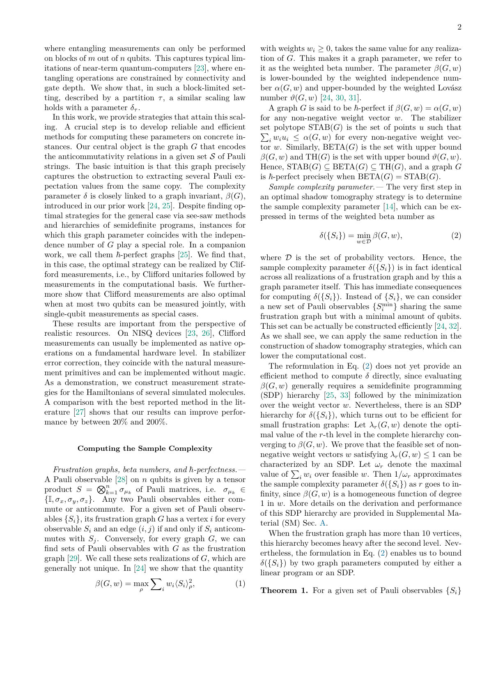 
Low-resolution page preview, page 2

📷 Fig 2

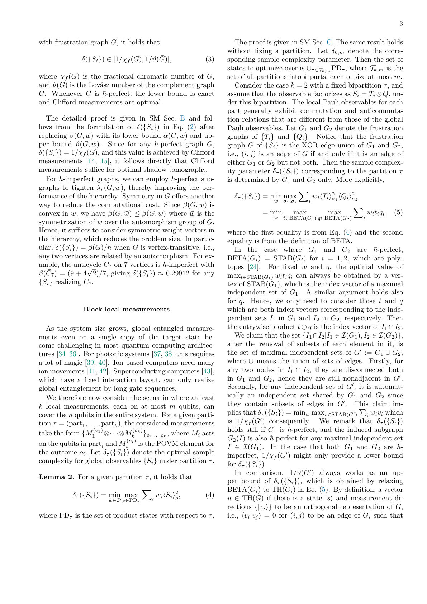 
Low-resolution page preview, page 3

📷 Fig 3

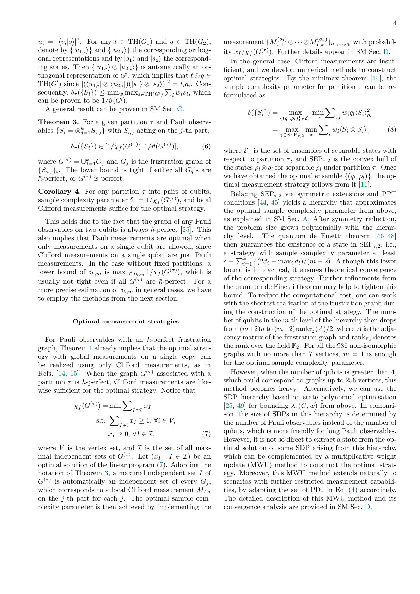 
Low-resolution page preview, page 4

📷 Fig 4

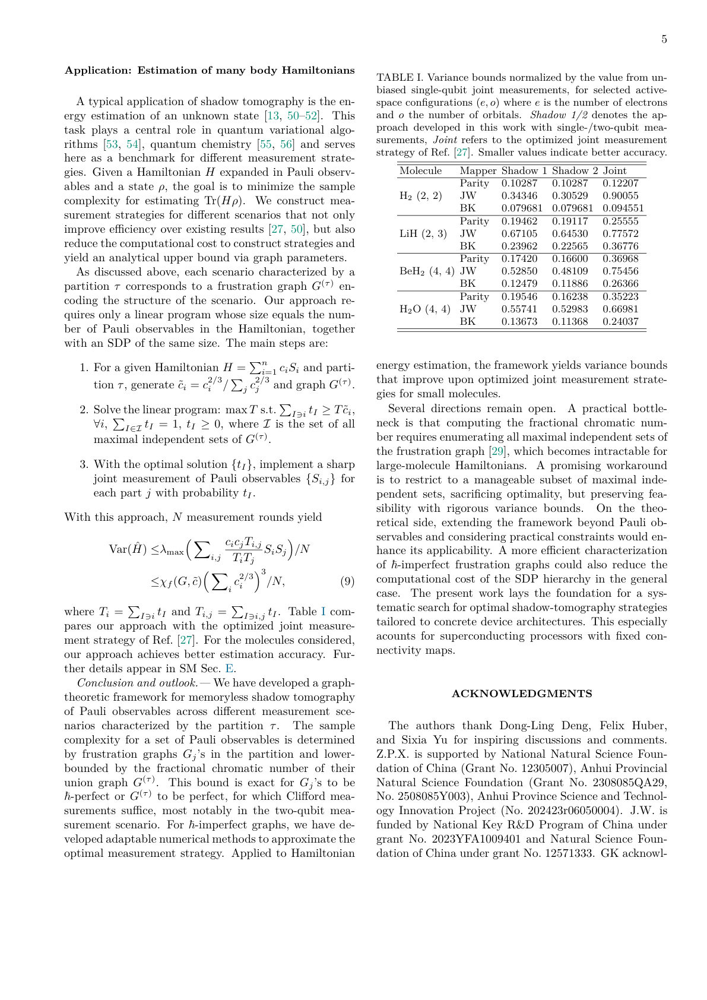 
Low-resolution page preview, page 5

📷 Fig 5

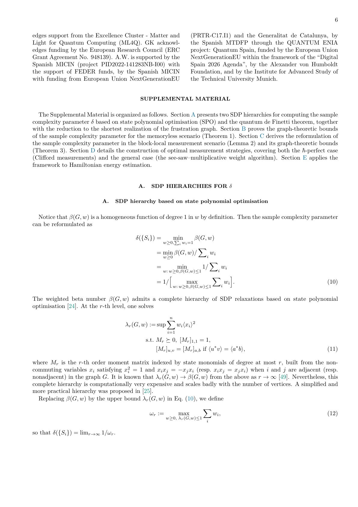 
Low-resolution page preview, page 6

**Summary.** This work develops optimal strategies for shadow tomography by mapping the required measurement resources onto graph parameters derived from Pauli observables. It establishes theoretical bounds on sample complexity using concepts like fractional chromatic number and provides constructive methods for estimating molecular Hamiltonians with improved variance estimates.

**Why it may be interesting.** It provides rigorous mathematical tools (graph theory, SDP) to quantify resource requirements for quantum state characterization, directly impacting how we design measurements for near-term quantum hardware.

Detailed structure

**Main problem.** The paper addresses shadow tomography: efficiently estimating many expectation values of an unknown quantum state from randomized measurements using a limited number of copies.

**Main result.** It establishes that the required sample complexity parameter is governed by graph parameters of the Pauli anticommutation frustration graph, and shows Clifford measurements can be optimal under certain conditions.

**Method.** The problem is reduced to analyzing graph theory invariants (like fractional chromatic number) associated with the frustration graph, utilizing Semidefinite Programming (SDP) hierarchies for computation.

**Model / system.** The analysis focuses on Pauli observables $\{S_i\}$ acting on $n$ qubits. The setting considers memoryless protocols and measurements restricted to local subsets of qubits (block-limited).

**Key observables.** Expectation values $	ext{tr}(S_i
ho)$ for a set of Pauli observables $S=\{S_1, \dots, S_v\}$, and the variance of an estimator $	ext{Var}(\hat{H})$ for Hamiltonian energy estimation.

**Important parameters / regimes.** The sample complexity parameter $\delta(\{S_i\})$, which is bounded by graph parameters like $1/\chi_f(G)$ and $1/\vartheta(ar{G})$.

**Assumptions / limitations.** The analysis assumes memoryless measurements and explores the optimality of Clifford measurements, though general cases may require SDP hierarchies.

**Figures summary.** Table II numerically compares variance bounds for Hamiltonian estimation using various measurement strategies (e.g., single-qubit vs. two-qubit Clifford measurements) across different molecules.

**Paper structure.** The paper develops the theoretical framework by relating tomography efficiency to graph parameters, derives lower and upper bounds on the sample complexity parameter $\delta$, and applies this framework constructively to estimate molecular Hamiltonian energies with improved variance bounds.

Abstract

Shadow tomography addresses the task of efficiently predicting many expectation values of an unknown quantum state from randomized measurements on comparatively few copies. Existing analyses promise large scaling advantages, but the optimal strategies realizing these guarantees are not always known, and the required measurements are potentially challenging to implement on current hardware. We address this gap for Pauli observables by computing optimal sample-complexity parameters and constructing optimal measurement strategies under realistic resource constraints. We focus on memoryless protocols, where each copy is measured only once, and on measurements with bounded interaction range. Our approach reduces the problem to the analysis of graph parameters of the frustration graph encoding the Pauli anticommutation relations. We provide efficient numerical methods for the general case and analytically prove that Clifford measurements are optimal in many situations. This includes all perfect graphs, all single-qubit, all two-qubit measurement scenarios, and more. Applied to Hamiltonian energy estimation, our framework yields constructive strategies and improved variance bounds for molecular benchmarks.

[↑ back to top](#top)

### [Security of quantum key distribution with passive basis choice and detection-efficiency mismatch for a realistic satellite setup](http://arxiv.org/abs/2608.09793v1)

**Authors:** Egor Ivchenko, Aleksandr Khmelev, Vladimir Kurochkin, Anton Trushechkin  
**Type:** theory · **Category:** quantum information and computing · **PDF:** <https://arxiv.org/pdf/2608.09793v1>  
**Analysis basis:** full PDF text, analyzed in chunks
**Topic relevance:** `quantum measurements` **3/5**

📷 Fig 1

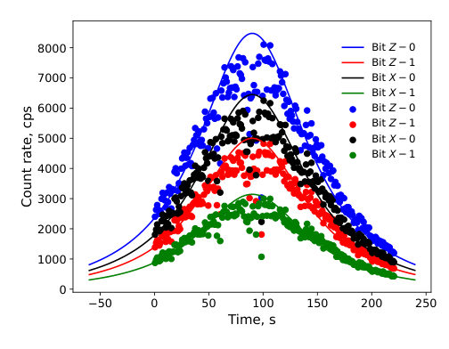 
Figure 1. The photon count rates for four receiving channels during the satellite-to-ground QKD experiment [27]. The ex- perimental data are shown as dots. The solid lines represent the approximation Rsum a,α of the data for each receiving channel of the ground receiver given by Eqs. (40), (37) and (36). The detector efficiencies in Eq. (36) are chosen for best fit and are given in Table II.

📷 Fig 2

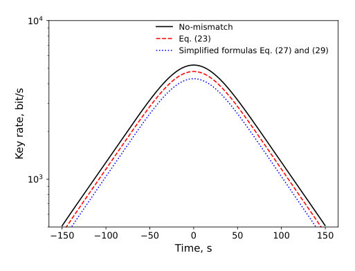 
Figure 2. Simulated secret key rate over a satellite pas- sage. The no-mismatch case is shown by a solid line. The red dashed line and blue dotted line represent the detection- efficiency mismatch for Eqs. (23) and (27), respectively. Eq. (29) yields similar results to Eq. (27) with the difference less than 0.1% for our data; hence, these approaches relate to the same line. The satellite passage is symmetrically aligned with respect to the highest elevation angle that corresponds to zero time.

📷 Fig 3

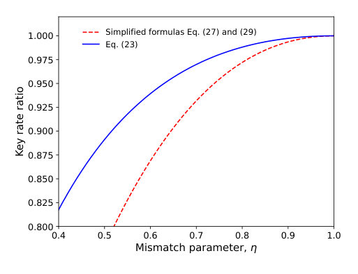 
Figure 3. The ratio of the key generation rate with and with- out detection-efficiency mismatch dependent on the mismatch parameter η = ηz,1 ηz,0 = ηx,1 ηx,0 (note that the simplified assump- tions is used only in this plot for illustrative purposes). The blue one corresponds to the calculation of the mismatch case by exact Eq. (23), and the red one by simplified Eq. (27). Eq. (29) provides similar results as Eq. (27), so that the curves are indistinguishable.

**Summary.** This paper provides a detailed theoretical analysis of the secret key rate for QKD over satellite links, specifically addressing the failure of existing security proofs when detector efficiencies mismatch significantly. By employing advanced information theoretic techniques and adapting the decoy-state method, the authors derive more precise bounds necessary for assessing practical quantum communication security.

**Why it may be interesting.** This work is highly relevant as it tackles a critical practical limitation (detector mismatch) in quantum communication theory, providing necessary theoretical tools for assessing real-world quantum network security.

Detailed structure

**Main problem.** The paper addresses the challenge of accurately estimating the secret key rate for Quantum Key Distribution (QKD) when significant detection-efficiency mismatch occurs in realistic satellite communication setups.

**Main result.** The authors develop a rigorous framework to estimate the key rate under large mismatches, showing that existing proofs fail and providing updated bounds based on information theory optimization techniques.

**Method.** The analysis employs Positive Operator-Valued Measures (POVMs) and adapts the decoy-state method within the BB84 protocol framework. Key rates are derived by solving complex optimization problems involving conditional entropies.

**Model / system.** The model simulates a satellite-to-ground QKD link, specifically between the Micius satellite and the Zvenigorod ground station. It utilizes the BB84 protocol considering single-photon states and weak coherent pulses.

**Key observables.** Secret key rate ($K$), conditional von-Neumann entropies, Quantum Bit Error Rate (QBER), and detection efficiencies ($\eta_{a,\alpha}$).

**Important parameters / regimes.** Detection-efficiency mismatch magnitude, probability of passing ($p_{	ext{pass}}$), and the average photon number ($\mu$).

**Assumptions / limitations.** The analysis assumes an asymptotic limit ($N 
ightarrow \infty$) and that Eve knows the exact detection efficiency values but cannot manipulate them.

**Figures summary.** Not specified in detail, but references Table I (QKD parameters/Micius) and Table II (atmospheric conditions/detector efficiencies).

**Paper structure.** The paper builds from general security proofs to specific estimations using POVMs and decoy states. It presents multiple key rate bounds derived through optimization over symmetry-enforcing linear maps, culminating in an estimate applicable to the Micius satellite link.

Abstract

Detection-efficiency mismatch is a common problem in realistic quantum key distribution (QKD) systems. The existing security proofs for the case of the passive basis choice provide a nonzero secret key rate only for a small detection-efficiency mismatch. Unfortunately, in realistic setups, the detection-efficiency mismatch can be significant. Here we present a more precise estimation of the secret key rate for the BB84 protocol with the passive basis choice, which accounts for the detection-efficiency mismatch between four threshold detectors as well as an adaptation of the decoy-state method. The suggested approach is used to estimate the secret key rate in a QKD experiment between the Micius satellite and the Zvenigorod ground station.

[↑ back to top](#top)

### [The Logic of Partitions and Partition Logics: Ore's Correspondence, Contextual Pasting, and Direct-Sum Decompositions](http://arxiv.org/abs/2608.08931v1)

**Authors:** Karl Svozil  
**Type:** theory · **Category:** other · **PDF:** <https://arxiv.org/pdf/2608.08931v1>  
**Analysis basis:** full PDF text, analyzed in chunks
**Topic relevance:** `quantum measurements` **3/5**

📷 Fig 1

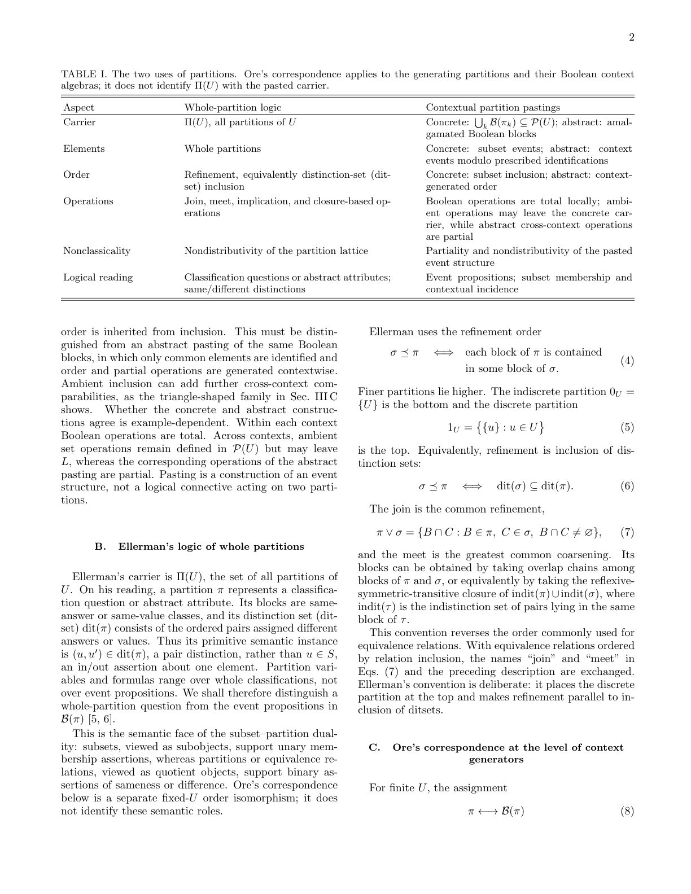 
Low-resolution page preview, page 2

📷 Fig 2

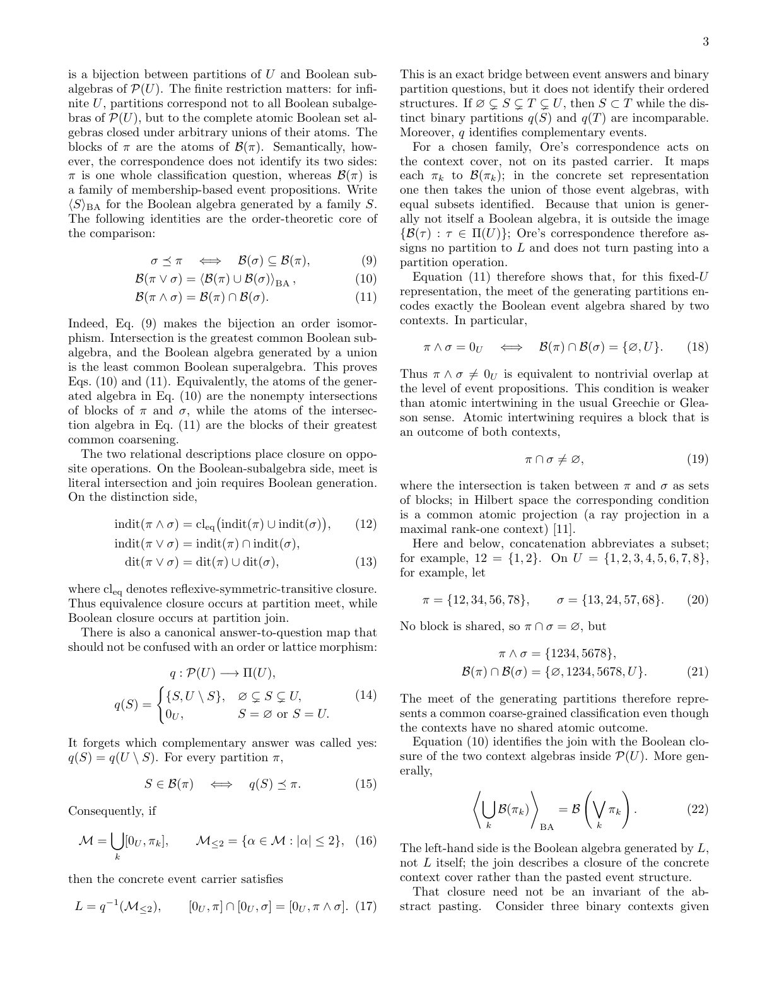 
Low-resolution page preview, page 3

📷 Fig 3

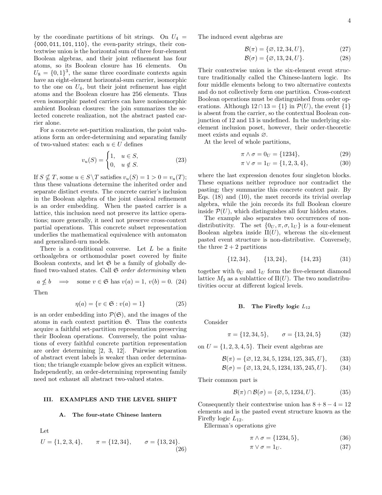 
Low-resolution page preview, page 4

📷 Fig 4

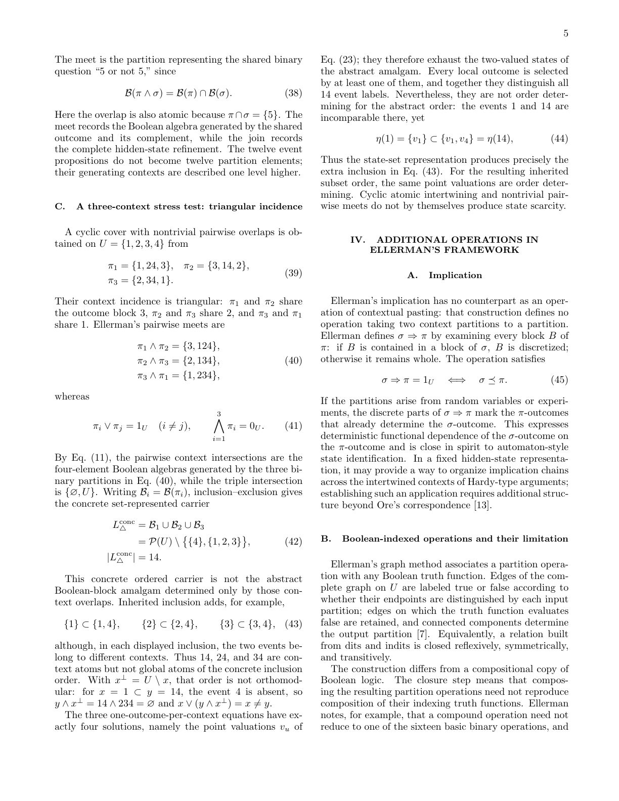 
Low-resolution page preview, page 5

📷 Fig 5

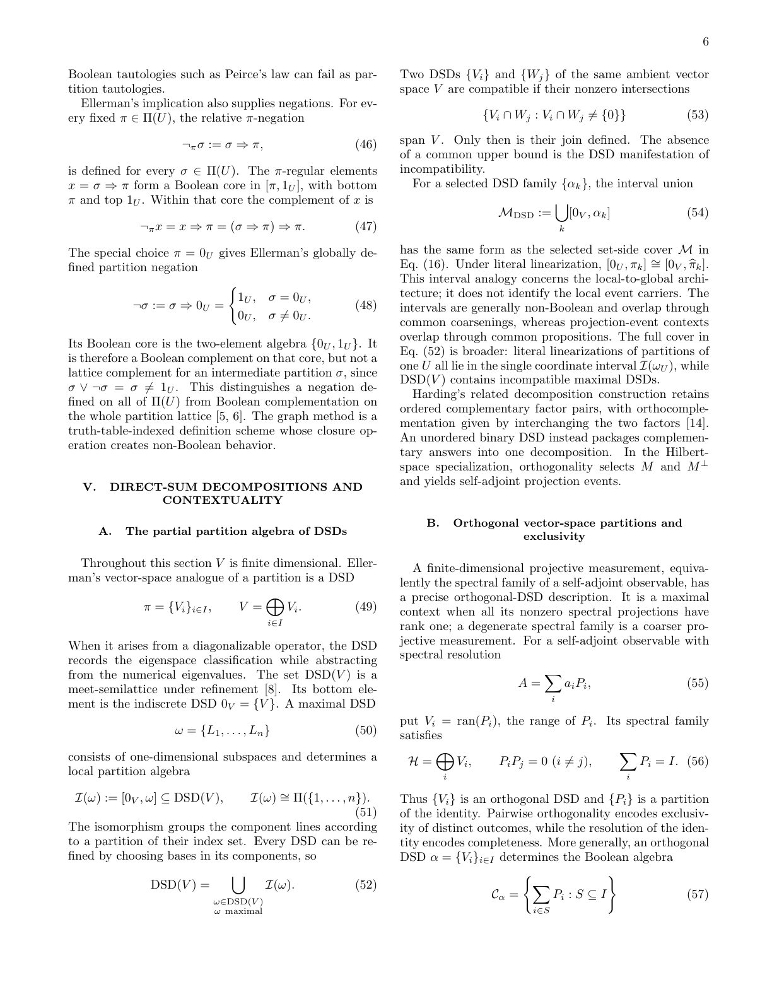 
Low-resolution page preview, page 6

**Summary.** This paper develops a formal comparison between different mathematical logics used to model event structures arising from partitions. It distinguishes between algebraic operations like meet and join when combining contexts, showing that simple structural unions often fail to preserve the required logical properties. This has implications for understanding contextuality in both classical set theory and quantum measurement frameworks.

**Why it may be interesting.** It provides a deep logical foundation for understanding how quantum measurements (modeled by DSDs) relate to classical set theory structures, which is crucial for foundational work in quantum information.

Detailed structure

**Main problem.** The paper aims to rigorously distinguish between different mathematical interpretations of 'partition logic' when modeling event structures derived from set partitions.

**Main result.** It shows that the algebraic meet ($\wedge$) captures common coarse-grained events, while the join ($\vee$) requires a Boolean closure that often fails to correspond to a single partition operation, highlighting structural differences between contexts.

**Method.** The analysis uses formal logic structures, comparing Ore's correspondence (mapping partitions to Boolean algebras) with Ellerman's framework involving refinement and direct-sum decompositions (DSDs).

**Model / system.** The model involves event algebras derived from set partitions ($\pi$) of a finite universe $U$, which are used to formalize propositions in quantum or classical measurement contexts.

**Key observables.** Common event algebra (captured by meet $\wedge$), Boolean closure (captured by join $\vee$), and the existence/consistency of context-consistent valuations on DSD projections.

**Important parameters / regimes.** The size of the universe $|U|$, and the specific structure of the generating partitions $\{\pi_k\}$.

**Assumptions / limitations.** It assumes that physical contexts can be modeled by set partitions, but notes that the resulting pasted structures are generally not Boolean algebras themselves.

**Figures summary.** Not specified (analysis based on abstract mathematical identities and structural comparisons).

**Paper structure.** The paper proceeds by defining two distinct uses of 'partition logic,' comparing Ore's correspondence for event algebras with Ellerman's framework using direct-sum decompositions, and analyzing the algebraic consequences of context combination (meet vs. join).

Abstract

The term ``partition logic'' denotes two constructions at different levels. In automaton and generalized-urn models, selected partitions generate Boolean event algebras whose contextwise union forms a concrete pasted event structure; in Ellerman's framework, whole partitions are classifications governed by refinement and partition operations. For a finite set $U$, Ore's correspondence maps each generator $π$ to its Boolean algebra $\BA(π)$, but it neither identifies the pasted carrier with $\Part(U)$ nor makes pasting a partition operation. It yields $\BA(π\wedgeσ)=\BA(π)\cap\BA(σ)$ and $\BA(π\veeσ)=\langle\BA(π)\cup\BA(σ)\rangle_{\rm BA}$, where $\langle\cdot\rangle_{\rm BA}$ denotes Boolean-algebra generation. Thus meet captures the common event algebra, whereas join gives the ambient Boolean closure. Chinese-lantern, Firefly, and triangular examples distinguish shared events, atomic intertwining, and inherited concrete order. Ellerman's direct-sum decompositions (DSDs) provide a vector-space analogue: component projections of an orthogonal DSD resolve the identity and encode exclusive outcomes, but its components are not equivalence classes of vectors. Gleason and Kochen--Specker applications require globally context-consistent valuations on those projections.

[↑ back to top](#top)

### [Reservoir Computing with Heterogeneous Magnetic Metamaterials](http://arxiv.org/abs/2608.08879v1)

**Authors:** R. Yagan, C. Swindells, I. T. Vidamour, G. Venkat, J. C. Gartside, E. Vasilaki, M. O. A. Ellis, T. J. Hayward  
**Type:** experiment · **Category:** disordered systems and neural networks · **PDF:** <https://arxiv.org/pdf/2608.08879v1>  
**Analysis basis:** full PDF text, analyzed in chunks
**Topic relevance:** `analog quantum simulation` **2/5** · `driven-dissipative phase transition` **2/5** · `Frenkel-Kontorova` **1/5** · `QC/QI experiment` **1/5** · `methods for driven-dissipative` **1/5** · `non-equilibrium universality` **1/5** · `quantum measurements` **1/5**

📷 Fig 1

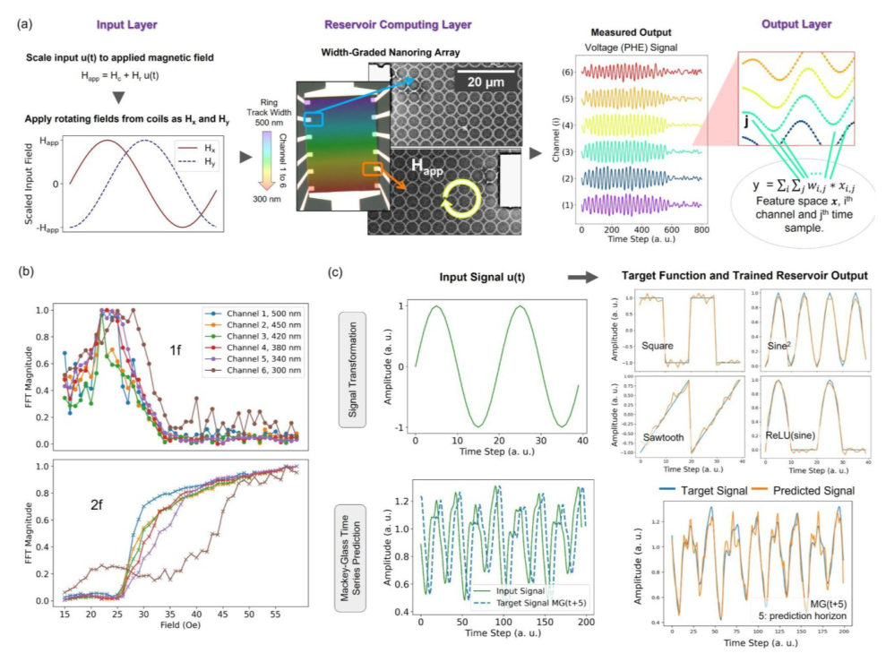 
Figure 1. Multi-contact RC pipeline, device behavior, and benchmark tasks. (a) Schematic diagram of the physical RC pipeline: Input signals are mapped onto the amplitude of a rotating magnetic field applied in the plane of the nanoring array. The field excites emergent domain wall dynamics within the array. Output is read via PHE signals between opposite contacts. The reservoir output y is a weighted (wi,j) sum of the reservoir states xij, which come from the temporal sampling (j) of the PHE response across each of the six output

📷 Fig 2

 
Figure 2. Evaluation of the SigT Task. (a) NRMSE heatmap for the best-performing number of channel combinations for the applied fields, H₀ and Hr, respectively. (b) Mapping the NRMSE for all possible channel combinations for each SigT, here H₀ = 36 and Hᵣ = 17. The plotted NRMSE points are averaged from 6 different shuffles of the train, validation, and test datasets from the main dataset. The standard deviation is plotted as the error bar of the average point. (c) An example of a good and a bad fit of the sawtooth waveform (target shown) along with the calculated NRMSE for H0 and Hr as (b). (d) Histograms showing the count of the best NRMSE for the channels (left) and the count for the...

📷 Fig 3

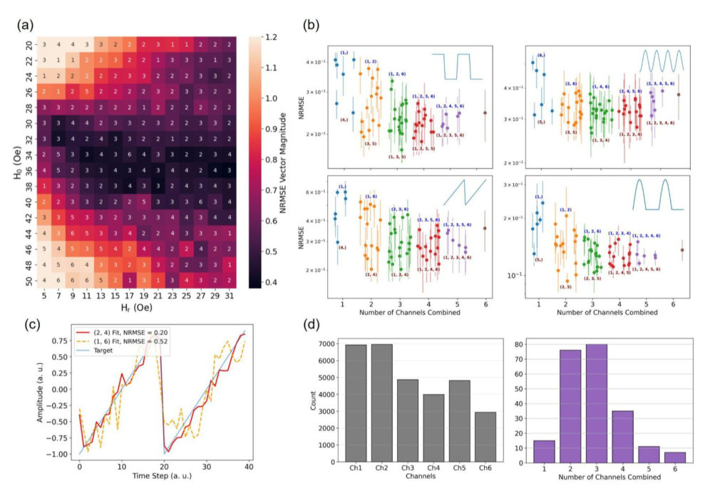 
Fig. 3 presents data from the MG-TSP task. Fig. 3(a) presents target and predicted signals for future time steps t +1, t + 5, t + 11, and t + 17, representing a next-step prediction and predictions at ¼, ½, and ¾ signal quasi-periods in the future. In general, signals become harder to predict for points further in the future but are also harder to reconstruct at the ¼ and

📷 Fig 4

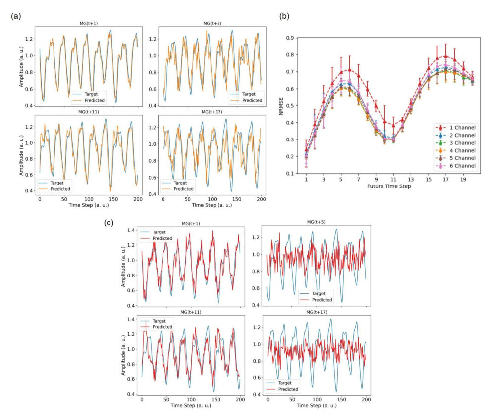 
Figure 3. MG-TSP performance. (a) Plots of the predicted and target signals for 1, 5, 11, and 17 prediction horizons for channels (1, 3, 4, 5) as an example. (b) The minimum (best) NRMSE is calculated for different channel set sizes as a function of future time step (prediction horizon); here, H₀ = 20 Oe and Hᵣ = 15 Oe. (c) Plots of the signal prediction NRMSE case for single channel (here is 6).

📷 Fig 5

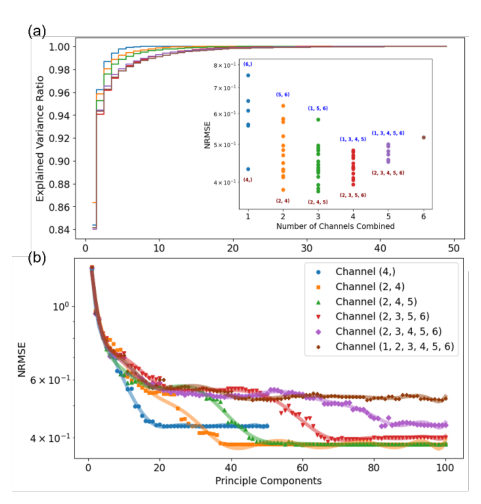 
Figure 4. Principal component analysis of physical RC output channel combination for the SigT task of the four waveforms. (a) Cumulative sum of the explained variance ratio of the components calculated for the lowest NRMSE VM channel combination set shown in the inset figure. (b) The NRMSE VM is calculated as a function of the principal components for the different channel combinations. The sinewave input modulated at fields H₀ = 36 Oe and Hᵣ = 31 Oe.

**Summary.** The paper develops and tests a nanomagnetic reservoir computer using heterogeneous magnetic nanorings. By reading out signals from multiple channels corresponding to different ring widths, the authors show that geometric disorder enhances the system's computational capacity for tasks like time-series prediction. This suggests a scalable route toward magnetic neuromorphic computing.

**Why it may be interesting.** This work demonstrates a concrete pathway for integrating concepts from condensed matter physics (magnetic domain dynamics in metamaterials) directly into computational hardware architectures, providing an experimental realization of physical computation principles relevant to open quantum systems modeling.

Detailed structure

**Main problem.** The research aims to utilize the intrinsic nonlinear dynamics of physical magnetic systems for machine learning tasks, specifically reservoir computing, minimizing external training overhead.

**Main result.** Combining outputs from multiple geometrically heterogeneous channels significantly enhances the reservoir's expressivity and computational performance compared to single-channel readouts.

**Method.** The authors tested the system on nonlinear signal transformation (SigT) and Mackey-Glass time-series prediction (MG-TSP) using multi-channel planar Hall effect readout combined with Principal Component Analysis (PCA).

**Model / system.** The platform is a nanomagnetic reservoir computer built from an array of interconnected magnetic nanorings whose track widths are systematically varied across the device. The dynamics are governed by domain-wall motion modulated by a rotating external magnetic field.

**Key observables.** Normalized Root-Mean-Square Error (NRMSE) for prediction tasks, explained variance ratio from PCA, and PHE signals measured at $1f$ and $2f$.

**Important parameters / regimes.** Ring track widths ranging from 500 nm to 300 nm; input modulation fields ($H_0$, $H_r$).

**Assumptions / limitations.** The improvements in performance are attributed to genuinely diverse feature sets provided by multiple channels, rather than just an increase in trainable parameters.

**Figures summary.** Figures illustrate the pipeline (Input $
ightarrow$ Field $
ightarrow$ Dynamics $
ightarrow$ Output), benchmark task results (SigT/MG-TSP NRMSE heatmaps and plots), and PCA analysis showing explained variance vs. number of components for various channel combinations.

**Paper structure.** The paper establishes the physical basis (nanomagnetic reservoir) and then systematically evaluates its performance on two distinct ML tasks, using multi-channel readout and dimensionality reduction techniques (PCA) to quantify the benefit of geometric heterogeneity.

Abstract

Physical reservoir computing utilizes the intrinsic nonlinear and history-dependent dynamics of physical systems to perform machine-learning tasks with minimal training overhead. Here, we introduce a nanomagnetic reservoir computer based on a heterogeneous array of interconnected magnetic nanorings, combined with multi-channel planar Hall effect readout. The device comprises subarrays of rings with systematically varied track widths ranging from 500 nm to 300 nm, enabling access to the heterogeneous dynamics of geometrically diverse magnetic systems within a single reservoir. By applying time-varying input signals as modulations of a driving rotating magnetic field, we evaluate the nanoring reservoir's performance on nonlinear signal transformation and Mackey-Glass time-series prediction tasks. We find that combining outputs from multiple width-dependent channels significantly reduces the normalized root-mean-square error compared to single-channel readout, with the optimal channel combinations depending on task requirements. These results demonstrate that geometric heterogeneity provides an additional, experimentally accessible degree of freedom and complementary computational features. Principal component analysis further reveals that a reduced subset of correlated features captures most of the computationally relevant information while suppressing noise contributions. These results demonstrate that controlled geometric heterogeneity enhances reservoir expressivity and suggest a route toward scalable magnetic computing architectures in which multi-output magnetic metamaterials serve as configurable dynamical building blocks for device networks.

[↑ back to top](#top)

### [Composite-State Localization Beyond the External Landscape in Non-Hermitian Quasicrystals](http://arxiv.org/abs/2608.08105v1)

**Authors:** Tian Zhou, Xue-Bin Wang, Zhongmin Yang, Tao Liu  
**Type:** theory · **Category:** disordered systems and neural networks · **PDF:** <https://arxiv.org/pdf/2608.08105v1>  
**Analysis basis:** full PDF text, analyzed in chunks
**Topic relevance:** `Keldysh / 2PI / non-Gaussian methods` **2/5** · `driven-dissipative phase transition` **2/5** · `analog quantum simulation` **1/5** · `correlated / nonlocal dissipation` **1/5** · `methods for driven-dissipative` **1/5** · `non-equilibrium universality` **1/5**

📷 Fig 1

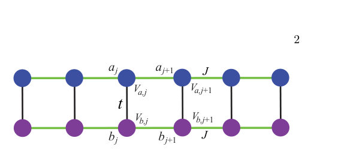 
FIG. 1. Interacting non-Hermitian quasiperiodic ladder. Hard-core bosons hop along the two legs with amplitude J and between the legs with amplitude t. Particles occupying the same rung interact with strength U1. The upper and lower legs experience the complex quasiperiodic potentials Va,j = V cos(2παj + ih + ∆ϕ/2) and Vb,j = −V cos(2παj + ih −∆ϕ/2), respectively.

📷 Fig 2

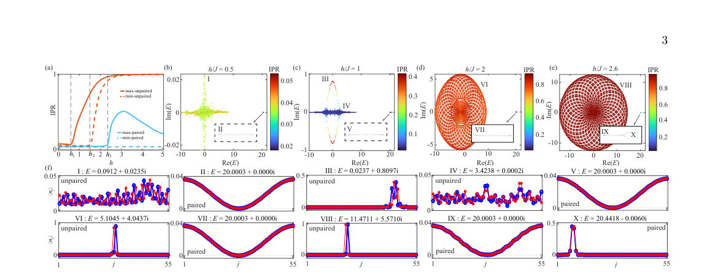 
FIG. 2. (a) Evolution of the maximum (solid lines) and minimum (dashed lines) IPR of paired (light blue) and unpaired (vermilion) states as a function of the non-Hermitian strength h. Three characteristic localization transition points are identified: h1 ≃0.6, h2 ≃1.58, and h3 ≃2.37. The first two transitions correspond to the successive extended–mixed–localized evolution of the unpaired states, while the third transition marks the onset of localization of the paired states. (b)-(e) Complex-energy spectra at representative values of h, with colors indicating the corresponding IPR values. The enlarged inset shows the energy region containing the paired states. (f) Representative...

📷 Fig 3

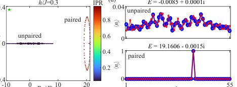 
FIG. 3. (a,b) Localization-delocalization phase diagrams in the (h, ∆ϕ) parameter plane, characterized by the maximum and minimum IPRs of the unpaired (a) and paired (b) states. The green star marks the representative parameters h/J = 0.3 and ∆ϕ = π/3. (c) Complex-energy spectrum at the point marked in (a), with the color scale representing the IPR of each eigenstate. (d) Representative particle-density distributions of the paired and unpaired eigenstates selected from (a,b). Blue and red indicate the particle densities on top and bottom chains, respectively.

📷 Fig 4

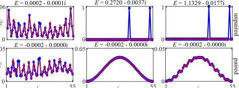 
FIG. 4. (a) Maximum (solid lines) and minimum (dashed lines) IPR values of the paired (light blue) and unpaired (vermilion) states as functions of the non-Hermitian strength h with U2/J = 40. The vertical dashed lines identify the onset of the full EIC phase at h1 ≃1.56 and the crossover to the partial EIC regime near h2 ≃3.07. (b)-(d) Complex-energy spectra, IPR-resolved spectra, and representative particle- density distributions of paired and neighboring unpaired states in three characteristic regimes in (a). In the density profiles, blue and red denote the top- and bottom-leg components, respectively.

📷 Fig 5

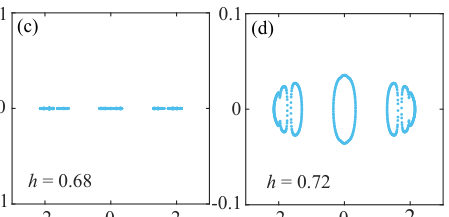 
FIG. 5. Localization and delocalization of single-chain non- Hermitian quasicrystal. (a) Maximum imaginary part of the complex eigenenergies as a function of the non-Hermitian strength h. A real-to-complex spectral transition occurs at the critical value h/J = hc/J ≃0.69. (b) Minimum and maximum values of the IPR versus h, characterizing the localization properties of the eigenstates across the transition. (c) and (d) Complex energy spectra below and above the transition, corresponding to h/J = 0.68 and h/J = 0.72, respectively. The parameters are V/J = 1 and L = 610.

**Summary.** This paper explores localization in interacting, non-Hermitian quasiperiodic systems, establishing that the binding configuration of particles dictates their transport properties. By analyzing effective Hamiltonians, the authors show a controllable 'localization inversion' where composite pairs remain extended even when individual unpaired particles become localized. This highlights internal interactions as a powerful control mechanism beyond external potentials.

**Why it may be interesting.** This work provides a detailed theoretical framework showing how emergent collective behavior (the composite state) can decouple its transport properties from the single-particle physics dictated by external disorder or non-Hermiticity.

Detailed structure

**Main problem.** The study investigates whether composite excitations can exhibit localization behavior opposite to their constituent particles within a non-Hermitian quasiperiodic environment.

**Main result.** The paper demonstrates that internal particle configuration acts as a reversible control parameter, allowing for controllable localization inversion where the composite state remains extended while unpaired constituents localize.

**Method.** The analysis uses effective Hamiltonian derivations via perturbation theory and diagnoses localization using the Inverse Participation Ratio (IPR) across varying system sizes.

**Model / system.** The model is an interacting non-Hermitian quasiperiodic ladder hosting hard-core bosons, governed by a complex potential $V(\Delta\phi)$ and interaction terms $H_{	ext{int}}$.

**Key observables.** Inverse Participation Ratio (IPR) for localization diagnosis; particle density profiles ($\langle n_{eta,j} 
angle$); effective pair hopping ($J_{eff,j}$).

**Important parameters / regimes.** Non-Hermiticity strength ($h$); relative phase $\Delta\phi$; interaction strength $U_1$.

**Assumptions / limitations.** The analysis relies on the strongly interacting regime ($U_1 \gg |J|, |t|, |V|$) and assumes quasi-degeneracy for perturbation theory application.

**Figures summary.** Figures illustrate IPR evolution showing distinct localization paths for paired vs. unpaired states, confirming the persistence of an extended composite band embedded within a localized continuum across increasing system sizes.

**Paper structure.** The paper progresses from analyzing the basic antisymmetric case ($\Delta\phi=0$) to deriving effective Hamiltonians for the pair sector using perturbation theory, culminating in demonstrating configuration-dependent localization inversion and stabilizing extended states via engineered interactions.

Abstract

A composite excitation need not inherit the localization behavior of its constituents. We show that an interacting non-Hermitian quasiperiodic ladder realizes a controllable and reversible localization inversion between composite and unbound excitations, where internal configuration, rather than only the external potential, becomes a control parameter for localization. Opposite complex potentials on the two legs cancel at first order for a same-rung pair but act directly on separated particles, allowing extended composite states to persist while the unpaired sector becomes localized. A strong-coupling theory identifies the composite state as an emergent weakly modulated non-Hermitian quasicrystal generated by virtual unpaired configurations. Breaking the potential antisymmetry restores a direct modulation of the composite band and reverses the localization hierarchy. Engineering configuration-space pathways further stabilizes an extended composite band embedded within a localized continuum, the inverse of the conventional bound-state-in-the-continuum scenario. Our results establish internal configuration as a reversible control parameter for localization.

[↑ back to top](#top)

### [Organizing transitions and their cascades: Generalized symmetry enforcement in massless flows or Higgs transitions](http://arxiv.org/abs/2608.08428v1)

**Authors:** Yoshiki Fukusumi, Yuma Furuta  
**Type:** theory · **Category:** statistical mechanics · **PDF:** <https://arxiv.org/pdf/2608.08428v1>  
**Analysis basis:** full PDF text, analyzed in chunks
**Topic relevance:** `driven-dissipative phase transition` **2/5** · `non-equilibrium universality` **2/5** · `Keldysh / 2PI / non-Gaussian methods` **1/5** · `analog quantum simulation` **1/5** · `correlated / nonlocal dissipation` **1/5**

📷 Fig 1

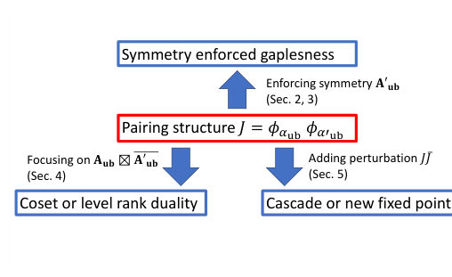 
FIG. 1. Summary of nontrivial phenomena from the (half-)integer spin simple current. J = ϕαubϕα′ ub ∈Aub ⊠A′ub is the particle satisfying the spin constraint sJ = Z/2 and we call (half-)integer spin nonsimple current. The same object is also called connected étale algebra or condensable algebra[30, 63]. We interpret this object as symmetry operators in CFTs, electron operators in TQFTs, and perturbations triggering RG flows.

📷 Fig 2

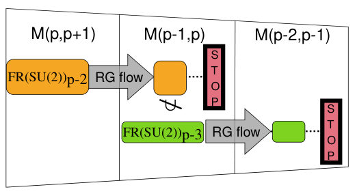 
FIG. 2. The conceptual picture of the RG flow between unitary minimal models. The unbroken symmetry is FR(SU(2))p−2 through the RG flow, and as stated in section II B, this symmetry is stabilized under the flow. Then the flow will be stopped and will not go further to M(p −2, p −1). However, an emergent symmetry FR(SU(2)p−3),which is not a subsymmetry of FR(SU(2)p−2), allows M(p −1, p) to flow to M(p −2, p −1).

📷 Fig 3

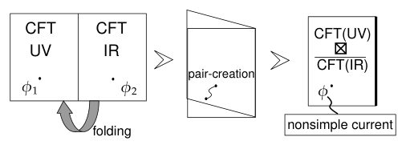 
FIG. 3. This figure shows how the (half-)integer spin nonsimple current emerges after folding. This current corresponds to the unbroken symmetry Aub through the flow. This is an analogous phenomenon to the BCS pair creation in condensed matter physics.

📷 Fig 4

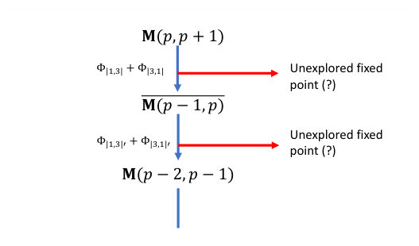 
FIG. 4. Possible scenario for the resonance effect between relevant perturbations and irrelevant perturbations. If one believes the RG domain wall and perturbative analysis, the cascade will appear. On the other hand, a variant of the Morse theory in [113] may indicate a new series of fixed points. Their relation to complex fixed points or weak-first-order transitions is an interesting problem[120]. The existence of the first-order transitions in the lattice models has been pointed out in [248] with a remark on the Q-state Potts models with Q &gt; 4. More or less, both cascades and the first-order transition seem unconventional when applying CFTs, and further clarification by other methods is...

**Summary.** This paper uses advanced CFT techniques to analyze how generalized symmetries stabilize massless Renormalization Group flows between minimal models. It demonstrates that specific unbroken symmetries eliminate dangerous perturbations, confirming the stability of the resulting infrared phase as a gapless state. This work provides a deep connection between abstract algebraic structures and the robustness of physical quantum phases.

**Why it may be interesting.** The concept of symmetry enforcing stability in RG flows is highly relevant for understanding quantum critical points and topological order in condensed matter systems, providing a powerful theoretical tool beyond standard perturbation theory.

Detailed structure

**Main problem.** The study investigates how generalized symmetry dictates the stability of massless Renormalization Group (RG) flows or Higgs transitions between different Conformal Field Theories (CFTs). The core goal is to understand how unbroken symmetries enforce gapless phases during these theoretical phase changes.

**Main result.** In specific minimal model flows, the presence of an unbroken fusion ring symmetry eliminates all relevant perturbations in the infrared theory, confirming its stability as a (weak-)symmetry-enforced gapless phase. Furthermore, this structure dictates potential cascade effects between different fixed points.

**Method.** The analysis employs Hamiltonian formalism for CFTs and their RG mappings, combining perturbative checks with nonperturbative algebraic methods involving symmetry constraints like fusion rings and coset structures.

**Model / system.** The primary system is the massless RG flow between unitary minimal models, specifically $M(p, p+1) 
ightarrow M(p-1, p)$, which models theoretical phase transitions analogous to Higgs phenomena. The underlying mathematical framework involves CFTs and their associated symmetry algebras.

**Key observables.** Unbroken fusion ring symmetry $	ext{FR}(SU(2)_{p-2})$, stability of the infrared (IR) fixed point, and the structure of (half-)integer spin nonsimple currents.

**Important parameters / regimes.** The integer parameter $p$ defining the minimal models ($p>3$), and the flow parameters governing relevant/irrelevant perturbations.

**Assumptions / limitations.** The analysis assumes the existence of RG flows and relies heavily on symmetry arguments to prove stability, contrasting with purely algebraic methods that might not guarantee physical stability.

**Figures summary.** Figure 1 summarizes key concepts: pairing structure involving nonsimple currents, symmetry-enforced gaplessness, coset/level rank duality structures, and the potential for phase transition cascades.

**Paper structure.** The paper systematically analyzes the RG flow by first establishing the role of generalized symmetry in stabilizing the IR theory. It then details how specific symmetries (like $	ext{FR}(SU(2)_{p-2})$) eliminate relevant perturbations, leading to conclusions about gapless phases and potential cascade dynamics.

Abstract

We study the role of generalized symmetry in massless renormalization group flows or Higgs transitions. In particular, we revisit the massless renormalization group flows in unitary minimal models, $\mathbf{M}(p,p+1) \rightarrow \overline{\mathbf{M}(p-1,p)}$ preserving the fusion ring symmetry $\text{FR} (SU(2)_{p-2})\subset \mathbf{M}(p,p+1)$ where $p$ is an integer satisfying $p>3$. In this series of flows, we demonstrate that the unbroken fusion ring symmetry $\text{FR} (SU(2)_{p-2})$ eliminates all relevant perturbations in the $\overline{\mathbf{M}(p-1,p)}$ model. Hence, the infrared theory $\overline{\mathbf{M}(p-1,p)}$ is stable at the level of the scaling analysis and can be interpreted as a (weak-)symmetry-enforced gapless phase in contemporary theoretical physics. Phenomenologically, by the folding trick, the unbroken fusion ring symmetry corresponds to a (half-)integer spin nonsimple current, a variant of the Cooper pair involving nonabelian anyons generated from the coset or level-rank duality structures. Moreover, we demonstrate that the structure of (half-)integer spin nonsimple current plays a fundamental role in causing the resonance effect of relevant and dangerously irrelevant perturbations. This resonance effect may result in the cascade of phase transitions (or the system flows to unexplored fixed points), and the symmetry can be a stopper of such unconventional flows.

[↑ back to top](#top)

### [Understanding Non-Split 2-Group Symmetry: (3+1)D SymTFT, Anomaly and Bordism](http://arxiv.org/abs/2608.08766v1)

**Authors:** Zhenbang Gu, Ran Luo, Yi-Nan Wang, Yi Zhang  
**Type:** theory · **Category:** strongly correlated electrons · **PDF:** <https://arxiv.org/pdf/2608.08766v1>  
**Analysis basis:** full PDF text, analyzed in chunks
**Topic relevance:** `driven-dissipative phase transition` **2/5** · `Keldysh / 2PI / non-Gaussian methods` **1/5** · `analog quantum simulation` **1/5** · `correlated / nonlocal dissipation` **1/5** · `methods for driven-dissipative` **1/5** · `quantum measurements` **1/5**

📷 Fig 1

 
Figure 1: The action of the codimension-one defect labeled by a group element g ∈Π1 on the codimension-two defect labeled by a group element h ∈Π2.

📷 Fig 2

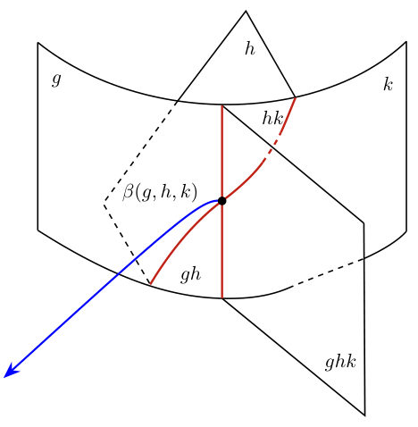 
Figure 2: The physical meaning of the Postnikov class β(g, h, k) ∈Π2 as an emergent 1-form symmetry generator in the presence of three codimension-one defects labeled by g, h, k ∈Π1. The figure shows the case of (2+1)D.

📷 Fig 3

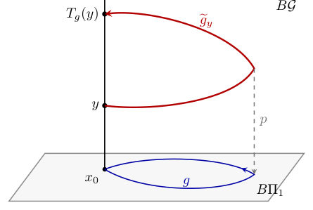 
Figure 3: The vertical line is the single fiber Fx0 over x0. The closed loop g in the base lifts to a path egy in BG from y to Tg(y); the lifted path need not be closed.

📷 Fig 4

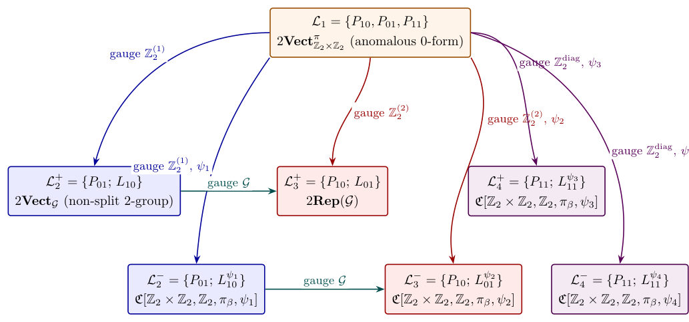 
Figure 4: Gauging routes among the seven minimal topological boundary conditions of Z1(2Vectπ Z2×Z2) = Z1(2VectG). Colored solid arrows denote gauging a subgroup H ⊂Z2×Z2 at the boundary: blue H = Z(1) 2 , red H = Z(2) 2 , violet H = Zdiag 2 , teal the gauging of the full non-split 2-group G = (Z2, Z2, triv., 1) from the 2-group boundary. Every gauging arrow is invertible — the reverse arrow gauges the dual (quantum) symmetry. Gauging the full Z2×Z2 is obstructed by the anomaly.

📷 Fig 5

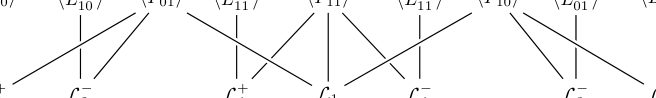 
Figure 5: Hasse diagram of the connected condensable algebras of the SymTFT Z1(2Vectπβ Z2×Z2) ∼= Z1(2VectG) in the case without 2-group anomaly, ordered by inclusion relations. Each algebra is labelled by the bulk operators it condenses: the Wilson lines Pij and/or the flux strings Lij supported on a subgroup H ⊆Z2 × Z2, the latter decorated by a trivialization ψ of πβ|H on their worldvolume. The maximal elements are the seven La- grangian algebras of Table 4, with L± 2 = ⟨L(ψ1) 10 , P01⟩, L± 3 = ⟨L(ψ2) 01 , P10⟩, L± 4 = ⟨Lψ3,4 11 , P11⟩and L1 = ⟨P10, P01⟩. There is no Lagrangian algebra with H = Z2×Z2 since [πβ|Z2×Z2] = [πβ] ̸= 0.

**Summary.** This work provides a deep theoretical analysis of physical systems governed by non-split 2-group symmetries. By employing advanced tools from algebraic topology and category theory, the authors classify quantum anomalies and map out the landscape of possible topological and physical boundary phases for (3+1)D TQFTs.

**Why it may be interesting.** The rigorous mathematical framework connecting higher-dimensional topological field theories, generalized symmetries (2-groups), and anomaly classification is highly relevant for understanding exotic phases of matter beyond standard Landau theory in condensed matter physics.

Detailed structure

**Main problem.** The paper systematically studies finite, non-split 2-group symmetries with non-trivial Postnikov classes in the context of (3+1)D Topological Quantum Field Theories (TQFTs). It aims to classify associated anomalies and boundary conditions.

**Main result.** The authors classified anomalies by computing oriented and spin bordism groups for low dimensions ($d \le 5$) and identified multiple minimal Lagrangian algebras corresponding to different topological and physical boundary phases.

**Method.** The methodology combines advanced algebraic topology (bordism theory, cohomology) with categorical methods (fusion 2-categories) applied to TQFT formalism. They analyze the structure of weak 2-group symmetries.

**Model / system.** The focus is on physical theories in $d$-dimensional spacetime exhibiting a non-split 2-group symmetry $\mathcal{G}$. The analysis covers both gapped and gapless phases, relating to Symmetry Protected Topological (SPT) phases.

**Key observables.** Anomalies classified by cohomology groups like $H^4(B\mathcal{G}; U(1)) \cong \mathbb{Z}_2$, and the identification of various boundary conditions (e.g., symmetric, partial SSB, G-SPT).

**Important parameters / regimes.** The dimension of spacetime ($d$), the structure of the 2-group symmetry $\mathcal{G}$, and the non-trivial Postnikov class.

**Assumptions / limitations.** The analysis relies on the weak 2-group formulation and may require assuming a twisted spin structure on the underlying manifold for certain calculations.

**Figures summary.** Tables summarize calculated bordism groups (Table 1) and different physical boundary conditions/phases (Table 2). Figures illustrate defect interactions and the physical meaning of the Postnikov class.

**Paper structure.** The paper proceeds by defining the non-split 2-group symmetry, calculating its anomalies using bordism theory for $d \le 5$, then applying this to construct and classify the resulting Symmetry TQFTs ($	ext{SymTFT}$) and their boundary conditions via categorical methods.

Abstract

We present a systematic study of finite, non-split 2-group symmetries with a non-trivial Postnikov class, focusing on the simplest example with a $\mathbb{Z}_2$ 0-form symmetry and a $\mathbb{Z}_2$ 1-form symmetry, intertwined together by the non-trivial Postnikov class in $H^3(B\mathbb{Z}_2;\mathbb{Z}_2)\cong\mathbb{Z}_2$, denoted by $\mathcal{G}$. We classify the anomalies of this 2-group symmetry for physical theories in $d$-dimensional spacetime, by computing the oriented bordism groups $Ω_{d+1}^{\rm SO}(B\mathcal{G})$ and the spin bordism groups $Ω_{d+1}^{\rm Spin}(B\mathcal{G})$ for $d\leq 5$. For the case of $d=3$, we investigate the Symmetry TFT/TO of the 2-group symmetry $\mathcal{G}$ using the language of fusion 2-categories, as well as (3+1)D TQFT actions, for the cases without or with the 2-group anomaly classified by $\operatorname{Hom}\left(\widetildeΩ_4^{\rm SO}(B\mathcal{G}),U(1)\right) \cong H^4(B\mathcal{G};U(1))\cong\mathbb{Z}_2$. We classify the minimal topological and physical boundary conditions of the Symmetry TFTs, and carry out the categorical Landau paradigm for such non-split finite 2-group.

[↑ back to top](#top)

### [Birefringent Biomineral Microcarriers Stabilise Multimodal Nanodiamond Quantum Sensing in Liquids](http://arxiv.org/abs/2608.09434v1)

**Authors:** T. Amro, M. Attrash, A. Droby, A. Ushkov, R. Malkinson, P. Penshin, A. Hen, V. Bobrovs, P. Ginzburg, H. Barhum, N. Bar-Gill  
**Type:** both · **Category:** other · **PDF:** <https://arxiv.org/pdf/2608.09434v1>  
**Analysis basis:** full PDF text, analyzed in chunks
**Topic relevance:** `quantum measurements` **2/5** · `QC/QI experiment` **1/5** · `driven-dissipative phase transition` **1/5** · `methods for driven-dissipative` **1/5** · `quantum optics experiment` **1/5**

📷 Fig 1

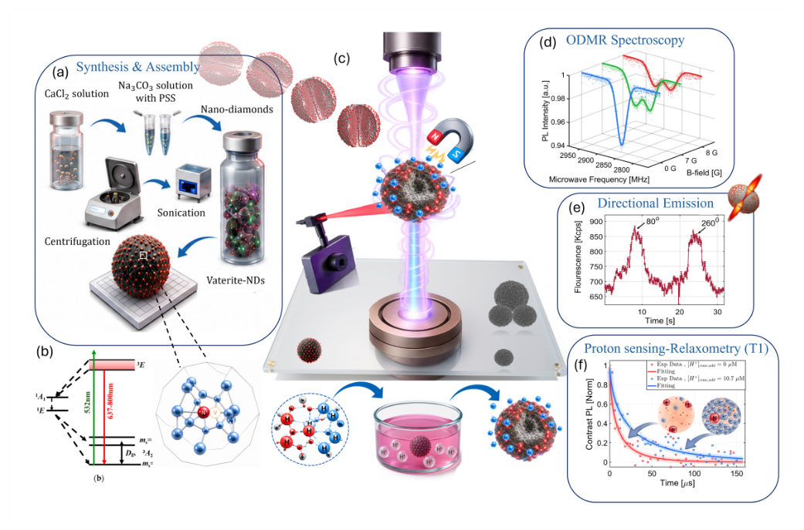 
FIG. 1: Carrier-engineered vaterite−nanodiamond quantum sensor. (a) Assembly of fluorescent 40-nm NV nanodiamonds on vaterite microspherulites. (b) NV−centre energy levels and spin-dependent optical cycle. (c) Optical trapping and confocal readout of one hybrid in liquid. (d) ODMR spectra under applied magnetic fields. (e) Polarisation-dependent photoluminescence from the birefringent carrier. (f) T1 relaxometry during nominal proton-equivalent dosing in buffered medium.

📷 Fig 2

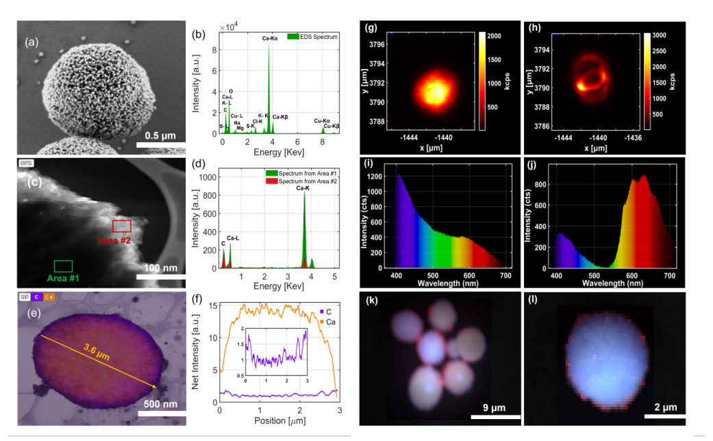 
FIG. 2: The NV layer is localised at the carrier–liquid interface. (a) SEM image of a representative hybrid particle. (b) Survey EDS spectrum showing the calcium-rich host. (c) TEM image of the particle edge. (d) Local EDS spectra from the marked interior and peripheral regions. (e) Bright-field TEM image with carbon (purple) and calcium (orange) overlays for a 3–3.6 µm particle. (f) Elemental line profiles across the particle. (g,h) Confocal PL maps acquired at the lower surface and mid-plane. (i,j) CL spectra from the carrier core and surface region. (k,l) CL maps acquired with a 30-keV electron beam at 17 and 16 nA. The combined structural and spectral data are consistent with a...

📷 Fig 3

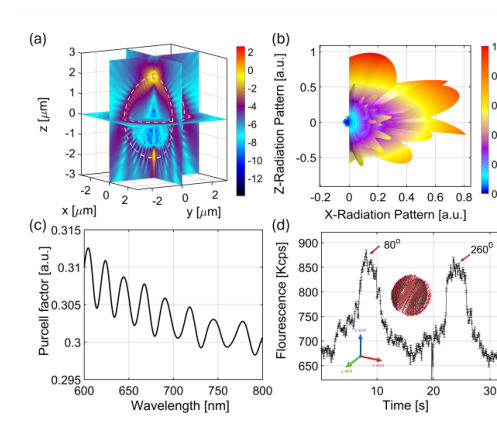 
FIG. 3: Birefringence couples carrier orientation to emission collection. (a) Calculated near-field distribution at 680 nm for a z-oriented dipole in a 40-nm nanodiamond at the vaterite surface. (b) Corresponding far-field distribution at 650 nm. (c) Purcell-factor spectrum averaged over three dipole orientations and multiple surface positions relative to an identical emitter in homogeneous water. Values below unity indicate suppression of total radiated power relative to that reference, while the angular distribution remains anisotropic.(d) PL from one hybrid trapped in D2O, averaged for 20 s at each quarter-wave-plate setting. Two maxima separated by approximately 180◦report a...

📷 Fig 4

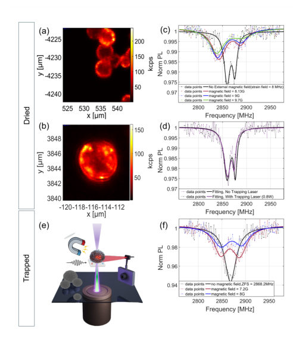 
FIG. 4: ODMR of vaterite-nanodiamond hybrid microcarriers. (a) Wide-field PL image of multiple hybrids. (b) PL image of a single hybrid selected for spectroscopy. (c) ODMR spectra of a dried hybrid under different magnetic fields, showing Zeeman splitting around (D ≈2868.2) MHz. (d) ODMR spectra of a dried hybrid acquired with 976 nm illumination from the trapping path switched off and on, showing negligible change in linewidth or resonance position. (e) Schematic of the optical trapping and detection setup. (f) ODMR spectra of a trapped hybrid at different magnetic fields; the spectra were fit with two Lorentzian dips for sensitivity estimation; the corresponding magnetic sensitivity is...

📷 Fig 5

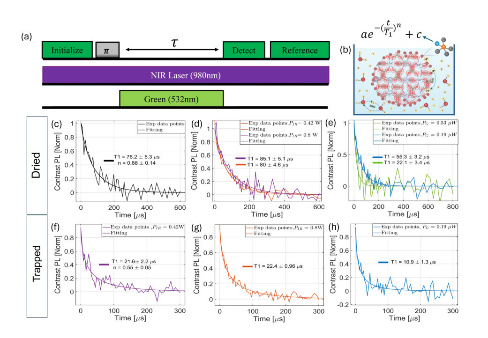 
FIG. 5: Optical controls separate trapping from interfacial relaxation. (a) Pulse sequences comprising optical initialisation, a variable dark interval τ, optical readout and a reference measurement, with a microwave π pulse applied for the dried-state measurements but omitted for the trapped-state measurements. The 976-nm trap remains on; 532-nm light is absent during the dark interval unless tested.(b) Interfacial fluctuations that can drive NV relaxation. (c) T1 decay of a dried hybrid. (d) Dried-hybrid T1 under 976-nm illumination. (e) Dried-hybrid T1 under weak 532-nm illumination during the relaxation interval. (f,g) T1 decays of trapped hybrids in ethanol containing up to 10% water....

**Summary.** The authors engineered a novel quantum sensor by embedding nitrogen-vacancy nanodiamonds onto birefringent biomineral microcarriers. This carrier stabilizes the quantum emitter against liquid motion while providing an active, proton-sensitive interface. The resulting platform enables versatile, multimodal sensing of magnetic fields and chemical species in complex biological media.

**Why it may be interesting.** This work bridges solid-state quantum emitters (NV centers) with complex soft matter interfaces (biomineral carbonates) to create robust, field-deployable sensors. The integration of mechanical stabilization (birefringence) with chemical sensing mechanisms is highly relevant for open quantum systems research.

Detailed structure

**Main problem.** Liquid nanodiamond quantum sensors are limited by Brownian rotation, variable photon collection, and perturbations from optical trapping, hindering their use as stable probes in complex media.

**Main result.** By assembling NV centers on birefringent biomineral microcarriers, the system achieves orientation stabilization and demonstrates multimodal sensing (magnetic field and proton/pH) with high sensitivity in liquid environments.

**Method.** The authors combine optical trapping, birefringence-induced torque for mechanical stabilization, ODMR spectroscopy for magnetic measurements, and relaxometry ($T_1$) to probe chemical interactions.

**Model / system.** The platform uses 40-nm NV nanodiamonds anchored to porous vaterite microspherulites. The system is modeled using grand canonical charge-regulation models that couple proton chemical potential to interfacial switching kinetics, alongside an effective spin Hamiltonian for optical readout.

**Key observables.** Zeeman-split resonances (magnetic field sensing), $T_1$ relaxation times ($\mu	ext{s}$ scale), and concentration/pH sensitivities ($\mu	ext{M} \cdot 	ext{Hz}^{-1/2}$, $	ext{mPH} \cdot 	ext{Hz}^{-1/2}$).

**Important parameters / regimes.** Magnetic fields up to $0.8 	ext{ mT}$; proton doses in the range of $10.7 \, \mu	ext{M}$ (DMEM); characteristic relaxation times ($	au_{	ext{match}} \approx 55 	ext{ ps}$).

**Assumptions / limitations.** The carrier provides an addressable body frame via optical torque, stabilizing the sensor against Brownian motion; chemical sensing relies on modeling the interface as a proton-active thermodynamic boundary.

**Figures summary.** Figures map the sequence from assembly to readout (optical, Zeeman, chemical); structural evidence confirms NV localization at the carrier–liquid interface; and subsequent figures detail polarization dependence and $T_1$ decay curves under varying conditions.

**Paper structure.** The paper progresses by first identifying limitations in free nanodiamonds, then presenting the engineered birefringent carrier platform. It details measurements across magnetic sensing (Zeeman splitting), chemical sensing ($T_1$ in DMEM/ethanol), and concludes with a theoretical model coupling proton chemistry to quantum dynamics.

Abstract

Mobile nanodiamond quantum sensors in liquids are limited by Brownian rotation, variable photon collection, and perturbations introduced by optical trapping. Here, we assemble 40-nm nitrogen-vacancy nanodiamonds at the surface of porous, birefringent vaterite microspherulites. This carbonate biomineral provides a polarization-addressable body frame, anisotropic emission redistribution, and a proton-active thermodynamic interface. Under 976-nm optical trapping, the hybrids retain their spin resonance and longitudinal relaxation, with the resonance contrast varying by less than 7 percent and the resonance centre shifting by approximately 1 MHz at 0.8 W. Zeeman-split resonances enable magnetic-field sensing from 0 to 0.8 mT, with a response metric of 78-144 microT per square root Hz. In buffered cell-culture medium, a 10.7 microM nominal proton-equivalent dose shortens T1 from 23.4 +/- 2.3 to 9.0 +/- 1.2 microseconds, corresponding to concentration and pH sensitivities of 6.46 microM per square root Hz and 6.54 mpH per square root Hz, respectively, in DMEM. By contrast, a 500-fold higher proton dose in ethanol produces a substantially weaker spin response, highlighting the role of the carbonate-rich interface. We develop a grand-canonical charge-regulation model coupling proton chemical potential to interfacial switching kinetics within the NV spectral window, capturing medium-dependent dynamic proton transduction. By integrating orientation stabilisation, optical manipulation, magnetic sensing, and interfacial chemical response, this carbonate-rich hybrid platform establishes a versatile approach to multimodal quantum sensing in complex biological liquids.

[↑ back to top](#top)

### [Causal-diamond thermalization induces nonseparability in N-partite quantum systems](http://arxiv.org/abs/2608.07869v1)

**Authors:** Hui-Chen Yang, Shu-Min Wu  
**Type:** theory · **Category:** other · **PDF:** <https://arxiv.org/pdf/2608.07869v1>  
**Analysis basis:** full PDF text, analyzed in chunks
**Topic relevance:** `driven-dissipative phase transition` **2/5** · `correlated / nonlocal dissipation` **1/5** · `non-equilibrium universality` **1/5** · `quantum measurements` **1/5** · `scars & prethermalization` **1/5**

📷 Fig 1

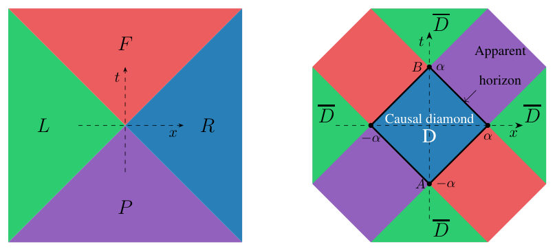 
FIG. 1: Diagrammatic correspondence between Rindler wedges and causal diamond under the composite

📷 Fig 2

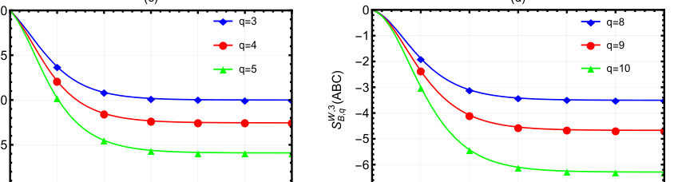 
FIG. 2: AR q-conditional entropy for bosonic GHZ and W states in causal diamond spacetime, plotted as

📷 Fig 3

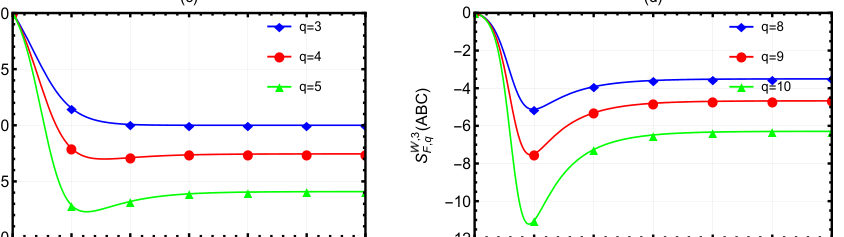 
FIG. 3: Dependence of the AR q-conditional entropy for fermionic GHZ and W states on the finite-lifetime

📷 Fig 4

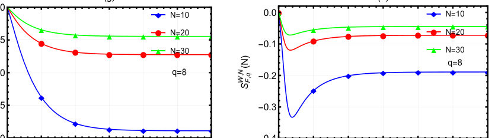 
FIG. 4: AR q-conditional entropy of both bosonic and fermionic fields for W states in causal diamond

**Summary.** This paper analyzes how the finite lifetime of an observer, modeled by a causal diamond, induces thermal effects on multipartite quantum states. Using advanced entropy measures, the authors find that particle statistics and entanglement structure dictate whether nonseparability degrades or even enhances under these relativistic conditions. The results provide crucial insights for designing quantum information protocols in curved spacetimes.

**Why it may be interesting.** It connects fundamental concepts from general relativity (causal structure, horizons) directly to quantum information measures like entanglement robustness, which is highly relevant for understanding quantum computation in curved spacetime.

Detailed structure

**Main problem.** The study investigates how causal restrictions, modeled by a finite-lifetime observer within a causal diamond spacetime, induce thermal effects that alter the nonseparability of multipartite quantum states.

**Main result.** Thermalization can enhance fermionic W state nonseparability (unlike bosons), and GHZ states maintain nonseparability independent of particle number N, while W states show degradation with increasing N.

**Method.** The authors use the Abe-Rajagopal (AR) q-conditional entropy as a diagnostic tool to quantify nonseparability in bosonic and fermionic systems quantized within the causal diamond geometry.

**Model / system.** The system involves N-partite bosonic and fermionic GHZ and W states, analyzed under the influence of a causal diamond horizon which induces an Unruh-like thermal effect.

**Key observables.** Nonseparability quantified by AR q-conditional entropy; particle number distributions (Bose-Einstein/Fermi-Dirac).

**Important parameters / regimes.** Observer lifetime ($T=2\alpha$), the nonextensivity parameter $q$, and the particle number $N$.

**Assumptions / limitations.** The analysis assumes the initial state is in the global Minkowski vacuum, and the thermalization arises from tracing out inaccessible exterior modes.

**Figures summary.** Figure 1 illustrates the diagrammatic correspondence between Rindler wedges and the causal diamond under conformal mapping.

**Paper structure.** The paper establishes the physical context (causal diamonds inducing thermalization), details the mathematical tool (AR q-conditional entropy), and applies it to analyze specific states (GHZ/W).

Abstract

We investigate the nonseparability of multipartite bosonic and fermionic $GHZ$ and $W$ states in a causal diamond spacetime using the Abe-Rajagopal (AR) $q$-conditional entropy. The finite lifetime of the observer gives rise to a causal diamond horizon, which induces an Unruh-like thermal effect and leads to a nontrivial restructuring of nonseparability in $N$-partite systems. Our main result is that the thermal effect can enhance a net nonseparability of fermionic $W$ states, in sharp contrast to the general expectation that relativistic thermalization leads to a monotonic degradation of bosonic nonseparability. In addition, we find that fermionic nonseparability is generally more robust than its bosonic counterpart under causal diamond restrictions. Among different entangled resources, $GHZ$ states exhibit stronger nonseparability and greater robustness than $W$ states under identical causal conditions. We further show that the nonseparability of $W$ states decreases with increasing particle number $N$, whereas that of $GHZ$ states remains independent of $N$ in causal diamond spacetime. These results demonstrate that particle statistics, entanglement structure, and observer lifetime jointly determine the persistence of nonseparability in causally restricted spacetimes, providing insights for relativistic quantum information processing.

[↑ back to top](#top)

### [Optimally embedded tight binding for reproducing geometry dependent observables](http://arxiv.org/abs/2608.07684v1)

**Authors:** Jonas J Telle, Gunnar F Lange  
**Type:** theory · **Category:** other · **PDF:** <https://arxiv.org/pdf/2608.07684v1>  
**Analysis basis:** full PDF text, analyzed in chunks
**Topic relevance:** `quantum measurements` **2/5** · `Keldysh / 2PI / non-Gaussian methods` **1/5** · `analog quantum simulation` **1/5** · `driven-dissipative phase transition` **1/5** · `methods for driven-dissipative` **1/5**

📷 Fig 1

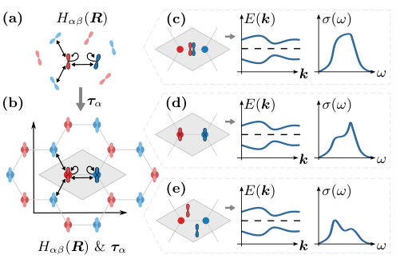 
FIG. 1. Schematic of main results. (a) A tight-binding model can be viewed as a weighted graph, where hoppings and on-site terms are represented by edges and loops. (b) Specifying the orbital positions τα amounts to embedding this graph in real space. (c)–(e) Changing the orbital positions leaves geometry independent quantities such as band struc- tures E(k) unchanged, but can dramatically alter geometry dependent quantities such as optical responses σ(ω). Thus, the orbital positions can be seen as a tuning parameter which can be utilised to fit geometric quantities.

📷 Fig 2

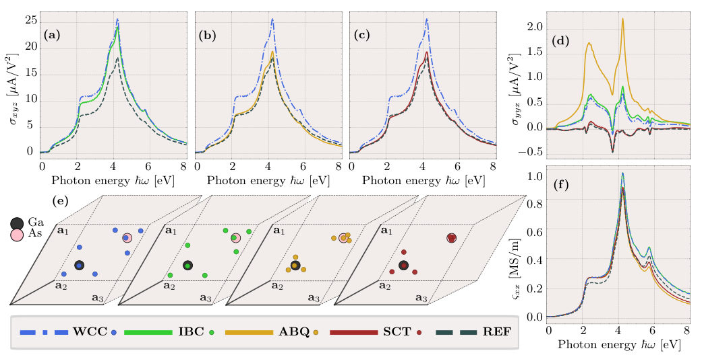 
FIG. 2. GaAs tight biding optical responses for different embeddings. Legend abbreviations denote: Wannier Charge Centers (WCC), Interspace Berry Connection (IBC), Abelian QGT (ABQ), Shift Current Tensor (SCT) and Wannier interpolation (REF). (a)–(c) The only independent shift current component (xyz). (d) A symmetry-disallowed shift current component (yyx). (e) Orbital embeddings in the irreducible unit cell. (f) The only independent optical conductivity component (xx).

📷 Fig 3

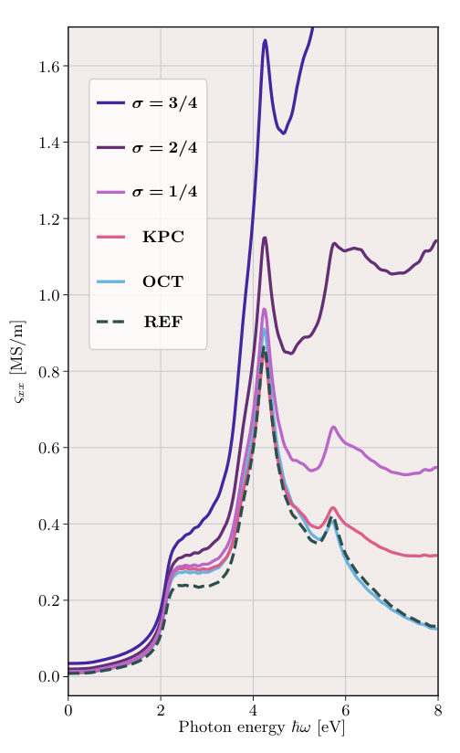 
FIG. 3. Optical conductivity ςxx for GaAs for different embeddings. Beyond the tailored fit on the Optical Conduc- tivity Tensor (OCT) and Wannier interpolation (REF), we show plots for increasing noise, corresponding to the aver- age of 15 responses computed from orbital embeddings drawn from a normal distribution with standard deviation σ, and the geometry independent contribution (KPC) obtained by placing all orbitals at the origin (i.e. σ = 0).

📷 Fig 4

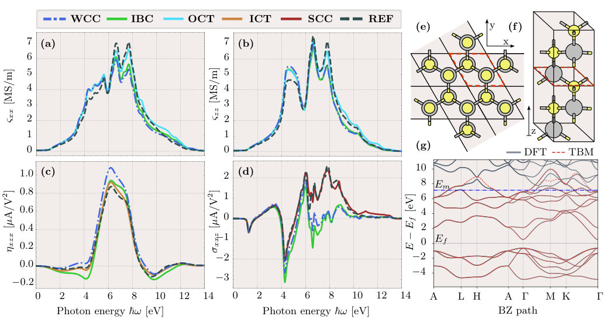 
FIG. 4. CdS tight-binding optical responses for different embeddings. Legend abbreviations denote: Wannier Charge Centers (WCC), Interspace Berry Connection (IBC), Optical Conducitvity Tensor (OCT), Injection Current Tensor (ICT), Shift Current xxz-Component (SCC) and Wannier interpolation (REF). (a)–(b) The independent optical conductivity components (resp. xx and zz). (c) The independent injection current component (xzx). The scaling is arbitrary, with the relaxation time set to 1 fs. (d) One of three independent shift current components (xxz). (e)–(f) The wurtzite structure, with Cd in grey and S in yellow. In (e), a top view of a single layer above the xy-plane. The lattice extends...

📷 Fig 5

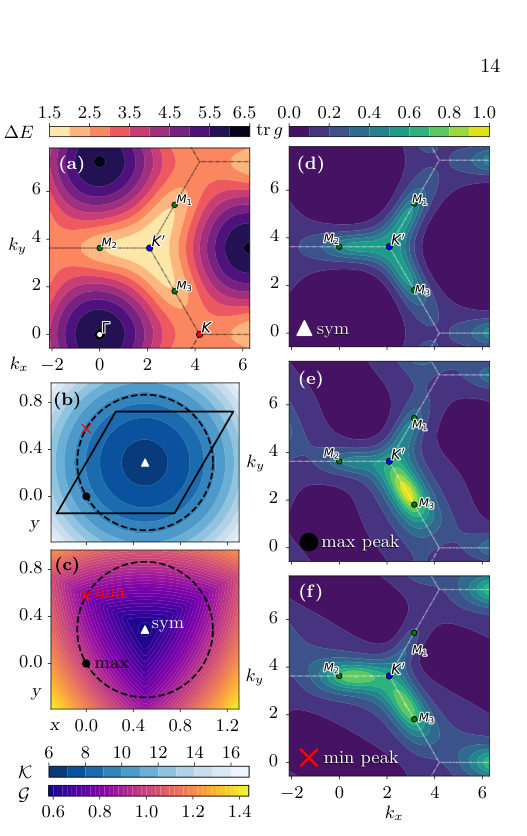 
FIG. 5. Geometry dependence of the metric trace in a Haldane model with parameters ∆= 0.3, t1 = −1 and t2 = −0.21, and lattice constant a = 1. (a) The band gap (in units |t1|) over the BZ around a K′ point with high symmetry points indicated. Notice the near-flat triangular plateau in the band gap between K′ and the C3 equivalent M-points marked M1, M2 and M3. (b)–(c) The BZ average metric trace K as a function of orbital separation (x, y) (no units), and the max- imum of the metric trace G (units a2) as a function of orbital separation, respectively. The unit cell is indicated, together with the circular equipotential curve of the quantum weight K, corresponding to the geometry independent...

**Summary.** This paper addresses the limitation of tight-binding models that fail when calculating properties sensitive to spatial geometry, despite accurately predicting band structures. The authors propose an 'optimally embedded' framework, treating orbital positions as tunable parameters fixed against experimental or ab-initio data. This allows for the construction of highly accurate minimal models capable of reproducing complex geometric observables like optical responses.

**Why it may be interesting.** While focused on solid-state physics, the methodology—treating geometric structure (embeddings) as tunable model parameters fixed by external data to improve predictive power—is a general concept applicable to parameterizing complex quantum systems where full first-principles calculation is prohibitive.

Detailed structure

**Main problem.** Tight-binding models fail to accurately reproduce geometry-dependent physical responses, even when they correctly model geometry-independent properties like band structures.

**Main result.** The authors introduce an 'optimally embedded tight binding' framework where orbital embeddings are treated as explicit tuning parameters fixed against reference data to achieve accurate minimal models.

**Method.** They determine optimal embeddings by decomposing observable quantities into geometry-independent and dependent parts, utilizing position derivatives for efficient fitting.

**Model / system.** The study uses solid-state systems modeled via tight-binding theory (e.g., GaAs, CdS), focusing on the Hamiltonian structure derived from Bloch states and incorporating orbital embeddings ($	au_\alpha$).

**Key observables.** Non-linear optical responses ($\sigma(\omega)$), quantum geometric tensor, and local metric trace.

**Important parameters / regimes.** Orbital embedding parameters ($\{	au_\alpha\}$) are the key tunable parameters.

**Assumptions / limitations.** The initial approximation assumes orbitals are nearly point-like; the method requires fixing embeddings against external physical data (ab-initio or experiment).

**Figures summary.** Figures compare optical responses using different embedding models and show that fitting optimal embeddings on a coarse grid successfully reproduces the true, dense response.

**Paper structure.** The paper first establishes the failure of standard tight-binding models for geometry dependence. It then introduces the optimal embedding framework, detailing the mathematical decomposition used to tune parameters against physical observables, culminating in successful quantitative reproduction of optical responses.

Abstract

In tight-binding models, the position operator is reduced to intra-cell orbital positions (embeddings). While accurately reproducing band structures, such models often fail for geometry dependent responses depending on the position operator. To address this, we investigate the role of these embeddings and introduce the general framework of optimally embedded tight binding. Treating the embeddings as geometric tuning parameters to be fixed against a reference response (obtained from ab-initio computation or experiment), we obtain tight-binding models of GaAs and CdS which quantitatively reproduce non-linear optical responses at no cost to band structure accuracy. The optimal embeddings are determined efficiently using position derivatives obtained from decomposing tight-binding observables into a geometry independent and dependent part, and explicit derivatives are provided for key quantities such as the quantum geometric tensor. The decomposition reveals where geometric effects dominate, and we show in both toy models and in the Chern insulator V2O3 how geometry can dramatically alter the local metric trace. Our results highlight that orbital embeddings should be treated as a genuine model parameter which should be explicitly fixed against physical data to get accurate minimal models.

[↑ back to top](#top)

### [How to Test Bell Nonlocality for Gravity?](http://arxiv.org/abs/2608.08778v1)

**Authors:** Debarshi Das, Mir Alimuddin, Simon Storz, Yiwen Chu, Sougato Bose  
**Type:** theory · **Category:** other · **PDF:** <https://arxiv.org/pdf/2608.08778v1>  
**Analysis basis:** full PDF text, analyzed in chunks
**Topic relevance:** `QC/QI experiment` **2/5** · `quantum measurements` **2/5** · `analog quantum simulation` **1/5**

📷 Fig 1

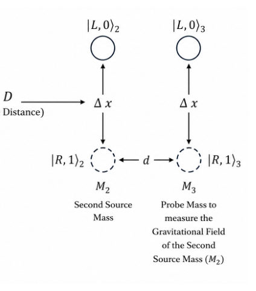 
FIG. 1: Geometry of the setup

**Summary.** This paper outlines a novel, loophole-free experiment to test if the gravitational field exhibits Bell nonlocality. It uses four massive objects placed in spatial superpositions whose spins are entangled and subsequently interact gravitationally. A violation of the CHSH inequality in local spin measurements would provide evidence that gravity itself is fundamentally quantum mechanical.

**Why it may be interesting.** It proposes an experimental roadmap for testing fundamental quantum principles (Bell nonlocality) in a regime where gravity is treated as a quantum field, bridging quantum information theory with general relativity.

Detailed structure

**Main problem.** The primary goal is to develop a protocol to test Bell nonlocality directly on the gravitational field itself, moving beyond testing entanglement only in the masses or interactions.

**Main result.** The authors propose a loophole-free, fully device-independent test that can certify Bell nonlocality of gravitational curvatures if gravity is quantum mechanical.

**Method.** A multi-step protocol involving creating spatial superpositions on source and probe masses, allowing them to interact gravitationally, and then performing local spin measurements to violate the CHSH inequality.

**Model / system.** The system involves four massive objects ($M_1, M_2$ sources; $M_0, M_3$ probes) with embedded entangled spins. The interaction is mediated by gravity, leading to entanglement of gravitational curvatures.

**Key observables.** Violation of the Bell-CHSH inequality ($B > 2$), and the resulting post-selected correlations in the spin measurements.

**Important parameters / regimes.** The protocol requires specific mass values ($\sim 10^{-13} - 10^{-14}$ kg) and superposition sizes ($\Delta x \sim 1 - 100 \mu$m) to achieve a measurable violation.

**Assumptions / limitations.** Key assumptions include the ability to make electromagnetic interactions negligible, achieving long-distance entanglement distribution (closing locality loopholes), and assuming fair post-selection in the Bell test analysis.

**Figures summary.** Figure 1 illustrates the geometry of two entangled source masses interacting with two probe masses.

**Paper structure.** The paper details a multi-step protocol: entangling spins, creating spatial superpositions via unitary evolution, allowing gravitational interaction between sources and probes, performing local measurements on source spins (Step 5), and finally measuring probe spins to test Bell nonlocality (Step 6).

Abstract

We propose an experiment to test Bell nonlocality, a genuine nonclassicality, for the gravitational field. Two masses with embedded entangled spins (e.g., two diamonds with their NV-centre spins entangled) are placed well outside each other's light cones, ensuring a locality-loophole-free scenario. The spins are then coupled to the motion of their respective masses to generate spatial superpositions. Finally, local measurements are performed only on the gravitational fields of the two masses. If gravity is quantum, then the two entangled masses would entangle their gravitational fields, leading to correlations certifying Bell nonlocality of gravity. Trapped and ground-state cooled nano-objects with micron-sized spatial superposition are sufficient for this test. This goes beyond the recent proposals to test nonclassicality of gravity by providing, for the first time in the literature, a minimal tool to (i) create Einstein-Podolsky-Rosen (EPR) state of gravitational curvatures, (ii) witness entangled gravitational curvatures, (iii) rule out any local-realist description of gravity, and (iv) achieve a loophole-free test of gravity's nonclassicality in a fully device-independent way.

[↑ back to top](#top)

### [On Demand magnetic-Doppler nuclear frequency comb memory for hard X-ray photons](http://arxiv.org/abs/2608.08271v1)

**Authors:** Yanli Shi, Xiwen Zhang, Yuri Shvyd'ko, Olga Kocharovskaya  
**Type:** theory · **Category:** other · **PDF:** <https://arxiv.org/pdf/2608.08271v1>  
**Analysis basis:** full PDF text, analyzed in chunks
**Topic relevance:** `quantum measurements` **2/5** · `driven-dissipative phase transition` **1/5** · `interference shaping light` **1/5** · `quantum optics experiment` **1/5**

📷 Fig 1

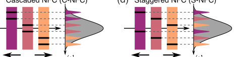 
FIG. 1. Illustration of the magnetic-Doppler hybrid NFC. (a) The energy-level diagram of the ℏω0 = 14.4 keV nu- clear transition in 57FeBO3. The ground state |g⟩and ex- cited state |e⟩split into 2 and 4 sublevels, respectively, la- beled according to their nuclear magnetic quantum numbers M. The 2 transitions used in this work satisfying the selec- tion rule Mg −Me = 0 are spectrally separated by ∆ωZ. (b) Three thin 57FeBO3 M¨ossbauer absorbers, each of thickness L, resonantly interact with a linearly polarized hard X-ray photon, where the magnetic polarization vector ϵh is along x-direction. These absorbers move along z-axis with constant velocity spacing ∆v, resulting in Doppler detunings...

📷 Fig 2

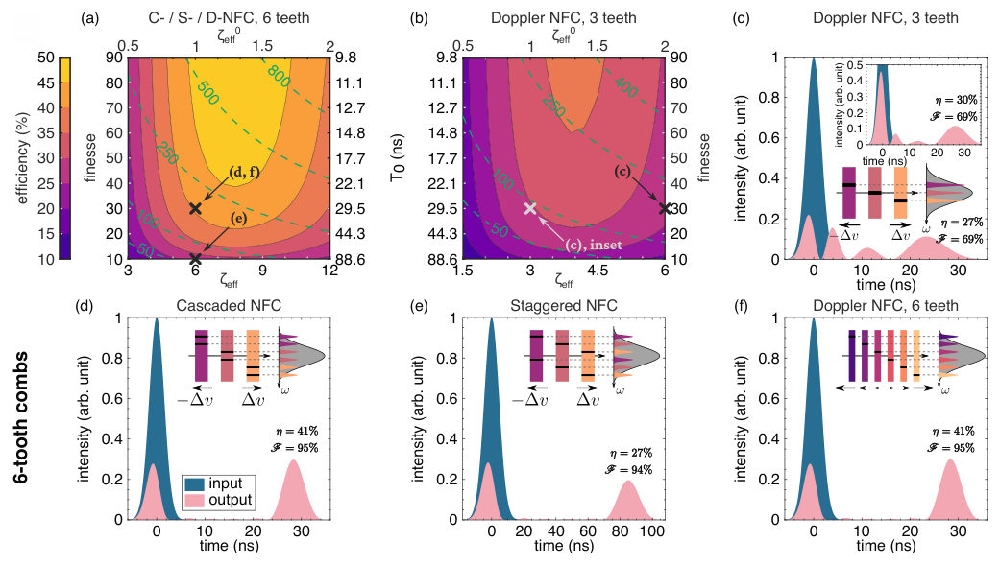 
FIG. 2. Hard X-ray quantum memory by static nuclear frequency combs. (a,b) QM efficiencies as functions of effective optical thickness ξeff and comb finesse F for (a) 6-tooth C-NFC or S-NFC, and (b) 3-tooth D-NFC, all implemented with 3 M¨ossbauer absorbers. The incident photon bandwidth is matched to (a) the C-NFC and/or S-NFC, which is twice that of (b) D-NFC for maintaining the same comb spacing ∆ω. Cyan dashed lines are contours of constant total resonant optical thickness, given by ξ = NKFξ0 eff. (c-f) Demonstrations of QM using different static NFCs: (c) a 3-tooth D-NFC with 3 absorbers, (d) a 6- tooth C-NFC with 3 absorbers, (e) a 6-tooth S-NFC with 3 absorbers, and (f) a 6-tooth...

📷 Fig 3

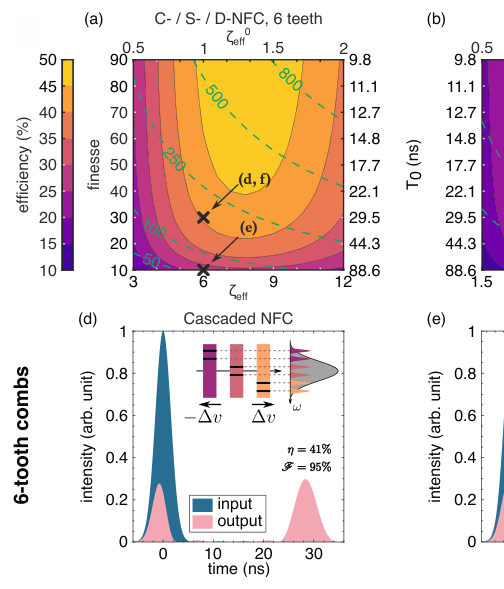 
Figure 4 compares the efficiencies and fidelities of on- demand QMs using C-NFC, S-NFC, and D-NFC (i.e., the SGE protocol), with all configurations employing six spectral teeth and a fixed switching time of Tsw = 7.5 ns. To facilitate comparison, the contour plots also show the relative efficiency and fidelity as percentages with respect to those of the SGE. The maximum achievable efficiencies ηmax for the C-NFC, S-NFC, and SGE schemes are found to be 56%, 52%, and 72%, respectively. Unlike in the static case, the on-demand C-NFC and S-NFC configu-

📷 Fig 4

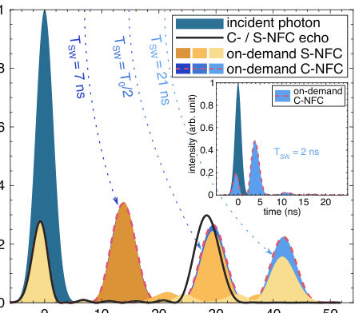 
FIG. 3. On-demand echo retrieval for C-NFC (pink dashed line with blue-filled area) and S-NFC (red-filled area) by vary- ing Tsw from 7 ns to 21 ns, with ξeff = 6 and F = 30. The incident photon is illustrated in filled navy-blue area. The predetermined photon echo from static S-NFC or C-NFC (see the Supplementary Information [35]) without performing any switch operation is plotted in black solid line for compari- son. The inset shows an example of on-demand QM with an efficiency 57.65% and fidelity 96.87%, using the C-NFC con- figuration with ξeff = 7.8, F = 66, and a switching time of Tsw = 2 ns.

📷 Fig 5

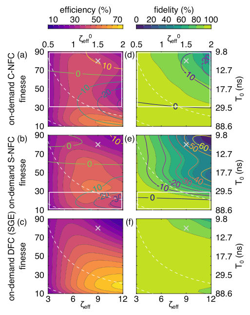 
FIG. 4. Performance of on-demand hard X-ray quantum memory using 57Fe-based nuclear frequency combs. (a-c) Ef- ficiencies and (d-f) fidelities of on-demand storage for 15 ns of incident photons with Gaussian temporal wave form, char- acterized by a FWHM field duration ∆t = 8 ln(2)/(5∆ω +Γ). Results are shown for: (a, d) on-demand C-NFC, (b, e) on- demand S-NFC, and (c, f) on-demand 6-tooth D-NFC (SGE). Numbered solid-color contour lines in panels (a, b) and (d, e) represent the efficiency and fidelity differences, respectively, relative to the on-demand D-NFC results shown in (c) and (f). White boxes enclose regions corresponding to feasible hy- perfine magnetic fields in 57FeBO3, while...

**Summary.** The paper proposes a magnetic-Doppler nuclear frequency comb memory for storing hard X-ray photons. It overcomes the difficulty of on-demand retrieval by introducing a mechanism that requires synchronously reversing both the internal magnetic field and absorber velocities. This hybrid approach significantly reduces mechanical complexity while maintaining high storage efficiency.

**Why it may be interesting.** This work directly addresses quantum light storage and retrieval using solid-state systems, which is a major area of research at the intersection of AMO physics and quantum optics. The use of hyperfine structure to simplify mechanical requirements is particularly novel.

Detailed structure

**Main problem.** The primary challenge addressed is achieving efficient, on-demand retrieval of hard X-ray photons stored in quantum memories.

**Main result.** A hybrid magnetic-Doppler nuclear frequency comb protocol allows for on-demand storage and retrieval by synchronously reversing both the internal magnetic field and absorber velocities.

**Method.** The method involves engineering a time-reversed phase evolution dynamic by controlling two external parameters (magnetic field and velocity) simultaneously, rather than relying solely on mechanical motion.

**Model / system.** The system utilizes nuclear transitions in ${}^{57}	ext{FeBO}_3$ absorbers, forming a hybrid comb structure incorporating both Doppler shifts ($\Delta\omega_D$) from motion and hyperfine splittings ($\Delta\omega_Z$) from the strong internal magnetic field.

**Key observables.** Storage efficiency ($\eta$), fidelity ($F$), bandwidth (e.g., $3\Delta\omega$ or $6\Delta\omega$), and the retrieval amplitude $	ext{B}_{	ext{out}}(t)$.

**Important parameters / regimes.** The required simultaneous reversal of both hyperfine magnetic fields ($B_{	ext{hf}}$) and absorber velocities ($\mathbf{v}_n$). The efficiency can reach up to 54% under optimal conditions.

**Assumptions / limitations.** On-demand retrieval necessitates the simultaneous reversal of both $B_{	ext{hf}}$ and $\mathbf{v}_n$; partial reversal is insufficient. Quadrupole interaction in ${}^{57}	ext{FeBO}_3$ can be neglected at low temperatures.

**Figures summary.** Figures compare quantum memory efficiencies ($\eta$) and fidelities ($F$) for static vs. on-demand configurations (C-NFC, S-NFC, D-NFC), illustrating the performance gains from active switching.

**Paper structure.** The paper first establishes the limitations of traditional Doppler frequency combs for on-demand retrieval. It then proposes and details the hybrid magnetic-Doppler NFC using ${}^{57}	ext{FeBO}_3$. The core mechanism involves deriving the time-reversed dynamics enabled by simultaneous field/velocity reversal, leading to performance comparisons between different comb configurations (C-NFC vs D-NFC).

Abstract

Nuclear quantum memories in the hard X-ray regime offer some key advantages over their optical counterparts, such as broader bandwidth and lower background noise. A Doppler frequency comb protocol has been theoretically proposed [X. Zhang \textit{et al.}, Phys. Rev. Lett. \textbf{123}, 250504 (2019)] and recently demonstrated experimentally [S. Velten \textit{et al.}, Sci. Adv. \textbf{10}, eadn9825 (2024)] for the storage and retrieval of X-ray photons. However, achieving on-demand retrieval remains challenging because of the requirement for precise and synchronous mechanical motion of multiple absorbers. We propose a hybrid, magnetic-Doppler nuclear frequency comb composed of Doppler-shifted resonant absorbers with lifted nuclear spin degeneracy, which expands the Doppler comb structure. By synchronously reversing the directions of both the magnetic fields and absorber velocities, the system achieves time-reversed phase evolution dynamics that allows for efficient on-demand photon retrieval with significantly reduced mechanical complexity.

[↑ back to top](#top)

### [QTris: a pedagogical board game to teach Quantum Mechanics](http://arxiv.org/abs/2608.09430v1)

**Authors:** Alessandro Amabile, Maria Bondani, Immacolata De Simone, Michela Nazzaro, Michele Viscardi, Alioscia Hamma  
**Type:** both · **Category:** quantum information and computing · **PDF:** <https://arxiv.org/pdf/2608.09430v1>  
**Analysis basis:** full PDF text, analyzed in chunks
**Topic relevance:** `QC/QI experiment` **2/5** · `quantum measurements` **2/5** · `analog quantum simulation` **1/5**

📷 Fig 1

 
Figure 1: The 3x3 game board of QTris, the same as that of classical tic-tac-toe.

📷 Fig 2

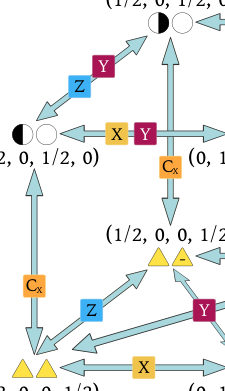 
Figure 3: Cubic map of double-cell operations X, Y, Z, CX. The numbers in the parentheses (w, x, y, z), next to the symbols G##, G# , H# , H## and , , , , represent the probabilities of obtaining ##, # , #, respectively, after perform- ing a measurement. Two symbols on the same arrow mean that both operations achieve the same effect.

📷 Fig 3

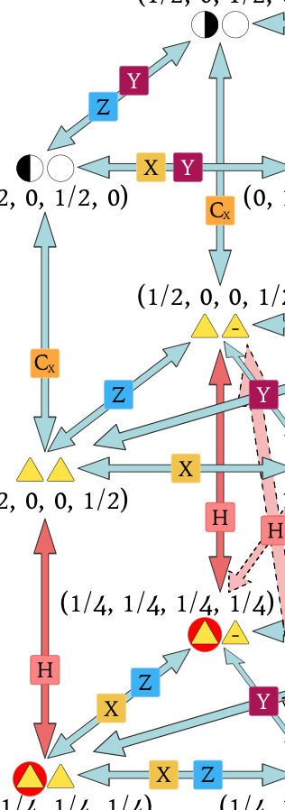 
Figure 6: Map of all the operations allowed by using entangled states together with H and the corresponding probabilities for the outcomes {##, # , #, }. Two symbols on the same arrow mean that both operations achieve the same effect.

📷 Fig 4

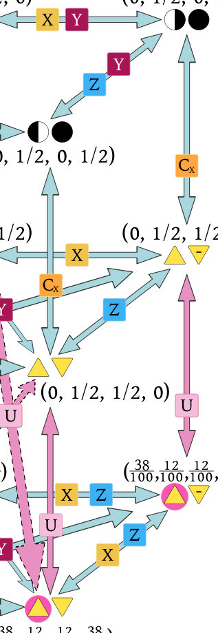 
Figure 7: Map of all the operations allowed by using entangled states together with U and the corresponding probabilities for the outcomes {##, # , #, }. Two symbols on the same arrow mean that both operations achieve the same effect.

📷 Fig 5

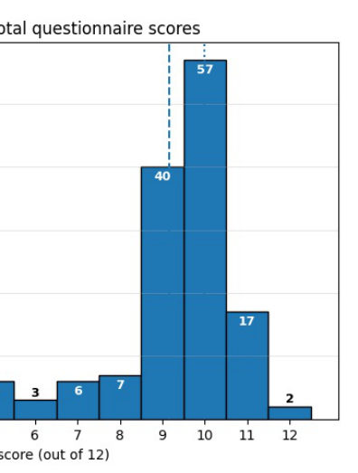 
Figure 9: Score distribution over participants.

**Summary.** This paper presents QTris, a board game designed as a pedagogical tool to teach Quantum Mechanics at the high-school level. It advocates for teaching QM using a qubit-first approach rather than historical narratives, focusing on core postulates like superposition and measurement. Preliminary testing suggests that this interactive game format is an effective way to build initial conceptual understanding of quantum principles.

**Why it may be interesting.** While focused on pedagogy, the reliance on simulating quantum processes via qubits directly relates to foundational concepts in quantum information theory and computation that are relevant to AMO research.

Detailed structure

**Main problem.** The primary goal is developing an effective, accessible pedagogical tool to teach abstract concepts of Quantum Mechanics (QM) to high-school students.

**Main result.** The paper introduces QTris, a board game that successfully simulates core quantum processes using a qubit-first approach, showing preliminary evidence of its utility in promoting conceptual understanding.

**Method.** The authors combine pedagogical theory (critiquing historical QM teaching) with empirical testing using student performance data from an educational activity based on the game mechanics.

**Model / system.** The model is QTris, a board game designed to simulate quantum processes on a system of qubits, focusing specifically on two-state systems. The underlying physics concepts simulated include superposition, unitary transformations, and probabilistic measurement.

**Key observables.** Student performance scores across conceptual and operational questions (Q1-Q12), measuring understanding of incompatibility and probabilistic outcomes.

**Important parameters / regimes.** The system is restricted to the two-state qubit model for pedagogical simplicity; the activity involved approximately 150 high-school students.

**Assumptions / limitations.** It assumes that restricting QM education to finite-dimensional Hilbert spaces (qubits) is sufficient and pedagogically sound, bypassing advanced mathematics like functional analysis.

**Figures summary.** Figures show score distributions for conceptual vs. operational questions, and specific response distributions highlighting common student misconceptions regarding probabilities and outcomes.

**Paper structure.** The paper first argues for a qubit-first pedagogical approach over historical narratives; it then details the QTris game rules and mechanics; finally, it reports on preliminary results from an educational activity using the game.

Abstract

In this paper we introduce the new version of QTris, a board game designed to teach and learn Quantum Mechanics within the framework of Quantum Information and Computation. The key idea behind the game is that every game sequence simulates a process on a system of qubits. Thus, QTris can be effectively integrated as a pedagogical tool to teach Quantum Mechanics at high-school level following a two-state approach. After arguing in support of this latter approach, we describe QTris' basic rules and some of its possible extensions, emphasizing how the game mechanics puts in clear light key quantum concepts such as incompatibility, probabilistic measurement and unitary transformation. Moreover, we report on the results of a QTris-based educational activity which involved about 150 high-school students and provided encouraging preliminary indications that QTris can be a useful pedagogical platform to promote an immediate understanding of some key concepts of Quantum Mechanics.

[↑ back to top](#top)

### [A Systematic Comparison of q-Gaussian Fitting Methods across Complex Systems](http://arxiv.org/abs/2608.08666v1)

**Authors:** Facundo Máximo Abaca, Darío Javier Zamora, Bruno S. Zossi, Ana G. Elias  
**Type:** theory · **Category:** statistical mechanics · **PDF:** <https://arxiv.org/pdf/2608.08666v1>  
**Analysis basis:** full PDF text, analyzed in chunks
**Topic relevance:** `non-equilibrium universality` **2/5** · `driven-dissipative phase transition` **1/5** · `quantum measurements` **1/5**

📷 Fig 1

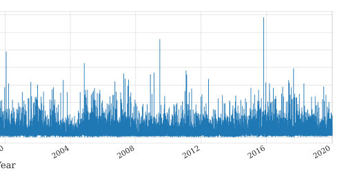 
Figure 1: Values of proton density (Np), in the solar wind for 1980 to 2025.

📷 Fig 2

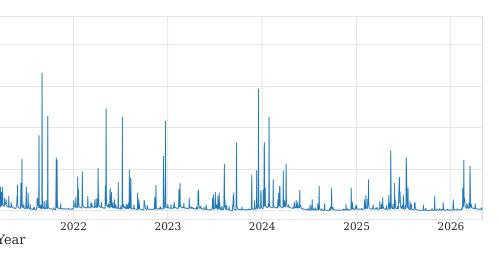 
Figure 2: Closing values of bitcoin from 2016 to 2026.

📷 Fig 3

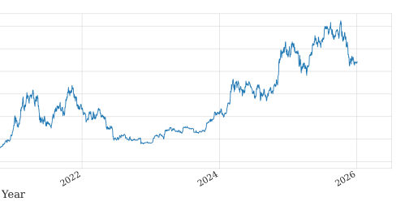 
Figure 3: Discharge values of Brazos river for 2016 to 2026.

📷 Fig 4

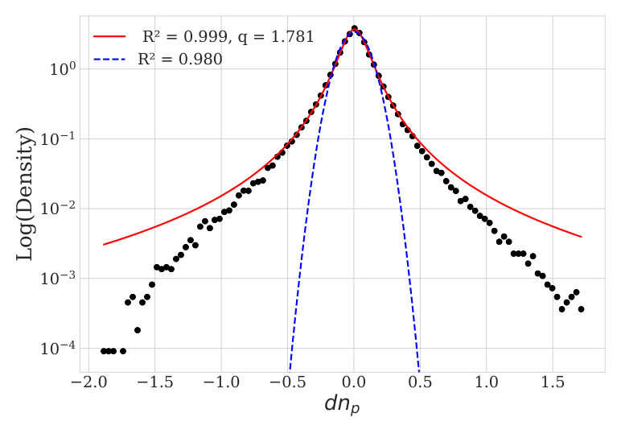 
Figure 4: Comparison of the fit of the solar wind fluctuations histogram on a LOG scale.The red line is for the q-Gaussian distribution function and the blue one for the Gaussian distribution function.

📷 Fig 5

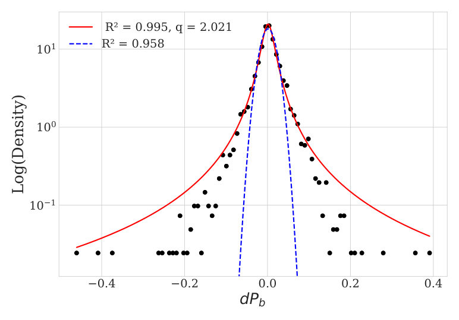 
Figure 5: Comparison of the fit of logarithmic returns of the bitcoin prices fluctuations histogram on a LOG scale.

**Summary.** This paper systematically compares three mathematical approaches—PDF fitting, linearization, and CDF fitting—to estimate the non-extensiveness parameter ($q$) characterizing heavy-tailed distributions in complex systems. By testing these methods on diverse data like solar wind and financial returns, the authors demonstrate that the CDF-based method yields more stable results, offering a robust tool for analyzing non-equilibrium physics.

**Why it may be interesting.** While focused on classical statistical mechanics, the rigorous comparison of estimation techniques for heavy tails is methodologically valuable. The emphasis on bin-free methods echoes concerns in quantum information theory regarding noise modeling and parameter extraction from noisy measurements.

Detailed structure

**Main problem.** The study addresses analyzing nonlinear, non-equilibrium phenomena characterized by heavy-tailed distributions that require non-extensive statistics.

**Main result.** The analysis suggests that fitting the Cumulative Distribution Function (CDF) provides a significantly more stable estimate for the non-extensiveness parameter ($q$) compared to direct PDF or linearized methods.

**Method.** A systematic comparison of three estimation techniques—direct nonlinear PDF fitting, q-logarithm linearization, and numerical CDF fitting—is employed across diverse datasets.

**Model / system.** The analysis utilizes the q-Gaussian distribution, which is appropriate for systems exhibiting long-range correlations beyond standard Boltzmann-Gibbs statistics. Data sources include solar wind proton density, Bitcoin returns, and river discharge data.

**Key observables.** The non-extensiveness parameter ($q$), fit quality metrics like $R^2$, and the estimated parameters $a$ and $b$.

**Important parameters / regimes.** The entropic index $q$; sensitivity to histogram binning (number of bins).

**Assumptions / limitations.** The primary assumption is that non-extensive statistics are appropriate for describing the observed fluctuations; a major limitation noted is the inherent subjectivity and noise associated with histogram binning.

**Figures summary.** Figures compare $q$-Gaussian vs. Gaussian fits across three datasets (solar wind, Bitcoin, river discharge). Crucially, figures plot estimated $q$ versus the number of histogram bins for all three methods, highlighting method divergence.

**Paper structure.** The paper introduces the need for non-extensive statistics, details the mathematical framework and three distinct fitting methodologies, applies these methods to multiple real-world datasets (geophysics, finance, hydrology), compares the results systematically, and concludes by advocating for the stability of the CDF approach.

Abstract

Nature exhibits a wide variety of nonlinear phenomena characterized by strong fluctuations that push the system away from equilibrium. Recent studies have shown that non-extensive statistics are more suitable for analyzing these phenomena, as they can capture long-range correlations and heavy-tailed distributions that conventional Boltzmann-Gibbs statistics cannot represent. However, estimating the non-extensiveness parameter ($q$) is not trivial, and methods vary significantly across disciplines.   This paper presents a systematic and interdisciplinary comparison of three fitting methods: direct nonlinear fitting of the probability distribution function (PDF), linearization using the q-logarithm function, and numerical fitting of the cumulative distribution function (CDF). We applied this analysis to various phenomena, from areas such as geophysics, space weather and economics, analyzing the critical impact of discretization. The results show that $q$ estimates are highly sensitive to histogram binning, while the CDF-based method provides a bin-free alternative that yields more stable estimates for the datasets analyzed here. This contribution provides relevant information for the search for a method that allows the correct determination of the parameters of heavy-tailed distributions in various disciplines.

[↑ back to top](#top)

### [Correlation flow governs learning at criticality](http://arxiv.org/abs/2608.08350v1)

**Authors:** Andrea Combette, Nelly Pustelnik, Antoine Venaille  
**Type:** theory · **Category:** disordered systems and neural networks · **PDF:** <https://arxiv.org/pdf/2608.08350v1>  
**Analysis basis:** full PDF text, analyzed in chunks
**Topic relevance:** `non-equilibrium universality` **2/5** · `Keldysh / 2PI / non-Gaussian methods` **1/5** · `driven-dissipative phase transition` **1/5**

📷 Fig 1

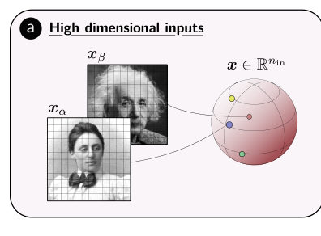 
FIG. 1. Input dimensions. a) Example inputs represented as gridded pixel arrays, each encoded into a high-dimensional vector xα, xβ ∈Rnin with nin ≫1. b) Low-dimensional inputs ˜xα, ˜xβ ∈Rd

📷 Fig 2

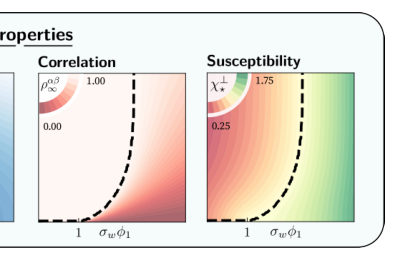 
FIG. 2. The large depth limit. a) Phase diagram in the (σw, σb) parameter space, including ordered, chaotic, and vanishing variance phases, as well as the critical point. b) Fixed point behaviour of the variance K⋆, the correlation ραβ ∞and the perpendicular susceptibility χ⊥ ⋆in the (σw, σb) parameter space for a sinusoidal activation function. Computations are performed using (22).

📷 Fig 3

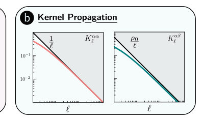 
FIG. 3. Evolution of network properties with depth at criticality. a) Schematic illustration of the contraction of the pre-activation distribution zℓaround 0, leading to quasi-linear behaviour at large depths. b) Universal algebraic decay of Kαβ ℓ , shown for both α = β and α ̸= β, for the sine activation using the kernel recursion (22).

📷 Fig 4

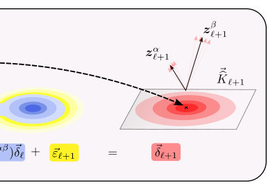 
FIG. 4. Error Propagation. Schematic illustration of the propagation of the finite-size perturba- tions ⃗δℓthrough the network. The perturbations are transported by the tangent map JF along the mean-field covariance flow induced by F and driven by the layer-wise perturbations ⃗εℓ+1. For clarity, the vector notation ⃗ ( · ) refers to the quantities defined in (45).

📷 Fig 5

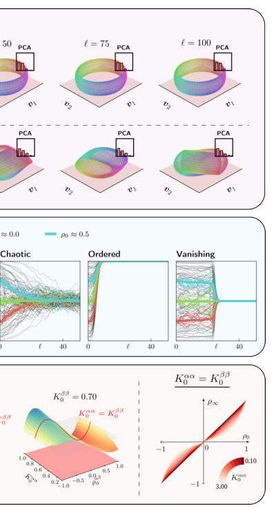 
FIG. 5. Forward propagation. a) Evolution of a torus manifold, xα ∈T 2, ∀α ∈D, through a sinusoidal network. We project zℓfor every layer onto its first three principal components (v1, v2, v3). b) Empirical propagation of correlation with network depth, for different initialisation choices and different initial correlations. Colors associated with specific trajectories are used to ease visualization of correlation collapse or chaos. c) Evaluation of ηαβ ∞(ρ0, Kαα 0 , Kββ 0 ) = ραβ ∞−ραβ 0 for several input norms Kαα 0 , Kββ 0 and input correlations ραβ 0 in the Mean-field limit using (22).

**Summary.** This theoretical work unifies information propagation and learning theory for infinitely wide, deep neural networks. It identifies a critical parameter regime where gradient flow is sustained to infinite depth. The key finding is the direct mathematical equivalence between the network's asymptotic correlation structure and its governing Neural Tangent Kernel.

**Why it may be interesting.** While focused on deep learning, the mathematical machinery—analyzing spectral properties of large random matrices (Jacobian/NTK) in infinite limits—shares strong conceptual links with analyzing dynamics in complex disordered systems or spin-glass models.

Detailed structure

**Main problem.** The paper aims to establish a unified theoretical framework connecting information/gradient propagation properties of deep neural networks to their learning dynamics.

**Main result.** It proves that correlation propagation to infinite depth is only possible at a critical point, where the Neural Tangent Kernel (NTK) becomes exactly proportional to the output correlation at infinite depth.

**Method.** The analysis combines mean-field theory and random matrix theory to derive recursive relations for network correlations and Jacobians in the limit of infinitely wide and deep networks.

**Model / system.** The model is a deep neural network ($\Psi_	heta$) analyzed in the infinite-width (mean-field) and infinite-depth limits. The analysis focuses on how information propagates through layers governed by weight matrices and activation functions.

**Key observables.** End-to-end Jacobian, Neural Tangent Kernel (NTK), output correlation matrix ($\Theta^L$), and their respective second moments.

**Important parameters / regimes.** The critical point in the weight-bias variance plane; infinite width ($N 	o \infty$) and infinite depth ($L 	o \infty$).

**Assumptions / limitations.** The analysis assumes specific moment concentration properties (e.g., empirical moments converge to ensemble averages) and relies on mild assumptions about the activation function.

**Paper structure.** The paper progresses by first defining the problem in terms of information flow and learning dynamics, deriving recursive relations for correlations and Jacobians using mean-field theory, identifying the critical regime where propagation is possible, and finally proving the equivalence between NTK and correlation at this critical point.

Abstract

The initialisation of deep neural networks determines whether information and gradients can propagate across depth, yet a unified theory connecting these properties to learning dynamics remains elusive. Combining mean-field theory and random matrix theory, we establish a direct link between correlation propagation and the Neural Tangent Kernel (NTK) that governs learning in the sequential limit of infinitely wide, infinitely deep networks. Correlation propagation to infinite depth is possible only at a single critical point in the weight-bias variance plane. At this point, we show that the end-to-end Jacobian vanishes algebraically with depth, and use this to prove that the NTK becomes exactly proportional to the output correlation at infinite depth. This equivalence between information propagation and learning dynamics had not yet been noticed. We further show that orthogonal initialisation suppresses the leading finite-size corrections present under Gaussian initialisation, clarifying the respective roles of the two initialisation ensembles in this limit. These theoretical predictions are validated quantitatively on finite-width, finite-depth networks. Together, these results demonstrate that orthogonal initialisation at criticality plays a central role in controlling the asymptotic dynamics of deep learning.

[↑ back to top](#top)

### [High-fidelity controlled-phase gates for distinguishable quantum walkers via extended interactions](http://arxiv.org/abs/2608.09301v1)

**Authors:** Gaia Forghieri, Matteo G. A. Paris  
**Type:** theory · **Category:** quantum information and computing · **PDF:** <https://arxiv.org/pdf/2608.09301v1>  
**Analysis basis:** full PDF text, analyzed in chunks
**Topic relevance:** `analog quantum simulation` **2/5** · `Frenkel-Kontorova` **1/5** · `Keldysh / 2PI / non-Gaussian methods` **1/5**

📷 Fig 1

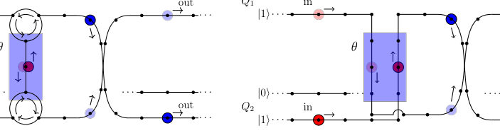 
FIG. 1. Dual-rail implementations of a CP gate based on interacting quantum walkers, as described in the main text. In both panels, the logical state |1⟩of each qubit is routed through an interaction region (blue box), where the walkers acquire a conditional phase θ. (a) Implementation based on indistinguishable particles, following Ref. [34], where roundabout gates route the walkers onto a common path where the walkers can interact, and restore the original encoding afterwards. (b) Alternative implementation based on distinguishable particles propagating on parallel chains and interacting through a distance-dependent potential, eliminating the need for additional routing gates.

📷 Fig 2

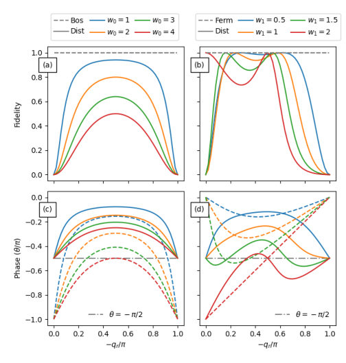 
FIG. 2. Ideal CP gate performance for plane-wave scat- tering with q1 = −q2 = qr. (a) Fidelity and (c) induced phase for distinguishable particles (continuous lines) interact- ing through an on-site potential (C = 0), and comparison with the corresponding bosonic implementation (dashed lines). (b) Fidelity and (d) induced phase for distinguishable particles (continuous lines) with first-neighbor interactions (C = 1, w0 = w1), and comparison with the corresponding fermionic implementation.

📷 Fig 3

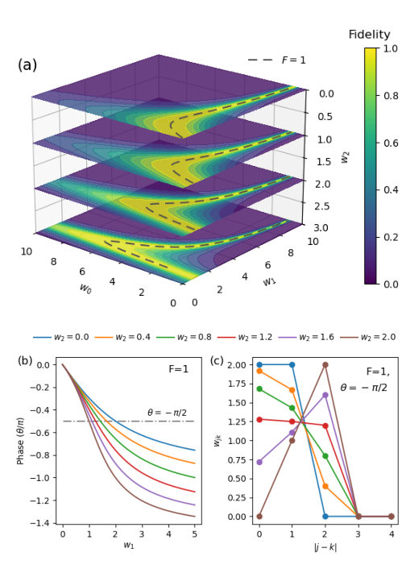 
FIG. 3. Ideal CP gate performance for plane-wave scattering for distinguishable particles with interaction radius C = 2 and momenta q1 = −q2 = −π/2. (a) Fidelity as a function of the interaction terms w0, w1, and w2. The dashed grey curves indicate the loci of points for which F = 1 for each w2-plane. (b) Conditional phase θ accumulated along the unit-fidelity solutions. (c) Corresponding interaction profiles yielding θ = −π/2, required for the implementation of a CNOT gate.

📷 Fig 4

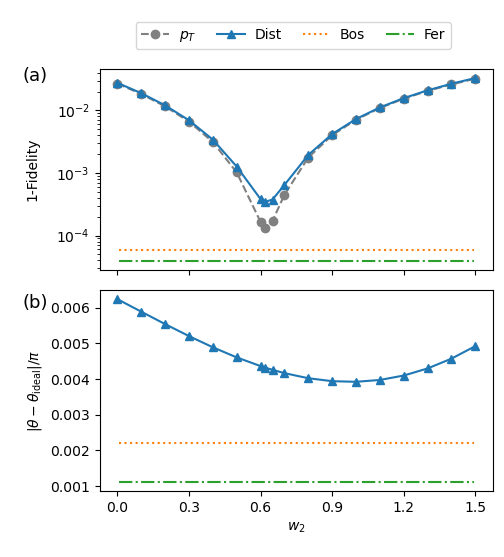 
FIG. 4. Finite-wavepacket effects on the CP gate fidelity for Gaussian wavepackets with second-neighbor interactions and central momenta q1 = −q2 = −π/2. For each value of w2, the interaction parameters w0 and w1 are chosen as to reproduce the ideal unitary fidelity for an induced phase of θ = −π/2, as in Fig. 3(c). (a) Fidelity loss 1 −F of distinguishable par- ticles. The panel shows a comparison with the transmission loss 1 −pT of the gate, and with bosonic (on-site, w0 = 4) and fermionic (first-neighbor, w1 = 2) implementations. (b) Relative deviation of the accumulated phase from the ideal value θideal = −π/2.

📷 Fig 5

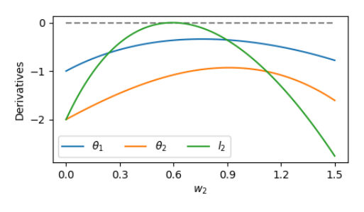 
FIG. 5. Quantities governing the Gaussian-wavepacket fi- delity of the distinguishable-particle CP gate under the same conditions as Fig. 4. Shown are the effective interaction length θ1 (blue), the phase-curvature term θ2 (orange), and the logarithmic-magnitude curvature l2 (green), the latter two entering the approximated fidelity expression in Eq. (30). All quantities are evaluated at −qr = π/2, at which the logarithmiq-magnitude first derivative l1 is identically zero.

**Summary.** This paper proposes a method to realize high-fidelity controlled-phase gates using interacting, distinguishable quantum walkers. By extending the interaction range beyond nearest neighbors, the authors demonstrate that this approach avoids significant fidelity losses inherent in previous designs for indistinguishable particles. The results establish multi-neighbor interactions as a powerful tool for building robust quantum information processing circuits with continuous-time quantum walks.

**Why it may be interesting.** This work provides concrete guidelines for engineering quantum gates in continuous-time quantum walk models by showing how controlled interactions can overcome limitations associated with particle indistinguishability or complex physical routing.

Detailed structure

**Main problem.** The primary goal is implementing high-fidelity controlled-phase (CP) gates using quantum walks.

**Main result.** The proposed architecture using distinguishable particles with extended interactions achieves gate fidelities competitive with, or superior to, previous methods that suffered from fidelity losses due to complex routing gates.

**Method.** The authors derive analytical approximations for gate fidelity by analyzing the scattering process of finite Gaussian wavepackets through interacting quantum walkers.

**Model / system.** The system uses a dual-rail encoding where qubits are realized by quantum walkers on coupled chains. The Hamiltonian includes single-particle tight-binding terms and an extended, distance-dependent interaction term ($H_{int}$).

**Key observables.** Gate fidelity (F), transmission coefficient magnitude and phase derivatives, and the total scattering amplitude $S_{tot}(k_1, k_2)$.

**Important parameters / regimes.** Interaction range extension (multi-neighbor interactions), Gaussian wavepacket width ($\sigma$), and coupling strengths ($J$, $w$).

**Assumptions / limitations.** The analysis moves from idealized plane-wave scattering to finite-size Gaussian wavepackets, requiring approximations for the final fidelity calculation.

**Figures summary.** Figure 1 illustrates CP gate implementations using both indistinguishable (roundabout gates) and distinguishable particles on parallel chains. Figure 2 compares ideal CP gate performance across different interaction types.

**Paper structure.** The paper first motivates the problem by comparing indistinguishable vs. distinguishable particle approaches, then develops the Hamiltonian formalism for interacting walkers, calculates scattering amplitudes using both plane-wave and Gaussian approximations, and finally derives the total gate fidelity based on these calculations.

Abstract

We investigate the implementation of controlled-phase (CP) gates with quantum walks in a dual-rail encoding through the use of interacting particles. While previous proposals have focused on indistinguishable particles (bosons or fermions) to achieve unitary fidelity for plane-wave scattering, practical implementations require finite-size wavepackets and routing through single-particle gates, both factors that introduce unavoidable fidelity losses. We show that extending the interaction range beyond on-site or first-neighbor terms provides sufficient control over the scattering potential to engineer CP gates with distinguishable particles that match the ideal bosonic/fermionic performance. For finite Gaussian wavepackets, we derive analytical approximations for the gate fidelity in terms of the transmission coefficient's magnitude and phase derivatives. We find that while distinguishable-particle scattering alone exhibits slightly lower fidelity than the indistinguishable case, the overall architecture that we propose avoids the additional single-particle gates required for routing indistinguishable particles. The roundabout gates needed for the latter indeed introduce fidelity losses approximately one order of magnitude larger than the interaction-induced losses, making the distinguishable-particle approach competitive for practical implementations. Our results establish multi-neighbor interactions as a tool for quantum information processing with continuous-time quantum walks and provide quantitative guidelines for optimizing gate fidelities in finite-size systems.

[↑ back to top](#top)

### [Metallic Gross-Neveu criticality and superconductivity on the $\mathrm{SO}(3)$ SLAC fermion](http://arxiv.org/abs/2608.07990v1)

**Authors:** Feng-Yu Zhang, Yin-Kai Yu, Zi-Xiang Li, Shuai Yin  
**Type:** both · **Category:** statistical mechanics · **PDF:** <https://arxiv.org/pdf/2608.07990v1>  
**Analysis basis:** full PDF text, analyzed in chunks
**Topic relevance:** `analog quantum simulation` **2/5** · `driven-dissipative phase transition` **1/5** · `non-equilibrium universality` **1/5**

📷 Fig 1

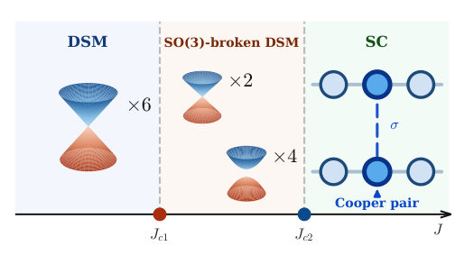 
FIG. 1. Schematic ground-state phase diagram as a func- tion of J. The weak-coupling DSM contains six gapless Dirac cones. In the intermediate SO(3)-broken DSM, four cones are gapped while two remain gapless. At larger coupling, inter- layer Cooper pairing produces an SC phase. The transition at Jc1 is continuous, whereas the abrupt change at Jc2 strongly indicates a first-order transition.

📷 Fig 2

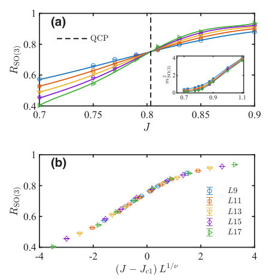 
FIG. 2. Correlation ratio RSO(3) versus J for various sizes (equilibrium). Data points include error bars. (a) Estimate of the QCP from the size-independent crossings of R. The inset zooms in m2 SO(3) near Jc1. (b) Scaling collapse of R using the best-fit Jc1 and ν.

📷 Fig 3

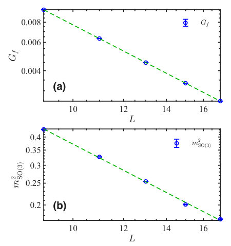 
FIG. 3. (a) Log-log plot of the real-space fermion correlation Gf as a function of L. (b) Log-log plot of the squared order parameter m2 SO(3) as a function of L.

📷 Fig 4

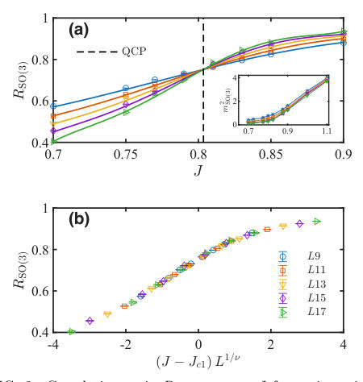 
Figure 2(a) shows the dependence of RSO(3) on J for different sizes L. To estimate the critical point and the correlation-length exponent more accurately, we follow the fitting procedure developed in Ref. [34]. Near the critical point, the scaling function is approximated by the polynomial fR  gL1/ν = Pnmax n=0 angnLn/ν. We fit the data for L = 9, 11, 13, 15, 17 over 0.70 ≤J ≤0.90. Among truncation orders 1 ≤nmax ≤5, the fifth-order polynomial gives the smallest root-mean-square residual. Statistical uncertainties are estimated from the disper- sion across 1000 Gaussian-resampled fits. As shown in Fig. 2(a), the solid curves represent the polynomial fits. Their intersection yields the...

📷 Fig 5

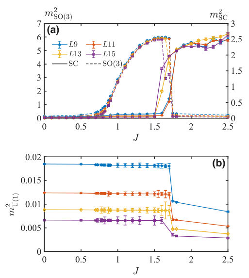 
FIG. 4. The order parameters as functions of J, where the leg- end indicates the linear size L. (a) m2 SO(3) (left axis, dashed) and m2 SC (right axis, solid) on a dual-axis plot. (b) m2 U(1) versus J for different sizes.

**Summary.** This work analyzes an $\mathrm{SO}(3)$-symmetric bilayer SLAC fermion model to explore its quantum phase diagram. Using QMC simulations, the authors identify a continuous transition into an $\mathrm{SO}(3)$-broken metallic state, followed by a distinct first-order transition into a novel superconducting phase. This provides new insights into Dirac criticality and unconventional superconductivity.

**Why it may be interesting.** The study provides concrete numerical evidence for exotic critical points and superconductivity in strongly interacting fermions, which is highly relevant to understanding unconventional superconductors and quantum criticality beyond simple BCS theory.

Detailed structure

**Main problem.** The study investigates Dirac criticality beyond standard universality classes and explores novel superconducting states within an interacting fermion model.

**Main result.** The system exhibits a continuous phase transition belonging to the Gross-Neveu-$\mathrm{SO}(3)$ class, followed by a strong-coupling first-order quantum phase transition into an $\mathrm{SO}(3)$-symmetric superconducting state.

**Method.** Large-scale Quantum Monte Carlo (QMC) simulations and Finite-Size Scaling (FSS) analysis were used to extract critical exponents and characterize the nature of the phase transitions.

**Model / system.** The model is an $\mathrm{SO}(3)$-symmetric bilayer SLAC fermion system in $d=2$ dimensions, described by a Hamiltonian with tunable inter-layer interactions ($J$).

**Key observables.** Structure factors for $\mathrm{SO}(3)$ symmetry breaking ($m^2_{\mathrm{SO}(3)}$), superconducting pairing order parameters ($m^2_{SC}$), and critical exponents ($
u, \eta_b$).

**Important parameters / regimes.** Interaction strength $J$, which drives the system through three regimes: Dirac Semimetal (DSM) $	o$ SO(3)-broken DSM $	o$ SC.

**Assumptions / limitations.** The QMC method is used to probe ground-state expectation values, and comparisons are made between QMC results (suggesting first-order transitions) and mean-field HFB calculations (suggesting continuous coexistence).

**Figures summary.** Figures illustrate the phase diagram showing the sequence of transitions; specific plots show data collapse for critical exponents and the abrupt onset of superconducting order parameters at strong coupling.

**Paper structure.** The paper systematically analyzes the system's behavior across increasing interaction strength $J$: first, characterizing the continuous transition to an $\mathrm{SO}(3)$-broken phase using QMC; second, investigating the nature of the subsequent strong-coupling instability into a superconducting state by comparing various pairing channels.

Abstract

The realization of Dirac criticality beyond the conventional Gross-Neveu-Yukawa (GNY) paradigm has become a major frontier in condensed matter physics. In this work, we introduce an $\mathrm{SO}(3)$-symmetric bilayer SLAC fermion model with tunable inter-layer interactions that exhibits a rich quantum phase diagram. As the interaction strength increases, the system undergoes two distinct phase transitions. The primary transition is a continuous boundary separating a Dirac semimetal (DSM) from an $\mathrm{SO}(3)$-broken ordered phase. Crucially, this transition evades the standard GNY universality class because the emergent order only gaps out a subset of the itinerant fermions. Using large-scale quantum Monte Carlo (QMC) simulations, we establish that this transition belongs to the Gross-Neveu-$\mathrm{SO}(3)$ universality class with $N=6$ irreducible Dirac cones and precisely extract the corresponding critical exponents. At stronger couplings, a second transition drives the system into an inter-layer $\mathrm{SO}(3)$-symmetric superconducting (SC) state. We provide strong numerical evidence that this transition is a quantum-fluctuation-driven first-order transition. Our study provides new insights into the exploration of Dirac criticality beyond the standard GNY universality class, and also offers a novel platform to realize superconductivity featuring $\mathrm{SO}(3)$ symmetry.

[↑ back to top](#top)

### [Opposite post-processing orders of fermionic horizon channels and their quantum-resource monotonicity](http://arxiv.org/abs/2608.08215v1)

**Authors:** Shuhao Li, Jin-Ming Liu  
**Type:** theory · **Category:** other · **PDF:** <https://arxiv.org/pdf/2608.08215v1>  
**Analysis basis:** full PDF text, analyzed in chunks
**Topic relevance:** `quantum measurements` **2/5** · `Keldysh / 2PI / non-Gaussian methods` **1/5** · `correlated / nonlocal dissipation` **1/5**

📷 Fig 1

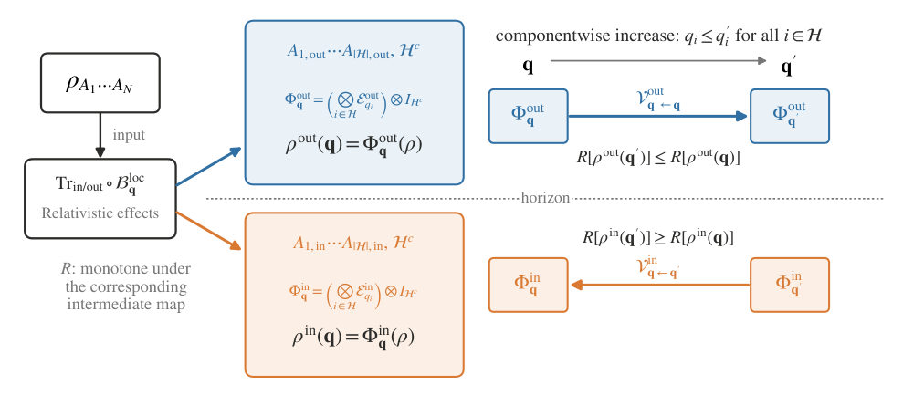 
Fig. 1 Schematic representation of the channel-to-functional ordering mechanism in multipartite homogeneous horizon sectors.

📷 Fig 2

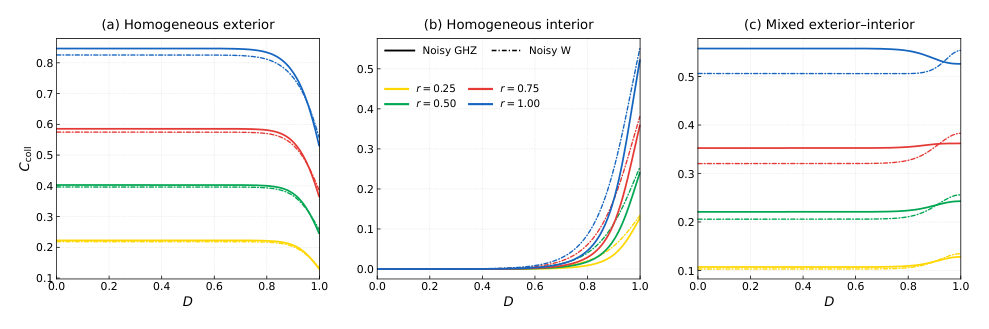 
Fig. 2 QJSD-based collective coherence for noisy GHZ and W inputs in the GHS spacetime with M = ω = 1. Subsystems A and B undergo the horizon transformation, while subsystem C remains unchanged. The left, middle, and right panels show the homogeneous exterior (ee), homogeneous interior (ii), and mixed exterior–interior (ei) configurations, respectively. The endpoint D = 1 represents the limiting value D →M−.

**Summary.** This work develops a structural framework for analyzing quantum resources near black hole horizons by modeling the fermionic transformation as two complementary quantum channels: exterior and interior. The key finding is that these two channels exhibit opposite ordering behaviors with respect to a system parameter $q$. This reveals a universal channel-ordering structure responsible for predictable monotonicity in various quantum correlations.

**Why it may be interesting.** It provides a structural theory for resource flow in curved spacetime, suggesting that the observed monotonic behavior is dictated by the underlying mathematical structure of the horizon channels rather than the specific physical measure used.

Detailed structure

**Main problem.** To establish whether monotonic trends observed in relativistic quantum information near black holes stem from specific measurement choices or a universal underlying structural principle.

**Main result.** The exterior and interior fermionic horizon channels exhibit opposite post-processing orders with respect to the channel parameter $q$, leading to predictable monotonicity for various state functionals.

**Method.** Formulating the transformation as complementary quantum channels and analyzing their ordering properties using degradation preorders ($\succeq_{	ext{deg}}$) in both single-mode and multipartite settings.

**Model / system.** The analysis is set in relativistic quantum information theory, specifically modeling fermionic modes near black hole horizons (e.g., GHS dilaton spacetime). The core mathematical tool is the effective single-mode fermionic horizon transformation parameterized by $q$.

**Key observables.** Entanglement, occupation-basis coherence monotones, optimized Bell-functional quantities, and collective coherence based on Quantum Jensen-Shannon divergence (QJSD).

**Important parameters / regimes.** The relativistic channel parameter $q$, which governs the relative weighting between accessible (exterior) and inaccessible (interior) quantum sectors.

**Assumptions / limitations.** The framework assumes that the relevant mode transformation can be effectively described by a two-level system, allowing for the definition of complementary exterior and interior channels.

**Figures summary.** Not specified in the notes, but numerical evaluation is performed on collective coherence in the GHS black hole spacetime to illustrate predicted homogeneous monotonicity.

**Paper structure.** The paper first introduces the problem by noting ambiguity in resource trends. It then derives the complementary exterior and interior channels ($	ext{E}_{	ext{out}}^q$ and $	ext{E}_{	ext{in}}^q$) and establishes their opposite ordering properties as $q$ changes. Finally, it generalizes this to multipartite settings and connects channel ordering directly to state functional monotonicity.

Abstract

Relativistic quantum-information studies in noninertial and black-hole settings often determine resource behavior through explicit calculations for particular input states and state functionals, leaving unclear whether the recurring monotonic trends originate from those choices or from a common underlying structure. In this work, we formulate the effective single-mode fermionic horizon transformation as a pair of complementary exterior and interior quantum channels, corresponding respectively to the physically accessible and inaccessible sectors, and establish exact post-processing orders in opposite directions. As the relativistic channel parameter $q$ increases, the exterior channel becomes progressively degraded, whereas the interior channel is ordered in the reverse direction. These relations extend to arbitrary multipartite settings. Consequently, every state functional that is non-increasing under the corresponding intermediate maps is non-increasing in homogeneous exterior sectors and non-decreasing in homogeneous interior sectors. The framework therefore applies to broad classes of quantum resources and correlations, including entanglement and occupation-basis coherence monotones, optimized Bell-functional quantities, and contractive-divergence correlation measures. We further numerically evaluate collective coherence based on the quantum Jensen-Shannon divergence (QJSD) in the Garfinkle-Horowitz-Strominger (GHS) dilaton-black-hole spacetime, illustrating the predicted homogeneous monotonicity. The recurring trends are therefore traced to a common channel-ordering structure, while the physical setting determines the parameterization of $q$ and the resource-theoretic monotonicity determines which output-state quantities inherit the order.

[↑ back to top](#top)

### [The Magic Scroll: Leveraging biased noise to improve magic state cultivation in register-based architectures](http://arxiv.org/abs/2608.09018v1)

**Authors:** Ian D. Thorvaldson, Jeffrey Marshall, Jack R. Craig, Samuel K. Gorman, Charles D. Hill, Michelle Y. Simmons  
**Type:** theory · **Category:** quantum information and computing · **PDF:** <https://arxiv.org/pdf/2608.09018v1>  
**Analysis basis:** full PDF text, analyzed in chunks
**Topic relevance:** `QC/QI experiment` **2/5** · `correlated / nonlocal dissipation` **1/5** · `quantum measurements` **1/5**

📷 Fig 1

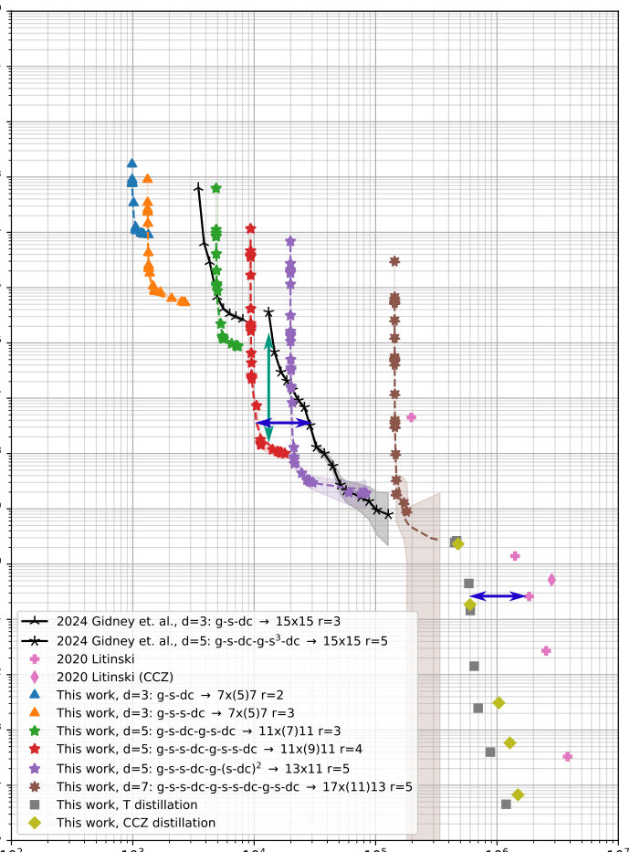 
Figure 1: Comparison of simulated magic |T⟩state production using the Magic Scroll and Magic Scroll distillation. Here, we plot the magic state error as a function of expected volume of the Magic Scroll cultivation and distillation techniques explored in this work, over different cultivation sequences, final code distances and escape repetitions. For cultivation, each set of same-coloured, same-shape points represents a series of different complementary gap thresholds, with the highest error point representing no complementary gap. Simulation settings are notated here in the way specified in the main text Eq. 1 - for example, “d=5: g-s-dc-g-s-dc -&gt; 13x(7)11 r=3” indicates colour code...

📷 Fig 2

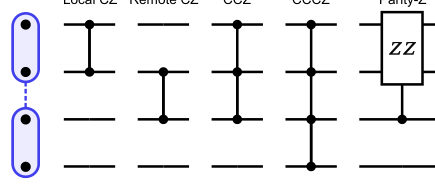 
Figure 3: Overview of inter-register gates available in a two-qubit register architecture. Based off the capabilities of multi-nuclear spin registers in silicon, we show some exam- ples of operations that are possible between two-qubit reg- isters. For all examples shown here, it is possible to choose anti-controls wherever a control is present, or to freely change which qubit(s) are being operated on, without incurring any extra operational overhead. Under the assumption of multi- tone driving of electrons, each of the above operations is equally expensive to perform in terms of duration, with the exception of local CZ gates which are twice as fast as the rest. Note that all gates here...

📷 Fig 3

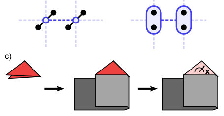 
Figure 2: Overview of the multi-qubit register architec- ture, and the Magic Scroll cultivation it enables. (a) Illus- tration of connectivity present for multi-nuclear spin registers in silicon [8]. Open blue circles represent electron spin qubits, and filled black circles represent nuclear spin qubits. Two- qubit gates between nuclear spin qubits are mediated by the electrons. Each electron overlaps a few nuclear spin qubits, forming a qubit register, but neighbouring electrons are cou- pled (dashed lines) allowing inter-register operations. Typi- cally, the nuclear spins are operated as the sole data qubits, with electrons facilitating multi-qubit gates (both within a register [7], and...

📷 Fig 4

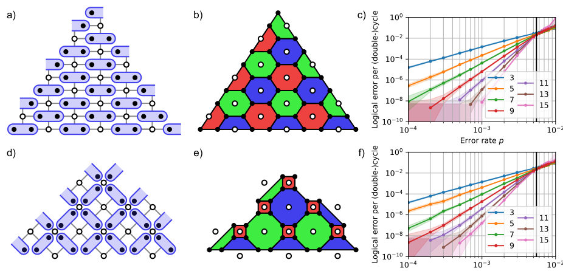 
Figure 4: Implementation and performance of 6.6.6 and 4.8.8 colour codes using one- and two-qubit registers under biased noise. (a) Layout of alternating two-qubit and one-qubit registers with square connectivity capable of implementing a 6.6.6 colour code. The register outlines have been omitted for the single-qubit registers. Open circles represent 6.6.6 code ancilla qubits, while filled circuits represent 6.6.6 code data qubits. (b) 6.6.6 colour code stabilisers corresponding to the register layout in a). Each coloured face is stabilised with both X and Z type stabilisers. (c) Simulated threshold diagram of the 6.6.6 colour code shown in a-b using the noise model given in Table 1. Time...

📷 Fig 5

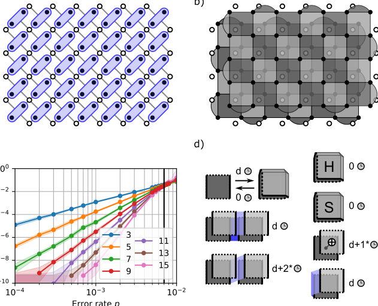 
Figure 5: Implementation and performance of bilayer surface codes using 1- and 2-qubit registers under biased noise. (a) Layout of alternating grid of 2-qubit and 1-qubit registers used for implementing a bilayer surface code, as in Fig. 4a and d. Register outlines have been omitted for single-qubit registers, and the registers have square lattice connectivity. (b) Stabilisers of the bilayer surface code, hosting two surface codes, with the same register layout as per a). Note that each ancilla is responsible for at most two stabilisers, handling at most one Z-type and at most one X-type stabiliser. This allows stabilisers to be measured in two steps, first measuring all Z stabilisers in...

**Summary.** This paper introduces the 'Magic Scroll,' a novel protocol for enhancing magic state generation in fault-tolerant quantum computing. It achieves this by combining color and bilayer error-correcting codes within multi-qubit register architectures that exploit intrinsic noise bias. The results demonstrate significant, quantifiable improvements (up to 3x) in both magic state cultivation and subsequent distillation volumes.

**Why it may be interesting.** This work provides concrete, mathematically derived protocols that directly address resource limitations (magic state availability) in fault-tolerant quantum computation by integrating hardware constraints (connectivity) with noise characteristics (bias).

Detailed structure

**Main problem.** The work aims to improve magic state cultivation and distillation procedures in fault-tolerant quantum computation by exploiting high qubit connectivity and intrinsic noise bias.

**Main result.** The proposed 'Magic Scroll' procedure, combining color and bilayer codes, improves magic state cultivation volumes by a factor of 3x and enhances distillation performance similarly.

**Method.** The authors develop efficient implementations for various error-correcting codes (e.g., color codes, bilayer codes) using two-qubit registers and leverage noise bias to enhance these procedures.

**Model / system.** The theoretical framework is built upon multi-qubit register architectures, applicable to platforms like silicon phosphorus qubits or neutral atoms. The analysis focuses on implementing surface and color codes under a biased error model where bit-flip and phase-flip errors are unequal.

**Key observables.** Magic |T> state fidelities (achieving $10^{-9}$), improvement factors for cultivation/distillation volumes ($\sim 3	imes$), and logical error rates ($\epsilon$).

**Important parameters / regimes.** Physical error rates ($p$) ranging from $0.05\%$ to $0.1\%$; the bias in noise (Z-errors); and code parameters like graph structures ($6.6.6$, $4.8.8$).

**Assumptions / limitations.** The primary assumptions involve using multi-qubit registers for high connectivity, assuming a specific biased error model where idling errors are Z-biased, and employing empirical models for very large patch sizes.

**Figures summary.** Figures illustrate the physical qubit layout of register models, the 'Magic Scroll' procedure combining different codes, performance scaling comparisons between methods at varying physical error rates, and approximations for gapped code performance.

**Paper structure.** The paper progresses by first establishing the architectural basis (multi-qubit registers), then detailing the implementation of advanced codes using noise bias, introducing the 'Magic Scroll' procedure to combine these elements, and finally performing detailed performance analysis on distillation volumes using complementary gaps for large patches.

Abstract

Multiple quantum computing platforms across neutral atoms [1], nitrogen vacancy centres [2, 3], gate-defined dots [4-6] and 14|15 phosphorus atom qubits [7, 8] in silicon are experimentally exploring the use of high connectivity qubits, beyond that of nearest-neighbour planar lattices. Theoretical works consider modifications to fault-tolerant codes to leverage this higher qubit connectivity, such as non-local LDPC codes [9], inspiring superconducting [10] and photonic [11] platforms to also seek non-planar connectivity. In addition, separate theoretical works consider biased noise, where bit- and phase-flip errors are not equally likely. In this work, we present efficient methods for implementing 6.6.6 and 4.8.8 colour codes, as well as bilayer and folded surface codes, using two-qubit registers. We also leverage noise bias to avoid hook errors, demonstrating comparable performance to the surface code. By combining colour and bilayer codes, we show how magic state cultivation procedures [12-14] can be improved, in a procedure we refer to as the Magic Scroll. Not only does the Magic Scroll escape to a standard surface code, it also improves cultivation volumes by 3x and supports magic $|T\rangle$ state fidelities as low as $10^{-9}$. We show that this technique can be further leveraged to improve distillation performance, showing a 3x improvement to distillation volumes for error rates of $\sim 10^{-15}$. Through these constructions, we demonstrate techniques to leverage noise bias and high qubit connectivity, showing how register-based architectures can improve error rates and reduce quantum volumes in fault-tolerant quantum computing.

[↑ back to top](#top)

### [A Design Space Study of Density Matrix Parameterizations for Diffusion-Based Quantum State Tomography](http://arxiv.org/abs/2608.09625v1)

**Authors:** Shuangju Chang  
**Type:** theory · **Category:** quantum information and computing · **PDF:** <https://arxiv.org/pdf/2608.09625v1>  
**Analysis basis:** full PDF text, analyzed in chunks
**Topic relevance:** `quantum measurements` **2/5** · `methods for driven-dissipative` **1/5**

📷 Fig 1

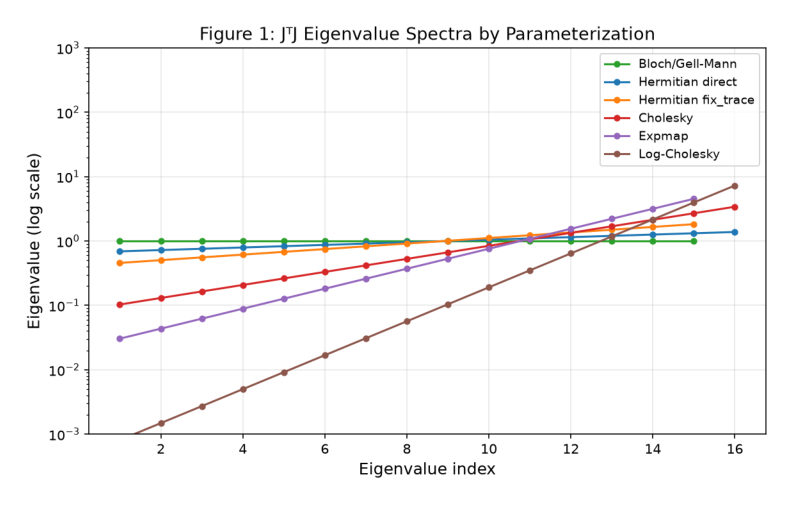 
Figure 1: Mean eigenvalue spectra of J⊤J for all seven parameterizations (log scale). Bloch shows flat spectrum at 1.0; Cholesky spans 2 orders of magnitude; log-Cholesky spans 4 orders.

📷 Fig 2

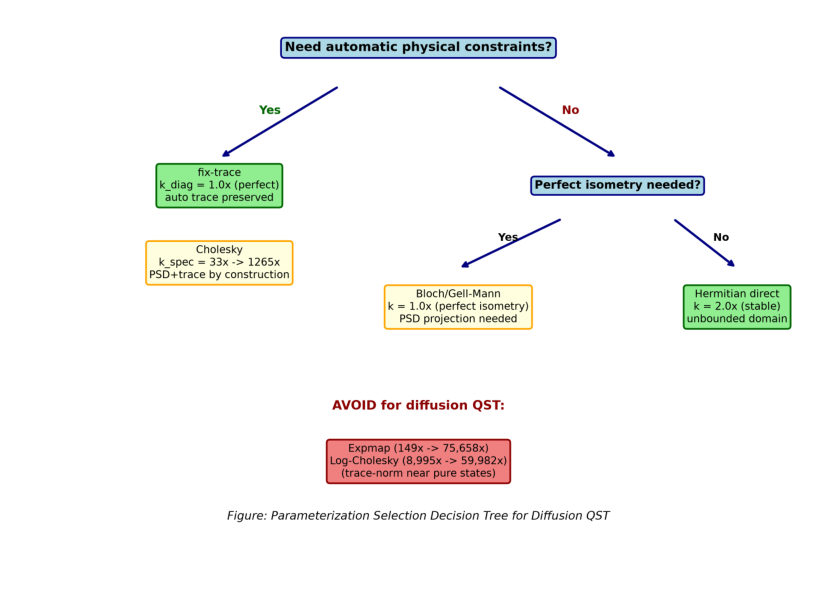 
Figure 2: Parameterization selection decision tree for diffusion QST. Green = recommended; yellow = acceptable with caveats; red = avoid. The primary recommendation is Hermitian direct (unbounded domain, stable conditioning) or fix-trace (automatic trace, excellent isotropy).

📷 Fig 3

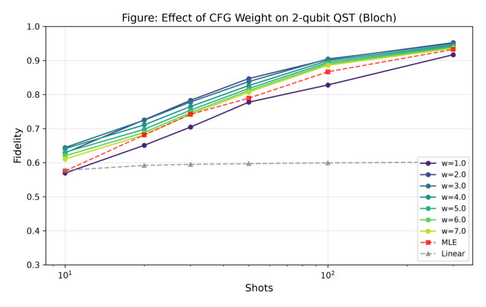 
Figure 3: Effect of CFG weight on 2-qubit QST (Bloch parameterization). Each curve shows fidelity vs. shots for a fixed w. Low-shot regimes benefit from stronger guidance; w = 3–4 offers the best overall tradeoff.

📷 Fig 4

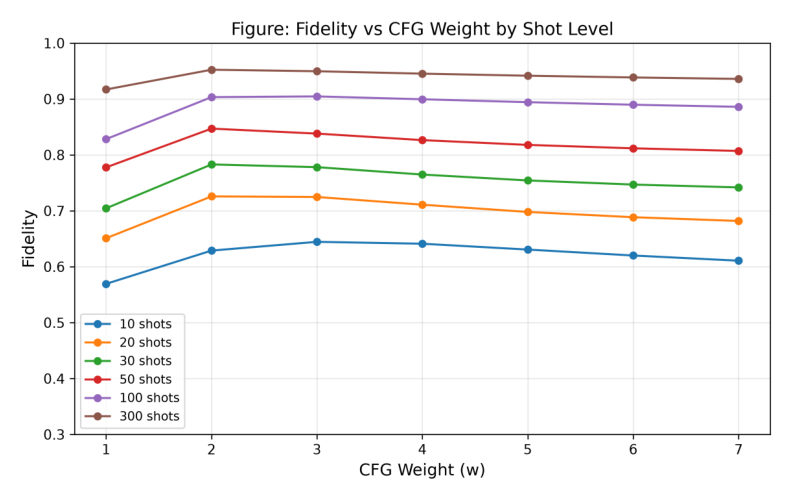 
Figure 4: Fidelity vs. CFG weight at each shot level. The optimal w shifts from ≈3 (low shots) to ≈2 (high shots), suggesting shot-adaptive CFG as a future improvement.

📷 Fig 5

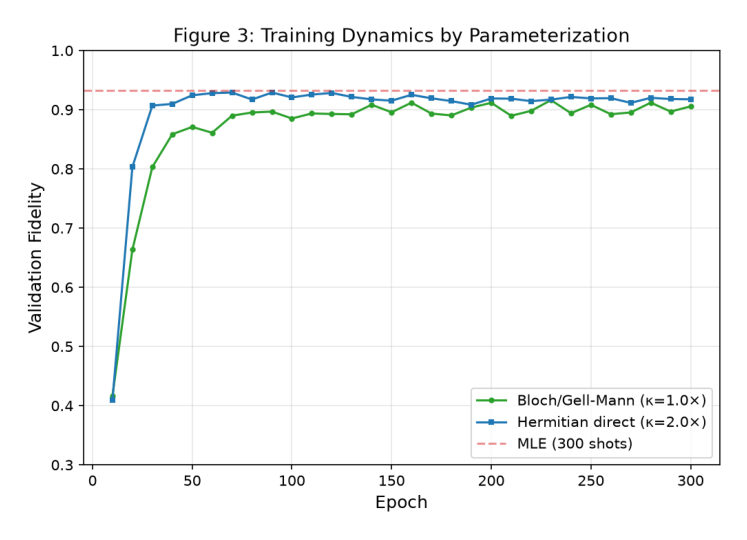 
Figure 5: Training dynamics by parameterization. Herm B (2.0×) converges faster and achieves higher final fidelity than Bloch (1.0×), despite worse nominal isometry.

**Summary.** This paper provides a comprehensive design space study comparing various mathematical parameterizations used to represent density matrices in Quantum State Tomography. By analyzing geometric conditioning metrics derived from the Jacobian Gram matrix, the authors show that theoretical elegance is insufficient for selecting an optimal method. They provide actionable guidelines favoring better-conditioned parameterizations for robust QST implementation.

**Why it may be interesting.** This work directly addresses the practical implementation challenges of quantum state reconstruction by providing quantitative geometric tools to guide the choice of mathematical representation for complex quantum states.

Detailed structure

**Main problem.** The study aims to systematically evaluate and select optimal parameterizations (coordinate charts) for density matrices when using diffusion models for Quantum State Tomography (QST).

**Main result.** No single parameterization optimizes both geometric conditioning and physical constraint satisfaction, and end-to-end training confirms that better-conditioned parameterizations converge faster and achieve higher fidelity without Classifier-Free Guidance.

**Method.** The authors introduce a geometric framework using the Jacobian Gram matrix (J^T J) to quantify conditioning via Spectral Dynamic Range and Diagonal Anisotropy, comparing results across seven candidate parameterizations.

**Model / system.** The system is the reconstruction of an unknown quantum state $\rho$ (a positive semidefinite, unit-trace Hermitian matrix) from measurement statistics using diffusion-based generative models.

**Key observables.** Spectral Dynamic Range ($\kappa_{	ext{spec}}$), Diagonal Anisotropy ($\kappa_{	ext{diag}}$), Fidelity ($F$), and training convergence speed.

**Important parameters / regimes.** Number of qubits (2- and 3-qubit scales); Classifier-Free Guidance weight ($w$); Measurement consistency loss ($\lambda_{	ext{meas}}$).

**Assumptions / limitations.** The analysis relies on numerical calibration using finite differences; the performance ranking reverses under CFG due to amplified boundary effects.

**Figures summary.** Figures compare eigenvalue spectra, show parameterization selection decision trees, and plot fidelity vs. CFG weight or training dynamics for various methods.

**Paper structure.** The paper establishes the need for systematic evaluation, introduces geometric diagnostics (J^T J), compares multiple parameterizations across 2- and 3-qubit scales using these metrics, validates findings via end-to-end training, and concludes with actionable selection guidelines.

Abstract

Diffusion-based quantum state tomography (QST) has shown promising results, but all existing methods implicitly adopt a single parameterization---typically Cholesky---without systematic evaluation. We present a design space study of density matrix parameterizations for diffusion QST, introducing a geometric framework based on the Jacobian Gram matrix $\mathbf{J}^\top\mathbf{J}$ that quantifies two competing criteria: isometric conditioning and physical constraint satisfaction. Our calibration of seven parameterizations at 2- and 3-qubit scales reveals three key findings. First, isometry and constraints are orthogonal criteria---no single parameterization optimizes both. Second, theoretical elegance does not predict geometric quality: the exponential map exhibits a spectral range of $149\times$ at 2 qubits and $75\,658\times$ at 3 qubits, while simpler parameterizations remain well-conditioned. Third, geometric conditioning alone does not fully predict end-to-end performance: without classifier-free guidance (CFG), Hermitian direct outperforms Bloch despite worse local isometry; under CFG, the ranking reverses due to amplified boundary effects. End-to-end training confirms that better-conditioned parameterizations converge faster and achieve higher fidelity in the absence of CFG. We provide actionable selection guidelines to guide future QST method design.

[↑ back to top](#top)

### [From Koszul-Complex Stabilizer Models to Superselection Profiles: Topological Rigidity and Nonsplit Extensions](http://arxiv.org/abs/2608.09913v1)

**Authors:** Hao Song  
**Type:** theory · **Category:** strongly correlated electrons · **PDF:** <https://arxiv.org/pdf/2608.09913v1>  
**Analysis basis:** full PDF text, analyzed in chunks
**Topic relevance:** `analog quantum simulation` **2/5** · `quantum measurements` **1/5**

📷 Fig 1

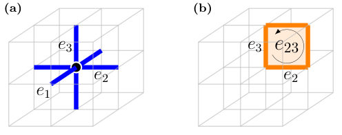 
FIG. 2. Stabilizer generators for the three-dimensional degree-1 toric code, TC(3) 1 (ZN), where physical qudits reside on the lattice edges. The reference edges are denoted by e1, e2, and e3. (a) The star (X- type) check operator, defined by the adjoint map φX = ∂† 1, acts on the six edges incident to a central vertex. (b) The plaquette (Z-type) check operator, defined by the differential φZ = ∂2, acts on the four edges bounding a plaquette, as illustrated for the yz-plane basis ele- ment e23 B e2 ∧e3.

📷 Fig 2

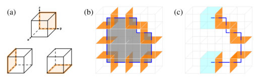 
FIG. 3. (a) Plaquette terms of the 3D toric code model. (b) A loop excitation created by a membrane operator. (c) The topological ob- struction to cutting the loop excitation open.

**Summary.** This theoretical work develops an advanced algebraic framework using 'superselection profiles' to classify translation-symmetry-enriched topological phases in stabilizer codes. It proves that while local excitation data can determine the code class under certain conditions (rigidity), the full topological information resides in how these layers are glued together, revealing subtle differences between seemingly identical models.

**Why it may be interesting.** While highly mathematical, the rigorous classification of topological phases in stabilizer models provides deep insights into how local measurements (like those achievable with limited qubits or interactions) constrain global quantum properties, which is relevant to understanding emergent order in strongly correlated materials.

Detailed structure

**Main problem.** The paper aims to classify translation-symmetry-enriched topological (SET) phases in stabilizer codes by determining how much of the SET order is fixed solely by its local excitation data.

**Main result.** It establishes a topological rigidity theorem showing that for single-layer profiles, the excitation structure uniquely determines the stable translation-invariant Clifford class. However, inter-layer gluing can carry distinct SET information invisible to individual layers.

**Method.** The authors introduce the topological superselection profile $\mathscr S_\sigma$ and use its cohomology layers $E^l_\sigma$ to encode excitation data, employing a matrix-level Schanuel-lemma method for classification.

**Model / system.** The study focuses on translation-invariant Calderbank–Shor–Steane (CSS) stabilizer codes, particularly those derived from Koszul-complex models which unify the toric-code hierarchy and bivariate-bicycle codes.

**Key observables.** Topological superselection profile $\mathscr S_\sigma$, cohomology layers $E^l_\sigma$ encoding sectors and fusion, and ground-state degeneracies.

**Important parameters / regimes.** The analysis distinguishes between single-layer profiles (where only one $E^l_\sigma$ is nonzero) and multi-layer extensions, as well as the finite-resolution hypothesis required for rigidity.

**Assumptions / limitations.** The topological rigidity theorem relies on a finite-resolution hypothesis; the initial analysis focuses on finitely supported Pauli operators due to the structure of the underlying group ring $R$.

**Paper structure.** The paper develops an algebraic formalism for CSS codes using superselection profiles, proves rigidity theorems under certain hypotheses, and then examines cases where inter-layer gluing reveals SET data beyond what individual layers can classify.

Abstract

Koszul-complex stabilizer models unify the toric-code hierarchy and bivariate-bicycle codes in one homological framework. To study translation-symmetry-enriched topological (SET) phases in these models and, more generally, in translation-invariant Calderbank-Shor-Steane (CSS) codes with stabilizer maps $(\varphi_X,\varphi_Z)$, we introduce the associated topological superselection profile $\mathscr S_σ:=τ_{\geq1}\mathbf R\!\operatorname{Hom}_R(\overline{\operatorname{coker}\varphi_σ},R),\ σ=X,Z$. Its cohomology layers $E_σ^\ell:=H^\ell(\mathscr S_σ)\cong_R\operatorname{Ext}_R^\ell(\overline{\operatorname{coker}\varphi_σ},R)$ encode sectors, fusion, and translation action. When finite, the $\ell=1,2,\ldots$ layers describe pointlike, looplike, and higher-dimensional excitations; $\mathscr S_σ$ retains inter-layer gluing. For regular Koszul models, we compute $E_σ^\ell$ explicitly, find $\mathscr S_σ$ single-layer, and obtain finite-size $Z$-logicals from $\operatorname{Tor}$. Single-layer means that at most one positive-degree layer $E_σ^\ell$ is nonzero. Our matrix-level Schanuel-lemma method proves rigidity: under a finite-resolution hypothesis, the nonzero layer and degree uniquely determine a topological CSS code's translation SET order at the stable translation-invariant Clifford level. For prime qudits the hypothesis is automatic, and a finite layer's translation kernel gives the exact minimal coarse graining to a toric-code stack. We realize admissible single-layer data. Beyond this regime, split and nonsplit extensions of 3D qubit toric codes yield eight models sharing all identical $E_σ^\ell$ layers with trivial translation action but having distinct size-dependent ground-state degeneracies, hence distinct translation SET phases. Thus inter-layer gluing carries SET data invisible to individual layers.

[↑ back to top](#top)

### [Randomness Certification and Trade-offs in the Prepare-and-Broadcast Scenario](http://arxiv.org/abs/2608.08329v1)

**Authors:** Tailan S. Sarubi, Moisés Alves, Vinícius F. Alves, Santiago Zamora, Diogo H. G. Duarte, A. de Oliveira Junior, Rafael Chaves  
**Type:** theory · **Category:** quantum information and computing · **PDF:** <https://arxiv.org/pdf/2608.08329v1>  
**Analysis basis:** full PDF text, analyzed in chunks
**Topic relevance:** `quantum measurements` **2/5** · `Keldysh / 2PI / non-Gaussian methods` **1/5**

📷 Fig 1

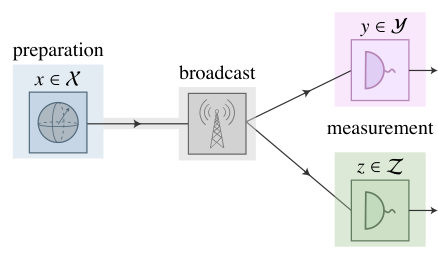 
FIG. 1. PAB scenario. In each run, the preparation device receives an input x ∈X, prepares a quantum state that undergoes a broadcast- ing map that distributes it to two spatially separated measurement de- vices, receiving inputs y ∈Y and z ∈Z and producing local outputs b ∈B and c ∈C, respectively. The PAB scenario is thus described by a probability distribution p(b, c|x, y, z). Notice that if one of the par- ties is traced out, for instance, Charlie, one recovers the usual PAM scenario, described by a probability distribution p(b|x, y)

📷 Fig 2

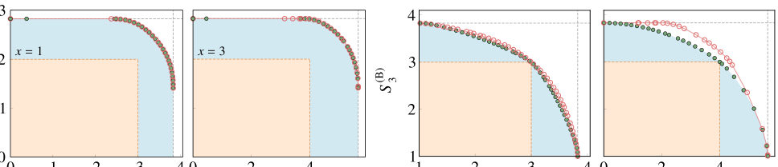 
FIG. 2. Trade-offs between PAM and Bell witnesses in the PAB scenario. Panels (a) and (b) show the trade-off between Charlie’s marginal PAM witness and the CHSH value evaluated by Bob and Charlie conditional on Alice’s preparation input: (a) CHSH[1] BC versus S (C) 3 , and (b) CHSH[3] BC versus S (C) 4 . For S 3, the choice x = 1 is representative of the equivalence class x ∈{0, 1}. For S 4, all four conditioning inputs are equivalent under relabelings, and x = 3 is chosen as a representative. Panels (c) and (d) show marginal receiver–receiver trade-offs: (c) S (B) 3 versus S (C) 3 , and (d) S (B) 3 versus S (C) 4 . The pale-orange rectangles mark the regions in which both plotted...

📷 Fig 3

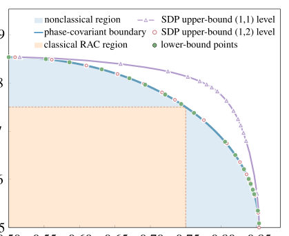 
FIG. 3. Marginal QRAC trade-off in the PAB scenario. The curve shows the possible pairs of success probabilities (PB, PC) for Bob and Charlie in the broadcast 2 →1 QRAC. The inner approxima- tion obtained from explicit strategies through the support-function method coincides, up to numerical precision, with the outer approxi- mation given by the (1, 2) level of the SDP relaxation. The boundary is the same as the trade-off for optimal asymmetric phase-covariant cloning: if one receiver beats the classical QRAC value 3

📷 Fig 4

 
FIG. 4. Randomness from the S 3 and S 4 witnesses in the PAM scenario. Certified min-entropy of Bob’s outcome at the genera- tion input (x⋆, y⋆) = (2, 1) as a function of the visibility v for the witnesses S 3 and S 4, at the L(1, 2) relaxation level. For each wit- ness, we show the witness-only certificate of Eq. (24) and the fixed- distribution certificate of Eq. (26). For S 3, the fixed-distribution cer- tificate reaches one full bit at v = 1, whereas for S 4 the bias of the optimal realization at the same generation input limits the certifiable randomness to approximately 0.228 bits. The vertical lines mark the minimum visibility required for each curve to certify nonzero ran- domness.

📷 Fig 5

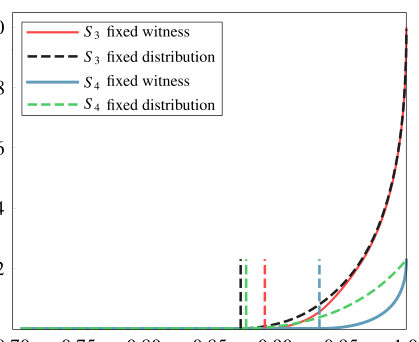 
Figure 4 collects the resulting certificates as functions of the visibility v. Two features stand out. First, for S 3, the fixed- distribution certificate reaches one full bit at v = 1, the alge- braic maximum for a binary outcome, in agreement with the unbiased marginal of the optimal realization at the input (2, 1). Second, away from the endpoint, the two protocols separate, with the fixed-distribution curve lying above the witness-only envelope over a wide range of visibilities and becoming non- trivial at a lower visibility threshold. The witness value is therefore a valid but strictly lossy summary of the data for ran- domness purposes. The witness S 4 shows the complementary lesson....

**Summary.** This work analyzes the Prepare-and-Broadcast (PAB) scenario to quantify fundamental trade-offs between nonclassical resources like Bell violations and random number generation. It develops a semi-device-independent framework proving that the maximal quantum advantage certifies two bits of joint randomness, surpassing classical bounds in a robust manner.

**Why it may be interesting.** While focused on QI theory, the rigorous mathematical tools used to bound correlations and certify randomness are highly relevant to understanding resource constraints in complex open quantum systems or multi-partite entanglement verification.

Detailed structure

**Main problem.** The paper investigates fundamental trade-offs between prepare-and-measure witnesses, Bell nonlocality, and quantum random access code performance within the multipartite Prepare-and-Broadcast (PAB) scenario.

**Main result.** They derive quantitative relationships showing that the maximal quantum violation in PAB certifies two bits of joint randomness, exceeding classical limits like CHSH, and establishes a semi-device-independent framework robust to noise.

**Method.** The analysis employs geometric criteria derived from convex polytopes, semidefinite programming relaxations, and advanced techniques involving block decomposition and projection operators on quantum states.

**Model / system.** The core model is the Prepare-and-Broadcast (PAB) scenario, a multipartite extension of prepare-and-measure experiments where a prepared state is distributed to multiple spatially separated receivers. The analysis uses qubits and probability distributions $p(b|x, y)$.

**Key observables.** Prepare-and-measure witnesses ($S_3, S_4$), Bell nonlocality violations (CHSH), joint output randomness (in bits), and QRAC success probabilities.

**Important parameters / regimes.** The dimensionality of the system ($d$), the number of preparations (three or four), and the specific constraints imposed by the PAB structure.

**Assumptions / limitations.** Assumptions include focusing on binary PAM scenarios, comparing explicit qubit strategies against SDP relaxations, and analyzing idealized quantum correlations.

**Figures summary.** Figure 1 illustrates the general PAB setup (preparation $
ightarrow$ broadcasting $
ightarrow$ multiple measurements). Figure 2 details trade-offs between different types of nonclassicality witnesses in the PAB context.

**Paper structure.** The paper systematically develops criteria for classical compatibility, establishes quantitative trade-off boundaries between various quantum advantages (witnesses vs. Bell violations), and culminates in developing a semi-device-independent framework for randomness certification against adversarial side information.

Abstract

We investigate the prepare-and-broadcast scenario, a multipartite extension of dimension-constrained prepare-and-measure experiments in which a quantum system is distributed to multiple receivers. We derive fundamental trade-offs between prepare-and-measure witnesses, Bell nonlocality, and quantum random access code performance. We further develop a semi-device-independent randomness certification framework based on prepare-and-broadcast witnesses, showing that the maximal quantum violation certifies two bits of joint randomness, exceeding the limit achievable from the CHSH inequality while remaining robust to noise. Finally, we show that the prepare-and-broadcast scenario naturally accommodates stronger adversarial models in which the eavesdropper retains a quantum system correlated with the measurement device, providing a natural framework for semi-device-independent randomness certification against quantum side information.

[↑ back to top](#top)

### [Characterising the set of deterministic quantum correlations in prepare-and-measure scenarios](http://arxiv.org/abs/2608.09667v1)

**Authors:** Nicola D'Alessandro, Oliver Karlsson, Carles Roch i Carceller  
**Type:** theory · **Category:** quantum information and computing · **PDF:** <https://arxiv.org/pdf/2608.09667v1>  
**Analysis basis:** full PDF text, analyzed in chunks
**Topic relevance:** `quantum measurements` **2/5**

📷 Fig 1

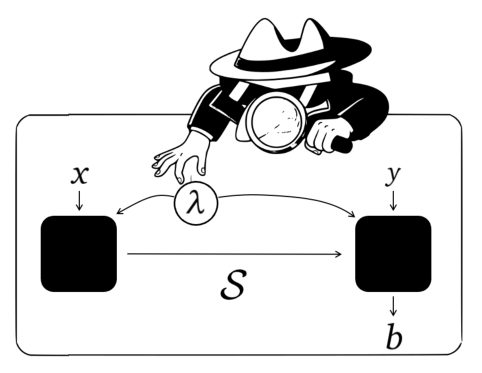 
FIG. 1: Adversarial prepare-and-measure scenario. The adversary is correlated through the hidden-variable λ distributed among the devices. The communication is bound to satisfy the restriction S.

📷 Fig 2

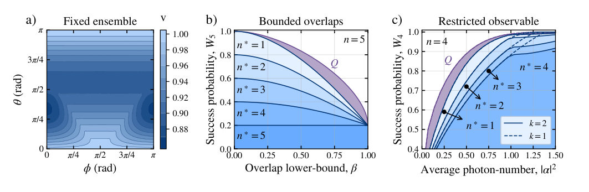 
FIG. 2: Classical models based on predictable measurement outcomes. a) Critical visibility above which two qubit states cannot generate classical correlations. b) Value of W5 above which a classical model is ruled out for n∗inputs and preparations with bounded pair-wise overlaps. c) Value of W4 above which a classical model is ruled out for n∗

**Summary.** This paper develops a comprehensive framework to test whether observed correlations in prepare-and-measure quantum experiments can be explained by deterministic classical models. It achieves this by formulating constraints derived from three distinct physical assumptions—fixed ensembles, bounded overlaps, and restricted observables—into solvable Semidefinite Programs (SDPs). Success in solving the SDP implies determinism; failure proves genuine non-classicality.

**Why it may be interesting.** This work provides rigorous mathematical tools (SDP hierarchies) to quantify non-classicality in fundamental quantum tasks, which is crucial for understanding the resource theory aspects of quantum information processing beyond simple entanglement measures.

Detailed structure

**Main problem.** The core problem is characterizing the set of deterministic quantum correlations achievable in prepare-and-measure scenarios and developing methods to certify when observed correlations violate these deterministic bounds.

**Main result.** The authors propose using Semidefinite Programming (SDP) relaxations tailored to specific communication restrictions (fixed ensemble, bounded overlaps, restricted observables) to test for determinism. Infeasibility of the resulting SDP proves non-classicality.

**Method.** The methodology involves formulating the problem as determining if observed correlations admit a deterministic explanation by introducing an adversary with full knowledge of shared randomness $\lambda$. This leads to solving feasibility problems via specialized SDP relaxations (e.g., Block Moment Matrix, Gram matrix).

**Model / system.** The system is the prepare-and-measure scenario involving two parties (Alice and Bob), where Alice prepares states $
ho_{\lambda}^x$ based on shared randomness $\lambda$, and Bob performs measurements $\{M_{\lambda}^b|y\}_b$. The analysis adapts techniques from Quantum Random Number Generation.

**Key observables.** The optimal guessing probability $p^g(x,y)$, which must equal 1 for correlations to be considered classical/deterministic.

**Important parameters / regimes.** Communication restrictions include Fixed ensemble (SE), Bounded overlaps ($	ext{S}eta$), and Restricted observables ($	ext{SO}$).

**Assumptions / limitations.** The analysis relies on solving SDP relaxations, which provide outer approximations of the true quantum set. Specific assumptions are made regarding how preparation states or measurements are constrained.

**Figures summary.** Figures illustrate critical visibilities and bounds (e.g., $	ext{W}_5$ vs. overlap parameter) comparing quantum maximums against classical bounds derived under different communication restrictions.

**Paper structure.** The paper systematically addresses the characterization of deterministic correlations by applying SDP techniques to three distinct physical assumptions: fixed ensemble, bounded overlaps, and restricted observables, building a hierarchy of necessary conditions for determinism.

Abstract

Correlations that do not admit a deterministic explanation are a central feature of quantum theory and a key resource for quantum information processing. Identifying and certifying such correlations, however, remains a fundamental challenge. In this work, we advance on this problem by considering deterministic correlations in the prepare-and-measure scenario consistent with a wide range of communication restrictions. To certify correlations incompatible with such deterministic models, we ask whether they admit a scenario in which measurement outcomes can be perfectly predicted by an adversary equipped with classical side-information. We show the usefulness of this approach and propose semidefinite programming relaxations tailored to three representative communication restrictions: fixed ensemble, bounded overlaps and restricted observables.

[↑ back to top](#top)

### [From Barren Plateaus to SPSA Optimization in Variational Quantum Eigensolvers](http://arxiv.org/abs/2608.09810v1)

**Authors:** Zhen Qin  
**Type:** theory · **Category:** quantum information and computing · **PDF:** <https://arxiv.org/pdf/2608.09810v1>  
**Analysis basis:** full PDF text, analyzed in chunks
**Topic relevance:** `quantum measurements` **2/5**

📷 Fig 1

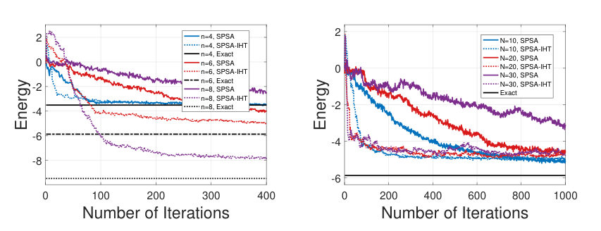 
Figure 1: Convergence of SPSA and SPSA-IHT for (a,b) the TIM and (c,d) the XYZ model. In (a) and (c), N = 10 is fixed while n varies; in (b) and (d), n = 6 is fixed while N varies.

**Summary.** This paper rigorously analyzes the impact of Barren Plateaus on Variational Quantum Eigensolvers optimized using SPSA. It develops statistical tools to quantify gradient estimation errors under finite measurements. The core finding demonstrates that BP causes optimization convergence to require an exponentially increasing measurement budget as system size grows.

**Why it may be interesting.** This work provides crucial theoretical bounds on the practical limitations of VQE algorithms, directly informing how quantum hardware resources (measurement time) must scale with system size when BP is present.

Detailed structure

**Main problem.** The paper addresses how the Barren Plateau (BP) phenomenon degrades the optimization dynamics and complexity of Variational Quantum Eigensolvers (VQEs) when subjected to finite-shot measurement noise.

**Main result.** It is shown that the exponential decay of gradient energy due to BP forces an exponential increase in both the required number of optimization iterations and the total necessary quantum measurement budget to maintain a fixed accuracy.

**Method.** The authors develop a theoretical framework analyzing the Simultaneous Perturbation Stochastic Approximation (SPSA) algorithm, deriving non-asymptotic bias and variance characterizations for its gradient estimator under finite measurements.

**Model / system.** The study focuses on VQE applied to finding eigenvalues of a target Hamiltonian $H = \sum w_\alpha P_\alpha$ using variational parameters $	heta$. The optimization is performed on Noisy Intermediate-Scale Quantum (NISQ) devices.

**Key observables.** Gradient energy decay, Signal-to-Noise Ratio ($	ext{SNR}_\ell$), required iteration count ($T$), and total measurement budget ($M$).

**Important parameters / regimes.** System size ($N$ or $L$), optimization step size ($\mu_t$), and the measurement shot count ($M$). The BP regime is characterized by exponential gradient decay.

**Assumptions / limitations.** The analysis assumes a specific noise model for measurements (Lemma 1) and relies on bounding the Hessian Lipschitz constant of the VQE objective function (Proposition 1).

**Paper structure.** The paper builds from characterizing the BP's impact to developing statistical tools (SPSA analysis, SNR metric), culminating in convergence proofs that quantify the resource scaling required for optimization.

Abstract

The barren plateau (BP) phenomenon poses a fundamental challenge to the trainability of variational quantum eigensolvers (VQEs) by causing exponentially vanishing gradients as the system size increases. While extensive studies have investigated the geometric origins of BP, its impact on the optimization dynamics and complexity of practical algorithms under finite-shot measurements remains poorly understood. In this paper, we develop a theoretical framework that characterizes how the BP affects the optimization dynamics of the Simultaneous Perturbation Stochastic Approximation (SPSA) algorithm and quantifies the resulting iteration complexity and measurement budget. We derive non-asymptotic bias and variance characterizations of the SPSA gradient estimator, introduce a signal-to-noise ratio analysis to quantify gradient reliability, and establish convergence guarantees for SPSA under finite-shot measurements. Our results show that the exponentially decaying gradient energy associated with BP leads to an exponential increase in the number of iterations required to achieve a fixed relative optimization accuracy, which in turn results in an exponential increase in the total measurement budget.

[↑ back to top](#top)

### [Learning Clifford-structured quantum unitaries and Hamiltonians](http://arxiv.org/abs/2608.09912v1)

**Authors:** Arkopal Dutt, Dale Jacobs, John Jeang, Saeed Mehraban, Vladimir Podolskii  
**Type:** theory · **Category:** quantum information and computing · **PDF:** <https://arxiv.org/pdf/2608.09912v1>  
**Analysis basis:** full PDF text, analyzed in chunks
**Topic relevance:** `quantum measurements` **2/5**

📷 Fig 1

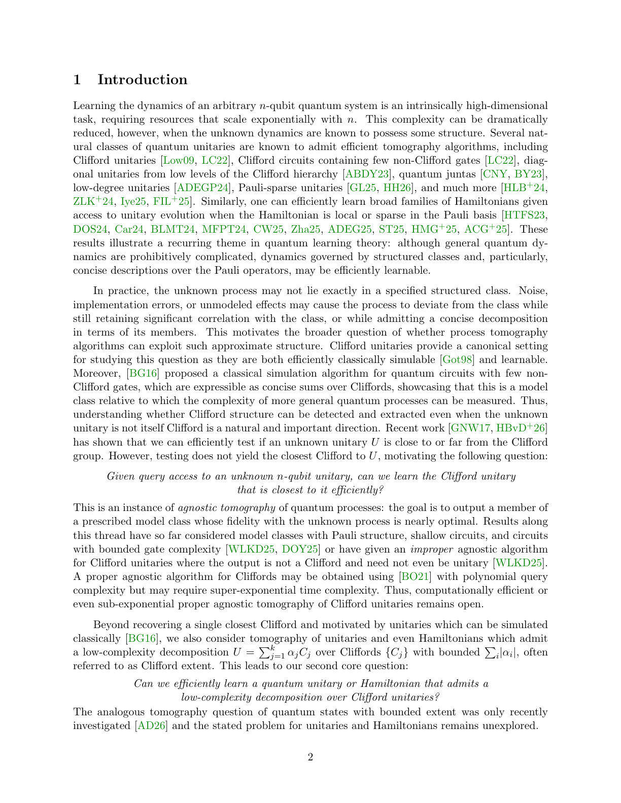 
Low-resolution page preview, page 2

📷 Fig 2

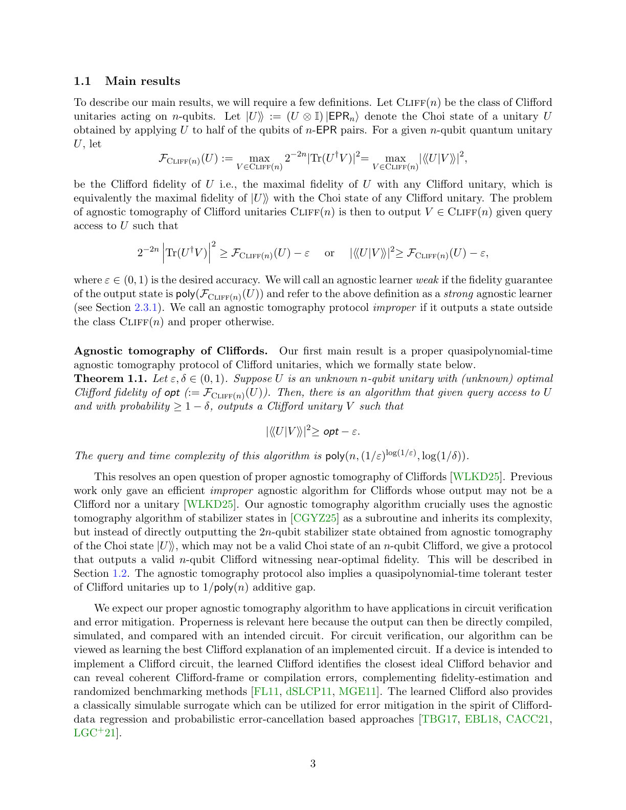 
Low-resolution page preview, page 3

📷 Fig 3

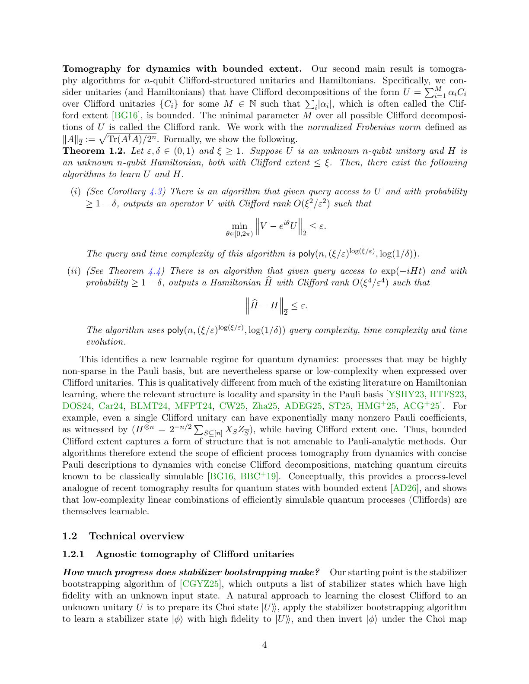 
Low-resolution page preview, page 4

📷 Fig 4

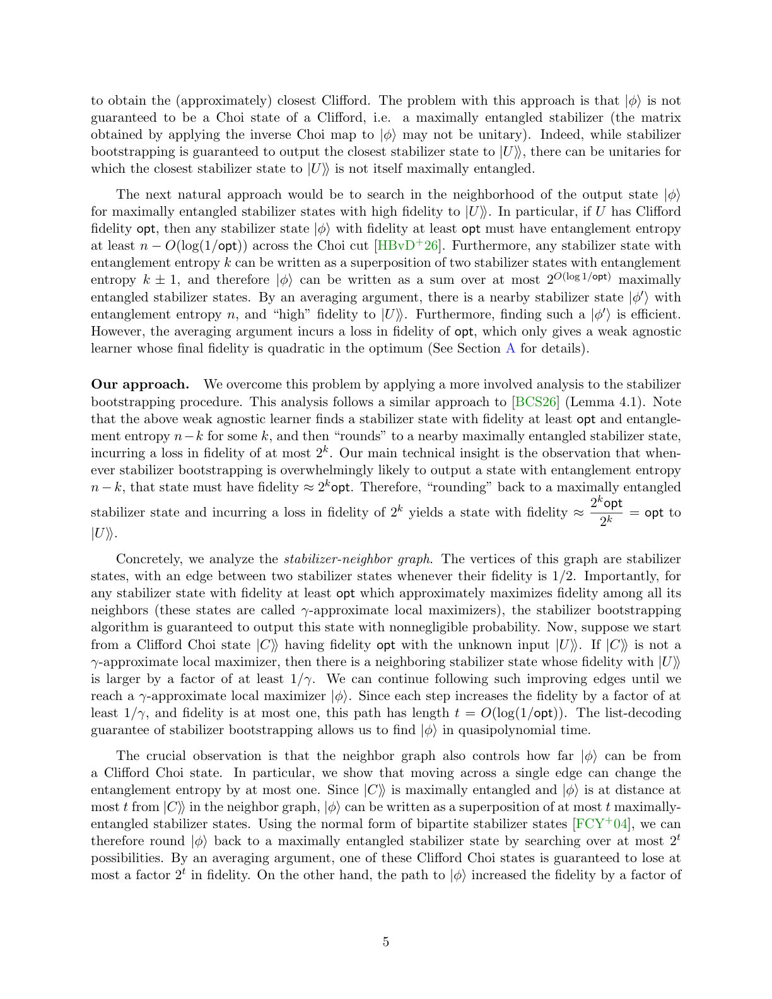 
Low-resolution page preview, page 5

📷 Fig 5

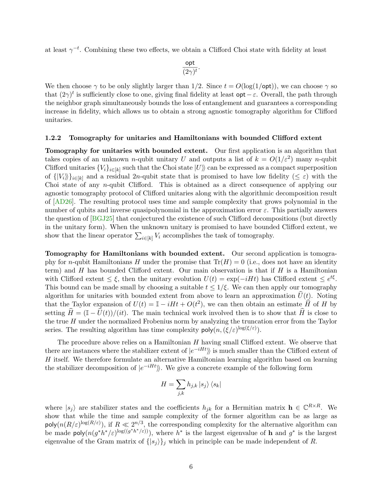 
Low-resolution page preview, page 6

**Summary.** This paper tackles the problem of learning complex quantum unitaries and Hamiltonians by exploiting their structure relative to the Clifford group. It introduces an agnostic tomography protocol capable of finding a high-fidelity approximation within the Clifford set. This extends the known limits of learnability from processes sparse in the Pauli basis to those with bounded complexity over Clifford elements.

**Why it may be interesting.** This work provides a powerful new structural tool (Clifford decomposition) to characterize quantum dynamics that are difficult to analyze using standard Pauli basis methods, which is crucial for understanding resource estimation in quantum computation.

Detailed structure

**Main problem.** The primary challenge is developing algorithms to learn quantum unitaries and Hamiltonians that are structurally complex (dense in Pauli basis) but possess a concise decomposition over the Clifford group.

**Main result.** The authors introduce an agnostic tomography protocol for Clifford unitaries and establish learning protocols for dynamics based on bounded 'Clifford extent,' extending learnability beyond processes sparse in the Pauli basis.

**Method.** The work develops specialized quantum query algorithms, including an agnostic tomography protocol for Clifford unitaries, and applies these to reconstruct unknown Hamiltonians or unitaries from limited measurements.

**Model / system.** The focus is on $n$-qubit quantum systems described by unitary operators ($U$) or time evolution governed by Hamiltonians ($H$). The structure of interest is the decomposition over Clifford unitaries, $	ext{Cliff}(n)$.

**Key observables.** Clifford Fidelity ($	ext{F}_{	ext{Cliff}}$), Clifford extent ($\xi_{	ext{Cliff}}$), and Pauli basis sparsity.

**Important parameters / regimes.** The error tolerance $\epsilon$, the system size $n$, and the bounded Clifford extent $\xi$.

**Assumptions / limitations.** The protocols assume query access to the unknown unitary or its evolution, and they establish bounds based on the assumption of a bounded Clifford decomposition.

**Paper structure.** The paper first establishes the theoretical framework by developing an agnostic tomography protocol for Clifford unitaries. It then applies this machinery to derive learnability protocols for both general unitaries and Hamiltonians, contrasting these results with traditional Pauli-sparsity assumptions.

Abstract

Learning algorithms for structured quantum unitaries and Hamiltonians have primarily considered classes of processes that are local or sparse in the Pauli basis. We turn our attention to learning $n$-qubit quantum unitaries $U$ and Hamiltonians $H$, given query access to $U$ or the unitary evolution of $H$, that may be dense in the Pauli basis but still admit concise Clifford decompositions. Specifically, we consider unitaries (or Hamiltonians) of the form $U = \sum_i α_i C_i$ over Cliffords $C_i$ with bounded Clifford extent $\sum_i |α_i|$. To extract this Clifford structure, we introduce an agnostic tomography protocol for Clifford unitaries that given query access to an unknown unitary $U$ with optimal Clifford fidelity $\textsf{opt}$, outputs a Clifford unitary witnessing fidelity $\geq \textsf{opt} - \varepsilon$ for some error $\varepsilon > 0$, in time $\textsf{poly}(n,(1/\varepsilon)^{\log(1/\varepsilon)})$. We then apply this protocol to obtain tomography protocols for unitaries and Hamiltonians that have bounded Clifford extent. This extends learnability of Hamiltonians from those with sparse Pauli decompositions to those that are dense (i.e., has sparsity $Ω(2^n)$) in the Pauli basis but are Clifford structured.

[↑ back to top](#top)

### [Phase-error estimation for quantum key distribution with leaky receivers](http://arxiv.org/abs/2608.09674v1)

**Authors:** Álvaro Navarrete, Margarida Pereira, Guillermo Currás-Lorenzo, Akihiro Mizutani, Marcos Curty, Kiyoshi Tamaki  
**Type:** theory · **Category:** quantum information and computing · **PDF:** <https://arxiv.org/pdf/2608.09674v1>  
**Analysis basis:** full PDF text, analyzed in chunks
**Topic relevance:** `quantum measurements` **2/5**

📷 Fig 1

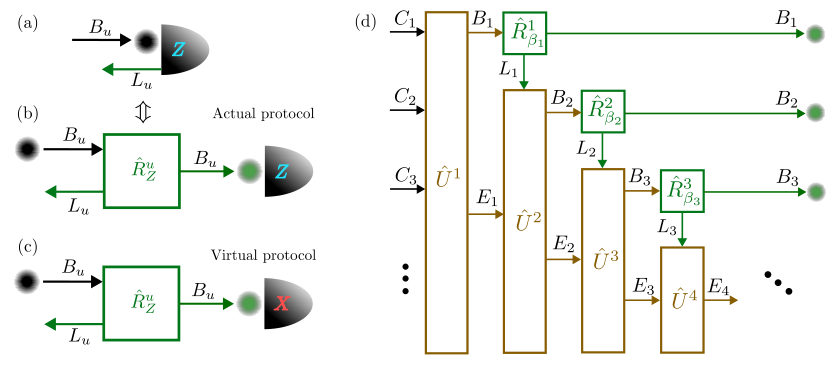 
Figure 1. The isometry modeling the information leakage is designed to commute with Bob’s measurement, and therefore their order can be swapped without changing the observed statistics. Thus, the actual scenario (a), in which Bob first measures Bu and the leakage system Lu is generated afterwards, is equivalent to a fictitious scenario (b) in which the leakage isometry is applied first and Bob then measures the resulting system. In the virtual protocol (c), Bob measures the output system Bu of ˆRu Z in the X basis, {|0X⟩, |1X⟩}. (d) Eve’s most general attack in the presence of receiver-side leakage.

📷 Fig 2

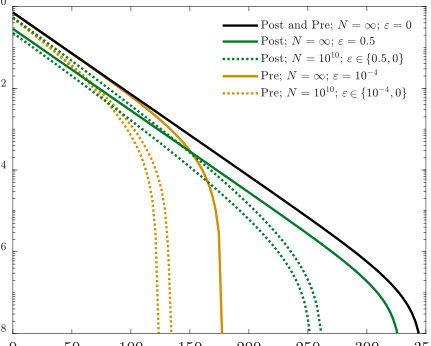 
Figure 2. Secret-key rate per signal as a function of the dis- tance for the two leakage scenarios: post-measurement leak- age (Post) and a priori leakage of the basis choice (Pre). We consider a total number of transmitted signals N = 1010 and N →∞, and vary the leakage strength via the parameter ε ∈{0, 10−4, 0.5}, with ε := 1 −γ2 (Post) and ε := 1 −δ (Pre).

**Summary.** This paper presents a finite-key security proof for Quantum Key Distribution against information leakage from imperfect physical receivers. By using phase-error estimation, the authors quantify how side-channel emissions compromise security in both post-measurement and basis-choice leakage scenarios. This provides a vital tool for making QKD protocols robust enough for real-world implementation.

**Why it may be interesting.** This work directly addresses practical limitations in quantum communication hardware (leaky detectors), providing rigorous security proofs that are crucial for deploying QKD systems outside idealized laboratory settings.

Detailed structure

**Main problem.** To develop a simple, finite-key security proof for Quantum Key Distribution (QKD) that remains secure even when the physical receivers leak information about measurement outcomes or basis choices to an eavesdropper.

**Main result.** The authors provide a loss-tolerant security proof based on phase-error estimation, showing how leakage introduces only quantifiable penalties to the key rate for both post-measurement and a priori basis leakage scenarios.

**Method.** The analysis establishes equivalence between the actual leaky protocol and a virtual scenario, allowing the use of phase-error estimation techniques derived from bounding the distinguishability (fidelity) of leaked side-channel states.

**Model / system.** The study focuses on prepare-and-measure (P&M) QKD schemes, modeling information leakage via isometries acting on the received quantum state. The analysis uses concepts like phase-error operators and fidelity bounds derived from the leaky receiver's side channels.

**Key observables.** Phase-error rate ($\delta_\gamma$), X-basis error rate, and the key secret length $\ell$.

**Important parameters / regimes.** Leakage overlap parameter ($\gamma$), detection probability ($p_{	ext{det}}$), and correlation length ($L_c$).

**Assumptions / limitations.** The analysis assumes that leakage states can be bounded by fidelity constraints, and it models the system using an isometry framework to relate actual measurements to virtual ones.

**Figures summary.** Figure 1 illustrates the modeling of information leakage across three scenarios (actual, fictitious, virtual). Figure 2 compares the secret-key rate vs. distance for post-measurement versus a priori basis choice leakage.

**Paper structure.** The paper develops the security proof by first establishing the mathematical equivalence between the physical protocol and an idealized virtual one. It then derives specific bounds relating the phase error to the X-basis error, accounting separately for post-measurement and a priori basis leakage mechanisms.

Abstract

Practical quantum key distribution (QKD) receivers may leak information about their measurement outcomes and settings to the channel (e.g., through detector backflashes or back-reflected Trojan-horse light) that could compromise the protocol's security. Here we present a simple finite-key security proof based on phase-error estimation for prepare-and-measure QKD in the presence of either a priori information leakage about the basis choices and/or a posteriori information leakage about the measurement outcomes. The proof requires only a bound on the distinguishability of the side-channel states. Furthermore, the analysis is modular and compatible with existing security proofs that address detector and source imperfections, making it applicable to a wide range of practical QKD implementations.

[↑ back to top](#top)

### [High-Capacity Generalized Hopfield Networks](http://arxiv.org/abs/2608.08226v1)

**Authors:** Victor Galitski  
**Type:** theory · **Category:** disordered systems and neural networks · **PDF:** <https://arxiv.org/pdf/2608.08226v1>  
**Analysis basis:** full PDF text, analyzed in chunks
**Topic relevance:** `Keldysh / 2PI / non-Gaussian methods` **1/5** · `analog quantum simulation` **1/5** · `correlated / nonlocal dissipation` **1/5** · `driven-dissipative phase transition` **1/5** · `methods for driven-dissipative` **1/5** · `non-equilibrium universality` **1/5**

📷 Fig 1

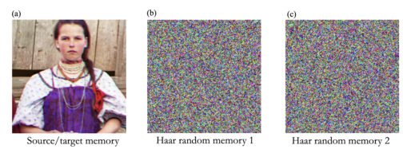 
FIG. 1. Examples of memories stored for the SU(3) image- recall demonstration. (a) A fragment of a color photo (we have chosen one of the earliest known color photographs by Prokudin-Gorsky taken in 1909 using RGB filters [14]). The image is compressed into a 180 × 180 = 32400-pixel matrix which is flattened into a memory vector, ξµ=0 i , where i runs over 32400 components. Each pixel is a neuron which is en- coded as a qutrit on CP 2 through the color-to-qutrit map of Eq. (16). (b),(c) Two Haar-random qutrit memories, shown decoded back to RGB.

📷 Fig 2

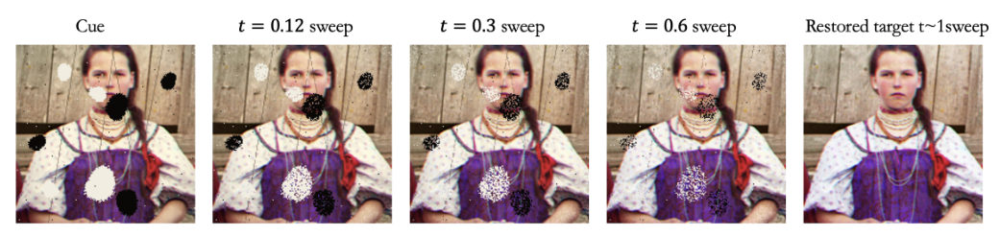 
FIG. 2. Image recall from the corrupted cue using the top eigenvector update procedure for the SU(3) neural network. The progression illustrates the “restoration” of the image as a function of “time,” measured in the fraction of a single sweep (32400 individual neuron updates). For this ultra-low load of the network (100 Haar random memories and the target image) the near perfect restoration is achieved within a single sweep and then settles to a 100% match.

📷 Fig 3

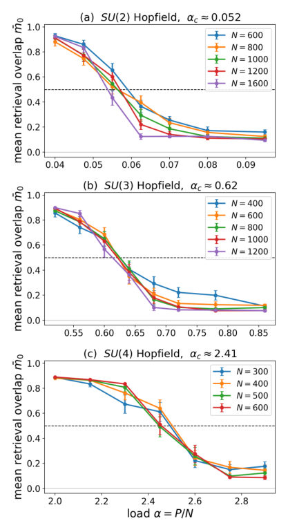 
FIG. 3. Numerical simulations of the SU(d) recall for d = 2, 3, and 4 for P Haar random memories on CP d−1. Mean retrieval overlap ¯m0 = d 2(d−1) O0 with Oµ defined in Eq. (11) is plotted as a function of the network load. The dashed lines mark the threshold ¯mth = 1/2. We observe a sharp deterioration of the image recovery process and estimate the critical capacity, αc from this behavior. It shows an order of magnitude enhancement starting with d = 3.

📷 Fig 4

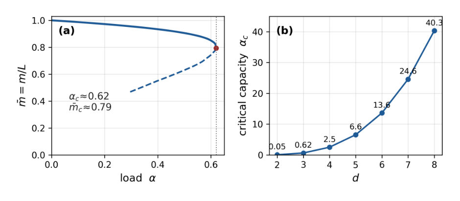 
FIG. 4. (a) Replica-symmetric retrieval overlap ¯m = m/L versus load α for the d = 3 (CP 2, qutrit) network, from the T = 0 self-consistent equations (32) averaged over ∼104 samples of the matrix field ˆK. The stable (solid) and unstable (dashed) branches merge at the critical load that defines αc ≃0.62. (b) Critical capacity αc as a function of the qudit dimension d, obtained from the T = 0 replica-symmetric equations (32). The values αc ≃0.05, 0.62, 2.5, 6.6, 13.6, 24.6, 40.3 for d = 2, . . . , 8 rise steeply, exceeding unity for d ≥4 and far above the binary value 0.138.

📷 Fig 5

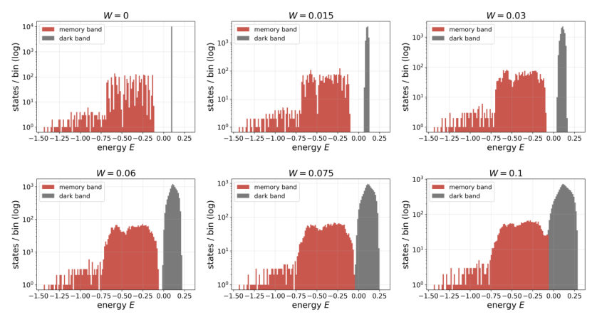 
FIG. 5. Density of states of the quantum XY Hopfield model in the two-magnon sector as a function of the transverse field. The parameters are N = 160 and P = 16, corresponding to a load of 10%. The magnetic field is taken to be hi = Wui, where the random variables ui are drawn uniformly from the interval [−1, 1]. In the absence of a magnetic field, a flat (dark) band is observed, originating from the zero modes of the Hebb matrix. As the field strength increases, the dark band broadens and eventually merges with the memory band.

**Summary.** This paper generalizes Hopfield networks by placing neurons on the $	ext{SU}(d)$ manifold ($	ext{CP}^{d-1}$), achieving a significant boost in memory capacity over standard models. It employs advanced techniques, including Lie algebra and replica analysis, to show that recall is governed by alignment along top eigenvectors. The results are validated using physical dynamics (LLG) and suggest connections to quantum glassy systems.

**Why it may be interesting.** This work bridges concepts from quantum information (SU(d) representations, complex structures) with condensed matter physics (spin glasses, disordered systems) via neural network modeling. The connection between geometric constraints and enhanced capacity is highly relevant for understanding physical implementations of memory storage.

Detailed structure

**Main problem.** To develop generalized Hopfield networks using continuous variables on Riemannian manifolds to significantly enhance memory storage capacity beyond traditional vector models.

**Main result.** The use of $	ext{SU}(d)$ symmetry leads to a strong, order-of-magnitude enhancement in critical capacity ($\alpha_c$) compared to standard spherical networks. Furthermore, physical dynamics (LLG) successfully reproduce these high capacities.

**Method.** The analysis combines replica techniques with Lie algebraic methods to linearize the geometric constraints of the manifold. Retrieval is analyzed using energy minimization principles derived from generalized Landau-Lifshitz-Gilbert dynamics.

**Model / system.** The model is a Hopfield network where neurons and memories reside on symmetric spaces, specifically $	ext{SU}(d)$ associated with the manifold $	ext{CP}^{d-1}$. The system's energy functional governs memory storage and retrieval.

**Key observables.** Critical capacity ($\alpha_c$), Memory Overlap ($O_\mu$), and the success rate of image recovery during dynamics.

**Important parameters / regimes.** The dimension $d$ of the special unitary group, which dictates the manifold structure; the load parameter $\alpha$.

**Assumptions / limitations.** The analysis relies on mapping the non-linear geometry onto an auxiliary Hilbert space using Lie algebra techniques. The LLG dynamics are assumed to govern physical recall.

**Figures summary.** Figures illustrate image encoding/decoding protocols for SU(3) and show capacity scans demonstrating high $\alpha_c$ values, alongside visualizations of winner-takes-it-all behavior during retrieval.

**Paper structure.** The paper introduces the generalized network on Riemannian manifolds, derives the energy functional using Lie algebra, analyzes the enhanced capacity via replica methods, demonstrates physical recall using LLG dynamics (including image examples), and concludes by quantizing the system to relate it to Sachdev-Ye glassy models.

Abstract

Generalized Hopfield networks are introduced where memories and neurons are continuous variables that lie on a Riemannian manifold. We explicitly focus on symmetric spaces associated with the special unitary groups SU(d), and use both numerical and analytical (replica) techniques to demonstrate an almost order of magnitude enhancement in critical capacity over the vector networks starting with d=3 and further rapidly growing with d. To circumvent the non-linear geometric constraints, we use a Lie algebraic method [following V. Galitski, Phys. Rev. A 84, 012118 (2011)] to exactly describe the classical neural network in terms of linear algebra in an auxiliary Hilbert space. It is shown that in contrast to the traditional Hopfield networks, memory recall in SU(d) Hopfields corresponds to neuron alignment along a top eigenvector of a spiked matrix, which is less susceptible to random matrix crosstalk than other models with continuous neuron variables. Physical platforms to realize SU(d) Hopfields are briefly discussed and physical (in addition to algorithmic) recall mechanism is demonstrated, where memory recovery occurs naturally through generalized Landau-Lifshitz-Gilbert dynamics. To illustrate SU(3) memory recall, we introduce a color (RGB) image encoding/decoding protocol and explicitly run image recovery on corrupted cues. Finally, we quantize the generalized Hopfields which are shown to reduce to Sachdev-Ye glassy type of models. Their many-body spectra generally feature two types of dark and memory bands, where the latter exhibits chaotic Wigner-Dyson level statistics that hides Hebbian data.

[↑ back to top](#top)

### [Ensemble-level loopy message passing with generalized-edge closure for percolation](http://arxiv.org/abs/2608.09397v1)

**Authors:** L. -H. Wang, Y. -M. Du  
**Type:** theory · **Category:** statistical mechanics · **PDF:** <https://arxiv.org/pdf/2608.09397v1>  
**Analysis basis:** full PDF text, analyzed in chunks
**Topic relevance:** `Keldysh / 2PI / non-Gaussian methods` **1/5** · `analog quantum simulation` **1/5** · `driven-dissipative phase transition` **1/5** · `methods for driven-dissipative` **1/5** · `non-equilibrium universality` **1/5**

📷 Fig 1

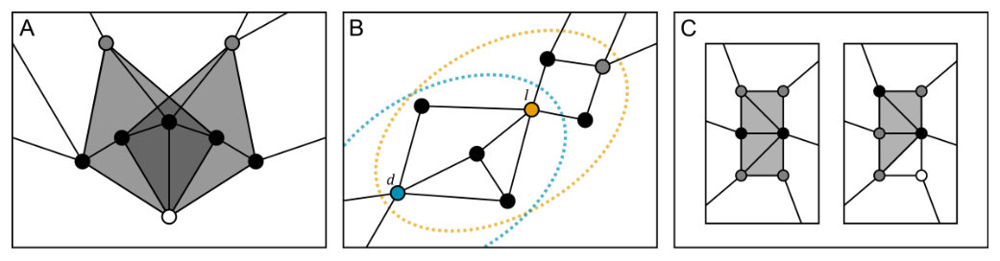 
FIG. 1. Schematic illustration of second-order generalized edges, their closure property, and associated structural features. (A) Correlation structure encoded in A(2) when the number of shell-2 neighbors is two. The white node represents the focal node of degree d, black nodes represent its shell-1 neighbors in N1(d), and gray nodes represent its shell-2 neighbors in N2(d). Gray shaded regions denote generalized edges between the focal node and its shell-2 neighbors, and the darker gray region indicates the overlap between different generalized edges. (B) Structural features of a second-order generalized edge. The blue node and dashed curve indicate the node of degree d and its...

📷 Fig 2

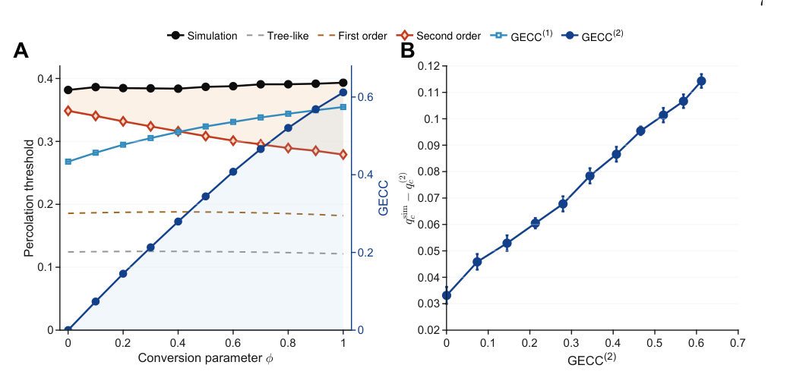 
FIG. 2. Closure departure drives finite-order threshold failure in synthetic networks. (A) Simulated percolation thresholds are compared with locally tree-like, first-order, and second-order threshold predictions as the conversion parameter ϕ is varied. Threshold quantities are plotted on the left axis, and GECC(1) and GECC(2) are plotted on the right axis. Increasing ϕ drives the generalized edges from the near-closed regime (small ϕ) into the closure-departure regime (large ϕ). The orange shaded region marks the residual gap between q(2) c and qsim c . The pale-blue shading provides a visual guide for GECC(2). Error bars are included for qsim c and both GECC curves, but they are smaller...

📷 Fig 3

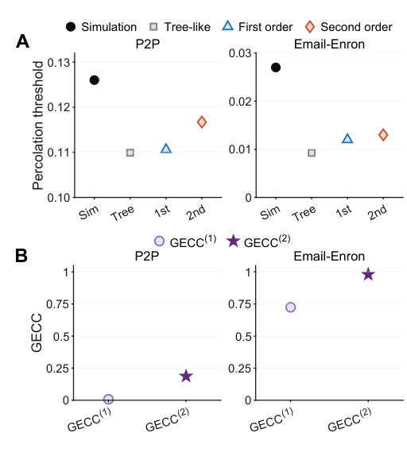 
FIG. 3. GECC as an a priori diagnostic of finite- order threshold reliability in representative real net- works. (A) Simulation thresholds and theoretical predic- tions for P2P and Email-Enron. The thresholds are plotted on ordinary linear axes, allowing direct comparison between qsim c , qtree c , q(1) c , and q(2) c . (B) Corresponding generalized-edge closure coefficients GECC(1) and GECC(2) for the same two networks. Larger GECC values indicate poorer generalized- edge closure. P2P has small GECC values and a correspond- ingly small residual threshold error, whereas Email-Enron has GECC(2) close to one and a large residual error, illustrating the two structurally distinct regimes...

**Summary.** This paper introduces an ensemble-level message-passing framework to accurately predict percolation thresholds in highly clustered random networks by explicitly accounting for loop correlations. The core innovation is the Generalized Edge Closure Coefficient (GECC), a local diagnostic tool that validates the reliability of these high-order approximations across synthetic and real-world complex networks.

**Why it may be interesting.** While focused on classical network science, the rigorous development of higher-order correlation functions and systematic approximations for complex systems shares methodological parallels with advanced techniques used in quantum many-body physics (e.g., cluster expansions or diagrammatic methods).

Detailed structure

**Main problem.** Predicting the percolation threshold of highly clustered networks from local statistics is difficult because short loops violate the independence assumption underlying tree-like message passing.

**Main result.** The authors develop an ensemble-based loopy message-passing framework that accurately predicts percolation thresholds by incorporating loop correlations, validated by a diagnostic coefficient (GECC).

**Method.** They derive and utilize a progressively refined, high-order message-passing recursion based on generalized-edge statistics to account for arbitrary connectivity patterns in random graph ensembles.

**Model / system.** The study focuses on percolation theory applied to random clustered graph ensembles (e.g., P2P, Facebook networks). The framework models network connectivity using 'generalized edges' that characterize overlap patterns among node neighborhoods.

**Key observables.** Percolation threshold ($q_c$), Generalized Edge Closure Coefficient (GECC), and the conditional finite-cluster-size distribution ($	ilde{\pi}$).

**Important parameters / regimes.** The order of approximation ($n$, up to $n=2$ is detailed) and structural features like degree classes, distance, and shared neighbors.

**Assumptions / limitations.** The method assumes that the complex connectivity can be systematically approximated by progressively including higher-order neighborhood statistics (generalized edges).

**Figures summary.** Figures illustrate correlation structures in generalized edges ($A(2)$), structural features of second-order edges, and comparisons between simulated vs. theoretical percolation thresholds alongside their corresponding GECC values for real networks.

**Paper structure.** The paper progresses from identifying the limitations of existing methods to developing an exact message-passing recursion (Eq. 4) for arbitrary order $n$. It then reduces this high-dimensional theory to a tractable, second-order approximation (Eq. 9), culminating in testing its validity using real-world networks and introducing GECC as the primary diagnostic tool.

Abstract

Predicting the percolation threshold of highly clustered networks from local statistics remains difficult, because short loops break the independence assumption underlying tree-like message passing. Existing remedies address loopy connectivity either through prescribed local motifs in random-graph ensembles or through a single network's realized topology, leaving an ensemble-level treatment of arbitrary connectivity patterns absent. Here, we develop a loopy message-passing framework for random clustered graph ensembles based on generalized-edge statistics, which characterize overlap patterns among the neighborhoods of different nodes. This yields a progressively refined approximation scheme based on neighborhoods of increasing size around each node. The low-order approximations recover previous equations for random network ensembles, and the new result that yields refined threshold prediction is developed by the second-order approximation. We show that the effectiveness of this framework depends not only on short-cycle density but also on the internal consistency of generalized edges. To diagnose this effectiveness, we introduce the generalized-edge closure coefficient (GECC) to quantify this consistency. Because GECC is computed entirely from local statistics and does not rely on any percolation calculation, it serves as an a priori diagnostic for the reliability of the approximation. Using synthetic and real networks, the threshold is evaluated via the second-order and lower-order approximations. Comparisons with Monte Carlo simulations show that GECC captures key structural features that strongly affect the percolation threshold. These results establish ensemble-based loopy message passing as an efficient route for predicting the percolation threshold in large clustered networks.

[↑ back to top](#top)

### [Aicir: A Full-Stack Quantum Circuit Simulator with AscendNPU Support](http://arxiv.org/abs/2608.09733v1)

**Authors:** Xian Lu, Xinying Li, Fei Wang, Shuai Hou, Chengkang Pan, Xin Yi, Yongmei Li  
**Type:** theory · **Category:** quantum information and computing · **PDF:** <https://arxiv.org/pdf/2608.09733v1>  
**Analysis basis:** full PDF text, analyzed in chunks
**Topic relevance:** `analog quantum simulation` **1/5** · `methods for driven-dissipative` **1/5** · `quantum measurements` **1/5**

📷 Fig 1

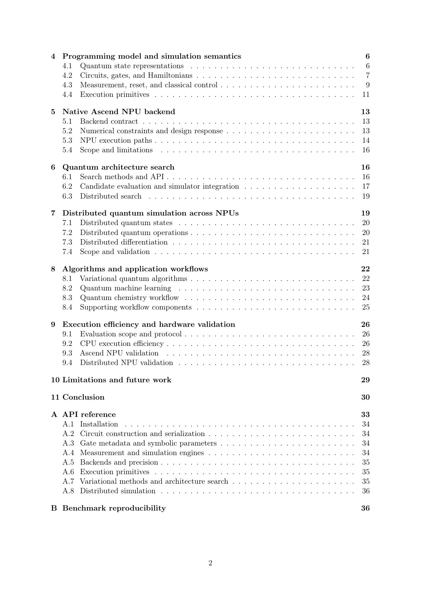 
Low-resolution page preview, page 2

📷 Fig 2

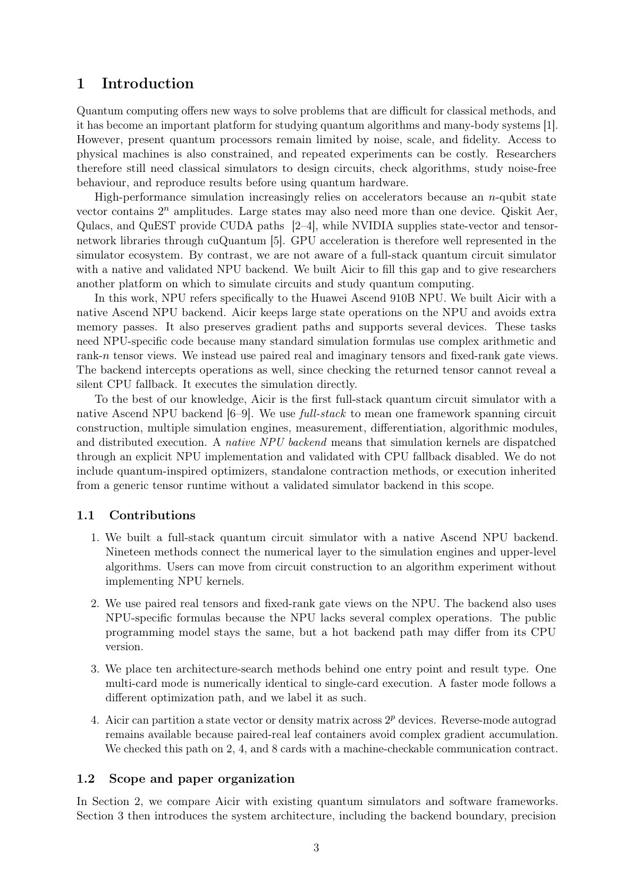 
Low-resolution page preview, page 3

📷 Fig 3

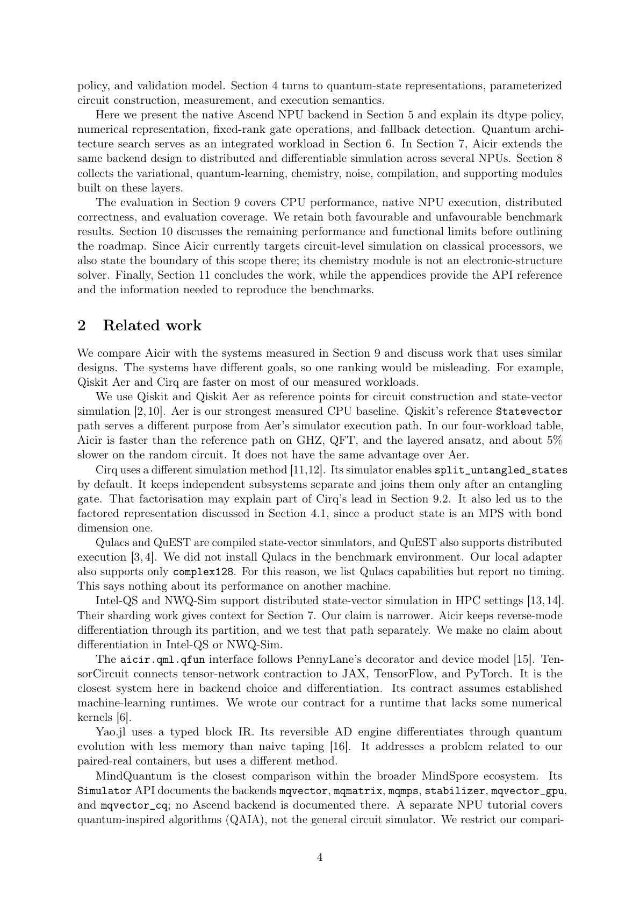 
Low-resolution page preview, page 4

📷 Fig 4

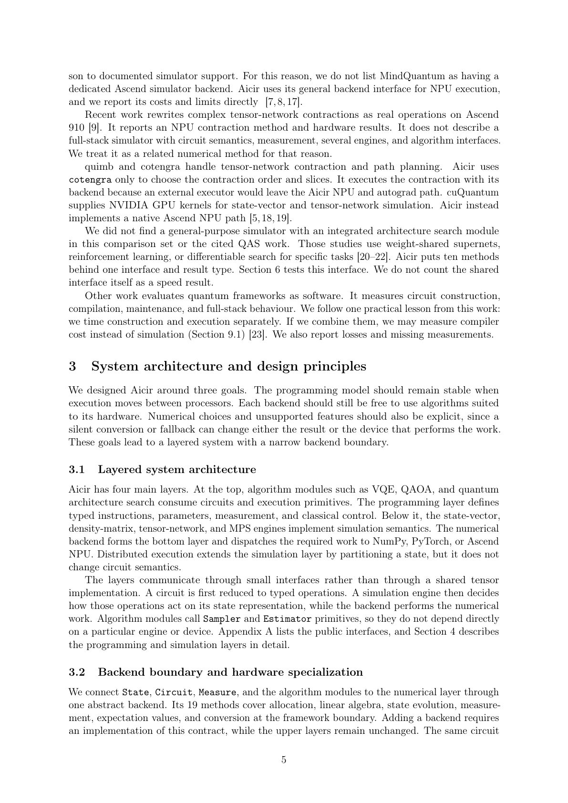 
Low-resolution page preview, page 5

📷 Fig 5

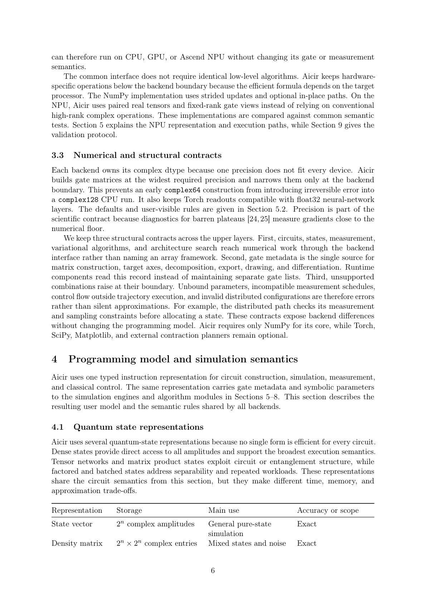 
Low-resolution page preview, page 6

**Summary.** This paper introduces Aicir, a comprehensive quantum circuit simulator designed to bridge the gap between theoretical algorithm design and specialized hardware. It provides full-stack support—from circuit building to variational optimization—and crucially adds native acceleration for Huawei Ascend NPUs. This makes advanced quantum simulation accessible on diverse computing platforms.

**Why it may be interesting.** While focused on general quantum computing infrastructure, the development of a high-performance simulator targeting specific non-GPU hardware (NPU) is highly relevant for researchers needing to port complex quantum simulations to specialized accelerator platforms used in AMO or condensed matter research.

Detailed structure

**Main problem.** Quantum circuit simulators are crucial for testing quantum algorithms due to hardware limitations, but a gap exists in high-performance tools lacking native support for NPUs.

**Main result.** The authors developed Aicir, a full-stack simulator featuring native Huawei Ascend NPU support, achieving correct native execution and maintaining performance comparable to established simulators on CPU.

**Method.** Aicir implements a unified programming model supporting circuit construction, state representations (state vector, tensor network, MPS), variational algorithms, and QML, with specialized backends for different hardware accelerators including the Ascend NPU.

**Model / system.** The system modeled is general quantum circuits and quantum algorithms. The simulator supports various state representations like state vectors, density matrices, tensor networks, and matrix-product states (MPS).

**Key observables.** Simulation performance benchmarks against Qiskit Aer and Cirq; joint-Pauli outcomes and terminal bit-string counts from measurement.

**Important parameters / regimes.** Number of qubits ($n$), bond dimension ($\chi$) for MPS, number of shots for measurement, and the specific NPU architecture details (paired real tensors).

**Assumptions / limitations.** The simulator's chemistry module is explicitly noted as *not* being an electronic-structure solver; performance comparisons are benchmarked against specific versions of existing frameworks.

**Figures summary.** Not specified by notes, but the paper structure details API usage for circuit construction, parameter binding, and running various simulation types (statevector, tensor, MPS).

**Paper structure.** The paper systematically introduces Aicir's capabilities: first addressing the need for NPU support; then detailing the full-stack features including state representations and algorithms; finally providing an API reference covering circuit construction, backend management, variational optimization, and distributed execution.

Abstract

Quantum computing is a promising way to study problems that are difficult for classical methods, but current quantum hardware still faces limits in scale, noise, and fidelity. Running quantum algorithms on physical machines can also be costly. Quantum circuit simulators therefore remain important because they let researchers design and test algorithms on classical computers before using quantum hardware. Most high-performance simulators provide GPU backends, while few offer native support for NPUs. This gap limits the computing platforms available for quantum-algorithm research. We developed Aicir to provide a full-stack quantum circuit simulator with a native Huawei Ascend NPU backend. Aicir connects circuit construction, several state representations, measurement, differentiation, variational algorithms, quantum machine learning, and quantum architecture search through one programming model. It also supports noise simulation, tensor-network and matrix-product-state engines, and distributed state simulation. On the NPU, paired real tensors, fixed-rank gate views, and hardware-specific formulas keep the tested simulation paths on the device. The same representation lets Aicir partition a state across $2^{p}$ NPUs while retaining reverse-mode differentiation. We validated native execution with CPU fallback disabled and checked distributed communication and gradients on 2, 4, and 8 NPUs. For the tested fused layered circuits, Aicir's CPU runtime is within $0.97$--$1.28\times$ that of Qiskit Aer and $0.76$--$1.10\times$ that of Cirq. These results place its CPU execution in the same range as established simulators for this workload, while the NPU tests establish correct native execution rather than CPU-to-NPU speedup.

[↑ back to top](#top)

### [Cubic-Equivariant Neural Density Functional Theory for Three-Dimensional Lattice Fluids](http://arxiv.org/abs/2608.08137v1)

**Authors:** Jens Weimar, Martin Oettel, Alessandro Simon  
**Type:** theory · **Category:** statistical mechanics · **PDF:** <https://arxiv.org/pdf/2608.08137v1>  
**Analysis basis:** full PDF text, analyzed in chunks
**Topic relevance:** `Keldysh / 2PI / non-Gaussian methods` **1/5** · `analog quantum simulation` **1/5** · `methods for driven-dissipative` **1/5**

📷 Fig 1

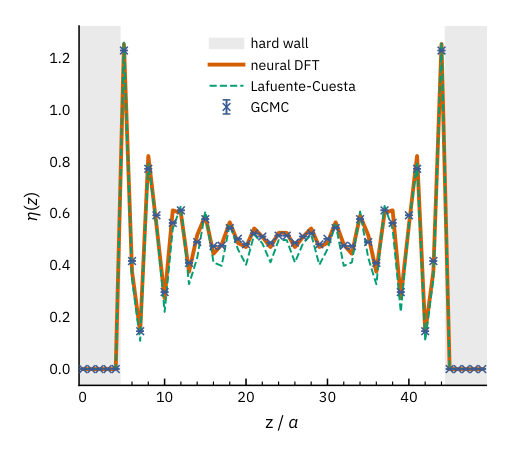 
FIG. 2. Packing-fraction profile in a planar hard-wall slit at βµ = 0. The shaded regions are inaccessible to particle centers. The neural and LC profiles are converged solutions of their Euler equations; symbols show the symmetry-averaged GCMC result from 24 replicas. The GCMC uncertainty is smaller than the symbol size.

📷 Fig 2

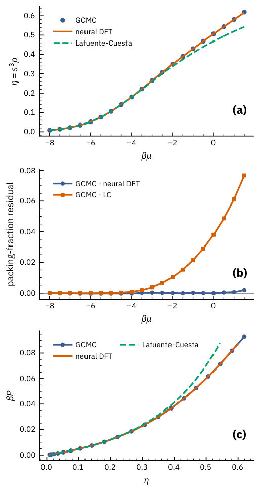 
FIG. 1. Homogeneous equation of state. (a) Packing fraction η = s3ρ as a function of chemical potential. (b) GCMC-minus- model packing-fraction residuals. (c) Pressure obtained by thermodynamic integration. The standard deviation for the GCMC data is smaller than the symbol size.

📷 Fig 3

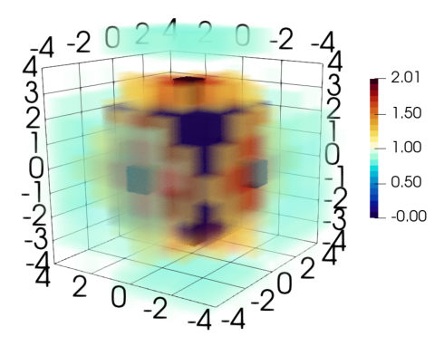 
FIG. 3. Volume rendering of the neural test-particle pair distribution g(r) in the central region of the box. The dark central cube is the 5×5×5 region excluded to particle centers; the surrounding shells reveal the cubic anisotropy that is lost in a spherical average. Quantitative directional cuts are shown in Fig. 4.

📷 Fig 4

 
Figure 3 illustrates the resulting three-dimensional neu- ral profile, while Fig. 4 shows quantitative cuts along the three principal crystallographic families. Signed and permutation-equivalent rays are averaged for every method.

📷 Fig 5

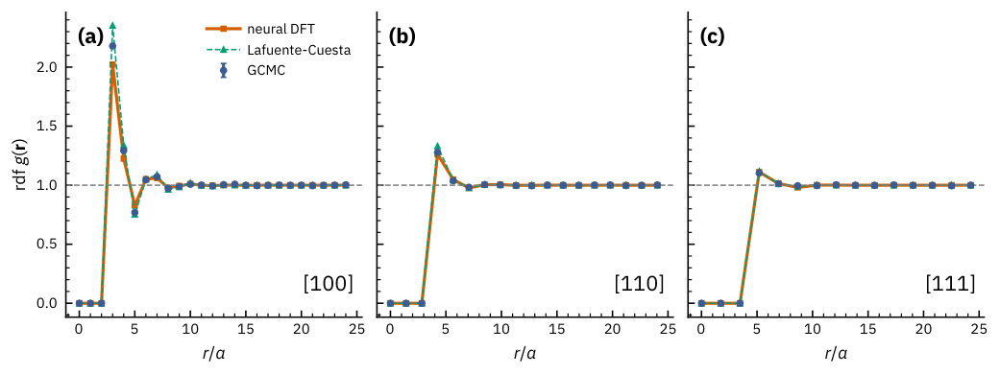 
FIG. 4. Directional pair distribution at matched bulk packing fraction ηb = 0.3: (a) [100], (b) [110], and (c) [111]. GCMC symbols and standard errors are obtained from eight paired replicas after averaging all symmetry-equivalent rays. Neural and LC calculations use chemical potentials adjusted separately to reproduce the GCMC bulk density. The fixed particle excludes separations inside the central 5 × 5 × 5 cube.

**Summary.** This paper introduces a novel Cubic-Equivariant Neural Density Functional Theory (DFT) designed to calculate properties of 3D lattice fluids. It trains a neural network on complete density profiles to approximate the one-body direct-correlation functional, enforcing cubic symmetry exactly. The results show that this neural approach significantly improves predictions for bulk thermodynamics and planar wall adsorption compared to existing methods.

**Why it may be interesting.** While focused on classical lattice fluids, the use of equivariant neural networks to enforce fundamental symmetries in a many-body functional is highly relevant for developing machine learning potentials or force fields applicable to quantum systems where symmetry constraints are paramount.

Detailed structure

**Main problem.** To develop a computationally tractable method for calculating equilibrium structure and thermodynamics by approximating the excess free-energy functional within Density Functional Theory (DFT).

**Main result.** The neural functional significantly improves the accuracy for the homogeneous equation of state and the density profile at a planar hard wall compared to existing methods.

**Method.** A fully convolutional neural network is trained to learn the one-body direct-correlation functional $c^{(1)}[
ho]$ directly from complete 3D density profiles, enforcing exact cubic equivariance via kernel projection.

**Model / system.** The study models three-dimensional lattice fluids using parallel hard cubes on a simple cubic lattice. The framework is based on classical DFT, which approximates the many-body problem variationally.

**Key observables.** Homogeneous equation of state, density profile at a planar hard wall, and anisotropic pair distribution around a fixed particle.

**Important parameters / regimes.** Packing fractions ($\eta$) ranging from $\approx 0.063$ to $0.6$; the cubic point group symmetry ($G=O_h$).

**Assumptions / limitations.** The method is restricted to enforcing only discrete cubic lattice symmetry, and obtaining smooth 3D histograms for reliable training targets remains a bottleneck for continuum fluids.

**Figures summary.** Figures illustrate the planar hard-wall packing-fraction profile ($\eta(z)$) comparison between neural and LC functionals, and volume renderings of the test-particle pair distribution $g(\mathbf{r})$ in various crystallographic directions ([100], [110], [111]).

**Paper structure.** The paper introduces the DFT framework, details the construction of the cubic-equivariant neural functional using GCMC data for training, compares its predictions (equation of state, wall profiles) against established functionals (Lafuente-Cuesta), and discusses limitations regarding continuum extension.

Abstract

We construct a neural classical density functional that acts directly on unrestricted three-dimensional density profiles. As a computationally tractable test bed, we consider parallel hard cubes of side length three on a simple cubic lattice. A fully convolutional network learns the one-body direct-correlation functional $c^{(1)}[ρ]$ from data obtained with grand-canonical Monte Carlo simulations in randomized external potentials. Complete profiles are used during both training and inference; a stochastic Bernoulli mask on the output sites makes full-profile training effective without explicitly extracting and storing overlapping local density windows. Averaging the first-layer kernels over all 48 rotations and reflections of the cubic point group additionally imposes exact cubic equivariance without data augmentation. We compare the learned functional with independent simulation data and with the lattice fundamental-measure functional of Lafuente and Cuesta. The neural functional markedly improves the homogeneous equation of state and the density profile at a planar hard wall. For the anisotropic pair distribution around a fixed particle, both functionals reproduce the principal packing shells, with their relative accuracy depending on crystallographic direction. These results demonstrate neural density-functional calculations on complete three-dimensional profiles while also identifying accurate full-dimensional training data, thermodynamic consistency, and structural correlations as the central challenges for extensions to continuum fluids.

[↑ back to top](#top)

### [Relaxation-driven flat bands and topology in moiré transition metal dichalcogenide heterobilayers](http://arxiv.org/abs/2608.08917v1)

**Authors:** Mitchell Luskin, Max Geier, Liang Fu, Ziyan Zhu  
**Type:** theory · **Category:** strongly correlated electrons · **PDF:** <https://arxiv.org/pdf/2608.08917v1>  
**Analysis basis:** full PDF text, analyzed in chunks
**Topic relevance:** `Keldysh / 2PI / non-Gaussian methods` **1/5** · `analog quantum simulation` **1/5** · `quantum measurements` **1/5**

📷 Fig 1

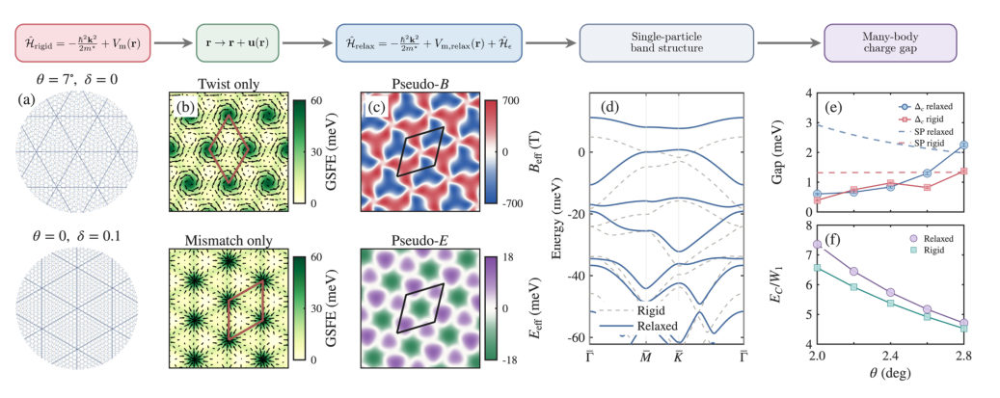 
FIG. 1: Overview of the relaxed continuum model. (a) Moiré patterns formed by pure twisting (θ = 7◦, top) and by pure lattice mismatch (δ = 0.1, bottom). (b) Relaxation pattern for twist only (θ = 2◦, δ = 0, top) and for lattice mismatch only (θ = 0◦, δ = 0.02, bottom). Color indicates the generalized stacking fault energy (GSFE); arrows show the relative relaxation displacement u1 −u2; red parallelograms mark the moiré unit cell. (c) Relaxation-induced pseudomagnetic field Beff (top) and pseudoelectric field Eeff (bottom), both evaluated at θ = 1.2◦, δ = 0.02. Relaxation thereby promotes the rigid Hamiltonian ˆ Hrigid = −ℏ2k2/2m⋆+ Vm(r) to ˆ Hrelax = −ℏ2k2/2m⋆+ Vm,relax(r) + ˆ Hϵ. (d)...

📷 Fig 2

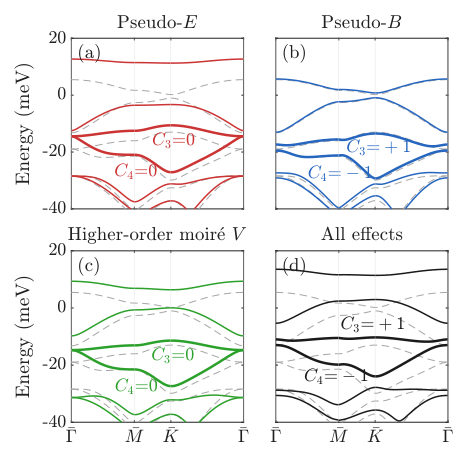 
FIG. 2: Decomposition of relaxation effects on the moiré band structure of 3R-stacked WSe2/WS2 at θ = 1.0◦, δ = 0.02. Each panel shows the top valence bands (solid, colored) with the rigid band structure overlaid (gray dashed). From left to right: (a) pseudoelectric field only, Φ ∝ϵ0; (b) pseudomagnetic field only, A ∝(ϵ1, ϵ2); (c) relaxed moiré potential Vm, relax without strain; (d) all three channels combined. The third and fourth valence bands are drawn with increased linewidth, and their Chern numbers C3, C4 are labeled.

📷 Fig 3

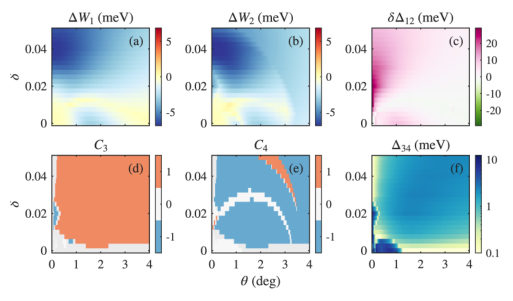 
FIG. 3: Relaxation-induced band structure changes and topology across the (θ, δ) plane for 3R-stacked WSe2/WS2. Top row: changes of the electronic structures from the rigid to the relaxed model. (a) ∆W1 = W relax 1 −W rigid 1 and (b) ∆W2 show bandwidth narrowing of the top valence bands. (c) δ∆12 = ∆relax 12 −∆rigid 12 shows enhancement of the gap between the first and second valence bands. Bottom row: topology of the relaxed model. (d) Chern number C3 of the third valence band, C3 = +1 over the shaded nontrivial region. (e) Chern number C4 of the fourth valence band, predominantly C4 = −1. Gray regions: Chern number ill-defined (∆34 &lt; 0.3 meV). (f) Gap ∆34 between the third and fourth...

📷 Fig 4

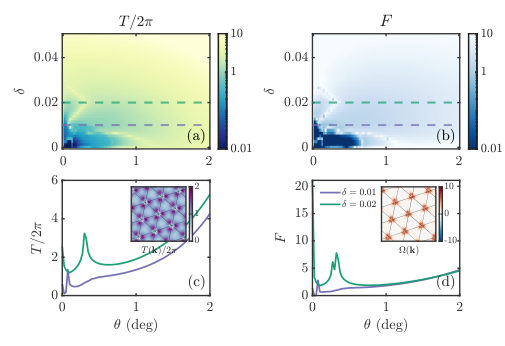 
FIG. 4: Ideal band condition of the third valence band across the 3R-stacked relaxed model. (a) Integrated trace-condition violation T/2π = (2π)−1R (Tr g −|Ω|) d2q as a function of lattice constant mismatch and twist angle. (b) Berry-curvature fluctuation F = p

**Summary.** The authors introduce an advanced continuum model that accounts for lattice relaxation effects in moiré TMD heterobilayers. They demonstrate that these intrinsic structural deformations are necessary to generate robust topological bands characterized by non-zero Chern numbers. This establishes a powerful new theoretical tool linking fundamental material structure to exotic quantum electronic states.

**Why it may be interesting.** This work provides a rigorous theoretical framework connecting first-principles DFT calculations to measurable many-body observables like topological gaps and superfluid stiffness in moiré systems, which is highly relevant for understanding emergent quantum phases.

Detailed structure

**Main problem.** To correct continuum models for moiré TMD heterobilayers by incorporating intrinsic lattice relaxation effects, which are crucial for accurately predicting their electronic topology.

**Main result.** The pseudomagnetic field alone is sufficient to induce topological gaps with Chern numbers $\pm 1$, and the inclusion of full relaxation enhances these gaps while preserving the topological nature across wide parameter regimes.

**Method.** Developing an extended continuum Hamiltonian that decomposes lattice relaxation into modified moiré potential, a pseudoelectric (scalar) potential, and a pseudomagnetic (vector) potential. Calculations utilize Fourier expansions and neural-network variational Monte Carlo methods.

**Model / system.** The system is Moiré transition metal dichalcogenide (TMD) heterobilayers (e.g., WSe2/WS2), modeled by an effective continuum Hamiltonian incorporating strain effects ($\hat{H}_\epsilon$). The analysis compares rigid vs. relaxed electronic structures.

**Key observables.** Chern numbers ($C_3, C_4$), charge gap ($\Delta_c$), superfluid stiffness ($ar{D}_s$), Berry curvature, and quantum metric.

**Important parameters / regimes.** Twist angle ($	heta$) and lattice mismatch ($\delta$); the relative strength of interaction energy ($E_C$) to bandwidth ($W_1$).

**Assumptions / limitations.** The continuum model framework is assumed generalizable; analysis focuses on specific stacking configurations (3R, 2H).

**Figures summary.** Figures illustrate the decomposition of relaxation effects on band structure and show phase diagrams mapping topological gaps and Chern numbers across $(	heta, \delta)$ for both 3R and 2H stackings.

**Paper structure.** The paper progresses by first identifying the failure of rigid models, then developing the three-channel continuum Hamiltonian, demonstrating that the pseudomagnetic field drives topology, and finally confirming these results using many-body calculations and comparing different stacking symmetries (3R vs. 2H).

Abstract

Moiré transition metal dichalcogenide (TMD) heterobilayers are commonly modeled by a continuum theory that yields topologically trivial bands, in contrast to their homobilayer counterparts which host topological bands and fractional Chern insulators (FCI). We show this conclusion is an artifact of neglecting the pseudomagnetic field generated by lattice relaxation, an effect intrinsic to every moiré material. We develop a continuum model that resolves relaxation into three channels: a modified moiré potential with higher Fourier harmonics, a pseudoelectric (scalar deformation) potential, and a pseudomagnetic (vector) potential. Using WSe$_2$/WS$_2$ as a prototype, we find that the pseudomagnetic field alone gaps the third and fourth valence bands with Chern numbers $\pm 1$ over a broad range of twist angle and lattice mismatch, while the moiré potential correction and pseudoelectric potential narrow the bandwidth and enhance the bandgaps, which survive many-body interactions using neural-network variational Monte Carlo calculations. Relaxation also smoothens the Berry curvature and quantum metric relative to the rigid model, moving the band closer to the ideal Chern limit, beneficial for the quantum anomalous Hall effect, FCI states, and flat-band superconductivity when filled to higher bands. Our work establishes a new framework that connects first-principles calculations, through the continuum model, to many-body observables. Using this framework, we show moiré heterobilayers as a new class of topological materials whose topology is driven entirely by intrinsic lattice relaxation.

[↑ back to top](#top)

### [Engineering correlated phases through manipulation of Van Hove singularities](http://arxiv.org/abs/2608.07714v1)

**Authors:** Thomas P. Sheerin, Maria Ramirez, Chris A. Hooley, Luke C. Rhodes  
**Type:** theory · **Category:** strongly correlated electrons · **PDF:** <https://arxiv.org/pdf/2608.07714v1>  
**Analysis basis:** full PDF text, analyzed in chunks
**Topic relevance:** `Keldysh / 2PI / non-Gaussian methods` **1/5** · `analog quantum simulation` **1/5**

📷 Fig 1

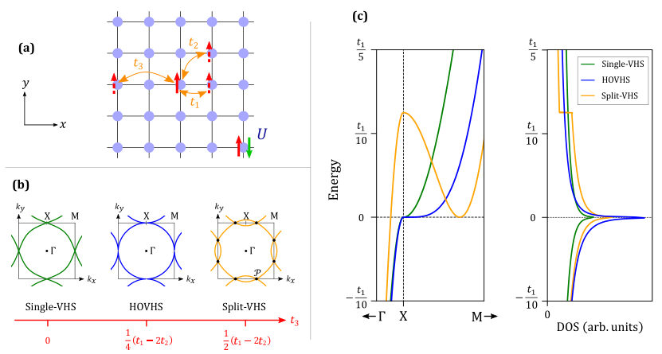 
FIG. 1: (a) A real-space sketch of the square-lattice Hubbard model that we study. The model has first-, second-, and third-neighbor hopping terms with amplitudes t1, t2, and t3 respectively, as well as an on-site Coulomb repulsion term with strength U. The Hamiltonian of the model is given in (1). (b) Non-interacting Fermi surfaces of the model, with the Fermi level set to the energy of the VHSs, in three regimes: single-VHS (t3 &lt; t3c), higher-order VHS (t3 = t3c), and split-VHS (t3 &gt; t3c). Here t3c = (t1 −2t2)/4. (c) The band structure near the X point, and the density of states near the Fermi level, in the three regimes. Note the enhanced divergence in the density of states at the Fermi...

📷 Fig 2

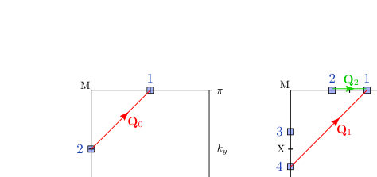 
FIG. 2: The two-patch scheme used in the pRG analysis of the single-VHS and HOVHS cases (left), and the four-patch scheme used in the split-VHS case (right). Also shown are the symmetry-inequivalent inter-patch wavevectors.

📷 Fig 3

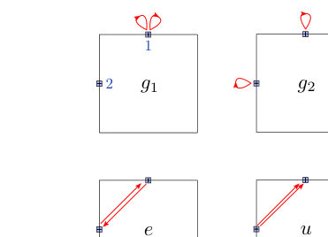 
FIG. 3: The four inequivalent four-point interactions in the two-patch scenarios. The arrows indicate the initial and final momenta of the particles participating in each interaction. g1 and g2 are direct couplings, e is an exchange coupling and u is an umklapp coupling.

📷 Fig 4

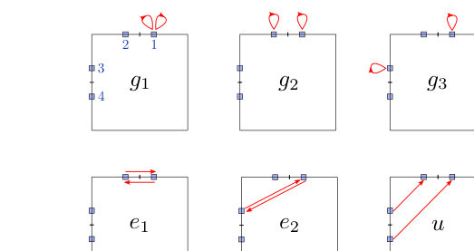 
FIG. 4: The six inequivalent four-point couplings in the split-VHS case.

📷 Fig 5

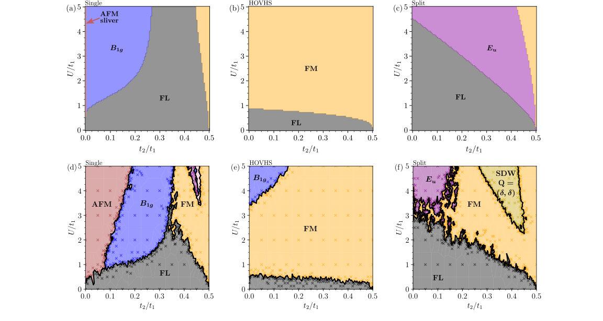 
FIG. 5: Phase diagrams in the (t2/t1, U/t1) plane at Van Hove filling. Those in (a) – (c) were calculated using hot-spot pRG, for the single-VHS (t3 = 0), HOVHS (t3 = t3c) and split-VHS (t3 = 2t3c) cases, respectively. (d) – (f) show the equivalent phase diagrams calculated using TUFRG. The colors signify the phase: black is the Fermi-liquid state (FL), red is N´eel antiferromagnetism (AFM), blue is B1g (d-wave) superconductivity, orange is ferromagnetism (FM), purple is Eu (p-wave) superconductivity, and dark yellow is a spin-density wave (SDW) with a wavevector whose components vary but never exceed π/10 in magnitude (see appendix D). The thin pink region in (d), at t2/t1 ≈0.45 and U ≳4...

**Summary.** This work theoretically investigates how tuning Van Hove singularities in a 2D Hubbard model controls the ordered phases of correlated electrons. By varying hopping parameters, the researchers change the nature of the electronic density of states from logarithmic to power-law divergences. The results demonstrate that these VHS properties are crucial design rules for engineering specific quantum ground states.

**Why it may be interesting.** The explicit connection drawn between a tunable band structure feature (VHS divergence type) and the resulting emergent quantum ground state is highly relevant for designing novel correlated materials.

Detailed structure

**Main problem.** The central challenge is controlling the ordered phases of correlated electron systems by manipulating Van Hove singularities (VHSs) in their electronic structure.

**Main result.** The type and strength of VHS divergences—which can be tuned from logarithmic to power-law via hopping parameters—strongly dictate the predicted ground state, leading to distinct ordered phases depending on doping.

**Method.** Theoretical analysis using advanced renormalization group techniques, specifically the hot-spot parquet (pRG) and truncated-unity functional renormalization group (TUFRG).

**Model / system.** The study focuses on a two-dimensional square-lattice Hubbard model characterized by hopping parameters ($t_1, t_2, t_3$) that allow tuning the nature of VHSs at or near the Fermi level.

**Key observables.** Predicted ordered states (e.g., ferromagnetic, superconducting, SDW), and the flow behavior of coupling constants derived from susceptibilities ($\Pi^q_{	ext{ph}}, \Pi^q_{	ext{pp}}$).

**Important parameters / regimes.** The third-neighbor hopping parameter ($t_3$), which controls the VHS divergence type (logarithmic, power-law, or split), and doping level relative to Van Hove filling.

**Assumptions / limitations.** The pRG relies on a 'hot-spot approximation,' while TUFRG is presented as a more comprehensive alternative for studying the low-energy physics near singularities.

**Figures summary.** Figures illustrate the non-interacting Fermi surfaces and Density of States (DOS) across three regimes defined by $t_3$: single-VHS, HOVHS, and split-VHS. Later figures map out phase diagrams showing SDW wavevectors $(\delta, \delta)$ as a function of doping and interaction strength.

**Paper structure.** The paper systematically analyzes the low-energy physics by first establishing the model and the parameter space defined by $t_3$. It then applies pRG/TUFRG to derive flow equations for coupling constants in each VHS regime, culminating in phase diagram analysis showing how doping shifts the system between different ordered states.

Abstract

Controlling the ordered phases of correlated electron systems remains a central challenge in quantum materials design. Divergences in the electronic density of states, known as Van Hove singularities (VHSs), are one obvious route to such control. It is clear from recent work that the exact functional form of these divergences can profoundly affect which phases are realized; a full picture, however, remains elusive. In this work, we use both the hot-spot parquet renormalization group and the truncated-unity functional renormalization group to theoretically study the emergent correlated states of a two-dimensional square-lattice Hubbard model with VHSs at or near the Fermi level. By varying a single hopping parameter, $t_3$, we are able to change the strength of the VHS divergence in the density of states from logarithmic (for $t_3 < t_{3c}$) to power-law (for $t_3 = t_{3c}$). Further increase of $t_3$ ($t_3 > t_{3c}$) causes each original Van Hove point to split into two, both of the conventional logarithmic type. We show that which of these regimes we are in strongly influences the predicted ordered states. We also study the dependence on doping, and find that the ferromagnetic state that occurs at Van Hove filling in these models is unstable to very small shifts in the Fermi level, often giving way to distinct ordered states depending on whether the model is electron- or hole-doped. These results highlight the importance of tuning VHS properties to control ordered states in correlated materials, and offer design rules to engineer these phases in novel systems.

[↑ back to top](#top)

### [Quantum Coordination and Nonlocal Games: Theory and Applications](http://arxiv.org/abs/2608.09540v1)

**Authors:** Husein Natur, Uzi Pereg  
**Type:** theory · **Category:** quantum information and computing · **PDF:** <https://arxiv.org/pdf/2608.09540v1>  
**Analysis basis:** full PDF text, analyzed in chunks
**Topic relevance:** `correlated / nonlocal dissipation` **1/5** · `quantum measurements` **1/5**

📷 Fig 1

 
Fig. 1. Coordination in an autonomous network. Each autonomous vehicle and drone observes only a local part of the environment and exchanges limited information directly with neighboring agents. The communication links allow the agents to coordinate their actions without relying on a central control unit.

📷 Fig 2

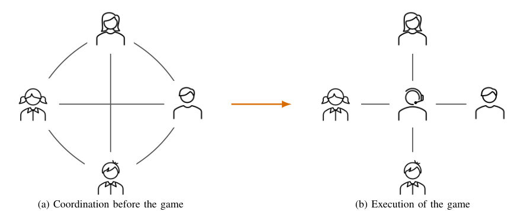 
Fig. 2. Coordination as a preprocessing step in a multiplayer game. Before the game begins, the players agree on a common strategy and establish the classical or quantum correlations required to coordinate their actions. During the game, each player receives an individual query from the referee and returns a response according to the previously established strategy, without communicating with the other players.

📷 Fig 3

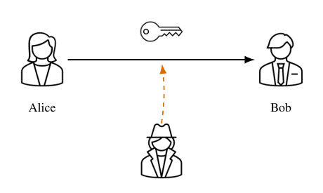 
Fig. 3. Secure communication between Alice and Bob. Alice sends information to Bob using a shared cryptographic key, while Eve attempts to eavesdrop on the communication channel.

📷 Fig 4

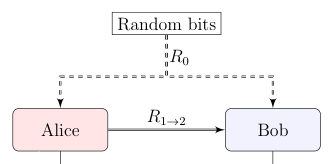 
Fig. 5. A two-node classical link and pre-shared common randomness.

📷 Fig 5

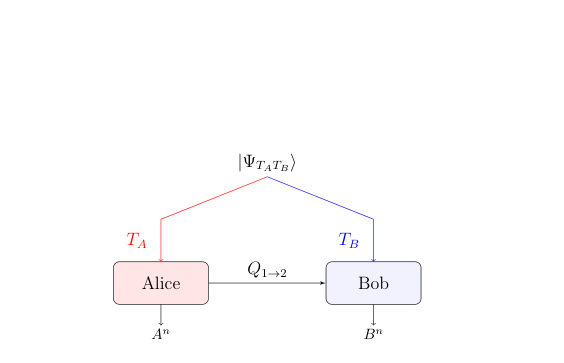 
Fig. 6. A two-node quantum link pre-shared entanglement.

**Summary.** This review establishes coordination as a fundamental resource in quantum networks, showing how entanglement enables correlated behaviors unattainable classically. It develops a unified framework to analyze this trade-off across different network types and highlights its critical role in advanced applications like secure key distribution and long-distance quantum communication.

**Why it may be interesting.** It provides a generalized information-theoretic lens—coordination theory—to quantify the non-classical resources needed for distributed tasks, linking fundamental concepts to practical quantum networking protocols.

Detailed structure

**Main problem.** The core problem is characterizing 'coordination'—the joint generation of correlated behavior among spatially separated users—in both classical and quantum communication networks.

**Main result.** Quantum coordination allows for generating correlations (e.g., in nonlocal games) that are impossible to achieve classically, providing a resource advantage over purely classical means.

**Method.** The authors present a unified theoretical framework comparing required resources (communication vs. correlation) across various network architectures and analyzing the operational differences between empirical and strong coordination.

**Model / system.** The study models distributed systems involving multiple users, utilizing abstract communication channels (classical or quantum) supplemented by pre-shared entanglement resources.

**Key observables.** Winning probability in nonlocal games (e.g., CHSH game), required communication rates, and the violation of Bell inequalities.

**Important parameters / regimes.** The trade-off between communication rate ($R$), entanglement rate ($E$), and shared randomness; distinguishing between strong vs. empirical coordination requirements.

**Assumptions / limitations.** The analysis assumes the ability to simulate target joint states using specified combinations of classical communication, quantum channels, and pre-shared correlations.

**Figures summary.** Figures illustrate coordination in autonomous sensing networks, depict coordination as a preprocessing step in games, and show cryptographic security contexts involving eavesdropping.

**Paper structure.** The paper reviews advances by first defining coordination, then applying it to nonlocal games, presenting a unified resource framework for various network topologies (two-node, cascade, etc.), and finally discussing applications like DI-QKD and quantum repeaters.

Abstract

Coordination is a fundamental primitive in communication and information theory, in which distributed systems must collectively generate correlated behavior rather than merely exchange messages. In quantum networks, the nature of entanglement, quantum measurements, and nonclassical correlations introduces coordination possibilities unavailable classically. This article reviews recent advances in coordination over classical and quantum communication networks, focusing on empirical and strong coordination in multi-user settings.   We consider the implications of coordination for nonlocal games, showing how it provides a natural framework for understanding the correlations that enable spatially separated players to improve their probability of winning. We present a unified framework for coordination using classical or quantum communication and pre-shared correlation resources. The review covers simulation of both entanglement and separable correlations across a variety of network architectures, including two-node, cascade, broadcast, and multiple-access networks. We study the operational differences between empirical and strong coordination, and the tradeoffs between communication and correlation resources, such as pre-shared randomness and entanglement.   Coordination plays a major role in device-independent quantum key distribution (DI-QKD) schemes, in which parties can generate a secret key even if the devices used in the process have been prepared by an adversary. Furthermore, we examine the role of coordination in quantum repeaters, where distributed entanglement serves as a resource for long-distance quantum communication. The review highlights connections between coordination theory and applications such as distributed quantum systems, quantum internet architectures, and future communication networks.

[↑ back to top](#top)

### [Robust spin pseudogap and spin-charge separation in the $σt$-$J$ model](http://arxiv.org/abs/2608.09689v1)

**Authors:** Zheng-Yuan Yue, Jia-Xin Zhang, Zheng-Cheng Gu  
**Type:** theory · **Category:** strongly correlated electrons · **PDF:** <https://arxiv.org/pdf/2608.09689v1>  
**Analysis basis:** full PDF text, analyzed in chunks
**Topic relevance:** `analog quantum simulation` **1/5** · `methods for driven-dissipative` **1/5**

📷 Fig 1

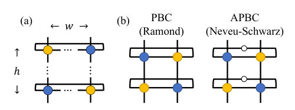 
Figure 1. (a) A transfer matrix along the vertical direction consisting of w columns and h rows of tensors. (b) Fermionic 2 × 2 transfer matrices along the vertical direction with PBC (left) and APBC (right) imposed on the horizontal direction. The white circle on the trace in the APBC transfer matrix refers to the fermionic twist.

📷 Fig 2

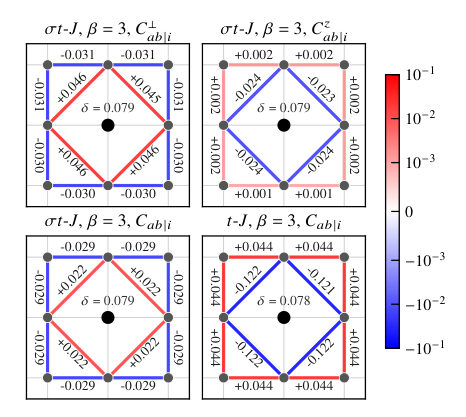 
Figure 2. The 3P conditional correlators Cab|i involving NN or NNN spins at temperature β = 3 and doping δ ≈0.078 in σt-J and t-J models. i is the center site, while (a, b) is an NN or NNN bond in the 3 × 3 window not overlapping with i.

📷 Fig 3

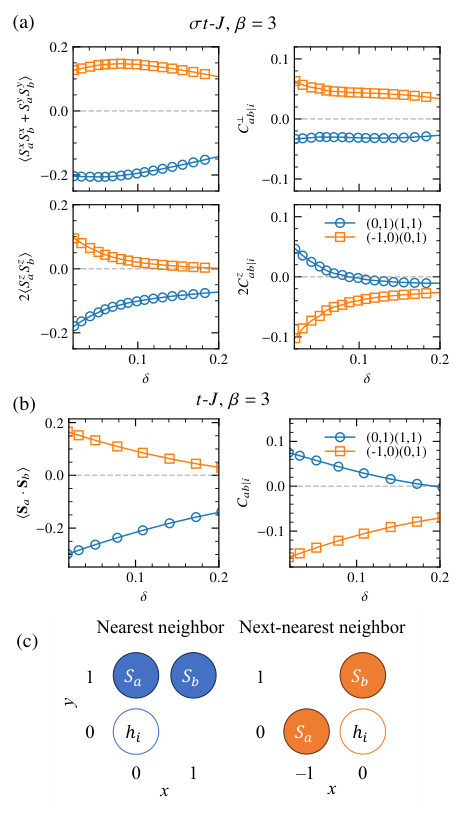 
Figure 3. The spin correlation ⟨Sa · Sb⟩and the 3P correlator Cab|i as a function of doping at temperature β = 3 in (a) the σt-J model and (b) the t-J model. (c) The hole is at site i = (0, 0), and the two spins are at site a and b specified by the legend.

📷 Fig 4

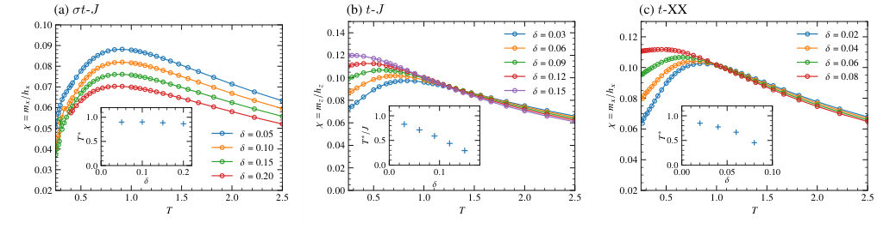 
Figure 4. Spin susceptibility χ obtained with a small probe field for (a) σt-J model (D = 12), (b) t-J model (D = 18) and (c) t-XX model (D = 12), all with t = 2, J = 1. The field is applied along the x direction for (a,c) and along the z direction for (b). The inset of each panel shows the temperature T ∗at which χ reaches a maximum at a specified doping level.

📷 Fig 5

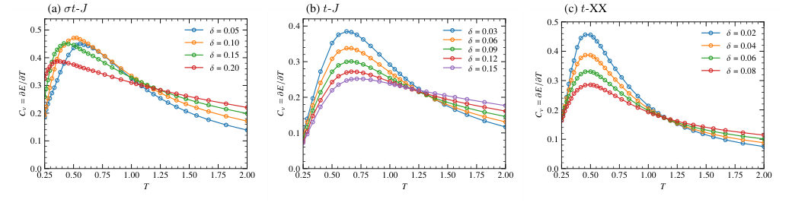 
Figure 5. Specific heat Cv = ∂E/∂T for (a) σt-J model (D = 12), (b) t-J model (D = 18) and (c) t-XX model (D = 12), all with t = 2, J = 1. The energy E excludes the chemical potential terms.

**Summary.** This work investigates the $\sigma t$-$J$ model to understand spin-charge dynamics in doped Mott insulators. Using advanced tensor network methods, the authors show that this modified model retains robust signatures of a spin pseudogap and BKT transition even when holes are introduced. This provides theoretical support for mechanisms preserving antiferromagnetic correlations crucial for unconventional superconductivity.

**Why it may be interesting.** The use of tensor networks (iPEPS/TNR) to study strongly correlated electron models like the $t$-$J$ model is highly relevant for understanding quantum magnetism and high-$T_c$ superconductivity, bridging numerical simulation with fundamental condensed matter physics.

Detailed structure

**Main problem.** The study investigates the interplay between spin and charge degrees of freedom, specifically addressing the pseudogap regime in doped Mott antiferromagnets.

**Main result.** The $\sigma t$-$J$ model exhibits robust signatures of a spin pseudogap and BKT transition upon doping, suggesting that altering the hole-spin coupling preserves key magnetic correlations found in cuprates.

**Method.** The research employs advanced numerical techniques like infinite projected entangled-pair state (iPEPS) algorithms and Tensor Network Renormalization (TNR), supplemented by developing a slave-fermion mean-field theory.

**Model / system.** The primary system is the $\sigma t$-$J$ model, a variant of the $t$-$J$ model where the sign of the spin-down hopping term is flipped to mitigate phase string effects. This modification reduces the spin rotation symmetry from SU(2) to U(1).

**Key observables.** Spin pseudogap thermodynamics (maximum in spin susceptibility at $T^* \sim J$), Berezinskii-Kosterlitz-Thouless (BKT) transition temperature ($T_{BKT}$), and doping dependence of these features.

**Important parameters / regimes.** Doping ($\delta$), Temperature ($T$), Exchange coupling ($J$), Hopping parameter ($t$).

**Assumptions / limitations.** The analysis relies on iPEPS/TNR methods for finite-temperature properties, and the mean-field theory constrains its Projective Symmetry Group (PSG) based on numerical results.

**Figures summary.** Not specified in detail, but notes reference comparisons between $\sigma t$-$J$ and $t$-$J$ models regarding pseudogap thermodynamics and BKT transitions.

**Paper structure.** The paper first introduces the $\sigma t$-$J$ model as a modification of the standard $t$-$J$ model. It then uses iPEPS/TNR to calculate finite-temperature properties, demonstrating shared thermodynamic features with the $t$-$J$ model but crucially showing robustness upon doping. Finally, it develops and validates a slave-fermion mean-field theory.

Abstract

The $σt$-$J$ model, obtained from the usual $t$-$J$ model by flipping the sign of the spin-down hopping term, has been proposed to eliminate the strong interference between doped holes and the spin background, known as the phase string effect. In this work, we investigate the finite-temperature properties of the $σt$-$J$ model using infinite projected entangled-pair state (iPEPS) algorithms, in comparison with the $t$-$J$ model and its easy-plane variants. We show that these models share similar spin-pseudogap thermodynamics, with a maximum in the spin susceptibility at $T^* \sim J$ and a broad specific-heat peak. Tensor network renormalization (TNR) further provides strong evidences for a Berezinskii-Kosterlitz-Thouless (BKT) transition in the spin sector of the $σt$-$J$ model at a lower temperature $T_\text{BKT} < T^*$ due to its reduced $\mathrm{U}(1)$ spin-rotation symmetry. Crucially, in contrast to the $t$-$J$ model and to its easy-plane variants that also exhibit BKT transitions, these signatures remain robust upon doping: the doped holes preserve and even enhance the antiferromagnetic correlations in the $xy$ spin plane, leading to a weak doping dependence of both $T^*$ and $T_\text{BKT}$. Finally, we develop a slave-fermion mean-field theory for the $σt$-$J$ model, whose projective symmetry group (PSG) is selected based on numerically determined hopping and pairing correlations, and show that it explains the robust spin pseudogap upon doping.

[↑ back to top](#top)

### [Storage, Scrambling, and Loss of Information in the Quantum Reservoir Computing Paradigm](http://arxiv.org/abs/2608.07677v1)

**Authors:** Nathan Keenan, Roberta Zambrini  
**Type:** theory · **Category:** quantum information and computing · **PDF:** <https://arxiv.org/pdf/2608.07677v1>  
**Analysis basis:** full PDF text, analyzed in chunks
**Topic relevance:** `correlated / nonlocal dissipation` **1/5** · `quantum measurements` **1/5**

📷 Fig 1

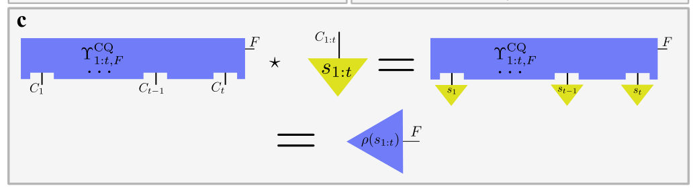 
FIG. 1. a: Schematic illustrating the quantum reservoir computing procedure. (i) Information (classical or quantum) is injected into the quantum substrate. (ii) The substrate then undergoes (unitary or non-unitary) evolution. Information about previously injected inputs becomes spread across the degrees of freedom in the system, and perhaps lost to the environment. (iii) Measurements are made on the substrate in order to extract the ‘processed’ information, which is then sent to a linear readout layer (not pictured). The entire procedure is repeated for the next input. Note that this exact pattern may be altered, for example in the use of temporally multiplexed measurements. b: Process...

📷 Fig 2

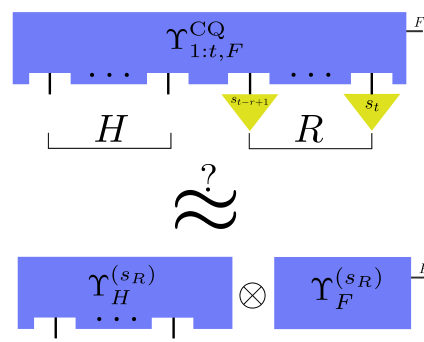 
FIG. 2. The CQ state ΥCQ 1:t,F with input spaces split into ‘recent’ (R) and ‘historical’ (H). The inputs of the R window are then contracted with a choice of the classical variables, leaving only the H legs open. Lower memory in the final state of historical inputs from H will lead to better approximation of this partially-contracted CQ state by a product structure.

📷 Fig 3

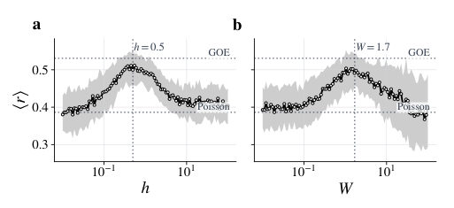 
FIG. 3. Level spacing statistics for the two main parameter sweeps investigated in this section. a: The first sweep is along h values for W = 0. b: The second sweep is along W values for h = 0.03. In both cases, we indicate the values of the mean level spacing ratios from Poissonian (integrable) and GOE (chaotic) statistics, along with vertical markers to indicate the parameter values at the ‘maximally chaotic’ points in each cut. The markers indicate ensemble median across Hamilto- nian samples, with a faint window indicating the 16 −84 per- centile range of results. The full phase diagram is represented in Fig. A5 of the Appendix.

📷 Fig 4

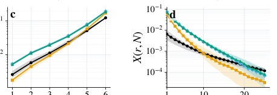 
FIG. 4. a: The full Holevo value as a function of number of inputs t. b: Conditional Holevo quantities for r = 10 and f = 3 as a function of t. c: Stationary subsystem capacities Cf as a function of system size f, probed using numerics at t = 50. d: Full system conditional Holevo value X(r, N) as a function of conditioned window width r, probed using numerics at t = 50 steps of the process. All panels show results for Hamiltonians with W = 0 and a selection of different h values. The markers indicate ensemble median across Hamiltonian samples, with a faint window indicating the 16−84 percentile range of results. The results are gathered after 1000 washout steps.

📷 Fig 5

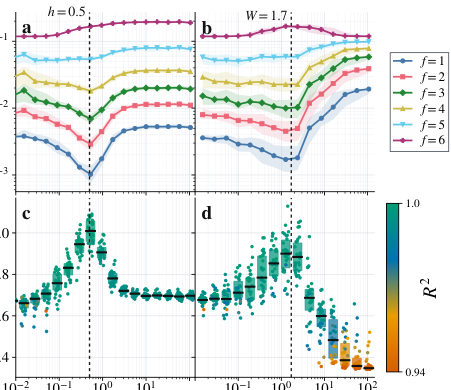 
FIG. 5. a-b: The input-specific memory capacity Cf of the subsystems of size f as a function of Hamiltonian parame- ters h and W. c-d: Extracted growth rate γ of information storage across subsystem sizes f. Results across h values are along the cut W = 0, while results across W values are along the cut h = 0.03. The extracted growth rates are shown on a scatter plot across Hamiltonian samples, colour-coded by the R2 value of the fit. Horizontal black lines indicate median val- ues, while the extended rectangles display a 16-84 percentile range of results. These choices are in order to display bulk behaviour while avoiding obscuring effects of outliers.

**Summary.** This paper introduces an information-theoretic framework using Holevo quantities to quantify how temporal data is stored and lost within Quantum Reservoir Computing substrates. By developing diagnostics for information scrambling and decay, the authors correlate these fundamental quantum properties with the measurable performance capacity of the QRC system across various physical regimes.

**Why it may be interesting.** It provides a rigorous, quantitative framework linking fundamental quantum information concepts (scrambling, memory capacity) directly to the practical performance limits of a specific machine learning paradigm (QRC).

Detailed structure

**Main problem.** The work aims to develop an information-theoretic description of how temporal information is stored, distributed, and eventually lost within the quantum substrate of a Quantum Reservoir Computing (QRC) platform.

**Main result.** Two diagnostics—one for nonlocal scrambling and one for information loss—are extracted from Holevo quantities and correlated with the overall QRC performance metric (IPC).

**Method.** The analysis uses the process tensor formalism to derive a classical-quantum state, allowing mutual informations between inputs and subsystems to be calculated via Holevo quantities.

**Model / system.** The study focuses on Quantum Reservoir Computing (QRC) protocols, which involve an inject-evolve-measure cycle using a quantum substrate, exemplified by the disordered all-to-all transverse-field Ising model.

**Key observables.** Holevo quantities ($\chi$), conditional Holevo quantities $	ext{I}(H; F|C_R)$, Information Processing Capacity (IPC), and two derived diagnostics for scrambling/loss.

**Important parameters / regimes.** Hamiltonian parameters, measurement strengths, input history length ($t$), and the window width ($r$) used in memory decay analysis.

**Assumptions / limitations.** The analysis is primarily restricted to single-time expectation values, neglecting full multi-time correlations for the readout layer. The Bogoliubov-Kubo-Mori (BKM) approximation is sometimes employed.

**Figures summary.** Figures illustrate the QRC schematic and process tensor structure; later figures plot subsystem capacities ($C_f$) vs. size, conditional Holevo quantities vs. window width $r$, and map out a phase diagram correlating IPC performance with system parameters $(\gamma, \lambda)$.

**Paper structure.** The paper builds from defining the QRC dynamics via process tensors to calculating information measures using Holevo quantities. It then develops specific diagnostics for scrambling and memory decay by analyzing conditional mutual information before finally mapping these theoretical findings onto empirical QRC performance metrics (IPC) across parameter space.

Abstract

The suitability of a quantum reservoir computing (QRC) platform for a given time-series processing task is closely tied to the dynamical properties of its computational substrate and design. Information is injected into, processed by, and read from this substrate, and finally passed to a linear readout layer which is trained to perform a specific task. In this work we introduce a classical-quantum state derived from the process tensor representing the dynamical part of this process for typical QRC protocols found in the literature. Using this object, mutual informations between physical subsystems and subsets of past inputs can be written as Holevo quantities, which we then use to numerically investigate information saturation in the substrate, fading memory of past inputs, and the local accessibility of injected information for a commonly used QRC platform. We then extract two diagnostics that characterise the nonlocal scrambling of information within, and loss of information from the substrate, and compare these to QRC performance across Hamiltonian parameters and measurement strengths. Finally, we comment on future directions that the framework introduced here opens up for the study and extension of the QRC program.

[↑ back to top](#top)

### [Uniaxial stress effects on magnetic and electric properties of the ground state in a centrosymmetric magnetic skyrmion host Gd$_2$PdSi$_3$](http://arxiv.org/abs/2608.09680v1)

**Authors:** Hiraku Saito, Naoki Kobayashi, Takuro Kawasaki, Tatsuya Nakamura, Akiko Kikkawa, Yasujiro Taguchi, Yoshinori Tokura, Taro Nakajima  
**Type:** experiment · **Category:** strongly correlated electrons · **PDF:** <https://arxiv.org/pdf/2608.09680v1>  
**Analysis basis:** full PDF text, analyzed in chunks
**Topic relevance:** `Frenkel-Kontorova` **1/5** · `analog quantum simulation` **1/5**

📷 Fig 1

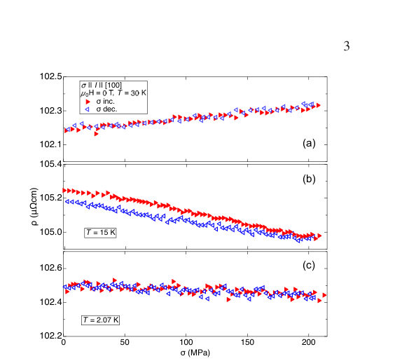 
FIG. 3. Uniaxial stress dependence of ρ at µ0H = 0 T and T = (a) 30 K, (b) 15 K, and (c) 2.07 K, respectively. I ∥σ ∥[100]. The closed (open) symbol indicates the data measured under σ increase (decrease).

📷 Fig 2

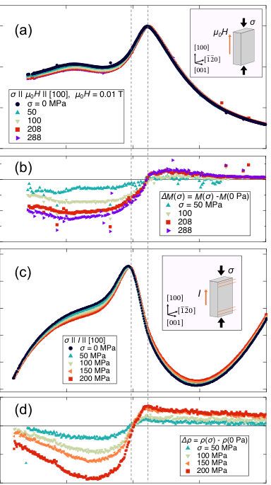 
FIG. 2. (a) Temperature dependence of magnetization M at µ0H = 0.01 T and σ = 0, 50, 100, 208, and 288 MPa. M ∥H ∥σ ∥[100]. (b) Temperature dependence of the difference of magnetization ∆M. (c) Temperature dependence of resistivity ρ at µ0H = 0 T and σ = 0, 50, 100, 150, and 200 MPa. Electric current I is applied along σ ∥[100]. (d) Temperature dependence of the difference of resistiv- ity ∆ρ. The measurements were performed under cooling condition. The dashed lines indicate the literature value of TN1 = 22.3 K and TN2 = 19.7 K, respectively.[14] A schematic illustration of the geometry for each measurements are shown in inset.

📷 Fig 3

 
Figure 2(a) shows the temperature dependence of the mag- netization M in a magnetic field of 0.01 T applied parallel to the [100] direction. At ambient pressure, the magnetiza- tion is suppressed and start decreasing below at around 22 K, which corresponds to the phase transition from paramagnetic (PM) phase to the IC-2 phase, TN1. Gd2PdSi3 undergoes the magnetic transition to IC-1 at TN2. According to the previous studies, the phase transition at TN2 results in a local maximum in the magnetization along the c axis [3, 15], while no clear anomaly is observed in the a-axis magnetization. The present results are well consistent with the previous result.

📷 Fig 4

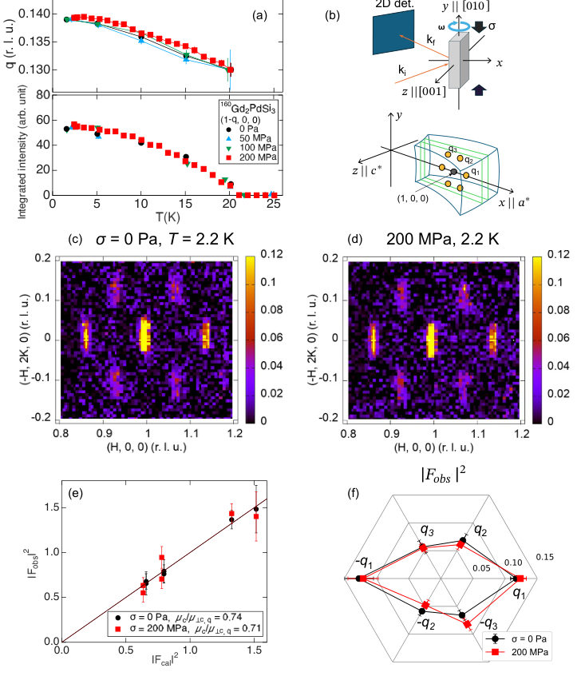 
FIG. 4. (a) Temperature dependence of the magnetic propagation vector q and the integrated intensity of (1-q, 0, 0) reflection measured at σ = 0, 50, 100, and 200 MPa. (b) Schematic illustrations of the experimental geometry in (top) real and (bottom) reciprocal space. A box at the origin represents the sample. The black arrow indicates the direction of σ. The orange arrows indicate incident and scattered neutron, ki and kf . The light-blue arrow indicates an angle of sample rotation, ω. The blue square indicates 2D-PSD. The yellow (black) spheres represent magnetic (nuclear) Bragg reflections. A volume surrounded by blue solid lines is observed trajectory. A portion of volume indicated by...

**Summary.** This work investigates the ground state magnetic order of $	ext{Gd}_2	ext{PdSi}_3$ by applying uniaxial stress while measuring its magnetotransport and diffraction properties. By observing that the system's response does not match predictions for a single-wavevector ($\mathbf{q}$) structure, the authors conclude that the material possesses a multi-$\mathbf{q}$ magnetic order. This provides critical insight into the complex magnetic ground states of skyrmion hosts.

**Why it may be interesting.** The study uses external mechanical strain ($\sigma$) as a powerful tuning parameter to probe fundamental symmetries and magnetic ordering types (single vs. multiple wave vectors) in topological magnets, which has parallels with controlling quantum states via external fields.

Detailed structure

**Main problem.** The study investigates how uniaxial stress affects the magnetic and electrical properties of the ground state in the centrosymmetric skyrmion host $	ext{Gd}_2	ext{PdSi}_3$, specifically aiming to distinguish between single-$\mathbf{q}$ and multi-$\mathbf{q}$ magnetic ordering.

**Main result.** The experimental data, particularly neutron diffraction measurements under stress, strongly suggest that the ground state ($	ext{IC-1}$ phase) is a robust multi-$\mathbf{q}$ magnetic order, ruling out a single-$\mathbf{q}$ structure.

**Method.** Measurements included magnetization and resistivity under applied uniaxial stress, complemented by polarized neutron diffraction to probe the magnetic structure.

**Model / system.** The physical system is $	ext{Gd}_2	ext{PdSi}_3$, a hexagonal crystal with triangular layers of $	ext{Gd}^{3+}$ ions known for hosting skyrmion phases. The investigation focuses on resolving the ambiguity between single-$\mathbf{q}$ and multi-$\mathbf{q}$ magnetic ground states.

**Key observables.** Magnetization ($\Delta M$), resistivity difference ($\Delta
ho$), and intensities of multiple magnetic Bragg reflections (e.g., six reflections around $(1, 0, 0)$).

**Important parameters / regimes.** Uniaxial stress ($\sigma$) applied perpendicular to the $c$-axis (up to $200 	ext{ MPa}$); temperature ($T$); and magnetic field ($\mu_0	ext{H}$).

**Assumptions / limitations.** The analysis assumes that anisotropic properties expected from a single-$\mathbf{q}$ order would manifest differently under stress compared to the observed results.

**Figures summary.** Figures illustrate phase diagrams, temperature dependence of $\Delta M$ and $\Delta
ho$, and crucially, neutron diffraction intensity maps showing multiple magnetic reflections persisting even when uniaxial stress is applied.

**Paper structure.** The paper establishes background context on skyrmion phases in $	ext{Gd}_2	ext{PdSi}_3$, details the application of uniaxial stress measurements (M, $
ho$, Neutron Diffraction), presents results showing lack of single-$\mathbf{q}$ anisotropy, and concludes that a multi-$\mathbf{q}$ order is necessary to explain the observations.

Abstract

We investigate effects of uniaxial stress to magnetic orders and electrical resistivity of the centrosymmetric magnetic skyrmion compound Gd$_2$PdSi$_3$, which has a hexagonal crystal structure composed of triangular lattice layers of magnetic Gd$^{3+}$ ions. This compound is known to exhibit the triple-$q$ magnetic skyrmion lattice phase with a giant topological Hall effect in the first field induced phase [T. Kurumaji $\textit{et al}$. Science $\textbf{365}$, 914-918 (2019)]. In contrast to the established picture of the field-induced phase, the ground state of this system still remains to be studied. Although previous studies reported the existence of the incommensurate magnetic modulations described by a magnetic modulation wave vector ${\bf q}=(q,0,0)$ where $q\sim 0.14$ and its equivalents, it is still unclear whether the magnetic structure is a single-$q$ structure or a multiple-$q$ structure. In the present study, we performed magnetization, resistivity and neutron diffraction measurements with a compressive uniaxial stress applied perpendicular to the $c$ axis. The observed data revealed that the system did not exhibit anisotropic magnetic and electric properties expected from a single-$q$ magnetic order, suggesting that the magnetic ground state of this system is a multi-$q$ magnetic order.

[↑ back to top](#top)

### [A Domain-Specific Language for Formulating Hybrid Quantum-Classical Meta-Solver Strategies](http://arxiv.org/abs/2608.09659v1)

**Authors:** Nick Poser, Domenik Eichhorn, Ina Schaefer  
**Type:** theory · **Category:** quantum information and computing · **PDF:** <https://arxiv.org/pdf/2608.09659v1>  
**Analysis basis:** full PDF text, analyzed in chunks
**Topic relevance:** `quantum measurements` **1/5**

📷 Fig 1

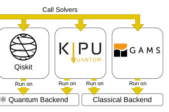 
Fig. 2: The technology stack of the Meta-Solver Strategy DSL.

📷 Fig 2

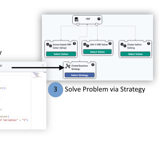 
Fig. 3: Workflow in the ProvideQ Toolbox to create a strategy and to use it to solve a problem instance.

📷 Fig 3

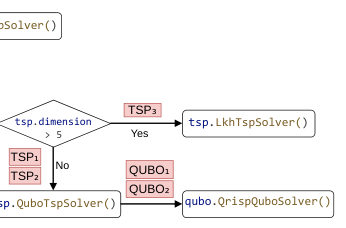 
Fig. 4: Solution paths for the problem instances P-n3-k1 and P-n19-k2 in the example from Figure 1b.

**Summary.** This paper addresses the difficulty of designing hybrid quantum-classical workflows by proposing a Domain-Specific Language (DSL). This DSL allows users to formally encode 'meta-solver strategies,' which automatically decide whether to use classical or quantum methods based on problem characteristics. The framework enables the execution of these complex, expert-defined solution paths using an orchestration layer like ProvideQ.

**Why it may be interesting.** While not focused on physical quantum systems, the work is highly relevant as it provides the necessary high-level software tooling (the DSL) to *apply* advanced quantum algorithms (like QAOA or Grover's) to complex computational problems in a structured and reproducible manner.

Detailed structure

**Main problem.** The primary challenge is designing efficient hybrid quantum-classical workflows by determining which parts of a complex problem are suitable for potential quantum advantage.

**Main result.** The authors propose a Domain-Specific Language (DSL) and an associated framework that allows users to formally express, automate, and execute best-practice meta-solver strategies across diverse problems.

**Method.** They introduce a DSL built around a type/instance model to define problem types, instances, and decision logic. This DSL enables the composition of solvers—both classical and quantum—into hierarchical 'Meta-Solver Strategies'.

**Model / system.** The system is a multi-layered software architecture: an Editor $\rightarrow$ DSL Execution Framework $\rightarrow$ ProvideQ Toolbox $\rightarrow$ Backend Services (e.g., Qiskit). The core model involves defining problem types and instances to guide the decision logic.

**Key observables.** The execution path taken by the Meta-Solver Strategy for different input problem sizes, demonstrating successful switching between quantum and classical solvers based on problem characteristics.

**Important parameters / regimes.** Problem characteristics (e.g., VRP dimension size) that trigger specific branches in the decision logic (e.g., if dimension < 4 use Qrisp).

**Assumptions / limitations.** The DSL structure mandates that an 'else' branch must always be present in decisions, as a solution must always be received.

**Figures summary.** Figures illustrate the five-layer technology stack for execution and provide concrete examples showing how complex problems like VRP are decomposed into subproblems (like TSPs) solved via mixed classical/quantum paths based on input parameters.

**Paper structure.** The paper introduces the need for specialized expertise in hybrid workflows, proposes the DSL to capture best practices universally, details the type/instance model and syntax, presents a multi-layered execution framework using ProvideQ, and validates it with case studies like VRP decomposition.

Abstract

A key challenge when designing hybrid quantum-classical workflows is the identification of quantum candidates, that is, determining for which specific problems quantum advantages could potentially be achieved. When choosing between several candidates, it is crucial to consider the characteristics specific to the problem, as these can fundamentally determine how successful quantum or classical approaches will be. This implies that specialized expertise is needed to use hybrid quantum-classical workflows successfully. To address this challenge, we propose a domain-specific language (DSL) to express best-practices in solution strategies using a universal representation that is easy to use and share. This DSL provides a flexible approach to design hybrid quantum-classical workflows and to automate decisions for a wide range of problems, supporting decisions down to problem-specific details while remaining technically independent. Furthermore, we propose a framework that is built around our DSL that enables the execution of defined workflows using the ProvideQ toolbox as an orchestration layer. All contributions from this publication are open source.

[↑ back to top](#top)

### [A Highly Accurate Fast Decoding Framework for QLDPC codes Accelerated by Noise Perturbation and Ensemble Decoding](http://arxiv.org/abs/2608.09583v1)

**Authors:** Mainak Bhattacharyya, Ankur Raina  
**Type:** theory · **Category:** quantum information and computing · **PDF:** <https://arxiv.org/pdf/2608.09583v1>  
**Analysis basis:** full PDF text, analyzed in chunks
**Topic relevance:** `quantum measurements` **1/5**

📷 Fig 1

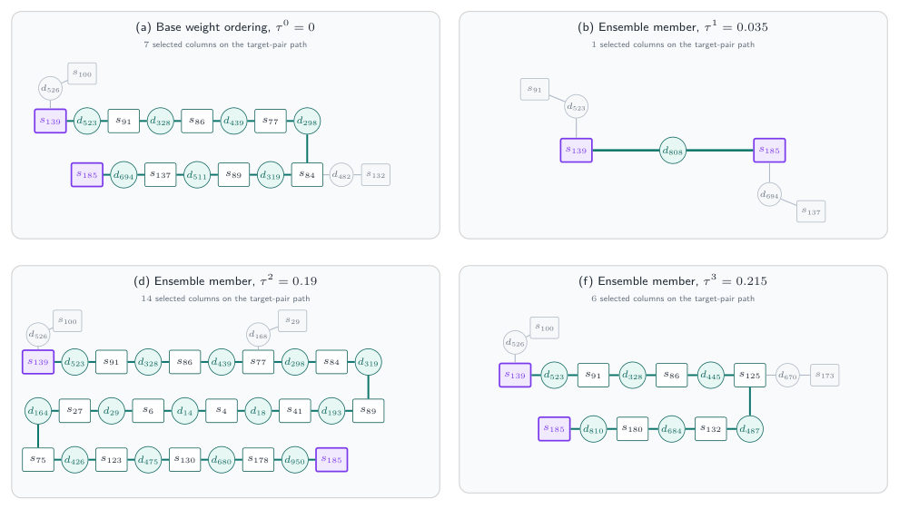 
FIG. 1. We show how different scaling factors for the applied noise can help an ensemble explore different Tanner paths connecting a given pair of violated detector (stabilizer check) nodes. We use a sparse detector error model (DEM) matrix of the distance 7 rotated planar surface code and sample a syndrome at a fixed circuit error rate p = 0.003. An ensemble of Tanner forests having different noise scaling parameters is generated using Eq. (10). In this figure, we only show the path connecting a target detector node pair {s139, s185} from the Tanner forests of some ensemble member instances. We can see that varying the noise scaling parameter τ b across different ensemble instances b...

📷 Fig 2

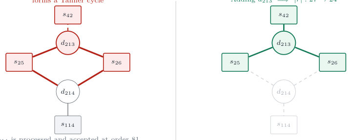 
FIG. 2. In this figure, we show how the dynamic gain term in Eq. (12) helps select good columns of a decoding matrix for general purpose QLDPC codes, where the column weights of the decoding matrix exceeds 2. We sample a syndrome from the circuit level noise over the BB code [[144, 12, 12]] at a fixed circuit noise rate p = 0.003 and the decoding happens over the sparse detector error model (DEM) of the BB code. Under the static case, i.e. β = 0, the orders of the sorted columns are fixed for the forest construction of each ensemble instance. In (a) we show the sorted column order of one such instance labeled as ‘static’. However, under the dynamic forest construction, we set β = 2 and the...

📷 Fig 3

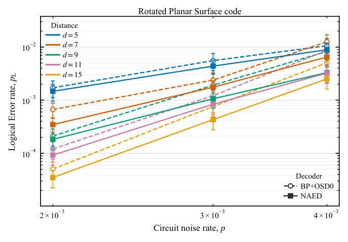 
FIG. 3. We show the circuit-level logical error rates of the rotated planar surface codes obtained under both the NAED and BP+OSD0 decoder. The NAED contains an ensemble of 11 decoding instances with the noise scaling factor uniformly distributed across the 11 forest constructions in the range {0, 0.5}. Also, the synthetic soft information used for the Tanner forest constructions is used as in Eq. (10). The BP iterations are capped at a maximum of 1000 for the BP+OSD0 decoder. The circuit-level noise model assumed for the simulations are described in the Appendix C. A logical error occurs if the decoder- predicted logical observable does not match the logical of the prepared state. The LERs...

📷 Fig 4

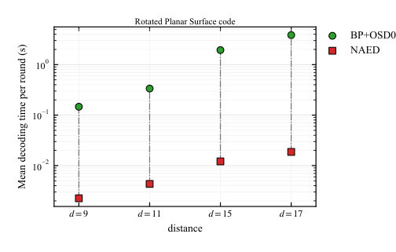 
FIG. 4. We compare the mean per error correction round de- coding time of the NAED and BP+OSD0 for various distance surface codes. The NAED decoder follows Algorithm 3. The NAED ensemble contains 10 decoding instances working in parallel on an M4 MacBook chip. We report the NAED de- coding time from the initialization to the time of the first ob- tained syndrome valid solution from any of the parallel work- ers. We sample 1000 syndromes at a fixed circuit noise rate p = 0.002 and obtain the mean decoding times per error cor- rection round.

📷 Fig 5

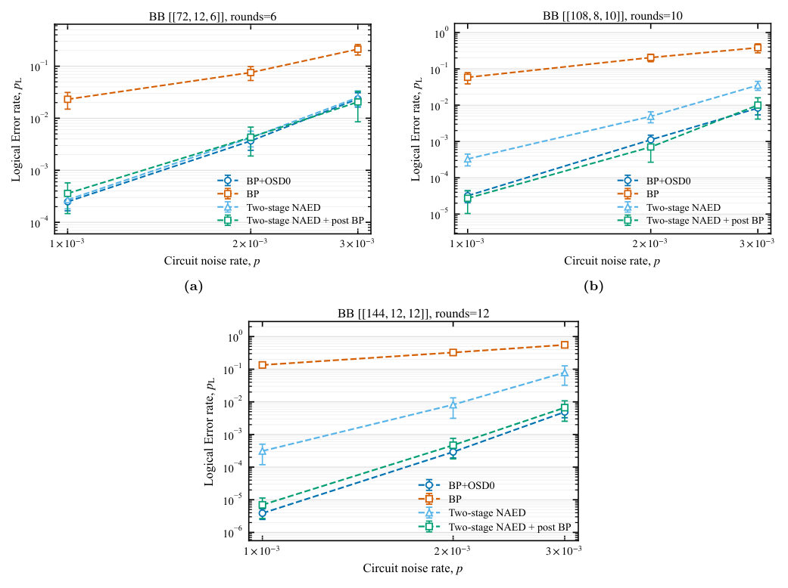 
FIG. 5. We show the circuit-level LERs of BB codes obtained under various decoding methods. We compare the standard min-sum BP variant and BP+OSD0 with the NAED variants proposed for general-purpose QLDPC codes. The ‘two-stage NAED’ first tries to solve the syndrome using Algorithm 3 with the full DEM as input. If the syndrome is not resolved using the full DEM, Algorithm 3 is executed on the sparse BB DEM. The ‘Two-stage NAED + post BP’ is motivated by the findings from Table V. This NAED variant invokes a low-cost post-min-sum BP algorithm over the full and sparse DEMs if the two NAED stages cannot resolve the input syndrome. The ensemble size of the NAED is B = 100. The synthetic soft...

**Summary.** This paper introduces Noise Assisted Ensemble Decoding (NAED), a novel framework designed to decode Quantum Low-Density Parity Check (QLDPC) codes efficiently. NAED constructs an ensemble of Tanner forests using synthetic soft information derived from noise measurements. It demonstrates that this method achieves state-of-the-art accuracy while providing massive speedups, crucial for practical quantum error correction.

**Why it may be interesting.** The focus on decoding algorithms for QLDPC codes is central to realizing fault-tolerant quantum computation, which is a major goal in theoretical physics and quantum information science.

Detailed structure

**Main problem.** The core problem is developing a decoding framework for Quantum Low-Density Parity Check (QLDPC) codes that is both highly accurate and significantly faster than existing state-of-the-art methods.

**Main result.** The proposed Noise Assisted Ensemble Decoding (NAED) achieves performance comparable to the best decoders while offering orders-of-magnitude improvements in per-round decoding speed, making it suitable for real-time quantum computation.

**Method.** NAED constructs an ensemble of Tanner forests by guiding their construction with synthetic soft information derived from syndrome measurements and channel statistics, followed by exact inference via dynamic programming on each forest.

**Model / system.** The work focuses on fault-tolerant quantum computing using QLDPC codes. The analysis involves simulating decoding performance under circuit-level Pauli noise models applied to the code structure defined by sparse Deterministic Encoding Matrices (DEMs).

**Key observables.** Decoding performance (Logical Error Rate, $p_L$) and per-round decoding speed.

**Important parameters / regimes.** Circuit noise rate ($p$), noise scaling parameter ($	au$), and the weight of columns in the DEM matrix ($	ext{wt}(D:q)$).

**Assumptions / limitations.** The framework addresses the Degenerate Quantum Maximum Likelihood Decoding (DQMLD) problem, which existing classical decoders fail to solve due to code degeneracies.

**Figures summary.** Figures compare Logical Error Rates for Surface Codes and BB codes using various decoder strategies (BP+OTF vs NAED) across varying circuit noise rates, demonstrating NAED's superior performance.

**Paper structure.** The paper introduces the limitations of current decoders regarding QLDPC degeneracies. It then details the NAED framework, which uses synthetic soft information and ensemble construction on Tanner forests for exact inference. Finally, it validates this approach through circuit-level simulations comparing its performance against established methods like BP+OTF.

Abstract

A well-balanced decoder has been central to the development of modern fault-tolerant quantum computing. However, the inherent topologies of quantum error correcting codes can limit the performance of many well-studied decoding algorithms. In this work, we introduce Noise Assisted Ensemble Decoding (NAED), a highly accurate decoding framework with a significant advantage in real-time speed. NAED constructs an ensemble of Tanner forests, obtained as acyclic subgraphs of the original Tanner graph, and performs exact inference on each Tanner forest using a lightweight dynamic programming algorithm. The forest construction is guided by synthetic soft information derived jointly from the measured syndrome and channel statistics, with controlled noise perturbations generating diverse yet informative decoding matrix column orderings for the Tanner forest construction across the ensemble. Our benchmark results show that the proposed synthetic soft information-driven construction and inference on the Tanner forests can achieve improved or comparable decoding performances to the state-of-the-art decoding solutions, such as BP+OSD$0$, while also providing orders-of-magnitude improvements in per-round decoding speed under circuit-level noise.

[↑ back to top](#top)

### [An Efficient Explicit Implementation of a Quantum Algorithm with Quantum Advantage for Nonlinear Scalar Conservation Laws](http://arxiv.org/abs/2608.09675v1)

**Authors:** Kezhen Wang, Junpeng Hu, Lei Zhang  
**Type:** theory · **Category:** quantum information and computing · **PDF:** <https://arxiv.org/pdf/2608.09675v1>  
**Analysis basis:** full PDF text, analyzed in chunks
**Topic relevance:** `quantum measurements` **1/5**

📷 Fig 1

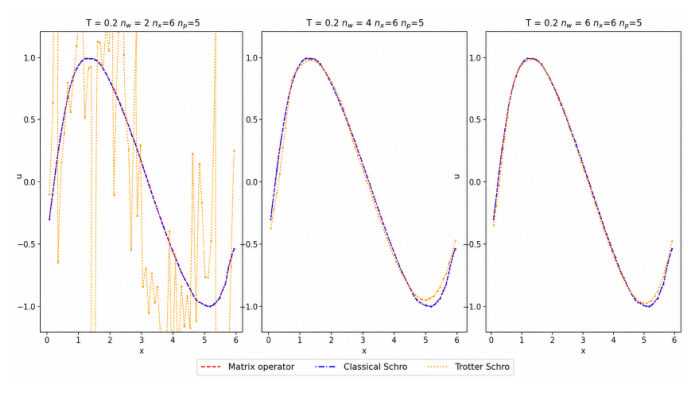 
Figure 1: One-dimensional traffic-flow-type equation with f(u) = u(1 −u). The figure compares the matrix- operator reference, the classical Schr¨odingerisation solution, and the Trotter–Schr¨odingerisation solution for different auxiliary resolutions nw.

📷 Fig 2

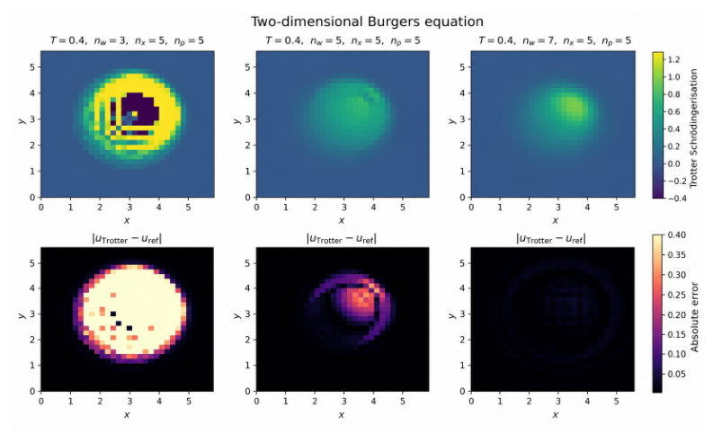 
Figure 2: Two-dimensional Burgers equation with Gaussian initial data. The upper row shows the Trotter– Schr¨odingerisation solution for different values of nw. The lower row shows the absolute error with respect to the matrix-operator reference solution.

📷 Fig 3

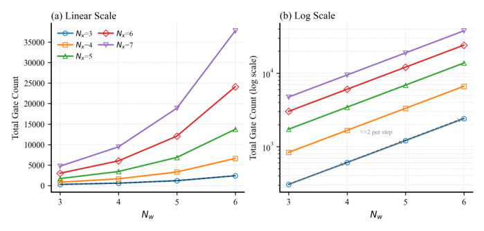 
Figure 3: Total gate count of the time-evolution circuit as a function of the auxiliary Fourier grid size Nw, for several spatial resolutions Nx.

📷 Fig 4

 
Figure 3 provides a numerical verification of the gate-complexity estimate in Lemma 4 using the one- dimensional Burgers equation as a representative example. For fixed spatial resolution Nx, increasing the aux- iliary Fourier resolution Nw increases the number of controlled powers associated with the Schr¨odingerisation register. Figure 4 shows the L2 error as a function of nw. The error is computed against the matrix-operator reference solution. This experiment isolates the effect of the auxiliary-variable discretization and recovery. The natural function g(w) = e−|w|

📷 Fig 5

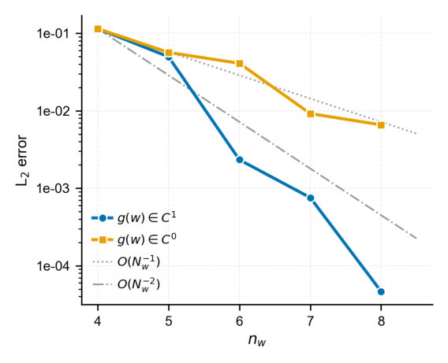 
Figure 4: L2 error as a function of nw for different choices of the auxiliary profile g(w). Smoother profiles improve the convergence rate in the auxiliary variable.

**Summary.** This paper presents an end-to-end quantum algorithm to simulate nonlinear scalar conservation laws, transforming the challenging non-unitary PDE into a unitary evolution problem using Schrödingerisation. By providing explicit circuit constructions and rigorous complexity analysis, the authors claim a demonstrable quantum advantage for estimating physical observables in high dimensions.

**Why it may be interesting.** This work provides a concrete blueprint for applying quantum computation to complex non-equilibrium dynamics (like shock waves), which is a major frontier in simulating physical systems beyond simple Hamiltonians. The explicit gate-level construction makes the theoretical claims highly actionable.

Detailed structure

**Main problem.** Developing an efficient, explicit quantum algorithm capable of simulating nonlinear scalar conservation laws.

**Main result.** The authors demonstrate a quantum advantage for observable estimation in high spatial dimensions by transforming the non-unitary dynamics into a unitary evolution via Schrödingerisation and constructing explicit gate-level circuits.

**Method.** The core method involves lifting the nonlinear PDE to a linear Liouville equation, discretizing it using finite differences, embedding this into a unitary Hamiltonian via Schrödingerisation, and implementing time evolution using Trotterization on quantum circuits.

**Model / system.** The system is governed by scalar conservation laws ($\partial u / \partial t + 
abla \cdot F(u) = 0$). The simulation proceeds by mapping the dynamics to a linear Liouville equation solved via an upwind finite difference scheme, which is then unitarized.

**Key observables.** The primary observable is the expectation value $\langle G 
angle$, representing relevant physical quantities derived from the evolved state $|\Psi(t)
angle$.

**Important parameters / regimes.** Key parameters include spatial grid sizes ($N_x$), momentum grid sizes ($N_p$), and error tolerances ($\epsilon$). The complexity scales depend on these discretization choices.

**Assumptions / limitations.** The method assumes standard conditions for state preparation, oracle access, and relies on approximating the Dirac delta function with smooth mollifiers ($\delta_\omega$) to achieve numerical tractability.

**Paper structure.** The paper follows a logical progression: first, formulating the problem by linearizing the PDE via the level-set method; second, discretizing this linear system and constructing the effective unitary Hamiltonian through Schrödingerisation; third, deriving explicit gate-level circuits for time evolution using Trotter formulas; and finally, performing detailed error analysis to establish complexity bounds demonstrating quantum advantage.

Abstract

Quantum algorithms for nonlinear partial differential equations remain challenging because nonlinear dynamics are not directly amenable to unitary quantum simulation. Building on the level-set formulation, we construct a quantum algorithm and provide an explicit gate-level implementation for solving scalar conservation laws. The nonlinear equation is first lifted to a linear Liouville equation, discretized by finite differences, and then embedded into a unitary evolution through Schrödingerisation. We further develop quantum procedures for estimating relevant observables from the evolved state. Error bounds and gate-complexity estimates are established for the complete algorithm. The resulting complexity comparison demonstrates a quantum advantage for observable estimation in sufficiently high spatial dimensions, under standard assumptions on state preparation and oracle access. Finally, numerical experiments validate the accuracy, multidimensional applicability, and predicted scaling of the proposed method.

[↑ back to top](#top)

### [Analytical Nuclear Gradients and Hessians on Quantum Hardware via Orbital-Optimized VQE with Error Mitigation](http://arxiv.org/abs/2608.08758v1)

**Authors:** Renato Olarte Hernandez, Karl Michael Ziems, Erik Kjellgren, Jacob Kongsted, Sonia Coriani, Stephan P. A. Sauer  
**Type:** theory · **Category:** other · **PDF:** <https://arxiv.org/pdf/2608.08758v1>  
**Analysis basis:** full PDF text, analyzed in chunks
**Topic relevance:** `quantum measurements` **1/5**

📷 Fig 1

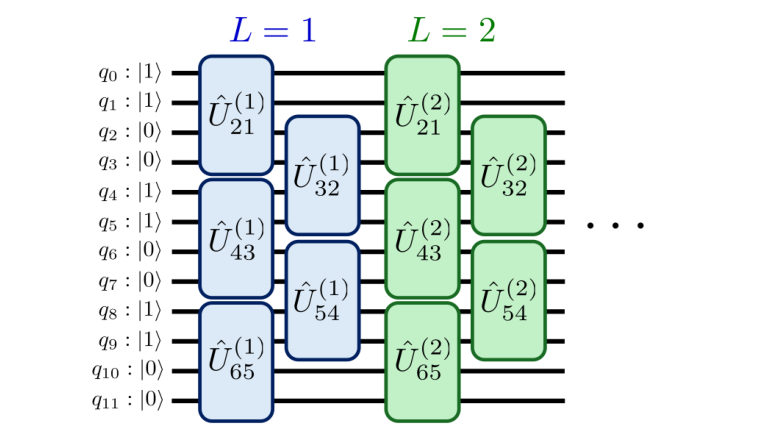 
Figure 1. The tiled-UPS ansatz with the perfect pairing ordering as proposed by Burton [96]. The first two operator columns correspond to the first layer (blue), and the combination of the first and second columns (blue and green) corresponds to a two-layer ansatz, and so on.

📷 Fig 2

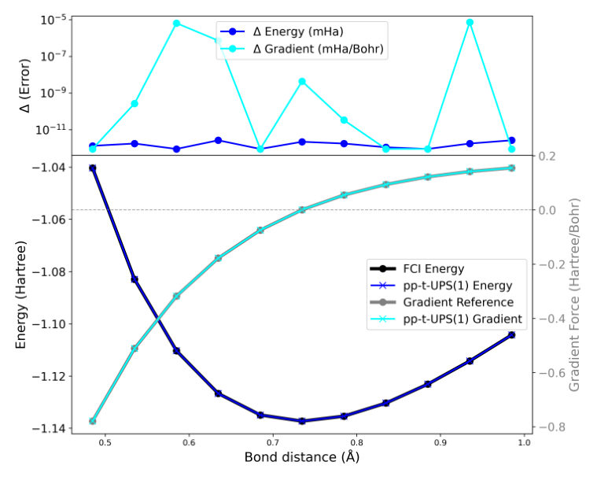 
Figure 2. H2 classical FCI and ideal one-layer tUPS energies and gradients. (Bottom) Hydrogen’s stretching PES and its associated gradient modulus. (Top) The energy and gradient errors with respect to the classical FCI reference.

📷 Fig 3

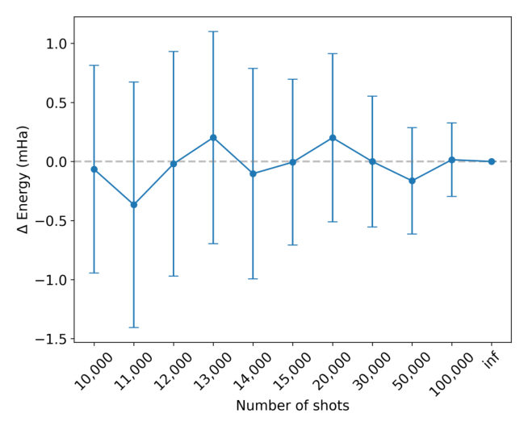 
Figure 3. H2/AS(2,2)/STO-3G ground state shot noise simulation. The average and standard deviation of 100 simulations of the electronic energy are shown versus the number of shots. The ’Inf’ label stands for an infinite limit of shots.

📷 Fig 4

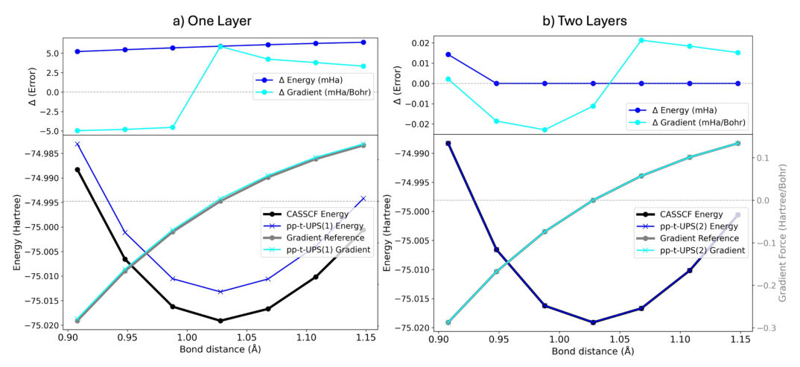 
Figure 4. H2O/AS(4,4)/STO-3G classical CASSCF and ideal a) one-layer and b) two-layer tUPS energies and gradients. (Bottom) Water stretching PESs and their associated gradient modulus. (Top) The energy and gradient errors with respect to the classical CASSCF reference.

📷 Fig 5

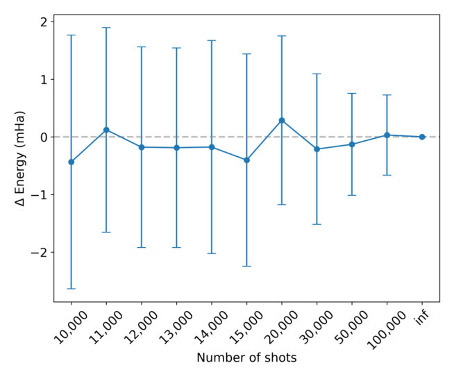 
Figure 5. H2O/AS(4,4)/STO-3G ground state shot noise simulation. The average and standard deviation of 100 simulations of the electronic energy are shown versus the number of shots. The ’Inf’ label stands for an infinite limit of shots.

**Summary.** This paper presents a method to calculate fundamental chemical properties—nuclear gradients and Hessians—on quantum computers using an orbital-optimized VQE approach. By combining linear response theory with error mitigation techniques, the authors test their workflow on $	ext{H}_2$ and $	ext{H}_2	ext{O}$. The results validate the technique for small molecules while clearly mapping out current hardware limitations.

**Why it may be interesting.** This work bridges advanced quantum chemistry (calculating derivatives for spectroscopy/optimization) with near-term quantum hardware limitations, providing a crucial benchmark for quantum simulation algorithms in molecular physics.

Detailed structure

**Main problem.** The core problem is implementing the analytical calculation of nuclear gradients (first derivatives) and Hessians (second derivatives) for molecular energy with respect to nuclear coordinates directly on quantum hardware.

**Main result.** The methodology demonstrates good performance when tested on the hydrogen molecule ($	ext{H}_2$), although the water molecule ($	ext{H}_2	ext{O}$) reveals significant trade-offs related to current error mitigation strategies.

**Method.** It combines an active-space framework with orbital optimization (oo-VQE) and utilizes a tiled unitary product state (tUPS) ansatz. Error mitigation is achieved using an adapted confusion-matrix scheme.

**Model / system.** The calculations are performed for molecular systems, specifically testing on $	ext{H}_2$ and $	ext{H}_2	ext{O}$. The underlying theory uses the electronic Hamiltonian in second quantization within a linear-response framework.

**Key observables.** Potential energy surfaces, nuclear gradients ($\mathbf{E}^{(1)}$), Hessians ($\mathbf{E}^{(2)}$), and vibrational frequencies.

**Important parameters / regimes.** The complexity scales with the size of the molecule (e.g., $	ext{H}_2	ext{O}$ is more demanding than $	ext{H}_2$).

**Assumptions / limitations.** The approach operates in a Noisy Intermediate-Scale Quantum (NISQ) context, necessitating quantum error mitigation techniques rather than full error correction.

**Figures summary.** Figure 1 illustrates the structure of the tiled-UPS ansatz used for the calculation.

**Paper structure.** The paper follows a standard scientific structure: Theory development $
ightarrow$ Computational Methods detailing the oo-VQE and linear response implementation $
ightarrow$ Results assessing performance on $	ext{H}_2$ and $	ext{H}_2	ext{O}$ $
ightarrow$ Conclusion outlining error sources and future directions.

Abstract

Nuclear gradients and Hessians are fundamental quantities in computational chemistry, essential for a wide range of applications including geometry optimization, vibrational spectroscopy, and molecular property calculations. In this work, we present their analytical implementation on quantum hardware. The methodology is formulated within an active-space framework combining orbital optimization and linear-response theory.   On the quantum-computing side, the approach employs the tiled unitary product state (tUPS) ansatz to directly evaluate the tensor elements required for solving the response equations. Moreover, the expectation values are corrected using an adapted confusion-matrix error-mitigation scheme in combination with post-selection criteria. The resulting workflow is assessed on molecular hydrogen and on water through the calculation of potential energy surfaces, nuclear gradients, Hessians, and vibrational frequencies, enabling the evaluation of both its capabilities and current limitations.   The results demonstrate good performance for the hydrogen molecule, whereas the water molecule provides a more demanding test of quantum-hardware resources and highlights the trade-offs associated with error-mitigation strategies. The quantified analysis of the results identify the main sources of errors, suggesting improvement directions for more accurate quantum computer applications.

[↑ back to top](#top)

### [Binary code rate bounds via classical--quantum channels](http://arxiv.org/abs/2608.09347v1)

**Authors:** Omar Alrabiah, Venkatesan Guruswami  
**Type:** theory · **Category:** quantum information and computing · **PDF:** <https://arxiv.org/pdf/2608.09347v1>  
**Analysis basis:** full PDF text, analyzed in chunks
**Topic relevance:** `quantum measurements` **1/5**

📷 Fig 1

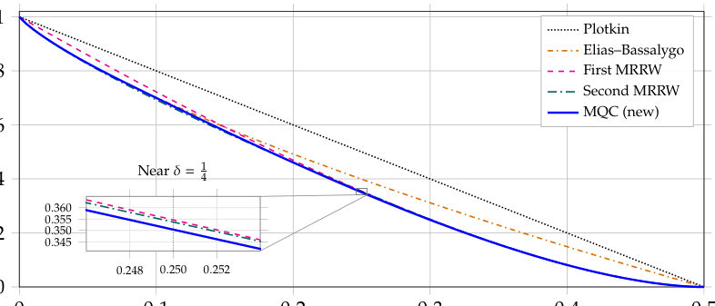 
Figure 1: Five benchmark rate curves, shown for 0 ⩽𝛿⩽ 1 2. The Plotkin [Plo60], Elias– Bassalygo [Eli55, Bas65], and first MRRW [MRRW77] curves are closed form, while the second MRRW [MRRW77] and MQC curves are sampled one-dimensional minima. The two-variable 2MQC infimum from (46) is not plotted; analytically, it lies strictly below the second MRRW throughout 0 &lt; 𝛿&lt; 1

📷 Fig 2

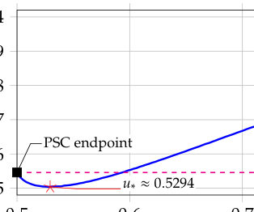 
Figure 2: A plot of the MQC Holevo information function 𝐹1/4(𝑢) = 𝑠(𝑢2) −𝑠(𝑢(𝑢−1

📷 Fig 3

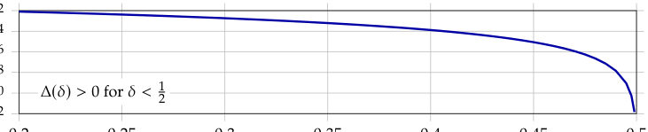 
Figure 3: Numerically minimized values of Δ(𝛿) = 𝑅MRRW(𝛿) −𝑅MQC(𝛿) for 0.2 ⩽𝛿⩽0.499, shown on a logarithmic vertical scale. The strict-improvement proposition (Proposition 25) proves Δ(𝛿) &gt; 0 for every 𝛿∈(0, 1

📷 Fig 4

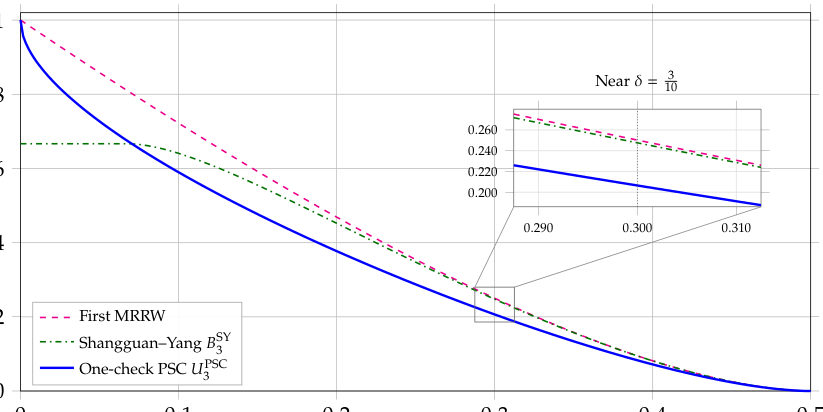 
Figure 4: Rate upper bounds for binary linear codes whose duals are generated by checks of weight at most 3. The first MRRW curve [MRRW77] applies to every binary code, whereas 𝐵SY 3 and 𝑈PSC 3 apply to this sparse-check class. By Theorem 4 and Lemma 30, 𝑈PSC 3 lies strictly below the first MRRW bound for 0 &lt; 𝛿&lt; 1

**Summary.** This paper develops a unifying framework that connects the rate-distance tradeoffs of binary codes to the capacity of classical--quantum channels using a 'pretty good criterion.' By analyzing the posterior bit error rate under quantum measurements, the authors derive bounds that reproduce established results and introduce new mixed-qubit channels (MQC) to strictly improve these theoretical limits.

**Why it may be interesting.** This work provides a powerful, unified theoretical tool—the pretty good criterion—to analyze fundamental limits in quantum coding theory by mapping them onto channel capacity problems, which is central to quantum information science.

Detailed structure

**Main problem.** The paper derives asymptotic rate-distance tradeoffs for binary error-correcting codes by establishing a connection between these bounds and the capacity of classical--quantum (cq) channels.

**Main result.** A 'pretty good criterion' unifies known code bounds (Plotkin, Elias–Bassalygo, MRRW) and introduces new quantum channels (MQC, 2MQC) that strictly improve existing rate limits for given error constraints.

**Method.** The core method involves analyzing the posterior bit error rate under a 'pretty good measurement' (PGM) applied to cq channels, relating this constraint to minimizing channel capacity.

**Model / system.** The analysis uses binary-input output-symmetric classical--quantum (cq) channels, characterized by output density matrices $\sigma_0$ and $\sigma_1$. The framework progresses from general channels to specific models like the Pure-State Channel (PSC) and Mixed-Qubit Channels (MQC).

**Key observables.** Posterior bit error rate ($p_e$), channel capacity ($\chi$), code rate ($R(\mathcal{C})$), and Holevo information.

**Important parameters / regimes.** Relative distance $\delta$ of the code, which dictates the required performance level for the quantum measurement.

**Assumptions / limitations.** The primary assumption is that the cq channel is output-symmetric, allowing the use of uniform-prior Holevo information as the capacity measure. The derivation heavily relies on the properties and linearity of PGMs.

**Paper structure.** The paper establishes a general criterion (Theorem 1) linking rate bounds to channel capacity via PGM error rates, then applies this framework to reproduce classical/quantum bounds for specific channels. Finally, it introduces MQC and 2MQC to provide explicit improvements over the standard MRRW bounds.

Abstract

We derive the four principal asymptotic rate-distance tradeoffs for binary codes---Plotkin, Elias--Bassalygo, and the two McEliece--Rodemich--Rumsey--Welch (MRRW) bounds---from one theorem, the ``pretty good criterion.'' If the bit error rate under the pretty good measurement (PGM)---the quantum analog of posterior sampling---of a binary-input output-symmetric classical--quantum (cq) channel lies below $δ$, then every length-$n$ binary code, linear or nonlinear, of relative distance $δ$ has rate at most the channel's capacity, up to an $O(n^{-1/2})$ correction. Rate--distance bounds thereby reduce to a channel design problem, wherein the task is to minimize channel capacity subject to the posterior bit error rate constraint. Via the pretty good criterion, the binary erasure channel (BEC) yields Plotkin, the binary symmetric channel (BSC) yields Elias--Bassalygo, the pure-state channel (PSC) yields the first MRRW bound, and a masked PSC yields the second MRRW bound exactly.   This framework is then instantiated with new channels to improve upon the MRRW bounds. Specifically, the mixed-qubit channel (MQC), a mixed-state version of PSC, strictly improves the first MRRW bound at every $0 < δ< \frac{1}{2}$, while the masked mixed-qubit channel (2MQC) strictly improves the second MRRW bound throughout the same interval.

[↑ back to top](#top)

### [Bona: Automatic Management of Dirty Ancilla Borrowing in Quantum Circuits](http://arxiv.org/abs/2608.08765v1)

**Authors:** Xiaoquan Xu, Chenke Liu, Boning Meng, Zihao Shen, Li Zhou  
**Type:** theory · **Category:** quantum information and computing · **PDF:** <https://arxiv.org/pdf/2608.08765v1>  
**Analysis basis:** full PDF text, analyzed in chunks
**Topic relevance:** `quantum measurements` **1/5**

📷 Fig 1

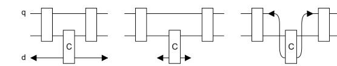 
Fig. 1. The transformation from left to right illustrates how an idle middle interval of the top wire can be borrowed to serve as a dirty ancilla (the wire marked with ◀and ▶).

📷 Fig 2

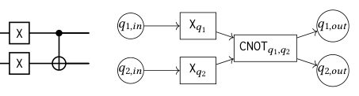 
Fig. 2. A quantum circuit (left) with input qubits 𝑞1 and 𝑞2 and three quantum gates, and its corresponding DAG representation (right).

📷 Fig 3

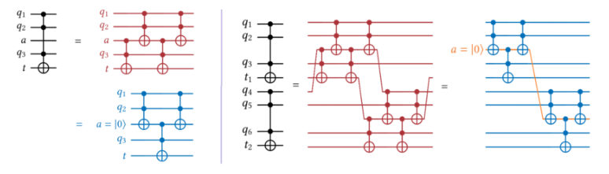 
Fig. 3. Left: Implementations of C3NOT using C2NOT gates and one ancilla. The red dirty-ancilla circuit is fully semantically equivalent to the black target circuit, whereas the blue clean-ancilla circuit is equivalent only when the ancilla is initialized to |0⟩. Right: Implementation of two parallel C3NOT with recycling, with the clean ancilla marked by an orange line.

📷 Fig 4

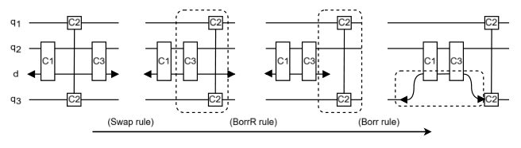 
Fig. 4. A circuit-level illustration of the transition sequence from left to right. Each labeled box represents a subcircuit. Boxes with the same label connected by a vertical line together denote a single subcircuit, indicating the quantum variables on which it acts. A dashed box denotes the subcircuit produced by the preceding transition.

📷 Fig 5

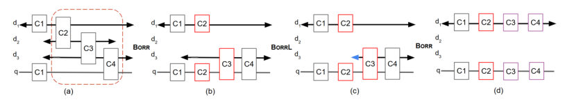 
Fig. 5. Interleaving topology and borrowing. Borrowing 𝑞for 𝑑2 first yields width 3 in (b); a topological transition then exposes 𝑑3 in (c), enabling another borrowing to reach width 2 in (d).

**Summary.** This paper introduces Bona, a novel compiler scheduler designed to automatically manage 'dirty ancilla borrowing' in quantum circuits. By formalizing this resource management technique and proving its computational limits, the authors show that dirty ancillas allow for massive reductions in circuit width with minimal depth overhead. This is vital for scaling quantum algorithms on near-term hardware.

**Why it may be interesting.** For theorists working on quantum simulation or algorithm design, this work provides concrete tools to optimize the physical implementation of algorithms (like Hamiltonian simulation) by exploiting hardware/circuit topology in ways previously considered manual or intractable.

Detailed structure

**Main problem.** The core problem is developing an automatic method for managing 'dirty ancilla borrowing' within quantum circuits to significantly reduce the required circuit width.

**Main result.** The proposed scheduler, Bona, achieves near-optimal width reduction (up to 99%) on benchmarks like Parallel Quantum Walk, while crucially maintaining or improving the circuit depth compared to clean-ancilla schemes.

**Method.** The authors formalize dirty-qubit borrowing as a graph edge-splicing problem and develop Bona, a novel depth-aware heuristic scheduler that systematically manages resource allocation using an OpGrid data structure.

**Model / system.** The system is modeled by quantum circuits represented as Directed Acyclic Graphs (DAGs) operating on qubits. Dirty ancillas are auxiliary qubits whose initial states are unknown but can be temporarily borrowed from idle qubits, offering flexibility beyond standard clean-ancilla initialization.

**Key observables.** Circuit width (primary optimization goal), circuit depth (secondary consideration), and the count of dirty ancillas used.

**Important parameters / regimes.** The efficiency gain is measured by comparing the resulting width/depth against established clean-qubit recycling schemes, particularly for highly parallel circuits like PQW.

**Assumptions / limitations.** The theoretical framework relies on proving an isomorphism between graph edge-splicing and circuit borrowing transitions. Practically, it assumes that postponing Dirty-Dirty recycling until necessary is optimal.

**Figures summary.** Figures illustrate the transformation of quantum circuits into DAGs, showing how idle intervals can be borrowed as dirty ancillas (Figure 1), and detailing the safe use of dirty vs. clean ancillas in specific gate implementations like C3NOT (Figure 3).

**Paper structure.** The paper first formalizes the problem by proving its NP-hardness via reduction from DAG-in-UDG, establishing theoretical limits. It then introduces Bona, a scheduler built on an OpGrid data structure, which implements a two-phase resource management strategy: soft reuse followed by hard borrowing.

Abstract

The management of ancilla qubits has become a critical technique for reducing quantum circuit width. Dirty ancillas, which may be borrowed from any temporarily idle qubit regardless of their initial states, offer substantial flexibility for width optimization, but their use has so far required manual and error-prone handling. We formalize the dirty-qubit borrowing problem and establish a fundamental computational limit by proving its NP-hardness. To support practical optimization, we present \bona, the first scheduler for dirty-qubit borrowing, built on a novel depth-aware heuristic algorithm. We evaluate \bona~ across a variety of benchmarks, including practical quantum circuits and randomly arranged compositions of real circuit modules, and find that it reduces nearly 99\% of dirty ancillas on average with controlled depth overhead. In particular, for parallel quantum walk---an essential component of parallel Hamiltonian simulation---\bona~ matches the circuit width achieved by the clean-qubit schemes of \citeauthor{jiang2024recycling}~(\citeyear{jiang2024recycling}) and \citeauthor{quantinuum}~(\citeyear{quantinuum}), but attains significantly smaller circuit depth, providing concrete evidence that dirty ancillas offer unique optimization advantages in circuits with certain parallelism.

[↑ back to top](#top)

### [Born-Oppenheimer, Born-Huang, and exact factorization: quantum geometry and error in analytically transparent benchmark models](http://arxiv.org/abs/2608.08668v1)

**Authors:** Stephen Wiggins  
**Type:** theory · **Category:** other · **PDF:** <https://arxiv.org/pdf/2608.08668v1>  
**Analysis basis:** full PDF text, analyzed in chunks
**Topic relevance:** `quantum measurements` **1/5**

📷 Fig 1

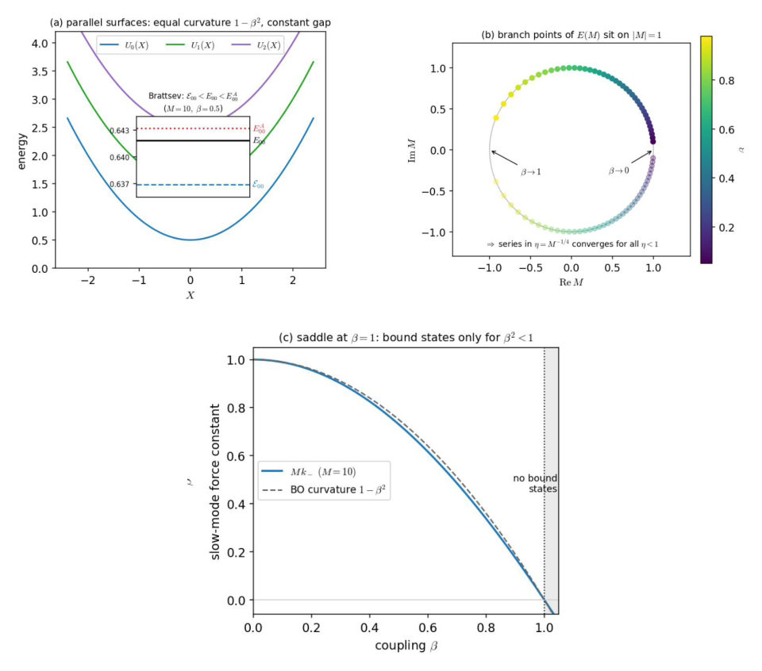 
Figure 1: Three exact structural features of the Fern´andez model (17). The panels are enlarged relative to the original three-across layout so that the mathematical notation remains legible. (a) The Born–Oppenheimer surfaces Un(X) have common curvature 1−β2 and satisfy Un+1(X)−Un(X) = 1 for every X; the inset compares the exact, Born–Oppenheimer, and single-surface Born–Huang ground-state energies at M = 10, β = 0.5. (b) The complex branch points controlling the mass-ratio expansion lie on |M| = 1, so the series in η = M−1/4 converges for every physical M &gt; 1. (c) The exact slow-mode force constant vanishes at |β| = 1; the Born–Oppenheimer curvature 1 −β2 has the same threshold, and there...

📷 Fig 2

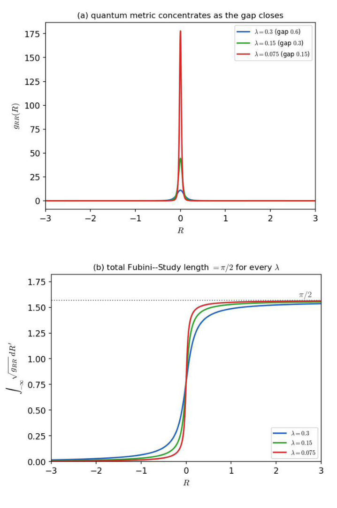 
Figure 2: Quantum geometry of the vibronic model (κ = 2). The panels are shown separately to keep the notation legible. (a) The metric gRR(R) from (35) becomes higher and narrower as the gap 2λ closes. (b) The cumulative Fubini–Study length (36) approaches the same limit π/2 for every λ. The gap therefore controls the localization of the electronic-state change, not its total Fubini–Study length.

📷 Fig 3

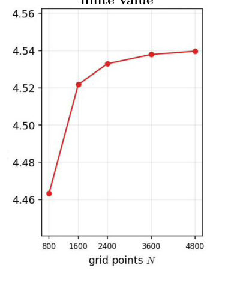 
Figure 3: Exact factorization on the vibronic model (M = 4, Ω= 0.5, κ = 2, λ = 0.3). Panels (a) and (b) are enlarged relative to the original three-across layout; panel (c) is shown separately below them. In panels (a) and (b) the marginal density |χ|2 is shown against the right-hand axis. (a) Ground state: the lower Born–Oppenheimer surface U−, the single-surface Born–Huang potential U−+ W−, the upper surface U+, and the exact-factorization potential ε; the marginal is nodeless and ε is smooth. (b) First excited state (U+ omitted): where the marginal becomes small (central amplitude χ(0)/ max |χ| ≈2.08 × 10−2, nonzero), ε is large but finite. (c) The reconstructed value near the minimum...

📷 Fig 4

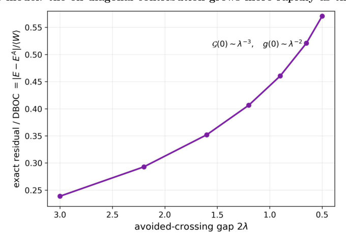 
Figure 4: The leading single-surface error budget (43). The panels are stacked to preserve the notation at journal scale. (a) Fern´andez model (M = 10, β = 0.3, electronic n = 0): the exact Born–Oppenheimer error E −E (black) is reproduced to leading order by the positive diagonal term gn/(2M) and the negative nonadiabatic term −(2/M)⟨ˆTn⟩vGn. Their change of relative size explains the reversal of the lower ground-state inequality for sufficiently excited vibrational states. (b) Vibronic model (M = 10, Ω= 1, κ = 1, lower-surface nuclear ground state): as the gap 2λ closes, G(0) ∼λ−3 grows faster than g(0) ∼λ−2. The plotted quantity is the exact two-channel residual |E −EA| divided by the...

**Summary.** This paper clarifies that the concept of a 'potential energy surface' is ambiguous in molecular physics, presenting three distinct formalisms: Born-Oppenheimer, Born-Huang, and exact factorization. By applying these methods to solvable benchmark models, the authors rigorously compare their predictions for molecular spectra and geometric properties. This work provides essential theoretical tools for accurately modeling nonadiabatic dynamics where electronic and nuclear motions are strongly coupled.

**Why it may be interesting.** This work provides a deep theoretical dissection of nonadiabatic coupling effects in molecules, which is central to understanding processes like charge transfer and spectroscopy where the Born-Oppenheimer approximation breaks down. The rigorous comparison framework is highly valuable for developing accurate quantum dynamics simulations.

Detailed structure

**Main problem.** The paper addresses the ambiguity in defining the 'potential energy surface' (PES) for molecular systems, as different quantum mechanical constructions yield distinct mathematical objects.

**Main result.** It proves that Born-Oppenheimer, Born-Huang, and exact factorization are mathematically distinct formalisms, providing a rigorous comparison framework using analytically solvable benchmark models.

**Method.** The authors compare three theoretical constructs—BO, BH (single-surface), and exact factorization—by deriving closed-form solutions for spectra and surfaces in simplified molecular models.

**Model / system.** The study focuses on molecular systems governed by the full Schrödinger equation, comparing approximations derived from separating electronic ($\hat{H}_{el}$) and nuclear kinetic energy ($\hat{T}_n$) operators. Benchmark models include bilinearly coupled oscillators and a linear vibronic-coupling model.

**Key observables.** Molecular spectra, ground-state/excited-state energies, the quantum metric (Fubini–Study geometry), and error budgets quantifying approximation errors.

**Important parameters / regimes.** Mass ratios between electrons and nuclei ($M_\alpha$), coupling strengths ($eta^2$), and vibrational frequencies ($\omega$).

**Assumptions / limitations.** The analysis relies on comparing results derived from three distinct formalisms, explicitly separating the contributions of approximation error, geometric correction, and conditioning.

**Paper structure.** The paper systematically introduces the molecular Hamiltonian, defines the three competing PES constructions (BO, BH, Exact Factorization), and then applies these definitions to solvable benchmark models to derive quantitative comparisons of their spectral predictions and geometric properties.

Abstract

The phrase "potential energy surface" refers to several distinct objects. The Born-Oppenheimer construction gives a clamped-nucleus electronic eigenvalue, the single-surface Born-Huang construction adds the diagonal correction, and exact factorization gives a state-dependent exact scalar potential. These constructions answer different questions and should not be regarded as competing definitions of one universal surface. We compare them in two analytically transparent benchmark models. For Fernández's bilinearly coupled oscillators, the exact molecular spectrum, the Born-Oppenheimer and Born-Huang spectra, and the ground-state exact-factorization surface are obtained in closed form. We prove the ground-state ordering of these energies for every admissible mass ratio and coupling and show why it does not extend uniformly to excited states. The diagonal Born-Huang correction is identified with the mass-weighted quantum metric, and Fernández's sixth-order result is recast as a leading geometric error budget involving the metric and a gap-weighted spectral moment of the same derivative couplings. In a linear vibronic-coupling model the metric localizes at an avoided crossing while the total Fubini-Study length remains $π/2$, separating the localization of electronic-state change from its total magnitude. Exact factorization is smooth for the nodeless ground state but becomes increasingly ill-conditioned, while remaining finite, when an excited-state nuclear marginal becomes small. These models separate approximation error, geometric correction, and conditioning in a form that can be checked directly.

[↑ back to top](#top)

### [Chemical potentials from structure factors: I. Neutral multi-component mixtures](http://arxiv.org/abs/2608.08357v1)

**Authors:** Roya Savoj, Xiaoyu Wang, Musahid Ahmed, Bingqing Cheng  
**Type:** theory · **Category:** statistical mechanics · **PDF:** <https://arxiv.org/pdf/2608.08357v1>  
**Analysis basis:** full PDF text, analyzed in chunks
**Topic relevance:** `quantum measurements` **1/5**

📷 Fig 1

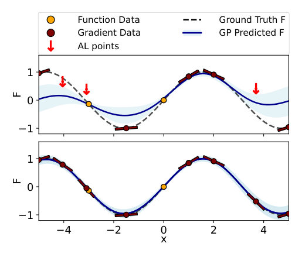 
FIG. 1: Gaussian process (GP) regression from function and gradient data. (a) GP prediction of sin(𝑥) from the initial function and gradient observations, with the uncertainty estimates shown as the shaded area. Red arrows indicate new gradients picked by active learning (AL). (b) GP prediction after adding the AL points.

📷 Fig 2

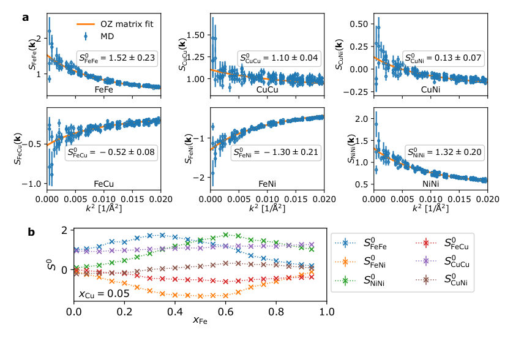 
FIG. 2: 𝑆(k) and the extrapolated 𝑆0 values for the Fe-Cu-Ni system. a Computed 𝑆FeFe(k) values for composition (𝑥Fe, 𝑥Cu, 𝑥Ni) = (0.45, 0.05, 0.50) and the Ornstein-Zernike matrix fit. b 𝑆0 values for all component pairs as a function of 𝑥Fe at 𝑥Cu = 0.05. Error bars come from the statistical uncertainties in 𝑆(k).

📷 Fig 3

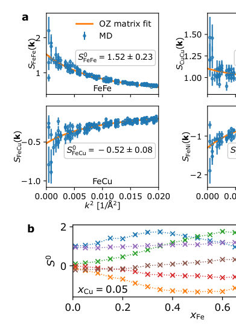 
Fig. 3a compares the root-mean-square errors (RM- SEs) of 𝐺mix from the CUR and random point selection strategies. The ground-truth 𝐺mix as the reference here is calculated for the excess chemical potential computed with a dense grid with 231 points. The curve for ran- dom selection is aggregated from 100 independent runs, with the shaded band indicating the standard deviation. Fig. 3b illustrates the evolution of the 𝜇ex Fe, 𝜇ex Cu and 𝜇ex Ni surfaces as CUR points are successively added. The CUR

📷 Fig 4

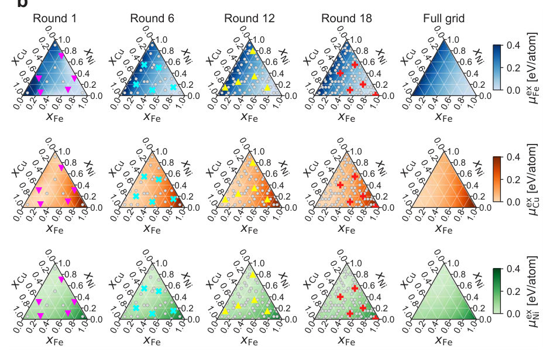 
FIG. 3: A comparison of the chemical potential accuracy based on iteratively selecting new data points using CUR or random selection. a The comparison of the mixing free energy (𝐺mix) root-mean-square errors (RMSEs) at each round, evaluated against the 231-point full grid reference. b Evolutions of the excess chemical potential surfaces, 𝜇ex 𝑖, of Fe (blue), Cu (orange), and Ni (green) as additional compositions are selected through successive CUR iterations. The reference chemical potential surfaces (rightmost column) were obtained from the full grid.

📷 Fig 5

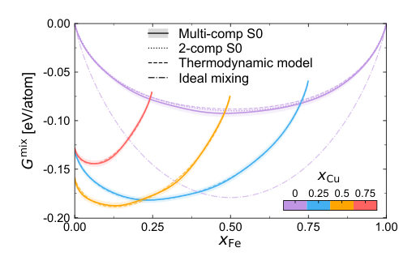 
FIG. 4: Free energy of mixing (𝐺mix) for the Fe-Cu-Ni system at 3000 K as a function of 𝑥Fe at fixed 𝑥Cu = 0, 0.25, 0.5, 0.75, computed using the extended S0 method (solid line), the two-component S0 method (dotted line), previously reported thermodynamic model (dashed line) [38], and compared to ideal 𝐺mix

**Summary.** This paper presents an extended S0 method that overcomes the difficulty of calculating chemical potentials in complex multi-component mixtures. It achieves this by combining statistical mechanical fluctuation theorems with advanced Gaussian Process regression techniques, allowing for robust and efficient extrapolation across high-dimensional compositional spaces.

**Why it may be interesting.** While focused on classical statistical mechanics, the reliance on advanced machine learning techniques (Gaussian Processes, Active Learning) for data extrapolation makes it highly relevant to modern computational physics approaches used across many-body systems.

Detailed structure

**Main problem.** The primary challenge addressed is the accurate computation of chemical potentials ($\mu$) for multi-component mixtures from atomistic simulations, as standard methods struggle in high-dimensional compositional space.

**Main result.** The authors developed an extended S0 method combined with Gaussian Process (GP) regression and Active Learning to provide a scalable route for computing mixing free energies and chemical potentials in neutral bulk mixtures.

**Method.** The methodology extends the S0 approach by using particle number fluctuations derived from structure factors ($S_0^{\alphaeta}$) to build derivative matrices, which are then globally reconstructed using GP regression informed by active learning sampling.

**Model / system.** The method is applied theoretically and computationally to model systems ranging from molten metal alloys (e.g., Fe-Cu-Ni) to molecular mixtures like paracetamol polymorphs in water-ethanol solvents.

**Key observables.** Chemical potentials ($\mu$), mixing free energies ($G_{	ext{mix}}$), partial static structure factors ($S_0^{\alphaeta}$), and the uncertainty estimates derived from GP regression (covariance).

**Important parameters / regimes.** Compositional space coordinates ($	ilde{\mathbf{x}}$), temperature ($T$), pressure ($P$), and component mole fractions ($x_\alpha$).

**Assumptions / limitations.** The method is initially restricted to neutral components; the use of GP regression assumes that function values and their gradients can be accurately modeled from sparse data points.

**Figures summary.** Figures illustrate the application of GP regression using both function and gradient data, showing how active learning refines predictions. Other figures compare computed mixing free energies ($G_{mix}$) against established models and track component chemical potential evolution during simulations.

**Paper structure.** The paper builds from the theoretical foundation (S0 method generalization) to the computational implementation (GP regression with Active Learning), demonstrating its application first to metal alloys, and subsequently to molecular solubility problems like paracetamol polymorphs in mixed solvents.

Abstract

The chemical potentials of multi-component mixtures underlie many physical and chemical phenomena, but remain challenging to compute. The S0 method enables the computation of chemical potentials from equilibrium molecular dynamics simulations, by leveraging the thermodynamic relationship between particle number fluctuations and derivatives of chemical potentials, followed by numerical integration along different compositions. Here we generalize the S0 method from two-component mixtures to neutral multi-component mixtures. We first extend the statistical mechanical formalism to high-dimensional compositional space, and then introduce a Gaussian process integration scheme combined with active learning to efficiently integrate chemical potentials and sample diverse compositions. We use this method to compute the mixing free energies of a molten metal alloy, and the solubilities of two paracetamol polymorphs in water-ethanol solvents. The extended S0 method provides a practical and scalable route for computing chemical potentials in neutral bulk multi-component mixtures from atomistic simulations.

[↑ back to top](#top)

### [Classical fractons with cosmological fixed points](http://arxiv.org/abs/2608.07672v1)

**Authors:** Akash Singh, Dileep P. Jatkar, S. L. Sondhi, Abhishodh Prakash  
**Type:** theory · **Category:** statistical mechanics · **PDF:** <https://arxiv.org/pdf/2608.07672v1>  
**Analysis basis:** full PDF text, analyzed in chunks
**Topic relevance:** `Frenkel-Kontorova` **1/5**

📷 Fig 1

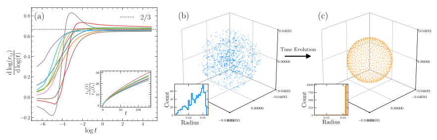 
Figure 1: (a): N = 256 evolution of separations of ten randomly selected particle pairs for the pair-inertia model K(r) = 1/r showing instantaneous logarithmic slope d log rij/d log t, approaching the Einstein-de Sitter value 2/3, (inset) normalized separations of ten ran- domly selected particle pairs. (b,c): Time evolution from randomly generated initial con- ditions for N = 1000 (b). The scale-normalized radial distribution settles into a thin spherical shell of radius 1/ √

📷 Fig 2

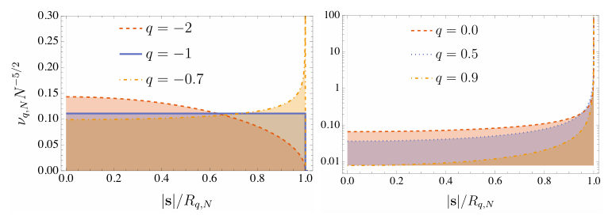 
Figure 2: Large-N regular isotropic shape densities. The filled-ball configuration has the radial density in Theorem 1; the special point q = −1 is a homogeneous solid ball, while q = 1 is the condensation point to a uniform spherical shell.

📷 Fig 3

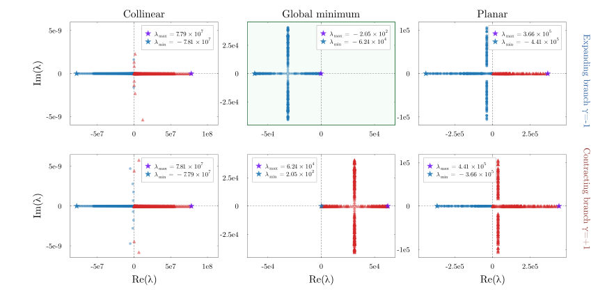 
Figure 3: Eigenvalue spectra of the reduced Jacobian for N = 75 fixed points correspond- ing to three representative central configurations: a collinear saddle, the global minimum, and a planar saddle. The top row corresponds to the expanding branch, while the bottom row shows the corresponding contracting branch. The minimum and maximum real parts of the eigenvalue spectrum are indicated in each panel. Stable and unstable eigenvalues are denoted by circles and triangles, respectively.

📷 Fig 4

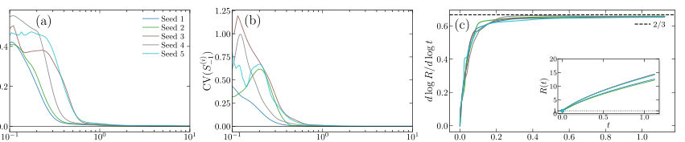 
Figure 4: Evolution of N = 25 particles with shape phase-space {si, ui} initializations selected from a Gaussian random number generator with mean 0 and variance 1 but then re-centered and re-scaled to satisfy constraints Eq. (3.14). Panels (a) and (b) show angular misalignment and the variation of S(i) −1 that diagnose convergence to the q = −1 Newtonian central configurations. Panel (c) shows the corresponding scale evolution with R(0) set to 1, the logarithmic slope d log R/d log t approaches 2/3 at late times. The inset shows the scale R(t) settling into expansion for each seed, hence showing that the expanding branch is dynamically selected.

📷 Fig 5

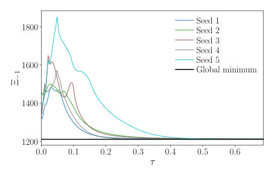 
Figure 5: Evolution of shape potential Ξ−1 from the same random Gaussian initializations (N = 25) as in Fig. 4 showing convergence toward the numerically determined estimate of the global minimum.

**Summary.** This paper analyzes classical fracton systems to show how complex microscopic rules can lead to simple, universal macroscopic behaviors. By projecting the system's dynamics onto scale and shape variables, the authors demonstrate that a specific model naturally reproduces the expansion law ($R(t) \propto t^{2/3}$) and other hallmarks of matter-dominated cosmology as stable attractors.

**Why it may be interesting.** It provides a non-standard, purely classical mechanical framework (fractons) that yields emergent cosmological behavior, offering an alternative theoretical playground for understanding late-time universe dynamics without relying on standard fine-tuning assumptions.

Detailed structure

**Main problem.** The study investigates how complex, conservative microscopic dynamics (classical fractons) can robustly generate simple, universal late-time behaviors characteristic of cosmology.

**Main result.** For the distinguished model $(\alpha, eta) = (-2, 1)$, the system's reduced dynamics exhibit attractor properties that reproduce key features of flat matter-dominated cosmology without fine-tuning.

**Method.** The methodology involves separating coordinates into scale and shape to derive autonomous dynamics, followed by stability analysis using Jacobian projections and calculating the Boltzmann entropy in the reduced phase space.

**Model / system.** The system is classical fractons, described by a scale-invariant, dipole-conserving Hamiltonian $H_{\alpha,eta}$. The dynamics are analyzed after projecting the full phase space onto configuration or shape variables to find stable attractors.

**Key observables.** Scale evolution $R(t) \propto |t|^{\alpha/(\alpha-eta)}$, fixed points (central configurations of Riesz potentials), and the Boltzmann entropy $S_B \propto \log (ar{R}/R^*)$.

**Important parameters / regimes.** The parameters $(\alpha, eta)$, especially the distinguished case $(-2, 1)$ which yields the Einstein-de Sitter exponent $2/3$.

**Assumptions / limitations.** The analysis relies on projecting the full Hamiltonian onto reduced shape variables to obtain attractor dynamics in the lower-dimensional space.

**Figures summary.** Not specified (Notes mention figures showing separation evolution approaching the 2/3 slope for N=256 and N=1000).

**Paper structure.** The paper progresses by defining the fracton Hamiltonian, separating coordinates to find autonomous shape dynamics, analyzing fixed point stability via Jacobian projection, calculating the reduced Boltzmann entropy, and finally demonstrating the cosmological analogy in the distinguished limit.

Abstract

Classical fractons are Hamiltonian systems that can develop attractors after projection onto configuration or shape variables, although the full phase space admits none. We study a scale-invariant, dipole-conserving two-parameter family of fracton Hamiltonians $H_{α,β}$. By separating coordinates into scale and shape, we obtain autonomous shape dynamics that admit fixed points which leave a purely scale evolution of the form $R(t)\propto |t|^{α/(α-β)}$. The shape fixed points, which determine the distribution of the expanding particles, are central configurations of power-law Riesz potentials. The distinguished model $(α,β)=(-2,1)$ is unique: its scale evolution takes the Einstein-de Sitter form $R(t)\propto |t|^{2/3}$, its fixed-point equation is the equal-mass Newtonian central-configuration, its large-$N$ distribution is a homogeneous ball, and its homothetic trajectories admit a zero-energy Newtonian gravitational dual. The fixed points are locally stable, and simulations at moderate $N$ approach them from random initial data. Large $N$ simulations reveal a richer class of fixed-points: bound clusters of approximately fixed physical size retain internal motion, while their centers approach unequal-mass Newtonian central configurations and preserve large-scale homogeneity. A scale-separation conjecture yields an effective unequal-mass fracton dynamics for the centers and a corresponding zero-energy Newtonian gravitational dual. Trajectories generically exhibit a bidirectional arrow of time: scale and shape complexity grow away from a Janus point, while Boltzmann entropy grows logarithmically. Together, these features reproduce the salient structure of a flat matter-dominated cosmology. In the distinguished fracton model, all these cosmological analogues emerge as attractor properties, making it a toy model for cosmological dynamics without fine-tuning.

[↑ back to top](#top)

### [Emergent Problem-Graph Alignment in RL-Discovered Entanglement Topologies for QAOA](http://arxiv.org/abs/2608.07686v1)

**Authors:** Tobias Rohe, Federico Harjes Ruiloba, Markus Baumann, Gerhard Stenzel, Leo Sünkel, Thomas Gabor, Claudia Linnhoff-Popien  
**Type:** both · **Category:** quantum information and computing · **PDF:** <https://arxiv.org/pdf/2608.07686v1>  
**Analysis basis:** full PDF text, analyzed in chunks
**Topic relevance:** `quantum measurements` **1/5**

📷 Fig 1

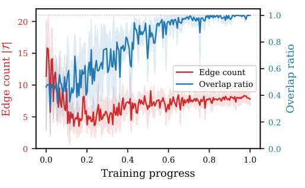 
Fig. 1. Training dynamics for 10-qubit instances (mean ± std over 5 seeds). The edge count decreases and stabilizes around 8 (out of 21 problem edges), while the overlap ratio—the fraction of selected edges belonging to the problem graph—rises from ∼0.5 to ∼1.0.

📷 Fig 2

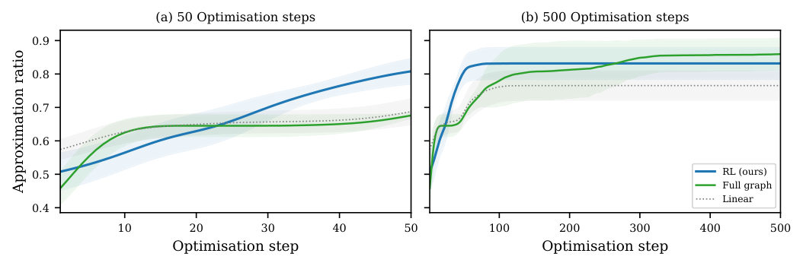 
Fig. 2. QAOA optimization trajectories for different topologies on 10-qubit instances. (a) At 50 steps, the RL topology converges fastest and reaches the highest AR. (b) At 500 steps, the full graph topology eventually surpasses the RL topology, illustrating the trainability–expressibility trade-off.

📷 Fig 3

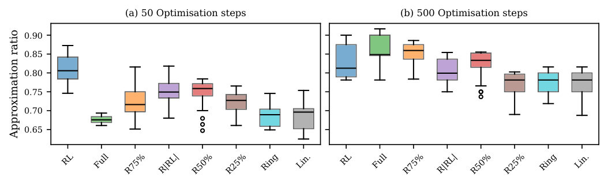 
Fig. 3. Final approximation ratio distributions across topology types for 10-qubit instances. (a) At 50 optimization steps, the RL topology clearly dominates. (b) At 500 steps, the full topology achieves the best median AR.

**Summary.** This work uses Reinforcement Learning to train an agent that discovers optimal entanglement topologies for QAOA optimization on MaxCut problems. By limiting the agent's observation to only performance feedback (AR), it learns to select sparse gate connections that align closely with the true problem graph structure. This reveals a critical trade-off: topology choice dictates convergence speed, suggesting the variational landscape itself contains structural information about the underlying physics.

**Why it may be interesting.** It provides a novel computational paradigm for circuit design in quantum algorithms, showing how machine learning can probe underlying structural information of Hamiltonians without explicit knowledge, which is relevant for hardware-efficient ansatz design.

Detailed structure

**Main problem.** Investigating if a Reinforcement Learning (RL) agent can discover effective entanglement topologies for QAOA-based MaxCut optimization without direct access to the problem graph structure.

**Main result.** The RL agent consistently discovers sparse, problem-aligned topologies that outperform full graph connectivity when the optimization budget is limited. This suggests the variational optimization landscape implicitly encodes structural information about the problem Hamiltonian.

**Method.** An outer loop uses a Masked PPO agent to sequentially place IsingZZ entangling gates (topology discovery), while an inner loop optimizes QAOA parameters using the resulting topology, returning the approximation ratio as a sparse terminal reward.

**Model / system.** The system is based on the Quantum Approximate Optimization Algorithm (QAOA) applied to MaxCut, which maps to an Ising Hamiltonian. The RL agent learns to select the entanglement topology $T$ that governs the circuit structure.

**Key observables.** Approximation Ratio (AR), Overlap Ratio ($|T \cap E|/|T|$), Meyer–Wallach Entanglement Measure ($Q$).

**Important parameters / regimes.** Optimization budget (e.g., 50 vs. 500 gradient steps) and circuit depth ($p=1$ vs. $p>1$).

**Assumptions / limitations.** The agent's observation space is intentionally limited to placed edges and the current AR, withholding explicit problem graph structure information.

**Figures summary.** Figures illustrate training dynamics showing how edge count and overlap ratio evolve over time; tables compare performance metrics across different optimization budgets and circuit depths.

**Paper structure.** The paper establishes the QAOA framework, defines the RL formulation (MDP), details the agent's interaction with the inner VQA optimizer, presents results comparing sparse vs. full topologies under varying resource constraints, and concludes by discussing the trainability-expressibility trade-off.

Abstract

In the Quantum Approximate Optimization Algorithm (QAOA), the entanglement topology, where qubit pairs are connected by two-qubit gates, is conventionally set equal to the edge set of the problem graph. This coupling ties circuit design to explicit problem knowledge and may not yield the most trainable circuit under limited optimization budgets. We investigate whether a reinforcement learning (RL) agent can discover more effective entanglement topologies for QAOA-based MaxCut optimization without direct access to the problem graph. A Masked Proximal Policy Optimization agent sequentially places IsingZZ gates to construct a circuit topology, while a variational inner loop optimizes the resulting QAOA parameters and returns the approximation ratio as a sparse terminal reward. The agent's observation contains only the edges placed so far and the current approximation ratio; graph structure can only be inferred indirectly through the optimization reward. On Erdős--Rényi instances with up to $10$~qubits, the agent consistently converges to topologies that are strict subsets of the problem graph, achieving overlap ratios approaching $1.0$, despite receiving no explicit information about the graph structure in its observations. These sparse, problem-aligned topologies outperform the full graph topology and several structural baselines when the optimization budget is limited ($50$~gradient steps), but are overtaken by denser topologies given sufficient optimization budget. Our results reveal a trainability--expressibility trade-off governed by topology density and suggest that the variational optimization landscape implicitly encodes structural information about the problem Hamiltonian.

[↑ back to top](#top)

### [Excitron-Induced Pair Fluctuations Reveal Superconductivity in the Electron Gas](http://arxiv.org/abs/2608.08498v1)

**Authors:** Yasutami Takada  
**Type:** theory · **Category:** strongly correlated electrons · **PDF:** <https://arxiv.org/pdf/2608.08498v1>  
**Analysis basis:** full PDF text, analyzed in chunks
**Topic relevance:** `Keldysh / 2PI / non-Gaussian methods` **1/5**

📷 Fig 1

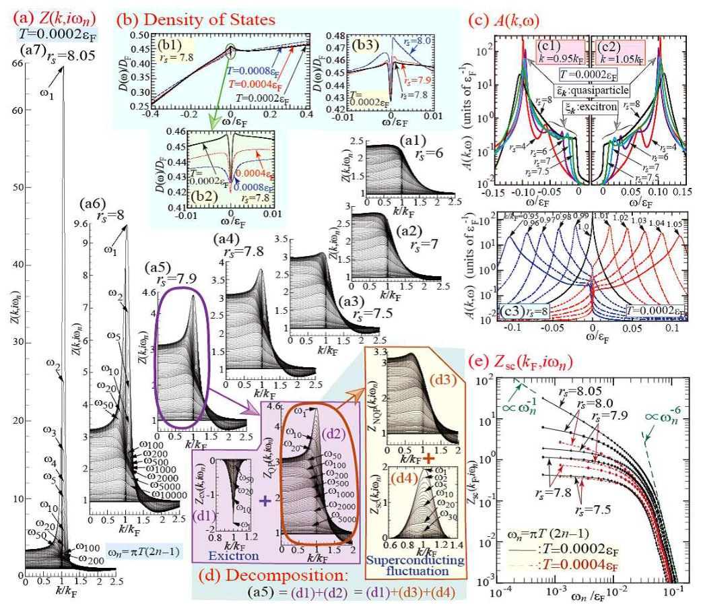 
FIG. 1. (a) Renormalization function Z(k, iωn) at T/εF = 0.0002 for rs = 6 −8.05 [panels (a1)-(a7)]. A sharp peak develops near k ≈kF at rs ≈8, signaling a phase transition. (b) Density of states D(ω) near the Fermi level: for rs = 7.8, T/εF = 0.0002 −0.0008 [panels (b1),(b2)], and for T/εF = 0.0002, rs = 7.8 −8.0 [panel (b3)]. A pseudogap appears, indicating superconducting-gap formation. (c) Spectral function A(k, ω) at T/εF = 0.0002 for rs = 4 −8. Panels (c1),(c2) (k/kF = 0.95, 1.05) show that the QP dispersion ˜εk is nearly rs-independent, whereas the QP lifetime τ, excitron dispersion ξk, and excitron line shape vary strongly. At rs = 8 [panel (c3)], a broad QP peak and an excitron...

📷 Fig 2

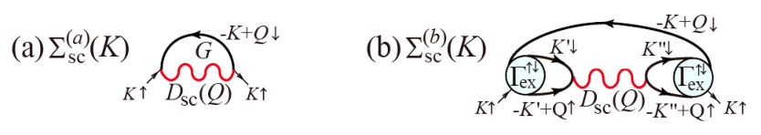 
FIG. 2. Self-energy diagrams for up-spin electrons arising from (a) 3D superconducting fluctuations and (b) 1D ones in the presence of an excitron. Solid lines denote G, wavy lines Dsc, and Γ↑↓ ex is the excitron forming interaction vertex.

📷 Fig 3

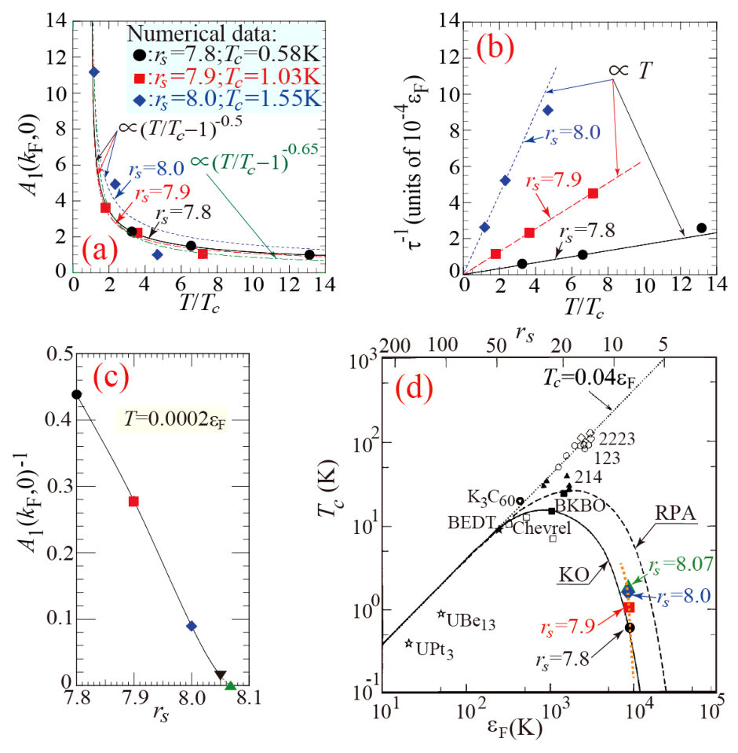 
FIG. 3. (a) Strength of the 1D superconducting-fluctuation contribution at ωn = 0, A1(kF, 0), versus T/Tc for rs = 7.8 −8.0 with the corresponding Tc values indicated. The scaling A1(kF, 0) ∝ξ(T ) is reasonably satisfied. The coherence length follows ξ(T ) ∝(T/Tc−1)−ν, with ν = 0.5 for rs = 7.8 and 7.9, and ν = 0.65±0.05 for rs = 8.0. (b) Inverse QP lifetime τ −1 versus T/Tc for rs =7.8 −8.0. A linear T -dependence persists over a wide range. (c) A1(kF, 0)−1 versus rs at T/εF = 0.0002. Extrapolation gives A1(kF, 0)−1 →0 at rs ≈8.07, indicating the superconducting transition. (d) Four Tc values obtained at different rs in this study are plotted in Fig. 2 of Ref. [20]. The orange dotted curve...

**Summary.** This theoretical study investigates the emergence of superconductivity in the dilute 3D electron gas by analyzing electronic self-energy fluctuations. The authors demonstrate that the superconducting pairing mechanism arises from virtual excitations involving excitons, leading to a distinct one-dimensional fluctuation channel. This provides an unexpected pathway for plasmon-driven superconductivity observable through pseudogaps and characteristic temperature dependencies.

**Why it may be interesting.** The work provides an exotic mechanism for superconductivity in a clean electron gas, linking it to quasi-1D excitonic dynamics rather than phonons or simple Fermi liquid theory, which is highly relevant to understanding unconventional superconductors.

Detailed structure

**Main problem.** The central challenge is understanding how superconductivity emerges in dilute electronic systems, specifically the 3D homogeneous electron gas (3DHEG), without relying on conventional phonon mechanisms.

**Main result.** Superconductivity in the 3DHEG can be driven by superconducting fluctuations mediated by virtual excitons, revealing a second-order phase transition at specific densities and low temperatures.

**Method.** The study employs first-principles calculations of the electron self-energy using the functional GWGamma (FGWGamma) method, analyzing singular behavior in fluctuation quantities.

**Model / system.** The model is the three-dimensional homogeneous electron gas (3DHEG). The analysis focuses on decomposing the renormalization function Z(K) into contributions from normal quasi-particle physics, excitons, and superconducting fluctuations.

**Key observables.** Renormalization function divergence (signaling phase transition), pseudogap in density of states D(omega), linear-in-T inverse electron lifetime ($	au^{-1}$), and the exciton spectral shape evolution.

**Important parameters / regimes.** Density parameter $r_s \approx 8$ and low temperatures, e.g., $T \approx 10^{-4}E_F$.

**Assumptions / limitations.** The analysis assumes that superconducting fluctuations are effectively one-dimensional (1D) due to phase-space restrictions imposed by the excitonic mechanism.

**Figures summary.** Figures illustrate the divergence of Z(K) near $r_s \approx 8$, showing pseudogaps in D(omega), and comparing the theoretical self-energy contributions from standard 3D fluctuations versus the novel exciton-induced 1D fluctuations.

**Paper structure.** The paper progresses by establishing the problem (superconductivity in dilute systems), applying advanced many-body techniques (FGWGamma) to find divergences, identifying that excitons mediate these fluctuations via a specific 1D channel ($\Sigma^{(b)}_{sc}$), and finally determining critical parameters like $	au^{-1}$ through frequency extrapolation.

Abstract

Understanding how superconductivity can emerge in dilute electronic systems remains a central challenge in condensed matter physics. By performing first-principles calculations of the electron self-energy Σ(k,iw_n) in the low-density three-dimensional electron gas, we identify a sharp divergence at r_s ~ 8 and T ~ 10^{-4}E_ F, signaling a second-order phase transition. This critical behavior originates from one-dimensional superconducting fluctuations mediated by virtual excitations of an excitron---a quasi-1D electronic composite formed by an electron and longitudinal electron-hole pairs. Although the superconducting mechanism itself is plasmon-mediated, the excitron channel provides a unique window into its fluctuation dynamics. Near the transition, we observe a pseudogap and a linear-in-T inverse electron lifetime, reminiscent of phenomena in high-T_c materials. These results reveal an unexpected route by which plasmon-driven superconductivity manifests in the dilute 3D electron gas through quasi-1D excitron dynamics.

[↑ back to top](#top)

### [Fuzzy Spectroscopy of Bound States in Massive Quantum Field Theories](http://arxiv.org/abs/2608.07655v1)

**Authors:** Joseph Taylor, Matthew Yusuf, Zlatko Papić  
**Type:** theory · **Category:** statistical mechanics · **PDF:** <https://arxiv.org/pdf/2608.07655v1>  
**Analysis basis:** full PDF text, analyzed in chunks
**Topic relevance:** `Keldysh / 2PI / non-Gaussian methods` **1/5**

📷 Fig 1

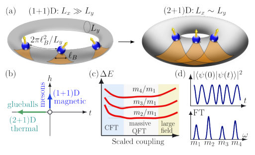 
FIG. 1. Fuzzy spectroscopy. (a) In the Landau gauge, the LLL orbitals are Gaussians whose width is set by the mag- netic length ℓB, while their centers are separated by 2πℓ2 B/Ly. Varying Ly tunes the overlap of these orbitals continuously from an effectively (1+1)D thin-torus chain to an isotropic (2+1)D geometry. (b) Magnetic and thermal perturbations to the Ising fixed point generate meson and glueball excita- tions. (c) Universal meson and glueball mass ratios emerge in a massive-QFT scaling window between the CFT-dominated and magnetic-field-dominated regimes. (d) The same excita- tions can be detected in the quench dynamics as peaks in the Fourier spectrum of the return fidelity.

📷 Fig 2

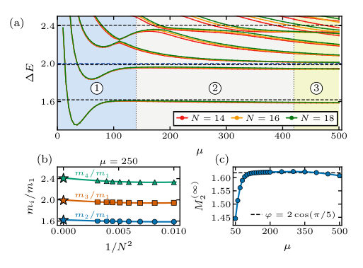 
FIG. 2. (1 + 1)D Ising benchmark. (a) Thin-torus energy spectrum versus µ = hzL15/8 x for different N. Regions 1 ○and 3 ○are dominated, respectively, by residual CFT structure and microscopic large-field corrections, while 2 ○is the universal massive scaling regime. Horizontal dashed lines mark exact E8 ratios and the continuum threshold. All gaps are divided by the lightest mass m1. (b) N →∞extrapolation of m2/m1, m3/m1, and m4/m1 at µ = 250. At this field, the tracked m4 branch is the third energy-ranked level above m3 in panel (a). Curves are quadratic least-squares fits in 1/N 2, while stars mark the exact E8 values. (c) Continuum estimate M (∞) 2 = limN→∞m2/m1as a function of µ,...

📷 Fig 3

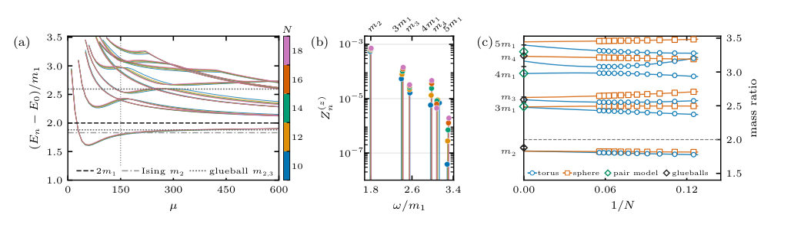 
FIG. 3. Continuum finite-volume (2+1)D Ising spectroscopy. (a) Square-torus spectra at D = 0 for different N (color bar) as a function of µ. The vertical line marks µ = 150. Horizontal lines mark the continuum threshold (dashed), the 1.83m1 Ising estimate (dash-dotted) [8], and the 1.88m1 and 2.594m1 glueball estimates (dotted) [9, 83]. (b) The levels contributing to DSF, Eq. (5), at µ = 150 for the same sizes as in (a), with stem heights given by Z(z) n . Top labels denote the six bound states identified in (c). (c) DSF-selected finite-volume gap ratios on the torus (µ = 150, open circles) and sphere (µ = 26, open squares). All plotted sphere sequences have L = 0; for the 4m1 torus level,...

📷 Fig 4

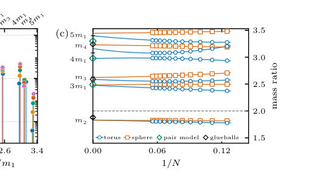 
Figure 3(b) plots the weights Z(z) n at µ = 150 for the same system sizes as in panel (a). Because both the ground state and Sz transform in the fully symmetric A1 representation of the square point group [82], every displayed pole belongs to the A1 sector. Across the ac- cessible N, the DSF isolates a subthreshold scalar level at m2/m1 ≃1.8 together with higher DSF peaks above the continuum threshold. Figure 3(c) follows the levels with nonzero DSF weight as N →∞. The extrapolations are consistent with pre- vious glueball mass estimates in the literature, also indi- cated on the plot. As an independent check, we also per- form extrapolations using the topologically-distinct fuzzy sphere...

📷 Fig 5

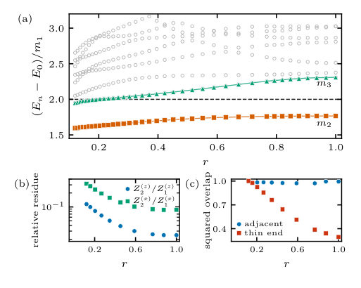 
FIG. 4. Dimensional crossover of the QFT spectrum. (a) Rescaled energy spectrum as a function of aspect ratio r at fixed size N = 14, hz = 0.5, and hx tuned to the finite-size critical line [82]. Filled symbols are overlap-tracked branches, open circles are all other levels, and the dashed line is the continuum threshold. The level m2 interpolates smoothly be- tween the 1D and 2D, while m3 enters the continuum around r ≈0.2. (b) DSF matrix element ratio for m1 and m2 lev- els. (c) Squared overlaps of the m2 state at ratio r with the adjacent state at r + ∆r or with the thin-limit state at the smallest r. The former shows adiabatic continuity, the latter illustrates the largely different...

**Summary.** The paper develops fuzzy geometry as a novel nonperturbative probe to calculate the bound state spectrum of massive Quantum Field Theories. By analyzing systems on fuzzy tori and spheres, the authors demonstrate how spectral features evolve continuously during dimensional crossover from 1D to 2D. This establishes a robust theoretical framework for studying QFTs in regimes inaccessible by standard methods.

**Why it may be interesting.** This work provides a powerful theoretical tool—fuzzy geometries—to study complex many-body physics (bound states) in QFTs without relying solely on computationally intensive lattice methods, making it relevant for understanding critical phenomena and continuum limits.

Detailed structure

**Main problem.** The primary goal is performing nonperturbative spectroscopy of bound states (like mesons and glueballs) in massive Quantum Field Theories (QFTs), especially when moving beyond one spatial dimension.

**Main result.** Fuzzy geometries are established as a robust, nonperturbative method to probe the spectrum of massive QFTs, successfully tracking excitations through dimensional crossover from 1D to 2D while reproducing known theoretical mass ratios.

**Method.** The authors use regularization based on noncommutative 'fuzzy' geometry (fuzzy torus/sphere) to calculate energy spectra and analyze dynamical structure factors. They employ finite-size scaling and continuum extrapolation techniques.

**Model / system.** The study uses the Ising QFT as an illustrative model, analyzing its bound states in $(1+1)$D and $(2+1)$D dimensions. The physics is mapped onto spinful electrons confined to a fuzzy torus or sphere geometry.

**Key observables.** Low-lying energy spectrum ($E_n$), mass ratios ($m_i/m_1$), normalized dynamical structure factor (DSF), and critical fields ($h_c^x$).

**Important parameters / regimes.** The aspect ratio of the torus ($r=L_y/L_x$) is crucial for dimensional crossover; scaling variables like $D$ and $\mu$ define different physical regimes.

**Assumptions / limitations.** The method assumes that fuzzy geometries provide a valid, nonperturbative regularization scheme allowing continuous tracking across dimensions. The analysis also relies on specific symmetry filtering ($	ext{A}_1$) to isolate relevant spectral components.

**Figures summary.** Figures illustrate the spectrum evolution (e.g., Fig. 4) as the torus aspect ratio changes; they show mass ratios approaching plateaus in scaling windows (Fig. 2); and they detail spectral weight transfer during avoided crossings on the sphere (Fig. S5).

**Paper structure.** The paper systematically develops the methodology by first establishing benchmarks in 1D, then analyzing dimensional crossover using varying aspect ratios on the torus, and finally applying the technique to the fuzzy sphere geometry while performing finite-size scaling analysis.

Abstract

Mesons and glueballs are paradigmatic bound states of confining quantum field theories (QFTs), but their nonperturbative spectroscopy in the continuum remains challenging beyond one spatial dimension. Here we perform such spectroscopy for the Ising QFT using a recently developed regularization based on noncommutative ``fuzzy'' geometry. On a thin fuzzy torus, we reproduce the universal low-lying $\mathbb E_8$ meson masses of the magnetically perturbed $(1{+}1)\mathrm{D}$ Ising QFT. By increasing the torus aspect ratio, we continuously track the second-lightest $\mathbb E_8$ meson as the system effectively crosses over from 1D to 2D. On the 2D fuzzy torus and sphere, we find a subthreshold scalar level and above-threshold response features consistent with previous estimates of glueball masses. The same excitations are revealed away from equilibrium using quench dynamics. Our results establish fuzzy geometries as nonperturbative spectroscopic probes of massive QFTs, including their bound-state evolution through dimensional crossover.

[↑ back to top](#top)

### [Genuinely Unextendible Product Bases from Maximum Distance Separable Codes](http://arxiv.org/abs/2608.09504v1)

**Authors:** Mao-Sheng Li  
**Type:** theory · **Category:** quantum information and computing · **PDF:** <https://arxiv.org/pdf/2608.09504v1>  
**Analysis basis:** full PDF text, analyzed in chunks
**Topic relevance:** `quantum measurements` **1/5**

📷 Fig 1

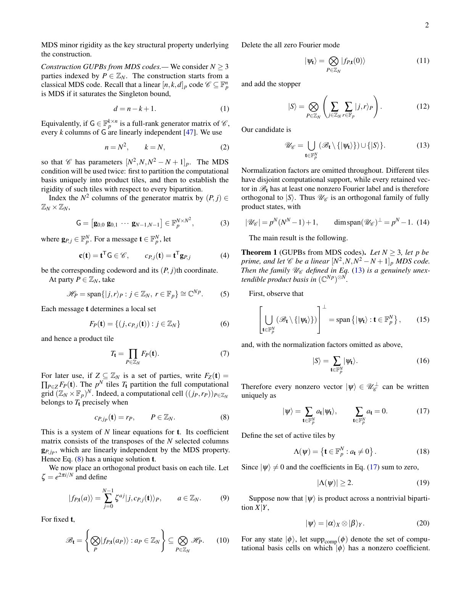 
Low-resolution page preview, page 2

📷 Fig 2

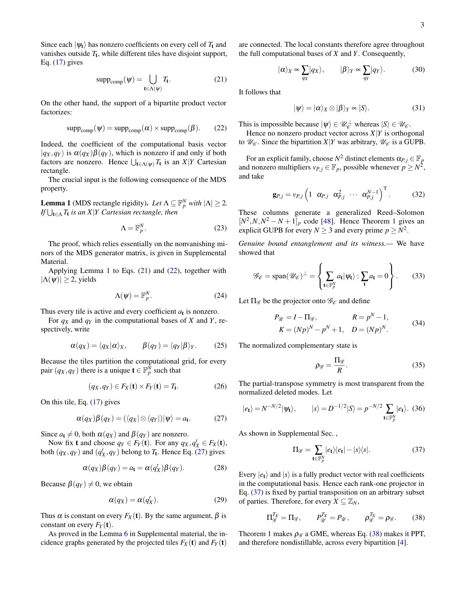 
Low-resolution page preview, page 3

📷 Fig 3

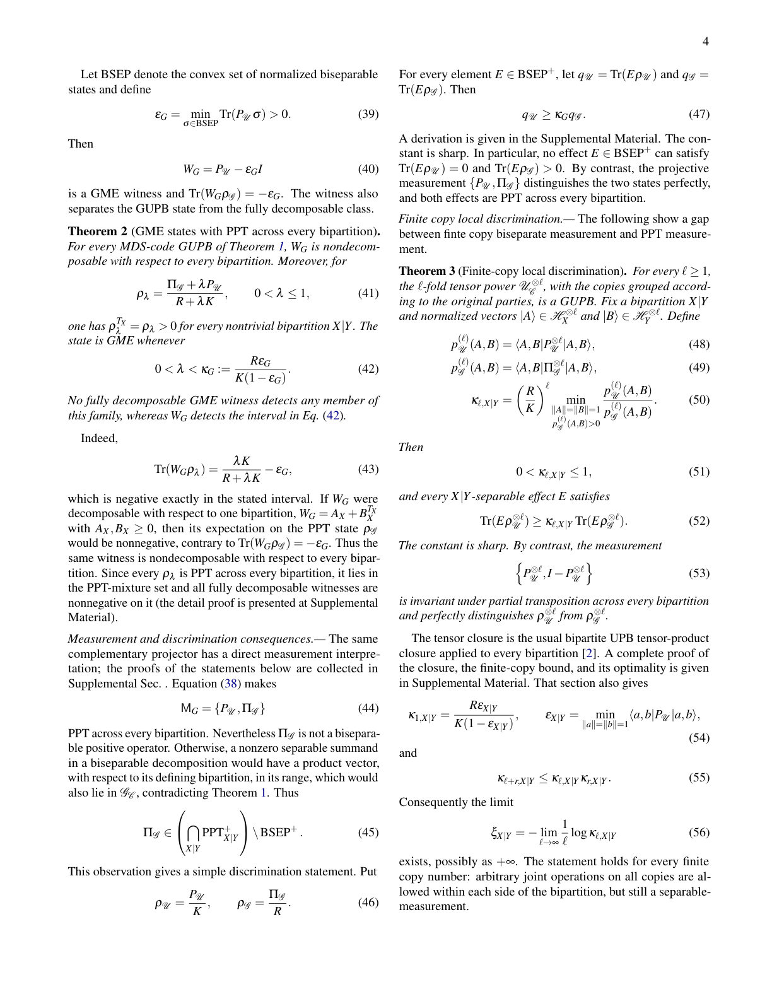 
Low-resolution page preview, page 4

📷 Fig 4

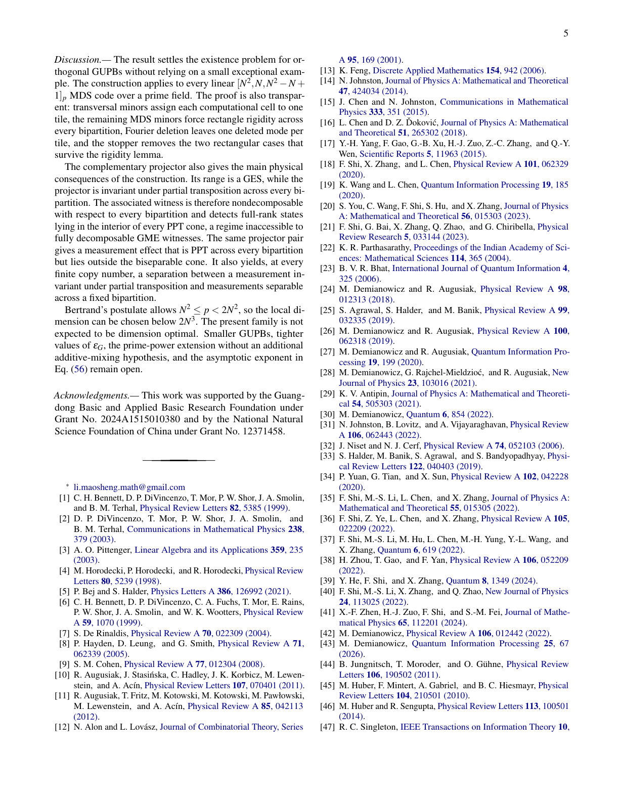 
Low-resolution page preview, page 5

📷 Fig 5

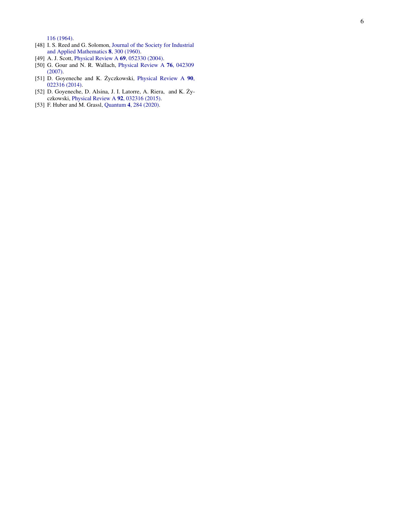 
Low-resolution page preview, page 6

**Summary.** This work constructs Genuinely Unextendible Product Bases (GUPBs) using mathematical structures derived from Maximum Distance Separable (MDS) error-correcting codes. These bases define complementary subspaces that are proven to host genuinely multipartite bound entangled states. The paper provides both an explicit construction and rigorous tools, like specialized entanglement witnesses, to certify this non-local entanglement.

**Why it may be interesting.** The direct link established between classical error-correcting codes (MDS codes) and certifying genuine multipartite entanglement provides a powerful, algebraic tool for quantum information theory.

Detailed structure

**Main problem.** The paper addresses the open problem of constructing Genuinely Unextendible Product Bases (GUPBs) for $N \ge 3$ parties and establishing a deep connection between these bases and multipartite entanglement.

**Main result.** An explicit family of GUPBs is constructed using classical Maximum Distance Separable (MDS) codes, which in turn yields an algebraic route to certifying genuinely multipartite bound entangled states.

**Method.** The construction relies on the rigidity imposed by MDS codes on product tilings, combined with Fourier mode deletion and a 'stopper' state to prove genuine unextendibility via orthogonality arguments.

**Model / system.** The system involves multipartite quantum states in $(\mathbb{C}^{p})^{\otimes N}$, analyzed through orthogonal product bases ($\mathcal{U}_C$) whose complementary subspace is shown to host bound entanglement.

**Key observables.** GUPBs, genuinely entangled subspaces (GES), GME witnesses, and the discrimination constant $\kappa_{\ell, X|Y}$.

**Important parameters / regimes.** $N \ge 3$ parties; prime field $\mathbb{F}_p$ with $p \ge N^2$; finite tensor powers ($\otimes^\ell$).

**Assumptions / limitations.** The construction requires the existence of suitable MDS codes and relies on algebraic properties derived from orthogonality relations.

**Figures summary.** Not specified by notes, but the analysis involves projector operators ($\Pi_G$, $P_U$) and discrimination bounds $\kappa_{\ell, X|Y}$.

**Paper structure.** The paper progresses from establishing the GUPB construction using MDS codes (Chunk 1), to proving the entanglement properties of the complementary subspace via orthogonality conditions (Chunk 2), then detailing distinguishability criteria and witnesses (Chunk 3), and finally analyzing stability under tensor products (Chunk 4).

Abstract

The existence of genuinely unextendible product bases (GUPBs), incomplete orthogonal sets of fully product states whose orthogonal complements contain no product vector across any bipartition, has remained an open problem. Here we construct GUPBs for any number $N\geq3$ of parties using classical maximum distance separable (MDS) codes. The MDS property imposes a rigidity on the induced product tiling across every bipartition; combined with Fourier mode deletion and a stopper state, this rigidity enforces genuine unextendibility. Consequently, the orthogonal complement of each GUPB is a genuinely entangled subspace whose normalized projector is invariant under partial transposition across every bipartition, yielding an explicit family of multipartite bound entangled states. We further construct GME witnesses that detect these states even though no fully decomposable witness can do so. Moreover, the resulting indistinguishability persists under arbitrary finite tensor powers and measurements separable across any bipartition. These results establish a direct connection between error-correcting codes and multipartite entanglement and provide an algebraic route to certifying genuinely multipartite bound entanglement.

[↑ back to top](#top)

### [Lee-Yang Theory Guided Force Field Refinement Based on Phase Diagrams](http://arxiv.org/abs/2608.08546v1)

**Authors:** Bin Jin, Qijun Ye, Xinzheng Li, Kuang Yu, Shenzhen Xu  
**Type:** theory · **Category:** statistical mechanics · **PDF:** <https://arxiv.org/pdf/2608.08546v1>  
**Analysis basis:** full PDF text, analyzed in chunks
**Topic relevance:** `driven-dissipative phase transition` **1/5**

📷 Fig 1

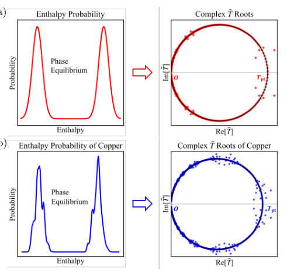 
FIG. 1. Schematic illustration of the Lee-Yang circle theo- rem in the complex temperature plane. (a) Ideal case: for a system exhibiting a double-peak equilibrium enthalpy dis- tribution (left) with a phase transition at Tpt, the Lee-Yang zeros most directly associated with the phase transition dis- tribute on a circle with diameter connecting the origin and Tpt [21] (right). (b) A realistic case for Cu, confirming this geometric picture.

📷 Fig 2

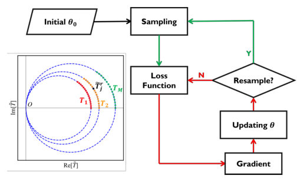 
FIG. 2. Schematic workflow of the Lee-Yang-guided force field refinement framework. The left inset depicts points ˜T r j on the Lee-Yang circle, used to evaluate the partition function mod- ulus and form a differentiable loss function minimized via au- tomatic differentiation. Points of different colors correspond to different Lee-Yang zero circles for distinct target thermo- dynamic conditions.

📷 Fig 3

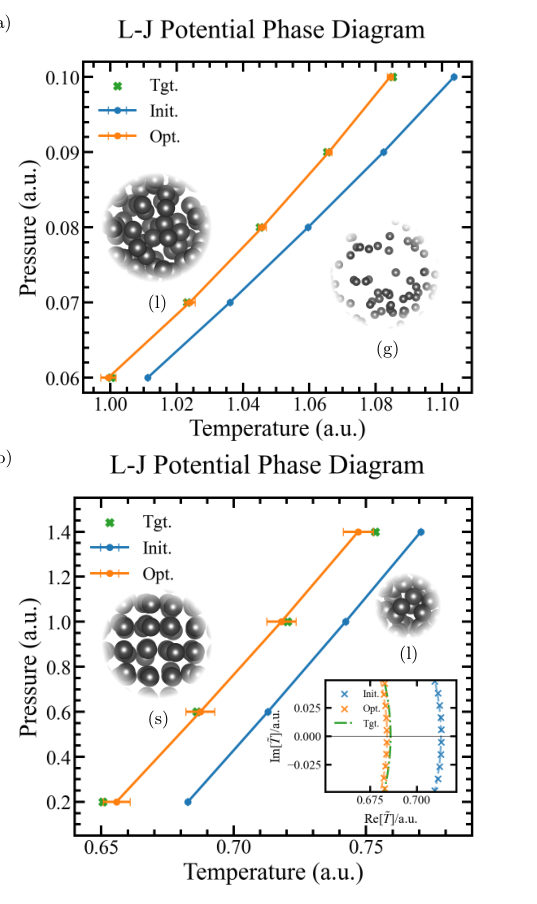 
FIG. 3. L-J system phase diagram optimization results. (a) Gas-liquid coexistence curves predicted by the initial force field (blue curve with points), refined force field (orange curve with points), and the target phase transition points (green crosses). (b) Solid-liquid coexistence curves with the same color scheme. The inset in (b) shows the evolution of Lee- Yang zeros near the real axis in the complex temperature plane at p = 0.60 a.u.: initial force field (blue crosses), refined force field (orange crosses), and the target Lee-Yang circle (green dashed line). Structures in figures are snapshots from simulations. (Same in Fig. 4.)

📷 Fig 4

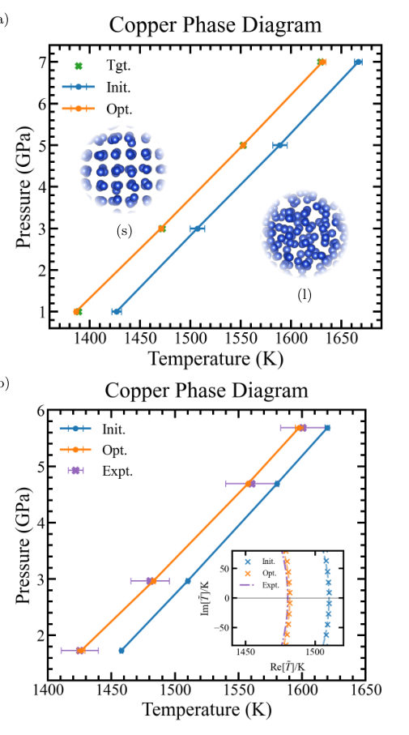 
FIG. 4. Cu EAM system optimization results. (a) Melting curve for the simulated reference target, comparing the initial force field (blue curve with points), refined force field (orange curve with points), and reference data (green crosses). (b) Melting curve for the experimental target, comparing the ini- tial force field (blue curve with points), refined force field (orange curve with points), and experimental data (violet crosses) [27]. The inset shows the evolution of Lee-Yang zeros near the real axis in the complex temperature plane at pres- sure p = 2.97 GPa for the experimental target: initial force field (blue crosses), refined force field (orange crosses), and the target Lee-Yang...

📷 Fig 5

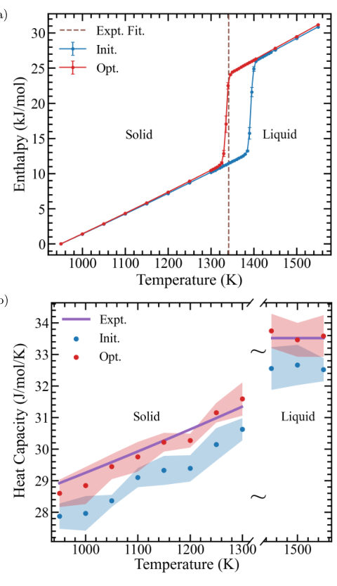 
FIG. 5. Thermodynamic validation for Cu at p = 1 bar. (a) Enthalpy H(T) and (b) isobaric heat capacity Cp(T) spanning the solid and liquid phases. In panel (a), the blue and red curves with points represent the enthalpies predicted by the initial and refined force fields, respectively. The brown dashed line denotes the ambient-pressure melting point obtained by extrapolating the experimental optimization targets [27] via the Simon equation. In panel (b), the blue and red points represent the isobaric heat capacities predicted by the initial and refined force fields, respectively, with semi-transparent bands indicating the uncertainty of each point. The violet line shows the experimental...

**Summary.** This paper introduces a novel method to automatically refine interatomic potentials by leveraging Lee-Yang theory. It treats phase transitions as singularities in the partition function, using the modulus of this function as a differentiable target during optimization. The technique successfully improves predictions for both simple models and metallic systems by enforcing consistency with known phase diagrams.

**Why it may be interesting.** While focused on classical condensed matter, the reliance on complex analysis (Lee-Yang zeros) and differentiable optimization techniques makes this methodology highly relevant for developing machine learning force fields that require rigorous thermodynamic constraints.

Detailed structure

**Main problem.** Developing a general, automated framework for refining interatomic force fields by guiding the optimization process using information derived from known phase diagrams.

**Main result.** The proposed method successfully refines potentials (L-J and EAM) such that the predicted Lee-Yang zeros accurately map onto target coexistence curves, significantly improving predictions of thermodynamic properties like enthalpy and heat capacity.

**Method.** It uses Lee-Yang theory to treat phase transitions as singularities in the partition function. The refinement minimizes a loss function based on the modulus of the partition function evaluated at points near the predicted Lee-Yang zeros in the complex temperature plane.

**Model / system.** The method is applied to classical molecular simulations, specifically refining parameters for Lennard-Jones potentials (gas-liquid and solid-liquid) and Embedded-Atom Method potentials (Cu metal).

**Key observables.** Partition function modulus ($\vert 	ilde{Z} \vert$), phase transition temperatures ($T_{coex}$), enthalpy $H(T)$, and isobaric heat capacity $C_p(T)$.

**Important parameters / regimes.** The optimization targets are defined by the Lee-Yang circle theorem, requiring input of a known phase diagram boundary.

**Assumptions / limitations.** The core assumption is that minimizing $\vert 	ilde{Z} \vert$ at points on the Lee-Yang circle correctly guides the force field parameters toward the true thermodynamic equilibrium state.

**Figures summary.** Figures illustrate the theoretical concept of Lee-Yang zeros forming a circle in the complex plane, show optimization results comparing initial vs. refined phase diagrams (L-J), and validate improved predictions for $H(T)$ and $C_p(T)$ against experimental data (Cu).

**Paper structure.** The paper introduces the framework using Lee-Yang theory to guide force field refinement. It details the mathematical construction of the loss function based on the partition function modulus, validates it on L-J systems for multiple transitions, and extends its applicability to metallic potentials like Cu.

Abstract

We propose a general framework for automatic force field refinement guided by phase diagrams, grounded in Lee-Yang phase transition theory. The central idea is to directly use the partition function modulus as a phase-diagram-guided optimization target. Evaluating the modulus at points close to the real axis, where the Lee-Yang zeros are mostly associated with the phase transition, is more physically meaningful and avoids the numerical difficulty of explicitly solving for the zeros. This approach requires no system-specific order parameters or response properties for characterizing phase transition points, making it universal across various discontinuous phase transitions and material systems. We validate the method on refining parameters of a Lennard-Jones potential covering both gas-liquid and solid-liquid transitions, and a Cu embedded-atom method potential based on experimental melting curves. The refined force fields reproduce the target phase diagrams with significant improvement across all systems. For Cu, the refinement simultaneously improves predictions of enthalpy and heat capacity, which are observables beyond the optimization target. These results establish Lee-Yang theory as a practical tool for contemporary force field development.

[↑ back to top](#top)

### [Machine Learning for Specialized QKD Aspects: A Survey of Adaptive Protocols, Free-Space Links, 6G Integration, and Steerability-Aware Security](http://arxiv.org/abs/2608.08280v1)

**Authors:** Hasan Abbas Al-Mohammed, Afnan S. Al-Ali  
**Type:** theory · **Category:** quantum information and computing · **PDF:** <https://arxiv.org/pdf/2608.08280v1>  
**Analysis basis:** full PDF text, analyzed in chunks
**Topic relevance:** `quantum measurements` **1/5**

📷 Fig 1

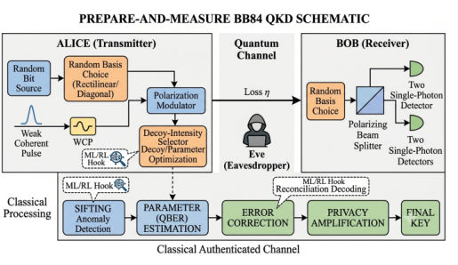 
Fig. 1. Prepare-and-measure BB84 with decoy states, annotated with the post- processing chain and the ML/RL entry points treated in the survey.

📷 Fig 2

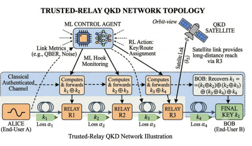 
Fig. 3. Trusted-relay QKD network with XOR key forwarding. ML/RL agents optimize per-hop rates and network-level key routing for IoT/6G QKD (Theme III, Section VII).

📷 Fig 3

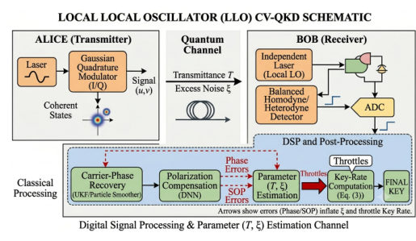 
Fig. 2. Local-local-oscillator CV-QKD, highlighting the digital signal- processing stage where learned carrier-phase recovery, polarization compen- sation and parameter estimation are inserted.

📷 Fig 4

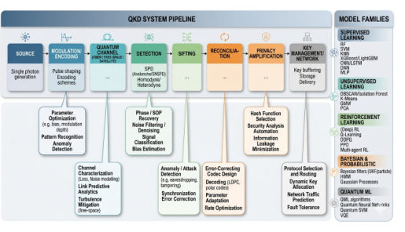 
Fig. 4. Taxonomy mapping ML/RL/QML tasks onto specialized QKD aspects. The five themes—Adaptive Protocol/Parameter Support, Free- Space/Satellite/UAV/HAP, IoT/6G/Federated Learning, QML-Assisted Func- tions, and Steerability/1SDI Security—define the scope of this survey beyond conventional fiber-link QKD (Sections V–IX).

📷 Fig 5

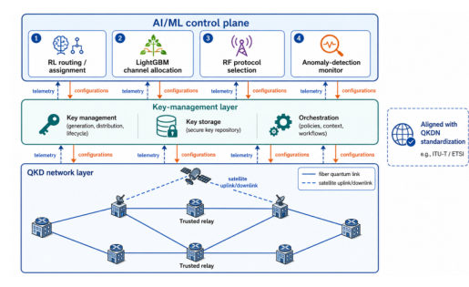 
Fig. 5. Network-level view: an AI/ML control plane consuming link telemetry and orchestrating routing, allocation, protocol choice and monitoring across a hybrid fiber/satellite/HAP QKD network (Theme III, Section VII).

**Summary.** This survey reviews the application of Machine Learning, Reinforcement Learning, and Quantum ML across specialized QKD scenarios beyond standard fiber links. It covers challenging environments like free-space, satellite, and 6G integration by organizing findings into five distinct thematic pillars. The work serves as a focused reference for developing adaptive and robust quantum communication systems.

**Why it may be interesting.** It provides a comprehensive roadmap for applying advanced computational techniques (ML/RL) to solve practical engineering challenges in quantum communication networks, which is highly relevant to quantum optics and network theory.

Detailed structure

**Main problem.** The need to extend Quantum Key Distribution (QKD) security beyond conventional point-to-point fiber links to diverse, specialized, and emerging real-world environments.

**Main result.** The survey organizes the literature into five thematic pillars detailing how ML/RL/QML can enhance QKD in non-terrestrial, resource-constrained, and complex operational settings.

**Method.** It systematically surveys existing research by structuring each theme around a Problem $
ightarrow$ Conventional Solution $
ightarrow$ ML/RL/QML Solution triad.

**Model / system.** The focus is on QKD protocols (BB84, CV-QKD) applied across diverse physical channels including free-space links, satellite/UAV/HAP platforms, and integration with 6G/IoT networks.

**Key observables.** Accuracy, Mean-Absolute-Percentage Error (MAPE), Quantum Bit Error Rate (QBER) reduction, and Secret Key Rate (SKR) improvement.

**Important parameters / regimes.** Channel transmittance ($T$), excess noise ($\xi$), weather conditions, mobility rates, and key length/security bounds.

**Assumptions / limitations.** The survey explicitly addresses the limitations of classical estimators assuming stationarity when applied to dynamic real-world links.

**Figures summary.** Figures illustrate ML/RL integration points in BB84 chains (Fig. 1), CV-QKD signal processing (Fig. 2), and trusted-relay network optimization for HAP/6G QKD (Fig. 3).

**Paper structure.** The paper is structured around five thematic pillars: adaptive protocols, free-space/satellite links, IoT/6G integration, QML assistance, and steerability-aware security estimation.

Abstract

Quantum Key Distribution (QKD) provides information-theoretic security grounded in the laws of quantum mechanics, yet practical deployment increasingly extends beyond conventional point-to-point fiber links. Several rapidly emerging QKD directions are often studied separately, including adaptive protocol and parameter support; free-space, satellite, UAV, and high-altitude platform (HAP) channels; integration with IoT and 6G networks; quantum-secured federated learning; Quantum Machine Learning (QML) assisted decision support; and steerability-aware estimation for one-sided device-independent QKD. This survey examines how Machine Learning (ML), Reinforcement Learning (RL), and QML address these specialized scenarios and organizes the literature into five thematic pillars: (I) adaptive protocol and parameter support; (II) free-space, satellite, UAV, and HAP-assisted QKD; (III) QKD for IoT, 6G, and quantum-secured federated learning; (IV) QML-assisted QKD functions; and (V) steerability-aware and one-sided device-independent QKD security estimation. For each theme, we follow a consistent problem, conventional solution, and ML/RL/QML solution structure and summarize reported gains using metrics such as accuracy, mean absolute percentage error, QBER reduction, and secret key rate improvement. We further provide thematic and cross-theme comparison tables and identify open challenges, including dataset scarcity, transferability across weather and mobility conditions, interpretability, trustworthy QML, and the boundary between ML-based decision support and security certification. This survey serves as a focused reference for adaptive, non-terrestrial, and application-integrated QKD systems.

[↑ back to top](#top)

### [Magic State Distillation via Codes over Binary Extension Fields](http://arxiv.org/abs/2608.09727v1)

**Authors:** Anqi Gong, Christopher A. Pattison, Patrick Rall, Adam Wills  
**Type:** theory · **Category:** quantum information and computing · **PDF:** <https://arxiv.org/pdf/2608.09727v1>  
**Analysis basis:** full PDF text, analyzed in chunks
**Topic relevance:** `quantum measurements` **1/5**

📷 Fig 1

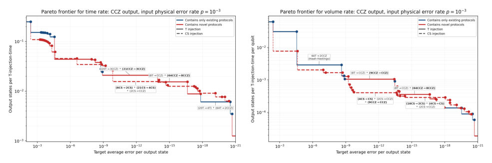 
Figure 1: Pareto frontiers for physical input error p = 10−3. Solid lines use |T⟩state injection and dashed lines use |CS⟩state injection. Red lines indicate that our novel protocols are used somewhere in the competitive scheme; blue lines indicate that they are not. Our novel protocols are bolded in labels. Statistics for some of the competitive protocols are given in Appendix D.3.

📷 Fig 2

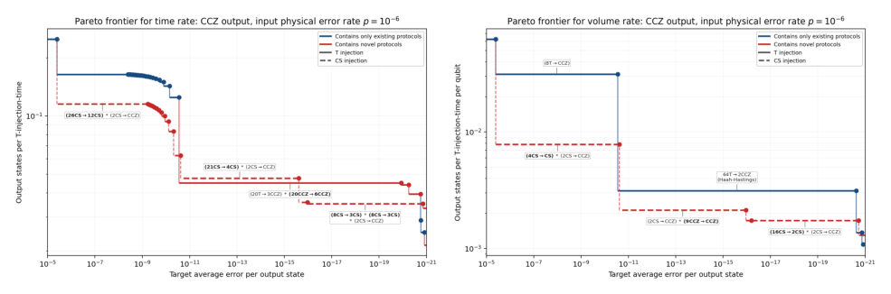 
Figure 2: Pareto frontiers for physical input error p = 10−6 (modeling some small amount of cultivation pre-injection). Solid curves use |T⟩state injection and dashed curves use |CS⟩state injection. Red lines indicate that our novel protocols are used somewhere in the competitive scheme; blue lines indicate that they are not. Our novel protocols are bolded. Statistics for some of the competitive protocols are given in Appendix D.3.

📷 Fig 3

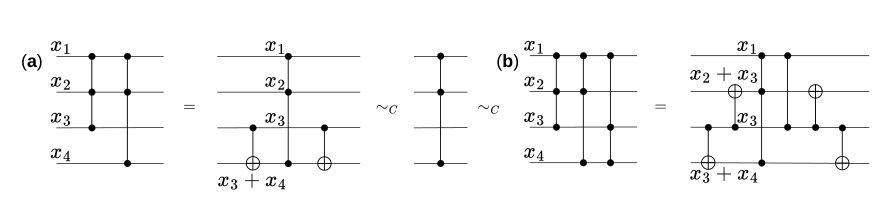 
Figure 3: Examples of Clifford equivalence. (a) and (b) are both Clifford equivalent to a single CCZ gate. (a) x1x2x3+x1x2x4 = x1x2(x3+x4). (b) x1x2x3+x1x2x4+x1x3x4 = x1(x2+x3)(x3+x4)+x1x3.

📷 Fig 4

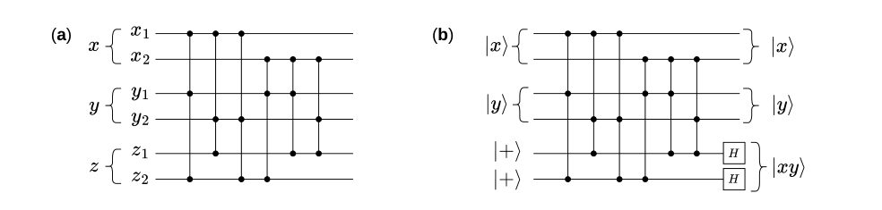 
Figure 4: (a) F4-qudit CCZ expanded as qubit CCZs. Expand x = x1ω + x2ω2, where x1, x2 ∈F2, and similarly for y, z. (b) The magic state corresponding to F4-CCZ can be consumed to perform multiplication in F4 – one just needs to conjugate the third pair of qubits by Hadamard gates.

📷 Fig 5

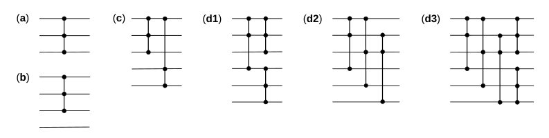 
Figure 5: U β 7 gate expanded in qubit CCZ gates up to Clifford equivalence. (a) U β 7 in F8 with β satisfying tr(β) ̸= 0. If tr(β) = 0, Uβ 7 is the identity. (b) In F16, all U β 7 for which β ̸= 0 are Clifford equivalent to a single CCZ. (c) In F32, all U β 7 for which β ̸= 0 are Clifford equivalent to a TOF# gate. (d1-d3) In F64; (d1) For β = α7i; (d2) For β = α1+7i or α2+7i or α4+7i; (d3) For β = α3+7i or α5+7i

**Summary.** This paper develops novel protocols for generating high-fidelity magic states crucial for fault-tolerant quantum computing. By employing sophisticated techniques involving codes over binary extension fields, the authors significantly improve distillation efficiency compared to current methods. The results demonstrate that their new algebraic approaches offer superior performance metrics when considering resource scaling and error handling.

**Why it may be interesting.** While focused on quantum computation theory, the rigorous application of advanced algebraic structures (like those from coding theory) to resource optimization mirrors complex theoretical modeling seen in condensed matter systems, particularly when analyzing correlated errors or resource scaling laws.

Detailed structure

**Main problem.** The primary challenge addressed is minimizing the overhead associated with generating high-fidelity magic states required for fault-tolerant quantum computation.

**Main result.** The authors introduce new, highly efficient distillation protocols by utilizing algebraic geometric techniques over binary extension fields ($\mathbb{F}_{2^s}$), showing performance superior to state-of-the-art methods in most tested regimes.

**Method.** They employ advanced coding theory, constructing codes over finite field extensions and packaging multi-qubit gates into simpler structures within these larger fields for distillation analysis.

**Model / system.** The work is situated in the context of qubit-based quantum computing architectures, focusing on distilling specific multi-qubit magic states like CS and CCZ. The underlying mathematical framework involves Galois qudits derived from codes over $\mathbb{F}_{2^s}$.

**Key observables.** Distillation rate (output states per unit time/volume), fidelity of distilled states, and the distance ($d$) of the resulting quantum code.

**Important parameters / regimes.** Input error rates ($10^{-3}$ and $10^{-6}$); specific multi-qubit gates ($	ext{CS}$, $	ext{CCZ}$, $	ext{TOF}\#$); and the field extension size ($s$).

**Assumptions / limitations.** The analysis assumes that distillation occurs on logical qubits within a Pauli-based computation model, and some protocols use simplified timing models neglecting certain overheads.

**Figures summary.** Figures show Pareto frontiers comparing time rate vs. volumetric rate for various distillation tasks (CS and CCZ), while tables catalogue the specifications of novel distillation protocols.

**Paper structure.** The paper progresses from identifying the bottleneck problem to introducing algebraic geometric methods over extension fields, cataloging new protocols in a table, benchmarking them against existing state-of-the-art results using rate metrics, and concluding with performance comparisons across different error regimes.

Abstract

Fault-tolerant quantum computation architectures are frequently bottlenecked by the overhead of producing high-fidelity magic states. In this work, we use algebraic geometric techniques to construct codes over binary extension fields $\mathbb{F}_{2^s}$, thus discovering new protocols for the distillation of qubit magic states, where our focus is on the regime of practical qubit-based quantum computing architectures. To do this, we show that multi-qubit gates of interest such as $\text{CS}$, $\text{CCZ}$, and $\text{TOF}\# = \text{CCZ}_{123}\text{CCZ}_{345}$, can be packaged into simple gates over the larger fields, and we derive simple algebraic conditions in the extension fields allowing the distillation of these gates. Because they are derived from Galois qudits, the corresponding qubits codes naturally handle the correlated errors present on such multi-qubit states. Moreover, the protocols we discover are extremely compact; for example, we show that 4 $\text{CS}$ states can be distilled to 1 $\text{CS}$ state at distance 2, using only 4 logical qubits. For a case study, we consider the distillation of $\text{CS}$ and $\text{CCZ}$ states from injected $\text{T}$ and $\text{CS}$ states. When optimized for magic state production per unit time, or logical spacetime volume, we find that our protocols outperform the state-of-the-art in almost every situation, both at input error rates $10^{-3}$ (direct injection), and $10^{-6}$ (allowing some cultivation pre-injection).

[↑ back to top](#top)

### [Magnetotransport evolution and nonlinear Hall effect in altermagnetic MnTe](http://arxiv.org/abs/2608.09371v1)

**Authors:** Wei Zhou, Zhifeng Xue, Yunxing Li, Nannan Tang, Ye Tao, Dingyong Zhong, Jiawei Luo, Donghui Guo, Huichao Wang  
**Type:** experiment · **Category:** disordered systems and neural networks · **PDF:** <https://arxiv.org/pdf/2608.09371v1>  
**Analysis basis:** full PDF text, analyzed in chunks
**Topic relevance:** `quantum measurements` **1/5**

📷 Fig 1

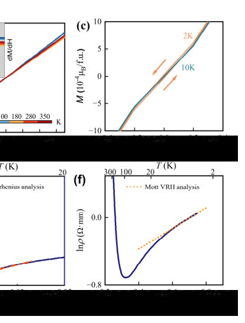 
Figure 1. (a) Temperature dependence of magnetization measured under field-cooling

📷 Fig 2

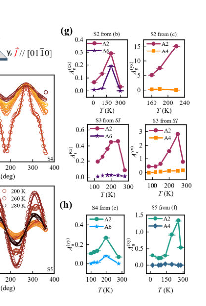 
Figure 2. (a) Experimental schematic, (b) AMR and (c) PHE measured at various

📷 Fig 3

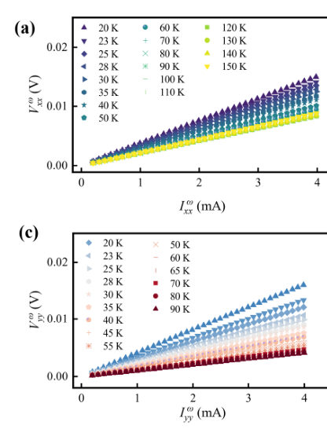 
Figure 3. (a, c) Longitudinal voltages (

📷 Fig 4

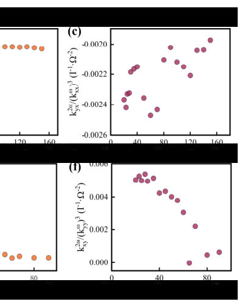 
Figure 4. Temperature dependence of (a, d) first-harmonic coefficients (defined as

**Summary.** This work investigates the magnetotransport of altermagnetic MnTe across metallic to hopping conduction regimes. By measuring AMR, PHE, and nonlinear Hall effects, the authors demonstrate that crystalline anisotropy signals are suppressed by increasing disorder, while simultaneously detecting evidence for a macroscopic inversion-asymmetric response in the localized state.

**Why it may be interesting.** The study provides a detailed experimental roadmap showing how fundamental symmetries and transport mechanisms break down or change character as disorder increases, which is highly relevant for understanding topological properties in disordered quantum materials.

Detailed structure

**Main problem.** To systematically study the magnetotransport behavior (AMR, PHE, nonlinear transport) of altermagnetic MnTe across diverse conducting regimes to understand the interplay between magnetic order, relativistic spin-orbit coupling (SOC), and intrinsic disorder.

**Main result.** The material exhibits distinct magnetotransport signatures—high-order harmonics in the metallic regime that diminish upon crossover to a hopping conduction regime, while evidence for macroscopic inversion-asymmetric response is found via nonlinear Hall signals.

**Method.** The study combines transport measurements (AMR, PHE, nonlinear I-V curves) with temperature-dependent resistivity analysis across multiple electronic regimes (metallic, hopping, localized).

**Model / system.** The physical system is hexagonal $\alpha$-MnTe, a semiconducting altermagnet. The research spans from itinerant band conduction to strongly localized transport governed by Mott Variable-Range Hopping (VRH) in the presence of intrinsic disorder.

**Key observables.** Anisotropic Magnetoresistance (AMR), Planar Hall Effect (PHE) harmonics ($n=2, 4, 6$), temperature-dependent resistivity ($
ho(T)$), and second-order nonlinear Hall signals ($V_{2\omega}$).

**Important parameters / regimes.** Temperature (especially the crossover points near $100$ K and $300$ K), magnetic field strength (9 T), and disorder/localization parameters.

**Assumptions / limitations.** The analysis relies on fitting data to phenomenological models for anisotropy, and it assumes that the observed nonlinear response indicates a macroscopic inversion-asymmetric effect.

**Figures summary.** Figures show magnetization vs. temperature/field; angular sweeps of AMR/PHE at fixed fields across temperatures; and plots detailing the temperature dependence of linear and quadratic transport coefficients.

**Paper structure.** The paper systematically analyzes magnetotransport by first characterizing magnetic order and resistivity transitions, then examining the high-temperature regime for crystalline anisotropy (AMR/PHE harmonics), followed by analyzing the crossover to localization where higher-order terms vanish, concluding with evidence for nonlinear effects suggesting inversion asymmetry.

Abstract

Hexagonal MnTe is a prototypical semiconducting altermagnet whose properties are heavily influenced by intrinsic disorder, yet how the resulting diverse transport regimes shape its magnetotransport behavior remains to be clarified alongside the role of relativistic spin-orbit coupling (SOC). Here, we present a systematic study of the anisotropic magnetoresistance (AMR), planar Hall effect (PHE), and nonlinear transport in MnTe bulk single crystals. Below the Néel temperature (TN ~ 304 K), the emergence of high-order harmonics in AMR and PHE within the high-temperature metallic regime reveals the interplay of magnetic order, crystalline symmetry, and SOC. At relatively lower temperatures, the disappearance of higher-order symmetries coincides with a transport crossover into the hopping conduction regime, suggesting that carrier localization diminishes the transport sensitivity to the Fermi-surface topology. In addition, we detect distinct second-order nonlinear Hall signals, providing evidence for a macroscopic inversion-asymmetric response in altermagnetic MnTe. Extending the investigations into the localized regime provides key insights into the subtle role of disorder and SOC in macroscopic charge transport. Our work thus underscores the necessity of exploring magnetotransport across diverse conducting regimes to comprehensively understand altermagnetic properties.

[↑ back to top](#top)

### [Memory-, Circuit-, and Ansatz-Efficient VQLS for CFD on Hybrid Quantum-HPC Systems](http://arxiv.org/abs/2608.09661v1)

**Authors:** Chao Lu, Muralikrishnan Gopalakrishnan Meena, Eduardo Antonio Coello Perez, Kalyana Chakravarthi Gottiparthi, Seongmin Kim  
**Type:** both · **Category:** quantum information and computing · **PDF:** <https://arxiv.org/pdf/2608.09661v1>  
**Analysis basis:** full PDF text, analyzed in chunks
**Topic relevance:** `QC/QI experiment` **1/5**

📷 Fig 1

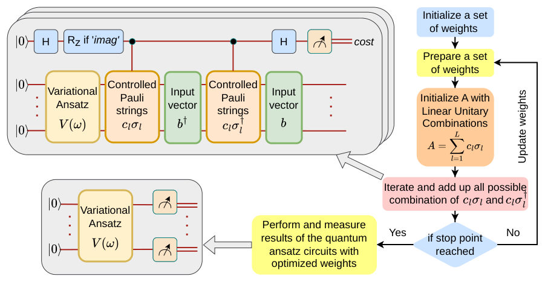 
Fig. 1. VQLS workflow combining quantum circuit components with classical optimization steps to approximate the solution to A |x⟩= |b⟩. The algorithm iterates the quantum circuits by updating the weights to minimize the overall cost. Once optimization converges, the measurement of the Variational ansatz reveals the solution state |x⟩.

📷 Fig 2

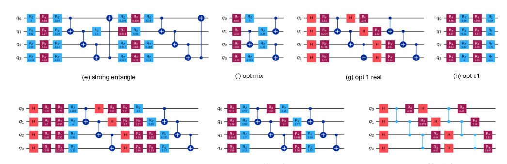 
Fig. 2. Different quantum ansatz setups with the corresponding expressibility. All quantum ansatz shown contain 4 qubits with 2 layers each. The numbers in the quantum gates are the parameters of the quantum ansatz.

📷 Fig 3

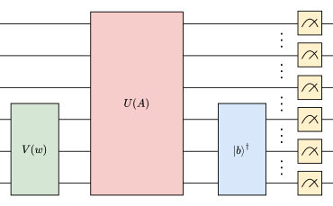 
Fig. 3. Schematic representation of the Variational Quantum Linear Solver (VQLS) utilizing a Block Encoding strategy. The circuit replaces the standard Linear Combination of Unitaries (LCU) decomposition with a block-encoded unitary UA acting on the ancillary and system registers, coupled with the variational ansatz V (θ).

📷 Fig 4

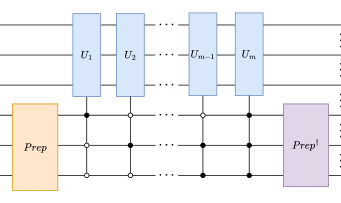 
Fig. 4. Circuit diagram for block encoding via LCU decomposition. The process consists of three stages: the state preparation unitary Prep (acting on the ancilla), the selection operator U1, U2...Um−1, Um (controlled by the ancilla), and the adjoint state preparation Prep†. The qubits that encode the selection operator contain the encoded original matrix A.

📷 Fig 5

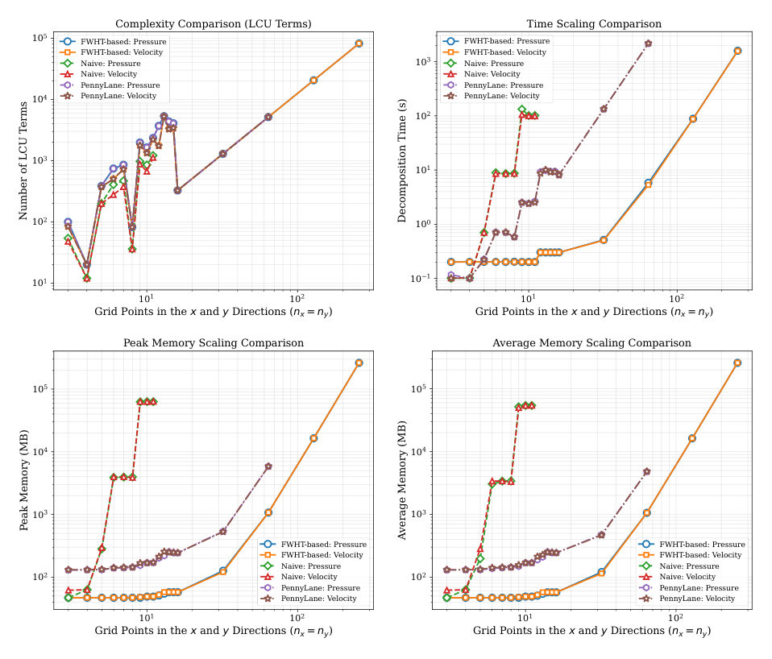 
Fig. 5. Pauli decomposition performance for a canonical Hele–Shaw Jacobian using the naive approach, the PennyLane-integrated approach, and the FWHT approach.

**Summary.** This paper addresses the scalability hurdles facing Variational Quantum Linear Solvers (VQLS) when applied to large CFD problems. The authors introduce memory and time-efficient matrix encoding techniques, such as FWHT and SVD decomposition, achieving dramatic speedups over standard methods. By deploying this optimized workflow on a supercomputer, they establish a practical baseline for using near-term quantum hardware in industrial scientific computing workflows.

**Why it may be interesting.** This work is highly relevant as it tackles the engineering challenges of applying quantum algorithms to complex physical simulations, providing concrete benchmarks for hybrid quantum-classical integration in fields like fluid dynamics.

Detailed structure

**Main problem.** The primary challenge is efficiently implementing Variational Quantum Linear Solvers (VQLS) for solving large linear systems arising from Computational Fluid Dynamics (CFD) on hybrid quantum-HPC platforms.

**Main result.** The authors demonstrated significant improvements by using FWHT and SVD-based matrix encodings, achieving speedups up to $10,000	imes$ per iteration, and successfully simulating a 15-qubit system on the Frontier supercomputer.

**Method.** They benchmarked multiple quantum circuit encoding strategies (LCU variants) and evaluated various ansatz families by analyzing metrics like expressibility and entanglement capability within a hybrid quantum-classical optimization loop.

**Model / system.** The work focuses on solving $Ax=b$ for fluid dynamics problems, specifically using Hele–Shaw flow and tridiagonal Toeplitz systems as test cases. The computation is executed on hybrid quantum-HPC architectures.

**Key observables.** VQLS solution fidelity, peak memory usage (reduced by up to $1298	imes$), per-iteration speedup ($>10,000	imes$), and optimization convergence metrics.

**Important parameters / regimes.** Qubit count (tested up to 15 qubits), matrix size ($11 	imes 11$ grid), and the choice of ansatz family/optimizer.

**Assumptions / limitations.** The primary limitations addressed are the memory explosion of naive LCU encoding, the empirical nature of ansatz selection, and the need for end-to-end testing on production HPC hardware.

**Figures summary.** Figures compare VQLS solutions (e.g., velocity reconstruction for Hele–Shaw flow) across different ansatz layers; tables compare expressibility metrics (KL Divergence); and time consumption plots show scaling comparisons between various encoding methods up to 15 qubits.

**Paper structure.** The paper first identifies the scalability bottlenecks in VQLS for CFD. It then proposes and benchmarks improved matrix encodings (FWHT, SVD) and systematically evaluates ansatz families using theoretical metrics. Finally, it deploys the full workflow on a major supercomputer to establish a practical baseline.

Abstract

Fluid dynamics workloads are dominated by repeated solves of large, structured linear systems, motivating the search for quantum acceleration. The Variational Quantum Linear Solver (VQLS) is a leading near-term candidate, but practical deployment on hybrid quantum--high--performance computing (HPC) systems faces three persistent challenges: (i) the linear-combination-of-unitaries (LCU) encoding of the system matrix explodes in memory and runtime as the problem size grows, (ii) ansatz selection is largely empirical, with no clear link between standard circuit metrics and solver convergence, and (iii) end-to-end VQLS pipelines have rarely been exercised on production HPC hardware at non-trivial qubit counts. This work addresses these challenges through three contributions. First, we benchmark four matrix-encoding strategies---naive LCU, PennyLane-integrated, Fast Walsh--Hadamard Transform (FWHT)-based parallel Pauli decomposition, and an singular value decomposition (SVD)-based two-term LCU---and show that the FWHT approach reduces peak memory by up to $1298\times$ on an $11\times 11$ Hele--Shaw grid, while the SVD-based coherent VQLS delivers over $10{,}000\times$ per-iteration speedup over standard Pauli-based VQLS at 8 qubits. Second, we evaluate 11 ansatz families with gradient-free and gradient-based optimizers on canonical Hele--Shaw flow, and find that expressibility and entanglement metrics correlate only weakly with VQLS convergence, motivating problem-aware ansatz design. Third, we deploy the full workflow on the OLCF Frontier supercomputer and successfully simulate a 15-qubit tridiagonal Toeplitz system on a single node. Together, these results establish a practical baseline for VQLS in hybrid quantum--HPC computation fluid dynamic (CFD) workflows and identify the remaining bottlenecks for larger problems.

[↑ back to top](#top)

### [Multistage Rewinding Decoder for QLDPC Codes](http://arxiv.org/abs/2608.07783v1)

**Authors:** Milad Taghipour, Dimitris Chytas, Bane Vasić  
**Type:** theory · **Category:** quantum information and computing · **PDF:** <https://arxiv.org/pdf/2608.07783v1>  
**Analysis basis:** full PDF text, analyzed in chunks
**Topic relevance:** `quantum measurements` **1/5**

📷 Fig 1

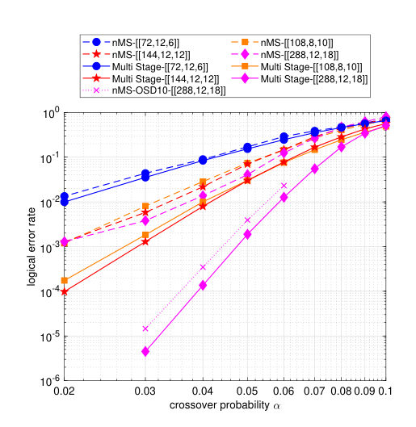 
Fig. 1. Multistage decoder performance for BB codes of various distances. The maximum number of stages is 11, beam width is 64, and top-K selection parameter is 1. The maximum iteration number is set to L = 100.

📷 Fig 2

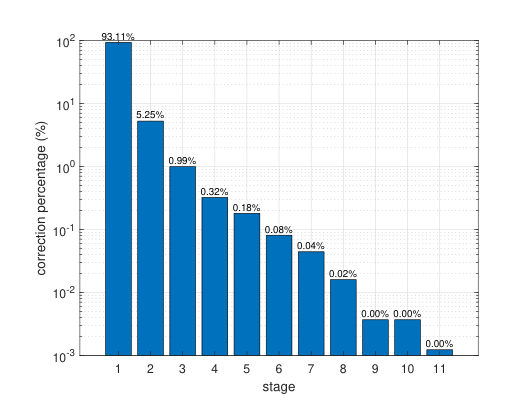 
Fig. 2. Stage correction of the multistage decoding for BB-[[288, 12, 18]] at α = 0.03. The maximum number of stages is 11, beam width is 64, and top-K selection parameter is 1.

📷 Fig 3

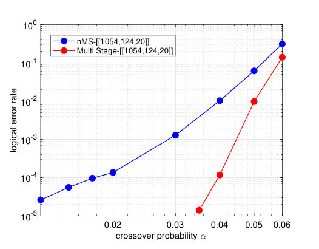 
Fig. 4. Multistage decoder performance for the [[1054, 124, 20]] LP Tanner code. The maximum number of stages is 11, beam width is 64, and top-K selection parameter is 1. The maximum iteration number is set to L = 100.

📷 Fig 4

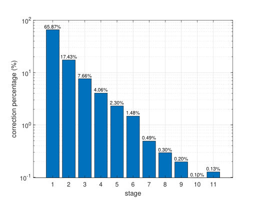 
Fig. 5. Stage correction of the multistage decoding for LP Tanner code at α = 0.04. The maximum number of stages is 11, beam width is 64, and top-K selection parameter is 1.

📷 Fig 5

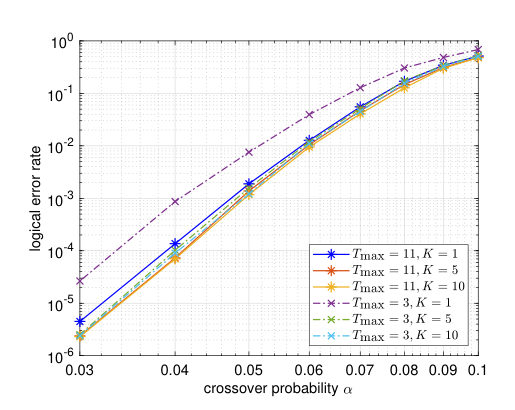 
Fig. 3. Multistage decoder performance for BB-[[288, 12, 18]] codes for different maximum number of stages and top-K selection parameter. The maximum iteration number is set to L = 100.

**Summary.** This paper presents a novel multistage decoding framework designed to enhance the performance of Quantum Low-Density Parity Check (QLDPC) codes. By identifying unreliable nodes using a composite metric, the decoder performs guided rewinds within a beam-search structure to escape trapping sets. The results demonstrate substantial improvements in error correction capability compared to existing iterative decoders.

**Why it may be interesting.** The systematic approach to overcoming trapping sets in QLDPC decoding is highly relevant for developing practical quantum computation protocols that rely on fault-tolerant quantum memory and communication.

Detailed structure

**Main problem.** The primary goal is to improve the decoding performance for Quantum Low-Density Parity Check (QLDPC) codes by overcoming limitations imposed by classical trapping sets and quantum degeneracy.

**Main result.** The proposed multistage decoder significantly outperforms standard decoders like normalized min-sum, achieving competitive results with advanced methods such as belief propagation enhanced by ordered statistics decoding.

**Method.** It introduces a multistage framework that uses an unreliability metric to guide rewinds—selectively forcing initial log likelihood ratios for the most suspicious variable nodes and restarting the message-passing decoder within a beam-search structure.

**Model / system.** The work focuses on QLDPC codes, specifically analyzing non-topological families like Bivariate Bicycle (BB) and Lifted-Product (LP) codes used in Quantum Error Correction (QEC). Decoding is modeled using message-passing algorithms on Tanner graphs.

**Key observables.** Logical error rate (LER), unreliability metric components (oscillations, unsatisfied checks), residual syndrome weight, and a posteriori reliability.

**Important parameters / regimes.** The crossover probability ($\alpha$), beam width parameter, and the number of decoding stages ($T_{max}$).

**Assumptions / limitations.** The performance limitations of standard iterative decoders are attributed to harmful subgraph configurations (trapping sets), which the proposed method systematically addresses.

**Figures summary.** Figures illustrate the comparison of LER vs. crossover probability ($\alpha$) for different codes, showing significant performance gains over baseline methods across various stages.

**Paper structure.** The paper first establishes the failure dynamics in QLDPC decoding; it then introduces the heuristic unreliability metric and the multistage guided rewind procedure within a beam-search framework; finally, it presents rigorous comparisons of the resulting logical error rates against state-of-the-art decoders.

Abstract

In this paper, we propose a multistage decoding framework that leverages internal information produced by an underlying message-passing decoder. The proposed method targets the failure dynamics caused by both classical trapping sets and degenerate errors supported on symmetric stabilizers, which are among the primary limitations of iterative decoding for QLDPC codes. To identify unreliable variable nodes, we introduce a heuristic metric that combines several dynamical features of the decoder, including variable-node log likelihood reliabilities, hard-decision oscillations, the number of adjacent unsatisfied checks, and the soft information contributed by unsatisfied checks. Based on this ranking metric, the decoder performs guided rewinds by selectively forcing the initial log likelihood ratio values of the most suspicious variable nodes and restarting the message-passing decoder under the corresponding forced configuration. To manage the combinatorial growth of candidate configurations, the search is formulated within a beam- search framework with controlled beam width. In addition, we introduce a pruning metric based on the combination of the residual syndrome weight and a posteriori reliability of the decoder output, thereby retaining only the most promising search paths. Logical error rate results demonstrate that the proposed decoder significantly outperforms the normalized min- sum decoder and achieves competitive performance with belief propagation enhanced by order-10 ordered statistics decoding.

[↑ back to top](#top)

### [Overlap distribution of the critical Sherrington-Kirkpatrick model](http://arxiv.org/abs/2608.08752v1)

**Authors:** Hang Du, Brice Huang  
**Type:** theory · **Category:** disordered systems and neural networks · **PDF:** <https://arxiv.org/pdf/2608.08752v1>  
**Analysis basis:** full PDF text, analyzed in chunks
**Topic relevance:** `non-equilibrium universality` **1/5**

📷 Fig 1

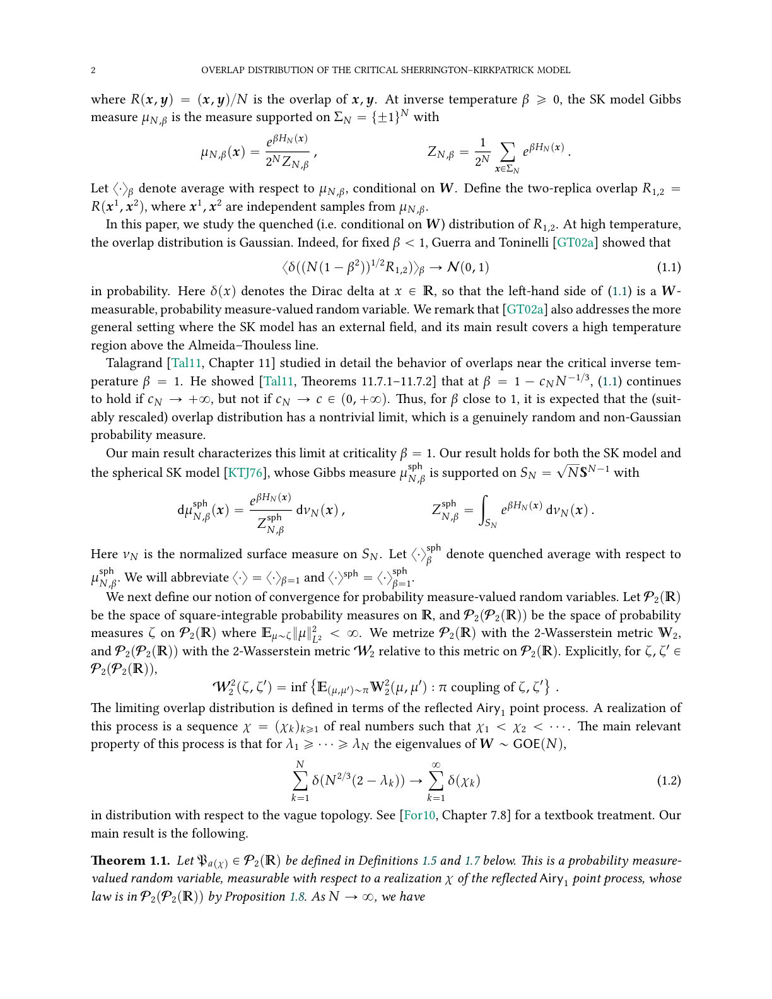 
Low-resolution page preview, page 2

📷 Fig 2

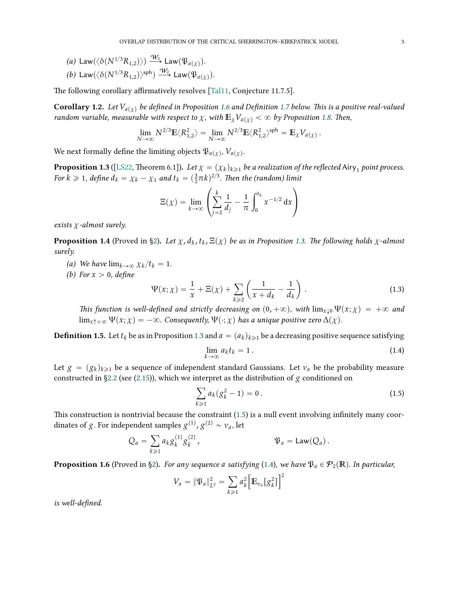 
Low-resolution page preview, page 3

📷 Fig 3

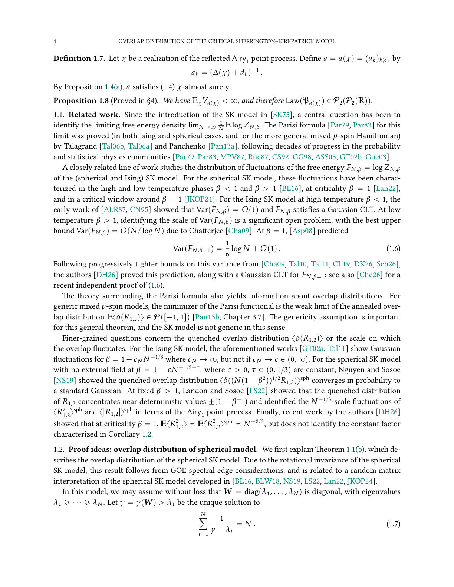 
Low-resolution page preview, page 4

📷 Fig 4

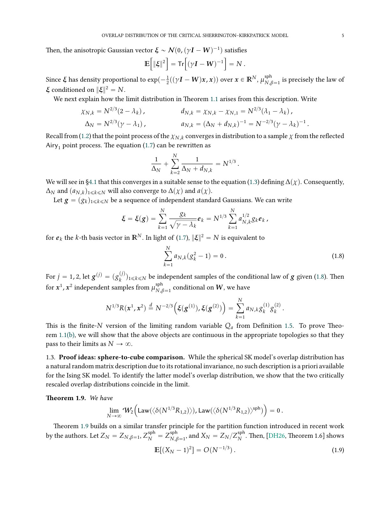 
Low-resolution page preview, page 5

📷 Fig 5

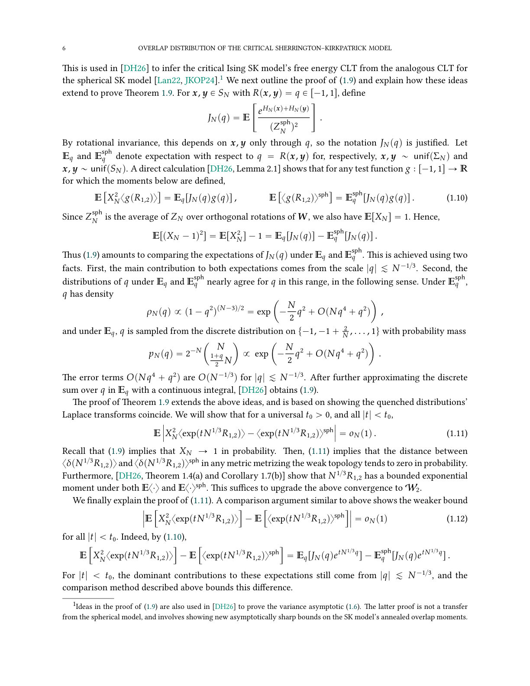 
Low-resolution page preview, page 6

**Summary.** This paper rigorously determines the limiting distribution of the two-replica overlap for the critical Sherrington-Kirkpatrick spin glass model. The key finding is that this distribution converges to a measure defined by the reflected Airy$_1$ point process. This work provides deep mathematical insights into disordered systems, connecting them to established results in random matrix theory.

**Why it may be interesting.** While focused on spin glasses, the rigorous mathematical techniques involving convergence of point processes ($\mathrm{Airy}_1$) and scaling limits are highly relevant to understanding critical phenomena in complex quantum many-body systems where disorder is present.

Detailed structure

**Main problem.** The study focuses on determining the distribution of the two-replica overlap ($R_{1,2}$) in the critical Sherrington-Kirkpatrick (SK) model.

**Main result.** The quenched distribution of the scaled overlap converges to a random probability measure defined by the reflected Airy$_1$ point process for both Ising and spherical SK models at criticality ($eta=1$).

**Method.** The analysis employs advanced techniques including comparison principles (sphere-to-cube) and passing to scaling limits derived from Gaussian representations, connecting the problem to Random Matrix Theory.

**Model / system.** The system is the Sherrington-Kirkpatrick spin glass model, analyzed in both its Ising and spherical variants. The Hamiltonian involves interactions defined by a random matrix $\mathbf{W}$, and the study centers on the Gibbs measure at the critical inverse temperature $eta=1$.

**Key observables.** Two-replica overlap ($R_{1,2}$), quenched distribution of $N^{1/3} R_{1,2}$, and the expectation value $\mathbb{E} \langle R_{1,2}^2 
angle$.

**Important parameters / regimes.** Critical inverse temperature ($eta=1$), scaling factor $N^{-1/3}$, and convergence to the reflected Airy$_1$ point process.

**Assumptions / limitations.** The derivation for the spherical model relies on representing the Gibbs measure as an anisotropic Gaussian conditioned on norm $\sqrt{N}$. The Ising case uses a comparison principle showing asymptotic coincidence with the spherical case.

**Paper structure.** The paper systematically analyzes the overlap distribution, first establishing general scaling laws and then deriving the specific limiting measure (reflected Airy$_1$ process) for both the spherical and Ising SK models by leveraging connections to Gaussian measures and random matrix theory.

Abstract

We study the distribution of the two-replica overlap $R_{1,2}$ in the Ising and spherical Sherrington-Kirkpatrick models at the critical inverse temperature $β= 1$. Our main result shows that in both models, $R_{1,2}$ has scale $N^{-1/3}$, and the quenched distribution of $N^{1/3} R_{1,2}$ converges to an explicit random probability measure defined in terms of the reflected $\mathrm{Airy}_1$ point process. As a consequence, we characterize the limiting value of $N^{2/3} \mathbb{E} \langle R_{1,2}^2 \rangle$, answering a question of Talagrand \cite{talagrand2011mean2}.   For the spherical SK model, we obtain the limit by representing the Gibbs measure as an anisotropic Gaussian on $\mathbb{R}^N$ conditioned to have norm $\sqrt{N}$, and then passing to the $\mathrm{Airy}_1$ scaling limit at the GOE spectral edge. For the Ising SK model, the proof is based on a sphere-to-cube comparison principle showing that the quenched distributions of $N^{1/3} R_{1,2}$ under the spherical and Ising Gibbs measures asymptotically coincide.   This paper is a companion to \cite{du2026fluctuations}, where we introduced a related comparison principle to identify the limiting fluctuations of the SK free energy. Most of the arguments in this paper were generated using GPT-5.6 Pro, with the aim of exploring further consequences of the ideas developed in that work.

[↑ back to top](#top)

### [Plasmon modes in quadratic and cubic nodal line semimetals](http://arxiv.org/abs/2608.08185v1)

**Authors:** Wei Li, Jing-Rong Wang  
**Type:** theory · **Category:** strongly correlated electrons · **PDF:** <https://arxiv.org/pdf/2608.08185v1>  
**Analysis basis:** full PDF text, analyzed in chunks
**Topic relevance:** `Keldysh / 2PI / non-Gaussian methods` **1/5**

📷 Fig 1

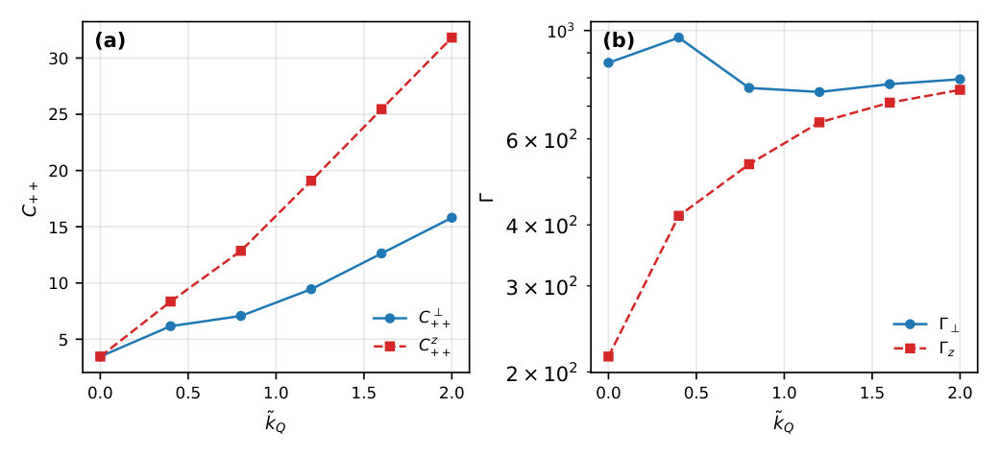 
FIG. 1. Quadratic NLSM: (a) numerically re-determined intraband coefficient C⊥,z ++ (the quantity that sets Ω2 p), Table II; (b) damping-weight ratio Γ⊥,z = C⊥,z ++ /C⊥,z T from Tables II and III, confirming that the intraband channel dominates the long- wavelength response. Both ratios are ≫1 at all ˜kQ: Γ⊥is non-monotonic, peaking near ˜kQ ≃0.4, while Γz rises monotonically with ˜kQ, reflecting the different ˜kQ dependences of C⊥,z ++ and the interband weight C⊥,z T .

📷 Fig 2

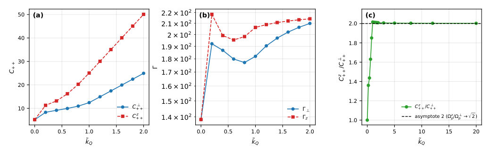 
FIG. 2. Cubic NLSM: (a) numerically re-determined intraband coefficient C⊥,z ++ (sets Ω2 p), Table VII; (b) damping-weight ratio Γ⊥,z = C⊥,z ++ /C⊥,z T from Tables VII and VIII and the Γ values of Table IV; both ratios stay ≫1 (intraband-dominated), with Γz peaking near ˜kQ ≃0.2 and then slowly decreasing while Γ⊥rises monotonically; (c) the anisotropy coefficient ratio Cz ++/C⊥ ++ (whose square root is the frequency ratio Ωz p/Ω⊥ p ), shown approaching the thin-ring asymptote 2 from above and converging with grid refinement out to ˜kQ = 20 by direct full-trace Lindhard integration. The interband term is subleading by roughly two orders of magnitude.

📷 Fig 3

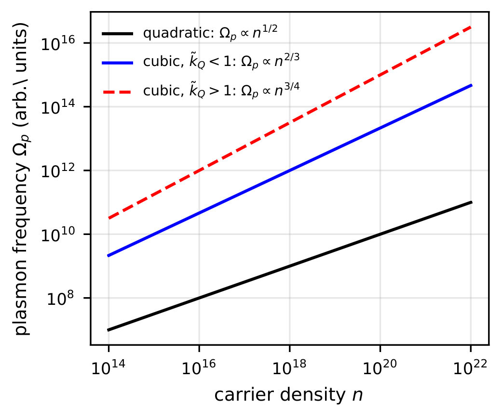 
FIG. 3. Schematic carrier-density scaling of the plasmon frequency (illustrative; the quantitative prefactors and physical-unit curves are in Fig. 4). Quadratic NLSM: Ωp ∝n1/2. Cubic NLSM: Ωp ∝n2/3 for ˜kQ &lt; 1 (large doping, µ &gt; Bk3 Q) crossing over to Ωp ∝n3/4 for ˜kQ &gt; 1 (small doping, µ &lt; Bk3 Q). The plotted density axis corresponds to the thin-ring window ˜kQ ≳1; the crossover to n2/3 occurs at n∗∼1019 cm−3 (vertical guide, see Fig. 4). These exponents follow from the intraband ReΠ++ alone and are independent of the quantitative prefactors.

📷 Fig 4

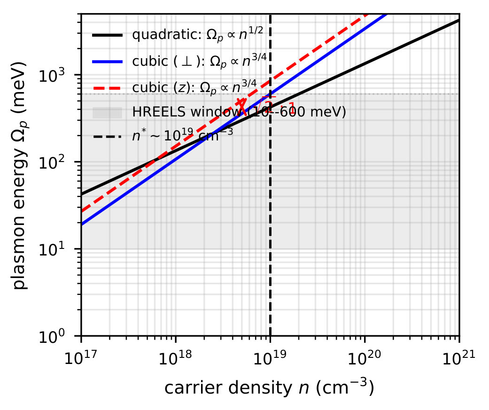 
FIG. 4. Plasmon energy in physical units (meV) vs. carrier density for the cubic NLSM at ˜kQ = 2 (thin-ring limit), with B = 10 eV nm3, kQ = 0.5 nm−1, and ϵ = 10. The blue and red curves show Ω⊥ p and Ωz p, respectively; the √

📷 Fig 5

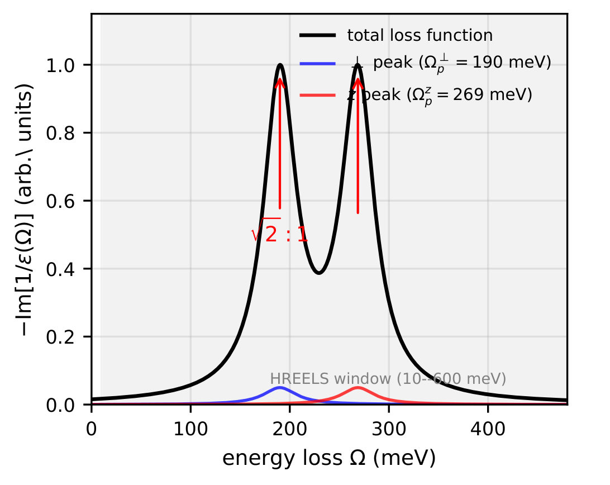 
FIG. 5. Schematic HREELS energy-loss spectrum for a cubic NLSM in the thin-ring regime (˜kQ ≥1, n ∼1019 cm−3). The two peaks correspond to the in-plane (⊥) and out-of-plane (z) plasmon modes, separated by the √

**Summary.** This paper theoretically investigates the plasmon modes in nodal line semimetals with quadratic and cubic dispersions using the Random Phase Approximation. It derives distinct carrier-density scaling laws ($\omega_p \sim n^{1/2}$ vs. $\omega_p \sim n^{2/3}$) that serve as unique experimental signatures to distinguish between different topological band structures. The findings establish a robust theoretical framework for understanding collective excitations in these advanced materials.

**Why it may be interesting.** The work provides a detailed theoretical framework for collective dynamics in topological semimetals, linking fundamental band structure properties (quadratic vs. cubic dispersion) directly to measurable optical responses like plasmons via density scaling exponents.

Detailed structure

**Main problem.** The study investigates plasmon modes, which are collective excitations, in higher-order dispersive nodal line semimetals (NLSMs), as these systems are poorly understood compared to their linear counterparts.

**Main result.** Distinct carrier-density scaling laws were found: quadratic NLSMs show $\omega_p \sim n^{1/2}$, while cubic NLSMs exhibit regime-dependent scaling ($\omega_p \sim n^{2/3}$ or $n^{3/4}$).

**Method.** The plasmon frequency is determined by solving the condition $\epsilon(\Omega, q) = 0$ using the Random Phase Approximation (RPA), involving the calculation of the one-loop polarizability from the full Lindhard integral.

**Model / system.** The model considers three-dimensional quadratic and cubic NLSMs characterized by specific Hamiltonian forms. The analysis focuses on calculating the polarization function $\Pi(\Omega, q)$ using both intraband (Drude) and interband contributions.

**Key observables.** Plasmon frequency ($\omega_p$), carrier-density scaling exponents ($n^{1/2}$, $n^{2/3}$), and plasmon anisotropy ratio ($\Omega_z^p / \Omega_\perp^p$).

**Important parameters / regimes.** Doping regime characterized by the dimensionless offset $	ilde{k}_Q$, and the validity parameter $r_s$ (Wigner-Seitz radius).

**Assumptions / limitations.** The calculations are performed within the Random Phase Approximation (RPA), which is assumed valid for $r_s \ll 1$. The intraband term is found to dominate the low-energy plasmon response.

**Figures summary.** Figures confirm that the anisotropy ratio $\Gamma_{\perp}/\Gamma_z$ rises from 1.0 at zero doping ($	ilde{k}_Q=0$) to a value near 2 for finite doping, consistent with torus topology.

**Paper structure.** The paper systematically derives the density ($n$) first, then calculates the polarization function $\Pi(\Omega, \mathbf{q})$ by separating intraband and interband contributions. Finally, it solves the plasmon dispersion equation using these components to derive the scaling laws for quadratic and cubic NLSMs.

Abstract

Nodal line semimetals (NLSMs) host distinctive topological properties and unconventional collective excitations. While plasmons in linear NLSMs are well studied, those of higher-order dispersive NLSMs remain poorly understood. We investigate plasmon modes in 3D quadratic and cubic NLSMs within the random phase approximation (RPA), valid for $r_s\ll1$ but breaking down in the small-doping cubic regime where the density of states diverges. Deriving the one-loop polarizability and evaluating its coefficients numerically from the full 3D Lindhard integral, we find distinct carrier-density scaling laws: quadratic NLSMs exhibit $ω_p\sim n^{1/2}$, while cubic NLSMs show $ω_p\sim n^{2/3}$ at large doping crossing over to $ω_p\sim n^{3/4}$ at small doping. The $n^{3/4}$ law is not quantitatively reliable: the diverging density of states drives $r_s>1$ already at $n\sim10^{18}$ cm$^{-3}$, limiting the observable window to at most $10^{18}\lesssim n\lesssim10^{19}$ cm$^{-3}$; below this, beyond-RPA correlations are essential. These scalings originate from the power-law density of states and intraband (Drude) response, and are analogous in phase-space power counting to bilayer and trilayer graphene, respectively. The long-wavelength intraband polarization dominates the plasmon frequency, while interband contributions are subleading (two to three orders of magnitude smaller for $Ω\llμ$). Both systems share a plasmon anisotropy $Ω_p^z/Ω_p^\perp\to\sqrt{2}$ in the thin-ring limit, a generic consequence of the torus Fermi-surface geometry. This $\sqrt{2}$ doublet, though observable by HREELS, cannot distinguish quadratic from cubic dispersion; the density scaling exponent is the true distinguishing signature. Our results provide a framework for the collective dynamics of higher-order dispersive NLSMs and suggest experimentally testable signatures accessible by HREELS.

[↑ back to top](#top)

### [Playing Nonlocal Games with Little to No Shared Randomness](http://arxiv.org/abs/2608.07833v1)

**Authors:** Mingze Xu, Eric Chitambar  
**Type:** theory · **Category:** quantum information and computing · **PDF:** <https://arxiv.org/pdf/2608.07833v1>  
**Analysis basis:** full PDF text, analyzed in chunks
**Topic relevance:** `quantum measurements` **1/5**

📷 Fig 1

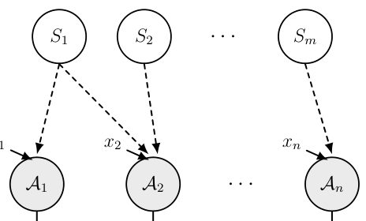 
FIG. 1. A general network consists of m sources distributing physical systems to n parties. Each party i receives an input xi and gives an output ai.

📷 Fig 2

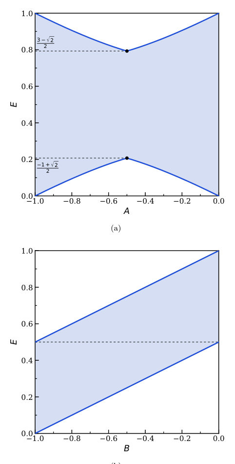 
FIG. 2. Feasible regions for classical models with |Λ| = 1. In both panels, the solid curves denote the analytic boundaries of the feasible sets, while the shaded regions represent the attainable values. (a) Joint values of (A, E). (b) Joint values of (B, E).

📷 Fig 3

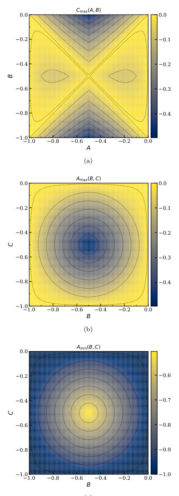 
FIG. 3. Heatmaps of the functions Cmax, Amax, and Amin. In all panels, colors represent numerical values of the corre- sponding function, and the dashed curves indicate contour lines of equal value. (a) Cmax(A, B). (b) Amax(B, C). (c) Amin(B, C).

📷 Fig 4

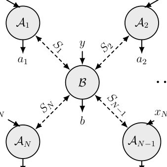 
FIG. 4. A star network with N branches and a central node. Each branch Ai and the central node B share a source Si.

**Summary.** This paper rigorously analyzes classical models of Bell nonlocality when shared randomness is restricted or absent. It shows that these restrictions cause the set of achievable classical correlations to become nonconvex, necessitating advanced mathematical tools beyond simple linear inequalities for characterization. The work culminates in deriving new entropic Bell inequalities applicable to quantum networks with limited shared resources.

**Why it may be interesting.** While focused on nonlocality, understanding how resource constraints (like limited randomness) fundamentally change the boundary between classical and quantum correlations is a core theoretical problem relevant to designing robust quantum communication protocols.

Detailed structure

**Main problem.** The work investigates how restricting shared randomness affects the set of classical correlations achievable in Bell nonlocality tests, comparing these limits to standard quantum network predictions.

**Main result.** When shared randomness is absent, the classical correlation set becomes nonconvex, requiring multiple linear or nonlinear inequalities (beyond simple Bell functionals) for accurate characterization. The paper derives an entropic Bell inequality specific to limited shared randomness in bipartite scenarios.

**Method.** The authors use optimization techniques, including KKT conditions and analysis of joint conditional probability distributions, to derive necessary constraints on classical correlation functions.

**Model / system.** The study focuses on bipartite Bell scenarios (2-2-2 case) and generalized quantum networks involving multiple sources ($m$ sources, $n$ parties). The core model involves characterizing correlations via local hidden variable models under resource restrictions.

**Key observables.** Bell functions (A, B, C, D), correlation measures ($M_{n,k}, I_{n,k}, J_{n,k}$), and the entropy quantifying shared randomness $H(S)$.

**Important parameters / regimes.** The number of parties/sources ($m, n$), the degree of shared randomness (e.g., $|\Lambda|=1$ for no shared randomness).

**Assumptions / limitations.** Initially assumes source independence in standard quantum networks; later relaxes this assumption to analyze correlated sources. A key open question is proving a suggested symmetry between boundary functions.

**Figures summary.** Figure 2 illustrates the feasible regions for classical models with limited shared randomness in $(A, E)$ and $(B, E)$ planes. Figure 4 depicts a star network structure used for analyzing bounds.

**Paper structure.** The paper progresses from characterizing standard LHV models to handling the nonconvexity arising from zero shared randomness. It then extends this analysis to quantum networks by relaxing source independence assumptions, culminating in deriving specific entropic Bell inequalities.

Abstract

Bell nonlocality reveals correlations that cannot be explained by classical models and plays a central role in quantum information theory. In this work, we investigate classical models of Bell nonlocality under restrictions on shared randomness. For bipartite scenarios with bounded shared randomness, the set of classical correlations becomes nonconvex. We characterize the correlations achievable without shared randomness through the simultaneous evaluation of multiple linear Bell functionals. We then extend our analysis to quantum networks by relaxing the standard assumption of source independence. In this setting, the feasibility constraints derived for the bipartite case can be used to certify source dependence, and we further construct nonlinear inequalities that distinguish classical models with correlated sources from correlations achievable in standard quantum networks. As an application, we show that these nonlinear network inequalities give rise to an entropic Bell inequality for bipartite scenarios with limited shared randomness.

[↑ back to top](#top)

### [QSVM-RQNN: Low-Qubit Recurrent Quantum Similarity Learning for Condition Monitoring and Fault Classification](http://arxiv.org/abs/2608.09652v1)

**Authors:** Amit S. Patel, Himanshu R. Patel, Bikash K. Behera  
**Type:** both · **Category:** quantum information and computing · **PDF:** <https://arxiv.org/pdf/2608.09652v1>  
**Analysis basis:** full PDF text, analyzed in chunks
**Topic relevance:** `quantum measurements` **1/5**

📷 Fig 1

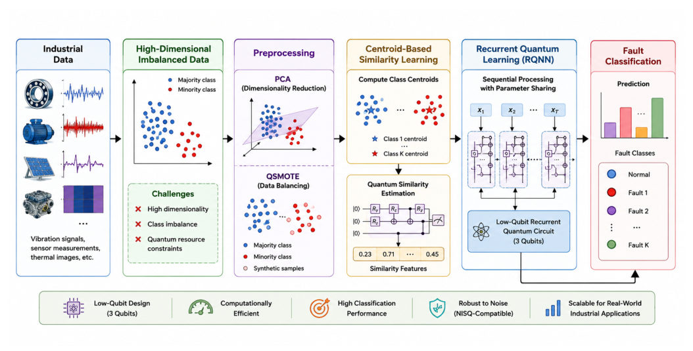 
Fig. 1: Conceptual overview of the proposed QSVM-RQNN framework. High-dimensional industrial data are first transformed into compact representations through PCA and balanced using QSMOTE. Centroid-based quantum similarity learning subsequently generates discriminative representations that are processed by a low-qubit recurrent quantum network for efficient fault classification on NISQ devices.

📷 Fig 2

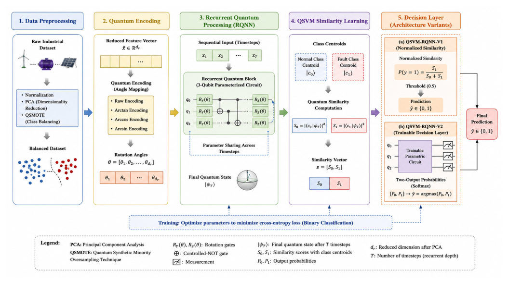 
Fig. 2: Overall workflow of the proposed QSVM-RQNN framework. The pipeline consists of data preprocessing (normalization, PCA, and QSMOTE), quantum feature encoding, and recurrent quantum representation learning using a compact three-qubit parameterized circuit with shared parameters across timesteps. QSVM-RQNN-V1 performs class-conditioned recurrent similarity learning and classifies using normalized sequence-level quantum similarity scores, whereas QSVM-RQNN-V2 processes timestep-wise quantum similarity features through a recurrent quantum classifier and applies Softmax normalization to the final measurement-derived class scores.

📷 Fig 3

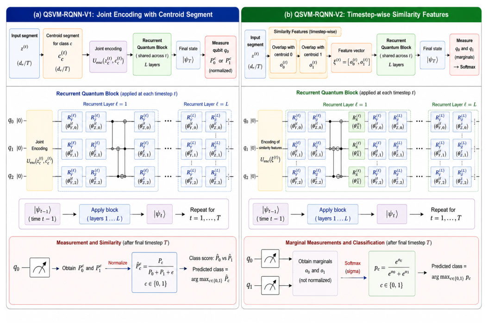 
Fig. 3: Architectural comparison of the proposed QSVM-RQNN variants. (a) QSVM-RQNN-V1 performs class-conditioned joint quantum encoding of the input timestep and the corresponding class-centroid segment, followed by recurrent quantum processing using a shared low-qubit recurrent quantum block. After processing the complete sequence, a single final quantum measurement produces sequence-level similarity scores, which are normalized to obtain the class probabilities. (b) QSVM-RQNN-V2 first computes timestep-wise quantum similarity features with respect to the two class centroids and encodes these similarity representations into the recurrent quantum circuit. The recurrent block contains an...

📷 Fig 4

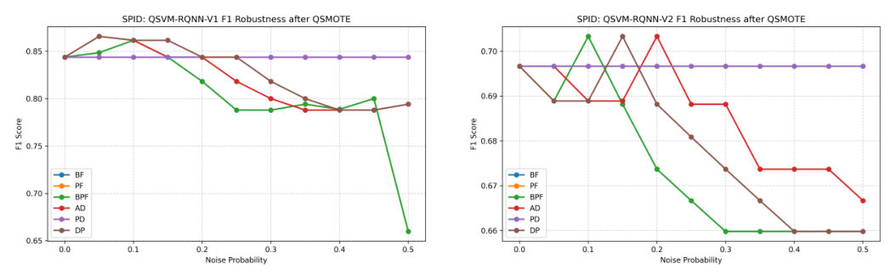 
Fig. 4: Noise robustness analysis of the proposed QSVM-RQNN variants on the SPID dataset after QSMOTE. The F1-score is evaluated under six quantum noise channels, namely bit-flip (BF), phase-flip (PF), bit-phase-flip (BPF), amplitude damping (AD), phase damping (PD), and depolarizing (DP), with the noise probability varied from η = 0 to η = 0.5. QSVM-RQNN-V1 consistently exhibits higher robustness than QSVM-RQNN-V2.

📷 Fig 5

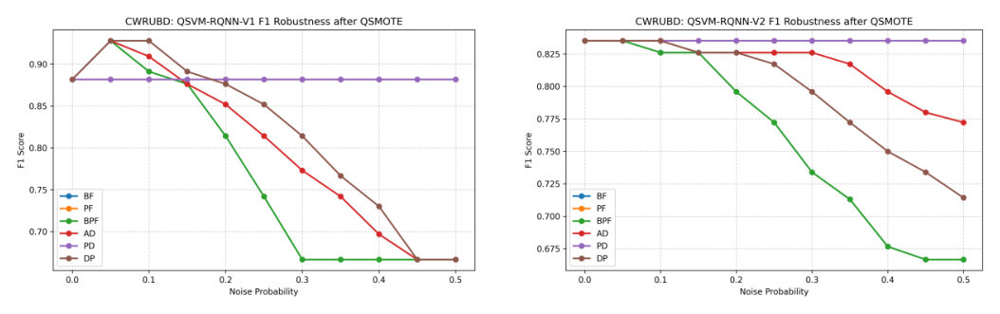 
Fig. 5: Noise robustness analysis of the proposed QSVM-RQNN variants on the CWRUBD dataset after QSMOTE. The F1-score is evaluated under six quantum noise channels, namely bit-flip (BF), phase-flip (PF), bit-phase-flip (BPF), amplitude damping (AD), phase damping (PD), and depolarizing (DP), while the noise probability is varied from η = 0 to η = 0.5. Phase damping produces almost no degradation.

**Summary.** This paper introduces QSVM-RQNN, a novel, low-qubit hybrid framework for fault classification tailored for NISQ devices. It combines Quantum Support Vector Machine similarity learning with Recurrent Quantum Neural Networks to process time-series data efficiently. The resulting model shows state-of-the-art performance while maintaining favorable resource efficiency compared to existing quantum methods.

**Why it may be interesting.** While focused on ML applications, the core development involves designing efficient quantum circuits (low-qubit recurrent architecture) to process complex data representations derived from similarity measures, which touches upon resource optimization in quantum computation.

Detailed structure

**Main problem.** Developing scalable quantum machine learning (QML) algorithms for fault classification on Noisy Intermediate-Scale Quantum (NISQ) devices while overcoming limitations in qubit resource requirements and noise sensitivity.

**Main result.** The proposed QSVM-RQNN framework achieves competitive or state-of-the-art performance across multiple benchmarks, demonstrating superior performance-efficiency trade-offs for fault detection on imbalanced datasets.

**Method.** The approach integrates centroid-based Quantum Support Vector Machine (QSVM) similarity learning with Recurrent Quantum Neural Networks (RQNNs), preceded by PCA dimensionality reduction and QSMOTE class balancing.

**Model / system.** The system is a low-qubit hybrid quantum architecture utilizing a compact three-qubit recurrent quantum circuit. It processes feature representations derived from the combination of similarity learning and sequential time steps.

**Key observables.** Fault classification performance, F1-score (especially for minority classes), recall, and robustness against various quantum noise models.

**Important parameters / regimes.** Low qubit count (three qubits); number of recurrent timesteps ($T$) and depth ($L$); dimensionality reduction via PCA.

**Assumptions / limitations.** The framework assumes the feasibility of running on NISQ devices despite resource constraints; performance is evaluated against various established quantum/hybrid baselines.

**Figures summary.** Figure 1 illustrates the overall workflow: PCA $
ightarrow$ QSMOTE $
ightarrow$ Centroid Construction $
ightarrow$ Compact Recurrent Quantum Architecture. Tables detail ablation studies varying $T$ and $L$, and statistical comparisons using average ranks.

**Paper structure.** The paper introduces the problem constraints of NISQ devices, proposes the QSVM-RQNN framework with two variants (V1, V2), details preprocessing steps (PCA, QSMOTE), presents ablation studies on architectural parameters ($T, L$), and concludes with performance comparisons against multiple state-of-the-art models.

Abstract

In the Noisy Intermediate-Scale Quantum (NISQ) era, limited qubit availability and hardware noise constrain the practical deployment of quantum machine learning (QML). Existing quantum neural network (QNN) and quantum convolutional neural network (QCNN) architectures often require increasing quantum resources as the input dimension grows, limiting scalability on near-term devices. We propose QSVM-RQNN, a low-qubit framework integrating centroid-based Quantum Support Vector Machine (QSVM) similarity learning with Recurrent Quantum Neural Networks (RQNNs) for fault classification. The framework reduces the feature space using principal component analysis (PCA), partitions the reduced representation into sequential timesteps, and processes them using a compact three-qubit recurrent quantum architecture with shared parameters. Two complementary variants are developed: QSVM-RQNN-V1 performs class-conditioned joint quantum encoding of input and centroid segments, whereas QSVM-RQNN-V2 performs recurrent learning over timestep-wise quantum similarity representations. Experimental evaluation on multiple fault diagnosis datasets shows competitive and, in several cases, state-of-the-art performance compared with QSVM, QNN, QCNN, QSVM-QNN, QSVM-QCNN, and RQNN models. The proposed architectures provide favorable performance-efficiency trade-offs, improved recall, and enhanced fault detection on highly imbalanced datasets. These results demonstrate that integrating centroid-based quantum similarity learning with low-qubit recurrent representation learning provides an effective and scalable approach to condition monitoring and fault classification on resource-constrained NISQ devices.

[↑ back to top](#top)

### [Quantum Information Flow under String-Diagram Rewriting](http://arxiv.org/abs/2608.09823v1)

**Authors:** Yi-Yu Lin, Chen-Ye Li  
**Type:** theory · **Category:** quantum information and computing · **PDF:** <https://arxiv.org/pdf/2608.09823v1>  
**Analysis basis:** full PDF text, analyzed in chunks
**Topic relevance:** `quantum measurements` **1/5**

📷 Fig 1

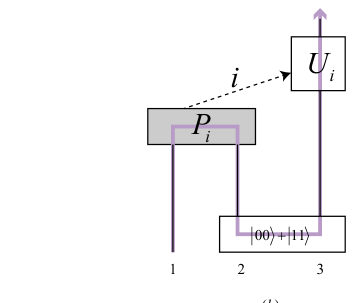 
Figure 1: (a) Quantum teleportation. (b) The corresponding entanglement specification

📷 Fig 2

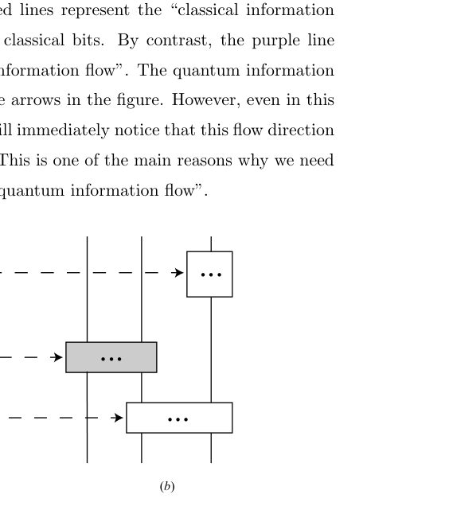 
Figure 2: (a) The tree decomposition of quantum teleportation. (b) The configuration

📷 Fig 3

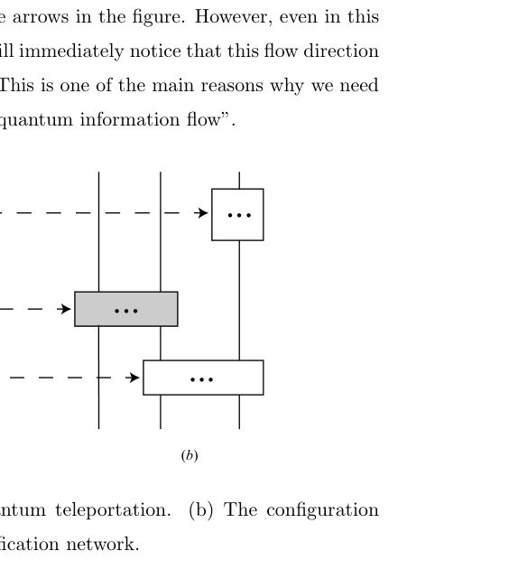 
Figure 2 introduces the concrete construction of an “entanglement specification net-

📷 Fig 4

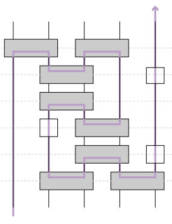 
Figure 3: (a) The traversal rules for quantum information flow. (b) An example of quantum

📷 Fig 5

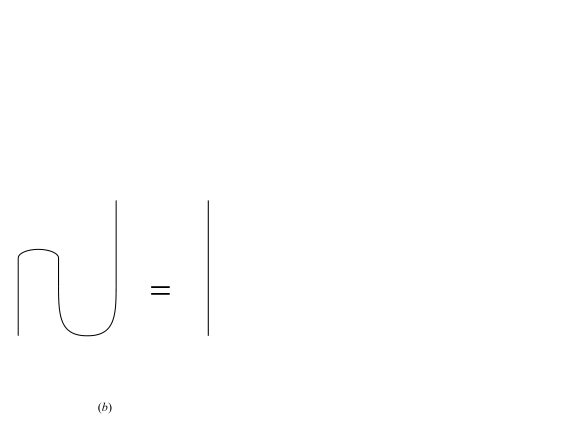 
Figure 6: (a) Complete ZX string-diagrammatic representation of the teleportation protocol.

**Summary.** This work formalizes 'quantum information flow' by translating the concept into the precise mathematical language of string diagrams using the ZX calculus. It distinguishes between superficial path dependencies and genuine, structure-preserving information transfer paths. By showing that complex quantum protocols can be systematically reduced to simple bare wires via rewriting rules, it offers a powerful diagnostic tool for analyzing quantum circuit integrity.

**Why it may be interesting.** It provides a rigorous, graphical language (ZX calculus) for analyzing how entanglement and quantum information are physically channeled through complex multi-partite protocols, which is foundational knowledge for understanding quantum computation architectures.

Detailed structure

**Main problem.** The paper aims to provide an explicit, formal string-diagrammatic definition for the concept of 'quantum information flow,' originally introduced by Coecke.

**Main result.** It formally defines a 'Coecke flow line' based on the compatible inheritance relation within rewriting systems, demonstrating that genuine flow can be tracked through successive diagram rewrites until it reaches a bare wire factor.

**Method.** The authors employ string-diagrammatic rewriting techniques, specifically utilizing the ZX calculus, to model quantum protocols and track information propagation.

**Model / system.** The formalism is illustrated using quantum protocols like teleportation (including GHZ-assisted versions), which are modeled within the framework of dagger compact closed categories.

**Key observables.** The existence and structure of a 'bare wire factor' that represents the information flow after reduction, and the successful simplification of complex diagrams to this bare wire.

**Important parameters / regimes.** Not specified (focus is on structural properties rather than continuous parameters).

**Assumptions / limitations.** The analysis relies on the assumption that quantum protocols can be mapped onto string-diagrammatic structures within a dagger compact closed category, and that flow must be certifiable across all measurement branches.

**Figures summary.** Figures illustrate the progression from intuitive flow visualization to ESN construction, formalization as string diagrams (including ZX representations), and finally, step-by-step reduction of complex initial diagrams down to simple bare wires for specific protocol instances.

**Paper structure.** The paper progresses by revisiting the abstract notion of quantum information flow, developing the mathematical machinery using ESNs and string diagrams in the ZX calculus, and then applying this formalism to concrete examples like teleportation to demonstrate the reduction to a bare wire factor.

Abstract

We revisit the notion of ``quantum information flow'' introduced in Bob Coecke's early work and seek to give it an explicit string-diagrammatic formalization. Given a semantics preserving string-diagram rewriting sequence, we first distinguish apparent through-paths, which depend on the current graphical presentation, from genuine through paths, which can be compatibly inherited through successive rewrites to a terminal decoupled bare wire factor. We then formally define a ``Coecke flow line'' in terms of this compatible inheritance relation.   In particular, we use the ZX calculus, i.e., the ZX string diagram rewriting system, to illustrate the resulting formalism. In the physical setting of quantum protocols, a Coecke flow can be interpreted as a constrained, quasi-local, line-like presentation of a target bare wire morphism factor within the protocol string diagram.

[↑ back to top](#top)

### [Quantum Uncomputation of Clean and Dirty Ancilla Qubits](http://arxiv.org/abs/2608.09578v1)

**Authors:** Chenke Liu, Li Zhou, Boning Meng  
**Type:** theory · **Category:** quantum information and computing · **PDF:** <https://arxiv.org/pdf/2608.09578v1>  
**Analysis basis:** full PDF text, analyzed in chunks
**Topic relevance:** `quantum measurements` **1/5**

📷 Fig 1

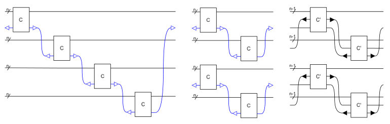 
Fig. 2. For applying four identical functionalities in parallel on four disjoint 𝑛-qubit blocks (where 𝐶and 𝐶′

📷 Fig 2

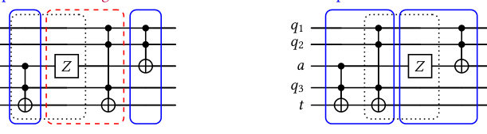 
Fig. 6. Rewrite-based normalization on a running example. Each panel is the circuit after one rewrite step. Dotted box highlights the rewrite result of the previous panel’s violating pair; dashed box marks the next leftmost violating pair. The prefix/suffix grows monotonically, visualizing progress toward the normal form.

📷 Fig 3

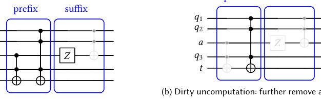 
Figure 8a shows an example. This local pattern alone does not rule out uncomputation; however, in many practical circuits it correlates with non-uncomputability. (b) Commuting through H:

📷 Fig 4

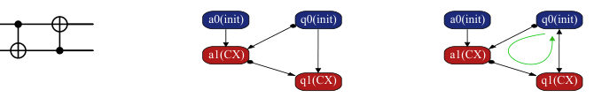 
Fig. 8. From left to right: a mutual-control circuit 𝐶between an ancilla 𝑎and a working qubit 𝑞, its circuit graph 𝐺, and the modified graph 𝐺↔where all target edges on working qubits are made bidirected; 𝐺↔

📷 Fig 5

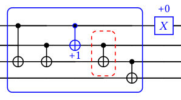 
Fig. 9. Illustration of Aw-Dep computation.

**Summary.** This paper presents a unified framework for ensuring the safe disposal (uncomputation) of ancilla qubits in quantum circuits, handling both perfectly initialized ('clean') and arbitrarily initialized ('dirty') states. By proving the problem's computational hardness and introducing the $	ext{RwUn}$ algorithm, it offers state-of-the-art tools that significantly improve circuit synthesis coverage for complex quantum computations.

**Why it may be interesting.** This work provides rigorous theoretical guarantees and practical algorithmic improvements for managing resource qubits in quantum computation, which is foundational knowledge for building reliable quantum compilers and hardware control layers.

Detailed structure

**Main problem.** The paper addresses the need for automatic, safe uncomputation protocols for auxiliary (ancilla) qubits in quantum circuits, extending coverage from clean to dirty ancillas.

**Main result.** They prove that checking the existence of such an uncomputation is coNP-hard and introduce a rewrite-based normalization algorithm ($	ext{RwUn}$) that achieves high coverage on complex benchmarks compared to existing methods.

**Method.** The authors develop a unified formalization, employing synthesis-oriented techniques like $	ext{RwUn}$ (a rewrite-based normalization) and a template-based reasoning system to structure circuits for safe uncomputation.

**Model / system.** The model is general quantum circuits utilizing ancilla qubits. The focus distinguishes between 'clean' ancillas (known initial state $|0\rangle$) and more complex 'dirty' ancillas (arbitrary, unknown initial state $|x\rangle$).

**Key observables.** Circuit size (S), circuit depth (D), and the ability to restore the ancilla to its original input state $|x\rangle$ for dirty qubits.

**Important parameters / regimes.** The complexity is analyzed based on dependency structures, quantified by 'Aw-Dep' metrics, and performance is benchmarked across various arithmetic circuits (e.g., Adder, Comparator) at increasing scales ($n$).

**Assumptions / limitations.** Applicability is limited by the presence of 'aw-cycles' in Boolean circuits or $H$ gates on ancillas/dependent working qubits in general quantum circuits.

**Figures summary.** Figures illustrate dependency complexity calculations and circuit graphs, while Tables summarize resource requirements (Size/Depth) for various arithmetic families under different uncomputation models ($	ext{Aw-Dep}$, $	ext{RwUn}$, $	ext{Reqomp}$).

**Paper structure.** The paper establishes the formal problem definition for clean vs. dirty ancillas, proves the coNP-hardness of existence checking, introduces and details the $	ext{RwUn}$ normalization method, and validates its performance through extensive benchmarking against state-of-the-art tools.

Abstract

Automatic uncomputation aims to provide programming-language-level support to facilitate the correct and safe use of ancilla qubits in quantum computing, but efforts have only been made for clean ancillas, leaving dirty ancillas unexplored. We present a unified formalization of the uncomputation of both clean and dirty ancillas. For the first time, we prove that checking the existence of uncomputation is coNP-hard. We introduce two complementary synthesis-oriented existence-checking methods: a rewrite-based normalization algorithm (RwUn) and a template-based reasoning system (TpUn) that guarantees uncomputation through structured Store-Use patterns. We implement prototypes of both methods in Qiskit and Python. Compared to the state-of-the-art Reqomp~\cite{reqomp}, RwUn achieves 100% coverage on practical complex-dependency benchmarks, twice the coverage on random classical circuits, and about 50% coverage on random quantum circuits beyond the scope of existing methods, demonstrating broader applicability.

[↑ back to top](#top)

### [Randomized product formulas beyond optimal deterministic scaling](http://arxiv.org/abs/2608.07720v1)

**Authors:** Leeseok Kim, Luis Pedro García-Pintos  
**Type:** theory · **Category:** quantum information and computing · **PDF:** <https://arxiv.org/pdf/2608.07720v1>  
**Analysis basis:** full PDF text, analyzed in chunks
**Topic relevance:** `analog quantum simulation` **1/5**

📷 Fig 1

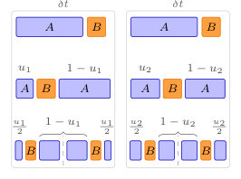 
FIG. 1: Schematics of deterministic and randomized product formulas for simulating A + αB over repeated time steps δt in the standard access model. (a) The de- terministic 1st-order formula, (e−iδtαBe−iδtA)r. (b) One instance of the 1st-order randomized formula, Eq. (3). (c) One instance of the 2nd-order randomized formula, Eq. (9), obtained by symmetrizing (b); higher-order for- mulas are recursively constructed from this via Eq. (10).

📷 Fig 2

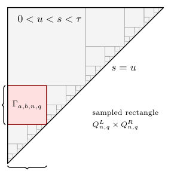 
FIG. 2: Dyadic sampling for randomized THRIFT. Sam- pled rectangles in the time-ordering triangle specify the local corrections in Eq. (22).

📷 Fig 3

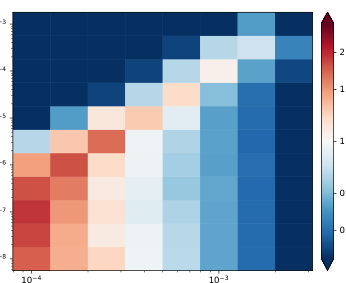 
FIG. 4: Gate-count advantage of randomized first-order THRIFT for simulating the dynamics of the 8-qubit random-field Heisenberg chain at t = 9/E0, across inter- action strengths α and target errors ϵ. The color shows the ratio of the smaller median gate count of determin- istic first- and second-order THRIFT to the median ex- pected gate count of randomized first-order THRIFT. For each method, the median is taken over ten independent field realizations of the minimum gate count required to achieve the target error. In the red region, randomized first-order THRIFT requires fewer gates than either first- or second-order deterministic THRIFT.

📷 Fig 4

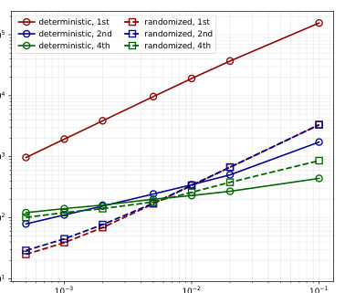 
FIG. 3: Minimum number of elementary exponentials (gates) required to simulate the dynamics of the 9-qubit transverse-field Ising model at t = 9/E0, comparing stan- dard deterministic product formulas with our random- ized formulas as a function of α. Our approach requires fewer gates for small α, while deterministic formulas per- form better as α increases since our method uses twice as many gates.

**Summary.** The paper introduces novel randomized product formulas to simulate quantum dynamics governed by $H = A + \alpha B$. By averaging over random shifts, these methods achieve significantly better error scaling (e.g., $O(\alpha^3)$) than deterministic protocols. This breakthrough is vital for efficiently simulating weakly coupled quantum systems on near-term quantum hardware.

**Why it may be interesting.** This work directly addresses the efficiency bottleneck in quantum simulation algorithms by providing provably superior scaling for time evolution approximations when interactions are weak, which is crucial for simulating many physical systems.

Detailed structure

**Main problem.** The primary goal is developing randomized product formulas that overcome fundamental error scaling limitations inherent in deterministic methods for simulating quantum time evolution.

**Main result.** Randomized formulas achieve superior error scaling, reaching $O(\alpha^3)$ or better, while maintaining a low expected gate overhead compared to the $\Omega(\alpha)$ or $\Omega(\alpha^2)$ lower bounds proven for deterministic counterparts.

**Method.** The authors introduce randomized product formulas by averaging over random shifts in the Trotter steps, which allows error terms that persist deterministically to cancel out through expectation values.

**Model / system.** The simulation targets quantum systems governed by a Hamiltonian $H = A + \alpha B$, where $\alpha$ is small. The analysis considers two access models: one allowing separate exponentials of $A$ and $B$, and a stronger model allowing implementation of $e^{-is(A+\alpha B_\ell)}$ for components $B_\ell$.

**Key observables.** Error scaling (measured by the diamond norm, $\|\cdot\|_\diamond$), expected gate count ($	ext{E}_\omega[G]$), and comparison against lower bounds.

**Important parameters / regimes.** The small coupling strength $\alpha$, the number of Trotter steps ($r$), and the order of approximation ($2k$).

**Assumptions / limitations.** The analysis relies on $\alpha \ll 1$ and uses techniques like Dyson series expansions, telescoping identities, and bounding mixed derivatives.

**Figures summary.** Figures illustrate schematics comparing deterministic vs. randomized formulas (Fig. 1), detail the dyadic sampling strategy for THRIFT (Fig. 2), and benchmark gate counts/error scaling for physical models (Figs. 3 & 4).

**Paper structure.** The paper systematically analyzes two access models, deriving improved error bounds using randomization techniques based on Trotter-Heuristic Resource Improved Formulas (THRIFT) and establishing corresponding lower bounds that prove the necessity of randomization.

Abstract

Product formulas, also known as Trotter formulas, are among the most widely used and practical methods for simulating quantum systems on quantum computers. Here we introduce two new classes of randomized product formulas for simulating Hamiltonians with separated energy scales, $H=A+αB$, where $α$ is small. In the standard access model, where one can implement exponentials of $A$ and $B$ separately, our randomized formulas achieve $\mathcal O(α^2)$ error scaling at the cost of only doubling the gate depth of the corresponding deterministic formula. We further prove an $Ω(α)$ lower bound for deterministic product formulas. In a stronger access model, allowing exponentials of $A+αB_\ell$ for $B = \sum_{\ell}B_\ell$, our randomized formula, based on Trotter Heuristic Resource Improved Formulas for Time-dynamics (THRIFT)~[J. L. Bosse et al., Nat. Commun. 16, 2673 (2025)], achieves $\mathcal O(α^3)$ error scaling with only constant-factor expected gate overhead. We also establish an $Ω(α^2)$ lower bound for deterministic product formulas in this access model. Numerical simulations confirm gate-count reductions for simulating physically motivated systems.

[↑ back to top](#top)

### [Solving the Gibbs Paradox by Local Free Space and Collision Potential](http://arxiv.org/abs/2608.08457v1)

**Authors:** Chuang Li  
**Type:** theory · **Category:** statistical mechanics · **PDF:** <https://arxiv.org/pdf/2608.08457v1>  
**Analysis basis:** full PDF text, analyzed in chunks
**Topic relevance:** `Keldysh / 2PI / non-Gaussian methods` **1/5**

📷 Fig 1

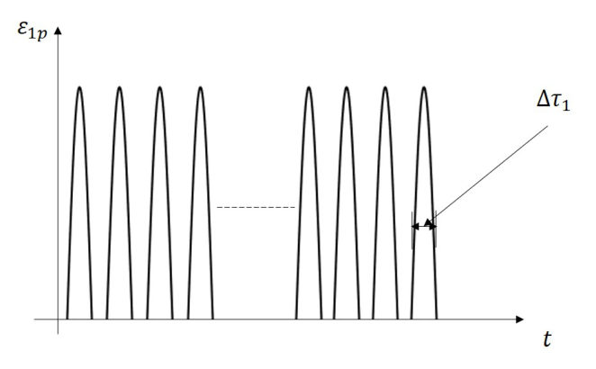 
FIG. 1. A schematic diagram showing the relationship between the collision potential energy ε1p of the molecule type 1 and time.

📷 Fig 2

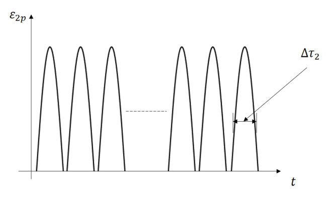 
FIG. 2. A schematic diagram showing the relationship between the collision potential energy ε2p of the molecule type 2 and time.

📷 Fig 3

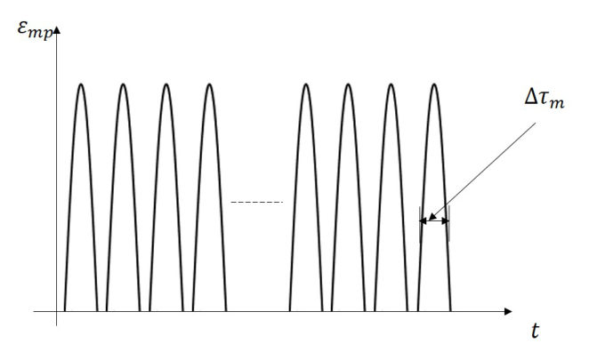 
FIG. 3. A schematic diagram showing the relationship between the collision potential energy εmp of the molecule type 1&amp;2 and time. Here, εmp is equal to the εm12p or εm21p mentioned later.

**Summary.** This paper tackles the Gibbs Paradox by developing a statistical mechanics framework that incorporates local free space and collision potentials. Instead of relying on quantum indistinguishability arguments, it rederives the entropy increase for gas mixtures using the canonical ensemble. The resulting formula suggests that the entropy change depends on specific molecular properties, thus resolving the paradox in a novel way.

**Why it may be interesting.** It offers a non-standard statistical mechanical approach to a classic problem, linking macroscopic entropy changes directly to microscopic, time-dependent potential energy interactions during mixing.

Detailed structure

**Main problem.** The paper aims to resolve the Gibbs Paradox—the discrepancy regarding entropy increase upon gas mixing—without invoking the concept of identical particles.

**Main result.** By incorporating local free space and collision potential energy into the canonical ensemble calculation, the authors derive a non-zero entropy increase formula ($\Delta S$) that depends on specific gas properties.

**Method.** The methodology involves rederiving the entropy change using the canonical ensemble approach, treating molecular interactions via collision potentials rather than relying solely on ideal gas assumptions.

**Model / system.** The model is an ideal gas mixture undergoing mixing. Interactions are governed by local free space volume and a potential energy term derived from collisions between different types of molecules (Gas 1 and Gas 2).

**Key observables.** Entropy increase ($\Delta S$), Free Energy ($F$), Collision Potential Energy ($\epsilon_p$).

**Important parameters / regimes.** Molecular mass, effective radius, collision characteristic time, number densities ($n_1, n_2$).

**Assumptions / limitations.** The primary assumptions are that collisions are the main interaction force and that the local free space volume dictates molecular movement, allowing avoidance of the $N!$ factor.

**Figures summary.** Figures schematically illustrate the time dependence of various collision potential energies ($\epsilon_{1p}, \epsilon_{2p}, \epsilon_{mp}$).

**Paper structure.** The paper reviews existing solutions to the Gibbs paradox, develops a framework based on local free space and collision potentials using the canonical ensemble, derives $\Delta S$ by considering interaction potentials, and concludes with an expression showing property dependence.

Abstract

This paper argues that the Gibbs paradox can be resolved without using the concept of identical particles in quantum mechanics. The molecules in different regions of the gas can be distinguished, so there is no need to introduce the N! factor. For each molecule, the volume of its free movement space is local at every instant. Moreover, collisions are the primary way of interaction between gas molecules and the fundamental driving force for reaching equilibrium. The potential energy during collisions cannot be ignored. Based on the local free space assumption and collision potential energy, this paper uses the canonical ensemble method to rederive the entropy increase formula for gas mixtures. It includes parameters such as molecular mass, effective radius, and collision characteristic time, which vary with the type of gas molecules. This solves the problem that the entropy increase of gas mixtures is independent of gas properties, that is, it truly resolves the Gibbs paradox instead of providing a new conceptual explanation.

[↑ back to top](#top)

### [The quadratic growth of Krylov spread complexity in the BTZ black hole](http://arxiv.org/abs/2608.09922v1)

**Authors:** Aranya Bhattacharya, Mario Flory, Michal P. Heller, Emiliano Rizza, Tim Schuhmann  
**Type:** theory · **Category:** other · **PDF:** <https://arxiv.org/pdf/2608.09922v1>  
**Analysis basis:** full PDF text, analyzed in chunks
**Topic relevance:** `quantum measurements` **1/5**

📷 Fig 1

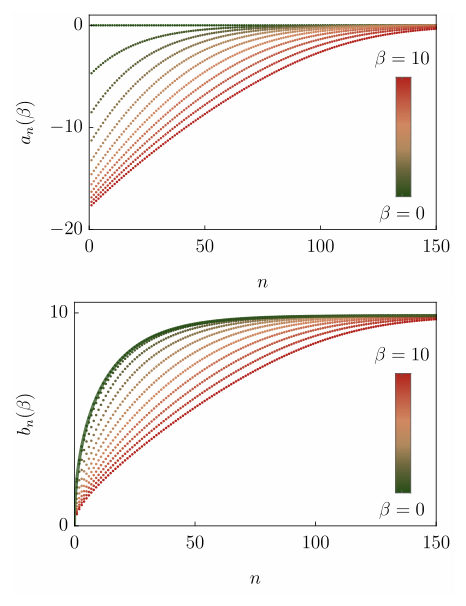 
FIG. 1. Lanczos coefficients an(β) (top) and bn(β) (bottom) for Krylov spread complexity of finite-temperature TFD state in DSSYK: analytic predictions at β = 0 (solid line) and numerics at β (dots) in steps of one from zero to ten. All data are for q = 0.95. In both coefficients, an emergent linear regime at intermediate n is visible for nonzero β.

📷 Fig 2

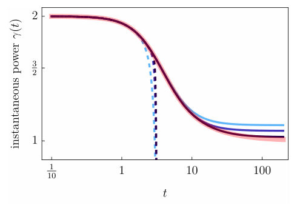 
FIG. 2. Instantaneous power γ(t) = t∂t log CK(t) of the complexity early-time series in the q →1 limit up to or- der {8,24,40} in t (dashed; light to dark blue) and its diagonal Pad´e approximations of order {4,12,20} (solid; light to dark blue) compared to the exact answer γ(t) = t tanh (t/2)/(2 log cosh(t/2)) (light red). We see rapid conver- gence of the Pad´e approximation towards the exact answer.

📷 Fig 3

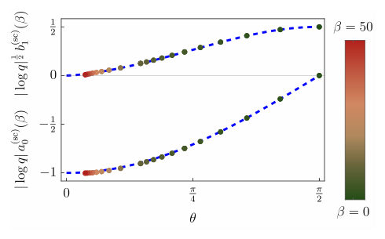 
FIG. 3. Comparison of Lanczos coefficients a0(β) and b1(β) (normalized by appropriate powers of |log q|) from numerics at various temperatures β(θ) (dots) with analytical predictions a(sc) 0 (β) and b(sc) 1 (β) (blue dashed) from the semiclassical par- tition function of DSSYK via CfZ. All data are for q = 0.95. The inverse temperature β goes from zero to ten in steps of one and from ten to fifty in steps of five.

📷 Fig 4

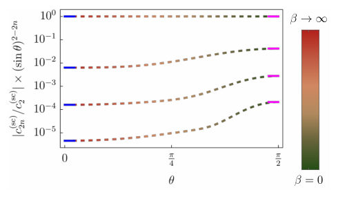 
FIG. 4. Visualization of the temperature dependence (β increasing from zero to ∞from green to red) of the abso- lute value of the first four coefficients c(sc) 2n (β) of the classical complexity early-time series from the semiclassical partition function of DSSYK, normalized by c(sc) 2 (β) and rescaled by (sin θ)2−2n for visual clarity (dashed). They correspond to n = {1, 2, 3, 4} from top to bottom. The first four early-time coefficients of Schwarzian complexity (solid blue) are repro- duced at β →∞, and the first four early-time coefficients of Lβ=0 = 2 log cosh t/2 (solid magenta) at β →0.

📷 Fig 5

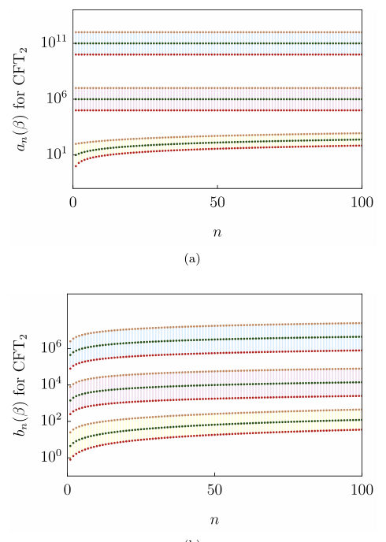 
FIG. 5. First 100 Lanczos coefficients an(β) in (a) and bn(β) in (b) for Krylov spread complexity of finite temperature TFD state in CFT2. The shaded bands indicate c = 101 (yellow), c = 106 (purple) and c = 1011 (blue). The numerics were carried out at three inverse temperatures β = 1 (green), β = 10−1/2 (orange) and β = 101/2 (red), respectively as indicated by the color of the data points. It is evident that Lanczos coefficients increase with increasing c, n and temperature.

**Summary.** This paper develops a systematic method using Krylov spread complexity to probe black hole interiors holographically. By analyzing the BTZ black hole dual to a 2D CFT, the authors show that the complexity exhibits quadratic late-time growth ($\gamma=2$), which requires careful resummation of infinite series invariants. This work provides a powerful new tool linking quantum dynamics (Krylov theory) directly to gravitational thermodynamics.

**Why it may be interesting.** This work connects concepts from quantum information (complexity measures), general relativity (black holes/BTZ geometry), and advanced mathematical physics (spectral theory via Krylov methods). The focus on non-trivial asymptotic scaling ($\gamma=2$ vs $\gamma=1$) is highly relevant to understanding the deep structure of holographic entanglement and complexity.

Detailed structure

**Main problem.** The primary challenge is determining a robust boundary quantity that accurately captures the growth of black-hole interiors quantified by holographic complexity, especially beyond simple 2D gravity models.

**Main result.** The authors establish that for the BTZ black hole dual to CFT2, Krylov spread complexity exhibits an intermediate departure from early-time quadratic growth, followed by behavior compatible with asymptotically quadratic growth ($\gamma=2$).

**Method.** The work employs a combination of holographic duality (relating bulk geometry to boundary quantum dynamics), the moment method applied to Lanczos recursion for Krylov spread complexity, and advanced asymptotic analysis techniques like Padé continuation.

**Model / system.** The study focuses on black holes, specifically the BTZ black hole in 2D, which is dual to a large-central-charge two-dimensional conformal field theory (CFT). A benchmark system used for comparison is the double-scaled Sachdev–Ye–Kitaev (DSSYK) model.

**Key observables.** Krylov spread complexity ($C_K(t)$), generalized complexity built from extrinsic-curvature invariants, and the asymptotic growth rate ($\gamma$) of this complexity.

**Important parameters / regimes.** The analysis examines different time/temperature regimes (early vs. late times) and requires careful handling of the order in which semiclassical limits are taken relative to the reconstruction of the complexity measure.

**Assumptions / limitations.** Key assumptions include the validity of holographic duality for these systems and the necessity of resumming infinite series expansions (like those involving extrinsic-curvature invariants) to capture the correct asymptotic behavior.

**Figures summary.** The notes describe a comparison between finite truncations of an expansion (showing linear growth, $\gamma=1$) and the fully resummed function (showing quadratic growth, $\gamma=2$), illustrating the non-commutativity of limits.

**Paper structure.** The paper progresses by first identifying the theoretical gap in complexity measures, then using the DSSYK model as a controlled benchmark to establish an 'order-of-limits' rule. It then applies this framework to the BTZ black hole/CFT2 system, deriving and analyzing the resulting asymptotic behavior of $C_K(t)$ through detailed mathematical expansions.

Abstract

The boundary quantity that captures the growth of black-hole interiors quantified by holographic complexity remains unknown beyond 2d dilaton gravity. We provide a critical analysis of a partition-function construction of Krylov spread complexity for thermofield-double states that provides a dimension-independent boundary reconstruction from semiclassical holographic partition functions, while developing the present dynamical and bulk construction for the BTZ saddle. In the double-scaled Sachdev-Ye-Kitaev model, where exact and semiclassical results can be compared, we show that the classical limit is reliable only when taken after the complexity has been reconstructed; taking this limit at the level of individual Lanczos coefficients discards essential information. Applying the construction to a large-central-charge two-dimensional conformal field theory above the Hawking-Page temperature dual to a Bañados-Teitelboim-Zanelli black hole, we find an intermediate departure from early-time quadratic growth followed by behavior compatible with a return toward asymptotically quadratic growth, rather than the linear late-time behavior of the volume and the standard finite-functional complexity = anything class. We then match this boundary behavior to a generalized complexity = anything bulk object built from an infinite series of extrinsic-curvature invariants. The construction provides a systematic route from black-hole thermodynamics to Krylov dynamics and can naturally be extended to higher-dimensional holographic black holes.

[↑ back to top](#top)

### [Toward Standardized Quantum Provenance: A Cross-Provider Analysis, Unified API, and Reference Prototype](http://arxiv.org/abs/2608.08272v1)

**Authors:** Jouni Peltonen, Vlad Stirbu, Tommi Mikkonen, Cesare Pautasso  
**Type:** theory · **Category:** quantum information and computing · **PDF:** <https://arxiv.org/pdf/2608.08272v1>  
**Analysis basis:** full PDF text, analyzed in chunks
**Topic relevance:** `quantum measurements` **1/5**

📷 Fig 1

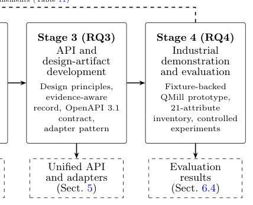 
Fig. 1 Four-stage study design. Solid arrows show the primary flow from requirements to evaluation; each stage produces the artifact or evidence named below it. The dashed feedback arrow indicates Design Science Research build–evaluate cycles in which evaluation findings refined the provenance model and API.

📷 Fig 2

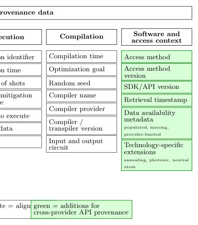 
Fig. 2 Quantum provenance schema used in this study. White attributes are inherited from or directly aligned with QProv; green attributes represent focused additions introduced for cross-provider API-based provenance access.

📷 Fig 3

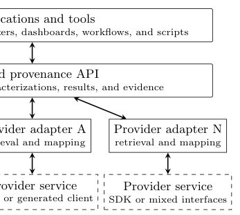 
Fig. 3 Provider-adapter architecture for exposing heterogeneous upstream interfaces through the unified provenance API.

📷 Fig 4

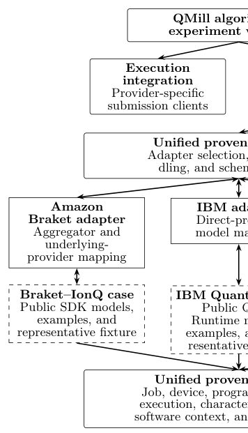 
Fig. 4 Reference-prototype architecture used in the QMill demonstration. QMill accesses provenance through one common client, while separate Amazon Braket, IBM, and IonQ adapters normalize representative public provider structures into the unified provenance record. The execution path remains provider-specific and is outside the prototype’s implementation scope.

**Summary.** This paper tackles the lack of standardization in tracking quantum computation history (provenance) across diverse quantum hardware providers. The authors propose a unified, evidence-aware OpenAPI contract and an adapter architecture to normalize this fragmented data. This framework is vital for achieving reproducibility and interoperability in the rapidly evolving field of quantum computing.

**Why it may be interesting.** This work directly addresses the infrastructure layer of quantum computing, which is crucial for any theoretical physicist needing to simulate or analyze results from real-world hardware platforms.

Detailed structure

**Main problem.** Quantum software development suffers from a 'provenance-integration problem' because different quantum hardware providers expose necessary provenance data through heterogeneous, non-standardized APIs.

**Main result.** The authors propose an evidence-aware OpenAPI 3.1 contract and provider-adapter architecture that successfully normalizes provenance records while preserving provider-specific semantics.

**Method.** The methodology involves a comparative analysis of 15 quantum platforms' public documentation, followed by designing and testing a fixture-backed reference prototype covering major providers (Braket, IBM, IonQ).

**Model / system.** The focus is on the abstract concept of Quantum Provenance—the comprehensive audit trail describing programs, compilation steps, execution conditions, hardware characterization, and results for quantum computations.

**Key observables.** Provenance records (including 21 validated attributes in prototype tests), evidence origins, and structured metadata about computation history.

**Important parameters / regimes.** The scope covers five hardware technologies: superconducting, trapped-ion, neutral-atom, photonic, and quantum-annealing devices.

**Assumptions / limitations.** The evaluation is limited to public interface documentation and sanitized fixtures; it does not cover live field population or production deployment complexities.

**Figures summary.** Figure 1 (mentioned in notes) summarizes the four-stage design process: literature review $
ightarrow$ comparative analysis $
ightarrow$ API artifact development $
ightarrow$ industrial demonstration.

**Paper structure.** The paper follows a Design Science Research approach, moving from identifying the need for standardized provenance (RQ1/Literature Review), to analyzing current provider gaps (RQ2/Comparative Analysis), designing the unified OpenAPI contract and adapters (RQ3/Design Principles), and finally demonstrating feasibility with a prototype (RQ4/Evaluation).

Abstract

Quantum software development requires provenance describing programs, compilation, execution, hardware characterization, results, and software environments, but providers expose this information through heterogeneous software development kits, application programming interfaces, and resource models. We analyze publicly documented provenance access across 15 quantum platforms spanning five hardware technologies and find fragmented, incomplete coverage, with compilation provenance weakest. We propose an evidence-aware OpenAPI 3.1 provenance contract and provider-adapter architecture, evaluated through a fixture-backed reference prototype at QMill covering Amazon Braket, IBM Quantum, and IonQ. All records validate against one common contract while preserving provider-specific semantics, explicit evidence origins, and graceful handling of incomplete data.

[↑ back to top](#top)

### [Two-copy distillability of one-copy-undistillable negative-partial-transpose states in every dimension](http://arxiv.org/abs/2608.08836v1)

**Authors:** Gelo Noel M. Tabia, Kai-Siang Chen, Min-Hsiu Hsieh  
**Type:** theory · **Category:** quantum information and computing · **PDF:** <https://arxiv.org/pdf/2608.08836v1>  
**Analysis basis:** full PDF text, analyzed in chunks
**Topic relevance:** `quantum measurements` **1/5**

📷 Fig 1

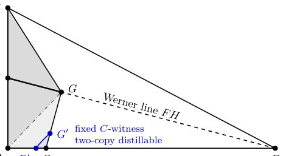 
FIG. 1. Parameter plane for canonical NPT states in d = 3. The quadrilateral region BCGK is one-copy undistillable while the dark gray triangle BGK is also two-copy undistillable. Exact coordinates and boundary intersections are given in Sections II and III. The blue lobe region is certified to be two-copy distillable by the fixed witness described in Sec. III.

📷 Fig 2

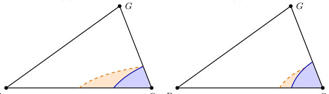 
FIG. 2. Schematic fixed-witness regions within BCG. Blue denotes the fixed two-copy point-C lobe. Orange denotes the additional part of the three-copy region certified by the point-C-tailored fixed witness; the full certified three-copy set is the union of the blue and orange parts. For d = 3, the qutrit witness |Ξ3⟩enlarges the lobe throughout the displayed range and shares the same cutoff on CG. For d ≥4, represented by d = 4 in panel (b), the witness |Θd,3⟩gives an additional bulge mainly toward B and the interior, while the fixed two-copy certificate remains stronger near CG. Only analytic fixed certificates are shown. The panels use affine schematic coordinates and are not on a common...

**Summary.** The paper investigates the distillability of negative-partial-transpose quantum states by testing if one-copy-undistillable states become distillable with multiple copies. Using fixed witnesses and tensor product constructions, the authors prove that a specific state family is two-copy distillable for all dimensions $d \geq 3$. This result significantly refines our understanding of entanglement boundaries in quantum information theory.

**Why it may be interesting.** This work provides rigorous mathematical proofs regarding entanglement properties (distillability) in structured quantum states, which is foundational knowledge for understanding resource theories in quantum information processing.

Detailed structure

**Main problem.** The central problem is determining if negative-partial-transpose (NPT) states, which are undistillable from a single copy, become distillable when multiple copies are available.

**Main result.** The authors prove that a specific one-copy-undistillable state within the canonical family is two-copy distillable in every dimension $d \geq 3$, contradicting previous conjectures about its persistence of undistillability.

**Method.** The study employs constructing fixed quantum witnesses (e.g., $|\Psi_d
angle$) whose expectation values are calculated on tensor products of the state to test for negative entanglement measures indicative of distillability.

**Model / system.** The analysis focuses on bipartite quantum states $
ho$ exhibiting NPT, specifically utilizing a canonical two-parameter family introduced by DiVincenzo et al. The results hold for arbitrary local dimensions $d \geq 3$.

**Key observables.** Distillability status (one-copy vs. two-copy), and the sign of expectation values calculated using fixed witnesses.

**Important parameters / regimes.** The local dimension $d$, and the state parameters $(b, c)$ defining the canonical family $
ho_{b,c}$.

**Assumptions / limitations.** The derived bounds are based on analytic fixed witnesses and do not necessarily represent the fully optimized distillability boundaries.

**Figures summary.** Figures illustrate the parameter plane for NPT states in $d=3$, showing regions certified as two-copy distillable (blue lobe) versus those whose status is unresolved, comparing results from two-copy vs. three-copy witnesses.

**Paper structure.** The paper systematically investigates the distillability of canonical NPT states by first establishing a two-copy witness for general $d \geq 3$, then constructing and analyzing stronger three-copy witnesses, and finally mapping out the resulting certified regions on the parameter plane.

Abstract

Whether negative-partial-transpose (NPT) states that are undistillable from one copy become distillable from finitely many copies remains a basic open problem in entanglement theory. We study the canonical two-parameter family of DiVincenzo \textit{et al.}, introduced as a symmetry-reduced testbed for this question. We prove that a distinguished one-copy-undistillable state in this family is already two-copy distillable in every local dimension $d\geq 3$. A uniform equal-norm tight-frame construction gives explicit Schmidt-rank-two certificates in every dimension, thereby disproving the conjecture that the entire one-copy-undistillable region of the canonical family remains undistillable for arbitrarily many copies. The same witnesses certify an open two-copy-distillable neighborhood around the counterexample, while separately constructed three-copy witnesses enlarge the inner bounds for the distillable region in the surrounding parameter space. In contrast, recent results for Werner states, together with the propagation argument of DiVincenzo \textit{et al.}, establish a neighboring region of one-copy-undistillable states that remains two-copy undistillable. Thus a single symmetry-reduced family contains rigorously certified states with opposite two-copy behavior, separated by a substantial region whose finite-copy distillability remains unresolved.

[↑ back to top](#top)

## Other papers (13)

*Papers from primary archives without highlighted authors or any topic match. Click to expand.*

Show other papers

### [A Resource-Efficient Quantum Framework for Graph Coloring and Chromatic Number Estimation](http://arxiv.org/abs/2608.08694v1)

**Authors:** Francesco Turro, Daniele Dragoni  
**Type:** theory · **Category:** quantum information and computing · **PDF:** <https://arxiv.org/pdf/2608.08694v1>  
**Analysis basis:** full PDF text, analyzed in chunks

📷 Fig 1

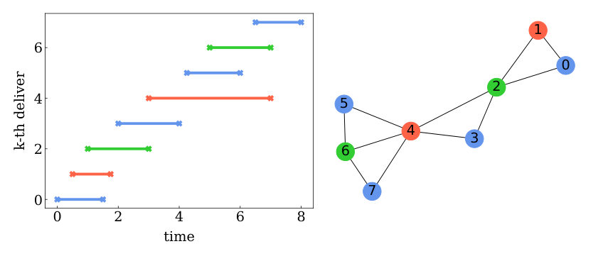 
Fig. 1: Illustrative example of the mapping to a graph coloring problem. Eight patients require surgery within the time windows shown in the left panel. Overlapping time windows induce conflicts, which are represented as edges in the graph shown in the right panel. The colors indicate the solution, showing that three surgical rooms are required in this instance.

📷 Fig 2

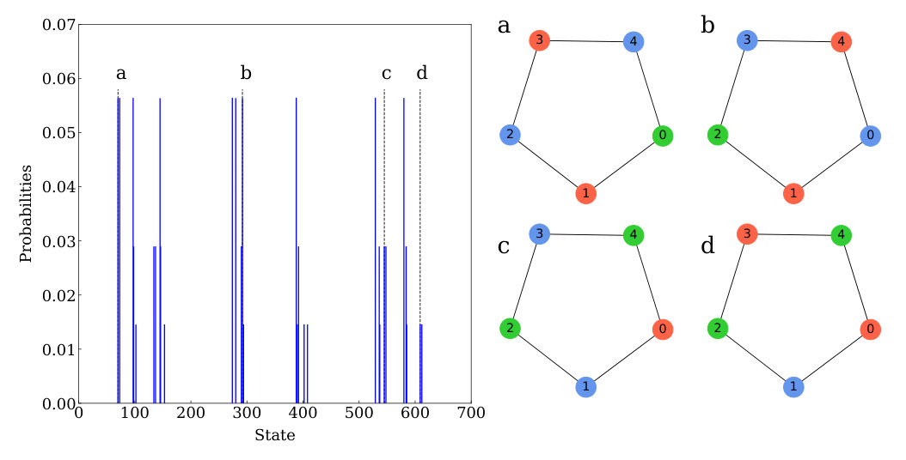 
Fig. 2: Left panel: Sampled probabilities for a pentagon graph during adiabatic evolution. Right panels: Corresponding graph colorings for solutions labeled (a), (b), (c), and (d).

📷 Fig 3

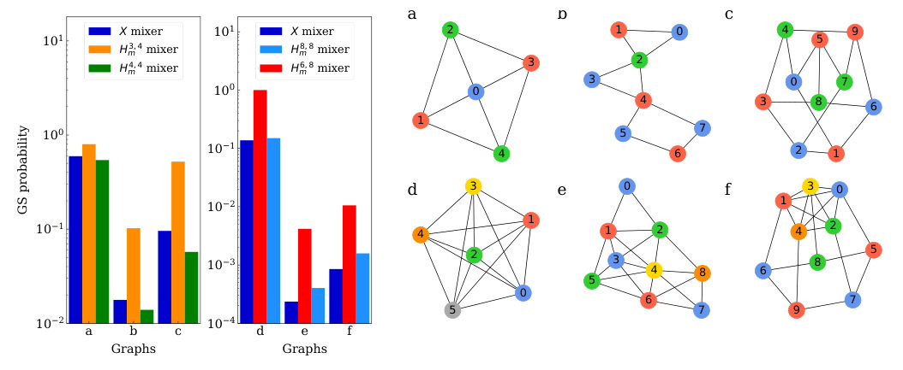 
Fig. 3: Ground state probabilities when we use the proposed Hamiltonian to find the smallest set of colors for six graph coloring instances. We use different mixer, using the popular mixer −X and the proposed mixer with a specific number of colors. Left panel shows the obtained probabilities for different mixers. In the x-axis, letter corresponds to different graphs that are shown on the right panels. The color of the graph are given by the smallest set of colors: 3 colors for the top graphs, 6 colors for d graph and 5 colors for e and f.

📷 Fig 4

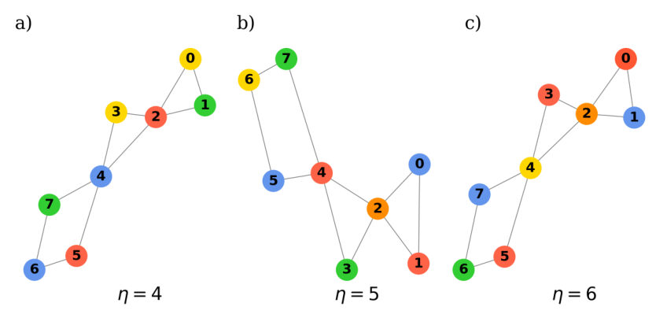 
Fig. 4: Ground state solutions of the same truck loading problem for different values of Lagrangian multipliers. From left to right, increasing the values causes the number of colors η to increase. All three graphs share the same Hilbert space dimension corresponding to 8 colors.

**Summary.** This paper presents a resource-efficient quantum framework using adiabatic evolution to solve the NP-hard graph coloring problem and estimate its chromatic number ($\Gamma$). By introducing a novel mixer Hamiltonian and carefully constructing the cost function, the authors overcome scaling issues associated with standard QUBO formulations. This demonstrates practical applicability for optimization tasks like scheduling and resource allocation.

**Why it may be interesting.** The work directly applies quantum optimization techniques (QAA/QAOA) to a fundamental combinatorial problem, offering insights into how complex constraints can be mapped onto physical Hamiltonians suitable for near-term quantum hardware.

Detailed structure

**Main problem.** The paper addresses the NP-hard problem of graph coloring, aiming to find the chromatic number ($\Gamma$), which is crucial for resource allocation tasks.

**Main result.** The authors propose a memory-efficient quantum encoding and novel mixer Hamiltonian that successfully estimates $\Gamma$ by finding the ground state of a tailored cost Hamiltonian.

**Method.** They utilize the Quantum Adiabatic Algorithm (QAA) approach, formulating the problem as finding the ground state of an Ising Hamiltonian derived from QUBO constraints.

**Model / system.** The model is a quantum computing framework where graph coloring constraints are encoded into a total Hamiltonian ($H_{tot}$). This Hamiltonian incorporates terms penalizing adjacent vertices having the same color and additional terms to enforce minimum color usage ($\Gamma$).

**Key observables.** The primary observable is the ground state energy, which corresponds to the optimal coloring solution, and the probability $P_c$ of finding a feasible coloring with exactly $c$ colors.

**Important parameters / regimes.** Key parameters include the number of colors ($\eta$), the size of the graph ($N$), and Lagrangian multipliers ($\lambda$) used to tune constraint penalties.

**Assumptions / limitations.** The core assumption is that the ground state of the constructed Hamiltonian yields the optimal coloring. A major limitation noted is the computational difficulty in implementing rigorous capacity constraints due to qubit limitations.

**Figures summary.** Figures illustrate mapping industrial problems to graph coloring, show sampled probabilities for different mixers during adiabatic evolution (e.g., pentagon graph), and demonstrate how varying Lagrangian multipliers guides the system towards specific color counts.

**Paper structure.** The paper first establishes the NP-hard nature of graph coloring via QUBO/Ising formulation. It then introduces a memory-efficient qubit encoding ($\log(\eta)$ qubits). The core contribution involves proposing a novel mixer Hamiltonian and modifying the cost function with terms to enforce $\Gamma$, which is tested on examples like truck loading problems.

Abstract

Many industrial optimization tasks can be modeled as graph coloring, where adjacent vertices must have different colors. This NP-hard problem is challenging for large graphs. We present a quantum encoding requiring qubits that scale logarithmically with the number of colors and linearly with vertices. Using adiabatic evolution with a novel mixer Hamiltonian and vertex terms, we compute the chromatic number and demonstrate robustness by solving constrained truck loading problems.

[↑ back to top](#top)

### [An upper bound for the purity of absolutely positive partial transpose states](http://arxiv.org/abs/2608.09832v1)

**Authors:** Anh T. Tran  
**Type:** theory · **Category:** quantum information and computing · **PDF:** <https://arxiv.org/pdf/2608.09832v1>  
**Analysis basis:** full PDF text, analyzed in chunks

📷 Fig 1

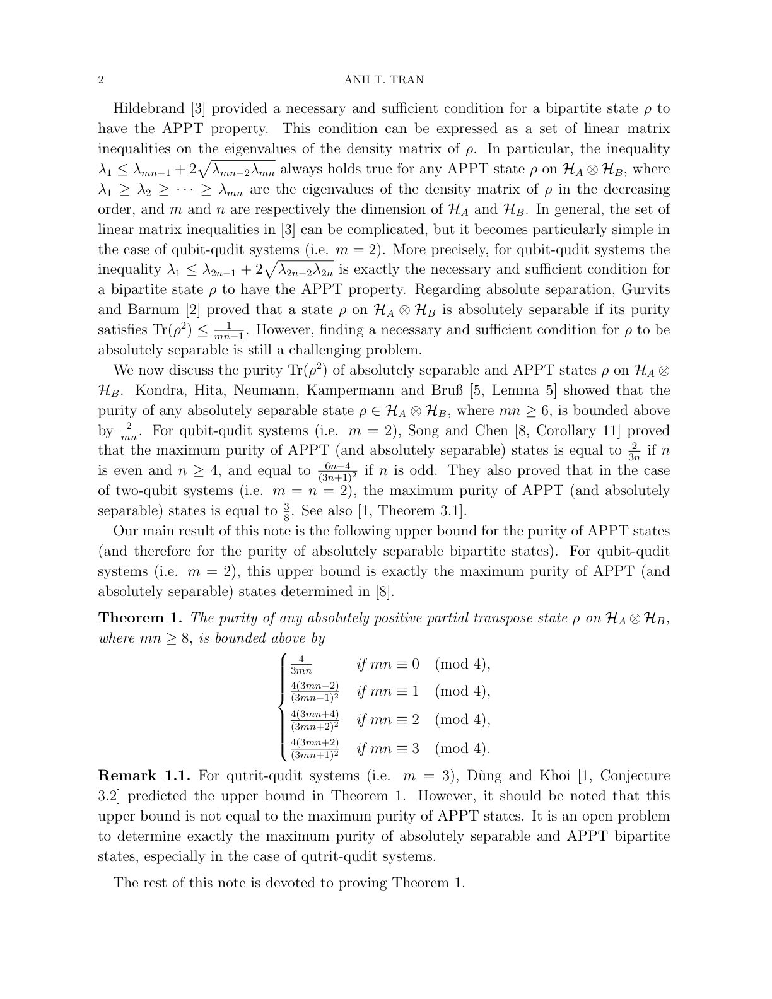 
Low-resolution page preview, page 2

📷 Fig 2

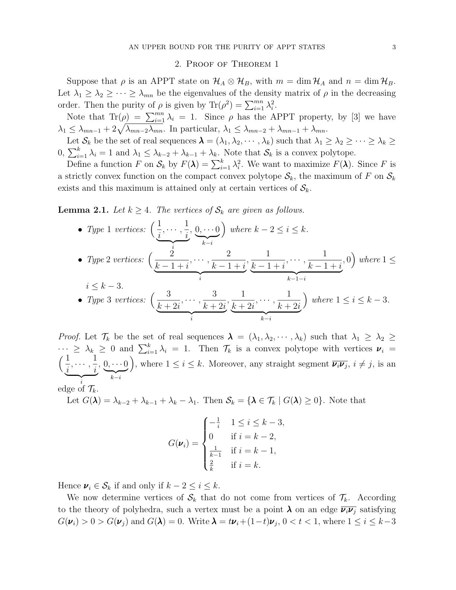 
Low-resolution page preview, page 3

📷 Fig 3

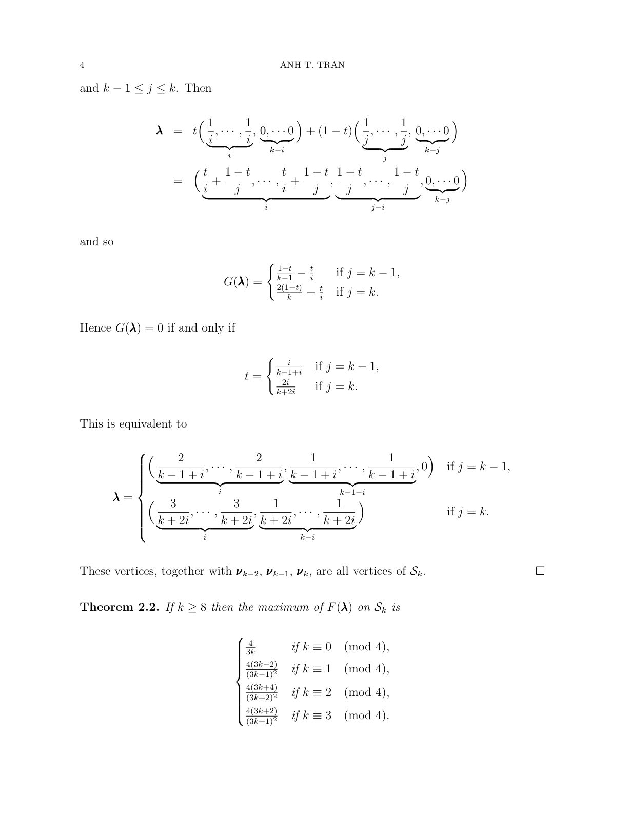 
Low-resolution page preview, page 4

📷 Fig 4

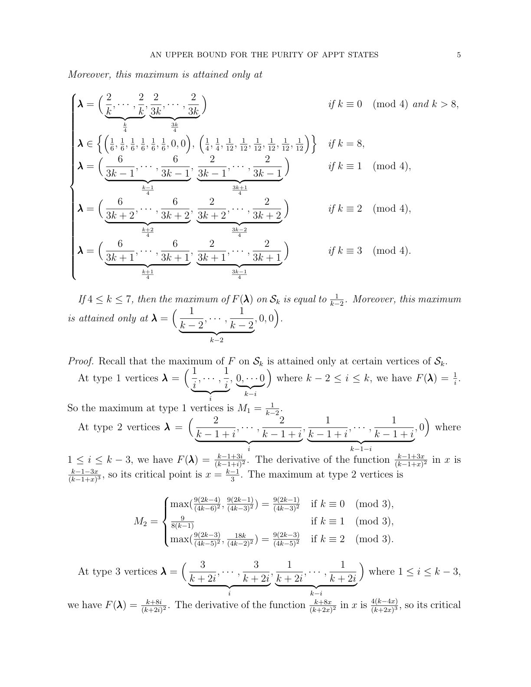 
Low-resolution page preview, page 5

📷 Fig 5

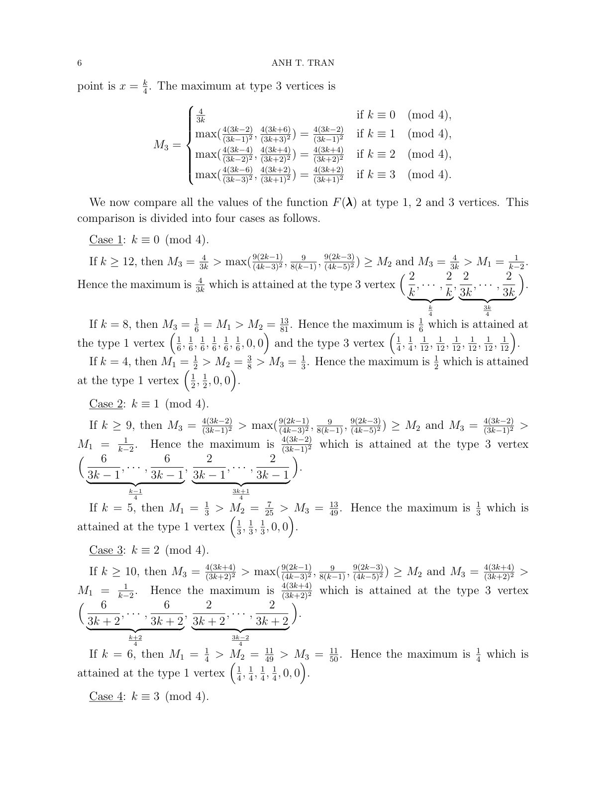 
Low-resolution page preview, page 6

**Summary.** This theoretical paper determines an upper bound for the purity ($	ext{Tr}(
ho^2)$) of bipartite quantum states satisfying the Absolutely Positive Partial Transpose (APPT) condition. By reformulating the problem as a constrained optimization over the eigenvalues, the authors derive explicit bounds dependent on the dimensions of the subsystems. This work contributes to understanding the fundamental limitations on state purity for highly structured quantum correlations.

**Why it may be interesting.** Understanding purity bounds for specific classes of quantum states like APPT is crucial for characterizing entanglement and resource theories in quantum information, directly impacting protocols relying on state distinguishability.

Detailed structure

**Main problem.** The primary goal is to derive an upper bound for the purity ($	ext{Tr}(
ho^2)$) of quantum states that are Absolutely Positive Partial Transpose (APPT). This bound also applies to absolutely separable bipartite states.

**Main result.** The paper establishes a general, piecewise-defined upper bound for the maximum purity based on $k = mn \pmod{4}$, providing explicit formulas derived from analyzing the vertices of an associated convex polytope.

**Method.** The analysis involves formulating the problem as maximizing a quadratic function of eigenvalues ($\sum \lambda_i^2$) subject to linear constraints defining a polytope, which is solved by checking the extreme points (vertices) of this set.

**Model / system.** The study concerns bipartite quantum states $
ho$ acting on $H_A \otimes H_B$, where $m = \dim H_A$ and $n = \dim H_B$. The concepts revolve around separability criteria like PPT and APPT.

**Key observables.** Purity ($	ext{Tr}(
ho^2)$), which quantifies how close the state is to a pure state, and the eigenvalues $\lambda_i$ of the density matrix $
ho$.

**Important parameters / regimes.** The dimensions $m$ and $n$, and their product $k=mn$, particularly its value modulo 4.

**Assumptions / limitations.** The analysis assumes that the maximum purity is attained at a vertex of the defined polytope, allowing for optimization over these extreme points.

**Paper structure.** The paper introduces the definitions of separable and APPT states, then formulates the problem as an optimization task on the eigenvalue space. It proceeds by analyzing the constraints defining a convex polytope $S_k$ and deriving explicit bounds (Theorem 1) based on the congruence class of $mn$.

Abstract

A quantum state is called absolutely separable (resp. absolutely positive partial transpose (APPT)) if it remains separable (resp. positive partial transpose (PPT)) under any global unitary transformation. It is known that the set of all absolutely separable states is a subset of the set of all APPT states. Moreover, these two sets are identical for qubit-qudit systems. In this note, we give an upper bound for the purity of APPT bipartite states (and therefore for the purity of absolutely separable bipartite states). For qubit-qudit systems, this upper bound becomes the maximum purity of APPT (and absolutely separable) states.

[↑ back to top](#top)

### [Catching Transpilation Drift with a CI/CD Workflow in Quantum Software Development](http://arxiv.org/abs/2608.08248v1)

**Authors:** Jouni Peltonen, Otso Kinanen, Vlad Stirbu  
**Type:** theory · **Category:** quantum information and computing · **PDF:** <https://arxiv.org/pdf/2608.08248v1>  
**Analysis basis:** full PDF text, analyzed in chunks

📷 Fig 1

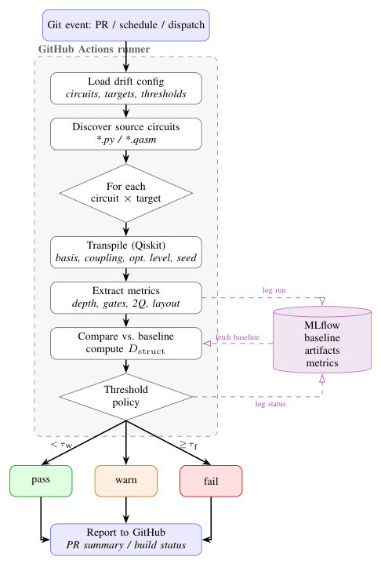 
Fig. 1: Transpilation-drift CI workflow. Solid arrows show the detection pipeline (transpile →measure →compare- to-baseline →pass/warn/fail); dashed arrows show MLflow logging and baseline retrieval that provide auditability. The threshold policy converts the structural drift score Dstruct into actionable CI feedback (τw = τwarn, τf = τfail).

📷 Fig 2

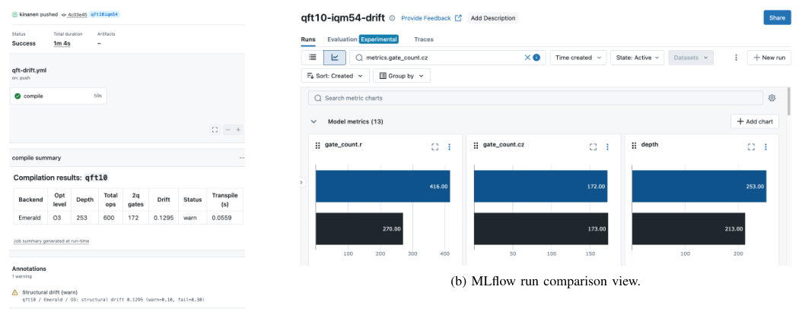 
Fig. 2: Scenario B (QFT10, IQM target): switching from IQM’s iqm-client transpiler to Qiskit’s built-in transpiler raises depth (213→253) and yields a structural drift of 0.1295.(a) GitHub Actions CI views key metrics and shows transpilation drift warning. (b) MLflow UI surfacing the per-run metrics, allowing to further examine the data; Full per-gate metrics are given in Table II.

**Summary.** This paper introduces a Quantum DevOps workflow designed to monitor 'transpilation drift,' which occurs when compiler updates change the compiled form of a quantum circuit even if the source code remains identical. By calculating structural metrics and integrating checks into CI/CD pipelines, it provides an essential, auditable guardrail for ensuring reproducibility in quantum software development.

**Why it may be interesting.** While focused on software engineering rather than physical dynamics, understanding how compilation choices affect circuit structure is crucial for designing robust quantum algorithms that are portable across evolving hardware platforms.

Detailed structure

**Main problem.** The core problem is detecting 'transpilation drift,' where changes in evolving quantum compiler toolchains cause an unchanged source circuit to compile into a structurally different target realization.

**Main result.** The authors propose and demonstrate a practical Quantum DevOps workflow that uses structural metrics to detect these compilation-induced changes before hardware execution, making the process observable and auditable.

**Method.** They implement a CI/CD guardrail that transpiles circuits against target profiles, calculates a structural drift metric (D_struct) comparing current artifacts to stored baselines, and reports status via configurable thresholds in GitHub Actions.

**Model / system.** The focus is on the compilation process itself, using abstract quantum circuits (like QFT10 or BV12) as inputs that are mapped onto specific hardware backends defined by target profiles and SDK versions.

**Key observables.** Structural metrics including circuit depth, total gate count, two-qubit gate counts, and the calculated structural drift score (D_struct).

**Important parameters / regimes.** Configurable warning ($	au_{	ext{warn}}$) and failure ($	au_{	ext{fail}}$) thresholds used to classify the CI status.

**Assumptions / limitations.** The primary limitation is that the measured drift is a structural proxy; it does not guarantee semantic non-equivalence or predict actual execution fidelity, and threshold calibration is left for future work.

**Figures summary.** Figure 1 illustrates the full workflow pipeline (transpile -> measure -> compare to baseline -> pass/warn/fail) integrated with MLflow logging. Table II provides a detailed comparison of metrics across different transpiler versions.

**Paper structure.** The paper introduces the problem, details the proposed Quantum DevOps workflow and structural drift metric calculation, demonstrates its utility using scenarios like seed drift and toolchain upgrades (e.g., Qiskit 2.1.2 vs 2.4.2), and concludes by establishing the CI guardrail.

Abstract

Quantum software workflows rely on compiler and provider toolchains that evolve independently of application source code. Consequently, an unchanged quantum circuit may transpile into a different target-specific realization after changes in SDK versions, optimization settings, basis gates, coupling maps, or backend descriptions. Such transpilation drift can affect circuit depth, gate composition, qubit mapping, and execution behavior, yet it is rarely monitored in CI/CD pipelines. This paper proposes a Quantum DevOps workflow for detecting transpilation drift before execution. The workflow transpiles source circuits against configured target profiles, computes structural drift metrics, records provenance and artifacts in MLflow, and raises configurable warnings or failures in GitHub Actions. Using representative circuits and target profiles, we show how drift checks can expose toolchain-induced changes and support reproducibility audits. The contribution is a practical CI/CD guardrail for making quantum compilation behavior observable, testable, and auditable.

[↑ back to top](#top)

### [Decoupling 2D translation-invariant topological CSS codes](http://arxiv.org/abs/2608.09915v1)

**Authors:** Yifei Wang, Zhongyi Ni, Mingxin He, Jinguo Liu, Yingfei Gu  
**Type:** theory · **Category:** quantum information and computing · **PDF:** <https://arxiv.org/pdf/2608.09915v1>  
**Analysis basis:** full PDF text, analyzed in chunks

📷 Fig 1

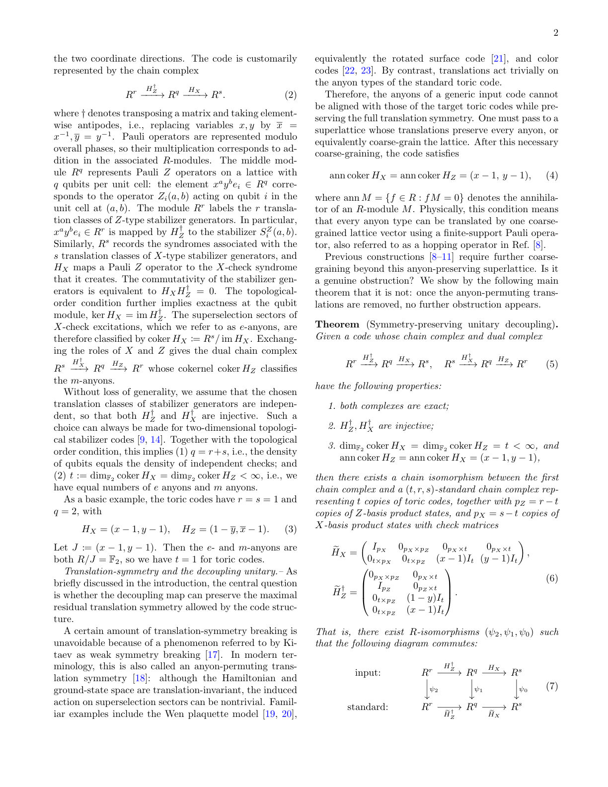 
Low-resolution page preview, page 2

📷 Fig 2

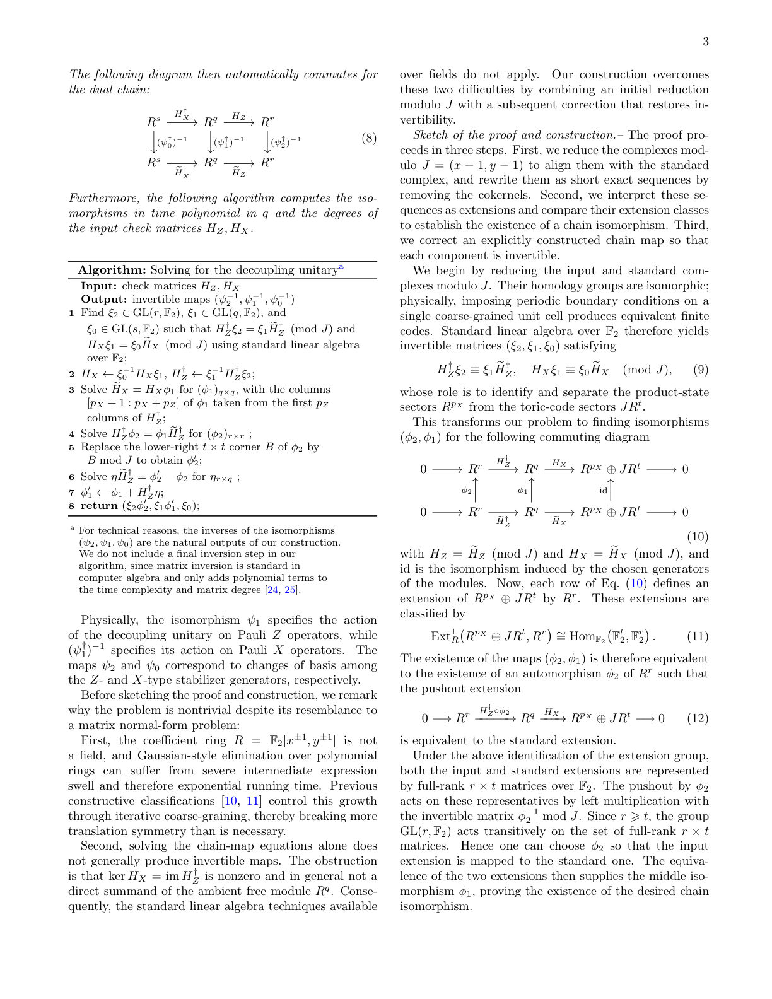 
Low-resolution page preview, page 3

📷 Fig 3

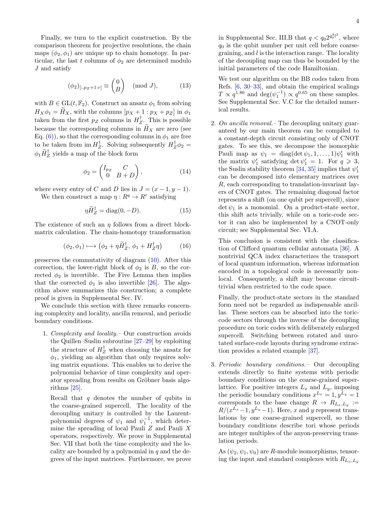 
Low-resolution page preview, page 4

📷 Fig 4

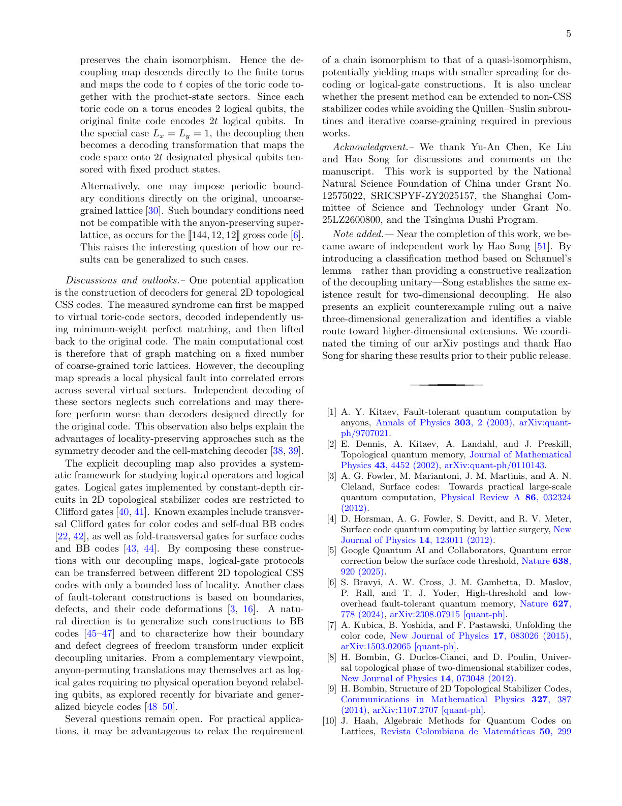 
Low-resolution page preview, page 5

📷 Fig 5

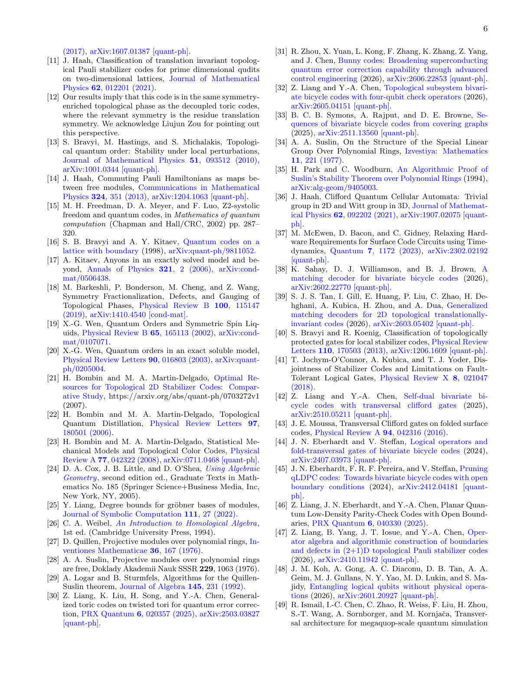 
Low-resolution page preview, page 6

**Summary.** This paper mathematically proves that 2D translation-invariant topological CSS codes can always be locally unitarily decoupled into a combination of toric codes and product states. The authors provide an efficient algorithm based on module theory over Laurent polynomials to construct this decoupling map, simplifying the understanding and implementation of these quantum error-correcting codes.

**Why it may be interesting.** It provides rigorous mathematical tools (module theory) to simplify complex quantum error-correcting codes into known, simpler structures (toric codes), which is fundamental for building scalable quantum computation architectures.

Detailed structure

**Main problem.** To prove that no further obstruction exists beyond removing anyon-permuting translations when decoupling 2D translation-invariant topological CSS codes into toric codes and product states.

**Main result.** The authors prove this non-existence of obstruction, showing every such code admits a local unitary decoupling into toric codes and product states after passing to the maximal anyon-preserving superlattice.

**Method.** The core method involves applying module theory over Laurent polynomials ($R = \mathbb{F}_2[x\pm 1, y\pm 1]$) and advanced linear algebra techniques to find required chain isomorphisms between complex structures.

**Model / system.** The study focuses on two-dimensional (2D) translation-invariant topological Calderbank-Shor-Steane (CSS) codes defined by Pauli Hamiltonians. These are analyzed using module theory over the Laurent polynomial ring, relating them to toric codes and product states.

**Key observables.** Logical error rate, support spreading $s(Q)$, number of e-anyons ($t$), and the existence/invertibility of chain isomorphisms.

**Important parameters / regimes.** The density of qubits per unit cell ($q$) and the dimensions related to stabilizer generators ($r$ and $s$).

**Assumptions / limitations.** Previous constructions break more symmetry than necessary; the analysis relies on module theory over non-field rings, which complicates standard linear algebra techniques.

**Figures summary.** One figure summary mentions a speed-accuracy tradeoff comparison between decoding methods (unitary-decouple vs. BP-OSD), and another table quantifies support spreading for transported CNOTs.

**Paper structure.** The paper establishes the mathematical framework using module theory over Laurent polynomials, proves the existence of the decoupling map via chain isomorphism construction, provides an efficient algorithm to compute this map, and discusses applications like gate construction and decoding performance.

Abstract

Two-dimensional translation-invariant topological CSS codes on qubits are known to be locally equivalent, after coarse-graining, to stacks of toric codes. However, existing constructions generally break more translation symmetry than is required to remove anyon-permuting translations, leaving open whether any further obstruction exists. We prove that no such obstruction occurs: after passing to the maximal anyon-preserving superlattice, every such code admits a local unitary decoupling into toric codes and product states. We further provide an efficient algorithm for explicitly constructing the decoupling map, together with bounds on the required supercell size and operator spreading. The decoupling requires no additional ancillas in generic cases and extends to finite systems with suitable boundary conditions.

[↑ back to top](#top)

### [Deep Holes in the Clifford Hierarchy](http://arxiv.org/abs/2608.08403v1)

**Authors:** Ian Teixeira, David Meyer  
**Type:** theory · **Category:** quantum information and computing · **PDF:** <https://arxiv.org/pdf/2608.08403v1>  
**Analysis basis:** full PDF text, analyzed in chunks

📷 Fig 1

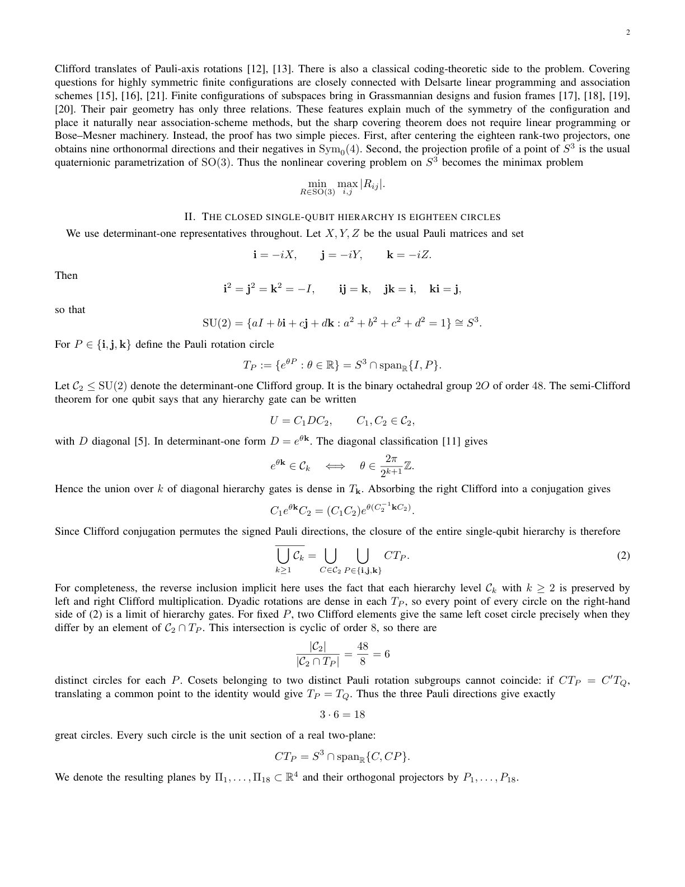 
Low-resolution page preview, page 2

📷 Fig 2

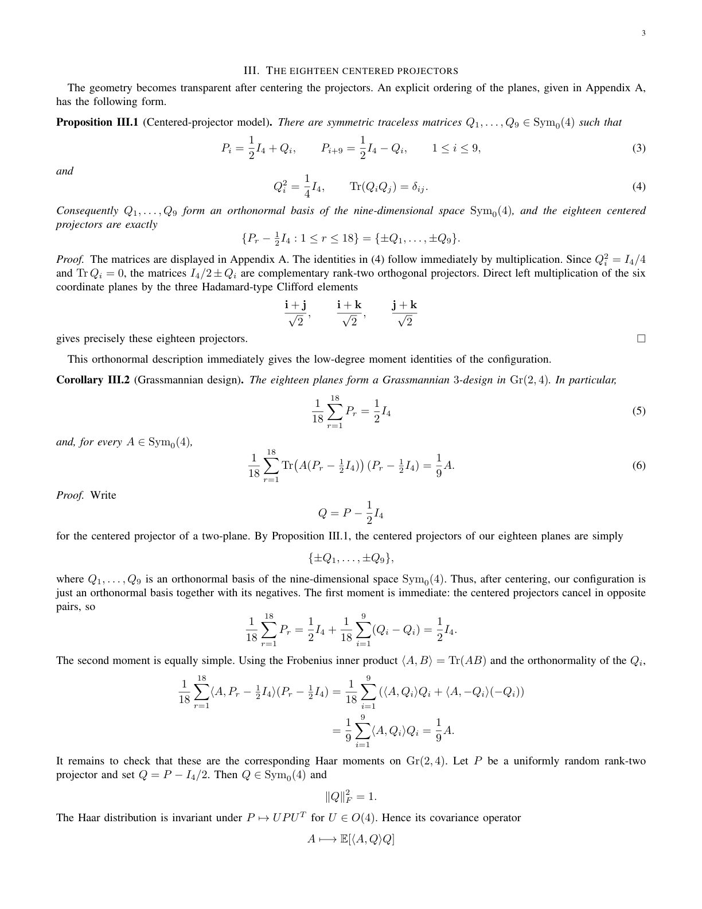 
Low-resolution page preview, page 3

📷 Fig 3

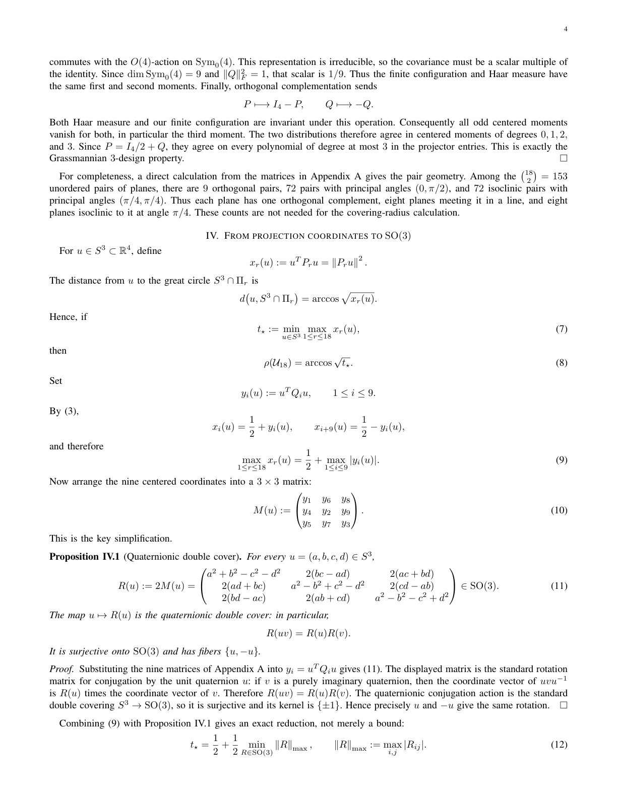 
Low-resolution page preview, page 4

📷 Fig 4

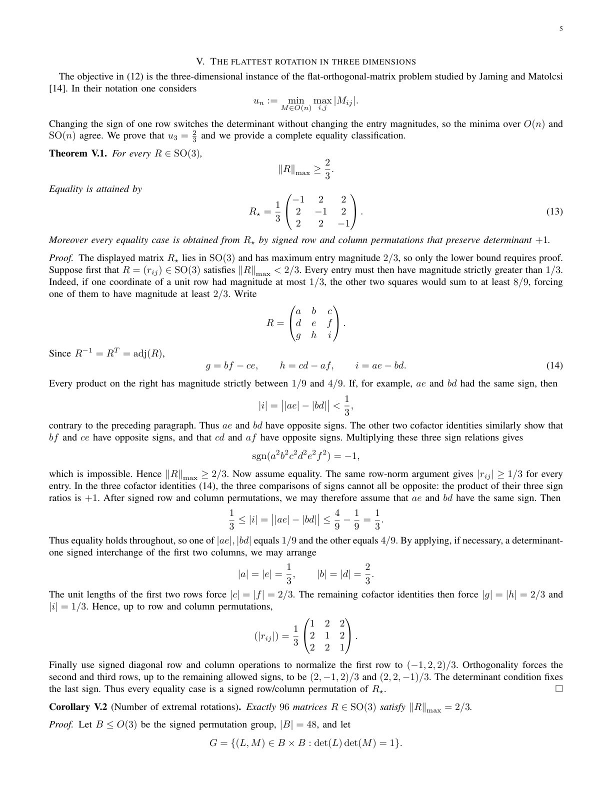 
Low-resolution page preview, page 5

📷 Fig 5

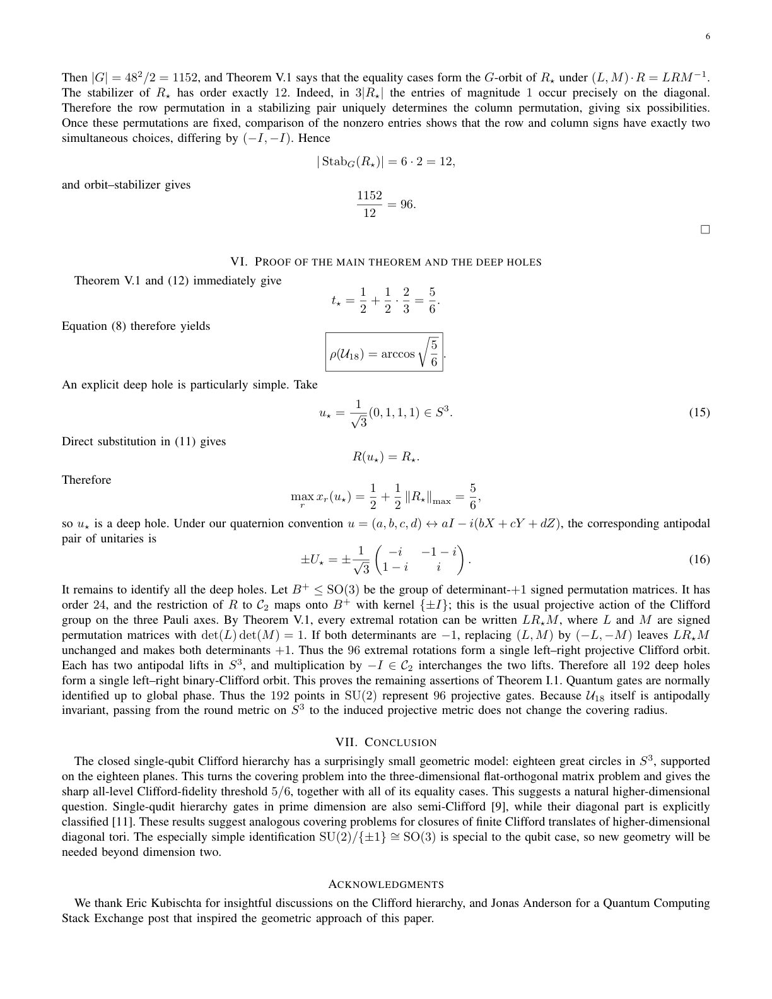 
Low-resolution page preview, page 6

**Summary.** This theoretical paper calculates the covering radius associated with the single-qubit Clifford gate set embedded in SU(2). By mapping the problem onto a minimization task on SO(3), the authors precisely determine this radius to be arccos(sqrt(5)/6). This result quantifies a fundamental geometric limit on the fidelity achievable by sequences of Clifford gates.

**Why it may be interesting.** This work provides deep mathematical insights into the fundamental structure of quantum gate sets, which is crucial for understanding universal quantum computation and resource estimation in quantum information theory.

Detailed structure

**Main problem.** The paper determines the covering radius of the topological closure of the single-qubit Clifford hierarchy within SU(2) (identified with S^3). This is equivalent to finding the minimum all-level Clifford fidelity.

**Main result.** The covering radius is found to be arccos(sqrt(5)/6), and the extremal points, called 'deep holes', form a single orbit of size 192 under Clifford gate multiplication.

**Method.** The problem is solved by mapping the geometry from S^3 to SO(3) via a quaternionic double cover. This reduces the covering problem to an exact minimax statement concerning the L-infinity norm on SO(3).

**Model / system.** The system models the single-qubit quantum gate space, represented by SU(2) or S^3. The structure analyzed is the closure of the Clifford hierarchy, which forms a union of 18 great circles in this space.

**Key observables.** The covering radius $
ho(U_{18})$ and the minimum all-level Clifford fidelity (which equals $5/6$).

**Important parameters / regimes.** The size of the deep hole orbit (192) and the value $\sqrt{5}/6$.

**Assumptions / limitations.** The proof relies on identifying the configuration of planes as a Grassmannian 3-design and utilizing the specific structure provided by the quaternionic double cover to map the problem onto SO(3).

**Paper structure.** The paper first defines the geometry (18 circles in S^3) and establishes an orthonormal basis for their projectors. It then maps the covering problem from S^3 to a minimax statement on SO(3), solving this final geometric minimization problem.

Abstract

We determine the covering radius of the topological closure of the single-qubit Clifford hierarchy in $\SU(2)\cong S^3$. This closure is a union of $18$ great circles --- the Clifford--Pauli circles --- and we prove that its covering radius is $\arccos\sqrt{5/6}$. The extremal points, which we call \emph{deep holes}, form a single orbit of size $192$ under left and right multiplication by Clifford gates, and are described in closed form. Equivalently, the minimum over one-qubit unitaries of the all-level Clifford fidelity is $5/6$. The proof rests on two structures attached to the configuration of $18$ planes in $\R^4$: their centered rank-two projectors form an orthonormal basis of the irreducible $\SO(4)$-module $\Sym_0(4)$, and the projection profile of a unit quaternion is exactly its image under the double cover $\SU(2)\to\SO(3)$. These reduce the covering problem to a minimax statement for the $\ell^\infty$-norm on $\SO(3)$ which we solve exactly, classifying its equality cases.

[↑ back to top](#top)

### [Entanglement-assisted quantum locally recoverable codes: bounds and constructions with availability](http://arxiv.org/abs/2608.09886v1)

**Authors:** Gretchen L. Matthews, Julia Shapiro  
**Type:** theory · **Category:** quantum information and computing · **PDF:** <https://arxiv.org/pdf/2608.09886v1>  
**Analysis basis:** full PDF text, analyzed in chunks

📷 Fig 1

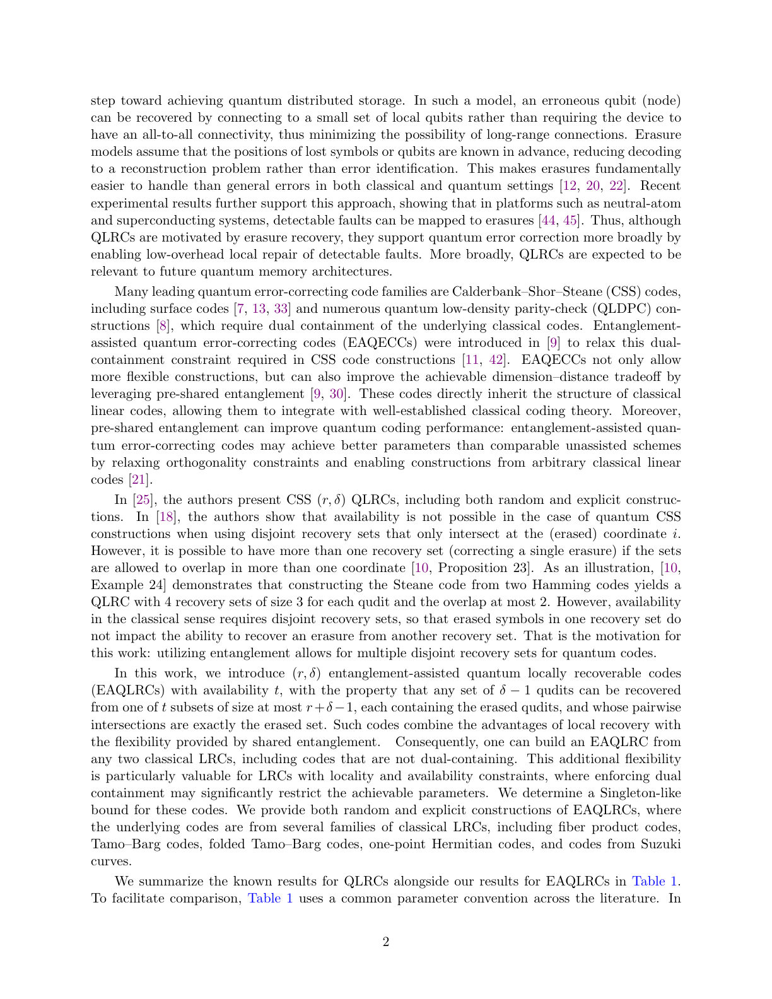 
Low-resolution page preview, page 2

📷 Fig 2

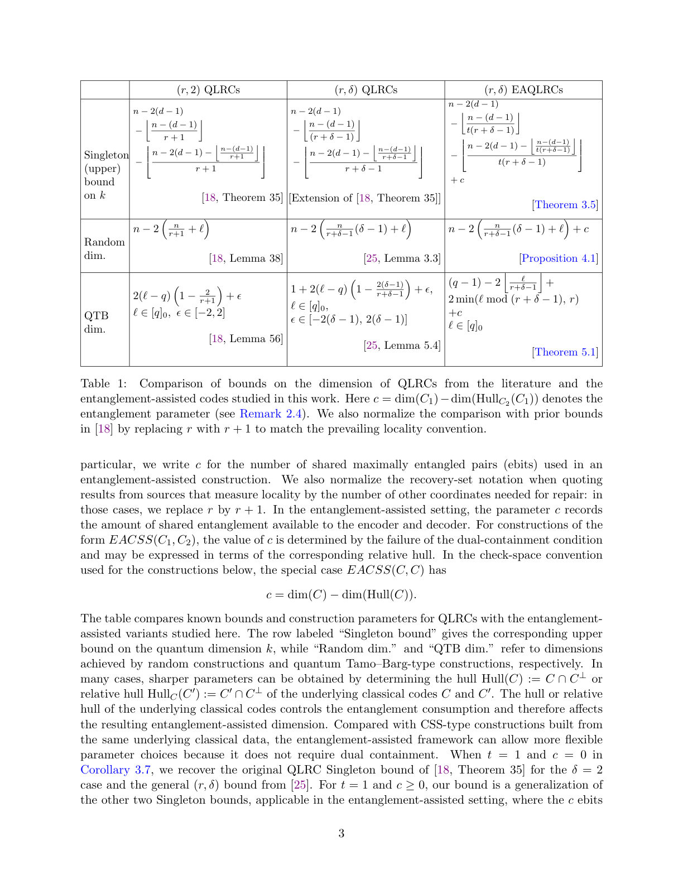 
Low-resolution page preview, page 3

📷 Fig 3

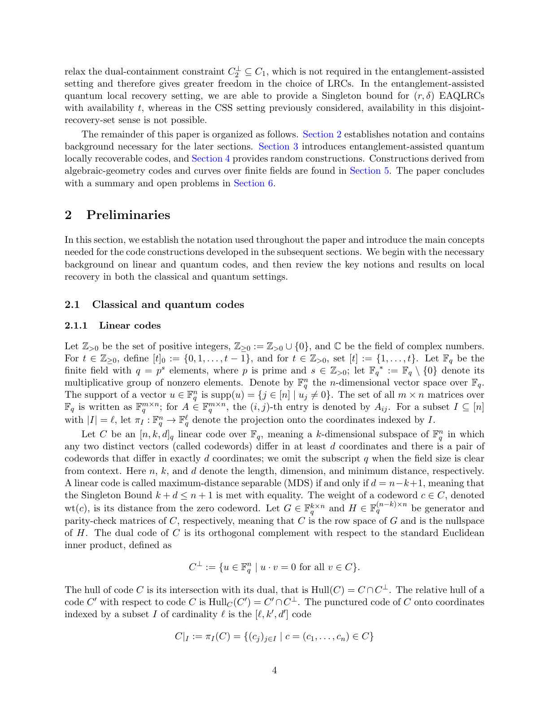 
Low-resolution page preview, page 4

📷 Fig 4

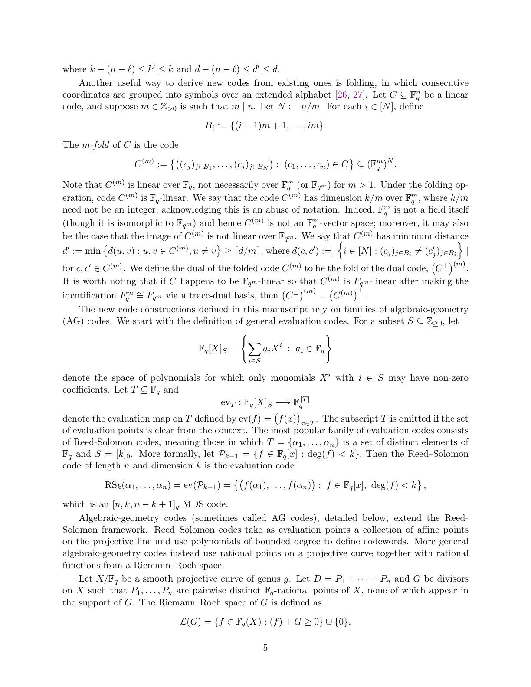 
Low-resolution page preview, page 5

📷 Fig 5

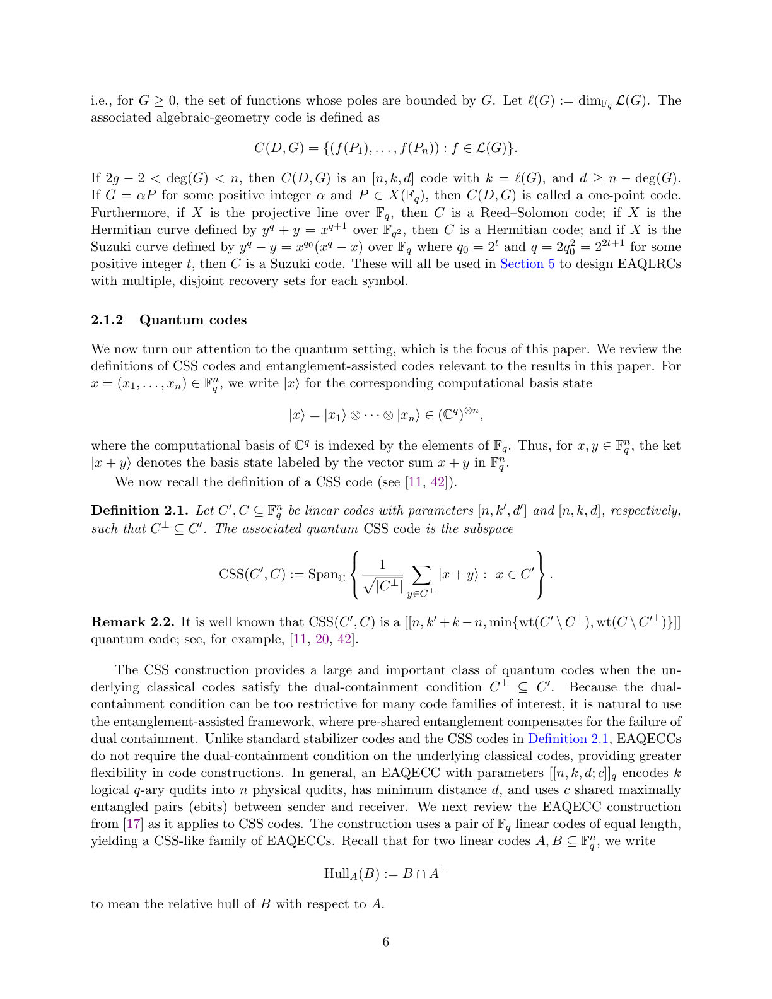 
Low-resolution page preview, page 6

**Summary.** This paper develops the theory and constructions for entanglement-assisted quantum locally recoverable codes (EAQLRCs) with availability. It establishes fundamental bounds and provides explicit examples derived from algebraic geometry codes, showing how shared entanglement allows for multiple independent recovery sets. This advances the field of fault-tolerant quantum memory by offering robust coding schemes for erasure correction.

**Why it may be interesting.** This work directly contributes to the theoretical framework of quantum data storage and fault tolerance, providing concrete construction methods that improve upon standard Quantum CSS code limitations by incorporating shared entanglement for enhanced local repair capabilities.

Detailed structure

**Main problem.** The work focuses on defining, bounding, and constructing entanglement-assisted quantum locally recoverable codes (EAQLRCs) that allow for fault tolerance against erasures.

**Main result.** They establish a Singleton-like bound for EAQLRCs and provide explicit constructions using various classical code families, including those derived from algebraic geometry curves.

**Method.** The authors use techniques from classical coding theory (e.g., linear codes, folding) combined with quantum information concepts to construct the codes and derive their parameters.

**Model / system.** The model is abstract quantum error correction applied to data storage, specifically addressing erasure channels where the location of lost qubits is known. The underlying mathematical structures are based on classical linear codes and algebraic geometry curves over finite fields.

**Key observables.** Code parameters such as length ($n$), quantum dimension ($k_Q$), locality ($r$), availability ($t$), and minimum distance ($d_{EA}$).

**Important parameters / regimes.** The key parameters are the erasure tolerance ($\delta-1$) and the number of local recovery sets available ($t$). The construction relies on shared entanglement.

**Assumptions / limitations.** The definition assumes an erasure model where the positions of lost qubits are known. A major assumption is that the receiver's halves of the ebits are not subject to noise.

**Figures summary.** The notes mention comparative tables (Table 1 and Table 2) summarizing dimension bounds and parameters for different types of quantum local recovery codes derived from various classical families.

**Paper structure.** The paper proceeds by reviewing necessary background in coding theory, formally defining EAQLRCs with availability, presenting random constructions using Vandermonde matrices, detailing explicit constructions from algebraic-geometry codes (like Hermitian and Suzuki), and concluding with open problems.

Abstract

In this work, we define entanglement-assisted quantum locally recoverable codes with availability, in which any set of up to $δ-1$ erased qudits can be recovered from any one of $t$ local recovery sets, each of size at most $r+δ-1$, with the recovery sets intersecting exactly in the erased coordinates, where $r$ is a (small) positive integer. We show that shared entanglement permits $t>1$, meaning that multiple local recovery sets can be available for the same set of up to $δ-1$ erasures. We establish a Singleton-like bound for this family of codes and present random constructions based on classical linear codes with Vandermonde parity-check matrices. We also provide explicit constructions of entanglement-assisted quantum locally recoverable codes with availability from several classical code families and their folded versions, including Tamo-Barg codes, fiber-product codes, and algebraic-geometry codes such as one-point Hermitian and Suzuki codes.

[↑ back to top](#top)

### [Faster Algorithms for Multimarginal Optimal Transport](http://arxiv.org/abs/2608.09513v1)

**Authors:** Brandon Augustino, Yue Sun, Atithi Acharya, Shouvanik Chakrabarti, Junhyung Lyle Kim, Shree Hari Sureshbabu, Charlie Che  
**Type:** theory · **Category:** quantum information and computing · **PDF:** <https://arxiv.org/pdf/2608.09513v1>  
**Analysis basis:** full PDF text, analyzed in chunks

📷 Fig 1

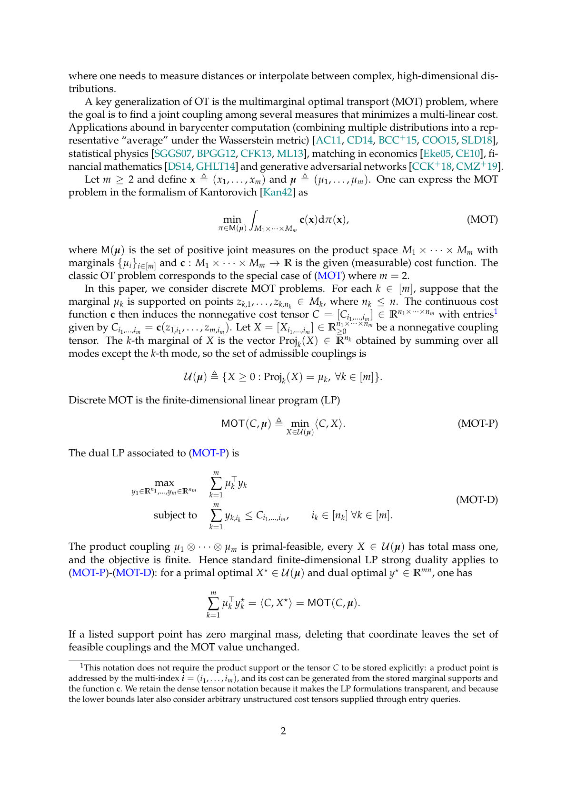 
Low-resolution page preview, page 2

📷 Fig 2

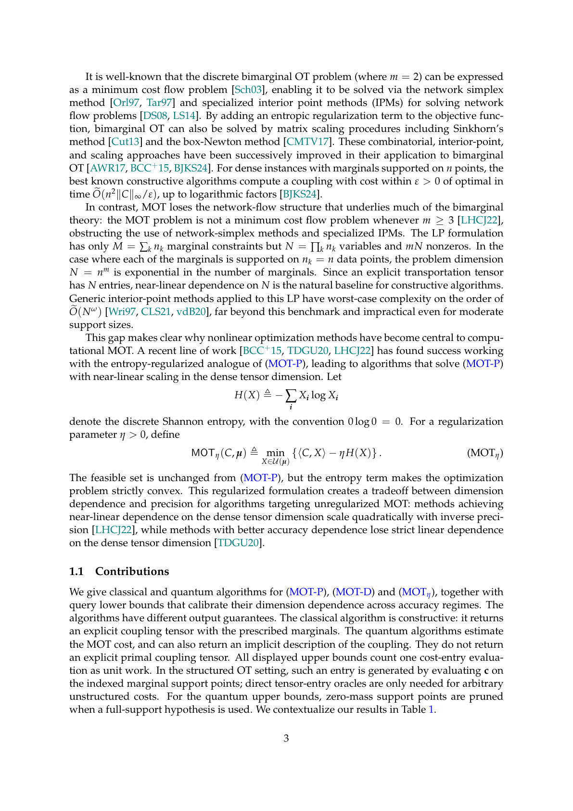 
Low-resolution page preview, page 3

📷 Fig 3

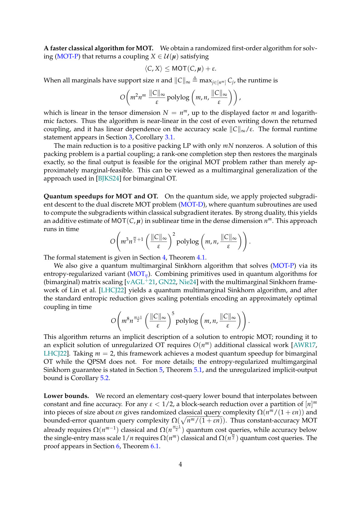 
Low-resolution page preview, page 4

📷 Fig 4

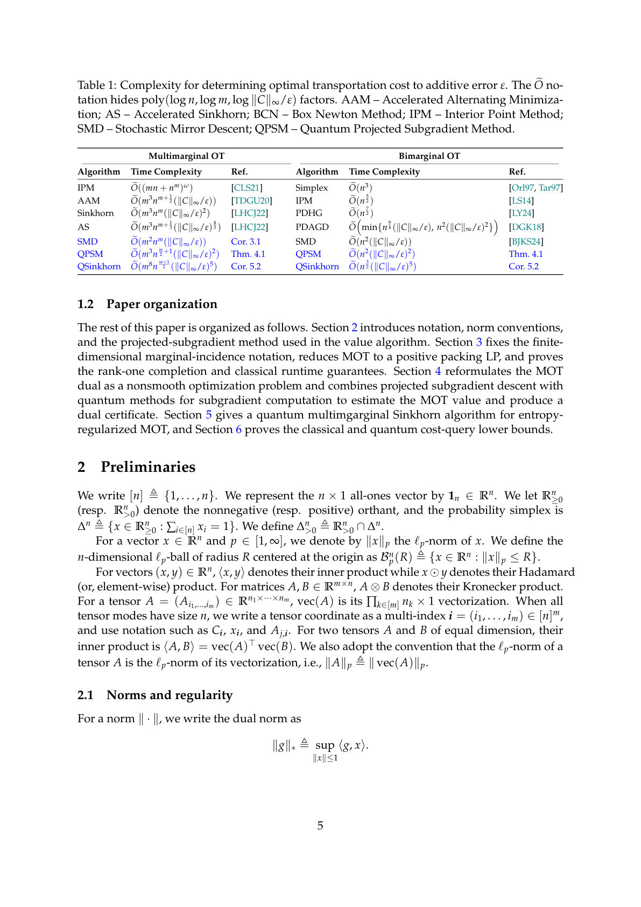 
Low-resolution page preview, page 5

📷 Fig 5

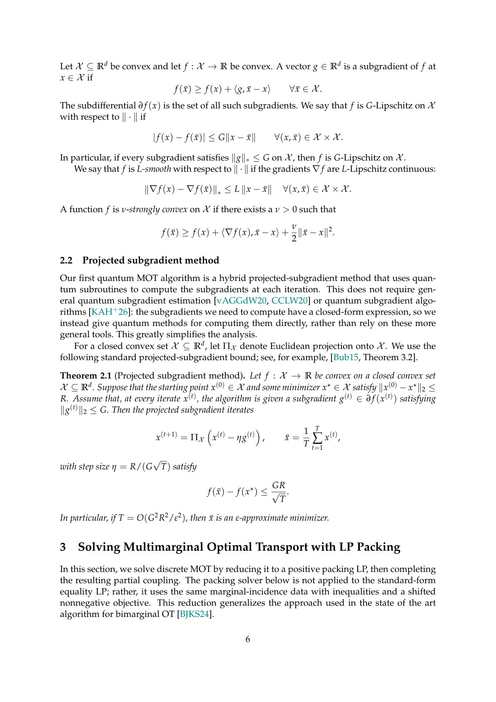 
Low-resolution page preview, page 6

**Summary.** This paper tackles the computational challenge of approximating multimarginal optimal transport (MOT) distance between multiple probability distributions using advanced algorithms. It provides both classical and quantum solutions, achieving specific runtime bounds for different formulations (primal vs. dual). The work is significant for establishing theoretical speedups in solving complex multi-marginal optimization problems.

**Why it may be interesting.** While not directly about physical Hamiltonians, the development of quantum algorithms for solving complex optimization problems like MOT is highly relevant. Quantum speedups in linear programming solvers are a major area of theoretical interest that could impact simulations in physics (e.g., calculating free energy differences or correlation functions via optimal transport metrics).

Detailed structure

**Main problem.** The core problem is developing efficient algorithms, both classical and quantum, to approximate the multimarginal optimal transport (MOT) distance between multiple discrete probability distributions.

**Main result.** The authors present a classical algorithm with a specific polynomial runtime bound and two distinct quantum algorithms—a projected subgradient method and a Sinkhorn variant—that achieve dimension speedups over classical counterparts.

**Method.** The work uses techniques from convex optimization, formulating MOT as a linear program (LP) or its dual. Quantum approaches leverage quantum subroutines to accelerate the iterative solving of these LPs.

**Model / system.** The model is purely mathematical/algorithmic: approximating the distance between $m$ discrete probability distributions ($\mu_1, \dots, \mu_m$), each supported on at most $n$ points. The problem structure generalizes classical Optimal Transport (OT).

**Key observables.** The primary observable is the MOT distance itself, approximated within an additive error $\varepsilon$. Other key quantities include the coupling tensor $X$ and its expected transportation cost.

**Important parameters / regimes.** Key parameters are $m$ (number of marginals), $n$ (support size), and $\varepsilon$ (desired accuracy). The complexity analysis depends heavily on these values.

**Assumptions / limitations.** The quantum algorithms estimate the cost rather than returning an explicit coupling tensor, except in the case of the Sinkhorn algorithm which returns an implicit description. The classical bounds are derived for general MOT problems.

**Figures summary.** No specific figure summaries were extracted; the notes focus on algorithmic complexity and theoretical results presented across different methods (Primal/Dual LPs).

**Paper structure.** The paper is structured around formulating the MOT problem as an LP, presenting classical solutions for the primal form, and then detailing two distinct quantum algorithms—one based on projected subgradients applied to the dual, and another using a quantum Sinkhorn method for entropy regularization.

Abstract

We study algorithms for approximating the multimarginal optimal transport (MOT) distance, a generalization of the classic optimal transport distance, between $m$ discrete probability distributions each supported on at most $n$ points. We give a classical algorithm that computes a coupling between these marginals whose expected transportation cost is within an additive $\varepsilon > 0$ of the MOT distance in time $O(m^2 n^m \varepsilon^{-1}\mathrm{polylog}(m,n,\varepsilon^{-1}))$. This is, to our knowledge, the first bound for general MOT problems with simultaneous linear dependence on the dimension $n^m$ and on the accuracy parameter $\varepsilon^{-1}$, improving the prior state of the art.   On the quantum side, we give two algorithms that achieve speedups in dimension, though with worse accuracy dependence than classical approaches. First, we construct a quantum projected subgradient method for estimating the MOT distance within an additive $\varepsilon >0$ with runtime $O( m^3 n^{\frac{m}{2}+1} \varepsilon^{-2} \mathrm{polylog}(m,n,\varepsilon^{-1}))$. This algorithm works with the linear programming dual of the MOT problem, and does not return a coupling. We also give a quantum multimarginal Sinkhorn algorithm for entropy-regularized MOT. This algorithm returns an implicit description of an approximately optimal coupling with runtime $O(m^8n^{\frac{m+1}{2}} \varepsilon^{-5} \mathrm{polylog}(m,n,\varepsilon^{-1})))$ after the usual reduction from entropic MOT to unregularized MOT. We also record query lower bounds: for any precision $\varepsilon<1/2$, randomized classical algorithms require $Ω(n^m/(1+\varepsilon n))$ queries and quantum algorithms require $Ω(\sqrt{n^m/(1+\varepsilon n)})$ queries.

[↑ back to top](#top)

### [Microscopic Origin of Spin Splitting in Altermagnetic CrSb Thin Films](http://arxiv.org/abs/2608.08741v1)

**Authors:** Dai Mingyang, Song Hongquan, Kang Zhuo, Xu Yuanji, Tian Fuyang  
**Type:** theory · **Category:** strongly correlated electrons · **PDF:** <https://arxiv.org/pdf/2608.08741v1>  
**Analysis basis:** full PDF text, analyzed in chunks

📷 Fig 1

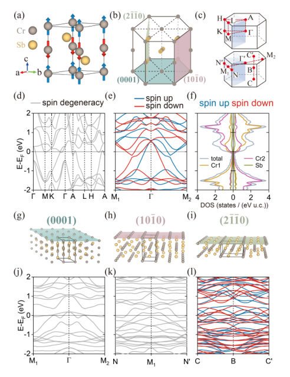 
FIG. 1. (a) Crystal structure and magnetic configuration of bulk CrSb. Blue and red arrows denote the spin-up and spin-down states, respectively. (b) Schematic illustration of the representative crystallographic planes, including (0001), (10¯10) and (2¯1¯10). (c) Brillouin zone of bulk CrSb with the high- and low-symmetry k-point paths. (d),(e) Electronic structures of bulk CrSb along the high- and low-symmetry paths. (f) Projected density of states (PDOS) of bulk CrSb. (g)–(i) Atomic structures of CrSb slabs with the (0001), (10¯10), and (2¯1¯10) surface orientations, respectively. (j)–(l) Electronic structures of the corresponding CrSb slabs calcu- lated along the low-symmetry k-point...

📷 Fig 2

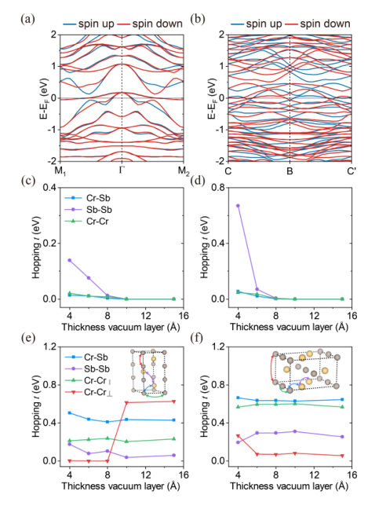 
FIG. 2. (a),(b) Electronic structures of the CrSb (0001) and (2¯1¯10) slab calculated with a vacuum spacing of 4 ˚A respec- tively. (c),(d) Schematic illustration of the inter-slab Cr–Sb, Sb–Sb, and Cr–Cr hopping interactions across the vacuum region for the (0001) and (2¯1¯10) slabs, respectively. (e),(f) Schematic illustration of the Cr–Sb, Sb–Sb, and Cr–Cr intra- slab hopping interactions within the (0001) and (2¯1¯10) slabs.

📷 Fig 3

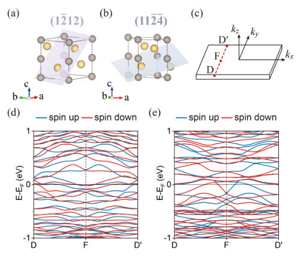 
FIG. 4. (a),(b) Schematic illustrations of the CrSb with the (1¯212) and (11¯2¯4) surface orientations, respectively. (c) Brillouin zone of the (1¯212) and (11¯2¯4) slabs, with the low- symmetry k-path indicated by the red dashed line. (d),(e) Electronic structures of the CrSb (1¯212) and (11¯2¯4) slabs.

📷 Fig 4

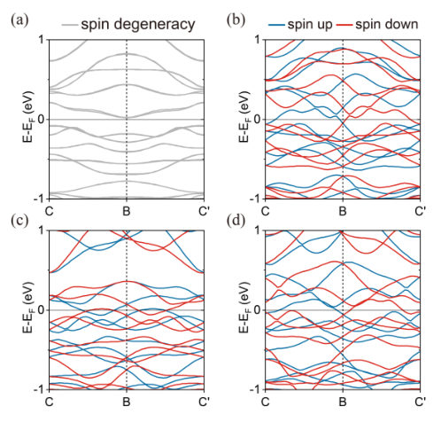 
FIG. 3. Electronic structures obtained from the Wannier tight-binding Hamiltonian under different hopping configura- tions while preserving the altermagnetic symmetry. (a) The truncated Wannier Hamiltonian by retaining only the intra- unit-cell hopping terms. (b) The truncated Wannier Hamilto- nian including Sb–Sb hopping parameters connecting neigh- boring unit cells. (c) The truncated Wannier Hamiltonian including Cr–Sb hopping parameters connecting neighboring unit cells. (d) The truncated Wannier Hamiltonian including Cr–Sb and Sb–Sb hopping parameters connecting neighbor- ing unit cells.

**Summary.** This work uses first-principles calculations to map the microscopic origin of spin splitting in altermagnetic CrSb thin films. The authors find that surface termination is crucial, showing that robust spin splitting requires specific long-range inter-unit-cell hopping pathways unique to certain surfaces. This establishes a general principle for controlling electronic properties by engineering low-dimensional crystal interfaces.

**Why it may be interesting.** While focused on magnetism, understanding how crystal symmetry and dimensionality fundamentally alter electronic band structure via orbital hybridization (hopping) provides a generalizable principle for engineering quantum properties in novel materials systems.

Detailed structure

**Main problem.** The study aims to resolve the microscopic origin of spin splitting in altermagnetic CrSb thin films, specifically investigating how this property changes when dimensionality is reduced from bulk to 2D.

**Main result.** The paper demonstrates that surface orientation dictates the electronic structure; while the (2$ar{1}ar{1}0$) slab retains strong spin splitting, others do not. This splitting fundamentally relies on long-range inter-unit-cell coplanar Cr--Sb hopping pathways.

**Method.** First-principles calculations were used to model CrSb slabs with various surface orientations and varying vacuum spacings to simulate dimensional reduction. Wannier tight-binding Hamiltonians were constructed to analyze the contribution of different hopping channels.

**Model / system.** The physical system is metallic CrSb, an altermagnet known for its giant spin splitting. The model involves constructing slab geometries with specific surface terminations ((2$ar{1}ar{1}0$), (0001), etc.) and systematically varying the inter-slab vacuum spacing to tune coupling strength.

**Key observables.** Momentum-dependent spin splitting magnitude, electronic band structures along high-symmetry k-paths, and the contribution of specific hopping parameters ($	ext{Cr–Sb}$, $	ext{Sb–Sb}$).

**Important parameters / regimes.** Dimensionality (3D bulk vs. 2D thin film limit), surface orientation, and inter-unit-cell coupling strength.

**Assumptions / limitations.** The calculations assume that the electronic structure can be accurately modeled by analyzing the contributions of specific hopping pathways derived from first-principles results.

**Figures summary.** Figures illustrate the crystal structures for different planes, show the evolution of spin splitting as vacuum spacing changes (comparing surfaces), and detail how retaining specific inter-unit-cell hopping terms is necessary to reproduce the observed spin splitting in the most stable surface orientation.

**Paper structure.** The paper systematically compares the electronic structure of bulk vs. various slab geometries using first-principles calculations, then refines this analysis by constructing Wannier Hamiltonians and analyzing the necessity of specific long-range hopping terms ($	ext{Cr–Sb}$ vs $	ext{Sb–Sb}$) to explain the observed spin splitting in low dimensions.

Abstract

Altermagnets have recently emerged as promising materials for spintronic applications owing to their momentum-dependent spin splitting. Among them, metallic CrSb is particularly attractive owing to its giant spin splitting and high Néel temperature. However, the microscopic origin of the distinct spin-splitting behaviors in bulk and thin-film CrSb remains unresolved. Here, we systematically investigate the electronic structures of CrSb slabs with different surface orientations using first-principles calculations. Although all considered slabs preserve spin-group symmetries compatible with altermagnetism, they exhibit markedly different electronic structures: the (2$\bar{1}\bar{1}$0) slab retains pronounced altermagnetic spin splitting, whereas the (0001) and (10$\bar{1}$0) slabs display nearly spin-degenerate bands. We demonstrate that dimensional reduction fundamentally changes the microscopic origin of altermagnetic spin splitting. Unlike bulk CrSb, altermagnetic spin splitting in thin films requires long-range inter-unit-cell coplanar Cr--Sb hopping, while Sb--Sb hopping provides an additional contribution. The preservation or suppression of these hopping pathways explains the strong surface dependence of the spin splitting. Our findings establish a microscopic mechanism for understanding altermagnetism in reduced dimensions and provide a general principle for engineering spin splitting in low-dimensional altermagnetic materials.

[↑ back to top](#top)

### [Multi-agent discovery of practical quantum LDPC codes](http://arxiv.org/abs/2608.08996v1)

**Authors:** Dongheng Qian, Tianyi Li  
**Type:** theory · **Category:** quantum information and computing · **PDF:** <https://arxiv.org/pdf/2608.08996v1>  
**Analysis basis:** full PDF text, analyzed in chunks

📷 Fig 1

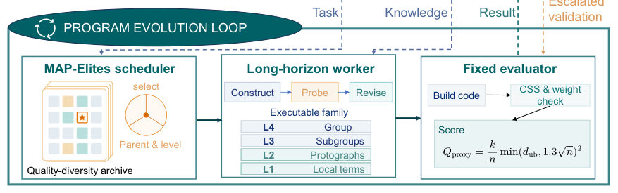 
Figure 1: The multi-agent discovery framework. A scientific-reasoning loop (top) uses researcher proposals, curator synthesis and persistent memory to generate exploration and validation tasks. A program-evolution loop (bottom) mutates executable qLDPC-family generators within a MAP-Elites archive and scores candidates using a fixed evaluator. Evaluated candidates update both the archive and the evidence available to the scientific loop. L1–L4 denote mutations of local terms, protographs, subgroups and host groups, respectively.

📷 Fig 2

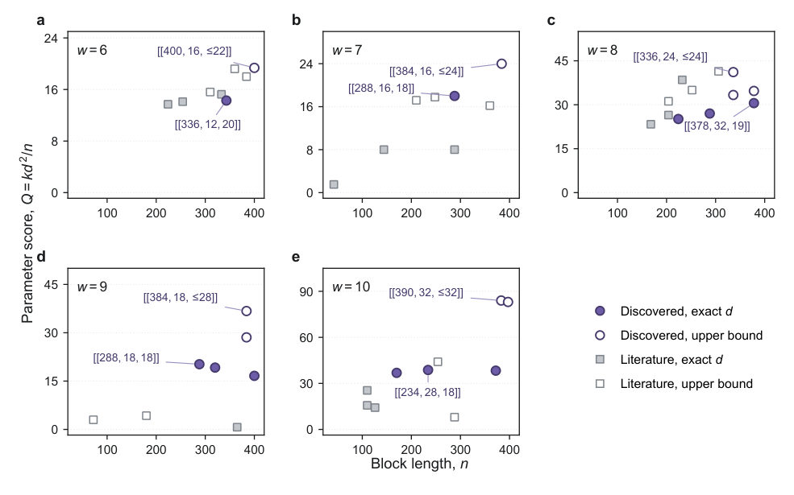 
Figure 2: Finite-length performance under overall-weight constraints. Panels (a)–(e) compare the parameter score 𝑄= 𝑘𝑑2/𝑛against block length 𝑛at fixed overall weights 𝑤= 6–10. Purple circles are codes discovered in this work and gray squares are literature codes; filled markers denote exact distances and open markers denote QDistEvol distance upper bounds, for which the plotted 𝑄is an upper endpoint. Selected discoveries from Table I are labeled with their [[𝑛, 𝑘, 𝑑]] parameters, including the exact-distance leaders [[288, 16, 18]], [[288, 18, 18]] and [[234, 28, 18]] at 𝑤= 7, 9 and 10.

📷 Fig 3

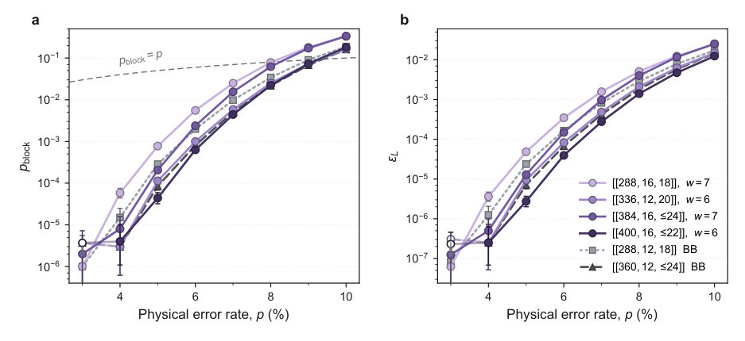 
Figure 3: Code-capacity performance under depolarizing noise. (a) Block error rate 𝑝block and (b) per- logical error rate 𝜖𝐿versus the physical error rate 𝑝for four discovered codes at 𝑤= 6 and 7 (solid purple: [[288, 16, 18]], [[336, 12, 20]], [[384, 16, ≤24]] and [[400, 16, ≤22]]) and two weight-six bivariate-bicycle benchmarks (dashed gray: [[288, 12, 18]] and [[360, 12, ≤24]]), all decoded with the same minimum-sum BP–OSD protocol. The dashed line in (a) marks 𝑝block = 𝑝, whose crossing defines the pseudo-threshold. Error bars are exact 95% confidence intervals; points with no observed failures are plotted as open markers at their upper confidence limits.

**Summary.** This paper introduces a multi-agent artificial intelligence framework designed to overcome the difficult search problem associated with finding practical Quantum LDPC codes. By combining specialist proposal, memory retention, and iterative program execution, the agents efficiently discover high-performing code candidates. These results provide concrete, hardware-relevant quantum error correction resources for future experimental implementation.

**Why it may be interesting.** The application of advanced AI techniques to systematically discover optimal quantum error correction codes is highly relevant. It provides a blueprint for using computational intelligence to solve fundamental theoretical limits in quantum computation.

Detailed structure

**Main problem.** The core challenge is designing practical, finite-length Quantum Low-Density Parity-Check (qLDPC) codes that achieve optimal performance while satisfying strict hardware constraints.

**Main result.** The developed multi-agent framework successfully discovers several high-performing, structurally distinct qLDPC code candidates with competitive rate-distance trade-offs for various weight classes.

**Method.** A novel multi-agent AI framework is employed in a closed loop to search the space of coset-orbit balanced-product codes, optimizing performance metrics against practical constraints like block length and overall weight.

**Model / system.** The work focuses on quantum error correction using qLDPC codes. These codes encode logical qubits by distributing information across physical qubits via sparse parity checks, which are constructed using specific algebraic structures derived from finite groups.

**Key observables.** Code parameters $[[n, k, d]]$ (block length, encoded qubits, distance), the rate ($k/n$), and a composite performance metric $Q = k d^2 / n$.

**Important parameters / regimes.** Constraints include binary CSS codes with block length $n \le 400$ and overall weight $w \le 10$. Performance is evaluated under code-capacity depolarizing noise.

**Assumptions / limitations.** The search relies on the assumption that structured agentic AI can efficiently explore complex combinatorial spaces, and performance evaluation uses established decoding protocols (BP-OSD) and distance estimation techniques (QDistEvol).

**Figures summary.** Figure 1 illustrates the multi-agent discovery framework loop. Figure 2 organizes comparative results for discovered codes across different overall-weight classes ($w$).

**Paper structure.** The paper introduces the problem, details the multi-agent search methodology (combining proposal/review loops), presents the construction space (coset-orbit balanced-product codes), reports key findings with specific code examples and performance metrics, and concludes by validating the approach's utility for hardware design.

Abstract

Quantum low-density parity-check (qLDPC) codes can encode multiple logical qubits using sparse parity checks, yet searching for useful finite-length instances remains a challenging design problem because code performance must be optimized while satisfying practical constraints. Motivated by recent advances in artificial-intelligence agents for scientific discovery, we develop a multi-agent framework for discovering practical qLDPC codes. The framework combines specialist proposal and review, persistent scientific memory, long-horizon evolution of executable programs, and deterministic construction and evaluation within a closed-loop search. These programs instantiate coset-orbit balanced-product codes, providing a search space that includes bicycle and lifted-product constructions as well as non-normal subgroup actions. To incorporate practical constraints, we restrict the search to binary CSS codes with block length $n\leq400$ and overall weight $w\leq10$. Within this regime, the framework discovers codes with leading or competitive rate--distance performance in every weight class considered, with representative instances including $[[288,16,18]]$ at $w=7$, $[[288,18,18]]$ at $w=9$, and $[[234,28,18]]$ at $w=10$. The search also uncovers structurally distinct, high-performing constructions, including a $[[336,12,\leq24]]$ candidate and a $[[368,18,16]]$ code, both of which are genuine balanced-product constructions with non-normal subgroup actions. When evaluated under code-capacity depolarizing noise using a common BP-OSD decoding protocol, the discovered codes also exhibit low logical failure rates. Together, these results provide hardware-relevant finite-length candidates for further experimental evaluation and show how structured agentic search can contribute to scientific discovery.

[↑ back to top](#top)

### [Quantum Bicycle LDPC Codes with High $kd^2/n$ from Divisor-Driven Search](http://arxiv.org/abs/2608.09115v1)

**Authors:** Liangdong Lu, Guanmin Guo, Yang Liu, Ruipan Yang  
**Type:** theory · **Category:** quantum information and computing · **PDF:** <https://arxiv.org/pdf/2608.09115v1>  
**Analysis basis:** full PDF text, analyzed in chunks

📷 Fig 1

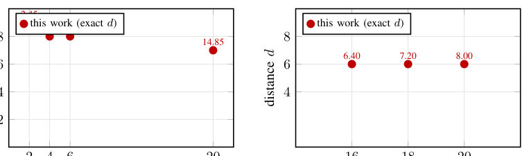 
Fig. 1. Parameter landscape at n = 66 and n = 90: exact distance d against dimension k for the best code found at each k; labels give kd2/n (the bivariate bicycle codes [[144, 12, 12]]2 and [[90, 8, 10]]2 attain 12 and 8.9).

📷 Fig 2

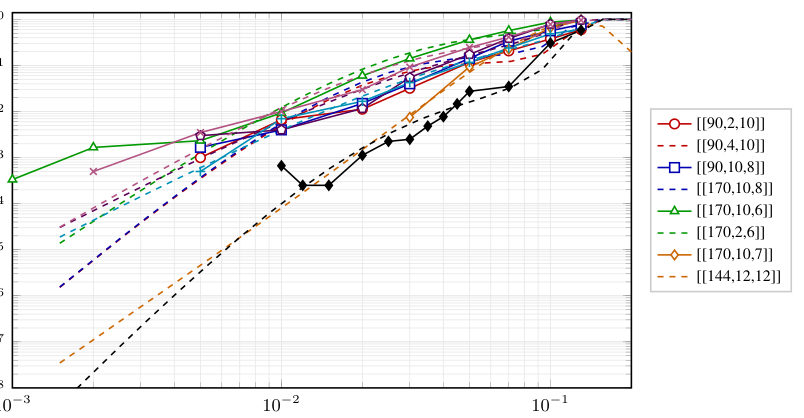 
Fig. 2. Decoding performance: long codes vs BB [[144, 12, 12]]. Markers: Monte Carlo (BP-OSD, 50 iterations, OSD-CS order 1); dashed lines: the fit ˜pL(p) = pd/2eα+βp+γp2 on sub-threshold data, drawn over the full axis range for illustration.

📷 Fig 3

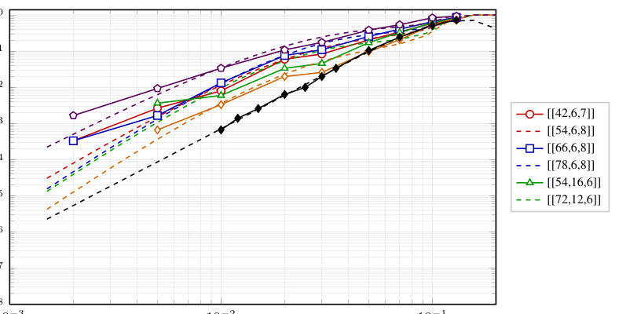 
Fig. 3. Decoding performance: short codes vs BB [[72, 12, 6]]. Markers: Monte Carlo (BP-OSD, 50 iterations, OSD-CS order 1); dashed lines: the fit ˜pL(p) = pd/2eα+βp+γp2 on sub-threshold data, drawn over the full axis range for illustration.

**Summary.** This paper develops an advanced algebraic framework to systematically search for high-performing Quantum Bicycle LDPC codes. By translating the complex group-theoretic construction into polynomial ring arithmetic, the authors can efficiently calculate code parameters and discover new optimal codes. This advances the theoretical understanding of quantum error correction capabilities.

**Why it may be interesting.** This work provides powerful algebraic tools for constructing quantum error-correcting codes, which is fundamental knowledge for anyone working on fault tolerance or quantum computation architectures.

Detailed structure

**Main problem.** To systematically design and characterize quantum bicycle Low-Density Parity-Check (LDPC) codes by reformulating their construction from group algebra into a purely algebraic/polynomial domain.

**Main result.** The framework recovers several high-performance codes, such as $[[66, 20, 7]]_2$ with $kd^2/n=14.85$, and establishes structural boundaries by proving the non-existence of certain parameter combinations (e.g., $[[48, 10, 5]]_2$).

**Method.** The authors use a divisor-driven search based on polynomial rings $\mathbb{F}_2[x]/(x^l - 1)$ and relate code properties using the Calderbank correspondence to additive codes over $\mathbb{F}_4$.

**Model / system.** The focus is on Quantum Bicycle LDPC codes, which are specific types of CSS quantum error-correcting codes derived from two commuting circulant blocks.

**Key observables.** Code parameters $[[n, k, d]]_2$, the figure of merit $kd^2/n$, and logical error rates ($p_L$).

**Important parameters / regimes.** The block length $l$ (or $n$), the dimension $k$, and the minimum distance $d$. The search is constrained by polynomial GCDs.

**Assumptions / limitations.** The initial analysis focuses on the cyclic case, which simplifies the group algebra to a polynomial ring; extending this to general bivariate cases requires more advanced algebraic tools.

**Figures summary.** Figures illustrate decoding performance plots comparing various codes against reference bounds, and tables list specific code parameters derived from the search framework for different block lengths $n$.

**Paper structure.** The paper progresses by first establishing the polynomial reformulation of the group-algebraic construction, detailing how to calculate $k$ and $d$ algebraically. It then applies this method via a systematic search to find optimal codes, culminating in structural theorems that define the boundaries of achievable parameters.

Abstract

Bicycle (two-block circulant) quantum low-density parity-check (LDPC) codes include some of the best known small quantum codes, yet their design has relied on group-algebra formulations in which the dimension and distance are accessible only through matrix computation. We show that in the cyclic case the construction collapses into the polynomial ring $\F_2[x]/(x^{l}-1)$: self-orthogonality is automatic, the quantum dimension is read off from a polynomial gcd, and the minimum distance is certified exactly through the Calderbank correspondence to additive codes over $\F_4$, turning code search into an algebraically pre-filtered enumeration that reaches parameter regimes poorly covered by existing tables. A computer search based on this framework recovers the short codes $[[42,12,4]]_2$ and $[[62,12,4]]_2$ and produces a family of codes with competitive figure of merit $kd^2/n$, including $[[66,20,7]]_2$ with $kd^2/n=14.85$, above the bivariate bicycle code $[[144,12,12]]_2$ ($kd^2/n=12$) at less than half the block length, together with $[[46,2,8]]_2$, $[[66,2,9]]_2$, $[[66,4,8]]_2$, $[[66,6,8]]_2$ and, at $n=90$, $[[90,16,6]]_2$, $[[90,18,6]]_2$, $[[90,20,6]]_2$. An exhaustive census at $n=48$ delineates the boundary of this picture: we exhibit a $[[48,10,6]]_2$ code from a minimal $48$-element group (the Aydin--Tamo--Barg realization uses $72$ elements), and prove that distance $5$ forces a stabilizer-rank loss, which excludes $[[48,10,5]]_2$ from the weight-$8$ symmetric coset family. The framework thus opens a systematic route to bicycle-type quantum LDPC codes beyond the reach of group-theoretic searches, and identifies exactly where genuinely coset-theoretic phenomena begin.

[↑ back to top](#top)

### [Quantum Hashing Circuit Optimization for Arbitrary Qubit Connectivity Graphs Based on 1-Covering Path](http://arxiv.org/abs/2608.09134v1)

**Authors:** Kamil Khadiev, Aliya Khadieva, Vadim Sagitov, Kamil Khasanov, Mansur Ziatdinov  
**Type:** theory · **Category:** quantum information and computing · **PDF:** <https://arxiv.org/pdf/2608.09134v1>  
**Analysis basis:** full PDF text, analyzed in chunks

📷 Fig 1

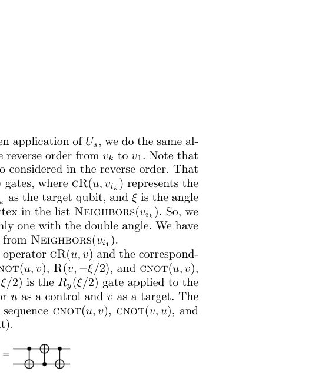 
Fig. 2. Representation of CRy and SWAP gates using only basic gates

📷 Fig 2

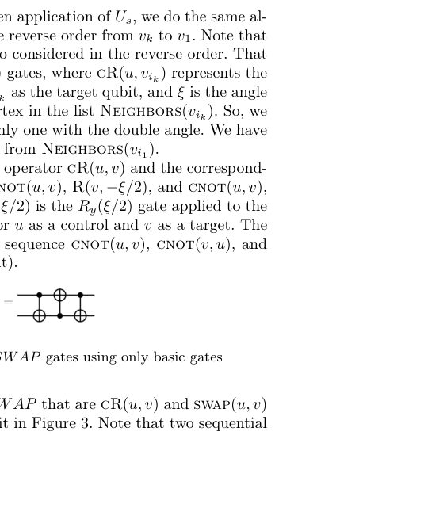 
Fig. 3. Representation of a pair CRy and SWAP gates using only basic gates

📷 Fig 3

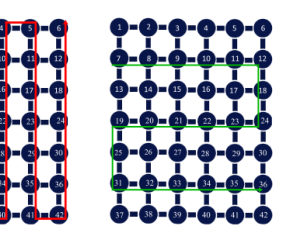 
Fig. 6. A grid architecture with 7 rows and 6 columns. The green line is the shortest 1-covering path (for our algorithm). The red line is the shortest path that visits all vertices at least once (for algorithm of [49]).

**Summary.** This paper develops an algorithm to efficiently synthesize quantum circuits for quantum hashing when the underlying quantum hardware has limited qubit connectivity. It achieves this by mapping the required gate sequence onto a path found in the graph representing qubit connections, significantly reducing the necessary CNOT gate count. This work provides a general framework for optimizing quantum algorithms for realistic, constrained quantum devices.

**Why it may be interesting.** While focused on quantum computation, the reliance on graph algorithms (like finding covering paths) to optimize physical implementation constraints is a general theme relevant to designing complex quantum hardware protocols.

Detailed structure

**Main problem.** The core problem is efficiently synthesizing quantum circuits, specifically for quantum hashing (fingerprinting), to run on hardware with limited qubit connectivity.

**Main result.** The authors present an algorithm that converts CNOT gate sequences into a form suitable for arbitrary architectures by solving the Shortest Non-simple 1-covering Path Problem (1-SNSCPP).

**Method.** The method relies on finding a shortest 1-covering path in the qubit connectivity graph and constructing quantum gates using control rotations (CR) and SWAP gates to simulate the required transformations along this path.

**Model / system.** The model is a quantum circuit operating on qubits constrained by an arbitrary, fixed qubit connectivity graph G=(V, E). The algorithm applies to quantum hashing circuits used for tasks like recognizing specific formal languages.

**Key observables.** CNOT cost (the primary metric of efficiency), and the probability of accepting a string in the quantum fingerprinting scheme.

**Important parameters / regimes.** The number of qubits ($n$), the length of the input word ($\ell$), and the structure of the connectivity graph $G$.

**Assumptions / limitations.** The derivation assumes the availability of a solution for the 1-SNSCPP problem, which is NP-hard; approximations are used to manage this complexity.

**Figures summary.** Figures illustrate the shallow circuit structure for quantum fingerprinting and show how complex gates like $CR_y$ and $SWAP$ can be decomposed into basic CNOT and rotation gates.

**Paper structure.** The paper introduces the problem, details the graph theory component (solving 1-SNSCPP), derives the gate decomposition costs based on path properties ($k$, $k'$), and finally presents the overall CNOT cost formula for $\ell$ applications of the hashing operator.

Abstract

One of the obstacles to the widespread adoption of quantum computing is the problem of efficient circuit synthesis. Current quantum hardware has limited connections between qubits, with each qubit connected to only a few others. This means that the circuit has to be transformed to accommodate this. In this paper, we present an algorithm that converts a circuit containing a sequence of CNOT gates into a form that is suitable for arbitrary quantum computer architectures. Although we demonstrate the algorithm only in the context of quantum fingerprinting, similar gate sequences are prevalent in quantum algorithms; for instance, they are present in the textbook quantum Fourier transform. We present a quantum circuit implementation of the quantum hashing algorithm (quantum fingerprinting algorithm) for a quantum device with restrictions on the application of two-qubit gates that are expressed as a qubit connectivity graph. As an example of usage of the technique, we apply it to quantum finite automata recognizing the unary $MOD_p=\{a^\ell: \ell \bmod p=0\}$ language, and the $EQ_p=\{a^\ell b^r: \ell \equiv r \pmod p\}$ language. Given the enhancements that our algorithm provides~-- for instance, in one case it achieves a 16\%--17\% decrease in CNOT circuit cost~-- we believe it could also be useful in a broader quantum compilation context.

[↑ back to top](#top)

### [Scalene Yang--Baxter triples as a source of hidden symmetries beyond the ordinary Yang--Baxter equation](http://arxiv.org/abs/2608.09081v1)

**Authors:** Pramod Padmanabhan, Somnath Maity, Vladimir Korepin  
**Type:** theory · **Category:** statistical mechanics · **PDF:** <https://arxiv.org/pdf/2608.09081v1>  
**Analysis basis:** full PDF text, analyzed in chunks

📷 Fig 1

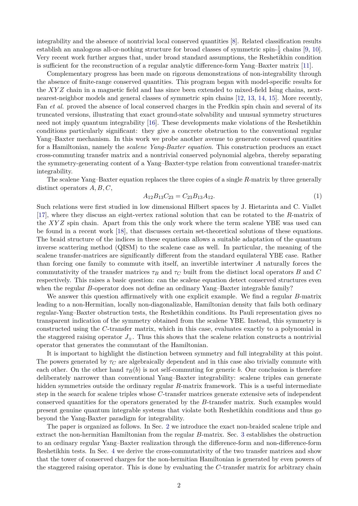 
Low-resolution page preview, page 2

📷 Fig 2

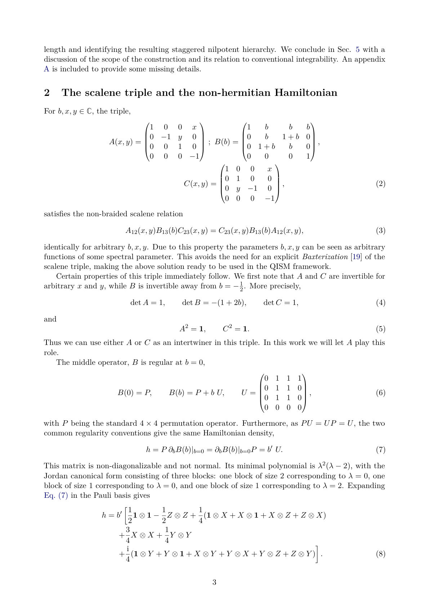 
Low-resolution page preview, page 3

📷 Fig 3

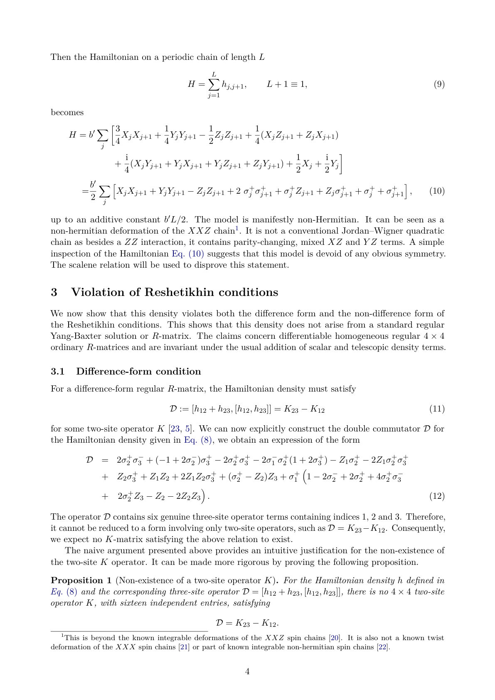 
Low-resolution page preview, page 4

📷 Fig 4

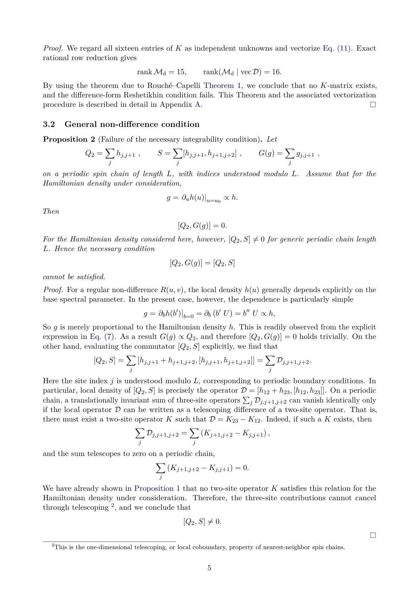 
Low-resolution page preview, page 5

📷 Fig 5

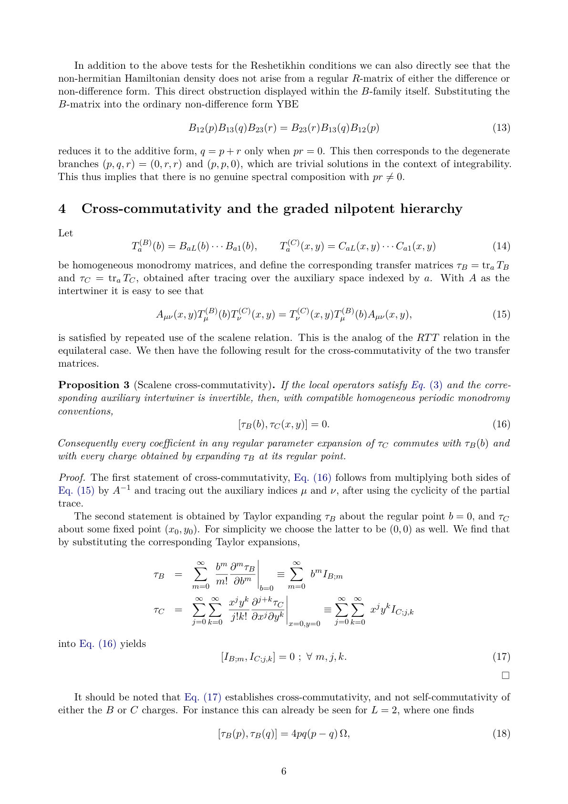 
Low-resolution page preview, page 6

**Summary.** This paper investigates quantum integrability in a non-Hermitian spin chain model derived from scalene Yang–Baxter triples. The authors demonstrate that while the system fails conventional integrability tests (like Reshetikhin conditions), the underlying algebraic structure guarantees cross-commuting transfer matrices. This leads to the discovery of hidden conserved symmetries generated by a nilpotent operator, expanding the known scope of integrable quantum models.

**Why it may be interesting.** The work provides an algebraic mechanism for discovering symmetries in non-standard integrable models, extending the scope beyond systems solvable by standard commuting transfer matrices associated with the ordinary YBE.

Detailed structure

**Main problem.** To explore hidden symmetries beyond those predicted by the ordinary Yang–Baxter equation (YBE) using 'scalene Yang–Baxter triples.'

**Main result.** The Hamiltonian violates standard integrability conditions but possesses conserved quantities generated by a single, non-obvious staggered nilpotent symmetry derived from cross-commuting transfer matrices.

**Method.** The authors analyze the system's Hamiltonian density by testing it against necessary integrability criteria (Reshetikhin conditions) and utilizing the algebraic structure imposed by the scalene Yang–Baxter relation to find hidden symmetries.

**Model / system.** The study focuses on a nearest-neighbor non-Hermitian spin chain derived from one member of an exact non-braided scalene Yang–Baxter triple, which is a deformation of the XXZ model.

**Key observables.** Double commutator $D$, cross-commutativity $[	au_B, 	au_C]$, and the staggered nilpotent symmetry operator $J_+$.

**Important parameters / regimes.** Even periodic chain length ($L$), spectral parameters ($b, x, y$).

**Assumptions / limitations.** The analysis assumes differentiability and homogeneity when applying standard YBE integrability tests; it also notes that the resulting conserved charges are algebraically dependent.

**Figures summary.** Not specified by the provided notes.

**Paper structure.** The paper proceeds by first establishing the physical model (non-Hermitian spin chain) and testing its Hamiltonian against known integrability diagnostics. It then uses the scalene YBE to prove cross-commutativity of transfer matrices, leading to the discovery of a hidden nilpotent symmetry that generates conserved charges.

Abstract

We study a nearest-neighbor non-Hermitian spin chain obtained from one member of an exact non-braided scalene Yang--Baxter triple. Its local Hamiltonian density violates both the difference-form Reshetikhin condition and its general non-difference counterpart, obstructing its realization by a differentiable homogeneous regular solution of the ordinary Yang--Baxter equation. The transfer matrices constructed from the regular member do not commute among themselves at distinct spectral parameters. Nevertheless, the scalene Yang--Baxter relation implies cross-commutativity with another transfer matrix constructed from the third member of the scalene triple. We evaluate the latter for arbitrary chain length and show that, on even periodic chains, it is a finite generating function of a non-obvious staggered nilpotent symmetry. The resulting conserved hierarchy belongs entirely to the algebra generated by this single symmetry and hence does not constitute an extensive family of algebraically independent charges. Nevertheless, this example demonstrates that scalene Yang--Baxter triples can act as an algebraic symmetry-discovery mechanism beyond the ordinary self-commuting transfer-matrix framework.

[↑ back to top](#top)

### [The Input Problem: A Permanent Bottleneck for Quantum Machine Learning](http://arxiv.org/abs/2608.08433v1)

**Authors:** Muhammad Faryad  
**Type:** theory · **Category:** quantum information and computing · **PDF:** <https://arxiv.org/pdf/2608.08433v1>  
**Analysis basis:** full PDF text, analyzed in chunks

📷 Fig 1

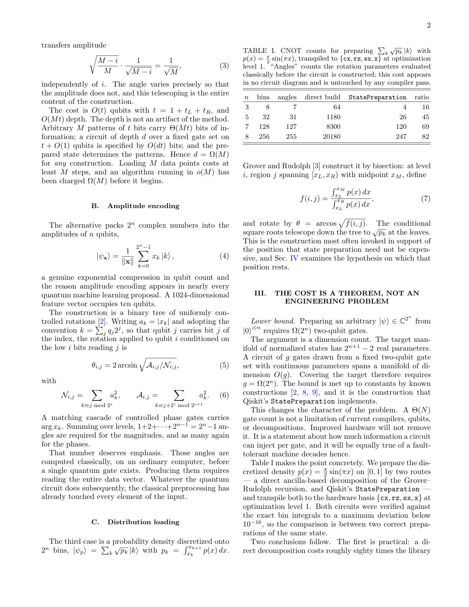 
Low-resolution page preview, page 2

📷 Fig 2

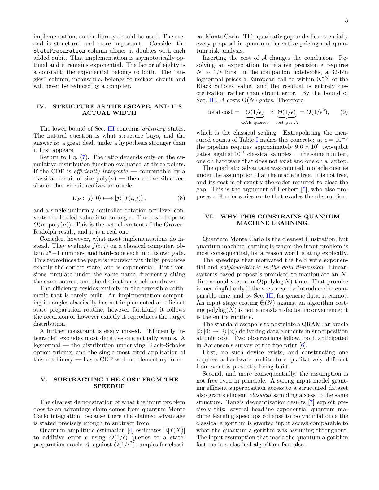 
Low-resolution page preview, page 3

📷 Fig 3

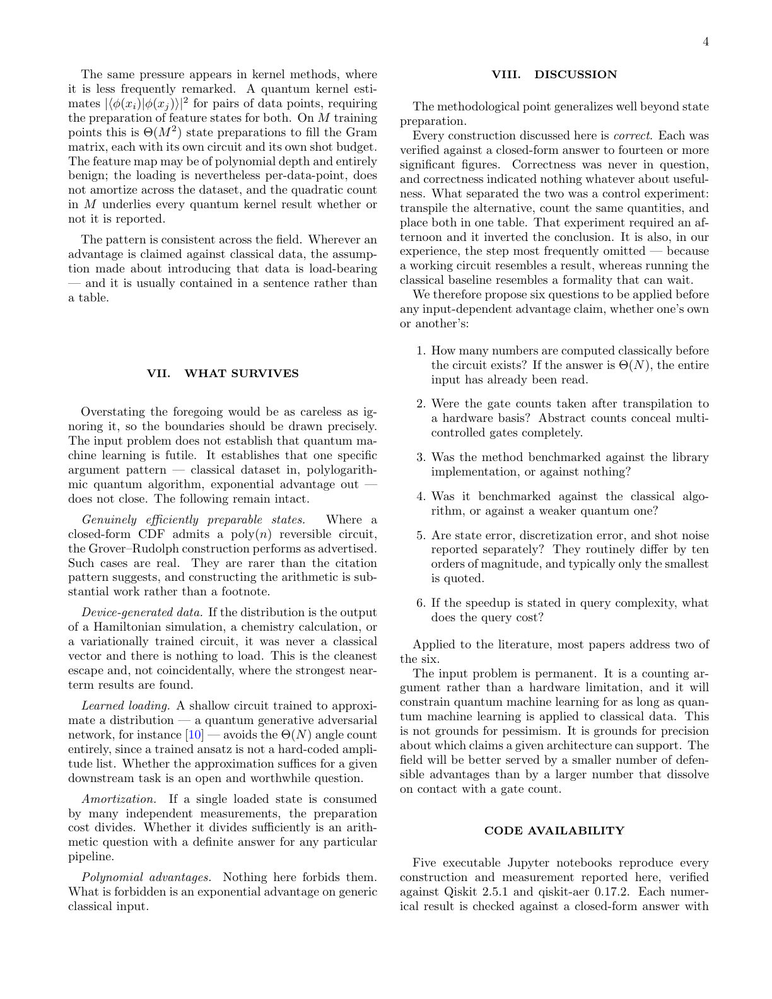 
Low-resolution page preview, page 4

📷 Fig 4

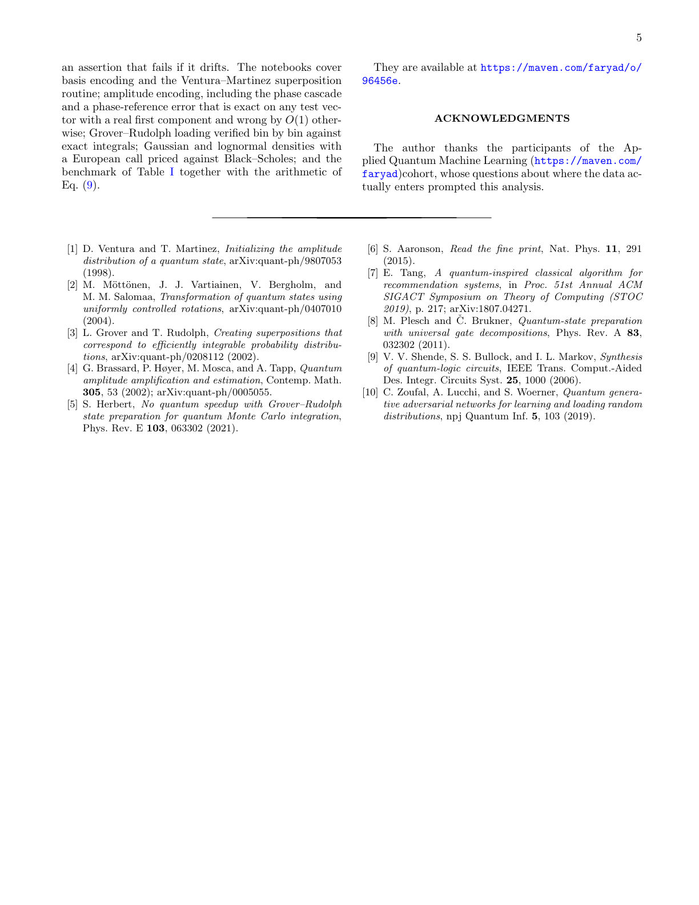 
Low-resolution page preview, page 5

**Summary.** This paper argues that the cost of loading classical data into a quantum state—the 'Input Problem'—is a permanent bottleneck in quantum computing. By analyzing standard encoding methods, it shows this input cost often scales poorly and can negate the theoretical speedups claimed for algorithms like QAE and QML. The authors urge researchers to account for these preparation costs when claiming quantum advantage.

**Why it may be interesting.** While focused on general computation theory, understanding resource constraints like state preparation is crucial for designing practical algorithms that might interface with physical systems or require complex initial conditions.

Detailed structure

**Main problem.** The primary issue is the 'Input Problem': the computational cost associated with preparing a quantum state $|\psi_x
angle$ from classical data $x$, which is often ignored in complexity analyses.

**Main result.** This input preparation cost scales polynomially or exponentially with the input size and frequently dominates the runtime of quantum algorithms, invalidating claimed exponential speedups for general classical inputs.

**Method.** The authors review and calculate the gate counts required for standard state encoding methods (basis, amplitude, distribution loading) and apply these costs to specific tasks like Quantum Amplitude Estimation.

**Model / system.** The analysis focuses on quantum computation models using qubits and applying various encodings to classical data vectors. The theoretical framework examines circuit complexity bounds ($\Theta(N)$).

**Key observables.** Gate counts (e.g., CNOT gates), computational complexity bounds ($\Theta(N)$, $\Omega(M^2)$), and the ratio of input cost to algorithm runtime.

**Important parameters / regimes.** Input size ($N$), number of qubits ($n$), error precision ($\epsilon$), and training data dimensionality ($M$).

**Assumptions / limitations.** The analysis challenges the assumption that state preparation is free, noting that efficient loading often implies efficient classical access (e.g., QRAM assumptions).

**Figures summary.** Table I compares CNOT counts for preparing discretized probability distributions using different methods, highlighting the separate cost of classical angle calculation.

**Paper structure.** The paper first defines the input problem by reviewing standard encodings and their gate costs. It then demonstrates how this cost nullifies the quadratic advantage in Quantum Amplitude Estimation (QAE) and constrains QML kernel methods. Finally, it provides a checklist for evaluating future quantum advantage claims.

Abstract

Quantum algorithms are conventionally presented with their input state supplied for free. When the input is classical data, this convention conceals a cost that is frequently larger than the algorithm it precedes. We review what the three standard encodings, such as basis encoding, amplitude encoding, and Grover--Rudolph distribution loading, actually cost once transpiled to a hardware gate set, and argue that the resulting $Θ(N)$ bound is a counting theorem rather than an engineering limitation that improved hardware will remove. Measured gate counts for a representative loading task are reported: an optimal library implementation requires $247$ CNOT gates at $n=8$ qubits and doubles with each additional qubit, while the classical preprocessing that produces the rotation angles requires reading the entire input vector. We show how this cost eliminates the quadratic advantage of quantum amplitude estimation for Monte Carlo integration, and argue that the same accounting constrains quantum machine learning more broadly: the strong input models that make quantum algorithms fast on classical data also enable classical dequantization, and quantum kernel methods carry a $Θ(M^2)$ state-preparation cost for the Gram matrix that does not amortize. We explain that the efficiently preparable states, device-generated distributions, variationally learned loading, and amortized preparation are required to get advantage from quantum machine learning and close with a checklist for evaluating input-dependent advantage claims. Executable notebooks reproducing every construction and measurement discussed here are available.

[↑ back to top](#top)

## Secondary cond-mat archives

*Papers from  mes-hall, other, soft, supr-con. These archives are de-prioritized — they appear at the end regardless of relevance score.*

### Relevant in secondary archives (31)

### [Probing intermittent polariton vortex dynamics with two-point correlations](http://arxiv.org/abs/2608.07748v1)

**Authors:** R. Cherbunin, A. Liubomirov, P. Kozhevin, M. Chukeev, M. Petrov, S. Kavokina, A. Nalitov, A. Kavokin  
**Type:** both · **Category:** other · **PDF:** <https://arxiv.org/pdf/2608.07748v1>  
**Analysis basis:** full PDF text, analyzed in chunks
**Topic relevance:** 🔥 `analog quantum simulation` **4/5** · 🔥 `driven-dissipative phase transition` **4/5** · `methods for driven-dissipative` **3/5** · `non-equilibrium universality` **3/5** · `quantum optics experiment` **3/5** · `Keldysh / 2PI / non-Gaussian methods` **2/5** · `Tavis-Cummings & cavity-many-emitter` **2/5** · `quantum measurements` **2/5** · `Full counting statistics` **1/5** · `correlated / nonlocal dissipation` **1/5** · `scars & prethermalization` **1/5**

📷 Fig 1

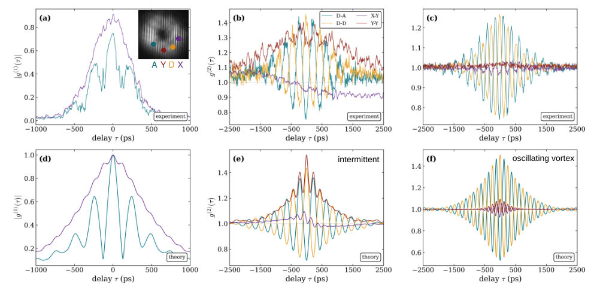 
Figure 2. (Color online) Two-point correlation function measurements. Left column: reference first-order correlation function at point A (blue) and X (purple), experiment (a) and theory (d). Central column: second-order correlation function in D-A (blue), D-D (yellow), Y-Y (red), and X-Y (blue) configurations, experiment (b) and theory (e). Right column: same as central column, but for the oscillating polariton vortex regime at higher pumping power, in experiment (c) and in theory (f). The inset in Figure 2(a) shows an example of an interferogram of the trapped polariton condensate with indicated locations of four probes: X,Y, A, D.

📷 Fig 2

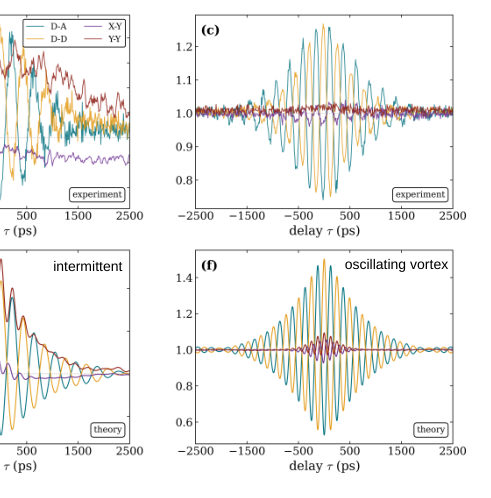 
Fig. 2f shows the numerically computed oscillations of g(2)(τ) for the four experimental configurations in the oscillating regime at mean pump power ⟨W⟩t = 12 well above the bifurcation threshold WAH ≈3.6. High oscilla- tion amplitudes of g(2) A,D and g(2) A,D contrasting weak oscil-

📷 Fig 3

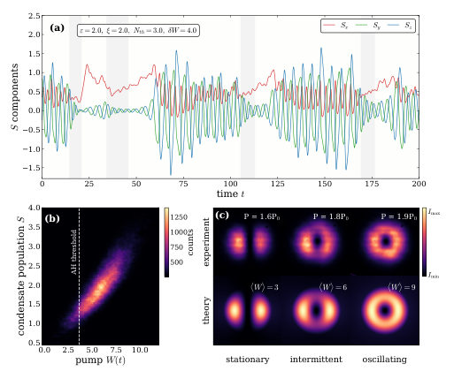 
Figure 4. Intermittent condensate dynamics. (a) Stochastic switching between quasi-stationary below-bifurcation (light blue) and oscillating above-threshold (light yellow) regimes visible in the time dependence of the pseudovector compo- nents Sx, Sy, Sz. (b) The histogram of the pump power W and condensate population S relative to the AH bifurcation (dashed vertical line). (c) Time-averaged polariton conden- sate density profiles, illustrating a crossover from the quasi- stationary mode to the oscillating regime through the inter- mittent phase with increasing mean pump power in experi- ment (top row) and in theory (bottom row).

📷 Fig 4

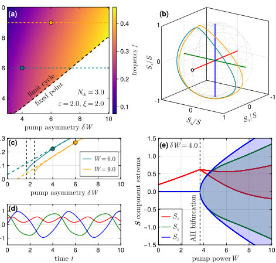 
Figure 3. Deterministic condensate limit-cycle dynamics in the eGPE model (2,3). (a) Frequency map on the (δW, W) plane. (b) Limit cycles of the pseudospin s = S/S on the Bloch sphere for two points in panel (a). White marker shows the fixed point position for the stationary regime (white area in panel (a)). (c) Frequency cross-sections and linear fitting (dot-dashed lines) for two pump powers W = 6, 9 (dashed lines in panel (a)). Vertical dashed lines indicate AH bifur- cation. (d) Periodic time dependence of the pseudovector components Sx, Sy, Sz for the real limit cycle in panel (b). (e) AH bifurcation diagram: stationary values and variation ranges for the pseudovector components....

**Summary.** The paper uses two-point correlation measurements on exciton-polariton condensates to probe their vortex dynamics. It reveals an intermittent regime where the system stochastically switches between stable and oscillating states near a critical bifurcation point. This rich quantum fluid behavior is theoretically explained by balancing nonlinear self-repulsion against reservoir-mediated attraction.

**Why it may be interesting.** This work connects concepts from nonlinear dynamics (bifurcations, intermittency) directly to quantum optics phenomena in polariton condensates, providing a detailed mechanism for observing complex time-dependent behavior beyond simple mean-field descriptions.

Detailed structure

**Main problem.** The study investigates the complex, intermittent dynamics of polariton vortices within a trapped bosonic condensate.

**Main result.** The research identifies an intermittent regime characterized by stochastic transitions between stationary and limit-cycle dynamics near an Andronov-Hopf bifurcation. This behavior is explained by the interplay between self-repulsion and reservoir-mediated attraction.

**Method.** Measurements involve using superconducting single-photon detectors to probe two-point second-order correlation functions, $g^{(2)}(	au)$, which are theoretically modeled using an extended Gross-Pitaevskii equation (eGPE).

**Model / system.** The system is a trapped bosonic condensate of exciton-polaritons in a microcavity. The dynamics are described by the eGPE, which models pseudospin precession and exhibits rich nonlinear behavior near bifurcations.

**Key observables.** Two-point second-order correlation function $g^{(2)}(	au)$, oscillations in $g^{(2)}$ frequency, and asymmetry in $g^{(2)}$ at low pump power.

**Important parameters / regimes.** Pump power (fluctuating across the Andronov-Hopf bifurcation threshold), trap ellipticity, and parameters governing self-repulsion ($\xi$) and attraction ($\epsilon$).

**Assumptions / limitations.** The analysis requires an extended Gross-Pitaevskii model beyond the adiabatic approximation to correctly analyze stability near bifurcations.

**Figures summary.** Figures illustrate the intermittent dynamics near a bifurcation, show $g^{(2)}$ measurements for various configurations across different pump power regimes, and depict limit cycles on the Bloch sphere related to the AH bifurcation.

**Paper structure.** The paper progresses by first establishing the measurement technique using $g^{(2)}$, then theoretically modeling the system with eGPE, identifying the transition points (AH bifurcation), and finally demonstrating how fluctuations induce stochastic switching between stable and oscillatory states in the correlation function.

Abstract

Superconducting single-photon detectors with time resolution of 80 ps have been used to study the spatiotemporal dynamics of a trapped bosonic condensate of exciton-polaritons. Both second- and first-order correlation functions are found to exhibit pronounced oscillations in time governed by the dynamics of the polariton condensate in the trap. We have identified the intermittent regime of stochastic transitions between stationary and limit-cycle regimes near the Andronov-Hopf bifurcation manifested in asymmetric distortions of the correlation function. This rich interplay of deterministic and stochastic condensate dynamics is explained theoretically as a manifestation of mutually compensating self-repulsion and reservoir-mediated attraction.

[↑ back to top](#top)

### [Hyperbolic exciton-plasmon polaritons in MoS$_2$/MoOCl$_2$ van der Waals heterostructures](http://arxiv.org/abs/2608.08923v1)

**Authors:** Rajveer Fandan, Jorge Pedrós  
**Type:** theory · **Category:** other · **PDF:** <https://arxiv.org/pdf/2608.08923v1>  
**Analysis basis:** full PDF text, analyzed in chunks
**Topic relevance:** 🔥 `analog quantum simulation` **4/5** · 🔥 `methods for driven-dissipative` **4/5** · `Tavis-Cummings & cavity-many-emitter` **3/5** · `driven-dissipative phase transition` **3/5** · `interference shaping light` **3/5** · `Keldysh / 2PI / non-Gaussian methods` **2/5** · `correlated / nonlocal dissipation` **2/5** · `quantum measurements` **2/5** · `non-equilibrium universality` **1/5**

📷 Fig 1

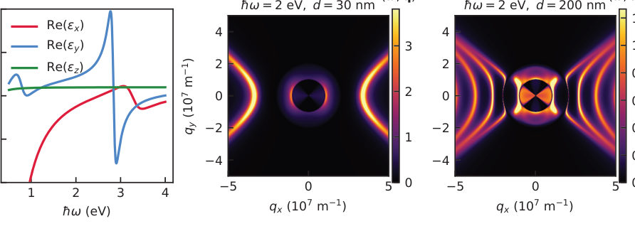 
FIG. 1. Anisotropic hyperbolic plasmon modes in MoOCl2. a, Schematic of the heterostructure: monolayer MoS2 (exciton sheet) on an anisotropic MoOCl2 slab of thickness d supported by a dielectric substrate (εsub = 4). The in-plane wavevector q = (qx, qy) is parameterised by its magnitude q and the azimuthal angle θ measured from the metallic x axis. b, Real parts of the principal dielectric-tensor components of MoOCl2 from the Lorentz–Drude model. c, Wavevector-resolved loss function L(ω, q) for d = 30 nm. The left (right) half shows propagation along qy (qx). The asymmetric dispersion directly reflects the sign-changing in-plane anisotropy. d, Iso-frequency loss map at ℏω = 2.0 eV for d =...

📷 Fig 2

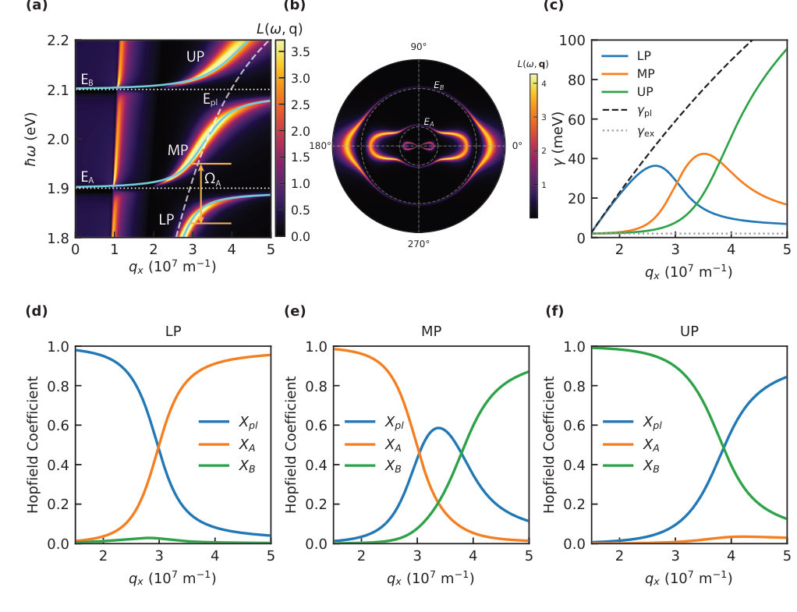 
FIG. 2. Wavevector-space polariton dispersion, anisotropic response, and modal composition of exciton– plasmon polaritons. a, Calculated loss function L(ω, qx) for a 30-nm-thick MoS2/MoOCl2 heterostructure. The colour map shows the optical loss intensity, while the cyan curves are the polariton eigenenergies obtained from the non-Hermitian coupled-oscillator model. The dashed white curve indicates the bare plasmon dispersion and the horizontal dotted lines mark the uncoupled A- and B-exciton resonances. The avoided crossings reveal the formation of lower (LP), middle (MP), and upper (UP) polariton branches. b, Angular dependence of the loss function L(ω, q) at fixed wavevector magnitude q =...

📷 Fig 3

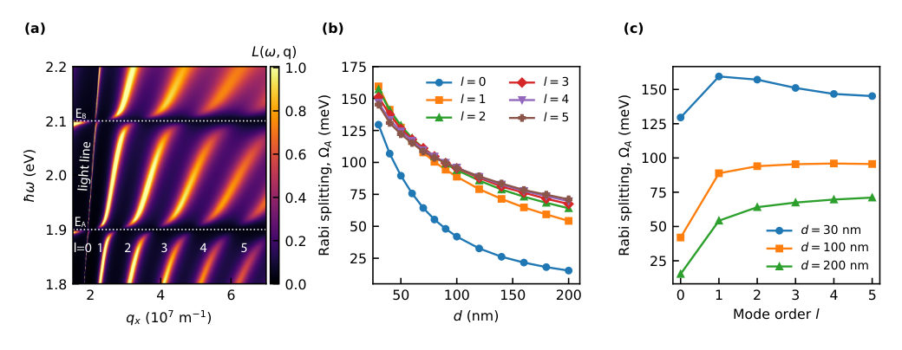 
FIG. 3. Multimode exciton–plasmon coupling controlled by the thickness and hyperbolic mode order. a, Loss function L(ω, q) of the MoS2/MoOCl2 heterostructure for d = 200 nm. Multiple volume-confined hyperbolic Fabry–P´erot branches, quantized according to Eq. (7), cross the A and B exciton energies (white dotted lines) and produce independent anticrossings at distinct in-plane wavevectors ql. b, A-exciton Rabi splitting ΩA versus MoOCl2 thickness for mode orders l = 0–5. For well-confined modes, ΩA ∝d−1/2, consistent with the expected scaling for volume-confined hyperbolic modes. The much steeper decay of the l = 0 (and l = 1) branches reflects the loss of confinement as the lowest-order...

📷 Fig 4

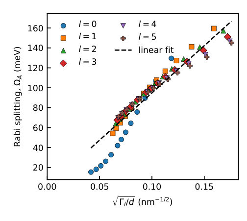 
FIG. 4. Scaling of the multimode Rabi splitting with the effective confinement parameter p

📷 Fig 5

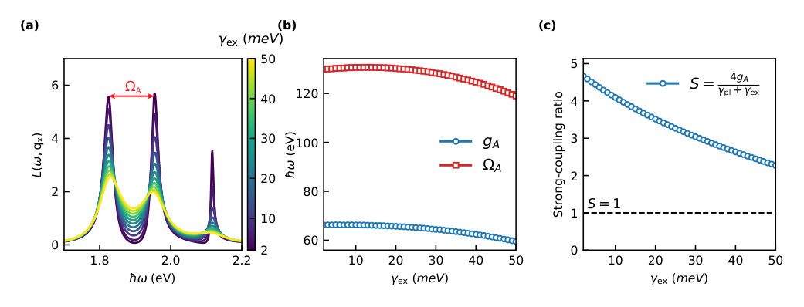 
FIG. 5. Robustness of strong coupling against excitonic dissipation. a, Loss spectra at the anticrossing wavevector qx = 2.91×107 m−1 for exciton linewidths ranging from 2 to 50 meV. The two polariton peaks remain well resolved throughout. b, Extracted Rabi splitting ΩA and fitted effective coupling g as functions of the exciton linewidth γex. Although both quantities decrease gradually with increasing excitonic dissipation, the coupling strength remains sufficiently large to sustain the strong- coupling regime. c, Spectral-resolution ratios S = 4g/(γpl + γex) versus γex. The horizontal dashed line (S = 1) indicates the conventional threshold for spectrally resolved strong coupling. The...

**Summary.** The paper theoretically predicts that coupling between excitons in $	ext{MoS}_2$ and plasmons in an anisotropic $	ext{MoOCl}_2$ slab creates hyperbolic exciton-plasmon polaritons. By using a coupled Hamiltonian model, the authors demonstrate that this system allows for directional control and multimode engineering of these polaritons through geometric tuning. This establishes the heterostructure as a promising platform for advanced nanophotonics.

**Why it may be interesting.** This work is highly relevant to quantum optics and open quantum systems as it models light-matter interaction in a controllable solid-state platform, exhibiting cavity QED-like phenomena (polariton formation) with tunable couplings.

Detailed structure

**Main problem.** The goal is to engineer directional and multimode exciton–plasmon polaritons using van der Waals heterostructures for advanced nanophotonics.

**Main result.** The $	ext{MoS}_2/	ext{MoOCl}_2$ system supports hyperbolic exciton-plasmon polaritons whose properties are tunable by crystallographic direction, slab thickness, and mode order.

**Method.** The study employs an anisotropic transfer-matrix model coupled to a dissipative three-level Hamiltonian to calculate the polariton dispersion relation.

**Model / system.** The physical system is a monolayer $	ext{MoS}_2$ placed on an anisotropic $	ext{MoOCl}_2$ slab. The model uses complex self-energies for plasmon, A exciton, and B exciton to describe the strong coupling dynamics.

**Key observables.** Polariton dispersion curves showing anticrossings; Rabi splitting ($\Omega_A$) scaling with thickness ($d$) and mode order ($l$); spectral-resolution ratio ($S$).

**Important parameters / regimes.** Coupling energies $g_A = 64.7 	ext{ meV}$ and $g_B = 61.2 	ext{ meV}$; hyperbolic confinement factor ($\Gamma_l$); excitonic linewidths up to $50 	ext{ meV}$.

**Assumptions / limitations.** The analysis assumes the presence of hyperbolic dispersion in $	ext{MoOCl}_2$ and uses approximations for modal field decay ($\kappa_j^l$).

**Figures summary.** Figures illustrate anisotropic hyperbolic plasmon modes, polariton dispersion showing anticrossings, and how Rabi splitting scales with thickness ($d$) and mode order ($l$).

**Paper structure.** The paper progresses by establishing the physical model using an anisotropic Hamiltonian, calculating the resulting polariton spectrum, demonstrating tunability via geometry (thickness/direction), and finally analyzing the robustness of the strong coupling regime.

Abstract

Polaritons formed by strong coupling between excitons and confined electromagnetic modes underpin emerging nanophotonic technologies, yet platforms based on isotropic metals or optical microcavities provide limited control over propagation direction. Here we predict that monolayer MoS$_2$ on the in-plane hyperbolic conductor MoOCl$_2$ supports hyperbolic exciton-plasmon polaritons governed by crystallographic direction, slab thickness, and hyperbolic mode order. Using an anisotropic transfer-matrix model coupled to a dissipative three-level Hamiltonian, we obtain wavevector-dependent anticrossings between the MoOCl$_2$ plasmons and the spin-orbit-split A and B excitons of MoS$_2$, yielding lower, middle, and upper polariton branches with coupling energies $g_A$ = 64.7 meV and $g_B$ = 61.2 meV. Rotating the in-plane wavevector tunes the plasmon-exciton detuning, while increasing the MoOCl$_2$ thickness activates higher-order hyperbolic Fabry-Pérot modes. Their coupling follows an approximate effective-mode-volume scaling. Strong coupling persists for excitonic linewidths up to 50 meV, with the normalised spectral-resolution ratio remaining above unity. These results establish MoS$_2$/MoOCl$_2$ as a lithography-free platform for directional and multimode exciton-plasmon polariton engineering in the visible spectral range.

[↑ back to top](#top)

### [Degenerate four-wave mixing in a CPT-symmetric coupler with intermodal dispersion](http://arxiv.org/abs/2608.08628v1)

**Authors:** Nguyen Duc Anh Quan, Do Duc Tho, Marek Trippenbach, Nguyen Thi Dung, Tran Thi Hai, Nguyen Viet Hung  
**Type:** theory · **Category:** other · **PDF:** <https://arxiv.org/pdf/2608.08628v1>  
**Analysis basis:** full PDF text, analyzed in chunks
**Topic relevance:** 🔥 `driven-dissipative phase transition` **4/5** · 🔥 `methods for driven-dissipative` **4/5** · `Keldysh / 2PI / non-Gaussian methods` **3/5** · `correlated / nonlocal dissipation` **3/5** · `interference shaping light` **3/5** · `non-equilibrium universality` **2/5** · `analog quantum simulation` **1/5** · `scars & prethermalization` **1/5**

📷 Fig 1

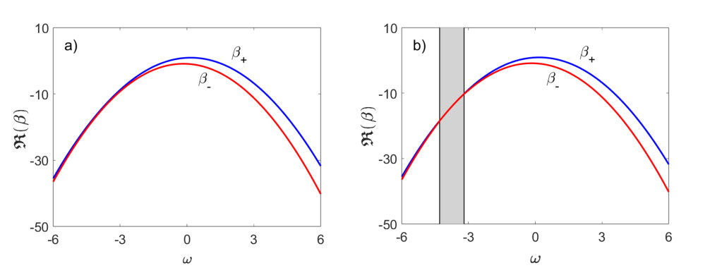 
FIG. 1. Linear dispersion relations for {κ0, κ1, κ2} = {1, 0.3, 0.04}. (a) Unbroken CPT phase at γ = 0.4. (b) Broken phase at γ = 0.5 &gt; γCPT = 0.4375. The shaded interval marks frequencies for which the branches coalesce and the propagation constants form a complex-conjugate pair.

📷 Fig 2

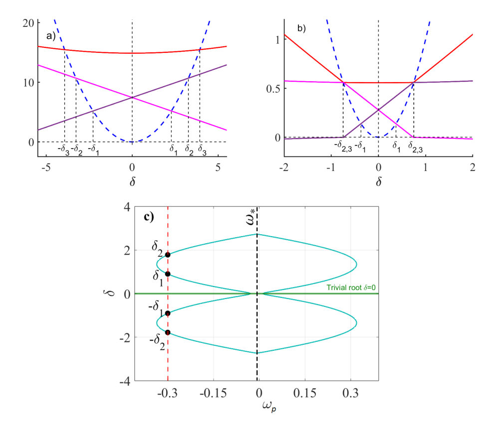 
FIG. 2. Graphical solutions of Eq. (12). (a) Configurations (I)–(III) for {κ0, κ1, κ2} = {1, 0.3, 0.04}, γ = 0.4, and ωp = 2.3. (b) The same three branch combinations at γ = γCPT = 0.4375 and ωp = −3.38. The blue dashed curves are the left-hand side and the solid curves are the configuration-dependent right-hand sides. (c) Zero contours for configuration (IV) with {κ0, κ1, κ2} = {1, 0.01, 0.6} and γ = γCPT −10−5. The green line is the trivial root δ = 0 and the cyan curves are nonzero solutions. At ωp = −0.3 (red dashed line), two positive roots and their negative counterparts coexist. The black dashed line marks ω∗= −κ1/(2κ2).

📷 Fig 3

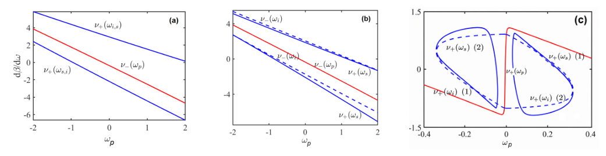 
FIG. 3. Group velocities of the phase-matched waves as functions of ωp. (a) Configuration (I). (b) Configurations (II) and (III), shown by solid and dashed blue curves. Panels (a) and (b) use {γ, κ1, κ2} = {0.4, 0.3, 0.04}. (c) Configuration (IV) for {γ, κ1, κ2} = {γCPT −10−5, 0.01, 0.6}. Red curves represent the pump branch and blue curves the generated sidebands. Crossings indicate exact group-velocity matching; nearby regions provide long but finite pulse overlap.

📷 Fig 4

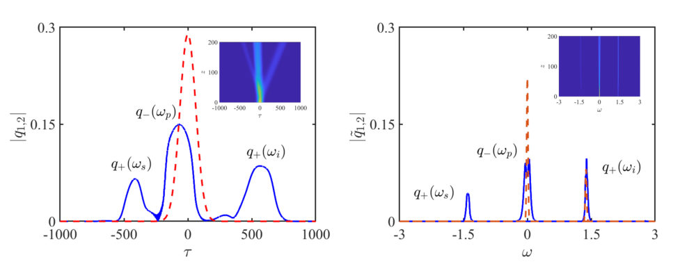 
FIG. 4. Configuration (I) for {κ0, κ1, κ2} = {1, 0.3, 0.04}, γ = 0.4, σ = +1, and ωp = 0. The pump and seed amplitudes are Ap = 0.24 and As = 0.11. Left: initial (red dashed) and output (blue) temporal amplitude profiles; the inset shows propagation. Right: corresponding spectra in the numerical coordinate Ω= −ω. The phase-matched idler grows while the packets separate according to their group velocities.

📷 Fig 5

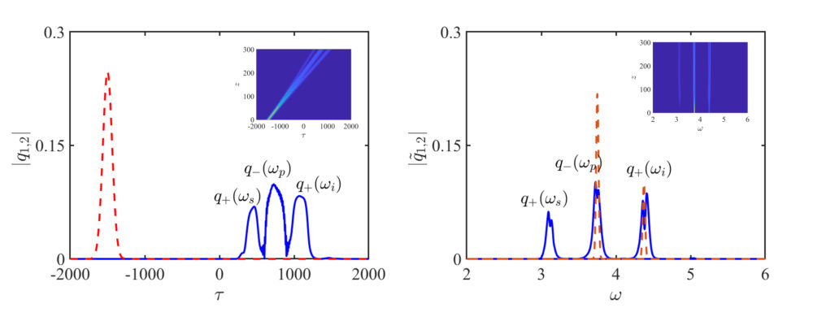 
FIG. 5. Configuration (I) with the parameters of Fig. 4 except ωp = −3.75. The substantially different group velocities produce a much larger temporal displacement. The spectral coordinate is Ω= −ω, so the pump appears near Ω= 3.75.

**Summary.** This paper studies degenerate four-wave mixing in a CPT-symmetric optical coupler that includes intermodal dispersion. The authors analyze how this dispersive coupling reorganizes nonlinear resonances by determining conditions for phase-matching within the system's non-Hermitian spectrum. Key findings include identifying stable resonant channels and demonstrating complex wave dynamics, particularly near spectral singularities where simple theoretical models break down.

**Why it may be interesting.** This work is highly relevant to quantum optics and open quantum systems because it models energy transfer in a non-Hermitian setting where spectral singularities (exceptional points) dictate the breakdown of simple few-mode approximations, which is crucial for understanding realistic photonic devices.

Detailed structure

**Main problem.** The study investigates how competing effects—dispersion, nonlinearity, and non-Hermiticity—select resonant energy-transfer channels during degenerate four-wave mixing (FWM). The focus is on the reorganization of resonances due to dispersive coupling in a CPT-symmetric system.

**Main result.** The analysis shows that three resonant channels persist over broad parameter regions, and near symmetry-breaking thresholds, a single pump can simultaneously support two distinct sideband resonances. Dispersive coupling fundamentally reorganizes energy exchange mechanisms in this non-Hermitian wave system.

**Method.** The research combines analytical methods to solve the degenerate phase-matching condition within the unbroken-CPT domain with direct pulse simulations to confirm predicted resonance structures and secondary wave generation.

**Model / system.** The model is a Kerr dual-core coupler governed by coupled nonlinear Schrödinger equations, incorporating balanced gain/loss ($\pm i\gamma$) and frequency-dependent intercore coupling ($K$). The system's dynamics are characterized by CPT symmetry.

**Key observables.** Resonant energy-transfer channels, the output FWM spectral fraction ($\eta_{FWM}$), and secondary wave generation/multifrequency cascades near eigenmode coalescence.

**Important parameters / regimes.** The Kerr coefficient ($\sigma$), coupling dispersion coefficients ($\kappa_0, \kappa_1, \kappa_2$), and operating regimes near exceptional points or symmetry-breaking thresholds.

**Assumptions / limitations.** The analysis often assumes a weak-to-moderate coupling-dispersion regime (perturbative) and that the reduced three-wave model remains accurate, though this fails near exceptional points.

**Figures summary.** Figures likely map out $\eta_{FWM}$ in parameter planes ($\kappa_1, \kappa_2$), delineating regions of unbroken vs. broken spectrum, and illustrating resonance existence across different coupling configurations (I, II, IV).

**Paper structure.** The paper establishes the physical model and symmetry (CPT), analyzes the linear spectrum to define the unbroken domain, derives algebraic conditions for degenerate phase-matching, classifies possible resonant branch triples, and finally uses simulations/diagnostics to confirm complex nonlinear dynamics near critical points.

Abstract

Four-wave mixing provides a simple setting in which dispersion, nonlinearity, and non-Hermiticity compete to select resonant energy-transfer channels. We study degenerate four-wave mixing in a Kerr dual-core coupler with balanced gain and loss and frequency-dependent intercore coupling. The dispersive coupling changes the symmetry from conventional $\mathcal{PT}$ symmetry to a combined $\mathcal{CPT}$ symmetry and reshapes the two-branch linear spectrum. We determine the unbroken-$\mathcal{CPT}$ domain and classify the branch configurations that can satisfy the degenerate phase-matching condition. In the parameter ranges examined, three resonant channels persist over broad regions, whereas a same-branch channel appears only close to the symmetry-breaking threshold. In this near-threshold regime, a single pump can simultaneously satisfy two distinct nonzero sideband resonances. Direct pulse simulations confirm the predicted resonances and reveal secondary-wave generation and multifrequency cascades near eigenmode coalescence. A reduced three-wave model captures the initial dynamics away from the exceptional point but loses accuracy as the modal basis becomes ill-conditioned. These results show how dispersive coupling reorganizes resonances, group-velocity mismatch, and nonlinear energy exchange in a non-Hermitian wave system, and they identify the exceptional-point region as a regime where a few-mode description can break down.

[↑ back to top](#top)

### [Dynamical quantum phase transitions in a hybrid quantum dot system with superconducting and ferromagnetic leads](http://arxiv.org/abs/2608.07744v1)

**Authors:** Antoni Jankiewicz, Kacper Wrześniewski, Ireneusz Weymann  
**Type:** theory · **Category:** statistical mechanics · **PDF:** <https://arxiv.org/pdf/2608.07744v1>  
**Analysis basis:** full PDF text, analyzed in chunks
**Topic relevance:** 🔥 `methods for driven-dissipative` **4/5** · 🔥 `non-equilibrium universality` **4/5** · `Keldysh / 2PI / non-Gaussian methods` **3/5** · `driven-dissipative phase transition` **3/5** · `quantum measurements` **2/5** · `analog quantum simulation` **1/5** · `correlated / nonlocal dissipation` **1/5** · `scars & prethermalization` **1/5**

📷 Fig 1

 
FIG. 1. Schematic of a correlated quantum dot (QD) sandwiched between superconducting (SC) and ferromagnetic (FM) leads. The quantum dot hosts a spin-degenerate orbital level of energy εd where also Coulomb repulsion U is present. The couplings to FM and SC leads are denoted as Γσ (spin- dependent) and ΓS, respectively.

📷 Fig 2

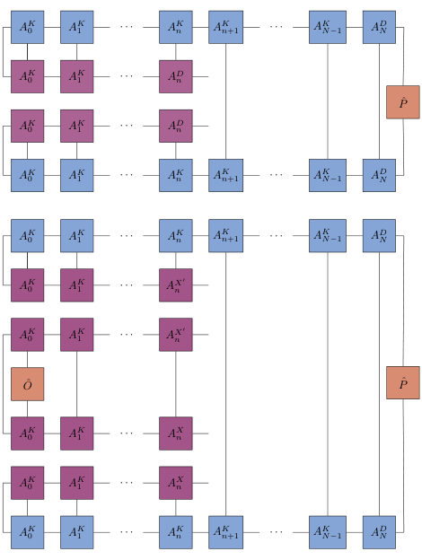 
FIG. 2. Graphical representation of the matrix product state diagrams for the computation of the coefficients (a) Cns and (b) ΘXX′ nss′ . Blue blocks represent the MPS tensors belong- ing to the initial Hamiltonian ˆH0, while purple blocks denote tensors of the final Hamiltonian ˆH. ˆP is a projector onto the ground state of ˆH0.

📷 Fig 3

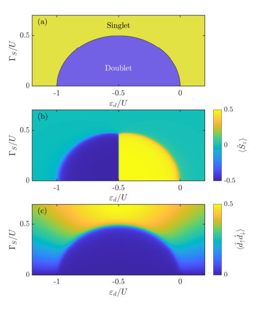 
FIG. 3. The static properties of the considered hybrid system: (a) the phase diagram, (b) the spin expectation value, and (c) the superconducting pairing calculated as a function of the dot’s energy level εd and superconducting pairing amplitude ΓS.

📷 Fig 4

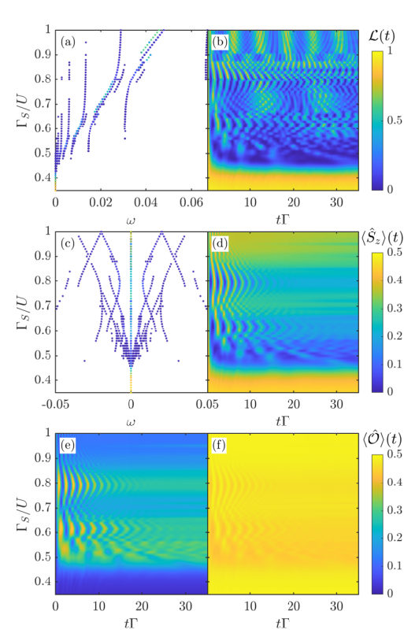 
FIG. 4. (b),(d),(e),(f) plots illustrating the time dependence of (b) Loschmidt echo, (d) local magnetization, (e) local pair- ing (⟨ˆO⟩(t) = ℜ[⟨ˆd↓ˆd↑⟩(t)]) and (f) half of the occupation number (⟨ˆO⟩(t) = ⟨ˆn⟩(t)/2) after a quench in the coupling to the superconductor ΓS. The x-axis represents time, the y-axis represents the final coupling strength to the superconducting lead ΓS, and the color scale indicates expectation value of the relevant observable. The corresponding frequency spectra (collected delta peaks) are shown in (a), (c) where the x-axis represents the oscillation frequency. The y-axis and color bar are shared among adjacent plots. The color of the dots in the frequency...

📷 Fig 5

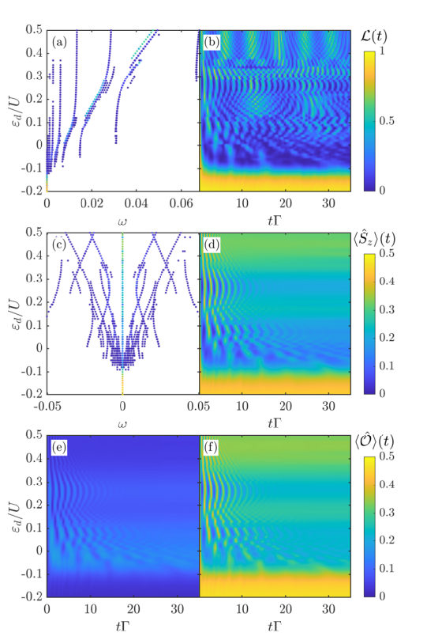 
FIG. 5. (b),(d),(e),(f) plots illustrating the time dependence of (b) Loschmidt echo, (d) local magnetization, (e) local pair- ing (⟨ˆO⟩(t) = ℜ[⟨ˆd↓ˆd↑⟩(t)]) and (f) half of the occupation number (⟨ˆO⟩(t) = ⟨ˆn⟩(t)/2) after a quench. The x-axis repre- sents time, the y-axis represents the final coupling strength to the superconducting lead εd, and the color scale indicates ex- pectation value of the relevant observable. The corresponding frequency spectra (collected delta peaks) are shown in (a), (c) where the x-axis represents the oscillation frequency. The y- axis and color bar are shared among adjacent plots. The color of the dots in the frequency spectra indicates magnitudes of delta...

**Summary.** This theoretical work investigates how a quantum dot coupled to superconductor and ferromagnet undergoes dynamical changes following sudden parameter shifts. By employing the time-dependent NRG method, the authors track superconducting pairing and magnetization, revealing that these two orders compete dynamically. The observation of characteristic oscillations and kinks in diagnostic quantities like the Loschmidt echo provides evidence for Dynamical Quantum Phase Transitions.

**Why it may be interesting.** The use of advanced real-time techniques like td-NRG to probe DQPTs in superconducting/magnetic hybrid systems is highly relevant for understanding non-equilibrium quantum phenomena in nanoscale devices, bridging condensed matter theory with open quantum system dynamics.

Detailed structure

**Main problem.** The study investigates the non-equilibrium dynamics and signatures of Dynamical Quantum Phase Transitions (DQPTs) in a complex hybrid quantum dot system.

**Main result.** The analysis reveals a non-trivial competition between superconducting pairing correlations and ferromagnetic exchange fields, evidenced by oscillatory behavior in observables like magnetization and pairing amplitude.

**Method.** The time evolution is theoretically explored using the Time-Dependent Numerical Renormalization Group (td-NRG) technique, which handles non-perturbative dynamics following abrupt parameter changes (quenches).

**Model / system.** The system consists of a single quantum dot coupled to both superconducting (SC) and ferromagnetic (FM) leads. The model incorporates terms for Coulomb repulsion ($U$), SC pairing ($\Gamma_S$), and FM coupling, analyzed via an effective generalized Anderson model.

**Key observables.** Time evolution of local superconducting pairing correlations $\langle \hat{d}_\downarrow \hat{d}_\uparrow 
angle(t)$, local magnetization $\langle \hat{S}_z
angle(t)$, the Loschmidt echo $L(t)$, and the return function rate $\lambda(t)$.

**Important parameters / regimes.** Key parameters include the Coulomb repulsion ($U$), superconducting coupling ($\Gamma_S$), and spin polarization ($p$). The analysis examines quenches in either $\epsilon_d$ or $\Gamma_S$.

**Assumptions / limitations.** The SC coupling is treated using the superconducting atomic limit approximation, and calculations rely on interpreting non-analytic kinks in the return rate function as definitive signatures of DQPTs.

**Figures summary.** Figures illustrate schematic setups (QD between SC/FM leads), MPS diagrams for calculation methods, and time evolution plots showing relaxation dynamics, oscillations, and spectral features related to quenches in $\epsilon_d$ or $\Gamma_S$.

**Paper structure.** The paper first establishes the physical model and theoretical framework using td-NRG. It then analyzes static properties (e.g., phase boundaries) before focusing on dynamic responses by simulating quantum quenches ($\epsilon_d$ quench vs. $\Gamma_S$ quench), comparing the resulting time evolution of pairing, magnetization, and echo decay.

Abstract

We theoretically explore the non-equilibrium dynamics of a single quantum dot system coupled to both ferromagnetic and superconducting electrodes. To investigate its time evolution, we utilize the time-dependent numerical renormalization group technique, which captures the system's response to abrupt parameter changes in a fully non-perturbative manner. Our analysis focuses on dynamics following a sudden modification in the couplings to the leads or a shift of the orbital level. In particular, we calculate the time evolution of the induced local superconducting pairing correlations and magnetization. In this context, the relevant energy spectra are examined. Moreover, we study the behavior of the Loschmidt echo and the return function to shed light on the signatures of dynamical quantum phase transitions. The determined dependencies reveal non-trivial competition between relevant correlations, involving superconducting pairing and ferromagnetic-contacted induced exchange field, and deepen our understanding of nanoscale hybrid systems' dynamical behavior.

[↑ back to top](#top)

### [Re-entrant parity-time phase transitions in locally coupled ring resonators](http://arxiv.org/abs/2608.08613v1)

**Authors:** Nguyen Duc Anh Quan, Le Xuan The Tai, Doan Quang Tri, Pawel S. Jung, Marek Trippenbach, Nguyen Viet Hung  
**Type:** theory · **Category:** other · **PDF:** <https://arxiv.org/pdf/2608.08613v1>  
**Analysis basis:** full PDF text, analyzed in chunks
**Topic relevance:** 🔥 `driven-dissipative phase transition` **4/5** · `correlated / nonlocal dissipation` **3/5** · `methods for driven-dissipative` **3/5** · `interference shaping light` **2/5** · `non-equilibrium universality` **2/5** · `Keldysh / 2PI / non-Gaussian methods` **1/5** · `analog quantum simulation` **1/5** · `quantum measurements` **1/5**

📷 Fig 1

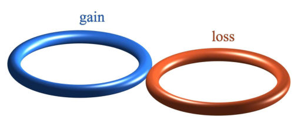 
Figure 1: Schematic representation of two locally coupled ring resonators. Ring 1 carries linear gain +γ, ring 2 carries the balanced linear loss −γ, and the real inter-ring coupling is concentrated in a finite angular sector described by Eq. (3).

📷 Fig 2

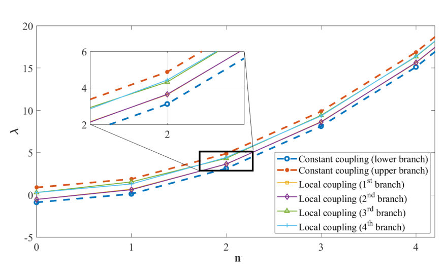 
Figure 2: Hermitian spectrum at κ0 = 0.9 and γ = 0. The two dashed outer branches are the homogeneous-coupling values, each retaining the ±n degeneracy. For the local profile with W = 1.8, each excited doublet is resolved into four parity-dependent branches. Broadening the coupling region suppresses the nonzero Fourier harmonics and recombines these branches into the homogeneous spectrum.

📷 Fig 3

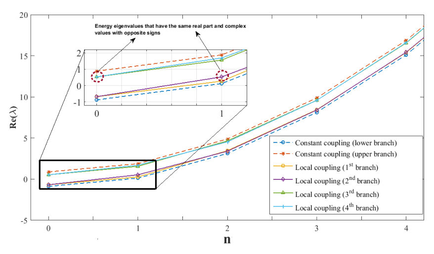 
Figure 3: Real parts of the non-Hermitian spectrum at κ0 = 0.9 and γ = 0.2, comparing the local profile with W = 2.2 and the homogeneous limit. Local coupling again resolves each excited doublet into four branches. The annotated pairs have coincident real parts and nonzero imaginary parts of opposite sign in the full numerical spectrum; they therefore represent broken-PT complex-conjugate eigenvalues.

📷 Fig 4

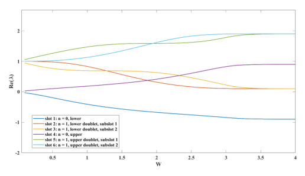 
Figure 4: Six lowest Hermitian eigenvalues versus coupling width at κ0 = 0.9 and γ = 0. All branches remain real; symmetry-distinct states cross without coalescence. The large- and small-W limits approach Eqs. (15) and (18), respec- tively.

📷 Fig 5

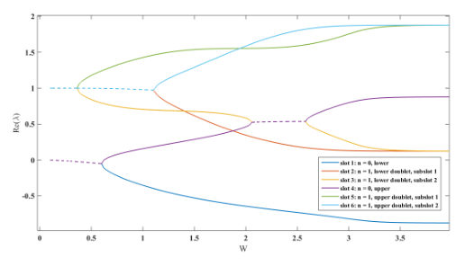 
Figure 5: Real parts of the six lowest non-Hermitian eigenvalues versus coupling width at κ0 = 0.9 and γ = 0.2. Dashed segments mark complex-conjugate pairs with equal real parts and opposite imaginary parts. Their endpoints are exceptional points. A detailed view of the evolution of the eigenvalues and the corresponding eigenstates is provided in the Supplementary Movies S1–S2.

**Summary.** The paper analyzes how local coupling modifies parity-time symmetry in coupled ring resonators, revealing complex re-entrant phase transitions. By varying geometric parameters like coupling width, the system's PT phase can be controlled. Furthermore, the authors demonstrate that these spatial couplings allow for the selection and stabilization of specific nonlinear light waveforms.

**Why it may be interesting.** This work bridges concepts from PT-symmetry breaking and topological phase transitions with spatial engineering in coupled optical systems, which is highly relevant for designing robust quantum optical components.

Detailed structure

**Main problem.** The study investigates re-entrant parity-time (PT) phase transitions occurring within locally coupled ring resonators.

**Main result.** The spatial profile of the inter-resonator coupling provides a geometric mechanism to control multimode PT transitions and select dynamically accessible nonlinear waveforms in these coupled systems.

**Method.** The analysis combines linear spectral calculations using Fourier collocation with nonlinear dynamics simulated via adiabatic propagation into Kerr waveforms.

**Model / system.** The system consists of two identical ring resonators ($\psi_1, \psi_2$) coupled by a local super-Gaussian profile $\kappa(x)$, governed by coupled nonlinear Schrödinger equations incorporating gain and loss.

**Key observables.** Spectral growth rate ($\Gamma_{\max}$), which diagnoses the PT phase (real spectrum = unbroken; $\Gamma_{\max} > 0$ = broken); stable Kerr waveform amplitudes ($\sigma_f^{	ext{max}}$).

**Important parameters / regimes.** Gain/loss strength ($\gamma$), coupling width ($W$), peak coupling amplitude ($\kappa_0$), and nonlinear coefficients ($\sigma, eta$).

**Assumptions / limitations.** The analysis relies on approximations for different coupling widths (homogeneous vs. finite width) and the nonlinear stability assessment is limited to a specific adiabatic ramping protocol.

**Figures summary.** Figures illustrate spectral scans showing re-entrant unbroken–broken–unbroken PT sequences by varying parameters, and show the adiabatic generation of Kerr states from linear seeds.

**Paper structure.** The paper progresses from analyzing the linear eigenproblem in various coupling limits (homogeneous vs. finite width) to mapping out phase diagrams exhibiting re-entrant transitions; it then extends this analysis into the nonlinear regime using adiabatic propagation to find stable, persistent waveforms.

Abstract

We investigate two parity-time-symmetric ring resonators coupled over a finite angular region described by a super-Gaussian profile. In the linear regime, analytical spectra are obtained in the homogeneous-coupling and fixed-amplitude narrow-contact limits, while the finite-width problem is treated numerically. Local coupling introduces nonzero spatial Fourier components that mix angular harmonics and lift the degeneracy of counterpropagating modes, resolving each excited doublet into parity-dependent branches. Collisions among these branches generate multiple exceptional-point boundaries and disconnected broken-PT domains. The resulting phase diagrams exhibit re-entrant unbroken-broken-unbroken transitions when the gain-loss strength, coupling width, or peak coupling amplitude is varied. The numerical spectra continuously recover both analytical limits. In the nonlinear regime, selected ground and excited linear modes are used as seeds for adiabatic propagation into finite-amplitude Kerr waveforms that remain dynamically persistent over the simulated observation interval for finite ranges of nonlinear strength. These results show that the spatial profile of inter-resonator coupling provides a geometric means of controlling multimode PT transitions and selecting dynamically accessible nonlinear waveforms in coupled-ring systems.

[↑ back to top](#top)

### [Noisy Braiding of Majorana Modes: A Comparison of Nanowire Trijunction and Quantum-Dot-Assisted Architectures](http://arxiv.org/abs/2608.09416v1)

**Authors:** Dibyajyoti Sahu, Suhas Gangadharaiah  
**Type:** theory · **Category:** quantum information and computing · **PDF:** <https://arxiv.org/pdf/2608.09416v1>  
**Analysis basis:** full PDF text, analyzed in chunks
**Topic relevance:** 🔥 `methods for driven-dissipative` **4/5** · `Keldysh / 2PI / non-Gaussian methods` **3/5** · `analog quantum simulation` **3/5** · `correlated / nonlocal dissipation` **2/5** · `quantum measurements` **2/5** · `QC/QI experiment` **1/5** · `driven-dissipative phase transition` **1/5**

📷 Fig 1

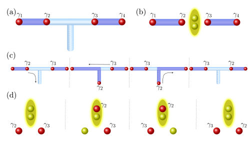 
Figure 1. Braiding geometries and protocols. (a) Trijunction network and (b) quantum-dot-assisted architecture, show- ing the device layout to exchange the Majorana zero modes. (c),(d) Corresponding braiding steps for the trijunction and dot-assisted protocols, respectively, illustrating the sequence of modulations that implement the exchange.

📷 Fig 2

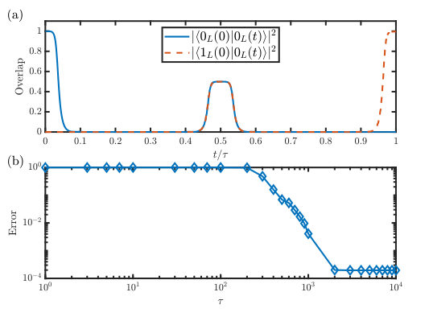 
Figure 2. (a) Time evolution of the overlap during the tri- junction braiding protocol implementing a Pauli X operation. (b) Error as a function of the total braiding time, showing the suppression of the diabatic error and the saturation to a finite operational error at long drive times.

📷 Fig 3

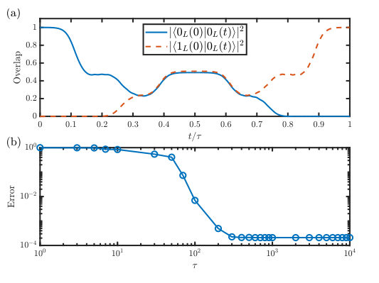 
Figure 3. (a) Time evolution of the overlap during the quantum-dot-assisted braiding protocol mediated by a quan- tum dot. The overlap approaches unity at the end of the drive, indicating successful exchange within the ground-state manifold. (b) Error as a function of the total protocol dura- tion, showing systematic suppression of the diabatic error as the drive time is increased, with saturation to a finite opera- tional error at long drive times.

📷 Fig 4

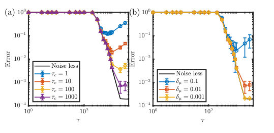 
Figure 4. Error of the Pauli X gate for the trijunction braid- ing protocol under global telegraph noise, averaged over mul- tiple noise realizations, as a function of the total drive time. Panels (a) and (b) show the dependence on the noise correla- tion time and noise strength, respectively.

📷 Fig 5

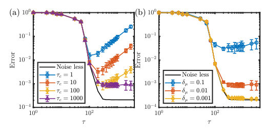 
Figure 5. Error of the Pauli X gate for the dot-assisted braid- ing protocol under global telegraph noise, averaged over mul- tiple noise realizations, as a function of the total drive time. Panels (a) and (b) show the dependence on the noise correla- tion time and noise strength, respectively.

**Summary.** The paper microscopically compares two physical designs—a nanowire trijunction and a quantum-dot-assisted setup—for braiding Majorana zero modes. By simulating the time evolution under various noise conditions, it demonstrates that the dot-assisted geometry offers superior error resilience. This work provides crucial design guidelines for building practical, fault-tolerant topological quantum gates.

**Why it may be interesting.** This work provides direct, quantitative comparisons between solid-state implementations of topological qubits, offering actionable design rules for mitigating decoherence in superconducting circuits relevant to AMO physics.

Detailed structure

**Main problem.** The primary challenge addressed is determining how robust Majorana zero mode braiding operations are against environmental noise, finite-time operation, and residual couplings.

**Main result.** The quantum-dot-assisted architecture consistently outperforms the nanowire trijunction setup by achieving lower error rates over shorter timescales, particularly showing resilience to fast noise.

**Method.** The study employs full time-dependent Bogoliubov–de Gennes dynamics simulations to model the system's evolution under both noiseless and various types of environmental noise (telegraph and 1/f).

**Model / system.** The research compares two superconducting platforms for realizing Majorana zero modes: a nanowire trijunction and a quantum-dot-assisted setup. The underlying physics is modeled using the spinless p-wave Kitaev chain Hamiltonian.

**Key observables.** Error associated with the Pauli X gate, quantified as $1 - |\langle 1_L|\psi(	au)
angle|^2$, and the fidelity (overlap) of the braiding protocol.

**Important parameters / regimes.** Noise characteristics include noise strength ($\sigma^2$), correlation time ($	au_c$), and the distinction between fast/slow vs. localized/global noise sources.

**Assumptions / limitations.** The analysis assumes that existing literature often relies on effective low-energy descriptions, whereas this work tackles the full microscopic dynamics.

**Figures summary.** Figures illustrate both braiding geometries (trijunction and dot-assisted) and their corresponding steps. Specific figures show the error evolution for the Pauli X gate under global telegraph noise for the trijunction protocol.

**Paper structure.** The paper systematically compares two physical architectures, models the dynamics using time-dependent BdG equations, quantifies errors arising from different noise types, and concludes by deriving concrete design principles based on geometric differences.

Abstract

Majorana zero modes have emerged as one of the most promising platforms for topological quantum computation, since their non-Abelian braiding statistics allow quantum information to be encoded nonlocally and manipulated through braiding operations that are, in principle, protected against local perturbations. In practice, however, a braid is only as robust as its physical implementation: finite-time operation, residual couplings, and environmental noise can all convert local excitations into logical errors during the exchange process. Here, we address this question through a microscopic comparison of two representative braiding architectures, a nanowire trijunction and a quantum-dot-assisted setup, simulating the full time-dependent Bogoliubov--de Gennes dynamics under both noiseless and noisy conditions. We show that the dot-assisted architecture consistently achieves a lower error over a shorter timescale than the trijunction, owing to its more localized exchange mechanism. This advantage persists in the presence of noise, and a spatially resolved analysis further reveals that, in the dot-assisted geometry, fast noise localized on the dot produces a smaller error than equivalent noise on the wires, whereas slow, quasi-static noise on the dot becomes the dominant limitation. Taken together, these findings link the different error contributions directly to device geometry, pointing to concrete design principles for noise-resilient Majorana-based quantum gates.

[↑ back to top](#top)

### [Time-Reversal-Invariant Altermagnetic Acoustic Crystals](http://arxiv.org/abs/2608.08827v1)

**Authors:** Tianzhi Xia, Han-Rong Xia, Jinglin Liu, Xiying Fan, Zebin Zhu, Zhen Gao  
**Type:** both · **Category:** other · **PDF:** <https://arxiv.org/pdf/2608.08827v1>  
**Analysis basis:** full PDF text, analyzed in chunks
**Topic relevance:** 🔥 `analog quantum simulation` **4/5** · `Frenkel-Kontorova` **1/5** · `interference shaping light` **1/5**

📷 Fig 1

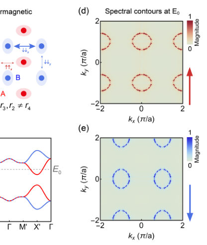 
FIG. 1. Tight-binding model. (a) Top panel: a bilayer centered square lattice with two sublattices (A and B) hosting different pseudospins. The NN hopping 𝑡𝑡 is fixed, while NNN couplings 𝑟𝑟𝑖𝑖 can be tuned to generate altermagnetic order. Bottom panel: pseudospin configuration (left) and Brillouin zone with high-symmetry paths (right). For pseudospin-up (red arrow), the on-site potentials are (𝑉𝑉, −𝑉𝑉) for the lower and upper layers with interlayer coupling 𝜅𝜅 ; for pseudospin-down (blue arrow), they are (−𝑉𝑉, 𝑉𝑉) with interlayer coupling −𝜅𝜅. (b) Altermagnetic phase realized under the condition 𝑟𝑟1 ≠𝑟𝑟3 and 𝑟𝑟2 ≠𝑟𝑟4. (c) Calculated band structure of the altermagnetic phase, revealing clear...

📷 Fig 2

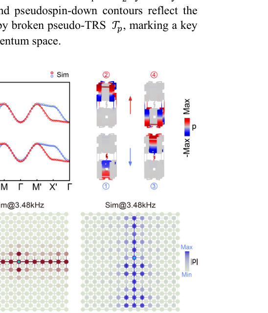 
FIG. 2. Acoustic realization of the altermagnetic phase. (a) Acoustic cavity-tube structure for realizing the altermagnetic phase. Cavities without and with a central hole correspond to on-site potentials +𝑉𝑉 and −𝑉𝑉 (the hole lowers the on-site potential by 2𝑉𝑉), respectively. The average frequency of the upper and lower cavities determines the center frequency. The coupling strengths are controlled by the cross-sectional areas of the connecting tubes. (b) Left panel: eigenfrequency spectra along the high- symmetry line of the Brillouin zone. The tight-binding results are shown as solid lines, calculated with 𝜔𝜔0 = 3.48 kHz, 𝑉𝑉= 0.24 kHz, 𝑡𝑡= −𝜅𝜅= 𝑟𝑟1 = 𝑟𝑟2 = −0.006 kHz, and 𝑟𝑟3 = 8𝑟𝑟1 =...

📷 Fig 3

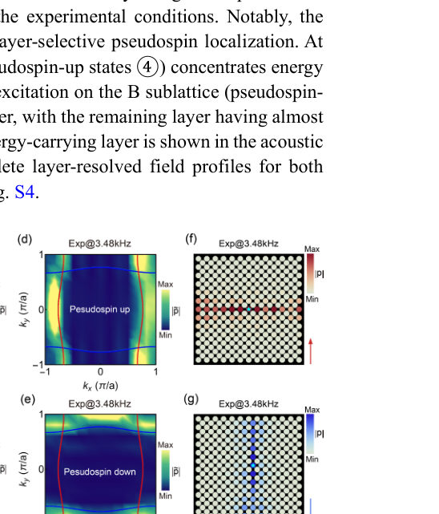 
FIG. 3. Experimental demonstration of the altermagnetic acoustic crystals. (a) Photograph of the fabricated acoustic sample. (b-c) Measured (colormap) and theoretical (red and blue solid lines) bulk band structures along the high-symmetry momentum path for the pseudospin-up (b) and pseudospin-down (c) subspaces, respectively. The bands display a pronounced spin splitting. (d-e) Measured (colormap) and theoretical (red and blue solid lines) iso-frequency contours at 3.48 kHz for the pseudospin-up (d) and pseudospin-down (e) states. The iso-frequency contours are elongated in mutually orthogonal directions (vertical versus horizontal), thereby directly revealing the anisotropic band...

📷 Fig 4

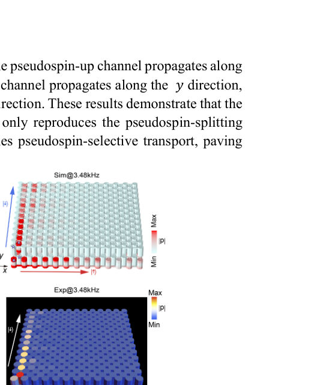 
FIG. 4. Experimental characterization of acoustic pseudospin filtering. (a) Schematic illustration of pseudospin filtering in the altermagnetic structure. Upon simultaneous excitation of pseudospin-up (red arrows) and pseudospin-down (blue arrows) states, the two channels are routed along orthogonal directions, enabling spatial separation and the selective extraction of a single pseudospin species at each output port. (b) Simulated acoustic pressure distribution demonstrating pseudospin filtering. Four sources (stars) located in the lower-left corner excite both the pseudospin-up and pseudospin-down states at 3.48 kHz. The pseudospin-up states (A sublattice) propagate along the 𝑥𝑥 direction...

**Summary.** The paper introduces a novel acoustic crystal model that mimics the physics of altermagnets while strictly preserving Time-Reversal Symmetry. By using pseudospin degrees of freedom, they demonstrate measurable signatures like pseudospin splitting and directional filtering in sound waves. This establishes acoustic crystals as a versatile platform for exploring spin-inspired wave manipulation in nonmagnetic devices.

**Why it may be interesting.** This work provides a concrete, non-electronic platform (acoustics) to study complex quantum magnetic phenomena like altermagnetism without breaking fundamental symmetries, offering insights applicable to phononics and mechanical wave engineering.

Detailed structure

**Main problem.** The core challenge is extending altermagnetism—a state with spin-split bands but zero net magnetization—to classical wave systems while strictly preserving Time-Reversal Symmetry (TRS).

**Main result.** The authors successfully demonstrated the first time-reversal-invariant altermagnetic acoustic crystal, showing pseudospin splitting and orthogonal directional transport under TRS-preserving conditions.

**Method.** Theoretical modeling uses a tight-binding Hamiltonian with pseudospin degrees of freedom, complemented by experimental characterization using 2D spatial Fourier transforms of measured sound-pressure fields.

**Model / system.** The system is an acoustic crystal based on a bilayer-centered square lattice. The model incorporates pseudospin ($\uparrow/\downarrow$) and utilizes a pseudo-time-reversal operator to maintain true TRS while modeling altermagnetic physics.

**Key observables.** Pseudospin-dependent band splitting, anisotropic iso-frequency contours showing orthogonal elongation, and spatially separated acoustic field distributions corresponding to different pseudospins.

**Important parameters / regimes.** Anisotropic nearest-neighbor couplings ($r_1 
eq r_3$ and $r_2 
eq r_4$) are key for inducing the altermagnetic phase; specific frequencies (e.g., $\omega_0 = 3.48$ kHz) are used in experiments.

**Assumptions / limitations.** The method relies on introducing a pseudospin degree of freedom and constructing a pseudo-time-reversal operator to circumvent the need for genuine TRS breaking in classical wave systems.

**Figures summary.** Figures illustrate band structures, constant-energy contours showing orthogonal splitting, and experimental measurements confirming sublattice-spin locking and the spatial separation of propagating acoustic fields along perpendicular axes ($x$ vs $y$).

**Paper structure.** The paper first introduces the theoretical framework using pseudospin to model altermagnetism in acoustics. It then details the experimental realization and measurement techniques, culminating in demonstrations of pseudospin splitting, sublattice-spin locking, and directional pseudospin filtering.

Abstract

Altermagnets have emerged as a new class of magnetic materials that combine spin-split electronic bands with zero net magnetization. Extending this paradigm to classical-wave systems has, however, been fundamentally challenging because conventional realizations require broken time-reversal symmetry (TRS). Here, we overcome this limitation by introducing two pseudospin degrees of freedom and constructing a pseudo-time-reversal operator that faithfully reproduces the action of its physical counterpart while preserving actual TRS. Building on this framework, we theoretically propose and experimentally realize the first time-reversal-invariant altermagnetic acoustic crystal. Acoustic measurements directly reveal pseudospin-dependent band splitting--a defining hallmark of altermagnetism--under strictly TRS-preserving conditions. Moreover, the altermagnetic acoustic crystal exhibits sublattice-pseudospin locking, enabling flexible control over acoustic pseudospin splitting and filtering. Our work establishes acoustic crystals as a versatile platform for exploring altermagnetic physics and opens new avenues for spin-inspired wave manipulation in nonmagnetic devices.

[↑ back to top](#top)

### [Buried germanium quantum well proximitised by magnetic field-resilient superconducting platinum iridium germanosilicide](http://arxiv.org/abs/2608.09611v1)

**Authors:** Praveen Viswanathan, Erik Lemmens Sjöstrand, Davide Costa, Marinus Fischer, Athique Ahmed, Sara Martí-Sánchez, Lucas E. A. Stehouwer, Jordi Arbiol, Anasua Chatterjee, Giordano Scappucci, Karina L. Hudson  
**Type:** experiment · **Category:** quantum information and computing · **PDF:** <https://arxiv.org/pdf/2608.09611v1>  
**Analysis basis:** full PDF text, analyzed in chunks
**Topic relevance:** 🔥 `QC/QI experiment` **4/5**

📷 Fig 1

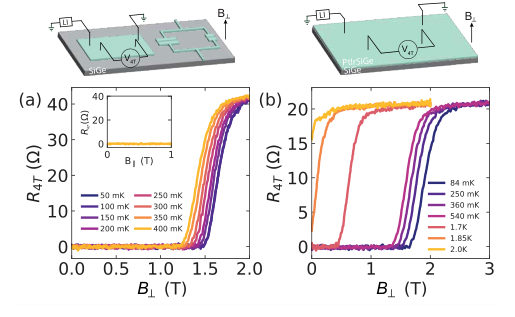 
Figure 1: (a) Thin film sample a: Resistance R4T vs out-of plane magnetic field B⊥for a range of temperatures. Inset: resistance R4T measured as a function for in-plane magnetic fields B∥up to 1 T at 400 mK. (b) Thin film sample b: R4T vs B⊥for varying temperature, measured in two separate cool downs in a dilution refrigerator and a 4He refrigerator.

📷 Fig 2

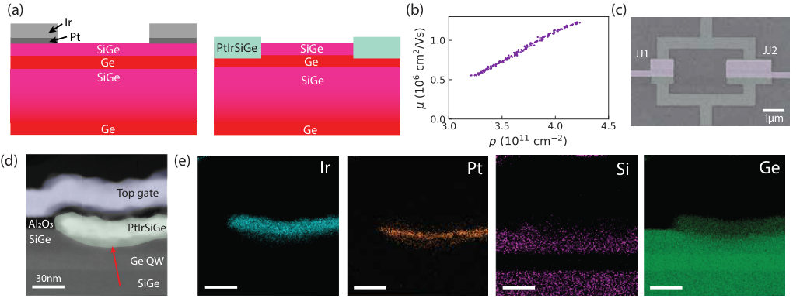 
Figure 2: (a) Schematic of the fabrication process. After removing the native oxide, platinum is deposited followed by iridium on the surface of the SiGe heterostructure. Rapid thermal annealing results in the Pt and Ir diffusing into the SiGe barrier to form PtIrSiGe alloy and contact to the germanium quantum well.(b) Mobility µ vs hole density p of a Hall bar fabricated with PtIrSiGe contacts on the Ge/SiGe quantum well on germanium wafer. (c) False colour SEM of the SQUID device. The grey area is bare SiGe, the pale green regions are superconducting PtIrSiGe with Josephson junctions (JJs) 1 and 2 indicated. The pink regions are independent Ti/Pd top gates overlapping the...

📷 Fig 3

 
Figure 3: Junction 1: (a) Colour map of dc voltage drop Vdc across Josephson junction 1 as a function of dc source-drain current Isd and top gate voltage Vg. (b) Colour map of Vdc as a function of dc Isd and out-of-plane magnetic field B⊥at fixed Vg = −1.9 V. Junction 2: (c) Colour map of Vdc across Josephson junction 2 as a function of dc Isd and Vg. (d) Colour map of Vdc as a function of Isd and B⊥at fixed Vg = −1.9 mV. (e) SQUID oscillations with both junctions conducting, such that Ic2 ≈2Ic1. Fits to equation (1) are shown as dashed lines, in orange for the positive branch and purple for the negative branch. (b), (d), and (e) are offset in B⊥to account for known hysteresis in the magnet.

📷 Fig 4

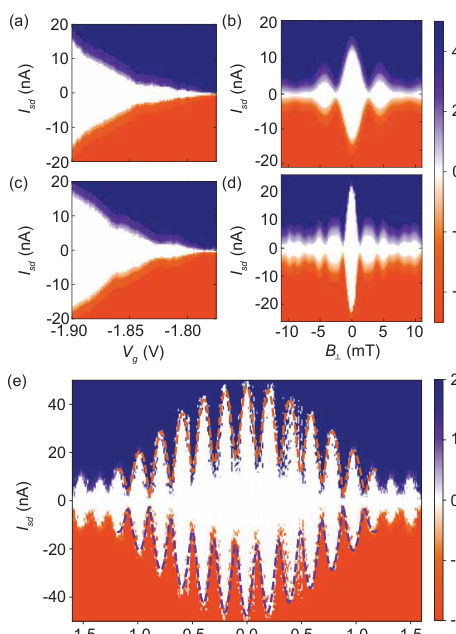 
Fig. 3 (c) and (d) show similar gate-tunable switching current and Fraunhofer-like oscillations for junction 2, for which junction 1 was set to Vg,1 = 0 V. Junction 2 being approximately twice as wide, has a smaller oscillation pe- riod in B⊥compared to junction 1 (see Supplementary Material Section III for Fraunhofer fits). We investigate the SQUID operation by setting the junctions in an asymmetric regime, such that the criti- cal current through junction 2 is twice as large as that through junction 1, i.e., Ic2 ≈2Ic1. We then observe SQUID oscillations as smaller oscillations on top of the Fraunhofer envelope of the larger junction, modulated

**Summary.** The research reports on fabricating and characterizing a hybrid device coupling a buried germanium quantum well to a robust superconductor ($	ext{PtIrSiGe}$). By achieving proximity superconductivity in this structure using top-down lithography, the authors demonstrate a key technological milestone for building superconducting qubits. The work confirms high performance metrics, including large critical fields and preserved semiconductor quality after processing.

**Why it may be interesting.** This work directly addresses the physical realization of solid-state qubits by creating a controllable superconducting interface with high-quality semiconductor channels, which is central to quantum computing hardware development.

Detailed structure

**Main problem.** Developing superconducting materials integrated with low-disorder semiconductor heterostructures for scalable quantum technologies.

**Main result.** The authors successfully demonstrated the proximity effect by coupling a high-mobility germanium quantum well to a robust superconductor ($	ext{PtIrSiGe}$), forming functional Josephson junctions and SQUIDs.

**Method.** Top-down lithography was used to fabricate devices, followed by low-temperature transport measurements (Hall bar, SQUID) and structural characterization using STEM/EDX.

**Model / system.** The physical system is a $	ext{Ge}/	ext{SiGe}$ heterostructure containing a buried Germanium Quantum Well ($	ext{Ge QW}$). This semiconductor is proximitized by a superconducting layer of platinum iridium germanosilicide ($	ext{PtIrSiGe}$) to create S-N-S Josephson junctions.

**Key observables.** Superconducting critical magnetic field ($B_{\perp,c}$), critical temperature ($T_c$), quantum well mobility ($\mu$), and Fraunhofer-like oscillations in the SQUID junction current ($I_{dc}$).

**Important parameters / regimes.** $	ext{PtIrSiGe}$: $B_{\perp,c} \approx 1.9$ T, $T_c \sim 1.85$ K; $	ext{Ge QW}$: $\mu = 1.3 	imes 10^6 	ext{ cm}^2/	ext{Vs}$ at $500^\circ	ext{C}$ annealing.

**Assumptions / limitations.** The process successfully preserves the structural integrity and high mobility of the Ge QW despite high-temperature processing required for superconductor deposition.

**Figures summary.** Figure 1 shows resistance vs. magnetic field confirming superconductivity limits; Figure 2 details the fabrication cross-section showing alloy diffusion into the heterostructure; Figure 3 displays gate-tunable switching current and SQUID oscillations modulated by $B_{\perp}$.

**Paper structure.** The paper progresses from establishing the need for robust superconducting/semiconductor interfaces, detailing the $	ext{PtIrSiGe}$ material properties, demonstrating its integration via lithography (structural confirmation), and finally proving functionality through electrical measurements on SQUID devices.

Abstract

Hybrid superconductor-semiconductor systems provide a versatile platform for quantum technologies, ranging from superconducting-spin interfaces to topological quantum devices. Progress toward scalable implementations requires superconductors that exhibit high critical fields ($>1$T) at accessible temperatures integrated with low-disorder semiconductor heterostructures. Here we demonstrate a superconducting platinum iridium germanosilicide (PtIrSiGe), with critical out-of-plane magnetic field up to $B_{\perp} = 1.9$T and critical temperature of $T_c\sim 1.85$K, integrated with planar germanium with mobility $μ= 1.3\times 10^6$cm$^{2}$/Vs via top-down lithography fabrication. We show that the integrity of the germanium quantum well and mobility and density of the 2D hole gas are preserved despite annealing at $500°$C, a temperature comparable to that used for strained germanium epitaxy. We further demonstrate proximitisation of a buried germanium quantum well in a gate-defined Josephson junction/SQUID on a Ge/SiGe heterostructure.

[↑ back to top](#top)

### [Crystalline Group-IV Josephson Junction](http://arxiv.org/abs/2608.08500v1)

**Authors:** Frederik H. Knudsen, Axel Leblanc, Patrick J. Strohbeen, Jechiel van Dijk, Yiliu Li, Logan Kusher, Arunav Bordoloi, Alisa Danilenko, Xiangchao Ma, Salva Salmani-Rezaie, Javad Shabani  
**Type:** experiment · **Category:** quantum information and computing · **PDF:** <https://arxiv.org/pdf/2608.08500v1>  
**Analysis basis:** full PDF text, analyzed in chunks
**Topic relevance:** 🔥 `QC/QI experiment` **4/5**

📷 Fig 1

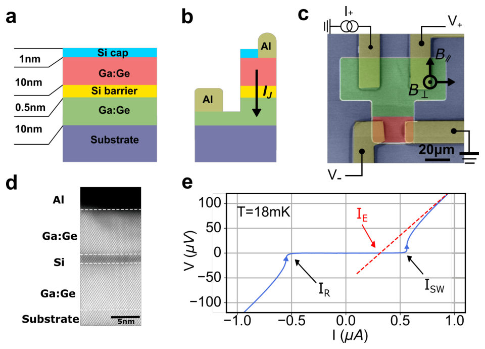 
Figure 1: A Ga:Ge vertical crystalline Josephson junction. a, The 10 nm superconducting hyperdoped Ga:Ge films are grown on a Ge substrate and separated by a 0.5 nm Si barrier. The heterostructure is capped by 1 nm of Si. b, Superconducting Al leads contact the top and bottom Ga:Ge films, allowing transport measurements through the junction, the Josephson current IJ direction is indicated by the arrow. c, False color Scanning Electron Microscope (SEM) image of a representative fabricated device. Four Al leads (in brown-yellow) are deposited to contact the Ga:Ge bottom layer (in green) and top layer (in red). The magnetic field orientation is as depicted here for the rest of this work. d,...

📷 Fig 2

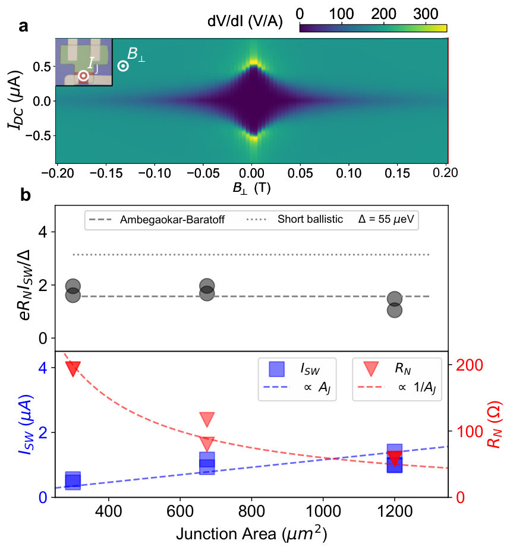 
Figure 2: Junction Characteristics. a, Differential resistance as a function of the applied magnetic field perpendicular to the substrate, B⊥(Device A). Inset: device schematic indicating the current path and field orientation. b, Top: eRNISW /∆for the six JJs with varying junction area, scattered around the Ambegaokar-Baratoff limit, and below the short ballistic limit with perfect transparency (τ = 1) for SNS junctions. We find that ISW and RN scales reasonably well as AJ and 1 AJ respectively.

📷 Fig 3

 
FIG 3a shows the magnetic-field dependence of the junction’s dV/dI characteristic, where the switching current ISW is enhanced around B∗ ∥= 80 mT. FIG 3b presents IV traces at B∥= 0, 40 mT, and 160 mT, illustrating both the enhancement of ISW at finite field and the emergence of hysteresis. FIG 3c highlights the modulation of ISW /IR, where IR is the retrapping current as a measure of the hysteresis. The enhancement of the switching current and the emergence of hysteresis are observed across all six devices on the chip.

📷 Fig 4

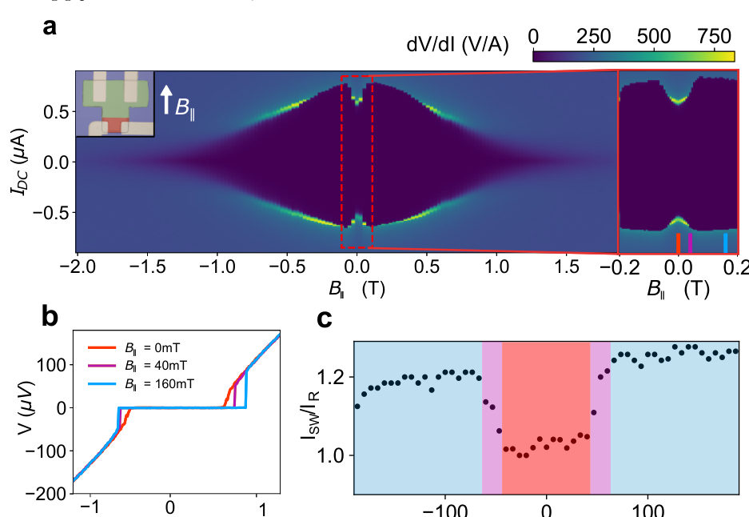 
Figure 3: Magnetic-Field-Enhanced Switching Current. a, Differential resistance as a function of the in-plane magnetic field, B∥, and the bias current, IDC. Inset, left: device schematic indicating the field orientation. Inset, right: zoom of the region around the enhanced switching current. b, IV traces extracted from a at the field values indicated by the colored ticks. c, The ratio of the switching current, ISW , to the retrapping current, IR — a measure of IV hysteresis — plotted against B∥. Shaded regions mark the non-hysteretic (red), transition (purple), and hysteretic (blue) field ranges. All panels from Device A.

📷 Fig 5

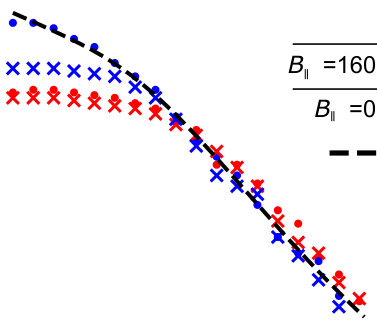 
Figure 4: Temperature Dependence. a, Bath-temperature dependence of the switching and retrapping currents, ISW and IR. At zero field, both ISW and IR saturate below 150 mK, whereas at an in-plane field B∥= 160 mT ISW continue to rise down to the base temperature while IR saturates, signaling the emergence of hysteresis. The dashed black line is a fit of ISW at B∥= 160 mT to a disordered short ballistic SNS model with transparency τ = 0.8. b, Switching current ISW as a function of B∥at several bath temperatures. All panels show results from Device A.

**Summary.** The paper reports on the creation of novel Josephson junctions using an epitaxial growth technique in gallium-doped germanium. By achieving atomically sharp crystalline weak links, they overcome coherence limitations found in amorphous barriers. The results demonstrate a promising platform for building low-disorder superconducting qubits suitable for integrated quantum circuits.

**Why it may be interesting.** This work directly addresses hardware challenges for superconducting qubits by proposing a low-disorder, CMOS-compatible junction architecture, which is central to quantum computing implementation.

Detailed structure

**Main problem.** Conventional superconducting quantum electronics are limited by amorphous Josephson junction weak links hosting two-level systems, which degrades qubit coherence.

**Main result.** The authors demonstrated a fully epitaxial Josephson junction platform using Ga:Ge that maintains structural coherence and shows an unconventional enhancement of the switching current under magnetic field.

**Method.** Electrical transport measurements (I-V curves, dV/dI) were performed on junctions fabricated via MBE to study superconducting coupling in the ultra-short regime.

**Model / system.** The system is a Josephson junction formed by crystalline weak links ($	ext{Ga:Ge}/	ext{Si}/	ext{Ga:Ge}$) grown epitaxially. This platform aims to replace amorphous barriers with atomically sharp, crystalline interfaces for superconducting qubits.

**Key observables.** Supercurrent ($I_{SW}$), differential resistance ($dV/dI$), and the ratio of switching current to retrapping current ($	ext{ISW}/	ext{IR}$) as a function of applied magnetic field ($B$).

**Important parameters / regimes.** The junction operates in the ultra-short regime; key fields include $B^*_{\parallel} = 80 	ext{ mT}$ for $	ext{ISW}$ enhancement.

**Assumptions / limitations.** The observed magnetic field enhancement of $	ext{ISW}$ is attributed to quasiparticle-assisted thermalization processes from the Al contacts, suggesting an SNS junction character rather than SIS.

**Figures summary.** Figure 1 shows device structure via STEM. Figure 2 compares measured critical current scaling against theory. Figure 3 details the magnetic field dependence of $dV/dI$, showing $	ext{ISW}$ enhancement and hysteresis. Figure 4 examines temperature dependence.

**Paper structure.** The paper progresses from identifying limitations in existing junctions to presenting the epitaxial Ga:Ge platform, characterizing its structure using STEM, measuring transport properties vs. magnetic field (showing $	ext{ISW}$ enhancement), and finally attributing this behavior to quasiparticle thermalization mechanisms.

Abstract

Conventional superconducting quantum electronics rely on well-established Josephson junctions made of Al/AlO$_{x}$ where the weak link AlO$_{x}$ is amorphous and is believed to host two-level systems that limit coherence. Crystalline Josephson junctions exhibit atomically ordered interface quality but remain constrained by complex fabrication and intrinsic asymmetry of epitaxial growth. Here, we demonstrate a fully epitaxial approach based on superconductivity in gallium-doped germanium, enabling the realization of Josephson junctions entirely grown in situ by molecular beam epitaxy. These devices feature atomically sharp interfaces and crystalline weak links, resulting in strong Josephson coupling in the ultra-short regime. We observe an unconventional enhancement of the switching current under applied magnetic field, which we attribute to quasiparticle-assisted thermalization processes from the Al contacts. This platform combines structural coherence, fabrication simplicity, and scalability, offering a promising route toward low-disorder, CMOS-compatible superconducting qubits in a merged element transmon architecture.

[↑ back to top](#top)

### [Dynamical behavior of diffusively coupled scalar differential equations as Wentzell boundary conditions](http://arxiv.org/abs/2608.08537v1)

**Authors:** Merlin Pelz  
**Type:** theory · **Category:** other · **PDF:** <https://arxiv.org/pdf/2608.08537v1>  
**Analysis basis:** full PDF text, analyzed in chunks
**Topic relevance:** `driven-dissipative phase transition` **3/5** · `methods for driven-dissipative` **3/5** · `Keldysh / 2PI / non-Gaussian methods` **2/5** · `analog quantum simulation` **2/5** · `correlated / nonlocal dissipation` **2/5** · `non-equilibrium universality` **2/5** · `Frenkel-Kontorova` **1/5** · `quantum measurements` **1/5**

📷 Fig 1

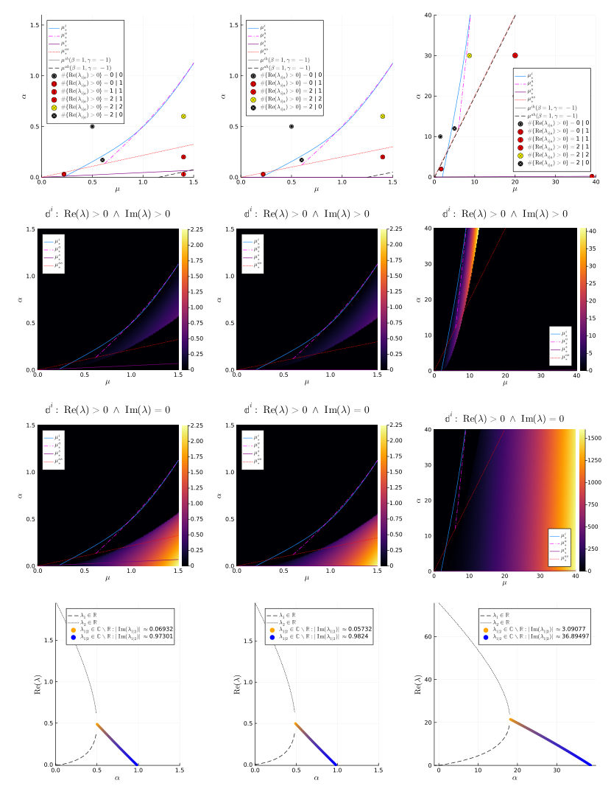 
Figure 1: Steady-state and Hopf bifurcation lines branching off u∗≡0, numbers Zi|a = #{λ | Re (λi|a) &gt; 0} of the linearizations and Evans functions, di|a, respectively, and the maximal Re (λ) &gt; 0. Parameter values: large domain size L = 10 and moderate degradation σ = 0.1 for the left column, large domain size L = 10 and small degradation σ = 0.01 for the center column, moderate domain size L = 1 and moderate degradation σ = 0.1 for the right column. First row: in-phase Hopf bifurcation line µi ∗and anti-phase Hopf bifurcation line µa ∗of Theorem 3.1, symmetric steady-state bifurcation line µs ∗and antisymmetric steady-state bifurcation line µas ∗ of Remark 3.3 along with their stabilities,...

📷 Fig 2

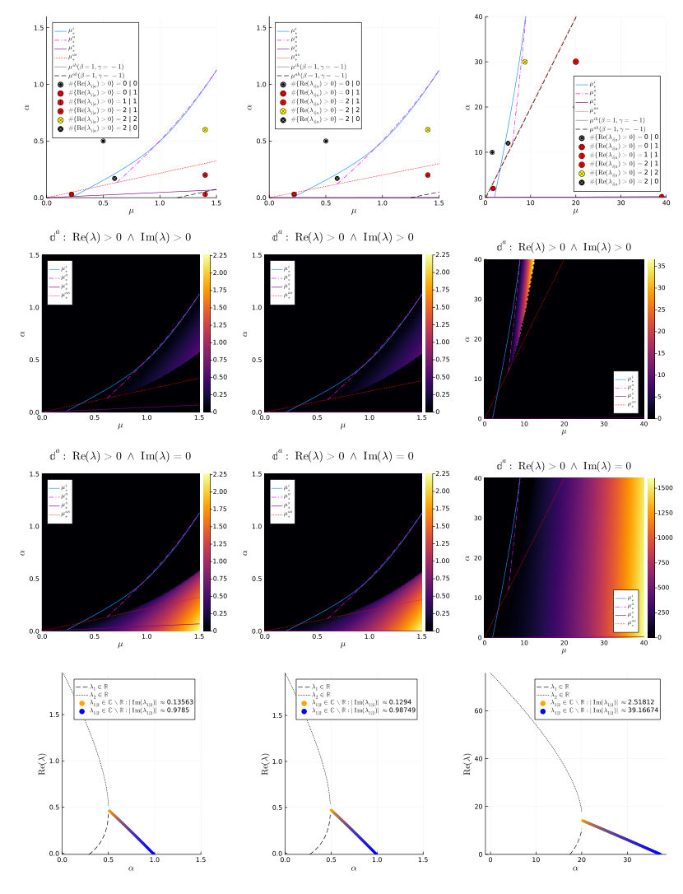 
Figure 2: First row: Same as for Figure 1 for illustrative convenience. Second row: Maximal Re (λ) &gt; 0 for anti- phase growth rate λ with da(λ) = 0 and Im (λ) &gt; 0. Third row: Maximal Re (λ) &gt; 0 for antisymmetric steady-state growth rate λ with da(λ) = 0 and Im (λ) = 0. Fourth row: varying α ∈(0, 1.5] (α ∈(0, 38] for right column) while fixing µ = 1.4 (µ = 8.7 for right column) in a vertical slice of the first row’s bifurcation line plot, one can observe the anti-phase Hopf birth point where the two antisymmetric steady-state growth rates λa ∈R merge to create two complex-conjugate anti-phase Hopf growth rates λa ∈R. The magnitude of | Im (λ)| can also be read off approximately through the...

📷 Fig 3

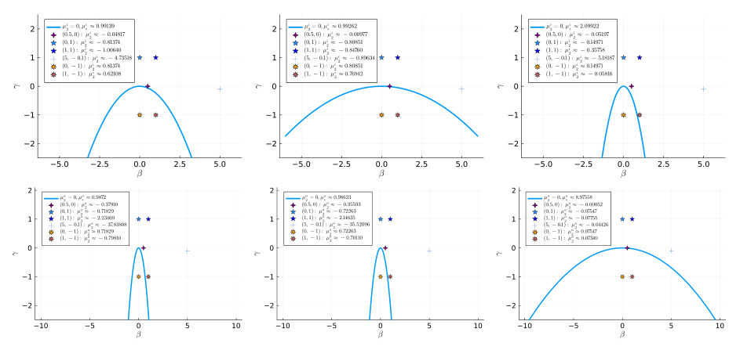 
Figure 3: Critical curve γcrit where the sub-critical branches turn supercritical of Theorem 4.2, all with α = 1. Below the quadratic curve, the branches are stable at bifurcation onset (supercritical), whereas they are unstable at bifurcation onset above the curve (subcritical). Left column: large domain and moderate degradation rate with (L, σ) = (10, 0.1), center column: large domain and small degradation rate with(L, σ) = (10, 0.01), right column: moderate domain size and moderate degradation rate with (L, σ) = (1, 0.1). First row: for in-phase Hopf bifurcation, second row: for symmetric steady-state bifurcation, third row: for anti-phase Hopf bifurcation, fourth row: for asymmetric...

📷 Fig 4

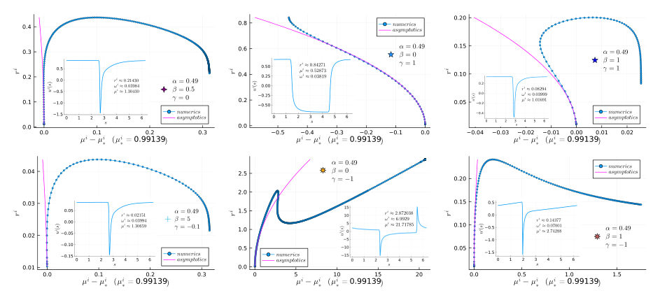 
Figure 4: From left to right and top to bottom, in-phase Hopf bifurcation branches at the points in the (β, γ)-parameter plane of the first row’s left plot in Figure 3 in the same order and with α = 0.49. Inserted are the nonlinear oscillation shapes that started with a cos(s) at µi −µi ∗= 0 along with the corresponding amplitude ri, nonlinear oscillation frequency ωi, and bifurcation parameter µi. Note the homoclinic and double heteroclinic limits for all cases except for (α, β, γ) = (0.49, 0, −1), as ωi seems to decrease to 0.

📷 Fig 5

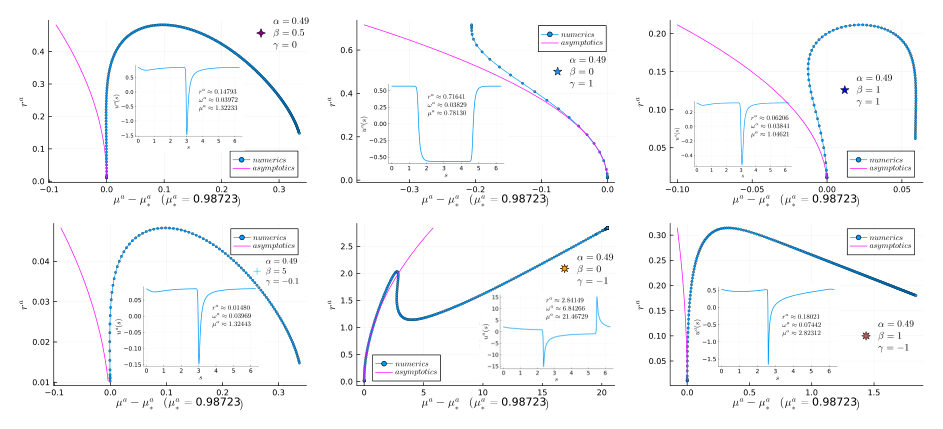 
Figure 5: From left to right and top to bottom, anti-phase Hopf bifurcation branches at the points in the (β, γ)- parameter plane of the first row’s left plot in Figure 3 in the same order and with α = 0.49. Note that the special point (β, γ) = (1, −1) is selected, where interesting temporal defects appear in the full numerical solution shown in Figure 8 below. Inserted are the nonlinear oscillation shapes that started with a cos(s) at µa −µa ∗= 0 along with the corresponding amplitude ra, nonlinear oscillation frequency ωa, and bifurcation parameter µa. Note the homoclinic and double heteroclinic limits for all cases except for (α, β, γ) = (0.49, 0, −1), as ωa seems to decrease to 0.

**Summary.** This paper mathematically analyzes a system of diffusively coupled scalar differential equations with dynamic Wentzell boundary conditions. It rigorously proves the existence of distinct in-phase (symmetric) and anti-phase (asymmetric) Hopf bifurcations from a stable steady state. The findings are significant for modeling complex biological processes involving diffusion and non-linear feedback at boundaries.

**Why it may be interesting.** While not quantum physics, the mathematical techniques used—analyzing pattern formation, stability boundaries, and coupled non-linear dynamics—are foundational to understanding open quantum systems where environmental coupling or boundary effects induce complex time evolution.

Detailed structure

**Main problem.** The study investigates the dynamical behavior of two identical scalar differential equations coupled via a diffusion equation, focusing on bifurcations from steady-states to oscillatory states.

**Main result.** The analysis confirms the existence of unique branches for both in-phase and anti-phase time-periodic solutions that bifurcate from the symmetric base state at distinct critical parameter values.

**Method.** The work employs linearization around equilibrium points, eigenvalue analysis to determine stability (Hopf bifurcation conditions), and numerical continuation methods to trace the nonlinear solution branches.

**Model / system.** The system consists of two coupled scalar dynamical equations linked by a diffusion equation ($\partial_t u = \partial_{xx}u - \sigma^2 u$) subject to Wentzell boundary conditions. This setup is motivated by modeling biological membranes interacting with bulk diffusion.

**Key observables.** Bifurcation points ($\mu_i^*, \mu_a^*$), oscillation frequencies ($\omega_i^*, \omega_a^*$), and the existence/stability of in-phase (symmetric) and anti-phase (asymmetric) oscillations.

**Important parameters / regimes.** Coupling strength parameters ($\mu$) and diffusion coefficients ($\sigma$). The domain length $L$ is also a critical parameter affecting coupling decay.

**Assumptions / limitations.** The analysis relies on the existence of symmetric equilibrium solutions, the presence of simple imaginary eigenvalues at bifurcation points, and non-zero derivatives of eigenvalues with respect to parameters crossing the critical point.

**Figures summary.** Figures likely illustrate bifurcation diagrams showing the emergence of Hopf branches (in-phase and anti-phase) from a steady state, potentially including parameter bubbles or spatiotemporal visualizations of the resulting oscillations.

**Paper structure.** The paper proceeds by establishing the mathematical framework using linearized stability analysis to find critical points. It then uses advanced theorems (like those related to Hopf bifurcations) to prove the existence and uniqueness of nonlinear oscillatory solutions for both symmetric and asymmetric modes, concluding with asymptotic analyses for large domains.

Abstract

Two identical scalar dynamical systems coupled through a scalar diffusion equation are studied herein, with respect to bifurcations from a symmetric steady-state to symmetric and asymmetric steady-states and to in-phase and anti-phase oscillations. Numerical continuations based on the developed theory show the shape of the bifurcation branches and the attracting nonlinear states far from bifurcation onset and confirm their, for the most part, derived stability. This study extends the work on the dynamical properties of a single scalar dynamical system coupled to its own delay through an adjacent diffusion field and quantifies further the delay of diffusive information transmission between two such Wentzell boundaries. The mathematical system is motivated by modeling biological membranes with yet unknown effective local fluxes that are coupled to bulk diffusion.

[↑ back to top](#top)

### [Spin-Orbital Hall Nano-Oscillators using PtCr/NiFe](http://arxiv.org/abs/2608.08504v1)

**Authors:** Utkarsh Shashank, Akash Kumar, Daegeun Jo, Thi Ngoc Anh Nguyen, Jong-Guk Choi, Sambit Ghosh, Michal Strach, Lunjie Zeng, Andrew B. Yankovich, Roman Khymyn, Ahmad A. Awad, Eva Olsson, Peter M. Oppeneer, Johan Åkerman  
**Type:** both · **Category:** other · **PDF:** <https://arxiv.org/pdf/2608.08504v1>  
**Analysis basis:** full PDF text, analyzed in chunks
**Topic relevance:** `driven-dissipative phase transition` **3/5** · `methods for driven-dissipative` **3/5** · `Keldysh / 2PI / non-Gaussian methods` **2/5** · `non-equilibrium universality` **2/5** · `quantum measurements` **2/5** · `correlated / nonlocal dissipation` **1/5** · `scars & prethermalization` **1/5**

📷 Fig 1

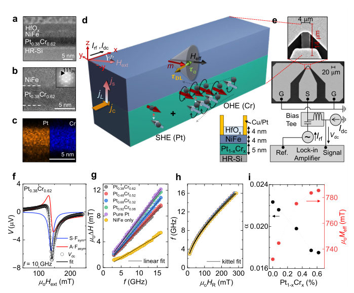 
Fig. 1 Structure and magnetic properties of PtCr/NiFe heterostructures. a, Cross-sectional TEM image of the Pt0.38Cr0.62/NiFe heterostructure. b, High-resolution TEM image of the Pt0.38Cr0.62/NiFe interface. Inset: corresponding FFT pattern with the fcc PtCr [111] diffraction spot marked, indicating an out-of-plane orientation close to the [111] direction. c, STEM–EDXS elemental maps of Pt and Cr within the Pt0.38Cr0.62 layer. (d), Schematic illustration of the proposed spin–orbital angular-momentum transfer mechanism in PtCr/NiFe. A charge current density, jc, generates a transverse spin current, js, in Pt through SHE and a transverse orbital current, jL, in Cr through the OHE. Owing to...

📷 Fig 2

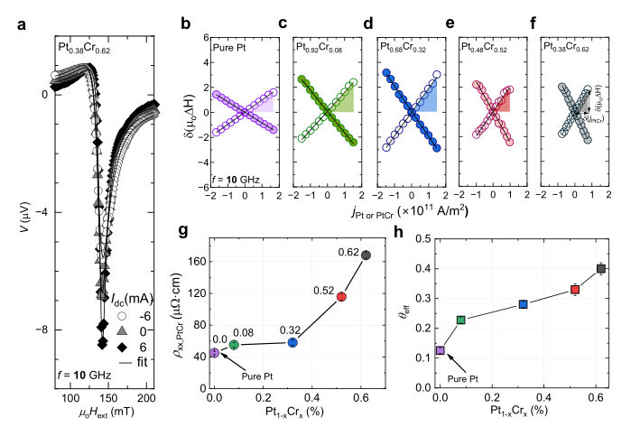 
Fig. 2 Current-induced torque generation in PtCr/NiFe heterostructures. a, Rep- resentative ST-FMR spectra measured under different dc bias currents for Pt0.38Cr0.62/NiFe at f = 10 GHz. The black solid lines represent fits to Eq. (1). b–f, Linewidth modulation, δ(µ0∆H), as a function of current density for Pt/NiFe and Pt1−xCrx/NiFe measured at f = 10 GHz and at ϕ = 70◦. Solid lines are linear fits. Open and filled circles represent positive and negative magnetic-field polarities, respectively. g, Electrical resistivity of Pt1−xCrx as a function of Cr concentration, determined from four-probe measurements on blanket films and two-probe measurements on patterned devices. Error bars represent...

📷 Fig 3

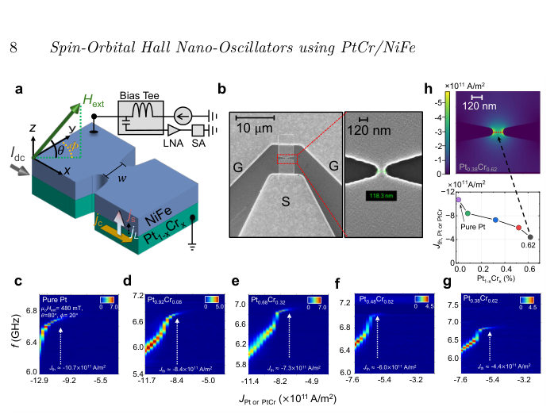 
Fig. 3 Spin-Orbital Hall nano-oscillators based on PtCr/NiFe heterostructures. a, Schematic of the nanoconstriction-based nano-oscillator measurement geometry. b, Scanning electron micrographs of the nanoconstriction device. Insets show the enlarged constriction region with a nominal width of 120 nm. c–g, Power spectral density (PSD) as a function of current density measured under an applied magnetic field of µ0Hext = 480 mT (θ = 80◦, ϕ = 20◦) for Pt/NiFe, Pt0.92Cr0.08/NiFe, Pt0.68Cr0.32/NiFe, Pt0.48Cr0.52/NiFe, and Pt0.38Cr0.62/NiFe, respectively. White arrows indicate the threshold current density for the onset of coherent auto-oscillations, while the color bars indicate the peak power...

📷 Fig 4

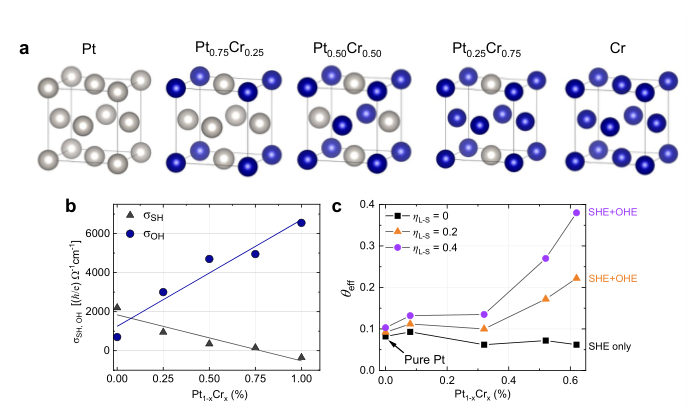 
Fig. 4 First-principles evidence for a mixed spin–orbital torque mechanism in PtCr. a, Fully relaxed Pt1−xCrx supercell structures used for first-principles calculations. b, Calculated intrinsic spin Hall conductivity, σSH, and intrinsic orbital Hall conductivity, σOH, as a function of Cr concentration. Solid lines are linear fits used to interpolate the conductivities at the experimental compositions. c, Estimated effective torque efficiency calculated using Eq. (4), where ρPtCr(x) is the experimentally measured PtCr resistivity and ηL−S is an effective orbital-to-spin conversion parameter. The SHE-only limit corresponds to ηL−S = 0, while finite ηL−S incorporates orbital-to-spin...

**Summary.** This work demonstrates how engineering PtCr alloys into heterostructures with ferromagnets enables giant spin-orbit torques by exploiting orbital Hall effects alongside conventional spin Hall effects. By achieving a higher torque efficiency, the authors significantly lower the current required to sustain coherent auto-oscillations, proposing a scalable platform for next-generation orbitronic devices.

**Why it may be interesting.** While focused on condensed matter magnetism, the study of current-induced torques and nonlinear dynamics in nanoscale devices touches upon non-equilibrium quantum transport phenomena that are relevant for understanding dissipation mechanisms in open quantum systems.

Detailed structure

**Main problem.** The research aims to develop efficient methods for generating current-induced torques beyond conventional Spin Hall Effect physics by utilizing the Orbital Hall Effect (OHE) to create spin-orbital torque nano-oscillators (SOHNOs).

**Main result.** Cr alloying in PtCr/NiFe heterostructures enhances the effective torque efficiency and reduces the threshold current density for auto-oscillations, establishing a scalable platform for low-power spintronic devices.

**Method.** The study combines experimental measurements (ST-FMR and auto-oscillation) with first-principles calculations to model the spin-orbital angular momentum transfer mechanism.

**Model / system.** The physical system is the PtCr/NiFe heterostructure, where charge current generates both conventional spin currents (via SHE in Pt) and orbital currents (via OHE in Cr). Strong Spin-Orbit Coupling mediates the conversion of these orbital currents into effective damping-like torques on the ferromagnet.

**Key observables.** Effective torque efficiency ($	heta_{eff}$), auto-oscillation threshold current density ($J_{th}$), and magnetic linewidth modulation ($\delta(\mu_0\Delta H)$).

**Important parameters / regimes.** Cr concentration ($x$), which controls the enhancement of $	heta_{eff}$ (from 0.14 to ~0.40) and the reduction in $J_{th}$.

**Assumptions / limitations.** The enhanced torque is attributed to an intrinsic orbital-mediated contribution, which is confirmed by theoretical calculations that include OHE pathways.

**Figures summary.** Figures illustrate TEM/STEM-EDXS confirming homogeneous alloying; schematics detail the spin-orbital angular momentum transfer mechanism; and spectra show linewidth modulation vs. bias current and auto-oscillation onset vs. current density.

**Paper structure.** The paper progresses from identifying the need for OHE over SHE, detailing the PtCr/NiFe platform, presenting experimental measurements (ST-FMR/auto-oscillations) showing performance enhancement with Cr doping, and finally providing first-principles calculations to theoretically confirm the orbital-mediated torque enhancement.

Abstract

The orbital Hall effect provides a promising route for generating angular-momentum currents beyond conventional spin Hall physics. PtCr alloys exhibit unusually large current-induced torques, but the contribution of orbital transport and the ability of these torques to sustain coherent nonlinear magnetization dynamics remain unresolved. Here we demonstrate spin-orbital Hall nano-oscillators by exploiting a homogeneous heavy-metal/light-metal alloy in which orbital Hall currents generated by Cr are converted by Pt into spin currents, producing giant spin-orbit torques. Using PtCr/NiFe heterostructures, the effective torque efficiency increases from ~0.14 in Pt/NiFe to ~0.40 in Pt0.38Cr0.62/NiFe despite substantial Pt dilution, enabling coherent auto-oscillations with the threshold current density reduced from ~ 1.07 x 10^12 to ~ 4.4 x 10^11 A m^-2. First-principles calculations show that Cr alloying suppresses the intrinsic spin Hall conductivity while enhancing the orbital Hall conductivity, and reproduce the observed torque enhancement only when orbital transport is included. Our combined experimental and first-principles results show that alloy engineering enables giant spin-orbit torques through an intrinsic orbital-mediated contribution, enabling coherent auto-oscillations without engineered multilayers and establishing a scalable materials platform for low-power nonlinear spintronic and orbitronic devices.

[↑ back to top](#top)

### [Symmetry Breaking by Interfacial Dead Layers: Observation of Forbidden Self-Induced Spin-Orbit Torque in Symmetric Ferromagnets](http://arxiv.org/abs/2608.09614v1)

**Authors:** Athira Ravindran K, Raghvendra Posti, Manish Kumar Mohanta, Abhishek Kumar, Damanpreet Kaur, Alberto Anadón, Sebastien Petit-Watelot, Juan-Carlos Rojas-Sánchez, Michel Hehn, Puru Jena, Debangsu Roy  
**Type:** both · **Category:** other · **PDF:** <https://arxiv.org/pdf/2608.09614v1>  
**Analysis basis:** full PDF text, analyzed in chunks
**Topic relevance:** `Keldysh / 2PI / non-Gaussian methods` **3/5** · `driven-dissipative phase transition` **2/5** · `methods for driven-dissipative` **2/5** · `non-equilibrium universality` **2/5** · `analog quantum simulation` **1/5** · `correlated / nonlocal dissipation` **1/5** · `quantum measurements` **1/5** · `scars & prethermalization` **1/5**

📷 Fig 1

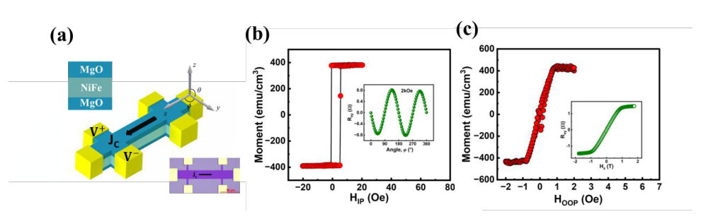 
FIG. 1. (a) Schematic of the six-terminal Hall bar geometry used for the experiments with MgO/NiFe/MgO

📷 Fig 2

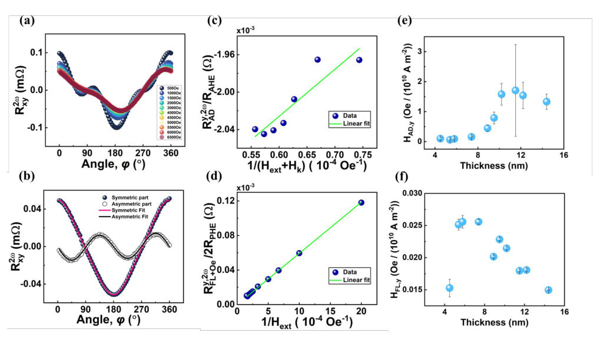 
FIG. 2. (a) Angular dependence of the second harmonic Hall voltage 𝑅𝑥𝑦 2𝜔 as a function of φ for t =14.4nm

📷 Fig 3

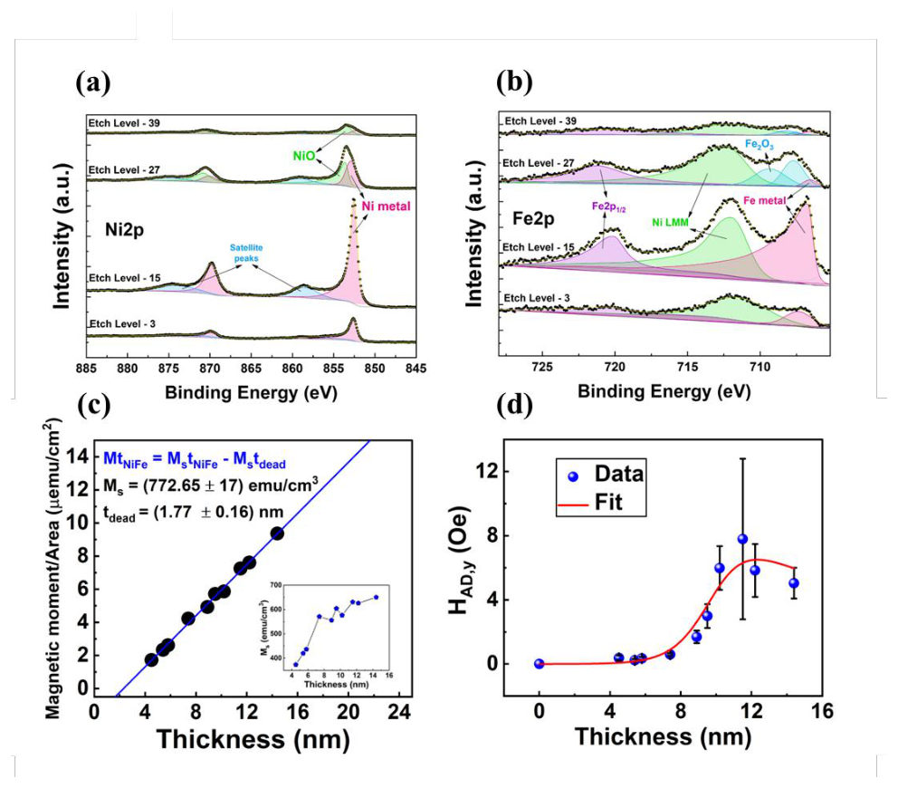 
FIG. 3. XPS core level spectra analysis of (a) Ni2p and (b) Fe2p using depth profiling. The presence of oxides

📷 Fig 4

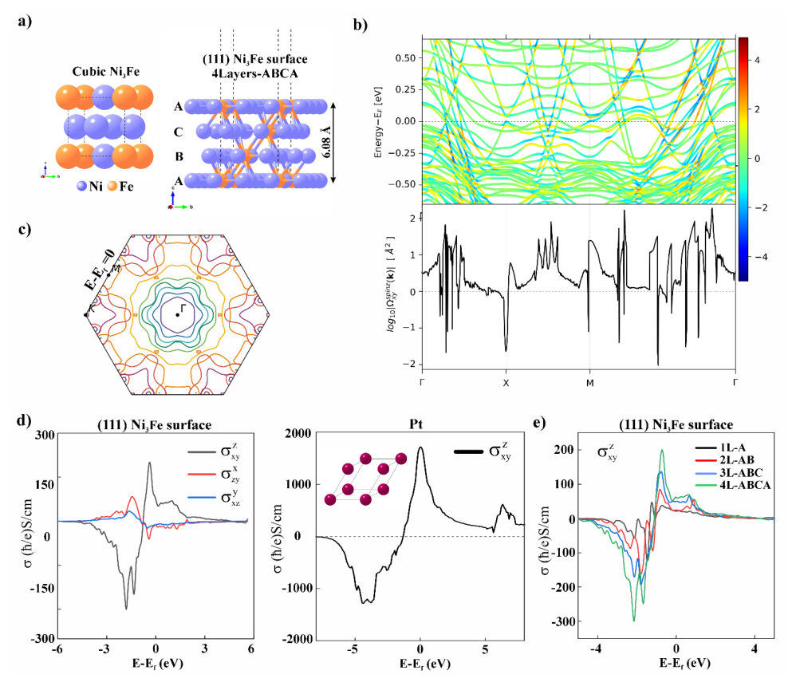 
FIG. 4. DFT Analysis (a) Geometrical view of fcc Ni3Fe and optimized (111) surface of Ni3Fe, (b) spin Hall

📷 Fig 5

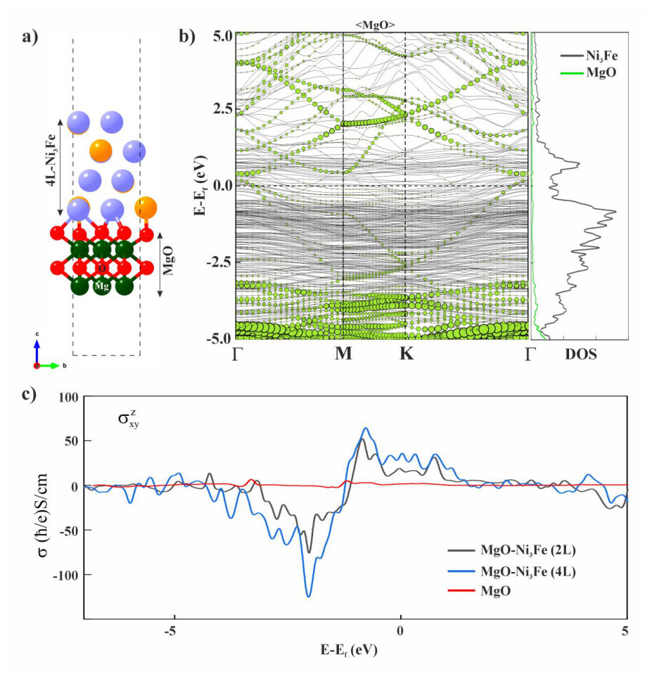 
FIG. 5. (a) Optimized atomic structure of MgO-Ni3Fe (4L) heterointerface, (b) Electronic band structure

**Summary.** This work reports observing robust Spin-Orbit Torques (SOTs) in a nominally symmetric ferromagnet ($	ext{MgO}/	ext{NiFe}/	ext{MgO}$), where they should theoretically vanish. The authors pinpoint the cause as a naturally formed magnetic dead layer at the bottom interface, demonstrating that this 'parasitic' feature can be quantified and utilized as an intrinsic source of symmetry breaking for spintronic applications.

**Why it may be interesting.** While focused on condensed matter magnetism, the concept of emergent symmetry breaking via interface disorder or reconstruction—and quantifying this effect using advanced transport measurements—is analogous to studying boundary conditions in quantum many-body systems.

Detailed structure

**Main problem.** The study addresses how robust Spin-Orbit Torques (SOTs) can be generated in nominally symmetric ferromagnets, circumventing the conventional requirement for structural asymmetry or heavy metals.

**Main result.** The authors demonstrate that a naturally occurring magnetic dead layer at an interface acts as the source of symmetry breaking, enabling measurable SOTs in standard all-ferromagnetic heterostructures.

**Method.** The research combines harmonic Hall measurements to quantify torques, SQUID magnetometry for magnetization characterization, and X-ray photoelectron spectroscopy (XPS) depth profiling to identify the structural asymmetry.

**Model / system.** The physical system is an MgO/NiFe/MgO trilayer structure. The theoretical framework involves fitting transport data using a drift-diffusion model adapted from Kim and Lee theory to quantify spin current absorption at interfaces.

**Key observables.** Second-harmonic Hall resistance ($R_{xy}^{2\omega}$), extracted damping-like and field-like torque effective fields ($	ext{H}_{	ext{AD},y}$, $	ext{H}_{	ext{FL},y}$), and the thickness dependence of these torques.

**Important parameters / regimes.** The key parameters include the thickness ($t$) of the NiFe layer, the derived dead-layer thickness ($\sim 1.2 	ext{ nm}$ vs $1.8 	ext{ nm}$ measured), and the intrinsic spin Hall conductivity ($\sigma_{xy}^z$).

**Assumptions / limitations.** The analysis assumes that by measuring angular dependence of $R_{xy}^{2\omega}$, contributions from AHE and PHE can be successfully isolated, allowing focus on spin-current related torques.

**Figures summary.** Figures illustrate the geometry and magnetization curves; subsequent figures show the angular dependence of Hall resistance components separated into symmetric/antisymmetric parts, field dependence of fit coefficients, and thickness evolution of SOT effective fields.

**Paper structure.** The paper establishes the problem by noting the theoretical prohibition of SOTs in symmetric structures. It then presents experimental measurements using harmonic Hall techniques to observe torques. The source is identified through XPS/SQUID analysis pointing to an interfacial dead layer, which is finally quantified by fitting transport data against theory.

Abstract

Conventionally, spin-orbit torques (SOTs) in ferromagnets require heavy-metal layers or engineered structural asymmetry to break inversion symmetry. In this work, we report the observation of robust, self-generated SOTs in a nominally symmetric, heavy-metal-free MgO/NiFe/MgO trilayer - a geometry where such torques are theoretically forbidden. By combining harmonic Hall measurements with SQUID magnetometry and X-ray photoelectron spectroscopy, we identify the symmetry-breaking origin: a 1.8 nm magnetic dead layer at the bottom interface. Crucially, we demonstrate a quantitative agreement between our data and the drift-diffusion theory predicted by Kim and Lee, yielding a theoretically extracted dead-layer thickness (1.2 nm) which matches structural characterization. Furthermore, density-functional calculations confirm that NiFe possesses sufficient intrinsic spin Hall conductivity to support the observed spin currents. These results reframe the parasitic dead layer as a functional spintronic component, establishing a universal, all-ferromagnetic route to SOTs in standard magnetic heterostructures.

[↑ back to top](#top)

### [Time-resolved study of carbonization and growth of ultrathin 3C-SiC on Si(111) under ultra-high vacuum](http://arxiv.org/abs/2608.09431v1)

**Authors:** Pranjali Jadhao, Mojdeh Fallahpour, Josef Polčák, Eva Kolíbalová, Michal Horák, Jan Michalička, Petr Bábor, Stanislav Voborný, Tomáš Šikola  
**Type:** experiment · **Category:** other · **PDF:** <https://arxiv.org/pdf/2608.09431v1>  
**Analysis basis:** full PDF text, analyzed in chunks
**Topic relevance:** `quantum measurements` **3/5** · `driven-dissipative phase transition` **2/5** · `non-equilibrium universality` **2/5** · `analog quantum simulation` **1/5** · `correlated / nonlocal dissipation` **1/5** · `methods for driven-dissipative` **1/5** · `scars & prethermalization` **1/5**

📷 Fig 1

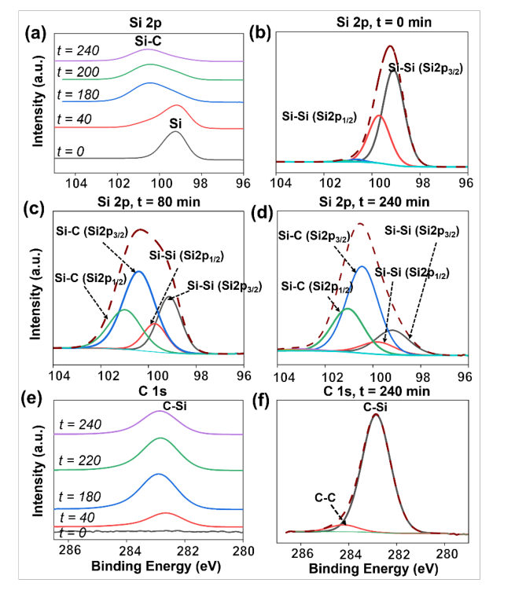 
Fig. 1. Si 2p and C 1s XPS spectra during SiC growth on Si(111) at 800 °C. (a) Si 2p waterfall spectra for selected C2H4 exposure times (in min), (b–d) Fitted Si 2p spectra at t = 0, 80, and 240 min. (e) C 1s waterfall at selected exposure time (in min), (f) Fitted C 1s spectrum for t = 240 min (carbidic C–Si at 282.85 eV, minor C–C at 284.3 eV).

📷 Fig 2

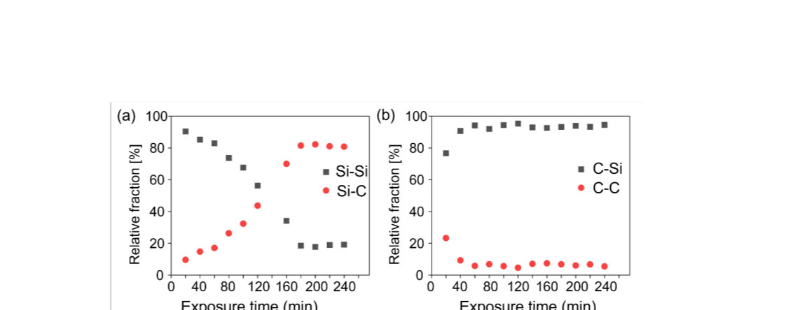 
Fig. 2. (a) Relative fractions of the elemental Si and SiC phases in the modified layer as a function of exposure time, calculated from the areas of the Si–Si and Si–C components of the fitted Si 2p doublet (both spin–orbit components summed). (b) Relative fractions of the SiC and hydrocarbon-derived phases, calculated from the areas of the C–Si and C–C components of the fitted C 1s peak.

📷 Fig 3

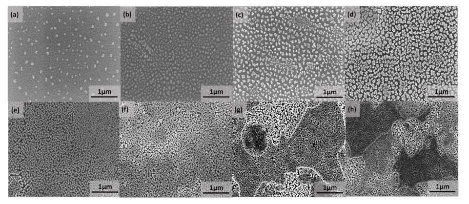 
Fig. 3. SEM images of of SiC nanostructures on Si (111) at (a) 2, (b) 5, (c) 10, (d) 30, (e) 50, (f) 80, (g) 150, and (h) 240 min of C₂H₄ exposure.

📷 Fig 4

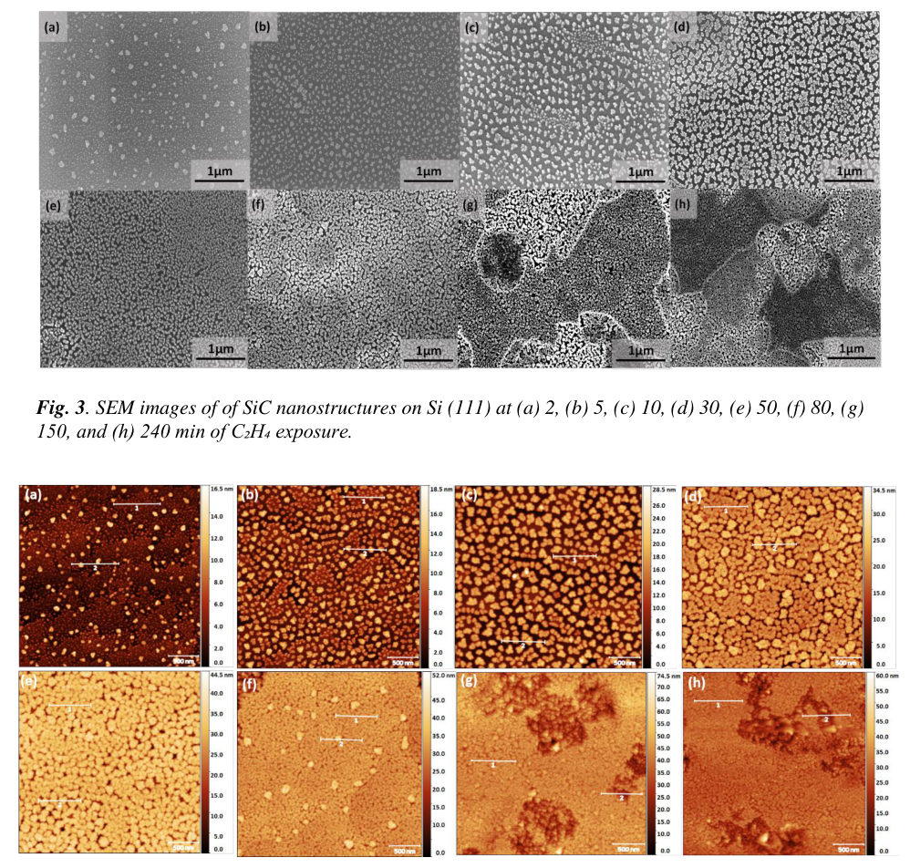 
Fig. 4. AFM images (3 × 3 μm scan area) of the same samples as in Fig. 3, after (a) 2, (b) 5, (c) 10, (d) 30, (e) 50, (f) 80, (g) 150, and (h) 240 min.

📷 Fig 5

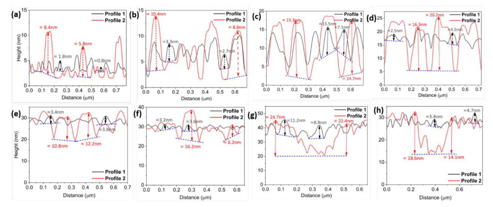 
Fig. 5. Height profiles extracted along the lines marked in the AFM images in Fig. 4, after (a) 2, (b) 5, (c) 10, (d) 30, (e) 50, (f) 80, (g) 150, and (h) 240 min. Profile 2 (black curves) were taken from smoother Profile 1 (red curves) go through bigger islands.

**Summary.** This work provides a comprehensive, time-resolved characterization of how ultrathin 3C-SiC nucleates and grows on Si(111) using ethylene gas at high temperatures. By combining multiple advanced surface analysis techniques (XPS, AFM, STEM), the authors map the chemical conversion from elemental silicon to carbide and track the physical transition from isolated islands to a continuous film. This detailed understanding is crucial for engineering high-quality semiconductor interfaces.

**Why it may be interesting.** While primarily materials science, the study involves non-equilibrium surface chemistry and phase transitions under controlled vacuum conditions, which touches upon concepts relevant to open quantum systems or reaction dynamics modeling.

Detailed structure

**Main problem.** To resolve the time-dependent chemical and morphological evolution of an ultrathin silicon carbide (SiC) layer formed on Si(111) during early-stage carbonization.

**Main result.** The growth proceeds via island nucleation followed by coalescence, resulting in a crystalline 3C-SiC film whose formation is tracked chemically (XPS) and structurally (AFM/STEM).

**Method.** A combination of *in-situ* XPS for chemical tracking, *ex-situ* AFM/SEM for morphology, AES/SIMS for depth profiling, and STEM-EELS for atomic structure confirmation was employed.

**Model / system.** The physical system is the heteroepitaxial growth of SiC on a Si(111) substrate using ethylene exposure at 800 °C under UHV conditions.

**Key observables.** Si/C chemical ratios (XPS, AES), surface roughness evolution (AFM), film thickness ($\sim 9$ nm via STEM-EELS), and crystal structure confirmation ($3	ext{C-SiC}$ polytype).

**Important parameters / regimes.** Growth temperature of $800^\circ	ext{C}$; precursor $	ext{C}_2	ext{H}_4$; time evolution from minutes to hours.

**Assumptions / limitations.** The growth mechanism is assumed to be governed by surface chemical reactions and island-mediated coalescence, leading to a specific residual elemental Si fraction.

**Figures summary.** Figures show XPS spectra tracking phase conversion over time; SEM/AFM track the transition from isolated islands to continuous films; STEM-EELS confirm the crystalline structure and interface quality.

**Paper structure.** The paper follows a progression of characterization techniques: initial chemical monitoring (XPS) establishes the time dependence, followed by morphological mapping (SEM/AFM), detailed elemental profiling (AES/SIMS), and finally atomic structural confirmation (STEM-EELS).

Abstract

The early-stage formation of silicon carbide (SiC) on Si(111) by ethylene exposure under ultra-high vacuum (UHV) was investigated to resolve the time-dependent chemical and morphological evolution of an ultrathin layer. Clean Si(111) substrates were exposed to C$_2$H$_4$ at 800 °C for 2 min to 4 h, and the surfaces followed by in-situ X-ray photoelectron spectroscopy (XPS) and ex-situ AFM, SEM, AES, SIMS and TEM. Si 2p and C 1s peak analysis shows the progressive conversion of elemental silicon into a carbidic Si-C phase, the SiC fraction overtaking the elemental component between 120 and 160 min and saturating near 80-81% beyond 180 min, leaving about 19-20% residual elemental silicon. Correlative SEM and AFM reveal a parallel morphological progression, from sparse isolated islands to a coalesced, near-continuous layer. AES depth profiling confirms carbon incorporated into the near-surface region rather than weakly adsorbed as contamination, assigning the islands to early SiC nuclei. TEM confirms the zinc-blende lattice and the presence of cubic silicon carbide (3C-SiC). Together, these results provide a time-resolved picture of SiC nucleation, coalescence and layer growth on Si(111), relevant to 3C-SiC heteroepitaxy, and can be utilized in the optimization of SiC/Si(111) templates for growth of III-nitride and other carbide systems on silicon (e.g. Mo$_2$C).

[↑ back to top](#top)

### [Polarization engineered all 2D Graphene/Ferroelectric hybrid for persistence-free photoresponse](http://arxiv.org/abs/2608.09300v1)

**Authors:** Navkiranjot Kaur Gill, Shaili Sett, Saloni Kakkar, Kenji Watanabe, Takashi Taniguchi, Arindam Ghosh  
**Type:** experiment · **Category:** other · **PDF:** <https://arxiv.org/pdf/2608.09300v1>  
**Analysis basis:** full PDF text, analyzed in chunks
**Topic relevance:** `quantum measurements` **3/5** · `driven-dissipative phase transition` **2/5** · `correlated / nonlocal dissipation` **1/5** · `methods for driven-dissipative` **1/5** · `non-equilibrium universality` **1/5**

📷 Fig 1

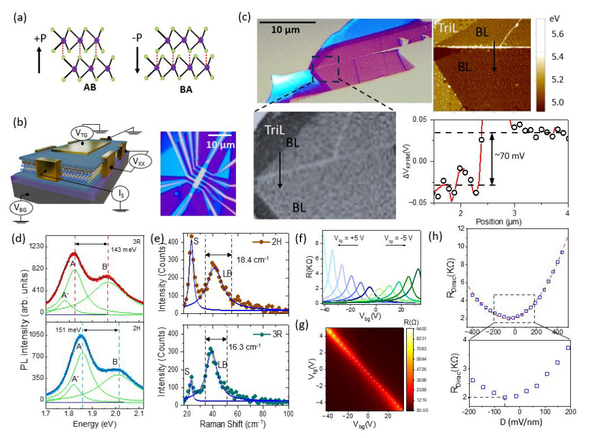 
FIG. 1. Characterization of BLG/3R-MoS2 FET. (a) Two different stacking configuration of 3R polytype, AB and BA, with arrows depicting the direction of spontaneous out-of-plane polarization (P). (b) Schematic illustration of the device architecture, comprising a hexagonal boron nitride (hBN)–encapsulated bilayer graphene (BLG) on a 3R-MoS2, equipped with a gold top gate and a hBN/SiO2 back gate, configured in a hall-bar geometry with one-dimensional edge contacts to the BLG. The right panel shows an optical micrograph of the fabricated device. (c) KPFM measurement microgarphs: optical image of a 3R MoS2 multilayer flake. The false color zoomed region shows trilayer (TriL) and bilayer (BL)...

📷 Fig 2

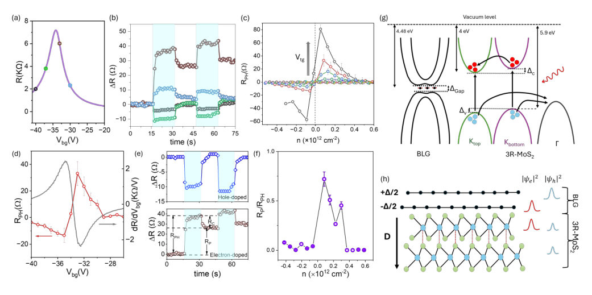 
FIG. 2. Photoresponse in BLG/3R-MoS2 hybrid at T = 100 K. (a) R −Vbg curve at Vtg = +4 V. (b) ∆R as a function of time in light ”ON” and ”OFF” (”ON” illustrated shaded region) at four different back-gate voltages (Vbg) highlighted by hollow circles in (a). (c) Photoresponse (RP H) as a function of doping density (n) in BLG channel at different top-gate voltages ranging from -2 V to +5 V at an interval of +1 V. (d) RP H (red hollow circles) and dR/dVbg (solid grey line) as a function of Vbg at Vtg = +4 V. (e) ∆R as a function of time in hole-doped regime where Vbg-Vd= - 2.85 V (top panel) and electron- doped regime where Vbg-Vd= + 1.15 V (bottom panel). (f) RP /RP H versus n at Vtg = +4 V....

📷 Fig 3

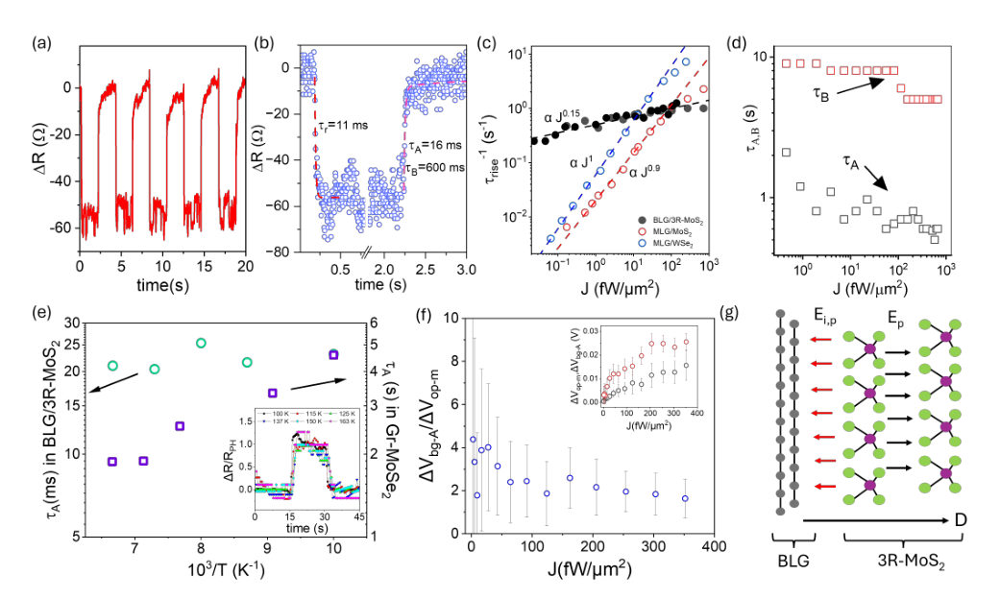 
FIG. 3. Persistence-free photoresponse in hole-doped regime. (a) ∆R as a function of time at Vbg = - 43 V, Vtg = +5 V for six optical pulses with a pulsing frequency of 0.5 Hz at 100 K. (b) A typical representation of ∆R vs time for a single optical pulse at Vbg = -43 V, Vtg = +5 V. The rise and fall region is fitted with a exponential and bi-exponential fit (red dash lines) respectively. (c) Power dependence of the inverse of rise time in BLG/3R-MoS2 and other Gr/TMD hybrids [6] (d) Power dependence of fall time at Vbg = -43 V, Vtg = +5 V. The red and black hollow squares represent to two processes of fall timescales involved in recovery. (c) Recovery timescale τA and τB as a function of...

📷 Fig 4

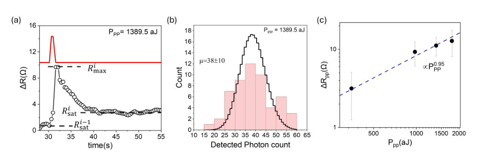 
FIG. 4. Ultra-low light detection with BLG/3R-MoS2 hybrid. (a) Resistance as a function of time after a single pulse of light at 1389.5 aJ. (b) Histogram of normalized photon numbers obtained from multiple sets of pulsing experiments as shown in (a).(c) Average change in resistance (∆RP P as a function of power per pulse (PP P ) ranging from 350 aJ to 2000 aJ. The blue dotted line is the power law fit to the data.

**Summary.** This work reports on a novel photodetector built from a Graphene/Ferroelectric (3R-MoS2) van der Waals hybrid. By exploiting the spontaneous polarization of the ferroelectric layer, the researchers achieved a tunable, persistence-free photoresponse in bilayer graphene. This breakthrough overcomes the trade-off between speed and sensitivity, establishing the platform for advanced optoelectronic devices.

**Why it may be interesting.** While primarily an experimental condensed matter device physics paper, the control over interfacial charge dynamics via intrinsic polarization fields offers insights into engineered quantum interfaces relevant to open quantum systems and energy harvesting.

Detailed structure

**Main problem.** The primary challenge addressed is designing photodetectors that can achieve both high sensitivity and fast response times, overcoming limitations associated with trap-mediated photogating mechanisms.

**Main result.** The authors demonstrated a tunable, persistence-free photoresponse in a Graphene/Ferroelectric hybrid by utilizing the polarization field from 3R-MoS2 to optically gate bilayer graphene.

**Method.** The study employed electrical and optoelectronic characterization techniques, including KPFM mapping, time-resolved photoluminescence (PL) spectroscopy, and measuring transient photoresistance under varying illumination conditions.

**Model / system.** The physical system is a van der Waals heterostructure comprising bilayer graphene (BLG) interfaced with a ferroelectric material, specifically bilayer MoS2 in the rhombohedrally stacked (3R) phase. This structure is configured as an edge-contacted dual-gated field-effect transistor.

**Key observables.** Photoresponse magnitude ($\Delta R$), relaxation timescales ($	au_A \approx 10$ ms), internal quantum efficiency ($\approx 10\%$), and the persistence of photo-induced changes under different doping regimes.

**Important parameters / regimes.** The response time is reported as being limited by the measurement instrument (tens of milliseconds); the mechanism relies on the intrinsic polarization field ($E_{i,P}$) from the ferroelectric layer.

**Assumptions / limitations.** The rapid photoresponse in the hole-doped regime is attributed to a mechanism governed by polarization modulation rather than conventional trap-mediated charge trapping/detrapping processes.

**Figures summary.** Figures illustrate KPFM potential mapping, PL spectra comparing 3R and 2H phases, time traces showing persistence-free response (especially in the hole-doped regime), and photon counting histograms confirming high sensitivity.

**Paper structure.** The paper progresses by first establishing the limitations of existing photodetectors; it then details the fabrication and characterization of the BLG/3R-MoS2 structure using multiple techniques (KPFM, PL); subsequently, it analyzes the photoresponse dynamics, highlighting the doping asymmetry that dictates whether the response is persistent or persistence-free.

Abstract

Graphene-based van der Waals hybrid photodetectors typically work on trap-mediated photogating mechanism, exhibiting high sensitivity, but under-perform in the fast detection of repetitive optical signals. Designing photodetectors that are simultaneously fast and highly sensitive has therefore remained difficult. In this work, we realize both attributes by integrating atomically thin sliding ferroelectrics in the design architecture, thereby uniting semiconducting properties with intrinsic polarization fields capable of efficiently governing interfacial photocarrier dynamics. We report a bilayer graphene-bilayer MoS2 (with MoS2 in a rhombohedrally stacked (3R) configuration) van der Waals photodetector with edge-contacted dual-gated field-effect transistor architecture. The photo-induced modulation in spontaneous out-of-plane polarization of 3R-MoS2 and selective confinement of charge carriers in bilayer graphene under an out-of-plane displacement field results in a tunable persistence-free photoresponse. Here, the photoinduced polarization change in 3R-MoS2 produces an optically controlled gating effect that alters the electrostatic environment of bilayer graphene, resulting in a temperature-independent photoresponse with rapid response times of the order of 10's of milliseconds (limited by the measurement instrument). We demonstrate reproducible detection of optical signals and examine the photon-counting resolution of this structure in high-sensitivity regimes, where we determine its internal quantum efficiency to be 10 percent with minimum detectable photon number of 31 in single shot measurements. This work highlights the functionality of 3R-MoS2 in manipulating the interfacial charge dynamics and establishes the hybrid of graphene and ferroelectric 3R-MoS2 as a promising platform for ultra-sensitive optoelectronic devices.

[↑ back to top](#top)

### [AES-Debye: an Accurate, Efficient, and Scalable Engine for Debye Scattering Calculations](http://arxiv.org/abs/2608.09916v1)

**Authors:** Navid Panchi, Sebastian Kuckuk, Markus Wittmann, Michael Engel, Alberto Leonardi  
**Type:** theory · **Category:** numerical methods · **PDF:** <https://arxiv.org/pdf/2608.09916v1>  
**Analysis basis:** full PDF text, analyzed in chunks
**Topic relevance:** `methods for driven-dissipative` **3/5** · `analog quantum simulation` **1/5** · `quantum measurements` **1/5**

📷 Fig 1

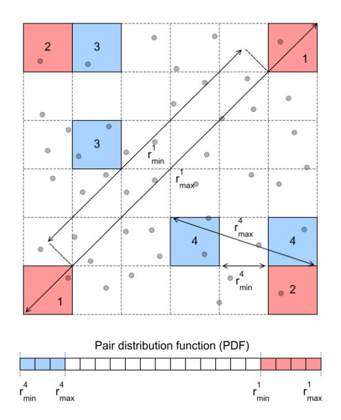 
Figure 1: Schematic of the cell-list-based domain decomposition in a 2D toy system. Top: Repre- sentative cell pairs are color coded and grouped by center-to-center distance; the minimum (rmin) and maximum (rmax) possible interatomic distances within a pair are indicated. Bottom: Memory access pattern during PDF computation. Grouping cell pairs with similar center-to-center distances improves cache reuse and localizes updates to nearby PDF bin.

📷 Fig 2

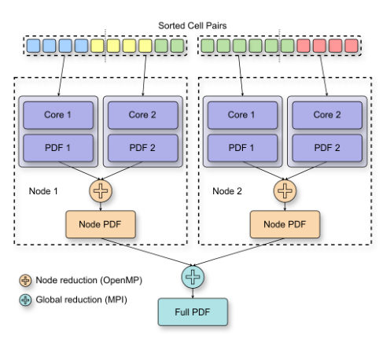 
Figure 2: CPU parallelization scheme using a hybrid MPI+OpenMP model. Each node runs a single MPI process that spawns multiple OpenMP threads (one per core in this example). This schematic shows two MPI processes, each with two OpenMP threads.

📷 Fig 3

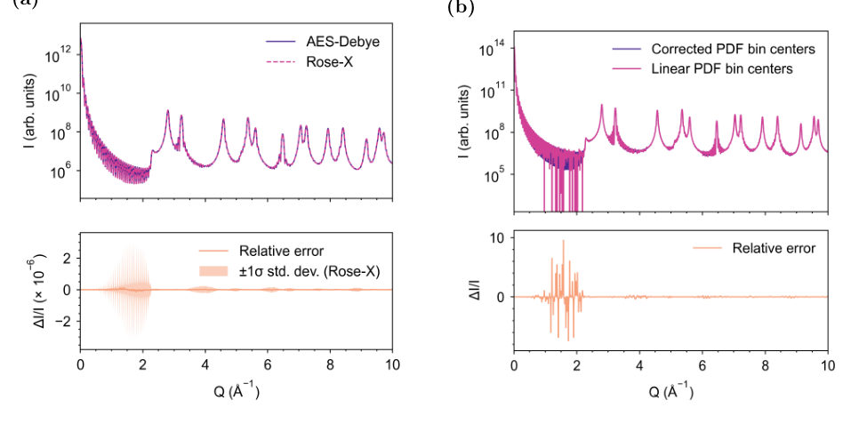 
Figure 3: Validation of the PDF-based implementation and bin center correction. (a) Comparison of the intensity profile computed with Rose-X and with the present implementation for a Pd nanocube (side length 9.3 nm). The lower panel shows the relative error between the two profiles, together with the standard deviation of the intensity error estimated from Rose-X. (b) Powder diffraction profiles computed with and without bin center correction for a crystalline Pd nanocube (side length 15.1 nm). The correction removes unphysical negative intensities and improves the diffuse background.

📷 Fig 4

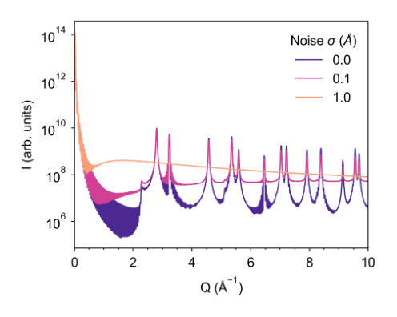 
Figure 4: Diffraction profiles for a Pd nanocube (side length 10 nm) with increasing Gaussian displacement noise σ, used to mimic thermal disorder. Increasing σ broadens and attenuates the Bragg peaks, consistent with increasing structural disorder. The high-frequency oscillations in the background are expected finite size features associated with the parallel facets of the cube and monodisperse size, rather than numerical artifacts.

📷 Fig 5

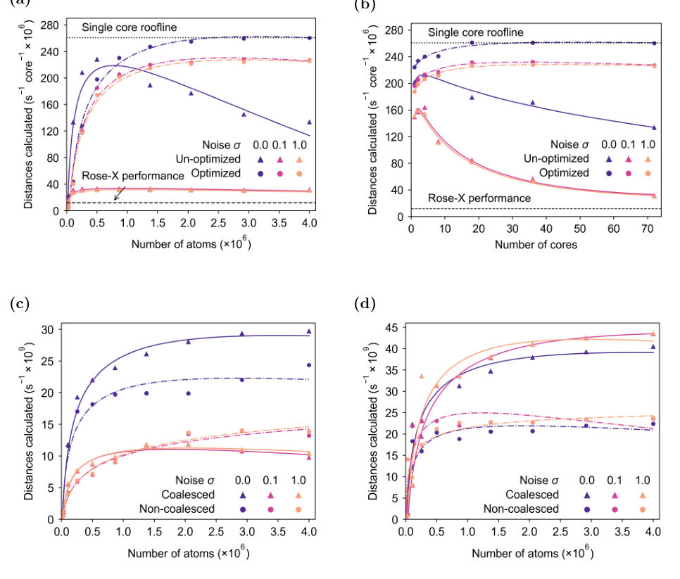 
Figure 5: Performance scaling across CPUs and GPUs for different disorder levels σ. (a) Through- put versus atom count on 72 CPU cores; the dashed lines indicate the single-core roofline and a comparison to the existing earlier implementation in Rose-X. (b) Strong scaling on a single CPU node. (c) Asymptotic performance on an NVIDIA A40 (48 GB GDDR6, 6 MB L2 cache). (d) Asymptotic performance on an NVIDIA A100 (40 GB HBM2e, 25 MB L2 cache).

**Summary.** This paper introduces AES-Debye, a high-performance engine designed to calculate total scattering profiles from atomistic models by reformulating the Debye Scattering Equation using Pair Distribution Functions. It achieves state-of-the-art efficiency and accuracy through advanced numerical error correction and highly optimized parallel computing strategies across multiple hardware platforms.

**Why it may be interesting.** While focused on condensed matter structure, the extreme focus on optimizing computation for large-scale simulations using specialized data structures, domain decomposition, and multi-level parallelism is highly relevant to developing efficient classical simulation techniques for quantum many-body problems.

Detailed structure

**Main problem.** The primary challenge is accurately and efficiently calculating total scattering profiles using the Debye Scattering Equation (DSE) for large, complex nanoscale materials.

**Main result.** The authors developed AES-Debye, an accuracy-preserving framework that achieves strong scalability by reformulating the calculation via Pair Distribution Functions (PDFs), enabling simulations on systems of 90 million atoms in minutes.

**Method.** It uses a PDF-based reformulation of the DSE, incorporating advanced numerical corrections for bin centers and employing highly optimized, data-locality-aware parallelization across CPUs, GPUs, and distributed memory architectures.

**Model / system.** The method is applicable to various atomistic models, including nanocube superlattices, polycrystalline copper samples, Halloysite nanotubes, and colloidal nanoparticle assemblies, allowing characterization of structure and disorder in complex geometries.

**Key observables.** Total scattering profile I(Q), Pair Distribution Function (PDF), and the pair distance $r_{ij}$.

**Important parameters / regimes.** The bin width $\Delta$ determines resolution; computational complexity is reduced from $O(N^2)$ to depend on PDF bins, while maintaining high numerical fidelity.

**Assumptions / limitations.** The core assumption is that reformulating the DSE using a corrected PDF approach mitigates the severe computational cost and accumulation errors inherent in direct pairwise summation.

**Figures summary.** Figures illustrate domain decomposition (cell-list based), CPU parallelization schemes, and comparisons of computed PDF profiles showing the removal of unphysical negative intensities when corrections are applied.

**Paper structure.** The paper first establishes the physical problem with the DSE. It then details the computational bottleneck ($O(N^2)$) and introduces AES-Debye as a solution based on PDF aggregation. The bulk of the work describes the advanced numerical techniques (error correction, integer arithmetic for precision, memory layout optimization) and parallel implementation strategies before showcasing results across diverse physical systems.

Abstract

Total scattering models are essential for characterizing the structure and disorder of nanoscale materials. The Debye scattering equation (DSE) provides a rigorous route to elastic total scattering, but its direct evaluation is computationally demanding because pairwise contributions must be accumulated at every scattering vector, whereas common acceleration strategies based on binned pair-distance distributions or gridded fast Fourier transforms can introduce discretization and aliasing artifacts that compromise diffuse-scattering accuracy. Here, we present AES-Debye, an accuracy-preserving DSE framework that aggregates pair distances into a pair distribution function (PDF) using corrected bin centers and numerically robust accumulation to suppress discretization and summation errors. A data-locality-aware parallel design enables efficient execution on CPUs and GPUs. We demonstrate strong scalability by computing a high-resolution total scattering profile for a system of 90 million atoms, $(0.1,μ\mathrm{m})^{3}$, in minutes on a distributed-memory CPU platform. These capabilities extend accurate elastic total scattering calculations to large, complex systems while simultaneously providing high-resolution PDFs for downstream structural analysis.

[↑ back to top](#top)

### [Multiphysics Modeling of Thermo-Viscoelastic Damage in Functionally Graded Abradable Coatings with Probabilistic Geometric Tolerance Analysis](http://arxiv.org/abs/2608.08116v1)

**Authors:** Amjad El-Mellouhi, Yassine Adjal, Khaled Dhibi, Fedwa El-Mellouhi  
**Type:** theory · **Category:** numerical methods · **PDF:** <https://arxiv.org/pdf/2608.08116v1>  
**Analysis basis:** full PDF text, analyzed in chunks
**Topic relevance:** `methods for driven-dissipative` **3/5** · `Keldysh / 2PI / non-Gaussian methods` **1/5**

📷 Fig 1

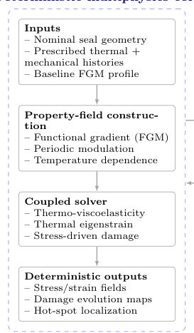 
Fig. 1: Block diagram of the proposed multiphysics–probabilistic framework. A deter- ministic multiphysics core (property-field construction + coupled thermo-viscoelastic– damage solver) is wrapped by a probabilistic tolerance propagation layer (Monte Carlo sampling of geometric deviations) to produce both nominal predictions and reliability metrics.

📷 Fig 2

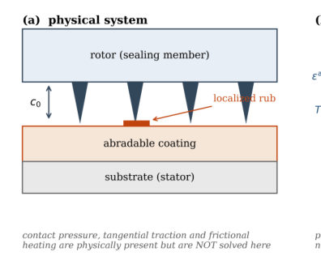 
Fig. 2: Separation of the physical system from the solved numerical domain. (a) In the physical labyrinth-seal stage, relative radial approach may close the clearance c0 and create a localized rub region in which contact pressure, tangential traction and frictional heating are real phenomena. (b) The domain actually solved is a local through-thickness coating column of M perfectly bonded homogenized subdomains on a substrate that enters only through the thermal expansion mismatch, driven by a prescribed equivalent normal-strain history εapp(t) and a prescribed temperature history T(z, t).

📷 Fig 3

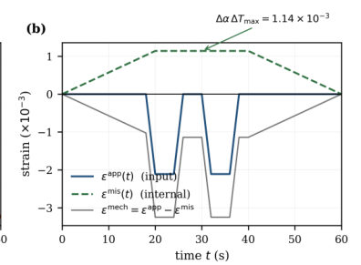 
Fig. 3: Prescribed loading benchmark. (a) The trapezoidal thermal cycle runs 20 → 400 →20 ◦C over 60 s with a 20-s dwell, and the stress-free reference temperature is Tref = 20 ◦C. (b) The equivalent normal-strain history εapp(t) is an input representing cyclic normal approach, whereas the coating–substrate expansion mismatch strain εmis is generated internally by the thermal eigenstrain of Eqs. (4)–(5). The applied waveform is the two-pulse trapezoid of Eq. (1) with amplitude εapp 0 = 2.11 × 10−3, ramp time tr = 2 s and plateau td = 4 s; the mismatch plateau is ∆α ∆Tmax = 3 × 10−6 K−1 × 380 K = 1.14 × 10−3, i.e. exactly the value implied by the coefficients αc = 16 × 10−6 K−1 and αs = 13 ×...

📷 Fig 4

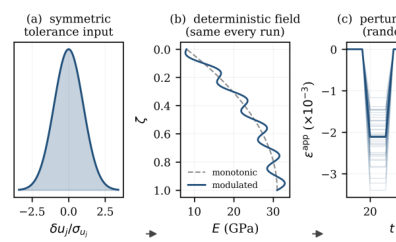 
Fig. 4: Propagation of variability along the computational pipeline. (a) The sampled geometric tolerance is a symmetric Gaussian, δuj ∼N(0, σ2 u) with σu = 0.02 mm and a ±3σu band. (b) The deterministic monotonic and periodically modulated property fields of Eq. (10) (wavelength λg); these are identical in every realization and are not randomized in the present uncertainty model. (c) The ensemble of perturbed equivalent loading histories obtained from the tolerance input through Eq. (14), which is the only randomized quantity. (d) The coupled solver returns a family of damage trajectories, the modulated mean lying systematically above the monotonic mean and reaching 0.03376 at t = 60 s...

📷 Fig 5

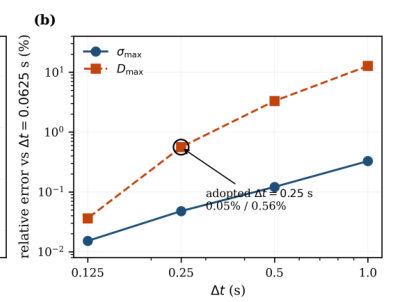 
Fig. 5: Quantitative spatial and temporal refinement of the reduced-order solver. (a) Spatial convergence against the M = 160 reference is close to second order; the adopted M = 40 (circled) gives 0.36% error in maximum stress and 4.71% in maximum damage. (b) Temporal convergence against the ∆t = 0.0625 s reference is first order, as expected from the explicit damage update; the adopted ∆t = 0.25 s (circled) gives 0.05% and 0.56% respectively. The shaded band in (a) marks resolutions below eight subdomains per modulation wavelength, where the sinusoidal term of Eq. (10) is aliased and the error is not a monotone function of M.

**Summary.** This paper presents a comprehensive multiphysics–probabilistic framework to model damage in advanced abradable coatings used in gas turbines. It uniquely integrates temperature-dependent viscoelasticity, progressive material damage, microstructural variations, and manufacturing geometric tolerances into one solver. The results highlight that considering these coupled uncertainties is critical for accurately assessing coating reliability.

**Why it may be interesting.** While highly applied to materials science, the rigorous implementation of nested Monte Carlo convergence with Wilson confidence intervals for quantifying uncertainty propagation in a complex coupled system is a sophisticated application of numerical methods relevant to reliability analysis in physics simulations.

Detailed structure

**Main problem.** To develop a unified framework for predicting damage accumulation in functionally graded abradable coatings by integrating multiple, often separate, physical effects.

**Main result.** The study shows that combining periodic property modulation and geometric tolerances significantly increases the predicted end-of-cycle damage risk compared to analyzing these factors independently or deterministically.

**Method.** A multiphysics–probabilistic framework is employed, coupling thermo-viscoelasticity, progressive damage laws, microstructural modulation, and Monte Carlo simulation for tolerance propagation.

**Model / system.** The system modeled is a local through-thickness column of an abradable coating used in aircraft engines. The model incorporates temperature-dependent viscoelastic softening (Prony series) and stress-driven damage evolution.

**Key observables.** Damage variable (D), stress concentrations, damage-exceedance probability ($P_e$), and effective stiffness evolution.

**Important parameters / regimes.** Temperature history $T(z, t)$, applied strain $\epsilon_{app}(t)$, deposition modulation parameters, and geometric tolerance bands ($\delta u$).

**Assumptions / limitations.** The analysis is a generic benchmark; it simplifies the problem by neglecting contact mechanics, wear depth prediction, and treating porosity via effective homogenization.

**Figures summary.** Figure 1 illustrates the block diagram of the multiphysics–probabilistic framework, showing the flow from input definitions through coupled solving to Monte Carlo sampling for outputs like exceedance probabilities.

**Paper structure.** The paper establishes the need for a unified model by identifying separate physical drivers (viscoelasticity, damage, modulation, tolerance). It details the coupling of these effects in the solver and presents results demonstrating how variability amplifies risk beyond deterministic predictions. The structure emphasizes verification procedures and limitations.

Abstract

In aircraft engines, functionally graded abradable coatings are used to control blade-tip clearance, but their durability is governed by effects that are often treated separately in existing models, including temperature-dependent viscoelastic softening, progressive damage, deposition-induced microstructural modulation, and geometric tolerances. This study integrates these effects within a unified multiphysics--probabilistic framework. The solved domain is a local through-thickness coating column driven by prescribed strain and temperature histories that include thermal eigenstrain and coating--substrate expansion mismatch. The results show that periodic property modulation increases end-of-cycle damage relative to the monotonic gradient and concentrates the maximum stress within a localized modulation crest. Propagating symmetric geometric tolerances through the coupled solver produces a strongly right-skewed damage distribution and a higher classification-level exceedance probability for the modulated gradient than for the monotonic gradient. This exceedance behavior cannot be obtained from a deterministic analysis performed at nominal geometry. The implementation is verified through spatial and temporal refinement, closed-form unit tests, nested Monte Carlo convergence with Wilson confidence intervals, and a hold-out-validated polynomial response surface. Numerical verification is clearly distinguished from experimental validation, and the simulated case is presented as a generic benchmark rather than an identified material model. The framework links deposition parameters and tolerance bands to damage-exceedance risk, supporting reliability-oriented screening of graded and multilayer coating systems.

[↑ back to top](#top)

### [Superconductivity, pseudogap and marginal Fermi liquid in a relative-momentum-local theory](http://arxiv.org/abs/2608.09785v1)

**Authors:** Jian-Jian Miao  
**Type:** theory · **Category:** strongly correlated electrons · **PDF:** <https://arxiv.org/pdf/2608.09785v1>  
**Analysis basis:** full PDF text, analyzed in chunks
**Topic relevance:** `Keldysh / 2PI / non-Gaussian methods` **3/5** · `methods for driven-dissipative` **1/5**

📷 Fig 1

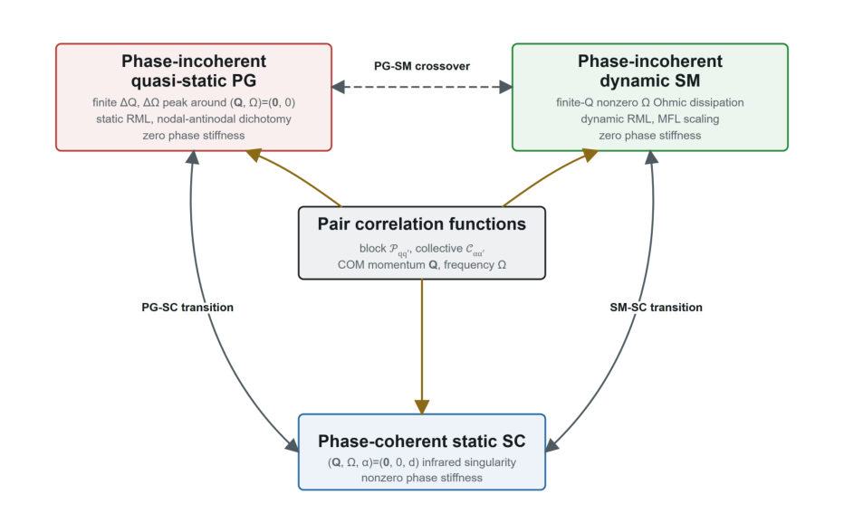 
Figure 1: Three infrared organizations of pair correlation functions. The block-resolved Cooper- pair correlation Pqq′ and the channel-resolved collective-pair correlation Cαα′ distinguish three infrared organizations. In the PG organization, enhanced block-diagonal pair autocorrelation Pqq produces a quasi-static, finite-width peak in Cdd around (Q, iΩm) = (0, 0), with finite ∆Q and ∆Ωand no phase stiffness. In the SM organization, the retarded pair spectral function Apair αα (Q, Ω) remains broad over finite COM momenta and nonzero real frequencies. The gapless particle-particle continuum supplies Ohmic damping, and the dynamic RML prescription can yield a marginal-Fermi-liquid self-energy...

📷 Fig 2

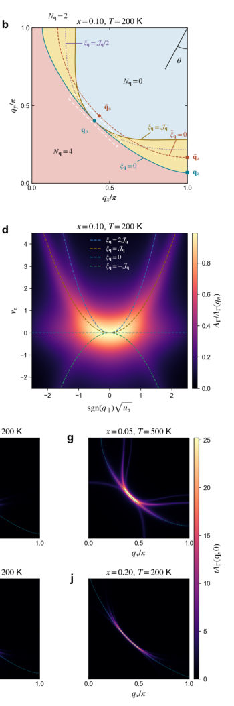 
Figure 2: BKT, pseudogap, and Fermi arc. a, Mean-field T∆d, defined as the highest temperature at which ˆHG,MF t-J has a nonzero d-wave saddle, and bare T (0) BKT obtained from the phase-only action with bare phase stiffness, which neglects long- distance vortex renormalization. b, Ground-state occupations of ˆHPG at x = 0.10. The occupation boundaries are S2e : ξq = 0 and S2h : ξq = Jq, while the punctured Luttinger surface is SL : ξq = Jq/2. c, The single-particle gap scales ∆sp of the exact PG model and ¯∆sp of the mean-field d-wave SC state, each evaluated along both the PG Fermi contour SPG and the Fermi surface SF, with all four curves multiplied by gt(x) = 2x/(1 + x). d,...

📷 Fig 3

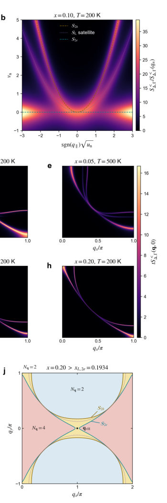 
Figure 3: Cooper surfaces and Lifshitz transition. a, Ground-state occupations of ˆHPG at x = 0.10, annotated with Nq = 4, 2, 0, the PG node qn, the antinode qa, the occupation boundaries S2e : ξq = 0 and S2h : ξq = Jq, and the punctured Luttinger surface SL : ξq = Jq/2; the white dashed window corresponds to panel b. b, Node-normalized zero-frequency S&lt; ∆,Γ(q, 0) at x = 0.10 and T = 200 K. The S2e and S2h guides are dashed, while the SL satellite is dotted; the local coordinates are un = κnq2 ∥/Γ and vn = vF,nq⊥/Γ. The two dominant pair-removal ridges follow S2e and S2h, whereas the weaker thermally activated intermediate satellite follows SL. c-e, Non- negative, Lorentzian-broadened...

**Summary.** This paper introduces a Relative-Momentum-Local (RML) theory to unify the description of superconductivity, pseudogap, and strange metal states in cuprates. It achieves this by analyzing how pair correlation functions organize into distinct static, quasi-static, or dynamic behaviors depending on the electronic phase. The work provides concrete diagnostic tools, such as spectral weight transfer and zero-energy ARPES features, to distinguish these correlated quantum phases.

**Why it may be interesting.** The unified theoretical framework connecting single-particle, pair, and thermodynamic responses across multiple correlated phases is highly relevant for understanding complex many-body dynamics in strongly interacting quantum materials.

Detailed structure

**Main problem.** The paper addresses how three distinct low-energy regimes—Superconductivity (SC), Pseudogap (PG), and Strange Metal (SM)—emerge from the same doped Mott system in cuprate superconductors.

**Main result.** A Relative-Momentum-Local (RML) theory unifies these descriptions by analyzing the infrared organization of a single Cooper channel, linking SC to phase coherence, PG to quasi-static correlations, and SM to dynamic damping.

**Method.** The authors construct an RML theory based on the $t$-$J$ model, using pair correlation functions ($P_{qq'}, C_{\alpha\alpha'}$) and spectral analysis to diagnose the crossover between regimes.

**Model / system.** The system is modeled as a doped Mott insulator governed by the $t$-$J$ Hamiltonian. The theory uses an RML approach that treats single-particle, pair-sensitive, and thermodynamic probes through various correlation functions.

**Key observables.** Phase stiffness (zero for PG/SM, non-zero for SC), spectral weight transfer in the pair spectrum ($A_{	ext{pair}}$), and zero-energy Cooper-surface ridges detectable by $2e$-ARPES.

**Important parameters / regimes.** Doping level, temperature relative to characteristic scales ($T^*$, $T_{BKT}$), and momentum/frequency variables ($\mathbf{Q}, \Omega$).

**Assumptions / limitations.** The theory relies on the Gutzwiller approximation for the no-double-occupancy constraint. The derivation of RML prescriptions from a common dressed Cooper kernel is noted as an open problem.

**Figures summary.** Figure 1 illustrates how pair correlators ($P_{qq'}$ and $C_{\alpha\alpha'}$) distinguish the three regimes: PG shows enhanced block-diagonal autocorrelation, while SM involves broad spectral functions over finite momenta.

**Paper structure.** The paper establishes the problem by noting the coexistence of SC, PG, and SM. It then develops the RML theory using pair correlation functions to map out distinct behaviors for each regime (static/quasi-static/dynamic). Finally, it discusses crossover mechanisms (PG-SM via spectral weight transfer; PG-SC/SM-SC via phase coherence restoration) and proposes key experimental signatures.

Abstract

Cuprate superconductors host \(d\)-wave superconductivity (SC), a pseudogap (PG) with Fermi arcs and a strange metal (SM) with incoherent excitations and temperature-linear resistivity. These regimes emerge from the same doped Mott system but are usually described separately. Here a relative-momentum-local (RML) theory is constructed, with the exact spin-singlet Cooper representation of antiferromagnetic superexchange in the \(t\)-\(J\) model serving as a common thread. Pair correlations organize the low-energy behaviour of this Cooper channel into phase-coherent static SC, phase-incoherent quasi-static PG and phase-incoherent dynamic SM. A static RML prescription yields an exactly solvable PG Hamiltonian with nodal electron poles, antinodal gaps, resolution-broadened Fermi arcs and gapless charge-\(2e\) Cooper surfaces. A Cooper-surface Lifshitz transition generates logarithmic enhancements in the specific-heat coefficient and charge response without a spin singularity. The particle-particle continuum at finite centre-of-mass momentum produces Ohmic damping, while a dynamic RML prescription yields a one-loop self-energy with marginal-Fermi-liquid scaling. Spectral-weight transfer in the physical pair spectrum diagnoses the PG--SM crossover, whereas nonzero phase stiffness and global phase coherence identify SC. The RML theory relates single-particle, pair-sensitive and thermodynamic probes to three infrared organizations of one Cooper channel. A decisive experimental signature would be zero-energy Cooper-surface ridges in two-electron angle-resolved photoemission spectroscopy (2e-ARPES).

[↑ back to top](#top)

### [Thermodynamic evidence for interaction-driven first-order topological quantum phase transitions](http://arxiv.org/abs/2608.08697v1)

**Authors:** Surajit Dutta, Nadav Auerbach, Chiho Yoon, Tonghang Han, Matan Uzan, Zhengguang Lu, Niladri-Sekhar Kander, Yaozhang Zhou, Yuri Myasoedov, Martin E. Huber, Kenji Watanabe, Takashi Taniguchi, Long Ju, Fan Zhang, Eli Zeldov  
**Type:** both · **Category:** statistical mechanics · **PDF:** <https://arxiv.org/pdf/2608.08697v1>  
**Analysis basis:** full PDF text, analyzed in chunks
**Topic relevance:** `analog quantum simulation` **2/5** · `quantum measurements` **2/5** · `Keldysh / 2PI / non-Gaussian methods` **1/5** · `driven-dissipative phase transition` **1/5** · `methods for driven-dissipative` **1/5** · `non-equilibrium universality` **1/5**

📷 Fig 1

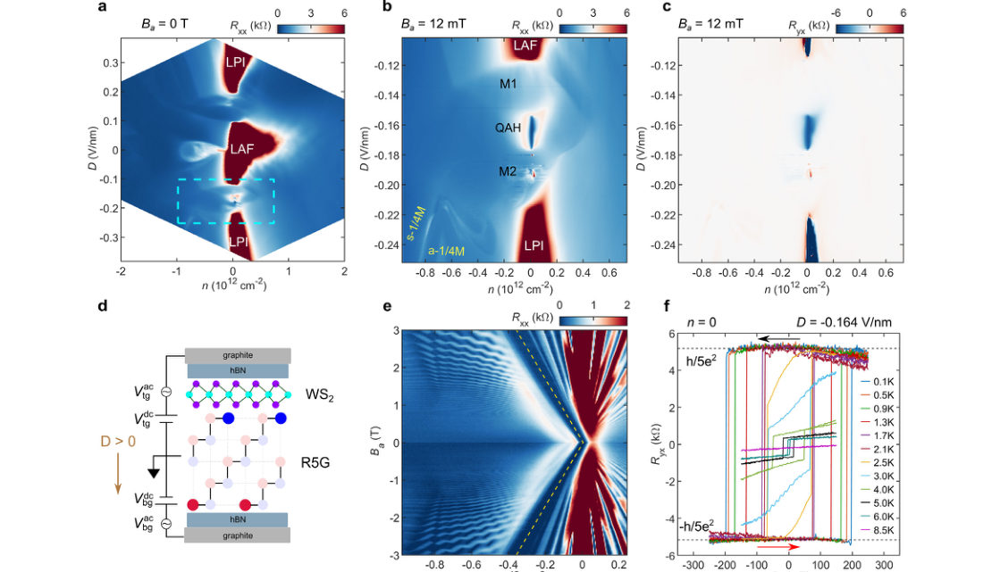 
Fig. 1. Transport measurements of WS2-proximitized rhombohedral pentalayer graphene. a, Longitudinal resistance 𝑅𝑅𝑥𝑥𝑥𝑥(𝑛𝑛, 𝐷𝐷) measured in zero magnetic field 𝐵𝐵𝑎𝑎 at 𝑇𝑇= 20 mK. b,c, High-resolution maps of 𝑅𝑅𝑥𝑥𝑥𝑥 (b) and Hall resistance 𝑅𝑅𝑦𝑦𝑦𝑦 (c) in the dashed cyan box in (a). d, Schematics of the R5G proximitized to WS2 device and of the electrical circuit. e, 𝑅𝑅𝑥𝑥𝑥𝑥(𝑛𝑛, 𝐵𝐵𝑎𝑎) at 𝐷𝐷= −0.164 V/nm at 𝑇𝑇= 100 mK. The yellow dotted lines represent the Streda formula fits with 𝐶𝐶= ±5. f, 𝑅𝑅𝑦𝑦𝑦𝑦 as a function of sweeping 𝐵𝐵𝑎𝑎 up (red arrow) and down (black arrow) in the QAH state at 𝐷𝐷= −0.164 V/nm at different indicated temperatures.

📷 Fig 2

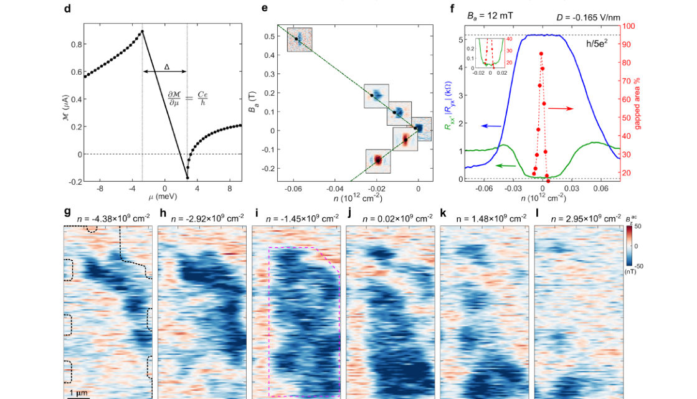 
Fig. 2. Orbital magnetism in the QAH state. a, Schematics of the scanning SOT imaging setup (bottom), optical image of the device (top-right), and schematics of the different modulation schemes 𝑉𝑉𝑡𝑡𝑡𝑡 𝑎𝑎𝑎𝑎, 𝑉𝑉𝑏𝑏𝑏𝑏

📷 Fig 3

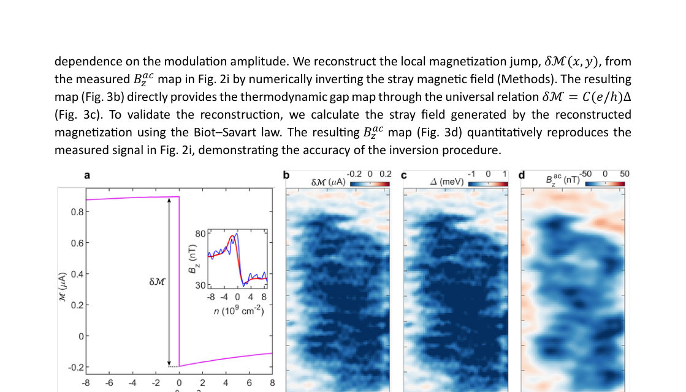 
Fig. 3. Local magnetization reconstruction and thermodynamic gap of QAH state. a, Calculated orbital magnetization ℳ(𝑛𝑛) as a function of 𝑛𝑛 in the QAH state within the scHF theory (equivalent to ℳ(𝜇𝜇) in Fig. 2d), showing a sharp jump 𝛿𝛿ℳ= 𝐶𝐶 𝑒𝑒 ℎ∆ across the topological gap. Inset: Red curve, integrated

📷 Fig 4

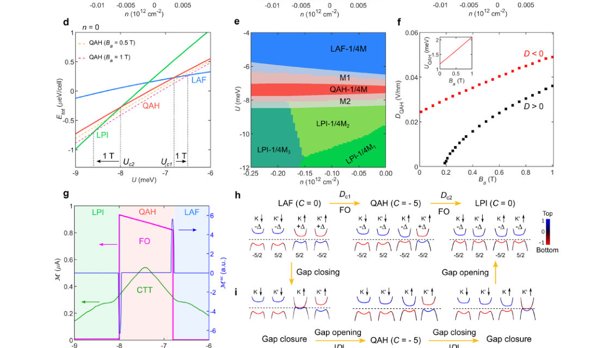 
Fig. 4. First-order QAH phase transition. a, 𝐵𝐵𝑧𝑧𝑎𝑎𝑎𝑎(𝑛𝑛, 𝐷𝐷) at a fixed location acquired at 𝐵𝐵𝑎𝑎= 10.8 mT and 𝑇𝑇= 20 mK using purely 𝑛𝑛𝑎𝑎𝑎𝑎 modulation. b, The same as (a) but using purely 𝐷𝐷𝑎𝑎𝑎𝑎 modulation. c, 𝐷𝐷𝑎𝑎𝑎𝑎 modulated differential Hall resistance 𝑅𝑅𝑦𝑦𝑦𝑦 𝑎𝑎𝑎𝑎= 𝐷𝐷𝑎𝑎𝑎𝑎𝜕𝜕𝑅𝑅𝑦𝑦𝑦𝑦/𝜕𝜕𝜕𝜕 as a function of 𝑛𝑛 and 𝐷𝐷 at 𝐵𝐵𝑎𝑎= 12 mT. Two sharp opposite polarity signals at 𝐷𝐷𝑐𝑐1 = −0.154 V/nm and 𝐷𝐷𝑐𝑐2 = −0.178 V/nm (arrows) indicate the FO phase transitions between the LAF, QAH, and LPI states, consistent with the local 𝐵𝐵𝑧𝑧𝑎𝑎𝑎𝑎 response in (b) and in Extended Data Fig. 4. d, Calculated scHF energy 𝐸𝐸𝑡𝑡𝑡𝑡𝑡𝑡 vs. displacement potential 𝑈𝑈 of the competing states at 𝑛𝑛 = 0: LAF (blue), LPI...

📷 Fig 5

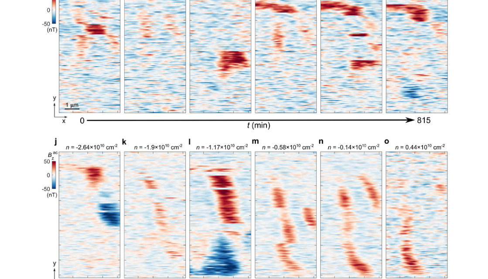 
Fig. 5. Fluctuating strongly correlated phases. a, 𝑅𝑅𝑥𝑥𝑥𝑥(𝑛𝑛, 𝐷𝐷) map in the vicinity of M2 state showing pronounced fluctuations. b, The same as (a) but for 𝑅𝑅𝑦𝑦𝑦𝑦. c, 𝐵𝐵𝑧𝑧𝑎𝑎𝑎𝑎(𝑛𝑛, 𝐷𝐷) measured in the area marked by a dashed frame in (a). d-i, Time-sequence of 𝐵𝐵𝑧𝑧𝑎𝑎𝑎𝑎(𝑥𝑥, 𝑦𝑦) images of the sample area using 𝑉𝑉𝑏𝑏𝑏𝑏

**Summary.** This work reports the first direct thermodynamic evidence for first-order topological quantum phase transitions in a graphene system. By using nanoscale magnetometry on a QAH state, the authors observed discontinuous jumps in local orbital magnetization as the system transitioned between competing correlated states. This establishes a framework where strong electron interactions drive abrupt, first-order changes rather than smooth, continuous evolution.

**Why it may be interesting.** It provides a concrete, measurable signature (discontinuous jumps in order parameters) for interaction-driven topological transitions, which is highly relevant for understanding non-equilibrium or strongly interacting quantum systems beyond simple mean-field theory predictions.

Detailed structure

**Main problem.** To provide direct thermodynamic evidence for first-order topological quantum phase transitions driven by electron-electron interactions, contrasting with the conventional view of continuous transitions.

**Main result.** The sequential transitions between different correlated insulating states (LAF, QAH, LPI) were shown to be first-order, evidenced by discontinuous changes in local orbital magnetization and phase coexistence near boundaries.

**Method.** Combining direct real-space imaging using nanoSQUID on tip magnetometry with self-consistent Hartree-Fock calculations to map out the thermodynamic landscape of competing phases.

**Model / system.** The study uses a spin-orbit proximitized rhombohedral graphene quantum anomalous Hall (QAH) state, which hosts multiple competing correlated insulating states.

**Key observables.** Local orbital magnetization ($B_z$), quantized Hall conductance ($\sigma_{xy}$), and the reconstruction of the local thermodynamic gap ($\Delta$).

**Important parameters / regimes.** Carrier density ($n$) and transverse displacement field ($D$); phase competition between LAF, QAH, and LPI states.

**Assumptions / limitations.** The interpretation relies on using local magnetization as a direct thermodynamic order parameter to distinguish first-order jumps from continuous changes.

**Figures summary.** Figures map out the phase boundaries in terms of $n$ vs. $D$, showing distinct regions corresponding to different magnetic and topological states, alongside visualizations of the local magnetization evolution.

**Paper structure.** The paper establishes the problem by contrasting expected continuous transitions with predicted first-order ones; it then presents experimental measurements using SQUID magnetometry to image magnetization across phase boundaries, culminating in the conclusion that these are first-order due to observed discontinuities and domain fluctuations.

Abstract

Topological quantum phase transitions in non interacting systems occur through continuous gap closing and reopening. In strongly interacting systems, however, competing ordered states have long been predicted to drive first order transitions, although this possibility has remained experimentally unresolved. Recent transport studies of correlated phases in charge neutral rhombohedral graphene were interpreted as evidence for continuous topological transitions. Here, using nanoSQUID on tip magnetometry, we directly image the local orbital magnetization of a spin orbit proximitized rhombohedral graphene quantum anomalous Hall (QAH) state. We provide the first real space visualization of a QAH phase with a record Chern number, reconstruct its local thermodynamic gap, and track the evolution of its magnetization across competing correlated states. Combined with self consistent Hartree Fock calculations, these measurements show that the sequential transitions between the layer antiferromagnetic, QAH, and layer polarized insulating states are first order, accompanied by discontinuous changes in orbital magnetization. Near the phase boundaries, we observe fluctuating magnetic domains, providing direct microscopic evidence of phase coexistence between nearly degenerate competing ordered states. Together, these observations provide the first direct thermodynamic evidence for first order topological quantum phase transitions and establish a microscopic framework for understanding interaction driven topological quantum phase transitions through phase competition and coexistence.

[↑ back to top](#top)

### [Parity-Resolved Quantum Capacitance and Quantum Inductance in Topological, Trivial, and Normal Nanowire Interferometers](http://arxiv.org/abs/2608.09334v1)

**Authors:** Viktoriia Pinchenkova, Valerii K. Kozin, Maximilian Hünenberger, Daniel Loss, Jelena Klinovaja  
**Type:** theory · **Category:** other · **PDF:** <https://arxiv.org/pdf/2608.09334v1>  
**Analysis basis:** full PDF text, analyzed in chunks
**Topic relevance:** `quantum measurements` **2/5** · `Keldysh / 2PI / non-Gaussian methods` **1/5** · `analog quantum simulation` **1/5** · `driven-dissipative phase transition` **1/5** · `interference shaping light` **1/5** · `methods for driven-dissipative` **1/5**

📷 Fig 1

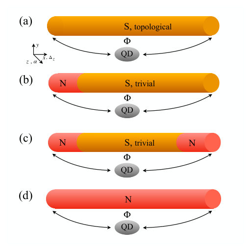 
FIG. 1. Different interferometric setups considered in this work. A Rashba nanowire (NW) is aligned along the x axis. The SOI vector points in the z direction and the magnetic field in the x direction. A quantum dot (gray) is coupled to the left and right ends of the NW, forming an interferometric loop that encloses a magnetic flux Φ. (a) The NW is covered by a superconductor, which induces superconductivity (S) via the proximity effect. The NW is tuned to the topological regime, where it can host MBSs localized at its ends. (b) The NW is tuned to the trivial phase. The left segment is not covered by the superconductor and remains normal (N), allowing for an ABS localized near the S–N...

📷 Fig 2

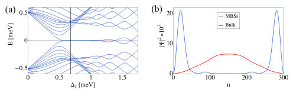 
FIG. 2. (a) Energy spectrum of the nanowire uncoupled from the QD in the topological interferometer, as a function of the Zeeman energy ∆Z. (b) Probability density of the MBSs and the lowest-energy bulk state at ∆Z = 0.675 meV [indicated by the black line in (a)]. The chosen ∆Z lies in the topological phase and yields nearly zero MBS energy splitting, resulting in states localized at the nanowire ends with negligible over- lap. The parameters are listed in Table I in Appendix E.

📷 Fig 3

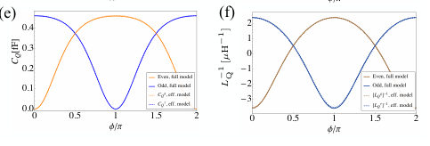 
FIG. 3. (a) Low-energy spectrum of the topological interfer- ometer. (b) Difference between quantum capacitance in the even and odd parity sectors ∆CQ as a function of VQD. (c), (e) Even and odd branches of the quantum capacitance CQ and (d), (f) the quantum inductance L−1 Q at VQD = 0.75 meV and VQD = 0.82 meV [indicated by the black lines in (b)]. In all presented cases, CQ(ϕ) and L−1 Q (ϕ) exhibit a 2π-periodicity and π phase shift. The effective model [dashed lines in (c)- (f)] reproduces the results of the full Hamiltonian (solid lines). The parameters are listed in Table I in Appendix E.

📷 Fig 4

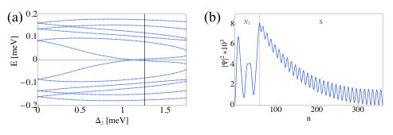 
FIG. 4. (a) Energy spectrum of the nanowire uncoupled from the QD in the non-topological interferometer with one ABS. (b) Probability density of the ABS at the Zeeman energy ∆Z = 1.26 meV [indicated by the black line in (a)]. The chosen ∆Z, together with a small superconducting gap ∆0 = 0.09 meV, results in a finite probability density at the right end of the nanowire, allowing the ABS to couple to the QD from both ends. The parameters are listed in Table II in Appendix E.

📷 Fig 5

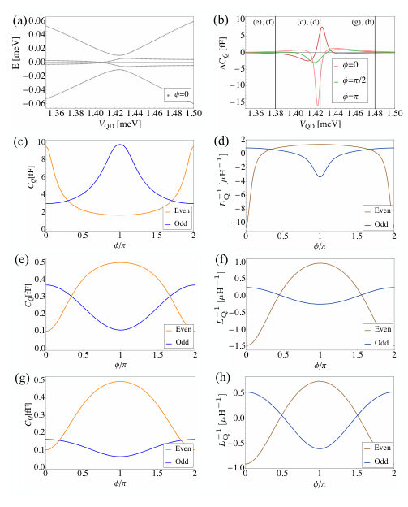 
FIG. 5. (a) Low-energy spectrum of the non-topological in- terferometer with one ABS. (b) Difference between quantum capacitance in the even and odd parity sectors ∆CQ as a function of VQD. (c), (e), (g) Even and odd branches of the quantum capacitance CQ and (d), (f), (h) quantum in- ductance L−1 Q at VQD = 1.425 meV, VQD = 1.38 meV and VQD = 1.48 meV [indicated by the black lines in (b)]. In this parameter regime, CQ(ϕ) and L−1 Q (ϕ) show Majorana-like be- havior, namely 2π periodicity and nearly π phase shift. The parameters are listed in Table II in Appendix E.

**Summary.** The paper investigates whether quantum capacitance and inductance measurements can uniquely identify Majorana bound states in nanowire interferometers. By comparing results from topological, trivial, and normal wire models, the authors demonstrate that similar flux-dependent signatures are not exclusive to MBSs. They propose that more complex diagnostics, such as observing specific charge-$2e$ periodic components, are necessary for definitive topological identification.

**Why it may be interesting.** This work directly addresses a major experimental challenge in condensed matter physics: developing unambiguous signatures to confirm topological superconductivity using transport measurements.

Detailed structure

**Main problem.** To determine if characteristic quantum capacitance ($C_Q$) and inverse quantum inductance ($L_Q^{-1}$) oscillations are uniquely indicative of topological Majorana bound states (MBSs), or if similar signatures can arise from trivial superconducting physics.

**Main result.** The standard Majorana-like patterns observed in $C_Q$ and $L_Q^{-1}$ are not unique to the topological phase, as they can emerge from trivial Andreev bound states or normal wires. A clear non-Majorana signature was found using two nearly zero-energy ABSs.

**Method.** The authors computed parity-resolved quantum capacitance and inverse quantum inductance by exactly diagonalizing the system Hamiltonian for four different nanowire realizations (topological, single/two-ABS, normal).

**Model / system.** The study analyzes a quantum dot coupled to an interferometer loop formed by various superconducting or normal nanowires. The model uses a 1D Rashba nanowire Hamiltonian and calculates observables using the Bogoliubov–de Gennes framework.

**Key observables.** Parity-resolved quantum capacitance ($C_Q$) and inverse quantum inductance ($L_Q^{-1}$), measured as functions of magnetic flux ($\Phi$).

**Important parameters / regimes.** Magnetic flux ($\Phi$), superconducting gap ($\Delta$), coupling amplitudes ($\lambda_L, \lambda_R$), and disorder strength ($\delta\mu$).

**Assumptions / limitations.** The analysis compares results from topological, single-ABS, two-ABS, and normal wire regimes; the effective model relies on perturbative expansion for small couplings.

**Figures summary.** Figures illustrate the four different nanowire setups (Topological, Trivial, Non-topological, Normal) and show calculated $C_Q(\phi)$ and $L_Q^{-1}(\phi)$ curves for various regimes.

**Paper structure.** The paper introduces the problem of distinguishing topological signatures from trivial ones using capacitance/inductance. It details the theoretical framework by calculating observables in the full model, deriving an effective low-energy Hamiltonian, and comparing results across different physical realizations (topological vs. non-topological).

Abstract

Quantum-capacitance measurements convert the curvature of a quantum-dot energy in a flux-threaded nanowire loop into fast parity-sensitive signals and, therefore, have become a promising readout tool for Majorana devices. However, Majorana-like quantum-capacitance responses can also arise from topologically trivial Andreev bound states, making capacitance alone insufficient to identify a topological phase. To analyze this problem, we consider a quantum dot coupled to both ends of four nanowire realizations: a topological nanowire hosting Majorana bound states, non-topological superconducting nanowires hosting one or two Andreev bound states, and a fully normal nanowire. Motivated by proposals to use quantum inductance as an additional phase-sensitive probe, we compute both the parity-resolved quantum capacitance $C_\mathrm{Q}$ and inverse quantum inductance $L_\mathrm{Q}^{-1}$ as functions of the magnetic flux by exact diagonalization. We show that signatures associated with zero-energy Majorana bound states, such as $h/e$ periodicity and an $h/(2e)$ flux shift between even and odd parity sectors in $C_\mathrm{Q}$ and $L_\mathrm{Q}^{-1}$, are not sufficient indicators of topological superconductivity. In certain realistic parameter regimes, similar Majorana-like behavior can arise from a trivial Andreev bound state and even from a purely normal nanowire. By contrast, two nearly zero-energy Andreev bound states can generate a pronounced $h/(2 e)$-periodic component associated with charge-$2e$ transfer, providing a clear non-Majorana signature. A low-energy projection shows that the Majorana, single-Andreev-state, and normal cases can be mapped onto the same minimal low-energy model explaining their similar flux-dependent responses despite their different physical origins.

[↑ back to top](#top)

### [Magnetoelastic coupling in stripe-domain states of yttrium iron garnet](http://arxiv.org/abs/2608.08353v1)

**Authors:** Nimisha Arora, Daniel Prestwood, Takashi Kikkawa, Eiji Saitoh, Jack Gartside, Will Branford, Hidekazu Kurebayashi  
**Type:** both · **Category:** other · **PDF:** <https://arxiv.org/pdf/2608.08353v1>  
**Analysis basis:** full PDF text, analyzed in chunks
**Topic relevance:** `driven-dissipative phase transition` **2/5** · `analog quantum simulation` **1/5** · `correlated / nonlocal dissipation` **1/5** · `methods for driven-dissipative` **1/5** · `quantum measurements` **1/5**

📷 Fig 1

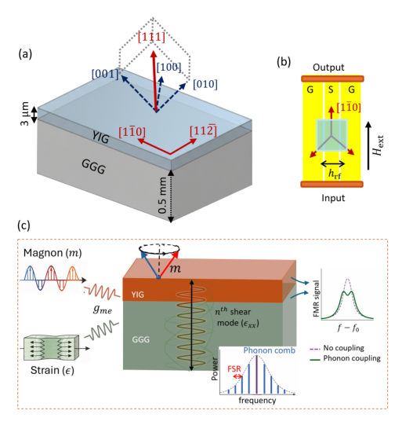 
FIG. 1. (a) Schematic of a 3 µm-thick YIG thin film epi- taxially grown on a GGG substrate oriented along the [111] direction. (b) Schematic of the FMR measurement geometry, showing the static external magnetic field applied in the film plane along the [1¯10] direction. (c) Conceptual illustration of magnetoelastic coupling in the YIG/GGG heterostructure: microwave-driven magnons in YIG generate strain and excite confined thickness-shear phonon modes in GGG, forming a dense phonon comb. The phonons then couple back to the magnons and perturb the FMR response.

📷 Fig 2

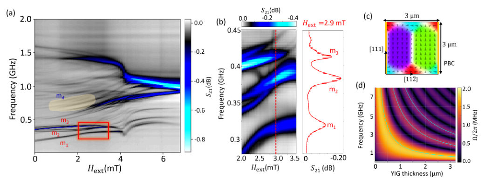 
FIG. 2. (a) Field–frequency microwave transmission spectrum (S21) of a YIG(3 µm)/GGG heterostructure measured using broadband CPW-FMR. Multiple magnon branches are labeled m1–m4. (b) Zoomed microwave transmission spectral map for frequencies below 0.5 GHz and a magnetic-field range 2.0–3.5 mT. The transmission spectrum at a representative field of 2.9 mT (red vertical line in two-dimensional spectral map) is shown on the right to highlight the periodic phonon modulation. (c) Micromagnetically simulated remanent magnetization state of the YIG film, computed in a 3 µm × 3 µm cross-sectional cell with periodic boundary conditions along the lateral ([11¯2]) direction, revealing a stripe...

📷 Fig 3

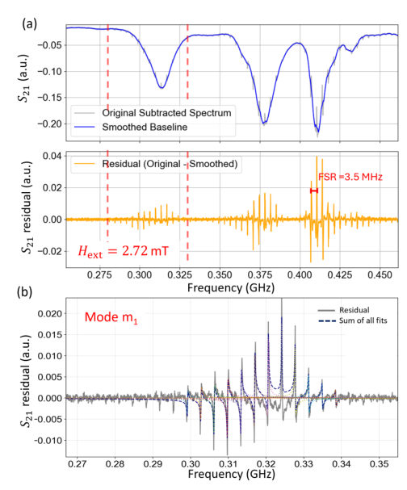 
FIG. 3. (a) Representative frequency sweep at fixed mag- netic field, showing the raw spectrum together with a smooth background representing the broad magnon response of modes m1-m4. (b) Residual spectrum obtained after background subtraction, revealing narrow, periodically spaced peak–dip features with free spectral range ∆f ≈3.5 MHz.

📷 Fig 4

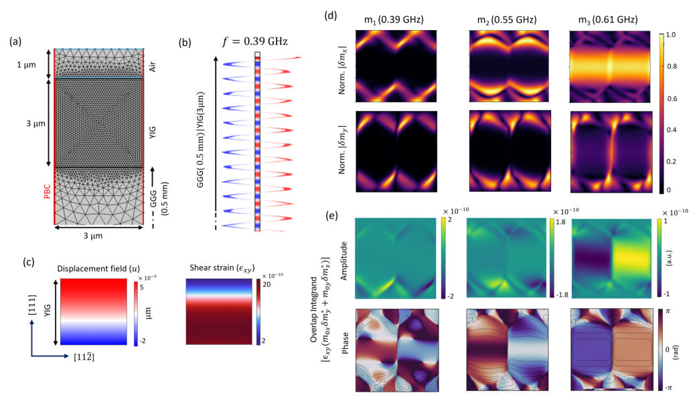 
FIG. 4. Finite-element and micromagnetic analysis of the projected magnetoelastic overlap in the stripe-domain YIG/GGG heterostructure. (a) Meshed simulation geometry consisting of a 3 µm YIG film on a 0.5 mm GGG substrate. Periodic boundary conditions are applied along the lateral edges, and an air domain is included above the YIG layer to account for the magnetic stray field. (b) Spatial displacement field of the YIG/GGG heterostructure at a representative phonon frequency, driven by a magnetoelastic body load in the YIG and a boundary load at the YIG/GGG interface. The scaled deformation illustrates the distribution of ux and uy across the heterostructure, confirming a thickness-shear...

📷 Fig 5

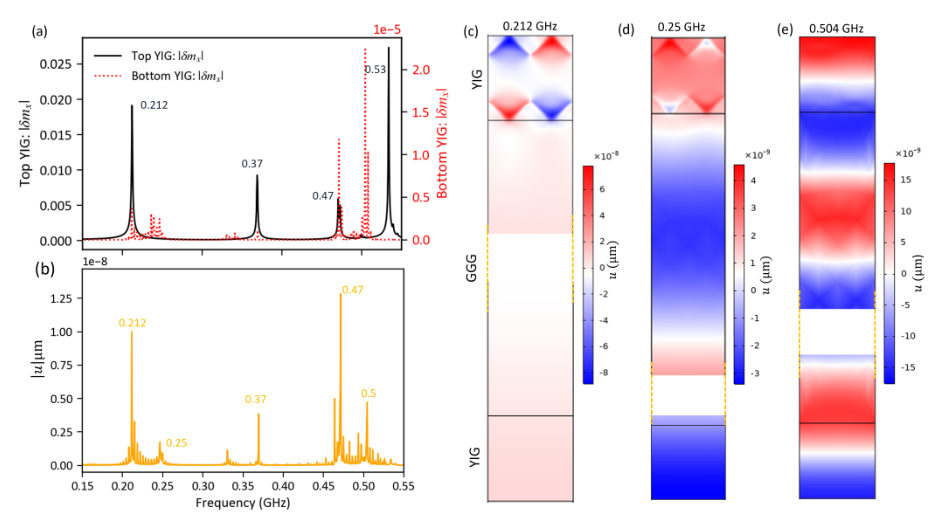 
FIG. 5. Fully coupled magnetoelastic simulation of phonon-mediated magnon transfer in a YIG/GGG/YIG structure. (a) Simulated dynamic magnetization spectra, obtained from the Fourier amplitude of δmx, for the rf-driven top YIG layer and the indirectly excited bottom YIG layer via phonons. (b) Corresponding phonon spectrum generated by the driven top-layer magnon dynamics, showing several shear-cavity modes within the magnetic resonance bandwidth. (c)–(e) Displacement-field profiles ux of the coupled YIG/GGG/YIG system at representative frequencies (0.21, 0.25, 0.5 GHz).

**Summary.** This research explores the weak coupling between magnons in YIG films and substrate phonons via magnetoelastic interaction. Using FMR measurements and coupled simulations, the authors demonstrate that while local coupling is strong, the net measurable coupling is suppressed by destructive interference across the magnetic stripe domains. This establishes that engineering the internal magnetic texture is a key method for controlling magnon-phonon energy transfer.

**Why it may be interesting.** This work provides a concrete example of how complex, spatially varying internal degrees of freedom (magnetic textures) can act as highly effective control parameters to suppress or mediate energy transfer between two distinct quantum excitation modes (magnons and phonons).

Detailed structure

**Main problem.** The study investigates magnetoelastic coupling between microwave-driven magnons in YIG thin films and confined thickness-shear phonon modes in the GGG substrate.

**Main result.** While local coupling is sizable, the measurable coherent magnon-phonon coupling is strongly suppressed by phase and domain-sign cancellation across the stripe texture. Efficient phonon generation requires spatially asymmetric magnon modes.

**Method.** The work combines broadband Ferromagnetic Resonance (FMR) measurements with advanced finite-element simulations that couple micromagnetics to solid mechanics.

**Model / system.** The system is a YIG/GGG heterostructure exhibiting stripe-domain magnetic states. The coupling is modeled using linearized magnetoelastic energy densities and analyzed via coupled harmonic oscillator equations in the weak-coupling limit.

**Key observables.** Low-frequency magnon branches modulated by a field-independent phonon comb, coupling rates (0.33–0.54 MHz), and the mean cooperativity ($C < 1$).

**Important parameters / regimes.** Stripe periodicity ($\approx 3 \mu	ext{m}$), phonon spacing ($\Delta f \approx 3.5$ MHz), and the weak-coupling regime.

**Assumptions / limitations.** The analysis assumes the weak-coupling limit, and simulations are performed in a 2D cross-section capturing stripe modulation.

**Figures summary.** Figures illustrate the FMR setup on YIG/GGG along [111], showing magnon branches modulated by phonon combs. Simulations visualize the spatial overlap integrand ($I_{2D}^{xy,i}$) and displacement fields ($\mathbf{u}_x, \mathbf{u}_y$) demonstrating symmetry effects.

**Paper structure.** The paper progresses from experimental observation (FMR revealing phonon comb) to theoretical modeling (coupled harmonic oscillators), detailed simulation analysis (calculating overlap integrals $\eta_i$), and finally concluding with the physical mechanism controlling coupling strength via magnetic texture asymmetry.

Abstract

We study magnetoelastic coupling in stripe-domain magnetic states of $3\,\mathrm{μm}$-thick YIG thin films grown on a GGG substrate. Broadband ferromagnetic resonance reveals low-frequency stripe-domain magnon branches modulated by a field-independent phonon comb with a frequency spacing of $3.5\,\mathrm{MHz}$, matching the value predicted for confined thickness-shear modes of the GGG substrate. Analytical fitting yields coupling rates that vary between $0.33$--$0.54\,\mathrm{MHz}$ and cooperativities of order $10^{-1}$, indicating that the system is in the weak-coupling regime without resolvable avoided-crossing gaps. Magnon-phonon mode-overlap calculations using finite-element simulations show that the weak coupling arises from phase and domain-sign cancellation: the local magnetoelastic coupling is sizable, but more than $99\%$ of the coherent overlap cancels across the stripe texture. Fully coupled simulations further demonstrate phonon-mediated excitation of a remote YIG layer and show that efficient propagating-phonon generation requires spatially asymmetric magnon modes, establishing magnetic texture as a control parameter for magnon--phonon coupling.

[↑ back to top](#top)

### [Disorder-robust trivial Majorana-like states from smooth confinement in chiral superconducting nanowires](http://arxiv.org/abs/2608.09758v1)

**Authors:** Eslam Ahmed, Jorge Cayao, Yukio Tanaka  
**Type:** theory · **Category:** other · **PDF:** <https://arxiv.org/pdf/2608.09758v1>  
**Analysis basis:** full PDF text, analyzed in chunks
**Topic relevance:** `analog quantum simulation` **2/5** · `correlated / nonlocal dissipation` **1/5** · `quantum measurements` **1/5**

📷 Fig 1

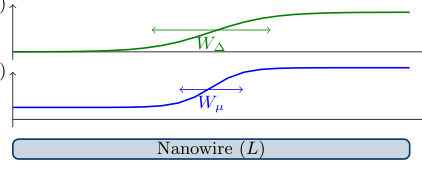 
FIG. 1. Schematic sketch of the system. A 1D Rashba nanowire of length L with inhomogeneous chemical poten- tial µ and induced pair potential ∆. The spatial profile of µ and ∆are displayed.

📷 Fig 2

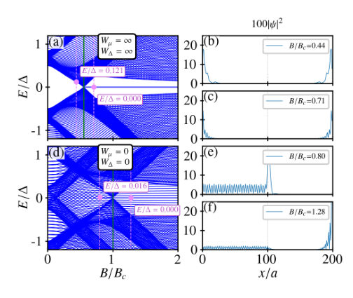 
FIG. 2. Low-energy spectrum for uniform superconduc- tor with Wµ = W∆= ∞(a) and for NS junction with Wµ = W∆= 0 (d). The right panels show the lowest posi- tive energy level wavefunction probability density at two fixed Zeeman fields for the uniform superconductor case (b,c) and NS junction case (e,f). The fixed Zeeman fields used to plot the wavefunctions are indicated by the pink dashed lines in panels (a, d). We also show the energies of the plotted wave- functions. The green line indicates the bulk gap closing point Bc2.

📷 Fig 3

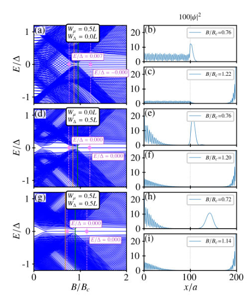 
FIG. 3. Low-energy spectrum for inhomogeneous nanowire with Wµ = 0.5L, W∆= 0 (a), Wµ = 0, W∆= 0.5L (c), and Wµ = W∆= 0.5L (e). The right panels show the low- est positive energy level wavefunction probability density at two fixed Zeeman fields for Wµ = 0.5L, W∆= 0 case (b), Wµ = 0, W∆= 0.5L case (d), and Wµ = W∆= 0.5L case (f). The fixed Zeeman fields used to plot the wavefunctions are indicated by the pink dashed lines in panels (a, c). The green line indicates the bulk gap closing point, Bc2, while the orange line indicates the critical Zeeman field separating disorder-fragile and disorder-robust zero-energy states, Bc1.

📷 Fig 4

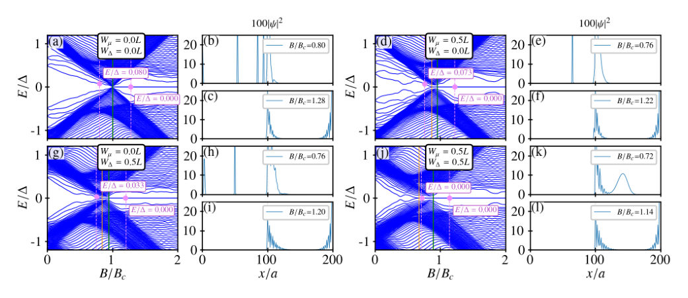 
FIG. 4. Impurity-averaged Low-energy spectrum for inhomogeneous nanowire in the presence of strong on-site disorder on the left half of the system with Wµ = W∆= 0 (a), Wµ = 0.5L, W∆= 0 (c), Wµ = 0, W∆= 0.5L (e), and Wµ = W∆= 0.5L (g). The remaining panels show the lowest positive energy level wavefunction probability density at two fixed Zeeman fields for Wµ = W∆= 0 case (b), Wµ = 0.5L, W∆= 0 case (d), Wµ = 0, W∆= 0.5L case (f), and Wµ = W∆= 0.5L case (h). The fixed Zeeman fields used to plot the wavefunctions are indicated by the pink dashed lines in panels (a, c, e, g). The green line indicates the bulk gap closing point while the orange line indicates the critical Zeeman field separating...

📷 Fig 5

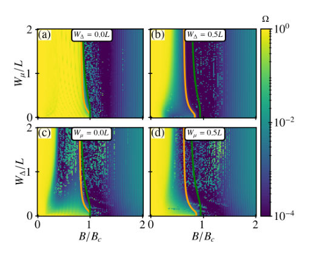 
FIG. 5. Spatial overlap (Ω) between the two chiral com- ponents of the lowest positive energy level as a function of applied Zeeman field and Wµ for W∆= 0 (a), and for W∆= 0.5L (b) and as a function of applied Zeeman field and W∆for Wµ = 0 (c) and Wµ = 0.5L (d). The green line indicates the bulk gap closing point while the orange line indi- cates the critical Zeeman field separating disorder-fragile and disorder-robust zero-energy states. Note that the value of the lowest positive energy level is not constant and depends on B, Wµ, and W∆.

**Summary.** The paper develops a criterion based on the 'chiral overlap' to determine if zero-energy states in superconducting nanowires are truly topologically protected or merely artifacts of smooth confinement. It shows that smooth inhomogeneity can create robust, yet globally trivial, Majorana-like states by spatially separating opposite chiral components. This offers a new diagnostic tool independent of bulk topological invariants.

**Why it may be interesting.** This work provides a powerful, symmetry-based diagnostic tool (the chiral overlap) to distinguish between true topological protection and geometrically/smoothly induced robustness in superconducting mesoscopic systems, which is highly relevant for understanding engineered quantum devices.

Detailed structure

**Main problem.** The primary goal is to distinguish between near-zero energy states (Majorana-like Andreev bound states) protected by global bulk topology versus those arising from local mechanisms like smooth confinement or disorder.

**Main result.** Smooth spatial inhomogeneity can generate zero-energy states that are robust against strong, chiral-symmetry-preserving disorder even when the system is globally topologically trivial. This robustness is diagnosed by the real-space overlap of opposite-chirality components.

**Method.** The analysis involves decomposing the low-energy state into two opposite-chirality components ($\phi_+$ and $\phi_-$) and deriving a criterion showing that energy shifts due to disorder are bounded by their spatial overlap ($\Omega$).

**Model / system.** The system modeled is a chiral superconducting nanowire described by a Bogoliubov–de Gennes Hamiltonian possessing chiral symmetry. The model incorporates smooth variations in the chemical potential $\mu(x)$ and pairing gap $\Delta(x)$.

**Key observables.** Chiral overlap ($\Omega$), energy splitting ($\delta E^{(1)}$), and the spatial separation of opposite-chirality components.

**Important parameters / regimes.** The analysis focuses on regimes defined by critical magnetic fields ($B_{c1}, B_{c2}$) relative to the superconducting gap $\Delta_0$.

**Assumptions / limitations.** The perturbation (disorder) is assumed to preserve chiral symmetry ($\{V, \Gamma\} = 0$).

**Figures summary.** Figures illustrate how smooth confinement leads to partially separated chiral components above a critical field ($B_{c1}$), and show that this separation persists under strong disorder only in the doubly smooth case.

**Paper structure.** The paper first derives the general criterion based on chiral overlap, then introduces the specific model of the inhomogeneous nanowire, and finally analyzes the trivial zero modes' response to disorder using this diagnostic tool.

Abstract

Near-zero-energy states in Majorana nanowires can arise from topologically trivial mechanisms such as smooth spatial inhomogeneity and disorder, making zero-energy pinning alone insufficient evidence of bulk topology. Here we identify a real-space mechanism governing their robustness to symmetry-preserving disorder. For a chiral-symmetric Bogoliubov-de Gennes Hamiltonian, we decompose a low-energy state into two normalized components of opposite chirality and show that disorder-induced splitting is bounded by their spatial overlap. We demonstrate this result in a finite Rashba nanowire with smooth chemical potential and pairing profiles. Below the bulk topological transition, smooth confinement produces partially separated chiral components with exponentially small overlap, yielding globally trivial Majorana-like Andreev bound states that remain near zero energy even under strong scalar, nonmagnetic disorder. The chiral overlap therefore provides a direct diagnostic of the protection of low-energy states against local perturbations, independent of the bulk topological invariant.

[↑ back to top](#top)

### [Electronic bistability, discontinuous switching and stochasticity in a two-dimensional semiconductor](http://arxiv.org/abs/2608.08828v1)

**Authors:** S. Jana, M. Kravtsov, A. Ermakov, X. Zhou, A. Kudriashov, L. Elesin, X. Zhou, A. L. Shilov, D. A. Svintsov, T. Taniguchi, K. Watanabe, K. S. Novoselov, A. Avsar, A. Principi, D. A. Bandurin  
**Type:** experiment · **Category:** other · **PDF:** <https://arxiv.org/pdf/2608.08828v1>  
**Analysis basis:** full PDF text, analyzed in chunks
**Topic relevance:** `quantum measurements` **2/5** · `driven-dissipative phase transition` **1/5**

📷 Fig 1

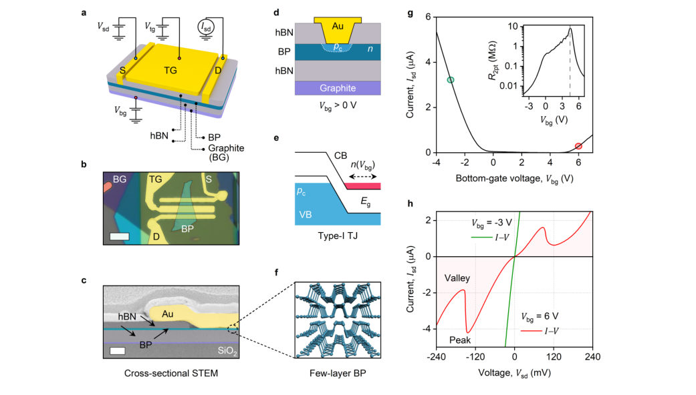 
FIG. 1. Transport characteristics of the BP transistor. a, Schematic of the BP device with the electrode configurations, i.e., source (S), drain (D), top gate (TG), and bottom gate (BG). b, A false-coloured digital photograph of the device (scale bar: 5 µm). c, False-coloured cross-sectional STEM micrograph showing the interfaces between various layers of a typical device fabricated with transferred VIA contact (scale bar: 60 nm). Schematics showing d, the formation of a Type-I tunnel junction (TJ) at the Au–BP interface (pc–n) induced by the bottom gate and e, energy band alignment for the same. f, Side view of few-layer BP. g, Low-bias transfer characteristic of the device under the...

📷 Fig 2

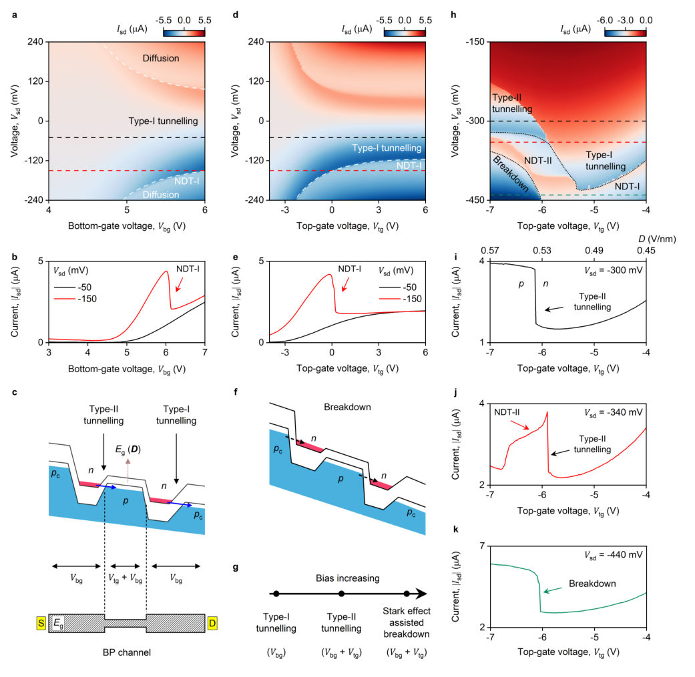 
FIG. 2. Evolution of tunnel characteristics with bias and gate voltage. a, Contour map showing the evolution of Type-I tunnelling and NDC with Vbg (Vtg = 0 V). The white dashed line traces the tunnel peak current. b, The bottom panel shows the transistor transfer characteristics with emergence of NDT as a function of Vbg (along the black and red dashed lines in the map in a). c, Band alignment showing the formation of additional p–n tunnel interfaces (Type-II TJ) along the channel mediated by the gate electrostatics. Note the Stark-effect-mediated modulation of the band gap along the channel (bottom panel). d, Contour map showing the evolution of tunnel-NDC with Vtg (Vbg = 6 V) in low-bias...

📷 Fig 3

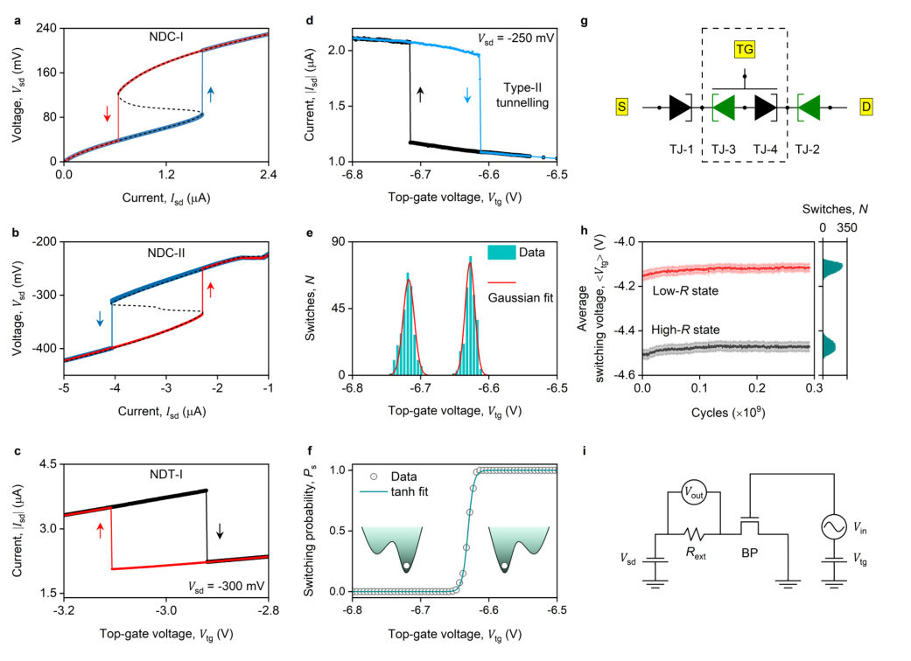 
FIG. 3. Manifold electronic bistability in BP. a, A typical voltage hysteresis in the current bias regime for Type-I NDC (Vtg = 0 V). Blue and red traces are increasing and decreasing sweeps; the dashed line is the unstable branch inferred from the voltage-biased characteristics. b, The same measurement in the gate-defined Type-II NDC (Vtg = −7 V). c, Transfer characteristics exhibiting hysteresis in c, Type-I NDT and d, Type-II tunnelling. Arrows indicate the direction of the scan and the jumps in voltage and current, respectively. e, Distribution of the gate voltage at which the switch in d occurs, compiled over 300 cycles, with Gaussian fits (σ = 8.2 mV (forward, LHS) and 7.2 mV...

**Summary.** This work demonstrates an advanced transistor in black phosphorus exhibiting intrinsic electronic bistability, discontinuous switching, and controlled stochasticity. By leveraging the giant Stark effect to reshape the band profile, the device achieves memory-like behavior and programmable randomness without material modification. This paves the way for next-generation computing architectures integrating multiple non-linear functions into one element.

**Why it may be interesting.** The ability to engineer complex non-linear dynamics—including memory and randomness—purely electrostatically within a single semiconductor structure is highly relevant for developing novel quantum or classical computational elements that mimic biological processes.

Detailed structure

**Main problem.** To demonstrate intrinsic electronic bistability, discontinuous switching, and controllable stochasticity in a transistor without relying on material doping or phase transitions.

**Main result.** The device exhibits robust, gate-tunable hysteretic bistability and intrinsically stochastic switching behavior, opening a route for integrating nonlinearity, memory, and randomness into single electrostatically programmable elements.

**Method.** Transport measurements ($I_{sd}$ vs. $V_{sd}$, $I_{sd}$ vs. $V_{gate}$) were performed on a dual-gated black phosphorus transistor flake across multiple gate voltage sweeps and cycling tests.

**Model / system.** The system is a dual-gated black phosphorus (BP) semiconductor transistor, where the band profile can be electrostatically reshaped via the giant Stark effect. This allows for the formation of competing conduction regimes like Ohmic transport, interband tunneling junctions (Type-I and Type-II), and Zener breakdown.

**Key observables.** Negative differential conductance (NDC), negative transconductance (NDT), hysteretic switching loops, and cycle-to-cycle stochastic variations in the switching voltage.

**Important parameters / regimes.** Gate voltages ($V_{bg}, V_{tg}$), source-drain bias ($V_{sd}$), and cycling number (up to $3 	imes 10^8$ cycles).

**Assumptions / limitations.** The bistability and switching are purely due to reversible electrostatic instability within the tunnel junctions, not material degradation or phase changes.

**Figures summary.** Figures illustrate device schematics, STEM micrographs, and transport characteristics showing Ohmic regimes, NDC regions at different gate biases, and hysteresis loops demonstrating memory effects over many cycles.

**Paper structure.** The paper progresses from establishing the physical platform (BP transistor) to characterizing multiple conduction regimes (Ohmic, tunneling, breakdown). It then focuses on demonstrating bistability via hysteresis, followed by quantifying the intrinsic stochasticity through long-term cycling measurements. Finally, it discusses the potential applications in neuromorphic and computing architectures.

Abstract

Bistability - two stable electronic states under the same bias - underlies switching and memory, but is usually absent in transistors and must be engineered through material means: doped tunnel junctions, filaments in memristors, or phase transitions. Here we demonstrate a transistor with intrinsic electronic bistability in a single chemically homogeneous crystal. In dual-gated black phosphorus, whose band gap narrows under a perpendicular electric field due to a giant Stark effect, the gates not only modulate carrier density but also reshape the band profile, forming interband tunnel junctions in the channel. Transport across the two-gate parameter space reveals competing conduction regimes - diffusive, two tunnelling channels and Zener breakdown - whose interplay produces negative differential conductance and transconductance, discontinuous switching, and hysteresis with the state set by gate history. Moreover, the switching remains intrinsically stochastic, yet statistically stable within a narrow range of gate voltages, providing an electrically programmable source of randomness. Devices based on this principle should be realisable in other two-dimensional semiconductors, opening a route to next-generation computing architectures in which nonlinearity, switching, memory and stochasticity are integrated within a single electrostatically programmable element.

[↑ back to top](#top)

### [Probing crystal-field modulations with magnetic adatoms on the incipient charge-density-wave superconductor $2H$-NbS$_2$](http://arxiv.org/abs/2608.09753v1)

**Authors:** Werner M. J. van Weerdenburg, Margarete Huisinga, Constantin Flommersfeld, Lisa M. Rütten, Katharina J. Franke  
**Type:** experiment · **Category:** other · **PDF:** <https://arxiv.org/pdf/2608.09753v1>  
**Analysis basis:** full PDF text, analyzed in chunks
**Topic relevance:** `quantum measurements` **2/5** · `Frenkel-Kontorova` **1/5**

📷 Fig 1

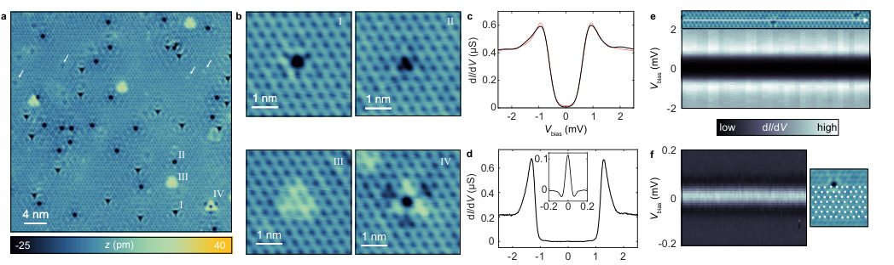 
FIG. 1. Superconductivity and intrinsic defects of 2H-NbS2. a) Topographic STM image of 2H-NbS2 with several types of intrinsic defects, labeled with I - IV and white arrows (It= 500 pA, Vbias= 50 mV). b) Close-up STM images of four defect types (It = 1 nA, Vbias = 100 mV). c) Tunneling spectrum showing the superconducting gap of 2H-NbS2(black), spatially averaged over an area of 20 nm × 20 nm and fitted with a two-gap Dynes function (red line). d) Tunneling spectrum recorded with a superconducting tip on 2H-NbS2, spatially averaged over 10 sites. Inset: Josephson conductance peak recorded for a V-NbS2 junction at a normal-state conductance of GN = 1.6 µS and averaged over all sites...

📷 Fig 2

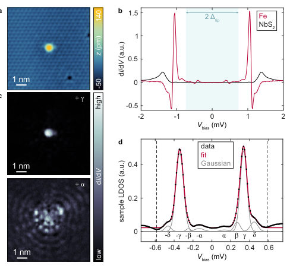 
FIG. 2. Yu-Shiba-Rusinov states of an individual Fe atom on 2H-NbS2. a) Topographic STM image of an individual Fe atom on 2H-NbS2 (It= 200 pA, Vbias= 5 mV). b) dI/dV spectrum of Fe on 2H-NbS2 (red) and the substrate (black), measured with a superconducting V tip (stabilized at Vbias = 5 mV, It = 2 nA (red) and 500 pA (black)). The size of the superconducting gap of the tip is indicated with blue shad- ing. c) dI/dV images of the +γ (top) and +α (bottom) state, recorded in constant-contour mode at the height profile pre- sented in (a) (Vmod = 30 µV, see SM for more details). d) Fe spectrum (black) after numerical deconvolution to remove the influence of tip DOS, fitted with multiple Gaussian...

📷 Fig 3

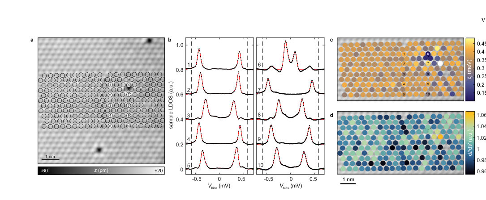 
FIG. 3. Spatial variation of Yu-Shiba-Rusinov energies on 2H-NbS2. a) Topographic STM image of bare 2H-NbS2 indicating the 225 equivalent binding sites (black circles) where an individual Fe atom was placed and probed (It= 1 nA, Vbias= 5 mV). b) Selection of deconvolved dI/dV spectra recorded on Fe in 10 binding sites, as labeled in (a). Each spectrum was fitted with multiple Gaussian peaks (red) and vertically offset for clarity. Dashed lines indicate the edges of the superconducting gap of 2H-NbS2. c) Extracted YSR excitation energy of the +γ state of the Fe sensor atom positioned at each probed binding site. d) Average dI/dV signal at each binding site, extracted from a constant-current...

📷 Fig 4

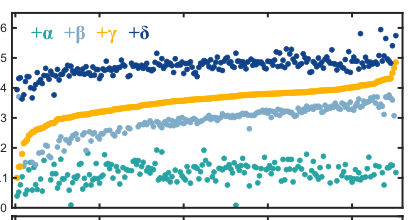 
FIG. 4. Yu-Shiba-Rusinov state variation. a) Scatter plot of the YSR state energies for α, β, γ and δ for each of the probed binding sites in Fig. 3. The binding site index is sorted by the energy of +γ. b) Corresponding scatter plot of the av- erage dI/dV signal at each binding site, extracted from a constant-current dI/dV image recorded at Vbias = 5 mV. c) Corresponding scatter plot of the YSR state asymmetry of γ, extracted from the intensities of +γ and −γ. d) Correspond- ing scatter plot of YSR state width (FWHM) of +γ.

**Summary.** This work uses magnetic adatoms on the superconductor 2H-NbS2 as nanoscale sensors to map out subtle electronic variations. By measuring shifts in YSR excitation energies via STM spectroscopy, the authors demonstrate that local crystal-field modulations—rather than changes in the superconducting gap itself—govern the atomic-scale electronic landscape of this incipient CDW material.

**Why it may be interesting.** The technique provides an atomic-scale probe for local structural instabilities (crystal-field modulations) in complex quantum materials near multiple competing phases, which is highly relevant for understanding emergent phenomena in strongly correlated systems.

Detailed structure

**Main problem.** To use an individual magnetic adatom as a local sensor to reveal hidden crystal-field modulations in the incipient charge-density-wave (CDW) superconductor 2H-NbS2.

**Main result.** The YSR excitation energy shows strong position-dependent variations, which is attributed primarily to changes in the local crystal-field environment rather than uniform superconducting gap variations or simple LDOS fluctuations.

**Method.** Scanning Tunneling Microscopy (STM) spectroscopy was used to map variations in Yu-Shiba-Rusinov (YSR) excitation spectra induced by magnetic adatoms across the surface.

**Model / system.** The study investigates the layered material 2H-NbS2, which exhibits both superconductivity and incipient CDW behavior. The local electronic structure is probed by depositing single Fe magnetic adatoms onto the superconducting surface.

**Key observables.** Yu-Shiba-Rusinov (YSR) excitation energy ($\epsilon_{YSR}$), superconducting gap measurements, and local density of states (LDOS) variations mapped via $dI/dV$ spectroscopy.

**Important parameters / regimes.** The variation in $\epsilon_{YSR}$ can be significant relative to the inner superconducting gap size; analysis involves distinguishing contributions from crystal-field effects versus LDOS changes.

**Assumptions / limitations.** It is assumed that variations in YSR energy are sensitive indicators of local structural/crystal-field environment changes, and that these variations can be separated from topographic or simple density fluctuations using Fourier filtering techniques.

**Figures summary.** Figures show STM images of defects, superconducting gap measurements (uniformity), and detailed maps correlating the measured $\epsilon_{YSR}$ energy with spatial positions across the surface. Analysis figures demonstrate the separation of LDOS variations from topography.

**Paper structure.** The paper establishes the physical system ($2H$-NbS$_2$) and the sensing mechanism (magnetic adatoms inducing YSR states). It first confirms the uniformity of the superconducting gap, then maps the strong spatial variation in $\epsilon_{YSR}$, attributing this to crystal-field effects after ruling out other sources like LDOS variations.

Abstract

The interplay between multiple quantum phases in layered materials may lead to incipient quantum behavior, where the material's ground state is close to a phase transition and sensitive to local disorder. The transition metal dichalcogenide material $2H$-NbS$_2$ exhibits incipient charge-density-wave behavior along with a well-developed superconducting state, creating a scenario where the local lattice instabilities play a crucial role. Here we present how an individual magnetic atom on $2H$-NbS$_2$ can be applied as a local sensor to reveal hidden crystal-field modulations. By manipulating the adatom across the surface with the tip of a scanning tunneling microscope, we measure variations in the Yu-Shiba-Rusinov (YSR) excitation spectra and map the local environment around an intrinsic point defect. We find that while the superconducting state is spatially uniform, the YSR excitation energy strongly depends on the position of the atom. We determine that the main contribution to this effect originates from variations in the local crystal-field environment. These results establish a new approach to investigate crystal-field modulations at the atomic scale and reveal how defects and lattice instabilities shape the atomic landscape of an incipient charge-density-wave material.

[↑ back to top](#top)

### [High second Chern number induced by long-range hopping in a four-dimensional Dirac model](http://arxiv.org/abs/2608.08670v1)

**Authors:** Zheng-Rong Liu, Xiang Liu, Rui Chen, Bin Zhou  
**Type:** theory · **Category:** other · **PDF:** <https://arxiv.org/pdf/2608.08670v1>  
**Analysis basis:** full PDF text, analyzed in chunks
**Topic relevance:** `analog quantum simulation` **2/5**

📷 Fig 1

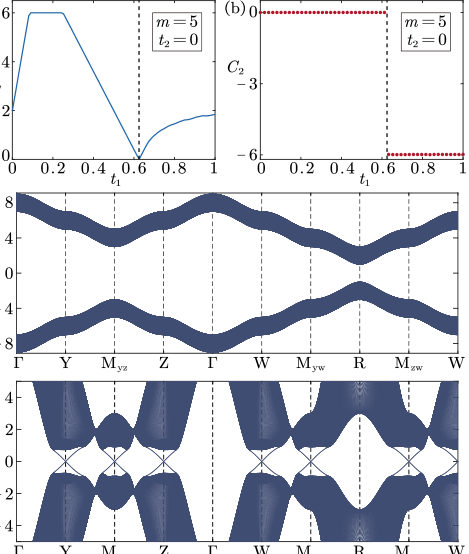 
FIG. 1. (a) Bulk energy gap Eg as a function of the next-nearest- neighbor hopping amplitude t1. The dashed line indicates the gap- closing point at t1 = m/8. (b) Second Chern number C2 as a function of t1. (c), (d) Energy spectra in the three-dimensional Bril- louin zone under open boundary conditions along the x direction for t1 = 0 and t1 = 0.8, respectively. The indicators of the horizontal axis are the high symmetry k(ky, kz, kw) points in the three-dimensional Brillouin zone, Γ(0, 0, 0), Y(π, 0, 0), Z(0, π, 0), W(0, 0, π), Myz(π, π, 0), Myw(π, 0, π), Mzw(0, π, π), R(π, π, π). Here, m = 5 and t2 = 0.

📷 Fig 2

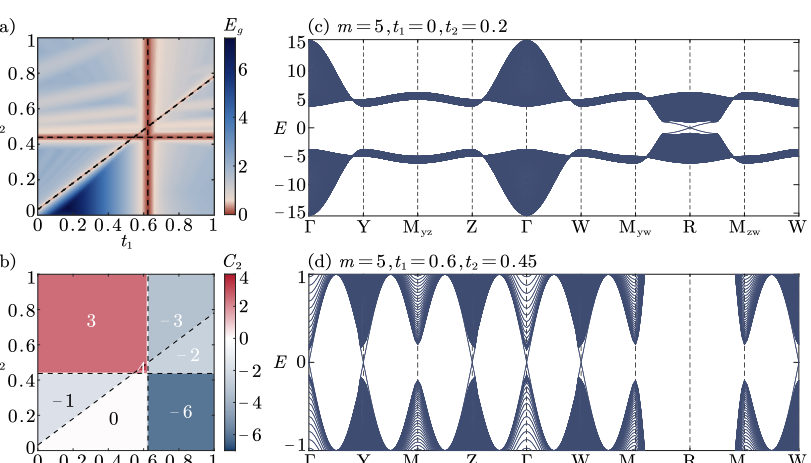 
FIG. 2. (a) Distribution of the bulk energy gap Eg in the (t1, t2) parameter space. The color scale represents the magnitude of the bulk energy gap, with the dark-red region corresponding to a nearly closed gap. The black dashed lines indicate the gap-closing boundaries determined by t1 = m/8, t2 = (m + 2)/16, and t2 = (m −4)/32 + 3t1/4, respectively. (b) Map of the second Chern number C2 in the (t1, t2) parameter space. The color scale represents the value of C2, and the numbers in each colored region denote the corresponding second Chern number. (c), (d) Energy spectra in the three-dimensional Brillouin zone under open boundary conditions along the x direction for t1 = 0, t2 = 0.2 and t1...

📷 Fig 3

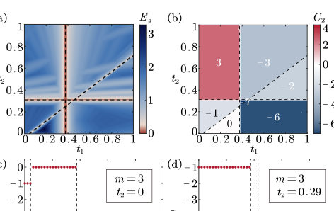 
FIG. 4. (a) Distribution of the bulk energy gap Eg in the (t1, t2) parameter space when m = 3. The color scale represents the mag- nitude of the bulk energy gap, with the dark-red region correspond- ing to a nearly closed gap. The black dashed lines indicate the gap- closing boundaries determined by t1 = m/8, t2 = (m + 2)/16, and t2 = (m−4)/32+3t1/4, respectively. (b) Map of the second Chern number C2 in the (t1, t2) parameter space when m = 3. The color scale represents the value of C2, and the numbers in each colored re- gion denote the corresponding second Chern number. (c), (d) Second Chern number C2 as a function of t1 for t2 = 0 and t2 = 0.29, re- spectively. Here, m = 3.

📷 Fig 4

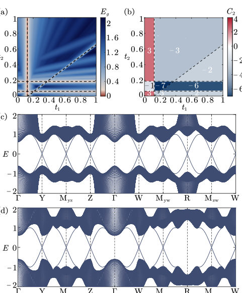 
FIG. 3. (a) Distribution of the bulk energy gap Eg in the (t1, t2) parameter space when m = 1. The color scale represents the mag- nitude of the bulk energy gap, with the dark-red region correspond- ing to a nearly closed gap. The black dashed lines indicate the gap- closing boundaries determined by t1 = m/8, t2 = (m + 2)/16, t2 = (2 −m)/16, and t2 = (m −4)/32 + 3t1/4, respectively. (b) Map of the second Chern number C2 in the (t1, t2) parameter space when m = 1. The color scale represents the value of C2, and the numbers in each colored region denote the corresponding second Chern number. (c), (d) Energy spectra in the three-dimensional Bril- louin zone under open boundary conditions along...

📷 Fig 5

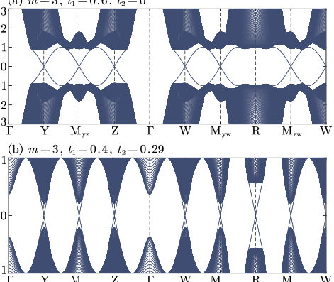 
FIG. 5. (a), (b) Energy spectra in the three-dimensional Brillouin zone under open boundary conditions along the x direction for t1 = 0.6, t2 = 0 and t1 = 0.4, t2 = 0.29, respectively. Here, m = 3.

**Summary.** This paper investigates how incorporating long-range hopping into the 4D Dirac model can generate novel topological phases. The authors demonstrate that this mechanism allows for the creation of insulating states with high second Chern numbers ($C_2$), values unattainable in simpler models. This establishes long-range interactions as a powerful tool for engineering advanced topological matter.

**Why it may be interesting.** The work provides a concrete theoretical pathway—modifying lattice interactions via long-range hoppings—to engineer exotic topological states in higher dimensions, which is highly relevant for designing artificial quantum materials and superconducting circuits.

Detailed structure

**Main problem.** To determine if introducing long-range hopping into the four-dimensional (4D) Dirac model can induce topological phases characterized by high second Chern numbers ($C_2$), thereby expanding beyond the limitations of minimal models.

**Main result.** Long-range hopping is shown to be a powerful mechanism capable of inducing 4D topological insulators with significantly high and tunable second Chern numbers (e.g., $C_2=-6$ or $C_2=4$).

**Method.** The authors calculated the second Chern number ($C_2$) using integrals involving the non-Abelian Berry curvature over the Brillouin zone, analyzing the energy spectrum under open boundary conditions to confirm bulk-boundary correspondence.

**Model / system.** The study focuses on a four-dimensional (4D) Dirac model Hamiltonian extended by next-nearest-neighbor ($	ext{t}_{	ext{NNN}}$) and next-next-nearest-neighbor ($	ext{t}_{	ext{NNNN}}$) hopping terms. The system's topology is mapped in the parameter space defined by these long-range hopping amplitudes.

**Key observables.** Second Chern number ($C_2$), bulk energy gap ($E_g$), and the count of gapless boundary modes (verifying bulk-boundary correspondence).

**Important parameters / regimes.** Hopping amplitudes ($	ext{t}_1, 	ext{t}_2$) and the lattice dimension $m$ used in the model.

**Assumptions / limitations.** The analysis relies on diagonalizing the extended 4D Dirac Hamiltonian and using advanced numerical techniques like adaptive mesh refinement for accurate topological invariant calculation.

**Figures summary.** Figures illustrate the evolution of the bulk energy gap ($E_g$) and the second Chern number ($C_2$) as hopping parameters are varied, showing clear transitions between trivial ($C_2=0$) and highly topological phases (e.g., $C_2=-6$).

**Paper structure.** The paper establishes the theoretical framework for 4D topological insulators using the Dirac model; it then systematically introduces long-range hopping terms to modify the Hamiltonian; finally, it calculates $C_2$ and demonstrates that these additions enable the realization of novel, high-$|C_2|$ phases.

Abstract

Four-dimensional (4D) topological systems provide a promising platform for exploring topological phenomena beyond three dimensions. So far, extensive recent studies on 4D topological insulators have focused on the 4D Dirac model, while its second Chern number is restricted to a limited set of values. In this work, we demonstrate that introducing long-range hopping into the 4D Dirac model induces topological phases with high second Chern numbers. Furthermore, we show that the long-range hopping can transform a trivial insulator into a topological insulator with a nonzero second Chern number. Our work establishes long-range hopping as a powerful route for engineering 4D topological states and reveals new possibilities for realizing unconventional topological phases beyond minimal models.

[↑ back to top](#top)

### [Ferroelectric-controllable spin-orbit torque in two-dimensional multiferroic heterostructure](http://arxiv.org/abs/2608.07731v1)

**Authors:** Weiyi Pan, Gusthavo M. S. Brizolla, Jaroslav Fabian  
**Type:** theory · **Category:** other · **PDF:** <https://arxiv.org/pdf/2608.07731v1>  
**Analysis basis:** full PDF text, analyzed in chunks
**Topic relevance:** `Keldysh / 2PI / non-Gaussian methods` **1/5** · `analog quantum simulation` **1/5** · `driven-dissipative phase transition` **1/5**

📷 Fig 1

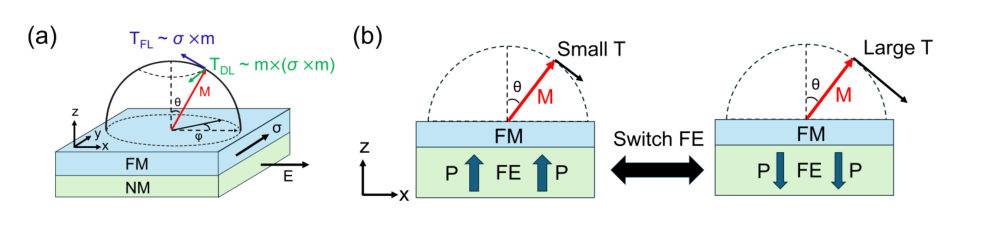 
FIG. 1. (a) A Schematic illustration of current-induced spin-orbit torque in FM/NM heterostructure system. A longitudinal electron current parallel with E in NM layer would induce both damping-like torque TDL and field-like torque TFL. The 𝜃and 𝜑denotes the polar angle and azimuthal angle for the magnetization, respectively. (b) Schematic illustration of ferroelectric- controllable torque in multiferroic heterostructures. By switching the polarization in ferroelectric layer, the magnitude of torque would be altered.

📷 Fig 2

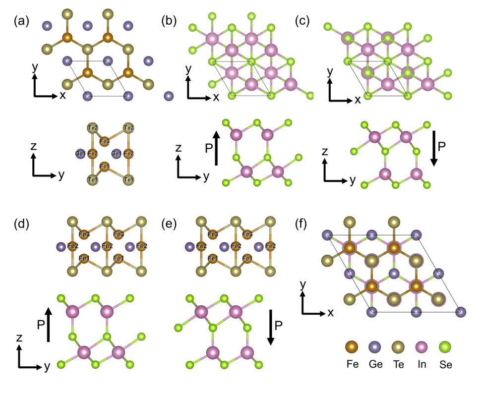 
FIG. 2. (a) Atomic structure of Fe3GeTe2 monolayer. Distinct atoms are labeled here. (b) and (c) denotes the atomic structure of monolayer In2Se3 with polarization pointing upwards and downwards, respectively. (d) and (e) denotes the sideview of Fe3GeTe2/In2Se3 heterostructure with the polarization of In2Se3 pointing up and down, respectively. (f) denotes the top view of Fe3GeTe2/In2Se3 heterostructure,

📷 Fig 3

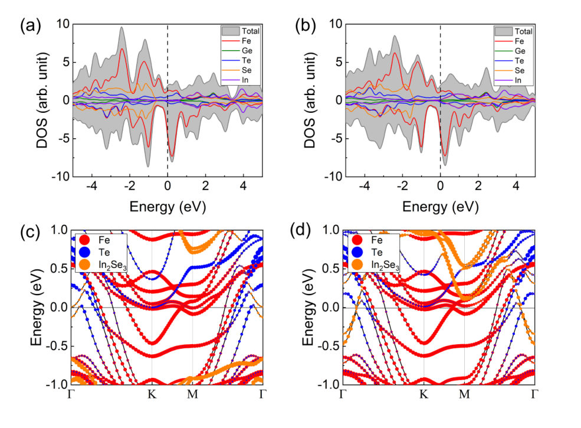 
FIG. 3. The calculated density of states for Fe3GeTe2/In2Se3 heterostructure with the polarization of In2Se3 (a) pointing upwards and (b) downwards, respectively. (c) and (d) shows the calculated projected band structure for heterostructure with the polarization of In2Se3 pointing upwards and downwards, respectively.

📷 Fig 4

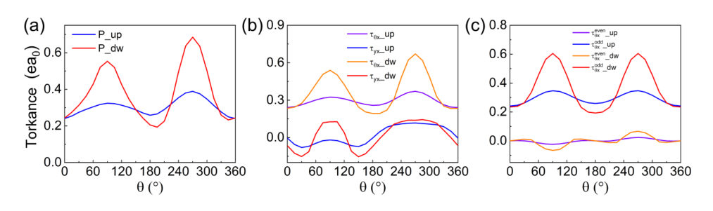 
FIG. 4. Angular-dependent torkance when magnetization rotating in 𝑥−𝑧plane. (a) The calculated magnitude of total torkance as function of magnetization angle 𝜃for distinct polarization states in In2Se3 layer. (b) The calculated torkance components 𝜏𝑦𝑥and 𝜏𝜃𝑥as function of magnetization angle 𝜃for distinct polarization states. (c) Calculated time-reversal-even and time-reversal-odd component of 𝜏𝜃𝑥as function of magnetization angle 𝜃for distinct polarization states.

📷 Fig 5

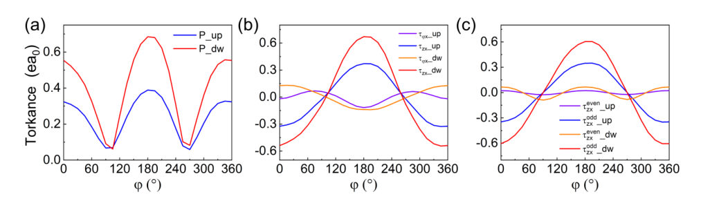 
FIG. 5. Angular-dependent torkance when magnetization rotating in 𝑥−𝑦plane. (a) The calculated magnitude of total torkance as function of magnetization angle 𝜑for distinct polarization states in In2Se3 layer. (b) The calculated torkance components 𝜏𝑧𝑥and 𝜏𝜑𝑥as function of magnetization angle 𝜑for distinct polarization states. (c) Calculated time-reversal-even and time-reversal-odd component of 𝜏𝑧𝑥as function of magnetization angle 𝜃for distinct polarization states.

**Summary.** This theoretical work demonstrates that ferroelectric polarization switching in a 2D multiferroic heterostructure ($	ext{Fe}_3	ext{GeTe}_2/	ext{In}_2	ext{Se}_3$) can dramatically enhance the Spin-Orbit Torque (SOT). By calculating the torkance using first-principles methods, the authors show that this polarization control offers a viable pathway toward developing programmable and energy-efficient spintronic memory devices.

**Why it may be interesting.** While focused on condensed matter spintronics rather than fundamental quantum information protocols, the concept of electrically controlling magnetic properties via emergent coupling mechanisms (ferroelectricity $\leftrightarrow$ magnetism) is highly relevant to advanced quantum device architectures.

Detailed structure

**Main problem.** The goal is to achieve electrically tunable Spin-Orbit Torque (SOT) for next-generation spintronic devices by leveraging the coupling between ferroelectricity and magnetism in 2D multiferroic heterostructures.

**Main result.** Reversing the ferroelectric polarization in an $	ext{Fe}_3	ext{GeTe}_2/	ext{In}_2	ext{Se}_3$ heterostructure enhances the total SOT by over 150%, primarily through modulation of the time-reversal-odd torque component.

**Method.** The study employs first-principles calculations (DFT) to model the electronic structure and calculate the torkance tensor ($oldsymbol{	au}$) as a function of ferroelectric polarization state.

**Model / system.** The system modeled is a 2D van der Waals multiferroic heterostructure, specifically $	ext{Fe}_3	ext{GeTe}_2/	ext{In}_2	ext{Se}_3$. The physics relies on the coupling between ferroelectric polarization switching and spin-orbit torque generation.

**Key observables.** Total torkance magnitude ($|oldsymbol{	au}|$), $z$-component of time-reversal-odd torque, magnetic moments of Fe atoms, electronic states near $\Gamma$ on the Fermi surface.

**Important parameters / regimes.** Ferroelectric polarization direction (up/down), magnetization orientation (in-plane vs. out-of-plane).

**Assumptions / limitations.** The calculations utilize DFT with specific pseudopotentials and include a van der Waals correction; the analysis assumes SOT is governed by the time-reversal-odd component modulated by polarization.

**Figures summary.** Figure 1 schematically illustrates both standard current-induced SOT in FM/NM structures and, crucially, how ferroelectric polarization switching alters the torque magnitude in multiferroic heterostructures.

**Paper structure.** The paper establishes the need for tunable SOT in vdW systems; it then details the theoretical framework using DFT to calculate torkance based on polarization state; finally, it presents quantitative results showing the large enhancement of SOT upon ferroelectric switching and links this effect to electronic reconstruction.

Abstract

Spin-orbit torque (SOT), which enables electrical control of magnetization, plays a crucial role in the development of next-generation spintronic devices. Realizing SOT in two-dimensional van der Waals systems, together with achieving efficient nonvolatile manipulation via ferroelectricity, would be highly beneficial for the implementation of tunable logic devices with enhanced storage density. In this work, based on first-principles calculation and using a multiferroic Fe$_{3}$GeTe$_{2}$/In$_{2}$Se$_{3}$ heterostructure as a representative example, we demonstrate that switching the ferroelectric polarization of the In$_{2}$Se$_{3}$ layer induces a pronounced modification in the magnetization-dependent distribution of torkance within the heterostructure. Specifically, when the magnetization is in the plane, where the torque is maximal, reversing the polarization of In$_{2}$Se$_{3}$ from upward to downward enhances the total torkance to more than 150% of its original value. This substantial variation primarily originates from the polarization-induced modulation of the $z$ component of the time-reversal-odd torkance, which is mainly associated with an approximately 233% change in the atomic-resolved torque contributed from the middle Fe layer in Fe$_{3}$GeTe$_{2}$ layer. Further analysis reveals that the electronic states near $Γ$ on the Fermi surface undergo significant reconstruction upon polarization switching, which is responsible for the observed variation in the time-reversal-odd torque. Our results not only provide new insights into the functional potential of van der Waals multiferroic heterostructures, but also offer a viable strategy for achieving electrically tunable SOT, paving the way for future programmable spintronic devices.

[↑ back to top](#top)

### [Quantum Metric Induced Critical Current Anomaly in Flat Band Josephson Junctions](http://arxiv.org/abs/2608.08120v1)

**Authors:** Zhong C. F. Li, Yuxuan Deng, Dmitri K. Efetov, K. T. Law  
**Type:** theory · **Category:** other · **PDF:** <https://arxiv.org/pdf/2608.08120v1>  
**Analysis basis:** full PDF text, analyzed in chunks
**Topic relevance:** `Keldysh / 2PI / non-Gaussian methods` **1/5** · `analog quantum simulation` **1/5** · `driven-dissipative phase transition` **1/5**

📷 Fig 1

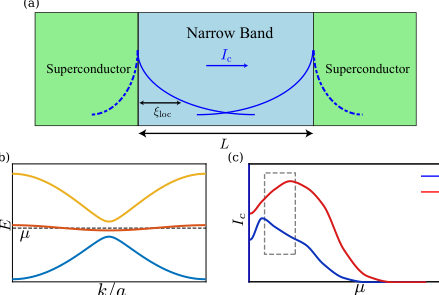 
FIG. 1. (a) The schematic figure of a flat band Josephson junction. The weak link is a narrow band material with non- trivial quantum metric. The leads are superconducting (SC) for calculating the Josephson current and metallic for calcu- lating the normal-state conductance. The blue lines at the lead/weak link interfaces represent the interface states with the decay length ξloc governed by the quantum metric length of the weak link. The interface states can carry Josephson current when the quantum metric length is long enough that the interface states are hybridized. (b) The schematic plot for the band structure of the weak link, where µ is the chemical potential and k is the wave vector....

📷 Fig 2

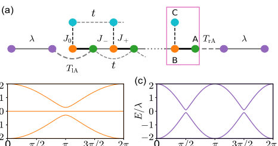 
FIG. 2. (a) The lattice structure of the Josephson junction. (b) The band structure of Lieb lattice. For visualization, J = 10∆sc and δ = 0.1. (c) The quasiparticle spectrum of the su- perconducting leads, which is ϵ(k) = ± p

📷 Fig 3

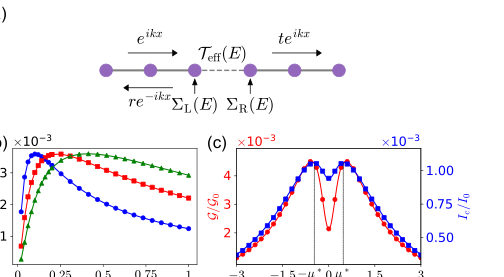 
FIG. 3. (a) A schematic figure of the effective models cal- culating transmission rate and critical Josephson current, re- spectively. (b) Temperature-dependence of the normal-state conductance G, where G0 = e2/h is the conductance unit. For comparison, the superconducting pairing gap ∆sc at zero temperature of the superconducting leads is used as energy scale, even the leads used for calculating G are metallic. The coupling strengths TA for the blue line, red line and green line are 50∆sc, 75∆sc and 100∆sc, respectively. The analyt- ical results (solid lines) and the numerical results (discrete data points) match each other perfectly. (c) The comparison between conductance and critical...

📷 Fig 4

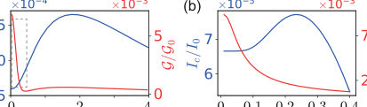 
FIG. 4. (a) The critical current anomaly probed by tuning the chemical potential µ at kBT = 0.05∆sc. (b) The criti- cal current anomaly probed by tuning the temperature T at µ = 0. For critical-current calculations at different tempera- tures, the superconducting pairing gap depends on tempera- ture as ∆sc(T) = ∆sc tanh(1.74 p

📷 Fig 5

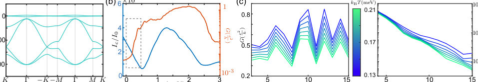 
FIG. 5. (a) Band structure of 6-band model of magic angle twisted bilayer graphene. (b) The critical current Ic and the resistance R as a function of chemical potential µ in the six-band model. The parameters in (b) are set to be ∆sc = 1meV, kBT = 0.15meV, λ = 10 meV, µLead = 0. The coupling between the leads and the weak link is uniform from the lead to all orbitals in the weak link, and the amplitude is set to be 10meV. The gap introduced between narrow bands is 1.9meV. The size of the junction is 5 × 30 unit cells on x and y directions, respectively. (c) The conductance (left panel) and the critical current (right panel) against the junction length L. Conductance oscillates as the...

**Summary.** This work explains the 'critical current anomaly' observed in Josephson junctions using flat band physics. The key mechanism identified is the Quantum Metric Enabled Josephson Current (QMJC), which allows $I_c$ to increase even when normal conductance ($G$) decreases. By modeling this with both simple lattices and realistic TBG structures, the authors provide strong theoretical evidence for QMJC's role in superconducting transport.

**Why it may be interesting.** The concept of QMJC provides a novel theoretical framework for understanding superconducting transport in materials with flat bands, suggesting that geometric properties (quantum metrics) can dictate macroscopic superconducting behavior independent of standard band theory predictions.

Detailed structure

**Main problem.** The paper addresses the 'critical current anomaly' observed in Josephson junctions, where increasing normal state conductance ($G$) is accompanied by a counter-intuitive decrease in critical current ($I_c$).

**Main result.** This anomaly is attributed to the Quantum Metric Enabled Josephson Current (QMJC), which dominates $I_c$ even when the conventional supercurrent contribution decays rapidly, decoupling $I_c$ from $G$.

**Method.** The authors use theoretical modeling, progressing from a simple 1D Lieb lattice model to a realistic six-band tight-binding model for twisted bilayer graphene (TBG).

**Model / system.** The system is a Josephson junction built with flat band materials like TBG. The physics involves coupling between the weak link and superconducting leads, analyzed using Hamiltonian formulations.

**Key observables.** $I_c$ (critical current), $G$ (normal state conductance), $\xi_{QM}$ (quantum metric length).

**Important parameters / regimes.** The anomaly is most pronounced in regimes where the quantum metric length ($\xi_{QM}$) is comparable to or longer than the junction length ($L$), and when tuning the chemical potential ($\mu$) near charge neutrality.

**Assumptions / limitations.** The analysis assumes specific tight-binding models (Lieb lattice, 6-band TBG) and relies on separating contributions into conventional band dispersion terms and quantum metric induced terms.

**Figures summary.** Figures illustrate the anomaly ($I_c$ increases while $G$ decreases), show temperature dependence of $G$ vs. $I_c$, and demonstrate length dependence where $G$ oscillates but $I_c$ decays exponentially.

**Paper structure.** The paper first introduces the experimental anomaly, then develops the theory using a simplified Lieb lattice model to analytically prove the mechanism, and finally validates this finding using a complex, realistic six-band model of TBG.

Abstract

In well-established theories of Josephson junctions, the superconducting critical current \( I_\mathrm{c} \) increases as the normal state conductance \( \mathcal{G} \) increases. However, in a recent experiment in twisted bilayer graphene (TBG) based Josephson junctions, unexpectedly, it was observed that the increase of the critical current is accompanied by a decrease of the normal state conductance. We call this phenomenon the critical current anomaly. In this work, we point out that in the TBG-based Josephson junction, due to the suppression of the conventional Josephson current by the flatness of the band and the quantum metric enabled Josephson current (QMJC), the critical current anomaly can occur. The QMJC appears if the quantum metric length is comparable or longer than the junction length. We show that both \( \mathcal{G} \) and \( I_\mathrm{c} \) have the conventional and the quantum metric contributions, and there are parameter regimes in which \( I_\mathrm{c} \) increases even when \( \mathcal{G} \) decreases. We first demonstrate the critical current anomaly by a simple modified Lieb-lattice model both analytically and numerically. The incredible consistency with the experimental results is demonstrated using a realistic six-band model of twisted bilayer graphene. Therefore, we suggest that the critical current anomaly observed in the experiment provide strong evidence of QMJC which were ignored in well-established theories of Josephson junctions.

[↑ back to top](#top)

### [Exchange-induced suppression of superconductivity in a nano-skyrmion lattice - superconductor hybrid](http://arxiv.org/abs/2608.09207v1)

**Authors:** Dongfei Wang, Wenbin Li, Eric Mascot, Roland Wiesendanger  
**Type:** both · **Category:** other · **PDF:** <https://arxiv.org/pdf/2608.09207v1>  
**Analysis basis:** full PDF text, analyzed in chunks
**Topic relevance:** `Keldysh / 2PI / non-Gaussian methods` **1/5** · `driven-dissipative phase transition` **1/5**

📷 Fig 1

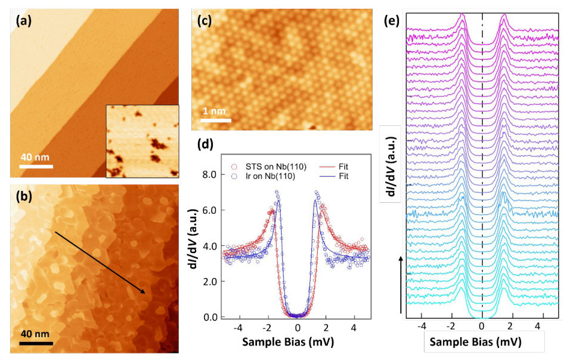 
Fig. 1. STM topography and dI/dV spectra of Ir(111) thin films grown on Nb(110). (a)

📷 Fig 2

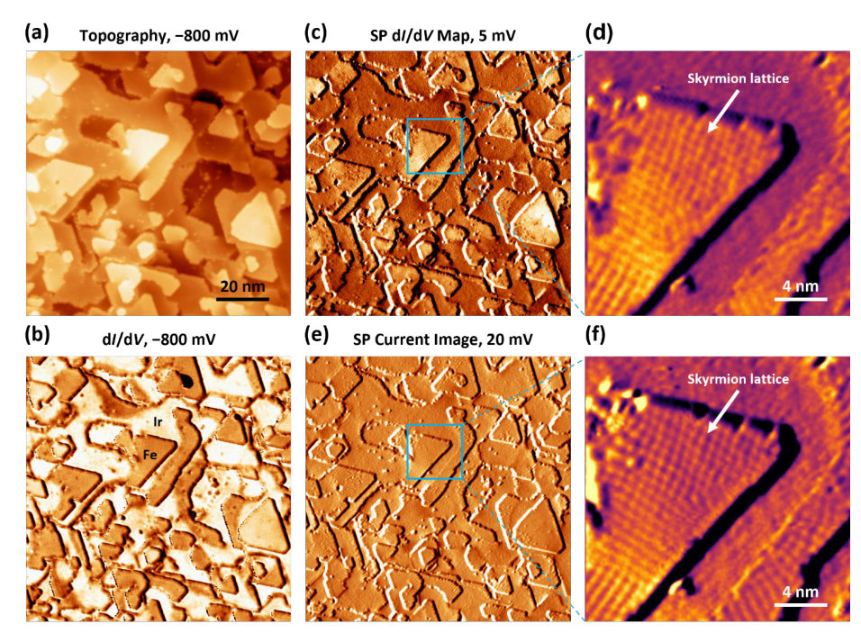 
Fig. 2. STM topography and corresponding dI/dV maps of sub-monolayer Fe on

📷 Fig 3

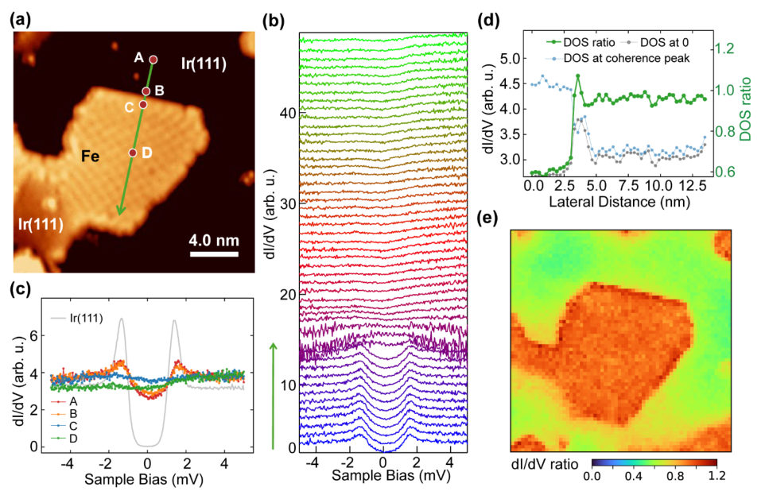 
Fig. 3. Spatially resolved superconducting-gap spectroscopy across an Fe island with a

📷 Fig 4

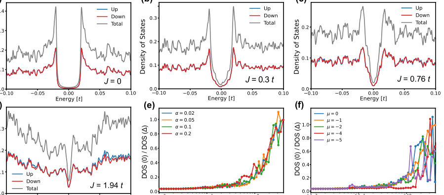 
Fig. 4. Tight-binding calculations for a skyrmion lattice coupled to a superconducting

**Summary.** This paper reports on the suppression of superconductivity when a nano-skyrmion lattice is coupled to a superconductor in an Fe/Ir(111)/Nb(110) hybrid. Using STS and tight-binding theory, the authors show that strong local exchange coupling within the skyrmions quenches the superconducting gap entirely. This provides critical microscopic constraints for engineering topological superconductivity using magnetic nanostructures.

**Why it may be interesting.** This work directly addresses how engineered magnetic textures can fundamentally alter superconducting pairing symmetries and magnitudes, which is crucial for designing novel topological superconductors relevant to quantum computing architectures.

Detailed structure

**Main problem.** The study investigates how coupling non-collinear spin textures, specifically nano-skyrmion lattices, affects the superconducting state in magnet-superconductor hybrid systems.

**Main result.** The research demonstrates that increasing exchange coupling within the skyrmion lattice leads to a progressive and complete quenching of superconductivity, which contrasts with some prior theoretical expectations.

**Method.** The work combines experimental measurements using Scanning Tunneling Spectroscopy (STS) on fabricated heterostructures with theoretical predictions derived from tight-binding Bogoliubov-de Gennes (BdG) calculations.

**Model / system.** The physical system is a hybrid structure: Fe islands forming a nano-skyrmion lattice deposited on an Ir(111) film, which itself sits atop an Nb(110) superconducting substrate. The theoretical model incorporates hopping, pairing potential, and strong onsite s-d exchange coupling.

**Key observables.** Superconducting gap size ($\Delta$), local density of states (LDOS) ratio at zero bias vs. coherence peaks, and the spatial mapping of superconductivity suppression across the skyrmion lattice.

**Important parameters / regimes.** Exchange coupling strength ($J$), superconducting gap energy ($\Delta \approx 1.2-1.5$ meV), and spin-orbit coupling ($\alpha$).

**Assumptions / limitations.** The analysis assumes that the observed quenching is due to strong local exchange coupling rather than simple Zeeman splitting, and theoretical parameters are representative rather than a direct fit.

**Figures summary.** Figures illustrate sample preparation (Fe/Ir/Nb), visualization of the skyrmion lattice via spin-polarized STM, spatially resolved STS maps showing gap closing across the Fe island, and theoretical DOS calculations tracking gap filling with increasing exchange coupling.

**Paper structure.** The paper progresses from characterizing the superconducting substrate and the magnetic structure to performing quantitative spectroscopy (STS) that reveals local gap suppression. This experimental evidence is then rigorously supported by tight-binding calculations showing spectral weight transfer leading to quenching as a function of exchange coupling strength.

Abstract

Engineered magnet-superconductor hybrids have recently been identified as promising platforms for the investigation of topological superconductivity. Beyond ferro- and antiferromagnetic structures, coupling non-collinear spin textures, such as skyrmion lattices, to superconductors offers an exciting route for creating and manipulating unconventional superconducting states. In this work, by preparing monolayer Fe on Ir(111) thin films grown epitaxially on a Nb(110) surface, we realize a hybrid system of a nano-skyrmion lattice proximitized to a superconducting substrate. Scanning tunneling spectroscopy shows that superconductivity becomes suppressed by the Fe nano-skyrmion lattice, with both the superconducting gap and coherence peaks disappearing. Tight-binding calculations reveal that with increasing exchange coupling, the gap is progressively filled up and eventually superconductivity gets quenched. These results reveal microscopic constraints for designing topologically non-trivial states based on magnet-superconducting heterostructures.

[↑ back to top](#top)

### [Long-range exchange interaction controls the fine structure of excited trion states in semiconductor quantum dots](http://arxiv.org/abs/2608.09554v1)

**Authors:** M. M. Glazov, E. L. Ivchenko  
**Type:** theory · **Category:** other · **PDF:** <https://arxiv.org/pdf/2608.09554v1>  
**Analysis basis:** full PDF text, analyzed in chunks
**Topic relevance:** `interference shaping light` **1/5** · `quantum measurements` **1/5**

📷 Fig 1

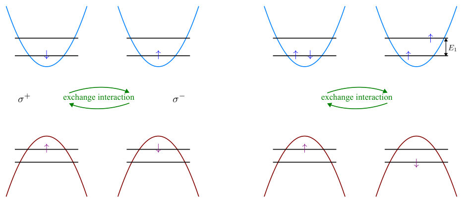 
FIG. 1. Illustration of the effect of LRE interaction on the ground exciton (a) and trion (b) states in the heavy-hole model.

📷 Fig 2

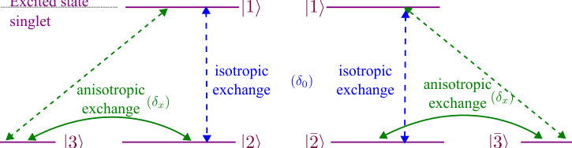 
FIG. 2. Mixing scheme for the states of heavy hole excited 2p–2p trions. Left part shows the states in Eqs. (29) and the right part shows their time-reversal partners, Eqs. (30). The states are labeled by the total spin component Jz = s1 + s2 + sh and the total spin of two electrons. Solid double-sided arrows show triplet-triplet mixing and dashed arrows singlet-triplet mixing.

📷 Fig 3

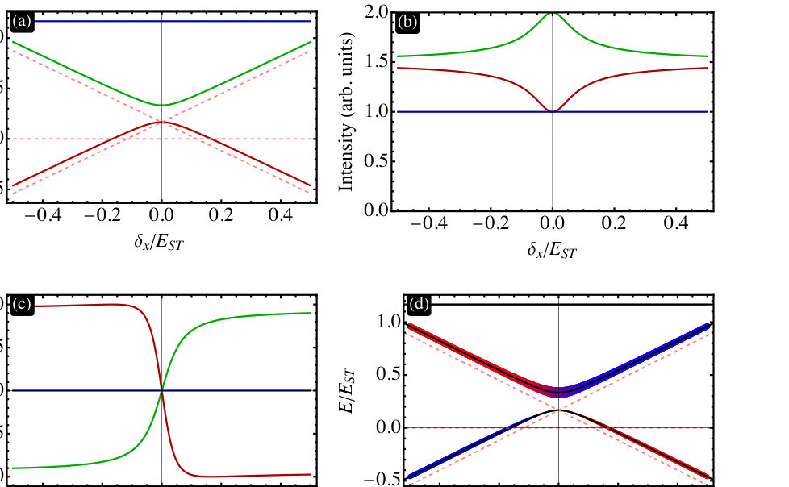 
FIG. 3. Energy spectrum of excited heavy-hole trion states calculated within the model II.1, Eq. (37), with δ0 = EST /3. Panel (a) shows the energies, panel (b) shows the intensities of the emission (oscillator strengths) and panel (c) shows the degrees of linear polarization. Blue lines reprisent the singlet state, red and green lines show the combinations of triplet states Jz = 3/2, −1/2 (or Jz = −3/2, 1/2) mixed by the Hamiltonian (38). Panel (d) shows the emission intensity (line thickness) and linear polarization in the x-y axes frame (color from blue corresponding to the x-polarization to red corresponding to y-polarization) superimposed on the energy spectrum. Thin red dashed lines...

📷 Fig 4

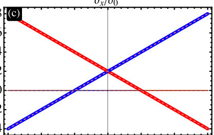 
FIG. 4. Energy spectrum of excited trion states calculated within the model II.2, Eq. (40). Panels (a)–(c) are calcu- lated for EST /δ0 = 3 (a), 1.5 (b), and 0 (c) and show the emission intensity (line thickness) and linear polarization in the x–y axis frame (color from blue corresponding to the x- polarization to red corresponding to the y-polarization) su- perimposed on the energy spectrum. Thin red dashed lines show asymptotics E = 0 (dark states) and E± in Eq. (41). Energy is reckoned from the dark triplet states |4⟩, |¯4⟩.

📷 Fig 5

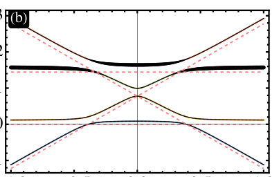 
FIG. 5. Energy spectrum of excited trion states within sim- ple Γ6 × Γ7 bands calculated in the model I.2, Eq. (40) with EST = δ0/2, δout = −δ0/6. (a) Emission intensity (line thick- ness) and linear polarization in x-y axes frame (color from blue corresponding to the x-polarization to red corresponding to the y-polarization) superimposed on the energy spectrum. (b) Emission intensity in the z polarization (line thickness) superimposed on the energy spectrum. Thin red dashed lines show asymptotics at EST = 0. The energy is reckoned from the triplet trion state in the absence of exchange interaction.

**Summary.** This paper develops a microscopic theory detailing how the long-range electron-hole exchange interaction dictates the fine structure of excited trion states in semiconductor quantum dots. By deriving an effective Hamiltonian and applying it to specific band models, the authors predict anisotropic splittings that can be measured using polarization-resolved optical spectroscopy.

**Why it may be interesting.** This work is highly relevant for quantum optics and open quantum systems as it provides detailed theoretical predictions linking fundamental many-body interactions (exchange) to measurable spectroscopic signatures (fine structure splitting) in solid-state emitters.

Detailed structure

**Main problem.** The study develops a microscopic theory to explain the fine structure observed in excited trion states confined within semiconductor quantum dots.

**Main result.** The long-range exchange interaction (LRE) is shown to be responsible for lifting degeneracies and creating rich, anisotropic fine structures in these excited trion states. This provides a unified theoretical framework for interpreting polarization-resolved optical spectroscopy.

**Method.** The authors derive an effective long-range exchange Hamiltonian using second quantization formalism applied to two different band structure models (simple $\Gamma_6 	imes \Gamma_7$ and heavy-hole).

**Model / system.** The system is negatively charged trions ($	ext{X}^-$) confined in semiconductor quantum dots, analyzed under the strong confinement regime. The theory considers the interplay between electron-electron and electron-hole exchange interactions.

**Key observables.** Fine structure splitting of excited trion energy levels; polarization-dependent optical spectra (e.g., $\sigma^+$ vs. $\sigma^-$); anisotropic splittings.

**Important parameters / regimes.** Long-range exchange parameters derived from the Hamiltonian; confinement potential anisotropy ($\sigma_x, \sigma_y, \sigma_z$ symmetry).

**Assumptions / limitations.** The analysis assumes strong confinement (size quantization $\gg$ Coulomb interaction $\gg$ fine structure splitting) and neglects spin-orbit coupling in some parts.

**Figures summary.** Figure 1 illustrates the effect of LRE interaction on both ground exciton and trion states in the heavy-hole model, demonstrating state mixing under anisotropic confinement.

**Paper structure.** The paper proceeds by deriving the general LRE Hamiltonian from electrodynamics, applying it to specific two-band models (Model I and Model II), calculating the resulting energy shifts, and finally interpreting these results via polarization-resolved optical spectroscopy.

Abstract

We develop a microscopic theory of the long-range electron-hole exchange interaction in charged excitons (trions) confined in semiconductor quantum dots. While the ground-state singlet trion remains degenerate in the spin component of unpaired charge carrier by time-reversal symmetry, excited trion states exhibit a rich fine structure resulting from the interplay of electron-electron and electron-hole exchange interactions. We derive the effective long-range exchange Hamiltonian for both the spin-$3/2$ heavy-hole and a simple spin-$1/2$ valence band models. The long-range exchange interaction mixes singlet and triplet trion configurations, giving rise to anisotropic fine-structure splittings and related polarization-dependent optical spectra determined by the quantum-dot shape. Analytical expressions are obtained for the long-range exchange parameters. The developed theory establishes a unified microscopic description of the fine structure of excited trions in semiconductor quantum dots and provides a framework for interpreting polarization-resolved optical spectroscopy of charged excitonic complexes.

[↑ back to top](#top)

### [Magnetically induced Circular Photogalvanic Effect in Symmetric Two-dimensional Materials](http://arxiv.org/abs/2608.09309v1)

**Authors:** Peng Liu, Fanhao Jia, Ruixue Li, Yuan Li, Igor Zutic, Gaofeng Xu  
**Type:** theory · **Category:** other · **PDF:** <https://arxiv.org/pdf/2608.09309v1>  
**Analysis basis:** full PDF text, analyzed in chunks
**Topic relevance:** `Keldysh / 2PI / non-Gaussian methods` **1/5** · `interference shaping light` **1/5**

📷 Fig 1

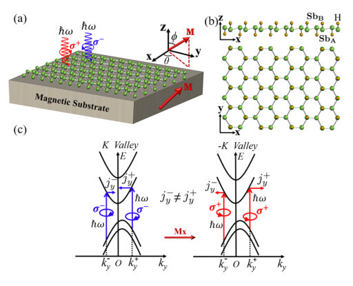 
FIG. 1. (a) Schematic of an atomic ML on a magnetic sub- strate with a tunable direction and strength of magnetization illuminated by circularly polarized light. (b) Top and side views of a ML SbH. (c) Band structure and valley-contrast optical transitions at the K and −K valleys under a magnetic exchange field along the x direction. The inversion symmetry of the energy dispersion is broken, which leads to unbalanced photocurrents (j+ y ̸= j− y ) and thus a nonzero photocurrent.

📷 Fig 2

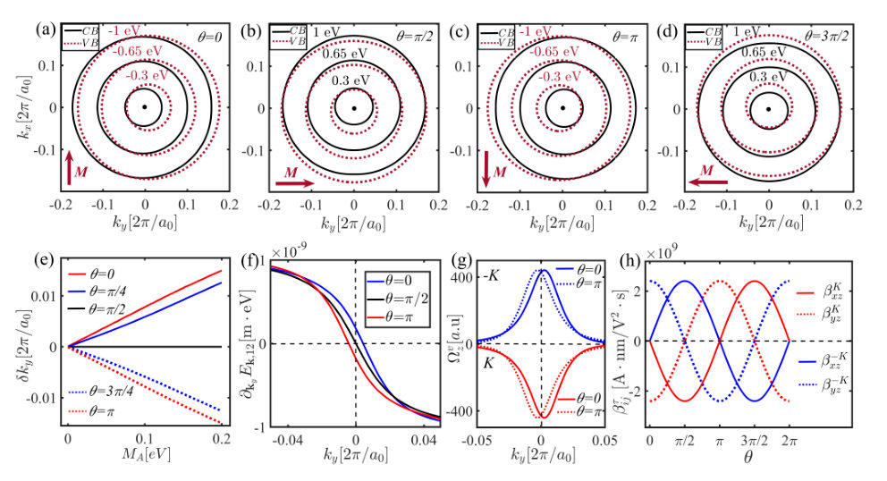 
FIG. 2. (a)-(d) Isoenergy contours showing shifts of conduction (solid) and valence bands (dashed) at the ±K valleys under in- plane magnetic exchange fields along various directions (θ = 0, π/2, π, 3π/2), depicted by the arrows. (e) Relative shifts between the ky values of the valence band maximum (VBM) and conduction band minimum (CBM), δky = ky(VBM)−ky(CBM), as functions of MA along different directions (θ = 0, π/4, π/2, 3π/4, π). (f) ∂kyEk,12 as functions of ky for different directions of M (θ = 0, π/2, π). (g) Berry curvatures Ωv z of the valence band at the ±K valleys for M along θ = 0 and π. (h) Evolution of CPGE tensors βτ xz (solid) and βτ yz (dashed) at the K (red) and −K valleys...

📷 Fig 3

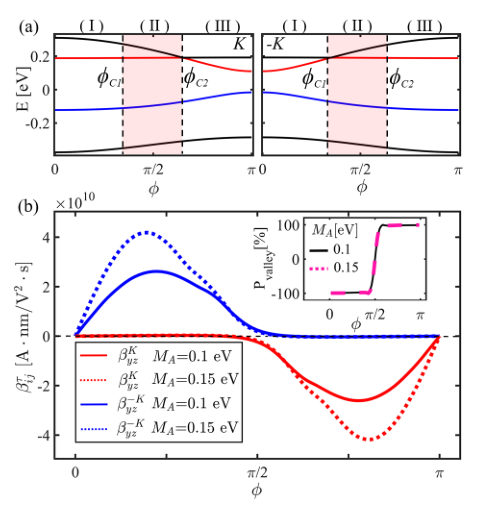 
FIG. 3. (a) Evolution of band-edge energies with ϕ at the ±K valleys. (b) Evolution of CPGE tensors βτ yz at the ±K valleys with the direction of magnetic exchange field ϕ for different strengths of MA = 0.1 and 0.15 eV. Inset: the valley polarization as a function of ϕ. The photon energy ¯hω = 0.29 eV, θ = 0.

📷 Fig 4

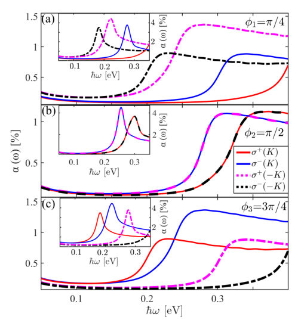 
FIG. 4. Absorption spectra of a ML SbH with magnetization directions (a) ϕ1 = π/4, (b) ϕ2 = π/2, and (c) ϕ3 = 3π/4. Inset: corresponding excitonic absorptions.

**Summary.** This paper proposes the Magneto-Circular Photogalvanic Effect (MCPGE), showing that magnetic coupling can induce helicity-dependent photocurrents in materials lacking inversion symmetry. By modeling monolayer SbH on a magnetic substrate, the authors use advanced calculations involving Berry curvature and excitonic responses to prove this effect, opening new avenues for optoelectronic device design.

**Why it may be interesting.** The work provides a clear mechanism to engineer optoelectronic response by controlling symmetry breaking using magnetism, which is highly relevant for designing novel quantum light-matter interaction devices.

Detailed structure

**Main problem.** The primary goal is to generate a helicity-dependent photocurrent (CPGE) in materials that possess inversion symmetry, overcoming the typical requirement of broken inversion symmetry.

**Main result.** The authors demonstrate that applying magnetic proximity effects can break the necessary symmetries, leading to a measurable Magneto-Circular Photogalvanic Effect (MCPGE) in an otherwise symmetric material like monolayer SbH.

**Method.** The mechanism is elucidated using a second-order response formalism derived from an effective Hamiltonian incorporating exchange and Rashba SOC terms. Optical absorption is analyzed via the Bethe-Salpeter equation.

**Model / system.** The model system is a monolayer (ML) SbH placed on a magnetic substrate with adjustable magnetization, treated as a 2D material exhibiting proximity magnetism. The Hamiltonian includes bare band structure, exchange interaction ($H_{	ext{ex}}$), and Rashba SOC ($H_R$).

**Key observables.** Photocurrents dependent on light helicity ($eta_{ij}(\omega)$ tensor components), Berry curvature ($\Omega_v^z$), and excitonic absorption spectra ($\alpha_{\pm}(\omega)$).

**Important parameters / regimes.** Substrate magnetization direction ($\hat{n}$), in-plane magnetic field angle ($	heta$), and out-of-plane component ($\phi$).

**Assumptions / limitations.** The analysis relies on a two-band model (lower CB/higher VB) for calculating the CPGE tensor, and uses approximations inherent in solving the Bethe-Salpeter equation.

**Figures summary.** Figures illustrate band structure shifts (isoenergy contours) under magnetic fields, the evolution of Berry curvatures ($\Omega_v^z$), and the dependence of the CPGE tensors on the angle ($	heta$) of the applied field.

**Paper structure.** The paper first introduces the concept of MCPGE in symmetric materials. It then details the theoretical framework using an effective Hamiltonian for ML SbH on a magnetic substrate. The core analysis involves calculating photocurrents via Berry curvature and analyzing optical responses through BSE, culminating in demonstrating how magnetic asymmetry enables the effect.

Abstract

Photocurrents that depend on the helicity of the incident light can be generated in both bulk and low-dimensional materials lacking inversion symmetry, known as the circular photogalvanic effect (CPGE). We propose that by employing a magnetic effect, the limitation on the inversion symmetry broken materials can be overcome, such that helicity-dependent photocurrent can be generated in a symmetric material, i.e., a magneto-circular photogalvanic effect (MCPGE). As a proof of principle, we elucidate the mechanism of such an MCPGE through an effective Hamiltonian of a monolayer SbH on a magnetic substrate with an adjustable magnetization. Moreover, the associated response in optical absorption is analyzed, both single-particle and excitonic, through a Bethe-Salpeter equation to describe the Coulomb interaction in excitons. Our result broadens the mechanism of CPGE and opens new opportunities for optoelectronic devices.

[↑ back to top](#top)

### [Revealing Hidden Unconventional Pairing through Nonreciprocal Transport](http://arxiv.org/abs/2608.09751v1)

**Authors:** Wen-Bo Dai, Ming Gong, Xianxin Wu, Chui-Zhen Chen, X. C. Xie  
**Type:** theory · **Category:** other · **PDF:** <https://arxiv.org/pdf/2608.09751v1>  
**Analysis basis:** full PDF text, analyzed in chunks
**Topic relevance:** `Keldysh / 2PI / non-Gaussian methods` **1/5** · `quantum measurements` **1/5**

📷 Fig 1

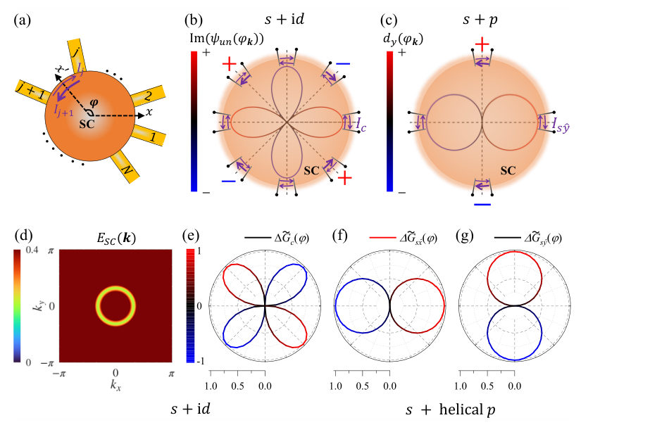 
FIG. 1. (Color online). Nonreciprocal detection scheme. (a) Schematic of nonreciprocal transport in a superconducting system (orange) connected to N terminals (gold). SC represents the superconducting region. A voltage bias applied to terminal j generates a charge or spin current I j+1 into terminal j + 1, while the reverse process induces I j. The direction x′ indicates the local interface normal, associated with the normal angle φ. (b–c) Angular distributions of the pairing components and associated nonreciprocal transport. Panels (b) and (c) display the time-reversal-breaking component Im[ψun(φk)] for an s + id state and the d-vector component dy(φk) for an s + p state, respectively. Red...

📷 Fig 2

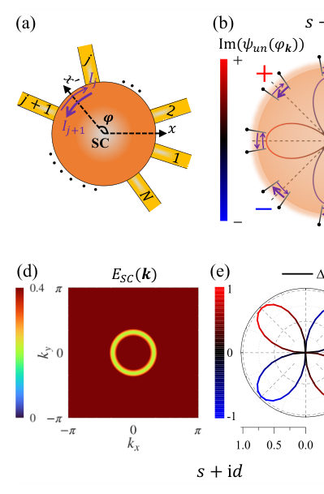 
Fig. 1(a) illustrates a superconducting region connected to multiple terminals. The superconducting region is modeled by a general effective Hamiltonian:

📷 Fig 3

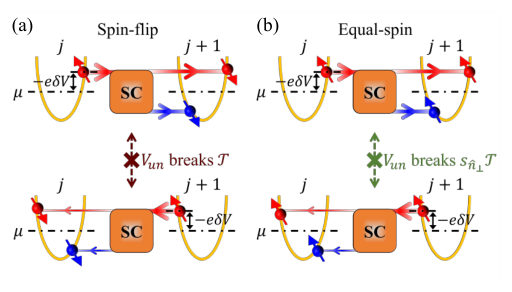 
FIG. 2. Microscopic origin of pairing-induced nonreciprocal trans- port. (a) Illustration of spin-flip scattering nonreciprocity, induced by time-reversal T -breaking pairing Vun. Here SC represents the su- perconducting region (orange) and δV denotes a small voltage bias. Top: The spin-flip scattering process from terminal j to j + 1. A spin-up electron from lead j is scattered into lead j + 1 as a spin- down electron or a spin-down hole. Bottom: The reverse process from terminal j + 1 to j. Line widths indicate injection/transmission probabilities. The red ball represents electron and the upward (down- ward) arrow represents spin-up (spin-down). (b) Similar to (a), but for the...

📷 Fig 4

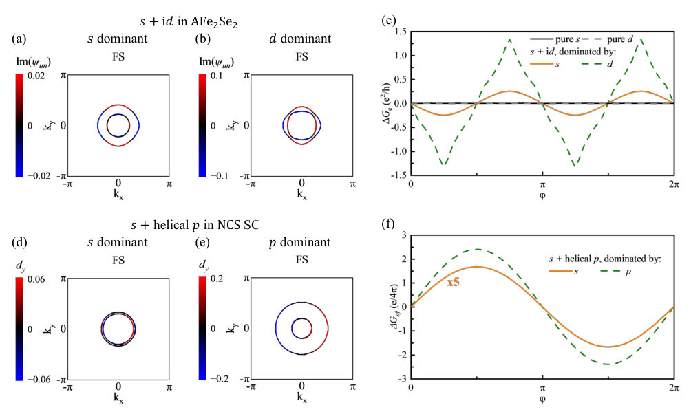 
FIG. 3. Pairing symmetry and nonreciprocal-transport fingerprints in candidate superconductors or material-specific nonreciprocal fingerprints of hidden unconventional pairing. (a-c) Pairing and nonreciprocal charge conductance in AFe2Se2 (a,b) Plots of the imaginary part Im[ψ(k)] on the Fermi surfaces. (c) Plots of the nonreciprocal charge conductance ∆Gc(φ) versus angle φ. (d-f) Pairing and nonreciprocal spin conductance in noncentrosymmetric superconductors (NCS SC). (d,e) Plots of the dy on the Fermi surfaces. (f) Plots of the nonreciprocal spin conductance ∆Gsˆy(φ) versus angle φ, where the curve for the s-wave-dominated case is amplified by a factor of 5.

📷 Fig 5

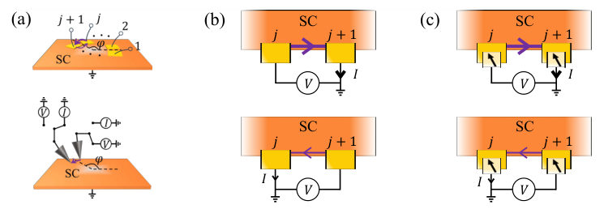 
FIG. 4. Experimental implementation of symmetry-resolved nonreciprocal transport or experimental protocols for measuring nonreciprocal conductance. (a) Multi-tip STM configuration for nonlocal differential conductance. SC represents the superconducting region (orange). At angle φ, the source probe injects current and measures voltage (V), while the drain probe extracts and monitors current (I). Exchanging probe roles reverses the current path (purple arrow) to probe the nonreciprocal component. (b) A pairwise measurement within a multiterminal measurement configuration for detecting nonreciprocal transport between leads j and j + 1. The reverse-bias configuration is obtained by exchanging...

**Summary.** The paper introduces nonreciprocal transport as a novel, symmetry-selective method to determine unconventional superconducting pairing symmetries. By measuring how conductance changes upon reversing current flow, researchers can isolate signatures arising only from symmetry-breaking components of the order parameter. This technique is highly valuable for characterizing complex materials where conventional measurements are ambiguous.

**Why it may be interesting.** This work provides a powerful, experimentally accessible diagnostic tool for characterizing complex superconducting pairing states without needing direct spectroscopic measurements of the gap structure itself.

Detailed structure

**Main problem.** The primary challenge is identifying the pairing symmetry of Cooper pairs in unconventional superconductors when the signal is obscured by a dominant s-wave component.

**Main result.** Nonreciprocal transport measurements provide a symmetry-resolved probe that can distinguish between different unconventional pairing symmetries (e.g., $s+id$ vs. spin-triplet) because pure s-wave states yield zero nonreciprocity.

**Method.** The authors develop a framework using the difference in conductance ($\Delta G$) when source and detector terminals are exchanged in multi-terminal devices, which is sensitive to symmetry breaking components of the superconducting order parameter.

**Model / system.** The study models superconductors (like iron-based or noncentrosymmetric materials) using an effective Hamiltonian incorporating both conventional s-wave pairing ($H_s$) and an unconventional component ($\lambda V_{un}$).

**Key observables.** Nonreciprocal charge conductance ($\Delta G_c$) and nonreciprocal spin conductance ($\Delta G_s$), which exhibit characteristic angular dependencies based on the underlying symmetry.

**Important parameters / regimes.** The magnitude of the unconventional pairing component ($\lambda$), the angle $\varphi$ (momentum space), and the ratio of disorder/roughness strength ($W/\mu$).

**Assumptions / limitations.** The method relies solely on symmetry considerations, making it robust against a dominant s-wave background; calculations often use the Andreev approximation.

**Figures summary.** Figures illustrate how nonreciprocity arises from specific angular dependencies ($	ext{Im}[\psi_{un}(\varphi_k)]$ for $s+id$, or $d$-vector components for spin-triplet) and show comparisons between different pairing symmetries and external perturbations like interface roughness.

**Paper structure.** The paper establishes the theoretical framework by defining nonreciprocity ($\Delta G$), demonstrates its sensitivity to symmetry breaking (comparing s-wave vs. unconventional), details how charge and spin channels probe distinct symmetries, and finally verifies the method's robustness against disorder and edge effects.

Abstract

Identifying the pairing symmetry of Cooper pairs is a fundamental step toward understanding the microscopic mechanisms of unconventional superconductors. However, experimental identification remains a formidable challenge, particularly when unconventional pairing is obscured by a dominant $s$-wave component that masks its spectroscopic signatures. Here, we develop a symmetry-resolved framework to identify superconducting pairing symmetry through nonreciprocal conductance upon exchanging source and detector terminals in multiterminal devices. We show that nonreciprocal transport arises from symmetry-breaking components of the superconducting order parameter and exhibits a characteristic angular dependence that encodes the momentum-space structure of the pairing gap. In particular, time-reversal-breaking singlet pairing induces nonreciprocal charge transport, while spin-triplet pairing generates nonreciprocal spin responses, providing distinct transport fingerprints of the underlying order. We demonstrate this mechanism using representative models of iron-based and noncentrosymmetric superconductors and outline experimental protocols for multiterminal measurements. Our results advance the theoretical understanding of nonreciprocal transport in superconductors, and establish it as a symmetry-selective probe for identifying hidden unconventional pairing in a wide range of superconducting materials.

[↑ back to top](#top)

### [Rogue Wave Statistics from a Sparse Coherent Structure Decomposition](http://arxiv.org/abs/2608.09584v1)

**Authors:** Yuchen He, Amin Chabchoub, Zhan Wang  
**Type:** both · **Category:** other · **PDF:** <https://arxiv.org/pdf/2608.09584v1>  
**Analysis basis:** full PDF text, analyzed in chunks
**Topic relevance:** `methods for driven-dissipative` **1/5**

📷 Fig 1

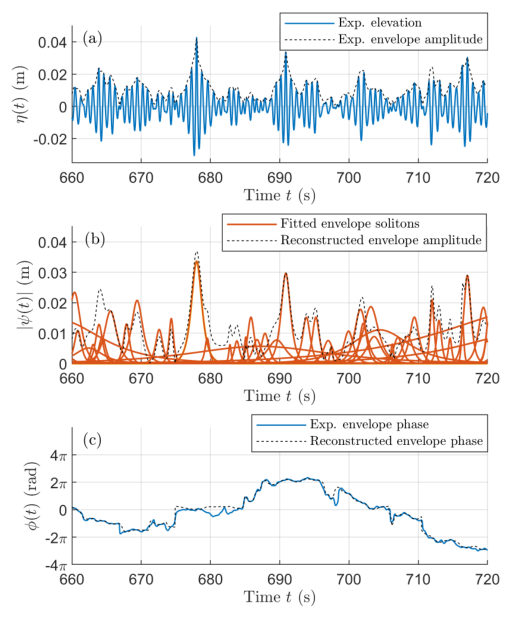 
FIG. 1: Soliton decomposition of a random wave field. (a) Measured surface elevation η(t) (blue solid line) and corresponding envelope |ψ(t)| (black dashed line) extracted via the Hilbert-Huang transform. (b) Soliton decomposition of the wave field into a sparse ensemble of individual soliton envelopes (red solid lines) using the matching pursuit algorithm. The total reconstructed envelope (black dashed line) closely follows the experimental profile. (c) Comparison between the experimental data phase (blue solid line) and the soliton-reconstructed phase (black dashed line), demonstrating excellent phase coherence despite the random nature of the field.

📷 Fig 2

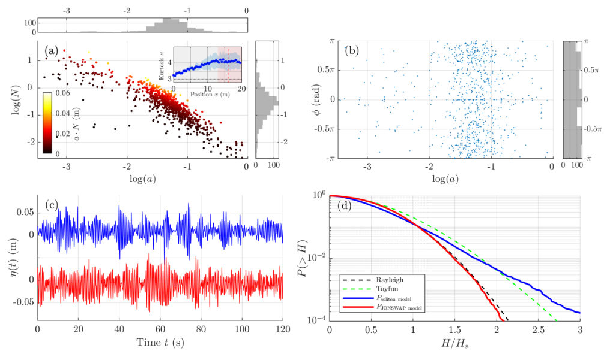 
FIG. 2: Statistical properties of soliton parameters and JONSWAP (γ = 6, ε = 0.08, fp = 1.3 Hz) wave field reconstruction. (a) Scatter plot of log(a) vs log(N) for 862 extracted solitons from a 1000-peak-period wave record at x ≈16 m. Top and right panels show the marginal histogram distributions of log(a) and log(N), respectively, with color indicating the effective soliton amplitude A = a · N. Top-right inset: Evolution of the kurtosis κ along the wave flume. The blue dotted line denotes the mean value computed by segmenting the time-series at each gauge, and the shaded area indicates the ±1σ uncertainty between 3 segments at each location. The red dashed line marks the reference...

📷 Fig 3

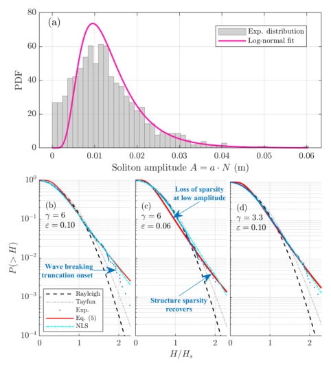 
FIG. 3: Predictive theoretical framework for extreme wave probabilities. Experimental data recorded at x ≈16 m with saturated kurtosis value (blue dots) are compared against the simplified theory (Eq. 5) mapped from the baseline statistics (red solid curve), the Tayfun distribution (gray dot-dashed), the Rayleigh distribution (black dashed), and the NLS simulation prediction for the respective sea states (cyan dot-dashed). (a) PDF with log-normal fit (µ = −4.4, σ = 0.5) of effective soliton amplitudes A = a · N extracted from the baseline experimental data as in Figure 1 with ε = 0.08 and peak-enhancement factor γ = 6. (b) Exceedance probability versus normalized wave height for an...

📷 Fig 4

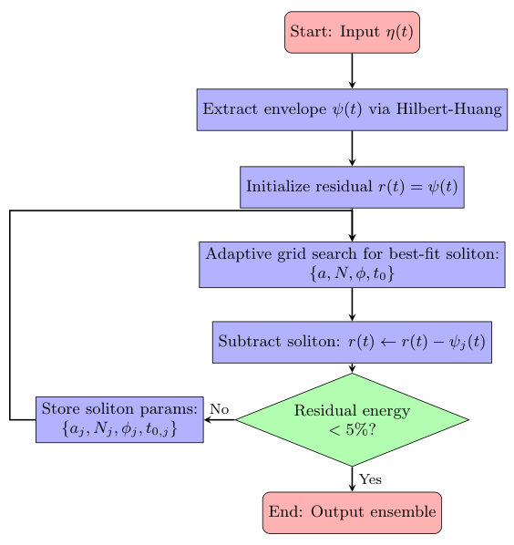 
FIG. 4: Flowchart of the iterative matching pursuit algorithm for extracting sparse soliton-like packets from the measured wave envelope. The loop continues until the residual energy falls below the 5% threshold.

📷 Fig 5

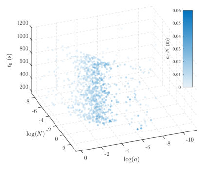 
FIG. 5: Three-dimensional scatter plot of extracted soliton parameters: log(a) versus log(N) versus peak emergence time t0. The points are distributed uniformly along the t0 axis over the full measurement duration, indicating that the coherent soliton-like packets emerge randomly in time with no preferred temporal localization.

**Summary.** This paper introduces a novel framework to predict rogue wave statistics by decomposing the measured wave field into a sparse ensemble of localized, soliton-like packets. By analyzing the log-normal distribution of these extracted structures, the authors derive an extreme value theory that successfully predicts the heavy tails in wave exceedance probabilities, validating their approach against laboratory hydrodynamic experiments.

**Why it may be interesting.** The methodology—using signal processing techniques like matching pursuit to decompose a complex random field into fundamental coherent structures whose statistical properties govern extreme events—is highly relevant for understanding nonlinear dynamics in optics or plasma physics where such decomposition methods are applicable.

Detailed structure

**Main problem.** Accurately predicting rogue wave statistics, which are extreme events in strongly nonlinear random wave fields.

**Main result.** The framework successfully predicts the heavy-tailed probability of exceedance for rogue waves by modeling the field as a sparse superposition of coherent soliton-like packets. This prediction shows good agreement with laboratory hydrodynamic experiments.

**Method.** An iterative matching pursuit algorithm is used to decompose the complex wave envelope into a sparse ensemble of localized solitons, whose statistical properties (log-normal amplitude distribution) are then fed into an Extreme Value Theory framework.

**Model / system.** The study analyzes rogue waves in deep-water random wave fields, using laboratory hydrodynamic experiments conducted in a wave flume. The underlying model treats the complex wave envelope as a sparse superposition of coherent soliton packets.

**Key observables.** Exceedance probability $P(> H)$, soliton amplitudes ($a$), number ($N$), and phase ($\phi$).

**Important parameters / regimes.** Sea state parameters like steepness ($\epsilon$) and peakedness ($\gamma$); the statistical moments ($\mu, \sigma$) derived from the extracted solitons.

**Assumptions / limitations.** The complex wave envelope can be accurately represented as a sparse superposition of localized soliton-like packets; the iterative decomposition process yields a physically robust representation despite inherent non-uniqueness.

**Figures summary.** Figures illustrate the successful reconstruction of the original wave envelope and phase using the extracted solitons, show the uniform distribution of soliton emergence times in 3D parameter space, and compare the predicted heavy-tailed exceedance probabilities against experimental data for various sea states.

**Paper structure.** The paper first establishes the limitation of conventional statistical models. It then details the novel decomposition method (matching pursuit) to extract sparse solitons from measured wave fields. Finally, it applies Extreme Value Theory using the statistics of these extracted solitons to predict and validate rogue wave probabilities against experimental data across multiple sea states.

Abstract

While conventional rogue wave statistical models rely on linear or weakly nonlinear descriptions of random seas, we demonstrate experimentally that moderately or strongly nonlinear wave fields can be represented by sparse ensembles of coherent soliton-like packets. These packets exhibit log-normal amplitude distributions together with uniformly distributed phases and peak emergence times. This sparse coherent structure framework naturally leads to an extreme value description in which the probability of exceedance is governed by the tail of the coherent-structure amplitude distribution. The prediction is validated against laboratory hydrodynamic experiments across a variety of unidirectional sea states, showing good agreement with the experimental observations and comparing favourably with conventional statistical prediction models while retaining analytical simplicity. Our results provide a direct physics-based link between sparse coherent structures and rogue wave probabilities, with broader implications for nonlinear wave physics in optics, cold gases, and plasmas.

[↑ back to top](#top)

### Other secondary papers (3)

Show other secondary papers

### [Effects of high-pressure synthesis on phase formation and superconducting properties of PrFeAsO1-xFx](http://arxiv.org/abs/2608.08083v1)

**Authors:** Priya Singh, Konrad Kwatek, Tatiana Zajarniuk, Tomasz Cetner, Jan Mizeracki, Shiv J. Singh  
**Type:** experiment · **Category:** strongly correlated electrons · **PDF:** <https://arxiv.org/pdf/2608.08083v1>  
**Analysis basis:** full PDF text, analyzed in chunks

📷 Fig 1

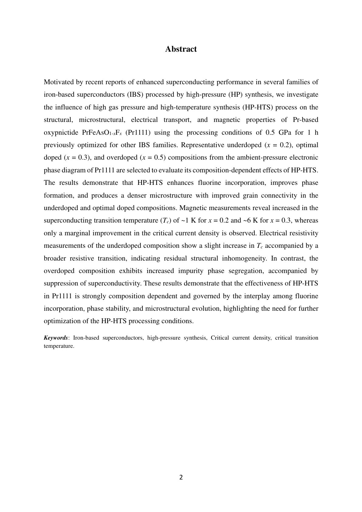 
Low-resolution page preview, page 2

📷 Fig 2

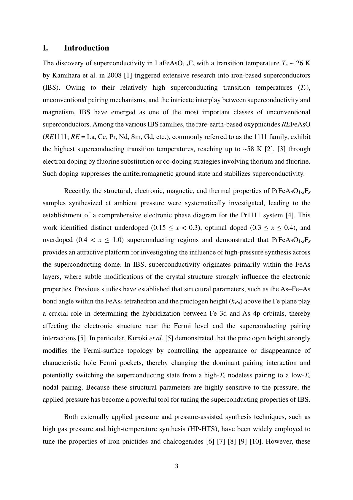 
Low-resolution page preview, page 3

📷 Fig 3

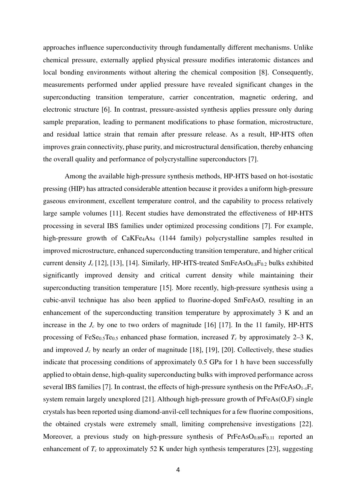 
Low-resolution page preview, page 4

📷 Fig 4

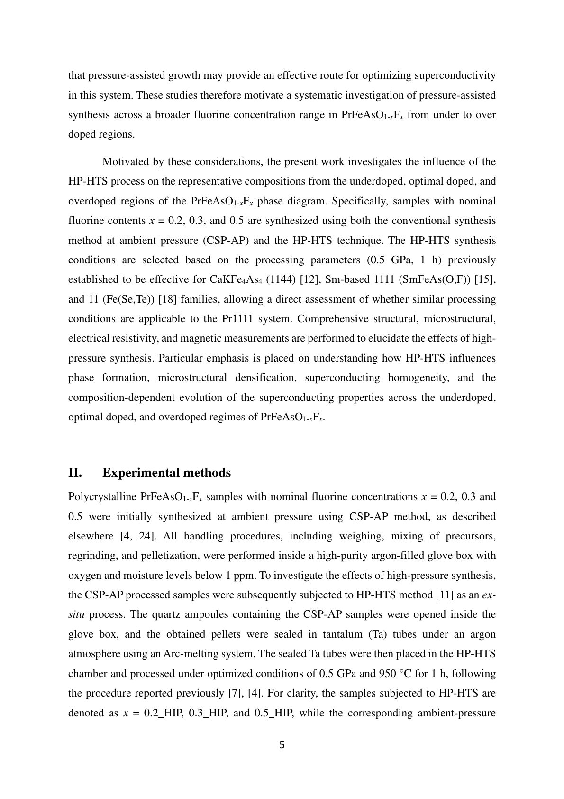 
Low-resolution page preview, page 5

📷 Fig 5

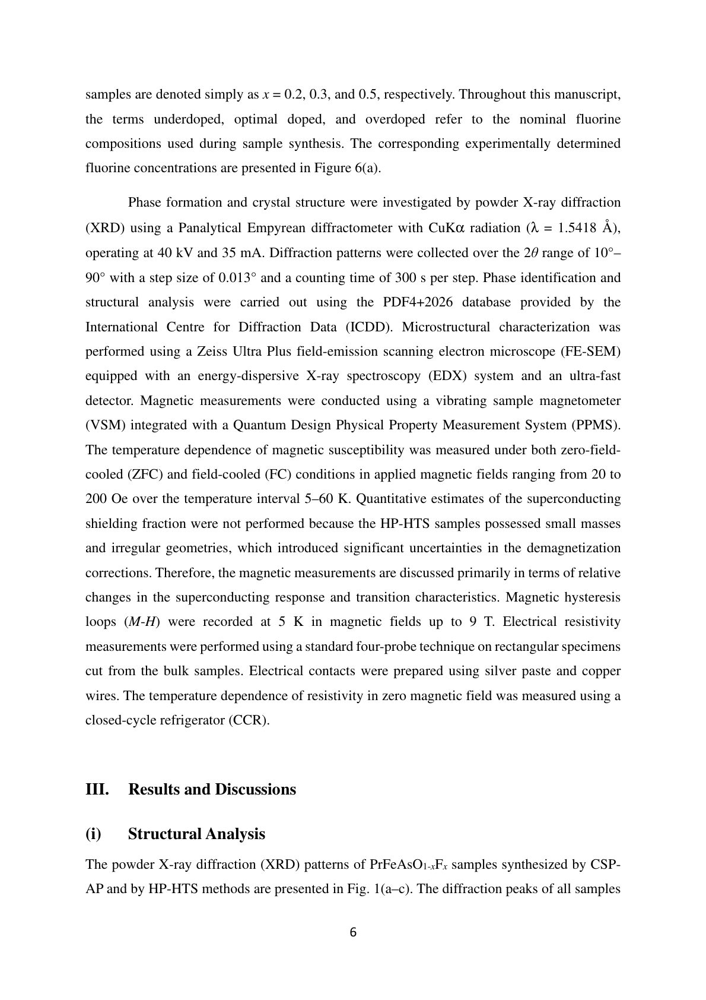 
Low-resolution page preview, page 6

**Summary.** This experimental work investigates how high-pressure synthesis modifies the superconducting performance of $	ext{PrFeAsO}_{1-x}	ext{F}_x$. The findings show that while high pressure improves crystal structure and raises $	ext{T}_c$ at optimal doping, this enhancement is highly sensitive to fluorine content; excessive doping leads to detrimental impurity phase formation.

**Why it may be interesting.** While focused on condensed matter superconductivity, the systematic study of phase stability and structural modification under extreme conditions (high pressure) provides insights into how external thermodynamic variables can tune electronic properties in correlated materials.

Detailed structure

**Main problem.** The study investigates how high-pressure/high-temperature synthesis (HP-HTS) affects the structural, superconducting, and magnetic properties of fluorine-doped iron pnictide superconductors ($	ext{PrFeAsO}_{1-x}	ext{F}_x$).

**Main result.** HP-HTS enhances superconductivity ($	ext{T}_c$ increase) and microstructure in underdoped/optimal compositions by improving fluorine incorporation, but this benefit is lost in overdoped samples due to impurity phase segregation.

**Method.** The research combines synthesis (ambient vs. high pressure), structural characterization (XRD, lattice parameter refinement), microstructural analysis (SEM), and transport measurements ($
ho(T)$, $M(H)$) across different doping levels.

**Model / system.** The physical system is the iron-based superconductor $	ext{PrFeAsO}_{1-x}	ext{F}_x$, which exhibits superconductivity dependent on fluorine substitution ($x$) and processing conditions. The study maps out the superconducting dome by testing underdoped, optimal, and overdoped regimes.

**Key observables.** Superconducting transition temperature ($	ext{T}_c$), critical current density ($	ext{J}_c$), lattice parameters ($a$, $c$), fluorine incorporation level ($x_{	ext{act}}$), and phase purity (secondary phases like $	ext{PrOF}$).

**Important parameters / regimes.** Doping concentration ($x=0.2, 0.3, 0.5$), synthesis pressure (0.5 GPa), temperature (950°C), and the interplay between fluorine content and phase stability.

**Assumptions / limitations.** The effectiveness of HP-HTS is assumed to be governed by achieving optimal fluorine incorporation without exceeding the solubility limit, which dictates structural integrity and superconducting performance.

**Figures summary.** Figures detail XRD patterns comparing synthesis methods, track lattice parameter changes with doping, show SEM images contrasting microstructures (porosity/connectivity), and plot $	ext{T}_c$ derived from both resistivity and magnetization measurements versus fluorine concentration.

**Paper structure.** The paper systematically compares samples synthesized under ambient pressure versus high pressure. It analyzes structural improvements (phase purity, densification) first, followed by quantitative measurements of superconducting properties ($	ext{T}_c$, $	ext{J}_c$) across the doping spectrum to establish composition-dependent limits.

Abstract

Motivated by recent reports of enhanced superconducting performance in several families of iron-based superconductors (IBS) processed by high-pressure (HP) synthesis, we investigate the influence of high gas pressure and high-temperature synthesis (HP-HTS) process on the structural, microstructural, electrical transport, and magnetic properties of Pr-based oxypnictide PrFeAsO1-xFx (Pr1111) using the processing conditions of 0.5 GPa for 1 h previously optimized for other IBS families. Representative underdoped (x = 0.2), optimal doped (x = 0.3), and overdoped (x = 0.5) compositions from the ambient-pressure electronic phase diagram of Pr1111 are selected to evaluate its composition-dependent effects of HP-HTS. The results demonstrate that HP-HTS enhances fluorine incorporation, improves phase formation, and produces a denser microstructure with improved grain connectivity in the underdoped and optimal doped compositions. Magnetic measurements reveal increased in the superconducting transition temperature (Tc) of ~1 K for x = 0.2 and ~6 K for x = 0.3, whereas only a marginal improvement in the critical current density is observed. Electrical resistivity measurements of the underdoped composition show a slight increase in Tc accompanied by a broader resistive transition, indicating residual structural inhomogeneity. In contrast, the overdoped composition exhibits increased impurity phase segregation, accompanied by suppression of superconductivity. These results demonstrate that the effectiveness of HP-HTS in Pr1111 is strongly composition dependent and governed by the interplay among fluorine incorporation, phase stability, and microstructural evolution, highlighting the need for further optimization of the HP-HTS processing conditions.

[↑ back to top](#top)

### [High Thermal Conductivity of Back-End-of-Line Compatible Diamond Films](http://arxiv.org/abs/2608.08534v1)

**Authors:** Jinwen Liu, Chufei Cheng, Feifei Tan, Jinquan Zhang, Di Lu, Bing Dai, Jiaqi Zhu, Runsheng Wang, Zhe Cheng  
**Type:** experiment · **Category:** other · **PDF:** <https://arxiv.org/pdf/2608.08534v1>  
**Analysis basis:** full PDF text, analyzed in chunks

📷 Fig 1

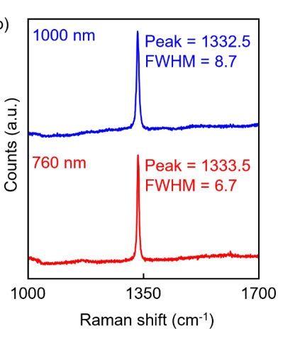 
Figure 1. TDTR measurement configuration and Raman characterization. (a)

📷 Fig 2

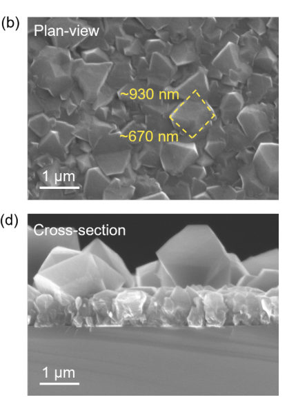 
Figure 2. Representative morphology of the diamond films. (a, b) Plan-view and (c,

📷 Fig 3

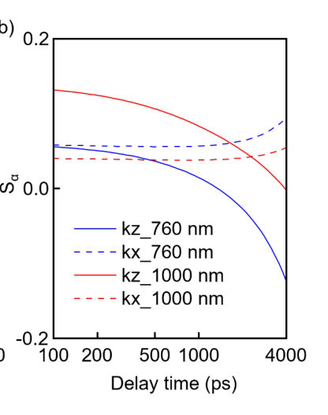 
Figure 3. Thermal conductivity of diamond films. (a) Effective thermal conductivity

**Summary.** This paper reports on the creation and characterization of polycrystalline diamond films suitable for use as dielectric heat spreaders in advanced semiconductor packaging (BEOL). Using TDTR measurements, the authors determined that these low-temperature grown films exhibit extremely high thermal conductivities, demonstrating their potential to improve thermal management in microelectronic devices.

**Why it may be interesting.** While focused on materials science/thermal engineering, the study's quantitative measurement of phonon transport in crystalline solids is relevant to understanding thermal properties in complex quantum systems or interfaces where heat dissipation is critical.

Detailed structure

**Main problem.** Developing thermally conductive dielectric materials for Back-End-of-Line (BEOL) thermal management that can operate within low temperature budgets (<400°C).

**Main result.** The authors successfully fabricated polycrystalline diamond films with effective room temperature thermal conductivities of 73 and 86 W m-1 K-1, which are significantly higher than conventional dielectrics.

**Method.** Characterization involved Raman spectroscopy to check crystal quality, SEM for morphology, and Time-Domain Thermoreflectance (TDTR) measurements to quantify thermal conductivity.

**Model / system.** The physical system is polycrystalline diamond films grown directly on an Si substrate at low temperatures. The analysis models the heat transport using an isotropic model due to the nearly-isotropic grain structure observed.

**Key observables.** Room temperature effective thermal conductivities ($\sim 73$ and $\sim 86 	ext{ W m}^{-1} 	ext{ K}^{-1}$), sharp diamond Raman peaks, and large grain sizes visible via SEM.

**Important parameters / regimes.** Low growth temperature (<400°C), film thicknesses (760 nm and 1000 nm), and the comparison to conventional dielectric materials' thermal conductivity.

**Assumptions / limitations.** The analysis assumes an isotropic thermal model ($\kappa_r = \kappa_z$) because sensitivity analysis showed comparable in-plane and cross-plane heat transport sensitivities.

**Figures summary.** Figures show TDTR measurement setups, Raman spectra confirming diamond purity, and SEM images illustrating the large grain size of the films.

**Paper structure.** The paper follows a standard experimental structure: introducing the thermal management problem in BEOL, detailing characterization methods (Raman, SEM, TDTR), presenting results showing high conductivity values, and concluding with the potential application of these low-temperature grown diamond layers.

Abstract

Back-end-of-line (BEOL) thermal management requires electrically insulating heat-spreading dielectric that can be integrated within thermal budgets below 400 C. Here, we report polycrystalline diamond films grown directly on Si at a substrate temperature below 400C. Two films with average thickness of 760 and 1000 nm were characterized by Raman spectroscopy, scanning electron microscopy (SEM), and time-domain thermoreflectance (TDTR). Raman spectra show a sharp diamond peak with minor signatures of non-diamond carbon, while SEM reveals lateral growth and large grain size. Temperature dependent TDTR measurements were performed from room temperature to 100C. Sensitivity analysis indicates that the sensitivity of cross-plane thermal conductivity is comparative to the in-plane thermal conductivity. Accordingly, the films were analyzed using an isotropic thermal model by considering the nearly-isotropic grain structure, yielding room temperature effective thermal conductivity of 73 and 86 W m-1 K-1, respectively. These values are about two orders of magnitude higher than those of conventional dielectric materials and demonstrate the potential of diamond films grown at low temperatures as dielectric heat-spreading layers.

[↑ back to top](#top)

### [Prediction of BaBiO$_3$-like superconducting perovskites in K-doped SrAsO$_3$](http://arxiv.org/abs/2608.09020v1)

**Authors:** Zhihong Yuan, Rui Liu, Pengyu Zheng, Zhiping Yin  
**Type:** theory · **Category:** strongly correlated electrons · **PDF:** <https://arxiv.org/pdf/2608.09020v1>  
**Analysis basis:** full PDF text, analyzed in chunks

📷 Fig 1

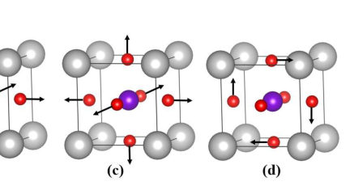 
FIG. 1. Crystal structure of A1-xKxAsO3(A = Ba, Sr) in the cubic perovskite

📷 Fig 2

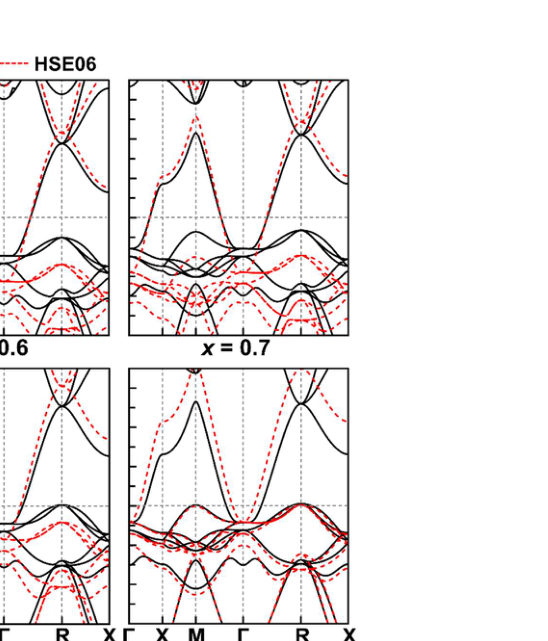 
FIG. 2. Electronic band structures of Sr1-xKxAsO3 (x = 0.5, 0.6, 0.7, 0.8, 0.9,

📷 Fig 3

 
FIG. 3. Total electronic density of states of Sr1-xKxAsO3 (x = 0.6, 0.8, 1.0) by

📷 Fig 4

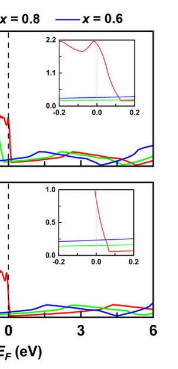 
FIG. 4. Electronic band structure (left) and density of states (right) of

📷 Fig 5

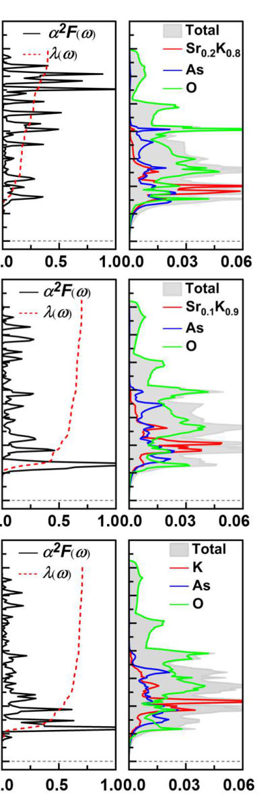 
FIG. 5. The DFPT-LDA calculated phonon spectra (left panel, the radius of the

**Summary.** This theoretical study predicts that K-doping stabilizes superconducting perovskites based on the $	ext{SrAsO}_3$ structure. Using first-principles calculations, they demonstrate strong electron-phonon coupling mediated by lattice vibrations, leading to a predicted high critical temperature ($T_c$) of 44.3 K for $	ext{Sr}_{0.4}	ext{K}_{0.6}	ext{AsO}_3$. The work highlights the necessity of advanced functionals like HSE06 to accurately capture these superconducting properties.

**Why it may be interesting.** While focused on solid-state physics, the strong electron-phonon coupling mechanism and the use of advanced correlated functional methods (like HSE06 corrections to DFT) are relevant for understanding pairing mechanisms in strongly interacting quantum systems.

Detailed structure

**Main problem.** The study aims to predict novel superconducting perovskites analogous to BaBiO$_3$ by investigating K-doped SrAsO$_3$. It seeks to understand the mechanism driving superconductivity in these doped materials.

**Main result.** K-doping stabilizes the cubic phase, and calculations predict phonon-mediated superconductivity with a high critical temperature ($T_c$) of 44.3 K for $	ext{Sr}_{0.4}	ext{K}_{0.6}	ext{AsO}_3$.

**Method.** The research employs first-principles Density Functional Theory (DFT) calculations, utilizing both LDA and the HSE06 hybrid functional to study electronic structure and calculate Electron-Phonon Coupling (EPC).

**Model / system.** The physical system is the perovskite compound $	ext{Sr}_{1-x}	ext{K}_x	ext{AsO}_3$, modeled using supercells and analyzed across varying K doping levels ($x$). The superconducting mechanism is attributed to strong electron-phonon coupling.

**Key observables.** EPC strength ($\lambda$), superconducting transition temperature ($T_c$), phonon dispersion curves, electronic band structures, and Density of States (DOS).

**Important parameters / regimes.** K doping concentration ($x$), HSE06 functional correction, $	ext{Sr}_{0.4}	ext{K}_{0.6}	ext{AsO}_3$ composition.

**Assumptions / limitations.** The study relies on DFT approximations and includes a methodological note regarding the exclusion of certain EPC contributions based on discrepancies between LDA and HSE06 electronic structure calculations at specific doping levels.

**Figures summary.** Figures illustrate soft-phonon instabilities in undoped phases, band structures comparing LDA/HSE06, orbital-resolved DOS for doped compounds, and phonon dispersion curves with calculated Eliashberg spectral functions ($\alpha^2	ext{F}(\omega)$).

**Paper structure.** The paper progresses by first establishing the instability of the undoped phase, showing how K-doping stabilizes it. It then calculates electronic properties using advanced functionals (HSE06) and quantifies superconductivity via EPC calculations, culminating in $T_c$ predictions.

Abstract

Using first-principles calculations, we predict a new perovskite compound SrAsO$_3$ . The undoped cubic phase has pronounced soft-phonon instabilities, which are gradually suppressed upon K doping the Sr site. The cubic phase becomes dynamically stable for K-doping levels above approximately 60%, and the stabilized K-doped phases are metallic with predicted conventional phonon mediated superconductivity. Moreover, the inclusion of nonlocal exchange interactions broadens the electronic bandwidth, enhances the electron-phonon coupling (EPC) strength, and increases the superconducting transition temperature ($T_c$) of these doped compounds. In particular, the HSE06 hybrid exchange-correlation functional corrected EPC constant $λ$ reaches 1.41 for Sr$_{0.4}$K$_{0.6}$AsO$_3$, corresponding to a predicted $T_c$ of 44.3 K. These results suggest that SrAsO$_3$ is a BaBiO$_3$-like superconducting perovskite driven by strong electron-phonon coupling.

[↑ back to top](#top)

