
# arxiv digest (quant-ph + cond-mat) — 2026-08-13

*103 papers · 28 relevant · 1 highlighted*

## 🔥 Most relevant (28)

*Every paper with at least one nonzero topic score, sorted by best-matching score. 🔥 marks scores ≥4/5. Click the title to jump to the full entry below; click [arXiv] to open the paper page. `(secondary)` marks papers from de-prioritized cond-mat archives.*

Show 28 relevant papers

- ⭐ [Phase diagram of lasing under correlated pump from GPU-accelerated Truncated Wigner dynamics](#paper-2608.10075) [[arXiv]](http://arxiv.org/abs/2608.10075v1) — 🔥 `superradiant laser` **5/5** · 🔥 `Keldysh / 2PI / non-Gaussian methods` **4/5** · 🔥 `Tavis-Cummings & cavity-many-emitter` **4/5** · 🔥 `correlated / nonlocal dissipation` **4/5** · `Dicke superradiance` **3/5** · `analog quantum simulation` **3/5** · `driven-dissipative phase transition` **3/5** · `methods for driven-dissipative` **3/5** · `non-equilibrium universality` **2/5** · `free-space correlated emission` **1/5** · `interference shaping light` **1/5**
- [Role of Goldstone mode in nonequilibrium insulator under DC electric field](#paper-2608.10547) [[arXiv]](http://arxiv.org/abs/2608.10547v1) — 🔥 `Keldysh / 2PI / non-Gaussian methods` **5/5** · 🔥 `non-equilibrium universality` **4/5** · `driven-dissipative phase transition` **3/5** · `methods for driven-dissipative` **3/5** · `Frenkel-Kontorova` **2/5** · `analog quantum simulation` **1/5** · `correlated / nonlocal dissipation` **1/5** · `scars & prethermalization` **1/5**
- [Dynamical Crossover in Landau$-$Zener Tunneling in Dissipative Rydberg Lattices](#paper-2608.10639) [[arXiv]](http://arxiv.org/abs/2608.10639v1) — 🔥 `Rydberg arrays` **4/5** · 🔥 `analog quantum simulation` **4/5** · 🔥 `driven-dissipative phase transition` **4/5** · `methods for driven-dissipative` **3/5** · `non-equilibrium universality` **3/5** · `Keldysh / 2PI / non-Gaussian methods` **2/5** · `correlated / nonlocal dissipation` **2/5** · `quantum measurements` **2/5** · `Tavis-Cummings & cavity-many-emitter` **1/5** · `scars & prethermalization` **1/5**
- [Boosting self hybridized exciton polaritons with metal clad WS2 waveguides](#paper-2608.10895) [[arXiv]](http://arxiv.org/abs/2608.10895v1) — 🔥 `analog quantum simulation` **4/5** · `driven-dissipative phase transition` **3/5** · `methods for driven-dissipative` **3/5** · `quantum optics experiment` **3/5** · `Tavis-Cummings & cavity-many-emitter` **2/5** · `interference shaping light` **2/5** · `non-equilibrium universality` **2/5** · `Keldysh / 2PI / non-Gaussian methods` **1/5** · `correlated / nonlocal dissipation` **1/5** · `quantum measurements` **1/5**
- [Floquet Green's functions for lattice electrons driven by Gaussian quantum light](#paper-2608.11189) [[arXiv]](http://arxiv.org/abs/2608.11189v1) — 🔥 `Keldysh / 2PI / non-Gaussian methods` **4/5** · `analog quantum simulation` **3/5** · `driven-dissipative phase transition` **3/5** · `interference shaping light` **3/5** · `methods for driven-dissipative` **3/5** · `correlated / nonlocal dissipation` **2/5** · `quantum measurements` **2/5** · `non-equilibrium universality` **1/5** · `quantum optics experiment` **1/5**
- [Steady-state phase transition in one-dimensional hybrid contact process](#paper-2608.10948) [[arXiv]](http://arxiv.org/abs/2608.10948v1) — 🔥 `driven-dissipative phase transition` **4/5** · 🔥 `methods for driven-dissipative` **4/5** · 🔥 `non-equilibrium universality` **4/5** · `Keldysh / 2PI / non-Gaussian methods` **3/5** · `correlated / nonlocal dissipation` **3/5** · `analog quantum simulation` **2/5** · `quantum measurements` **1/5**
- [Geometric Phonon Energy Pumping in a Layer-Hybridized Moiré Exciton Manifold](#paper-2608.10631) [[arXiv]](http://arxiv.org/abs/2608.10631v1) `(secondary)` — 🔥 `Full counting statistics` **4/5** · `driven-dissipative phase transition` **3/5** · `methods for driven-dissipative` **3/5** · `Keldysh / 2PI / non-Gaussian methods` **2/5** · `analog quantum simulation` **2/5** · `non-equilibrium universality` **2/5** · `quantum measurements` **2/5** · `correlated / nonlocal dissipation` **1/5** · `scars & prethermalization` **1/5**
- [Tunable Memory Effect in Dissipative Strongly Correlated Quantum Systems](#paper-2608.10534) [[arXiv]](http://arxiv.org/abs/2608.10534v1) — 🔥 `non-equilibrium universality` **4/5** · `Keldysh / 2PI / non-Gaussian methods` **3/5** · `analog quantum simulation` **3/5** · `correlated / nonlocal dissipation` **3/5** · `methods for driven-dissipative` **3/5** · `driven-dissipative phase transition` **2/5** · `quantum measurements` **1/5** · `scars & prethermalization` **1/5**
- [Anomalous current fluctuations in the stochastic XNOR hopping model](#paper-2608.10536) [[arXiv]](http://arxiv.org/abs/2608.10536v1) — 🔥 `Full counting statistics` **4/5** · 🔥 `scars & prethermalization` **4/5** · `methods for driven-dissipative` **3/5** · `non-equilibrium universality` **3/5** · `driven-dissipative phase transition` **2/5** · `analog quantum simulation` **1/5** · `correlated / nonlocal dissipation` **1/5** · `quantum measurements` **1/5**
- [Generating GKP states using quantum dots inside a strongly coupled cavity](#paper-2608.10604) [[arXiv]](http://arxiv.org/abs/2608.10604v1) — 🔥 `quantum optics experiment` **4/5** · `analog quantum simulation` **3/5** · `quantum measurements` **3/5** · `QC/QI experiment` **2/5** · `driven-dissipative phase transition` **2/5** · `methods for driven-dissipative` **2/5** · `Keldysh / 2PI / non-Gaussian methods` **1/5** · `Tavis-Cummings & cavity-many-emitter` **1/5** · `correlated / nonlocal dissipation` **1/5**
- [Impact of strain and dark states on spectroscopic measurements of silicon-vacancy centers in diamond](#paper-2608.11168) [[arXiv]](http://arxiv.org/abs/2608.11168v1) — 🔥 `methods for driven-dissipative` **4/5** · `correlated / nonlocal dissipation` **3/5** · `quantum measurements` **3/5** · `Keldysh / 2PI / non-Gaussian methods` **2/5** · `driven-dissipative phase transition` **2/5** · `quantum optics experiment` **2/5** · `QC/QI experiment` **1/5** · `interference shaping light` **1/5** · `non-equilibrium universality` **1/5**
- [Topological states of generalized dissipative Majorana wires](#paper-2608.10556) [[arXiv]](http://arxiv.org/abs/2608.10556v1) — 🔥 `driven-dissipative phase transition` **4/5** · 🔥 `methods for driven-dissipative` **4/5** · `Keldysh / 2PI / non-Gaussian methods` **3/5** · `correlated / nonlocal dissipation` **3/5** · `analog quantum simulation` **2/5** · `non-equilibrium universality` **2/5** · `quantum measurements` **1/5**
- [Work distribution for strongly coupled many-body open quantum systems](#paper-2608.11196) [[arXiv]](http://arxiv.org/abs/2608.11196v1) — 🔥 `methods for driven-dissipative` **4/5** · 🔥 `non-equilibrium universality` **4/5** · `Keldysh / 2PI / non-Gaussian methods` **3/5** · `correlated / nonlocal dissipation` **3/5** · `analog quantum simulation` **2/5** · `driven-dissipative phase transition` **2/5** · `scars & prethermalization` **1/5**
- [Jamming transition in an active exclusion process](#paper-2608.11041) [[arXiv]](http://arxiv.org/abs/2608.11041v1) — 🔥 `non-equilibrium universality` **4/5** · `driven-dissipative phase transition` **3/5** · `methods for driven-dissipative` **3/5** · `Frenkel-Kontorova` **2/5** · `Keldysh / 2PI / non-Gaussian methods` **2/5** · `correlated / nonlocal dissipation` **1/5** · `scars & prethermalization` **1/5**
- [From Zero to Mega-Gauss Fields: Comprehensive Magnetophotonic Spectroscopy of Graphene Dirac Cones](#paper-2608.10638) [[arXiv]](http://arxiv.org/abs/2608.10638v1) `(secondary)` — 🔥 `analog quantum simulation` **4/5** · `Keldysh / 2PI / non-Gaussian methods` **3/5** · `correlated / nonlocal dissipation` **2/5** · `quantum measurements` **2/5** · `driven-dissipative phase transition` **1/5** · `methods for driven-dissipative` **1/5** · `non-equilibrium universality` **1/5** · `quantum optics experiment` **1/5**
- [Bounds for Apparent Second-Law Violations in Quantum Trajectories](#paper-2608.10118) [[arXiv]](http://arxiv.org/abs/2608.10118v1) — 🔥 `quantum measurements` **4/5** · `methods for driven-dissipative` **3/5** · `non-equilibrium universality` **3/5** · `driven-dissipative phase transition` **2/5** · `Keldysh / 2PI / non-Gaussian methods` **1/5** · `correlated / nonlocal dissipation` **1/5**
- [Moving Analogue Horizons in Stationary Ferroelectrics](#paper-2608.10371) [[arXiv]](http://arxiv.org/abs/2608.10371v1) `(secondary)` — 🔥 `analog quantum simulation` **4/5** · `driven-dissipative phase transition` **2/5** · `non-equilibrium universality` **2/5** · `Frenkel-Kontorova` **1/5** · `Keldysh / 2PI / non-Gaussian methods` **1/5** · `methods for driven-dissipative` **1/5** · `superradiant laser` **1/5**
- [Photonic realization of a subgraph extraction in a quantum random network](#paper-2608.10663) [[arXiv]](http://arxiv.org/abs/2608.10663v1) — 🔥 `QC/QI experiment` **4/5** · `analog quantum simulation` **3/5** · `quantum optics experiment` **3/5** · `interference shaping light` **1/5** · `quantum measurements` **1/5**
- [Projection measurement of the comb basis through free-electron-photon interactions](#paper-2608.10831) [[arXiv]](http://arxiv.org/abs/2608.10831v1) — 🔥 `quantum measurements` **4/5** · `quantum optics experiment` **3/5** · `analog quantum simulation` **2/5** · `QC/QI experiment` **1/5** · `driven-dissipative phase transition` **1/5** · `methods for driven-dissipative` **1/5**
- [Assessing fidelity-limiting factors and achieving single-qubit gate fidelity beyond 99.999% in driven silicon spin qubits](#paper-2608.11072) [[arXiv]](http://arxiv.org/abs/2608.11072v1) — 🔥 `QC/QI experiment` **4/5** · `correlated / nonlocal dissipation` **2/5** · `quantum measurements` **2/5** · `driven-dissipative phase transition` **1/5** · `methods for driven-dissipative` **1/5** · `quantum optics experiment` **1/5**
- [Long-lived memory effects in the defect bath of superconducting qubits](#paper-2608.10087) [[arXiv]](http://arxiv.org/abs/2608.10087v1) — 🔥 `QC/QI experiment` **4/5** · `correlated / nonlocal dissipation` **3/5** · `quantum measurements` **2/5** · `driven-dissipative phase transition` **1/5** · `methods for driven-dissipative` **1/5**
- [Real-Time FPGA-Based Multi-Parameter Feedback Stabilization of a Silicon Double Quantum Dot](#paper-2608.10325) [[arXiv]](http://arxiv.org/abs/2608.10325v1) `(secondary)` — 🔥 `QC/QI experiment` **4/5** · 🔥 `quantum measurements` **4/5** · `methods for driven-dissipative` **1/5**
- [Eliminating photon transport in long-baseline optical interferometry using quantum memories](#paper-2608.10078) [[arXiv]](http://arxiv.org/abs/2608.10078v1) — 🔥 `interference shaping light` **4/5** · `quantum measurements` **3/5** · `correlated / nonlocal dissipation` **1/5**
- [Studying electron beam coherence using plasmon interference](#paper-2608.10842) [[arXiv]](http://arxiv.org/abs/2608.10842v1) `(secondary)` — 🔥 `quantum measurements` **4/5** · `interference shaping light` **3/5** · `quantum optics experiment` **1/5**
- [Nanoscale graphitization and defect evolution in silicon-vacancy center-containing nanodiamonds under high-pressure high-temperature annealing](#paper-2608.10632) [[arXiv]](http://arxiv.org/abs/2608.10632v1) — 🔥 `QC/QI experiment` **4/5** · `quantum optics experiment` **2/5** · `quantum measurements` **1/5**
- [Composite-Boson Ansatz for Fractional Quantum Hall Manifolds of Lattice Bosons at Generic Fillings $ν<1/2$](#paper-2608.10747) [[arXiv]](http://arxiv.org/abs/2608.10747v1) — 🔥 `analog quantum simulation` **4/5** · `Full counting statistics` **1/5** · `quantum measurements` **1/5**
- [Two-component ultracold Bose gases with spin-orbit coupling](#paper-2608.10722) [[arXiv]](http://arxiv.org/abs/2608.10722v1) — 🔥 `analog quantum simulation` **4/5** · `Keldysh / 2PI / non-Gaussian methods` **1/5** · `driven-dissipative phase transition` **1/5**
- [Spin Splitter without Spin-Split Bands: A Reconfigurable Altermagnetic Texture](#paper-2608.10958) [[arXiv]](http://arxiv.org/abs/2608.10958v1) — 🔥 `analog quantum simulation` **4/5** · `Keldysh / 2PI / non-Gaussian methods` **1/5**

## ⭐ Highlighted (1)

*Papers by authors on your watch list. Click the title to jump to the full entry below; click [arXiv] to open the paper page.*

Show 1 highlighted papers

- ⭐ [Phase diagram of lasing under correlated pump from GPU-accelerated Truncated Wigner dynamics](#paper-2608.10075) [[arXiv]](http://arxiv.org/abs/2608.10075v1) — Martino Stefanini, Jamir Marino

## All papers (81, sorted by relevance)

*Papers from quant-ph and your primary cond-mat archives (quant-gas, stat-mech, str-el, dis-nn). Highlighted papers (⭐) come first, then everything else sorted by topic-relevance score, highest first.*

### ⭐ [Phase diagram of lasing under correlated pump from GPU-accelerated Truncated Wigner dynamics](http://arxiv.org/abs/2608.10075v1)

**Highlighted author(s):** Martino Stefanini, Jamir Marino  
**Authors:** Oksana Chelpanova, Martino Stefanini, Michael O'Keeffe, Jamir Marino  
**Type:** theory · **Category:** other · **PDF:** <https://arxiv.org/pdf/2608.10075v1>  
**Analysis basis:** full PDF text, analyzed in chunks
**Topic relevance:** 🔥 `superradiant laser` **5/5** · 🔥 `Keldysh / 2PI / non-Gaussian methods` **4/5** · 🔥 `Tavis-Cummings & cavity-many-emitter` **4/5** · 🔥 `correlated / nonlocal dissipation` **4/5** · `Dicke superradiance` **3/5** · `analog quantum simulation` **3/5** · `driven-dissipative phase transition` **3/5** · `methods for driven-dissipative` **3/5** · `non-equilibrium universality` **2/5** · `free-space correlated emission` **1/5** · `interference shaping light` **1/5**

↔ Scroll figures horizontally

<figure class="paper-figure-card">
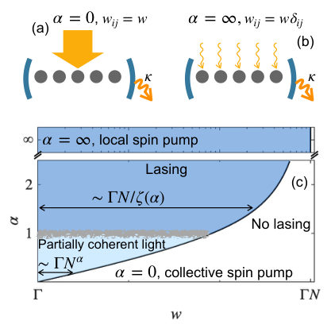
<figcaption class="paper-figure-caption"><b>Fig 1.</b> FIG. 1. Schematics of the setup for collective (a) and local (b) spin pump. (c) Sketch of the phase diagram that identifies param- eter regimes where atoms emit coherent/partially coherent light (las- ing, blue) vs thermal radiation (white) as a function of pump rate and the exponent α which controls the range of correlated pump wi j = w/(1 + |i −j|)α. Here w is plotted in logarithmic scale. We identify the upper bound on the transition from partially coherent to coherent light at α ≲1 which allows to reduce the pump intensity by at least factor log N compared to conventional SR lasing.</figcaption>
</figure>
<figure class="paper-figure-card">
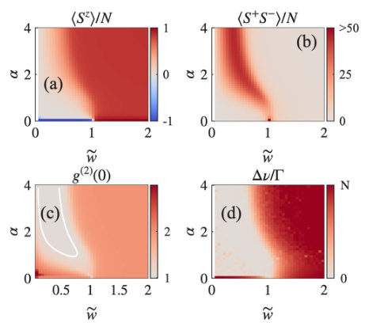
<figcaption class="paper-figure-caption"><b>Fig 2.</b> FIG. 2. Steady-state observables: (a) magnetization ⟨S z⟩, (b) inten- sity ⟨S +S −⟩, (c) second-order coherence g(2), and (d) linewidth ∆ν as functions of the normalized pump rate ˜w and the exponent α. The white contour in panel (c) delimits an approximate region of coher- ent emission. For α = 0, the pump and loss preserve strong per- mutation symmetry, which confines the dynamics to the symmetric Dicke manifold and precludes an extended coherent-lasing regime. For α ≳2, the pump becomes effectively short-ranged.</figcaption>
</figure>
<figure class="paper-figure-card">
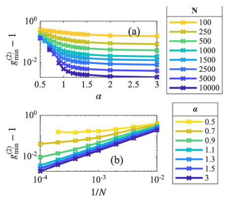
<figcaption class="paper-figure-caption"><b>Fig 3.</b> FIG. 3. Minimal value of the second-order coherence as a function of α (a) and N (b). The data place an upper bound near α ≈1 on the crossover to coherent emission and identify the region α &gt; 2 as effectively local, or short-ranged, pumping. The α = 0 result, for which the second-order coherence approaches g(2)(0) →6/5, is not shown here.</figcaption>
</figure>
<figure class="paper-figure-card">
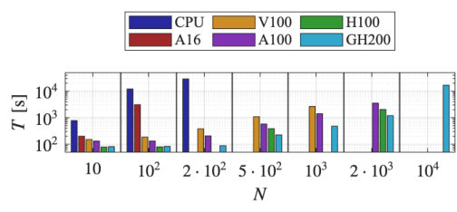
<figcaption class="paper-figure-caption"><b>Fig 4.</b> FIG. 4. Computational time required to simulate the TWA dynamics of a system with correlated pumping as a function of the system size, using a single-core CPU and five NVIDIA GPUs. For all simula- tions, we fix Ntrj = 213 and use the same number of integration steps, corresponding to a steady-state preparation time τr = 5 followed by an evolution time τ = 10. The decay rate Γ is adjusted with N so that ΓN∆t remains constant. This protocol isolates the dependence of the computational cost on the system size. Simulations were terminated when the computation time exceeded several hours.</figcaption>
</figure>

**Summary.** The paper analyzes superradiant lasing using a model of atoms driven by spatially correlated pumps, ranging from fully collective to purely local driving. By employing GPU-accelerated TWA simulations, the authors demonstrate that tuning the pump correlation exponent ($\alpha$) provides a powerful knob to suppress recoil heating while maintaining high optical coherence in the emitted light.

**Why it may be interesting.** This work directly addresses open quantum systems dynamics in cavity QED/optics. The ability to tune coherence and dissipation independently via the pump structure ($\alpha$) is highly relevant for designing robust quantum light sources.

Detailed structure

**Main problem.** The study investigates how varying the spatial correlation range ($\alpha$) of an external pump field affects the lasing dynamics in Superradiant (SR) lasers, balancing drive intensity, medium heating, and emitted light coherence.

**Main result.** Correlated pumping allows for a significant reduction in the required driving strength compared to local pumping, while maintaining high optical coherence ($g^{(2)} 	o 1$) even when the pump correlation range is short ($\alpha \approx 1$).

**Method.** The dynamics are simulated using the Truncated Wigner Approximation (TWA), which allows for efficient GPU-accelerated calculation of steady-state observables across a wide parameter space.

**Model / system.** The system models $N$ two-level atoms arranged on a 1D chain, coupled to a single cavity mode. The pumping mechanism is generalized by a power-law decay $w_{ij} \propto (|	ext{i}-	ext{j}|+1)^{-\alpha}$, interpolating between collective ($\alpha=0$) and local ($\alpha	o\infty$) driving.

**Key observables.** Steady-state magnetization ($\langle S_z 
angle$), intensity, second-order coherence ($g^{(2)}$), and linewidth ($\Delta
u$).

**Important parameters / regimes.** The correlation exponent $\alpha$, the pump rate $w$, and system size $N$. Key regimes include $\alpha=0$ (collective) and $\alpha=\infty$ (local).

**Assumptions / limitations.** The primary approximation used is the Truncated Wigner Approximation (TWA), which maps quantum dynamics onto classical stochastic trajectories.

**Figures summary.** Figures illustrate phase diagrams showing transitions between different light regimes based on pump rate and $\alpha$, and compare observables like $g^{(2)}$ and linewidth for various pumping limits ($\alpha=0$ vs. finite $\alpha$).

**Paper structure.** The paper establishes the physical model using a generalized Lindblad master equation, details the TWA methodology suitable for GPU computation, analyzes key observables (coherence, drive strength), and concludes by mapping out how the pump correlation acts as a tunable knob controlling these competing physical effects.

Abstract

Superradiant (SR) lasers store optical coherence in the atomic medium rather than the cavity field, but the incoherent drive that sustains inversion imposes a trade-off: local pumping yields coherent light at a rate that grows linearly with the atom number $N$, heating the medium through photon recoil, whereas fully collective pumping removes this scaling but limits the emission to partial coherence. We interpolate between these limits employing a spatially correlated pump on a chain of $N$ two-level atoms, with rates decaying with distance between atoms as a power law of exponent $α$. To study systems beyond the reach of exact solutions, we employ the Truncated Wigner Approximation (TWA), whose independent trajectories are ideally suited to GPU parallelism. Harnessing this, we perform a full scan of the steady-state observables for up to $10^4$ atoms at a computational cost that is practical. Our findings indicate that ultra-narrow emission persists for all $α$, while the coherence improves as the pump becomes shorter ranged, with $g^{(2)} \to 1$ surviving at least down to $α\approx 1$, indicating that fully coherent light thus does not require local pumping. The drive strength needed for lasing is reduced by a factor $N^{1-α}$ for $α< 1$, and by $\log N$ as $α\to 1$, parametrically suppressing recoil heating; notably, $α= 1$ matches the far-field envelope of dissipative couplings in free space. The correlation range of the pump thus acts as a knob trading drive intensity, and the heating it causes, against optical coherence.

[↑ back to top](#top)

### [Role of Goldstone mode in nonequilibrium insulator under DC electric field](http://arxiv.org/abs/2608.10547v1)

**Authors:** Xi Chen, Jong E. Han  
**Type:** theory · **Category:** strongly correlated electrons · **PDF:** <https://arxiv.org/pdf/2608.10547v1>  
**Analysis basis:** full PDF text, analyzed in chunks
**Topic relevance:** 🔥 `Keldysh / 2PI / non-Gaussian methods` **5/5** · 🔥 `non-equilibrium universality` **4/5** · `driven-dissipative phase transition` **3/5** · `methods for driven-dissipative` **3/5** · `Frenkel-Kontorova` **2/5** · `analog quantum simulation` **1/5** · `correlated / nonlocal dissipation` **1/5** · `scars & prethermalization` **1/5**

↔ Scroll figures horizontally

<figure class="paper-figure-card">
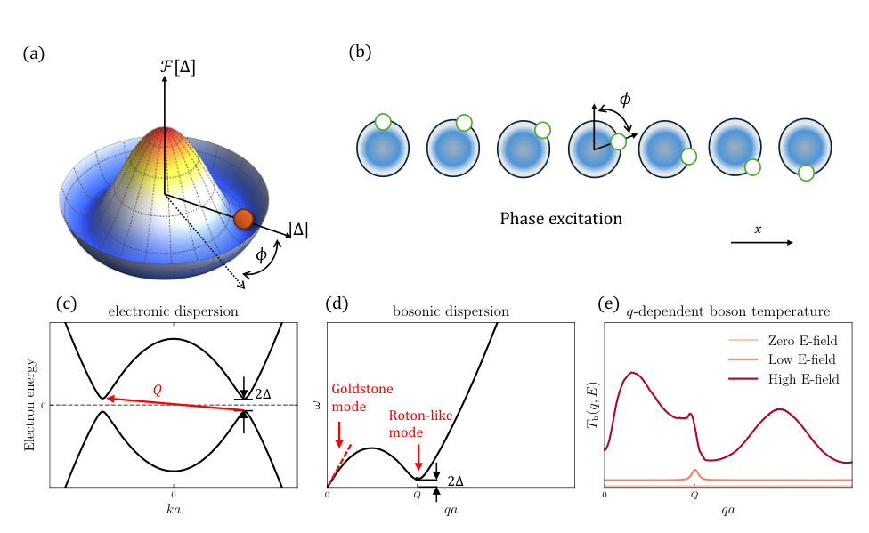
<figcaption class="paper-figure-caption"><b>Fig 1.</b> FIG. 1. (a) Schematic equilibrium free-energy landscape F[∆] for the complex order parameter ∆. At low temperature the minimum occurs at a finite amplitude |∆|, forming a Mexican-hat-like profile with a continuum of degenerate minima: the free energy is insensitive to the global phase ϕ, while the ground state spontaneously selects a specific ϕ. (b) Illustration of a spatially varying phase texture ϕ(x) along the chain at fixed |∆|. Collective behavior of the phase corresponds to the gapless collective excitation (Goldstone mode) associated with the spontaneously broken symmetry. (c) Schematic electronic band structure of the symmetry-broken insulating state, where a gap 2∆opens around the...</figcaption>
</figure>
<figure class="paper-figure-card">
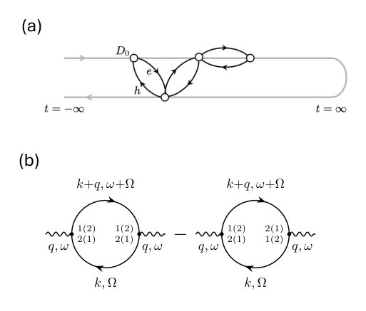
<figcaption class="paper-figure-caption"><b>Fig 2.</b> FIG. 2. (a) Diagrammatic representation of the phase-mode propagation along the Keldysh time-contour (grey line) me- diated by electron-hole excitations. The bare phase propa- gator (empty circle) introduced by the Hubbard-Stratonovich transformation is local in time. (b) The electron-hole bubble diagrams for the self-energy of the phase mode. The solid line is the electron GF with orbital indices 1 and 2, and the wavy line is the phase mode propagator.</figcaption>
</figure>
<figure class="paper-figure-card">
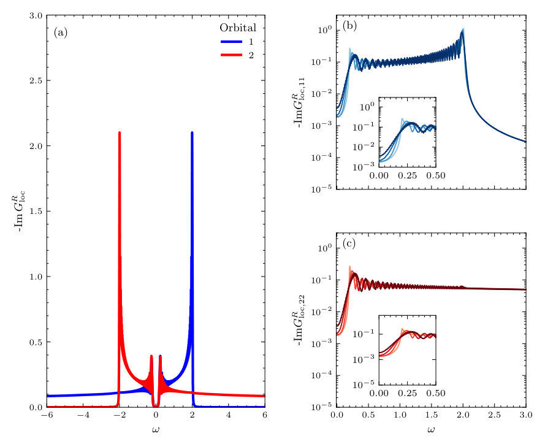
<figcaption class="paper-figure-caption"><b>Fig 3.</b> FIG. 3. (a) Local spectral function −Im GR loc(ω) for orbital 1 (blue) and orbital 2 (red) at E = 0.005, Γ = 0.005, ∆= 0.2, µ = 2 (see the text for discussion of the tight-binding parameter t). The bath temperature is fixed at Tbath = 0.001. (b),(c) Local spectral functions for orbital 1 and orbital 2, respectively, for a set of DC fields E ∈[0.001, 0.006] with the step 0.001 (from light to dark). The insets highlight the gap region, where a finite in-gap spectral weight develops due to coupling to the dissipative bath.</figcaption>
</figure>
<figure class="paper-figure-card">
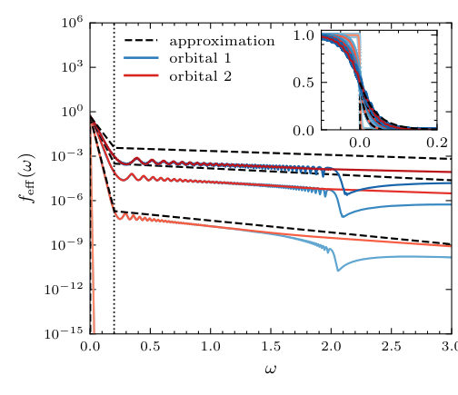
<figcaption class="paper-figure-caption"><b>Fig 4.</b> FIG. 4. Nonequilibrium distribution of electrons, feff(ω), on orbital 1(blue) and 2(red) at DC electric fields from E = 0 (light color) to E = 0.006 (dark) in steps of 0.002. At E = 0, feff(ω) reduces to the equilibrium Fermi-Dirac distribution. With increasing E, the Fermi-Dirac distribution is smeared around the Fermi energy, reflecting field-induced excitations. The black dashed lines show the analytic approximation of Eq. (43). The vertical dotted line marks the band edge ω = ∆. The inset plots the low-energy region on a linear scale to highlight the field-induced smearing near Fermi-level. The two orbitals exhibit nearly identical distribution, with only small difference near the band...</figcaption>
</figure>
<figure class="paper-figure-card">
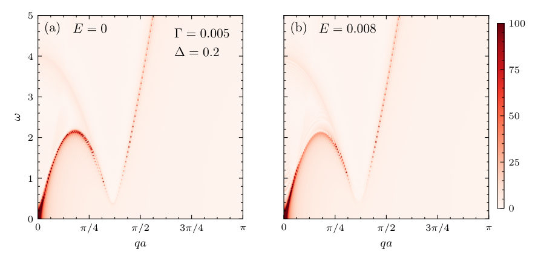
<figcaption class="paper-figure-caption"><b>Fig 5.</b> FIG. 5. Color maps of the real part of the retarded boson propagator, |Re DR(q, ω)|, used to identify the pole structure corresponding to the phase mode. Panels (a) and (b) show the numerical result at E = 0 and E = 0.008, respectively, at dissipation Γ = 0.005, gap parameter ∆= 0.2 and lattice constant a = 0.4. In both panels, well-defined dispersion relations confirm the existence of the Goldstone mode. At E = 0 the linear dispersion relation agrees with the equilibrium benchmark; under the applied field the dispersion remains essentially unchanged, indicating that the Goldstone mode persists in the nonequilibrium steady state while the system remains gapped.</figcaption>
</figure>

**Summary.** This work proposes that the resistive breakdown of ordered insulators under a DC electric field is governed by the excitation of gapless Goldstone modes associated with broken symmetry. Using Keldysh Green's functions, the authors demonstrate that these collective bosonic excitations heat up much faster than the electrons, predicting a lower critical switching field than single-particle theories suggest.

**Why it may be interesting.** The focus on collective bosonic modes (Goldstone mode) mediating transport breakdown is highly relevant to understanding non-equilibrium dynamics in correlated electron systems, bridging concepts from superfluidity/CDWs into electronic transport physics.

Detailed structure

**Main problem.** The paper investigates an alternative mechanism for resistive breakdown (insulator-to-metal transition) in ordered insulators under a DC electric field, moving beyond single-electron excitation theories.

**Main result.** It shows that fluctuations of the order parameter via the gapless Goldstone mode can heat up much more rapidly than electronic excitations, suggesting collective phase dynamics significantly reduce the critical switching field.

**Method.** The analysis employs the Keldysh Green's function formalism to study non-equilibrium steady states under an applied electric field.

**Model / system.** The system is modeled using a Hubbard-like Hamiltonian in 1D with inter-band interactions, leading to spontaneous symmetry breaking and the emergence of both gapped (Higgs) and gapless (Goldstone) bosonic excitations.

**Key observables.** Effective temperatures of the Goldstone mode ($T_b$) versus electronic temperature ($T_e$), and the critical threshold electric fields ($E_{b	ext{th}}$ vs $E_{e	ext{th}}$).

**Important parameters / regimes.** The gap parameter ($\Delta$), hopping integral ($t$), DC electric field strength, and the ratio of $\Delta/\Gamma$ (where $\Gamma$ is a dissipation rate).

**Assumptions / limitations.** The analysis uses approximations such as the Random-Phase Approximation (RPA) for boson self-energies and initially neglects spatial inhomogeneity.

**Figures summary.** Figures schematically illustrate the free energy landscape, phase textures, electronic band gaps opening at a wavevector Q, and the resulting bosonic dispersion relation, comparing spectral features under different electric fields.

**Paper structure.** The paper progresses from establishing the physical context (resistive switching) to developing the theoretical framework using Keldysh GF formalism. It first analyzes equilibrium excitations, then extends this to non-equilibrium steady states by incorporating dissipation and the DC field, culminating in a comparison of effective temperatures for electrons and bosons.

Abstract

Measurements of resistive breakdown in electronic systems under a DC electric field have shown that the threshold fields for the insulator-to-metal transition are significantly lower than predicted by single-electron excitation scenarios, such as the Landau-Zener theory. In this work, we propose an alternate mechanism of destabilizing ordered insulators under a DC electric field by fluctuations of the order parameters through the Goldstone mode excitation. The low-energy bosonic excitations receive energy from accelerated electrons and thus destroy the spontaneous symmetry breaking. Using the Keldysh Gree's function formalism, we numerically confirm that the Goldstone mode remains well-defined in the nonequilibrium steady state, while its nonequilibrium excitations are sensitive to the electric field. The effective temperature of the Goldstone mode increases much more rapidly than the electronic effective temperature, with the bosonic threshold field significantly smaller than the electronic one, which suggests that collective phase dynamics may further reduce the transition field to the experimental range via a purely electronic mechanism.

[↑ back to top](#top)

### [Dynamical Crossover in Landau$-$Zener Tunneling in Dissipative Rydberg Lattices](http://arxiv.org/abs/2608.10639v1)

**Authors:** Suvechha Indu, Raka Dasgupta  
**Type:** theory · **Category:** other · **PDF:** <https://arxiv.org/pdf/2608.10639v1>  
**Analysis basis:** full PDF text, analyzed in chunks
**Topic relevance:** 🔥 `Rydberg arrays` **4/5** · 🔥 `analog quantum simulation` **4/5** · 🔥 `driven-dissipative phase transition` **4/5** · `methods for driven-dissipative` **3/5** · `non-equilibrium universality` **3/5** · `Keldysh / 2PI / non-Gaussian methods` **2/5** · `correlated / nonlocal dissipation` **2/5** · `quantum measurements` **2/5** · `Tavis-Cummings & cavity-many-emitter` **1/5** · `scars & prethermalization` **1/5**

↔ Scroll figures horizontally

<figure class="paper-figure-card">
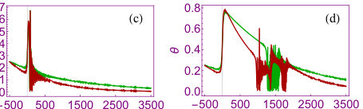
<figcaption class="paper-figure-caption"><b>Fig 1.</b> FIG. 1. Order parameter (θ) vs time (t) plot (phase plot) extracted from Linblad system (maroon) and non-Hermitian system (green). For moderate dissipation, the parameters are Ω= 0.5, γ = 0.4, v = 0.01 with (a) V = 4, (b) V = 30. For a higher V, the peaks show a better overlap. For low dissipation, the parameters are Ω= 0.3, γ = 0.001, v = 0.01, with (c) V = 1 (d) V = 30. Here, the phase plots from the two approaches match reasonable well.</figcaption>
</figure>
<figure class="paper-figure-card">
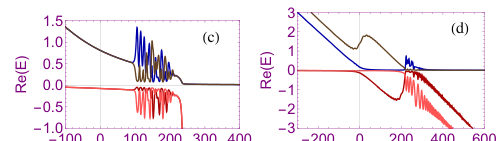
<figcaption class="paper-figure-caption"><b>Fig 2.</b> FIG. 2. Real part of the energy eigen-spectra of the system showing avoided crossings. For γ = 0.4, Ω= 0.5, v = 0.01 and (a) V = 3: there is no loop in the spectra, (b) V = 4: a loop appears near the avoided crossing, (c) V = 5: oscillations appear in the loop. For γ = 0.001, Ω= 0.3, v = 0.01, (d) V = 4: there are sublattice- dependent branches in the spectra. Here, the colors, blue, brown, pink and maroon represent four branches of the eigen-energy spectra of the two state-two sublattice system.</figcaption>
</figure>
<figure class="paper-figure-card">
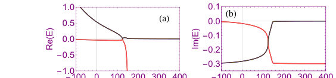
<figcaption class="paper-figure-caption"><b>Fig 3.</b> FIG. 3. Real (Re(E)) and imaginary (Im(E)) parts of the eigen-energy spectra at γ = 0.6, V = 5, v = 0.01, Ω= 0.3. (a) Real spectrum, (b) imaginary spectrum. Here, Ω/γ = 1/2, which is the critical Ω/γ ratio, where, both the spectra undergo real crossings.</figcaption>
</figure>
<figure class="paper-figure-card">
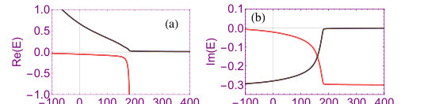
<figcaption class="paper-figure-caption"><b>Fig 4.</b> FIG. 5. Real (Re(E)) and imaginary (Im(E)) part of the eigen-energy spectra at γ = 0.6, V = 5, v = 0.01, Ω= 0.4. (a) Real spectrum, (b) imaginary spectrum. Here, Ω/γ ratio is above the critical value, where, avoided crossing is in the real spectrum and, the imaginary spectrum contains real crossing.</figcaption>
</figure>
<figure class="paper-figure-card">
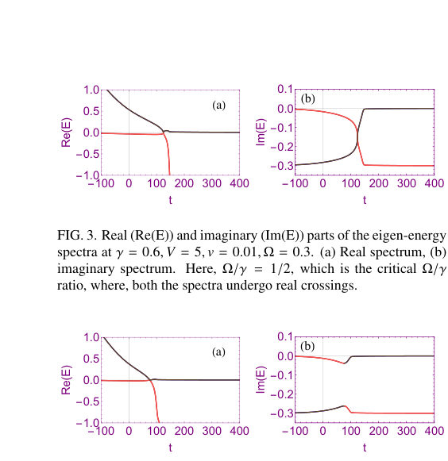
<figcaption class="paper-figure-caption"><b>Fig 5.</b> FIG. 4. Real (Re(E)) and imaginary (Im(E)) part of the eigen-energy spectra at γ = 0.6, V = 5, v = 0.01, Ω= 0.2. (a) Real spectrum, (b) imaginary spectrum. Here, Ω/γ ratio is below the critical value, where, avoided crossing is in the imaginary spectrum and the real spectrum contains true crossing.</figcaption>
</figure>

**Summary.** The paper analyzes excitation dynamics in dissipative Rydberg lattices by studying Landau-Zener tunneling under time-varying detuning. Using both master equation and non-Hermitian Hamiltonian formalisms, the authors characterize a dynamical crossover regime controlled by the blockade strength. This crossover dictates whether the system exhibits uniform or sublattice-dependent transition probabilities near avoided crossings.

**Why it may be interesting.** This work is highly relevant as it combines concepts from open quantum systems (dissipation, Lindblad dynamics) with strongly correlated physics (Rydberg interactions, magnetic order) and fundamental non-adiabatic processes (LZ tunneling), providing a detailed map of dynamic phase transitions in controllable quantum simulators.

Detailed structure

**Main problem.** The study investigates excitation dynamics, specifically Landau-Zener tunneling, within a dissipative Rydberg lattice subjected to time-dependent detuning.

**Main result.** The work identifies a dynamical crossover regime where the sublattice population imbalance transitions from vanishing (identical LZ probabilities) to persisting (sublattice-dependent probabilities) as the blockade strength increases.

**Method.** Analysis employs two complementary theoretical frameworks: solving the Lindblad master equation via mean-field approximation and utilizing an effective non-Hermitian Hamiltonian approach for spectral analysis.

**Model / system.** The system is a Rabi-coupled dissipative Rydberg lattice, modeled by a Hamiltonian incorporating detuning, Rabi coupling ($\Omega$), and nearest-neighbor interaction ($V$). Dissipation is included via the Lindblad master equation.

**Key observables.** Landau-Zener transition probabilities (PLZ), sublattice population imbalance, complex energy spectrum eigenvalues, and order parameter $	heta$.

**Important parameters / regimes.** Rydberg interaction strength ($V$), Rabi coupling ($\Omega$), dissipation rate ($\gamma$), and the detuning profile $\Delta(t)$. Critical ratios like $\Omega/\gamma$ define spectral regimes.

**Assumptions / limitations.** The non-Hermitian description is an approximation that neglects explicit quantum jump terms, though it proves useful for analyzing avoided crossings. Mean-field approximations are used for interactions.

**Figures summary.** Figures likely show energy spectra loops/branches indicating antiferromagnetic order (as $V$ increases), and phase plots illustrating the crossover between regimes of identical vs. distinct sublattice probabilities based on parameters like $\Omega/\gamma$.

**Paper structure.** The paper builds by first setting up the full dynamics via the Lindblad master equation, then deriving and analyzing an effective non-Hermitian Hamiltonian approximation. The core analysis focuses on mapping out parameter regimes (governed by $V$ vs. $\Omega/\gamma$) that dictate the nature of the LZ tunneling crossover.

Abstract

In this work, we investigate the excitation dynamics of a Rabi-coupled dissipative Rydberg lattice with a time-dependent detuning. The system is analyzed using (i) a Lindblad master equation within a mean-field approximation and (ii) an effective non-Hermitian Hamiltonian framework. While the mean-field approach captures the emergence of an antiferromagnetic order in the Rydberg excitation profile, the non-Hermitian description provides direct insight into the complex energy spectrum and its avoided crossings, which govern the Landau$-$Zener dynamics. We identify a regime in which the sublattice population imbalance vanishes near the avoided crossing, resulting in identical Landau$-$Zener probabilities on the two sublattices. Beyond a critical effective blockade strength there is a dynamical crossover to another regime in which the sublattice population imbalance persists through the avoided crossing, giving rise to sublattice-dependent Landau$-$Zener probabilities. Furthermore, Rydberg interactions prolong the lifetime of Landau$-$Zener-induced excitations in the presence of weak dissipation and strong Rabi coupling. In contrast, for weak Rabi coupling, the Rydberg blockade inhibits excitation and suppresses the Landau$-$Zener transition probability.

[↑ back to top](#top)

### [Boosting self hybridized exciton polaritons with metal clad WS2 waveguides](http://arxiv.org/abs/2608.10895v1)

**Authors:** Filip Majstorovic, Masoud Taleb, Victor DeManuel-Gonzalez, Kai Rossnagel, Nahid Talebi  
**Type:** both · **Category:** other · **PDF:** <https://arxiv.org/pdf/2608.10895v1>  
**Analysis basis:** full PDF text, analyzed in chunks
**Topic relevance:** 🔥 `analog quantum simulation` **4/5** · `driven-dissipative phase transition` **3/5** · `methods for driven-dissipative` **3/5** · `quantum optics experiment` **3/5** · `Tavis-Cummings & cavity-many-emitter` **2/5** · `interference shaping light` **2/5** · `non-equilibrium universality` **2/5** · `Keldysh / 2PI / non-Gaussian methods` **1/5** · `correlated / nonlocal dissipation` **1/5** · `quantum measurements` **1/5**

↔ Scroll figures horizontally

<figure class="paper-figure-card">
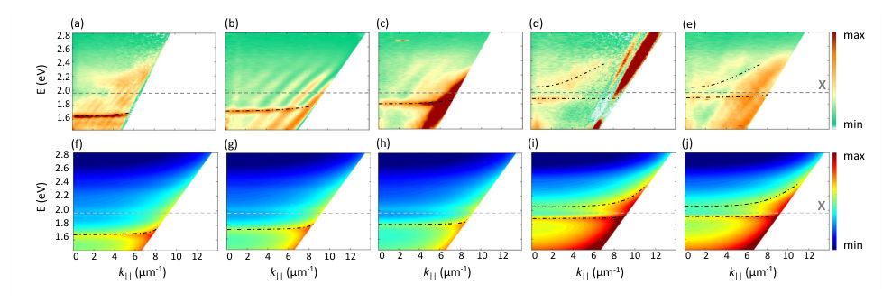
<figcaption class="paper-figure-caption"><b>Fig 1.</b> Figure 1: Momentum-resolved cathodoluminescence spectra of Au/WS2/Au samples. The WS2 thicknesses in (a) and (b) were independently determined by AFM to be 130 nm and 120 nm, while the thicknesses in (c)–(e) were estimated by comparison with the calculated dispersion relations shown in (f)–(j). The grey dashed line indicates the A-exciton energy at 1.97 eV. (f)–(j) Calculated dispersion relations of an idealized Au/WS2/Au system for WS2 thicknesses of 130 nm, 120 nm, 110 nm, 95 nm, and 90 nm, respectively. The calculated dispersions in (i) and (j), together with the corresponding experimental maps in (d) and (e), show a clear anticrossing near the A-exciton energy.</figcaption>
</figure>
<figure class="paper-figure-card">
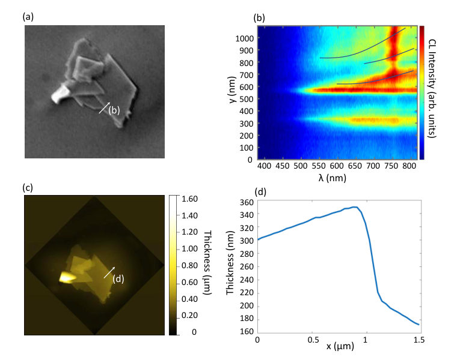
<figcaption class="paper-figure-caption"><b>Fig 2.</b> Figure 2: (a) SEM image of the WS2 flake with a thickness of approximately 130 nm. (b) Spatially resolved CL map acquired over a distance of 1 µm along the path indicated by the white arrow in (a). A pronounced resonance is observed around 750 nm, which is associated with the lower polariton branch of the guided mode identified in the momentum-resolved CL spectrum in Figure 1(a). (c) AFM image of the same flake, where the color scale represents the sample height. The white arrow marks the position of the height profile shown in (d). (d) One-dimensional height profile across the flake, yielding a thickness of approximately 130nm. The slope in the height profile is attributed to a bubble...</figcaption>
</figure>
<figure class="paper-figure-card">
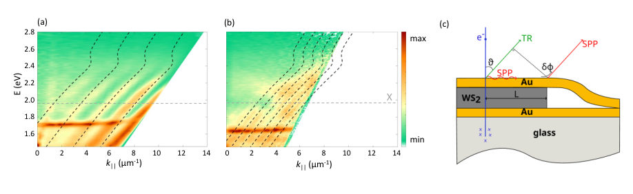
<figcaption class="paper-figure-caption"><b>Fig 3.</b> Figure 3: Experimental angle-resolved cathodoluminescence spectra of Au/WS2/Au flakes with WS2 thicknesses of (a) 120 nm and (b) 130 nm, corresponding to the samples already shown in Figure 1. The maps are overlaid with fits to calculated branches arising from the interference of surface plasmon polaritons (SPPs) and transition radiation (TR). The grey dashed line indicates the A-exciton energy at 1.97 eV. (c) Schematic side view of the sample and of the interference mechanism: SPPs are excited at the electron-beam impact position, propagate towards the flake edge, are scattered there into the far field, and interfere with transition radiation.</figcaption>
</figure>
<figure class="paper-figure-card">
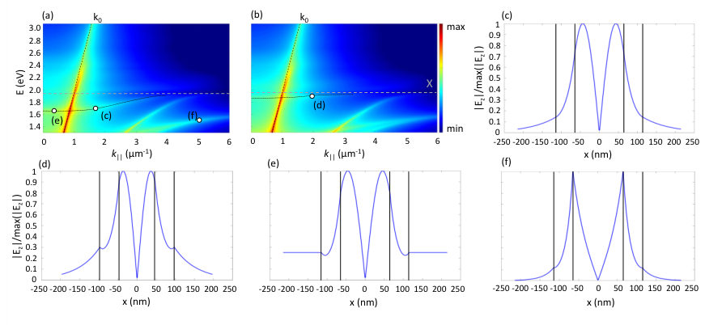
<figcaption class="paper-figure-caption"><b>Fig 4.</b> Figure 4: (a,b) Calculated dispersion relations of idealized Au/WS2/Au structures with WS2 thicknesses of 130 nm and 95 nm, including the region outside the light cone. The white dots mark the positions at which the corresponding field profiles shown in (c)–(f) were calculated. The grey dashed line indicates the A-exciton energy at 1.97 eV. (c)–(f) Normalized electric field profiles, |Ez|/ max(|Ez|), for the modes marked in (a) and (b). The black vertical lines indicate the interfaces between air, gold, and WS2. Panels (c) and (d) correspond to the lower polariton outside the light cone, while (e) shows the lower polariton inside the light cone, where the field is no longer evanescent in...</figcaption>
</figure>
<figure class="paper-figure-card">
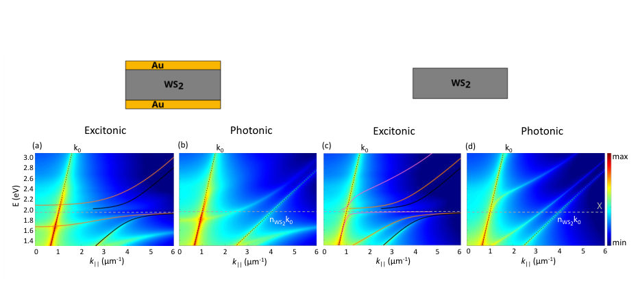
<figcaption class="paper-figure-caption"><b>Fig 5.</b> Figure 5: (a) Calculated dispersion relation of the Au/WS2/Au structure with a WS2 thickness of 130 nm and a gold thickness of 50 nm, including the region outside the light cone. Hopfield fits to the lower and upper polariton branches of the guided mode and of the bent light line in WS2 are overlaid. For both the black and orange branches, the coupling strength is 190 meV. (b) Dispersion relation of the same structure using the constant-plus-Drude background permittivity of WS2 instead of the full WS2 dielectric function, so that the excitonic resonances and the UV oscillator are removed and only the optical modes remain visible. The gold thickness is again 50 nm. (c) Dispersion relation...</figcaption>
</figure>

**Summary.** The researchers demonstrate that embedding $	ext{WS}_2$ excitons within metal-clad waveguides ($	ext{Au}/	ext{WS}_2/	ext{Au}$) significantly boosts the coupling strength between excitons and guided photons. By combining theoretical modeling with momentum-resolved cathodoluminescence, they confirm enhanced polariton formation, offering a tunable platform for controlling light-matter interactions.

**Why it may be interesting.** This work is highly relevant as it deals with engineered light-matter interaction in 2D materials, a core topic in quantum optics and open quantum systems research, particularly concerning cavity/waveguide QED effects.

Detailed structure

**Main problem.** The primary goal is boosting the coupling strength between excitons (in $	ext{WS}_2$) and guided photonic modes within metal-clad waveguides.

**Main result.** The gold cladding significantly enhances the exciton-photon coupling strength ($G$) to $190 	ext{ meV}$, demonstrating a robust method for controlling light-matter interactions in hybrid heterostructures.

**Method.** The study combines theoretical modeling (solving Maxwell's equations) with experimental characterization using momentum-resolved cathodoluminescence ($	ext{CL}$) spectroscopy.

**Model / system.** The system is an $	ext{Au}/	ext{WS}_2/	ext{Au}$ metal-clad waveguide. The physics is described by analyzing the formation of self-hybridized exciton polaritons, often modeled using a Hopfield Hamiltonian to quantify coupling strength ($G$).

**Key observables.** Momentum-resolved $	ext{CL}$ spectra showing anticrossing behavior, dispersion relations for lower and upper polariton branches, and calculated electric field profiles.

**Important parameters / regimes.** Coupling strength $G$ (up to $190 	ext{ meV}$), exciton energy ($	ext{A-exciton}$), guided mode resonance frequency, and waveguide thickness.

**Assumptions / limitations.** The $	ext{CL}$ detection in the far field only captures radiatively outcoupled parts of the dispersion; the analysis relies on fitting polariton branches using established Hamiltonian models.

**Figures summary.** Figures show momentum-resolved CL spectra confirming resonances, calculated and measured full dispersion relations for varying thicknesses, and electric field profiles distinguishing mode confinement.

**Paper structure.** The paper progresses from identifying initial resonances via $	ext{CL}$ spectroscopy to theoretically modeling the coupling using Hamiltonian approaches. It compares results from metal-clad vs. uncladded structures to quantify enhancement and discusses implications for slow polariton propagation.

Abstract

The formation of Fabry Perot and guided wave self hybridized exciton polaritons in two dimensional materials results in long range exciton energy transfer and strong exciton exciton interactions. Here, we demonstrate that the coupling strength between photonic modes and excitons is significantly boosted by embedding the active excitonic layer in a metal clad WS2 waveguide. The photonic modes in this waveguide exhibit modified dispersion properties for both Fabry Perot type and guided wave exciton polaritons compared to pure WS2 flakes, and show an increased couplingr strength. Our results provide a robust approach for controlling exciton photon interactions and their coupling strength in hybrid heterostructures.

[↑ back to top](#top)

### [Floquet Green's functions for lattice electrons driven by Gaussian quantum light](http://arxiv.org/abs/2608.11189v1)

**Authors:** Atsushi Ono  
**Type:** theory · **Category:** other · **PDF:** <https://arxiv.org/pdf/2608.11189v1>  
**Analysis basis:** full PDF text, analyzed in chunks
**Topic relevance:** 🔥 `Keldysh / 2PI / non-Gaussian methods` **4/5** · `analog quantum simulation` **3/5** · `driven-dissipative phase transition` **3/5** · `interference shaping light` **3/5** · `methods for driven-dissipative` **3/5** · `correlated / nonlocal dissipation` **2/5** · `quantum measurements` **2/5** · `non-equilibrium universality` **1/5** · `quantum optics experiment` **1/5**

↔ Scroll figures horizontally

<figure class="paper-figure-card">
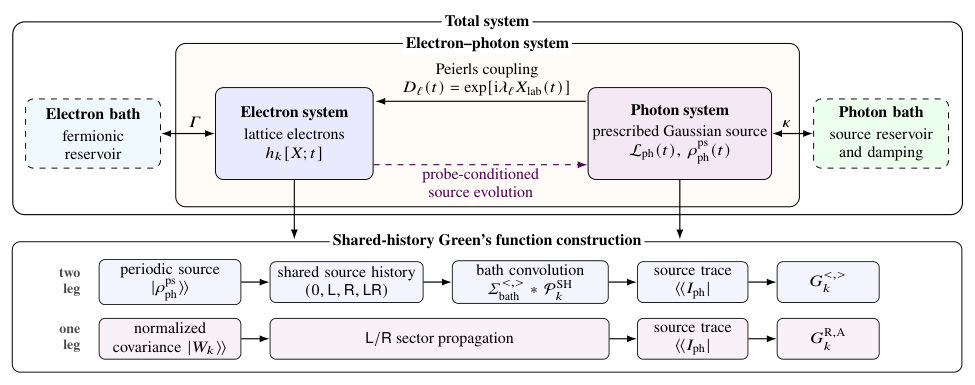
<figcaption class="paper-figure-caption"><b>Fig 1.</b> FIG. 1. Overview of the prescribed-source framework. The total system consists of the electron–photon system coupled to a fermionic electron bath and a photon source bath. The photon system is a reservoir-stabilized Gaussian source with steady state 𝜌ss ph, fixed by the parameters 𝛼0, 𝑟, and 𝜙0; it acts on the lattice electrons through the gauge-covariant Peierls link operators 𝐷ℓ(𝑡) [Eq. (26)]. The lower panel summarizes the shared-history construction: four active-leg sectors and six endpoint orderings yield a two-leg response that is convolved with 𝛴&lt;,&gt; bath to obtain 𝐺&lt;,&gt; 𝑘 , while the equal-time covariance 𝑊𝑘supplies the one-leg evaluation of 𝐺R,A 𝑘 . The source trace with ⟨⟨𝐼ph| is...</figcaption>
</figure>
<figure class="paper-figure-card">
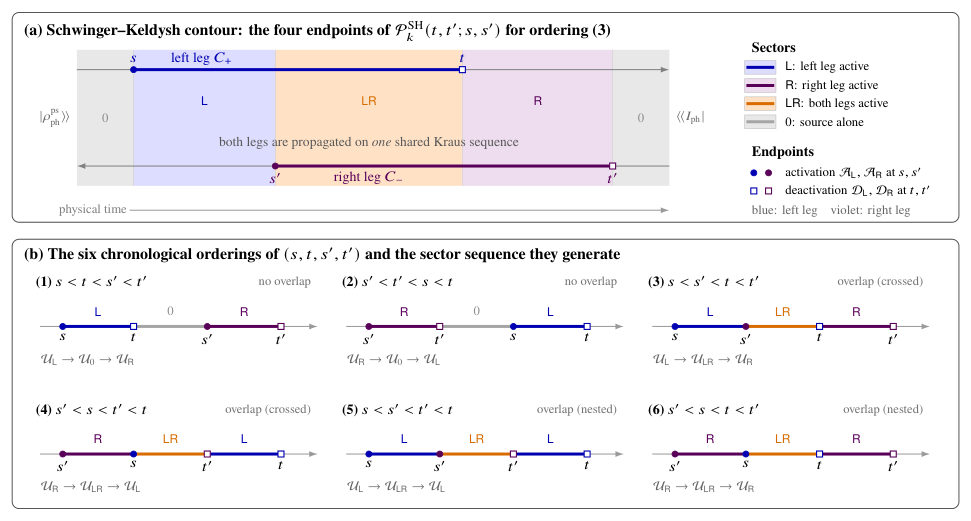
<figcaption class="paper-figure-caption"><b>Fig 2.</b> FIG. 2. Schwinger–Keldysh representation of the shared-history two-leg kernel. (a) Contour for the four-endpoint kernel PSH 𝑘(𝑡, 𝑡′; 𝑠, 𝑠′) of Eq. (91), drawn for ordering (3), 𝑠&lt; 𝑠′ &lt; 𝑡&lt; 𝑡′. The left (𝐶+) and right (𝐶−) legs are switched on at 𝑠and 𝑠′ by AL and AR (filled circles) and switched off at 𝑡and 𝑡′ by DL and DR (open squares). The kernel starts from |𝜌ps ph(𝑡&lt;)⟩⟩at 𝑡&lt; = min(𝑠, 𝑠′) and is closed by ⟨⟨𝐼ph| at max(𝑡, 𝑡′); both legs are propagated on one shared source history, and the shading marks the active sector 𝑞∈{0, L, R, LR}. (b) The six chronological domains of (𝑠, 𝑡, 𝑠′, 𝑡′) with the corresponding sector sequences. Orderings (1) and (2) are nonoverlap contributions with an...</figcaption>
</figure>
<figure class="paper-figure-card">
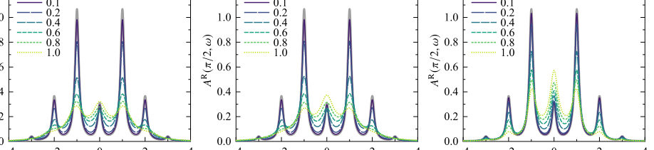
<figcaption class="paper-figure-caption"><b>Fig 3.</b> FIG. 3. Period-averaged spectral function, 𝐴R(𝑘, 𝜔), at 𝑘= 𝜋/2 for coherent Gaussian sources with fixed classical Peierls amplitude 𝐴cl = 1.1 and decreasing quantum coupling 𝜆, compared across three descriptions: (a) Born, (b) SCBA, and (c) the shared-history construction. The gray reference in each panel shows the classical Floquet result with the same 𝐴cl and wide-band bath. The source damping is 𝜅= 1.</figcaption>
</figure>
<figure class="paper-figure-card">
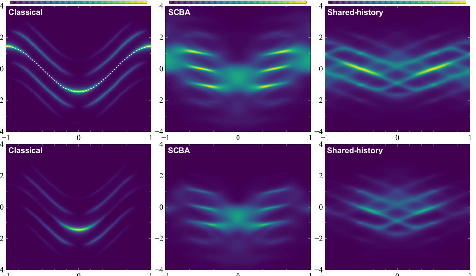
<figcaption class="paper-figure-caption"><b>Fig 4.</b> FIG. 4. Period-averaged retarded and occupied spectral weights for a finite-𝜆coherent source with 𝐴cl = 1.1 and 𝜆= 1, computed with (left) classical Floquet theory, (middle) SCBA, and (right) the shared-history construction. The upper panels show 𝐴R(𝑘, 𝜔), and the lower panels show 𝐴&lt;(𝑘, 𝜔). In each column, the color scale is shared between the two panels and its maximum is set to the maximum of 𝐴R(𝑘, 𝜔) in that column. The dotted lines indicate the corresponding static dispersion reference ¯𝜀𝑘. The source damping is 𝜅= 0.1.</figcaption>
</figure>
<figure class="paper-figure-card">
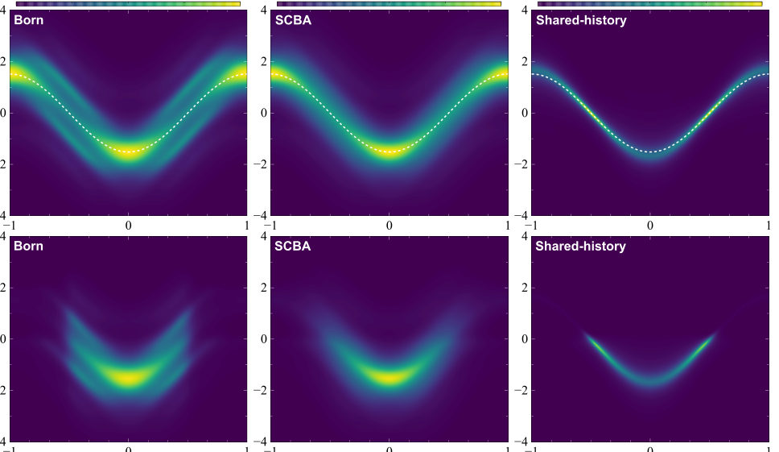
<figcaption class="paper-figure-caption"><b>Fig 5.</b> FIG. 5. Period-averaged retarded and occupied spectral weights for squeezed vacuum with 𝑟= 4 and 𝜅= 1, computed using (left) the Born approximation, (middle) SCBA, and (right) the shared-history construction. The upper panels show 𝐴R(𝑘, 𝜔), and the lower panels show 𝐴&lt;(𝑘, 𝜔). In each column, the color scale is shared between the two panels and its maximum is set to the maximum of 𝐴R(𝑘, 𝜔) in that column. The dotted lines indicate the corresponding static dispersion reference ¯𝜀𝑘. The coupling is 𝜆= 0.02.</figcaption>
</figure>

**Summary.** This paper develops a rigorous theoretical framework for studying lattice electrons driven by external, nonclassical quantum light fields. It formulates Floquet Green's functions using a shared-history approach that treats the full quantum nature of the driving source nonperturbatively. The results demonstrate how squeezing and phase control can engineer electronic properties beyond what classical laser drives allow.

**Why it may be interesting.** This bridges advanced topics in Floquet engineering (time periodicity) with open quantum systems theory (reservoir/bath dynamics) by incorporating the full quantum nature of the driving field (squeezing), which is highly relevant to modern AMO and quantum optics research.

Detailed structure

**Main problem.** The primary goal is formulating Floquet Green's functions for noninteracting lattice electrons driven by an externally prescribed, reservoir-stabilized Gaussian quantum light source.

**Main result.** The work provides a theoretical framework for quantum Floquet engineering of condensed matter systems using external quantum light sources, showing finite-coupling quantum corrections beyond classical drives.

**Method.** It employs a shared-history formulation for two-time Green's functions, treating the nonperturbative Peierls coupling and incorporating bath convolutions derived from canonical anticommutation relations.

**Model / system.** The system consists of noninteracting single-band lattice electrons coupled to an external Gaussian quantum light source (reservoir) via the Peierls mechanism. The electron bath provides local linewidths, while the source is modeled as a squeezed coherent steady state.

**Key observables.** Spectral reconstruction and occupancy redistribution are key observables, which can be controlled by the squeezing parameter and phase of the input light.

**Important parameters / regimes.** The squeezing parameter ($r$) and phase ($\phi_0$) of the quantum source provide control knobs beyond classical amplitude modulation. The coupling strength ($\lambda$) is also critical.

**Assumptions / limitations.** Key assumptions include noninteracting single-band electrons, a prescribed (non-backacting) external light source, and the validity of Gaussian approximations for expectation values involving the Peierls exponentials.

**Figures summary.** Figure 1 provides an overview diagram illustrating the components: electron–photon system, electron bath, photon source reservoir, and the shared-history construction process involving four active-leg sectors.

**Paper structure.** The paper develops the formalism by defining the coupled Hamiltonian, deriving the Green's function structure using a shared-history approach, treating the Peierls coupling nonperturbatively, and concluding with numerical demonstrations on a 1D model showing quantum corrections.

Abstract

We formulate Floquet Green's functions for noninteracting single-band lattice electrons driven by a reservoir-stabilized single-mode Gaussian quantum light source. The source is prescribed externally and is not updated by the many-electron polarization, while an active electronic probe still conditions the source evolution through the Peierls coupling. The two time arguments of a Green's function share one source history: the lesser and greater components are obtained by convolving a shared-history four-endpoint kernel with the continuous bath kernels before the final source trace, while the bath canonical anticommutation relation yields an equal-time covariance that seeds the retarded and advanced one-leg propagations. The Peierls coupling is treated nonperturbatively within the prescribed-source model, and classical Floquet theory is recovered in the appropriate limit. Numerical calculations on a minimal one-dimensional model show finite-coupling quantum-source corrections beyond a prescribed classical drive, together with spectral reconstruction and occupancy redistribution for squeezed vacuum and squeezed coherent sources. The squeezing parameter and phase provide additional control knobs, beyond classical amplitude modulation, for both sideband structure and occupied weight. This work provides a theoretical framework for quantum Floquet engineering of condensed matter with an externally prescribed quantum light source.

[↑ back to top](#top)

### [Steady-state phase transition in one-dimensional hybrid contact process](http://arxiv.org/abs/2608.10948v1)

**Authors:** Lin Shang, Shuai Geng, Xingli Li, Jiasen Jin  
**Type:** theory · **Category:** statistical mechanics · **PDF:** <https://arxiv.org/pdf/2608.10948v1>  
**Analysis basis:** full PDF text, analyzed in chunks
**Topic relevance:** 🔥 `driven-dissipative phase transition` **4/5** · 🔥 `methods for driven-dissipative` **4/5** · 🔥 `non-equilibrium universality` **4/5** · `Keldysh / 2PI / non-Gaussian methods` **3/5** · `correlated / nonlocal dissipation` **3/5** · `analog quantum simulation` **2/5** · `quantum measurements` **1/5**

↔ Scroll figures horizontally

<figure class="paper-figure-card">
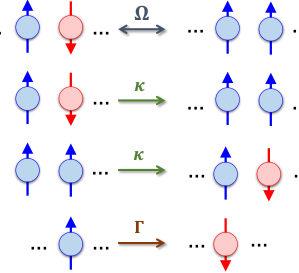
<figcaption class="paper-figure-caption"><b>Fig 1.</b> FIG. 1. Schematic illustration of the coagulation, branching, and self-destruction in one-dimensional hybrid contact process. In the quantum process, when a neighboring sites is occupied, the spin at each site undergoes coherent flipping between the occupied state (spin-up) and the empty state (spin-down) at a rate Ω. Correspond- ingly, in the classical process, the incoherent activation and deacti- vation occur at a rate κ. In addition, each spin undergoes incoherent decay to the empty state at a rate Γ.</figcaption>
</figure>
<figure class="paper-figure-card">
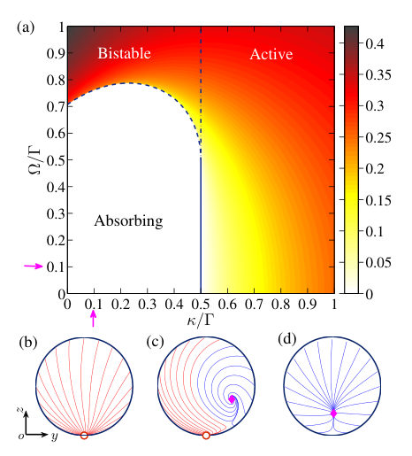
<figcaption class="paper-figure-caption"><b>Fig 2.</b> FIG. 2. (a) The mean-field steady-state phase diagram of HCP in the Ω−κ plane. The white region enclosed by the solid and dashed lines represents the absorbing phase with zero particle density, associated with the steady-state solution ⟨ˆσ⟩ss,0. The colored region to the right of the solid and dashed-dotted lines, characterized by κ/Γ = 1/2, represents the active phase with nonzero particle density and it is associated to the steady-state solution ⟨ˆσ⟩ss,+. The region enclosed by the dashed and dashed-dotted lines represents the bistable region, in which the system could evolve to either the absorbing or the active state in the long-time limit depending on the initial state. The color bar...</figcaption>
</figure>
<figure class="paper-figure-card">
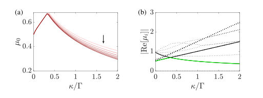
<figcaption class="paper-figure-caption"><b>Fig 3.</b> FIG. 4. (a) The Liouvillian gap of finite-size systems as a function of κ/Γ for Ω/Γ = 0.1, with the arrow indicating the change in the system size L from 7 to 12. (b) Displays the real part of the low- lying Liouvillian eigenvalues as a function of κ/Γ with L = 7 for Ω/Γ = 0.1. The two solid lines denote the (nearly) linear increasing branch and the monotonically decreasing branch, the minimum of which yields the Liouvillian gap, as highlighted in green.</figcaption>
</figure>
<figure class="paper-figure-card">
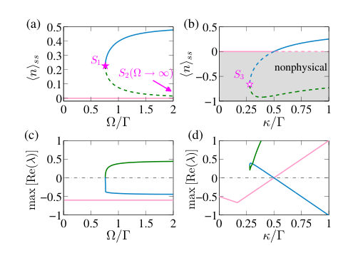
<figcaption class="paper-figure-caption"><b>Fig 4.</b> FIG. 3. The steady-state particle density ⟨ˆn⟩ss for κ/Γ = 0.1 (a) and Ω/Γ = 0.1 (b). The shaded region in gray denotes the nonphysical solutions. The solid lines denote the stable steady-state solution and the dashed lines denote the unstable ones. The two branches of ac- tive states, associated with the solution ⟨ˆσ⟩ss,±, emerges at S 1 and S 3. The former is a saddle-node point of the bifurcation (with the S 2 saddle node locating at infinite Ω), leading to a discontinuous phase transition in panel (a). The intersection of the absorbing and upper active branch at κ/Γ = 1/2 indicates a continuous phase transition in panel (b). The maximal real parts of the eigenvalues of the corre-...</figcaption>
</figure>
<figure class="paper-figure-card">
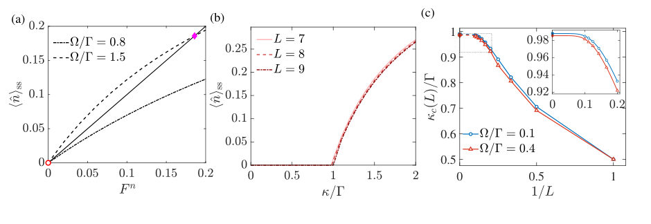
<figcaption class="paper-figure-caption"><b>Fig 5.</b> FIG. 5. (a) The ⟨ˆn⟩ss as a function of the effective field Fn for L = 7 and Ω/Γ = 0.1. The black solid line represents the self-consistency condition ⟨ˆn⟩ss = Fn. The dashed and dash-dotted curves show the ⟨ˆn⟩ss for κ/Γ = 1.5 and 0.8, respectively. Their intersection marks the self-consistent steady-state solution. The nonzero and zero solutions are indicated by the filled magenta diamond and the empty red circle, respectively. (b) The ⟨ˆn⟩ss as a function of κ/Γ for Ω/Γ = 0.1, with L = 7 , 8, and 9. (c) The CMF critical point κc(L)/Γ against the 1/L for Ω/Γ = 0.1 and 0.4. The inset provides an enlarged view of the region used for the exponential fits and thermodynamic limit extrapolation...</figcaption>
</figure>

**Summary.** The paper analyzes the phase transitions in a one-dimensional hybrid contact process by treating both coherent (quantum) and incoherent (classical) interactions. Using mean-field theory and advanced critical analysis methods like CAM, the authors map out the steady-state phase diagram and characterize the nature of the transition points, distinguishing between continuous and discontinuous regimes.

**Why it may be interesting.** This work directly addresses non-equilibrium steady states and quantum phase transitions in open quantum systems, which is a major area of overlap between statistical mechanics and AMO physics.

Detailed structure

**Main problem.** The study investigates the steady-state phase transition behavior of a one-dimensional hybrid contact process (HCP) when both quantum coherent and classical incoherent interactions are present.

**Main result.** The system exhibits distinct transition types: a discontinuous transition via saddle-node bifurcation for varying $\Omega$, and a continuous transition characterized by specific critical exponents ($eta^*$) extracted using the Coherent Anomaly Method.

**Method.** Theoretical analysis employing single-site and cluster mean-field approximations, stability analysis of the Liouvillian spectrum, and advanced techniques like the Coherent Anomaly Method (CAM) to extract true critical points and exponents.

**Model / system.** The model is a one-dimensional HCP on a quantum spin-1/2 chain governed by a Lindblad master equation incorporating coherent ($\Omega$) and incoherent ($\kappa$) rates, alongside local decay ($\Gamma$).

**Key observables.** Steady-state particle density $\langle\hat{n}
angle_{ss}$, the order parameter derived from site expectation values, and the coherent anomaly $n_0(L)$.

**Important parameters / regimes.** The relative strengths of interaction rates ($\Omega/\Gamma$ and $\kappa/\Gamma$), system size ($L$), and the critical exponents ($eta^*$).

**Assumptions / limitations.** The analysis relies on mean-field approximations (single-site MF, CMF) which assume factorization or local correlations; precise critical behavior requires taking thermodynamic limits.

**Figures summary.** Figure 2 presents the steady-state phase diagram in the $\Omega-\kappa$ plane showing absorbing, active, and bistable regions. Figure 3 illustrates how varying parameters leads to different transition types (discontinuous vs. continuous).

**Paper structure.** The paper first defines the model via the Lindblad equation and mean-field approach. It then analyzes the phase diagram using MF results, identifying bifurcation points. Finally, it employs CMF and CAM to rigorously characterize the critical exponents associated with the continuous transition.

Abstract

We investigate the steady-state phase transition in a one-dimensional hybrid contact process. We implement the single-site and cluster mean-field approximations based on the effective fields and present all the possible steady states of the system. We show the existence of the stable absorbing and active phases, and the bistable region in the long-time limit. The saddle-node bifurcation is observed at the boundary between the absorbing phase and the bistable region, suggesting a discontinuous phase transition. While the absorbing to active phase transition is continuous. To characterize the nonclassical scaling behavior of the continuous phase transition, we extract the true critical points and exponents by means of the coherent anomaly method.

[↑ back to top](#top)

### [Tunable Memory Effect in Dissipative Strongly Correlated Quantum Systems](http://arxiv.org/abs/2608.10534v1)

**Authors:** Haowei Li, Yu Chen, Hui Zhai  
**Type:** theory · **Category:** quantum gases · **PDF:** <https://arxiv.org/pdf/2608.10534v1>  
**Analysis basis:** full PDF text, analyzed in chunks
**Topic relevance:** 🔥 `non-equilibrium universality` **4/5** · `Keldysh / 2PI / non-Gaussian methods` **3/5** · `analog quantum simulation` **3/5** · `correlated / nonlocal dissipation` **3/5** · `methods for driven-dissipative` **3/5** · `driven-dissipative phase transition` **2/5** · `quantum measurements` **1/5** · `scars & prethermalization` **1/5**

↔ Scroll figures horizontally

<figure class="paper-figure-card">
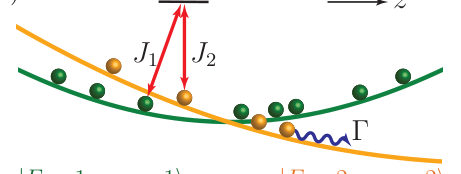
<figcaption class="paper-figure-caption"><b>Fig 1.</b> FIG. 1. (a) General setting. System A with strongly inter- acting particles is coupled to a subsystem B, which is further coupled to a Markovian bath E. (b) Atoms in two different hyperfine spin states, denoted by green and yellow balls, are coupled by a Raman coupling. They experience a balanced or tilted harmonic trap, respectively.</figcaption>
</figure>
<figure class="paper-figure-card">
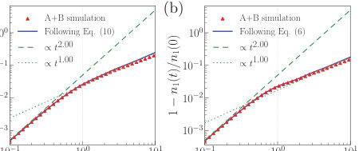
<figcaption class="paper-figure-caption"><b>Fig 2.</b> FIG. 2. Dissipation dynamics in a two-mode Bose system for (a) the total population N and (b) the mode population n1. Red triangles show full master-equation simulations for A+B, and blue solid lines show the response theory results from Eq. (10) in (a) and Eq. (6) in (b). Green dashed (dotted) lines denote the short-time (long-time) asymptotes from Eq. (13) in (a) and Eq. (18) in (b). Gray vertical dotted lines mark t = t0. Here N0 = 6, td/t0 = 20, hxt0 = 2, and hzt0 = 1.</figcaption>
</figure>
<figure class="paper-figure-card">
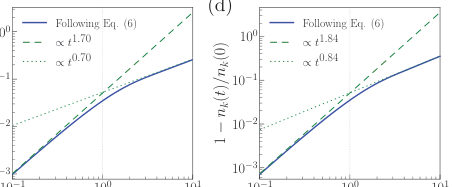
<figcaption class="paper-figure-caption"><b>Fig 3.</b> FIG. 3. Dissipation dynamics in a one-dimensional interact- ing Bose gas. (a), (b) Total population N; (c), (d) momen- tum occupation nk at vs|k|t0 = 1. The left (right) column corresponds to η = 0.85 (0.92). Blue solid lines show the response theory results: Eq. (10) in (a), (b); Eq. (6) in (c), (d). Green dashed (dotted) lines denote the short-time (long- time) asymptotes: Eq. (15) in (a), (b); Eq. (20) in (c), (d). Gray vertical dotted lines mark t = t0. Here td/t0 = 20 and ρ0vst0 = 10.</figcaption>
</figure>

**Summary.** This work develops a general theory to describe how observables evolve in strongly correlated quantum systems coupled to non-Markovian baths. It predicts that the initial time evolution is governed by a universal $t^{2\eta}$ scaling law, which then smoothly transitions into longer-time Markovian behavior. The framework is applicable to ultracold atomic gas simulations.

**Why it may be interesting.** The universal prediction of the $t^{2\eta}$ scaling law for short-time dynamics, independent of microscopic details, provides a powerful diagnostic tool for characterizing memory effects in strongly correlated quantum gases.

Detailed structure

**Main problem.** The study addresses how strongly correlated quantum many-body systems behave when subjected to non-Markovian dissipation, capturing the interplay between strong correlations and memory effects.

**Main result.** The short-time dynamics of a system observable in a critical state universally follows a $t^{2\eta}$ scaling law, which then crosses over to either $t^{2\eta-1}$ or linear-in-$t$ behavior at longer times.

**Method.** The authors develop a general theoretical framework using linear response theory and perturbative expansions in the coupling strength ($J$) to calculate observable changes ($\delta W(t)$).

**Model / system.** The analysis uses general models of strongly interacting particles coupled to an environment, with specific examples including two-mode Bose systems and one-dimensional interacting Bose gases (Lieb–Liniger Hamiltonian).

**Key observables.** Change in observable ($\delta W(t)$), total atom number ($\hat{N}$), momentum occupation ($\hat{n}_k$), and spectral densities ($S^{(1)}, S^{(2)}$).

**Important parameters / regimes.** Critical exponent $\eta$, memory time $t_0 = 1/\Gamma$, dissipation time $t_d$, and the coupling strength $J$.

**Assumptions / limitations.** The theory relies on perturbative expansions, a factorized two-frequency spectral density approximation, and assuming applicability of edge power laws over low-energy frequency windows.

**Figures summary.** Figures compare full master equation simulations against response theory predictions for conserved and nonconserved observables in Bose systems, illustrating the crossover from short-time quadratic/power-law growth to linear-in-$t$ behavior.

**Paper structure.** The paper establishes a general theoretical framework for dissipation response, derives scaling laws for both conserved and nonconserved observables across different time regimes ($t \ll t_0$, $t_0 \ll t \ll t_d$), and applies these results to specific quantum gas models.

Abstract

Strongly interacting quantum many-body systems subjected to non-Markovian dissipation pose a formidable challenge due to the interplay between strong correlation effects and memory effects. In this Letter, we develop a general theoretical framework to compute how a system observable responds to dissipation, which captures memory effects at short times and recovers the Markovian limit at longer times. Using this framework, we predict that, for a strongly correlated quantum critical state with critical exponent $η$, the short-time dynamics of a system observable always obeys a $t^{2η}$ scaling law. This emerges as a universal result from the interplay between strong correlation and memory effects, independent of the microscopic Hamiltonian of the system. We further reveal a crossover behavior of this scaling law to either $t^{2η-1}$ or linear-in-$t$ behavior beyond the memory time scale. We propose a concrete physical realization of a non-Markovian bath with tunable memory time using ultracold atoms, where our predictions can be straightforwardly verified in current experiments.

[↑ back to top](#top)

### [Anomalous current fluctuations in the stochastic XNOR hopping model](http://arxiv.org/abs/2608.10536v1)

**Authors:** Balázs Pozsgay  
**Type:** theory · **Category:** statistical mechanics · **PDF:** <https://arxiv.org/pdf/2608.10536v1>  
**Analysis basis:** full PDF text, analyzed in chunks
**Topic relevance:** 🔥 `Full counting statistics` **4/5** · 🔥 `scars & prethermalization` **4/5** · `methods for driven-dissipative` **3/5** · `non-equilibrium universality` **3/5** · `driven-dissipative phase transition` **2/5** · `analog quantum simulation` **1/5** · `correlated / nonlocal dissipation` **1/5** · `quantum measurements` **1/5**

↔ Scroll figures horizontally

<figure class="paper-figure-card">
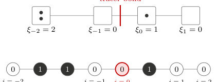
<figcaption class="paper-figure-caption"><b>Fig 1.</b> Figure 1: The exact coordinate transformations for one example initial configuration. A bond variable is zero when its two neighbouring spins are equal. The zero bonds are labelled consecutively by the variable i. The zero-range occupation ξi counts the complete 11 pairs between zero labels i and i + 1. The parity information—whether an unpaired 1 remains in a gap—is stored separately in εi ∈{1, 2}. The squeezed SSEP contains ξi particles between the corresponding labelled holes. Red follows the same tracer through all four rows: the marked equal-spin pair, its zero bond, the bond between the adjacent zero-range sites, and the corresponding labelled SSEP hole.</figcaption>
</figure>
<figure class="paper-figure-card">
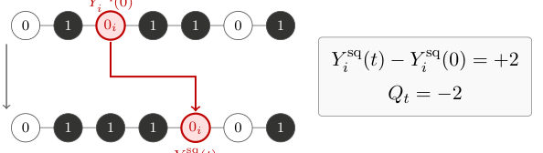
<figcaption class="paper-figure-caption"><b>Fig 2.</b> Figure 2: Definition of the auxiliary tracer current in the squeezed SSEP. The red hole carries the fixed label i and is followed throughout the evolution. Its position at time t is Y sq i (t), and Qt is defined as minus its net displacement. In the example shown, the tagged hole moves two sites to the right, so its displacement is +2 and Qt = −2.</figcaption>
</figure>
<figure class="paper-figure-card">
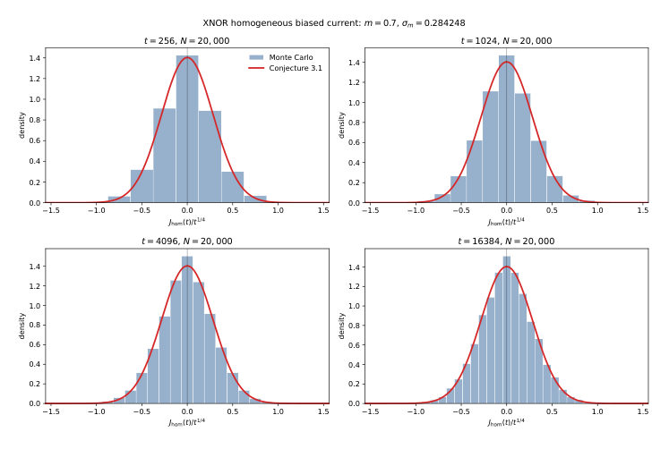
<figcaption class="paper-figure-caption"><b>Fig 3.</b> Figure 3: Distribution of Jhom(t)/t1/4 for the homogeneous biased state at m = 0.7, using L = 512 and 20,000 trajectories. Histograms are the Monte Carlo data and the solid curve is the centred Gaussian density of variance σ2 0.7 predicted by Conjecture 3.1; no parameter is fitted.</figcaption>
</figure>
<figure class="paper-figure-card">

<figcaption class="paper-figure-caption"><b>Fig 4.</b> Figure 3 shows the four-time density comparison for the m = 0.7 main ensemble. The narrowing lattice spacing and the approach to the unfitted Gaussian curve are both visible. The second- and fourth-moment ratios over all four times are shown in Figure 4, where residual drift remains visible in the scaled amplitudes. We also performed an independent longer diagnostic at m = 0.7, with L = 1024, 5,000 trajectories, and final time t = 65536. It gives</figcaption>
</figure>
<figure class="paper-figure-card">
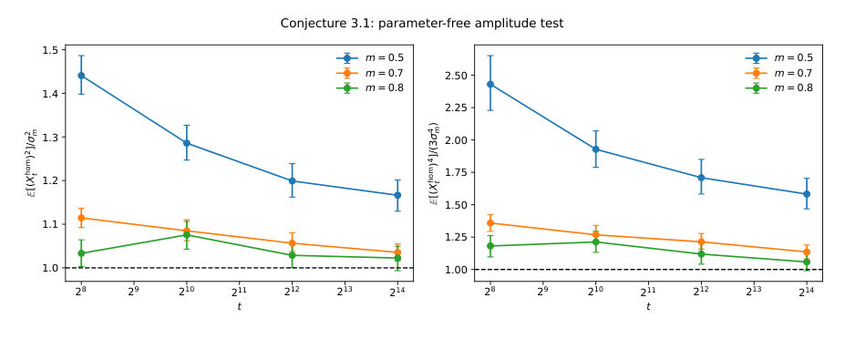
<figcaption class="paper-figure-caption"><b>Fig 5.</b> Figure 4: Second- and fourth-moment tests for the homogeneous biased problem. The panels show E[(Xhom t )2]/σ2 m and E[(Xhom t )4]/(3σ4 m). Error bars are 95% uncertainty intervals obtained by trajectory resampling; the dashed lines are the predictions of Conjecture 3.1.</figcaption>
</figure>

**Summary.** This paper analyzes anomalous current fluctuations in the stochastic XNOR hopping model by formulating three conjectures describing the long-time limiting distributions of the integrated spin current. Using numerical simulations, the authors provide strong evidence supporting these predictions—Gaussian, half-normal, and M-Wright limits—for different initial magnetization regimes.

**Why it may be interesting.** It provides concrete, non-trivial scaling laws for current fluctuations in a specific interacting quantum/classical spin model, which is highly relevant for understanding transport in low-dimensional quantum systems.

Detailed structure

**Main problem.** The paper investigates anomalous current fluctuations (Fixed-Cut Current Statistics) in one-dimensional many-body systems, specifically focusing on the stochastic XNOR hopping model.

**Main result.** Three distinct conjectures are proposed for the long-time scaling limits of the integrated spin current depending on the initial state: Gaussian ($t^{1/4}$), half-normal ($t^{1/4}$), and M-Wright ($t^{1/8}$) distributions.

**Method.** The analysis involves formulating theoretical conjectures based on microscopic dynamics, followed by numerical simulations to provide evidence for these predicted scaling laws and amplitudes.

**Model / system.** The system is the stochastic XNOR process, a kinetically constrained hopping model defined on a 1D chain of spins ($\eta_j$). The dynamics are governed by local exchange rules involving four-site blocks.

**Key observables.** The integrated spin current $J(t)$ through a fixed bond, and its rescaled moments $\mathbb{E}[(J(t)/t^\alpha)^r]$.

**Important parameters / regimes.** Initial magnetization ($m$), time scaling exponents ($\alpha = 1/4$ or $1/8$), and the specific initial state (homogeneous vs. domain-wall).

**Assumptions / limitations.** The analysis relies on conjectures for the limiting probability distributions, and numerical support is provided by simulations; a separate companion paper contains an unverified candidate proof.

**Figures summary.** Figures compare Monte Carlo density histograms of the rescaled current against the predicted M-Wright density, showing agreement at large times and larger system volumes ($L=512, L=1024$).

**Paper structure.** The paper introduces the problem (Section 3), details analytic strategies by mapping to simpler processes (Section 4), and concludes with numerical tests supporting the conjectures (Section 5).

Abstract

We consider fluctuations of the spin current in the stochastic XNOR process, a kinetically constrained hopping model in one spatial dimension. We formulate three conjectures with explicit amplitudes for the long-time current distributions: a Gaussian limit on the $t^{1/4}$ scale for homogeneous initial states with nonzero magnetization, a half-normal limit on the $t^{1/4}$ scale for domain-wall states with opposite magnetizations, and an M-Wright limit on the $t^{1/8}$ scale for homogeneous initial states at zero magnetization. Earlier work identified the tracer mechanism and anticipated the scaling exponents and limiting shapes in the domain-wall and zero-magnetization settings. Starting from the microscopic XNOR dynamics, we predict the missing amplitudes for the continuous-time process and extend the picture to homogeneous biased initial data. Simulations provide numerical support for all three conjectures without fitted parameters. A separate mathematical companion paper presents an extensively AI-generated candidate proof. Generative-AI tools were used in the research and writing workflow.

[↑ back to top](#top)

### [Generating GKP states using quantum dots inside a strongly coupled cavity](http://arxiv.org/abs/2608.10604v1)

**Authors:** Viswatma Kamath, Ravi Mehta, Biman Chattopadhyay, Sandeep K Goyal  
**Type:** theory · **Category:** quantum information and computing · **PDF:** <https://arxiv.org/pdf/2608.10604v1>  
**Analysis basis:** full PDF text, analyzed in chunks
**Topic relevance:** 🔥 `quantum optics experiment` **4/5** · `analog quantum simulation` **3/5** · `quantum measurements` **3/5** · `QC/QI experiment` **2/5** · `driven-dissipative phase transition` **2/5** · `methods for driven-dissipative` **2/5** · `Keldysh / 2PI / non-Gaussian methods` **1/5** · `Tavis-Cummings & cavity-many-emitter` **1/5** · `correlated / nonlocal dissipation` **1/5**

↔ Scroll figures horizontally

<figure class="paper-figure-card">
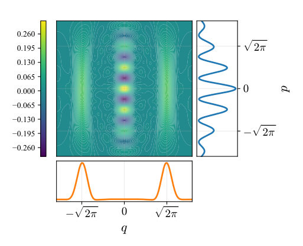
<figcaption class="paper-figure-caption"><b>Fig 1.</b> FIG. 1: Wigner distribution of |SC±(α, ξ)⟩, along with the ˆq and ˆp marginals. Here α = √π is chosen as the optimal displacement amplitude for the two-round cat- breeding protocol (see Section V A), while the squeezing ξ = 0.98 (r = 0.98, corresponding to ≈8.5 dB) is selected to illustrate a representative ideal squeezed cat state. The justification for these values chosen for our proto- col are given in Sec V. In the position quadrature, the Wigner function exhibits two well-separated Gaussian lobes, while the momentum marginal carries pronounced interference fringes that reflect the quantum coherence between the two components. The Wigner distribution takes negative values at certain...</figcaption>
</figure>
<figure class="paper-figure-card">
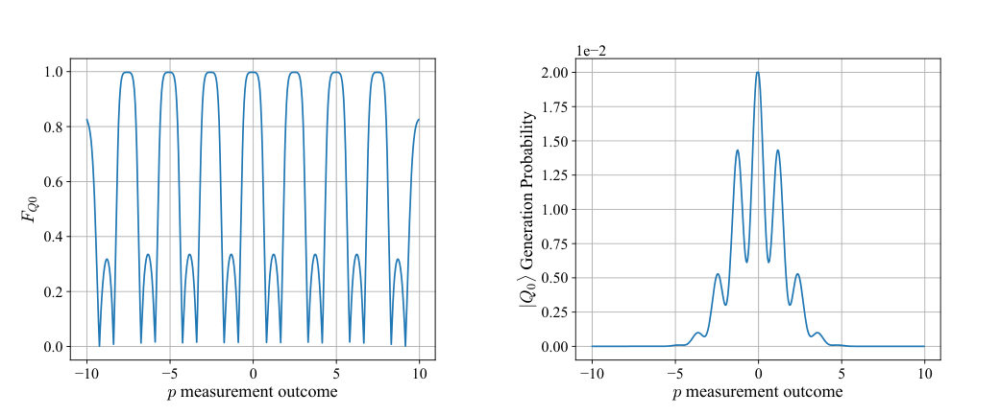
<figcaption class="paper-figure-caption"><b>Fig 2.</b> FIG. 3: Subfig. 3a shows p outcome vs. fidelity FQ0(p) for a single round of cat breeding. The periodic high-fidelity windows can be used to relax measurement post-selection conditions, substantially enhancing the success rate of the desired state. Subfig. 3b shows the probability of |Q0⟩generation for the corresponding p outcome.</figcaption>
</figure>
<figure class="paper-figure-card">
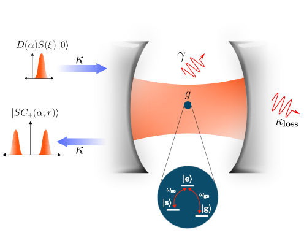
<figcaption class="paper-figure-caption"><b>Fig 3.</b> FIG. 4: Generating cat states using cavity QED: A quan- tum dot with ground states |g⟩and |s⟩is embedded in a strongly coupled optical cavity. Only the |s⟩↔|e⟩transi- tion is resonant with the cavity mode; the |g⟩↔|e⟩tran- sition remains dark. The spin is initialized in an equal superposition (|g⟩+ |s⟩)/ √</figcaption>
</figure>
<figure class="paper-figure-card">
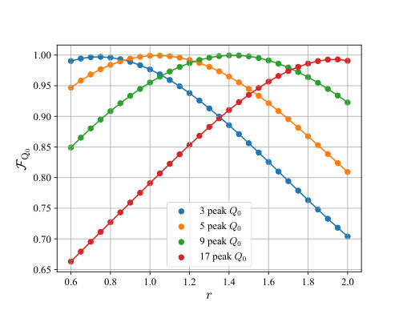
<figcaption class="paper-figure-caption"><b>Fig 4.</b> FIG. 5: Fidelity of the generated |Q0⟩state as a function of the input squeezing parameter r for different numbers of cat-breeding rounds. Increasing the number of breed- ing rounds relaxes the squeezing requirement for achiev- ing a given target fidelity.</figcaption>
</figure>
<figure class="paper-figure-card">
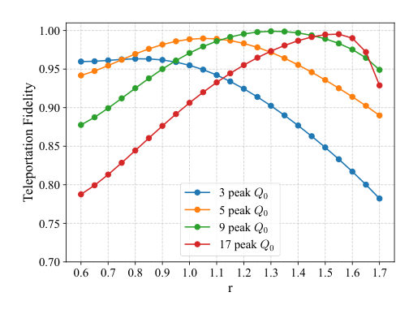
<figcaption class="paper-figure-caption"><b>Fig 5.</b> FIG. 6: Teleportation fidelity using the generated |Q0⟩ states as a function of input squeezing r for different cat-breeding depths. Improved squeezing and additional breeding rounds enhance the teleportation performance, approaching the fault-tolerant threshold for GKP-based protocols.</figcaption>
</figure>

**Summary.** This work presents a practical and scalable method to generate resource states required for CV quantum computation by utilizing quantum dots in an optical cavity. The protocol generates finite-energy qunaught states through cat-breeding, overcoming the limitations of previous methods that suffered from low success rates due to strict measurement post-selection. This approach is highly relevant as it integrates solid-state physics with advanced photonic quantum information processing.

**Why it may be interesting.** It provides a concrete, chip-compatible roadmap for generating non-Gaussian resources essential for fault tolerance, bridging fundamental cavity QED physics (QD interaction) directly into quantum information processing protocols.

Detailed structure

**Main problem.** The primary challenge is generating fault-tolerant Continuous Variable (CV) quantum computation resources, specifically GKP states, because their ideal form possesses unphysical infinite energy.

**Main result.** The authors propose a scalable protocol using quantum dots in a cavity to generate finite-energy qunaught states via cat-breeding, significantly improving success rates by relaxing strict post-selection criteria.

**Method.** The scheme combines deterministic squeezed cat-state generation from the QD-cavity system with multi-round cat-breeding protocols and homodyne measurements.

**Model / system.** The physical platform is a strongly coupled quantum dot embedded in an optical cavity (Cavity-QED). The dynamics are modeled using cascaded-systems formalism to account for finite pulse durations and mode selectivity.

**Key observables.** Fidelity of the generated state, generation probability/success rate, Wigner distribution (showing negative values), and temporal correlation functions ($g^{(1)}$).

**Important parameters / regimes.** Squeezing parameter ($r$), cavity loss ($\kappa$), finite pulse duration, and the structured set of homodyne measurement outcomes.

**Assumptions / limitations.** The ideal GKP states are unphysical, necessitating the use of finite-energy approximations like the qunaught state. The protocol assumes compatibility with integrated photonics and telecom wavelengths.

**Figures summary.** Figures illustrate the Wigner distribution of cat states, the three-cavity setup for simulation, and fidelity oscillations due to ground-state precession in non-degenerate systems.

**Paper structure.** The paper reviews the state-of-the-art (comparing microwave vs. optical), details the cat-breeding protocol, formalizes the light-matter interaction Hamiltonian for the QD-cavity system, presents numerical simulations analyzing fidelity trade-offs, and concludes with a comparison to other GKP architectures.

Abstract

GKP states enable fault-tolerant CV quantum computation, but their generation remains experimentally challenging due to their highly non-Gaussian and infinite-energy ideal structure. In this work, we present a realistic and scalable protocol for generating finite-energy resource states, specifically the qunaught state, using Schrodinger cat states generated in a strongly coupled quantum dot-cavity system. Our scheme combines deterministic squeezed cat-state generation, cat-breeding protocols, and homodyne measurements. Using numerical simulations, we analyze the role of various parameters of the quantum dot-cavity system in the generation of practical qunaught states. Furthermore, we quantify the trade-off between the fidelity and generation probability of these states and exploit the fact that accepting a structured set of homodyne outcomes can significantly enhance the overall success rate. The proposed approach is compatible with integrated photonics and telecom wavelengths, offering a promising route toward scalable CV quantum information processing.

[↑ back to top](#top)

### [Impact of strain and dark states on spectroscopic measurements of silicon-vacancy centers in diamond](http://arxiv.org/abs/2608.11168v1)

**Authors:** Tommy Chin, Kesav V. Narayan, Imran Bashir, Kelsey M. Bates, Liam G. Stanton, Ehsan Khatami, Christopher L. Smallwood  
**Type:** theory · **Category:** other · **PDF:** <https://arxiv.org/pdf/2608.11168v1>  
**Analysis basis:** full PDF text, analyzed in chunks
**Topic relevance:** 🔥 `methods for driven-dissipative` **4/5** · `correlated / nonlocal dissipation` **3/5** · `quantum measurements` **3/5** · `Keldysh / 2PI / non-Gaussian methods` **2/5** · `driven-dissipative phase transition` **2/5** · `quantum optics experiment` **2/5** · `QC/QI experiment` **1/5** · `interference shaping light` **1/5** · `non-equilibrium universality` **1/5**

↔ Scroll figures horizontally

<figure class="paper-figure-card">
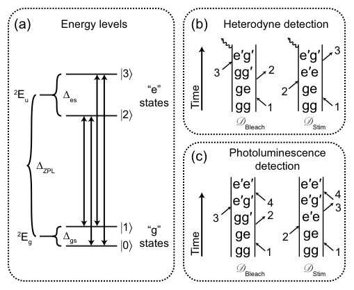
<figcaption class="paper-figure-caption"><b>Fig 1.</b> FIG. 2. (a) Energy level structure for the SiV– center system in diamond. (b) Rephasing double-sided Feynman diagrams for heterodyne detection. (c) Rephasing double- sided Feynman diagrams for photoluminescence detection.</figcaption>
</figure>
<figure class="paper-figure-card">
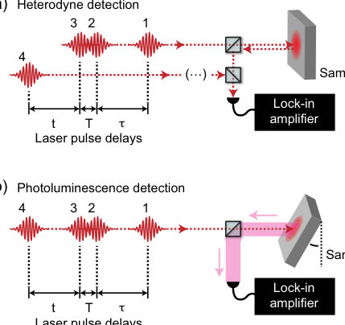
<figcaption class="paper-figure-caption"><b>Fig 2.</b> FIG. 1. Schematic illustration of MDCS measurements of SiV– centers in diamond as reported in Ref. [19]. A series of time-delayed laser pulses excites the sample, producing a four-wave mixing response that can be read out as coherent emission of light or as an incoherent photoluminescence beatnote. (a) Heterodyne detection scheme for measuring coherent emission. (b) Photoluminescence detection scheme.</figcaption>
</figure>
<figure class="paper-figure-card">
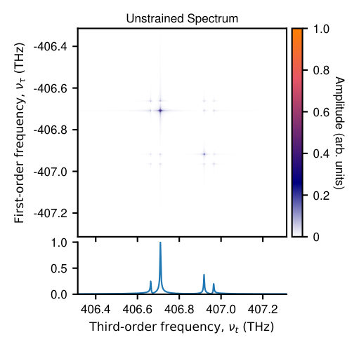
<figcaption class="paper-figure-caption"><b>Fig 3.</b> FIG. 3. Unstrained SiV– rephasing spectrum. The 16 Lorentzian peaks arise from all permutations of ground- and excited-state indices, with amplitudes taken from Ref. [19]. The lower panel shows the projection onto νt.</figcaption>
</figure>
<figure class="paper-figure-card">
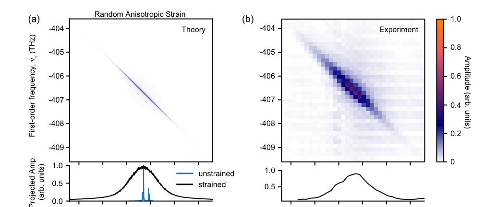
<figcaption class="paper-figure-caption"><b>Fig 4.</b> FIG. 4. Comparison between theory and experiment for strained heterodyne-detected MDCS measurements of SiV– centers in diamond. (a) Simulated spectrum under circumstances of fully random anisotropic strain, with parameters as specified in the main text. The upper panel shows the two-dimensional amplitude |Stot(νt, ντ)|. The lower panel shows the projection of this amplitude onto the νt axis (black trace). The projection of the unstrained spectrum amplitude (blue trace) from Fig. 3 is also shown for comparison. (b) Experimental dataset for heterodyne-detected MDCS measurements of SiV– centers in diamond as reported in Ref. [19].</figcaption>
</figure>
<figure class="paper-figure-card">
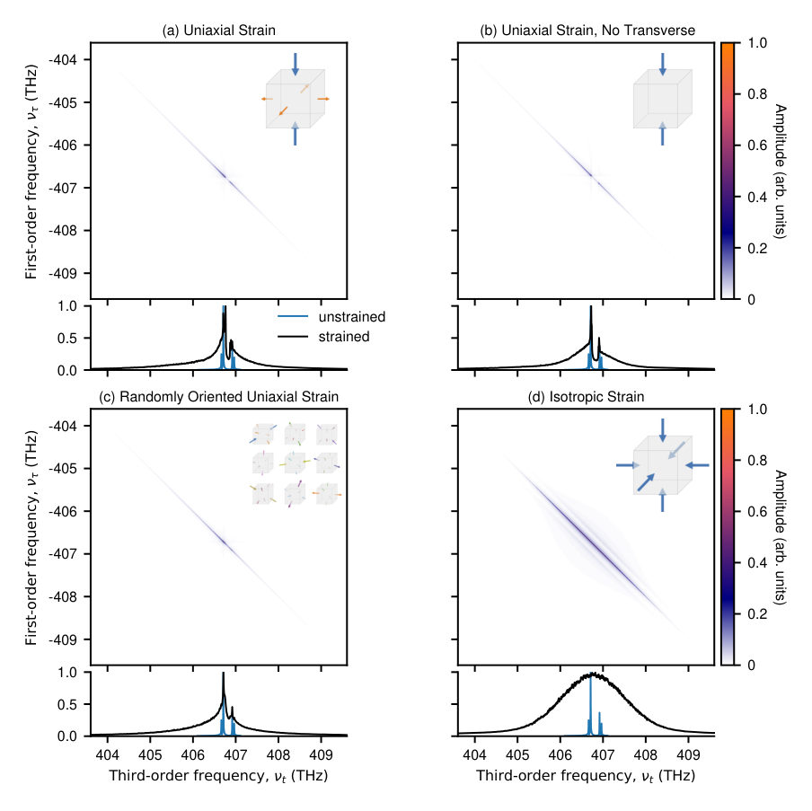
<figcaption class="paper-figure-caption"><b>Fig 5.</b> FIG. 5. Heterodyne-detected MDCS spectra for four alternative strain models. Each panel shows the two-dimensional amplitude spectrum above and its projection onto the νt axis below, with the unstrained reference overlaid in blue. (a) Uniaxial strain. (b) Uniaxial strain without transverse response, p = 0. (c) Randomly oriented uniaxial strain. (d) Isotropic strain. The cube schematic in the upper right corner of each panel illustrates the corresponding strain, with arrows indicating the strain directions. In (c), several cubes at different orientations represent the orientational average. The arrows in panels (a), (b), and (d) depict the compressive sign only and do not represent the...</figcaption>
</figure>

**Summary.** This paper models the spectroscopic response of SiV- centers in diamond under strain using MDCS theory. By simulating measurements under different detection schemes (heterodyne vs. PL), the authors determined that random anisotropic strain best describes spectral broadening. The comparison between techniques successfully separates radiative from nonradiative decay pathways, providing critical insights for quantum sensing applications.

**Why it may be interesting.** This work directly addresses open quantum system dynamics in solid-state emitters, using advanced spectroscopy to map out environmental coupling (strain) and identify non-radiative loss channels, which is central to building reliable quantum memories and sensors.

Detailed structure

**Main problem.** The study aims to understand how strain variations and dark states affect the spectroscopic measurements of silicon-vacancy (SiV-) centers in diamond when using advanced techniques like optical multidimensional coherent spectroscopy (MDCS).

**Main result.** Fully random anisotropic strain best reproduces the measured spectral broadening, yielding characteristic axial and shear strain values. Furthermore, comparing heterodyne vs. photoluminescence detection separates radiative from nonradiative dynamics.

**Method.** The authors developed a computational model using density-matrix perturbation theory within a Bloch-model framework, employing Monte Carlo sampling to average over random strain configurations.

**Model / system.** The physical system is the negatively charged SiV- center in diamond. The model simulates MDCS signals by calculating spectral pole positions ($	ilde{\Omega}_{ab}$) that depend explicitly on six components of the local strain tensor ($\epsilon$).

**Key observables.** Two-dimensional amplitude spectra $|	ext{Stot}(
u_t, 
u_	au)|$, spectral inhomogeneity, and the ratio between heterodyne and photoluminescence signals.

**Important parameters / regimes.** Axial strain variation ($2.8 	imes 10^{-4}$), shear strain variation ($3.5 	imes 10^{-5}$), and the nonradiative decay rate ($\Gamma_{	ext{nr}}$) relative to radiative rates.

**Assumptions / limitations.** The analysis uses approximations like the impulsive limit and Markovian limit; a major limitation is that reproducing PL spectra requires an extremely high, potentially unphysical, ratio of nonradiative to radiative rates.

**Figures summary.** Figures illustrate the MDCS setup for both detection schemes (heterodyne vs. PL), the four-level energy structure of SiV-, and comparisons showing how fully random anisotropic strain best fits measured spectral lineshapes compared to structured strain models.

**Paper structure.** The paper progresses by first establishing the theoretical framework using density matrix theory, then applying Monte Carlo sampling to model ensemble averaging over strain distributions, and finally comparing the predictions from different detection schemes (heterodyne vs. PL) to constrain physical parameters like strain magnitude and decay pathways.

Abstract

Negatively charged silicon-vacancy (SiV$^-$) centers in diamond offer an attractive platform for the development of many forms of quantum technology. However, questions remain in connection to how large ensembles of SiV$^-$ centers behave in concert. Here, we develop a computational model designed to simulate recent experiments where optical multidimensional coherent spectroscopy (MDCS) was used to examine a high-concentration sample of SiV$^-$ centers in diamond, revealing significant variations in spectral signature depending on the detection scheme. Simulation results reveal that strain effects are highly random in this system, with a characteristic axial strain of $2.8 \times 10^{-4}$ and a shear strain of $3.5 \times 10^{-5}$. They suggest in addition that highly strained centers (with values exceeding $1.5 \times 10^{-5}$) may become significantly decoupled from optical emission. The results have implications for the use of SiV$^-$ centers as quantum sensors.

[↑ back to top](#top)

### [Topological states of generalized dissipative Majorana wires](http://arxiv.org/abs/2608.10556v1)

**Authors:** Farokhnaz Hosseinifar, Ali G. Moghaddam  
**Type:** theory · **Category:** other · **PDF:** <https://arxiv.org/pdf/2608.10556v1>  
**Analysis basis:** full PDF text, analyzed in chunks
**Topic relevance:** 🔥 `driven-dissipative phase transition` **4/5** · 🔥 `methods for driven-dissipative` **4/5** · `Keldysh / 2PI / non-Gaussian methods` **3/5** · `correlated / nonlocal dissipation` **3/5** · `analog quantum simulation` **2/5** · `non-equilibrium universality` **2/5** · `quantum measurements` **1/5**

↔ Scroll figures horizontally

<figure class="paper-figure-card">
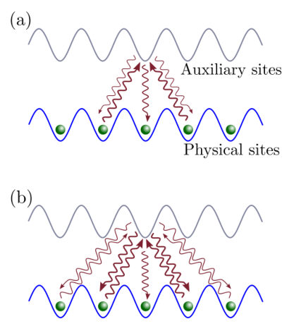
<figcaption class="paper-figure-caption"><b>Fig 1.</b> FIG. 1. 1D cold atom chain in an optical lattice. The phys- ical sites in the lower parts of each panel are coherently cou- pled to the auxiliary sites driven by external lasers. There is also dissipation via spontaneous emission, which brings the states back to the lower sites. Driving and dissipation are rep- resented by curvy arrows inclined upwards and downwards, respectively. (a) Imbalanced coupling model with nearest- neighbor (n.n.) sites involved. Coherent driving couples atoms at each pair of n.n.n. sites to the auxiliary state corre- sponding to the site between them. The relaxation the from auxiliary state though takes place towards the corresponding physical site and its nearest...</figcaption>
</figure>
<figure class="paper-figure-card">
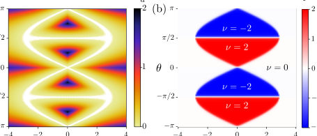
<figcaption class="paper-figure-caption"><b>Fig 2.</b> FIG. 2. (a) Dissipative (damping) gap of the Kitaev model with imbalanced coupling as a function of the imbalance con- trol parameter θ and the onsite dissipation parameter κ. (b) The topological winding number variation with the two pa- rameters θ and κ. As the model has always a nonvanishing purity gap, the change in the winding number exactly coin- cides with the dissipative gap closing lines. The switching between ν = ±2 has been made possible by the imbalanced coupling controlled by θ.</figcaption>
</figure>
<figure class="paper-figure-card">
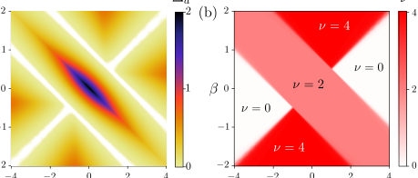
<figcaption class="paper-figure-caption"><b>Fig 3.</b> FIG. 3. (a) Dissipative (damping) gap and (b) the topolog- ical winding number of the Kitaev model, including n.n.n. coupling, as functions of the onsite dissipation parameter κ and the relative strength of n.n.n. coupling represented as β. Again and similar to the model with only n.n. coupling, the change in the winding number exactly coincides with the dissipative gap closing lines. For a large enough n.n.n. cou- pling (|β| &gt; 0.5), we can achieve a higher value of topological invariant, which is ν = 4 for this model.</figcaption>
</figure>

**Summary.** This paper analyzes the topology of generalized dissipative Majorana wires using a Lindblad master equation framework. By calculating spectral gaps and defining a winding number invariant, the authors show that this topology persists even with damping. They demonstrate that engineering couplings allows control over the topological state, achieving higher bound states than simpler models.

**Why it may be interesting.** This work bridges non-equilibrium quantum dynamics (Lindblad equations) with topological concepts typically associated with Hermitian Hamiltonians. The ability to define robust topological invariants in the presence of dissipation is highly relevant for understanding open quantum systems.

Detailed structure

**Main problem.** The study investigates topological states within generalized one-dimensional (1D) quantum dissipative models, specifically those modeling Majorana wires that can host multiple bound states.

**Main result.** The authors demonstrate that a winding number serves as a robust topological invariant distinguishing steady states even when damping and purity gaps are present. Furthermore, incorporating next-nearest-neighbor couplings allows for achieving higher winding numbers.

**Method.** The analysis utilizes the adjoint Lindblad equation applied to fermionic two-point correlations, calculating spectral gaps (damping and purity) and defining topology via a symmetry-based winding number calculation.

**Model / system.** The system is modeled as a 1D fermionic open quantum system whose dynamics are governed by a quadratic Lindblad equation. The model generalizes the Kitaev chain by including imbalanced couplings and next-nearest-neighbor interactions.

**Key observables.** Damping gap, purity gap, and the topological winding number ($
u_{1D}$).

**Important parameters / regimes.** Coupling strengths ($\kappa, 	heta, eta$), which control the closing/opening of the dissipative gap.

**Assumptions / limitations.** The analysis relies on transforming to a mean-field description using phase-conserving linear operators and analyzing steady states derived from fermionic correlations rather than direct Majorana operator evolution.

**Figures summary.** Figures illustrate the dependence of the dissipative gap ($\Delta_d$) and the topological winding number ($
u$) on coupling parameters, showing that changes in $
u$ coincide with the closing of $\Delta_d$.

**Paper structure.** The paper progresses by establishing the mathematical framework using Lindblad dynamics for fermionic correlations, deriving the topological invariant (winding number), and then applying this analysis to specific generalized models (Model I and Model II) to map out their phase diagrams.

Abstract

We study the generalized one-dimensional (1D) quantum dissipative models corresponding to a Majorana wire which can possess more than one Majorana bound state at each end. The system consists of a 1D fermionic open quantum system whose dynamics is governed by a quadratic Lindblad equation. Using the adjoint Lindblad equation for the fermionic two-point correlations, we find the gaps in the damping and purity spectra of a generic 1D model. Then, using the symmetry-based classification, we show that a winding number as the topological invariant can be defined which distinguishes different steady states of the system in the presence of damping and purity gaps. Then we focus on certain models with different Lindblad quantum jump terms and explore their phase diagrams by calculating the damping and the purity gaps as well as the winding number. In particular, we show that by inclusion of quantum jumps between next-nearest-neighbor sites, higher winding numbers and, equivalently, more Majorana bound states can be achieved. Also, by introducing imbalanced couplings, we can switch between states with negative and positive winding numbers. Finally, we should mention that since our formulation is based on the fermionic correlations rather than the Majorana operators, it can be easily extended to the dissipative topological phases belonging to other symmetry classes.

[↑ back to top](#top)

### [Work distribution for strongly coupled many-body open quantum systems](http://arxiv.org/abs/2608.11196v1)

**Authors:** H. T. M. Nghiem, T. A. Costi, S. Campbell, A. K. Mitchell  
**Type:** theory · **Category:** statistical mechanics · **PDF:** <https://arxiv.org/pdf/2608.11196v1>  
**Analysis basis:** full PDF text, analyzed in chunks
**Topic relevance:** 🔥 `methods for driven-dissipative` **4/5** · 🔥 `non-equilibrium universality` **4/5** · `Keldysh / 2PI / non-Gaussian methods` **3/5** · `correlated / nonlocal dissipation` **3/5** · `analog quantum simulation` **2/5** · `driven-dissipative phase transition` **2/5** · `scars & prethermalization` **1/5**

↔ Scroll figures horizontally

<figure class="paper-figure-card">
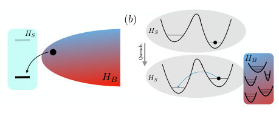
<figcaption class="paper-figure-caption"><b>Fig 1.</b> FIG. 1. Schematic illustration of the systems and quench protocols. (a) Anderson impurity model describing a single-level interacting quantum dot coupled to an electronic lead. (b) Ohmic spin-boson model describing dissipative barrier tunneling. Work is done by sud- denly changing the dot potential or biasing the tunnel barrier states.</figcaption>
</figure>
<figure class="paper-figure-card">
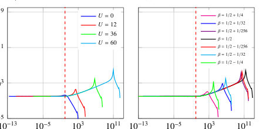
<figcaption class="paper-figure-caption"><b>Fig 2.</b> FIG. 2. WDFs for level quenches with U = 0 are shown in (a) and with finite U in (b). The red arrow in (b) indicates the final-state Kondo temperature of the β = 1/2 system (whose final state is in the Kondo regime, nf = 1). (c,d) WDF P(W) × (W −Wmin)β normalized to its W = Wmin value. Scaling (data collapse) is observed below W −Wmin = TK for fixed β = 1/2 and varying U in (c), and, for fixed U = 60Γ and varying β in (d).</figcaption>
</figure>
<figure class="paper-figure-card">
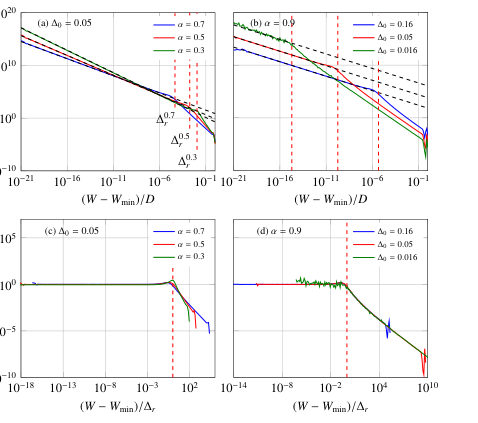
<figcaption class="paper-figure-caption"><b>Fig 3.</b> FIG. 4. Work distribution for quenches in the SBM. Top panels: the WDF P(W) at T = 0. (a) Bias quench ϵd = −∞→0 for several α = αi = αf &lt; 1 and fixed ∆0 = 0.05. (b) Fixed αi = αf = α = 0.9 for several ∆0. Analytical asymptotes P(W) ∼|W −Wmin|−(1−α/2)</figcaption>
</figure>
<figure class="paper-figure-card">
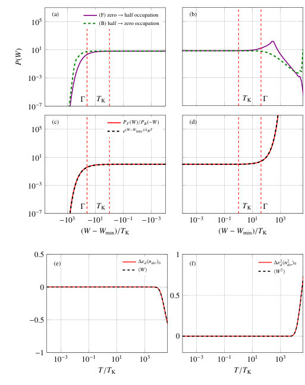
<figcaption class="paper-figure-caption"><b>Fig 4.</b> FIG. 3. TDNRG results for the work at finite temperatures for a level quench in the AIM with U = 12Γ and β = 1/2. WDFs for the forward quench (purple line) and the backward quench (green line) at T = Γ are shown in (a) for the negative range of W −Wmin; and in (b) the positive range of W −Wmin . The corresponding ratio of the forward-quench WDF and the backward-quench WDF (red line) and the Crooks relation (black line) is shown in (c) and (d). The first and second moments of the WDF are shown in (e) and (f).</figcaption>
</figure>

**Summary.** This paper develops an advanced numerical technique, extending TDNRG, to calculate the work distribution function for strongly coupled open quantum systems like quantum dots. By analyzing quenches, the authors reveal universal scaling laws and power-law thresholds in the WDF, confirming deep connections between non-equilibrium thermodynamics and impurity physics.

**Why it may be interesting.** This work provides a numerically exact, non-perturbative tool (TDNRG) to analyze fundamental quantities in non-equilibrium quantum thermodynamics, directly addressing the complex physics of strong coupling and dissipation relevant to AMO and open quantum systems.

Detailed structure

**Main problem.** The study focuses on determining the quantum work distribution function (WDF) for non-equilibrium processes in strongly coupled many-body open quantum systems following a sudden quench.

**Main result.** The authors reveal power-law threshold behavior near minimum work, linked to the Anderson orthogonality catastrophe, and demonstrate universal scaling collapse below an emergent low-energy scale.

**Method.** They extend the time-dependent numerical renormalization group (TDNRG) approach to calculate the WDF directly in the thermodynamic limit.

**Model / system.** The work is applied to quantum impurity models, specifically citing the Anderson Impurity Model (AIM) and the Spin-Boson Model (SBM), which describe system degrees of freedom interacting with gapless baths.

**Key observables.** Quantum Work Distribution Function ($P(W)$), Jarzynski's equality verification, work threshold behavior, and universal scaling collapse.

**Important parameters / regimes.** Strong coupling regime, quench amplitudes (zero or finite temperature), low-energy scale induced by system-bath correlations, and the bath spectral density ($\propto \omega$ for Ohmic baths).

**Assumptions / limitations.** The method is non-perturbative, necessary because previous studies often relied on approximations that fail in strongly coupled regimes.

**Figures summary.** Figure 1 schematically illustrates AIM (quantum dot) and SBM (dissipative tunneling). Figure 2 shows WDFs for level quenches in AIM demonstrating scaling collapse. Figure 3 presents TDNRG results for work at finite temperatures, verifying fluctuation theorems.

**Paper structure.** The paper develops the extension of TDNRG to compute $P(W)$ for generalized quantum impurity models following a quench, analyzing key diagnostics like power-law thresholds and universal scaling collapse across different temperature regimes.

Abstract

The non-equilibrium quantum thermodynamics of many-body open systems is notoriously rich, especially in the strong-coupling regime where strong system-bath correlations develop and interactions produce non-perturbative effects. Such systems can be described by `quantum impurity models' where the system and bath are treated on an equal footing as a single composite. Paradigmatic examples are the spin-boson and Anderson impurity models, in which system degrees of freedom interact with either bosonic or fermionic gapless baths. Here we study the quantum work distribution function (WDF) of such systems following a quench. Capturing the full continuum of many-body excitations in the WDF requires a non-perturbative solution of the underlying non-equilibrium quantum impurity problem. For this purpose, we extend the time-dependent numerical renormalization group (TDNRG) approach to the calculation of the WDF, which applies directly in the thermodynamic limit, can be used for arbitrary quench amplitudes at zero or finite temperature, and provides exponentially fine low-energy resolution. Our numerically-exact solution reveals power-law threshold behavior due to the Anderson orthogonality catastrophe when the work approaches its minimum value, with universal scaling collapse of the distribution below an emergent low-energy scale induced by system-bath correlations.

[↑ back to top](#top)

### [Jamming transition in an active exclusion process](http://arxiv.org/abs/2608.11041v1)

**Authors:** Kavita Jain, Sakuntala Chatterjee  
**Type:** theory · **Category:** statistical mechanics · **PDF:** <https://arxiv.org/pdf/2608.11041v1>  
**Analysis basis:** full PDF text, analyzed in chunks
**Topic relevance:** 🔥 `non-equilibrium universality` **4/5** · `driven-dissipative phase transition` **3/5** · `methods for driven-dissipative` **3/5** · `Frenkel-Kontorova` **2/5** · `Keldysh / 2PI / non-Gaussian methods` **2/5** · `correlated / nonlocal dissipation` **1/5** · `scars & prethermalization` **1/5**

↔ Scroll figures horizontally

<figure class="paper-figure-card">
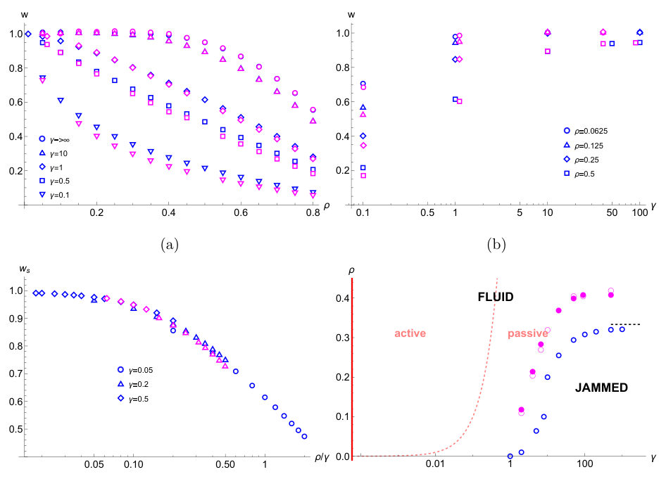
<figcaption class="paper-figure-caption"><b>Fig 1.</b> FIG. 1. Mean particle mobility defined in (7) for various switching rates and densities with b =</figcaption>
</figure>
<figure class="paper-figure-card">
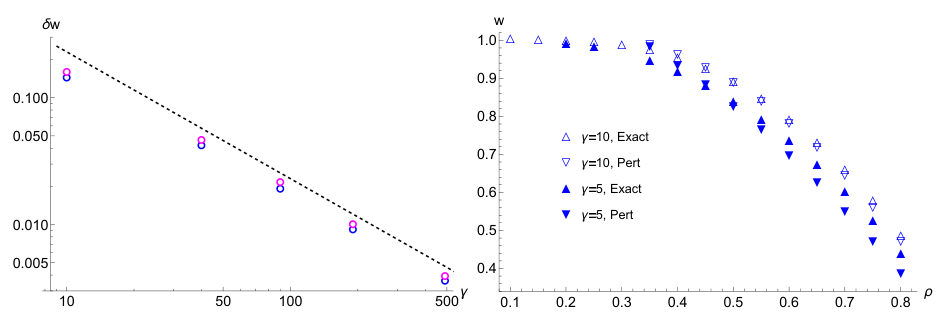
<figcaption class="paper-figure-caption"><b>Fig 2.</b> FIG. 2. (a) Deviation, δw = w(γ →∞) −w(γ) in mobility for b = 4.75, ρ = rc = 11/15 as a</figcaption>
</figure>
<figure class="paper-figure-card">
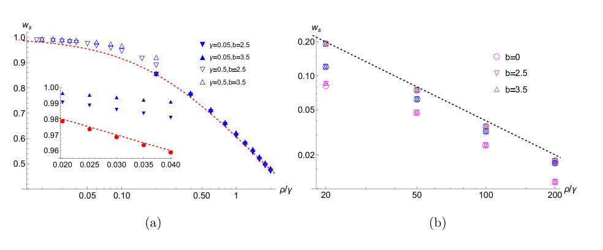
<figcaption class="paper-figure-caption"><b>Fig 3.</b> FIG. 3. Mean mobility ws in the scaling limits, ρ, γ →0 with finite ρ/γ. (a) The points are obtained</figcaption>
</figure>
<figure class="paper-figure-card">
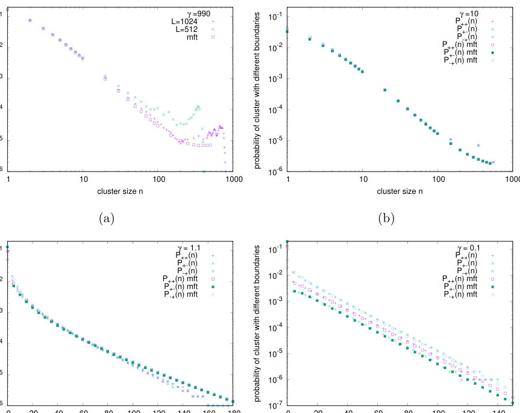
<figcaption class="paper-figure-caption"><b>Fig 4.</b> FIG. 4. Size distribution of hole clusters for b = 2.5 and ρ = 0.125 &lt; rc = 0.33 and various</figcaption>
</figure>
<figure class="paper-figure-card">
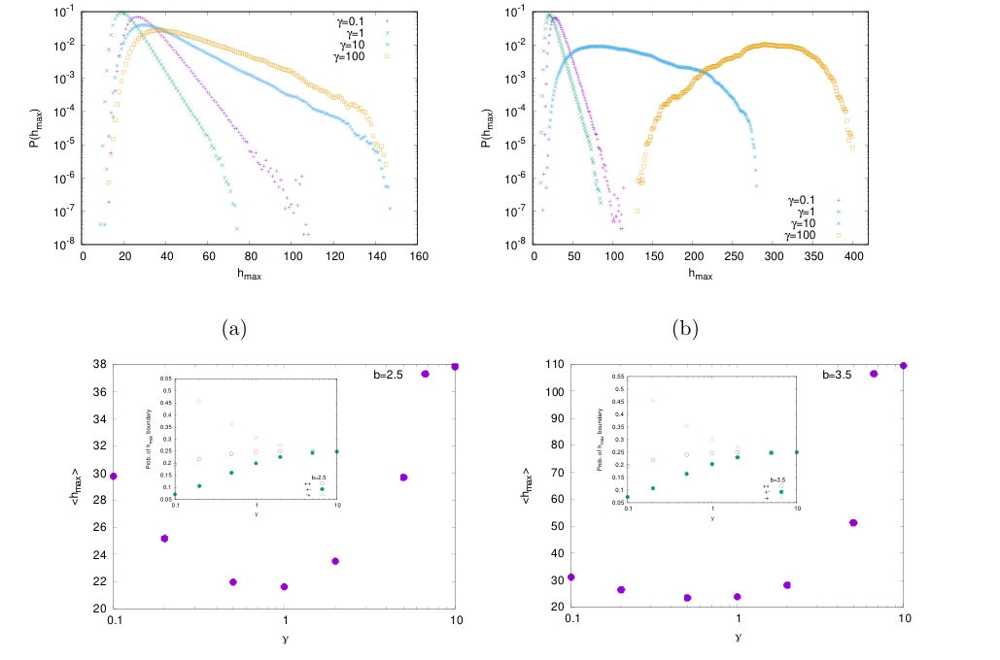
<figcaption class="paper-figure-caption"><b>Fig 5.</b> FIG. 5. Probability distribution of the largest hole cluster size for various values of γ with (a)</figcaption>
</figure>

**Summary.** This paper theoretically analyzes the jamming transition in an active 1D particle system where particles self-propel and randomly reverse direction. Using Monte Carlo simulations and Mean Field Theory, the authors show that activity actively resists jamming, causing the critical density for jamming to drop as activity increases. This suggests a fundamental control mechanism over phase transitions using external driving forces.

**Why it may be interesting.** The work provides theoretical insights into how non-equilibrium driving forces modify fundamental phase transitions, which has parallels in understanding active matter systems relevant to biological or synthetic physical contexts.

Detailed structure

**Main problem.** The study investigates how introducing activity (self-propulsion with switching) affects the jamming transition, a key non-equilibrium phase transition in passive particle systems.

**Main result.** Activity generally hinders or can completely inhibit the formation of a jammed state; specifically, the critical density for jamming decreases as the switching rate decreases, potentially keeping the system fluid even at high densities.

**Method.** The research employs both Monte Carlo simulations to study time evolution and Mean Field Theory (MFT) to derive steady-state equations for particle distributions and mean mobility.

**Model / system.** The model is a one-dimensional ring of hard core particles where each particle has an internal binary variable ($\eta = \pm 1$) determining its self-propulsion direction, which switches at rate $	ilde{\gamma}$.

**Key observables.** Mean mobility ($w$), the critical jamming density ($
ho_c$), and the distribution functions of hole clusters ($P^{\alphaeta}_n$).

**Important parameters / regimes.** Particle density ($
ho$), switching rate ($	ilde{\gamma}$ or $\gamma$), and a hopping parameter $b$. Key regimes include the passive limit ($	ilde{\gamma} 	o \infty$) and the small activity limit ($	ilde{\gamma} 	o 0$).

**Assumptions / limitations.** The Mean Field Theory approach ignores spatial correlations between sites, and certain analyses rely on perturbation theory or specific scaling limits.

**Figures summary.** Figures illustrate mean particle mobility ($w$) versus density ($
ho$) and switching rate ($\gamma$), showing agreement with passive models at high $\gamma$ and summarizing the phase diagram (Fluid/Jammed).

**Paper structure.** The paper progresses from defining the active system dynamics to applying MFT for steady-state analysis. It then analyzes limiting cases: large $\gamma$ (approaching passive behavior), small $\gamma$ (high activity), and finally, a scaling limit ($
ho/\gamma$ finite) to derive asymptotic behaviors.

Abstract

Multiple studies on active matter have shown that activity can induce or suppress a phase transition, or modify the critical behavior of a passive system. Here we investigate how activity affects the jamming transition which is a paradigmatic example of nonequilibrium phase transitions in passive systems. We consider a one-dimensional system of active particles with hardcore interactions and a direction of self-propulsion which can be reversed at a given switching rate. For a class of particle hop rates and infinite switching rate, our model reduces to a passive system which is known to exhibit a transition between a high-density fluid phase and a low-density jammed phase in the stationary state. Using Monte Carlo simulations and a mean field theory, we study how the mean mobility of the particle and the hole cluster distribution vary with density and finite switching rate. Our main result is that activity hinders the formation of jam and can even inhibit it; more precisely, we find that the jamming transition occurs at a critical density that decreases with decreasing switching rate, and at sufficiently small switching rate, the system exists only in the fluid phase.

[↑ back to top](#top)

### [Bounds for Apparent Second-Law Violations in Quantum Trajectories](http://arxiv.org/abs/2608.10118v1)

**Authors:** Domingos S. P. Salazar  
**Type:** theory · **Category:** statistical mechanics · **PDF:** <https://arxiv.org/pdf/2608.10118v1>  
**Analysis basis:** full PDF text, analyzed in chunks
**Topic relevance:** 🔥 `quantum measurements` **4/5** · `methods for driven-dissipative` **3/5** · `non-equilibrium universality` **3/5** · `driven-dissipative phase transition` **2/5** · `Keldysh / 2PI / non-Gaussian methods` **1/5** · `correlated / nonlocal dissipation` **1/5**

↔ Scroll figures horizontally

<figure class="paper-figure-card">
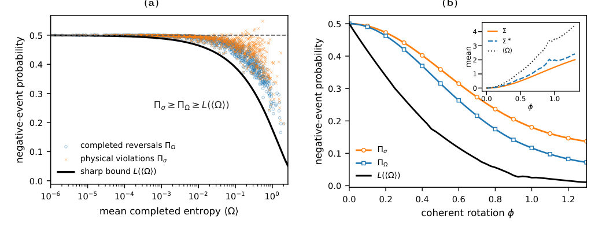
<figcaption class="paper-figure-caption"><b>Fig 1.</b> FIG. 1. Sign-frequency bounds. Here ΠX := P(X &lt; 0) + P(X = 0)/2 for any stochastic quantity X; thus Πσ is the tie-corrected frequency of apparent second-law violations and equals the literal negative-event frequency when P(σ = 0) = 0. (a) For 1000 random finite-coupling models governed by Eq. (12), Πσ (orange crosses) lies above ΠΩ(blue circles) and the sharp curve L(⟨Ω⟩); light segments connect the two statistics for the same model. (b) Exact four-collision statistics for the driven qubit in Eqs. (16) and (18). The inset reports Σ and Σ∗across the drive sweep.</figcaption>
</figure>
<figure class="paper-figure-card">
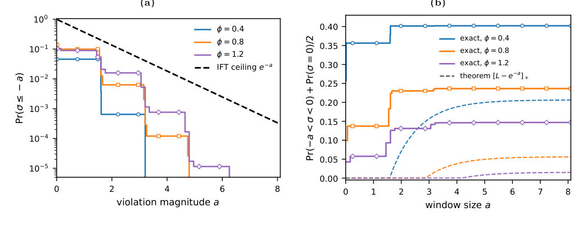
<figcaption class="paper-figure-caption"><b>Fig 2.</b> FIG. 2. Tie-corrected frequency and severity. (a) Exact negative tails and the standard IFT/Markov baseline e−a. (b) The exact quantity P(−a &lt; σ &lt; 0) + P(σ = 0)/2 (solid) and the combined frequency–severity bound (20) (dashed). All distributions are exact enumerations of the driven four-collision records in Eq. (18).</figcaption>
</figure>

**Summary.** This paper develops rigorous bounds on apparent violations of the Second Law in quantum trajectories using advanced fluctuation theorems. By defining a completed entropy $\Omega$, it shows that the probability of observing negative entropy production ($\sigma < 0$) is quantitatively constrained by this completed observable's mean value. This provides a deep theoretical understanding of how measurement and environment coupling enforce thermodynamic constraints.

**Why it may be interesting.** This work provides a powerful theoretical tool for quantifying non-equilibrium thermodynamics in open quantum systems by linking apparent violations to measurable dynamical asymmetries, which is crucial for understanding measurement backaction and irreversible processes.

Detailed structure

**Main problem.** The paper establishes rigorous bounds for apparent violations of the Second Law of Thermodynamics, specifically concerning negative stochastic entropy production in quantum trajectories.

**Main result.** It derives a quantitative lower bound ($\Pi_\sigma \ge L(\langle\Omega
angle)$) showing that apparent violations are constrained by the completed entropy and dynamical asymmetry, even when standard fluctuation theorems do not strictly apply to $\sigma$ alone.

**Method.** The analysis employs path reversal techniques, general arbitrary-coupling formulations, and transfers established fluctuation theorem floors from a completed observable ($\Omega$) to the physical sign statistic ($\Pi_\sigma$).

**Model / system.** The theory is applied to quantum trajectories describing open evolution, modeled using random finite-coupling collision ensembles or coherently driven qubits interacting with thermal ancillas.

**Key observables.** Physical entropy production ($\sigma$), dynamical-asymmetry term ($\sigma^*$), completed entropy ($\Omega$), and the tie-corrected physical sign statistic ($\Pi_\sigma$).

**Important parameters / regimes.** The bound depends on the mean of the completed observable, $\langle\Omega
angle$, which controls the severity of the constraint.

**Assumptions / limitations.** The derivation relies on the path law satisfying a product identity and the general applicability of fluctuation theorems to the completed observable $\Omega$.

**Figures summary.** Figure 1 illustrates the derived inequality ($\Pi_\sigma \ge \Pi_\Omega \ge L(\langle\Omega
angle)$) using results from both random collision models and coherently driven qubit systems.

**Paper structure.** The paper first introduces the problem of apparent violations, develops the mathematical framework relating $\sigma$ to $\Omega$, proves the optimality of the likelihood-ratio sign, derives the core inequality ($\Pi_\sigma \ge L(\langle\Omega
angle)$), and finally validates this result using two distinct physical models.

Abstract

Negative stochastic entropy production is commonly called an apparent violation of the second law. In general quantum-trajectory dynamics, however, the physical entropy production $σ$ need not obey a forward detailed fluctuation theorem. A general arbitrary-coupling formulation identifies a dynamical-asymmetry term $σ^\ast$ that completes it into $Ω=σ+σ^\ast$, whose mean is $\langleΩ\rangle=Σ+Σ^\ast$. We prove that the likelihood-ratio sign is optimal among reversal-odd trajectory observables and use this fact to transfer an established sharp fluctuation-theorem floor to the tie-corrected physical sign statistic $Π_σ=\Pr(σ<0)+\Pr(σ=0)/2$. When $\Pr(σ=0)=0$, the result reads $\Pr(σ<0)\ge[1-\langleΩ\rangle/g(\langleΩ\rangle)]/2$, where $g$ is the inverse of $a\mapsto a\tanh(a/2)$. The physical integral fluctuation theorem simultaneously suppresses large negative events, producing a quantitative ``frequent but mild'' law, while the sign imbalance lower-bounds the hidden mean $Σ^\ast$. We formulate the measured-record protocol explicitly and illustrate and numerically audit the tie-corrected theorem in random finite-coupling collision models and a coherently driven qubit interacting with thermal ancillas.

[↑ back to top](#top)

### [Photonic realization of a subgraph extraction in a quantum random network](http://arxiv.org/abs/2608.10663v1)

**Authors:** Lijun Xia, Xuemei Gu, Kai Wang, Leizhen Chen, Mario Krenn, Yan-Qing Lu, Shining Zhu, Xiao-Song Ma  
**Type:** experiment · **Category:** quantum information and computing · **PDF:** <https://arxiv.org/pdf/2608.10663v1>  
**Analysis basis:** full PDF text, analyzed in chunks
**Topic relevance:** 🔥 `QC/QI experiment` **4/5** · `analog quantum simulation` **3/5** · `quantum optics experiment` **3/5** · `interference shaping light` **1/5** · `quantum measurements` **1/5**

↔ Scroll figures horizontally

<figure class="paper-figure-card">
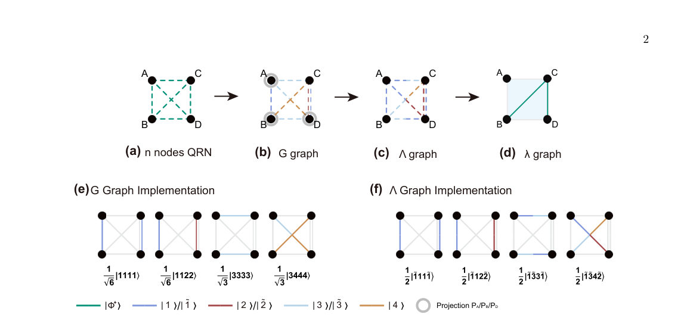
<figcaption class="paper-figure-caption"><b>Fig 1.</b> Figure 1. Schematic illustration of the protocol. (a) Four-node quantum random network module. Each dashed green edge denotes a probabilistic Bell-state link |Φ+⟩. (b) Experimental pair-creation graph for preparing the resource state |G⟩. Each edge denotes a probabilistic photon-pair creation process, and edge colors label the local photon modes. The two edges between nodes C and D have a relative weight 1/ √</figcaption>
</figure>
<figure class="paper-figure-card">
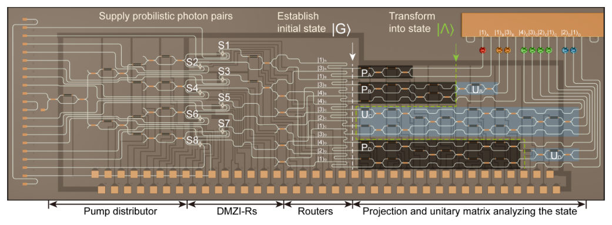
<figcaption class="paper-figure-caption"><b>Fig 2.</b> Figure 2. Overview of the experiment and the integrated photonic circuit. Two picosecond pump pulses at different wavelengths are coupled into the chip via a grating coupler and equally distributed to eight DMZI-Rs. Within the DMZI-Rs, the pump pulses (1544.78 nm and 1556.84 nm) generate photon pairs at 1550.81 nm through spontaneous four-wave mixing. The photons are then routed through delay lines that match their arrival times and establish coherent node-to-node connections, preparing the resource state |G⟩(after the white dashed line). The projections Pi (i ∈{A, B, D}) convert the |G⟩into |Λ⟩ after the green dashed line. Local unitaries Ui (i ∈{B, C, D}) are then applied for...</figcaption>
</figure>
<figure class="paper-figure-card">
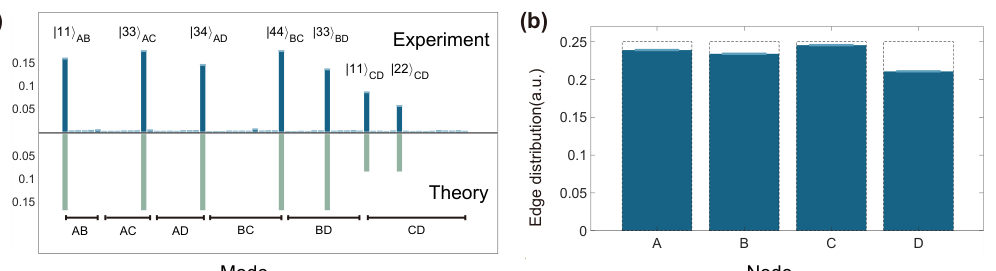
<figcaption class="paper-figure-caption"><b>Fig 3.</b> Figure 3. Experimental edge probability and distribution of the resource state |G⟩. (a), Normalized two-fold coinci- dence probabilities measured in the computational basis. The results (blue bars) are shown for all possible basis combinations between node pairs, where the horizontal-axis labels denote the basis states |ij⟩with mode indices i, j taking values in {1, 3} for node A, {1, 3, 4} for node B, and {1, 2, 3, 4} for nodes C and D. The statistical overlap between the experimental and ideal distributions is γ = 0.9620(2). (b), Connection-probability distribution for each node (blue bars), obtained by summing the corresponding nonzero contributions in (a) and normalizing over all...</figcaption>
</figure>
<figure class="paper-figure-card">
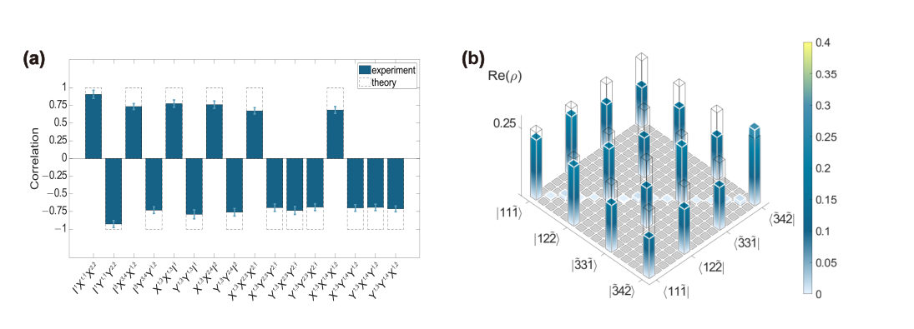
<figcaption class="paper-figure-caption"><b>Fig 4.</b> Figure 4. Witnessing genuine (2, 4, 2) high-dimensional entanglement. (a), Measured expectation values for the Pauli- operator combinations used in the entanglement witness. (b), Witness-relevant real density-matrix elements extracted from the measurement data, together with the corresponding ideal elements of the target state |Λ⟩. Grey elements denote unmeasured or zero components. From the measured nonzero elements, we obtain a fidelity of 0.7801(72), exceeding the genuine (2, 4, 2) entanglement bound of 0.75 by about 4.2σ (uncertainty denotes ±1σ, obtained from 1000 Monte Carlo simulations with Poissonian error).</figcaption>
</figure>

**Summary.** The research experimentally realizes a specific quantum subgraph within a quantum random network using an integrated silicon photonic chip. By exploiting entangled photon pairs and local operations, the authors demonstrate connectivity patterns achievable only through quantum entanglement, validating predictions from QRN theory over classical models.

**Why it may be interesting.** This work provides concrete experimental evidence in photonics that harnesses genuine multipartite entanglement to engineer complex quantum structures predicted by advanced network theories, bridging fundamental theory with scalable hardware.

Detailed structure

**Main problem.** The study aims to experimentally realize a quantum subgraph structure predicted by quantum random network theory, contrasting this with classical connectivity thresholds.

**Main result.** The authors successfully demonstrated the preparation of a specific finite quantum subgraph ($\lambda$ graph) using an integrated photonic chip, confirming that entanglement enables connectivity structures inaccessible classically.

**Method.** The experiment uses probabilistic photon-pair sources and local transformations on an integrated silicon photonic chip, followed by mode-selective postselection to extract the desired entangled state.

**Model / system.** The physical platform is an integrated silicon photonic chip utilizing spontaneous four-wave mixing for generating Bell-state links. The theoretical framework compares classical random graphs (Erdős–Rényi) with Quantum Random Networks (QRN).

**Key observables.** Fidelity ($F_{\exp}$), entanglement witness values ($W$), and visibility measurements (RHOM/HHOM contrast/visibility).

**Important parameters / regimes.** The experiment operates in a regime distinct from the large-$N$ threshold scaling, focusing on finite subgraph realization.

**Assumptions / limitations.** The protocol relies on probabilistic photon-pair sources and postselection; the fidelity calculations assume measurement capability across all required projections.

**Figures summary.** Figures illustrate the experimental setup using integrated photonic circuits, schematic protocols for state preparation (e.g., four-node module), and interference patterns used for characterization.

**Paper structure.** The paper progresses from establishing the theoretical difference between classical and quantum network connectivity to detailing the physical implementation on a silicon chip, followed by rigorous measurements of entanglement dimensionality using fidelity and visibility witnesses.

Abstract

Understanding how complex connectivity emerges in networks is a fundamental challenge in classical and quantum science. In classical random networks, complex subgraphs typically require relatively high connection probabilities, whereas quantum random network theory predicts that such structures can arise at a single, lower threshold through entanglement and local operations. Here, using an integrated silicon photonic chip, we experimentally realize a quantum subgraph predicted by quantum random network theory in a four-node quantum random network. Our integrated platform exploits probabilistic photon-pair sources and coherent control of path modes to prepare a structured quantum subgraph through local transformations and postselection, operating in a threshold regime that differs from classical random networks. We verify that the subgraph state exhibits genuine high-dimensional multipartite entanglement across the nodes, providing experimental evidence that quantum entanglement enables connectivity structures beyond classical accessibility.

[↑ back to top](#top)

### [Projection measurement of the comb basis through free-electron-photon interactions](http://arxiv.org/abs/2608.10831v1)

**Authors:** Zihang Zou, Feng-Xiao Sun, Yunquan Liu, Qiongyi He  
**Type:** theory · **Category:** quantum information and computing · **PDF:** <https://arxiv.org/pdf/2608.10831v1>  
**Analysis basis:** full PDF text, analyzed in chunks
**Topic relevance:** 🔥 `quantum measurements` **4/5** · `quantum optics experiment` **3/5** · `analog quantum simulation` **2/5** · `QC/QI experiment` **1/5** · `driven-dissipative phase transition` **1/5** · `methods for driven-dissipative` **1/5**

↔ Scroll figures horizontally

<figure class="paper-figure-card">
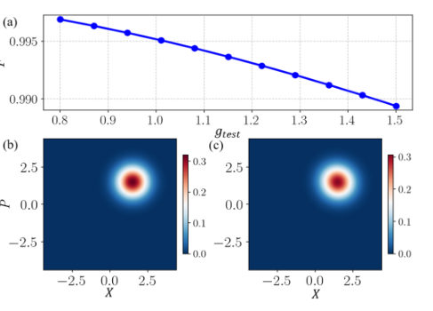
<figcaption class="paper-figure-caption"><b>Fig 1.</b> FIG. 2. (a) The fidelity between the auxiliary optical states generated from the electron obtained in our FECBPM scheme |ψout ph ⟩and the ideal comb state |ψideal ph ⟩for different coupling strengths gtest. And the Wigner functions of (b) |ψout ph ⟩and (c) |ψideal ph ⟩are present with gtest = 1.0, respectively. Other parameters are g = √</figcaption>
</figure>
<figure class="paper-figure-card">
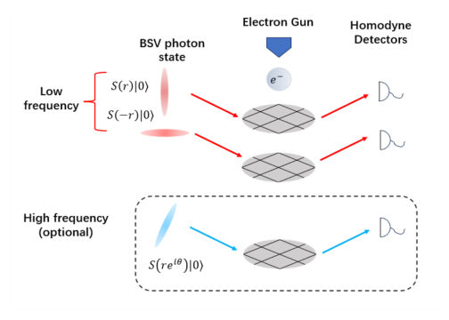
<figcaption class="paper-figure-caption"><b>Fig 2.</b> FIG. 1. The experimental scheme for FECBPM. The low fre- quency part is based on the PINEM platform, where free elec- tron interacts with two optical modes of orthogonal squeezing angles. Then we perform homodyne detections on the output optical modes, and the outcomes project the free electron to the associated comb state non-destructively. Further, the high frequency part can be applied to enhance the measurement accuracy.</figcaption>
</figure>
<figure class="paper-figure-card">
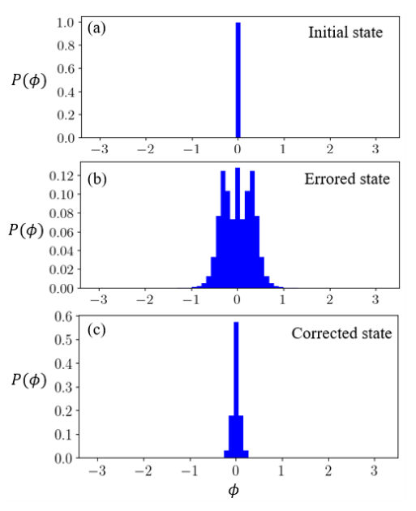
<figcaption class="paper-figure-caption"><b>Fig 3.</b> FIG. 3. The probability distribution on comb basis of (a) the initial state, (b) the state after the FSP with errors δ = 0.01, and (c) the state after error mitigation with g = √</figcaption>
</figure>
<figure class="paper-figure-card">
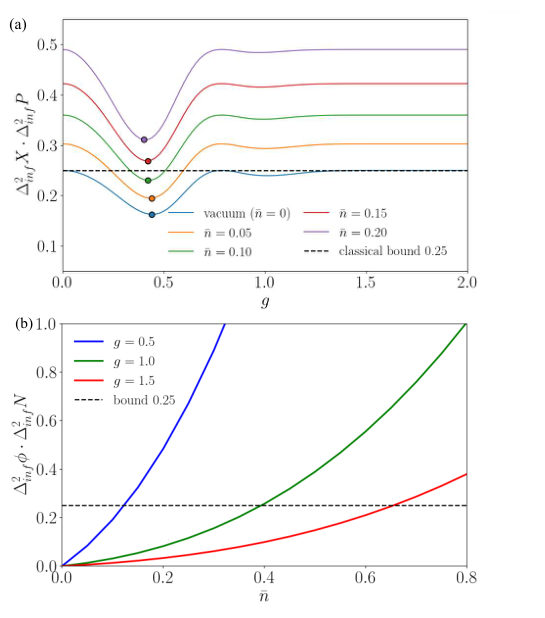
<figcaption class="paper-figure-caption"><b>Fig 4.</b> FIG. 4. EPR steering detection for electron-photon states. (a) The values of ∆2 infX∆2 infP for coupled electron qubits and optical displaced thermal states [Eq. (8)] varies with the coupling strength g for different average photon numbers ¯n. (b) ∆2 infN∆2 infϕ varies with the average photon number ¯n of the optical thermal states for different PINEM coupling strengths g. The black dashed line denotes the EPR steering bound, below which EPR steering can be detected.</figcaption>
</figure>

**Summary.** The paper proposes a method using free-electron-photon interactions to perform nondestructive projection measurements on the electron comb basis. This technique overcomes the limitations of traditional destructive measurements by coupling the electron state to auxiliary optical modes. The results demonstrate that this setup can be used for quantum error mitigation and detecting entanglement (EPR steering) between the electron qubit and the photon field.

**Why it may be interesting.** This work bridges condensed matter physics (free electrons) with advanced quantum optics techniques (squeezing, homodyne detection) to establish a novel platform for non-destructive quantum state characterization and computation in solid-state systems.

Detailed structure

**Main problem.** Conventional measurements on free electrons are destructive, limiting their use as quantum qubits. The goal is to perform nondestructive projection measurement on the electron comb basis.

**Main result.** A proposed scheme (FECBPM) allows for nondestructive measurement of the electron comb basis and demonstrates its utility in quantum error mitigation and witnessing EPR steering between electrons and photons.

**Method.** The method involves coupling free electrons to optical modes via PINEM interactions, followed by projection measurement using orthogonal squeezed vacuum states and homodyne detection on the auxiliary optical mode.

**Model / system.** The system is a free electron interacting with photon modes in a Near-field Electron Microscopy (PINEM) setup. The interaction Hamiltonian governs the coupling, leading to an effective scattering operator that describes state evolution.

**Key observables.** Fidelity of optical modes ($
ho_i^{ph}$), violation of EPR steering inequalities ($\Delta^2_{	ext{inf}X}\Delta^2_{	ext{inf}P} < 1/4$), and the measurable phase shift $\delta\phi$.

**Important parameters / regimes.** Coupling strength ($g$), squeezing parameter ($r$), and error parameters like propagation distance ($\phi$) or thermal photon occupation ($ar{n}$).

**Assumptions / limitations.** The analysis relies on comparing optical state fidelities rather than direct electron state fidelity due to mathematical constraints; the use of squeezed vacuum states approximates ideal quadrature measurements.

**Figures summary.** Figures illustrate the experimental scheme using squeezing angles, compare measured vs. ideal optical state fidelities (Wigner functions), show probability distributions before and after error mitigation, and demonstrate EPR steering detection dependence on coupling strength and thermal noise.

**Paper structure.** The paper develops the theoretical framework by first defining the electron-photon interaction Hamiltonian and scattering operator; it then details the conditions for reliable projection measurement via homodyne detection; subsequently, it applies this to quantum error correction and finally analyzes EPR steering criteria.

Abstract

Free electrons, driven by rapid advances in photon-induced near-field electron microscopy, have emerged as a promising platform for quantum information processing, including quantum computing and quantum sensing. However, conventional measurements that rely on the electron energy loss spectrum (EELS) are inherently destructive to electron qubits, thereby constraining their applicability. In this Letter, we propose a scheme that performs projection measurement on the electron comb basis, where high measurement precision can be achieved with bright squeezed vacuum states and strong PINEM couplings. Notably, this approach is not only nondestructive to electron qubits but also maximally incompatible with energy measurements, enabling alternative quantum information applications, such as quantum error mitigation and Einstein-Podolsky-Rosen steering detection. Our findings open an avenue towards a systematic understanding of quantum free electrons and towards the development of nondestructive free electron quantum information tasks.

[↑ back to top](#top)

### [Assessing fidelity-limiting factors and achieving single-qubit gate fidelity beyond 99.999% in driven silicon spin qubits](http://arxiv.org/abs/2608.11072v1)

**Authors:** Kenta Takeda, Akito Noiri, Takashi Nakajima, Leon C. Camenzind, Takashi Kobayashi, Giordano Scappucci, Seigo Tarucha  
**Type:** experiment · **Category:** quantum information and computing · **PDF:** <https://arxiv.org/pdf/2608.11072v1>  
**Analysis basis:** full PDF text, analyzed in chunks
**Topic relevance:** 🔥 `QC/QI experiment` **4/5** · `correlated / nonlocal dissipation` **2/5** · `quantum measurements` **2/5** · `driven-dissipative phase transition` **1/5** · `methods for driven-dissipative` **1/5** · `quantum optics experiment` **1/5**

↔ Scroll figures horizontally

<figure class="paper-figure-card">
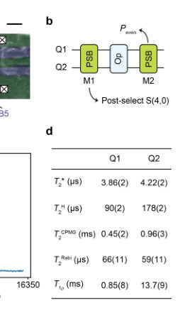
<figcaption class="paper-figure-caption"><b>Fig 1.</b> Fig. 1, Basic device properties. a, False-color scanning electron microscope image of the device. The</figcaption>
</figure>
<figure class="paper-figure-card">
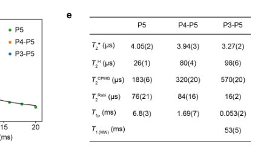
<figcaption class="paper-figure-caption"><b>Fig 2.</b> Fig. 2, Qubit characterization with an adjacent reservoir. The measurements are performed for Q2 (see</figcaption>
</figure>
<figure class="paper-figure-card">
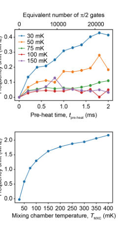
<figcaption class="paper-figure-caption"><b>Fig 3.</b> Fig. 3, Heating effect and temperature dependence. a, Schematic of heating effect measurement. The</figcaption>
</figure>
<figure class="paper-figure-card">
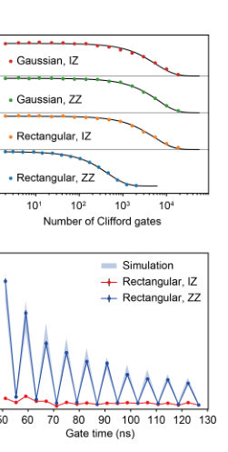
<figcaption class="paper-figure-caption"><b>Fig 4.</b> Fig. 4, Pulse shape comparison and characterization of off-resonant driving. Measurements are</figcaption>
</figure>
<figure class="paper-figure-card">
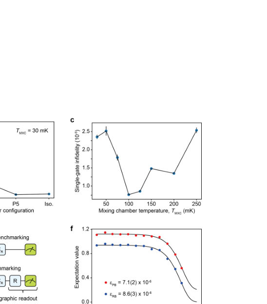
<figcaption class="paper-figure-caption"><b>Fig 5.</b> Fig. 5, RB fidelity characterizations. Gaussian pulses with a peak Rabi frequency of 3 MHz are used</figcaption>
</figure>

**Summary.** The research reports achieving single-qubit gate fidelities above 99.999% in silicon spin qubits by addressing decoherence mechanisms inherent to microwave driving. Key findings pinpoint that proximal reservoirs degrade the critical $T_{1
ho}$ coherence time, and using spectrally tailored Gaussian pulses minimizes benchmarking artifacts. This work establishes practical limits for high-fidelity quantum operations in solid-state systems.

**Why it may be interesting.** This work provides crucial experimental guidelines for scaling quantum computation by quantifying how specific noise sources—like reservoir coupling and off-resonant excitation—limit gate performance in solid-state qubits.

Detailed structure

**Main problem.** The primary goal is achieving single-qubit gate fidelities exceeding 99.999% in driven silicon spin qubits while rigorously identifying the physical mechanisms that limit this performance.

**Main result.** High fidelities were achieved by mitigating decoherence sources, particularly by optimizing device conditions to suppress off-resonant driving effects and extending the spin-locking coherence time ($T_{1
ho}$).

**Method.** The study employs randomized benchmarking (RB) and purity measurements alongside detailed characterization of various coherence times ($T_2^*$, $T_{1
ho}$) under microwave driving.

**Model / system.** The platform is semiconductor single-spin qubits realized in silicon quantum dots, controlled via Electric Dipole Spin Resonance (EDSR). The analysis models noise sources arising from proximal reservoirs and off-resonant microwave excitation.

**Key observables.** Single-qubit gate fidelity ($\pi/2$ rotation), spin-locking coherence time ($T_{1
ho}$), $T_2^*$ echo decay, and frequency shifts due to heating.

**Important parameters / regimes.** Gate fidelity target $>99.999\%$; reservoir proximity distance ($d$); Rabi frequency ($f_{	ext{Rabi}}$); temperature ($T_{	ext{MXC}}$).

**Assumptions / limitations.** The residual error is primarily limited by incoherent noise, and the analysis models capacitive coupling ($\eta(d)$) between the qubit and external reservoirs.

**Figures summary.** Figures illustrate SEM images of the device, measurement sequences (PSB readout), spin resonance spectra, coherence time measurements ($T_{1
ho}$ vs. reservoir proximity), and fidelity decay plots comparing RB and purity results for different pulse shapes.

**Paper structure.** The paper progresses by first establishing basic qubit characterization (coherence times) in the presence of varying environmental couplings (reservoirs). It then investigates systematic errors from microwave driving (pulse shaping, heating) before concluding with optimized protocols that achieve state-of-the-art fidelity benchmarks.

Abstract

In semiconductor single-spin qubits, high-fidelity quantum gates have been demonstrated; however, achieving consistent performance remains challenging due to variations in driven qubit coherence, which is less explored than free-evolution coherence such as $T_2^*$. Here, we report single-qubit gate fidelities above 99.999%, achieved by dramatically extending the driven-spin coherence time and suppressing off-resonant driving effects that are detrimental to accurate fidelity benchmarking. We demonstrate that removing proximal reservoirs significantly enhances the spin-locking coherence time ($T_{1ρ}$), a critical metric for qubits under microwave driving. Furthermore, we reveal that in typical spin qubit setups using parity readout and rectangular pulses, off-resonant excitation of neighboring qubits causes substantial benchmarking artifacts. By optimizing device conditions to mitigate microwave-induced degradation and implementing spectrally tailored pulse shaping, we achieve a $π/2$ gate fidelity of 99.99920(2)%, with remaining errors primarily limited by incoherent noise. These results showcase the mechanisms that bound fidelity benchmarking in state-of-the-art silicon spin qubits and provide practical guidelines for achieving and verifying high fidelities in these systems.

[↑ back to top](#top)

### [Long-lived memory effects in the defect bath of superconducting qubits](http://arxiv.org/abs/2608.10087v1)

**Authors:** Abhishek Agarwal, Masum Uddin, Shroya Vaidya, Lachlan P. Lindoy, Ehsaneh Daghigh Ahmadi, Tobias Lindström, Sebastian E. de Graaf, Ivan Rungger  
**Type:** experiment · **Category:** quantum information and computing · **PDF:** <https://arxiv.org/pdf/2608.10087v1>  
**Analysis basis:** full PDF text, analyzed in chunks
**Topic relevance:** 🔥 `QC/QI experiment` **4/5** · `correlated / nonlocal dissipation` **3/5** · `quantum measurements` **2/5** · `driven-dissipative phase transition` **1/5** · `methods for driven-dissipative` **1/5**

↔ Scroll figures horizontally

<figure class="paper-figure-card">
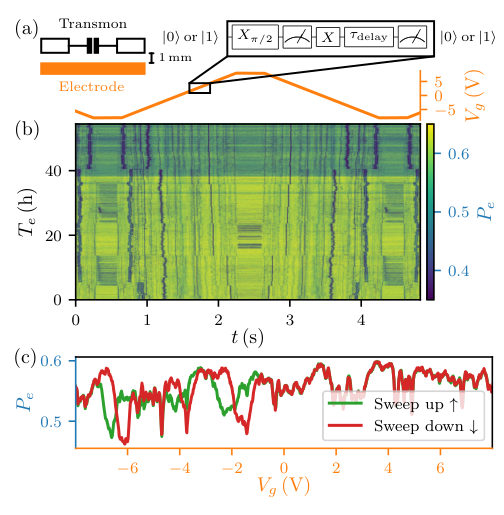
<figcaption class="paper-figure-caption"><b>Fig 1.</b> FIG. 1. (a) The experimental protocol showing the circuit repeatedly applied on the qubit (black) and the waveform of the applied voltage Vg via the gate electrode (orange). In the circuit diagram, the Xπ/2 pulse followed by readout ran- domly projects the qubit to the |0⟩or |1⟩state. Measure- ments where the qubit was projected to |1⟩are discarded in post-processing [37]. The remaining circuit is a single-point T1 measurement. (b) Probability of the qubit remaining ex- cited, Pe, as a function of sweep time t within each voltage sweep, plotted over the laboratory time Te at which each ex- periment was performed. The dark vertical trajectories cor- respond to individual TLS defects that...</figcaption>
</figure>
<figure class="paper-figure-card">
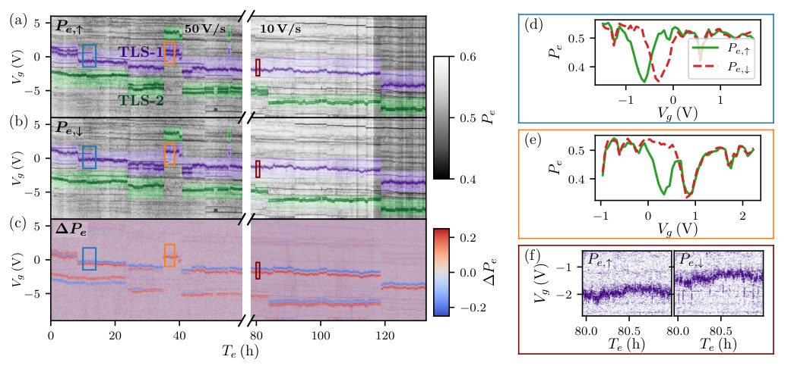
<figcaption class="paper-figure-caption"><b>Fig 2.</b> FIG. 2. Two sets of repeated experiments are performed with sweep rates 50 Vs−1 (Te = 0−60 h) and 10 Vs−1 (Te = 80−130 h) and the quantities (a) Pe,↑, (b) Pe,↓, and (c) ∆Pe = Pe,↑−Pe,↓are plotted as a function of Vg over time. The areas surrounding the two dominant strongly coupled TLS, labelled TLS-1 and TLS-2, are highlighted in purple and green, respectively, for better visibility. (d-f) Representative examples of different hysteresis effects, with the colour of the box corresponding to the regions marked in (a-c) with the same colours. Panels (d,e) show the time-averaged result during the boxed region. (f) Zoomed-in view of the region highlighted in the maroon boxes showing hysteresis...</figcaption>
</figure>
<figure class="paper-figure-card">
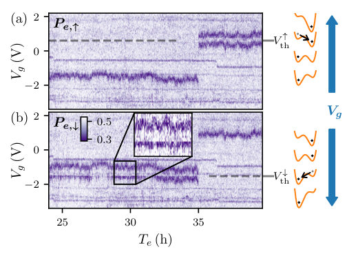
<figcaption class="paper-figure-caption"><b>Fig 3.</b> FIG. 3. Zoomed-in view of the results in Fig. 2(a,b) show- ing (a) Pe,↑and (b) Pe,↓. In (b), for times &lt; 35 h, TLS-1 reappears abruptly at a well-defined threshold voltage, con- sistent with switching of the CF. This abrupt reappearance is highlighted in the high-contrast zoomed-in inset in (b). The inferred CF thresholds V ↑ th and V ↓ th are marked on the right, together with a schematic representation of how the CF po- tential varies with the applied Vg and causes the reappearance hysteresis.</figcaption>
</figure>
<figure class="paper-figure-card">
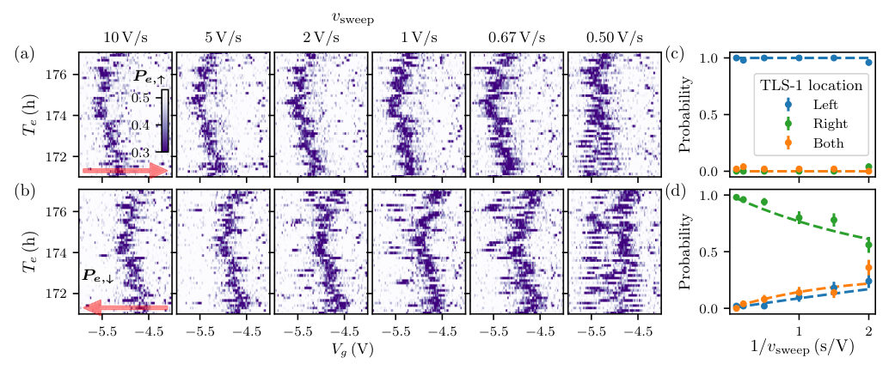
<figcaption class="paper-figure-caption"><b>Fig 4.</b> FIG. 4. Results of interleaved experiments with different sweep rates vsweep. The different sweep rates are shown in different columns, while (a) and (b) show Pe,↑and Pe,↓, respectively. Sweep-rate dependence is not observed in (a), but is visible in (b), where TLS-1 appears at the lower-voltage location with higher probability for lower sweep rates. This is quantified in (c,d), where the probabilities of TLS-1 appearing in the left, right, or both locations are plotted. The dashed lines in (c,d) are fits to a model with CF symmetry point Vsym ∼−4.6 V and equilibration time τeq ≃5 s.</figcaption>
</figure>

**Summary.** This paper experimentally reveals that superconducting transmon qubits suffer from memory effects caused by slow charge fluctuations within the material's defect bath. By tuning the electric field, the authors measured hysteretic changes in qubit decay rates with timescales reaching seconds. This work provides vital insights into non-Markovian noise sources, which is critical for advancing robust quantum computation.

**Why it may be interesting.** This work directly addresses noise sources in superconducting qubits by characterizing non-Markovian noise from defect baths, providing crucial data for improving qubit stabilization and quantum error correction protocols.

Detailed structure

**Main problem.** The study investigates long-lived memory effects originating from defect baths coupled to superconducting qubits, which introduce detrimental temporally correlated noise.

**Main result.** The research observed memory timescales on the order of seconds, significantly exceeding typical coherence times, attributed to coupling with electric field-polarized charge fluctuators (CFs).

**Method.** The authors used electric-field tuning via a gate electrode and performed fast, repeated measurements of qubit relaxation probability ($P_e$) over extended laboratory time.

**Model / system.** The physical system is a superconducting transmon qubit coupled to microscopic Two-Level System (TLS) defects. The memory effects are modeled by coupling the TLSs to electric field-polarized charge fluctuators (CFs).

**Key observables.** Qubit relaxation probability ($P_e$), hysteretic behavior in TLS resonance voltages, and sweep-rate dependence of $P_e$.

**Important parameters / regimes.** Memory timescales ($	au \sim$ seconds), electric field tuning voltage ($V_g$), and the characteristic equilibration time ($	au_{eq} \approx 5.4$ s).

**Assumptions / limitations.** The analysis assumes the qubit transition frequency is insensitive to offset charge, and the CF model uses an approximation near the symmetry point.

**Figures summary.** Figures illustrate the experimental protocol, showing $P_e$ vs. sweep time over long lab times, comparing increasing/decreasing sweeps to reveal hysteresis, and demonstrating sweep-rate dependence of the measured probabilities.

**Paper structure.** The paper details the experimental setup using electric-field tuning, presents measurements showing hysteretic behavior indicative of memory effects, models these effects using a charge-fluctuator approach, and quantifies the long equilibration times observed.

Abstract

We reveal long-lived memory effects in the defect bath of a superconducting transmon qubit through electric-field tuning of two-level system (TLS) defects coupled to the qubit. Using a fast TLS mapping method we observe several hysteretic effects in the TLS environment with memory timescales of the order of seconds, far beyond the lifetimes of individual TLS defects. The observations can be explained by TLS coupling to electric field-polarised charge fluctuators in the defect bath. Our method enables detailed mapping of the dynamics of the bath's coupled microscopic degrees of freedom and the associated memory effects which can introduce temporally correlated noise. This information may be used to improve qubit-stabilisation and quantum error correction protocols.

[↑ back to top](#top)

### [Eliminating photon transport in long-baseline optical interferometry using quantum memories](http://arxiv.org/abs/2608.10078v1)

**Authors:** Yousef K. Chahine, Chaohan Cui, William DeRocco, Daniel Gottesman, Saikat Guha, Emil T. Khabiboulline, Zhenning Liu, Brittany McClinton, Jayadev Rajagopal, Fredrik Rantakyro, J. Gabriel Richardson, Stephen Ridgway, Aqil Sajjad, Joohyung Song  
**Type:** theory · **Category:** quantum information and computing · **PDF:** <https://arxiv.org/pdf/2608.10078v1>  
**Analysis basis:** full PDF text, analyzed in chunks
**Topic relevance:** 🔥 `interference shaping light` **4/5** · `quantum measurements` **3/5** · `correlated / nonlocal dissipation` **1/5**

↔ Scroll figures horizontally

<figure class="paper-figure-card">
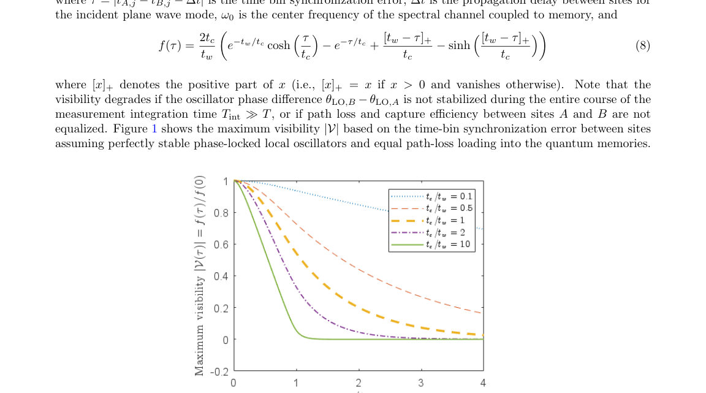
<figcaption class="paper-figure-caption"><b>Fig 1.</b> Figure 1: Maximum visibility of two-site interference with time bin synchronization error τ relative to the memory exposure bin width tw for various coherence time ratios tc/tw. Based on analysis of a spectrally-filtered weak thermal field loaded into a sequence of temporally-gated quantum memories.</figcaption>
</figure>

**Summary.** This paper outlines a revolutionary method for long-baseline optical interferometry that replaces the need to physically transport light over kilometers by storing and processing photon coherence within quantum memories. By mapping the astronomical signal onto memory states, it fundamentally changes the stability requirements from maintaining path length accuracy to controlling local timing and phase references. This advances the field by merging quantum information techniques with cutting-edge astrophysics instrumentation.

**Why it may be interesting.** This work is highly relevant as it applies advanced concepts from quantum information (entanglement distribution, memory storage) to solve a major problem in experimental quantum optics/astrophysics. The shift in required stability metrics provides new theoretical frameworks for analyzing complex quantum measurement protocols.

Detailed structure

**Main problem.** The paper addresses the fundamental limitations of classical long-baseline optical interferometry for astrophysical measurements by proposing a quantum memory-based approach.

**Main result.** Using quantum memories allows the measurement of photon coherences across distant sites without requiring the physical transport and recombination of light over vast distances, shifting stability concerns from path length to local timing control.

**Method.** The method involves mapping the coherent superposition state of incoming photons onto a collective quantum memory state using entanglement-assisted operations. Coherence is then interrogated via joint measurements on the stored quantum states.

**Model / system.** The system modeled is an optical interferometer utilizing multiple distant telescopes (A, B, etc.) whose light signals are captured and processed within solid-state or atomic quantum memories. The process relies on entanglement to correlate information across these separated nodes.

**Key observables.** Mutual coherence ($G_{AB}(t)$), complex visibility, and the reconstructed fringe term which depends on residual differential delay ($\delta	au(t)$).

**Important parameters / regimes.** Coherence time ($	au_c$), memory bin width ($t_w$), synchronization error ($	au$), and the required phase stability for local oscillators.

**Assumptions / limitations.** The primary assumption is that quantum memories can successfully capture, store, and allow joint measurement of the complex superposition state of incoming photons from multiple sources. It also assumes established techniques for phase referencing remain necessary.

**Paper structure.** The paper first contrasts classical interferometry limitations with quantum memory approaches, detailing how the stability requirement shifts. It then describes the core mechanism of state transfer into memories and discusses the reconstruction of visibility via joint measurements on stored states, concluding with a discussion of remaining technological hurdles.

Abstract

In this paper, we describe the fundamental operating mechanisms of optical interferometry using quantum memory and entanglement. We show how these remove the optical delay line bottleneck. Quantum memory is not without its own set of challenges, some of which include very small bandwidths as well as limitations in storage time. We examine the influence of timing artifacts on memory photon capture probability and interferometric complex visibility. We highlight keystone areas of technology that require further development and are essential to realizing these opportunities, as well as ongoing work to overcome these challenges.

[↑ back to top](#top)

### [Nanoscale graphitization and defect evolution in silicon-vacancy center-containing nanodiamonds under high-pressure high-temperature annealing](http://arxiv.org/abs/2608.10632v1)

**Authors:** M. De Feudis, B. Yavkin, L. Henry, K. O. Ho, M. -P. Adam, P. Goldner, F. Benedic, S. Desgreniers, J. -F. Roch  
**Type:** experiment · **Category:** quantum information and computing · **PDF:** <https://arxiv.org/pdf/2608.10632v1>  
**Analysis basis:** full PDF text, analyzed in chunks
**Topic relevance:** 🔥 `QC/QI experiment` **4/5** · `quantum optics experiment` **2/5** · `quantum measurements` **1/5**

↔ Scroll figures horizontally

<figure class="paper-figure-card">
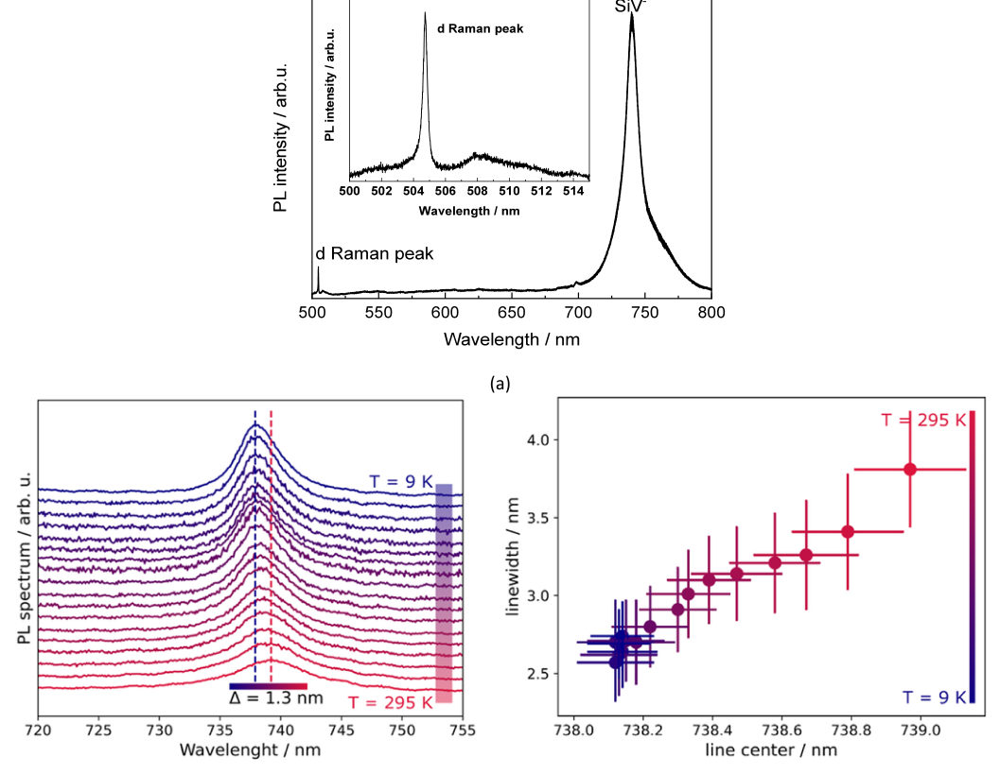
<figcaption class="paper-figure-caption"><b>Fig 1.</b> Fig. 1. (a) PL spectrum registered at room temperature on a Si-doped as-grown ND cluster showing the highly emissive SiV centers (excitation at 473 nm). Inset: magnification of the d Raman peak (range 500-515 nm). The close small band at around 508 nm (1450 cm−1) can be ascribed to vibrations of trans-polyacetylene molecules, typical of the CVD diamond synthesis technique [32]. (b) PL spectra of SiV centers registered on as-grown NDs showing the evolution of the ZPL peak as a function of the temperature down to 9 K (step ≈15 K, excitation at 532 nm); (c) corresponding correlation between line center and linewidth, displaying an approximately linear trend.</figcaption>
</figure>
<figure class="paper-figure-card">
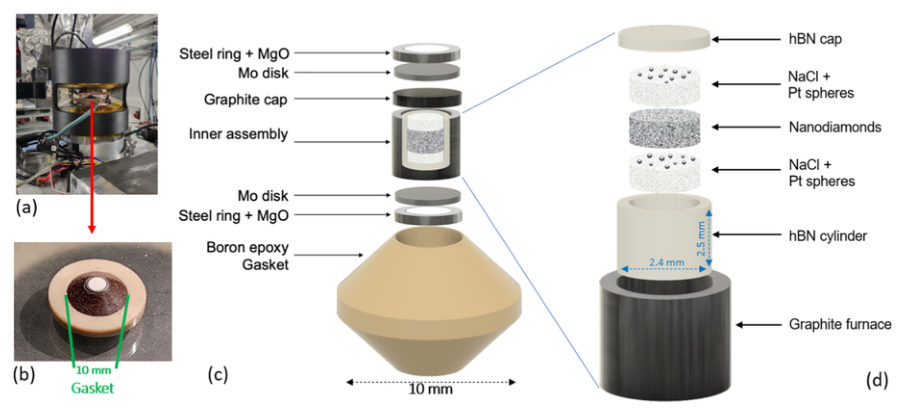
<figcaption class="paper-figure-caption"><b>Fig 2.</b> Fig. 2. (a) PE press installed at the PSICHE beamline of the SOLEIL synchrotron. (b) Photograph of the final 10 mm assembly. (c) Exploded view of the assembly components inside the gasket: the sample is enclosed in a hBN capsule, which is placed inside a graphite furnace, while three disks (graphite, molybdenum, and a magnesium oxide–steel ring) are positioned above and below the capsule to ensure uniform pressure and temperature conditions. (d) Sandwich-type sample configuration inside the hBN capsule, from bottom to top: a layer of milled NaCl salt grains and Pt spheres, a layer of ND particles, and a final layer of milled NaCl salt grains and Pt spheres.</figcaption>
</figure>
<figure class="paper-figure-card">
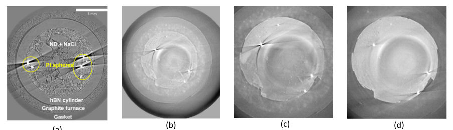
<figcaption class="paper-figure-caption"><b>Fig 3.</b> Fig. 3. Tomographic sequence of the 10 mm assembly recorded during HPHT annealing using a PE press under different pressure and temperature conditions: (a) at room temperature and ambient pressure, the sample is correctly positioned with respect to the X-ray beam, and the various components of the assembly are clearly visible; (b) at 2 GPa and room temperature, the assembly components remain preserved while salt (NaCl) densification initiates; (c) at 2 GPa and 925 K, enhanced compaction leads to the onset of salt recrystallization; (d) at 2 GPa and 1425 K, further heating results in NaCl melting (as confirmed from XRD analysis).</figcaption>
</figure>
<figure class="paper-figure-card">
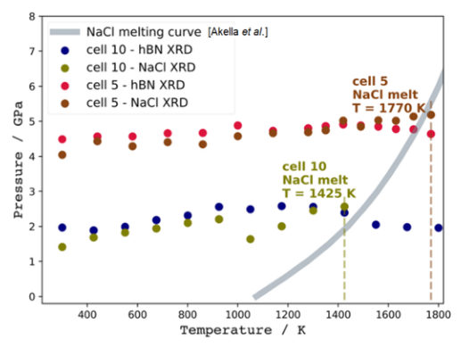
<figcaption class="paper-figure-caption"><b>Fig 4.</b> Fig. 4. Pressure–temperature calibration of the 10 mm and 5 mm PE press as­ semblies. The pressure data were obtained from experimental XRD peaks using the equations of state (EOS) for hBN and NaCl, respectively. The grey curve correspond to the NaCl melting curve reported by Akella et al. [40] and in­ tersects the experimentally determined melting points (T = 1425 K @ 2 GPa and T = 1770 K @ 4 GPa), confirming the reliability of the pressure–temperature calibration.</figcaption>
</figure>
<figure class="paper-figure-card">
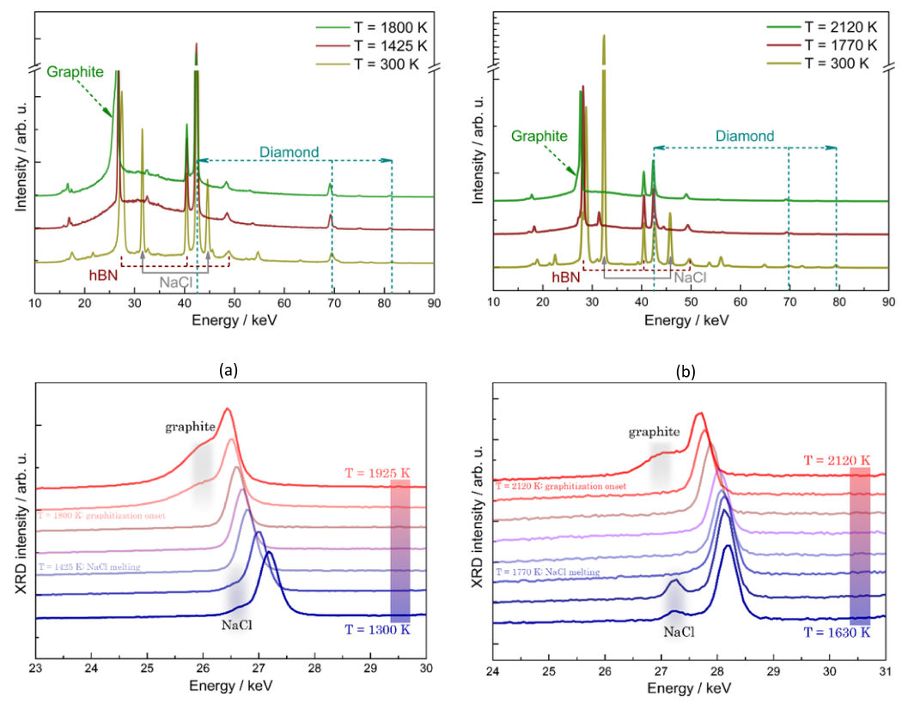
<figcaption class="paper-figure-caption"><b>Fig 5.</b> Fig. 5. In situ energy-dispersive synchrotron X-ray diffraction (ED-XRD) patterns collected from the calibration sample during HPHT annealing in the 10 mm (a) and 5 mm (b) assemblies. The main diffraction features associated with diamond, NaCl, graphite, and hBN are indicated. At room temperature, the diffraction patterns are dominated by the characteristic diamond reflections (111), (220), and (311). NaCl melting is identified by the progressive disappearance of its diffraction peaks and occurs at approximately 1425 K for the 10 mm assembly and 1770 K for the 5 mm assembly. Graphitization is detected at 1800 K and 2120 K, respectively, through the appearance of the graphite (002)...</figcaption>
</figure>

**Summary.** This paper investigates methods to improve the optical quality of SiV color centers in nanodiamonds for quantum applications. By combining *in situ* X-ray diffraction with photoluminescence spectroscopy, the authors determined a safe High-Pressure/High-Temperature annealing window that relaxes lattice strain without causing graphitization. This establishes a practical protocol for fabricating high-performance quantum nanodiamond materials.

**Why it may be interesting.** This work directly addresses material engineering for solid-state quantum emitters by providing a robust, experimentally validated processing protocol (HPHT window) necessary to achieve high-fidelity quantum states in nanostructures.

Detailed structure

**Main problem.** The primary challenge is improving the optical quality of SiV-containing nanodiamonds by relaxing internal lattice strain, which degrades their spectral resolution for quantum applications.

**Main result.** The study experimentally determined a safe High-Pressure/High-Temperature (HPHT) processing window to anneal nanodiamonds without inducing graphitization, leading to significantly improved SiV optical response.

**Method.** The research employed *in situ* synchrotron X-ray diffraction during HPHT annealing coupled with low-temperature photoluminescence spectroscopy on the resulting samples.

**Model / system.** The physical system is Silicon-Vacancy (SiV) color centers embedded within nanodiamonds. The experiment uses a Paris-Edinburgh press to simulate high pressure and temperature conditions, monitoring structural changes relative to the quantum emitter's optical properties.

**Key observables.** Zero-Phonon Line (ZPL) spectral width (FWHM), spectral splitting of fine structure transitions, and the onset temperatures for diamond-to-graphite phase transition.

**Important parameters / regimes.** Graphitization onsets: $\approx 1800$ K at $2$ GPa and $2120$ K at $4$ GPa; Low temperature measurements down to $9$ K.

**Assumptions / limitations.** The improvement in optical response is directly correlated with the structural relaxation achieved by annealing below the graphitization threshold.

**Figures summary.** Figures show PL spectra comparing as-grown, partially annealed (HP1), and fully annealed (HP2) samples at $12$ K, demonstrating narrowing and splitting of the ZPL. XRD data established the safe P-T processing window.

**Paper structure.** The paper first establishes the need for strain relaxation in SiV centers. It then uses *in situ* XRD to map the structural phase stability (graphitization boundaries). Finally, it correlates these structural findings with PL measurements, showing optical enhancement upon controlled annealing within the safe P-T window.

Abstract

Group-IV color centers, such as the silicon-vacancy (SiV) defect, are highly promising for solid-state quantum technologies. However, nanodiamonds typically exhibit significant lattice strain and structural disorder, which degrade their optical properties and hinder the resolution of the fine spectral structure at cryogenic temperatures. High-pressure high-temperature (HPHT) annealing offers a potential route to relax internal strain, although the phase stability of diamond at the nanoscale under such conditions remains poorly constrained. Here, we investigate the structural evolution of nanodiamonds during HPHT annealing using a Paris-Edinburgh press coupled with in situ synchrotron X-ray diffraction at SOLEIL. A dedicated sample assembly combining nanodiamonds - NaCl - Pt enabled accurate pressure-temperature calibration and real-time monitoring of phase transformations. The diffraction data reveal that the onset of diamond-to-graphite transition occurs at approximately 1800 K at 2 GPa and 2120 K at 4 GPa under the applied HPHT heating protocol. These experimentally determined graphitization onsets define a practical pressure-temperature processing window for HPHT annealing of nanodiamonds while avoiding detectable graphitization and provide a calibrated framework for reliable off-beam annealing treatments that avoid graphitization. Photoluminescence measurements on samples annealed below the graphitization threshold show improved optical response, with partial resolution of the SiV fine structure at 12 K. These optical measurements suggest a relationship between nanoscale phase stability and the optical response of individual SiV-containing nanodiamonds following HPHT annealing. The experimentally established HPHT processing window provides a practical framework for the controlled processing of quantum nanodiamonds while avoiding graphitization.

[↑ back to top](#top)

### [Composite-Boson Ansatz for Fractional Quantum Hall Manifolds of Lattice Bosons at Generic Fillings $ν<1/2$](http://arxiv.org/abs/2608.10747v1)

**Authors:** Umut Can Turhan, A. Levent Subaşı, Rifat Onur Umucalılar  
**Type:** theory · **Category:** strongly correlated electrons · **PDF:** <https://arxiv.org/pdf/2608.10747v1>  
**Analysis basis:** full PDF text, analyzed in chunks
**Topic relevance:** 🔥 `analog quantum simulation` **4/5** · `Full counting statistics` **1/5** · `quantum measurements` **1/5**

↔ Scroll figures horizontally

<figure class="paper-figure-card">
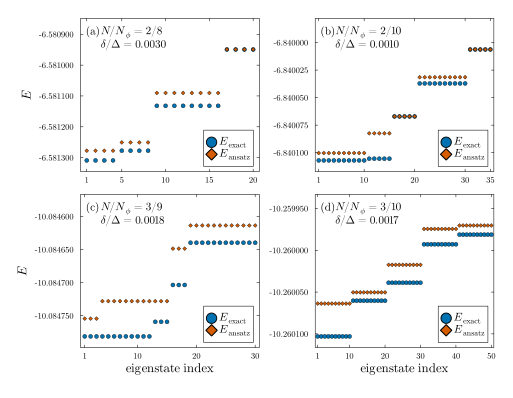
<figcaption class="paper-figure-caption"><b>Fig 1.</b> FIG. 1. Exact lowest-band-projected (Eexact) and ansatz-subspace (Eansatz) spectra for (N, Nϕ) = (2, 8), (2, 10), (3, 9), (3, 10), corresponding to ν = 1/4, 1/5, 1/3, 3/10. The respective raw-state counts and phys- ical ranks (Nraw, D) are (40, 20), (105, 35), (30, 30), (200, 50); the ranks equal both the observed quasidegeneracies and Eq. (5).</figcaption>
</figure>
<figure class="paper-figure-card">
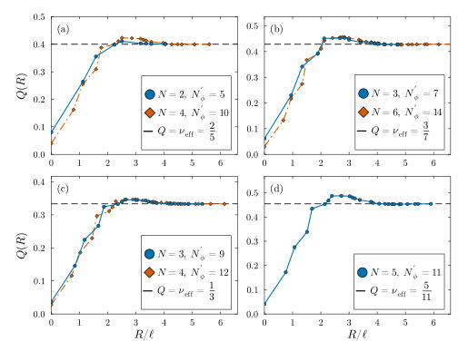
<figcaption class="paper-figure-caption"><b>Fig 2.</b> FIG. 2. Accumulated density depletion versus R/ℓaround one pinned quasihole. Panels (a)–(d) show (N, N ′ ϕ) = (2, 5), (4, 10); (3, 7), (6, 14); (3, 9), (4, 12); and (5, 11), with νeff = 2/5, 3/7, 1/3, and 5/11, respectively. Dashed lines mark Q = νeff; the filling in (d) is braided in Fig. 3. All panels use a pinning strength V/t = 1.</figcaption>
</figure>
<figure class="paper-figure-card">
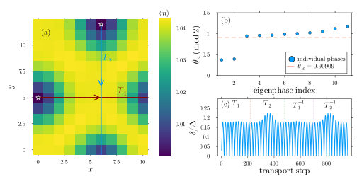
<figcaption class="paper-figure-caption"><b>Fig 3.</b> FIG. 3. AB-free quasihole braid at νeff = 5/11 with identical pin strengths V1 = V2 = 0.8t. (a) Initial subspace-averaged density; stars and arrows mark the quasihole positions and cross-shaped paths. (b) Berry eigenphases and their mean, in units of π; the dashed line is 2νeff = 10/11. (c) δ/∆along T1, T2, T −1 1 , T −1 2 ; dotted lines separate the four branches. The minima of δ/∆coincide with path points at which the quasi- holes are centered on lattice sites. Each elementary displace- ment of a quasihole is implemented by transferring the pin- ning potential between neighboring sites in discrete steps, low- ering its strength at the departure site while raising it at the destination...</figcaption>
</figure>
<figure class="paper-figure-card">
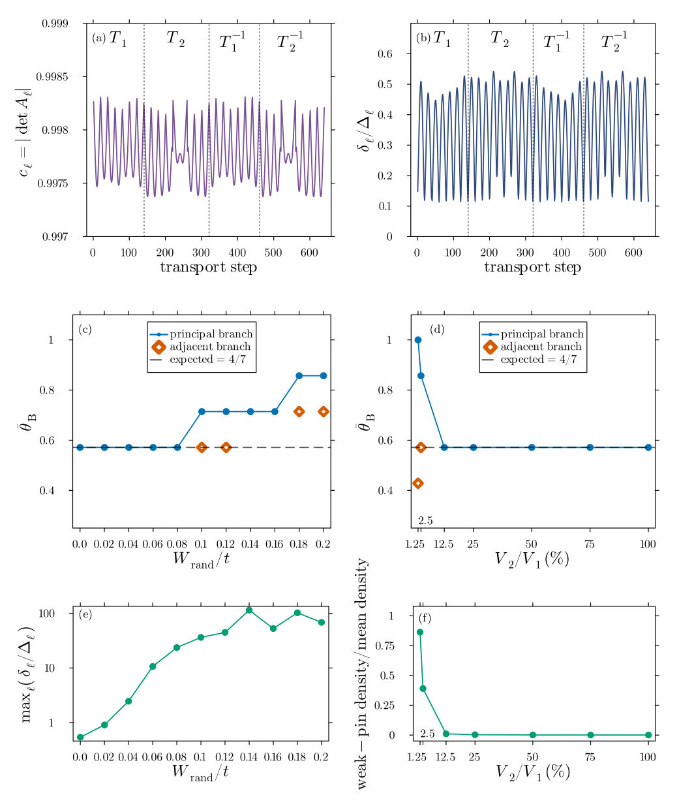
<figcaption class="paper-figure-caption"><b>Fig 4.</b> FIG. 1. Robustness diagnostics for the Aharonov–Bohm-free cross-shaped braid of N = 2 bosons on a 7 × 9 lattice with ϕ = 1/7, corresponding to Nϕ = 9. Two quasiholes are localized by the pinning potentials, giving a D = 14 manifold and νeff = N/(Nϕ −Nloc) = 2/7. The plotted mean θB takes the value 2νeff = 4/7. For the clean, symmetrically pinned system (V1 = V2 = 0.8t), panel (a) shows the overlap diagnostic cℓ= | det Aℓ|, while panel (b) shows the instantaneous bandwidth-to-gap ratio δℓ/∆ℓ. The vertical dotted lines separate the four transport segments. Panels (c) and (e) show, respectively, the mean phase and maxℓ(δℓ/∆ℓ) as a function of a random background potential of strength Wrand/t....</figcaption>
</figure>

**Summary.** This paper develops and validates a composite-boson ansatz to microscopically describe the low-energy states of lattice bosons exhibiting fractional quantum Hall physics at fillings less than 1/2. By calculating key topological invariants like Chern numbers and analyzing quasihole braiding, the authors establish a robust theoretical framework that successfully maps complex FQH behavior onto a manageable bosonic Hilbert space.

**Why it may be interesting.** This work bridges concepts from strongly correlated electron physics (FQH states) with lattice models using bosonic descriptions. The explicit construction of a composite-boson basis provides a powerful theoretical tool for understanding topological order in condensed matter systems, which is relevant to AMO platforms simulating these interactions.

Detailed structure

**Main problem.** The research aims to develop a microscopic composite-boson framework to describe the low-energy manifolds of fractional quantum Hall (FQH) systems realized on lattices at generic fillings $\nu < 1/2$. This moves beyond simple counting rules by providing a structured wave function ansatz.

**Main result.** The proposed composite-boson ansatz successfully organizes the low-energy space, reproducing the expected manifold degeneracy and exhibiting characteristic fractional topological responses like quasihole density depletion and specific braiding phases.

**Method.** The study employs constructing a many-body trial basis using a composite-boson ansatz derived from reduced-flux orbitals. Calculations involve variational Monte Carlo (VMC) for large systems and direct diagonalization for small ones to probe the spectrum and topological invariants.

**Model / system.** The system is modeled by interacting bosons on a square lattice governed by the Hofstadter–Bose–Hubbard (HBH) model, studied on a torus geometry. The physics mimics FQH states at sub-half fillings ($\nu < 1/2$).

**Key observables.** Many-body Chern number ($C_{	ext{MB}}$), quasihole charge diagnostic $Q(R)$, Aharonov–Bohm braiding phase $\theta_B$, and the low-energy manifold dimension (rank).

**Important parameters / regimes.** Generic fillings $\nu < 1/2$; lattice parameters related to the Hofstadter model; reduced flux quantum numbers.

**Assumptions / limitations.** The analysis assumes that the system's low-energy physics can be captured by a composite-boson wave function ansatz built from reduced-flux orbitals. VMC is used as a controlled numerical summation method for large systems.

**Figures summary.** Figures compare exact and ansatz spectra, show density depletion plateaus matching $\nu_{	ext{eff}}$, and illustrate the mean Berry phase ($\theta_B$) matching $2\nu_{	ext{eff}}$ for quasihole braiding.

**Paper structure.** The paper introduces the problem by noting the limitations of simple descriptions for FQH manifolds on lattices. It then details the composite-boson ansatz construction, validates it by reproducing known degeneracies and topological invariants (Chern numbers, braiding phases), and finally applies advanced numerical techniques like VMC to confirm results for larger systems.

Abstract

Hofstadter systems provide a lattice route to fractional quantum Hall physics, but their low-energy manifolds often lack simple wave-function descriptions. Here we present a composite-boson ansatz for a broad family of finite-size lattice-split Laughlin-quasihole manifolds in the low-flux Hofstadter--Bose--Hubbard model on a torus at generic fillings \(ν<1/2\). Attaching two vortices to each boson yields reduced-flux orbitals from which we construct a many-body trial basis. Its translation-resolved rank reproduces the expected low-energy-manifold dimension and provides a composite-boson interpretation of the established quasihole counting previously inferred from generalized exclusion rules and thin-torus arguments. For smaller systems, diagonalization within the lowest-band-projected ansatz span closely reproduces the exact projected spectrum, while variational Monte Carlo extends the rank and energetic analysis to larger systems for which explicit subspace construction becomes costly. To probe the fractional quantum Hall character of these manifolds, we calculate their many-body Chern-numbers and show that localized added-flux excitations exhibit quasihole-like behavior, with fractional density depletion and an Aharonov--Bohm-free braiding phase that both track the effective filling. Together, these results establish a microscopic composite-boson framework for organizing a broad family of sub-half-filled fractional quantum Hall manifolds of lattice bosons.

[↑ back to top](#top)

### [Two-component ultracold Bose gases with spin-orbit coupling](http://arxiv.org/abs/2608.10722v1)

**Authors:** G. I. Martone, S. Stringari  
**Type:** theory · **Category:** quantum gases · **PDF:** <https://arxiv.org/pdf/2608.10722v1>  
**Analysis basis:** full PDF text, analyzed in chunks
**Topic relevance:** 🔥 `analog quantum simulation` **4/5** · `Keldysh / 2PI / non-Gaussian methods` **1/5** · `driven-dissipative phase transition` **1/5**

↔ Scroll figures horizontally

<figure class="paper-figure-card">
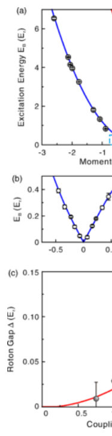
<figcaption class="paper-figure-caption"><b>Fig 1.</b> Fig. 3. – (a) Theoretical prediction for the lower (blue solid line) and upper (red solid line) branch of the Bogoliubov spectrum of a spin-orbit-coupled BEC in the PW phase with negative momentum. The circles represent the measured values. (b) Zoom on the bottom part of (a), where the roton-maxon structure in the lower branch is visible. (c) Predicted (solid line) and measured (circles) value of the roton gap as a function of the Raman coupling, showing its softening as ΩR approaches the critical value (9). From [36]. Reprinted figure with permission from Si-Cong Ji et al., Physical Review Letters 114, 105301 (2015). Copyright 2015 by the American Physical Society.</figcaption>
</figure>
<figure class="paper-figure-card">
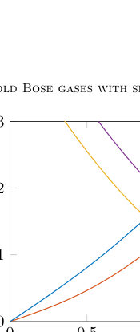
<figcaption class="paper-figure-caption"><b>Fig 2.</b> Fig. 5. – Lowest four bands of the Bogoliubov dispersion of a spin-orbit-coupled BEC in the stripe phase as functions of the quasimomentum. At small qx, the two lowest bands feature density (blue curve) and spin (red curve) phonon modes. Notice also the vanishing of their frequencies at the Brillouin point qx = 2k1. Adapted from [25] under the terms of the Creative Commons Attribution 4.0 International License (see http://creativecommons.org/licenses/by/4.0/).</figcaption>
</figure>
<figure class="paper-figure-card">
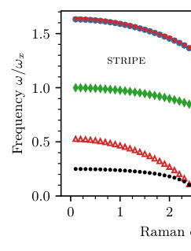
<figcaption class="paper-figure-caption"><b>Fig 3.</b> Fig. 6. – Frequency of the breathing mode (ωB), the spin-dipole mode (ωSD), and the center- of-mass (dipole) mode (ωD) of a trapped spin-orbit-coupled BEC as a function of the Raman coupling. The value of each frequency is deduced by looking at the oscillations of the center- of-mass coordinate, xc.m. = ⟨x⟩, the relative displacement of the two spin components, dx = ⟨xσz⟩, and the root-mean-square radius of the atomic cloud in the x direction, xrms = p</figcaption>
</figure>

**Summary.** This paper provides a comprehensive theoretical study of two-component Bose-Einstein condensates with spin-orbit coupling. It maps out a complex phase diagram featuring stripe, plane-wave, and single-minimum phases, demonstrating that SOC profoundly modifies superfluidity and rotational dynamics. The research highlights the emergence of supersolid character in the stripe phase through detailed analysis of excitation spectra.

**Why it may be interesting.** This work is highly relevant as it explores how engineered synthetic gauge fields (SOC) fundamentally alter the macroscopic quantum phases and collective excitations of ultracold atomic gases, touching upon supersolidity and symmetry breaking in a controllable platform.

Detailed structure

**Main problem.** The study investigates Bose-Einstein condensates (BECs) subjected to Raman-induced spin-orbit coupling (SOC), focusing on the complex phase diagram and dynamic properties arising from the interplay between SOC, single-particle dispersion, and interatomic interactions.

**Main result.** The system exhibits three distinct quantum phases—stripe, plane-wave, and single-minimum—whose characteristics are deeply modified by SOC. The stripe phase is particularly notable for exhibiting supersolid behavior.

**Method.** Theoretical analysis employs mean-field theory via the Gross-Pitaevskii equation (GPE) and analyzes excitations using Bogoliubov theory to characterize different quantum phases.

**Model / system.** The system models two-component ultracold Bose gases realized with Raman coupling, leading to an effective spin-1/2 Hamiltonian. The single-particle dispersion can feature a double-minimum structure depending on the SOC strength ($\Omega_R$).

**Key observables.** Superfluid density ($
ho_s/
ho$), moment of inertia ($\Theta$), Bogoliubov excitation frequencies (e.g., breathing mode, spin-dipole mode), and the stripe phase fringe contrast.

**Important parameters / regimes.** SOC strength ($\Omega_R$), detuning ($\delta_R$), Raman coupling ($k_R$), and interaction strengths ($g_{dd}, g_{ss}$).

**Assumptions / limitations.** The analysis relies on mean-field theory (GPE) and utilizes variational Ansätze for the infinite system, which are approximations.

**Figures summary.** Figures illustrate the single-particle energy dispersion ($\varepsilon_{\pm}(p)$) showing double minima, a phase diagram mapping Stripe, Plane-wave, and Single-minimum phases, and plots of collective mode frequencies (e.g., $\omega_B$, $\omega_{SD}$) versus coupling strength.

**Paper structure.** The paper progresses from introducing the SOC Hamiltonian and the resulting complex phase diagram to analyzing ground state properties using variational methods. It then delves into dynamic measurements like superfluid density, rotational response, and finally examines the distinct phonon modes characterizing each quantum phase.

Abstract

These lecture notes provide an introduction to Bose-Einstein condensates with Raman-induced spin-orbit coupling. Owing to the interplay between the peculiar single-particle dispersion, featuring a double-minimum structure, and the two-body interaction, these systems possess a complex phase diagram. Three different quantum phases can be observed, i.e., a stripe, a plane-wave, and a single-minimum phase, each characterized by different broken symmetries. The condensate dynamics is also significantly affected by the spin-orbit coupling, as revealed by the behavior of the Bogoliubov spectrum in infinite systems and the behavior of the discretized collective mode frequencies in trapped configurations, especially close to the phase transitions. In turn, the superfluid and rotational properties are also deeply modified by the coupling between the motional and spin degree of freedom. Finally, a special attention is devoted to the stripe phase and its supersolid character, which can be clearly revealed by the study of its dynamic features.

[↑ back to top](#top)

### [Spin Splitter without Spin-Split Bands: A Reconfigurable Altermagnetic Texture](http://arxiv.org/abs/2608.10958v1)

**Authors:** Bin Xi, Jie Lu, Qiang Luo, Ken Chen, Jia-Wei Mei, Hong-Gang Luo, Jize Zhao  
**Type:** theory · **Category:** strongly correlated electrons · **PDF:** <https://arxiv.org/pdf/2608.10958v1>  
**Analysis basis:** full PDF text, analyzed in chunks
**Topic relevance:** 🔥 `analog quantum simulation` **4/5** · `Keldysh / 2PI / non-Gaussian methods` **1/5**

↔ Scroll figures horizontally

<figure class="paper-figure-card">
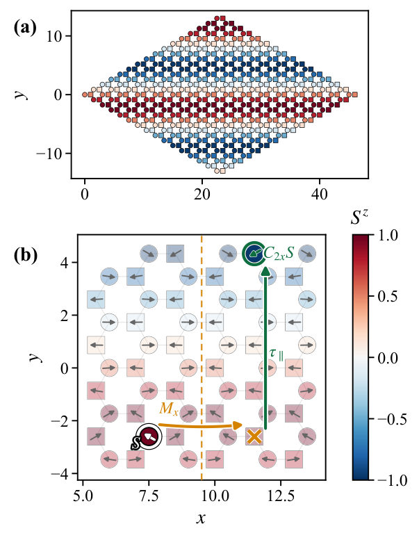
<figcaption class="paper-figure-caption"><b>Fig 1.</b> FIG. 1. Representative counter-spiral texture. The two sublattices carry single-Q helices of op-</figcaption>
</figure>
<figure class="paper-figure-card">
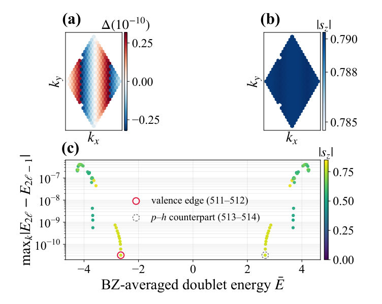
<figcaption class="paper-figure-caption"><b>Fig 2.</b> FIG. 2. Band diagnostics, 16×16 k mesh. (a) Signed splitting ∆(k) of the valence-edge doublet</figcaption>
</figure>
<figure class="paper-figure-card">
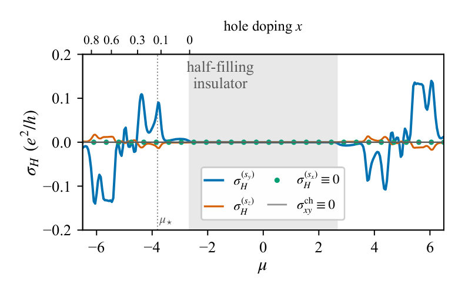
<figcaption class="paper-figure-caption"><b>Fig 3.</b> FIG. 3. Doped spin splitter without spin-split bands. Fixed-texture µ sweep for the reference</figcaption>
</figure>
<figure class="paper-figure-card">
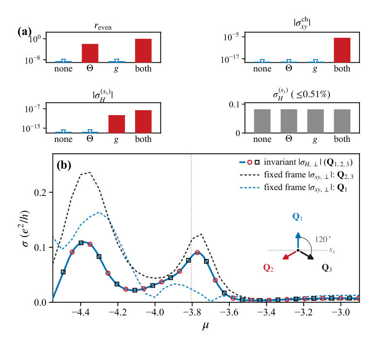
<figcaption class="paper-figure-caption"><b>Fig 4.</b> FIG. 4. Two-element protection and Q reconfiguration. (a) Four-sector test at µ⋆versus the</figcaption>
</figure>

**Summary.** This theoretical study proposes a novel mechanism for realizing the spin splitter effect in altermagnetic materials by exploiting symmetry constraints rather than relying on traditional band splitting. By analyzing a frustrated honeycomb magnet, the authors show that hole doping can induce this pure spin current response while maintaining zero charge Hall conductivity. This work is significant because it provides a robust, symmetry-protected route to engineered topological transport phenomena.

**Why it may be interesting.** The work provides a deep symmetry-based understanding of topological magnetotransport phenomena, showing how fundamental crystalline symmetries can enforce exotic quantum responses (like zero charge Hall response) even when spectral features are suppressed. This links condensed matter theory to programmable physical platforms like photonics.

Detailed structure

**Main problem.** The research aims to demonstrate a spin-splitter effect—converting an electric field into a pure transverse spin current without charge response—in altermagnetic materials without relying on conventional crystal-fixed spin-split bands.

**Main result.** Hole doping in the model realizes this spin splitter using an odd-parity residual, achieving a finite spin Hall conductivity ($\sigma_{sy}^H=0.082\,e^2/h$) while maintaining zero charge Hall response ($\sigma_{ch}^{xy}=0$).

**Method.** The analysis uses symmetry constraints derived from specific Spin-Space-Group elements (an antitranslation $\Theta$ and a helicity mirror $g$) applied to an $s$-$d$ Hamiltonian describing itinerant electrons coupled to a classical spin texture.

**Model / system.** The system is modeled as a frustrated honeycomb magnet exhibiting a noncoplanar counter-spiral ground state. The physics is analyzed by examining how the symmetry elements $\Theta$ and $g$ constrain band splitting and transport responses.

**Key observables.** Spin-splitter conductivity ($\sigma_{sy}^H$), Charge Hall response ($\sigma_{ch}^{xy}$), Band splitting ($\Delta(k)$), and polarization axis rotation angle ($120^\circ$).

**Important parameters / regimes.** The residual hopping term (odd-parity) below $2	imes 10^{-7} t$ at the Fermi level, and the specific value $\sigma_{sy}^H = 0.082\,e^2/h$.

**Assumptions / limitations.** The analysis assumes coupling itinerant electrons to a preformed classical spin texture via an $s$-$d$ Hamiltonian, and that the symmetry constraints ($\Theta$ and $g$) are robustly applicable.

**Figures summary.** Figures illustrate the counter-spiral magnetization texture, the calculated signed band splitting $\Delta(k)$ showing small spectral separation, and plots demonstrating the finite spin Hall conductivity at optimal doping while keeping the charge Hall zero.

**Paper structure.** The paper establishes the theoretical framework by identifying symmetry elements ($\Theta$ and $g$) that govern altermagnetism. It then develops the core argument that these symmetries dictate transport properties, culminating in the crucial finding about hole doping realizing the spin splitter without band splitting, followed by discussions on reconfigurability.

Abstract

The altermagnetic spin-splitter effect converts an electric field into a transverse pure spin current, with no net magnetization and no charge-Hall counterpart. In established materials this function is tied to crystal-fixed spin-split bands that lock the polarization axis to the lattice. We show that the noncoplanar counter-spiral ground state of a frustrated honeycomb magnet instead carries the altermagnetic operation through a $\mathbf Q$-locked helicity mirror $g$. The mirror selects the spin-current polarization and forbids the perpendicular one, while an antitranslation $Θ$ forbids even-parity spin splitting. Band splitting and spin-splitter response therefore rest on different symmetry elements. Either element alone enforces the charge-Hall zero---a redundancy absent from other spin--orbit-free noncollinear routes---and a charge Hall appears only when both elements are removed. Hole doping then realizes a \emph{spin splitter without spin-split bands}---the symmetry-allowed odd-parity residual below $2\times10^{-7}$ of the hopping $t$ at the Fermi level---with $σ_H^{(s_y)}=0.082\,e^2/h$ without spin--orbit coupling and with zero charge Hall response. Selecting among the three degenerate $\mathbf{Q}$ orientations rotates the polarization axis in exact $120^\circ$ steps at fixed magnitude and charge-Hall zero; the selection rules persist in a $32$-site cell accessible to programmable photonic and circuit lattices.

[↑ back to top](#top)

### [Equilibrium Distributions for Strongly Nonlinear Many-Body Systems](http://arxiv.org/abs/2608.10352v1)

**Authors:** Jialin Zhang, Yong Zhang, Hong Zhao  
**Type:** theory · **Category:** statistical mechanics · **PDF:** <https://arxiv.org/pdf/2608.10352v1>  
**Analysis basis:** full PDF text, analyzed in chunks
**Topic relevance:** `Frenkel-Kontorova` **3/5** · `Keldysh / 2PI / non-Gaussian methods` **3/5** · `analog quantum simulation` **2/5** · `driven-dissipative phase transition` **2/5** · `methods for driven-dissipative` **2/5** · `non-equilibrium universality` **2/5** · `correlated / nonlocal dissipation` **1/5** · `scars & prethermalization` **1/5**

↔ Scroll figures horizontally

<figure class="paper-figure-card">
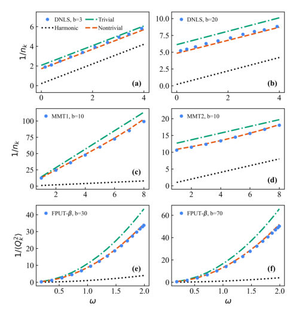
<figcaption class="paper-figure-caption"><b>Fig 1.</b> FIG. 1. Comparison between numerical results (solid cir- cles) and the harmonic-approaxmation prediction (black dot- ted line), the trivial-resonance prediction (green dash-dotted line), and our full theoretical prediction including nontrivial- resonance corrections (red dashed line). Panels (a,b): DNLS equation with b = 3 and b = 20; (c): MMT1 with b = 10; (d): MMT2 with b = 10; and (e,f): FPUT-β with b = 30 and b = 70.</figcaption>
</figure>
<figure class="paper-figure-card">
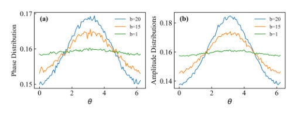
<figcaption class="paper-figure-caption"><b>Fig 2.</b> FIG. 2. Phase distribution (a) and amplitude distribu- tion (b) for a representative nontrivial resonant quartet (k1, k2, k3, k4) = (3, 4, 2, 5) at different nonlinearity strengths. The curves at θ = π correspond, from top to bottom, to b = 20, b = 15, and b = 1, respectively.</figcaption>
</figure>
<figure class="paper-figure-card">
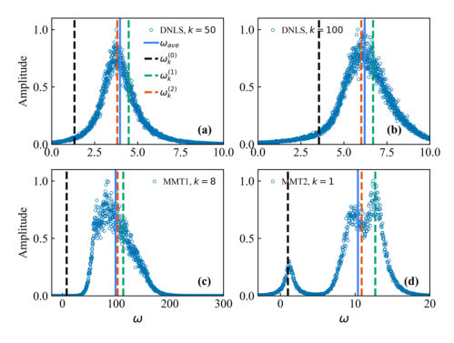
<figcaption class="paper-figure-caption"><b>Fig 3.</b> FIG. 3. For the DNLS equation at b = 7 for k = 50 (a) and k = 100 (b); MMT1 model at b = 10, k = 8 (c); MMT2 model at b = 10, k = 1 (d): Frequency spectrum (dots), average fre- quency (blue solid line), harmonic approximation prediction frequency (black dashed line), trivial-resonance frequency pre- diction (green dashed line), and our frequency prediction (red dashed line). Spectra are normalized by their peak values.</figcaption>
</figure>

**Summary.** This paper presents a novel theoretical framework based on the generalized energy equipartition principle to calculate equilibrium distributions in strongly nonlinear many-body systems. It overcomes the limitations of weak-coupling approximations by employing a generating functional approach applicable even when interactions are highly correlated. The method is validated across several models, demonstrating quantitative agreement with simulations where conventional theories fail.

**Why it may be interesting.** This work provides advanced tools for analyzing nonlinear dynamics in condensed matter systems, which is highly relevant to understanding energy transport and thermalization in quantum materials where simple perturbative treatments fail.

Detailed structure

**Main problem.** The primary goal is developing a general analytical framework to determine equilibrium distributions for many-body systems exhibiting strong nonlinearities, overcoming the limitations of conventional theories restricted to weak interactions.

**Main result.** The proposed generalized energy equipartition principle (GEEP) framework successfully calculates accurate corrections for strongly nonlinear regimes, significantly outperforming approximations based on harmonic or trivial resonances.

**Method.** The approach utilizes a generating functional Z(J) combined with the GEEP to calculate correlation functions and derive equilibrium distribution functions across both weak and strong nonlinearity limits.

**Model / system.** The theory is applied to nonlinear lattice systems, including the discrete nonlinear Schrödinger (DNLS) equation, the Majda–McLaughlin–Tabak (MMT) model, and the Fermi–Pasta–Ulam–Tsingou-$eta$ (FPUT-$eta$) model.

**Key observables.** Equilibrium distribution functions ($n_k$), renormalized dispersion relations ($\omega^{(2)}_k$), average frequency ($ar{\omega}_k$), and phase/amplitude distributions for resonance terms.

**Important parameters / regimes.** The nonlinearity strength parameter ($b$ or $eta$) is critical, as the method's utility increases in regimes where $b$ is large (strong nonlinearities).

**Assumptions / limitations.** Conventional methods fail when residual interactions develop significant correlations and deviate from Gaussian statistics; the framework assumes applicability across both weak and strong nonlinearity limits.

**Figures summary.** Figure 1 compares numerical results for DNLS, MMT, and FPUT-$eta$ models against predictions from harmonic, trivial-resonance, and full theoretical methods. Figure 3 compares frequency spectra ($\omega^{(2)}_k$) derived from the theory against simulations across various nonlinearity strengths.

**Paper structure.** The paper introduces the problem by contrasting weak vs. strong nonlinearity regimes. It develops the GEEP framework using a generating functional approach to calculate correlation functions, deriving corrections for non-trivial resonances. Finally, it validates these predictions by comparing theoretical results (e.g., frequency spectra) against numerical simulations for several canonical models.

Abstract

Obtaining equilibrium distributions of nonlinear systems is essential for accurately computing macroscopic observables. Conventional theoretical corrections are typically limited to weak nonlinearities, where interaction terms can be treated as effectively uncorrelated perturbations and the random phase approximation applies. In this Letter, we develop a framework to determine equilibrium distributions based on the generalized energy equipartition principle. Our approach recovers existing corrections in the weakly nonlinear regime and, crucially, remains valid for strong nonlinearities, where perturbative contributions become correlated and conventional approaches break down. Numerical simulations of the nonlinear Schrödinger equation, the Majda-McLaughlin-Tabak model, and the Fermi-Pasta-Ulam-Tsingou model demonstrate accurate corrections for nonlinearities more than an order of magnitude stronger than those accessible to conventional theories.

[↑ back to top](#top)

### [Resource-bounded controllability benchmarking of open quantum systems](http://arxiv.org/abs/2608.10789v1)

**Authors:** Yule Mayevsky, Akram Youssry, Alberto Peruzzo  
**Type:** theory · **Category:** quantum information and computing · **PDF:** <https://arxiv.org/pdf/2608.10789v1>  
**Analysis basis:** full PDF text, analyzed in chunks
**Topic relevance:** `driven-dissipative phase transition` **3/5** · `methods for driven-dissipative` **3/5** · `QC/QI experiment` **2/5** · `non-equilibrium universality` **2/5** · `quantum measurements` **2/5** · `Keldysh / 2PI / non-Gaussian methods` **1/5** · `analog quantum simulation` **1/5** · `correlated / nonlocal dissipation` **1/5** · `scars & prethermalization` **1/5**

↔ Scroll figures horizontally

<figure class="paper-figure-card">
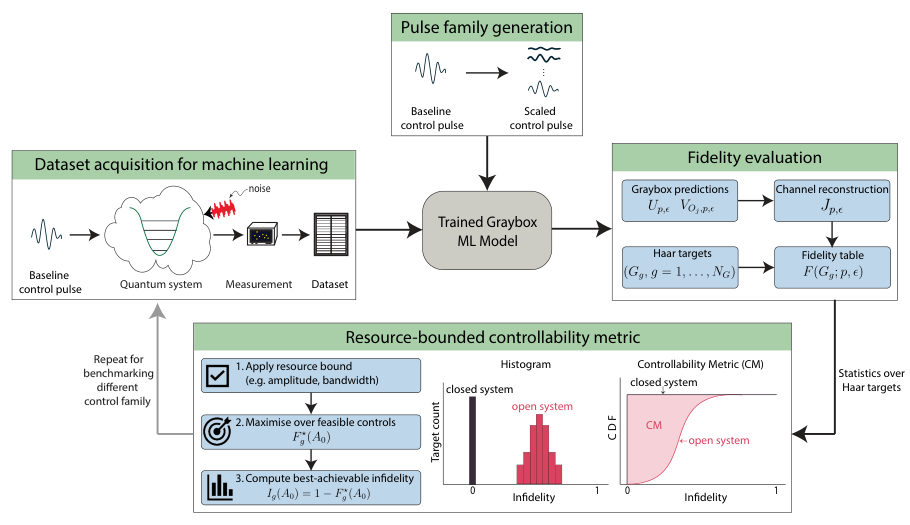
<figcaption class="paper-figure-caption"><b>Fig 1.</b> FIG. 1: Overview of the graybox controllability workflow. Experimental pulse–response data are first collected and used to train a graybox surrogate model. Each baseline pulse is then expanded into constrained variants by scaling selected pulse parameters such as amplitude or bandwidth. For each variant, the trained graybox predicts the corresponding dynamics, including both the coherent unitary part and the noise contribution, allowing the effective implemented channel to be reconstructed. These implemented channels are then compared against Haar-random target gates through process fidelity. By maximising fidelity over the feasible pulse family for each target, the method builds a...</figcaption>
</figure>
<figure class="paper-figure-card">
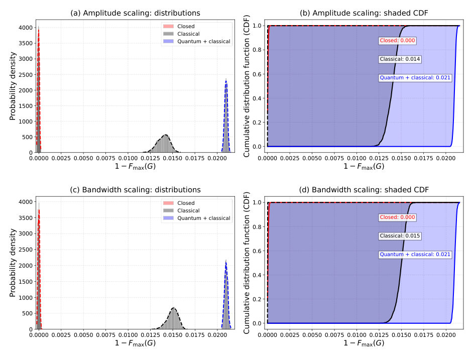
<figcaption class="paper-figure-caption"><b>Fig 2.</b> FIG. 2: One-dimensional resource-bounded controllability studies. Distributions and empirical cumulative distribution functions of the best achievable infidelity 1 −Fmax(G) over the Haar-random target-gate ensemble. The amplitude study varies the waveform amplitude resource, while the Gaussian-width study varies the common temporal width σ, which acts as the bandwidth-related resource coordinate. Results are shown for the closed-system, classical-noise, and combined quantum-plus-classical-noise regimes. The shaded regions in the CDF panels represent the area used to calculate the corresponding controllability measure.</figcaption>
</figure>
<figure class="paper-figure-card">
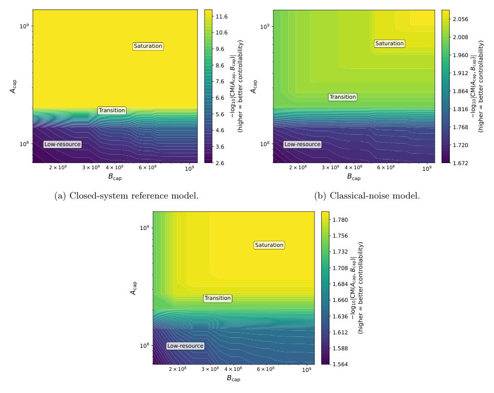
<figcaption class="paper-figure-caption"><b>Fig 3.</b> FIG. 3: Two-dimensional controllability surfaces under joint amplitude and bandwidth caps. For each cap pair (Acap, Bcap), the admissible pulse family is first defined by the feasible-set condition from the methodology. For each Haar-random target gate, the best feasible fidelity is then computed over that admissible family, converted to a best-achievable infidelity, and aggregated into the area-based controllability metric CM(Acap, Bcap). The plotted quantity is −log10  CM(Acap, Bcap)  , so larger values indicate improved controllability. The annotations indicate qualitative resource regimes: low-resource, where performance is resource-limited; transition, where controllability improves...</figcaption>
</figure>

**Summary.** The authors introduce a novel, resource-bounded framework to benchmark the true controllability of open quantum systems. They use a graybox machine learning model trained on experimental data to predict gate fidelity under realistic constraints like limited pulse amplitude and bandwidth. This allows researchers to map out an 'operational map' showing exactly how much performance is lost due to noise versus hardware limitations.

**Why it may be interesting.** This work provides a highly practical, data-driven metric for assessing quantum hardware performance that explicitly incorporates resource costs (like pulse power or bandwidth) alongside environmental decoherence.

Detailed structure

**Main problem.** The paper addresses the challenge of evaluating practical quantum gate fidelity in open systems, moving beyond idealized Hamiltonian models to account for hardware limitations.

**Main result.** Controllability is characterized by resource-bounded surfaces (e.g., amplitude vs. bandwidth) that quantify achievable process fidelity under explicit noise and control constraints.

**Method.** A graybox machine learning model is trained on probing data to predict open-system distortions, allowing the reconstruction of implemented quantum channels for fidelity benchmarking.

**Model / system.** The system is an open quantum system (demonstrated on a driven qubit) whose dynamics are governed by Hamiltonians incorporating drift, control fields, and various noise sources (classical or combined quantum/classical).

**Key observables.** Process fidelity; distribution of best-achievable infidelities; Controllability Metric (CM); two-dimensional controllability surfaces.

**Important parameters / regimes.** Control resources such as pulse amplitude ($A_{cap}$) and bandwidth ($	ext{BW}_{cap}$); noise parameters ($\alpha_1, \alpha_2, \gamma$ rates).

**Assumptions / limitations.** The graybox model is assumed valid only over the bounded region of control space defined by its training data; results are conditional on the chosen pulse family parametrization.

**Figures summary.** Figures illustrate workflow (data collection to fidelity evaluation) and, crucially, two-dimensional controllability surfaces showing how noise deforms the achievable gate performance landscape as a function of resource caps.

**Paper structure.** The paper develops a framework by first defining the problem (practical vs. ideal control), then detailing the graybox ML methodology for channel reconstruction under constraints, and finally presenting quantitative benchmarks across various noise regimes using area-based metrics.

Abstract

This paper develops a resource-bounded framework for evaluating practical controllability in open quantum systems using a trained graybox response model. Rather than treating controllability as a binary property of an idealised Hamiltonian model, the proposed approach evaluates the best-achievable process fidelity over a finite, hardware-realisable pulse family under explicit control constraints. The graybox model retains the known coherent dynamics while learning control-dependent open-system distortions from pulse-response data. The resulting surrogate predictions are used to reconstruct the implemented processes and compare them with Haar-random target gates. Practical controllability is then characterised through the distribution of best-achievable infidelities and an area-based summary metric. The framework is demonstrated for a driven qubit under closed-system, classical-noise, and combined quantum-plus-classical-noise dynamics, with pulse amplitude and inverse Gaussian width used as the control-resource coordinates. The results show how finite control resources and open-system noise jointly constrain the gate performance attainable by the chosen pulse family.

[↑ back to top](#top)

### [A Dynamical Mechanism for Irreversibility in Cyclically Driven Amorphous Solids](http://arxiv.org/abs/2608.11073v1)

**Authors:** Sauvik Chatterjee, Asaf Szulc, Ido Regev  
**Type:** theory · **Category:** disordered systems and neural networks · **PDF:** <https://arxiv.org/pdf/2608.11073v1>  
**Analysis basis:** full PDF text, analyzed in chunks
**Topic relevance:** `driven-dissipative phase transition` **3/5** · `methods for driven-dissipative` **3/5** · `non-equilibrium universality` **3/5** · `Frenkel-Kontorova` **2/5** · `analog quantum simulation` **1/5** · `correlated / nonlocal dissipation` **1/5** · `quantum measurements` **1/5** · `scars & prethermalization` **1/5**

↔ Scroll figures horizontally

<figure class="paper-figure-card">
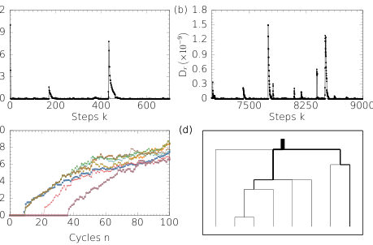
<figcaption class="paper-figure-caption"><b>Fig 1.</b> FIG. 1. (a) Mean Euclidean distance of a trajectory per- turbed from a limit-cycle as a function of the number of AQS strain steps k (note that y-axis is rescaled by a factor of 10−9). The initial perturbation decays exponentially, but new, tiny, perturbations emerge intermittently. However, those pertur- bations also exhibit exponential decay which means that the limit cycle is stable. (b) Mean Euclidean distance of two ini- tially close trajectories in the post-yield regime. Even in this case, where the trajectory never becoms periodic, we can see that perturbations decay exponentially, indicating that the trajectory is locally stable. (c) The mean Euclidean distance after n forcing...</figcaption>
</figure>
<figure class="paper-figure-card">
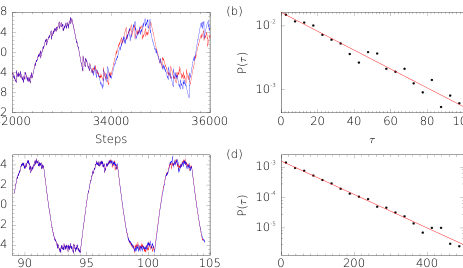
<figcaption class="paper-figure-caption"><b>Fig 2.</b> FIG. 2. (a) Trajectory separation in the particle-based sim- ulations as reflected in the total stress. The stress in the reference trajectory is shown in blue while the perturbed tra- jectory is shown in red. Up to a certain simulation step, the stress in the perturbed system is identical to the stress in the reference systems, but the two show clear separation starting from the ∼33500 step. (b) Waiting-time (in number of cy- cles τ) distribution in the particle-based simulations exhibit- ing an exponential distribution. (c) Trajectory separation in the soft-spot model (at accumulated strain ∼97) as reflected in the total stress, where colors represent the same as in (a). (d) Waiting-time...</figcaption>
</figure>
<figure class="paper-figure-card">
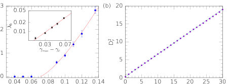
<figcaption class="paper-figure-caption"><b>Fig 3.</b> FIG. 3. (a) Steady-state branching rate for different strain amplitudes γmax with a power-law fit. For each post-yield strain amplitude we averaged over 100 reference configura- tions, each perturbed 10 times, which were run starting from a steady-state configuration. For each sub-yield strain ampli- tude we verified that λb = 0 for 100 realizations, each per- turbed 10 times and running for 100 cycles. Inset: post yield values on a log-log scale demonstrating the post-yield power law behavior. (b) Averaged mean square Euclidean distance in the particle based simulations exhibiting clear diffusive sep- aration (line is a linear fit). Error bars are too small to be visible.</figcaption>
</figure>
<figure class="paper-figure-card">
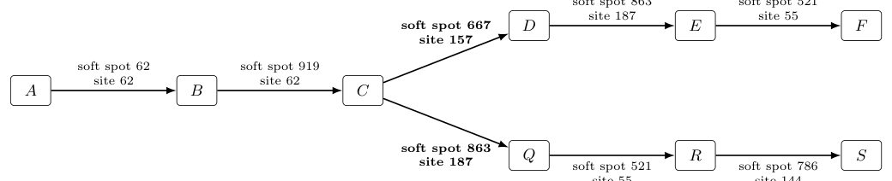
<figcaption class="paper-figure-caption"><b>Fig 4.</b> FIG. 4. An example of the beginning of a trajectory branching observed in the soft-spot model. The reference and perturbed trajectories visit the same sequence of configurations up to state C. At state C, a small perturbation reverses the ordering of two competing instabilities. In the reference trajectory, soft spot 667 at site 157 is activated first, whereas in the perturbed trajectory soft spot 863 at site 187 is activated first. This difference modifies the subsequent stress redistribution and results in different sequences of plastic events and sustained trajectory separation.</figcaption>
</figure>
<figure class="paper-figure-card">
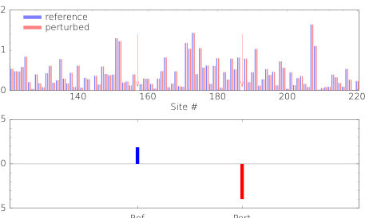
<figcaption class="paper-figure-caption"><b>Fig 5.</b> FIG. 5. (a) Distances to instability xi = σ+ i −σi for state C, immediately before the branching event. Sites 157 and 187, marked by the arrows, are the only sites with negative values of xi and form a nearly-degenerate pair of competing insta- bilities. (b) Competition variable ∆= x187 −x157. In the reference trajectory ∆&gt; 0, indicating that site 157 is more unstable and is therefore activated first. In the perturbed tra- jectory ∆&lt; 0, indicating that site 187 is activated first. The perturbation therefore changes the ordering of the competing instabilities and initiates trajectory branching.</figcaption>
</figure>

**Summary.** This work identifies 'instability-selection-induced branching' as the dynamical source of irreversibility in amorphous solids when they yield under cyclic stress. By comparing particle simulations to a soft-spot model, the authors rule out chaos and demonstrate that the system's path dependence is governed by rare events where competing plastic instabilities dictate the sequence of subsequent structural rearrangements.

**Why it may be interesting.** While focused on classical amorphous solids, the concept of instability selection leading to non-equilibrium path dependence (memory/hysteresis) has parallels in understanding decoherence or dissipation mechanisms in open quantum systems where system evolution is constrained by local minima or metastable states.

Detailed structure

**Main problem.** The study addresses the fundamental dynamical mechanism responsible for irreversibility when amorphous solids transition from reversible periodic dynamics to irreversible diffusive dynamics upon yielding under cyclic shear.

**Main result.** Irreversibility is shown to arise not from chaotic sensitivity to initial conditions, but from 'instability-selection-induced branching' events occurring during plastic activity.

**Method.** The authors employed both particle-based simulations (Kob-Andersen model) and a coarse-grained mean-field soft-spot model to analyze trajectory separation dynamics.

**Model / system.** The system is amorphous solids subjected to athermal quasistatic oscillatory shear. The theoretical framework utilizes a soft-spot model where plasticity is governed by the competition between nearly-degenerate local instabilities (soft spots).

**Key observables.** Trajectory separation distance ($D_r(n)$), waiting-time distributions for branching events, and Mean Square Displacement ($\Delta R_n$) scaling.

**Important parameters / regimes.** Critical strain amplitude ($\gamma_{	ext{max}}$) marking the yield transition; perturbation size ($\delta$); soft spot thresholds ($\sigma+_n, \sigma-_n$).

**Assumptions / limitations.** The analysis assumes that trajectory separation after branching follows diffusive scaling, and that waiting times between plastic events can be modeled by an exponential distribution.

**Figures summary.** Figures illustrate the decay of perturbations (ruling out chaos), the clear onset of irreversible dynamics via persistent trajectory branching, and the linear scaling ($\propto n$) of Mean Square Displacement confirming diffusion after these branching events.

**Paper structure.** The paper first establishes that standard chaotic diagnostics fail to explain irreversibility. It then introduces the soft-spot model to show how competition between instabilities causes stochastic 'branching' in the configuration space, which is identified as the source of irreversible dynamics, followed by confirmation using diffusive scaling measurements.

Abstract

Amorphous solids subjected to athermal quasistatic oscillatory shear undergo a transition from periodic reversible dynamics to irreversible diffusive dynamics at yielding. How irreversibility arises in such deterministic, dissipative dynamics remains unclear. Here we show that trajectories remain locally stable, with perturbations decaying rather than growing even in the irreversible regime, ruling out the sustained exponential sensitivity to initial conditions associated with chaotic dynamics. Rather than diverging continuously, nearby trajectories initially remain close before eventually separating through rare branching events, after which their separation grows diffusively. A mean-field soft-spot model reproduces the same branching statistics and reveals their microscopic origin. We find that branching originates from competition between nearly-degenerate plastic instabilities, in which a small perturbation changes which instability activates first and thereby alters the subsequent sequence of plastic events. These results identify instability-selection-induced branching as a dynamical mechanism for irreversibility in cyclically driven amorphous solids.

[↑ back to top](#top)

### [Non-equilibrium theory of projected ensembles](http://arxiv.org/abs/2608.10110v1)

**Authors:** Fabio Anza, Cameron Hahn  
**Type:** theory · **Category:** statistical mechanics · **PDF:** <https://arxiv.org/pdf/2608.10110v1>  
**Analysis basis:** full PDF text, analyzed in chunks
**Topic relevance:** `correlated / nonlocal dissipation` **3/5** · `methods for driven-dissipative` **3/5** · `quantum measurements` **3/5** · `Keldysh / 2PI / non-Gaussian methods` **2/5** · `non-equilibrium universality` **2/5** · `driven-dissipative phase transition` **1/5**

↔ Scroll figures horizontally

<figure class="paper-figure-card">
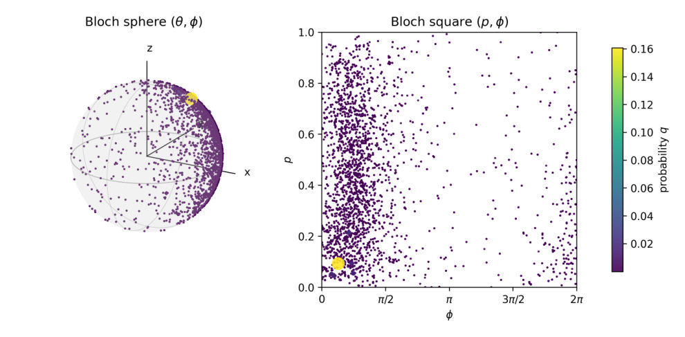
<figcaption class="paper-figure-caption"><b>Fig 1.</b> Figure 1: An example of a geometric quantum state for a qubit, D = 2. Each point is one element Γα of the ensemble, carrying a probability mass xα (color scale). Left: A representation of the ensemble on the Bloch sphere. Right: the same ensemble in canonically conjugated probability-phase coordinates, in which the state of the qubit is parameterized as |ψ⟩= √1 −p |0⟩+ √p eiϕ |1⟩and the state space becomes the “Bloch square” [0, 1] × [0, 2π), with the poles p = 0, 1 mapping to its lower and upper edges.</figcaption>
</figure>
<figure class="paper-figure-card">
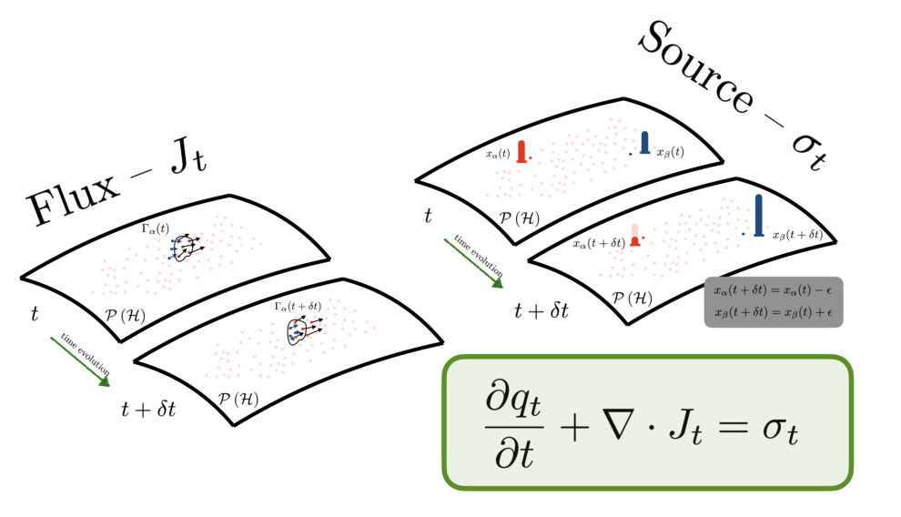
<figcaption class="paper-figure-caption"><b>Fig 2.</b> Figure 2: A diagrammatic view of the continuity equtaion. Left: Kinetic interpretation of the probability flux Jt. If we look at a small region of the quantum state space, due to the underlying dynamics we see that probability is locally conserved in the sense that there is a certain number of points which enters and leaves this region. As a result of this local process, probability is moved around and can concentrate in a certain region or get scrambled across the quantum state space. Right: Kinetic interpretation of the sink/source term σt. Even if the points do not move around the quantum state space ˙Γα = 0, the term σt allows the exchange of probability between different regions. Note...</figcaption>
</figure>
<figure class="paper-figure-card">
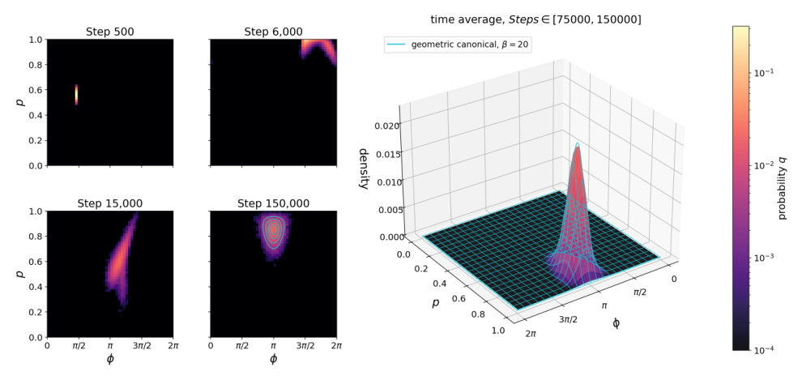
<figcaption class="paper-figure-caption"><b>Fig 3.</b> Figure 3: Left: Relaxation of a single stochastic trajectory of the qubit–Caldeira–Leggett Langevin equations, Eq. (13), toward the geometric canonical ensemble. Each panel shows the time-averaged histogram of (p, ϕ) accumulated over the trajectory up to the indicated step, exploiting the ergodicity of the process to approximate the ensemble qt from a single realization of the noise rather than an average over many. Starting from a narrow initial distribution, the trajectory is driven by the Hamiltonian drift toward the pole p = 1 before the dissipative and diffusive terms relax it onto a stationary profile. Right: Time-averaged ensemble from step 75,000 to step 150,000. By step 150,000,...</figcaption>
</figure>
<figure class="paper-figure-card">
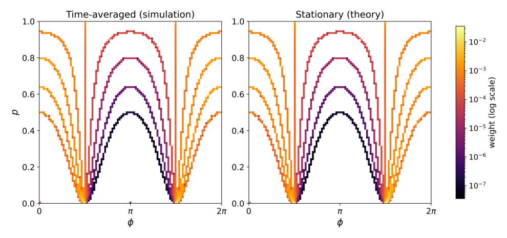
<figcaption class="paper-figure-caption"><b>Fig 4.</b> Figure 4: Time-averaged projected ensemble obtained by exact diagonalization of Eq. (18) (left), compared with the analytic stationary state of Eq. (22) (right), over the (p, ϕ) plane. The central spin is initialized in |0⟩and the bath is prepared at mean magnetization m0 = 0.5. Weights are shown on a logarithmic color scale. The two distributions agree to ∆MSE = 1.94 × 10−9, at the level of the sampling noise, confirming the prediction.</figcaption>
</figure>

**Summary.** This paper establishes an exact theoretical framework for describing the dynamics of projected ensembles, which characterize how a system's state evolves after interacting with an environment. The core result is a continuity equation governing probability flow across the quantum state space. This allows researchers to analyze complex non-equilibrium steady states in systems ranging from qubits to many-body models.

**Why it may be interesting.** This work provides a powerful, general mathematical machinery—the continuity equation approach—to study non-equilibrium steady states in open quantum systems, which is crucial for understanding thermalization and quantum measurement processes beyond simple Markovian master equations.

Detailed structure

**Main problem.** To develop a general and exact theory for the dynamics of projected ensembles, which are collections of conditional pure states induced by measuring an entangled environment.

**Main result.** The theory yields an exact continuity equation on quantum state space ($\dot{\mu}_t + 
abla \cdot J_t = \sigma_t$), providing a framework to characterize both equilibrium and non-equilibrium stationary projected ensembles.

**Method.** The dynamics are formulated as a problem of probability transport on the manifold of pure states, utilizing the symplectic structure of quantum state space and employing the method of characteristics for analysis.

**Model / system.** The theory applies to open quantum systems undergoing system-environment interaction. Specific examples include analyzing projected ensembles in spin-star models or deriving Fokker-Planck equations for qubits on $	ext{CP}^1$.

**Key observables.** Projected ensemble ($\mu$ or $q(z)$), probability flux ($J_t$), and source/sink terms ($\sigma_t$).

**Important parameters / regimes.** The system-environment coupling strength, temperature (implicitly via equilibrium analysis), and the dimensionality of the Hilbert space.

**Assumptions / limitations.** The theory is general and exact, relying on exploiting the symplectic structure of $	ext{P}(H)$. Specific derivations assume bipartite decomposition or specific noise/drift structures for simplified models.

**Figures summary.** Figure 1 illustrates a geometric quantum state representation on the Bloch sphere. Figure 4 compares numerically calculated time-averaged projected ensembles against analytically derived stationary states for the spin-star model, showing excellent agreement.

**Paper structure.** The paper develops the theory by first establishing the general continuity equation ($\dot{\mu}_t + 
abla \cdot J_t = \sigma_t$), then detailing how this governs probability transport via flux ($J_t$) and source/sink terms ($\sigma_t$). It applies this framework to specific models, such as the spin-star model or qubit dynamics on $	ext{CP}^1$, to derive concrete stationary state solutions.

Abstract

Projected ensembles---the collections of conditional pure states induced on a system by measuring an entangled environment---have become central objects in quantum science, underlying deep thermalization, quantum state designs, the emergence of classicality, and exhibiting interesting phase transitions. Here we develop a general and exact theory of their dynamics, yielding a systematic approach to their dynamics and equilibrium and non-equilibrium stationary states. We derive an exact continuity equation on quantum state space for the projected ensemble, together with microscopic kinetic equations and analytical expressions for the probability flux and source terms generated by the system-environment interaction. The resulting dynamics admits a classical representation: isolated systems obey Hamiltonian transport and Liouville's theorem, while open systems are described by a kinetic theory of probability transport. The stationary continuity equation provides a general characterization of equilibrium and non-equilibrium stationary projected ensembles, which can be analyzed through the method of characteristics. The theory provides an analytical framework for studying the emergence, structure, and timescales of equilibrium and non-equilibrium stationary projected ensembles, with applications ranging from deep thermalization and the emergence of classicality to random quantum-state generation and quantum device benchmarking.

[↑ back to top](#top)

### [Programmable Heisenberg-limit sensor from a nonlinear quantum energy pump](http://arxiv.org/abs/2608.10308v1)

**Authors:** Yang Peng  
**Type:** theory · **Category:** other · **PDF:** <https://arxiv.org/pdf/2608.10308v1>  
**Analysis basis:** full PDF text, analyzed in chunks
**Topic relevance:** `Tavis-Cummings & cavity-many-emitter` **3/5** · `quantum optics experiment` **3/5** · `QC/QI experiment` **2/5** · `driven-dissipative phase transition` **2/5** · `analog quantum simulation` **1/5** · `correlated / nonlocal dissipation` **1/5** · `methods for driven-dissipative` **1/5** · `quantum measurements` **1/5**

↔ Scroll figures horizontally

<figure class="paper-figure-card">
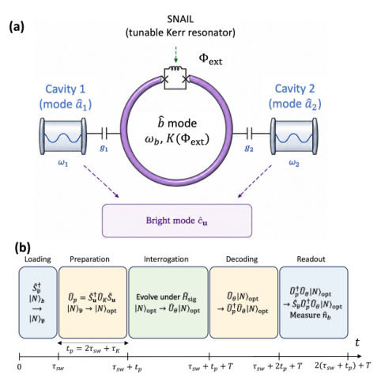
<figcaption class="paper-figure-caption"><b>Fig 1.</b> FIG. 1. Programmable sensing architecture with circuit-QED implementation. (a) A flux-tunable SNAIL resonator provides the nonlinear pump mode ˆb and is parametrically coupled to two terminal cavities ˆa1 and ˆa2. The relative coupling amplitudes and phases select the collective bright mode ˆcu that couples to the pump, while the external flux controls the pump Kerr interaction. (b) Pulse sequence for initial state loading, preparation, sensing, decoding, and readout. A complete swap ˆS† ˜v loads the initial pump Fock state |N⟩b into the terminal mode |N⟩˜v. The nonlinear preparation ˆUp = ˆS† u ˆUK ˆSu generates the optimal probe |N⟩opt, which evolves under the sensing Hamiltonian for time...</figcaption>
</figure>
<figure class="paper-figure-card">
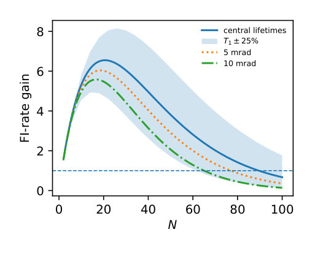
<figcaption class="paper-figure-caption"><b>Fig 2.</b> FIG. 2. Realistic two-terminal benchmark for the dif- ferential signal ˆHsig = λ(ˆn1 −ˆn2)/2 using the complete loading–preparation–interrogation–decoding–unloading proto- col. Shown is the FI-rate gain R relative to a lossy separable sensor with zero control overhead. For G/2π = 2.05 MHz, |K|/2π = 5.21 MHz, T1,T = 204 µs, T1,P = 16 µs, and T = 5 µs, the gain peaks at R ≃6.55 near N = 21. The shaded band varies both lifetimes by ±25%; dotted and dash- dotted curves include quasistatic differential-phase noise of 5 and 10 mrad rms, respectively. The blue dashed line indicates R = 1.</figcaption>
</figure>
<figure class="paper-figure-card">
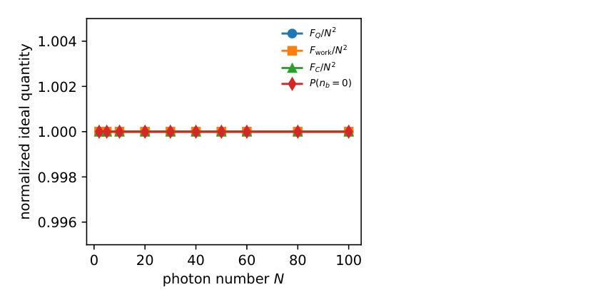
<figcaption class="paper-figure-caption"><b>Fig 3.</b> FIG. 3. Ideal resource accounting for the current protocol: normalized terminal QFI, QFI reconstructed from terminal-number correlations, binary return FI, and pump-vacuum probability after preparation.</figcaption>
</figure>
<figure class="paper-figure-card">
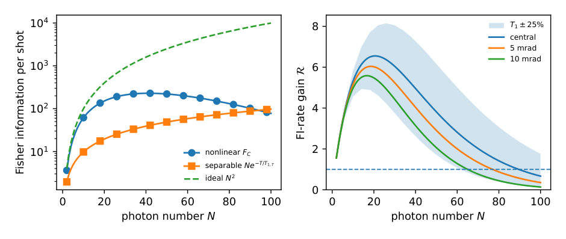
<figcaption class="paper-figure-caption"><b>Fig 4.</b> FIG. 4. Detailed two-terminal benchmark for the current protocol. Left: binary Fisher information per shot with the central lifetimes, together with the favorable lossy separable reference and ideal N 2 scaling. Right: Fisher-information-rate gain. The shaded band varies both lifetimes by ±25%; the additional curves include 5 and 10 mrad rms quasistatic differential-phase noise. The known analysis bias is recalibrated for each N.</figcaption>
</figure>
<figure class="paper-figure-card">
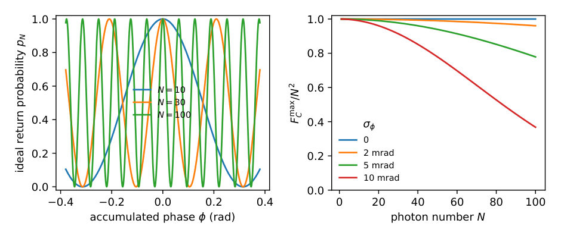
<figcaption class="paper-figure-caption"><b>Fig 5.</b> FIG. 5. Local phase range and quasistatic differential-phase noise. Left: ideal return fringes for representative photon numbers. Right: maximum binary Fisher information after Gaussian phase averaging, normalized by N2.</figcaption>
</figure>

**Summary.** The paper presents a theoretical framework for building highly sensitive bosonic quantum sensors capable of achieving Heisenberg-limited precision. It details a protocol utilizing a Kerr-nonlinear resonator coupled to microwave cavities to programmatically generate optimal probe states. The key contribution is showing how to achieve this maximal sensitivity while also providing methods to calibrate the metrological resource using only local energy measurements.

**Why it may be interesting.** This work directly tackles quantum metrology limits using superconducting circuit-QED platforms, providing concrete, programmable protocols that push beyond standard scaling laws by engineering nonlinear interactions into the sensing mechanism.

Detailed structure

**Main problem.** The goal is to design a general, programmable quantum sensing protocol that achieves Heisenberg-limit scaling for parameter estimation in bosonic systems.

**Main result.** The authors provide a constructive method to map an arbitrary number-conserving sensing Hamiltonian onto experimental controls (pump couplings and pulse sequences) to realize this optimal sensor.

**Method.** The analysis involves constructing the optimal probe state via specific unitary operations (swap and Kerr pulses) and calculating the Quantum Fisher Information (QFI) based on the system's evolution under the signal Hamiltonian.

**Model / system.** The physical platform is a programmable bosonic sensor implemented using a Kerr-nonlinear resonator coupled to multiple high-Q microwave terminal resonators in a circuit-QED setup. The dynamics are governed by a complex time-dependent Hamiltonian including nonlinear, coupling, and signal terms.

**Key observables.** Quantum Fisher Information (QFI), FI-rate gain ($R$), local energy correlations ($	ext{Cov}(W_i, W_j)$), and the optimal accumulated phase ($\phi$).

**Important parameters / regimes.** Photon number ($N$), interrogation time ($T$), Kerr nonlinearity strength ($K$), and noise parameters like quasistatic phase noise ($\sigma_\phi$).

**Assumptions / limitations.** The analysis often assumes ideal, lossless conditions for establishing the theoretical limit, though it also incorporates realistic imperfections like photon loss.

**Figures summary.** Figures illustrate the programmable architecture (Fig. 1), compare normalized QFI and Fisher information to unity in the ideal case (Fig. 3), detail the two-terminal benchmark showing rate gain vs. noise (Fig. 4), and quantify metrological infidelity under various coherent control errors (Figs. 7 & 8).

**Paper structure.** The paper systematically develops the sensing protocol: first, defining the programmable architecture; second, deriving optimal probe preparation sequences; third, calculating the QFI for ideal signals; and finally, analyzing performance degradation due to realistic noise sources like loss and phase fluctuations.

Abstract

We introduce a programmable Heisenberg-limited bosonic quantum sensor based on a nonlinear quantum energy pump, implemented with a Kerr-nonlinear resonator coupled to multiple high-Q microwave terminal resonators. For parameter estimation encoded in an arbitrary number-conserving Hamiltonian acting on the terminal modes, we analytically construct optimal sensing protocols that attain the maximal quantum Fisher information, including initial-state loading, probe preparation, and readout. For diagonal multiparameter signals, we further show that the full phase-sensing quantum Fisher information matrix can be obtained from correlations of locally measured physical terminal works, providing a signal-free calibration of the metrological resource. We numerically demonstrate the construction and its robustness using realistic circuit-QED parameters while including experimentally relevant imperfections.

[↑ back to top](#top)

### [Enhanced two-photon blockade without cascade channel by Stark nonlinear coupling](http://arxiv.org/abs/2608.10942v1)

**Authors:** Zu-Jian Ying, Hang-Hang Han  
**Type:** theory · **Category:** other · **PDF:** <https://arxiv.org/pdf/2608.10942v1>  
**Analysis basis:** full PDF text, analyzed in chunks
**Topic relevance:** `analog quantum simulation` **3/5** · `methods for driven-dissipative` **3/5** · `Tavis-Cummings & cavity-many-emitter` **2/5** · `driven-dissipative phase transition` **2/5** · `Keldysh / 2PI / non-Gaussian methods` **1/5** · `correlated / nonlocal dissipation` **1/5** · `quantum measurements` **1/5**

↔ Scroll figures horizontally

<figure class="paper-figure-card">
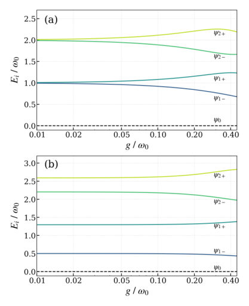
<figcaption class="paper-figure-caption"><b>Fig 1.</b> FIG. 1. Potential of manipulation via the Stark coupling: Low energy levels Ei of H0, relevant for TPB, versus linear coupling strength g in the absence (a) and presence (b) of the Stark nonlinear coupling χ. Here, the energy of the ground state |ψ0⟩is set as the energy reference, ω0 = (ω + Ω)/2 is set to be the energy unit and θ = 0.3π. ω = 1.0ω0 and χ = 0 in (a); ω = 1.5ω0 and χ = 0.136 in (b).</figcaption>
</figure>
<figure class="paper-figure-card">
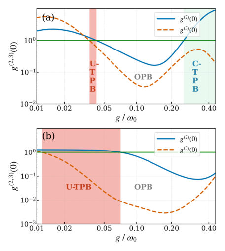
<figcaption class="paper-figure-caption"><b>Fig 2.</b> FIG. 2. Enhanced unconventional two-photon blockade (U- TPB) without primary cascade channel by the Stark coupling χ in strong linear coupling regime (0.01 ≲g/ω0 ≲0.1), apart from the conventional TPB (C-TPB) with primary cascade channel in ultrastrong-coupling (USC, g/ω0 ≳0.1) regime. TPB is identified by g(2)(0) &gt; 1 and g(3)(0) &lt; 1 under coher- ent driving from the ground state |ψ0⟩onto the |ψ1+⟩state, where g(2)(0) (solid) and g(3)(0) (dashed) are the second- and third-order equal-time correlation functions. (a) g(2)(0) and g(3)(0) versus g at χ = 0.0. (b) g(2)(0) and g(3)(0) ver- sus g at χ = 0.136. In (a) and (b), the pale-rose (gray) shaded region marks the U-TPB window, while C-TPB...</figcaption>
</figure>
<figure class="paper-figure-card">
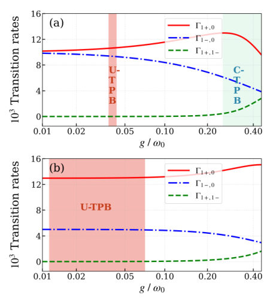
<figcaption class="paper-figure-caption"><b>Fig 3.</b> FIG. 3. Transition rates of different decay channels versus g/ω0: Γ1+,0 (solid red), Γ1−,0 (dash-dotted blue), and Γ1+,1− (dashed green): (a) χ = 0.0, (b) χ = 0.136. The primary cas- cade channel Γ1+,1−remains negligible in the U-TPB regime, while it becomes large in the C-TPB regime.</figcaption>
</figure>
<figure class="paper-figure-card">
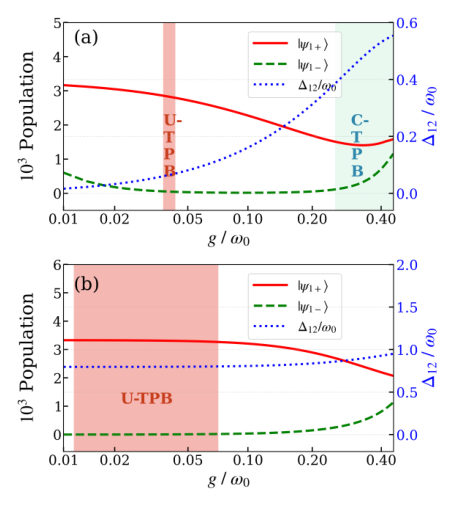
<figcaption class="paper-figure-caption"><b>Fig 4.</b> FIG. 4. Populations (left axis) of states |ψ1+⟩(solid line) and |ψ1−⟩(dashed line) in cascade decay and the gap ∆12 (dotted line, right axis) between these two state: (a) χ = 0.0, (b) χ = 0.136. The |ψ1−⟩population is vanishing in the U-TPB while it is finite in the C-TPB.</figcaption>
</figure>
<figure class="paper-figure-card">
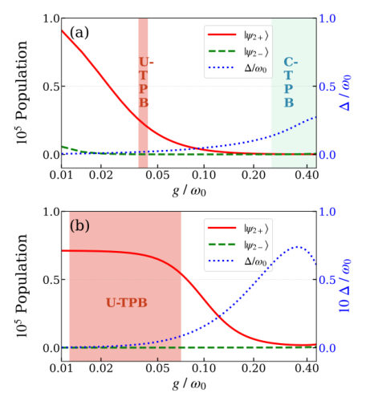
<figcaption class="paper-figure-caption"><b>Fig 5.</b> FIG. 5. Weak anharmonicity (dotted line, right axis) and populations (lrft axis) of states |ψ2+⟩(solid line) and |ψ2−⟩ (dashed line) above decay cascade: (a) χ = 0.0, (b) χ = 0.136. The |ψ2+⟩population is non-vanishing due to resonance effect in weak anharmonicity, which enables the formation of the U- TPB without the conventional cascade decay channel of the C-TPB in Fig. 4.</figcaption>
</figure>

**Summary.** The paper proposes using Stark nonlinear coupling to significantly improve the Unconventional Two-Photon Blockade (U-TPB) in quantum light-matter systems. By tuning system parameters, this method not only expands the operational regime of U-TPB but also deepens its blockade effect substantially. This offers a practical pathway for controlling photon correlations beyond standard theoretical limits.

**Why it may be interesting.** This work directly addresses advanced topics in quantum optics and open quantum systems, providing a concrete mechanism (Stark coupling) to engineer and enhance non-classical light correlations like two-photon blockade in solid-state or cavity platforms.

Detailed structure

**Main problem.** The primary goal is to enhance the Unconventional Two-Photon Blockade (U-TPB) in light-matter coupling systems without relying on an open cascade decay channel.

**Main result.** Introducing Stark nonlinear coupling dramatically broadens the U-TPB operating window across the entire strong-coupling regime and deepens the blockade degree by two orders of magnitude.

**Method.** The analysis uses theoretical modeling involving generalized quantum Rabi Hamiltonians, perturbation theory to calculate energy corrections, and solving the system dynamics via a Lindblad master equation.

**Model / system.** The system is a light-matter coupling setup (e.g., cavity QED) modeled by a Hamiltonian incorporating both standard coupling terms and a Stark nonlinear coupling term ($\chi$).

**Key observables.** Photon correlation functions ($g^{(2)}(0)$, $g^{(3)}(0)$), blockade degree, cascade decay rates ($\Gamma_{1+,1-}$), and state populations.

**Important parameters / regimes.** Stark coupling strength ($\chi$), cavity/qubit coupling strength ($g$), detuning, and the anharmonicity ($\Delta$).

**Assumptions / limitations.** The analysis relies on perturbation theory beyond the Jaynes-Cummings regime and assumes that the Stark coupling is realizable and tailorable.

**Figures summary.** Figures illustrate how the Stark coupling tunes energy levels and anharmonicity, showing phase diagrams mapping out U-TPB and C-TPB regions across different coupling regimes.

**Paper structure.** The paper progresses by first defining the system Hamiltonian including the Stark term, then using perturbation theory to analyze energy corrections, followed by analyzing dynamics via the master equation to characterize blockade signatures in correlation functions and phase diagrams.

Abstract

Two-photon blockade (TPB) besides the conventional one-photon blockade can control the photon at the level of individual quanta in the input-output measurements of light-matter coupling systems. Apart from conventional TPB (C-TPB) with opened cascade decay channel, unconventional TPB (U-TPB) with closed cascade decay channel may open novel avenues for manipulation of TPB. However, currently found U-TPB in linear coupling is limited in a narrow coupling window and the blockade strength is weak, which would hinder its applications. In the present work we propose to enhance the U-TPB by the Stark nonlinear coupling. Indeed, the introduction of the Stark nonlinear coupling to the linear coupling enables tuning of both cascade energy level and the anharmonicity which play key roles in the formation of TPBs. By investigating photon correlation functions and extracting phase diagrams in dissipation, we demonstrate that our scheme not only dramatically broadens the window of U-TPB to cover the entire strong-coupling regime but also deepens the blockading degree of the U-TPB by two orders. The cascade decay rates, state populations and the anharmonicity, are examined to identify and track the U-TPB and C-TPB. In the overview of phase diagrams we also reveal a broad U-TPB in ultrastrong couplings, with a crossover to the C-TPB. Since the Stark nonlinear coupling is realizable and tailorable, our proposal may pave a practical way for manipulation of the TPB.

[↑ back to top](#top)

### [Kinetics of sliding-window quantum error correction](http://arxiv.org/abs/2608.10081v1)

**Authors:** Adithya Sriram, Charles Stahl, Aleksander Kubica, Yaodong Li  
**Type:** theory · **Category:** quantum information and computing · **PDF:** <https://arxiv.org/pdf/2608.10081v1>  
**Analysis basis:** full PDF text, analyzed in chunks
**Topic relevance:** `methods for driven-dissipative` **3/5** · `non-equilibrium universality` **3/5** · `quantum measurements` **3/5** · `driven-dissipative phase transition` **2/5** · `correlated / nonlocal dissipation` **1/5** · `scars & prethermalization` **1/5**

↔ Scroll figures horizontally

<figure class="paper-figure-card">
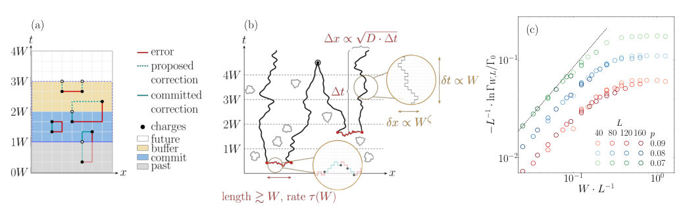
<figcaption class="paper-figure-caption"><b>Fig 1.</b> FIG. 1. (a) Illustration of the sliding-window decoder, for the first few rounds. The error and the correction together form closed loops in the bulk, with possible termination on the temporal boundary between the “buffer” and the “future” regions. Within each round, only correction operations in the “commit” region are turned into physical corrections; those in the “buffer” region serve as a look-ahead to improve decoding accuracy. (b) Worldlines of Z2 charges. Fast pair nucleation and annihilation events occur within O(W) time scale (gray), whereas slow processes persist over many decoding rounds (black), and contribute to decoding failure. Nucleation events for slow charges are...</figcaption>
</figure>
<figure class="paper-figure-card">
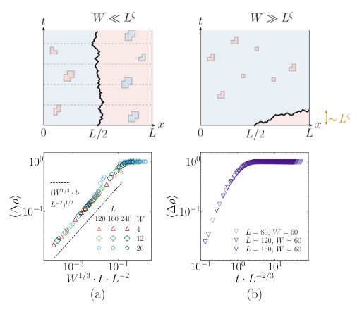
<figcaption class="paper-figure-caption"><b>Fig 2.</b> FIG. 2. Diffusive motion of Z2 charges. (a) For W ≪Lζ, we predict that ⟨|∆ρ|⟩∝(D · t · L−2)1/2, where D ∝W 1/3 is the effective diffusion constant, see Eq. (3). (b) For W ≫Lζ, the domain wall tends to take a shortest path to terminate either on the left or right boundary. Thus, ⟨∆ρ⟩saturates at time t ∝Lζ, where Lζ is the height of the domain wall. At earlier times, ⟨∆ρ⟩depends on t through the scaling variable t · L−ζ.</figcaption>
</figure>
<figure class="paper-figure-card">
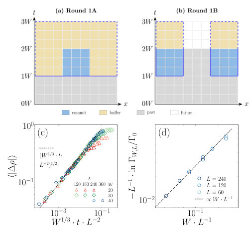
<figcaption class="paper-figure-caption"><b>Fig 3.</b> FIG. 3. (a, b) Layout of modular SWD. (c) Results for dif- fusive motion under modular SWD, compare with Fig. 2(a). (d) Results for the crossover scaling of the memory time un- der modular SWD, compare Fig. 1(c).</figcaption>
</figure>
<figure class="paper-figure-card">
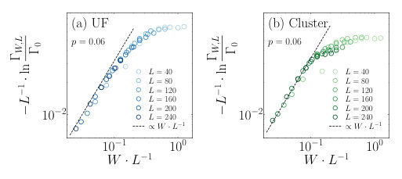
<figcaption class="paper-figure-caption"><b>Fig 4.</b> FIG. 4. Results from Pfail of SWD with the UF and clustering decoders. The data is in agreement with Eq. (5) and Fig. 1(c).</figcaption>
</figure>
<figure class="paper-figure-card">
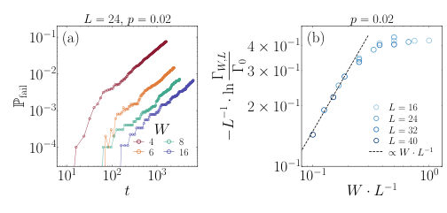
<figcaption class="paper-figure-caption"><b>Fig 5.</b> FIG. 5. Crossover scaling of the 2D toric code (compare with Fig. 1 for the 1D repetition code). For early times, we did not observe any logical failures in 104 realizations.</figcaption>
</figure>

**Summary.** This paper develops an effective kinetic theory to describe how quantum error correction performs in real time using sliding windows. It models the syndrome information evolution as a parity-conserving reaction-diffusion process for $\mathbb{Z}_2$ charges. The key finding is that this system exhibits universal crossover scaling between different operational regimes, providing crucial insights into hardware limitations.

**Why it may be interesting.** This work provides a powerful connection between non-equilibrium statistical mechanics (reaction-diffusion kinetics) and the practical performance limits of quantum computation hardware, offering quantitative predictions for error thresholds based on temporal processing constraints.

Detailed structure

**Main problem.** The study addresses the kinetics of Quantum Error Correction (QEC) in a real-time setting, moving beyond static theoretical models.

**Main result.** Sliding-Window Decoding (SWD) can be effectively described by a stochastic kinetic process involving parity-conserving reaction and diffusion of $\mathbb{Z}_2$-charged point particles.

**Method.** The authors derive an effective description by analyzing the dynamics over large length and time scales relative to the window size $W$, connecting microscopic SWD processes to macroscopic kinetic models.

**Model / system.** The system is modeled using topological CSS codes (e.g., 1D repetition code, 2D toric code) undergoing syndrome measurement via a sliding temporal window ($W$). Errors manifest as $\mathbb{Z}_2$-charged point particles whose dynamics are tracked.

**Key observables.** Memory Time ($t_{	ext{mem}}$), logical failure probability ($P_{	ext{fail}}(t; W, L)$), and the density of domain walls ($
ho_{DW}$).

**Important parameters / regimes.** Window size $W$, system length $L$, error rate $p$, and the decoding rate $1/W$. The crossover between regimes defined by $W$ vs. $L$ is crucial.

**Assumptions / limitations.** The effective description holds for scales much larger than the window size $W$; the analysis often assumes quasi-local motion of defects; and specific decoders (like MWPM) are used as the basis for comparison.

**Figures summary.** Figures illustrate the SWD mechanism with temporal windows, worldlines of $\mathbb{Z}_2$ charges distinguishing fast/slow processes, and data collapse confirming universal crossover scaling laws between different physical regimes.

**Paper structure.** The paper establishes the need for real-time QEC kinetics, models SWD as a reaction-diffusion process, derives scaling relations for memory time and diffusion constant across various length scales ($W$ vs $L$), and validates this effective theory using multiple code types (1D, 2D) and noise models.

Abstract

Practical implementations of quantum error correction (QEC) require rapid measurement and continuous processing of the syndrome information in order to prevent a backlog of unprocessed data. While ``static'' QEC is theoretically well understood via mappings to equilibrium statistical mechanics models, such an understanding of ``real-time'' QEC is currently lacking. Here, we study the kinetics of sliding window decoding (SWD), an implementation of real-time decoding that acts on temporally local windows of noisy syndrome information and commits to corrections irreversibly at a nonzero rate. We propose an effective description of SWD in terms of a stochastic kinetic process, where $\mathbb{Z}_2$-charged point particles undergo parity-conserving reaction and diffusion. This model describes dynamics at length and time scales large compared to the window size $W$, whereas physics at scales smaller than $W$ leads to nontrivial $W$-dependent scaling of the effective parameters. We identify the rate of decoding $1/W$ as a relevant perturbation to the decodable phase. We also show broad applicability of our results by changing many microscopic details of SWD without affecting the effective description.

[↑ back to top](#top)

### [Exact First-Passage Time Response Theory from Steady-State Response](http://arxiv.org/abs/2608.11202v1)

**Authors:** Ruicheng Bao, Shiling Liang  
**Type:** theory · **Category:** statistical mechanics · **PDF:** <https://arxiv.org/pdf/2608.11202v1>  
**Analysis basis:** full PDF text, analyzed in chunks
**Topic relevance:** `methods for driven-dissipative` **3/5** · `driven-dissipative phase transition` **2/5** · `non-equilibrium universality` **2/5** · `quantum measurements` **2/5** · `analog quantum simulation` **1/5** · `correlated / nonlocal dissipation` **1/5** · `scars & prethermalization` **1/5**

↔ Scroll figures horizontally

<figure class="paper-figure-card">
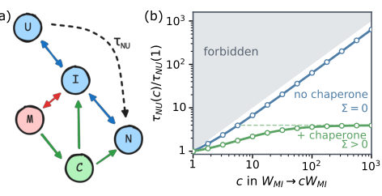
<figcaption class="paper-figure-caption"><b>Fig 1.</b> FIG. 1. (a) Trap-bottleneck geometry and the chaperone cy- cle acting downstream of the same perturbed edge I →M (rose): capture (M →C), productive release (C →N), and futile release (C →I), all in green. (b) Finite response of τNU to scaling the trap-entry rate WMI →cWMI, on doubly log- arithmic axes. The blue curve is the chaperone-free network, the green curve is the network with the chaperone, and the shaded region is forbidden by the universal harmful-side en- velope τ(c) ≤c τ(1). Solid lines are the exact prediction from Eq. (3b); markers are direct numerical computation. The trap is unscreened without the chaperone (ΣN|MI = 0) and screened with it (ΣN|MI &gt; 0), so the response...</figcaption>
</figure>
<figure class="paper-figure-card">
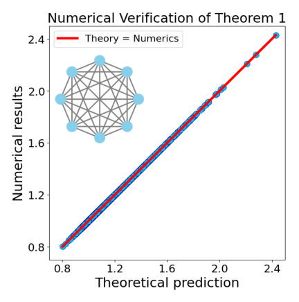
<figcaption class="paper-figure-caption"><b>Fig 2.</b> FIG. 1. Numerical verification of the exact finite single-rate update (Theorem 1). In each of the 105 iterations, an 8-state fully connected Markov chain is randomly generated with transition rates drawn uniformly from [0.01, 10]. One pair (k, l) is chosen for the MFPT, another pair (m, n) for the perturbation, and the perturbation strength is drawn uniformly from [0.01, 10]. The numerical MFPT ratio agrees with the exact prediction.</figcaption>
</figure>
<figure class="paper-figure-card">
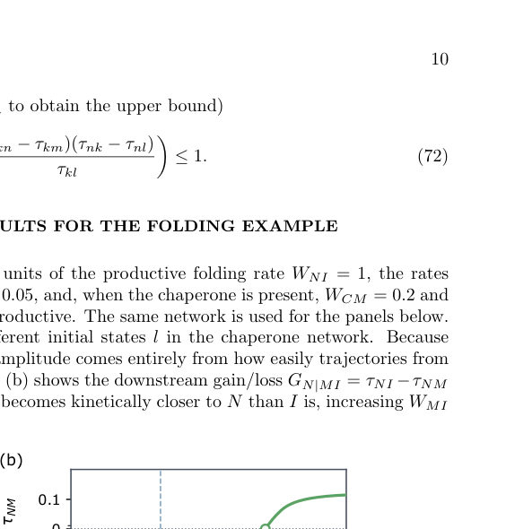
<figcaption class="paper-figure-caption"><b>Fig 3.</b> Fig. 1 value</figcaption>
</figure>
<figure class="paper-figure-card">
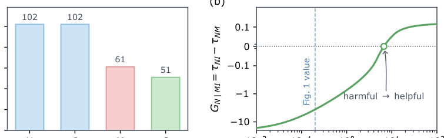
<figcaption class="paper-figure-caption"><b>Fig 4.</b> FIG. 2. Additional numerical panels for the folding example. Panel (a) gives the upstream accessibility in the chaperone network for different initial states. Panel (b) gives the downstream gain/loss as the chaperone capture rate WCM is varied ; it changes sign at WCM ≃6.7, well above the value used in Fig. 1 (dashed line).</figcaption>
</figure>

**Summary.** This work develops an exact theory detailing how Mean First-Passage Times change when a system's transition rates are perturbed. By mapping the transient response onto steady-state calculations, the authors provide universal formulas for predicting these changes. This framework is crucial for analyzing and controlling dynamic processes in complex physical, chemical, or biological networks.

**Why it may be interesting.** While focused on classical Markov processes, the rigorous mathematical framework for analyzing time-dependent non-equilibrium dynamics (like MFPTs) is highly relevant to open quantum systems where relaxation times and transition rates are key observables.

Detailed structure

**Main problem.** The paper aims to establish a systematic, exact theoretical framework for understanding how the Mean First-Passage Time (MFPT) responds to external perturbations in continuous-time Markov processes.

**Main result.** It derives universal response relations for MFPTs—including linear and nonlinear terms—expressed entirely using unperturbed MFPTs and steady-state probabilities, providing computational advantages for prediction and control.

**Method.** The core method involves establishing an exact correspondence that maps the transient MFPT response onto the steady-state response of a carefully constructed auxiliary system.

**Model / system.** The analysis is based on continuous-time Markov processes governed by the master equation, applied to systems like folding networks and general kinetic state transitions.

**Key observables.** Mean First-Passage Time (MFPT, $	au_{kl}$), steady-state probabilities ($\pi_k$), and their derivatives/responses to rate perturbations.

**Important parameters / regimes.** Perturbation strength ($\Delta W_{mn}$), unperturbed MFPTs, and steady-state probabilities.

**Assumptions / limitations.** The theory is developed for single-rate perturbations ($W_{mn} 	o W_{mn} + \Delta W_{mn}$) in the Markov process rates.

**Figures summary.** Figures illustrate the geometry of trap-bottleneck dynamics (Application I) and show numerical verification of finite response saturation due to screening factors ($\Sigma$).

**Paper structure.** The paper builds from establishing the fundamental correspondence between transient MFPT response and steady-state response, deriving exact linear/nonlinear update formulas, decomposing the nonlinear response into upstream accessibility, downstream gain/loss, and screening terms, and finally applying these tools to physical models like folding networks.

Abstract

The mean first-passage time (MFPT) provides a universal temporal measure of transport, reaction, search, and switching processes in physical, chemical, and biological systems. Understanding how MFPTs respond to perturbations is therefore crucial for prediction and control, yet a systematic theory has been lacking. We establish a compact theoretical framework for linear and nonlinear MFPT response in continuous-time Markov processes. The key tool is an exact correspondence that maps the intrinsically transient response of MFPTs onto the steady-state response of an auxiliary system. This correspondence yields exact and universal response relations for MFPTs between arbitrary state pairs, expressed entirely in terms of unperturbed MFPTs and steady-state probabilities. We then obtain a factorized physical decomposition of the MFPT response into linear upstream, linear downstream, and nonlinear contributions. Further corollaries include response-curve inference rules, fundamental bounds on MFPT responses, analytical expressions for higher-order responses of MFPTs and steady-state probabilities, and multi-rate response formulas. Additionally, our result offers computational advantages in calculating both MFPTs and steady-state distributions. Finally, a biologically motivated folding network is analyzed, and a recently reported paradox on MFPT is clarified.

[↑ back to top](#top)

### [Future perspective of muons; a quantum particle measuring quantum processes](http://arxiv.org/abs/2608.10856v1)

**Authors:** Adam Berlie, Sayani Biswas, Alex Louat, Rhea Stewart, John Wilkinson  
**Type:** theory · **Category:** other · **PDF:** <https://arxiv.org/pdf/2608.10856v1>  
**Analysis basis:** full PDF text, analyzed in chunks
**Topic relevance:** `quantum measurements` **3/5** · `Keldysh / 2PI / non-Gaussian methods` **2/5** · `analog quantum simulation` **2/5** · `driven-dissipative phase transition` **2/5** · `correlated / nonlocal dissipation` **1/5** · `methods for driven-dissipative` **1/5** · `non-equilibrium universality` **1/5**

↔ Scroll figures horizontally

<figure class="paper-figure-card">
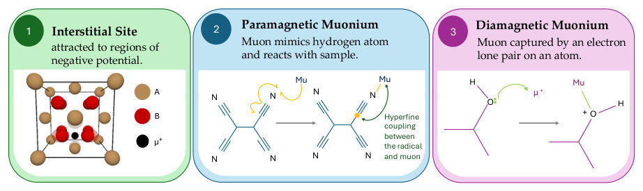
<figcaption class="paper-figure-caption"><b>Fig 1.</b> Figure 1: A schematic diagram showing the different muon states that can form in materials 1) a bare muon at an interstitial site; 2) diamagnetic muonium; and 3) paramagnetic muo- nium.</figcaption>
</figure>
<figure class="paper-figure-card">
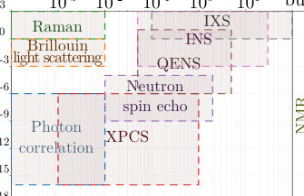
<figcaption class="paper-figure-caption"><b>Fig 2.</b> Figure 2: Comparison of the dynamical ranges accessed by selected spectroscopic and scat- tering techniques.(a) Approximate characteristic energy scales , E = ¯hω, and, for scattering techniques, momentum transfer ranges. Local and bulk probes are shown on the right using an equivalent energy scale derived from their characteristic frequencies. (b) Approximate fre- quency and corresponding time-scale windows accessible to remanence measurements, AC susceptibility, nuclear magnetic resonance (NMR), muon spin rotation/relaxation (µSR), M¨ossbauer spectroscopy, electron spin resonance (ESR), and neutron spectroscopyThe dis- played ranges are schematic and depend on the instrument, applied...</figcaption>
</figure>
<figure class="paper-figure-card">
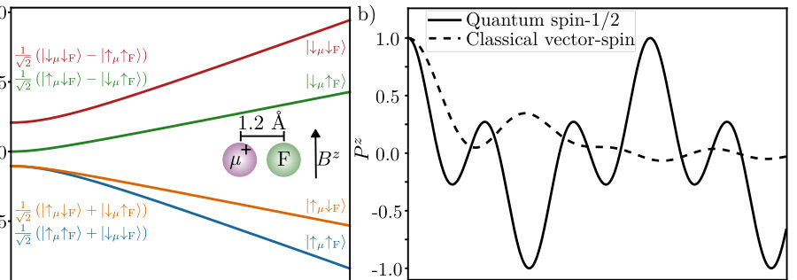
<figcaption class="paper-figure-caption"><b>Fig 3.</b> Figure 3: a) Energy levels of the F–µ pair as a function of the magnetic field Bz, with the F–µ bond oriented along the x-axis. Only the dipolar coupling and an external magnetic field applied along the z-axis are included. The inset shows the geometry considered. b) Zero-field (ZF) muon polarisation function for unpolarised initial fluorine spins, calculated using quantum spin-1/2 dipolar dynamics and classical vector-spin dipolar dynamics.</figcaption>
</figure>
<figure class="paper-figure-card">
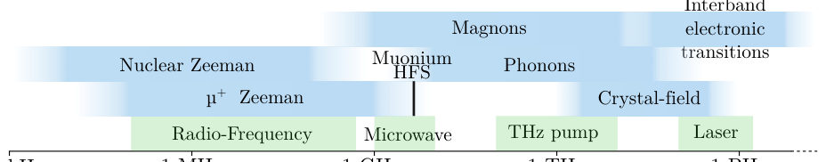
<figcaption class="paper-figure-caption"><b>Fig 4.</b> Figure 4: Excitation frequency and energy scales from kHz to PHz, illustrating representative muon–nuclear, muonium hyperfine structure (HFS), collective, and electronic transitions and the corresponding experimental electromagnetic regimes from Radio-Frequency (RF)46–49 to optical excitation34,50,51 under typical laboratory conditions.</figcaption>
</figure>
<figure class="paper-figure-card">
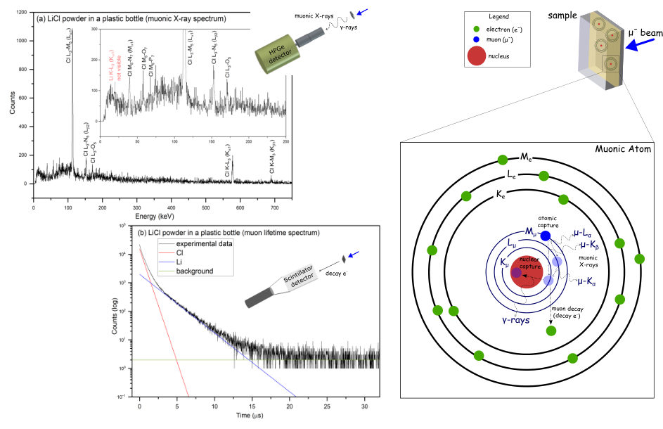
<figcaption class="paper-figure-caption"><b>Fig 5.</b> Figure 5: Pictorial representation of the different quantum processes that take place in a µ−</figcaption>
</figure>

**Summary.** This perspective argues that muon spectroscopy must be viewed through a rigorous quantum mechanical lens to unlock its full potential. It details how the time evolution of the muon's polarization, governed by complex interactions, provides unique information about local quantum states within materials. The paper advocates for moving beyond classical models toward advanced Hamiltonian-based interpretations.

**Why it may be interesting.** It directly addresses open quantum systems dynamics by requiring the calculation of expectation values under complex Hamiltonians ($\mathcal{H}_0$), making it highly relevant for those studying spin relaxation and environment coupling in condensed matter.

Detailed structure

**Main problem.** The paper aims to establish the quantum mechanical treatment of muon spectroscopy ($\mu$SR) as a key future direction for probing material properties.

**Main result.** By treating the muon as a fully quantum particle, $\mu$SR can provide unique insights into local magnetic fields and quantum states in materials that complement classical measurements.

**Method.** The analysis focuses on deriving measurable quantities from the time evolution of the muon's polarization governed by its full Hamiltonian ($\mathcal{H}_0$).

**Model / system.** The physical system involves implanted muons ($\mu^+$ or $\mu^-$) acting as local probes in various materials. The theoretical framework requires solving the time evolution dictated by the total Hamiltonian, which includes Zeeman, dipole-dipole, quadrupolar, and hyperfine interactions.

**Key observables.** Time evolution of muon polarization; relaxation times ($T_1$, $T_2$); X-ray spectra (in related techniques).

**Important parameters / regimes.** Muon mass ($rac{1}{9}~m_p$), local magnetic fields, and the coupling constants defining the various Hamiltonian terms.

**Assumptions / limitations.** The technique moves beyond classical interpretations; standard models often simplify interactions or assume Gaussian field distributions.

**Figures summary.** Figures illustrate the different muon states (interstitial, muonium), compare $\mu$SR's frequency window against other techniques (NMR, ESR), and show energy level diagrams for spin dynamics.

**Paper structure.** The paper progresses by first introducing the utility of $\mu$SR as a local probe; it then delves into the quantum mechanical formalism using the Hamiltonian to describe polarization decay; finally, it emphasizes that future progress requires adopting this full quantum treatment over classical approximations.

Abstract

Although considered a niche technique, muon spectroscopy provides a unique and complementary insight into a range of different materials from hard condensed matter to biological samples and everything in between. In matter, the muon has a mass of $\frac{1}{9}~m_p$ or $207~m_e$, and is a local probe of quantum states that can provide a focus on the bulk properties of materials. While often interpreted in a classical framework, the muon is itself a quantum particle and it is increasingly common for researchers to take account of this when thinking about muon spectroscopy experiments. In this perspective, we focus on the power of using this quantum treatment of muon spectroscopy, which is a key future direction for the technique.

[↑ back to top](#top)

### [Universal scaling of spatially extended zero modes in inhomogeneous SSH chains](http://arxiv.org/abs/2608.11021v1)

**Authors:** Gilles Parez, Nicolas Crampé, Quentin Labriet, Lucia Morey, Luc Vinet  
**Type:** theory · **Category:** other · **PDF:** <https://arxiv.org/pdf/2608.11021v1>  
**Analysis basis:** full PDF text, analyzed in chunks
**Topic relevance:** `analog quantum simulation` **3/5** · `non-equilibrium universality` **3/5** · `Frenkel-Kontorova` **2/5** · `Keldysh / 2PI / non-Gaussian methods` **1/5** · `correlated / nonlocal dissipation` **1/5** · `driven-dissipative phase transition` **1/5**

↔ Scroll figures horizontally

<figure class="paper-figure-card">
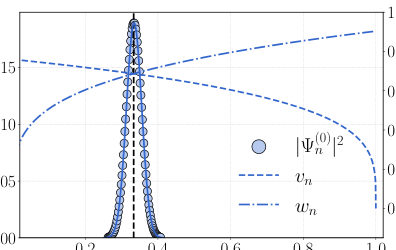
<figcaption class="paper-figure-caption"><b>Fig 1.</b> FIG. 1. Spatial profile |Ψ(0) n |2 of the zero mode for the power- law profile with α = 1/4 and p = 1/3. Symbols denote the exact lattice results obtained from Eq. (2) for N = 1000. The solid line is the continuum prediction of Eq. (5), expressed as a function of x/ℓ= n/N. The agreement between the lattice and continuum results is excellent. The corresponding couplings vn and wn are also shown (right axis), illustrating that the zero mode is centred at the interface n0/N = p = 1/3, marked by the vertical dashed line.</figcaption>
</figure>
<figure class="paper-figure-card">
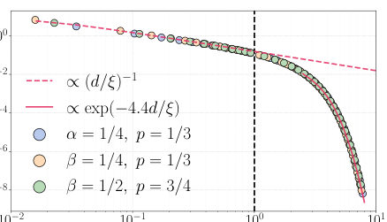
<figcaption class="paper-figure-caption"><b>Fig 2.</b> FIG. 2. Rescaled correlation function ξC(d) as a function of the rescaled distance d/ξ for the power-law and Fermi–Dirac profiles with N = 1000. Symbols denote exact numerical data, and the dashed and solid lines show the algebraic and exponential fits, respectively, while the vertical dashed line indicates d/ξ = 1.</figcaption>
</figure>
<figure class="paper-figure-card">
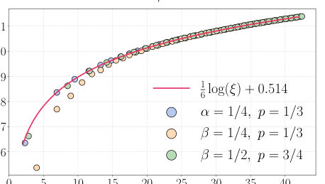
<figcaption class="paper-figure-caption"><b>Fig 3.</b> FIG. 3. Top: Entanglement entropy S(n) as a function of n/N for the power-law profile with α = 1/4, p = 1/3, and various values of N. Symbols are obtained by exact diago- nalization of the correlation matrix. The vertical dashed line marks the interface at n0/N = p = 1/3, while the horizon- tal dotted line indicates S = log 2. Bottom: Entanglement entropy S(n0) at the interface as a function of ξ for the power- law and Fermi–Dirac profiles. Symbols are obtained by exact diagonalization, and the solid line is a numerical fit.</figcaption>
</figure>

**Summary.** This work analyzes the zero modes in inhomogeneous SSH chains where the transition between gapped phases occurs smoothly. The authors demonstrate that this smoothness causes the zero mode to spread out universally, scaling as $\sqrt{N}$. This emergent length scale dictates a mesoscopic critical region characterized by algebraic decay of correlations and logarithmic entanglement entropy growth.

**Why it may be interesting.** The concept of an emergent mesoscopic critical region governed by universal length scales ($\xi \sim \sqrt{N}$) at a topological interface is highly relevant for understanding low-energy physics in engineered quantum materials or superconducting junctions.

Detailed structure

**Main problem.** The study investigates how protected zero modes, characteristic of topological phases, behave when the interface between gapped regions is smooth rather than sharp.

**Main result.** For smooth interfaces in inhomogeneous SSH chains, the associated zero mode becomes spatially extended with a universal scaling length $\xi \sim \sqrt{N}$, defining a mesoscopic critical region. This leads to algebraic decay of correlations near the interface.

**Method.** The analysis combines exact lattice solutions for the single-particle eigenproblem with continuum descriptions derived by promoting discrete hopping parameters to smooth functions, leading to an effective inhomogeneous Dirac Hamiltonian.

**Model / system.** The system is based on the Su-Schrieffer-Heeger (SSH) model realized on a 1D bipartite lattice. The inhomogeneity is introduced via smoothly varying hopping amplitudes ($v_n, w_n$), which define the topological interface where the mass term $m(x)$ changes sign.

**Key observables.** Zero mode spatial extension ($\xi$), ground-state correlation function decay rate (algebraic vs. exponential), and entanglement entropy scaling near the interface.

**Important parameters / regimes.** System size ($N$), lattice spacing ($a$), and parameters defining the smoothness of the hopping profile (e.g., power-law or Fermi-Dirac profiles).

**Assumptions / limitations.** The analysis assumes the existence of a well-defined continuum limit, requiring that the lattice couplings are invariant under rescaling to maintain smooth variation.

**Figures summary.** Figures compare exact lattice results against continuum predictions for zero mode density and local topological markers ($
u_n$). They also show correlation functions collapsing onto universal scaling forms and entanglement entropy exhibiting logarithmic growth near the interface.

**Paper structure.** The paper progresses from defining the SSH Hamiltonian and solving the zero-energy eigenproblem on a discrete lattice. It then derives the continuum limit via scaling arguments, leading to an effective Dirac equation. Finally, it analyzes key observables like correlation functions and entanglement entropy using this continuous description.

Abstract

Protected zero modes are a hallmark of topological phases of matter and are exponentially localized at sharp interfaces between distinct gapped phases. We investigate how this picture changes for smooth interfaces in a broad class of inhomogeneous Su-Schrieffer-Heeger (SSH) models. Combining an exact lattice solution with an inhomogeneous Dirac description, we show that the associated Jackiw-Rebbi zero mode becomes spatially extended. For arbitrary smooth hopping profiles, its lattice extension universally scales as the square root of the system size, independently of the microscopic details of the interface. This emergent length defines a mesoscopic critical region separating two gapped phases, within which correlations decay algebraically before crossing over to exponential decay. In addition, the entanglement entropy scales as the logarithm of the emergent length near the interface, confirming the interpretation of a mesoscopic critical region. Our results establish a universal critical length governing the low-energy physics of smooth topological interfaces.

[↑ back to top](#top)

### [Wave-particle-mixedness redistribution in Schwarzschild spacetime](http://arxiv.org/abs/2608.10334v1)

**Authors:** Sumeng Wang, Xiaofen Huang  
**Type:** theory · **Category:** other · **PDF:** <https://arxiv.org/pdf/2608.10334v1>  
**Analysis basis:** full PDF text, analyzed in chunks
**Topic relevance:** `Keldysh / 2PI / non-Gaussian methods` **3/5** · `methods for driven-dissipative` **3/5** · `driven-dissipative phase transition` **2/5** · `correlated / nonlocal dissipation` **1/5** · `non-equilibrium universality` **1/5** · `quantum measurements` **1/5**

↔ Scroll figures horizontally

<figure class="paper-figure-card">
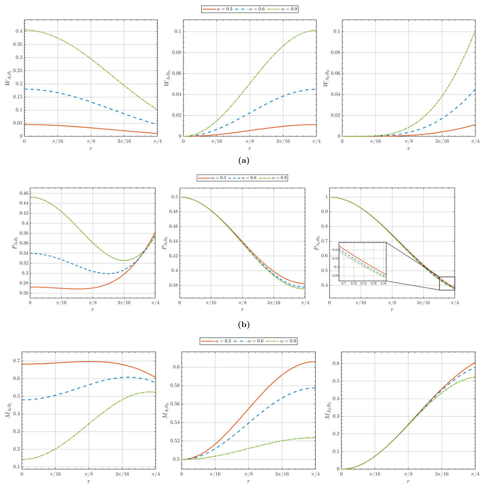
<figcaption class="paper-figure-caption"><b>Fig 1.</b> FIG. 1: Wave feature W, particle feature P, and mixedness M versus the Hawking parameter r for ra = rb = r. Panels (a)–(c) show W, P, and M, respectively. The three subplots in each panel correspond to ρAIBI , ρAIBII , and ρAIIBII . The curves are for α = 0.3, 0.6, 0.9. The state ρAIIBI is omitted because it coincides with ρAIBII when ra = rb.</figcaption>
</figure>
<figure class="paper-figure-card">
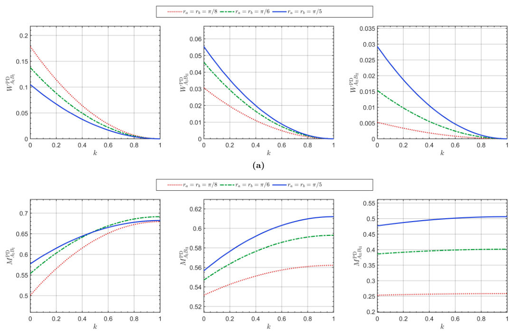
<figcaption class="paper-figure-caption"><b>Fig 2.</b> FIG. 2: Wave feature and mixedness under the phase damping channel for α = 0.7 and ra = rb = r. Panel (a) shows the wave feature WPD, while panel (b) shows the mixedness MPD, both as functions of the damping coefficient k. In each panel, the three subplots correspond to ρPD AIBI , ρPD AIBII , and ρPD AIIBII . The three curves represent r = π/8, r = π/6, and r = π/5. The particle feature is not plotted because it has no explicit k-dependence. For ra = rb = r, ρPD AIIBI has the same behavior as ρPD AIBII .</figcaption>
</figure>
<figure class="paper-figure-card">
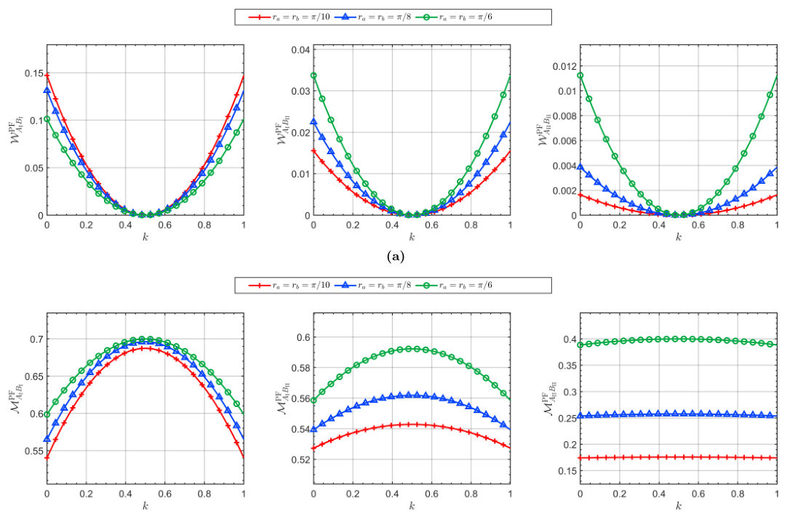
<figcaption class="paper-figure-caption"><b>Fig 3.</b> FIG. 3: Wave feature and mixedness under the phase flip channel for α = 0.6 and ra = rb = r. Panel (a) shows the wave feature WPF, while panel (b) shows the mixedness MPF, both as functions of the damping coefficient k. In each panel, the three subplots correspond to ρPF AIBI , ρPF AIBII , and ρPF AIIBII . The three curves represent r = π/10, r = π/8, and r = π/6. The particle feature is not plotted because it has no explicit k-dependence. For ra = rb = r, ρPF AIIBI has the same behavior as ρPF AIBII .</figcaption>
</figure>
<figure class="paper-figure-card">
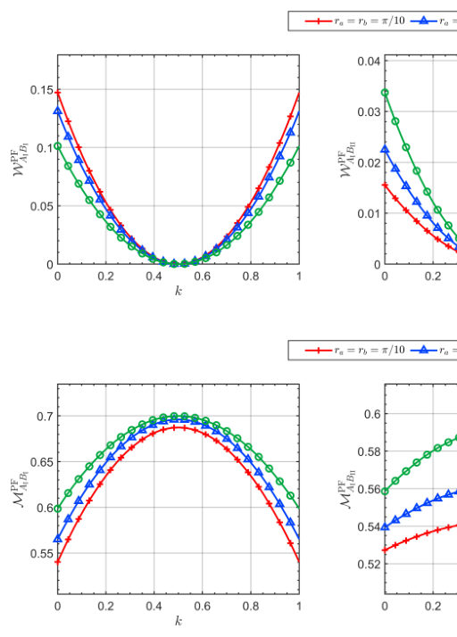
<figcaption class="paper-figure-caption"><b>Fig 4.</b> Fig. 3(b) presents the corresponding mixedness. The mixedness also exhibits a symmetric dependence on the damping coefficient k. In contrast to the wave feature, it increases as k varies from 0 to 1/2, reaches its maxi- mum when the wave feature vanishes, and then decreases symmetrically for k &gt; 1/2. This opposite behavior fol- lows from Eq. (B9), where the k-dependent wave feature term enters the mixedness with a negative sign. The variation is more pronounced for ρPF AIBI and ρPF AIBII, but becomes less visible for ρPF AIIBII. Since Eq. (B8) shows</figcaption>
</figure>
<figure class="paper-figure-card">
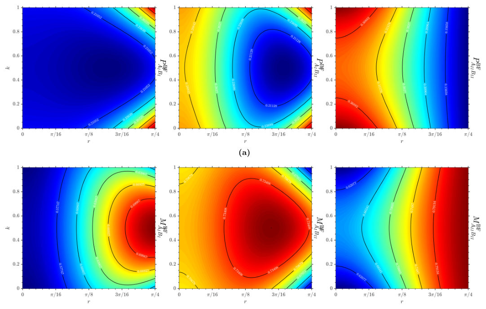
<figcaption class="paper-figure-caption"><b>Fig 5.</b> FIG. 4: Particle feature and mixedness under the bit flip channel as functions of the Hawking parameter r and the damping coefficient k. Panel (a) shows the particle feature PBF, while panel (b) shows the mixedness MBF. In each panel, the three subplots correspond to ρBF AIBI , ρBF AIBII , and ρBF AIIBII . The wave feature is not plotted because it has no explicit dependence on k. For ra = rb = r, ρBF AIIBI has the same behavior as ρBF AIBII .</figcaption>
</figure>

**Summary.** This paper analyzes the redistribution of wave-particle duality and mixedness for quantum states near a black hole horizon. It models both thermal effects from Hawking radiation and various forms of environmental noise acting on two qubits. The key finding is that while these physical processes significantly alter the distribution of quantum features, they do not violate the fundamental conservation law relating them.

**Why it may be interesting.** It provides a concrete example of how fundamental quantum mechanical relationships (like complementarity) are preserved even when subjected to extreme physical processes like Hawking radiation or realistic environmental decoherence.

Detailed structure

**Main problem.** The study investigates how wave feature, particle feature, and mixedness are redistributed for two-qubit isotropic states when subjected to Hawking radiation in Schwarzschild spacetime or various environmental decoherence channels.

**Main result.** The analysis shows that both Hawking radiation and noise modify the relative weights of these quantum features across different spatial regions but crucially preserve the underlying wave-particle-mixedness triality relation (P+W+M=1).

**Method.** The authors use field quantization in curved spacetime, employing Bogoliubov transformations for Hawking effects, and applying Kraus operators to model environmental noise channels.

**Model / system.** The system is a two-qubit isotropic state derived from Dirac fields analyzed across the event horizon of a Schwarzschild black hole. The analysis considers reduced density matrices tracing over causally inaccessible modes.

**Key observables.** Wave feature (W), Particle feature (P), and Mixedness (M); the triality relation P+W+M=1 is the primary diagnostic tool.

**Important parameters / regimes.** Hawking temperature T, Hawking parameter r, and noise strengths k for phase damping, phase flip, and bit flip channels.

**Assumptions / limitations.** The analysis assumes the validity of the wave-particle-mixedness triality relation as a consistency check across all physical processes considered.

**Figures summary.** Figures illustrate how W, P, and M change as functions of the Hawking parameter r (for Hawking radiation) or the damping coefficient k (for noise channels), showing characteristic redistribution patterns for different reduced states.

**Paper structure.** The paper systematically analyzes the effects in two parts: first, investigating Hawking radiation's effect on W, P, and M across horizon sectors; second, analyzing the distinct impacts of phase damping, phase flip, and bit flip noise channels on these features.

Abstract

The redistribution of the wave feature, particle feature, and mixedness is investigated for two-qubit isotropic states in Schwarzschild spacetime under Hawking radiation and environmental decoherence. It is shown that Hawking radiation changes their relative weights among different horizon regions rather than simply suppressing them. The analysis is further extended to phase damping, phase flip, and bit flip channels. Phase damping monotonically suppresses the wave feature and enhances mixedness, phase flip produces a symmetric death-and-revival behavior of the wave feature, and bit flip mainly reshapes the particle feature and mixedness through diagonal population redistribution. However, although Hawking radiation and channel noise affect the distribution of wave feature, particle feature, and mixedness in the subsystems, the triality relation among them still holds and remains unaffected by thermal and environmental noises.

[↑ back to top](#top)

### [Symmetrized Block-Product Periodic Marginals in Infinite Translation-Invariant Quantum Chains](http://arxiv.org/abs/2608.10365v1)

**Authors:** Xiao Zeng, Kaiyan Yang, Lingxia Zhang, Zizhu Wang  
**Type:** theory · **Category:** strongly correlated electrons · **PDF:** <https://arxiv.org/pdf/2608.10365v1>  
**Analysis basis:** full PDF text, analyzed in chunks
**Topic relevance:** `methods for driven-dissipative` **3/5** · `analog quantum simulation` **2/5** · `quantum measurements` **2/5** · `Frenkel-Kontorova` **1/5** · `Keldysh / 2PI / non-Gaussian methods` **1/5** · `correlated / nonlocal dissipation` **1/5**

↔ Scroll figures horizontally

<figure class="paper-figure-card">
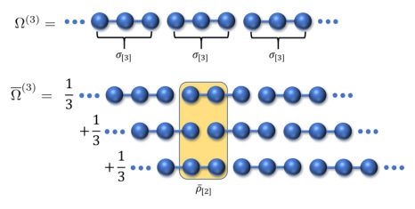
<figcaption class="paper-figure-caption"><b>Fig 1.</b> Figure 1: An example of symmetrization when p = 3, r = 2. Ω(3) is a periodic state with period 3. The symmetrized state Ω (3) is one-site TI, and the yellow box shows the symmetrized state ρ[2], which is composed by the reduced density matrices (RDMs) inside σ[3] and the RDM across the boundary.</figcaption>
</figure>
<figure class="paper-figure-card">
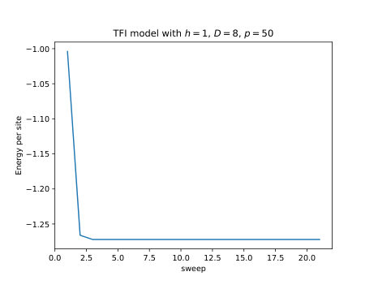
<figcaption class="paper-figure-caption"><b>Fig 2.</b> Figure 2: The energy density given by the symmetrized MPS algorithm for the TFI model at h = 1, p = 50, D = 8.</figcaption>
</figure>
<figure class="paper-figure-card">

<figcaption class="paper-figure-caption"><b>Fig 3.</b> Figure 3 shows that the convergence of the variational energy density depends on both the bond dimension and the period p. For small bond dimensions, the sym- metrized MPS optimization is more susceptible to local minima. We therefore repeat the calculation with multi- ple random initializations and report the lowest energy obtained. As the bond dimension increases, this local- minimum issue is no longer observed. In all simulations, convergence is declared when the change in energy be- tween consecutive sweeps is smaller than ε = 10−7. For D = 4 and D = 6, we perform 10 independent runs for each value of p and keep the best result. The convergence pattern is model dependent. For the TFI...</figcaption>
</figure>
<figure class="paper-figure-card">
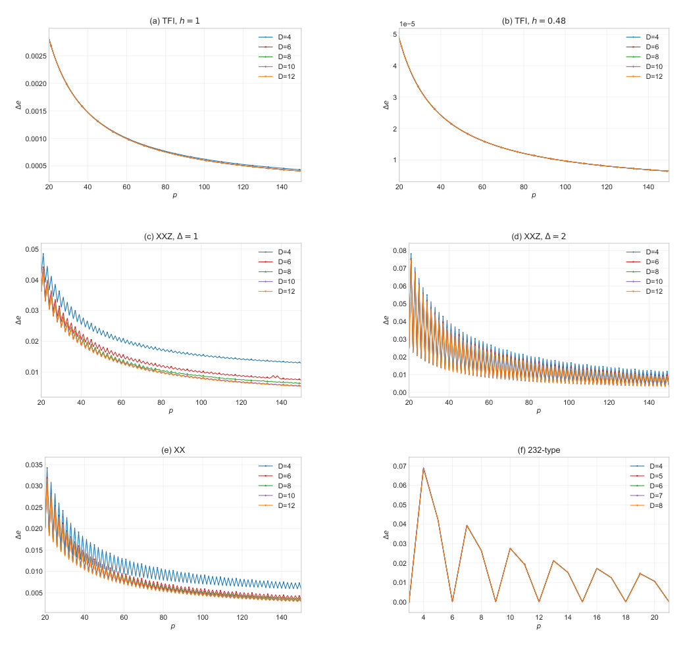
<figcaption class="paper-figure-caption"><b>Fig 4.</b> Figure 3: The energy error ∆e given by the symmetrized MPS algorithm. (a) TFI model at h = 1, (b) TFI model at h = 0.48, (c) XXZ model at ∆= 1, (d) XXZ model at ∆= 2, (e) XX model, (f) the 232-type model.</figcaption>
</figure>

**Summary.** The paper develops a rigorous mathematical framework to test if local quantum measurements on an infinite chain are consistent with a hidden periodic structure. It uses advanced techniques like SDP relaxations and specialized Matrix Product States to calculate upper bounds on energy densities and diagnose periodicity in models ranging from Ising to XXZ type chains.

**Why it may be interesting.** This work provides powerful theoretical tools for analyzing local measurements in complex many-body systems, bridging the gap between experimentally accessible local data and the true global ground state properties of infinite chains.

Detailed structure

**Main problem.** The study investigates local reduced density matrices ($
ho[n]$) in infinite translation-invariant quantum chains to determine if they are compatible with an underlying hidden finite-period structure.

**Main result.** The developed framework successfully diagnoses expected periodic order in exactly solvable models (like Majumdar-Ghosh) and provides systematically improving variational upper bounds on ground-state energy densities.

**Method.** Two complementary methods are employed: a Semidefinite Programming (SDP) relaxation based on block symmetry, and a Symmetrized Matrix Product State (MPS) ansatz for variational bounding.

**Model / system.** The work applies to one-dimensional translation-invariant quantum systems, including the Majumdar-Ghosh model, Transverse-Field Ising, XX, and XXZ spin chains. The focus is on characterizing local properties of these infinite chains.

**Key observables.** Ground-state energy densities ($\Delta e$) and expectation values for contextuality witnesses ($\langle E 
angle_{TI}$).

**Important parameters / regimes.** The period ($p$) of the hidden structure, the bond dimension ($D$) used in MPS, and the size of the local measurement window ($n$).

**Assumptions / limitations.** The primary challenge is that exact finite characterizations of admissible reduced states are generally unavailable; approximations rely on periodic extensions (e.g., Periodic-NPA relaxation).

**Figures summary.** Figure 1 illustrates the construction of symmetrized marginals for small periods ($p=3, r=2$). Figure 3 compares energy error convergence ($\Delta e$) across different models based on the period $p$.

**Paper structure.** The paper introduces the core problem (symmetrized block-product periodic marginals), develops two mathematical tools (SDP and MPS ansatz), benchmarks these methods on several known quantum spin models, and applies them to diagnose periodicity and bound energy/contextuality.

Abstract

We study local marginals in one-dimensional translation-invariant quantum systems that may hide finite-period structure. Given an $n$-site reduced density matrix, we ask whether it can be obtained by repeating a finite $p$-site block state along the chain and averaging over the $p$ lattice translations. This defines a symmetrized block-product periodic marginal problem, which provides a route both to diagnosing hidden periodic order from local data and to upper bounding ground-state energy densities of infinite translation-invariant local Hamiltonians. We develop two complementary methods. The first is a semidefinite-programming relaxation based on block permutation symmetry and positive partial transpose constraints, which outer-approximates the convex hull of such marginals and yields certified infeasibility tests. The second is a symmetrized matrix product state ansatz, which constructs explicit block-product periodic states and gives variational upper bounds. We benchmark the framework on the Majumdar-Ghosh model, transverse-field Ising, XX, XXZ, and contextuality-related spin models. The results show that the method captures the expected finite-period structure in exactly solvable cases and gives systematically improving variational energies as the period and bond dimension increase. We also formulate a periodic-NPA relaxation for translation-invariant contextuality witnesses and recover the known quantum limits in the tested examples.

[↑ back to top](#top)

### [Analytical Theory for Anomalous Diffusion in the Anderson Model with Heavy Tails](http://arxiv.org/abs/2608.10868v1)

**Authors:** Elizaveta Safonova, Aleksey Lunkin, Mikhail Feigel'man  
**Type:** theory · **Category:** disordered systems and neural networks · **PDF:** <https://arxiv.org/pdf/2608.10868v1>  
**Analysis basis:** full PDF text, analyzed in chunks
**Topic relevance:** `Keldysh / 2PI / non-Gaussian methods` **3/5** · `driven-dissipative phase transition` **2/5** · `analog quantum simulation` **1/5** · `correlated / nonlocal dissipation` **1/5** · `methods for driven-dissipative` **1/5** · `non-equilibrium universality` **1/5**

↔ Scroll figures horizontally

<figure class="paper-figure-card">
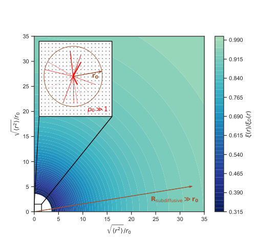
<figcaption class="paper-figure-caption"><b>Fig 1.</b> FIG. 1. Color map of the normalized scaling exponent ξ(r) as a function of propagation distance for µ = 1.03, where ξD(r) = 1. The figure demonstrates that the subdiffusive regime extends over distances much larger than the mean free path r0. The white region indicates the absence of data. The inset shows a microscopic illustration of the model, where each site is, on average, connected to p0 ≫1 neighboring sites within a distance r0, forming a network with multiple broadly distributed connections to nearby sites. The thickness of each red line represents the amplitude of the corresponding hopping term tnm.</figcaption>
</figure>
<figure class="paper-figure-card">
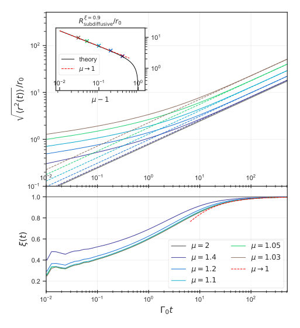
<figcaption class="paper-figure-caption"><b>Fig 2.</b> FIG. 2. Top: Typical displacement rtyp(t), normalized over hopping range r0, obtained from Eqs. (8, 9, and 11) for var- ious values of µ. Dashed lines show the long-time diffusive asymptotic rtyp ∝ √</figcaption>
</figure>
<figure class="paper-figure-card">
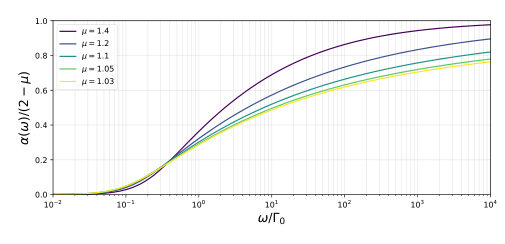
<figcaption class="paper-figure-caption"><b>Fig 3.</b> FIG. 3. Frequency-dependent conductivity scaling exponent α(ω) ≡ d ln σ d ln ω for several values of the heavy-tail exponent µ. The extended intermediate-frequency regime exhibits an apparent power-law behavior, while the low-frequency limit approaches the diffusive dc conductivity.</figcaption>
</figure>
<figure class="paper-figure-card">
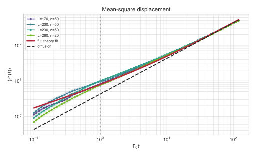
<figcaption class="paper-figure-caption"><b>Fig 4.</b> FIG. 4. Mean-square displacement ⟨r2(t)⟩versus rescaled time Γ0t for the unitary (β = 2) power-law hopping model in 3D, Eq. (2), with µ = 1.6, W = 1, r0 = 4.5, p0 = 200, and h0 = 0.07, for several system sizes L, averaged over n disorder realizations. The simulation data are compared with the full prediffusive theory obtained from Eqs. (8)–(11) and with the asymptotic diffusive law ⟨r2(t)⟩= 6Dt. The short- and intermediate-time dynamics exhibits a preasymptotic en- hancement over diffusion and crosses over to diffusive scaling at long times.</figcaption>
</figure>

**Summary.** This paper develops an analytical theory demonstrating that heavy-tailed hopping amplitudes in the noninteracting Anderson model cause robust subdiffusive transport over an intermediate time scale. By solving complex transport equations using advanced field-theoretic methods, the authors establish a single-particle mechanism for these anomalies, providing a critical tool to distinguish disorder effects from many-body interactions.

**Why it may be interesting.** This work is highly relevant because it provides a rigorous analytical benchmark for understanding transport anomalies in disordered quantum systems. The separation of disorder-driven effects from interaction-induced ones is crucial for interpreting experimental results in AMO physics, especially concerning localization transitions.

Detailed structure

**Main problem.** The paper develops an analytical theory to understand anomalous transport (subdiffusion) in the Anderson model when hopping amplitudes are governed by heavy-tailed distributions.

**Main result.** It shows that rare hopping processes alone can induce a robust, intermediate subdiffusive regime, providing a single-particle mechanism distinct from interaction effects. This anomaly eventually crosses over to conventional diffusion at long times.

**Method.** The analysis employs advanced theoretical techniques, including solving transport equations by mapping the problem onto the Lévy–Rosenzweig–Porter (LRP) matrix ensemble and utilizing supersymmetric field-theoretical formalisms.

**Model / system.** The system is a noninteracting Anderson model on a lattice with diagonal disorder ($u_n$) and hopping amplitudes ($t_{nm}$) following heavy-tailed power laws. The Hamiltonian describes single-particle dynamics in the presence of strong, broad disorder.

**Key observables.** Mean-square displacement $\langle r^2(t) 
angle$, the effective subdiffusive exponent $\xi(t)$, and frequency-dependent conductivity $\sigma(\omega)$.

**Important parameters / regimes.** The tail exponent $\mu$ of the hopping amplitudes ($P_\mu(|t|) \propto |t|^{-\mu}$), which controls the transition between diffusive ($\mu=2$) and localized ($\mu 	o 1$) regimes.

**Assumptions / limitations.** The theory relies on analytical solutions to transport equations, approximations like the saddle-point method in field theory, and assumes that the anomalous regime is a parametrically extended crossover rather than a true asymptotic phase.

**Figures summary.** Figures illustrate the scaling exponent $\xi(r)$ showing subdiffusion extending beyond the mean free path for small $\mu$, and compare calculated $\langle r^2(t) 
angle$ with numerical simulations, confirming preasymptotic enhancement over diffusion.

**Paper structure.** The paper progresses by defining the model parameters (heavy tails, Anderson Hamiltonian), developing the mathematical framework using LRP ensembles or supersymmetric field theory, deriving expressions for correlation functions and conductivity, and finally analyzing the time/frequency dependence to characterize the crossover between anomalous subdiffusion and normal diffusion.

Abstract

We develop an analytical theory of anomalous transport in a noninteracting Anderson model with heavy-tailed hopping amplitudes. The broad distribution of hopping amplitudes gives rise to an extended intermediate-time regime with a subdiffusive effective exponent, despite the absence of interactions or genuine many-body effects. By solving the transport equations analytically, we derive the time dependence of the mean-square displacement and identify a continuous crossover from an intermediate anomalous regime to asymptotically diffusive transport. As the localization transition is approached, the spatial extent of the subdiffusive window diverges parametrically, while the crossover to conventional diffusion remains finite in units of $Γ_0^{-1}$. This produces an increasingly broad anomalous transport regime in space that can closely resemble Griffiths-type transport observed near the many-body localization transition. Our results demonstrate that rare hopping processes alone provide a microscopic single-particle mechanism for robust transport anomalies, establishing an analytical benchmark for distinguishing interaction-induced effects from disorder-driven dynamics.

[↑ back to top](#top)

### [Cell Natural Orbitals in Quantum Materials](http://arxiv.org/abs/2608.10059v1)

**Authors:** Harshitra Mahalingam, Nishchhal Verma, Daniel Muñoz-Segovia, Raquel Queiroz  
**Type:** theory · **Category:** strongly correlated electrons · **PDF:** <https://arxiv.org/pdf/2608.10059v1>  
**Analysis basis:** full PDF text, analyzed in chunks
**Topic relevance:** `analog quantum simulation` **3/5** · `methods for driven-dissipative` **3/5** · `Keldysh / 2PI / non-Gaussian methods` **2/5** · `quantum measurements` **1/5**

↔ Scroll figures horizontally

<figure class="paper-figure-card">
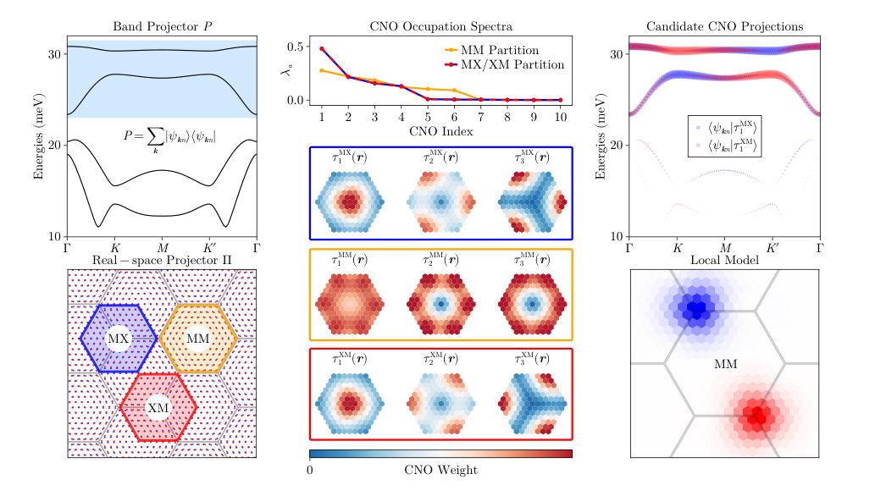
<figcaption class="paper-figure-caption"><b>Fig 1.</b> FIG. 1. Schematic overview of the cell natural orbital construction. Starting from a target band projector P, the projector is restricted to a single real-space unit cell through the local projector Π to form the unit-cell one-particle reduced density matrix L = ΠPΠ. Diagonalization yields the cell natural orbitals (CNOs) |τa⟩and their occupations λa. The CNOs provide compact local orbitals labeled by their symmetry and Wyckoff position, while the occupations rank their importance within the target bands. Candidate tight-binding models are constructed by selecting CNO subsets, testing their ability to span the target bands through the overlap matrix Sk, and optimizing their total spectral...</figcaption>
</figure>
<figure class="paper-figure-card">
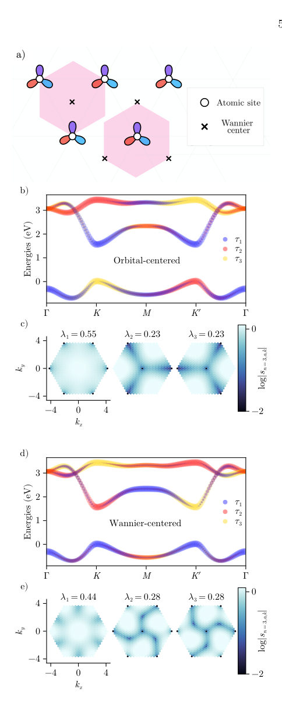
<figcaption class="paper-figure-caption"><b>Fig 2.</b> FIG. 2. a) Triangular-lattice three-orbital monolayer TMD model. The 1a Wyckoff position where the d orbitals are centered is indicated by the white circles. These d orbitals can be combined into a basis of three sp2-like orbitals. Black crosses mark the 1c Wannier centers, where the sp2 orbitals from three neighboring cells constructively interfere. The two shaded cells show the partition choices. b-d) CNOs and en- velope function of the valence band of monolayer WSe2 for a-b) 1a-centered unit cell, c-d) 1c-centered unit cell. In a) and c), the band structure of the 3-band model is colored by the overlaps |⟨ukn|τa⟩| for each CNO. b) and d) show the en- velope functions sa,k over the...</figcaption>
</figure>
<figure class="paper-figure-card">
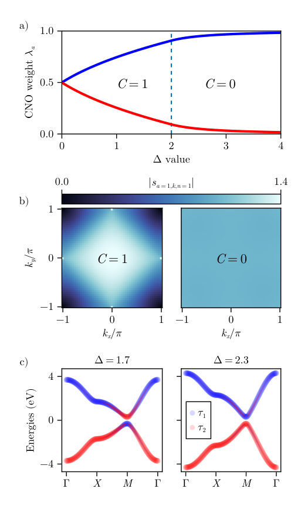
<figcaption class="paper-figure-caption"><b>Fig 3.</b> FIG. 3. a) CNO weights λa for the top band of the spin- less BHZ model. The topological transition occurs at ∆= 2, shown by the vertical dashed line. b) Absolute value of the envelope function of the dominant CNO |sa=1| along the Bril- louin zone for the left: C = 1 regime and right: C = 0 regime. In the C = 1 regime, sa=1 goes to zero at the M points, while in the C = 0 case, the envelope function is finite everywhere. c) band structure along a high-symmetry path in left: the C = 1 regime and right: the C = 0 regime. The points are colored by CNO weights obtained from the UC-1pRDM of the top band.</figcaption>
</figure>
<figure class="paper-figure-card">
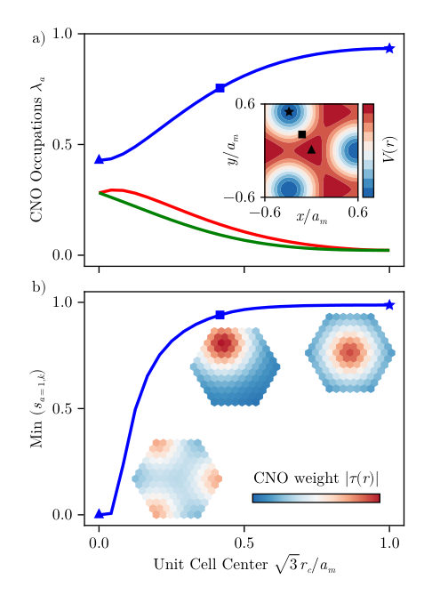
<figcaption class="paper-figure-caption"><b>Fig 4.</b> FIG. 4. a) CNO occupation spectra for the lowest band of a single parabolic band in a triangular moir´e potential as a function of scaled unit-cell center rc. The inset shows the real- space potential V (r) and three highlighted partition centers. b) Minimum value of the dominant envelope function |s1,k| as a function of rc, with representative real-space profiles of the leading CNO.</figcaption>
</figure>
<figure class="paper-figure-card">
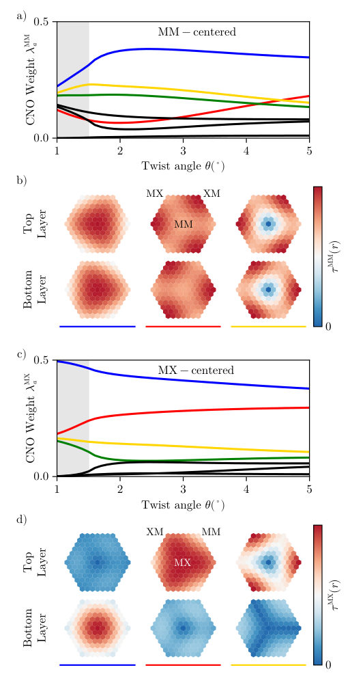
<figcaption class="paper-figure-caption"><b>Fig 5.</b> FIG. 5. a), c) CNO occupations λq a for the top two bands of continuum tWSe2 as a function of twist angle θ for partition centers q = MM and q = MX, respectively. b), d) Represen- tative real-space CNO profiles in the topological regime for the two partitions. The leading CNO for the MM-centered partition localizes near the MM stacking region, while sub- leading modes carry weight on the surrounding MX and XM regions.</figcaption>
</figure>

**Summary.** The paper presents Cell Natural Orbitals (CNOs) as a systematic technique to derive optimal local orbital descriptions directly from the band structure of quantum materials. By analyzing the unit-cell reduced density matrix, CNOs quantify orbital content and entanglement across unit cells. This method offers a robust way to build minimal effective models for studying correlated and topological phenomena in systems like moiré TMDs.

**Why it may be interesting.** This work provides a powerful theoretical framework for mapping complex Bloch wavefunctions onto minimal, localized orbital bases, which is crucial input for subsequent correlated electron simulations (e.g., Hubbard models) used in AMO or strongly correlated physics.

Detailed structure

**Main problem.** The primary goal is to develop a systematic method to identify local degrees of freedom (orbitals) that accurately capture the band geometry and charge density of target bands in complex quantum materials.

**Main result.** The authors introduce Cell Natural Orbitals (CNOs), derived from the unit-cell one-particle reduced density matrix, which provide an intrinsic, symmetry-respecting basis for constructing optimal local models.

**Method.** The methodology centers on calculating and diagonalizing the Unit-Cell One-Particle Reduced Density Matrix (UC-1pRDM) to extract CNOs and their associated occupation numbers.

**Model / system.** The work applies to correlated quantum matter, particularly focusing on moiré materials like twisted bilayer WSe2, where simple real-space descriptions of topological bands are challenging.

**Key observables.** CNO eigenvalues ($\lambda_a$) quantify orbital occupation and unit-cell entanglement; the method also analyzes symmetry constraints via irreducible representations (irreps).

**Important parameters / regimes.** Twist angle (in moiré systems), band symmetries, and the choice of real-space partition are critical parameters.

**Assumptions / limitations.** The core assumption is that a suitable real-space partition exists to define the UC-1pRDM; the method aims to overcome limitations in traditional Wannierization techniques regarding topological obstructions.

**Figures summary.** Figures schematically illustrate the construction using $L = \Pi P \Pi$ leading to CNOs and occupations, and show how different unit-cell partitions yield distinct CNOs and envelope functions over the Brillouin zone for TMD examples.

**Paper structure.** The paper systematically introduces the UC-1pRDM as a tool to derive local orbitals from the band manifold itself, detailing the mathematical construction, analyzing physical diagnostics like entanglement entropy, and demonstrating its utility in modeling moiré systems.

Abstract

Understanding correlated quantum matter starts with an accurate model of the single-particle states that interact at low energies: their dispersion, band geometry, orbital content and charge density. In many cases, notably the topological bands of moire materials, it is not straightforward to find a real-space description with a few local orbitals that accomplishes this task. Here we provide a systematic way to identify the local degrees of freedom that best capture the band geometry and charge density of any chosen set of bands. We use the unit-cell one-particle reduced density matrix (UC-1pRDM), obtained by restricting the projector onto the target bands to a single unit cell. Its eigenstates, which we call cell natural orbitals (CNOs), form a local, symmetric basis uniquely determined by the Bloch wavefunctions and the choice of real-space partition. Their eigenvalues measure the occupation of each CNO in the target bands, quantifying entanglement across unit-cell boundaries and the importance of multi-orbital character. A set of CNOs that maximizes total spectral weight and reproduces the target band symmetries provides optimal trial states for Wannierization. We exemplify this by constructing a lattice model for twisted bilayer WSe$_2$ that tracks the orbital content across twist angles.

[↑ back to top](#top)

### [Influence of interactions on the chiral effect in $1D$ Dirac semimetal](http://arxiv.org/abs/2608.11004v1)

**Authors:** Maksim Ulybyshev, M. A. Zubkov  
**Type:** theory · **Category:** strongly correlated electrons · **PDF:** <https://arxiv.org/pdf/2608.11004v1>  
**Analysis basis:** full PDF text, analyzed in chunks
**Topic relevance:** `analog quantum simulation` **3/5** · `Frenkel-Kontorova` **1/5** · `Keldysh / 2PI / non-Gaussian methods` **1/5** · `methods for driven-dissipative` **1/5**

↔ Scroll figures horizontally

<figure class="paper-figure-card">
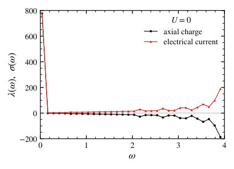
<figcaption class="paper-figure-caption"><b>Fig 1.</b> FIG. 1: Model 1. Spectral functions λ(ω) and σ(ω) in the absence of interactions.</figcaption>
</figure>
<figure class="paper-figure-card">
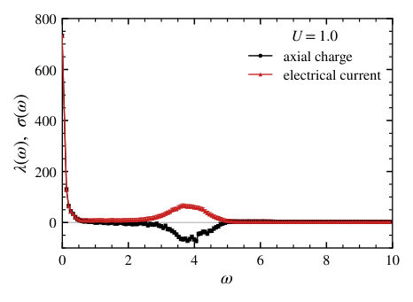
<figcaption class="paper-figure-caption"><b>Fig 2.</b> FIG. 2: Model 1. Spectral functions λ(ω) and σ(ω) in the presence of interactions at U = 1.0.</figcaption>
</figure>
<figure class="paper-figure-card">
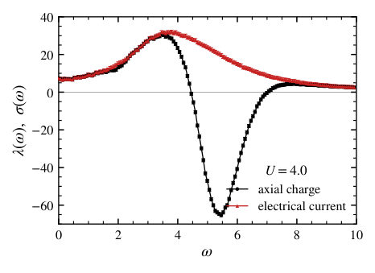
<figcaption class="paper-figure-caption"><b>Fig 3.</b> FIG. 3: Model 1. Spectral functions λ(ω) and σ(ω) in the presence of interactions at U = 4.0.</figcaption>
</figure>
<figure class="paper-figure-card">
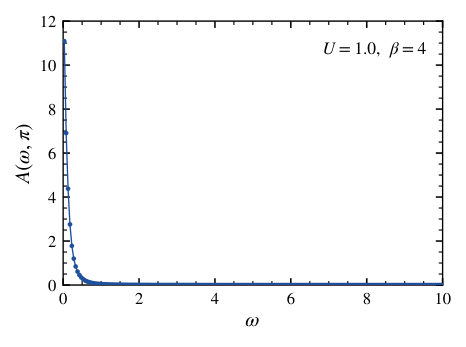
<figcaption class="paper-figure-caption"><b>Fig 4.</b> FIG. 5: Model 1. Spectral function A(ω, π) at the Fermi point position k = π in the presence of interactions at U = 1.0 and β = 4 .</figcaption>
</figure>
<figure class="paper-figure-card">
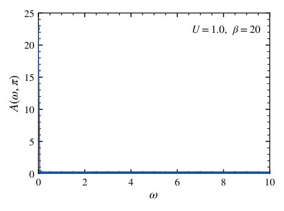
<figcaption class="paper-figure-caption"><b>Fig 5.</b> FIG. 4: Model 1. Spectral function A(ω, π) at the Fermi point position k = π in the presence of interactions at U = 1.0 at β = 20.</figcaption>
</figure>

**Summary.** This work uses Quantum Monte Carlo simulations to study the 1D Dirac semimetal model coupled with local Hubbard interactions. The primary goal was to determine if these strong correlations destroy the chiral effect, which links axial charge response to electrical conductivity. The key finding is that this fundamental proportionality remains robust, suggesting a topological origin independent of the Mott insulating state.

**Why it may be interesting.** While focused on condensed matter topology, the robustness of a topological response (the chiral effect) against strong correlation effects is highly relevant to understanding emergent phenomena in strongly correlated quantum materials that might be modeled using techniques applicable to AMO systems.

Detailed structure

**Main problem.** The study investigates how local Hubbard-type interactions affect the chiral effect—a relationship between axial charge density response and electrical conductivity—in a 1D Dirac semimetal.

**Main result.** The proportionality characterizing the chiral effect remains unchanged even when strong local Hubbard interactions drive the system into a Mott insulating phase, suggesting the effect is not renormalized by these interactions.

**Method.** Numerical Quantum Monte Carlo (QMC) simulations are employed to calculate static response functions ($\lambda(0)$ and $\sigma(0)$) for the interacting model.

**Model / system.** The system is based on the Su-Schrieffer–Heeger (SSH) model, extended by adding local Hubbard interactions ($H_{	ext{Hub}}$). The analysis compares non-interacting behavior to regimes where strong correlations are present.

**Key observables.** Axial charge density response ($\lambda(\omega)$), electrical conductivity ($\sigma(\omega)$), and the relationship $
ho_5 \propto j$.

**Important parameters / regimes.** Interaction strength ($U$), inverse temperature ($eta$), and system dimensionality (1D). The study examines transitions into Mott insulating regimes.

**Assumptions / limitations.** The analysis relies on linear response theory and assumes that the chiral effect's robustness suggests a possible topological origin, even when approximations might break down in deep insulating states.

**Figures summary.** Figures show comparisons of $\lambda(\omega)$ and $\sigma(\omega)$ for varying interaction strengths ($U$) in Model 1 (SSH+Hubbard) and Model 2 (spinless electrons+Hubbard), demonstrating the persistence of the proportionality relation across different correlation regimes.

**Paper structure.** The paper first establishes the non-interacting chiral effect using the SSH model. It then introduces local Hubbard interactions via QMC simulations, systematically testing if the key relationship ($
ho_5 \propto j$) survives as $U$ increases and the system approaches insulating states.

Abstract

We consider the 1D Su-Schrieffer-Heeger (SSH) model. It was recently shown that, for the noninteracting model in its Dirac semimetal phase, the linear response of the axial charge density to an external electric field is proportional to the electrical conductivity in the presence of finite dissipation, with the proportionality factor determined by the coupling constants. This relation may be viewed as a manifestation of the chiral effect, which is a dimensional reduction of the 3D chiral magnetic effect. In the present work, we investigate the same model in the presence of two versions of local Hubbard-type interactions using numerical Quantum Monte Carlo simulations. We find, within the numerical resolution and for the parameters studied, that, even in the regime where sufficiently strong interactions drive the system into a Mott insulating phase, the proportionality between the induced axial charge density and the electrical conductivity remains unchanged. This result indicates that the chiral effect is not renormalized by local Hubbard interactions.

[↑ back to top](#top)

### [Observation geometry for uncertainty-aware Hamiltonian inference and experimental design in quantum magnets](http://arxiv.org/abs/2608.10350v1)

**Authors:** Roy Liu, Venugopal Ranganathan, David Dahlbom, Shizhou Xu, Tianyu Zhang, Yuan Ni, Daniel M. Pajerowski, Garrett Granroth, Thomas Strohmer, Matthew B. Stone, Andrew F. May, Mark D. Lumsden, Joshua J. Turner, Yongqiang Cheng, Zhantao Chen  
**Type:** both · **Category:** strongly correlated electrons · **PDF:** <https://arxiv.org/pdf/2608.10350v1>  
**Analysis basis:** full PDF text, analyzed in chunks
**Topic relevance:** `quantum measurements` **3/5** · `analog quantum simulation` **2/5** · `Keldysh / 2PI / non-Gaussian methods` **1/5**

↔ Scroll figures horizontally

<figure class="paper-figure-card">
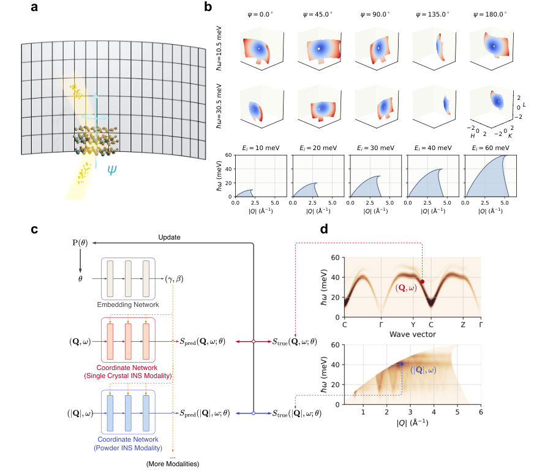
<figcaption class="paper-figure-caption"><b>Fig 1.</b> FIG. 1. Multimodal inelastic neutron scattering (INS) measurements and Hamiltonian-conditioned AI sur- rogate model. (a) Incident neutrons scatter from the sample and are recorded by a detector array, sampling a subset of the four-dimensional scattering space (Q, ω) for single-crystal measurements or a bounded region in (|Q|, ω) for powder mea- surements. (b) Experimental control variables and the corresponding measurement coverage. The upper panel illustrates the accessible (Q, ω) region for different single-crystal sample orientations, while the lower panel shows the accessible (|Q|, ω) region for different incident neutron energies in powder measurements. (c) AI surrogate model based on...</figcaption>
</figure>
<figure class="paper-figure-card">
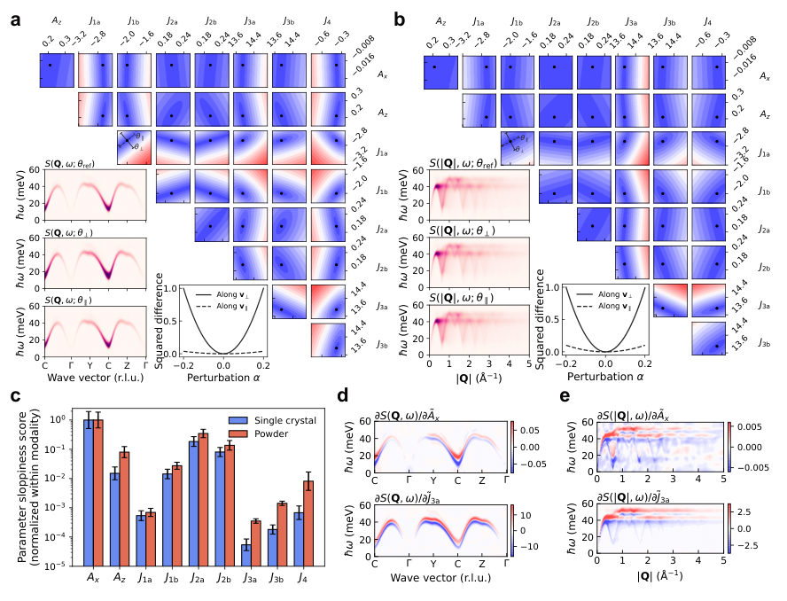
<figcaption class="paper-figure-caption"><b>Fig 2.</b> FIG. 2. Observation landscapes and local parameter identifiability across INS modalities. a, Local observation landscape for the single-crystal INS modality, centered at the reference Hamiltonian θref. The corner plot shows two-parameter slices of the spectral-discrepancy landscape between the reference spectrum, S(Q, ω; θref), and spectra generated by perturbed Hamiltonians, S(Q, ω; θ). Circular markers indicate θref. In the (J1a, J1b) subspace, the solid and dashed lines denote pertur- bations along the eigenvectors, v⊥and v∥, of the local observation metric tensor G, with eigenvalues satisfying λ⊥≥λ∥. These directions correspond to the local stiff and sloppy directions in Hamiltonian...</figcaption>
</figure>
<figure class="paper-figure-card">
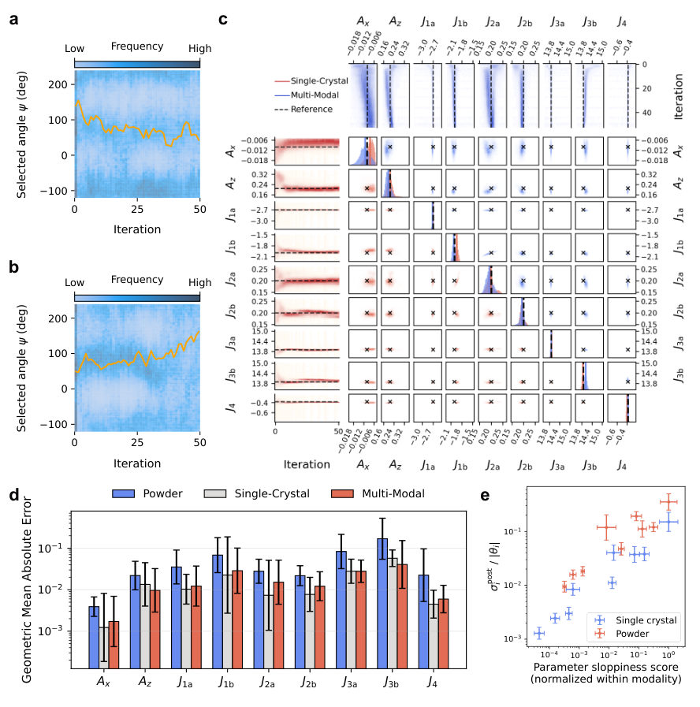
<figcaption class="paper-figure-caption"><b>Fig 3.</b> FIG. 3. Bayesian experimental design and multimodal Hamiltonian inference enabled by AI surrogates. a, Adap- tive experimental design on orientation ψ for single-crystal INS without powder-derived prior information. The orange curve shows the sequence of selected sample orientations ψ for a representative simulated experiment generated from S(Q, ω; θref) with Poisson noise. The heatmap shows the average predictive-variance utility over 10 simulated experiments with ground-truth Hamiltonians sampled from the initial prior. b, Adaptive experimental design on orientation ψ for single-crystal INS initialized with a posterior obtained from powder INS measurements. Compared with panel (a), the...</figcaption>
</figure>
<figure class="paper-figure-card">
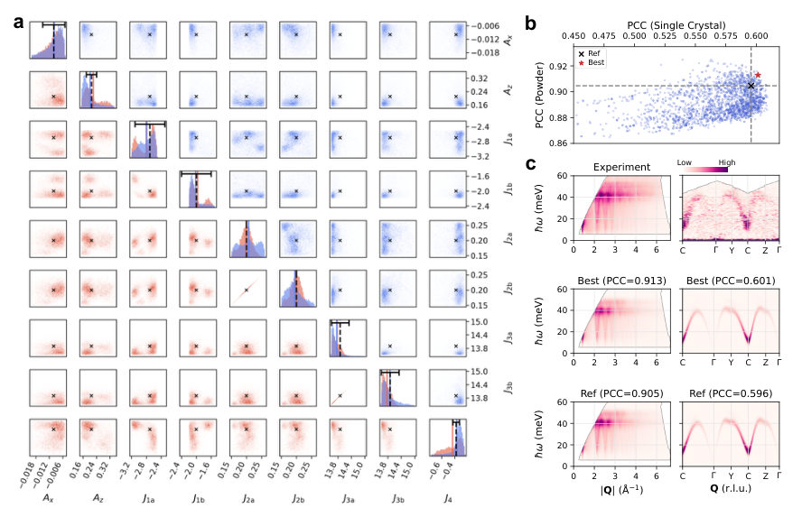
<figcaption class="paper-figure-caption"><b>Fig 4.</b> FIG. 4. Validation with experimental multimodal INS data. a, Posterior distributions inferred from multimodal INS measurements with (red) and without (blue) the exchange-parameter constraints J2a = J2b and J3a = J3b. The corner plot shows the final posterior distributions and parameter correlations, while the diagonal panels show the corresponding marginal posterior distributions. Black crosses and dashed vertical lines denote the reference Hamiltonian parameters θref, and horizontal error bars indicate the corresponding one-standard-deviation uncertainties reported in Ref. 3. b, Pearson correlation coefficients (PCCs) for powder and single-crystal INS evaluated using 2,048 samples drawn...</figcaption>
</figure>

**Summary.** This work presents an AI-enabled framework that tackles the difficult inverse problem of determining quantum magnetic interactions from experimental spectra. By treating different measurements (single-crystal vs. powder INS) as geometric constraints on the parameter space, it quantifies which interactions are uniquely identifiable and guides adaptive data collection strategies for improved characterization.

**Why it may be interesting.** The rigorous quantification of parameter identifiability via geometric constraints provides a powerful systematic tool for guiding future experiments in strongly correlated materials, moving beyond simple fitting to understanding measurement limitations.

Detailed structure

**Main problem.** The core challenge is determining microscopic magnetic interactions (Hamiltonian parameters) from complex, multimodal spectroscopic data, as the inverse problem is often ill-posed.

**Main result.** The proposed framework successfully performs uncertainty-aware Hamiltonian inference by quantifying how different measurement modalities constrain the parameter space using observation geometry.

**Method.** It employs an AI surrogate model (INRs) trained on simulated spectra to map Hamiltonian parameters to measured spectral data, integrating this with Bayesian inference.

**Model / system.** The study focuses on quantum magnets, specifically $	ext{NiPS}_3$, modeled by a spin Hamiltonian involving exchange couplings and anisotropies. Measurements utilize Inelastic Neutron Scattering (INS) from both single-crystal and powder samples.

**Key observables.** Dynamical structure factor $S(Q, \omega)$, inferred Hamiltonian parameters ($	heta$), spectral distinguishability metrics, and the local/global Gram matrix characterizing parameter sensitivity.

**Important parameters / regimes.** Hamiltonian coupling constants ($J_{ij}, A_x, A_z$) defining the magnetic interactions; momentum transfer $\mathbf{Q}$ and energy $\omega$.

**Assumptions / limitations.** The framework assumes that spectral distinguishability is governed by the geometry induced by the forward map ($	heta 
ightarrow S$), rather than Euclidean distance in parameter space. Source separation for powder data introduces model-dependent estimation.

**Figures summary.** Figures illustrate the setup of INS measurements (single-crystal vs. powder), the AI surrogate architecture, and detailed spectral discrepancy maps showing how different measurement modalities constrain the Hamiltonian parameters via geometry analysis.

**Paper structure.** The paper first establishes the ill-posed nature of inverse problems in quantum magnetism. It then introduces the AI framework using INRs to model spectra from a given Hamiltonian. The core methodology involves characterizing parameter uncertainty through observation geometry (Gram matrix) and demonstrating its application on $	ext{NiPS}_3$ data, culminating in adaptive experimental design strategies.

Abstract

Determining microscopic interactions from spectroscopic and scattering measurements is central to understanding quantum materials, yet it often remains unclear which interactions can be reliably revealed by the available experimental data and how additional experimental modalities should be designed to resolve the remaining ambiguities. Here we present an artificial intelligence-enabled framework for uncertainty-aware Hamiltonian inference and adaptive experimental design. By combining Hamiltonian-conditioned neural surrogates with Bayesian inference and observation geometry, the framework characterizes how measurements constrain Hamiltonian parameter space, quantifies the identifiability of microscopic interactions, and propagates posterior uncertainty directly in the physical Hamiltonian parameter space rather than an abstract learned representation. Using multimodal powder and single-crystal inelastic neutron scattering measurements of the quantum magnet NiPS$_{3}$, we demonstrate physically interpretable Hamiltonian inference, modality-aware uncertainty quantification, and adaptive experimental design. The framework provides a general strategy for uncertainty-aware microscopic characterization and multimodal experimental design across quantum materials.

[↑ back to top](#top)

### [Some features of high-temperature superconductivity on flat bands](http://arxiv.org/abs/2608.10231v1)

**Authors:** V. R. Shaginyan, A. Z. Msezane, S. A. Artamonov  
**Type:** theory · **Category:** strongly correlated electrons · **PDF:** <https://arxiv.org/pdf/2608.10231v1>  
**Analysis basis:** full PDF text, analyzed in chunks
**Topic relevance:** `Keldysh / 2PI / non-Gaussian methods` **3/5** · `analog quantum simulation` **1/5** · `methods for driven-dissipative` **1/5** · `quantum measurements` **1/5**

↔ Scroll figures horizontally

<figure class="paper-figure-card">
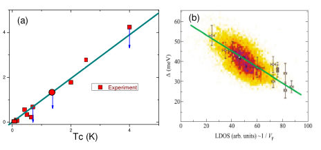
<figcaption class="paper-figure-caption"><b>Fig 1.</b> FIG. 1: Experimental data illustrating the validity of Eq. (10). (a) Data (shown as squares) of the dependence of the average Fermi velocity VF on the critical temperature Tc for graphene (MATBG) [25]. The downward arrows indicate that VF ≤V0, where V0 is the maximum value, indicated by the red square. The theoretical explanation is represented by the solid straight line. (b) The Figure is adapted from [29] and shows the experimental dependence of the superconducting gap ∆on the integrated local density of states collected on the high-Tc superconductor Bi2Sr2CaCu2O8+x. Here x is the oxygen doping concentration. Darker colors correspond to more data points with the same integrated local...</figcaption>
</figure>

**Summary.** This work theoretically explains how high-temperature superconductivity can emerge in systems with flat energy bands, even when repulsive interactions are dominant. It proposes a 'self-help' mechanism where the superconducting pairing itself deforms the band structure, ensuring that supercurrents and superfluid weight remain finite. The findings align well with experimental observations in heavy-fermion and high-$T_c$ superconductors.

**Why it may be interesting.** The concept of a superconducting state actively modifying its own underlying electronic structure (band deformation) is a rich topic relevant to understanding emergent order parameters in complex quantum materials.

Detailed structure

**Main problem.** The paper investigates how flat bands can induce high-temperature superconductivity, even when repulsive pairing interactions are present.

**Main result.** Superconductivity in the presence of flat bands is sustained by a 'self-help' mechanism where the superconducting state deforms the band, preventing the superfluid weight and supercurrent from vanishing.

**Method.** The analysis adapts standard BCS theory formalism to the specific physical context of flat bands formed in strongly correlated Fermi systems.

**Model / system.** The system involves strongly correlated Fermi gases exhibiting topological fermion condensation quantum phase transitions (FCQPT), leading to localized states forming flat bands at the chemical potential.

**Key observables.** Critical temperature ($T_c$), superfluid weight ($D_s$), effective mass ($M^*$), superconducting gap ($\Delta$), and Fermi velocity ($V_F$).

**Important parameters / regimes.** Repulsive pairing interaction strength ($\lambda_0 > 0$); the condition for flat bands ($\varepsilon(p) - \mu = 0$).

**Assumptions / limitations.** The primary assumption is that the superconducting state actively modifies the band structure (tilting it) to maintain finite superfluid properties, overcoming initial theoretical predictions of collapse.

**Figures summary.** Figure 1 shows experimental data for $V_F$ vs. $T_c$ in graphene and $\Delta$ vs. integrated LDOS ($\propto 1/V_F$) for high-$T_c$ superconductors, both consistent with the derived theoretical relationship.

**Paper structure.** The paper first addresses the apparent contradiction where flat bands suggest zero superfluid weight; it then introduces the 'self-help' mechanism via BCS formalism to show finite $D_s$; finally, it discusses how this framework explains high-$T_c$ behavior even with repulsive interactions and relates findings to experimental data.

Abstract

In this letter, we examine how the presence of flat band leads to the formation of a high-temperature superconductor even in the case of repulsive pairing interactions. We also show that in the case of flat bands, the high-temperature superconducting state deforms the flat band, tilting it and making the effective mass finite. As a result, neither the superfluid weight nor the supercurrent disappear. Our results are in good agreement with experimental data.

[↑ back to top](#top)

### [Williamson majorization theory of fermionic non-Gaussianity](http://arxiv.org/abs/2608.10140v1)

**Authors:** Xhek Turkeshi, Piotr Sierant, Poetri Sonya Tarabunga  
**Type:** theory · **Category:** quantum information and computing · **PDF:** <https://arxiv.org/pdf/2608.10140v1>  
**Analysis basis:** full PDF text, analyzed in chunks
**Topic relevance:** `Keldysh / 2PI / non-Gaussian methods` **3/5** · `analog quantum simulation` **1/5** · `correlated / nonlocal dissipation` **1/5** · `quantum measurements` **1/5**

↔ Scroll figures horizontally

<figure class="paper-figure-card">
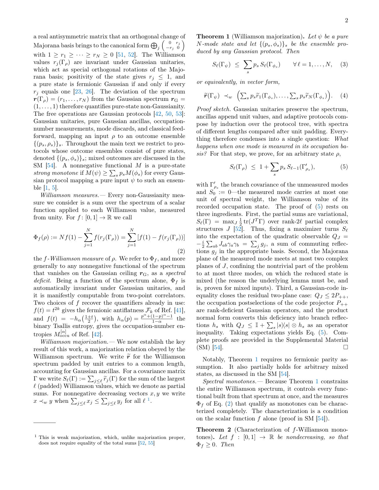
<figcaption class="paper-figure-caption"><b>Fig 1.</b> Low-resolution page preview, page 2</figcaption>
</figure>
<figure class="paper-figure-card">
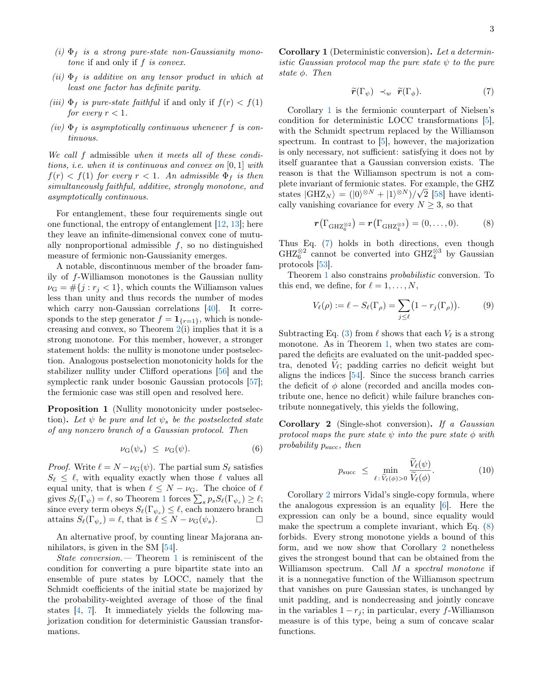
<figcaption class="paper-figure-caption"><b>Fig 2.</b> Low-resolution page preview, page 3</figcaption>
</figure>
<figure class="paper-figure-card">
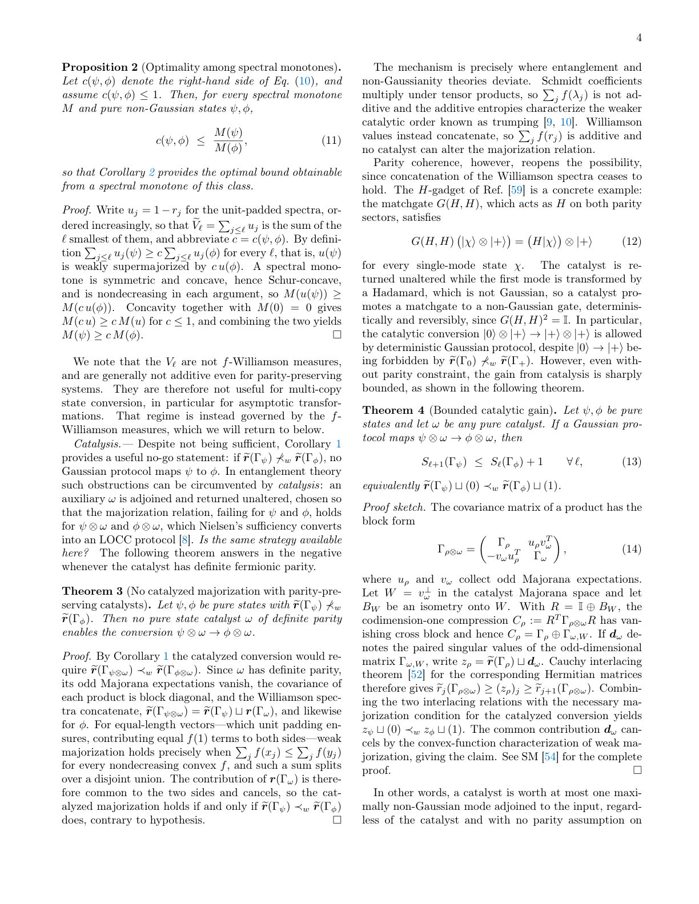
<figcaption class="paper-figure-caption"><b>Fig 3.</b> Low-resolution page preview, page 4</figcaption>
</figure>
<figure class="paper-figure-card">
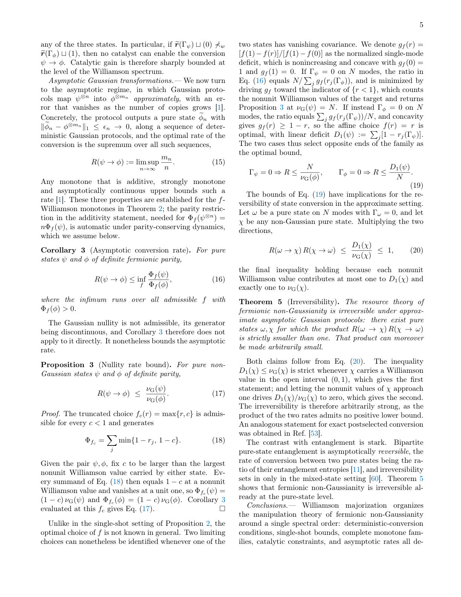
<figcaption class="paper-figure-caption"><b>Fig 4.</b> Low-resolution page preview, page 5</figcaption>
</figure>
<figure class="paper-figure-card">
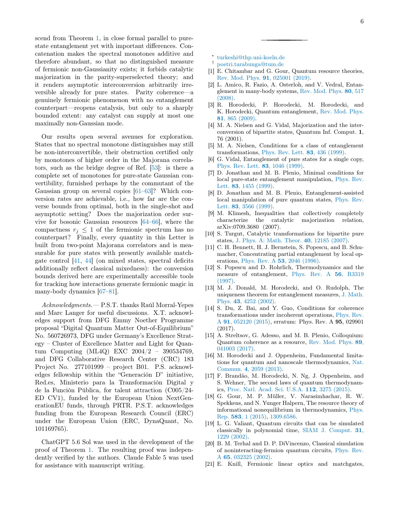
<figcaption class="paper-figure-caption"><b>Fig 5.</b> Low-resolution page preview, page 6</figcaption>
</figure>

**Summary.** This paper develops the Williamson majorization theory for fermionic non-Gaussianity, creating a resource measure analogous to entanglement measures in quantum information. It establishes that this spectral law governs state conversion under Gaussian protocols, providing strong monotonicity theorems and deriving irreversible bounds on how much non-Gaussian correlation can be converted between states.

**Why it may be interesting.** This work provides a powerful, quantifiable resource theory framework for fermionic quantum computation that directly links spectral properties (Williamson spectrum) to fundamental physical processes like state transformation and irreversible dynamics. The connection between entanglement monotones and non-Gaussianity is highly relevant.

Detailed structure

**Main problem.** The paper establishes a majorization law for fermionic non-Gaussianity, drawing an analogy to how majorization governs entanglement under local operations.

**Main result.** It proves that the Williamson spectrum obeys a fundamental majorization law, turning convex deficits into strong monotones and establishing irreversible conversion bounds for pure states.

**Method.** The analysis uses spectral theory applied to Majorana covariance matrices, defining non-Gaussianity via the deviation of the Williamson spectrum from its Gaussian limit.

**Model / system.** The system is fermionic, described by $N$ Majorana operators. The diagnostics rely on the covariance matrix $\Gamma_
ho$, which characterizes the state's correlations.

**Key observables.** Williamson Spectrum ($r_j$), Fermionic Non-Gaussianity ($\Phi_f$), Gaussian Nullity ($
u_G$), and conversion rates $R(\psi 	o \phi)$.

**Important parameters / regimes.** The function $f$ defining the monotone must be convex on $[0, 1]$ and satisfy $f(r) < f(1)$ for $r < 1$. Parity conservation is a key constraint.

**Assumptions / limitations.** The theory primarily analyzes Gaussian protocols with pure state outcomes; rate bounds rely on asymptotic limits ($\epsilon_n 	o 0$) and definite fermionic parity.

**Paper structure.** The paper builds from establishing the Williamson majorization law for pure states (analogous to entanglement) to characterizing non-Gaussianity monotones via convex functions $f$. It then extends this to single-shot and asymptotic conversion rates, proving irreversibility when parity is conserved.

Abstract

Pure-state entanglement rests on a single algebraic backbone: majorization of the Schmidt spectrum governs state conversion under local operations and classical communication, and constrains entanglement monotones. Here we establish a corresponding majorization law for fermionic non-Gaussianity, the resource that elevates free fermions to universal quantum computation. Under any fermionic Gaussian protocol with pure state outcomes, the Williamson spectrum of a pure state's Majorana covariance matrix is weakly majorized by its ensemble average. This spectral law mirrors that of entanglement theory. It turns computable non-Gaussianity quantifiers such as fermionic antiflatness and occupation entropies into strong monotones for fermionic non-Gaussianity, and delivers necessary conditions and converse bounds on state conversion under Gaussian protocols. When fermion parity is conserved, no catalyst can remove a majorization obstruction---unless it carries parity coherence---and asymptotic interconversion is irreversible already for pure states. All relevant quantities are accessible from two-point Majorana correlators, turning the theory developed here into experimentally observable properties of quantum matter, testable on present-day quantum devices.

[↑ back to top](#top)

### [Quantum Signatures of Two-Electron HBT Interference in Free Space](http://arxiv.org/abs/2608.10917v1)

**Authors:** Florian Fleischmann, Mona Bukenberger, Anton Classen, Marc-Oliver Pleinert, Joachim von Zanthier  
**Type:** theory · **Category:** other · **PDF:** <https://arxiv.org/pdf/2608.10917v1>  
**Analysis basis:** full PDF text, analyzed in chunks
**Topic relevance:** `interference shaping light` **3/5** · `quantum measurements` **1/5** · `quantum optics experiment` **1/5**

↔ Scroll figures horizontally

<figure class="paper-figure-card">
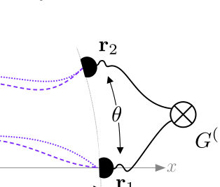
<figcaption class="paper-figure-caption"><b>Fig 1.</b> Figure 1. Setup of detecting the spatio-temporal correlations of two electrons emitted by two needle tips at rS1 and rS2 with inter-slit distance r0. The needle tips emit single electrons, which - after initial acceleration by a bias voltage (not shown) - propagate freely where the state of the two electrons is described by the two-particle wave function Ψ(r′ 1, r′ 2, t′). In the far field at x ≈D, the electrons are registered by two detectors at r1 and r2 with relative angle θ, allowing to obtain the second-order correlation function G(2)(r1, r2, t) ∝|Ψ(r1, r2, t)|2.</figcaption>
</figure>
<figure class="paper-figure-card">
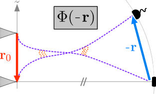
<figcaption class="paper-figure-caption"><b>Fig 2.</b> Figure 2. Illustration of the quantum paths corresponding to Φ(r) and Φ(−r). In both figures, r0 corresponds to the initial separation of the two electrons emitted at the two needle tips. The dashed violet lines represents the two possible two-electron paths, and the orange dotted lines illustrate the Coulomb interaction. (a) Φ(r) corresponds to the parallel path in the quantum path picture, where the electron from the upper (lower) needle tip is registered at the upper (lower) detector. (b) Φ(−r) corresponds to the diagonal path, where the electron from the upper (lower) needle tip is registered at the lower (upper) detector; here, the electrons have to ‘cross’ each other.</figcaption>
</figure>
<figure class="paper-figure-card">
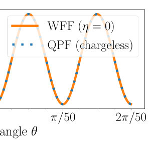
<figcaption class="paper-figure-caption"><b>Fig 3.</b> Figure 3. Comparison of the second-order correlation function G(2) for κ = 1 × 1011 m−1 and r0 = 1 nm, obtained in the noninteracting regime η = 0 via the numerically evaluated wavefunction formalism (WFF) (orange solid line) and via the analytical quantum path formalism (QPF) of [31] (blue dotted line). Both approaches yield the same spatial interference pattern demonstrating that the result derived via QPF is recovered by the WFF approach in the noninteracting limit.</figcaption>
</figure>
<figure class="paper-figure-card">
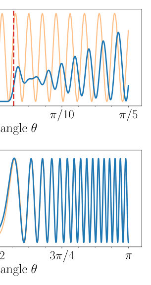
<figcaption class="paper-figure-caption"><b>Fig 4.</b> Figure 4. Spatial interference pattern G(2) for two electrons with parallel spin (S = 1, MS = 1), with Coulomb interaction (blue) and for reference without Coulomb interaction (orange). (a) The interference pattern for small relative angles θ displays a strong Coulomb suppression; here, the vertical red dashed line corresponds to the classical estimation of the Coulomb dip derived in [31]. (b) Interference pattern from θ = 0 to θ = π. At θ = 0, the electrons travel in the same direction with strong Coulomb suppression as shown in (a); at θ = π, in contrast, the electrons travel in opposite directions, where Coulomb interaction becomes negligible. Note that the frequency change around π/2 is...</figcaption>
</figure>
<figure class="paper-figure-card">
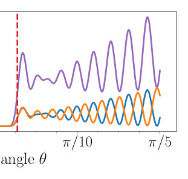
<figcaption class="paper-figure-caption"><b>Fig 5.</b> Figure 5. Comparison between the spatial interference patterns G(2) for two electrons with parallel spins, i.e., S = 1, MS = 1 (blue solid line), two electrons with antiparallel spins, i.e., S = 0, MS = 0, mimicking ’bosonic’ electrons (orange solid line), and two electrons with unpolarized spins (purple solid line). The vertical red dashed line corresponds to the classical estimation of the Coulomb dip as discussed in [31].</figcaption>
</figure>

**Summary.** This paper develops a full quantum-mechanical theory for two-electron Hanbury Brown-Twiss interference. It calculates the correlation function by treating both fermionic exchange statistics and Coulomb repulsion simultaneously. The results establish clear, measurable signatures that allow experimentalists to disentangle these two fundamental quantum effects.

**Why it may be interesting.** This work provides a rigorous theoretical tool to distinguish between purely quantum mechanical effects (like fermionic antibunching) and classical/semiclassical interactions (like Coulomb repulsion) in mesoscopic interference experiments.

Detailed structure

**Main problem.** The study aims to identify genuine quantum signatures arising from the interplay between fermionic exchange symmetry and Coulomb repulsion in two-electron interference experiments.

**Main result.** The theory predicts characteristic features, including a pronounced Coulomb-dominated suppression region and phase offsets, which are absent in semiclassical descriptions. The spatial oscillation frequency outside this region is governed by fermionic exchange symmetry.

**Method.** The analysis employs a fully quantum-mechanical framework, calculating the second-order spatial correlation function using both wavefunction and field operator approaches.

**Model / system.** The system models two electrons emitted from two independent needle-tip emitters in free space, treated as a two-body scattering problem governed by a Hamiltonian including kinetic energy and Coulomb interaction. The wave function is separated into center-of-mass and relative coordinates.

**Key observables.** The second-order spatial correlation function, G^(2)(r1, r2), which measures the probability of detecting two electrons at specific positions.

**Important parameters / regimes.** Tip separation ($r_0$), detector distance ($D$), electron energy ($\kappa$ or $k$), and bias voltage ($U_{	ext{bias}}$).

**Assumptions / limitations.** The model assumes point-like sources, monochromatic emission, and instantaneous acceleration to the detectors in the far field.

**Figures summary.** Figure 1 illustrates the experimental setup with two needle tips. Figure 2 depicts the quantum paths corresponding to parallel and crossed paths for the relative wavefunction.

**Paper structure.** The paper develops the theory by first establishing the general framework using a fully quantum-mechanical description, then deriving the correlation function via both wavefunction and field operator methods, and finally analyzing the distinct signatures arising from Coulomb interaction versus exchange symmetry.

Abstract

Understanding how fermionic exchange and Coulomb repulsion jointly shape two-electron correlations is essential for identifying genuine quantum signatures in multi-electron interference experiments. To address this interplay, we investigate Hanbury Brown and Twiss interference of two electrons generated by two independent needle-tip emitters within a full quantum-mechanical framework. In the absence of Coulomb interaction, the approach reproduces the results previously obtained within a quantum path formalism. For Coulomb-interacting electrons, we predict characteristic features absent in a semiclassical description: a pronounced Coulomb-dominated suppression region as well as Coulomb-induced phase offsets and fringe shifts. At the same time, outside of the Coulomb-dominated region, the spatial oscillation frequency is essentially governed by fermionic exchange symmetry. Our results establish quantitative parameter regimes for disentangling Coulomb interaction from fermionic exchange symmetry in such experiments.

[↑ back to top](#top)

### [A Simple Algorithm for Best Separable State](http://arxiv.org/abs/2608.10147v1)

**Authors:** Prashanti Anderson, Samuel B. Hopkins, Amit Rajaraman  
**Type:** theory · **Category:** quantum information and computing · **PDF:** <https://arxiv.org/pdf/2608.10147v1>  
**Analysis basis:** full PDF text, analyzed in chunks
**Topic relevance:** `quantum measurements` **3/5** · `Keldysh / 2PI / non-Gaussian methods` **1/5**

↔ Scroll figures horizontally

<figure class="paper-figure-card">
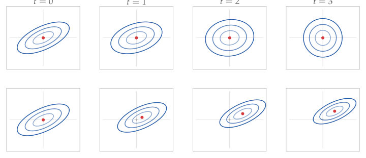
<figcaption class="paper-figure-caption"><b>Fig 1.</b> Figure 1: Two ways that ∥Cov ∥F can decrease as we condition on coordinates in a high- dimensional distribution. In the top row, correlations disappear while the conditional mean remains near the origin – the distribution becomes isotropic but retains significant variance. In the bottom row, the overall variance decreases while the mean moves away from the origin. Our fine-grained pinning lemma shows that the second behavior must happen for a noticeable fraction of conditional distributions.</figcaption>
</figure>

**Summary.** This paper presents a new, simpler algorithm to solve the Best Separable State (BSS) problem, which quantifies how well a quantum measurement can distinguish between entangled and separable states. By improving upon existing Sum-of-Squares relaxation techniques, the authors achieve significantly faster running times for finding near-optimal solutions in this fundamental problem of quantum resource theory.

**Why it may be interesting.** The techniques developed—advanced algebraic methods like refined pinning lemmas and efficient polynomial optimization solvers—are highly relevant for analyzing resource constraints in quantum information protocols.

Detailed structure

**Main problem.** The paper addresses the Best Separable State (BSS) problem, which seeks to find the maximum acceptance probability of a quantum measurement restricted to unentangled (separable) states.

**Main result.** The authors develop an algorithm that significantly improves the time complexity for solving BSS in both the $\epsilon$-approximation regime ($1-\epsilon$) and the $q/n$ approximation regime, beating previous state-of-the-art bounds.

**Method.** The core method involves generalizing global correlation rounding techniques applied to Sum-of-Squares (SoS) relaxations of polynomial optimization problems over the unit sphere.

**Model / system.** The problem is formulated using a Hermitian matrix $M$ describing a quantum measurement device, studied in the context of finding optimal separable states $\langle x \otimes y, M(x \otimes y) 
angle$.

**Key observables.** BSS(M), approximation error ($\epsilon$), and the ratio $\|\Pi(x \otimes y)\|_2^2 / \|x \otimes y\|_2^2$.

**Important parameters / regimes.** The dimension $n$, the desired accuracy $\epsilon$, and the parameter $q$ defining the target separation.

**Assumptions / limitations.** The analysis is simplified by working over $\mathbb{R}$, though the result generalizes from a symmetric case to the non-symmetric one. The proof relies on proving a new variant of the 'pinning lemma'.

**Paper structure.** The paper introduces BSS, relates it to polynomial optimization and SoS relaxations, develops an improved rounding technique based on global correlation rounding, proves a novel pinning lemma, and applies this machinery to achieve the final time complexity bounds for distinguishing between different values of BSS(M).

Abstract

We study the best separable state problem (BSS), which asks for the maximum acceptance probability of a quantum measurement over unentangled states. In classical terms, the goal is to maximize $\langle(x \otimes y), M (x \otimes y)\rangle$ over unit vectors $x,y$ where $0 \preceq M \preceq I$; we call this value $\mathrm{BSS}(M)$. We study $\mathrm{BSS}$ in the "perfect completeness" regime, where given $M$ such that $\mathrm{BSS}(M) = 1$ the goal is to find the best possible solution $x,y$ -- this generalizes the problem of finding a rank-one matrix as close as possible to a given subspace of $\mathbb{R}^{n \times n}$ guaranteed to contain a rank-one matrix. The strongest known algorithmic guarantees for this problem are: (1) an algorithm which finds a solution with value $1-\varepsilon$ in time $\exp(\sqrt{n} (\log n)^{O(1)} / \varepsilon^2)$, due to Barak, Kothari, and Steurer, and (2) an algorithm which finds a solution with value $q/n$ in time roughly $n^{O(q)}$, due to Bhattiprolu, Ghosh, Guruswami, Lee, and Tulsiani. We give a much simpler approach to rounding the SoS relaxation, generalizing the canonical "global correlation rounding" technique, and obtain a better running time. Given $M$ with $\mathrm{BSS}(M) = 1$, our algorithm finds a solution with value $1-ε$ in time $n^{O(\sqrt{n/\varepsilon})}$, and a solution of value $q/n$ in time $n^{O(\sqrt q)}$. Using the same techniques, we prove a new variant of the "pinning lemma", a measure-decomposition theorem widely used in LP/SDP rounding, high-dimensional probability, and statistical physics, which we believe is of independent interest.

[↑ back to top](#top)

### [Helimagnetism from competing intra- and interchain interactions in CrBr$_2$ and CrI$_2$](http://arxiv.org/abs/2608.10263v1)

**Authors:** John A. Schneeloch, Matthew B. Stone, Zachary Morgan, Despina Louca  
**Type:** experiment · **Category:** other · **PDF:** <https://arxiv.org/pdf/2608.10263v1>  
**Analysis basis:** full PDF text, analyzed in chunks
**Topic relevance:** `analog quantum simulation` **3/5** · `Frenkel-Kontorova` **1/5**

↔ Scroll figures horizontally

<figure class="paper-figure-card">
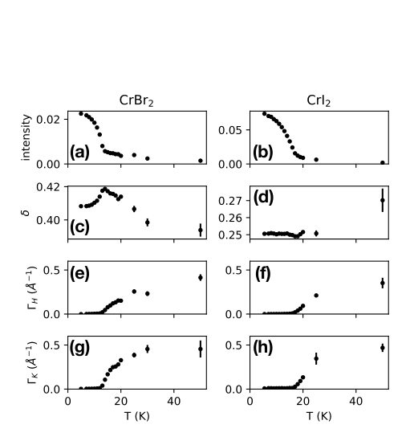
<figcaption class="paper-figure-caption"><b>Fig 1.</b> Figure 3. Parameters resulting from Voigt-function fits to intensity across the magnetic Bragg peaks (-0.41,-1,0) and (1.25,0,-1) for CrBr2 (a,c,e,g) and CrI2 (b,d,f,h), respectively. Data were obtained on SEQUOIA with Ei = 17 meV and integrated within 0.1 r.l.u. along the H or K directions and 0.2 r.l.u. along the L direction. The parameters resulted from fits along the H (a-f) or K (g,h) direction. These parameters include the integrated intensity (a,b), the position (c,d), and the Lorentzian FWHM (e-h). The Gaussian component of the Voigt functions was fixed to the low-temperature peak width of each compound’s data set, accounting for the instrumental resolution and crystal mosaic.</figcaption>
</figure>
<figure class="paper-figure-card">
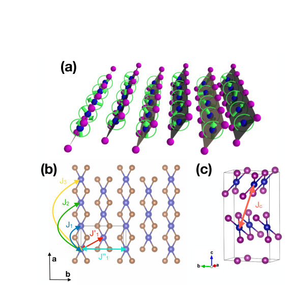
<figcaption class="paper-figure-caption"><b>Fig 2.</b> Figure 1. (a) A layer of CrBr2, with spins rotating perpendic- ular to the ribbon-chain axis. (b) Top-down view of a layer of CrBr2 with intralayer exchange bonds labeled. The ribbon chains run vertically. CrI2 is isostructural. (c) Orthorhom- bic CrI2, the crystal structure of the CrBr2 and CrI2 crystals measured in this study, with the interlayer Jc exchange bond labeled. Diagrams (b) and (c) made using VESTA [22].</figcaption>
</figure>
<figure class="paper-figure-card">
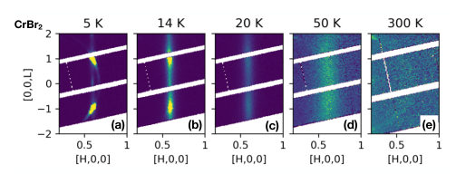
<figcaption class="paper-figure-caption"><b>Fig 3.</b> Figure 2. Elastic intensity within the H0L plane for CrBr2 at various temperatures. Data were acquired on SEQUOIA at Ei = 17 meV for (a-d) and Ei = 25 meV for (e) as described in Sec. A in the Supplemental Materials [26]. Intensity scales were the same for 6, 14, and 20 K, but adjusted to enhance visibility for 50 and 300 K.</figcaption>
</figure>
<figure class="paper-figure-card">
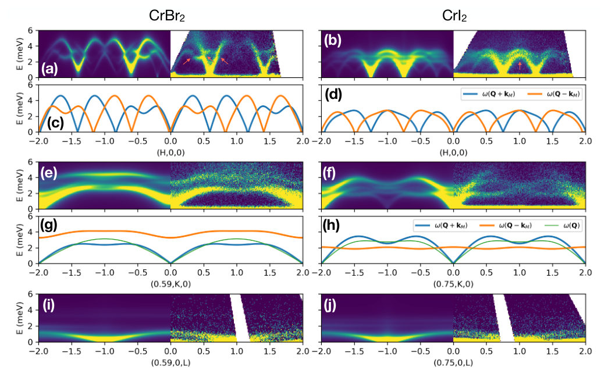
<figcaption class="paper-figure-caption"><b>Fig 4.</b> Figure 4. Spin wave intensity at 5 K for CrBr2 (a,e,g) and CrI2 (b,f,j), along with the dispersion for simplified single-layer spin-wave models that omit single-ion anisotropy and interlayer coupling. Data were taken on SEQUOIA. Intensity is plotted as a function of energy transfer E, and wavevector along the directions in reciprocal space shown on the horizontal axis, corresponding to the ribbon-chain axis (a,b), the perpendicular intralayer direction (e,f), or the interlayer direction (g,h). The left and right halves of (a,b,e,f,g,h) show, respectively, the calculated and experimental intensity. The arrows in (a) and (b) show avoided crossing points. The integration range was ±0.05 r.l.u....</figcaption>
</figure>

**Summary.** This work uses inelastic neutron scattering on $	ext{CrBr}_2$ and $	ext{CrI}_2$ to determine that their helimagnetic order stems from the competition between intrachain and interchain antiferromagnetic interactions. The study quantifies this by fitting spin wave data, finding that single-ion anisotropy modulates the helix, while also revealing evidence of structural disorder in the crystal stacking.

**Why it may be interesting.** The detailed analysis of spin wave dispersions and the extraction of multiple competing exchange couplings provide a quantitative understanding of magnetic frustration in low-dimensional quantum magnets, which is highly relevant for designing novel quantum materials.

Detailed structure

**Main problem.** The study aims to determine the unknown magnetic interactions responsible for the helimagnetic order observed in the layered compounds $	ext{CrBr}_2$ and $	ext{CrI}_2$, while also investigating how dimensionality affects this ordering.

**Main result.** Helimagnetism primarily arises from the competition between nearest-neighbor antiferromagnetic exchange interactions within chains ($	ext{J}_1$) and between chains ($	ext{J}'_1$). Furthermore, single-ion anisotropy significantly modulates the helical spin structure.

**Method.** The research heavily relies on inelastic neutron scattering (INS) measurements on single crystals to map out spin wave dispersions and extract magnetic exchange constants. Elastic neutron scattering is also used to probe structural disorder.

**Model / system.** The physical system consists of van der Waals layered magnets, $	ext{CrBr}_2$ and $	ext{CrI}_2$, which exhibit quasi-2D magnetism. The analysis uses spin wave theory applied to Heisenberg Hamiltonians incorporating competing exchange couplings ($J_1, J'_1$) and single-ion anisotropy (SIA).

**Key observables.** Spin wave dispersion ($\omega(Q)$), magnetic Bragg peak intensities, incommensurability ($\delta$), and the temperature dependence of spin correlations.

**Important parameters / regimes.** The dominant exchange interactions are $	ext{J}_1$ and $	ext{J}'_1$; SIA values are significant (e.g., $-0.16 	ext{ meV}$ for $	ext{CrBr}_2$); interlayer coupling ($J_c$) is found to be weak.

**Assumptions / limitations.** The analysis assumes that the observed magnetic behavior can be modeled by nearest-neighbor exchange interactions and incorporates corrections from single-ion anisotropy and higher-order harmonic terms in INS fitting.

**Figures summary.** Figures illustrate lattice structures, elastic intensity measurements showing disordered stacking, and INS data revealing spin wave dispersions with avoided crossings attributed to SIA and $3k_M$ harmonics.

**Paper structure.** The paper progresses by first establishing the magnetic order via INS, then fitting exchange parameters using simplified models ($J_1-J'_1$), refining the model by incorporating SIA effects visible in avoided crossings, and finally analyzing structural disorder and higher-order harmonic peaks to constrain the full Hamiltonian.

Abstract

CrBr$_2$ and CrI$_2$ are promising platforms for studying the effect of dimensionality on magnetic order, having been isolated in a 3-, 2-, and 1-dimensional form as bulk crystals, monolayers, and individual chains encapsulated in carbon nanotubes. However, the interactions that give rise to their helimagnetic order are unknown. Via inelastic neutron scattering on single crystals, we have determined the exchange interactions of these compounds from the spin wave dispersions, finding that the helimagnetic order arises primarily from competing antiferromagnetic interactions between intrachain and interchain nearest-neighbors. Single-ion anisotropy is substantial, modulating the helical spin rotation and gapping the inelastic intensity at points of branch crossings. As temperature increases, long-range order vanishes but intralayer correlations remain detectable up to at least 50 K.

[↑ back to top](#top)

### [Simultaneous Heisenberg-Limited Multiparameter Metrology via Indefinite Evolution](http://arxiv.org/abs/2608.10490v1)

**Authors:** Hang Xu, Tailong Xiao, Ze Zheng, Xiaoyang Deng, Jinfeng Zheng, Jingzheng Huang, Guihua Zeng  
**Type:** theory · **Category:** quantum information and computing · **PDF:** <https://arxiv.org/pdf/2608.10490v1>  
**Analysis basis:** full PDF text, analyzed in chunks
**Topic relevance:** `quantum measurements` **3/5** · `interference shaping light` **1/5**

↔ Scroll figures horizontally

<figure class="paper-figure-card">
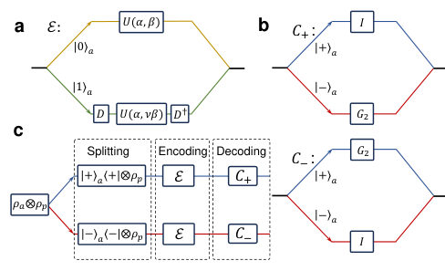
<figcaption class="paper-figure-caption"><b>Fig 1.</b> FIG. 1. Indefinite-evolution (IE) sensing protocol. (a) En- coding block E. (b) Conditional compensation blocks C± in the |±⟩a basis. (c) Full IE time-slice protocol, composed of splitting, encoding, and history-dependent decoding.</figcaption>
</figure>
<figure class="paper-figure-card">
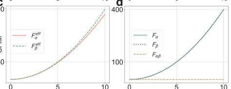
<figcaption class="paper-figure-caption"><b>Fig 2.</b> FIG. 2. Results of the noiseless qubit probe. (a,b) Estima- tion precision for α and β in the orthogonal case. (c) IE for the non-parallel case with θ = π/4. (d) IE for the parallel case.</figcaption>
</figure>
<figure class="paper-figure-card">
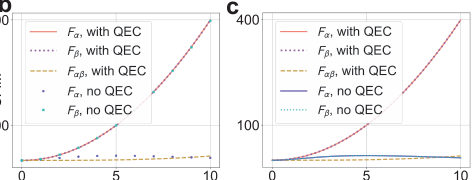
<figcaption class="paper-figure-caption"><b>Fig 3.</b> FIG. 3. (a) Schematic of the noisy IE protocol. The evolu- tion channel of the probe in encoding phase is controlled by the computational basis of the auxiliary qubits. Results of the noisy qubit probe by IE protocol for single X-noise (b), X- and Z-noises case (c).</figcaption>
</figure>
<figure class="paper-figure-card">
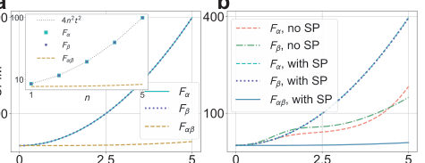
<figcaption class="paper-figure-caption"><b>Fig 4.</b> FIG. 4. (a) Multi-qubit probe for n = 2; the inset shows the qubit-number n scaling at t = 1. (b) High-dimensional probe with and without SP.</figcaption>
</figure>

**Summary.** This paper addresses the fundamental challenge of performing high-precision measurements involving multiple unknown parameters simultaneously. By introducing the concept of Indefinite Evolution (IE), the authors demonstrate a novel resource that allows quantum systems to overcome inherent encoding and measurement incompatibilities. This breakthrough opens a pathway toward realizing true Heisenberg-limited sensing in complex, multi-parameter physical platforms.

**Why it may be interesting.** This work provides a concrete theoretical mechanism (IE) for achieving optimal sensing bounds in complex multi-parameter settings, which is highly relevant for designing next-generation quantum sensors based on interferometry or atomic clocks.

Detailed structure

**Main problem.** Extending quantum metrology precision from single-parameter estimation (Heisenberg limit) to multiparameter estimation is fundamentally constrained by parameter-encoding and measurement incompatibility.

**Main result.** The introduction of Indefinite Evolution (IE) overcomes these incompatibilities, enabling the simultaneous achievement of Heisenberg-limited scaling for multiple parameters in quantum sensing.

**Method.** The authors propose a framework utilizing IE, where control operations are placed in a coherent superposition to allow compatible parameter encoding and optimal measurement strategies.

**Model / system.** The model involves quantum probing using unitary evolution $U_h = e^{-iH(h)t}$ with unknown parameters $h=(h_1, \dots, h_n)$ encoded by noncommuting generators. The analysis is generalized to noisy, many-body, and high-dimensional probes.

**Key observables.** Quantum Fisher Information Matrix (QFIM), Classical Fisher Information Matrix (CFIM), Simultaneous Heisenberg Limit (SHL) scaling ($F \propto t^2$).

**Important parameters / regimes.** The relationship between signal generators (orthogonal vs. parallel); the presence or absence of Signal Reversal (SR).

**Assumptions / limitations.** The core assumption is that IE acts as an operational resource capable of circumventing fundamental limitations imposed by definite evolution protocols.

**Figures summary.** Figure 2 compares precision estimates for different strategies (FE, QEC, IE) showing IE achieves SHL where others fail; other figures illustrate the general protocol structure and scaling in multi-qubit/high-dimensional settings.

**Paper structure.** The paper first establishes the limitations of standard metrology protocols due to encoding/measurement incompatibility. It then introduces and details the IE framework, demonstrating its success across various generator types (orthogonal, non-parallel, parallel) and generalizing the results to noisy and high-dimensional systems.

Abstract

Quantum metrology achieves Heisenberg-limited precision in single-parameter estimation, but its multiparameter extension is fundamentally constrained by both parameter-encoding and measurement incompatibility. Noncommuting signal generators may cause incompatible parameter-encoding, preventing the quantum Fisher information matrix from simultaneously achieving the Heisenberg scale for all parameters. Due to incompatible optimal measurements, the classical Fisher information matrix represents the practical attainable precision. Here, we introduce a multiparameter metrology framework based on indefinite evolution (IE), in which different control operations and signal reversal are placed in a coherent superposition. For a single-qubit probe with mutually orthogonal signal generators, IE enables compatible parameter encoding and optimal measurement without the signal reversal. For parallel generators, where only signal reversal realized by its generator is available, IE can achieve the same performance. We further extend this mechanism to noisy, many-body, and high-dimensional probes, and establish general conditions for achieving the simultaneous Heisenberg-limit. In contrast, definite evolution cannot achieve the same performance under compatible optimal measurements, even when signal reversal is available. Our results identify IE as an operational resource for overcoming multiparameter incompatibility and open a route toward attainable Heisenberg-limited sensing in interferometric platforms.

[↑ back to top](#top)

### [A Quantum Roadmap for Softmax Attention: Exact Born-Rule Analogs for Softmax Attention on the Probability Simplex](http://arxiv.org/abs/2608.11173v1)

**Authors:** Eric A. F. Reinhardt, Adam J. Hauser  
**Type:** theory · **Category:** quantum information and computing · **PDF:** <https://arxiv.org/pdf/2608.11173v1>  
**Analysis basis:** full PDF text, analyzed in chunks
**Topic relevance:** `quantum measurements` **3/5**

↔ Scroll figures horizontally

<figure class="paper-figure-card">
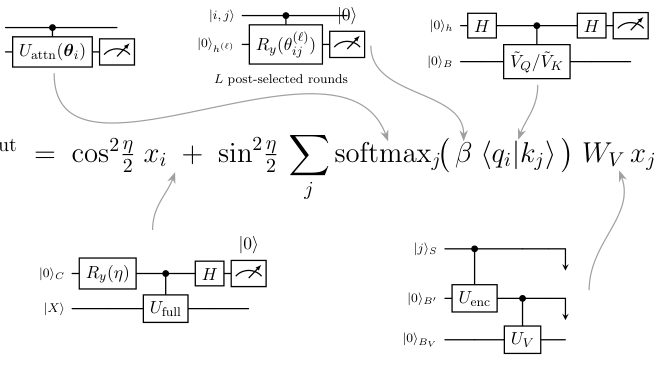
<figcaption class="paper-figure-caption"><b>Fig 1.</b> Figure 1: The dictionary at a glance: the gated single-head attention layer on the probability simplex, annotated with the circuit realizing each component (qi ∝WQ√xi, kj ∝WK√xj; at η = π/2, β = 1 the formula reduces to Eq. 1 under the conventions of Remark 2). Softmax: compiled cos2 Born readout with θij = 2 arccos  ezij/2 (Proposition 12); temperature: L post-selected rounds (Corollary 17); scores: Hadamard test (Lemma 9); gating and residual: single-ancilla preparation angle (Theorem 24); values: column-loading channel (Theorem 23).</figcaption>
</figure>
<figure class="paper-figure-card">
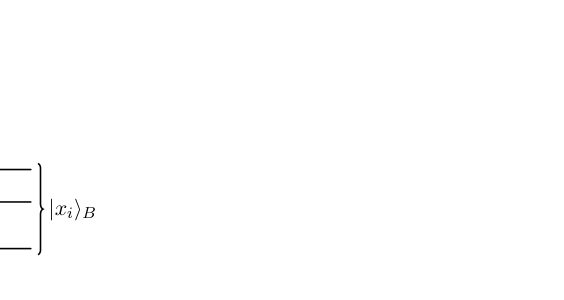
<figcaption class="paper-figure-caption"><b>Fig 2.</b> Figure 2: Born-rule encoding diagram.</figcaption>
</figure>
<figure class="paper-figure-card">
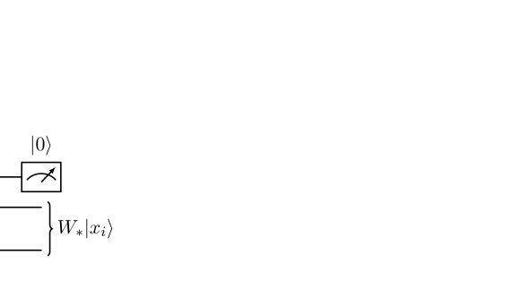
<figcaption class="paper-figure-caption"><b>Fig 3.</b> Figure 3: Q, K projection diagram.</figcaption>
</figure>
<figure class="paper-figure-card">
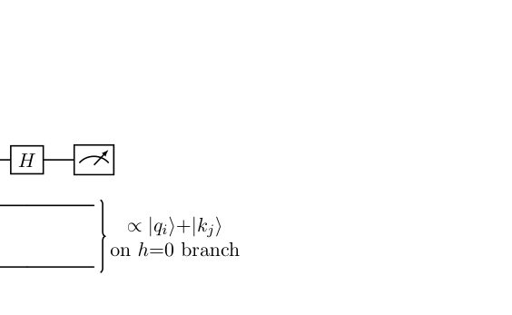
<figcaption class="paper-figure-caption"><b>Fig 4.</b> Figure 4: Hadamard-/swap-test diagram.</figcaption>
</figure>
<figure class="paper-figure-card">
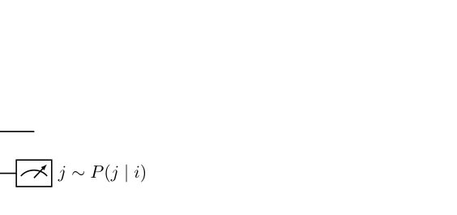
<figcaption class="paper-figure-caption"><b>Fig 5.</b> Figure 5: Quantum attention diagram.</figcaption>
</figure>

**Summary.** This paper constructs a detailed quantum circuit realization for the attention mechanism used in Transformers, specifically when inputs are probability distributions. It shows that core components like softmax and temperature can be mapped exactly to sequences of quantum measurements and rotations. This work bridges advanced deep learning architectures with fundamental principles of quantum information processing.

**Why it may be interesting.** While focused on AI, the rigorous mapping of continuous mathematical functions (like softmax) to discrete quantum operations (Born measurements, rotations) provides deep insights into how complex classical computations can be fundamentally constrained or realized within quantum information theory.

Detailed structure

**Main problem.** The paper aims to develop an exact, component-by-component quantum realization for the softmax attention mechanism, particularly when inputs are constrained to the probability simplex.

**Main result.** It establishes that softmax attention admits such a quantum analog in the infinite-shot limit, mapping classical components like temperature and residual connections to specific quantum gates and measurement protocols.

**Method.** The realization uses quantum primitives including amplitude encoding, block-encoded projections, Hadamard tests for inner products, and controlled rotations ($	ext{c}R_y$) within a circuit framework.

**Model / system.** The model is the single-head gated transformer attention layer operating on inputs restricted to the probability simplex. The computation is mapped onto a quantum circuit utilizing qubits and unitary transformations.

**Key observables.** Attention scores, which are realized as Hadamard-test statistics on block-encoded projections of amplitude-encoded inputs.

**Important parameters / regimes.** The softmax temperature ($eta$) is physically realized by the number ($L$) of post-selected measurement rounds; learnable parameters correspond to rotation-gate angles.

**Assumptions / limitations.** The equivalence is exact only in the infinite-shot limit. The construction assumes inputs are row-normalized probability distributions (the probability simplex domain).

**Figures summary.** Figure 1 provides a 'dictionary at a glance' mapping classical components to quantum circuits; Figure 2 illustrates Born-rule encoding, and Figure 3 shows Q/K projection using block encoding.

**Paper structure.** The paper builds an equivalence dictionary by realizing core attention components (scores, softmax, temperature, residual) sequentially. It details the necessary quantum primitives for each classical function, culminating in a full layer equivalence theorem machine-checked in Lean 4.

Abstract

The attention mechanism forms the foundation of many modern AI models such as the Transformer. In one subclass of problems where attention is used, inputs and outputs are bound to the probability simplex so that all outputs sum to one. In this setting, softmax attention admits an exact, component-by-component quantum realization. Attention scores are Hadamard-test statistics on block-encoded projections of amplitude-encoded inputs. The exponential softmax is the interior of a cosine-squared family generated by Born-rule measurement under an exact bijection, whose boundary expresses sparse attention with exact zeros at finite parameter values. The softmax temperature is a repetition count where post-selected measurement rounds realize discretized inverse temperature exactly. Value aggregation is a deterministic column-loading channel that dilates the column-stochastic value matrix. The gated residual is the preparation angle of a single ancilla, with the additive identity at a mixing angle of π/2. Every learnable parameter is a rotation-gate angle. The composed layer is exact in the infinite-shot limit with one measure-and-reload step per attention score; a fully-coherent variant is ε-approximate via quantum singular value transformation in the infinite depth limit. The algebraic core is machine-checked in Lean 4.

[↑ back to top](#top)

### [Robust CHSH Self-Testing with Finite-Energy GKP States](http://arxiv.org/abs/2608.11122v1)

**Authors:** Farzin Salek, Masahito Hayashi  
**Type:** theory · **Category:** quantum information and computing · **PDF:** <https://arxiv.org/pdf/2608.11122v1>  
**Analysis basis:** full PDF text, analyzed in chunks
**Topic relevance:** `quantum measurements` **3/5**

↔ Scroll figures horizontally

<figure class="paper-figure-card">
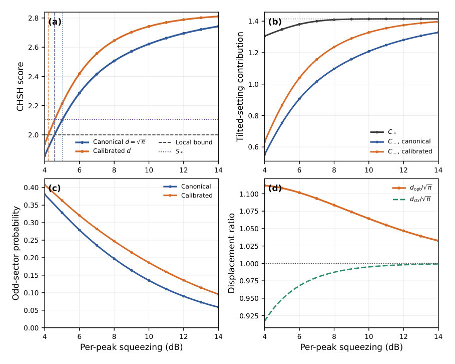
<figcaption class="paper-figure-caption"><b>Fig 1.</b> Figure 1: Finite-energy performance of the canonical and calibrated prescriptions. (a) CHSH scores, with the local bound and the threshold S∗, above which the affine branch of the Kaniewski bound exceeds 1/2, marked. Vertical lines mark the corresponding fixed and calibrated crossings of the local and S∗thresholds. (b) The two tilted-setting contributions. (c) Odd-sector probabilities after the displacement and before binary coarse-graining. (d) The calibrated displacement and dctr, which is shown only as a contracted-lattice diagnostic and is not used in the optimization. Points are computed at 0.25-dB intervals; connecting lines are guides to the eye. Calibration varies only d and keeps...</figcaption>
</figure>

**Summary.** This paper develops a theoretical framework to enhance Bell-pair self-testing using finite-energy GKP states. By incorporating measurements based on the photon number modulo four, the authors demonstrate that the achievable CHSH violation and extractability bounds exceed previous limits. This work is significant for quantum optics as it provides a pathway toward device-independent verification of entanglement in realistic physical systems.

**Why it may be interesting.** It provides a concrete, resource-efficient method for achieving device-independent quantum guarantees (Bell testing) in continuous variable systems by engineering measurement bases using discrete information (photon number modulo 4).

Detailed structure

**Main problem.** The research aims to establish robust self-testing protocols for Bell pairs using finite-energy Gaussian states (GKP) in continuous variable systems.

**Main result.** The analysis provides quantitative thresholds showing that the CHSH value and extractability bound can be significantly improved by incorporating deterministic phase-bit coarse-graining derived from modular photon-number information.

**Method.** The authors employ a full-oscillator analysis, combining measurements on position/momentum with fixed binary coarse-grainings of photon number modulo four to calculate physical correlations without logical post-corrections.

**Model / system.** The system is based on bosonic modes encoded using the Gottesman–Kitaev–Preskill (GKP) code. The analysis focuses on finite-energy filtered versions of these states, allowing for measurements that utilize modular photon-number information.

**Key observables.** CHSH value ($S$), extractability bound ($\Xi(
ho 	o |\psi_B
angle)$), and model thresholds (e.g., 4.56 dB).

**Important parameters / regimes.** The canonical displacement amplitude $d$, the filter parameter $eta$, and the finite-energy cutoff/approximation level ($n$).

**Assumptions / limitations.** The results are 'honest-model predictions' that do not account for experimental imperfections like loss or detection efficiency, though a device-independent guarantee is discussed.

**Paper structure.** The paper develops the theoretical framework by analyzing the extractability bound using finite-rank projections and then applies this to the GKP state structure, showing how modular photon-number measurements enhance the self-testing capability beyond standard Pauli settings.

Abstract

We present a full-oscillator analysis of a finite-energy GKP CHSH test whose observed score yields robust Bell-pair self-testing. Periodically binned position and momentum give the Pauli settings, while a fixed binary coarse-graining of photon number modulo four and its displaced conjugate realize the tilted settings. For a number-filtered GKP source, we retain the finite codeword overlap, define the measurements on all photon-number sectors, and compute the physical correlations without logical post-corrections. With the canonical ideal-logical displacement \(d=\sqrtπ\), the CHSH value exceeds the local bound above \(4.56\) dB of per-peak squeezing, and Kaniewski's extractability bound becomes nontrivial above \(5.02\) dB. Calibrating only \(d\) using an independently characterized finite-energy parameter lowers these model thresholds to \(4.21\) dB and \(4.58\) dB, respectively; at \(12\) dB, it raises the score from \(2.69486\) to \(2.78858\) and the corresponding target-state overlap bound from \(0.90758\) to \(0.97243\). This calibration is fixed before Bell-test data are collected. The displacement activates the odd modulo-four sectors, so their fixed a priori assignments are a genuine finite-energy component. The large gain is specific to the deterministic phase-bit coarse-graining; independently calibrating the one-bit POVM with randomized odd-sector outcomes gives only a much smaller improvement. These are honest-model predictions, not loss, detection-efficiency, or finite-sample thresholds. In an experiment, a device-independent guarantee for an extracted Bell pair follows by inserting a confidence lower bound on the observed CHSH score into the self-testing theorem.

[↑ back to top](#top)

### [Was Schrödinger ever a determinist?](http://arxiv.org/abs/2608.10160v1)

**Authors:** Flavio Del Santo, Nicolas Gisin  
**Type:** theory · **Category:** other · **PDF:** <https://arxiv.org/pdf/2608.10160v1>  
**Analysis basis:** full PDF text, analyzed in chunks
**Topic relevance:** `quantum measurements` **3/5**

↔ Scroll figures horizontally

<figure class="paper-figure-card">
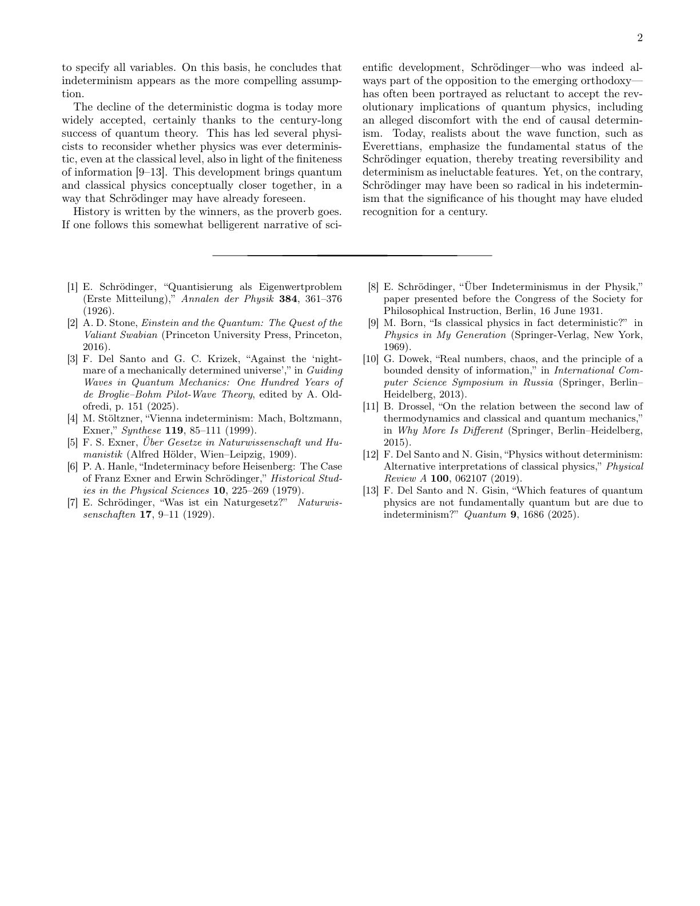
<figcaption class="paper-figure-caption"><b>Fig 1.</b> Low-resolution page preview, page 2</figcaption>
</figure>

**Summary.** This paper re-examines Erwin Schrödinger's views on determinism, arguing that he was not a resistor of quantum indeterminism. Instead, it details his early arguments for fundamental randomness based on statistical mechanics and the nature of physical laws. It is important for understanding the philosophical foundations of quantum theory.

**Why it may be interesting.** It provides crucial historical context for understanding the philosophical underpinnings of quantum mechanics, which informs modern discussions on measurement problems and foundations of physics relevant to open quantum systems.

Detailed structure

**Main problem.** The paper addresses the historical misconception that Schrödinger resisted quantum indeterminism, focusing on his actual views regarding determinism versus inherent randomness in physics.

**Main result.** Schrödinger's perspective was fundamentally indeterministic, arguing that physical laws are inherently statistical and challenging the necessity of deterministic descriptions even at classical levels.

**Method.** The analysis involves historical interpretation of Schrödinger's writings, particularly his 1931 essay on indeterminism, to reconstruct his philosophical stance.

**Model / system.** The discussion centers on quantum mechanics itself, specifically contrasting the deterministic evolution implied by the wave function with the probabilistic nature observed in measurements and statistical laws.

**Key observables.** Statistical outcomes (as opposed to single deterministic outcomes), irreversibility, and information content.

**Assumptions / limitations.** The primary assumption is that a detailed reading of Schrödinger's work reveals a more radical indeterministic stance than commonly portrayed.

**Paper structure.** The paper proceeds by first establishing the common portrayal of Schrödinger as anti-indeterminism, then systematically presenting his arguments from 1931 demonstrating an early embrace of fundamental statistical and indeterminate principles.

Abstract

Erwin Schrödinger is often portrayed as a reactionary who resisted the indeterminism introduced by quantum mechanics, but on closer inspection his views on determinism prove to be more complex and more radical.

[↑ back to top](#top)

### [A Single Atom in Front of a Mirror is a Universal Reservoir Computer](http://arxiv.org/abs/2608.10382v1)

**Authors:** Peter J. Ehlers, Phi Hung Nguyen, Kanu Sinha, Noelle Daigle, Travis W. Sawyer, Hendra I. Nurdin, Daniel Soh  
**Type:** theory · **Category:** other · **PDF:** <https://arxiv.org/pdf/2608.10382v1>  
**Analysis basis:** full PDF text, analyzed in chunks
**Topic relevance:** `analog quantum simulation` **2/5** · `correlated / nonlocal dissipation` **2/5** · `quantum measurements` **2/5** · `Tavis-Cummings & cavity-many-emitter` **1/5** · `driven-dissipative phase transition` **1/5** · `methods for driven-dissipative` **1/5** · `quantum optics experiment` **1/5**

↔ Scroll figures horizontally

<figure class="paper-figure-card">
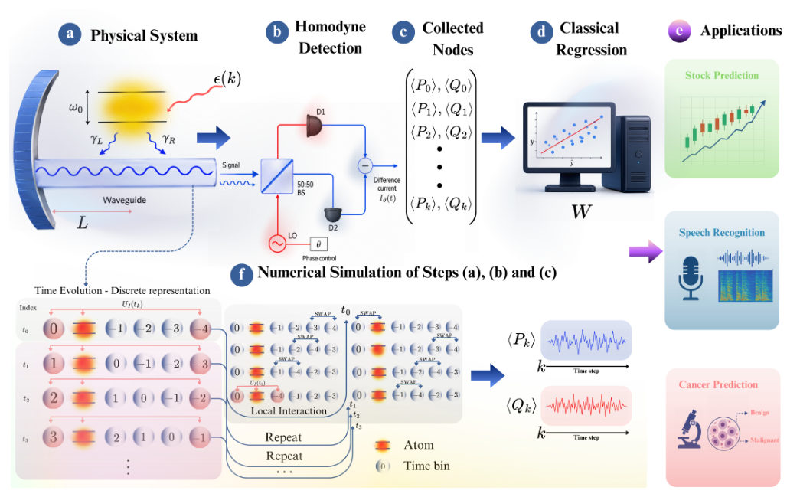
<figcaption class="paper-figure-caption"><b>Fig 1.</b> Figure 1: Overview of the minimal quantum reservoir computer performing real-world tasks. a, A single atom with transition energy ℏω0 sits a distance L in front of a mirror, driven by the discrete input ϵ(k) and decaying into the waveguide to the left and right at rates γL, γR. The round-trip delay τ = 2L/v produces coherent feedback. b–c, Homodyne detection collects quadrature nodes in each time bin. d, A classical linear readout W predicts the target yk. e, The three real-world tasks: financial prediction, speech recognition, and tumor classification. f, Time-bin matrix-product-state scheme (Methods). With delay ℓ= 4, at k = 0 a sequence of SWAP gates brings time bin −4 adjacent to the...</figcaption>
</figure>
<figure class="paper-figure-card">
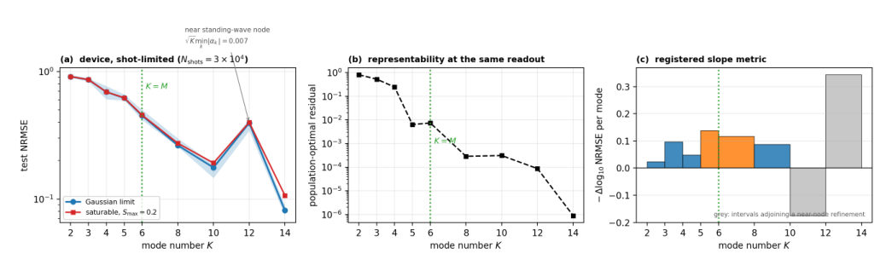
<figcaption class="paper-figure-caption"><b>Fig 2.</b> Figure 2: Convergence of a single device with mode number. a, Test-set approximation error (median over 12 input realizations; band, interquartile range) on a target with known Volterra kernels (M = 6, N = 2, random bounded kernels) versus the mode number K of one device with a nested dispersive comb at fixed retained band and fixed mirror distance, so that ∆0 = B/K and the readout node count is held fixed across the sweep. Blue: linear-transducer (Gaussian) regime, exact closed-form dynamics; red: the saturable device on the identical protocol (displaced-frame quasi-static Bloch route of Methods, quasi-static Bloch computation; Smax = 0.2, ⟨σz⟩driven from −1 to −0.833). Both carry shot...</figcaption>
</figure>
<figure class="paper-figure-card">
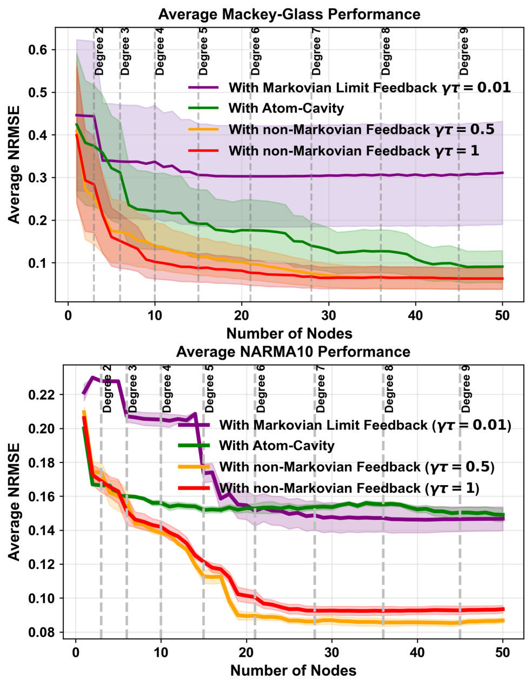
<figcaption class="paper-figure-caption"><b>Fig 3.</b> Figure 3: Nonlinearity transfer. A non-Markovian reservoir with a purely linear readout (feedback γτ = 0.5, 1) is compared against a Markovian atom–cavity reservoir trained to increasing polynomial order (vertical guides mark the polynomial degree at which the Markovian device gains each corresponding node) and against the Markovian- limit feedback γτ = 0.01, on Mackey–Glass (top) and NARMA10 (bottom). Parameters: ∆t = 1, θ = ϕ = π/3, g = (γ/2(1 + cos ϕ), γ/4(1 + cos ϕ)) with ϕ = π −ωLτ the round-trip phase entering the comparator’s mirror-modified decay (Methods, “Feedback-free comparison model”), averaged over εINPUT = (0.8, 1.0, 1.2, 1.4, 1.6)γ. The linear- readout feedback reservoir...</figcaption>
</figure>
<figure class="paper-figure-card">
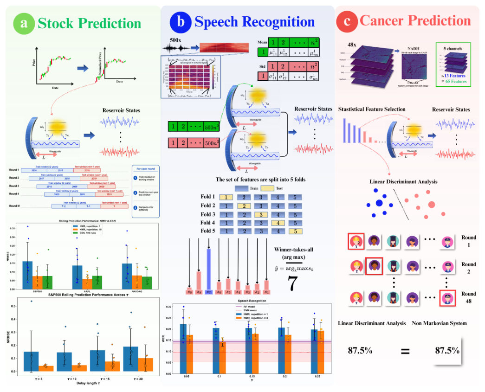
<figcaption class="paper-figure-caption"><b>Fig 4.</b> Figure 4: The single-atom reservoir across three real-world tasks. a, Financial prediction with a rolling two-year-train / one-year-test protocol, reported by NRMSE; parameters ∆t = 1, γ = 0.1, ϵ = 0.15, θ = ϕ = π/3, τ = 15, with a delay sweep τ = 5, 10, 15, 20. The quoted τ = 15 is the setting shared with panels (b,c) rather than this task’s optimum—shorter delays score better (0.042 ± 0.008 at τ = 5; Supplement Sec. S.9)—and is retained so the three panels report one device at one operating point. A persistence baseline ˆyt = yt−1 scores ≈0.037 on these identical windows, below both the reservoir and the echo-state comparator, which is why this task is a consistency check be- tween...</figcaption>
</figure>

**Summary.** This paper proves that a simple setup—a single atom placed near a mirror—can act as a Universal Reservoir Computer. By analyzing the system's dynamics in a linearized limit, the authors provide explicit constructive proofs for its universality. This work is significant because it demonstrates machine learning capability using minimal, passive quantum hardware components.

**Why it may be interesting.** It directly applies advanced concepts from open quantum systems (Lindblad dynamics, cavity QED) to solve a problem in machine learning (Reservoir Computing), showing how fundamental physical constraints can yield universal computation capabilities.

Detailed structure

**Main problem.** To demonstrate that a single, minimal physical quantum device can function as a universal reservoir computer, overcoming limitations associated with requiring entire classes of reservoirs.

**Main result.** The authors prove that a single atom placed in front of a mirror is a provably universal reservoir computer under specific constructive conditions. This establishes universality using only one passive quantum object.

**Method.** The proof utilizes the linear-transducer limit approximation, constructing explicit mathematical recipes based on geometric parameters and measurement settings to achieve arbitrary accuracy for fading-memory map approximation.

**Model / system.** The physical system is a single two-level emitter (atom) interacting with its electromagnetic field modes reflected by a mirror. The dynamics are governed by a Lindblad master equation, incorporating memory effects from delayed light interaction and nonlinearity from atomic saturation.

**Key observables.** Test NRMSE for dephasing/jitter; approximation error bounds ($\delta_{MN}N + A(M, N) \sqrt{2/M} ar{r}^M + e ar{\epsilon}$); feedback loss as a function of retained power fraction $\eta$.

**Important parameters / regimes.** Atom–mirror distance $L$; number of accessible field modes ($K$); linearization parameter $s$; memory depth ($M$) and mode number ($N$).

**Assumptions / limitations.** The core proof is established in the linear-transducer limit; achieving universality requires satisfying four constructive geometric/measurement conditions (D1–D6).

**Figures summary.** Figures demonstrate error decay vs. accessible modes, quantify nonlinearity transfer by comparing readout types on target functions, and show feedback loss recovery upon restoring a small fraction of the coupling.

**Paper structure.** The paper establishes the physical model via master equations, derives the linear-transducer limit for theoretical proof (Theorem 1), provides constructive conditions for universality, and concludes with comparisons to other reservoir architectures.

Abstract

Universal approximation in reservoir computing is typically associated with a class of reservoirs. We show that universality can be associated with a single reservoir, considering a minimal setup of a single atom in front of a mirror. In its linear-transducer limit, our reservoir is a universal approximator of fading-memory maps under an operating class of checkable conditions, with a rate constant measured at the operating point. A given reservoir can reach arbitrary accuracy by changing measurement settings. The proof gives an explicit recipe: for a target accuracy, it specifies the required physical resources and resonator modes. Enlarging the number of accessible modes increases the matchable kernel span without reducing capability. Beyond the linear limit, the atom's saturation replaces high-order polynomial readouts, and the device operates on real-world tasks alongside classical baselines. Our results highlight an example of universality with a minimal quantum setup.

[↑ back to top](#top)

### [Zero transfer on mixed graphs](http://arxiv.org/abs/2608.10643v1)

**Authors:** Xingkun Song, Huiqiu Lin  
**Type:** theory · **Category:** other · **PDF:** <https://arxiv.org/pdf/2608.10643v1>  
**Analysis basis:** full PDF text, analyzed in chunks
**Topic relevance:** `Keldysh / 2PI / non-Gaussian methods` **2/5** · `driven-dissipative phase transition` **2/5** · `methods for driven-dissipative` **2/5** · `analog quantum simulation` **1/5** · `correlated / nonlocal dissipation` **1/5** · `non-equilibrium universality` **1/5** · `quantum measurements` **1/5**

↔ Scroll figures horizontally

<figure class="paper-figure-card">
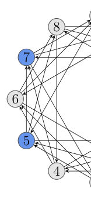
<figcaption class="paper-figure-caption"><b>Fig 1.</b> Fig. 1: Zero transfer in G(Z12, {2, 3, 8}).</figcaption>
</figure>

**Summary.** This paper develops rigorous mathematical criteria to determine when a quantum state transfer between two nodes on a mixed graph is impossible (zero transfer). It achieves this by analyzing the spectral properties of the graph's Hermitian adjacency matrix, providing specific nonexistence results for prime-ordered circulant graphs and detailed classifications for composite orders.

**Why it may be interesting.** This work provides deep mathematical tools for understanding quantum transport phenomena, which are foundational to designing robust quantum communication channels or characterizing decoherence mechanisms in complex quantum systems.

Detailed structure

**Main problem.** The paper characterizes the phenomenon of 'zero transfer'—where quantum state transition amplitudes vanish for all time—on mixed graphs.

**Main result.** Zero transfer is characterized by vanishing entries in the spectral idempotents associated with the graph's Hermitian adjacency matrix. For oriented circulant graphs of prime order, zero transfer cannot occur.

**Method.** The analysis uses advanced linear algebra techniques, including Taylor series expansions and spectral decomposition theorems applied to quantum walks governed by a Hermitian Hamiltonian.

**Model / system.** The model is a continuous-time quantum walk on a mixed graph $\Gamma$, whose evolution is dictated by the Hermitian adjacency matrix $H_\Gamma$. The system involves both undirected edges and directed arcs.

**Key observables.** Zero transfer (vanishing transition amplitude $U(t)_{u,v} = 0$ for all $t \ge 0$), spectral idempotent entries $(E_{	heta_r})_{u,v}$, and the structure of the graph's adjacency matrix.

**Important parameters / regimes.** Graph order ($n$), primality of $n$, and the specific connectivity defined by the generating set $C$ in circulant graphs.

**Assumptions / limitations.** The analysis heavily relies on the properties of Hermitian matrices, spectral decomposition, and algebraic number theory related to roots of unity when analyzing circulant structures.

**Figures summary.** Figure 1 provides an example of zero transfer for a specific mixed graph $G(\mathbb{Z}_{12}, \{2, 3, 8\})$, showing the set of vertices exhibiting this property. Tables summarize counts and sets for various small even orders ($n \le 20$).

**Paper structure.** The paper builds from general necessary conditions (Taylor expansion) to more precise spectral characterizations (spectral idempotents), culminating in detailed case studies on oriented circulant graphs, especially analyzing the prime vs. composite order cases.

Abstract

In this paper, we investigate zero transfer on mixed graphs. Zero transfer is a quantum walk phenomenon in which the transition amplitude between two vertices is identically zero for all times, so that no quantum state transfer occurs between them. Using the Hermitian adjacency matrix, we derive necessary and sufficient conditions for zero transfer in mixed graphs. We then specialize these criteria to oriented circulant graphs, obtaining nonexistence results for prime order, structural restrictions for even order, and exhaustive computational classifications for small orders.

[↑ back to top](#top)

### [Generalized Master Stability of Heterogeneous Delay-Coupled Networks](http://arxiv.org/abs/2608.10076v1)

**Authors:** Ana Elisa D. Barioni, Arthur N. Montanari, Adilson E. Motter  
**Type:** theory · **Category:** disordered systems and neural networks · **PDF:** <https://arxiv.org/pdf/2608.10076v1>  
**Analysis basis:** full PDF text, analyzed in chunks
**Topic relevance:** `analog quantum simulation` **2/5** · `correlated / nonlocal dissipation` **2/5** · `methods for driven-dissipative` **2/5** · `Keldysh / 2PI / non-Gaussian methods` **1/5** · `driven-dissipative phase transition` **1/5** · `non-equilibrium universality` **1/5**

↔ Scroll figures horizontally

<figure class="paper-figure-card">
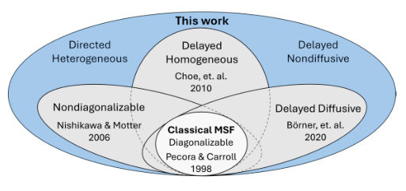
<figcaption class="paper-figure-caption"><b>Fig 1.</b> FIG. 1. Key extensions of the MSF framework to delay- coupled systems, where each set represents a methodological advance toward a broader class of network systems.</figcaption>
</figure>
<figure class="paper-figure-card">
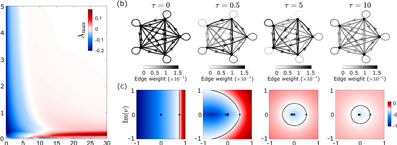
<figcaption class="paper-figure-caption"><b>Fig 2.</b> FIG. 2. MSF analysis of delay-coupled SL oscillators. (a) MTLE of the synchronous state as a function of the coupling strength κ and time delay τ for an all-to-all network configuration, where blue (red) regions indicate stable (unstable) synchronization. Discontinuities observed for small κ arise from the multistability of the system, as further discussed in SM [43], Sec. SII. (b, c) Optimal network configuration (b) and corresponding MSF landscape (c) for increasing τ. In panel b, the edge thickness indicates the interaction weights Aij. Panel c shows the stability region Ωin the complex plane (blue) and the eigenvalues of the corresponding adjacency matrix (dots), which lie entirely...</figcaption>
</figure>
<figure class="paper-figure-card">
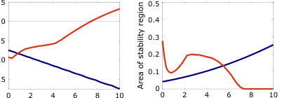
<figcaption class="paper-figure-caption"><b>Fig 3.</b> FIG. 3. MSF comparison analysis for the SL and LK mod- els. (a, b) MSF landscape of the SL (a) and LK (b) models for τ = 0.1, showing λmax as a function of the tunable ad- jacency matrix eigenvalue ν for different indegrees d⋆. The stability region Ωis characterized by its area and depth (i.e., minν λmax). (c) Dependence of the stability region’s depth (left) and area (right) on d⋆for the SL and LK models. The SL model parameters are set as in Fig. 2, while the LK model parameters are specified in SM [43], Sec. SIII.</figcaption>
</figure>
<figure class="paper-figure-card">

<figcaption class="paper-figure-caption"><b>Fig 4.</b> Figure 3 contrasts the MSF landscapes of the SL and LK models. In the SL model, increasing d⋆monotonically expands and deepens the stability region. This behavior is consistent with our theoretical predictions, since the delay is small and the SL model satisfies the identity Ja- cobian coupling. The LK model exhibits the opposite trend: increasing d⋆destabilizes synchronization, as the stability region progressively shrinks and flattens, vanish- ing at d⋆= 7.4. Because in this model the state variable Nj is not directly coupled to other oscillators (and hence D(τ)h ̸= In), the monotonic dependence of Ωj on dj is indeed not guaranteed to hold, and hence the MSF anal- ysis of all subsystems...</figcaption>
</figure>
<figure class="paper-figure-card">
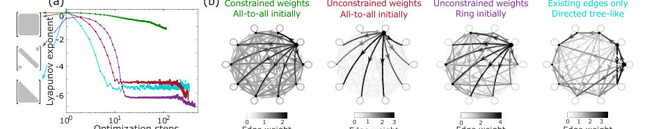
<figcaption class="paper-figure-caption"><b>Fig 5.</b> FIG. 4. Network optimization to enhance synchronizability. (a) Minimization of the MTLE of the LK model for different initial configurations and optimization constraints: all-to-all with fixed total weight (green); all-to-all with unconstrained weights (red); ring with unconstrained weights (purple); and directed tree-like structure with optimization restricted to existing edges and all others are set to zero (cyan). The structures of the initial adjacency matrices are shown on the left. (b) Resulting optimal network, where arrow direction and line thickness indicate edge directionality and weight, respectively; node size scales with outdegree, highlighting the most dominant nodes. The...</figcaption>
</figure>

**Summary.** This work extends the Master Stability Function theory to analyze synchronization in complex, weighted, directed networks with time delays. It demonstrates that network heterogeneity and nonreciprocity are crucial resources for maintaining stable synchronization. The paper provides optimization techniques to design optimal network topologies that enhance collective stability.

**Why it may be interesting.** While focused on classical coupled oscillators, the mathematical machinery—analyzing spectral properties of large matrices derived from complex dynamics ($\dot{\eta} = J_1 \eta + J_2 \eta(t-	au)$) and optimizing structure for stability—is highly relevant to understanding collective behavior in quantum systems like superconducting circuits or photonic arrays.

Detailed structure

**Main problem.** The paper extends synchronization analysis, using the Master Stability Function (MSF) framework, to complex delay-coupled networks that exhibit degree heterogeneity, weighting, and directionality.

**Main result.** Synchronization stability in these heterogeneous, delayed networks can be enhanced by structural nonreciprocity and network heterogeneity, potentially surpassing the stability achieved in simpler all-to-all or non-delayed systems.

**Method.** The authors generalize the MSF framework by analyzing the system's dynamics using Jordan canonical form analysis to handle time delays and complex coupling structures. They develop an optimization method to find optimal edge weights maximizing synchronization stability.

**Model / system.** The study analyzes delay-coupled networks of identical oscillators, exemplified by the Stuart-Landau (SL) and Lang-Kobayashi (LK) models. The dynamics are governed by coupled differential equations incorporating time delays ($	au$).

**Key observables.** Synchronization stability, quantified by the maximum transverse Lyapunov exponent (MTLE), $\lambda_{\max}$ (must be negative for stability); Stability region ($\Omega$) in the complex plane.

**Important parameters / regimes.** Time delay ($	au$), coupling strength ($\kappa$), network structure parameters (degree distribution, weights $A_{jk}$).

**Assumptions / limitations.** The standard MSF assumptions are violated by time delays; the method addresses this using Jordan canonical form analysis. Optimization relies on iterative perturbation methods.

**Figures summary.** Figures illustrate how increasing delay ($	au$) shrinks the stability region $\Omega$ for SL models, and show optimization procedures driving networks towards heterogeneous, directional structures that maximize synchronizability.

**Paper structure.** The paper first introduces the generalization of MSF to handle delays and heterogeneity. It then applies this framework to specific models (SL/LK), demonstrating how structural properties like indegree determine stability boundaries. Finally, it presents network optimization and sparsification analyses to quantify robustness.

Abstract

Time delays are ubiquitous in physical and biological networked systems, playing a fundamental role in the emergence and stability of collective behavior. Yet, existing theoretical methods for synchronization analysis of delay-coupled systems are largely limited to networks with homogeneous degree distributions. Here, we extend the master stability function framework to a broad class of degree-heterogeneous, weighted, and directed delay-coupled networks. The analysis reveals that synchronization can be enhanced in heterogeneous networks compared to homogeneous ones, including all-to-all networks, which are known to be optimal in non-delayed systems. To identify optimal heterogeneous structures, we develop a network optimization method that finds directional, edge-weighted configurations maximizing synchronization stability. Our results show that, in delay-coupled networks, heterogeneity and nonreciprocity are key resources for synchronization.

[↑ back to top](#top)

### [Inferring stealthy hyperuniform correlations from quantum transport](http://arxiv.org/abs/2608.11188v1)

**Authors:** Natanael C. Costa, Mauro S. Ferreira, Caio Lewenkopf, Felipe A. Pinheiro, Paul J. Steinhardt, Salvatore Torquato, Carlo Vanoni  
**Type:** theory · **Category:** disordered systems and neural networks · **PDF:** <https://arxiv.org/pdf/2608.11188v1>  
**Analysis basis:** full PDF text, analyzed in chunks
**Topic relevance:** `driven-dissipative phase transition` **2/5** · `Keldysh / 2PI / non-Gaussian methods` **1/5** · `analog quantum simulation` **1/5** · `correlated / nonlocal dissipation` **1/5** · `interference shaping light` **1/5** · `methods for driven-dissipative` **1/5** · `non-equilibrium universality` **1/5** · `quantum measurements` **1/5**

↔ Scroll figures horizontally

<figure class="paper-figure-card">
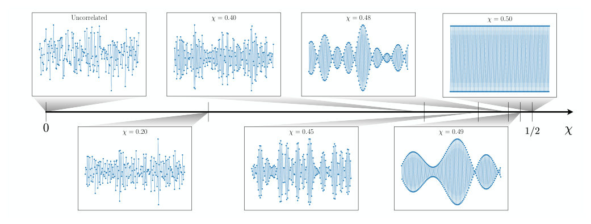
<figcaption class="paper-figure-caption"><b>Fig 1.</b> FIG. 1. Real space potential wj for different values of χ, ranging from the uncorrelated disorder case (χ = 0) on the left to the absence of disorder (χ = 1/2) on the right. Correlations are readily observed at large χ values (χ = 0.4 and above) but are not apparent at intermediate values (χ = 0.2).</figcaption>
</figure>
<figure class="paper-figure-card">
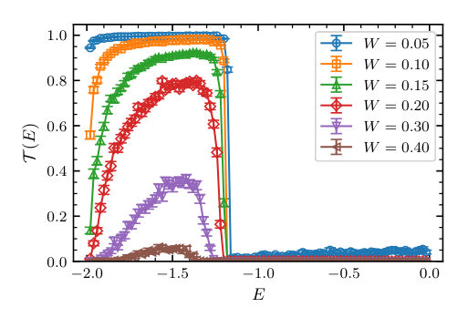
<figcaption class="paper-figure-caption"><b>Fig 2.</b> FIG. 2. Energy-resolved transmittance T (E) for a chain with N = 104 sites, fixed stealthy parameter χ = 0.30, and differ- ent disorder strengths W. Increasing W suppresses the abso- lute value of the transmittance inside the high-transmittance window, while the position of the sharp drop remains approx- imately unchanged.</figcaption>
</figure>
<figure class="paper-figure-card">
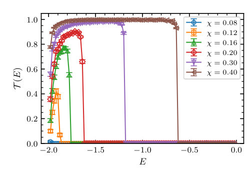
<figcaption class="paper-figure-caption"><b>Fig 3.</b> FIG. 3. Energy-resolved transmittance T (E) for a chain with N = 104 sites, fixed disorder strength W = 0.10, and different stealthy parameters χ. Increasing χ shifts the sharp drop in T (E) to higher energies and enlarges the high-transmittance window.</figcaption>
</figure>
<figure class="paper-figure-card">
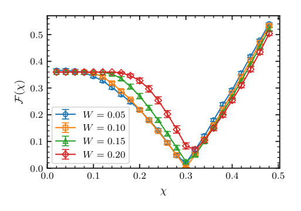
<figcaption class="paper-figure-caption"><b>Fig 4.</b> FIG. 4. Misfit function F as a function of the trial stealthy parameter χ for a target spectrum generated with Wtar = 0.10 and χtar = 0.30. Distinct curves represent different trial val- ues of W. The minimum remains close to the target value χtar = 0.30, displaying only small shifts when the trial dis- order strength differs from Wtar. Here, we analyzed a chain with N = 104 sites.</figcaption>
</figure>
<figure class="paper-figure-card">
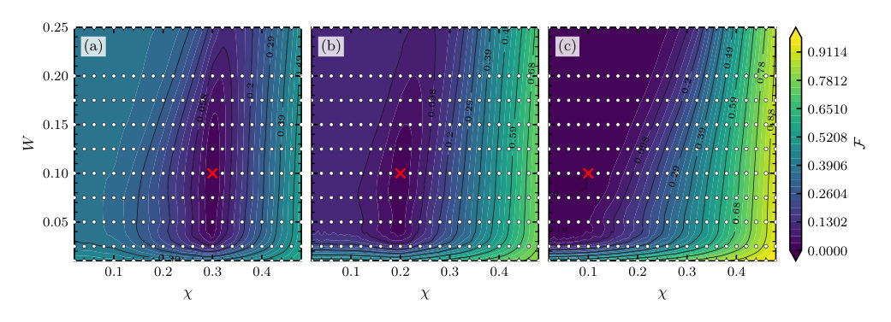
<figcaption class="paper-figure-caption"><b>Fig 5.</b> FIG. 5. (a) Contour plot of the misfit function F(χ, W) for a target spectrum generated with Wtar = 0.10 and χtar = 0.30. The red cross indicates the target parameters. The minimum is well defined and occurs close to the target point (red cross), showing that the inverse protocol can recover both W and χ when the transmittance spectrum displays a clear stealthy-induced jump. (b) Contour plot of the misfit function for a target spectrum generated with Wtar = 0.10 and χtar = 0.20. (c) Contour plot of the misfit function for a target spectrum generated with Wtar = 0.10 and χtar = 0.10. The red crosses determine the target values.</figcaption>
</figure>

**Summary.** The paper introduces a novel technique to determine the stealthiness parameter ($\chi$) characterizing hyperuniform disorder by analyzing quantum transport measurements. Using a 1D tight-binding model, they show that the energy-dependent transmittance spectrum acts as a unique fingerprint of this correlation. This allows researchers to extract crucial structural information from readily measurable electrical conductance data.

**Why it may be interesting.** This work provides a powerful example of using transport spectroscopy as an inverse diagnostic tool. For AMO/open quantum systems, this methodology could be adapted to characterize complex disorder potentials (e.g., engineered lattice impurities or random coupling strengths) in mesoscopic devices where direct structural characterization is intractable.

Detailed structure

**Main problem.** The central problem is developing a method to infer the structural properties, specifically 'stealthy hyperuniform correlations' characterized by parameter $\chi$, from measurable quantum transport data.

**Main result.** Transmittance spectra serve as unique fingerprints of stealthy hyperuniform disorder, allowing for the recovery of the correlation parameter $\chi$ via an inverse protocol.

**Method.** The authors propose and implement a conductance-based inverse protocol by minimizing a misfit function between calculated energy-dependent transmittance $T(E)$ and a target spectrum.

**Model / system.** The model is a one-dimensional tight-binding chain subjected to on-site disorder. This disorder is specifically engineered in momentum space to exhibit stealthy hyperuniform correlations, defined by a spectral cutoff $S(k) = \Theta(|k| - K)$, where $K=2\pi\chi$.

**Key observables.** Energy-dependent transmittance $T(E)$ (or conductance), and the misfit function value.

**Important parameters / regimes.** Stealthiness parameter $\chi$, disorder strength $W$, and the energy window $[E_-, E_+]$ used for fitting.

**Assumptions / limitations.** The primary assumption is that the transport response function $T(E)$ retains a unique signature of the underlying structural correlations ($\chi$) even when direct measurement of the disorder potential is impossible.

**Figures summary.** Figures illustrate the real-space potential for varying $\chi$, show how increasing $W$ suppresses $T(E)$ while keeping the spectral drop position stable, and demonstrate the systematic shift of the transparent energy window as $\chi$ changes.

**Paper structure.** The paper establishes the physical problem (inferring $\chi$), details the model setup (1D chain with stealthy disorder), outlines the computational method (RGF for $T(E)$), and culminates in demonstrating the inverse protocol by minimizing a misfit function over the energy spectrum to recover $(\chi, W)$.

Abstract

Stealthy hyperuniform disordered systems exhibit strongly suppressed long-wavelength fluctuations, producing correlated disorder with unusual consequences for wave propagation. A central quantity characterizing these systems is the stealthiness parameter $χ$, which controls the range of excluded Fourier components in the disorder spectrum. However, in realistic settings, the microscopic disorder configuration may not be directly accessible, making it challenging to determine $χ$ from structural information alone. Here, we propose a conductance-based inverse protocol to recover stealthy hyperuniform correlations from transport data. As a proof of concept, we study spinless fermions in a one-dimensional tight-binding chain connected to clean semi-infinite leads, with on-site disorder generated by imposing a stealthy spectrum $S(k)=Θ(|k|-K)$, where $K=2πχ$. The energy-dependent transmittance is computed using a recursive Green's function method and compared with target spectra through a misfit function defined over an energy window. We show that the position of the sharp drop separating high- and low-transmittance regions is strongly controlled by $χ$, while the disorder strength $W$ mainly affects the absolute magnitude of the transmittance. As a result, the misfit function displays a clear minimum close to the target stealthy parameter. Our results demonstrate that transmittance spectra can serve as fingerprints of stealthy hyperuniform disorder, providing a practical route to infer correlated-disorder parameters from transport measurements.

[↑ back to top](#top)

### [Skin-Anderson Localization Transition in Strongly Coupled Disordered Non-Hermitian Chains](http://arxiv.org/abs/2608.11186v1)

**Authors:** S Rahul  
**Type:** theory · **Category:** disordered systems and neural networks · **PDF:** <https://arxiv.org/pdf/2608.11186v1>  
**Analysis basis:** full PDF text, analyzed in chunks
**Topic relevance:** `analog quantum simulation` **2/5** · `driven-dissipative phase transition` **2/5** · `Frenkel-Kontorova` **1/5** · `correlated / nonlocal dissipation` **1/5** · `methods for driven-dissipative` **1/5** · `non-equilibrium universality` **1/5**

↔ Scroll figures horizontally

<figure class="paper-figure-card">
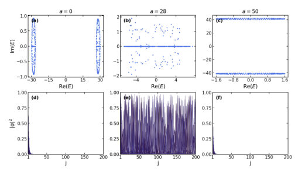
<figcaption class="paper-figure-caption"><b>Fig 1.</b> FIG. 2: Complex energy spectra (top row) and corre- sponding right eigenstate probability distributions of in lower chain (bottom row) for (a,d) a = 0, (b,e) a = 28, and (c,f) a = 50. At a = 0, the spectrum exhibits a point-gap topology with skin-localized eigenstates. At the critical value a = 28, the point gap closes. For a = 50, the spectrum remains line-gapped, while the eigenstates relocalize at the boundary. Parameters: N = 200, γ = 1, λ = 1.5, J = 1, t = 28, and W = 12.0.</figcaption>
</figure>
<figure class="paper-figure-card">

<figcaption class="paper-figure-caption"><b>Fig 2.</b> Figure 1 shows the spatial probability distributions of all right eigenstates in the Hatano–Nelson (upper) and Hermitian (lower) chains for different values of the asym- metric inter-chain coupling a. For a = 0, both chains ex- hibit pronounced boundary localization, indicating that the non-Hermitian skin effect induced by the Hatano– Nelson chain is efficiently transferred to the Hermitian</figcaption>
</figure>
<figure class="paper-figure-card">
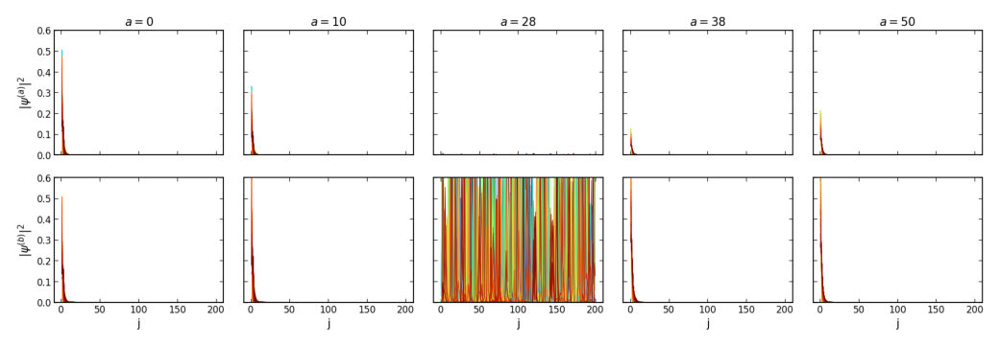
<figcaption class="paper-figure-caption"><b>Fig 3.</b> FIG. 1: Spatial probability distributions of all right eigenstates in the (top) Hatano–Nelson chain and (bottom) Hermitian chain for a = 0, 10, 28, 38, and 50. The eigenstates exhibit boundary localization for a &lt; t and a &gt; t, characteristic of the non-Hermitian skin effect. At the critical point a = t = 28, the suppression of skin localization results in spatially distributed eigenstates associated with disorder-induced Anderson localization. Parameters: N = 200, t = 28, γ = 1.0, λ = 1.5, J = 1.0, and W = 12.</figcaption>
</figure>
<figure class="paper-figure-card">
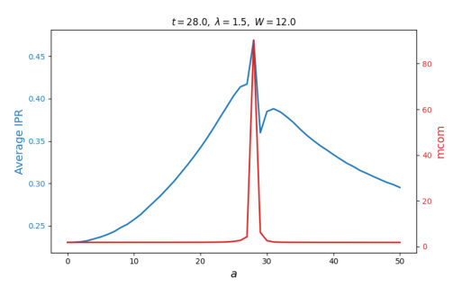
<figcaption class="paper-figure-caption"><b>Fig 4.</b> FIG. 3: Disorder-averaged inverse participation ratio (IPR) and mean center of mass (mcom) as functions of the asymmetric inter-chain coupling a. Parameters: N = 200, γ = 1, λ = 1.5, J = 1, t = 28, and W = 12, averaged over 50 disorder realizations.</figcaption>
</figure>
<figure class="paper-figure-card">

<figcaption class="paper-figure-caption"><b>Fig 5.</b> Figure 3 illustrates the variation of the disorder-averaged IPR and the mcom as functions of the inter-chain cou- pling parameter a. For a &lt; t, the average IPR increases steadily with increasing a, indicating that the skin modes become progressively less localized and spread over a larger portion of the lattice. As a approaches t, the lo- calization reaches its weakest, reflected by the maximum</figcaption>
</figure>

**Summary.** This paper explores the competition between disorder (Anderson localization) and non-reciprocity (NHSE) in a two-leg ladder model. By tuning the inter-chain coupling asymmetry, the authors demonstrate successive transitions in eigenstate behavior, showing that robust skin localization can persist even when the energy spectrum topology changes away from conventional point gaps.

**Why it may be interesting.** This work provides a detailed theoretical framework for understanding how competing non-Hermitian and random potentials dictate fundamental transport properties like localization, which has implications for designing robust quantum devices.

Detailed structure

**Main problem.** The study investigates the complex interplay between disorder-induced Anderson localization and non-Hermitian effects, specifically the Non-Hermitian Skin Effect (NHSE).

**Main result.** Tuning the asymmetry of inter-chain coupling drives successive transitions in eigenstate nature: from skin localization to Anderson localization, and back to skin localization even when the energy spectrum exhibits a line-gap topology.

**Method.** The analysis involves calculating the Inverse Participation Ratio (IPR) and Mean Center of Mass ($	ext{mcom}$) averaged over disorder realizations to diagnose the spatial extent and localization type of eigenstates.

**Model / system.** The model is a two-leg ladder system comprising a Hatano–Nelson chain coupled to a Hermitian chain via asymmetric inter-chain hopping. The Hamiltonian incorporates onsite disorder terms ($\Delta_j$) and coupling parameters ($t, a$).

**Key observables.** Inverse Participation Ratio ($	ext{IPR}$), Mean Center of Mass ($\langle 	ext{mcom} 
angle$), and the complex energy spectrum topology (point-gap vs. line-gap).

**Important parameters / regimes.** The asymmetry parameter '$a$' is the primary control, which tunes the competition between localization mechanisms; critical points include $a=0$, $a=t$, and $a>t$.

**Assumptions / limitations.** The analysis relies on treating the system as a tight-binding model with disorder, focusing on the spectral and spatial properties of eigenstates.

**Figures summary.** Figures illustrate the transition from boundary localization (skin effect) to delocalized states at $a=t$, confirming these transitions via $\langle 	ext{IPR} 
angle$ minima and $\langle 	ext{mcom} 
angle$ peaks at the critical coupling strength.

**Paper structure.** The paper systematically analyzes how varying the inter-chain asymmetry parameter '$a$' drives successive phase transitions in localization, mapping out regimes where NHSE dominates versus where disorder-induced Anderson localization prevails.

Abstract

The interplay between disorder and non-Hermitian effects gives rise to a variety of intriguing localization phenomena. While disorder tends to localize the eigenstates through Anderson localization, non-Hermitian non-reciprocity promotes the formation of skin modes by driving the eigenstates toward the system boundaries giving rise to non-Hermitian skin effect (NHSE). In this work, we investigate the interplay between these competing mechanisms in a two-leg ladder consisting of a Hatano-Nelson chain coupled to a Hermitian chain via asymmetric inter-chain hopping, with strong disorder present in both chains. We show that tuning the asymmetry of the inter-chain coupling induces successive transitions in the nature of the eigenstates, from skin localization to Anderson localization and subsequently back to skin localization. Remarkably, the non-Hermitian skin effect re-emerges even though the energy spectrum exhibits a line-gap topology, demonstrating that robust skin localization can persist beyond the conventional point-gap regime.

[↑ back to top](#top)

### [Theoretical analysis towards accurate optomechanical detection of quantum gravity effects](http://arxiv.org/abs/2608.10890v1)

**Authors:** Ying Li, Yan Li, Chengsong Zhao, Najmeh Eshaqi-Sani, Wenlin Li  
**Type:** theory · **Category:** other · **PDF:** <https://arxiv.org/pdf/2608.10890v1>  
**Analysis basis:** full PDF text, analyzed in chunks
**Topic relevance:** `quantum measurements` **2/5** · `Keldysh / 2PI / non-Gaussian methods` **1/5** · `driven-dissipative phase transition` **1/5** · `methods for driven-dissipative` **1/5** · `quantum optics experiment` **1/5**

↔ Scroll figures horizontally

<figure class="paper-figure-card">
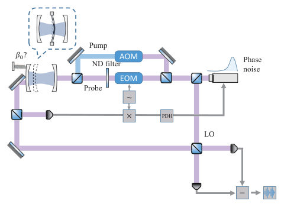
<figcaption class="paper-figure-caption"><b>Fig 1.</b> FIG. 1. Schematic of the optomechanical detector. A probe beam is incident on an optomechanical cavity that can be configured either as a FP cavity terminated by a movable end mirror or as a MiM system with a thin dielectric membrane placed between two fixed mirrors. The probe beam is phase- modulated by an EOM and locked to cavity resonance using the PDH technique. The reflected probe light is analyzed by balanced homodyne detection to monitor the mechanical displacement and extract the nonlinear parameter βNL. A second pump beam is simultaneously injected into the cavity to drive and manipulate the mechanical oscillator.</figcaption>
</figure>
<figure class="paper-figure-card">
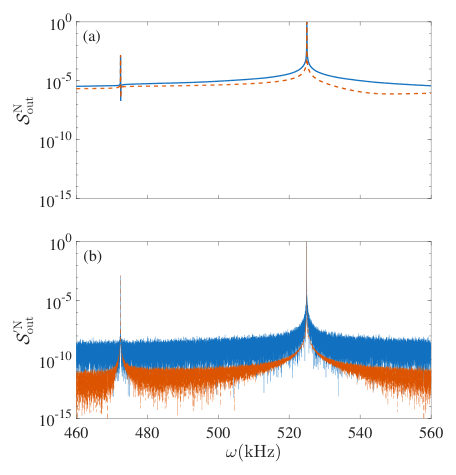
<figcaption class="paper-figure-caption"><b>Fig 2.</b> FIG. 2. Comparison of the output spectra of the probe field with and without phase noise. (a): Power spectrum obtained from Eq. (36). (b): Spectrum calculated via the FFT according to Eq. (37). Each spectrum is normalized to its maximum value, that is, SN out = Sout/ max{Sout} and S′N out = S′ out/ max{Sout}. In addition to the parameters listed in Table I, we set βNL = 0, Ω/ωb = 0.9, φ = 0.01, γτ = 5.25 × 10−6, P1 = 2 µW, P2 = 50 µW, and Pp = 5 µW.</figcaption>
</figure>
<figure class="paper-figure-card">
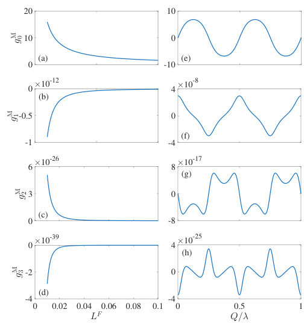
<figcaption class="paper-figure-caption"><b>Fig 3.</b> FIG. 3. (a)–(d): Dependence of the first- to fourth-order optomechanical coupling coefficients of the FP OMS on the cavity length LF . (e)–(h): Dependence of the first- to fourth- order optomechanical coupling coefficients of the MiM OMS on the membrane position Q for a fixed cavity length. Pa- rameters are taken from Tab. I.</figcaption>
</figure>
<figure class="paper-figure-card">
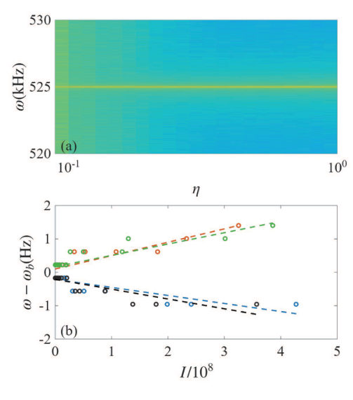
<figcaption class="paper-figure-caption"><b>Fig 4.</b> FIG. 4. (a): Output spectrum of the probe field as a func- tion of the power factor η when the membrane is positioned at Q1/λ = 0.055. (b): Peak frequency of the probe spec- trum versus oscillator amplitude for the membrane positions Q1/λ = 0.055 (blue), Q2/λ = 0.194 (red), Q3/λ = 0.305 (green), and Q4/λ = 0.445 (black). Dashed lines of corre- sponding colors represent linear fits to the data. Here we set φ = 0 to eliminate the influence of the calibration signal. Other parameters are the same as those used in Fig. 2.</figcaption>
</figure>
<figure class="paper-figure-card">
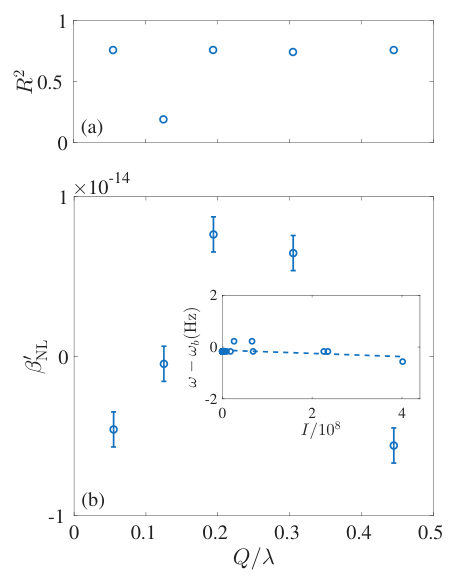
<figcaption class="paper-figure-caption"><b>Fig 5.</b> FIG. 5. (a) Linear regression coefficients R2 corresponding to the measured spurious signal β′ NL for different membrane po- sitions. (b) Magnitude of the spurious β′ NL together with its 95% confidence interval. Then inset in (b): Peak frequency of the probe spectrum versus oscillator amplitude for the mem- brane positions Q5/λ = 0.125. Dashed line represents linear fit to the data. The parameters are the same as those used in Fig. 4.</figcaption>
</figure>

**Summary.** This paper provides a rigorous theoretical analysis for using optomechanical systems to search for signatures of quantum gravity, specifically testing the Generalized Uncertainty Principle. It critically reevaluates previous models by incorporating higher-order nonlinear dynamics and realistic laser phase noise into both Fabry-Perot and membrane-in-the-middle setups. The key finding is that these neglected terms significantly degrade predicted measurement sensitivities, demanding more careful experimental design.

**Why it may be interesting.** This work is highly relevant as it pushes the boundaries of quantum sensing by rigorously accounting for non-ideal experimental factors (higher-order couplings and noise) that often invalidate simplified theoretical predictions in advanced AMO experiments.

Detailed structure

**Main problem.** The primary goal is developing accurate theoretical methods to detect minute quantum gravity effects, such as those predicted by the Generalized Uncertainty Principle (GUP), using highly sensitive optomechanical systems.

**Main result.** Previous idealized estimates for achievable resolution are significantly overestimated; incorporating higher-order nonlinear couplings and realistic laser phase noise is crucial for any practical assessment of these quantum gravity tests.

**Method.** The analysis involves reanalyzing the system dynamics by incorporating full nonlinear Hamiltonian terms and modeling environmental decoherence via Langevin equations, moving beyond simple linear approximations.

**Model / system.** The study focuses on two experimentally relevant platforms: a Fabry-Perot (FP) cavity optomechanical system and a membrane-in-the-middle (MiM) system. The model incorporates GUP corrections into the mechanical oscillator Hamiltonian, leading to nonlinear terms in the dynamics.

**Key observables.** The effective oscillation frequency shift ($\omega_{	ext{eff}}$), which is used as a quantitative diagnostic signal to determine the dimensionless GUP parameter ($eta_{NL}$), measured via phase-modulated probe light and homodyne detection.

**Important parameters / regimes.** The dimensionless GUP parameter ($eta_{NL}$); coupling strengths ($g_{F0}, g_{M0}$); and noise characteristics, including laser phase noise spectrum $S_\Phi(\omega_p)$.

**Assumptions / limitations.** The analysis uses the c-number stochastic Langevin equation approximation in some regimes, which neglects certain nonlinear quantum effects for mathematical tractability.

**Figures summary.** Figure 1 schematically illustrates the optomechanical detector setup, detailing components like EOMs and balanced homodyne detection, and showing the configuration options (FP vs. MiM).

**Paper structure.** The paper establishes the theoretical framework by modifying the Hamiltonian to include GUP corrections; it then details the dynamics for both FP and MiM systems using Langevin equations; finally, it derives revised measurement protocols and sensitivity bounds.

Abstract

Optomechanical systems offer a promising platform for observing dynamical signatures of quantum gravity through precision measurements of quantum harmonic oscillator dynamics. However, most existing analyses consider only the linear radiation-pressure interaction while neglecting higher-order optomechanical couplings and laser phase noise. These neglected contributions can be comparable in magnitude to the predicted quantum-gravity corrections and may therefore introduce spurious signals or mask the genuine physical effect. Here we reanalyze two experimentally realized platforms, a Fabry-Perot optomechanical system and a membrane-in-the-middle optomechanical system, by incorporating the complete nonlinear dynamics and realistic laser phase noise. Using measured device parameters, we derive revised protocols for generalized uncertainty principle tests and establish practical sensitivity bounds. Our results demonstrate that previous idealized estimates significantly overestimate the achievable resolution, underscoring the necessity of including higher-order interactions and implementing effective laser phase noise suppression in realistic assessments of optomechanical quantum gravity tests.

[↑ back to top](#top)

### [Quantum Mechanism of Piezomagnetism in Higher-Spin Altermagnets](http://arxiv.org/abs/2608.10735v1)

**Authors:** Daisuke Yamamoto, Makoto Naka  
**Type:** theory · **Category:** strongly correlated electrons · **PDF:** <https://arxiv.org/pdf/2608.10735v1>  
**Analysis basis:** full PDF text, analyzed in chunks
**Topic relevance:** `Keldysh / 2PI / non-Gaussian methods` **2/5** · `analog quantum simulation` **1/5** · `quantum measurements` **1/5**

↔ Scroll figures horizontally

<figure class="paper-figure-card">
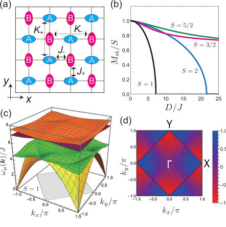
<figcaption class="paper-figure-caption"><b>Fig 1.</b> Figure 1. (a) Square lattice with two sublattices, A and B, related by a C4 rotation. In the absence of distortion, the couplings satisfy J+ = J−= J and K+ = K−= K. Lat- tice distortions introduce anisotropy as J± = J ± δJ and K± = K ± δK. (b) Staggered magnetization Mst/S as a function of D/J for S = 1, 3/2, 2, and 5/2, at K/J = 0.2 and in the absence of distortion. (c) Flavor-wave excitation spectrum ωµ(k) for S = 1 at K/J = 0.2 and D/J = 2, plotted in the extended Brillouin zone. The shaded region at the bot- tom denotes the first Brillouin zone of the two-site unit cell. (d) Momentum-resolved mx(k) of the lowest-energy (yellow) excitation in (c).</figcaption>
</figure>
<figure class="paper-figure-card">
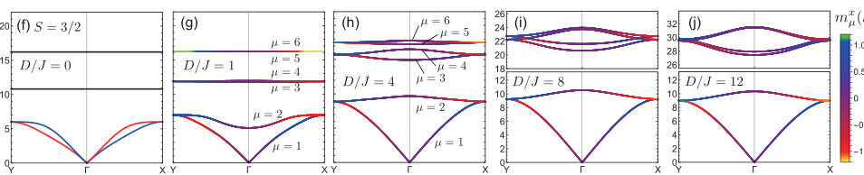
<figcaption class="paper-figure-caption"><b>Fig 2.</b> Figure 2. Evolution of the flavor-wave excitation spectra ωµ(k) with D/J at K/J = 0.2 along the Y–Γ–X path in the first Brillouin zone, for (a–e) S = 1 and (f–j) S = 3/2. The color encodes mx µ(k). In (a) and (f), the higher excitation branches at D/J = 0 are doubly degenerate within the linear flavor-wave approximation, and are shown as black lines due to the ill-defined color. In (i) and (j), the spectra are split into two panels due to the large separation between low- and high-energy branches.</figcaption>
</figure>
<figure class="paper-figure-card">
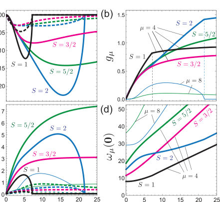
<figcaption class="paper-figure-caption"><b>Fig 3.</b> Figure 3. (a) Piezomagnetic susceptibilities χK (dashed) and χD (solid), multiplied by J, as functions of D/J at K/J = 0.2 for S = 1, 3/2, 2, and 5/2. Mode dependences (a) of gµ, (b) of fK,µ (dashed) and fD,µ (solid), and (c) of ωµ(0) as functions of D/J for different S, with the same color scheme as in (a). Thick and thin curves in (b)–(d) denote the active branches µ = 4 and 8, respectively; for all other branches, gµ = fK,µ = fD,µ = 0.</figcaption>
</figure>
<figure class="paper-figure-card">
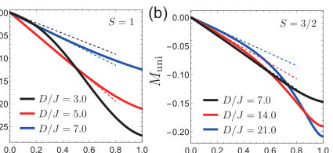
<figcaption class="paper-figure-caption"><b>Fig 4.</b> Figure 4. Strain-induced uniform magnetization Muni as a function of the distortion parameter α, obtained from multi- component mean-field theory with δJ = αJ, δK = αK, and δD = αD. (a) S = 1 and (b) S = 3/2 for different D/J at K/J = 0.2. Dashed lines show the linear-response prediction (KχK + DχD)α.</figcaption>
</figure>
<figure class="paper-figure-card">
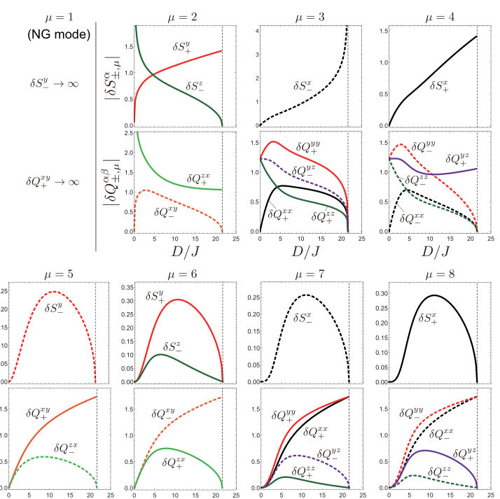
<figcaption class="paper-figure-caption"><b>Fig 5.</b> Figure 5. Absolute values of the nonvanishing normalized dipolar and quadrupolar matrix elements, |δSα ±,µ| and |δQαβ ±,µ|, as functions of D/J for S = 2 and K/J = 0.2. The upper and lower panels show the dipolar and quadrupolar components, respectively, for µ = 1–8. For µ = 1, only the singular components at k = 0 are indicated schematically: |δSy −,1| →∞and |δQxy +,1| →∞. The same colors represent the same components throughout, while solid (dashed) lines denote uniform (+) [staggered (−)] channels. Vertical dashed lines indicate the large-D transition, and the matrix elements are shown only in the ordered phase. The singular behavior of the µ = 2 branch as D →0 reflects the restoration of...</figcaption>
</figure>

**Summary.** This work theoretically derives the microscopic origin of piezomagnetism in higher-spin altermagnets by analyzing how lattice distortions couple to magnetic excitations. The key finding is a stark contrast between integer and half-integer spins: integer spins exhibit enhanced response due to a specific excitation mode softening into a Higgs-like amplitude mode, while this mechanism fails for half-integer systems.

**Why it may be interesting.** The explicit link established between macroscopic magnetoelastic coupling (piezomagnetism) and the quantum dynamics/stability of higher-order magnetic excitations ($\mu=4n$ modes) provides a rich theoretical playground for understanding emergent properties in strongly correlated magnets, relevant to AMO systems exhibiting strong spin-orbit coupling.

Detailed structure

**Main problem.** The study investigates the quantum mechanism by which lattice distortions (piezomagnetism) couple to and are mediated by higher-spin collective magnetic excitations in altermagnets.

**Main result.** Integer spin systems show a pronounced enhancement of piezomagnetism due to a specific multipolar excitation mode softening into a Higgs-like amplitude mode near the large-$D$ transition, contrasting with half-integer spins where this contribution is suppressed.

**Method.** The analysis employs flavor-wave theory and linear response theory applied to an effective Hamiltonian derived from mean-field decoupling of the spin system. This allows calculating susceptibilities based on excitation modes.

**Model / system.** The model is a two-sublattice antiferromagnet on a square lattice with higher spin $S$, governed by an exchange, second-neighbor interaction, and easy-plane anisotropy ($D$). The Hamiltonian is perturbed by small uniaxial lattice distortions ($\delta J, \delta K, \delta D$).

**Key observables.** Piezomagnetic susceptibility ($\chi_J, \chi_K, \chi_D$), uniform magnetization $\langle\hat{M}_{	ext{uni}}
angle$, and the energy/mode content of quasiparticle excitation branches ($\omega_\mu(\mathbf{k})$).

**Important parameters / regimes.** Spin quantum number $S$ (integer vs. half-integer), anisotropy strength ($D$), and lattice distortion coupling constants.

**Assumptions / limitations.** The analysis relies on mean-field decoupling of the Hamiltonian, followed by bosonization/flavor-wave theory to describe excitations around the ground state.

**Figures summary.** Figures illustrate how susceptibilities ($\chi_K, \chi_D$) vary with anisotropy $D/J$ for different spins, highlighting peaks near the large-$D$ transition for integer spins. Other figures detail the mode dependence of coupling matrix elements.

**Paper structure.** The paper systematically develops the theoretical framework by defining the Hamiltonian and using mean-field theory to establish excitation modes. It then applies linear response theory to calculate piezomagnetic susceptibilities, contrasting the behavior between integer and half-integer spin systems based on the fate of specific multipolar excitations.

Abstract

We investigate piezomagnetism in higher-spin altermagnets with easy-plane single-ion anisotropy using a flavor-wave approach. We show that quantum fluctuations of higher-spin collective modes provide a microscopic origin of the piezomagnetic response. For integer spins, the relevant branch softens and evolves into a Higgs-like amplitude mode on approaching the large-$D$ transition, endowing the excitation with a sizable dipolar component and producing a pronounced enhancement of piezomagnetism. By contrast, in half-integer systems the higher-spin branches are progressively separated from the low-energy dipolar sector as the anisotropy increases, which suppresses their contribution to the response. This integer-half-integer contrast directly links macroscopic piezomagnetism to the low-energy fate of multipolar excitations. Our results establish piezomagnetism as a probe of higher-spin quantum dynamics and identify higher-spin altermagnets as a promising setting for quantum magnetoelastic responses.

[↑ back to top](#top)

### [Sum rules and density-wave modes in spin-singlet fractional quantum Hall fluids](http://arxiv.org/abs/2608.11133v1)

**Authors:** Ritajit Kundu, Rakesh K. Dora, Dung Xuan Nguyen, Ajit C. Balram  
**Type:** theory · **Category:** strongly correlated electrons · **PDF:** <https://arxiv.org/pdf/2608.11133v1>  
**Analysis basis:** full PDF text, analyzed in chunks
**Topic relevance:** `analog quantum simulation` **2/5** · `Frenkel-Kontorova` **1/5** · `Keldysh / 2PI / non-Gaussian methods` **1/5**

↔ Scroll figures horizontally

<figure class="paper-figure-card">
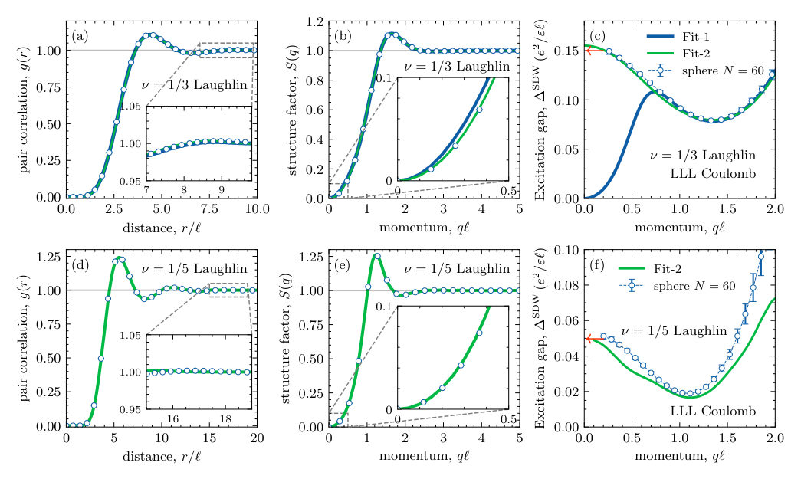
<figcaption class="paper-figure-caption"><b>Fig 1.</b> FIG. 1. Fits for the density-density correlators of Laughlin states. (a) Pair-correlation function g(r) of the ν = 1/3 Laughlin state obtained from the orthogonal basis, Eq. (108), compared with Monte Carlo (MC) data on the sphere. Two fitting schemes are considered: Fit-1, imposing only the s0 = 0 constraint, and Fit-2, imposing the s0, s2, s4, and s6 constraints, Eq. (114). Inset: long-distance behavior. (b) Static structure factor S(q) corresponding to the two fits, compared with the MC data. Inset: enlarged view of the long-wavelength regime. (c) Coulomb GMP gap computed from Eq. (77). While Fit-1 fails to reproduce the correct low-q behavior, Fit-2 agrees well with the sphere results...</figcaption>
</figure>
<figure class="paper-figure-card">
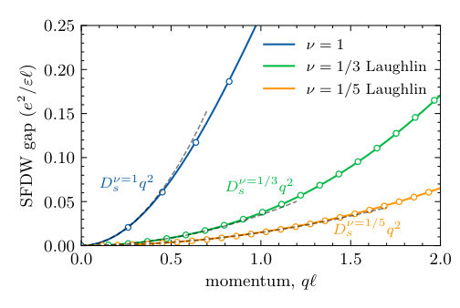
<figcaption class="paper-figure-caption"><b>Fig 2.</b> FIG. 2. Spin-flip density-wave (SFDW) gaps. SFDW gaps for ν = 1, 1/3, 1/5. Solid lines are computed using Eq. (96), with the ν = 1 case given by the analytical result in Eq. (97). Markers show results obtained on the sphere using the methodology presented in Refs. [38, 93] for N = 60. For ν = 1/3 and 1/5, the statistical error bars from the Monte Carlo simulations are smaller than the markers. Dashed lines show the quadratic fit Dsq2, with Dν=1 s = √</figcaption>
</figure>
<figure class="paper-figure-card">
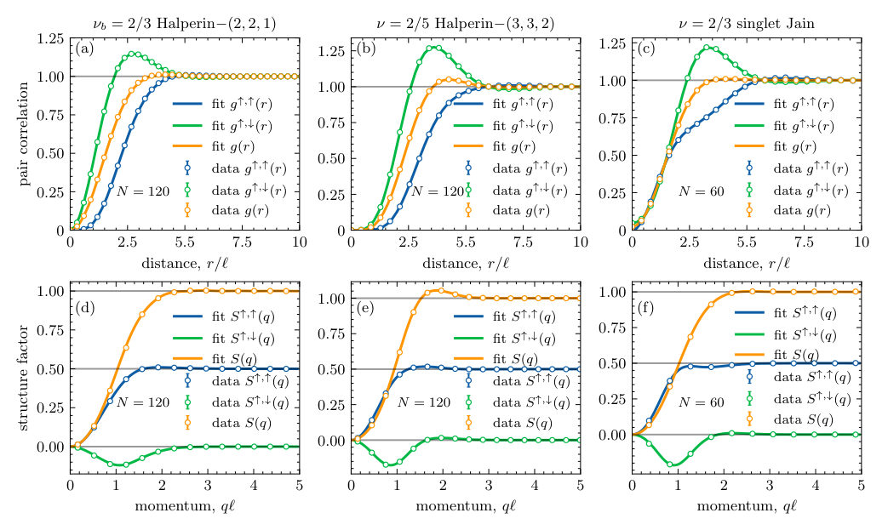
<figcaption class="paper-figure-caption"><b>Fig 3.</b> FIG. 3. Pair-correlation functions and static structure factors of spin-singlet FQH states. Panels (a)-(c): The various components of the pair-correlation function for the bosonic νb=2/3 Halperin-(2, 2, 1), and the fermionic ν=2/5 Halperin- (3, 3, 2) and the fermionic ν=2/3 spin-singlet Jain states, respectively. The circles show the raw Monte Carlo (MC) data obtained on the sphere, while the solid lines are planar fits to these MC data carried out using the expansions in Eqs. (108) and (109). Panels (d)-(f): The corresponding components of the static structure factor for the states shown in panels (a)-(c), respectively. The solid lines are obtained from Eqs. (111a) and (111b), while the...</figcaption>
</figure>
<figure class="paper-figure-card">
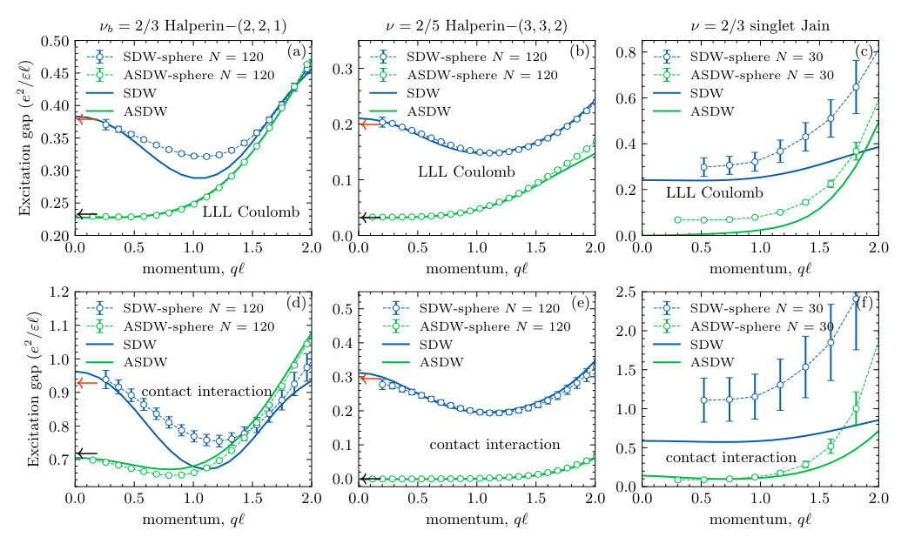
<figcaption class="paper-figure-caption"><b>Fig 4.</b> FIG. 4. Density-wave dispersions for spin-singlet FQH states. Panels (a)-(c): Dispersions of the symmetric-density- wave (SDW) and anti-symmetric-density-wave (ASDW) modes for the bosonic νb=2/3 Halperin-(2, 2, 1), and the fermionic ν=2/5 Halperin-(3, 3, 2) and the fermionic ν=2/3 spin-singlet Jain states, respectively computed using Eqs. (77) and (82) for the Coulomb interaction. We also show the corresponding gaps on the sphere. The error bar on the spherical gaps stems from the statistical uncertainty in the Monte Carlo evaluation of the structure factor. The spherical gaps are computed using methods outlined in Ref. [38]. Panels (d)-(f) present the corresponding results for the contact...</figcaption>
</figure>
<figure class="paper-figure-card">
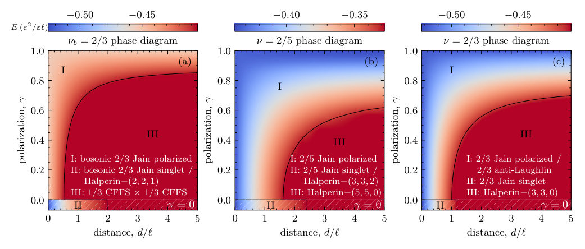
<figcaption class="paper-figure-caption"><b>Fig 5.</b> FIG. 5. Variational phase diagrams of bilayer FQH states. Phase diagrams in the interlayer separation-polarization (d/ℓ, γ) plane for (a) bosons at filling νb=2/3, and fermions at fillings (b) ν=2/5 and (c) ν=2/3 obtained from calculations comparing the per-particle Coulomb energies of the competing candidate states listed on the panels and identifying the state with the lowest energy at each point. Solid lines denote phase boundaries. At non-zero polarizations (γ&gt;0), only the fully polarized (I) and layer-decoupled (III) states compete, whereas at γ=0 the singlet (II) state is also relevant. The hatched area shown below γ=0 highlights the phase diagram on the γ=0 line.</figcaption>
</figure>

**Summary.** This work develops a sophisticated theoretical method using Laguerre polynomials and sum rule constraints to analyze spin-singlet Fractional Quantum Hall fluids. By accurately determining the density-wave excitation gaps for both symmetric and antisymmetric modes, the authors provide crucial insights into the phase diagrams of bilayer FQH systems relevant to modern experimental platforms.

**Why it may be interesting.** While focused on solid-state physics, the rigorous mathematical techniques involving orthogonal polynomial expansions and constraint enforcement (sum rules) are highly relevant to developing robust theoretical tools for strongly interacting quantum many-body systems, which share conceptual links with AMO physics modeling of few-body or lattice excitations.

Detailed structure

**Main problem.** To accurately calculate long-wavelength density-wave excitation gaps for spin-singlet Fractional Quantum Hall (FQH) fluids.

**Main result.** The authors show that incorporating sum rules derived from the static structure factor expansion is crucial for obtaining numerically stable and accurate values for both symmetric and antisymmetric density-wave excitation gaps.

**Method.** They perform thermodynamic fits on the pair correlation function using an orthogonal basis of associated Laguerre polynomials, enforcing necessary sum rules during the fitting procedure.

**Model / system.** The study focuses on two-component spin-singlet FQH fluids (Halperin and Jain states) in a strong perpendicular magnetic field. The framework is extended to analyze bilayer FQH systems.

**Key observables.** Long-wavelength Girvin-MacDonald-Platzman (GMP)/symmetric density-wave excitation gap, antisymmetric density-wave mode gap, and variational energies for phase diagram construction.

**Important parameters / regimes.** Filling fractions ($
u$), interlayer separation, and density imbalance/layer-polarization in bilayer systems.

**Assumptions / limitations.** The analysis assumes confinement to the Lowest Landau Level (LLL) and relies on expanding correlation functions using an orthogonal polynomial basis.

**Paper structure.** The paper develops a theoretical framework by fitting pair correlation functions using Laguerre polynomials, enforcing sum rules derived from the static structure factor expansion. This is applied to calculate excitation gaps and ultimately construct phase diagrams for bilayer FQH systems.

Abstract

Fractional quantum Hall (FQH) states are prototypical examples of strongly interacting topologically ordered systems. In this work, we obtain thermodynamic fits on the plane for the pair correlation function, and its Fourier transform, the static structure factor, of two-component spin-singlet Halperin and Jain FQH fluids by expanding them in the recently introduced basis of the orthogonal associated Laguerre polynomials [Fulsebakke et al., SciPost Phys. 14, 149 (2023), https://doi.org/10.21468/SciPostPhys.14.6.149 ] and ascertaining the expansion coefficients by fitting them to large-system Monte Carlo data evaluated using their trial wavefunctions. In this fitting procedure, aside from constraining the exact short-distance behavior of the wavefunction, we also derive and enforce the sum rules that the long-wavelength expansion of the static structure factor must adhere to. We show that incorporating these constraints is crucial for obtaining numerically stable and accurate values of the long-wavelength Girvin-MacDonald-Platzman (GMP)/symmetric density-wave excitation gap. We further extend this approach to spin-resolved density-correlation functions, enabling the evaluation of the gap of the antisymmetric density-wave mode for these spin-singlet FQH states. Finally, we use the density-correlators to compute variational energies of the states and construct phase diagrams for bilayer FQH systems. These could be relevant for understanding recent bilayer FQH experiments that map out the phase diagram by tuning the interlayer separation and density-imbalance/layer-polarization.

[↑ back to top](#top)

### [Entanglement depth and ancilla efficiency in quantum channel estimation](http://arxiv.org/abs/2608.11042v1)

**Authors:** Javid Naikoo  
**Type:** theory · **Category:** quantum information and computing · **PDF:** <https://arxiv.org/pdf/2608.11042v1>  
**Analysis basis:** full PDF text, analyzed in chunks
**Topic relevance:** `quantum measurements` **2/5** · `Keldysh / 2PI / non-Gaussian methods` **1/5**

↔ Scroll figures horizontally

<figure class="paper-figure-card">
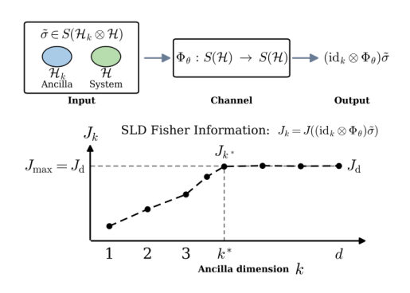
<figcaption class="paper-figure-caption"><b>Fig 1.</b> FIG. 1: Schematic of the optimal ancilla dimension problem. A probe state ˜σ ∈S(Hk ⊗H), prepared using a k-dimensional an- cillary system, is sent through the parameterized quantum channel Φθ. The output state (idk ⊗Φθ)(˜σ) is used to estimate the param- eter θ, with precision quantified by the SLD Fisher information Jk. The plot of Jk versus the ancilla dimension k is illustrative only and conveys the qualitative behavior of the attainable Fisher information. A main objective of this work is to characterize the smallest ancilla dimension k∗such that Jk = Jd, where d = dim H.</figcaption>
</figure>

**Summary.** This work develops a systematic theory for quantifying the role of ancillary entanglement in quantum channel estimation. It introduces the concept of 'entanglement depth' ($k^*$), which determines the minimum required ancilla dimension to reach optimal measurement precision. The results provide concrete conditions under which entanglement offers no advantage, offering deep insights into resource limitations in quantum metrology.

**Why it may be interesting.** It provides a rigorous framework quantifying exactly how much entanglement resource is necessary to extract the maximum possible information about an unknown physical process (the channel).

Detailed structure

**Main problem.** The paper investigates determining the minimum ancillary entanglement dimension ($k^*$) required to achieve optimal precision in quantum channel parameter estimation.

**Main result.** The optimal ancilla dimension $k^*$ is characterized by the minimum rank of a state that maximizes the achievable Fisher information, and sufficient conditions are provided for when no entanglement advantage exists ($k^*=1$).

**Method.** It uses variational characterization techniques to define the $k$-ancilla Fisher information, comparing it against the maximum possible value derived from optimizing over input states.

**Model / system.** The model involves estimating an unknown parameter $	heta$ characterizing a quantum channel $\{\Phi_	heta\}$ acting on a system Hilbert space $H$. The estimation process utilizes ancillary entanglement via an auxiliary system $H_k$.

**Key observables.** Symmetric Logarithmic Derivative (SLD) Fisher information ($J$), and the minimum required ancilla dimension ($k^*$).

**Important parameters / regimes.** The channel parameter $	heta$, the input state rank $k$, and the dimensionality of the ancillary system.

**Assumptions / limitations.** The analysis assumes $\{\Phi_	heta\}$ is a smooth, piecewise-regular one-parameter family of quantum channels; specific results rely on assumptions like fixed-measurement Holevo representations.

**Figures summary.** Figure 1 schematically illustrates the relationship between achievable Fisher information ($J_k$) and the ancilla dimension $k$, aiming to find $k^*$ where $J_{k^*} = J_{	ext{max}}$.

**Paper structure.** The paper establishes the variational formula for $J_k$, derives theorems characterizing $k^*$ based on state rank, provides sufficient conditions (zero-gap) for $k^*=1$, and illustrates these results with explicit examples like depolarizing and amplitude damping channels.

Abstract

We study the role of ancillary entanglement in quantum channel parameter estimation and investigate the minimal ancilla dimension required to achieve the maximum Fisher information. We introduce the $k$-ancilla Fisher information, which quantifies the optimal estimation precision achievable with input states of rank at most $k$, and derive a variational characterization in terms of a rank-constrained optimization problem. This formulation leads to a simple characterization of the minimum ancilla dimension $k^*$ required for optimal estimation, given by the minimum rank among the maximizers of the associated variational problem. We further identify sufficient conditions under which ancillary entanglement provides no advantage, including channel families admitting a fixed measure-and-prepare representation and channels satisfying a natural horizontality condition. In addition, we derive a bound on the incremental gain in Fisher information obtained by increasing the ancilla dimension under suitable structural assumptions on the optimal input states. The general results are illustrated through explicit examples, including unitary channels, qubit depolarizing and amplitude damping channels. These results provide a systematic framework for understanding and quantifying the entanglement resources required for optimal quantum channel estimation.

[↑ back to top](#top)

### [The Renormalization Group as a Stochastic Exploration Process](http://arxiv.org/abs/2608.11106v1)

**Authors:** Denis Bernard  
**Type:** theory · **Category:** statistical mechanics · **PDF:** <https://arxiv.org/pdf/2608.11106v1>  
**Analysis basis:** full PDF text, analyzed in chunks
**Topic relevance:** `non-equilibrium universality` **2/5** · `driven-dissipative phase transition` **1/5**

↔ Scroll figures horizontally

<figure class="paper-figure-card">
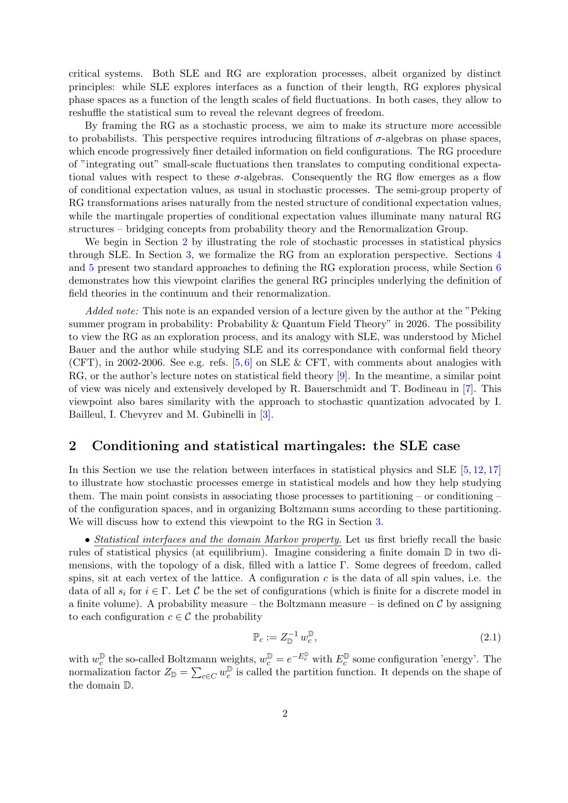
<figcaption class="paper-figure-caption"><b>Fig 1.</b> Low-resolution page preview, page 2</figcaption>
</figure>
<figure class="paper-figure-card">
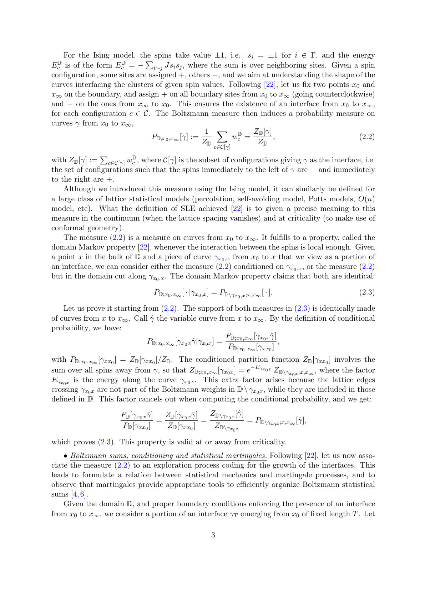
<figcaption class="paper-figure-caption"><b>Fig 2.</b> Low-resolution page preview, page 3</figcaption>
</figure>
<figure class="paper-figure-card">
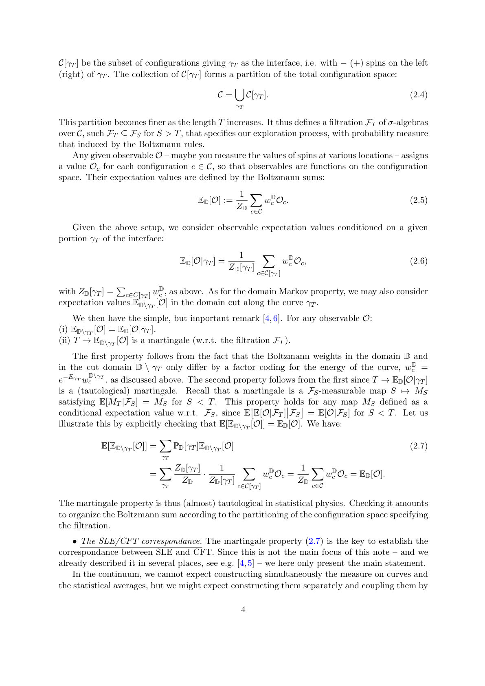
<figcaption class="paper-figure-caption"><b>Fig 3.</b> Low-resolution page preview, page 4</figcaption>
</figure>
<figure class="paper-figure-card">
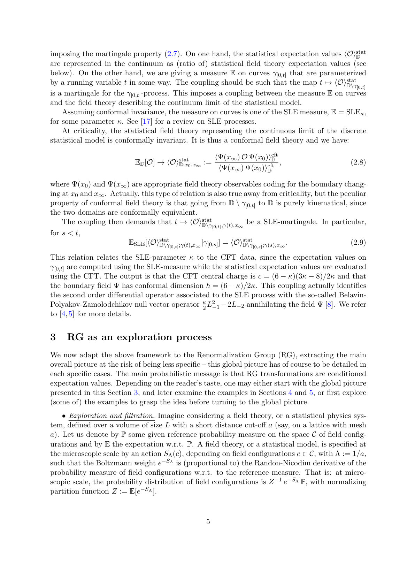
<figcaption class="paper-figure-caption"><b>Fig 4.</b> Low-resolution page preview, page 5</figcaption>
</figure>
<figure class="paper-figure-card">
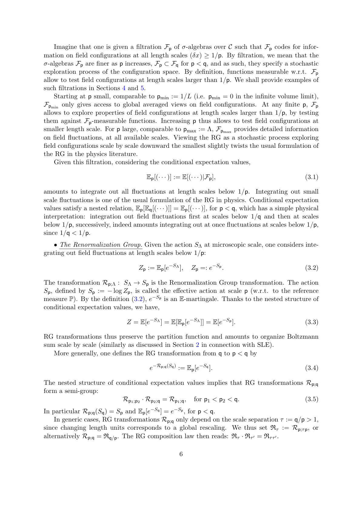
<figcaption class="paper-figure-caption"><b>Fig 5.</b> Low-resolution page preview, page 6</figcaption>
</figure>

**Summary.** This paper reframes the Renormalization Group (RG) as a stochastic process that tracks physical system properties across different length scales. By utilizing concepts like martingales and conditional expectations, it rigorously connects lattice statistical mechanics models to continuous mathematical structures such as Stochastic Loewner Evolution and Conformal Field Theory. This provides a powerful probabilistic framework for understanding critical phenomena.

**Why it may be interesting.** The deep mathematical connection established between RG flow, martingale theory, and SLE/CFT provides powerful new tools for analyzing critical phenomena in many-body systems, which is foundational to understanding quantum phase transitions.

Detailed structure

**Main problem.** The paper reinterprets the Renormalization Group (RG) as a stochastic process that explores physical phase spaces scale by scale, establishing connections to probabilistic tools and random exploration processes.

**Main result.** Viewing RG flow through the lens of conditional expectation values reveals that key quantities form martingales, providing a rigorous link between concepts like Stochastic Loewner Evolution (SLE) and Conformal Field Theory (CFT).

**Method.** The analysis employs techniques from probability theory, specifically using filtrations ($\mathcal{F}_T$) and martingale properties, applied to lattice statistical mechanics models.

**Model / system.** The primary model is general statistical physics systems on a lattice $\Gamma$ (e.g., the Ising model), described by Boltzmann measures $P_c \propto e^{-E_D[c]}$. The continuum limit is approached via scaling limits of these discrete models.

**Key observables.** Partition function ($Z_D$), conditional expectation values ($\mathbb{E}_D[O|\gamma_T]$), and the effective action ($S_p$).

**Important parameters / regimes.** The scale parameter (related to interface length $T$ or lattice spacing $a$), coupling constants $\{g\}$, and the correlation length $\xi$.

**Assumptions / limitations.** The analysis assumes that local interactions are sufficiently well-behaved to maintain a domain Markov property, and for continuum limits, it relies on formal constructions of scaling limits.

**Paper structure.** The paper progresses by first establishing the stochastic interpretation using conditioning on interfaces (Chunk 1), then generalizing this to define RG transformations via conditional expectations (Chunk 2), and finally detailing the rigorous construction of continuum field theories through scaling limits and covariance relations (Chunks 3 & 4).

Abstract

The Renormalization Group (RG) is a powerful and versatile framework for analyzing complex physical systems. Here, we reinterpret it as a stochastic process that explores physical phase spaces, scale by scale, progressively revealing finer details of small-scale structures. This perspective establishes a natural connection to other random exploration processes, such as the Schramm-Loewner evolution, and is more suited for a probabilist audience. It links RG concepts such as RG transformations, effective actions, etc, to usual probabilistic tools such as conditional expectation values, martingales, etc, but also makes contact with stochastic quantization.

[↑ back to top](#top)

### [Breaking the Quadratic Barrier for von Neumann Entropy Estimation](http://arxiv.org/abs/2608.11151v1)

**Authors:** Minbo Gao, Qisheng Wang  
**Type:** theory · **Category:** quantum information and computing · **PDF:** <https://arxiv.org/pdf/2608.11151v1>  
**Analysis basis:** full PDF text, analyzed in chunks
**Topic relevance:** `quantum measurements` **2/5**

↔ Scroll figures horizontally

<figure class="paper-figure-card">
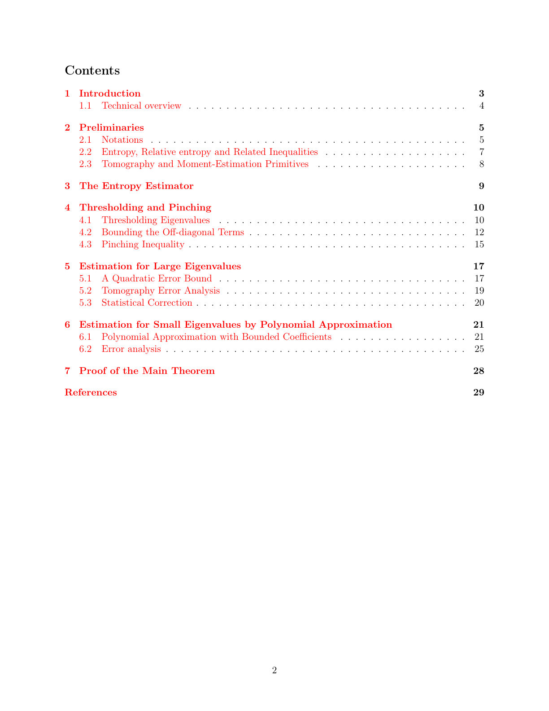
<figcaption class="paper-figure-caption"><b>Fig 1.</b> Low-resolution page preview, page 2</figcaption>
</figure>
<figure class="paper-figure-card">
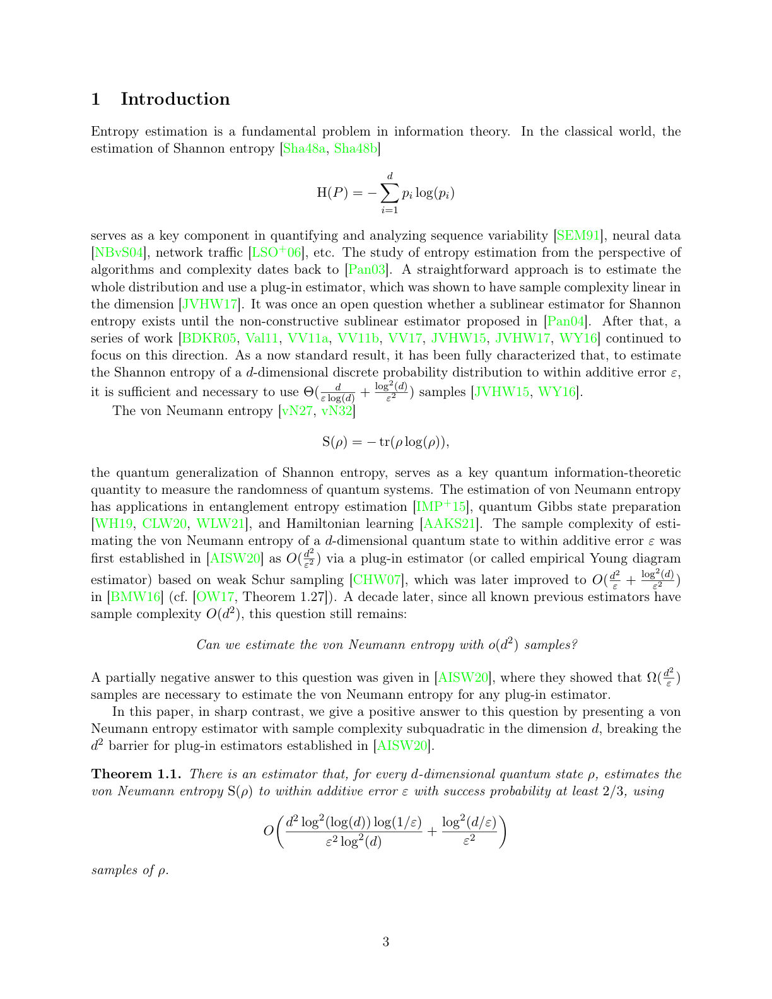
<figcaption class="paper-figure-caption"><b>Fig 2.</b> Low-resolution page preview, page 3</figcaption>
</figure>
<figure class="paper-figure-card">
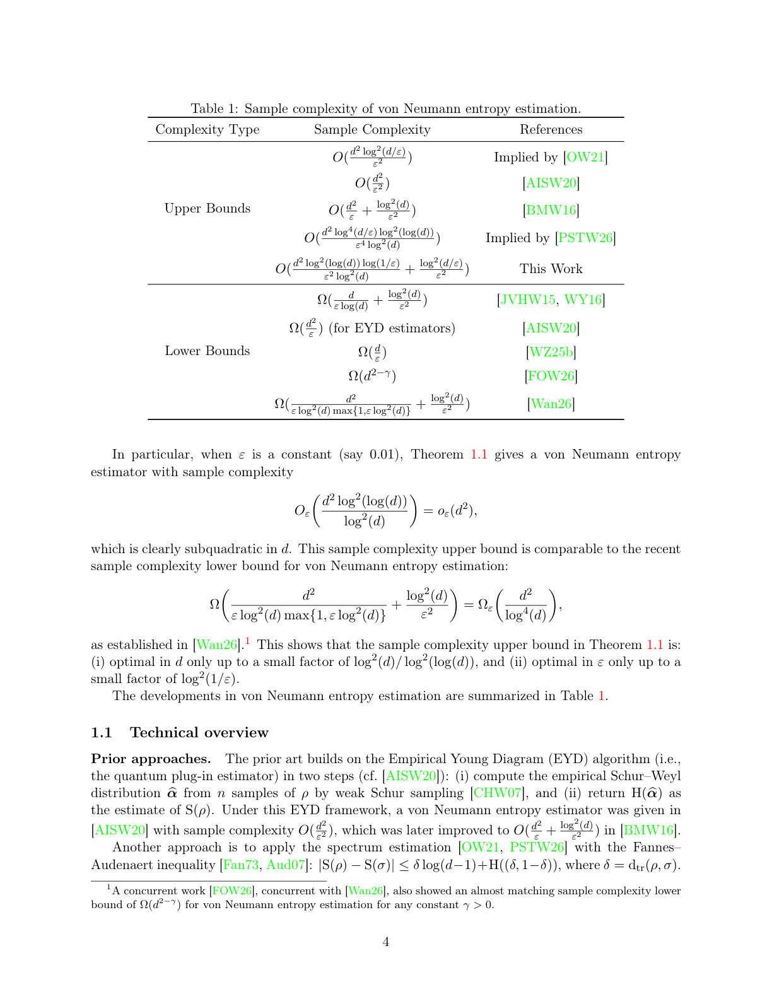
<figcaption class="paper-figure-caption"><b>Fig 3.</b> Low-resolution page preview, page 4</figcaption>
</figure>
<figure class="paper-figure-card">
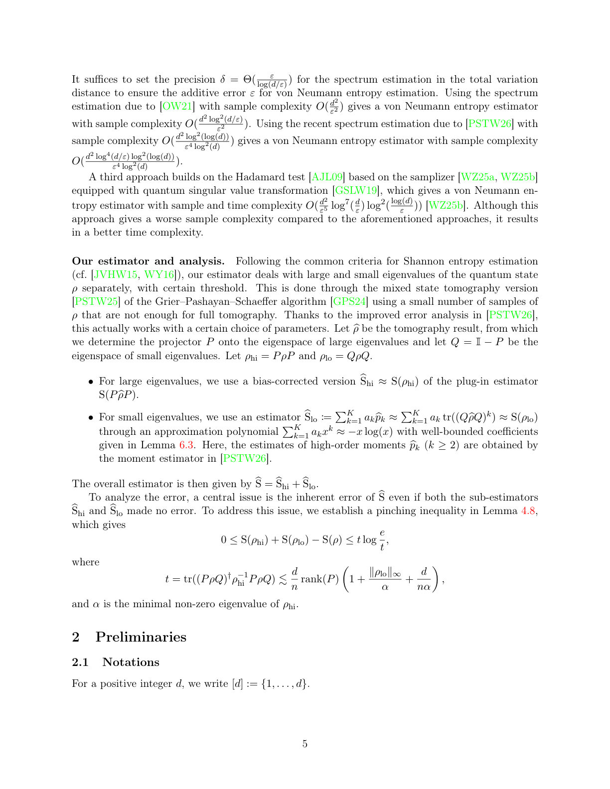
<figcaption class="paper-figure-caption"><b>Fig 4.</b> Low-resolution page preview, page 5</figcaption>
</figure>
<figure class="paper-figure-card">
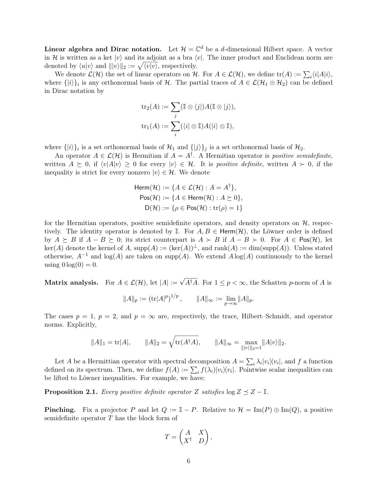
<figcaption class="paper-figure-caption"><b>Fig 5.</b> Low-resolution page preview, page 6</figcaption>
</figure>

**Summary.** This paper presents a breakthrough estimator for calculating the von Neumann entropy of an unknown quantum state. By introducing a novel spectral decomposition and combining specialized estimators for different eigenvalue regimes, the authors achieve a sample complexity that scales subquadratically with system dimension $d$. This result significantly improves resource efficiency compared to previous methods in quantum information theory.

**Why it may be interesting.** This work provides fundamental algorithmic improvements in quantum information theory by establishing tighter resource bounds for estimating core quantities like entropy from limited measurements, which is crucial for experimental quantum characterization.

Detailed structure

**Main problem.** The primary goal is to estimate the von Neumann entropy $S(
ho)$ of an unknown quantum state $
ho$ given limited sampling data.

**Main result.** The authors derive a novel estimator achieving a sample complexity that scales subquadratically, $o(d^2)$, breaking previous quadratic barriers for this estimation task.

**Method.** The technique involves decomposing the state's spectrum using an eigenvalue threshold and employing separate estimators—a bias-corrected plug-in method for large eigenvalues and a polynomial moment estimator for small ones.

**Model / system.** The system is an unknown quantum state $
ho$ defined on a $d$-dimensional Hilbert space, treated as a density operator. The analysis heavily relies on functional analysis tools like Schatten norms and spectral decomposition.

**Key observables.** Von Neumann entropy $S(
ho) = -	ext{tr}(
ho \log(
ho))$, and the estimation error $\epsilon$.

**Important parameters / regimes.** The dimension of the Hilbert space ($d$), the desired additive error ($\varepsilon$), and the eigenvalue threshold ($B$).

**Assumptions / limitations.** Success relies on 'successful tomography' to bound measurement errors, and the overall analysis combines bounds from entropy loss (via a new pinching inequality) and moment estimation.

**Paper structure.** The paper builds by first establishing the problem context and reviewing prior complexity results. It then details the core methodology: splitting the state into high- and low-eigenvalue components, developing separate estimators for each part (using moment estimation for the low end), and finally combining these estimates using a new pinching inequality to achieve the overall subquadratic sample bound.

Abstract

We study the sample complexity of estimating the von Neumann entropy of an unknown $d$-dimensional quantum state. All previously known estimators require $Ω(d^2)$ samples, and plug-in estimators are known to face a quadratic barrier. We give the first subquadratic-sample estimator: for additive error $\varepsilon$, our estimator uses   \[   O\!\left(\frac{d^2 \log^2(\log(d)) \log(1/\varepsilon)}{\varepsilon^2 \log^2(d)} + \frac{\log^2(d/\varepsilon)}{\varepsilon^2}\right)   \] samples. In particular, for constant $\varepsilon$, the complexity is $O_\varepsilon(d^2\log^2(\log(d))/\log^2(d))=o(d^2)$. Our analysis introduces a new pinching inequality that bounds the entropy loss under a space direct-sum decomposition, together with a bias-corrected estimator for large eigenvalues and a new bounded-coefficient polynomial estimator for small eigenvalues.

[↑ back to top](#top)

### [Optimal fidelity estimation when one state is pure via algorithmic Uhlmann transform](http://arxiv.org/abs/2608.10674v1)

**Authors:** Yupan Liu, Qisheng Wang  
**Type:** theory · **Category:** quantum information and computing · **PDF:** <https://arxiv.org/pdf/2608.10674v1>  
**Analysis basis:** full PDF text, analyzed in chunks
**Topic relevance:** `quantum measurements` **2/5**

↔ Scroll figures horizontally

<figure class="paper-figure-card">
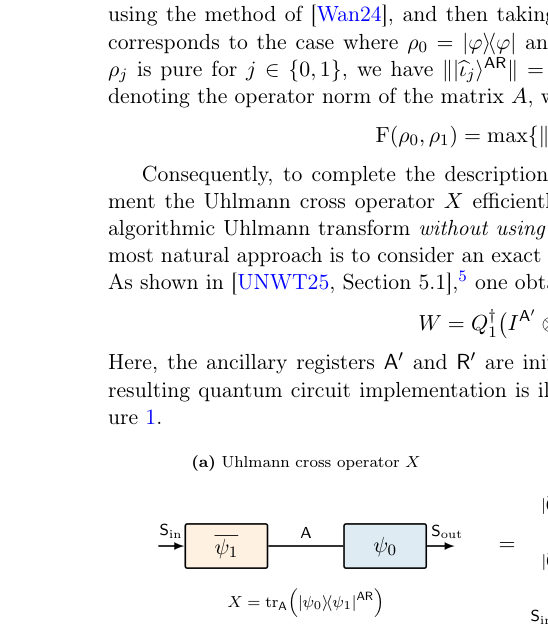
<figcaption class="paper-figure-caption"><b>Fig 1.</b> Figure 1: Uhlmann cross operator X and the zero block of its unitary dilation W.</figcaption>
</figure>
<figure class="paper-figure-card">
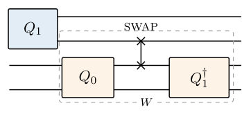
<figcaption class="paper-figure-caption"><b>Fig 2.</b> Figure 2: Quantum circuit U1.</figcaption>
</figure>
<figure class="paper-figure-card">
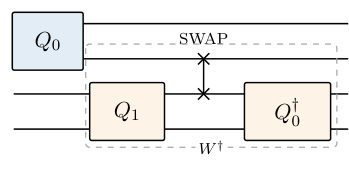
<figcaption class="paper-figure-caption"><b>Fig 3.</b> Figure 3: Quantum circuit U0.</figcaption>
</figure>

**Summary.** This paper presents an optimal quantum estimator for calculating the Uhlmann fidelity between two quantum states when one of them is known to be pure. By adapting the algorithmic Uhlmann transform, the authors achieve query-optimal complexity $O(1/\varepsilon)$, providing a significant theoretical improvement over general mixed-state estimation protocols.

**Why it may be interesting.** This work provides quantum computational tools to estimate fundamental physical quantities like state overlap with high efficiency, which is crucial for characterizing quantum channels or verifying quantum process fidelity.

Detailed structure

**Main problem.** The primary goal is to develop an optimal quantum estimator for the Uhlmann fidelity $F(
ho_0, 
ho_1)$ when only the promise that at least one of the two input states ($
ho_0$ or $
ho_1$) is pure is available.

**Main result.** The authors establish a query-optimal quantum estimator achieving complexity $\Theta(1/\varepsilon)$, which significantly improves upon previous bounds in this specific scenario.

**Method.** The method involves specializing the refined algorithmic Uhlmann transform to utilize the structure imposed by one pure state, relating the fidelity estimation to estimating maximum square-root amplitudes derived from the unitary dilation of the Uhlmann cross operator.

**Model / system.** The system involves two unknown quantum states, $
ho_0$ and $
ho_1$, whose closeness is quantified by the Uhlmann fidelity. The analysis focuses on accessing these states via state-preparation circuits or receiving multiple copies.

**Key observables.** Uhlmann fidelity $F(
ho_0, 
ho_1)$, which equals the norm of the Uhlmann cross operator $\lVert X 
Vert$ when one state is pure.

**Important parameters / regimes.** The estimation precision $\varepsilon$, and the query/sample complexities (e.g., $O(1/\varepsilon)$ queries).

**Assumptions / limitations.** The core assumption is that at least one of the two states ($
ho_0$ or $
ho_1$) is pure, which simplifies the structure of the Uhlmann cross operator.

**Figures summary.** Figure 1 illustrates the Uhlmann cross operator $X$ and its unitary dilation block. Other figures detail quantum circuits used to estimate related quantities $a_0$ and $a_1$.

**Paper structure.** The paper builds upon existing fidelity estimation techniques, deriving an estimator by specializing the algorithmic Uhlmann transform for the one-pure-state case, culminating in a concrete algorithm (Algorithm 1) for optimal estimation.

Abstract

The Uhlmann fidelity ${\rm F}(ρ_0,ρ_1) = {\rm tr}|\sqrt{ρ_0}\sqrt{ρ_1}|$ is one of the most fundamental quantities in quantum information theory for quantifying the closeness between two quantum states. Estimating the Uhlmann fidelity to within additive error $\varepsilon$ requires a number of copies of the states, or queries to their state-preparation circuits, that depends at least linearly on the smaller of the ranks of $ρ_0$ and $ρ_1$. Consequently, this rank dependence disappears when either state is pure, in which case the query and sample complexities depend only polynomially on $1/\varepsilon$. However, the known optimal estimator for ${\rm F}(ρ,|ψ\rangle\!\langleψ|)$ due to Fang and Wang (ESA 2025) requires prior knowledge of which state is pure.   In this work, we remove this mathematically unnecessary prior-knowledge requirement and establish an optimal estimator for ${\rm F}(ρ, |ψ\rangle\!\langleψ|)$ under the sole promise that one of the two states is pure, without knowing which one. Our estimator is obtained by specializing the refined algorithmic Uhlmann transform of Utsumi, Nakata, Wang, and Takagi (2025) to the case where one state is pure. In this setting, the Uhlmann fidelity can be recovered as follows: apply a unitary dilation of ${\rm tr}_{\sf A}(|ψ_0\rangle\!\langleψ_1|)$ (or its inverse) to the reference register $\sf R$ of the purification $|ψ_1\rangle$ (or $|ψ_0\rangle$) on the registers $\sf A$ and $\sf R$, estimate the corresponding square-root amplitude in each case, and take the maximum of the resulting two estimates.

[↑ back to top](#top)

### [Physics-Constrained Compressed Sensing for Quantum Sensing in the Data-Starved Regime](http://arxiv.org/abs/2608.11092v1)

**Authors:** Amir Kalev  
**Type:** theory · **Category:** other · **PDF:** <https://arxiv.org/pdf/2608.11092v1>  
**Analysis basis:** full PDF text, analyzed in chunks
**Topic relevance:** `quantum measurements` **2/5**

↔ Scroll figures horizontally

<figure class="paper-figure-card">
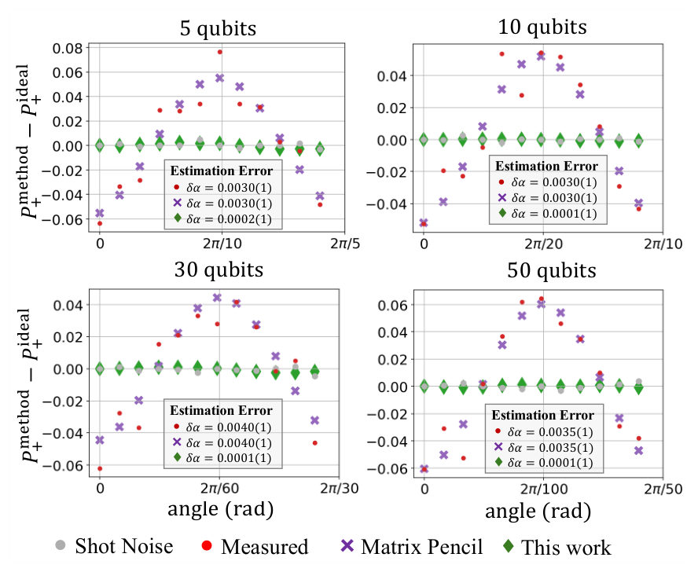
<figcaption class="paper-figure-caption"><b>Fig 1.</b> FIG. 1. Compressed sensing recovery of a quantum sensing signal. Each panel shows the difference P method + −P ideal + in the range [0, 2π/n] for n = 5, 10, 30, 50 qubits. Here P+ corresponds to the observed probability of finding the system in the +1 eigenspace of O = X⊗n [e.g., each shot noise point on the graph (gray dots) corresponds to 1</figcaption>
</figure>
<figure class="paper-figure-card">
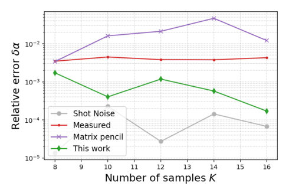
<figcaption class="paper-figure-caption"><b>Fig 2.</b> FIG. 2. Estimation error as a function of the num- ber of samples. Relative estimation error δα is shown as a function of the number of retained time samples K, averaged over 25 noise realizations. In the data-starved regime (K ∼8– 16), the PSD-constrained reconstruction (green) consistently outperforms both direct fitting to noisy data (red) and the matrix-pencil estimator (purple). As K increases, the perfor- mance of all methods converges, as expected when sufficient data are available.</figcaption>
</figure>
<figure class="paper-figure-card">
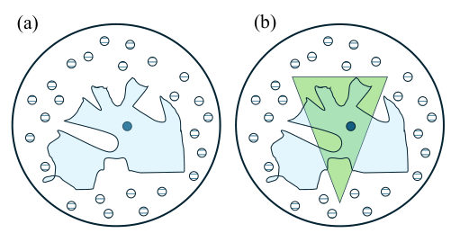
<figcaption class="paper-figure-caption"><b>Fig 3.</b> FIG. 3. The power of positivity (an illustration). (a) The outer circle represents the set of d × d Hermitian matri- ces, the blue region represents the non-convex subset of those matrices whose rank is equal or smaller than r, the circle within the rank-r subset represents the ground truth matrix. This matrix can be uniquely determined, within the subset of rank-r matrices, by O(rd) real numbers. However, there are infinitely many matrices whose rank is strictly larger than r that are consistent with these numbers. These matrices are represented by the circles outside the blue region. (b) It was shown in [19] that if the ground truth is a PSD matrix, then O(rd) real numbers uniquely...</figcaption>
</figure>
<figure class="paper-figure-card">
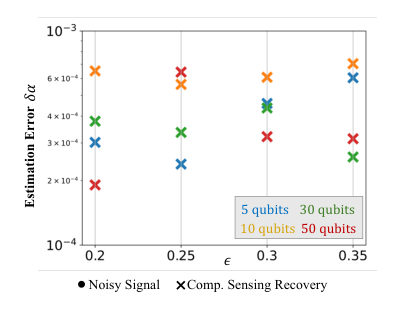
<figcaption class="paper-figure-caption"><b>Fig 4.</b> FIG. 5. Recovery of a quantum sensing as a function of ϵ. The variance of the estimated parameter is shown to be robust under moderate variation of ϵ.</figcaption>
</figure>
<figure class="paper-figure-card">
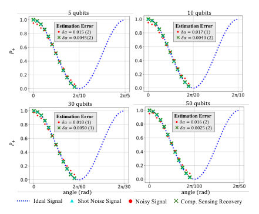
<figcaption class="paper-figure-caption"><b>Fig 5.</b> FIG. 4. Recovery of a quantum sensing signal. The PSD-based protocol is shown here to be robust for cases where the observations are limited to a fraction of the oscillation period. In this numerical example it reduces the estimation variance, by approximately one order of magnitude, even in the partial-oscillation regime.</figcaption>
</figure>

**Summary.** This paper introduces a framework to enhance quantum sensor performance by treating signal reconstruction as a convex optimization problem constrained by known physical properties of correlation functions. By enforcing Positive Semidefiniteness and Toeplitz structure, the method robustly recovers parameters from sparse or noisy data where standard techniques fail. This offers a practical, calibration-free way to improve measurements in challenging quantum regimes.

**Why it may be interesting.** It provides a concrete, data-driven methodology for extracting maximum information from limited experimental measurements in quantum systems by embedding fundamental physical symmetries into the reconstruction algorithm.

Detailed structure

**Main problem.** Improving parameter estimation in quantum sensors when performance is degraded by noise, finite sampling, and implementation imperfections, especially in the data-starved regime.

**Main result.** Enforcing intrinsic physical constraints (Positive Semidefiniteness, Toeplitz structure, low-rank prior) during signal reconstruction significantly improves frequency estimation accuracy over standard spectral methods when data is sparse or noisy.

**Method.** The problem is formulated as a convex optimization program that reconstructs the two-time correlation function Gram matrix by minimizing an error functional subject to physical constraints.

**Model / system.** The work analyzes quantum sensors aiming for Heisenberg Limit precision, using the two-time correlation function of Hermitian observables (e.g., in GHZ-based magnetometry) as the diagnostic tool.

**Key observables.** Two-time correlation functions $G(t)$, frequency estimation error ($\delta\alpha$), and the reconstructed Gram matrix $\hat{G}$.

**Important parameters / regimes.** Data-starved regime (few time samples available), noise level ($\epsilon$), and the rank ($r$) of the underlying signal.

**Assumptions / limitations.** The core assumption is that physically valid correlation functions must be Positive Semidefinite, Toeplitz, and low-rank; the method assumes noise is bounded in $\ell_2$ norm over observed samples.

**Figures summary.** Figures demonstrate that PSD-constrained reconstruction significantly reduces estimation error variance compared to unconstrained methods (like matrix pencil) when data sampling is limited or imperfections are present.

**Paper structure.** The paper builds from the general problem of constrained signal recovery, applies it specifically to quantum metrology using GHZ states, and then rigorously compares its performance against established spectral estimation techniques across varying noise/sampling regimes.

Abstract

Quantum sensors promise measurement sensitivities that can scale at the Heisenberg limit, but in practice their performance is often degraded by noise, finite sampling, and implementation imperfections. In this work we present a general framework for improving parameter estimation in such settings by exploiting intrinsic structural constraints of time-domain correlation functions. Our approach builds on the observation of Kemper et al. [PRL 132, 160403 (2024)] that two-time correlation functions of Hermitian observables generate Gram matrices that are positive semidefinite, a property that can be violated in experimentally acquired data. We formulate signal reconstruction as a convex optimization problem that enforces positive semidefiniteness, Toeplitz structure, and low-rank priors motivated by the underlying dynamics. We show analytically that, under suitable conditions, the ground-truth signal can be uniquely identified in the noiseless case and recovered stably in the presence of noise. We further demonstrate numerically, in a GHZ-based magnetometry protocol, that enforcing these physical constraints can significantly improve frequency estimation from sparse and noisy data. In particular, we observe a clear advantage in the data-starved regime, where only a small number of time samples are available and standard spectral estimation methods, including matrix pencil techniques, provide limited or unstable improvement over direct fitting. While the reconstructed signals do not in general reach the shot-noise-limited performance, the proposed approach consistently reduces estimation error and recovers much of the underlying structure of the signal. These results indicate that incorporating universal physical constraints into data analysis can enhance the practical performance of quantum sensing protocols without requiring additional hardware resources or calibration.

[↑ back to top](#top)

### [Private Correlations Certify Sensing Capability](http://arxiv.org/abs/2608.10377v1)

**Authors:** Yunkai Wang, Peixue Wu, Graeme Smith, Sisi Zhou  
**Type:** theory · **Category:** quantum information and computing · **PDF:** <https://arxiv.org/pdf/2608.10377v1>  
**Analysis basis:** full PDF text, analyzed in chunks
**Topic relevance:** `quantum measurements` **2/5**

↔ Scroll figures horizontally

<figure class="paper-figure-card">
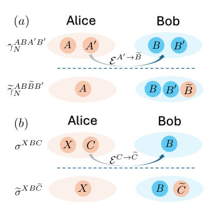
<figcaption class="paper-figure-caption"><b>Fig 1.</b> FIG. 1. Three formulations in which private correlations cer- tify distributed sensing capability: (a) the data-hiding exam- ple, (b) the general-state formulation.</figcaption>
</figure>

**Summary.** The paper establishes that 'private correlations' within a bipartite quantum state act as a quantifiable resource for enhancing distributed quantum sensing. It proves this by showing that positive private information guarantees a lower bound on the achievable local Fisher information, an advantage not shared by classical correlations alone.

**Why it may be interesting.** This work provides rigorous theoretical tools for quantifying quantum resources beyond standard measures like entanglement or mutual information, directly linking fundamental correlations (private information) to practical sensing limits in noisy channels.

Detailed structure

**Main problem.** The research aims to determine if an operational, information-theoretic quantity of a noisy quantum state can certify a non-trivial lower bound on its sensing capability in distributed scenarios.

**Main result.** Positive private correlations in the encoding basis are proven to constitute a metrological resource that certifies a quantitative lower bound on the locally accessible sensing Fisher information when assisted by an auxiliary channel.

**Method.** The authors use theoretical quantum information measures, specifically comparing private information ($P_X$) against entanglement and classical correlation bounds, applied within a framework of parameter estimation using LOCC Fisher information.

**Model / system.** The study analyzes bipartite or tripartite quantum states ($\sigma_{XBC}^{	heta}$) shared among parties (Alice, Bob) undergoing parameter estimation ($	heta$). The model incorporates the concept of an assisting channel ($C$) to enhance sensing performance.

**Key observables.** Private correlations (positive private information $P_X$), Locally accessible Fisher information ($F_{	ext{LOCC}}$), and Global Quantum Fisher Information ($F_Q$).

**Important parameters / regimes.** Noise parameters ($\lambda, p$), system dimension ($d$), encoding strength ($N$), and the existence/value of positive private information.

**Assumptions / limitations.** The analysis assumes a non-degenerate encoding Hamiltonian ($H_X$) and relies on specific channel formulations (e.g., erasure or depolarizing channels) for assistance.

**Figures summary.** Figures illustrate different state formulations, including data-hiding examples and general state structures ($\sigma_{XBC}^{	heta}$), used to demonstrate the resource quantification.

**Paper structure.** The paper develops from an initial example showing private correlations improving sensing over mere distillable key capacity. It then proves a general theorem linking positive private information to a lower bound on $F_{	ext{LOCC}}$ after assistance, contrasting this with classical correlation bounds and analyzing the reduction to entanglement when no assisting channel is present.

Abstract

We show that private correlations in a bipartite quantum state constitute a metrological resource for distributed sensing assisted by a possibly noisy channel from one party to the other. We begin with an example with distillable secret key but poor locally accessible sensing performance and show that an assisting channel substantially improves its performance. We then prove a general theorem showing that positive private information in the encoding basis certifies a quantitative lower bound on the locally accessible sensing capability after assistance. We further show that classical correlations alone provide no analogous guarantee, whereas, in the absence of the assisting subsystem, the privacy-based guarantee reduces to an entanglement-based one. Finally, in a channel formulation, we show that a channel with positive private information allows nonzero locally accessible sensitivity when paired with a suitable assisting channel.

[↑ back to top](#top)

### [Statistically-Secure Bit Commitment and Coin Flipping Protocols Based on Quantum Hardware Assumptions](http://arxiv.org/abs/2608.11187v1)

**Authors:** Roo Dunnill, Mina Doosti  
**Type:** theory · **Category:** quantum information and computing · **PDF:** <https://arxiv.org/pdf/2608.11187v1>  
**Analysis basis:** full PDF text, analyzed in chunks
**Topic relevance:** `quantum measurements` **2/5**

↔ Scroll figures horizontally

<figure class="paper-figure-card">
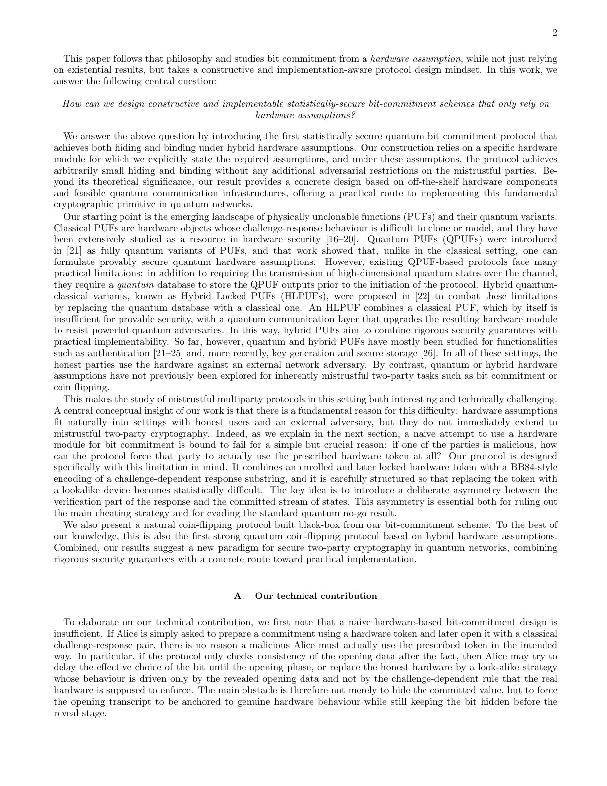
<figcaption class="paper-figure-caption"><b>Fig 1.</b> Low-resolution page preview, page 2</figcaption>
</figure>
<figure class="paper-figure-card">
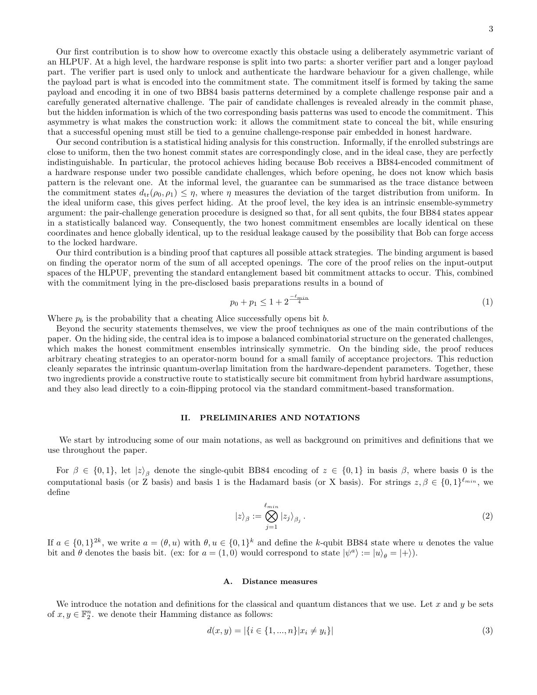
<figcaption class="paper-figure-caption"><b>Fig 2.</b> Low-resolution page preview, page 3</figcaption>
</figure>
<figure class="paper-figure-card">
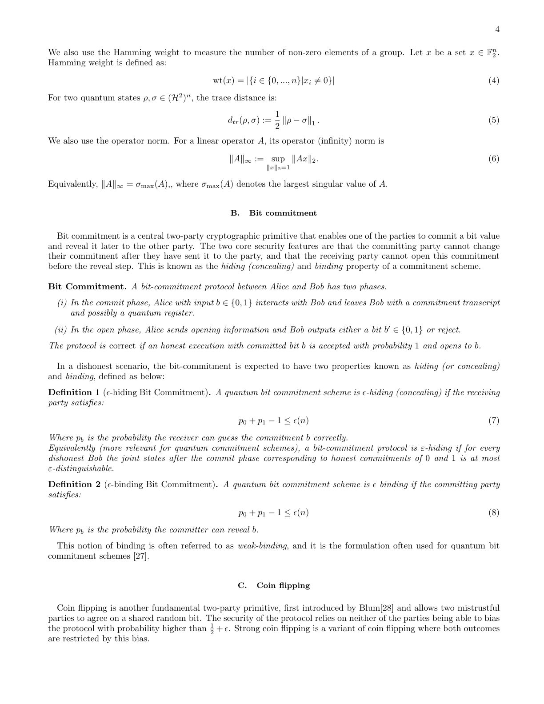
<figcaption class="paper-figure-caption"><b>Fig 3.</b> Low-resolution page preview, page 4</figcaption>
</figure>
<figure class="paper-figure-card">
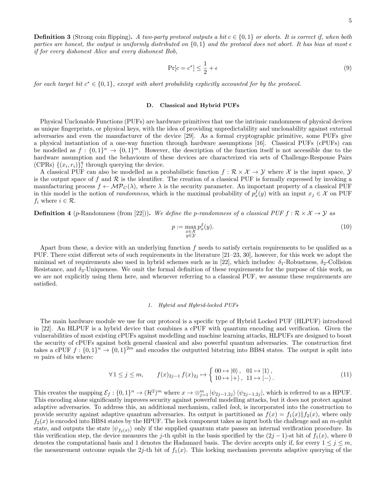
<figcaption class="paper-figure-caption"><b>Fig 4.</b> Low-resolution page preview, page 5</figcaption>
</figure>
<figure class="paper-figure-card">
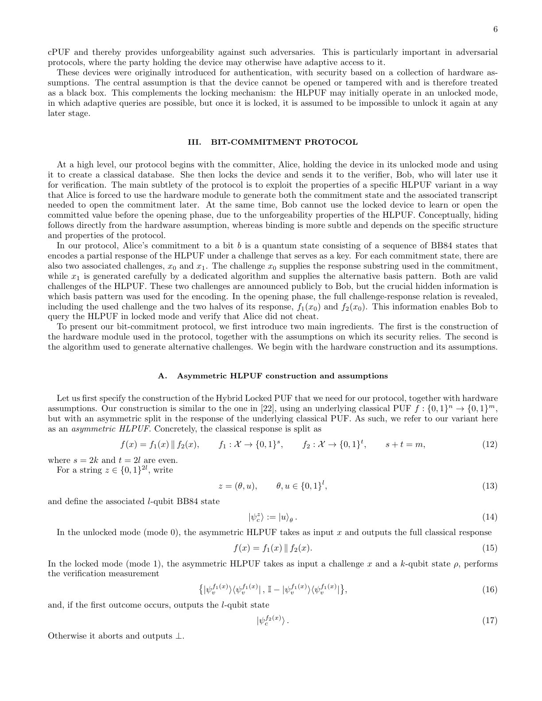
<figcaption class="paper-figure-caption"><b>Fig 5.</b> Low-resolution page preview, page 6</figcaption>
</figure>

**Summary.** This paper develops constructive protocols for statistically secure bit commitment and coin flipping using Hybrid Locked Physical Unclonable Functions (HLPUFs). By integrating classical hardware tokens with quantum communication, the authors overcome previous impossibility results. This work suggests a new paradigm for building practical, hardware-anchored cryptographic primitives in quantum networks.

**Why it may be interesting.** While focused on cryptography, the reliance on physical hardware assumptions (HLPUFs) provides a tangible link between abstract quantum information theory and potential near-term quantum device implementations, which is relevant for understanding resource constraints in quantum networks.

Detailed structure

**Main problem.** The primary goal is to construct statistically secure bit commitment and coin flipping protocols that overcome theoretical impossibility results in quantum cryptography.

**Main result.** The authors successfully achieve statistical security for both bit commitment and coin flipping by basing the protocol on Hybrid Locked Physical Unclonable Functions (HLPUFs).

**Method.** The construction uses a novel, non-trivial combination of classical hardware tokens and quantum communication within the HLPUF structure to enforce security guarantees.

**Model / system.** The core physical model is the Hybrid Locked Physical Unclonable Function (HLPUF), which combines classical PUFs with quantum encoding into BB84 states. The security analysis involves bounding operator norms and trace distances between candidate commitment states.

**Key observables.** Statistical hiding ($	ext{dtr}(
ho_0, 
ho_1) \le \eta$) and binding probability bounds ($p_0 + p_1 \le 1 + 2 / 2^{s-\ell_{\min}/2}}$).

**Important parameters / regimes.** The security depends on the parameters of the HLPUF, including $\ell_{\min}$ (qubit register size) and $s$ (related to encoding length), as well as the bias $\delta_r$.

**Assumptions / limitations.** Security relies on natural assumptions about the underlying HLPUF hardware primitive and its resistance to tampering once locked.

**Paper structure.** The paper develops the protocol by first establishing the necessary security bounds (hiding/binding) using the HLPUF structure, followed by deriving the concrete probability bounds through mathematical analysis of projector operators and finally applying these results to derive the coin-flipping bias.

Abstract

Bit commitment is impossible to achieve with unconditional security, even in quantum cryptogra- phy. We show that statistically secure bit commitment, satisfying both hiding and binding, can be constructed from hybrid locked physical unclonable functions (HLPUFs), a hardware primitive that combines classical hardware tokens and quantum communication. Our protocol uses these hardware assumptions in a novel and non-trivial way to achieve the first mistrustful two-party cryptographic protocol based on hybrid hardware modules. We prove statistical hiding and binding under natu- ral assumptions on the HLPUF and using a carefully designed challenge generation algorithm as a subroutine of our bit-commitment protocol. The construction also yields the first hardware-based coin-flipping protocol. Our results suggest a new paradigm for secure two-party cryptography in quantum networks, combining rigorous security guarantees with a concrete route toward practical implementation.

[↑ back to top](#top)

### [Anisotropic magnon spin transport in CrPS$_4$](http://arxiv.org/abs/2608.10802v1)

**Authors:** Krishnaraajan Sundararajan, Muhammad Zohaib, Yulia Kreminska, Sytze H. Tirion, Bart J. van Wees  
**Type:** experiment · **Category:** other · **PDF:** <https://arxiv.org/pdf/2608.10802v1>  
**Analysis basis:** full PDF text, analyzed in chunks
**Topic relevance:** `analog quantum simulation` **1/5** · `correlated / nonlocal dissipation` **1/5** · `quantum measurements` **1/5**

↔ Scroll figures horizontally

<figure class="paper-figure-card">
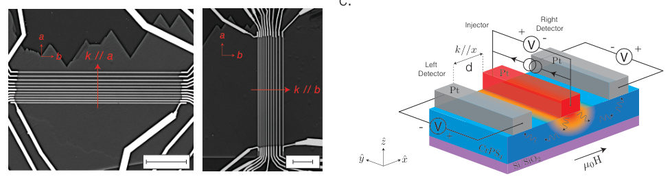
<figcaption class="paper-figure-caption"><b>Fig 1.</b> FIG. 1. a) Crystal structure of CrPS4. (Left) View in the ab plane showing the nearest-neighbor Heisenberg exchange interactions, with J1 and J2 along the crystallographic b- axis and J3 along the a- axis. (Right) View in the bc plane illustrating the interlayer exchange coupling Joop and the bulk easy axis K along the crystallographic c axis. (b) Scanning electron micrographs of device S1 with Pt injector and detector electrodes aligned along the crystallographic a- (k∥b) and b- (k∥a) axes of CrPS4. Scale bars: 10 µm. (c) Schematic illustration of the nonlocal device geometry used to investigate magnon spin transport in CrPS4, with the sign convention used for the measurements. The magnon...</figcaption>
</figure>
<figure class="paper-figure-card">
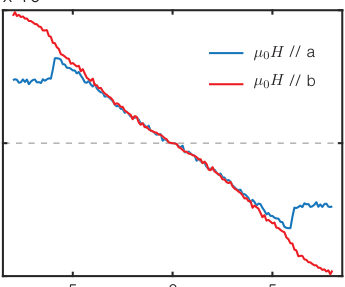
<figcaption class="paper-figure-caption"><b>Fig 2.</b> FIG. 2. Magnetic field dependence of the local second- harmonic resistance (normalized by the Pt electrode length) along the different crystallographic axes of Device S1 (T = 25K, i0 = 75 µA).</figcaption>
</figure>
<figure class="paper-figure-card">

<figcaption class="paper-figure-caption"><b>Fig 3.</b> Fig. 2 shows the local second-harmonic resistance at 25K, attributed to the local SSE, for the injector electrodes oriented along the crystallographic a- and b-axes as a function of the in-plane applied magnetic field. We observe that upto the spin-flip transition (around 6T), the magnitude the local second-harmonic resistance (normalized by the electrode length) exhibits a similar field dependence for both orientations. For Pt electrodes oriented along the crystallographic a- axis, the dominant thermal gradients are |∇bT| and |∇cT|, whereas for Pt electrodes oriented along the crystallographic b- axis they are |∇aT| and |∇cT|. The</figcaption>
</figure>
<figure class="paper-figure-card">
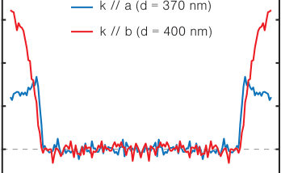
<figcaption class="paper-figure-caption"><b>Fig 4.</b> FIG. 3. Magnetic field dependence of the nonlocal first- harmonic resistance (normalized by the Pt electrode length) along the different crystallographic axes of Device S1 (T = 25K, i0 = 75 µA).</figcaption>
</figure>
<figure class="paper-figure-card">
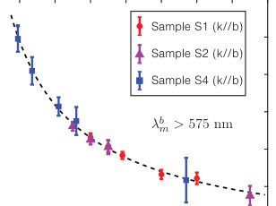
<figcaption class="paper-figure-caption"><b>Fig 5.</b> FIG. 4. The normalized nonlocal first-harmonic resistance (RNL 1ω /(σmtCP Sη2 P t)) as a function of the edge-to-edge dis- tance between the platinum strips for magnon spin diffu- sion along the crystallographic a) a- and b) -b axes (where λb m =575 nm).</figcaption>
</figure>

**Summary.** This work experimentally demonstrates that crystal anisotropy strongly controls magnon spin transport in $	ext{CrPS}_4$. By measuring nonlocal magnetotransport signals, the authors quantify direction-dependent properties like conductivity and diffusion length. The findings establish intrinsic crystalline structure as a powerful tool for designing next-generation magnonic devices.

**Why it may be interesting.** While focused on condensed matter magnetism, the study of spin transport dynamics and engineered directional responses in crystalline materials provides a solid experimental platform for understanding energy/momentum channeling effects relevant to quantum devices.

Detailed structure

**Main problem.** The study investigates how crystal anisotropy dictates the direction-dependent transport properties of magnon spin currents in van der Waals magnets.

**Main result.** Pronounced anisotropic magnon spin conductivity and diffusion lengths were observed when using electrically generated magnons, confirming that intrinsic crystalline anisotropy is a key control parameter for magnonic device engineering.

**Method.** The research employs nonlocal magnetotransport measurements (both first- and second-harmonic resistance) on patterned Platinum strips deposited on the $	ext{CrPS}_4$ antiferromagnet.

**Model / system.** The physical system is the monoclinic van der Waals antiferromagnet $	ext{CrPS}_4$. The analysis utilizes magnon spin diffusion models incorporating anisotropic exchange couplings ($J_1, J_2, J_3$) and measures transport along crystallographic $a$ and $b$ axes.

**Key observables.** Magnon spin conductivity ($\sigma_m$), magnon spin diffusion length ($\lambda_m$), nonlocal first-harmonic resistance ($R_{NL}^{1\omega}$), and nonlocal second-harmonic resistance ($R_{NL}^{2\omega}$).

**Important parameters / regimes.** Temperature (e.g., 25 K, 15 K), magnetic field strength (up to 8 T), and crystallographic direction ($\hat{a}$ vs $\hat{b}$).

**Assumptions / limitations.** Electrically generated magnon transport is preferred over thermal excitation for isolating intrinsic anisotropy effects; extracting $\lambda_m$ from thermal measurements is complicated by temperature gradients.

**Figures summary.** Figures illustrate the crystal structure and device geometry, showing how Pt electrodes are patterned along $a$ and $b$ axes. Results plot nonlocal resistances versus magnetic field or separation distance to quantify directional differences.

**Paper structure.** The paper establishes the theoretical framework for anisotropic magnon diffusion, details the experimental setup using nonlocal magnetotransport measurements on $	ext{CrPS}_4$, presents quantitative comparisons between electrical and thermal excitation regimes, and concludes by emphasizing anisotropy control.

Abstract

Crystal anisotropy provides a powerful route for realizing direction-dependent transport in solid-state systems. While its influence on electronic transport is well established, the role of anisotropy in magnon spin transport in van der Waals magnets is largely unexplored. Here, in a nonlocal geometry, utilizing the monoclinic van der Waals antiferromagnet CrPS$_4$, we observe pronounced anisotropy in both electrically and in thermally excited magnon spin transport. Electrically generated magnons exhibit a magnon spin conductivity at least 2.2 times larger and a spin diffusion length at least 2.7 times longer for transport along the crystallographic-b axis compared to the crystallographic-a axis, where $λ_m^{a} \sim$ 211 nm and $λ_m^{b} \geq$ 575 nm. In comparison, at 8T, we find the nonlocal second-harmonic resistance associated with thermally excited magnons to be $\sim$7 times larger along the crystallographic-b axis at 25K. We further show that a magnon spin diffusion length cannot be reliably extracted from the nonlocal second-harmonic resistance, owing to the extended temperature profile within CrPS$_4$. Likewise, we show that the anisotropy in the spin Seebeck coefficients cannot be reliably estimated from the thermally excited magnon spin transport alone, as it is intertwined with the anisotropic heat conductivity of CrPS$_4$. Utilizing the electrically generated magnon spin transport, we demonstrate that intrinsic crystalline anisotropy serves as an effective control parameter for tuning magnon spin transport, opening new avenues for magnonic device engineering.

[↑ back to top](#top)

### [Approximate locality, black hole complementarity and overlapping qubits](http://arxiv.org/abs/2608.10085v1)

**Authors:** ChunJun Cao, Gong Cheng, Alexander Jahn, Thomas Koutsikos  
**Type:** theory · **Category:** other · **PDF:** <https://arxiv.org/pdf/2608.10085v1>  
**Analysis basis:** full PDF text, analyzed in chunks
**Topic relevance:** `analog quantum simulation` **1/5** · `correlated / nonlocal dissipation` **1/5** · `quantum measurements` **1/5**

↔ Scroll figures horizontally

<figure class="paper-figure-card">
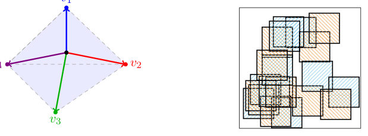
<figcaption class="paper-figure-caption"><b>Fig 1.</b> Figure 1: An illustrative analogy. (a) The vector space Rn can fit up to n mutually orthogonal vectors, but if we allow them to overlap we can fit more than n. (b) A Hilbert space with dim H = 2n can fit up to n independent qubits, but if we allow them to overlap we can fit more than n.</figcaption>
</figure>
<figure class="paper-figure-card">
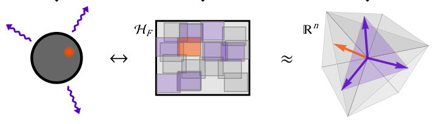
<figcaption class="paper-figure-caption"><b>Fig 2.</b> Figure 2: A visualization of the overlapping qubit (center) and random-vector toy model (right) introduced here. In our representation of black hole evaporation, we consider a fun- damental Hilbert space HF ̸= HBH ⊗HR containing both local interior degrees of freedom (gray, with one highlighted in orange) and exterior radiation (blue), with both represented by overlapping qubits (overlapping boxes) and the latter forming an overcomplete basis around time t ∼tPage. Simplified in terms of random vectors in Rn that are approximately orthogonal, reconstruction of a given interior vector (orange) corresponds to building a span of exterior vectors (blue) that contains it. At large n, this...</figcaption>
</figure>
<figure class="paper-figure-card">
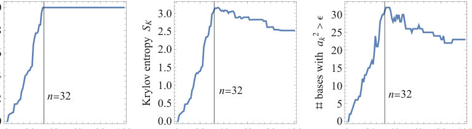
<figcaption class="paper-figure-caption"><b>Fig 3.</b> Figure 3: Representation of a random vector v in a random-vector basis {wk} with t elements under weighted Gram-Schmidt orthonormalization, for a vector space Rn of n = 32 elements. (a) Fidelity f = Pt k=1 a2 k of reconstruction of v in the orthonormalized basis with basis elements ak. (b) Krylov entropy SK of basis elements. (c) Number of basis vectors with a2 k &gt; ϵ for a cutoff ϵ = 10−3.</figcaption>
</figure>
<figure class="paper-figure-card">
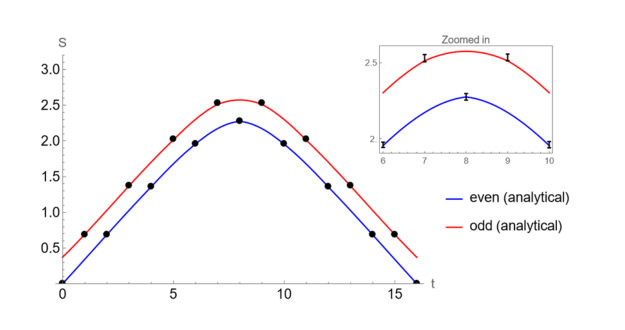
<figcaption class="paper-figure-caption"><b>Fig 4.</b> Figure 4: The algebraic entropy numerically averaged over 20 Haar random states (black) is plotted the analytical results for t odd (red) and even (blue) cases. Here S denotes the algebraic entropy. A zoomed-in plot shows the error bars (standard deviations) that are too small to see in the full plot.</figcaption>
</figure>
<figure class="paper-figure-card">
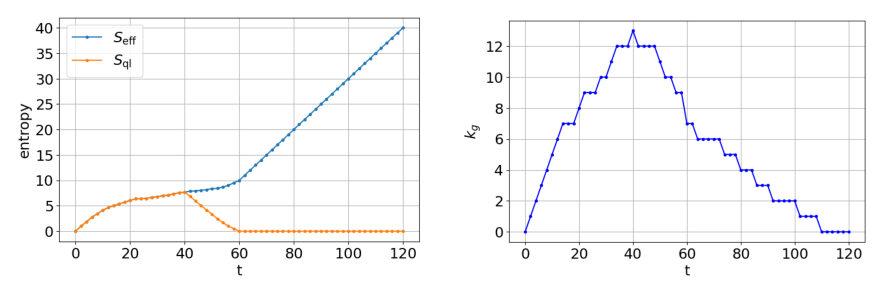
<figcaption class="paper-figure-caption"><b>Fig 5.</b> Figure 5: (a) Entropy of the radiation modes as a function of t. (b) The number of good Williamson values of the radiation state as a function of t. The average overlap ϵ = VI · VJ = 0.12. Here 2n = 40 and a suitable M is chosen to produce the specified average overlap.</figcaption>
</figure>

**Summary.** This paper develops a toy model using 'overlapping qubits' to address the black hole information paradox. By allowing operators corresponding to interior and exterior regions to only approximately commute, the authors circumvent no-cloning violations and demonstrate that entropy calculations correctly recover the Page curve. This provides an intriguing quantum information perspective on reconciling unitarity with gravitational collapse.

**Why it may be interesting.** While focused on gravity, the use of overlapping operators and state compression maps ($\mathcal{N}_C$) provides a concrete, mathematically rigorous framework for handling approximate symmetries or near-factorizations common in complex many-body systems where exact tensor product descriptions fail.

Detailed structure

**Main problem.** The paper addresses reconciling quantum unitarity with black hole evaporation paradoxes, specifically by modeling how information is preserved across an event horizon while respecting principles like complementarity.

**Main result.** By constructing a toy model using 'overlapping qubits,' the authors show that accounting for operator overlaps allows the entropy calculation to recover the expected Page curve, suggesting a mechanism for unitary evolution.

**Method.** The core method involves defining operators (qubits) that only approximately commute ($\sim O(\epsilon)$), which circumvents strict Hilbert space factorization and avoids apparent violations of no-cloning theorems.

**Model / system.** The system is a toy model of an evaporating black hole, mathematically realized using overlapping qubits derived from overlapping Majorana fermions. This framework allows for quasi-local degrees of freedom that mimic the structure expected in quantum gravity regimes.

**Key observables.** Page curve recovery (entropy calculation), fidelity between compressed states ($F$), and the overlap parameter ($\epsilon$).

**Important parameters / regimes.** The small overlap parameter $\epsilon$, the number of fundamental degrees of freedom $n$, and the number of overlapping qubits $N$.

**Assumptions / limitations.** The model is explicitly a 'toy model'; it relies on weak interdependencies ($\epsilon$) leading to approximate factorizations, and later sections assume Gaussian states for fidelity analysis.

**Figures summary.** Figure 1 illustrates the analogy between fitting overlapping vectors in $\mathbb{R}^n$ and constructing overlapping qubits. Figure 7 shows the exponential decay of state fidelity with Hamming distance and the scaling relationship between this decay rate and the ratio $N/n$.

**Paper structure.** The paper progresses from establishing the physical problem (black hole complementarity) to introducing the mathematical tool (overlapping qubits via fermions). It then develops techniques for analyzing overlaps in quantum states, culminating in fidelity calculations that confirm the expected scaling behavior.

Abstract

We construct a toy model of an evaporating black hole using approximately local degrees of freedom acting on ``overlapping" qubits in which a version of black hole complementarity arises naturally. The operators corresponding to the radiation and the interior are identified as two distinct representations of the same fundamental algebra, thereby preventing the exact factorization of the Hilbert space into interior and exterior and avoiding the conventional no-cloning violations. We show how this toy model captures several qualitative and quantitative features of black hole evaporation and how the ability to account for this ``overlap" in the entropy calculation leads to the recovery of a Page curve.

[↑ back to top](#top)

### [Recursion Coefficients and Krylov Dynamics in Polynomial Random Matrix Models](http://arxiv.org/abs/2608.10072v1)

**Authors:** Juan F. Pedraza, Le-Chen Qu  
**Type:** theory · **Category:** other · **PDF:** <https://arxiv.org/pdf/2608.10072v1>  
**Analysis basis:** full PDF text, analyzed in chunks
**Topic relevance:** `analog quantum simulation` **1/5** · `driven-dissipative phase transition` **1/5** · `non-equilibrium universality` **1/5**

↔ Scroll figures horizontally

<figure class="paper-figure-card">
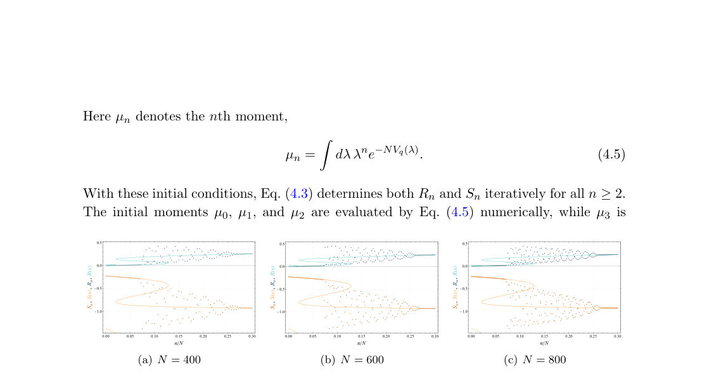
<figcaption class="paper-figure-caption"><b>Fig 1.</b> Figure 1. Plots of the recursion coefficients Rn and Sn with the recursion functions R(x) and S(x) for w3 = 4, α = −1 and β = −0.3 at N = 400, 600 and 800.</figcaption>
</figure>
<figure class="paper-figure-card">
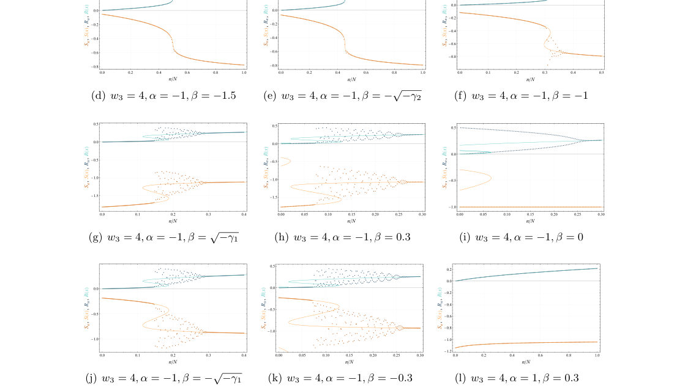
<figcaption class="paper-figure-caption"><b>Fig 2.</b> Figure 2. Recursion coefficients Rn and Sn for w3 = 4, |α| = 1 and representative values of β in the range −1.5 ≤β ≤1.5, compared with the recursion functions R(x) and S(x).</figcaption>
</figure>
<figure class="paper-figure-card">
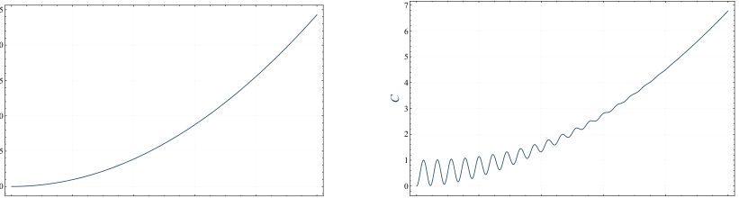
<figcaption class="paper-figure-caption"><b>Fig 3.</b> Figure 4. Spread complexity for w3 = 4 and α = −1 at N = 800. For β = 0.3, the recursion coefficients contain a transition region, as shown in Fig. 2, while the corresponding complexity remains smooth and increases monotonically, as in the generic case. For β = 0, the splitting of the recursion coefficients into two branches leads to early time oscillations followed by monotonic growth.</figcaption>
</figure>
<figure class="paper-figure-card">
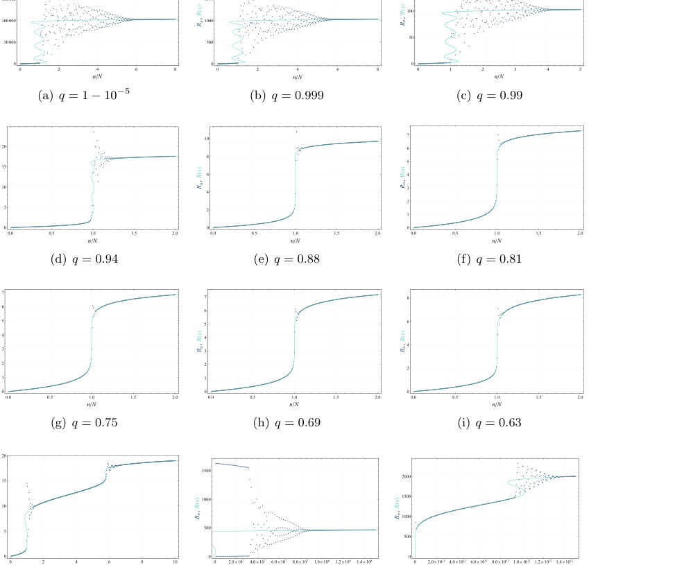
<figcaption class="paper-figure-caption"><b>Fig 4.</b> Figure 5. Discrete recursion coefficients Rn for the truncation order d = 18 and representative values of q in the range 0 &lt; q &lt; 1, compared with the recursion function R(x).</figcaption>
</figure>
<figure class="paper-figure-card">
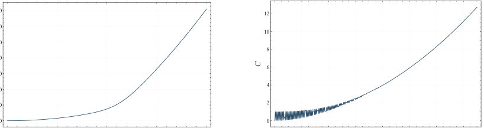
<figcaption class="paper-figure-caption"><b>Fig 5.</b> Figure 7. Spread complexity for the DSSYK potential Vs. For N = 20 and q = 0.52, the recursion coefficients contain a transition region, as shown in Fig. 5, while the complexity remains smooth and increases monotonically. For N = 3 × 10−6 and q = 0.31, the two branch structure of the recursion coefficients produces early time oscillations followed by monotonic growth.</figcaption>
</figure>

**Summary.** This paper develops a powerful method using moment recursion to analyze the behavior of orthogonal polynomial coefficients in random matrix models with asymmetric potentials. By studying the large-$N$ asymptotics, they link mathematical features like 'gradient catastrophes' to physical concepts such as chaotic transition regions in models like DSSYK. This provides deep insights into how spectral properties encode complex quantum dynamics.

**Why it may be interesting.** While focused on RMT, the connection between spectral properties (recursion coefficients) and dynamical indicators like complexity/chaos makes it relevant to understanding quantum dynamics in complex systems.

Detailed structure

**Main problem.** The study focuses on analyzing the recursion coefficients of orthogonal polynomials and their associated Krylov dynamics within random matrix models featuring high-degree or asymmetric polynomial potentials.

**Main result.** The authors derived large-$N$ asymptotic behaviors for these coefficients, showing that gradient catastrophes in the associated recursion functions correspond to 'chaotic' transition regions in the physical models studied.

**Method.** They employ a moment recursion method combined with recursive algorithms to efficiently construct and analyze the coefficients, connecting them to continuum string equations.

**Model / system.** The work applies to general random matrix ensembles defined by potentials $V(\lambda)$, specifically examining an asymmetric quartic potential and the double-scaled Sachdev-Ye-Kitaev (DSSYK) model.

**Key observables.** Recursion coefficients ($R_n, S_n$), the recursion function, gradient catastrophes, and spread complexity $C(t)$.

**Important parameters / regimes.** The degree of the potential, asymmetry parameters ($w_3, w_2, w_1$), and the scaling variable $x=n/N$.

**Assumptions / limitations.** The analysis relies on treating the discrete string equation as an initial value problem or using moment calculations for high degrees.

**Figures summary.** Numerical results confirm that the discrete coefficients approach the derived continuum functions ($R(x), S(x)$) as $N$ increases, illustrating the large-$n/N$ behavior.

**Paper structure.** The paper develops the moment recursion method for high-degree potentials, derives the continuum string equations for the quartic potential, analyzes the asymptotic limits of the coefficients, and applies this framework to both the quartic model and the DSSYK model.

Abstract

We study the recursion coefficients of orthogonal polynomials and their associated Krylov dynamics in random matrix models with high-degree and possibly asymmetric polynomial potentials. We develop a moment recursion method that, when combined with the recursive algorithm, provides an efficient construction of the recursion coefficients. We also obtain their large-$n$ asymptotic behavior for general asymmetric potentials; for $Nw_d=1$, the leading asymptotic form of $R_n$ reproduces Freud's conjecture. We apply this framework to an asymmetric quartic potential and to the double-scaled Sachdev-Ye-Kitaev (DSSYK) model. In both models, the recursion functions capture the overall qualitative behavior of the recursion coefficients, and the gradient catastrophes of the recursion functions are associated with ``chaotic'' transition regions in the recursion coefficients. For the quartic potential, such regions can occur in both $R_n$ and $S_n$, whereas the DSSYK model can exhibit multiple transition regions in $R_n$, with the recursion function remaining accurate in the smooth intervals between them. Finally, we compute the corresponding spread complexity and find that transition regions do not qualitatively modify its behavior, while a two branch structure produces early time oscillations followed by monotonic growth.

[↑ back to top](#top)

### [Carrier-tunable RKKY magnetism in a crystalline magnet](http://arxiv.org/abs/2608.10574v1)

**Authors:** Xiang S. W. Huang, Bruno K. Saika, Satoshi Hamao, Yuki Majima, Yuki Settai, Hideki Matsuoka, Yuki M. Itahashi, Masato Sakano, Taro Nakajima, Shinichiro Seki, Yoshihiro Iwasa, Kyoko Ishizaka, Masaki Nakano  
**Type:** experiment · **Category:** strongly correlated electrons · **PDF:** <https://arxiv.org/pdf/2608.10574v1>  
**Analysis basis:** full PDF text, analyzed in chunks
**Topic relevance:** `analog quantum simulation` **1/5** · `quantum measurements` **1/5**

↔ Scroll figures horizontally

<figure class="paper-figure-card">
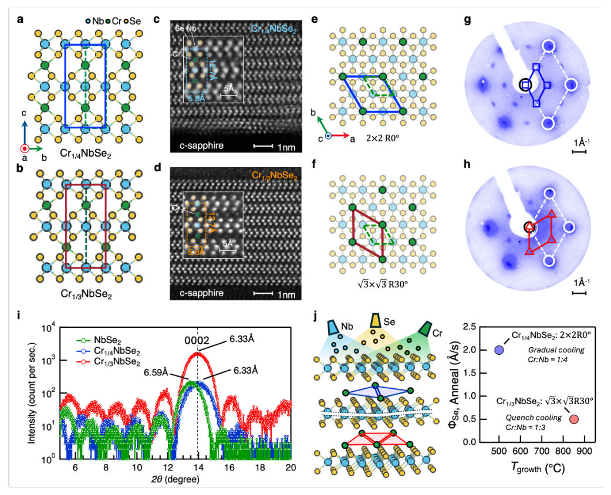
<figcaption class="paper-figure-caption"><b>Fig 1.</b> FIG. 1. Superstructure-selective epitaxy of Cr-NbSe2 thin films. a,b, Schematic side-view of the crystal structures of (a) Cr1/4NbSe2 and (b) Cr1/3NbSe2. Blue, green, and yellow circles denote Nb, Cr, and Se atoms, respectively. The colored rectangles mark the supercells associated with the intercalated Cr ordering. c,d, Cross-sectional STEM images of (c) Cr1/4NbSe2 and (d) Cr1/3NbSe2 films grown on c-plane sapphire. The intercalated Cr atoms are visible within the van der Waals gap, and the layered epitaxial growth shows sharp interfaces (scale bars, 1 nm). The labeled distances of 5.8 ˚A and 12.7 ˚A correspond to the in-plane Nb-Nb diagonal and the c-axis repeat of the 2H-NbSe2 host...</figcaption>
</figure>
<figure class="paper-figure-card">
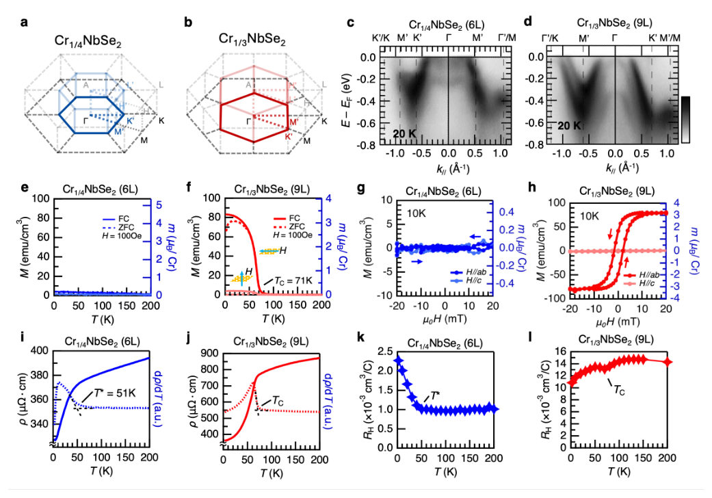
<figcaption class="paper-figure-caption"><b>Fig 2.</b> FIG. 2. Distinct electronic structure, magnetism, and transport signatures of the two as-grown Cr-NbSe2 phases. a,b, Reconstructed Brillouin zones of (a) Cr1/4NbSe2 and (b) Cr1/3NbSe2, corresponding to the 2 × 2R0◦and √</figcaption>
</figure>
<figure class="paper-figure-card">
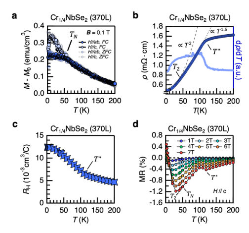
<figcaption class="paper-figure-caption"><b>Fig 3.</b> FIG. 3. Magnetic and transport properties of the 370L-thick Cr1/4NbSe2. a, Temperature-dependent mag- netization of a 370L Cr1/4NbSe2 film measured with in-plane and out-of-plane fields, showing a clear N´eel-type peak at TN. b, Temperature dependence of the resistivity ρ(T) together with its temperature derivative dρ/dT. Three phenomeno- logical scales are indicated: a low-temperature ρ ∝T 2 regime up to T2, an intermediate sub-quadratic regime approximated by ρ ∝T 1.5, and the higher characteristic temperature T ∗. c, Temperature dependence of the Hall coefficient RH(T), which evolves strongly across the sub-quadratic regime. d, Magnetoresistance MR(T, H) for H//c at fields from 1 to 7 T,...</figcaption>
</figure>
<figure class="paper-figure-card">
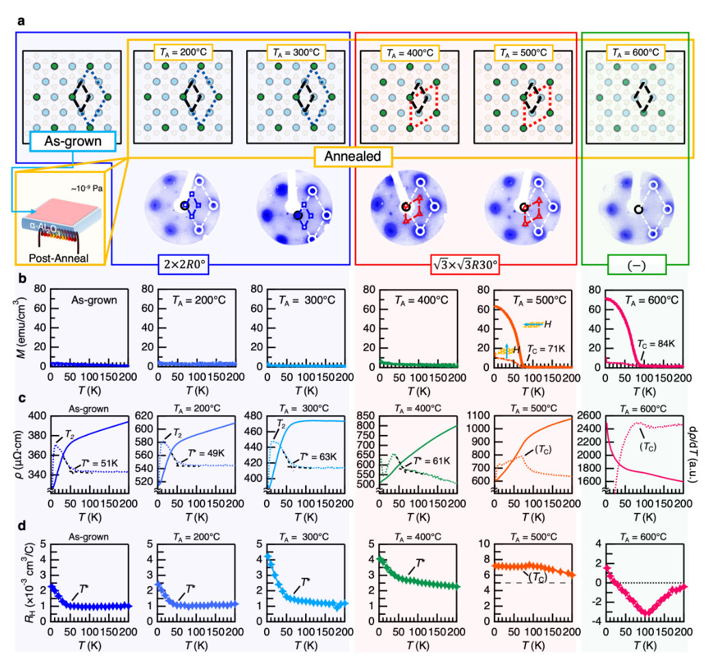
<figcaption class="paper-figure-caption"><b>Fig 4.</b> FIG. 4. Controlled post-growth annealing of Cr1/4NbSe2: non-bijective evolution of structure, magnetism, and transport. a, Evolution of the in-plane Cr superstructure in Cr1/4NbSe2 upon post-growth annealing. The as-grown 6L Cr1/4NbSe2 film was cut into pieces and annealed at TA = 200 ◦C, 300 ◦C, 400 ◦C, 500 ◦C, and 600 ◦C for 1 h. The LEED- resolved superstructure evolves from 2 × 2R0◦(retained up to TA = 300 ◦C) to √</figcaption>
</figure>
<figure class="paper-figure-card">
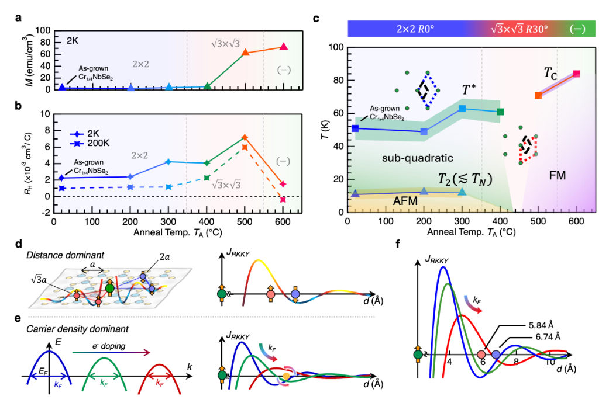
<figcaption class="paper-figure-caption"><b>Fig 5.</b> FIG. 5. Phase diagram and carrier-sensitive RKKY magnetism in Cr-NbSe2. a,b, Annealing-temperature dependence of the magnetization M at 2 K (a), and that of the Hall coefficient RH at 2 K and 200 K (b) across the Cr1/4NbSe2 annealing series. The shaded regions indicate the Cr superstructures assigned by LEED: 2 × 2R0◦(blue), √</figcaption>
</figure>

**Summary.** The research reports on creating an unprecedented material system ($	ext{Cr-NbSe}_2$) where the magnetic exchange interaction (RKKY) can be tuned by independently controlling both the atomic spacing of magnetic moments ($r$) and the carrier concentration ($k_F$). This is achieved using a combination of MBE growth for structural control and post-growth annealing for electronic doping, allowing precise study of carrier-sensitive magnetism.

**Why it may be interesting.** This work provides a highly controllable platform for studying fundamental many-body interactions like the RKKY coupling by decoupling its key parameters ($r$ and $k_F$) through epitaxial strain engineering and doping, which is crucial for understanding correlated electron physics in artificial heterostructures.

Detailed structure

**Main problem.** To independently tune the moment-moment distance (r) and the Fermi wavevector (kF) in itinerant magnets governed by the RKKY interaction, which are typically coupled in bulk synthesis.

**Main result.** The authors successfully demonstrated carrier-sensitive RKKY magnetism in $	ext{Cr-NbSe}_2$ thin films by using MBE growth to fix the moment geometry and post-growth annealing to independently tune the carrier density.

**Method.** The study employs epitaxial thin film growth via Molecular-Beam Epitaxy (MBE) followed by controlled post-growth annealing, coupled with transport measurements like Hall effect and magnetization studies.

**Model / system.** The physical system is $	ext{Cr}_{1/x}	ext{NbSe}_2$ in the form of epitaxial thin films grown on a single crystalline host ($	ext{NbSe}_2$). The RKKY interaction governs magnetism, depending critically on both the moment separation ($r$) and the carrier density (related to $k_F$).

**Key observables.** Hall response evolution, magnetic transition temperatures ($T_C$, $T_N$), resistivity ($
ho(T)$), and structural superstructures ($2	imes2R0^\circ$ vs $\sqrt{3}	imes\sqrt{3}R30^\circ$).

**Important parameters / regimes.** Annealing temperature (tuning carrier density) and growth window selection (setting moment geometry $r$).

**Assumptions / limitations.** The ability to decouple the structural control ($r$) from the electronic doping/carrier tuning ($k_F$) via sequential MBE growth and annealing.

**Figures summary.** Figures illustrate RHEED patterns confirming superstructures, transport measurements showing systematic evolution of Hall response with annealing, and magnetization curves revealing magnetic transitions dependent on processing history.

**Paper structure.** The paper establishes the challenge (coupled $r$ and $k_F$), details the MBE/annealing methodology to create distinct phases, presents structural confirmation via RHEED/LEED, and finally uses transport/magnetic measurements across an annealing series to prove independent tuning of carrier-sensitive RKKY magnetism.

Abstract

In itinerant magnets governed by the Ruderman-Kittel-Kasuya-Yosida (RKKY) interaction, the exchange coupling depends on both the moment-moment distance $r$ and the Fermi wavevector $k_{\mathrm{F}}$, yet in bulk synthesis the two are tightly coupled: a change in composition typically alters both. Here, we use a thin-film approach to tune these two variables independently in a single crystalline host. Using molecular-beam epitaxy (MBE), we stabilize either $2\times2\mathrm{R}0^\circ$ Cr$_{1/4}$NbSe$_2$ or $\sqrt{3}\times\sqrt{3}\mathrm{R}30^\circ$ Cr$_{1/3}$NbSe$_2$ within the same NbSe$_2$ host through separate growth windows. Controlled post-growth annealing performed across a series of temperatures then modifies the carrier density while leaving the Cr superstructure intact below a structural-transition threshold. The two as-grown phases are distinct in electronic structure, magnetic ground state, and transport. Along this annealing series, the Hall response evolves systematically while the magnetic response changes in a structurally insensitive manner, with ferromagnetic order emerging within the same $\sqrt{3}\times\sqrt{3}\mathrm{R}30^\circ$ structural class only above a critical annealing temperature, experimentally disentangling carrier density and moment geometry. The Hall magnitude and sign evolution point to a low-carrier-density system in which $k_{\mathrm{F}}$ is susceptible to modest external tuning. Cr-NbSe$_2$ thus realizes carrier-sensitive RKKY magnetism in a single crystalline host, within an MBE-plus-annealing approach extensible across the intercalated transition-metal dichalcogenide family.

[↑ back to top](#top)

### [Competing collinear and non-collinear spin textures imaged by spatially-resolved REXS in Eu(Al0.4Ga0.6)4](http://arxiv.org/abs/2608.11070v1)

**Authors:** Fellipe B. Carneiro, Zéetény Bacsó, Kevin Allen, Aly H. Abdeldaim, Rebecca Scatena, Jaime M. Moya, Roger D. Johnson, Emilia Morosan, Alessandro Bombardi  
**Type:** experiment · **Category:** strongly correlated electrons · **PDF:** <https://arxiv.org/pdf/2608.11070v1>  
**Analysis basis:** full PDF text, analyzed in chunks
**Topic relevance:** `analog quantum simulation` **1/5** · `quantum measurements` **1/5**

↔ Scroll figures horizontally

<figure class="paper-figure-card">
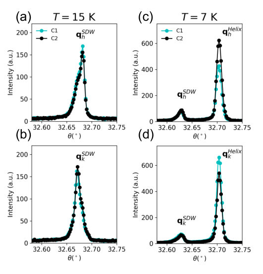
<figcaption class="paper-figure-caption"><b>Fig 1.</b> FIG. 1. Rocking curves around the satellites with opposite circular lights (C1 and C2, respectively) at T = 15 K (b,c) and T = 7 K (d,e) at Ψ = -45◦.</figcaption>
</figure>
<figure class="paper-figure-card">
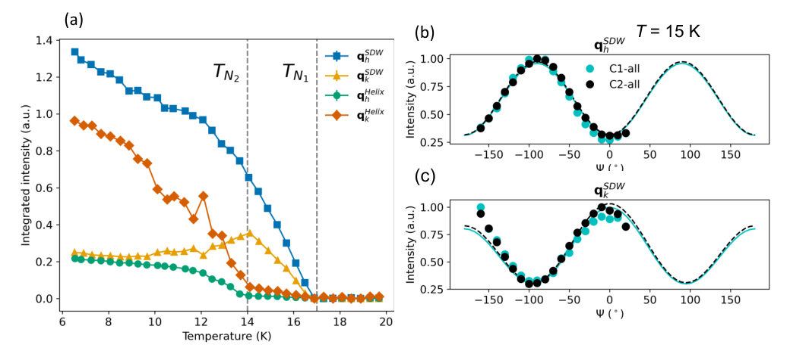
<figcaption class="paper-figure-caption"><b>Fig 2.</b> FIG. 2. Temperature dependency of the integrated intensity of the qSDW h , qSDW k , qHelix h , qHelix k satellites measured using a large beam size of 200×40 µm (a). Azimuthal scans using opposite circularly polarized lights (C1 vs C2) of the qSDW h (b) and qSDW k (c) satellites at T = 15 K. The azimuthal reference is (h00) [Ψ = 0◦]. The dashed lines represent the fit obtained for the data points.</figcaption>
</figure>
<figure class="paper-figure-card">
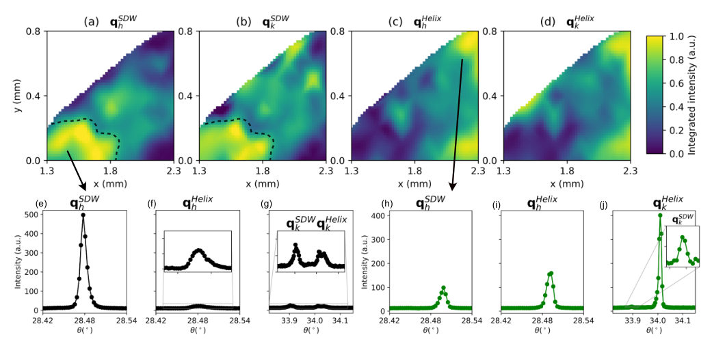
<figcaption class="paper-figure-caption"><b>Fig 3.</b> FIG. 3. Intensity maps showing the spatial variation of the qSDW h (a) qSDW k (b) qHelix h (c) qHelix k (d) satellites at 6.5 K. Rocking curves of the satellites at selected regions of the intensity maps indicated by the black arrows (e-j). The peaks display the satellite label on top. All panels share the same intensity scale and the insets have individual zoomed scales to show the presence of the low intensity peaks.</figcaption>
</figure>
<figure class="paper-figure-card">
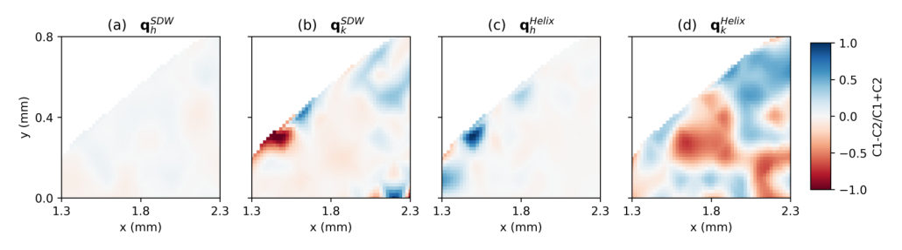
<figcaption class="paper-figure-caption"><b>Fig 4.</b> FIG. 4. Intensity contrast maps from opposite circular lights C1 and C2 for each sattelite qSDW h (e) qHelix k (f) qHelix k (g) qHelix k (h) of the (0,0,6) reflection at 6.5 K.</figcaption>
</figure>

**Summary.** This work uses spatially-resolved REXS to characterize the magnetic spin textures in Eu(Al0.4Ga0.6)4. It reveals that the material is magnetically inhomogeneous, hosting coexisting orthogonal SDW and helical domains across different regions of the sample. The findings emphasize that local measurements are crucial for accurately describing the complex, competing magnetic ground states in these correlated materials.

**Why it may be interesting.** While focused on magnetism, the use of spatially resolved scattering techniques to map out competing ordered phases in a solid-state system provides an excellent model for studying complex ground states where local fluctuations dictate macroscopic behavior, relevant to correlated electron physics.

Detailed structure

**Main problem.** The study investigates the spatial inhomogeneity of zero-field magnetic spin textures in Eu(Al0.4Ga0.6)4, aiming to distinguish between locally and globally averaged magnetic structures.

**Main result.** The material exhibits phase segregation into distinct domains hosting coexisting orthogonal spin-density-wave or helical states, confirming that the local magnetic texture varies significantly across the sample surface.

**Method.** Spatially-resolved Resonant Elastic X-ray Scattering (REXS) was employed using circular polarization to probe the symmetry and nature of the magnetic ordering.

**Model / system.** The physical system is Eu(Al0.4Ga0.6)4, a rare-earth intermetallic whose magnetism is governed by RKKY interactions. The research compares theoretical expectations for collinear SDW versus non-collinear helical states.

**Key observables.** Magnetic satellites at specific q-vectors (e.g., q_SDWh, q_Helixk), contrast between opposite circular polarizations (C1 vs C2), and temperature dependence of scattering intensity.

**Important parameters / regimes.** Two distinct magnetic transitions observed at T_N1 = 17 K and T_N2 = 14 K; the spatial variation across a 0.8 - 1 mm area is critical.

**Assumptions / limitations.** The primary assumption challenged by the work is that spatially averaged measurements accurately represent the true magnetic ground state of such inhomogeneous materials.

**Figures summary.** Figures illustrate rocking curves showing contrast dependence on polarization at different temperatures, and temperature dependency plots tracking the intensity of various satellite reflections associated with SDW and helical phases.

**Paper structure.** The paper progresses by first identifying two distinct magnetic transitions corresponding to orthogonal q-vectors. It then uses REXS diagnostics (polarization/azimuthal scans) to differentiate between coexisting SDW and helical domains, ultimately concluding that local probes are necessary due to observed spatial variations.

Abstract

Here, we use resonant elastic x-ray scattering (REXS) to investigate the inhomogeneity of the zero-field magnetic spin texture of Eu(Al$_{0.4}$Ga$_{0.6}$)$_4$. By using spatially-resolved REXS, we show that the two magnetic transitions at T$_{N1}$ = 17 K and T$_{N2}$ = 14 K originate from two nearly degenerate, yet distinct, orthogonal pairs of q-vectors. The corresponding phases are segregated spatially, such that one fraction of the sample comprises coexisting orthogonal spin-density-wave domains, while another fraction hosts coexisting orthogonal helical domains. Additionally, the helical state forms inversion domains indicating that the inversion symmetry is not broken prior the magnetic transition. Our results suggest that the magnetic state is single-q and revealed a large variation of spin textures across a 0.8 - 1 mm area of the sample surface. These results demonstrate clear differences between the locally and globally probed magnetic textures, typically assumed to be representative of the system as a whole, highlighting the importance of spatially-resolved probes for accurately describing the magnetic behavior of this class of materials.

[↑ back to top](#top)

### [Orbital-selective oxygen holes in cuprate ladders beyond the Zhang-Rice paradigm](http://arxiv.org/abs/2608.10228v1)

**Authors:** Chengyun Hua, Tianran Chen, Isaac C. Ownby, Colin L. Sarkis, Garrett Granoth, Masaaki Matsuda, Jiaqiang Yan, Ho Nyung Lee, Jeongkeun Song, Yuya Shinohara, Masatomo Uehara, Jun Akimitsu, Oleksandr Prokhnenko, Eugen Weschke, Takeshi Egami, D. Alan Tennant  
**Type:** both · **Category:** strongly correlated electrons · **PDF:** <https://arxiv.org/pdf/2608.10228v1>  
**Analysis basis:** full PDF text, analyzed in chunks
**Topic relevance:** `analog quantum simulation` **1/5** · `quantum measurements` **1/5**

↔ Scroll figures horizontally

<figure class="paper-figure-card">
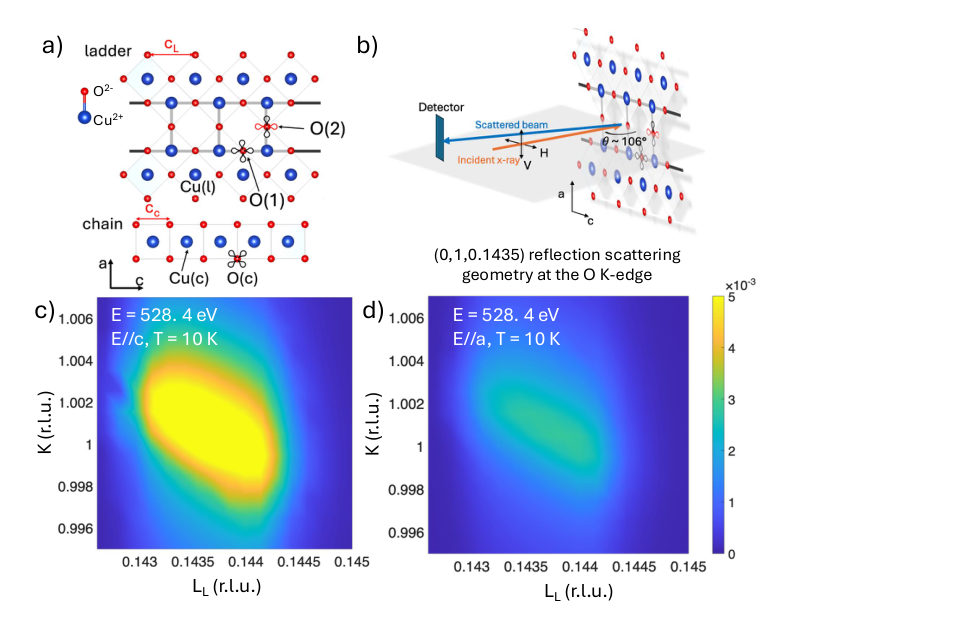
<figcaption class="paper-figure-caption"><b>Fig 1.</b> Figure 1. Charge order revealed by RSXS. (a) Structure of the ladder (top) and chain (bottom)</figcaption>
</figure>
<figure class="paper-figure-card">
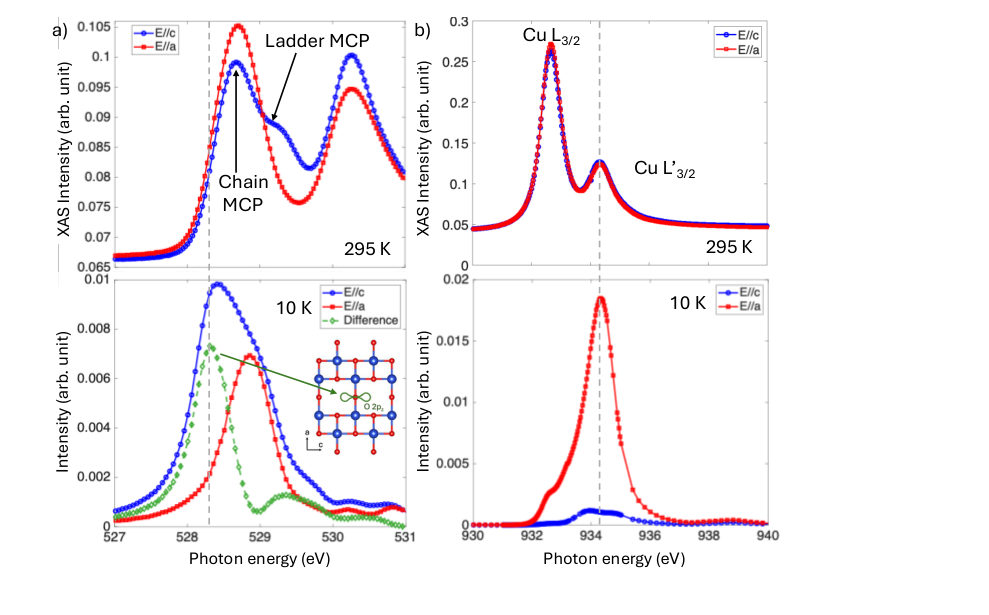
<figcaption class="paper-figure-caption"><b>Fig 2.</b> Figure 2. X-ray absorption spectra at room temperature (top) and the energy dependence of the</figcaption>
</figure>
<figure class="paper-figure-card">
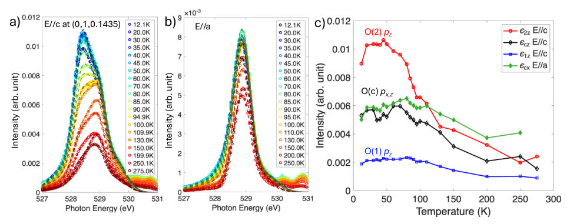
<figcaption class="paper-figure-caption"><b>Fig 3.</b> Figure 3. Temperature-dependent energy profiles of the (0, 1, 0.1435) reflection measured from 12</figcaption>
</figure>
<figure class="paper-figure-card">
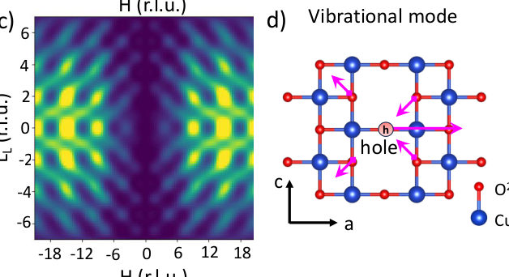
<figcaption class="paper-figure-caption"><b>Fig 4.</b> Figure 4. Unconventional optical phonon mode. (a) Measured INS spectrum of Sr2.5Ca11.5Cu24O41</figcaption>
</figure>
<figure class="paper-figure-card">
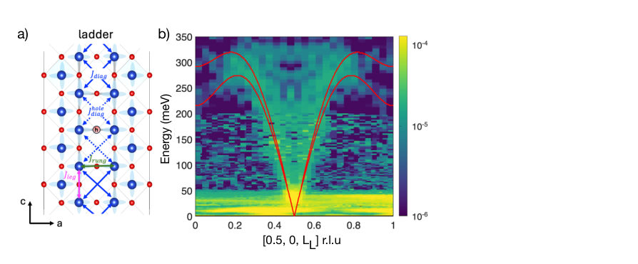
<figcaption class="paper-figure-caption"><b>Fig 5.</b> Figure 5. Magnetic excitations and anomalous magnon dispersion in the ladder. (a) Heisenberg</figcaption>
</figure>

**Summary.** This paper uses advanced X-ray and neutron scattering techniques to investigate hole localization in cuprate ladders. It demonstrates that holes reside primarily in non-bonding oxygen $p\pi$ orbitals rather than forming standard Zhang-Rice singlets. This orbital selectivity suggests that the electronic structure requires models beyond simple copper-centric descriptions for understanding superconductivity.

**Why it may be interesting.** The work provides crucial experimental constraints on strongly correlated electron models, particularly by identifying an orbital degree of freedom (the $\pi$-band) that is decoupled from the primary magnetic exchange pathways, which is vital for understanding high-Tc superconductivity physics.

Detailed structure

**Main problem.** The study challenges the conventional Zhang-Rice singlet (ZRS) framework by investigating the orbital character of doped holes in cuprate spin ladders.

**Main result.** Doped holes localize predominantly in planar, non-bonding O 2pz ($	ext{p}\pi$) orbitals on rung oxygen sites, which is distinct from conventional $\sigma$-bonded singlet states.

**Method.** The research combines polarization-dependent resonant soft X-ray scattering (RSXS) with inelastic neutron scattering (INS) measurements to probe orbital and lattice excitations simultaneously.

**Model / system.** The physical system is the spin-ladder cuprate $	ext{Sr}_{14}	ext{Cu}_{24}	ext{O}_{41}$. The analysis compares experimental findings against theoretical models, noting that conventional three-band Hubbard models are insufficient.

**Key observables.** Orbital character of holes (via RSXS polarization dependence), anomalous diagonal stretching phonon (from INS), and the energy/intensity of specific X-ray resonances ($	ext{O}$ K-edge).

**Important parameters / regimes.** The doping level, temperature evolution of charge order, and the orbital symmetry ($p\pi$ vs $\sigma$-bonded) are key parameters.

**Assumptions / limitations.** The necessity of a multi-probe approach (RSXS + INS) is highlighted because single techniques provide only limited projections of the complex electronic state.

**Figures summary.** Figures illustrate the structure, polarization dependence of charge order reflections at the O K-edge, and temperature evolution of resonant intensities, alongside INS data showing anomalous phonon modes.

**Paper structure.** The paper progresses by identifying the limitations of existing models (ZRS), presenting multi-technique evidence (RSXS/INS) to pinpoint the orbital localization ($	ext{O}(2)$ $p\pi$), and concluding with a unified picture that requires reassessing hole pairing mechanisms.

Abstract

The electronic structure of the spin-ladder cuprate Sr14Cu24O41 challenges the presumed universality of the Zhang-Rice singlet (ZRS) framework and models based exclusively on Cu-O hybridized orbitals. Combining polarization-dependent resonant soft X-ray scattering at the O K-edge with inelastic neutron scattering, we show that doped holes in the Cu2O3 ladders localize predominantly in planar non-bonding O 2pz (pπ) orbitals of rung oxygen sites rather than forming conventional ZRS states. Polarization-resolved RSXS uniquely identifies this orbital assignment, while lattice and magnetic excitations reveal its coupled consequences, establishing a unified microscopic picture that excludes the conventional σ-bonded singlet. This oxygen-sublattice charge order produces an anomalous diagonal stretching phonon and explains the absence of incommensurate magnetic fluctuations and anomalous magnon splitting. These findings motivate a reassessment of hole pairing in ladder cuprates and the sufficiency of copper-centric models for cuprate superconductors.

[↑ back to top](#top)

### [Stream Decoding with Confidence Scores at Room and Cryogenic Temperatures](http://arxiv.org/abs/2608.10576v1)

**Authors:** Maries Tahaab, Tim Chan, James Kirkman, Simon C. Benjamin  
**Type:** both · **Category:** quantum information and computing · **PDF:** <https://arxiv.org/pdf/2608.10576v1>  
**Analysis basis:** full PDF text, analyzed in chunks
**Topic relevance:** `QC/QI experiment` **1/5** · `quantum measurements` **1/5**

↔ Scroll figures horizontally

<figure class="paper-figure-card">
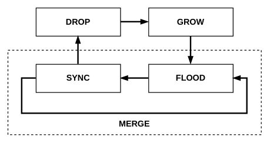
<figcaption class="paper-figure-caption"><b>Fig 1.</b> Figure 2: Simplified state transition diagram for Snowflake with the 1:1 cluster growth schedule. The analogous state diagram for the 2:1 schedule is shown in Figure 12.</figcaption>
</figure>
<figure class="paper-figure-card">
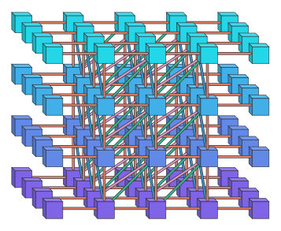
<figcaption class="paper-figure-caption"><b>Fig 2.</b> Figure 1: Schematics relating to Snowflake configured for the distance-4 unrotated surface code.</figcaption>
</figure>
<figure class="paper-figure-card">
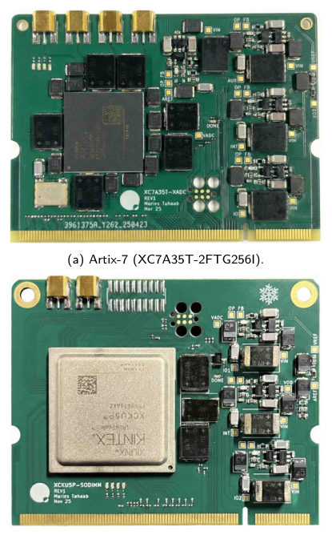
<figcaption class="paper-figure-caption"><b>Fig 3.</b> Figure 3: Custom printed circuit boards featuring onboard cryogenic voltage regulation for two FPGAs.</figcaption>
</figure>
<figure class="paper-figure-card">
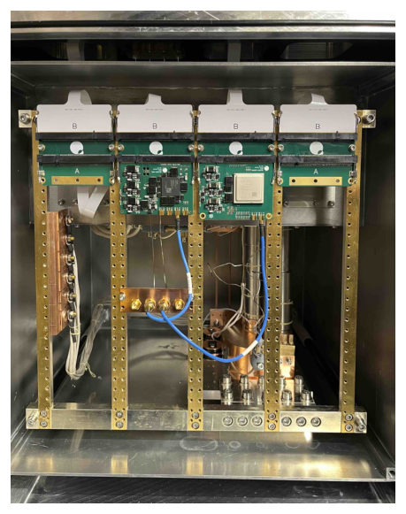
<figcaption class="paper-figure-caption"><b>Fig 4.</b> Figure 4: Measurement setup featuring both FPGA modules mounted to the cold plate of the front-loading cryostat.</figcaption>
</figure>
<figure class="paper-figure-card">
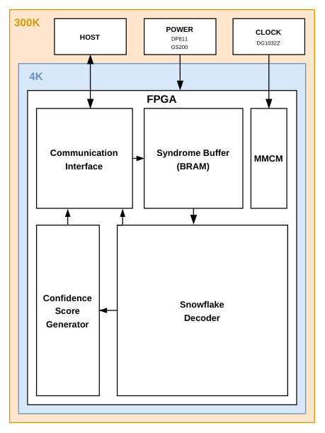
<figcaption class="paper-figure-caption"><b>Fig 5.</b> Figure 5: System-level block diagram for the decoder oper- ating inside the cryostat.</figcaption>
</figure>

**Summary.** This paper presents a high-speed hardware implementation of the Snowflake decoder for quantum error correction codes, validating its performance at both room and cryogenic temperatures. The work successfully integrates confidence score calculation with minimal overhead, addressing key bottlenecks in fault-tolerant quantum computing. It also proposes architectural solutions to scale the system beyond current FPGA limitations.

**Why it may be interesting.** While focused on hardware implementation, the rigorous analysis of state propagation, cluster tracking, and error detection mechanisms within the decoding graph provides insights into complex dynamic systems that resonate with many-body physics modeling.

Detailed structure

**Main problem.** The core challenge is achieving fast and accurate decoding of quantum error syndromes, which is critical for fault-tolerant quantum computation.

**Main result.** The authors demonstrated high decoding throughput using FPGA implementation at both room and cryogenic temperatures while incorporating confidence score calculation with negligible overhead.

**Method.** They implemented the streaming Snowflake decoder on commercial FPGAs, validating its performance across different temperature regimes and discussing architectural optimizations for large-scale deployment.

**Model / system.** The system models Quantum Error-Correcting Codes (QECCs), specifically focusing on the surface code. The decoding process involves a round-wise streaming algorithm that processes syndrome information via a 'drop-grow-merge' cycle.

**Key observables.** Decoding throughput, reaction time, decoder confidence scores (DCS), and resource utilization (LUTs, FFs) are key observables.

**Important parameters / regimes.** Code distance ($d$), operating temperatures (room vs. cryogenic), and the required inverse throughput ($\le 1 \mu s$).

**Assumptions / limitations.** The primary limitations discussed involve scaling to large code distances, necessitating alternative architectures that process 2D slices of the 3D decoding window.

**Figures summary.** Figures illustrate schematics of the Snowflake decoder for surface codes, contrasting full graph structures with proposed 2D distributed hardware implementations. Other figures detail the cryogenic measurement setup and state transition diagrams for the decoding cycle.

**Paper structure.** The paper details the necessity of fast decoding, presents the streaming Snowflake algorithm (using drop-grow-merge cycles), validates its implementation on FPGAs at different temperatures, discusses resource scaling limitations, and proposes an alternative 2D slicing architecture.

Abstract

In fault-tolerant quantum computing, fast and accurate decoding is crucial. Snowflake is a decoder for the surface code that runs in a streaming fashion. In this paper, we implement Snowflake on commercial FPGAs and validate them at room and cryogenic temperatures. Our results demonstrate high decoding throughput for small code distances that, when extrapolated, remains within acceptable limits for larger distances. Further, we incorporate the calculation of certain decoder confidence scores with negligible overhead both in terms of latency and physical resource utilisation. We note that implementing a large-scale system would require either a large FPGA beyond today's technology or clusters of FPGAs connected via a high-speed bus. Thus, we discuss an alternative architecture that exploits the locality of Snowflake by processing 2D slices of the 3D decoding window and offloading segments of the 3D structure to a high-speed memory.

[↑ back to top](#top)

### [The sharp SAT/UNSAT phase transition in random ellipsoid fitting](http://arxiv.org/abs/2608.10184v1)

**Authors:** Theodor Misiakiewicz, Garrett G. Wen  
**Type:** theory · **Category:** disordered systems and neural networks · **PDF:** <https://arxiv.org/pdf/2608.10184v1>  
**Analysis basis:** full PDF text, analyzed in chunks
**Topic relevance:** `driven-dissipative phase transition` **1/5** · `non-equilibrium universality` **1/5**

↔ Scroll figures horizontally

<figure class="paper-figure-card">
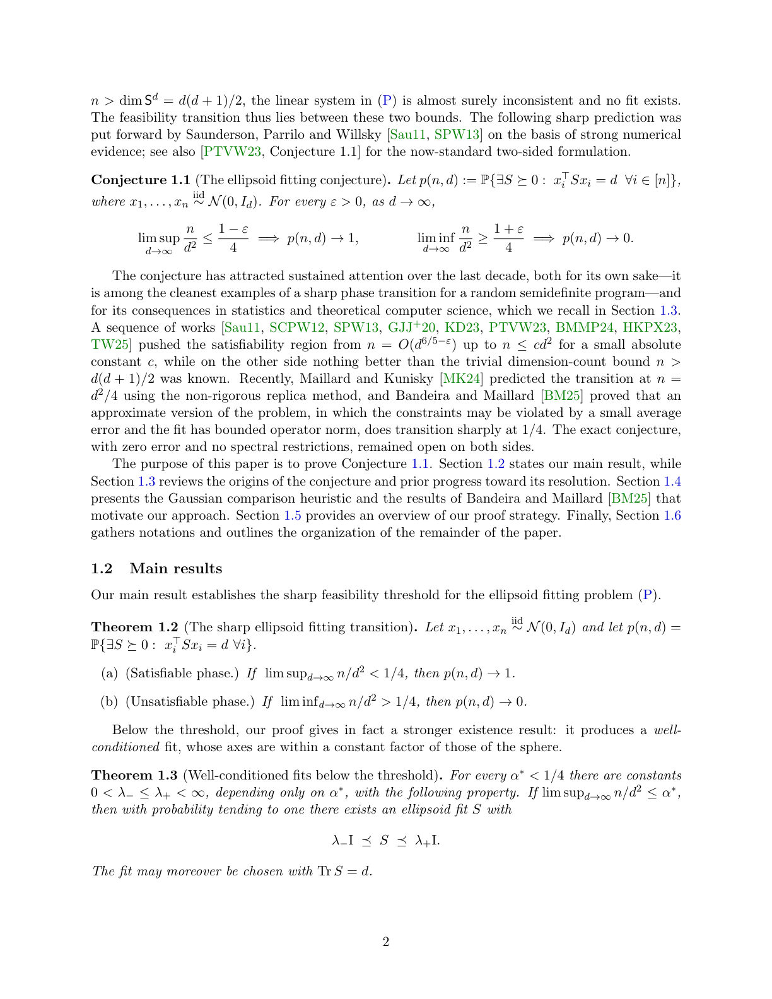
<figcaption class="paper-figure-caption"><b>Fig 1.</b> Low-resolution page preview, page 2</figcaption>
</figure>
<figure class="paper-figure-card">
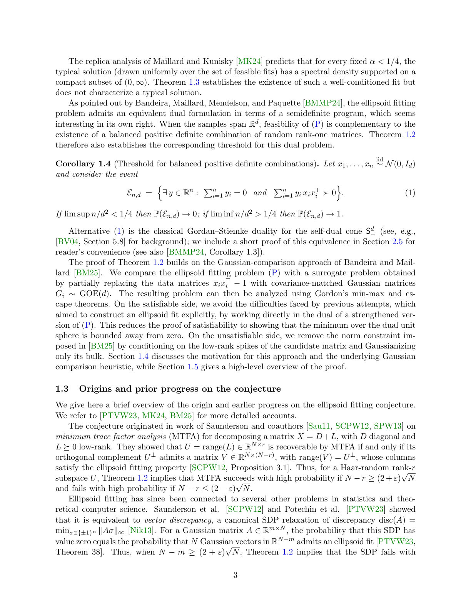
<figcaption class="paper-figure-caption"><b>Fig 2.</b> Low-resolution page preview, page 3</figcaption>
</figure>
<figure class="paper-figure-card">
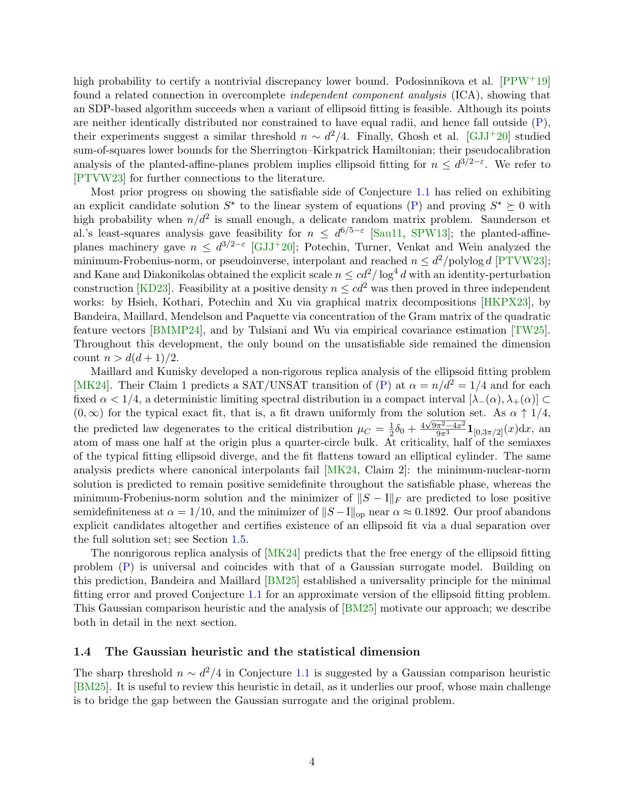
<figcaption class="paper-figure-caption"><b>Fig 3.</b> Low-resolution page preview, page 4</figcaption>
</figure>
<figure class="paper-figure-card">
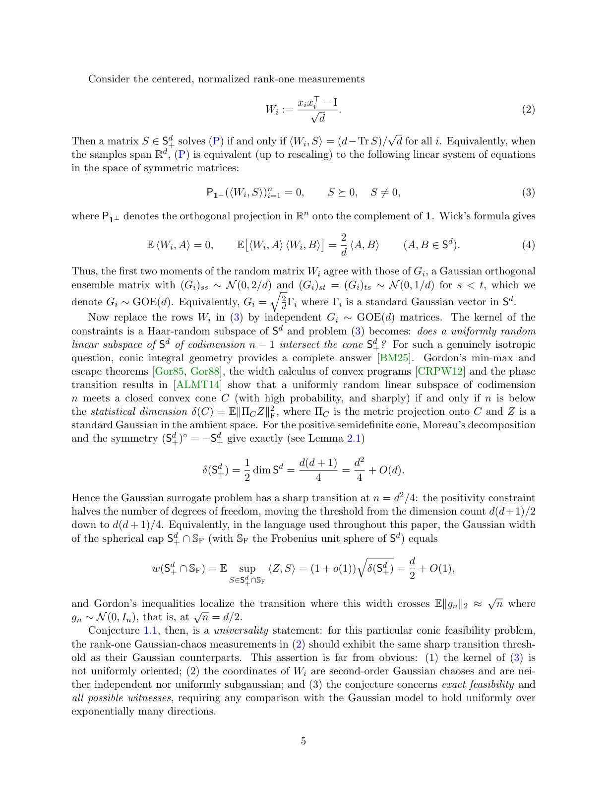
<figcaption class="paper-figure-caption"><b>Fig 4.</b> Low-resolution page preview, page 5</figcaption>
</figure>
<figure class="paper-figure-card">
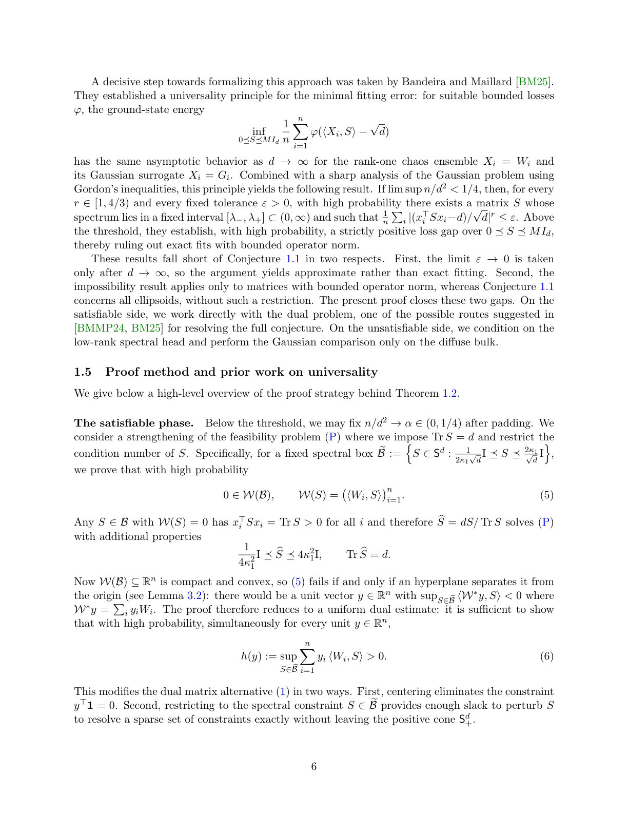
<figcaption class="paper-figure-caption"><b>Fig 5.</b> Low-resolution page preview, page 6</figcaption>
</figure>

**Summary.** This paper rigorously proves the conjectured sharp phase transition for determining if an ellipsoid fit exists for random Gaussian vectors. The critical threshold is found at $n/d^2 = 1/4$, separating a regime where solutions are almost surely guaranteed from one where they are impossible. The work employs sophisticated tools from convex optimization and high-dimensional probability theory.

**Why it may be interesting.** The rigorous mathematical characterization of a sharp transition point in a high-dimensional geometric constraint problem is highly relevant to understanding generalization bounds and information capacity limits in complex learning models, which share structural similarities with disordered systems analysis.

Detailed structure

**Main problem.** The paper determines the sharp phase transition threshold for the existence of an ellipsoid fit defined by random Gaussian vectors in high dimensions.

**Main result.** It proves that a feasible fit exists with high probability if $n/d^2 < 1/4$, and no fit exists if $n/d^2 > 1/4$.

**Method.** The proof employs advanced techniques including Gaussian-equivalence frameworks, head-tail decomposition of dual vectors, and projected Gordon escape arguments.

**Model / system.** The model involves finding a positive semidefinite matrix S such that all $n$ random Gaussian vectors $\mathbf{x}_i$ satisfy the constraint $\mathbf{x}_i^	op \mathbf{S}\mathbf{x}_i = d$.

**Key observables.** Feasibility probability $p(n, d)$, and the eigenvalues of the solution matrix S.

**Important parameters / regimes.** The ratio $\alpha = n/d^2$, with a critical threshold at $\alpha^* = 1/4$.

**Assumptions / limitations.** The analysis builds on Gaussian-equivalence principles and relies on asymptotic limits ($n, d 	o \infty$).

**Paper structure.** The paper establishes the problem formulation (SDP), proves the satisfiable phase ($\limsup n/d^2 < 1/4$) using dual analysis, and proves the unsatisfiable phase ($\liminf n/d^2 > 1/4$) using spectral decomposition and escape arguments.

Abstract

Let $x_1,\ldots,x_n$ be independent standard Gaussian vectors in $\mathbb{R}^d$. An \emph{ellipsoid fit} is a matrix $S \succeq 0$ such that $x_i^\top S x_i =d$ for every $i$, so that all the points lie on the boundary of the centered ellipsoid $\{ x : x^\top S x = d\}$. Saunderson, Parrilo and Willsky conjectured that, as $n,d \to \infty$, this semidefinite feasibility problem undergoes a sharp transition at $n \sim d^2/4$. We prove this conjecture. If $\lim \sup n/d^2 = α^* <1/4$, then, with probability tending to one, an ellipsoid fit exists; moreover, one can choose $S$ with all eigenvalues in a fixed interval $[λ_- , λ_+] \subset (0,\infty)$ depending only on $α^*$. Conversely, if $\lim \inf n/d^2 > 1/4$, then, with probability tending to one, no ellipsoid fit exists, without any spectral restriction.   Our proof builds on the Gaussian-equivalence framework developed by Bandeira and Maillard (2025) and closes the two gaps left open in their work: establishing exact fitting and removing the operator-norm constraint. On the satisfiable side, the new ingredients are a head-tail decomposition of the dual vector, exact correction of the sparse head constraints, and a Gaussian comparison principle for the low-influence tail. On the unsatisfiable side, we split a candidate into a low-rank spectral head and a Schatten-3 diffuse bulk, Gaussianize the bulk conditionally on the head, and apply a projected Gordon escape argument. The threshold is governed by the statistical dimension $d(d+1)/4$ of the positive semidefinite cone.

[↑ back to top](#top)

### [Unified Exact Cylindrical Dirac Modes and Symmetry-Resolved Quantum Geometry](http://arxiv.org/abs/2608.10563v1)

**Authors:** Zhongze Guo, Bei Xu, Qiang Gu  
**Type:** theory · **Category:** other · **PDF:** <https://arxiv.org/pdf/2608.10563v1>  
**Analysis basis:** full PDF text, analyzed in chunks
**Topic relevance:** `analog quantum simulation` **1/5** · `quantum measurements` **1/5**

↔ Scroll figures horizontally

<figure class="paper-figure-card">
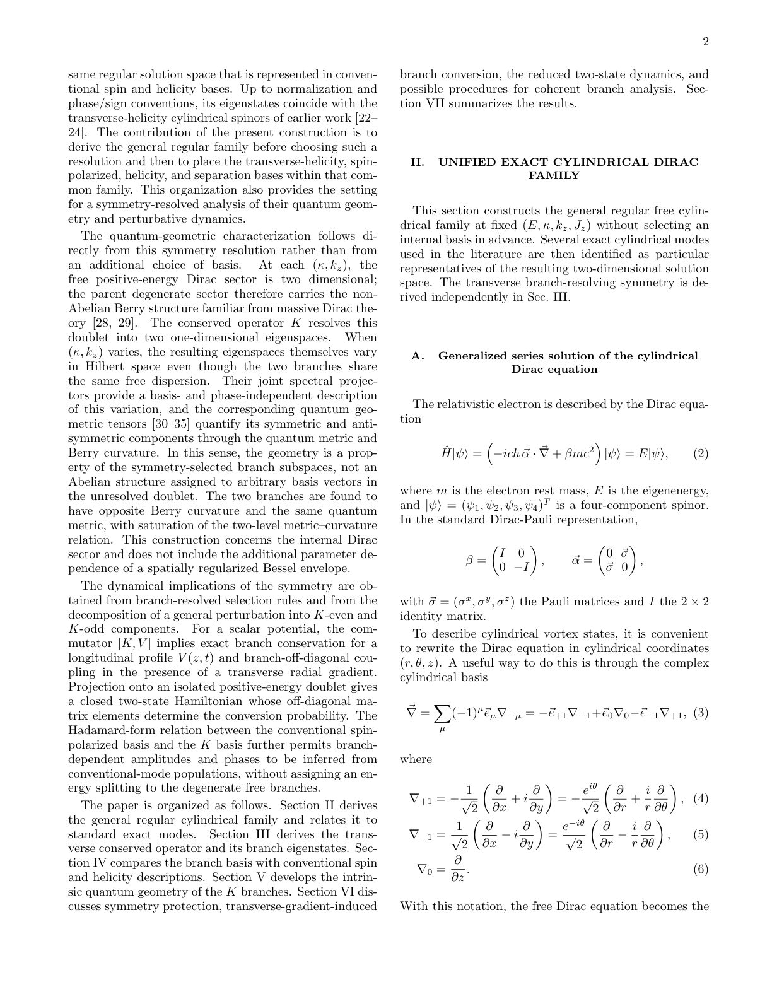
<figcaption class="paper-figure-caption"><b>Fig 1.</b> Low-resolution page preview, page 2</figcaption>
</figure>
<figure class="paper-figure-card">
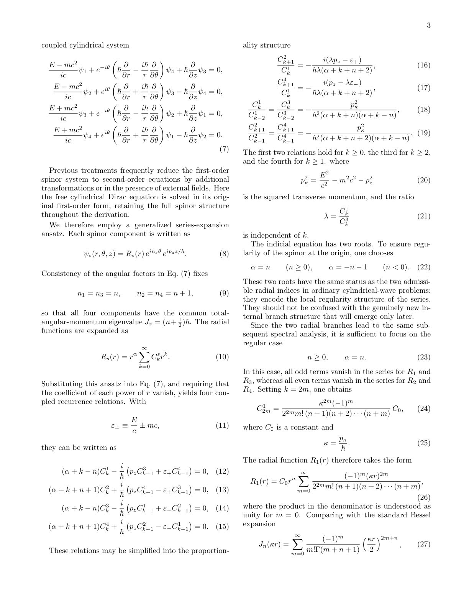
<figcaption class="paper-figure-caption"><b>Fig 2.</b> Low-resolution page preview, page 3</figcaption>
</figure>
<figure class="paper-figure-card">
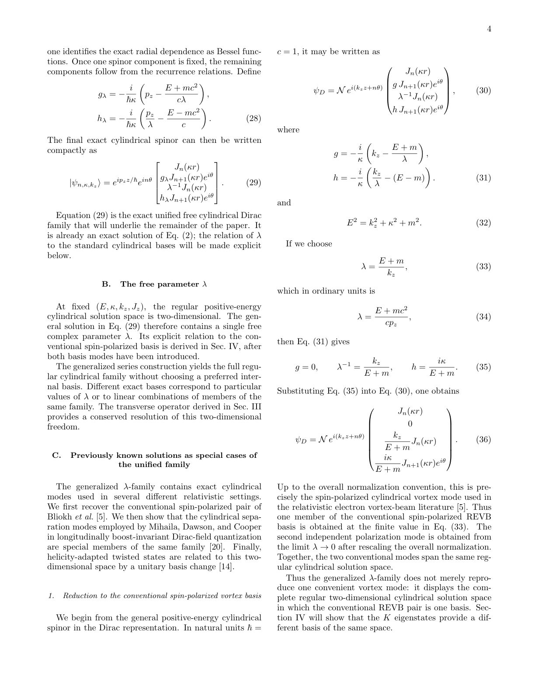
<figcaption class="paper-figure-caption"><b>Fig 3.</b> Low-resolution page preview, page 4</figcaption>
</figure>
<figure class="paper-figure-card">
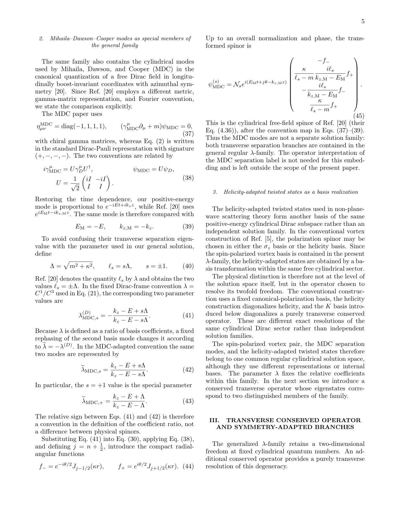
<figcaption class="paper-figure-caption"><b>Fig 4.</b> Low-resolution page preview, page 5</figcaption>
</figure>
<figure class="paper-figure-card">
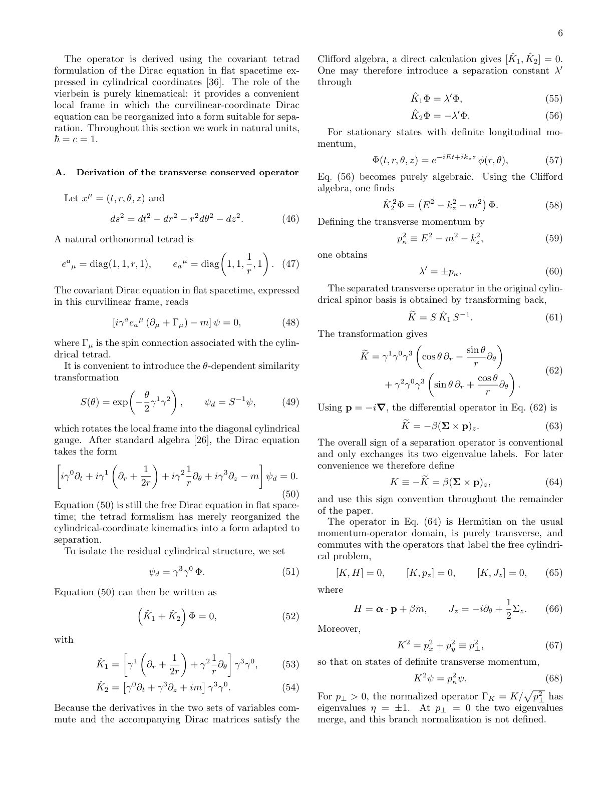
<figcaption class="paper-figure-caption"><b>Fig 5.</b> Low-resolution page preview, page 6</figcaption>
</figure>

**Summary.** This paper develops a unified theoretical framework for solving the Dirac equation in cylindrical symmetry, showing that multiple physical descriptions map onto one general solution space. By analyzing conserved operators, they resolve the system into two distinct branches characterized by opposite Berry curvatures but shared geometry. This connects mode classification, quantum geometry, and dynamical selection rules for relativistic fermions.

**Why it may be interesting.** This work provides a rigorous mathematical framework for classifying single-particle states in curved or constrained geometries (like cylinders), which is foundational knowledge applicable to effective Hamiltonians used in AMO physics and quantum field theory simulations.

Detailed structure

**Main problem.** To derive a general, unified exact solution for the free Dirac equation in axially symmetric cylindrical coordinates and to analyze its internal quantum geometry.

**Main result.** The analysis establishes that various known basis sets (spin-polarized, helicity) are embedded within one common solution space, which possesses two symmetry-defined branches with opposite Berry curvatures but a shared quantum metric.

**Method.** The authors use separation of variables and generalized series expansions to solve the coupled first-order Dirac equation. They then employ conserved transverse operators to resolve the residual doublet into distinct symmetry-defined subspaces for geometric analysis.

**Model / system.** The system is a relativistic fermion described by the free Dirac equation in cylindrical coordinates, applicable to physical scenarios like electron vortices or rotating matter. The Hamiltonian is analyzed at fixed energy and momenta.

**Key observables.** Berry curvature, quantum metric, branch conversion probabilities, and symmetry-resolved dynamics.

**Important parameters / regimes.** Energy (E), transverse momentum ($\kappa$), longitudinal momentum ($p_z$), and total angular momentum ($J_z$).

**Assumptions / limitations.** The analysis focuses on the positive-energy sector and assumes axial symmetry. The final dynamical analysis is restricted to perturbations that respect or break the conserved transverse operator K.

**Paper structure.** The paper first derives the general solution form encompassing multiple known bases, then uses a conserved transverse operator to split the positive-energy sector into two branches. Finally, it analyzes how perturbations couple these branches, revealing geometric properties and selection rules.

Abstract

Exact cylindrical solutions of the free Dirac equation provide natural single-particle modes for a broad class of axially symmetric relativistic fermion systems, including electron vortices, twisted-particle scattering, rotating matter, and cylindrical field quantization, but are commonly formulated in different internal bases. We derive the general regular positive-energy cylindrical solution at fixed energy, transverse and longitudinal momenta, and total angular momentum, and show how the commonly used spin-polarized, separation, helicity, and transverse-helicity modes are embedded in the resulting two-dimensional solution space. A conserved transverse operator resolves the residual doublet into two symmetry-defined branches. Their parameter-dependent eigenspaces admit a gauge-invariant quantum-geometric characterization, with opposite Berry curvatures, a common quantum metric, and saturation of the two-level metric--curvature relation. We further derive symmetry constraints on branch conversion and the corresponding reduced two-state dynamics. The resulting framework connects mode classification, symmetry resolution, quantum geometry, and dynamics across distinct cylindrical Dirac settings.

[↑ back to top](#top)

### [A Quantum Algorithm for Solving the Poisson Equation for Free Field Conditions via the Hockney Method](http://arxiv.org/abs/2608.10809v1)

**Authors:** Hans A. Kösel, Roland Ewert, Jan W. Delfs  
**Type:** theory · **Category:** quantum information and computing · **PDF:** <https://arxiv.org/pdf/2608.10809v1>  
**Analysis basis:** full PDF text, analyzed in chunks
**Topic relevance:** `quantum measurements` **1/5**

↔ Scroll figures horizontally

<figure class="paper-figure-card">
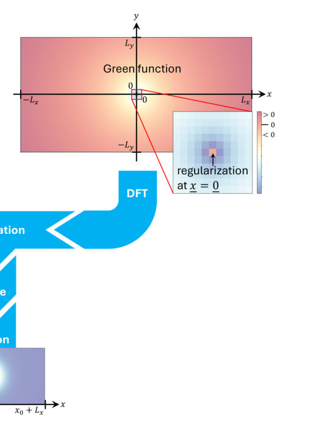
<figcaption class="paper-figure-caption"><b>Fig 1.</b> Fig. 1: Illustration of the Hockney method.</figcaption>
</figure>
<figure class="paper-figure-card">
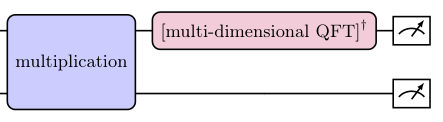
<figcaption class="paper-figure-caption"><b>Fig 2.</b> Fig. 2: Quantum circuit schematics of the module structure of the quantum algorithm.</figcaption>
</figure>
<figure class="paper-figure-card">
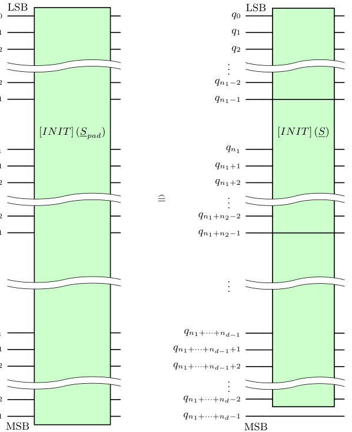
<figcaption class="paper-figure-caption"><b>Fig 3.</b> Fig. 3: Equivalence of an initialization procedure for its application to a data field Spad, which explicitly includes a padding of the source field S, and the application to the source field S alone. The procedure [INIT] prepares a data field of the form (27) as a corresponding state vector w.r.t. the involved qubits in amplitude encoding. LSB and MSB indicate the least and most significant bit, respectively, and qubit lines that go over the gate block for the initialization mean that the initialization procedure does not act on them. If the padding region shall be realized for a specific dimension before the region of the source (as in Fig. 1), an X-gate has to be applied to the qubit of...</figcaption>
</figure>
<figure class="paper-figure-card">
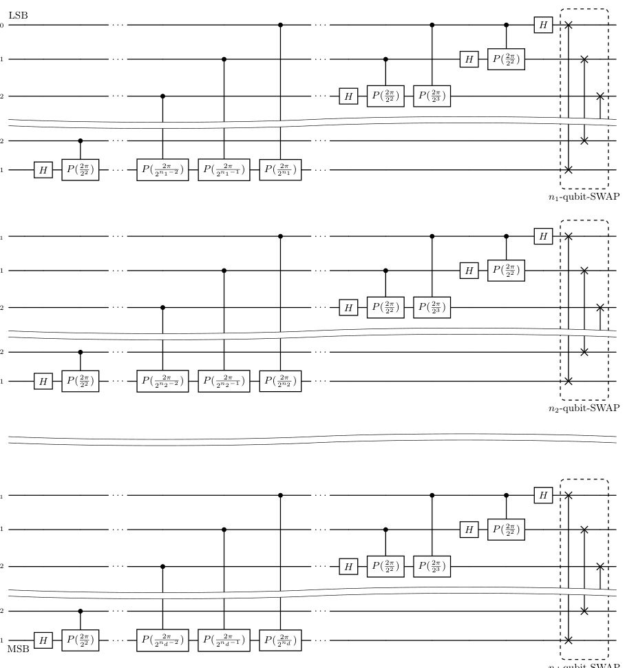
<figcaption class="paper-figure-caption"><b>Fig 4.</b> Fig. 4: Quantum circuit pattern of the multi-dimensional QFT according to [9]. It is implemented for a state vector of the form (27) by performing one-dimensional QFT routines for the subregisters that are associated to the individual dimensions in parallel.</figcaption>
</figure>
<figure class="paper-figure-card">
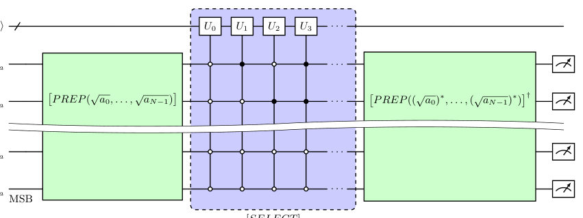
<figcaption class="paper-figure-caption"><b>Fig 5.</b> Fig. 5: Quantum circuit pattern of the LCU procedure. There have to be as many ancilla qubits as needed to store a value for each non-vanishing coefficient in the expansion (31) in amplitude encoding, for which [PREP] is a corresponding gate sequence. The [SELECT]-gate block involves all qubits. In it, the ancilla qubits act as control qubits, where the control bitstring is given by the binary representation of κ for the respective non-vanishing aκ. The ancilla qubits are added here as the MSBs, however, the ordering is irrelevant for the LCU procedure. In accordance to the definition of [PREP] in the text, all ancilla qubits shall have the starting state |0⟩and have to be also measured in...</figcaption>
</figure>

**Summary.** This paper proposes a quantum algorithm to solve the Poisson equation using techniques like the Quantum Fourier Transform and the Hockney method. It compares two circuit implementations for diagonal matrix multiplication, finding trade-offs between ancilla qubit requirements and success probability. The work confirms the potential of quantum computation for PDEs but cautions that current non-QFT steps limit overall runtime efficiency.

**Why it may be interesting.** It demonstrates a direct application of advanced quantum algorithms (QFT, controlled gates) to solve a classical PDE problem, providing benchmarks for quantum simulation feasibility in physics applications.

Detailed structure

**Main problem.** The paper addresses solving the Poisson equation, $\nabla^2\varphi(\mathbf{x}) = S(\mathbf{x})$, which is a fundamental problem in fields like CFD.

**Main result.** A quantum algorithm utilizing the Quantum Fourier Transform (QFT) and the Hockney method was developed to solve this equation for both periodic and free field boundary conditions. While QFT offers efficiency gains, other necessary algorithmic steps limit the overall runtime performance.

**Method.** The core methodology involves mapping the differential equation into Fourier space, applying the QFT, performing a matrix multiplication in the transformed domain (using LCU or multi-controlled rotations), and then applying an inverse transform. The Hockney method extends this to free field conditions.

**Model / system.** The model is the Poisson equation itself, applied to scalar fields $\varphi$ governed by a source term $S$. The quantum implementation uses amplitude encoding for state representation and relies on QFT circuits.

**Key observables.** Success probability of obtaining the desired ancilla qubit subspace; the solution function $\varphi(\mathbf{x})$ itself, compared against analytical solutions.

**Important parameters / regimes.** The resolution (number of discretization points $N$) used for simulating test cases in 1D and 2D.

**Assumptions / limitations.** For free-field problems, the Hockney method is employed to extend periodic boundary solutions. The efficiency analysis notes that non-QFT steps diminish overall runtime performance despite QFT's advantage over classical methods.

**Figures summary.** Figures illustrate quantum circuit schematics (Fig. 2) and show simulation results comparing computed real/imaginary parts of the solution $\phi$ against known analytical solutions for both periodic and free-field test cases (Figs. 16, 17, 18).

**Paper structure.** The paper first establishes the mathematical background by deriving solutions using Fourier Transforms for both periodic and free fields, detailing the role of the Hockney method. It then presents the quantum algorithm structure involving QFT and diagonal matrix multiplication, followed by detailed verification through state vector simulations on 1D and 2D test examples.

Abstract

For the often encountered problem of the Poisson equation, this work presents a quantum algorithm solving it based on the quantum Fourier transform (QFT) for periodic boundary conditions as well as free field conditions, where the latter is realized via the Hockney method. Besides the QFT and an initialization procedure for amplitude encoding, the algorithm just uses a procedure for multiplying the state vector by a diagonal matrix w.r.t. amplitude encoding. For the latter, two alternative implementations are considered here. The first variant is a version of the LCU method and the second is a sequence of multi-controlled rotation gates that represents a factoring of the multiplied values into absolute values and complex phase factors. The functionality of the algorithm is verified via comparing the results obtained from state vector simulations for one- and two-dimensional test examples with their analytical solutions. For the considered test examples, it is found that the success probability for obtaining the desired ancilla qubit subspace in the LCU version is a factor of around two higher than that for the sequence of multi-controlled rotation gates. However, the LCU version requires a number of ancilla qubits up to the number of qubits that is set to store the discretized source term of the Poisson equation in amplitude encoding, whereas the sequence of multi-controlled rotation gates demands only one ancilla qubit. Computations of the success probabilities for both variants furthermore indicate that the success probability converges for a specific problem with increasing resolution. Concerning the required computational resources for the quantum algorithm, the conclusion is drawn that while the QFT is a more efficient procedure than its classical counterpart, the current implementations of the other necessary steps in the algorithm diminish the efficiency w.r.t. the runtime.

[↑ back to top](#top)

### [A Sharp Local-Question Threshold for GHZ-Equatorial Completeness in Four-Player XOR Games](http://arxiv.org/abs/2608.11139v1)

**Authors:** Ziao Tang, Chengkai Zhu, Ge Bai, Xin Wang, Ranyiliu Chen  
**Type:** theory · **Category:** quantum information and computing · **PDF:** <https://arxiv.org/pdf/2608.11139v1>  
**Analysis basis:** full PDF text, analyzed in chunks
**Topic relevance:** `quantum measurements` **1/5**

↔ Scroll figures horizontally

<figure class="paper-figure-card">
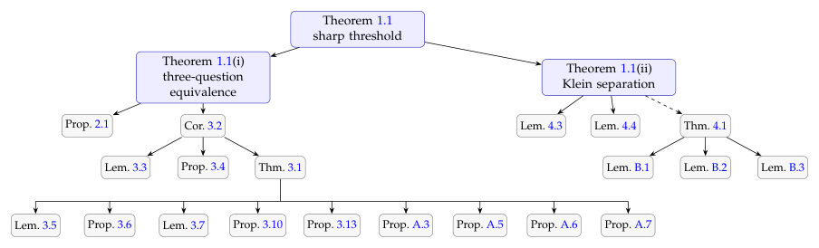
<figcaption class="paper-figure-caption"><b>Fig 1.</b> Figure 1: Core dependency graph for the Lean formalization. Solid arrows point from a conclusion to its principal ingredients. The dashed arrow marks the companion each-clause-once classification.</figcaption>
</figure>

**Summary.** This theoretical paper establishes a sharp boundary (threshold) for four-player XOR games concerning the equivalence between two models of quantum correlation: those defined by commuting operators and those admitting perfect Greenberger–Horne–Zeilinger (GHZ)-equatorial strategies. The authors prove that this threshold is exactly four active questions per player, using advanced algebraic geometry and formal proof techniques.

**Why it may be interesting.** It provides a rigorous, mathematically deep characterization of when non-local quantum correlations implied by specific game structures can be perfectly simulated using only local measurements on a highly entangled state like the GHZ state.

Detailed structure

**Main problem.** The paper determines the sharp local-question threshold for when a four-player XOR game's commuting-operator value ($\omega_{co}(G)=1$) guarantees a perfect Greenberger–Horne–Zeilinger (GHZ)-equatorial realization.

**Main result.** Four is established as the sharp threshold: games with $\le 3$ questions per player must have a perfect GHZ-equatorial strategy if $\omega_{co}(G)=1$, but this fails for some game with four questions per player.

**Method.** The analysis reduces the problem to analyzing phase equations derived from the GHZ state and uses advanced mathematical tools like primitive circuits, forest matchings, and ternary Hamming geometry to prove algebraic equivalences between different correlation models.

**Model / system.** The model is a four-player binary XOR game defined by clauses and questions. The analysis compares correlations achievable via tensor-product strategies versus those constrained by commuting operators on a single Hilbert space (GHZ state).

**Key observables.** Commuting-operator value ($\omega_{co}(G)$), perfect MERP strategy existence, and the phase equations derived from the GHZ state.

**Important parameters / regimes.** The number of active questions per player ($k$), specifically testing $k=3$ versus $k=4$.

**Assumptions / limitations.** The proof relies on lifting abelian obstructions to ordered non-commutative refutations and utilizes formal verification in Lean 4.30.0.

**Figures summary.** Figure 1 shows the core dependency graph for the Lean formalization, mapping theorems to their ingredients; Table 2 provides a statement-by-statement correspondence between manuscript results and Lean declarations.

**Paper structure.** The paper proceeds by establishing algebraic dualities relating perfect strategies ($\omega_{co}(G)=1$) to lattice conditions ($b \in L^{\perp}_E$ vs $b \in R^{\perp}_E$). It then uses geometric arguments (e.g., covering the cube with balls) and graph theory/algebraic techniques (Cayley matching classification) to prove the threshold result.

Abstract

We determine the smallest number of active questions per player at which a four-player binary exclusive-or (XOR) game of commuting-operator value one need not admit a Greenberger--Horne--Zeilinger (GHZ) equatorial realization. Such a realization uses the four-qubit GHZ state and equatorial qubit observables, reducing perfect play to additive phase equations. We prove that every four-player XOR game with commuting-operator value one and at most three active questions per player has a perfect GHZ-equatorial strategy. Conversely, we construct a uniform eight-clause game with four active questions per player whose commuting-operator value is one but whose phase equations are inconsistent. Thus four is the sharp local-question threshold. The positive result follows by lifting every integral incidence obstruction to an ordered noncommutative refutation, using primitive circuits, forest matchings, and ternary Hamming geometry. For the separating game, a Klein four-group incidence relation obstructs the phase system, while an even-subgroup normal form and degree-one and degree-two Magnus coefficients exclude refutations of arbitrary length.

[↑ back to top](#top)

### [Bounds for Pure Disjoint $(r,δ)$-Quantum Locally Recoverable Codes](http://arxiv.org/abs/2608.10922v1)

**Authors:** Evagoras Stylianou, Holger Boche  
**Type:** theory · **Category:** quantum information and computing · **PDF:** <https://arxiv.org/pdf/2608.10922v1>  
**Analysis basis:** full PDF text, analyzed in chunks
**Topic relevance:** `quantum measurements` **1/5**

↔ Scroll figures horizontally

<figure class="paper-figure-card">
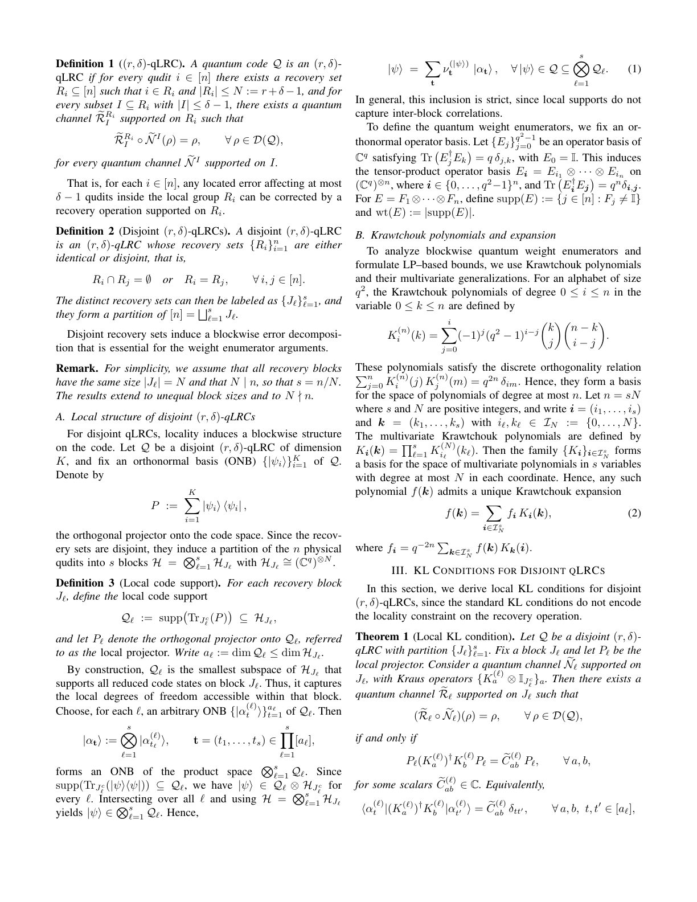
<figcaption class="paper-figure-caption"><b>Fig 1.</b> Low-resolution page preview, page 2</figcaption>
</figure>
<figure class="paper-figure-card">
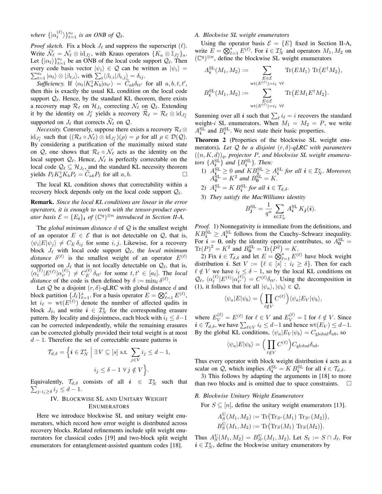
<figcaption class="paper-figure-caption"><b>Fig 2.</b> Low-resolution page preview, page 3</figcaption>
</figure>
<figure class="paper-figure-card">
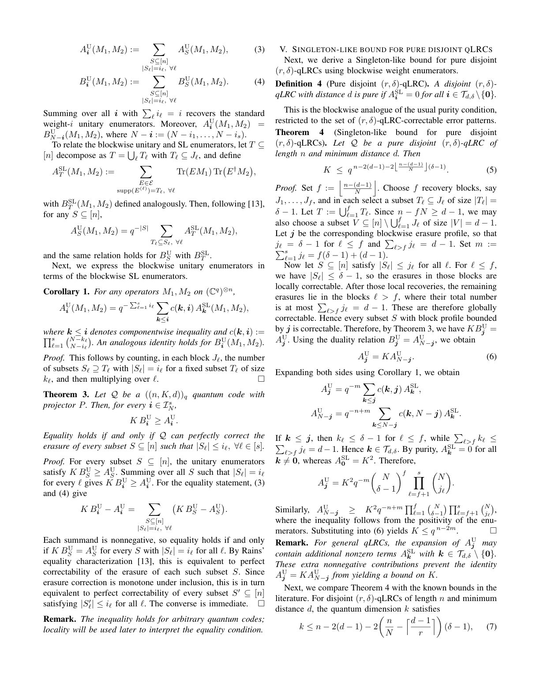
<figcaption class="paper-figure-caption"><b>Fig 3.</b> Low-resolution page preview, page 4</figcaption>
</figure>
<figure class="paper-figure-card">
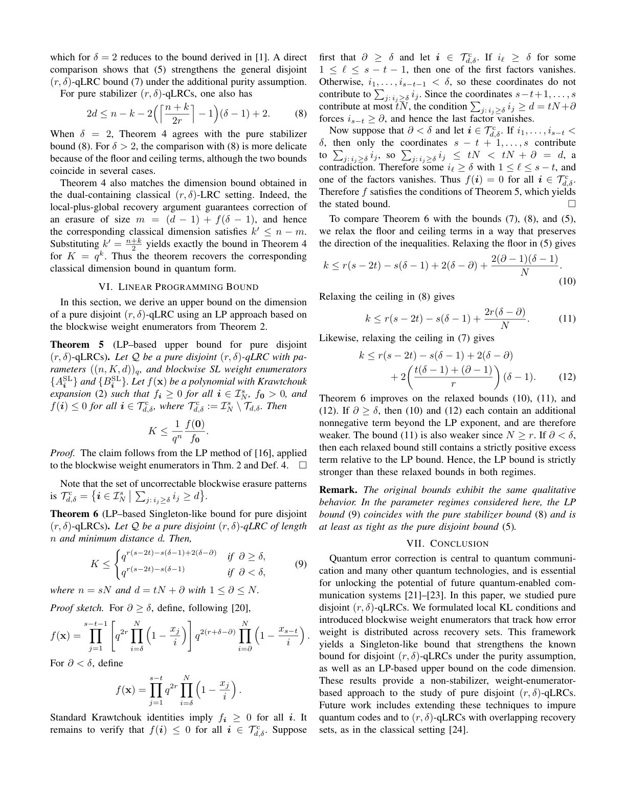
<figcaption class="paper-figure-caption"><b>Fig 4.</b> Low-resolution page preview, page 5</figcaption>
</figure>
<figure class="paper-figure-card">
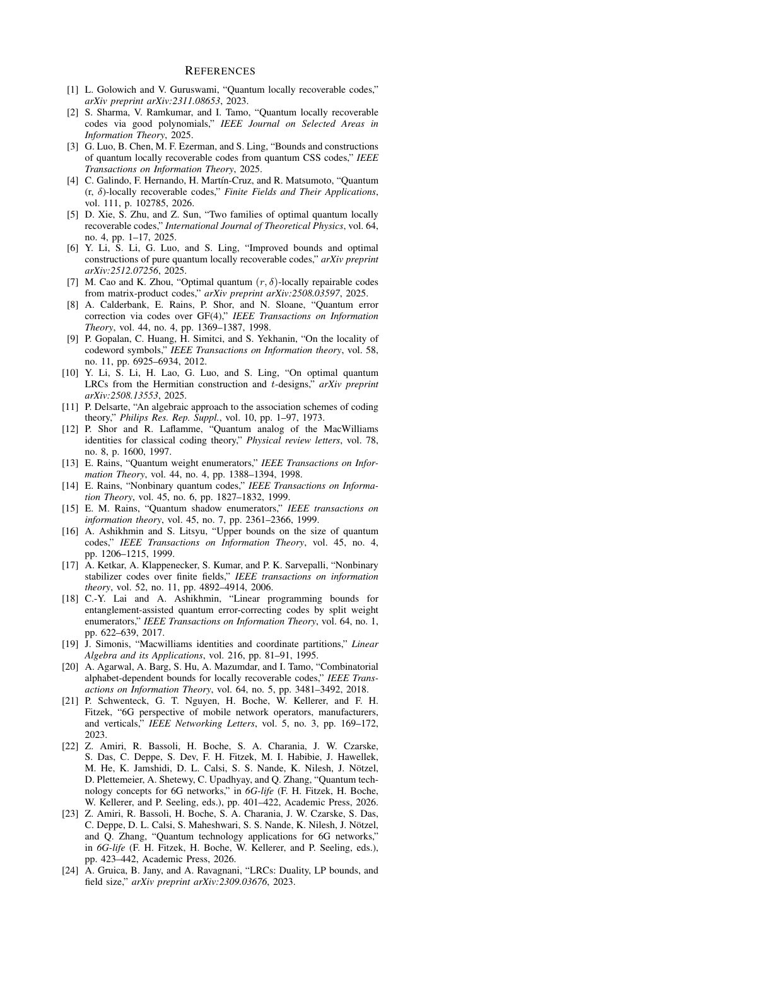
<figcaption class="paper-figure-caption"><b>Fig 5.</b> Low-resolution page preview, page 6</figcaption>
</figure>

**Summary.** This paper develops advanced mathematical tools—specifically blockwise weight enumerators and linear programming bounds—to establish tighter constraints on the existence and dimension of pure disjoint quantum locally recoverable codes. By avoiding assumptions about stabilizer structure, it significantly expands the theoretical understanding of quantum error correction capabilities.

**Why it may be interesting.** This work provides powerful, non-stabilizer techniques to constrain the parameters of quantum error-correcting codes, which is fundamental knowledge for designing robust quantum computation protocols.

Detailed structure

**Main problem.** The primary goal is deriving rigorous upper bounds for pure disjoint $(r, \delta)$-Quantum Locally Recoverable Codes (qLRCs) without relying on the assumption that the code possesses a stabilizer structure.

**Main result.** The authors establish a new Singleton-like bound and derive linear-programming upper bounds on the code dimension, which strengthen existing results for these quantum error-correcting codes.

**Method.** The methodology involves formulating local Knill–Laflamme conditions and introducing blockwise Shor–Laflamme and unitary weight enumerators. These enumerators are then analyzed using Linear Programming (LP) techniques.

**Model / system.** The study concerns quantum error correction codes defined by projectors acting on a tensor product Hilbert space, specifically focusing on the structure of local recovery operations across disjoint blocks of physical qudits.

**Key observables.** Blockwise Shor–Laflamme weight enumerators ($	ext{ASL}_i, 	ext{BSL}_i$) and blockwise Unitary weight enumerators ($	ext{AU}_S, 	ext{BU}_S$).

**Important parameters / regimes.** Code parameters include total length $n$, dimension $K$, minimum distance $d$, and local recovery parameter $\delta$.

**Assumptions / limitations.** The strongest bounds are derived under the assumption that the code is 'pure' (i.e., certain weight enumerators vanish for non-zero error patterns).

**Paper structure.** The paper builds from defining local recovery conditions to introducing blockwise weight enumerators, proving properties of these enumerators (like $	ext{ASL}_i = K 	ext{BSL}_i$), and culminating in the derivation of the Singleton-like bound via LP methods.

Abstract

We study pure disjoint $(r,δ)$-quantum locally recoverable codes (qLRCs) without assuming a stabilizer structure. We formulate local Knill--Laflamme conditions for recovery from up to $δ-1$ erasures within a recovery block, and introduce blockwise Shor--Laflamme and unitary weight enumerators that capture how error weight is distributed across recovery sets. We establish several properties of these enumerators and use them to derive a Singleton-like bound that strengthens the known bound for disjoint $(r,δ)$-qLRCs under a purity assumption, as well as a linear-programming upper bound on the code dimension. These results provide a non-stabilizer, weight-enumerator-based approach to the study of pure disjoint $(r,δ)$-qLRCs.

[↑ back to top](#top)

### [Helium-like ions $(Z,e,e)$ in Lagrange Mesh method, interpolating the highly-accurate energy spectra vs. Z](http://arxiv.org/abs/2608.10695v1)

**Authors:** H Olivares-Pilon, JC Lopez-Vieyra, AV Turbiner  
**Type:** theory · **Category:** other · **PDF:** <https://arxiv.org/pdf/2608.10695v1>  
**Analysis basis:** full PDF text, analyzed in chunks
**Topic relevance:** `quantum measurements` **1/5**

↔ Scroll figures horizontally

<figure class="paper-figure-card">
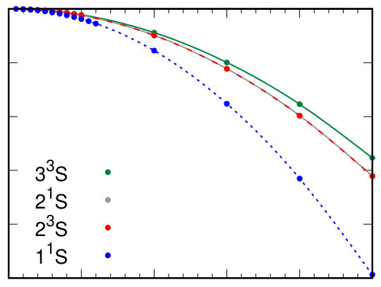
<figcaption class="paper-figure-caption"><b>Fig 1.</b> FIG. 1. Energy of the helium-isoelectronic sequence as a function of the charge Z for the four</figcaption>
</figure>

**Summary.** This work tackles the calculation of energy spectra for Helium-like ions across varying nuclear charges Z by proposing two advanced methods: numerical simulation via the Lagrange Mesh Method, and a general interpolation formula. The key achievement is the interpolation formula, which successfully merges asymptotic expansions to provide extremely high accuracy (up to 14 s.d.) over the entire physically relevant range of Z.

**Why it may be interesting.** While focused on atomic structure rather than quantum information, the development of highly accurate extrapolation techniques using Padé approximants to bridge different asymptotic regimes (large Z vs. near a singularity $Z_B$) is mathematically sophisticated and relevant for modeling complex many-body systems where multiple physical limits must be connected.

Detailed structure

**Main problem.** The primary goal is to calculate highly accurate energy spectra for Helium-like atomic ions as a function of the nuclear charge Z.

**Main result.** The authors developed a general, few-parametric interpolation formula that achieves 10-14 significant digits of accuracy across all physically relevant charges Z, complementing high-accuracy numerical results from the Lagrange Mesh Method.

**Method.** Two complementary methods are presented: (1) A highly accurate numerical solution using the Lagrange Mesh Method (LMM), and (2) An analytical interpolation formula based on matching $1/Z$-expansions at large Z and Puiseux expansions around a critical charge $Z_B$.

**Model / system.** The system is two-electron atomic ions (Helium-like sequence) governed by the non-relativistic Schrödinger equation. The Hamiltonian describes the Coulomb interaction between two electrons and the nucleus with charge Z.

**Key observables.** Energy eigenvalues ($E$) for various excited states of the helium-like sequence, such as $1s^2$, $2s$, and $3s$.

**Important parameters / regimes.** The nuclear charge Z is the primary variable. Key theoretical parameters include the second critical charge $Z_B$ (a singularity point) and the expansion order N used in the interpolation.

**Assumptions / limitations.** The analysis relies on matching asymptotic expansions ($1/Z$ at large Z, Puiseux near $Z_B$) to construct a meromorphic interpolation function. The non-relativistic approximation is used, though relativistic effects are noted for very high Z.

**Figures summary.** Figures illustrate the energy vs. Z dependence for several states, comparing LMM results against fits derived from the proposed interpolation formula.

**Paper structure.** The paper introduces the physical problem and Hamiltonian, details two solution approaches (LMM and Interpolation), presents mathematical derivations involving $1/Z$ and Puiseux expansions, and concludes by validating the combined interpolation method across multiple excited states.

Abstract

Two alternative approaches for studying Helium-like atomic ions in non-relativistic quantum mechanics are proposed: (I) a numerical approach, based on the Lagrange-mesh method which can easily reach up to 14-15 significant digits in the energy spectrum for any nuclear charge $Z$ with modest CPU time in single processor mode and (II) a highly-accurate, few-parametric interpolation formula for the energies {\it vs.} $Z$. The interpolation formula of general nature is proposed, it can be applied to the energies of any excited state of the helium-like sequence. It is based on matching the $1/Z$-expansion at large $Z$ and the Puiseux expansion with integer and half-integer powers around the so-called second critical charge $Z_B$, introduced by F and D Stillinger (1969, 1974), confirmed by the present authors in 2019 for the ground state $1^1 S$, then revisited here, and extended to the excited states in the present work. For example for the first two spin-singlet $1^1 S$, $2^1 S$ and the first two spin-triplet $2^3 S$, $3^3 S$ states this interpolation formula with nine free parameters can reach an accuracy of 10-14 significant digits (s.d.) in the energies for any physically-relevant nuclear charge $Z$, giving absolute accuracy at large $Z$. Many results are obtained for the first time.

[↑ back to top](#top)

### [Quantum Codes with Arbitrary Z-Rotation logical Gates and Applications to Fault-Tolerant Code Switching](http://arxiv.org/abs/2608.11160v1)

**Authors:** Reza Dastbasteh, Ruben M. Otxoa, Pedro M. Crespo, Josu Etxezarreta Martinez  
**Type:** theory · **Category:** quantum information and computing · **PDF:** <https://arxiv.org/pdf/2608.11160v1>  
**Analysis basis:** full PDF text, analyzed in chunks
**Topic relevance:** `quantum measurements` **1/5**

↔ Scroll figures horizontally

<figure class="paper-figure-card">
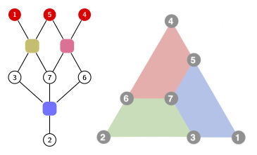
<figcaption class="paper-figure-caption"><b>Fig 1.</b> Figure 1: The regular representation of seven qubits color/Steane code (right) and the one obtained from Corollary III.2 (left). On the left figure, qubits 1,5,4 (respectively 3,7,6) form all-even code, and qubit 2 is the totally orthogonal code. Here the logical X operator is X1X5X4 (top row of qubits).</figcaption>
</figure>
<figure class="paper-figure-card">
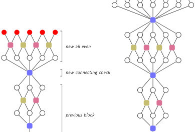
<figcaption class="paper-figure-caption"><b>Fig 2.</b> Figure 3: Left: recursive construction of [[17, 1, 5]] from [[7, 1, 3]] code of Figure 1 (appear as the previous block). Here three colored squares represent check qubits (X and Z), white circles data qubits, and highlighted red circles a minimum weight logical operator (X and Z). Right: recursive construction of [[31, 1, 7]] from [[17, 1, 5]] code.</figcaption>
</figure>
<figure class="paper-figure-card">
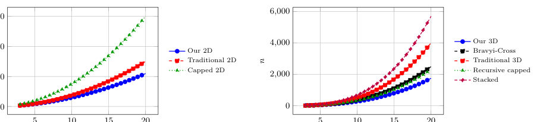
<figcaption class="paper-figure-caption"><b>Fig 3.</b> Figure 5: Data qubit overhead n (code length) as a function of code distance d for 2D (left) and 3D (right) quantum families.</figcaption>
</figure>
<figure class="paper-figure-card">
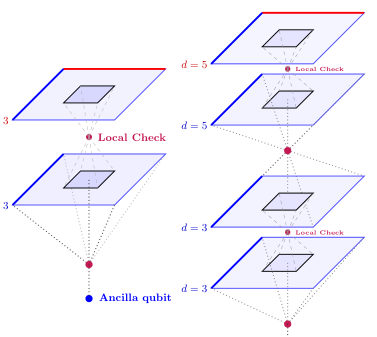
<figcaption class="paper-figure-caption"><b>Fig 4.</b> Figure 6: Example of codes constructed from Theorem IV.4. (Left) The geometry of [[19, 1, 3]] X-self-orthogonal code. The two planes represent two surface codes of distance 3, and the red dots show their X checks, where local checks are as many as the number of X-check of the surface codes. Such local checks are connected to data qubits of the two surrounding copies of surface codes. The lowest check is connected to all the data qubits of its top surface code, and the single data qubit of totally orthogonal code (named Ancilla qubit). The tick blue and red qubits (on the planes or the bottom qubit) specify the location of data qubits corresponding to minimum weight logical X and Z operators...</figcaption>
</figure>
<figure class="paper-figure-card">
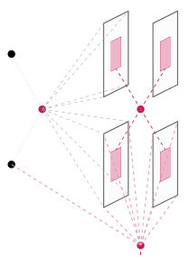
<figcaption class="paper-figure-caption"><b>Fig 5.</b> Figure 7: Geometric representation of [[39, 1, 3]] triorthogonal code.</figcaption>
</figure>

**Summary.** This paper develops advanced techniques for constructing fault-tolerant quantum error correcting codes that support arbitrary Z-rotation logical gates. By extending the code switching protocol to new families of codes, such as those compatible with rotated surface codes, it significantly improves the theoretical feasibility and resource estimates for universal quantum computation beyond standard T-gate assumptions.

**Why it may be interesting.** This work directly advances the theoretical understanding of resource efficiency in quantum computation by providing pathways to implement non-Clifford gates (like arbitrary Z-rotations) using more general and potentially less resource-intensive coding schemes than previously established methods.

Detailed structure

**Main problem.** The core problem is realizing a universal set of fault-tolerant quantum operations, specifically incorporating arbitrary Z-rotation logical gates (RZ(theta)), into existing quantum error correction frameworks.

**Main result.** The authors construct new classes of quantum color codes and $r$-orthogonal codes that support transversal RZ(theta) gates, extending the code switching protocol to these geometries.

**Method.** They utilize the doubling technique as a unified framework for constructing these codes and extend the code-switching method by incorporating fault-tolerant Z-rotation gate realization into protocols designed for rotated surface codes.

**Model / system.** The work focuses on quantum error correcting codes, including color codes and rotated surface codes. The goal is to encode logical qubits while maintaining high minimum distance ($d$) against noise.

**Key observables.** Minimum distance ($d$), qubit overhead (physical vs. logical), and the feasibility of fault-tolerant gate implementation (e.g., magic state preparation).

**Important parameters / regimes.** Arbitrarily large minimum distance, specific rotation angles $	ext{RZ}(	heta)$, and physical qubit counts (e.g., 45 qubits for a demonstration).

**Assumptions / limitations.** The analysis relies on extending protocols previously limited to T-gate supporting color codes; the construction methods assume certain weight divisibility conditions are met.

**Figures summary.** No specific figure summaries were extracted, but the notes mention circuit diagrams illustrating S|+> preparation via code-switching between different code types.

**Paper structure.** The paper develops theory by first establishing new color codes using a doubling technique to support RZ(theta) gates. It then generalizes this framework to $r$-orthogonal codes compatible with rotated surface codes, culminating in the extension of the fault-tolerant code switching protocol for these geometries.

Abstract

A technique for realizing a universal set of fault-tolerant quantum operations is the code switching method, which leverages two quantum codes with complementary sets of transversal gates. To date, the application of this technique has been largely limited to families of color codes supporting a logical $T$ gate. No analogous code switching protocols exist for many other prominent families, such as rotated surface codes, or for finer $Z$-rotation gates. In this work, we first utilize the doubling technique as a unified framework to construct a class of quantum color codes encoding a single logical qubit with an arbitrarily large minimum distance, enabling the transversal realization of arbitrary small logical $Z$-rotation gates. We investigate the structural properties of this code family, demonstrating that they improve upon the parameters of state-of-the-art triorthogonal codes, achieve lower qubit overhead compared to certain known color codes, and admit single-shot decoding of $Z$-syndromes via meta-checks. Furthermore, we show that this framework extends beyond color codes; specifically, it enables the generation of $r$-orthogonal quantum codes, $r \ge 2$, that inherit the local geometry of rotated surface codes. We then provide an overhead optimization protocol alongside several candidate codes tailored for realizing logical $Z$-rotation gates within rotated surface codes. Finally, we extend the fault-tolerant code switching protocol based on transversal CNOT gates to incorporate fault-tolerant realization of $Z$-rotation gates at any level of the Clifford hierarchy for geometries compatible with rotated surface codes. We present the first demonstration of fault-tolerant magic state preparation by means of code switching within a distance-three rotated surface code using a total footprint of only 45 physical qubits, and evaluate its performance through a simulation.

[↑ back to top](#top)

### [Quantum Coordination Advantages in AI State-Tracking Tasks: Semantic Compilation and Latent Memory](http://arxiv.org/abs/2608.11066v1)

**Authors:** Ming Yang  
**Type:** theory · **Category:** quantum information and computing · **PDF:** <https://arxiv.org/pdf/2608.11066v1>  
**Analysis basis:** full PDF text, analyzed in chunks
**Topic relevance:** `quantum measurements` **1/5**

↔ Scroll figures horizontally

<figure class="paper-figure-card">
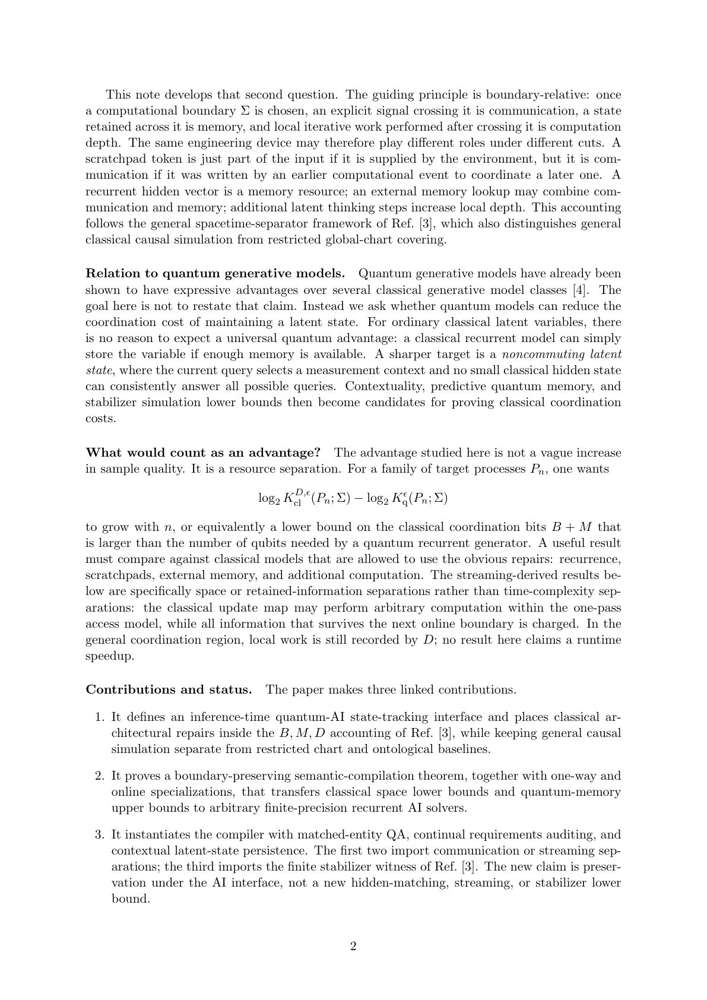
<figcaption class="paper-figure-caption"><b>Fig 1.</b> Low-resolution page preview, page 2</figcaption>
</figure>
<figure class="paper-figure-card">
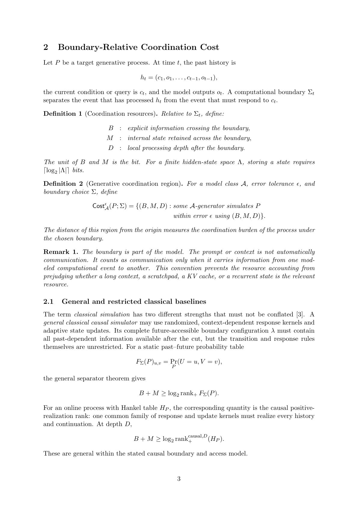
<figcaption class="paper-figure-caption"><b>Fig 2.</b> Low-resolution page preview, page 3</figcaption>
</figure>
<figure class="paper-figure-card">
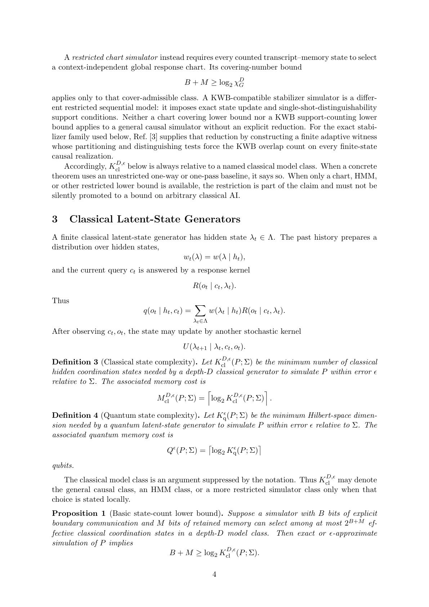
<figcaption class="paper-figure-caption"><b>Fig 3.</b> Low-resolution page preview, page 4</figcaption>
</figure>
<figure class="paper-figure-card">

<figcaption class="paper-figure-caption"><b>Fig 4.</b> Low-resolution page preview, page 5</figcaption>
</figure>
<figure class="paper-figure-card">
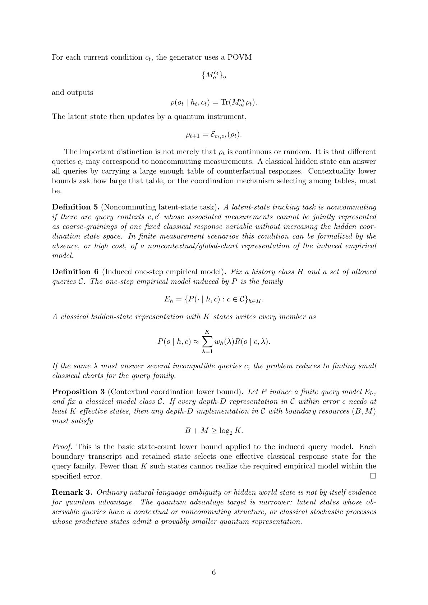
<figcaption class="paper-figure-caption"><b>Fig 5.</b> Low-resolution page preview, page 6</figcaption>
</figure>

**Summary.** This work develops a formal framework to prove that certain advanced AI state-tracking tasks require fundamentally different amounts of memory and coordination resources depending on whether they are modeled classically or quantum mechanically. By establishing a 'semantic-compilation' theorem, the authors show provable separations—such as $\Omega(n^2)$ classical bits vs $n$ qubits for stabilizer contexts—highlighting genuine computational advantages beyond mere runtime speedups.

**Why it may be interesting.** It provides rigorous theoretical tools (resource counting $B, M, D$) to quantify when quantum memory resources offer an advantage over classical computational structures, even when those structures are embedded within complex AI/NLP interfaces.

Detailed structure

**Main problem.** The paper aims to rigorously prove inference-time quantum coordination advantages for specific AI state-tracking tasks by comparing resource costs between classical and quantum computation models.

**Main result.** It establishes a boundary-preserving semantic-compilation theorem, demonstrating separations where tracking noncommuting latent states requires super-polynomial classical memory ($B+M$) compared to the polynomial qubit requirement of a quantum model.

**Method.** The authors use resource accounting based on communication ($B$), persistent memory ($M$), and local work ($D$) to derive lower bounds for classical simulators, contrasting these with upper bounds derived from quantum state dimensions.

**Model / system.** The core models involve general generative processes simulated by both classical finite-state machines (characterized by $B$ and $M$ bits) and quantum latent-state generators, particularly focusing on stabilizer contexts ($\mathcal{P}_{	ext{stab}}^n$).

**Key observables.** Resource costs $(B, M, D)$; the separation between required classical coordination bits ($B+M$) and necessary qubits.

**Important parameters / regimes.** The size of the system $N$ or $n$; the approximation factor $\epsilon$; the complexity measures like $	ext{KD}\epsilon_{	ext{cl}}$ and $	ext{K}_{\epsilon}^{q}$.

**Assumptions / limitations.** The quantum advantage is restricted to tasks exhibiting contextuality (noncommuting measurements); the stabilizer result assumes exact simulation and ideal noiseless quantum memory; the analysis requires adaptive completeness.

**Paper structure.** The paper builds from defining resource accounting for state-tracking, proving general lower bounds via a semantic-compilation theorem, applying this to specific QA/auditing tasks, and culminating in a strong separation proof using the stabilizer latent-state dialogue.

Abstract

We prove inference-time quantum coordination advantages for specified AI state-tracking tasks. A solver compresses semantic history into a future-accessible boundary state and later answers a query. We count communication $B$, persistent instance-dependent memory $M$, and local work $D$; classical recurrence, caches, tools, and recomputation are allowed and charged. The central result is a boundary-preserving semantic-compilation theorem. It maps a finite one-way, streaming, or adaptive causal task into a semantic AI interface while preserving event order and access to past input. Classical boundary-state lower bounds and quantum-memory upper bounds transfer up to explicit compiler overhead, independently of the finite-precision recurrent architecture. Two applications have classical semantics. Matched-entity synopsis QA inherits the hidden-matching separation between $O(\log N)$ qubits and $Ω(\sqrt{N})$ classical boundary bits. Continual requirements auditing inherits a Max-$k$SAT streaming separation: a recurrent solver uses $O(\log^5 n\log(1/δ))$ qubits and polylogarithmic classical workspace to obtain a $0.7172$-approximation, whereas every classical one-pass finite-information solver attaining that ratio requires $Ω(\sqrt{n})$ coordination width. As a quantum-native compiler test, a stabilizer latent-state dialogue uses $n$ qubits, while every exact finite-state classical causal online realization satisfies $B+M \ge \frac{1}{2}n^2+(\frac{3}{2}-\log_2 3)n+O(1)$. The source protocols, streaming algorithms, and stabilizer witness are imported; the new result is their architecture-independent semantic transfer. These are memory and coordination separations, not runtime or empirical advantages for present-day language models. The stabilizer result assumes exact simulation and ideal noiseless quantum memory.

[↑ back to top](#top)

### [Quantum steering is equivalent to state-preserving conditional expectations](http://arxiv.org/abs/2608.10783v1)

**Authors:** Lauritz van Luijk, Amine Marrakchi, Tobias Osborne, Alexander Stottmeister, Henrik Wilming  
**Type:** theory · **Category:** other · **PDF:** <https://arxiv.org/pdf/2608.10783v1>  
**Analysis basis:** full PDF text, analyzed in chunks
**Topic relevance:** `quantum measurements` **1/5**

↔ Scroll figures horizontally

<figure class="paper-figure-card">
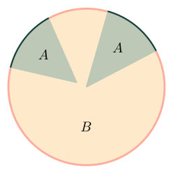
<figcaption class="paper-figure-caption"><b>Fig 1.</b> Figure 1: Examples; Bulk: A two-dimensional topologically ordered system is divided into a region A consisting of two disjoint infinite cones and their complement B. Boundary: A completely rational 1+1- dimensional conformal field theory is divided into a region A consisting of two disjoint intervals and their complement B. Haag duality fails in both settings and a normal conditional expectation B′ →A exists, so by Theorem B the relevant question is which state is preserved. For the surface code it is the ground state; for a completely rational chiral conformal net it cannot be the vacuum, because of the Reeh–Schlieder property.</figcaption>
</figure>
<figure class="paper-figure-card">
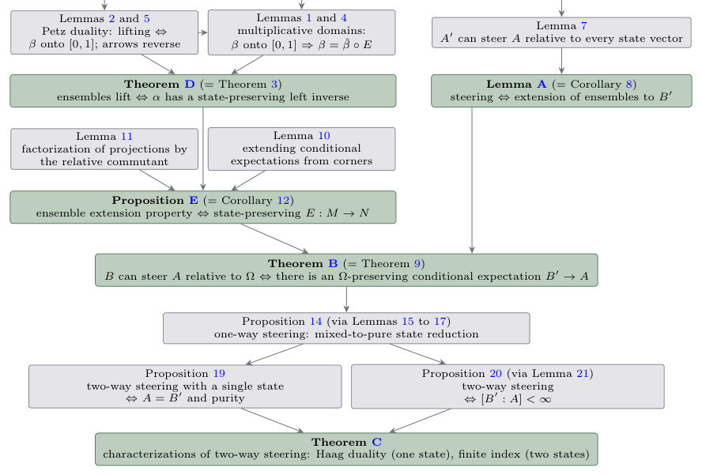
<figcaption class="paper-figure-caption"><b>Fig 2.</b> Figure 2: The figure provides an overview of the logical dependencies and the proof structure of the results stated in the introduction. The left-hand column is the general theory of Section 2, which is carried out for normal unital positive maps between JBW*-algebras. the right-hand column provides the basic observations on steering. Theorem B combines the two: Lemma A turns steering into the ensemble extension property, Proposition E turns the latter into a state-preserving conditional expectation. Both items of Theorem C come out of Theorem B via the reduction of mixed states to pure ones.</figcaption>
</figure>

**Summary.** This theoretical paper establishes a profound connection between the physical notion of quantum steering and abstract mathematics via conditional expectations. It proves that steering is equivalent to the existence of a state-preserving map from one subsystem's algebra ($B'$) onto another ($A$). This result provides powerful tools for analyzing entanglement in complex systems where standard assumptions about local structure break down.

**Why it may be interesting.** It provides a deep mathematical characterization (via subfactor theory) for a physically intuitive concept (quantum steering), which has implications for understanding entanglement in complex, infinite quantum systems.

Detailed structure

**Main problem.** The paper investigates which fundamental entanglement properties survive in quantum systems with infinitely many degrees of freedom where Haag duality fails. It aims to connect the operational concept of 'quantum steering' to abstract algebraic structures.

**Main result.** For a pure global state, quantum steering is mathematically equivalent to the existence of a state-preserving conditional expectation from the commutant $B'$ onto the algebra $A$.

**Method.** The proof involves establishing equivalences using ensemble decomposition properties and extending these arguments from general Jordan algebras to von Neumann algebras.

**Model / system.** The analysis uses commuting von Neumann algebras $A$ and $B'$, modeling systems where Haag duality fails, such as those found in topologically ordered systems or 1+1-dimensional conformal field theories.

**Key observables.** Quantum steering capability (operational), existence of a state-preserving conditional expectation ($E: B' 	o A$), and the index of the subfactor inclusion $[B':A]$.

**Important parameters / regimes.** The nature of the global state ($\omega$) is crucial, often restricted to pure states. The failure of Haag duality ($B' 
eq A$) defines the regime of study.

**Assumptions / limitations.** The analysis frequently restricts itself to pure global states and relies on advanced mathematical machinery from subfactor theory and operator algebras.

**Figures summary.** Figure 1 illustrates physical examples (like surface codes or CFTs) where Haag duality fails but a conditional expectation might still exist, emphasizing the need for careful state preservation checks.

**Paper structure.** The paper develops the equivalence by first defining steering operationally, then linking it to an 'ensemble extension property,' and finally proving this link is equivalent to the existence of the required state-preserving conditional expectation $E: B' 	o A$.

Abstract

In systems with infinitely many degrees of freedom, fundamental results from quantum information theory can fail. An important example is the uniqueness of purifications: Even when two subsystems, described by commuting von Neumann algebras $A$ and $B$, are tomographically complete, purifications of a state on $A$ need not be related by unitaries in $B$. It was recently shown that this occurs precisely when Haag duality fails, i.e., when the commutant $B'$ is strictly larger than $A$. This raises the question of which fundamental entanglement properties survive in such a setting. We show that, for a pure global state, the ability to steer any ensemble decomposition of the marginal state on $A$ by measurements on $B$ is equivalent to the existence of a state-preserving conditional expectation from $B'$ onto $A$. This establishes a direct connection between quantum steering and subfactor theory. The key observation is that steering is equivalent to the existence of extensions of ensemble decompositions from $A$ to $B'$. Working with general Jordan algebras, we prove that unital positive maps have state-preserving left inverses if and only if ensemble decompositions can be lifted. For the inclusion $A\hookrightarrow B'$, a left inverse is precisely a conditional expectation, yielding the characterization above.

[↑ back to top](#top)

### [The entanglement-assisted transmission capacity is a strong converse bound for identification](http://arxiv.org/abs/2608.11000v1)

**Authors:** Satvik Singh  
**Type:** theory · **Category:** quantum information and computing · **PDF:** <https://arxiv.org/pdf/2608.11000v1>  
**Analysis basis:** full PDF text, analyzed in chunks
**Topic relevance:** `quantum measurements` **1/5**

↔ Scroll figures horizontally

<figure class="paper-figure-card">
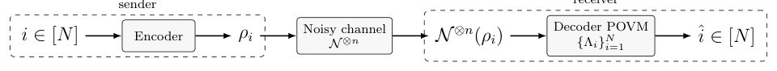
<figcaption class="paper-figure-caption"><b>Fig 1.</b> Figure 1: Schematic of classical message transmission over n uses of a noisy channel N. A message i ∈[N] is encoded into a quantum state ρi, transmitted through n uses of the channel, and decoded by a POVM to produce an estimate ˆi.</figcaption>
</figure>
<figure class="paper-figure-card">
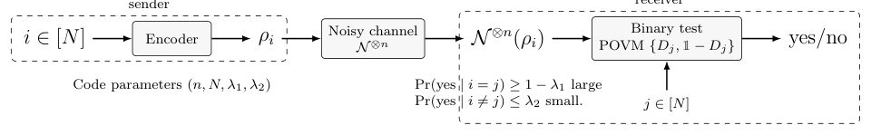
<figcaption class="paper-figure-caption"><b>Fig 2.</b> Figure 2: Schematic of classical message identification over n uses of a noisy quantum channel N. A message i ∈[N] is encoded into a quantum state ρi, transmitted via n uses of the channel, and the receiver performs the binary test {Dj, 1 −Dj} to decide whether the transmitted message was j ∈[N].</figcaption>
</figure>
<figure class="paper-figure-card">
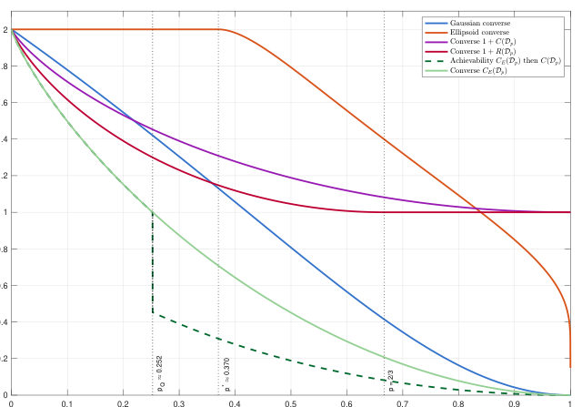
<figcaption class="paper-figure-caption"><b>Fig 3.</b> Figure 3: Strong converse and achievability bounds on the classical identification capacity of the qubit depolarizing channel Dp (see Eq. (3.39)) for 0 ≤p ≤1. The light green curve shows the CE converse bounds from Theorem 3.3. The blue curve shows the state-weighted Gaussian converse bound from [25, Theorem 3.8] (see (3.61)). The orange curve shows the Ellipsoid converse bound from [32]. The purple and red curves show the classical capacity [32] and quantum capacity [4] converse bounds, respectively. The dashed curve shows the achievability bound from [14, 31] (see (2.11), (2.20)). Note that the achievability and the CE converse coincide for p ≲0.252 in accordance with Corollary 3.4.</figcaption>
</figure>

**Summary.** This theoretical paper establishes that the entanglement-assisted transmission capacity ($	ext{CE}$) acts as a strong upper bound for the classical identification capacity ($	ext{CID}$) over noisy quantum channels. While equality holds for low-noise regimes, the authors provide explicit counterexamples showing $	ext{CID} < 	ext{CE}$ for general channels, yielding new insights into the fundamental limits of quantum communication.

**Why it may be interesting.** The rigorous characterization of capacity bounds for information tasks like identification provides fundamental limits on what can be reliably communicated or detected using quantum resources, impacting the design of quantum communication protocols.

Detailed structure

**Main problem.** The paper compares the classical identification capacity ($	ext{CID}$) with the entanglement-assisted transmission capacity ($	ext{CE}$) for quantum channels.

**Main result.** It proves that $	ext{CE}$ serves as a strong converse bound for $	ext{CID}$ ($	ext{CID} \le 	ext{CE}$), and demonstrates cases where this bound is strict, leading to the first example of superadditivity for $	ext{CID}$.

**Method.** The proof relies on advanced techniques including the Euclidean geometric method using Gaussian mean width, channel capacity definitions (classical vs. quantum), and constructing specific noisy channels.

**Model / system.** The study analyzes classical message transmission and identification over general noisy quantum channels $N: \mathcal{L}(A) 	o \mathcal{L}(B)$, exemplified by depolarizing and transpose-depolarizing qubits.

**Key observables.** Identification capacity ($	ext{CID}$), Entanglement-assisted transmission capacity ($	ext{CE}$), ordinary transmission capacity ($C$), and quantum identification capacity ($	ext{QID}$).

**Important parameters / regimes.** Noise parameters ($p, q$) characterizing the specific noisy channels used for testing the bounds.

**Assumptions / limitations.** The analysis assumes the existence of reliable coding schemes based on blocklength $n$ and relies on established quantum information theory frameworks.

**Figures summary.** Figure 3 compares various converse and achievability bounds, such as $	ext{CE}$ and $	ext{CID}$, for the qubit depolarizing channel $	ext{D}_p$ across different noise levels.

**Paper structure.** The paper first defines the relevant capacities ($	ext{CID}, 	ext{CE}$) by contrasting classical identification with standard transmission. It then establishes the universal strong converse bound ($	ext{CID} \le 	ext{CE}$), followed by constructing explicit channels where this inequality is strict, and finally discussing conditions under which equality holds.

Abstract

Classical identification via a noisy channel is a communication task in which the receiver is not required to reconstruct the full transmitted message, but only to decide whether it coincides with a message of interest. This relaxation allows the number of identifiable messages to grow doubly exponentially with the blocklength. For quantum channels, the resulting (doubly exponential) identification capacity $C_{\mathrm{ID}}$ can strictly exceed the ordinary (exponential) transmission capacity $C$.   In this paper, we prove that the entanglement-assisted transmission capacity $C_E$ is a strong converse bound for this task: $C_{\mathrm{ID}}\leq C_E$. For sufficiently low-noise channels, this bound can also be achieved via the Hayden-Winter (quantum) identification + fingerprinting codes. This yields an exact characterization $C_{\mathrm{ID}}=C_E$ of identification capacity for such channels. However, for general channels, we prove that this upper bound can be strict. We exhibit an explicit family of transpose-depolarizing channels for which $C_{\mathrm{ID}}<C_E$. As a consequence, we also obtain the first example of strict superadditivity of the identification capacity $C_{\mathrm{ID}}$.

[↑ back to top](#top)

### [Unextendible stabiliser bases](http://arxiv.org/abs/2608.10202v1)

**Authors:** Markus Frembs  
**Type:** theory · **Category:** quantum information and computing · **PDF:** <https://arxiv.org/pdf/2608.10202v1>  
**Analysis basis:** full PDF text, analyzed in chunks
**Topic relevance:** `quantum measurements` **1/5**

↔ Scroll figures horizontally

<figure class="paper-figure-card">
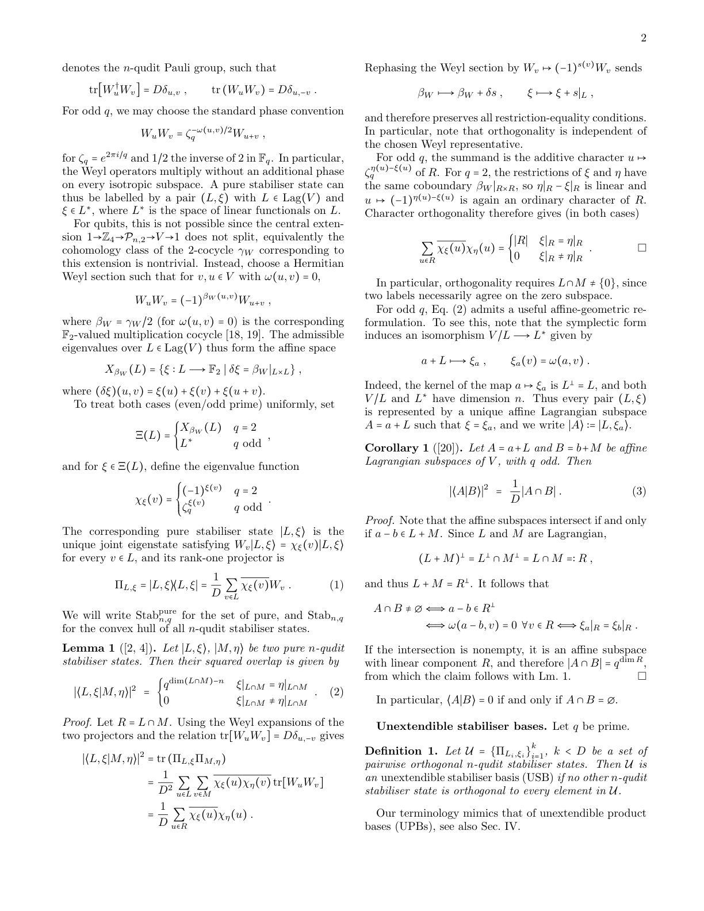
<figcaption class="paper-figure-caption"><b>Fig 1.</b> Low-resolution page preview, page 2</figcaption>
</figure>
<figure class="paper-figure-card">
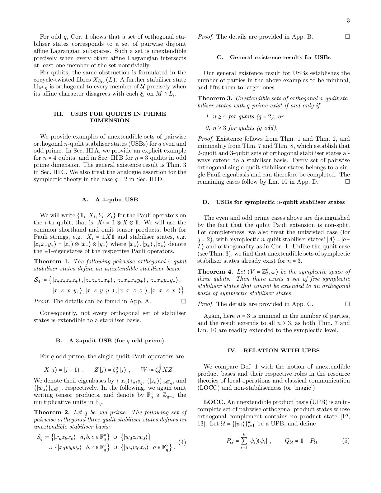
<figcaption class="paper-figure-caption"><b>Fig 2.</b> Low-resolution page preview, page 3</figcaption>
</figure>
<figure class="paper-figure-card">
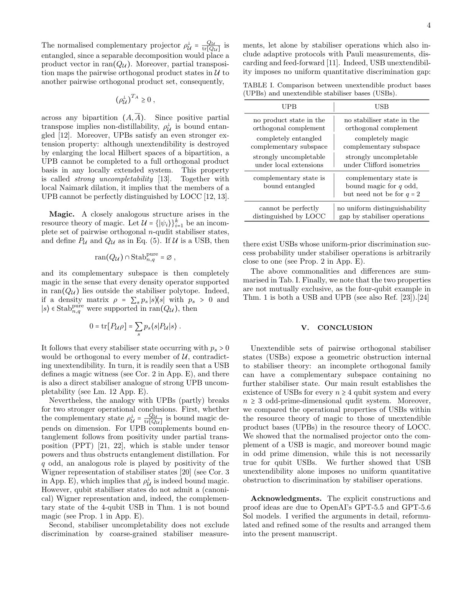
<figcaption class="paper-figure-caption"><b>Fig 3.</b> Low-resolution page preview, page 4</figcaption>
</figure>
<figure class="paper-figure-card">
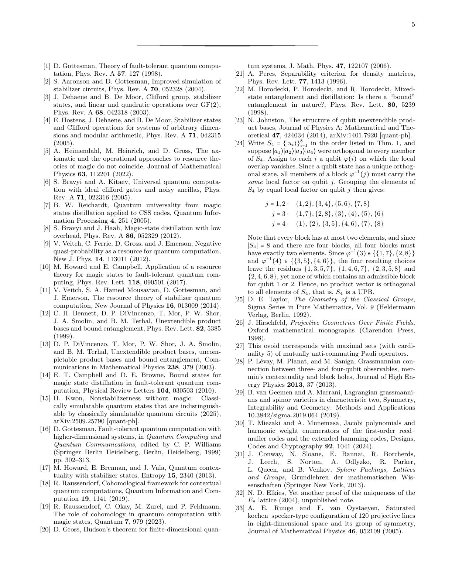
<figcaption class="paper-figure-caption"><b>Fig 4.</b> Low-resolution page preview, page 5</figcaption>
</figure>
<figure class="paper-figure-card">
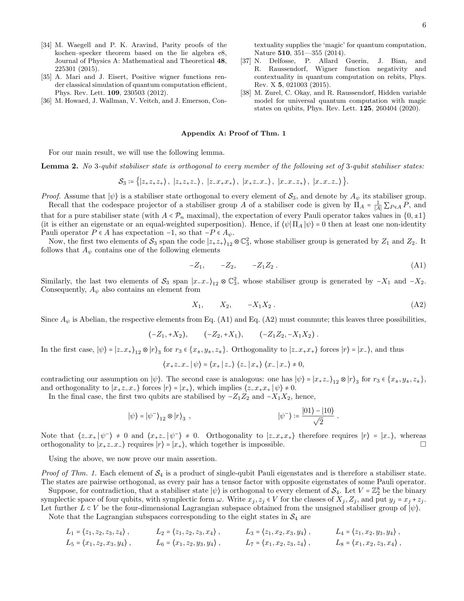
<figcaption class="paper-figure-caption"><b>Fig 5.</b> Low-resolution page preview, page 6</figcaption>
</figure>

**Summary.** This theoretical paper studies Unextendible Stabiliser Bases (USBs), which are incomplete sets of orthogonal stabiliser states. Using symplectic geometry, it proves their existence for general qubit and odd-prime qudit systems. The work is significant for showing that while USB unextendibility has deep mathematical consequences (like defining magic witnesses), it does not imply a universal quantitative barrier to distinguishing these states using stabilizer measurements.

**Why it may be interesting.** It provides deep mathematical insights into the structure of quantum state spaces defined by stabilizer groups, which is fundamental to understanding quantum error correction codes and entanglement theory in qudit systems.

Detailed structure

**Main problem.** The paper investigates Unextendible Stabiliser Bases (USBs), which are incomplete sets of orthogonal pure stabiliser states analogous to unextendible product bases (UPBs). It aims to characterize their properties, especially concerning resource theories like magic states.

**Main result.** USBs exist for general qubit and qudit systems under certain dimensional constraints. Crucially, the paper shows that USB unextendibility alone does not impose a uniform quantitative obstruction to state discrimination by stabiliser operations.

**Method.** The study employs tools from symplectic geometry applied to Pauli groups in finite fields ($\mathbb{F}_q$). Key techniques include constructing magic witnesses and analyzing the properties of the orthogonal complement subspace relative to UPBs/USBs.

**Model / system.** The model is based on $n$-qudit stabiliser states defined within the framework of the Pauli group structure, analyzed using symplectic geometry. Comparisons are drawn between these stabilizer systems and product bases in quantum information theory.

**Key observables.** Orthogonality of states ($\langle \cdot | \cdot 
angle$), existence/non-existence of extensions, magic monotone $M(
ho)$, and the success probability of stabiliser discrimination protocols ($p_{	ext{SO}}^{	ext{succ}}$).

**Important parameters / regimes.** Local dimension $q$ (especially odd primes vs. $q=2$ for qubits), number of qudits/qubits ($n$), and ancillary system size ($m$).

**Assumptions / limitations.** The analysis relies heavily on the mathematical structure provided by the symplectic form $\omega$ underlying the Pauli group, and comparisons are made assuming specific operational definitions (e.g., distillability).

**Figures summary.** Not specified in the notes.

**Paper structure.** The paper progresses from defining USBs as analogues of UPBs, providing explicit constructions for small systems (4 qubits, 3 qudits), establishing general existence theorems, and finally comparing resource-theoretic aspects like bound magic properties and discrimination capabilities against known results for UPBs.

Abstract

We study incomplete sets of orthogonal stabiliser states that cannot be extended by a further stabiliser state orthogonal to all of its members. Such sets are the stabiliser analogue of unextendible product bases (UPBs), and we thus call them unextendible stabiliser bases (USBs). Leveraging the symplectic geometry underlying the $n$-qudit Pauli group in prime local dimension, we explicitly construct USBs for systems of four qubits and three qudits of odd prime local dimension. Moreover, we show that these are the respective minimal qubit, respectively qudit numbers for which such bases exist, and that USBs exist for all $n\geq4$ qubit and for all $n\geq3$ odd-prime-dimensional qudit systems. Finally, we compare the resource-theoretic aspects of USBs with those of UPBs. We establish that, analogous to the case of UPBs, the orthogonal complement of every unextendible stabiliser set is a stabiliser-free subspace, and its normalised projector is necessarily magic; moreover, it is bound magic in odd prime dimension, yet need not be for qubits. We also show that USB unextendibility alone imposes no uniform quantitative obstruction to discrimination by stabiliser operations.

[↑ back to top](#top)

## Other papers (6)

*Papers from primary archives without highlighted authors or any topic match. Click to expand.*

Show other papers

### [Coupled-Layer Codes: Beyond Quantum Product Constructions](http://arxiv.org/abs/2608.10069v1)

**Authors:** Shuyu Zhang, Tzu-Chieh Wei, Nathanan Tantivasadakarn  
**Type:** theory · **Category:** quantum information and computing · **PDF:** <https://arxiv.org/pdf/2608.10069v1>  
**Analysis basis:** full PDF text, analyzed in chunks

↔ Scroll figures horizontally

<figure class="paper-figure-card">
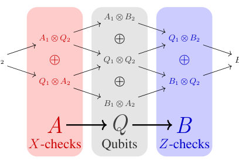
<figcaption class="paper-figure-caption"><b>Fig 1.</b> FIG. 1: The tensor product complex</figcaption>
</figure>
<figure class="paper-figure-card">
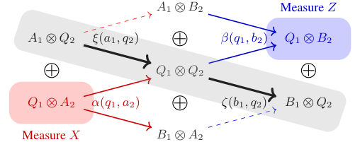
<figcaption class="paper-figure-caption"><b>Fig 2.</b> FIG. 2: The coupled layer construction of the tensor product code. Starting with stacks of CSS1 given by the complex in the gray band along with X{Z ancillas, Measuring X{Z-stabilizers given by the red/blue arrow (αpq1, a2q{βpq1, b2q) induces the blue/red dashed arrow, completing ζpb1, q2q{ξpa1, q2q.</figcaption>
</figure>
<figure class="paper-figure-card">
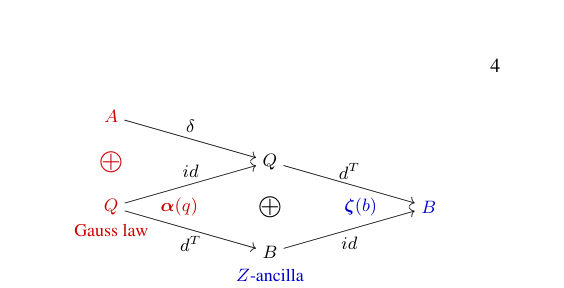
<figcaption class="paper-figure-caption"><b>Fig 3.</b> FIG. 3: The chain complex after gauging all X-stabilizers and X-logicals in CSS.</figcaption>
</figure>
<figure class="paper-figure-card">
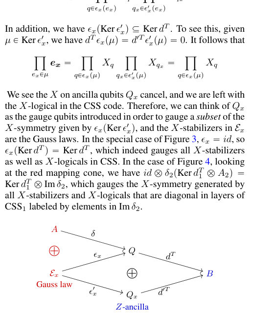
<figcaption class="paper-figure-caption"><b>Fig 4.</b> FIG. 5: The mapping cone for code surgery on X-logicals. The diagram commutes dT ϵx “ d1T ϵ1 x.</figcaption>
</figure>
<figure class="paper-figure-card">
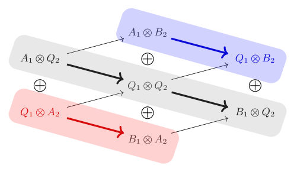
<figcaption class="paper-figure-caption"><b>Fig 5.</b> FIG. 4: The tensor product CSS1b CSS2 as a mapping cone. The gray band is layers of CSS1 indexed by Q2, giving CSS1 b Q2. The red band is an auxiliary complex with a chain map to CSS1 b Q2. Together with the gray band, they form the mapping cone. The blue band is another auxiliary complex with a chain map to the dual of CSS1 b Q2 upon transposing, which also forms a mapping cone. The two mapping cones together form the tensor product chain complex.</figcaption>
</figure>

**Summary.** This paper introduces 'coupled-layer codes' as a generalization of standard product constructions for building quantum error-correcting codes. By formalizing the coupling using excitation algebras and relating it to homological algebra concepts like mapping cones, the authors demonstrate how to generate non-CSS stabilizer codes. This advances the theoretical understanding of topological quantum computation by providing new methods to construct robust quantum codes.

**Why it may be interesting.** It provides a powerful mathematical machinery (mapping cones, excitation algebras) to construct novel topological quantum codes that go beyond simple product constructions, which is crucial for realizing fault-tolerant quantum computation.

Detailed structure

**Main problem.** To generalize quantum product constructions for building quantum error-correcting codes beyond standard CSS settings by introducing 'coupled-layer codes.'

**Main result.** The coupled-layer construction provides a general framework to derive non-CSS stabilizer codes, reproducing models like the fermionic toric code and generalizing tensor products via mapping cone structures.

**Method.** The method involves defining an excitation algebra and using an algebra-preserving map to condense Pauli excitations across multiple layers, relating the construction to homological concepts like the mapping cone.

**Model / system.** The work focuses on Quantum Error-Correcting Codes (QECCs), specifically building upon product codes by coupling layers of stabilizer codes. The underlying mathematical structure involves chain complexes and gauging symmetries.

**Key observables.** The resulting quantum error-correcting codes; the ability to produce non-CSS codes; commutation relations between various Pauli operators ($	ext{A}_p^{	ext{q}1}, 	ilde{f}	ext{q}$, etc.).

**Important parameters / regimes.** The structure of the underlying group $G$ and the specific coupling terms derived from the input CSS codes.

**Assumptions / limitations.** The analysis relies on algebraic manipulations concerning overlaps between supports of Pauli operators, assuming certain commutation relations hold for simplification.

**Figures summary.** Figures illustrate the tensor product complex structure (Fig. 1), the general coupled-layer construction via gauging (Fig. 2 & 3), and the mathematical formalism using mapping cones to represent code products and surgeries (Fig. 4, 5, 6).

**Paper structure.** The paper progresses from defining product codes to introducing the generalized coupled-layer concept. It then details the connection to gauging symmetries and homological algebra via mapping cones, culminating in detailed algebraic proofs of commutation relations for the resulting operators.

Abstract

Product codes are an important class of quantum error-correcting codes constructed from multiple input codes, which can give rise to asymptotically good quantum low-density parity check codes. In previous work, we showed how the product between two codes can be physically implemented by coupling layers of the first code using checks of the second code. In this work, we further unify product code constructions with coupled-layer constructions of phases of matter by introducing coupled-layer codes. The essential strategy is to condense general excitations created by Pauli operators among multiple decoupled layers of the first code. The condensation is specified by an excitation algebra, which encodes the excitations, along with an algebra-preserving map. This coupling between layers generalizes the notion of gauging in physics as well as the mapping cone in homological algebra, and can be used to produce non-CSS codes. As examples, we show how coupled-layer codes reproduce the X-cube and Chamon models. We further generalize the balanced product code by allowing a unitary transformation in addition to a group action by free permutation and describe its corresponding coupled-layer construction. In particular, we show how balancing by a ZX-duality can reproduce non-CSS codes such as the fermionic toric code and the 3-fermion Walker-Wang model in 3D.

[↑ back to top](#top)

### [CSS Quantum LRCs with Intersecting Recovery Sets: Constructions and Bounds](http://arxiv.org/abs/2608.10912v1)

**Authors:** Evagoras Stylianou, Vinayak Ramkumar, Holger Boche, Rawad Bitar  
**Type:** theory · **Category:** quantum information and computing · **PDF:** <https://arxiv.org/pdf/2608.10912v1>  
**Analysis basis:** full PDF text, analyzed in chunks

↔ Scroll figures horizontally

<figure class="paper-figure-card">
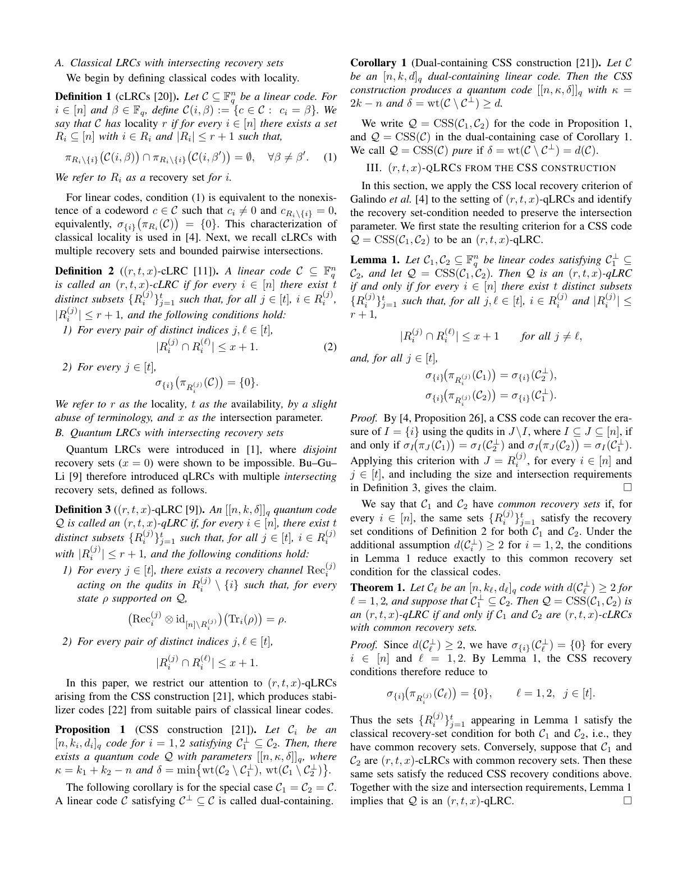
<figcaption class="paper-figure-caption"><b>Fig 1.</b> Low-resolution page preview, page 2</figcaption>
</figure>
<figure class="paper-figure-card">
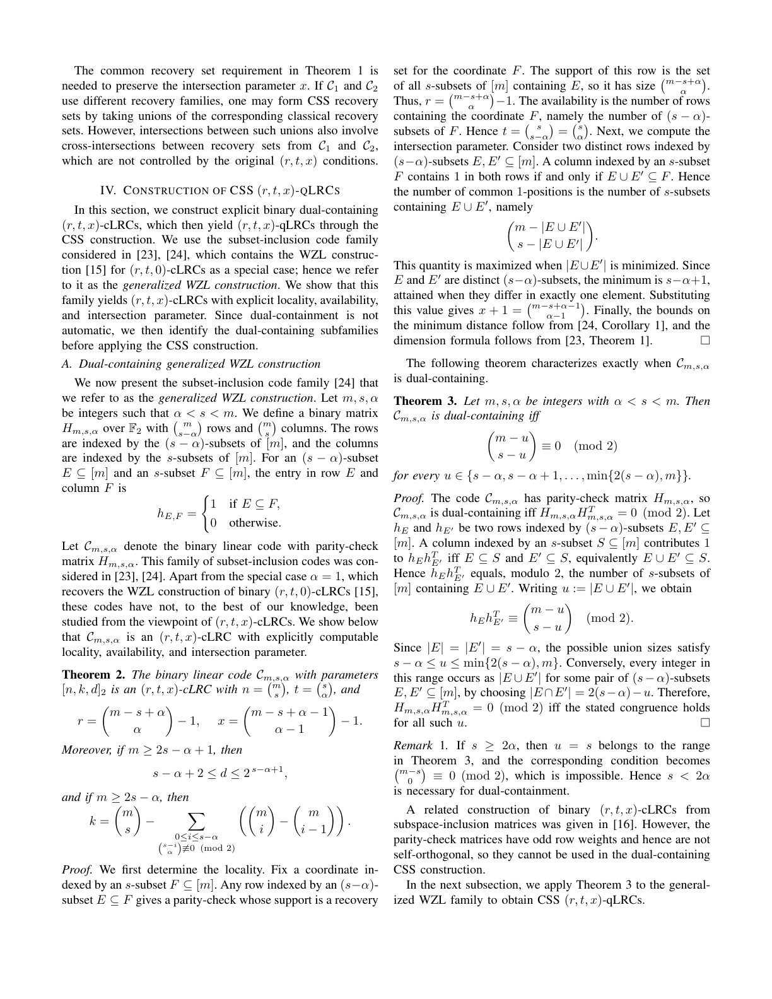
<figcaption class="paper-figure-caption"><b>Fig 2.</b> Low-resolution page preview, page 3</figcaption>
</figure>
<figure class="paper-figure-card">
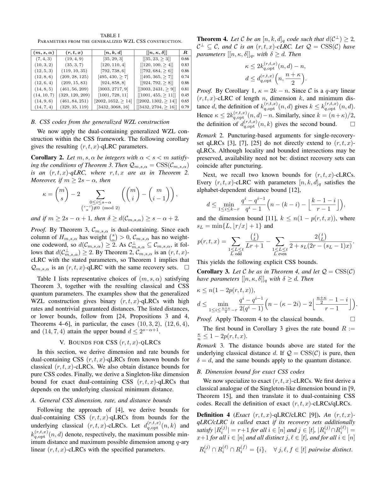
<figcaption class="paper-figure-caption"><b>Fig 3.</b> Low-resolution page preview, page 4</figcaption>
</figure>
<figure class="paper-figure-card">
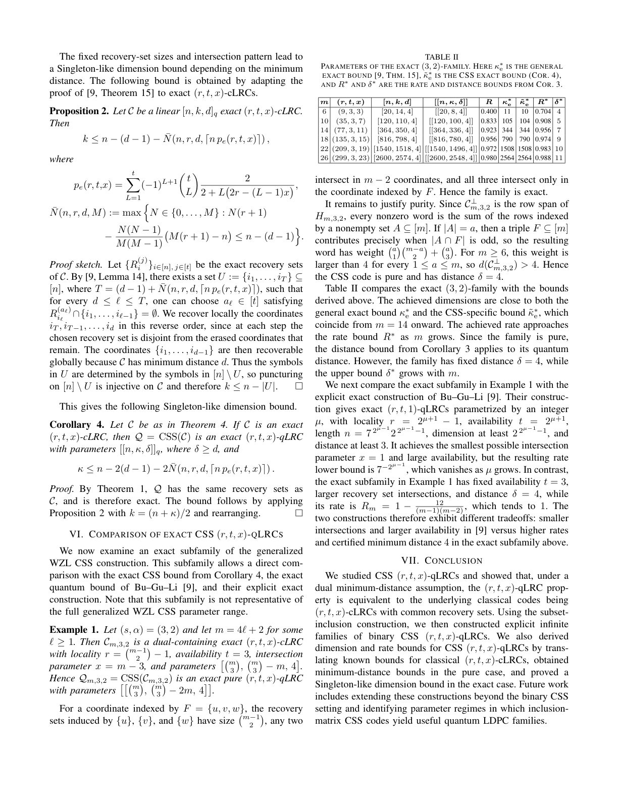
<figcaption class="paper-figure-caption"><b>Fig 4.</b> Low-resolution page preview, page 5</figcaption>
</figure>
<figure class="paper-figure-card">
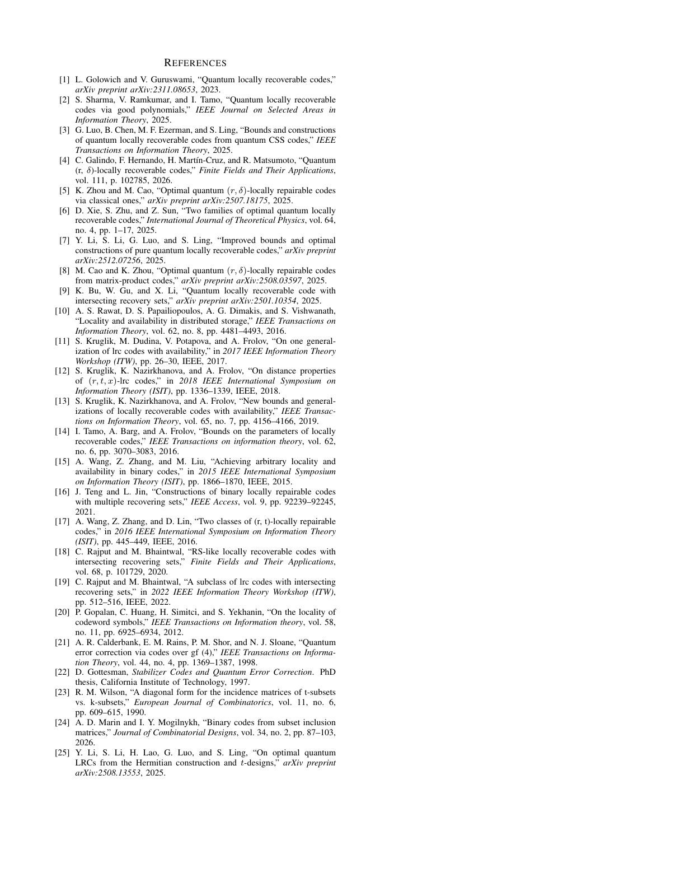
<figcaption class="paper-figure-caption"><b>Fig 5.</b> Low-resolution page preview, page 6</figcaption>
</figure>

**Summary.** This paper develops the theory and explicit constructions for Quantum Locally Recoverable Codes (qLRCs) characterized by parameters $(r, t, x)$. It shows that these quantum codes can be derived from classical LRCs via the CSS construction. The main contribution is deriving tight upper bounds on the code rate and dimension, alongside providing concrete families of such codes.

**Why it may be interesting.** This work provides rigorous mathematical tools and concrete constructions for advanced quantum error correcting codes that go beyond standard stabilizer or distance-based requirements by incorporating locality constraints.

Detailed structure

**Main problem.** The work focuses on constructing and deriving bounds for quantum locally recoverable codes (qLRCs) with specific parameters $(r, t, x)$. It establishes the necessary and sufficient conditions for a CSS code to achieve this structure.

**Main result.** Explicit families of binary dual-containing classical LRCs are constructed using subset-inclusion matrices, which yield corresponding quantum qLRCs. Upper bounds on the dimension and rate for these codes are derived.

**Method.** The authors utilize the CSS construction to translate known results from classical locally recoverable codes (cLRCs) into the quantum domain. They derive bounds by analyzing puncturing techniques applied to the underlying classical code structure.

**Model / system.** The model is Quantum Error Correction, specifically focusing on $(r, t, x)$-qLRCs built via the CSS construction from binary linear codes $C$. The parameters involve locality ($r$), availability ($t$), and intersection parameter ($x$).

**Key observables.** Code dimension ($\kappa$), code rate (R), minimum distance ($\delta$), and the specific parameters $(r, t, x)$.

**Important parameters / regimes.** Locality $r$, availability $t$, intersection parameter $x$, and the underlying classical code structure defined by parameters $(m, s, \alpha)$ in the construction.

**Assumptions / limitations.** The primary assumption for the necessary and sufficient condition is that the underlying classical codes have a dual minimum distance of at least two. The constructions also rely on the resulting classical code being dual-containing.

**Figures summary.** TABLE I lists representative parameters $(m, s, \alpha)$ satisfying the required conditions and provides the corresponding quantum code parameters $[[n, \kappa, \delta]]_q$.

**Paper structure.** The paper first establishes the equivalence between CSS qLRCs and cLRCs (Theorem 1). It then details a construction method using subset-inclusion matrices to generate explicit cLRCs. Finally, it derives general upper bounds and specific Singleton-like dimension bounds for the resulting quantum codes.

Abstract

In this work, we study $(r,t,x)$ quantum locally recoverable codes (qLRCs) with locality $r$, $t$ recovery sets per qudit, and intersection parameter $x$. We first show that, assuming the underlying classical codes have dual minimum distance at least two, a CSS code is an $(r,t,x)$-qLRC if and only if the underlying classical codes are $(r,t,x)$ classical LRCs (cLRCs) with common recovery sets. We then use subset-inclusion matrices to construct families of binary dual-containing $(r,t,x)$-cLRCs, which yield binary $(r,t,x)$-qLRCs via the CSS construction. For CSS $(r,t,x)$-qLRCs, we derive upper bounds on the dimension and rate, minimum-distance bounds in the pure case, and a Singleton-like dimension bound in the exact case. Finally, we show that these families attain high rates and nontrivial minimum distances.

[↑ back to top](#top)

### [Exact Expressions of Entropy for Classical Non-interacting Many-body Systems](http://arxiv.org/abs/2608.11104v1)

**Authors:** Yuheng Wu, Henrik Heelweg, Rigel Galgana  
**Type:** theory · **Category:** statistical mechanics · **PDF:** <https://arxiv.org/pdf/2608.11104v1>  
**Analysis basis:** full PDF text, analyzed in chunks

↔ Scroll figures horizontally

<figure class="paper-figure-card">
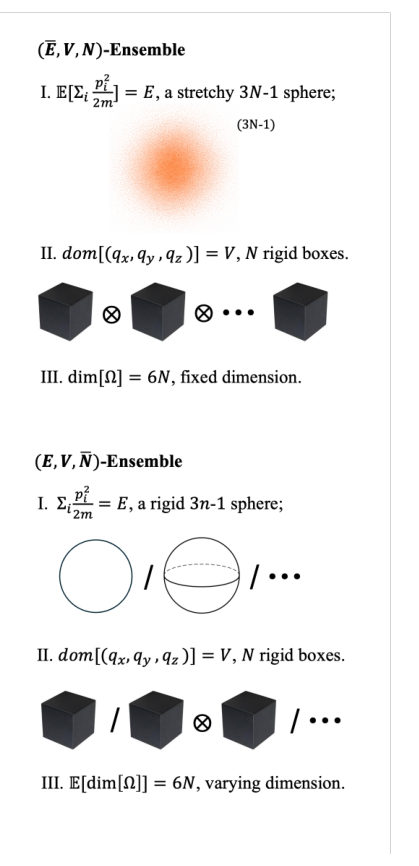
<figcaption class="paper-figure-caption"><b>Fig 1.</b> Fig 1 Schematics of the state space and constraints for the four representative ensembles.</figcaption>
</figure>
<figure class="paper-figure-card">
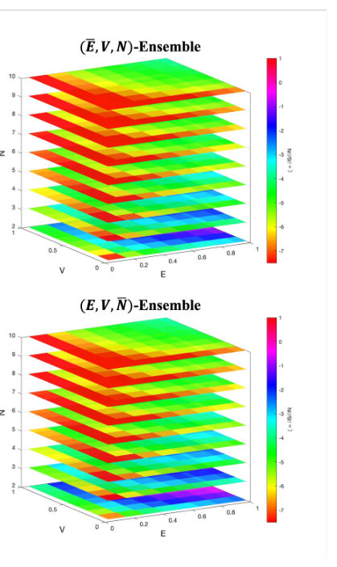
<figcaption class="paper-figure-caption"><b>Fig 2.</b> Fig 2 The values of ϕ in the four representative ensembles as functions of E, V, N.</figcaption>
</figure>

**Summary.** This work develops a universal statistical mechanics theory to calculate the exact entropy for finite classical many-body systems across all relevant ensembles. By applying maximum entropy principles based on two core physical postulates, the authors show that while ensemble properties differ at small sizes, they converge correctly to established thermodynamic limits. This provides a rigorous framework for understanding finite-size effects in statistical physics.

**Why it may be interesting.** While focused on classical systems, establishing rigorous, non-asymptotic ensemble equivalence is foundational. The methodology of deriving fundamental quantities from minimal postulates (stationarity/unbiasedness) has parallels in defining quantum equilibrium states.

Detailed structure

**Main problem.** To develop a universal ensemble theory that provides exact expressions for entropy for classical non-interacting many-body systems, resolving discrepancies in thermodynamic properties among different ensembles when the system is finite.

**Main result.** The derived entropy expressions across various statistical ensembles are shown to converge asymptotically to a common limit in the thermodynamic limit, confirming ensemble equivalence while rigorously quantifying finite-size corrections.

**Method.** The theory uses maximum entropy optimization based on two postulates: stationarity and unbiasedness, applied to four representative thermodynamic ensembles.

**Model / system.** The system is modeled as classical non-interacting many-body particles governed by a simple quadratic Hamiltonian (L = sum(p_i^2/2m)).

**Key observables.** Entropy (S), Temperature (T), Pressure (P), Chemical Potential (mu), and the ensemble-dependent intensive variables.

**Important parameters / regimes.** System size (N, V), Energy (E), and the thermodynamic limit ($N 	o \infty$).

**Assumptions / limitations.** The system is assumed to be a regular Hamiltonian system, and the analysis relies on extending beyond the standard thermodynamic limit approximation.

**Figures summary.** Figure 1 schematics illustrate the state space constraints for four representative ensembles. Figure 2 illustrates the ensemble dependence of intensive variables like chemical potential ($\partial S / \partial N$).

**Paper structure.** The paper first establishes the need for a universal theory to address finite-size effects, then derives exact entropy expressions for four key ensembles using maximum entropy principles, and finally proves the asymptotic equivalence of these results in the thermodynamic limit.

Abstract

In the thermodynamic limit, the equilibrium state of a many-body system can be characterized by three pairs of conjugate thermodynamic variables: $E/T,V/P,N/μ$. In this limit, the thermodynamic properties in all ensembles are equivalent up to the leading order of $E,V,N$. However, for systems of finite size, this ensemble equivalence is no longer exact, and the thermodynamic properties may differ substantially among ensembles. To quantify these finite-size effects rigorously, it is desirable to develop a universal ensemble theory applicable to systems of arbitrary size, providing exact expressions for entropy and, thereby, giving rise to the precise value of all equilibrium thermodynamic quantities. In this work, we propose a theory that determines the exact entropy expressions for classical non-interacting many-body systems of arbitrary size across all statistical ensembles, based on only two postulates: \textbf{stationarity}, requiring that the physical laws be invariant under time translation, and \textbf{unbiasedness}, requiring that the equilibrium mixed state maximize the entropy subject to the prescribed constraints. Moreover, we show that the entropy expressions obtained in different ensembles converge to the common asymptotic form $S \asymp \ln\!\left( \left( \frac{4πm e E}{3N} \right)^{3N/2} \cdot \left(\frac{V}{N}\right)^N \right)+N$, consistent with the predictions of the large deviation theory.

[↑ back to top](#top)

### [From Pattern Detection to Composition Analysis in Quantum Software](http://arxiv.org/abs/2608.10882v1)

**Authors:** Neilson Carlos Leite Ramalho, Erico Augusto da Silva, Anthony Accioly, Higor Amario de Souza, Marcos Lordello Chaim  
**Type:** theory · **Category:** other · **PDF:** <https://arxiv.org/pdf/2608.10882v1>  
**Analysis basis:** full PDF text, analyzed in chunks

↔ Scroll figures horizontally

<figure class="paper-figure-card">
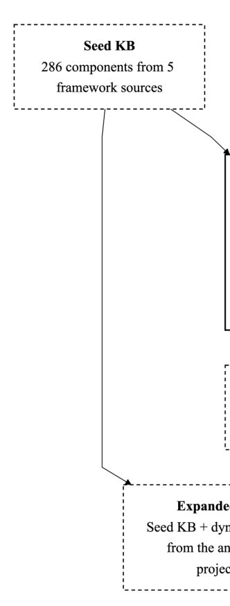
<figcaption class="paper-figure-caption"><b>Fig 1.</b> Fig. 1: Vocabulary expansion. qpa builds project-specific dynamic KBs and combines them with the seed KB before notebook analysis.</figcaption>
</figure>
<figure class="paper-figure-card">
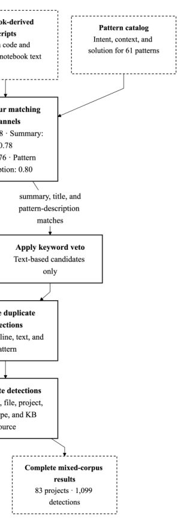
<figcaption class="paper-figure-caption"><b>Fig 2.</b> Fig. 2: Pattern detection and aggregation. qpa applies four matching channels, filters text-based candidates, removes duplicate detections, and aggregates the results.</figcaption>
</figure>
<figure class="paper-figure-card">
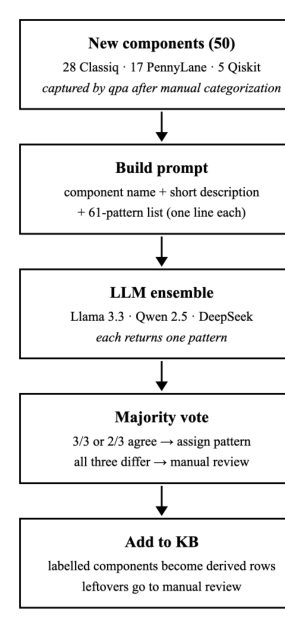
<figcaption class="paper-figure-caption"><b>Fig 3.</b> Fig. 3: Automated pattern categorization with an LLM ensemble. The new compo- nents collected by the tool after the manual categorization are turned into a prompt (the component name, its documentation summary, and the 61-pattern list), classified independently by three models from different providers (Llama 3.3, Qwen 2.5, and DeepSeek), and combined by majority vote: a component on which at least two mod- els agree receives that pattern, while a component on which all three differ is left for manual review.</figcaption>
</figure>
<figure class="paper-figure-card">
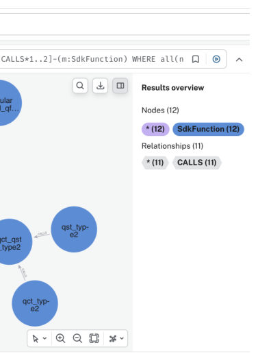
<figcaption class="paper-figure-caption"><b>Fig 4.</b> Fig. 4: Framework components connected to qft in the Classiq SDK call graph. An arrow points from a function to a function it calls. The view includes the functions qft calls, the functions that call qft, and one further level of callers, showing how qft acts as a shared building block reused by higher-level routines such as phase estimation and modular arithmetic.</figcaption>
</figure>
<figure class="paper-figure-card">
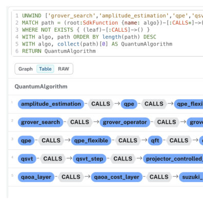
<figcaption class="paper-figure-caption"><b>Fig 5.</b> Fig. 5: Decomposition of five well-known algorithms into ordered chains of sub- routines in the Classiq SDK: Grover search, amplitude estimation, quantum phase estimation, QSVT, and QAOA. Each chain follows the calls made inside the source code of a high-level function down to the lowest-level public function, showing both the composition of each algorithm and the sub-routines shared between them.</figcaption>
</figure>

**Summary.** This paper analyzes how reusable design patterns are actually implemented in open-source quantum software by building advanced mining tools. It extends pattern detection to composition analysis using graph databases to map component call structures. This work provides a critical resource (qpa pipeline and knowledge base) for understanding the practical adoption and architectural evolution of quantum algorithms.

**Why it may be interesting.** While not directly about physical Hamiltonians, understanding the software architecture and limitations of quantum programming tools is crucial for developing scalable algorithms that can be physically realized or simulated efficiently.

Detailed structure

**Main problem.** The research moves beyond simple detection of quantum software patterns to analyze their composition, understanding how high-level abstractions are assembled in practice.

**Main result.** The authors successfully built a pipeline that analyzes pattern usage across 80 open-source projects and constructed composition graphs showing the internal assembly logic of these patterns within quantum frameworks.

**Method.** They developed an enhanced mining tool (qpa) that uses multiple matching channels and vocabulary expansion, coupled with building graph databases to map component call relationships.

**Model / system.** The focus is on quantum software development using existing frameworks (like Qiskit), treating the framework components as the system being analyzed rather than a physical Hamiltonian or state.

**Key observables.** Pattern occurrence frequency, detection accuracy (micro-F1 score), and call relationships within composition graphs (direct vs. internal calls).

**Important parameters / regimes.** The catalog size (61 patterns) and the number of analyzed projects (80).

**Assumptions / limitations.** The analysis assumes that framework components can be reliably mapped to abstract quantum software patterns, and that LLMs can semi-automatically classify new components.

**Paper structure.** The paper progresses from establishing the need for composition analysis over simple detection, detailing the enhancement of the mining tool (qpa), presenting quantitative accuracy results, and finally using composition graphs to analyze pattern assembly logic.

Abstract

Quantum software patterns provide high-level abstractions for building quantum programs, but there is still little empirical evidence on how they are adopted in practice. In prior work, we extended an existing quantum-pattern atlas into a 61-pattern catalog, created a knowledge base that links framework components to those patterns, and built a tool that mines pattern implementations from open-source code. We applied this tool on 80 projects and find that all 23 patterns occur in practice. In this work, we extend the tool with two additional matching channels and a vocabulary expansion step, and execute a quantitative evaluation of its accuracy on Qrisp, a framework not present in the knowledge base, reaching a micro-F1 of 0.712 against 0.449 without the expansion step. We then construct composition graphs that record calls among the high-level framework components associated with patterns and store them in a graph database. We use these graphs to examine how pattern implementations are assembled inside each framework, why patterns co-occur, and how much of a pattern's detection count comes from components called directly by developers rather than introduced through internal framework calls. We release qpa, an open-source mining pipeline, together with the knowledge base, which maps 286 framework components across five sources to the pattern catalog, maintained with the support of an LLM ensemble that classifies newly extracted components, and the resulting pattern usage dataset, to support reproducible studies on the adoption and evolution of quantum patterns.

[↑ back to top](#top)

### [Quantum Computing for Industrial Electromagnetics: Applicability and Case Studies in Solving Maxwell's Equations](http://arxiv.org/abs/2608.10671v1)

**Authors:** Francesco Turro, Marco Maronese, Daniele Dragoni  
**Type:** theory · **Category:** quantum information and computing · **PDF:** <https://arxiv.org/pdf/2608.10671v1>  
**Analysis basis:** full PDF text, analyzed in chunks

↔ Scroll figures horizontally

<figure class="paper-figure-card">
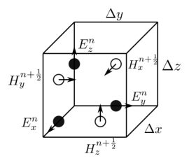
<figcaption class="paper-figure-caption"><b>Fig 1.</b> FIG. 1: Schematic picture of electric and magnetic fields in the Yee lattice formulation</figcaption>
</figure>
<figure class="paper-figure-card">
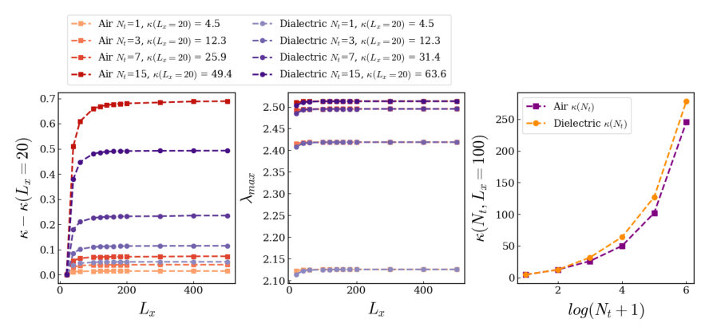
<figcaption class="paper-figure-caption"><b>Fig 2.</b> FIG. 2: Condition number κ (left panel) and maximum eigenvalue λmax (center panel) of the one-dimensional FDTD evolution matrix as functions of lattice size Lx for different numbers of time steps Nt = 1, 3, 7, 15. Square markers denote propagation in air, while circles correspond to a configuration with a dielectric region of relative permittivity ϵr = 4 occupying the second half of the domain (x ≥Lx/2). Different colors corresponds to different evolution times. The right panel shows the condition number computed at Lx = 100 as a function of log2(Nt + 1), specifically, the purple squares corresponds for the air configuration, dark orange circles for the dielectric system.</figcaption>
</figure>
<figure class="paper-figure-card">
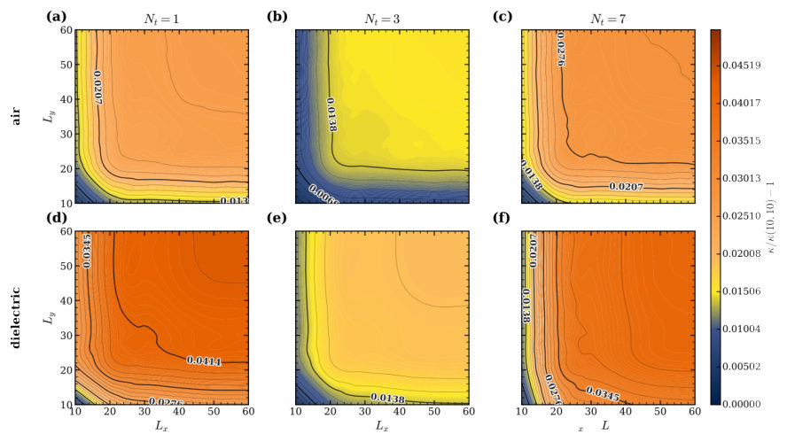
<figcaption class="paper-figure-caption"><b>Fig 3.</b> FIG. 3: Condition number κ of the linear FDTD matrix as a function of the lattice sizes Lx and Ly, for different evolving time steps Nt = 1, 3, 7 ( panel (a) and (d) for Nt = 1, panel (b) and (e) for Nt = 3,panel (c) and (f) for Nt = 7). The (a),(b), (c) panels report the results correspond for the propagation in air, whereas the (d),(e), (f) panels show the results for a configuration in which the quadrant defined by x ≥Lx/2 and y ≥Ly/2 has relative permittivity ϵr = 4, while the remaining region is filled with air.</figcaption>
</figure>
<figure class="paper-figure-card">
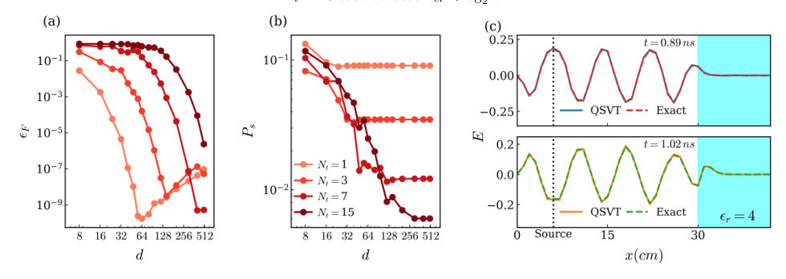
<figcaption class="paper-figure-caption"><b>Fig 4.</b> FIG. 4: Performance results of HHL-FDTD and QSVT-FDTD methods for a one-dimensional grid with Lx = 42 lattice points, including a dielectric material placed from site 30 to the end of the chain. The upper and lower right panels in both subfigures show the obtained electric field using the two solvers for the Nt = 15 case at t = 80 and t = 92, respectively, corresponding to when the wave enters the dielectric and after it has entered. The dashed lines represent the analytical electric fields. The vertical dashed lines indicate the position of the source emitting a plane wave, while the cyan box denotes the dielectric material with ϵr = 4.</figcaption>
</figure>
<figure class="paper-figure-card">
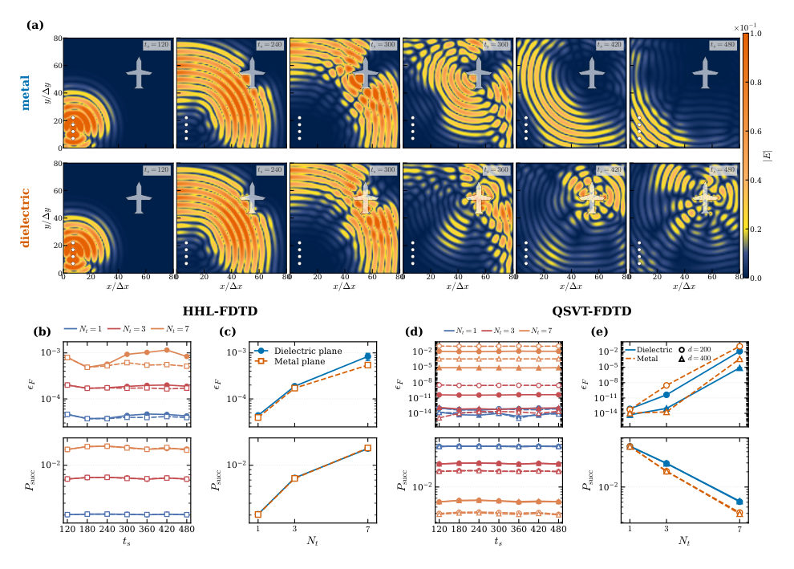
<figcaption class="paper-figure-caption"><b>Fig 5.</b> FIG. 5: Performance of the HHL-FDTD and QSVT-FDTD methods for the simulation of radar-signal propagation around two aircraft models: a metallic aircraft with perfect electric conductor (PEC) boundary conditions (diamonds) and a dielectric aircraft with relative permittivity ϵr = 4 (circles). Panels (a) display the electric-field distributions for representative time steps. White circles indicate the source locations, while the gray polygons denote the aircraft geometry. In the upper field maps, the aircraft is made of metal; in the lower field maps, it is made of dielectric material. Panel (b): Error fidelity (top) and success probability (bottom) of the HHL-FDTD method as functions of the...</figcaption>
</figure>

**Summary.** This paper investigates using quantum computing algorithms, specifically QSVT and HHL, to solve the massive linear systems generated by simulating Maxwell's equations via FDTD. The research validates these approaches on industrial electromagnetics problems, showing that QSVT is superior and that resource scaling remains manageable even for very large physical domains.

**Why it may be interesting.** This work directly applies advanced quantum linear algebra techniques (QSVT/HHL) to a canonical problem in computational physics (electromagnetics), providing concrete benchmarks for near-term quantum advantage claims in applied science.

Detailed structure

**Main problem.** The primary challenge is accelerating computationally intensive simulations of electromagnetics, specifically solving large linear systems derived from Maxwell's equations.

**Main result.** The study demonstrates that the Quantum Singular Value Transformation (QSVT) algorithm consistently achieves higher accuracy than HHL for these tasks. Crucially, it shows that the system matrix condition number saturates with increasing spatial grid size, allowing scaling to realistic industrial dimensions without prohibitive resource growth.

**Method.** The authors map the time-stepping evolution of the Finite-Difference Time-Domain (FDTD) method into a linear system ($	ilde{A}\mathbf{x} = \mathbf{b}$) and then apply quantum algorithms like HHL and QSVT to solve this system efficiently.

**Model / system.** The physical model is electromagnetics governed by Maxwell's equations, simulated using the FDTD method on lattices. The mathematical core involves solving the resulting large, sparse linear system matrix $	ilde{A}$.

**Key observables.** Quantum-state fidelity ($\epsilon_F$), algorithmic success probability ($P_s$), and the condition number ($\kappa$) of the system matrix.

**Important parameters / regimes.** The required qubits scale logarithmically with spatial size and time steps; performance is critically dependent on $\kappa$ and the approximation degree $d$.

**Assumptions / limitations.** Simplifications include assuming lossless materials, frequency-independent $\epsilon$ and $\mu$, and using Perfectly Matched Layers (PML) boundary conditions.

**Figures summary.** Figures illustrate schematics of field formulations (Yee lattice), circuit diagrams for HHL/QSVT, and plots showing the condition number's independence from large lattice sizes ($L_x$), as well as performance metrics vs. lattice size.

**Paper structure.** The paper first establishes the physical problem (Maxwell's equations via FDTD) and reformulates it into a linear system. It then details the application of quantum algorithms (HHL, QSVT) to solve this system, benchmarking them across industrial use cases like radar propagation.

Abstract

Computational electromagnetics plays a central role in many industrial applications but often requires substantial computational resources, particularly when fine spatial discretizations are needed. While classical approaches remain the standard, quantum computing offers the potential to accelerate large-scale simulations by encoding them with a limited number of qubits.   Here, we investigate the performance and resource scaling of the Harrow-Hassidim-Lloyd (HHL) and Quantum Singular Value Transformation (QSVT) algorithms for solving linear systems generated by the finite-difference time-domain (FDTD) method, a widely adopted numerical scheme for discretizing Maxwell's equations. We benchmark their performance across representative industrial use cases, including radar propagation, lens simulations, and beamforming processes. Our results demonstrate the validity of the approaches, achieving state infidelities smaller than $2\cdot 10^{-3}$ with success probabilities greater than $10^{-3}$, compatible with practical quantum state sampling. Overall, we observe that the QSVT method consistently delivers higher accuracy.   We further observe that the condition number of the linear matrix, a key factor governing the performance of quantum solvers, saturates as the number of spatial lattice points increases. This implies that the spatial grid can be scaled to realistic industrial dimensions without increasing the HHL or QSVT circuit depth due to ill-conditioned matrices.

[↑ back to top](#top)

### [Verifying full quantum network nonlocality in arbitrary configurations by nonlinear Bell-like inequalities](http://arxiv.org/abs/2608.10972v1)

**Authors:** Shuyuan Yang, Jinchuan Hou, Kan He, Mingxing Luo  
**Type:** theory · **Category:** quantum information and computing · **PDF:** <https://arxiv.org/pdf/2608.10972v1>  
**Analysis basis:** full PDF text, analyzed in chunks

↔ Scroll figures horizontally

<figure class="paper-figure-card">
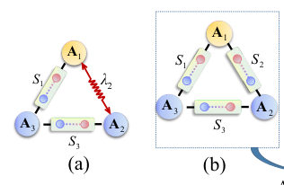
<figcaption class="paper-figure-caption"><b>Fig 1.</b> Figure 1. The triangular quantum network consists of three sources</figcaption>
</figure>
<figure class="paper-figure-card">
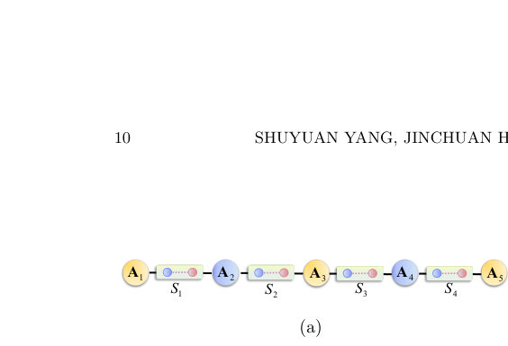
<figcaption class="paper-figure-caption"><b>Fig 2.</b> Figure 2. (a) Chain network in which parties Ai and Ai+1 share an</figcaption>
</figure>
<figure class="paper-figure-card">
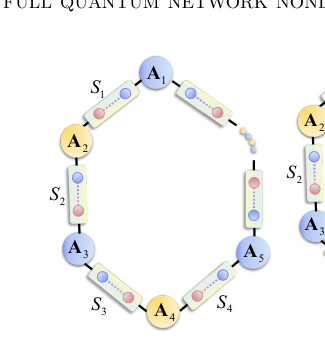
<figcaption class="paper-figure-caption"><b>Fig 3.</b> Figure 3. (a) A cyclic network Ξ(n, n) composed of n parties and n</figcaption>
</figure>
<figure class="paper-figure-card">
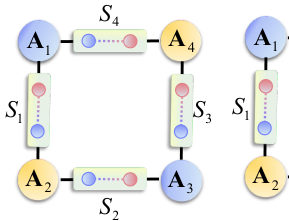
<figcaption class="paper-figure-caption"><b>Fig 4.</b> Figure 4. The yellow circles in the figure represent independent parties.</figcaption>
</figure>
<figure class="paper-figure-card">
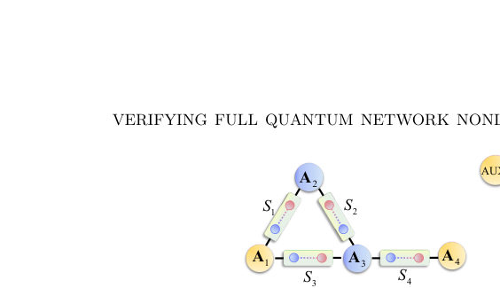
<figcaption class="paper-figure-caption"><b>Fig 5.</b> Figure 6. (a) A network Ξ(4, 4) with the maximum independence num-</figcaption>
</figure>

**Summary.** This paper introduces a novel method to verify Full Quantum Network Nonlocality (FQNN) across any network topology using just one nonlinear Bell-like inequality. The technique involves augmenting the original network with auxiliary local sources and testing the resulting structure against a derived inequality. A violation of this single test proves that all original quantum sources exhibit genuine nonlocality.

**Why it may be interesting.** This work provides a powerful, general tool for certifying fundamental quantum properties (nonlocality) in complex, realistic network architectures, which is highly relevant to quantum communication protocols.

Detailed structure

**Main problem.** The primary goal is to develop a method to verify Full Quantum Network Nonlocality (FQNN) in quantum networks with arbitrary topologies.

**Main result.** The authors propose an efficient technique that certifies FQNN using only a single nonlinear Bell-like inequality, overcoming limitations of previous topology-specific tests.

**Method.** They enlarge the original network by adding carefully chosen auxiliary local sources and parties. The resulting augmented network is then tested with a single derived $l$-QNL inequality.

**Model / system.** The system involves quantum networks distributing entangled states among spatially separated parties ($S_1, S_2, \dots$). Specific examples analyzed include triangular, chain, and cyclic network topologies ($\Xi(n, m)$).

**Key observables.** Violation of the derived nonlinear Bell-like inequality (e.g., $|	ext{Inew}|_1/4 + |	ext{Jnew}|_1/4 > 	ext{Bound}$), which implies that all original sources must be nonlocal.

**Important parameters / regimes.** The maximum independent number ($h$) and the topological parameters defining the network structure are crucial for constructing the inequality.

**Assumptions / limitations.** The method assumes that violating the derived inequality provides a conclusive proof of FQNN, and concrete calculations sometimes assume sources are in Werner states.

**Figures summary.** Figures illustrate the concept using triangular networks (showing augmentation), chain networks, and cyclic networks, detailing how auxiliary local sources expand the original structure for testing.

**Paper structure.** The paper develops a general inequality based on network topology parameters ($h$) and then applies this method to specific, complex topologies like $\Xi(3, 3)$, chain networks ($\Xi(n, n-1)$), and cyclic networks ($\Xi(n, n)$) through augmentation.

Abstract

Full quantum network nonlocality (FQNN) describes a scenario where all sources in a network are nonlocal. Existing criteria of FQNN can only be verified in star networks by violating a single Bell-like inequality. Here we propose a method that certifies FQNN in general quantum networks using only a single Bell-like inequality. We show that the topological obstacle to one-shot detection can be overcome by expanding the original network with a carefully chosen number of auxiliary local sources and parties. The correlations of the enlarged network are then tested with a single inequality; a violation implies that all original sources must be nonlocal. Our approach provides an efficient, experimentally friendly way to verify FQNN in any network topology.

[↑ back to top](#top)

## Secondary cond-mat archives

*Papers from cond-mat.mtrl-sci, mes-hall, other, soft, supr-con. These archives are de-prioritized — they appear at the end regardless of relevance score.*

### Relevant in secondary archives (14)

### [Geometric Phonon Energy Pumping in a Layer-Hybridized Moiré Exciton Manifold](http://arxiv.org/abs/2608.10631v1)

**Authors:** Bitap Raj Thakuria, Himangshu Prabal Goswami  
**Type:** theory · **Category:** statistical mechanics · **PDF:** <https://arxiv.org/pdf/2608.10631v1>  
**Analysis basis:** full PDF text, analyzed in chunks
**Topic relevance:** 🔥 `Full counting statistics` **4/5** · `driven-dissipative phase transition` **3/5** · `methods for driven-dissipative` **3/5** · `Keldysh / 2PI / non-Gaussian methods` **2/5** · `analog quantum simulation` **2/5** · `non-equilibrium universality` **2/5** · `quantum measurements` **2/5** · `correlated / nonlocal dissipation` **1/5** · `scars & prethermalization` **1/5**

↔ Scroll figures horizontally

<figure class="paper-figure-card">
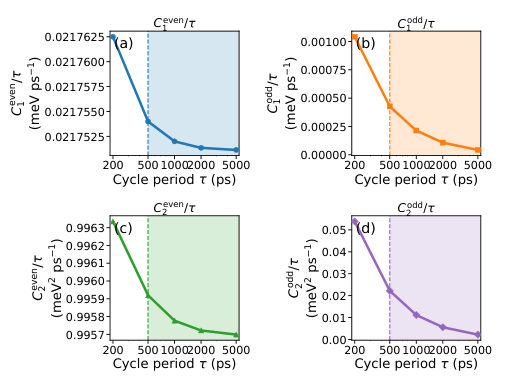
<figcaption class="paper-figure-caption"><b>Fig 1.</b> Figure 2. Calculated cycle-period dependence of the finite-time orientation-even and orientation-odd cumulants per unit time. Pan- els (a) and (c) show Ceven 1 /τ and Ceven 2 /τ, while panels (b) and (d) show Codd 1 /τ and Codd 2 /τ. The nearly constant orientation- even rates verify the time-extensive condition in Eq. (48). The orientation-odd rates decrease approximately as 1/τ because their unnormalized amounts approach constants per completed loop. The shaded region has the same meaning as in Fig. 1 and marks the sampled periods satisfying the combined 1% criterion</figcaption>
</figure>
<figure class="paper-figure-card">
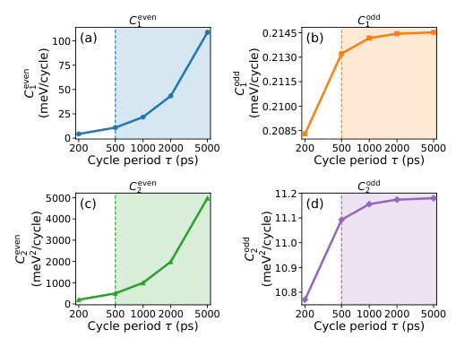
<figcaption class="paper-figure-caption"><b>Fig 2.</b> Figure 1. Calculated cycle-period dependence of the exact finite- time orientation-even and orientation-odd cumulants per completed loop. Panels (a) and (c) show Ceven 1 and Ceven 2 , while panels (b) and (d) show Codd 1 and Codd 2 . The shaded region, beginning at 500 ps, marks the sampled periods for which both the orientation-odd plateau criterion and the orientation-even time-extensive-scaling criterion are satisfied within 1% tolerance for n = 1, 2, and remain satisfied at all longer sampled periods. Within this validated region, Ceven n and Codd n are identified with Cdyn n and Cgeo n , respectively.</figcaption>
</figure>
<figure class="paper-figure-card">
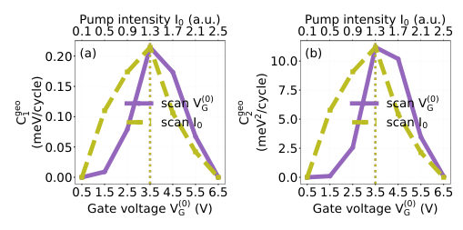
<figcaption class="paper-figure-caption"><b>Fig 3.</b> Figure 3. (Calculated.) One-parameter control-centre scan of the geometric cumulants under baseline conditions. The loop centre in the driving equations Eqs. (22)-(23) is displaced while the trajectory is kept inside the validated gate and pump ranges. Panel (a) contains Cgeo 1 , and panel (b) contains Cgeo 2 . The solid curves denote the gate-</figcaption>
</figure>
<figure class="paper-figure-card">
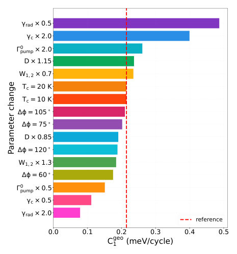
<figcaption class="paper-figure-caption"><b>Fig 4.</b> Figure 4. (Calculated.) One-parameter sensitivity scan of the first geometric cumulant Cgeo 1 . All unvaried parameters retain the baseline values in Table 1. In each bar, only the quantity listed on the vertical axis is changed relative to its baseline value, while all other quantities are kept fixed. The labels γc × 0.5 and γc × 2.0 mean that both γintra c and γinter c are multiplied by 0.5 and 2.0, respectively. Similarly, γrad × 0.5 and γrad × 2.0 mean that both radiative prefactors γintra rad and γinter rad are multiplied by 0.5 and 2.0, respectively. The labels Γ0 pump × 0.5 and Γ0 pump × 2.0 scale the optical-injection prefactor. The labels D × 0.85 and D × 1.15 scale the Stark-slope...</figcaption>
</figure>
<figure class="paper-figure-card">
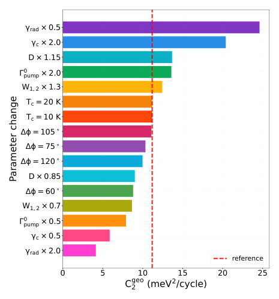
<figcaption class="paper-figure-caption"><b>Fig 5.</b> Figure 5. (Calculated.) One-parameter sensitivity scan of the second geometric cumulant Cgeo 2 . All unvaried parameters retain the baseline values in Table 1. In each bar, only the quantity listed on the vertical axis is changed relative to its baseline value, while all other quantities are kept fixed. The labels γc × 0.5 and γc × 2.0 mean that both γintra c and γinter c are multiplied by 0.5 and 2.0, respectively. Similarly, γrad × 0.5 and γrad × 2.0 mean that both radiative prefactors γintra rad and γinter rad are multiplied by 0.5 and 2.0, respectively. The labels Γ0 pump × 0.5 and Γ0 pump × 2.0 scale the optical-injection prefactor. The labels D × 0.85 and D × 1.15 scale the...</figcaption>
</figure>

**Summary.** The research develops a method to extract a purely geometric component of energy pumping from an exciton manifold by analyzing its energy transfer statistics via Full Counting Statistics. By implementing optimized, non-uniform driving protocols, the authors demonstrate a significant enhancement in signal detectability while proving the robustness of this geometric signature against realistic environmental noise.

**Why it may be interesting.** This work provides a concrete, measurable signature—the geometric contribution to energy transfer statistics—in a solid-state platform. The methodology for separating this topological/geometric feature from thermal noise using advanced counting statistics is highly relevant to open quantum system dynamics in condensed matter.

Detailed structure

**Main problem.** The work aims to generate and detect a geometric contribution to energy transfer statistics (geometric phonon pumping) from slow cyclic modulation in an open quantum system, separating it from dynamic noise.

**Main result.** A Non-Uniform Field Modulation (NUFM) driving protocol significantly enhances the signal-to-noise ratio by suppressing dynamical fluctuations while robustly retaining the geometric pumping signal across realistic environmental variations.

**Method.** The analysis employs Full Counting Statistics (FCS) applied to a master equation framework, separating energy cumulants into dynamic and geometric parts based on loop traversal direction reversal.

**Model / system.** The system is modeled as a gate-tunable WSe2/WS2 moiré exciton manifold, treated as an open quantum system governed by a Liouvillian approach. The dynamics are analyzed using concepts derived from the tilted master equation and adiabatic approximations.

**Key observables.** Geometric first cumulant ($C_{	ext{geo},1}$), dynamic mean ($	ext{Cdyn}_1$), cycle-to-cycle fluctuation ($C_2$), and the fixed-time intrinsic Signal-to-Noise Ratio (SNR).

**Important parameters / regimes.** Gate voltage modulation rate, pump intensity modulation rate, environmental relaxation rates (phonon/radiative loss), and the cycle period ($	au$).

**Assumptions / limitations.** The analysis relies on the adiabatic approximation for slow driving and models coupling to the environment via phenomenological rate terms rather than fully coherent Hamiltonian terms.

**Figures summary.** Figures compare performance metrics (like SNR) between uniform vs. NUFM traversals, show period dependence of signal retention, and illustrate the local mechanism involving relaxation gaps and control parameter rates.

**Paper structure.** The paper establishes the theoretical framework using FCS for open systems, develops the geometric separation technique via loop reversal, optimizes the driving protocol by comparing uniform versus non-uniform modulation (NUFM), and finally validates the robustness of the enhanced signal against varying physical parameters.

Abstract

Slow cyclic modulation of an open quantum system can generate a geometric contribution to its energy transfer statistics, separable from the dynamic background. In this work we construct an experimentally anchored four state open system model for a gate-tunable WSe2/WS2 moiré exciton manifold within a population level full counting statistics framework. We first drive the system uniformly through a closed gate and pump loop and separate the geometric contribution from the dynamic background by reversing the loop direction. We then examine how this response changes with environmental rates, exciton coupling, control conditions, and static spectral broadening. A shorter cycle period followed by nonuniform traversal of the driving loop substantially improves detectability while preserving the geometric response. Combined with enhanced phonon relaxation and reduced radiative loss, this gives about a fourteenfold fixed time signal to noise gain relative to the uniform loop. Our results show that the geometric phonon response remains robust against realistic variations in the system and its environment, and that we can improve its detectability more effectively by suppressing dynamical noise through frequency modulated driving.

[↑ back to top](#top)

### [From Zero to Mega-Gauss Fields: Comprehensive Magnetophotonic Spectroscopy of Graphene Dirac Cones](http://arxiv.org/abs/2608.10638v1)

**Authors:** Shojiro Takeyama, Hiroaki Saito  
**Type:** both · **Category:** other · **PDF:** <https://arxiv.org/pdf/2608.10638v1>  
**Analysis basis:** full PDF text, analyzed in chunks
**Topic relevance:** 🔥 `analog quantum simulation` **4/5** · `Keldysh / 2PI / non-Gaussian methods` **3/5** · `correlated / nonlocal dissipation` **2/5** · `quantum measurements` **2/5** · `driven-dissipative phase transition` **1/5** · `methods for driven-dissipative` **1/5** · `non-equilibrium universality` **1/5** · `quantum optics experiment` **1/5**

↔ Scroll figures horizontally

<figure class="paper-figure-card">
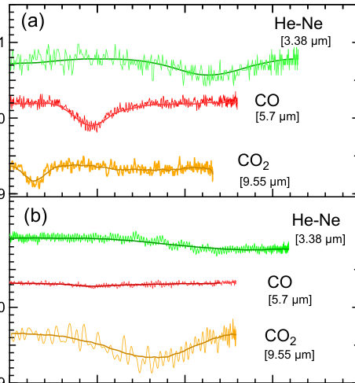
<figcaption class="paper-figure-caption"><b>Fig 1.</b> Figure 1: Magneto-transmission spectra in magnetic fields measured using He-Ne, CO, and CO2 lasers with photon energies of ℏω0 = 0.367 eV, ℏω0 = 0.218 eV, and ℏω0 = 0.130 eV, respectively, for (a) sample A, and (b) sample B. (Note: For Sample A [Fig. 1(a)], the raw experimental data are identical to those presented in Fig. 1 of Ref. [7].)</figcaption>
</figure>
<figure class="paper-figure-card">
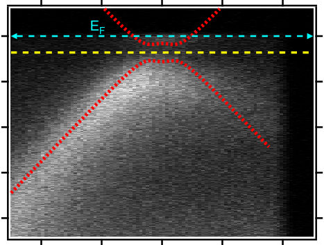
<figcaption class="paper-figure-caption"><b>Fig 2.</b> Figure 2: Two-dimensional ARPES energy-momentum intensity map captured along the ky direction across the K (K′) high-symmetry points. The red solid line denotes the best-fit curve calculated from the model, Eq. (1), which cleanly traces the distorted dispersion Dirac band. The center of the energy gap (the yellow dashed line) is positioned approximately 0.18 eV below the Fermi energy (EF ), indicated by the sky blue dashed line.</figcaption>
</figure>
<figure class="paper-figure-card">

<figcaption class="paper-figure-caption"><b>Fig 3.</b> Figure 3: Calculated Landau-level (LL) fan chart up to 200 T based on the distorted Dirac dispersion model, using parameters extracted from our ARPES analysis (vF = 1.06×106 m/s, ∆= 0.1 eV). The red and blue curves represent the LLs for the conduction and valence bands, respectively. The solid vertical arrows (black, blue, and orange) indicate the optical transition energies corresponding to the STC experiments shown in Fig. 1(a) for the CO2 (ℏω0 = 0.130 eV), CO (ℏω0 = 0.218 eV), and He-Ne (ℏω0 = 0.367 eV) lasers. Notably, the dashed arrow indicates where the CO2 laser transition would be expected to appear if it were a conventional cyclotron resonance (CR). A level crossover between the 0+...</figcaption>
</figure>
<figure class="paper-figure-card">
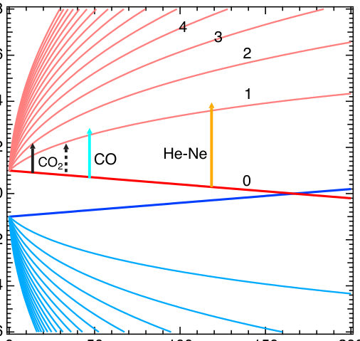
<figcaption class="paper-figure-caption"><b>Fig 4.</b> Figure 4 displays the high-energy magneto-photo absorption spectra capturing the cyclotron resonance (CR) regimes under ultrahigh magnetic fields ranging from 300 to 600 T. The mea- surements were performed using a thulium fiber laser operating at a wavelength of 1.950 µm, which corresponds to a photon energy of 0.636 eV. For both Sample A and Sample B, broad absorption peaks accompanied by several oscillatory structures are clearly observed over a wide magnetic field range from 100 to 560 T. It should be noted that these raw spectral profiles are identical to those presented in Fig. 3 of Ref. [7]. However, as previously addressed in the discus-</figcaption>
</figure>
<figure class="paper-figure-card">
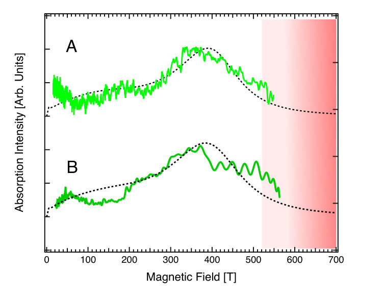
<figcaption class="paper-figure-caption"><b>Fig 5.</b> Figure 4: Magneto-infrared absorption spectra for A: Sample A and B: Sample B in ultrahigh magnetic fields up to 560 T, measured at room temperature using a thulium fiber laser (photon energy: 0.636 eV). The solid curves represent the optical absorption spectra calculated via the collective Alfvén wave model. The red-shaded graduation above 500 T marks the region that is interpreted as being potentially influenced by stray infrared radiation emitted from the approaching liner of the EMFC (Detailed experimental configurations are provided in the Supplementary Material—Sec. S1 [13]).</figcaption>
</figure>

**Summary.** The authors studied graphene's optical response in ultrahigh magnetic fields, finding that the behavior deviates significantly from simple models. They demonstrated that at extreme fields, the system forms a fully compensated electron-hole plasma whose collective excitations are accurately described by an Alfvén wave model. This work establishes graphene as a platform for simulating astrophysical relativistic plasmas.

**Why it may be interesting.** This work bridges condensed matter physics (graphene) with high-energy astrophysics concepts (relativistic plasma), using advanced magneto-optics to probe fundamental quantum electrodynamic effects in a solid-state system.

Detailed structure

**Main problem.** To investigate the infrared magneto-optical response of n-doped epitaxial graphene under ultrahigh magnetic fields, specifically determining if the system deviates from ideal Dirac cone behavior.

**Main result.** The extreme-field absorption spectra are excellently reproduced by a collective Alfvén wave model, demonstrating that the 2D graphene system can realize a tabletop analog to relativistic electron-positron plasmas.

**Method.** A combination of experimental magneto-optical spectroscopy (using single-turn coils and flux compression) and theoretical modeling based on generalized bilayer graphene Hamiltonians was employed.

**Model / system.** The physical system is n-doped epitaxial graphene on 4H-SiC, modeled using effective Hamiltonians that account for band warping and electron-hole plasma dynamics in extreme magnetic fields. The analysis transitions from single-particle cyclotron resonance to collective Alfvén wave excitations.

**Key observables.** Anomalously broad magneto-absorption spectra, 'camel-back' structure in ARPES dispersion, critical level crossing between $N=0^+$ and $N=0^-$ Landau levels.

**Important parameters / regimes.** Magnetic field up to 560 T; energy gap $E_g \sim 0.2$ eV; magnetic enhancement of sublattice potential asymmetry (0.10 eV to 0.12 eV).

**Assumptions / limitations.** The analysis assumes that the high-field behavior is governed by collective plasma modes rather than single-particle cyclotron resonance, necessitating the use of a bilayer-derived model for LL calculations.

**Figures summary.** Figure 1 shows magneto-transmission spectra using various lasers; Figure 2 displays ARPES data showing the 'camel-back' structure; and Figure 3 illustrates calculated Landau Level fan charts predicting level crossing near 160–200 T.

**Paper structure.** The paper progresses by first observing anomalous optical responses, then using ARPES to map a distorted Dirac dispersion, theoretically modeling the high-field LL behavior showing a critical crossover, and finally interpreting the extreme-field spectra via the collective Alfvén wave model.

Abstract

We investigate the infrared magneto-optical response of n-doped epitaxial graphene on 4H-SiC in ultrahigh magnetic fields up to 560~T, utilizing single-turn coil and electromagnetic flux compression techniques. The measured absorption spectra are anomalously broad, strongly deviating from conventional cyclotron resonance. Angle-resolved photoemission spectroscopy (ARPES) reveals a distorted Dirac dispersion featuring a ``camel-back" structure with an energy gap of $E_g \sim 0.2$~eV. Using the band parameters extracted via a generalized bilayer graphene model, we construct a Landau level (LL) fan chart that dictates a critical level crossing between the $N=0^+$ and $N=0^-$ states near 160--200~T. At this threshold, the optical transition mechanism undergoes a dramatic shift from an electron-dominated collective mode to a cooperative electron-hole collective excitation. Furthermore, the extreme-field absorption spectra under thulium fiber laser excitation ($\hbarω_0 = 0.636$~eV)---culminating in a massive resonance near 400~T with a shoulder at 200~T---are excellently reproduced by a collective Alfvén wave model. This analysis also evidences a magnetic-field-induced enhancement of the sublattice potential asymmetry parameter (from 0.10~eV to 0.12~eV). This directly signifies that the macroscopic electron-hole band asymmetry is further amplified by the applied magnetic field. Ultimately, the field-induced energy inversion generates a strongly interacting, fully compensated electron-hole plasma. The resonant excitation of Alfvén waves in this regime demonstrates that a pristine tabletop analog to the relativistic electron-positron plasmas found in astrophysical extremes can be elegantly realized within a 2D graphene system.

[↑ back to top](#top)

### [Moving Analogue Horizons in Stationary Ferroelectrics](http://arxiv.org/abs/2608.10371v1)

**Authors:** David Galvez-Poblete, Rubén M. Otxoa, Alvaro S. Nunez, Sebastian Allende  
**Type:** theory · **Category:** other · **PDF:** <https://arxiv.org/pdf/2608.10371v1>  
**Analysis basis:** full PDF text, analyzed in chunks
**Topic relevance:** 🔥 `analog quantum simulation` **4/5** · `driven-dissipative phase transition` **2/5** · `non-equilibrium universality` **2/5** · `Frenkel-Kontorova` **1/5** · `Keldysh / 2PI / non-Gaussian methods` **1/5** · `methods for driven-dissipative` **1/5** · `superradiant laser` **1/5**

↔ Scroll figures horizontally

<figure class="paper-figure-card">
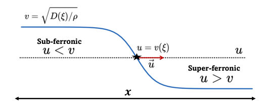
<figcaption class="paper-figure-caption"><b>Fig 1.</b> FIG. 1. Schematic of dynamic modulation of the ferronic velocity v = p</figcaption>
</figure>
<figure class="paper-figure-card">
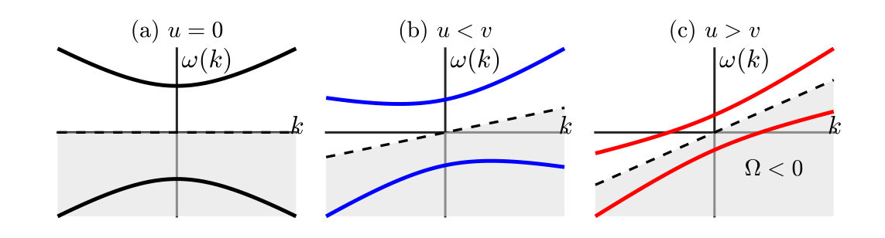
<figcaption class="paper-figure-caption"><b>Fig 2.</b> FIG. 2. Dispersion relation of ferronic excitations. (a) Zero-flow case, showing the gapped ferronic and antiferronic branches. (b) Subferronic regime (u &lt; v), where the Doppler shift modifies the dispersion while preserving positive norm modes. (c) Superferronic regime (u &gt; v), where a portion of the spectrum enters the Ω= ω −uk &lt; 0 region, giving rise to negative-norm modes. The dashed line corresponds to Ω= 0.</figcaption>
</figure>
<figure class="paper-figure-card">
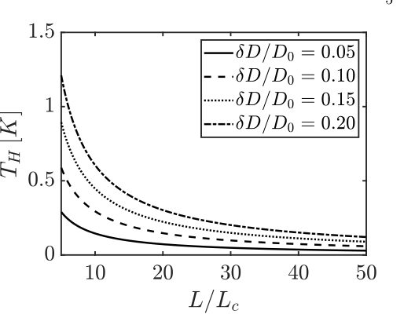
<figcaption class="paper-figure-caption"><b>Fig 3.</b> FIG. 3. Hawking temperature of the ferroelectric LiNbO3 analogue horizon as a function of the dimensionless transition length L/Lc for different modulation amplitudes.</figcaption>
</figure>

**Summary.** This work demonstrates that ferroelectric materials can act as novel platforms for analogue gravity by exhibiting effective flow in their polarization dynamics. The key mechanism involves modulating the material's stiffness, which creates mobile analogue horizons separating different excitation regimes. Superradiant amplification is predicted to be the primary observable signature of this phenomenon.

**Why it may be interesting.** The connection between condensed matter physics (ferroelectrics) and analogue gravity provides a tangible, solid-state platform for studying fundamental concepts of spacetime dynamics using controllable material parameters.

Detailed structure

**Main problem.** To investigate analogue gravity phenomena, specifically mobile analogue horizons, using ferroelectric materials where the effective flow is induced by modulating material parameters rather than physical medium transport.

**Main result.** Ferroelectrics provide a novel and experimentally controllable platform for studying massive scalar excitations in analogue gravity, with superradiant-like amplification being a key observable signature.

**Method.** The analysis models small polarization fluctuations (ferrons) using a massive Klein-Gordon equation modified by an induced flow term, comparing it to effective metrics derived from curved spacetime analogues.

**Model / system.** The system is a one-dimensional ferroelectric described by the Landau-Ginzburg-Devonshire formalism. Dynamics are governed by a massive Klein-Gordon equation with flow: $(\partial_t - u\partial_\xi)^2 \phi - v^2 \partial_\xi^2 \phi + m^2 \phi = 0$.

**Key observables.** Analogue horizons (where $u=v$), superradiant-like amplification, and the effective mass gap ($\omega_{gap}$)

**Important parameters / regimes.** Modulation velocity ($u$), ferronic velocity ($v$), external electric field strength (tuning $m^2$)

**Assumptions / limitations.** The analysis relies on a local approximation derived from the adiabaticity condition ($\epsilon \ll 1$), requiring modulation wavelengths to be much larger than the characteristic ferronic length scale.

**Figures summary.** Figure 1 schematically illustrates the dynamic modulation of the ferronic velocity and marks the location of the analogue horizon.

**Paper structure.** The paper establishes the physical model using LGD theory, derives the flowing Klein-Gordon equation, analyzes the resulting effective metric components to identify horizons based on flow vs. material speed ($u$ vs $v$), and discusses observable phenomena like superradiance and tunability via external fields.

Abstract

We show that a traveling modulation of the polarization-gradient stiffness in a ferroelectric material induces an effective flow in its collective polarization dynamics. Within a controlled local approximation, small polarization fluctuations, or ferrons, obey a massive Klein-Gordon equation with flow. Unlike conventional analogue-gravity platforms, the effective flow originates from the modulation of the material parameters rather than from the physical transport of the medium. This mechanism enables mobile analogue horizons separating sub-ferronic and super-ferronic regions, the latter supporting negative-norm antiferron modes. Their coupling to positive-norm ferrons gives rise to superradiant-like amplification, while the effective mass gap can be tuned independently through an external electric field. Ferroelectric systems therefore provide a novel and experimentally controllable platform for analogue gravity with massive scalar excitations.

[↑ back to top](#top)

### [Real-Time FPGA-Based Multi-Parameter Feedback Stabilization of a Silicon Double Quantum Dot](http://arxiv.org/abs/2608.10325v1)

**Authors:** Johnathan Bryan, Tim J. Wilson, Hong-Wen Jiang  
**Type:** experiment · **Category:** quantum information and computing · **PDF:** <https://arxiv.org/pdf/2608.10325v1>  
**Analysis basis:** full PDF text, analyzed in chunks
**Topic relevance:** 🔥 `QC/QI experiment` **4/5** · 🔥 `quantum measurements` **4/5** · `methods for driven-dissipative` **1/5**

↔ Scroll figures horizontally

<figure class="paper-figure-card">
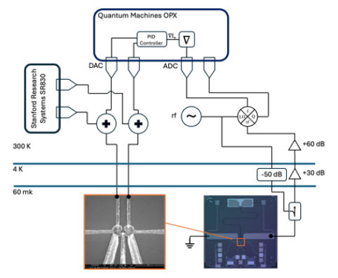
<figcaption class="paper-figure-caption"><b>Fig 1.</b> FIG. 1. Schematic of the experimental setup. The double quantum dot, located at the 60 mK stage, is coupled to an RF-reflectometry circuit for fast dispersive readout. The reflected signal is amplified and demodulated, while a Quantum Machines OPX provides digital signal processing and voltage control</figcaption>
</figure>
<figure class="paper-figure-card">
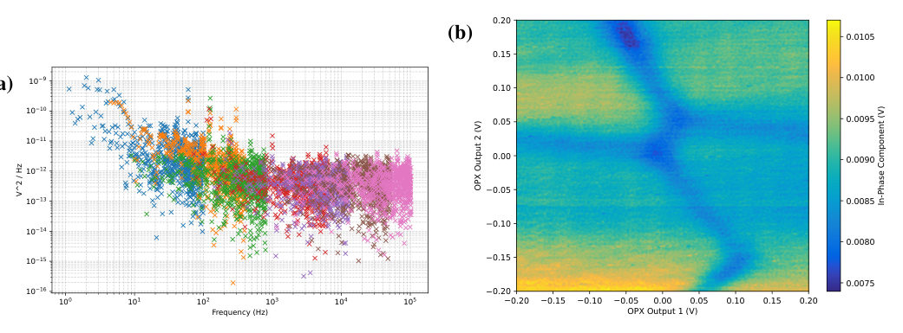
<figcaption class="paper-figure-caption"><b>Fig 2.</b> FIG. 2. (a) Power spectral density of the in-phase signal component showing the 1/ f noise present in our system. Data was taken at the point corresponding to 0 output voltage as shown in (b). This spectrum is generated by overlaying traces from multiple runs, shown by the different point colors. (b) Device charge stability diagram. Feedback was initialized at a minimum in the interdot transition signal, occurring at approximately zero output voltage.</figcaption>
</figure>
<figure class="paper-figure-card">
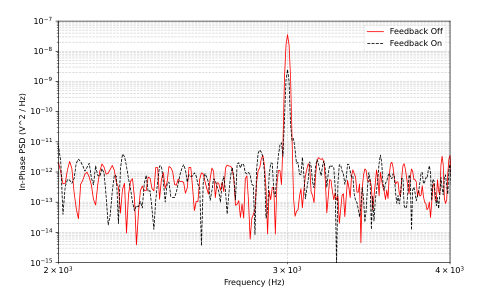
<figcaption class="paper-figure-caption"><b>Fig 3.</b> FIG. 4. Power spectral density of the in-phase component with a 300 Hz sinusoidal perturbation applied to the device. The solid red line represents the spectrum with the feedback loop disabled, while the dashed black line is with feedback enabled.</figcaption>
</figure>
<figure class="paper-figure-card">
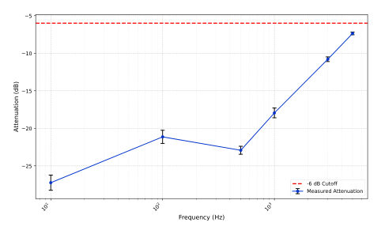
<figcaption class="paper-figure-caption"><b>Fig 4.</b> FIG. 5. Measured attenuation of the in-phase signal power spectral density as a function of the applied perturbation frequency.</figcaption>
</figure>
<figure class="paper-figure-card">
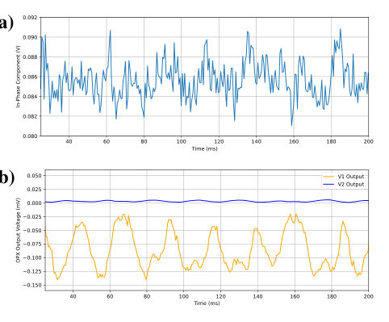
<figcaption class="paper-figure-caption"><b>Fig 5.</b> FIG. 3. Time-domain response of the feedback protocol. (a) shows the in-phase signal over time as recorded by the OPX. The sinusoidal perturbation is clearly shown. (b) shows the output voltages applied by the OPX to the device.</figcaption>
</figure>

**Summary.** The paper reports an advanced experimental technique to stabilize silicon double quantum dots against disruptive low-frequency charge noise using a fast, multi-parameter feedback loop implemented via FPGA and RF-reflectometry. This method significantly increases the effective feedback bandwidth to 5 kHz, which is crucial for maintaining qubit coherence in solid-state quantum computing architectures.

**Why it may be interesting.** This work directly addresses a critical engineering bottleneck in solid-state quantum computing: decoherence due to environmental charge noise. The implementation of real-time, high-bandwidth feedback control is highly relevant for building scalable quantum processors.

Detailed structure

**Main problem.** The primary challenge addressed is actively stabilizing quantum dot potentials against low-frequency 1/f charge noise to enable long-term operation of semiconductor spin qubits.

**Main result.** The high-speed feedback scheme successfully suppressed low-frequency 1/f noise, achieving a -6 dB noise suppression up to a bandwidth of 5 kHz.

**Method.** The authors extended the Gradient-Descent Feedback (GDFB) approach by integrating high-bandwidth RF-reflectometry readout with an FPGA controller for continuous multi-parameter gradient calculation and fast gate voltage updates.

**Model / system.** The experiment is performed on a Silicon Double Quantum Dot (DQD) fabricated on a heterostructure, which serves as the physical platform for semiconductor spin qubits.

**Key observables.** Low-frequency 1/f charge noise, and the in-phase component of the reflected microwave signal used to measure potential shifts.

**Important parameters / regimes.** The achieved noise suppression bandwidth is 5 kHz, significantly surpassing previous limits based on DC transport measurements. The feedback cycle time dictates a theoretical maximum cutoff frequency of $\sim 6.1 \text{ kHz}$.

**Assumptions / limitations.** The primary limitation noted is that the current feedback bandwidth is constrained by the total feedback cycle time ($\approx 81.8 \mu\text{s}$ per cycle).

**Figures summary.** Figures illustrate the experimental setup, show Power Spectral Density (PSD) comparisons demonstrating noise suppression with and without feedback, and plot the measured attenuation of the PSD as a function of perturbation frequency.

**Paper structure.** The paper details the necessity of active stabilization for spin qubits, introduces the advanced GDFB protocol using RF-reflectometry on an FPGA platform, presents results showing high-bandwidth noise suppression, and concludes by discussing future work related to coherence time characterization.

Abstract

Long term operation of semiconductor spin qubits requires active stabilization of quantum dot potentials against low-frequency charge noise. Previous work demonstrated a gradient-descent feedback (GDFB) approach on a silicon double quantum dot utilizing transport current measurements. We extend such a GDFB approach in a silicon double quantum dot device with high-bandwidth rf-reflectometry readout by utilizing a field-programmable gate array, the OPX by Quantum Machines, for digital signal processing. The OPX enables continuous multi-parameter gradient calculation and quick gate voltage updates, significantly increasing the effective feedback bandwidth compared to previous work. By operating with 8 steps per feedback cycle and an integration time of 25.6 $μ$s, this high speed stabilization scheme achieves a -6 dB noise suppression up to a bandwidth of 5 kHz. This effectively suppresses low frequency 1/f noise, maintaining device stability over longer time periods, and potentially enables real-time control in large-scale quantum dot arrays.

[↑ back to top](#top)

### [Studying electron beam coherence using plasmon interference](http://arxiv.org/abs/2608.10842v1)

**Authors:** Evelijn Akerboom, F. Javier García de Abajo, Albert Polman  
**Type:** experiment · **Category:** other · **PDF:** <https://arxiv.org/pdf/2608.10842v1>  
**Analysis basis:** full PDF text, analyzed in chunks
**Topic relevance:** 🔥 `quantum measurements` **4/5** · `interference shaping light` **3/5** · `quantum optics experiment` **1/5**

↔ Scroll figures horizontally

<figure class="paper-figure-card">
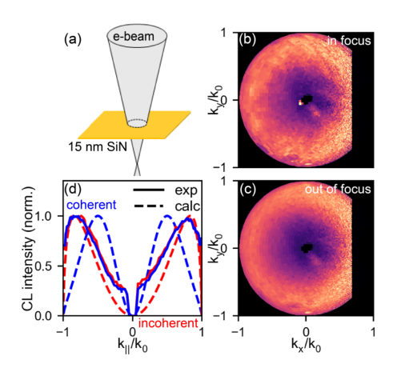
<figcaption class="paper-figure-caption"><b>Fig 1.</b> FIG. 1. Lack of coherence in transition radiation excited by a laterally extended e-beam. We measure TR from a 15-nm Si3N4 thin film excited by 30-keV electrons at a beam cur- rent of 1.6 nA. (a) Schematic representation of the experiment when the sample is placed above the focal point of the e-beam to laterally spread the electron spot at the sample. (b,c) AR CL data measured with a 50-nm bandpass filter centered at a wavelength of 500 nm, for (b) the Si3N4 film in the focal position, and (c) with a spread e-beam of 6-µm diameter. (d) Calculated (dashed) and experimentally measured (solid) data for TR emitted from the Si3N4 film. The calculation shows both the characteristic AR CL emission...</figcaption>
</figure>
<figure class="paper-figure-card">
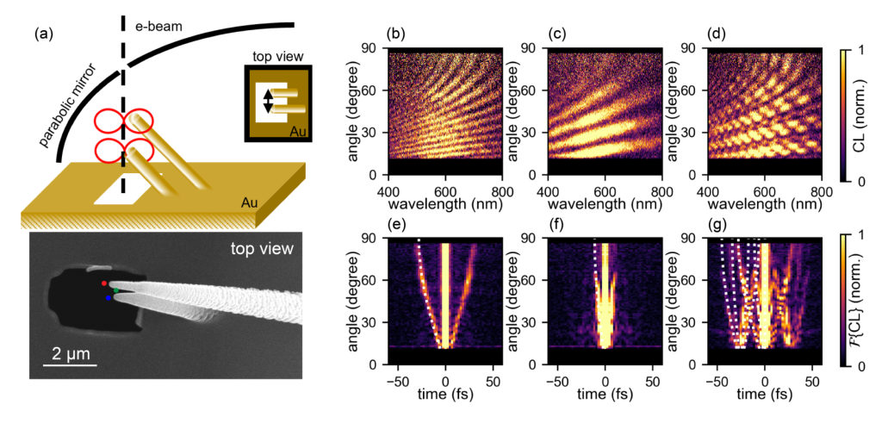
<figcaption class="paper-figure-caption"><b>Fig 2.</b> FIG. 2. Narrow-beam excitation of two Au pillars with different lengths horizontally displaced by 200 nm. (a) Schematic representation of the measurement (top) and top-view SEM image of the fabricated sample with the colored dots indicating the three measurement configurations (bottom). (b-d) AR spectral CL data from the double pillars and (e-g) Fourier-transformed data in the time domain for three different configurations: (b,e) the e-beam grazes the larger pillar (red dot in (a)), (c,f) the electron grazes the smaller pillar (blue dot in (a)), and (d,g) the e-beam passes in between the two pillars (green dot in (a)). The white dashed lines in (e-g) indicate the expected time delay...</figcaption>
</figure>
<figure class="paper-figure-card">
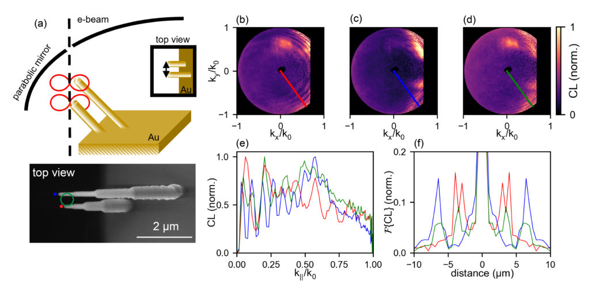
<figcaption class="paper-figure-caption"><b>Fig 3.</b> FIG. 3. Excitation of a double pillar geometry with a laterally spread e-beam. (a) Schematic representation of the measurement (top) and top-view SEM image of the fabricated sample (bottom). (b-d) AR CL data from the double pillar geometry using a 50-nm bandwidth filter centered around a wavelength of 500 nm. (e) Line scans along the k∥-space images and (f) their Fourier transform, taken from cuts along the solid lines in (b-d) for excitation by an e-beam passing near the smaller pillar (red) and the taller pillar (blue), or placed between the two pillars, with an e-beam diameter of 500 nm (green). Curves in (e,f) are color-coordinated with the dots and circle in the SEM image of panel (a).</figcaption>
</figure>
<figure class="paper-figure-card">
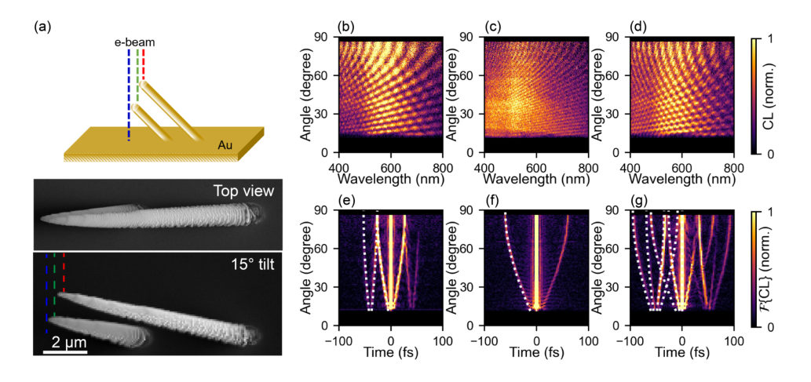
<figcaption class="paper-figure-caption"><b>Fig 4.</b> FIG. 4. Coherent excitation of two Au pillars placed above each other. (a) Schematic representation of the measurement and the SE image of the fabricated sample taken from the top and at a tilt angle of 15◦. (b-d) AR spectral CL data from the double pillars and (e-g) their Fourier transformed data in the time domain for three configurations: (b,e) the e-beam grazes the small pillar, (c,f) the electron impinges on the large pillar, and (d,g) the e-beam grazes the tall pillar and impinges on the smaller one. The white dashed lines in (e-g) indicate the calculated time delay components corresponding to a pillar height of 3.9 µm and 9.0 µm for the small and large pillar, respectively.</figcaption>
</figure>
<figure class="paper-figure-card">
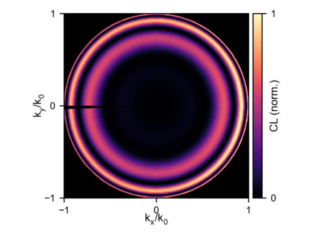
<figcaption class="paper-figure-caption"><b>Fig 5.</b> FIG. 5. Calculated CL interferogram for two nanopillars with a vertical separation of 1.6 µm, at a wavelength of 500 nm.</figcaption>
</figure>

**Summary.** The research uses cathodoluminescence from plasmonic nanostructures to probe electron beam coherence. It experimentally demonstrates that while single electrons passing sequentially through multiple scatterers exhibit clear interference patterns, using a broad electron beam averages over these paths, resulting only in an incoherent sum. The work highlights the critical role of preserving quantum path information for observing coherent quantum effects.

**Why it may be interesting.** This work bridges quantum optics/coherence concepts into solid-state excitation physics using electron beams. The necessity of erasing which-path information echoes fundamental principles in quantum measurement theory, making it relevant for understanding coherence limits in nanoscale spectroscopy.

Detailed structure

**Main problem.** The study investigates how electron beam coherence affects cathodoluminescence (CL) signals when exciting plasmonic nanostructures, specifically comparing interference effects from single-electron paths versus extended beam excitation.

**Main result.** Interference patterns are observed when the electron passes coherently through multiple separated plasmonic scatterers within the evanescent field; however, these interferences are lost when using a widely defocused (extended) electron beam spot.

**Method.** Angle-resolved cathodoluminescence (AR CL) measurements were performed on thin films and double plasmonic pillars using scanning electron microscopes, complemented by Fourier transform analysis of spectral data.

**Model / system.** The experiments use energetic electrons exciting $	ext{Si}_3	ext{N}_4$ films or gold-coated nanopillars. The theoretical framework contrasts the incoherent sum expected from extended beams with the coherent interference observed when path information is preserved (e.g., passing between pillars).

**Key observables.** Angular CL emission profile, $	ext{k}_\parallel$-space images showing interference fringes, and time-of-flight components derived from Fourier transforms.

**Important parameters / regimes.** Electron beam spot size ($\sim 4 	ext{ nm}$ vs. $\mu	ext{m}$), plasmonic pillar separation, and the ability to correlate CL emission with post-selected electron states.

**Assumptions / limitations.** The nonrecoil approximation is used in theoretical calculations; a key limitation noted is that extended beams inherently erase which-path information necessary for observing interference.

**Figures summary.** Figures show AR CL data comparing focused vs. spread beam excitation (incoherent sum); they also display complex interference patterns and Fourier transforms from double plasmonic pillars, identifying components related to pillar heights.

**Paper structure.** The paper progresses by first establishing the contrast between incoherent summation over extended beams (using thin films) and coherent interference observed with single-electron paths (using separated scatterers). It then details measurements on double pillars, confirming coherence via TOF analysis, and concludes by proposing correlation measurements to fully retrieve path-dependent interference.

Abstract

Energetic electrons create distinct cathodoluminescence (CL) angular distributions upon interaction with dielectric and plasmonic nanostructures, providing valuable information on coherences in the excitation pathways. A counterintuitive prediction is that the CL signals arising from the excitation associated with different lateral regions of an extended electron wave are mutually incoherent and do not interfere, while the signals originating from different structures within the electromagnetic field of a narrow electron beam are mutually coherent. We present conclusive experimental evidence of these effects by examining the angular CL emission profile from defocused electron-beam excitation of a thin silicon nitride film, which is shown to follow an incoherent sum of CL excitations within the electron beam spot. In contrast, CL interferences are observed for separated plasmonic scatterers excited within the evanescent field of a single electron. Coherence may be recovered through correlations between emitted light and post-selected electron states, for which we propose a measurement geometry that erases which-path information of the electron trajectory.

[↑ back to top](#top)

### [Dynamics of amorphous membranes in the two-dimensional limit](http://arxiv.org/abs/2608.10486v1)

**Authors:** Liga Jasulaneca, Alberto Martín-Pérez, Hongji Zhang, Prertahn Munireternam, Natalia A. Mamchik, Chee-Tat Toh, Artem K. Grebenko, Barbaros Özyilmaz, Makars Šiškins, Farbod Alijani  
**Type:** experiment · **Category:** other · **PDF:** <https://arxiv.org/pdf/2608.10486v1>  
**Analysis basis:** full PDF text, analyzed in chunks
**Topic relevance:** `driven-dissipative phase transition` **3/5** · `non-equilibrium universality` **3/5** · `analog quantum simulation` **2/5** · `correlated / nonlocal dissipation` **2/5** · `scars & prethermalization` **2/5** · `Frenkel-Kontorova` **1/5** · `methods for driven-dissipative` **1/5** · `quantum measurements` **1/5** · `quantum optics experiment` **1/5**

↔ Scroll figures horizontally

<figure class="paper-figure-card">
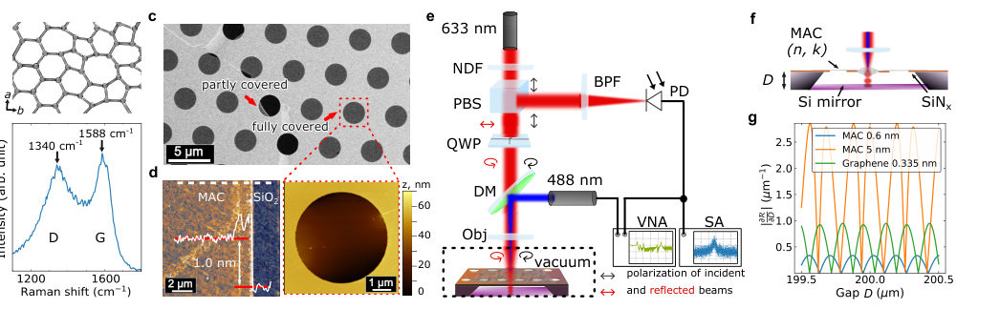
<figcaption class="paper-figure-caption"><b>Fig 1.</b> FIG. 1. Optothermal actuation and interferometric readout of vibrating monolayer amorphous carbon (MAC) membranes. (a) Schematic illustration of MAC, highlighting its structural characteristics: five-, six-, seven-, and eight-member rings, varying bond angles and lengths, and locally hexagonal patches. (b) Raman spectrum acquired on suspended monolayer MAC, showing the disorder-activated D band near 1340 cm−1 and the G band near 1588 cm−1, consistent with disordered sp2 carbon. (c) SEM image of MAC suspended over a Si-supported holey SiNx array, showing continuous suspended regions across the circular openings. (d) AFM characterization of transferred MAC. Left: AFM topography and height...</figcaption>
</figure>
<figure class="paper-figure-card">
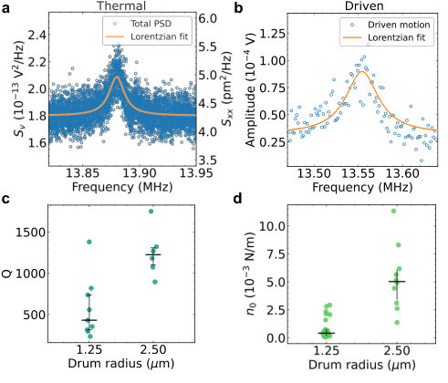
<figcaption class="paper-figure-caption"><b>Fig 2.</b> FIG. 2. Linear dynamic response of monolayer MAC nan- odrums. (a) Power spectrum showing a Lorentzian-shaped resonance from which a fundamental frequency of 13.9 MHz and Qth = 843 ± 24 were obtained. (b) Driven fundamental mode of the same nanodrum, with f0,driven ≈13.6 MHz and Qdriven = 302 ± 27. (c) Q distribution for MAC nanodrums with radius R = 1.25 µm and 2.50 µm. (d) Pretension dis- tributions for the same radius values. Horizontal and vertical black bars indicate the median values and interquartile ranges of n0 and Q. Data points are slightly scattered in radius value for clarity.</figcaption>
</figure>
<figure class="paper-figure-card">
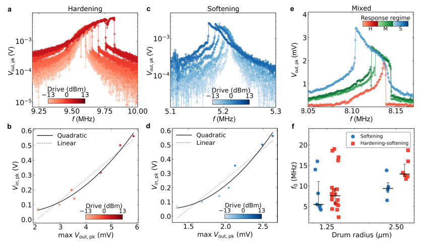
<figcaption class="paper-figure-caption"><b>Fig 3.</b> FIG. 3. Amplitude-dependent nonlinear dynamics of MAC resonators. Near-resonant driven responses showing hardening (a) and softening (c) Duffing-type nonlinearities with increasing blue laser drive power. (b, d) Nonlinear damping, indicated by the quadratic relationship between the drive and maximum response amplitudes. Dashed and solid lines show linear and quadratic fits, respectively. (e) Transition from hardening (H) to mixed (M) to softening (S) in a representative MAC nanodrum and (f) statistics of nanodrums showing different nonlinear response types.</figcaption>
</figure>
<figure class="paper-figure-card">
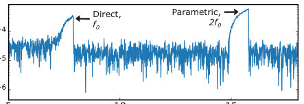
<figcaption class="paper-figure-caption"><b>Fig 4.</b> FIG. 4. Signatures of modal interactions in a MAC nan- odrum. (a) Frequency response at increasing drive, showing the development of a dip in the resonance peak amplitude, consistent with the onset of internal resonance. (b) The same response plotted in normalized units, Vout/Vin, highlights the strong reduction in the apparent quality factor Q. (c) Mode spectrum of a similar MAC nanodrum, showing secondary mode near 2f0, suggesting a 2:1 internal resonance.</figcaption>
</figure>
<figure class="paper-figure-card">
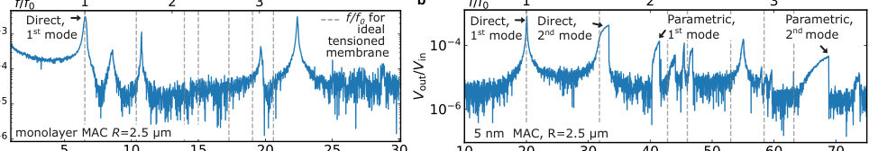
<figcaption class="paper-figure-caption"><b>Fig 5.</b> FIG. 5. Mode spectra of monolayer and multilayer MAC nanodrums. Representative spectra of (a) monolayer and (b) multilayer MAC nanodrums show multiple vibrational modes and nonlinear response features. Thin vertical lines are guides to the eye marking the mode-frequency ratios expected for an ideal tension-dominated circular membrane.</figcaption>
</figure>

**Summary.** This work demonstrates that amorphous carbon (MAC) membranes can function as highly sensitive nanoelectromechanical resonators, opening a new platform for studying mechanics governed by structural disorder. By analyzing nonlinear resonance features like Duffing responses and mode coupling, the authors establish MAC's utility for investigating complex dynamics in the 2D amorphous limit.

**Why it may be interesting.** While focused on classical mechanics, the study of disorder-governed dynamics, nonlinearity, and mode coupling in low-dimensional systems provides experimental analogs for understanding dissipation and emergent behavior in open quantum systems or disordered many-body models.

Detailed structure

**Main problem.** The study aims to extend mechanical resonator research from crystalline 2D materials (like graphene) to the amorphous 2D limit using monolayer amorphous carbon (MAC). This explores how structural disorder affects nanoscale mechanics.

**Main result.** MAC membranes are established as a robust nanoelectromechanical platform, exhibiting pronounced nonlinear dynamics including hardening/softening and intermodal coupling at low effective pretension.

**Method.** The research combines optothermal actuation with sensitive interferometric readout to characterize the mechanical resonance and nonlinear response of suspended MAC nanodrums.

**Model / system.** The physical system is atomically thin, amorphous carbon (MAC) membranes suspended over substrates. The analysis models the dynamics using a tensioned membrane description and incorporates optical transduction via reflection from the air-membrane-vacuum gap stack.

**Key observables.** Resonant frequencies ($\sim 13.9$ MHz), Quality factors ($Q$), nonlinear Duffing responses (hardening/softening), and mode spectra showing intermodal coupling.

**Important parameters / regimes.** Low effective pretension regime ($10^{-4} - 10^{-3} 	ext{ N m}^{-1}$), which amplifies geometric nonlinearities and stress heterogeneity effects.

**Assumptions / limitations.** The analysis relies on a transfer-matrix model for optical reflection and assumes the system can be described by modified Duffing oscillator equations, though deviations suggest more complex coupling.

**Figures summary.** Figures illustrate structural characterization (Raman/AFM), linear dynamic response spectra showing $Q$ distribution, and mode spectra demonstrating nonlinear behavior like internal resonance dips.

**Paper structure.** The paper progresses from establishing the physical platform (MAC membranes) to characterizing its fundamental linear dynamics, then delving into complex nonlinear regimes by analyzing frequency-response curves and multi-mode spectral signatures.

Abstract

Atomically thin mechanical resonators have been realized predominantly in crystalline two-dimensional (2D) materials, such as graphene, where long-range crystalline order sets their elastic properties and defines their nonlinear resonant behavior. Extending these concepts to the amorphous 2D limit has remained largely unexplored. Here, we demonstrate that monolayer amorphous carbon (MAC) forms suspended membranes that support optothermal actuation and sensitive interferometric readout across both linear and nonlinear regimes of its resonant motion. We resolve thermomechanical motion, driven resonances, and multimode spectra in MAC nanodrums. The frequencies of fundamental vibration modes correspond to unusually low pretensions, placing monolayer MAC nanodrums in a regime where geometric nonlinearities, stress heterogeneity, and mode coupling emerge at comparatively low drive powers. Consistently, we observe pronounced nonlinear dynamics, including hardening, softening, and mixed Duffing responses, nonlinear damping, parametrically excited modes, and signatures of intermodal coupling. These results establish MAC as a robust nanoelectromechanical platform and open an experimental route to disorder-governed nanomechanics in the 2D amorphous limit.

[↑ back to top](#top)

### [Degenerate high-order hybrid bound states in the continuum beyond diffraction limit](http://arxiv.org/abs/2608.10125v1)

**Authors:** Ji Tong Wang, Nicolae C. Panoiu  
**Type:** theory · **Category:** other · **PDF:** <https://arxiv.org/pdf/2608.10125v1>  
**Analysis basis:** full PDF text, analyzed in chunks
**Topic relevance:** `correlated / nonlocal dissipation` **3/5** · `interference shaping light` **3/5** · `analog quantum simulation` **2/5** · `Tavis-Cummings & cavity-many-emitter` **1/5** · `driven-dissipative phase transition` **1/5** · `methods for driven-dissipative` **1/5**

↔ Scroll figures horizontally

<figure class="paper-figure-card">
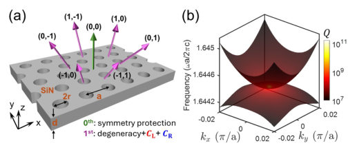
<figcaption class="paper-figure-caption"><b>Fig 1.</b> FIG. 1. (a) Schematic of a PhC slab with hexagonal lattice supporting zeroth- and first-diffraction orders and formation mechanisms of at-Γ degenerate h-BICs. CL (CR) denotes left- (right-) handed C points carrying the same topological charge. (b) Band surfaces and corresponding Q-factor distribution of the TM-like, at-Γ degenerate modes belonging to the E2 rep- resentation and corresponding to (˜r, ˜d) = (0.226, 0.4715). The color map represents the Q-factor of the modes.</figcaption>
</figure>
<figure class="paper-figure-card">
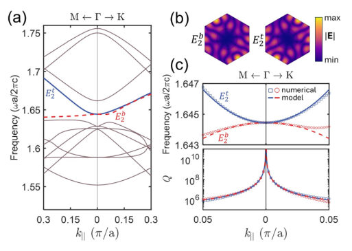
<figcaption class="paper-figure-caption"><b>Fig 2.</b> FIG. 2. (a) Band structure for the TM-like modes of a PhC slab with hexagonal lattice with (˜r, ˜d) = (0.226, 0.4715). The bottom (top) band of the modes degenerate at Γ, denoted as Eb 2 (Et 2), is shown as red dashed (blue solid) lines. (b) Electric field profiles in the middle plane of the PhC slab at the Γ point. (c) Band dispersion (top panel) and Q-factor (bottom panel) of at-Γ degenerate modes nearby the degeneracy point. The results obtained from the effective Hamiltonian model are shown as red and blue lines, whereas those from numerical simulations are marked by red circles and blue squares.</figcaption>
</figure>
<figure class="paper-figure-card">
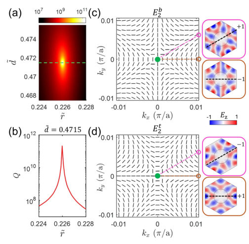
<figcaption class="paper-figure-caption"><b>Fig 3.</b> FIG. 3. (a) Dependence of Q on ˜r and ˜d, determined for the at-Γ degenerate modes. (b) Q vs. ˜r, computed for ˜d = 0.4715, namely along the green dashed line in (a). (c) Left panel: far-field polarization map of the Eb 2 mode for (0,0) diffrac- tion channel, where the pink (brown) dashed line denotes the Γ −M (Γ −K) axis. The green dot denotes a V point with topological charge of −2. Right panel: electric field profiles evaluated at the locations marked by circles in the left panel, with ±1 being the eigenvalues of the indicated mirror sym- metry transformations. (d) The same as in (c), but for the Et 2 mode.</figcaption>
</figure>
<figure class="paper-figure-card">
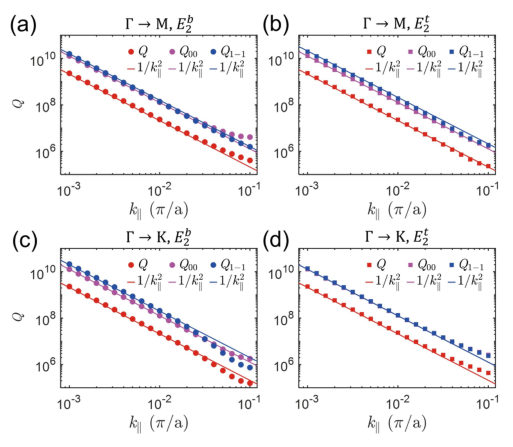
<figcaption class="paper-figure-caption"><b>Fig 4.</b> FIG. 5. Scaling of Q-factor along the Γ −M direction for (a) Eb 2 mode and (b) Et 2 mode. Scaling of Q-factor along the Γ −K direction for (c) Eb 2 mode and (d) Et 2 mode. The dots and squares represent the numerically calculated values at sampled k∥-points, whereas the curves represent the fitting of these results with the 1/k2 ∥function.</figcaption>
</figure>
<figure class="paper-figure-card">
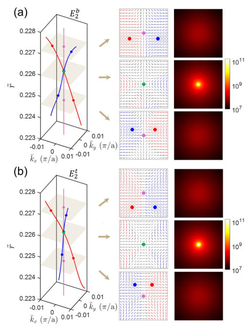
<figcaption class="paper-figure-caption"><b>Fig 5.</b> FIG. 4. k∥-space trajectories of C and QD points in (1, −1) channel for (a) Eb 2 mode and (b) Et 2 mode when ˜r is varied at fixed ˜d = 0.4715. Red (blue) dots denote C points with −1/2 charge and left (right) handedness, whereas purple dots de- note QD points with charge of −1. Middle and right columns show the maps of far-field polarization vector in (1, −1) chan- nel and total Q-factor, respectively, determined at ˜r = 0.2246, 0.226, and 0.2271 in the range ¯kx, ¯ky ∈[−0.01, 0.01] π/a.</figcaption>
</figure>

**Summary.** This paper theoretically demonstrates how to create highly confined, degenerate bound states in the continuum (h-BICs) within photonic crystal structures beyond their normal diffraction limits. By leveraging $C_{6v}$ symmetry and tuning structural parameters, the authors suppress radiation into multiple diffraction channels simultaneously. This opens pathways for designing novel optical devices with enhanced light-matter interaction governed by topological physics.

**Why it may be interesting.** This work is highly relevant to quantum optics and open quantum systems because it deals with engineered photonic band gaps (BICs) that exhibit extreme confinement and topological properties. The concept of controlling leakage rates via symmetry protection is a key tool in designing high-quality optical cavities for quantum applications.

Detailed structure

**Main problem.** The research aims to demonstrate the existence of degenerate hybrid bound states in the continuum (h-BICs) possessing high-order topological charges, specifically operating beyond the standard diffraction limit.

**Main result.** A novel mechanism is proposed and shown to realize at-Gamma degenerate h-BICs by combining symmetry protection for the zeroth order and parameter tuning to eliminate radiation into first-order channels. The frequency splitting near degeneracy scales quadratically and isotropically.

**Method.** The study employs an effective Hamiltonian approach, derived from analyzing band structures in photonic crystals, combined with topological charge calculations via winding numbers.

**Model / system.** The physical system is a Photonic Crystal (PhC) slab exhibiting $C_{6v}$ symmetry. The analysis uses an effective Hamiltonian $	ilde{H}_{	ext{eff}}$ whose eigenvalues govern the frequency and leakage rate dispersion ($\omega \pm i\gamma$) around the degeneracy point.

**Key observables.** Q-factor ($Q$), topological charges (V points), band structure, and far-field polarization maps.

**Important parameters / regimes.** The analysis is performed in the regime beyond the diffraction limit, characterized by geometric parameters $	ilde{r}$ and $	ilde{d}$, and momentum $|\mathbf{k}_\parallel|$.

**Assumptions / limitations.** The primary assumption involves using an effective Hamiltonian model to approximate the band structure near the degeneracy point, which shows good agreement for small in-plane wavevectors ($|\mathbf{k}_\parallel| < 0.02$).

**Figures summary.** Figures illustrate the schematic of h-BIC formation mechanisms, the degenerate band structure and Q-factor distribution at $\Gamma$, and the dependence of the Q-factor on structural parameters ($	ilde{r}, 	ilde{d}$).

**Paper structure.** The paper first establishes the physical system (PhC slab) and the theoretical framework using an effective Hamiltonian. It then details the mechanism for achieving degeneracy by suppressing radiation in multiple diffraction channels, followed by numerical validation of the scaling laws and topological features.

Abstract

We demonstrate the existence of at-$Γ$ degenerate hybrid bound-states in the continuum (BICs) with high-order topological charges and quadratic band degeneracy in periodic photonic structures with $C_{6v}$ symmetry above the diffraction limit. The degenerate BICs are realized by combining symmetry protection, which suppresses radiation into zeroth-order diffraction channel, with quadratic band degeneracy and parameter tuning to eliminate radiation into first-order diffraction channels. An effective Hamiltonian is used to investigate the band structure around the degeneracy point, and the topological dynamics in all diffraction channels are characterized. This work reveals a novel mechanism for realizing degenerate BICs above the diffraction limit, opening up opportunities for new physics and applications.

[↑ back to top](#top)

### [Quadrupolar phase transition in superconducting lanthanum hydride](http://arxiv.org/abs/2608.10428v1)

**Authors:** Abhishek Raghav, Kousuke Nakano, Marco Cherubini, Ryotaro Arita, Michele Casula  
**Type:** theory · **Category:** statistical mechanics · **PDF:** <https://arxiv.org/pdf/2608.10428v1>  
**Analysis basis:** full PDF text, analyzed in chunks
**Topic relevance:** `methods for driven-dissipative` **3/5** · `driven-dissipative phase transition` **2/5** · `non-equilibrium universality` **2/5** · `Frenkel-Kontorova` **1/5** · `Keldysh / 2PI / non-Gaussian methods` **1/5** · `analog quantum simulation` **1/5**

↔ Scroll figures horizontally

<figure class="paper-figure-card">
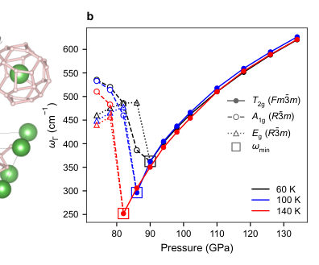
<figcaption class="paper-figure-caption"><b>Fig 1.</b> Fig. 1 Structural transition and phonon softening. a, Fm¯3m and R¯3m structures of LaH10. The top row shows the overall cage structures, and the bottom row depicts the position of H cubes within the La sublattice. The force pattern corresponding to one of the three-fold degenerate soft optical phonons of the Fm¯3m lattice driving this transition is shown in the middle. They exhibit T2g symmetry with characteristic shearing/rotational character. Fm¯3m undergoes a rhombohedral distortion (R¯3m) upon decompression. b, Frequency of the T2g soft optical phonons at Γ, three- fold degenerate, as a function of pressure at various temperatures, computed using displacement- displacement correlator...</figcaption>
</figure>
<figure class="paper-figure-card">
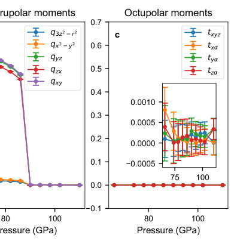
<figcaption class="paper-figure-caption"><b>Fig 2.</b> Fig. 2 CMP moments averaged over H cubes and over the centroid trajectory. a. Dipolar, b. quadrupolar and c. octupolar moments. Dipolar and octupolar moments are identically zero. Quadrupolar moments, however, are non-zero in the low-symmetry region, and zero in the high- symmetry region. Thus, they serve as a natural order parameter for this phase transition.</figcaption>
</figure>
<figure class="paper-figure-card">
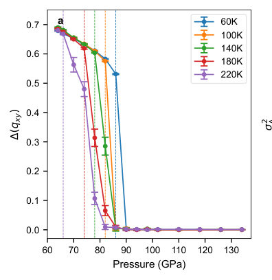
<figcaption class="paper-figure-caption"><b>Fig 3.</b> Fig. 3 Pressure evolution of the global order parameter across the phase transition. a, Order parameter as a function of pressure at several temperatures. The transition to the high- symmetry phase is defined to occur at the pressure at which the order parameter starts to collapse (dotted line). b, Variance of the order parameter under the same conditions. Fluctuations peak near the transition.</figcaption>
</figure>
<figure class="paper-figure-card">
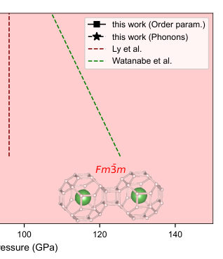
<figcaption class="paper-figure-caption"><b>Fig 4.</b> Fig. 4 P −T phase diagram of LaH10. The phase boundary identified using the soft phonon agrees with the one identified using the collapse of the order parameter, showing that the two methods are consistent. Phase transitions as determined in previous reports are also shown for comparison 21,22. Ly et al. 22 identified the low-pressure distortion as R¯3m and placed the transition at ≈96 GPa, which is close to the current work. It should be noted that in both these works, calculations were done over a much coarser P-T grid, making it difficult to determine a precise phase boundary.</figcaption>
</figure>
<figure class="paper-figure-card">
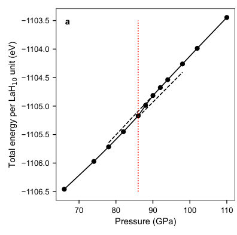
<figcaption class="paper-figure-caption"><b>Fig 5.</b> Fig. 5 Equation of state across phase transition obtained from PIMD-NPT simulations at 45 K using a 4×4×4 supercell. a, Total energy per LaH10 unit as a function of pressure. Black dashed lines depict the extrapolation of the high-symmetry phase into the low-pressure regime and of the low-symmetry phase into the high-pressure regime. b, Unit-cell volume (relative to the value at 66 GPa) as a function of pressure. Both E(P) and V (P) exhibit two successive slope changes (red dotted line marks the onset), bounding a finite transition region consistent with a weak first-order transition.</figcaption>
</figure>

**Summary.** This work investigates the structural transition in superconducting lanthanum hydride ($	ext{LaH}_{10}$) by showing it is governed by a quadrupolar $	ext{T}_{2g}$ order parameter. Using advanced simulations, the authors demonstrate that this transition is weakly first-order and correlates the structural instability with the high critical temperature superconductivity. The findings provide theoretical guidance for designing new high-$T_c$ superconductors.

**Why it may be interesting.** While focused on solid-state physics, the use of advanced simulation techniques like $	ext{PIMD}$ for anharmonic effects and mapping phase boundaries using order parameters is relevant to understanding quantum many-body dynamics in strongly coupled systems.

Detailed structure

**Main problem.** The study aims to characterize the nature of the structural phase transition and its connection to high superconductivity in lanthanum hydride ($	ext{LaH}_{10}$).

**Main result.** The structural transition is driven by a quadrupolar $	ext{T}_{2g}$ order parameter and exhibits a weak first-order character, which is linked to the discontinuous softening of optical phonons.

**Method.** The research employs cluster multipole moment analysis (CMP) and Path Integral Molecular Dynamics ($	ext{PIMD}$) simulations coupled with advanced neural network potentials trained on DFT data.

**Model / system.** The system studied is lanthanum hydride ($	ext{LaH}_{10}$), a superhydride known for its high critical temperature ($T_c = 250 	ext{ K}$). The analysis focuses on the structural changes in the hydrogen sublattice under pressure.

**Key observables.** Quadrupolar order parameter, soft optical phonon frequencies ($	ext{T}_{2g}$ modes), total energy and volume discontinuities across the phase boundary.

**Important parameters / regimes.** High pressures (up to $\sim 170 	ext{ GPa}$) and temperatures; the transition is characterized as weakly first-order.

**Assumptions / limitations.** The analysis relies on mapping structural instabilities via multipole moments and phonon softening, assuming these are key ingredients for high-$T_c$ superconductivity.

**Figures summary.** Figures illustrate the $	ext{Fm}ar{3}m 	o 	ext{R}ar{3}m$ structural change, showing soft optical phonons that soften, hit a floor, and jump discontinuously with pressure. Other figures map order parameters and phase boundaries.

**Paper structure.** The paper systematically analyzes the symmetry breaking using CMP moments to identify the quadrupolar order parameter, corroborates this finding by observing phonon softening/jumps via PIMD simulations, and confirms the weak first-order nature through thermodynamic calculations.

Abstract

Lanthanum hydride (LaH$_{10}$) has been widely studied for its high superconducting critical temperature of 250 K at about 170 GPa pressure. Although the structural ${R\bar{3}m}$-to-${Fm\bar{3}m}$ transition under pressure connected to the emergence of the superconducting phase in this material is broadly understood, the detailed characterization of its nature and its order parameter are still missing. By applying the cluster multipole moment analysis to the hydrogen sublattice, we reveal that this transition is triggered by a quadrupolar $T_{2g}$ order parameter, and we provide evidence for its weak first-order nature. By performing path integral molecular dynamics coupled to a message-passing atomic cluster expansion (MACE) neural network potential, trained on Perdew-Burke-Ernzerhof (PBE) density functional theory configurations, we show that the collapse of the order parameter at the transition is simultaneously associated with the discontinuous softening of the optical $T_{2g}$ phonons. Their symmetry lets them carry a non-negligible electron-phonon coupling in LaH$_{10}$, while the weak first-order nature of the transition makes them soft. The presence of structural instabilities with low-frequency quadrupolar distortions can be a key ingredient to enhance superconductivity in superhydrides and provides guidance for the discovery of new high-$T_c$ superconductors in hydrogen-rich compounds.

[↑ back to top](#top)

### [Nanoscale imaging of ferromagnetic vortex dynamics with scanning NV magnetometry](http://arxiv.org/abs/2608.10310v1)

**Authors:** Jeffrey Rable, Jyotirmay Dwivedi, Nitin Samarth, Paul Stevenson, Arun Bansil, Swastik Kar  
**Type:** experiment · **Category:** other · **PDF:** <https://arxiv.org/pdf/2608.10310v1>  
**Analysis basis:** full PDF text, analyzed in chunks
**Topic relevance:** `quantum measurements` **3/5** · `QC/QI experiment` **2/5** · `analog quantum simulation` **1/5** · `driven-dissipative phase transition` **1/5**

↔ Scroll figures horizontally

<figure class="paper-figure-card">
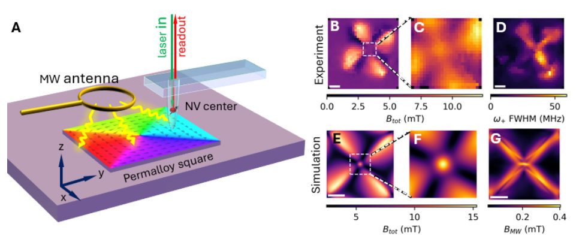
<figcaption class="paper-figure-caption"><b>Fig 1.</b> Figure 1: Schematic of the experimental setup and primary results on a 1 µm square. Scale</figcaption>
</figure>
<figure class="paper-figure-card">
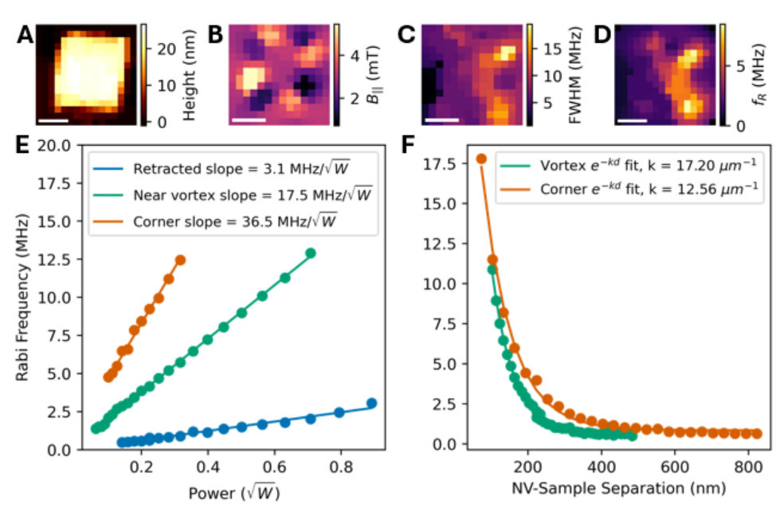
<figcaption class="paper-figure-caption"><b>Fig 2.</b> Figure 2: Rabi oscillation measurement results. Scale bars are 500 nm. (A) Topography of the</figcaption>
</figure>
<figure class="paper-figure-card">
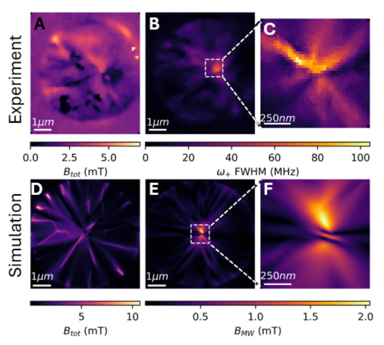
<figcaption class="paper-figure-caption"><b>Fig 3.</b> Figure 3: Measurements on vortex-containing, disordered disc (A) Total magnetic field mea-</figcaption>
</figure>
<figure class="paper-figure-card">
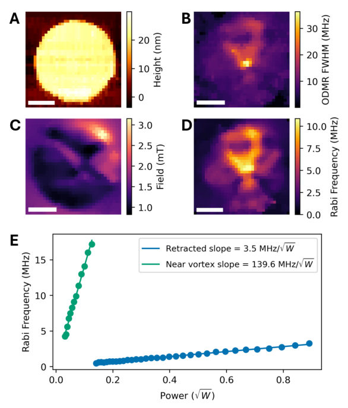
<figcaption class="paper-figure-caption"><b>Fig 4.</b> Figure 4: Rabi oscillation measurement results on a disordered, 6𝜇𝑚disc at 300 nm lift.</figcaption>
</figure>
<figure class="paper-figure-card">
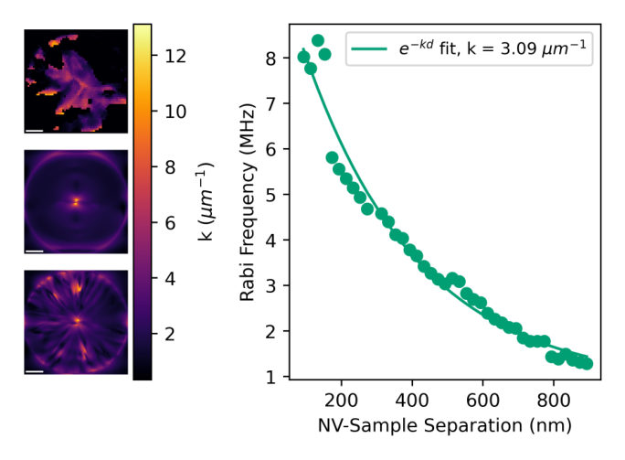
<figcaption class="paper-figure-caption"><b>Fig 5.</b> Figure 5: Evanescent decay of the MW fields produced by the disc. Scale bars are 1 µm. (A)</figcaption>
</figure>

**Summary.** This work reports on using Scanning NV Magnetometry (SNVM) to image both static and microwave stray fields generated by magnetic vortices in permalloy films. The technique achieves high spatial resolution ($\sim 50 	ext{ nm}$) and successfully characterizes dynamic phenomena, such as field enhancements near the vortex core, validating its potential for developing nanoscale magnonic devices.

**Why it may be interesting.** While primarily condensed matter magnetism, the use of NV centers to probe nanoscale magnetic dynamics is highly relevant to quantum sensing and open quantum systems characterization, providing a platform for studying spin-field interactions at unprecedented spatial resolution.

Detailed structure

**Main problem.** The primary goal is to image and characterize ferromagnetic vortex dynamics, including both static stray fields and microwave (MW) fields, at the nanoscale.

**Main result.** The authors successfully demonstrated high-resolution imaging of these dynamic magnetic fields in permalloy structures using SNVM, achieving field enhancements up to $40	imes$ near the vortex core.

**Method.** Scanning Nitrogen-Vacancy Magnetometry (SNVM) is employed, utilizing Optically Detected Magnetic Resonance (ODMR) and Rabi oscillation measurements to map both DC and AC magnetic fields.

**Model / system.** The experiments are performed on mesoscopic permalloy ($	ext{NiFe}$) thin films patterned into square or disc geometries. The analysis is heavily supported by comparison with micromagnetic simulations solving the LLG equation.

**Key observables.** Static stray fields (measured via ODMR frequency), microwave field amplitude (derived from ODMR FWHM and Rabi oscillations), and evanescent decay constants ($k$).

**Important parameters / regimes.** Spatial resolution ($\sim 50 	ext{ nm}$), MW field enhancement factors ($\sim 40	imes$), and characteristic decay lengths for different vortex modes.

**Assumptions / limitations.** The technique assumes the power-broadened regime relationship between FWHM and $B_{	ext{MW}}$ holds, and that micromagnetic simulations accurately capture the underlying physics despite disorder effects.

**Figures summary.** Figures illustrate ODMR/Rabi maps comparing experimental measurements to simulation predictions for both square (wall mode) and disc (azimuthal mode) vortex structures, alongside analyses of field decay with distance.

**Paper structure.** The paper progresses by detailing the SNVM measurement techniques (static vs. dynamic fields), presenting results on patterned permalloy samples (square/disc), comparing these findings against detailed micromagnetic simulations, and analyzing specific physical phenomena like field enhancement and wave decay.

Abstract

The generation and manipulation of spin waves at the nanoscale via magnetic vortices are of considerable importance because of their broad applications across magnonic and quantum technologies. Previously, fixed nitrogen-vacancy (NV) centers in diamond have been used to locally characterize vortex dynamics, and scanning NV magnetometry (SNVM) has been used to image vortices' static stray fields. Here, we demonstrate SNVM imaging of both the static and microwave fields generated by vortices in mesoscopic permalloy structures with $\sim$50 nm spatial resolution, achieving excellent agreement with micromagnetic simulations, while revealing the effects of disorder. We further demonstrate a 40$\times$ microwave field enhancement near a vortex core and image the disorder-dependent, spatially varying, evanescent decay of these microwaves. Our ambient, tabletop technique surpasses diffraction-limited techniques' resolutions by at least 5$\times$, with far greater accessibility and throughput than synchrotron radiation-based techniques, offering new opportunities in the study and development of magnonic devices.

[↑ back to top](#top)

### [Revealing time characteristics of optical excitations in dielectric and plasmonic structures through cathodoluminescence interferometry](http://arxiv.org/abs/2608.10721v1)

**Authors:** Evelijn Akerboom, Hirohsi Sugimoto, Minoru Fujii, Nicolas Pazos-Perez, Ramon A. Álvarez Puebla, A. Femius Koenderink, F. Javier García de Abajo, Albert Polman  
**Type:** experiment · **Category:** other · **PDF:** <https://arxiv.org/pdf/2608.10721v1>  
**Analysis basis:** full PDF text, analyzed in chunks
**Topic relevance:** `interference shaping light` **3/5** · `driven-dissipative phase transition` **1/5** · `methods for driven-dissipative` **1/5** · `quantum optics experiment` **1/5**

↔ Scroll figures horizontally

<figure class="paper-figure-card">
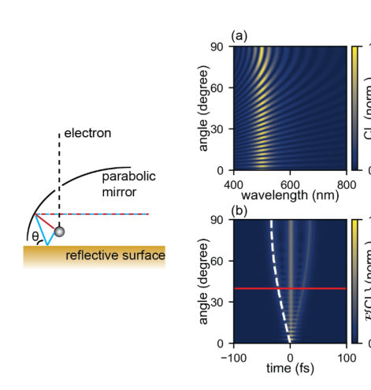
<figcaption class="paper-figure-caption"><b>Fig 1.</b> Figure 1. Analytical calculation of CL interferometry of a radiating resonant nanoparticle placed at a distance h = 5 μm above a reflecting surface. (a) Angle- and wavelength- resolved CL interferogram of a Lorentzian scatterer with a resonance wavelength of 500 nm and a linewidth of 0.2 rad/fs, and (b) its Fourier transform to the time domain. The dashed curve in (b) shows the calculated time delay associated with the interference pattern for each emission angle. (c) Optical response function of three distinct resonances: a broadband emitter (blue constant line at 1.0), the Lorentzian scatterer from (a,b) (green), and a scatterer with two scattering resonances, one at λ=500 nm with γ=0.2...</figcaption>
</figure>
<figure class="paper-figure-card">
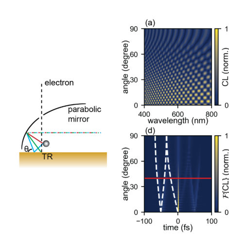
<figcaption class="paper-figure-caption"><b>Fig 2.</b> Figure 2. Analytical calculation of CL interferometry of a resonantly scattering particle placed above a reflecting surface, including TR emission from the substrate. Angle- and wavelength- resolved CL interferogram for (a) a broadband optical emitter, and (b) a Lorentzian scatterer with a resonance wavelength of 500 nm and a linewidth of 0.2 rad/fs. (c) Residuals of (a) and (b). (d) Fourier transform of (b) to the time domain, where the dashed curves show the calculated time delays for each angle, and (e) line scans of the Fourier-transform of the calculated CL interferograms at an emission angle of 40° for the three spectral response functions in Fig. 1(c).</figcaption>
</figure>
<figure class="paper-figure-card">
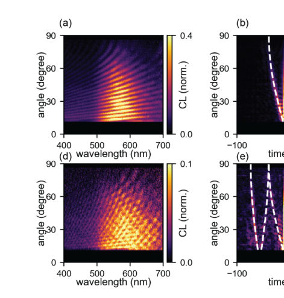
<figcaption class="paper-figure-caption"><b>Fig 3.</b> Figure 3. Measured CL interferograms for a Au particle of 100 nm in diameter, placed above a Au surface. (a) Angle- and wavelength-resolved CL interferogram for on-particle excitation, (b) its Fourier transform to the time domain, and (c) line scans along emission angles of 50° (orange) and 60° (purple). (d-f) Same as (a-c), but off-particle excitation (see inset in (f)). The line scans in (c,f) are fitted to an exponential rise and fall time (dotted line), and the fitting parameters are shown in Table 1.</figcaption>
</figure>
<figure class="paper-figure-card">
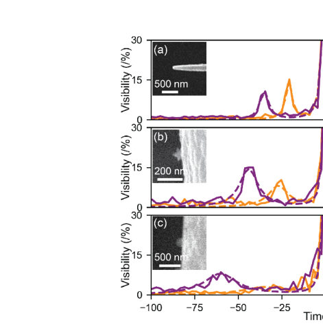
<figcaption class="paper-figure-caption"><b>Fig 4.</b> Figure 4. Temporal distributions derived from CL interferograms for (a) a plasmonic tip, (b) a Au nanostar, and (c) a Si nanosphere. SEM images of the particles are shown in the insets. We plot experimental data (solid curves) along with fitted Lorentzian spectra (dashed curves) at two CL emission angles of, 40◦ (orange) and 80◦ (purple).</figcaption>
</figure>

**Summary.** The authors demonstrate that cathodoluminescence (CL) interferometry can be used as a novel tool to measure the time characteristics and phase of optical resonances in plasmonic and dielectric nanoparticles. By analyzing the Fourier transform of angular and frequency-resolved CL signals, they extract femtosecond decay times without needing complex ultrafast pump-probe setups. This establishes CL interferometry as a versatile method for nanoscale characterization.

**Why it may be interesting.** This work provides a powerful, non-pump-probe technique to measure ultrafast dynamics in nanoscale optical cavities, which is highly relevant for understanding energy relaxation in quantum light sources or solid-state emitters.

Detailed structure

**Main problem.** Direct time-resolved measurement of optical resonances in nanophotonic systems is challenging due to ultrafast relaxation processes.

**Main result.** CL interferometry successfully accesses the temporal response and phase behavior of optical resonances on femtosecond timescales for various plasmonic and dielectric structures.

**Method.** The technique uses Fourier transformation of angle- and frequency-resolved cathodoluminescence (CL) interferograms to extract time delay information related to resonance decay times.

**Model / system.** The study investigates optical excitations in dielectric and plasmonic nanostructures, including Au nanoparticles, Au nanostars, and Si nanospheres. The measurement setup involves electron beam excitation and collection of CL signals.

**Key observables.** Resonance decay times ($	au$), spectral beating signatures, phase information, and the electric far-field amplitude $\mathbf{E}(\mathbf{k}_{\|}, \omega)$.

**Important parameters / regimes.** Decay times in the range of 1–10 fs; electron beam energy (30 keV); angular/spectral resolution.

**Assumptions / limitations.** The analysis relies on an analytical framework connecting linear temporal and spectral response via Fourier transformation, and sometimes assumes Lorentzian scatterer profiles.

**Figures summary.** Figures illustrate the analytical calculation of CL interferometry for different scatterers and show time-domain Fourier transforms revealing interference patterns related to resonance decay times. Other figures compare spectra from various sample geometries (on-particle vs. off-particle).

**Paper structure.** The paper develops an analytical framework using CL interferometry, demonstrates its application by analyzing broadband plasmonic and dielectric emitters, and confirms the results experimentally on multiple nanoparticle systems.

Abstract

Cathodoluminescence (CL) spectroscopy provides access to optical excitations with nanometer spatial resolution, but direct time-resolved measurements of optical resonances remain challenging. Here, we demonstrate that CL interferometry provides access to the temporal response, phase behavior, and modal spectral structure of resonant nanoscale scatterers without requiring ultrafast pump-probe schemes. We develop an analytical framework in which Fourier transformation angle- and frequency-resolved CL interferograms yields the decay time of optical resonances governed by the linear optical response. Multimode resonators exhibit characteristic temporal CL beating signatures associated with spectral mode splitting. By exploiting transition radiation emitted from a nearby metallic surface as a broadband reference, we further demonstrate phase retrieval and cross-correlation measurements between instantaneous and resonant emission processes. Experimental measurements on Au nanoparticles, broadband plasmonic emitters, Au nanostars, and Si nanospheres supporting multipolar Mie resonances confirm the theoretical predictions, and decay times in the range 1-10 fs are derived for each system. Our results establish CL interferometry as a powerful approach for accessing spectral, spatial, and phase information within a single nanoscale measurement with fs resolution.

[↑ back to top](#top)

### [Strong coupling between antiferromagnetic magnons and spoof surface plasmons](http://arxiv.org/abs/2608.10822v1)

**Authors:** Yamin Sun, Ka Shen, H. Y. Yuan  
**Type:** theory · **Category:** other · **PDF:** <https://arxiv.org/pdf/2608.10822v1>  
**Analysis basis:** full PDF text, analyzed in chunks
**Topic relevance:** `analog quantum simulation` **2/5** · `driven-dissipative phase transition` **2/5** · `Keldysh / 2PI / non-Gaussian methods` **1/5** · `Tavis-Cummings & cavity-many-emitter` **1/5** · `correlated / nonlocal dissipation` **1/5** · `methods for driven-dissipative` **1/5**

↔ Scroll figures horizontally

<figure class="paper-figure-card">
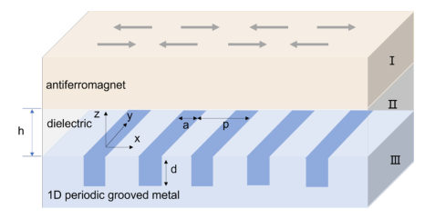
<figcaption class="paper-figure-caption"><b>Fig 1.</b> FIG. 1. Schematic of the planar hybrid structure composed of an AFM thin film, dielectric spacer and one dimensional- periodic grooved metal. The classical ground state of the AFM layer is a N´eel state with spins aligned antiparallel to each other along the ±x directions.</figcaption>
</figure>
<figure class="paper-figure-card">
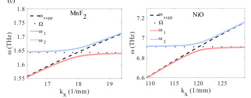
<figcaption class="paper-figure-caption"><b>Fig 2.</b> FIG. 2. (a) Dispersions of bare spoof surface plasmons for different geometric parameters. (b-d) Dispersions of the hy- brid magnon-plasmon excitations in the heterostructures of AFM, dielectric spacer and grooved metals. The geometric parameters are a/p = 1/4, h = 1 µm, and the groove depth d is chosen to satisfy Ω/ωd = 0.15, tuning the spoof surface plasmon into resonance with the AFM magnons. (b) FeF2, d = 28.2 µm; (c) MnF2, d = 172.1 µm; (d) NiO, d = 40.9 µm. The magnetic parameters are shown in Table I.</figcaption>
</figure>
<figure class="paper-figure-card">
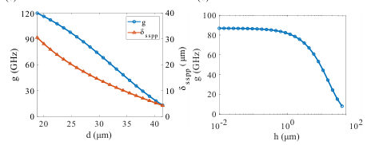
<figcaption class="paper-figure-caption"><b>Fig 3.</b> FIG. 3. (a) Coupling strength as a function of the groove width-to-period ratio a/p and groove depth d. (b) Cou- pling strength and penetration depth of spoof surface plas- mon versus a/p along the horizontal dashed line in (a) with d = 28.2 µm, h = 1 µm. (c) Coupling strength and penetra- tion depth of spoof surface plasmon versus d along the vertical dashed line in (a) with a/p = 1/4, h = 1 µm. (d) Coupling strength as a function of h with d = 28.2 µm and a/p = 1/4.</figcaption>
</figure>
<figure class="paper-figure-card">

<figcaption class="paper-figure-caption"><b>Fig 4.</b> Figure 3(d) shows the coupling strength decreases monotonically with increasing the dielectric thickness h. Since both surface plasmons and the AFM magnons are localized near the interface, their coupling is mediated by the overlap of their evanescent fields inside the di- electric spacer. Increasing the dielectric thickness re- duces this mode overlap and therefore weakens the co- herent coupling. For the AFM material studies here, the magnon-plasmon coupling strength can exceed 100 GHz by adjusting the geometric parameters, which in- dicates a substantially efficient energy exchange between the two modes. In the following section, we further ex- amine whether this coupling falls into the...</figcaption>
</figure>

**Summary.** This theoretical study predicts strong coherent coupling between antiferromagnetic magnons and spoof surface plasmons within a novel planar heterostructure. By solving coupled Maxwell and magnetization dynamics equations, the authors confirm the existence of hybrid modes exhibiting avoided crossings in the THz regime. This work presents a highly tunable platform for on-chip quantum information transfer between spin and electromagnetic excitations.

**Why it may be interesting.** This work establishes a planar, chip-compatible platform for hybrid magnon-plasmon interactions, which is highly relevant for developing integrated quantum devices that couple spin excitations (magnons) with electromagnetic modes (plasmons).

Detailed structure

**Main problem.** The study investigates achieving strong, coherent information exchange between antiferromagnetic (AFM) magnons and spoof surface plasmons in a planar geometry.

**Main result.** The authors predict strong magnon-plasmon coupling in the terahertz regime for this planar heterostructure, confirming operation in the strong coupling regime via calculated cooperativity values exceeding unity.

**Method.** The analysis involves analytically solving coupled Maxwell and Landau-Lifshitz-Gilbert equations to derive the system's dispersion relation.

**Model / system.** The physical platform is a planar heterostructure comprising an AFM thin film, a dielectric spacer, and a structured metal surface supporting spoof surface plasmons (SSPs).

**Key observables.** Pronounced avoided crossings in the dispersion relation, coupling strength ($g$), and cooperativity parameter ($C$).

**Important parameters / regimes.** The system is tunable via geometric parameters such as groove width-to-period ratio ($a/p$), dielectric thickness ($h$), and groove depth ($d$).

**Assumptions / limitations.** Approximations include assuming small-amplitude AFM oscillations and using an effective-medium approach for the corrugated metal.

**Figures summary.** Figures illustrate the schematic of the planar structure, bare plasmon dispersions, and the resulting hybrid excitation dispersion curves showing avoided crossings.

**Paper structure.** The paper proceeds by setting up the coupled electromagnetic and magnetization dynamics equations, deriving the determinant equation for the dispersion relation, and finally analyzing the coupling strength and cooperativity parameter to confirm strong coupling.

Abstract

Hybrid magnonic system provides a versatile platform for coherent information exchange between spin excitations and other physical degrees of freedom. While strong coupling between magnons and spoof plasmons has been observed based on ferrimagnetic spheres and localized microwave resonators, it remains unexplored whether coherent magnon-plasmon coupling can be achieved in planar magnetic structures. Here we study the hybridization of antiferromagnetic (AFM) magnons and spoof surface plasmons in a planar heterostructure consisting of an AFM thin film, a dielectric spacer, and a structured metal surface. By analytically solving the coupled Maxwell and magnetization dynamics equation, we predict strong magnon-plasmon coupling in the terahertz regime, manifested by pronounced avoided crossings in the dispersion. The coupling originates from the spatial overlap between magnonic and plasmonic modes in the dielectric spacer, and can be efficiently tuned through geometric parameters of the system. The calculated cooperativity confirms that the hybrid system can operate in the strong coupling regime, enabling coherent information transfer between magnons and plasmons. Our results establish a planar platform for plasmon-magnon hybridization, which is more amenable to on-chip manipulation and integration.

[↑ back to top](#top)

### [Floquet Engineering of Topological Phases and Magneto-Optical Response in a Driven $d$-wave Altermagnet](http://arxiv.org/abs/2608.11192v1)

**Authors:** Muzamil Shah  
**Type:** theory · **Category:** other · **PDF:** <https://arxiv.org/pdf/2608.11192v1>  
**Analysis basis:** full PDF text, analyzed in chunks
**Topic relevance:** `Keldysh / 2PI / non-Gaussian methods` **1/5** · `analog quantum simulation` **1/5** · `driven-dissipative phase transition` **1/5** · `interference shaping light` **1/5** · `methods for driven-dissipative` **1/5** · `non-equilibrium universality` **1/5**

↔ Scroll figures horizontally

<figure class="paper-figure-card">
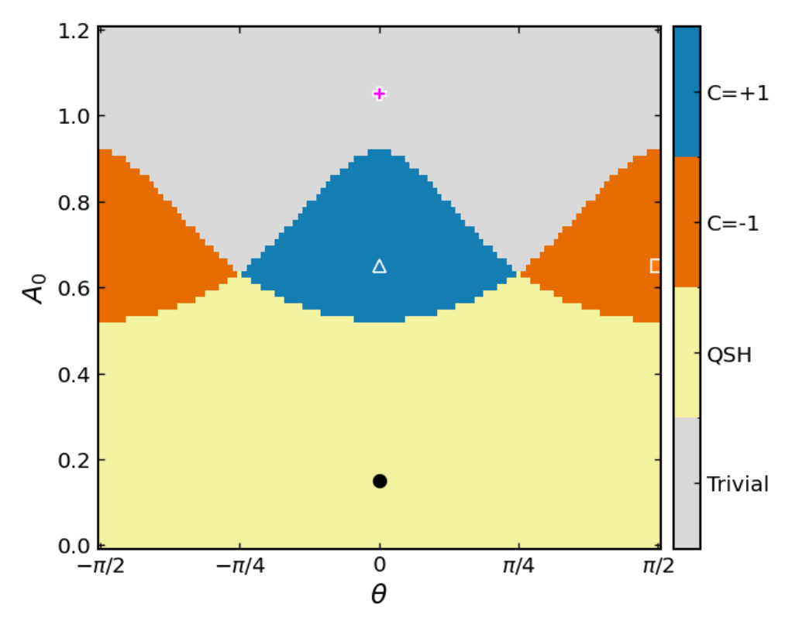
<figcaption class="paper-figure-caption"><b>Fig 1.</b> FIG. 1. Topological phase diagram of the altermagnetic spin-Chern system under linearly polarized light as a function of the drive amplitude A0 and polarization angle θ. The yellow, blue, purple, and gray regions denote the spin-Chern phase, the C = −1 Chern-insulating phase, the C = +1 Chern-insulating phase, and the trivial phase, respectively. The boundaries are obtained from spin-resolved bulk-gap closings. The black markers identify the representative parameter points used for the band-structure, Berry-curvature, conductivity, and magneto-optical calculations. Parameters: m = 3.8v, b = −v, and ta = √</figcaption>
</figure>
<figure class="paper-figure-card">
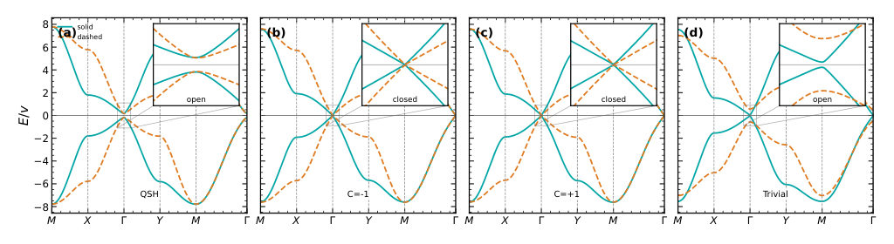
<figcaption class="paper-figure-caption"><b>Fig 2.</b> FIG. 2. Spin-resolved band structures of the driven d-wave altermagnet for representative points in the two-dimensional (A0, θ) phase diagram: (a) spin Chern-like phase at (A0, θ) = (0.1500, 0), (b) C = −1 phase at (A0, θ) = (0.6250, 0.8290), (c) C = +1 phase at (A0, θ) = (0.6250, 0.7418), and (d) trivial phase at (A0, θ) = (1.0500, 0). The parameters are m = 3.8v, b = −v, and ta = √</figcaption>
</figure>
<figure class="paper-figure-card">
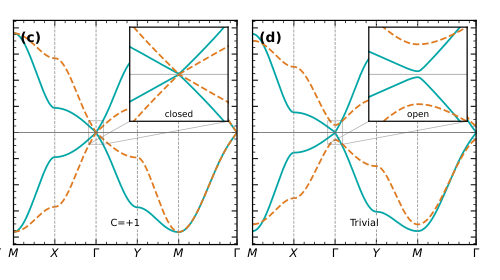
<figcaption class="paper-figure-caption"><b>Fig 3.</b> Figure 3 illustrates the momentum-space structure of the Berry curvature of the occupied bands across four distinct topological phases of the Floquet alter- magnet. The color scale shows the local Berry cur- vature in the two-dimensional Brillouin zone, with red and blue regions indicating opposite signs. In Fig. 3(a), the Berry curvature in the spin-Chern phase is shown. The Berry curvature is strongly concentrated around the gap-minimum region near the Brillouin zone cen- ter. Figures 3(c) and (d) correspond to two distinct, nontrivial Floquet-Chern phases. The Berry-curvature texture in Fig. 3(b) is dominated by a negative con- tribution around the gap-minimum region, leading to an...</figcaption>
</figure>
<figure class="paper-figure-card">

<figcaption class="paper-figure-caption"><b>Fig 4.</b> Figure 4 shows the frequency-dependent optical re- sponse of the Floquet-engineered altermagnet in the spin Chern, C = −1, C = +1, and trivial phases. The photon energy is plotted in units of ω/v, and the optical conductivity is expressed in units of e2/ℏ. Figure 4(a) displays the absorptive longitudinal optical conductiv- ity, Re σxx in the respective phases. At low frequencies,</figcaption>
</figure>
<figure class="paper-figure-card">
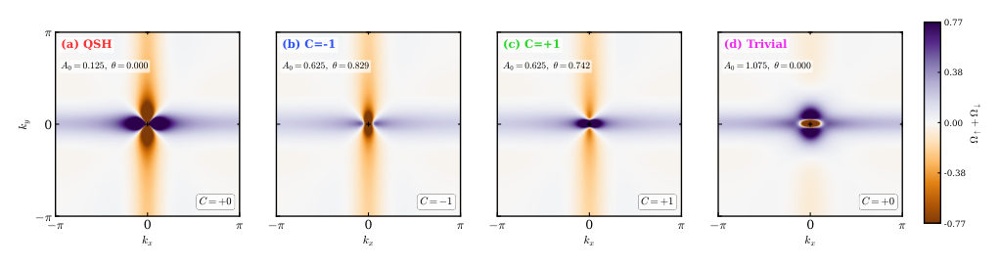
<figcaption class="paper-figure-caption"><b>Fig 5.</b> FIG. 3. Berry-curvature distribution of the occupied bands in the irradiated d-wave altermagnetic spin Chern system under linearly polarized light. Panels (a)–(d) correspond to the spin Chern, C = −1, C = +1, and trivial phases, respectively. Red and blue regions denote Berry curvature with opposite signs. In the spin-Chern phase, the Berry curvature contributions compensate in the total charge channel, giving C = 0. In the intermediate Chern phases, the Berry curvature becomes sign imbalanced after a spin-selective gap closing and reopening, producing finite total Chern numbers C = −1 and C = +1. The reversal of the Berry-curvature pattern between panels (b) and (c) reflects the reversal...</figcaption>
</figure>

**Summary.** The paper demonstrates that applying linearly polarized light to a 2D d-wave altermagnet allows precise control over its topological state via Floquet engineering. By breaking specific symmetries, the drive induces intermediate Chern insulating phases with switchable Chern numbers ($C=\pm 1$). This tunability is experimentally verifiable through measurable changes in the optical Hall response and magneto-optical rotations.

**Why it may be interesting.** This work bridges concepts from topological band theory (Chern numbers) with time-periodic driving (Floquet engineering), providing a concrete platform for controlling electronic properties using light polarization, which is highly relevant to quantum optics and condensed matter physics.

Detailed structure

**Main problem.** The study investigates how driving a 2D d-wave altermagnet with linearly polarized light can control its topological phases and magneto-optical response.

**Main result.** Linearly polarized light acts as a symmetry-selective handle, enabling tunable spin-resolved band inversion, switching between Chern insulating phases ($C=\pm 1$), and providing contact-free optical detection signatures.

**Method.** The analysis employs the high-frequency Floquet expansion on a tight-binding model, calculating linear response properties using the Kubo formalism to determine conductivities and magneto-optical rotations.

**Model / system.** The system is a two-dimensional (2D) d-wave altermagnet modeled by a four-band tight-binding Hamiltonian. The driving mechanism involves periodic excitation via linearly polarized light, which breaks the $C_{4z}T$ symmetry.

**Key observables.** Longitudinal and Hall conductivities ($\sigma_{xx}, \sigma_{xy}$), Faraday rotation ($	heta_F$), Kerr rotation ($	heta_K$), and associated ellipticities ($\eta_F, \eta_K$).

**Important parameters / regimes.** Drive amplitude ($A_0$) and polarization angle ($	heta$); the system exhibits distinct phases based on these parameters.

**Assumptions / limitations.** The analysis relies on an off-resonant, high-frequency Floquet expansion, assuming $\hbar\Omega_p$ exceeds the gap and bandwidth for validity.

**Figures summary.** Figures illustrate the dependence of optical conductivities ($	ext{Re}/	ext{Im}\sigma_{xy}$) and magneto-optical responses ($	heta_F, 	heta_K$) on both the driving amplitude ($A_0$) and polarization angle ($	heta$), showing characteristic sign reversals.

**Paper structure.** The paper first establishes the static topological phase (spin-Chern insulator) and then introduces Floquet driving. It details how the drive breaks symmetry via anisotropic renormalization, leading to tunable Chern phases. Finally, it calculates and analyzes the resulting frequency-dependent optical conductivities and magneto-optical responses.

Abstract

We study how Floquet driving with linearly polarized light controls the topology and magneto-optical response of a two-dimensional (2D) $d$-wave altermagnet. In the absence of linearly polarized optical field and under spin conservation, we find that the system hosts a spin-Chern (a quantum-spin-Hall analog) phase with Chern numbers of opposite sign in the two spin sectors. The irradiated optical field breaks the $C_{4z}\mathcal{T}$ crystalline antiunitary symmetry between the spin sectors. Symmetry breaking originates from polarization-dependent Peierls phases, which renormalize hopping anisotropically along the two axes. The resulting spin-selective gap closures produce intermediate Chern-insulating phases with $C=\pm1$. The drive amplitude $A_0$ determines the inversion thresholds, while rotating the polarization by $π/2$ swaps the spin sectors and reverses the Chern number. Using the Kubo formalism, we compute the frequency-dependent longitudinal and Hall conductivities and derive the corresponding Faraday and Kerr rotations for a free-standing conducting sheet. The longitudinal response tracks the Floquet-renormalized interband thresholds, whereas the optical Hall response, together with the sign of the magneto-optical rotations, distinguishes the two opposite Berry-curvature chiralities. Sizable Kerr angles occur only within narrow resonant windows and should be interpreted together with the reflected intensity and Kerr ellipticity. These results identify linearly polarized light as a symmetry-selective handle for spin-resolved band inversion, Chern-number switching, and contact-free optical detection in $d$-wave altermagnets.

[↑ back to top](#top)

### [Experimental Visualization of a Fermi Gas](http://arxiv.org/abs/2608.10313v1)

**Authors:** Inna M. Vishik  
**Type:** both · **Category:** other · **PDF:** <https://arxiv.org/pdf/2608.10313v1>  
**Analysis basis:** full PDF text, analyzed in chunks
**Topic relevance:** `analog quantum simulation` **1/5** · `quantum measurements` **1/5**

↔ Scroll figures horizontally

<figure class="paper-figure-card">
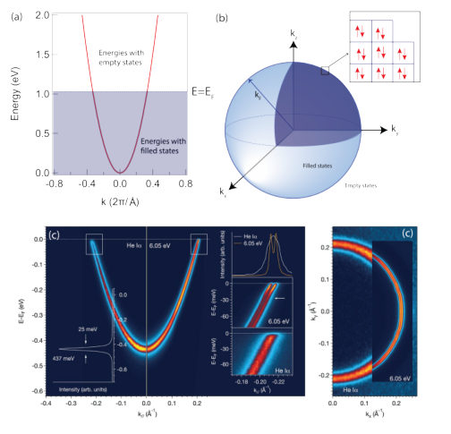
<figcaption class="paper-figure-caption"><b>Fig 1.</b> FIG. 1. (color online) Fermi gas, theory and experiment. (a) Energy vs k for free electron gas, with occupied energy lev- els below E = EF . The Fermi level is chosen to roughly correspond to one electron per 64˚A3, which is a reasonable electron density for a 3D metal. (b) Sketch of Fermi gas at T = 0 in 3D k-space showing filled states within sphere of radius kF . Inset shows momentum states filled by electrons of opposite spin. (c) ARPES spectrum on 2D electron system (surface state of copper), Ref. 6 showing Energy vs momen- tum. He-Iα and 6.05 eV refer to two different lightsources, a helium plasma lamp and a UV laser, respectively, used to measure the same system sequentially. Lower...</figcaption>
</figure>
<figure class="paper-figure-card">
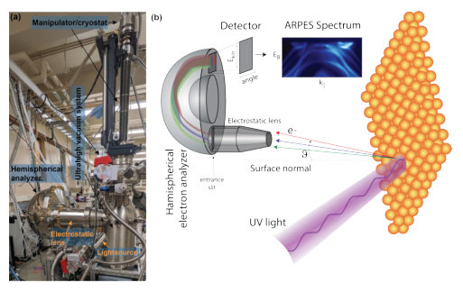
<figcaption class="paper-figure-caption"><b>Fig 2.</b> FIG. 2. ARPES experiment. (a) Example experimental lab- based ARPES system showing Helium-lamp lightsource, UHV system, the analyzer system consisting of electrostatic lens column and hemispherical analyzer, and sample manipula- tor/cryostat. (b) Schematic of ARPES experiment showing crystalline sample and emission angle ϑ referenced to surface normal. Different emission angles are imaged onto different positions on entrance slit before entering hemispherical ana- lyzer. ARPES spectrum uses data from Ref. 15</figcaption>
</figure>

**Summary.** This pedagogical paper demonstrates how Angle-Resolved Photoemission Spectroscopy (ARPES) serves as an experimental tool to visualize the Fermi gas model. By measuring electron energy versus momentum, researchers can map out the band structure of metals, confirming predictions derived from quantum mechanics regarding the filling of electronic states up to the Fermi level.

**Why it may be interesting.** The paper bridges fundamental quantum statistical mechanics (Fermi gas) with advanced experimental techniques (ARPES), providing a tangible link between abstract theoretical models and measurable electronic properties in real materials.

Detailed structure

**Main problem.** To use experimental measurements from Angle-Resolved Photoemission Spectroscopy (ARPES) to visualize and understand the fundamental concepts of the Fermi gas model in metals.

**Main result.** ARPES successfully maps the energy-momentum dispersion relation $E(\vec{k})$, allowing direct visualization of theoretical predictions like the parabolic band structure and the resulting circular Fermi surface.

**Method.** The analysis combines quantum mechanical principles (photoelectric effect, momentum/energy conservation) with solid-state physics models (particle-in-a-box, free electron gas) to interpret experimental ARPES data.

**Model / system.** The system is electrons in crystalline solids, initially modeled by the Fermi gas concept derived from quantum mechanics. The analysis uses concepts like periodic boundary conditions and the Pauli exclusion principle to define the filled states up to the Fermi energy ($E_F$).

**Key observables.** Energy vs. Momentum dispersion relation $E(\vec{k})$, Fermi Energy ($E_F$), Fermi Surface radius ($k_F$), Group Velocity ($v_g$), and Effective Mass ($m^*$).

**Important parameters / regimes.** Electron density ($N/V$), Temperature ($T$), UV photon energy, and the chemical potential ($\mu \approx E_F$ at low T).

**Assumptions / limitations.** The model initially assumes minimal inter-electron interactions (free electron gas) and relies on momentum conservation during photoemission. The analysis shifts from simple box models to periodic boundary conditions for crystalline solids.

**Figures summary.** Figures illustrate the comparison between theoretical free electron gas predictions, 3D k-space spheres defining the Fermi surface, and actual ARPES spectra showing constant energy contours at $E_F$.

**Paper structure.** The paper progresses from establishing basic quantum principles (photoelectric effect) to deriving the continuum limit of the particle-in-a-box model for the Fermi gas. It then details how ARPES measures this $E(\vec{k})$ relation, allowing characterization of band structure features like the Fermi surface and effective mass.

Abstract

Angle-resolved photoemission spectroscopy (ARPES) can measure electrons' energy vs momentum relations in solids via photoelectric effect. This pedagogical paper experimental results from this technique as a tool for visualizing the Fermi gas model in quantum statistical mechanics. This model is an important starting point for understanding more complex electronic behaviors in real metals.

[↑ back to top](#top)

### [Giant mode splitting of azimuthal spin waves in radial vortices](http://arxiv.org/abs/2608.10340v1)

**Authors:** Zhenyu Wang, Liangrui Li, Xuejuan Liu, Xiansi Wang, Ruifang Wang, H. Y. Yuan  
**Type:** theory · **Category:** other · **PDF:** <https://arxiv.org/pdf/2608.10340v1>  
**Analysis basis:** full PDF text, analyzed in chunks
**Topic relevance:** `analog quantum simulation` **1/5** · `driven-dissipative phase transition` **1/5**

↔ Scroll figures horizontally

<figure class="paper-figure-card">

<figcaption class="paper-figure-caption"><b>Fig 1.</b> FIG. 1: (a) Static spin configurations of the vortices for D = 0, ±1, and ±2 mJ/m2. Blue arrows depict the two dimensional cylindrical coordinate system (ˆρ, ˆϕ). Black arrows show the in-plane magneti- zation and the color bar represents the out-of-plane magnetization. (b) The vortex energy in (D, φ) space, black symbols represent the associated φ for minimum energy at each D. (c) The magnetization components (mρ,ϕ) at ρ = 25 nm, (d) the radius of the vortex core (rVC), and (e) topological charge (Q) versus the DMI constant (D).</figcaption>
</figure>
<figure class="paper-figure-card">
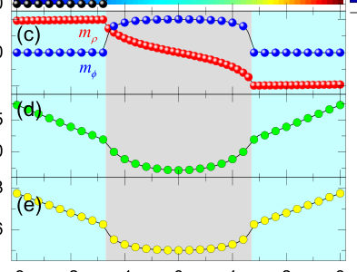
<figcaption class="paper-figure-caption"><b>Fig 2.</b> Figure 1(a) shows five representative spin configurations of the vortices under different DMI values. At D = 0 mJ/m2, a circular vortex is stabilized by the balance between the ex- change and dipolar interactions. When the DMI is introduced (|D| = 1 mJ/m2), the in-plane magnetization tilts from the az- imuthal to radial directions. A radial vortex is formed when the DMI is sufficiently strong to overcome the dipolar inter- action (|D| = 2 mJ/m2). By increasing the DMI strength</figcaption>
</figure>
<figure class="paper-figure-card">
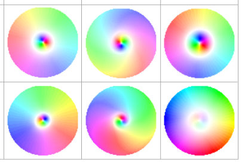
<figcaption class="paper-figure-caption"><b>Fig 3.</b> FIG. 2: (a) The frequencies of azimuthal spin-wave modes with m = ±1 versus the DMI constant. (b) The mode profiles of azimuthal spin waves with m = ±1 for D = 0, 0.5, and 2 mJ/m2. The inset is the color palette of azimuthal spin-wave modes with color indicating the phase and intensity representing the amplitude.</figcaption>
</figure>
<figure class="paper-figure-card">
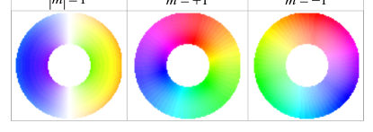
<figcaption class="paper-figure-caption"><b>Fig 4.</b> FIG. 3: (a) The frequency splitting as a function of the DMI constant for the ferromagnetic disk and ring. The inner radius of the ring is 20 nm. (b) The mode profiles of azimuthal spin waves in the ring for D = 0.5 and 2.0 mJ/m2.</figcaption>
</figure>
<figure class="paper-figure-card">

<figcaption class="paper-figure-caption"><b>Fig 5.</b> Figure 3(a) shows the frequency splitting (∆ω) of azimuthal modes as a function of D. One can see that ∆ω is changed from 1.36 GHz at D = 0 mJ/m2 to −8.46 GHz at D = 3 mJ/m2. In radial vortices, the magnitude of the frequency splitting (|∆ω|) increases linearly with D, consistent with Eq. (11), and is much larger than that in circular vortices. In ex- tended ferromagnetic films, the DMI-induced frequency shift scales as 2Dk sin ψ [30], where k is the wave number of spin waves and ψ is the angle between k and m. This relation holds true in confined disks as well. For circular vortices (ψ ≈0), the DMI effect can be disregarded, and the splitting is domi- nated by the VC gyration. For radial...</figcaption>
</figure>

**Summary.** This work analyzes the spin-wave excitation spectrum in ferromagnetic vortices stabilized by DMI. The authors demonstrate that the DMI causes a large, measurable splitting of azimuthal modes ($\Delta\omega$), an effect that remains robust even when vortex core contributions are removed. This deepens understanding of chiral magnetic textures and their dynamic response.

**Why it may be interesting.** While focused on magnetism, the study of collective excitations (spin waves) in confined magnetic textures provides a model system for understanding wave dynamics and topological effects in condensed matter systems relevant to quantum information storage or spintronics devices.

Detailed structure

**Main problem.** To investigate the giant mode splitting of azimuthal spin waves in radial vortices, attributing this effect primarily to the Dzyaloshinskii-Moriya interaction (DMI) even when vortex core effects are absent.

**Main result.** The DMI induces a large and robust frequency splitting ($\Delta\omega$) in the spin wave spectrum that increases significantly with both the DMI constant ($D$) and the azimuthal mode index ($|m|$).

**Method.** Theoretical analysis using continuum models, deriving equations of motion from the LLG equation, and confirming results via micromagnetic simulations.

**Model / system.** The system is a ferromagnetic nanodisk or ring hosting magnetic vortices stabilized by interfacial DMI. The energy includes exchange, DMI, and dipolar interactions, governing spin-wave dynamics.

**Key observables.** Mode splitting ($\Delta\omega$) between $\pm m$ azimuthal modes; vortex core radius ($r_{VC}$); frequency spectra ($\omega$ vs. $D$).

**Important parameters / regimes.** DMI constant ($D$), mode index ($|m|$), and the geometry (disk vs. ring with a central hole).

**Assumptions / limitations.** Simplification of dipolar energy by retaining only surface charge contributions; linearization of the LLG equation for spin-wave analysis.

**Figures summary.** Figures illustrate vortex transitions based on DMI strength, show $\Delta\omega$ dependence on $D$, and demonstrate that mode splitting persists in rings (where VC effects are eliminated) due to DMI.

**Paper structure.** The paper progresses from establishing the physical model and Hamiltonian to deriving theoretical expressions for mode splitting. It then uses micromagnetic simulations to confirm that DMI is the dominant source of splitting, especially when comparing full disks to ring geometries.

Abstract

Radial vortex is a topological spin texture stabilized by the interfacial Dzyaloshinskii-Moriya interaction (DMI) in ferromagnetic disks. Previous investigations have shown that the doublet splitting of azimuthal modes in traditional circular vortices arises from the coupling between azimuthal spin waves and vortex core (VC), an effect occurs only for azimuthal indices $m=\pm1$ and is absent for higher-order modes. Here, we present a giant mode splitting of azimuthal spin waves in radial vortices, even in the absence of the VC. This mode splitting arises from the DMI, which can be an order of magnitude larger than that induced by the VC. Moreover, the DMI-induced frequency splitting increases with both the DMI constant and mode index, reaching tens of GHz for higher-order azimuthal modes. Our results reveal a robust mechanism for mode splitting in chiral magnetic textures and deepen the fundamental understanding of the DMI effect on the spin-wave dynamics in confined magnets.

[↑ back to top](#top)

### Other secondary papers (2)

Show other secondary papers

### [High-pressure electride superconductor Li5N for multifunctional applications: A theoretical insight into the physical properties](http://arxiv.org/abs/2608.10768v1)

**Authors:** M. Abdul Hadi Shah, S. H. Naqib  
**Type:** theory · **Category:** other · **PDF:** <https://arxiv.org/pdf/2608.10768v1>  
**Analysis basis:** full PDF text, analyzed in chunks

↔ Scroll figures horizontally

<figure class="paper-figure-card">
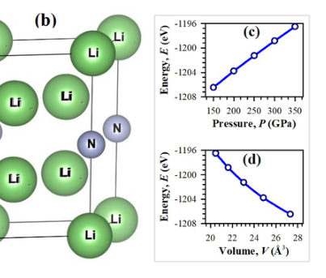
<figcaption class="paper-figure-caption"><b>Fig 1.</b> Fig. 1. Unit cell crystal structure of Li5N in real space: (a) two-dimensional view and (b) three-dimensional view, Figure on the right panel represents (c) pressure and (d) volume-dependent total energy of Li5N.</figcaption>
</figure>
<figure class="paper-figure-card">
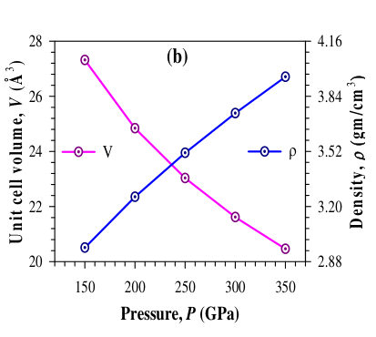
<figcaption class="paper-figure-caption"><b>Fig 2.</b> Fig. 2. Variation of (a) lattice parameter, (b) density (ρ), and volume (V) with pressure of Li5N electride. Table 1. The equilibrium lattice constants (a, b, c) and related structural and energy parameters of Li5N under pressure.</figcaption>
</figure>
<figure class="paper-figure-card">
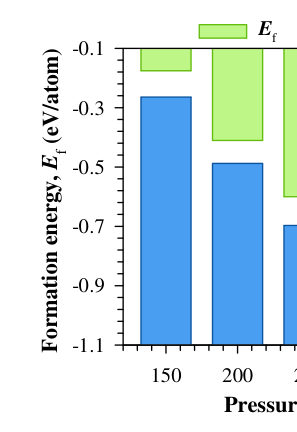
<figcaption class="paper-figure-caption"><b>Fig 3.</b> Fig. 3. Formation energy and cohesive energy as a function of pressure (150-350 GPa) for Li5N.</figcaption>
</figure>
<figure class="paper-figure-card">
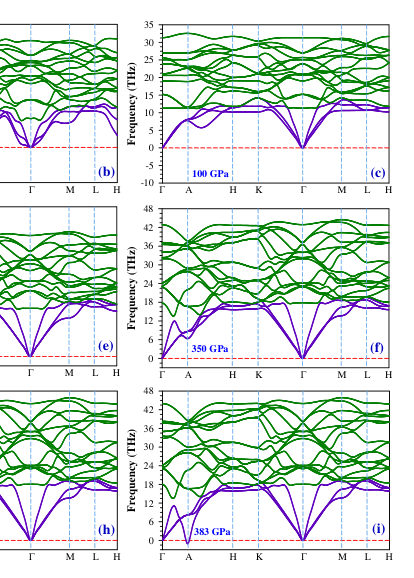
<figcaption class="paper-figure-caption"><b>Fig 4.</b> Fig. 4. Phonon dispersion spectra of Li5N: (a) 0 GPa, (b) 99 GPa, (c) 100 GPa, (d) 150 GPa, (e) 250 GPa, (f) 350 GPa, (g) 375 GPa, (h) 382 GPa, and (i) 383 GPa. Phonon dispersion consists of two types of modes: acoustic and optical. The acoustic modes consist of one longitudinal and two transverse acoustic branches, which arise from the coherent vibrations of atoms in a lattice as they move away from their equilibrium positions. In contrast, optical phonons originate from the out-of-phase oscillations of atoms in the lattice; when one atom moves to the left and its neighbor moves to the right [72,73]. For any material with ‘n’ atoms per unit cell, there are three acoustic modes and (3n-3)...</figcaption>
</figure>
<figure class="paper-figure-card">
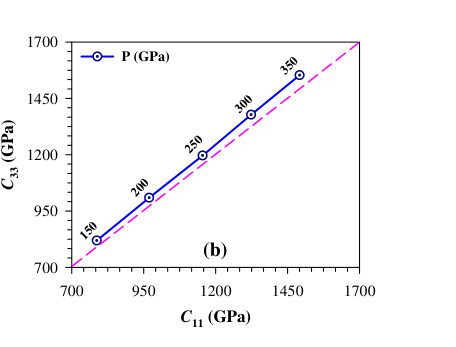
<figcaption class="paper-figure-caption"><b>Fig 5.</b> Fig. 5. (a) Elastic constants (Cij) and moduli (B, G, E) as a function of hydrostatic pressure, and (b) C33 versus C11 at various pressures (150-350 GPa) for hexagonal Li5N.</figcaption>
</figure>

**Summary.** This theoretical study uses DFT calculations to map out the physical properties of the high-pressure electride superconductor Li5N. By analyzing structural stability, electronic structure, and mechanical response across 150–350 GPa, the authors predict that Li5N is a stable material with tunable multifunctional characteristics under extreme pressure.

**Why it may be interesting.** While focused on solid-state physics rather than quantum information, the study's rigorous application of first-principles methods to predict emergent properties (superconductivity, electride behavior) under extreme conditions is highly relevant for understanding strongly correlated or novel quantum materials systems.

Detailed structure

**Main problem.** The study aims to theoretically investigate the physical properties of the electride superconductor Li5N under high pressure for potential multifunctional applications.

**Main result.** Li5N is predicted to be chemically and dynamically stable within the 150–350 GPa range, exhibiting metallic behavior and suggesting potential for tuning its properties through pressure.

**Method.** The research employs first-principles calculations using Density Functional Theory (DFT) with the PBEsol functional, supplemented by DFPT for phonon and optical response analysis.

**Model / system.** The physical system is Li5N, an electride solid, whose properties are calculated as a function of applied pressure in the range of 150–350 GPa. The calculations model structural changes, electronic band structure, and mechanical responses under extreme conditions.

**Key observables.** Lattice parameters (a, c), density ($
ho$), formation energy ($E_f$), elastic constants ($C_{ij}$), phonon dispersion curves, electronic DOS at the Fermi level, and optical dielectric function components ($\epsilon_1, \epsilon_2$).

**Important parameters / regimes.** Pressure range: 150–350 GPa; DFT cut-off: 500 eV; k-grid: $14	imes14	imes9$.

**Assumptions / limitations.** The calculations assume the validity of DFT and use established approximations like the Voigt–Reuss–Hill (VRH) approximation for polycrystalline properties.

**Figures summary.** Figures illustrate the variation of lattice parameters, density, and total energy with pressure. Stability is confirmed by positive phonon frequencies across the studied pressure range.

**Paper structure.** The paper follows a standard theoretical materials science structure: introduction defining the problem, detailed methodology (DFT/DFPT), presentation of structural stability results under varying pressure, electronic analysis (DOS, band structure), mechanical characterization (elastic constants), and finally, optical response analysis.

Abstract

This study aims to unveil the physical properties of multifunctional Li5N electride under high pressure in the range of 150-350 GPa through first principles analysis within the density functional theory.

[↑ back to top](#top)

### [Higher-Order Topological States with Cleavage-Dependent Dirac Mass](http://arxiv.org/abs/2608.10520v1)

**Authors:** Hongyu Chen, Min Long, Chuang Chen, Zi Yang Meng  
**Type:** theory · **Category:** other · **PDF:** <https://arxiv.org/pdf/2608.10520v1>  
**Analysis basis:** full PDF text, analyzed in chunks

↔ Scroll figures horizontally

<figure class="paper-figure-card">
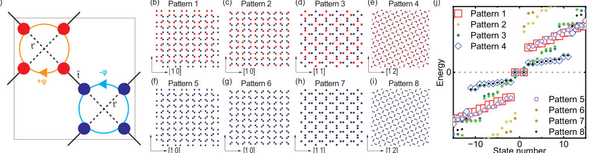
<figcaption class="paper-figure-caption"><b>Fig 1.</b> FIG. 1. Crystal cleavage in multiple ways. Evolution of the higher-order topological phase in an obstructed atomic insulator by shifting atomic positions, rotating crystalline orientation, and flipping magnetic flux. (a) Sketch of the primitive cell with the magnetic nonsymmorphic space group of Pc4bm (100.177) [35] with a magnetic/anti-translation centering operation associated with the C-face (PC). The nearest-neighbor hopping ˜t, next-nearest neighboring hopping t with positive/negative phase ϕ (red/blue color) and third-neighbor hopping t′ are labeled. (b-e) Superlattice patterns 1-4 along [0 1]×[1 0], shifted [0 1]×[1 0], [-1 1]×[1 1] and [-2 1]×[1 2] directions. (f-i) Superlattice...</figcaption>
</figure>
<figure class="paper-figure-card">
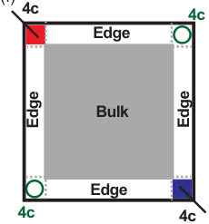
<figcaption class="paper-figure-caption"><b>Fig 2.</b> FIG. 2. Interstice charge vacancies. Two typical Wan- nier functions: atom sites and bond sites. (a) Two kinds of typical positions for the gaussian trial functions at eight atom sites (orange triangles) and eight high-symmetry WPs (green triangles): 2a, 2b and 4c. Left panels in (b-e): sketch of left-upward corners for patterns 1 and 5, 2 and 6, 3 and 7, 4 and 8. Right panels in (b-e): sketches of right-upward corners for patterns 1 and 5, 2 and 6, 3 and 7, 4 and 8. The configurations for right-downward and left-downward corners are consistent with those in (b-e) by performing a C2 rota- tion. The mismatch of periodicity between the bond-type trials and the ”square-shape” atom-type trials...</figcaption>
</figure>
<figure class="paper-figure-card">
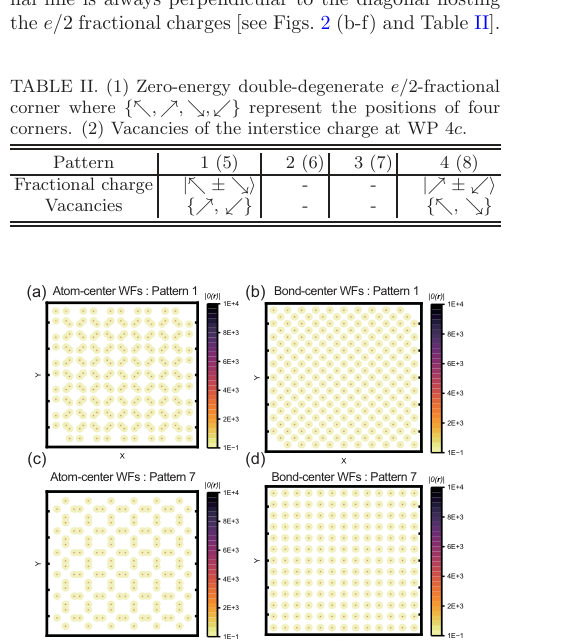
<figcaption class="paper-figure-caption"><b>Fig 3.</b> FIG. 3. Real-space charge distribution. Comparison be- tween the topologically nontrivial and trivial patterns in the view of real-space distribution of charge. Here, |0(r)| repre- sents the total occupied charge in the expression of central Wannier functions for the topologically nontrivial pattern 1 with (a) atom-type and (b) bond-type centers and the topo- logically trivial pattern 7 with (c) atom-type and (d) bond- type centers, in which 0 leads to the dimensionless translation phase eik·0 = 1.</figcaption>
</figure>
<figure class="paper-figure-card">
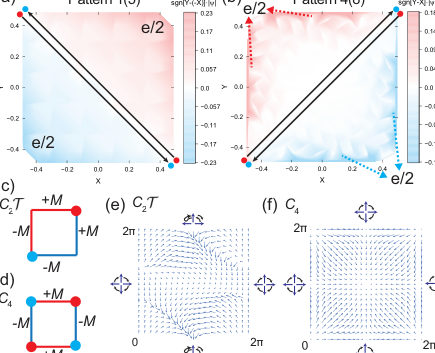
<figcaption class="paper-figure-caption"><b>Fig 4.</b> FIG. 4. New category of HOTI discovered in this work. (a, b) Sketch of the 2D second-order HOTIs with the double-degenerate ”half” e/2-charged corners which mainly arise from (a) bulk electric dipole moment for patterns 1, 5 and (b) polarized edges for patterns 4, 8. The pink and light blue gradients represent the bulk states that are nearest to zero energy. The occupied (unoccupied) corners are colored by red (blue) dots and the resultant dipoles are labeled by black arrows. (c, d) Sketch of mass of four edges for (c) a HOTI with two charged corners and (d) a HOTI with four charged corners [4, 22]. (e, f) Top view of the Skyrmion con- figurations, ˆd(k), of the dispersion relation, H(k) =...</figcaption>
</figure>
<figure class="paper-figure-card">
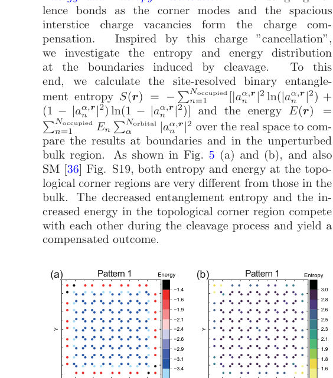
<figcaption class="paper-figure-caption"><b>Fig 5.</b> FIG. 5. Energy and Entropy Distribution. Real-space distribution of the (a) the energy and (b) the entanglement entropy in the topologically nontrivial pattern 1. The energy is higher, and the entropy is lower in the topological corner region than in the bulk.</figcaption>
</figure>

**Summary.** This work addresses the predictive gap in characterizing HOTIs formed by cleaving an OAI. By analyzing corner states, the authors demonstrate that fractional charges emerge when cleavage creates a balanced charge compensation involving interstice vacancies. The findings establish a strict geometric and electronic requirement—the orientation of dangling bonds—that dictates the existence of these higher-order topological features.

**Why it may be interesting.** The explicit link between geometric cleavage, charge compensation (fractional charge vs. vacancy), and the required directionality of electronic structure (dangling bonds) provides a powerful, physically grounded diagnostic tool for predicting topological phases in complex materials.

Detailed structure

**Main problem.** The predictive power of topological quantum chemistry based on local charge profiles is insufficient for determining the electronic structure upon crystalline cleavage in Higher-Order Topological Insulators (HOTIs).

**Main result.** Cleaving an obstructed atomic insulator reveals a topological phase characterized by e/2 fractional charges at specific corners, balanced by complementary vacancies of interstice charge.

**Method.** The study employs tight-binding models and analyzes real-space properties using Wannier functions to map out the emergence of zero-energy corner modes dictated by dangling bond orientation.

**Model / system.** The research investigates HOTI phases within an Obstructed Atomic Insulator (OAI) modeled by a three-term hopping Hamiltonian. The analysis focuses on superlattice patterns and the resulting boundary conditions upon cleavage.

**Key observables.** Topological zero-energy double-degenerate e/2 fractional charges, complementary interstice charge vacancies, anisotropic evolution of the Dirac mass term, and lower entanglement entropy at topological corners compared to the bulk.

**Important parameters / regimes.** The system is analyzed across various superlattice patterns (1-8) controlled by parameters like magnetic flux and atomic arrangement.

**Assumptions / limitations.** The analysis assumes that the emergence of zero modes is strictly dictated by the exposure and directionality of dangling bonds acting as the mass term for a Dirac fermion.

**Figures summary.** Figures illustrate crystal cleavage evolution across 8 patterns, showing where zero-energy states appear; they also compare real-space charge distributions (atom vs. bond centers) and map energy/entanglement entropy differences between topological corners and the bulk.

**Paper structure.** The paper first identifies the limitations of current TQC methods for HOTI cleavage. It then models the system using a tight-binding Hamiltonian, analyzing various superlattice patterns to locate topologically non-trivial phases (patterns 1, 4, 5, 8). The core argument develops by linking fractional charges and vacancies to the massive Dirac fermion criterion, concluding with entropy/energy mapping.

Abstract

Topological quantum chemistry based on local charge profiles lacks predictive power for the crystalline cleavage of higher-order topological insulators (HOTIs). By cleaving an obstructed atomic insulator, we discover a topological phase characterized by e/2 fractional charges localized at precisely half of the corners, while the remaining empty corners host complementary vacancies of interstice charge. These zero-energy charge-vacancies and topological corners form a spatially balanced geometry, confined separately by C2 rotation symmetry. Crucially, we demonstrate that the emergence of corner zero modes dictates that specific dangling bonds-acting as the mass of a Dirac fermion-must explicitly expose in, and subtly slope toward, the corner regions. This strict directionality is verified by the anisotropic evolution of the mass term within a (2+1)-dimensional parameter space. Moreover, we find that the topological corners acquire lower entanglement entropy compared to the bulk, a behavior opposite to that of the real-space energy distribution.

[↑ back to top](#top)

